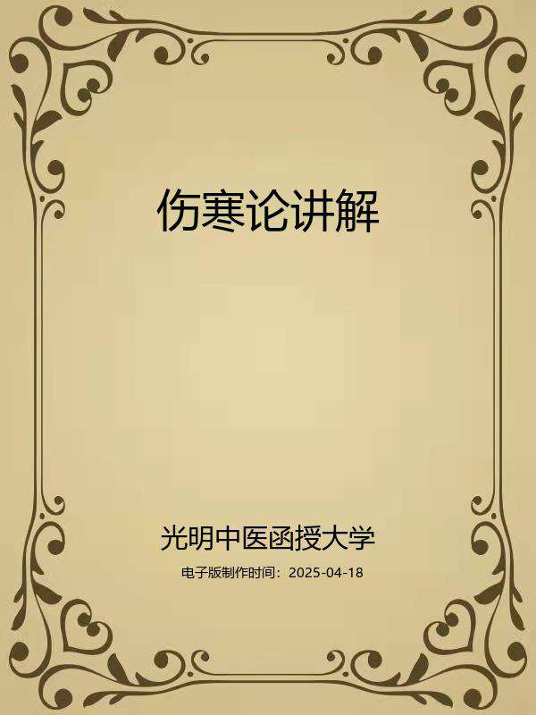
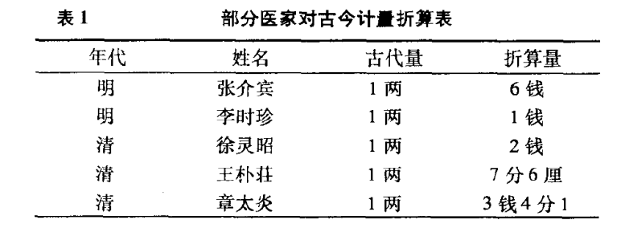
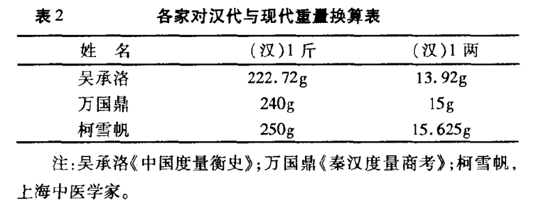
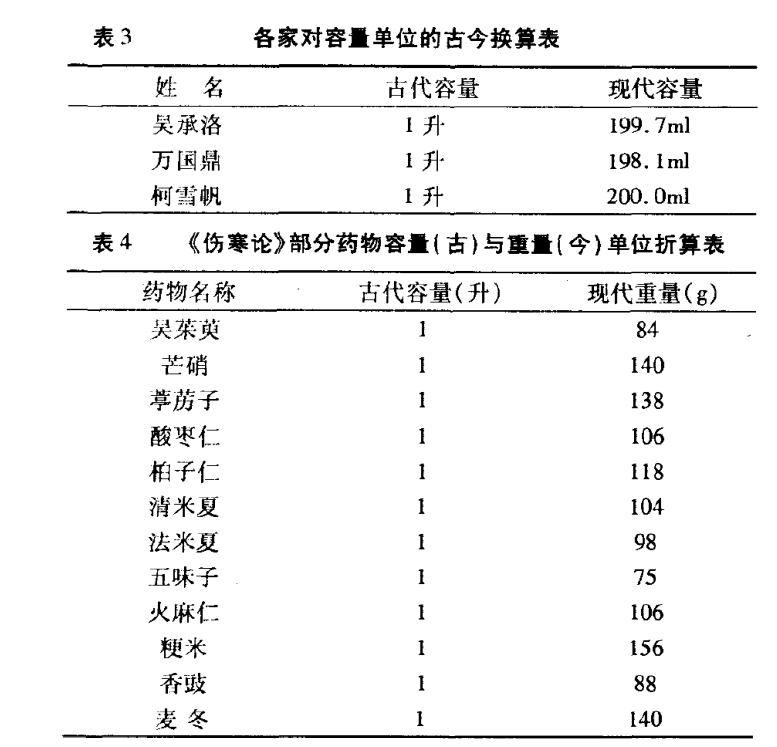
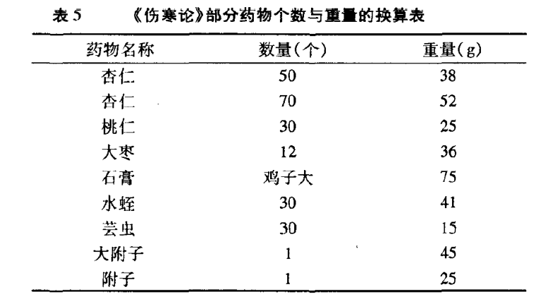
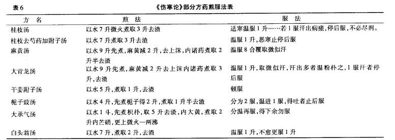
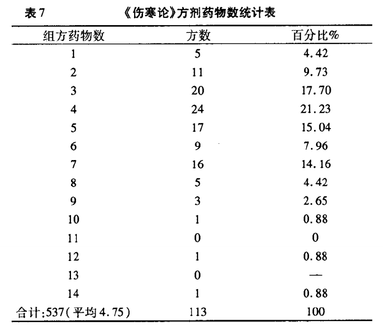

# 伤寒论讲解

## 编者与编者的话

编者

光明中医函授大学主编

刘渡舟主编

白永波副主编

刘渡舟郝万山

成德水马锺媚编

徐国仟王士相审阅

编者的话

《伤寒论》是中医经典箸作之一，是中医临证医学的基础，历代被奉为医家之圭臬。它的辩证思维方法，辨证论治体系，一直有效地指导着中医学术的发展，因此它便成为一部学习和研究中医的必读之书。

《伤寒论》经西晋王叔和撰次整理，宋臣校定刊刻，凡十卷二十二篇，颁行于世，此本遂为医林所尚。惜宋刊本今已不得复见，明赵开美翻刻宋版《伤寒论》，犹逼真于宋本原貌，然赵刻原版海内得见者亦是寥若晨星。解放后各中医院校编写的《伤寒论》教材，虽宗赵本，但皆削首删尾，只取其中有关六经病证等内容的十篇，甚或打乱原文次序重行摘编，并将部分原文存而不释，列作附篇。已远非赵本原貌。《伤寒论讲解》则本着使读者既能窥得《伤寒论》全貌，又能掌握其重点内容的目的，对原书全部内容逐条进行讲解。

从“高等中医函授教材”中的顺序看，《伤寒论》是理法方药兼备的辨证论治著作，因此《伤寒论讲解》既是中医的基础理论课，又是中医的临床课。其中既涉及到外感病的病因、病机与辨证论治，又涉及到多种杂病的辨证论治。

通过本课程学习，要求学员能了解《伤寒论》概貌，熟习祖国医学对外感病病因、病机及其演变的基本认识，掌握六经辨证的内容和方法。具体要求则按教材各章内容统一划分为三级。第一级“掌握”，为重点内容；第二级“熟悉”，为次重点内容；第三级“了解”，为非重点内容。学员在自学过程中宜按此三级要求分别主次，抓住重点，结合临床，融汇贯通。在此基础上，再结合复习思考题进行练习和自我测试，以巩固所学内容。本课程计划安排自学200学时，面授50学时。详见各篇学习进度安排。

现将本书在编写过程中的有关问题作如下说明:

1.本书原文悉遵赵开美翻刻宋版《伤寒论》，原卷、篇序号予以保留，但将卷首述、撰、校、刻者姓名；分卷之后的分目录；篇名下的法数、方数；每篇正文前的子目；条文后的方序号；以及后序删去。“可与不可”诸篇附方，皆见于“三阴三阳”篇，凡在药名、药物次序、炮炙方法、药量、以及方后注上有所差异，而具有校勘价值的，则原方照录。凡和前文悉同或基本相同的方剂，则删而不录，并在该条“讲解”中加以说明。

2.本书原文与注文皆用简化字排印，但为忠于原书，一些古体字、异体字、通假字等在原文中仍予以保留，如蚘（蛔）、鞕（硬）、痓（痉）、煖（暖）、消(硝)、欬(咳）、柸（杯）等，但在注文中则用今字。

3.原书本无条文序号，后世一些注家将《辨太阳病脉证并治上第五》至《辨阴阳易差后劳复病脉证并治第十四》的原文，进行了顺序编号。考虑到这一传统习惯的存在，本书也将这十篇依赵刻本原来自然段顺序进行标号，以示这部分内容为学习本书的重点，序号放在条文之后。前四篇与后八篇，遵原自然段依次讲解，不再编条文序号。但《辨发汗吐下后病脉证并治第二十二》三阳合病条，赵本误作两条，本书参照《辨阳明病脉证并治第八》第219条将其仍并作一条。

4.本书为横排，故将原书方后所言之“右X味”改作“上X味”。

5.本书正文前有“绪论”一篇，介绍《伤寒论》的作者、版本、学术渊源和有关内容。每篇前加“概说”，提示该篇大意，然后逐条讲解并述其临证意义。对较长或较重要的条文，多分句或分段讲解，加注脚号；对较短或一般条文，则整条讲解，不再加注脚号。由于《辨脉法》、《平脉法》与其他篇的内容有较大不同，故采用“讲解”（包括词解与串讲）加“按语”的不同体例进行编写。“可与不可”诸篇中所集重出条文则在该条下标明讲解见（或参见）《XX病篇》第XX条，不再赘解。在一个单元或一篇之后，附加“小结”，并拟复习思考题，以供复习总结参考。书末所附“方剂索引”，标出该方出现的首见页码。这里应该说明，为叙述方便，凡属本书篇名为《辨太阳病脉证并治上第五》简称为《太阳病上篇》，其他各篇均同。

本书的编写工作，是在光明中医函授大学教材编辑室的主持下进行的。在编写过程中，得到方药中教授的指导与帮助，白永波老师受刘老之托，任本书副主编，对他在编写中付出的劳动，谨此一并致谢。

由于编者水平有限，特别是编写时间仓促，书中疏漏之处在所难免，敬希专家、读者批评指正。

编者

一九八六年七月十日于北京

## 导言

中医教育学，是一门古老而崭新的科学。中医教育的历史，若从师徒授受和医籍编纂算起，已有两千余年。近代史上的中医教育，首推一八八五年浙江陈虬创立的利济医学堂。新中国诞生不久，创办了北京、上海、广州和成都四所中医学院，从而揭开了当代中医教育的序幕，至现在，全国已发展到二十三所。但是，如果把我国中医教育的实践经验加以分析、研究、总结和提炼，升华，揭示它的规律，使之成为一门专门的学科——中医教育学的话，那么，它还处在再创阶段。这就是说，中医教育及其规律存在的历史是悠久的，但论述中医教育及其规律的学科却是崭新的。因此，中医教育工作需要进行探索和研究。

在探索和创建适合我国国情的中医教育的时候，我们必须植根于我们民族文化的肥沃土壤之中，充分重视中医典籍在培育和造就历代医家中的伟大作用。事实上，在长期的历史发展中，逐渐形成了具有中华民族特色的中医药理论体系，它既有丰富临床经验，又有高深的理论基础。历代医学家就是把这些道理传授给他们的弟子，其中部分人经过刻苦自学和临床实践，成为医术高超的医学家，这是我国历代医学家成才之路，亦是中医教育史上培养人才的宝贵经验。这就是我们民族中医教育事业的光辉历史。

在新的历史时期，作为中医教育工作来说，既要给学生打好传统医学的基本功，又要使他们掌握一些新兴的科学知识，使继承与发展得到统一。根据这种认识，我们十分认真地研究和设计了光明中医函授大学的教学计划、教材内容、教学方法与教学手段。归结起来即是：注重打好中医基本功，注意提高中医基本理论水平和培养临床诊治技能，着力培养辨证论治的思维方法，竭诚发挥中医在防病治病中的特长。并在这个基础上，扩大学员知识面。我们把这些要求与思想，全面体现在本校的教材建设中。其目的是使中医人才的知识结构更加合理，以便能担负起继承和发扬祖国医药学防病治病的光荣任务。

在回顾中华医学教育历史，展望现代医学教育的发展趋势以及总结三十多年正反两方面经验的基础上，我们认为，要培养出适合四化需要的合格中医人才，对中医教育的课程设置和教材内容，就要进行必要的改革，建立起为新形势所需要的中医教材。我们正在朝这一方向努力。在认真研究高等中医院校教材和广泛征询中医专家、学者和医务人员意见的基础上，新编了这套较为完整的中医教材，定名为《高等中医函授教材》（包括了二十八门课程）教材的编写人员，由本校选聘知名教授、学者和学有专长者担任，编写时，我们力求各门教材要有鲜明的针对性，在内容上富有实用性，在文字表达上深入浅出、简明易懂，以利便于自学或函授，此外，我们还将根据需要，选编一些辅导材料，以帮助学员（读者）理解教材内容，更好地学取中医知识。

由于教材编写时间仓促，又竭力于继承与创新,不足之处在所难免，敬希学员和广大读者惠赐宝贵意见，以便在再版时修订。

光明中医函授大学教育研究室

一九八五年十月四日

加入光明：

光明中医网址：www.gmzyjx.com，www.gmzyjc.com

## 伤寒卒病论集

论曰：余每览越人入虢之诊，望齐侯之色，未尝不慨然叹其才秀也。怪当今居世之士，曾不留神医药，精究方术，上以疗君亲之疾，下以救贫贱之厄，中以保身长全，以养其生。但竞逐荣势，企踵权豪，孜孜汲汲，惟名利是务。崇饰其末，忽弃其本，华其外而悴其内。皮之不存，毛将安附焉？卒然遭邪风之气，婴非常之疾，患及祸至，而方震栗。降志屈节，钦望巫祝，告穷归天，束手受败。赍百年之寿命，持至贵之重器，委付凡医，恣其所措。咄嗟呜呼，厥身已毙，神明消灭，变为异物，幽潜重泉，徒为啼泣。痛夫！举世昏迷，莫能觉悟，不惜其命，若是轻生，彼何荣势之云哉？而进不能爱人知人，退不能爱身知已，遇灾值祸，身居厄地，蒙蒙昧昧，惷若游魂。哀乎！趋世之士，驰竞浮华，不固根本，忘躯徇物，危若冰谷，至于是也。

余宗族素多，向余二百。建安纪年以来，犹未十稔，其死亡者三分有二，伤寒十居其七。感往昔之沦丧，伤横夭之莫救，乃勤求古训，博采众方，撰用《素问》、《九卷》、《八十一难》、《阴阳大论》、《胎胪》、《药录》，并《平脉辨证》，为《伤寒杂病论》合十六卷。虽未能尽愈诸病，庶可以见病知源。若能寻余所集，思过半矣。

夫天布五行，以运万类；人禀五常，以有五脏。经络府俞，阴阳会通，玄冥幽微，变化难极。自非才高识妙，岂能探其理致哉！上古有神农、黄帝、岐伯、伯高、雷公、少俞、少师、仲文，中世有长桑、扁鹊，汉有公乘阳庆及仓公。下此以往，未之闻也。观今之医，不念思求经旨，以演其所知；各承家技，终始顺旧。省疾问病，务在口给；相对斯须，便处汤药。按寸不及尺，握手不及足；人迎、趺阳，三部不参；动数发息，不满五十。短期未知决诊，九候曾无仿佛；明堂阙庭，尽不见察，所谓窥管而已。夫欲视死别生，实为难矣！孔子云：生而知之者上，学则亚之，多闻博识，知之次也。余宿尚方术，请事斯语。

## 绪论

**〔自学时数〕**6学时

**〔面授时数〕**2学时。

**〔目的要求〕**

1．了解《伤寒杂病论》的作者、成书背景及主要内容。

2．了解《伤寒论》的流传概况及主要版本。

3．掌握“伤寒”的含义，熟悉《伤寒论》的大概内容及其对祖国医学的主要贡献。

4．熟悉六经辨证的有关基本概念。

一、《伤寒杂病论》的作者、成书背景及主要内容。

《伤寒论》是《伤寒杂病论》在流传过程中形成的一部著作，它保留了《伤寒杂病论》中的一大部分内容。

《伤寒杂病论》为后汉·张机所著。张机，字仲景，史书无传，事迹散见于其后的医籍及地方志中，为后汉南阳郡涅阳（今河南省南阳地区邓县）人，生卒年代约为公元150年至219年。宋臣《伤寒论·序》云：“张仲景，《汉书》无传，见《名医录》云，南阳人，名机，仲景乃其字也。举孝廉，官至长沙太守。始受术于同郡张伯祖，时人言，识用精微过其师。所著论，其言精而奥，其法简而详，非浅闻寡见者所能及。”概述其生平、受业及学术成就，然所言官至长沙太守事，也同样未见于正史。

后汉时期，战乱频繁，天灾连绵，致使疾疫广为流行。张仲景的家族曾多达二百余人，但从建安元年（公元196年）以来，在不到十年的时间内，就死亡了三分之二，其中死于伤寒病的竟占十分之七。面对这一残酷现实，张仲景在《伤寒杂病论序》中曾发出“感往昔之沦丧，伤横夭之莫救”的感伤与哀叹，这就激发他去努力探索防治疾病的有效方法，并立志著书立说，救人济世。从客观上来看，疫疾猖獗流行的时代，造就了张仲景这样一位伟大的医家。

袓国医学自秦汉以来，基础理论体系已逐渐完善，大量的复方也广泛应用于临床。如《内经》的阴阳五行、脏腑经络、病因病机诸学说的创立和六经分证方法的初步运用；《难经》的脉法生死、针刺俞穴与脏腑病传之理的阐述；《汤液经》的药物和合、汤液治病方法的记载等等，皆为仲景著述创造了良好的学术条件。张氏就是在这一基础上，“勤求古训，博采众方”，撰用《素问》、《九卷》、《八十一难》、《阴阳大论》、《胎胪》、《药录》并《平脉辨证》，将医经与经方两家熔于一炉，结合自己的临床实践经验和体会，创立了理法方药相结合的辨证论治诊疗体系，著成了《伤寒杂病论》合十六卷，为中医临床医学的发展奠定了基础，成为祖国医学发展史上的一部承前启后的巨著。其成书年代，据《自序》中“建安纪年以来，犹未十稔……”之文推测，似約在公元200年前后。

《伤寒杂病论》原书早已亡佚，据有关专家从现存佚文中考察该书的原始形态，其内容至少包括了六个部分：

1．脉法部分，主要可见于今本《伤寒论》与《金匮玉函经》的《辨脉法》与《伤寒论》的《平脉法》。

2．伤寒病部分：是今本《伤寒论》或《金匮玉函经》的主要内容，分别见于三阴三阳等六经病证治及“可与不可”诸篇。

3．杂病部分：是今本《金匮要略》的主要内容，包括内科和外科疾病。

4．妇人病部分：在今本《金匮要略》中尚存三篇，但阙文较多。

5．小儿病部分：在今本《金匮要略》中仅存一方，在今本《脉经》中尚存一篇，但阙文极多。

6．食禁部分：在今本《金匮要略》中有二篇。

仅从以上内容看，《伤寒杂病论》足可以称得上是中医临证医学的奠基著作。

二、《伤寒论》的流传与主要版本

《伤寒杂病论》问世不久，即已散佚不全，数十年后，经西晋太医令王叔和对其以伤寒内容为主的部分进行收集、整理、撰次，因已非原书全貌，遂名以《伤寒论》，从此便有了本书的流传。至宋，国家置校正医书局于编修院，林亿、孙奇、高保衡等，以五代荆南国末主高继冲降宋后进上的高氏编录本《伤寒论》为蓝本，并广集诸书为之校订，于宋治平2年（公元1065年）雕版印行，凡十卷二十二篇，并附有宋臣校注，自是《伤寒论》始有定本，世称宋本或治平本、官本。宋本《伤寒论》在各卷正文之前均记有“汉·张仲景述，晋·王叔和撰次，宋·林亿校正”字样，可见高继冲进上的编录本实是王叔和撰次本的传本。

其后，金·成无己为《伤寒论》系统作注，著成《注解伤寒论》，虽对原文有所增删与调整，但与宋本相较，并无太大变化，于金皇统4年（公元1144年）刊行。由于成注本在原文后有注文，便于学习，遂被医家广泛采用，多次翻刻，反使宋本《伤寒论》渐至亡佚。

至明万历年间，海虞清常道人赵开美先刻《注解伤寒论》与《金匮要略方论》，既刻已，复得宋版《伤寒论》，方知成注非全文，因复刻之，名《翻刻宋版伤寒论》，又刻《伤寒类证》三卷，合称《仲景全书》，于万历27年（公元1599年）刊行，世称赵刻本《伤寒论》，流传至今。

《伤寒论》的内容，还散见于历代医家的名著之中，如晋·王叔和的《脉经》，唐·孙思邈的《千金要方》与《千金翼方》，宋医官院纂修的《太平圣惠方》等。唐·王焘《外台秘要》不仅收录了《伤寒论》的内容，也收入了今本《金匮要略》的内容，可见王焘所看到的似是《伤寒杂病论》的另一个传本。但令人遗憾的是，以上诸著都没有标明所收录的《伤寒论》版本原始情况，以及所录条文编排方式互各有异的原因，这就给我们考证版本的源流带来了困难。

宋校正医书局还校订刊印了《金匮玉函经》八卷，此书与《伤寒论》同体而别名，以“条论于前，会方于后”为特点，属《伤寒论》别本。今所见者，则是清·陈世杰的影宋刊本。

宋翰林学士王洙曾在馆阁中发现蠹简三卷，题名《金匮玉函要略

方》，上则辨伤寒，中则论杂病，下则载其方并疗妇人。以其伤寒文多节略，故推知此本当是《伤寒杂病论》一书的删节本。林亿等人删其伤寒部分，仍勒成上、中、下三卷，依旧名曰《金匮要略方论》，简称《金匮方论》或《金匮要略》，雕版印行。自此《伤寒论》与《金匮要略》二书就成为影响最大的《伤寒杂病论》的主要传本，此后则未再有大的变动。

至于有关《伤寒论》的其他传本，如唐人卷子本等，则不赘述。

三、《伤寒论》的主要内容

欲了解《伤寒论》的内容，当先明确“伤寒”的含义。伤寒的含义，秦汉至晋唐即有广义与狭义之分。其广义是指一切外感病的总称，其狭义则是指人体感受风寒之邪，感而即发的病证。《素问·热论》云“今夫热病者，皆伤寒之类也。”晋·葛洪《肘后方》云“贵胜雅言总呼伤寒，世俗因号为时行。”《外台秘要》引许仁则论天行病云。“凡外邪之伤人，尽呼为伤寒”，伤寒“为外感之总称”，皆指广义伤寒而言·《伤寒论·伤寒例》所云“冬时严寒，万类深藏，君子固密，则不伤于寒，触冒之者，乃名伤寒耳。”“中而即病者，名曰伤寒。”则指狭义伤寒而言。”《难经·五十八难》所云“伤寒有五，有中风、有伤寒、有湿温、有热病、有温病。”其中“伤寒有五”之“伤寒”是广义的，“有伤寒”之“伤寒”则是狭义的。但所谓有五，亦仅是举例以言其多，并非拘泥于此五种。可见祖国医学中伤寒一词的含义与现代医学中所说的因伤寒杆菌感染所致之伤寒病的含义完全不同，但若从临床辨证的角度来看，现代医学所说的伤寒病，仍属祖国医学所说的广义伤寒的范围。至于外感病以外的疾病，古人则统称之为“杂病”。

《伤寒论》是论述狭义伤寒还是广义伤寒？除伤寒之外，有无杂病？这还应当看其具体内容。《伤寒论》之《辨脉法》与《平脉法》两篇专论脉法，其所论较《内》、《难》大有发展，然又与叔和脉法有别，从中似可窥得从《内》、《难》到《脉经》脉法发展演变的形迹。《伤寒例》记述了古人对外感病病因、病理及分类的基本认识，是研究祖国医学对外感病论述的重要文献。《辨痓湿暍脉证》所论痉病、湿病、暍病，多与外邪有关，当属广义伤寒，但只列脉证而不详言治法，则旨在与狭义伤寒相鉴别而设。从《辨太阳病脉证并治上》至《辨厥阴病脉证并治》凡八篇，采用六经分证的方法，对风寒之邪伤人之后，邪气由表入里，由浅入深，由寒化热，由热转寒；正气由盛而转衰，由衰又转复等，这样一个正邪阴阳消长转化过程中所出现的错综复杂的证候，按其发病规律进行分经的辨识与论治，这是本论的核心内容，但主要属于狭义伤寒的范围，尽管也曾论及温病、风温等属广义伤寒的内容，因其无系统辨治方法，也只可看作是与狭义伤寒相鉴别的病证，而与痉、湿、暍列于本论的意义相类。在此八篇中，还有伤寒类证，伤寒兼证，伤寒变证，伤寒夹杂证的辨证与论治，其内容已广泛涉及到杂病范围。《辨霍乱病脉证并治》与《辨阴阳易差后劳复病脉证并治》，论述了霍乱、阴阳易、差后余热、遗寒、正虚、劳复、食复诸证的辨治，或为伤寒类证以资鉴别，或属伤寒病后调治之法以收全功。至于“可与不可”凡八篇，则重集三阳三阴篇中有关内容及不见于三阳三阴篇中的一些条文，按治法及其禁忌归类，为便于临证检索而设。由此可见，《伤寒论》的内容应是以论述狭义伤寒及其演变过程中所出现的诸般病证的证治为主，兼及广义伤寒，并涉大量杂病的证治。有人认为，《伤寒杂病论》一书分为《伤寒论》与《金匮要略》，《伤寒》专论外感，《金匮》专论杂病。其实还应看到，《伤寒》亦论杂病，《金匮》也并非不论伤寒，只是有所侧重而已。因此在学习《伤寒论》时，不仅应注意学习其对伤寒的辨治方法，而且也应注意学习其对杂病的辨治方法。更何况其辨证论治的思维方法对伤寒与杂病的辨治皆有普遍的指导意义，而许多疗效可靠的方药则对外感与杂病又有着广泛的适应性。因此，切不可将《伤寒论》一书囿于治伤寒一病，而应作为一部中医临证医学的基础、辨证论治的专著去学习、去运用。

四、《伤寒论》对祖国医学的主要贡献

《伤寒论》与《金匮要略》被后世视为医籍之经典、医家之圭臬。就《伤寒论》而言，它对祖国医学的贡献是多方面的，其中主要是六经辨证方法和方剂学成就两个方面。

（一）关于六经辨证

1．六经辨证的基本概念

六经辨证是后人对《伤寒论》中太阳、阳明、少阳、太阴、少阴、厥阴等三阳三阴辨证方法的简称。从《伤寒杂病论序》所云撰用《素问》之语及《伤寒例》所引《素问·热论》之言来看，仲景所创六经辨证之法，显然曾受到过《热论》六经分证之启迪，因此它便具有一定的继承性。但《热论》的六经分证，只讲经络的热实证，治法也仅有刺、泄二法，未见方药。本论所述六经辨证，却是脏腑、经络、气血、阴阳、表里、寒热、虚实诸证尽皆包括在内，而且理法方药皆备，已是一个临床实用的辨证论治体系。

疾病的发生，总离不开人体的脏腑、经络、营卫、气血。六经辨证也就是把人体所发生的伤寒病证及其演变的全过程，按照脏腑、经络、营卫、气血之所属，寒热虚实之不同，缓急顺逆之差别，进行分类辨析，从而使人们对病变的部位，病证的性质，病势的顺逆等能加以识别，进而作为诊断与治疗的依据。因此，本论所用三阳三阴之名称，并不是一个单纯的代号，而是一个具有病位、病性、病势等多种含义的综合概念。

如三阳病，病位则在三阳经腑，邪气虽盛，但正气未衰，抗邪有力，故病性多热证、实证、阳证，病势虽有缓有急，但多为顺证而易治。举例而论，太阳病为阳证之轻浅者，病变主要在太阳膀胱经腑及其所主之肌表。若风寒之邪外袭，营卫失和，经气不利，阳气抗邪于表，证见脉浮，头痛项强，恶寒发热，则属太阳经表之证。若邪气循经入腑，或邪与水结，膀胱气化不利，证见小便不利与消渴，而为太阳蓄水；或邪与血结，血热瘀阻下焦，证见少腹急结或硬满，其人如狂或发狂，而为太阳蓄血，皆为太阳膀胱腑证。阳明病为阳热证之极重者，病在阳明胃肠经腑、若邪气入里化热，阳气又拒邪有力，致使里热弥漫，充斥周身，证见但热不寒，汗出，脉大，烦渴引饮，则属阳明胃热弥漫证；若热盛津伤，津亏化燥，因燥成实，燥实结于胃肠，证见潮热，谵语，绕脐痛，腹满痛，不大便，则属阳明腑实证。少阳病为阳证之末，亦是邪气由阳入阴之前期，病在少阳胆与三焦经腑，以胆热、气郁、经腑之气俱为不利为主要特征，证见口苦，咽干，目眩，往来寒热，胸胁苦满，嘿嘿不欲饮食，心烦喜呕，脉弦。少阳之气抗邪无力，则病邪可由阳入阴，病证则亦由阳转阴而成三阴病。三阴病，病在三阴经、脏，正气不足，阳气虚衰，邪气亦多从阴化寒，故病性多虚证、寒证、阴证，病势则较沉重而多见逆证。举例而论，太阴病为阴证之轻浅者，病及太阴脾脏，中阳不足，寒湿内盛，运化失司，升降紊乱，证见腹满而吐，食不下，自利不渴。少阴病为阴证之重者，病及少阴心肾，真阴真阳俱衰而又以肾阳虚衰为主，邪气亦多从阴化寒，证见脉微细，但欲寐，下利清谷，畏寒踡卧，四肢厥逆。厥阴病则为阴寒极盛，阳气极衰者。然厥阴肝体阴而用阳，藏血寄相火，邪至厥阴，阴盛阳衰，又每有阴尽阳生，从阴出阳之机，故其病亦或寒或热，或寒热错杂，或厥热往复，其证则以寒热错杂之消渴，气上撞心，心中疼热，饥而不欲食，吐利或吐蛔为代表。如此则伤寒总分六经，六经各有主证，主证各分经腑（或经脏），再加上类证、兼证、变证、夹杂证之辨析，则将伤寒诸证及其合并证、并发证尽皆概括在内。

由此可见，六经辨证不仅从病位、病性、病势等多个角度对伤寒病变过程中所发生的证候进行了分类与辨识，又揭示了这一过程中所出现的既不相同而又相互联系的六个阶段之间的关系，同时也体现了六经分阴阳，阴阳又统摄表里、寒热、虚实等八纲分证的辩证思维方法。这对后世八纲辨证，脏腑经络辨证，气血津液辨证，乃至卫气营血辨证与三焦辨证诸方法的逐步完善或创立，有着深刻的启迪，故可谓中医辨证学之先驱，而辨证论治的诊疗方法亦从此在中医临证医学上确立下来，并且一直延用到今天。仲景的这一贡献可谓大矣。

2．六经的传变

由于正气有强弱，邪气有盛衰，正邪相争，阴阳进退，就使六经病证经常处于一个不断变化的状态。所谓传变，则主要是对这一变化的描述，邪气由此经进入彼经，则谓之传。随着邪气的转移，临床证候也必然相应地发生变化，有传必有变，故称传变，也即传经。传与不传与邪气的盛衰，正气的强弱，治疗与护理之是否得当有关，尤以正气的抗邪能力大小为关键。若正气虚衰，邪气则可由表传里，由浅入深，使病证渐趋沉重；若正气恢复，抗邪有力，邪气又可由里达表，由阴出阳，使病向愈。辨传与不传，传至何经，当以脉证变与不变为据。预知传与不传，对掌握治疗与预防的主动权有非常积极的意义。

3．六经发病的特殊形式——合病、并病、两感与直中

两经以上同时发病谓之“合病”，本论明言合病者有太阳阳明合病，太阳少阳合病，少阳阳明合病，三阳合病四种。一经证候未罢，又出现了另一经的证候，传而未尽者，谓之“并病”，本论明言并病者有太阳阳明并病，太阳少阳并病两种。凡合病，多邪盛而病剧；凡并病，则邪气较轻而易治。至于三阴经病不见合病、并病之说，似有详于前而略于后之义。

表里两经同时发病谓之“两感”。两感语出《素问·热论》，本论《伤寒例》、《太阳病篇》、《少阴病篇》皆有论及。外邪不经过三阳，发病即见三阴证候，后人谓之“直中”，直中多因素体阳虚，致使邪气得以长驱直入，故病多沉重。

（二）关于方剂学成就

《伤寒论》所载方剂，大多用药精当，配伍严谨，疗效可靠，至今沿用不衰，故后世誉之为“方书之祖”。本论虽载112方，但其意义与价值却远远超出了这些方剂的本身。晋·皇甫谧《甲乙经·序》云：“伊尹以亚圣之才，撰用《神农本草》，以为《汤液》”，“仲景论广伊尹《汤液》为数十卷，用之多验”。严器之《注解伤寒论·序》云：“伊尹以元圣之才撰成《汤液》，俾黎庶之疾疚，咸遂蠲除，使万代之生灵，普蒙拯济。后汉张仲景，又广《汤液》为《伤寒卒病论》十数卷，然后医方大备”。《伤寒杂病论序》又有“博采众方”之语。从而可以看出，仲景在方剂学方面，继承了汉以前的复方成就，特别是对《汤液经》进行了研究、继承、发扬与推广，从而便使汤液治病法流传发展至今，在当今汤液治病已成为极其普遍的治病方法而广泛应用的时候，其中则有着仲景的不可磨灭的贡献。尤其重要的是，仲景把复方的应用与在基础理论指导下的辨证结合起来，法随证立，方从法出，创立了理法方药兼备的辨证与论治相结合的诊疗体系，这就使祖国医学的诊疗程序臻于完备，为临证医学的发展树立了里程碑。此外，本论所用112方包括了汗、吐、下、清，消、和、温、补、涩诸法的运用，并对各法的适应证、禁忌证，具体施用方法及注意事项，大多有详尽论述，皆为后世之所本。论中所载剂型，涉汤、丸、散、膏、浸剂、酒剂、混悬剂、唅剂、灌肠剂、肛门栓剂等等，其制备与应用方法皆有详述，开中医药剂技术发展之先河。在选药与组方上，谨守病机，严遵法度；君臣佐使，相得益彰；药量适宜，分铢权衡；药专力宏，功效卓著；随证化裁，灵活变通，堪称方剂之典范。后世称其为“经方”，则已非汉人将经验用方称之谓“经方”之意，而是指方剂的楷模、标准、典范。这些成就，都为中医方剂学的发展奠定了基础。此外，所倡汤液与针灸并用之法，也很有临证意义。

五、学习《伤寒论》的方法

1．明确学习目的：明·方有执曾说，仲景是论病以明伤寒，非惟伤寒之一病。故我们学习《伤寒论》的目的，也不应是局限于学习治疗伤寒病之一法，而主要还应在于学习六经辨证的方法，辨证论治的原则，以及分析、对比、鉴别等辩证思维规律与方法等，并能将其用于临床治疗，以提高辨证论治的水平。

2．熟读原文，弄通本意：熟习与弄懂原文，应是入门的第一步。如不知其所云，就谈不上进一步的深入研究；如记不住其辨证要领与方药，也谈不上临床的正确运用。因此，我们建议对重要条文、方药及方后注文，最好能读熟或背诵，并要加强理解，能抓住主证，识别兼证、变证、挟杂证、类证，做到胸有成竹，临证运用才可能得心应手。为弄通本意，还当与《内经》、《难经》、《神农本草经》、《金匮要略》等著作合参，以避免望文生义，曲解原意。

3．紧密结合临床：学习《伤寒论》，应特别注意将所学的知识运用于临床，只有将其理论与方药通过亲身的实际运用，才能加深印象，加深理解，也才有可能进一步发扬与创新。

4．参考名注：《伤寒论》注家的著作，现存者有数百家之多，它们从不同角度阐发了《伤寒论》之奥旨，推动了伤寒学术的发展。因此，适当阅读注家的著作，是深入学习所必须的。其中代表注家如成无己、柯韻伯、张志聪、尤在泾、徐大椿等人，他们或以经解论，或以证解论，或以法解论，或以方解论，或以气化学说解论，都具有较高的学术价值而值得学习。然于众说纷纭处，又当通过独立思考，择善而从，不可兼收并蓄。

关于学习《伤寒论》的方法，见仁见智，要求不一。若能在上述四个环节上加以注意，似是入门与深造便皆有径可寻。

## 伤寒论卷第一

## 辨脉法第一

**〔自学时数〕**6学时

**〔面授时数〕**1学时

**〔目的要求〕**

1.掌握脉象的阴阳分类方法及其临证意义。

2.了解仲景脉法特点及平脉、病脉、欲解脉、死脉的含义及脉态特征。

### 概说

本篇主要论述了七个问题，现概述如下：

一、论脉以阴阳为纲，指出先辨脉之属阴属阳：脉见大浮数动滑，则为阳脉而主有余；脉见沉涩弱弦微，则为阴脉而主不足。阴阳脉纲既明，根据阴阳脉法之理，则可统摄脉之浮沉、强弱、迟数、大小，寸尺之阴阳，以推测气血之盛衰，脏腑之虚实，营卫之不和，而起到以纲带目的作用。

二、论阴阳和平之脉法：阴阳和平之脉，是指寸、关、尺之大小、浮沉、迟数相等，而无偏颇盛衰。至于应时之平脉，是指春弦、夏洪、秋浮、冬沉之脉，而又濡柔有胃气。得此脉者，病虽剧亦当愈。

三、论病邪作解之脉法：一指在发病中，如脉由紧变缓，或由大变小，则为邪去而正复，其病为欲解。一指其人虽病，而手足之脉，至而不衰，反映正气充实，而有抗邪能力，故其病可以望愈。

四、论脉来有胃气为病欲解：无论何时何病，以及病程久暂，如脉来强弱适中，从容和缓，是谓脉有胃气，主病欲解。

五、论“命绝”之脉：本文所论“命绝”之脉，指喘而不休，水浆不下，脉见浮洪无根，按之而空所言，主命绝而难生。

六、论手足合参之脉法：为仲景脉法特点之一，主张寸口，趺阳、少阴（太溪）三部脉合参，综合分析，方能决知五脏之生死。

七、论脾胃为本：脾胃为后天之本，乃营卫气血化生之源，对人体健康与抗邪能力之强弱至关重要。因此，凡危重之病，淹缠日久，邪正混淆，寒热错杂之时，判断疾病顺逆之法，首先要看脾胃之气的盛衰存亡，如其人胃气不衰，能食而化谷，脉来又有胃气，则营卫有秉，化源不绝，病虽重而可愈。反之，中气一败，犹如粮饷一断，万众立散，营卫阴阳皆绝，故其预后必不良。

### 单元1

问曰：脉有阴阳，何谓也？答曰：凡脉大浮数动滑，此名阳也；脉沉涩弱弦微，此名阴也。凡阴病见阳脉者生，阳病见阴脉者死。

**〔讲解〕**本条将诸脉分作阴阳两类，作为辨脉之总纲，并以此来判断疾病之预后。

大浮数动滑五脉，较之平脉为有余，故名为阳脉；沉涩弱弦微五脉，比之平脉为不足，故名为阴脉。阳脉主热、主实；阴脉主寒、主虚。阴病见阳脉，反映正气转复，抗邪有力，故病将趋愈而谓之生；阳病见阴脉，则反映正气衰退，邪气为盛，故病趋恶化而谓之“死”。例如阳明腑实重证，其脉反见细涩，则为阳病见阴脉，预后不良；厥阴中风，“脉微浮为欲愈”，则属阴病见阳脉，预后良好。

按：清•柯韵伯《伤寒论翼》对辨脉有“六看法”，对深入理解本条很有参考价值，录之如下：

脉有对看法，有正看法，有反看法，有平看法，有侧看法，有彻底看法。如有浮即有沉，有大即有弱，有滑即有涩，有数即有迟，合之于病，则浮为在表，沉为在里，大为有余，弱为不足，滑为血多，涩为气少，动为搏阳，弦为搏阴，数为在腑，迟为在脏，此对看法也。如浮大动数滑脉气有余者为阳，当知其中有阳胜阴病之机；沉涩弱弦迟脉气之不足者为阴，当知其中有阴胜阳病之机，此正看法也。其始也，为浮、为大、为滑、为动、为数，其继也，反沉、反弱、反涩、反弦、反迟，此是阳消阴长之机，其病为进；其始也，为沉、为弱、为涩、为弦、为迟，其继也，微浮、微大、微滑、微动、微数，此是阳进阴退之机，皆病为欲愈，此反看法也。浮为阳，如更兼大、动、滑、数之阳脉，是为纯阳，必阳盛阴虚之病矣。沉为阴，而更兼弱涩弦迟之阴脉，是为重阴，必阴盛阳虚之病矣，此为平看法。如浮而弱、浮而涩、浮而弦、浮而迟者，此阳中有阴，其人阳虚而阴脉伏于阳脉之中也，将有亡阳之变，当以扶阳为急务矣。如沉而大、沉而滑，沉而动、沉而数者，此阴中有阳，其人阴虚而阳邪下陷于阴脉之中也，将有阴竭之患，当以存阴为深虑矣，此为侧看法。如浮大动滑数之脉体虽不变，始为有力之阳强，终为无力之阳微，知阳将绝矣。沉弱涩弦迟之脉，虽喜变而为阳，如急见浮大动滑数之状，是阴极似阳，知反照之不常，余烬之易灭也，是谓彻底看法。

问曰：脉有阳结阴结者，何以别之？答曰：其脉浮而数(1)，能食，不大便者，此为实，名曰阳结也，期十七日剧。其脉沉而迟

(2)，不能食，身体重，大便反鞕，音硬，下同。名曰阴结也，期十四日当剧。

**〔讲解〕**本条论述阳结、阴结的脉证、病性及预后。

(1)脉浮而数：轻取即得为浮脉。一息脉来六至以上为数脉。

(2)脉沉而迟：轻取不见，重按乃得，为沉脉；一息脉来三至为迟脉。

脉浮而数，为两阳相搏之象，反映阳气偏盛，阴气不足。阳气盛则消谷能食，阳热结则大便不通。这种阳热内盛，腑气凝结的实证，即为“阳结”。脉沉而迟，为两阴相搏之象，反映阴气偏盛，阳气不足。阴不能消谷，故不能食；阴寒内结，无阳以煦，津液不能下达，故大便结硬；阳虚阴盛，故身体沉重。这种阴气内盛，脏气凝结之证，即是“阴结”。

按：阴阳偏盛而作凝结，皆有大便不通之证。阳热偏盛之结，以阳证为主，治宜濡润阴液以济阳燥；阴寒偏盛之结，以阴证为主，治宜温阳暖寒以消阴凝。至于文中之病剧日数，则不可过于拘泥。

问曰：病有洒淅恶寒(1)，而复发热者何？答曰：阴脉不足，阳往从之，阳脉不足，阴往乘之。曰：何谓阳不足？答曰：假令寸口脉(2)微，名曰阳不足，阴气上入阳中，则洒淅恶寒也。曰：何谓阴不足？答曰：尺脉弱，名曰阴不足，阳气下陷入阴中，则发热也。

**〔讲解〕**本条论阴阳如有一方不足，则可发生“阴阳从乘”而见恶寒与发热之证。

(1)洒淅恶寒：畏恶风寒貌。

(2)寸口脉：本泛指腕部桡动脉搏动处，此单指寸关尺三部脉中的寸脉而言。

寸部为阳，若脉微则主阳气不足，而阴气则乘其虚而干犯，于是则见洒淅恶寒之证；尺部为阴，若脉弱则主阴气不足，而阳气从其虚而临其阴，则见发热之证。

按：上述之恶寒发热，是由于阴阳自身失常所致，同外感病的恶寒发热似是实非。然阴气犯阳为从下而上，故名之曰“乘”；阳气犯阴则以上临下，故名之曰“从”，可见“乘”病重而“从”病轻。

阳脉浮，一作微。阴脉弱者，则血虚，血虚则筋急也。其脉沉者，荣气(1)微也；其脉浮，而汗出如流珠者，卫气(2)衰也。荣气微者，加烧针(3)则血留不行，更发热而躁烦也。

**〔讲解〕**本条论营血微与卫气衰的脉证，与上条赵本原作一条。

(1)荣气：行于脉中的阴气，亦作“营气”。《素问•痹论》云：“荣者，水谷之精气也，和调于五脏，洒陈于六腑，乃能入于脉也，故循脉上下，贯五脏，络六腑也。”

(2)卫气：行于脉外的阳气。《素问•痹论》云：“卫者，水谷之悍气也，其气慓疾滑利，不能入于脉也，故循皮肤之中、分肉之间，熏于肓膜，散于胸腹。”

(3)烧针：亦名火针。麻油满盏，灯草二七茎点燃，将针频涂麻油，烧令通赤，刺入穴位，以治风寒筋急，挛引痹痛，瘫痪不仁等证，此法今已不多用。

营属阴行于脉中，卫属阳行于脉外。卫虚则不能固表摄营，故汗出如流珠而不断；营虚则不能濡养筋脉，故筋脉拘急而难伸。如医不知筋脉拘急为营血之虚，反认为寒邪所伤而误用烧针，火热益阳而损阴，则致营阴更虚而生内热，故可出现血留不行，更发热而躁烦不安等坏证。

脉蔼蔼如车盖者，名曰阳结也。一云秋脉。

**〔讲解〕**本条用取类比象之法，续论阳结之脉状。

“脉蔼蔼如车盖”，形容阳结之脉浮大而盛于上，如同车盖之状。“蔼蔼”，上盛的样子。

脉累累如循长竿者，名曰阴结也。一云夏脉。

**〔讲解〕**本条用取类比象之法，论阴结之脉状。

“脉累累如循长竿”，形容阴结之脉沉而挺硬连连不断，如同以手抚摸长竿之状。“累累”，连连而不断的样子。

脉瞥瞥如羹上肥者，阳气微也。

**〔讲解〕**本条论阳气微之脉状。

“脉瞥瞥如羹上肥”，形容卫阳不足，脉如肉汤上所漂油脂的空浮之状。“瞥瞥”，空浮的样子。

脉萦萦如蜘蛛丝者，阳气衰也。一云阴气。

**〔讲解〕**本条论阳气虚衰之脉状。

“脉萦萦如蜘蛛丝”，形容阳气虚衰，不足以鼓动脉气，而脉如细微之蜘蛛丝，难以寻按之状。“萦萦”，纤细的样子。

脉绵绵如泻漆之绝者，亡其血也。

**〔讲解〕**本条论亡血之脉状。

“脉绵绵如泻漆之绝”，形容亡血之脉如泻漆将尽时的漆流，细小柔软而连绵不断之状，是阴血被伤，脉道不充所致。“亡”，失也。“亡血”即失血。

按：阳结与阴结是实证，故脉以车盖，长竿之状喻之；阴微、阳衰，亡血是虚证，故脉以羹上肥、蜘蛛丝、泻漆之绝喻之。从上述脉法，即可辨出阴阳气血之虚实。

脉来缓，时一止复来者，名曰结；脉来数，时一止复来者，名曰促。一作纵。脉阳盛则促，阴盛则结，此皆病脉。

**〔讲解〕**本条辨结脉与促脉的特点，及其所主之病证。

“脉来缓”指脉的至数缓慢。脉一息四至为平脉，一息三至为迟脉，稍快于迟为缓脉，一息六至为数脉。“时有一止”即时常有一歇止，这是由于阴阳之气不得相续所致。缓以候阴，若阴气胜而阳气不能相续，则脉来缓而时一止，是谓结脉；数以候阳，若阳气胜而阴气不能相续，则脉来数而时一止，是谓促脉。故曰“阳盛则促，阴盛则

结”，且皆属病脉。

按：结、促、代三脉皆动中有止，然代脉是“动而中止，不能自

还”，它与结、促不定时的一止，而脉能自还的，完全不同。

阴阳相搏，名曰动。阳动(1)则汗出，阴动(2)则发热。形冷恶寒者，此三焦伤也。若数脉见于关上，上下无头尾，如豆大，厥厥动摇(3)者，名曰动也。

**〔讲解〕**本条论动脉形态及主病。

(1)阳动：指动脉见于寸部。“阳”指寸言。

(2)阴动：指动脉见于尺部。“阴”指尺言。

(3)厥厥动摇：形容动脉摇摇而动，但只见于一部，有根不移貌。

动脉是阴阳之气相互搏击而产生的脉象。动脉见于寸部者，为阳动而搏阴，阴被阳扰，不得内守，则见汗出；动脉见于尺部者，为阴动而搏阳，阳气被阴邪所郁，则见发热。若阳动而无汗，阴动而无热，仅见身冷恶寒者，则是三焦阳气被伤，不能外出温煦肌肤所致。动脉既数且滑，但数脉、滑脉三部皆见，动脉则是滑数之象仅见于一部。如见于关上，则上无头、下无尾，仅是关部滑数，厥厥动摇如豆大，有根不移。寸、尺二部所见动脉以此类推。

按：后世脉书认为“动脉摇摇数在关”，而不言寸、尺皆能出现动脉，疑是对本条“见于关上”之举例误解所致。动脉虽主阴阳相搏之病，然亦多见于剧烈之疼痛与突然之惊怖。

阳脉浮大而濡，阴脉浮大而濡，阴脉与阳脉同等者，名曰缓也。

**〔讲解〕**本条辨阴阳和平之脉法。

“缓”，指脉来和缓舒徐，不数不迟，不结不促而无阴阳偏颇之象。

浮大为阳，濡软为阴。若阳脉浮大而濡，阴脉亦浮大而濡，当是阳中有阴，阴中有阳，阴阳不偏，强弱相等，故视为阴阳和平之脉象。按：成无己云：“阳脉寸口也，阴脉尺中也。上下同等，无有偏盛者，是阴阳之气和缓也，非若迟缓之有邪也。”由此可见，此处之“缓”，是以形状言，而非以至数言。

小结

《素问•脉要精微论》云：“微妙在脉，不可不察，察之有纪，从阴阳始。”上述诸条先以脉分阴阳，即脉从阴阳始之义。阴阳者，万物之纲纪。所以阴阳脉法既明，则对阳结、阴结、阴阳从乘、阴阳虚实、阴阳相搏与阴阳和平等脉，自能以纲带目而井然不紊。

复习思考题

1.你对脉分阴阳的意义是如何体会的？

2.脉有阳结、阴结，亦有阳微、阴衰，应如何进行辨认？

3.促脉与结脉都有动而中止的特点，临床应如何区分？

4.动脉滑数之似，但又有不同，你是怎样体会的？

### 单元2

脉浮而紧者，名曰弦也。弦者，状如弓弦，按之不移也。脉紧者，如转索无常(1)也。

**〔讲解〕**本条论弦脉之形态，以及与紧脉之鉴别。

(1)无常：不固定的意思。

弦脉与紧脉似同而实异。弦以象言，紧则以力言。弦脉如弓弦，按之不移；紧脉则如转动的绳索，来往有力而不固定。“浮而紧为弦”，意思是说弦脉不禁按，这则与紧脉按之有力者有所不同。

脉弦而大，弦则为减，大则为芤，减则为寒，芤则为虚，虚寒相搏，此名为革，妇人则半产漏下，男子则亡血失精。

**〔讲解〕**本条辨析革脉的形态及其主病。

弦言脉来劲急，大言脉形宽阔，弦而重按无力，是阳气衰减，阳衰则生寒，故云弦则为减，减则为寒。大而中候无力，也即芤脉，芤则主血虚不足。弦芤并见，则为革脉，故知革脉为弦而且大，举之劲急有力，按之中空，状如鼓革之象，主病则为寒虚相搏。妇人见此脉，多主流产崩漏；男子见此脉，多主失血遗精。故李瀕湖曰：“革脉形如按鼓皮，芤弦相合脉寒虚。”

按：革脉本不易辨识，本条以弦大而芤来描述之，则使难辨为易辨。从弦减芤虚来阐述革脉主阳衰阴虚、半产漏下、亡血失精之机理，也十分确切明了。

问曰：病有战而汗出，因得解者，何也？答曰：脉浮而紧，按之反芤，此为本虚，故当战而汗出也。其人本虚，是以发战，以脉浮，故当汗出而解也。若脉浮而数，按之不芤，此人本不虚，若欲自解，但汗出耳，不发战也。

**〔讲解〕**本条论述战汗作解的脉法。自此以下数条，皆论病解之脉法，当注意鉴别比较。

“此为本虚”，为自注句，指出芤脉主正气本虚。

脉浮而紧，乃是伤寒表实之脉，如果按之中空而芤，则主邪实而本虚。然其人脉浮，反映邪有外出之机，经过扶正驱邪等合理治疗，或由于时日推移，而使邪衰正复，则可突然出现“战汗”作解的情况。如果脉浮而数，按之不芤的，则为正气不虚，虽然也是汗出而解，但不会出现战慄耸动之象。

问曰：病有不战而汗出解者，何也？答曰：脉大而浮数，故知不战汗出而解也。

**〔讲解〕**本条仍论不战汗出之脉法。

脉大浮数，为邪盛于表之征。中不见芤，则正气本不虚，而能拒邪外出，故不战汗出而作解。

按：正虚作解则多经过战汗，以见正气在作解中勉强之象，此证每发生于误治正气受挫之后。若脉浮按之不芤，则反映正气不虚，所以汗出即解而不必发战。

问曰：病有不战不汗出而解者，何也？答曰：其脉自微，此以曾发汗，若吐，若下，若亡血，以内无津液，此阴阳自和，必自愈，故不战不汗出而解也。

**〔讲解〕**此承上两条论不战亦不汗出而病有作解之理。

“其脉自微”，是邪衰正微之征。乃因曾用发汗，或用涌吐，或用泻下等法治疗，大邪虽去，亦因而致津血有所耗伤。“亡”、“无”失也，此犹伤也。“亡血”、“无津液”，即伤血、伤津液。此时若阳气未衰，化源犹存，阳生阴长，津血渐复，则阴阳自和而愈，病则不战不汗出而解。

按：阴阳能自和者，则可不药而愈。亦有暂不能自和者，如坐而待之，实不如积极治之，或扶阳，或益阴，或阴阳兼顾，使正气早复而愈。

问曰：伤寒三日，脉浮数而微，病人身凉和者，何也？答曰：此为欲解也，解以夜半(1)脉浮而解者，濈然汗出(2)也；脉数而解者，必能食也；脉微而解者，必大汗出也。

**〔讲解〕**本条论述不同的脉象，所主病解前后的不同表现。

(1)解以夜半：言病于夜半愈。伤寒为风寒之邪伤人阳气之证，夜半子时是阴尽阳生之时，人体阳气此时得天阳相助，便为正复邪却而愈的有利时机。

(2)濈然汗出：明方有执解为和“而汗出貌”，可从。

伤寒三日，脉浮数而微，浮为邪在表，数为胃气盛，微为邪巳衰。“病人身凉和”，为发热已退，故其病欲解，且多在夜半阴尽阳生之时而愈。脉浮而解者，当见濈然汗出，是邪从外散；脉数而解者，原必能食，主胃气旺盛，抗邪有力；脉微而解者，原必有大汗出，邪气已衰。

按：文中两个“必”字，系追溯之词，解前能食，本不虚也；汗后脉微，邪已去也。较在汗前言“微”，似更为妥当。

问曰：脉病欲知愈未愈者，何以别之？答曰：寸口、关上、尺中三处、大小、浮沉，迟数同等，虽有寒热不解者，此脉阴阳为和平，虽剧当愈。

**〔讲解〕**本条以阴阳和平同等之脉，判断疾病之欲愈。

“脉病”，指医生切脉诊病。“脉”，用如动词，犹诊。

本证有寒热不解，当系外感病，如其人正气充沛，气血平和，阴阳谐调，而寸关尺三部脉同等无差别，则为阴阳调匀，故其病当愈。

按：上述脉来同等之义，如推而言之，则含有不甚大，不甚小，不甚浮，不甚沉，不甚迟，不甚数，脉来平和，无疵可寻之意。

师曰：立夏(1)得洪一作浮。大脉，是其本位，其人病身体苦疼重者，须发其汗。若明日身不疼不重者，不须发汗。若汗濈濈(2)自出者，明日便解矣。何以言之？立夏脉洪大，是其时脉，故使然也。四时仿此。

**〔讲解〕**本条论应时之脉主病解之理。

(1)立夏：节气名，见《伤寒例》篇首。

(2)濈濈：汗出不断貌。

所谓四时之脉，即春弦，夏洪，秋浮，冬沉而又濡弱有胃气者。因当其时而见其脉，也即“脉得四时之顺者”。如夏得洪脉，反映人得时旺之助，正气祛邪必有力，此时虽有身体苦疼重等证，亦应濈濈汗出而解。举夏脉一例，其它概可类推。

按：以上论述了病脉，缓和之脉，阴阳同等之脉。本条又论述了应时之脉，对凭脉辨病、辨愈多有启迪。

问曰：凡病欲知何时得，何时愈。答曰：假令夜半得病者，明日日中愈，日中得病者夜半愈。何以言之？日中得病夜半愈者，以阳得阴则解也，夜半得病明日日中愈者，以阴得阳则解也。

**〔讲解〕**本条以阴阳相得的原理，以推测病愈之时间。

人体的阴阳与自然界的阴阳是息息相通的。日中为阳，夜半为阴。日中得病，是阳偏盛而受病，故夜半得天之阴气以相调济，则病可解。夜半得病，是阴偏盛而受病，故日中得天时之阳气温煦化育，则阴邪方解。

按：阳得阴，阴得阳，阴阳调和病即可愈的原理，同样可用来指导治疗，也即《灵枢•五色》所云：“用阴和阳，用阳和阴”之意。

小结

以上论述了弦与紧的异同；弦大而芤，弦则为减；以及芤弦相合而为革脉之理。如脉浮而紧，按之反芤，主表实而本虚，则作战汗而解，若按之不芤，则其人本不虚，是以汗虽出而不战。亦有不战不汗出而解者，因脉来微，而又在汗下之余，反映了正气受伤，津液不足，但邪气随之亦衰，故阴阳自和则病愈，而不见战或汗。若伤寒三日，脉浮数而微，其人濈然汗出解者，以其脉浮而知邪从外泄；以其脉数而知胃旺能食；若脉微见于汗后，则知正邪俱衰，必先时曾大汗出也。至于阴阳同等之脉与应时之脉则主正气不衰，阴阳和平，邪气退却，病虽剧而亦必愈。

复习思考题

1.弦脉与紧脉有什么不同？如何体会两脉之特点？

2.为什么说“弦则为减”、“大则为芤”？减则会出现什么？芤则又会出现什么？

3.何谓欲愈之脉？何谓应时之脉？何谓欲解之脉，何谓战汗之脉？

### 单元3

寸口脉，浮为在表，沉为在里，数为在腑，迟为在脏；假令脉迟，此为在脏也。

**〔讲解〕**本条以四种常见之脉，应表里脏腑之诊。

浮沉，以脉之举按言，浮为阳而沉为阴，故浮主表证而沉主里证；迟数，以脉之至数言，数为阳而迟为阴，故数为病在腑，而迟为病在脏。至于“假令脉迟，此为在脏”一语，突出反映了作者重视脏病脉诊之外，又对以下之寸口、趺阳、少阴三部脉法作了引线之笔。

趺阳脉(1)浮而涩，少阴脉如经(2)者，其病在脾，法当下利。何以知之？若脉浮大者，气实血虚也。今趺阳脉浮而涩，故知脾气不足，胃气虚也；以少阴脉弦而浮一作沉。才见，此为调脉(3)，故称如经也。若反滑而数者，故知当屎脓也。《玉函》作溺。

**〔讲解〕**本条论趺阳、少阴二脉以候中、下二焦病证之法。

(1)趺阳脉：指足背前、足二趾后之动脉，为足阳明胃经所过，以候中焦脾胃之气的盛衰和病证。

(2)少阴脉如经：少阴脉亦称太溪脉，指足内踝后、根骨上的动脉，为足少阴肾经所过，以候下焦肾气的盛衰和病证。“如经”，即如常，正常无病象。

(3)调脉：言脉气调和而无病象。

少阴脉如常，知下焦无病。趺阳脉浮而涩，是脾胃气虚，虚则谷不化，故当见不利。若浮而大则主气实血虚，与浮而涩所主之脾胃虚弱迴异。对“少阴脉弦而浮”何以称“调脉”，金•成无己曾注云：“少阴肾脉也，肾为肺之子，为肝之母，浮为肺脉，弦为肝脉，少阴脉弦而浮，为子母相生，故云调脉。”若少阴脉滑而数者，则主邪热在下焦，火热下伤阴络，血腐为脓，则有便脓血的可能。

按：诊趺阳而知水谷之利出于脾；诊太谿而知脓血之利来于少阴，今仅独取寸口致使古诊法不能得以更好地发扬。

寸口脉浮而紧，浮则为风，紧则为寒，风则伤卫，寒则伤荣，荣卫俱病，骨节烦疼，当发其汗也。

**〔讲解〕**本条论风寒伤人的病理变化及其脉象特点。“烦疼”，即剧痛，甚疼。《周礼•司隸》汉郑玄注有“烦犹剧也”，本论“烦渴”、“烦惊”之“烦”，皆作此解。

脉浮为病在表，脉紧主伤于寒邪，故浮紧为风寒之邪客表。风邪伤卫，寒邪伤营，则使营卫气血凝涩而不利，所以证见骨节烦疼。“其在皮者汗而发之”，以麻黄汤之类辛温发汗，当属可行。

按：明人方有执提倡风伤卫，寒伤营，风寒同病证属大青龙的三纲鼎立之说，实与本条有关。今之医家，则多不以此说为然。

趺阳脉迟而缓，胃气如经也。趺阳脉浮而数，浮则伤胃，数则动脾，此非本病，医特下之所为也。荣卫内陷，其数先微，脉反但浮，其人必大便鞕，气噫而除(1)。何以言之？本以数脉动脾，其数先微，故知脾气不治，大便鞕，气噫而除。今脉反浮，其数改微。邪气独留，心中则饥，邪热不杀谷(2)，潮热发渴，数脉当迟缓，脉因前后度数如法，病者则饥，数脉不时，则生恶疮也。

**〔讲解〕**本条以趺阳脉脉象之变化，来分析误下之病机。

(1)气噫而除：指嗳气之后，心下痞满得以消除。“噫”(ai 爱)，同“嗳”，即嗳气。

(2)邪热不杀谷：指胃中太过的邪热不能消化水谷。“杀”，消化，克化。

趺阳脉迟而和缓，则反映胃气正常而无病。今趺阳脉浮而数，浮以候腑病，浮而无力，则为伤胃。沉以候脏病，数而按之无力，则为脾伤。此因医误用攻下所致，以至营卫之气内陷，邪随之入里，则使脉数先微，成为脾弱之证。若浮脉不因下衰，而仍然不变的，反映了胃中邪气独留，而使大便成硬。若是沉数无力之脉，则主脾气弱而运化不及，不能消化谷食，故病人虽知饥而不能食，而且胸脘痞满得到嗳气而后为快。此时，若医者前后施治如法，则浮数之脉自当变为迟缓，是知脾胃之脉如经而为病愈。如是，则其人必知饥思食，其病自然痊瘳。如果医者施治失宜，而数脉始终不去的，则热邪必淫于血脉而生恶疮。

按：趺阳之脉专候脾胃，脉缓则和，脉数则病。浮脉不去，主胃家阳气盛，多为里实；数脉不退而伤及阴血时，则可有生恶疮之变。此皆误下之后，使营卫之邪内陷所致。

师曰：病人脉微而涩者，此为医所病也。大发其汗，又数大下之，其人亡血，病当恶寒，后乃发热，无休止时。夏月盛热，欲著复衣，冬月盛寒，欲裸其身。所以然者，阳微则恶寒，阴弱则发热，此医发其汗，使阳气微，又大下之，令阴气弱。五月之时，阳气在表，胃中虚冷，以阳气内微，不能胜冷，故欲著复衣。十一月之时，阳气在里，胃中烦热，以阴气内弱，不能胜热，故欲裸其身。又阴脉迟涩，故知亡血也。

**〔讲解〕**本条论误治之后使气血阴阳不足的各种脉证。

脉微为阳气虚衰，脉涩为阴血不足，若微涩共见，则主阴阳气血两虚。此证是因医生误治而来，如大发其汗则伤其在表之阳气，又数大下之，则损其在里之阴血。今阳气衰微，则不能以胜阴，故发生恶寒；阴血不足，则阴不能胜阳，故后乃发热。因阳虚阴弱而致寒热无休止时，则可见夏月盛热，反恶寒而欲著复衣，冬月盛寒，反烦热而欲裸其身。盖因夏令之时，阴生于内，阳浮于表，则胃中虚冷，而不胜阴寒，故欲著复衣；冬令之时，一阳生于内，阳气在里，阴气内弱，不能胜热，则胃中烦热不堪，故欲裸其身。阳脉以候气，阴脉以候血，阴脉迟涩是为营血不足，故知其人亡血。

按：本条把脉迟涩，知亡血写在结尾，其意在于汗下之后，必然伤阴亡血，况又见阴脉迟涩，故可判断无误。然据临床所见，凡诸脉弦细而涩，按之无力者，往往出现恶寒而振慄，且时发燥热，必得裸居寒处，或饮冰水，则便如故。由此可见，本条举例以论其理而已，非必遇夏乃寒，遇冬而方热也。

脉浮而大，心下反鞕，有热属脏(1)者，攻之(2)不令发汗，属腑

(3)者，不令溲数，溲数则大便鞕。汗多则热愈，汗少则便难，脉迟尚未可攻。

**〔讲解〕**本条论可攻与不可攻及发汗利小便之禁忌。

(1)属脏：泛指病在里。

(2)攻之：泛指用药物攻逐邪气，不局限于泻下一法。《太阳病篇》有“攻表宜桂枝汤”语，可证解表亦可谓“攻”。

(3)属腑：指病属阳明胃家。

脉浮而大，为两阳相搏，热盛之征，又见心下痞硬，则主热结于里而不在表，治疗当用攻热开结之法，而不可发汗。倘热结于阳明胃腑，则不可利小便而使尿多，尿多津液偏渗，大便必硬结。至于邪气在表之发热，发汗透则热退病愈，汗出不彻则邪气不解。邪气入里化热，结于阳明则便难。便难故然可用下法，但若兼见脉迟，则为里气不足，亦不可冒然攻下。

脉浮而洪，身汗如油(1)，喘而不休，水浆不下，形体不仁(2)，乍静乍乱(3)，此为命绝也。又未知何脏先受其灾，若汗出发润

(4)，喘不休者，此为肺先绝也。阳反独留(5)，形体如烟熏，直视(6)摇头者，此为心先绝也。唇吻反青，四肢漐习者(7)，此为肝绝也。环口黧黑(8)，柔汗(9)发黄者，此为脾绝也。溲便遗失，狂言，目反(10)直视者，此为肾绝也。又未知何脏阴阳前绝，若阳气前绝，阴气后竭者，其人死，身色必青；阴气前绝，阳气后竭者，其人死，身色必赤，腋下温，心下热也。

**〔讲解〕**本条论五脏阴阳命绝脉证之表现。

(1)身汗如油：周身出粘汗。

(2)形体不仁：身体不知痛痒。

(3)乍静乍乱：形容患者突然安静，突然又烦躁不安。

(4)汗出发润：指汗出过多把头发浸湿。

(5)阳反独留：阳热之邪独留而不去。

(6)直视：目睛呆滞凝视，活动不灵活。

(7)四肢漐习：形容四肢手足振颤摇动不休的样子。

(8)环口黧黑：口周围的颜色黄黑，多主脾土衰败。

(9)柔汗：即冷汗。

(10)目反：即“戴眼”，两目上吊。

以上所论诸多不治之证，究其原因皆为邪气伤正，而正气不支所致。例如：脉浮而洪大，则主邪气太盛而病进；身汗如油，喘而不休，则为正气已脱，肺气已绝。四肢五脏，皆以胃气为本，病虽万端，但凡有胃气者则能生。今水浆不下，则知胃气已败，营卫已绝其源而不能充灌于肢体，则其人痛痒俱泯，而麻木不仁。此时衰弱之正气时而强与邪争，每是正负而邪胜，故其人乍静乍乱往来无定。此证正气已脱，胃气又败，营卫俱绝，惟有邪气独盛而不去，故知性命将不能保矣。肺为气之主，又为津液之帅，汗出发润，为津液脱；喘而不休，是气上脱而不归根。肺主气，心主血，气为阳，血为阴。阳反独留，见身大热，是血先绝而气犹在。形体如烟熏，为皮肤枯燥失于滋润，是血绝而不荣于身。两目直视，乃肝肾之阴绝于下而不能上灌瞳子；头为诸阳之会，其人摇头者，是阴绝之后而阳无根。唇吻反青，是肝之本色外现于脾所华之部；四肢为脾所主，肝绝则筋脉引急，为振动，若搐搦，时发引缩。脾主口唇，气绝则精华去，故环口黧黑，身出冷汗而发黄，此乃脾绝阳脱而真色出现。肾司开閤，以摄二便，溲便遗失，是肾气绝而不能约束。肾藏志，狂言，是志不守所致。骨之精为瞳子，目反直视，是肾气绝，骨之精不荣于瞳子所致。阳主热而色赤，阴主寒而色青，其人死而身色青，为阴未离于体，故曰阴气后竭；身色赤，腋下温，心下热，则阳未离于体，故曰阳气后竭。

按：本文所论五脏及命绝的脉证，带有普遍指导意义，极有参考价值。

寸口脉浮大，而医反下之，此为大逆(1)。浮则无血，大则为寒，寒气相搏，则为肠鸣。医乃不知而反饮冷水，令汗大出，水得寒气，冷必相搏，其人则䭇(2)。音噎，下同。

**〔讲解〕**本条论虚性的浮大脉，禁用攻下与寒凉。

(1)大逆：犹言大错，谓误治。清•王念孙《广雅疏证》卷五：“逆，乱也，乱亦错也。”

(2)䭇(yē噎)：古“噎”字，气逆而噎塞。

寸口脉浮大，有虚实之别，从前后文义看，此之浮大，当属里虚之诊。若误用下法，则为误治。脉浮是气浮于表而血虚于里，故云浮则无血。脉大是阳弛于外而阴乘于里，故云大则为寒。特别是经过误下之后，阴寒凝塞，肠胃气机阻滞，寒气相搏而发为肠鸣。医者一误再误，反以浮大为阳实，或饮以冷水，则水寒相搏，浊气上逆，其人气闭食阻，而为咽喉噎塞之证。

按：凡诊得浮大之脉，须知按之有力者为实，按之无力者则为虚。若误认无力为实，治用下法，则变证百出。然亦有沉细之脉，似乎为虚，如果按之有力，则往往为邪阻气机而为里实之候。因此，脉不以象论，而在于其有力和无力。

趺阳脉浮，浮则为虚，浮虚相搏，故令气䭇，言胃气虚竭也。脉滑则为哕(1)，此为医咎，责虚取实(2)，守空迫血(3)。脉浮鼻中燥者，必衄也。

**〔讲解〕**本条辨误治之后胃虚气逆等证。

(1)哕(yuě)：即呃逆，俗谓打呃忒。

(2)责虚取实：用治疗实证的方法去治疗虚证。

(3)守空迫血：对营血空虚之证仍采取易耗伤营血的治法。

趺阳脉主脾胃疾患。“浮而为虚”，当是浮而无力之象。胃虚则气逆，因浊气上逆，故使气噎。至于脉滑则为哕，是因胃虚而不能敷布水津，水饮结于中焦，浊气不降，因而作哕。究其所因，皆因医以浮大为实而下之，“责虚取实”之误；又不晓浮是中空无血之理而认为表有邪反汗之，汗为血之液，发汗使营血枯竭，这实属“守空迫

血”。既经误治，气血失绾，若脉浮而鼻中燥者，血乃从清道上出而为衄。

按：以上两条论寸口与趺阳脉浮大而虚，皆主气血不足之虚证。若不识其虚，反责虚取实，则发生或噎、或哕、或衄等证。由此可见辨脉之重要。

诸脉浮数，当发热而洒淅恶寒。若有痛处，饮食如常者，蓄积有脓也。

**〔讲解〕**本条辨痈脓初起的证候表现。

浮数之脉，伴有发热而洒淅恶寒，一般多是外感病。如果身体某处出现焮肿疼痛，审其饮食尚正常，则里无病，这是痈疡外发之候，切勿当作表证来治。

按：本条举发热恶寒若有痛处为疮疡初起之辨，可与《金匮要略》疮疡篇互相参考。

脉浮而迟，面热赤而战惕(1)者，六七日当汗出而解，反发热者差迟(2)。迟为无阳，不能作汗，其身必痒也。

**〔讲解〕**本条论汗不出，表邪不解的脉证。

(1)战惕：周身战抖，是邪正相争的反映。

(2)差迟：病愈之期延迟。“差”(chài 相承亦读 cuō)同“瘥”，病愈也。《方言》卷三云：“南楚病愈者谓之差。”

本条由上条脉浮数进而论及脉浮迟，对比发挥以推演辨脉之法。前所言“若脉浮而数，按之不芤，此人本不虚，若欲自解，但汗出耳，不发战也。”今脉浮迟，虽然脉浮主表，当从汗解，但迟为不足，所以不能汗解。“面热赤”和“反发热”，皆为阳气怫郁之候。如其人寒冷战惕，乃是欲作战汗之兆，而必待于六七日之后者，以脉迟正虚故也。所以尽管出现“反发热”之证，然迟脉终非数脉之比，不能及时汗出，故阳气郁于肌腠日久，则其身必痒。

寸口脉阴阳俱紧者，法当清邪(1)中于上焦，浊邪(2)中于下焦。清邪中上，名曰洁也；浊邪中下，名曰浑也。阴中于邪，必内慄

(3)也。表气微虚，里气不守，故使邪中于阴也。阳中于邪，必发热头痛，项强颈挛，腰痛胫酸，所为阳中雾露之气。故曰清邪中上，浊邪中下。阴气为慄，足膝逆冷，便溺妄出。表气微虚，里气微急，三焦相溷(4)，内外不通。上焦怫音佛，下同郁，脏气相熏，口烂食龂(5)也。中焦不治，胃气上冲，脾气不转，胃中为浊，荣卫不通，血凝不流。若胃气前通者，小便赤黄，与热相搏，因热作使，游于经络，出入脏府，热气所过，则为痈脓。若阴气前通者，阳气厥微，阴无所使，客气内入，嚏而出之，声嗢

(6)乙骨切咽塞。寒厥相追，为热所拥，血凝自下，状如豚肝。阴阳俱厥，脾气孤弱，五液注下。下焦不盍，一作阖清便下重(7)，令便数难，齐筑湫痛(8)，命将难全。

**〔讲解〕**本条论清邪中上，浊邪中下之脉证，以及三焦相溷，内外不通之变化；重点指出中焦不治与邪气内陷之病机。

(1)清邪：指雾露之邪。

(2)浊邪：指水湿之邪。

(3)内慄：心中寒慄而㦗。

(4)溷(hùn混)：混乱与污浊。

(5)食龂：齿龈糜烂。“食”通“蚀”，谓侵蚀。“龂”，齿本肉也，即牙龈，也作“龈”。

(6)声嗢(wà袜)：出声混浊而不利。

(7)清便下重：排泄大便时有下重不畅之感。“清”同“圊”，厕也，此用如动词，作“排”、“便”解。本论“清血”、“清脓血”之“清”，义皆同此。

(8)齐筑湫痛：脐腹悸动凝痛。“齐”通“脐”。“筑”，捣也，此谓悸动如杵相击状。“湫”谓气聚集，“湫痛”，即气血凝滞不行而痛。

寸口的寸尺两脉，或浮沉两候，叫做阳脉与阴脉。若阳脉紧，主清邪中于上焦；阴脉紧，主浊邪中于下焦。上焦属阳，名之曰洁、曰清；下焦属阴，名之曰浑，曰浊。此乃“水流湿，火就燥”，各从其类之理。因此，在上焦的病变，则见发热、头痛，以及项强、颈挛、腰痛、胫痠等循太阳经脉诸证。如果患者表里之气虚弱，抗邪无力，以致邪入于阴，从阴化寒，则发生心中寒慄，足膝逆冷，二便遗失的情况。但是病机的演化常在变化之中，如阳病在上至其极而反下行，阴病在下至其极而反上行。由此可见，病邪乘表虚而外侵，或乘里虚而内迫，则可造成三焦之邪相混，内之气不通的局面。如果上焦怫郁不通，内热熏灼，可以引起口腔与牙龈糜烂；如果胃气冲逆，脾气不能转输精微，则中焦机能失常，营卫失于通调，气血不能充分流注，从而导致了病情的加剧。如果是卫气先得通畅，则小便黄赤；邪热溢于经络，必血凝肉腐而为痈脓；如果营气先得畅通，因阳气在外为阴之使，今阳气厥微，阴无所使，阳气微，则不能卫外，寒气因而客之。鼻者肺之窍，肺主声，寒客于肺则嚏而出之，声嗢咽塞。寒为外邪，厥为内邪，外内之邪合并，相逐为热，则血凝不流。今为热所拥，使凝血自下，形色如豚肝。上焦阳气厥，下焦阴气厥，二气俱厥，不相顺接，则脾气独弱，不能行化气血，滋养五脏，致五脏俱虚，而五液注下。下焦不阖，大便次数频繁而下重，脐腹部拘急凝痛，病至这一地步，对其生命来讲是很难保全了。

按：本条首言清邪中(音仲)上，浊邪中下，次言邪气走窜表里上下之证，特别是中焦脾胃功能失常，而致疾病恶化的因果关系，反映了中州脾胃盛衰对疾病传变与预后的重要影响。

脉阴阳俱紧者，口中气出，唇干口燥，踡卧(1)足冷，鼻中涕出，舌上胎滑(2)，勿妄治也。到七日以来，其人微发热，手足温者，此为欲解；或到八日以上，反大发热者，此为难治。设使恶寒者，必欲呕也；腹内痛者，必欲利也。

**〔讲解〕**本条论凡病表里阴阳混淆未清之时，应耐心观察，慎勿妄投药饵。

(1)踡卧：指病人身体踡屈不伸而卧于床。

(2)胎滑：指舌上出现腻滑的白胎，“胎”，今通以“苔”字代。

阳脉见紧，因肺窍不利，鼻中涕出，以口出气，遂致唇干口燥。当是表闭寒束之象；阴脉见紧，踡卧足冷，舌上苔滑，又是阳虚里寒的脉证。值此阴阳表里证候混淆，病势捉摸不定，应当精思明辨，妥善处理，切忌惶张用事。如病势偏重于里，则宜先救里，后治表，或采用温阳和解表两治法；如病势偏重于表者，也可采用解表而兼顾其里的治法。所谓“勿妄治”，并非袖手坐待。“设使恶寒者，必欲呕

也”；“腹内痛者，必欲利也”，则强调了表里证候的鉴别要点。以上证候，如经七八日以后，见发热，手足温和，是正气渐旺邪气将退之象，故为欲解。如果反大热，则是邪气偏盛，病情仍在继续发展，故曰难治。

按：本条与上条均为脉阴阳俱紧，然上条病重，本条病情较轻，但病机演变多端，仍有欲解或难治的几种可能。

脉阴阳俱紧，至于吐利，其脉独不解；紧去入安，此为欲解。若脉迟至六七日不欲食，此为晚发(1)，水故也，为未解；食自可者为欲解。病六七日，手足三部脉(2)皆至，大烦而口噤(3)不能言，其人躁扰者，必欲解也。若脉和，其人大烦，目重(4)，脸内际黄者，此欲解也(5)。

**〔讲解〕**本条根椐脉证表现来分析疾病的预后。

(1)晚发：迟发、后发的病证。

(2)手足三部脉：指寸口，趺阳、太溪三部脉。

(3)口禁：口难张开

(4)目重：目胞重坠难睁。

(5)脸内际黄者此欲解也：本条所论为水气病人，其人面部多显黧黑之水色，若在脸的中部呈现黄润之土色，则为脾胃之气已复，水气将退，正能胜邪之兆，故为欲解。

脉阴阳俱紧，主邪气盛，若见吐利，则邪有出路而有去的可能，去则其病为愈。如其脉仍紧，则知邪气未去，里尚未和，病犹未愈。所以说紧脉去，正始安。如脉不紧，反有迟象，则是内有水气的反映；如果预测其病是否为愈，应以欲食不欲食的胃气盛衰为依据，能食者，则病愈；如果病至六七日时，卒然发生大烦，口噤不能言语，并且躁扰不安，似乎病情发生了恶化，但从脉象上来看，手足三部脉至数如常，而无偏颇可言，则知这是正气与邪气进行交争的表现，是病将愈的佳兆。若结合望诊而见到脸内际黄等，是为胃气昌盛之色，则病愈的可能性就更大了。

按：“紧去入安”，《王函》“入”作“人”，可从。“脸内际

黄”，成本“脸”作“睑”，并注云：“《脉经》曰，病人两目眦有黄色起者，其病方愈。病以脉为主，若目黄大烦，脉不和者，邪胜也，其病为进；目黄大烦，而脉和者，为正气已和，故云欲解。”此说可供参考。

脉浮而数，浮为风，数为虚，风为热，虚为寒，风虚相搏，则洒淅恶寒也。

**〔讲解〕**本条辨风邪在表的脉证与机理。风伤于卫，卫阳与邪抗争，所以为热。卫伤则气虚，温煦失司，所以为寒。卫与风搏，则见发热、恶寒之证。

按：本条所述风邪伤卫之脉证，亦反映了卫盛营虚之病机，因此除发热恶寒外，汗出之证亦在不言中。

脉浮而滑，浮为阳，滑为实，阳实相搏，其脉数疾，卫气失度。浮滑之脉数疾，发热汗出者，此为不治。

**〔讲解〕**本条论阳热之邪不衰，阴液精气耗竭之危证。

“卫气失度”，指卫气因受邪而循行失去常度。脉浮而滑，为两阳相搏之脉，是邪热盛实的反映。若脉由浮滑转为数疾(一息七至)，卫气受邪而失其常度，证见发热汗出，汗出之后热又不衰，则为阳热之邪肆无忌惮，而阴不能制阳，病名“阴阳交”，此为不治之证，

按：《素问•评热病论》云：“有病温者，汗出辄复热，而脉躁疾不为汗衰，狂言不能食；……病名阴阳交，交者死也。”可作本条之参考。

伤寒欬逆上气(1)，其脉散(2)者死，谓其形损故也。

**〔讲解〕**本条承上条论脉散正败者死，以互相对比发明。

(1)欬逆上气：谓肺气不得肃降而见咳喘气逆之证。“欬”同“咳”，咳嗽。

(2)脉散：指脉去来无定，散漫无根，按之即无。

本条之所以将常见之咳逆上气，判为死证，关键在于“散脉”和“形损”两候。散脉即举之浮散，按之如无，来去模糊，而散漫无根。此脉一见，多为正气浇漓，肾根已拔之候。同时兼见大骨枯槁，大肉陷下等形损之变，故为伤寒危及肺肾、元气败之死证。

小结

以上原文主要论述了浮沉迟数四大常见脉象所反映的表里脏腑之病患。又重点论述了手足三部脉法，从少阴如经，趺阳如经，而谈到趺阳脉不和、少阴脉不和之病变；风寒之邪外伤营卫之脉法，阳气衰微、阴血不足、阴阳两虚之脉证。又论述了命绝之脉与五脏气绝以及阴阳前绝后竭之见证。还论述了浮大之脉有虚实之别，及责虚取实、守空迫血之误治所致之证。清邪中上，浊邪中下，三焦相溷，内外不通，而营卫为之闭郁。如脾气孤弱，胃气衰败，则命将难全等诸般预后，也有述及。

复习思考题

1.表里脏腑之诊的脉法为何？

2.试述趺阳如经之脉，少阴如经之脉，以及趺阳病脉与少阴病脉。

3.趺阳脉浮而数，医用下法，从其脉证变化推论可能有哪些证候出现？

4.为什么患病之后，夏月盛热，欲着复衣；冬月盛寒，反欲裸其身？

5.命绝与五脏气绝之脉证为何？请讲述其理？

6.如何辨痈肿初发之脉证？

7.脉散与形损为什么属于死候？

### 脉法主病一览表

一、寸口脉法主病一览

| 脉象 | 病机 | 症状 |
| --- | --- | --- |
| 浮 | 气血抗邪与表 | 头痛、发热、恶寒 |
| 沉 | 邪气入病于脏腑 | 出现脏腑之症状 |
| 数 | 数脉为阳，反映病在腑 | 烦渴、溲黄、便秘等 |
| 迟 | 迟脉为阴，反映病在脏 | 腹满、下利、饮食减少 |
| 浮紧 | 风寒伤营卫 | 骨节疼痛、恶寒、无汗 |
| 微涩 | 阳气虚、阴血弱 | 阴虚则发热，阳虚则恶寒 |
| 浮大 | 在热属脏 | 心下反硬 |
| 浮洪无根 | 阳脱命绝 | 身汗如油，喘而不休等 |
| 浮大 | 浮则无血、大则为寒 | 肠鸣而噎 |
| 浮数 | 蓄积有脓 | 若有痛处、当发热而洒淅恶寒 |
| 浮迟 | 迟为无阳、不能作汗 | 其人身必痒 |
| 阴阳俱紧 | 清邪中上、浊邪中下 | 发热头痛项强颈挛、腰痛胫痠、内慓厥冷、二便失禁 |
| 阴阳俱紧 | 邪盛表闭 | 鼻流清涕、唇口干燥、蜷卧足冷、舌上苔滑 |
| 阴阳俱紧 | 邪气盛实之象 | 吐利之后脉紧去则病愈，有迟象则为停饮证 |
| 浮数 | 浮为风、数为虚 | 洒淅恶寒 |
| 浮滑 | 浮为阳、滑为实、卫气失度 | 发热汗出者，此为不治 |
| 散 | 阴阳二气已败 | 咳逆上气，形损而脉散 |

二、趺阳脉法主病一览表

| 趺阳脉象 | 病机 | 症状 |
| --- | --- | --- |
| 脉迟而缓 | 脾胃调和 | 身体安和 |
| 脉浮数无力 | 浮则伤胃，数则伤脾 | 不欲饮食或二便失调 |
| 脉浮而微 | 脾虚气弱，邪留胃中 | 知饥不能食、气噫而快、大便硬、潮热口渴 |
| 数脉不退 | 邪热郁于肌肤 | 生恶疮 |
| 脉浮而涩 | 脾气不足，肾气虚 | 下利 |
| 浮 | 胃气虚竭 | 气噎 |
| 滑 | 痰浊逆于胃脘 | 呃逆 |
| 浮芤 | 浮则卫气衰、芤者营气伤 | 身体消瘦、肌肤甲错 |
| 紧而浮 | 浮为胃虚、紧为脾寒 | 腹满疼痛、肠鸣而转 |
| 滑而紧 | 脾胃邪气强盛 | 脾胃之邪自伤 |
| 伏而涩 | 脾胃升降不利 | 关格之病 |
| 大而紧 | 脾胃气虚而有寒邪 | 正虚邪实而下利 |
| 沉而数 | 脾胃实而有热邪 | 消谷引食 |
| 微而紧 | 脾胃虚寒影响于肺 | 短气 |
| 脉不出 | 脾胃不得升降、营卫化源断绝 | 身冷肤硬 |

注：此表部分内容见《平脉法》。

## 平脉法第二

**〔自学时数〕**6学时

**〔面授时数〕**1学时

**〔目的要求〕**

1.了解脉象与体质、四时气候、饮食、精神等因素的关系。

2.熟悉五脏平脉。

3.了解残贼脉、诸病脉、伏气脉，相乘脉的基本含义及主病。

4.了解寸口脉、趺阳脉、太谿脉主病的有关内容。

5.了解脉诊与望诊、闻诊、问诊的关系。

6.了解运用脉诊来判断病愈、可治、难治与预后不良的有关方法。

### 概说

本篇讨论了下述三种脉法：

一、论平人不病之脉：如四时平脉，五脏平脉，阴阳相等之脉。

二、论病脉：如四时太过之脉，不及之脉，脏腑阴阳乘侮之脉，以及百病错杂之脉，生死不平之脉等。

三、平脉：具有标准脉之义。用来和诸不平之脉对比，则对脉之太过不及，脉来至数之迟数，尺脉寸脉之乖异，莫不了然指下。在三种脉法外，又以五行生克乘侮之理来分析疾病之纵横逆顺与生死预后，实为本篇之一大特点。

本篇在论脉的基础上，又论述了荣卫气血，三焦脾胃的关系，强调了四诊合参的重要性，从而补充了《辨脉法》的不逮。

### 单元1

问曰：脉有三部，阴阳相乘，荣卫血气，在人体躬，呼吸出入，上下于中，因息遊布(1)，津液流通。随时动作，效象形容(2)，春弦秋浮，冬沉夏洪，察色观脉，大小不同，一时之间，变无经常，尺寸参差(3)，或短或长，上下乖错，或存或亡，病辄改易，进昂退低(4)，心迷意惑，动失纪纲，(5)愿为具陈，令得分明。师曰：子之所问，道之根源，脉有三部，尺寸及关，荣卫流行，不失衡铨(6)，肾沉心洪，肺浮肝弦，此自经常，不失铢分，出入升降，漏刻(7)周旋，水下百刻，一周循环，当复寸口，虚实见焉。变化相乘，阴阳相干，风则浮虚，寒则牢坚，沉潜水滀，支饮急弦，动则为痛，数则热烦，设有不应，知变所缘，三部不同，病各异端，大过可怪，不及亦然，邪不空见，终必有奸，审察表里，三焦别焉，知其所舍，消息诊看，料度腑脏，独见若神，为子条记，传与贤人。

**〔讲解〕**本条为平脉法之纲领，以问答形式论述了脉的部位，常脉与变脉，时脉与病脉等内容。

(1)因息遊布：指依赖气息的活动，而使荣卫、津液得以遊行敷布。

(2)效象形容：用取类比象之法，形象地描述脉态特征。

(3)尺寸参差：指尺寸之脉有浮沉迟数之高低不齐。

(4)进退低昂：指脉之往来，有快慢高低之不等。

(5)动失纪纲：指不懂脉法之人则难免顾此失彼而失于法度。

(6)不失衡铨：指荣卫之运行，如衡权之度轻重，无错讹可言。

(7)漏刻：是古代用以计算时刻的滴水仪器，总以百刻分于昼夜。漏水一百刻约合现在的二十四小时。

本条分为问答两部分内容。第一部份，主要问了脉诊的部位，脉的搏动，时脉与病脉，寸脉与尺脉之参差不同。第二部份，主要以答为主，回答了以下六个问题：

1.脉之部位：分为寸关尺三部；

2.脉之往来：与荣卫气血的运行相一致；

3.脉随时变：有春弦、夏洪、秋浮、冬沉之分；

4.五脏之脉：肾沉心洪，肺浮肝弦；

5.脉会寸口：脉随呼吸出入，阴阳升降而与漏刻相应。漏水下一百刻，脉行五十度而周于一身，复会于寸口。因此，诊寸口之脉，可以诊察人体虚实之病情；

6.病脉变化：脉的各种变化，是由于阴阳的偏盛偏衰而失其平和之所致。如风则浮虚，寒则牢坚，沉潜水滀，支饮急弦……。

原文大意一览表

| 脉之来源 | 由于呼吸与荣卫气血之流动 |
| --- | --- |
| 脉之度数 | 漏水下百刻共行五十度而周于身， |
| 脉之会处 | 复会于寸口 |
| 脉之部会 | 手桡骨动脉——寸、关、尺三部 |
| 平人之脉 | 1.四时平脉：春弦夏洪秋浮冬沉 2.五脏平脉：肾沉心洪肺浮肝弦 |
| 病脉 | 风则浮虚，寒则牢坚，沉潜水滀，动主痛，数主热烦等 |

按：清人张令韶对脉之度数，论述甚详，录之供参考：

“脉之度数，其始从中焦注手太阴，常以平旦为纪。漏下百刻，行一周身，终而复始，与天地同度。十二经脉，合蹻脉、督脉、任脉，计长十六丈二尺。一息脉行六寸，一日十二时，子午二时每十刻，馀俱八刻，共百刻，以合漏水之下。水下一刻，人一百三十息，计脉行八丈一尺，一日一夜，共五十周，所谓五十度而大周于身，计一日一夜，共一万三千五百息，脉行八百十丈。”

师曰：呼吸者，脉之头也。初持脉，来⑴疾去(2)迟，此出疾入迟，名曰内虚外实也。初持脉，来迟去疾，此出(3)迟入(4)疾，名曰内实外虚也。

**〔讲解〕**本条论呼吸为脉之头，从脉的来去之快慢，以测内外阴阳虚实之病情。

(1)来、(2)去、(3)出、(4)入:气之呼出者，为来为出；气之吸入者，为去为入。

脉随呼吸而动，呼吸在脉之先，故曰：呼吸者，脉之头也。脉的流行，既与气有关，所以医生以己之呼吸来辨别脉搏的快慢程度。正常的脉数，是人一呼脉再动，一吸脉亦再动，呼吸定息脉五动，命曰平人；不足曰迟，太过曰数，这就是以呼吸辨脉迟、数之法。脉之来为阳，脉之去为阴，阳主外而阴主内。至于来疾去迟，来迟去疾，是以呼出为来，吸入为去，“疾”为有余而实，“迟”为不足而虚，故来疾去迟为外实内虚，来迟去疾为外虚内实。说明了脉搏与呼吸必须调匀，而曰和平。

问曰：上工(1)望而知之，中工(2)问而知之，下工(3)脉而知之，愿闻其说。师曰：病家人请云，病人苦发热，身体疼，病人自卧，师到诊其脉，沉而迟者，知其差也。何以知之？若表有病者，脉当浮大，今脉反沉迟，故知愈也。假令病人云腹内卒痛，病人自坐，师到脉之，浮而大者，知其差也。何以知之？若里有病者，脉当沉而细，今脉浮大，故知愈也。

**〔讲解〕**本条论述了四诊合参，以察病愈之理。

(1)上工、(2)中工、(3)下工：“工”，在此指医生。上、中、下代表医生技术水平的差异。

本条先论医生之技术，有上工、中工、下工之分。次论医生治病之法，必须以四诊合参，方能察知客观病情。其一，如病人发热，身体疼痛的，这是通过问诊而知其表有邪而未愈。如见病人自卧，而无热盛烦躁之象，这是经过望诊而知其人并无邪热。最后又切其脉不见浮大而反沉迟的，此从切诊而知其表证已罢。综合以上问诊、望诊、切诊等法，则知其人表证已愈，无须治疗。其二，如果病人诉说他的腹部突然发生了疼痛，照理应该出现呼号辗转不安之状；脉象亦应见沉细主里之脉方符病情。今者不然，病人自坐，而无所苦，同时切其脉又见浮大的，证明里气已和，则为病欲愈之候。

按：本条强调四诊合参在临诊中的重要性。不能只凭脉诊去分辨技术之高低，只有四诊合参，方能达到上工水平。

师曰：病家人来请云，病人发热烦极。明日师到，病人向壁卧，此热已去也。设令脉不和，处言(1)已愈。设令向壁卧，闻师到，不惊起而眄(2)视，若三言三止，脉之嚥唾者，此诈病(3)也。设令脉自和，处言此病大重，当须服吐下药，针灸数十百处乃愈。

**〔讲解〕**本条论四诊合参并提出对诈病的处理方法。

(1)处言：即医师告诉病人的言语。

(2)眄(miao面)：目偏合。赵开美刻《注解伤寒论》作盻(xì系)：怒视。

(3)诈病：装病以欺人。

本条之精神有二：一、论凭证不凭脉：例如病人发热烦极，明日医师来到，而患者犹能向壁安然睡卧，根据察情度理则知其烦热已去。此时尽管脉尚不和，亦可断言其病已愈。二、论察情知诈：例如病人主诉发热烦极，听说医师到，却面向壁卧，并不惊起，甚而有怒视的样子。问其话则三言三止，诊其脉则频频嚥唾，这是诈病以欺人，非为真病。故以权变之法，而惊怖其心，则使其不敢再装病。

按：在病人发热烦极前提下，文中连用三个“设”字，使问题层层深入，效果极佳。一为辨真病，一为辨诈病，而治诈病之法，则取以其人之道而治其人之身之法。

师持脉，病人欠(1)者，无病也。脉之呻(2)者，病也。言迟(3)者，风也。摇头言者，里痛也。行迟者，表强也。坐而伏者，短气也。坐而下一脚(4)者，腰痛也。里实护腹如怀卵物者，心痛也。

**〔讲解〕**本条论切脉与闻声望色之诊必须互相结合。

(1)欠：俗称“打呵欠”。

(2)呻：呻吟，有病痛时发出的哼声。

(3)言迟：舌根发蹇，语言迟慢不利。

(4)脚：小腿。《说文》：“脚，胫也。”

“欠”为阴阳气上下相引，阴阳气相引则为和，故“欠”之象为无病。“呻”为身有所苦发出的哼声，故“呻”之象为有病。“言迟”为舌强而难以运用，主风疾之邪客于经。“摇头言者”，主腹中疼痛，而时言时不言。“行迟者”，由于表邪强实，筋骨紧急，而致行步不利。“坐而伏者”，为短气而胸不能挺直。“坐而下一脚者”，为腰痛而坐不能正，古坐犹今之跪，故伸一腿以缓腰中之痛。“里实护腹”者，内有所痛而拒人按也。如怀卵物畏人碰撞，则为心痛之证。

按：本条重点在于说明切脉必须与闻声望色相结合。所述欠、呻、言迟者，此皆闻声察病之法。摇头、行迟、坐而伏、坐而下一脚者，此皆望诊知病之法。由此可见，仲景非执平脉之一法。

小结

以上之第1、2两条，是《平脉法》的纲领，有指导以下诸条之意义。第3、4、5条，突出地说明了望、闻、问、切四诊合参而为上工之道。因为疾病是多种多样的，其反映于外之各种表现，都具有辨证价值。所以要充分利用感官去捕捉病人的各种反映，这就是四诊合参的最终目的。

复习思考题

1.什么是四时平脉、五脏平脉，阴阳相等之平脉？

2.病脉的变化是怎样产生的？举例加以说明。

3.为什么说呼吸为脉之头？“内实外虚”和“外实内虚”的脉搏特点是什么？

4.为什么必须四诊合参？如果只凭脉诊一法，将会出现什么问题？

勘误：

1. 复习思考题3：原文为"3.为什么说呼吸为脉之头？“内实外虚”和“外虚内实”的脉搏特点是什么？"，其中“外虚内实”应改为“外实内虚”，电子版已改。

### 单元2

师曰：伏气(1)之病，以意候之，今月之内，欲有伏气，假令旧有伏气，当须脉之，若脉微弱者，当喉中痛似伤，非喉痹(2)也。病人云，实咽中痛，虽尔，今复欲下利。

**〔讲解〕**本条论以脉辨“伏气”为病。

(1)伏气：指伏藏体内的邪气。

(2)喉痹，喉中肿痛吞咽困难的病证。

本条有四层意思：一、指出感受时令之邪，而不即时发病，伏藏于体内，待时发作，则叫伏气为病。二、指出伏气内藏，而尚未显露于外之时，它不但无症状，而亦不显于脉。三、如果伏气发作为病，则须平脉辨证，审其在于何经，而进行治疗。四、例如伏气发病，脉得微弱，证见咽伤与下利的，则知邪客少阴而成伏气之病。何以知伏气在少阴？因脉来微弱知肾阳不足。少阴经脉循喉咙，寒气客之，则必发咽痛，肾司开闔，寒邪内甚，则开閤不治，下焦不约，而病下利，故知伏气在少阴。

问曰:人恐怖(1)者，其脉何状？师曰：脉形如循丝累累(2)然，其面白，脱色也。

**〔讲解〕**本条辨析受到惊恐刺激时的色脉变化。

(1)恐怖：恐惧惊怖。

(2)累累：此指脉如循丝连续不绝貌。

凡血气不足，则神气衰弱，易生惊恐之变。其脉来如手循丝，细小疲惫，其色则面白脱色，夭然不泽，皆血气不足之象，故亦为惊怖之脉色。

按：解释本条有两种意见：一为恐怖之生，由于血气不足，神气脆弱，此以成无己之说为代表。一为恐则阳气沉郁，故脉如丝而涩滞；心气抑而不升，故面白而脱色，此以章虚谷之说为代表。然从色脉之诊进行具体分析，则恐怖之生，与血气之不足有关，所以成注为胜。

问曰：人不饮(1)，其脉何类？师曰：脉自涩(2)，唇口干燥也。

**〔讲解〕**本条辨津液匮乏时的色脉。

(1)人不饮：意指其人津液虚少。

(2)脉自涩：涩，有细迟之义。

谷入于胃，脉道乃成，水入于经，其血乃成。今脉来自涩，而由于饮食之不继，则知津液内亏，而不荣于口唇，故唇口为之干燥。然而，“人不饮”一语，应是包括各种津液不足之义。因此不必局限于不饮水上。

问曰：人愧者，其脉何类？师曰：脉浮而面色乍(1)白乍赤。

**〔讲解〕**本条论人羞愧时的色脉。

(1)乍：忽然。

愧属心，心有惭愧，则神消气沮，中无所主，故脉气外浮，面色赤白而变化无定。

小结

以上除论“伏气”为病，当以意候，而以脉证为辨，其余三条，则以色脉合诊之法审察病情。如恐则脉细面白；愧则脉浮面赤白无定；津亏则脉涩、唇口干燥。如此种种，皆不外“能合色脉可以万全”之旨。

复习思考题

1.为什么人恐怖则面白而脉细？

2.人愧为何脉浮？为何面色赤白无定？

3.津液不足的脉证为何？

4.什么是伏气？如何辨认伏气发病？

### 单元3

问曰：《经》说脉有三菽(1)、六菽重者，何谓也？师曰：脉人以指按之，如三菽之重者，肺气也；如六菽之重者，心气也；如九菽之重者，脾气也；如十二菽之重者，肝气也；按之至骨者，肾气也。菽者，小豆也假令下利，寸口、关上、尺中悉不见脉，然尺中时一小见，脉再举头(2)一云按投肾谓所胜脾，脾胜不应时。者，肾气也。若见损脉(3)来至，为难治。

**〔讲解〕**本条论脉有举按之法，以候五脏之气；又论尺脉至数，以测根气而诊断预后。

(1)菽：豆类统称。

(2)脉再举头：指脉随呼吸而再至。

(3)损脉：指平人一息，病人脉仅一至。

本条指出候脉有举、按、寻之法。以菽之多少喻其轻重指法，犹有寸、关、尺三部，以诊上中下之病。其中尺脉，如树之有根，以决元气之存亡，务须注意。

按：脉以菽豆多少计按之轻重，出于《难经》，乃约略之义，非谓其必然。本条所述，后世归纳为“七诊之法”：即浮、中、沉、上、下、左、右七个部位的诊察，对脉诊很有贡献。

问曰：脉有相乘(1)，有纵有横，有逆有顺，何谓也？师曰：水行乘火，金行乘木，名曰纵(2)；火行乘水，木行乘金，名曰横

(3)；水行乘金，火行乘木，名曰逆(4)；金行乘水，木行乘火，名曰顺(5)也。

**〔讲解〕**本条以五行生克的规律，来测脉之相乘与纵、横，顺、逆之变化。

(1)乘：克贼之义，即相克。

(2)纵：放纵其势，乘其所胜。

(3)横：其气横逆，反乘其不胜。

(4)逆：子行乘母，以下犯上，悖逆无道。

(5)顺：母行乘子，以尊临卑，名正言顺。

本条以对比手法，将正脉与病脉并论。时脉(正脉)指春弦、夏洪、秋浮、冬沉为无病之脉。病脉，指脉有相乘而言。如夏日不见洪脉，而反见沉脉，则属水行乘火，乘其所胜，名为纵。冬日应见沉脉，而反见洪脉，则属火行乘水，反乘其不胜，名为横。春日应见弦脉，若反见洪脉，为火行乘木，以下犯上，名曰逆。夏日应见洪脉，如反见弦脉的，则叫木行乘火，以尊临卑，名曰顺。

按：用五行生克以决脉之相乘与纵横顺逆，当与第1条“变化相乘，阴阳相干”相参照补充。张隐庵注本条概括为“相承而当”与“相乘不当”两类，其说颇有新义。

问曰：脉有残贼(1)，何谓也？师曰：脉有弦紧浮滑沉涩，此六脉名曰残贼，能为诸脉作病也。

**〔讲解〕**本条概言主戕害正气的几种病脉。

(1)残贼：伤残贼害正气。

残贼之脉有六，如木旺则脉弦，土虚者忌之；感寒则脉紧，阳虚者忌之；表盛则脉浮，里虚者忌之；血虚则脉涩，阴虚者忌之。此六脉名为残贼，皆属病脉。

按：成无己认为“风则脉弦，寒则脉紧，中暑则脉滑，中湿则脉

涩”，其说亦有参考意义。

问曰：脉有灾怪(1)何谓也？师曰假令人病，脉得太阳(2)，与形证相应，因为作汤，比还送汤如(3)食顷，病人乃大吐，若下利，腹中痛。师曰：我前来不见此证，今乃变异，是名灾怪。又问曰：何缘作此吐利？答曰：或有旧时服药，今乃发作，故为灾怪耳。

**〔讲解〕**本条言诊病时若发生灾怪之情，必有所因，从而提示问诊的重要性。

(1)灾怪：指脉证与用药相符，而药后反发生意外的变化，其灾使人可怪。

(2)脉得太阳：指脉证与太阳病相符。

(3)比还送汤：等到返回来送汤药与病人。“比”，等到。“还”回也。

本条有四层意思，脉得太阳，与证相应，因作发汗汤剂与服，这是第一层意思；比还送汤药如食顷，病人乃大吐，或下利，腹中疼痛，乃是第二层意思；我前来不见此证，今乃变异，是乃与治无关，而其灾今人可怪，这是第三层意思；那么，何缘作此吐利？答为旧时服药，今乃发作，故可视为灾怪。至此方引出所以然之故，则为第四层意思。

按：望问为医家之事，亦须病人毫无隐讳，方能尽医师治疗之所长。本条举病家服药未告于医，医又未问先服何药，故出此以示戒耳，然灾怪之事，尚不止此，为医者当触类而旁通，从中汲取教益。

小结

以上所述大意：第一，讲了切脉方法，而以菽之轻重以预候五脏之气。第二，又讲述了下利之脉及其预后，而以尺脉肾气为根本，如果肾脉不绝，则病虽重犹可救治；如果人一息而脉仅一至，则叫做损脉，为肾气衰微，故谓难治之证。第三，讲述了非时之脉，又有相乘纵横顺逆之关系；如非时之脉而乘其所胜者，则叫做纵；如乘其所不胜者，则叫做横；如子行乘母者，则叫做逆；母行乘子者，则叫做顺。此外，又论述了常见的残贼之脉，以及脉有灾怪之异常变化，这对临证当四诊合参深有启示。

复习思考题

1.什么是举按寻手法？什么是根脉？什么是损脉？

2.什么是非时之脉的相乘及纵、横、顺、逆？

### 单元4

问曰：东方肝脉，其形何似？师曰：肝者，木也，名厥阴，其脉微弦濡弱而长，是肝脉也。肝脉自得濡弱者愈也，假令得纯弦脉者死，何以知之？以其脉如弦直，此是肝脏伤，故知死也。

**〔讲解〕**本条辨肝脏平脉、病脉、与死脉。

五脏各有本脉，而皆以胃气为本，脉来冲和濡软，是谓有胃气，胃气少则病，无胃气则危。肝应东方，在天为风，在地为木，在人名厥阴。脉微弦濡弱而长，是肝之平脉，因脉有胃气，故主肝无病。肝既病而脉自见濡弱柔和，是得胃气之兆，故其病将愈。肝病若见纯弦直劲急之脉，则是胃气已绝，肝真脏脉见，主死。

按：《难经》曰：“肝、东方木也，万物始生，未有枝叶，故其脉之来濡弱而长，故曰弦。”可用以解释“其脉微弦濡弱而长”之所出，以见仲景之学皆有所本。

南方心脉，其形何似？师曰：心者，火也，名少阴，其脉洪大而长，是心脉也。心病自得洪大者，愈也。假令脉来微去大，故名反，病在里也；脉来头小本大(1)，故名复，病在表也；上微头小

(2)者，则汗出；下微本大(3)者，则为关格不通，不得尿，头无汗者可治，有汗者死。

**〔讲解〕**本条辨心之平脉，病脉及死脉。

(1)头小本大：头，指脉之来；本，指脉之去。头小本大，为心之病脉。

(2)上微头小：上微，指浮而微，头小，指前来之脉为小。

(3)下微本大：下微，指脉沉而微；本大，指已去之脉为大。

心应南方，在天为暑，在地为火，在人名少阴。脉洪大而长，是有胃气之象，为心之平脉。如脉来洪多胃少，则主心病。如果心既病而见洪大之脉，则为得心脉之正，故主病愈。假如脉来微去大，而与来大去衰之洪脉相反，则属于反常之脉象，故主病在里也。如果脉来头小本大，则为下者反上，上者反下，故名曰覆。覆者倾覆，则主心气外虚，而不荣于内，故主病在于表。然上微而脉头小者，主心气外虚，心之液为汗，虚则汗出；下微而脉本大者，则为心气内郁，心与小肠相表里，故关格不通，不得尿。此证若头上无汗，主津液内藏，尚可治疗；若头上有汗，则为心气巳衰，津液上泄，阴阳相离，故主死候。

按：心为夏脉，故来盛去衰为平脉。如来微而去大，则与心之本脉相反，故视为心之病脉。本条以脉之来去大小以诊心脉之失常，而与他脏之脉相异，此乃因心脉以来去为特点故也。

西方肺脉，其形何似？师曰：肺者，金也，名太阴，其脉毛浮(1)也。肺病自得此脉，若得缓迟(2)者皆愈；若得数(3)者则剧。何以知之？数者，南方火，火克西方金。法当痈肿，为难治也。

**〔讲解〕**本条辨肺脏的平脉、病脉与死脉。

(1)毛浮：指如羽毛之轻浮。

(2)缓迟：为脾土之脉。

(3)数：指见南方火脉。

肺应西方，在天为燥，在地为金，在人名太阴。肺之脉曰毛，言如毛之轻而在皮。肺病见毛脉，而有缓迟之象，为得脾胃气助，故主病欲愈。如肺病不见缓脉，反见数疾之脉，则为火来克金，而主病剧。从“何以知之”以下，是仲景自注句，说明见数脉为火克金，火毒发痈肿，成为难治之病。

按：肺病而见缓迟之脉，其病为欲愈，见数脉则为病难治。可见缓为胃气之脉，数为贼克之脉。李濒湖认为肺病见数而有“肺病秋深却畏之”之语，很有见地。

问曰：二月得毛浮脉，何以处言至秋当死？师曰：二月之时，脉当濡弱，反得毛浮者，故知至秋死。二月肝用事(1)，肝属木，脉应濡弱，反得毛浮脉者，是肺脉也，肺属金，金来克木，故知至秋死。他皆倣此。

**〔讲解〕**本条辨二月肝脉，有顺时之常脉与非时之死脉。

(1)二月肝用事：二月阳春，肝木主令，肝气则旺，故应于事。

二月阳春，肝木以荣，其脉弦而濡弱，则为顺时之常脉。如反得毛浮之金脉，则金来克木，而肝气受刑。然肝气旺于春，所以春天尚可支持延挨，若至秋天，则金气得令而旺，木失其令而衰，又被金气所刑，故至秋而死。至于他脏之脉，则以此类推，勿庸赘述。

按：邵子曰：“知机其神乎？”从二月得毛浮脉，知其人春不死而死于秋。能于数月之前，而知其死，此所谓决生死而于机先也。

小结

以上论述了五脏平脉：如肝脉微弦濡弱而长，心脉则洪大而长，肺脉则毛浮轻泛。五脏病脉：如肝病之脉弦而不微，濡而不长；心病之脉来微去大，为病在里。脉来头小本大，则主病在表。从脉主预后而讲，如肝病而脉见纯弦而直，为肝脏伤而多主死；或者春月反得毛浮之脉，春虽不死，至秋月金气旺时，金来克木则死；抑或心病而脉下微本大，则成关格，气不通则不得尿，如头反有汗，则主死。至于肺金之病，若见数脉，为火来克金之脉，当生痈肿，主病重而难医。

复习思考题

1.肝、心、肺的平脉各是什么？

2.有胃气与无胃气在脉象上的表现有何不同？对疾病的预后有何影响？

### 单元5

师曰：脉肥人责(1)浮，瘦人责沉。肥人当沉，今反浮；瘦人当浮，今反沉，故责之。

**〔讲解〕**本条论人有肥瘦，其脉亦有正反顺逆之分。

(1)责：追究。

肥人肌肤厚，其脉当沉；瘦人肌肤薄，其脉当浮。今肥人脉反浮而瘦人脉反沉，是为失常脉象，必有邪气相干，故当追究其所以然。

师曰：寸脉下不至关，为阳绝(1)，尺脉上不至关，为阴绝，此皆不治，决(2)死也。若计其余命生死之期，期以月节克之(3)也。

**〔讲解〕**本条辨阳绝，阴绝之脉法。

(1)绝：断绝不能接续。

(2)决：决定、判定。

(3)月节克之：指月令季节和疾病相克的时期。

寸脉为阳，尺脉为阴，关脉则为阴阳之中，在上之阳脉经关部而下交于阴；在下之阴脉亦经关部而上交于阳。阴阳上下互相交合则为顺，主无病。若寸脉不能下至于关，则为阳绝于上；尺脉不能上至于关，则为阴绝于下。阴阳上下不相交接，则有阳无阴或有阴无阳，是为决死之脉象。如阳绝则死于春夏，阴绝则死于秋冬。

按：阳绝、阴绝之脉法表现不一。本条以寸脉下不至关、尺脉上不至关，而使水火阴阳不相交接，是为阴阳已绝，而非阴阳虚之比，故判断为必死之候。

师曰，脉病人不病，名曰行尸(1)，以无王气(2)，卒眩仆不识人者，短命则死。人病脉不病，名曰内虚，以无谷神(3)，虽困无苦。

**〔讲解〕**本条论脉病人不病，名曰行尸；人病脉不病，名曰内虚之理。

(1)行尸：为虽生犹死之比喻。

(2)王气：王同“旺”，指脏腑生长之旺气。

(3)谷神：指水谷之精气。

脉为人之根本，以决脏腑之死生。脉病，指真脏之脉巳见，而人不病，则知脏真内绝，当有突然之变，易生不测。所谓人不病，乃是假象，不足为恃。若人病脉不病，则为根本未伤，其人形体虽羸，只是谷气虚少，而对性命，尚无妨害。

按：人有虽生犹死，亦有似死犹生。医决生死之理，在于察其脉而不在察其形。“行尸”，不过尸居馀气，若旺气一退，就可能卒然眩仆，不识人而死。若良工早察于旺气未退之先而图之，谅未必无所补益。

问曰：翕奄沉(1)，名曰滑，何谓也？师曰：沉为纯阴，翕为正阳，阴阳和合，故令脉滑，关尺自平。阳明脉微沉，食饮自可；少阴脉微滑，滑者，紧之浮名也，此为阴实，其人必股内汗出，阴下湿也。

**〔讲解〕**本条描述滑脉的形态，并述其形成机理以及或和或病的机转。

(1)翕奄沉：指脉来浮而又忽然沉，如珠替替柔软而流利。“翕”，浮也。“奄”，忽也。

脉来浮动，又忽然沉，浮沉交替，即为滑脉。翕浮是阳明正阳之象，奄沉是少阴纯阴之候，阴阳和合故脉翕奄沉而流利，则为滑象，候阳明之关脉，候少阴之尺脉也自平，若阳明关脉微沉而不滑，是阴气稍盛，尚无大害，故食饮自可；若少阴尺脉微滑而不沉(此言滑即紧而浮也)，则主阴邪有余，故可见股内汗出，阴部潮湿。

按：本条注家意见颇不一致，今综合成无己及《医宗金鉴》之意，姑且解之。

问曰：曾为人所难，紧脉从何而来？师曰：假令亡汗(1)，若吐，以肺里寒，故令脉紧也。假令欬者，坐(2)饮冷水，故令脉紧也。假令下利，以胃虚冷，故令脉紧也。

**〔讲解〕**本条论出现紧脉的几种原因，以及紧脉主寒之义。

(1)亡汗：亡失汗液。

(2)坐：因为。

紧为寒实之脉，然虚寒亦可见之。假令其人亡汗表虚，或吐致胸虚，或下利里虚，因其先虚而寒邪乘之为病；或外感寒邪，或内饮冷水，或中寒化阴，皆可使脉紧。如果同浮合见，若无汗则为伤寒表实；若同沉合见，腹满而不大便者，则为中寒邪实；若腹痛下利者，则为中寒之虚邪。

小结

以上内容，可以分两部分，一是论脉的各种反常情况，例如肥人、瘦人的脉象，有责浮、责沉之别；尺脉与寸脉有上下不至于关的失常；另有脉病而人不病的，则有“行尸”卒死之凶恶，所以切脉时，不可掉以轻心。二则主要论述了滑脉为阴阳相和之象，如少阴微滑，滑为紧之浮名，则为阴中伏阳，而有股内汗出和阴下湿之证。又紧脉如单独出现同样主寒，而肺、胃有寒邪皆可出现紧脉，则亦勿复可疑。

复习思考题

1.为什么肥人责浮，而瘦人责沉？如果肥人脉浮，应当责其什么病证？

2.寸脉下不至关，尺脉上不至关，其原因为何？

3.脉病人不病，人病脉不病，各说明了什么问题？于临证有什么指导意义？

4.“翕奄沉”名曰滑，它的脉态应如何体会？为什么说紧脉主寒，而又说主虚寒？

### 单元6

寸口卫气盛，名曰高(1)；高者，暴狂而肥。荣气盛，名曰章(2)。章者，暴泽而光。高章相搏，名曰纲(3)。纲者，身筋急，脉强宣故也。卫气弱，名曰惵(4)；惵者，心中气动迫怯。荣气弱，名曰卑(5)。卑者、心中常自羞愧。惵卑相搏，名曰损(6)。损者，五脏六腑俱乏气虚惙故也。卫气和，名曰缓(7)；缓者，四肢不能自收。荣气和，名曰迟(8)。迟者，身体俱重但欲眠也。缓迟相搏，名曰沉(9)。沉者，腰中直腹内急痛，但欲卧不欲行。

**〔讲解〕**本条论荣卫强弱及平和的脉法。

(1)高：高大，言脉浮盛有力。

(2)章：彰著，言脉充盈园实。

(3)纲：谓诸阳脉之总纲也。

(4)惵：恐怯，喻脉象之怯懦。

(5)卑：低下，喻脉象之濡弱。

(6)损：减少，亏损。喻脉象之不足。

(7)缓：舒缓。

(8)迟：从容不迫。

(9)沉：沉静有力。

荣卫之气皆会于寸口，故可凭寸口脉之强弱以候荣卫之盛衰和平。卫气盛脉则浮盛有力，名曰高；荣气盛脉则充盈园实，名曰章。高章并见，名曰纲，言为阳脉之总纲，主荣卫俱盛。卫气弱脉则怯懦无力，名曰惵；荣气弱脉则濡弱柔软，名曰卑。惵卑并见，名曰损，主荣卫气血皆亏损不足。卫气和脉则舒缓，名曰缓，荣气和脉则从容，名曰迟。缓迟并见，名曰沉，主荣卫平和无病。

其中荣卫盛似指邪气言，荣卫弱似指正气言，荣卫和平方为不病。旁注乃言其症状表现，亦有难解之处，谨供参考。

寸口脉缓而迟，缓则阳气长，其色鲜，其颜光，其声商(1)，毛发长；迟则阴气盛，骨髓生，血满，肌肉紧薄鲜鞭。阴阳相抱，荣卫俱行，刚柔相得，名曰强也。

**〔讲解〕**本条论寸口脉缓和，主荣卫谐和而体健无病。

(1)商：商声属金，其声清越响亮。

寸口脉缓而迟，不疾不徐，不强不弱，则主荣卫之气和谐，阴阳相得而无病。所以卫气和则颜色鲜美，容颜光洁，声音清亮，毛发长；荣气和则骨髓生，血脉满，肌肉坚硬。荣卫俱调，则刚柔相得，自然身体轻健而无病。

按：此条承上论凡见荣卫俱和之脉，则人体强健无病。可见人以荣卫为宝，得之则生，失之则死。

趺阳脉滑而紧，滑者胃气实，紧者脾气强。持实击强，痛还自伤，以手把刃，坐作(1)疮也。

**〔讲解〕**本条从趺阳脉以测知脾胃自伤。

(1)坐作：因作，因致。

趺阳候脾胃病，如见脉滑而紧，滑主胃之邪气实，紧主脾之邪气实。脾胃之邪各恃其强，互相搏击为患，则难免两脏俱伤，正如以手握利刃，因而易导致创伤一样。

按：张卿子注本条有独特见解，录之以供参考，他说：“此言脾胃之为实为强，非真实真强也。如不剂量邪正，以实持之，以强击之，误于攻削，乃自取伤耳。故重叹之，即此为医咎同意。‘痛’字，借之也。”

寸口脉浮而大，浮为虚，大为实，在尺为关，在寸为格，关则不得小便，格则吐逆。

**〔讲解〕**本条论“关格”的脉证特点。

寸口脉浮而大，浮为正虚，大为邪实。此脉若见于尺，则为正虚于下，邪闭不开，使人不得小便，病名为“关”。此脉若见于寸，则为正虚于上，邪格不通，使人食则吐逆，病名为“格”。可见，关格之病，为阴阳虚而邪气盛，上下闭格不通所致。属正虚邪实之候。

趺阳脉伏而涩，伏则吐逆，水谷不化，涩则食不得入，名曰关格。

**〔讲解〕**本条论脾胃阴阳失调之关格脉证。

趺阳部位，主候脾胃之病。若不见缓迟平和之脉，而反见沉伏涩滞之脉，伏脉主胃气沉抑而不得宣畅；涩脉主脾气涩滞而不得布达，以致脾胃气郁，中州气机不和。于是中焦壅塞，水谷不化，脏气内传，邪气上拒，则可发生吐逆而食不得入的“关格”病。

按：关格病，有不得尿者；亦有不得小便而吐逆者，本条则为吐逆而食不得入。由此可见，凡三焦之气不利，而证机符合关格之义者，即可称之为关格，而其证候似不必拘泥划一。

脉浮而大，浮为风虚，大为气强，风气相搏，必成隐疹，身体为痒。痒者，名泄风(1)，久久为痂癞(2)。眉少发稀，身有干疮而腥臭也。

**〔讲解〕**本条论隐疹、痂癩的脉、因、证候。

(1)泄风：隐疹作痒，是为风邪外泄。

(2)痂癞：皮肤溃烂结疵成癩，亦即“疠风”。

以上曾论脉大为关格，乃正气虚而阴阳失于升降。此条论脉浮大为风疹、为痂癞。同一脉象，而见证各异。隐疹和疠风，皆因正虚而邪风外袭所致。然风疹之痒为泄风，其病为轻；痂癩为“脉风成疠”，其病为重，而且“久久”成病，故根蒂为深。

按：有的注家把“脉大”当作卫气强作解，而不以邪气强为论。考“风性疏泄”之义，则知伤人之后阳气必缓，荣阴必泄，焉能成为正气之强？为此，“气强”者，仍属邪气之强为允。

寸口脉弱而迟，弱者卫气微，迟者荣中寒。荣为血，血寒则发热；卫为气，气微者心内饥，饥而虚满不能食也。

**〔讲解〕**本条论荣卫虚寒之病理、证候、脉象。

荣卫气血，俱出中焦脾胃，若脾胃虚寒，则荣卫亦必虚寒，荣卫虚寒，则脾胃亦必虚寒。寸口脉弱为卫气微，迟为阴寒，故寸口脉迟为荣中寒。荣为血，荣虚之后，阳必凑之，故血寒而反发热。卫为气，气微者则上焦空虚，故心内饥。因心虚则饥，脾虚则满。心虚于上，脾虚于中，故饥而虚满不能食。

按：后天阴阳系于脾胃，而脾胃为气血荣卫之化源，故寸口之脉既候荣卫之虚寒，而又知脾胃之盛衰，因其彼此相通而然也。

趺阳脉大而紧者，当即下利，为难治。

**〔讲解〕**本条论证虚而脉实是为难治之证。

下利多为脾胃气虚之证，今趺阳部反出现大而紧的邪实之脉，则知脾胃虚而邪气盛实，由于本气先拔，故曰难治。

按：脉与证不相符，其中必有原因。如趺阳脉当迟缓，今反见大而紧，经曰：“下利脉大为未止”，故曰难治。

寸口脉弱而缓，弱者阳气不足，缓者胃气有余，噫而吞酸，食卒不下，气填于膈上也。一作下。

**〔讲解〕**本条论述胃气虚而食滞不化的脉证。

寸口脉弱而缓，脉弱主胃气不足，腐熟水谷之功能下降。缓主胃气有余，言有宿食在胃，故出现噫而吞酸，消化不良等伤食之证。

按：本条为虚中挟实之证，由于胃阳虚，而形成水谷不化，胃气上逆，壅满不降，噫气吞酸，而食卒不下等证。

趺阳脉紧而浮，浮为气，紧为寒，浮为腹满，紧为绞痛。浮紧相搏，肠鸣而转，转即气动，膈气乃下。少阴脉不出，其阴肿大而虚也。

**〔讲解〕**本条继前条论胃气虚寒之脉证；以及中寒迫于下焦少阴，而出现尺脉不至与阴肿之证。

趺阳之部，脉见浮紧，浮为胃气虚，紧为脾中寒。胃虚则胀满，脾寒则腹痛；中焦虚寒相搏，则肠鸣而转动，膈气乃下；若寒邪传于下焦，少阴脉不出，其前阴则肿大而虚。

按：本条“肠鸣而转”与“膈气乃下”的关系，张令韶注较得体，他说“浮紧之气，两相搏击，则气从脾胃而溜于大肠，故肠鸣而转，转则动其膈气，又从膈而下陷于少阴，寒气与膈气俱聚于少阴，则少阴之水气不升，而下聚于阴器，故少阴脉不出，其阴肿大而虚也。”录之以供参考。

寸口脉微涩，微者卫气不行，涩者荣气不逮(1)，荣卫不能相将

(2)，三焦无所仰(3)，身体痹不仁(4)。荣气不足，则烦疼口难言；卫气虚者，则恶寒数欠。三焦不归其部，上焦不归者，噫而酢吞(5)；中焦不归者，不能消谷引食；下焦不归者，则遗溲。

**〔讲解〕**本条论由于荣卫不能相将，以致三焦失仰所发生的各种证候。

(1)不逮：不及。

(2)相将：相扶持。

(3)仰：仰赖。

(4)不仁：知觉减退，不知痛痒。

(5)酢吞：指吞酸之证。“酢”(cu醋)，后世作“醋”。

寸口脉微而涩，微主卫气虚而不行，涩主荣气弱而不畅，因致荣卫二气不能互相扶持。血养三焦，气护三焦。今荣卫两虚，则三焦无所仰护，致使三焦之气不能温煦肌腠，故出现身体麻痹不仁之证。如果是单纯的荣气不足，则使人周身剧痛而口难言；若单纯的卫气不足，则其人恶寒怕冷，而频数打欠。荣卫皆虚，使三焦之气无所仰赖而不能善其职事。上焦主受纳，失职则发为噫气吞酸；中焦主腐熟，失职则不能消谷引食；下焦主泌别清浊，失职则遗溲。

按：本条论荣卫与三焦之关系，从而扩展了对荣卫生理的认识范围。这是《内》、《难》诸书未曾论及的。

趺阳脉沉而数，沉为实，数消谷，紧者病难治。

**〔讲解〕**本条以脉测证，辨脾胃病证的预后。

趺阳脉候脾胃病，脉来沉数，沉为病在里，数为里有热，有热则消谷能食，此为脉证相合，故为顺而预后尚好。如果于趺阳之处，反见弦紧之木脉，则为肝木之邪来克中土，故为难治之证。

按：《医宗金鉴》认为，趺阳见沉紧之脉，是为“里寒，则为残伤胃气之诊，故曰难治也。”沉数为热而易治，沉紧为寒而难治，寒热对举，其说亦可参考。

寸口脉微而涩，微者卫气衰，涩者荣气不足。卫气衰，面色黄，荣气不足，面色青。荣为根，卫为叶，荣卫俱微，则根叶枯槁而寒慄(1)欬逆，唾腥吐涎沫也。

**〔讲解〕**本条论荣卫两虚之脉证。

(1)寒傈：即寒战。

肺为气之本，其华在毛，其充在皮。今寸口脉微而涩，主荣卫之气虚衰，不能充养于肺，华于毛，充于皮，故面色青黄。荣行脉中为根，卫行脉外为叶。荣卫俱虚，则根叶枯槁，卫不能卫外，故寒慄而欬逆；荣不能荣内，故唾腥而吐涎沫。欬逆为肺之病，腥为肺之味，涎沫为肺之液。所以，荣卫皆虚而影响于肺者，其病亦甚。

按：本条所论荣卫对肺脏之影响，实可补《内》、《难》二经之不逮。

趺阳脉浮而芤，浮者卫气虚，芤者荣气伤，其身体瘦，肌肉甲错

(1)，浮芤相搏，宗气(2)衰微，四属(3)断绝。四属者，谓皮肉脂髓俱竭宗气则衰矣。

**〔讲解〕**本条论荣卫气血以及脾胃之气虚衰的脉证。

(1)甲错：指皮肤干燥皲裂而如鳞甲之状。

(2)宗气：指水谷精微，上聚胸中，而贯于心脉之气。

(3)四属：见宋臣注。一解为四肢，不尽妥。

卫为水谷之悍气，荣为水谷之精气。荣卫之气来源于脾胃的水谷之气。今趺阳脉浮而芤，反映了脾胃虚弱，荣卫无所禀，则卫气虚而荣气伤矣。荣卫之气俱伤，不能充养于身体，则肌肉消瘦，皮肤粗糙皲裂，如蛇蜥之皮甲错不泽。浮芤中空之脉，主宗气衰微，不能充养身体，故四属不得禀气。

寸口脉微而缓，微者卫气疎(1)，疎则其肤空；缓者胃气实，实则谷消而水化也。谷入于胃，脉道乃行，水入于经，其血乃成。荣盛则其肤必疎，三焦绝经(2)，名曰血崩(3)。

**〔讲解〕**本条论荣盛卫疏而形成的血崩证。

(1)疎：稀少。

(2)绝经：绝者断也。经者常也。“绝经”，此指三焦失其常度。

(3)血崩：血液暴下如山之崩。

寸口脉微而缓，微主卫气空疏，空疏则不能固秘肌腠；缓主胃气有余，有余则能消化水谷。谷入于胃，饮食得运化才能有脉脉道之气的运行；水精入于经脉，才能有荣血的形成。若荣血虽盛而卫气空疏，气血亦会失其经常之道，此曰“三焦绝经”。气不能制血，血不能归经，故使血液妄行而成崩证。

按：前言寸口脉缓而迟，主荣卫皆盛；又言寸口脉微而涩，主荣卫皆衰。本条论寸口脉微而缓，主卫气疏而荣血盛。从中突出了荣卫宜相将，而不宜相离之义。

趺阳脉微而紧，紧则为寒，微则为虚。微紧相搏，则为短气。

**〔讲解〕**本条以脉喻证而论中州虚寒的病机。

微与紧二脉并不能同时出现，故“微紧相搏”一语，并非言具体脉象，只是提示脾胃虚而有寒。脾胃虚寒既成，则下利短气之证自见。按：中焦虚寒，为何短气？张隐庵曰：“中土虚寒，不能上合于肺，则为短气也。”其说可取。

少阴脉弱而涩，弱者微烦，涩者厥逆。

**〔讲解〕**本条论少阴阴阳两虚之脉证。

少阴脉，或指两尺，或指足之太谿。其脉如见无力而弱，或细迟而涩，则反映出肾精与阳气两虚之象。弱者微烦，乃阴虚而阳动；涩者厥逆，乃阴阳气血涩滞而不行，手足失温失养，故见厥逆。

趺阳脉不出，脾不上下，身冷肤鞕。

**〔讲解〕**本条论脾气虚衰升降失司所出现的脉证。

趺阳以候脾胃病，其脉不出似指沉微若无，这是脾气虚衰的反映。脾主运化水谷。今脾衰不运，致使水谷精微不行，荣卫失所禀；气不煦而血不濡，是以其人身冷而肤硬。

少阴脉不至，肾气微，少精血，奔气促迫，上入胸膈，宗气反聚，血结心下，阳气退下，热归阴股，与阴相动，令身不仁，此为尸厥(1)，当刺期门(2)巨阙(3)。宗气者，三焦归气也，有名无形，气之神使也，下荣玉茎，故宗筋聚缩之也。

**〔讲解〕**本条论尸厥的脉、因、证、治。

(1)尸厥：指形无所知，其状若尸，四肢厥冷，惟脉来不绝，而心胸、股内尚温的病证。

(2)期门：乳下二肋处，为肝之募穴。

(3)巨阙：上脘上一寸，为任脉穴。

本条承上条趺阳脉不至，而论及少阴脉不至，肾气衰微，精血不足之证。肾者主蛰，藏精为固，今肾阴虚衰，不能潜阳于下，则阳气上奔，迫促胸膈，宗气被阻，遂不能贯心脉以行血液，因使气血壅遏，闭而不行，终致呼吸绝，神志失，身体不仁，其状如尸，故称尸厥。然上奔之阳气郁极则下行阴股，阳热与阴寒相搏，故见阴股间热，凭此则知阳气未灭、生命未绝，治当刺期门以行血脉之结，刺巨阙以行宗气之滞，俾气血一行，则厥回人苏。

按：《史记》载秦越人治虢太子尸厥，令其弟子子阳、子豹为刺三阳、五会而使太子复苏。今仲景亦用刺法治尸厥，可见汉末之时，此法犹传。

寸口脉微，尺脉紧，其人虚损多汗，知阴常在，绝不见阳也。

**〔讲解〕**本条论阴盛阳绝的脉证。

寸脉微为阳气虚，尺脉紧主阴气盛。阳虚阴盛，阳不摄阴则虚损多汗，阴盛常在则阳气不续，则为绝矣。

按：考本条之“绝”字，在“不见阳”之前，则其汗不一定是亡阳的缘故，如是这样则预后未必不良。

寸口诸微亡阳，诸濡亡血，诸弱发热，诸紧为寒。诸乘寒者，则为厥，郁冒不仁(1)，以胃无谷气，脾涩不通，口急不能言，战而慄也。

**〔讲解〕**本条概论平脉辨证之法，兼述脾胃虚寒的见证及其病机。

(1)郁冒不仁：指头目昏冒而失去知觉。

寸口脉微为亡阳，脉濡为亡血，脉弱则发热，脉紧则为寒，这是论述寸口脉诊的大略。如果人被寒邪所乘，寒性凝涩而使气血不能通达于四肢，则其人手足寒冷而成厥；如果其人气血虚而不能上荣于头目，则可发生郁冒不仁之证；气血藉胃中水谷精气而生，如胃之谷精不能上输于脾，则脾气涩滞不通；不能上归于心，心失血养，则口急不能言；若谷精不能外出于肺，则使肺卫不温，阳气虚怯，故身发寒慄而战。

按：本条一言脉有亡阳、亡阴、主寒、主热之分；二乃承上条说明气血之虚，亦有内、外、上、下之不同。从中可以看出气血的盛衰对人体的生理机能和病理变化有十分重大的影响。

小结

以上论述了寸口脉、趺阳脉与少阴脉法的特点。寸口之脉，以候荣卫，其脉有弱、有平，以应于荣卫有高、章之纲，惵、卑之损，迟、缓之平。若脉见浮大，则主正虚邪实；若独居于尺，则病不得小便名为“关”；若独见于寸，则病吐逆名为“格”。然亦有寸口脉来浮大，而为风邪之强，则病生隐疹，而周身作痒，日久则成为干疮痂癩；如果寸口脉迟而弱，则属荣卫气血不足，可发生心内饥，饥而虚满与不能食之证；如果寸口脉弱而缓，则主胃气不及，消化无力，可出现噫气吞酸，饮食不下胸膈满闷之证；若寸口脉微而涩，则主荣卫虚微，体痹不仁与恶寒数欠之证；也有发为面色青黄，寒慄咳逆，与唾腥吐涎之证；若寸口脉微而缓，则主卫气疏，而荣血盛，气不摄血，可致血崩，若是寸脉微而尺脉紧，则主阳虚阴盛，可发生虚损多汗与亡阳之变。由此来看，寸口脉归纳起来不外微主亡阳，濡主亡血，弱主发热，紧主寒盛，再结合脾胃气血荣卫三焦的相互关系，便可对气血不足荣卫失调所发生的诸种病变加以辨析了。

趺阳部位，以候脾胃，脉滑而紧，主脾胃邪气有余；脉伏而涩，主脾胃之气涩滞不利，吐逆不食，为中焦关格；脉大而紧，主脾胃气虚而邪气盛实，可为下利，多属难治；脉紧而浮，浮为气，紧为寒，邪在中州则腹满绞痛，肠鸣而转；邪溜于下，而迫及少阴，则使少阴脉不出，其阴肿大而虚；脉沉而数，主脾胃热实，消谷善饥，如反见弦紧之肝脉，为木来克土，其病难治；脉浮而芤，主中气虚衰，荣卫失禀，则使人形体消瘦、肌肤甲错；脉微而紧，主中虚且寒，则气自短；趺阳之脉不出，主脾胃气虚，升降失常，而见身冷肤硬。

少阴部位，以候肾气。脉来弱而涩，主肾精阳气不足，当见心微烦与手足厥逆；肾脉不至，主肾气衰微，精血不足，而使奔气促迫、上入胸膈、致气血凝聚，全身不仁，发为“尸厥”。

本文以脉会太渊，故取寸口以候心肺；脾胃为后天之本，故取趺阳以候脾胃。肾为先天而主宰阴阳，故取少阴以候肾与命门。先论寸口，后论趺阳，而后又论少阴层次清晰，脉理昭彰，既示手足之脉各有所主，又寓三部脉象自应合参等意，堪可玩味。

复习思考题

1.寸口调候荣卫之虚实，以本篇原文为依据，试述寸口的不同脉象及主病。

2.趺阳脉候脾胃之虚实，以本篇原文为依据，试述趺阳的不同脉象及主病。

3.少阴脉候肾气之盛衰，“尸厥”病的少阴脉脉象是什么？并简述其机理。

### 单元7

问曰：濡弱，何以反适十一头？师曰：五脏六腑相乘，故令十一。

**〔讲解〕**本条论脏腑相乘之病，以见濡弱有胃气之脉为佳。

五脏六腑十一头，俱赖胃气滋养，濡弱冲和之脉，乃为有胃气之征。故五脏六腑相乘为病，只要见到濡弱有胃气之脉，则示后天化源犹存，故为易愈之兆。

按：本条精神在于胃气应与脏腑之脉相适宜。举例而言，如弦为肝脉，但弦而兼濡弱者，则为有胃气。以此类推，凡弦、钩、毛、石之脉无一例外，此适十一头之本意。

问曰：何以知乘府？何以知乘脏？师曰：诸阳浮数，为乘府；诸阴迟涩，为乘脏也。

**〔讲解〕**本条论病邪乘于脏腑的脉诊之法。

腑为阳而脏为阴，病邪入于腑，则正气抗邪有力，故出现浮数之阳脉；病邪乘脏，则正气虚衰，抗邪无力，故出现迟涩之阴脉。如结合上文之精神而言，无论脉之迟、数，凡兼有濡弱之象，则皆为有胃气也。

小结

上述脉法有总结全篇之意。所论脏腑为病之脉，皆以有胃气者为昌，因人以胃气为本，故濡弱之胃脉而适宜于五脏六腑之脉，如何平脉知脏腑之病？指出浮数之阳脉示邪入腑；迟涩之阴脉示邪入脏。在《辨脉法》开篇以脉分阴阳，在《平脉法》结尾，又以阴脉辨病脏，阳脉辨病腑，突出地说明脉当以阴阳为纲的意义，可为平脉辨证之核心。复习思考题

1.什么是有胃气之脉？为什么脉有胃气则生？

2.病邪入脏入腑，其脉为何？试言其理？

## 伤寒论卷第二

## 伤寒例第三

**〔自学时数〕**6学时

**〔面授时数〕**2学时

**〔目的要求〕**

1.了解四时正气、时行疫气、伏气、更感异气为病的基本概念。

2.了解伤寒、温病、暑病、寒疫、冬温、温疟、风温、温毒、温疫的基本概念。

3.了解六经伤寒与两感为病的基本概念。

4.了解斗历候气法的原则与方法。

5.了解外感病的一般治疗护理原则。

概说

本篇以“伤寒例”为名，意为研究伤寒热病之学的准则与范例，对外感性疾病的分类与辨治，具有指导性作用，可补六经辨证之不逮。

本篇论述了四时正气与预防伤寒之法，又论述了感而即病的伤寒，伏气所发的温病与暑病，时行疫气的寒疫与冬温，新感激发伏邪的温疟、风温、温毒与温疫，六经伤寒与两感为病等。并用斗历候气之法，以占测正令、验气之太过与不及，还对外感病的治疗、护理、预后等作了原则性论述。

本篇不少内容出自《素问》、《灵枢》、《阴阳大论》等书，它继往开来，是研究古人对伤寒热病认识的重要文献。

附：四时八节、二十四气、七十二候决病法。

立春正月节斗指艮，雨水正月中指寅

惊蛰二月节指甲春分二月中指卯

清明三月节指乙谷雨三月中指辰

立夏四月节指巽小满四月中指巳

芒种五月节指丙夏至五月中指午

小暑六月节指丁大暑六月中指未

立秋七月节指坤处暑七月中指申

白露八月节指庚秋分八月中指酉

寒露九月节指辛霜降九月中指戌

立冬十月节指乾小雪十月中指亥

大雪十一月节指壬冬至十一月中指子

小寒十二月节指癸大寒十二月中指丑

二十四气，节有十二，中气有十二，五日为一候，气亦同，合有七十二候，决病生死，此须洞解之也。以上资料供参考。

单元1

《阴阳大论》⑴云：春气温和，夏气暑热，秋气清凉，冬气冰列，此则四时正气之序也。冬时严寒，万类深藏，君子固密，则不伤于寒，触冒之者，乃名伤寒耳。其伤于四时之气，皆能为病，以伤寒为毒者，以其最成杀厉之气也。中而即病者，名曰伤寒⑵。不即病者，寒毒藏于肌肤，至春变为温病，至夏变为暑病。暑病者，热极重于温也⑶。是以辛苦之人，春夏多温热病者，皆由冬时触寒所致，非时行之气也。凡时行者，春时应暖而反大寒，夏时应热而反大凉，秋时应凉而反大热，冬时应寒而反大温，此非其时而有其气。是以一岁之中，长幼之病多相似者，此则时行之气也⑷。夫欲候知四时正气为病，及时行疫气之法，皆当按斗历占之⑸。九月霜降节后，宜渐寒，向冬大寒，至正月雨水节后，宜解也。所以谓之雨水者，以冰雪解而为雨水故也。至惊蛰二月节后，气渐和暖，向夏大热，至秋便凉。从霜降以后，至春分以前，凡有触冒霜露，体中寒即病者，谓之伤寒也。九月十月，寒气尚微，为病则轻。十一月十二月，寒冽已严，为病则重。正月二月，寒渐将解，为病亦轻。此以冬时不调，适有伤寒之人，即为病也。其冬有非节之暖者，名为冬温。冬温之毒，与伤寒大异⑹，冬温复有先后，更相重沓，亦有轻重，为治不同，证如后章⑺。从立春节后，其中无暴大寒，又不冰雪，而有人壮热为病者，此属春时阳气，发于冬时伏寒，变为温病⑻。从春分以后至秋分节前，天有暴寒者，皆为时行寒疫也⑼。三月四月，或有暴寒，其时阳气尚弱，为寒所折，病热犹轻。五月六月，阳气已盛，为寒所折，病热则重。七月八月，阳气已衰，为寒所折，病热亦微。其病与温及暑病相似，但治有殊耳。十五日得一气，于四时之中，一时有六气，四六名为二十四⑽。然气候亦有应至仍不至，或有未应至而至者，或有至而太过者，皆成病气也⑾。但天地动静，阴阳鼓击者，各正一气耳⑿。是以彼春之暖，为夏之暑；彼秋之忿，为冬之怒⒀。是故冬至之后，一阳爻升，一阴爻降也；夏至之后，一阳气下，一阴气上也。斯则冬夏二至，阴阳合也；春秋二分，阴阳离也。阴阳交易，人变病焉⒁。此君子春夏养阳，秋冬养阴，顺天地之刚柔也。小人触冒，必婴暴疹⒂。须知毒烈之气留在何经，而发何病，详而取之。是以春伤于风，夏必飱泄；夏伤于暑，秋必病疟；秋伤于湿，冬必咳嗽；冬伤于寒，春必病温⒃。此必然之道，可不审明之。伤寒之病，逐日浅深，以施方治。今世人伤寒，或始不早治，或治不对病，或日数久淹，困乃告医，医人又不依次第而治之，则不中病。皆宜临时消息制方⒄，无不效也。今搜采仲景旧论，录其证候、诊脉、声色，对病真方，有神验者，拟防世急也。

**〔讲解〕**本条论述了伤寒、温病、暑病、时行病、冬温、寒疫的基本概念和成因，并论述了自然气候和外感病的关系，以斗历测算节气和气候的方法，还体现了外感病应以预防为主及早期随证治疗的思想。

(1)阴阳大论：为汉以前的著作，仲景当时曾引此书，今佚。

(2)以伤寒为毒者，……伤寒：“毒”，毒害、危害；“杀厉之气”，肃杀猛烈之气。“中”(zhòng 仲)，伤也。全句意为寒邪最是肃杀猛烈之气、对人危害也重。人体感受寒邪而即时发病的，就叫伤寒病。这是指冬令伤寒而言的。

(3)不即病者，……温也：冬受寒邪侵袭，不即时发病，寒毒蕴藏于肌肤，至春受时气引动，伏邪化热外发，则变为温病，至夏受时气引动，伏邪化热外发，则变为暑病，而暑病一因伏邪日久，其热愈甚，一因暑为温之甚，故“其热极重于温”。

(4)凡时行者，……气也：此论时行之气为病的特征。由于四时的反常气候伤人所致，而且在同一时期内，不论老幼，其证候皆相类似。

(5)按斗历占之：“斗历”是古代根据北斗七星的斗柄所指的方位来确定季节和节气的一种历法。北斗七星中的第一、二两星连线延长的五倍处，可找到北极星，故此两星又名指极星；第五、六、七三星叫斗柄，亦名斗杓，北斗七星的周年视运动是每一回归年绕北极星转一圈，故可用斗柄所指的不同方位来确定节气。本篇开头“四时八节，二十四气，七十二候，决病法”，即标明了各个节气斗柄所指的方位。其中冬至日在十一月中，斗柄指子为正北方，夏至日在五月中，斗柄指午为正南方，春分日在二月中，斗柄指卯为正东方，秋分日在八月中，斗柄指酉为正西方，依次每15度一个节气，按逆时针排列。“占”，测也。“按斗历占之”，即按斗历来测算节气。

(6)其冬有非节之暖者，……大异：冬季有不应时节的温暖，人感而患病，则叫冬温。因其由于冬季非时之暖而为病，故冬温病属时行为病的范畴。冬温是以热为主，故与伤寒以寒为主者为病大不相同。

(7)冬温复有先后……，后章：“冬温复有先后，更相重沓”，指冬温发病先后参差不齐。因冬季非时之暖有迟早之分与轻重之别，故其发病也有迟早和轻重之不同，其证治将在后章加以阐述。

(8)从立春节后……变为温病：此言伏邪温病的成因是由于冬季感寒，邪伏体内而没有即时发病，至春季阳气升发，引动伏邪外发而成发热而渴之温病。

(9)从春分以后至秋分节前，……寒疫也：春分至秋分天气应温为正，如果突然发生寒冷气候，则叫非其时而有其气，故其病称为“时行寒疫”。

(10)十五日得一气，……四气：气的变化，五日为一候，三候为一气，故“十五得一气”，“四时”即四季，一季三个月共得六气，一年四季，共二十四气。

(11)气候亦有应至仍不至，……病气也：“应至仍不至”，指节气已到，而气候没有应时而变。“未应至而至”，指节气未到，气候已先变化。“至而太过”指气候虽随节气而到，但气候太过，这都是可以使人致病的病气。

(12)天地动静，……气耳：天地间阴阳二气的相互推动与运转，使春夏秋冬四季各有温热凉寒一种正常的气候。

(13)是以彼春之暖，……之怒：由春季的温暖气候，渐发展为夏天的暑热；由秋天的凉爽，渐演变为冬天的严寒。此言正常气候的演化是渐变的。“忿”与“怒”，比喻凉爽与严寒。

(14)冬至之后，……病焉：“爻”(yáo 姚)，八卦中的符号，阳爻为“—”，阴爻为“--”。古人用六爻和十二月相配来说明每个月的阴阳气的盛衰变化。如十月为冬之始，阴气最盛，故用六阴爻来表示，成为䷁ (坤)卦，阴极生阳，到十一月中冬至后，则阳气渐生，阴气渐降，故十一月的卦象也增一阳爻，减一阴爻，而为䷗(复)卦，此即“一阳爻升，一阴爻降”。四月为夏之始，阳气最盛，六爻皆阳，为䷀(乾)卦，阳极则生阴，至五月中夏至后则阳气渐降，阴气渐生，故五月的卦象则增一阴爻，降一阳爻，而为䷫(垢)卦，此即“一阳气下，一阴气上”。以此说明气候阴阳的渐变。冬至一阳生，夏至一阴生，阴阳相接，所以说“阴阳合也”；春分阴气渐退，秋分阳气渐退，是阴阳相背，所以说“阴阳离也”。天地阴阳气之交错、离合、升降，如不能适应时令时，人则易患疾病。

(15)必婴暴疹：必遭受突然的疾病。“婴”，缠染，遭受，“疹”(chèn)通“疢”，热病也。

(16)春伤于风，……病温；语与《素问•阴阳应象大论》“冬伤于寒，春必病温；春伤于风，夏生飱泄；夏伤于暑，秋必痎疟；秋伤于湿，冬生咳嗽”相近。意为疾病发生多有其远因，亦即多和伏邪有关。

(17)临时消息制方：“消”，灭也；“息”，生也，消息即反复、更易，也寓有斟酌之义。此言当随时据证情的变化而斟酌组方遣药。

本条先引《阴阳大论》所云春温、夏热、秋凉、冬寒的正常气候变化规律，进而论及人体生长收藏的生理状态，亦当顺应四时气候的变化，反此则易被四时之气所伤而为病，此即四时正气为病。其中尤以冬时被寒邪所伤为病最重。感寒而当时发病者，名为伤寒；若寒邪藏伏体内，至春发病则为温病，至夏发病则为暑病。至于非其时而有其气，如春应暖而反大寒、夏应热而反大凉等，使人致病则称时行之气或时行疫气为病，其特点是在同一个时期内老幼之病多相类似。而候四时正气与时行疫气，皆当按斗历来测算。所举霜降至春分触冒寒邪，春分至秋分感时行寒疫，由于时令月份不同，发病有微甚之异；所举冬时非节之暖所致之冬温，春时阳气激发伏寒所致之温病，说明四时正气与时行疫气为病，亦每随时令的不同而有轻重的差异，为治亦当各有不同。虽对其所言不同月份的为病轻重不必拘泥，但疾病的发生发展与时令密切相关的原则绝不可忽视。故当懂得一年分四时，一时有六气，凡二十四气。而气候之应至不至，不至而至、至而太过，皆可使人致病，亦皆可成病气。天地间阴阳二气依二十四气的次序渐消渐长，善于养生者，当顺应自然，春夏养阳，秋冬养阴，不善养生者，逆于自然，则多遭暴疾。至于邪毒伤于何经，发为何病，自当详细辨识后再行论治，况疾病的发生亦多有其远因，诸如春伤于风，夏发泄泻；夏伤于暑，秋发为疟一类的远因，也当审明。

对于伤寒外感诸病，当随病程之久暂、邪气之深浅而采取相应的恰当治法，尤其应当注意做到早期施治。若能随其证候的变化而斟酌用方，多能收效。

“今搜采仲景旧论……”语，疑为叔和言，说明了整理编次本书的目的。

**〔临证意义〕**1)本条所述的伤寒、伏气温病、暑病、时行病、冬温、寒疫的基本概念和成因，为外感性疾病的分类，奠定了基础，也对后世温病学的发展给予重要启迪。

2)所论自然气候的正常与反常对人体健康和发病的影响，是《内经》天人相应理论在临证医学上具体应用的典范。所提出的顺应天时的养生原则，也是祖国医学养生防病的特点之一。

3)所提出的无病宜防，有病早治，治疗当依表里先后之次第，临时消息制方，随证施治等原则，对防治外感病具有普遍指导意义。

又土地温凉，高下不同，物性刚柔，飡居(1)亦异。是故黄帝兴四方之问，歧伯举四治之能(2)，以训后贤，开其未悟者。临病之工，宜须两审(3)也。

**〔讲解〕**本条指出治病当因时、因地、因人而采取不同的方法。

(1)飡居：饮食居处。“飡”通“餐”。

(2)黄帝兴四方之问，……之能：指《素问•异法方宜论》中黄帝提出各个地域风土习惯不同的问题及歧伯所举砭石、毒药、微针、灸焫等四种疗法的不同功能。

(3)两审：指医者一要审察脉证，二要审察地域、居食之异。

本条指出地域有寒暖、高低之异；物品的性质有刚柔软硬之别；人们的居食习惯亦各有不同，临床医生自当两审，做到因时、因地、因人而制宜。

凡伤于寒则为病热，热虽甚不死。若两感于寒而病者，必死。

**〔讲解〕**本条论述两感与一般伤寒在预后上的差异。

凡是感受了寒邪，就会形成发热的病证，这是一般的伤寒。若其人阳气不衰，能与邪气抗争，郁而为热，则见发热。凡见发热，则提示阳气不衰，故“热虽甚不死”。若相表里的阴阳两经，如太阳与少阴，阳明与太阴，少阳与厥阴，同时受邪发病，则称“两感于寒而病”。两感则多因素体阳虚，正气抗邪无力，致使邪气得以深入所致，故其预后每多不良。

本条意出《素问•热论》，原谓“人之伤于寒也，则为病热，热虽甚不死；其两感于寒而病者，必不免于死。”

尺寸俱浮者，太阳受病也，当一二日发⑴。以其脉上连风府，故头项痛，腰脊强⑵。

尺寸俱长者，阳明受病也，当二三日发。以其脉夹鼻络于目，故身热、目疼、鼻干、不得卧。

尺寸俱弦者，少阳受病也，当三四日发。以其脉循胁络于耳，故胸胁痛而耳聋。此三经皆受病，未入于府者，可汗而已⑶。

尺寸俱沉细者，太阴受病也，当四五日发。以其脉布胃中络于嗌⑷，故腹满而嗌干。

尺寸俱沉者，少阴受病也，当五六日发。以其脉贯肾络于肺，系舌本，故口燥，舌干而渴。

尺寸俱微缓者，厥阴受病也，当六七日发。以其脉循阴器络于肝，故烦满而囊缩。此三经皆受病，已入于府，可下而已⑸。

**〔讲解〕**上六条论述了三阳经脉，三阴经脉受邪后的发病日期，脉证表现和治疗原则。

(1)尺寸俱浮者，……日发：“尺寸”泛指寸关尺三部脉，下同。“尺寸俱浮”，指寸关尺皆浮，为太阳受邪之脉。“受病”即受邪而成病。太阳经脉受邪后，发病当在一二天时。其下“阳明受病也，当二三日发”，意为阳明经脉受邪后，发时当在第二三天。他经依次类推。可见这里所说的日数，是指受邪至发病时的间隔日数，与《素问•热论》日传一经的说法似有不同。

(2)以其脉上连风府，……脊强：“风府”为督脉经穴，在项后枕骨正下方之陷中。太阳经脉行于头项，腰背，和督脉交会于风府。其经脉受邪，阳气被郁，经气不利，则在其循行径路上出现经脉拘急不利诸证。他经证候亦与此病机相类。此六经受邪之为病，证候皆同《素问•热论》，也散见于本论六经病各篇中。详释可参《内经》与本论诸篇。

(3)此三经皆受病，……而已：三阳经脉受邪而发病，只要是邪气未入府化热成实，皆可用汗法使邪由表而解。因经脉皆行于体表，“其在皮者，汗而发之”，故可用汗法。

(4)嗌(yì益)：即咽喉。

(5)此三经皆受病，……而已：三阴经脉皆受邪而发病，若邪气入胃府化热成实，则可用泻下的方法来治疗。

**〔临证意义〕**1)这里提出六经为病的证候与《素问•热论》相同，一可看出《伤寒论》对《内经》的继承性；二可补本论六经辨证中所涉及的经络病证之所略。

2)这里提出的六经受邪至发病的不同日数，与临床实际是否相符，及其机理如何，仍待进一步检验与研究。

若两感于寒者，一日太阳受之，即与少阴俱病，则头痛、口干、烦满而渴⑴；二日阳明受之，即与太阴俱病，则腹满、身热、不欲食、讝之廉切，又女监切，下同。语；三日少阳受之，即与厥阴俱病，则耳聋、囊缩而厥，水浆不入，不知人者，六日死⑵。若三阴三阳，五脏六腑皆受病，则荣卫不行，脏腑不通，则死矣。其不两感于寒，更不传经，不加异气⑶者，至七日太阳病衰，头痛少愈也。八日阳明病衰，身热少歇也。九日少阳病衰，耳聋微闻也。十日太阴病衰，腹减如故，则思饮食。十一日少阴病衰，渴止舌干，已而嚏也。十二日厥阴病衰，囊纵，少腹微下，大气皆去，病人精神爽慧也⑷。若过十三日以上不间，寸尺陷者，大危⑸。若更感异气变为他病者，当依后坏病证而治之⑹。若脉阴阳俱盛，重感于寒者，变成温疟⑺。阳脉浮滑，阴脉濡弱者，更遇于风，变为风温⑻。阳脉洪数，阴脉实大者，更遇温热，变为温毒，温毒为病最重也⑼。阳脉濡弱、阴脉弦紧者，更遇温气，变为温疫⑽。一本作疟。以此冬伤于寒，发为温病。脉之变证，方治如说⑾。

**〔讲解〕**本条论述了两感证候及其预后；经脉为病的一般病程及过期不愈的危候；冬伤于寒，邪毒内伏，至春夏复感异气而致的温疟、风温、温毒、温疫等诸种病证及其治则。

(1)一日太阳受之，……而渴：这里的日期，亦当是指感邪至发病的时间，受邪一日即发病，为太阳与少阴两感于邪。下文“二日”、“三日”，指受邪二日时发病，即为阳明与太阴两感；受邪三日病，即为少阳与厥阴两感。“头痛”为太阳经脉受邪之证，口干、烦闷而渴为少阴经脉受邪，经气不利、津液不布之证。下面两感诸证，亦皆是表里两经证候并见。因两感证候出自《素问•热论》，详释可参《内经》。

(2)水浆不入，……日死：“水浆”泛指饮料，“不入”，不能下咽，“不知人”，昏迷不知人事。此乃胃气不通，荣卫之气俱绝、神气消亡之证，故预后不良。至于死亡时间，似宜活看。

(3)异气：指感受另一种致病邪气。

(4)至七日太阳病衰，……慧也：本段论述不是两感，又未传经，也没有另外感受他种病邪，而是单纯经脉受邪的自然病程及邪气衰退时的临床现象。《易经》有七日来复的论点，外感病的发展变化也具有这种七日来复的节律，一般来讲六经病的或愈或传亦多在六七日或七八日之间，因此每经病从发病到病退也多在七日之间。但从受邪至发病的时间六经各有不同，太阳为第一日，阳明为第二日，少阳为第三日，太阴为第四日，少阴为第五日，厥阴为第六日，因此从受邪至病退，六经的日数则分别为七、八、九、十、十一、十二日。本段亦出《素问热论》中。“大气皆去，病人精神爽慧”，指大邪已衰退，病人精神爽快，神志清晰。

(5)过十三日以上不间，……大危：《方言》说：“间，愈也。南楚病愈者谓之差，或谓之间。”若过十三日以上病仍不愈，为邪气盛而不衰。“尺寸陷”指寸关尺三部脉沉伏不出，为正气大衰。邪盛而正衰，故主大危。此举厥阴病过期不愈之危证，说明六经为病，凡过期不愈者，皆主病势沉重。

(6)若更感异气变为他病者，……治之：如又感受了别种致病邪气，而使六经病证变为其它病，当按照后文所说的治坏病的原则去治疗。亦即太阳上篇第16条所说的“观其脉证，知犯何逆，随证治之”的原则。

(7)脉阴阳俱盛，……温疟：阴指尺部脉，阳指寸部脉此此阴阳俱盛，是伤寒之脉，也即《难经•五十八难》所说：“伤寒之脉，阴阳俱盛而紧涩”。伤寒阳郁则发热，病热未已，再感于寒，寒热相搏，先热后寒，即变成“温疟”病。

(8)阳脉浮滑，……风温：阳脉浮滑，阴脉濡弱是中风之脉。也即《难经•五十八难》所说“中风之脉，阳浮而滑，阴濡而弱”。中风阳浮而发热，病热未已，再感于风邪，风与热搏，即变成“风温”。

(9)阳脉洪数，……重也：洪数、实大，皆阳脉，主热盛，为热病之脉。前热未已，再感温热，两热相合，即变为“温毒”，言温热邪气为害极盛，故为病最重。

(10)阳脉濡弱，……温疫：阳脉濡弱，阴脉弦紧，是湿温之脉，即《难经•五十八难》：“湿温之脉，阳濡而弱，阴小而急”。弦紧即小急。湿温之病，前热未已，再感温邪，两邪相合，则变为“温疫”。

(11)以此冬伤于寒，……如说：本句总结上段而言，“冬伤于寒，发为温病”，“寒”当作邪字看，冬季感受邪气，包括冬伤于寒及伤于非时之气，致使邪毒内伏，至春夏新感异气，新感引发伏邪，变为各种温病。对于这一类的病证，当“脉之变证，方治如说”，“脉”作诊察解。诊察证候的变化，据情选方和用药，辨证而论治。

**〔临证意义〕**1)本条所论两感证候及预后，六经病程等，可与本论六经各篇互参互补，使六经辨证更臻完备。

2)本条提出冬伤于寒，至春夏复感异气而发病的观点，对后世温病学说新感诱发伏邪理论的创立，无疑是重要的启发。

凡人有疾，不时即治，隐忍冀差，以成痼疾⑴，小儿女子，益以滋甚。时气不和，便当早言，寻其邪由，及在腠理⑵，以时治之，罕有不愈者。患人忍之，数日乃说，邪气入脏，则难可制。此为家有患，备虑之要。凡作汤药，不可避晨夜，觉病须臾，即宜便治，不等早晚，则易愈矣。如或差迟，病即传变，虽欲除治，必难为力。服药不如方法，纵意违师，不须治之。

**〔讲解〕**本条说明对疾病当在早期及时治疗的意义。

(1)凡人有疾，……痼疾：凡有了疾病，常常不及时治疗，隐瞒忍耐而寄希望于自愈，因此便造成了顽固难治的病证。“时”，时常。

“即”，及时。“冀”，希望。“痼”(gù 固)，积久难治之病。

(2)腠理：肌肉皮肤的纹理。《金匮要略•脏腑经络先后病脉证第

一》：“腠者，是三焦通会元真之处，为气血所注；理者，是皮肤脏腑之文理也”。此泛指肌表。

**〔临证意义〕**1)本条提出的早期治疗思想对防止疾病的加重，对提高治愈率有指导意义。

2)本条提出的凡作汤药，应不管早晚，只要感觉有病，就应随时诊治服药以及遵守医嘱等原则，皆是保证疗效的措施。

凡伤寒之病，多从风寒得之，始表中风寒，入里则不消⑴矣。未有温复而当不消散者。不在证治⑵，拟欲攻之，犹当先解表，乃可下之。若表已解而内不消，非大满，犹生寒热，则病不除⑶。若表已解而内不消，大满大实，坚有燥屎，自可除下之⑷，虽四五日，不能为祸也。若不宜下而便攻之，内虚热入，协热遂利，烦躁诸变，不可胜数，轻者困笃，重者必死矣⑸。

**〔讲解〕**本条主要论述关于对伤寒病先表后里的治疗原则和误治后的变证。

(1)入里则不消：指邪气入里后则不易消散。

(2)未有温复而当不消散者，不在证治：凡风寒在表，运用温复发汗的方法适当，没有邪气不消散的，则邪不致入里，故不必再探求表里先后缓急证治。“温复”，即复被保暖，以发汗解表邪。

(3)若表已解而内不消，……不除：原文疑有脱漏，成无已《注解伤寒论》解释说：“表证虽罢，里不致大坚满者，亦未可下之，是邪未收敛成实，下之则里虚而邪复不除，犹生寒热也”。从上下文意看，成说可通。

(4)若表已解而内不消，……下之：若表邪已解，而在里之邪不消散，且已成大满大实之证，热与糟粕相结，已有燥屎坚结，则可以用下法祛除。

(5)若不宜下而便攻之，……死矣：如不应下而下，致使里气受伤，内虚邪陷，可引起协热利，烦躁等多种变证。轻者病情加重，重者则不免于死亡。“协热利”，指同时伴有表证发热的下利。“困笃”，病势沉重。

**〔临证意义〕**表里同病时，先解表后攻里，是一条重要原则，因表邪不解而先攻里，往往导致邪气乘机内陷，而使病情复杂化。这一原则，本论在六经病证治中曾多次提出，当予以重视。

夫阳盛阴虚，汗之则死，下之则愈⑴；阳虚阴盛，汗之则愈，下之则死⑵。夫如是，则神丹⑶安可以误发，甘遂⑷何可以妄攻，虚盛之治，相背千里，吉凶之机，应若影响，岂容易哉。况桂枝下咽，阳盛即毙⑸；承气入胃，阴盛以亡⑹。死生之要，在乎须臾⑺，视身之尽，不暇计日。此阴阳虚实之交错，其候至微，发汗吐下之相反，其祸至速，而医术浅狭，懵然不知病源，为治乃误，使病者殒没，自谓其分，至令冤魂塞于冥路，死尸盈于旷野，仁者鉴此，岂不痛欤。

**〔讲解〕**本条论述辨识阴阳、表里、寒热、虚实的重要性及汗、下使用不当的危害性。

(1)阳盛阴虚，……则愈：阳热内炽，阴液被耗之证，发汗则伤阴助热，故汗之则死。而泻下热实，即可保存阴液，故下之则愈。“死”当活看，可体会为病情加重，下同。

(2)阳虚阴盛，……则死：阴寒之邪外袭，阳气既伤且遏，自当发汗散寒则愈；因里无邪，而反下之，则徒伤里气，表邪乘虚内陷，病情必然恶化，故谓下之则死。

(3)神丹：指具有发汗等作用的神丹丸。宋《太平圣惠方》卷八载一神丹圆方，附此供参考：

朱砂一两，细研，水飞过附子一两半，炮裂，去皮脐川乌头一两半，炮裂，去皮脐半夏一两，汤洗七遍，去滑赤茯苓一两人参一两，去芦头

右件药，捣罗为末，炼蜜和圆如梧桐子大。每服以生姜汤下五圆，良久吃热稀粥一盏投之，以得汗为度。

从所录药物组成看，本方似是通过温阳益气，助正散寒，再配合饮粥法来达到发汗的目的，故对阳盛阴虚者不可误发。虽在炮制与制剂方法上已易以后世语，但其方药当仍具古意。

(4)甘遂：指具有泻下逐水作用的甘遂散方。《太平圣惠方》卷八载一甘遂散方，附于此供参考：

甘遂散方，一名水导散。

甘遂半两，煨令微黄白芷半两。

右件药，捣细罗为散。每服一钱，以温水调服。

从药物组成看本方显系泻下逐水剂。

(5)桂枝下咽，……即毙：桂枝汤为辛温发散之剂，凡阳热内炽者，误用则助热伤津，使病益重，故曰“阳盛即毙”。

(6)承气入胃，……以亡：承气汤类为苦寒泻下之剂，凡阴寒内盛者，误用则伤阳气助阴寒，使病益重，故曰“阴盛以亡”。“承气”，泛指大、小、调胃三承气汤。

(7)须臾：时不久。

伤寒为病，证候每多错综复杂，医者首先当分清阴阳、表里、寒热、虚实。表证宜汗，里实当下。汗吐下相反，则变证丛生，其祸立至，实如影之随形，响之应声。而医术浅狭者，尚昏然不知其所因，造成不应有的失误，实是痛心。

**〔临证意义〕**“桂枝下咽，阳盛即毙；承气入胃，阴盛以亡”，已成为后世对桂枝汤和承气汤类使用禁忌的警句，对临证很有指导意义。

凡两感病俱作，治有先后，发表攻里，本自不同。而执迷用意者，乃云神丹、甘遂合而饮之，且解其表，又除其里，言巧似是，其理实违。夫智者之举错⑴也，常审以慎；愚者之动作也，必果而速，安危之变，岂可诡哉。世上之士，但务彼翕习之荣⑵，而莫见此倾危之败。唯明者居然能护其本，近取诸身，夫何远之有焉。

**〔讲解〕**本条再论发表攻里当分先后，而不宜合用。

(1)举错：错通“措”。举措即举动、举止、行动与下文“动作”义同。

(2)但务彼翕习之荣：只是追求那显赫的荣华。“翕习”，盛貌。

表里同病，治当分先后，表证兼里实，一般当先解表后攻里。解表攻里，治法迥异。若不分次第，或合而用之，貌似有理，实可致败。

凡发汗，温暖汤药，其方虽言日三服，若病剧不解，当促其间，可半日中尽三服。若与病相阻，即便有所觉，病重者，一日一夜当晬时⑴观之。如服一剂，病证犹在，故当复作本汤服之。至有不肯汗出，服三剂乃解。若汗不出者，死病也⑵。

**〔讲解〕**本条论述使用汗法时给药的方法。详释可参照太阳上篇第12条对桂枝汤方后注的讲解。

(1)晬时：“晬”(zuì 最)，本义为小儿周岁，此指周时，即从某时至次日该时，满十二时辰。

(2)若汗不出者，……病也：若连用三剂发汗药而汗不出者，或是真阴涸竭，无液作汗；或是元阳衰微，不能蒸化；或是正气大衰，不能运药；或是邪气太甚，药不胜病，皆为预后不良的表现，所以说“死病也”。

**〔临证意义〕**本条所述汗法的具体运用，对临证有指导意义。

凡得时气病，至五六日，而渴欲饮水，饮不能多，不当与也。何者？以腹中热尚少，不能消之，便更与人作病也⑴。至七八日大渴欲饮水者，犹当依证而与之，与之常令不足，勿极意也⑵。言能饮一斗，与五升。若饮而腹满，小便不利，若喘、若哕，不可与之也⑶。忽然大汗出，是为自愈也⑷。

**〔讲解〕**本条以热病患者在饮水方面的注意事项为例，提示外感病除辨证用药外，还当注意饮食护理。

(1)凡得时气病，……病也：时气为病至五六日，口渴欲饮水而饮不能多者，是里热尚轻，还不能过多消水，如强与多饮，不能蒸化，则可导致停饮等诸多变证，所以说这就更会使人的病情加重。

(2)与之常令不足，勿极意也：指对热盛消水，大渴欲饮的患者，也只应是适当与饮，控制饮水量，不要恣其意而大饮，这祥才可达到滋津润燥而又不致停饮的自的。

(3)若饮而腹满，……之也：在患外感病时，机体气化功能比较低下，如饮水不当，不及蒸化，则可导致停水，水邪内停，阻滞气机，则见腹满；气化不利，则见小便不利；水邪犯肺，肺气不利，则可见喘；水邪干胃，胃气上逆，则可见哕，故不可再饮，“哕”(yuě)即呃逆，亦谓打呃忒、吃逆。

(4)忽然大汗出，……愈也：临证有邪闭阳郁，热盛津伤而口渴者，与之饮水后，津液得复，郁热得达，而见汗出邪散，或战汗作解，这是正气借水津之气祛邪外出的表现，故为自愈。

**〔临证意义〕**本条列举对外感热病的饮水方法，饮水不当可加重病情，饮水适当可使病愈，以及饮水不可恣意诸种情况，提示饮食护理对疾病的预后也至关重要。这对临证护理不无裨益。

凡得病，反能饮水，此为欲愈之病。其不晓病者，但闻病饮水自愈，小渴者乃强与饮之，因成其祸，不可复数也。

**〔讲解〕**本条承上条进一步强调饮水不可过量，强饮即可酿成病祸。

“凡得病”，从上下文义看，当指虚寒诸证，本不能饮水。今反能饮，提示阳气已复，气化渐旺，故为欲愈。但若只知欲饮者将自愈，见小渴即强与多饮，阳气初复，又被水邪所遏，因而反成祸害者，不胜枚举。

凡得病，厥脉动数，服汤药更迟，脉浮大减小，初躁后静，此皆愈证也。

**〔讲解〕**本条论述服药后，脉证向愈的反映。

凡病，其脉由动数之阳脉，服汤药后变为迟缓从容，是阳热已退之兆；脉由浮大而减小，据“大则病进，小则病退”，之理，亦是邪退之征；证由正衰邪盛之躁扰不宁，变为神情宁静，则属正复邪退之象，故皆为向愈之脉证。

**〔临证意义〕**本条提示，药后观察疗效，判断预后，主要应观察脉证的客观变化。

凡治温病，可刺五十九穴⑴。又身之穴三百六十有五，其三十穴灸之有害，七十九穴刺之为灾，并中髓也⑵。

**〔讲解〕**本条指出用刺法治温病的选穴范围及禁灸、禁针的穴位数。

(1)刺五十九穴：五十九穴，《素问•刺热论》、《水热穴论》、《灵枢•热病》等都提到过，用以治疗温热病，有驱邪退热作用。如《素问•水热穴论》说：“头上五行行五者，以越诸阳之热逆也。大抒、膺俞、缺盆，背俞，此八者，以泻胸中之热也。气街、三里，巨虚、上下廉，此八者，以泻胃中之热也。云门、髃骨、委中、髓空，此八者，以泻四肢之热也。五脏俞傍五，此十者，以泻五脏之热也。凡此五十九穴者，皆热之左右也”，详解当参《内经》。可见五十九穴治热病，当依不同病位而选刺适当穴位，并非五十九穴皆用。

(2)身之穴三百六十有五，……髓也：古人以岁有三百六十五日，应之于人，则当有三百六十五穴。实际据历代针灸专著的记载，穴数已超越此数。人体的腧穴，有禁灸者，亦有禁针者，其数字各书记载也不一致，凡禁针、禁灸之穴，误针、误灸多可损伤重要器官或造成其它不良后果。

**〔临证意义〕**本条继承《内经》用针刺治疗热病的疗法，对临证实有指导意义。针刺退热之法，至今仍在沿用，常可取效。如针药并用，则疗效更好。

脉四损，三日死。平人四息，病人脉一至，名曰四损。

脉五损，一日死。平人五息，病人脉一至，名曰五损。

脉六损，一时死。平人六息，病人脉一至，名曰六损。

**〔讲解〕**此三条论损脉及损脉的预后。

一呼一吸谓之一息，正常人谓之平人。正常脉象是平人一息，脉四至，从容和緩，不疾不徐。今平人四息，病人脉一至，足见脉来已十分缓慢，多为气血衰损，脉气迟滞所致，故称损脉。所谓“四损”及“五损”，“六损”，是从脉搏缓慢的程度来区分的。脉越慢气血越亏损，故越接近死亡，因此预后也就有“三日死”及“一日死”、“一时死”的差别。

**〔临证意义〕**本条据脉来推测预后，于临证有实用价值。但对死证，医者当尽力救治，而不是观望等待，使之自毙。

脉盛身寒，得之伤寒；脉虚身热，得之伤暑⑴。脉阴阳俱盛，大汗出不解者死；脉阴阳俱虚，热不止者死⑵。脉至乍数乍疏者死；脉至如转索，其日死⑶。谵言妄语，身微热、脉浮大，手足温者生；逆冷、脉沉细者，不过一日死矣⑷。此以前是伤寒热病证候也⑸。

**〔讲解〕**本条以脉证相参判断预后的吉凶。

(1)脉盛身寒，……伤暑：此言伤寒和伤暑的区别。寒为阴邪，伤人最易困遏阳气，塞闭阳郁，故脉紧而有力并伴见恶寒。“脉盛”指脉不虚而言。暑为阳邪，最易伤阴耗气。津气两伤，脉搏不充，故脉虚而中空并伴见身热。

(2)脉阴阳俱盛，……者死：“阴阳”指尺寸言。“脉阴阳俱盛”，当是伤寒，本当汗出而解。今大汗出脉盛不为汗衰，则是邪气实正气衰之证，故预后不良。“脉阴阳俱虚”，当是伤暑，气津已伤，而发热犹不止者，是邪盛正衰，故预后也不良。

(3)脉至乍数乍疏者死，……日死：承上句“大汗出不解”、“热不止”而言，若兼见脉来忽快忽慢，乱无伦次，是心气已竭，荣卫气绝，故主死；若兼见脉如绞紧的绳索，绝无柔和从容之象，是胃气已绝，化源已竭，故主当日死。

(4)谵言妄语，……死矣：“谵言妄语，身微热”，当是阳热内盛，热扰心神之证。若伴见浮大之阳脉，手足温，为脉证相应，是为顺证，故预后尚好；若伴见手足逆冷，脉沉细，则为阳病见阴脉，脉证不相应，是为逆证，故预后不良。对“不过一日死”，当理解为预后严重不良。

(5)此以前是伤寒热病证候也：本句概括总结全篇的内容，是论述有关伤寒热病证候的。

**〔临证意义〕**本条所论伤寒与伤暑的脉证鉴别及其预后顺逆的判断，皆有临床价值。若与《素问•评热论》等合看，则会更有启迪。

小结

四时正气与时行疫气皆能使人致病。四时正气为病，尤以寒邪为甚，在霜降之后，春分以前，触冒严寒，中而即病者，名为伤寒。其轻其重，当随气候中寒气之微甚而定。冬伤于寒，寒毒藏于肌肤，至春夏阳气引动而发，夏至前发者，名温病；夏至后发者，名暑病，此亦称伏气为病。时行疫气，即非其时而有其气，冬有非时之暖，感之则称冬温；夏有非时之寒，感之则称寒疫。亦有新感异气引动伏邪而发病者，寒邪引动伏热，则变为温疟；风邪引动伏热，则变为风温；温热引动伏热，则变为温毒；温气引动伏邪，则变为温疫。凡此种种，皆当属广义伤寒的范畴。而冬令感寒，感而即发者，则为狭义伤寒。

六经之伤寒，从感邪至发病，有日数多寡之异。一经发病者轻，两感于寒者重。轻者各有愈期，重者则有危候。

外感病的预防，当顺应天时，春夏养阳，秋冬养阴。

外感病的治疗当力争早期施治，注意地域习俗，气候之异，分清表里先后缓急，针药皆可施用，但应随证治之。亦当注意病中护理之法，节饮食、慎起居，皆在不言之中。至于外感病的预后。生死皆凭脉证而辨。凡正胜邪却者良，凡正衰邪盛者危。

复习思考题

1.什么是四时正气为病？什么是时行之气为病？举例说明之。

2.什么叫伏气为病？什么叫更感异气为病？举例说明之。

3.何谓两感于寒？为什么两感较一经感寒为重？

4.试就本篇内容，谈谈人和自然的关系。

## 辨痓湿暍脉证第四

痓，音炽。又作痉，巨郢切。下同

**〔自学时数〕**2学时

**〔目的要求〕**

1.了解痉病的病因、临床表现与分类。

2.了解湿病的病因、临床表现与分类。

3.了解暍病的病因与临床表现。

### 概说

本篇主要论述了痉病、湿病、暍病的成因和脉证，以资与伤寒相鉴别。痉病多因风寒外感、津液内耗而致，以颈项强急、口噤背反张为主要特征，根据有汗与无汗，而分柔痉和刚痉。湿病主要有湿痹、风湿等证。湿痹因外湿与内湿相合留着于关节而致，证以关节疼痛而烦为特征；风湿或因汗出当风，或因久伤取冷，致使风与湿合，搏结不解，证以一身尽痛，发热日哺剧为特征。中暍为暑邪外袭太阳所致，证以发热、汗出、口渴、恶寒为特征。

### 单元1

伤寒所致太阳病，痓⑴湿⑵暍⑶此三种宜应别论，以为与伤寒相似，故此见之。

**〔讲解〕**本条说明了将本篇载于此处之目的。

(1)痓：成无己《注解伤寒论》说：“当作痉，传写之误也。痓者，恶也，非强也。《内经》曰：‘肺移热于肾，传为柔痓’，柔为筋柔而无力，痉谓骨痉而不随。痉者，强也。《千金》以强直为痉，《经》曰‘颈项强急，口噤背反张者痉’，即是观之，痓为‘痉’字明

矣。”此说可从。

(2)湿：指外感湿邪所致诸证。

(3)暍(yē噎)：即中暑，为感受暑热之邪所致。

痓湿暍此三种病，皆因感受外邪而致，也皆从太阳起病，起病之初的临床表现，和伤寒病有相似之处，故作为伤寒类似证而列于此，以便与伤寒病症相鉴别。

太阳病，发热、无汗、反恶寒者，名曰刚痓⑴。

太阳病，发热、汗出，而不恶寒，《病源》云恶寒。名曰柔痓⑵。

**〔讲解〕**这两条论述刚痉与柔痉的证候和鉴别要点。

(1)太阳病，……刚痉：“太阳病”此指太阳经表受邪之病，含义详《太阳病篇》，发热、恶寒为寒邪伤太阳之气所致，寒伤卫阳，温煦失司则恶寒；卫阳被遏，则发热。无汗乃因寒邪闭敛毛窍所致，是刚痉的主要特征。但既称“痉”，必有项背强急、口噤不开、角弓反张等太阳经脉受邪，筋脉拘挛等证。

(2)发热，……柔痉：“不恶寒”，《诸病源候论》卷七无“不”字，为是。发热，恶寒为风邪伤表，汗出为卫阳被伤，表气不固，使营阴外泄所致，乃是柔痉的主要特征。不言强急诸证，亦为省笔。

**〔临证意义〕**痉病分刚柔，当在汗之有与无，无汗为刚痉，汗出为柔痉，泾渭分明，临证可资鉴别。

太阳病，发热、脉沉而细者，名曰痓。

**〔讲解〕**本条指出痉病的内因是阴血不足。

脉沉主里，脉细阴血不足。凡痉病，除外感风寒外，多因津血不足、筋脉失濡而致痉急拘挛。脉沉细亦是与太阳伤寒、中风之脉浮相鉴别之处。

太阳病，发汗太多，因致痓。

**〔讲解〕**本条指出太阳病汗多伤津可致痉。

汗法本为祛除表邪而设，然必如本论桂枝汤方后所云“遍身漐漐微似有汗者宜佳，不可令如水流离”，才可达到邪去而不伤正的目的。今汗不得法，致使汗出太多。汗血同源，多汗必耗阴伤血，津血亏耗，筋脉失濡，遂致拘急痉挛而痉病由生。

病身热、足寒、颈项强急、恶寒、时头热面赤、目脉赤、独头面摇、卒口噤、背反张者，痓病也。

**〔讲解〕**本条论述痉病之主证。

身热、恶寒为风寒外袭之证，“时头热面赤”及“目脉赤”是阳明经受邪，阳明经气被郁之证。“颈项强急”、“独头面摇”、“背反张”为太阳经脉受邪而拘挛痉急之象；“卒口噤”即突然牙关紧急，亦为阳明经脉拘挛痉急之征。而太阳与阳明经脉拘急诸证则是痉病所具有的特征性证候。至于“足寒”，则因邪气上壅，阳气抗邪于上而不得下达之故。

小结

上五条主要论述了痉病的成因、脉证及分类。风寒外袭，津血内伤是痉病的成因，颈项强急；独头面摇，卒口噤，背反张是痉病的主证，脉沉而细当属痉病之主脉。无汗为刚痉，有汗为柔痉，是痉病的分类。至于发热、恶寒等，则也是痉病初起的当见之证。

复习思考题

1.痉病的证候特点是什么？为什么说它是伤寒的类证？

2.试述痉病的类型及它们的鉴别。

### 单元2

太阳病，关节疼痛而烦，脉沉而细一作缓。者，此名湿痹。一云中湿。湿痹之候，其人小便不利，大便反快，但当利其小便⑴。湿家之为病，一身尽疼，发热，身色如似熏黄⑵。湿家，其人但头汗出，背强，欲得被覆向火。若下之早则哕，胸满，小便不利，舌上如胎者，以丹田有热，胸中有寒，渴欲得水，而不能饮，口燥烦也⑶。

**〔讲解〕**本条论述了湿痹脉证和治则；湿家湿郁化热证、湿郁肌表证及其误下后的变证。

(1)太阳病，……小便：湿为六淫之一，伤人亦由外入而起于太阳，故云“太阳病”。湿邪伤人流注关节，凝滞气血，不通则痛，故“关节疼痛而烦”。《说文》云：“烦，热头痛也。”引申为烦热，烦恼，心烦等义。“疼痛而烦”是并列的两个症状，指因关节疼痛而烦恼不堪，与“烦疼”之义不尽相同。“脉沉而细”，本是湿邪内阻，脉道不畅之象，可见湿痹还当有脾失健运、湿邪内生等体质因素。“小便不利，大便反快”，正是内湿留滞，清浊泌别失司所致。因此湿痹的成因当是内湿与外湿相合为患。“但当利其小便”，为治湿之原则，使湿邪由小便而去。

(2)湿家之为病，熏黄：“家”，居也。湿家，即湿邪居于体内之人，因有久患湿病的意思。湿郁日久则易化热，湿热外蒸，充斥肌腠，壅遏气机，则“一身尽疼、发热”。湿热郁蒸，影响肝胆疏泄，则可致发黄。但因湿重于热，故身黄晦暗如烟熏之色，与热重于湿身黄鲜明如橘子色者不同。有的注家将“一身尽疼、发热”作外湿看，身黄作内湿化热看，亦通。

(3)湿家，……烦也：湿邪郁久，阳气被遏而不得外达，则身寒“欲得被复向火”，“被复”即增加衣被以保暖。阳气不得发越，故其人只是头汗出而身无汗。背为太阳经脉所过，湿邪阻遏太阳经气，故见“背强”，即背部活动不柔和之证。湿郁为病，治当渗利宣泄。若误下则可使变证丛生。中气被伤，气逆则“哕”(yuě)，即呃逆。湿邪壅遏益甚，则在上可见“胸满”(mèn 闷)，即胸闷(详解见《太阳上篇》)；在下又可见气化不利之小便不利。湿遏中焦，因而舌上有腻苔。这是“丹田有热，胸中有寒”之故，即下焦有湿郁所化之热，上焦有阳气被伤所生之寒。湿邪郁于下，津液不化则渴欲得水；湿邪遏于上，必恶湿而不能饮水，故口中干燥而烦。

**〔临证意义〕**湿有内湿、外湿之分，治内湿当利小便，旧有“治湿不利小便，非其治也”的说法。治外湿则当发汗，下文就有治风湿“法当汗出而解”的明训。湿痹既为外湿、内湿合而为患，但本条说“但当利其小便”，实为脉沉、小便不利、大便反快等里湿为主之证而设。若湿邪在表，脉不沉而浮，身疼重者，则当以发汗祛湿为宜，而不可拘于利小便一法。

湿郁日久，可以化热；湿伤阳气，亦可转寒，但无论湿热或寒湿，凡未化燥成实者，皆当禁下，误下则戕伐脾土，湿邪益盛而致变证百出。

湿家，下之，额上汗出，微喘，小便利一云不利。者死；若下利不止者，亦死。

**〔讲解〕**本条论述湿家误下所致的死证。

湿家误下，重创人体正气，孤阳上脱则“额上汗出，微喘”，阴液下夺，阳不摄阴，则小便下泄；阳脱于上，阴夺于下，阴阳离决，故为死证。下利不止是后天脾胃之气衰败、阴液下夺之证，故也主死。

**〔临证意义〕**上条言湿病误下之变证，本条证湿病误下之死证，足见湿病误用下法后果之不良。

问曰：风湿相搏，一身尽疼，病法当汗出而解⑴。值天阴雨不止，医云此可发汗，汗之病不愈者，何也？答曰：发其汗，汗大出者，但风气去，湿气在，是故不愈也⑵。若治风湿者，发其汗，但微微似欲出汗者，风湿俱去也⑶。

**〔讲解〕**本条论述治风湿病当用汗法，并指出发汗的具体要求当是微微持续汗出。

(1)风湿相搏，……而解：“搏”，合也，结也。风与湿邪相合侵袭肌表，腻滞气血，故一身尽疼。此病理应当使用发汗的方法，使邪气从外而解。

(2)汗大出者，……愈也：风为阳邪，善行数变，易于祛散；湿为阴邪，重浊粘滞，却不易速除。若汗大出，则疾速之风邪可能外散，而腻滞之湿邪一时尚难解除，故“但风气去，湿气在”，而且汗大出，多可伤人阳气，阳气被伤，湿邪更加难化，因此病不愈。

(3)但微微似欲出汗者，……去也：“似”，《广雅》卷二注云：“续也”。“欲”亦通“续”，《太阳上篇》有“清便欲自可”《不可发汗病篇》及《脉经》皆作“清便续自可”，亦为“欲”、“续”相通之证。“似欲”即持续之义，旧注训作“象要”，恐不妥。“微微似欲出汗”，即微微出汗并要持续一定时间，只有这样，才能使粘滞之湿邪得以祛除，而达到风湿离去的目的，这一发汗的要求，可详参太阳上篇桂枝汤方的讲解。

**〔临证意义〕**“微微似欲出汗”不仅是治风湿之法，亦当是治疗其它表证所用发汗法的要求，故对汗法的使用具有普遍指导意义。

湿家病，身上疼痛，发热面黄喘，头痛鼻塞而烦，其脉大，自能饮食，腹中和无病，病在头中寒湿，故鼻塞⑴，内药鼻中则愈⑵。

**〔讲解〕**本条论述头部伤于寒湿的证治。

(1)身上疼痛，……鼻塞：“病在头中寒湿”，即病因头被寒湿所中，寒湿伤于头部，清窍为之不利，故头痛鼻塞而见心烦面黄等证。湿邪上壅，肺气不利，阳气被郁，故见身疼、发热而喘，脉大主邪在上；“能饮食，腹中和无病”，是里气调和。

(2)内药鼻中则愈：“内”(nà纳)，后世作“纳”，加入、塞入之意。将药物塞入鼻中，是治鼻塞的外治法。尤在泾《伤寒贯珠集》说：“内药鼻中如瓜蒂散之属，使黄水出则寒湿去而愈”。此法可供参考。

病者一身尽疼，发热日晡所剧者，此名风湿⑴。此病伤于汗出当风，或久伤取冷所致也⑵。

**〔讲解〕**本条论述风湿病的主证及成因。

(1)一身尽疼，……风湿：“风湿”病，即风与湿合而伤人为病。风湿伤人，阻遏营卫气机，故见一身尽疼；阳气被郁，则见发热，日晡为申时，是下午3点至5点，“日晡所”即申时前后，此时阳明燥气主时，其气旺盛，抗邪之力则强，故风湿郁遏阳气之发热，日哺所亦见加剧。

(2)此病伤于汗出当风，……致也；这是指风湿病的成因。“汗出当风”，指汗出腠理开泄之时受风湿之邪的侵袭；“久伤取冷”，指长期贪凉就冷而被寒冷所伤。皆调摄不慎所致。

小结

上五条主要论述了和湿病有关的内容。内湿、外湿合而为患，流注关节，则为湿痹，治可利其小便。风湿郁久有化热、转寒等趋向，但皆当禁下。汗出当风或久伤取冷，风与湿合而伤人则为风湿，治当微微发汗，使风与湿邪俱从汗解。亦有寒邪上伤清窍而见头痛鼻塞者，则当取内药鼻中的外治法。

复习思考题

1.湿痹的证候特点及治疗原则为何？

2.风湿、寒湿、湿热在证候表现上有哪些不同？

### 单元3

太阳中热者，暍是也。其人汗出、恶寒、身热而渴也。

**〔讲解〕**本条论述暑热侵袭太阳之表的证候。

“太阳中热”，即是太阳被暑热所伤，也就是暍病。暑热伤人，邪热蒸腾，故见身热；热迫津越，故见汗出；汗出肌疏，腠理开泄，热盛伤气，表气不固，不胜风袭，故见畏恶风寒。热灼津液，汗出液耗，津不足则引水自救，故而口渴。此为暑热伤人之主证，治当清热益气生津。《金匮要略》主以白虎加人参汤，甚是。

太阳中暍者，身热、疼重而脉微弱，此以夏月伤冷水，水行皮中所致也。

**〔讲解〕**本条论述中暍夹湿的证候及成因。

夏月暑热气盛，又过饮冷水或用冷水洗浴，以致使暑热与水湿合而伤人。暑热蒸腾则身热；湿淫肌肤经脉，则身体疼痛而沉重；水湿痹阻脉气，则脉见微弱。治疗似以清暑祛湿为宜。

太阳中暍者，发热、恶寒、身重而疼痛，其脉弦细芤迟，小便已洒洒然毛耸，手足逆冷，小有劳，身即热，口开前板齿燥。若发汗，则恶寒甚；加温针，则发热甚；数下之，则淋甚。

**〔讲解〕**本条论述中暍夹虚的证候及其治疗禁忌。

暑热伤人，每多挟湿，暑湿初伤肌表，热蒸、湿遏，故有发热、恶寒、身重、疼痛诸证。而暑热之邪最易伤阴耗气，其脉弦细芤迟，弦细为阴液不足之象，芤迟则属阳气虚损之征。小便之后，热随尿泄，一时阳气更加虚馁，故洒洒然形寒毛耸；阳虚四末失温，故手足逆冷。稍事劳作，则虚阳被扰而外浮，即见身热。阴津不足，津液不能上荣，故“口开前板齿燥”，即门齿干燥无津。此为暑湿伤人又兼气液两虚之证。

论其治法，则当禁发汗，禁温针，禁泻下。发汗则更伤阳气，肌肤失温，恶寒更甚；误用温针，则更伤阴液，使阳热亢盛而发热更甚。若反复泻下，必致津枯液涸，而使小便涩痛不利。

小结

上三条主论暍病，涉及暍病之主证及夹湿夹虚等证候，并论述了暍病夹虚之治禁。论其治法，则当参照《金匮要略》。

复习思考题

1.暍病的证候特点是什么？对暍病夹湿应如何辨识？

2.暍病伤人气阴的病机为何？

## 辨太阳病脉证并治上第五

**〔自学时数〕**24学时

**〔面授时数〕**6学时

**〔目的要求〕**

1.了解太阳的含义及有关生理。

2.掌握太阳病的主要脉证特点。

3.掌握太阳中风、太阳伤寒、太阳温病及风温的脉证特征。

4.掌握太阳中风证的因、机、证、治。

5.掌握桂枝汤的适应证、加减证及禁忌证。

6.掌握服用发汗药剂后的护理方法。

7.熟悉判断传与不传的原则与方法。

8.熟悉辨病发于阴、或病发于阳的要点。

9.熟悉变证、坏病的含义及其治疗原则。

10.熟悉桂麻各半汤、桂二麻一汤、桂二越一汤的适应证。

### 概说

太阳是指手、足太阳经、腑及其生理功能而言。太阳病则主要包括外邪侵袭肌表，太阳之气受伤，营卫失和，以及太阳经、腑受邪而发生的病证。太阳病和足太阳经、腑关系犹切。

足太阳膀胱经脉，起于目内眦，上额，交巅，络脑，下项，挟脊抵腰，络肾属膀胱，有一支脉从背、腰，经髋，沿大腿外侧后方下行，终于足小趾外侧，下接足少阴肾经。其脉上连风府与督脉交会，下络腰肾与少阴相通，籍助督肾阳气支持而主一身之表。

足太阳之腑为膀胱，位于下焦，与足少阴肾脏相连，经脉相互络属，形成阴阳表里关系。膀胱有藏津液和气化的功能，如《素问•灵兰秘典论》所说：“膀胱者，州都之官，津液藏焉，气化则能出矣。”膀胱的气化，主要表现在储存津液和气化津液，它籍赖肾和三焦的气化作用将津液输布全身，又使代谢之水排出于体外。太阳之气来自于肾督之资助，又通过太阳经脉与三焦水道而布达于体表，起到温煦肌腠，以司汗孔开合与防御外邪侵袭的作用。所以《灵枢•营卫生会》说：“太阳主外”。也就是后世所说的：“太阳统摄营卫，主一身之表，抗御病邪侵袭，故为六经藩篱。”

但是太阳之气资始于肾中的阳气；滋生于脾胃水谷之气的补充；而能敷布于周身，则在于肺气的宣发作用。因此太阳主表的功能，是众多脏腑协同作用的结果，所以太阳受邪而为病，也必然要影响到相关之脏腑。

太阳病可分经证与腑证两类。外感之邪侵犯体表，叫做经证，或者称为表证。若外邪随经入府，犯于膀胱腑的则叫太阳腑证，或者称为太阳里证。

太阳经证以脉浮，头项强痛，恶寒发热为主要特征。又以无汗与汗出分伤寒与中风两类。中风是卫强营弱，表虚失护，故而汗出；伤寒是卫闭营郁，故而无汗。若表证日久，小邪不得汗解，发热恶寒阵阵发作，则为表郁轻证。

表邪不解，随经入腑，使膀胱气化不利，水液停蓄，证见小便不利和口渴者，称太阳蓄水证。热与血结，瘀热阻于下焦，证见少腹急结或硬满，其人如狂或发狂者，称太阳蓄血证。蓄水和蓄血皆属于太阳腑证。

太阳表证虽较轻浅，但若治不及时或治不得法，甚或发生误治，常可使表邪不解而又兼见其他证候；或表证虽罢而出现了所谓的坏证。也有新感诱发宿疾或宿疾并发新感，这就是太阳病中的夹杂之证。太阳病复杂多变，医者应及时给予正确治疗，使邪在表时即能一汗而解，这有治中有防的积极意义。太阳病篇还列入了一些类似太阳病的证候，主要是为了和太阳病互相鉴别而设。

太阳表证的治疗原则是辛温解表，汗而发之。太阳中风治以解肌祛风，调和营卫，方用桂枝汤。太阳伤寒治以发汗散寒，宣肺平喘，方用麻黄汤。表郁轻者治以小汗法，方如桂枝麻黄各半汤等。太阳蓄水治当外疏内利，表里两解，方用五苓散；太阳蓄血治以泄热破瘀，方用桃核承气汤、抵当汤、丸。太阳兼证，夹杂证，治当在主方中随证加减化裁；治疗太阳变证，则当本着观其脉证，知犯何逆，随证治之的原则。对于太阳病兼证、夹杂证，尤其是误治变证的辨证论治方法，实为治疗伤寒以外的杂病提供了示范。

太阳病上篇，前十一条论述了太阳病提纲，太阳病表证的分类，辨表邪的传和不传，以及太阳病的行其经尽、欲作再经、欲解时等，可以看成是太阳病的总论。其中辨病发阴阳和真假寒热，对整个六经辨证具有普遍指导意义。其后则论述了太阳中风证治以及有关桂枝汤的加减证与禁忌证。

### 1-11条

太阳之为病，脉浮，头项强痛而恶寒。[1]

**〔讲解〕**本条为太阳病的提纲，论述了太阳表证的脉证特点。

浮脉是表证的主脉，其脉如水漂木，举之有余，按之不足。太阳受邪，正邪交争于体表，气血拒邪于外，故脉来亦应之而浮。“头项强痛”，即头痛项强。“强”(jiang疆)是不柔和的意思。太阳经脉行于头项，邪束太阳，经气不利，故见头痛及后项部活动不柔和之证。“恶寒”就是怕冷。“恶寒”之前用一“而”字，有“而且一定”的意思，以强调恶寒一证在太阳表证中的必见性。风寒之邪外伤太阳之气，使卫气不能温煦体表，故见恶寒。

**〔临证意义〕**太阳被外邪所伤，见证莫确于脉浮，头项强痛和恶寒三证。本条先论脉而后论证，本论又有“脉浮者，可发汗”；“今脉浮，故在外”之说，足见脉浮对诊断表证的重要性。因此在临证中无论病之新久，病情如何复杂，只要见到浮脉，都要首先考虑是否有表证存在。曾诊一学生，患荨麻疹三月，前医用凉血、散风、燥湿、止痒多剂不愈。诊其脉浮，证见身痒夜甚，辨为表邪不解所致，遂用麻黄连翘赤小豆汤，并嘱药后温复取汗，三剂即愈。一男性肾炎患者，病已半年，周身搔痒不可忍耐，切其脉浮，遂辨为湿热客表之证，也用麻黄连翘赤小豆汤发汗而愈。但脉浮也有不主表的时候，这毕竟是少数情况，而且与证候合参，就不难鉴别。头项是太阳经的专位，故头项强痛就是太阳病的一个重要标志，本论有八处提及此证，皆与太阳病有关。本证也是和阳明经脉受邪的额头疼痛，少阳经脉受邪的头角疼痛相鉴别的关键。人有所伤，必有所恶，故伤风则恶风，伤寒则恶寒，伤食则恶食。风寒在表，必恶风寒，故有“有一分恶寒，就有一分表证”的说法。本论常以恶寒之有无来辨表证之去留，如“恶寒者，表未解也。” “不恶寒但热者，实也。”这进而又关系到治法上或汗或下的选择。可见“恶寒”一证对辨表证也至关重要。

本条所述一脉两证，都是太阳病的特征，但临床又应脉证合参，不要孤立看待，如其人脉浮又有恶寒，或是头项强痛又见脉浮，方可断为太阳病。以下凡言“太阳病”，多包括本条脉证。

太阳病，发热，汗出，恶风，脉缓者，名为中风。[2]

**〔讲解〕**本条是太阳中风的脉证提纲。

发热是风阳之邪伤及卫阳，卫阳起而抗邪，正邪相争的结果。汗出则因卫阳被伤，卫外失司，风性疏泄，遂使营阴不能内守，因而外越所致。卫阳被伤，温煦失司，加之汗出肌疏，不胜风袭，故见恶风。恶风与恶寒有别，当风则恶，无风则安的则叫恶风；如身居密室，复被向火而犹怕冷不减的则叫恶寒。但论中有时恶风与恶寒也常互用。这里的脉缓，指脉搏来而弛缓，是与紧脉相对而言的，不是专指至数之迟缓。本条冠以“太阳病”三字，当包括太阳表证之纲脉在内。脉浮主邪在表，脉缓则主汗出而营阴不足。因而太阳中风之脉当是浮缓。中风即伤于风。在这里是太阳病的一个证候名称，和后世所说的猝然晕倒，口眼㖞斜，偏瘫失语的中风病不同。

太阳病，或已发热，或未发热，必恶寒，体痛，呕逆，脉阴阳俱紧者，名为伤寒。[3]

**〔讲解〕**本条为太阳伤寒的脉证提纲。

太阳伤寒初起，有的人可能已见发热，有的人可能还没有发热，但必然见到恶寒。太阳伤寒是寒邪束表之证，寒为阴邪，最易伤人阳气，卫阳被伤，温煦失司，故恶寒尤重而先见，虽身居密室，复被向火，也怕冷不减。寒性凝敛，表闭无汗，卫阳必郁，待阳气郁到一定程度才可见到发热，故伤寒之发热在后，中风之发热在先。但亦有素体阳盛，感寒发病即很快出现阳郁发热的，故以“或已发热，或未发热”未定之词，以表示发热或早或晚。体痛即全身疼痛，是太阳伤寒主证之一。寒主痛，寒邪使营卫气血涩滞不利，故见此证。呕逆即恶心呕吐，这是表邪外束，而使里气失和，胃气上逆的反映。

脉阴阳俱紧，“阴阳”指尺脉、寸脉而言，实际包括寸关尺三部之脉。在“太阳病”前提下言脉阴阳俱紧，实指寸关尺俱浮紧，脉浮主邪气在表，脉紧主寒、主痛、主邪实，是寒邪束表，营阴郁滞，筋脉拘紧的反映。此所言伤寒，乃指狭义伤寒，为太阳表证的类型之一，与中风相对。

**〔临证意义〕**太阳表证，由于感邪有不同，体质有差异，发病则又有不同类型。一是中风，一是伤寒。中风为风阳伤卫阳，卫外失司，营阴外泄，营卫不和，以发热，汗出，恶风，脉浮而弛缓为主证。伤寒为寒邪直透营卫，卫闭营郁，以恶寒，发热，无汗，体痛，脉浮紧为主证。本条虽未明言伤寒无汗，但从必恶寒，体痛，脉阴阳俱紧已揭示出寒邪外束，卫气闭郁的病机，无汗一证，不言自明。中风与伤寒，以汗之有无，脉之缓紧为辨证眼目。至于中风之发热，身热而肌肤潮润；伤寒之发热，身热而皮肤干燥。中风之恶风寒轻，伤寒之恶风寒重，也都有辨证鉴别的意义。

中风因汗出营伤，后世称其为太阳病表虚证。伤寒因表闭无汗，后世称其为太阳病表实证。但这里，虚与实也是相对而言的，所谓表虚证，自然与表气虚、表气不固，而见自汗出，易感外邪的玉屏风散证不能相提并论，中风是因卫强而荣弱，邪盛而致虚，而玉屏风散证则纯属卫气不足。

伤寒一日，太阳受之，脉若静者，为不传；颇欲吐，若躁烦，脉数急者，为传也。[4]

伤寒二三日，阳明少阳证不见者，为不传也。[5]

**〔讲解〕**这两条通过对脉证的分析，辨别太阳之邪传与不传。

“伤寒”泛指被外邪所伤。“一日”与“二三日”则来自《素问•热论》日病一经之说。伤寒一日，依《热论》所云，当是太阳受邪。“脉若静”，即脉证若相应而静止不变，如中风见浮缓；伤寒见浮紧，尚无特殊变化，则为不传之征，故云“不传”。“颇”是略微、稍微之义。《广雅》卷三云：“颇，少也”。清•王念孙《疏证》云“颇者，略之少也”。故“颇欲吐”即稍微有呕吐之意，这反映邪气有入少阳的苗头。少阳病为邪伤少阳而致胆热气郁之证。肝胆郁热最易犯胃，胃失和降必见呕吐。故“喜呕”则为少阳病主证之一。本论每以呕吐之有无来说明少阳病之有无。如“呕而发热者，柴胡汤证具”、“本太阳病不解，转入少阳者……干呕不能食”等，是以呕吐标志少阳病已成。又常以其人“不呕”来除外少阳病的存在。“躁”是肢体躁扰不宁；“烦”是心中烦闷不舒。烦多因热扰心神而致，躁常因心烦而致，故常烦躁并称。“躁烦”，即或见烦躁，这是邪气入里化热，阳明有热的标志。“脉数急”与脉“静”相对而言，指脉有急数之象，为邪气入里化热之兆。“颇欲吐，若躁烦，脉数急”，皆为邪气入里之征，故虽外感一日，亦为邪气欲传之象，而外感二三日，若依《热论》当阳明、少阳受病，但若阳明、少阳之证不出现、亦属不传。

**〔临证意义〕**外感热病，常是变化多端，传变迅速，故后世有“走马看伤寒”之说。医者预知传与不传，治疗时便可掌握主动权。这两条指出，伤寒一日，病有传的；伤寒二三日，病也有未离太阳而不传的，说明辨传与不传，不在患病日数的多寡，而在于看临床脉证是否有所变化。医者应随时观察病情，紧紧抓住传变的脉证反映，才可防患于未然。

太阳病，发热而渴，不恶寒者，为温病⑴。若发汗已，身灼热者，名风温⑵。风温为病，脉阴阳俱浮，自汗出，身重，多眠睡，鼻息必鼾，语言难出，若被下者，小便不利，直视失溲；若被火者，微发黄色，剧则如惊癎，时痸疭。若火熏之，一逆尚引日，再逆促命期⑶。[6]

**〔讲解〕**本条为太阳温病提纲，并论述了风温脉证及误治后的诸种变证。

(1)太阳病，……温病：此所言太阳病，乃指外感病之初起邪在浅表部位者。温病之成因，或是外感温热邪气，或是伏邪化热外发，故起病之初即以发热为显著。温热邪气最易伤人阴液，故起病即见阴伤津亏之口渴，这是与风寒之邪易伤人阳气完全不同之处。而伤寒、中风病在太阳，则不见口渴，只有当表邪入里化热，传入阳明时，才可见“渴”。中风恶风，伤寒恶寒，皆因风寒伤人阳气所致。今是温病，无风寒之邪可言，故不恶寒。但风为百病之长，温热邪气伤人之初，也有兼夹风邪为患者，病人常有短暂的微恶风寒，此时欲辨寒温，“口渴”之有无尤其显得重要。以发热、口渴而不恶风寒为主要特征的病证，即称温病，它属广义伤寒之列。本条在此主要是为和中风、伤寒相鉴别而设。

(2)若发汗已，……风温：若发热很高，汗出之后而身热灼手不退者，则名风温。风温在此当是一个病证的名称。注家亦有将其解为误治后“坏病”的，但本条有“风温为病”之句，《伤寒例》又把风温和温疟、温毒、温疫相提并论，似将其作一独立病证名称解释为妥，但与后世《温病学》所说的风温，又不相同。

(3)风温为病……命期：“惊癎”是以抽搐为主要特征的病证，小儿曰“惊”，成人曰“癎”。“痸”(chì 翅)谓抽掣，“疭”(zhòng 纵)谓伸纵，手足时掣时纵，缩伸不已，故名“痸疭”，即抽搐之义。本段言风温脉证及误治后的变证。脉阴阳俱浮，指寸关尺三部脉皆浮数有力，这是阳热之邪伤于体表，正邪相争之征。邪热逼迫津液外泄，则见自汗出。邪热伤气，则倦怠身重。热邪内扰心神，清窍为之不利，则见多眠睡、鼻塞而有鼾声，且语言难出。若被医者误用攻下之法，本已热盛津亏，误下必更夺阴液、津伤化源不充，则见小便涩少不利之证。下焦肝肾阴亏，阴精不能上注于目，则见目睛失养而致之直视呆滞之证。肾气被伤，关门不固；或是热盛神昏，膀胱失约，皆可见失溲，即小便自遗。前言小便不利，是言其量少，此言失溲，是言其不能约束，二者并不矛盾。如此热盛阴伤之证，若反用诸如火针、温针、火熏、熨、灸一类的火疗之法治之，以火治热，轻则火热熏灼肝胆，肝胆失其疏泄，使胆中精汁逆流而发身黄；重则肝风内动，时时抽搐，如惊如癎。若再以火熏之法治之，实属一误再误。一误尚可延续时日，再误则恐要促进病人死亡了。

**〔临证意义〕**本条所述温病与风温，是为与中风、伤寒相鉴别而设。中风、伤寒、温病、风温，都有发热，若兼有汗出恶风的，是中风；若兼有无汗恶寒的，是伤寒；不恶寒而口渴的，是温病；汗出与口渴并见，而一身灼热的，是风温。临证当注意鉴别区分。

本条未对温病和风温提出具体论治方法，但其所举温病伤阴耗液的证候和风温误下、误火之后耗液伤津动风之病变，却为后世创立温病学说给予了极大的启示。

病有发热恶寒者，发于阳也；无热恶寒者，发于阴也⑴。发于阳，七日愈；发于阴，六日愈，以阳数七阴数六故也⑵。[7]

**〔讲解〕**本条通过寒热的不同证情，辨病发于阴或病发于阳，有以阴阳统摄六经辨证的意义。

(1)病有发热恶寒者，……阴也：注家对“发于阳”主要有三种说法，一是指太阳中风，中风初起即有发热恶风寒。二是指发于太阳，太阳病多是发热与恶寒并见。三是指发于阳经、发于三阳，是阳证，凡以发热为主要特征的，都是阳气抗邪有力的反映，所以都属阳证，是三阳经病。注家对“发于阴”也有三种说法。一是指太阳伤寒，太阳伤寒初起常以恶寒为著，而不见发热。二是指发于少阴、少阴病，阳气虚衰，故以无热畏寒为主要特征。三是指发于阴经，发于三阴，是阴证，凡以恶寒为主而不发热的，多是阳气虚衰，抗邪无力的反映，所以都属阴证，是三阴经病。此三说皆对临证有指导意义。

(2)发于阳，……故也：古人以奇数属阳为天，偶数属阴为地。又以

一、二、三、四、五配水、火、木、金、土五行，称五行的生数，表示五行的初生。以六、七、八、九、十，配五行，称五行的成数，表示五行的长成。天一生水，地六成之；地二生火，天七成之，六为水的成数，亦为地阴之数，故曰“阴数六”，七为火的成数，亦为天阳之数，故曰“阳数七”。六示水气足，七示火气足，阴阳水火之气足，则可以抗邪却病。所以病发于阴，待六日阴气足可愈；病发于阳，待七日阳气足可愈。

**〔临证意义〕**

《素问•阴阳应象大论》说：“善诊者，察色按脉，先别阴阳。”因此辨病属阴证还是阳证，就成为辨证的总纲。本条以外感病最突出的症状发热和恶寒来辨病发阴阳，对六经辨证具有提纲挈领的意义。大凡外感病初起，以发热为主的，多是阳证；不发热而恶寒的则多是阴证。至于发于阳七日愈，发于阴六日愈，是对疾病预后的一种预测，但阴阳和合，其病则愈之理却可指导治疗。

太阳病，头痛至七日以上自愈者，以行其经尽故也⑴，若欲作再经⑵者，针足阳明，使经不传则愈⑶。[8]

**〔讲解〕**本条论述太阳病经尽自愈之期及预防传经的方法。

(1)太阳病，头痛至七日以上自愈者，……故也：“头痛”在此代表太阳病；“行其经尽”指太阳本经自然病程已经结束，全句意为太阳病七日以上自愈的，是本经自然病程已经结束的缘故。《易经•復卦》有“反复其道，七日来复”的卦辞，意思是天地间阳气的消长是以七日为一循环周期的，而天人相应，故人体的生理活动和病理变化也有七日节律。太阳病七日以上，正是本经阳气来复的时候，故是正胜邪却而病自愈的良好时机。因此，七日亦可看作太阳病的自然病程，仲景则称“行其经尽”。

(2)欲作再经：即邪气欲传他经，太阳病七日如不愈，则反映邪气较盛，虽有阳气来复，但不足以祛邪外解，就有内传他经的可能。

(3)针足阳明，……则愈：针刺足阳明的穴位。注家有人主张刺足三里穴，有人主张刺趺阳脉穴，但总以足阳明经脉上的穴位为是。阳明为水谷之海，三阳之屏障，通过针刺，使其经气流通，抗邪之力增强，故有预防传变的作用。

**〔临证意义〕**本条提出的太阳病七日自愈，揭示了人体生命活动和病理变化中存在着的一个七日节律的问题，这已被现代生命科学所证实。人体内分泌活动，脏器移植后的排异反应，一些传染病如肠伤寒的自然病程，都存在着明显的七日节律。了解到这样一个规律，就可以不失时机地进行治疗，促进疾病痊愈。当然这一七日节律也不是绝对不变的，如果用药得当，还可以截断病程，而早日使病得解。

针刺足阳明经的穴位，有增强抵抗力，抗邪却病的效果。近年来国内有人观察到灸足三里穴可以提高老年人头发中锌的含量，这是免疫力增强的表现。日本有人灸足三里穴，也达到了延年益寿的效果。

太阳病，欲解时，从巳至未上。[9]

**〔讲解〕**本条据天人相应的理论来推测太阳病作解的最有利时间。

欲解时是指邪气可能作解的时间。“上”有前的意思。“从巳至未上”就是巳、午、未三个时辰之内，即上午九时至下午三时以前。此时天与人体都是太阳之气最旺，《内经》称之为“阳中之太阳”，“太阳乘王”，这就为太阳病的正复邪退创造了最有利的时机。

**〔临证意义〕**六经病都有欲解时，其机理虽不尽相同，但皆本于天人相应的理论。临床治疗，是否在欲解时内用药效果最好，仍待进一步研究验证。

风家，表解而不了了者，十二日愈。[10]

**〔讲解〕**本条预测太阳病表邪已解而正气未复者痊愈的日期。

风家，泛指易患太阳表病之人。这类人大多素体较弱，故与一般太阳病患者不同，而称为“风家”。“不了了”即精神和身体还不爽快，这是大邪已去，正气未复的表现，所以说“表解而不了了”。这就需要调养一段时间，预测至十二日正气恢复，病即可痊愈。此言“十二日”是约略之辞，不必拘泥。

**〔临证意义〕**本条提示外感病邪解以后，有需要调养一段时日，以待正气完全恢复的情况。临床遇到这种情况，自当嘱病人节饮食，慎起居，避风寒，勿扰正气，医者也不必再用攻邪之药，待正气恢复，自可痊愈。

病人身大热，反欲得衣者，热在皮肤，寒在骨髓也⑴。身大寒，反不欲近衣者，寒在皮肤，热在骨髓也⑵。[11]

**〔讲解〕**本条通过病人的喜恶，辨病证寒热的真假。

(1)病人身大热，……髓也：“身大热”是指外见身热，“欲得衣”是指想要加衣复被，向温就火。“皮肤”指外表，言其浅；“骨髓”指内里，言其深。外见身热，本应扬手掷足，揭衣去被，今反畏寒而“欲得衣”，这是热在外表，寒在内里的缘故。热是表象，寒是本质，多由于阴寒盛于内，虚阳浮于外所致，证属真寒假热。

(2)身大寒，……髓也：病人身大寒，诸如手足厥冷等，外见一派寒象，反不怕冷而不欲加衣近暖，这是寒在外表，热在内里的缘故。寒是表象，热是本质，多由于阳热之邪内伏，使阳气内郁而不能外达所致，证属真热假寒。

**〔临证意义〕**前有以寒热辨阴阳，可谓六经之总纲。今又以欲与不欲辨寒热，以补充说明寒热也有真与假。前者为常，后者为变，知常达变，方可使临证少出疏漏。

“欲”与“不欲”，是病人的主观意愿，临证辨寒热之真假，了解病人的主观意愿固然重要，但也应观察其他客观证候。凡真寒假热者，当有口淡不渴，溲白便溏，甚则下利清谷，脉微欲绝。凡真热假寒者，虽有四肢厥逆，也当见脘腹灼热，苔燥口渴，溲赤便结等。如此四诊合参，仔细辨识，真假寒热，不难识别。

小结

**〔1〕**至〔11〕条，论述了太阳病提纲，讲的是太阳表证的共性。又论述了太阳中风、太阳伤寒提纲，讲的是太阳表证的分类。温病、风温为与中风、伤寒鉴别而设。传与不传，自愈日、欲解时以及预防传变的方法，讲的是太阳病的预后转归。以寒热辨阴阳为六经辨证的总纲，以欲与不欲辨寒热之真伪，提示了辨证不仅要看现象，更要探求本质。这部分内容可以看成太阳病的总论部分。

复习思考题

1.为什么“脉浮，头项强痛而恶寒”可以作为太阳病的提纲？

2.为什么说太阳中风的病机是“卫强营弱”，太阳伤寒的病机是“卫闭营郁”？二证的临床表现有何异同？鉴别要点是什么？

3.预防太阳之邪传变，为什么要“刺足阳明”？

4.以寒热辨阴阳的辨证意义是什么？

### 12-30条

太阳中风，阳浮而阴弱，阳浮者，热自发；阴弱者，汗自出⑴，啬啬恶寒，淅淅恶风，翕翕发热⑵，鼻鸣干呕⑶者，桂枝汤主之⑷。[12]

桂枝三两，去皮芍药三两，甘草二两，炙生姜三两，切大枣十二枚，擘

上五味，㕮咀⑸三味，以水七升，微火煮取三升，去滓。适寒温，服一升。服已须臾，歠热稀粥一升余，以助药力⑹。温覆令一时许，遍身絷絷微似有汗者益佳，不可令如水流离，病必不除⑺。若一服汗出病差，停后服，不必尽剂⑻；若不汗，更服依前法；又不汗，后服小促其间⑼，半日许令三服尽；若病重者，一日一夜服，周时⑽观之，服一剂尽，病证犹在者，更作服；若不汗出，乃服至二、三剂。禁生冷、粘滑、肉面、五辛、酒酪、臭恶等物⑾。

**〔讲解〕**本条补充了太阳中风脉证，并提出了治法与方药，应和第

**〔3〕**条太阳中风提纲合看。

(1)阳浮而阴弱，……自出：“阳浮而阴弱”，既言脉象，又喻病机。从脉言，“阴阳”作沉、浮解，“阳浮”即脉轻取见浮，“阴弱”即脉沉取缓弱，实是浮缓脉之变称。与《难经•五十八难》所说的“中风之脉，阳浮而滑，阴濡而弱”意同。从病机来讲，“阴阳”作营卫解，“阳浮”指风阳伤卫阳，卫阳抗邪而浮盛于外，其表现则是发热，所以说“阳浮者，热自发”。“阴弱”是指卫阳卫外失司之后，营阴不能内守，外泄而为汗，汗出伤营，营阴内虚，所以说“阴弱者，汗自出。”也就是本论第95条所说的“太阳病，发热，汗出者，此为营弱卫强。”

(2)啬啬恶寒，……发热：“啬啬”(sè 色)，“淅淅”(xī 希)互文，形容畏恶风寒的样子。“翕翕”(xī 希)形容热势表浅的样子。翕翕发热与恶风寒并见是太阳中风证的特征，也是表证发热的特征，与蒸蒸而热不恶寒的阳明病；往来寒热的少阳病发热特征相异。

(3)鼻鸣干呕：“鼻鸣”即鼻道窒塞，气息不利，呼吸时有鸣响声，这是由于风邪上壅，肺窍不利所致，临床还可见鼻塞，清涕，打喷嚏，或嗅觉迟钝等证。“干呕”是呕而无物的意思，乃因表气不和，里气上争，胃失和降所致，临床亦可见到恶心，呕吐等。鼻鸣干呕皆是中风兼证。

(4)桂枝汤主之：太阳中风是风邪袭表，营卫不和，卫强营弱之证，治当解肌祛风，调和营卫，唯桂枝汤是至当之方，所以说“桂枝汤主之”。“主”有“当”(dàng 荡)的意思，就是恰当，合宜。

桂枝汤有五药组成，方中桂枝辛甘发散，解肌祛风，温通卫阳。芍药酸苦微寒，滋阴敛营，固护营阴。二药相伍，于发汗之中有敛汗之旨，于和营之中又有调卫之功。但其药量在本方中应等量使用，若桂枝量大于芍药，则名桂枝加桂汤，用治奔豚；若芍药量大于桂枝，则名桂枝加芍药汤，用治太阴病腹满时痛。可见仲景方药量变化亦当予以注意。甘草甘平，炙用气温，可调阴阳，和中州，安内以攘外，配桂、姜辛甘化阳以助卫气；配芍、枣，甘酸化阴以滋营阴。生姜辛温，佐桂枝发散风寒以解肌，并可和胃化饮，降逆止呕，兼治胃气不和之干呕。大枣甘平，《神农本草经》载其功效有“安中养脾、补少气、少津液、身中不足”等。在此佐芍药补津液而养营阴。“擘”(bāi 掰)，以手掰开的意思，这样使大枣的有效成份便于煮出。五药相配合，则具有解肌祛风，调和营卫，发汗以止汗的功效。但其发汗而不伤正，止汗而不留邪。所谓发汗，乃指祛邪之药汗，所谓止汗，仍指营阴外泄之病汗。

(5)㕮咀：㕮咀(fǔ jǔ 府举)，本义是咀嚼。古代把生药于臼中捣碎，使其象嚼碎一样，亦叫作“㕮咀”。如陶氏《名医别录》所说：“凡汤酒膏药旧方皆云㕮咀者，谓秤毕捣之如大豆，又使吹去细末是

也”。生姜、大枣多汁，不便于捣，故不用“㕮咀”，而用“切”或“擘”。

(6)服已须臾，……药力：“须臾”是时间不长的意思。“歠”(chuò啜)是饮，喝的意思。全句意为服药后不久，要喝一升多热稀粥来助药力。因桂枝汤发汗以止汗，发汗力小，养正力大，故需饮热稀粥来助药发汗。热粥既可以充谷气以滋化源，又可借其热力来鼓动卫阳以祛邪从汗而解，是辅助桂枝汤发汗的妙法。今在临床也有不用粥，而在药后多饮暖水以助发汗的。

(7)温覆令一时许，……不除：“温覆”指盖被保暖。“一时许”指一个时辰左右，即今之两小时。“漐漐”(zhé哲)谓小汗潮润貌。“微似”即微续。“流离”即淋沥。全句对发汗提出了明确要求，一是汗出要周遍。二是要发小汗、微汗，不可大汗淋沥。三是汗出要持续一段时间，不要见汗即止。只有达到上述要求，才能除病，否则，“病必不除”。本论《辨可发汗病脉证并治》有“凡发汗，欲令手足俱周，时出似(成无己《注解伤寒论》作“以”，当从)漐漐然，一时间许，益佳”。则对发汗的要求更加具体化了。

(8)若一服汗出病差，……尽剂：桂枝汤原方原量称作一“剂”。一剂桂枝汤煮取三升，每次服一升叫一“服”，如服一

“服”即汗出病愈，则应“停后服”，而不必每一剂药全部服完。这体现了“中病即止”、“勿使过之”的原则。

(9)小促其间：“促”有缩短的意思。“小促其间”就是适当缩短服药的间隔时间。以便使药力持续，提高疗效。

(10)周时：“周”，终也。“周时”就是从某时至次日该时，满十二时辰。

(11)禁生冷，……等物：“五辛”原指五种辛味的蔬菜，如《天台戒疏》所说：“旧云五辛，谓蒜、慈葱、兴渠、韭、薤。”在此当泛指有刺激味的蔬菜。“臭”是气味的意思，“臭恶”指气味不良的食品。这里所列的食物，多是生冷、油腻、不易消化或对胃有刺激性的，因其容易伤害胃气，有损清阳，不利于治疗和康复，所以当禁食。可见仲景在治疗护理的各个环节，都贯穿了“保胃气”的学术思想。

**〔临证意义〕**太阳中风的正治之方是桂枝汤，但桂枝汤并不仅用于治疗太阳中风证。本方桂、姜、枣、草均为食物中的调料，有开胃口，增食欲，健胃气的作用，本方也正是通过调理脾胃来达到调和营卫的目的的，而且通过调和脾胃还可达到调气血，和阴阳的效果。因此，本方无论外感内伤均可使用。既可治外感所致的营卫不和，又可疗内伤所致营卫失调；加芍药、饴糖，可温中补虚，和里缓急，治虚劳腹痛；加龙骨、牡蛎，可交通心肾，交通阴阳，治男子失精，女子梦交。又如加葛根，加厚朴、杏子，加人参，加附子，加芍药，加桂枝，加大黄，以及去桂枝，去芍药等等，略予加减，不仅可治疗太阳中风的许多兼证，而且又治疗他经的一些病证。可以说是左右逢源，使用范围极广。本方既体现了仲景治病从调和阴阳着手的学术思想，也体现了伤寒与杂病共论而不可截然分开的学术观点。故柯韻伯称其为“群方之魁”。

方后所注的煎服法，服药后的护理方法，发汗的要求，饮食的禁忌等，对全书和临床都具有指导意义。本论其他方后所注“将息如前法”，皆指将息调养如桂枝汤法而言。特别是发汗的要求，对整个汗法在临床上的应用，亦都具有指导意义。汗法是八法之一，为祛除表邪而设，用药物发汗祛邪，必须通过人体的正气才能发挥作用。发不出汗，固然达不到祛邪的目的，但若汗不如法，而使大汗淋沥，则正气先伤，无力祛邪，不仅表邪难解，还易使变证丛生，故凡发汗，一定要遵守法度。

太阳病，头痛，发热，汗出，恶风，桂枝汤主之。[13]

**〔讲解〕**本条进一步扩大了桂枝汤的治疗范围。

“太阳病”在此泛指一切表病，无论中风、伤寒、已治、未治，或是其他表证，只要见到头痛、发热、汗出、恶风等症的，便可使用桂枝汤，便是桂枝汤的适应证。这就使桂枝汤的使用范围不仅仅局限在太阳中风一证。正如柯韵伯所说：“此条是桂枝本证，辨症为主，合此症即用此汤，不必问其为伤寒、中风、杂病也。”柯氏用其治自汗、盗汗、虚疟、虚痢等病而见上述症状者，每每“随手而愈”，正是受到本条的启发。而四症中，最以汗出为关键。

太阳病，项背强几几，反汗出恶风者，桂枝加葛根汤主之。[14]葛根四两麻黄三两，去节芍药二两生姜三两，切甘草二两，炙大枣十二枚，擘桂枝二两，去皮

上七味，以水一斗，先煮麻黄、葛根，减二升，去上沫，内诸药，煮取三升，去滓，温服一升，覆取微似汗，不须歠粥，余如桂枝法将息及禁忌。

臣亿等谨按，仲景本论，太阳中风自汗用桂枝，伤寒无汗用麻黄，今证云汗出恶风，而方中有麻黄，恐非本意也。第三卷有葛根汤证，云无汗、恶风，正与此方同，是合用麻黄也。此云桂枝加葛根汤，恐是桂枝中但加葛根耳。

**〔讲解〕**本条论述风邪在表，太阳经输不利证治。

“几几(jī jī)”通掔掔(qiān牵)。《说文》引《诗》“赤舄几几”又作“赤舄掔掔”可证，亦通“坚紧”，是紧固拘牵的意思。“项背强几几”指项背部有紧固拘牵不柔和之感，是太阳病提纲证“头项强痛”中“项强”的进一步发展。这是太阳经脉受邪，经输不利所致。成无己《注解伤寒论》释“几几”为“几几”(sū殊)，他说：“几几，音殊。短羽鸟飞几几也。”“几几者，伸颈之貌也，动则伸颈，摇身而行。项背强者，动则如之。”后世注家和解放后《伤寒论》多种教材多遵成氏所释音义。但赵本《伤寒论》原刻是“几几”而非“几几”，且《金匮要略•痓湿喝病脉证并治》有“身体强几几然”，如依成氏“动则伸颈，摇身而行”解释，似不如作“紧固拘牵不柔和”解释为当。故成释似当存疑。“汗出恶风”是中风本证。凡项背拘紧之证，多因寒邪在经所致，因寒主收引，最易凝滞气血，使筋脉拘急，但必伴见无汗恶寒。今项背强几几却因风邪伤表犯经所致，所以用一“反”字。也为其后的“太阳病，项背强几几，无汗、恶风者，葛根汤主之”一条设下伏笔。

本证既为风邪在表，太阳经输不利之证，故用桂枝加葛根汤解肌祛风、疏通经络。方中桂枝汤为风邪在表、营卫不和，汗出恶风而设。葛根味辛甘而性平，有升阳发表，解肌透邪，疏通经络、生津润燥之功。本方用之，一则可助桂枝汤以解表，这就增强了桂枝汤的发汗力，故“不须啜粥”以助药力。二则可疏通经脉中之气血凝滞，专治项背强几几。三则凡气血不利、经脉拘急之证，多有津液不滋的因素，用其生津液、起阴气，鼓舞阳明津液布达，以利于缓解经脉的拘急，故葛根可谓本方的主药。至于有无麻黄的问题，宋臣林亿“有麻黄恐非本意”之说可从。方后所云“余如桂枝法将息及禁忌”，“将息”是养息、调养、休养的意思。全句意为其他如桂枝汤方后所注的那样进行调养和注意禁忌。于此可见桂枝汤方后注的普遍指导意义。

**〔临证意义〕**太阳经脉行于项背，太阳之气行于体表，邪伤太阳，有病偏于表者，中风、伤寒是也，有病偏于经者、太阳经输不利证是也。但二者又不可截然分开，表证中可见头项强痛之经输不利，经输不利证中又可见汗出(或无汗)恶风寒等表证。太阳表证，治用汗法解表；经输不利证，重用葛根解经中之邪并配合解表，证与方药丝丝入扣。葛根以疏通经脉见长，且入脾胃二经，不仅可治太阳经输不利，更长于治阳明经脉气血不利，故凡经脉受邪，诸强拘急之证，皆可使用。今市售愈风宁心片即葛根制剂，用治动脉硬化所致诸证，尤其以项背酸楚不适为见证者多有效果，大概亦是受到本条之启发。

太阳病，下之后，其气上冲者，可与桂枝汤，方用前法。若不上冲者，不得与之。[15]

**〔讲解〕**本条论述太阳病误下后表证仍在和表邪内陷的两种不同的处理方法。

“其气上冲”指的是太阳之气上冲。“上冲”对“内陷”而言。本论有“太阳病……医反下之……阳气内陷，心下因硬，则为结胸”，是指太阳病误下后，太阳之气被伤，不能抗邪于表而陷于里，表邪亦随之入里而成变证。本条虽经误下，但太阳之气没有内陷而仍可上冲，则表邪未能入里，太阳表证仍在，故治法仍可考虑用桂枝汤，其使用方法犹如前面第12条所说。“不上冲者，不得与之”，即是指太阳之气在误下后已不能抗邪于表，邪气必然入里而生他变，证已变化，故不可再用桂枝汤。

**〔临证意义〕**本条通过误下后其气上冲与不上冲，桂枝可与和不可与，说明临床当随证施法，据法定方，从而体现了辨证论治的精神。太阳病三日，已发汗，若吐、若下、若温针，仍不解者，此为坏病，桂枝不中与之也。观其脉证，知犯何逆，随证治之⑴。桂枝本为解肌，若其人脉浮紧，发热，汗不出者，不可与之也。常须识此，勿令误也⑵。[16]

**〔讲解〕**本条论述了坏病的成因和治疗原则以及桂枝汤当禁用于太阳伤寒证。

(1)太阳病三日……治之：“若”是“或”的意思。“温针”是古代针法之一，详法无可考，疑与本论“烧针”及《素问》“燔针”、“焯针”相类似，属火疗之法。太阳病，本当发汗，一汗不解，可以再汗。今或用吐法，或用下法，或用温针，皆属误治，故使病邪不解，病情恶化而成“坏病”。坏病即变证，因误治而使病情恶化而得名。柯韵伯《伤寒论注》说，“坏病者，即变症也。”“桂枝”指桂枝汤。“中”是应当的意思，“不中”就是不应当。“桂枝不中与之也”是说误治后，病情已发生变化，不应当再给桂枝汤服用了。“观其脉证，知犯何逆，随证治之”，意为诊察病人现有的脉象和证候，了解以往在治疗上发生过什么错误，然后根椐具体情况进行论治。这不仅是治疗坏病的原则，也是辨证论治精神的具体体现。

(2)桂枝本为解肌……误也：“解肌”指桂枝汤解肌祛风的作用而言，以便与麻黄汤的发汗散寒作用相区别。“其人脉浮紧，发热汗不出”显系太阳伤寒表实证，其证属寒邪束表，卫闭营郁，当用辛温纯剂麻黄汤发汗启闭。而桂枝汤是辛甘和调之剂，发汗力小，用于伤寒证，不仅无启闭之功，反因其有芍药、大枣等甘酸柔敛之药，而恐生敛邪之弊，致使延误治疗时机，甚或使病情加重，故“不可与之也”。“常须识此，勿令误也”，“识”(zhì 志)，铭记的意思。全句意为要时常牢记，千万不要发生错误。如此反复叮嘱，以见伤寒误用桂枝后果之不良。

**〔临证意义〕**本条“观其脉证，知犯何逆，随证治之”一语，言简意赅，辞精义深，不仅是治疗坏病的原则，而且也辨证论治精神的高度概括，对临证具有普遍指导意义。本论对伤寒正证、伤寒兼证、伤寒夹杂证、伤寒类证，或是对伤寒变证，坏病以及杂病的治疗，皆遵循了这一原则。中医辨证论治方法在临床医学上的具体应用始于本论，本论辨证论治方法最精辟的论述就是这十二字，因此它代表着《伤寒论》最核心的精神。

中风、伤寒、皆属太阳表证，桂枝、麻黄皆为解表之方。中风用桂枝、伤寒用麻黄，这是一定之法。桂枝用于中风则为解肌，用于伤寒则可闭邪，以致成变证。足证辨证论治的原则性和严格性。

若酒客病，不可与桂枝汤⑴，得之则呕，以酒客不喜甘故也⑵。[17]

**〔讲解〕**本条通过酒客病禁用桂枝汤，提示凡内有湿热者，用桂枝汤都应审慎。

(1)酒客病，……桂枝汤：“酒客”指嗜酒之人，其人多因酒湿内留，湿郁化热，而致湿热内蕴。“酒客病”注家有两种解释，一种意见认为是酒客病中风，中风当用桂枝，而内又有湿热，桂枝汤为甘温之剂，甘可以助湿，温可助热，用桂枝则如火上浇油，故不可与。有提出当用葛根芩连类解肌的，也有主张用桂枝汤去大枣，甘草之味甘，加葛花、枳椇子以解酒者。另一种意见认为“酒客病”是一病名，因过饮而致，湿热内盛，进而阻遏营卫气血，见有头痛，汗出，以致烦热等类似太阳中风的证候，但必有胸脘痞闷、饮食不思，舌苔厚腻等湿热中阻之证可资鉴别。以其似中风而实非中风，故不可与桂枝汤助湿增热。二说皆于临证有指导意义。

(2)得之则呕，……故也：无论酒客中风，或是过饮所致病，皆有湿热内蕴。因甘可助湿，故酒客多不喜甜味。误与桂枝汤这样的甘温之剂，助湿增热，则有可能导致胃热气逆而出现呕吐。

**〔临证意义〕**本条举酒客病禁用桂枝汤为例，说明桂枝汤是甘温之剂，凡湿热内蕴，即使非酒客者，也应当慎用。

喘家⑴，作桂枝汤，加厚朴、杏子佳⑵。[18]

**〔讲解〕**本条论述新感太阳中风诱发宿喘的证治。

(1)喘家：指素患喘病的人。

(2)作桂枝汤，……子佳：喘家何以“作桂枝汤”？必有新感中风，新感中风，风邪上壅，使肺气不利，常常使宿喘加重。新感易治，宿疾难痊，故治当以新感为主而“作桂枝汤”，以解肌祛风，调和营卫。但毕竟兼有肺气壅塞的喘证，故加厚朴、杏子降气利肺兼以治喘，这就比单用桂枝汤为好，所以说“加厚朴、杏子佳”。药后新感可解，而宿喘难以根治，所以不说“主之”。

**〔临证意义〕**临床对风邪上壅致喘者并非少见，用本方治疗，疗效尚佳，但应注意与后文要提到的寒邪闭肺之麻黄汤证的喘，邪热壅肺之麻杏石甘汤证的喘，水寒射肺之青龙汤证的喘相鉴别。厚朴、杏仁降气利肺平喘，当用于肺气壅塞之实证，若喘家肺肾两虚、肾不纳气者，也非所宜。

凡服桂枝汤吐者，其后必吐脓血也。[19]

**〔讲解〕**本条论述热毒内蕴者，禁用桂枝汤。之所以可以“吐脓

血”，必然素有内痈。素有内痈，热毒内蕴、毒热熏蒸，亦可见寒热身楚，汗出等类似中风的证候。误用桂枝汤之辛甘温，必助毒热，使毒热更盛，轻则胃热气逆而呕吐，重则腐破血络吐脓血。

**〔临证意义〕**第〔17〕条举酒客病，言湿热内盛者禁用桂枝汤；本条举内痈病，言毒热内蕴者禁用桂枝汤，说明桂枝汤本辛甘温之剂，凡阳热内盛者皆当慎用。也是《伤寒例》“桂枝下咽，阳盛则毙”的具体例证。

太阳病，发汗，遂漏不止⑴，其人恶风，小便难，四肢微急，难以屈伸⑵者，桂枝加附子汤主之⑶。[20]

桂枝三两，去皮，芍药三两，甘草三两，炙，生姜三两，切，大枣十二枚，擘，附子一枚，炮、去皮，破八片

上六味，以水七升，煮取三升，去滓，温服一升。本云桂枝汤，今加附子，将息如前法。

**〔讲解〕**本条论述太阳病过汗伤阳，汗漏不止，表证未解的证治。

(1)太阳病，……不止：“遂”有“于是就……”的意思。“漏”通“溇”(lóu)，原指小雨淅沥不断，此指汗出淋漓不止。太阳病，发汗本为正治之法，但若汗不如法，或中风误用峻汗之方，则致大汗重伤卫阳。卫阳被伤，不能固表摄阴，阴液随之外泄，于是就造成了汗出淋漓不止的证候。阴阳两伤，祛邪无力，表则难解。这就是桂枝汤方后所说的汗出“如水流漓，病必不除”的例证。

(2)其人恶风，……屈伸：“恶风”是表邪未解，亦是阳虚失煦所致，“小便难”是阴津不足，化源不充，也是阳虚无力蒸化的反映。四肢轻度拘急，屈伸活动不利，既是阳虚经脉失温的表现，也是阴津不足，筋脉失濡的反映。证为阴阳两伤，表邪未解可知。

(3)桂枝加附子汤主之：本方以桂枝汤解肌祛风，调和营卫，治表邪不解。用炮附子一枚，以其大辛大热入肾经，温肾阳，助表阳，而达到固阳以摄阴，治汗漏不止的目的。如此则成固阳摄阴兼以解表之剂。

**〔临证意义〕**阴阳两伤之证，似当阴阳双补。但病因过汗伤阳，阳不摄阴所致，其阳不固，则汗漏不止，虽补阴填液，也属无济于事。故治以固阳摄阴之法，阳气固，阴即存。且阳生则阴长，阳复则气化复常，阴津自生。虽未用补阴生津之药，实寓有“存津液”之奥意。从而提示临证施治，要注意抓病机的主要矛盾方面。

此证汗出淋漓不止，已近亡阳之变，非黄芪、小麦、龙骨、牡蛎之类益气收敛之法可止，急当用附子扶阳固表摄阴止汗，从而为卫阳不固，汗出淋漓一证的治疗开一法门。

太阳病，下之后，脉促、胸满⑴者，桂枝去芍药汤主之⑵。促，一作纵。[21]

桂枝三两，去皮，甘草二两，炙，生姜三两，切，大枣十二枚，擘

上四味，以水七升，煮取三升，去滓，温服一升。本云桂枝汤，今去芍药，将息如前法。

**〔讲解〕**本条论述误下后胸阳受挫的证治。

(1)太阳病，……胸满：太阳病，当以汗解，泻下则属误治。误下里气受伤，表邪常可乘虚内陷。由于营卫皆开发于上焦，胸部离表最近，所以表邪内陷，常先入胸中。本证即误下胸阳受挫，表邪入胸，胸中气机不畅，故见“胸满”。“脉促”，非指数时一止复来的促脉，乃指脉急促，急数而言，这是胸阳受挫之后仍奋力抗邪，但已是力不从心极其勉强的表现。因此证属邪陷胸中，胸阳不振。

(2)桂枝去芍药汤主之：桂枝汤去芍药即桂枝、甘草、生姜、大枣，四药辛甘发散为阳，可温通心阳，振奋胸阳，使陷落的邪气从胸透表而解。因芍药酸敛苦泄，抑阳助阴，对桂甘发散通阳的作用有掣肘之弊，有碍于胸阳的振奋宣畅和邪气的透发，故去之不用。凡胸满者，仲景皆不用芍药，避阴就阳于此可见。

若微寒⑴者，桂枝去芍药加附子汤主之⑵。[22]

桂枝三两，去皮，甘草二两，炙，生姜三两，切，大枣十二枚，擘，附子一枚，炮，去皮，破八片

上五味，以水七升，煮取三升，去滓，温服一升。本云桂枝汤，今去芍药、加附子，将息如前法。

**〔讲解〕**本条承上条，论述胸阳受挫又兼肾阳不足证治。

(1)微寒：成本作“微恶寒”，可从。这是承上条“脉促、胸满” 表邪陷胸，胸阳不振之证，又见微微恶寒，从仲景加用附子来看，其病机当是肾阳不足，表阳不充，较上条胸阳受挫之证，阳虚的程度更加严重一些。“微寒”，陈修园等释为脉微、恶寒，脉微属阳衰之征，亦是用附子的依据，此说可供参考。

(2)桂枝去芍药加附子汤主之：本方在桂枝去芍药汤温振胸阳，透邪外发的基础上，加炮附子辛热助阳，以温肾阳，充表阳，治微恶寒。同时通过助肾阳，亦可增强温通心阳，振奋胸阳的作用。

**〔临证意义〕**

桂枝去芍药汤与桂枝去芍药加附子汤，是温通心阳，振奋胸阳，畅达气机，助阳祛邪的良方。不仅外感病邪陷入胸见“脉促、胸满”者可用、对内伤杂病，心胸阳气不振，气机郁滞而见胸闷、弊气、心悸、夜间发作尤重者，用之亦可获效。阳虚轻者，不加附子，阳虚稍重，即可酌加附子。这就为后世治疗心阳虚的多种心脏疾患提供了一法。

桂枝去芍药加附子汤证中的“微寒”，反映了周身阳气已虚，其寒虽微，但已危机四伏，突破了太阳之藩篱，露出了少阴之底面，所以要见微知著，防患于未然，加附子补少阴之阳，不仅可助表阳，且可杜少阴下利清谷，四肢厥逆之路。这种防微杜渐，断其传路，防中有治，治中有防，防治结合，既救治于已然，又防治于未然的思想和方法，值得学习和效法。

太阳病，得之八九日，如疟状，发热，恶寒，热多寒少。其人不呕，清便欲自可，一日二三度发⑴。脉微缓者，为欲愈也⑵。脉微而恶寒者，此阴阳俱虚，不可更发汗、更下、更吐也⑶。面色反有热色者，未欲解也，以其不能得小汗出，身必痒⑷。宜桂枝麻黄各半汤⑸。[23]

桂枝一两十六铢，去皮，芍药，生姜切，甘草炙，麻黄各一两，去节，大枣四枚，杏仁二十四枚，汤浸去皮、尖及两仁者

上七味，以水五升，先煮麻黄一二沸，去上沫，内诸药，煮取一升八合，去滓，温服六合。本云桂枝场三合，麻黄汤三合，并为六合，顿服，将息如上法。

臣亿等谨按，桂枝汤方，桂枝、芍药、生姜各三两，甘草二两，大枣十二枚。麻黄汤方，麻黄三两，桂枝二两，甘草一两，杏仁七十个。今以算法约之，二汤各取三分之一，即得桂枝一两十六铢，芍药、生姜、甘草各一两，大枣四枚，杏仁二十三个零三分枚之一，收之得二十四个，合方。详此方，乃三分之一，非各半也，宜云合半汤。

**〔讲解〕**本条论述太阳病日久不解的三种转归，一是正胜邪却而自愈，二是阴阳俱虚，三是表有小邪不解。并论述了表有小邪的证治。

(1)太阳病，……度发：太阳病，七日当行其经尽。今已八九日，可见表邪已留连日久，病情也多会发生变化。“发热、恶寒”并见，是邪在表；“热多寒少”，是阳气进而邪气少。“如疟状”，非指寒热交作如疟，而是言发热恶寒阵发出现，休作有时如疟，也即下文所说“一日二三度发”，每天发作两三次。“其人不呕”是邪未入少阳。“清便”即解大便。“欲”通“续”，本论《辨不可发汗病脉证并治》及《脉经》卷七，本句皆作“清便续自可”。“续”是连续、持续的意思，亦可引申为“仍然”。“清便欲自可”意为大便仍然正常，这是邪未入阳明。据此可知，表邪虽留连日久，但仍未传里，且邪气已见衰减，阳气已占优势。

(2)脉微缓者，为欲愈也：在上述证候前提下，如脉见微微和缓之象，已不是浮而且紧的邪盛之脉，反映邪气渐衰，阳气已复，故为病愈，这是一种转归。

(3)脉微而恶寒者，为欲吐也：“脉微”是少阴阳虚之脉，“恶寒”是太阳阳虚之证，太阳、少阴阳气俱衰，太阳为表属阳，少阴为里属阴，故云“阴阳俱虚”。表里阳虚，表邪仍在，治当温阳固本为要，当然不可再用汗、下、吐攻邪之法。这是第二种转归。

(4)面色反有热色者，……必痒：“热色”，是发热时潮红的脸色，这是太阳小邪不解，阳气郁遏不伸所致。小邪稽留肌肤，阳气不得宣泄，还可见“身痒”之证，这都是不能得以小汗出所造成的。这是第三种转归。

(5)宜桂枝麻黄各半汤：不能得以小汗出，则非桂枝汤所能解；邪气微而见身痒但不痛，亦非麻黄汤所可发，故合两方为一方，变大制为小制，成辛温轻剂，小发其汗，方合小邪怫郁之病情。

桂枝麻黄各半汤是二方各取原量的三分之一合煮，再分三次服，或取桂枝汤煎液三合，麻黄汤煎液三合，合并为六合，顿服。既有发小汗解小邪之功，又有和营卫护正气之效。

**〔临证意义〕**

中风表虚用桂枝，伤寒表实用麻黄，这是一定之法。中风表虚禁麻黄，伤寒表实禁桂枝，这是常规禁忌。但法有定法，病无定证，临证若见小邪怫郁，单用桂枝非宜，病证日久，单用麻黄又恐伤正，则灵活变通，合二方于一，创小汗法，立小汗方，在发汗与解肌之间又立一门户，实是随证治之典范，颇能启迪后学。

太阳病，初服桂枝汤，反烦不解者⑴，先刺风池、风府，却与桂枝汤则愈⑵。[24]

**〔讲解〕**本条论述病重药轻，服药后病不解的处理方法。

(1)太阳病，……解者：太阳病，与服桂枝汤，下文又说“却与桂枝汤”，证属桂枝汤证无疑。“烦”，本义为热头痛，由此而引申为烦热、烦闷、烦恼等，此处当作烦热讲。太阳病桂枝证，第一次服桂枝汤后啜粥、温复取汗、未见汗出，反见烦热不解，此非用药有误，而是因为邪气太盛，药后正气得助，欲祛邪外出，但力尚不及，正邪相争，邪郁难解之故。

(2)先刺风池，……则愈：“风池”，足少阳胆经穴，在枕骨粗隆直下凹陷与乳突之间取穴，主治热病汗不出，偏正头痛、颈项强直等证。“风府”，督脉穴，太阳经脉与督脉交会之处，在项后正中入发际一寸处，主治中风、偏枯、头痛、项强等证。太阳病桂枝证，在药后因病重药轻、反增烦热的情况下，先刺此二穴以疏通经气，调动正气，泄太阳经中之邪，然后再依法与桂枝汤，则可汗出而愈。

**〔临证意义〕**本条提出的针药并用之法，可谓法中之法，这对后世治病采用多种疗法综合应用开辟了途径。针刺治疗外感，临床卓有疗效。今多选风池、大椎、曲池、合谷等穴，有退热、解表之功。可单用刺法，也可配合药物使用。这一疗法之渊源，也可追溯于此。

服桂枝汤，大汗出，脉洪大者，与桂枝汤如前法⑴。若形似疟，一日再发者，汗出必解，宜桂枝二麻黄一汤⑵。[25]

桂枝一两十七铢，去皮芍药一两六铢麻黄十六铢，去节生姜一两六铢，切杏仁十六个，去皮尖甘草一两二铢，炙大枣五枚，擘

上七味，以水五升，先煮麻黄一二沸，去上沫，内诸药，煮取二升，去滓，温服一升，日再服。本云桂枝汤二分，麻黄汤一分，合为二升，分再服。今合为一方，将息如前法。

臣亿等谨按，桂枝汤方，桂枝、芍药、生姜各三两，甘草二两，大枣十二枚。麻黄汤方，麻黄三两，桂枝二两，甘草一两，杏仁七十个。今以算法约之，桂枝汤取十二分之五，即得桂枝、芍药、生姜各一两六铢，甘草二十铢，大枣五枚。麻黄汤取九分之二，即得麻黄十六铢，桂枝十铢三分铢之二，收之得十一铢，甘草五铢三分株之一，收之得六铢，杏仁十五个九分枚之四，收之得十六个。二汤所取相合，即共得桂枝一两十七铢，麻黄十六铢，生姜、芍药各一两六铢，甘草一两二铢，大枣五枚，杏仁十六个，合方。

**〔讲解〕**本条论述服桂枝汤大汗出后，出现两种不同情况的证治。

(1)服桂枝汤，……前法：服桂枝汤以解表邪，当遍身漐漐微似有汗者益佳，若汗不得法，使汗出流离，病必不除。今服汤致大汗出，病则不除。“脉洪大”指脉由浮缓变为洪大。倘若证见烦渴等，则邪已入里无疑。今未言里证，知是表证未变，脉洪大则说明大汗出后太阳之气尚盛，仍可拒邪于外，故仍可与桂枝汤。

(2)若形似疟，……一汤：“形似疟”，指发热恶寒阵发性发作如疟；“一日再发者”，指一天之内发作两次，这说明营卫之间有小邪未解，但较〔23〕条一日二三度发已有减轻，且又是经过大汗之后，故用桂枝二麻黄一汤这一辛温轻剂微发其汗。

桂枝二麻黄一汤以桂枝汤原量的十二分之五，麻黄汤原量的九分之二合方，煮后分二服，较桂枝麻黄各半汤的发汗力更轻，而调和营卫之力稍强。

**〔临证意义〕**1)服桂枝汤，大汗出，脉洪大，极易使人误作阳明里热，是否邪已入里，还当观其证候，脉虽变而表证未变，则邪并未入里，此时如过早使用寒凉清里之法，则常可遏郁太阳风寒而成坏证。由此提示，临证当脉证合参，不可偏执一端。

2)桂枝二麻黄一汤证与桂枝麻黄各半汤证皆为小邪怫郁不解，也皆有寒热阵作如疟和身痒等证，只是前者一日再发，后者一日二三度发，则示邪有微、甚之异，用药也有轻、重之分。仲景辨证细致入微，用药分铢权衡，法与证符，药与法合的严谨精神，于此可见一斑。

服桂枝汤，大汗出后，大烦渴不解，脉洪大者，白虎加人参汤主之。[26]

知母六两石膏一斤，碎，绵裹甘草炙，二两粳米六合人参三两

上五味，以水一斗，煮米熟，汤成去滓。温服一升，日三服。

**〔讲解〕**本条论述服桂枝汤大汗出后，伤津耗气，邪热内传阳明的证治。

“大烦渴不解”的“烦”，有烦热、心烦等意思，“大烦渴”即烦热、口渴很重，或心烦、口渴很重。这是太阳病，汗不如法，以致大汗伤津耗气，邪热转属阳明。阳明热盛，津气两伤，热盛则烦，津伤则渴。气伤则水不化津，终至“大烦渴”，虽饮水数升而不解。“脉洪大”为脉搏来盛去衰。阳明里热蒸腾，气血涌盛，故脉来气势汹涌，但终因气液不足，脉去则衰，按之无力，为其特征。脉证合参，病属阳明无疑。

阳明热盛，津气两伤，故治用白虎加人参汤清热、生津、益气。方中石膏辛甘大寒，清解阳明里热，除烦止渴。知母苦寒，滋阴清热，辅石膏以增强清热除烦之功。甘草、粳米和胃养阴，固护后天化源。加甘而微温之人参，益气生津，以治气阴两虚。

**〔临证意义〕**

(1)本条和上条合看，论述了服桂枝汤大汗出后的三种情况：一是脉变洪大而表证未变，仍当服桂枝汤。二是营卫之间有小邪不解，用桂枝二麻黄一汤微发其汗。三是邪入阳明，里热蒸腾，气阴两伤，用白虎汤加人参清热、生津、益气。三者成因虽一，证候各异，治不同法。由此可体现仲景圆机活法，“随证治之”的辨证论治精神，于临证颇有启发。

(2)从太阳病服桂枝汤后，大汗出转属阳明，而见阳明热盛，气阴两伤之证，可知用桂枝汤如汗不得法，大有助热伤津之弊，从而提示临证用方后，还当谨尊法度，注意护理，否则可能导致前功尽弃。

(3)本条“大烦渴不解”，突出了“口渴”一证。这就为后世用白虎加人参汤治疗中焦热盛，津气两伤，以口渴、多饮为主证的消渴病辟一蹊径。

太阳病，发热恶寒，热多寒少。脉微弱者，此无阳也，不可发汗⑴。宜桂枝二越婢一汤⑵。[27]

桂枝去皮芍药麻黄甘草各十八铢，炙大枣四枚，擘生姜一两二铢，切石膏二十四铢，碎、绵裹

上七味，以水五升，煮麻黄一二沸，去上沫，内诸药，煮取二升，去滓，温服一升。本云当裁为越婢汤，

桂枝汤合之饮一升，今合为一方，桂枝汤二分，越婢汤一分。臣亿等谨按，桂枝汤方，桂枝、芍药、生姜各三两，甘草二两，大枣十二枚。

越婢汤方，麻黄二两，生姜三两，甘草二两，石膏半斤，大枣十五枚。今以算法约之，桂枝汤取四分之一，即得桂枝、芍药、生姜各十八铢，甘草十二铢，大枣三枚。越婢汤取八分之一，即得麻黄十八铢，生姜九铢，甘草六铢，石膏二十四铢，大枣一枚八分之七，弃之。二汤所取相合，即共得桂枝、芍药、甘草、麻黄各十八铢，生姜一两三铢，石膏二十四铢，大枣四枚，合方。旧云桂枝三，今取四分之一，即当云桂枝二也。越婢汤方，见仲景杂方中。《外台秘要》一云，起脾汤。

**〔讲解〕**本条论述表郁里热轻证的治法。

(1)太阳病，……发汗：发热恶寒并见，热多寒少，是表寒部分化热，阳热偏盛所致，未言阵作如疟，故与23条正邪相争，阳盛邪少之热多寒少，阵发如疟的病机有所不同。“脉微弱”是脉较“浮紧”、“阴阳俱紧”微微有所变弱变缓，这正是寒邪渐渐化热之征。所以说“此无阳也，不可发汗”，“无阳”非亡阳，当指太阳伤寒表实证已罢而言，本论153条有“无阳则阴独”语，成无己注为“表证罢为无阳”，既然伤寒表实证已罢，故“不可发汗”，即不可用麻黄汤辛温发汗。许多注家将“脉微弱者，此无阳也，不可发汗”，作夹注看，解为脉既微且弱，这是亡阳之证，不可发汗。而“发热恶寒，热多寒少”者，则宜桂枝二越婢一汤。这一看法虽亦可通，但亡阳与本条所论表郁生热证治似无关系，故其解亦难尽如人意。

(2)桂枝二越婢一汤：本方由桂枝汤原量的四分之一和越婢汤原量的八分之一相合而成，煮后再分二服。越婢汤见《金匮要略水气病脉证并治》，方由麻黄、石膏、生姜、甘草、大枣组成，有清宣肺胃郁热之效。此与桂枝汤合方，且又制小其剂，便成调和营卫，清解郁热之轻剂，颇有辛凉清宣之意。以方测证，知本条发热恶寒，热多寒少，脉由紧而变缓弱，当系表郁里热之轻证无疑。

**〔临证意义〕**

桂枝二越婢一汤，是在辛温药物麻、桂之中加入辛寒之石膏而成，使全方成辛凉之剂，辛以透表，凉以解热，从而便开辛凉清解一大法门，当属辛凉解表法之鼻祖。不仅可用于伤寒表郁化热之证，而且后世也有人用于治温病初起，将其与桑菊饮，银翘散之类相提并论。

服桂枝汤，或下之，仍头项强痛，翕翕发热，无汗，心下满微痛，小便不利者⑴，桂枝去桂加茯苓白术汤主之⑵。[28]

芍药三两，甘草二两，炙，生姜切，白术茯苓各三两，大枣十二枚，擘

上六味，以水八升，煮取三升，去滓，温服一升，小便利则愈。本云桂枝汤，今去桂枝，加茯苓、白术。

**〔讲解〕**本条论述脾虚水停，水邪阻遏，致使太阳经腑之气不利的证治。

(1)服桂枝汤，……利者：证有“头项强痛，翕翕发热”，颇似桂枝证，但用桂枝汤后其证仍在，则知并非桂枝证。证有“心下满微

痛”，颇似气机阻结，邪结于里之实证，但下之后其证仍在，则知并非里实。“小便不利”，是气化不利水饮内停之征，为本条辨证眼目。治用苓、术健脾利水之剂，是知本证源于脾虚水停。水饮内停，阻遏太阳经腑，太阳经气不利，则见头项强痛。太阳阳气被水邪所郁不得宣泄，则见翕翕发热及无汗。太阳腑气不利，故而小便为之不利。水邪阻滞，中焦气机不畅，故见心下满微痛。诸证皆因脾虚水停所致，故汗、下皆不可解。

(2)桂枝去桂加茯苓白术汤主之：本证非为解外而设，故去桂枝。芍药，《神农本草经》载其有“利小便”之功；茯苓甘平，利水渗湿，健脾补中；白术苦甘而温，专入脾胃，补脾益气，燥湿利水；姜、枣、甘草，调中州，补中气。共成健脾利水之剂，所以方后注云“小便利则愈”。药后小便通利，水饮得去，经腑之气自然通利，诸证自除。

**〔临证意义〕**

1)本条所述脾虚水停致使太阳经腑之气不不利，实属伤寒类证，乃为与伤寒相鉴别而设。由此提示，临床辨证并不是简单地对部分表面症状的识别，而是需通过全部临床表现来探求病证的病因、病机。论治也不是针对某个症状去用药，而是针对病因、病机之所在进行整体的调节。

2)桂枝去桂加茯苓白术汤是一张健脾行水的方剂，后世用其治疗水湿阳郁的低烧、水阻气结的胸脘痞闷疼痛，皆有一定疗效，溯其渊源，皆出于此。

伤寒，脉浮，自汗出，小便数，心烦，微恶寒，脚挛急，反与桂枝欲攻其表，此误也⑴。得之便厥，咽中干，烦躁、吐逆者，作甘草干姜汤与之，以复其阳⑵。若厥愈足温者，更作芍药甘草汤与之，其脚即伸⑶。若胃气不和，谵语者，少与调胃承气汤⑷。若重发汗，复加烧针者，四逆汤主之⑸。[29]

甘草干姜汤方

甘草四两，炙，干姜二两

上二味，以水三升，煮取一升五合，去滓，分温再服。

芍药甘草汤方

白芍药甘草各四两，炙

上二味，以水三升，煮取一升五合，去滓，分温再服。

调胃承气汤方

大黄四两，去皮，清酒洗甘草二两，炙，芒消半升

上三味，以水三升，煮取一升，去滓，内芒消，更上火微煮令沸，少少温服之。

四逆汤方

甘草二两，炙干姜一两半附子一枚，生用，去皮，破八片

上三味，以水三升，煮取一升二合，去滓，分温再服。强人可大附子一枚、干姜三两。

**〔讲解〕**

本条以举例示范的形式，论述伤寒夹虚误汗的变证，及随证救治的方法。

(1)伤寒，……误也：这是阴阳气血俱虚又复感外邪之证。伤寒、脉浮、自汗出、微恶寒，是邪在表。小便数是阳虚不能摄阴。心烦是阴血不足，心神失养。“脚挛急”即小腿部肌肉痉挛，是阴血虚少，筋脉失濡所致。故证为外感夹虚，当扶阳助阴解表，若单用桂枝汤发汗，则犯虚虚之戒，而致变证丛出，所以说“此误也”。

(2)得之便厥，……其阳：虚人外感，误以桂枝汤发汗，更伤阳气、阴血。阳虚四末失温，则见四肢厥冷；阴津不能上滋，则见咽喉干燥；阴血不养心神，则见烦躁；阴寒犯胃，胃失和降，则见吐逆。证属阴阳俱虚，治疗就要分先后缓急。而阳生则阴长，阳固则阴存，况且有形之阴难以速生，无形之阳则有倾刻而亡的危险，故本证以复阳为先，方用甘草干姜汤。方中甘草炙用，补中益气。干姜大辛大热，守而不走，回阳温中。二药合用，辛甘合化，重在复脾胃之阳。因此证除阳衰外，尚有脚挛急，咽中干等阴血不足之证，故在扶阳时避免使用附子等燥烈之品，所配甘草之量又倍于干姜，皆寓扶阳而不碍阴之意，仲景用药之精心于此可见一斑。《金匮要略》用其治虚寒肺痿，后世多家用其治脾胃阳衰，气不摄血之吐血，也见其扶阳益气而护阴血之妙。

(3)若厥愈足温者，……即伸：先以甘草干姜汤，使中阳得复，厥愈足温，此时“脚挛急”等阴血未复、筋脉失养之证犹在，故继以芍药甘草汤以复其阴。方中芍药酸苦微寒，益阴养血，配甘温补中之炙甘草，酸甘化阴，平肝缓急，使阴血得复，筋脉得以濡润，拘急得以缓解，故“其脚即伸”。本方用于阴血不足的下肢痉挛性疼痛，效果良好，后世又有“去杖汤”之称。亦推广应用于腹痛及全身肌肉的痉挛性疼痛。

(4)若胃气不和，……气汤：证本有阴液不足，若在用甘草干姜汤扶阳之后，出现阳复太过，使阴液更伤，就有可能转化为胃中燥热内盛之证，此即“胃气不和”。由于胃络上通于心，心主神志，心主言，今胃家燥热已成，阳明浊热循经上扰心神，故而可见谵语。治以调胃承气汤，“少少温服之”，以和胃气。方由大黄、芒硝、炙甘草三药组成。大黄苦寒，攻积导滞，荡涤肠胃，推陈致新，泻火凉血，行血逐瘀，素有将军之称。“清酒”，是冬酿接夏而成的陈米酒，有温通之功。大黄用清酒洗，一可缓其苦寒之性，二可增其通脉之效。芒硝以咸寒为主，带有辛苦，有润燥软坚，泻热导滞之效。硝黄合用，正合《内经》“热淫于内，治以咸寒，佐以辛苦”的法则。清胃热，和胃燥，泻热通便。妙在甘草一味，炙用甘温而缓，以缓硝黄峻下之力，使其作用主要在于胃。名以“调胃承气”，是言其既可调和胃气，又可承顺腑气。这里用本方，并不象本论阳明病篇所说煮取一升，“温顿服之”，而是“少与”、“少少温服之”，其用意更在于清热和胃，而不在于承气泻下了。一方二法之用，尤当注意。胃热得清，胃燥得和，谵语自止。

(5)若重发汗，……主之：“烧针”即火针；本用于沉寒固冷之痹痛，亦用于寒邪闭塞诸证，针后常可导致大汗出。属火疗法之一。本条所言虚人外感，误用桂枝发汗，已是一误，今再发汗，或又用烧针迫汗；终致汗出太过，而成亡阳重证。此时甘草干姜汤已难胜力挽残阳之重任，故用四逆汤回阳救逆，以复少阴真阳。四逆汤即甘草干姜汤加附子而成。附子大辛大热，生用力雄，回阳救逆，散寒祛阴，合干姜、甘草，力益大而效持久，为复少阴之阳的总方。“强人可大附子一枚，干姜三两”的“强人”，是指素体壮盛者，故加大姜、附之用量。言外之意，素体弱小者，药量也应相应减少。这是用药因人制宜的体现，和今天西医按体重来计算药量的方法有相似之处、

**〔临证意义〕**

1)本条通过举虚人外感误汗后所导致的阴阳俱虚，以致或化燥入阳明，或亡阳成少阴之诸多变化，说明误发虚人之汗的严重后果。这为临证处理虚人外感，当使用先扶正后解表，或攻补兼施的方法，从反面给于了启示，使后人推导出“虚人伤寒建其中”的重要原则。其或扶阳，或复阴，或清热润燥，或回阳救逆的治疗方法，正是“观其脉证、知犯何逆、随证治之”原则在临证应用上的示范。

2)在阴阳俱虚时，是先扶阳，还是先补阴，本论在第20条采用了固阳以摄阴的方法，在本条采用了先扶阳，后复阴的方法，提示在伤寒病中，扶助阳气的重要性，由于寒为阴邪，最易伤阳，故凡治伤寒，首当固护阳气。这也是和温热邪气最易伤阴，凡治温病，尤当注意保护阴液所不同的地方。

问曰：证象阳旦⑴，按法治之而增剧，厥逆，咽中干，两胫拘急而谵语。师曰，言夜半手足当温，两脚当伸，后如师言，何以知此？答曰：寸口脉浮而大，浮为风，大为虚，风则生微热，虚则两胫挛，病形象桂枝，因加附子参其间，增桂令汗出，附子温经，亡阳故也。厥逆，咽中干，烦躁，阳明内结，谵语烦乱，更饮甘草干姜汤，夜半阳气还，两足当热，胫尚微拘急，重与芍药甘草汤，尔乃胫伸，以承气汤微溏，则止其谵语，故知病可愈。[30]

**〔讲解〕**本条为进一步解释上条而设，说明了误治的原由，误治后病情增剧的治法，及用药后判断疗效的根据，还涉及到愈期的推测。

(1)阳旦：即桂枝之别名，阳旦汤即桂枝汤，阳旦证即桂枝汤证。《金匮要略•妇人产后病脉证并治》有“阳旦证续在耳，可与阳旦汤。”自注有：“即桂枝汤。”

(串解从略)

小结

从〔12〕条至〔30〕条，主要围绕桂枝汤的适应证、禁忌证、加减证以及汗后证情的变化进行了论述。

桂枝汤解肌祛风，调和营卫，发汗以祛邪，止汗以护营，主要适用于太阳中风，卫强营弱，证见发热、汗出、恶风、脉浮缓、鼻鸣干呕者；也用于太阳病不论中风、伤寒，已治、未治，凡见头痛、发热、汗出、恶风者，以及太阳病下之后，其气上冲，表证仍在者。因其发汗力小，养正力大，需在药后不久，饮热稀粥以助药力，并温覆取汗。汗出以遍身漐漐微似有汗者为佳。若初服桂枝汤，不见汗出，反增烦热，是病重药轻之故，当先刺风池、风府以疏逋经气，调动正气，泄太阳之邪，然后再与桂枝汤。此皆言桂枝汤之可用。

若表证误下，其气不上冲，表证已变者；汗、吐、下、温针杂治，已成坏病者；脉浮紧，发热、汗不出，属伤寒表实者；酒客病，湿热内盛者；素有内痈，毒热内蕴者，皆当禁用桂枝汤。这是因为它或是不能对证；或是无启闭发汗之力；或是增湿助热之故。此皆言桂枝汤之不可用。

若风邪在经，太阳经输不利，证见项背强几几，汗出恶风者，治用桂枝加葛根汤解肌祛风，疏通经络；若喘家因中风而喘作，治用桂枝加厚朴杏子汤解肌祛风，利肺平喘；若表证汗不得法，致使汗漏不止，其人恶风，小便难，四肢微急，难以屈伸，是表未罢，阳先伤，阳不摄阴，阴液外渗，治用桂枝加附子汤解肌祛风，固阳摄阴；若表证误下，邪陷入胸，胸阳不振，而见脉促，胸满，治用桂枝去芍药汤温振胸阳，透邪达表，若兼微寒者，是少阴阳衰之兆，再加附子温肾阳以助表阳；若表证日久，小邪怫郁不解，证见发热恶寒，热多寒少，一日二三度发，阵发如疟，且面有热色，身痒者，治用桂枝麻黄各半汤，辛温解散，小发其汗；若小邪郁于肌肤，阳气怫郁化热，证见发热恶寒，热多寒少，一日再发，脉已不紧，表实已去者，治用桂枝二越婢一汤辛凉清解。凡此种种，皆言桂枝汤权变之法，示人当灵活变通，随证化裁，如此便可左右逢源，左宜右有。至于脾虚水停，水邪阻遏太阳经府之气，而见类似表、里诸证，更当审证求因，治病求本，不可被表象所惑。用桂枝去桂加茯苓白术汤健脾行水，已是变走表解肌之方为行里利水之剂。

桂枝汤发汗之力虽然不太大，但若用之不当，或汗不如法，或用于虚人外感，也会导致大汗出而使证情发生变化。若服桂枝汤，大汗出后，脉洪大而表证未变者，仍可守原方再进；若脉洪大，又见大烦渴不解者，则是邪已入里化热，里热内盛，气阴两伤，治当用白虎加人参汤清热、益气、生津；若见形如疟，发热恶寒，一日再发，则为营卫不足，表遗小邪，治用桂枝二麻黄一汤辛温解散，微发其汗。至于虚人外感，误用桂枝，汗出之后，阴阳两伤，先以甘草干姜汤扶阳，后以芍药甘草汤复阴。并设调胃承气和胃润燥之法，以备伤阴化燥，邪入阳明之用；设四逆汤回阳救逆之法，以备真阳外亡，病入少阴之用。凡此种种，皆设法以御变，示人应如何“观其脉证，知犯何逆，随证治之”，也说明表证为百病之始，蕃篱既破，邪气每可长驱直入，或入阳明，或入少阴，医者治表时，尤当注意预防表邪传里。复习思考题

1.太阳中风本有汗，为什么还要用桂枝汤发汗？

2.发什么样的汗，才能达到祛邪而不伤正的目的？

3.以原文为据，试述桂枝汤的适应证和禁忌证。

4.举例说明在阴阳两伤时，仲景是如何治疗的，为什么这样做？

5.试论“观其脉证，知犯何逆，随证治之”的临床意义。

6.桂枝加葛根汤中用葛根的意义是什么？

## 伤寒论卷第三

## 辨太阳病脉证并治中第六

**〔自学时数〕**40学时

**〔面授时数〕**10学时

**〔目的要求〕**

1.掌握太阳伤寒证的因、机、证、治。

2.熟悉麻黄汤的禁忌证。

3.结合太阳病上篇，进一步掌握桂枝汤的适应证。

4.掌握太阳蓄水证的因、机、证、治。

5.掌握太阳蓄血证的因、机、证、治。

6.掌握葛根汤、葛根芩连汤、大青龙汤、小青龙汤、麻杏石甘汤等方的适应证及方义。

7.掌握虚烦的因、机、证、治及栀子汤类的临床应用。

8.掌握苓桂术甘汤、芩桂枣甘汤、茯苓甘草汤的适应证及此三方证的鉴别要点。

9.熟悉干姜附子汤、芍药甘草附子汤、茯苓四逆汤、四逆汤、真武汤在本篇所提及的适应证。

10.熟悉新加汤、厚姜半甘参汤、桂枝甘草汤、桂枝加桂汤，桂枝甘草龙骨牡蛎汤、桂枝去芍药加蜀漆牡蛎龙骨救逆汤、小建中汤等的药物组成与适应证。

11.掌握少阳病的病机与主证。

12.掌握小柴胡汤、大柴胡汤、柴胡加芒硝汤、柴胡加龙骨牡蛎汤的适应证与方义。

### 概说

本篇继上篇太阳表证类型之一——太阳中风证治之后，主要论述了太阳表证的另一类型，即太阳伤寒证治，以及麻黄汤的加减证、禁忌证。并进而论及了太阳腑证的两大类型，即太阳蓄水与太阳蓄血证治，还补述了桂枝汤的适应证。这就基本完善了太阳病的辨证论治体系。本篇列举的诸多变证之救治方法，实寓有治疗杂病的意义在内。所述少阳病证治，则说明太阳之邪入里，可传阳明，亦可传少阳，而且传至何经，则主要由人体内因所决定。

### 31-41条

太阳病，项背强几几，无汗，恶风⑴，葛根汤主之⑵。[31]

葛根四两麻黄三两，去节桂枝三两，去皮生姜三两，切甘草二两，炙芍药二两大枣十二枚，擘

上七味，以水一斗，先煮麻黄、葛根，减二升，去白沫，内诸药，煮取三升，去滓，温服一升，复取微似汗，余如桂枝法将息及禁忌，诸汤皆仿此。

**〔讲解〕**本条论述寒邪客于太阳经输的证治。

(1)太阳病，……恶风：“恶风，为恶寒的互词。无汗、恶寒是寒邪束表所致；项背紧固拘牵，俯仰为之不利，乃是寒邪侵犯太阳而使经输不利，筋脉拘紧的反映。同第[14 ]条“项背强几几，反汗出恶风”相比，一论风，一论寒，正相对应。

(2)葛根汤主之：葛根汤有发汗散寒、疏通经脉的作用，方由桂枝汤加葛根、麻黄而成。加麻黄是为了发汗解表；加葛根，且为主药，既可协麻桂以发汗，又擅疏通经脉，且可生津液而濡筋脉，以治项背拘强之证。或问：寒邪所致之经输不利，为何不用麻黄汤加葛根，而反以桂枝汤加麻黄、葛根？这是因为麻黄汤为发汗峻剂，如再加葛根，恐其汗多伤津，而达不到滋津润燥，缓和经脉拘挛之目的。故选桂枝汤加麻黄、葛根，既可发汗散寒、疏通经脉，又不致大汗伤津，且有芍药、甘草，大枣滋津化阴，缓急解痉，正合病情。

先煮麻黄、葛根，去白沫，亦云去上沫，是为减弱其辛散走窜之性，一可防止发汗力强而致汗出太多，二可减少药后所致的烦，心悸、头晕等副作用。

**〔临证意义〕**葛根汤用治项背拘紧疼痛之证，常可取效，曹家达《经方实验录》曾说：“服后倾刻，觉背内微热，再服，背汗遂出，次及周身，……病遂告差”。可见本方直达项背而能疏通经脉之气，奏缓急止痛之效。

太阳与阳明合病者，必自下利，葛根汤主之⑴。[32]

太阳与阳明合病，不下利但呕者，葛根加半夏汤主之⑵。[33]

葛根四两麻黄三两，去节甘草二两，炙芍药二两桂枝二两，去皮生姜二两，切半夏半升，洗大枣十二枚，擘

上八味，以水一斗，先煮葛根、麻黄，减二升，去白沫，内诸药，煮取三升，去滓。温服一升，复取微似汗。

**〔讲解〕**这两条论述太阳与阳明合病而见自下利或呕吐的证治。

(1)太阳与阳明合病者，……主之：两经以上同时发病谓之“合病”。此言太阳与阳明合病，当是太阳经表之证与阳明经表之证同时出现。太阳经表之证，当见恶寒，发热，无汗、头项强痛；阳明经表之证，乃阳明经脉受邪，经气不利，阳气被郁，证如《伤寒例》所述：“身热，目痛，鼻干，不得卧”，这是由于阳明经脉行于面部，夹鼻，络于目之故。本篇第48条又补充了“面色缘缘正赤”一证。太阳与阳明两经同时受邪，两经经表之证俱见，故谓合病。二阳经表受邪，正气抗邪于表，则不能顾护于里，常可导致里气不和，升降紊乱，脾气不升，则见下利。因这种下利既非邪气入里，也非误用下法，故曰“自下利”。治用葛根汤，两解太阳，阳明经表之邪，表邪去，胃肠和则自利止。

(2)不下利但呕者，……主之：不下利但呕，是正气抗邪于表，不能顾护于里，里气升降紊乱，胃气不降而上逆所致。治用葛根汤解二阳经表之邪，因方中无和胃降逆之品，故加半夏这一辛温入脾胃之药，以和胃降逆止呕。

**〔临证意义〕**临床上，表气不和影响里气不利、升降失常的情况很多见，中风有干呕，伤寒有呕逆，皆是。此类病，在治疗上应以解外为主，外邪得去，表气得和，里气自可复常，吐利自止。

葛根汤，前用于太阳寒邪在经，经输不利，项背强几几。此用于太阳、阳明经表受邪的自下利，抑或呕吐之证。二者均有良好的效果。《金匮要略》则用治“太阳病，无汗而小便反少，气上冲胸，口噤不得语”的“欲作刚痉”之证。后世还专用治阳明经表受邪，经气被郁，面赤而头额作痛之证。

太阳病，桂枝证，医反下之，利遂不止。脉促者，表未解也，喘而汗出者⑴，葛根黄芩黄连汤主之⑵。促，一作纵。[34]

葛根半斤甘草二两，炙黄芩三两黄连三两

上四味，以水八升，先煮葛根减二升，内诸药，煮取二升，去滓，分温再服。

**〔讲解〕**本条论述里热下利又挟表邪的证治。

(1)太阳病，……出者；太阳病，桂枝证，本不当下，故言“下之”为“反”。误下使邪入里，而“利遂不止”。此下利是寒是热是虚是实？当平脉辨证，下言“脉促”，是指脉急数，脉数一则反映有热，一则反映阳气尚盛，仍可抗邪，故知下利乃属热利，表邪亦未全部入里，因此说“表未解也”。里热迫肺，表邪未解，肺气不利，故喘；里热逼迫津液外越，故见汗出。证以里热下迫，利遂不止为主，又兼有表邪未尽，故后世亦称其为协热利。既是热利，其下利肛热，大便粘秽等证也自在其中。

(2)葛根黄芩黄连汤主之：本方由葛根、黄芩、黄连、炙甘草四药组成。葛根用至半斤，是论中剂量最大的一个，取其味辛性凉，既可外解肌热以发表，又可内清肠热，升脾气而治下利，故为方中主药。黄芩、黄连苦寒，专清里热，坚阴止利，而黄连尤是治热利之要药。甘草扶中护正，调补下利之虚，共成解表清里，表里两解之法。表邪解，里热清，则利止而喘平。

**〔临证意义〕**葛根芩连汤是治表证兼有里热下利的良方，喘乃热壅所致，并非主证，临证用以治疗现代医学之肠炎、痢疾表里有热者，多可取效。

本条与〔32〕条皆是既有表证，又有下利。但32条是太阳与阳明经表受邪，正气抗邪于表而不能顾护于里，使里气不和，升降紊乱，故单以葛根汤解表即可止利。本条则是部分表邪内陷，化热下迫胃肠，而致里热下利，故当以葛根芩连汤解表清里。临证当仔细辨识。

太阳病，头痛、发热、身疼、腰痛、骨节疼痛、恶风，无汗而喘⑴者，麻黄汤主之⑵。[35]

麻黄三两，去节桂枝二两，去皮甘草一两，炙杏仁七十个，去皮、尖

上四味，以水九升，先煮麻黄，减二升，去上沫，内诸药，煮取二升半，去滓。温服八合，复取微似汗。不须啜粥，余如桂枝法将息。

**〔讲解〕**本条论述太阳伤寒表实证的证治，当与第3条“太阳病，或已发热，或未发热，必恶寒。体痛、呕逆、脉阴阳俱紧者，名为伤寒”互参。

(1)太阳病，……而喘：这八个症状，可归纳为发热，恶风寒，诸痛，和无汗而喘三组，“恶风”是“恶寒”的互词，这是寒邪伤阳，温煦失司所致。发热是寒邪闭表，阳气被郁而不得发泄所致。“头痛”是头项强痛的省文，“身疼”为全身肌肉疼痛，“骨节疼痛”为全身关节疼，“腰痛”，即腰脊痛。由于寒主收引，寒主痛，寒邪袭表，使营血涩滞，筋脉拘紧，故见诸痛。其中头项、腰脊为太阳经脉所过，更能反映太阳经脉被寒邪所伤的特征，正如《灵枢·经脉》所说：“膀胱足太阳之脉……是动则病冲头痛，目似脱，项如拔，脊痛腰似折”。 “无汗”乃因寒邪闭敛毛窍所致，是伤寒表实证最具特征性的表现。肺合皮毛，今表气闭郁，肺气不宣，故喘。“无汗而喘”既是两个并列的症状，也揭示了“无汗”和“喘”的因果关系，无汗为表闭，表闭则肺气不宣，肺不宣乃生喘。若与第〔3〕条合参，当脉阴阳俱紧，方属寒邪束表，卫闭营郁之证。

(2)麻黄汤主之：本方由麻黄，桂枝、杏仁、甘草四药组成。麻黄辛温，入肺与膀胱两经，发汗散寒，宣肺平喘为方中君药，配桂枝之辛温发汗解肌，通阳温经，更增发散风寒之力。杏仁苦温，入肺与大肠，苦降泄气，利肺平喘，并通过宣肺以助麻桂发汗解表。甘草和中护正。共成辛温发汗、宣肺平喘之剂。麻黄、桂枝、甘草的用量比例以三比二比一为最适当，反此则影响发汗之力。本方发汗力强，药后温复即可汗出，不须啜粥。发汗的程度，调养的方法及饮食的禁忌，皆与桂枝汤同。

**〔临证意义〕**

(1)本条所举八证，反映了太阳伤寒表实证的特点，后世称之谓“伤寒八证”或“麻黄八证”。与上篇联系起来看，至此已把太阳表证的两大类型，中风与伤寒的脉、证、治论述清楚，从而为临床辨证、用方提供了依据。

(2)麻黄汤是辛温发汗的代表方，药简力专，发汗力强。今在城市、平原地区，正伤寒较为少见，因此用本方的机会不多。但在东北、西北、山区等高寒地区，正伤寒并非鲜见。如用后世辛凉清解之法，病必加重，如用后世辛温之方，疗效也多不甚著，唯用麻黄汤，则常是汗出热退，疗效卓著。临证自应悉心辨证使用，不可存学而无用之见。

太阳与阳明合病，喘而胸满者，不可下，宜麻黄汤。[36]

**〔讲解〕**本条论述二阳合病，邪偏重于太阳的证治。

太阳与阳明合病，是二阳经表受邪，已如[32]条，[33]条所述。前述二阳合病而见吐、利，是以中焦气机紊乱为主，是知邪在阳明经表为重。若二阳合病，不见下利、呕吐，而见“喘而胸满”者，则是肺气不利之证。因肺之合皮，其荣毛也，故知太阳表气闭郁为重。然而肺与大肠相表里，今肺气不利亦可致腑气不利而出现不大便，但病本在肺，所以说“不可下”。

既是太阳表邪为重，故以发汗散寒，宣肺平喘为宜，所以用麻黄汤。这与二阳合病兼自下利者用葛根汤治疗，显然有别，当注意鉴别。

太阳病，十日已去，脉浮细而嗜卧者，外已解也⑴。设胸满胁痛者，与小柴胡汤⑵。脉但浮者，与麻黄汤⑶。[37]

小柴胡汤方⑷

柴胡半斤黄芩人参甘草炙生姜各三两，切大枣十二枚，擘半夏半升，洗

上七味，以水一斗二升，煮取六升，去滓，再煎取三升⑸。温服一升，日三服。

**〔讲解〕**本条论述太阳伤寒日久之后的三种转归及处理方法。

(1)太阳病，……解也：这里的“太阳病”，从后文“脉但浮者，与麻黄汤”可知证本为太阳伤寒。伤寒十日已过，脉由浮紧变为浮细，是寒邪已衰之象，证仅见倦怠乏力之“嗜卧”，未见正邪相争之寒热，是知表邪已去，正气尚未全复，故曰“外已解也”。自应谨慎调养，勿扰正气。这是第一种转归。

(2)设胸满胁痛者，……胡汤：胸胁是少阳经脉所过之处，如果伤寒十日已过，见到胸闷、胁痛者，这是太阳之邪传入少阳，少阳经气被邪所郁，气机不畅所致，故与小柴胡汤和解少阳，畅利枢机。这是第二种转归。

(3)脉但浮者，……黄汤：是言太阳伤寒虽过十日，仍只见浮紧之脉，这是在表寒邪未衰之象，仍当考虑使用麻黄汤。不言“主之”而言“与”，则含有斟酌、考虑的意思。因病毕竟已迁延十日，与麻黄汤峻汗之剂还当谨慎。这是第三种转归。

(4)小柴胡汤方：方义详后文第[96]条。

(5)煮取六升，……三升：“煮”是药物和水置火上共同加热。“煎”是对液汁状物质加热，使之浓缩的过程，如西汉·扬雄《方言》所说：“凡有汁而干谓之煎”。“煮取六升，去滓，再煎取三升”，是将药物加水煮至六升后，去掉药渣，将这六升药汁再置火上加热浓缩至三升，这一浓缩过程即称“煎”而不称“煮”。这种去滓再煎的方法除见于小柴胡汤外，还见于大柴胡汤、柴胡桂枝干姜汤、半夏泻心汤，生姜泻心汤、甘草泻心汤、旋复花代赭石汤等寒热并用或攻补兼施的方子，这样做的目的可能是为了使药性寒热协调，刚柔相济，以达到“和解”作用。此法今已不太多用。

**〔临证意义〕**

(1)凡邪气已去，正气尚未全复之时，当俟其正气恢复而自愈，切勿妄用药物去干扰正气。这种以不治而为治的方法，是临证处理大病或久病初愈之时的一个重要方法。

(2)从本条太阳病日久而见少阳之“胸满胁痛”证，反映了太阳之邪不仅可传阳阴，亦可内传少阳。可见六经之传并无固定次序，传至何经何腑，总应以脉证为据。

太阳中风，脉浮紧，发热，恶寒，身疼痛，不汗出而烦躁者，大青龙汤主之⑴。若脉微弱，汗出恶风者，不可服之，服之则厥逆，筋惕肉瞤，此为逆也⑵。[38]

大青龙汤方⑶

麻黄六两，去节桂枝二两，去皮甘草二两，炙杏仁四十枚，去皮尖生姜三两，切大枣十枚，擘石膏如鸡子大，碎

上七味，以水九升，先煮麻黄，减二升，去上沫，内诸药，煮取三升，去滓。温服一升，取微似汗。汗出多者，温粉粉之。一服汗者，停后服⑷。若复服汗多亡阳，遂一作逆虚，恶风，烦躁，不得眠也⑸。

**〔讲解〕**本条论述伤寒表实阳郁于内的烦躁证治，兼及大青龙汤的禁忌和误服变证。

(1)太阳中风，……主之：从“脉浮紧，发热，恶寒，身疼痛，不汗出”分析，证属太阳伤寒表实证无疑。对“中风”二字姑且看作“伤寒”之互词。伤寒表实，当用麻黄汤发汗，今“不汗出”则寒邪在表闭郁不解，阳气郁遏不宣，进而化热，阳郁热遏而不得伸，故生烦躁。不汗出是造成烦躁的原因，烦躁是不汗出的结果，所以说“不汗出而烦躁”。此证多见于素体壮盛，正气抗邪有力而邪气又盛的病人。寒邪闭表而不能入里，阳气内郁而不能外泄，从而形成表寒内热之证。此时用麻黄汤则无清里之效，用白虎汤则证未见烦渴引饮，尤其是寒邪在表，则易冰伏其邪。故治用大青龙汤，峻汗以解表闭，清里以除烦躁，为表里两解之法。

(2)若脉微弱，……逆也：“脉微弱，汗出恶风”，或是中风之卫强营弱，或是素体营卫俱虚，但皆不可用峻汗之大青龙汤，误用而过汗，必致亡阳脱液。阳气外亡，四末失温，则可见四肢厥逆；阴液外脱，筋肉失濡，则可见“筋惕肉瞤”，“惕”，本义为因惧而战动，在此指筋脉掣动；“瞤” ( run)，本义是目动，在此指肌肉跳动。“筋惕肉瞤”即筋肉抽掣跳动。诸种亡阳失液之变证，皆因误用大青龙所致，所以说“此为逆也”，“逆”，错也，指治疗不顺于理。

(3)大青龙汤方：大青龙汤由麻黄汤倍用麻黄，再加石膏、生姜、大枣而成。麻黄汤倍用麻黄加生姜，辛温峻发其汗，以启表气之闭；石膏辛寒，清在里阳郁之热，以除烦躁；大枣和中，以资汗源，共成发汗清热，表里双解之剂。药后以汗出邪散取效，犹龙升雨降，郁热顿除。

(4)汗出多者，……后服：“温粉”，是炒温的米粉。《说文解字》说：“粉，所以傅面者也”。清·段玉裁注：“小徐曰，古傅面亦用米粉，……许所云傅面者，凡外曰面。”西汉·刘熙《释名》说：“粉，分也，研米使分散也。”皆说明“粉”就是米粉，而且古人常用米粉傅于体表而起爽身止汗作用。《后汉书·华佗传》就有“体有不快，起作一禽之戏，怡而汗出，因以著粉”的记载。大青龙汤是发汗峻剂，因此在服药后汗出的多少不易控制，仲景设炒热的米粉敷身止汗之法，以防汗出太多。“一服汗者，停后服”，服一次药便汗出的，则不要再服笫二次药，惟恐汗多伤正。

(5)汗多亡阳，……眠也：进一步强调，即使当用大青龙汤，但若不能控制汗出量，汗出太多，亦可导致不良后果。“汗多亡阳”，遂使阳气虚衰，温煦失司，肌腠疏松，故而“恶风”。弱阳强与盛阴相争，争而不胜，故见心中烦乱，肢体躁扰不宁，以致“不得眠”，“眠”通“瞑”，“不得眠”指躁烦之甚。不得闭目静息，此已是病入少阴了。

**〔临证意义〕**

(1)大青龙汤为发汗峻剂，发汗解表，清热除烦，功效卓著，对寒邪闭表，阳郁化热，无汗高热，烦躁者，用之得当，不待复被即可见汗出津津，烦热顿除，真可谓效如桴鼓。用之不当，或一服汗出后再服，致使大汗淋漓不止，亡阳脱液，甚至导致死亡的也并非鲜见。临证之时，当用不用，坐失战机，必然贻误病情；不当用而用，戕伐正气，定会遗害无穷。自应严格掌握适应证及药后护理方法，使其祛邪而不伤正。

(2)叶橘泉先生治肺炎案：患者男性，年三十七，初因感冒咳嗽，后成肺炎，气急胸痛，咳嗽，痰中带瘀血。注射液药治疗两周无效，乃约予诊。诊及高热无汗，身疼痛，颜面及两颧绯红，烦躁，喘咳，气急，两胁痛，脉弦紧。经予大青龙汤加鲜竹沥，是夜大汗淋漓，即呈分利解热，诸证悉退。

伤寒脉浮缓，身不疼但重，乍有轻时，无少阴证者，大青龙汤发之。[39]

**〔讲解〕**本条承上条再论大青龙汤的证治及其与少阴证的鉴别。

“但”是只是的意思。“乍”是偶有的意思。太阳伤寒，脉由浮紧变为浮缓，证由身疼痛变为身重，这反映在表的寒邪已有随闭郁不伸的阳气化热的趋势。但其脉仍浮，故知邪仍在表，表闭未开，阳气被郁，故而身重。至于身重乍有轻时，则反映表邪乍有入里之机。既然表闭阳郁之证尚存，发热，烦躁诸证也自在言外，这就需要和少阴阳衰的身重，烦躁相鉴别。所言“无少阴证者”，正是提示应除外少阴阳衰诸证，以防犯“虚虚之戒”。

上条述表寒闭郁，偏于外，本条论表寒部分化热，趋于里，但并未见烦渴引饮之里热弥漫，仍属表闭阳郁，故用大青龙汤发之，以宣发表邪之闭遏。

**〔临证意义〕**对上两条所提到的“太阳中风，脉浮紧”、“伤寒，脉浮缓”，和大青龙汤的应用，历代注家意见很不一致。除一部分注家认为文字可能有错简外，其他观点基本可分两派，以成无已、许叔微、方有执等为代表者认为，桂枝汤证是风伤卫，麻黄汤证是寒伤营，大青龙汤证是风寒两伤，营卫俱病。这就是著名的“三纲鼎立”学说，因而言“中风、脉浮紧”、“伤寒，脉浮缓”。另一派则不同意这种观点，如尤在泾认为：“桂枝主风伤卫则是，麻黄主寒伤营则非。盖有卫病而营不病者矣，未有营病而卫不病也。至于大青龙汤证，其辨不在营卫两病，而在烦躁一证。其立方之旨也不在异用麻桂，而在独加石膏。”尤氏的观点，与临床实际较为贴切，实有可取之处。要之，辨桂枝证重在汗出；辨麻黄证重在无汗；辨大青龙证重在不汗出而烦躁，如此则临证方有所本。

伤寒表不解，心下有水气，干呕，发热而欬⑴。或渴，或利，或噎，或小便不利、少腹满，或喘者⑵，小青龙汤主之⑶。[40]

麻黄去节芍药细辛干姜甘草炙桂枝各三两，去皮五味子半升半夏半升，洗

上八味，以水一斗，先煮麻黄，减二升，去上沫，内诸药，煮取三升，去滓。温服一升。若渴，去半夏加括楼根三两⑷；若微利，去麻黄，加荛花如一鸡子，熬令赤色⑸；若噎者，去麻黄，加附子一枚，炮⑹，若小便不利，少腹满者，去麻黄加茯苓四两⑺，若喘，去麻黄加杏仁半升，去皮尖⑻。且荛花不治利，麻黄主喘，今此语反之，疑非仲景意。臣亿等谨按，小青龙汤，大要治水，又按本草，荛花下十二水，若水去，利则止也。又按《千金》，形肿者应内麻黄，乃内杏仁者，以麻黄发其阳故也。以此证之，岂非仲景意也。

**〔讲解〕**本条论述表寒内饮，水寒射肺的证治。

(1)伤寒表不解，……而咳；伤寒表不解，言有寒邪束表；心下有水气：言素有水饮之邪在于心下。外有表寒，内有水饮，即是本条病机所在。发热是表邪未解；干呕是水饮犯胃；外寒引动内饮，内外合邪，水寒上射，迫使肺气不得宣降，则见咳嗽或喘息。

(2)或渴，……喘者：凡水饮之邪，多是变动而不居于一处，常随气机的升降出入而流溢为患，因此可见到众多的或见之证。如水饮不化，津液不能输布，有的就可以见到口渴；如水邪浸渍肠道，清浊不别，有的就可以见到下利；如水寒凝滞，胸中阳气不运，就可以见到胸中窒闷的感觉；水饮内停，致使膀胱气化不利，有的就可以见到小便不利，少腹胀满。或见之证虽不固定，但它都离不开水饮为患的病机。

(3)小青龙汤主之：证为外寒内饮，故用小青龙汤外散风寒，内消水饮，以达到表里两治的目的。方中用麻黄之辛温，发散风寒，平喘利水；配桂枝之辛温以增强宣散寒邪，通阳下气之功；干姜大辛大热，用其温中化饮；细辛辛温，用之温肺祛痰；半夏辛温，用其祛痰降逆。然诸药皆辛，犹恐辛散太过，耗伤正气，故用五味子之酸收，以保肺肾之气；用芍药之酸敛护营，以防有伤阴动血之弊；复用炙甘草之甘温补中益气，使邪去而不伤正，方中干姜、细辛、五味子三药相合，辛散酸收并行，则是仲景治寒喘惯用之法。

(4)若渴，……三两：若兼口渴的，去半夏之温燥，加甘酸微寒之瓜蒌根以生津止渴。

(5)若微利，……赤色：若兼轻度下利的，去麻黄，加利小便之荛花，通过利小便而达到实大便的目的。“熬”是炒、烘、焙的意思，《说文》云：“熬，干煎也。”《方言》云：“熬……火干也，凡以火而干五谷之类，自山而东，齐楚以往谓之熬，关西陇冀以往谓之焙，秦晋之间或谓之炒”。仲景是楚人，所以用“熬”字。本论水蛭、虻虫、芫花、商陆根、葶苈子、牡蛎之“熬”用，巴豆，杏仁之“熬黑”，瓜蒂的“熬黄”，白粉的“熬香”，都是炒或焙的意思。此处荛花之“熬令赤色”，就是炒成红色。

(6)若噎者，……一枚，炮：若兼见噎塞窒闷的，去麻黄，加炮附子大辛大热之品，以破水寒之凝滞。

(7)若小便不利，……四两：若兼见小便不利，少腹胀满的，去麻黄，加茯苓之甘平，淡渗利小便以行水气。

(8)若喘，……皮尖：意在取杏仁苦温利肺以平喘，上述加减，去麻黄的原因，可能是畏其耗散阳气。

**〔临证意义〕**小青龙汤是温化寒饮的一张名方，虽可外散寒邪，内蠲水饮，但主要作用在于蠲除内饮。因此《金匮要略》用其治疗溢饮，支饮，咳逆倚息不得卧。寒饮射肺之咳喘，多在寒冷季节发作，常咳吐大量白色泡沫样痰，且落盂成水，或咳嗽吐白色半透明胶粘之冷痰，宛似蛋清。寒饮郁遏阳气，若见面色青暗或黧黑，则谓之“水色”：寒饮阻滞营卫气血，若致面部出现块块色斑，则谓之“水

斑”；水饮上泛，若致使面部庞浮或眼睑轻肿，则谓之“水气”。水气、水斑、水色，以及舌苔水滑、脉弦等，皆为辨寒饮内盛之依据。

本方用于寒饮射肺，咳喘急性发作者，其效甚佳，但当咳喘平息，则当易温化寒饮之苓桂剂(包括苓桂术甘汤、苓桂味甘汤、苓桂杏甘汤一类)善其后，以巩固疗效。因本方麻桂并用，又配细辛，虽有五味子、芍药、甘草相监制，仍属辛散燥烈之剂，久服则恐有耗阴动血之弊。对于老人、幼儿、体弱、心肾不足者，更当注意。曾用本方治一咳喘病人，三剂后诸证大减。本应换方巩固疗效，病人却自作主张，又连进十二剂，以致鼻衄不止。这是一个过服辛散伤阴动血的例子。《金匮要略》载有误用本方而致动冲气、拔肾气的变证及救治方法，于此亦可相互发明。

伤寒，心下有水气，欬而微喘，发热不渴。服汤已渴者，此寒去欲解也，小青龙汤主之。[41]

**〔讲解〕**本条承上条，补充了小青龙汤的主证及药后寒去欲解的征象。“小青龙汤主之”意思当接“发热不渴”之后，此属汉人倒笔法。

“咳而微喘”是对上条水寒射肺而见咳嗽的补充，是知本证常是咳喘并见，发热是表有寒邪。上条言本证或可兼见口渴，乃因水气不化，津液不布所致，但并非必见证。亦有因寒饮内阻而口淡不渴，不欲饮水者，此即本条所说的“不渴”。当服小青龙汤后，里气温，水寒散，胃阳渐渐振作，则会见思水欲饮之征，所以说“服汤已渴者，此寒去欲解也。”

小结

从第[31]条至[41]条，主要论述了含有麻黄的一些方剂的证治，其中麻黄汤用于太阳伤寒表实、卫闭营郁者；二阳合病，邪偏重于太阳，证见喘而胸满者；表病日久不解，脉但浮者。大青龙汤用于表寒郁热，不汗出而烦躁及寒将化热，表闭未开而阳气郁遏者。小青龙汤用于外寒内饮，水寒射肺而见咳喘者。葛根汤用于寒邪在经，太阳经输不利，而见项背强几几、无汗恶风寒者；二阳合病，邪偏阳明经表而见自下利者；阳明经表受邪，经输不利而见面赤、目痛、鼻干、额头疼痛者。葛根加半夏汤用于二阳合病，不下利但呕者。葛根芩连汤则用于里热挟表邪而下利者。

复习思考题

1.试述麻黄汤、大青龙汤、小青龙汤、葛根汤的适应证及方义。

2.麻黄汤证、小青龙汤证，葛根芩连汤证皆有喘，其喘的病机有何不同？

### 42-57条

太阳病，外证未解，脉浮弱者，当以汗解，宜桂枝汤。[42]

桂枝去皮芍药生姜各三两，切甘草二两，炙大枣十二枚，擘

上五味，以水七升，煮取三升，去滓，温服一升。须臾，啜热稀粥一升，助药力，取微汗。

**〔讲解〕**本条论述太阳病脉浮弱者，宜用桂枝汤。

外证即表证，“外证未解”指太阳病发热、恶寒等表证未解。脉浮为邪在表，脉弱为营气虚，故虽有表证，也不可用麻黄汤发汗，而宜用桂枝汤解肌和营。

**〔临证意义〕**第[37]条有“脉但浮者，与麻黄汤”，和本条“脉浮弱者”宜桂枝汤相比较，可知“脉但浮者”当是浮而不弱无疑。仲景以脉浮不弱辨为邪实，用麻黄发汗；以脉浮弱辨为营虚，用桂枝解肌，其平脉辨证之精微值得学习。

太阳病，下之微喘者，表未解故也⑴，桂枝加厚朴杏子汤主之⑵。[43]

桂枝三两，去皮甘草二两，炙生姜三两，切芍药三两大枣十二枚，擘厚朴二两，炙，去皮杏仁五十枚，去皮、尖

上七味，以水七升，微火煮取三升，去滓。温服一升，复取微似汗。

**〔讲解〕**本条论述太阳病误下，表邪不解兼邪陷致喘的治法。

(1)太阳病，……故也：太阳病，不当下而下，致使部分表邪内陷胸中，使肺气不利，上逆而为“微喘”，喘之所以微，是邪仍重在表，故云“表未解故也”。

(2)桂枝加厚朴杏子汤主之：本方由桂枝汤加厚朴、杏仁而成。桂枝汤解肌祛风，调和营卫，用于误下后之表邪未解很适宜，加厚朴苦辛温入肺以行气平喘，加杏仁苦温入肺止咳定喘。药后表解喘平，故曰“主之”。第(18)条有“喘家，作桂枝汤，加厚朴杏子佳。”是新感引发宿喘，用本方后新感可差，宿喘难愈，故曰“佳”而不言“主之”。仲景用词之准确，于此可见。

**〔临证意义〕**本条所论，虽属表证误下而致微喘，但临证常有风邪外袭，风气上壅，肺气不利，未经误下也兼见喘的，用本方效也很好。前述小青龙汤，治外寒内饮，水寒射肺之咳喘；麻黄汤治寒邪束表，肺气失宣之无汗而喘，与本证之中风兼喘当注意鉴别。本证当以脉浮缓，有汗而喘为辨证依据。叶天士用本方时不加厚朴，只用杏仁，似是恐厚朴行气破气之故，但也有疗效。

太阳病，外证未解；不可下也，下之为逆。欲解外者，宜桂枝汤。[44]

**〔讲解〕**本条论述表里同病，应先解外，治宜桂枝汤。

邪客于表，当汗之而解；邪结于里，可下之而愈；表里同病，外证未解，如先攻里，常可使表邪随攻下之势而内陷入里，使病情复杂化，故“不可下也，下之为逆”。表有邪，里有实，先解表为正治之法，但当慎用麻黄汤发汗力强之方，以免汗多伤津，使里结更甚，所以用桂枝汤滋阴和阳、调营和卫之方为宜。

**〔临证意义〕**表证与里实同见，先表后里是本论治疗上的一大原则，临证当遵循。常言伤寒“汗不厌早，下不厌迟”，“汗宜早、下宜迟”皆指此而言。

太阳病，先发汗不解，而复下之，脉浮者不愈。浮为在外，而反下之，故令不愈。今脉浮，故在外，当须解外则愈，宜桂枝汤。[45]

**〔讲解〕**本条论述太阳病汗，下后不解，仍可再汗。

太阳病，先发汗不解，或是因汗不得法，或是因病重药轻，发汗不彻底，而未能使邪气解除。一汗不解，本当再汗，“而复下之”。

“复”，反也，言不当下而下，故不可能使表邪得解。虽经汗下，今脉仍浮，故知邪仍在表，仍应解表，不过此时解表，要考虑到汗、下之余正气被伤的因素，一般不宜选麻黄汤而当用桂枝汤。

**〔临证意义〕**太阳病，有一汗不解可以再汗之法；以后讲阳明病，也有一下不解，余热复结，可以再下之法，临床以辨证为准，有是证则用是法。以上所言数条，亦使桂枝汤的适应范围大大超出了《太阳上篇》所言。

太阳病，脉浮紧，无汗，发热，身疼痛，八九日不解，表证仍在，此当发其汗。服药已微除，其人发烦目瞑，剧者必衄，衄乃解。所以然者，阳气重故也。麻黄汤主之。[46]

**〔讲解〕**本条论述太阳伤寒，迁延日久，服麻黄汤后可能发生鼻衄作解的情况，并指出了衄血的先兆和衄解的原因。“麻黄汤主之”，意承“此当发其汗”之后。

伤寒八、九日不解，营卫邪实，阳气郁遏，如服麻黄汤，虽有汗出，表证有所减轻，但随之病人出现“发烦目瞑”，即烦热、头晕闭目不欲睁，这是阳气得药力所助，奋起抗邪，正邪相争的表现。“发烦目瞑”进一步加重，就可能会出现鼻衄。其机理是，正气祛邪外发，营中久郁之邪来不及从汗而解，遂通过清道鼻窍从血分直接外泄，一经衄血，上述诸证可随之而愈，所以说“衄乃解”。汗血同源，发汗可解营卫之邪，衄血亦可祛除营分之邪，所以伤寒因衄作解者，后世亦称“红汗”或“出大寒”。但并非一般伤寒服麻黄汤后都可出现衄解，只是在寒邪郁闭，阳气郁遏过重之时才可出现，故仲景自注说“所以然者，阳气重故也”。

**〔临证意义〕**临证使用麻黄汤，除一般汗出作解之外，还可见到“战汗”或“鼻衄”作解的两种特殊情况。且这两种特殊情况，又多发生在邪气壅实而体质壮盛之人，凡药后出现鼻衄，且衄血畅快者，大多很快即热退身凉，脉静而病愈。这叫“以衄代汗”之法。但若衄血不止，而身热不退，甚至出现舌绛苔燥，脉数等证，则多属表寒化热，内入营血之变证，治当另作别论，不可待其自愈，以免延误病情，更不可再投辛温之药。

太阳病，脉浮紧，发热，身无汗，自衄者愈。[47]

**〔讲解〕**本条承上条，论太阳伤寒表实证亦有不药而自衄作解者，其机理也是正气奋力抗邪，使营中之邪直接从血分外泄。

**〔临证意义〕**从自衄可以祛除表邪得到启发，后世便有用针刺等放血疗法来治疗外感发热的，如在内迎香(鼻腔)曲池、少商等穴位放血，确可起到退热解表的作用，这一疗法仍在民间流传。

二阳并病，太阳初得病时，发其汗，汗先出不彻，因转属阳明，续自微汗出，不恶寒⑴。若太阳病证不罢者，不可下，下之为逆，如此可小发汗，设面色缘缘正赤者，阳气怫郁在表，当解之熏之⑵。若发汗不彻，不足言，阳气怫郁不得越，当汗不汗，其人躁烦，不知痛处，乍在腹中，乍在四肢，按之不可得，其人短气，但坐以汗出不彻故也，更发汗则愈。何以知汗出不彻？以脉涩故知也⑶。[48]

**〔讲解〕**本条论述太阳转属阳明的表现和二阳并病的成因与证治。

(1)二阳并病，……恶寒：一经证候未罢，又出现另一经证候者，称作“并病”。本条主论太阳与阳明并病证治，开头先举太阳转属阳明证情以资对比。太阳初病，若发汗不彻底，就有可能使余邪入里而转属阳明，阳明里热内盛，逼迫津液外越，便见“微汗出”，表邪悉入于里而化热，则就不再恶寒，此时邪已离开太阳而转属阳明，治当清、下为宜。

(2)若太阳病证不罢者，……熏之：邪入阳明，有入经入腑之异，如上所言，邪若入腑成实，而太阳病证不罢者，便成二阳并病。表证与里实并见，当遵先表后里之法，“可小发汗，先解太阳之表”。之所以强调“小发汗”，意在存护阳明津液，仲景“存津液”之旨随处可见。表解后再议攻下，所以说“太阳病证不罢者，不可下，下之为逆”。邪若入阳明之经，使阳气怫郁于阳明经表。“怫郁”即郁遏之意。阳明经脉行于面部，其经气郁遏，则见满面通红，此即所谓“面缘缘正赤”。《伤寒例》所说的目痛、鼻干，不得卧诸证，也当在其中。此时若太阳病证不罢，亦谓二阳并病。二阳经表之证并存，治当“解之熏之”，皆属汗法之列，选用第32条治疗太阳与阳明合病的葛根汤，发汗以解二阳经表之邪，应属合理的治法。

(3)若发汗不彻，……知也：本段进而补述二阳并病的成因和主证。造成二阳并病的原因，是太阳病发汗不彻所致。发汗不彻，则不足以说能够达到解表的效果。太阳表邪并入阳明经表，阳气怫郁不得发泄，此时如当汗不汗，阳郁化热，热扰心神则生烦躁。外气闭郁，肺气失宣，则见“短气”，二阳邪气不解，营卫涩滞不利，则痛无定处，时而腹部，时而四肢，找不到确切的压痛点。“但”，只是，“坐”，责也，因也。“但坐以汗出不彻故也”，意为这只是责之以汗出不彻的缘故，再发汗使二阳经表之邪得解，阳郁得以畅达则愈。除上述证候外，还可从“脉涩”知是汗出不彻。“脉涩”是邪气凝滞，营卫郁遏之征，故知是汗出不彻。

**〔临证意义〕**1)太阳表证，当用汗法，汗出过多，亡阳液脱，可致变证，已如前述。汗出不彻，则达不到解表的目的，仍可使邪气留连不解，内传入里。故凡用汗法，必当使“遍身染浆微似有汗”，太过与不彻都不足以解邪除病。

2)二阳并病，有太阳并于阳明腑者，治当先汗后下。有太阳并于阳明经者，治当解之熏之，发汗而解，临证当注意辨析。

3)本条对阳明经表之证，补充了“缘缘面赤”的见证，结合《伤寒例》所说的“尺寸俱长者，阳明受病也……以其脉夹鼻络于目，故身热，目疼，鼻干，不得卧。”和宋人的论述，《医宗金鉴·伤寒心法要诀》对其进行了这样的归纳：“葛根浮长表阳明，缘缘面赤额头痛，发热恶寒身无汗，目疼鼻干卧不宁”，可作辨治此证的参考。今多把阳明胃热弥漫的白虎汤证称作“阳明经证”，当须与此处的阳明经表之证注意区别。

脉浮数者，法当汗出而愈⑴。若下之、身重、心悸者，不可发汗，当自汗出乃解⑵。所以然者，尺中脉微，此里虚。须表里实，津液自和，便自汗出愈⑶。[49]

**〔讲解〕**本条论述伤寒夹虚的证候和处理原则。

(1)脉浮数者，……而愈：“脉浮数”，此代表表证。如尤在泾所说：“脉浮数者，其病在表”，所以当汗出而愈。

(2)若下之，……乃解：表证误下，里气受伤，气虚乏力则“身重”心虚无所主则“心悸”，如表邪尚在，则成伤寒夹虚之证，虚人伤寒，不可发汗，当自汗出乃解。

(3)所以然者，……出愈：进一步补充说明伤寒夹虚的脉象和“自汗出乃解”的机理。尺脉候里，微为阳气虚，故曰“此里虚”。须待到表里阳气充实的时候，阳生则阴长，津液也自会调和，此时正气抗邪，便可自汗出而愈。

**〔临证意义〕**1)本条强调伤寒夹虚不可汗的原则，于临证意义重大，亦即后人归纳的“虚人伤寒建其中”的原则。当先扶正，后解表，或用后世助阳益气解表兼施之法。

2)本条所言“须表里实，津液自和，便自汗出愈”，提示人体具有自我调节机能和自我抗病能力，一般情况下，可有正复邪却，营卫通达而自汗出表解者。但并不是说虚人伤寒不可发汗，而应等待观望，候其自愈，必要时当施扶正之法。有人主张“用小建中以和其津液”，也有人主张用后世的补中益气汤法，皆可行。

脉浮紧者，法当身疼痛，宜以汗解之。假令尺中迟者，不可发汗。何以知然？以荣气不足，血少故也。[50]

**〔讲解〕**本条进一步论述伤寒夹虚不可汗的原则。

脉浮紧，身疼痛，为伤寒表实，其脉当阴阳俱紧，用麻黄汤发汗并无疑畏。假若尺脉迟、则为荣血不足，血运迟滞之象。此虚人外感，故“不可发汗”，否则会致“夺汗者无血”。

**〔临证意义〕**上条言“尺中脉微”，是阳气不足；本条言“尺中

迟”，是阴血亏损。可见阴阳气血不足而患伤寒者，皆属虚人伤寒，皆不可用麻黄汤发汗，此亦是麻黄禁忌证之一。

许叔微《普济本事方》载一医案：“昔有乡人丘生者病伤寒，予为诊视，发热，头疼，烦渴，脉虽浮数而无力，尺以下迟弱。予曰，虽属麻黄证，而尺迟弱，仲景云，尺中迟者，营气不足，血气微少，未可发汗。予与建中汤加当归、黄芪令饮。翌日脉尚尔，其家煎迫，日夜督发汗药，言几不逊矣。予忍之，但只用建中调营而已。至五日，尺部方应，遂投麻黄汤，啜第二服，发狂，须臾稍定，略睡，已得汗矣。信知此事是难是难。仲景虽云不避晨夜，即宜便治，医者亦须顾其表里虚实，待其时日。若不循次第，暂时得安，亏损五脏，以促寿限，何足贵也！”此足证虚人伤寒当先扶正而不可发汗的原则，对临床的指导意义很大。后人对虚人外感的治法，也有许多发展，如助阳解表，益气解表，滋阴解表，养血解表等等，但对于虚人，即使是使用这些扶正祛邪的方剂，也应以谨慎为是。

脉浮者，病在表，可发汗，宜麻黄汤。[51]

脉浮而数者，可发汗，宜麻黄汤。[52]

**〔讲解〕**这两条是和上两条对比而言，凡太阳伤寒表实证，脉见浮或浮而数，只要不是“尺中脉微”或“尺中迟”，就可以考虑使用麻黄汤发汗。也反映了脉浮主表的纲领性意义。

病常自汗出者，此为荣气和，荣气和者，外不谐，以卫气不共荣气谐和故尔⑴。以荣行脉中，卫行脉外，复发其汗，荣卫和则愈，宜桂枝汤⑵。[53]

**〔讲解〕**本条论述杂病中之营卫失和证治。

(1)病常自汗出者，……故尔：“荣气和”指营阴本无病。“谐”是调和之义。有常自汗出的病证，其营阴原本无病，所出现的营阴外泄常自汗出的“外不谐”之证，主要是因为卫气不能和营阴相谐和，不能固营的缘故。

(2)以荣行脉中，……枝汤：荣行脉中，卫行脉外，本生理之常。但卫阳行脉外而固护营阴，营阴行脉中而滋助、制约卫阳，营与卫，内与外相合而不相离。今营行脉中，卫行脉外，相离而不相合，卫不固营，营阴失护而外泄，故用桂枝汤发汗以和营卫，使二者相合则自汗可止。且方中芍、枣、草酸甘化阴以滋营，桂、甘辛甘化阳以助卫，于此证多有裨益。

**〔临证意义〕**1)本条未言太阳病，也无其他外感表证，泛言“病”，提示此营卫失和之自汗证，非外邪所致，当是营卫自身相互谐和的功能失调所致，应属杂病范畴，从而说明桂枝汤亦可用于杂病之营卫失和。临证用之治一些自汗证而取效，即受本条所启发。

2)自汗为病汗，发汗为药汗，自汗伤正气，是营卫相离的表现，药汗和营卫，是使营卫相合的方法。见汗而发汗，发汗以止汗，寓有深刻的辩证法哲理。

病人脏无他病，时发热自汗出，而不愈者，此卫气不和也⑴。先其时发汗则愈，宜桂枝汤⑵。[54]

**〔讲解〕**本条承上条，接论营卫失和而见时发热自汗出的证治。

(1)病人脏无他病，……和也，“病人脏无他病”言里气调和，无大实大虚之病，未言太阳病及脉浮，恶风寒等证，知亦非外邪所致。

“时”是有时候的意思，“时发热自汗出，而不愈者”，是说此证时发时止，但却反复发作，经久不愈。这也是营卫自身相谐和的关系失调，相离而不相合的缘故，所以说“此卫气不和也”。卫无营制，则呈虚性亢奋而发热；营无卫护，则外泄而汗出。

(2)先其时发汗则愈，……枝汤：“先其时”指在发热汗出之证发作之前，此时先用桂枝汤发汗以和营卫，使营卫相合，卫得营制则不亢，营得卫护则不泄，发热汗出之证可愈。

**〔临证意义〕**

1)临证所见非外邪所致之营卫失和，确有先见烦热，随后自汗出，烦热亦随汗出而退的，有的日发一次或数次，有的数日一发，而且多是久治不愈。因其脏腑无大实、大虚之表现，故用清热去实，益气固表之法皆非所宜。用本条所述之方法施治，多可取效。

2)“先其时发汗”，意在截断病势，避其锐气。这类病证，对发作有时间规律可循者，先其时用药比较容易掌握。而对无时间规律可循者，则当在发作间歇时用药，也是“先其时”之意。推而广之，临证凡有时间规律可循的阵发性发作的病证，皆应在发作前给药。临床已证实这种给药方法确能提高疗效。

3)上条言“病常自汗出”，本条言“时发热自汗出“，证虽有异，病机实同，故用一方统治。

伤寒，脉浮紧，不发汗，因致衄者，麻黄汤主之。[55]

**〔讲解〕**本条论述伤寒不从衄解，而当以汗法发越荣中之的方法。

伤寒表实，当汗不汗，使邪遏阳郁。若正气抗邪外出，则可以有自衄作解的机转。但也有衄而不畅，邪热不能随衄而解的，犹如发汗不彻，不足以解除表邪的道理一样。

麻黄汤发汗散寒，分消营中之邪，汗出邪却，热退身和，鼻衄也会自止。此即以汗代衄之法。

**〔临证意义〕**将(46)、(47)条与本条结合来看，伤寒邪遏阳郁之证，有正气奋力抗邪，一衄作解者，亦有用麻黄汤后邪气外越而使衄解的。这就是汗血同源、以衄代汗的道理。然也有虽见衄，但衄而不畅，点滴不止，又不足以解除表邪的，治应及时发汗，则衄血与表证同解，这就是以汗代衄之法。可见在生理上汗血同源，在论治上汗与衄亦是殊途同归，理无二致，倘若见衄血不止，高热不退，则有可能是寒邪入里化热，热迫营血所致，当按后世治温病之法清热凉血为治，不可以“衄解”，而论。

伤寒，不大便六七日，头痛有热者，与承气汤。其小便清者，一云大便青。知不在里，仍在表也，当须发汗。若头痛者，必衄。宜桂枝汤。[56]

**〔讲解〕**本条通过小便之清与否，辨证属表或里。“宜桂枝汤”，意承“当须发汗”之后。

“伤寒”泛指外感病。外感病六、七日不大便，又见头痛、发热等证，如属里热成实，浊热上攻所致者，当与承气汤类导热泻实。如小便清白而不赤黄，虽有多日不大便，也非里实之证，其头痛有热当是表邪不解，故“当须发汗”。但毕竟有不大便之嫌，故以桂枝汤解肌为宜。如用麻黄汤，则恐汗出太多而不利于大便。由此可知，上述里热成实之证，亦当以小便赤黄作为辨证依据之一。如头痛不已，为表证不罢，邪郁较重，正气抗邪，就有鼻衄作解的可能。

**〔临证意义〕**

1)不大便，头痛有热，可见于里热成实，浊热上攻，也可见于表邪不解，影响里气不利。大凡邪在表而里无实热者，小便多清长而利，里有实热则小便多黄赤。临证以此为辨，则表里之证可明。

2)前述伤寒表证衄解者，衄前有“发烦目瞑”等前驱症状，本条又补充了“头痛”一证，可见发烦，目瞑、头晕、头痛诸证之出现，皆为欲衄之先兆，临证时当须注意。

伤寒发汗已解，半日许复烦，脉浮数者，可更发汗，宜桂枝汤。[57]

**〔讲解〕**本条论述汗后余邪复聚，仍可再发汗的机理。

“烦”，热也。伤寒汗后表证已解，过了半天多的时间，又出现了发热等表证，这多是余邪未尽，聚而为病的表现。如切其脉浮而数的，主邪仍在于表，故可更发其汗，但证属汗后余邪复聚，故以桂枝汤解肌祛邪为宜，而不用麻黄汤之发汗解表，以防伤正。

**〔临证意义〕**凡发汗，得汗后止后服是常法，也有一汗不解，当须再汗的，如[45]条；还有汗后已解，余邪复聚而仍当再汗的，如本条所论。从而提示，临证既要掌握汗法的常规用法，也要了解汗后的病邪残留情况而加以灵活处理。

小结

从第[42]至[57]条以交叉比较的方式进而论述了麻黄汤证与桂枝汤证的鉴别。凡外证脉浮弱者；汗下后脉浮者；汗后已解，半日许复烦而脉浮数者；病常自汗出或脏无他病时发热自汗出者，皆当用桂枝汤治疗。如果表证未经汗下而是脉浮紧、或浮、或浮数者，皆为表实之证，当用麻黄汤发汗。总而言之，桂枝汤在某种场合，可以代替麻黄汤使用。然而，麻黄汤却不能代替桂枝汤使用，此为本段之大旨。复习思考题

1.你对“病常自汗出”和“脏无他病，时发热自汗出”的病机是怎样理解的？桂枝汤为什么可治这两种病证？

2.太阳伤寒表实证为什么药后可出现衄解或不药而自衄作解？在临证中若遇到伤寒见衄时，应怎样处理？

3.桂枝加厚朴杏子汤治什么样的喘证？

### 58-70条

凡病，若发汗，若吐，若下，若亡血、亡津液，阴阳自和者，必自愈。[58]

**〔讲解〕**本条论述人体的自我调节机能在疾病向愈过程中的作用。

连用四个“若”字，前三个表并列，第四个表因果。全句意为，凡病，或经发汗，或经涌吐，或经泻下，大邪虽去，因而却导致阴血与津液受损，此时只要机体化源尚存，犹可通过自我调节机能而使阴阳之气调和，从而达到不药自愈的结果。注家多有将四个“若”字并列而论者，认为汗、吐、下所治者，是实证，亡血，亡津液是虚证，前是经治者，后是未治者，也就是说无论实证、虚证、经治、未治，皆有阴阳自和而自愈的机转，恐不尽妥。

**〔临证意义〕**阴平阳秘为生理之常，阴阳乖戾为病理之变，凡病皆是阴阳偏颇而不相谐和所致，故病愈的标志亦即阴阳谐和。用药物损有余，补不足，是和阴阳之法。在人体本身所具有的调节能力范围内，通过饮食、起居的适当护理与调养，使余邪去而正气复，达到阴阳自和而自愈的目的，也是和阴阳之法。每见大病经治之后大邪已去，正气未复，病证犹不了了。而医者急欲收功，或继施攻邪之法，或峻用扶正之药，效果多是适得其反。这就是没有注意到人体的自我调节机能，而肆意干扰妨害正气所致。

大下之后，复发汗，小便不利者，亡津液故也。勿治之，得小便利，必自愈。[59]

**〔讲解〕**本条举例说明阴阳自和必自愈。

表里同病，本应先汗后下，今先下后汗，治疗失序，大邪虽去，但已耗伤津液，终致化源不充，小便量少，即所谓“小便不利”。见小便不利，切勿以利小便之法以治之，利小便必更伤其津。当通过机体自我调节机能的作用，待其津液慢慢恢复，小便不利之证即愈。

**〔临证意义〕**本条为“阴阳自和，必自愈”之举例示范，由此可知自和、自愈的前提，当是经治后大邪已去，正气亦有所耗伤者，并非凡病皆可自愈，从而提示医者在治疗中，应顾护正气。

下之后，复发汗，必振寒、脉微细。所以然者，以内外俱虚故也。[60]

**〔讲解〕**本条论述误治伤阳，以致表里阳气皆虚的脉证。

“振”，战也，动也。“振寒”即因恶寒而战慄，是表阳不足，温煦失司的反映；“脉微细”，微主里阳虚，细主阴血虚，微细则主阴阳气俱虚而又以阳虚为主。之所以出现这样的脉证，是由于表里阳气俱虚的缘故。

**〔临证意义〕**上条言下后反汗而伤阴，本条言下后反汗而伤阳，可见治疗不当所致变证之多端。上条津伤犹可复，本条表里阳气俱伤，未言自愈，提示人体阳气的重要性，故在临证治疗时，尤要注意扶阳气。

下之后，复发汗，昼日烦躁不得眠，夜而安静⑴。不呕，不渴，无表证，脉沉微，身无大热⑵者，干姜附子汤⑶主之。[61]

干姜一两附子一枚，生用，去皮，切八片

上二味，以水三升，煮取一升，去滓。顿服。

**〔讲解〕**本条论述误治后阳气大伤而见烦躁的证治。

(1)昼日烦躁不得眠，……安静：“眠”通“瞑”，闭目之谓。本证因下后复汗，治疗失序，阳气损伤而使阴寒反盛，弱阳与强阴相争，争而不胜，则见烦躁不宁，使人不能闭目静息。然阳旺于昼，阴旺于夜，白天则阳得天时之助，能起与阴争，故“昼日烦躁不得眠”；夜间阴气用事，阳无力与阴抗衡，故“夜而安静”。

(2)不呕，……大热：少阳病有心烦，阳明病有烦躁，太阳病有不汗出而烦躁。今“不呕”，则非少阳病，“不渴”则非阳明病，“无表证”则非太阳病，可见“昼日烦躁”之证，与三阳病无关。“脉沉微”，沉主里病，微主阳衰，则烦躁一证，确为阳虚阴盛无疑。真阳大衰，病及少阴，则有阴盛格阳，虚阳外脱之险。本证“身无大

热”，反映肾阳虽衰，犹未至阳气外亡之境地。

(3)干姜附子汤：本方仅干姜、附子二药，附子辛热燥烈，通行十二经脉，补真阳，破阴寒，生用力更峻猛，但善攻而不善守。重用干姜，辛热温中，守而不走，效力持久，既能助附子破阴回阳，又能挟制其走散，共成有制之师。本方实即四逆汤去甘草，因本证虽不如四逆汤证下利清谷，四肢厥逆、脉微细、但欲寐之重，但却是下后复汗，肾阳虚衰，证势急迫，故去甘草之恋缓，只取姜、附之辛温，且一次顿服，药力集中，功在速效，以防残阳外亡。

**〔临证意义〕**1)烦躁可见于阳证，亦可见于阴证。本条以“不呕、不渴、无表证”除外了三阳证，又以“身无大热”除外了阴盛格阳、阴阳离绝之危证，这种鉴别诊断的思维方法，对临证具有重要指导价值。

2)本条在治法上，因证急恐变，而用出奇制胜之兵，所以对治疗急证很有参考意义。

发汗后，身疼痛，脉沉迟⑴者，桂枝加芍药生姜各一两人参三两新加汤⑵主之。[62]

桂枝三两，去皮芍药四两甘草二两，炙人参三两大枣十二枚，擘生姜四两

上六味，以水一斗二升，煮取三升，去滓。温服一升。本云桂枝汤，今加芍药生姜人参。

**〔讲解〕**本条论述汗后营气不足证治。

(1)发汗后，……沉迟：汗法为表证而设，表证常见身疼痛，但汗后若表邪已解，身疼痛亦当消失。今发汗后仍有身疼痛，是属表未解或是另生新证？欲决其因，自当凭脉辨证。“脉沉迟”，沉主病在里，迟主营血少，是知此身疼痛，乃是营气不足，阴血虚衰，肌肤失养而致。

(2)桂枝加芍药生姜各一两人参三两新加汤：本方用桂枝汤和营调卫，加重芍药剂量以养营血；加人参补气养营；加重生姜之剂量在于领药力走表。诸药合用，共成调补营卫，补养气血，以除身疼之剂。

**〔临证意义〕**本方用治营卫气血不足的身体疼痛效果很好。一妇女，产后半月患身疼不休之证，服过生化汤未见效，又用八珍汤等，效也不著。余诊其六脉无力，知营卫气血不足，肌肤失养所致，遂用新加汤，服用三剂，竟获痊愈。

发汗后，不可更行桂枝汤。汗出而喘，无大热⑴者，可与麻黄杏仁甘草石膏汤⑵。[63]

麻黄四两，去节杏仁五十个，去皮、尖甘草二两，炙石膏半斤，碎，绵裹

上四味，以水七升，煮麻黄，减二升，去上沫，内诸药，煮取二升，去滓。温服一升。本云黄耳柸⑶。

**〔讲解〕**本条论述邪热壅肺作喘的证治。

(1)发汗后，……大热：“汗出而喘”为本条之主证，它既可与“无汗而喘”的麻黄汤证相鉴别，又可与风邪上壅，肺气不利之桂枝加厚朴杏子汤证相区分，况且“无大热”与不烦渴又除外了阳明内热之证。由此观之，“汗出而喘”一证，则非风非寒，当是邪热壅肺，肺失清肃所致。

(2)麻黄杏仁甘草石膏汤：本方由麻黄，杏仁，炙甘草、石膏四药组成。用麻黄不在于发汗解表，而在于宣肺平喘，又配石膏之辛寒，可清宣肺中闭郁之邪热；用杏仁之苦降，以降肺气之逆，以助麻黄之宣；用甘草以缓肺气之急且调和诸药，补益中气。

(3)温服一升，……耳柸：“本云”论中见于多处，亦作“旧云”。“柸”同“杯”。“耳杯”为汉代普通饮器，椭圆形，因有两耳故名。其耳多漆为黄色，疑此即“黄耳杯”名称之由来，实容200毫升，亦即汉制一升。“温服一升，本云黄耳柸”，意即温服一升，所据旧本云温服一黄耳杯。因疑“本云”为整理校勘者用语，然其人是谁，仍待考。

**〔临证意义〕**1)本论至此，已论述了寒邪束表。肺失宣降之“无汗而喘”，治用麻黄汤；外寒内饮，水寒射肺之咳喘，治用小青龙汤；风邪上壅、肺气不利之喘，治用桂枝加厚朴杏子汤；邪热壅肺、肺失清肃之“汗出而喘”，则治用麻杏石甘汤。这为临证辨治咳喘，提供了辨证依据。当注意鉴别选用。

2)本方治疗肺热作喘疗效甚佳，如对小儿麻疹并发肺炎而辨证属于肺热者，疗效可靠，个人临床经验，肺热重者，可加羚羊角粉；痰热壅盛，喘鸣气促者，可加黛蛤散或鲜杷叶；喘促而腑气不降，大便不下者，加全瓜蒌，炙桑皮；大便燥结者，可加大黄；麻疹不透，疹毒内陷，喘促不安，鼻翼搧动，唇甲紫绀，可加上等好茶叶，即“五虎汤”，并配合点刺耳背紫脉放血。随证化裁，多获良效。

发汗过多，其人叉手自冒心，心下悸，欲得按⑴者，桂枝甘草汤⑵主之。[64]

桂枝四两，去皮甘草二两，炙

上二味，以水三升，煮取一升，去滓。顿服。

**〔讲解〕**本条论述心阳不足心悸的证治。

(1)发汗过多，……得按：汗为心之液，由阳气蒸化而成，倘若素体心阳不足，发汗过多，就可耗散心阳。心为阳中之太阳，今阳虚失护，故心下悸动。“冒”，蒙也，在此为覆盖，按压之意。其人双手重叠按压在心前区，是在安定心悸之苦，正是内虚喜按之象。

(2)桂枝甘草汤：本方仅桂枝，甘草二药，桂枝辛甘温以补心阳，甘草甘温以滋心液，二药合用，又有辛甘化阳之效，以补心阳为主。心阳得复，则悸动自安。一次服，取药力集中，功专力锐之意。

**〔临证意义〕**桂枝甘草汤是温补心阳之总方，温而不燥，补而不滞，后世温补心阳，多以此方为本。心阳虚，除见心中悸动不安外，亦可见到胸闷憋气或泛泛欲吐之证。

发汗后，其人脐下悸者，欲作奔豚⑴，茯苓桂枝甘草大枣汤⑵主之。[65]

茯苓半斤桂枝四两，去皮甘草二两，炙大枣十五枚，擘

上四味，以甘烂水一斗，先煮茯苓，减二升，内诸药，煮取三升，去滓。温服一升，日三服。

作甘烂水法，取水二斗，置大盆内，以杓扬之，水上有珠子五、六千颗相逐，取用之。

**〔讲解〕**本条论述心脾不足，导致下焦水气欲上冲而作奔豚证治。

(1)发汗后，……奔豚：“奔豚”，证候名，病人自觉有气从少腹上冲胸咽，气至胃脘则感胀满；至胸部则感胸闷心悸；至咽喉则感窒息欲死，甚至冷汗淋漓，眩晕欲仆。稍顷，气下则诸证随之消失。正如《金匮要略•奔豚气病脉证治》所说：“奔豚病，从少腹起，上冲咽喉，发作欲死，复还止”。“豚”，小猪也。其气上冲之迅猛如惊豚之奔，故以为名。“脐下悸”即脐下悸动之证，这是奔豚发作的前驱症状，故云“欲作奔豚”。本条所述，乃因过汗伤损心脾之阳，心阳不能镇摄，脾土不能守护，致使下焦水寒之气欲乘机而动，故先见脐下悸动。

(2)茯苓桂枝甘草大枣汤：本方用桂枝甘草辛甘化阳，以补心阳之虚，而桂枝更有伐阴邪以降冲逆之效；茯苓甘淡，健脾气，固中气，利水邪，行津液，安魂魄，养心神。重用至八两，又将其先煮，在于增强健脾伐水之功。大枣能补少气少津液，既实中州，又防渗利伤津之弊。因本病为水邪为患，故在煮药时用甘烂水。其制法是以杓反复扬水，至数千遍，其用意是减少水寒之性，以免有助水邪之患。

**〔临证意义〕**在临床上苓桂甘枣汤不仅可用于心脾阳虚，水邪欲动之“欲作奔豚”，而对奔豚已作者，亦可使用。本方实即苓桂术甘汤以大枣易白术而成。仲景凡见“脐下悸”者，皆不用白术，犹如凡见胸满者，皆不用芍药一样。这一用药规律应当注意。

发汗后，腹胀满⑴者，厚朴生姜半夏甘草人参汤⑵主之。[66]

厚朴半斤，炙，去皮生姜半斤，切半夏半升，洗甘草二两，炙人参一两上五味，以水一斗，煮取三升，去滓。温服一升，日三服。

**〔讲解〕**本条论述脾气不足，痰湿阻滞而致气滞腹胀满的证治。

(1)发汗后，腹胀满：汗后腹胀，以方测证，可知其为发汗后脾气被伤，运化水湿之功能受挫，以致湿留生痰，痰湿中阻，气机不畅，而出现腹胀满。以其既有脾气不足，又有痰湿凝结，气机壅滞，故为虚实夹杂之证。

(2)厚朴生姜半夏甘草人参汤：方中厚朴苦温，下气燥湿，消满除胀；生姜辛温，和胃降逆，化痰散饮；半夏辛温，和胃开结，燥湿祛痰。三药重用，除痰湿，行气滞，以消胀满。人参、甘草，味甘性温，益脾气，促运化，以治病本。共成消补兼施之剂。本证为虚中夹实之证，单用消痰利气之药，恐使脾气益虚，故必配以温补，但不宜剂量过多，多则壅滞，反使腹满益甚。纵观全方剂量，消重而补轻，成三补七消之制，药量比例颇具匠心。

**〔临证意义〕**腹胀有虚、有实、有虚中夹实之分。《金匮要略•腹满寒疝宿食病脉证治》有“腹满，按之不痛为虚，痛者为实”的辨析方法，本论阳明病有“腹满不减，减不足言”按之当痛，治之当用大承气的实性腹满；太阴病有下利，腹满时减，喜温喜按，治之当用理中、四逆辈的虚性腹满。本条则为脾虚气滞，虚中夹实之腹满，既有时满时减之特征可与实证别，又无下利益甚之表现，可与虚证别。故在治疗上采取消补兼施之法。从而便对腹满一证的辨治能有所本。伤寒，若吐若下后，心下逆满，气上冲胸，起则头眩，脉沉紧⑴，发汗则动经，身为振振摇⑵者，茯苓桂枝白术甘草汤⑶主之。[67]

茯苓四两桂枝三两，去皮白术、甘草各二两，炙

上四味，以水六升，煮取三升，去滓。分温三服。

**〔讲解〕**本条论述心脾两虚，水气上冲的证治。“茯苓桂枝白术甘草汤主之”，意承“脉沉紧”下。

(1)伤寒，……沉紧：太阳伤寒，误用吐下，伤心脾之阳。心脾阳虚，水气乘虚上凌于心而成此证。“心下逆满”，指胃脘部有气上冲逆并伴有胀闷之感。自觉“气上冲胸”时，则多伴有胸闷、心悸、气短等证。心脾阳虚，水气上冲，冒蔽清阳，因致眩晕而不敢转侧起动，此即所谓“起则头眩”。“脉沉紧”，沉主里病，紧主寒盛，如将紧作弦看，则为水邪不化之象。

(2)发汗则动经，……振摇：“动经”，伤动经脉。“振振”，摇动不定的样子。上述心脾阳虚，水气上冲之证，若误用汗法，则伤动经脉阳气，经脉失阳气之温养，水邪进而侵犯，则见身体振战欲仆之证。这已和肾阳不足，水邪泛滥之真武汤证的“身𥆧动，振振欲擗地”之证相类似，乃是水气加重之象。

(3)茯苓桂枝白术甘草汤：本方是以茯苓、桂枝为主要药物的一类方剂(苓桂剂群)的代表方。方中茯苓、白术合而用之健脾利水，桂枝、甘草合而用之温补心阳。且桂枝又可降逆平冲，茯苓淡渗而利水邪。《金匮要略•痰饮咳嗽病脉证并治》所云“病痰饮者，当以温药和之”，“短气，有微饮，当从小便去之，苓桂术甘汤主之”，以及本条方后注有药后“小便则利”一语，从而可知本方有明显利尿作用。推论本证亦当有小便不利。

**〔临证意义〕**(1)苓桂术甘汤温中降逆，其所治之证以气上冲逆为主。有的注家认为水邪本属阴邪，其性沉降，本不应冲逆于上，而见冲逆者，则多是肝气上激而使之然，此说有一定道理。桂枝辛温芳香，既可温通心阳，又可舒肝理气，故治水气上冲为主药。前述28条桂枝去桂加茯苓白术汤证，亦为脾虚水停，但并无冲逆之证，故不用桂枝。由此便使临床治疗水饮为患时，对桂枝一药的取舍能有所本。

(2)本方亦治痰饮之证，具有温化痰饮之效。详见《金匮要略方论》中。

发汗病不解，反恶寒者，虚故也，芍药甘草附子汤主之。[68]

芍药、甘草各三两，炙附子一枚，炮，去皮，破八片

上三味，以水五升，煮取一升五合，去滓。分温三服。疑非仲景方。

**〔讲解〕**本条论述了汗后阴阳两虚的证治。

本条从用汗法治疗来看，原应是太阳表证。然表证汗后恶寒当罢，今“反恶寒”，并说“虚故也”，是知今之恶寒已非表证，而是由于汗后阳虚，肌肤空疏，失却温煦所致。从所用方药看，本证还当有汗后阴伤之证，如筋脉失濡之腿胫挛急等，故实属阴阳两虚。

芍药甘草附子汤由附子、甘草、芍药三药组成。附子力大气雄补阳气之虚；芍药滋营养血以补阴气之衰；炙甘草合附子则化阳，遇芍药则化阴，共奏阴阳双补之功。

发汗，若下之，病仍不解，烦躁⑴者，茯苓四逆汤⑵主之。[69]

茯苓四两人参一两附子一枚，生用，去皮，破八片甘草二两，炙干姜一两半上五味，以水五升，煮取三升，去滓。温服七合，日二服。

**〔讲解〕**本条论述了汗下后阴阳两虚而致烦躁的证治。

(1)发汗，……烦躁：发汗太过则伤阳，泻下不当则伤阴，阴阳两伤，病情恶化，所以说“病仍不解”。阴阳两伤，水火上下不交，故生“烦躁”。

(2)茯苓四逆汤：本方即四逆汤加人参、茯苓而成，方用四逆汤回阳救逆以复其阳，加人参、茯苓益气补阴、宁心安神，以复其阴。阴阳两复，水火既济，则烦躁可除。

**〔临证意义〕**前述伤寒为病，多伤阳气，临证治疗，首在扶阳，补阳则可摄阴，阳生方能阴长。但若阴阳两伤，而阴伤亦甚之时，阴阳双补，滋阴和阳之法则不可忽视。上条的芍药甘草附子汤，本条的茯苓四逆汤，皆为阴阳双补之法作了示范。

发汗后，恶寒者，虚故也；不恶寒，但热者，实也⑴。当和胃气，与调胃承气汤⑵。[70]

芒消半升甘草二两，炙大黄四两，去皮，清酒洗

上三味，以水三升，煮取一升，去滓，内芒消，更煮两沸，顿服。

**〔讲解〕**本条通过汗后所发生的虚实两种不同证情的对比，以示邪气之从化有寒热之异，人体之病变有虚实之分的辨证论治之法。

(1)发汗后，……实也：汗后恶寒者，虚故也，文字与68条相似，当属汗后伤阳，或阴阳两伤之证。不恶寒，但热，既非太阳之寒热并见，又非少阳之往来寒热，更非三阴之但寒不热，而属阳明病之不恶寒，身热恶热之证。汗后邪入阳明，多因素体胃阴不足，发汗更伤胃津，遂使邪气入里化热成燥，因燥成实而致，所以其证为“实”。

(2)当和胃气，……气汤：调胃承气汤方义见前第〔29〕条，但〔29〕条是为清胃热，和胃燥而设，故少少与饮之，令胃气和则愈。本条则为汗后邪入阳明，迅速化燥成实而设，故顿服一升，泄热去实，润燥和胃，以防病情进一步加重。

**〔临证意义〕**本条所举汗后而成的寒热虚实的不同转化，皆和人体的体质因素有关。素体阳虚阴盛者，邪多从阴化寒；素体阴虚阳亢者，邪多从阳化热，这就是邪从类化的道理。正如《医宗金鉴•伤寒心法要诀》所总结的那样：“六经为病尽伤寒，气同病异岂期然？推其形脏原非一，因从类化故多端。明诸水火相胜义，化寒变热理何难？漫言变化千般状，不外阴阳表里间。”因此，在临证时，不仅要注意辨识病证，还要注意到病人的体质因素，这样才能把握疾病的发展趋势，做到祛邪而不伤正。

小结

从第〔58〕条至〔70〕条主要论述疾病自愈的机理和误治后的种种变证。凡病，若发汗，若吐，若下，若亡血、亡津液，阴阳自和者必自愈，既论自愈机理，也提示治疗疾病应遵循和阴阳的原则，所举汗后邪热壅肺的麻杏甘石汤证，胃燥成实的调胃承气汤证，营血不足身疼痛的新加汤证，脾虚气滞腹胀的厚姜半甘参汤证，阳虚心悸的桂枝甘草汤证，心阳不足、水邪欲动欲作奔豚的苓桂甘枣汤证。所举或吐或下后心脾两虚、水气上冲的苓桂术甘汤证。所举汗后复下或下后复汗的心肾两虚而烦躁的茯苓四逆汤证、肾阳虚阴寒胜的干姜附子汤证，以及阴阳俱虚等证。一则提示误治后变证之多端，医者当精思善断，避免发生误治；二则以误治作为一个病机的转折，把杂病的辨治和外感病联系起来，这些心、脾、肺、肾，虚、实、寒、热诸病证，实可作杂病看，这正是仲景伤寒与杂病共论的体现。

复习思考题

1.你怎样理解“阴阳自和者必自愈”？

2.麻黄汤，小青龙汤，桂枝加厚朴杏子汤，麻杏石甘汤，葛根芩连汤证中皆可见到喘，其喘的病机和其他证候有何不同？应怎样区别使用这五方？

3.新加汤证的身疼痛与麻黄汤证的身疼痛，病机有何不同？

4.苓桂术甘汤证和苓桂甘枣汤证有何异同？

5.干姜附子汤证和茯苓四逆汤证有何异同？

6.厚姜半甘参汤证是实证还是虚证？本方药量比例应如何掌握？

### 71-75条

太阳病，发汗后，大汗出，胃中干，烦躁不得眠，欲得饮水者，少少与饮之，令胃气和则愈⑴；若脉浮，小便不利，微热，消渴⑵者，五苓散⑶主之。[71]

猪苓十八铢，去皮泽泻一两六铢白术十八铢茯苓十八铢桂枝半两，去皮

上五味，捣为散，以白饮和服方寸匕(4)，日三服，多饮煖水，汗出愈，如法将息。

**〔讲解〕**本条论述汗后胃津被伤和邪气入腑而成太阳蓄水的证治。

(1)太阳病，……则愈：表证发汗而致大汗出，为汗不得法，病必不除。若素体胃阴不足，大汗则可能使胃津更伤而致胃中干燥。阴伤则火旺，热扰心神则“烦躁不得眠”。津亏于内，必求助于外，故口渴“欲得饮水”。证轻者，可嘱病人慢慢饮少量的汤水，津复胃和则可不药而愈。因汗后津伤气耗，胃气较弱，故切忌暴饮或冷饮而图快于一时，以防形成停饮。若津伤热甚，用“少少与饮之”的方法尚不能令胃气和，则当酌用生津清热之法治之。

(2)若脉浮，……消渴：若大汗出后，“脉浮”，身有“微热”，则为表有遗邪，“小便不利”、“消渴”，则是表邪循经入腑，膀胱气化不利之证。膀胱者，州都之官，津液藏焉，气化则能出。太阳经邪不解，又经大汗伤正，表邪极易由经入腑而影响膀胱气化功能，膀胱气化不利，水邪内蓄，则小便不利；津液不能输布上承，则见口渴，口渴思饮，而饮又不解渴，便名以“消渴”，这是与上述胃热津伤轻证之少少与饮之即可使口渴缓解的不同之处。本证之消渴，又以小便不利为主，故与饮多溲多之消渴病也不相同。可见本证乃是外有表邪，内有蓄水，是太阳经腑同病之证。

(3)五苓散：本方由猪苓、茯苓、泽泻、白术、桂枝五药组成。方中二苓、泽泻淡渗利小便以祛所蓄之水邪；白术味甘，健脾燥湿，助脾之转输，使水精得以四布；桂枝辛温，通阳化气，且又解肌祛风。诸药合用，则发汗以利小便，开鬼门，洁净府，有表里双解之效。

(4)以白饮和服方寸匕：“白饮”即白米汤。此用白米汤和五苓散服，含有服桂枝汤啜粥以助药力之义，同下文的“多饮暖水，汗出愈”合看，则其资化源，助发汗的用意自明。“方寸匕”，秤药量器，类似现在的药匙，形状如刀匕，大小为一寸正方故名，抄散以不落为度。据国家计量总局编《中国古代度量衡图集》考证，汉一寸约为今之二点三厘米，故方寸匕即是边长约为二点三厘米的正方形药匙。

**〔临证意义〕**

(1)本条把大汗出后出现的两种不同的口渴证并列论述，一为胃津不足，欲得饮水，治当内补水液；一为水蓄于内，口渴消水，治当利尿行津。这对临床辨证颇有启迪。

(2)五苓散本是外疏内利之方，但重在通阳化气以行水液，故无论有无表证，凡水蓄膀胱，气化失司者即可使用。后世医家亦多用其加减化裁以治湿病，如加茵陈名茵陈五苓散，治湿多热少之发黄；合平胃散，名胃苓汤，治湿邪内盛的大便濡泻；加苍术、附子名苍附五苓散，治阳虚而寒湿内盛的腰膝冷痛，腿痠踝肿；加人参名春泽煎，治高年体衰，水湿不运，心悸息短，少气懒言，目胞浮肿；加寒水石、滑石、生石膏，名桂苓甘露饮，治湿郁兼热的小便不利，烦热口渴；加姜、枣，还可治风湿疫气之头痛，壮热，呕逆。可谓适当化裁，诸水湿病多可使用。

发汗已，脉浮数，烦渴者，五苓散主之。[72]

**〔讲解〕**本条承上条，进而补充太阳蓄水证的脉证。“脉浮数”是表证未解，与上条“脉浮”病机相同。“烦渴”，有的注家作心烦口渴解，因渴而烦；有的注家则作“甚渴”解。“烦”有甚、剧之义。二义实际也还是相关的。烦渴病机与上条消渴病机相同。不言小便不利，是省文。证为膀胱蓄水外兼表邪，故予五苓散表里双解。

伤寒，汗出而渴者，五苓散主之⑴；不渴者，茯苓甘草汤主之⑵。[73]

茯苓二两桂枝二两，去皮甘草一两，炙生姜三两，切

上四味，以水四升，煮取二升，去滓，分温三服。

**〔讲解〕**本条论述膀胱蓄水与中焦蓄水的鉴别要点之一。

(1)伤寒，……散主之：伤寒汗出后而见渴，以方测证，当是表邪循经入腑，膀胱气化不利，水蓄下焦，津不上承所致，故用五苓散外疏内利。

(2)不渴者，……主之：以方测证，当是伤寒汗后胃阳被伤，转输无力，水停中焦之证。因无关膀胱气化机能，津液犹可输布上承，故口“不渴”，且因水蓄胃脘，病人多有恶水的表现，治当温中化饮，通阳利水，用茯苓甘草汤。

本方由茯苓、桂枝、生姜、炙甘草四药组成，方中茯苓甘平，健脾利水；桂枝辛温，通阳化气；生姜辛温，温胃散饮；炙甘草甘温，补虚和中，共成温中化饮，通阳利水之剂。本方后世亦名苓桂姜甘汤，属苓桂剂类方之一，实是苓桂术甘汤去白术，易生姜而成。重用生姜，旨在温胃散饮，临证凡胃虚水蓄中焦者，皆可使用。本论〔127〕条、

**〔356〕**条还将涉及本方证，当互相参证。

中风，发热，六、七日不解而烦，有表里证，渴欲饮水，水入则吐者，名曰水逆。五苓散主之。[74]

**〔讲解〕**本条论述太阳蓄水而致水逆的证治。

此言表，指中风、发热等表证；此言里，指烦渴，以及小便不利等膀胱蓄水证。水蓄下焦，津不上承则“渴欲饮水”，然下窍不利，水邪上逆，致使胃失和降，则可见水入则吐水的证候，因属水邪上逆而致吐水，故名之以“水逆”。治用五苓散外疏内利。下窍通利，水邪得去，则不再上逆，且津液得以输布上承，烦渴与水逆之证自愈。

**〔临证意义〕**水性润下，火性炎上，这是一般规律。但当水蓄下焦，下窍不利时，水邪又可上逆为患，这则是疾病的特殊情况。水邪上逆，不仅可出现水逆证，还可壅遏肺气而见咳喘胸闷；上冒清阳而见头目眩晕，皆可用五苓散治之。

曾治河北晋县王姓男青年，患癫癎，屡用苯妥英钠等抗癫癎药物不能控制发作。自述发作前感觉有气从下往上冲逆，至胃则呕，至心胸则烦乱不堪，至头则晕绝，人事不知，少顷则苏醒。小便频数，但排尿不畅，尿量甚少。脉沉滑，舌淡嫩，苔白。遂辨为太阳膀胱蓄水，水气上逆，冒蔽清阳之证。拟利水通阳、温养心肾之法。方用泽泻18克，茯苓12克，猪苓10克，白术10克，肉桂3克，桂枝10克。连服九剂，癫癎发作竟得以控制。

未持脉时，病人手叉自冒心。师因教试令欬，而不欬者，此必两耳聋无闻也。所以然者，以重发汗，虚故如此⑴。发汗后，饮水多必喘，以水灌之亦喘⑵。[75]

**〔讲解〕**本条论述重发汗以致心阳、肾气两虚证和汗后正虚，水寒伤肺证。宜分两段看。

(1)未持脉时，……如此：“持”是执的意思，“持脉”即执脉、诊脉。“手叉自冒心”，是阳虚心悸之证；“教试令咳，而不咳者”，反映病人耳聋听不见医师的问话，是肾虚耳窍失养之证。究其原因，乃是重用发汗药，过汗以使心阳肾气俱虚所致。

(2)发汗后，……亦喘：“灌”是浇的意思。“以水灌之”，指以冷水浇洗而退热的一种物理降温疗法。大病汗后，多有津伤气亏，正气不足之象。如因胃津不足而感口渴者，当少少与饮之。若饮水多，特别是暴饮冷饮，气虚不足以运化，则可停聚于中焦。肺脉起于中焦，下络大肠，还循胃口，上属于肺。水饮之邪循经上迫，肺气不利则可致喘。如余热未尽而尚有身热者，用冷水浇浴以求退热，则因汗后正虚，皮毛受寒，多会内舍于肺，肺失宣降，亦可致喘。此即“形寒饮冷则伤肺”的意思。

**〔临证意义〕**

(1)心阳虚而心悸，从“叉手自冒心”而知，是望诊的运用。肾气虚而耳聋，从“教试令咳，而不咳者”而知，是问诊与闻诊的结合运用。从而提示，临证诊病当望闻问切四诊合参，不可有所偏废。

(2)病后体虚，不适当的治疗和饮食都可导致病情发生变化，故当节饮食，慎起居，注重调摄，医者也当在用药物调理时，注意保胃气，存津液，保护正气。

小结

从第〔71〕条至〔75〕条主要论述了太阳膀胱蓄水证治和其类似之证的辨治。其中涉及五苓散证，胃燥口渴证，茯苓甘草汤证以及水饮伤肺致喘证。

复习思考题

1.试述太阳膀胱蓄水证的病因、证候、病机、治则与治疗方药。

2.茯苓甘草汤的适应证为何？

### 76-81条

发汗后，水药不得入口为逆。若更发汗，必吐下不止⑴。发汗吐下后，虚烦不得眠，若剧者，必反复颠倒，音到，下同。心中懊憹，上乌浩，下奴冬切。下同。栀子豉汤主之⑵。若少气者，栀子甘草豉汤主之⑶。若呕者，栀子生姜豉汤主之⑷。[76]

栀子豉汤方

栀子十四个，擘香豉四合，绵裹

上二味，以水四升，先煮栀子，得二升半，内豉，煮取一升半，去滓。分为二服，温进一服，得吐者，止后服⑸。

栀子甘草豉汤方

栀子十四个，擘甘草二两，炙香豉四合，绵裹

上三味，以水四升，先煮栀子甘草，取二升半，内豉，煮取一升半，去滓。分二服，温进一服。得吐者，止后服。

栀子生姜豉汤方

栀子十四个，擘生姜五两香豉四合，绵裹

上三味，以水四升，先煮栀子、生姜，取二升半，内豉，煮取一升半，去滓。分二服，温进一服。得吐者，止后服。

**〔讲解〕**本条论述汗后胃虚吐利证和汗、吐、下后热扰胸膈的证治。

(1)发汗后，……不止：汗后致使水药不进，可知发汗不当而使胃气大伤，这是治疗上的错误，所以“为逆”。若一误再误，一汗再汗，必更伤中气，而致升降紊乱吐泻不止。

(2)发汗吐下后，……主之：“烦”有热与心烦双重含义，即因热以致烦。心中懊憹(ào nǎo奥恼)，是心中烦乱特甚，无可奈何之状。“虚烦”是和实烦相对而言，邪热与痰水、肠胃糟粕、宿食、湿浊等有形之邪相结，皆可致心烦，甚则心中懊憹，以其邪之有形，故称

“实”。本条所述，乃因汗、吐、下后，表邪入胸，无形之邪热留扰蕴郁胸膈，并未与有形之邪相结，故称“虚”，并非指正气虚衰。无形之邪热蕴郁心胸，热扰心神，轻则“心烦不得眠”重则展转反侧，心中懊憹，故用栀子豉汤清宣郁热以除烦。

栀子豉汤由栀子、豆豉二药组成。栀子苦寒，清利三焦，导热下行，体轻上浮，清中有宣，与芩连苦降折热不同；豆豉味薄气寒，解表宣热，和胃降气，宣中有降。二药相合，清宣互济，既可清宣郁热而除烦，又可调理气机之升降，对治火郁胸膈之证很是合拍。先煮栀子取其味降，后纳豆豉取其气宣，以其气味轻薄，久煮则失掉宣散的作用。

(3)若少气者，……主之：“少气”是火热伤气之证。胸为气海，火郁胸膈，极易伤气，气虚则兼见少气不足以息，故治当清热泄烦兼以益气，但益气药中参、芪之类偏于温补，难以选用，唯甘草味甘，性尚平和，益气缓急而不助热。所以在栀子豉汤中增入甘草一味，此即栀子甘草豉汤。

(4)若呕者，……主之：火郁胸膈，进而迫胃，胃失和降，因而兼见呕𫫇之证。治用栀子生姜豉汤清热除烦，兼以和胃降逆止呕。生姜在此，不仅有和胃降逆之效，而且以其辛散可助栀豉宣泄火郁之邪。不选半夏，恐其温燥助热之故。

(5)得吐者，止后服：栀、豉并非催吐剂，为何药后可以得吐？这是因为本证火郁胸膈，胸中气机被遏，正气被困而不得伸展。药后火郁得宣，正气得伸，正胜邪却，祛邪外出，则可有吐而作解的机转。这和邪在肠胃，自利作解的机理相同。一但得吐，则说明邪热已泄，就不必再进汤药，故当“止后服”。火郁越甚，郁烦懊憹越严重，药后正邪斗争越激烈，作吐的机会也越多。但对一般火郁心烦之证，因其正邪斗争尚达不到这样激烈的程度，故药后多不出现呕吐的反应，只要热泄烦除，同样也当止后服。

**〔临证意义〕**

(1)本条所述三方，开火郁不用芩、连苦寒直折，而用栀子清中有宣；治少气不用参、芪甘温壅补，而用甘草平补甘缓；治呕吐不用半夏辛温燥烈，而用生姜辛散降逆，其制方选药之精心严谨，很值得学习与研究。

(2)栀子豉汤为开火郁治虚烦的祖方。后世医家受本方之启迪，不断扩展了栀子治疗诸郁证的适应范围。如丹栀逍遥散治肝气郁结、血虚生热；越鞠丸治气、血、痰、火、湿、食六种郁证，都采用栀子以治火郁。

发汗，若下之，而烦热胸中窒者，栀子豉汤主之。[77]

**〔讲解〕**本条论述虚烦兼胸中窒的证治。

“烦热”为汗下后邪陷化热，蕴郁胸中所致。“窒”，塞也。火郁胸中，气机不畅，故胸中有憋闷窒塞之感。此虚烦又兼见胸中窒，治用栀子豉汤清热泄烦。热除烦止，气机畅达，窒塞自解，故不必加用理气、畅气之药。

伤寒五、六日，大下之后，身热不去，心中结痛者，未欲解也，栀子豉汤主之。[78]

**〔讲解〕**本条论述虚烦兼心中结痛证治。

下后身热不去，未言恶寒，知邪已化热入里。以方测证，当属火郁胸膈，应有虚烦不得眠等证。火郁胸中，气机不畅，则兼见胸中窒，进而影响血脉不利，不利则作痛，故见“心中结痛”，即心中有一种滞结不通而疼痛的感觉，较“胸中窒”证更为严重，治用栀子豉汤清热泄烦。郁火得除，气机畅达，血脉调和，诸证悉除，故不必加用行气活血止痛之药。且栀子本身还具有调理血脉，止痛等作用。如《医宗金鉴》治心痛用栀子、乌头二药，偏热者重用栀子，偏寒者、重用乌头；伤科以栀子泡酒外搓，治跌打损伤；外科单用本品外敷，以治火疮、丹毒等。

**〔临证意义〕**由于栀子豉汤可用于治疗火郁胸膈而致的“胸中窒”和“心中结痛”，故今在临床有人用栀子治疗冠心病，心绞痛而有热象者，或心中热痛者，都有一定疗效。

伤寒，下后，心烦，腹满，卧起不安⑴者，栀子厚朴汤⑵主之。[79]。

栀子十四个，擘厚朴四两，炙，去皮枳实四枚，水浸，炙令黄

上三味，以水三升半，煮取一升半，去滓。分二服，温进一服。得吐者，止后服。

**〔讲解〕**本条论述虚烦兼腹满证治。

(1)伤寒，……不安：“卧起不安”与“反复颠倒”义同，伤寒见“心烦，腹满”，有因阳明腑实而致者，多为腹满而痛，大便秘结；有因热壅气机而致者，多见腹满而不痛，大便尚可。本条是下后方见“心烦、腹满”，则知并非阳明腑实，而是伤寒下后邪气内陷化热，热郁胸膈脘腹，热扰心神则烦，热壅气机则腹满。

(2)栀子厚朴汤：本方由栀子、厚朴、枳实三药组成。栀子清宣郁热以除烦；厚朴苦辛偏温，下气消胀；枳实苦而微寒，破气除满，共成清宣郁热，利气相满之剂。本方实即小承气汤去大黄加栀子，亦可看作是小承气汤与栀子豉汤化裁的合方。因腹满只是气滞而非腑实，故不用大黄之泻实；因郁热已迫及脘腹，偏于内里，故不再用豆豉之宣透。

**〔临证意义〕**用本方治郁热壅遏气机而见心烦、腹胀者甚效。曾在湖北潜江县治一董姓妇女，心烦懊憹，昼轻夜重，并有脘腹气胀如物阻塞之感。脉弦数，舌尖红，根部黄苔，小便黄，大便尚可。辨为胸膈火郁，胃脘不和之证，用本方而取效。

伤寒，医以丸药⑴大下之，身热不去，微烦者，栀子干姜汤主之⑵。[80]

栀子十四个，擘干姜二两

上二味，以水三升半，煮取一升半，去滓，分二服，温进一服。得吐者，止后服。

**〔讲解〕**本条论述虚烦兼中寒下利证治。

(1)丸药：汉时流行的具有较强泻下作用的一类成药，有巴豆制剂和甘遂制剂之分。

(2)身热不去，……主之：大下之后，身热不去，是邪陷化热之证。热扰胸膈则见心烦，言“微烦”，只不过是较“虚烦”重证“心中懊憹、反复颠倒”者轻一点而已。大下之后，中气受伤，以方测证，当有便溏、下利。这是热郁胸膈，中寒下利，寒热错杂之证，故用栀子干姜汤清热以除烦，温中以止利。

**〔临证意义〕**栀子干姜汤是苦寒与辛热并用，以治寒热错杂之证，药与证丝丝入扣。这种寒热并行不悖的组方用药法则，对临证治疗错综复杂的寒热病证时很有指导意义。

凡用栀子汤，病人旧微溏者，不可与服之。[81]

**〔讲解〕**本条论栀子汤的禁忌证。

栀子汤，指上述以栀子为主要药物的一类方剂。“旧微溏”指素来大便溏薄，这多是脾胃阳虚或脾肾阳虚之人。因栀子苦寒，走而不守，易伤阳气，故对“旧微溏”者当禁用。但如这类人，又患虚烦证，则可仿照上条栀子干姜汤寒热并行之法治之。

小结

从第〔76〕条至〔81〕条主要论述热扰胸膈证及其兼证的辨治。凡无形之邪热蕴郁心胸，热扰心神而见虚烦不得眠，反复颠倒，心中懊憹，或兼见胸中窒，心中结痛者，皆用栀子豉汤清热泄烦。兼少气者，用栀子甘草豉汤；兼呕者，用栀子生姜豉汤；兼腹满者，用栀子厚朴汤；兼下利者，用栀子干姜汤。然栀子汤类，毕竟是寒凉之剂，凡脾肾虚寒者，皆当禁用。

复习思考题

1.为什么把热扰胸膈证称作“虚烦”？

2.你对服栀子汤后“得吐者，止后服”如何理解？

3.试述虚烦证的特点及栀子豉汤的方义。

### 82-95条

太阳病，发汗，汗出不解，其人仍发热，心下悸，头眩，身𥆧动，振振欲擗一作僻地⑴者，真武汤⑵主之。[82]

茯苓、芍药、生姜各三两，切白术二两附子一枚，炮，去皮，破八片

上五味，以水八升，煮取三升，去滓，温服七合。日三服。

**〔讲解〕**本条论述太阳病过汗伤肾阳，而致阳虚水泛的证治。

(1)太阳病，……擗地：“汗出不解”非表证不解，而是指疾病未愈。“其人仍发热”当是肾阳虚衰，虚阳外浮所致。肾阳虚衰，不能温煦、制约水饮，则可导致水寒之气上凌，水寒上乘心、胃，则见心悸或心下悸，水邪上冒清阳，则见头目眩晕；“身𥆧动”是全身肌肉跳动，“振振欲擗地”是振颤摇动象要仆地的站立不稳状态，这是由于阳气虚衰，筋脉肌肉失却温煦，加之水湿之邪浸渍所致。本证因阳虚不能制约水邪，而致水邪横溢，表里上下随处为患，故称阳虚水泛证，治当扶阳气镇水邪。

(2)真武汤：本方由附子、生姜、白术、茯苓、芍药五药组成，方中附子炮用，辛而大热，扶阳消阴；生姜辛温，散寒行水；茯苓、芍药利小便，伐水邪；白术苦甘而温，健脾运湿，培土制水。共成温阳镇水之剂。当与少阴病篇所述本方证合参。

**〔临证意义〕**真武汤与五苓散均治水证，但真武汤证是少阴水脏阳衰，司水无权，而致水邪泛滥；五苓散证是太阳水腑气化失司，而致水液停蓄。一在少阴，一在太阳，证治各异，为临床治水邪为病提供了辨治依据。

咽喉干燥者，不可发汗。[83]

**〔讲解〕**本条以咽喉干燥为例，提示肺肾阴虚者禁汗。

咽喉是肺、胃之门户，发声音，司呼吸，进饮食，是人体与天气、地气相交通的要道，需大量的阴津予以滋润。手太阴与足少阴的经脉皆贯于喉，故咽喉得以借肺肾阴液的滋养与润泽。今咽喉干燥，可知肺、肾阴津不足。阴津不足，多生内热，若以辛温发汗，则伤阴增热而易生变证，故虽有表，亦当禁用。推而广之，凡阴虚有热者，皆当慎用汗法。

淋家，不可发汗，发汗必便血。[84]

**〔讲解〕**本条以淋家为例，提示下焦阴亏有热者禁汗。

“淋”指小便淋沥不畅，尿意频而尿时作痛的病证。“淋家”指久患淋病之人。淋病多因膀胱热盛而致，膀胱与肾相表里，腑热日久，必伤肾阴，而成阴亏有热之证。以辛温发“淋家”之汗，助热伤阴，就有可能出现热伤血络而致尿血的坏证。

疮家，虽身疼痛，不可发汗，汗出则痓。[85]

**〔讲解〕**本条以疮家为例，提示营血不足者禁汗。

“疮家”指久患疮疡流脓淌血而不愈者，或有金疮外伤等大失血史者，皆属素体营血不足之人。如因营血不足，肌肤失养，而见身疼痛，误以辛温发汗，致使阴血更伤，筋脉失养，就可能出现痉证。如营血不足，复受外寒而见身痛，不可单以辛温发汗，否则也将伤营血、致生痉病。因此，疮家当禁发汗。

衄家，不可发汗，汗出必额上陷，脉急紧，直视不能眴，音唤，又胡绢切。下同。一作瞬。不得眠。[86]

**〔讲解〕**本条以衄家为例，提示阴亏火旺者禁汗。

“衄家”指经常鼻衄之人，多因阳经有热，迫血妄行而致，且久衄必致阴血亏虚，因而便成阴虚火旺之体。“额上陷”指额部肌肉塌陷，皮肤弹性消失，为汗后亡阴失水之征。“脉急紧”，为脉搏拘急而紧，是汗后阴亏火炽，筋脉拘急之象；“直视不能眴，不得眠”，指两目凝视不能瞬动，不得闭目静息，为汗后精血大伤，二目失养之证。此皆误发衄家之汗所致，故“衄家”当禁汗。

亡血家，不可发汗，发汗则寒慄而振。[87]

**〔讲解〕**本条以亡血家为例，提示阴阳两伤者禁汗。

“亡血家”指素有慢性失血性疾病的人，如吐血、衄血、便血、尿血、月经过多等。血为气之府，气为血之帅，阳气与阴血相互依存，故亡血家不仅阴血不足，而且也因耗气而多兼阳气虚衰。素体阴阳双虚，若误发其汗，必使阴阳愈虚。阳气不能温煦肌肤，则寒慄而战动；阴血不能濡润经脉肌肉，则肢体振摇不定。

汗家，重发汗，必恍惚心乱，小便已阴疼，与禹余粮丸。方本阙。[88]

**〔讲解〕**本条以汗家为例，提示阳虚者禁汗。

“汗家”指平素多汗之人，多是阳虚不固，阴液易泄所致。故不当发汗以虚其虚。“恍惚心乱”是汗家重发汗后阴阳更伤，心神失养，不能任物而出现神识恍惚，心乱不能自持之证。“阴疼”指尿道作疼，这是汗后津液更伤，阴伤而生内热之证。

禹余粮丸赵本原阙。桂林古本《伤寒杂病论》载方为：禹余粮四两，人参三两，附子二枚，五味子三合，茯苓三两，干姜三两。上六味，蜜为丸如梧桐子大，每服二十丸。此为阴阳双补，收敛止汗之方。可供参考。

病人有寒，复发汗，胃中冷，必吐蚘。一作逆。[89]

**〔讲解〕**本条论述脏寒者禁汗。

“病人有寒”指脏腑内有寒。“复”，反也。病人素有内寒，不当发汗而发汗，所以说“反发汗”。发汗更伤中阳，胃寒气逆，则可见呕吐。若素有蛔虫寄生，则因内脏寒盛，使蛔虫不安其处，而发生“吐蛔”。

**〔临证意义〕**从〔83〕条至本条，举咽喉干燥、淋家、疮家、衄家、亡血家、汗家、脏寒者为例，提示凡阴阳气血诸不足之证及阴虚火旺、津亏有热之人，虽有表证，也应禁用辛温发汗，以免伤损正气，体现了仲景在临床治疗上处处注意顾护正气及“保胃气、存津液”的学术思想。由于麻黄汤是辛温发汗的代表方，所以后世注家也把禁汗诸条看作是麻黄汤的禁忌证，而把咽、淋、疮、衄、血、汗、寒和

**〔49〕**条的“尺中脉微”，〔50〕条的“尺中迟”，合称作麻黄九禁。临床证明，对这些虚人外感，单用辛温发汗，确可导致进一步耗伤正气，甚至可出现不良后果，因此不可不慎。本论有不少条文强调了先扶正，后解表，即“虚人伤寒建其中”之法，后世又多采用扶正解表兼用，如助阳解表，益气解表，滋阴解表，养血解表等等方法，皆可供临证参考。

本发汗，而复下之，此为逆也。若先发汗，治不为逆⑴。本先下之，而反汗之，为逆。若先下之，治不为逆⑵。[90]

**〔讲解〕**本条论述表里同病，当依缓急轻重的不同而分别采取的两种不同治法。

(1)本发汗，……为逆：“复”，反也。“逆”，错也。表证兼有一般的里实证，本应先汗、后下。如反先下，则为误治，极易使表邪乘机内陷而使变证丛生。先发汗，则治不为错，待表解后，方可攻下。

(2)本先下之，……治不为逆：表里同病，若表证轻且缓，里证重且急，则当先攻里。如反先发汗，则属误治，也易发生变证。

**〔临证意义〕**表证兼里实，当先表后里，先汗后下，这是一般原则。后人归纳这一原则为“实人伤寒发其汗”。但在表证轻而里实证重且急的特殊情况下，则当急者先治，先里后表，先下后汗。治法适宜，汗下有序，则邪去病愈；先后误施，汗下失序，则会导致变证丛生。后世逐渐发展起来的一些解表攻里，表里双解的方法，在一定程度上对《伤寒论》有关这方面的治则作了补充，临证亦可酌情施用。

伤寒，医下之，续得下利，清谷不止，身疼痛者，急当救里，后身疼痛，清便自调者，急当救表。救里宜四逆汤，救表宜桂枝汤。[91]

**〔讲解〕**本条论述太阳病误下后，里虚寒又兼表邪不解的先后治法。

“清谷”，指泻下不消化的食物，伤寒误下，少阴肾阳被伤，火不暖土，腐熟无权，升降失常，故下利不止，且完谷不化。此时又有身疼痛等寒邪束表之证，当以救里之虚寒为急。待里阳得复，大便正常后，仍有身疼痛的表证时，再速治表证。论其用方，则当用四逆汤回阳救逆，复少阴之阳，以治里虚；用桂枝汤解肌祛风，调和营卫以解表邪。因下利清谷之余，虽有寒邪束表，也不可冒然使用发汗力较强的麻黄汤，故以桂枝汤为合宜。

**〔临证意义〕**上条论表证兼里实之治法，本条述表证兼里虚之治法，相互对比、更具有辨证鉴别的意义。表证兼里虚寒，一般当先补里后解表，里阳不复，表邪也极易内陷而使病势加重。故言“急当救

里”，而不可因循观望。一但里阳已复，又“急当救表”，防止因里阳初复，立基未稳，表邪留连，再生他变。表证又兼里虚寒者，当先补里，后解表，这是本论治疗这类病证的一般原则，后世总结为“虚人伤寒建其中”。

病发热，头痛，脉反沉，若不差，身体疼痛，当救其里⑴。四逆汤方⑵。[92]

甘草二两，炙干姜一两半附子一枚，生用，去皮，破八片

上三味，以水三升，煮取一升二合，去津，分温再服。强人可大附子一枚，干姜三两。

**〔讲解〕**本条论述表实里虚当先治里的方法。

(1)病发热，……其里：“发热、头痛”、“身疼痛”是太阳伤寒之证，“脉反沉”则属少阴阳虚之脉。脉证合参，可知本证为太阳与少阴两感为病。太少两感，一般可用温经发汗的麻黄附子细辛汤和麻黄附子甘草汤(参见本论《少阴病篇》)，但用此法后“若不差”，则示少阴阳衰较重，阳气难复，邪气也难去。故当以四逆汤温阳固本为宜。虽未言再治表，实寓解表于回阳之中，正如张璐玉所说：“与四逆汤回阳散寒，不解表而表解矣。”

(2)四逆汤方：成无己《注解伤寒论》作“宜四逆汤”。方见《太阳上篇》第〔29〕条。

**〔临证意义〕**对老人伤寒，肾阳先虚，虽有些表证，但脉沉不起、精神萎糜，时时欲睡，指梢发冷，便可按少阴伤寒之治法，投用四逆汤助阳消阴以胜寒邪。

太阳病，先下之而不愈，因复发汗，以此表里俱虚，其人因致冒，冒家汗出自愈。所以然者，汗出表和故也。里未和，然后复下之。[93]

**〔讲解〕**本条论述汗下失序所致眩冒及其预后。

“冒”为头目眩晕，如物蒙蔽之证。“冒家”指患眩冒证之人。太阳病，先下后汗，治疗失序。下则伤阴气，汗则伤阳气，致使表里营卫气血皆伤，所以说“表里俱虚”。正气不足，邪气未去，清阳不能上充，邪气蒙蔽头目，因见眩冒。然亦有正气虽虚而不甚，邪气虽郁而较微者。当正气恢复，与邪激争，欲驱邪外出时，则可见眩冒加重，随之则汗出邪退阳气达表而自愈。若自汗出表解之后，尚有大便秘结，心烦，发热等阳明燥热，里气不和之证，可酌用调胃承气汤以和胃气。

**〔临证意义〕**“冒家汗出自愈”，是正气祛邪外达而自解的过程。临证见到一些眩晕患者，在眩晕剧作时，突见汗出，面色苍白，一时间颇感痛苦，待汗出透后，则眩晕自解，诸证悉除，其机理可能与本条所述相类。临证遇到这类情况，应想到这一机转，而不要盲目投用药物，以免干扰正气。

太阳病未解，脉阴阳俱停，一作微。必先振慄汗出而解⑴。但阳脉微者，先汗出而解，但阴脉微一作尺脉实。者，下之而解。若欲下之，宜调胃承气汤⑵。一云用大柴胡汤。[94]

**〔讲解〕**本条主要辨战汗作解和汗、下作解的不同脉诊。

(1)太阳病未解，……而解：“阴阳”指尺、寸脉。“脉阴阳俱停”指寸关尺三部脉皆隐伏不出，如同停顿。这是太阳病未解，气血被邪气郁遏，正气为积蓄抗邪力量，暂时屈而不伸，未能外达的反映。“振慄”指周身振动与心里寒㦗，这是气血被邪气郁遏，郁极乃发，奋起与邪气激烈抗争。在正气未胜邪气时，则必先战慄不止，一但正胜邪却，正气得伸，则见发热，随之汗出而解。这种经过战慄、发热、汗出三个阶段而使邪气作解则叫“战汗作解”。因此，“脉阴阳俱

停”，应是战汗发生前的一时性反映，也可以说是战汗的前兆，见此脉证，则可知战汗将要发生，战汗之后，脉即复常。

(2)但阳脉微者，……气汤：“阳脉微”，指寸脉微，寸候上而主外，为表气被邪气所郁，暂时屈而不达的反映。正气祛邪，当先从汗解。如不能自汗出愈，当用药物发汗。“阴脉微”，指尺脉微，尺候下而主内，为里气被实邪郁遏，暂时屈而不伸的反映。正气祛邪，当通过自下利而解。如不能自利而愈，当用药物泻下。泻下，以选调胃承气汤清热和胃润燥去实为宜。《脉经》“调胃承气汤”作“大柴胡

汤”，该方有调畅气机，表里两解之功，用之似更适宜。

**〔临证意义〕**

(1)战汗作解是正气奋力抗邪，正胜邪却而自解的一种现象，伤寒、温病、温疫、湿温等多种外感病都可发生这种情况。有的是自然发生，有的则是服药以后发生，不独用解表药可以诱发，用小柴胡汤、小陷胸汤、栀子豉汤，甚至服硝黄泻剂亦有诱发者。在战汗发生时，当告诉患者见战勿惧，并当注意避风寒，保温暖，以待汗出。如同时伴有口渴、饥饿感的，可令其稍进稀软饮食，如稀粥、热汤、热水之类，助正气以祛邪。

(2)战慄、发热、汗出，是战汗的三个阶段，凡能战汗作解者，多是正气不衰，正邪相争激烈，因此战振有力，随之发热汗出而解。亦有战而不汗，不能自解的，多是正气尚虚，不足以拒邪，其战振也多无力，此时轻者可试予粥、汤等助正气，如张景岳医案有战而不汗，经进食炖烂的羊肉而使汗出之例。又如，曾治一产后高热患者，扪其肌肤干热灼手，脉来洪大，舌见黄苔，大渴欲饮。时值炎夏，家人以产后避风为戒，密闭门窗，并使病人身着棉衣，又不允饮水。审此情况，即命开窗启户，并嘱产妇畅饮凉水。饮后片刻，寒战大作，脉见沉伏。其家人惊惶不已，向余问罪，指为误治。但未料病人战后汗出，竟热退身凉而愈，联系前后病情分析，此患者原是产后邪热伤津，无源作汗，今饮水后增其汗源，益其津液，故促使了战汗作解。但若表邪重而正气弱，久战不汗，当用药物来发汗祛邪，不要等特观望过久，使正气过耗。

(3)从“阳脉微”汗出而解，“阴脉微”下之而解，可以启迪医者临证治病当顺其病势，因势利导，给邪以出路。凡逆其势而行，当汗反下，当下反汗，或闭门留寇，皆为误治。

太阳病，发热汗出者，此为荣弱卫强，故使汗出。欲救邪风(1)者，宜桂枝汤。[95]

**〔讲解〕**本条补述太阳中风营弱卫强的病机。讲解参太阳上篇〔2〕条、〔12〕条。

(1)欲救邪风：“救”，止也，禁也，在此作“解”讲。“邪风”即风邪，“欲救邪风”就是欲解除风邪。

小结

从第〔82〕条至〔95〕条，论述了阳虚水泛的真武汤证；麻黄汤的禁忌证；表里同病的治疗原则；冒家汗出自愈及战汗作解的机理等等。还补述了太阳中风的病机。

复习思考题

1.试述真武汤证的因、机、证、治。

2.麻黄九禁为何？

3.试论战汗、冒家汗出的机制与证候表现？

### 96-109条

伤寒五六日中风，往来寒热，胸胁苦满，嘿嘿不欲饮食，心烦喜呕⑴。或胸中烦而不呕，或渴，或腹中痛，或胁下痞鞕，或心下悸、小便不利，或不渴、身有微热，或欬⑵者，小柴胡汤⑶主之。[96]

柴胡半斤黄芩三两人参三两半夏半升，洗甘草炙生姜各三两，切大枣十二枚，擘

上七味，以水一斗二升，煮取六升，去滓，再煎取三升。温服一升，日三服。若胸中烦而不呕者，去半夏、人参，加栝楼实一枚；若渴，去半夏，加人参，合前成四两半、栝楼根四两；若腹中痛者，去黄芩，加芍药三两；若胁下痞鞕，去大枣，加牡蛎四两；若心下悸，小便不利者，去黄芩，加茯苓四两；若不渴，外有微热者，去人参，加桂枝三两，温覆微汗愈；若欬者，去人参、大枣、生姜，加五味子半升、干姜二两。

**〔讲解〕**本条论述太阳之邪传于少阳的证治。

(1)伤寒五六日中风，……喜呕：“伤寒五、六日中风”，即伤寒或中风五、六日，正处于太阳病或者痊愈，或者欲作再经之时。“往来寒热”是恶寒与发热交替出现，即寒时不热，热时不寒，这标志着邪气已入少阳。邪入少阳，正邪分争在于胁下，形成互有进退的病理变化，邪气胜则恶寒，正气胜则发热，寒来热往，热来寒往，故见“往来寒热”之证。“胸胁苦满”，即胸胁因满闷而颇觉痛苦，这是由于足少阳之经脉“循胸，过季胁”，今少阳受邪，而经气不利之故。“嘿嘿”(mè默)为心中抑郁不快，神情沉默的样子。嘿嘿与不欲饮食同论，是说明胆气抑郁，疏泄不畅，并进而影响胃腑受纳功能。少阳胆与三焦皆内寄相火，受邪之后，气郁必致火郁。少阳火热上扰心神，故见“心烦”；胆病最易犯胃，胃失和降，上逆为呕，故而喜呕。喜呕者，多呕，善呕也，由上述诸证可知，太阳之邪已传入少阳无疑。

(2)或胸中烦而不呕，……或咳：少阳司枢机之职，外通太阳，内接阳明，其受邪常有出表入里，或进或退的变化；又因其与三焦之气互相沟通，故其为病也有在上在下的差异。因此，少阳病的或见之证较它经为多，如邪结偏上，郁于胸胁，未犯胃腑，可见胸中烦闷但不呕；如火邪伤津，则见口渴；肝胆气郁，横逆犯脾，脾络不和，则腹中作痛；少阳经气被郁，气机凝滞，则胁下痞硬。“痞”，塞也，是较“胸胁苦满”更严重的证候。少阳受邪，三焦不利，水道不调，水饮内停，饮邪上凌则心下悸；水邪下蓄则小便不利；里气和而表气不和则见身微热；上焦气机不利，影响肺气宣降，则可见咳。

(3)小柴胡汤：小柴胡汤由柴胡、黄芩、半夏、生姜、人参、大枣、甘草七药组成。柴胡苦平，《神农本草经》载其有主治肠胃中结气，饮食积聚，寒热邪气，推陈致新的功效。本方重用此药，一则取其疏解少阳经中邪热，二则取其疏利肝胆，条畅气机，以解少阳气郁。配黄芩之苦寒，以清少阳胆腑之郁热。柴、芩合用，经腑同治，气郁得达，火郁得发，为方中主药。半夏、生姜合用，亦名小半夏汤，皆辛温之品，和胃降逆，散饮祛痰，是治呕圣药，为少阳主证“喜呕”、“不欲饮食”而设，且味辛能散，对疏通少阳郁滞也有裨益。人参、甘草、大枣甘温益气，补中扶正，一则可助少阳之气以祛邪，二则可补太阴脾气，防止少阳胆木之邪内传，亦即“见肝之病，知肝传脾，当先实脾”的意思。本方寒温并用，攻补兼施，辛开、苦降、甘调合于一方，解邪热，利枢机，清肝胆，畅三焦和脾胃，而成和解少阳，宣通内外之剂。本方要求煮后去滓再煎，意在使其攻补协调，寒温并行，刚柔相济，达到和解之义。方后加减诸法，为少阳病或见证而设，实为临证使用本方随证化裁的示范举例，不多赘解。

**〔临证意义〕**

(1)本条列于太阳病篇，说明太阳之邪不独可传阳明，也可传于少阳，临证应以辨证为准，不可囿于传经之次第。

(2)小柴胡汤是治疗少阳病的主方，以其清肝胆、利枢机、解邪热，进而可达到和解表里，调和阴阳，协调升降的作用，故不仅可治外感热病，还可治疗内伤杂病。就象桂枝汤在外可调和营卫，在内可调和脾胃一样，两方运用之广确可媲美。其中值得注意的是，其退烧解热的功效尤著，就本论后文所及，提到除治疗往来寒热外，还可治疗潮热、身热、伤寒差后更发热等。验于临证，凡慢性低热，急性高热，以及所谓“无名热”兼有少阳证者，均可使用，疗效显著。曾治一青年女工，低烧经久不愈，伴有胸胁苦满，月经不调，行经腹痛，乳房作胀，呃逆等证，六脉皆弦，病本为肝胆气郁，化热伤阴之候，前用鳖甲、生地、地骨皮等一派滋阴清热药物，虽有时低热暂退，但仍是反复发作。遂投小柴胡汤加减，仅数剂而痊愈。又某患儿因急性肝炎住某传染病医院治疗，高烧40.5°C持续不退，用它药无效，病情十分危重，急与小柴胡汤加石膏，连用两剂，高热渐退而化险为夷。本方对于肝胆疾患，肝胃不和，肝脾不和诸杂病，亦同样有效。如某女工患顽固性呕吐三年未愈，每于食后即吐，呕吐物味极酸苦而挟痰涎。右胁胀满，胃脘作痛，二便尚调。月经前后不定，经行则心胸烦闷而小腹胀痛。脉沉弦而滑，舌苔白滑。遂辨为肝胆气郁，疏泄不利，痰饮内生，胃失和降之证。拟疏利肝胆，清化痰热，和胃降逆之法，方选小柴胡汤化裁，用柴胡12克，黄芩、半夏、生姜各10克，党参、炙甘草各6克，竹茹、橘皮各12克，香附、郁金各10克。共服六剂，呕吐全瘳，其后也未再发。

(3)临证使用本方，柴胡用量当重，其他药物一般等量应用即可。不重用柴胡，则不足以解邪热，利疏机，对于一般体质的人，不会发生劫肝阴之弊。而对素体肝肾阴亏者，则当斟酌使用，或适当配以顾护肝阴之药。

(4)本方为和解剂之代表方，因不假汗下之法而能解邪热于顷刻之间，所以在八法之中叫作“和法”。又因其方寒热兼用，补泻同施而又去滓重煎，亦成和解之方义。

血弱气尽，腠理开，邪气因入，与正气相搏，结于胁下⑴。正邪分争，往来寒热，休作有时⑵，嘿嘿不欲饮食。脏腑相连，其痛必下，邪高痛下，故使呕也⑶。一云脏腑相违，其病必下，胁鬲中痛。小柴胡汤主之。服柴胡汤已，渴者属阳明，以法治之 ⑷。[97]

**〔讲解〕**本条论述少阳病小柴胡汤证的病因、病机和少阳转属阳明的证治。

(1)血弱气尽，……胁下：此言少阳病的成因。人体气血虚弱，腠理疏松之时，致使邪气乘虚而入，与正气相搏而为病。“胁下”为少阳之分野，言“结于胁下”，则知邪入少阳为病无疑。

(2)正邪分争，……有时：“休作有时”指时而寒止热作，时而热止寒作，与往来寒热之意相仿，乃是正邪相争，互有进退的体现。

(3)脏腑相连，……呕也：肝胆表里相关、脾胃以膜相连，即谓“脏腑相连”。肝胆属木，脾胃属土，木本克土，故木为高，土为下。木受邪谓“邪高”，木邪犯土谓“痛下”，即使下病之义。肝胆受邪，横逆犯胃，胃失和降，故使呕也。

(4)服柴胡汤已，……治之：少阳郁火伤津，或可见渴，但服小柴胡汤后，邪气得解，胆气条达，三焦畅利，津液得复，渴即自解。今服汤已反见渴者，多非少阳或见之渴，乃是邪气转属阳明，阳明热盛伤津所致，应从阳明之法治疗，不可再用小柴胡汤。正如钱天来所说：“但云以法治之而不言法者，盖法无定法也。假令无形之邪热在胃，烁其津液，则有白虎之法以解之；若津竭胃虚，又有白虎加人参之法以救之；若有形之实邪，则有小承气汤及调胃承气汤和胃之法……若此之类，机变无穷，当随时应变，因证便宜耳。”

**〔临证意义〕**

(1)本条所言少阳病成因，也就是诸外感病之成因，这就是《内经》所说的“邪之所凑，其气必虚”。这体现了仲景在外感病发病学方面，不仅注意到外因，更注意到人体的体质因素，即内因的重要性。这一学术思想，对指导临床辨证及中医体质学说的发展皆有启迪。

(2)前条举太阳之邪传少阳，本条举少阳之邪转属阳明，皆说明邪气之传，并无固定次第，临证当据证而辨，以客观证候作为判断病邪传变趋势和转归的依椐。

得病六七日，脉迟浮弱，恶风寒，手足温⑴。医二三下之，不能食而胁下满痛，面目及身黄，颈项强，小便难者，与柴胡汤，后必下重⑵。本渴饮水而呕者，柴胡汤不中与也，食谷者哕⑶。[98]

**〔讲解〕**本条论述表证兼里虚，误下之后，导致中虚饮停而类似少阳之证(小柴胡汤的禁忌证)。

(1)脉迟浮弱，……足温：脉浮弱、恶风寒是邪在表的反映，脉迟则是脏寒的表现；“手足温”则是邪伤中焦，病系太阴。此病属太阳表邪又有脾家虚寒之证。

(2)医二、三下之，……下重：太阳表证兼太阴里虚，本不当下，今屡用下法，致中虚不运，则“不能食”，水湿内留，阻遏少阳经气，则“胁下满痛”。“颈”在侧而属少阳；“项”在后而属太阳，今水湿之邪阻遏二经之气，故见“颈项强”；湿邪内郁，肝胆疏泄不利，胆汁外溢而发“面目及身黄”。“小便难”是水湿之邪留而不去之征。此证颇似少阳，而实为太阴，当用温中利饮除湿之法治之为宜。若误作少阳病而投以小柴胡汤，则柴、芩苦寒更伤太阴；参、草之甘则愈助水湿，就可能造成中气下陷，湿邪凝滞而出现大便时的“下重”之证。

(3)本渴饮水而呕者，……者哕：口渴，饮水后又见呕者，乃是水饮内停，津液不能输布上承，又逆于胃所致。虽有呕，但也非少阳病之“多呕”，故不当与小柴胡汤，误用则更伤中阳而助湿邪，甚至出现“食谷者哕”的重证。哕即呃逆，重病见之，多是胃气衰败之兆。

**〔临证意义〕**

(1)本条举中虚饮停，阻遏少阳经腑之气，证见少阳类似证，以及误用柴胡汤后所出现的变证，提示临证不仅要看到疾病的现象，更要注意探求病证的病机本质，这样才不致发生误辨误治。

(2)本条提示，凡中阳虚衰，寒湿内盛者，当禁用小柴胡汤。

伤寒四五日，身热，恶风，颈项强，胁下满，手足温而渴者，小柴胡汤主之。[99]

**〔讲解〕**本条论述三阳证俱见，治取少阳的方法。

“身热、恶风”为太阳表证；“胁下满”为少阳经气不利证；“颈项强”为少阳、太阳二经俱有邪气所致；“手足温而渴”，若兼小便难则多为脾虚饮停，今未见小便难，则属邪伤中焦，胃热津伤。三阳证俱见，治取少阳，用小柴胡汤，解邪热，利枢机，从而达到宣通上下，畅达内外，三阳之邪俱解的目的。但在具体应用时，亦当参照小柴胡汤加减例，灵活化裁。如钱天来所云：“太阳表证未除，宜去人参加桂枝；胁下满，当加牡蛎；渴则去半夏加栝楼根为是。”

**〔临证意义〕**本条与上条证极近似。恶风、颈项强、胁下满、手足温、口渴之证两条皆有，所不同者，一是身热之有无，二是发黄之有无，三是饮水之不呕与呕，四是食谷之哕与不哕，五是小便难与不难。以上五证，为两条证候鉴别之依据。三阳俱病，则小柴胡主之；中虚湿盛，则于寒湿中求之。仲景辨证入微，用方严谨，于此可见一斑。

伤寒，阳脉涩，阴脉弦，法当腹中急痛⑴。先与小建中汤，不差者，小柴胡汤主之⑵。[100]

小建中汤方

桂枝三两，去皮甘草二两，炙大枣十二枚，擘芍药六两生姜三两，切胶饴一升

上六味，以水七升，煮取三升，去滓，内饴，更上微火消解。温服一升，日三服。呕家不可用建中汤，以甜故也⑶。

**〔讲解〕**本条论述少阳病兼夹里虚的证治。

(1)阳脉涩，……急痛：“阳”与“阴”指浮沉言。浮取脉涩而不流利，沉取脉弦而不和缓。涩主气血虚少，弦主少阳受邪，又主疼痛。“法”含有规律的意思，中焦虚寒，气血不足，经脉失养，又被少阳之邪所乘，依发病规律讲，当见到腹中拘急疼痛之证，此属土虚木乘，少阳夹虚，也即虚人伤寒之例。

(2)先与小建中汤，……主之：虚人伤寒，应先扶正后祛邪，故先与小建中汤健脾补虚，缓急止痛。服药后如果脾气得复，气血得充，肝胆气平，则诸证皆愈，就不必再用药治疗。如药后不差，腹中仍痛，则是肝胆邪气太盛，故再用小柴胡汤和解少阳，疏利肝胆，调和脾胃，方能求愈。但因其有腹痛之证，故当去黄芩之苦寒而加芍药之缓急止痛。

小建中汤即桂枝汤倍用芍药加饴糖而成。桂枝汤既可调和营卫气血，又能调和脾胃阴阳，加饴糖甘温补中以缓筋脉之急；倍芍药酸甘益阴而于土中伐木，即在补脾之中，又平肝胆之横逆，且可增强缓解经脉拘挛而止痛的功效。此即《内经》“肝苦急，急食甘以缓之”之法。也就是说健脾即可生血，血主濡润，则肝气自柔而条达，所以培土即可制木，而使肝脾之证皆愈。

(3)呕家不可用建中汤，……故也：“呕家”，即素有呕病者，此多因中焦湿盛饮留，胃失和降而致。建中汤以桂枝汤之甘，又加饴糖之甘，甘甜过甚必动湿而恋饮，而使气机上逆，所以呕家不喜甘。此即小建中汤的禁忌证，和湿热内盛之“酒客病”误用桂枝汤，“得之则呕”相呼应。

**〔临证意义〕**

(1)本条所述少阳夹虚先用建中，后用柴胡之法，既是虚人外感先建其中的原则，又是《金匮要略》所说的“见肝之病，知肝传脾，当先实脾”的具体运用。一证二方，以别虚实之治。说明了小柴胡汤虽有参，枣、草甘温益气之品，但毕竟偏于苦寒，而以清热透邪为主，故上言中虚湿盛者禁用，此言脾虚血少者慎用，其道理则是一致的。

(2)肝胆邪盛，脾虚血少，木旺乘土，土不培木，可见腹中急痛，亦可见胁下急痛，皆可依本条治法。如曾治一肝炎患者，胁下急痛，食少乏力，经服多剂柴胡汤不效。诊其脉弦中兼缓，断为土衰木乘之候，即予小建中汤，药后其痛竟止。临证又常遇虚劳腹痛而见脉弦者，其中多有土衰木乘的因素，亦当先健脾扶虚，后疏利肝胆。可见建中一法、不仅补脾，而且能治肝胆，可达培土制木之效。

伤寒、中风，有柴胡证，但见一证便是，不必悉具⑴。凡柴胡汤病证而下之，若柴胡证不罢者，复与柴胡汤，必蒸蒸而振，却复发热汗出而解⑵。[101]

**〔讲解〕**本条论述小柴胡汤的使用法，柴胡证误下后复与柴胡汤法，以及战汗作解的机转。

(1)有柴胡证，……悉具：所谓一证，当是指能反映少阳受邪，火郁气壅病机特点的一两个主证，本论“胸胁满不去者”，“胸满胁痛

者”，“寒热发作有时者”，“呕而发热者”，即是明证。故无需柴胡证皆备而始用柴胡汤。

(2)凡柴胡汤病证而下之，……而解：柴胡汤证，邪在少阳，泻下不能祛其邪，反伤正气，故少阳有忌下之禁。此虽误下，幸喜未成变证，柴胡证不罢，再与柴胡汤乃属正治之法。但毕竟因误下正气受挫，药后正气得助，奋力祛邪，就有可能出现战汗作解的情况。“蒸蒸”，盛也。“蒸蒸而振”，指战振之甚，战后“却复发热汗出”者，是正胜邪却，故病可解。

**〔临证意义〕**(1)“但见一证便是，不必悉具”，旨在提示临床辨证时要注意抓主证，尤其是抓住能反映病机本质的主证。不仅少阳病柴胡证当如此，其他各经病也当如此。所以这一原则具有普遍指导意义。

(2)举服小柴胡汤后出现战汗作解例，说明小柴胡汤虽非发汗剂，但药后邪热得解，气机畅达，正气得以发扬，邪气犹有透表从汗出而解的机转。临证见战摇勿惧，当静俟汗出即解。

伤寒二三日，心中悸而烦⑴者，小建中汤主之⑵。[102]

**〔讲解〕**本条论述伤寒夹虚的证治。

(1)伤寒二三日，……而烦：伤寒二三日，病程并不长，又未经误下，却见心中悸烦之证，多是因里气素馁，心脾气血不足所致，气虚心无所主易生悸，血虚心神不敛易生烦。通常悸、烦之证尚不明显，一但邪犯边防，震动宫城，则悸、烦之证便明显出现。此亦为伤寒夹虚之证。

(2)小建中汤主之：证属虚人伤寒，治当先建其中。故用小建中汤扶正强本。本方内益气血，外和营卫，安内攘外，表里兼顾，甚合病情。

**〔临证意义〕**第〔100〕条论少阳夹虚，腹中急痛；本条论太阳夹虚，心中悸而烦。虽见证不同，但皆是外感夹气血两虚之证，故皆用小建中汤而总治里虚。此即兵法中强主弱客之法。

太阳病，过经⑴十余日，反二三下之，后四五日，柴胡证仍在者，先与小柴胡。呕不止，心下急，一云呕止小安。郁郁微烦⑵者，为未解也，与大柴胡汤下之则愈⑶。[103]

柴胡半斤黄芩三两芍药三两半夏半升，洗生姜五两，切枳实四枚，炙大枣十二枚，擘

上七味，以水一斗二升，煮取六升，去滓再煎，温服一升，日三服。一方加大黄二两，若不加，恐不为大柴胡汤。

**〔讲解〕**本条论述少阳兼里实的证治。

(1)过经：太阳之邪传入他经，表证已罢谓“过经”。从下文“柴胡证仍在”，知邪已入少阳。

(2)呕不止，……微烦：此三证，当看成是少阳病“喜呕”，“胸胁苦满”，“心烦”三证的进一步加重。“呕不止”，乃因少阳邪热内并阳明，热壅于胃，胃气上逆所致；“心下急”，即心下胀满、拘急、疼痛之极，为阳明胃热结聚之兆；“郁郁”与“嘿嘿”，皆为少阳气机郁结之象，但此证以“郁郁”为重；言“微烦”，并非轻微之烦，当是指气郁热遏于内，使内心虽烦，但外见躁扰之象反微。证属少阳之邪未解，阳明燥热已成，亦当有不大便之证。

(3)与大柴胡汤下之则愈：少阳未解，则不得用承气，胃家已实，又不得不下，故取大柴胡汤和解少阳兼以泻下阳明。本方由小柴胡汤去人参、甘草，加大黄、枳实、芍药而成。方用小柴胡汤以和解少阳，因已见里实之证，故去参、甘之甘补；大黄配枳实，为半个承气汤，以泻阳明之实热；芍药配大黄，酸苦涌泄，能于土中伐木，以平肝胆之气逆。生姜较小柴胡汤用量为大，一取其辛散降逆，散结消饮以止呕，二因本证邪热聚集于心下，故重用其上行和胃，以牵制大黄峻猛速下之力，使之达到调和胃气的目的。原方无大黄，考原文有“下之则愈”语，当以有大黄为是。

**〔临证意义〕**大柴胡汤既可疏利肝胆之气滞，又可荡涤肠胃之实热，既治气分，又调血分。凡肝胆胃肠不和，气血凝结不利诸证，皆可考虑使用，因此临床运用很是广泛。如用治急性胆囊炎、胆石症、急性胰腺炎、消化道溃疡穿孔以及热痢腹痛下重等急重症，只要辨证属气火交郁的实证，适当化裁，每每功效卓著。仲景创本方，为中医治疗急症作出了贡献。曾在某医院会诊一急性胃穿孔患者，原拟手术治疗，家属虑其年迈多险，要求请中医会诊，证见腹痛不可耐，心烦口苦，𫫇心呕吐，舌苔黄厚，脉弦而滑。遂与大柴胡汤，仅一剂，泻下黑便，腹痛大减，呕𫫇亦止，原方继服二剂，诸证好转，后经调理而痊愈。

伤寒十三日不解，胸胁满而呕，日晡所发潮热，已而微利⑴。此本柴胡证，下之以不得利，今反利者，知医以丸药下之，此非其治也。潮热者，实也。先宜服小柴胡汤以解外，后以柴胡加芒硝汤主之⑵。[104]

柴胡二两十六铢黄芩一两人参一两甘草一两，炙生姜一两，切半夏二十铢，本云五枚，洗大枣四枚，擘芒消二两

上八味，以水四升，煮取二升，去滓内芒消，更煮微沸，分温再服，不解更作。臣亿等谨按，《金匮玉函》方中无芒消。别一方云，以水七升，下芒消二合，大黄四两，桑螵蛸五枚，煮取一升半，服五合，微下即愈。本云柴胡再服，以解其外，余二升加芒消、大黄、桑螵蛸也。

**〔讲解〕**本条论述大柴胡汤证与误用丸药后的证治。

(1)胸胁满而呕，……微利：“胸胁满而呕”是少阳证。“日晡所发潮热”是阳明里实证，即下文所说“潮热者，实也”。“日晡所”天地间燥气最盛，应于人体则阳明之气最旺，凡阳明燥热成实之证，此时正气抗邪最有力，因而见发热，每日如此，如潮汐有信，故称“潮热”。证属少阳兼阳明里实，当治以大柴胡汤，即下文所说“此本柴胡证”。今反见“微利”，何也？从下文“医以丸药下之”，乃知因误用丸药泻下，大便虽通，但燥热不去，少阳证难除，且正气亦伤，故属于误治之列。

(2)先宜服小柴胡汤以解外，……主之：证属少阳不和兼阳明燥热，误用丸药泻下后正气受挫，邪气未解，此时不敢再用大柴胡汤峻下，恐更伤正气，故先以小柴胡汤以解外。“外”是对阳明之“里”言，实指少阳，冀少阳胆热得清，枢机畅利，阳明燥热自除。若不能解，则再以柴胡加芒硝汤和解少阳润燥泻热。本方取小柴胡汤方药量的三分之一，加芒硝之咸寒以泻热、软坚、润燥，又不减人参、甘草等补药，故对正气受挫，里实不甚者更为适宜。

**〔临证意义〕**少阳不和者用小柴胡汤；少阳不和兼阳明里实者用大柴胡汤；少阳不和兼阳明燥热且正气不足者，先用小柴胡汤，后用柴胡加芒硝汤。辨证论治入微，令人有所遵循。

伤寒十三日，过经，讝语者，以有热也，当以汤下之⑴。若小便利者，大便当鞕、而反下利，脉调和者，知医以丸药下之，非其治也⑵。若自下利者，脉当微厥⑶，今反和者，此为内实也，调胃承气汤主之⑷。[105]

**〔讲解〕**本条论述太阳过经于阳明，误用丸药泻下后的变证与治疗。

(1)讝语者，……下之：“讝语”为阳明有热之证，因胃络上通于心，心主言，阳明之热循经上扰心神，故作“讝语”，当依法选用承气汤类清热泻下。

(2)若小便利者，……治也：阳明有热，迫津偏渗，则见小便数多。小便数多，则知津液偏渗不能还入胃肠，大便必秘结坚硬。今反见下利，切脉又与阳明热实证相合，因知是由于医者误用丸药泻下，大便虽通，但燥热未去，所以说“非其治也”。

(3)若自下利者，脉当微厥：如果少阴虚寒而自发下利的，其脉当微而手足当厥冷，方为脉证相应之候。

(4)今反和者，……主之：若虽有“下利”，但脉不见微，手足不见厥，今反调和的，则知属于阳明内实之证。然因其已经用丸药泻下，胃气必有所伤，对峻下之剂则不相宜，故选调胃承气汤以和胃气。

**〔临证意义〕**上两条皆有用丸药误下之经过，结果是大便虽通，但内在的燥热犹不能根除，致使证候错综复杂，难于辨识。今在临床类似的情况仍可见到，如常见有人对不大便者，动则投以番泻叶之类，有时则可造成不良后果。曾治一“流脑”后遗症患者，视物模糊，大便秘结。辨为肝肾阴亏，拟滋阴增液之法，冀其阴液渐复，大便自下。其后他医嫌此法过缓，竟改用硫酸镁泻下以图速效，服后大便虽快利于一时，但视力却更趋下降。这样的教训应当汲取。

这两条一为少阳兼阳明误用丸药泻下，一为阳明里实误用丸药泻下，前者不用大柴胡而先用小柴胡，后用柴胡加芒硝汤；后者不用大、小承气，而用调胃承气汤，其顾护正气的用意是显然易见的。

按：关于“脉当微厥”，注家多以脉微肢厥解，今姑且从之。本论《不可下篇》有“厥者，脉初来大，渐渐小，更来渐大”，主里虚有寒，其机理和自下利之证是相合的。但其脉象乃应作临床验证。

太阳病不解，热结膀胱，其人如狂，血自下，下者愈⑴。其外不解者，尚未可攻，当先解其外；外解已，但少腹急结者，乃可攻之⑵，宜桃核承气汤⑶。后云，解外宜桂枝汤。[106]

桃仁五十个，去皮、尖大黄四两桂枝二两，去皮甘草二两，炙芒消二两上五味，以水七升，煮取二升半，去滓，内芒消，更上火微沸，下火。先食温服五合，日三服，当微利。

**〔讲解〕**本条论述太阳蓄血，血热初结，热重而瘀轻的证治。

(1)太阳病不解，……者愈：太阳表邪不解，邪气循经入里，与血结于下焦膀胱，为太阳蓄血之证。“如狂”为精神不宁之状，然未致于狂。心主血脉，今血热瘀于下焦，浊热上扰心神，故见“如狂”。但血热初结，瘀未成形，或有热迫血行，而见下部出血，或尿血，或便血，或阴道下血。出血后，邪有出路，热随血泄，犹可自愈，这和伤寒表实自衄作解的机理相近。但此之下血后，当以精神安定，热退脉静为准。

(2)其外不解者，……攻之：“少腹”即小腹，“急结”为急迫胀痛难耐不可名状。这是血热瘀结，气机被遏，热势偏盛，火性急迫的反映。“如狂”与“少腹急结”为此病之主证，治当泻热行瘀。但邪由表来，若表邪未解，则不可先攻里，以防在表之邪悉陷入里而使病情复杂化，故当先解表。“外解已”，才可攻里。

(3)桃核承气汤：本方系调胃承气汤加桃仁、桂枝而成。方中桃仁苦甘性平，破血去瘀，润燥滑肠，以为主药。大黄苦寒，荡涤实热，也入血分，助桃仁行血祛瘀。芒硝咸寒，软坚去实；加入桂枝一味辛温行气通阳之药，非为解表而设，而在于理气以运血去瘀。炙甘草则为调和诸药，和中护正而设，共成泻热行瘀之剂，所谓“先食”服用，是指在饭前服用，古人有病在胸膈以上者，应先进食后服药；病在心腹以下者，应先服药后进食的说法。本证病在下焦，本方又系泻热去瘀之剂，故需在饭前空腹服药。这些给药方法，今仍沿用。

**〔临证意义〕**

(1)太阳蓄血为邪气随经入里所致。当表邪未尽时，则属表里同病之证。仲景叮咛“其外不解者，尚未可攻，当先解外”，“外解已”“乃可攻之”，以见先表后里治则的重要性。

(2)太阳腑证，邪与水结，气化不利，则为蓄水，病在气分；热与血结，血热瘀滞，则为蓄血，病在血分。体现了太阳腑证气血为病的不同。

(3)桃核承气汤虽为太阳蓄血热重瘀轻之证而设，但临床运用则不局限于此一病。凡血瘀有热者，皆可使用。如妇科中之瘀热经闭，产后恶露不下，身热喘满，烦躁如狂；伤科中之瘀血疼痛，便秘；他如冠心病，某些急腹症，精神分裂症等等，皆可使用。

伤寒八九日，下之胸满烦惊，小便不利，讝语，一身尽重，不可转侧⑴者，柴胡加龙骨牡蛎汤主之⑵。[107]

柴胡四两龙骨黄芩生姜切铅丹人参桂枝去皮茯苓各一两半半夏二合半，洗大黄二两牡蛎一两半，熬大枣六枚，擘

上十二味，以水八升，煮取四升，内大黄，切如碁子⑶，更煮一两沸，去滓，温服一升。本云，柴胡汤，今加龙骨等。

**〔讲解〕**本条论述伤寒误下后，邪传少阳，并弥漫表里的证治。

(1)胸满烦惊，……转侧：“胸满”为少阳本证。“烦”，犹剧也，“烦惊”是言惊怖不宁之甚。人之七情变化，与脏腑功能密切相关，肝旺多怒，胆虚多惊。此证因太阳误下，邪陷少阳，胆气被伤，故见“胸满烦惊”。“小便不利”是太阳腑气不利所致。“讝语”则为阳明有热之证。三阳俱病，一身经气为之不利，故“一身尽重不可转侧”。

(2)柴胡加龙骨牡蛎汤主之：三阳俱病，少阳枢机为之不利，故以本方和解少阳之邪兼清阳明之热，又利太阳之水。方用小柴胡汤去甘草和解少阳，调和枢机；用龙骨、牡蛎、铅丹镇胆气之怯而止惊怖不宁；用桂枝、茯苓助太阳气化，以行津液而利小便；用大黄泻阳明之热、和胃气以治讝语。三阳之邪俱解，“身重”之证自除。方中铅丹，《神农本草经》言其“主吐逆胃反，惊癎颠疾”。因其有毒，内服作汤剂，一次量不宜超过5克，且当用布包后入煎，防止药粉直接入口，并注意不要连续服用太久，以防蓄积性中毒。

(3)碁子：即棋子，类今之围棋子大小。 “碁”为“棋”或字。

**〔临证意义〕**

(1)本条与上条，一言惊，一言如狂，皆为神志症状；一言胸满，一言少腹急结，皆言壅遏之证。但本条主要为少阳枢机不利，病在气分；上条则为太阳热与血结，病在血分，两条实有对比鉴别的意义。

(2)柴胡加龙骨牡蛎汤治疗胸闷烦惊之证确有疗效。今多用其治疗精神分裂症、癫癎等病而辨证为少阳热郁者。曾治一陈姓青年患精神分裂症，至夜则兴奋不寐，服大量西药镇静剂无效，切其脉弦，遂投本方，只进二剂则病大减。又治一男孩，患风湿性舞蹈症，肢体躁动不休，夜间少寐而精神惊怍不宁，脉弦滑，舌苔黄腻；辨为肝胆气火交迸而阳气不潜之证，用本方数剂后，证情缓解。

伤寒，腹满，讝语，寸口脉浮而紧，此肝乘脾也，名曰纵，刺期门。[108]

**〔讲解〕**本条论述肝乘脾的证治。

“腹满、讝语”为脾、胃之疾患。《辨脉法》云：“脉浮而紧者，名曰弦也。”故‘寸口脉浮而紧”当作弦脉看，弦为肝脉，脾胃之病而见肝脉，则为肝胆之邪乘于脾胃之征，故曰“此肝乘脾也”。《平脉法》云：“水行乘火，金行乘木，名曰纵。”依此五行顺次相剋的形式类推，本条所言肝乘脾，即木乘土即为“纵”，故“名曰纵”。期门为肝经募穴，在正当乳下肋骨尽处，即第九肋骨端，刺之以泻肝经之邪气，解脾胃之围。但肝脾肿大者，不可深刺，以防刺伤肝脾。

伤寒，发热，啬啬恶寒，大渴欲饮水，其腹必满。自汗出，小便利，其病欲解。此肝乘肺也，名曰横，刺期门。[109]

**〔讲解〕**本条论述肝乘肺的证治。

“发热、啬啬恶寒”，是邪在表之候。肺合皮毛，表邪内舍于肺，肺气亦为之不利。肺为水之上源，其气肃降，通调水道、输布津液。今肺气不利，津液不布则“大渴欲饮水”；水道不调则当有小便不利。小便不利，水饮内留，阻滞气机，故“其腹必满”。本证若见自汗出，则表邪解；见小便利，则里水去。皆是肺气得以宣降之征，故其病欲解。“此肝乘肺也，名曰横”，意思当承“其腹必满”句下。言肝乘肺者，文中并无肝旺之脉证，疑文有脱漏，或因上条已言“寸口脉浮而紧”，本条则略而不言。《平脉法》云：“火行乘水，木行乘金，名曰横。”今肝乘肺，即肝木反侮肺金之候，为五行逆次相剋，故曰“横”。

**〔临证意义〕**上两条通过肝和脾，肝和肺的乘侮关系，说明脏腑之间的病理联系，示人辨证当整体分析，论治当探求其本，至于条文所描述的具体证候，可能有所脱漏，不必死于句下。

小结

从第〔96〕条至〔109〕条，论述了小柴胡汤证及其类似证，少阳兼里虚的小建中汤证，少阳兼里实的大柴胡汤证与柴胡加芒硝汤证，少阳误下邪气弥漫三阳而烦惊的柴胡加龙牡汤证；还论述了太阳传阳明的调胃承气汤证，以及太阳表邪循经入里，与血结于膀胱的太阳蓄血证治。可见太阳之邪入里，可入少阳，可入阳明，亦可循经入本腑，实无定法可循，而当随证辨识。至于“纵”、“横”所用之刺法，亦当引起重视。

复习思考题

1.试述小柴胡汤证、大柴胡汤证、柴胡加龙骨牡蛎汤证的因、机、证、治。

2.你对少阳兼里虚先用小建中，后用小柴胡的治疗方法怎样认识？

3.试述桃核承气汤证的因、机、证、治。

电子版注：

1、第98条讲解中，纸版引号中为“食后者哕”，既是引用，与条文“食谷者哕”不符。电子版已改，出注。

### 110-119条

太阳病，二日反躁，凡熨其背而大汗出，大热入胃，一作二日内烧瓦熨背大汗出，火气入胃。胃中水竭，躁烦必发讝语⑴。十余日振慄自下利者，此为欲解也⑵。故其汗从腰以下不得汗，欲小便不得，反呕，欲失溲，足下恶风，大便鞕，小便当数，而反不数及不多。大便已头卓然而痛，其人足心必热，谷气下流故也⑶。[110]

**〔讲解〕**本条论述太阳病误用火攻之坏证以及正复欲解的证候表现。

(1)太阳病，……讝语：太阳病二日，本不应见烦躁而反见之，为阳热有余，邪欲传里之兆。“熨”，火疗法之一。小注云：“烧瓦熨

背”，即将瓦用火烧热，布包熨烤背部，意在发汗。今熨背致大汗出，津液必伤，故云“胃中水竭”。津伤则燥盛，加之熨背火气入里，胃家燥热益甚，故躁烦、谵语。

(2)十余日振慄自下利者，此为欲解也：病至十余日，若饮食调摄适当，津回正复，则可使邪由下利而出。自利之前，因正邪激争，可见“振慄”，此与战汗作解的机理相同。

(3)其汗从腰以下不得汗，……故也：此述误治变证另一机转。“腰以下不得汗”是言上半身有汗，下半身无汗。此因火热之邪主升而炎上，内攻之后使阳热郁于上而成上下阻隔之势。郁热在上，迫津外越，故上半身汗出。阳热上逆，故呕。阳气不能下达，气化不利则“欲小便不得”。固摄无权，则又致小便失禁，下部失温，则“足下恶风”。津不下达则大便硬结。若属阳明燥热，大便成硬者，当伴见燥热逼迫津液偏渗的“小便数多”。今小便“反不数及不多”，是知非是阳明燥热。倘若大便能通，阳气常可随腑气的下行而下降，此时上部阳气反虚于一时，清窍失养而见“头卓然而痛”。“卓然”，特异貌，“卓然而痛”谓感到特殊疼痛。阳气下达，下部得温，故 “足心必热。”谷气下流”，指水谷化生之气得以流通于下部，为“足心必热”的自注句。

**〔临证意义〕**

(1)此述伤寒误火所致坏证，一致津伤胃燥，一致阳热上郁，提示温热邪气易伤阴化燥，且又有使阳气上壅而不得下达的特点。

(2)临证所见阳热上郁，阳气不能下达的证候，并不局限于伤寒误火坏证，杂病亦可见之，粗看颇似下焦虚寒，若妄投温补，必贻害无穷。论其治则，或泄热，或育阴，或疏气，或导阳下行，皆可斟酌。曾治一牧羊人，壮年男性，体格彪悍。当时气候暖和，却身穿棉衣。自述素来怕冷，医者多用温补，曾服附子每剂量达30克，但病情反重，即使炎夏也脱不下棉衣。视其两目炯炯有神，面色红润，不似虚候，诊其脉则沉弦按之有力，舌苔黄，尚有心烦易怒，小便色黄，大便不畅等证。遂诊为阳郁热蕴之证，方用大柴胡汤通其郁以疏其阳，两剂后复诊，已脱去棉衣，继服两剂，竟获痊愈。

太阳病，中风，以火劫发汗⑴。邪风被火热，血气流溢。失其常度⑵。两阳相熏灼，其身发黄。阳盛则欲衄，阴虚小便难，阴阳俱虚竭，身体则枯燥，但头汗出，剂颈而还。腹满，微喘，口干，咽烂，或不大便，久则讝语，甚者至哕，手足躁扰，捻衣摸床⑶。小便利者，其人可治(4)。[111]

**〔讲解〕**本条论述太阳中风误用火劫的变证及预后。

(1)火劫发汗：指用火热一类的疗法，如火针、火熏、瓦熨等，强迫发汗。

(2)邪风被火热，……常度：中风本有风邪在表，复遭火疗之邪热，气血被风煽火扰，逆流横溢，动荡不安，运行必失其常。

(3)两阳相熏灼，……摸床：风阳之邪加火热之气，为“两阳相熏灼”；火热与邪风伤营，使血气流溢失常，则发身黄。火热上伤阳络则欲衄；火热下伤津液则小便难。气血阴阳俱伤，身体失于濡润滋养，则枯燥不荣。热迫津越，则见汗出，汗出也是机体散热的表现。今津液亏乏，无以作汗，故仅头汗出，至颈则止，身则无汗。“剂”通齐。燥热内结，腑气不利则腹满或不大便，肺气不降则微喘。火热上灼则咽烂；津液被伤则口干。胃热上扰则讝语；胃气衰败则哕逆。至于手足躁扰不宁，捻衣摸床，则为热极津枯，阴阳欲离的危象，病势沉重可知。

(4)小便利者，其人可治：若小便尚利，则化源未竭，阴未尽亡，生机尚在，故曰“可治”。反之则预后不良。

**〔临证意义〕**本条对火热之邪伤阴动血诸证，予以详尽的描述，说明《伤寒论》不仅注意阳气的存亡，也注意阴血的存亡。因此扶阳气，存津液，当是本论贯穿始终的原则。

伤寒脉浮，医以火迫劫之，亡阳，必惊狂，卧起不安⑴者，桂枝去芍药加蜀漆牡蛎龙骨救逆汤主之⑵。[112]

桂枝三两，去皮甘草二两，炙生姜三两，切大枣十二枚，擘牡蛎五两，熬蜀漆三两，洗去腥龙骨四两

上七味，以水一斗二升，先煮蜀漆，减二升，内诸药，煮取三升，去滓，温服一升。本云桂枝汤，今去芍药，加蜀漆、牡蛎、龙骨。

**〔讲解〕**本条论述伤寒误火，而致心阳被伤的证治。

(1)伤寒脉浮，……不安：伤寒表证，误用火疗诸法迫汗，汗出过多，则可伤阳。汗为心之液，阳为心之神，今心阳随汗外泄，阳虚心神失养，致使心神浮越，不能潜敛，故见惊狂而卧起不安。

(2)桂枝去芍药加蜀漆牡蛎龙骨救逆汤主之：本方由桂枝汤加减而成。方中桂枝、甘草辛甘化阳，以补心阳之虚；生姜、大枣补中气和营卫，以助桂、甘温通阳气；龙骨、牡蛎重镇安神，收摄心神之浮越。心阳不足，则每有痰饮之邪内生，进而上蒙心窍，扰神明，故加蜀漆之苦辛微寒，涤痰饮，散火邪，共成温心阳，安神志，消痰水之剂。因用于火逆坏证，故称“救逆汤”。

**〔临证意义〕**蜀漆一药，即常山之苗，功效与常山近。无蜀漆者，可用常山代替，具有消痰火、截疟疾之效。以其配入大黄黄连泻心汤，再加远志、菖蒲等，用于治精神分裂症属痰火上扰者，多可取效。药后或吐或泻，或吐泻交作。吐多为痰涎，泻多为粘液，其后即精神爽快而人亦安定。但在使用时，蜀漆当先煮去其毒性，以减轻其对胃的刺激作用。

形作伤寒，其脉不弦紧而弱。弱者必渴，被火必讝语。弱者发热、脉浮，解之当汗出愈。[113]

**〔讲解〕**本条论述温病不可用火劫汗。

“形作伤寒”，即并非伤寒。脉“弱”乃与伤寒表实证之弦紧脉相比较而言，不那么“紧”，联系下文“渴”、“发热”、“脉浮”等证，实似本论第〔6〕条所述“发热而渴，不恶寒者，为温病”。温病为温热之邪所伤、或伏热外发所致，治当清解。若以火疗，则以火治热，其热必炽而发讝语。温病治法当以辛凉清解。邪热得除，营卫通达，自会汗出病愈，非谓当用辛温发汗之法，故云“解之当汗出

愈”。

太阳病，以火熏之，不得汗，其人必躁。到经不解，必清血，名为火邪。[114]

**〔讲解〕**本条论述因火成邪，下伤阴络的坏证。

“火熏”是利用药物燃烧或煮沸时所产生的热气熏蒸人体而取汗治病的一种方法。使人卧于烧热的土炕，复以重衾而取汗的疗法，也可属火熏法之类。太阳病，本当发汗，误以火熏，又“不得汗”，致使火邪内攻，阳热不宣，心神被扰，故“其人必躁”。太阳病七日则行其经尽，亦称“到经”，到经则每有正复邪却而病解的机转。今到经不解，则知阳热闭郁太甚，火热下伤阴络，迫血妄行，则可见便血之证。证属误火而致，故名为“火邪”。

脉浮，热甚，而反灸之，此为实，实以虚治，因火而动，必咽燥、吐血。[115]

**〔讲解〕**本条论述火邪上伤阳络的咽燥、吐血证治。“而反灸之”若移至“实以虚治”后，文意较顺。

“实”指上述“脉浮、热甚”的表实阳郁证，而灸法则为里虚寒证或寒湿痹证而设。以治虚证之灸法来治表实证，则为“实以虚治”，致使表闭阳郁更甚，火热内攻，上伤阳络，动血伤阴而见“咽燥、吐血”之证。

微数之脉，慎不可灸，因火为邪，则为烦逆，追虚逐实，血散脉中，火气虽微，内攻有力，焦骨伤筋，血难复也⑴。

脉浮，宜以汗解，用火灸之，邪无从出，因火而盛，病从腰以下必重而痹，名火逆也⑵。欲自解者，必当先烦，烦乃有汗而解，何以知之？脉浮故知汗出解⑶。[116]

**〔讲解〕**本条论述阴虚热盛证误灸的变证及因火成痹的症状和自解的先兆。

(1)微数之脉，……复也：“微数之脉”即数而无力之脉，主阴虚火旺。灸法则适宜于阳虚寒盛之证，而不宜用于阴虚热盛之证，故云：“慎不可灸”。误用则灸火反成致病之邪，因成“烦逆”。烦者，热也；逆者，错也，“烦逆”犹言火逆，因误火而成坏证。致使阴血更虚，筋骨失濡而焦枯，火热愈焚，血散脉中而难复，使虚者愈虚，实者愈实，故曰“追虚逐实”。

(2)脉浮，……逆也：脉浮主表，表证当汗，误用温补之灸法，使表邪闭郁不得外解，灸火内攻，阳热愈盛，热郁于上，阳气不得下达，下部失温，故腰以下沉重麻木疼痛而成痹证。病因误火所致，故名火逆。这和第〔110〕条“从腰以下不得汗”、“足下恶风”的病机相同。

(3)欲自解者，……出解：“烦”，热也。如果正气来复，未能祛邪外出，当先见烦热，随之汗出邪由表解。因脉浮是正气祛邪于表的标志，故知将汗出而解。这和战汗作解的情况相类，只不过不见寒战振慄而已。

烧针令其汗，针处被寒，核起而赤者，必发奔豚，气从少腹上冲心⑴者，灸其核上各一壮⑵，与桂枝加桂汤，更加桂二两也⑶。[117]

桂枝五两，去皮芍药三两生姜三两，切甘草二两，炙大枣十二枚，擘

上五味，以水七升，煮取三升，去滓，温服一升。本云桂枝汤，今加桂满五两。所以加桂者，以能泄奔豚气也。

**〔讲解〕**本条论述烧针取汗，引发奔豚的证治。

(1)烧针令其汗，……冲心：用烧针强发其汗，外邪从针处侵入，寒闭阳郁，故局部见“核起而赤”，即红肿。发汗后心阳被伤，下焦寒气乘虚上犯心胸，证见气从少腹上冲心，此即奔豚发作。

(2)灸其核上各一壮：灸用艾炷，一枚为一壮。灸一壮，是微灸，取其通阳散寒之意，与今之热敷有相类处。云“各一壮”，知不止一处。

(3)与桂枝加桂汤，……两也：本方即桂枝汤加重桂枝用量而成，重用桂枝，以增强温通心阳，平冲降逆之效。佐芍药、甘草、生姜、大枣诸药，辛甘化阳，酸甘化阴，旨在调和阴阳，助阳和阴。

**〔临证意义〕**

(1)桂枝一药，辛甘而温。《神农本草经》言其“主上气咳逆、结气、喉痹、吐吸、利关节”，《本经疏证》则说：“和营、通阳、利水、下气、行瘀、补中，为桂枝六大功效。”由此可归纳出桂枝长于降逆气、散结气、益中气。本方重用桂枝，一取其益中气，补心阳；二取其降逆气，治奔豚。苓桂术甘汤，苓桂甘枣汤用之，亦为此意，桃核承气汤则取其通阳开结，以散瘀热相结之气。临证用半夏厚朴汤治梅核气效不佳时，加用桂枝开结气，往往可提高疗效。至于桂枝甘草汤之用桂，则专取其益中气、补心阳之功了。桂枝的这些功效，临证当仔细体会。

(2)桂枝加桂汤治疗心阳不足，下焦寒邪上冲之奔豚有效。曾治一崔姓妇女，年50，自觉有一股气从两内踝沿阴股上冲，至少腹则腹胀，至心胸则心悸憋闷，头出冷汗，精神极度紧张，有死的恐怖感。不久，气往下行，诸证随之减轻，每日发作三、四次。兼见腰痠、白带较多。其人面色青黄不泽，舌胖质嫩，苔白而润，脉弦数无力。遂辨为心阳虚，火不旺，肾之阴气得以上犯之证。虽气从内踝上冲，也当属奔豚气。治用助心阳，伐阴降冲之法，药用桂枝15克，白芍9克，生姜9克，炙甘草6克，大枣七枚。另服“黑锡丹”6克。共服五帖而愈。

火逆，下之，因烧针烦躁⑴者，桂枝甘草龙骨牡蛎汤主之⑵。[118]

桂枝一两，去皮甘草二两，炙牡蛎二两，熬龙骨二两

上四味，以水五升，煮取二升半，去滓，温服八合，日三服。

**〔讲解〕**本条论述火逆而致心阳虚烦躁的证治。

(1)火逆，……烦躁：因误用火疗、攻下，又误用烧针，一误再误，致心阳大伤，心神失却温养。且烧针劫汗之法，每使人视之惊恐而心神不安，终成心阳不足，心神浮越而不能潜敛之证，故见烦躁。治当补益心阳，潜镇安神。

(2)桂枝甘草龙骨牡蛎汤主之：本方即桂枝甘草汤加龙骨、牡蛎。方用桂枝、甘草辛甘化阳，以补益心阳；龙骨、牡蛎重镇收摄，潜敛心神，以除烦躁。共成补心阳，安心神之剂。

**〔临证意义〕**此处所言烦躁，即前述〔112〕条救逆汤证“惊狂、卧起不安”之轻证，故仅用桂、甘、龙、牡四物以扶阳安神。若进而加重，出现“惊狂”，则当加入姜、枣之补，蜀漆之辛散涤痰，此即桂枝去芍药加蜀漆牡蛎龙骨救逆汤。二方证有微甚之别，当悉心体会。临证不必拘于火逆，凡烦躁，或惊狂，辨证属心阳不足，心神浮越者皆可用之。

太阳伤寒者，加温针必惊也。[119]

**〔讲解〕**本条简述火疗导致变证的机理。

温针和烧针同类，皆属火疗法。“惊”指惊惧、惊恐。因烧针是将针烧红后迅速刺入人体，可以说是一个人为的外在刺激，每使人望而惊惧。惊则心气伤，胆气馁，正气散乱，营卫失常，遂使邪气有机可乘，从而导致了多种变证的发生，可以说这是火逆变证形成的一个心理因素。诸如奔豚、烦躁、惊狂等变证的出现，皆和这一因素有一定关系。《金匮要略》对此就有说明，其云“病有奔豚，从惊发得之”即是。又心主火，主血脉，火疗之后，一则因汗出亡心阳，二则火热入脉，上乘于心，心阳不足，复被热扰，是以发惊惧、惊悸之证，进而则为烦躁、惊狂。由此观之，本条言虽简洁，实为火逆之总纲。

小结

从第〔110〕至〔119〕条，皆论误火变证。火疗之法包括熨、灸、熏、烧针、温针，本适用于虚寒诸证及寒湿痹痛。伤寒用之不当，则可导致亡阳、耗气、伤阴、动血之变。仲景举火逆后，胃中津伤，化燥成实；阳热上郁，下寒成痹；心阳受损，烦躁惊狂；心火虚衰，寒邪上逆；以及火邪上伤阳络之吐衄，下伤阴络之便血，内伤血脉之血气流溢、其身发黄等诸变证，既反映了误火致病的特点，也可反映温热之邪伤人易出现神志病证及伤阴动血的特征，这对后世温热学派的创立与完善不无启迪。

所举桂枝加桂汤治奔豚，桂甘龙牡汤治阳虚烦躁，救逆汤治惊狂，临床皆有效验，当注意使用。

复习思考题

1.火逆变证的特点是什么？通过学习本段，你有哪些收获？

2.桂枝加桂汤，桂甘龙牡汤，以及救逆汤的适应证和病机各是什么？

### 120-123条

太阳病，当恶寒、发热，今自汗出，反不恶寒、发热，关上脉细数者，以医吐之过也⑴。一二日吐之者，腹中饥，口不能食⑵；三四日吐之者，不喜糜粥，欲食冷食，朝食暮吐⑶，以医吐之所致也，此为小逆⑷。[120]

**〔讲解〕**本条论述太阳病误吐而致中焦虚寒的证候。

(1)自汗出，……过也：太阳病本不当用吐法，但因吐法向外、向上涌泄，寓有发汗的作用，故误用后可见“自汗出”。“反不恶寒、发热”则示表邪已解。“关上脉细数”即关脉数而无力，这是误吐伤了胃阳，虚阳浮动而不潜敛的反映。

(2)一二日吐之者，……不能食：发病一二日，病证轻浅而误用吐法，中阳被伤，虚阳浮动，则腹中饥；但胃阳不足，受纳无权，故“口不能食”。

(3)三四日吐之者，……朝食暮吐：发病三四日，病证渐重而误用吐法，胃阳伤而生虚热，则不喜食熬热的稀粥，反想吃寒凉的食物，但终因胃阳已伤，假证非真，因腐熟无权，饮食不化而见朝食暮吐或暮食朝吐之“胃反”证候。

(4)小逆：犹言小错。误吐所致中焦虚寒，与温中和胃之剂救治，尚不甚难，故谓“小逆”。

**〔临证意义〕**吐逆一证，有寒热之分。一般说来，食入口即吐多属胃热，因火性急之故；朝食暮吐、暮食朝吐多属胃寒，因腐熟无权之故。临证以此可辨寒热之大略。

太阳病吐之，但太阳病当恶寒，今反不恶寒，不欲近衣，此为吐之内烦也。[121]

**〔讲解〕**本条论述太阳病误吐后致津伤而生内热之证。

“内”，里也；“烦”，热也。“内烦”，即里热。太阳病误用吐法，致使胃中津伤，邪从燥化，而成“内烦”之证。里有热，故不恶寒，不欲近衣。这和本篇第〔70〕条“发汗后……不恶寒，但热者，实也，当和胃气，与调胃承气汤”机理相近。

病人脉数，数为热，当消谷引食，而反吐者，此以发汗，令阳气微，膈气虚，脉乃数也。数为客热，不能消谷，以胃中虚冷，故吐也。[122]

**〔讲解〕**本条论述汗后胃寒气逆的脉证及其机理。

因发汗而致中焦阳气、膈间宗气皆虚，虚阳浮动而见虚数之脉。若胃阳盛，则能消谷引食，然此数脉仅是“客热”，亦即假热，并非胃中真阳，故不能消磨水谷，并因胃中虚寒，腐熟无权，而见吐逆之证。

太阳病，过经十余日，心下温温欲吐，而胸中痛，大便反溏，腹微满，郁郁微烦，先此时自极吐下者，与调胃承气汤。若不尔者，不可与⑴，但欲呕，胸中痛，微溏者，此非柴胡汤证，以呕故知极吐下也⑵。调胃承气汤。[123]

**〔讲解〕**本条论述太阳病误用吐下之变证及治法，并指出其与柴胡证的鉴别。

(1)心下温温欲吐，……可与：胸中痛，腹微满，郁郁微烦，为邪热壅遏，气机不畅之证，这是因为太阳病先用了大吐大下之法，伤津耗液，邪从燥化而胃气不和。“心下温温欲吐”即心中泛泛欲吐，这是胃中燥热、气不下降，为误吐所致，大便反溏则为误下之咎。胸痛腹微满，乃燥热之邪偏结于上，故治以调胃承气汤和胃润燥，使气下行则愈。若不是因于大吐下而致的津伤胃燥，就不要与本方治疗。

(2)但欲呕，……极吐下也：上述心下温温欲吐，胸中痛，大便微溏等证，和小柴胡汤证的“心烦喜呕，胸胁苦满”，大柴胡汤证的“呕不止，心下痞硬”与“下利”有相似之处。但这并不是柴胡汤证，从要吐的情况可以判断出本证是由于大吐大下所致，吐下则多伤中焦阴液而使邪从燥化，故非柴胡汤证之可比。

小结

从第〔120〕条至〔123〕条，论述了误汗所致胃中虚冷；误吐而致中阳虚衰或津伤内烦；误吐下而致津伤化燥、燥热壅遏等变证，以见误治损伤中焦气液所成的寒热虚实诸种不同病变，临证自当观其脉证，知犯何逆，随证治之。

### 124-127条

太阳病，六七日表证仍在，脉微而沉，反不结胸，其人发狂者，以热在下焦，少腹当鞕满，小便自利者，下血乃愈。所以然者，以太阳随经，瘀热在里故也⑴，抵当汤主之⑵。[124]

水蛭熬虻虫各三十个，去翅足，熬桃仁二十个，去皮、尖大黄三两，酒洗

上四味，以水五升，煮取三升，去滓，温服一升，不下更服。

**〔讲解〕**本条论述太阳蓄血证的成因、病机及证治。

(1)脉微而沉，……故也：“太阳随经，瘀热在里”，是指本证成因为太阳表邪随本经入里化热，而成瘀热互结之势。“热在下焦”，是指病位。瘀热结于下焦，气机壅遏，瘀已成形，故“少腹当硬满”；病在血分，而与气化无关，故“小便自利”，这是和太阳蓄水证相鉴别的关键所在。心主神志，又主血脉，今血热瘀结，血分浊热上扰心神，故见“发狂”。“脉微而沉”，沉主邪结在里，微主实邪阻滞，脉气不利。“反不结胸”，则提示此热与血结于下焦之证，亦应注意和热与水饮结于胸腹的结胸证相鉴别。太阳蓄血，有轻重之别，前述第106条为热与血初结而热重于瘀，证见“少腹急结”病势较轻浅，尚有“血自下，下者愈”的机转。若血不自下者，则用桃核承气汤泻热祛瘀。本证则是热与血瘀结而瘀已成形，病势也较深重，因此说“下血乃愈”。意即非用下血逐瘀之峻剂不可。

(2)抵当汤主之：本方为破血逐瘀之峻剂。水蛭咸苦性平，虻虫苦而微寒，皆破血逐瘀，散结消癥之峻药。而且二药相伍，破血之力尤峻。但因二药性烈有毒，故皆炒用，并且虻虫还要去翅、足。桃仁苦甘而润，能行血化瘀，滑利血脉；大黄苦寒泻热逐瘀以推陈致新，四药相合，可谓集活血化瘀药之大成，共为逐瘀泻热之峻剂。

**〔临证意义〕**抵当汤在临证可广泛用于治疗气血瘀结的顽固病证，并不局限于太阳蓄血。谨举一、二例如下：

魏姓女，三十岁。既往因患精神分裂症而住院，经电休克和胰岛素等治疗，证情有所缓解。但自觉头部发紧，犹如有道铁箍，记忆力严重衰退，经期少腹疼痛。观其双目呆滞，表情淡漠。舌质略暗，舌苔略腻，脉沉滑。遂据《内经》瘀血在下，使人发狂；瘀血在上，使人善忘的理论，诊为瘀血证。用本方加味治疗，方为：桃仁12克，生大黄10克，炒水蛭6克，炒虻虫6克，柴胡10克，半夏10克。服二剂后稍见泻下，证有所减。复诊用桃仁12克，大黄、丹皮各10克，茯苓24克，桂枝、赤芍、蒲黄、五灵脂各6克，二剂后泻下臭秽之物甚多，头紧如箍之感顿时松解，表情转活跃，善忘证也大有好转。再拟桃核承气汤加菖蒲、郁金以巩固疗效。

刘姓女，三十七岁。二年前因产后感冒，随即发生目痛、失眠之证，并伴视力下降。经眼科诊为中心性视网膜炎，经治后视力稍有恢复。但继而出现后背及右少腹疼痛，经期两腿发胀，腰、腹俱痛，精神紧张，惊怖不安，善忘。六脉弦滑，舌质绛暗，舌边有瘀斑。据脉证表现，初步辨为气血瘀滞，瘀浊上扰心神之证。因其当时视力已有好转，故对目疾未加特殊注意。遂用本方加味：桃仁15克，大黄、丹皮各10克，白芍、炒水蛭、炒虻虫各6克。复诊时病人述服汤药六七小时后，发生一种异常反应，自觉脑后跳动疼痛，腹痛难忍，随即大便泻下颇多，小便犹如血汁，其后诸痛迅减，周身轻松如释重负，特别感到惊奇的是视力也大有增进。转方用血府逐瘀汤加茺蔚子、决明子，服药六剂，复去眼科检查，认为由于黄斑区棕褐色变浅变小而使视力改善。三诊继用血府逐瘀汤加蛴螬、土鳖虫、鸡血藤、茺蔚子等，终获痊愈。

又治一王姓少女，曾患精神分裂症，经住院治疗，病情已稳定。近因闭经两月，病复发作，显然证属瘀血，遂投抵当汤一剂，药后血下神安。

太阳病，身黄、脉沉结、少腹鞕⑴、小便不利者，为无血也；小便自利，其人如狂者，血证谛也⑵，抵当汤主之。[125]

**〔讲解〕**本条补述蓄血脉证，并提示与湿热发黄相鉴别的要点。

(1)身黄，……腹鞕：此三证在蓄血证与湿热发黄证中都可见到。因为邪结在里，故脉沉且结，即脉来缓慢而有停止。这是实邪阻滞，脉气不畅之反映。湿热发黄，其色必明亮，乃因湿热壅遏气机，肝胆失于疏泄，胆汁不循常道所致。而瘀血发黄则黄而晦暗，为热溶血液所致。湿热与淤血皆为有形之邪，其邪在下焦，故皆可见“少腹硬”。

(2)小便不利者，……谛也：湿热发黄证为热与湿合，湿欲下泄，却因受邪热羁绊而不得泄，故小便不利，太阳蓄血证为热与血结，不涉水液代谢，故小便自利。可见小便利与不利，是辨瘀血身黄与湿热发黄的关键。小便自利，又见血热上扰心神的如狂，则“血证谛也”，“谛”(di帝)，为证据确凿之意。

伤寒有热，少腹满，应小便不利，今反利者，为有血也⑴，当下之，不可余药，宜抵当丸⑵。[126]

水蛭二十个，熬虻虫二十个，去翅足，熬桃仁二十五个，去皮尖大黄三两

上四味，捣分四丸。以水一升，煮一丸，取七合服之。晬时当下血，若不下者更服。

**〔讲解〕**本条论述蓄血与蓄水的鉴别要点，并提出蓄血缓证的治法。

(1)伤寒有热，……血也：太阳腑证，有蓄水、蓄血之分，皆可见身热、少腹满，其鉴别要点在于小便利与不利。小便利者，则为蓄血；小便不利，则为蓄水。

(2)当之下，……当丸：抵当丸与抵当汤药味相同。但丸中水蛭、虻虫的一次服用量为汤剂一次服用量的二分之一，桃仁为十六分之十五，大黄为四分之三，且改汤为丸，取峻药缓攻之义。服药采取煮丸之法，且连药渣一并服下，所以说“不可余药”。从服药后“晬时当下血”，可见其攻逐瘀血之力较为和缓。“晬时”在这里指满十二时辰，也叫作周时。

**〔临证意义〕**抵当丸是化瘀消血之剂。凡瘀热互结，病势和缓者，则可使用。有报道说用其治疗子宫肌瘤有效。可见其消癥化瘀之力足以化有形之瘀血。

太阳病，小便利者，以饮水多，必心下悸，小便少者，必苦里急也。[127]

**〔讲解〕**本条论太阳蓄水与中焦停水的鉴别。

此言患太阳病期间，在脾胃腐熟、运化功能低下的情况下，如饮水过多，不及转化，即可导致中焦停水。水停中焦，胃阳与水邪相搏，则见“心下悸”。治当参第〔72〕条“伤寒，汗出而渴者，五苓散主之；不渴者，茯苓甘草汤主之”，用茯苓甘草汤温胃，化饮。水停中焦，无干膀胱气化，故小便不利。“小便少者，必苦里急也。”乃言太阳蓄水，因膀胱气化利，故见小便少。由此可见，太阳蓄水之“小便不利”，实指小便少而言，并非指小便时尿道涩痛，排尿不畅。因水蓄膀胱，下焦气机不畅，故少腹必苦里急，即少腹有急迫不适之感，从而又补充了太阳蓄水的少腹症状。

**〔临证意义〕**因太阳蓄水有少腹里急之证，易与蓄血证的少腹急结，少腹硬满相混淆，故重申其“小便少”的特点，以资与蓄血证相鉴别。

蓄血与蓄水，以小便利与不利，精神狂与不狂分，一病在血，一病在气，泾渭分明，不可相混，但临证亦有既见小便不利，又见精神狂躁者，则当为气、血俱病，蓄水与蓄血并见之证，治疗亦当二者兼顾。曾治一老年妇女，原患急性膀胱炎，经住院治疗后尿检已属正常，唯自觉少腹窘迫不适，疼苦难忍，小便频数则每次尿量甚少，至夜则狂躁讝言。遂辨为蓄水、蓄血并见之证，用五苓散与桃仁承气汤合方化裁，仅服药一次，则二便俱利，诸证随之痊愈。

小结

从第〔124〕条至〔127〕条，主要论述太阳蓄血证治，和第106条合看，太阳蓄血证有轻重之分，治有缓急之别，血热初结，热重瘀轻者，治用桃核承气汤泄热行瘀破结；血热瘀结，热敛而瘀重者，治用抵当汤破血逐瘀；血热互结，瘀有形而势缓，热虽有而势微，治用抵当丸破血逐瘀，峻药缓图。小便自利则是蓄血与蓄水及湿热发黄相鉴别的要点。

复习思考题

1.试述太阳蓄血的因、机、证、治。

2.太阳蓄水与太阳蓄血证，病位皆在下焦，其临床表现有何异同？

## 伤寒论卷第四

## 辨太阳病脉证并治下第七

**〔自学时数〕**30学时

**〔面授时数〕**8学时

**〔目的要求〕**

1.掌握结胸病的分类及各类的病机与证治。了解脏结的证候特点与预后。

2.掌握心下痞证的分类及各类的病机与证治。

3.掌握柴胡桂枝场、柴胡桂枝干姜汤、十枣汤、旋复代赭汤、桂枝人参汤、黄芩汤、黄连汤、炙甘草汤的组成、方义与适应证。

4.了解热入血室证治。

5.了解风湿病的有关证治。

### 概说

本篇条文共为52条，主要内容可分为以下四个部分：

一、结胸证。它是太阳之邪内陷于胸，甚或由胸延至心下，与体腔之痰水互相凝结而形成的一种病证。因其病势有浅深之分，病位有上下之别，病性有寒热之异，正邪有进退之差，故有大结胸，小结胸，热实结胸，寒实结胸等不同类型。此为本篇讨论的主要内容。

二、结胸类证。有一些病证，类似结胸证而实非结胸证，如脏结，太阳与少阳并病，热入血室等证，因其都有“如结胸状”的表现，故列入结胸证之后，以作对比、鉴别。

三、痞证。中焦脾胃之气不足，复受邪扰，致使阴阳升降发生紊乱，因而形成心下痞证。心下痞也有寒热虚实之不同，其证治是本篇重点讨论的内容之一，列于结胸证之后，则有虚实对比之义。

四、阳明热证。太阳之邪不解，从阳化热，内传阳明，从而出现无形邪热弥漫表里，充斥内外，然尚未燥结成实的证候即为阳明热证（亦称胃热弥漫证）。以上说明太阳之邪入里可传阳明的情况。

### 128-141条

问曰：病有结胸，有脏结，其状何如？答曰：按之痛，寸脉浮。关脉沉，名曰结胸也。[128]

**〔讲解〕**本条采用问答形式，讨论结胸、脏结两种证候，并以脏结为宾，烘托出结胸的主要脉证。

“结胸”，证候名称，有大、小、寒、热之分，为邪与痰水相结所致。主要以心下(胃脘部)硬满疼痛而拒按，脉紧等证候为特征。“脏结”亦为证候名称，症状与结胸类似，主要为脏阳虚衰，复被阴寒所凝，以正虚邪实为其特征。“按之痛”，指结胸证所见的心下硬满疼痛而拒按的实证体征。“寸脉浮，关脉沉”则为结胸主脉，并以此言结胸证之病机。寸候上焦，浮为阳脉。寸浮，言其邪气之来路为表，属阳邪为患；关以候中焦，沉主里有痰水。今外来之邪化热入里与痰水相合为患，故寸浮关沉。

**〔临证意义〕**对“按之痛”一证应当活看。它既包括了第〔138〕条“正在心下，按之则痛”的小陷胸汤证，也包括了第〔137〕条“从心下至少腹硬满而痛”的大陷胸汤证。也就是说，“按之痛”作为结胸的主要证候，有着广泛的意义。

何谓脏结？答曰：如结胸状，饮食如故，时时下利，寸脉浮，关脉小细沉紧，名曰脏结。舌上白胎滑者，难治。[129]

**〔讲解〕**本条承上条，阐明脏结的主要脉证，揭示结胸与脏结的鉴别要点，以及脏结之预后。

“如结胸状”，指出脏结也具有同于结胸证相类的胸和心下或至少腹硬满疼痛的症状。但脏结一证，因肠胃无实邪壅滞，故饮食如常；脏气虚衰，脾肾阳微，阴寒下趋，水谷不别，所以见“时时下利”。“寸脉浮”，主邪气由表而入；“关脉小细沉紧”，沉主里病，小细主脏气虚衰，紧主寒凝疼痛。故知脏结乃脏气虚衰，外邪入里，阴寒内凝所致。若舌苔见白滑，则反映阳气衰微，阴寒不化，为正虚邪实之候。邪实非攻不去，正虚非补不起。然攻则虑其虚，而补又忧其实，攻补两难，进退掣肘，故曰“难治”。

**〔临证意义〕**

(1)本条但言脏结“饮食如故，时时下利，舌上白胎滑”，并未指出结胸之不能食，大便秘，舌苔黄燥等证。这是仲景省文笔法，若细心体会，自可于无字处寻索出言外之意。

(2)所言脏结“饮食如故”，亦须活看，此处指阴寒内盛之人平素的饮食情况，并非指一般健康人的饮食情况。脏结虽胃腑无病，但因其脏气虚寒，必影响于胃，往往引起胃纳的变化。能食与否，需要根据具体情况而定，不可拘泥句下。

(3)所言脏结“舌上白胎滑者，难治”，但难治并不等于不治，临证时犹可用温化寒结之方，如理中汤加枳实之类。

脏结无阳证，不往来寒热，一云寒而不热。其人反静，舌上胎滑者，不可攻也。[130]

**〔讲解〕**本条承上条，补叙脏结的症状和治禁。

“脏结无阳证”，是言没有恶寒发热、头痛项强等太阳表证。“不往来寒热”，是说没有少阳证候，“其人反静”，意为无阳明里热之烦躁证，“舌上胎滑”是阳虚水湿不化之象，而三阳之证俱无，则脏结属于阴证无疑。结合第129条理解，当属脏虚阳衰，阴寒凝结之虚中夹实证。邪实正虚，攻补两难，故告诫曰：不得误为结胸而施用攻下之法。

**〔临证意义〕**脏结属脏虚寒凝，正虚邪实，本条言“不可攻”，但并非不治之证，柯韵伯谓：“理中四逆辈温之，尚有可生之义”。

病发于阳，而反下之，热入因作结胸⑴，病发于阴，而反下之，一作汗出。因作痞也⑵。所以成结胸者，以下之太早故也⑶。结胸者，项亦强，如柔痓状⑷，下之则和，宜大陷胸丸⑸。[131]

大黄半斤葶苈子半升，熬芒消半升杏仁半升，去皮尖，熬黑

上四味，捣筛二味，内杏仁、芒消，合研如脂，和散。取如弹丸一枚，别捣甘遂末一钱匕，白蜜二合，水二升，煮取一升，温顿服之，一宿乃下。如不下，更服，取下为效。禁如药法。

**〔讲解〕**本条论述结胸与痞证的成因，并指出结胸证病位偏上的证治。

(1)病发于阳，……结胸：病发于阳，指病发于外，本应发汗，误下则逆其病势，致使表邪传里化热，邪热与痰水相结而成结胸证。

(2)病发于阴，……痞也：病发于阴，指病发于里。里证有可下者，亦有不可下者。不可下的里证，误用下法则为误治，故曰“而反下

之”。误下之后，必伤脾胃之气，乃致脾胃阴阳不和，升降失调，气机痞塞而出现心下痞证。

在结胸、痞证形成过程中，结胸言“热入”，是说太阳表邪化热入里，而内陷胸中；痞证则不言“热入”，是因其原来是里证而无关外邪之故。

(3)所以成结胸者，……故也：此句是自注文，言太阳病可能兼有里实之证，治疗当先解表，表解乃可攻里。若下之过早，则表邪化热入里，与痰水相结而为结胸。因痞证始于无可下之证的里证，本无可下之理，故不言其下之早晚，误下，即易成痞证。

(4)项亦强，……痉状：颈项不柔和，俯仰不自如，而伴见汗出等证，有似柔痉的临证表现。这是因水与热邪所结之部位偏于上，使上部气血受阻，津液不布，经脉失养而致。有汗，亦是热郁于上，迫使津液外越的反映。

(5)下之则和，……胸丸：此证颈项不和乃因水热互结于胸上所致，水热得去，则诸证自愈，故云“下之则和”，方用大陷胸丸泻热逐水，峻药缓攻。

大黄、芒硝、甘遂三药组方，名大陷胸汤。今变汤为丸，又加葶苈、杏仁、白蜜，称大陷胸丸。大黄苦寒，清热泻下，芒硝咸寒，软坚开结通便，甘遂苦寒有毒，破结饮而泻下，推逐甚剧，三药配伍，泻邪热，开锢坚，荡积聚，涤痰水，为本方之主药。因邪结部位偏高，上至项背，故又用葶苈清泻肺中结气，杏仁利气化痰，务使肺气畅达，水之上源通利，使高位水热之邪随硝、黄、遂泻下而去。

本方诸药虽属峻利攻逐之品，但由于釆用煮丸之法；硝、黄、甘遂、葶苈、杏仁五药合研，仅取弹丸大小一枚，用量较小，且方中尚有白蜜味甘而缓，使药力恋于上焦，虽下而力不猛，虽缓而不留邪，乃为峻药缓攻之法。

本方所以名为“陷胸”者，成无己所云：“结胸为高邪，陷下以平之”，尽道出其真谛。

**〔临证意义〕**

(1)大陷胸丸证，水热结于高位，除“结胸者，项亦强，如柔痓状”外，从所用葶苈、杏仁等药物推断，当有肺气不利之证，因而可将大陷胸丸主治证综述如下：胸胁及心下硬满疼痛，短气喘促，颈项不柔和，俯仰不自如，汗自出，舌苔黄腻，寸脉浮滑数。

(2)本条因有“项亦强，如柔痓状”，故断为邪居高位。经云：在上者，治以缓，才引出兑蜜煮丸之法。与大陷胸汤相较，则丸缓而汤峻。可见仲景匠心独运，峻缓有制，称医方之祖，并不为过。

结胸证，其脉浮大者，不可下，下之则死。[132]

**〔讲解〕**本条论述结胸证脉浮大者，不可下。

结胸证已具备，脉见浮大，浮主表邪未解，大主里热未实，故不可下，倘若脉见浮大无力，则又属邪实正衰，正气虚脱之候，更不可下。误下则犯“虚虚之戒”，极易导致死亡，故曰“下之则死”。

结胸证悉具，烦躁者，亦死。[133]

**〔讲解〕**本条承上条论述结胸证俱备，由于正不胜邪而出现烦躁的危候。

结胸诸证皆备，如治疗不及时，致使邪气锢结，正气暗耗，终致邪盛正衰，正不胜邪，其气散乱，而见烦躁不宁，神不守舍之危候，承上条“下之则死”句，故曰“亦死”。

**〔临证意义〕**

(1)本条烦躁，是邪实太甚，正气太虚，正不胜邪，神气散乱之危候，故曰死。第〔138〕条之烦躁，是正邪相拒，邪热上扰，心神不安之证，故可用大陷胸汤进行治疗，—死一生，皆因病机不同。

(2)第〔132〕条、〔133〕条皆论结胸证之预后，前者本不可下，而反下之，是为误治；后者本应下之，而未攻下，是为失治，仲景正反两方面的论述，示人临证必须谨守病机，勿失其宜，施治果断，审慎行事，方不致发生失治与误治的问题。

太阳病，脉浮而动数，浮则为风，数则为热，动则为痛，数则为虚⑴，头痛发热，微盗汗出，而反恶寒者，表未解也⑵。医反下之，动数变迟⑶，膈内拒痛⑷，一云头痛即眩。胃中空虚，客气动膈，短气躁烦，心中懊憹⑸，阳气内陷，心下因鞕，则为结胸，大陷胸汤主之⑹。若不结胸，但头汗出，余处无汗，剂颈而还，小便不利，身必发黄⑺。[134]

大陷胸汤⑻

大黄六两，去皮芒消一升甘遂一钱匕

上三味，以水六升，先煮大黄，取二升，去滓，内芒消，煮一两沸，内甘遂末，温服一升。得快利，止后服。

**〔讲解〕**本条论述太阳病误下而成结胸或发黄的变证。

(1)脉浮而动数，……为虚：脉浮主表，脉动为脉躁动数急。浮为风邪在表，故曰“浮则为风”；动数主热，故曰“数则为热”。肌表既有风热之邪，太阳体表为之阻滞，身必作痛，故曰“动则为痛”。脉动数躁急虽主热，但其热在表，并未成里实，故云“数则为虚”，说明里无实邪。

(2)头痛发热，……解也：头痛发热，是属太阳表证。“微盗汗出”，反映阳热为甚，因人寐则卫气行于阴，阴属里，卫气行于里而使里热外蒸，故见盗汗出。“而反恶寒者”，反映表邪仍在，故曰“表未解也”。

(3)动数变迟：表邪未解，反误用下法，致使邪气内陷，结于胸膈，气机不利，故脉由动数变为迟缓。因为阳热之邪结于里，脉虽迟，必按而有力。因邪结于胸，胸属上焦，故脉仍浮而不沉。

(4)膈内拒痛：表邪因误下而内陷，正气抗拒，正邪交争，搏结于胸膈，故“膈内拒痛”。即泛指胸胁、胃脘部位疼痛。

(5)胃中空虚，……懊憹：补充说明膈内拒痛的原因、机理。胃气因误下而虚，邪气乘虚内扰胸膈，因而胸膈拒痛。胸为上气海，邪结于胸，气机不利，故而短气；胸为阳位，心居其中，邪热内扰，故见躁烦，重则心中懊憹而无可奈何。

(6)阳气内陷，……主之：以上诸证，皆是阳热内陷，与痰水相结而致结胸的病变反映，而“心下因硬”点出结胸证已备，故当用大陷胸汤以泻热开结逐水。

(7)若不结胸，……发黄：太阳病误下，热未与水饮相结，则亦有不成结胸者。若热与湿相合，湿热互结，热欲外越，但因湿邪之性粘腻而不得外泄，故见但头汗出，齐颈而还，身上无汗。湿为阴邪，欲下泄而从小便出，但又被热邪纠缠而不能下行，故见小便不利。热不得上越，湿不得下行，湿热粘滞郁蒸，熏灼肝胆，影响胆汁正常疏泄，外溢于肌肤而为发黄之证，故“身必发黄也”。

(8)大陷胸汤：本方由大黄、芒硝、甘遂三药组成，大黄苦寒，如将军有荡涤邪寇之用，为清热荡实最佳之药；芒硝咸寒，经云：咸味下泄为阴，又云：咸以软坚。故用以软坚破结；硝、黄同用，但建功全在甘遂一味，其味苦寒，苦性泄，寒胜热，为泄水逐饮之峻药。三药相伍，可使水热之结一扫而平，故成陷胸之功。因甘遂有毒，泻下峻猛，故应中病即止，不可过服，损伤正气。故方后注云：“得快利，止后服”。此亦符合仲景“保胃气”之宗旨。

**〔临证意义〕**

(1)根据临证观察，甘遂研末冲服往往因苦寒而易伤脾胃。为此，湖北中医学院附属医院经反复研究、试验，成功地找到了一种安全而有效的服用方法，即将甘遂末装入胶囊中，在5%福尔马林液中浸泡8〜15分钟，使之变成肠溶胶囊。这样既有效地发挥甘遂的泻水逐饮攻下作用，又避免了伤胃耗气的弊病，这一经验值得推广。

(2)曹颖甫《经方实验录》载一验案，以大陷胸汤治疗水热结胸证，录之以供参考：

陈孩，年十四。一日忽得病，脉洪大，大热，口干，自汗，右足不得屈伸，病属阳明，然口虽渴，终日不欲饮水。胸部如塞，按之似痛，不胀不硬，又类悬饮内痛，大便五日未通，上湿下燥，遂书大陷胸汤与之：制甘遂一钱五分，大黄二钱，芒消二钱，服后大便通畅，燥屎与痰饮先后俱下，其余诸恙，均各霍然。

伤寒六七日，结胸热实，脉沉而紧，心下痛，按之石鞕者，大陷胸汤主之。[135]

**〔讲解〕**承上条论述大结胸证治。

太阳病迁延六七日未经治疗，邪气因人体阳气偏盛而化热，内传入胸，与体内痰水相结，形成结胸热实之证。结胸言病名，热实言病性，热与水相结，属热，属实，也即实热性结胸。“脉沉而紧”，沉脉候里，且主水饮；紧脉为实，又主疼痛，俱是结胸当见之脉。“心下痛”是患者自觉症状，“按之石硬”是触按病位后感觉到有如石块般坚硬。形象生动地形容了上腹部肌肉紧张坚硬的客观症状，其疼痛拒按自不待言。本条是实热结胸的典型脉证，故用大陷胸汤开结泻热逐水，诸证自愈。

**〔临证意义〕**

(1)结胸证之脉，第〔128〕条言“寸脉浮，关脉沉，第〔134〕条云“脉浮而动数……医反下之，动数变迟”，本条言“脉沉而紧”，可见沉为结胸必见之脉。前两条是表邪误下之后，邪气大部内陷，仍有少量表邪残留于表，故脉多浮；本条未经误下，由于邪盛化热内传，表邪已不存在，所以脉不见浮。

(2)本条所云“脉沉而紧，心下痛，按之石硬”，概括称之为”结胸三证”犹如“麻黄八证”一样，是临床辨证的要点。

(3)“按之石硬”乃由腹诊而知。按，即触按，切按，多用于腹部疾患的诊查，这是仲景常用的诊查手段，也是祖国医学传统的诊法之一，我们应该全面继承腹诊之法，并使之发扬光大。

伤寒十余日，热结在里，复往来寒热者，与大柴胡汤⑴，但结胸无大热者，此为水结在胸胁也。但头微汗出者，大陷胸汤主之⑵。[136]

大柴胡汤方

柴胡半斤枳实四枚，炙生姜五两，切黄芩三两芍药三两半夏半升，洗大枣十二枚，擘

上七味，以水一斗二升，煮取六升，去滓再煎，温服一升，日三服。一方加大黄二两，若不加，恐不名大柴胡汤。

**〔讲解〕**本条论述大柴胡汤证与大陷胸汤证的鉴别。

(1)伤寒十余日，……胡汤：表邪留连多日不去，化热入里结实，故曰“热结在里”。但必有大便秘结，舌苔黄燥等证。此当为阳明胃家实之候。若热结在里，又见少阳经邪不解的往来寒热，病则属少阳与阳明俱病，故与大柴胡汤外解少阳，内泻阳明，两经同治则愈。

(2)但结胸，无大热者，……主之：但结胸，是说只有结胸证之胸胁及心下硬满疼痛的主证；无大热，是说邪热入里，表无大热。这是邪热入里与水饮搏结于胸胁所致，故自注云“此为水结在胸胁也”。但头微汗出是水热相结的又一佐证，水热搏结，津液受邪热熏蒸，不得布化全身，邪热受水饮之粘着，不能向外透达，因而热迫津液，只能向上蒸腾，但见头微汗出，全身无汗。结胸已成，泻热逐水方为正治之法，故投以大陷胸汤。

**〔临证意义〕**

(1)大柴胡汤证与大陷胸汤证，皆可有胸胁及心下硬满疼痛之证，本条举大柴胡汤证的往来寒热以与结胸证鉴别，再结合大柴胡汤证中的下急、呕不止郁郁微烦，舌苔黄燥，脉弦有力及大便秘结等脉证看，二证不难区分。

(2)第〔131〕条说“热入因作结胸”，本条说“此为水结在胸胁

也”，合起来看，热入与水结于胸胁，正是结胸病的成因。正如柯韵伯《伤寒论注》所说：“上条言热入是结胸之因，此条言水结是结胸之本，互相发明结胸病源”。

太阳病，重发汗而复下之，不大便五六日，舌上燥而渴，日晡所小有潮热⑴，一云日哺所发心胸大烦，从心下至少腹鞕满而痛不可近⑵者，大陷胸汤主之⑶。[137]

**〔讲解〕**本条论述热实结胸兼阳明腑实的证治。

(1)不大便五六日，……潮热：证因太阳汗下不当而致，汗下之余，津伤邪陷，化热成燥，故见不大便、舌上燥而渴，曰晡所发潮热的阳明腑实证，言“小有潮热”，知阳明燥热程度不甚，病势尚缓。

(2)从心下至少腹硬满而痛不可近：此为邪热内陷与水结于脘腹的结胸重证。从心下至少腹，言病变部位广泛；硬满而痛不可近，言病情程度严重，腹肌板硬，疼痛拒按诸证俱在其中，病势甚是急重。

(3)大陷胸汤主之：热实结胸又伴见阳明腑实，结胸重且急，腑实轻且缓，故治以大陷胸汤泄热逐水破结，此即急则先治，缓则后图的原则，且用本方后不仅水热之结可解，硝黄也有清泻阳明燥热之功，可谓是一箭双雕。如以承气类先治腑实，阳明燥热虽可去除，水热结胸必不缓解，舍急而治缓，实不足取。

**〔临证意义〕**

(1)太阳误下，邪气入里化热，如体内素有痰水，热与水结则成结胸；如体内本无水饮，则多因津伤胃燥而转为阳明腑实。可见证候的变化和内在因素密切相关。结胸热实，又伴见阳明燥结之实证者，临证不少见，选大陷胸汤泄热逐水破结兼以通腑泻实，最是上策。

(2)以上数条均论结胸证属于实热者，仲景谓之“结胸热实”。由于邪气之盛衰有别，正气亦有强弱之差，脏腑有偏盛之异，病位有上下之分，故结胸证又有偏于上，偏于中，偏于下的区别。第〔131〕条“结胸者，项亦强，如柔痓状”，是邪气结于高位；第〔135〕条的“心下痛，按之石硬”，是邪气结于中的典型；第〔137〕条的“从心下至少腹硬满而痛，不可近”，病变之广泛已涉及少腹部位。

(3)《新中医》1974年第5期载大陷胸汤治疗留饮结胸病案，痰水从下屡泻未尽，复由涌吐而愈，发人深思。案载：温XX，女，52岁，社员。患者平素喜饮冷水，四肢关节常感痠痛。1973年10月26日初诊。见少腹至心下痞满胀痛，拒按，心中懊憹，起卧不安，大便秘结，口渴，舌燥苔黄，脉寸浮关沉。察其形素盛，必多痰湿，且喜冷饮多年，属膈间留饮为患，水与热互结心下，治宜大陷胸汤泻热逐水。处方：甘遂一钱半(醋炒)，大黄四钱，芒硝三钱。水煎去渣，温分二服。10月30日复诊，自诉药后得快利，胸腹满痛俱减，诸证减轻。仍按原方半量加味连服三付，病情好转，停药数日，诸证复见。如此反复二次，此乃顽饮根固，药力不足，续与前方一剂。次日得悉药后心中懊憹比前更甚，坐立不安，患者反应严重，试进稀粥一小碗，以求暂安。突然倾吐清水数碗，此后诸证悉平。半月后追访，痞消便畅，康复如常。

(4)新编《伤寒挈要》收载用大陷胸汤治疗结胸一案，转录于下以资参考。

李XX，女，15岁，大连人。发热头痛，周身不适，五六曰后突发上腹部疼痛拒按，每到下午则发热更甚，某医院诊为急性腹膜炎，其后转为中医治疗。切其脉紧而有力，舌苔黄厚，大便已七日未解，小便色红而少，不欲饮食，时发谵语，周身大热，腹肌板硬疼痛拒按。

此证从不大便、谵语、潮热分析，应属阳明燥热成实的大承气汤证。然从腹部泛发性疼痛而硬、与舌苔虽黄厚不燥分析。则又是邪热内陷，同水饮相凝结之大结胸证。观其脉紧，心下痛，按之石硬为大结胸三证俱备，故治当急下。

大黄二钱，芒硝二钱，冬瓜子五钱，生苡米五钱，甘遂末三分(另包)。令先煮大黄，汤成去滓，内入芒硝，火上一沸，再下甘遂末和匀，嘱分两次服。初服约一时许，大便泻下，但不甚快，又将第二服分其半与之。服后不久，大便畅通，水与大便齐下，约半痰盂多，患女身热腹痛顿消，腹肌变软，胃纳亦可，乃令糜粥自养。

小结胸病，正在心下，按之则痛⑴，脉浮滑⑵者，小陷胸汤主之⑶。[138]

黄连一两半夏半升，洗栝蒌实大者一枚

上三味，以水六升，先煮栝蒌，取三升，去滓：内诸药，煮取二升，去滓，分温三服。

**〔讲解〕**本条论述小结胸的证治。

(1)小结胸病，……则痛：结胸病加一“小”字，必是与热实之大结胸证不同。“正在心下”，言病位局限。“按之则痛”，言病势和缓。临证虽也有不按也痛的，但远比大结胸疼痛拒按，手不可近为轻。

(2)脉浮滑：浮主阳热之邪所结部位较浅，滑主痰涎，故浮滑乃热与痰胶结的反映，这和大结胸因水热结实，部位深广从而脉象沉紧者绝然不同。

(3)小陷胸汤主之：小结胸病，属痰热互结，法当清热开结涤痰，用小陷胸汤治疗。本方由黄连、半夏、栝蒌实组成。黄连苦寒，苦降下，寒胜热，为清泄心下热结最得力的药物；半夏辛温滑利，开结气，化痰蠲饮；栝蒌实甘寒滑利，有润便化痰之功，配黄连以清热，协半夏以蠲饮。三药合用，痰热各自分消，则无结滞之患。

**〔临证意义〕**

(1)大、小结胸证均属阳热实证，但二者同中有异，需加鉴别。明•张兼善《伤寒发明》辨之甚详，转录如下：“从心下至少腹石硬而痛近可不者，大结胸也；正在心下未及胸胁，按之痛未至石硬，小结胸也，形证之分如此。盖大结胸者，是水结在胸腹，故其脉沉紧；小结胸者，是痰结于心下，故其脉微滑。水结宜下，故用甘遂、葶、杏、硝、黄等；痰结宜消，故用栝蒌、半夏等”。

(2)大、小陷胸汤同治结胸，但二者有大小缓急之分，差异甚大。小陷胸汤用黄连清热于中，清胸膈无形邪热；大陷胸汤用大黄清热破结于下，泻导肠胃有形实滞；一用半夏辛开化痰蠲饮，专降肺、胃之气，一用甘遂苦寒峻逐水饮，尽荡胸膜之水结；一用栝蒌实甘寒宽胸涤痰润便，一用芒硝咸寒软坚开结泻下实热。因邪有微甚，而药有缓峻；证有轻重，而方有大小。处方严谨，遣药周密，可谓出神入化。

(3)小陷胸汤乃辛开苦降，清热化痰之方，方小制小，平和之剂。故凡咳嗽面赤，胸腹常热，手足时凉，热痰结于膈上诸证；痰热胶结所致肺气不宣之咳嗽痰稠者；心下结痛，气喘而闷者；食积痰热壅滞而喘急者，均可服用。

太阳病，二三日，不能卧，但欲起，心下必结，脉微弱者，此本有寒分也⑴。反下之，若利止，必作结胸；未止者，四日复下之，此作协热利也⑵。[139]

**〔讲解〕**本条论述素有水饮的太阳病患者。误下后形成结胸和协热利的两种变证。

(1)太阳病，……分也：“心下必结”，意为心下必有水饮之邪结滞。水饮结于胃脘，卧则饮邪上壅，痞塞益甚，故“不能卧”。起则水邪下趋，痞塞减轻，故“但欲起”。“太阳病，二三日”，言其尚有表邪未解。故证属外有太阳表证，里有水饮结滞。倘若其脉由太阳病之浮紧，微微变弱，则是表邪已有化热入里趋势的反映。“寒分”指水饮之邪。“本有寒分”，意为素有水饮之邪，这是对“心下必结”病机的说明。

(2)反下之，……利也：外有表证，内有水饮，且表邪已有化热趋势，治应解表化饮，如小青龙汤加减可用。攻下则为误治，故曰“反”。误用攻下，必定引起下利，表邪也因而入里。若患者体壮正盛，下利虽可自止，但内陷之邪热与水饮相搏结，则可成“结胸”。如果正气较弱，利不自止，四日后仍下利，此时表邪未得尽解，表热尚在，这种协同表邪而下利的，则叫作“协热利”。

**〔临证意义〕**

(1)本条补充说明素有水饮是形成结胸证的先决条件。

(2)本条举“心下必结”，兼有表邪未解，误下使邪热内陷而成结胸、协热利之例，说明表里同病时，治疗必须遵循先表后里的原则。

太阳病，下之，其脉促，一作纵。不结胸者，此为欲解也。脉浮者，必结胸。脉紧者，必咽痛。脉弦者，必两胁拘急。脉细数者，头痛未止。脉沉紧者，必欲呕。脉沉滑者，协热利。脉浮滑者，必下血。[140]

**〔讲解〕**本条采用以脉测证之法，论述太阳误下后所出现的多端变证。历代医家对本条注释不一，按原文顺读，文义不续，医理欠通，《医宗金鉴》执错简论，对原文略加勘改，似可顺理成章。然亦为一家之言，且缺少根据。姑宗其说，介绍如下。

“其脉促”，应改作“其脉浮”。表证误下，其脉仍浮，主邪仍在表，故云“不结胸”。此时表病里和，邪气已微，故曰“此为欲解也”。“脉浮”应改作“脉促”。表证误下，若见脉促，里热炽盛，已有结滞之象，故曰“必结胸也”。“脉紧”应改作“脉细数”。表证误下，若见脉细数者，乃阴血伤而有虚热，故必“咽痛”。“脉弦”，乃少阳病之脉象。两胁为少阳经脉所主，表证误下后，邪传少阳，少阳经气流行不畅，故见“两胁拘急”。“脉细数”应改作“脉紧”。脉紧乃太阳伤寒之脉，表证虽经误下，邪仍稽留肌表，并未内陷，故“头痛未止”。表证误下，脉见沉紧，乃寒邪入里，胃气向上拒之，故“必欲呕”。表证误下后，脉见沉滑，沉主里，滑主宿食，乃邪陷化热，热迫大肠，故作“协热利”。“脉浮滑”应改作“脉滑数”。表证误下，脉见滑数，乃阳热盛实之征，阳热灼伤阴络，故见“下血”。

**〔临证意义〕**切诊在中医学中具有十分重要的地位，根据脉象可以推测证候，如本条即是。有时又可以凭脉定证，如第〔26〕条“大汗出后，大烦渴不解，脉洪大者，白虎加人参汤主之”即是。甚至有时还有从脉舍证者，如第〔92〕条“病发热头痛，脉反沉。若不差，身体疼痛，当救其里，四逆汤方”即是。但于临证，做到脉证合参，方为全面。

病在阳，应以汗解之，反以冷水潠之，若灌之，其热被劫不得去，弥更益烦，肉上粟起，意欲饮水，反不渴者，服文蛤散⑴。若不差者，与五苓散⑵。寒实结胸，无热证者，与三物小陷胸汤，白散亦可服⑶。一云与三物小白散。[141]

文蛤散方

文蛤五两

上一味为散，以沸汤和一方寸匕服，汤用五合。

五苓散方

猪苓十八铢，去黑皮白术十八铢泽泻一两六铢茯苓十八铢桂枝半两，去皮上五味为散，更于臼中治之。白饮和方寸匕服之，日三服。多饮煖水，汗出愈。

白散方

桔梗三分巴豆一分，去皮、心，熬黑，研如脂贝母三分

上三味为散，内巴豆，更于臼中杵之，以白饮和服。强人半钱匕，羸者减之。病在膈上必吐，在膈下必利，不利进热粥一杯，利过不止，进冷粥一杯。身热，皮粟不解，欲引衣自覆，若以水潠之、洗之，益令热却不得出，当汗而不汗则烦。假令汗出已，腹中痛，与芍药三两如上法。

**〔讲解〕**本条论述了水气郁表和寒实结胸的证治，以体现水邪有表里寒热之不同。

“与三物小陷胸汤，白散亦可服”，《千金翼》、《玉函》并作“与三物小白散”，当从。白散方后注“身热皮粟不解”以下四十八字，《玉函》、《外台》皆无，疑为衍文。

(1)病在阳，……蛤散：“病在阳”即指在表，当以发汗的方法进行治疗，桂枝汤，麻黄汤均在选用之列。今用冷水潠之，或灌浴其身，故曰“反”。潠，用冷水喷淋；灌，用冷水洗浴。皆是古代水疗退烧之法，但若表证误用潠、灌之法，不仅表不能解，反使邪热郁伏于内，不得外散，故“弥更益烦”。“弥”、“更”、“益”俱是增加之意；“烦”，在此指发热，乃因表热被冷水所激，皮毛腠理收敛，阳气郁而不宣所致。水寒激于外，玄府闭敛，皮肤上泛起如粟状的“鸡皮疙瘩”，此即“肉上粟起”之所由来。表证不解，卫阳郁遏，津液不得宣透，热与水结在表，尚未入里，故虽口渴而不欲饮水，证属表不解，阳郁水结，故治疗用文蛤散，清在表的阳郁之热，解皮下之水结。

文蛤，即蛤之有纹理者，其性咸寒，上能清肺化痰而治咳逆上气，下能利小便而治水气浮肿，是治疗本证水热之邪闭郁体表最理想的药物。

(2)若不差者，与苓散：服文蛤散，若病不愈，则可能是表邪不解，水蓄膀胱之证，并当见烦渴，小便不利等。治则选五苓散表里双解。

(3)寒实结胸，……可服：寒实结胸是相对热实结胸而言的。其病为寒邪与痰水相结于胸，水寒窃占阳位所致。其证当见胸胁、心下硬满疼痛不可近，大便不通，小便清利，口中和，苔滑，脉沉紧等，甚至可见胸阳不振，肺气不宣之气喘胸闷等证。“无热证”，是进一步排除发热、烦渴、舌苔黄燥等热证，说明与热实结胸有别。因此，治疗当用三物白散，散寒逐饮，除痰开结，以温下寒实之邪。

白散由桔梗、贝母、巴豆组成，三药色皆白，故又称“三物白散”。巴豆为主药，性味极辛极烈，攻寒逐水，破结搜邪，药力十分峻猛，制过后方可用；桔梗升提肺气，开结祛痰止痛，又为舟楫，载诸药作用于胸上；贝母能消郁开结化痰。三药合用，可将寒水之邪，荡尽排出，或吐或利，或吐利并作，邪随药去而病已。本药以米粥和服，以谷气养胃气，又可制巴豆之毒性。本方属温下寒实之剂，进热粥可助药力，进冷粥可抑制其泻下作用，用粥也可资助胃气。因药力殊属峻猛，故身体羸弱及属于热实证者，慎勿试投。

**〔临证意义〕**

(1)关于文蛤散方，柯韵伯等人认为文蛤一味为散，恐难散湿热之重邪，应是《金匮要略》之文蛤汤，即麻黄杏仁甘草石膏汤加文蛤、生姜、大枣。鉴于本条属于一证二方之法，与第〔100〕条“伤寒阳脉涩，阴脉弦，法当腹中急痛，先与小建中汤；不差者，小柴胡汤主之”同。故本证仍以一味文蛤散为宜，不差者，再用五苓散。

(2)三物白散确系温下峻剂，临床用于寒实结胸之证，可以一泻为快。方后云：不利进热粥一怀，利过不止，进冷粥一杯，临床运用，果然如是。不仅粥类，服用本方，进热水也能助药力而促大泻，复进冷水一杯，而能止泻。可见热能助本方之药力，冷则能缓解本方之药力。仲景用药制方，犹天工化物，其妙无穷。

小结

从第〔128〕条至〔141〕条，主要论述了结胸证的成因、分类及证治。

结胸证有热实、寒实之异。热实结胸，又有大、小之不同。大结胸为邪热与胸腹间素有的水饮之邪相结而形成的热实证。病位偏高者，见项强如柔痉状，治用大陷胸丸逐水破结，峻药缓攻；病位居中者，见脉沉而紧，心下痛，按之石硬；病位偏下者，见从心下至少腹硬满而痛不可近，皆用大陷胸汤泄热逐水破结。小结胸为热与痰邪结于心下，病位局限，正在心下，病势和缓，按之则痛，脉见浮滑，治用小陷胸汤清热涤痰开结。寒实结胸则为寒邪与痰饮搏结，阻遏胸膈心下气机的病证，治用三物白散温下寒实，涤痰破结。

大结胸证的预后，大陷胸汤的使用禁忌，及结胸与其他病证的鉴别等，也皆在本段述及。

复习思考题

1.试述大陷胸丸证、大陷胸汤证、小陷胸汤证、三物白散证的异同。

2.运用大陷胸汤须注意什么问题？

3.大结胸证有类似太阳病与少阳病之处，如何进行鉴别？

### 142-145条

太阳与少阳并病，头项强痛，或眩冒，时如结胸，心下痞鞕⑴者，当刺大椎第一间、肺俞、肝俞，慎不可发汗⑵。发汗则讝语，脉弦，五日谵语不止，当刺期门⑶。[142]

**〔讲解〕**本条论述太阳与少阳并病的证治及禁忌。

(1)太阳与少阳并病，……痞硬：太阳之邪未罢，如文中“头项强痛”即是；又见少阳证，如“时如结胸，心下痞鞕”即是。此即为太阳与少阳并病。少阳疏泄不利，气机不畅，故心下痞硬而满，甚至有时可见疼痛而如结胸状。

(2)当刺大椎第一间、……发汗：太少并病，宜用针刺法，取穴大椎、肺俞、肝俞。大椎乃督脉之穴，诸阳交会之所，刺之可外散风寒，解太阳之邪；肺俞、肝俞皆太阳经穴，刺肺俞可解肌表之热；刺肝俞可解少阳之邪。三穴同刺，可达理气宣肺，太少并治，表里双解之目的。发汗则违少阳禁汗之例，故云“慎不可发汗”。

(3)发汗则讝语，……刺期门：太少并病，若误发其汗，则违少阳之禁，致使邪气不解，徒伤津液，木火复炽，胃中燥热，而生谵语之证。若脉仍见少阳之弦脉，则是少阳之邪未解。经五日，讝语不止，阳明证已见，但碍于少阳有禁下之制，且阳明虽热未实，故不可下，只能选用刺肝经募穴期门之法，以泻肝胆之邪，凉血和营。待少阳木火得清，胃热透解，讝语即止。

妇人中风，发热恶寒，经水适来，得之七八日⑴，热除而脉迟身凉，胸胁下满如结胸状，讝语者，此为热入血室也⑵，当刺期门，随其实而取之⑶。[143]

**〔讲解〕**本条论述妇人中风，经水适来，热入血室的证治。“得之七八日”一句，移至“经水适来”之前较为合适。

(1)妇人中风，……八日：妇人中风，“发热恶寒”七八日不解，适逢月经已至，血室空虚，邪气每有乘虚入血室的机转。

(2)热除而脉迟身凉，……血室也：热邪乘虚内陷血室胞宫，表已无邪，故热除、身凉。邪热内结，气血滞涩，脉道不利，故见脉迟。肝藏血而主疏泄，与胞宫月事关系密切，故热入胞宫血室，则可影响肝脉气血之疏畅条达，因此见胁下满痛如结胸状。诸血者，皆属于心。热入血室，血热上扰心神，故见讝语。此与阳明燥热，腑实便结之讝语病机不同。

(3)当刺期门，……取之：刺期门，通过泻肝凉血，以解血室之邪结。

**〔临证意义〕**

(1)血室，各家见解不一。以成无己为代表认为是冲脉；以柯韵伯为代表认为是肝脏；以张介宾为代表认为是子官。三说虽各有理由，但根据热入血室证，皆与经水适来、适断有关，故以张介宾子宫之说为是。但因肝主藏血，其经脉过少腹，绕阴器；至于冲脉亦与胞宫有密切联系，故讨论“血室”时，除胞官外，尚不应脱离冲脉、肝脏。

(2)因本条热入血室出现如结胸状的证候，故后世有医家称之谓“血结胸证”，是为结胸证的又一类型。

(3)许叔微《本事方》中载一刺期门而愈的热入血室证，说明泻肝凉血是治疗热入血室的一个有效疗法。案曰：一妇人患热入血室证，医者不识，用补血调气药，涵养数日，遂成血结胸。或劝用前药，予曰：小柴胡汤用已迟，不可行也，无已，则有一焉，刺期门穴斯可矣，予不能针，请善针者治之，如言而愈。

妇人中风七八日，续得寒热，发作有时，经水适断者，此为热入血室，其血必结，故使如疟状，发作有时，小柴胡汤主之。[144]

柴胡半斤黄芩三两人参三两半夏半升，洗甘草三两生姜三两，切大枣十二枚，擘

上七味，以水一斗二升，煮取六升，去滓，再煎取三升，温服一升，日三服。

**〔讲解〕**本条论述热入血室，寒热如疟的证治。

妇人中风，必有发热恶寒、头项强痛之表证，七八日后寒热变化而呈发作有时，此时经水适断，可知其患中风之初，经水已来，既病之后，邪热内传，此即热入血室之证，故云：“其血必结”。血热相结，则肝胆之经气运行不利，正邪分争，故续发寒热，休作有时，犹如疟状。

本证用小柴胡汤，目的是通过清解少阳邪热，疏通肝胆之气机，以达到清解血室瘀热之结的目的。

**〔临证意义〕**本条热入血室之证，血结于胞宫，进而致少阳不和，肝胆气机壅滞。又因正邪相争，胜负不定，而见寒热如疟，故用小柴胡汤枢转气机，驱邪外出。鉴于“经水适断”、“其血必结”之病机，临证若于小柴胡汤中加入牛膝、丹皮、生地、红花、桃仁等凉血和营之品，则能取得更好的疗效。

妇人伤寒发热，经水适来⑴，昼日明了，暮则讝语，如见鬼状者，此为热入血室⑵。无犯胃气及上二焦，必自愈⑶。[145]

**〔讲解〕**本条论述热入血室而经水适来的证候及无犯胃气必自愈之理。

(1)妇人伤寒，……适来：妇女感寒发热，正值经水来潮，表邪乘血室空虚而成热入血室之证。

(2)昼日明了，……血室：热入血室，病在血分而不在气分，气属阳，血属阴，故病者白天神志清楚，入夜则神志昏糊，讝语，幻视，如见鬼状。此乃血热上扰心神所致，而非阳明胃燥之讝语。

(3)无犯胃气及上二焦，……自愈：本病属热在血分，非阳明胃实之证，故不可妄用下法；其病亦不在上焦，故亦不可用汗法；因其经水适来，血载热出，其病必能自愈。

**〔临证意义〕**本条只说“必自愈”，未出治法，鉴于病如结胸状，有讝语、妄见之证，不治自愈，于理难通。仲景之意似在不干犯中上二焦而已。钱天来在《伤寒溯源集》中对本条阐述得颇为中肯：热入血室，非惟不在营卫，而更与肠胃无涉，故曰无犯胃气。病在下焦血分，与上二焦绝不相关，汗吐下三法，徒损无益，犯之足以败胃亡阳，故禁之曰无犯胃气，使真元无损，正旺邪衰，必自愈也。设或未解，期门可刺，如前小柴胡加减可用也。

小结

前论结胸证的辨证论治，现又在第〔142〕条中论述了“时如结胸”的太少并病，接着又在第〔143〕条、〔144〕条、〔145〕条中论述了“如结胸状”的热入血室，三者均有胸胁部的疼痛证候，但结胸是水结，太少并病是气结，热入血室则是血结，三者病机各异，故当同中求异，对比鉴别，方有益于辨证。

复习思考题

1.血室指什么？它与肝胆有什么关系？

2.热入血室证应如何辨认与治疗？

### 146-167条

伤寒六七日，发热微恶寒，支节烦疼，微呕，心下支结，外证未去⑴者，柴胡桂枝汤主之⑵。[146]

桂枝去皮黄芩一两半人参一两半甘草一两，炙半夏二合半，洗芍药一两半大枣六枚，擘生姜一两半，切柴胡四两

上九味，以水七升，煮取三升，去滓，温服一升。

本云人参汤，作如桂枝法，加半夏、柴胡、黄芩，复如柴胡法。今用人参作半剂。

**〔讲解〕**本条论述太少并病的证治。

(1)伤寒六七日，……未去：发热，微恶寒，支节烦疼，为太阳表证。烦痛即甚痛。微呕，较喜呕为轻；心下支结，为心下有支撑凝结之感，较胸胁苦满为轻。此皆少阳受邪，枢机不利之证。与太阳病之发热、恶寒、支节烦疼相比较，太阳证重而少阳证轻，故再次强调“外证未去”。

(2)柴胡桂枝汤主之：证属太少同病，汗则犯少阳禁忌，和则不足以祛太阳表邪，故用本方太少同治。本方即小柴胡汤与桂枝汤剂量各半的合方。以桂枝汤调和营卫，外解太阳之邪，小柴胡汤内和少阳枢机，以调肝胆之气。此发表和里并用之法，也为治疗少阳病权变法之一。

**〔临证意义〕**

(1)本方外解太阳之表，内解少阳之邪，有调和营卫，清利肝胆，统治表里三焦，调和阴阳气血之功，为临床常用方剂之一，治疗范围颇广，如肝木乘侮脾土而心腹挛痛者；风湿痹证而兼胸胁苦满，脉弦者；自觉有气遍窜全身，痛苦难言，所谓“肝气窜”者：西医诊断所谓慢性肝炎，肝脾肿大以及早期肝硬化等病症，用之治疗，多有效验。

(2)《广东医学•祖国医学版》1983年第一期载一产后高热治验案：刘XX，女，21岁。患者于5月3日足月顺产一男婴。5月6日上午六时，突然寒战，头昏痛，体温达40.4°C。化验：红血球401万，血色素78%，白血球17200。分类计数：中性80%，酸性2%，淋巴18%。用青霉素、链霉素后体温稍降，但当日下午，又发寒战，两腿抽搐疼痛，头昏痛，口唇发绀，体温达41.2°C，大汗稍缓后又寒战一阵。血压

98/60mmHg，血液查疟原虫阴性。即请中医科急会诊。

主诉：上午突发寒战，继之高烧，冷汗甚多，头昏两侧太阳穴痛，目胀，全身疼痛不适，口苦而干，欲呕，大便整日未行，小便尚畅，诊其脉浮数，舌浅红，苔白微腻。为产后外感风寒，太少两阳合病之候。以解肌透表，调和营卫，兼以和解少阳之法治疗。处方：桂枝、白芍、甘草、生姜、柴胡、黄芩各二钱，沙参三钱，半夏一钱半，葛根三钱，大枣四枚。一次服。

服药后次日，身痛已解，头痛减，不恶风冷，体温恢复正常(36°C)，但自汗甚多，口苦而干，间或欲呕，不思饮食，二便流畅，脉浮数而滑，舌红而苔腻微黄。此表已解，余证未清，仍宗原法减葛根，加丹参、麦冬、花粉、知母各三钱，一次服。

三诊时，自觉诸症悉除，胃纳渐佳，无不适感，体温稳定在36°C左右，停用中药，于翌日痊愈出院。

伤寒五六日，已发汗而复下之⑴，胸胁满微结，小便不利，渴而不呕，但头汗出，往来寒热，心烦者⑵，此为未解也，柴胡桂枝干姜汤主之⑶。[147]

柴胡半斤桂枝三两，去皮干姜二两栝蒌根四两黄芩三两牡蛎二两，熬甘草二两，炙

上七味，以水一斗二升，煮取六升，去滓，再煮取三升，温服一升，日三服。初服微烦，复服汗出便愈。

**〔讲解〕**本条论述伤寒汗下后，邪陷少阳，津液不足，阳气郁遏之证治。

(1)伤寒五六日，……下之：伤寒邪在表，如发汗得法，则邪去病解。今汗不得法，邪气未解，又复下之，表邪内陷，因而为病。

(2)胸胁满微结，……心烦：表邪内陷，出现胸胁发满之证，则知病传少阳之经。“胸胁满微结”，指少阳之邪所结甚微。胸胁之满不甚，往来寒热，心烦，皆少阳主证。少阳气机郁滞，三焦决渎失职，则见小便不利。少阳相火内郁，津液受伤则见口渴。因非水停，故不作呕。少阳气郁，三焦不畅，阳气不能宣达，津液不能周遍，故见“但头汗出”。证属少阳不和，三焦不利，津液被伤自明。

(3)柴胡桂枝干姜汤主之：治用柴胡桂枝干姜汤，一则和解少阳枢机之邪，一则通阳化气，滋润津液。本方系小柴胡汤加减化裁而成，柴芩合用，清解少阳半表半里之邪。因津伤口渴不呕，故去半夏而加栝蒌根，以生津清热止烦渴；桂枝、甘草、干姜同用，辛甘合化，通阳气以生津液；加牡蛎取其软坚散结。此方乃疏解少阳，温阳生津之方，药证相符，则少阳得和，枢机畅利，诸证悉除。方后云“初服微烦，复服汗出”，这是药后表里阳气畅通，津液布达，正复邪退之象。

**〔临证意义〕**本方功在和解少阳，温阳生津，适于治疗少阳郁结，太阴脾家虚寒的证候。此与大柴胡汤治少阳不和而兼胃家实热的证候相比，实有寒热虚实对比鉴别之义。少阳外邻阳明，内接太阴，当少阳波及太阴时，常可见到胸胁满痛，口苦，口渴，心烦，腹胀，纳呆以及大便溏薄等肝胆郁热又兼脾胃虚寒之证。用本方治疗这种寒热错杂，虚实兼见的肝脾证候，疗效卓著。此外，对于寒多热少之疟疾，以及口渴欲饮的糖尿病等，若见有少阳主证者，用本方治疗，每见功效。

伤寒五六日，头汗出，微恶寒，手足冷⑴，心下满，口不欲食，大便鞕⑵，脉细⑶者，此为阳微结，必有表，复有里也⑷。脉沉，亦在里也。汗出为阳微，假令纯阴结，不得复有外证，悉入在里，此为半在里半在外也⑸。脉虽沉紧，不得为少阴病。所以然者，阴不得有汗，今头汗出，故知非少阴也⑹，可与小柴胡汤⑺。设不了了者，得屎而解⑻。[148]

**〔讲解〕**本条论述阳微结与纯阴结的脉证鉴别。

(1)伤寒五六日，……足冷：伤寒五六日，表仍不解，故见微恶寒。手足冷与头汗出，阳郁所致。阳气郁而不达四肢，故手足冷；热不得外越，郁而上蒸，故仅见头汗出。

(2)心下满，……便鞕：此为热结里实之象。胃家实，故心下满闷，不欲进食，大便则硬。

(3)脉细：从下文脉沉来看，此处当为脉沉细，这是气机郁滞，气血流行不畅的反映。

(4)此为阳微结，……里也：热结在里，大便硬，称为“阳结”。外有轻微表证，内有阳明热实，又有少阳枢机不利，故仲景自注曰“必有表复有里也”，此即“阳微结”。所谓阳微结，是阳热内结较浅，而外邪犹未尽入里之谓。

(5)汗出为阳微，……外也：头汗出，为阳气微结于里，郁蒸于上所致，这是和纯阴结不同之处。假如纯阴结，邪气全部入里，不得有表证，此时若见汗出，当虑其有亡阳之危候。今既见太阳表证，又有阳明里实证，故称之为半在里半在外。

(6)脉虽沉紧，……阴也：若见脉沉紧，也不得误认为是少阴病，因为阴不得有汗出。假令少阴病见汗，多属亡阳液脱，故知非少阴病，实为阳微结所致。

(7)可与小柴胡汤：阳微结虽然是外有太阳表证，内有阳明实证，病位半在外半在里，其关键乃是少阳枢机郁结，表气不通，里气不和，故用小柴胡汤和解少阳，使上焦得通，津液得下，胃气因和，枢机通利，表解里和，其病自愈。

(8)设不了了者，得屎而解：服药后，病人仍感身心不爽，当属胃气不和，多见心烦，大便不下等证，可给调和胃气的调胃承气汤，待大便通畅，胃气和降，其病当愈。

**〔临证意义〕**本条就阳微结与纯阴结作了鉴别。前者为腑病，后者属脏病，一阳一阴，不难辨认。阳微结与纯阴结均为古代的证候名称，现在较少应用。

通过对这两种证候的鉴别，可知阳气郁结往往可见类似阴寒的见证，即所谓“阳证似阴”。如第〔350〕条脉滑而厥的白虎汤证，第318条阳郁不伸的四逆散证，均必须综观全局，权衡六经，脉证合参，详审病机，才能探得疾病本质，不被假象所迷惑。例如本条阳微结，若误诊为纯阴结的少阴证，妄投姜、附温补，犹如负薪救火，必致僨事。

伤寒五六日，呕而发热者，柴胡汤证具，而以他药下之，柴胡证仍在者，复与柴胡汤，此虽已下之，不为逆，必蒸蒸而振，却发热汗出而解⑴。若心下满而鞕痛者，此为结胸也，大陷胸汤主之⑵。但满而不痛者，此为痞，柴胡不中与之，宜半夏泻心汤⑶。[149]

半夏半升，洗黄芩干姜人参甘草炙，各三两黄连一两大枣十二枚，擘

上七味，以水一斗，煮取六升，去滓，再煎取三升，温服一升，日三服。须大陷胸汤者，方用前第二法。一方用半夏一升。

**〔讲解〕**本条论述少阳病误下后，出现三种不同转归的证治。

(1)伤寒五六日，……而解：伤寒五六日，是邪气传经之期，证见呕而发热，即是少阳病之特征，故云柴胡汤证具。柴胡证本当禁下，若以他药攻下，多可致变证百出，今幸误下后其人正气尚盛，证情未变，柴胡证仍在，故可再与柴胡汤疏解少阳之邪。虽已下之，犹未铸成大错。但毕竟因下后正气有所损伤，所以药后正气在药力协助之下，奋力驱邪，多可出现战振，然后见发热汗出而解，亦即战汗作解。此言第一种转归。

(2)若心下满而鞕痛者，……主之：此言第二种转归，少阳误下之后，若内陷之邪热与素有之痰水相结，则出现心下满而硬痛的结胸证，治疗当用大陷胸汤泻热逐水。

(3)但满而不痛者，……心汤：此言第三种转归。误下后出现心下满而不痛之证，此非结胸，而是宿证。这是由于误下后脾胃之气受损，邪气乘虚内陷，寒热之气壅于中焦，脾胃之气失于升降，气机壅滞痞塞所致。这已和少阳半表半里之气不和无关，故柴胡不中与之；而当以半夏泻心汤降逆开结消痞。

以方测证，本证当见心下痞塞，𫫇心呕吐，下利等，且当以呕为主。本方以半夏为主药，并以之名方，即取其降逆止呕和胃消痞之意。痞由寒热之气壅塞中焦而成，故用芩、连苦寒而降，清热以和胃；辛温之干姜配半夏，温脾开结以散寒；佐人参、炙甘草、大枣之甘温，补中益气，以助脾胃斡旋健运之力。诸药辛开、苦降、甘补，合为降逆和中消痞之剂。

**〔临证意义〕**

(1)结胸与心下痞，其病因、病机、证候绝然不同，本条以硬痛为结胸，不痛为心下痞，这是辨证要点，当注意鉴别。

(2)据《金匮要略•呕吐哕下利病脉证治》载：“呕而肠鸣，心下痞者，半夏泻心汤主之”。可知本证当见呕吐，肠鸣，下利，心下痞。本方用药以半夏为主，半夏为蠲痰化饮圣药，能治心下坚痞，故亦称其为痰气痞。曾治某司机，素嗜饮酒，患心下痞，并时时𫫇心呕吐，大便不调，脉弦滑，舌苔白等证。辨为酒湿生痰，痰浊成痞。服本方一剂后，大便泻下白色粘液甚多，心下痞坚之证即十去其七，凡四剂而痊愈。可见“痰气痞”的说法与临证甚合。

半夏泻心汤，冠于诸泻心汤之首，实为内科治疗胃脘病开辟了法门。尤其是虚实兼夹、寒热错杂证则可于诸泻心汤中随手拈来，往往获得奇效。现代医学所谓急性胃炎、胃肠炎、溃疡病，以及肝、胆等疾患，凡以呕、痞为主证者，运用半夏泻心汤加减，多能获效。

太阳、少阳并病，而反下之，成结胸，心下鞕，下利不止，水浆不下，其人心烦。[150]

**〔讲解〕**本条论述太阳少阳并病误下而成结胸与下利不止的危候。太阳病宜汗禁下，少阳病则汗下均忌，太少并病，当用小柴胡汤，以和解表里之邪。今误用下法，以致邪气化热内陷，与水饮相结而成结胸，故见心下硬。误下后，结胸成实，而反“下利不止，水浆不

下”，乃是脾胃受损，中寒不运，清气下陷之候。结胸为实热，下利不止为虚寒，正虚邪实，正不胜邪，故其人“心烦”无主，证情颇为重笃。

**〔临证意义〕**

(1)对本条的注释，成无己有独特见解，他在《注解伤寒论》中说：“太阳少阳并病，为邪气在半表半里也，而反下之，二经之邪，乘虚而入，太阳表邪入里，结于胸中为结胸，心下鞕；少阳里邪乘虚下干肠胃，遂利不止。若邪结阴分，则饮食如故，而为藏结；此为阳邪内结，故水浆不下而心烦”。这种将本条分为两证的说法，可资参考。

(2)本证结胸，形似太阴，虚实并见，正虚邪实，颇难调治，仲景无方，后世诸家，或云死证，或云可治，诸说纷纭，今权衡虚实利弊，若投柴胡桂枝干姜汤，或可获效。

脉浮而紧，而复下之，紧反入里，则作痞⑴。按之自濡，但气痞耳⑵。[151]

**〔讲解〕**本条论述痞证的成因和证候。

(1)脉浮而紧，……作痞：“复”犹反也，言误也。脉浮而紧，为太阳伤寒表实，治当发汗散寒，下则为误。今误用下法，“紧反入里”，提示邪气乘脾胃之虚而内陷入里，从而造成脾胃升降失常，气机壅滞，寒热交错的心下痞证。

(2)按之自濡，……痞耳：“濡”通“软”。痞是气机壅滞所致，非为有形之邪，只见心下痞满，按之柔软而不痛，故曰“但气痞耳”。

**〔临证意义〕**痞证患者，主诉胃脘部位痞满不适，如有物堵塞，按之则往往柔软。有少数患者上腹部可见鸡卵大小、可自行移动、忽起忽散的鼓包，以手按压，则觉濡软，并随即陷下，抬手复起，这也是痞证的特征，与结胸硬痛拒按者绝然不同。又心下痞证多不疼痛，故前云“但满而不痛”。但临床所见也有疼痛者，只是疼痛轻微，且多不拒按而已。

太阳中风，下利呕逆，表解者，乃可攻之⑴。其人漐漐汗出，发作有时，头痛，心下痞鞕满，引胁下痛，干呕短气，汗出不恶寒者，此表解里未和也⑵，十枣汤主之⑶。[152]

芫花熬甘遂大戟

上三味，等分，各别捣为散，以水一升半，先煮大枣肥者十枚，取八合，去滓，内药末，强人服一钱匕，羸人服半钱，温服之，平旦服。若下少，病不除者，明日更服加半钱。得快下利后，糜粥自养。

**〔讲解〕**本条论述外感风邪，引动水饮而成悬饮的证治。

(1)太阳中风，……攻之：云太阳中风，当有太阳中风之证候，如头痛、发热、汗出等证。“下利呕逆”则因内有伏饮所致，水邪上犯胃腑则呕逆，下犯肠道则下利。表里之证俱见，当先发汗解其表，后再攻其里，这是治疗原则，不可失序。

(2)其人漐漐汗出……和也：此论悬饮为病的证治。从“不恶寒”知表邪巳解，诸证皆因水饮之邪内留所致。由于水饮之邪变动不居，故见证颇杂。水邪外走肌腠，时而影响营卫不和，则见“漐漐汗出，发作有时”；水邪上冒清阳，则见“头痛”；水结胁下，影响中焦气机不利，则“心下痞硬满”；“引胁下痛”为本证的主证，不仅指心下痞硬满牵引胁下作痛，也包括转侧、咳嗽、呼吸等皆可引起胁下作痛，这是水邪之巢位在于胁下，使局部气血壅滞，经脉不和所致。水饮犯胃，胃气上逆则“干呕”；水饮迫肺，肺气不利则“短气”。虽汗出，但不恶寒，故知表邪已解而里病未去。

(3)十枣汤主之：综上所述诸证，均是水饮内结，流窜上下，充斥表里，泛溢周身所致，故用十枣汤以峻逐水饮治其根本。

本方芫花、大戟、甘遂，均为苦寒逐水峻药，可攻逐胁下水巢，一鼓而下。又妙于用肥厚大枣十枚，甘温健脾和中，以顾护胃气，以监甘遂之猛，而补泻下后少气、少津液之不足。方后注云：强人服一钱匕，羸人服半钱。“若下后病不除者，明日更服加半钱”，可见仲景用药审慎之精神，又云：“得快下利后，糜粥自养”，意在借谷气以敦厚脾胃，此即“食养尽之”之意。

**〔临证意义〕**

(1)本方乃逐水峻剂。凡是水饮结于胁下，正旺邪实者，投之无不收效。故临床医家用本方治疗渗出性胸膜炎、胸腔积液、腹水等证，都取得比较满意的疗效。《金匮要略》把本证称为“悬饮”，列为四饮之一，论述较详，当与此合参。

(2)、曹颖甫《经方实验录》载治疗张任夫悬饮一案，证药合拍，效果显著，兹录于后。

张任夫，水气凌心则悸，积于胁下则胁下痛，冒于上膈则胸中胀，脉来双弦，证属饮象，兼之干呕、短气，其为十枣汤证无疑。炙芫花五分，制甘遂五分，大戟五分。共研细末，分作两服，先用黑枣十枚煎烂，去滓，入药末略煎和服，服后得泻而愈。

太阳病，医发汗，遂发热恶寒⑴。因复下之，心下痞，表里俱虚，阴阳气并竭，无阳则阴独⑵。复加烧针，因胸烦⑶。面色青黄，肤瞤者，难治；今色微黄，手足温者，易愈⑷。[153]

**〔讲解〕**本条论太阳病汗下后复加烧针而引起的变证，以及变证的预后。

(1)太阳病，……恶寒：太阳病，医发汗，本为正治，但因汗不得法，病必不除，故仍有发热恶寒之证。“遂”字当“仍”字体会。

(2)因复下之，……阴独：太阳病，一汗不解，本可再汗，医者辨证不清，反用了下法，一误再误，使脾胃受伤，表邪乘虚内陷，出现“心下痞”。因汗不得法而伤其表，复用下法又伤其里，乃致“表里俱虚，阴阳气并竭”。阴，里也；阳，表也。“竭”，指正气虚乏。表证罢为“无阳”；只见“心下痞”的里证为“阴独”，故曰“无阳则阴独”。

(3)复加烧针，因胸烦，误下成痞，本是脾胃受损，升降失司，气机壅塞之证，本应以和胃消痞为法，选用诸泻心汤类治之，但医者却用“烧针”以劫迫其汗，火气内扰于心，故见心胸发烦之证。

(4)面色青黄，……易愈：一误再误，已成坏病，不仅邪热壅聚中焦，而表里之气已虚，正虚邪实，预后难料。若见面色青黄不华，青为肝之色，黄为脾之色，是为肝气刑脾，木来克土之象，主肝、脾同病。又见肌肤瞤动，则是肺、脾两虚，肌肤失养所致。故知肝、脾、肺诸脏之气已大伤，实是“难治”。若面色微黄而不青，乃脾土之正色，标志中气尚未大伤；且脾主四肢，今手足温和，提示脾胃之气未衰，胃气未绝，故曰“易愈”。

**〔临证意义〕**本条望色与察手足寒暖，以推断阳气的盛衰和脾胃之气存亡的方法，对临床判断预后有实用价值，当注意掌握和运用。

心下痞，按之濡，其脉关上浮者⑴，大黄黄连泻心汤主之⑵。[154]

大黄二两黄连一两

上二味，以麻沸汤二升渍之；须臾绞去滓，分温再服。臣亿等看详大黄黄连泻心汤。诸本皆二味，又后附子泻心汤，用大黄、黄连、黄芩、附子，恐是前方中亦有黄芩，后但加附子也。故后云附子泻心汤，本云加附子也。

**〔讲解〕**本条论述火气痞的脉证和治法。

(1)心下痞，……浮者：胃脘部位有痞塞不通之感，然用手按之则又濡软无物，说明心下痞塞并无实邪结聚。“其脉关上浮”，“关”主中焦，候脾胃；“浮”，在此泛指阳脉，如浮、大、洪、数、动、滑均属这一范畴。关上见阳脉，反映出“心下痞”之病因病机，为火热之邪痞于心下所致。这与结胸证之“寸浮关沉”；阳明腑实之“脉沉紧”，显然不同。

(2)大黄黄连泻心汤主之：本条一证一脉，相互联系，属于火热邪气结聚心下，胃气不和成痞，故又有“火痞”或“火气痞”之称。治疗当以大黄黄连泻心汤，泻热消痞。

本方由大黄、黄连组成。大黄苦寒，有推陈致新，清热通便，荡涤肠胃之功；黄连苦寒，可清心胃火热而厚肠胃。然本证为无形邪热痞于心下，并无有形之实邪，故取清热荡实之药，另辟煎服方法，达到清热消痞之功。所谓“以麻沸汤渍之，须臾绞去滓”，是说二药并不煎煮，只是用开水浸泡片刻，然后去滓饮用。意在取二药苦寒轻清之气，以清中焦之邪热，薄其苦泄重浊之味，防止其直下肠胃而作泻。

**〔临证意义〕**

(1)本条言简意赅，但凭一证一脉，寥寥数言，便把火痞的病机、病位、病性，脉证、治则、方药概括在内，实是精当。但在临证时，尚可参考其他一些脉证，如火热上扰，可见心烦，甚或吐血、衄血、牙龈肿痛；火热迫于小肠则见小便黄赤；火热痞塞，影响肠胃之气不利，可见大便不爽。此外，舌质红绛，舌苔薄黄等，均可应用本方治疗。抓住主脉，参考他证，则可辨证准确，疗效显著。

(2)本方仅大黄、黄连二味，林亿于方后加按语认为本方应有黄芩。又《千金翼方》注云：“此方本有黄芩”。足见本方可加黄芩，以增强清热消痞之功。

心下痞，而复恶寒汗出⑴者，附子泻心汤主之⑵。[155]

大黄二两黄连一两黄芩一两附子一枚，炮，去皮，破，别煮取汁

上四味，切三味，以麻沸汤二升渍之，须臾绞去滓，内附子汁，分温再服。

**〔讲解〕**本条论述热痞兼表阳虚的证治。

(1)心痞下，……汗出，本条之心下痞承上条之“火痞”而言。火痞又兼见恶寒汗出，说明既有邪热痞于心下，又有表阳虚衰。阳虚则生外寒，阳虚不能摄阴，津液失于固护，故见恶寒而又汗出。阳气出于下焦，来源于肾，故本证可称为“上热下寒”之瘩。

(2)附子泻心汤主之：本证乃邪热壅于心下，阳气虚于肌表，故用附子泻心汤扶阳固表，泄热消痞。本方由附子、大黄、黄连、黄芩组成。专煎附子，取其辛温大热，气味淳厚，意在温肾阳以固表；另渍三黄，取其气薄，意在清心胃以消痞。一温阳，一清热，然温阳为本，清热为次，寒热并用，使阴阳调和，则诸证自愈。尤在泾说：“寒热异其气，生熟异其性，药虽同行，而功则各奏，乃先圣之妙用也”，其言甚是。

**〔临证意义〕**

(1)本证是寒热错杂之证，其病理机转，或上焦蕴热，阳气不能下达而成下寒；或是先有肾阳虚衰之下寒，而复生心下痞。总之是中焦气机痞寒，阴阳之气失于斡旋，上下失于通调而生寒热错杂之证。

(2)萧琢如《遯园医案》载一上热下寒之胸满，腰以下恶风证验案，兹录于后，以供参考。

宁乡学生某，得外感数月，屡变不愈。延诊时，自云：胸满，上身热而汗出，腰以下恶风。时夏历六月，以被围绕，取视前所服方，皆时俗清利，搔不着痒之品，舌苔淡黄，脉弦，与附子泻心汤。阅二日复诊，云药完二剂，疾如失矣，为疏善后方而归。

本以下之，故心下痞，与泻心汤⑴。痞不解，其人渴而口燥烦，小便不利者，五苓散主之⑵。一方云：忍之一日乃愈⑶。[156]

**〔讲解〕**本条论述水痞的证治。

(1)本以下之，……心汤：本条乃因误下之后而形成的心下痞证，故用泻心汤治疗，理应药到病除。

(2)痞不解，……主之：但服用泻心汤后，痞证不解，就要进一步辨证求因，从其人“渴而口燥烦，小便不利”，和前述第〔70〕条之烦渴小便不利的蓄水证相同，水蓄于内，气化不行，故小便不利；气不化津，津液不能输布上承，故口中燥渴。水气痞塞中焦，胃气不利，故作“心下痞”。其痞因水而作，所以又称“水痞”。治用五苓散化气行水，则渴止痞除。

(3)一方云，……乃愈：本证渴与痞皆因蓄水而致。倘能忍渴不饮，外水不入，内水渐渐得化，其痞或可自愈。从文字看，疑为校勘者补入，然亦有临床意义。

**〔临证意义〕**

(1)水痞与火痞，因、机、证、治各异，鉴别如下表：

| 证名 | 火痞 | 水痞 |
| --- | --- | --- |
| 病因病机 | 无形火热邪气，滞塞中焦 | 水饮内蓄，膀胱气化不行，中焦气机滞塞 |
| 证候 | 心下痞，心烦或口渴，吐血、衄血，便干、舌红、苔黄 | 心下痞，口渴甚，少腹拘急，小便不利、舌淡苔水滑 |
| 治则 | 清热消痞 | 化气利水消痞 |
| 用方 | 大黄黄连泻心汤 | 五苓散 |

(2)程郊倩在《伤寒论后条辨》说：“五苓散有降有升，最能交通上下，宣通气化，兼行表里之邪，心邪不必从心泻而从小肠泻，又其法也。此证渴者，切忌饮冷，须服姜汤妙”。所论甚是。

伤寒汗出解之后，胃中不和，心下痞鞕，干噫食臭，胁下有水气，腹中雷鸣下利⑴者，生姜泻心汤主之⑵。[157]

生姜四两，切甘草三两，炙人参三两干姜一两黄芩三两半夏半升，洗黄连一两大枣十二枚，擘

上八味，以水一斗，煮取六升，去滓，再煎取三升，温服一升，日三服。附子泻心汤，本云加附子。半夏泻心汤，甘草泻心汤，同体别名耳。生姜泻心汤，本云理中人参黄芩汤，去桂枝、术，加黄连，并泻肝法。

**〔讲解〕**本条继上条之水痞，又论述水气痞的证治。

(1)伤寒汗出解之后，……下利：本证起自外感，汗出表解之后，中焦脾胃受损，旋运失司，以致升降紊乱，寒热错杂，气机痞塞，而见心下痞硬之证，故云“胃中不和”。此言痞硬，当是自觉痞塞硬满，而非按之石硬。胃虚气不降，谷不化，则见“干噫食臭”，即噫气有饮食的馊腐味。脾虚水湿不运，清气不升则见肠鸣下利。所谓“胁下有水气”，乃指水饮内盛之病机而言，其症状可有水走肠间，漉漉有声，或小便不利等。故名以水气痞或饮气痞。

(2)生姜泻心汤主之：证属脾胃不和，气机痞塞，兼有饮邪，故治用生姜泻心汤和胃降逆，消水散痞。

本方即半夏泻心汤减少干姜用量，加入生姜组成。方宗半夏泻心汤意，辛开苦降甘补之中，而重用生姜，宣散水饮之痞结。半夏泻心汤重用干姜，意在温化，守而不走；生姜泻心汤重用生姜，意在宣散，走而不守。故前方治疗痞夹痰气；后方治疗痞夹水气。

**〔临证意义〕**生姜泻心汤治水饮之功卓著，《医宗金鉴》认为本方加入茯苓，以加强利水的作用。经实践证明，凡见心下痞，干噫食臭，腹中肠鸣下利，心下痞硬，两胁疼痛，或下肢浮肿，小便不多者均可用本方治疗。

近人常用于治疗慢性胃炎，胃下垂、胃功能紊乱等疾患。

伤寒中风，医反下之，其人下利，日数十行，谷不化，腹中雷鸣，心下痞鞕而满，干呕，心烦不得安⑴。医见心下痞，谓病不尽，复下之，其痞益甚⑵。此非结热，但以胃中空虚，客气上逆，故使鞕也⑶。甘草泻心汤主之⑷。[158]

甘草四两，炙黄芩三两干姜三两半夏半升，洗大枣二十枚，擘黄连—两上六味，以水一斗，煮取六升，去滓，再煎取三升。温服一升，日三服。

臣亿等谨按：上生姜泻心汤法，本云理中人参黄芩汤，令详泻心以疗痞。痞气因发阴而生，是半夏、生姜、甘草泻心三方，皆本于理中也。其方必各有人参，今甘草泻心汤中无者，脱落之也。又按《千金》并《外台秘要》治伤寒䘌食，用此方，皆有人参，知脱落无疑。

**〔讲解〕**本条论述误下脾虚，痞利俱甚的证治。

(1)伤寒中风，……得安：表证误下，中气被伤，客热内扰，故成此证。中气不足，旋运失司，气机痞塞则心下痞硬而满。脾气不升，水谷不运，胃气大伤，腐熟无权，则下利至甚，日数十行，且肠鸣谷不化。胃虚气逆。又伴客热上扰，则见干呕，心烦不得安。

(2)医见心下痞，……益甚：医见“心下痞硬满”，误以为实邪未尽，而再投攻下之剂，则使脾胃之气一虚再虚，故痞塞诸证益重。

(3)此非结热，……鞕也：此为自注句，说明“心下痞硬满”并非燥热内结之证，而是胃气虚弱，失于斡旋，升降失常，气机滞塞，上热下寒，邪气上逆所致。

(4)甘草泻心汤主之：本证腹泻为重，谷不化，下利日数十行，突出脾胃气虚的特点，故治疗这种痞利俱甚之证，则应和胃补中，消痞止利，用甘草泻心汤为宜，方以甘草为君，意在扶脾胃气之虚。

**〔临证意义〕**赵本甘草泻心汤原方中没有人参，根据半夏、生姜泻心汤均有人参；又《金匮要略》、《千金翼方》、《外台秘要》所载之甘草泻心汤也均有人参；而本条论述的证候，为痞利俱甚，中虚为重，故人参乃是本方当用之药，林亿校语云甚是。

伤寒服汤药，下利不止，心下痞鞕⑴，服泻心汤已，复以他药下之，利不止⑵，医以理中与之，利益甚⑶。理中者，理中焦，此利在下焦，赤石脂禹余粮汤主之⑷。复不止者，当利其小便⑸。[159]

赤石脂禹余粮汤(6)

赤石脂一斤，碎太一禹余粮一斤，碎

上二味，以水六升，煮取二升，去滓，分温三服。

**〔讲解〕**本条概括论述治利四法。

(1)伤寒服汤药，……痞鞕：证本伤寒而妄投汤药泻下，因而损伤了脾胃之气，脾胃之气既伤，运化无权，清浊不分，故“下利不止”；中焦升降紊乱，气机壅塞，则“心下痞硬”。正如经云：“清气在下，则生飱泄，浊气在上，则生䐜胀”。治疗当和胃消痞，用泻心汤类，此治利一法。

(2)服泻心汤已，……不止：本来服用泻心汤则病可愈，而医者误认为心下痞为实邪，反用攻下之法，则下利益甚。

(3)医以理中与之，利益甚：医见下利不止，又认为中焦虚寒，而投理中汤以温中焦之虚寒，此治利二法。如用此法利益甚，则知证非中虚。

(4)理中者，……主之：理中汤是治疗中焦虚寒的方剂，服理中汤后而利仍不止，此属下焦肾气受伤，固摄无权，关门不固，滑脱不禁之下利，则当用收涩固脱的赤石脂禹余粮汤治之，此治利三法。

(5)复不止者，……小便：若下利仍然不止，可结合利小便之法，使大肠之水湿多从小便分利而去，则下利自止。此治利四法。

(6)赤石脂禹余粮汤：本方由赤石脂与禹余粮二药组成，二药均有收涩固脱之功，且赤石脂尚有温摄下焦之力，故对久泄滑脱之证，确有其效，即所谓“涩可去脱”之法。

**〔临证意义〕**

(1)柯韵伯在《伤寒附翼》中论述赤石脂禹余粮汤时说：“大肠之不固，仍责在胃；关门之不闭，仍责在脾。……二石皆土之精气所结，味甘归脾，气冲和而性凝静。” “石脂色赤入丙，助火以生土；余粮色黄入戊，实胃而涩肠，用以治下焦之标实，以培中宫之本也。此症土虚而火不虚，故不宜于姜附。”指出了本方与理中、四逆之异。

(2)赤石脂禹余粮汤在临床上不仅治久利滑脱，还可治疗中气下陷之咳则遗尿、脱肛、子宫脱出等证。

(3)本条从分析病机入手，着重讨论下利的若干治法，以示人设法御变，而非以药试病。例如，寒热错杂，痞利俱甚者，用甘草泻心汤和胃消痞止利；太阴虚寒下利者，用理中汤温中健脾止利；久利滑脱，关门不固者，用赤石脂禹余粮汤固涩止利；水液偏渗，清浊不分者，则用五苓散利水止利。学者宜举一反三，结合以前介绍过的葛根汤证、葛根芩连汤证，和将要介绍的黄芩汤、桂枝人参汤、四逆汤证，以及热结旁流等证，以了解各种下利的病理特点与内在联系，对下利一证的辨证论治则可得心应手。

伤寒吐下后发汗，虚烦，脉甚微⑴。八九日，心下痞鞕，胁下痛，气上冲咽喉，眩冒⑵。经脉动惕者，久而成痿⑶。[160]

**〔讲解〕**本条论述表证误治，损伤阳气，以致水气上冲；阳气不能化津，使筋脉失养而成痿证的病变。

(1)伤寒吐下后发汗，……甚微：伤寒本应先汗为宜，今用吐下，已属误治；其后又用发汗，则徒伤阳气而戕伐脾胃。阳气虚则阴邪扰之，而发生虚烦，阳气太虚，故脉来甚微。

(2)八九日……眩冒：时过八九日，中气益虚，下焦阴浊之气上逆，窃居阳位，而成“心下痞硬”；水气留于胁下，而使胁下作痛；浊阴之气上逆，故有气上冲咽喉之感；清阳之气不能上升，头目失养，则发生眩冒。

(3)经脉动惕者，……成痿：由于阳气受损，不能化生津液，使全身筋脉失于温煦濡养；而水气又淫泆其中，故发生筋惕肉瞤之变。此证失于治疗，肢体失于荣养，则痿而不用。

**〔临证意义〕**本条与前第〔67〕条苓桂术甘汤颇有相同之处，仔细辨认，对于临证大有裨益。

苓桂术甘汤证是以水气上冲为主，故见脉沉紧，而本条则以阳气虚衰为主，故见脉甚微。本条阳虚不能化生津液，则阴津阳气皆虚，故有虚烦，心下痞硬，眩冒，经脉惕瞤，久而成痿等证。苓桂术甘汤仅由水气变动不居，而有心下逆满，起则头眩，发汗则动经，身为振摇，然并不成痿。

本条仲景未出方治，似可用真武汤合苓桂术甘汤，二方面温阳利水，并能平冲降逆。

伤寒发汗，若吐若下，解后，心下痞鞕，噫气不除⑴者。旋复代赭汤主之⑵。[161]

旋复花三两人参二两生姜五两代赭一两甘草三两，炙半夏半升，洗大枣十二枚，擘

上七味，以水一斗，煮取六升，去滓，再煎取三升，温服一升，日三服。

**〔讲解〕**本条论述胃虚饮逆作痞的证治。

(1)伤寒发汗，……不除：伤寒发汗，或吐或下，表证虽解，却因汗、吐、下时用药不当内伤中气，遂使脾胃失和，腐熟运化功能减低，而致痰饮内生。痰浊阻滞气机，则“心下痞硬”，清浊升降失序，胃气上逆，则噫气不止。且虽有噫气，而心下痞硬之证仍不能缓解，故知是痰浊有形之邪中阻所致。以方测证，还当挟有肝气之上逆。

(2)旋复代赭汤主之：本证既为脾胃不和，饮气上冲，而且兼有土虚木乘，肝气上逆，故用旋复代赭汤调和肝胃，消散痰饮，镇肝降逆为法。

本方以旋复花为主药，因其质轻辛散，乃可上行，味咸又能下降，且有宣气、降逆、化痰之功；代赭石质重，有镇肝降逆的作用；半夏、生姜辛温之品，和胃降逆，去痰化饮；人参、大枣，炙甘草甘温补中益气，扶正驱邪。诸药相伍，疏肝和胃，镇肝降逆，化痰蠲饮，扶正驱邪，俾浊阴得泄，痞硬自除；中气复振，噫气可解。

因病变主要在于脾胃，故重用生姜之辛散，以健胃化饮消痞，用少量代赭石降逆镇肝，作用在于中焦，而不大量使用，以免直抵下焦。取去滓重煎法，与小柴胡汤义同。

**〔临证意义〕**本方为化饮下气，镇肝扶脾之剂，对于肝气挟痰饮上冲之或吐或呃诸证，皆可使用。近来不断有临床报道，用本方治疗眩晕、呕吐者，(包括急性、慢性胃炎，美尼耳氏综合症、脑膜炎后遗眩晕症)能获良好效果。

下后不可更行桂枝汤，若汗出而喘，无大热者，可与麻黄杏子甘草石膏汤。[162]

麻黄四两，去节杏仁五十个，去皮、尖甘草二两，炙石膏半斤，碎，绵裹

上四味，以水七升，先煮麻黄，减二升，去白沫，内诸药，煮取三升，去滓，温服一升。本云：黄耳杯。

**〔讲解〕**本条论邪热壅肺的证治，与第〔63〕条所述证治相同，所不同者，此为误下所致，彼为误汗后所致。详释见前。

太阳病，外证未除而数下之，遂协热而利⑴。利下不止，心下痞鞕⑵，表里不解者，桂枝人参汤主之⑶。[163]

桂枝四两，去皮甘草四两，炙白术三两人参三两干姜三两

上五味，以水九升，先煮四味，取五升，内桂，更煮取三升，温服一升，日再，夜一服。

**〔讲解〕**本条为虚寒性协热下利的证治。

(1)太阳病，……而利：太阳病外证未除，即使兼见里证，也应先解表后治里，此屡用攻下，一误再误，表证未解而致里气大伤，脾虚胃弱，运化无权，清浊不分，故而下利。这种既有太阳表证，又有太阴虚寒下利的病证，称之为“协热利”、“协热”指协同表热而言。

(2)利下不止，心下痞鞕：利下不止是因脾胃虚寒所致，脾胃虚则寒湿内生；阻碍气机则发生痞塞，故见“心下痞硬”。

(3)表里不解者，……主之：此时既有太阳表证未解，又有心下痞硬，下利不止之里证，故以桂枝人参汤，温中解表，表里同治。

本方即理中汤(亦名人参汤)加桂枝而成，用干姜、白术温中燥湿；人参、甘草补中益气；桂枝以解太阳在表之邪。本方煎服要求先煮人参汤之四味药，取其味厚浓淳，温补其里；然后下桂枝，取其辛温之气以解其表，不可五药同时煎煮。

**〔临证意义〕**

(1)协热利就是在兼有表热的情况下又有里证之下利，本论共有二条论及。前第〔34〕条葛根黄芩黄连汤证为热在阳明。此为寒在太阴，二者同中有异，务须鉴别。本条是表里皆寒的协热利，表邪未解而里气已伤，构成虚寒下利与表邪不解，而且因中气无力斡旋，寒湿滞塞而心下作痞；第〔34〕条是太阳病误下，构成表里皆热之协热利，显然与本条不同。

(2)本条与前〔158〕条之甘草泻心汤证，同有心下痞硬和下利。甘草泻心汤证，由于太阳病误下，脾气被伤，运化无权因而下利，里气虚寒，表邪内陷，寒热错杂，气机阻滞而见“心下痞硬”。本条则为表证仍在，表热里寒，故叫“协热下利”；由于里寒气阻而心下成痞，绝无心烦不得安之证为异。

(3)第〔161〕条旋复代赭汤证，也有心下痞硬一证，其特点为噫气不除，则与本证不同，而且也不见下利。

伤寒大下后，复发汗，心下痞，恶寒者，表未解也。不可攻痞，当先解表，表解乃可攻痞。解表宜桂枝汤，攻痞宜大黄黄连泻心汤。[164]

**〔讲解〕**本条论太阳病误治成痞而表证未解的先后缓急治法。

证因大下后，反发汗，汗下失序而致，从“攻痞宜大黄黄连泻心汤”来看，当为脾胃气虚，复受邪热所扰的热痞，而“恶寒”尚在，则提示表邪未解。表里同病。当遵先表后里的原则，先解其表，后攻其里。以证因误治所致，正气受挫，故解表选桂枝汤为宜，攻痞则选大黄黄连泻心汤。

伤寒发热，汗出不解，心中痞鞕，呕吐而下利者，大柴胡汤主之。[165]

**〔讲解〕**本条论述少阳兼阳明热结的证治。

伤寒发热，汗出热不解，当是阳明热结之证，里热盛，迫津外出则汗出。心中痞硬则是少阳枢机不利，阳明邪热内结，气机壅遏所致。肝胆气火交郁，内迫胃肠，胃气上逆则呕吐，热邪下迫则下利。既是阳明、少阳有热之证，其下利肛热，粘秽不爽，腹痛下重可知。故证属少阳不和而兼阳明热结。治用大柴胡汤，既可清解少阳之邪，又可清泄阳明热结，二阳热实得以清泄，气机条畅，诸证自愈，为阳明少阳两解之法。

**〔临证意义〕**大柴胡证汤与桂枝人参汤证皆有心中或心下痞硬，下利证，但本证发热而不恶寒，下利粘秽不爽，以呕吐为主证，属阳明、少阳郁热结滞，治以祛邪为主，和解与泄里并施；彼证以发热、恶寒、下利稀溏为主证，属太阳、太阴同病，表里皆寒，治以扶正为主，解表与温里同用。两相对比，有表里寒热虚实之别。

病如桂枝证，头不痛，项不强，寸脉微浮，胸中痞鞕，气上冲咽喉，不得息者，此为胸有寒也⑴，当吐之，宜瓜蒂散⑵。[166]

瓜蒂一分，熬黄赤小豆一分

上二味，各别捣筛，为散已，合治之，取一钱匕。以香豉一合，用热汤七合，煮作稀糜，去滓，取汁合散，温顿服之。不吐者，少少加，得快吐乃止。诸亡血虚家，不可与瓜蒂散。

**〔讲解〕**本条论述痰实阻于胸膈的证治。

(1)病如桂枝证，……寒也：“胸有寒”，为本条病机所在，寒在此指痰饮阴寒之邪，古无“痰”字，每以“淡”字代之，亦用“寒”字代。痰饮之邪阻于胸膈，气机不利。则胸中痞硬。正邪相争，正气欲驱痰饮之邪上涌而出，但又不得出，故见“气上冲咽喉不得息”。言寸脉微浮、关尺不浮则意在言外，此不主表，乃主胸中痰饮之邪被正气所拒而有上越之势。痰饮壅遏阳气，阳气被郁。或有发热、汗出等类似桂枝汤证的表现，然以其并无头痛、项强之太阳经脉受邪之征，故知并非表证。本证亦可作中风类证看，以与桂枝汤证相鉴别。

(2)当吐之，宜瓜蒂散：痰实阻于胸膈，根据《素问•阴阳应象大论》所指出的“其高者，因而越之”的治疗原则，因势利导，用瓜蒂散涌吐痰邪。

瓜蒂散由瓜蒂和赤小豆组成，二味等量，制作散剂，并用香豉煮汤冲服。瓜蒂味极苦，性升而催吐力最强，为催吐要药。赤小豆味苦酸，功能利水消肿，两相配合，有酸苦涌泄之功。香豉轻清宣泄，以其煮汤合散，有助催吐之力。本方涌吐力强，适合痰涎壅实胸中之证。涌吐之后，上焦得通，三焦随之而畅，故取效甚捷。

本方涌吐之力峻猛。若确属痰涎实邪阻塞胸膈，服本方后，不见呕吐，或稍加量再服，或以鹅翎等探喉催吐，或少加糖水，以促其吐。得吐乃止，不可多服。痰涎实邪若已吐出，大邪已去，但吐势不减，可服少许姜汁或葱白汤饮服止之。吐法虽能去邪，也易伤正，最易伤胃气及津液，故年老体弱，诸亡血家不可妄用。

**〔临证意义〕**吐法为汗、吐、下三法之一，仲景创立此方，治疗胸中痰实，欲吐不吐之证，最为得力。至金元时期，张子和著《儒门事亲》，对吐法极为推崇，论述较为全面；同时期的朱丹溪也曾用吐法治疗小便不通，获得良好效果。尔后医者用汗、下二法较多，吐法运用渐少。吐法既然确有实效，汗、下二法不能取代，所以我们应该很好地继承这种传统治法。

病胁下素有痞，连在脐旁，痛引少腹，入阴筋者，此名藏结。死。[167]

**〔讲解〕**本条论述三阴脏结死证。

病者素日在胁下就有痞积，并连于脐旁部位，说明了其病位深，时日久，范围大。“阴筋”指男生殖器。痞积疼痛发作，从胁控引少腹，甚至筋脉挛急，使“阴筋”内缩。胁下为脾经分野，脐旁为脾经所主，少腹属下焦，为肝肾所居，肝脉络阴器，肾开窍于二阴。故上述证候为肝、脾、肾三脏阳衰，阴寒凝滞，筋脉拘急所致，证情危笃，故为藏结之死证。

**〔临证意义〕**此证属阳微阴盛之藏结危证，文中虽曰“死”，若能及时用大艾团重灸气海、丹田，或可救治。

小结

从第〔149〕条至第〔167〕条，(第〔162〕条麻黄杏仁甘草石膏汤证除外)共17条，集中讨论了痞证的辨证论治。

痞证以心下痞塞，按之不痛为主要特点。其成因每每由脾胃气虚，旋运失司，复受邪扰，寒热交错，中州气机壅塞，升降失调所致。以和胃消痞为其治疗大法，如诸泻心汤均可随证选用。

此外，胃虚挟饮，肝气上逆作痞的旋复代赭汤证；协表热而下利作痞的桂枝人参汤证；膀胱气化不利，水气停蓄作痞的五苓散证；悬饮作痞的十枣汤证；痰实阻于胸膈作痞的瓜蒂散证等，都很有代表性，对于临证颇有指导意义。

痞证的预后，介绍了三条，第〔153〕条表里俱虚之痞，以观察面色，试手足温凉决定预后顺逆；第〔160〕条阳虚而阴不足之痞，若筋脉动惕者，则久而成痿；第〔167〕条阳衰阴盛之痞，预后主死。为学者判断痞证的顺逆，预测生死提供了实用的方法。

复习思考题

1.结胸证与痞证有何异同？

2.五个泻心汤所治痞证应如何区分？

### 168-178条

伤寒若吐若下后，七八日不解，热结在里，表里俱热⑴，时时恶风，大渴，舌上干燥而烦，欲饮水数升⑵者，白虎加人参汤主之⑶。[168]

知母六两石膏一斤，碎甘草二两，炙人参二两粳米六合

上五味，以水一斗，煮米熟汤成，去滓，温服一升，日三服。此方立夏后、立秋前乃可服，立秋后不可服，正月、二月、三月尚凛冷，亦不可与服之，与之则呕利而腹痛，诸亡血、虚家，亦不可与，得之则腹痛，利者，但可温之，当愈。

**〔讲解〕**本条论述阳明热盛、气阴两伤的证治。

(1)热结在里，……俱热：伤寒误治，表邪入里化热，阳明胃热炽盛，故曰“热结在里”。里热外蒸，弥漫周身，充斥内外，因而形成“表里俱热”之证。

(2)时时恶风，……数升：里热外蒸，汗液大出，必伤津液，气亦随汗而泄，终至气阴两伤。气伤则外气不固，腠理开泄，不胜风袭，故时时恶风；津伤则引水自救，大渴能饮。但饮水后又因气伤而不能化津，致使烦渴不解。

(3)白虎加人参汤主之：阳明热结在里，热邪弥漫，气阴两伤，应以白虎加人参汤清热益气生津。本方以白虎汤清热而生津，加人参两补其气阴，则热邪解，气阴复，诸症可除。

伤寒无大热，口燥渴，心烦，背微恶寒者，白虎加人参汤主之。[169]

**〔讲解〕**本条承上条再论阳明热盛，气阴两伤之证治。

伤寒，泛指外感病。肌表虽无大热，但从口燥渴、心烦已知阳明里热炽盛，阳明燥热伤津，故见“口燥渴”。胃络上通于心，阳明之热，循经上扰，故见“心烦”。“背微恶寒”与上条之“时时恶风”病机相同。由于阳明热盛，气阴两伤，卫气失于温煦所致。此种恶寒，一般不重，有风寒则恶，无风寒则缓。故上条说“时时”，本条说

“微”。

**〔临证意义〕**本条与上条所言“时时恶风”，“背微恶寒”与太阳表证之恶寒绝然不同。此为阳明里热炽盛，气阴两伤。卫气随荣阴耗伤所致，因本证有口燥渴，心烦等热结在里之证，故易与太阳病表不解相鉴别。

伤寒，脉浮，发热无汗，其表不解，不可与白虎汤⑴，渴欲饮水无表证者，白虎加人参汤主之⑵。[170]

**〔讲解〕**本条论述白虎汤禁忌和白虎加人参汤的使用原则。

(1)伤寒，……虎汤：“伤寒，脉浮，发热无汗”，证属太阳伤寒，风寒束表，治宜开腠发汗，用麻黄汤为正治法。此时或有心烦，口渴等内热之象，亦不可妄用白虎汤，治当表里双解，或先表后里，故曰“其表不解，不可与白虎汤”。因白虎汤乃大寒之剂，表证用之，则易冰伏邪气，郁遏卫阳，重则可引邪内陷而成坏证，甚至损伤中阳，败坏胃气，导致不良后果。此言白虎汤，实指白虎一类方剂而言。

(2)渴欲饮水无表证者，……主之：惟有在表邪已解，或本无表证的前提下，又见“渴欲饮水”等里热之象，白虎加人参汤方才可使用。

**〔临证意义〕**

(1)本论第〔25〕条“服桂枝汤，大汗出，脉洪大者，与桂枝汤如前法”，及第〔26〕条“服桂枝汤，大汗出后，大烦渴不解，脉洪大者，白虎加人参汤主之”，可作本条之注脚，说明表证不解，必先解表，表解后，内热不解，方可用白虎汤，以清热滋津。所不同者，前者为中风，本条为伤寒，前者为用药之后，本条系未用药，仔细玩味，自能熟识本论先表后里的治疗规律，以及使用白虎汤的原则。

(2)白虎加人参汤为甘寒之剂，有清热养阴益气之功，临床治疗热盛于里，气阴两伤，见有壮热大汗、口渴能饮，舌红苔黄燥等证的各类疾病，效果显著。亦有用其治疗消渴病，辨证属胃热津伤者，并不一定见身热，因而渴欲饮水实为辨证之关键。

(3)本条论述了白虎汤类的禁忌证，强调了表证不解，即使内热炽盛也不得妄投。主要因石膏乃大寒之品，最易伤人阳气，引邪入里而变生坏证。曾有人诊治患女周某，感冒发热不退，初诊即投辛凉重剂的银翘散加石膏，服药后发热更甚，二诊加大药量，反而出现了神昏讝语之证。病家另请他医诊治。指出此病乃表证用石膏太早，邪气为寒药冰伏而不得透出，急以鸡冠血合热黄酒、蜂蜜让病人饮服，取汗而愈。可知表邪不解，过早使用石膏的危害。前车之鉴，足以为师。

太阳少阳并病，心下鞕，颈项强而眩⑴者，当刺大椎、肺俞、肝俞，慎勿下之⑵。[171]

**〔讲解〕**本条论述太少并病的治法及禁忌。

(1)太阳少阳并病，……而眩：太阳病不解，而后又病少阳，则为太少并病。太阳经表邪不解，故见“颈项强”，少阳受邪，经气不利，故见“心下硬”，头目眩晕。

(2)当刺大椎、……下之：此时治疗宜用针刺方法，当刺大椎、肺俞以解太阳之邪；刺肝俞以解少阳之邪，“慎勿下之”，乃叮咛医者不要一见“心下硬”，便认为是实证而妄用下法，因太少二经之证均禁用下法，下则引邪入里而成结胸等病。

**〔临证意义〕**本论原文冠名太阳少阳并病者，共计三条，第〔142〕条论头项强痛，恐人误认为表邪偏重而妄用汗法，故指出慎不可汗，汗则谵语；本条有心下硬之证，恐人误认为里有实邪而妄用下法，故指出慎不可下；第150条说明误下后可造成结胸、下利不止、水浆不入、心烦等不治之坏病。三条应对照学习。

太阳与少阳合病，自下利者，与黄芩汤⑴，若呕者，黄芩加半夏生姜汤主之⑵。[172]

黄芩汤方

黄芩三两芍药二两甘草二两，炙大枣十二枚，擘

上四味，以水一斗，煮取三升，去滓，温服一升，日再，夜一服。

黄芩加半夏生姜汤方

黄芩三两芍药二两甘草二两，炙大枣十二枚，擘半夏半升，洗生姜一两半，一方三两，切

上六味，以水一斗，煮取三升，去滓，温服一升，日再，夜一服。

**〔讲解〕**本条论述太阳、少阳合病而下利的证治。

(1)太阳与少阳合病，……黄芩汤：太阳与少阳证候同时出现，既有太阳表证，如头痛、发热、恶寒等，又有少阳枢机不利。由于邪偏于少阳，胆火郁而横逆，邪热内迫阳明而致自下利。又因少阳疏泄失常，其下利往往有下利不爽，里急后重，肛门灼热，甚或赤白粘腻的特点。

因本证属于太阳少阳合病，若发汗解表，则有伤津化燥之弊，若先攻里，则又有导致表邪内陷之虞，故治以黄芩汤，清少阳之邪热，以和胃肠之气，下利止而枢机利，太阳之邪自然随之而解。

(2)若呕者，……主之：若少阳胆火上逆于胃，则胃失和降而作呕，治疗则用黄芩汤加半夏、生姜，清解少阳，兼和胃降逆止呕。

黄芩汤方中用黄芩之苦寒，直泻肝胆之热；芍药酸苦，敛阴和营，能于土中伐木，以平肝胆木气之横逆，兼有缓急止痛之效。二药合用为治热利之要药。甘草、大枣甘缓和中，益气增液。若呕者，加半夏、生姜和胃降逆。本方乃小柴胡汤之变方，因热邪偏于半里部位，故去柴胡而仅用黄芩，且因少阳相火内迫阳明，故不用人参之补，而加芍药之泄。

**〔临证意义〕**

(1)本论对合病并病的下利论述颇详，如太阳、阳明合病下利的葛根汤证；少阳、阳明并病下利的大柴胡汤证；本条则是太阳、少阳合病，而治用黄芩汤。可见仲景对不同脉证而设立不同方药，实为辨证论治的楷模。

(2)黄芩汤是治热利的专方，后世医家治疗痢疾也多由此方化裁而出。如朱丹溪用以治疗热利腹痛后重，更名为黄芩芍药汤。张洁古于本方再加木香、槟榔、大黄、黄连、当归、肉桂，名为芍药汤，用治赤白痢疾，尤以赤痢为特效。

伤寒胸中有热，胃中有邪气，腹中痛，欲呕吐⑴者，黄连汤主之⑵。[173]

黄连三两甘草三两，炙干姜三两桂枝三两，去皮人参二两半夏半升，洗大枣十二枚，擘

上七味，以水一斗，煮取六升，去滓，温服，昼三夜二。疑非仲景方。

**〔讲解〕**本条论述上热下寒，腹痛欲呕的证治。

(1)伤寒胸中有热，……呕吐：“伤寒”，是指在伤寒发病过程中；“胸中有热”，是说胸中本有邪热；“胃中有邪气”，指胃中原有寒邪不解。此为上热下寒之证。上有热，胃失和降而气逆，则欲作呕吐；下有寒，使气血凝滞，经脉拘挛，则腹中痛，上自为热，下自为寒，寒热阻格，不相交通。

(2)黄连汤主之：本方有清上温下，交通阴阳之功。方中黄连苦寒，以清在上之热；干姜辛热，以温在下之寒；桂枝通行上下以交阴阳之气；半夏降逆止呕；参、草、枣甘温益胃和中，顾护正气，而加强中州斡旋阴阳之力。共成辛开苦降甘调之剂，凡寒热错杂之腹痛，欲呕，均可使用。

**〔临证意义〕**本方和半夏泻心汤虽同属于辛开苦降甘补之剂，但由于药物有一味之差，主治则大不相同。本方是半夏泻心汤去苦寒之黄芩，加辛温之桂枝，重点在温通上下，使上热得清，下寒得温，多用于上热下寒，以腹痛为主的病证。半夏泻心汤不用辛温之桂枝，而用苦寒之黄芩，重点是清解内陷心下之热邪，多用于脾胃不和，升降失常，气机痞塞，以心下痞为主的病证。

伤寒八九日，风湿相搏，身体疼烦，不能自转侧，不呕，不渴，脉浮虚而濇⑴者，桂枝附子汤主之⑵。若其人大便鞕，一云脐下、心下鞕。小便自利者，去桂加白术汤主之⑶。[174]

桂枝附子汤方

桂枝四两，去皮附子三枚，炮，去皮，破生姜三两，切大枣十二枚，擘甘草二两，炙

上五味，以水六升，煮取二升，去滓，分温三服。

去桂加白朮汤方

附子三枚，炮，去皮，破白术四两生姜三两，切甘草二两，炙大枣十二枚，擘

上五味，以水六升，煮取二升，去滓，分温三服。初一服，其人身如痹，半日许复服之，三服都尽，其人如冒状，勿怪，此以附子、术并走皮内，逐水气未得除，故使之耳。法当加桂四两，此本一方二法。以大便鞕，小便自利，去桂也：以大便不鞕，小便不利，当加桂。附子三枚恐多也，虚弱家及产妇，宜减服之。

**〔讲解〕**本条论述风湿为病的证治。

风湿病属于杂病范畴，因其证候与太阳病有类似处，而且风湿之邪，属六淫之邪，所以称风湿痹痛为太阳之类证。

(1)伤寒八九日，……而涩：病留连日久不愈，乃由于风寒湿三邪相搏，而痹着体表，使营卫气血运行不利所致。寒邪伤人，则使周身疼痛；湿淫所胜，则见身体重着，难以转侧。“不呕”，指无少阳证；“不渴”，指无阳明证。是知其人里和无病。“脉浮”主邪在表，“虚”主卫气不足，“涩”主寒湿留着。此乃风寒湿三气杂至合而为痹，而邪气留于体表，病久不愈。

(2)桂枝附子汤主之：本证“身体疼烦”，形似伤寒，实为太阳类似证，非麻黄汤所能治疗，当以桂枝附子汤温经散寒，祛风除湿。方中桂枝辛温，功专温通经络，疏散风寒；附子辛热，温经扶阳，散寒镇痛，助卫阳以固表；生姜、甘草、大枣助桂附温散风湿之邪，又能健脾和中以行津液。诸药共成通经驱风，温化寒湿之剂。

(3)若其人大便鞕，……主之：风湿相搏于肌表，若又伴见大便硬，小便自利，或用上方后而见此证，说明阳气已通，而湿邪不化，致使津液不达。治疗当去桂枝而加白术，以健脾运湿。俾湿去津达，则大便自下。

**〔临证意义〕**桂枝附子汤与前第〔21〕条之桂枝去芍药加附子汤药物完全相同，但因两方用量不同，故不仅方名有异，主治重点也大相径庭。本方主治证为风寒湿邪留着肌表，身体疼烦，不能自转侧，脉浮虚而涩，故重用桂枝通阳气、祛风邪而解；重用熟附子，温经散寒镇痛，兼扶阳气。而桂枝去芍加附子汤，乃是胸阳受挫，阴邪窃居阳位，见脉促胸满，微恶寒，故治疗重点在于温心肾之阳，而应药量适可，不宜制大其服。

风湿相搏，骨节疼烦，掣痛不得屈伸，近之则痛剧，汗出短气，小便不利，恶风不欲去衣，或身微肿⑴者，甘草附子汤主之⑵。[175]

甘草二两，炙附子二枚，炮，去皮，破白术二两桂枝四两，去皮

上四味，以水六升，煮取三升，去滓，温服一升，日三服。初服得微汗则解，能食汗止复烦者，将服五合，恐一升多者，宜服六七合为始。

**〔讲解〕**本条为风湿留着关节的证治。

(1)风湿相搏，……微肿：风寒湿之邪伤人，互相搏结，留连不去，痹阻关节，使气血滞涩，筋脉拘挛，故见骨节剧痛，屈伸不能，且疼痛拒按，不得近之。风盛于表，卫阳不固，故见汗出。汗出则腠理开泄，不胜风寒，故恶风不欲去衣。寒湿阻于里，阳气被伤，三焦气化不利，在上可见呼吸短促，在下可见小便不利。小便不利，湿不得去，故可见身微肿。

(2)甘草附子汤主之：风寒湿三邪胶滞关节，阳气失于气化，湿气泛滥，溢于肌表，治用甘草附子汤，温阳散寒，祛风除湿，通痹止痛。

本方由甘草、附子、白术、桂枝四物组成。方中桂枝辛温通阳化气，祛风通络；附子大辛大热，温阳散寒。桂附合用，温经镇痛，固表止汗。白术苦温，健脾行水，与附子同用，驱皮中寒湿之邪，更有温阳化气，行水镇痛之功。本方以甘草命名，取其甘温而补心脾之虚，更能将术、附以行水湿，配桂枝以通心阳，峻药缓行，以驱尽风寒湿之邪气。

**〔临证意义〕**桂枝附子汤、去桂加白术汤、甘草附子汤亦见于《金匮要略方论》。细绎三方，虽均为治风寒湿痹证而设，但方治又有区别。桂枝附子汤，主治证为风湿偏重于表，意在速战，故重用气大力雄之附子；至于去桂加白术汤，则为湿邪偏盛，脾不为胃行其津液，故见大便秘而小便利，故去桂枝之走泄，而加白术驱湿以运行津液，如果大便利而小便不利，则为气化不行，不能蒸气行水，则不去桂枝。此为一方两用之法，临证之际，务须问明。至于甘草附子汤，是治痹气较重，而影响三焦气机不畅，故见汗出短气等证，乃以甘草为君，意在缓攻痹着之邪；而且本方桂、甘合用，对心阳不足之证，亦大有可为。

伤寒脉浮滑，此以表有热，里有寒，白虎汤主之。[176]

知母六两石膏一斤，碎甘草二两，炙粳米六合

上四味，以水一斗，煮米熟，汤成去滓。温服一升，日三服。臣亿等谨按：前篇云热结在里，表里俱热者，白虎汤主之，又云其表不解，不可与白虎汤。此云脉浮滑，表有热，里有寒者，必表里字差异。又阳明一证云脉浮迟，表热里寒，四逆汤主之。又少阴一证云，里寒外热，通脉四逆汤主之。以此表里自差明矣。《千金翼》云白通汤，非也。

**〔讲解〕**本条论述白虎汤证的脉象和病理。

“伤寒”，泛指外感病。浮脉与滑脉，皆为阳脉，主阳热充盛，气血充盈，是内热蒸腾，气血浮盛于表的反映。“表有热，里有寒”句，是本论悬而未决的问题之一，诸注皆难如意，似也不必强解。然以方药而测病证是研究《伤寒论》的基本方法之一，白虎汤为甘寒重剂，故当用于阳明胃热弥漫之证，若非邪热充斥，表里俱热，恐不得妄投白虎。

白虎汤由石膏、知母、粳米、甘草组成。方中用知母，苦寒而润，既能清热，又能滋阴养液；石膏味辛甘寒，辛能解肌发散，甘能守中，寒能清热，故石膏最能清解表里、上下、内外之邪热，且清热而不伤津液；用炙甘草、粳米，甘温益气，滋补后天化源，且监制石膏、知母之大寒，使其清热而不损伤脾胃。

伤寒，脉结代，心动悸⑴，炙甘草汤主之⑵[177]

甘草四两，炙生姜三两，切人参二两生地黄一斤桂枝三两，去皮阿胶二两麦门冬半升，去心麻仁半升大枣三十枚，擘

上九味，以清酒七升，水八升，先煮八味，取三升，去滓。内胶烊消尽，温服一升，日三服。一名复脉汤。

**〔讲解〕**本条论述少阴阴阳两虚而心动悸、脉结代的证治。

(1)伤寒，……动悸：“脉结代”指脉来节律不整而时有一止的一类脉象。能导致结代脉的原因很多，或因瘀热，或因痰阻，或因水遏，或因气血虚衰，本条则属心之阴阳两虚，气血俱虚所致。心阳不足，则鼓动无力，气血运行艰涩；心血不足，则无以充盈血脉，因而脉搏不续，故于缓慢之中而有歇止。阴阳不足，气血虚衰，心脏本身失于阳气温煦，阴血滋养，则见动悸不已，难以自制。在外感病中见此证，似是有气血素虚所致。

(2)炙甘草汤主之：此证属心阴、心阳不足，气血虚衰。心为五脏六腑之大主，即使有伤寒表证，也无暇顾及，故以炙甘草汤温阳复脉，滋养气血为要。

本方重用炙甘草，并以之名方，以其甘温，和中健脾益气，助后天生化之源，则可达养血定悸、复脉之功；生地、麦冬、阿胶、麻仁甘寒、咸寒同用，滋心阴，养心血，生津液，以充脉之体；有阴无阳则不能化气，故用桂枝、生姜、清酒通阳化阴，既可使甘寒滋阴之品无结滞之患，又可振奋心阳，复脉宁心，故本方又称“复脉汤”。

**〔临证意义〕**

(1)气血两虚、心脏失养之证列于风湿痹痛之后，颇与西医所云风湿病侵犯心脏的病程相类。太阳病三篇，以风寒外袭太阳起病，到少阴心阴阳两虚之证收尾，也揭示了外感病由表及里，由阳入阴的发展趋势，从而提示了早期治疗的重要性。

(2)据《名医别承》云，甘草“通经脉，利气血，解百药毒”。李时珍《本草纲目》云：“大抵补中宜炙用，泻火宜生用”。应用现代科学方法，从甘草提取出“甘草甙”，有强心作用，可知甘草对心脏气血虚衰的证候确有一定疗效。但应注意甘草甘温，滋补脾胃，过服易生湿助热，反使脾气壅塞，运化呆滞。现代科学研究，认为甘草用量超过30克，容易产生水肿；临床实践中也证实了甘草重用、久服，确实可以生湿碍脾，并进而引起全身困重、乏力，甚至水肿。故运用本方，甘草一般不超过30克，并随时观察，勿使出现副作用。

(3)本方甘寒之生地用至一斤，乃仲景诸方药物中用量甚重者，意在填补真阴，滋养心血，与清酒合用，则通阳行脉，滋阴养血，补而不滞，也是阴中求阳，阳中求阴之意。故李士材曰：“生地、麦冬得酒良”。

(4)柯韵伯认为本方应去麻仁加酸枣仁，以养心宁心，临证可以参考。据临证观察，若于本方中加五味子，与生地、麦冬相伍，取生脉散之意，则疗效更好。

(5)本方为仲景书中一首突出的养血滋阴方剂，因有养血复脉之功，又名复脉汤，为后世滋阴学派开一法门。如清•吴鞠通《温病条辨》即在本方的基础上，据证加减，又创新方。如下后阴虚而防滑脱，用一甲(重用牡蛎)复脉汤养而涩之；阴虚而阳不潜，用二甲(加用牡蛎、鳖甲)养而镇之；阴虚水火不济，则用三甲(加用牡蛎、鳖甲、龟板)养而济之。养阴则一，而有涩、镇、济之不同。可谓“学有其源用亦

精”。

(6)心动悸，脉结代是炙甘草汤证的主要脉证。用本方治疗各种心脏疾患，属于心阴、心阳两虚而见心律失常者，常可取效。又，本方治疗表现为心动悸、脉结代等各种虚劳不足证，也可取得满意疗效。

脉按之来缓，时一止复来者，名曰结⑴。又脉来动而中止，更来小数，中有还者反动，名曰结，阴也⑵。脉来动而中止，不能自还，因而复动者，名曰代，阴也。得此脉者，必难治⑶。[178]

**〔讲解〕**本条承上条论述结代脉的特点，并以此来判断疾病的预后。

(1)脉按之来缓，……曰结：结者，结滞之义，由于气血滞凝，脉道艰涩，其脉来缓慢而有时一止，止后复来称之为结脉。

(2)又脉来动而中止，……阴也：动，指脉之搏动，并非动脉之动。脉搏缓中一止，止后复来，复来之脉，较为快速，故曰“更有小数”。但并非真正的数脉，而是止后复来，止中又动的现象。李时珍在《濒湖脉学》中说：“结脉缓而时一止，独阴偏盛欲亡阳”。可知结脉是由阳气不足，阴寒偏胜，气血不续所致，其脉属阴，其证也属阴，故称“阴也”。

(3)脉来动而中止，……难治：若脉来缓慢之中时有一止，止后良久方动，谓之代脉。代者，代替也。《濒湖脉学》说：“代脉都因元气虚，腹痛下利下元亏”。说明代脉的出现，是脏气虚衰，元气不足所致，脉属阴，证也属阴，故曰“阴也”。

代脉既主脏元虚衰，阴寒凝滞，则每是正不胜邪，病多难已，故曰“必难治”。

小结

从第[168]条至第[178]条，共11条，其中论述了阳明热证的证治，如白虎汤主治热结在里，表里俱热证；白虎加人参汤主治阳明热盛，气阴两伤证。还论及太少并病的针刺方法；太少合病自下利的治法；上热下寒腹中痛，欲呕吐的治法；以及伤寒的类似证，风湿三证的治法。最后以少阴心脏阴阳两虚之脉结代，心动悸之证收尾。内容比较丰富，涉及了少阳、阳明、少阴等经病症，反映了太阳病与各经病证之间的关系，以体现邪气由表入里的一般规律，有着深刻意义。

复习思考题

1.试述恶寒一证的辨证意义。

2.白虎加人参汤的主治证为何？

3.对桂枝附子汤证、去桂加白术汤证、甘草附子汤证作一鉴别。

## 伤寒论卷第五

## 辨阳明病脉证并治第八

**〔自学时数〕**30学时

**〔面授时数〕**8学时

**〔目的要求〕**

1.了解阳明的含义与生理特点。

2.掌握阳明病的提纲、外证及脉象特点。

3.熟悉阳明清法三方及适应证。

4.掌握胃热弥漫周身与胃热、津气两伤证的因、机、证、治。

5.掌握阳明腑实证的因、机、证、治及三承气汤的鉴别使用方法，熟悉下法的禁忌。

6.熟悉润肠通便法与导法的适应证与方药选择。

7.熟悉小柴胡汤、麻黄汤、桂枝汤在阳明病中的应用。

8.熟悉阳明蓄血的证治。

9.掌握阳明湿热发黄的证治。

10.熟悉阳明虚寒诸证的辨治。

11.熟悉阳明急下三证。

### 概说

阳明是阳气昌盛的意思。少阳为一阳，其气升发疏泄，为人体初生之阳，故言其小，而名曰少阳；太阳为三阳，其气布于周身体表，故言其大，而名曰太阳；阳明为二阳，居于太、少之间，故言其盛而曰阳明。

阳明包括足阳明胃和手阳明大肠，代表着特定的脏腑经络。

手阳明经脉起于食指，从外侧循臂上肩，下入缺盆，络肺，下膈，属大肠；其支脉从缺盆部上颈循于面部。足阳明经脉起于鼻，交頞中，下循鼻外入上齿中，还出挟口，下交承浆，循颐后下廉，出大迎，上耳前，循发际，至额颅。其支者，下膈属胃络脾，下行至足。由于经脉的络属，和脏腑的相通，使胃和大肠联系着肺脾两脏，在生理上、病理中其关系皆十分密切。

就其生理而言，胃与脾同居中州。胃主燥，以降为和，脾主湿，以升为健，脾胃相关，阴阳相调，燥湿相济，升降相因，共同完成水谷的受纳、磨化、腐熟，以及营养物质的吸收、转输功能，故脾胃为水谷之海，而为后天之本。

大肠有传化物的作用。六腑之气以通为顺，以降为用，实而不能满，饮食入胃，则胃实而肠虚，食物下传于肠，则肠实而胃虚，虚实交替，腑气得以通顺，肠胃中糟粕方能及时排出体外而不滞留。

邪犯阳明，正邪斗争激烈，多呈大热大实之里证。且易从燥化，而以热盛津伤，津伤化燥，因燥成实之阳明腑实证为主要特征。

阳明病成因有三：一为太阳病失治或误治，耗伤津液，胃中干燥而成，则称为“太阳阳明”；一为少阳病误治，伤津耗液化燥而成，称之为“少阳阳明”；一为邪气直接侵犯阳明而成，称为“正阳阳

明”。

此外，阳明之热若与太阴脾湿相合，其热不得发越，湿不得宣泄，湿热薰蒸，影响肝胆疏泄功能，胆汁泛溢，则可发生黄疸。

阳明病的治法：阳明病的病变范围较广，证候比较复杂，故论中所列举的治疗方法，概括起来有汗法、温法、清法、下法，但其中之下法是治疗阳明病之主要方法，而以大承气、小承气、调胃承气汤为代表方剂。

阳明病治疗禁忌：燥热成实是阳明病的本质，燥热之邪最易伤阴耗液，故不可妄用发汗与利小便之法，旨在保存津液。

### 179-188条

问曰：病有太阳阳明，有正阳阳明，有少阳阳明，何谓也？答曰：太阳阳明者，脾约一云络是也⑴；正阳阳明者，胃家实是也⑵；少阳阳明者，发汗利小便已，胃中燥烦实，大便难是也⑶。[179]

**〔讲解〕**本条以问答文体论述了阳明病的成因。

(1)太阳阳明者，……是也：太阳病汗不得法，或误用吐、下、利小便等法，徒伤津液，使表邪入里，化为燥热，约束脾阴，不能为胃行其津液，而反小便频数，大便秘结，则称为“脾约”之证，名曰太阳阳明。

(2)正阳阳明者，……是也：外邪侵犯阳明经表，邪气进而循经入腑化热成燥，因燥成实；或是宿食化燥，因燥成实，皆可形成阳明腑实证，即名正阳阳明。

(3)少阳阳明者，……是也：少阳病误用汗、吐、下等法，损伤津液，少阳邪气由热化燥入于阳明，形成胃中燥热实证，而见大便困难，名曰少阳阳明。

**〔临证意义〕**本条据邪气的来路不同，将阳明病分为三类。所谓脾约、胃家实、大便难，是言阳明里实的不同程度。但从临证角度看，太阳阳明与脾约，正阳阳明与胃家实，少阳阳明与大便难具有一定对应关系，故不可忽视。

阳明之为病，胃家实一作寒是也。[180]

**〔讲解〕**本条为阳明病的提纲。

阳明病是由胃家实形成的。“胃家”是指足阳明胃和手阳明大肠；“实”指胃肠有燥热凝结，腑气壅滞不通，而使新陈代谢不利。可见“胃家实”一句指出了阳明病的病位和病性。

**〔临证意义〕**六经提纲，或以脉证而论，如第1条太阳病提纲；或以病机而论，如本条，以见脉证与病机俱重之义。

问曰：何缘得阳明病？答曰：太阳病若发汗，若下，若利小便，此亡津液，胃中干燥，因转属阳明⑴；不更衣、内实、大便难者，此名阳明也⑵。[181]

**〔讲解〕**本条论述太阳病误治，伤亡津液而成阳明病。

(1)太阳病发汗，……阳明：太阳病发汗不得法，或误用攻下，或利小便而耗伤了津液。以致胃肠津液不足，大便因之不下，而转属为阳明病。“转”是转变，“属”是归属，说明太阳病已转变为阳明病。

(2)不更衣、……明也：太阳之邪以转属阳明，如腑实已成，燥屎内结，腑气不通，所以“不更衣”即不大便的雅称。“不更衣、大便难”’是言证候，“内实”是对病变实质的概括。见到上面证候，即可确诊为阳明病无疑。

问曰：阳明病，外证云何？答曰：身热，汗自出，不恶寒，反恶热也。[182]

**〔讲解〕**本条论述阳明病的外在表现与特征。

阳明病是里热实证，其反映于外的证候，则称为“外证”。外证在此与表证意义不同，表证是对邪在肌表的所见脉证的概括，具体指太阳病，而外证在此则是里证表现于外的证候。阳明里热外蒸，外证必见身热势盛而蒸蒸然。此即《丹溪心法》所云：“欲知其内者，或以观其外；诊于外者，斯以知其内”的意义。由于里热炽盛，向外发越，迫使津液外泄则见“汗自出”，其汗连绵不断，所谓“阳明病，法多汗”即是。阳明病热结在里，里热外达，表里俱热，无表邪故不恶寒，里热盛则反恶热。

**〔临证意义〕**(1)蒸蒸发热，不恶寒反恶热，是阳明病的特征，据此即可和太阳病的翕翕发热，恶风寒；少阳病的往来寒热相鉴别。

(2)阳明病由于里热炽盛，逼迫津液外泄，故见“自汗出”，而且汗出连绵不断，汗出而热不退。这同太阳病之汗出漐漐，热为汗衰；少阳病之合目则汗；少阴病汗出而恶寒是绝然不同的。

问曰：病有得之一日，不发热而恶寒者，何也⑴？答曰：虽得之一日，恶寒将自罢，即自汗出而恶热也⑵。[183]

**〔讲解〕**本条论述阳明病初感外邪的见证及病机。

(1)病有得之一日，……何也：据第〔182〕条所述，阳明病的外证应是身热，汗自出，不恶寒，反恶热。今是阳明病开始第一天，其一不发热而恶寒，与前文不符，故有此问。

(2)虽得之一日，……热也：病得之一日，即阳明经初感外邪，经气被遏，阳气郁而不伸，所以不发热而恶寒。其恶寒时间较短，程度较轻，很快邪气入里化热，恶寒即自行解除。而热气外达，随即身热汗出而不恶寒。身热，汗自出，不恶寒，反恶热是阳明病普遍规律，而初起，不发热反恶寒，乃是暂时现象，不足为恃。

**〔临证意义〕**柯韵伯《伤寒来苏集》对本条之恶寒有所剖析，他说：“本经受病之初，其恶寒虽与太阳同，而无头项强痛可辨；即发热汗出，亦同太阳桂枝证，但不恶寒反恶热之情，是阳明病一经之枢

纽。”

问曰：恶寒何故自罢？答曰：阳明居中，主土也，万物所归，无所复传⑴，始虽恶寒，二日自止，此为阳明病也⑵。[184]

**〔讲解〕**本条承上条论述恶寒自罢的机理。

(1)阳明居中，……传复：足阳明胃居于中焦，就其生理而言具有土德之性，既能长养万物，也是万物之归宿。从病理而言，阳明以燥为本，诸经病证，无论表、里、寒、热，只要并入阳明，则必从燥化，因燥成实，故曰“万物所归”。一但邪从燥化成实，实则秘固，复得通畅则生，止于秘固则死，尚何复传？故曰“无所复传。”

(2)始虽恶寒，……病也：阳明病开始虽发热恶寒，第二日自止，这是因为阳明受邪之初，邪气在经，阳郁不伸而见恶寒，继则邪归于胃，从阳化燥，热从内生，表里俱热，故恶寒自罢，而反发热，此即阳明病的特征，也即正阳阳明。

**〔临证意义〕**六经病皆有恶寒，又各有特点，太阳病是风寒外束，卫阳失于温煦，故而恶寒，且与发热并见，经过适当的治疗，恶寒一罢，则太阳病随之而愈。故前人有“有一分恶寒，便有一分表证”之说。阳明病之恶寒，是由于阳郁不伸，卫阳一时失于温煦所致，很快邪归于胃，从燥而化，热象迅速出现，故云“二日自止”，这与太阳病因失治迁延八九日乃至十余日恶寒仍在，自是不能同日而语。少阳病恶寒，是正邪相争，互有胜负，正胜则热，邪胜则寒，表现为寒热往来，若不予治疗，则迁延时日。至于三阴病恶寒，是阳气虚衰，不能温煦，故但恶寒而不发热，这些恶寒与阳明病恶寒对比则绝然不同。

本太阳初得病时，发其汗，汗先出不彻，因转属阳明也⑴。伤寒发热，无汗，呕不能食，而反汗出濈濈然者，是转属阳明也⑵。[185]

**〔讲解〕**本条论述太阳病汗出不彻表邪不解而转属阳明。

(1)本太阳病，……明也：“彻”，透也，尽也。太阳病，发其汗，汗出不透彻，则表闭不开，阳郁不伸，邪不能除，随即入里化热，损耗津液，而转属阳明。

(2)伤寒发热，……明也：伤寒，发热，无汗，是寒邪客于太阳，表闭阳郁。“呕不能食”或是邪传少阳，胆热犯胃，胃失和降；或是邪传阳明，胃中不和，其气上逆。今见“汗出濈濈然”，“濈濈”（jǐ戟），谓汗出连绵不断的样子，是里热蒸腾，迫津外泄所致。是知邪已不在太阳，亦未传少阳，而转属阳明了。

**〔临证意义〕**综合第〔179〕条、第〔181〕条、第〔185〕条进行分析，可知太阳病转属阳明有以下三种情况：一是发汗太过，伤津耗液；二是发汗不彻，邪热入里化燥；三是未经发汗或误治，阳郁化燥，内热转甚。

伤寒三日，阳明脉大。[186]

**〔讲解〕**本条论述阳明病主脉，并借以反映病机。

“伤寒”，泛指感受外邪，“三日”承184条二日恶寒自止而来。言阳明受邪之初，邪在阳明经表，证见恶寒，脉但浮而未大。二日恶寒自止而反恶热，是邪气循经入里化热。三日则里热大盛，阳明又为多气多血之经，正盛邪实，阳热亢盛，鼓动气血，故脉应之而大。“大”言脉体宽阔，脉势凶涌，亦即洪大之象，此示阳明里热已成。所言一日、二日、三日，概言阳明经表受邪，邪气循经入里化热，脉证逐渐变化的三个层次，不必拘泥固定日数。

伤寒脉浮而缓，手足自温者，是为系在太阴⑴。太阴者，身当发黄；若小便自利者，不能发黄⑵，至七八日大便鞕者，为阳明病也⑶。[187]

**〔讲解〕**本条论述太阴与阳明的脉证鉴别，说明阴阳病证有出入转化的机制。

(1)伤寒脉浮而缓，……太阴：脉浮而缓，本是表脉，然无发热，恶寒等外候，知邪不在三阳，又见手足自温，而非手足厥冷，知非寒邪直犯三阴。脾主四肢，且缓为脾脉，若将脉浮而缓与手足自温合看，当属阳邪伤于太阴之证，故曰是为系在太阴。

(2)太阴者，……发黄：因脾为阴土，主湿，今脾经有阳热之邪，湿热相蒸则身必发黄；若小便自利，湿有出路，但热无湿，则不能发黄。言外之意，太阴发黄，必有小便不利之证。

(3)至七八日大便硬者，……病也：小便自利，则湿去热留，太阴之热郁久，外出阳明，从阳化燥，大便则硬，又形成胃家实证，故曰“此为阳明病也”。

**〔临证意义〕**(1)本条寓意深刻，它说明六经为病，阴阳表里病证在疾病传变中，在一定条件下，可以表里互相转化，这种阴阳出入转化的规律，对于分析六经病证有很重要的意义。

(2)全国统编教材认为本条之发黄是太阴中虚失运，水湿停留，湿郁既久，则妨碍肝胆疏泄而发黄；由湿邪郁久化燥而转属阳明，亦值得参考。

伤寒转系阳明者，其人濈然微汗出也。[188]

**〔讲解〕**本条承上条论述邪传阳明的另一见证。

伤寒转系于阳明时，其人则濈然汗出，虽然初起汗出虽微，但连绵不断，汗出而热不衰，是为阳明内热炽盛，迫津外出所致。由于不断汗出，必致津伤化燥成实。

**〔临证意义〕**阳明病是胃家实，导致胃家实的原因不外二个方面，一是燥热内蒸；一是津液亏乏。造成津液亏损的原因也有二，一为小便自利，一为汗出伤津。上条指出小便自利不能发黄，大便因硬转属阳明；本条则是濈然微汗出而转属阳明。虽云上条是太阴转属阳明，本条是太阳转系阳明，然而道理则是一致的。

小结

从第〔179〕条至〔188〕条，主要论述了阳明病的成因，阳明病的提纲、外证、脉象和一些证候的鉴别。从成因论，阳明病可因太阳、少阳误治，或太阳之邪内传，或阳明经表之邪循经入里所致。燥热成实为阳明病的特征，故以“胃家实”为提纲。“胃家实”反映于外的证候则是“身热、汗自出，不恶寒、反恶热”，阳明热盛其脉则洪大。燥热既成，胃肠有形实邪不去，则无所复传。以上内容，可以看作是本篇的总论。

复习思考题

1.试述阳明病提纲的含义。

2.阳明病得之一日，不发热而恶寒者何？又为何恶寒将自罢，即自汗出而恶热？

3.太阴病在什么情况下易转为阳明病？

### 189-198条

阳明中风⑴，口苦，咽干，腹满微喘，发热恶寒，脉浮而紧⑵，若下之，则腹满，小便难也⑶。[189]

**〔讲解〕**本条论述阳明经腑同病时，不能下之太早的道理。

(1)阳明中风：阳明中风乃为阳邪所伤，而与伤寒不同。

(2)口苦、咽干，……而紧：“口苦、咽干”乃少阳证，“发热恶寒”为太阳伤寒证；腹满而喘是阳明经证，经热亢盛，气机壅实。此为三阳合病之证。

(3)若下之，……难也：本证三阳证见，以阳明经热为主，论治当从阳明经证，以清法为妥。若认为腹满微喘是阳明腑实，不应下而下之，反使太少二经之邪尽陷阳明，则腹满益增，津伤液耗，而小便困难。

阳明病，若能食名中风；不能食，名中寒。[190]

**〔讲解〕**本条以能食不能食辨阳明之寒热证候。

胃居中焦，为水谷之海，主受纳与腐熟水谷，胃之寒热必反映到饮食方面，经有“胃热则消谷善饥”之说。阳明中风，风为阳邪，中人化热，热则“消谷善饥”，故“能食”；能食则为中风，即阳明中风。阳明中寒，寒为阴邪，使胃阳受困，胃寒则不能食，不能食则名阳明中寒。

**〔临证意义〕**阳明病来路有二，一为他经之邪传来，一为本经直接受邪。传经之邪一般多从阳化热，直接受邪则有中风、中寒之不同。今以能食与否来辨中风、中寒，从中可以体会到辨证方法。一般说“外因通过内因而起作用”，因此无论中寒、中风，还要看阳明本身阳气旺盛与否，津液存亡与否。胃阳旺盛，津液亏乏，感受外邪，易为阳明中风，而能食；若胃中虚冷，水湿不化，感受外邪，多为阳明中寒而不能食。

阳明病，若中寒者，不能食，小便不利，手足濈然汗出，此欲作固瘕，必大便初鞕后溏⑴；所以然者，以胃中冷，水谷不别故也⑵。[191]

**〔讲解〕**本条论述阳明中寒以致胃中冷的证候及机理。

(1)小便不利……后溏：阳明中寒，中焦阳虚，脾难运化，水谷失于泌别，故小便不利而大便溏泻水谷夹杂而下。此由胃中冷，寒气凝结，又可见大便初硬后溏，故曰“欲作固瘕”。“固瘕”为证候名，形容大便初硬后溏，反映了阳虚不能气化津液的本质。阳明主四肢，胃阳虚不能温摄津液，故手足渗出冷汗而不断。

(2)所以然者，……故也：为自注句，是对以上诸证的病理概括，言诸证皆因胃气虚冷、腐熟、运化无权所致。

**〔临证意义〕**“固瘕”，证候名。成无己曰：“固瘕者，寒气结积也”。柯韵伯曰：“固瘕，即初硬后溏之谓”。溏，即大便稀溏而不成形也。

本条之欲作固瘕，与阳明腑实之大承气汤证有相似之表现，但本质却不同。虽然两证都可有“不能食”，但承气证的不能食乃胃肠燥结。气机窒塞不行，因而“不能食”；本条乃中虚寒盛，不能腐熟水谷，故“不能食”。承气证因实热聚胃，燥屎内结，燥热蒸达四肢，逼液外泄，而手足濈然汗出，其为热汗；本条为中阳虚弱，不能温摄津液，手足濈然汗出，其为冷汗。

阳明病，初欲食，小便反不利，大便自调⑴，其人骨节疼，翕翕如有热状，奄然发狂，濈然汗出而解⑵者，此水不胜谷气，与汗共并，脉紧则愈⑶。[192]

**〔讲解〕**本条承接上条，论述阳明病中寒，胃气得复，病欲作解的证候表现。

(1)阳明病，……自调：阳明中寒，本不能食，今欲食，说明中焦寒去阳复。若阳复太过而从燥化，必出现小便利而大便硬。现在小便反不利，而且大便不硬，说明寒去阳复而未化燥成实。

(2)其人骨节疼，……而解：原本阳明中寒，水湿不能运化湿留关节，着而不去，故骨节疼痛；今中阳渐复，阳气外达，形成湿热郁蒸，外则“翕翕如有热状”。由于中阳得复，正气旺盛，能抗邪于外，湿热得以外越，故可见忽然狂躁，濈然汗出，犹如“战汗”而病作解。

(3)此水不胜谷气，……则愈：水指寒湿之邪，谷气指胃气，说明本证水湿之邪不胜胃气，则邪随汗出，其病则愈。“脉紧则愈”，指脉来有力，为邪去正复病欲解的标志。喻嘉言在《伤寒尚论篇》言脉紧则愈时说：“脉紧则愈，言不迟也，脉紧疾则胃气强盛，所以肌肉开而濈然大汗。……此胃强能食、脉健之人，所以得病易愈耳，”此说可从。

阳明病，欲解时，从申至戌上。[193]

**〔讲解〕**本条论述阳明病欲解的时辰。

阳明属燥，燥气与自然界六气之金气相通，燥金之气旺盛于申、酉、戌三个时辰，故阳明之气旺于此时，则正气旺盛，而易于病解。

**〔临证意义〕**本条提示医者，在阳明欲解时，勿失其时地采取必要的治疗措施，借助自然界旺气而促使疾病解除。

阳明病，不能食，攻其热必哕。所以然者，胃中虚冷故也。以其人本虚，攻其热必哕。[194]

**〔讲解〕**本条承第〔191〕条，论述中虚寒凝误攻其热而产生的变证。

阳明病，不能食，乃胃中虚寒所致，即第191条所说：“阳明病，若中寒者，不能食，小便不利，手足濈然汗出。此欲作“固瘕”。医者误认“固瘕”之手足濈然汗出，大便初硬后溏为胃家实热，妄用苦寒攻下之品，使中气更为虚寒，胃失和降，而生哕逆，此即“攻其热必哕”。“所以然者，胃中虚冷故也”，为自注句，点明病本属胃家虚寒，攻下则犯虚虚之戒，因而有哕逆之变。

阳明病脉迟⑴，食难用饱，饱则微烦⑵，头眩，必小便难，此欲作谷疸⑶。虽下之，腹满如故⑷。所以然者，脉迟故也⑸。[195]

**〔讲解〕**本条论述阳明虚寒、寒湿郁滞欲作谷疸的证治，以示阳明与太阴的表里关系。

(1)阳明病脉迟：阳明病本应脉大，今反见脉迟，迟者主寒，为阳明中寒之象。

(2)食难用饱，饱则微烦：按一般规律，阳明中寒，本不能食，今虽能食，但不能饱食，即所谓“食难用饱”。此乃阳明中寒，腐熟无权，不能运化之故。若勉强饱食，必然水谷不化，阻滞中焦，而致胃气郁遏，湿邪不化，浊气郁蒸，故见“微烦”。

(3)头眩，……谷疸：由于中焦气机升降失常，清阳不升，头目失养，故见头目眩晕；浊阴不降，水湿不去，故见腹满，小便难。水湿不化，湿阻中焦，则“欲作谷疸”。“谷疸”则一身面目悉黄。

(4)虽下之，腹满如故：从“腹满如故”可知本证原有腹满，这是因寒湿不运，气机被阻所致。如误将其认作实证，妄用攻下，不仅寒湿不去，而且中阳受损，寒湿益甚，故“腹满如故”。

(5)所以然者，脉迟故也：此言其脉象，并以脉象概括病机，借脉迟主中寒，以申明寒湿发黄不可下的道理。

阳明病法多汗⑴，反无汗，其身如虫行皮中状者，此以久虚故也⑵。[196]

**〔讲解〕**本条论述阳明病久虚无汗身痒之证。

(1)阳明病，法多汗：“多汗”既指多见汗出，也指汗出较多而言，阳明病里热内盛，必然要逼迫津液外泄，因此便以“多汗“为其特征。

(2)反无汗，……故也：阳明病无汗，常见以下两种情况：一是湿成蕴郁，不能发越，而必发黄；一是本条因阳明中虚，水谷无以化生津液，汗失其源，无以为汗，且因气血不足，阳明之气不能借汗透达肌表，故皮中有如虫子爬行的感觉。“此以久虚故也”，是自注句，言阳明中气虚并非短期形成，它是无汗身痒的原因。

**〔临证意义〕**本条同第〔23〕条桂枝麻黄各半汤证同有身痒一证，但彼为阳气郁遏不得宣泄，小邪稽留不解，治以小发其汗，阳郁得泄、身痒则止；本条为阳明气虚，气血不足，不能作汗畅达肌表，治当养阴益气，清解郁热。

阳明病，反无汗而小便利，二三日呕而欬，手足厥者，必苦头痛；若不欬，不呕，手足不厥者，头不痛。一云：冬阳明。[197]

**〔讲解〕**本条承上条进一步论述阳明虚寒，寒饮上犯的证候。

阳明病以多汗为常无汗为变，上条言无汗，乃因阳明久虚、化源不充，无液作汗，其小便亦必不多；阳明湿热发黄，湿热郁阻，但头汗出，身无汗，则其小便亦必不利。本条“无汗而小便利”，可知既非久虚，亦非湿热，似当属阳明虚寒、寒饮内盛所致。中阳不运，蒸化无力，自会是不见汗出。病在阳明，尚与三焦水道无涉，且证属虚寒，是以小便清白通畅。胃寒气逆则呕；饮邪不化，水寒射肺则咳；寒饮上逆，蒙蔽清窍则“苦头痛”；中阳不足，四末失温则“手足厥”。此皆阳明虚寒、寒饮内盛之征。若不咳、不呕、手足不厥者，则提示胃阳尚可温运，寒饮也不至上逆，故头则不痛。

**〔临证意义〕**本条仲景未出治法方药，后世很多学者加以发挥，提出诸多治法。根据所叙述证候，若以吴茱萸汤温中阳、散寒饮、降浊逆，似为贴切。

阳明病，但头眩，不恶寒，故能食而欬，其人咽必痛；若不欬者，咽不痛。一云：冬阳明。[198]

**〔讲解〕**本条论述阳明风热上扰的证候，并与阳明中寒对比鉴别。

足阳明胃脉之支，从大迎前下人迎，循喉咙。手太阴肺经起于中焦，下络大肠，还循胃口，上膈属肺至喉部。可见肺与胃以经脉相连，关系密切。若阳明内有邪热，热邪上迫于肺，肺失清肃则咳，循经上扰咽喉则咽喉作痛。前者阳明有寒，则寒邪动饮上犯清阳而苦头痛；今者阳明有热，则热多动风，风热上扰，故头目眩晕。阳明热盛于内而蒸腾于外，故不恶寒。阳明热盛，能消磨水谷，故能食。若不咳者，说明肺未被邪热所扰，因而咽喉也就不痛。

**〔临证意义〕**本条与上条当合看，以求得辨证求因的思维方法。从病因病机看，上条为中焦虚寒，挟饮上犯；本条为阳明中风，风热上扰。从症状看，上条为不能食，手足厥冷，小便自利，苦头痛；本条为能食，不恶寒，咳，但头眩。对比发挥，亦尽辨证之能事。

小结

从第〔189〕条至第〔198〕条，共十条。第〔193〕条介绍了阳明病欲解时在申至戌上，提示了天人相应之理，而阳明气旺时，实为祛邪复正之有利条件。第〔189〕条论阳明兼太少之证；第〔198〕条论阳明病风热上扰的辨证要点，与第〔191〕条阳明虚寒，欲作固瘕，第

**〔197〕**条阳明虚寒，饮邪上扰，作了对比发挥，为辨别阳明寒热之邪提供了辨证依据。本段还介绍了水湿郁表，脉紧则愈，以及久虚身痒等证。第〔195〕条论述了阳明中寒，欲作谷疸的脉证，为阳明发黄作了引线之笔。

复习思考题

1.阳明病身痒与太阳病身痒的病机有何不同？

2.试讲解第〔189〕条原文的精神和意义？

3.辨阳明中风与阳明中寒之异同。

### 199-200条

阳明病，无汗，小便不利，心中懊憹者，身必发黄。[199]

**〔讲解〕**本条论述湿热发黄的成因及先期症状。

阳明病，法多汗，今见无汗，若非津伤液涸，无以为汗，则是热与湿合，因湿邪重浊粘腻，而使热邪不得外越所致。今无伤津亡液之病史，故知为湿热互结之证。湿热胶结，则湿邪因受邪热的纠缠而不得下泄，因而又见小便不利。热不得越，湿不得泄，这就酿成了发黄的必要条件。湿热郁蒸，内扰心神，故其人烦热特甚而有无可奈何之感，名曰：“心中懊憹而烦。”湿热胶结不解，蕴郁熏蒸，影响胆液正常排泄，则身必发黄。

**〔临证意义〕**

(1)湿热发黄之因，在于湿热交阻而不能泄越，故这里的“无汗、小便不利”既是证候，又说明病因、病机。“心中懊憹”是湿热蕴郁不能泄越的必然见证，又常是湿热发黄的前驱证候。故柯韵伯云：“无汗、小便不利是发黄之源，心中懊憹是发黄先兆。”

(2)心中懊憹一证，在本论主要有四见。一见于第〔26〕条栀子豉汤证，为无形邪热留扰胸膈所致。二是〔134〕条大陷胸汤证，为水热结于胸中，气机壅阻所致；三是本条，乃湿热郁蒸，热郁湿遏，内扰心神所致；四是第238条大承气汤证，燥热内结，浊热上扰心神所致。外证虽同，病因病机殊异，宜细心分析。

阳明病，被火，额上微汗出，而小便不利者，身必发黄。[200]

**〔讲解〕**本条论述阳明病误用火攻而致发黄的证候。

阳明病，或为经热，或为腑实，或清或泻，应遵“热者寒之”之宗旨。若不明此理，反用火法治疗，则必犯实实之戒。火气虽微，内攻有力，徒使邪热更炽，若内素有湿邪，则会形成湿热胶结之势，热被湿滞而不得越，则仅“额上微汗出”而身无汗；湿被热留而不得泄，则见“小便不利”。湿热交阻，外不得越，内不得泄，因而郁蒸发黄。

小结

第〔199〕条和〔200〕条，论述了湿热发黄的病因、病机及证候，可作为阳黄的辨证纲领，并当于第〔195〕条的“谷疸”之证对比鉴别。

复习思考题

1.试述湿热黄疸的发病机理及主证。

2.“心中懊憹而烦”一证在辨识湿热黄疸的意义为何？

### 201-203条

阳明病，脉浮而紧者，必潮热发作有时；但浮者，必盗汗出。[201]

**〔讲解〕**本条论述阳明经腑同病及单纯经邪不解的脉证。

阳明病的脉浮紧和太阳伤寒的脉浮紧不同。太阳病脉浮为邪在表，紧主寒邪盛。本条脉浮是阳明在经之邪不解，脉紧则为里实之象，这是阳明经腑同病的反映。潮热者，如潮之有信，于日晡前后届时即发，所以叫“发作有时”。脉象但浮而不紧，是阳明经热炽盛，尚未壅实肠胃，阳热既炽，阴为所迫，夜时阳气入于阴，卫表不固，在经之邪热，蒸迫津液，阴津不得内守，故睡中汗出，即“盗汗出”。正如成无己所说：“阳明病里热者自汗，表热者盗汗”。

阳明病，口燥，但欲漱水不欲咽者，此必衄。[202]

**〔讲解〕**本条论述阳明经热致衄的机理与见症。

阳明病，热在气分，里热炽盛，充斥内外，故见身热，汗自出，心烦，口渴，欲饮水数升。若只见口中干燥，欲漱水而不欲咽下，即口干不能饮者，知热邪非在阳明气分，乃是热在血分的反映。因血属阴，主濡润，血热蒸腾，热势上炎，血不滋润，故口中干燥，但因胃腑尚无燥热津伤，故虽口燥而不欲饮水。后世吴鞠通著《温病条辨》有“太阴温病，舌绛而干，法当渴，今反不渴者，热在荣中也”，可作为本条的说明。如血热不得及时解除，则血热沸腾，灼伤阳络，可导致鼻衄，故曰“此必衄”。衄后邪有出路，热则自解；若不解，似可与清热凉血之剂。

阳明病，本自汗出，医更重发汗，病已差，尚微烦不了了者，此必大便鞕故也。以亡津液，胃中干燥，故令大便鞕⑴。当问其小便日几行，若本小便日三四行，今日再行，故知大便不久出；今为小便数少，以津液当还入胃中，故知不久必大便也⑵。[203]

**〔讲解〕**本条以小便多少来判断阳明病大便是否成硬。

(1)阳明病，……便硬：阳明病外证，本有发热、汗出，医者误以为是太阳表证，而重复发其汗，汗出之后发热、汗出等证悉减，惟心微烦而不了了，这是误治伤津，津伤胃燥，热扰心神所致，故其大便必硬。

(2)当问其小便，……便也：若问其小便情况，其人平日小便日三四次，现减为两次，说明津液通过脾的运转，复转肠中，肠得津液滋润，大便易行，故曰“大便不久出”。“今为小便数少，以津液当还入胃中，故知不久必大便也”，是对上文的自注文字。

**〔临证意义〕**(1)本条以小便多少来判断大便硬否。一般小便少，大便多不硬，小便多，大便多成硬。这对临证判断大便成硬与否有指导意义。而通过利小便，使大便转硬，则又是治疗下利、便溏的方法之一。

(2)本条对于津伤胃燥的大便硬，不采用攻下的方法，可待其津液还入胃中，使阴阳自和而大便自下。这与阳明腑实便结之证的治疗，大不相同。

小结

第〔201〕条至〔203〕条，介绍了阳明经腑同病，阳明经邪不解，阳明津伤便结等脉证及阳明血分有热而致衄证。其中通过辨小便的多少而测知大便的软硬，颇有临证意义。

复习思考题

1.阳明病，口燥，但欲漱水不欲咽，必鼻衄的机理为何？

2.阳明病，小便次数减少，而大便为什么不成硬？

### 204-206条

伤寒呕多，虽有阳明证，不可攻之。[204]

**〔讲解〕**本条论述阳明病禁下证，以示阳明病有可下、禁下之辨。

呕多为胃气上逆之反映，病势向上而不向下，故不能逆其势而用攻下之法。另外，呕亦为少阳之主证，如果是阳明病兼少阳呕多之证，更不可滥用攻下，因少阳有禁下之戒。故呕多者，虽有阳明证，亦不可攻下。

**〔临证意义〕**伤寒呕多，又有阳明证，治疗时，或先用橘皮竹茹汤以和胃降逆，或选用小柴胡汤和解少阳，如属阳明、少阳并病者，则用大柴胡汤两解少阳、阳明之邪，绝不可攻逐阳明而徒伤胃气。

阳明病，心下鞕满者，不可攻之。攻之，利遂不止者死，利止者愈。[205]

**〔讲解〕**本条承上条进一步论述阳明病禁下证及误下的变证与预后。

阳明病若见腹满而痛，方属腑实已成，可议攻下，今见心下硬满而非腹满而痛，知病位偏上，邪结尚浅而犹未入腑，故不可妄用攻下之法。误下则诛伐无辜，势必损伤脾胃之气，脾胃气衰，腐熟运化无权，则见下利。下利不止，是中气衰败，正气下脱，故预后不良而曰“死”。若下利自止，提示胃气尚存，犹可冀愈，故曰“利止者

愈”。

阳明病，面合色赤，不可攻之，必发热，色黄者，小便不利也。[206]

**〔讲解〕**本条论述阳明经证不可下，以及下后发黄的变证。

阳明经脉布于面，面合色赤是阳热怫郁于经，不得宣泄透达，郁热上蒸的缘故，热郁于经，经者表也，经表邪热与腑证无关，故不可攻之。倘经表之邪未解又兼里实已成，亦当依先表后里的原则，而不可先攻下。如妄用攻下，怫郁之邪非但不解，而反更加怫郁，同时脾胃为下药所伤，中土无权，水湿不运，因而小便不利。此时怫郁之热邪与湿邪相合，蕴郁不解，湿热郁蒸，遂见发黄身热之证。

小结

阳明病禁下证应掌握以下五点：

①胃中虚冷，不能食者；②阳明病脉迟，食难用饱者；③阳明证其人呕多者；④邪结偏上，心下硬满者；⑤经邪未解，面合色赤者，违此五禁，则可致变证丛生。

复习思考题

阳明病禁下证有哪些？为什么不可攻下？误下后可能导致什么后果？

### 207-218条

阳明病，不吐不下，心烦者，可与调胃承气汤。[207]

甘草二两，芒消半升大黄四两，清酒洗

上三味，切，以水三升，煮二物至一升，去滓，内芒消，更上微火一二沸。温顿服之，以调胃气。

**〔讲解〕**本条论述燥热内结，胃气不和的证治。成无己云：“吐后心烦，谓之内烦，下后心烦，谓之虚烦。今阳明病不吐不下心烦，则是胃有郁热也”。阳明燥热在胃，故用调胃承气汤和其胃气，泻其燥结则诸证自除。

**〔临证意义〕**(1)本条调胃承气汤的服法要求“顿服”，意在使药力集中，以清热润燥通便；与第〔29〕条本方的“少少温服”，轻剂少量，以和胃润燥而不相同。一方两法，以发挥不同的功效，治疗不同的病证，这是仲景制方用药的独到之处。

(2)王好古《此事难知》中将调胃承气汤主治证概括为：实而不满，转矢气，便秘，谵语。燥、实、坚三证俱备，临证可供参考。

阳明病脉迟，虽汗出，不恶寒⑴者，其身必重，短气腹满而喘，有潮热者，此外欲解，可攻里也⑵。手足濈然汗出者，此大便已鞕也，大承气汤主之⑶。若汗多，微发热恶寒者，外未解也，一法与桂枝汤。其热不潮，未可与承气汤⑷。若腹大满不通者，可与小承气汤，微和胃气，勿令至大泄下⑸。[208]

大承气汤⑹

大黄四两，酒洗厚朴半斤，炙、去皮枳实五枚，炙芒消三合

上四味，以水一斗，先煮二物，取五升，去滓，内大黄，更煮取二升，去滓，内芒消，更上微火一两沸，分温再服。得下，余勿服。

小承气汤方⑺

大黄四两厚朴二两，炙，去皮枳实三枚，大者，炙

上三味，以水四升，煮取一升二合，去滓，分温二服。初服汤当更衣，不尔者尽饮之。若更衣者，勿服之。

**〔讲解〕**本条论述大、小承气汤证的证候鉴别以及承气汤的使用禁忌。

(1)阳明病脉迟，……恶寒：阳明病脉迟，有虚寒，实热之分。第

**〔195〕**条之阳明病脉迟，为阳明中寒，主阳气凝滞，脉道不利。本条为肠胃燥屎结实，气机阻滞，经脉不畅，故脉来迟缓，然必迟而有力。此时表证已无，所以汗出而不恶寒，当属阳明腑实证。

(2)其身必重，……里也：由于腑气壅滞，阳气不得流通，故“身重”：肠实胃满，气机壅塞，邪热迫肺，故腹满、短气而喘；阳明之气旺于申时，今阳明腑实，故日哺潮热。可知邪已入里，腑实已成，故曰“可攻里也”。

(3)手足濈然汗出者，……主之：在上述证候基础上，又见手足濈然汗出，说明大便成硬，燥屎内结。因四肢禀气于胃，今实热聚于胃，气盛于四肢，逼迫津液外渗，故见“手足濈然汗出”。大便成硬，可用大承气汤攻之。

(4)若汗多，……气汤：若汗出虽多，而有微微发热恶寒，为表邪未解，里热未盛，腑实未成，故不可与大承气汤。

(5)若腹大满不通者，……泄下：若虽不潮热而见手足濈然汗出，或虽不见手足濈然汗出而见潮热，二者仅见其一，又见“腹大满不通”。“大满”，形容胀满之甚；“不通”，指大便不下，这说明肠中糟粕初结，燥实不甚，以痞满为主，故可用小承气汤缓下其结。

(6)大承气汤：大承气汤用大黄之苦寒，有推陈致新之功，以泻下实邪；芒硝咸寒，软坚润燥开结；厚朴苦温，行气消痞除满；枳实苦寒，下气宽中消痞。枳实、厚朴均为行气利腑之药，先煮二物以通达肠胃之滞气；芒硝、大黄，在枳、朴推动下，荡涤肠胃，推陈致新。四药相辅相成，配伍精当，用治阳明腑实痞满燥实俱备之证，效若桴鼓。因本方可泻热破结，化燥软坚，顺理腑气，攻下燥屎，力大而峻，故名大承气汤。

(7)小承气汤方：小承气汤方由大黄、厚朴、枳实组成。

大黄苦寒，泻下阳明实热；厚朴苦温，行气消满；枳实苦寒，理气破结消痞。枳实、厚朴相伍，最能行气、降气、导滞，以协同大黄的泻下作用。本方大黄用量，倍于枳、朴，且不用芒硝，故泻下之力较缓，因名曰小承气汤。本方三药同煮，以减泻下之锐，适用于阳明热实，大便已硬，痞满为主之证。

**〔临证意义〕**(1)第〔207〕条论述了调胃承气汤证，本条又论述了小承气汤证与大承气汤证，以资互相鉴别。调胃承气汤治燥热在胃，证以燥、实为主，故重用芒硝，意在泻热软坚润燥，又因痞、满不重，故不用枳、朴而反代之以甘草，在于恋硝、黄走上而留中、以调和胃气；小承气汤治气阻于中，大便成硬在肠，证以痞满内实为主，但未到燥屎内坚，腑气闭阻之大结、大满之证，故只用枳、朴而不用芒硝，大承气汤治燥屎坚结在肠，腑气闭阻，证见痞、满、燥、实，治宜峻下热结。

(2)王好古《此事难知》中用大承气汤治大实大满，大满则胸腹胀满，状如合瓦，大实则不大便。痞、满、燥、实四证俱备则用之。杂病则进退用之。

(3)魏之琇《续名医类案》中收李士材一验案，颇有参考意义。

李士材治一伤寒，八九日以来，口不能言，目不能视，体不能动，四肢俱冷，咸谓阴证。诊之六脉皆无，以手按腹，两手护之，眉皱作楚，按其趺阳，大而有力，乃知腹有燥矢也，欲与大承气汤。病家惶惧不敢进。李曰：君郡能辨是证者，惟施笠泽耳。延诊之，若合符节。遂下之，得燥矢六七枚，口能言，体能动矣。故按手不及足者，何以救垂绝之证耶？

阳明病，潮热，大便微鞕者，可与大承气汤，不鞕者，不可与之⑴。若不大便六七日，恐有燥屎，欲知之法，少与小承气汤，汤入腹中，转失气者，此有燥屎也，乃可攻之⑵。若不转失气者，此但初头鞕，后必溏，不可攻之，攻之必胀满不能食也。欲饮水者，与水则哕⑶。其后发热者，必大便复鞕而少也，以小承气汤和之⑷。不转失气者，慎不可攻也⑸。[209]

**〔讲解〕**本条论述燥屎已成未成，可下不可下的辨证，以及大承气汤的使用方法。

(1)阳明病，……与之：阳明气旺于申时，申时潮热，说明阳明燥屎已成，故用大承气汤攻下。“可与”寓有斟酌权变之意。若仅见潮热，而屎未成硬，虽有实热而尚未燥结，尚有滋润排泄之机，故不可用大承气汤攻下。

(2)若不大便六七日，……攻之：假如病人不大便六七日，则应该考虑是否有燥屎内结的问题，故曰“恐有燥屎”。因病人未见潮热，手足濈然汗出，腹满硬痛等大承气汤的典型证候，无法预断其燥屎形成与否，因此提出“少与小承气汤”的试诊之法。服汤后，大便未下而转矢气(放屁)者，说明确有燥屎内结。小承气汤尚不足以推荡燥结之实，只能使肠中燥屎略有活动而浊气下趋，排出体外而为矢气，由此则知燥屎已成，可用大承气汤峻下荡实。

(3)若不转失气者，……则哕：复申判断燥屎形成与否的方法。若服用少量小承气汤后，不转矢气，或是燥屎尚未成硬，或属阳明中寒，大便初硬后溏的“固瘕”证，则不能投用大承气汤。若误用大承气汤攻之，则虚以实治，伤伐脾胃。一旦中阳被伤，腐熟运化功能失职，则形成太阴之胀满不能食。阳虚则阴盛，故饮水后，水寒阴邪上犯而作“哕”。

(4)其后发热者，……和之：此段应承接“此有燥屎也，乃可攻之”之后，并非在“腹胀满不能食，欲饮水者，与水则哕”之后再用小承气汤。在大承气汤泻下燥结之后，又见发热，是阳明内热复炽，燥热复结，而见“大便复硬而少”。虽然如此，但仅大便硬而少，腑气尚通，而且已用大承气汤峻下不久，故不能再用大承气汤，而用小承气汤缓下和胃即可。

(5)不转失气者，……攻也：再次强调服用小承气汤后，不转矢气者为燥屎未成，不能以大承气汤峻攻。叮咛医生，千万不得妄攻。

**〔临证意义〕**(1)保胃气，存津液，是仲景治疗立法的基本精神。大承气汤乃苦寒攻下峻剂，最易伤中损胃，所以仲景设此辨识燥屎有无的试探之法，意在告诫学者，用大承气汤要慎之再慎。

(2)有诸内必形诸外。大凡燥屎结于内者，必有外证所见，如潮热，谵语，手足濈然汗出，腹满硬痛，大便秘结等。临证当参考于此。若外无形证可依时，则用小承气汤试之，也仅是权宜之计。根据临证观察，肠中是否有燥屎不一定用小承气汤测试，有的患者，不服用攻下药物也可见转矢气。凡大便不下，间有转矢气而其味极臭者，即可用大承气汤攻下。

夫实则讝语，虚则郑声。郑声者，重语也⑴。直视讝语，喘满者死；下利者亦死⑵。[210]

**〔讲解〕**本条以患者的语声辨病之虚实，以及死候。

(1)夫实则讝语，……语也：“夫”，是发语词。虚指正气虚衰，实是邪气盛实。语讝与郑声都是在神识不清下的胡言乱语。谵语是气扬有力，语无伦次，神识昏糊，狂躁不安，大多见于阳明热实之证，为燥热内结，浊气上干，扰乱心神所致，其证属实，故曰“实则讝语”。郑声者，语声低微，频繁地重复一语，呢喃不断，神识昏迷，故云“重语也”。多由精气亏虚，心神失养所致，其证多虚，故曰“虚则郑声”。

(2)直视讝语，……亦死：脾胃为水谷之海，后天之本。阳明胃为阳土，主热、主燥。今阳明胃家实，燥热之气上扰心神则讝语。燥热之邪下伤肝肾阴精，因肝开窍于目，肾之精上灌瞳子，故阴精亏乏，自失所养，则直视不能瞬。燥热内炽，阴精告竭，阳失依附，气从上脱，则见喘满，其证危笃，故曰“死”。如见下利，则是中焦燥热肆虐，逼迫脾胃，肝肾气阴亡脱于下，故曰“亦死”。

发汗多，若重发汗者，亡其阳⑴，讝语，脉短者死；脉自和者不死⑵。[211]

**〔讲解〕**本条以脉推断阳明病的预后。

(1)发汗多，……其阳：阳明病本多汗，医者又重发其汗，不但津液耗伤，而且阳气亦随汗外泄，大量汗出，阳气大伤，不仅亡阴，而又亡阳。本条津伤固甚，伤阳尤重，故仲景着重强调“亡其阳”。

(2)讝语，……不死：阴阳两伤而邪热不解，上扰于心则谵语。所谓“脉短”，是指脉的搏动仅在关部，上不及寸，下不及尺，为气血不足，阴血虚竭不能充盈经脉，阳气衰亡，不能鼓动血脉所致。谵语是邪热盛，脉短是气血衰，正虚邪实，正不胜邪，多主死证。若证见热盛之谵语，脉不见虚象而与热实证相应，则谓之脉自和，是正气未衰，虽有邪实，亦可救治，故言不死。

**〔临证意义〕**有将本条“谵语”解作心阳内虚，心神失养而致者。然谵语为语无伦次，声音高亢，且本论又有“实则谵语”之定论，恐纯虚无邪者难见此证。

伤寒若吐，若下后，不解，不大便五六日，上至十余日，日哺所发潮热，不恶寒，独语如见鬼状⑴。若剧者，发则不识人，循衣摸床，惕而不安，一云顺衣妄撮，休惕不安。微喘直视，脉弦者生，涩者死⑵。微者，但发热讝语者，大承气汤主之；若一服利，则止后服⑶。[212]

**〔讲解〕**本条论述阳明病正虚邪实的辨证和治疗，以及生死决诊。

(1)伤寒若吐，……鬼状：伤寒表证或吐，或下后，邪气不得外解，而津伤化燥，邪陷成实，出现五六日，甚至十余日不大便，又见日哺潮热，不恶寒，都是腑实已成的征象。“独语如见鬼状”，乃阳明浊气上攻，扰于心神所致，当及时用大承气汤攻下燥热邪气。

(2)若剧者，……者死：上证如果未用大承气汤攻下，使病势进一步发展，其严重者，发则神识昏糊而不识人，并且无意识地循衣摸床，躁扰不安，且心神不稳，气粗似喘，目睛上视，这不仅阳明腑实燥结，而且又波及厥阴、少阴二经。阴从下竭，风自内生，病属危笃。若脉见弦者，乃少阳生发有余之脉，说明正气犹存，生机未泯，故曰“脉弦者生”；若脉见涩者，为营血虚少，阴液涸竭，生机已绝，命已难续，故曰“涩者死”。

(3)微者，……后服：如果病情在较轻之时，仅见发热谵语，当机立断，而用大承气汤泻下存阴，则病情可能不会加剧与恶化。“微者”与“甚者”相对而言，指病势为轻之时，并非阳明腑实轻证之意。

大承气汤乃苦寒攻下峻剂，必须中病即止，以免过剂伤正，所以慎重叮咛，一服利，止后服。

**〔临证意义〕**太阳病第〔111〕条论太阳中风以火劫发汗，导致热极伤阴，而见“手足躁扰，捻衣摸床”之重证，以“小便利者，其人可治”，来判断预后；本条论阳明燥热，灼伤肝肾之阴，而见“循衣摸床，惕而不安”之重证，以脉之弦、涩来判断阴液的存亡与预后。提示《伤寒论》不仅重视对寒邪伤阳诸病证的救治，也注意对燥热伤阴诸病证的救治，这种重视“存津液”的思想很有临床价值。

阳明病，其人多汗，以津液外出，胃中燥，大便必鞕，鞕则讝语，小承气汤主之。若一服谵语止者，更莫复服。[213]

**〔讲解〕**本条再论小承气汤证，并以大便硬为辨证重点，与大承气汤互相鉴别。

阳明病，见汗出，本为里热炽盛，迫津外泄的反映。今汗多，则津液所泄亦多，而致肠胃干燥，则大便必干硬而难以解下；浊气上攻，扰于心神，故作“讝语”。证属燥热初结，未见潮热，手足濈然汗出，所以不用大承气汤，而用小承气汤泻下除满为宜。但即使是小承气汤，亦当中病即止，一服讝语止，更莫复服。

阳明病，讝语发潮热，脉滑而疾者，小承气汤主之⑴。因与承气汤一升，腹中转气者，更服一升；若不转气者。勿更与之⑵。明日又不大便，脉反微涩者，里虚也，为难治，不可更与承气汤也⑶。[214]

**〔讲解〕**本条再论小承气汤的脉证及其使用方法与禁忌。

(1)阳明病，……主之：谵语潮热，为阳明腑实典型之证，当用承气汤攻下。脉滑而往来流利，是邪结未深之象，大便虽硬而未燥坚闭阻，故虽有潮热谵语，也不能用大承气汤，而宜小承气汤缓下。

(2)因与承气汤一升，……与之：腑实已成，故用小承气汤不能因循只用六合之量，而是加服至一升，以增加泻下之力。服小承气汤后，若见有排矢气，说明药力尚微，只能使肠中燥屎转动而不能下，故再服小承气汤一升，必使燥屎得下为目的。若不转气者，则说明腑实未成，内无燥屎，就不能再行小承气汤之法。

(3)明日又不大便，……汤也：服汤后第二天又不大便。大便既硬，燥结已成，而脉象却由原来的滑疾而变为微涩。微主气虚，涩为血少。此时脉证合参，证实脉虚，主邪实正虚，故为难治之证。若与承气汤苦寒攻伐，将更伤正气而致胀满不能食。

**〔临证意义〕**日人山田正珍认为“明日”当为“阳明”之误。言阳明病，不大便，脉不沉实而反微涩者。为正虚邪实，故不能用大承气汤。其说虽有理，但根据尚不足，临床见此正虚邪实之阳明腑实证时，攻补两难，后世有主张用“黄龙汤”攻补兼施者，可供参考。

阳明病，讝语，有潮热，反不能食者，胃中必有燥屎五六枚也。若能食者，但鞕耳，宜大承气汤下之。[215]

**〔讲解〕**本条以能食不能食来辨别大便燥结的程度。“宜大承气汤下之”，意承“必有燥屎五六枚也”之后。

谵语、潮热，为阳明腑实已成之证，但其程度又有轻重之别。轻者，仅大便硬；重者，燥屎坚结。其鉴别之法，要参照饮食情况。若“不能食”，是燥屎坚结，肠实胃满，腑气不通，食物难容之故，故曰“胃中必有燥屎五六枚也”。此时当用大承气汤以攻下其内结之燥屎。若能食者，知其燥屎未至坚结，腑气犹能下达，胃满未甚，这仅是大便硬而已，故不能妄用大承气汤。

阳明病，下血讝语者，此为热入血室⑴，但头汗出者，刺期门，随其实而泻之，濈然汗出则愈⑵。[216]

**〔讲解〕**本条论述阳明病热入血室的证治。

(1)阳明病，……血室：阳明经受邪，又适值妇人行经期间，血室空虚，阳明经邪乘虚陷入血室，迫血妄行，因而“下血”。血属阴，由心所主，血热上扰于心，则发“讝语”之证。此与阳明腑实之谵语病机不同。

(2)但头汗出者，……则愈：血中之热邪不能透达于外，而向上蒸腾，故见头汗出而身无汗。这和阳明湿热郁遏，小便不利，热虽内盛，但被湿遏，不能外越而见头汗出者病机不同。血室隶属肝脉，故刺肝经募穴之期门，以疏利肝胆之气而泻血室之邪，使营卫调和，阴阳平衡，正胜邪退而濈然汗出，其病则愈。

**〔临证意义〕**(1)上条讝语，有潮热，不能食，治用大承气汤峻下泻实，病为气分燥结；本条下血，讝语，但头汗出，治用剌法以泻血分邪热，病为血分热盛。一病在气，一病在血，对比发现，实有鉴别之意义。

(2)阳明热入血室证，是仅见于妇女，还是男女皆有？注家多数认为乃是妇人特有之证，与太阳病第〔143〕、〔144〕、〔145〕条之妇人热入血室证一样。但喻嘉言、柯韵伯等人则认为，血室是一个广义的概念，本条是指男子的热入血室。考《脉经》、《金匮要略》等书，均将本证列入妇人病中，故喻、柯之说欠妥。

汗汗一作卧出讝语者，以有燥屎在胃中，此为风也，须下者，过经乃可下之⑴。下之若早，语言必乱，以表虚里实故也⑵。下之愈，宜大承气汤。—一云大柴胡汤。[217]

**〔讲解〕**本条论述阳明经腑同病的治疗法则。

(1)汗出讝语者，……下之：阳明本多汗，今汗出是阳明经表之邪未解，而见谵语故知“有燥屎在胃中”，此经腑同病之候。“此为风也”，指阳明中风，乃阳明经热之源。燥屎须下之，但因有经表之证，则不可下之过早，须经表之邪过经入腑，乃可下之，故曰“过经乃可下之”。

(2)下之若早，……故也：如果在经之邪不解而妄用攻法，经表之邪随之内陷入里，表无邪曰“表虚”，因表邪入里而使里实更甚，谵语加剧，故“语言必乱”。

**〔临证意义〕**成无己等注家，认为本条属太阳表证未解，又出现阳明腑实证。“过经”乃指邪过太阳之经而内入阳明之腑，治疗时要先表后里，必得太阳表解，阳明成实后，方可用大承气汤攻下。日人山田正珍《伤寒论集成》认为“此为风也”当为“此为实也”之误，汗出，谵语为阳明里实证，不存在经腑同病。所谓“过经乃可下之”是示人不可下之过早，若有经表之邪，必待经邪解除后，方可攻下。

以上两种观点在有无经表之邪认识上有分岐，但强调先表后里的治疗原则是一致的。

伤寒四五日，脉沉而喘满，沉为在里，而反发其汗，津液越出，大便为难，表虚里实，久则讝语。[218]

**〔讲解〕**本条论述误汗导致的表虚里实证。

伤寒四五日，按疾病发展规律，是邪气离表入里之期。证见“脉沉而喘满”，喘满若因表邪束表而作，其脉当浮；今见脉沉，知是腑气壅实，影响肺气不得宣降所致，故云“沉为在里”。邪气在里，不当汗而汗，以致津液外泄，肠胃得不到津液滋润而“大便为难”，从而形成“表虚里实”的证候。日久津液益耗，里热愈炽，燥气更甚，浊气上扰于心，必见“谵语”。

小结

从第〔207〕条至第〔218〕条，主要介绍了阳明腑实证的分类与证治。调胃承气汤主治在胃，以燥、热、实为主；小承气汤主治在肠，以痞、满、实为主；大承气汤主治在胃肠，以痞、满、燥、实为主。因此，在组方用药、煎服法方面，各自有其不同的特点。

至于郑声、谵语的虚实辨证和阳明邪实正衰，热炽津涸的不良预后，也有述及，从而提示“存津液”的重要性。

复习思考题

1.讝语和郑声有何区别？

2.试述讝语、潮热、濈然汗出的辨证意义。

3.阳明病大便成硬与未成硬的脉证表现各是什么？

4.三承气汤的方义及治则有何异同？

5.一般来说，胃有热则消谷善饥，但论中却说阳明病反不能食者，此有燥屎也。你如何理解？

### 219-230条

三阳合病⑴，腹满身重，难以转侧⑵，口不仁，面垢，又作枯，一云向经。讝语，遗尿⑶。发汗则讝语，下之则额上生汗，手足逆冷⑷。若自汗出者，白虎汤主之⑸。[219]

知母六两石膏一斤，碎甘草二两，炙粳米六合

上四味，以水一斗，煮米熟汤成，去滓。温服一升，日三服。

**〔讲解〕**本条论述了三阳合病，阳明邪热弥漫表里的证治及禁忌。

(1)三阳合病：太阳、阳明、少阳同时受邪发病。

(2)腹满，……转侧：阳明里热壅盛，气机痞塞，所以“腹满”；阳明主肌肉，今阳明热盛，气耗津伤，故“身重，难以转侧”。又少阳经脉行人身之两侧，“难以转侧”亦与少阳气机不利有关。

(3)口不仁，……遗尿：胃热炽盛，浊气上蒸于口，故“口不仁”而不知五味；循经上熏则面如布油垢而不干净。热盛上扰心神，神昏则谵语；膀胱失约则遗尿。可知虽为三阳合病，但仍以阳明经热为重。

(4)发汗则讝语，……逆冷：若发汗则更伤津液，燥热愈盛，则转属阳明腑证，而谵语更甚。若妄攻下，则不仅伤阴，而且伤阳，阴伤于下，阳浮于上，则“额上生汗”；阳气不达四肢，阴阳气不相顺接，便见“手足逆冷”。

(5)若自汗出者，……主之：此句应承“讝语遗尿”之后，因阳明热盛，热迫津液外泄，故自汗出。治疗当取自阳明，以白虎汤清热养阴。

白虎汤中以辛甘寒之石膏为主药，辛则解肌透热，寒能清阳明气分之邪热；知母苦寒而润，既清阳明之热，又滋阳明胃燥，与石膏相伍，清热生津而互相为用；炙甘草、粳米甘缓和中，保胃气，存津液。谓之白虎者，犹虎啸风生，取其清肃之意。

二阳并病，太阳证罢，但发潮热，手足漐漐汗出，大便难而讝语者，下之则愈，宜大承气汤。[220]

**〔讲解〕**本条论述二阳并病而转属阳明腑实的证治。

先病太阳，后病阳明，终至二经之证并见，谓之“二阳并病”。今“太阳证罢”，则惟阳明病证独存。但见手足漐漐汗出，大便难而谵语，说明燥热壅于肠胃，阳明腑实已成，理应峻下热实，宜大承气汤。

**〔临证意义〕**上条三阳合病，阳明经热独盛，无形邪热充斥表里内外，宜清而不宜下，故用白虎汤治疗；本条二阳并病，太阳证已罢，阳明腑实已成，宜下而不宜清，故用大承气汤治疗。对比发微，学者宜细心体会。

阳明病，脉浮而紧⑴，咽燥口苦，腹满而喘⑵，发热汗出，不恶寒反恶热，身重⑶。若发汗则躁，心愦愦，公对切。反讝语⑷；若加温针，必怵惕烦燥，不得眠⑸；若下之，则胃中空虚，客气动膈，心中懊憹，舌上胎者，栀子豉汤主之⑹。[221]

肥栀子十四枚，擘香豉四合，绵裹

上二味，以水四升，煮栀子取二升半，去滓，内豉，更煮取一升半，去滓。分二服，温进一服，得快吐者，止后服。

**〔讲解〕**本条论述阳明热证误治后的各种变证。

(1)阳明病，脉浮而紧：从下文“发热汗出，不恶寒反恶热”等阳明病独特证候分析，可知脉紧为阳明热盛于里，邪气盛实所致；脉浮为阳热内炽，气血为之浮盛所致。因此，脉浮紧也是阳热盛于里的一个征象。

(2)咽燥口苦，腹满而喘：热蒸于上，煎烁津液，不能上潮，故见“咽燥口苦”；热邪壅盛于里，气机不利，上下升降失宣，故“腹满而喘”。

(3)身重：邪热弥漫，阳热壅盛，气机不利，故见身重。

(4)若发汗则躁，……讝语：本证属于阳明经热，故当以清热之法治之。医者误以“脉浮而紧”为太阳伤寒表证，妄投辛温发汗之剂，不仅劫伤津液，而且辛温助热，反使火势上炎，热扰心神，故见烦乱不安，神昏讝语等证。

(5)若加烧针，……得眠：若因脉紧而断为寒证，误用治疗阴寒沉积的烧针而强发其汗，火气内攻，不仅劫伤心血，而且有灼伤真阴之虑，因而壮火愈炽，心神被扰，阴不敛阳，心神不能内守，故惊恐不安，烦躁不得眠。

(6)若下之，……主之：若因腹满而误用下法，必然损伤胃气而使胃中空虚，邪气乘虚而入，无形之热上扰胸膈，则上不得宣畅，下不得肃降，郁遏于胸膈，出现心中懊𢙐，心烦郁闷而无可奈何之状。热在膈上，舌上生苔，反映了邪热郁于胸膈之中，治当以栀子豉汤，清宣胸膈郁热.(方义见《太阳病中篇》第〔76〕条)

若渴欲饮水，口干舌燥者，白虎加人参汤主之。[222]

知母六两石膏一斤，碎甘草二两，炙粳米六合人参三两

上五味，以水一升，煮米熟，汤成去滓。温服一升，日三服。

**〔讲解〕**本条承上条论述热邪入于中焦，热盛伤津的证治。

阳明热证误下之后，无形邪热不但未得清解，而且因误下使胃中津液严重损伤，而出现“渴欲饮水，口干舌燥”之证，故当用白虎加人参汤，清热润燥，益气生津，俾热清津复，诸证自除。本方之方义见前第〔168〕条。

若脉浮发热，渴欲饮水，小便不利者，猪苓汤主之。[223]

猪苓去皮茯苓泽泻阿胶滑石碎，各一两

上五味，以水四升，先煮四味，取二升，去滓，内阿胶烊消。温服七合，日三服。

**〔讲解〕**本条承上论述热入下焦与水相结而成水热互结的证治。

阳明热证误下之后，热邪深人下焦、肾与膀胱居于下焦而为水脏、水腑，热灼肾阴，伤其阴精，而使膀胱气化不利，水气内停，水热因而互结，故见“小便不利”和“渴欲饮水”之证。热邪盛于外则“脉浮发热”。此为阴虚水停，水热互结于下焦，治者用猪苓汤育阴清热利水。否则徒清热则不能救其津，独养阴又不能行其水。

本方以猪苓、茯苓、泽泻、滑石、阿胶组成。方中三苓甘淡渗泄以利水；滑石甘寒，通窍利水，导热下行；妙用阿胶，乃血肉有情之品，滋养肾中真阴，共成清热利水育阴之剂。

**〔临证意义〕**(1)将第〔221〕、〔222〕、〔223〕条联系起来看，仲景以五个“若”字论述了误治产生的不同变证，并且着重论述了其不同的证候及救治方法。柯韵伯将此概括为“阳明病开手三法”，揭示了阳明热证误下后可出现或上、或中、或下之不同变证的辨证规律。热在上，郁于胸膈者，病变部位较高，且偏于外，处在太阳与阳明交界处，见心中懊憹，但头汗出，舌上有苔，以栀子豉汤清宣郁热；热在中，胃燥津伤者，见烦渴引饮，周身汗出，口干舌燥，以白虎加人参汤清热生津；热在下，阴虚而水热互结者，见脉浮发热，渴欲饮水，小便不利，以猪苓汤育阴清热利水。

(2)猪苓汤具有清热育阴利水之功，凡见有心烦口渴，小便不利，脉细数，舌红等证，均可投用。临床上若兼见尿频、尿急，尿痛、尿血等泌尿系病证时，用本方亦多能获得满意的疗效。

阳明病，汗出多而渴者，不可与猪苓汤。以汗多胃中燥，猪苓汤复利其小便故也。[224]

**〔讲解〕**本条论述猪苓汤的使用禁忌。

阳明病见汗多而口渴，是邪热弥漫，津气两伤之证，津液既伤，即使有小便不利，也不能用猪苓汤治疗。因猪苓汤虽有育阴之功，但重在利小便，所治属于阴虚而又水热互结之证，若对胃中干燥，津亏液少者，虽小便不利亦不可用，否则会更伤津液而致他变。猪苓汤与白虎汤之辨证关键在于小便不利与利。

脉浮而迟，表热里寒，下利清谷者，四逆汤主之。[225]

甘草二两，炙干姜一两半附子一枚，生用，去皮，破八片

上三味，以水三升，煮取一升二合，去滓。分温二服。强人可大附子一枚，干姜三两。

**〔讲解〕**本条论述表热里寒的格阳证治，以资与阳明病的热证对比鉴别。

“下利清谷”即泄泻不已，完谷不化之证，是肾阳衰微，火不暖土，腐熟无权所致。可见此处所说的“表热里寒”，则是少阴真阳虚衰，阴寒内盛，格阳于外的真寒假热之证。脉迟主阳气虚衰，脉浮主虚阳外浮，其脉必按之无力。

四逆汤主回阳救逆，招纳浮越之虚阳，是为正治之法。

**〔临证意义〕**本证属真寒假热，若误将虚阳外浮之身热作表证、热证、实证看，妄投汗、清、下诸剂，必致阴阳离绝，难以再救。本条列于阳明病篇，正是示人见发热首当辨真伪之意。

若胃中虚冷，不能食者，饮水则哕。[226]

**〔讲解〕**本条承上条论述胃虚有寒的辨证。

胃为阳土，主纳谷消食，今“胃中虚冷”，阴寒盛而阳气虚，不能消化水谷，故“不能食”。若饮水后，水寒内抑胃阳，反助阴寒，水寒相搏，胃气失和，产生呃逆，甚则呕吐清水。

**〔临证意义〕**第215条论述阳明病燥热盛于里，腑实过甚，胃气壅塞而不能食；本条论述胃中虚寒不能消谷，而不能食，寒热相对，立足于辨证。

脉浮，发热，口干，鼻燥，能食者则衄。[227]

**〔讲解〕**本条论述阳明气分热盛迫血致衄。

脉浮发热是热在阳明气分。阳明经脉起于鼻旁，环口循面，邪热循经上扰，故见口干鼻燥。热盛于胃，故尔消谷能食。阳明为多气多血之经，今阳热盛于里，不得发越，由气分波及血分，迫血妄行，因见鼻衄。

**〔临证意义〕**太阳病有自衄作解之证，多伴有发热、目瞑，是表气郁闭，邪气郁遏而汗不出，则以衄血为泄邪之出路。本条论述热在阳明气分，也有作衄的机转，当见口干鼻燥，能食。衄则邪热随之而泄，其病亦当自愈。病虽不同，但邪热随鼻衄而外泄则相同。

阳明病下之，其外有热，手足温，不结胸，心中懊𢙐，饥不能食，但头汗出者，栀子豉汤主之。[228]

**〔讲解〕**本条补叙阳明病热郁胸膈的证治。

阳明病腑实已成，攻下本为正治之法。若腑实未成，攻下过早，不仅耗伤正气，亦使余热得以留扰胸膈，蕴郁难解，故见身热，手足温，心中懊憹之证；内虽有热，但胃气呆滞，故“饥不能食”；“但头汗出”为郁热上蒸所致。“不结胸”排除了水热互结的实热之证，从而确立了虚烦为病，故以栀子豉汤清宣胸膈郁热。

阳明病，发潮热，大便溏，小便自可，胸胁满不去⑴者，与小柴胡汤⑵。[229]

柴胡半斤黄芩三两人参三两半夏半升，洗甘草三两，炙生姜三两，切大枣十二枚，擘

上七味，以水一斗二升，煮取六升，去滓，再煎取三升。温服一升，日三服。

**〔讲解〕**本条论述二阳并病，治取少阳之法。

(1)阳明病，……不去：“阳明病，发潮热”，若伴有大便干结，小便反利，则为腑实已成之证。今反是“大便溏，小便自可”，则知病虽及于阳明，但非腑实燥热，只是阳明有热而已。“胸胁满不去”，则为少阳病未罢，故为少阳阳明并病。

(2)小柴胡汤主之：第〔101〕条云：“伤寒中风，有柴胡证，但见一证便是，不必悉具”。故本条治疗用小柴胡汤和解少阳，俾少阳气机畅达，则胃气自和，潮热则随之而解。

**〔临证意义〕**《苏沈良方》载小柴胡汤可以治心烦，潮热，往来寒热，差后劳复发热，呕而发热等五种热，其中治疗潮热的根据即源于此条。

阳明病，胁下鞕满，不大便而呕，舌上白胎者，可与小柴胡汤⑴。上焦得通，津液得下，胃气因和，身濈然汗出而解⑵。[230]

**〔讲解〕**本条论述少阳、阳明合病的证治及服用小柴胡汤后病愈的机理。

(1)阴明病，……胡汤：阳明病，只见“不大便”，并无谵语，潮热，腹满硬痛，舌苔黄燥等证，可知其腑实未成，所以本证的“不大

便”，是由于三焦郁滞，津液不得下达所致。何况有“胁下硬满”，呕吐，舌上白苔等少阳病证。因此，乃属于阳明、少阳合病。当治以小柴胡汤利枢机以行津液。

(2)上焦得通，……而解：此句阐明了小柴胡汤愈病之机理。因小柴胡汤有和解少阳，运行气血，畅达气机，调和营卫，通调三焦水道之功，故服用小柴胡汤后，少阳气机调畅，三焦疏利，津液布达，胃气因和，则胁满除，呕吐止，大便通，诸证自除。

**〔临证意义〕**第〔229〕条与本条均论少阳阳明同病，一为“发潮热”，一为“不大便”，皆有胃家实之象，然在治疗中均从小柴胡汤着手，则是因为二证皆与少阳气机不和有关，故以小柴胡汤独治少阳，提示了小柴胡汤具有通调三焦的功能，从而扩大了其治疗范围。

小结

从第〔219〕条至〔230〕条，进一步阐明阳明热证的辨治。第〔219〕条论述三阳合病，重在阳明者，当治取阳明，凡阳明热而未实，不可妄施攻下；第〔220〕条论述二阳并病，阳明成实者，则可下之。两条并列，经腑分明，清下各宜。提示后学要谨守病机，各司其属，才能取得预期疗效。

第〔221〕条至〔223〕条，论述了阳明热证误下后形成热留上、中、下三焦的不同证治，提示了设法御变的原则，第〔224〕条论述了猪苓汤的使用禁忌及原理，提示热病存津的重要性。

第〔225〕条、第〔226〕条，简述了表热里寒之证，提示学者在辨阳明胃家实时，须以辨寒热之真伪为前提。

第〔227〕条论述阳明经热作衄证；第〔228〕条补叙阳明热在上焦之证；第〔229〕，〔230〕二条，论述少阳、阳明同病，治取少阳的方法。

总之，以上11条论述了阳明热证未成腑实者，或独清阳明，或治从少阳，意在言外，切不可妄施攻下之法。

复习思考题

1.第[219]条三阳合病中“自汗出”一证有何特殊意义？

2.何为“阳明开手三法”？试从证治角度加以分析。

3.猪苓汤临证运用应注意什么？为什么？

4.第[229]条有“发潮热”，第[230]条有“不大便”，为何均以小柴胡汤治疗？

### 231-237条

阳明中风，脉弦浮大⑴而短气，腹都满⑵，胁下及心痛，久按之气不通⑶，鼻干，不得汗⑷，嗜卧，一身及目悉黄，小便难⑸，有潮热，时时哕，耳前后肿⑹。刺之小差，外不解⑺，病过十日，脉续浮者。与小柴胡汤(8)。[231]

**〔讲解〕**本条论述阳明中风，并兼太、少同病而发黄的证治。

(1)阳明中风，……浮大：弦为少阳主脉，浮为太阳主脉，大则为阳明主脉，参之以证。乃三阳合病之证。

(2)短气，腹都满：阳明气机壅塞，腑气不通，故见“短气，腹都满”。“腹都满”指全腹痞塞胀满而气不通畅。

(3)胁下及心痛，……不通：少阳经脉循胸布胁，行人身之两侧，今少阳受邪，胆气郁滞，经气不利，故见“胁下及心痛”，即使久按之，也不能稍缓之。因为气通则不痛，“气不通”则胀满疼痛不止。

(4)鼻干，不得汗：邪热郁闭阳明经脉，表气不通，故“鼻干，不得汗”。

(5)嗜卧，…便难、邪气闭郁三焦，水道失于通调而小便不利，加之汗不得出，则水气不得外越而内停，与热邪相合熏蒸，则形成“一身及目悉黄”之湿热发黄证。湿热胶固，粘腻重浊，加之阳明经腑浊热壅盛，气闭神昏，故嗜卧身重。

(6)有潮热，……后肿：阳明经中邪热内及于腑，腑实初成，而发潮热。少阳之气横犯胃土，以致胃气上逆则“时时哕”。少阳经从耳后入耳中，出耳前；阳明脉循于耳前，今二经受邪，故有“耳前后肿”之证。

(7)刺之小差，外不解：三阳证候俱见，热势鸱张，仲景先用刺法，宣泄疏通经中邪热，故“刺之小差”。“外不解”，指少阳经证仍在。

(8)病过十日，……柴胡汤：若病过十日，其脉仍浮弦大的，说明太阳、阳明、少阳之邪未解，可与小柴胡汤治疗。此三阳合病，治取少阳之法。

本条“与”和“主之”之意不同。“与”既有斟酌审势之意，又有处方加减、进退之变。因小柴胡汤具有和解半表半里，转枢开閤之功，又有疏利三焦，清利邪热之能，故于此证当列首选。

脉但浮，无余证者，与麻黄汤⑴。若不尿，腹满加哕者，不治⑵。[232]

麻黄汤

麻黄三两，去节桂枝二两，去皮甘草一两，炙杏仁七十个，去皮、尖

上四味，以水九升，煮麻黄减二升，去白沫，内诸药，煮取二升半，去滓。温服八合，覆取微似汗。

**〔讲解〕**本条承上条论述表邪未得尽除的证治，并指出正气衰败的恶候。

(1)脉但浮，……麻黄汤：脉由原来的弦而浮大，一变为单纯的浮脉，“无余证”是指上条之三阳证候俱无，说明太阳表邪未得尽除，故可与麻黄汤发汗以解太阳之邪。这与本论第〔37〕条“设胸满胁痛者，与小柴胡汤；脉但浮者，与麻黄汤”之意相同。

(2)若不尿，……不治：“不尿”即小便闭而不通，水湿停滞于内，外泄无路，水困中焦，胃气败坏，故腹满益甚；胃气失于和降，则哕逆不止。不尿，腹满谓之“关”，呃逆不止谓之“格”。出现“关格”之证，说明胃气已竭，三焦郁闭，故曰“不治”。

阳明病，自汗出，若发汗，小便自利者，此为津液内竭⑴，虽鞕不可攻之，当须自欲大便，宜密煎导而通之。若土瓜根及大猪胆汁，皆可为导⑵。[233]

蜜煎方

食蜜七合

上一味，于铜器内，微火煎，当须凝如饴状，搅之勿令焦著，欲可丸，并手捻作梃，令头锐，大如指，长二寸许。当热时急作，冷则鞕。以内谷道中，以手急抱，欲大便时乃去之。疑非仲景意，已试甚良。

又大猪胆一枚，泻汁，和少许法醋，以灌谷道内，如一食顷，当大便出宿食恶物，甚效。

**〔讲解〕**本条论述阳明病津亏便秘外导之法。

(1)阳明病，……内竭：阳明病，本自汗出，其津已伤，如再发汗，则津液更伤；津伤液少而又加“小便自利”，则知津液偏渗，故知“津液内竭”。

(2)虽鞕不可攻之，……为导，阳明腑实证的大便硬是由于燥热炽盛而津伤，其表现还有潮热，谵语，腹满痛等；本证大便硬是因液脱津竭所致，并非燥热成实之证，故腹中无所苦，只是排便困难而已，故虽硬不可攻之。只宜待其自欲大便时，以蜜煎纳入谷道，因其势而导之，使大便排出。

蜜煎导由蜂蜜煎熬制成，对津枯便秘最为相宜。除蜜煎外，如土瓜根、大猪胆汁皆可选用，使肠道润滑则大便自下。大猪胆汁苦寒而润，滋燥清热，纳入肛中有导便外出之作用。土瓜根，即王瓜之根，气味苦寒无毒，有宣气润燥之功，故宜于导便外出。本论土瓜根方已佚，据葛洪《肘后备急方》载，用土瓜根捣汁，灌肠，即可通便。

**〔临证意义〕**本论导便、灌肠之法，方药俱备，用法简明，而且疗效可靠。它先于西方医学灌肠法约五百余年，可以说是医学史上的一个贡献。对于高年体弱，产妇婴幼及阴亏血虚而见大便秘结的患者，尤为适用。

阳明病，脉迟，汗出多，微恶寒者，表未解也，可发汗，宜桂枝汤。[234]

桂枝三两，去皮芍药三两生姜三两甘草二两，炙大枣十二枚，擘

上五味，以水七升，煮取三升，去滓。温服一升。须臾，啜热稀粥一升，以助药力取汗。

**〔讲解〕**本条论述风邪伤于阳明经表的证治。

阳明经表被风邪所中，见微恶寒与汗出多，与太阳中风之恶风、汗出相类，因无头痛项强，故知病非太阳。阳明为多气多血之经，且阳明病法多汗，故恶风寒较轻微而汗出则较多，此脉迟与缓相类，皆为不足之象，提示非寒而为风，非实而为虚。阳明经表之邪犹未入里，入里则不恶寒反恶热，故曰“表未解也”。汗出肌疏，阳明表虚，故用桂枝汤解肌祛风，小发其汗。

**〔临证意义〕**桂枝汤不独为太阳中风表虚证而设，亦为诸经表虚证之总方，亦如柯韻伯所说：“阳明病脉迟汗出多者宜之，太阳病脉浮者亦宜之，则知诸经外症之虚者”，咸得用之。

阳明病，脉浮，无汗而喘者，发汗则愈，宜麻黄汤。[235]

**〔讲解〕**本条论述寒邪伤于阳明经表之证治。

阳明经表被寒邪所伤，经气被郁，影响至肺失宣降，故见“无汗而喘”。既为无汗表实，故用麻黄汤发汗散寒解表。

**〔临证意义〕**麻黄汤也不独为太阳伤寒表实证而设，亦为诸经表实之方。正如柯韻伯所说：“太阳有麻黄症，阳明亦有麻黄症，则麻黄汤不独为太阳设也。见麻黄症即用麻黄汤，是仲景大法。”注家多将本条与上条认作阳明里热未炽，太阳表邪未解，此说虽可参考，但却限定了麻、桂二方的使用范围。

阳明病，发热汗出者，此为热越，不能发黄也⑴；但头汗出，身无汗，剂颈而还，小便不利，渴引水浆者，此为瘀热在里，身必发黄⑵，茵陈蒿汤主之⑶。[236]

茵陈蒿六两栀子十四枚，擘大黄二两，去皮

上三味，以水一斗二升，先煮茵陈，减六升。内二味，煮取三升，去滓。分三服。小便当利，尿如皂荚汁状，色正赤，一宿腹减，黄从小便去也。

**〔讲解〕**本条论述湿热发黄，热重于湿的证治。

(1)阳明病，……黄也：阳明病，发热汗出，是热能外越，湿有出路之象，故没有造成湿热郁蒸的条件，因而不能发黄。

(2)但头汗出，……发黄：若仅见头汗出，身无汗，齐颈而还，则是湿热相合，热欲外越，因受湿邪羁糜而不得外越，只能向上蒸腾所致；小便不利则因湿欲下泄而受热邪纠缠不得下泄所致，湿热相蒸瘀热在里，而使胆液妄行，则身必发黄。湿热交阻，气化不行，津液不布，且热伤津液，故渴引水浆。“水浆”，泛指饮料。

(3)茵陈蒿汤主之：证属湿热胶结，瘀热在里，故治用茵陈蒿汤清热利湿返黄。

本方由茵陈蒿、栀子、大黄组成。茵陈蒿苦寒轻扬，清利湿热，推陈致新，为治疗黄疸之专药；栀子苦寒，清热利湿，通三焦而利小便；大黄苦寒质重，最善泻热导滞，破结行瘀，推陈致新。三药相伍，具有开上宣中导下之功，使瘀热湿浊从小便排出。故方后云：“小便当利，尿如皂荚汁状，色正赤，一宿腹减，黄从小便去也”。

**〔临证意义〕**(1)本方与承气类方剂不同。承气汤功专泻热导滞，釜底抽薪，为阳明腑实，燥热内结而设，使燥热之邪从大便排出；本方功专清热利湿，宣通三焦，为阳明湿热内蕴发黄而设，使湿热之邪从小便排出。

(2)茵陈蒿汤治疗各种黄疸，确有实效，临床已作为一专方应用。但在使用本方时，要注意到湿热胶结纠缠，粘腻重浊而难去，应耐心守方，务使湿热尽去，黄疸尽退，方可更方调理，否则病情反复，则缠绵难愈。

阳明证，其人喜忘者，必有蓄血。所以然者，本有久瘀血，故令喜忘⑴。屎虽鞕，大便反易，其色必黑者，宜抵当汤下之⑵。[237]

水蛭熬虻虫去翅足，熬，各三十个大黄三两，酒洗桃仁二十个，去皮、尖及两人者

上四味，以水五升，煮取三升，去滓。温服一升，不下更服。

**〔讲解〕**本条论述阳明蓄血证治。

(1)阳明证，……喜忘：因本证病在阳明，又有屎硬，故称之为“阳明证”。“喜忘”即善忘。心主血，又主神明，阳明胃肠久有瘀血，瘀热相结，血脉不利，心失所养，故令喜忘。正如《内经》所说：“血并于下，气并于上，乱而喜忘”。

(2)屎虽鞕，……下之：因血性濡润，瘀血在肠，与燥屎相混，故“屎虽硬，大便反易”。本有久瘀血，故其色必黑，此为阳明蓄血证的待征。瘀血燥热相结，治以抵当汤，泻热逐瘀。

**〔临证意义〕**(1)太阳病第〔124〕、〔125〕条论述了太阳病蓄血证。太阳病蓄血证，为太阳之邪热在经不解，随经入腑，热与血结在下焦膀胱之位，以致出现少腹急结，或硬满，小便自利，如狂，发狂等证；阳明病蓄血证，为阳明邪热与久有之瘀血相结于大肠之内，瘀热熏蒸，故出现喜忘，大便虽硬而易出，其色必黑之证。二者成因和证候虽有差异，但其病理机转都是邪热与血相结，进而扰乱心神，故均可用抵当汤治疗。

(2)神志失常是蓄血证的特征之一，仲景立桃仁承气汤、抵当汤、抵当丸三方，开活血逐瘀以治神志失常证之先河，对后世用活血化瘀法治疗精神病有很大的影响和启发。

小结

从第〔231〕条至〔237〕条，论述阳明病各种特殊情况的辨证。

第(231〕、〔232〕二条论述三阳合病，治疗有刺阳明，和少阳，发太阳之汗等不同。第〔233〕条论述阳明病津液内竭，大便虽硬而当外导之辨证。第〔234〕、〔235〕二条，论述阳明病经表之邪不解，有麻、桂二方之治。第〔236〕条论述阳明病湿热发黄证治。第〔237〕条论述阳明蓄血证治。上述各条，由气分病论及血分病，示人常中有变，于临证大有裨益。

复习思考题

1.试述小柴胡汤在阳明病中的应用。

2.试述导便法的适应证及使用方法。

3.试述茵陈蒿汤证的证治特点。

4.阳明蓄血的病因病机及主证如何？

### 238-242条

阳明病，下之，心中懊𢙐而烦，胃中有燥屎者，可攻⑴。腹微满，初头鞕，后必溏，不可攻之⑵。若有燥屎者，宜大承气汤⑶。[238]

**〔讲解〕**本条论述阳明病可下与不可下的辨证。

(1)阳明病，下之，……可攻：阳明腑实已成，用攻下之法是为正治。今下后仍见热扰心神之“心中懊𢙐而烦”，反映阳明燥热未去。可攻其里。

(2)腹微满，……攻之：若见腹微满，大便初硬后溏时，则非阳明腑实，多属脾虚寒凝，故“不可攻之”。

(3)若有燥屎者，宜大承气汤：若伴见腹满痛，潮热，濈然汗出，不大便等证，属腑实燥热之证无疑，故可断为有燥屎，而用大承气汤攻下。

病人不大便五六日，绕脐痛⑴，烦躁，发作有时者，此有燥屎，故使不大便也⑵。[239]

**〔讲解〕**本条承上条论述阳明燥屎内结的可下证。

(1)病人不大便五六日，绕脐痛：上条言“胃中有燥屎”，本条对诊断“有燥屎”作了进一步的分析。数日不大便，而且腹脐周围疼痛，这是肠中已有燥屎，阻塞气机，腑气不通的一种反映。

(2)烦躁，……便也：阳明燥屎内结，燥热之气上扰于心，故见“烦躁”；阳明之气旺于申时，此时正邪相争也最为激烈，烦躁更加明显，故言“发作有时”。见此则知燥屎已成。燥屎既结，故使不大便。

因上条已指明“若有燥屎者，宜大承气汤”，故本条不言治法，乃省文笔法。

**〔临证意义〕**上条和本条均言“燥屎”，结合大承气汤有关条文看，“燥屎”的形成，是使用大承气汤攻下的一个重要指标。所谓“燥屎”，是指梗塞于大肠中异常干燥坚硬的粪块，属燥热有形之邪。“燥屎”的见证有绕脐痛，烦躁发作有时，潮热，谵语，手足濈然汗出，五六日上至十余日不大便以及舌上起刺，苔黄燥等，临证应注意辨认，以利于正确使用大承气汤。

病人烦热，汗出则解⑴。又如疟状，日晡所发热者，属阳明也⑵。脉实者，宜下之；脉浮虚者，宜发汗。下之与大承气汤，发汗宜桂枝汤⑶。[240]

**〔讲解〕**本条论述表里证的辨证及治疗。

(1)病人烦热，汗出则解：“烦热”是说发热之甚。如果发汗后，烦热得解，可知此乃太阳表证之发热。

(2)又如疟状，……明也：汗出热解后，不久又出现了日晡发热如疟疾阵作有时，则为阳明有热之征，故曰“属阳明也”。

(3)脉实者，……桂枝汤：日晡发热乃是阳明有邪，如脉见沉实有力，则是里实已成，治疗当以攻下阳明燥热为法；如脉浮虚无力，则主邪在阳明经表，治疗当以发汗解表为法。并举大承气与桂枝汤供攻下、发汗所选用。

大下后，六七日不大便，烦不解，腹满痛者，此有燥屎也⑴。所以然者，本有宿食故也，宜大承气汤⑵。[241]

**〔讲解〕**本条论述大下之后燥屎复结的证治。

(1)大下后，….屎也：阳明腑实经大下之后，六七日不解大便，而且烦不解，又有腹满痛之证，反映了虽经大下而燥屎未尽。

(2)所以然者，……气汤：此句为自注之词，其意是大下之前就有宿食内结，故一次攻下未能尽去，燥热又复结为患。宜再用大承气汤攻其燥屎则愈。

**〔临证意义〕**太阳病有一汗不得尽解而可再汗之法，阳明病亦有一下燥屎不得尽除而可再下之法。再汗、再下，均应建立在翔实的证候基础之上，谨守病机，勿使过之，始能邪尽而病愈。

病人小便不利，大便乍难乍易，时有微热，喘冒一作怫郁不能卧者，有燥屎也，宜大承气汤。[242]

**〔讲解〕**本条论述热结旁流，大便乍难乍易，喘冒不能卧之证治。

阳明腑实之证，一般多见大便坚硬难下，今“大便乍难乍易”，也就是说，时通时不通，这是由于燥屎内结而又旁流所致。燥屎内结则大便难下；旁流则大便忽又易解。燥热伤津，化源不足，故见小便不利邪热深伏于里，不能发越于外而见“时有微热”，也即日晡所小有潮热。肺与大肠相表里腑气不通，浊热上攻，以致肺气不降，故见气喘息促；清气不升，而见头晕目眩；既喘且冒，则其人不能安卧。凡此诸证，皆因阳明燥热所致，故云“有燥屎也”，宜用大承气汤攻下。

小结

从第〔238〕条至〔242〕条，集中论述了大承气汤证，其辨证重点在于辨阳明燥屎是否已成。同时又论述了阳明腑实一下不解，而可再下之理，以及对热结旁流之大便乍难乍易的辨证。

复习思考题

1.怎样辨别阳明病的可下证？

2.阳明腑实证一下不解，还可再下的道理是什么？

3.第[242]条中的“小便不利”一证有何辨证意义？

### 243-247条

食谷欲呕，属阳明也，吴茱萸汤主之⑴。得汤反剧者，属上焦也⑵。[243]

吴茱萸汤

吴茱萸一升，洗人参三两生姜六两，切大枣十二枚，擘

上四味，以水七升，煮取二升，去滓。温服七合，日三服。

**〔讲解〕**本条论述胃气虚寒，食谷欲呕的证治。以及上焦有热致呕的辨证。

(1)食谷欲呕，……主之：食谷欲呕，为阳明胃家虚寒，受纳腐熟无权所致，因而属阳明也，治当用吴茱萸汤温胃散寒，降逆止呕。

本方由吴茱萸、生姜、人参、大枣四药组成，以辛苦而热的吴茱萸为主药，温肝暖胃，下气降浊；重用生姜温胃散寒，降逆，和胃正呕；用人参、大枣甘温之品，以温补脾胃，健中益气。共成温胃散寒，降逆止呕之剂。

(2)得汤反剧者，……焦也：食谷欲呕之证，如服吴茱萸汤后，病情反而加重，则知此呕非胃寒气逆所致，而是由于上焦有热，热盛气逆，故用温热之剂后，犹如火上加油，其证反而增重，提示呕吐一证有寒热之分，临证当仔细辨析。

**〔临证意义〕**热证、实证、里证是阳明病的主要内容，但阳明也有表证，如第〔234〕条之用桂枝汤，第〔235〕条之用麻黄汤即是：阳明也有里虚寒证，如本条之用吴茱萸汤即是。由此看来，六经病证中，每经病皆有表里、寒热、虚实、阴阳之分证，可见六经辨证实以六经为纲，以八纲为用的综合性辨证方法。

太阳病，寸缓，关浮，尺弱，其人发热汗出，复恶寒，不呕⑴，但心下痞者，此以医下之也⑵。如其不下者，病人不恶寒而渴者，此转属阳明也⑶。小便数者，大便必鞕，不更衣十日，无所苦也⑷。渴欲饮水，少少与之，但以法救之⑸。渴者，宜五苓散⑹。[244]

猪苓去皮白术茯苓各十八铢泽泻一两六铢桂枝半两，去皮

上五味，为散，白饮和服方寸匕，日三服。

**〔讲解〕**本条论述太阳病误下的变证及转属阳明的辨证。

(1)太阳病，……不呕：寸缓，关浮，尺弱，为太阳中风浮缓脉之变称；发热，汗出，恶风寒，为太阳中风之主证，“不呕”，则知邪气尚未入少阳。

(2)但心下痞者，……之也：原为太阳中风证，继而出现“心下痞”，究其原因，是医生误用下法，中气受伤，使表邪内陷，气机痞塞所致。故云“此以医下之也”。

(3)如其不下者，……明也：如未经攻下而恶寒已罢，只见发热汗出，并见口渴，则是太阳之邪化热入里，已成阳明热盛之证，故云“转属阳明也”。

(4)小便数者，……苦也：“不更衣”即不大便。若胃强脾弱，脾不能为胃行其津液，津液不能入于大肠，反而偏渗膀胱，则见小便数多。大肠失于濡润，故大便硬而不更衣，此即脾约证。言无所苦，乃指无潮热，谵语，腹满痛，绕脐痛诸阳明腑实、燥热内盛之证，这是脾约与燥实相鉴别之处。

(5)渴欲饮水，……救之：若热盛津伤而见渴欲饮水者，应少少与饮之，稍和胃气，以观消息，再观其脉证，随证治之。

(6)渴者，宜五苓散：如见口渴，小便不利，则属膀胱气化不利之蓄水证，用五苓散通阳行水则愈。

**〔临证意义〕**本条先以太阳中风为开端，后述误下而致心下痞证；不误下而邪气入里化热所形成的阳明热证，脾约证及太阳之邪循经入腑而形成的蓄水证。内容跌宕，变化多端。提示表邪入里，并非一途，证候变化也非一端，临证之时自当审慎。

脉阳微而汗出少者，为自和一作如也⑴。汗出多者，为太过⑵。阳脉实，因发其汗，出多者，亦为太过⑶。太过者，为阳绝于里，亡津液，大便因鞕也⑷。[245]

**〔讲解〕**本条以汗出多少来辨认太过与不及，并进而论述发汗太过，致使阳盛于里，大便因硬的辨证。

(1)脉阳微而汗出少者，为自和也：“脉阳微”指脉浮而微，即缓和之脉，反映邪势已弱，表证不明显。“汗出少”，指汗出适当。邪去正安，营卫和，气血调，故谓“自和”。

(2)汗出多者，为太过：若汗出多，则易伤津液，因而化燥成实。由于阳热有余，故曰“太过”。

(3)阳脉实，……太过：“阳脉实”，指浮取大而有力之脉，主阳热实证。此虽可发汗，若因发汗而汗出多者，则易伤津化燥，故“亦为太过”。

(4)太过为阳绝于里，……鞕也：太过为汗出多，因而津亡于外而阳盛于里，内外不相维护，故谓之“阳绝于里”。“绝”乃阻绝不通之谓。指阳热盛于里，大便不能排出，遂致硬结。

**〔临证意义〕**本条通过由于汗出过多致使津伤化燥，邪传阳明的实例，提示医生在治疗过程中一定要时时注意保存津液。吴鞠通对于津液有“时时维护，处处提防”的警语，可谓深有见地。

脉浮而芤，浮为阳，芤为阴，浮芤相搏，胃气生热，其阳则绝。[246]

**〔讲解〕**本条论述阴液内亏，阳气独盛的脉象及病机。

脉浮主阳热盛，故曰“浮为阳”；芤脉浮大中空，如按葱管，主阴液不足，故曰“芤为阴”。脉既浮且芤，则主阴虚阳亢。如此则中土必生燥热，阴亏不能和阳，阳亢更伤阴液，阴阳不相为用，则使阳热之邪阻绝于里而成实证。

趺阳脉浮而涩，浮则胃气强，涩则小便数，浮涩相搏，大便则鞕，其脾为约⑴，麻子仁丸主之⑵。〔247〕

麻子仁二升芍药半斤枳实半斤，炙大黄一斤，去皮厚朴一尺，炙，去皮杏仁一升，去皮、尖，熬，别作脂

上六味，蜜和丸如梧桐子大。饮服十丸，日三服，渐加，以知为度。

**〔讲解〕**本条论述脾约证治。

(1)趺阳脉浮而涩，……为约：趺阳脉主候脾胃后天之气，浮涩之脉见于趺阳，浮主胃阳亢盛，故曰“浮则胃气强”；涩主脾阴不足，必受胃阳约束，而不能为胃行其津液，使津液偏渗而见小便数多，故曰“涩则小便数”。“浮涩相搏”，即胃阳盛而煎灼脾阴，胃燥而津伤，不能滋润大肠，则大便硬已成必然。此即是脾约证。

(2)麻子仁丸主之：麻子仁丸由麻子仁、芍药、枳实、大黄、厚朴、杏仁六药组成，即小承气汤加麻子仁、杏仁、芍药。用小承气汤以泻阳明胃热之强，加芍药和营养血以滋脾阴，麻子仁润肠滋燥，杏仁开肺气而又润肠。共成滋燥润肠缓泻之剂。

**〔临证意义〕**

本条介绍了阳明病的又一种类型，即胃强脾弱之脾约证。其主要特点是大便硬而难出，但不见发热汗出及腹满硬痛等大实证，不宜承气汤类攻下，应以麻子仁丸润下。临床上多见于年老及亡血阴亏者。

小结

第〔243〕条论述胃寒气逆致呕的证治，并指出上焦有热致呕之辨，对比而言，颇为全面。第〔244〕条论述太阳病下后，或成痞，或转阳明，或为蓄水之证治。第〔245〕条至〔247〕条，论述了津液在阳明病中的重要意义，及胃强脾弱，津伤化燥之脾约证治。

复习思考题

1.从吴茱萸汤的方药组成来分析其治疗范围及其适应证。

2.何谓脾约证？如何治疗？

3.试述阳明大便不下的几种不同治法。

### 248-256条

太阳病三日，发汗不解，蒸蒸发热者，属胃也⑴，调胃承气汤主之⑵。[248]

**〔讲解〕**本条论述太阳病发汗后转属阳明腑实的证治。

(1)太阳病三日，……胃也：本太阳病，已过数日，经发汗治疗后，邪气未从表解，而见蒸蒸发热，这是形容发热如热气蒸腾，由里向外发越。既言如热气蒸腾，则遍身濈然汗出已在其中。此乃阳明腑实发热之特征，说明病已从太阳之表，转为阳明胃腑之里，故云“属胃

也”。

(2)调胃承气汤主之：本证为津伤化燥，因燥成实之证。因燥实初结，并无痞满之证，且未达到腹满硬痛的程度，故以调胃承气汤，泻热和胃，软坚润燥。

**〔临证意义〕**就发热而言，太阳病恶寒发热，少阳病寒热往来，阳明腑证则有日晡潮热，蒸蒸发热等，临证当仔细辨析。

伤寒吐后，腹胀满者，与调胃承气汤。[249]

**〔讲解〕**本条论述太阳病吐后转属阳明的证治。

伤寒误用吐法，则胃中津伤，邪气入里化燥成实，腑气不畅，则腹中胀满，故治以调胃承气汤以和胃气。

**〔临证意义〕**第〔248〕条、〔249〕条分别以蒸蒸发热和腹胀满，反映了阳明燥结初成，以燥、实为主的证候。两条均是由太阳病伤津化燥而来，但其腑实程度未甚，和大承气汤证相比较，此乃胃家实之轻证，故宜用调胃承气汤治疗。

太阳病，若吐、若下、若发汗后，微烦，小便数，大便因鞕者，与小承气汤，和之愈。[250]

**〔讲解〕**本条论述太阳病误治后，形成小便数，大便硬的证治。

太阳表证，经用汗、吐、下等法治疗后，如表邪未得尽除，则易使邪气入里化热。表邪化热入里，可以出现多种变证。今见“微烦，小便数，大便因硬”，则为邪热内陷阳明而成腑实之证。燥热内扰于心，故而微烦；燥热逼迫津液偏渗膀胱，故见“小便数”，因小便数多，津液不能还流大肠，而使大便燥结成硬。然本证大便虽硬，却未至燥屎之甚，故无谵语、潮热等证。治以小承气汤泻热通便，调和胃气。

**〔临证意义〕**成无已《注解伤寒论》云：“吐下发汗，皆损津液，表邪乘虚传里。大烦者，邪在表也，微烦者，邪入里也。小便数，大便因硬者，其脾为约也，小承气汤和之愈”。成氏认为本证是脾约证，可供参考。

得病二三日，脉弱，无太阳、柴胡证，烦躁，心下鞕⑴，至四五日，虽能食，以小承气汤，少少与，微和之，令小安⑵。至六日，与承气汤一升⑶，若不大便六七日，小便少者，虽不受食，一云不大便。但初头鞕，后必溏，未定成鞕，攻之必溏⑷。须小便利，屎定鞕，乃可攻之，宜大承气汤⑸。[251]

**〔讲解〕**本条再论大、小承气汤的使用方法及其辨证要点。

(1)得病二三日，……下鞕：脉“弱”是与脉“紧”相对而言，得病二三日，脉由紧变弱，乃寒邪化热之征兆。“无太阳、柴胡证”，即排除了太阳表证和少阳半表半里之证。反映了此时邪气已化热入里，当属于阳明病。阳明里实，燥热壅盛，故见“烦躁，心下硬”之证。

(2)至四五日，……小安：至四五日，虽然能食，但因无潮热，谵语，腹满痛等燥结之证，则可知阳明腑实病势轻浅，不耐峻下攻伐，故少少与小承气汤，以微和胃气，使烦躁、心下硬少安。

(3)至六日，……一升：至六日，即药后第二天仍不见大便，则须加大药量，给承气汤一升(小承气汤)，则大便得下，且不伤正气。

(4)若不大便六七日，……，必溏：若六七日仍无大便，小便少者，虽不能受食，也不可认作是阳明腑实的大承气汤可下之证。因为小便少，说明津液尚可回流至大肠，大肠得润，故曰“初头硬，后必溏，未定成硬”，燥屎未成，故不能攻。若冒然攻之，则必内伤脾胃之气，乃至运化失常，而溏泄不止，故曰“攻之必溏”。

(5)须小便利，……气汤：必须见到小便数多，才可知津液偏渗膀胱，大肠失润，燥屎已经形成，方可攻下腑实，宜大承气汤峻下。

**〔临证意义〕**仲景再三论述大、小承气汤的用法，何时和下，何时峻下；目的是既要驱除邪气，又要避免损伤正气，这是“保胃气，存津液”思想的体现。

伤寒六七日，目中不了了，睛不和，无表里证，大便难，身微热者，此为实也。急下之，宜大承气汤。[252]

**〔讲解〕**本条论述阳明燥热劫伤肝肾之阴的证候和治法。

“伤寒六七日”，言病程已久。“目中不了了”，谓视物不能清楚明了。“睛不和”，为两目呆滞不能瞬动。肝开窍于目，瞳神为肾精所注，今见此证，可知为肝肾阴精欲竭，目睛失养之重证。见肝肾阴精欲竭，自应寻求其病因，不见大热，大汗，大渴之外证，又不见腹满痛，绕脐痛等里证，只见大便难，身微热，则知此乃阳明燥热深伏之征，故曰“此为实也”。燥热深伏，灼伤肝肾阴精，证颇危笃，故应急下阳明之燥热，以救少阴之真阴，选大承气汤为宜。

**〔临证意义〕**

兹选录曹颖甫《经方实验录》急下存阴医案一例，供参考。

予尝诊江阴街肉庄吴姓妇人，病起已六七日，壮热，头汗出，脉大，便闭，七日未行，身不发黄，胸不结，腹不胀满，惟满头剧痛，不言语，眼张，瞳神不能瞬，人过其前，亦不能辨，证颇危重，余曰：目中不了了，睛不和，燥热上冲，此《阳明篇》三急下证之第一证也，不速治，病不可为矣。于是遂书大承气汤方与之。

大黄四钱枳实三钱川朴二钱芒硝三钱

并嘱其家人速煎服之，竟一剂而愈。盖阳明燥气上冲颠顶，故头汗出，满头剧痛，神识不清，目不辨人，其势危在顷刻。今一剂而下，亦如釜底抽薪，泄去胃热，胃热一平，则上冲燥气因下无所继，随之俱下，故头目清明，病遂霍然。

按：一般医家认为，目中不了了，睛不和，是燥热劫伤肝肾之阴，阴精不能上注于目所致。但曹氏认为是阳明燥气上冲头目的结果，确有独到见解，方遵经旨，故一剂而愈。

阳明病，发热汗多者，急下之，宜大承气汤。一云大柴胡汤。[253]

**〔讲解〕**本条论述阳明燥热成实，逼津外脱，宜急下救治。

阳明病，本有发热汗出，今见“汗多”，是燥热逼迫津液外泄之象。汗多津伤，则燥热愈甚；燥热愈甚，则汗出愈多，势必造成汗出不止，津液耗竭之重证。为遏止燥热亡阴之势，故当选用大承气汤釜底抽薪，急下存阴。

发汗不解，腹满痛者，急下之，宜大承气汤。[254]

**〔讲解〕**本条论述发汗不解，化燥成实之证及急下存阴法。“腹满痛”是阳明腑实已成之证，今汗后病邪不解，随即出现腹满痛，可知病情变化迅速，燥热邪气嚣张，病势甚是急迫。故当急下存阴，以遏邪传之势，并杜亡阴之变，可用大承气汤。

**〔临证意义〕**

(1)以上三条，即所谓“阳明三急下证”，燥热内盛，阴津大伤之危急重证，治疗均应以大承气汤急下以除燥热之邪。大承气汤所以能救阴，全在于里有阳明燥热，燥热得去，阴津自保。若里无燥热，误用本方，则反能劫阴而不能救阴。

(2)仲景立阳明三急下证，示人要见微知著，辨证准确，谨守病机，当机立断，急下防变。而本论第〔209〕、〔217〕、〔238〕、〔251〕等条中使用大承气汤时，却小心谨慎，甚至步步试探。二者都有顾护正气的深刻意义。

腹满不减，减不足言，当下之，宜大承气汤。[255]

**〔讲解〕**本条论述阳明腑实腹满的特征和治法。

腹满无有减轻时，即使减轻，也微不足道，点出阳明腑实证腹满的特征。燥热之邪一时不除，腹满便一时不减，如此，当以大承气汤攻下。当然，一般情况下还应该兼有大便不通，腹痛拒按等证。否则，光凭腹满不减一证还不足以用大承气汤峻下。

**〔临证意义〕**

《金匮要略》有“病者腹满，按之不痛者为虚，痛者为实”。“腹满时减，复如故，此为寒”等条文，与本条相比较，则寒热虚实自然分明，学者宜细心体会。

阳明少阳合病，必下利，其脉不负者，为顺也；负者，失也。互相克贼，名为负也⑴。脉滑而数者，有宿食也，当下之，宜大承气汤⑵。[256]

**〔讲解〕**本条论述阳明少阳合病的顺逆之辨以及宿食化燥成实的证治。

(1)阳明少阳合病……负也：阳明少阳合病，邪热盛实，下迫胃肠，则见“下利”。若见脉大、实、滑，乃阳明之脉，是胃气不衰，即称“不负”，其病易愈，故曰“顺也”。若见弦脉，弦乃少阳之脉，是木邪横犯胃土，其病进而难愈，故曰“为负也”，“负者，失也”。土虚木乘，或木邪克土，是为贼邪，故曰“互相克贼”。此以五行生克论病之顺逆。

(2)脉滑而数者，……大承气汤：滑主宿食，数主热。脉滑而数，是为阳明内有宿食，燥热成实之证。此时当以大承气汤以下其宿食则愈。小结

从第〔248〕条至〔256〕条，论述阳明腑实几种特殊情况下的辨证论治。

第〔248〕、〔249〕二条，论述调胃承气汤主治阳明燥热在胃，胃气不和之证；第〔250〕条论述小承气汤主治阳明腑实便硬之证；第

**〔251〕**条论述了辨阳明燥屎成与未成，可攻与不可攻的几种情况；第

**〔252〕**、〔253〕、〔254〕三条论述阳明燥热伤阴之三急下证，甚是要紧；第〔255〕、〔256〕二条分别论述了实证腹满之证治与二阳合病预后的判断，以及宿食化燥成实的证治。

复习思考题

1.如何辨别燥屎是否已成？

2.试述阳明三急下证的证候及治疗机理。

3.本论中二阳合病下利的证治各如何？

4.试解释第〔256〕条“脉不负者，为顺也；负者，失也”之理。

### 257-262条

病人无表里证⑴，发热七八曰，虽脉浮数者，可下之⑵。假令已下，脉数不解，合热则消谷喜饥，至六七日，不大便者，有瘀血，宜抵当汤⑶[257]。

**〔讲解〕**本条论述阳明病瘀血发热的证治。

(1)病人无里证：指病人无明显的发热恶寒，或潮热，谵语，腹满痛等阳明里实证。

(2)发热七八日，……下之：若只是发热延续七八日之久而不解，此时应当考虑邪热在里，虽脉见浮数，但因无表证，故辨为阳脉阳证而主热，热在里，即用下法，亦不为过。

(3)假令已下，……当汤：如果已用攻下之法，脉浮已去而数脉不解，说明气分之热已除，而血分之热仍在。一般地说，邪热在于胃肠气分，若伤津化燥而成阳明燥实之证，则其人当不能食，而今却消谷善饥，至六七日仍不大便，则证明邪热不在阳明气分，未成腑实，而是热在血分，与血相搏，结为瘀血之证。其治当用抵当汤泄热破瘀。

**〔临证意义〕**

(1)本条只论及“发热七八日，脉数，不大便”，于临证中尚难据以断为阳明瘀血证，应参看第237条“其人喜忘，屎虽硬，大便反易，其色必黑”以及太阳蓄血“发狂”或“如狂”“脉沉结”等证，综合辨证分析，才能确诊无误。

(2)本条言“发热七八日”，验之临床，多属持续性低热，此为瘀血发热之特征。

若脉数不解，而下不止，必协热便脓血也。[258]

**〔讲解〕**本条承上条论述下后的另一变证。

若攻下之后而脉数不解，则是邪热未减，血分热盛。邪热下迫，灼伤阴络，迫血下行，则脓血杂下，故曰“便脓血”。“协热”，指发热不解，与脓血下利并作之意。

**〔临证意义〕**

(1)阳明乃多气多血之经，胃为水谷之海，故邪热入于阳明，有入于气分与血分之异。阳明燥热甚者，是热在气分，又有热证烦渴者，白虎汤主治；腑证胀满者，承气汤主治之别。伤及血分者，又有热与血结的瘀血证，抵当汤主治；热迫血行的便脓血证，当以清热凉血之法治之。

(2)本条阳明协热便脓血证，仲景无治法，常器之主张用白头翁汤清热凉血，坚阴止利；柯韵伯主张用黄连阿胶汤滋阴泻火，凉血止利，皆可参考选用。

伤寒发汗已，身目为黄，所以然者，以寒湿一作温。在里不解故也⑴。以为不可下也，于寒湿中求之⑵。[259]

**〔讲解〕**本条论述寒湿发黄的证治。

(1)伤寒发汗已，……故也：湿热发黄，当无汗或仅头汗出，今汗后续发黄疸，则非湿热发黄可知。究其原因，而是“寒湿在里不解故

也”，寒湿在里，脾阳不运，及用发汗法后，阳气更虚，寒湿郁而不化，影响肝胆之疏泄，胆汁溢于肌肤，故“身目为黄”。

(2)以为不可下也，……求之：寒湿在里，脾阳不运而发黄，属于阴黄，乃本虚标实之证。脾阳虚宜温补，湿邪郁宜宣泄，故不能用攻下之法，宜于寒湿在里中求治，当温中散寒除湿。

**〔临证意义〕**

(1)本条寒湿发黄，仅指出“以为不可下也，于寒湿中求之”的禁忌及治则，并无具体的方药。临证可选用茵陈五苓散，或理中汤加茵陈，甚至可用四逆汤加茵陈，以温中散寒除湿为法。

(2)第〔236〕条茵陈蒿汤证，是阳黄的代表证，本条则论述了阴黄为病之机理及治则。阳黄与阴黄均与湿邪为患有关，但阳黄为胃腑有热，湿与热合，湿不得泄，热不得越，湿热熏蒸，乃发为黄疸，其治应清热利湿退黄为法，方用茵陈蒿汤等。阴黄为脾脏有寒，脾阳不运，寒湿久郁，影响肝胆疏泄而发黄，其治应温中散寒，除湿退黄，方可用理中汤加茵陈之类。

伤寒七八日，身黄如橘子色⑴，小便不利，腹微满者，茵陈蒿汤主之⑵。〔260〕

**〔讲解〕**本条论述湿热发黄的证治。

(1)伤寒七八日，……子色：外感七八日之久，又见身黄如橘子色之鲜明，是湿热发黄的特征，也即阳黄的特征。

(2)小便不利，……主之：小便不利是湿热发黄的先决条件，湿无去路，必与热邪相互纠结，而熏蒸发黄。湿热瘀结在里，肠胃之气壅滞不利，故“腹微满”，或可见大便秘结，粘腻不爽等证，治以茵陈蒿汤，清热利湿以退黄。

**〔临证意义〕**本条言湿热发黄，有“身黄如橘子色、小便不利，腹微满”之证；前第(236)条有“头汗出，身无汗，剂颈而还，小便不利，渴引水浆”之证，两相对照，互相参合，可知茵陈蒿汤主治之湿热发黄证，属于热重于湿，临证时，宜将两条所述证候，综合度测，方能不误。

伤寒，身黄，发热，栀子柏皮汤主之。[261]

肥栀子十五个，擘甘草一两，炙黄柏二两

上三味，以水四升，煮取一升半，去滓。分温再服。

**〔讲解〕**本条论述湿热郁蒸三焦以致发黄的证治。

身黄，发热是湿热熏蒸的阳黄，阴黄必不见发热，其黄色如橘子之鲜明自在言外。因不见恶寒，知病不在太阳之表；不见腹胀满，渴引水浆，知病不在阳明之里；此属湿热郁蒸三焦而不能泄越之发黄。无汗，小便不利是发黄的先决条件，心烦懊𢙐是发黄之先兆，亦是本条不可少之见证。治疗当以栀子柏皮汤，清利三焦湿热而退黄。

本方由栀子、黄柏、甘草组成。栀子苦寒泻三焦之火而通利小便，解郁热邪气而退黄；黄柏苦寒，善清下焦湿热；甘草甘温和中，以防苦寒伤胃。三药相配，用治湿热蕴于三焦，位于表里之间，正气偏弱，阳中伏热而黄疸日久不退者，效果较好。

**〔临证意义〕**有的医家认为甘草甘温，易于生湿助热，故对于湿热黄疸，多以不用为好，恐其恋湿助邪。从临床观察，本方用甘草和中健脾，是必用之药。

曾治一男孩，十岁，患黄疸性肝炎，病日已久，黄疸指数一直很高，前医曾用过茵陈蒿汤多剂，住院时也多次用过茵陈、大黄注射液，效果均不佳。

证见身目黄染，心烦，便溏，两足发热，舌苔黄。遂投栀子柏皮汤治之。不数剂则黄退而诸证渐愈。

此案说明，凡湿热发黄，若正气业已渐耗，阴分尚有伏热，如手足心热，五心烦热等证，用本方治疗颇宜。本方之妙，就在用甘草扶助正气，和中健脾以运化湿邪。

伤寒瘀热在里，身必黄⑴，麻黄连轺赤小豆汤主之⑵。[262]

麻黄二两，去节连轺二两，连翘根是杏仁四十个，去皮、尖赤小豆一升大枣十二枚，擘生梓白皮切，一升生姜二两，切甘草二两，炙

上八味，以潦水一斗，先煮麻黄再沸，去上沫，内诸药。煮取三升，去滓。分温三服，半日服尽。

**〔讲解〕**本条论述湿热发黄兼有表证的证治。

(1)伤寒瘀热在里，……必黄：言外有寒邪束表，内有湿热蕴郁。“瘀”与郁同。以方测证，应有无汗，恶寒，头痛，身痒等表证，又有身目发黄等湿热内蕴之证。

(2)麻黄连軺赤小豆汤主之：因病势偏重于表，所以用麻黄连翘赤小豆汤宣散表邪，清利湿热。

本方以麻黄、生姜、杏仁之辛温宣散郁闭，提肺气以开水之上源而利小便；连翘、赤小豆、生梓白皮辛凉而苦，清热利湿而退黄；甘草、大枣甘温，健脾和胃。

**〔临证意义〕**

(1)本方外能解表散热，内能清热利湿解毒，开鬼门、洁净腑兼而有之，因此用于治疗湿热发黄而表邪不解者，效果甚好。本方还可治疗湿热蕴郁所致的荨麻疹，皮肤搔痒等其他疾患。

(2)发黄一证，本论论及之处颇多，除第〔134〕、〔236〕、

**〔260〕**、〔261〕、〔262〕等条论述湿热发黄外；第〔259〕条论述阴证发黄；第〔6〕、〔111〕、〔200〕等条论火劫伤阴，血气流溢，失于常度而发黄。因而，为后世辨治黄病奠定了基础。

(3)第〔260〕、〔261〕、〔262〕三条皆论湿热发黄的证治，故称阳黄三方。三方作用不同，所治黄病有湿热内蕴，热重于湿，湿热郁遏三焦及湿热兼有表邪之不同，临证时应注意区别。

小结

第〔257〕条论述了阳明发热和血瘀发热的证治；第〔258〕条承上条论述阳明热邪内伤阴络所致的协热便脓血证。因而可知阳明气分有热证与腑证之分，血分有瘀血与便脓血之异，两者不可混淆。第〔259〕条至〔262]条论述了阴黄、阳黄的证治，体现了阳明太阴表里相关，经脉相通，脏腑相连，以及湿热与燥热之间的转化关系，开辟了黄疸病辨证论治之先河。

复习思考题

1.阳明蓄血证的证治为何？

2.何谓阳明热证、腑证？何谓气分证、血分证？

3.试述寒湿发黄的成因及治则。

电子版注：

第258条有“常器之”字样。常器之，宋代医家。名颖士。南宋绍兴二十四年（1154年）为国医，术精，尤长于伤寒之诊治。于

《伤寒论》颇有研究。

如不熟悉这位医家，可能会认为是笔误。

## 辨少阳病脉证并治第九

**〔自学时数〕**2学时

**〔目的要求〕**

1.了解少阳的含义及其生理特点。

2.掌握少阳病提纲证及其所反映的少阳病病机特点。

3.熟悉少阳经证的表现及治法。

4.熟悉少阳病的治疗禁忌。

5.了解少阳主枢的含义及少阳病的传变。

### 概说

少阳包括手少阳三焦与足少阳胆之经腑，少阳病主要是少阳经腑受邪，而出现的胆热、气郁之证。少阳病的成因，可有本经直接受邪，太阳病误治，失治邪传少阳，或厥阴阳复，里邪达外，脏邪还腑等多种情况。由于少阳之阳气为人体初生之阳，其气较为弱小，故少阳亦称嫩阳、幼阳、稚阳，其抗邪之力也远较太阳与阳明为弱，若少阳抗邪不力，则邪气就有可能内陷太阴。

手足少阳三焦经与胆经，行于人体之两侧，头角、胁肋皆为少阳之所属。足少阳胆，为六腑之一，亦为奇恒之腑，藏精汁而主疏泄，内寄相火，其气舒畅条达，则阳明与太阴脾胃之气调和，纳化正常。手少阳三焦为孤腑，主决渎、通水道，是水火气机升降出入的道路，也是太阳之气输布的道路，故《灵枢•本脏》有"三焦膀胱者，腠理毫毛其应”的说法。三焦气机条达，则水道通畅，太阳之气调和。

少阳受邪，正邪交争，相火郁遏，枢机不利，则出现一派胆热、气郁之证。耳聋、目赤、胸中满而烦等，为少阳经气不利之证，可看作是少阳经证，口苦、咽干、目眩为少阳胆火上炎之证，可看作是少阳腑证。但少阳为病，往往经腑同病，故治疗亦以小柴胡汤一方统治。少阳外近太阳，内临阳明，少阳枢机不利，外可影响太阳之气不和，内可导致阳明之气不利，故少阳为病兼见和或见证候亦多，治取少阳，枢机调畅，则表里自和。这些证治内容已在太阳病篇与阳明病篇述及。

本篇仅补述了少阳病的基本证候、治疗禁忌、误治变证，少阳欲解脉证及欲解时等内容。

### 263-272条

少阳之为病，口苦、咽干、目眩也。[263]

**〔讲解〕**本条为少阳病提纲。

口苦，咽干，目眩，此三证皆为自觉症状，由问诊而知，是少阳胆腑气郁化火之证。少阳主疏泄而寄相火，受邪则疏泄不利，气机郁勃，相火被遏，邪从火化。胆藏精汁，其味极苦，热邪迫胆气上逆，必见口苦。热灼津液，则见咽干。少阳木火上扰清阳，则可见头晕目眩。

**〔临证意义〕**

1)口苦，咽干，目眩，反映了少阳病气郁化火的特点，故可作为提纲证。就临证所见，常伴有往来寒热，胸胁苦满，心烦喜呕，嘿嘿不欲饮食等证，因而辨识少阳病，还当和此证候互参。

2)少阳病之口苦，咽干，每以凌晨为著，这是由于此时少阳主时，本经气王，正邪相争，其火益炽之故。

少阳中风，两耳无所闻，目赤，胸中满而烦⑴者，不可吐下，吐下则悸而惊⑵。[264]

**〔讲解〕**本条论述少阳病经证的治疗禁忌及误治后的变证。

(1)少阳中风，……而烦：“少阳中风”，即少阳经脉感受风邪。足少阳胆经起于目锐眦，上头角，下耳后，入耳中，下贯胸膈；手少阳三焦经，布膻中，散络心包，下膈。风为阳邪，其性上行，风中少阳之经，则使经脉气血受阻。如果少阳之风火邪气循经上扰清窍，则耳聋，目赤。邪阻经脉，经气不利，则"胸中满而烦”。

(2)不可吐下，……而惊：因本证非痰非食等有形之邪为患，故不可用吐下等法，误用则对少阳之邪无治疗作用，只能损伤少阳正气。胆气虚损，则生惊悸之变。

**〔临证意义〕**以经络循行部位为根据而指导临床辨证治疗，是经络辨证的内容，后世有医家用柴胡剂治疗各种偏头痛而取得疗效，可能亦曾受到本条的启示。

伤寒，脉弦细，头痛，发热者，属少阳⑴。少阳不可发汗，发汗则谵语，此属胃，胃和则愈，胃不和，烦而悸⑵。一云躁。[265]

**〔讲解〕**本条补述少阳病脉证，指出少阳禁汗及误汗后的变证。

(1)伤寒，脉弦细,……少阳：伤寒，头痛，发热，本为太阳病证，若脉浮，则属太阳无疑。但今脉弦细而不浮，说明病已转属少阳，故曰"属少阳"。

(2)少阳不可发汗,……而悸：病在太阳，则当发汗解表。病在少阳半表半里，则不可发汗。发汗伤耗津液，使胃中津伤而生燥热，燥热之邪上扰心神则出现谵语。“此属胃”，言由少阳而转属于阳明之意。本证若胃中津液恢复，胃燥得润，病可痊愈。若津液不能恢复，燥热不解，进而耗伤阴血，心失血养，则可见心烦、心悸等证。

**〔临证意义〕**第〔264〕条讲少阳病不可吐下，吐下则悸而惊；第

**〔265〕**条讲少阳病不可发汗，发汗则谵语，甚则发生烦悸之证，皆言少阳三禁。因此，在临床如见到少阳病证时，就不违仲景的汗、吐、下三禁之说，而用小柴胡汤和解之法方为上策。

本太阳病不解，转入少阳者，胁下鞕满，干呕不能食，往来寒热，尚未吐下，脉沉紧者，与小柴胡汤。[266]

小柴胡汤方

柴胡八两人参三两黄芩三两甘草三两，炙半夏半升、洗生姜三两,切大枣十二枚，擘

上七味，以水一斗二升，煮取六升，去滓，再煎取三升，温服一升，日三服。

**〔讲解〕**本条论述太阳病不解，邪传少阳的证治。

太阳病，邪气转入少阳。少阳经气不利则“胁下硬满” 。少阳气郁而胃气不和则见“干呕不能食”。当正邪交争于半表半里之间而互有进退则见“往来寒热”。此时，如果未经误治，而脉见沉紧，沉则为太阳表邪已入里，紧有弦之意，是为少阳之脉，故知病邪已传入少阳，因此当以小柴胡汤和解少阳为治。

若已吐、下、发汗、温针，谵语，柴胡汤证罢，此为坏病⑴，知犯何逆，以法治之⑵。[267]

**〔讲解〕**，本条承上条论述少阳误治变证及教治法则。

(1)若已吐，……坏病：少阳病在半表半里，治疗宜和解之法。汗、吐、下、温针均为治禁之例。误用了吐、下、发汗及温针等法，则必损伤正气，因而出现了"谵语"之证，“此为坏病”，为仲景自注之句，指出已非少阳之证。

(2)知犯何逆，以法治之：这是前述“观其脉证，知犯何逆，随证治之”的略写，是治变证、坏病的法则。体现了辨证论治的思想。

**〔临证意义〕**第〔266〕条和第〔267〕条，说明了①太阳病不解，可以自然传入少阳。②误治变证不仅可以发生于太阳，也可见于少阳。③少阳病误治变证多端，张仲景以“知犯何逆，以法治之”概括了救治的原则。

三阳合病⑴，脉浮大，上关上⑵，但欲眠睡，目合则汗⑶。[268]

**〔讲解〕**本条论述以少阳病证为主的三阳合病脉证。

(1)三阳合病：即太阳、阳明、少阳三阳经之邪同时发病。

(2)脉浮大，上关上：“浮”为太阳之脉，"大”为阳明之脉；张仲景脉法称寸脉为"寸口”，关脉为“关上”，尺脉为“尺中”。“上关上”意为浮大之脉在关部最明显，这是阳热之邪壅盛之象。亦有注家认为，关脉可候肝胆，脉浮大，上关上，则说明三阳合病而以少阳邪热为壅盛。

(3)但欲眠睡，目合则汗：少阳邪热上扰神明，因此可见昏昏欲睡的证候，即“但欲眠睡”。“目合则汗”，亦即盗汗。少阳为病，相火内迫，加之三阳热盛，阳加于阴谓之汗，合目则阳入于阴，致使里热壅盛而逼阴液外渗，故见汗出。

**〔临证意义〕**

1)本条所述三阳合病，以少阳邪热为重，文中虽未提及治法，但显然以小柴胡汤和解少阳为宜。

2)后世医家，治疗低热不退，睡则盗汗，往往用柴胡、青蒿清透少阳，使相火可透，而达到治疗目的。如柴胡清骨散、青蒿鳖甲汤即是。亦可以看成是本条精神在临证上的运用。

伤寒六七日，无大热，其人躁烦者，此为阳去入阴故也。[269]

**〔讲解〕**本条论述了病邪由表入里的辨证方法。伤寒六七日，身无大热，说明邪已不在表。出现躁烦不安，则说明邪气未退，而已传里，此即谓“阳去入阴"。表为阳，里为阴，而少阳为阴阳之枢，所以邪气由表入里，常与少阳枢机不利有关。故本条列于《少阳病篇》。

伤寒三日，三阳为尽，三阴当受邪⑴。其人反能食而不呕，此为三阴不受邪也⑵。[270]

**〔讲解〕**本条论述三阴不受邪的表现。

(1)伤寒三日，......受邪：若按《素问•热论》之说，伤寒一日，巨阳受之，二日阳明受之，三日少阳受之，故曰“伤寒三日，三阳为尽”，而“三阴当受邪"。

(2)其人反能食而不呕，……邪也：然三阴是否受邪，不能拘于感邪日数之多少，当观脉证是否有变化。三阴受邪，太阴首当其冲，其为三阴病之始。太阴病应见腹满而吐，食不下等证，今则反能食而不呕，表明脾胃之气调和而无病。太阴气旺，能为三阴之屏障，则少阴、厥阴也不会受邪，故曰"三阴不受邪”，可见仲景辨传与不传，并不以日数计，而仅依脉证断。

**〔临证意义〕**第〔268〕条言三阳合病，少阳热盛，提示可治从少阳，少阳邪气得解，表里之气自和，寓以少阳主枢，为表里之枢的含义。第〔270〕条论三阴不受邪的表现，之所以把这两条列于本篇，则提示邪气由阳入阴，多和少阳枢机不利有关，寓以少阳主枢，为阴阳之枢的含义。由此可以看出少阳在六经传变过程中的特殊的枢机地位。因此在治疗过程中，顾护少阳正气对预防邪气的传变，尤其是预防邪入三阴，就有着重要的意义。这也是小柴胡汤中用人参、大枣、炙甘草甘温补气之品的用意之一。

伤寒三日，少阳脉小者，欲已也。[271]

**〔讲解〕**本条论述了少阳病欲愈的脉象。

“伤寒三日”，意指邪气已传少阳。少阳病，当见弦脉，今少阳脉小，即细小而不弦，小则邪退，正是邪气衰退，正气恢复的反映，为向愈的征象。故曰：“少阳脉小者，欲己也，”

少阳病，欲解时，从寅至辰上。[272]

**〔讲解〕**本条论述了少阳病欲解的时间。

少阳之气通于春，春建于寅，是阳气生发之始。而少阳得其时则旺，抗邪有力，故以寅、卯、辰为病解最有利的时间。

小结

本篇共10条，补述了少阳胆热证的特点是口苦、咽干，目眩；少阳经气不利证的表现是耳聋、目赤，胸中满而烦；少阳病当禁用汗、吐、下以及温针；提示了少阳在六经病传变过程中的枢机地位；指出了少阳病欲愈脉及欲解时。至于少阳病及其兼证的证治，则当和太阳病篇，阳明病篇的有关内容互相参照。

复习思考題

1.少阳腑热与经气不利证的表现与病机是什么？为何用小柴胡汤一方统治？

2.你怎样理解少阳主枢？

电子版注：

本页263条，原文有“这是由于此时少阳主时，本经气王，正邪相争，”，其中“王”通于“旺”，非笔误。

## 伤寒论卷第六

## 辨太阴病脉证并治第十

**〔自学时数〕**2学时

**〔目的要求〕**

1.了解太阴的含义与生理特点。

2.掌握太阴病提纲脉证及其所反映的太阴病的特征。

3.掌握太阴腹痛的三种不同证治。

### 概说

太阴包括手太阴肺与足太阴脾，太阴病则以足太阴脾病为主。太阴病的成因，多因素体脾阳脾气不足，寒湿之邪直中太阴而成，亦有因少阳之邪不解，内传太阴或太阳病误治，邪陷脾经所致。

太阴脾脏，有运化水谷精微与输布水津的功能，其气喜升，与胃一膜相连，且经脉相互络属，构成表里关系。脾与胃升降相因，燥湿相济，纳化相辅相成，共同完成对水谷的受纳，腐熟、吸收、转输等作用，脾胃之气健旺，则气血化生有源，故有"后天之本”之称。太阴经脉主要行于腹部，故又有“脾主大腹”之说。

太阴病主要是脾家阳气不足，运化失司，寒湿内盛，升降紊乱的病证，以脾虚脏寒证为主，腹满时痛，食不下，吐利等为主要临床表现。治当温中散寒。太阴病也有邪在经表而需用汗法的；还有邪陷太阴经脉，而致气血不和，经脉拘挛，证见腹满时痛或大实痛，而需用调气活血、解痉通络之法的。

太阴病为三阴病的轻浅阶段。若中阳进一步虚衰，病及少阴，则可转为少阴病。若脾阳恢復，祛邪外出，亦可通过下利而自愈。

### 273-280条

太阴之为病，腹满而吐，食不下，自利益甚，时腹自痛⑴。若下之，必胸下结鞕⑵。[273]

**〔讲解〕**本条为太阴病的提纲。

(1)太阴之为病，……自痛：太阴为病指脾阳虚，而寒湿客之。寒为阴邪，易伤阳气，脾阳受伤，运化失司，寒湿不化，气机壅塞，故见腹满时痛之证。因证属虚寒，故时痛时止，且多喜温喜按。脾胃虚寒，升降紊乱，浊气上逆则吐，清气下陷则利。中焦虚寒，胃不受纳，脾不运化，所以不能食。“自利益甚”，不仅强调了太阴病之自发性下利愈下愈重；而且也提示腹满时痛，食不下等证，亦随下利而渐趋严重。

(2)若下之，……结鞕：太阴病为虚寒之证，治当温化寒湿。若误将"腹满时痛”作为实证，用寒凉攻下之品，则更伤脾阳，而助寒湿之邪，阳虚不能制阴，阴寒之邪上逆，则可成胸下痞满结硬之证，使病证更趋严重。

**〔临证意义〕**太阴虚寒性腹痛当注意与阳明腑实证的腹痛相鉴别：实证腹满痛，大便燥结，其腹满痛常随大便通畅而减。太阴虚寒性腹满痛，并不因下利而减轻，反因下利而愈重，这反映了太阴虚寒病证的特点。

太阴中风，四肢烦疼，阳微阴涩而长者，为欲愈。[274]

**〔讲解〕**本条论述太阴中风欲愈的脉证。

"太阴中风"，即指脾虚之人感受风邪。因脾主四肢，“风淫末疾”，故见“四肢烦痛”。烦痛即疼痛厉害的意思。脉见阳微阴涩，是阴证阴脉，若脉由阴转阳，即由微涩而变为脉长的，说明邪退正复，中阳得温而属欲愈之象。

太阴病，欲解时，从亥至丑上。[275]

**〔讲解〕**本条论述太阴病欲解的时间。

亥、子、丑三时，是阴阳消长，阴尽阳生之时，太阴病为阳虚中寒之证，此时得自然界阳气相助，故为阳复而邪气欲解最有利的时刻。

也有的注家认为，太阴脾为阴中之至阴，气旺于亥、子、丑三个时辰，故当此时病易愈。

太阴病，脉浮者，可发汗，宜桂枝汤。[276]

桂枝三两、去皮芍药三两甘草二两炙生姜三两，切大枣十二枚，擘

上五味，以水七升，煮取三升，去滓，温服一升，须臾，啜热粥一升，以助药力，温覆取汗。

**〔讲解〕**本条论述太阴病表证的治疗。

本条没有说明证状，仅举出脉浮，作为辨证的依据。太阴病为里虚寒之证，脉当沉，今脉不沉而见浮象，则表明邪在表。邪在表，当用桂枝汤调和营卫，疏风解表。然而用桂枝汤治疗，当伴有四肢疼痛等证。

自利不渴者，属太阴，以其脏有寒故也⑴。当温之，宜服四逆辈⑵。[277]

**〔讲解〕**本条论述太阴虚寒下利证治。

(1)自利不渴者,…...故也：三阴寒证皆有下利，"自利不渴者，属太阴，以其脏有寒故也"，指出了太阴虚寒下利的病机及辨证要点。太阴脾虚，寒湿不化，清气下陷，则自利为甚；寒湿内盛，故口不渴。若少阴虚寒下利，由于肾阳虚衰，气化不利，津液不能蒸腾，故见自利而渴。可见渴与不渴对诊断少阴下利还是太阴下利，有重要鉴别意义。

(2)当温之，……逆辈：太阴脏寒下利，当用温法，可服四逆汤一类的温热之药。《医宗金鉴》说："四逆辈者，指四逆、理中、附子等汤而言也”。一“辈”字，概括了太阴治法，以此看来，太阴与少阴下利往往不可截然分开，故统言之。

伤寒，脉浮而缓，手足自温者，系在太阴⑴。太阴当发身黄，若小便自利者，不能发黄⑵。至七八日，虽暴烦下利日十余行，必自止，以脾家实，腐秽当去故也⑶。[278]

**〔讲解〕**本条论述了太阴病的两种转归，一为湿郁发黄，一为脾阳恢复而有驱邪外出之机。

(1)伤寒脉浮而缓，……太阴：此语与《阳明病篇》第187条开头一句相类，浮主邪由外来，缓为脾之本脉，证见手足自温而非手足发凉，是知为阳邪伤于太阴之征，故曰系在太阴。

(2)太阴当发身黄，……发黄：热入太阴，太阴又素来阳虚湿盛，湿热相合，则当发身黄。但若小便自利，则为湿可下泄之象，湿邪既有出路，故不能发黄。

(3)至七八日……故也：病至七八日，病人突然发烦热，并下利日十余次，这是“脾家实”，即脾阳恢复充实，得以驱邪外出的佳兆。将腐秽之邪驱于体外，故见下利。正气恢复，能与邪争则见烦热。邪尽，烦利自止。

**〔临证意义〕**

1)太阴发黄，有寒湿郁滞与湿热蕴结两种情况。寒湿发黄，黄色晦暗，腹满便溏，为阴黄。湿热发黄，热重于湿者，属阳明，黄色鮮明，渴饮水浆，便结溲赤，为阳黄。湿重于热者，属太阴，此证亦为阴阳错杂之证，治宜利湿为主兼以清热，诸如茵陈五苓散之类，可以选用。

2)太阴虚寒下利与正胜邪却的暴烦下利，证虽有近似之处，但病机截然不同。太阴虚寒下利为脾虚气陷，运化无力，寒湿下注，证为利下稀溏，自利益甚；太阴阳复下利则是正胜邪却，下利多腐秽之物，且能自止，诸证也随之而自愈。

本太阳病，医反下之，因尔腹满时痛者，属太阴也，桂枝加芍药汤主之⑴。大实痛者，桂枝加大黄汤主之⑵。[279]

桂枝加芍药汤方

桂枝三两，去皮芍药六两甘草二两，炙大枣十二枚，擘生姜三两，切

上五味，以水七升，煮取三升，去滓，温分三服。本云桂枝汤今加芍药。

桂枝加大黄汤方

桂枝三两，去皮大黄二两芍药六两生姜三两，切甘草二两，炙大枣十二枚，擘

上六味，以水七升，煮取三升，去滓。温服一升，日三服。

**〔讲解〕**本条论述太阴经脉气血不和的证治。

(1)腹满时痛者，...…汤主之：太阳病误下，伤其里气，邪气乘虚而入，证见腹满时痛。由于太阴经脉行于腹部，脾主大腹，故知病属太阴。但未见吐利之证，则知非太阴脾虚脏寒证。邪陷太阴经脉，气血因之不和，气不利则腹胀满，血不和，经脉拘挛则腹痛，治以桂枝加芍药汤调和气血，疏通经脉，缓急止痛。

(2)大实痛者，……主之：“大实痛"乃与“腹满时痛”相比较而言。“大”言病势重，满、痛俱甚，"实”指有形之邪壅滞，这是太阴经脉不利，气血不和，进而碍及运化转输，致使腐秽留滞，壅积不化，而成阴实之证。当见腹痛拒按，大便难通，治以桂枝加大黄汤调和气血，缓急止痛，兼以行瘀泄浊。

本方即桂枝加芍药汤再加二两大黄而成。用大黄，一则可增强行血化瘀之效，二则可去壅行滞以导阴实，与证甚合拍。

**〔临证意义〕**

1)本条所述之“腹满时痛”和"大实痛”，因无吐利，则别于太阴脾虚脏寒证之“腹满、时腹自痛”；因无潮热、谵语，亦别于阳明腑实证之“腹满痛、绕脐痛”，故理中、四逆、承气诸方均非所宜。

2)桂枝加芍药汤，为邪陷太阴经脉，太阴气血不和而设。此证若向虚转化，致使脾气不足，化源不充，气血两虚，经脉失养而见腹中急痛，心中悸而烦，脉来无力，则当在方中加饴糖，此即小建中汤，温中补虚，和里缓急。此证若向实转化，致使气滞血瘀，腐秽不运，壅滞停积，而见大实痛，此即阴实之证，则当在方中加大黄，亦即桂枝加大黄汤，调气活血，行积导滞。虚实之变，随证治之之意尽在其中。

3)厚朴生姜半夏甘草人参汤，治脾气虚，运化无力，痰湿内生，气机被阻之腹胀满，证属虚中夹实，但病在气分而未及血分，故只胀不痛，病在脏虚而不在经邪，故不必通经。与本条所述之证治，亦当注意鉴别。

太阴为病，脉弱，其人续自便利⑴，设当行大黄、芍药者，宜减之，以其人胃气弱，易动故也。⑵下利者先煎芍药三沸。[280]

**〔讲解〕**本条承上条，论述了素体脾胃虚弱者当慎用芍药、大黄。

(1)太阴为病，…...便利：太阴病脉弱，是脾家虚寒，中阳不足之征，其后必然会出现下利，故曰“其人续自便利”。

(2)设当行大黄、…...故也：此人若有太阴经脉气血不和而见腹满时痛，或大实痛之证，需用桂枝加大黄汤和桂枝加芍药汤时，则“宜减之”。"宜减之”，注家一般认为是减少大黄、芍药的用量，也有人认为是去大黄。解释虽然不同，但有一个共同的原则，即太阴气血不和证兼见弱脉中阳不足者，因大黄、芍药为寒凉药物，故应慎用。“以其人胃气弱，易动故也"，是仲景自注句，指出脾胃气弱，不耐寒凉攻伐而易于伤动，以致发生泄利不止的坏证。

小结

本篇原文仅八条。主要论述了太阴脾虚脏寒，寒湿下注之下利证治；太阴经表受邪证治；太阴湿热发黄证；太阴阳复邪却，下利自愈证；太阴经脉受邪，气血不和及气血不和兼腐秽壅滞证治等。

复习思考题

1.试述太阴病腹满和腹痛的不同类型及其病机与证治。

2.太阴脾虚脏寒下利证和太阴阳复邪却下利而自愈证，其临床表现和病机有何不同？

3.试比较桂枝加芍药汤、小建中汤与桂枝加大黄汤的证治异同。

4.太阴脾虚脏寒下利的治疗为什么不说××方主之，而统言“宜服四逆辈”？

## 辨少阴病脉证并治第十一

**〔自学时数〕**20学时

**〔面授时数〕**8学时

**〔目的要求〕**

1．了解少阴的含义及其生理特点。

2．掌握少阴病提纲及其所反映的少阴病特征。

3．掌握少阴寒化证中的阳衰阴盛证、阴盛戴阳证、阴盛格阳证、阳虚水泛证、阳虚身痛证的因、机、证、治。

4．熟悉涩法在下利滑脱证中的具体应用。

5．掌握少阴热化证中的阴虚火旺证；阴虚水热互结证的因、机、证、治。

6．熟悉太少两感的证治。

7．熟悉少阴咽痛诸证的证治。

8．熟悉少阴急下三证。

9．了解判断少阴病生死预后的指征。

10．掌握四逆散的药物组成、适应证及其病机。

### 概说

少阴包括手少阴心及其经脉和足少阴肾及其经脉。少阴病也就是心肾的病患。手少阴心和足少阴肾分别与手太阳小肠、足太阳膀胱相表里。

手少阴心属火，火居上，主血脉，主神明。足少阴肾属水，水在下，主藏精，为人体阴阳之根，先天真阴真阳之所系。在生理活动中，心肾借经脉之连属，心火下蛰于肾，肾水上奉于心，使水火既济，心肾交通，则心火不亢，肾水不寒，以维持人体阴阳水火的谐和。

在病理情况下，或水火未济，或阴阳偏盛偏衰，或寒热所伤，则使少阴为病。少阴为病，虽然比较复杂，如概括而论，主要有从阴化寒，从阳化热两类。从阴化寒者，为心肾阳气虚衰，阴寒内盛之证。证见无热恶寒，身蜷，四肢厥逆，下利清谷，呕吐，脉微细，但欲寐等；若阴寒太盛，逼阳于外，可见面赤身热，躁扰不宁的真寒假热之征。至于从阳化热者，则为心肾阴虚，阴虚则阳亢，病从热化，形成肾阴虚于下，心火亢于上的病理状态。其证以心烦不得眠，口燥咽干，舌红少苔，脉细数等为特征。

少阴病的治法，原则上有扶阳与育阴两法。凡寒化证，治当扶阳抑阴，以四逆汤、附子汤、真武汤等为代表方。若出现阴盛格阳之证，用通脉四逆汤，或通脉四逆加猪胆汁汤等。热化证的治法应育阴清热，以黄连阿胶汤为代表方。

少阴病以阳虚寒化证为主，每据阳气的存亡来判断预后及转归。阳亡则死，阳复则愈。

总之，少阴属真阴真阳虚衰的病变，故发汗，攻下之法均属禁忌之列。

### 281-283条

少阴之为病，脉微细⑴，但欲寐也⑵。[281]

**〔讲解〕**本条为少阴病的脉证提纲。

(1)少阴之为病脉微细：微细之脉，是少阴病的主脉。阳气虚衰，无力鼓动，故见按之欲绝，若有若无之微脉。阴血亏损，脉道不充，故见细微如丝。绵弱无力之细脉。脉微细反映了少阴阳气、阴血俱虚，而又以阳虚为主的特点。

(2)但欲寐：形容病人精神萎靡不振，终日处于昏昏欲睡而又非熟睡的状态。这是阳气不足精气俱衰，心神失养的表现。与脉微细合看，则正是少阴阴阳俱衰而又以肾阳虚衰为主的特征，故作为少阴病的提纲脉证。

**〔临证意义〕**“但欲寐”是阳气不足，精气大衰，心神无所依之证，与太阳病邪气已去，正气来复之“嗜卧”不同；与阳明病，热盛神昏，“发则不识人”也不同。结合其他脉证，则不难辨别。

少阴病，欲吐不吐，心烦，但欲寐⑴，五六日，自利而渴者，属少阴也，虚故引水自救⑵；若小便色白者，少阴病形悉具。小便白者，以下焦虚有寒，不能制水，故令色白也⑶。[282]

**〔讲解〕**本条辨少阴病阳虚水火不济的证候。

(1)少阴病，……欲寐：少阴病寒化证，是以阳虚阴盛为特点的疾病。本条所见，欲吐不吐与心烦等证，似属少阴阴虚热化之象。然“但欲寐”一证，又为少阴阳虚阴盛之主证，而使人踌躇难明。

(2)五六日……自救：少阴受邪之初，阳气尚有一定抗邪能力，正邪相争而少阴气馁，欲受不甘，欲却而又不能，故见“欲吐不吐，心烦”等证。阳气虚又被寒所困，精气不足，阴气用事，所以其人“但欲寐”。此时少阴主证已见，当用急温之法，扶阳以消阴。但医被“欲吐不吐，心烦”等证所惑，不明寒热真假而观望拖延，至五六日后，则阳气更虚，阴寒更盛，从而出现了“自利而渴”的证候。肾阳虚衰，不能温暖脾土，故自下利；不能蒸化津液输布上承，故见口渴。由于“自利而渴”是下焦肾阳虚所致，故曰“属少阴也”。津不上承，口中津液匮乏，则欲饮水自救，但多是饮而不多，且喜热饮。

(3)若小便色白者，……白也：从以上欲吐不吐，心烦，但欲寐，自利而渴，欲引水自救等证，已确认病在少阴，但犹恐有所犹疑，此时仲景又进一步提出了辨证的关键，即“若小便色白者，少阴病形悉

俱”。由于小便色白是肾阳虚不能温化水液的见证，即所谓“以下焦虚有寒，不能制水，故令色白也”，所以，小便色白，对确诊少阴阳虚寒化证有着重要的辨证意义。

**〔临证意义〕**本条以小便色白，确诊为少阴虚寒之证，这对临床确有指导意义。第[56]条的“伤寒不大便六七日，头痛有热者，与承气汤，其小便清者，知不在里，仍在表也”，同样以小便之色，来判断表里之证，可见辨小便之色是不可忽视的一种辨证诊察方法。

病人脉阴阳俱紧，反汗出者，亡阳也⑴，此属少阴，法当咽痛而复吐利⑵。[283]

**〔讲解〕**本条论述少阴寒盛亡阳的脉证。

(1)病人脉阴阳俱紧，……亡阳也：脉阴阳俱紧，无汗，为寒邪束表，卫气被遏的伤寒表实证。而本条脉阴阳俱紧，反而汗出，则是寒邪盛，阳气衰，阳亡于外，不能固表所致。太阳与少阴为表里，若少阴阳气充实，则太阳阳气不虚，卫外有力，寒邪不能内传。若少阴阳气衰惫，抗邪无力，则邪气可乘虚内传少阴。阴寒内盛，逼迫阳气外亡，因而汗出不止，故曰“亡阳也”。本证以寒盛为主，和提纲证的真阳衰微又有不同。但在病变过程中，正邪之变可以互为因果，只不过各有侧重罢了。

(2)此属少阴，……吐利：少阴经脉循喉咙，阳衰阴盛，寒邪直中少阴，经脏俱病，经中有邪，经气不利则咽痛，火不暖土，腐熟无权则吐利。

小结

上三条论及少阴病的提纲脉证，阳虚寒化证及寒盛亡阳证。

“脉微细，但欲寐”，反映了心肾阴阳俱衰而又以肾阳虚为主的少阴病的本质，故以其为提纲。自利而渴，小便白，则反映了少阴阳虚寒化证，火不暖土，气不化津，下焦虚寒而不能制水的特点。脉阴阳俱紧与汗出并见，则属寒盛亡阳的特征。

复习思考题

1．试述少阴病提纲的辨证意义。

2．少阴寒化证的特点是什么？出现心烦、口渴的机理是什么？

3．少阴寒盛亡阳的脉证及病机如何？

### 284-300条

少阴病，欬而下利⑴。讝语者，被火气劫故也；小便必难，以强责少阴汗也⑵。 [284]

**〔讲解〕**本条论述少阴病用火劫发汗的变证。

(1)少阴病，欬而下利：少阴病证见咳而下利，既可因寒化证也可因热化证而致。从阴寒化者，阳衰阴盛，水寒之邪，上逆于肺则咳；下迫于肠则下利。治以真武汤类，或用温灸之法以壮里阳。从阳热化者，阴虚热盛，邪热与水饮互结，随水饮之上犯下渍，则见咳而下利，治以猪苓汤类。从下文误火所见津伤热盛的变证看，此指后者。

(2)讝语者，……汗也：若对阴亏水热互结之证误用火法强发其汗，火热之气内扰心神，则发讝语，故云“讝语者，被火气劫故也”。发汗更伤少阴阴液，气化无源，小便必难，故云“以强责少阴汗也。”

少阴病，脉细沉数，病为在里，不可发汗。 [285]

**〔讲解〕**本条论述少阴病阴虚不可发汗。

脉沉主病在里，脉细主阴虚，数主有热，因此，以脉辨证，则为少阴阴虚有热之里证。治当壮水之主以制阳光。切不可认为是表热而用汗法。误汗则津伤，阴愈虚而热愈炽。

少阴病，脉微，不可发汗，亡阳故也。阳已虚，尺脉弱涩者，复不可下之。 [286]

**〔讲解〕**本条论述少阴病阳虚者不可发汗，阴阳俱虚者不可攻下。

脉微主心肾阳衰，汗为心之液，且汗又由阳气蒸化津液出于体表而成。今少阴阳衰，误发其汗，虚阳必随汗液外泄而亡，故曰不可发汗。少阴阳气既虚，又兼见尺脉弱涩，尺以候下焦，弱涩主精血不足，故证是少阴阴阳俱虚之候。由于精血不足，肠道失濡，或可见大便艰涩难下，然其证本虚，故不可下之。

**〔临证意义〕**(1)上条言少阴阴虚禁汗，本条言少阴阳虚禁汗、阴阳俱虚禁下。是知少阴病阴阳亏损之证，汗下皆非所宜。

(2)前言寒盛亡阳，是寒邪盛，邪入少阴，逼迫阳气外亡，以脉阴阳俱紧伴见汗出为辨；此言虚阳外亡，乃少阴阳衰，虚阳不能内守，随汗而外亡，以脉微、汗出为辨。二者成因不同，当注意辨识。

少阴病，脉紧，至七八日，自下利，脉暴微，手足反温，脉紧反去者，为欲解也。虽烦下利，必自愈。 [287]

**〔讲解〕**本条论述少阴病寒去阳复自愈的脉证。

紧脉，主寒。太阳病，脉当浮紧，证当恶寒。无汗身痛，为寒邪束表，卫阳被遏之故。少阴病脉紧，前已述及为寒邪伤阳之故。此证因循“至七八日”之久，而不见寒邪肆虐，阳气日衰之证，反见“自下利，脉暴微，手足反温，脉紧反去”的阳复阴退之象，反映了正气战胜了邪气，故为自愈的征兆。

**〔临证意义〕**(1)少阴病寒气内盛，阳气大衰之证，其预后决定于阳气的进退。若下利无度，脉紧不去，手足厥冷，而毫无阳气恢复之兆，则寒邪为盛。正气为虚，其病为进；今脉紧去，手足温，虽心烦下利，为阳气来复，寒邪退却而病必自愈。

(2)本条与[278]条的太阴病“虽暴烦，下利日十余行，必自止。以脾家实，腐秽当去故也”的机理有相同之处，当互参。

少阴病，下利，若利自止，恶寒而踡卧，手足温者，可治。[288]

**〔讲解〕**本条论述了少阴病阳气来复，手足转温之欲愈证。

少阴病虚寒下利，当见恶寒踡卧，四肢厥逆，反映了阴寒极盛，阳气极衰。如果此时下利自止，手足逐渐由厥转温，纵有恶寒踡卧，亦不足为惧。从正邪的形势看，是阴寒之邪渐退，而少阴阳气来复之兆，故曰“可治”。“可治”之机既见，应及时投以扶阳抑阴之剂而使疾病痊愈。

少阴病，恶寒而踡，时自烦，欲去衣被者可治。[289]

**〔讲解〕**本条论述阳气来复的顺证。

恶寒而踡，是少阴病阴寒极盛而阳气极衰之候，预后往往不良。但是如果其人“时自烦”，而想去掉衣被的，这是阳气得复而阴寒之邪见减的一种佳兆，虽然还有身蜷等证，亦属“可治”。

本条虽为少阴病阳气来复的可治之证，但应注意与手足不温，脉紧不去，躁扰不宁，阴阳离决之死证鉴别。

少阴中风，脉阳微阴浮者，为欲愈。 [290]

**〔讲解〕**本条为少阴病欲愈的脉象。

“阳”和“阴”，是指寸脉和尺脉而言。少阴中风，风由外来，寸脉当浮，今不浮而微，说明风邪之势渐退；少阴病，里气不足，尺脉当沉，今尺脉不沉而反浮，是为阴病而见阳脉，正气已经来复，《辨脉法》云：“阴病见阳脉者生”，故是疾病向愈的征兆，“为欲愈”。

少阴病欲解时，从子至寅上。 [291]

**〔讲解〕**本条论述了少阴病欲解的时机。

少阴病为阴盛阳衰之证，其预后决定于阳气的盛衰。夜半子时为阳生阴消之时，为少阴病正复邪却而解的最好时机。故曰：“少阴病欲解时，从子至寅上。”

少阴病，吐利，手足不逆冷，反发热者，不死⑴；脉不至者，至，一作足。灸少阴七壮⑵。 [292]

**〔讲解〕**本条论述少阴病阳气来复之证及其预后。

(1)少阴病，……不死：少阴病为肾阳不足，阴寒内盛的病证。火不暖土，腐熟无权则下利，寒邪犯胃，胃气上逆则呕吐，故吐利为少阴病常见之症状。少阴病发热，可以有两种情况：一为阴盛格阳，一为阳气来复。若阴盛格阳，虚阳外越，则当伴手足逆冷；阳气来复，则当手足温。今少阴病吐利之后，证见手足不逆冷，反发热，是少阴阳气来复之兆，故有向愈之机，而曰：“不死”。

(2)脉不至者，……七壮：少阴阳衰阴盛之证，在吐利交作之后而见脉不至，若属阴阳将绝，真气不续之危证，当伴见厥逆不回，畏寒蜷卧等。今手足不逆冷，反发热，是知阳气未竭，只因吐利后阴阳之气一时不能接续而致脉不至。故可用灸法以通阳温经复脉。灸少阴七壮，注家或云灸太溪，或云亦可灸关元、气海，皆可供临证参考，总以回阳消阴为目的。

少阴病，八九日，一身手足尽热者，以热在膀胱，必便血也。[293]

**〔讲解〕**本条论述少阴病由阴转阳移热于膀胱的证候。

少阴病，持续了八九日，病情可向三方面发展，一为阳气愈衰而阴气更盛，一为阳气来复而阴寒之邪退却，也有随着阳气的来复，病邪由阴转阳，由脏出腑者。本条所论，证见“一身手足尽热”，是少阴之邪转出太阳膀胱之腑，膀胱有热，热迫血行，则可出现小便下血之证。

**〔临证意义〕**(1)“一身手足尽热”，具有临床辨证意义。若阴盛格阳之身热，则其人手足必逆冷；若系阳气来复之身热，则病邪由阴出阳，由脏出腑，不仅身热，而且手足也随之尽热。

(2)本条“便血”一证，以有“热在膀胱”之语，可知是小便下血。然少阴与太阳相表里，太阳包括足太阳膀胱和手太阳小肠，少阴之邪转出太阳，移热于膀胱，则是小便下血；若移热于小肠，则或见大便下血，临床上应做具体观察与分析。

少阴病，但厥无汗，而强发之，必动其血，未知从何道出，或从口鼻，或从目出者，是名下厥上竭，为难治。 [294]

**〔讲解〕**本条论述少阴阴阳两虚，误汗所至下厥上竭的难治之证。

少阴阳衰，四末失温则厥逆；少阴阴虚，化源不充则无汗，此本真阴真阳两虚。若医误以无汗为太阳表实而强发其汗，必亡其阳而竭其阴。阳气亡于下而厥逆不回，故曰“下厥”，汗血同源，阴亏汗不得出，其血必随辛温升散之汗药而妄动，或从口鼻出，或从目出，致使阴血竭于上，故曰“上竭”。下厥上竭，阴阳两绝，其证危笃，且回阳碍其阴，止血碍其阳，实属难治。

**〔临证意义〕**本条与上条都有出血，但病机与预后不同。上条一身手足尽热而见便血，是阴病转阳，阳复有余，迫血妄行，预后良好。本条四肢厥逆而上窍出血，是阳绝阴竭，下厥上竭，其证难治，预后不良，临证当注意辨析。

少阴病，恶寒，身蜷而利，手足逆冷者，不治。 [295]

**〔讲解〕**本条论述少阴病纯阴无阳的危重证。

少阴病预后的吉凶，决定于阳气的存亡，阳存者，病虽重而可治。阳亡者，则阴气独盛，多为不治。本条所言，恶寒，身蜷卧而下利，手足逆冷不回，反映阳气衰亡，阴寒独盛，乃是有阴无阳的危候，故曰“不治”。

**〔临证意义〕**本条与[288]条，俱有恶寒，身倦，下利之证，均属少阴虚寒之重证。但288条可治，而本条则言不治，辨证的关键在于手足逆冷，还是手足自温。手足温，阳气存，为可治；手足逆冷者，为阳气亡，故不治。

少阴病，吐利，躁烦，四逆者，死。 [296]

**〔讲解〕**本条论述少阴病阴盛阳绝之死证。

躁烦指肢体躁动不宁之证，是少阴阳衰，弱阳强与阴寒之邪抗争，阳不胜阴的表现。于吐利、四逆诸少阴阳衰寒盛证中见此，则是虚阳欲绝之危象，故曰“死”。

**〔临证意义〕**烦躁与躁烦当注意鉴别。烦躁是神识清醒而自觉心中烦乱不安，因烦而躁，多见于热证。躁烦是无意识状态下的肢体躁扰不宁，多见于阴证，证多危重。因而又有“阳盛则烦，阴盛则躁”的说法。

少阴病，下利止而头眩，时时自冒者，死。 [297]

**〔讲解〕**本条论少阴病阴竭于下，阳脱于上的死证。

少阴虚寒下利虽止，但反见头目眩晕，且出现一阵阵昏冒失神之证，此为虚阳上脱之象，是知下利止并非病愈，乃为阴液下竭，利无可利。阴阳俱脱，故为死证。

少阴病，四逆，恶寒而身蜷，脉不至，不烦而躁者。死。一作吐利而躁逆者死。 [298]

**〔讲解〕**本条论述少阴病阴盛于内，阳扰于外的死证。

少阴病，见四肢厥逆，畏寒踡卧，肢体躁扰不宁，已是一派阳衰阴盛，虚阳外扰而欲脱之象，此时再见脉不至，提示阳气将脱，无力鼓动血脉，阴液竭绝，不能充于脉道，故为死证。

**〔临证意义〕**本篇292条亦有“脉不至”，是因骤然发生吐利，阴阳之气一时不能接续，并不是阳气衰败，营阴内竭之象。故灸少阴七壮以助阳消阴，其脉可回。本条之“脉不至”，则是阳气已亡，阴津已竭，故见四肢厥逆，恶寒身蜷，不烦而躁等证。一为有阳，一为无阳。所以，预后则有生死之分。

少阴病，六七日，息高者，死。 [299]

**〔讲解〕**本条论述少阴病肾气绝于下，肺气脱于上的死证。

息高，指呼吸浅表，气息浮游于上而不能纳气归根。肺主气而司呼吸，肾主纳气而为呼吸之根。少阴病，六七日出现了息高，是肾气绝于下，不能潜纳，致使肺气亦脱于上所致。肺肾之气俱竭，因此预后不良。

少阴病，脉微细沉，但欲卧，汗出不烦，自欲吐⑴，至五六日，自利，复烦躁，不得卧寐者，死⑵。[300]

**〔讲解〕**本条论述阴盛阳脱，正不胜邪的少阴死证。

(1)汗出不烦，……欲吐：汗出而不烦，是阳气欲脱，不能抗邪的表现。汗出多是阳热之气迫津外出的现象，但在少阴病，虽见汗出却不见烦躁，知非因于阳热，而是阴寒之邪盛极，迫阳外亡所致，阴寒之气上逆，则见自欲吐。

(2)至五六日，……死：少阴病，脉微细沉，但欲卧，汗出不烦，自欲吐，反映了阴盛阳脱之象，若以辛热之剂回阳急救，尚有一线生机。但病情又延误了五六日之久，使阳气益衰而阴气益盛。阴盛于下，则见下利；又见阴气盛极，阳气欲脱，阴阳离绝的躁烦不得卧寐之证，故主死。

小结

第[284]条至[286]条论少阴病当禁汗、禁下、禁火劫。第287条至293条论少阴阳复自愈证、可治证、欲愈候、欲解时，灸治回阳法，以及脏邪还腑、里病外达之便血证，皆为顺证。第294条至300条，则论少阴难治证、不治证与死证，皆为逆证。要之，少阴病阳回阴继者易愈，阳衰阴竭者病重，阴阳离绝者则死，又以阳气的消长盛衰为判断预后的关键，阳回则生，阳亡则死；留得一分阳气，便留得一线生机。

复习思考题

1．少阴病为什么禁汗、下与火劫？

2．试将少阴病的顺证与逆证进行归纳与分析，看看判断其预后的关键是什么？

### 301-325条

少阴病，始得之，反发热，脉沉⑴者，麻黄细辛附子汤主之⑵。[301]

麻黄二两，去节细辛二两附子一枚，炮，去皮，破八片

上三味，以水一斗，先煮麻黄，减二升，去上沫，内诸药，煮取三升，去滓，温服一升，日三服。

**〔讲解〕**本条论述太阳少阴两感证治之一。

(1)少阴病，……脉沉：少阴初病，不当见发热，今反发热，知非单纯少阴为病。初病即见发热，多为太阳受邪，太阳受邪，其脉当浮，今不浮而沉，则知非单纯太阳为病。因此当为太阳、少阴两感为病。故治用温经发汗，表里两解之法。

(2)麻黄细辛附子汤主之：本方由麻黄、附子，细辛三味药组成。麻黄发汗以解太阳之表；附子辛温助阳气以温少阴之里寒；细辛既能解在表之邪，又能温少阴里寒，与麻黄、附子相伍，更可扬其长，以收表里双解之功。三药共成温阳解表，表里双解之剂。

**〔临证意义〕**张X X，42岁，住云南省昆明市武庙下南联升巷底，肾气素亏，於1929年9月2日返家途中，时值阴雨，感冒风寒而病，初起即身热恶寒，头痛体痛，沉迷嗜卧(即少阴病但欲寐之证也)，兼见渴喜热饮不多，脉沉细而紧。舌苔白滑，质夹青紫。由於肾气素亏，坎阳内弱，无力卫外固表以抵抗客邪，以致寒风乘虚直中少阴，阻塞真阳运行之机，而成是状。以仲景麻黄细辛附子汤，温经解表，扶正祛邪。

黑附片30克，麻黄10克(先煮数沸，去沫。)，北细辛6克，桂尖13克。

3日，服上方一剂即汗，身热已退，唯觉头晕咳嗽，神怯。表邪虽解，肺寒尚未肃清，阳气尚虚，以四逆合二陈加细辛、五味子，温阳祛寒。

黑附片50克，干姜26克，甘草10克，广皮10克，法夏13克，茯苓13克，北细辛4克，五味子2克。

一剂尽，咳嗽立止，食量增加，精神恢复，病遂痊愈。(《吴佩衡医案》)

本证身热恶寒系由风寒袭表，沉迷嗜卧，脉沉细系少阴阳衰，此属太、少两感。用麻黄附子细辛汤加桂枝温经解表，标本同治，一剂热退。药后余邪未尽阳虚未复，仍咳嗽、头晕，再拟四逆合二陈汤扶阳祛邪而病痊愈。可见本方用之得当，疗效甚佳。

少阴病，得之二三日，麻黄附子甘草汤微发汗⑴，以二三日无证，故微发汗也⑵。 [302]

麻黄二两，去节甘草二两，炙附子一枚，炮，去皮，破八片

上三味，以水七升，先煮麻黄一两沸，去上沫，内诸药，煮取三升，去滓，温服一升，日三服。

**〔讲解〕**本条论述少阴太阳两感证治之二。

(1)少阴病，……发汗：少阴病得之二三日，则较上条“始得之”正虚的程度有所加重，故虽是少阴、太阳两感于寒，拟用表里两解之法时，麻黄细辛附子汤尚恐辛散太过，而当用麻黄附子甘草汤温阳解表，微发其汗。

麻黄附子甘草汤为麻黄细辛附子汤去细辛之辛温，加炙甘草之甘温，既可扶中益气，又可监制麻黄发散，使之成为温阳解表，微发汗而又不伤正气的平和之方。

(2)以二三日无证，……汗也：“无证”，《玉函)、成本并作“无里证”，当从。少阴，太阳两感，之所以可采用表里双解，温阳发汗之法，全在尚无少阴阳衰阴盛、下利清谷，四肢厥逆等里证，因此说“无里证，故微发汗也”。言外之意，一但出现上述里证，则不仅麻黄细辛附子汤不可用，而且麻黄附子甘草汤也不可用了，这就应先救其里，专用四逆汤来温阳了。

**〔临证意义〕**归纳太阳、少阴两感证治，风寒之邪初客太、少，脉沉，反发热，用麻黄细辛附子汤温经发汗；邪客太、少，病程稍长，正气渐衰，若未见下利清谷，四肢厥逆等证，犹可用麻黄附子甘草汤温阳微发汗；若用此两方后病不差，甚或见下利，肢厥等里阳虚衰之重证者，则当用四逆汤先复里阳。此即治太、少两感之三法。

少阴病，得之二三日以上，心中烦，不得卧⑴，黄连阿胶汤主之⑵。 [303]

黄连四两黄芩二两芍药二两鸡子黄二枚阿胶三两。一云三挺。

上五味，以水六升，先煮三物，取二升，去滓，内胶烊尽，小冷，内鸡子黄，搅令相得，温服七合，日三服。

**〔讲解〕**本条论述少阴阴虚火旺的证治。

(1)少阴病，……得卧：少阴包括手少阴心经和足少阴肾经，在正常的生理情况下，心火下蛰於肾，以温肾阳，使肾水不寒；肾水上济於心，以滋心阴，使心火不亢，心肾水火交通既济，则阴阳谐和，身体健康。邪犯少阴，若素体阳虚阴盛，病邪可从阴化寒，而形成少阴寒化证；若素体阴虚阳盛，病邪可从阳化热而形成少阴热化证。本条所言，病在少阴，又经过了二三天，出现了心中烦，不得卧之证，是少阴阴虚，邪从热化，阴虚而肾水不能上济于心，心火无水以制则上亢，故心中烦，不得卧。治以滋阴泄火，使心肾相交，水火既济即愈。

(2)黄连阿胶汤主之：本方由黄连、黄芩、芍药、鸡子黄、阿胶五味药物组成。黄芩、黄连苦寒清上中焦之火热，泻心火以除烦；阿胶滋肾水，鸡子黄以养心血：芍药与芩、连相伍，酸苦涌泄以泻火：与鸡子黄、阿胶相伍，酸甘化液以滋阴，共成泻心火、滋肾水、交通心肾之剂。

使用本方时，应注意两点：一是阿胶烊化於汤液中或烊化兑服。一是鸡子黄不可与药同煎，应纳入煎好去滓后的汤液中，即如方后注所说：“小冷，内鸡子黄，搅令相得”。

**〔临证意义〕**吴XX，昆明人，有长子年15岁，於1921年3月患病延余诊视，发热不退已十一日，面红唇赤而焦，舌红苔黄而无津，虚烦不得卧。食物不进，渴喜冷饮，小便短赤，大便不解，脉来沉细而数。查其先煎所服之方，始为九味羌活汤，继则，服以黄连、栀子、连翘、黄芩、银花、桑叶、薄荷等未效。此系春温病，误以辛温发散，又复苦燥清热，耗伤真阴，邪热内蕴，转为少阴阴虚热化证。拟黄连阿胶汤治之。

黄连10克，黄芩12克，杭芍24克，阿胶10克(烊化兑入)鸡子黄二枚。

先煎芩、连、芍药为汤，稍凉，兑入已烊化之阿胶，再搅入鸡子黄二枚，和匀而服。

服一剂后即得安静，烦渴已止，唇舌转润，脉静身凉，继以生脉散加生地、玄参、黄连。上方连进二剂而愈。(《吴佩衡医案》)

此例初病春温，反治以辛温，苦燥之剂，以致邪热愈炽，真阴大伤，遂成少阴温病。此时甘寒滋润，苦寒直折，皆非所宜，只有滋阴御阳，泻热存阴同时并举，方属合拍，故选黄连阿胶汤与之，果然一剂而愈。

少阴病，得之一二日，口中和，其背恶寒⑴者，当灸之，附子汤主之⑵。 [304]

附子二枚，炮，去皮，破八片茯苓三两人参二两白术四两芍药三两

上五味，以水八升，煮取三升，去滓，温服一升，日三服。

**〔讲解〕**本条论述少阴阳虚背恶寒证治。

(1)少阴病，……恶寒：“背恶寒，可见于阳明热盛，气阴两伤之证，今“背恶寒”而“口中和”，即口中不渴、不燥，知非里热，因而当是少阴阳气虚衰，不能温煦所致。背为阳之府，又为督脉与太阳经脉所过之处，故少阴阳衰，温煦失司、背恶寒尤著。

(2)当灸之，……主之：治疗少阴阳衰背恶寒，当先用灸法以消阴，继用附子汤以扶阳气。

灸治多选用大椎、膈俞、关元、气海等穴。

附子汤用附子温肾以扶真阳之本；用人参大补元气以扶后天之虚，凡阳虚则阴必盛，阴盛则水湿凝滞而不化，故加茯苓、白术健脾利水化湿，以助阳气之宣通。然此四药性多温燥，恐有伤阴之虑，故用芍药以制术、附之温燥而护阴，且配苓、术，又可助疏泄以利水。本方以附子、人参为主药，故其主治在于补益脾肾而固根本。附子用熟不用生，且剂量较大，说明重在扶阳，而且能行水祛湿以消阴，故对治疗阳虚寒凝的身痛，骨节疼痛有效，这在下一条将得到证明。

**〔临证意义〕**(1)本条“背恶寒”若与169条白虎加人参汤的“背微恶寒”对比，一为热伤气阴，一为寒伤阳气。两证鉴别之处，一为口中燥渴，一为口中和；一为有热，一为无热；一为“背微恶寒”，一为背恶寒甚重。仔细分析，则不难辨别。

(2)唐XX，男，51岁，1 980年6月24日入院治疗。

平素伏案少动，经常熬夜，长期失眠。血压持续在190～170/120～100毫米汞柱之间。1979年冬季以来，常阵发心前区刺痛，1980年5月20日，因劳累过度，情志不舒，骤发胸背剧痛，大汗淋漓，面色苍白，四肢厥冷，手足青紫，处于昏迷状态。急送某医院诊以心肌梗塞，经吸氧、输液等抢救措施，3日后脱险。但仍神志模糊，稍一劳累，心绞痛即发作，于1980年6月24日，入我院住院用中药治疗。先后用活血化瘀，祛湿化痰，育阴潜阳等法治之，症状时轻时重。3月26日突发心绞痛，症见面色青黄，剧痛难忍。背冷恶寒，汗出不止，四肢发凉，指端青紫，舌淡苔白多津，脉沉细。

证属阴寒内盛，胸阳不振。尤以背恶寒症状突出，思仲景“少阴病得之一二日，口中和，其背恶寒者……附子汤主之。”以附子汤加味。

处方：红参、炮附子各10克，白术，川芎各15克，白芍，茯苓、薤白各30克，急煎顿服。

服药须臾，汗止，精神好转，疼痛减轻。二剂后背冷减轻，疼痛消失。以上方继服40剂，心绞痛未再发作，背冷消失，血压稳定在150一140/100一90毫米汞柱之间，能上班工作。(唐祖宣：附子汤的临床辨证新用，《中医杂志》，11：39，1981)

按：此例据脉证所见系胸阳式微，阴寒内盛所致。用附子汤温阳散寒祛湿，一剂即效，二剂痛止。如四肢发凉者，加桂枝；气虚者，重用参、附，加黄芪；夹痰者，重用茯苓，加薤白、半夏；舌有瘀斑者，加丹参、红花，灵活化裁，其效益佳。

少阴病，身体痛，手足寒，骨节痛，脉沉者，附子汤主之。

[305]

**〔讲解〕**本条续论阴虚寒盛的附子汤证。

附子汤的适应证，一为阳虚，一为寒盛。 [304]条主要讲阳虚证，本条主要讲阳虚寒湿盛的证候要点。

身体痛，骨节痛，是少阴阳衰，不能温化寒湿，寒湿停滞，留注骨节，侵淫肌肤，气血郁滞所致。手足寒，为阳虚寒盛，四末失温所致。脉沉，则主病在里，以与寒邪束表之身疼痛、骨节疼相鉴别。证属少阴阳衰，寒湿不化，故用附子汤温肾阳、化寒湿、止身痛为治。

**〔临证意义〕**身痛一证，在太阳篇及少阴篇均有论述。但太阳病身痛因风寒之邪闭塞肌表所致，证当伴有头痛发热等，用麻、桂发汗解表，身痛自除。而少阴病身疼，因阳虚寒盛、寒湿凝滞所致，证当伴有无热恶寒，脉沉等，用附子汤扶阳抑阴，温化寒湿，身疼可解。亦有汗后气血两伤，肌肤失养而见“身疼痛，脉沉迟者”，治用桂枝加芍药生姜各一两人参三两新加汤益气养血以荣肌肤，身痛可除，临证当悉心鉴别。

少阴病，下利便脓血⑴者，桃花汤主之⑵。[306]

赤石脂一斤，一半全用，一半筛末干姜一两粳米一升

上三味，以水七升，煮米令熟，去滓，温服七合，内赤石脂末方寸匕，日三服。若一服愈，余勿服。

**〔讲解〕**本条论述下焦虚寒不能约束的下利便脓血证治。

(1)少阴病，……脓血：少阴病本为肾阳虚衰，下焦虚寒之证。肾阳虚衰，火不暖土，中焦运化失司则下利。下利日久，肾阳愈衰，关门不固则滑脱不禁。虚寒下利日久，阳气愈衰，气不摄血，而致下利脓血。治当用温阳散寒，涩肠固脱之法。

(2)桃花汤主之：桃花汤由赤石脂、粳米、干姜三味组成。赤石脂性温而涩，入胃与大肠经，直抵下焦血分，收涩固脱，止血止泻。干姜辛温，入脾、胃经，温中散寒，守而不走。粳米甘温，益气调中，补久利之虚。赤石脂一半煎汤，一半用末，取其收涩气血，固肠止利，用末令其留着於肠中，吸附肠中水液，对属虚寒下利，滑脱不禁之久利，临床用之，常可取效。

少阴病，二三日至四五日，腹痛，小便不利，下利不止，便脓血者，桃花汤主之。 [307]

**〔讲解〕**本条补叙虚寒下利便脓血的证治。

少阴病，延至四五日，病程稍长，则肾阳更衰，寒邪更盛。阳衰不能温化脾土，中焦失运，寒气凝滞，故腹痛，下利不止。阳气衰弱不能摄血，不仅下利不止，还挟有脓血。利久不止，势必伤阴，而见小便短少不利。治疗仍用桃花汤，温阳散寒，涩肠固脱。

**〔临证意义〕**[306]条和[307]条均为桃花汤证治，当两条合参。其临床特点为下利不止，滑脱不禁，大便稀薄，脓血相杂，血色晦暗不泽，其气腥冷不臭，无里急后重和肛门灼热感。常伴见腹痛，并喜温喜按，下利不止，必伤津液，故多伴见小便短少。

少阴病，下利便脓血者，可刺。[308]

**〔讲解〕**本条论述了少阴病阴虚有热便脓血的可刺之法。

张仲景所用的针、灸之法，一般说来，刺法是泄其实热，灸法是补其虚寒。本条论述下利脓血，用刺法而不用灸法，知其下利是热利而非寒利。少阴受邪，素体阴虚阳亢时，邪必从阳化热，热灼阴络而便脓血，即为热利，证当伴有里急后重，肛门灼热，舌红少苔等阴虚有热之象。故在治疗时，可采用针刺之法，泻其积热而止泻。

少阴病，吐利，手足逆冷，烦躁欲死⑴者，吴茱萸汤主之。[309]

吴茱萸一升人参三两生姜六两，切大枣十二枚，擘

上四味，以水七升，煮取二升，去滓。温服七合，日三服。

**〔讲解〕**本条论述寒盛吐利烦躁的可治证。

(1)少阴病，……欲死：少阴阳虚寒盛，寒邪伤及脾胃，致使中焦升降逆乱，因而吐利交作。阳为阴寒所郁，而不能达于四未，故而手足逆冷。吐利频作，使病人展转难安，故言烦躁欲死。既治以吴茱萸汤温中散寒，降逆止呕，是知此证当以呕吐为主。方解见《阳明病篇》。

**〔临证意义〕**(1)[296]条“少阴病，吐利，躁烦，四逆者，死”，与本条所述在字面上颇为接近，然彼为死证，此为可治证，何也？因[296]条为阳气大衰，阴寒独盛，大有残阳欲脱之势，吐利无度，四肢厥深，上冷过肘，下冷过膝，躁扰不宁，躁重于烦，故为死证。本条所述则仅是手足发冷，因剧吐而烦躁，以烦为主，故为可治。

(2)选用本方治神经性呕吐医案一则以供参考。

运XX，女，25岁，工人。

于一年前开始呕吐，最初症状较轻，自己和家人却以饮食不当所致，未予治疗，但呕吐日益加重，方始求医，某医院诊断为神经性呕吐。但经中西医多方治疗，症状不见好转，患者于1976年4月16日来院就医，症见：一般情况尚好，每每饭后即吐，特点为一口一口吐少量食物和稀水，吐物淡而无味，吐前无𫫇心，也无痛苦，食欲尚可，二便正常，但伴有周身乏力。脉沉，舌淡苔白。

辨证：本证属脾胃虚寒，寒气客于胃，久恋不去，升降失司，故胃气上逆而呕。

治则：温中补虚，降逆止呕。

处方：吴萸9克，太子参15克，生姜9克，大枣5个，半夏15克，茯苓15克。

上方服三剂症除，原方再服二剂以巩固疗效。(张俊杰：吴茱萸汤加味治疗神经性呕吐，《新中医》，1：31，1978)

仲景治寒用温之法，脾胃寒者，用干姜、白术；命火衰者，用附子；肝胃寒者，用吴茱萸。此例西医诊为神经性呕吐，观其呕吐物无臭无味，舌淡苔白，脉沉，缘病久肝胃俱寒，浊阴上逆所致。与吴茱萸汤温暖肝胃，加茯苓，半夏降浊化饮，三剂呕吐则止。

少阴病，下利，咽痛，胸满，心烦⑴，猪肤汤主之⑵。 [310]

猪肤一斤

上一味，以水一斗，煮取五升，去滓，加白蜜一升，白粉五合，熬香，和令相得，温分六服。

**〔讲解〕**本条论述少阴虚热咽痛证治。

(1)少阴病，……心烦：证本为少阴虚寒下利，但下利日久，阴液必然耗伤，阴液损伤，则生虚火。少阴经脉循喉咙，挟舌本，其支者，从肺出络心，注胸中，少阴虚火循经上扰，经气不利，故而可见咽痛，胸满，心烦等证。

(2)猪肤汤主之：猪肤即猪皮，可滋肺肾之阴，清少阴浮游之火，此物虽润，但无滑肠之弊，入药时应将肥肉刮净。白蜜甘寒生津润燥以除烦。白粉熬香，即将白米粉炒香，可醒脾和胃，以补下利之虚。本方清热而不伤阴，润燥而不滞腻，对治疗阴虚而热不甚，又兼下利脾虚的虚热咽喉疼痛最为相宜。

**〔临证意义〕**曾治一女学生，咽痛，音哑，屡服麦冬、胖大海之类无效，舌红，少苔、脉细。诊为肺肾阴虚，虚火上扰，金破不鸣之证。拟猪肤一味熬汤，调鸡子白，徐徐呷服，尽一剂则咽痛止而音哑除。

少阴病，二三日，咽痛者，可与甘草汤⑴。不差，与桔梗汤⑵。[311]

甘草汤方

甘草二两

上一味，以水三升，煮取一升半，去滓，温服七合，日二服。

桔梗汤方

桔梗一两甘草二两

上二味，以水三升，煮取一升，去滓，温分再服。

**〔讲解〕**本条论述少阴阴火上扰所致咽痛的证治。

(1)少阴病，……甘草汤：少阴病二三日而见咽痛，若为少阴阴火上扰，客于经脉所致，可用甘草汤，以清阴经中之热毒而缓咽中之疼痛。

(2)不差，与桔梗汤：若阴火上扰之咽痛，用甘草汤后，效果不佳，再用桔梗汤，宣肺豁痰，利咽止痛。

桔梗汤由桔梗，生甘草组成，桔梗入肺经，辛开苦泄，宣通肺气；生甘草清热解毒，利咽止痛，虽只二味，但配伍精当，疗效尚佳。

**〔临证意义〕**(1)本条所述之少阴阴火客于经脉而生咽痛，当伴有轻微红肿，舌红少苔，脉细数等证。

(2)论中用甘草之处颇多，生用者，唯此一处，甘草生用味甘平，善清少阴伏火，解阴经之毒，缓急止痛，后世凡阴经有热毒者，皆用之。少阴病，咽中伤，生疮，不能语言，声不出⑴者，苦酒汤主之⑵。[312]

半夏洗，破如枣核，十四枚鸡子一枚，去黄，内上苦酒，着鸡子壳中

上二味，内半夏著苦酒中，以鸡子壳置刀环中，安火上，令三沸，去滓，少少含咽之。不差，更作三剂。

**〔讲解〕**本条论述少阴病咽中伤生疮的治法。

(1)少阴病，……不出：少阴病“咽中伤，生疮”，多为邪热痰浊损伤少阴之络，致使咽部溃烂，声门不利，不能语言，而声音难出。治当涤痰消肿、敛疮止痛。

(2)苦酒汤主之：苦酒汤由半夏、鸡子。苦酒组成。半夏涤痰散结，开喉痹。鸡子白甘寒利血脉，止疼痛，润咽喉以开声门。苦酒即米醋，味苦酸，能制火毒，消疮肿，敛疮面，活血行瘀止痛，共成涤痰消肿，敛疮止痛之剂。

**〔临证意义〕**苦酒汤煎服法应特别注意，煎法用半夏、鸡子内入苦酒中於火上令三沸，去滓。服法是“少少含咽之”。这种服法和剂型可为今之口含剂的先河。

少阴病，咽中痛，半夏散及汤主之。[313]

半夏洗桂枝去皮甘草炙

上三味，等分，各别捣筛已，合治之。白饮和服方寸匕，日三服。若不能散服者，以水一升，煎七沸，内散两方寸匕，更煮三沸，下火，令小冷，少少咽之。半夏有毒，不当散服。

**〔讲解〕**：本条论述寒痹少阴经脉而致咽痛的证治。

本条所述，只有“咽中痛”一证，以方测证，当属风寒客於少阴经脉，并兼有痰湿阻滞经络所致，证属喉痹，并当伴有恶寒，痰涎缠喉，咳吐不利等证。治疗用半夏散及汤，散风祛寒，涤痰开痹。

半夏散及汤由半夏、桂枝、甘草组成。半夏、桂枝辛温，散寒涤痰。甘草甘以和中缓急止痛。客饮和服，取其保胃存津，以防半夏、桂枝辛燥客阴。客半夏有刺激作用，不能服散者，可改为汤剂。

少阴病，下利，白通汤主之。[314]

葱白四茎干姜一两附子一枚，生，去皮，破八片

上三味，以水三升，煮取一升，去滓，分温再服。

**〔讲解〕**本条论述少阴阳虚寒盛，阳气被郁的证治。

少阴阳虚寒盛之下利，当首选四逆汤温经回阳而止利。本条少阴虚寒性下利，选用白通汤治疗，原因可能有三：一是病重药轻，曾用过四逆汤不效，而后改为白通汤。二是少阴虚寒性下利，阳气衰微，寒邪内盛，阳气被寒邪所闭郁而不能外达，则非四逆汤所能奏效，故选用白通汤破阴以通阳。三是本病下利较重，故去掉甘草之缓，以求速效。

白通汤由葱白、干姜、附子组成。即四逆汤去甘草易葱白。干姜、附子辛热，温经散寒；葱白辛温通阳，能破阴寒之结，舒抑郁之阳。共奏温经回阳，破阴散寒之功。

**〔临证意义〕**病案一则：

王XX，体质素弱，多服温补剂，渐强壮。次年3月24日晨，头晕，胸满；四肢逆冷，汗出，即延余诊，与四逆汤一剂，服后手足暖，汗收，能寝一时许，喜甚。不意甫醒辛苦如故，再服四逆汤稍顺。十时许，更辛苦，再服四逆汤(附子加重60克)，稍能睡，醒后辛苦异常。余曰病势剧烈，然非多服频服则药气过而寒气即发矣：遂改四逆为白通汤(附子用至90克)，入口如烘炉点雪，胸中之阴霾四散，暂安一时，乃嘱其用吴茱萸炒热，布包频频熨之，胸稍舒适，再拟白通原方加吴萸15克，频频服之，安然入睡，至三鼓未醒，余嘱勿扰，次晨往诊，已行动如常。后数日连服大剂四逆、白通，始复原。(黎庇留先生医案数则，《广东医学•祖国医学版》，1：40，1963)

按：大气积于胸中。今阳微寒凝，大气不转则胸满；阴寒盛极，虚阳外越则汗出，头晕。此属寒入厥、少二阴之重证，故初服四逆汤而病不稍煞，后用白通汤加吴茱萸散厥少之阴寒，启一阳之生气，病始渐愈。此至重至绝之候，若见地不坚，稍缓则不能救矣。

少阴病，下利脉微者，与白通汤⑴；利不止，厥逆，无脉，干呕，烦者，白通加猪胆汁汤主之⑵，服汤，脉暴出者死，微续者生⑶。[315]

白通加猪胆汤

葱白四茎干姜一两附子一枚，生，去皮，破八片人尿五合猪胆汁一合

上五味，以水三升，煮取一升，去滓，内胆汁、人尿，相令相得，分温再服。若无胆亦可用。

**〔讲解〕**本条承接上条，再论少阴寒盛，虚阳被郁的证治及预后。

(1)少阴病，……通汤：此句与上条意义相同。少阴病虚寒性下利，阳气衰微，阴盛抑阳，使阳气既不能固于内，又不能通于脉，而处于既虚且抑的状态，因此，在下利的同时，见到脉微，治疗用白通汤，破阴通阳，使阳气振奋，利当自止。

(2)利不止，……主之：服白通汤后，非但不效，反而病情加重，出现了“利不止，厥逆，无脉，干呕，烦”等证。这种证候的出现说明了两个问题，一是阴寒太盛，对大热之品拒而不受，并且更加激发寒邪，使病情加重。二是下利之后，不仅阳气受伤，而且阴液也耗损。白通汤只能温经回阳而不能滋阴，阴液不复则脉不出；阴不敛阳，虚热浮于上，故见干呕而烦。由于上述两个原因，在治疗上当依《素问•至真要大论》“逆而从之，从而逆之”，“逆者正治，从者反治”的道理，变正治法为从治法。在白通汤基础上加猪胆汁、人尿，用苦咸寒反佐，使同气相求，引阳药直入阴分，既扶阳又育阴。

(3)服汤脉暴出者死，……者生：本证已发展到阴液下脱不能相继，虚阳上扰而被格拒的阶段。若服药后暴然出现脉大的，是元气欲脱的征象，欲后凶险，故曰“服汤脉暴出者死”。若服药后脉由沉伏不出而渐渐来复，是寒邪渐退，真阳已回，正气渐复，疾病向愈的好征兆，故曰“微续者生”。

**〔临证意义〕**(1)人尿、猪胆汁，皆血肉有情之品，容易吸收并可直接为人所用。二药既不损阴，又不碍阳，实为平和有效之药。猪胆汁在现代药品中仍为常用之药；人尿，一般多用童便，亦为历代医家所喜用。

(2)论中有“若无胆亦可用”，似乎猪胆汁可用可不用，但据程门雪先生的临床经验，猪胆汁绝不是可有可无之品。程老先生曾用白通加人尿猪胆汁汤救治两例因食河蟹中毒的患者，找到而用上猪胆汁者终获痊愈；未找到猪胆汁者，则无效身亡，似可说明猪胆汁对全方的疗效有至关重要的作用。

(3)关于白通汤方名的由来及方药组成，历来争议很多，归纳为两方面的意见。有人认为“葱白”色白，善破阴通阳，故名“白通”。也有人认为白通即是人尿，并认为，白通加猪胆汁汤，方名只提猪胆汁，未提及人尿，说明白通汤的组成当有人尿，因而才名“白通”。这两种意见，似乎后一种较为贴切。

(4)医案一例

田某儿媳患霍乱，吐泻无度，冷汗出，腹痛筋急，肢厥声小，皮瘪目陷，病来颇暴。予诊时，已服来苏散、藿香正气丸等药，虽无大讹，却不着痛痒，半日时刻，吐泻各在三十次以外，消息停顿，六脉全无，病已濒危，势不及救。察证属寒多，欲与疠疫搏斗，拟通脉四逆汤加重其剂，方用：甘草6克，干姜18克，乌附24克。并书简明医案于方首(霍乱寒多，渴不欲饮，饮亦喜热，舌苔白，吐泻多清水，不大臭，惟耽搁时间过久，救治较迟，肢厥筋挛，皮瘪目陷，六脉全无，病已造极。拟大剂温肾以启下焦生气，温脾以扶中宫颓阳，作最后挽救)。隔三时复诊，吐泻虽缓，厥逆仍未回，俨似正气与邪气同归于尽状。细审细察，探其手心，微有温意。曰：生机在此。盖正气过伤，迟迟其复，兆端已见，稍俟即当厥回向愈，嘱其续将三煎药服完。另用前方，姜、附各减为9克，并加党参12克，夜间作二次缓服。翌晨复诊，厥回脉出，已能起坐，特精力匮乏，为拟理中加知母，栝蒌根善后。(《冉雪峰医案》11页)

按：此系阳亡液脱，格阳于外之候。阳亡则吐泻无度，肢厥声小，六脉全无；液脱则腹痛筋挛，皮瘪目陷；虚阳外越则冷汗不止。故先予通脉四逆汤重剂扶阳益阴，通达内外，以消除格拒。三剂后，生阳来复，手心微温，吐泻渐止，遂于上方加党参续服，回阳护阴。翌日厥回脉出。此乃治疗寒湿霍乱之常法。

少阴病，二三日不已，至四五日，腹痛，小便不利，四肢沉重疼痛，自下利者，此为有水气⑴，其人或欬，或小便利，或下利，或呕者，真武汤主之⑵。[316]

茯苓三两芍药三两白术二两生姜三两，切附子一枚，炮，去皮，破八片上五味，以水八升，煮取三升，去滓，温服七合，日三服。若欬者，加五味子半升，细辛一两，干姜一两。若小便利者，去茯苓。若下利者，去芍药，加干姜二两。若呕者，去附子，加生姜，足前为半斤。

**〔讲解〕**本条论述少阴病阳虚水泛证治。

(1)腹痛，……水气：少阴病，延至四五日，证见腹痛、小便不利、四肢沉重疼痛、下利，是因为阳气虚衰，不能制水，以致水邪泛滥而为病。脾肾阳衰，水气浸渍于胃肠，则腹痛、下利、阳虚，水寒之气停蓄于内，阻碍膀胱气化，则小便不利。少阴阳衰，下焦寒盛，水气不能运化，浸淫肌体，故四肢沉重疼痛。

(2)其人或咳，……主之：由于水邪游溢不定，可随气机升降而到处为患，故可见众多或见证。若水邪上凌心肺则见心悸而咳；上逆于胃，则气逆而呕；若阳虚肾关不固，不能制水，则可见小便利，即小便清长。以上诸多或然证，均为肾阳虚衰，不能制水，水邪泛滥而致，故曰“此为有水气”。治疗用真武汤，温阳散寒，化气行水。

真武汤由茯苓、芍药、生姜、白术、附子组成。附子、生姜辛热，温经回阳以散水寒之邪，助白术温运脾气，补土以制水；术、附合用，温煦经脉、除寒湿；茯苓甘淡，利水渗湿与白术协同，共行温补脾阳，利水渗湿之功，配附子扶阳消阴以散水邪；芍药活血脉，利小便，并制姜、附之辛燥，使本方温经散寒而不伤阴。方中诸药相辅相成，相互为用，共成扶阳镇水之剂。方后加减诸法，是为随证化裁举例示范，亦即随证治之的意思。

**〔临证意义〕**(1)《太阳中篇》第〔82〕条所述真武汤证，是太阳病过汗损伤少阴之阳气，致使水泛为患；而本条是少阴阳衰阴盛水邪为患。太阳、少阴互为表里，一为水腑，一为水脏，在病理上是相互影响的。两条当互相参照。

(2)医案一则

魏XX，男，59岁，城关水果店营业员，于1963年7月诊治。

患者初病时，因头面及下肢午后浮肿，服西药治疗月余，未见疗效，改用中药治疗两月左右，仍未见效，病日增重，而来就诊。现症：全身除胸部及手心未肿之外，均浮肿，按之凹陷不起，小便稀少，饮食不进，口虽渴但不欲饮，神倦体寒，着衣被而不暖，面色灰黯无华。舌苔黑而滑润，舌质红色娇艳，脉浮大无根。此乃真阳衰微，土不制水所致。拟方：炮附子60克(先煎50分钟，下同)，白术24克，潞党参60克，玉桂6克，炙甘草24克，生姜30克。

水煎三次，头煎一次顿服，二、三煎不论次数，频频饮服，一日尽一剂。

上药连进三剂，浮肿已消退十之六七，查其苔已不黑，脉不浮而反沉，此乃虚焰渐衰，正气渐复之佳象。上方附片、党参、玉桂、生姜量减半，续服四剂而愈。(唐声菴：真武汤临床运用点滴经验。《中医杂志》，7：39，1965)。

按：本案之全身浮肿，神疲恶寒，小便不利，舌苔黑滑，乃阳衰寒水失制之象；舌质娇艳，脉浮大无根，乃阴盛阳浮之征。故用重剂真武汤加玉桂益火温阳，化气行水，服三剂浮肿大减，虚焰渐收，减量续服而愈。

少阴病，下利清谷，里寒外热，手足厥逆，脉微欲绝，身反不恶寒，其人面色赤⑴，或腹痛，或干呕，或咽痛，或利止脉不出者，通脉四逆汤主之⑵。[317]

甘草二两，炙附子大者一枚，生用，去皮，破八片干姜三两，强人可四两

上三味，以水三升，煮取一升二合，去滓，分温再服。其脉即出者愈。面色赤者，加葱九茎。腹中痛者，去葱，加芍药二两。呕者，加生姜二两。咽痛者，去芍药，加桔梗一两。利止脉不出者，去桔梗，加人参二两。病皆与方相应者，乃服之。

**〔讲解〕**本条论述少阴病里寒外热，阴盛格阳的证治。

(1)少阴病，……色赤：本条所述下利清谷，手足厥逆，脉微欲绝，是少阴阳气大衰，阴寒内盛的反映。阳衰亦必导致营血不足。阳衰不能鼓动血液运行；营血不足，不能充盈脉道，故“脉微欲绝”。由于阴寒太盛，将衰弱之阳气格拒于外，因而出现了“身反不恶寒，其人面色赤”的内真寒。外假热的阴阳格拒之势。阴盛格阳，阴阳气不相顺接，故出现手足厥逆。

(2)或腹痛，……主之：少阴阳衰寒盛，寒凝气滞则或可见腹痛；阴寒气逆，胃失和降则或可见干呕；少阴虚阳循经上浮，或可见咽痛；阳衰阴竭，化源已断，或可见利止、脉不出之证，举诸多或见证，以示阳衰阴盛证候变化之多端。

综上所述，证为阴盛格阳，虚阳外浮，甚是危重。若不及时救治，恐有大汗亡阳之变。当急用通脉四逆汤，以宣通内外，破阴回阳为治。

通脉四逆汤，即四逆汤重用附子，倍用干姜，加强了破阴回阳的力量。若见面色赤者，是阴盛于下格阳于上的“戴阳”证，应加葱白九茎，通阳破阴，宣通上下，引浮越之阳气归于下焦。若证见腹中痛者，则为寒凝气滞，血脉不和，治疗当去掉辛滑走阳而不利于血的葱白，加芍药以利血脉，缓急止痛。若兼见干呕证者，是为中焦寒盛，胃气挟饮邪上逆而呕，治当加生姜化饮止呕。若兼见咽痛喉痹者，去芍药之酸敛，加桔梗以开喉痹。若见利止，脉不出者，是阴阳俱竭，气血大衰，去桔梗以防耗散真阴，加人参以益元气而复脉。

**〔临证意义〕**(1)对本方的组成，历代注家有不同的意见，一种意见认为本方当有葱白，因为既有面色赤，不用葱白则不足以破阴通阳，引浮越之阳气入于下焦，另一种意见认为，方中当有人参，因为人参有复脉的作用，无人参则证与药不能相应，两种意见均可参考。

(2)择录医案，以供参考：

男性患儿，1岁，于1960年8月28日因发烧7天就诊。其母代述：七天前发烧，经西医诊断为重感冒，用百尔定、青霉素、链霉素等烧终未退。检查体温39.5°C，心肺正常，腹部无异常。化验白血球19800/立方毫米，中性80%，淋巴15%。望诊：眼睛无神，欲睡懒言，但欲寐，四肢逆冷，脉浮大无根。诊断为少阴病的里寒外热，阴盛格阳证。法宜宣通内外，破阴通阳。方用通脉四逆汤。处方：干姜2.4克，附子

1.5克，甘草1.5克，水煎，冷服。

服药后，患儿熟睡四小时，醒后精神好转，四肢转温，眼睛睁大。约两小时后，检查体温37°C，化验白血球8400/立方毫米，前后六小时一切症状消失而痊愈。(许云斋：少阴格阳证辨证治疗的初步经验。《中医杂志》，2：14，1962)

少阴病四逆⑴，其人或欬或悸，或小便不利，或腹中痛，或泄利下重⑵者，四逆散主之⑶[318]

甘草炙枳实破，水渍，炙干柴胡芍药

上四味，各十分，捣筛，白饮和服方寸匕，日三服。欬者，加味子、干姜各五分，并主下利。悸者，加桂枝五分。小便不利者，加茯苓五分。腹中痛者，加附子一枚，炮令坼。泄利下重者，先以水五升，煮薤白三升，煮取三升，去滓，以散三方寸匕，内汤中，煮取一升半，分温再服。

**〔讲解〕**本条论述阳气抑郁不达四肢的证治。

(1)少阴病四逆：少阴心肾，为水火之脏，内寄真阴真阳，水火交通，阴阳既济，是人体生命活动的必要条件。人体正常水火，阴阳的交通既济，有赖于少阴的枢机作用，少阴不仅为三阴之枢，而且也是调节阴阳，水火平衡的重要枢纽。本条所述少阴病，即指少阴枢机不利，而致阳气郁遏，不能达于四末，因而见四肢逆冷。

(2)其人或咳、……下重：诸多或见证，皆因少阴枢机不利，阳气被抑而变生，兼肺寒气逆则喘，兼水气凌心则悸，兼气化不行则小便不利，兼寒凝气滞则腹中疼痛，泄利下重。

(3)四逆散主之：证属少阴枢机不利，阳气被郁，故治用四逆散疏阳气，调气血。

本方由柴胡、芍药、枳实、炙甘草四药组成，柴胡疏调气机以达阳气；枳实行气散结以利脾胃；二药合用以解郁开结疏达阳气。芍药甘草酸甘化阴，利阴和血，正是“治其阳者，必调其阴，理其气者，必调其血”之义。

加五味子、干姜温肺散寒以治喘：加桂枝温通心阳而治悸；加茯苓淡渗利水以治小便不利；加附子温阳散寒以治腹痛；加薤白通阳散寒，行气导滞。以治泄利下重，皆随证化裁之法。

**〔临证意义〕**(1)本证成因，从临床角度看，或是过服寒凉药物，使少阴阳气冰伏所致，或是因于精神刺激，使肝气不舒，进而使少阴之阳气抑郁所致。四逆散能调达气血，疏畅阴阳，故可取效。

(2)本证之四逆比少阴阳衰寒盛之四逆，手足发凉的程度较轻，范围较小，病机也不相同。此因阳郁而致，彼因阳衰而致，故此用疏气解郁法治疗，彼用回阳救逆法治疗，二者不可混淆。

(3)举验案一例，以供参考：

颜某，男孩，1岁多。1956年9月间，突然高热沤吐泻泄，经县人民医院作急性肠胃炎治疗三日，呕泄均止，转而心烦扰乱，口渴索饮，四肢厥冷，其母抱往我院诊治。甲医生以吐泻后，四肢逆冷，为阴寒内盛，拟桂附理中汤，因病势较急，就商于予。予视之，手足虽厥冷如冰，扪其胸部跳动急促，肤热灼手，触其腹部亦如炕。予曰：初病即手足逆冷，桂附理中是为正的，此发病三日之后，手足逆冷，桂附理中不可轻试，况患儿舌深绛，溲短赤涩，大便不滑泄，粪成黑黄色，又带有窘迫，时索冷饮，烦扰不宁，是为阳邪厥逆也，宜四逆散。甲医生惑其四肢冰冷，疑四逆散不能胜任，适乙医生至，复邀参看此证，乙医生亦赞同四逆散，非急服不可，遂投以此药。服尽一剂，夜半手足阳回，心亦不烦，尚能安睡，继以原药二剂而得痊愈。(《湖南省老中医医案选》)

按：此例患儿虽四肢逆冷，但胸腹灼热，心烦饮冷，小溲短赤，大便黑黄色而有窘迫感，舌深绛。系属利后，气失条达，阳气内郁而厥。故以四逆散解郁疏肝清热，药到病除。

少阴病，下利六七日，欬而呕渴，心烦，不得眠者，猪苓汤主之。[319]

猪苓去皮茯苓阿胶泽泻滑石各一两

上五味，以水四升，先煮四物，取二升，去滓，内阿胶烊尽，温服七合，日三服。

**〔讲解〕**本条论述少阴阴虚有热，水热互结的证治。

少阴主水，其主水的功能，有赖于肾阴、肾阳的协调。阴阳失调，则会造成水液代谢的障碍而致水邪为患。如肾阳虚衰，不能制水，水泛为患，治用真武汤，扶阳镇水。而本条所述，则是肾阴虚亏，阴虚生热，水热互结，影响水液代谢，使水蓄不行。膀胱气化障碍，则当伴有小便不利。阴虚生热，虚热上扰，故见心烦不得眠。水热互结，津液不能上承，故见口渴。水蓄不行，上迫于肺则咳；逆于胃则呕，渗于大肠则下利。治疗用猪苓汤，以育阴清热利水。方解见《阳明篇》中。

**〔临证意义〕**(1)猪苓汤证与真武汤证，皆有下利，咳，呕，小便不利等证。然猪苓汤证属阴虚生热，水热互结。而真武汤证则属阳衰不能制水，为水邪泛滥之证，当注意鉴别。

(2)猪苓汤证、黄连阿胶汤证、栀子豉汤证虽都有心烦不寐一证，但猪苓汤证属少阴阴虚生热，水热互结，故其证伴有咳而呕渴，小便不利，舌红苔滑，脉细数而弦。黄连阿胶汤证属肾水不足，不能上济于心，心火上炎，阴虚火旺之证，故其证伴有口燥咽干，小便短赤，舌质红绛，苔净而光，脉细数；栀子豉汤证则属郁热留扰于胸膈，可见反复颠倒，心中懊憹等证。

少阴病，得之二三日，口燥咽干者，急下之，宜大承气汤。[320]

枳实五枚，炙厚朴半斤，去皮，炙大黄四两，酒洗芒消三合

上四味，以水一斗，先煮二味，取五升，去滓，内大黄，更煮取二升，去滓，内芒消，更上火，令一两沸。分温再服，一服得利，止后服。

**〔讲解〕**本条论述少阴急下证之一。

少阴病二三日即见口燥，咽干，此为燥热之邪灼伤肾水，阴液将欲涸竭之象。故以大承气汤急下燥热，以救少阴阴液。

少阴病，自利清水，色纯青，心下必痛，口干燥者，可下之，宜大承气汤。一法用大柴胡汤。[321]

**〔讲解〕**本条论述了少阴急下证之二。

少阴病下利，多属虚寒，所下之物多为稀薄清冷，或完谷不化，治宜急温少阴。本条之下利，为青黑色之污水，其气臭秽而无屎块，并伴有口干舌燥之证，此是燥热内结，逼迫津液下渗所致。津液下渗，少阴阴液被劫夺，故见口干、舌燥之证。然燥结之干屎，却又滞留肠间，而不随泻下排出体外，故又见里气壅实的“心下必痛”等证。此证愈甚，则津液愈伤而燥结亦愈重，热结旁流，不涸不止，治当急下存阴，宜大承气汤。

少阴病，六七日，腹胀不大便者，急下之，宜大承气汤。[322]

**〔讲解〕**本条论述少阴病急下证之三。

钱天来对本证注释比较合理，他说：“少阴病而至六七日，邪入已深，然少阴每多自利，而反腹胀不大便者，此少阴之邪，复还阳明也。所谓阳明中土，万物所归，无所复传之地，故当急下，与阳明篇腹满痛者，急下之无异也。”

**〔临证意义〕**(1)少阴篇有三条急下证，而阳明篇也有三条急下证。它们之间有着内在的联系，可以说是一个问题的两个方面。阳明三急下证，是阳明腑实证，病势急，发展快，恐有劫灼少阴真阴之虑，当用大承气汤急下以存少阴之真阴。少阴三急下证，是少阴阴虚，邪从热化。复传阳明，燥热内盛，病势危重，大有阴亡水竭之势，亦必釜底抽薪以存阴液。

(2)在临床辨证过程中，辨为少阴病，就是以阴阳、气血、水火的不足为前提。因此，在治疗过程中，既要看到邪气，也要顾及到正气，祛邪不伤正，扶正不碍邪。三急下证，祛邪是手段，护正是目的。所采取急下的治疗方法，必须是以里实热证为根据。

(3)观急下三条，均言“宜”大承气汤，“宜”包含斟酌，推敲之意。提示在用攻下法时，当据正气与真阴的具体情况，斟酌选方。

少阴病，脉沉者，急温之，宜四逆汤。[323]

甘草二两，炙干姜一两半附子一枚，生用，去皮，破八片

上三味，以水三升，煮取一升二合，去滓。分温再服。强人可大附子一枚，干姜三两。

**〔讲解〕**本条论述少阴阳虚寒盛，应当急温的原则。

脉微细是少阴病主脉，今言脉沉，必是脉沉而微细，这是阳气大衰，阴寒内盛之象，急用四逆汤温经回阳，以防有亡阳之变。

**〔临证意义〕**上三条言燥盛阴伤当急下，本条言阳衰阴盛，应急温，提示凡病及少阴，皆当积极救治，而不可因循观望，坐待自毙。

少阴病，饮食入口则吐，心中温温欲吐，复不能吐，始得之，手足寒，脉弦迟者，此胸中实，不可下也，当吐之⑴。若膈上有寒饮，干呕者，不可吐也，当温之，宜四逆汤⑵。[324]

**〔讲解〕**本条论述气郁痰实之证与阳虚寒饮的辨证论治。

(1)少阴病，……吐之：“饮食入口则吐，心中温温欲吐，复不能吐”，反映了痰饮实邪壅积胸膈为病。弦脉主饮，迟脉主寒，今脉弦迟有力，则知胸膈之邪为寒痰有形之邪。痰实之邪郁遏胸中，则必阻滞阳气，使之不能布达于四肢，故见“手足寒”而如厥逆；胸中实邪阻格于上，则使饮食入口即吐，但邪滞不出，故又不能很畅快地吐。寒痰实邪阻于胸中，而使气机不利，故亦可见太阳下篇第〔166〕条所述“胸中痞硬，气上冲咽喉，不得息”等证。此属寒痰阻滞胸中之实证，所以不可用下法，而当因势利导用吐法则愈。可选瓜蒂散涌吐在上之实邪。

(2)若膈上有寒饮，……逆汤：若少阴阳虚而致胸阳不振，则寒饮不化，停于胸膈，而见干呕欲吐，其脉应沉弦无力。治寒饮则不能用吐法，当用四逆汤以扶阳行饮为法。

**〔临证意义〕**本条所述二证皆为呕逆之证，但一为寒痰实邪郁阻胸膈，有形之邪则非攻不去，故用瓜蒂散吐之。一为阳虚失运，寒饮之邪弥漫胸中，则非温不化，故用四逆汤温阳化饮。

少阴病，下利，脉微涩，呕而汗出，必数更衣，反少者⑴，当温其上，灸之⑵。《脉经》云，灸厥阴可五十壮。[325]

**〔讲解〕**本条论述少阴虚寒下利，阳虚气陷的证治。

(1)少阴病，……少者：少阴病下利，证属虚寒。脉微涩，微主阳气虚，涩主阴血少。阳虚而阴寒之气上逆则作呕；卫阳不能固表则汗出。必数更衣，即大便次数增多之意，为阳气虚衰，阴寒内盛之咎。下利过多则津血必伤，故虽大便频繁，但所下之物反甚少。

(2)当温其上灸之：虚寒下利日久，势必造成阳气下陷，阴液涸竭之证。然考虑到阳虚阴伤，有形之阴液不能速生，而无形之阳气则必须先顾，因此，治疗则“当温其上，灸之”，以温阳消阴，急救于顷刻，然后方容煎煮汤药以固阳摄阴。根据注家意见及临床经验，以灸百会、关元等穴为好。

**〔临证意义〕**少阴病篇最后一条以灸法收尾，一则提示临证治病当注意药、针、灸并用，二则提示灸法最为方便易取而求效甚速，进而说明少阴病当急温的原则。

小结

第〔301〕条至〔325〕条为少阴病的各论，其内容大致分阳虚寒化证与阴虚热化证两类，重点在于论述阳虚寒化证，诸如四逆汤证、通脉四逆汤证、白通汤证、白通加猪胆汁汤证、附子汤证、真武汤证等的辨证分析，皆很详尽。少阴病的热化证，多是阴虚阳亢，水不敌火为患，如阴虚火旺的黄连阿胶汤证和阴虚有热，热与水结的猪苓汤证等。

咽痛一证，可以看作是少阴之经证。少阴三急下证当和阳明三急下证互相结合来研究，这样就可明白仲景一从邪气立论，一从正气出发，而互文见义的用心。

少阴主心肾而司水火，心为一身之大主，肾为阴阳之根本。因此，少阴病常关系到生命的存亡，故临床不可等闲视之。尤其是在治疗阳衰寒化证时，更是宜急不宜缓，只要抓住阳衰的苗头，就应积极采取措施，予急温之法，扶阳抑阴。

复习思考题

1.少阴病为何会有寒化与热化之异？

2.四逆汤证、白通汤证、通脉四逆汤证的证治有何异同？

3.真武汤与附子汤在药物组成上只有一药之差，其功效与适应证有何不同？

4.太少两感的证治为何？

5.黄连阿胶汤证和猪苓汤证皆可见到心烦不得眠，二者的因、机、证、治有何异同？

6.桃花汤适用于什么样的下利？它属于什么治法？

7.猪肤汤、甘草汤、桔梗汤、苦酒汤、半夏散及汤分别适用于何种咽痛证？

## 辨厥阴病脉证并治第十二

附

**〔自学时数〕**12学时

**〔面授时数〕**4学时

**〔目的要求〕**

1.了解厥阴的含义及其生理特点。

2.掌握厥阴病的提纲及其所反映的厥阴病的特征。

3.掌握厥阴寒热错杂证中的乌梅丸证、干姜黄芩黄连人参汤证的证治。

4.掌握厥阴热利的证治。

5.掌握厥阴的含义与病机，以及寒厥、热厥、血虚寒厥、痰饮阻遏胸阳致厥、水饮阻遏胃阳致厥、蛔厥、脏厥的证治。

6.了解厥阴病的厥热进退与预后的判断方法。

7.结合阳明病篇与少阴病篇的有关条文，掌握吴茱萸汤的方义与适应证。

8.熟悉除中的含义及临床表现。

9.了解厥阴病篇有关呕、哕、下利诸证的辨析。

### 概说

厥阴病，是伤寒六经病证的最后阶段。“厥”有极尽的意思，如《素问•至真要大论》所说：“厥阴何也？歧伯曰：两阴交尽也”。因此，病至厥阴，则阴寒盛极。然根椐阴阳学说的观点，物极必反，物穷则变，也即《阴阳应象大论》所谓"重阴必阳，重阳必阴；寒极生热，热极生寒”的道理。当阴阳对立的双方发展到“极”的阶段，往往可以向其相反的方面转化。阴寒盛极，则阴尽而阳生，其中每有阳气来复的机转。而厥阴则正具备了阳气来复的条件。其一，厥阴与少阳相表里，其中孕育着少阳生发的一阳之气；其二，厥阴本身体阴而用阳，藏贮阴血，而内寄相火。在厥阴病阴寒盛极的情况下，相火则处于既伤且抑的地位，一但阴寒由盛极而转衰，相火由伤而转复，就会以不可阻挡的势力而暴发出来，此即所谓“郁极乃发”，从而就使证情发生了根本的转折。正由于这两个因素的存在，所以厥阴为病每有阳复机转。

厥阴，包括足厥阴肝和手厥阴心包，它们分别与足少阳胆和手少阳三焦为表里。肝藏血，主疏泄，性喜条达。心包为臣使之官，代心而行令。

厥阴病的成因，有邪气传经而来者，如三阳病失治或误治，或太阴、少阴病不愈，均有可能传至厥阴；也有外邪直中，而使本经自病者。根据临床观察，前一种情况似为多见。

由于厥阴病在阴寒盛极之时每有阳气来复之机，所以其病常常是阴中有阳，而仲景则以寒热错杂的证候来反映这一特点，例如论中把“消渴，气上撞心，心中疼热，饥而不欲食”等寒热错杂之证，作为厥阴病的代表证候，即是此义。厥阴病又有阴阳胜复的特点，论中则以手足厥冷与发热的日数多寡作为判断阴阳盛衰的依椐。除上述寒热错杂，厥热胜复之证以外，厥阴病尚有阴寒过盛的寒证，它以手足厥冷和下利为主要见证；也有阴寒退却，而阳复太过的热证，它以口渴，下利后重，呕而发热为主要见证。此外，因厥阴肝脏主疏泄，所以厥阴为病也往往出现气郁之证。亦可因肝的疏泄不利，进而影响脾胃功能，气机升降失调而可见呕、哕、下利等证。

肝为血脏，故厥阴病中每见寒邪伤血与热邪伤血的病变。

厥阴病的治疗，则应根据具体病情施以不同治法。寒者宜温，热者宜清，而寒热错杂者，则寒热并用兼而治之。

### 326-380条

厥阴之为病，消渴，气上撞心，心中疼热⑴，饥而不欲食，食则吐蚘，下之利不止⑵。[326]

**〔讲解〕**本条为厥阴病的提纲。

(1)厥阴之为病，...…疼热：厥阴为病，上热下寒，寒热错杂。厥阴为风木之脏，内挟少阳相火，风火相煽，消灼津液，使脏燥无液而求救于水，故见消渴。这里的"消渴”，是指渴而能饮，饮而又渴的一种证候，并非指多饮多尿的消渴病。厥阴肝木挟少阳相火上冲，故见"气上撞心，心中疼热”。此皆上热之证。

(2)饥而不欲食，……不止：厥阴受邪，心包之火上炎，火不下达，不能温暖肾水以涵养肝木，形成了厥阴病上热下寒之势。热则消谷善饥，寒则脾失运化，不能进食。故曰"饥而不欲食”。若其人内有蛔虫寄生，因蛔闻食臭则出，故可见“食则吐蛔”的情况。病属寒热错杂，治则当寒温并用。若只见其热而忽视其寒，误用苦寒攻下，则更伤脾胃之阳气，使下寒之证更加严重，因而利不止。当然若只见其寒而忽视其热，误用辛热之剂，则更会伤津耗液，也就会使消渴更加严重。

**〔临证意义〕**大部分注家认为，本条上热下寒之证，能够反应厥阴病阴阳胜复，寒热错杂的特点，可以作为厥阴病的辨证纲领。如《医宗金鉴》就持这种观点，它认为“此条总言厥阴为病之大纲也。厥阴者，为阴尽阳生之脏，邪至其经，从阴化寒，从阳化热，故其为病，阴阳错杂，寒热混淆也”。然亦有的注家对此持不同看法。

厥阴中风，脉微浮，为欲愈；不浮，为未愈。[327]

**〔讲解〕**本条以脉象辨厥阴病欲愈和未愈。

厥阴中风，即厥阴被风寒之邪所伤，当见阴寒之证，沉微之脉。今厥阴中风，见微浮之脉，标志着阴寒之邪渐退，而阳气逐渐来复，病由阴转阳，故曰“为欲愈”。若其脉沉微不起，则表明阴寒之邪未退，阳气尚未恢复，故言其病“为未愈”。

厥阴病，欲解时，从丑至卯上。[328]

**〔讲解〕**本条论述厥阴病欲解的时间。

厥阴与少阳为表里。少阳为一阳之气，旺于寅卯辰三时。从丑至卯上，为少阳之气从生发到旺盛的时间，故此时厥阴得阳气所助，是其病欲解最有利的时机。

厥阴病，渴欲饮水者，少少与之愈。[329]

**〔讲解〕**本条论述厥阴病阳气来复的口渴证治。

厥阴病见口渴可有三种情况，一是厥阴病阳复太过，热反亢盛，灼伤津液，因而口渴引饮。二是厥阴病寒热错杂，上热下寒而出现的“消渴"是渴欲饮水，饮而复渴，这种口渴的程度亦是比较严重的。三是厥阴病阴寒之邪退，阳气乍复，津液不能及时上承，因而口渴，此口渴，非消渴或大渴引饮，而仅仅是"渴欲饮水”罢了，不需用药物治疗，只要少少与水饮之，以滋助其津液，使阴阳自和，其病则可痊愈。因阳气初复，故不可过多饮水，否则阳气无力行水化气，则易造成停饮之证。

诸四逆厥者，不可下之，虚家亦然。[330]

**〔讲解〕**本条论述厥逆凡属虚寒所致者，禁用攻下。

"诸四逆厥者”，指多种四肢厥冷之证。厥证可由多种原因而致，有阳虚四末失温者；有血虚四末失养者；有痰水阻滞，阳气不达四末者；有气机不畅，阳气郁而下达者；也有邪热深伏，阳气被遏者；还有实热内结，阳气被闭者。本条所言“不可下之”，当是对多种虚寒性的厥逆证而言，并非泛指所有的厥证。推而广之，凡虚家皆不可用苦寒攻下，其理昭然。

伤寒，先厥，后发热而利者，必自止，见厥复利。[331]

**〔讲解〕**本条论述厥热与下利的关系。

厥阴病以阴阳胜复，寒热错杂为特点。阳气胜则发热，阴寒胜则厥逆下利。阴寒之证先有厥、利，若阳气来复而阴寒之邪退却，则发热，厥回，利必自止。如果在利止之后，又出现四肢厥逆，是阴气复盛，必将再次出现下利，故曰“见厥复利”。发热则厥回利止，厥发则利作热息。本条即以热、厥、利的进退变化，说明寒热胜复，阴阳消长的病机。

伤寒，始发热六日，厥反九日而利⑴。凡厥利者，当不能食，今反能食者，恐为除中。一云消中。食以索饼，不发热者，知胃气尚在，必愈，恐暴热来出而复去也。后日脉之，其热续在者，期之旦日夜半愈。所以然者，本发热六日，厥反九日，复发热三日，并前六日，亦为九日，与厥相应，故期之旦日夜半愈⑵。后三日脉之而脉数，其热不罢者，此为热气有余，必发痈脓也⑶。[332]

**〔讲解〕**本条论述以厥热胜复判断疾病进退的方法，以及辨除中之法。

(1)伤寒，……而利：病从伤寒而来，开始发热六日，随之手足厥冷并伴下利九日，热少厥多，是知阳气衰微，阴寒内盛。

(2)凡厥利者，……半愈：“除中”，是胃气将绝时的一种回光返照现象。危重病人在全身其他症状未见缓解的情况下，突然见食欲旺盛，大量求食，则多为中气将除，引食自救之危兆，故名曰“除中”。“索饼”是面条一类的食品。古凡以面粉为食品者，皆谓之"饼”，如《释名》云：“饼，并也，溲（浸泡之意）面使合并也”，即面粉加水和成的面团统谓之饼。索即条索，故索饼即做成条索状的面食，也就是面条。

厥利并见，则示寒邪盛，寒伤脾胃，应见不能食，今反能食，则恐为除中之危证，遂给病人吃面条一类稀软食物以试探。若食后不见暴热，或稍见微热者，此"能食”则属中气已复，胃气已振，而非除中，故曰“必愈”。若食后暴发烦热，热来之速去也快，此"能食”则属回光返照，中气将绝之除中证。今非暴热来而复去，故非除中。后日诊之其微热仍在，并前六日，发热共九日，与厥九日相应，示阴阳已和，病可望在次日夜半愈，以厥热相等故也。

(3)后三日脉之而脉数，……脓也：如果后三日切其脉数，观其证仍热不退，说明阳复太过，阳盛则热，故曰“热气有余”。阳热之邪腐灼阴血，则有身发痈脓的可能。

伤寒，脉迟六七日，而反与黄芩汤彻其热。脉迟为寒，今与黄芩汤复除其热，腹中应冷，当不能食⑴。今反能食，此名除中，必死⑵。[333]

**〔讲解〕**本条论述了伤寒脉迟下利，禁用寒凉药物的原则，及对误服寒药变成"除中"的原因分析。

(1)伤寒，……能食：脉迟属阴主寒。病至六七日，下利未止则阴寒之邪未解，医者未察明原因，误将寒利作热利，投以苦寒之黄芩汤以除其热，则必重伤阳气，使阴寒更甚，中阳不足，故“腹中应冷”。脾胃腐熟运化机能失职，故“当不能食"。

(2)今反能食，……必死：若见“能食”的反常现象，则是胃气败绝，回光返照，欲借谷气以自救而强食的反映，故属“除中”，必死无疑。

**〔临证意义〕**

1)治疗三阴寒证，不但要密切注意先天肾气的强弱，同时也要注意到后天脾胃阳气的盛衰。胃气的存亡，关系到人体生命的安危，即有胃气则生，无胃气则死。所以保胃气，特别是保护脾胃的阳气，为治疗虚寒证的根本原则之一。

2)三阴虚寒之下利，即使有发热的现象，不是阴寒内盛，迫阳外越的真寒假热证，就是阳气乍回的佳象。应当仔细地辨证，千万不要滥投寒凉之药，以致出现“除中”的死证。

伤寒，先厥后发热，下利必自止，而反汗出，咽中痛者，其喉为痹⑴。发热无汗，而利必自止，若不止，必便脓血。便脓血者，其喉不痹⑵。[334]

[讲解〕本条论述先厥后热，阳复太过的变证。

(1)伤寒，……为痹：伤寒先见手足厥逆而后出现发热，是厥阴病阴退阳复的佳象。此时虽伴见下利，不治亦必能自止，阳复阴消，阴阳平和，厥回利止，其病即告痊愈。但如阳复太过，热气有余，则又可形成阳热变证，并随邪热侵犯的部位不同，而发生不同的病证。若阳热之邪向上向外蒸迫津液外泄，则见汗出；若邪热熏灼咽喉，使咽喉红肿疼痛，则可形成喉痹；

(2)发热无汗而利必自止，……不痹：发热而不汗出，寒利虽可自止，但因阳复太过，却可转变为热灼阴络，大便脓血的疾患。因厥阴属肝，肝主藏血，故肝热伤阴又每有动血之患。阳热之邪既已下趋，则不再上扰外蒸，故其喉不痹，亦不汗出。

伤寒，一二日至四五日，厥者，必发热。前热者，后必厥。厥深者，热亦深；厥微者，热亦微⑴。厥应下之，而反发汗者，必口伤烂赤⑵。[335]

**〔讲解〕**本条论述热厥的证治及病势轻重的推断与禁忌。

(1)伤寒，……亦微：伤寒其证为发热与手足厥冷并见，虽然是热在前，厥在后，即"前热者、后必厥”，但至四五日时已是在周身高热的同时而又见手足厥冷，此即属”热厥”。其厥的病机是邪热郁遏不能外达，阳盛于内而格阴于外，阴阳之气不相顺接。厥的微甚与热的轻重有着相应的关系，即"厥深者，热亦深；厥微者，热亦微"。也就是说，从外见厥逆的深浅轻重，可推断内伏阳热的深浅轻重，如阳热郁伏愈深重，则手足厥逆亦必然愈甚。

(2)厥应下之，……烂赤：由于热厥是邪热内闭，阳郁不伸所致，故当以清下之法破阳引阴，使阳气得伸，阴阳之气协调、顺接，则厥热自解。所谓”厥应下之”，临床应灵活看待，"下之”也可看作是泛指寒凉药物破阳引阴之法的概括，它既包括了通下之法，也包括了苦寒清热之法。

若误以为热是表邪未解，而用麻黄、桂枝之辛温发汗之法，则会助阳增热，阳热上攻，可见口伤烂赤。

**〔临证意义〕**

1)这种热厥证在临床上每多见于小儿，在外感高热的同时有手足厥冷，且热势的高低与厥冷的程度成正比。

2)形成厥证的原因很多，因此辨厥逆亦应分清寒热虚实。一般热厥的特点是先发热，后见厥，见厥时热不退，而致厥热并见，同时应伴有心烦口渴，舌红苔黄，便秘尿黄赤，脉沉实或滑数等特点。而寒厥则多伴有下利清谷，恶寒身踡，脉沉微，但欲寐，舌质淡等阴寒征象。辨证明确，立法用药才能中的。“前述诸四逆厥者，不可下之”，指虚寒诸厥而言，此述"厥应下之”，指热实厥证而言。二者泾渭分明，不可混淆。

伤寒病，厥五日，热亦五日，设六日当复厥，不厥者，自愈⑴。厥终不过五日，以热五日，故知自愈⑵。[336]

**〔讲解〕**本条论述厥热相等其病自愈的道理。

(1)伤寒病,……自愈：伤寒病至厥阴，阴盛阳衰，阳虚不能温煦四肢，则必手足厥逆。这种情况，如果先持续五天，而后又发热五天，说明阴寒虽盛，而阳气犹存，阳气能与阴寒之邪抗衡。假设第六曰又发生四肢厥冷，则是阴盛阳衰的表现。如果不发生四肢厥冷的现象，说明阴阳协调，其病当愈。

(2)厥终不过五日，……自愈：四肢厥逆五日，发热也五日；厥逆的日数不能超过发热的日数，是阳进而阴退，所以，可预知其病自愈。

凡厥者，阴阳气不相顺接，便为厥⑴。厥者，手足逆冷者是也⑵。[337]

**〔讲解〕**本条论述厥的成因及其证候特点。

（1）凡厥者，……为厥：人体三阴三阳经脉，皆在手足交接，使阴阳相贯，循行周身，如环无端，此即阴阳气相顺接，为生理之常。如果因阴阳某一方面的偏衰，或因病理产物，有形之邪的阻滞，或因气机之壅遏，致使阴阳气不能达于四末，此即阴阳气不相顺接，这便形成了厥证。

（2）厥者，……是也：“厥”的含义，就是手足逆冷，这里所说的“厥”和《内经》所说的厥”的含义不同。《内经》中之"厥”，多指卒然昏倒，不省人事一类的病证，如尸厥、煎厥、薄厥等；本论则专指“手足逆冷”而言。

伤寒，脉微而厥，至七八日，肤冷，其人躁无暂安时者，此为脏厥，非蚘厥也⑴。蚘厥者，其人当吐蚘。令病者静，而复时烦者，此为脏寒。蚘上入其膈，故烦，须臾复止，得食而呕，又烦者，蚘闻食臭出，其人常自吐蚘⑵。蚘厥者，乌梅丸主之。又主久利⑶。[338]

乌梅丸方

乌梅三百枚细辛六两干姜十两黄连十六两当归四两附子六两、炮、去皮蜀椒四两，出汗桂枝六两，去皮人参六两黄柏六两

上十味，异捣筛，合治之，以苦酒渍乌梅一宿，去核，蒸之五斗米下，饭熟捣成泥，和药令相得。内臼中，与蜜杵二千下，丸如梧桐子大。先食饮服十丸，曰三服，稍加至二十丸。禁生冷、滑物、臭食等。

**〔讲解〕**本条论述蛔厥证的治法。

(1)伤寒，……厥也：在伤寒发病的过程中，出现脉微而手足厥冷的证候，是阳气衰阴气盛的反映。至七八日病不退，则阳气更衰而阴寒之气愈盛。病人不但手足厥冷不回，而且周身皮肤发凉，并伴有肢体躁扰而无一刻安宁的证候，这是阴寒过盛，内脏阳气极衰，既不能温煦肢体，也不能充养精神所致，此即“脏厥”，而不是"蛔厥”，二者不得混淆。

(2)蛔厥者…...吐蛔：“令”《玉函》作"今"。蛔厥与脏厥的不同之处，一是蛔厥当有吐蛔史，而脏厥则无；二是蛔厥之厥与烦，是时发时止，脏厥则是厥而肤冷，躁无暂安时。因蛔厥为素有蛔病，复有脏寒，脏寒当指胃肠有寒。蛔有喜温避寒的习性，故脏寒致使蛔虫不安其处，上扰为患。虫扰则烦，虫静则烦止，得食则虫闻饮食的香味而又扰动，故又烦。蛔虫扰动，阴阳逆乱，亦可致阴阳气不相顺接而暂时见到手足厥冷。

(3)蛔厥者，……久利：这种上热下寒，寒热错杂，蛔虫扰动的蛔厥证，治当寒温并用，和胃安蛔，方用乌梅丸。

乌梅丸方由乌梅、细辛、干姜、黄连、当归、附子、蜀椒、桂枝、人参、黄柏组成，乌梅为方中君药，醋浸则酸味更重。味酸入肝，能生津液，益肝阴，止烦渴，涩肠止泻，和胃安蛔。当归补血养肝，与乌梅相伍，可养肝阴，补肝体。附子、干姜、桂枝温经以制其寒。川椒、细辛味辣性烈，通阳破阴，而有杀蛔之功。黄连、黄柏清泻邪热，又能驱蛔下行。人参益气健脾，培土以制肝木。用米饭、白蜜甘甜之品作丸，不仅养胃气，并可作杀蛔之诱饵，本方寒温并用，攻补兼施，以酸退蛔，以辛制蛔，以苦下蛔，从而达到驱杀蛔虫、燮理寒热之目的。

由于本方寒温并行，补泻兼施，又有乌梅之酸敛固涩，再得米饭以保胃气，故对寒热虚实挟杂的久利，亦有较好的治疗作用。

**〔临证意义〕**医案一则：

郑XX,女，36岁，昆明官渡区某公社社员。1962年10月某日夜间，患者突然脘胁疼痛，宛如刀绞，彻于右侧肩背，四肢冰冷，汗出如珠，兼发恶心呕吐，吐黄绿苦水，并吐出蛔虫一条，胃中灼热嘈杂，脘腹痞胀，烦躁不安，呻吟不止，终夜不能入睡。天明，其痛稍有减轻，方才交睫，又复作痛如前，遂由家人护送至中医学院附属医院急诊。经检查，诊断为“胆道蛔虫证”，住院治疗。余会诊之时，见患者脉沉弦而紧，舌苔白腻，舌质青暗，不多饮。此乃厥阴脏寒，肝胆气机郁结，腹中蛔虫上扰作痛，属蛔厥之证。照仲景法，以乌梅丸主之。附片30克，干姜15克，肉桂9克，当归15克，党参15克，黄连6克，黄柏9克，川椒5克（炒去汗），细辛5克，乌梅3枚。

煎一服，疼痛稍减，三服尽，疼痛呕吐均止，手足已回温，夜间已能安睡。惟胃中仍嘈杂，脘腹尚感痞闷。口苦不思饮食。脉沉弦，已不似昨日兼有紧象，腻苔稍退，舌质仍含青。蛔虫虽安，但肝胆寒凝之气尚未祛尽。照原方加川楝子9克，榔片9克，连服二剂后，便下蛔虫二十余条，腹中感到舒缓，饮食渐有恢复。脉缓、苔退。再以香砂理中汤加荜拨、高良姜调理二剂，气初恢复，痊愈出院。（《吴佩衡医案》）

伤寒，热少微厥，指一作稍头寒，嘿嘿不欲食，烦躁。数日，小便利，色白者，此热除也。欲得食，其病为愈⑴；若厥而呕，胸胁烦满者，其后必便血⑵。[339]

**〔讲解〕**本条论述热厥轻证及其转归。

(1)伤寒，……为愈：伤寒病至厥阴，发热不重，四肢厥逆也较轻，仅见指头寒，为热厥轻证，因邪热内闭，故见烦躁，小便短赤等证。由于厥阴肝郁而影响了胃气不和，故见“嘿嘿不欲食”。若数日之后，“小便利，色白”的，则是里热已除，津液得复的反映。郁热消除，气机通畅，胃气和降，故从嘿嘿不欲食而变得想进饮食，其病为愈。

(2)若厥而呕，……便血：如果数之后，四肢厥逆加重，并伴有胸胁烦满等证，说明厥阴热厥加剧，郁热不解，伤及阴络，则可发生便血的证候。

病者手足厥冷，言我不结胸，小腹满，按之痛者，此冷结在膀胱关元也。[340]

**〔讲解〕**本条论述厥阴经脏皆寒的证候。

"言我不结胸”：说明病变不在上焦，不在阳经。因足厥阴肝经“过阴器、抵小腹”。今手足厥冷，小腹胀满，按之疼痛，则知为厥阴经、脏皆寒，阳气衰而阴寒凝滞，不能温运之证。故曰“此冷结在膀胱关元也。膀胱在此指的是部位，而不是指器官。关元穴在脐下三寸，膀胱亦在此处，所称“膀胱关元”是泛指小腹而言。

**〔临证意义〕**

1)本条未出治法，据阳虚寒凝于小腹的病情，治当温经脏，散阴寒。方可选用当归四逆加吴茱萸生姜汤。有的注家认为当温阳利水以驱寒邪，方当选用四逆、白通类，或真武汤。

2)《医宗金鉴》归纳膀胱结聚之证有四种情况：①血结，用抵当汤。②水结，用五苓散。③热结，用桃核承气汤。④冷结，仲景未出方，如以药物而言，大建中汤颇合，以部位而论，则吴茱萸汤亦可，可供临床参考。

伤寒发热四日，厥反三日，复热四日，厥少热多者，其病当愈⑴；四日至七日，热不除者，必便脓血⑵。[341]

**〔讲解〕**本条论述厥阴病阳复自愈证和阳复太过的变证。

(1)伤寒发热四日，……当愈：文中所说厥、热日数的多少，是用来对比说明阴阳消长、盛衰变化的，伤寒发热四天，厥冷三天，又发热四天，说明热多于寒，即所谓“厥少热多”，反映阳气能战胜阴寒之气，故曰"其病当愈”。

(2)四日至七日，……脓血：若发热从第四天至第七天仍不解除，则为阳复太过。阳者，热也。因肝主藏血，阳热不除，灼伤阴络，则可发生大便脓血的变证。动血也是厥阴病的特点之一。

伤寒厥四日，热反三日，复厥五日，其病为进⑴。寒多热少，阳气退，故为进也⑵。[342]

**〔讲解〕**本条与上条对比，又论述厥阴病阴盛阳衰则为病进。

(1)伤寒厥四日，……为进：厥四日，热反三日，又厥五日，显然是厥多热少，为阴盛阳衰，故曰“其病为进"。

(2)寒多热少，……进也：此为自注句。对“其病为进”的病机作了说明。所谓”寒多热少”，是从厥、热的日数推断出来的，先厥四日，复厥五日，合计厥为九日；而发热只有三日，相对来看，即为寒多热少。热为阳，寒为阴，寒多热少，表明阴盛阳衰，故曰”阳气退”。阳气退则阴寒之气必盛，故言其病为进。

伤寒六七日，脉微，手足厥冷，烦躁，灸厥阴⑴。厥不还者，死⑵。[343]

**〔讲解〕**本条论述厥阴病阴盛阳亡的死证。

(1)伤寒六七日，……厥阴：伤寒六七日，病至厥阴，而脉来微，又见手足厥冷，此为阴气盛，阳气衰之象。阳气衰微，阴寒盛极，阴邪迫阳又见烦躁不安之证。这种“烦躁"往往是属于亡阳的危候。在此危急之时，故急用灸法回阳为先；若灸厥阴之后阳气来复，手足转温，则其病势缓和，是向愈的征兆。

(2)厥不还者死：若灸后手足厥冷而不温暖者，则为阳气败而亡难以救治，故曰“厥不还者，死”。

**〔临证意义〕**本条所用灸法，一般认为可选用太冲、大敦两穴，并可配合任脉的关元、气海等穴。在用灸法的同时，亦可配合汤药，灸、药并进，以增强回阳救逆之效。

伤寒发热，下利、厥逆；躁不得卧者，死。[344]

**〔讲解〕**本条论述厥阴病阴极阳亡的死证。

伤寒病至厥阴成为虚寒之证，若发热属阳气来复，当利止厥回；今虽见发热，但下利仍不止，而厥逆不回，说明发热不是阳复，而是阴寒盛极，逼阳外越的格阳证候。阳气浮越不敛而有外亡的危险，故其人躁扰不得卧寐。由此来看，发热，下利、厥逆，躁不得卧是阳气欲脱，阴阳离绝之危候，故曰“死”。

**〔临证意义〕**

1)厥阴病发热有两种情况，一是阳复向愈，二是阴盛格阳。阳复发热，其四肢厥逆，下利应随之而自止，是邪退正复的好现象。亡阳之发热，则下利，厥逆不止，是里真寒，外假热，为阴盛格阳之危候。此时若再出现躁扰不得卧，是阳气毕露将脱之兆，预后多为不良。

2)伤寒发热，下利，厥逆，躁不得卧等证，在临床还可以见到另一种情况，即虚寒下利日久，不但伤阳，也要耗阴，阴液涸竭，则阳气浮越不敛，而出现亡阳之变，也当灵活辨认。

伤寒发热，下利至甚，厥不止者，死。[345]

**〔讲解〕**本条论述阴盛亡阳而下利至甚的死证。

厥阴病虽见发热，但下利日趋严重，甚至发展到“下利至甚"的程度，四肢亦随之厥逆不止。表明发热是阴盛格阳，残阳亡于外的危候，“下利至甚"，为阴寒至极，下元不固之候。

"厥不止”为阳虚阴盛，阴阳气不相顺接所致。阴盛阳亡，阴液随之涸竭，故曰“死”。

伤寒六七日，不利，便发热而利，其人汗出不止者，死。有阴无阳故也。[346]

**〔讲解〕**本条论述阴盛亡阳，汗出不止的死证。

伤寒六七日，原来不下利，而又突然出现发热、下利的病情变化，当仔细辨认病势的进退。一般说伤寒先有厥逆下利，后出现发热而利止者，是阳气来复。今下利，发热同时并见，可知“发热”非为阳气来复，而是阴盛格阳，孤阳外越的假象。如果此时又见汗出不止，则是阳气外亡而营卫不固之象，终致有阴无阳，阴阳离绝，多难救治，故曰“死”。

伤寒五六日，不结胸，腹濡，脉虚，复厥者，不可下。此亡血，下之死。[347]

**〔讲解〕**本条论述厥阴病血虚致厥的脉证及治疗禁忌。

伤寒五六天，若邪热传里，与痰水之邪结于胸膈，则成结胸证。其人必心下坚满石硬，或连及少腹，痛不可近，其脉亦当沉紧有力。若邪热结聚于肠胃而成腑实证者，其人必脐腹胀满，疼痛拒按。今胸部无结胸之证，而腹部亦无阳明实证，且脉来虚弱而四肢厥逆，则为阴血亏虚，不能荣养于四肢的缘故。故不可误用攻下之法。若误用下法，则犯虚虚之戒，使阴阳气血更加亏损，预后多为不良，故曰"下之死”。

发热而厥，七日，下利者，为难治。[348]

**〔讲解〕**本条论述厥阴病厥热下利的难治证。

厥阴病，厥热胜复反映了正邪斗争，阴阳进退力量的对比。如果发热属阳气来复者，则当厥逆亦随之而止。今发热、厥逆已七曰，而更见下利，说明阴寒之邪过盛，而阳气衰弱不支，欲从外脱。乃阴进阳退，正不胜邪之证，故病为难治。

伤寒脉促，手足厥逆，可灸之。促，一作纵。〔349〕

**〔讲解〕**本条论述阳虚脉促而厥逆的可灸之法。

“脉促”主病有寒热虚实之不同。促而有力，为阳气盛，主热；促而无力，为阳气虚，主寒。本条之“脉促”，是指脉来急促而无力，又见四肢厥逆，乃为阳虚之证，治用温灸复阳之法。可选用关元、气海等穴，以温阳散寒。

有的注家认为，本条所言之脉促，是数而中止，主厥阴阳气闭郁不通之证。用灸法以通行阳气。临证则当全面观察脉证，是阳虚或是阳郁，进而作出准确判断。

伤寒脉滑而厥者，里有热，白虎汤主之。[350]

知母六两石膏一斤，碎，绵裹甘草二两，炙粳米六合

上四味，以水一斗，煮米熟，汤成去滓。温服一升，日三服。

**〔讲解〕**本条论述热厥的证治。

滑脉为阳，主阳盛邪实。伤寒脉滑与四肢厥逆并见，可知此非虚寒之证，而为里热阳盛之所致。邪热深伏，阳气被遏而不能达于四肢，使阴阳气不相顺接，故手足厥冷。“里有热”，指热郁阳明。此证虽四肢厥冷，但有胸腹灼热，烦渴饮冷等证可辨，此为热厥，亦称阳厥。脉滑说明里热尚未敛结成实，故治宜清而不宜下。用白虎汤清解阳明郁热，生津养液，使里热清，阴阳和，则厥逆自解。

**〔临证意义〕**第〔349〕条所言脉促而厥，是为阳虚寒盛，治当用灸法，第〔350〕条所言脉滑而厥，是为阳明热盛，治当清解。两条在临床见证都有脉数和手足厥冷，但病性相反，治法迥异，临证当注意鉴别。

手足厥寒，脉细欲绝⑴者，当归四逆汤主之⑵。[351]

当归三两桂枝三两，去皮芍药三两细辛三两甘草二两，炙  通草二两大枣二十五枚，擘。一法十二枚

上七味，以水八升，煮取三升，去滓。温服一升，日三服。

**〔讲解〕**本条论述血虚寒厥的证治。

(1)手足厥寒，……欲绝："手足厥寒"即手足厥冷。若与脉微欲绝并见，则属阳衰阴盛之证，其治当用四逆汤以回阳救逆。但本条所述之手足厥冷与脉细欲绝并见，脉细为血虚不能充盈脉道，致脉搏纤细如丝，按之欲绝。血虚感寒，阴阳气不相顺接，形成血虚寒厥之证。治当养血通脉，温经散寒。

(2)当归四逆汤主之：当归四逆汤由当归、桂枝、芍药、细辛、大枣、甘草、通草组成。当归甘而辛温，入肝经，善于养血敛阴，柔肝止痛。当归配芍药则补肝养血以调和荣阴。桂枝、细辛辛温，通阳疏肝以散寒；桂枝、细辛配当归，芍药于调营中而又能散寒通卫以利气血。大枣、甘草补脾建中以生津液，兼制细辛之散。通草则通利阴阳以利血脉。共成养血通脉，温经散寒之剂。

**〔临证意义〕**

1)少阴阳虚寒厥与厥阴血虚寒厥，同属里虚寒证。但由于病机不同，其治则及选方用药亦有所不同。少阴寒厥是肾阳虚衰，四末失温，故治用四逆汤大辛大热之品，药少力专，回阳救急。厥阴血虚寒厥则是肝血不足，四末失养，故重在养血以滋肝，而忌用辛热燥烈之品以劫其阴液，故用当归四逆汤以归、芍养血柔肝，药多义广，温通血脉。

2)当归四逆汤临证对治疗冻疮、疝气痛、妇女痛经、雷诺氏病，血栓闭塞性脉管炎等证，凡属血虚有寒者，皆可选用。

若其人内有久寒⑴者，宜当归四逆加吴茱萸生姜汤⑵。〔352]

当归三两芍药三两甘草二两，炙通草二两桂枝三两，去皮细辛三两生姜半斤，切吴茱萸二升大枣十五枚，擘

上九味，以水六升，清酒六升和，煮取五升，去滓，温分五服。一方水酒各四升。

**〔讲解〕**本条承上条，论述血虚寒厥兼内有久寒的治法。

(1) 若其人内有久寒：在血虚寒厥的证候上又兼内有久寒，“内”指内脏而言，包括肝或脾胃等脏器，"久寒”指沉寒痼疾，以下焦积冷，少腹冷痛，或中焦寒饮呕吐，脘腹疼痛等证为临床特点，则治当温中散寒，经脏两温。

(2) 当归四逆加吴茱萸生姜汤：本方即在当归四逆汤的基础上加吴茱萸、生姜而成。吴茱萸、生姜辛苦而温，有温中祛寒，理气降浊的功效，共达经脏两温之目的。

大汗出，热不去，内拘急，四肢疼，又下利，厥逆而恶寒者，四逆汤主之。[353]

甘草二两，炙干姜一两半附子一枚，生用，去皮，破八片

上三味，以水三升，煮取一升二合，去滓。分温再服。若强人可用大附子一枚，干姜三两。

**〔讲解〕**本条论述阳虚厥利，真寒假热的证治。有与当归四逆汤证对比之义。

“大汗出，热不去"，似为阳明里热，但阳明里热当伴有烦渴引饮等证，其大便并不作泻。今其人伴有腹内拘急疼痛，下利厥逆之证，可知此证非为阳明之里热，乃是阴盛格阳，阳欲外亡之候。阴迫阳亡，阳气浮越于外，则大汗出而身热。阴寒盛乎内，所以腹内拘急疼痛为甚。四肢为诸阳之本，阳虚阴盛，寒凝筋脉，故见四肢疼痛。阳虚不温中土则见下利。阳衰阴盛、温煦失职，阴阳之气不相顺接，则见四肢厥逆而恶寒。治疗当温经扶阳，以消阴寒，方用四逆汤。

**〔临证意义〕**第〔352〕条和第〔353〕条，虽都有厥逆之证。但当归四逆汤主治脉细欲绝，为血虚有寒之厥；而四逆汤主治脉微欲绝为阳虚寒盛之厥。阴阳气血各有区分，治疗之时不可混用。

大汗，若大下利而厥冷者，四逆汤主之。[354]

**〔讲解〕**本条论述阳虚阴盛而厥冷的证治。

大汗、大下利之后出现四肢厥冷，说明大汗、大下利而致阳随液伤。阳伤至衰，阴阳气不相顺接而出现四肢厥冷。因此，虽无虚阳外越的发热，亦当急以四逆汤回阳救逆。

病人手足厥冷，脉乍紧者，邪结在胸中。心下满而烦，饥不能食者，病在胸中，当须吐之，宜瓜蒂散。[355]

瓜蒂赤小豆

上二味，各等分，异捣筛，合内臼中，更治之。别以香豉一合，用热汤七合，煮作稀糜，去滓，取汁，和散一钱匕。温顿服之。不吐者，少少加，得快吐乃止。诸亡血虚家，不可与瓜蒂散。

**〔讲解〕**本条论述胸中痰实致厥的证治。

病人手足厥冷，切其脉乍然而紧，乃为痰食有形之邪阻遏胸阳，使阳气不能通达四末所致。实邪壅滞，气机不畅，甚或影响到中焦气机的升降，而见心下满闷不舒，知饥但不能食之证。病位既在胸中，本着"其高者，因而越之"的治疗原则，故用瓜蒂散以涌吐在上之实邪。实邪得去，胸阳畅达，气机通利，则手足厥冷，心下满而烦诸证自解。

伤寒厥而心下悸，宜先治水，当服茯苓甘草汤，却治其厥⑴。不尔，水渍入胃，必作利也⑵。〔356]

茯苓甘草汤

茯苓二两甘草一两，炙生姜三两，切桂枝二两，去皮

上四味，以水四升，煮取二升，去滓，分温三服。

**〔讲解〕**本条论述水渍于胃出现心下悸而厥的证治。

(1)伤寒厥而心下悸，…...其厥：伤寒病，证见四肢厥逆和心下悸动，是由于水饮内停之过。水停胃中，胃阳被水寒所抑，不能布达于四肢故见厥冷；水寒之气同胃气相搏，则心下动悸不宁。此证属于水停中焦，阳被阴抑，故用茯苓甘草汤温通阳气，以化水饮。

(2)不尔，...…利也：如果不先治其水饮，而用它药来治则水饮之邪渍于胃肠，便可导致下利之证的发生。

**〔临证意义〕**本条对厥逆与心下悸之证，采用先治水的方法，实际在治水之中便有治厥之义。临床证明用温阳化饮利水的治疗方法，使阳气得以伸展通达，其厥证自可得到改善或解除。

伤寒六七日，大下后，寸脉沉而迟，手足厥逆，下部脉不至，喉咽不利，唾脓血，泄利不止者，为难治⑴。麻黄升麻汤主之⑵。[357]

麻黄二两半，去节升麻一两一分当归一两一分知母十八铢黄芩十八铢萎蕤十八铢，一作菖蒲芍药六铢天门冬六铢，去心桂枝六铢，去皮茯苓六铢甘草六铢，炙石膏六铢、碎，绵裹白术六铢干姜六铢

上十四味，以水一斗，先煮麻黄一两沸，去上沫，内诸药，煮取三升，去滓。分温三服。相去如炊三斗米顷令尽，汗出愈。

**〔讲解〕**本条论述了厥阴病误下后阴阳错杂，寒热混淆而表邪内郁的证治。

(1)寸脉沉而迟，…...难治：阳热之邪郁于上焦，阳气不得下达，因此寸脉沉而迟，尺部脉不起。阳虚气抑，不达四末，因而手足厥逆；阳热郁于上，痹阻喉咽，灼伤络脉，所以喉咽不利而吐脓血。误下之后，下焦有寒，因而泄利不止。此上热下寒，虚实杂见之证，治寒则遗热，治热则增寒，治实则碍虚，补虚则助实，所以为“难治”之证，故用清上温下，发越阳郁之邪的方法。

(2)麻黄升麻汤主之：本方用麻黄、升麻发越阳郁之邪，升麻兼能升举下陷之阳气；黄芩、石膏、知母清上焦之郁热；桂枝、干姜通阳驱寒；当归、芍药养血和阴；天冬、萎蕤养阴生津，滋补阴液；白术、茯苓、甘草健脾补中，交通上下之阴阳。故本方具有宣发阳郁，滋阴和阳，温养下焦之功效。在寒热杂治之中偏重于宣发升散，故以麻黄、升麻而为名。

**〔临证意义〕**

1)对于本方历代注家争议颇多，有人认为此方非仲景方，亦有人认为此方没有临床实用价值。但我们从理论和临床实践去分析，以上看法似不尽妥。就本论治疗寒热错杂证的方法来看，其中有乌梅丸的寒热并用，重点在于酸收；有黄连汤的寒热并用，重点在于和中；有干姜黄连黄芩人参汤的寒热并用，重点在于苦降；也当有麻黄升麻汤的寒热并用，重点在于宣发。虽然收、和、宣、降各有侧重，但它们都是治疗寒热错杂证的一个重要组成部分，如果将麻黄升麻汤弃而不用，则诸法之中有降而无升，有收而无宣，这就难合《伤寒论》辨证论治体系的完整性。从临床实践中看，用之获效者并不鲜见，如陈逊斋医案即方治疗李梦如子喉病兼下利而获效的医案。因此，无论在理论上或实践上，本方的作用和价值都是不容忽视的。当然对本方还应进一步研究与探讨，使之得到更好的继承和发扬。

2)附医案一则，供参考：

李梦如子，曾二次患喉痰，一次患溏泻，治之愈。今复患寒热病，历十余日不退，邀余诊，切脉未竟，已下利二次。头痛、腹痛，骨节痛，喉头尽白而腐，吐脓样痰夹血，六脉浮中两按皆无，重按亦微缓，不能辨其至数。口渴需水，小便少，两足少阴脉似有似无，诊毕无法立方，且不明其病理，连拟排脓汤，黄连阿胶汤，苦酒汤，皆不惬意；复拟干姜黄连黄芩人参汤，终觉未妥；又改拟小柴胡加减，以求稳妥。继因雨阻，寓李宅附近，然沉思不得寐，复讯李父，病人曾出汗几次？曰，始终无汗。曾服下剂否？曰：曾服泻盐三次，而致水泻频仍，脉忽变阴。余曰：得之矣，此麻黄升麻汤证也。病人脉弱易动，素有喉痰，是下虚上热体质。新患太阳伤寒而误下之，表邪不退，外热内陷，触动喉痰旧疾，故喉间白腐，脓血交并。脾弱湿重之体，复因大下而成水泻，水走大肠，故小便不利。上焦热盛故口渴。表邪未退，故寒热头痛，骨节痛各证仍在。热闭于内，故四肢厥冷。大下之后，气血奔集于里，故阳脉沉弱；水液趋于下部，故阴脉亦闭歇。本方组成，有桂枝汤加麻黄，所以解表发汗。有苓、术、干姜化水，利小便，所以止利。用当归助其行血通脉，用黄芩、知母、石膏以消炎清热，兼生津液，用升麻解咽喉之毒，用玉竹以祛脓血，用天冬以清利痰脓。明日，即可照服此方。李终疑脉有败证，恐不胜麻、桂之温，欲加丽参。余曰：脉沉弱肢冷，是阳郁，非阳虚也，加参转虑掣消炎解毒之时，不如勿用，经方以不加减为贵也。后果愈。

（《陈逊斋治案》）

伤寒四五日，腹中痛，若转气下趣少腹者，此欲自利也。[358]

**〔讲解〕**本条论述了寒性下利的前驱证候。

"趣”同"趋”。伤寒四五日，脾阳受损，升降失常，因此出现虚寒性下利。但在下利将作之时，患者自觉腹中有气从上而下抵至少腹，漉漉有声；此即为"转气下趣少腹"之候。本证每当腹中之气下行时，常可伴见腹中疼痛，这就是欲作下利的前驱证状。

**〔临证意义〕**本条所述在临床每可见到。但与阳明病胃家实证，肠中有燥屎，腹中痛，转矢气者不同，阳明病虽亦有腹中痛，转矢气，但燥屎不下，实属阳明实热。而本条所述腹中痛而转气，随后必泄泻下利。证有虚实之别，临证当注意辨识。

伤寒本自寒下，医复吐下之，寒格，更逆吐下⑴；若食入口即吐，干姜黄芩黄连人参汤主之⑵。[359]

干姜黄芩黄连人参各三两

上四味，以水六升，煮取二升，去滓，分温再服。

**〔讲解〕**本条论述“寒格”吐利的证治。

(1)伤寒本自寒下，……吐下：“伤寒本自寒下”是说平素患者体质中阳不足而有下利的证候。医者不辨虚实，反用吐下之法，因此阳气必伤，脾胃更虚，中焦升降机能失调，而形成上热下寒的寒热格拒之证。上热则胃气不降，故呕吐；下寒则脾气不升故下利，此即“寒格”。

(2)若食入口即吐……主之：食入口即吐是寒邪阻格，胃热气逆之故。故用本方辛开苦降，寒温同调，方中芩、连苦寒清热，热清则胃气得降。干姜辛温以祛下寒，寒去则脾气得升，寒热互格之势得以解除。人参益气补中，以复中焦升降机能，则吐利俱止。

**〔临证意义〕**呕吐有寒热之分。一般说，因于寒者多表现为朝食暮吐，暮食朝吐；因于热者，则多为食已即吐。本证“食入口即吐”当为热证之吐。但由于此证误下而伤脾，构成上热下寒之象，故治疗宜干姜黄连黄芩人参汤清上温下，以止吐利。

下利，有微热而渴，脉弱者，今自愈。[360]

**〔讲解〕**本条论述厥阴虚寒下利，阳复向愈的脉证。

“下利"，即厥阴虚寒下利。若见恶寒踡卧，脉阴阳俱紧，则属阴盛阳衰而为病进。今证见"微热而渴"，示阳气渐复。“脉弱”，说明邪气衰退。虽正气不足，但毕竟阳复阴消，正复邪去，故其病可不治自愈。

下利，脉数，有微热汗出，今自愈⑴；设复紧，为未解⑵。一云设脉浮复紧。[361]

**〔讲解〕**本条承上条，再论厥阴虚寒下利可自愈与病未解的脉证。

(1)下利，……自愈：“下利”，仍指厥阴虚寒下利。数脉为阳，主热。下利、脉数，阴病见阳脉，表示阴邪退却而阳气来复。“有微热汗出”，说明虽脉数，只见微热汗出，阳气通达，而又非阳热太过之比，所以说疾病向愈。

(2)设复紧，……未解：假设虚寒下利，而见紧脉，紧脉主寒为邪气盛，说明寒邪势盛未衰，正气不能驱邪外出，此时虽有微热汗出，也多属寒盛阳亡之候，病为未解。

下利，手足厥冷，无脉者，灸之不温，若脉不还，反微喘者，死⑴。少阴负趺阳者，为顺也⑵。[362]

**〔讲解〕**本条论述厥阴厥逆无脉的危证及通过少阴趺阳脉之胜负而论证之顺逆。

(1)下利，……死：厥阴虚寒下利、阳气虚衰不达四末，而致手足厥冷。气血不充，故而无脉。阴阳皆衰，病势危急，故当急救回阳，急灸气海、关元、大敦、太冲等穴位。如果灸后手足温而脉还者，说明阳气尚存，生机尚在，有救治的余地。如果灸后手足不温而脉不至，并见微喘者，是为肾阳衰竭不能纳气归根的反应，故病属危候，多预后不良。

（2）少阴负趺阳者，为顺也："下利，手足厥冷，无脉者”所言“无脉”是指上部寸口脉不至。“少阴”与“趺阳”，在这里均指下部脉而言。少阴为肾脉，其部位在太谿穴；趺阳为胃脉，其部位在冲阳穴。少阴肾为先天之根，阳明胃为后天之本。若病重上部无脉，当察其下部根脉。“少阴负趺阳”，即太溪脉小于趺阳脉。趺阳脉盛，胃气不衰，有胃气则生，其病虽重，仍可救治，预后较好，故“为顺也"。反之，若趺阳负于少阴，即趺阳脉小于少阴脉，则表明胃气败绝，无法救治，故属逆证。可见脉以胃气为本，有其临床意义。

下利，寸脉反浮数，尺中自涩者，必清脓血。[363]

**〔讲解〕**本条论述厥阴热利的脉证。

厥阴虚寒性下利，寸脉反见浮数，是阴证见阳脉。浮为在表，数为有热，标志着阳气来复，其病向愈。但若寸脉浮数，而尺部脉涩滞不利，则主阳复太过，邪热灼伤阴液之象。邪热灼伤阴络，腐化为脓，故可见大便脓血。

下利清谷，不可攻表，汗出，必胀满。[364]

**〔讲解〕**本条论述阳虚里寒证，不可攻表发汗。

"下利清谷”是脾肾阳虚，不能腐熟水谷所致。若此时兼有表证，因里气虚，亦不能强行解表，否则伤其正气，会发生其他变证。正如

**〔91〕**条所言：“下利清谷不止，身疼痛者，急当救其里，后身疼痛；清便自调者，急当救表”。如果不按此治疗原则，而强发其汗，则发生变证。汗为阳气蒸化津液而成，发汗不仅伤津，而且亦损伤阳气，阳气外泄，则里阳更虚，阳虚阴盛，中焦气机升降受阻，因而发生腹部胀满的变证。

下利，脉沉弦者，下重也⑴；脉大者，为未止⑵；脉微弱数者，为欲自止，虽发热不死⑶。[365]

**〔讲解〕**本条论述厥阴病下利的几种不同脉证及预后。

(1)下利，……重也：下利并伴有里急后重，这是厥阴热利的特点，若是一般腹泻，多是肠鸣腹痛，泻下如注，泻后轻松，无下重感。厥阴湿热内蕴，迫注大肠，热性急迫故里急，湿性缓滞故下重；加之肝失疏泄，气机不畅，亦为大便下重难通之因。湿热互结于里，故脉沉；下利属厥阴，则脉见弦。

(2)脉大者，为未止：《素问•施要精微论》云：“大则病进”。所以下利而“脉大者”，为邪气盛，病在继续发展，故“为未止”。

(3)脉微弱数者，……不死：如果下利，脉见微弱而数，则表明邪热已退，是为下利欲止的脉象，此时虽见发热，是正气不衰，故曰“虽发热不死。”

下利，脉沉而迟，其人面少赤，身有微热，下利清谷者，必郁冒汗出而解，病人必微厥⑴。所以然者，其面戴阳，下虚故也⑵。[366]

**〔讲解〕**本条论述戴阳轻证，及其郁冒作解之机。

(1)下利，...…微厥：“下利，脉沉而迟”，是为里阳虚衰，阴寒内盛。“其人面少赤，身有微热”，则为阴盛戴阳之轻证，四肢微厥，亦为阳衰之轻者。既然真阳未尽暴脱，则尚有与邪气抗争的能力。当阳气来复，正邪相争则可见郁冒。正气祛邪外出，内外通达，其人则汗出而解。

(2)所以然者，……故也：此是仲景自注句。说明面少赤，身有微热，下利清谷，并见微厥，是因为阳气虚于下而浮于上所致。

**〔临证意义〕**本条与《少阴病篇》〔317〕条“少阴病下利清谷，里寒外热，手足厥逆，脉微欲绝，身反不恶寒，其人面色赤”，病机相通，但病之轻重甚为悬殊。本条仅是轻微的戴阳证，正气尚能与寒邪相争。故有郁冒汗出自解之机。而〔317〕条为戴阳重证，若无药力回阳，绝无汗出自解的可能。

下利，脉数而渴者，今自愈⑴。设不差，必清脓血，以有热故也⑵ [367]

**〔讲解〕**本条论述厥阴寒利由于阳复太过，而转为热利便脓血之证。

(1)下利，……自愈：原为虚寒下利，今见脉数，口渴，是阳气恢复，阴寒退却，阴证转阳的好现象。故曰其病“今自愈”，这是一种转归。

(2)设不差，……故也：若不能自愈，则可因阳复太过而化热为邪，邪热灼伤阴络，而致大便脓血，这是第二种转归。治当清热凉血止利。

下利后脉绝，手足厥冷，晬时脉还，手足温者生，脉不还者死。[368]

**〔讲解〕**本条论述下利脉绝的预后。

“下利后脉绝”，多为下利阳亡津伤，阳亡则无力鼓动气血；津伤则阴血不能充盈脉道，以致无脉而“手足厥冷”。此时如果经过治疗，在二十四小时内，其脉微续而手足转温者，反映阳气仍有来复之机，其人则不死；若经过二十四小时的观察，其人手足不温而脉不还者，说明阳气已经败绝，而无来复之机。故曰：“脉不还者死”。

伤寒下利，日十余行，脉反实者，死。[369〕

**〔讲解〕**本条论述虚证见实脉，为正虚邪盛，主预后不良。

伤寒下利，一日十余次，致气血津液大伤，此为里虚寒之证，脉当沉细无力，方为脉证相符，病虽重尤可救治。今大虚之证，反见实而有力之脉，则为脉证不符，反映其人正气大虚，而邪气盛实。正虚邪实，攻补两难，故曰“死”。

下利清谷，里寒外热，汗出而厥者，通脉四逆汤主之。[370]

甘草二两，炙附子大者一枚、生、去皮，破八片干姜三两，强人可四两

上三味，以水三升，煮取一升二合，去滓。分温再服，其脉即出者愈。

**〔讲解〕**本条论述阴盛格阳的病机与证治。

“下利清谷”，是脾肾阳虚，不能腐熟水谷所致。阳虚不温，所以四肢厥逆。阳虚欲从外脱，故见汗出。在一派里寒证中，反见外有热象，则是阴盛格阳，虚阳外越之假热现象，故曰“里寒外热”，即里真寒而外假热。治疗当急救回阳，故以通脉四逆汤回阳救逆，以挽欲脱之阳。

热利下重⑴者，白头翁汤主之⑵。[371]

白头翁二两黄柏三两黄连三两秦皮三两

上四味，以水七升，煮取二升，去滓，温服一升，不愈更服一升。

**〔讲解〕**本条论述厥阴热利的证治。

(1)热利下重：厥阴下利有寒热之分。“热利下重”，是指热利而言，热中挟湿，湿热相蕴，肝不疏泄，则见下利急迫，而又下重难通之证。热灼阴络，腐化为脓，所以，厥阴热利每挟有脓血粘液。因此治疗当清热燥湿，凉血止利。

(2)白头翁汤主之：本方由白头翁、黄芩、黄连、秦皮组成。白头翁苦寒，善清下焦湿热，并能凉血舒肝，为治疗湿热下利之要药。黄芩、黄连苦寒，能清热燥湿，坚阴厚肠。秦皮苦寒，能清肝胆及大肠湿热，并可凉血坚阴止利。

**〔临证意义〕**

1)白头翁汤对于治疗肝经湿热下利，而有里急后重，便脓血的特点者，无论病程长短，用之皆效。

2)本方亦可治现代医学所称‘‘阿米巴性痢疾”。在治疗阿米巴痢疾时，方中可酌加少量雅胆子。

3)选病例一则，以供参考：

李XX，男，46岁，工人。因发热，腹泻而入院。

入院前两天，发热（T38℃)，大便5〜6次，至晚，腹泻加剧，几至不能离开厕所，大便脓血，量少，腹痛，并有里急后重感。入院前一天，大便日行50〜60次，发病后食欲减退，无呕吐。

体检：体温41℃脉搏138次/分，神志清，心、肺正常，血压120/70毫米汞柱，右侧扁桃腺肿大，腹软，肝脾未触及，下腹部有压痛。化验：血、尿常规无特殊，大便红血球+++，白血球+++，当日大便培养：检出副痢疾费氏志贺氏菌。

入院后即给白头翁汤（白头翁30克，黄连6克，黄柏9克，秦皮9克）。每日一剂。体温至次日即降至正常，大便脓血于服药后的第二天消失，腹泻腹痛，里急后重，腹部压痛等证均于服药后第三天消失。共服白头翁汤六剂，以后大便连续培养2次，均为阴性，七天后痊愈出院。

下利，腹胀满，身体疼痛者，先温其里，乃攻其表。温里宜四逆汤；攻寒宜桂枝汤。[372]

桂枝汤方

桂枝三两，去皮芍药三两甘草二两，炙生姜三两，切大枣十二枚，擘

上五味，以水七升，煮取三升，去滓。温服一升，须臾啜热稀粥一升，以助药力。

**〔讲解〕**本条论述虚寒下利兼有表证的治疗法则。

腹胀满，若大便不通，则多属实证。腹胀满若与下利并见，则多属虚证。今下利，腹胀满，是因脾肾阳虚，腐熟运化无权，则其下利必为完谷不化。“身体疼痛”，说明表证未解。本段所言即里阳虚衰而又兼表证，属表里同病。故治疗原则当为“先温其里，乃攻其表”，即先用四逆汤温里扶阳，里气恢复，清便自调，阳气来复，再拟桂枝汤以攻表邪。

下利，欲饮水者，以有热故也，白头翁汤主之。〔373〕

**〔讲解〕**本条继续论厥阴热利伤津的证治。

厥阴下利，有寒之分。若属虚寒性下利，则无口渴欲饮之候，若下利而致津伤，虽可见口渴，但不欲饮水，或是渴不多饮。而本证下利，伴口渴能饮，则当属热利，故曰“以有热故也”。热利必见里急后重，便脓血。治疗应以白头翁汤清热燥湿，凉血止利。

**〔临证意义〕**本条提出的“下利欲饮水”，是对厥阴热利辨证要点的又一补充。综上所述，辨厥阴热利当抓住三个主证，即下重，便脓血，口渴欲饮水，临床见此三证，即可用白头翁汤清热燥湿，凉血止利。如按仲景法，酌加瓜蒌根更善。

下利，谵语者，有燥屎也，宜小承气汤。[374]

大黄四两，酒洗枳实三枚，炙厚朴二两、去皮、炙

上三味，以水四升，煮取一升二合，去滓，分二服。初一服，谵语止。若更衣者，停后服，不尔，尽服之。

**〔讲解〕**本条论述燥实内阻、热结旁流的证治。

下利又伴见阳明燥热上扰心神的谵语一证，知此种下利属燥热内结，热结旁流，故云“有燥屎也”。其下利或是"自利清水，色纯青”，或是下利臭秽，并当伴腹痛拒按，口燥咽干之燥热实证。故治疗当通因通用，清下热结。用方可选用小承气汤。

**〔临证意义〕**

1)本条阐明了热利有湿热下利与燥屎内结、热结旁流的两种不同证候。厥阴热利，证以下重，便脓血

为主；热结旁流则以自利清水、色纯青或大便臭秽、滞下难通，并伴腹痛拒按与谵语等证。

2)本证虽是燥实结于阳明，但也可因于厥阴阳复太过，阳热伤津化燥，以致燥热成实而致。虽属阳明，但因源于厥阴，所以列入厥阴篇内。亦可看作是厥阴下利之一。

下利后更烦，按之心下濡者，为虚烦也，宜栀子豉汤。[375]

肥栀子十四个，擘香豉四合，绵裹

上二味，以水四升，先煮栀子，取二升半，内豉，更煮取一升半，去滓。分再服。一服得吐，止后服。

**〔讲解〕**本条论述邪去而余热蕴郁心胸之证治。

“下利”，指厥阴热利而言，利后，实邪当去。烦当随之而减，今下利后，心烦反而有所加重，则是余热蕴郁心胸所致。按之心下濡，正是非有形之邪结聚的特征，故称为虚烦。治用栀子豉汤，清宣胸膈间郁热，郁热去则心烦自解。

呕家有痈脓者，不可治呕⑴，脓尽自愈⑵。[376]

**〔讲解〕**本条论述内有痈脓而致呕者，不当止呕。

(1)呕家有痈脓者，不可治呕：痈脓指肺胃毒热蕴积所致的内痈证。毒热内蕴，阻遏气机，每致升降紊乱而见呕吐，此即所谓“呕家有痈脓者”，当清热行瘀，治其痈脓。但当出现吐脓血时，则又是排除秽物，祛邪外出的一种反映，此时则不可见呕止呕，故言“不可治

呕”。

(2)脓尽自愈：这种排泄脓血的呕吐，当脓血排尽时，呕即自止，而痈脓之证也因毒邪得泄或可得以缓解。

呕而脉弱，小便复利，身有微热，见厥者难治，四逆汤主之。

**〔377〕**

**〔讲解〕**本条论述阴盛格阳致呕者，为难治。

病在厥阴而又见脉弱，是阳气虚衰，小便复利，是阳虚不能制水。若身有微热而手足温，则是阳气来复。但今虽身有微热却见手足厥冷。则非为阳复，而是阳不胜阴，阴寒内盛，格阳于外的反映。其呕，亦属阴盛阳衰，阴阳格拒，阴寒之气上逆的见证，故曰难治。治当急以四逆汤温经扶阳，以观后效。

干呕，吐涎沫，头痛者，吴茱萸汤主之。〔378〕

吴茱萸一升，汤洗七遍人参三两大枣十二枚，擘生姜六两，切

上四味，以水七升，煮取二升，去滓，温服七合，日三服。

**〔讲解〕**本条论述肝胃虚寒，浊阴之气上逆的证治。

厥阴肝脉，挟胃属肝，与督脉会于巅顶。厥阴肝经受寒邪侵袭，下焦浊阴之气上逆犯胃，胃寒气逆，水饮不化，因此证见“干呕，吐涎沫”。所谓吐涎沫，即口中频频吐出清涎冷沫，或如蛋清，或如白沫，或如清水。寒邪循厥阴肝经上逆，故见头痛，其特点以头顶部疼痛为重。治疗以吴茱萸汤暖肝温胃，降浊以散水邪。

**〔临证意义〕**吴茱萸汤证在本论出现三次，涉及阳明、少阴、厥阴三经病证。阳明篇中为“食谷欲呕”，是由于胃中虚冷，寒浊之气上逆；少阴篇中为“吐利，手足厥冷，烦躁欲死”，是由于肝胃虚寒，升降紊乱，疏泄失司，进而影响少阴阳气不能升腾，心肾阴阳水火不得交通既济。皆用吴茱萸汤一方统治，亦见阳明、厥阴与少阴的密切关系。

呕而发热者，小柴胡汤主之。[379]

柴胡八两黄芩三两人参三两甘草三两，炙生姜三两，切半夏半升，洗大枣十二枚，擘

上七味，以水一斗二升，煮取六升，去滓更煎取三升。温服一升，日三服。

**〔讲解〕**本条论述厥阴病脏邪还腑，转出少阳的证治。

厥阴肝与少阳胆为表里。因此，少阳病进，可传入厥阴；厥阴病衰，可转出少阳。故有实则少阳，虚则厥阴之说。本条所述即为厥阴病转出少阳的证治。厥阴病见呕吐，发热，临床若再伴有口苦，心烦，脉弦等，则是厥阴病衰，阳气得复，祛邪外达，脏邪还腑的好现象。治用小柴胡汤和解之法即愈。本条与吴茱萸汤证并列，实有对比鉴别以辨寒热之义。

伤寒，大吐大下之，极虚，复极汗者，其人外气怫郁，复与之水，以发其汗，因得哕。所以然者，胃中寒冷故也。[380]

**〔讲解〕**本条论述几经误治后胃中虚寒致哕的病理。

伤寒大吐大下后，伐伤正气，使其人极虚而病不解。医者又“复极汗出”，以致其人外气怫郁，营卫之气流行不畅，则身热不解。医者认为表不解，用饮水之法，再度发汗，因而更加耗伤正气，比较突出的是胃阳衰弱。胃气虚寒，则发生哕，即呃忒之证。“所以然者，胃中寒冷故也。”为自注句，说明致哕的病因、病机。

伤寒，哕而腹满，视其前后，知何部不利，利之即愈。[381]

**〔讲解〕**本条论述哕而腹满的辨证与治法。

致哕因素虽然很多，但概括起来不外虚实两种。其病机，总的来说是由于气机不利，胃失和降所致。今哕与腹满并见，一般多属实证，本条所述虽属实证，但仍需进一步察明病候形成的具体原因，方制定相应的治疗措施。所谓“视其前后，知何部不利，利之即愈”，就是本条的治疗原则。若小便不利者，乃为蓄水所致，治疗则利小便；大便不利者，乃为腑实所致，治疗宜通大便。二便通利，气机通畅，则哕逆腹满可愈。

小结

本篇原文共55条。因病至厥阴，阴寒极盛，阳复有机，即所谓寒极生热，阴极生阳，故其证或寒或热，或死或愈，或寒热错杂，或厥热往复，虽变化多端，但终不离阴阳胜复转化。

厥阴寒热错杂证，寒为真寒，热为真热，治当寒热兼治，其中乌梅丸寒热兼治重在酸收以伏蛔；干姜黄连黄芩人参汤寒热兼治，但重在苦降以止呕；麻黄升麻汤寒热兼治，重在辛散以宣发内陷阳郁之邪。

厥阴为病，厥证最多。厥者，手足逆冷者是也，是言其证；凡厥者，阴阳气不相顺接便为厥，是言其病机。所述四逆辈的阳虚寒厥，当归四逆汤证的血虚寒厥，亦为厥阴寒证；所述白虎汤证的热厥，可下证的里热实厥，亦为厥阴热证。还有乌梅丸证、麻黄升麻汤证的寒热错杂厥；瓜蒂散证的痰阻胸阳致厥；茯苓甘草汤证的水遏胃阳致厥等。

厥阴者，肝也。肝主疏泄而性喜条达，病至厥阴，疏泄失调，每可致六腑气机不利，升降逆乱，而出现诸多呕、吐、哕、下利之证。就呕吐而言，有吴茱萸汤证的肝、胃气寒，浊阴上逆之呕，小柴胡汤证的脏邪还腑，阴病出阳之呕；也有乌梅丸、干姜黄连黄芩人参汤证寒热错杂，上热下寒之呕等等。就下利而言，有四逆辈的寒利，白头翁汤证的热利，小承气汤证的内结旁流，以及乌梅丸、麻黄升麻汤、干姜黄连黄芩人参汤证的寒热错杂之利等等。就哕逆而言，既有胃中寒冷的虚寒致哕，亦有二便不利的腹满实哕，凡此种种，因多和厥阴疏泄不利相关，故皆附入本篇。

阴阳之消长进退，又可通过厥、热的胜复而测知，本篇举数条厥、热日数多少的对比，为辨阴阳消长，推测预后而作示范。

厥阴为病，阴盛则寒，阳复则热。寒极阳亡则死，阳复邪却则愈。然阳复太过，又可为热，其热上攻可见汗出，喉痹；下迫可致大便脓血；外壅肌肤则发痈脓。凡此种种，本篇皆有所述。

复习思考题

1.仲景为什么以寒热错杂证作为厥阴病的提纲？

2.“厥”的含义是什么？其基本病机为何？试述寒厥，热厥、蛔厥，脏厥，血虚寒厥，水阻胃阳致厥，痰阻胸阳致厥的因、机、证、治。

3.乌梅丸、干姜黄连黄芩人参汤与麻黄升麻汤皆为寒热兼治之剂，它们各有什么特点？主治证有何不同？

4.厥阴热利的证治为何？

5.何谓“除中”，临证怎样辨除中？

6.为何本篇附入了众多呕、哕、下利之证？

## 伤寒论卷第七

## 辨霍乱病脉证并治第十三

**〔自学时数〕**2学时

**〔目的要求〕**

1.了解霍乱病的证候特征。

2.熟悉五苓散、理中汤(丸）、四逆汤、四逆加人参汤、通脉四逆加猪胆汁汤等在霍乱病中的应用。

3.了解病后的饮食护理有关方法。

### 概说

霍乱是以吐利为主要临床表现的暴发性疾患。后世医家又据其见证不同，分为湿霍乱与干霍乱两类。以上吐下泻、吐泻无度为特征者为湿霍乱；以欲吐不能吐、欲泻不能泻、烦闷难耐、腹痛如绞，短气汗出为特征者为干霍乱，历代皆有专文述其证治。本篇所论之霍乱，因以吐利为主证，故当属湿霍乱。

霍乱多因饮食生冷不洁，或感受六淫之邪，致使表里之邪相并，寒热错杂，清浊相干，乱于肠胃、升降逆乱所致。本论将霍乱证治列于此，是作为类证与伤寒相鉴别而设的。

### 382-391条

问曰：病有霍乱者何？答曰：呕吐而利，此名霍乱。[382]

**〔讲解〕**本条论述霍乱病的主要证候。

“霍乱”，即指以吐利为主，暴然而发作的疾病。“霍”，迅速、急骤之意；“乱”，变乱之意。由于吐利交作，发病急骤，以致使人瞬间霍然撩乱，故名“霍乱”。它包括了多种急性胃肠病在内。虽与现代医学所说的“霍乱”概念不同，但对其治疗仍有参考意义。祖国医学对霍乱的记载，见于《内经》，如《素问•六元正纪大论》说：“太阴所至，为中满霍乱吐下”。又如《灵枢•五乱篇》说：“清气在阴，浊气在阳……清浊相干，乱于胃肠，则为霍乱”。已明确指出霍乱的主证是吐利，病机是清气在下则泻，浊气在上则呕，清浊相干，乱于肠胃，因而成霍乱。

问曰：病发热，头痛，身疼，恶寒，吐利者，此属何病？答曰：此名霍乱⑴。霍乱自吐下。又利止，复更发热也⑵。[383]

**〔讲解〕**本条补述了霍乱见证，并指出了与伤寒的不同之处。

（1）问曰：……霍乱：霍乱可由感受外邪而致，因此，霍乱在出现呕吐、下利的同时，也可兼见表证。由于邪客于表，经脉不利，则见发热、恶寒、头痛、身疼。若属太阳伤寒，只有当邪气内传，里气不和，脾胃升降失常时，才出现吐利。今吐利与表证同见，并以吐利为主，故属霍乱，而不属伤寒。

（2）霍乱自吐下，……热也，为什么此为霍乱，而不属伤寒？“霍乱自吐下，又利止，复更发热也”。此为仲景的自注句，“自吐下”，即言病从内发，而不是受表邪的影响，病从内而外，表里不和，则吐利，寒热并见。若下利止，但见发热，说明里气虽和，而表证未解。伤寒，其脉微涩者，本是霍乱，今是伤寒，却四五日，至阴经上，转入阴必利，本呕下利者，不可治也⑴。欲似大便而反失气，仍不利者，此属阳明也，便必鞕，十三日愈，所以然者，经尽故也⑵。下利后，当便鞕，鞕则能食者愈；今反不能食，到后经中，颇能食，复过一经能食，过之一日，当愈。不愈者，不属阳明也⑶。[384]

**〔讲解〕**本条论述伤寒与霍乱脉证的不同，并论述了下利后各种证候的变化。

（1）伤寒，……治也：伤寒表不解，内传阴经，表里同病，则见身热、恶寒、吐利交作，证情类似霍乱。若属伤寒表不解，其脉必浮紧。今病之初，吐利交作，而脉反微涩，说明此证并非伤寒，乃“本是霍乱”为病。霍乱为病“本呕而下利”，发则吐利交作，速致津气大伤，故脉来微涩而无力。至于伤寒为病，则多是在四五日后邪传阴经之时，才见吐利。二者截然不同，切不可将霍乱病误为伤寒论治，此即所谓“不可治”之义。

（2）欲似大便，……故也：若霍乱吐利之后，其人欲似大便而不能，反见矢气，此为吐下津伤，胃肠失润而致，故曰“属阳明也”。因其并非传经之邪，故其病十三日，当经气来复，津液得以恢复之时，则病可自愈。津伤转属阳明，虽然大便必硬，但无腹满疼痛拒按，潮热，谵语等腑实燥热证候，故与阳明病的“胃家实”并不相同。

（3）下利后，……明也：下利后，津伤失润，大便自硬。因不属阳明胃家实之证，故利止大便硬，原亦是胃气渐和之兆，如已能食则为胃和自愈。今利虽止而“反不能食”，是胃气尚未复元，“到后经

中”，即过七日以后而“颇能食”，即稍稍能食的，说明胃气逐渐恢復。若复过一经而“能食”，即能象正常人一样进食，此是胃气已和，故过一日其病当愈。此与前面所述十三日病当愈之义相同。若到后经中不愈者，则不属津伤便硬之阳明，当考虑其他病证。

**〔临证意义〕**以上两条，论述了霍乱病的脉证特点和预后转归，并与伤寒病进行了鉴别比较。

霍乱与伤寒有以下几点不同：

1）病因：霍乱多是六淫与饮食杂揉之邪干于肠胃；伤寒则是邪客于表，由皮毛而入，逐渐传里。

2）病机：霍乱是脾胃升降失常，清浊相干，其病由内而外；伤寒则是皮毛受邪，营卫失和，其病从外而内。

3）脉证：霍乱初起即见吐利交作，脉来微涩；伤寒则是数日后，邪传入阴，方见吐利。病初起，邪在表，脉来浮紧。

恶寒，脉微，一作缓。而复利，利止，亡血也⑴。四逆加人参汤主之⑵。[385]

甘草二两，炙附子一枚，生，去皮，破八片干姜一两半人参一两

上四味，以水三升，煮取一升二合，去滓。分温再服。

**〔讲解〕**本条论述霍乱吐利致阳亡液竭的证治。

（1）恶寒，……血也：下利又伴见恶寒，脉微，显系阴寒内盛之证。今下利虽止，但未见手足温，脉数，烦热等阳复之兆，仍有恶寒，脉微，此则不仅是阳气大伤，而已到阴液耗竭，利无可利的程度，故曰“亡血也”，治当温经助阳，生津益血。

（2）四逆加人参汤主之：本方即四逆汤加人参而成，用四逆汤以祛阴回阳，用人参既可益气固脱，又可生津滋液，故可用于阳亡液脱之证。本论白虎汤证见大烦渴不解者，加人参；通脉四逆汤证见脉微欲绝，利止脉不出者，加人参；本条利止亡血，亦加人参，可见人参不仅益气，而且确有生津补液的作用。

霍乱，头痛，发热，身疼痛，热多欲饮水者，五苓散主之⑴；寒多不用水者，理中丸主之⑵。[386]

五苓散方

猪苓去皮白术茯苓各十八铢桂枝半两，去皮泽泻一两六铢

上五味为散，更治之，白饮和服方寸匕，日三服，多饮煖水，汗出愈。

理中丸方下有作汤加减法。

人参干姜甘草炙白术各三两

上四味，捣筛，蜜和为丸如鸡子黄许大。以沸汤数合，和一丸，研碎，温服之，日三四，夜二服。腹中未热，益至三四丸，然不及汤。汤法，以四物，依两数切，用水八升，煮取三升，去滓。温服一升，日三服。

若脐上筑者，肾气动也，去术，加桂四两。吐多者，去术，加生姜三两。下多者，还用术。悸者，加茯苓二两。渴欲得水者，加术，足前成四两半。腹中痛者，加人参，足前成四两半。寒者，加干姜，足前成四两半。腹满者，去术，加附子一枚。服汤后，如食顷，饮热粥一升许，微自温，勿发揭衣被。

**〔讲解〕**本条论述霍乱两种不同证型的治疗。

（1）霍乱，……主之：“霍乱”即表明证见吐利，又兼见头痛，发热身疼痛之表征，是知表里同病。以其“热多欲饮水”知邪与水结，气化不利，必有水邪内蓄。由此推之，此证之吐利，亦当与水邪内渍肠胃有关。故用五苓散外疏内利。水邪得去，吐利自止。这也是利小便而实大便之法。

（2）寒多不用水者，理中丸主之：“寒多”指寒湿之邪为盛，寒湿既盛，必不口渴而“不用水”，由此推之，本证之霍乱吐利当为中阳不运，寒湿内盛，升降紊乱所致，故用理中丸或理中汤温中健脾，祛寒燥湿。

本方用人参、甘草健脾益气，干姜温中散寒，白术健脾燥湿，脾阳得复，寒湿得去，则升降调和而吐利自止。本方为治太阴虚寒证的主方，其作用在于温运中阳，调理中焦，故取名“理中汤”。本方亦称人参汤，又可用于虚寒性的胸痹证。

**〔临证意义〕**理中丸在临床应用上需注意以下几点：

1）原为丸剂，亦可作汤剂服，为一方二法。病缓需久服者，可用丸；病急或服丸效差者，以用汤剂为宜。

2）服药后腹中转热，是见效的反应，“腹中未热”，当再加量；仍不效，更见腹冷痛，畏寒，手足冷，下利清谷者，可加附子，以达脾肾兼治的目的。

3）为增强药效，温养中气，服药后当喝热粥，以助中阳。

4）若是中焦虚寒下利又挟湿热，见大便不爽而有粘液者，可加黄连，为连理汤；兼胃寒吐逆不止，可加丁香、吴茱萸，为丁萸理中汤；兼吐蛔者，可加乌梅、川椒，为椒梅理中汤。临床用之，皆有佳效。

总之，理中丸在临床中随证加减，应用范围甚广，且每可收到满意疗效，实为温中之祖方。方后所列加减化裁，亦是举例示范而已。

吐利止，而身痛不休者，当消息和解其外，宜桂枝汤小和之。[387]

桂枝三两，去皮芍药三两生姜三两甘草二两，炙大枣十二枚，擘

上五味，以水七升，煮取三升，去滓。温服一升。

**〔讲解〕**本条论述霍乱吐利止，里和表未解的证治。

吐利止，提示里气已和，所遗身痛不休，则属表邪未尽，表气不和，故当斟酌和解其表，以吐利之后正气必虚，故解表不仅不能用麻黄汤发汗，而且即使是使用桂枝汤调和营卫，也不必啜粥以助药力和温复取汗，故言小和之。

吐利，汗出，发热，恶寒，四肢拘急，手足厥冷者，四逆汤主之。[388]

甘草二两，炙干姜一两半附子一枚，生，去皮，破八片

上三味，以水三升，煮取一升二合，去滓。分温再服，强人可大附子一枚，干姜三两。

**〔讲解〕**本条论述霍乱吐利亡阳的证治。

霍乱吐利交作，遂使真阳大伤。虚阳不固则见汗出；肌肤失温则见恶寒；阴盛格阳，虚阳外浮，则见发热。四末失温则可见手足厥冷，四肢拘紧挛急。证属吐利亡阳，故治选四逆汤回阳救逆，固阳摄阴。

既吐且利，小便复利而大汗出，下利清谷，内寒外热，脉微欲绝者，四逆汤主之。[389]

**〔讲解〕**本条论述吐利亡阳，里寒外热的证治。

既吐且利，病属霍乱。吐利，津液被伤，本当小便少而不利，今小便反利，是为元阳大衰，肾气不能固摄而阴液下脱之故。阴盛阳衰，火不暖土，则下利清谷。卫阳不固，则大汗出。阴盛于内格阳于外，则形成了内真寒，外假热之势。阳亡阴脱，则脉微欲绝。此为阳虚阴盛之重证，故急当回阳救逆以摄阴液，方用四逆汤。若不效，可再投与通脉四逆汤。

吐已下断，汗出而厥，四肢拘急不解，脉微欲绝⑴者，通脉四逆加猪胆汤主之⑵。[390]

甘草二两，炙干姜三两，强人可四两附子大者一枚，生，去皮，破八片猪胆汁半合

上四味，以水三升，煮取一升二合，去滓，内猪胆汁。分温再服，其脉即来。无猪胆，以羊胆代之。

**〔讲解〕**本条论述霍乱吐利，阳亡液竭的证治。

（1）吐已下断，……欲绝：“吐已下断”，即吐利停止。若吐利止而手足转温，则是阳气来复之佳兆。今吐利虽止，更见汗出而厥，四肢拘急不解，脉微欲绝等证，说明吐已下断，并非阳气来复之兆，而是由于吐利太甚，导致水谷津液涸竭，无物可吐而自已，无物可下而自断。阴盛阳衰而阳气外亡，所以汗出四肢厥逆。阴阳俱衰，筋脉失养，故见四肢拘急不解。血脉不充，脉搏难续，故见脉微欲绝。治以通脉四逆加猪胆汁汤，在回阳救逆之中，兼以益阴和阳。

（2）通脉四逆加猪胆汤主之：本方由通脉四逆汤加猪胆汁而成。用通脉四逆汤破阴回阳，加苦寒之猪胆汁，一可借其寒性，引姜附辛热之品直入阴寒之阵，以防格拒不受。二可制姜附辛热劫液之弊。且本药亦为血肉有情之品，是滋津润燥之佳药，故有益阴和阳之效。共成破阴回阳，益阴滋液之剂。

**〔临证意义〕**本证与四逆加人参汤证，皆为吐利而致阳亡液竭的证候，但有轻重之别。四逆加人参汤证病情较轻，仅见恶寒、脉微而利无可利。本证则病情甚重，吐下皆断，汗出而厥，四肢拘急不解，脉微欲绝，大有阴阳离绝之势。

吐利，发汗，脉平，小烦者，以新虚不胜谷气故也。[391]

**〔讲解〕**本条论述霍乱病后胃虚，应注意饮食调养。

霍乱吐利，发汗后，胃气必伤。“脉平”，即脉搏平和之义，说明大邪已去，阴阳和合，病已向愈。仍有“小烦”，即微烦，为病后未能节制饮食，进食多而脾胃虚弱，运化失司，故曰“新虚不胜谷气故也”。“新虚”，指大病初愈；不胜谷气，指胃气尚弱而不能运化过多的水谷。此时不需用药，只要节制饮食，注意调养即可。

本条列于霍乱篇末，重申保胃气，存津液的防治法则，很有指导意义。

小结

本篇原文共10条，前三条论述了霍乱病的脉证特点，预后转归，及其与伤寒的主要鉴别点；后六条论述霍乱病及其并发证的辨证论治，霍乱吐利轻证缘于水结且有表邪者，可用五苓散，霍乱吐利缘于中寒湿盛者，可用理中汤。霍乱吐利，伤阳脱液，直至阳亡液竭，阴盛格阳者，可据情选用四逆汤、通脉四逆汤、四逆加人参汤、通脉四逆加猪胆汁汤等。霍乱吐利止而表未和者，则可酌用桂枝汤小和其外。最后一条，强调霍乱初愈的慎养之法，以示病后护理及保胃气之重要。

从上述内容看，本篇所述霍乱，多属后世所说的湿霍乱范围，且以证偏寒湿者为多。

复习思考题

1.霍乱的成因及主要临床特征是什么？

2.试比较四逆汤、通脉四逆汤、四逆加人参汤、通脉四逆加猪胆汁汤的证治异同。

## 辨阴阳易差后劳复病脉证并治第十四

四

**〔自学时数〕**2学时

**〔目的要求〕**

1.了解阴阳易病的因、机、证、治。

2.熟悉病后余热、遗寒、水饮、正虚、劳复、食复等病证的证治。

3.掌握竹叶石膏汤的药物组成、方义与适应证。

### 概说

伤寒热病，基本近愈，但经腑余邪未了，气血阴阳未平，此时若行房事，男病则易于女，名曰阳易；女病则易于男，名曰阴易。易者，交易、变易、传易、染易之意。男女之病，交相传易，故名阴阳易。

伤寒新愈，正气未复，起居作劳，因而复病，谓之劳复。若因饮食不节，因而复病者，则谓之食复。

本篇列于六经病证治之后，论述了阴阳易，差后劳复，食复，以及大病差后余热，遗寒，正虚诸般证治，提示医者当重视疾病后期的治疗与调理，方能巩固疗效，以收全功。

### 392-398条

伤寒，阴阳易之为病，其人身体重，少气，少腹里急，或引阴中拘挛，热上冲胸，头重不欲举，眼中生花，花，一作眵。膝胫拘急⑴者，烧裈散主之⑵。[392]

妇人中裈近隐处，取烧作灰。

上一味，水服方寸匕，日三服，小便即利，阴头微肿，此为愈矣。妇人病，取男子裈烧服。

**〔讲解〕**本条论述阴阳易证治。

（1）伤寒，……拘急：阴阳易之为病，是指与患伤寒大病或大病初愈邪气未尽之人性交而染易邪毒的一种疾病。房室最易伤人精气，故见“身体重，少气”等全身乏力，精气不足之证。精血大亏，筋脉失养，故见“少腹里急”或“引阴中拘挛”及“膝胫拘急”等证。伤寒毒热之邪由阴传入，由下向上攻冲，则见“热上冲胸，头重不欲举，眼中生花”等证。治疗用烧裈散导热下行，使邪毒从阴而出。

（2）烧裈散主之：裈，即裤。烧裈散方即取内裤近隐处（即裤裆处）的部分，烧作灰用。从“取妇人中裈近隐处”之语，可知男子患此病者较多，而妇人病，则取男子裈裆烧灰。此物本草书未录，注家认为，男女裈裆，乃浊败之物，烧灰用者，取其洁净存性而起同气相求，导邪外出的作用，服后或汗出，或小便利即愈。“阴头微肿”，是所易之毒从阴窍外泄之故。

**〔临证意义〕**

1）关于阴阳易之病是否存在，烧裈散是否有效，历代医家都有所探讨，至今也未成定论。据山西省中医研究所已故名医李翰卿先生1963年介绍，此病确有，用本方也确有疗效，李老以典型病例六、七例，说明本病临证特点有三，一是头抬不起来，即“头重不欲举”；二是少腹拘挛疼痛并牵引外阴拘挛；三是全身乏力，倦怠少气。治疗使用烧裈散，皆已获效。李老的经验之谈，很值得重视。

2）后世有人把阴阳易分为寒热两类，本条所述为热型，治用竹茹、花粉、白薇煮汤送服烧裈散。若伴有肢凉，精神不振等阳虚寒盛证候者，则为寒型，可酌用当归四逆汤、四逆汤、理中汤等送服烧裈散，亦有服药和灸少腹部的穴位并用者，皆可提高疗效。

3）阴阳易病，是伤寒病者与不病之人交接，男病传不病之女，女病传不病之男，故云“阴阳易”。而大病初愈，因犯房事使旧病复发者，则为房劳复，而非阴阳易。二者不可混淆。阴阳易与房劳复皆可有不良后果，故病后犹当注意慎养之法。

大病差后，劳复者，枳实栀子汤主之。[393]

枳实三枚，炙栀子十四个，擘豉一升，绵裹

上三味，以清浆水七升，空煮取四升，内枳实、栀子煮取二升，下豉，更煮五六沸，去滓。温分再服。复令微似汗。若有宿食者，内大黄如搏碁子五六枚，服之愈。

**〔讲解〕**本条论述病后劳复证治。

大病初愈，余邪未尽，正气未复。若劳作过多，则生阳热，使在经未了之热得以复燃，遂使病情反复。多见发热、心烦等证，即所谓“劳复”。治以枳实栀子汤以利气清热除烦。

枳实栀子汤由枳实、栀子、豆豉三味组成，即栀子豉汤加枳实而成，枳实宽中行气，栀子清热除烦，香豉透邪散热。清浆水又名酸浆水，即米饭用清水浸泡七日以上，待味变酸，水面起白花即成。用清浆水煎药，有清热、除烦、理气、宽中，助消化的作用。若有宿食者，加大黄如围棋子大者五六枚，以荡涤肠胃，导滞下积，因而本方亦可用于病后食复之证。

伤寒差以后，更发热，小柴胡汤主之。脉浮者，以汗解之；脉沉实一作紧。者，以下解之。[394]

小柴胡汤方

柴胡八两人参二两黄芩二两甘草二两、炙生姜二两半夏半升，洗大枣十二枚，擘

上七味，以水一斗二升，煮取六升，去滓，再煎取三升。温服一升，日三服。

**〔讲解〕**本条论述伤寒差后复发热的三种不同证治。

伤寒初愈，或因劳复，或因食复，或因新感，而又出现发热，其治疗仍然要平脉辨证。若见脉浮者，其邪在表，可用汗法；若脉见沉实者，其邪结于里，可用下法；若邪在少阳，非表非里，致少阳枢机不利者，可用小柴胡汤和解之。此亦是“随证治之”原则的体现。

大病差后，从腰以下有水气者，牡蛎泽泻散主之。[395]

牡蛎熬泽泻蜀漆煖水洗去腥葶苈子熬商陆根熬海藻洗去咸栝蒌根各等分

上七味，异捣，下筛为散，更于臼中治之。白饮和服方寸匕，日三服。小便利，止后服。

**〔讲解〕**本条论述大病差后，水邪凝聚腰下的证治。

“大病”，当包括伤寒、杂病而言。大病初愈，见腰以下肿者，为水湿之邪凝聚于下所致，因水邪结聚，故小便必然不利，脉多见沉而有力。治疗则当利小便，逐水邪，方用牡蛎泽泻散。

牡蛎泽泻散用海藻、牡蛎咸寒软坚入肝并利水；葶苈子泻肺，利水以消肿；商陆根逐水消结，与葶苈子相伍，可使上、中、下三焦之水荡然无存。蜀漆有劫痰破结之效，可开痰水之凝结。由于本方消痞、软坚、破结泄水之力较强，故加栝楼根生津保阴，同时也有活血脉，清伏热之效。因本方泻下逐水之力较强，故对脾肾气虚，气不化水而水湿内留者，仍应慎用。

大病差后，喜唾，久不了了，胸上有寒，当以丸药温之，宜理中丸。[396]

人参白术甘草炙干姜各三两

上四味，捣筛，蜜和为丸，如鸡子黄许大，以沸汤数合，和一丸，研碎。温服之，日三服。

**〔讲解〕**本条论述大病差后，肺脾虚寒，津液不化的证治。

大病差后，喜唾且久久不愈，是由于中焦阳虚，脾失健运，津液不布；上焦虚寒，肺失宣降，津液凝聚。手足太阴俱虚，津液不化，聚而为饮，故证见多唾，久不了了。治法“当以丸药温之”，用理中丸温中益气。使脾肺得温，阳气健运，津液得以布化，则其证可愈。

伤寒解后，虚羸少气，气逆欲吐⑴，竹叶石膏汤主之⑵。[397]

竹叶二把石膏一斤半夏半升，洗麦门冬一升，去心人参二两甘草二两，炙粳米半升

上七味，以水一斗，煮取六升，去滓，内粳米，煮米熟汤成，去米。温服一升，日三服。

**〔讲解〕**本条论述病后虚热欲吐的证治。

（1）伤寒解后，……欲吐：“伤寒解后”，指大邪已去。但正气尚未恢复，证见“虚羸”，即虚弱消瘦，为气血津液不足，形体虚损之象；“少气”，即呼吸不足以息。虚羸言其形伤，少气言其气损。今形气两伤，气阴不足，虚热上逆，致使胃失和降，故又见“气逆欲呕”。因虚热内扰，或余热未尽，所以临床还常见低热、心烦、舌红苔少、脉细数等证，治当清热、养阴、益气、和胃，用竹叶石膏汤。

（2）竹叶石膏汤主之：竹叶石膏汤用石膏清肺胃气分之热：竹叶隆冬不凋，禀阴气最盛，善清虚热，治心烦，止呕吐；麦冬补阴气，滋胃阴，养津液，续血脉，使中焦阴液上通于心，心胃阴血津液互相滋助；人参、甘草益气生津；粳米益胃气，养胃阴；本方妙在用半夏一味辛药，活泼中气，和胃降逆。本方多用于治疗温热病后期，气阴两伤，虚热内扰，肺胃气逆而致咳逆，欲呕等证。其他疾病，只要符合上述病机而见有以上证候者，用之亦每获良效。

**〔临证意义〕**竹叶石膏汤即白虎加人参汤加减化裁而成。

但竹叶石膏汤用麦冬不用知母，白虎加人参汤用知母不用麦冬。因白虎加人参汤证为阳明气分大热，虽有气阴两伤，但仍以热盛为重，故在治法上以祛邪为主。知母与麦冬虽均为生津养液之品，但知母清热之力胜于麦冬，故当用知母，而不用麦冬。竹叶石膏汤证，乃大病之后，虚赢少气，形气俱伤，余热未尽，在治法上以扶正为主，麦冬补液有余而清热不足，故用麦冬不用知母，以免更伤正气而病难愈。

病人脉已解，而日暮微烦，以病新差，人强与谷，脾胃气尚弱，不能消谷，故令微烦，损谷则愈。[398]

**〔讲解〕**本条论述大病新差，不可多进饮食的道理。

“病人脉已解”，指病脉已解，而见正常脉象，说明大邪已去。但在傍晚出现“微烦”之证，是因大病新差，正气尚未恢复，脾胃之气尚弱，强食多饮，脾胃不能运化，饮食不消，羁糜中焦，故令人发烦。因这种微烦，是人强与谷而不能消所致，故无须药物治疗，只要减少饮食即可，故曰“损谷则愈”。

小结

本篇原文虽仅7条，但论述了病后邪毒交叉染易，治用烧裈散同气相求，导邪外出；劳复烦热，治用枳实栀子汤清热除烦；差后更发热，或以汗解，或以下解，或以和解之法。大病差后，水邪凝聚，治用牡蛎泽泻散利小便，逐水邪；脾肺虚寒，津液不化，治用理中丸温中益气；以及伤寒解后，形气俱伤，余热未尽，治用竹叶石膏汤清热养阴，益气和胃。凡此种种，既体现了病后调摄之重要，又为病后余热，遗寒，正虚等诸般问题的辨证论治，作了举例示范。最后以大病新差，不可多进饮食收尾，则体现了“保胃气”的原则与精神贯彻于外感病的治疗始终。

复习思考题

1.何谓阴阳易、劳复、食复与房劳复？其临床表现与治法各是什么？

2.牡蛎泽泻散与十枣汤皆可攻水，其适应证与方药组成有何不同？

3.竹叶石膏汤与白虎加人参汤的适应证与方药组成有何异同？

## 辨不可发汗病脉证并治第十五

**〔自学时数〕**共10学时

**〔目的要求〕**了解汗法、吐法、下法的禁忌证、适应证及汗吐下后变证的辨治。

说明：自学时数及目的要求包括本篇至辨发汗吐下后病脉证并治第二十二，共八篇。

概说

本篇集论中三阴三阳篇以及其他有关不可发汗的病证，以备临证检索之用。

单元1

夫以为疾病至急，仓卒寻按，要者难得，故重集诸可与不可方治，比之三阴三阳篇中，此易见也。又时有不止是三阳三阴，出在诸可与不可中也。

**〔讲解〕**本条阐述编撰可与不可诸篇之目的。

治病疗疾，与人性命攸关，每是至急之事，故重集诸可与不可方治，以便在临证仓卒急用时检索。可与不可凡八篇，内容多取自于三阴三阳诸篇，还收集了一些不见于三阴三阳篇的条文。重出条文与方药，不仅便于检索，也可与三阴三阳篇原文互校互补。

少阴病，脉细沉数，病为在里，不可发汗。

**〔讲解〕**见《少阴病篇》第〔285〕条。

脉浮紧者，法当身疼痛，宜以汗解之。假令尺中迟者，不可发汗。何以知然，以荣气不足，血少故也。

**〔讲解〕**见《太阳病中篇》第〔50〕条。

少阴病，脉微不可发汗，亡阳故也。

**〔讲解〕**见《少阴病篇》第〔286〕条。

脉濡而弱，弱反在关，濡反在巅，微反在上，涩反在下。微则阳气不足，涩则无血，阳气反微，中风汗出，而反躁烦，涩则无血，厥而且寒。阳微发汗，躁不得眠。

**〔讲解〕**本条指出阳虚血少不可发汗。

《医宗金鉴》注云：“浮而无力，濡脉也；沉而无力，弱脉也；浮中沉俱无力，似有似无，微脉也；滞而不流利，濇脉也。巅谓关也，上谓寸也，下谓尺也。脉濡而弱，弱反在关，濡反在巅，微反在上，濇反在下，谓关脉浮濡沉弱，寸脉微，尺脉濇。阳虚则寸脉微，血少则尺脉濇，此阳虚血少，不可汗之脉也。阳虚当汗出恶寒，血少当心烦发热，此阳虚血少，不可汗之证也。若误认为太阳中风而发其汗，必致阴阳相失而两亡，则反烦躁不眠、厥而且寒矣。”以上所释公允可从。

动气在右，不可发汗，发汗则衄而渴，心苦烦，饮即吐水。

**〔讲解〕**本条指出肺虚不可发汗，并举误汗之变证。

“动气”，指脐四周有自觉或他觉的筑筑然跳动之感，据《难经•第十六难》认为，此属脏气虚衰的“内证”，并根据动气发生的部位不同，而分属于五脏，言脐左有动气是肝内证；脐上有动气是心内证；当脐有动气是脾内证；脐右有动气是肺内证；脐下有动气是肾内证。故本条所言“动气在右”，则属肺虚证。肺气虚则不当用汗法，误汗必更伤肺气，气伤不能摄血，则血升散而上涌，遂从肺窍出而成鼻衄。汗出伤津，则渴而心烦。肺失肃降，水道不调，水饮中阻，故饮水即吐。

动气在左，不可发汗。发汗则头眩，汗不止，筋惕肉瞤。

**〔讲解〕**本条论述肝虚不可发汗，并举误汗后的变证。

动气在脐左，是肝虚的反映，误汗则更伤肝阴、肝血，遂使虚风上扰清阳，故见头目眩晕。肝阴随汗而外泄，故见汗不止。阴血大伤，筋脉失养，故见筋惕肉瞤。

动气在上，不可发汗，发汗则气上冲，正在心端。

**〔讲解〕**本条论述心虚不可发汗，并举误汗后的变证。

动气在脐上，是心虚的反映。误汗则更伤心阳，心阳虚坐镇无力，致使下焦水寒之气上凌，故见气上冲，正在心端之变证。

动气在下，不可发汗。发汗则无汗，心中大烦，骨节苦疼，目运恶寒，食则反吐，谷不得前。

**〔讲解〕**本条论述肾虚不可发汗，并举误汗后的变证。

动气在脐下，是肾虚的反映，不可发汗。肾水不足，化源不充，发汗则无汗。肾阴被戕，不能制约心火，则心中大烦。肾主骨，误汗重伤肾精，髓不满于骨空，则骨节苦疼，精不荣于目，故目昏眩。误汗伤肾阳，则表阳不足而恶寒，阴寒上逆于胃故食则反吐而水谷不得入。“谷不得前”，“前”，犹入也。

**〔临证意义〕**上四条举肺、肝、心、肾四脏内虚之证不可发汗及误汗后的变证，说明汗法为邪在表而正气不虚者所设，五脏内证而正气虚衰者，则不可应用。

咽中闭塞，不可发汗，发汗则吐血，气微绝，手足厥冷，欲得踡卧，不能自温。

**〔讲解〕**本条论述少阴阳衰寒盛、寒邪闭塞咽喉者不可发汗及误汗后的变证。

少阴经脉循喉咙，挟舌本。少阴阳衰，阴寒则盛，寒邪随经上逆，闭塞咽喉，则见咽喉疼痛，吞嚥不利，故曰“咽中闭塞”。强发少阴之汗，阳微不能作汗，必动其血而见吐血，阳随血脱，遂致逆冷、踡卧、不能自温。此与少阴病篇所述误汗所致的“下厥上竭”之理可以互参。

诸脉得数动微弱者，不可发汗。发汗则大便难，腹中干，一云小便难，胞中干。胃躁而烦。其形相象，根本异源。

**〔讲解〕**本条论述里虚受邪不可发汗及误汗后的变证。

动、数之脉属阳，为邪气盛；微、弱之脉属阴，主里气虚。正虚邪盛，治当先建其中而不可发汗，误汗津伤，则腹中液干，大便难。肾主五液，误汗伤肾，阴不济阳而生烦躁。其病形虽似阳明热结，然究其原因，非为邪气入里化热成燥，而是误发虚人之汗，津伤液耗而成虚燥，故云“根本异源”。

脉濡而弱，弱反在关，濡反在巅，弦反在上，微反在下。弦为阳运，微为阴寒，上实下虚，意欲得温。微弦为虚，不可发汗，发汗则寒慄，不能自还。

**〔讲解〕**本条论述上实下虚不可发汗及误汗后变证。

关脉沉取弱而浮取濡，寸脉见弦，尺脉见微，这是上实下虚的反映。寸弦是阳热动于上，尺微是阳气虚于下而生阴寒，故意欲就温向火。虽有阳动上实之象，但毕竟以下虚为本，故不可发汗，误汗则更伤真阳，阳气衰则致寒慄，厥逆不能自回。

欬者则剧，数吐涎沫，咽中必干，小便不利，心中饥烦，晬时而发，其形似疟。有寒无热，虚而寒慄⑴。欬而发汗，踡而苦满，腹中复坚⑵。

**〔讲解〕**本条论述寒饮两盛不可发汗及误汗后的变证。

(1)咳者则剧，……虚而寒慄：这是脾肺两虚，寒饮不化之证，寒饮上逆，肺失宣降，则咳剧，并可以伴见数吐涎沫。寒饮不化，津液不布则咽干，气化不利则小便不利，中焦气机不利则烦闷似饥。咳嗽，吐涎沫又每有一昼夜中定时发作的特点，且伴见阵阵寒慄，而无发热，形如寒疟之作。治宜温化两太阴之寒饮。

(2)咳而发汗，……复坚：寒饮凌肺之咳，若误用汗法治疗，必伤脾肺之气。肺气伤，卫阳外亡，则畏寒而踡卧，脾阳衰，阴寒内凝，则脘腹苦满而又坚硬，此皆误汗所致之变证。

厥，脉紧，不可发汗。发汗则声乱，咽嘶，舌萎，声不得前。

**〔讲解〕**本条论述少阴阳衰寒盛不可发汗及误汗后的变证。

厥为少阴阳衰，四末失温；脉紧为阴寒邪盛，筋脉拘急，证属阳衰寒盛，治当回阳祛寒，不可发汗。误汗则可能更损少阴心肾。心肾经脉皆过咽喉，且舌为心之苗，言为心声，心主言，心肾气伤，故见咽嘶声哑，舌萎不用，甚至语言难出，声不得发。

诸逆发汗，病微者难差，剧者言乱，目眩者，死。一云谵言，目眩，睛乱者死。命将难全。

**〔讲解〕**本条论述阳衰、血虚诸厥不可发汗及误汗后之变证。

“诸逆”指多种厥逆。厥逆又以阳虚失温，血虚失养之证为多见，二者皆禁发汗，误汗则使阳气、阴血愈虚，病轻者难愈，病重者阳气外脱，阴气内盛，则语言错乱，如《难经》所说“脱阳者见鬼”。阴血外亡，目睛失养则目眩昏暗，亦如《难经》所说“脱阴者目盲”。其预后皆为不良。

太阳病，得之八九日，如疟状，发热恶寒，热多寒少，其人不呕，清便续自可，一日二三度发，脉微而恶寒者，此阴阳俱虚，不可更发汗也。

**〔讲解〕**参见《太阳病上篇》第〔23〕条。凡字句与前稍有出入而不失原意者，不再另解。下同。

太阳病，发热恶寒，热多寒少，脉微弱者，无阳也，不可发汗。

**〔讲解〕**见《太阳病上篇》第〔27〕条。

咽喉干燥者，不可发汗。

**〔讲解〕**见《太阳病中篇》第〔83〕条。

亡血不可发汗，发汗则寒栗而振。

**〔讲解〕**见《太阳病中篇》第〔87〕条。

衄家不可发汗，汗出必额上陷，脉急紧，直视不能眴，不得眠。音见上。

**〔讲解〕**见《太阳病中篇》第〔86〕条。

汗家不可发汗，发汗必恍惚心乱，小便已阴疼，宜禹余粮丸。方本阙。

**〔讲解〕**见《太阳病中篇》第〔88〕条。

淋家不可发汗，发汗必便血。

**〔讲解〕**见《太阳病中篇》第〔84〕条。

疮家虽身疼痛，不可发汗，汗出则痓。

**〔讲解〕**见《太阳病中篇》第〔85〕条。

下利不可发汗，汗出必胀满。

**〔讲解〕**见《厥阴病篇》第〔364〕条。

欬而小便利，若失小便者，不可发汗。汗出则四肢厥逆冷。

**〔讲解〕**本条论述下焦阳虚咳嗽，不可发汗，以及误汗后的变证。

小便利，指小便清长；失小便，指小便失禁。肾阳虚衰，不能化水、制水，则小便清长；肾气不足，关门不固，下焦失约，则小便自遗。皆为下焦虚寒之证，阴寒上逆而致肺失宣降，证见咳嗽，则不可误作表寒束肺而用辛温发汗。误汗必更伤下元阳气，终致四末失温而成四肢逆冷之变。

伤寒一二日至四五日，厥者必发热。前厥者后必热，厥深者热亦深，厥微者热亦微。厥应下之，而反发汗者。必口伤烂赤。

**〔讲解〕**见《厥阴病篇》第〔335〕条。“前厥者后必热”非。当依第

**〔335〕**条作“前热者后必厥”。

伤寒脉弦细，头痛发热者，属少阳。少阳不可发汗。

**〔讲解〕**见《少阳病篇》第〔265〕条。

伤寒头痛，翕翕发热，形象中风，常微汗出，自呕者，下之益烦，心懊憹如饥；发汗则致痓，身强难以伸屈；熏之则发黄，不得小便，久则发欬唾。

**〔讲解〕**本条论述太阳表虚证当禁下、汗、熏诸法，及误用后的变证。

外感病见头痛，翕翕发热，常微汗出，自呕，实属外感风寒之表虚证，故云“形象中风”。治当以桂枝汤调和营卫，解肌祛邪为是。若误下则易使表邪内陷化热。无形邪热蕴郁胸膈，则可见心烦懊憹，饥不欲食之证。如误用麻黄汤辛温发汗，则可因汗出过多，津液外亡，筋脉失养而发痉病，致使全身强劲，难以屈伸。若误用火熏发汗，火热内扰，耗阴伤血，营气不布则身黄，阴津涸竭则不得小便。“久则发咳唾”，成无己《注解伤寒论》作“灸则发咳唾”，从上下文气及病证分析看，成本以“久”作“灸”为胜。言本证若误用灸法，灸火伤肺，则可发生咳唾脓血之变。

太阳与少阳并病，头项强痛，或眩冒，时如结胸，心下痞鞕者，不可发汗。

**〔讲解〕**见《太阳病下篇》第〔142〕条。

太阳病，发汗，因致痓。

**〔讲解〕**见《痓温暍篇》。

少阴病，欬而下利，谵语者，此被火气劫故也。小便必难，以强责少阴汗也。

**〔讲解〕**见《少阴病篇》第〔284〕条。

少阴病，但厥无汗，而强发之，必动其血，未知从何道出，或从口鼻，或从目出者，是名下厥上竭，为难治。

**〔讲解〕**见《少阴病篇》第〔294〕条。

小结

本篇集不可发汗证凡32条，有散见于六经诸篇者，亦有不见于六经诸篇而重新立论者。大要，凡虚证，诸如阳虚、气虚、阴虚、血虚、脏气内虚，皆当禁汗；凡表邪已入里，诸如已入少阳、少阴、厥阴等，亦当禁汗；至于表证，本应以汗解之，但当表证兼里虚时，也多禁单纯使用汗法，或禁过多发汗。其宗旨则在于护阳气、存津液。

复习思考题

通过对本篇不可发汗诸条及误汗后变证的学习，你怎样体会仲景护阳气、存津液的精神？

## 辨可发汗病脉证并治第十六

概说

本篇集论中诸篇及诸篇中所未载的有关可发汗的病证，以备临证检索之用。

单元1

大法，春夏宜发汗。

**〔讲解〕**本条概言治法当须与时令气候相结合。

阳气升发于春季，旺盛于夏季。天人相应，人体的阳气也于春夏二季浮盛于外。风寒外袭，因阳气浮盛，抗邪有力，故其病亦多在肌表，而宜用汗法治疗。汗法为疏解发越外邪之法，尤与春夏阳气之升发疏泄及人体气机的升发浮盛相应、相顺，故春夏用汗法与时令最合宜。但并非言春夏诸疾皆用汗法，也非指其他季节不可用汗法。凡病在表当用汗法者，不拘何时，皆当使用，只不过在春夏用之更顺天时而已。

凡发汗，欲令手足俱周，时出似漐漐然，一时间许益佳。不可令如水流离。若病不解，当重发汗。汗多者必亡阳，阳虚不得重发汗也。

**〔讲解〕**本条论述使用汗法时对出汗的要求及汗后两种情况的处理。

此言发汗的要求，与桂枝汤方后所言的“遍身漐漐微似有汗者益佳，不可令如水流离”相呼应。“欲令手足俱周”，言汗出要周遍，使手足皆有汗，这是对“遍身”的具体说明。“漐漐然”，谓小汗潮润，不可令大汗淋漓。“一时间许”则言发汗当持续一个时辰左右。病不解，自当遵法重发汗；汗出多，阳气伤，且不可再发汗。皆对临证使用汗法有指导意义。

凡服汤发汗，中病便止，不必尽剂也。

**〔讲解〕**本条论述用汤药发汗，当中病即止。

服汤药发汗，在于祛邪气。一但汗出邪退，即谓“中病”，则不当再服，以防过汗伤正。不仅汗法如此，其他吐、下攻邪之法，皆当如此。此亦是仲景保胃气、存津液，时时顾护正气之精神的体现。

凡云可发汗，无汤者，丸散亦可用，要以汗出为解。然不如汤随证良验。

**〔讲解〕**本条言发汗药的剂型选择。

发汗以选择汤剂为优，因汤剂每可随证化裁，使药与法合，法与证符，故而可达到良好的治疗效果。在作汤不便时，亦可以丸、散等成药发汗，总以汗出为度。

小结

上四条论述了汗法最宜使用的时令，发汗的要求，汗出的程度，汗后不同情况的处理，以及汗法使用剂型的选择等，可以看作是本篇的总论。以下将分别论述汗法的适应证。

复习思考题

结合桂枝汤方后注，谈谈使用汗法时应当注意的事项。

单元2

太阳病，外证未解，脉浮弱者，当以汗解，宜桂枝汤。

桂枝二两，去皮芍药三两甘草二两，炙生姜三两，切大枣十二枚，擘

上五味，以水七升，煮取三升，去滓。温服二升。啜粥，将息如初法。

**〔讲解〕**见《太阳病中篇》第〔42〕条。

脉浮而数者，可发汗，属桂枝汤证。

**〔讲解〕**见《太阳病中篇》第〔52〕条。

阳明病，脉迟，汗出多，微恶寒者，表未解也，可发汗，属桂枝汤证。

**〔讲解〕**见《阳明病篇》第〔234〕条。

夫病脉浮大，问病者，言但便鞕耳。设利者，为大逆。鞕为实，汗出而解。何以故？脉浮，当以汗解。

**〔讲解〕**本条论述表证兼见大便硬，当发汗解表。

脉浮大主表有邪。大便硬或是因表气不和而致里气不利，或是兼有里实。然二者皆当先发汗解表为是。假设使用泻下之法，则为大错。“设利者”之“利”，作动词解。

伤寒，其脉不弦紧而弱，弱者必渴，被火必谵语。弱者发热脉浮，解之当汗出愈。

**〔讲解〕**见《太阳病中篇》第〔113〕条。

病人烦热，汗出即解，又如疟状，日晡所发热者，属阳明也。脉浮虚者，当发汗，属桂枝汤证。

**〔讲解〕**见《阳明病篇》第〔240〕条。

病常自汗出者，此为荣气和。荣气和者，外不谐，以卫气不共荣气谐和故尔。以荣行脉中，卫行脉外，复发其汗，荣卫和则愈，属桂枝汤证。

**〔讲解〕**见《太阳病中篇》第〔53〕条。

病人脏无他病，时发热自汗出而不愈者，此卫气不和也。先其时发汗则愈，属桂枝汤证。

**〔讲解〕**见《太阳病中篇》第〔54〕条。

脉浮而紧，浮则为风，紧则为寒，风则伤卫，寒则伤荣，荣卫俱病，骨节烦疼，可发其汗，宜麻黄汤。

麻黄三两，去节桂枝二两甘草一两，炙杏仁七十个，去皮、尖

上四味，以水八升，先煮麻黄，减二升，去上沫，内诸药，煮取二升半，去滓。温服八合。温复取微似汗，不须啜粥，余如桂枝将息。

**〔讲解〕**见《辨脉法》。本条补充了治疗方药。

太阳病不解，热结膀胱，其人如狂，血自下，下者愈。其外未解者，尚未可攻，当先解其外，属桂枝汤证。

**〔讲解〕**见《太阳病中篇》第〔106〕条.

太阳病，下之微喘者，表未解也，宜桂枝加厚朴杏子汤。

桂枝三两，去皮芍药三两生姜三两，切甘草二两，炙厚朴二两，炙，去皮杏仁五十个，去皮、尖大枣十二枚，擘

上七味，以水七升，煮取三升，去滓，温服一升。

**〔讲解〕**见《太阳病中篇》第〔43〕条。

伤寒脉浮紧，不发汗，因致衄者，属麻黄汤证。

**〔讲解〕**见《太阳病中篇》第〔55〕条。

阳明病，脉浮无汗而喘者，发汗则愈，属麻黄汤证。

**〔讲解〕**见《阳明病篇》第〔235〕条。

太阴病，脉浮者，可发汗，属桂枝汤证。

**〔讲解〕**见《太阴病篇》第〔276〕条。

太阳病，脉浮紧，无汗发热身疼痛，八九日不解，表证仍在，当复发汗。服汤已微除，其人发烦、目瞑，剧者必衄，衄乃解。所以然者，阳气重故也。属麻黄汤证。

**〔讲解〕**见《太阳病中篇》第〔46〕条。

脉浮者，病在表，可发汗，属麻黄汤证。一法用桂枝汤。

**〔讲解〕**见《太阳病中篇》第〔51〕条。

伤寒不大便六七日，头痛有热者，与承气汤，其小便清者，一云大便青。知不在里，续在表也，当须发汗。若头痛者，必衄，属桂枝汤证。

**〔讲解〕**见《太阳病中篇》第〔56〕条。“续”作“仍”，二字义同。

下利腹胀满，身体疼痛者，先温其里，乃攻其表，温里宜四逆汤，攻表宜桂枝汤。

四逆汤方

甘草二两，炙干姜一两半附子一枚，生，去皮，破八片

上三味，以水三升，煮取一升二合，去滓。分温再服。强人可大附子一枚，干姜三两。

**〔讲解〕**见《厥阴病篇》第〔372〕条。

下利后，身疼痛，清便自调者，急当救表，宜桂枝汤发汗。

**〔讲解〕**参见《太阳病中篇》第〔91〕条。

太阳病，头痛发热，汗出，恶风寒者，属桂枝汤证。

**〔讲解〕**见《太阳病上篇》第〔13〕条。

太阳中风，阳浮而阴弱，阳浮者热自发，阴弱者汗自出。啬啬恶寒，淅淅恶风，翕翕发热，鼻鸣干呕者，属桂枝汤证。

**〔讲解〕**见《太阳病上篇》第〔12〕条。

太阳病，发热汗出者，此为荣弱卫强，故使汗出，欲救邪风，属桂枝汤证。

**〔讲解〕**见《太阳病中篇》第〔95〕条。

太阳病，下之后，其气上冲者，属桂枝汤证。

**〔讲解〕**参见《太阳病上篇》第〔15〕条。

太阳病，初服桂枝汤，反烦不解者，先刺风池、风府，却与桂枝汤则愈。

**〔讲解〕**见《太阳病上篇》第〔24〕条。

烧针令其汗，针处被寒，核起而赤者，必发奔豚，气从少腹上撞心者，灸其核上各一壮，与桂枝加桂汤。

桂枝五两，去皮甘草二两，炙大枣十二枚，擘芍药三两生姜三两，切

上五味，以水七升，煮取三升，去滓。温服一升。本云，桂枝汤今加桂满五两。所以加桂者，以能泄奔豚气也。

**〔讲解〕**见《太阳病中篇》第〔117〕条。

太阳病，项背强几几，反汗出恶风者，宜桂枝加葛根汤。

葛根四两麻黄三两，去节甘草二两，炙芍药三两桂枝二两生姜三两大枣十二枚，擘

上七味，以水一斗，煮麻黄、葛根减二升，去上沫，内诸药，煮取三升，去滓。温服一升，复取微似汗，不须啜粥助药力，余将息依桂枝法。注见第二卷中。

**〔讲解〕**见《太阳病上篇》第〔14〕条。

太阳病，项背强几几，无汗恶风者，属葛根汤证。

**〔讲解〕**见《太阳病中篇》第〔31〕条。

太阳与阳明合病，必自下利，不呕者，属葛根汤证。

**〔讲解〕**见《太阳病中篇》第〔32〕条。

太阳与阳明合病，不下利但呕者，宜葛根加半夏汤。

葛根四两半夏半升，洗大枣十二枚，擘桂枝去皮，二两芍药二两甘草二两，炙麻黄三两，去节生姜三两

上八味，以水一斗，先煮葛根、麻黄减二升，去上沫，内诸药，煮取三升，去滓。温服一升，复取微似汗。

**〔讲解〕**见《太阳病中篇》第〔33〕条。

太阳病，桂枝证，医反下之，利遂不止，脉促者，表未解也。喘而汗出者，宜葛根黄芩黄连汤。促作纵。

葛根八两黄连三两黄芩三两甘草二两，炙

上四味，以水八升，先煮葛根，减二升，内诸药，煮取二升，去滓。分温再服。

**〔讲解〕**见《太阳病中篇》第〔34〕条。

太阳病，头痛，发热，身疼，腰痛，骨节疼痛，恶风，无汗而喘者，属麻黄汤证。

**〔讲解〕**见《太阳病中篇》第〔35〕条。

太阳与阳明合病，喘而胸满者，不可下，属麻黄汤证。

**〔讲解〕**见《太阳病中篇》第〔36〕条。

太阳中风，脉浮紧，发热恶寒，身疼痛，不汗出而烦躁者，大青龙汤主之。若脉微弱，汗出恶风者，不可服之，服之则厥逆，筋惕肉瞤，此为逆也。

大青龙汤方

麻黄六两，去节桂枝二两，去皮杏仁四十枚，去皮、尖甘草二两，炙石膏如鸡子大，碎生姜三两，切大枣十二枚，擘

上七味，以水九升，先煮麻黄减二升，去上沫，内诸药，煮取三升。温服一升，复取微似汗。汗出多者，温粉粉之。一服汗者，勿更服。若复服，汗出多者亡阳，遂一作逆虚，恶风，烦躁不得眠也。

**〔讲解〕**见《太阳病中篇》第〔38〕条。

阳明中风，脉弦浮大而短气，腹都满，胁下及心痛，久按之气不通，鼻干，不得汗，嗜卧，一身及目悉黄，小便难，有潮热，时时哕，耳前后肿。刺之小差，外不解。过十日脉续浮者，与小柴胡汤；脉但浮，无余证者，与麻黄汤；不溺，腹满加哕者不治。

小柴胡汤方

柴胡八两黄芩三两人参三两甘草三两，炙生姜三两，切半夏半升，洗大枣十二枚，擘

上七味，以水一斗二升，煮取六升，去滓，再煎取三升。温服一升，日三服。

**〔讲解〕**见《阳明病篇》第〔231〕条与〔232〕条。

太阳病，十日以去，脉浮而细，嗜卧者，外已解也。设胸满胁痛者，与小柴胡汤；脉但浮者，与麻黄汤。

**〔讲解〕**见《太阳病中篇》第〔37〕条。

伤寒脉浮缓，身不疼，但重，乍有轻时，无少阴证者，可与大青龙汤发之。

**〔讲解〕**见《太阳病中篇》第〔39〕条。

伤寒表不解，心下有水气，干呕发热而欬，或渴，或利，或噎，或小便不利、少腹满，或喘者，宜小青龙汤。

麻黄二两，去节芍药二两桂枝二两，去皮甘草二两，炙细辛二两五味子半升半夏半升，洗干姜三两

上八味，以水一斗，先煮麻黄减二升，去上沫，内诸药，煮取三升，去滓。温服一升。若渴，去半夏，加栝蒌根三两；若微利，去麻黄，加荛花如一鸡子，熬令赤色；若噎，去麻黄，加附子一枚，炮；若小便不利，少腹满，去麻黄，加茯苓四两；若喘，去麻黄，加杏仁半升，去皮、尖。且荛花不治利，麻黄主喘，今此语反之，疑非仲景意。注见第三卷中。

**〔讲解〕**见《太阳病中篇》第〔40〕条。

伤寒，心下有水气，欬而微喘，发热不渴，服汤巳渴者，此寒去欲解也。属小青龙汤证。

**〔讲解〕**见《太阳病中篇》第〔41〕条。

中风往来寒热，伤寒五六日以后，胸胁苦满，嘿嘿不欲饮食，烦心喜呕，或胸中烦而不呕，或渴，或腹中痛，或胁下痞鞕，或心下悸，小便不利，或不渴，身有微热，或欬者，属小柴胡汤证。

**〔讲解〕**见《太阳病中篇》第〔96〕条。

伤寒四五日，身热恶风，颈项强，胁下满，手足温而渴者，属小柴胡汤证。

**〔讲解〕**见《太阳病中篇》第〔99〕条.

伤寒六七日，发热微恶寒，支节烦疼，微呕，心下支结，外证未去者，柴胡桂枝汤主之。

柴胡四两黄芩一两半人参一两半桂枝—两半，去皮生姜一两半，切半夏二合半，洗芍药一两半大枣六枚，擘甘草—两，炙

上九味，以水六升，煮取三升，去滓。温服一升，日三服。本云，人参汤作如桂枝法，加半夏、柴胡、黄芩，如柴胡法，今著人参作半剂。

**〔讲解〕**见《太阳病下篇》第〔146〕条。

少阴病，得之二三日，麻黄附子甘草汤微发汗，以二三日无证，故微发汗也。

麻黄二两，去根节甘草二两，炙附子一枚，炮，去皮，破八片

上三味，以水七升，先煮麻黄一二沸，去上沫，内诸药，煮取二升半，去滓。温服八合，日三服。

**〔讲解〕**见《少阴病篇》第〔302〕条。

脉浮，小便不利，微热消渴者，与五苓散，利小便，发汗。

猪苓十八铢，去皮茯苓十八铢白术十八铢泽泻一两六铢桂枝半两，去皮

上五味，捣为散，以白饮和，服方寸匕，日三服。多饮煖水，汗出愈。

**〔讲解〕**参见《太阳病中篇》第〔71〕条。

小结

从上述所集桂枝汤类解肌发汗法；麻黄汤散寒发汗法；大青龙汤发汗清热法；小青龙汤发汗化饮法；葛根汤类发汗疏经法；柴胡汤类和解达表法；麻黄附子甘草汤温经微汗法；五苓散利水发汗法诸条，可以窥得本论汗法运用之大要。诸条虽见于六经各篇，但文字也有不尽相同之处，如言麻黄当去根、节；言五苓散利小便、发汗等等，皆可与六经各篇互证互补。

复习思考题

以本篇(辨可发汗病脉证并治第十六)原文为据，归纳汗法的分类与代表方。

电子版附：

1、原文有“太阴病，脉浮紧，无汗发热身疼痛”，是对第46条的引用。其中的“太阴病”，应为“太阳病”，电子版已改。

## 伤寒论卷第八

## 辨发汗后病脉证并治第十七

概说

本篇集发汗后或表邪仍在，或表邪传里，或转为里虚，或转为里实等条文，以说明对汗后所发生的诸般变化，亦当依照“随证治之”的原则进行处理。

单元1

二阳并病，太阳初得病时，发其汗，汗先出不彻，因转属阳明。续自微汗出，不恶寒。若太阳病证不罢者，不可下，下之为逆，如此可小发汗。设面色缘缘正赤者，阳气怫郁在表，当解之熏之。若发汗不彻，不足言。阳气怫郁不得越，当汗不汗，其人烦躁，不知痛处，乍在腹中，乍在四肢，按之不可得，其人短气，但坐以汗出不彻故也，更发汗则愈。何以知汗出不彻？以脉涩故知也。

**〔讲解〕**见《太阳病中篇》第〔48〕条。

未持脉时，病人叉手自冒心，师因教试令欬而不即欬者，此必两耳聋无闻也。所以然者，以重发汗，虚，故如此。

发汗后，饮水多必喘，以水灌之亦喘。

**〔讲解〕**均见《太阳病中篇》第〔75〕条。

发汗后，水药不得入口为逆。若更发汗，必吐下不止。

**〔讲解〕**见《太阳病中篇》第〔76〕条。

阳明病，本自汗出，医更重发汗，病已差，尚微烦不了了者，必大便鞕故也。以亡津液，胃中干燥，故令大便鞕。当问小便日几行，若本小便日三四行，今日再行，故知大便不久出。今为小便数少，以津液当还入胃中，故知不久必大便也。

**〔讲解〕**见《阳明病篇》第〔203〕条。

发汗多，若重发汗者，亡其阳，谵语，脉短者死，脉自和者不死。

**〔讲解〕**见《阳明病篇》第〔211〕条。

伤寒发汗已，身目为黄，所以然者，以寒湿一作温。在里不解故也。以为不可下也，于寒湿中求之。

**〔讲解〕**见《阳明病篇》第〔259〕条、

病人有寒，复发汗，胃中冷，必吐蚘。

**〔讲解〕**见《太阳病中篇》第〔89〕条。

太阳病发汗，遂漏不止，其人恶风，小便难，四肢微急，难以屈伸者，属桂枝加附子汤。

桂枝三两，去皮芍药三两甘草二两，炙生姜三两，切大枣十二枚，擘附子一枚，炮

上六味，以水七升，煮取三升，去滓。温服一升。本云，桂枝汤今加附子。

**〔讲解〕**见《太阳病上篇》第〔20〕条。

太阳病，初服桂枝汤，反烦不解者，先刺风池、风府，却与桂枝汤则愈。

桂枝三两，去皮芍药三两生姜三两，切甘草二两，炙大枣十二枚，擘

上五味，以水七升，煮取三升，去滓。温服一升。须臾啜热稀粥一升，以助药力。

**〔讲解〕**见《太阳病上篇》第〔24〕条。

服桂枝汤，大汗出，脉洪大者，与桂枝汤如前法。若形似疟，一日再发者，汗出必解，属桂枝二麻黄一汤。

桂枝一两十七铢芍药一两六铢麻黄一十六铢，去节生姜一两六铢杏仁十六个，去皮、尖甘草一两二铢，炙大枣五枚，擘

上七味，以水五升，先煮麻黄一二沸，去上沫，内诸药，煮取二升，去滓。温服一升，日再服。本云，桂枝汤二分，麻黄汤一分，合为二升，分再服，今合为一方。

**〔讲解〕**见《太阳病上篇》第〔25〕条。

服桂枝汤，大汗出后，大烦渴不解，脉洪大者，属白虎加人参汤。

知母六两石膏一斤，碎，绵囊甘草二两，炙粳米六合人参二两

上五味，以水一斗，煮米熟汤成，去滓，温服一升，日三服。

**〔讲解〕**见《太阳病上篇》第〔26〕条。

伤寒脉浮，自汗出，小便数，心烦，微恶寒，脚挛急，反与桂枝欲攻其表，此误也。得之便厥，咽中干，烦躁吐逆者，作甘草干姜汤与之，以复其阳；若厥愈足温者，更作芍药甘草汤与之，其脚即伸；若胃气不和谵语者，少与调胃承气汤；若重发汗，复加烧针者，与四逆汤。

甘草干姜汤方

甘草四两，炙干姜二两

上二味，以水三升，煮取一升五合，去滓，分温再服。

芍药甘草汤方

白芍药四两甘草四两，炙

上二味，以水三升，煮取一升五合，去滓。分温再服。

调胃承气汤方

大黄四两，去皮，清酒洗甘草二两，炙芒消半升

上三味，以水三升，煮取一升，去滓，内芒消，更上微火煮令沸，少少温服之。

四逆汤方

甘草二两，炙干姜一两半附子一枚，生用，去皮，破八片

上三味，以水三升，煮取一升二合，去滓。分温再服，强人可大附子一枚，干姜三两。

**〔讲解〕**见《太阳病上篇》第〔29〕条。

太阳病，脉浮紧，无汗发热，身疼痛，八九日不解表证仍在，此当复发汗。服汤已微除，其人发烦，目瞑，剧者必衄，衄乃解。所以然者，阳气重故也，宜麻黄汤。

麻黄三两，去节桂枝二两，去皮甘草一两，炙杏仁七十个，去皮、尖

上四味，以水九升，先煮麻黄减二升，去上沫，内诸药，煮取二升半，去滓。温服八合，复取微似汗，不须啜粥。

**〔讲解〕**见《太阳病中篇》第〔46〕条。

伤寒发汗已解，半日许复烦，脉浮数者，可更发汗，属桂枝汤证。

**〔讲解〕**见《太阳病中篇》第〔57〕条。

发汗后身疼痛，脉沉迟者，属桂枝加芍药生姜各一两人参三两新加汤。

桂枝三两，去皮芍药四两生姜四两甘草二两，炙人参三两大枣十二枚，擘上六味，以水一斗二升，煮取三升，去滓。温服一升。本云，桂枝汤今加芍药、生姜、人参。

**〔讲解〕**见《太阳病中篇》第〔62〕条。

发汗后，不可更行桂枝汤，汗出而喘，无大热者，可与麻黄杏子甘草石膏汤。

麻黄四两，去节杏仁五十个，去皮、尖甘草二两，炙石膏半斤，碎

上四味，以水七升，先煮麻黄减二升，去上沫，内诸药，煮取二升，去滓。温服一升。本云，黄耳杯。

**〔讲解〕**见《太阳病中篇》第〔63〕条。

发汗过多，其人叉手自冒心，心下悸，欲得按者，属桂枝甘草汤。

桂枝二两，去皮甘草二两，炙

上二味，以水三升，煮取一升，去滓。顿服。

**〔讲解〕**见《太阳病中篇》第〔64〕条。

发汗后，其人脐下悸者，欲作奔豚，属茯苓桂枝甘草大枣汤。

茯苓半斤桂枝四两，去皮甘草一两，炙大枣十五枚，擘

上四味，以甘烂水一斗，先煮茯苓减二升，内诸药，煮取三升，去滓。温服一升，日三服。

作甘烂水法：取水二斗，置大盆内，以杓扬之，水上有珠子五六千颗相逐，取用之。

**〔讲解〕**见《太阳病中篇》第〔65〕条。

发汗后，腹胀满者，属厚朴生姜半夏甘草人参汤。

厚朴半斤，炙生姜半斤半夏半升，洗甘草二两，炙人参一两

上五味，以水一斗，煮取三升，去滓。温服一升，日三服。

**〔讲解〕**见《太阳病中篇》第〔66〕条。

发汗病不解，反恶寒者，虚故也，属芍药甘草附子汤。

芍药三两甘草三两附子一枚，炮，去皮，破六片

上三味，以水三升，煮取一升二合，去滓，分温三服。疑非仲景方。

**〔讲解〕**见《太阳病中篇》第〔68〕条。

发汗后恶寒者，虚故也。不恶寒但热者，实也，当和胃气，属调胃承气汤证。

**〔讲解〕**见《太阳病中篇》第〔70〕条。

太阳病，发汗后，大汗出，胃中干，烦躁不得眠，欲得饮水者，少少与饮之，令胃气和则愈。若脉浮，小便不利，微热，消渴者，属五苓散。

猪苓十八铢，去皮泽泻一两六铢白术十八铢茯苓十八铢桂枝半两，去皮

上五味，捣为散，以白饮和服方寸匕，日三服。多饮煖水，汗出愈。

**〔讲解〕**见《太阳病中篇》第〔71〕条。

发汗已，脉浮数，烦渴者，属五苓散。

**〔讲解〕**见《太阳病中篇》第〔72〕条。

伤寒，汗出而渴者，宜五苓散；不渴者，属茯苓甘草汤。

茯苓二两桂枝二两甘草一两，炙生姜一两

上四味，以水四升，煮取二升，去滓。分温三服。

**〔讲解〕**见《太阳病中篇》第〔73〕条。

太阳病发汗，汗出不解，其人仍发热，心下悸，头眩，身瞤动，振振欲擗—作僻。地者，属真武汤。

茯苓三两芍药三两生姜三两，切附子一枚，炮，去皮，破八片白术二两

上五味，以水八升，煮取三升，去滓。温服七合，日三服。

**〔讲解〕**见《太阳病中篇》第〔82〕条。

伤寒汗出解之后，胃中不和，心下痞鞕，干噫食臭，胁下有水气，腹中雷鸣，下利者，属生姜泻心汤。

生姜四两甘草三两，炙人参三两干姜一两黄芩三两半夏半升，洗黄连一两大枣十二枚，擘

上八味，以水一斗，煮取六升，去滓，再煎取三升。温服一升，日三服。生姜泻心汤，本云，理中人参黄芩汤，去桂枝、术，加黄连，并泻肝法。

**〔讲解〕**见《太阳病下篇》第〔157〕条。

伤寒发热，汗出不解，心中痞鞕，呕吐而下利者，属大柴胡汤。

柴胡半斤枳实四枚，炙生姜五两黄芩三两芍药三两半夏半升，洗大枣十二枚，擘

上七味，以水一斗二升，煮取六升，去滓，再煎取三升。温服一升，日三服。一方加大黄二两。若不加，恐不名大柴胡汤。

**〔讲解〕**见《太阳病下篇》第〔165〕条，

阳明病，自汗出，若发汗，小便自利者，此为津液内竭，虽鞕不可攻之。须自欲大便，宜蜜煎导而通之。若土瓜根及大猪胆汁，皆可为导。

蜜煎方

食蜜七合

上一味，于铜器内微火煎，当须凝如饴状，搅之勿令焦著，欲可丸，併手捻作挺，令头锐，大如指许，长二寸。当热时急作，冷则鞕。以内谷道中，以手急抱。欲大便时乃去之。疑非仲景意，已试甚良。

又大猪胆一枚，泻汁，和少许法醋，以灌谷道内，如一食顷，当大便出宿食恶物，甚效。

**〔讲解〕**见《阳明病篇》第〔233〕条，

太阳病三日，发汗不解，蒸蒸发热者，属胃也，属调胃承气汤证。

**〔讲解〕**见《阳明病篇》第〔248〕条。

大汗出，热不去，内拘急，四肢疼，又下利厥逆而恶寒者，属四逆汤证。

**〔讲解〕**见《厥阴病篇》第〔353〕条。

发汗后不解，腹满痛者，急下之，宜大承气汤。

大黄四两，酒洗厚朴半斤，炙枳实五枚，炙芒消三合

上四味，以水一斗，先煮二物，取五升，内大黄，更煮取二升，去滓、内芒消，更一二沸。分再服。得利者，止后服。

**〔讲解〕**见《阳明病篇》第〔254〕条。

发汗多，亡阳谵语者，不可下(1)。与柴胡桂枝汤和其荣卫，以通津液，后自愈(2)。

柴胡四两桂枝一两半，去皮黄芩一两半芍药一两半生姜一两半大枣六个，擘人参一两半半夏二合半，洗甘草一两，炙

上九味，以水六升，煮取三升，去滓。温服一升，日三服。

**〔讲解〕**本条论汗多所致谵语及邪气未去的治法。

(1)发汗多，……可下：发汗过多，津液大伤，阳随汗泄，故云“亡阳”。津伤则胃燥，胃燥则谵语。但这和腑实谵语有别，故不可下，正如成无己注本条云:“发汗多，亡津液，胃中燥，必发谵语。此非实热，则不可下。”这与《阳明病篇》第〔211〕条所说的“发汗多，若重发汗者，亡其阳，谵语”的病机相类。

(2)与柴胡桂枝汤和其荣卫，……自愈：柴胡桂枝汤本为和解少阳，调和营卫之方，用于太阳、少阳同病，似与治疗本证谵语并无直接关系。但若本证谵语又兼有太、少有邪者，以柴胡桂枝汤解太、少之邪，畅三焦，调枢机，和营卫，使邪气得解，阳气得畅，津液得布，对阴津、阳气的恢复不无裨益，如此则谵语“后自愈”。

小结

本篇共集原文32条，除最后一条外，皆见于六经各篇，可与之互参。

复习思考题

以本篇原文为依据，试将汗后诸病证治作一归纳总结。

## 辨不可吐第十八

概说

本篇集论中不可吐证凡四条，以备临证检索。

单元1

太阳病，当恶寒发热，今自汗出，反不恶寒发热，关上脉细数者，以医吐之过也，若得病一二日吐之者，腹中饥，口不能食。三四日吐之者，不喜糜粥，欲食冷食，朝食暮吐，以医吐之所致也，此为小逆。

**〔讲解〕**见《太阳病中篇》第〔120〕条。

太阳病，吐之，但太阳病当恶寒，今反不恶寒，不欲近衣者，此为吐之内烦也。

**〔讲解〕**见《太阳病中篇》第〔121〕条。

少阴病，饮食入口则吐，心中温温，欲吐复不能吐。始得之，手足寒，脉弦迟者，此胸中实，不可下也。若膈上有寒饮，干呕者，不可吐也，当温之。

**〔讲解〕**参见《少阴病篇》第〔324〕条。

诸四逆厥者，不可吐之，虚家亦然。

**〔讲解〕**本条论述虚、寒诸厥证不可吐。

凡因痰饮宿食有形之邪阻滞膈上，胸阳被遏而使阳气不达四末致厥者，可用吐法涌吐在上之邪。而对大多因虚、因寒所致的厥证来说，吐法则属禁用乏列，误用则犯虚虚之戒，而且诸虚家也是如此。本条与《厥阴病篇》第330条所说的“诸四逆厥者，不可下之，虚家亦然”，只有一字之差，从而提示，虚寒诸厥与素体虚弱的患者，吐、下皆当禁用或慎用。

复习思考题

以本篇原文为依据，试述吐法的禁忌证及误吐后的变证。

## 辨可吐第十九

概说

本篇集有关运用吐法的注意事项及可吐脉证凡七条，以备临证检索。

单元1

大法，春宜吐。

**〔讲解〕**本条言吐法最宜使用的季节。

吐法为涌越向上祛除实邪之法，与春天阳气之升发向上之势及人体气机升发疏泄之势相应，相顺，故春季遇有形之邪阻滞膈上者，使用吐法与时令最相合宜。但并非言春季诸疾皆可用吐法，也非言其他季节不可用吐法，只不过是言春季用之更顺天时而已。

凡用吐汤，中病便止，不必尽剂也。

**〔讲解〕**本条论使用吐法的注意事项。

汗吐下诸药，皆当中病即止，“无使过之，伤其正也”。

病如桂枝证，头不痛，项不强，寸脉微浮，胸中痞鞕，气上撞咽喉，不得息者，此为有寒，当吐之。一云，此以内有久痰，宜吐之。

**〔讲解〕**参见《太阳病下篇》第〔166〕条。

病胸上诸实，一作寒。胸中郁郁而痛，不能食，欲使人按之，而反有涎唾，下利日十余行，其脉反迟，寸口脉微滑，此可吐之，吐之利则止。

**〔讲解〕**本条论述吐法的适应证是胸中诸实邪。

“病胸上诸实”，指上焦有痰涎宿饮等有形实邪阻滞。实邪壅遏，气机不畅，故胸中郁郁而痛，不能食。胸膈满闷者，每欲使人揉按其胸脘，以达舒通气机的目的。揉按后气机一时稍得开通，则可有涎唾吐出，这也证实本证属痰饮实邪凝滞。浊饮在上，下渍肠道，升降失司，可见下利。寸口脉微滑，是痰饮壅滞在上的表现；脉迟则为实邪阻滞，脉道不畅的反映。治用涌吐之法，祛除胸上诸实，他证即愈，用方不外瓜蒂散之类。

少阴病，饮食入口则吐，心中温温，欲吐复不能吐者，宜吐之。

**〔讲解〕**参见《少阴病篇》第〔324〕条。

宿食在上管者，当吐之。

**〔讲解〕**本条论实邪在上，当用吐法。

“上管”，成无己《注解伤寒论》作“上脘”，即指胃上口。宿食停积于上脘，当有胸脘闷痛，温温欲吐，又吐不出之感，“其高者，因而越之”，故治当用吐法，因势利导使宿食涌吐而出。

病手足逆冷，脉乍结，以客气在胸中，心下满而烦，欲食不能食者，病在胸中，当吐之。

**〔讲解〕**参见《厥阴病篇》第〔355〕条。

小结

吐法为病胸上诸实而设，可用于治疗痰涎宿食阻滞胸中上脘之证。使用吐法当中病即止，不必尽剂，以防伤正。

复习思考题

以本篇所集原文为依据，试述吐法的适应证及使用吐法的注意事项。

## 伤寒论卷第九

## 辨不可下病脉证并治第二十

概说

本篇集有关不可下病脉证，以备临证急需检索之用。

单元1

脉濡而弱，弱反在关，濡反在巅，微反在上，涩反在下。微则阳气不足，涩则无血。阳气反微，中风汗出，而反躁烦；涩则无血，厥而且寒。阳微则不可下，下之则心下痞鞕。

**〔讲解〕**本条指出阳虚血少不可攻下，攻下则更伤阳气，寒湿不运，而致心下痞硬。详解见《不可发汗篇》。

动气在右，不可下，下之则津液内竭，咽燥鼻干，头眩心悸也。

**〔讲解〕**本条论述肺虚证不可下并举误下变证。

“动气在右”为肺虚内证，误下则肺气更虚。肺为水之上源，肺虚则津液不生而内竭，故见咽燥鼻干；阴津不能滋肝养心，则见头眩心悸。

动气在左，不可下。下之则腹内拘急，食不下，动气更剧，虽有身热，卧则欲踡。

**〔讲解〕**本条论述肝虚证不可下及误下后的变证。

“动气在左”，主肝虚，误下则肝愈虚而动气更剧。肝不养筋则腹内拘急。中气受伤，木气不行，则食不下。虽有虚阳外扰之身热，但证本为内虚，故有卧则欲踡的怯敛之象。

动气在上，不可下。下之则掌握热烦，身上浮冷，热汗自泄，欲得水自灌。

**〔讲解〕**本条论述心虚证不可下及误下后的变证。

“动气在上”主心虚，误下则心阴愈亏，虚火愈焚，故见掌心发热，“握”谓中央也，“掌握”即掌心。阴虚不能敛阳，故见热汗自出。阴虚内热，故欲得以冷水灌洗始快，“灌”即浇洗，非多饮也。但其证终非实热，因此扪其肌肤不仅不见发热，反因汗出之后，阳气外越，扪之而有发凉之感，此即“身上浮冷”之意。

动气在下，不可下，下之则腹胀满，卒起头眩，食则下清谷，心下痞也。

**〔讲解〕**本条论述肾虚证不可下及误下后的变证。

“动气在下”为肾虚内证，误下则虚其虚。肾阳大衰，阴寒凝滞，气机不畅，则见心下痞，腹胀满；火不暖土，腐熟无权，则见下清谷。清阳不续，头目失养，则卒起头眩。

**〔临证意义〕**上四条举肺，肝、心、肾四脏内虚之证误下后的变证，与《不可汗篇》所举诸内虚证误汗后的变证意义相同，皆在于说明，诸虚证当禁用汗、吐、下等攻邪之法。

咽中闭塞，不可下。下之则上轻下重，水浆不下，卧则欲踡，身急痛，下利日数十行。

**〔讲解〕**本条论述少阴阳衰阴盛，寒邪闭塞咽喉者不可下，及误下后的变证。

少阴阳衰，阴寒之邪循经上逆，则见咽喉疼痛而闭塞不利之证。误下则更伤肾阳，致使阴寒盛于下，故有上轻下重，即头轻脚重之感。水浆不下，踡卧，身痛，下利皆为阳衰寒盛之证。故“咽中闭塞，不可下。”

诸外实者，不可下。下之则发微热，亡脉厥者，当齐握热。

**〔讲解〕**本条论述外有表邪不可下及误下后的变证。

“诸外实者”，言外有表邪，治疗当先解表，而不可下。误下则易使表邪乘虚内陷，化热入内。邪热内闭，外现反微，故发微热。“亡脉”既无脉，此是热闭阳郁，脉搏一时不续之象。阳气郁遏而不达四末，故见“厥”、“齐”通“脐”，成无己《注解伤寒论》则作

“脐”。“当齐握热”，即当脐发热，这正是邪热内伏之证。表证误下，变证多端，此所言热闭之厥证，仅是举例而言，并非泥于一证。诸虚者，不可下。下之则大渴，求水者易愈，恶水者剧。

**〔讲解〕**本条论述诸虚证不可下，并举误下变证及预后。

诸虚证固不可下，而诸虚人患病，亦当慎下。误下则易伐伤胃津，劫液伤阳。津伤则大渴。渴而求水者，则阳气未竭，犹能消水，预后尚可，故为易愈；渴而反恶水不饮，则为胃阳消亡，不能化水，故病证尤剧。

脉濡而弱，弱反在关，濡反在巅，弦反在上，微反在下。弦为阳运，微为阴寒，上实下虚，意欲得温。微弦为虚，虚者不可下也

(1)。微则为欬，欬则吐涎。下之則欬止，而利因不休。利不休，则胸中如虫啮，粥入则出，小便不利，两胁拘急，喘息为难，颈背相引，臂则不仁，极寒反汗出，身冷若冰，眼睛不慧，语言不休，而谷气多入，此为除中，亦云消中。口虽欲言，舌不得前⑵。

**〔讲解〕**本条论述上实下虚不可攻下，并举误下后的变证。

(1)脉濡而弱，……下也：此言阳气虚于下而扰动于上的下虚上实之证，因以下虚为本，故不可下。讲解见《不可发汗篇》。

(2)微则为咳，……得前：言下虚上实误下可能出现的变证。脉微而咳吐涎沫，是阳虚寒饮不化而盛于上之证，误下则下焦阳气益虚，寒饮之邪乘虚下流，咳而吐涎虽止，却又下利不休。阳衰阴盛，虚阳躁扰，则胸中躁烦难耐有如虫啮；胃寒气逆，受纳无权，则粥入即出。肾阳虚衰，气化无权，则小便不利。肾气大伤，纳气失司，则喘息为难。阳衰寒凝，筋脉拘急，血脉不利，则两胁拘急，项背相引，臂膊不仁。阳不摄阴则冷汗自出。肌肤失温，则身冷若冰。真阳衰微则目睛不明。心无阳煦，则重语不休，郑声不止。此已是真阳欲绝之重证，而反见食欲亢进，谷气多入，则为“除中”无疑。病既至此，虽欲言而已不能言，则是真气已绝之死证。虚人误下之害，可见一斑。脉濡而弱，弱反在关，濡反在巅，浮反在上，数反在下。浮为阳虚，数为无血。浮为虚，数生热。浮为虚，自汗出而恶寒；数为痛，振而寒慄。微弱在关，胸下为急，喘汗而不得呼吸，呼吸之中，痛在于胁，振寒相搏，形如疟状。医反下之，故令脉数发热，狂走见鬼，心下为痞，小便淋漓，少腹甚鞕，小便则尿血也。

**〔讲解〕**本条论述阳虚血亏不可攻下，并举误下后可能出现的变证。

关脉浮取濡而沉取弱与下文关脉微弱意同，主中气不足。寸脉浮若主阳虚，当是浮而无力；尺脉数若主无血，当是虚数无力。表阳虚而不能温煦固表，则自汗出而恶寒；阴血虚而经脉失濡，则挛急而见诸痛，且阴血不足又可生内热。阴阳皆虚，失温失濡，则寒慄而战动。关脉微弱主中气不足，若中气虚陷，又可影响肺气宣降，则见胸下拘急，喘息汗出，呼吸困难，进而牵掣胸胁疼痛。由于又有阳衰血少，失温失濡所致之寒慄阵作，故言形如疟状。一派阴阳衰微，中阳不足之象，本不当下，误下则虚其虚。阳气益虚，寒湿凝滞，则见心下为痞，少腹甚硬。阴血大伤，则虚热益盛，外见脉数发热，内见小便淋沥而有血。阴阳皆衰，心神失养，神气不敛，则狂走妄见。此皆误下之咎。

脉濡而紧，濡则卫气微，紧则荣中寒。阳微卫中风，发热而恶寒，荣紧胃气冷，微呕心内烦。医谓有大热，解肌而发汗，亡阳虚烦躁，心下苦痞坚，表里俱虚竭，卒起而头眩，客热在皮肤，怅怏不得眠(1)。不知胃气冷，紧寒在关元，技巧无所施，汲水灌其身⑵。客热应时罢，慄慄而振寒，重被而复之，汗出而冒巅，体惕而又振，小便为微难，寒气因水发，清谷不容间，呕变反肠出，颠倒不得安，手足为微逆，身冷而内烦，迟欲从后救，安可复追还⑶。

**〔讲解〕**本条论述虚人外感误汗及误用水疗所致之变证，似不当列于《不可下篇》，但虚人伤寒不当恣意攻伐的原则应当取法。

(1)脉濡而紧，……得眠：阳气虚而复有表邪，为虚人外感，当先温其里。误汗则易致汗出过多，而使表里之气益虚，此即“表里俱虚

竭”。里阳被伤，心神浮越，则见烦躁不安，怅怏不得眠。“怅

怏”，指心中不爽而有失意之感。阴寒凝滞，则见心下苦痞坚。

“坚”即硬。表邪仍在，故云客热在皮肤。清阳不续，头目失养，故卒起而头眩。

(2)不知胃气冷，……其身：胃气冷指中阳虚，紧寒在关元指下焦阳衰寒盛。医者只见客热在皮肤，未顾里虚寒，反汲冷水浇洗其身体，以为退热之计，实则属于再误。

(3)客热应时罢，……追还：言误用水疗之后的变证。阳虚误水，更伤里阳，阳气抗邪无力，客热则应时而罢，肌肤失温，遂致寒战振慄，欲复盖以重被。阳不摄阴则汗出，虚阳上脱则巅眩。阴阳两伤，筋脉失养，则身体动惕不安；化源不足，气化无权，则小便微难。其重者，则阴寒之邪因误水而发，下利清谷不止，呕吐致有异味出，下利重致脱肛、身冷、肢凉，阳虚躁烦。此时再救治而为时已晚。

脉浮而大，浮为气实，大为血虚。血虚为无阴，孤阳独下阴部者，小便当赤而难，胞中当虚，今反小便利而大汗出，法应卫家当微，今反更实，津液四射，荣竭血尽，干烦而不眠，血薄肉消，而成暴一云黑液。医复以毒药攻其胃，此为重虚，客阳去有期，必下如汙泥而死。

**〔讲解〕**本条论述阴虚阳亢者不可下，并举误下后可能出现的变证。

脉浮而大，浮而有力为气实，即阳气亢；大而中空为血虚，即阴血亏。血虚即“无阴”，无阴则阳亢。阳热若下入于阴，则当见小便赤涩。今反见小便利而大汗出，似是阳虚不固之证，实是阳热迫津四射所致，终致荣血涸竭，形肉俱消，而成暴液。“暴”同“曝”，暴液，即火热蒸烤津液。医若误将此阴虚阳亢之证认作里实，反以毒药攻其胃，即用泻下之药攻其阳明，则为重虚，就有可能导致阳脱液竭，胃气衰败，所下之物如污泥而死。

脉浮而紧，浮则为风，紧则为寒，风则伤卫，寒则伤荣，荣卫俱病，骨节烦疼，当发其汗，而不可下也。

**〔讲解〕**参见《辨脉法》。本条补充了禁下之说。

趺阳脉迟而缓，胃气如经也。趺阳脉浮而数，浮则伤胃，数则动脾，此非本病，医特下之所为也。荣卫内陷，其数先微，脉反但浮，其人必大便鞕，气噫而除。何以言之，本以数脉动脾，其数先微，故知脾气不治，大便鞕，气噫而除。今脉反浮，其数改微，邪气独留，心中则饥，邪热不杀谷，潮热发渴。数脉当迟缓，脉因前后度数如法，病者则饥。数脉不时，则生恶疮也。

**〔讲解〕**见《辨脉法》。

脉数者，久数不止，止则邪结，正气不能复，正气却结于脏，故邪气浮之，与皮毛相得。脉数者不可下，下之必烦，利不止。

**〔讲解〕**本条论述正气结于内，邪气滞于外者不可下，并举误下所致之变证。

脉搏久数，主有邪热，若数而见止，则主邪热结滞不行。此时若正气不能拒邪，反内敛而结于脏腑，使邪气滞结于外而不解，即所谓“邪气浮之，与皮毛相得”，则不可误下。攻下则更伤里气而成下利不止；邪热内陷，又可见烦闷等证。

少阴病，脉微，不可发汗，亡阳故也。阳已虚，尺中弱涩者，复不可下之。

**〔讲解〕**见《少阴病篇》第〔286〕条。

脉浮大，应发汗，医反下之，此为大逆也。

**〔讲解〕**本条提示病在表者不可下。

脉浮主邪在表，大而若有力主邪气实。邪实于表，“其在皮者，汗而发之”，当以汗解。误下则徒伤里气而不能祛除在表之邪，终会使变证丛出，故为大错。

脉浮而大，心下反鞕，有热属脏者，攻之，不令发汗，属腑者，不令溲数，溲数则大便鞕。汗多则热愈，汗少则便难。脉迟尚未可攻。

**〔讲解〕**见《辨脉法》。

二阳并病，太阳初得病时而发其汗，汗先出不彻，因转属阳明，续自微汗出，不恶寒。若太阳证不罢者，不可下，下之为逆。

**〔讲解〕**参见《太阳病中篇》第〔48〕条。

结胸证，脉浮大者，不可下，下之即死。

**〔讲解〕**见《太阳病下篇》第〔132〕条。

太阳与阳明合病，喘而胸满者，不可下。

**〔讲解〕**参见《太阳病中篇》第〔36〕条。

太阳与少阳合病者，心下鞕，颈项强而眩者，不可下。

**〔讲解〕**参见《太阳病下篇》第〔171〕条。

诸四逆厥者，不可下之，虚家亦然。

**〔讲解〕**见《厥阴病篇》第〔330〕条。

病欲吐者，不可下。

**〔讲解〕**本条言邪结偏高或少阳有邪者不可下。其机理可参见《阳明病篇》第〔204〕条“伤寒呕多，虽有阳明证，不可攻之”的讲解。太阳病，有外证未解，不可下，下之为逆。

**〔讲解〕**参见《太阳病中篇》第〔44〕条。

病发于阳而反下之，热入因作结胸；病发于阴而反下之，因作痞。

**〔讲解〕**参见《太阳病下篇》第〔131〕条。

病脉浮而紧，而复下之，紧反入里，则作痞。

**〔讲解〕**参见《太阳病下篇》第〔151〕条。

夫病阳多者热，下之则鞕。

**〔讲解〕**本条提示阳盛发热，腑实未成者不可下。

阳多即阳盛。阳盛之体受邪，则以发热为主要特征。发热当分邪热成实与否，热未成实，当解之、清之、和之，而不可攻下。误下则至里虚邪陷，热入因作结胸，而见心下硬痛。

本虚，攻其热必哕。

**〔讲解〕**参见《阳明病篇》第〔194〕条。

无阳阴强，大便鞕者，下之，必清谷腹满。

**〔讲解〕**本条提示阳虚阴盛而大便鞕者不可下。

无阳阴强，指阳气虚衰，阴寒内盛，由于阴寒凝滞，阳气不宣，亦可导致大便硬。此属阳虚冷秘，治当温阳祛寒，故不可下。误下则益伤真阳，火不暖土，腐熟无权，运化失司，升降紊乱，故清谷、腹满。

太阴之为病，腹满而吐，食不下，自利益甚，时腹自痛，下之必胸下结鞕。

**〔讲解〕**见《太阴病篇》第〔273〕条。

厥阴之为病，消渴，气上撞心，心中疼热，饥而不欲食，食则吐蚘，下之利不止。

**〔讲解〕**见《厥阴病篇》第〔326〕条。

少阴病，饮食入口则吐，心中温温，欲吐复不能吐，始得之，手足寒，脉弦迟者，此胸中实，不可下也。

**〔讲解〕**参见《少阴病篇》第〔324〕条。

伤寒五六日，不结胸，腹濡，脉虚，复厥者，不可下。此亡血，下之，死。

**〔讲解〕**见《厥阴病篇》第〔347〕条。

伤寒，发热，头痛，微汗出⑴。发汗则不识人；熏之则喘，不得小便，心腹满；下之则短气，小便难，头痛背强；加温针则衄⑵。

**〔讲解〕**本条提示邪热在表或初传阳明者，不可发汗、火熏、泻下与温针。

(1)伤寒，发热，……汗出：伤寒泛指外感病而言。头痛，发热，汗出而不言恶寒，则或是温病，或是邪气初传阳明经表，然皆属表热之证，治当清解。

(2)发汗则不识人，……则衄：表有热邪，若误用辛温发汗，辛可耗津，温可增热，则使热邪内陷，上扰心神而见昏不识人。若误用火熏，火邪迫肺则喘，火热伤津则不得小便，邪热内壅则心腹烦满。若误下，则里气先夺而见呼吸短气，阴液被劫而见小便难，津血大伤，不能濡润，筋脉拘急，则见头痛背强。若加温针，以火治热，热迫血行，则可出现衄血。

伤寒脉阴阳俱紧，恶寒发热，则脉欲厥。厥者，脉初来大，渐渐小，更来渐大，是其候也。如此者，恶寒甚者翕翕汗出，喉中痛；若热多者，目赤脉多，睛不慧。医复发之，咽中则伤；若复下之，则两目闭，寒多便清谷，热多便脓血；若熏之，则身发黄；若熨之，则咽燥。若小便利者，可救之；若小便难者，为危殆。

**〔讲解〕**本条提示少阴里虚兼太阳表邪者，当慎用汗、下、熏、熨等法。

脉阴阳俱紧，恶寒发热，是太阳表证。又见初来大，渐渐小，再来渐大之厥脉，提示少阴里虚，抗邪无力，因而出现脉随邪气之进退而呈乍大乍小之征。若少阴阳衰偏重，肌表失温则恶寒甚，阳不摄阴则翕翕汗出，寒邪客于少阴经脉则喉中痛。若太阳表邪偏重，太阳经脉起于目内眦，经中阳气被遏，则见目中血络多而红赤，且视物不明。此属虚人外感，治当注意扶正。若反用汗法，阳益虚而寒愈盛，咽喉更痛。若反用下法，正气被劫，则两目无力以张。若伤阳偏重，则火不暖土而见下利清谷；若伤阴偏重，则外邪内陷化热，热伤阴络而大便脓血。若火熏之，则热伤营血，营气不布而发身黄。若火熨之，津液被伤则咽喉干燥。迭经误治，变证多端，观其预后，小便利者为津液未竭，阳气未亡，犹可救；小便难者，为津涸阳亡，病颇危笃。

伤寒发热，口中勃勃气出，头痛目黄，衄不可制，贪水者必呕，恶水者厥。若下之，咽中生疮，假令手足温者，必下重便脓血。头痛目黄者，若下之则目闭。贪水者，若下之其脉必厥，其声嘤，咽喉塞；若发汗，则战慄，阴阳俱虚。恶水者，若下之则里冷不嗜食，大便完谷出；若发汗则口中伤，舌上白胎。烦躁，脉数实，不大便六七日，后必便血。若发汗，则小便自利也。

**〔讲解〕**本条主要提示热壅上焦而素体中焦阴亏或阳虚者，不可攻下或发汗；热壅下焦者亦不可发汗。

“勃勃”，出气盛的样子。伤寒发热，呼气促盛，头痛目黄，衄血不止，为热壅上焦，伤及阳络。贪水欲饮者，则为素体中焦阴津不足，并当伴见胃热气逆之呕；恶水不欲饮者，则为素体中阳不足，亦可伴见阳气不达四末之厥。皆属虚人受邪，不当单纯使用汗下。如中焦津亏阳亢，手足温而不厥者，误下则致邪热内陷，热闭咽喉则咽中生疮，热伤阴络则下重便脓血。而原头痛目黄之证，亦因误下正气内虚而变为目闭懒睁。贪水者，下后虚其里，使邪气有乍进之机而见厥脉，上焦热壅益甚，而致咽喉滞塞，声嘤嘤不扬；若发汗，则又可伤表阳，致使表里阴阳俱虚而见恶寒战慄。恶水者，下后则中阳益虚，腹中有冷感，受纳无权，则不嗜食；腐熟无权，则完谷不化；误汗则又可使中焦阴寒之气借辛散之药力而上逆，而见口中生疮，舌上白苔。至于烦躁，脉数实，不大便六七日，则为热壅下焦而上扰心神之兆，并将因热伤阴络而见便血。此时误汗，若伤太阳之气，致使膀胱失约，则可见小便数多，然小便数多的结果，伤其津液必使燥热益甚。

本条文义不甚晓畅，以上谨供参考。

得病二三日，脉弱，无太阳、柴胡证，烦躁，心下痞。至四日，虽能食，以承气汤少少与微和之，令小安。至六日，与承气汤一升。若不大便六七日，小便少，虽不大便，但头鞕，后必溏，未定成鞕，攻之必溏。须小便利，定鞕，乃可攻之。

**〔讲解〕**参见《阳明病篇》第〔251〕条

脏结无阳证，不往来寒热，其人反静，舌上胎滑者，不可攻也。

**〔讲解〕**见《太阳病下篇》第〔130〕条。

伤寒呕多，虽有阳明证，不可攻之。

**〔讲解〕**见《阳明病篇》第〔204〕条。

阳明病，潮热，大便微鞕者，可与大承气汤，不鞕者，不可与之。若不大便六七日，恐有燥屎，欲知之法，少与小承气汤，汤入腹中，转失气者，此有燥屎也，乃可攻之。若不转失气者，此但初头鞕，后必溏，不可攻之，攻之必胀满不能食也；欲饮水者，与水则哕。其后发热者，大便必复鞕而少也，宜小承气汤和之。不转失气者，慎不可攻也。

大承气汤方

大黄四两厚朴八两，炙枳实五枚，炙芒消三合

上四味，以水一斗，先煮二味，取五升，下大黄，煮取二升，去滓，下芒消，再煮一二沸。分二服。利则止后服。

小承气汤方

大黄四两，酒洗厚朴二两，炙，去皮枳实三枚，炙

上三味，以水四升，煮取一升二合，去滓。分温再服。

**〔讲解〕**参见阳明病篇第〔209〕条。

伤寒中风，医反下之，其人下利日数十行，谷不化，腹中雷鸣，心下痞鞕而满，干呕心烦不得安。医见心下痞，谓病不尽，复下之，其痞益甚。此非热结，但以胃中虚，客气上逆，故使鞕也，属甘草泻心汤。

甘草四两，炙黄芩三两干姜三两大枣十二枚，擘半夏半升，洗黄连一两

上六味，以水一斗，煮取六升，去滓，再煎取三升。温服一升，日三服。有人参，见第四卷中。

**〔讲解〕**见《太阳病下篇》第〔158〕条。

下利脉大者，虚也，以强下之故也。设脉浮革，因尔肠鸣者，属当归四逆汤。

当归三两桂枝三两，去皮细辛三两甘草二两，炙通草二两芍药三两大枣二十五枚，擘

上七味，以水八升，煮取三升，去滓。温服一升，半日三服。

**〔讲解〕**本条论述里实未成，误下致虚的变证，并提出血虚里寒者可用当归四逆汤治疗。

因里实未成而强下之，里气被伤则下利脉大无力。若见脉浮革，浮者主虚，革者主寒，又见肠鸣，是知里虚寒盛，伴见血虚者，则可选当归四逆汤养血温经散寒。

阳明病，身合色赤，不可攻之。必发热色黄者，小便不利也。

**〔讲解〕**见《阳明病篇》第〔206〕条。“身合色赤”，当依前作“面合色赤”。

阳明病，心下鞕满者，不可攻之。攻之利遂不止者死，利止者愈。

**〔讲解〕**见《阳明病篇》第〔205〕条。

阳明病，自汗出，若发汗，小便自利者，此为津液内竭，虽鞕不可攻之。须自欲大便，宜蜜煎导而通之。若土瓜根及猪胆汁，皆可为导。

**〔讲解〕**见《阳明病篇》第〔233〕条。本条下所载蜜煎导、猪胆汁方，与〔233〕条下所载皆同，故略而不录。

小结

本篇集有关不可下条文45条，也兼见有不可汗者。其间包括诸脏虚内证不可下，三阳三阴病证中之不可下，禁下脉证举例，以及可下与不可下的辨证方法。所举误下后的变证，旨在说明误治后每致变证丛出，贻患无穷。从而提醒医者在使用下法时当谨慎从事，避免失误。

复习思考题

本篇搜集了哪些不可下证？试从原文为依据进行归类总结。

## 辨可下病脉证并治第二十一

概说

本篇集诸可下病脉证，以备临证检索。

单元1

大法，秋宜下。

**〔讲解〕**本条言下法最宜使用的季节。

下法为顺气导滞下行之法，与秋天燥金肃降之气相应相顺，也与秋季人体气机收藏肃敛之势相应相顺。故秋季若见可下之证，使用下法则与时令最为相宜。

凡可下者，用汤胜丸、散。中病便止，不必尽剂也。

**〔讲解〕**本条言使用下法时的剂型选择与注意事项。

宜下之证、病多紧急，故选汤剂，取其荡涤肠胃，取效迅速，远较丸、散性缓为胜。“中病便止，不必尽剂”为使用汗吐下攻邪诸法皆当注意的事项，旨在祛邪而不伤正。

阳明病，发热汗多者，急下之，宜大柴胡汤。一法用小承气汤。

柴胡八两枳实四枚，炙生姜五两黄芩三两芍药三两大枣十二枚，擘半夏半升，洗

上七味，以水一斗二升，煮取六升，去滓，更煎取三升。温服一升，日三服。一方云，加大黄二两，若不加，恐不成大柴胡汤。

**〔讲解〕**参见《阳明病篇》第〔253〕条。方解见《太阳中篇》第

**〔103〕**。

少阴病，得之二三日，口燥咽干者，急下之，宜大承气汤。

**〔讲解〕**见《少阴病篇》第〔320〕条。本条下所载大承气汤与第

**〔208〕**条下所载悉同，故略而不录。

少阴病，六七日，腹满不大便者，急下之，宜大承气汤。

**〔讲解〕**参见《少阴病篇》第〔322〕条。

少阴病，下利清水，色纯青，心下必痛，口干燥者，可下之，宜大柴胡、大承气汤。

**〔讲解〕**参见《少阴病篇》第〔321〕条。

下利，三部脉皆平，按之心下鞕者，急下之，宜大承气汤。

**〔讲解〕**本条论述实热下迫之热利，当急下。

下利伴见三部脉平实有力，按之脘腹硬者，知下利非虚。而是实热内结，下迫津液所致。治当急下热结，以止津液下夺。

下利，脉迟而滑者，内实也。利未欲止，当下之，宜大承气汤。

**〔讲解〕**本条继论实热下迫之下利，当用下法。

脉迟而滑，滑主里热，迟主里阻滞，气机不利，故为内实之证。实热下迫，因而下利；实热不去，则下利不止，故当用大承气汤清下热结以固津液。本条与上条皆属通因通用之法。

阳明少阳合病，必下利。其脉不负者，为顺也；负者，失也。互相克贼，名为负也。脉滑而数者，有宿食，当下之，宜大承气汤。

**〔讲解〕**见《阳明病篇》第〔256〕条。

问曰：人病有宿食，何以别之？师曰：寸口脉浮而大，按之反涩，尺中亦微而涩，故知有宿食，当下之，宜大承气汤。

**〔讲解〕**本条论述宿食内停的脉象反映及治法。

寸口脉浮而大，按之反涩，浮大主邪热盛，涩主邪已成实。气血被遏。尺中也微微而涩，也属邪实之征，故主宿食，当用大承气汤类泻积导滞。

下利不欲食者，以有宿食故也。当下之，宜大承气汤。

**〔讲解〕**本条补述宿食留滞可出现的症状。

食积内停，胃纳受阻，故不欲食。食滞化热，实热下迫，则可见下利。内有宿食，可选大承气汤类泻下导积。

下利差，至其年月日时复发者，以病不尽故也，当下之，宜大承气汤。

**〔讲解〕**本条论述复发性下利的特点及治法。

复发性下利，每定时发作的特点，这是由于病根未除，至来年发病的同一时节，受同一时令气候的影响而引动内伏之邪，使下利复发。治当除其宿根，若属实热隐伏者，可用下法。此与后世所言休息痢相类。

病腹中满痛者，此为实也。当下之，宜大承气、大柴胡汤。

**〔讲解〕**本条指出腹满痛若属实邪阻滞者，可用下法。属阳明热实，则用大承气汤；属阳明热实又兼少阳不和者，则用大柴胡汤。

下利，脉反滑，当有所去，下乃愈，宜大承气汤。

**〔讲解〕**本条仍论实热下迫之下利可用下法。

下利见滑脉，为里热盛实之象，治当去其热实，用下法。

腹满不减，减不足言，当下之，宜大柴胡、大承气汤。

**〔讲解〕**参见《阳明病篇》第〔255〕条。

伤寒后脉沉，沉者，内实也，下之解，宜大柴胡汤。

**〔讲解〕**本条论述病后内实的证治。

伤寒后脉沉，则表已解。倘若脉沉实有力，又见有其他里实之证，则此沉脉主内实，可酌用下法祛邪，据证选用大柴胡汤等。

伤寒六七日，目中不了了，睛不和，无表里证，大便难，身微热者，此为实也。急下之，宜大承气、大柴胡汤。

**〔讲解〕**参见《阳明病篇》第〔252〕条。

太阳病未解，脉阴阳俱停，一作微。必先振慄汗出而解。但阴脉微一作尺脉实。者，下之而解，宜大柴胡汤。一法用调胃承气汤。

**〔讲解〕**参见《太阳病中篇》第〔94〕条。

脉双弦而迟者，必心下鞕；脉大而紧者，阳中有阴也，可下之，宜大承气汤。

**〔讲解〕**本条以脉辨心下硬之属虚属实，从而决定治法、以示脉法之重要。

心下硬有虚寒凝滞与实热阻结之不同。脉象左右皆弦则主饮邪，迟则主里寒，是知为里阳不足，水寒凝滞所致之心下硬；脉见大而紧者，大主阳热盛，紧主邪气实，热为阳，实为阴，故曰阳中有阴。里热邪实，治当泻下。

本条“阳中有阴”较难解，上说谨供参考。

结胸者，项亦强，如柔痓状，下之则和。结胸门用大陷胸丸。

**〔讲解〕**参见《太阳病下篇》第〔131〕条。

病人无表里证，发热七八日，虽脉浮数者，可下之，宜大柴胡汤。

**〔讲解〕**参见《阳明病篇》第〔257〕条。

太阳病六七日，表证仍在，脉微而沉，反不结胸，其人发狂者，以热在下焦，少腹当鞕满，而小便自利者，下血乃愈。所以然者，以太阳随经，瘀热在里故也。宜下之以抵当汤。

水蛭三十枚，熬桃仁二十枚，去皮尖虻虫三十枚，去翅足，熬大黄三两，去皮，破六片

上四味，以水五升，煮取三升，去滓，温服一升，不下者更服。

**〔讲解〕**见《太阳病中篇》第〔124〕条。

太阳病，身黄，脉沉结，少腹鞕满，小便不利者，为无血也；小便自利，其人如狂者，血证谛属抵当汤证。

**〔讲解〕**见《太阳病上篇》第〔125〕条。

伤寒有热，少腹满，应小便不利，今反利者，为有血也，当下之，宜抵当丸。

大黄三两桃仁二十五个，去皮、尖虻虫去翅足，熬水蛭各二十个，熬

上四味，捣筛为四丸，以水一升，煮一丸，取七合服之。晬时当下血，若不下者，更服。

**〔讲解〕**见《太阳病中篇》第〔126〕条。

阳明病，发热汗出者，此为热越，不能发黄也。但头汗出，身无汗，剂颈而还，小便不利，渴引水浆者，以瘀热在里，身必发黄。宜下之以茵陈蒿汤。

茵陈蒿六两栀子十四个，擘大黄二两，破

上三味，以水一斗二升，先煮茵陈减六升，内二味，煮取三升，去滓。分温三服。小便当利，尿如皂荚汁状，色正赤，一宿腹减，黄从小便去也。

**〔讲解〕**见《阳明病篇》第〔236〕条。

阳明证，其人喜忘者，必有畜血。所以然者，本有久瘀血，故令喜忘。屎虽鞕，大便反易，其色必黑，宜抵当汤下之。

**〔讲解〕**见《阳明病篇》第〔237〕条。

汗一作卧。出谵语者，以有燥屎在胃中，此为风也。须下者，过经乃可下之。下之若早者，语言必乱，以表虚里实故也，下之愈。宜大柴胡、大承气汤。

**〔讲解〕**参见《阳明病篇》第〔217〕条。

病人烦热，汗出则解，又如疟状，日晡所发热者，属阳明也。脉实者，可下之，宜大柴胡、大承气汤。

**〔讲解〕**参见《阳明病篇》第〔240〕条。

阳明病，讝语有潮热，反不能食者，胃中有燥屎五六枚也。若能食者，但鞕耳。属大承气汤证。

**〔讲解〕**见《阳明病篇》第〔215〕条。

下利讝语者，有燥屎也，属小承气汤。

大黄四两  厚朴二两，炙，去皮枳实三枚，炙

上三味，以水四升，煮取一升二合，去滓，分温再服。若更衣者勿服之。

**〔讲解〕**见《厥阴病篇》第〔374〕条。

得病二三日，脉弱，无太阳柴胡证，烦躁，心下痞，至四五日，虽能食，以承气汤少少与微和之，令小安，至六日，与承气汤一升。若不大便六七日，小便少者，虽不大便，但初头鞕，后必溏，此未定成鞕也，攻之必溏。须小便利，屎定鞕，乃可攻之，宜大承气汤。一云大柴胡汤。

**〔讲解〕**参见《阳明病篇》第〔251〕条。

太阳病中风，下利呕逆，表解者，乃可攻之。其人漐漐汗出，发作有时，头痛，心下痞鞕满，引胁下痛，干呕则短气，汗出不恶寒者，此表解里未和也，属十枣汤。

芫花熬赤甘遂大戟各等分

上三味，各异捣筛，秤已合治之。以水一升半，煮大肥枣十枚，取八合，去枣，内药末。强人服重一钱匕，羸人半钱，温服之，平旦服。若下少病不除者，明日更服加半钱。得快下利后糜粥自养。

**〔讲解〕**见《太阳病下篇》第〔152〕条。

太阳病不解，热结膀胱，其人如狂，血自下，下者愈。其外未解者，尚未可攻，当先解其外。外解已，但少腹急结者，乃可攻之，宜桃核承气汤。

桃仁五十枚，去皮、尖大黄四两甘草二两，炙芒消二两桂枝二两，去皮

上五味，以水七升，煮四物取二升半，去滓，内芒消，更上火煎微沸。先食温服五合，日三服。当微利。

**〔讲解〕**见《太阳病中篇》第〔106〕条。

伤寒七八日，身黄如橘子色，小便不利，腹微满者，属茵陈蒿汤证。

**〔讲解〕**见《阳明病篇》第〔260〕条。

伤寒发热，汗出不解，心中痞鞕，呕吐而下利者，属大柴胡汤证。

**〔讲解〕**见《太阳病下篇》第〔165〕条。

伤寒十余日，热结在里，复往来寒热者，属大柴胡汤证。

**〔讲解〕**参见《太阳病下篇》第〔136〕条。

但结胸，无大热者，以水结在胸胁也；但头微汗出者，属大陷胸汤。

大黄六两芒消一升甘遂末一钱匕

上三味，以水六升，先煮大黄，取二升，去滓，内芒消。更煮一二沸，内甘遂末。温服一升。

**〔讲解〕**见《太阳病篇》第〔135〕条。

伤寒六七日，结胸热实，脉沉而紧，心下痛，按之石硬者，属大陷胸汤证。

**〔讲解〕**见《太阳病下篇》第〔135〕条。

阳明病，其人多汗，以津液外出，胃中燥，大便必鞕，鞕则谵语，属小承气汤证。

**〔讲解〕**见《阳明病篇》第〔213〕条。

阳明病，不吐不下，心烦者，属调胃承气汤。

大黄四两，酒洗甘草二两，炙芒消半升

上三味，以水三升，煮取一升，去滓，内芒消，更上火微煮令沸。温顿服之。

**〔讲解〕**见《阳明病篇》第〔207〕条。

阳明病脉迟，虽汗出，不恶寒者，其身必重，短气，腹满而喘，有潮热者，此外欲解，可攻里也。手足濈然汗出者，此大便已鞕也，大承气主之。若汗出多，微发热恶寒者，外未解也，桂枝汤主之。其热不潮，未可与承气汤。若腹大满不通者，与小承气汤微和胃气，勿令至大泄下。

桂枝汤方

桂枝去皮芍药，生姜切，各三两甘草二两，炙大枣十二枚，擘

上五味，以水七升，煮取三升，去滓。溫服一升。服汤后饮热稀粥一升余，以助药力。取微似汗。

**〔讲解〕**见《阳明病篇》第〔208〕条。

阳明病，潮热，大便微鞕者，可与大承气汤。不鞕者不可与之。若不大便六七日，恐有燥屎，欲知之法，少与小承气汤。汤入腹中，转失气者，此有燥屎也，乃可攻之。若不转失气者，此但初头鞕，后必溏，不可攻之，攻之必胀满不能食也。欲饮水者，与水则哕。其后发热者，大便必复鞕而少也，宜以小承气汤和之。不转失气者，慎不可攻也。

**〔讲解〕**见《阳明病篇》第〔209〕条。

阳明病，谵语发潮热，脉滑而疾者，小承气汤主之。因与承气汤一升，腹中转气者，更服一升。若不转气者，勿更与之。明日又不大便，脉反微涩者，里虚也，为难治，不可更与承气汤。

**〔讲解〕**见《阳明病篇》第〔214〕条。

二阳并病，太阳证罢，但发潮热，手足漐漐汗出，大便难而谵语者，下之则愈，宜大承气汤。

**〔讲解〕**见《阳明病篇》第〔220〕条。

病人小便不利，大便乍难乍易，时有微热，喘冒不能卧者，有燥屎也，属大承气汤证。

**〔讲解〕**见《阳明病篇》〔第242〕条。

大下后，六七日不大便，烦不解，腹满痛者，此有燥屎也。所以然者，本有宿食故也。属大承气汤证。

**〔讲解〕**见《阳明病篇》第〔241〕条。

小结

本篇集有关可下脉证共46条，其中包括了三承气汤与大柴胡汤的泻下热实法；抵当汤的破血逐瘀法；抵当丸的化瘀缓攻法；桃核承气汤的泻热行瘀法；茵陈蒿汤的清热利湿导滞法；十枣汤的泻下逐水法；以及大陷胸汤的泄热逐水破结法，可谓集下法运用之精粹。特别是大承气汤的泻积导滞下宿食，根除宿蒂治下利，大柴胡汤的攻下热实、宣通气机而广泛应用于实热闭遏诸证，实可补三阴三阳篇之不逮。

复习思考题

以本篇原文为依据，归纳总结下法的临床应用。

电子版附：

1、原文有“阳明病脉迟，虽汗出不恶寒者”字样，为208条的重复。但208条的“虽汗出”后有逗号，此处没有。为了一致，此处也加逗号，改为“阳明病脉迟，虽汗出，不恶寒者”。电子版已改。

## 伤寒论卷第十

## 辨发汗吐下后病脉证并治第二十二

概说

本篇集发汗吐下后诸病变，以备临证检索。

单元1

师曰：病人脉微而涩者，此为医所病也。大发其汗，又数大下之，其人亡血，病当恶寒，后乃发热.，无休止时。夏月盛热，欲着复衣；冬月盛寒，欲裸其身。所以然者，阳微则恶寒，阴弱则发热，此医发其汗，使阳气微，又大下之，令阴气弱。五月之时，阳气在表，胃中虚冷，以阳气内微，不能胜冷，故欲着复衣；十一月之时，阳气在里，胃中烦热，以阴气内弱，不能胜热，故欲裸其身。又阴脉迟涩，故知亡血也。

**〔讲解〕**见《辨脉法》。

寸口脉浮大，而医反下之，此为大逆。浮则无血，大则为寒，寒气相搏，则为肠鸣。医乃不知，而反饮冷水，令汗大出。水得寒气，冷必相榑，其人则䭇。

**〔讲解〕**见《辨脉法》。

太阳病三日，已发汗，若吐若下若温针，仍不解者，此为坏病，桂枝不中与之也。观其脉证，知犯何逆，随证治之。

**〔讲解〕**参见《太阳病上篇》第〔16〕条。

脉浮数者，法当汗出而愈，若下之，身重心悸者，不可发汗，当自汗出乃解。所以然者，尺中脉微，此里虚，须表里实，津液和，便自汗出愈。

**〔讲解〕**见《太阳病中篇》第〔49〕条。

凡病若发汗，若吐，若下，若亡血、无津液，阴阳脉自和者，必自愈。

**〔讲解〕**参见《太阳病中篇》第〔58〕条。

大下之后，复发汗，小便不利者，亡津液故也。勿治之，得小便利，必自愈。

**〔讲解〕**见《太阳病中篇》第〔59〕条。

下之后，复发汗，必振寒，脉微细。所以然者，以内外俱虚故也。

**〔讲解〕**见《太阳病中篇》第60〕条。

本发汗而复下之，此为逆也；若先发汗，治不为逆。本先下之而反汗之为逆，若先下之，治不为逆。

**〔讲解〕**见《太阳病中篇》第〔90〕条。

太阳病，先下之而不愈，因复发汗，以此表里俱虚，其人因致冒，冒家汗出自愈。所以然者，汗出表和故也。得表和，然后复下之。

**〔讲解〕**见《太阳病中篇》第〔93〕条。

得病六七日，脉迟浮弱，恶风寒，手足温。医二三下之，不能食而胁下满痛，面目及身黄，颈项强，小便难者，与柴胡汤，后必下重；本渴饮水而呕者，柴胡不中与也，食谷者哕。

**〔讲解〕**见《太阳病中篇》第〔98〕条。

太阳病二三日，不能卧，但欲起，心下必结，脉微弱者，此本有寒分也。反下之，若利止，必作结胸。未止者，四日复下之，此作协热利也。

**〔讲解〕**见《太阳病下篇》第〔139〕条。

太阳病，下之，其脉促，一作纵。不结胸者，此为欲解也。脉浮者，必结胸；脉紧者，必咽痛；脉弦者，必两胁拘急；脉细数者，头痛未止，脉沉紧者，必欲呕；脉沉滑者，协热利；脉浮滑者，必下血。

**〔讲解〕**见《太阳病下篇》第〔140〕条。

太阳少阳并病，而反下之，成结胸。心下鞕，下利不止，水浆不下，其人心烦。

**〔讲解〕**见《太阳病下篇》第〔150〕条。

脉浮而紧，而复下之，紧反入里，则作痞。按之自濡，但气痞耳。

**〔讲解〕**见《太阳病下篇》第〔151〕条。

伤寒吐下发汗后，虚烦，脉甚微，八九日心下痞鞕，胁下痛，气上冲咽喉，眩冒，经脉动惕者，久而成痿。

**〔讲解〕**见《太阳病下篇》第〔160〕条。

阳明病能食，下之不解者，其人不能食，若攻其热必哕。所以然者，胃中虚冷故也。以其人本虚，攻其热

必哕。

**〔讲解〕**参见《阳明病篇》第〔194〕条。

阳明病脉迟，食难用饱，饱则发烦头眩，必小便难，此欲作谷疸。虽下之，腹满如故。所以然者，脉迟故也。

**〔讲解〕**见《阳明病篇》第〔195〕条。

夫病阳多者热，下之则鞕；汗多，极发其汗亦鞕。

**〔讲解〕**本条提示汗下不得法，皆可伤阴致便硬。

病证阳盛者多为热，若热未成实则不可攻下，误下则可能伤津化燥而使大便结硬。病见汗多者，津液已亏，再大发汗使阴津外亡，也会成津伤化燥，大便结硬之证。

太阳病，寸缓关浮尺弱，其人发热汗出，复恶寒，不呕，但心下痞者，此以医下之也。

**〔讲解〕**参见《阳明病篇》第〔244〕条。

太阴之为病，腹满而吐，食不下，自利益甚，时腹自痛。若下之，必胸下结鞕。

**〔讲解〕**见《太阴病篇》第〔273〕条。

伤寒大吐大下之，极虚，复极汗者，其人外气怫郁。复与之水，以发其汗，因得哕。所以然者，胃中寒冷故也。

**〔讲解〕**见《厥阴病篇》第〔380〕条。

吐利发汗后，脉平，小烦者，以新虚不胜谷气故也。

**〔讲解〕**见《霍乱病篇》第〔391〕条。

太阳病，医发汗，遂发热恶寒。因复下之，心下痞。表里俱虚，阴阳气并竭，无阳则阴独。复加烧针，因胸烦，面色青黄，肤瞤者，难治。今色微黄，手足温者，易愈。

**〔讲解〕**见（太阳病下篇》第〔153〕条。

太阳病，得之八九日，如疟状，发热恶寒，热多寒少，其人不呕，清便欲自可，一日二三度发。脉微缓

者，为欲愈也。脉微而恶寒者，此阴阳俱虚，不可更发汗、更下，更吐也。面色反有热色者，未欲解也，以其不能得小汗出，身必痒，属桂枝麻黄各半汤。

桂枝一两十六铢芍药一两生姜一两，切甘草一两，炙麻黄一两，去节大枣四枚，擘杏仁二十四个，汤浸，去皮、尖及两人者

上七味，以水五升，先煮麻黄一二沸，去上沫，内诸药，煮取一升八合，去滓。温服六合。本云，桂枝汤三合，麻黄汤三合，并为六合，顿服。

**〔讲解〕**见《太阳病上篇》第〔23〕条。

服桂枝汤或下之，仍头项强痛，翕翕发热，无汗，心下满微痛，小便不利者，属桂枝去桂加茯苓白术汤。

芍药三两甘草二两，炙生姜三两，切白术三两茯苓三两大枣十二枚，擘

上六味，以水八升，煮取三升，去滓。温服一升。小便利则愈。本云，桂枝汤，今去桂枝，加茯苓、白术。

**〔讲解〕**见《太阳病上篇》第〔28〕条。

太阳病，先发汗不解，而下之，脉浮者不愈，浮为在外，而反下之，故令不愈。今脉浮，故在外，当须解外则愈，宜桂枝汤。

桂枝三两，去皮芍药三两生姜三两，切甘草二两，炙大枣十二枚，擘

上五味，以水七升，煮取三升，去滓。温服一升。须臾啜热稀粥一升，以助药力，取汗。

**〔讲解〕**见《太阳病中篇》第〔45〕条。

下之后，复发汗，昼日烦躁不得眠，夜而安静，不呕，不渴，无表证，脉沉微，身无大热者，属干姜附子汤。

干姜一两附子一枚，生用，去皮，破八片

上二味，以水三升，煮取一升，去滓。顿服。

**〔讲解〕**见《太阳病中篇》第〔61〕条。

伤寒若吐若下后，心下逆满，气上冲胸，起则头眩，脉沉紧，发汗则动经，身为振振摇者，属茯苓桂枝白术甘草汤。

茯苓四两桂枝三两，去皮白术二两甘草二两，炙

上四味，以水六升，煮取三升，去滓。分温三服。

**〔讲解〕**见《太阳病中篇》第〔67〕条。

发汗，若下之后，病仍不解，烦躁者，属茯苓四逆汤。

茯苓四两人参一两附子一枚，生用，去皮，破八片甘草二两，炙干姜一两半上五味，以水五升，煮取二升，去滓。温服七合，日三服。

**〔讲解〕**见《太阳病中篇》第〔69〕条

发汗吐下后，虚烦不得眠，若剧者，必反复颠倒，心中懊憹，属栀子豉汤。若少气者，栀子甘草豉汤。若呕者，栀子生姜豉汤。

肥栀子十四枚，擘香豉四合，绵裹

上二味，以水四升，先煮栀子，得二升半，内豉，煮取一升半，去滓。分为二服。温进一服，得吐者，止后服。

栀子甘草豉汤方

肥栀子十四个，擘甘草二两，炙香豉四合，绵裹

上三味，以水四升，先煮二味，取二升半，内豉，煮取一升半，去滓。分二服。温进一服，得吐者，止后服。

栀子生姜豉汤

肥栀子十四个，擘生姜五两，切香豉四合，绵裹

上三味，以水四升，先煮二味，取二升半，内豉煮取一升半，去滓，分二服。温进一服，得吐者，止后服。

**〔讲解〕**见《太阳病中篇》第〔76〕条。

发汗，若下之，而烦热胸中窒者，属栀子豉汤证。

**〔讲解〕**见《太阳病中篇》第〔77〕条。

太阳病，过经十余日，心下温温欲吐，而胃中痛，大便反溏，腹微满，郁郁微烦，先此时极吐下者，与调胃承气汤。若不尔者，不可与。但欲呕，胸中痛，微溏者，此非柴胡汤证，以呕故知极吐下也。

调胃承气汤方

大黄四两，酒洗甘草二两，炙芒消半升

上三味，以水三升，煮取一升，去滓，内芒消，更上火令沸。顿服之。

**〔讲解〕**见《太阳病中篇》第〔123〕条。

太阳病，重发汗而复下之，不大便五六日，舌上燥而渴，日晡所小有潮热，一云日晡所心胸大烦。从心下至少腹鞕满而痛不可近者，属大陷胸汤。

大黄六两，去皮，酒洗芒消一升甘遂末一钱匕

上三味，以水六升，煮大黄，取二升，去滓，内芒消，煮两沸，内甘遂末。温服一升，得快利，止后服。

**〔讲解〕**见《太阳病下篇》第〔137〕条。

伤寒五六日，已发汗而复下之，胸胁满微结，小便不利，渴而不呕，但头汗出，往来寒热，心烦者，此为未解也，属柴胡桂枝干姜汤。

柴胡半斤桂枝三两，去皮干姜二两栝蒌根四两黄芩三两甘草二两，炙，牡蛎二两，熬

上七味，以水一斗二升，煮取六升，去滓，再煎取三升。温服一升，日三服。初服微烦，后汗出便愈。

**〔讲解〕**见《太阳病下篇》第〔147〕条。

伤寒发汗，若吐若下，解后，心下痞鞕，噫气不除者属旋复代赭汤。

**〔讲解〕**见《太阳病下篇》第〔161〕条。本条下亦载旋复代赭汤方，与〔161〕条下所载悉同，故不录。

伤寒，大下之，复发汗，心下痞，恶寒者，表未解也。不可攻痞，当先解表，表解乃攻痞。解表宜桂枝

汤，用前方；攻痞宜大黄黄连泻心汤。

大黄二两，酒洗黄连一两

上二味，以麻沸汤二升渍之，须臾绞去滓。分温再服。有黄芩，见第四卷中。

**〔讲解〕**见《太阳病下篇》第〔164〕条。

伤寒，若吐下后，七八日不解，热结在里，表里俱热，时时恶风，大渴，舌上干燥而烦，欲饮水数升者，属白虎加人参汤。

**〔讲解〕**见《太阳病下篇》第〔168〕条。本条下亦载白虎加人参汤方，与《阳明病篇》第〔222〕条下所载悉同，故不录。

伤寒，若吐若下后不解，不大便五六日，上至十余日，日晡所发潮热，不恶寒，独语如见鬼状。若剧者，发则不识人，循衣摸床，惕而不安，一云顺衣妄撮，怵惕不安。微喘直视。脉弦者生，涩者死。微者，但发热谵语者，属大承气汤。

大黄四两去皮，酒洗厚朴半斤，炙枳实五枚，炙芒消三合

上四味，以水一斗，先煮二味，取五升，内大黄，煮取二升，去滓，内芒消，更煮令一沸。分温再服，得利者，止后服。

**〔讲解〕**见《阳明病篇》第〔212〕条。

三阳合病，腹满，身重，难以转侧，口不仁，面垢，又作枯，一云向经。谵语，遗尿。发汗则谵语，下之则额上生汗。若手足逆冷，自汗出者，属白虎汤。

**〔讲解〕**见《阳明病篇》第〔219〕条。赵刻原本自"谵语，遗尿”以下另起一行。此据第〔219〕条将其合并为一条。本条下亦载白虎汤方，与〔219〕条下所载悉同，故不录。

阳明病，脉浮而紧，咽燥口苦，腹满而喘，发热汗出，不恶寒反恶热，身重。若发汗，则躁，心愦愦而反谵语。若加温针，必怵惕，烦躁，不得眠。若下之，则胃中空虚，客气动膈，心中懊憹，舌上胎者，属栀子豉汤证。

**〔讲解〕**见《阳明病篇》第〔221〕条。

阳明病下之，心中懊憹而烦，胃中有燥屎者，可攻。腹微满，初头鞕，后必溏，不可攻之。若有燥屎者，宜大承气汤。

**〔讲解〕**见《阳明病篇》第〔238〕条。

太阳病，若吐、若下、若发汗后，微烦，小便数，大便因鞕者，与小承气汤和之愈。

大黄四两，酒洗厚朴二两，炙枳实三枚，炙

上三味，以水四升，煮取一升二合，去滓。分温二服。

**〔讲解〕**见《阳明病篇》第〔250〕条。

大汗，若大下，而厥冷者，属四逆汤。

甘草二两，炙干姜一两半附子一枚，生用、去皮、破八片

上三味，以水三升，煮取一升二合，去滓。分温再服。强人可大附子一枚，干姜四两。

**〔讲解〕**参见《厥阴病篇》第〔354〕条。

太阳病，下之后，其气上冲者，可与桂枝汤。若不上冲者，不得与之。

**〔讲解〕**见《太阳病上篇》第〔15〕条。

太阳病，下之后，脉促胸满者，属桂枝去芍药汤。促，一作纵。

桂枝三两，去皮甘草二两，炙生姜三两大枣十二枚，擘

上四味，以水七升，煮取三升，去滓。温服一升。本云，桂枝汤今去芍药，

**〔讲解〕**见《太阳病上篇》第〔21〕条。

若微恶寒者，属桂枝去芍药加附子汤。

桂枝三两，去皮甘草二两，炙生姜三两，切大枣十二枚，擘附子一枚，炮上五味，以水七升，煮取三升，去滓。温服一升。本云，桂枝汤今去芍药，加附子。

**〔讲解〕**见《太阳上篇》第〔22〕条。

太阳病，桂枝证，医反下之，利遂不止，脉促者，表未解也，喘而汗出者，属葛根黄芩黄连汤。促，一作纵

**〔讲解〕**见《太阳病中篇》第〔34〕条。本条下亦载葛根芩连汤方，与〔34〕条下所载基本相同，故不录。

太阳病，下之微喘者，表未解故也，属桂枝加厚朴杏子汤。

桂枝三两，去皮芍药三两生姜三两，切甘草二两，炙厚朴二两，炙，去皮大枣十二枚，擘杏仁五十个，去皮、尖

上七味，以水七升，煮取三升，去滓。温服一升。

**〔讲解〕**见《太阳病中篇》第〔43〕条。

伤寒，不大便六七日，头痛有热者，与承气汤。其小便清者，一云大便青。知不在里，仍在表也，当须发

汗。若头痛者，必衄。宜桂枝汤。

**〔讲解〕**见《太阳病中篇》第〔56〕条。

伤寒五六日，大下之后，身热不去，心中结痛者，未欲解也，属栀子豉汤证。

**〔讲解〕**见《太阳病中篇》第〔78〕条。

伤寒下后，心烦，腹满，卧起不安者，属栀子厚朴汤。

栀子十四枚，擘厚朴四两，炙枳实四个，水浸，炙令赤

上三味，以水三升半，煮取一升半，去滓。分二服。温进一服，得吐者，止后服。

**〔讲解〕**见《太限病中篇》第〔79〕条。

伤寒，医以丸药大下之，身热不去，微烦者，属栀子干姜汤。

栀子十四个，擘干姜二两

上二味，以水三升半，煮，取一升半，去滓。分二服。一服得吐者，止后服。

凡用栀子汤病，人旧微溏者，不可与服之。

**〔讲解〕**见《太阳病中篇》第〔80〕、〔81〕条。

伤寒，医下之，续得下利清谷不止，身疼痛者，急当救里。后身疼痛，清便自调者，急当救表。救里宜四逆汤；救表宜桂枝汤。

**〔讲解〕**见《太阳病中篇》第〔91〕条。

太阳病，过经十余曰，反二三下之，后四五日，柴胡证仍在者，先与小柴胡汤。呕不止，心下急，一云呕止小安。郁郁微烦者，为未解也，可与大柴胡汤下之则愈。

柴胡半斤黄芩三两芍药三两半夏半升，洗生姜五两枳实四枚，炙大枣十二枚，擘

上七味，以水一斗二升，煮取六升，去滓，再煎取三升。温服一升，日三服。一方加大黄二两，若不加，恐不为大柴胡汤。

**〔讲解〕**见《太阳病中篇》第〔103〕条。

伤寒，十三日不解，胸胁满而呕，日哺所发潮热，已而微利。此本柴胡，下之不得利，今反利者，知医以丸药下之，此非其治也。潮热者，实也，先服小柴胡汤以解外，后以柴胡加芒消汤主之。

柴胡二两十六铢黄芩一两人参一两甘草一两，炙生姜—两半夏二十铢，旧云，五枚，洗大枣四枚，擘芒消二两

上八味，以水四升，煮取二升，去滓，内芒消，更煮微沸。温分再服。不解更作。

**〔讲解〕**见《太阳病中篇》第〔104〕条。

伤寒十三日，过经谵语者，以有热也，当以汤下之。若小便利者，大便当鞕，而反下利，脉调和者，知医以丸药下之，非其治也。若自下利者，脉当微厥，今反和者，此为内实也，属调胃承气汤证。

**〔讲解〕**见《太阳病中篇》第〔105〕条。

伤寒八九日，下之胸满烦惊，小便不利，谵语，一身尽重，不可转侧者，属柴胡加龙骨牡蛎汤。

柴胡四两龙骨一两半黄芩一两半生姜一两半，切铅丹一两半人参一两半桂枝一两半，去皮茯苓一两半半夏二合半，洗大黄二两牡蛎—两半，熬大枣六枚，擘

上十二味，以水八升，煮取四升，内大黄切如棋子，更煮一两沸，去滓。温服一升。本云，柴胡汤今加龙骨等。

**〔讲解〕**《太阳病中篇》第〔107〕条。

火逆，下之，因烧针烦躁者，属桂枝甘草龙骨牡蛎汤。

**〔讲解〕**见《太阳病中篇》第〔118〕条。本条下所载桂枝甘草龙骨牡蜒汤与〔118〕条下所载基本相同，故略而不录。

太阳病，脉浮而动数，浮则为风，数则为热，动则为痛，数则为虚，头痛发热，微盗汗出，而反恶寒者，表未解也。医反下之，动数变迟，膈内拒痛，一云头痛即眩。胃中空虚，客气动膈，短气躁烦，心中懊憹，阳气内陷，心下因鞕，则为结胸，属大陷胸汤证。若不结胸，但头汗出，余处无汗，剂颈而还，小便不利，身必发黄。

**〔讲解〕**见《太阳病下篇》第〔134〕条。

伤寒五六日，呕而发热者，柴胡汤证具，而以他药下之，柴胡证仍在者，复与柴胡汤。此虽已下之不为逆，必蒸蒸而振，却发热汗出而解。舍心下满而鞕痛者，此为结胸也,大陷胸汤主之，用前方。但满而不痛者，此为痞，柴胡不中与之，属半夏泻心汤。

半夏半升，洗黄芩三两干姜三两人参三两甘草三两，炙黄连二两大枣十二枚，擘

上七味，以水一斗，煮取六升，去滓，再煎取三升，温服一升，日三服。

**〔讲解〕**见《太阳病下篇》第〔149〕条。

本以下之，故心下痞，与泻心汤，痞不解，其人渴而口燥，烦，小便不利者，属五苓散。一方云，忍之一日乃愈。

猪苓十八铢，去黑皮白术十八铢茯苓十八铢泽泻一两六铢桂心半两，去皮上五味，为散，白术和服方寸匕，日三服，多饮暖水，汗出愈。

**〔讲解〕**见《太阳病下篇》第〔156〕条。

伤寒中风，医反下之，其人下利日数十行，谷不化，腹中雷鸣，心下痞鞭而满，干呕心烦不得安。医见心下痞，谓病不尽，复下之，其痞益甚。此非结热，但以胃中虚，客气上逆，故使鞭也，属甘草泻心汤。

**〔讲解〕**见《太阳病下篇》第〔156〕条。本条下所载甘草泻心汤方与

**〔158〕**条下所载悉同，故略而不录.方后有宋臣校语云：“有人参，见第四卷中”。

伤寒，服汤药，下利不止，心下痞鞕，服泻心汤已，复以他药下之，利不止。医以理中与之，利益甚。理中，理中焦，此利在下焦，属赤石脂禹余粮汤。复不止者，当利其小便。

**〔讲解〕**见《太阳病下篇》第〔159〕条。本条下所载赤石脂禹余粮汤与〔159〕条下所载悉用，故不录。

太阳病，外证未除而数下之，遂协热而利，利下不止，心下痞鞕，表里不解者，属桂枝人参汤。

桂枝四两，别切，去皮甘草四两，炙白术三两人参三两干姜三两

上五味，以水九升，先煮四味，取五升，内桂，更煮取三升，去滓。温服一升。日再夜一服。

**〔讲解〕**见《太阳病下篇》第〔163〕条。

下后不可更行桂枝汤，汗出而喘，无大热者，属麻黄杏子甘草石膏汤。

麻黄四两，去节杏仁五十个，去皮、尖甘草二两，炙石膏半斤，碎

上四味，以水七升，先煮麻黄，减二升，去上沫，内诸药，煮取三升，去滓。温服一升。本云，黄耳杯。

**〔讲解〕**《太阳病下篇》第〔162〕条。

阳明病，下之，其外有热，手足温，不结胸，心中懊憹，饥不能食，但头汗出者，属栀子豉汤证，

**〔讲解〕**见《阳明病篇》第〔228〕条。

伤寒吐后，腹胀满者，属调胃承气汤证。

**〔讲解〕**见《阳明病篇》第〔249〕条。

病人无表里证，发热七八日，脉虽浮数者，可下之。假令已下，脉数不解，今热则消谷喜饥，至六七日不大便者，有瘀血，属抵当汤。

大黄三两，酒洗桃仁二十枚，去皮、尖水蛭三十枚，熬虻虫去翅足，三十枚，熬

上四味，以水五升，煮取三升，去滓。温服一升，不下更服。

**〔讲解〕**见《阳明病篇》第〔257〕条。

本太阳病，医反下之，因尔腹满时痛者，属太阴也，属桂枝加芍药汤。

**〔讲解〕**参见《太阴病篇》第〔279〕条。本条下所载桂枝加芍药汤方与〔279〕条下所载基本相同，故略而不录。

伤寒六七日，大下，寸脉沉而迟，手足厥逆，下部脉不至，喉咽不利，唾脓血，泄利不止者，为难治，属麻黄升麻汤。

麻黄二两半，去节升麻一两六铢当归一两六铢知母十八铢黄芩十八铢萎蕤十八铢，一作昌蒲芍药六铢天门冬六铢，去心桂枝六铢，去皮茯苓六铢甘草六铢，炙石膏六铢，碎，绵裹白术六铢干姜六铢

上十四味，以水一斗，先煮麻黄一两沸，去上沫，内诸药，煮取三升，去滓。分温三服，相去如炊三斗米顷令尽，汗出愈。

**〔讲解〕**见《厥阴病篇》第〔357〕条。

伤寒本自寒下，医复吐下之，寒格更逆吐下；若食入口即吐，属干姜黄芩黄连人参汤。

**〔讲解〕**见《厥阴病篇》第〔359〕条。本条下所载干姜黄芩黄连人参汤与第〔359〕条下所载悉同，故不录。

小结

本篇集汗吐下后诸病变凡70条，其中或表或里，或寒或热，或虚或实，或阴或阳，可谓变化莫测，然论其治疗，则又不外“观其脉证，知犯何逆，随证治之”，这正是中医辨证论治的总则。

复习思考题

通过本篇的学习，你对“观其脉证，知犯何逆，随证治之”的原则有何体会？

## 【附】方剂索引

二画

十枣汤

三画

大青龙汤

大承气汤

大柴胡汤

大陷胸汤

大陷胸丸

大黄黄连泻心汤

三物白散

土瓜根（方阙）

干姜附子汤

干姜黄芩黄连人参汤

小承气汤

小建中汤

小青龙汤

小柴胡汤

小陷胸汤

四画

五苓散

乌梅丸

文蛤散

五画

半夏泻心汤

半夏散及汤

生姜泻心汤

瓜蒂散

四逆散

四逆汤

四逆加人参汤

甘草汤

甘草泻心汤

甘草干姜汤

甘草附子汤

白虎汤

白虎加人参汤

白头翁汤

白通汤

白通加猪胆汤

六画

当归四逆汤

当归四逆加吴茱萸生姜汤

竹叶石膏汤

芍药甘草汤

芍药甘草附子汤

七画

吴茱萸汤

赤石脂禹余粮汤

附子汤

附子泻心汤

牡蛎泽泻散

八画

炙甘草汤

抵当汤

抵当丸

苦酒汤

九画

厚朴生姜半夏甘草人参汤

枳实栀子豉汤

禹余粮丸（方阙）

茯苓四逆汤

茯苓甘草汤

茯苓桂枝甘草大枣汤

茯苓桂枝白术甘草汤

茵陈蒿汤

栀子豉汤

栀子甘草豉汤

栀子生姜豉汤

栀子厚朴汤

栀子干姜汤

栀子柏皮汤

十画

桂枝汤

桂枝人参汤

桂枝加大黄汤

桂枝加芍药汤

桂枝加芍药生姜各一两人参三两新加汤

桂枝加附子汤

桂枝加厚朴杏子汤

桂枝加桂汤

桂枝加葛根汤

桂枝甘草汤

桂枝甘草龙骨牡蛎汤

桂枝去芍药汤

桂枝去芍药加附子汤

桂枝去芍药加蜀漆牡蛎龙骨救逆汤

桂枝去桂加茯苓白术汤

桂枝附子汤

桂枝附子去桂加白术汤

桂枝麻黄各半汤

桂枝二麻黄一汤

桂枝二越婢一汤

桃花汤

桃核承气汤

桔梗汤

真武汤

通脉四逆汤

通脉四逆加猪胆汁汤

柴胡加芒硝汤

柴胡加龙骨牡蛎汤

柴胡桂枝汤

柴胡桂枝干姜汤

调胃承气汤

烧裈散

十一画

理中丸（汤）

黄芩汤

黄芩加半夏生姜汤

黄连汤

黄连阿胶汤

麻子仁丸

麻黄汤

麻黄升麻汤

麻黄杏仁甘草石膏汤

麻黄附子甘草汤

麻黄细辛附子汤

麻黄连轺赤小豆汤

旋复代赭汤

猪苓汤

猪肤汤

猪胆汁汤

十二画

葛根汤

葛根加半夏汤

葛根黄芩黄连汤

十四画

蜜煎

## 【电子版附】关于剂量

电子版附1

伤寒论的度量衡问题一直是中医有争议的话题。有中医按照一两3克换算，也有人按照1两15克进行换算。光明中医教材编写于80年代，当时的主流是1两3克。经过近30年的发展，关于《伤寒论》的剂量问题，有多位专家进行了考证。李可老中医根据临床实践及相关文献，认为伤寒1两约为15克。

这里引用剂量考证比较详实的一篇文章供学习者参考。

《伤寒论》实际用药剂量考证及分析

曹生有达志河 (甘肃省武威市凉州区中医医院 733000)

摘要《伤寒沦》所载方剂组方精简，每方平均用药4.75味。用药剂量大于现行教材《中药学》和《方剂学》所规定的剂量，这与《伤寒论》载方组方有法、煎服有度、一剂取效有关。

关键词《伤寒论》中药剂量

张仲景所著《伤寒论》成书于东汉，总结了秦汉以前的医学成就，把古代理论医学与临床医学紧密结合起来，理法方药完整而内容明确系统，历代医家都推崇备至。如明代李濂《医师·张仲景补传》中说“华佗读而善之日：此真活人书也。”唐代孙思邈《千金翼方》中也有“江南诸师秘仲景要方不传”之叹，各家都宗奉《伤寒论》为“医门之规矩”，“治病之宗本”，“方书之祖”，无不对其高度评价而珍视。但《伤寒论》著述言词精简，义理深奥，又经历代医家仁者见仁、智者见智之注解，使我们对《伤寒论》所载方的应用难以掌握，多试不验，时有“经方难用”之说。究其原因可能与辨证不当、识症不准、调护不周、煎服失宜有关。据我们多年研习《伤寒论》，结合临床实践观察考证，其主要原因还在于用药剂量上，正所渭“中医不传之秘在量上”。《伤寒论》虽然在其方后每味药都有明确剂量，但因其成书至今已有两千余年的历史，由于时代的变迁、度量衡的更替，对其用量各家众说纷纭(如表1)。由表1可知同是明代医家之说相差6倍之多，同是清代学者也相差甚远，使我们有无所适从之感。现在《方剂学》教材(95年版)将汉代1两规定为现代3g。古今医家对《伤寒论》方剂药物剂量虽然作了很多考证与研究，但至今仍未作出结论，并且我们在临证处方时对原方用药剂量比例随意调整，不遵原方用药剂量之比，且将姜、枣、草任意理解为引使调和之品，致使经方原意不能体现，奇效不能发挥。经我们多方实践与考证后认为，对《伤寒论》用药剂量的重新认识和掌握对于临床大有裨益。在此不揣学识之通，对《伤寒论》实际用药剂量加以探究。

1《伤寒论》方中药物用量单位

据统计，《伤寒论》方中用药有用重量作单位的，有用容量作单位的，有用数量作单位的，不同种类的药物有容量、重量、数量单位的不同，同一种类药物也有容量、重量、数量单位的不同，如半夏有两、升、个的不同。

1.1关于重量单位的考究

在宋代《证类本草》曾引《名医别录》指出“古称唯有铢两，而无分名，今则10黍为1铢，6铢为1分，4分为1两，16两为1斤”。在《菅子，轻重》中言“黍者，谷之美者也”。《古代汉语常用字字典》中说“黍又叫·1243·黍子是粘黄米即现今黄米。经天平称量10粒黄米去皮者约

0.12g，不去皮者约0.13g，一两黄米约3840粒，称量在2.9g至3.2g，李时珍之说古一两等于今一钱大概源于此说，现行《方剂学》教材将《伤寒论》方中药物剂量1两定为3g也是依据李时珍之说规定的。近年来由于考古研究的逐步深人，对度量衡的研究也日趋完善，各家研究逐步趋于统一，如表2。经我们对数量作单位药物的考证(见下述)，结合上述各家的研究成果，我们认为将《伤寒论》中药物剂量1两定为现在15g为妥。在《伤寒论》中多数药物为3两(今45g)，有些药物用量更大，如竹叶石膏汤中的石膏，甘草汤中的生地，赤石脂禹余粮汤中的赤石脂，禹余粮均用至1斤(今240g)，小柴胡汤中的柴胡、半夏、厚朴、甘草、生姜，人参汤中的厚朴、生姜用至半斤(120g)。这些都说明《伤寒论》所载方大于现行《方剂学》教材规定的量。

1.2关于容量单位的考究

用容量单位的药物历代所论也不一致。明李时珍在《本草纲目》中指出“古之1升即今之2合半，量之所起为圭，4圭为1撮，10撮为勺，10勺为合，10升为斗，5斗为斛，2斛为石”。《古汉语常用字字典》中解释圭、撮均为容量单位，6粟为1圭，10圭为1撮。粟为谷子，去皮者叫小米。依李时珍之说推算1升有2万4千粒谷子，依6粟为1圭之说，1升为6万粒谷子。经量标置量分别均为78ml和198ml。综合各家之说(见表3)，结合我们的考证，我们认为将《伤寒论》1升的容量定为现在的200ml为妥。在宋《重修政和经史证类备用本草》中记载：“凡云半夏1升者洗毕称5两为正，蜀椒1升者3两为正，吴茱萸1升者5两为正。”由于药物材质、比重等不同，所以同为1升的不同种的药物其重量自然不同。我们对《伤寒论》所载用容量作单位的药物进行了考证，详细资料见表4。吴茱萸在吴茱萸、当归四逆加吴茱萸生姜汤中分别用至1升(今

84g)、2升(今168g)，与现在临床用量差距较大。半夏在《伤寒论》方中多用半升(42g)，也较现在临床用量大。从容量单位的考证也可印证我们对重量单位的考证定为15g是比较恰当的，如小柴胡汤中柴胡用至半斤(今120g)，其它方3两(今45g)，也与容量单位的考证基本相符。

1.3关于数量单位的考证

我们随机选择市售地道商品药物，将《伤寒论》所载以个数为单位的药物，对同一种药随机计数5次进行称量取其平均值，如表5。著名中医学家岳美中曾经作过考证，说“大附子1市斤有8至1O枚，附子1枚作现在市称30g计”，与我们考证基本相同。从数量作单位的考证上来看，也证明我们对容量和重量单位的考证是比较恰当的。上述药物杏仁、桃仁、水蛭、附子等的用量均较现在临床所用量大，更较现行教材折合换算量大，但汉至今已两千余年，其物种的变迁、进化衰变等因素可能使个体大小发生变异，这有待于进一步考证。从以上重量、容量、数量三方面的考证，我们可以看出《伤寒论》用药剂量比教材规定1两等于3g大5倍，但又小于《方剂学》古方药量考证规定的1两等于31.25g。约为其二分之一的量。

表5《伤寒论》部分药物个数与重量的换算表

2《伤寒论》方用药量大的原因

究其原因，虽然与当时仲景所处的社会漓乱、人民生活颠沛流离、所患之病重、所禀体质异有一定的关系，但深究《伤寒论》，与其组方之严谨、用药之精简、煎服之法度有更为重要的关系。我们认为《伤寒论》中用药量大的原因有以下几点：

2.1方简量大，味多量轻

《伤寒论》所载方中2—7味药组方的用量多大，1O味以上组方的比较轻，如只有2味药组方的甘草干姜汤、芍药甘草汤、桂枝甘草汤中，甘草、桂枝用至4两(今60g)，4味药组方的茯苓桂枝甘草大枣汤中的茯苓，7味药组方的小柴胡汤中的柴胡均用至8两(今120g)，而在有14味之多用药的麻黄升麻汤中均为6珠(今3.8g)。在《伤寒论》中药味少而单味用量大，药味多而单味用量小的组方屡见不鲜。这说明张仲景在药物剂量的轻重斟酌上，依据方药组成特点、主治病症轻重缓急上很有讲究，药少量大而功专力宏，药多量轻而配伍精当。

2.2君药量大，辅药量轻

《伤寒论》方在组成配伍上，君臣佐使，层次分明，君药量必大。如桂枝在《神农本草经》中说“上气咳逆结气，喉痹、吐吸、利关节”，在《伤寒论》中主要治气上冲而脉浮缓虚，以桂枝为君药的桂枝附子汤、桂枝人参汤中用至4两(今60g)，桂枝加桂汤中用至5两(今75g)，桂枝汤中用3两(今45g)，而在桃核承气汤、茯苓甘草汤、葛根汤中作为辅药只用2两(今30g)。再如麻黄在《神农本草经》中言“主治中风伤寒头痛、温症、皮表出汗去邪气，止咳逆上气，除寒热，破瘢坚积聚”，在《伤寒论》中主治无汗而肿，兼治喘、身痛、身黄，如在以其为主药的大青龙汤中用至6两(今90g)，麻杏甘石汤中用至4两(今60g)，而在其为辅药的桂枝越婢汤、桂枝麻黄汤中分别只用18铢(今11.25g)和16株(今9g)。另外如附子、半夏、生姜等均如此。仲景组方所选君药必用大量，取其力专效宏，直达病所。

2.3煎服有法，其量必大

综观《伤寒论》方所取煎服法(如表6)，所用方药多为1剂取效，现在临床少则3—5剂，多则上百剂，相比更显其药效显著。其煎法多久煎、慢煎，只用1煎取汁。服法为：顿服或分次服，中病即止，不必尽剂。从仲景煎服法可以看出，浓煎取汁，药力雄厚，有的放失，疗效必著，所以其用药剂量大是有道理的，这充分体现了仲景组方用药的精妙。

2.4针对主症，用药量大

在《伤寒论》方中生姜治“恶心呕吐”，吴茱萸汤主治“干呕、吐涎沫、头痛”，生姜用至6两(今90g)；在真武汤加减法中“若呕者”生姜加用至半斤(今120g)，栀子生姜豉汤、旋复代赫汤等方中均有恶心呕吐之症，生姜均用至5两(今75g)。再如半夏治“呕吐而不渴”，在葛根加半夏汤、黄苓加半夏生姜汤、竹叶石膏汤均取半夏之功治呕吐而不渴，用量达半升(取52g)。由此可见仲景对于症候中出现的主要症状，选择用药，其量必大，这说明对症候中出现的主要症状，取其大量，其效必然显著。

2.5组方精简，选取大量

《伤寒论》有113方，共用91味药，药物组成数(如表7)最简方为1味药，最繁方为14味，平均每方用药4.75味，组方用药多用2至7味药，共97方，占总方数的85.84%，9味药以上方剂只有6方占总方数的5.30%，从以上统计可以看出张仲景组方用药精简，配伍选药严谨，因为组方用药少，所以药物剂量就大。从《伤寒论》的组方用药、煎服方法、针对主症的选药、方剂药物君臣佐使的配伍的学习和研究可以看出，《伤寒论》方用药量大，有的放失，有理有据。

3《伤寒论》方用药剂量临证应用注意事项

3.1辨证务求准

应用《伤寒论》方时我们要认真学习和掌握其精髓，辨证务求准确，细心辨识所用方的适应症，有是证方用是方，有是症方用是药，不可随意揣度。药症不对，方证不符，不但不能收效，反致其变。笔者曾治一老年女性患者，因畏寒怕冷，汗出如水，身痛不休，四肢抽搐不适，舌质淡，苔薄白，脉虚浮，经静脉输注生脉液、黄芪液、参附液，口服玉屏风、牡蛎散等治疗15天无效，思之与桂枝加附子汤证同，疏方：桂枝、白芍、生姜各45g，甘草30g，大枣12枚，附子25g(先煎)，严格按原方煎服，只服1剂，2服即愈。

3.2用量遵比例

应用《伤寒论》方不但应辨证准确，选方要对，用药量要偏大，更应熟记原方药量及各药之间的比例，务求其用量与原方相适应。如曾治一中年男性患者，患频发窒性早搏伴心悸不适，经服中西药治疗1月余无效，笔者依“心悸动，脉结代”之论，选炙甘草汤，初始未按比例用药，且用药量偏小，生地用9g，炙甘草用9g，服6剂无效，后按原方给用药：炙甘草60g，桂枝、生姜各40g，党参、阿胶各30g，大枣30枚、麻子仁40g，麦门冬50g，生地240g，依原方煎服法煎服1剂症状消失，心律恢复正常。

3.3煎服用原法

《伤寒论》其治病多为“1服愈，不必尽剂”。1服即1剂药煎成后的三分之一，一般1剂即可治愈所对症之病，而不是后世所谓20剂，30剂甚至上百剂，如薛立斋用药的“服30剂，百剂效”，李土材的“备参5斤，期于3月奏效”。应细心学习方后的煎服调护方法并能切实应用。如曾治一黄疸性甲型肝炎患者，选用茵陈蒿汤治疗，茵陈用至90g，与其它药同煎5剂不效，后重新学习其后煎服法“以水1斗先煮茵陈减6升，内2味，煎取3升，去渣，分温3服”后认识到久煎茵陈，少煎栀子、大黄，依其法服2剂即效。

3.4毒药

应斟酌在《伤寒论》中对一些毒性明显、原方用量大的药物如附子、巴豆、大黄、甘遂、虻虫、芫花等应根据药材产地、品种、炮制方法等具体情况以及患者的体质强弱、年龄大小，性别差异等灵活掌握，并应注意观察病情变化，不应生搬硬套，以免酿成不良后果。

3.5重视姜枣草

现在临床将生姜、甘草、大枣多用作引使调和之品，在应用《伤寒论》方时也随俗而施。综观《伤寒论》方多将生姜、甘草、大枣以药应用，如甘草干姜汤、炙甘草汤、甘草泻心汤都以甘草为君药，在炙甘草汤、当归四逆汤中将大枣奉为主药，在生姜泻心汤、真武汤中治呕的加减、半夏生姜厚朴甘草人参汤中均以生姜为主药，且在有姜、枣、草出现的方剂中用量都较大。所以我们在应用《伤寒论》方时不要随意将上述三味药理解为调和引使之品，应掌握其原方用量用法，据临床观察，炙甘草汤的取效与否与大枣的应用是否得当有一定的关系。

综上所述，我们对《伤寒论》的深入学习和探索，不论从药的组成多少，方剂的繁简，君臣佐使的配伍，煎服的方法，针对主症的药物选择，以及临床中对《伤寒论》所用药物的实际考证，结合古今医家对《伤寒论》用药剂量的论述，同时借鉴考古成果，我们认为《伤寒论》方中普遍的药物剂量，不论从容量、重量和数量上，都较我们在临床习惯所用量大5倍，主次分明，层次井然。本文如有不妥，请同道斧正、指教。

中国医学理论与实践 2007年12月第 17卷第12期

THEORYANDPRACTI FCHINESEMEDICINEDecember2007,Vo1.17~No.12

## 电子版录入与校对

录入：

| 录入内容 | 志愿者 | 完成时间 |
| --- | --- | --- |
| 6.3、7.2、13-16 | 小易 | 2019年12月12日 |
| 1、2、5、8.2、9、10、12、20、21、22 | 江东东 | 2019年12月12日 |
| 6.2、7.1、8.1 | 小何 | 2019年12月12日 |
| 卷第三6.1、卷第六11 | 朱明轩 | 2019年12月12日 |
| 绪论、7-19 | 小童 | 2019年12月12日 |
| 卷第二3-4 | 李海燕 | 2019年12月12日 |

一校

组长：天真清凉

| 任务 | 负责人昵称 | 实际完成日期 |
| --- | --- | --- |
| 伤寒论卷第一 | 天真清凉 | 20220630 |
| 伤寒论卷第二 | 天真清凉 | 20220630 |
| 伤寒论卷第三 | 天真清凉 | 20220630 |
| 伤寒论卷第四 | 天真清凉 | 20220630 |
| 伤寒论卷第五 | 天真清凉 | 20220630 |
| 伤寒论卷第六 | 天真清凉 | 20220630 |
| 伤寒论卷第七 | 天真清凉 | 20220630 |
| 伤寒论卷第八 | 天真清凉 | 20220630 |
| 辨少阳病脉证并治第九 | LYW | 20220630 |
| 辨太阴病脉证并治第十 | 蓝天白云zlh | 20220630 |
| 辨少阴病脉证并治第十一 | 蓝天白云zlh | 20220630 |
| 辨厥阴病脉证并治第十二 | 沙棘 | 20220630 |
| 辨霍乱病脉证并治第十三 | 子木 | 20220630 |
| 辨阴阳易差后劳复病脉证并治第十四 | 三易 | 20220630 |
| 辨不可发汗病脉证并治第十五 | 沙棘 | 20220630 |
| 辨可发汗病脉证并治第十六 | 沙棘 | 20220630 |
| 辨发汗后病脉证并治第十七 | 沙棘 | 20220630 |
| 辨不可吐第十八 | 沙棘 | 20220630 |
| 辨可吐第十九 | 沙棘 | 20220630 |
| 辨不可下病脉证并治第二十 | 沙棘 | 20220630 |
| 辨可下病脉证并治第二十一 | 沙棘 | 20220630 |
| 辨发汗吐下后病脉证并治第二十二 | 蓝天白云zlh | 20220630 |

## 更多信息

如需了解光明中医的更多信息，请扫码下面的二维码。

或者访问备用地址：www.gmzyjc.com/a

**【附】**方剂索引

**【电子版附】**关于剂量

电子版录入与校对

573更多信息

576
