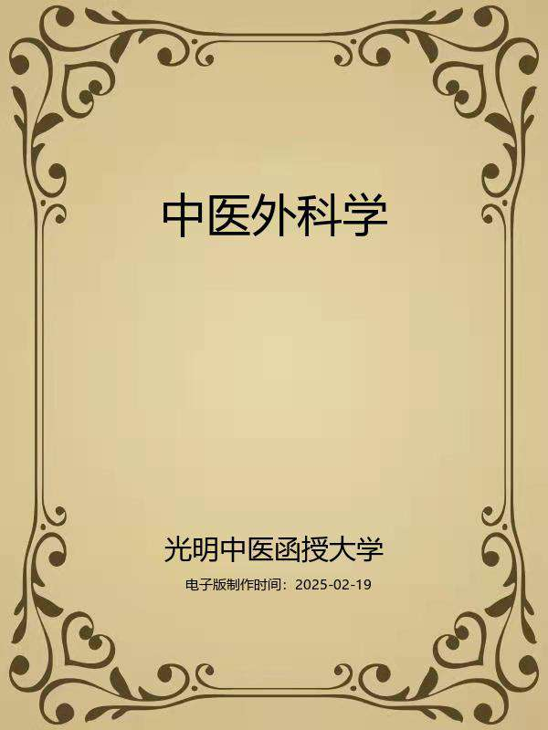

# 中医外科学

## 编者与编者的话

### 编者

光明中医函授大学主编

赵尚华张洪恩编

施汉章审阅

### 编者的话

《中医外科学》以保持和发扬中医特色，正确处理继承与发扬的关系，“培养合格中医师”为总目标编写而成。旨在介绍中医外科学的基本理论和中医外科的常见病、多发病的病因病机、辨证、治疗的原则与特点。在“寓医理于临床”思想的指导下，力求说理透彻、简明，便于自学和函授。

全书分总论和各论两部分，总论部分概括地介绍了中医外科的沿革和发展、中医外科的辨证特点，较详尽地阐释了局部症状的辨证；从整体观念出发介绍了中医外科的内治法，特别是较全面具体地介绍了外治法。各论部分分述为疮疡、乳房病、瘿、瘤、岩、内痈、肛门直肠疾病、皮肤病、男性前阴病，及外科其他疾病15章。每一章节又依次分为概说、病因病机、辨证论治（包括辨证要领、常见证治、论治要点、临证权变），所选方药都以实用有效为原则，并将前贤名家对本病辨治的心得体会熔铸其中，然后列举全国名家典型验案作为应用例案，以期进一步传授通常达变或异曲同功的诊治技巧，便于学员借鉴，节末附有简便实用的验方及文献摘录以供参考：并列有复习思考题，便于复习思考。

通过本课的学习，要求学员理论联系实际，系统地掌握中医外科的基本理论、基本概念、基本内容，具体要求按教材各章内容统一划分为三级。第一级“掌握”，为重点内容；第二级“熟悉”，为次重点内容；第三级“了解”，为非重点内容，学员在学习过程中宜按此三级要求，分别主次，循序渐进，运用辨证唯物论和辩证法的观点充分发挥独立思考的能力，结合复习思考题进行自我练习和测试，以巩固已掌握的学习内容，提高自学效果。本课程计划共安排100学时，其中面授34学时。书中采撷的古方，为便于临床应用，剂量换算为克。

本书在编写和审定过程中一直得到白永波同志、贾维诚同志和徐生旺同志的大力支持和指导，得到李文银、段全枝等同志的帮助，谨此表示衷心感谢。全书第1章至11章、第13章、第14章由赵尚华同志执笔，第12章、第15章由张洪恩同志执笔。

本书编写时间仓促，加之水平有限，错误和缺点在所难免，希望在使用过程中提出宝贵意见，以便今后改进和提高。

编者

1987年7月

### 导言

中医教育学，是一门古老而崭新的科学。中医教育的历史，若从师徒授受和医籍编纂算起，已有两千余年。近代史上的中医教育，首推一八八五年浙江陈虬创立的利济医学堂。新中国诞生不久，创办了北京、上海、广州和成都四所中医学院，从而揭开了当代中医教育的序幕，至现在，全国已发展到二十三所。但是，如果把我国中医教育的实践经验加以分析、研究、总结和提炼，升华，揭示它的规律，使之成为一门专门的学科——中医教育学的话，那么，它还处在再创阶段。这就是说，中医教育及其规律存在的历史是悠久的，但论述中医教育及其规律的学科却是崭新的。因此，中医教育工作需要进行探索和研究。

在探索和创建适合我国国情的中医教育的时候，我们必须植根于我们民族文化的肥沃土壤之中，充分重视中医典籍在培育和造就历代医家中的伟大作用。事实上，在长期的历史发展中，逐渐形成了具有中华民族特色的中医药理论体系，它既有丰富临床经验，又有高深的理论基础。历代医学家就是把这些道理传授给他们的弟子，其中部分人经过刻苦自学和临床实践，成为医术高超的医学家，这是我国历代医学家成才之路，亦是中医教育史上培养人才的宝贵经验。这就是我们民族中医教育事业的光辉历史。

在新的历史时期，作为中医教育工作来说，既要给学生打好传统医学的基本功，又要使他们掌握一些新兴的科学知识，使继承与发展得到统一。根据这种认识，我们十分认真地研究和设计了光明中医函授大学的教学计划、教材内容、教学方法与教学手段。归结起来即是：注重打好中医基本功，注意提高中医基本理论水平和培养临床诊治技能，着力培养辨证论治的思维方法，竭诚发挥中医在防病治病中的特长。并在这个基础上，扩大学员知识面。我们把这些要求与思想，全面体现在本校的教材建设中。其目的是使中医人才的知识结构更加合理，以便能担负起继承和发扬祖国医药学防病治病的光荣任务。

在回顾中华医学教育历史，展望现代医学教育的发展趋势以及总结三十多年正反两方面经验的基础上，我们认为，要培养出适合四化需要的合格中医人才，对中医教育的课程设置和教材内容，就要进行必要的改革，建立起为新形势所需要的中医教材。我们正在朝这一方向努力。在认真研究高等中医院校教材和广泛征询中医专家、学者和医务人员意见的基础上，新编了这套较为完整的中医教材，定名为《高等中医函授教材》（包括了二十八门课程）教材的编写人员，由本校选聘知名教授、学者和学有专长者担任，编写时，我们力求各门教材要有鲜明的针对性，在内容上富有实用性，在文字表达上深入浅出、简明易懂，以利便于自学或函授，此外，我们还将根据需要，选编一些辅导材料，以帮助学员（读者）理解教材内容，更好地学取中医知识。

由于教材编写时间仓促，又竭力于继承与创新,不足之处在所难免，敬希学员和广大读者惠赐宝贵意见，以便在再版时修订。

光明中医函授大学教育研究室

一九八五年十月四日

加入光明：

光明中医网址：www.gmzyjx.com，www.gmzyjc.com

## 上篇总论

## 第一章中医外科学的源流与发展

**〔自学时数〕**2学时

**〔目的要求〕**了解中医外科学的起源、形成和发展。

**〔面授时数〕**1学时

中医外科学是中医学的重要组成部份，几千年来经历了起源、形成、发展等不同阶段，取得了巨大的成就。

一、起源

恩格斯说过“科学的发生发展一开始就是由生产决定的。”我国的医药起源也是和我国劳动人民最早的生产活动联系在一起的。古代的人们在使用极其简陋的工具，如用石块、木棒的生产和斗争过程中，很容易发生创伤，患外疡的机会较多。对于自身机体的伤害，人们必然要设法修复，比如清除剌入肌肤的异物，应用树叶、野草等敷压止血……由此，原始的“清创”、“止血”法就自发地产生了。进入新石器时代，我们祖先就利用“砭石”切开排脓，这大概就是最古老的外科手术了。

这些原始的清创、止血、排脓、药物外敷等是人类在长期同疾病作斗争中发展起来的，是最原始的、简单的“外科处理”。这便是中医外科的起源。

远在公元前十四世纪左右殷商代的甲骨文中就有外科病名的记载，如疾自（鼻）、疾耳、疾止（趾）、疾舌、疾足、疕、疥等，这是我国有史以来有关外科的最早文字记录。《山海经•东山经》中说“高氏之山，……其下多箴石。”郭璞注：“砭针，治痈肿者”。该书还载有38种疾病，外科病有痈、疽，痹、瘿、痔、疥等。《周礼•天官》有疡医的记载，并规定疡医“掌肿疡、溃疡、金疡、折疡之祝药、劀杀之齐"。祝药就是敷药，劀是括去脓血，杀是腐蚀剂去恶肉或剪去恶肉。这些是我国最早应用手术方法和腐蚀性药物治疗疾病的记载。医学的具体分工，有力地推动了医学按门类深入的发展。马王堆汉墓出土帛书《五十二病方》系春秋时代作品，是我国现今发现最早的古医方。书中载有感染、创伤、冻疮、诸虫咬伤、痔瘘、肿瘤、皮肤病等30多种外科疾病。在“疽病”下，有“骨疽倍白蔹，肉疽（倍）黄芪，肾疽倍芍药”之说，这样针对不同的疾病，更换药物，调整剂量，可视为"辨证论治”的萌芽。并以“水银、谷汁而傅（敷）之”治皮肤病；用醇酒止痛和消毒，如“犬所齧，令无痛及易瘳方：令〔齧〕者卧，而令人以酒，财沃其伤。”这是世界上最早将水银和酒用作药物的记录。此外还记录了治疗痔疮的具体方法，如用小绳结扎“牡痔”，用地胆等药外敷“牡痔”，用滑润的“铤”作为检查治疗漏管的探针等。这说明，当时已有较高的外科治疗水平。

二、形成

中医外科有文字记载的资料很早，但渐具规模，形成一个学科，则是在汉代。就一般而言，在汉代外科学已经具备了以下条件：一有系统的理论体系；二有先进的哲学思想基础；三有代表人物；四有丰富的实践经验；五有继承和发扬的流派。

那时已经传世的《内经》奠定了中医外科的理论基础，对外科病的病因病机有了初步的阐明。《灵枢•玉版》说：“病之生时，有喜怒不测，饮食不节，阴气不足，阳气有余，荣气不行，乃发痈疽”。《素问•生气通天论》：“膏粱之变，足生大丁……荣气不从，逆于肉理，乃生痈肿。”这些都是对病因的认识。《灵枢•刺节真邪论》：“虚邪之中人也，洒淅动形，起毫毛而发腠理。其入深……则为痈”。这说明了外科感染的途径。《灵枢•痈疽》则是一篇完整的外科专论，对外科化脓性疾病的形成机理作了精辟的论述：“血脉营卫，周流不休，上应星宿，下应经数，寒邪客于经络之中则血泣，血泣则不通，不通则卫气归之，不得复反，故痈肿。寒气化为热，热胜则肉腐，肉腐则为脓。”这些理论直到今天仍然指导着外科的临床应用。此外，在治疗上，还记载了豕膏外敷、铍针放脓、斩刈死趾等治疗方法。《内经》中这些医学理论，基本上是在当时先进的哲学思想——古代的唯物辩证法——整体的动态的天人相应学说、阴阳五行学说、精气神学说指导下形成的。

中医外科学形成于汉代的代表人物，是被历代誉为“神医”的东汉末年的外科鼻祖华佗(公元141~203年）。华佗安徽亳县人，精通内、妇、儿、针灸各科，更擅长外科，最突出的成就是发明了全身麻醉剂——“麻沸散”，并首创了剖腹术。《后汉书》载：“若疾发于内，针药所不能及者，乃令先以酒服麻沸散，既醉无所觉，因刳破腹背，抽割积聚；若在肠胃，则断截湔洗；除去疾秽；既而缝合，傅以神膏，四五日创愈，一月之间皆平复。”同时还有三个开腹病例，一例是死胎，二例为腹中疾。

汉代时，已有了专供外用的药物，如《周礼•天官》中记载：“凡疗疡以五毒攻之，以五气养之，以五药疗之，以五味节之。”郑玄注五毒谓：“今（汉）医人有五毒之药，合黄堥，置石胆、丹砂、雄黄、矾石、磁石其中，烧三日夜，其烟上着，以鸡羽扫取以治疡"。此即是现代升丹的炼法和应用之先河。还有《五十二病方》中的水银、酒；《内经》中的豕膏（豕膏就是猪油），这些都是现时膏药的萌芽。塗猪油的方法后汉时仍在沿用，《后汉书•东夷传》：“冬以豕膏塗身，厚数分，以御风寒”。汉代张仲景著的《金匮要略》，其中治疗肠痈、浸淫疮、寒疝、结胸等方药，至今仍为临床所应用，中医第一部外科专著，为《金创瘈疭方》，成书于西汉前后，可惜没有传世。

由此可见，从理论到实践，从药物到手术，从制度到医生，中医外科到汉代已初步形成了一个独立的学科。

三、发展

汉代之后，由于儒学在中国占了统治地位，“身体发肤，受之父母，不敢毁伤”的思想影响了解剖和外科手术的发展，许多外科医生不得不隐姓埋名，如《晋书》载魏泳之兔唇，就是经手术治疗而愈，但医生却不留名。然而社会要发展，人们需要用外科的疗法以祛病和康复，所以，两晋南北朝和隋唐五代时期中医外科又有了进一步的发展。其主要成就有：

晋•皇甫谧著《针灸甲乙经》，成书于公元264年，其中有外科专论3篇，提出了近30种病证，特别对痈疽论述较为详尽。葛洪（公元

281~341年）著的《肘后备急方》，对外科也有很大的贡献：①记载了疥虫和沙虱，指出了它们的生长坏境和传播疾病的途径，这比欧洲有文字记载的疥虫和沙虱要早一千多年。②用疯狗脑敷治疯狗咬伤，开创了用免疫法治疗狂犬病的先例。③用海藻酒治疗瘿疾（甲状腺肿大类疾病）等等。

晋末时期，出现了我国现存的第一部外科学专著——《刘涓子鬼遗方》。本书传为晋末南朝宋人刘涓子遗著，齐•龚庆宣整理刊行。原著10卷，现仅存5卷：卷一论痈疽的鉴别；卷二为战伤的治法；卷三述痈疽的证治；卷四叙脓肿的诊断与手术；卷五论皮肤病的诊治，共收方剂151个。书中很重视外治法，介绍了止血、止痛、收敛、镇静、解毒等治疗方法，因而医史界称之为我国的军阵外科著作。该书对痈疽辨脓、切开、排脓、引流等方面论述尤为精详，如以硬度辨脓：“痈大坚者未有脓，半坚半薄有脓，当上薄者都有脓，便可破之”，如以痛辨脓等等。书中火针的运用，也是决脓术的一大发展。在痈疽的治疗上，该书初步建立了辨证论治的思想，运用了外治消（消散）、蚀（食恶肉）、收（收口生肌）的三种治则，体现了作者内外合治的丰富经验。总之，总结了古代中医外科学的成就和医疗经验，对我国外科学非手术疗法的发展有很大影响。

隋唐时期外科的发展较快。巢元方等编写的我国第一部病源病理学专书《诸病源候论》包含有不少外科内容，如瘿瘤、丹毒、疔疮、痈疽，痔瘘等，对皮肤病记述尤详，计有40多种。并对病因病机有了进一步认识，如认为漆疮是：“人有禀性畏漆，但见漆便中其毒”，肯定了此病与人体体质的关系。同时还明确指出：疥疮有疥虫，癣病有癣虫。在当时条件下，能认识到有病源体的存在，确是一项重大的突破。在“金创断肠候”中记载了对“腹珊”（脂肪）脱出的手术，即先用丝线结扎血管，然后再截除。并第一次记载了人工流产术和肠吻合术，以及血管结扎、拔牙等手术。可见当时对腹部外伤的处理已达到了相当高的水平。唐孙思邈的《千金要方》是我国最早的一部临床实用百科全书，载有丰富的外科学内容。孙思邈是饮食疗法和脏器疗法的创始人，他发明的吃牛羊乳治疗脚气病；吃羊靥、鹿靥治疗甲状腺肿大；吃动物肝脏治疗夜盲症等都被现代科学所证实。至于葱管导尿法则比法国发明的橡皮管导尿法要早1200多年。其他尚有王焘的《外台秘要》，该书载痈疽、瘿瘤、脚气、痔瘘、金疮、恶疾大风等六卷，收方1300余首，亦是外科方药的重要参考文献。

宋代是我国医学发展较快的时期，外科学家从理论上更加重视整体与局部的关系，使辨证论治进一步用于临床，如《太平圣惠方》（公元992年）中有关外科疾病部分，除了对病因、病机、治疗、预后等详加论述外，还对不同的症状，详列不同的治法，充分体现了辨证论治在外科疾病上的具体应用。在诊断方面，总结了前人的经验，第一次系统地提出了"五善七恶”学说。在治疗上注重扶正与祛邪相结合，内治与外治相结合，创立了“内消”和"托里"的方法，并首先提出用砒剂治疗痔核，用蟾酥酒止血、止痛，用烧灼法消毒手术器械等等。宋代以来，外科专著日益增多，东轩居士箸的《卫济宝书》（公元1170年），上卷专论痈疽，并附有简图；下卷专言治法，并对应用范围较广的方剂，一一列出其加减用法。书中还记载了很多医疗器械，如灸板、消息子、炼刀、竹刀、小钩等。李迅的《集验背疽方》（公元1196年）是背疽专书，对背疽的病因、症状、用药、禁忌等均有阐述。指出发疽有内外之别，外发者易治，内发者难治。陈自明撰《外科精要》（公元1262年），强调对痈疽的辨证施治，区分寒热虚实以对证治疗，不可拘泥于热毒内攻之说而专用寒凉克伐之剂。强调了疮疡的整体疗法，载有托里排脓汤等很多方剂，至今仍在延用。

元代的外科成就，以齐德之《外科精义》（公元1335年）为代表。他总结了三十多家外科著作，结合自己的临床经验撰著而成。他从整体观出发，提出外科病多为阴阳不和、气血凝滞所致，且论述脉诊甚详。在治疗方面，他认为“治其外而不治其内，治其末而不治其本”的方法是不全面的。主张治疗疮疡必须先审阴阳虚实，脉证结合，然后采用内外相辅的综合方法，他的这些思想有些很有实用价值。此外，还有朱震亨的《外科精要发挥》和危亦林的《世医得效方》。《世医得效方》（公元1337年）是一部创伤外科专著，是现今世界上已知最早的载有全身麻醉文献的专著，比日本华同青州在1805年用蔓陀罗汁麻醉要早450年。本书对麻醉药的组成、适应证、剂量等均有详实的记述。

四、兴盛

明代以及清代鸦片战争之前的时期，是外科发展的兴盛时期，其主要标志是名家辈出，著作如林，学术争鸣。

薛己的《外科发挥》、《外科枢要》（公元1529年）从理论到临床均加论述，文字简要，内容翔实，第一次详细记述了对新生儿破伤风的诊治。汪机的《外科理例》（公元1531年）主张外病内治，切戒滥用刀针。曾说“外科必本于内，知乎内，以求乎外，其如视诸掌

乎。……治外遗内，所谓不揣其本而齐其未”。说明医治外科疾病，必须掌握中医基本理论，立法才能正确。陈实功的《外科正宗》（公元1617年），全书四卷，较全面地介绍了外科学的病因、病机、诊断和治疗原则，细载病名，详列治法，并附有验案自唐到明的外科治法，此书大多收录，曾以“列证详、论治精”见称。这是一部代表明以前外科学伟大成就的重要文献。从学术思想上来看，该书重视脾胃。他说“疮全赖脾土”，“盖脾胃盛则多食而易饥，其人多肥，气血亦壮；脾胃弱，则少食而难化，其人多瘦，气血亦衰。故外科尤以调理脾胃为要”。又说“托里则气血壮而脾胃盛，使脓秽自排，毒气自解，死肉自溃，新肉自生，饮食自进，疮口自敛”。在手术治疗方面的成就更为突出，共记述了14种手术方法，如脱疽截趾（指）术、鼻瘜肉摘除术、食道异物取出术、下颌关节复位术、颈吻合术、腹腔穿刺排脓术等，都有很大的实用价值。同时还述及了口唇创伤缝合术、缺耳、缺唇矫形术；并指出了良性肿瘤和恶性肿瘤的鉴别诊断和治疗原则等。而且设计制造了巧妙的手术器械，如鼻痔的摘除工具，这与近代使用的鼻瘜肉绞断器甚为相近。书中他还提出换药室应“窗明几净”，疮口应予冲洗。护理上，强调注意病人的饮食营养，反对无原则的饮食禁忌，等等。由此，陈实功对外科学的发展可见一斑了。之后顺治、康熙时御医祁坤编写的《外科大成》，继承了《外科正宗》的理论和治疗经验。其子祁昭远，继承父业，康熙、雍正时任太医院院判。其孙祁宏源，编写了《医宗金鉴•外科心法要诀》，该书内容丰富，既有理论，尤重实践，系统总结了清代以前历代外科医家的经验，是学习中医外科的重要著作。

康熙乾隆年间王维德著《外科证治全生集》（公元1740年）。该书特点是：创立了以阴阳为主的辨证论治法则，所谓“凭经治证，天下皆然，分别阴阳，唯余一家”。把复杂的外科疾患分为阴阳两类，如痈阳、疽阴等。主张“以消为贵，以托为畏”，除治疔用刺外，反对滥用刀针，禁用腐蚀药物。特别是对阴证的治疗具有独特的见解，主张以“阳和通腠，温补气血”的原则治疗阴证，他说“世人一概清火以解毒，殊不知毒即是寒，解寒而毒自化，清火而毒愈凝。然毒之化要由脓，脓之来，必由气血，气血之化必由温也，岂可凉乎？”自拟阳和汤、醒消丸、犀黄丸、小金丹等名方用于临床，直到现在，仍为有效方药。其后许克昌、毕法合写的《外科证治全书》继承了《外科证治全生集》的特长，而且有所发挥。高秉钧所著《疡科心得集》（公元1809年），认为外科疾病的发病原因与其发病部位有一定的联系，“疡科之证，在上部者俱属风温、风热；……在下部者俱属湿火、湿热；……在中部者多属气郁，火郁”。在辨证论治上对外科阳证、热证，特别是“走黄”、“内陷”的理论论述有所提高，而且首先引用了温病学派的犀角地黄汤、紫雪丹、至宝丹治疗疔疮走黄，提高了疗效，开拓了思路，至今仍有很大实用价值。在编写体例上以两种相似病证互编一篇，详加鉴别，对于辨证论治很有启发，这是中医外科学中有鉴别诊断的重要文献。其后余听鸿《外证医案汇编》对高秉钧的学术思想有所发挥。

清代的外科著作除上述之外，还有陈司成的《霉疮秘录》（公元1632年），是我国第一部霉毒学专著。书中采用砒石、轻粉、雄黄、朱砂等药物制成丸剂或丹药内服，是世界上使用砷剂治疗霉毒的最早记载。陈士铎的《洞天奥旨》（公元1694年），善于使用内服药消散疮疡，其组方结构严谨，主药突出，颇有特色。顾士澄《疡医大全》（公元1760年），分门别类，便于查阅。高文晋《外科图说》（1834年），邹岳《外科真诠》（公元1838年）都各有特点，吴师机《理瀹骈文》（公元1864年），专述膏药的外治法，总结了不少治疗学上的新成就。

近代张山雷《疡科纲要》（公元1927年），内容简要，立论、辨证、用药均有特色，对外科的发展有一定影响。

近百年来，由于帝国主义侵入我国，祖国医学受到排挤。解放以后，由于贯彻执行了党的中医政策，中医外科学重新获得新生和发展。如用中医中药治疗痈、疽、疔疮、乳病；用结扎和注射疗法治疗内痔；用切开或挂线疗法治疗肛瘘；内外合治脱疽、静脉炎；中西医结合治疗红斑性狼疮、硬皮病、毒蛇咬伤、烧伤等，都取得了很大进展。急腹症的中医药治疗和理论上的探讨，针刺麻醉原理的研究，都出现了可喜的苗头。

总之，中医外科学是从实践中产生的一门科学，具有独特的理论体系和丰富的临床经验，取得了很大的成就，对世界医学作出了应有贡献。所以我们应当努力学习，加强对中医外科学的研究，以促进人类健康事业的更大发展。

复习思考题

1.简述外科的起源。

2.外科形成于什么时代？其主要标志是什么？

## 第二章病因病机

**〔自学时数〕**3学时

**〔面授时数〕**1.5学时

**〔目的要求〕**了解外科疾病在病因病机上的特点。

第一节　致病因素

病因是引起疾病的内在的和外来的各种因素。中医病因学说的特点是“审证求因”，即根据不同临床证候推求病因。要想掌握好外科病因学说，就必须熟悉各种致病因素的性质、特点以及它们各自引发的外科疾病的特殊表现，临证时根据这些临床表现推求病因，从而准确地辨证论治。现将外科中常见的病因分述如下：

一、外因

（一）外感六淫

风、寒、暑、湿、燥、火称为六淫，均能引发外科疾病，但大多以火毒为主。

1.火毒：火热是外科疾病中最主要的致病因素，如《医宗金鉴》云：“痈疽原是火毒生。”火乃热之极，热为火之渐，火与热都属阳邪，两者郁久都可生毒。热毒势缓，火毒势猛。

火毒蕴于肌肤：见局部灼热，焮红肿硬，甚或紫黯，疼痛；热毒郁久，可腐肉成脓，如疖肿等。

热结肠胃：见身热，腹痛拒按，拘急胀满，恶心，呕吐，大便秘结，小便黄赤，脉洪滑数，苔黄厚，如肠痈等。

火毒内攻脏腑：见高热头痛，烦躁不安，脉多洪数，苔多黄厚，甚或见神昏谵语等一系列危重证候，如疔毒“走黄”、疽证"内陷”等证。

2.湿邪：湿为阴邪，其性重浊、粘腻，常与其它病邪结合而为病，在外科中与热邪结合者尤多。

湿邪留滞肌肤，见肿胀光亮，糜烂流津，痒如虫行皮中，病情日久不愈，如湿疮、脓疱疮等。

湿热内犯脏腑：见胸痞脘胀，口苦咽干，食欲不振，呕吐恶心，口渴不欲多饮，身热不扬，汗出不退；水走肠间漉漉有声，大便溏薄或秘结，小便浑浊，甚或出现黄疸，如急性胆囊炎和肠痈等。

湿热下注：见肢体沉重，肿胀光亮，按之凹陷不起，状如烂棉，劳累后加重；热重者则焮红疼痛，甚或皮肤起庖，溃烂，坏死，疼如汤泼火灼，昼轻夜重；或有尿急、尿频、尿痛、尿血等症状，如下肢丹毒、臁疮、䐔病、脱疽、石淋等。

湿邪兼挟风热：在肩背颈项头面等处，可见斑疹浮肿，红晕散漫，游走无定，搔痒难忍，如风疹块等。

3.寒邪：寒为阴邪，其性收引凝聚，常可使经络受阻，气血运行障碍，在外疡中见得较少，而致病笃重。

寒在肌肤：见皮肤局部暗红肿胀，轻者麻痛，重者出现水泡，血泡，腐烂，溃脓，久不收口，如冻疮等。

寒在经脉：见痛有定处，皮肤不红不热，甚或冰冷畏寒，肤色苍白或青紫，趺阳脉、太溪脉搏动微弱，甚则消失，如脱疽。

寒在筋骨：见筋骨隐隐疼痛，不红不热，但不欲行动。甚者痛彻入骨，不能屈伸转动，动则加剧，苔白腻，脉迟紧，如附骨疽等。

寒在脏腑：有内寒、外寒之别。内寒者，见腹痛绵绵，喜热怕冷，得热则缓，喜按，四肢逆冷，大便溏薄，脉沉迟，如某些慢性肠结等。外寒者，见发病急骤，腹痛剧烈，腹胀便结，呕不能食，脉多沉紧，甚或脉伏，如肠结等。

4.风邪：多犯人体上部和肌表，在外科中多与热、湿两邪相兼致病。风热上受：见头项宣肿，皮色发红，发病急，病势快。浮肿，游走迅速，如大头瘟、痄腮等。

风火毒盛：见头面部红肿热痛，病势急速，全身伴有壮热烦渴，尿黄便秘，脉浮数或洪数，如面部丹毒，有头疽等病。

风犯肌肤：皮肤上出现形状不一的皮疹，成块成片，或白或红，此起彼消，或者皮肤干燥脱屑，干痒无水泡，甚至搔破亦不流滋水，搔痕能很快愈合，不留疤痕等，如风疹块或干癣等。

5.暑邪：盛夏酷暑，易伤元气，耗津液。暑多挟湿，症见疖肿疼痛，甚或遍体丛生，并身热汗出，头重胸痞，渴不多饮，脉濡数，苔白腻，如暑疖、暑湿流注等。

6.燥邪：燥易伤津，而津枯液耗，则肌肤干燥，搔痒脱屑，毛发干枯，如血燥血热所致的白屑风及皮肤搔痒、白疕等。

（二）感受特殊之毒

外科疾病中，可因虫兽咬伤，或接触了某些特殊物质而发病。

1.毒蛇、疯犬，毒蝎、蜈蚣等咬伤，直接引发蛇伤、狂犬病等。此类原因易见，症状明确，不再赘述。

2.有些人因于禀赋特异，不耐接触某些物质，如羊毛、漆、荨麻、毛虫、沥青、铬酸、染料及某种药品等，经过一定时间后出现皮肤损害。轻则出现红斑、丘疹，重则出现水庖、脓庖或溃烂坏死，如漆疮、沥青疮及药疹等。

（三）外伤

外科疾病中，可因跌打损伤，沸水、火焰及强酸、强碱等化学药品，直接伤害人体而发生外伤病和烧伤性疾病等。

二、内因

由于恣意六欲或七情郁结，均能发生外科疾病，但以气郁血瘀所致者为多。

（一）气病

气病以气郁、气滞、气逆和气虚为常见。

1.气郁：肝性喜条达而恶抑郁，若情志不遂，或恼怒伤肝，肝气郁结；或忧思伤脾，脾失健运，痰湿内生；郁气、湿痰互阻于经络，结聚成块，渐增胀痛，全身症状有胸胁满闷，纳呆腹胀，焦躁易怒，月经失调，生气后症状加重；若气郁化火则胸胁胀痛，甚则绞痛阵作，口苦咽干，或寒战高热等。常见的乳癖、乳岩、癭瘤、瘰疬及胆石症等，多为气郁所致。

2.气滞：人身之气，聚则有形，散而无迹，腹内气机阻滞，则阵发疼痛，攻痛无常，如疝气、部分腹内痈肿等。

3.气逆：胃气以降为顺，以升为逆，如果外邪滞留肠胃，胃气不能正常下行，则逆而上冲，症见腹痛，恶心，呕吐，不食，如肠结等。

4.气虚：气为全身之动力，以保证人体各器官的正常功能。若卫气不足则自汗，正气不足则皮肌萎缩，全身乏力；脾气不足，可致气虚下陷，常引起肛肠脱垂，形成痔疮、脱肛等疾病。

（二）血病

血病有血虚、血瘀、出血等，其中以血瘀为主，而以寒凝血瘀和气滞血瘀较常见。

寒凝血瘀：“寒则血凝涩’’。寒邪留滞为血瘀的主要因，如前所述寒在筋脉等。

气滞血瘀：气滞血疲，痛有常所，往来不离其处，其痛如刺，拒按，时发寒热，脉涩，舌质可见瘀斑、瘀点等。血瘀于肌表则为青紫肿痛、结节斑块，色素沉着，皮肤肥厚，如一般软组织损伤、结节性红斑等。血阻于营卫则郁而生热，红肿热痛，成脓破溃，如痈、疽等病。血瘀于脏腑则腹痛、便血，或发寒热，如肠痈脓肿等。

血虚：血虚肌肤失养，则干燥、皲裂、脱屑、作痒、如白疮等。肠道血虚津枯，则往往引起大便秘结。

（三）食

食滞肠胃，或由素体脾胃阳虚，或因暴饮暴食而致宿食不化，症见腹痛，腹胀，烦闷不宁，恶心呕吐，嗳腐吞酸，胃脘高突，大便秘结，脉滑实，苔厚腻。

"膏梁厚味，足生大丁。”饮食不节，恣食甘肥滋腻和辛辣刺激之品，可使脾胃受损，湿热火毒内生，从而发为痈疽。

（四）肝肾不足

房事不节，肾气内损，骨髓空虚，风寒乘虚侵袭，则见骨与关节隐隐酸痛，甚则屈伸不利，成脓迟缓，溃后不易收敛，如流痰等证。又肾阴不足，虚火内生，灼津为痰，痰火凝结，阻于经隧，则为瘰疬、马刀等证。肝肾不足引起的皮肤病多为慢性，皮肤干燥脱屑，肥厚粗糙，色素沉着，指甲干厚，或生疣目、血痣，多伴有头晕目眩，耳鸣，腰膝痠软，失眠多梦等。

（五）虫

虫积腹痛，时痛时止，痛时剧烈，辗转不安，烦躁出汗，恶心呕吐，甚或吐蛔，痛止则静，如蛔厥症。若虫积于下腹，则腹胀甚而腹痛轻，便秘、久则呕吐，脉弦实，如蛔虫性肠结症。虫在肌肤，则搔痒剧烈，发生丘疹、疱疹、脓疱，重者滋水淋漓，相互传染，如疥疮、虫咬皮炎等病。但亦有些病是“以痒为虫”，并不能真正找到虫。

需要注意的几个问题：

1.六淫致病与季节有一定关系：因时邪偏胜，袭於肌肤筋骨，即发外疡，而六气分属四季，如春天风淫所胜，则易生头面疮疡，痄腮时毒。长夏湿盛，骄阳酷烈，暑湿热交蒸，易发暑疖、暑湿流注以及其它脓肿。冬令严寒所胜，气滞血凝，易发冻疮。所以，审证求因之时，应该注意时令，考虑气候变化对人体的影响。

2.外疡发病原因与发病部位有一定的关系：古人谓“头面肿为风”、“脚肿为湿"，确属经验之谈。发于人体上部（头、面、肩、项等处）的疮疡，如时毒、发颐、牙周炎、骨槽风等多为风温、风热所致；发于人体中部（胸、腹、腰、背）之外疡，如乳痈、胁疽等，多因气郁、火郁所引起；发于人体下部（臀、腿、胫、足）之外疡，如臁疮等，多由湿热或寒湿所致。又如同一种疾病，发生于不同部位，其病因也不尽相同。如丹毒发于头面，则多挟风邪；发于两胁，虚肿红热者，多兼气郁；发于股胫者，则多兼湿邪，治法亦各异。又如，同为䐔病，发于胸胁者多兼气郁，发于下肢者多为湿盛。这是一般规律，在诊断时还需四诊合参，才能更加准确，但如果忽略发病部位的重要意义，治疗就不会取得预期的效果。以上病因可以单独致病，也可以几种病因同时致病，甚至同一病人、同一疾病，在不同阶段，病因不同。如同一个石淋患者，在结石固定不移时，其病因可能是气滞血瘀；在结石移动时，其病因则可能是湿热下注。所以医者临床时，必须综合局部症状与全身症状进行全面的分析，才能审证求因。

第二节　发病机理

外科疾病的发病机理是探讨外科疾病的发生、发展和转变规律，揭示疾病的本质，从而为临床辨证论治提供根据，现将各类病的病机、外科病的发生、传变和转归等几方面分述如下：

一、各类病的病机

由于内伤、外感等致病因素单独或相兼侵犯人体，引起脏腑功能失调，气血运行紊乱，致使气血壅塞，经络闭阻，疾病发生，在外科疾病中代表性的病证有：疮疡、卒腹痛、皮肤病等。其病机各有特点：

（一）疮疡

疮疡的病理变化有红肿热痛（或隐痛硬结）、成脓破溃、生肌长皮和“走黄”、“内陷”等几个方面。这些基本反映了疮疡的发生和演变规律。现分别从以下几点论述疮疡的病机。

1.气血壅结：由于外邪侵犯或脏腑结热，五志化火等原因，使人体循环不息的气血功能破坏，经络阻塞，而形成局部的气血凝滞，或蕴结于肌肉，或滞留于筋骨。气血蕴结，不通则痛，局部则见肿胀疼痛。若失治或误治，气血蕴结未得解除，正气尚盛则邪气郁久而从热化，局部遂可出现焮红、热痛等征象，此即阳证。如痈、疽、疔、疖、流注等证的发生，皆为这种病理变化的结果。若素体虚弱，正气不足，不能从热化；或肾虚骼空，阴邪乘袭；或脾胃虚弱，痰湿内生，与郁结之肝气相搏，留注筋骨，则局部不红不热，只有隐隐作痛或酸痛，局部硬结或漫肿；或经年累月慢慢化热，局部才微红微热，转向化脓阶段，此为阴证。如瘰疬、痰核、流痰等证，皆为这种病理变化的结果。

2.热盛肉腐：不论是阳证还是阴证的疮疡，在发病初期不得消散者，病程或速或慢，病变皆继续发展。局部气血壅滞，不能疏通，愈久化热愈盛，遂使血肉腐败，酝酿液化而成脓。如《灵枢•痈疽》说，“营卫稽留于经脉之中，则血泣而不行；不行则卫气从之而不通，壅遏不得行，故热；大热不止，热胜则肉腐，肉腐则为脓。”这便是脓形成的机理，也是局部气血凝滞，进一步发展变化的病理过程。脓成熟到一定程度，局部皮肤亦被腐蚀破溃。于是由肿疡变为溃疡。

3.生肌长皮：疮疡破溃之后，毒随脓泄，若脏腑正气恢复，气血充足，则腐肉脱落，新肉生长，长皮敛口，气血恢复运行而愈；若气血不足，则腐肉不脱，新肉生长缓慢，难于收敛。可见生肌收口，与脾胃功能正常，气血充沛有关。

4.毒邪走散，内攻脏腑：疔疮、有头疽等证，因毒邪鸱张，脏腑虚弱，气血不足，不胜防御，遂使毒邪走散，循经络，入营血，内攻脏腑。继而扰乱神明，出现神昏谵语等“走黄”或“内陷"的一系列危重证候，这是体表疮疡影响脏腑而发生病变的病理过程。

总之，从疮疡的发生、发展和转归过程来看，可以概括为：局部经络阻塞，气血壅结，血肉腐败，以及脏腑功能失调。疮疡的特点以局部病变为主，如果我们能及时消除局部病变或设法阻止它对整体的影响，便很快就会治愈。所以古人对疮疡辨证，多从局部症状来探求全身的阴阳盛衰，是有一定道理的。

（二）卒腹痛

卒腹痛的基本症状有腹痛、黄疸、抽搐、神昏等，这些症状的发展演变基本代表了卒腹痛的病理变化。我们从分别引起这些症状的机理来认识卒腹痛的基本病机。

卒腹痛大致可分两大类：第一类是气机不利或气血郁闭所致，多出现在疾病的早期，相对而言病势较轻。第二类是脏器梗阻不通所致，多出现在前一类腹痛之后，病势较重。

1.气机不利：由于饮食失节，劳倦内伤或情志暴动等因素，使六腑气机不畅，气滞血瘀。具体言之，营行脉内，卫行脉外，并行不悖，周流不息。气遇邪而郁，则津液稠粘，为痰为饮，积久渗入脉中则血变污浊。血受邪而滞，则经隧阻隔，或溢或结，则气血之正常循行受阻而不通，不通则痛。如肠痈、现代医学的急性胆道感染等病的早期疼痛，均为这类病机变化。同是上述原因，若作用于素体脾胃虚寒有胃肠溃疡病的患者时，则可导致脾胃气血郁闭而引起剧烈绞痛，甚至昏厥。

2.六腑通降功能减低或丧失：这是上述病理变化发展的继续。六腑的功能在于饮食的摄入、消化、吸收和排泄。这一过程必须不断运行，不能停滞，故古人科学地概括为“六腑以通为用”。六腑气机不利则往往造成六腑梗阻不通。不通则出现剧烈的持续性腹痛，同时伴有严重的全身症状，如发烧、呕吐、便秘或黄疸等等。象肠结、胆石症、胆道蛔虫症、严重肠痈和石淋等病均有这类病理变化。

3.湿热交阻：由于感受外邪，或素嗜酒肉肥甘，伤及脾胃，脾之运化水湿功能减退，造成湿热交阻，胆道不通，胆液外溢，熏染肌肤而发黄疸。如急性胆道感染、胆石症、急性胰腺炎、胆道蛔虫症等引起的黄疸均为这类病理变化。

4.风火相煽，横窜经脉：因火毒炽盛或气郁化火，阳气暴张，热胜生风，风火相煽，上升巅顶则昏厥，横穿脉络则抽搐，如肠痈重证、严重的肠结证后期抽搐，多为这种病机所致。又有因久病阴虚血亏，血不荣筋，虚风内动，则手足蠕动，瘈疭或振颤等，如部分卒腹痛后期抽搐，即属此种病机。还有外伤后因感受外风，入里侵内，导致抽搐，如破伤风等病。

5.毒入营血，内攻脏腑：明代张景岳说：“厥者，逆也，气逆则乱，故忽为眩仆脱厥。”在卒腹痛危重时常有突然昏倒，不省人事，或伴有四胀（注：原文为“四胀”，疑为“四肢”）逆冷的厥证。这多因毒热炽盛，或大吐大汗，大量失血等，致使阴阳失调，正不胜邪，毒入营血，内攻脏腑，令人神昏魂荡而发此证，如若得不到及时和恰当治疗，可由厥转脱，甚或亡阴、亡阳，及至阴阳离决死亡。此为多数卒腹痛得不到恰当治疗的转归之一。

总之，卒腹痛的总病机多由气机不利，气滞血瘀，引起六腑通降功能降低或丧失，以致梗阻闭塞，从而邪郁化热，伤阴，动风，最后导致气血逆乱，阴阳离决。若正气来复，梗阻解除，气血和调则可痊愈。可见卒腹痛病机的特点是六腑不通。所以，如果我们能及时疏通气血，解除六腑梗阻，则其它病症迎刃而解，可见古人总结的“通则不痛”是有科学道理的。

（三）皮肤病

皮肤病的基本症状有搔痒、鳞屑、起疱、斑疹等，它们的病理变化，大致反映了皮肤病的基本病机。

1.搔痒：是皮肤病最常见的自觉症状，一般可分为风燥与湿热二类。

(1)风燥之痒：由于风邪侵袭肌肤，以风性善行数变，走窜四注，故遍体搔痒。风胜则燥，血燥生风，其痒而不感染腐烂，如牛皮癣、瘾疹、白疕、皮肤搔痒症等病。

(2)湿热之痒：由湿邪侵犯肌肤，留而不去，郁而生热，湿热生虫，则搔痒剧烈，滋水频流，容易糜烂传染，如湿疮、臁疮、疥疮等病。

2.鳞屑：是皮肤表面脱落的或可以刮落下的皮屑。有的因余热未消，皮肤被热邪所伤，鳞屑大批脱落，如烂喉痧、日晒疮等病之脱屑。有些慢性皮肤病，因血虚风燥，皮肤失养而脱落，如白疕，白屑风等的脱屑。

3.起疱：可分水疱、脓疱两大类。水疱多由于湿热或热毒之邪蕴结皮肤，不得疏泄，聚结成疱，如缠腰火丹、湿疮、天疱疮，丹毒等病之疱，脓疱多由火毒侵犯肌肤，热毒炽盛，肌肤化脓，故疱内含有脓液，周围常有红晕，疱破后糜烂流脓，最后结痂而愈，如脓窠疮等。

4.斑疹：斑为皮肤色泽变化，而无形态改变，斑有红白之分。白斑因外邪侵入毛孔，以致气机不利，肌肤失养而成，如白驳风等。红斑多由外邪内传，导致血热瘀结于肌肤而成，如酒皶鼻、丹毒等。有的斑片板硬，有腊样光泽，伴有畏寒肢冷，腹胀便溏、阳痿等全身症状，这多由素体阳虚，加之严寒外袭，或命门火衰，火不生土，脾肾阳虚所致，如硬皮病。还有的斑片，色红或暗红，多在面部呈蝶形，多伴有全身各系统的症状，如低热、头晕乏力、腰膝酸痛、口干唇燥等症，多由于先天不足，阴虚火旺所致。疹是限局的、实体的、隆起于皮肤表面的损害，不含液体，多为小米粒到豌豆大小。急性者色红，多属风热之邪，深入营血，血热则不能行于脉中，而溢于脉外，熏蒸于皮肤，而丘疹隐现，如风疹、药疹等。慢性者常呈正常肤色或深暗色，多为气滞或血瘀。

总之，皮肤病的病机特点为：外在的肌肤病变，是脏腑失调，气血失和，阴阳偏胜的结果，即“有诸内而必形诸外”。皮肤病的治疗，应该调整脏腑气血，使阴阳平衡，处处不能离开“治外必本诸内”的基本理论。

二、外科疾病的发生发展和转归

疾病的发生发展转归的过程，是邪正交争的过程。外科疾病虽然多发生于体表，但它的发生发展和转归也与脏腑、气血、经络密切相关。

外科病发生与否，与正气的盛衰有密切关系。一般来说，阴平阳秘，脏腑功能正常，气血充盛，阳气卫外功能固密，即使外感六淫，或内伤七情也不一定发病。反之，则易于发病。正如《内经》所说：“正气存内，邪不可干。”《外科启玄》也说：“凡疮疡皆由五脏不和，六腑壅滞，则令经脉不通而生焉。”此即“有诸内而必形诸外”的道理。

外科病的发展和传变也与正气密切相关。一般规律是气虚者患疮疡，难于发起破溃；血虚者患疮疡，难于生肌收口。气血充足者患疮疡，易于发起破溃，生肌长肉，愈合迅速，多为顺证。脏腑功能失调，气血不足者患疮疡，往往由于毒邪鸱张，侵入营血，内攻脏腑，扰乱神明，引动内风，出现谵语抽搐等一系列危重证候，成为“走黄”、“内陷”等证。另外，气血虚弱者患卒腹痛时，变症多、危症多、合并症多。而气血渐充，正气来复者，则能加速疾病康复。

外科疾病的转归也与脏腑功能正常与否有密切关系。古人认为，在疮疡病变过程中，脏腑未受损害，正气充盛，则多善证，预示转归较好。如果脏腑受伤，则恶证叠见，预示转归较差。古人总结的“五善七恶”学说，就是判断外疡的转归好坏的具体内容。

综上所述，可见外科疾病的发生发展和转归，都是由脏腑、气血和外邪斗争的情况决定的。

由于经络内源脏腑，外络体表，具有运行气血、联络人体各个组织的作用。所以，疮疡由外传里，内攻脏腑；或者脏腑失调，内疾外传，外达体表，发为疮疡。这些都是通过经络传导而实现的，所以，经络在疾病的发生、传变过程中起着重要作用。

三、疾病中的抗邪反应与病理改变

病邪侵犯人体后，随之可以引起一系列的病理变化：气血阻滞，脏腑功能失调，阴阳平衡紊乱，同时也可以激起正气的一系列抗邪反应，临床上所见的每一种疾病都存在着这样两个方面的表现。正邪在机体中相互影响、相互制约、相互斗争，它们哪一方面的盛衰，都影响着疾病的发生、发展和转归。临床上的治疗原则就是扶助正气，祛除邪气，使病体康复。如若分不清这个共存于病体内的对立的两个方面，则治疗时难免不犯“虚虚实实”之戒。例如常见的痈证，多为火毒侵犯肌肤，使气血壅结。其中疼痛，腐肉化脓、破溃等是其病理变化。此时若见痈部色焮红、有“护场”，同时有发热、肿胀，可排脓、生肌等现象，则是正气抗邪的表现。如片面的认为红肿热痛是热邪所致、故而用寒凉药物去直折，往往会造成热象虽退，正气则伤，疮形出现坚硬不消，反成坏证。

此外，病理改变与抗邪反应也不是绝对的对立关系，有时在一定的条件下，可以互相转化。如下肢深静脉炎发病后，由于肿胀、疼痛等所引起肢体运动障碍，此时若配合抬高患肢，不仅可减少疼痛，而且有助于患肢气血运行，减轻肿胀，有利于疾病恢复。若患肢长期得不到活动，便可导致血液流通不畅，治疗效果就不能巩固，如患者稍有活动，就可以引起病情反复。因此，我们对疾病中发生的各种症状，必须进行具体分析，审证求因，辨证施治，才能达到预期的效果。

总之，从以上论述中，可见外科病的基本病理变化不外阴阳偏胜，脏腑失和及气血运行障碍等几个方面。但外痈、卒腹痛（主要是急腹症）、皮肤病又各具特点。

复习思考题

1.火热之邪能引起哪些外科病证？

2.外疡的发病原因与部位有什么关系？

3.外科疾病与气血、脏腑的关系如何？

4.经络在外科疾病的传变中有什么作用？

## 第三章四诊在外科学上的运用

**〔自学时数〕**2学时

**〔面授时数〕**1学时

**〔目的要求〕**掌握外科疾病局部病变的四诊。

外科四诊的意义和方法大致与内科相同，本节仅就四诊在外科学上应用的特点及独特的内容予以论述。

一、望诊

望诊主要是观察病人的色泽、神气、形态以及病人的排泄物等变化。

1.望颜色：首先是望面色。面色白，属虚寒；面色苍白枯槁属血虚；面色红，属热；面目鲜黄，属湿热黄疸；面色暗黑，多属血瘀、肾虚或虚寒；面色青紫，为肺气壅塞或气血瘀滞。

2.望神：神指精神、意识。病人精神好，意识清楚，多为病轻，预后好；精神不振，意识昏糊，多为病重，预后不佳。《外科正宗》曰：“形容憔悴，精神昏短……者死”，“久病目露神，毕竟命难存”。陈士铎论疮疡曰：“奇痛而有神气，此生之机也。”可见神气的好坏与预后有密切关系。某些皮肤病中，若见患者精神失常，其预后多欠佳；肠结患者，由痛苦转入精神淡漠者提示病情可能恶化。

3.望局部：外科疾病的局部望诊尤为重要，许多外科疾病通过局部望诊即可诊断。

4.望疮疡：

肿疡：皮色焮红者，多属热、属阳：色白者，多属寒、属阴；色灰黑者，多为死肌；色青紫者，多为血瘀；突然凹陷，色转暗红，是走黄内陷的特征。

溃疡：其色紫、灰暗不泽者，多难敛难愈；溃疡菜花样突起，或基底部呈珍珠样结合，或如岩穴，外渗血水，疮周色暗红，多见于乳岩、皮肤癌等症。溃疡在胫部内外踝之上，边缘硬突，起“缸口”，疮周色乌黑，或伴有湿疮糜烂、渗液者为臁疮。疮口呈空腔或伴漏管，疮面肉色不鲜，脓水稀薄，并挟有败絮样物，疮口愈合较为缓慢者是瘰疬之溃疡。褥疮溃疡均发生于人体易磨擦的部位，疮面坏死不易脱落，或疮口凹陷甚深，肉色不鲜，日久不易愈合。

5.望形态：指观察病人的形体和恣态。体形壮实，发育良好者，为体质强；体形消瘦，发育差者，为体质弱，胖人多痰湿，瘦人多虚火。患者病情不同，恣态各异：如对口疽患者，颈必强，头之转侧困难；附骨疽、鹤膝痰等下肢骨与关节病者，行走困难；龟背痰可致驼背；脱疽患者多抱足而坐；颈椎流痰多以手托下颌，而呈颈缩俯形之态；乳痈妇女多以手托乳房缓慢而行；尚有脸如狮面，眉毛脱落者是麻风。总之，仔细观察患者体态，有助于估计病变所在。

6.望皮疹：皮疹是诊断皮肤病的主要依据。皮疹色红者，多属热；色白者，多属风寒。皮疹燥痒、脱屑者，多属风燥；糜烂流津者，多属湿热。红色皮疹压之退色者，多为血热；压之不退色者，多为血热而瘀滞。

二、闻诊

闻诊包括耳闻、鼻嗅两方面内容。

1.耳闻：就是听病人的语音、呼吸、呕吐和呃逆的声音等。

语无伦次，烦躁多言，声音高亢者为谵语，乃热毒炽盛，内攻脏腑之候；呻吟呼号者，在外痈中多是酿脓或溃烂时的剧烈疼痛，在内痈中多为六腑梗阻或穿孔的剧痛表现。

气粗喘促，在外痈中多是毒邪内陷，传肺之险证；在内痈中多为肠结，胃肠穿孔等腹胀过度的表现。气息低微乃正气不足的现象。

呕吐、呃逆一般地说在肿疡初起，多为热毒炽盛；溃疡时，多为阴伤胃虚。但应详细辨别，如疮疡红肿热痛而呕吐者，为热毒灼胃；便秘，腹胀而呕吐，呃逆频作者，乃胃气上逆。胁痛，腹痛，口苦口干，而呕吐黄绿水者，为肝气乘脾。还有胃虚停痰而呕恶者，虫积，蛔厥而吐蛔者，均须分辨之。卒腹痛早期呕吐频繁，吐出物为胆汁、胃液者，多为肠结；呕吐不剧或呈满溢状，吐出物有粪臭者，亦为肠结。总之，吐声高扬者，属实、属热；吐声低微者，属虚、属寒。

2.鼻嗅：就是嗅患者排出的脓液、痰涕等气味。

如痰味腥臭，多为肺痈；鼻流臭涕，多属鼻渊。脓液腥臭难闻，病深在里，多损及筋骨，或为晚期癌肿破溃。胸胁、腹部溃疡，嗅及臭味，可能为“透膜”。肛门周围脓肿，脓流臭秽，多成瘘管。脓液略带腥味，而无异样臭味者，邪浅病轻。

三、问诊

外科疾病虽然多数有形可见，但对发病原因、旧病情况、现在病情、以及患者的自觉症状，都必须详细询问。

1.问病因：手足疔疮，多由外伤引起。疔疮受挤压或碰撞后出现高热者，应防“走黄”。乳房结块，坚硬不动，高低不平，经久不消，因情志所伤而引起者，应防患乳岩。臀部红肿，该查问有无注射药物史。右上腹钻顶样疼痛，应查问有无蛔虫病史。出现皮疹者，应询问饮食、用药及敏感物质的皮肤接触史。暴饮暴食可引起胃穿孔；饱餐后过度劳动可引起肠扭转；过度饮酒，过食肥腻，能诱发急性胰腺炎或胆石症等。精神刺激，可成为某些肠结或胆道疾病的主要诱因。

2.问寒热：疮疡初起发寒热，是营卫不和，经络阻塞，疮毒焮发所致。高热不退，肿痛日增，乃酿脓的征象。疮疡已溃，寒热继作，一般为毒邪未去，正不胜邪，或毒邪流窜，需防内陷。以上，为一般外痈的寒热规律。日晡潮热，五心烦热，为阴虚发热；但寒无热，脉细无力，为阳虚。寒热往来，口苦咽干，胸满胁痛，为肝胆湿热，此为内痈的寒热要点。

3.问汗：汗出热退，脉静身凉，是邪去正安之顺证。痈症汗出热退是消散的佳兆。汗出后更烦躁，脉大，为正不胜邪之逆象。痈证汗出热不退，则仍有继发的可能。疮疡兼自汗，多为气血不足。大汗，身热，口渴，腹痛，脉洪大为里实热证。先寒战，后汗出，为“战

汗”，乃邪正交争，是病情发展的转折点。汗出如油，气促者，当防虚脱。

4.问二便：肿疡患者，大便秘结，小便黄赤，为火毒湿热内盛。溃疡患者，大便秘结，脉微芤濇，为气血衰弱。痔疮患者，排便时间延长，常有便意。便鲜血者，多为肛门直肠病变。柏油样便，多为上消化道出血。儿童腹部阵痛，而有血性粘液便者，多为肠结。婴幼儿便血，多为直肠瘜肉。大便腥臭者，大便形状变细，当防锁肛痔。肠痈出现大便次数增多，似痢不爽，小便似淋，乃为酿脓内溃的表现。腹痛，腹胀，呕吐，无排便、排气者，应考虑肠结的可能。

疮疡患者，小便频数，口干引饮，多为伴发消渴。发热而尿黄，量少，为热毒炽盛；尿黄如橘色，且起泡沫者，为黄疸。血尿，常由血热妄行所致，更应注意有否石淋病。尿血而无痛，则应警惕肿瘤的可能。小便频数，排尿困难，尿后余沥，或小便不通，多为前列腺肥大。

5.问饮食：疮疡患者，饮食如常者，病轻，预后佳。病久而不思饮食者，为脾胃已衰病情较重，或疮疡病势进展。腹痛患者，食后痛减，为脾胃虚；食后痛增者，为气滞血瘀或积食。口苦者，肝胆有热；嗳腐酸臭者，胃有宿食；口内甘腻者，脾虚湿盛。

6.问旧病：主要询问有无慢性疾患或传染性疾病的接触史。肺痨患者所患瘰疬或痔瘘，治疗多困难。疮疡患者，伴有消渴病，病情多顽固难愈。不少卒腹痛是慢性病的急性发作。如溃疡病急性穿孔，应问有无慢性胃病史，以及病程长短，病情轻重。

7.问月经：外科内服药，一般多有行气、活血、通经之品，有碍于妊娠和月经，临证时应该问清楚。此外，有些外科病与月经有直接关系，如月经疹，每逢经前出疹，经后好转。一般有三种表现：痛经疹，痛经伴有面部、四肢发红斑、风团样疹，月经后好转；粘膜溃疡，口腔、外阴等处在经前出现溃疡疼痛，经后好转；紫癜，经前出现紫癜，经后好转。

四、切诊

切诊包括脉诊与触诊两部分。

1.脉诊：脉象变化反映了人身脏腑气血的变化，外科疾病的发生、发展与脏腑功能、气血盛衰有密切关系。若不诊脉，就无法完全准确无误地辨认病情的变化，故脉诊也是外科重要的诊断方法之一。并且脉象反映的意义往往与内科有不同的含义。

浮脉：肿疡脉浮有力，为上焦风热之证；浮脉无力，是气血不足。若溃疡脉浮，仍有蔓延的可能；浮而无力，则为正气耗散，是为逆象。

沉脉：肿疡脉沉，是寒凝络滞，毒深势固之证，如附骨疽等病。溃疡脉沉，为毒邪尚存于内。

数脉：肿疡脉数，为邪热盛，若洪数为酿脓，溃疡脉数，乃余毒未化。

迟脉：肿疡脉迟，多属正气不足，脉症不符或寒邪内积之重证。溃疡脉迟，为脓毒已泄。在内痈中迟脉少见，可见于严重黄疸或晚期肠结患者，此则多正气虚惫之人，预后不佳。

滑脉：肿疡脉滑而数为热盛，为酿脓或有痰。溃疡脉滑利，为壅结已通之顺象，若滑而大，则是邪热未退，痰多气虚。

涩脉：肿疡脉涩，乃气血凝滞，肿势坚硬或湿痰聚结，滞塞经络。溃疡脉涩，为血虚，若涩而小弱，形瘦色夺，更为逆证。

弦脉：肿疡脉弦为气血不和，痰饮郁结，主痛。溃疡脉弦而数，则属邪毒鸱张未减，气血已虚，为逆候。腹痛严重者，脉多弦紧。

细脉：肿疡势盛时脉细弱，是正不胜邪，属逆象。溃疡毒气大泄，脉细而有神，尚为顺证、若细而弱，疮口难敛，则为阴血亏耗。在卒腹痛中，脉细数无力，为血亏津伤；若细微欲绝，则将虚脱，病情危重。

洪脉：肿疡脉洪，为热盛。溃疡脉洪，为病进，药之不退者，难治。芤脉：为失血之候，肿疡见之，其人素有亡血之证。

总之，如清代陈士铎所说：“有余之脉，宜现于未溃之先，而不宜现于已溃之后；不足之脉，宜现于已溃之后，而不宜现于未溃之先”。因为未溃之时，邪实正盛，气滞血瘀，为常态，若见不足之虚、弱、细、缓等脉，则为脉证不符，治疗困难。已溃之后，毒随脓泄，气血大衰，正气不足，若见有余之脉，如浮、洪、滑、数，则亦是脉证不符，是邪盛气滞难化，治疗亦困难，预后较差。虽然如此，各脉如无断续，尚可治疗。若见到结、促、代、散之脉，更属危象。在肿疡阶段，因剧痛，气滞偶一见之，尚不能定为坏证；若溃后，久见结代，绝非佳兆，乃真元不续，药力难以解救。

2.触诊，触诊是用手触摸病变的局部，从而辨别疮疡的性质了解疼痛的部位以诊断疾病的一种方法，在外科诊断学中占有重要地位。

疮疡局部触诊：若触之高肿，灼热疼痛为阳证；触之平塌、发凉，不甚疼痛为阴证。颈部肿物，软如棉团者为气瘿。结块坚硬如石，表面高低不平，推之不移者，可能是癌瘤。

腹部触诊：痛而拒按多为实证；痛而喜按多为虚证；腹部压痛最明显的部位，往往是病变所在之处。腹部压痛之处固定，则为该部脏器有病。如腹内触及包块，则可能是蛔虫性或绞窄性肠结，或为肿瘤等。

循经络压痛点的触诊：脏腑有病，循其所属或有关经络的循行部位，常可触及有压痛点或有硬结、索条状物。如溃疡病穿孔、胃扩张，可在足三里穴下二寸及梁丘穴下有反应点。肠结，肠穿孔，可在温溜穴及养老穴下有反应点。肠痈在阑尾穴下有反应点。胆道疾患在胆囊穴（阳陵泉下一寸，压痛处）和外丘穴下有反应点，胰腺炎在地机穴下有反应点，等等，此类触诊不但可资辨证，而且在该处针灸治疗，每获良效。

复习思考题

1.外科病证局部症状的四诊要点有哪些？

2.脉诊在外科中的运用有什么特点？

## 第四章辨证

**〔自学时数〕**3学时

**〔面授时数〕**1.5学时

**〔目的要求〕**

1.掌握局部症状的辨证。

2.了解八纲辨证、脏腑辨证。

辨证论治是中医临证的基础，外科学的辨证，有其特点。

疮疡辨证，首辨阴阳，《疡医大全》说：“凡诊视痈疽，施治，必须先审阴阳……。医道虽繁，可以一言以蔽之曰阴阳而已。”而对疮疡局部症状的辨认，又是辨阴阳的主要依据，所以，肿痛痒脓的辨别，对于疮疡的诊断和治疗有重要意义。此外，辨善恶顺逆，为外科所独有。

内痈的辨证特点是不仅要辨清疾病的性质、部位、脏腑所属，还必须进一步辨清手术指征与非手术指征，才能充分发挥中医的长处而又不贻误病人。

皮肤病的辨证，特别重视皮损形态，也可以说主要从皮损形态的辨别上认清证之性质与脏腑关系。以下从八纲辨证、脏腑辨证，局部辨证等几方面，分别论述。

第一节　八纲辨证

辨阴阳、辨表里、辨寒热、辨虚实，谓之八纲辨证，而阴阳虚实四纲在外科辨证中尤为重要。

（一）辨阴阳

辨阴阳是八纲辨证之总纲。阳可以概括表、热、实证，阴可以概括里、寒、虚证。外科要从局部症状和全身症状两方面结合起来综合分析阴阳，简单概括如表1：

| 证类 |  | 阳证 | 阴证 |
| --- | --- | --- | --- |
| 病势 |  | 发病较急，变化快 | 发病较慢，变化慢 |
| 病位 |  | 在表，位浅，多发于皮肉 | 在里，位深，多发于筋骨，脏腑 |
| 局部症状 | 皮温 | 灼热，得冷则舒 | 不热或微热，得暖则适 |
| 局部症状 | 皮色 | 焮红光亮 | 皮色不变或紫暗 |
| 局部症状 | 肿势 | 肿胀高起，根脚收缩 | 漫肿或平塌下陷，根脚散漫 |
| 局部症状 | 硬度 | 软硬适中，酿脓则软 | 坚硬如石或柔软如绵 |
| 局部症状 | 疼痛 | 剧烈 | 不痛、隐痛、酸痛或抽痛 |
| 局部症状 | 脓汁 | 稠厚，黄润 | 稀薄、不泽或夹杂败絮 |
| 局部症状 | 疮面 | 肉芽红活而润实 | 肉芽不鲜或苍白水肿松软 |
| 全身症状 | 主症 | 初起常伴有寒热，口渴，纳呆，便干，溲赤，呼 | 初起无明显的全身症状，酿脓期常伴有低烧（潮 |
|  |  | 吸气粗，烦躁不安等热病症状 | 热）、颧红、 |
| 面色苍白、自汗、盗汗等虚象，溃后日久不敛，虚象更显 |  |  |  |
| 全身症状 | 脉象 | 弦、滑、数、洪大有力 | 细、弱、沉缓无力 |
| 全身症状 | 舌象 | 苔白、黄燥、焦黑、舌质红 | 苔薄白、白腻、舌质淡 |
| 病程 |  | 一般较短 | 相对较长 |
| 预后 |  | 易消、易溃、易敛、预后较好 | 难消、难溃，预后较差 |

上表仅属一般典型症状，实际上疾病的表现是复杂的，可能阳中有阴，如流注主要属阳，而色白为阴；也可能阴中有阳，如脱疽主要属阴，而剧痛属阳；也可能半阳半阴，如慢性乳痈等微热微红，肿而不甚高突，痛而不甚剧烈。另外，由于正邪斗争，以及在治疗过程中，疾病在不断变化，故可能出现由阴转阳，由阳转阴等现象。所以必须具体分析病证的特点，才能作出正确的诊断。

在疮疡的后期，特别是在内痈的后期，大吐、大泻、大汗、大出血及脓血大泄等引起津液极度耗损，因而出现全身虚汗，神志昏迷的虚脱状态，则可能为亡阴或亡阳。

（二）辨虚实

辨虚实，无论在疮疡还是内痈中，对观察邪正之盛衰，对确定治法之补泻及判断预后之好坏，均有直接指导意义。

1.实证：腹满膨胀，疼痛拒按，胸膈痞闷，口苦咽干，烦躁多渴，高热面赤，精神昏塞或有黄疸，苔腻，脉洪大，为脏腑实热。或有脘腹剧痛，形寒肢冷，面色青晦或苍白，苔白滑，脉弦紧，为脏腑寒实。或者疮疡肿起色赤，皮肤壮热，脓水稠粘，寒热疼痛，大便干结，小便如淋，心神烦闷，恍惚不宁，为邪气之实。

2.虚证：泻痢肠鸣，饮食不入，呕吐无时，脘腹胀满，隐疼喜按，手足冰冷，精神疲惫，声低息微，小便清长或小便时难，舌淡，脉弱，为脏腑之虚。脓水清稀，疮口日久不敛，肌寒肉冷，自汗不止，面色苍白或萎黄，舌淡，脉细弱，为气血之虚。精滑不固，大便自利，腰脚沉重，睡卧不宁，为下元亏虚。

3.虚实夹杂：素体虚弱，体瘦神疲，脘腹隐痛，消化不良，而突然腹痛拒按，呕吐恶心，腹胀便秘等，为本虚标实。亦有邪气尚盛而正气已衰，如疮疽内陷及内痈中的一些危重证候。

一般来说，实为邪气盛，虚为正气衰。在病之初起、中期多为实证，病之后期多为虚证。泻实较易，而补虚颇难。虚实夹杂，标本不一，在治疗时更需仔细衡量虚实、轻重、标本、缓急。

（三）辨表里寒热

辨表里寒热，外科与内科相似，兹列表概括如表2：

| 证型 |  | 主要症状 | 舌苔 | 脉象 |
| --- | --- | --- | --- | --- |
| 表证 | 表寒 | 头痛、身痛、恶寒重、发热轻、无汗 | 苔薄白 | 浮紧 |
| 表证 | 表热 | 头痛、身痛、发热重、恶寒轻、有汗 | 苔薄白舌尖红 | 浮数 |
| 半表半里 | 半表半里 | 寒热往来、胸闷胁痛、饮食不振 | 苔白舌边红 | 弦 |
|  |  | 恶心、呕吐、口苦、咽干、头晕 |  |  |
| 里证 | 里寒 | 恶寒、肢冷、口不渴、喜热饮、恶心、呕吐腹痛、腹泻、便溏、尿清长、面色白 | 舌质淡苔薄白 | 沉迟 |
| 里证 | 里热 | 发热、烦躁、口渴、喜冷饮、眼红、咽痛便燥、尿黄赤、面色红 | 舌质红 | 沉洪数 |

此外，古人总结出很多辨别疮疡浅深之法，多为经验之淡。如若人虽患疮疡，但起居平和，饮食如故，疮高而软者，是发于肌表，若初生疮之时，壮热恶寒，拘急头痛，精神不宁，烦躁冷饮，局部皮色不变，不肿隐痛者，是发于骨骼。这些对于辨别疮疡的部位、性质至关重要。

第二节　脏腑辨证

外科疾病多与肝、胆、脾、胃、大肠、小肠、膀胱等脏腑有关，脏腑辨证，主要是辨清病位与病性。所以，医者必须掌握这些脏腑的生理功能、病理特点及其与临床症状之间的关系，才能具有认证、辨证的能力。本节仅就与外科有关的证候类型分述于下：

（一）肝胆

1.肝气郁结：肝经布胁肋而主疏泄，失其条达则肝气郁结，证见两胁胀痛，胸闷不舒，情志郁闷，急躁易怒，口干，口苦，或生瘰疬、乳癖等肿块，症状可随喜怒而消长。肝气横逆，或致肝胃不和，则右上腹胀痛，嗳气吞酸，恶心，呕吐；或致肝脾不调，则消化不良，胁腹胀满，肠鸣便溏，便后不爽。

2.气滞血瘀：肝失条达，疏泄无权，则气机不畅，血行瘀阻，经脉痹塞，或瘀而成块，可见胁腹部疼痛，痛有定处，局部拒按，或有固定包块，或生石瘿，或成乳岩，脉涩滞不利，舌有瘀斑，或现紫暗。

3.肝胆实热：胆附于肝，亦喜疏泄，在生理上肝胆功能互相配合，在外科病变中，肝胆亦多同病。肝气郁久化热，肝胆实火循经而行，则见壮热头痛，眩晕，呕吐，耳鸣，耳聋，面红目赤，胁痛拒按，辗转不宁，大便中或可排出结石；或者胁肋部生疹，灼痛剧烈，大便秘结，小便黄赤，脉弦而数，苔干黄厚。

4.湿热交蒸：肝胆实火横恣，伤及脾胃，湿浊内生，而成湿热交蒸，黄疸遂生。证见寒热往来，胁痛拒按，身目发黄，全身搔痒，口苦咽干，恶心呕吐，便秘色白，尿短黄赤。或见阴囊肿胀，灼热疼痛，溃烂成脓，脉弦数，苔黄腻。

5.蛔虫上扰：蛔虫窜扰肠道，中焦气结，或胃气上逆，则见脘胁钻痛，掣引肩背，时痛时止，痛重欲绝，或有吐蛔，脉弦紧，苔薄白，或有虫斑。

6.热极动风：肝气化火，毒热炽盛，内陷入营，循肝经上升巅顶，风火相搧，极而动风。则见高热神昏，惊厥抽搐，麻木，或往来寒热，眩晕，头痛，大汗，大渴；或疮顶下陷，色转暗红，舌质红，苔黄厚，脉弦而数。

（二）脾胃

1.胃气上逆：胃主受纳，腐熟水谷，其气以降为顺。幽门失畅，胃失和降，反升为逆，则见食欲不振，胃脘胀痛，恶心呕吐，嗳气呃逆，或泛吐清水，或口臭暧腐。

2.食滞胃脘：饮食不节，暴饮暴食，食积胃脘，腐熟功能失司，则见脘腹胀满疼痛，上腹膨隆，拒按，呕吐酸腐，嗳气泛酸，大便不爽，脉滑，苔厚腻。

3.热积阳明：郁久化热，热积胃肠，逼津外出，肠道痞塞不通，则见壮热口渴，呕吐嘈杂，大汗淋漓，或腹部痞满，胀痛拒按、或腹部膨隆，可见肠形，大便秘结不通、或没有排气，脉洪数，苔黄糙。

4.湿热内蕴：脾主运化水湿，喜燥恶湿，或感外邪或素嗜肥甘，伤及脾胃，脾失健运，湿邪内生，湿热交蒸，遂成肠结，或胃肠脓肿而见腹部胀满疼痛，不思饮食，发热身重，大便不爽，面目发黄，皮肤发痒，小便黄赤，脉濡数，苔黄腻。

5.脾虚湿困：素体脾阳不振，或过食生冷，或坐卧湿地，涉水淋雨，中阳被困，运化无权。证见腹部胀满，或有条索样结块，疼痛喜按，得温则舒，纳呆口粘，肢冷无力，头身困重，大便溏泻，甚或完谷不化，脉沉细，苔白滑。

（三）大肠、小肠

1.气滞腑实：大肠主传导糟粕，以通为顺，或因饮食不节，食积停滞，或因气滞血瘀，使肠道气机阻滞，传导失常而成腑实之证。症见全腹胀满膨隆，疼痛拒按，肠鸣，便结不通，呕吐恶臭，脉弦或洪数，苔白或黄。

2.气滞瘀结：肠道气机不畅，气滞而血瘀，久而化热，则肠道腐坏而成痈疽瘀结，证见腹部攻撑作痛或胀痛，或痛有定处，形成包块，拒按，大便秘结，脉沉弦，舌质稍暗或有瘀斑。

3.肠腑湿阻：脾主运化，小肠泌别清浊，脾、胃、肠道共同完成水、谷之运化，病变亦多同时出现。肠道不通，水湿内阻，则有脘腹胀满，全腹拒按，水走肠间漉漉有声，苔腻，脉弦滑。

4.肠腑虫积：素有肠道蛔虫，堵塞肠道，肠腑气滞，可见腹痛绕脐阵作，烦躁不宁，腹部有索条状团块，压之可变形，可见便蛔，吐蛔，或便结腹胀，苔薄，脉平或弦。

5.津伤便结：久热伤阴，津枯液耗，肠道枯涩，便结难通。证见大便燥结，口干舌燥，皮肤枯燥，手足心热，或有肛裂疼痛，便血，脉沉涩或细数，苔燥舌干。

（四）膀胱

膀胱湿热：膀胱主藏津化气，贮尿、排尿。如果气化失司或因过食肥甘酒热，则湿热蕴结下焦，可见尿急、尿频、尿痛，或有脓尿、血尿、尿砂石，腰腹绞痛，或发热，脉数，苔黄腻。

第三节　辨肿痛痒脓

外科疾病的局部辨证，同样是很重要的。各种外科病之局部体征及症状很多，但最常见的有肿、痛、痒及脓液。

（一）辨肿

火肿：肿而色红，皮肤光泽，焮热疼痛。

寒肿：肿而木硬，常伴有酸痛。

湿肿：肿胀皮肤光亮，按之凹陷，溃后滋水频流。

风肿：漫肿宣浮，游走不定，消退如常，不红，微有热痛。

气肿：肿势皮紧内软，不红不热，随喜怒而消长，按之不凹陷。

瘀血肿：迅速肿胀，色初暗褐，后转青紫，逐渐变黄消退，持续胀痛。

痰肿：肿胀软棉，或如硬核，不红不热，生长缓慢。

癌肿：肿而坚硬如石，或有棱角，形如岩突，不红，不热。

另外，肿的色泽对诊断也有参考价值，一般浅表脓肿，以赤色为多；而深部脓肿，则以色白者居多，及至脓熟，亦仅透红一点。

疔疮、有头疽等证，色从红赤转为暗红无光泽，这是毒将内陷的迹象；如暗红而下陷，这是毒已内陷之象。

总之，疮疡红肿高起，皮色光泽，灼热疼痛，根脚收束，为经络阻塞，气血凝滞，多属阳证、实证。痛势虽剧，其发尚浅。

若肿势平坦，散漫不聚，边界不清，其中阳证者则焮肿红赤，急速扩散，多因邪气太盛，毒气不聚；其中阴证、虚证者则不红不热、痛不剧烈，发起迟缓，多因元气不足，痊愈较难。

（二）辨痛

虚痛：喜按，按则痛减。

实痛：拒按，按则痛剧。

寒痛：皮色不变，酸痛而不热，遇冷痛增，得热则缓。

热痛：皮色红赤，灼热疼痛，遇热痛增，遇冷则缓。

风痛：痛无定处，走注迅速，遇风而作。

气痛：流走不定，攻痛无常，每因情志郁闷而作。

瘀血痛：皮色暗褐或青紫，痛有定处，持续性隐隐胀痛或刺痛。

阵发痛：忽痛忽止，发作无常，痛时剧烈，止如常人，或钻顶样痛，或阵发性加剧，多见于胆道、胃肠道疾病。一般气痛、虫痛多如此。

持续痛：痛无休止，持续不减，一般阳证化脓以前多如此。痛势缓和，不红不热，持续较久，一般阴证起病多如此。

刺痛：痛如针刺，病变多在皮肤，多由热伤皮肤或瘀血所致，如蛇串疮、热疮等。

灼痛：痛而有灼热感，皮色焮红，遇热则重，多发火邪所致，病变多在肌肤，如疖、丹毒、轻度烧伤等病。

裂痛：痛如撕裂，病变多在皮肤，多由燥邪所伤或外力撕撑所致，如肛裂、手足皲裂等。

钝痛：疼痛滞钝，多由寒邪所致，病变多在骨与关节间，如流痰、慢性附骨疽等。

痠痛：又痠又痛，多由寒邪所致，病变多在关节间，如流痰、系统性红斑狼疮的关节痛。

抽掣痛：痛时有抽掣感，并伴有放射痛，传导于临近部位，多由毒邪炽盛，攻窜不止所致，如乳岩、失荣等晚期之疼痛。

绞痛：痛如绞紧，剧烈难忍，多由气血阻滞或腑气不通所致。如胆石症、泌尿系结石伴有梗阻时。

啄痛：痛如鸡啄，并伴有节律性痛，多由热盛肉腐所致，病变多在肌肉，多在阳证疮疡化脓阶段，如手部疔疮、乳痈等成脓期之疼痛。

近贤张山雷曾将肿痛结合起来讨论，对辨证颇有帮助，兹摘录于下：先肿而后痛者，其病浅在肌表。先痛而后肿者，其病深，如附骨疽、流痰、流注、内痈之属。但痛而不肿者，是经络内伤之病，或是风湿痹证，但肿而不痛者，上为风邪，下为湿邪及赘瘤、气瘿之类。痛发数处，同时并起，或先后相继，乃时邪流注所致。坚块日久，初不焮发，而忽然膨胀，时觉掣痛者，常为岩证，急骤发作。肿势散漫，痛反不甚，毒已旁流，由夷入险，为疔疮走黄，疽证内陷的征象。

卒腹痛中之腹痛亦有特点，首先从疼痛部位来看，最先疼痛和疼痛最剧烈的部位，一般多是病变所在部位，但要注意肠痈有转移性腹痛的特点，以及少数腹腔外脏器疾病，有反射引起腹痛的可能，其次不同性质的疾病，能引起不同特点的腹痛，故深入了解腹痛的性质，常可诊断出疾病的性质。如突然发作，刀割火灼样疼痛，迅速波及全腹，多为空腔器官穿孔；阵发样钻顶样疼痛，则多是胆道、胰管或阑尾蛔虫症的特点；持续性胀痛，则可能是肠结，及实质性脏器肿胀所致；阵发性绞痛，向右肩背部放射者，可能为胆石症，向会阴部放射者，可能为石淋证。

总之，疼痛在外科疾病中是很重要的症状，它既是气血凝滞、不通的病理结果，又是正气抗邪的反应；既是疾病的信号，又是帮助医者诊断疾病的重要依据。一般来说，外科病以知痛为顺，多为易治之证；如病长日久，却不知疼痛或麻木不痛，多为重证阴证。对痛的辨别，不仅要通过问诊，还要运用望诊、触诊，反复探求，去假存真，要将痛的性质、部位辨别清楚，才能准确辨证。卒腹痛在确诊之前，禁用止痛剂，以免贻误病情。

（三）辨痒

风胜作痒：痒无定处，遍体作痒，时作时休，局部有抓痕，无明显渗液，不致化腐。

湿胜作痒：浸淫四窜，黄水淋漓，易沿表皮蚀烂，越腐越痒，或有传染。

热胜作痒：局部斑疹，焮红灼热而作痒，或痒痛并作，轻者发于暴露部位，重者遍布全身，甚则滋水淋漓，糜烂结痂。

虫淫作痒：浸淫漫延，黄水频流，状如虫行皮中，搔痒剧烈，最易传染。皮损多见丘疹、水庖。

血虚作痒：皮肤增厚，干燥，脱屑，作痒或伴毛发干枯脱落。

肿疡作痒：疔疮或痈疽初起，局部痒而木痛，这是毒邪炽盛，病情有发展的趋势，应当加以重视。

溃疡作痒：在溃疡将愈时，皮肉间感觉有如虫行，微微作痒，是气血流通，长肉生肌，将要敛口的佳兆。

总之，痒的原因不外风燥与湿热。风燥伤血，湿热生虫。痒为皮肤病中最常见最普通的症状，辨证要点须分清干湿。在疮疡中所见较少，但疔毒走黄、疽症内陷之前常有痒感。如能注意，则可防患于未然。

（四）辨脓

有脓：疮疡以手扪之软而热，按之应指者为有脓。（应指：即以一手指指端，触按疮疡顶端，肿块较软，指起即复的为应指，指起不复的为不应指，若疮肿范围大者，可用双手相对试探之）

无脓：以手扪之坚硬不热，按之不应指者为无脓。

未成脓：若按之半软半硬，为正在化脓，脓未全成。

浅部脓：肿势高突，中有软陷，皮薄灼热焮红，轻按便痛而应指。深部脓：肿块散漫坚硬，隐隐软陷，皮厚不热，或微热，不红或微红，重按始痛而应指。不宜以是否应指而辨识者，可用已消毒的注射器穿刺抽脓以确定。

至于内痈之脓诊断更困难，古人有以脉辨脓的经验。一般说疮疡脉浮数者，无脓，可消散；紧数之脉，脓虽未成，但毒气已结，势非化脓不可；脉紧缓解但数者，为脓已成。若见洪数之脉，脓必大成。

脓的性质应从脓液的稠稀、色泽、气味等项及其变化分辨之：

脓液黄白稠厚，色泽鲜明，略带腥味者，为元气较充、气血充实之顺证。如溃后先出黄白稠脓，次为桃花脓，而且脓量渐减（脓渐尽），为疮渐敛的佳象。

脓液黄白质稀，色泽洁净，其味不臭，为气血双虚，尚不是败象。如脓液稀似粉浆或污水，或夹杂有豆腐渣样物质，而色晦腥臭者，是气血衰败，多为逆证、败证。若脓出毒泄，身凉者为顺证，若脓出身犹大热，乃是正虚邪盛，每多预后不良。

总之，脓为热炽，气血而化，其质宜稠厚，不宜清稀；色宜明净，不宜污浊；脓宜及时排出，不宜久久不泄，排脓则能泄毒。脓不外出往往穿膜着骨，引起变证，故应仔细辨别，以便及时切开排脓。

（五）辨麻木

麻木是由于气血不运或毒邪炽盛，以致经络阻塞而成。具体言之，麻为血不运，木为气不通，故气虚则木、血虚则麻，如疔疮、有头疽，肿胀坚硬，色暗不鲜，麻木不知痛痒，伴有较重的全身症状，是为毒邪炽盛，常易成走黄或内陷。如麻风病皮肤增厚、萎缩，麻木不仁，不知痛痒，与脱疽病，早期患肢（趾）冷痛麻木等，均为气血不运，肌肤失养和经络阻塞而成，后期常易致腐烂筋骨，顽固难愈。

第四节　辨善恶顺逆

（一）辨善恶

辨善恶就是分辨疮荡的善证与恶证。善证是脏腑功能正常、预后好的征象，是佳兆。恶证是脏腑功能紊乱、预后不良的征象，是坏象。宋《太平圣惠方》第一次完整地记载了“五善七恶”，这是经过千余年反复实践得以验证的，根据疮疡的全身症状以观察脏腑功能正常与否来判断疾病转归的要点，现在仍然具有临床应用价值。

1.五善：

心善精神爽，言清舌润鲜，不躁不烦渴，寤寐两安然。

肝善心轻便，不怒不惊烦，指甲红润色，溲和便不难。

脾善唇滋润，知味喜加餐，脓黄稠不秽，大便不稀干。

肺善声音响，不喘无嗽痰，皮肤光润泽，呼吸气息安。

肾善不午热，口和齿不干，小水清且白，夜卧静如山。

2.七恶：

一恶神昏愦，心烦舌燥干，疮色多紫黯，言语自呢喃。

二恶身筋强，目睛正视难，疮头流血水，惊悸是伤肝。

三恶形消瘦，疮形陷又坚，脓清多臭秽，不食脾败难。

四恶皮肤槁，痰多韵不圆，喘生鼻煽动，肺绝必归泉。

五恶时引饮，咽喉若燎烟，肾亡容惨黑，囊缩死之原。

六恶身浮肿，肠鸣呕呃繁，大肠多滑泄，脏腑败之端（脏腑将竭）。

七恶疮倒陷，如剥鳝一般，时时流污水，四肢厥逆寒（阳脱）。

所谓善候，亦非正常的生理状态，而只是在痈疽的发展中没有引起脏腑病变，表现为神志清楚，食欲良好，睡眠安然，二便通调，身体轻便，呼吸均匀，这说明病在肌肤，病在局部，为阳证、实证。所谓恶候，可分为二类。一类是在疮疡发展过程中，由于正气不足、阴液受伤而毒邪鸱张，内侵五脏，引起了一系列的全身症状。如因邪火内炽，真阴受伤而见烦躁，大渴，泄痢无度，甚则神志昏糊，言语呢喃；或因肝风内动，引起目视不正，瞳子上看，身体强直；或因胃虚脾败，而见不能进食，服药而呕，声嘶色败，肢体浮肿等等。说明病已传里入脏，为阴证、虚证。二类是疮疡并伴有严重的并发症，如伴有消渴病和严重的走黄、内陷。可见疮陷色紫，汗出肢冷，心烦呕恶，神志昏糊等全身感染的症状。

总之，临床时仔细辨别疮疡善恶，正确判断疮疡预后好坏，要将全身症状和疮疡局部症状之“顺逆吉凶”结合起来，综合分析，才能得出较正确的诊断，

（二）辨顺逆

辨顺逆，是通过疮疡局部症状的辨别，判断疮疡预后的好坏。凡疮疡在发生发展过程中能依序出现应有的症状，就叫顺证；反之，凡不依序变化而出现不良症状的就叫逆证。顺证，预后多好，逆证预后较差。当然，这些局部之顺逆，必须与全身症状之善恶，综合分析。

1.顺证：

初期：由小渐大，顶高根活，色赤发热，疼痛渐增，根脚不散。

已成：顶高根收，皮薄光亮，易脓易腐。

溃后，脓稠黄白，色鲜不臭，腐肉易脱，肿消痛减。

收口：疮面红活鲜润，新肉易生，疮口易敛，知觉正常。

2.逆证：

初起：形如黍米，顶平根散，色黯漫肿，不热不疼。

已成：肿坚紫暗，不脓不腐，疮顶软陷。

溃后：皮烂肉坚，不腐无脓，时流血水，肿痛不减。

收口：脓水清稀，腐肉虽脱，新肉不生，色败臭秽，疮面不知痛痒，疮口久久不敛。若疮口日渐凸肿翻花，僵硬作痛，或起芒刺，或奇形怪状者，多属癌肿凶象。

另外，任何疾病都是不断变化的，顺证可转逆，逆证能变顺。所以，遇到顺证，不可疏忽，而要促其早日痊愈；遇到逆证，也不可惊慌，应及时救治，亦可能转为顺证治愈。

第五节　辨经络部位

辨经络在外科的诊断和治疗上，具有重要意义。首先通过辨经络可以分析疾病与脏腑所属的关系，预测其传变途径；其次，通过疾病所属经络，了解气血盛衰的一般规律，对于判断预后，指导治疗，都有重要作用。

依据疾病所在部位和经络在人体的循行分布，可以推求疾病所属何经，从而可按经用药。现仅就在外科上常见者，举例说明如下：

疮疡生于面部和乳部：如面部疔疮、乳痈、乳疬等属足阳明胃经（乳房属足阳明胃经，乳头属足厥阴肝经）。

生于颈部两侧：如颈痈、瘰疬等多属少阳胆经。

生于颈项后部及背部：如有头疽之对口、发背、搭手等，正中者属督脉经，两侧者属足太阳膀胱经。

生于手足心：手心属手厥阴心包络经，足心属足少阴肾经。

生于臂部：外侧属手三阳经，内侧属手三阴经。

生于腿部：外侧属足三阳经，内侧属足三阴经。

生于胸胁部：如急性胆囊炎、化脓性胆管炎、缠腰火丹等属足厥阴肝经，足少阳胆经。

生于阴囊部：如囊痈、子痈，属足厥阴肝经、足少阴肾经。

生于口部：如唇疔、唇痈等属足太阴脾经。

生于耳内部：属足少阴肾经。

生于鼻部：如酒皶鼻等属手太阴肺经。

生于舌部：属手少阴心经。

辨经络亦便于正确选择使用引经药，而引经药用得恰当，能使药力直达病所，可收到更迅捷的效果。一般在疮疡内消阶段，常用者为：太阳经用羌活；阳明经用白芷、石膏；少阳经用柴胡、青皮；太阴经用升麻；厥阴经用柴胡；少阴经用细辛。

复习思考题

1.外科学中辨证特点是什么？

2.如何辨别疮疡的阴阳属性？

3.如何辨肿痛痒脓？

4.善恶顺逆的意义是什么？临床上应如何应用“五善七恶”学说？

## 第五章治疗

**〔自学时数〕** 5学时

**〔面授时数〕** 3学时

**〔目的要求〕**

1.掌握内治三法的定义、适应证和具体治法；

2.掌握外治法的箍围消散法、透脓祛腐法和生肌收口法；

3.熟悉手术疗法；

4.了解特殊疗法；

5.熟悉外科临床常用方剂的配伍特点。

外科治疗，分内治与外治两种。内治法，基本上与内科相同，但自宋元以来，医家根据外科疾患大多可分为初起、成脓、溃后三个阶段，而逐步总结出外科内治的消、托、补三法。并多采用内外合治，形成了一套完整的治疗法则。解放后，扩大了外科治疗范围，特别是对卒腹痛的治疗，取得了良好效果，丰富了外科治法，提高了疗效。在临证时，应该依患者的体质强弱、病因异同、疾病的性质和阶段，确立内治与外治的法则。

### 第一节内治法

一、消法

消法是用消散的药物，使初期尚未化脓的一切肿疡消于无形。《内经》中所谓“坚者消之”，"结者散之”，“留者攻之”即消法之大旨。清代医家程国彭说：“消者，去其壅也，脏腑经络之间，本无此物，而忽有之，必为消散，乃得其平。”这是治疗肿疡初期阶段的总纲。本法可使病人免受溃脓、手术之苦，而又能缩短病程，故古人有“以消为贵”的说法。具体方法有解表、清热、疏肝、祛痰、和营、行气、温通等。在临床上，一般都应用于没有成脓的肿疡，但具体用法是极其灵活的，应根据临床证候，选择治疗方法。

1.清热解毒法：即用清热解毒的药物使热毒消散，得以清解的疗法。适用于痈、有头疽、疖、疔等证，不论初起、成脓、溃后，凡有实火、热毒见证者皆宜应用。在内痈中，凡热毒炽盛或热入营血之高热、烦躁不安、神昏谵语，以及邪热迫血妄行而见吐衄发斑等出血证时均可使用。这类里热证候，一般可分为气分郁热（里热轻证），毒热炽盛（里热重证），和热入营血三大类型。在皮肤病有热毒见症者，如脓疱疮、漆疮、药物性皮炎、严重的多形红斑等也均可使用。具体应用时可根据病情分别用清热解毒、清热泻火、清热凉血和养阴清热等方法。常用药物如金银花、紫花地丁、蒲公英、菊花、连翘、黄芩、黄连等。常用方剂如仙方活命饮、五味消毒饮、犀角地黄汤、白虎汤、大黄牡丹皮汤、知柏八味丸、清骨散等。

2.活血祛瘀法：用活血化瘀的药物，使经络疏通，血脉流畅，而达到疮疡消散的目的。适用于肿疡初期或溃疡肿块不消，有气血凝滞之证候者。活血祛瘀法在卒腹痛中应用非常广泛，凡有瘀血见症，如舌质紫暗，有瘀斑、瘀点，腹腔肿块和局部瘀血者，皆可用之。如①各类卒腹痛的早期：急性肠痈、急性胆囊炎等。②各种类型的包块：炎性包块、出血性包块、腹腔的包裹性积液，肠痈周围脓肿、腹腔脓肿、子宫外孕的血肿包块等。③出血性疾病：子宫外孕破裂、消化道出血、血尿等。④胆道结石、石淋的排石治疗过程中均需配用活血化瘀法治疗。皮肤病中凡有瘀血症状者，如皮肤结节（结节性红斑等）、赘生物(疣、瘤等）、肿块以及局部肥厚、硬化性皮损等亦可应用。活血化瘀有行气活血、凉血活血、清热活血、通络活血等具体方法，临证时可据证选用。常用祛瘀药物有：归尾、赤芍、川芎、桃仁、红花、郁金、丹参、三棱、莪术、红藤、虎杖等。常用方剂如：桃红四物汤、少腹逐瘀汤、复元活血汤、活血散瘀汤等。

3.理气解郁法：用疏肝理气的药物，使气机条达，气血调和而肿块消散，疼痛减轻的疗法，适用于气血瘀滞之肿痛和肝气郁结所致的疮疡。如外科常见的肿与瘤，多是气血凝滞的结果；又如结块坚硬，皮色不变，推之活动，能随喜怒而消长等证，多为肝气郁结所致，均可运用理气解郁法。在卒腹痛中，本法常用于：①胃肠和胆道功能紊乱，表现为腹痛，胁胀，呕恶，反胃时发时止，且无热象的肝胃气机不利等。②各种早期卒腹痛表现为气滞血瘀为主而无明显热象者。③在通里攻下、活血化瘀时也常需配用理气药。常用理气的药物有香附、木香、枳壳、厚朴、半夏、川楝子、青皮、陈皮、乌药等。常用方剂为：逍遥散、舒肝溃坚汤、金铃子散、粘连缓解汤等。

4.温通法：用温热散寒、通经活络的药物，使阴寒凝滞之邪得以消散。适用于风寒痰湿侵入筋骨，阳气失和，疮形平塌漫肿、不红不热等证，如流痰、脱疽、附骨疽等。常用的药物有附子、麻黄、桂枝、白芥子、细辛、川芎等。常用方剂主要为阳和汤和独活寄生汤。

5.通里攻下法：用泻下的药物使蓄积在脏腑内部的邪毒得以疏通排出。适用于疮疡初期或中期，表证已解，热毒入腑，出现便结里实证候者。本法在卒腹痛中适用范围非常广泛、各种肠结，凡无血运障碍者；各种腹腔急性炎性疾病，如急性肠痈、胆道感染、胆石症等，凡出现里实证者；驱虫时或腹部损伤而无大出血者。在外科中用攻下法时一般常用寒下法和润下法，温下法使用较少。凡有里实热证，如伴有疼痛剧烈，口干饮冷，壮热烦躁，呕恶便秘者，宜用寒下或配合清热解毒药物。若阴血虚，肠燥便秘，伴有口干食少、脘腹痞胀、舌干质红、脉细数者，宜用润下法。常用药物：寒下者用大黄、芒硝、番泻叶、甘遂等；润下药有火麻仁、郁李仁、当归、肉苁蓉、桃仁等。常用方剂有大承气汤、大柴胡汤、内疏黄连汤、凉膈散、润肠汤等。

6.解表法：运用发汗的药物，使停留于肌表的毒邪，随汗而泄，从表而解，从而达到疮疡消散的目的。即《内经》所谓“汗之则疮已”。本法适用于疮疡初期或皮肤病中凡有表证者。解表分为辛凉解表和辛温解表。辛凉解表，适用于外感风热的表热证，如疮疡焮红肿痛，恶寒轻，发热重，口渴，小便短赤，苔薄黄，脉浮数者。或在皮肤病中出现皮疹色红，泛发全身，搔痒难忍等症状，如风疹块。常用药物有银花、连翘、薄荷等。常用方如牛蒡解肌汤、疏风清解汤、消风散。辛温解表法适用于外感风寒证，如疮疡肿痛，恶寒重，发热轻，无汗，头痛身痛，苔白，脉浮紧者。或在皮肤病中有疹块色白，剧痒，恶风怕冷，遇寒则剧的风疹块。常用药物如麻黄、桂枝、荆芥、防风等。常用方如荆防败毒散等。

7.祛痰法：运用祛痰、化痰的药物，配合其它方法使痰湿凝滞之疮疡达到软坚消肿的目的。在外科中祛痰法虽然不是主要的方法，但亦经常应用。凡是痰浊留滞于肌肉及经隧之内，如瘰疬、颈痈、乳癖、乳疬等，均可配合此法治疗。临床上一般有疏风化痰、解郁化痰、软坚化痰等法。常用药如夏枯草、牛蒡子、瓜蒌、海藻、昆布、海浮石、贝母等。常用方如牛蒡解肌汤、逍遥蒌贝散、香贝养荣汤等。

8.理湿法：运用淡渗、温燥等药物清除湿邪的疗法。在外科中，单纯的湿病较少，多与其他外邪结合而侵犯人体成病，如湿热、风湿、寒湿等。因此，理湿之法，也少单独使用，必须结合清热、祛风、散寒等法应用。常用药有萆薢、苡仁、茯苓、苍术、车前子等，常用方如萆薢渗湿汤、五神汤、龙胆泻肝汤等。

二、托法

托法是用补益气血的药物和透脓的药物，促使疮疡脓出毒泻，肿痛消退。即“托者，起也”之意，它包括透脓法和补托法。

1.透脓法：用透托的药物，使疮疡毒邪移深就浅，早日成脓、出脓，不致脓毒旁窜深溃的疗法。适用于肿疡正气不虚，邪气结聚，形症已成，毒邪深沉散漫，不能高突成脓者，或脓成不溃者。常用药物有穿山甲、皂角刺等，但须与清热解毒药同时使用。在内痈中脓成者，可加用消痈排脓药物，如肠痈中加红藤、败酱草，肺痈中加鱼腥草、冬瓜仁等。临床常用方剂有透脓散等。

2.补托法：用益气补血的药物合透脓的药物使正虚者不致毒邪内陷，尽早出脓泄毒、肿消痛止的疗法。适用于肿疡毒势亢盛，正气已虚，不能托毒外出，以致疮形平塌，根盘散漫，难溃难腐，或溃后脓水稀少，坚肿不消，并出现身热、精神不振、脉数无力等症者。常用药物如：党参、黄芪、白术、穿山甲、皂角刺、甘草等。常用方剂如托里消毒散等。

三、补法

补法是滋补人体阴阳气血，从而消除或减轻一切虚损证候的疗法，即《内经》所说：“虚则补之”，“损者益之”之意。此法适用于疮疡溃后，毒邪消退而正气不足者。症见脓水清稀，肉芽不生，久不敛口等。也有少数疮疡虽然未溃，但正气已虚者，如某些慢性疮疡及消渴、肺痨而并发痈疽者。在内痈中，多用于疾病后期，腹部手术后及年老体弱出现阴阳虚损、气血不足之象者，在皮肤病中阴虚、阳虚、肝肾不足，津亏血燥者尤为多见，如系统性红斑狼疮、硬皮病等。

补法种类很多，如补阴法、补阳法、补气血法、健脾胃法、滋补肝肾法、生津润燥法等。常用方剂如四君子汤、四物汤、八珍汤、六味地黄丸、肾气丸等。病情有单纯的气虚或血虚，阴虚或阳虚，但也有气血双亏，阴阳互伤者。所以具体应用补法也应该是辨证施治，灵活运用。应当注意的是如果毒邪炽盛，正气未衰之时，若用补法，不仅无益，反而有助邪之弊，所以应用时一定要掌握好适应证。

以上三法是外科内治的一般规律。但病情变化是错综复杂的，往往需要数法合并使用，因此在临证时，当须机动灵活，根据全身和局部情况，按病情的发展变化，抓住主要矛盾，辨证用药，才能收到显著效果。

### 第二节外治法

中医外科外治法是运用药物或手术，直接施于病者机体外表或病变部位，以达到治疗目的的一种方法。

外治法的运用，同内治法一样，也要进行辨证论治。根据疾病发展的不同过程，不同证候，选用不同的治法和方药。中医外科外治法的历史悠久，内容非常丰富，疗法多种多样，应用非常广泛。按疮疡初期、成脓期和溃后期的发展过程，外治法也相应地分为箍围消散法、透脓祛腐法、生肌收口法和手术疗法及特殊疗法。

一、箍围消散法

箍围消散法是运用活血、行气、祛风、解毒、消肿、定痛等药物箍贴围敷疮疡之法。此法可使疮毒收束，不致扩散。证势轻者可以消散，证势重者可使毒气结聚，疮形缩小高突，促使早日成脓和破溃。疮疡破溃后，但余毒未消，也可用本法来消肿，截其余毒。本法运用成功，能使疮疡消散于无形，缩短疗程，是最为理想的方法。所以它在外治法中占有重要位置。

适应证：主要用于疮疡初期，凡肿疡之势散漫不聚而无集中之硬块者，均可使用本法。若溃后，肿势仍存，余毒未尽者，亦可用之。

痈疽阴阳各异，所生部位不同，药物寒热有别，在具体应用时，又当随证选用，效果才好。各种剂型、药品选用原则如下：

1.阳证：凡疮疡初期，红肿热痛，烦渴，脉数有力者，可敷药性寒凉，功能清热消肿，散瘀化毒的如意金黄散、玉露散；或贴药性清凉，功能消肿、清火解毒的太乙膏、千捶膏等；或同时掺以活血止痛、化痰解毒的红灵丹、阳毒内消散等；或以清热解毒，消肿散结之剂煎汤淋洗，如溻肿升麻汤，浅静脉炎洗剂等。

2.阴证，凡疮形平坦漫肿，色暗不痛，不红不热，脉象微软细弱者，可敷药性温热，功能温经活血、散寒化痰的回阳玉龙膏；或贴功能温经和阳，驱风散寒，化痰通络的阳和解凝膏；掺以破坚化痰，散风逐寒的阴毒内消散或桂麝散；或以温经散寒，化痰通络的汤剂淋洗，如升麻溻汤，椒艾洗药等；或用附子饼灸法。

3.半阴半阳证：凡疮形肿而不高，痛而不甚，微红微热，脉虽洪数而无力者，可敷药性和平，功能行气疏风，活血定痛，散瘀消肿的冲和膏；或以活血散风，通络消肿的汤剂淋洗，如深静脉炎洗剂等。

各种剂型的选择方法：①箍围药，使用方便，适应性强，应用范围广，只要所患部位能够固定所用药物即可选用。②膏药，运用方便，药力持久，便于收藏携帯，一般可以通用，但有的患者有过敏反应，生“膏药风”，则应改换它法。③薰洗剂，制备简单，运用方便，病变范围广大者更为适用。④掺药，使用灵活而方便，对于病情较重，单用一方一法力量不足者，加用本法可以加强疗效。此法习惯又称粉身法。事实上箍围消散法在使用时往往是多法并用，数方合施的，如薰洗法后用掺药法、薄贴法等，以期快速消散或缩小肿块。

箍围药的调制法：先将按处方配制的药品制成药末，然后根据病情的变化及不同的证候分别调制。大抵以醋调的，取其化瘀解毒；以酒调的，取其助行药力；以葱、姜、蒜捣汁调的，取其辛香散邪；以菊花汁、银花露调的，取其清凉解毒；以鸡子清、蜂蜜调的，取其缓和刺激；以油类调的，取其润泽肌肤；以凡士林调的取其滑润护肤。

箍围药的敷贴法：用于疮疡初起消散时，应敷满整个病变部位；溃后余肿未消的，应敷于患处四周，不要完全涂布，敷药的范围应超过肿势的范围。

注意事项：用于阳证的箍围消散药，不能用于阴证，以免寒凝不化；用于阴证的箍围消散药，不能施于阳证，以免助长火毒。就是阳证，也不可过施寒凉，过则毒被寒凝，变为阴证。凡调敷药，须多搅，使药稠粘，并且不时用原汁润之，以使更好发挥药效。凡去敷药，需看毛孔有汗否，有者为血脉通，热气散，反之则逆。

二、透脓祛腐法

透脓祛腐法是用手术方法和使用提脓祛腐的药物，制成适当的剂型，促使疮疡内蓄之脓毒早日排出，腐肉迅速脱落的方法，古称“追蚀法"。《外科精义》说：“盖疮疽脓溃烂之时，头小未破，疮口未开，或毒气未出，疼痛难忍者，所以立追蚀之方法，使毒气外泄而不内攻，恶肉易去，好肉易生也。”说明本法是肿疡后期、溃疡早期的一种基本外治法，大致包括腐蚀药疗法、药捻法等。

适应证：凡肿疡后期，脓毒不泄及溃疡初期，脓栓未落，死肌腐肉未脱，或脓水不净，新肉不生或形成瘘管，久久不愈者，均可选用本法，手术排脓法后述。

1.腐蚀药疗法：是运用具有提脓祛腐作用的药物，使疮疡内蓄之脓毒，得以早日排出，腐肉得以迅速脱落；或使过长之肉芽、赘生物等腐蚀枯落的一种方法。书云，“腐不去则新不生”，只有腐肉脱落，脓液极少，才能长出肉芽如珠的组织，所以腐蚀药是疡科之要药。在目前，代刀破头法已逐渐少用，但如代刀散、咬头膏等，仍然为体弱病人或畏惧手术患者的妥善治法。用枯痔钉等治疗痔疮的枯痔法，疗效仍然较好。用于溃疡提脓祛腐的药物，可分为含汞和无汞两大类型。含汞的主要药物是白降丹和红升丹（当前常用的是小升丹，又名三仙丹），这些药物腐蚀性强，药性太猛，须加赋型剂使用，常用的方剂如九一丹、七三丹、五五丹等，九一丹多用于阳证，七三丹、五五丹多用于阴证。另有一种用于疮疡腐蚀恶肉的吊药，也属白降丹一类丹药。不含汞的腐蚀药如黑虎丹等，对汞剂有过敏者，使用本类药物更为适当。

2.药捻法：是将腐蚀药加赋型剂制成线香状的药捻，易于插入细小的疮口中或瘘管内，发挥提脓祛腐，引导脓水外流的中医外科引流法。具体方法参见后文"药线引流”。

注意事项：提脓祛腐法使用的药物，大都属刺激药品，凡对药物有过敏者，均应禁用。患于眼部、唇部、外阴、肛门等粘膜的部位，都应慎用。头部、足趾、手指等肉薄近骨之处，不宜用过猛的腐蚀药物，以防损伤筋骨。红升、白降应用陈久之品，则可缓和药性和减少患者痛苦。掺布烈性的腐蚀药，以不伤及周围健康组织为原则，待腐蚀目的已达到，即应改用其他提脓生肌之药。更重要的是，含汞药物的使用不宜过量，以免引起汞中毒。

三、生肌收口法

生肌收口法是用能够促进生肌长皮的药物，使疮口迅速愈合的一种外治法。生肌收口应从整体出发，如《外科理例》所说“生肌之法，当先理脾胃，助气血为主，则肌肉自生。”脾胃健壮，气血充沛，则毒尽自敛。若病久体虚，机体的再生能力低下，生肌收口就缓慢。因此，生肌收口法是处理溃疡愈合的一种基本方法。

适应证：凡溃疡腐肉已脱，脓水将尽的时候，肉芽生长迟缓者，均可使用本法。生肌收口的方药很多，临床应用时应从疮面情况及整体出发进行选择，常用的方剂有：偏于生肌的软膏生肌玉红膏，偏于收口长皮的软膏生肌象皮膏；偏于祛腐生肌的生春散、拔毒生肌散、腐尽生肌散等；偏于止痛生肌的生肌定痛散等；偏于收敛生肌的收干生肌药粉等；还有回阳生肌散用于阴疮久不收口，清凉生肌散用于热毒未尽，有兼清余毒的作用等等。因而临床使用时，就应根据需要决定生肌时，是合用祛腐，还是合用拔毒；是回阳，还是清余毒；根据这些情况，外撒适宜的散剂，以利于疮面早日收功。

注意事项：脓毒未消，腐肉未尽时，若早用生肌收口药，则不仅无益，反增溃烂，延缓治愈，甚至引起迫毒内攻之变。故《医宗金鉴•外科心法》说：“是知毒不尽，不可骤用生肌药也……俟生肉珠时，方用生肌药”。若已成漏管之证，即使用之，勉强收口，仍可复溃，此则需配以手术疗法，方能达到治疗效果。若溃疡肉色灰淡而少红活，新肉生长缓慢，则宜配合内治补养和食物营养，内外并施，以助新生。若臁疮日久难敛，则宜改善局部的气血运行，以促进愈合。

四、手术疗法

手术疗法是运用各种器械和手法操作来进行治疗的方法。《外科准绳》说"当用针烙而不用，则毒无从而泄，脓瘀蚀其膏膜，烂筋坏骨”。说明刀法等手术疗法在外科治疗中占有十分重要的地位。临床上由于证候不同，方法也有多种多样。一般的说，有开刀法、烙法、熨法、砭镰法、针刺法、结扎法、挂线法、竹筒拔法、摩擦法、穴位注射法等等。在手术操作过程中，必须严格消毒，局部麻醉，并注意出血等事项。

（一）开刀法

是运用器械，对脓肿、瘘管等进行切开的一种手术疗法。以使脓液排出，便于用药，从而达到毒随脓泄，肿消痛止，逐渐向愈的目的。

适应证：凡一切外疡，确已成脓者，或溃疡疮口太小，引流不畅者，或已成瘘管者，均可使用。

用法：术前应对脓肿有全面的认识，明确诊断，辨其最软的脓点所在部位（即肿疡的化脓中心），选择切口的方向，估计切口的大小，进刀的深度，然后进行皮肤消毒，局部麻醉。手术时一般以右手握刀，刀锋向外，拇、食二指挟住刀面背侧预定进刀的尺寸处，其余三指把住刀柄，并把刀柄的末端顶在鱼际上三分之一处，这样进刀有力准确。同时左手拇、食二指按捺在所要进刀的脓肿部位的两侧。作脓肿切开时，进刀刀口宜向上，从脓点部位向内直刺，深入脓腔即止，如欲创口开大，则可将刀口向上或向下轻轻延伸，反之，将刀直出即可。切口的大小，总以达到脓流通畅为度。脓肿切开后，即按溃疡处理。

注意事项：

1.切口的位置：应选择在脓肿稍低的部位，可使排脓流畅，大致有袋脓之弊。

2.切开方向：一般疮疡，宜循径直开，刀头向上，免伤血络；乳部宜放射形切开，免伤乳囊；面部应当沿皮肤的自然纹理切开，较为适宜；手指脓肿，最好从侧方切开，免伤屈伸功能；关节附近，切口尽量避免越过关节；若在关节区一般采用横切口，不用纵切口，纵切口在疤痕形成后，会影响关节功能。总之，除特殊情况，很少采用横断的切法。

3.切口大小：切口一般不能过大，防损好肉筋络；但也不能过小，以免脓水难出。

4.切口深浅：脓腔浅，或疮疡生在皮肉较薄的头、颈、胁肋、腹、指等部位，必须浅开；脓腔深，或疮疡生在皮肉较厚的臀、臂等部位，可以稍深无妨，当以得脓为度。

5.在筋脉和关节部位，宜谨慎开刀，不要损伤经脉，致使关节不利；血瘤、岩肿等证，不宜开刀，否则出血不止，造成不良后果；如病人身体衰弱，应先内服调补药品，然后开刀，以免晕厥；凡颜面疔疮，尤其在鼻唇部位，应忌早期切开，以免疔毒走散，并发走黄危证。

附：刀晕防治

1.刀晕的预防：刀晕是在进行手术时突然发生的严重的全身性证候群。轻者每有头晕欲吐，或自觉心慌意乱，心悸不宁，恶寒微汗等现象；重者可以突然面色苍白，神志昏糊，四肢厥冷，大汗淋漓，以及呼吸微弱，脉搏沉细，血压下降等。故首先应做好预防工作：

①在手术前，先做好解释工作，以减轻病人紧张和恐惧的情绪。

②若患者体质衰弱，营养不良，可在手术前先内服调补药物。

③不要在患者饥饿、睡眠不足、疲劳时进行手术。

④在手术时要注意患者的适当体位。

⑤在进行手术时，工作要细致，动作要敏捷，操作时间不宜太长，动作不宜粗暴。

2.刀晕的处理：

①一旦病人发生刀晕，应立即停止手术，进行急救。

②刀晕轻症者，只要扶持病人，安静平卧，或头位稍低，给服开水，稍待片刻即可恢复。

③刀晕重症者，必须止痛保暖，同时灸百会、人中，或刺合谷、人中、少商等穴急救。如牙关紧闭，即用开关散吹鼻，得喷嚏后，气通窍开，可转危为安。若素体血虚，加以手术时出血过多的刀晕，则应内服补益气血的药物，或综合治疗。

（二）烙法

一般分为二种：一种是火针烙法，另一种是烙铁烙法。

1、火针烙法：火针形如细筷，系铁或铜制成，长约6〜7寸，针头尖细而圆（如结绒线针），针柄较粗，或圆或方。它是借着灼烙的作用，来代替开刀，防止出血，从而达到脓肿溃破的目的。

适应证：用于附骨疽、流痰等肉厚脓深的阴证；或脓熟未溃，或虽溃而疮口过小，脓出不畅者。

用法：使用时将针头蘸麻油在炭火或酒精灯上烧红，从脓腔低处向上方斜入烙之，脓即随之流出（需要疮口开大，可在拔针时向上一拖，取斜出方向；需要疮口开小，可在拔出时直向取出）。一烙不透可以再烙，烙后可插入药线，使疮口不致一时粘合，便于脓液畅泄。

注意事项：对红肿焮痛的阳毒小疮，用之反增肿痛，加深溃烂；筋骨关节之处，用之恐焦筋灼骨而致残废；胁肋腰腹等部位，不可深刺，否则将伤及内膜；头面为诸阳之会，而且皮肉较薄之处，应禁用。

2.烙铁烙法：烙铁系用铁或铜制成，其头如半粒小蚕豆大，上有一柄。它主要利用器械烧灼后，非但可以止血，而且又能烫治赘疣、瘜肉。

适应证：适用于创伤，大络裂断，大量出血，势如喷泉，以及赘疣、瘜肉等证。

用法：治疗赘疣、瘜肉等，可用剪刀齐根剪除后再烙；如大络裂断，可向出血点烧灼。

注意事项：使用之际，避开病人视线，以免引起精神上的极度紧张，而发生晕厥之变。对血瘤及岩肿等证，禁用烙灼。

（三）抽脓法

是运用注射器局部穿刺，将针头送至深部脓疡部位后抽取脓液的一种方法。对不便于开刀的深部脓疡，具有缩短病程，加速愈合，局部不存在疮疤瘢痕与不形成漏管的好处，亦无造成功能障碍之虞的优点。适应证：凡生于腰背部、胁肋、腹部、乳部、大腿及关节等部位的深部脓疡，均可应用。

用法：当确定深部脓疡成熟后，局部消毒，选用适宜的注射针，垂直徐徐刺入，穿过肌肉到达脓腔时则有针头阻力突然消失之感，抽得脓液后，用直血管钳固定针头，连续抽吸脓液至尽，并按抽出脓液的容量数，以五分之一的生理盐水注入脓腔，并在疮周围以手指稍加按动，再行抽出含有脓液的生理盐水，此时应注意抽出量不少于生理盐水注入量，直至无脓液抽出为度，然后拔出注射针，以消毒棉球按住针孔，用小方形胶布固定。根据脓液的多少间隔3~5天抽脓一次。局部再用稍大于漫肿范围面积的棉垫，厚敷止痛消肿的软膏。凡脓量少而稠厚者易愈，量多而稀薄者愈合较迟缓。

注意事项：穿刺抽脓须掌握进针深度，当进入脓腔，抽得脓液时即应固定，不宜过于深入，以免伤及好肉，一般深部脓疡抽脓2〜3次，虚性脓疡不超过5次；当脓液稀少，仅需外敷药物以帮助残留脓液的吸收，即可消散。对骨与关节结核及慢性骨髓炎形成的深部脓疡，确有死骨存在，则不适用本法治疗，应剔除死骨为妥。

（四）砭镰法

砭镰法俗称“飞针”，它是用三棱针或刀锋在疮疡患处浅刺皮肤或粘膜的方法，从而放出少量血液，促使内蕴热毒，随血外泄。

适应证：一般适用于急性的阳证、实证，如丹毒、红丝疔、紫舌胀、重舌、垫舌痈等证。

用法：在常规消毒后，用三棱针或刀锋直刺皮肤或粘膜，移动击刺，以患部出血或排出粘液为度。一般有点刺、散刺、挑刺、斜刺等四种刺法。

注意事项：对慢性的阴证、虚证禁用。一般不可刺得太深，以免伤及经络，切勿刺伤深部动脉；刺出血后，应待其流出微量血液自止，不可立即用指压止血；刺后应再敷药或包扎，或拭净残血，涂以消毒药棉，以防感染。

（五）滚刺法

是用滚刺筒在病变部位推滚的疗法，能使局部气血流通，破坏乳头层的神经末梢。在滚刺后用橡皮膏外封，皮损处经常保持湿润状态，故能使皮肤柔软，润燥止痒。

适应证：牛皮癣等慢性干燥、肥厚、粗糙的皮肤病。

用法：先在病变部位用酒精或以0.1%新洁尔灭溶液消毒后，再用滚刺筒推滚，直至皮损处出血，揩干血迹后，用伤湿止痛膏或橡皮膏外封，每隔5〜7天推滚一次，7次为一疗程。

注意事项：操作时注意消毒，面部及急性皮肤病均禁用。

（六）针挑法

又名挑刺法，是一种以针挑刺皮肤的浅刺法。它的刺激点虽遍布全身，但挑刺的深度只限于皮肤层，最深也不超过皮下筋膜层。凡是硬度较强的圆利针都可作本疗法的简单工具使用，如缝衣针、不锈钢锥子及各种特制的针具等。针挑法是一种很有发展前途的物理刺激疗法。

适应证：适用于瘰疬、外伤破损或疮疡溃后结疤的疤痕增生后遗症、红丝疔、痔疮、疔疮疖肿等。

用法：针挑疗法的刺激手法是以横刺挑提、牵拉摇摆为主，或者在皮层取出一些组织（皮肉纤维、脂肪等），并留下一个小小的创口，作为治疗疾病的手段。针挑法的取点对象强调皮部的病理阳性反应物，即以“皮肤异点”作为下针的中心点，不强求针下有"得气”感。其手法主要有挑点法、挑筋法、截根法、挑摆法等。后两种使用较多，简述如下：

1.截根法：就是用挑针在挑点上从浅到深，一层一层快速地把筋挑起，再把它挑断或切断；挑割留下的残端让它缩回去，不需拔出纤维，直至皮内或皮下筋膜全部纤维挑割切断为止的一种针挑法。临床上常用于痔疮、疖肿、瘰疬等。

2.挑摆法：即用针将皮肤挑起，然后左右摇摆的一种针挑法。此法只挑皮摇摆，不挑断皮肤，不挑出纤维。有疏通经脉，祛瘀止痛，散结活血的作用。具体操作：选点消毒后，用巾钳或粗针一次多穿一些皮，然后提起来作有节奏的不断摇摆，每分钟摇摆40〜80次，每次摇摆10〜30分钟，视病情而使用强、中、弱三种不同的摆力。挑完后按常规处理好伤口。挑时应穿透一些皮肤，注意不要挑断，频率和用力要以病人感到适宜为度。最常用于疤痕增生、红丝疔等。

（七）挂线法

是采用普通丝线或药制丝线等来挂断瘘管的治疗方法。挂线法是利用线的紧力，促使气血阻绝，肌肉坏死，达到切开的目的。

适应证：凡肛门部、乳头部的瘘管，而不宜采用切开手术者，均可使用。

用法：先用球头银丝探针自甲孔探入管道，使探针从乙孔穿出，然后用丝线做成双套结，将橡皮筋线一根，结扎在自乙孔穿出的银丝球头部，再由乙孔回入管道，从甲孔抽出。这样橡皮筋线与丝线贯穿瘘管两口，此时将扎在球头上的丝线与橡皮筋线剪开（丝线暂时保留在管道内，以备橡皮筋线在结扎折断时，用以另引橡皮筋线），再在橡皮筋线下先垫两根丝线，然后收紧橡皮筋线，打一个单结，再将所垫的两根丝线，各自分别在橡皮筋线上打结处予以结缚固定，最后抽出管道内上述保留的丝线，这样挂线术就算完毕。

注意事项，如果瘘管较深较长，发现挂线松弛时，则必须加线收紧，以免达不到切开目的；同时须仔细探查瘘管，以免引成假道，而不能达到治疗目的。

（八）结扎法

是用普通丝线，或药制丝线，或医用缝合线结扎所要除去的组织，阻断局部血液循环，促使其坏死脱落，从而达到治愈的一种外治法。

适应证：赘疣、痔核等证，以及大络断裂引起出血之证。

用法：凡头大蒂小的赘疣、痔核等证，可在根部以双套结扣住扎紧，凡头小蒂大的痔核，可以缝针贯穿它的根部，再用“8”字式结法，二线交叉扎紧，或采用"回”字形结扎；如大络断裂，可先找到断裂的血管头，再用缝针引线贯穿出血底部，然后系紧打结。

注意事项：内痔用缝针穿线时，不应穿过患处基底部以下，以免化脓；一般扎线应扎紧，否则不能达到完全脱落的目的；扎线末脱，应俟其自然脱落，不宜硬拉，以防出血。对血瘤和岩肿当禁忌使用。

（九）熨法

是利用吸收热力的物体，或拌上应用药物，加热后放在人体表面一定部位进行治疗的一种外治法。这是一种直接接触皮肤的温熨疗法，具有疏通腠理，温通气血的功用。

适应证：凡风寒湿痰凝滞筋骨肌肉等证，均可应用。

用法：多采用温通经络，调和气血的芳香药物研末，加酒、醋等，炒热后用布包或袋装，置患部熨敷，或在患部往返推移，使皮肤受热均匀，具有外敷药物及按摩的协同作用。如用赤皮葱连须240克，捣烂后与熨风散药末和匀，以醋拌炒极热，布包熨患处，稍冷即换，功能温经散寒，祛风止痛，适用于附骨疽、流痰，或痹证等。

注意事项：熨疗时应防止引起皮肤烧伤；对阳证肿疡及疝气绞窄时均应禁用。

（十）药筒拔法

是用药物将竹筒煮过，然后吸在皮肤上进行治疗的一种外治法。具有宣通气血，拔毒泄热的作用，从而达到脓毒自出，毒尽疮愈的目的。此法还可减少因挤压的痛苦，防止因脓毒不得外出而引起毒反内攻的流弊。使用的药筒用1.5至2公分直径的成熟竹子制成，按竹节截断，每节约长8公分，将筒的边口削至0.2公分的厚度，吸口处打磨光滑平匀。以吸力好，竹口不刺划皮肤为合度。

适应证：一般适用于有头疽坚硬散漫不收，脓毒不得外出者；或毒蛇咬伤，肿势扩散，毒水不出者。

用法：先用鲜菖蒲、羌活、独活、紫苏、蕲艾、白芷、甘草各15克，连须葱90克，用清水煎数十滚，待药浓熟时加入竹筒数个至十余个不等，再煮数十滚。将药水锅（最好不用铁锅）放在病人榻前，取筒倒去药液，乘热急对疮口合上，按紧自然吸住，一般5〜10分钟即可取下，取时不要生拉硬拔。每天视其需要和病体强弱，拔1至5筒，如其坚肿不消，或肿势继续扩散，脓毒依然不能外出者，翌日可再拔，并连用数天。如果仅仅是为了解毒退热的目的，亦可用甘菊花120克煮竹筒。

注意事项：拔筒操作要做到快、准、稳；刚用药煮过的药筒吸口处温度甚高，在扣上皮肤之前，一定要用湿毛巾迅速按几下，以避免烫伤；起筒时必须验其筒内拔出的脓血，若是鲜明红黄稠厚者易治，若是败浆稀水，气秽黑绿者难疗。患者体质极度虚弱者，或全身浮肿，或有全身性出血症者，或疮疡患处正好处在大血管附近者，以及局部有肿瘤疾患者，都不适合用药筒疗法。

（十一）灸法

是用艾炷或艾条在体表部位上烧灼、薰熨以防治疾病的一种疗法。用艾灸治疗痈疽，是用药物在患处燃烧，借着药力火力的温暖作用，可以和阳祛寒，活血散瘀，温通经络，拔引诸毒。

适应证：凡肿疡初起坚肿，特别是阴寒毒邪凝滞筋骨，而正气虚弱，难以起发，不能托毒外达，或溃疡久不愈合，脓水稀薄，肌肉僵化和新肉生长迟缓者，以及风寒湿痹等证，都可应用。

用法：灸的方法很多，一般分艾炷灸和艾条灸两类。

1.艾炷灸：是将艾炷置于局部皮肤上，然后点燃施灸。艾炷以细艾绒制成圆锥形艾团，小者如麦粒，中者如黄豆，大者如蚕豆。本法有直接灸和间接灸两种。

①直接灸，又称明灸、着肤灸，是指艾炷直接放在皮肤上施灸的方法。灸量小者不化脓，灸量大者可化脓，形成瘢痕。

②间接灸：又称间隔灸、隔物灸，指艾炷与穴位皮肤之间衬隔物品的灸法。所用隔灸药宜随证选用，常用的有隔蒜灸，通治痈疽；隔豆豉灸，用于痈疽不起；隔香附饼灸，用于瘰疬、流注及风寒侵袭经络结肿而痛者；隔附子饼灸，用于气血亏损，疮口紫陷及久漏不合者。还有隔姜灸、隔木香饼灸、隔黄蜡灸等。

2.艾条灸：指用艾条施灸的方法，又名艾卷灸。分悬起灸和实按灸两种。

①悬起灸：将艾条悬于穴位上施灸，使患者有温热而无灼痛感的一种灸法。一般每次灸至皮肤潮红为止。此法又有温和灸和雀啄灸。

②实按灸：将艾条燃着一端，隔布（或纸）数层，按置在施灸部位的灸疗方法。常用的如“雷火神针"（即迅速重捺、迅速撤灸，如雷火闪击之意）。用于阴性疮疡，如附骨疽等。

注意事项：凡疔疮实热阳证，不宜用灸法，以免以火济火。头面为诸阳之会，颈项接近咽喉，灸之恐逼毒入里；肾腧乃真阴所寄，灸之恐火烁水源；手指等皮肉较薄之处，灸之恐皮裂肉胬。

（十二）摩擦法

是指医者以手掌或其它物品蘸药物在患处表皮摩擦以取得按摩与药物双重治疗作用的外治法，又称药物摩擦法、介质按摩法。此法具有疏通经络，滑利关节，促进气血运行，调整脏腑功能的作用。

适应证：主要用于皮肤疾患，如顽癣恶疮、疥疮、脱发、汗斑、白癜风等。

用法：方法很多，有的蘸取药物涂患处后加以摩擦，如蘸汗斑擦剂；有的制丸，在手掌心反复搓之，如用合掌丸；有的以药物直接揉擦患处，如用大枫子仁揉法；用于干湿疥疮的一扫光；用高粱膏治儿童患者及损害面积小的白癜风等。

注意事项：凡急性炎症，皮肤破流津水，疮面糜烂之症，都禁用此法。涂摩时动作要轻柔，并取得患者合作。按摩前要洗净双手，术后亦要洗手，并注意避风防寒。

（十三）穴位注射法

是选用相应的穴位和药物，将药物注入穴位内，以发挥药物和经穴的综合效能，达到治疗目的的一种外治法。它有使用简便，易学易懂，节省药物，疗效可靠等优点。有止痒止痛、消炎解毒等作用，故此法在外科中运用的范围比较广泛。

适应证：常用于疖肿、乳痈、咽炎、乳蛾、痄腮等肿疡，及瘾疹，缠腰火丹、阴囊湿疮、牛皮癣、寻常疣等皮肤疾患。

用法：病人体位以便于取穴为好。按一般肌肉注射要求，先将药液抽入注射器内，按所取部位，选用适合的针头。注射处常规消毒后，右手进针，上下缓慢提插，待病人有酸、麻、胀感后，回抽无回血，即可将药液慢慢注入。一般以5〜10天为一疗程。用于急性病证的，每日一次；用于慢性病的，则宜轮换注射穴位，疗程较长些。

注意事项，须熟悉穴位，以便准确地将药液注入穴位内发挥治疗效果。如在重要器官所在部位注射时应掌握深度,防止刺伤内脏。身体衰弱或有晕针史者不宜穴注，孕妇亦应慎用。

（十四）垫棉法

是用棉花或纱布衬垫在疮部，借着加压的作用，以使溃疡的脓液不致下袋而潴留；或使过大的溃疡空腔皮肤与新肉得以粘合的一种方法。

适应证：溃疡脓出不畅有袋脓现象者；或溃疡新肉已生，而皮肤与肌肉一时不能粘合者。

用法：有袋脓现象者，使用时将棉花或纱布垫衬在疮口下方空隙处，并用阔带绷住。溃疡空腔的皮肤与新肉一时不能粘合者，使用时可将棉垫按空腔的范围，稍为放大，垫在疮口之上，再用阔带绷紧。

注意事项：使用此法不能取效时，应及时采用手术扩创。

（十五）刮疣法

是用刮匙等器械将疣刮除的一种外治法。

适应证：寻常疣、扁平疣，尤以明显高出皮面者效果为好。

用法：患处常规消毒后，左手将疣部周围皮肤绷紧，右手持消毒刮匙自疣的根部用力迅速将其刮除，并尽量将疣的残余组织刮净，并涂以

33.3%三氯醋酸液（或浓石炭酸），再外涂3%龙胆紫，纱布包扎两三日即愈。

注意事项：局部有感染发炎者，不宜刮除；刮除后5〜7日局部不能沾水。

（十六）引流法

脓肿切开或自行溃破后，在脓腔较深的情况下，需用各种方法引流，保证脓液畅出、腐脱新生，防止毒邪扩散，促使溃疡早愈合。引流法有药线引流、导管引流、扩创术等。

1.药线引流

药线又称药捻，用桑皮纸或丝绵纸等做成。按临床实际需要，将纸裁成阔狭长短适度的纸条，搓成大小长短不同之绞形药线备用。药线引流法即将制好之药钱，插入溃疡疮孔中，引导脓水外流方法。同时还有促进腐肉外排，探查有无死骨存在的作用。目前，将制成的药线，经过高压蒸气消毒后应用，更为完善。

适应证，凡溃疡疮口过小，脓水不易排出者，或已成瘘管者均可使用。

用法：

①外粘药物法：又分两种，一种是将搓成的纸线，临用时放在油中或水中润湿，蘸药插入疮口；另一种是预先用白芨汁与药和匀，粘附在药线上，候干存贮，随时取用。外粘药物，一般多采用五五丹、七三丹或黑虎丹等，因它有提脓祛腐的作用，故适用于溃疡疮口过深过小，脓水不易排出者。

②内裹药物法：将药物预先放在纸内，裹好搓成纸线备用。内裹药物，一般多用白降丹、枯痔散等，因它有腐蚀化管的作用，故适用于痿管或窦道已成者。

注意事项：药线插入疮口中，应留出一小部分在疮口之外，并应将留出的药线末端，向疮口侧方或下方折放，再以膏药或油膏盖贴固定。如脓水已尽，流出淡黄色粘稠液体时，即使脓腔尚深，亦不可再插药线，否则会影响收口的时间。

2.导管引流

导管用铜制成，长约10厘米左右，粗约0.3平方厘米，中空，一端平而光滑，一端呈斜尖式，在斜尖下方之两侧，各有一孔（以备脓腐阻塞导管腔头部后，仍能起引流的作用），消毒备用。此管的制用出自《医门补要》。这种导管引流，较之药线引流，更能使脓液畅出，达到脓毒外泄的目的。

适应证：凡附骨疽、流痰、流注等，脓腔较深，脓液不易畅出者。

用法：将消毒之导管，轻轻插入疮口，达到底部后，再稍退出一些即可。视其管腔中已有脓液畅流排出时，即用橡皮膏固定导管，外盖厚层纱布，放置数日（纱布可以每日调换）。当脓液减少后，改用药线引流。这种导管引流，目前对体表脓肿已很少采用，而大多应用于腹腔手术后，如胆道感染、阑尾脓肿手术后，且导管均改用塑料管或橡皮管。

注意事项：导管应放置在疮口较低的一端，易使脓液畅流。导管必须固定，以防滑脱或落入疮口内。导管必须注意不要受压，管腔如被腐肉阻塞可松动引流管或轻轻冲洗，以保持引流通畅。

3.扩创引流

扩创引流是采取用刀扩大脓液流出口的一种引流方法，大多应用于脓肿溃破后有袋脓现象，且经其它引流无效者。

适应证：如痈、有头疽溃疡有袋脓情况者；瘰疬漏管形成；脂瘤继发感染化脓等。

用法：在消毒局麻下，对脓腔范围较小者，只需用手术刀将疮口上下延伸，如脓腔范围较大者，则用剪刀作“十”字形扩创。瘰疬之溃疡，除扩创外，并须将空腔之皮肤一并修剪，使疮面全部暴露。有头疽溃疡的袋脓，作“十”字形扩创后，切忌将空腔之皮修剪，因剪后形成较大之疤痕，影响活动功能。脂瘤继发感染化脓的扩创，须将疮面两侧皮肤稍作修剪，便于棉花之嵌塞，并用刮匙将渣样物质及囊壁一并刮清。

注意事项：扩创后，须用消毒棉花按疮口之大小，蘸上八二丹或七三丹嵌塞疮口以祛腐，并加压固定，以防止出血，以后可按一般溃疡处理。

五、特殊疗法

中医外科外治法除上述的主要疗法外，尚有一些特殊疗法。如应用于特定器官的外治方法（用于眼、耳、鼻、舌及肛门等处的点入法、吹入法、塞入法等）；用于特定体表点的外治法（发泡法、涂点法、蜞针法等）；以及还有止血法、护创法、吮毒法等等，不便归入上述疗法之内。

（一）应用于特定器官的外治法

1.点入法：点入法是用制备好的药剂点入人体特定器官的外治方法。如点眼法、点耳法、点鼻法等。

适应证：五官七窍的某些疾病及其它某些外科疾患，如狂犬病、毒蛇咬伤等。

用法：选取对症药剂，按其制剂使用方法施用，一般药液点入，一次只能点一、二滴；药粉，一次也只能点如同芝麻大的一、二粒；避免用量过大，刺激过强。如用已戍丹点眼角治疗狂犬病；五圣散点眼治疗毒蛇咬伤等。

注意事项：使用本法，对点入的药物，应注意严格消毒处理。尤其是点眼药水，必须应用蒸馏法取汁；点眼药末应进行高压消毒。

2.吹入法：吹入法是将药物按处方要求制成细末，把药粉吹喷到患处的治疗方法。如吹耳法、吹鼻法、吹喉法等。这些药物一般有清热、止痒、止痛等作用。

适应证：口腔、外耳道、鼻腔内疾患，如聤耳、鼻衄、鼻窦炎、喉蛾等。

用法：过去用“鼓子”（形状似自行车轴孔注油所用之油壶样的喷粉器）长咀一端放少许药末，在鼓状一端用指加压，造成一股气流，使药粉喷撒于患部。民间则取芦管或苇茎等细长中空的东西作工具，一端放药末，对准患处用口吹出。现在常以喷药器吹喷。如常用的冰硼散、锡类散、青吹口散等方剂的吹喷。

3.塞入法：塞入法是直接用生药或制成便于塞入形状的药物制剂（如捻剂、锭剂、丸剂等）塞入有孔窍器官的一种治疗方法，如塞耳法、塞鼻法、塞肛门法（亦称导法）、塞阴道法等。塞入药剂概称栓剂，用于塞阴道的亦称坐药。

适应证：耳窍、鼻腔、肛门、阴道等孔窍器官的疾患。

用法：塞入法是孔窍器官内给药的重要方法，举例说明如下：如生半夏半粒、白芥子七粒、葱头一个，捣烂后，用两层纱布包裹成椭圆形，塞入患乳对侧鼻孔内，至肿痛消失为度。此法对乳痈、乳疽、乳癖有效。

注意事项：塞入药物，应根据病情决定塞入时间，如病人难以耐受即应取出，尤其是塞鼻必须严格掌握用量与使用时间，以保安全；塞入药物不可太深，必须便于及时取出。

4.噙化法：噙化法是将药物噙在口中含化，用以治病的方法。噙化即含化，又称噙含。有的在药物溶解过程中吐出涎唾，亦有咽下口津者，方书中称之为"含嚥"。

适应证：主要用于口疳、舌糜。

用法：将选定药物含于口中，静静等待药物在口中溶解、或咽下，或吐出口涎。具体药物要根据病情选用。如噙山豆根1.25克于口中，使口涎流出，主治火毒上攻，舌根肿胀。

注意事项：此法只能作为一种辅助疗法应用，凡病较重者，须配合其它内服、外治法治疗。

5.含漱法：含漱法是将药物制备的水溶液，吸入口中然后不停的漱口，以此达到治疗作用的方法。

适应证：同噙化法。

用法：将选用的药物煎水或泡水，澄清后，用以反复漱口。所选药物应依据病情酌定。如将黄连1.5克放干净茶杯中，开水冲至半杯，待水色发黄，即药物溶解，趁热漱口，此法可治口舌生疮肿痛等症。

注意事项：同噙化法。

属于此类外治法的尚有㗜鼻法（是将药末吸入或涂入鼻腔而不引起喷嚏的外治法）、鼻嗅法(是以鼻嗅气的外治法），这些方法应用起来均较方便，按其要求使用即可，比较简单，故不专门介绍。

（二）应用于特定体表点的外治法

1.点涂法：点涂法是将药膏或药液等涂点在体表某一特定点上，不加覆盖的外治方法。此法类似涂法，若要截然划分，尚觉殊难，不过涂法面积大，点法面积小，只星星一点而已。

适应证：适用于痣、疣、小瘜肉，疖等外疡疾患。

用法：将选用的药物以粘合剂调匀，取少量，点涂于局部。如简易点痣法（经验方）：以糯米6克、硷3克，研末稠匀，稍兑温水，稀厚如浆糊。每次用小米大一小块，点在局部，但愈后有疤痕，应注意。又如，鸦蛋子油膏（经验方）：鸦蛋子仁九份、凡士林一份，研为膏。每日点涂1〜2次，治耳蕈（外耳道瘜肉）、耳痣。此法安全无痛，又不伤正常组织，愈后无疤痕。

注意事项：点涂面积不宜过大，尤在去痣、去疣时，切不可将药物涂擦于正常皮肤。

2.发泡法：发泡法是采用有强烈刺激性的药物敷贴某一特定点或穴位，使皮肤发泡，以发挥治疗作用的外治法。

适应证：主要用于深部脓肿及阴疽等寒凝之证，亦可用于头癣等杂病。

用法：在需要发泡的部位常规消毒后，贴一块中间留有一小孔的胶布，将发泡之药置孔中，上用较大的胶布覆盖固定。夏天约2〜5小时发泡，冬天约4〜8小时发泡。水泡一般不必挑破，可任其自然吸收，水泡较大可用消毒针头刺破，流出黄水，涂以紫药水，用无菌敷料覆盖即可。水泡多在敷贴后开始有刺痛感时发生，及至发出水泡后，症状即逐渐减轻以至消失。如小儿头癣的发泡疗法有二种。一是斑蝥油发泡法：斑蝥3克，黄柏1.5克，蓖麻油60克。将前二药研细末，以油调匀存放瓶中，待二小时后用。以纱布包大棗大一块药物，轻轻揉搽头癣处二十多下，即将药渣放在患处，二小时后查看，如发癣处起泡发肿，即不再擦；如未发泡，再依法施用。待起泡，即将药渣轻轻取下，并涂上黄柏膏（黄柏6克、凡士林30克）。斑蝥有毒，可引起血尿，使用时应注意掌握用量。二是大蒜泥发泡法，施用方法基本与上法相同。

注意事项，颜面部位不用发泡法，发泡后的创口，应外涂龙胆紫，盖以无菌敷料，严防感染。使用剧毒药物发泡时，应谨防中毒。

3.蜞针法：蜞针法即水蛭吸毒法，蜞指蚂蜞，又名蚂蝗、水蛭，其头部有腺体，吮血时分泌一种毒液，能使血不凝聚，故可用以吸取痈疽的脓血，有洩毒消肿功效，称蜞针法。

适应证：痈疽初起

用法：以竹管盛活蛭，对准施治部位，令其吮吸脓血，吸饱后自落，又取新者吮吸，直至局部脓血消散为止。此法现在国内少用，而在国外仍有文献报道，尚属於常用治疗方法之一。

4.蟾蜍吸毒法：蟾蜍吸毒法即用活蟾蜍吸排痈毒的方法，属箍围消散法之一。

适应证：痈疽疮疡。

方法：用活蟾蜍（即癞蛤蟆）一只，用线绳系紧腿部，将其放在疮上，过2小时左右，赡蜍即昏迷。将昏迷的蟾蜍取下，放在水中，如同上法，再换一只，放置疮上，如蟾蜍仍旧昏迷，说明毒势仍在，直至取下活泼的蟾蜍，则说明疮毒将尽。

蜞针法、蟾蜍吸毒法都是动物外治法，同时尚有蜂螫法等，目前临床较少应用，不再介绍。

（三）止血法

止血法是运用压迫、抬高患肢、结扎、烙法（烧灼止血）、填塞以及内服外用药物等各种手段以制止外出血的治疗方法。

血液从损伤的血管经破裂的皮肤和粘膜流至体外，叫做外出血。凡血液从近心端喷射出来，随动脉或心搏速度而变化，血色鲜红的为动脉出血；血液从血管远心端不断流出，血色暗红的为静脉出血；全部疮口都有浸血，血色鲜红的为毛细血管出血。对外出血应该及时采取有效方法制止出血，以防止病人因出血过多而产生严重后果，故止血法是外科的一种急救方法。

适应证：凡因手术不慎误伤血络；或因疮疡溃烂，血络受到腐蚀；或因疮部突然受到撞击，血络损伤；或因血热迫血妄行；或因气虚不能摄血；或因金创跌打意外损伤血管等原因而引起外出血者。

用法：常用的有如下九种。

1.加压包扎法：在出血处覆盖无菌纱布数层，外加棉垫，用绷带加压包扎；也可在出血创面掺以桃花散或如圣金刀散，再加压包扎。本法对静脉出血和毛细血管出血有效，四肢及头皮出血均可采用。

2.抬高患肢法：将患肢抬高，能使小动脉或静脉出血减轻或停止，一般常与加压包扎法同时采用。

3.指压法：适用于动脉出血，可沿出血血管的近侧端，以手指重压至该处骨骼以止血。如颜面出血，在下颌角前1.25厘米处压迫面动脉。头皮的前半部出血，在目前对着下颌关节压迫颞动脉；头皮后半部出血，在耳后乳突粗隆间压迫枕动脉。上肢出血，如为锁骨下动脉出血，可临时在锁骨上缘、胸锁乳突肌附着处之外，将锁骨下动脉推向第一肋骨以加压。肱动脉出血，可在肱二头肌的内缘，将肱动脉向肱骨加压。腋动脉出血，可在患者上肢外展的姿势下，沿腋窝前缘，将腋动脉向肱骨头加压。下肢出血，可在腹股沟韧带中点的下面，将股动脉向耻骨的水平支加压。

4.止血带法：用橡皮管或橡皮带制成止血带，或用其它布条、软绳亦可做临时止血带。以止血带环绕肢体两圈扎紧以止血，并注意松紧适宜。常用止血带的部位是上臂或大腿上1/3处，前臂及小腿不宜用止血带。应用时应在止血部位先包毛巾或绷带，然后再缠止血带，以免扎损皮肤。上止血带后，须注明时间，并每隔30分钟放松1〜2分钟。止血带连续扎紧的时间，最长不得超过2小时，以免组织坏死。

5.屈肢法：屈曲患肢关节压迫止血。如前臂或小腿出血，则在肘窝或腘窝放适当棉垫，使成极度屈曲，然后将小腿与大腿或前臂与上臂用绷带扎紧。

6.填塞法：用消毒长纱条或凡士林纱布，填塞在创口内，压迫血管破裂处以止血。本法对一般小血管出血有效，如继发感染性出血、癌性溃疡出血、内痔术后出血等。

7.烧灼止血法：用烧红的烙铁等烧灼器向出血点进行烧灼，出血止后，再以加压包扎。

8.结扎止血法：找到断裂的血管，用止血钳钳住出血的血管，用圆缝针穿线贯穿结扎血管的两端，此法应用于小动脉或较大的静脉出血，包括痔疮术后大出血。

9.药物止血法：外用止血药，如明胶海绵、淀粉海绵等。白芨的水提取物有修补血管作用，止血效果良好。如因血热妄行，或因气不摄血的出血，除选用上述止血方法外，必须配合清热凉血（如凉血地黄汤）或补气摄血（如独参汤）等内服方药治疗，以协同达到止血目的。

注意事项：应根据具体出血情况，选择应用上述止血方法，或互相配合应用，但都要必需迅速处置。

（四）护创法

护创法是保护溃疡创面或周围健康组织的一种方法。

适应症：在使用腐蚀药前，需要预先保护的病损周围的正常皮肤和组织，以及溃疡创面敷药后的覆护。

用法：一般有下面三种方法：

1.疮疡敷药后之保护，目前按常规用敷料等覆盖即可。

2.使用腐蚀药时，为了保护周围健康组织，常须将病损部位暴露于外，周围以药物、胶布等覆盖。如用水晶膏点涂皮肤上的疣痣，可以先按赘生物大小剪一小孔，贴在患部，然后涂药。在粘膜部位使用腐蚀药时，可如枯痔药之用法，即先用郁金、黄连、石膏等分，白芨减半，为末，蜜水调敷痔核四周，再涂枯痔药。

3.用于不使药气走洩。

注意事项：护创法的关键在于护创的部位确实被保护好，因此，施用本法时，应注意按治疗的要求，切实使施治的外用药物作用于特定的病损部位。

（五）吸咂法

吸咂法是用口对着患处吸吮而进行治疗的一种原始方法。

现代多用器具吸吮脓毒。但如在野外被毒蛇咬伤，以口吮毒亦不失临时紧急采用的措施之一，可边吸边吐，每次吐后都用清水漱口，以利于蛇毒的排出。但口内有粘膜破损、龋齿等，则禁用此法。现在吸毒排脓可用注射器或吸奶器等工具施行，亦简便卫生，实施效果也好。

（六）垫药法

古人将制备的药末垫于鞋内，以防治两脚肿痛的方法。

适应证：远行之人；尤宜久行久立引发两脚肿痛者。

用法：如千里健步散（《外科正宗》），由细辛、防风、白芷、草乌各等分组成，为末掺在鞋底内，如药干即以水微湿之，垫药着鞋行走，纵行千里，自不吃力，更不作肿。另有用川芎、白芷各等分研细末，撒在鞋内，一日一次，用于远行或久立引起的足心痛。

### 第三节常用方剂介绍

治法确立之后，选方用药便是取得疗效的主要手段。以下所介绍的方剂，是临床上反复运用，确有实效的方剂，但也必须按治疗法则适当加减，使之与证情相合，丝丝入扣，才能效若桴鼓。方中剂量均换算为克，以便应用。

仙方活命饮《校注妇人良方》

**〔组成〕**白芷贝母防风赤芍药生归尾甘草炒皂角刺炙穿山甲天花粉乳香没药各3克金银花陈皮各9克

**〔功用〕**清热解毒，消肿溃坚，活血止痛。

**〔主治〕**痈疡肿毒初起，热毒壅聚，气滞血瘀。红肿热痛，或身热恶寒，或痈疡肿毒将要成脓，啄痛，身热不退，苔薄白或黄，脉数有力。

**〔用法〕**水煎服，或水酒各半煎服，善饮酒者，用酒量可适当增大。

**〔方解〕**本方主治证为热毒壅聚，气滞血瘀。治疗大法以消法为主兼用透托，根据《内经》“营气不从，逆于肉理，乃生痈肿”的道理，治用清热解毒，通经脉，行血结，消散溃坚为法。方中金银花清热解毒消肿，乃痈疽圣药，故量最大，单味金银花酒即能消阳证疮疡。防风、白芷入脾、胃经，疏散外邪，促使肌肤间热邪从外透解；归尾、赤芍活血散肿；乳香、没药消瘀止痛；花粉、贝母清热、软坚、散结；山甲、皂刺通行经络，溃坚透脓；陈皮理气以助血行，甘草化毒和中。可见本方以清热解毒为目的，运用了通行血结、散风、理气、溃坚等等药物，是能使多种原因所致的疮疡均可消散之良方，又可排脓止痛，故历来被誉为“消毒之圣药"，或“疮痈之圣药”，“外科之首方”。

本证大便秘结者，可加用生首乌，首乌有“扫疮”之称，解毒力佳，又善通便。功用全面是本方之优点，但全则难专，临证之时则宜根据具体病情加减使用，或重于清热，或重于疏风，或重于活血，效果更佳。

痈疽已溃者，或有阴疽见症者不宜使用本方；脾胃本虚，气血不足者，亦宜慎用。

五味消毒饮《医宗金鉴》

**〔组成〕**银花20克野菊花蒲公英紫花地丁紫背天葵各15克

**〔功用〕**清热解毒

**〔主治〕**火毒结聚的疔疮疖痈，初起红肿热痛，发热恶寒，或各种疔毒，疮形如粟，根深坚硬，状如铁钉，麻痒疼痛，苔黄，脉数。

**〔用法〕**水煎，加酒一、二匙和服。

**〔方解〕**疔疮乃纯阳无阴，火毒之证。故治用清热解毒为主，方中银花甘寒、芳香疏散，既善散肺经邪热，又清解心胃之热毒，乃疮痈圣药，故为主药；蒲公英清热解毒，消痈散结；紫花地丁苦泄辛散，清热解毒，凉血消肿，对疔疮尤为有效；紫背天葵、野菊花均各有清解之功。配合使用，清热解毒之力尤强，并能凉血散结以消肿痛。加酒少量能行血脉以助药效，共成清热解毒之专方。

发热恶寒者，加蟾酥丸驱毒发汗；大便秘结者，加大黄、瓜蒌通结泄热；热毒炽盛者，加黄连、半枝莲等加强药力；有黄疸者，加大黄、茵陈退黄。

阳和汤《外科全生集》

**〔组成〕**熟地30克肉桂去皮，研粉3克鹿角胶9克白芥子6克姜炭2克生甘草3克麻黄2克

**〔功用〕**温阳散寒，化痰通滞。

**〔主治〕**流痰、脱疽、附骨疽等阴寒大证。患处漫肿无头，酸痛无热，皮色不变，舌淡苔白，脉沉细。

**〔用法〕**水煎服。

**〔方解〕**本方主治阴寒重证，是由精血本虚，寒凝痰滞，痹阻于肌肉、筋骨、血脉、关节而成。大法当消，清代外科医家王洪绪曾指出具体治法是‘‘阳和通腠，温补气血”。所以方中重用熟地温补营血。鹿角胶填精补髓，强壮筋骨，藉血肉有情之品助熟地以养血，炮姜、肉桂温阳，助运化，则能解寒凝，化毒气，甘草解毒益气，协和诸药，麻黄、白芥子为使药，麻黄小量，（为熟地的5%），发越阳气，开泄腠理，使药达病所；再者，熟地配麻黄可免滋腻之弊，麻黄得熟地也不至耗散阳气，互得益彰；白芥子善去皮里膜外之痰，化瘀消肿。全方共奏温阳散寒作用，实乃以补托为消之法。

治脱疽，加丹参、鸡血藤、炮甲珠活血通经；治流痰等纯阴无阳之证，本方疗效最佳，但也应根据病程阶段不同，有所加减，初期加百部、丹参；成脓期，加炮甲珠、皂刺；溃后加党参、黄芪、当归、白芍等。炮甲珠咸而微寒，性善走窜，通透经络，直达病所，为外科通利血脉，透脓托毒良药。

凡阳证痈疽，红肿热痛者，或阴虚有热，破溃日久者不宜使用本方；乳岩亦不可用。麻黄开腠理，势必导致卫气失固，营血受伤，所以已溃之后麻黄禁用。

五神汤《外科真铨》

**〔组成〕**赤获苓12克车前子9克川牛膝9克金银花24克紫花地丁15克

**〔功用〕**清热解毒，利湿消肿。

**〔主治〕**湿热壅结所致之委中毒、臁疮、附骨疽、臀痈等证。局部肿胀疼痛，脓水多，小便黄赤，苔黄腻，脉滑数。

**〔用法〕**水煎服。

**〔方解〕**本方主治湿热下注而成痈疽诸证。无形之热与有形之湿相合，如油入面，难解难分，往往病程缠绵，不易愈合。治宜消法，既要清热，又要利湿，使湿热分离，其效始著。方用赤茯苓、车前子渗利湿热，使湿邪外泄，银花、地丁清热、凉血、消肿，使热毒清解，川牛膝逐瘀通经，消肿止痛，兼有利尿通淋，引药下行之功。五药配伍共成清热利湿，解毒消肿之剂，

由于本方组成简洁严谨，药性平稳，临床上加减应用疗效卓著。下肢痈疽，丹毒热重于湿者，加蒲公英、连翘，以助清热之力，甚者可合黄连解毒汤，其力更宏；若臁疮，湿疮等湿重于热者，加萆薢、苡仁、猪苓，以助利湿之功或合萆薢渗湿汤，功效愈佳；若是下肢经脉瘀滞，湿热俱重，加丹参、鸡血藤、炮甲珠，标本兼治。

素体阴虚津亏者，慎用本方。妇女月经过多及孕妇忌用。

逍遥蒌贝散《中医外科心得集》

**〔组成〕**柴胡9克当归9克白芍9克白术9克茯苓9克瓜蒌15克贝母9克半夏9克南星9克生牡蛎15克山慈菇9克

**〔功用〕**疏肝理气，化痰散结

**〔主治〕**肝郁痰凝之乳癖、乳岩、瘰疬等证。两胁胀痛，心烦易怒，乳房胀痛，结块随喜怒而消长，苔白或薄黄，脉弦滑。

**〔用法〕**水煎服。

**〔方解〕**本方主治证为肝脾两伤，痰气互结，瘀滞而成块者。治法当消。方中柴胡疏肝解郁，当归、白芍养血柔肝，肝得条达，气顺则痰消；白术、茯苓，健脾祛湿，使运化有权，则杜绝生痰之源；瓜蒌、贝母、半夏、南星润燥化痰；牡蛎、山慈菇软坚散结。共奏疏肝理气、化痰散结之功。

乳癖之经前乳房胀痛甚者，往往有急躁易怒、化热之象，加蒲公英一味，取效尤捷。蒲公英解热毒、消肿核、散滞气，治乳病内服外敷皆宜，可谓乳病圣药。颈部瘰疬初起单用本方即可，如果病久不消者，加黄芩、丹参、百部；如果热盛成脓者，宜合透脓散促其排脓泄毒。乳岩成形，加夏枯草、半枝莲、莪术散结攻毒。

大黄牡丹汤《金匮要略》

**〔组成〕**大黄15克丹皮9克桃仁12克冬瓜子30克芒硝9克

**〔功用〕**泻热破瘀，散结消肿。

**〔主治〕**肠痈初期，少腹疼痛，拒按，轻度发热，恶心，胃纳不香，大便干结，小便微黄，苔白厚腻，脉弦滑。

**〔用法〕**水煎服。

**〔方解〕**本方主治证多由肠道湿热内蕴，气血瘀滞不散，为肿为毒。治当消法，但病既在内，与外痈之法又有不同，“六腑以通为用”，“痛随利减”，故治用通腑泻热，破瘀散结为法。方中大黄苦寒，荡涤肠中瘀积；芒硝咸寒软坚散结，助大黄之力；桃仁破瘀滑肠，丹皮散瘀血、清血热；冬瓜子清肠中湿热，排脓消痈。互相协同，共同完成驱除湿热，活血散结，排脓消痈的目的。肠道蕴热甚者，加蒲公英、败酱草；绕脐串痛，气滞重者，加川楝子、木香、厚朴等；压痛拒按明显者，加丹参、赤芍；局部肿块不消者，加红藤、莪术。

肠痈之寒证禁用本方，脓成已溃者亦禁用。

透脓散《外科正宗》

**〔组成〕**生黄芪12克当归6克炒穿山甲3克皂角刺5克川芎9克

**〔功用〕**透脓托毒。

**〔主治〕**痈疽诸毒内脓已成，不易外溃，或因气血不足化脓迟缓者。

**〔用法〕**水煎服。

**〔方解〕**本方主治毒盛而不能透脓泄毒者，治宜透托法。方中生黄芪益气托毒，当归、川芎养血活血，促进化脓破溃；山甲性善走窜，功专行散，能直达病所，托毒排脓，皂角刺辛散温通，药力锐利，托毒溃疮。相互协同，共成托毒溃脓之功。

肿疡日久，成脓迟缓，以及虽溃而脓水稀少不畅者，重用黄芪、当归以益气血；热毒炽盛者，加金银花、蒲公英，去黄芪；兼有肝郁痰凝者，加柴胡、夏枯草、焦栀子。

孕妇忌用本方，肿疡初起未成脓时勿用。

托里消毒散《医宗金鉴》

**〔组成〕**皂角刺1.5克金银花9克甘草1.5克桔梗1.5克白芷1.5克川芎3克生黄芪3克当归3克白芍3克白术3克人参3克茯苓3克

**〔功用〕**补益气血，托毒消肿，

**〔主治〕**肿疡疮形平塌，根盘散漫，难溃难腐，或溃后脓水稀少，坚肿不消，脉数无力。

**〔用法〕**水煎服。

**〔方解〕**本方主治疮疡正虚邪盛不能托毒外出证。治宜补托法。方中人参、黄芪、茯苓、白术健脾益气；当归、白芍、川芎养血活血；金银花清热解毒，白芷疏风活血，消肿排脓，桔梗排脓散邪，皂刺直达病所，托毒溃疮。全方扶正与托毒并进。兼见精神萎顿，脉沉细等阳气虚衰者，加附子、煨姜温补托毒。

正实毒盛者不可用本方。

如意金黄散《医宗金鉴》

**〔组成〕**天花粉5000克大黄黄柏姜黄白芷各2500克南星陈皮苍术厚朴甘草各1000克

**〔功用〕**清热除湿，散瘀化痰，止痛消肿。

**〔主治〕**疮疡阳证，痈疽发背，诸疔肿，大头时肿，漆疮，丹毒，脚气，乳痈，跌仆损伤等肌肤赤肿疼痛者。

**〔用法〕**上十味，共研细末，过箩，贮磁罐，可用葱打汁，或选用酒、油、蜜、菊花露、银花露、丝瓜叶捣汁调敷患处。

**〔方解〕**本方主治毒邪蕴聚阳热证，外治宜箍围消散法，方中天花粉为主药，量最大（占全方25%)，清热、消肿、散结；大黄、黄柏苦寒，清热解毒；姜黄、白芷辛散温通，活血散结；南星、陈皮、苍术、厚朴、甘草五药共占1/4，化痰、理气、燥湿、解毒。全方结构严谨，配伍得当，重点在于行气、活血、清热、疏风、燥湿，使壅聚消散，气血运行，从而达到消肿止痛的目的。这是中医治疗疮疡的一大特点。

太乙膏《外科正宗》

**〔组成〕**玄参白芷归身肉桂赤芍大黄生地黄土木鳖各60克阿魏9克轻粉12克柳槐枝各100段血余30克东丹1200克乳香15克没药9克麻油2500克

**〔功用〕**消肿清火，解毒生肌。

**〔主治〕**各种阳证疮疡。

**〔用法〕**上药除东丹外，将余药入油煎，熬至药枯，滤去渣滓，再加入东丹，充分搅匀成膏。用时隔火炖烊，摊于纸上，随疮之大小敷贴患处。

**〔方解〕**膏药又称硬膏，是外用药中常用的剂型之一。膏药富有粘性，敷贴患处，既能固定患部位置，保护溃疡创面，且可遮风护肉。厚型的膏药借使用前加温软化之热量敷贴患部，能得到较长时间之热疗，以消肿止痛。太乙膏主治证为阳证疮疡，治法宜清火解毒，消肿生肌。方中轻粉辛寒，杀虫攻毒，为外用要药；东丹即铅丹，善解毒止痒，收敛生肌；大黄清火解毒兼活血散结；柳枝苦寒，止痛消肿；槐枝苦平，止痒活络以助大黄之力；玄参咸寒，清热解毒，滋阴润燥；白芷散风活血，消肿排脓；土木鳖甘温有毒，解毒、消肿、止痛；阿魏苦平，消痞散结；血余苦平，生肌敛疮；当归、生地、赤芍、肉桂养血活血；乳香、没药活血散瘀，止痛生肌。全方药性清凉，解毒、消肿、止痛、生肌作用全面，是膏药中的代表方剂，临床上对乳痈的疗效尤为突出。

凡易起膏药风者禁用，溃疡脓水多者不宜使用。疮愈后不可去之过早，以免再次感染。

升丹《医宗金鉴》

**〔组成〕**水银30克火硝120克白矾30克雄黄朱砂各15克皂矾18克

**〔功用〕**提脓去腐

**〔主治〕**各种溃疡，腐肉不脱，排脓不畅。

**〔用法〕**①结胎：先将白巩、皂矾及火硝研碎，入大铜杓内，加火酒一小杯燉化，一干即起，研细，此为结胎。另将水银、朱砂及雄黄共研细末，以不见水银星为度，再入硝矾一起研匀。②炼丹：将上药共入阳城罐，罐口以铁盖盖定（现多用瓷碗），上下用铁丝扎紧，罐口缝间用煅石膏浆封闭，使无走气，碗底上放白大米数粒。将上述阳城罐装置移火炉上或万能电炉上加热，先用文火，逐渐加火力，至碗底上白米呈黄色时，减小火力，待米转成焦黄色时，以示丹成停火（3小时许），待冷。在加热过程中，如发现罐口接缝处有漏气现象应及时用石膏浆涂抹使不再漏气。③收丹：待阳城罐放冷后，轻轻除去接缝处的石膏，再轻轻将盖碗启开，并翻转过来，即见碗壁附着的橘红色升华物——红升丹。然后用小刀将丹括下，装入绿色瓶内密封备用。

用时将丹药掺疮口中，亦可制成药线插入疮口中，临床上一般加熟石膏稀释成九一丹、八二丹、七三丹、五五丹应用。

**〔方解〕**本方主治证腐肉不脱，排脓不畅。治当提脓祛腐。方中药物经炼制升华，一般成红升丹，主要成份是氧化汞兼有少量铅的化合物，功能杀菌解毒，腐蚀恶肉，排脓生肌。如果文火练制者多成黄升丹，祛腐提脓，生肌力逊。

本品有毒，腐蚀性强，外用亦宜微量。对本药有过敏者禁用。在眼周、二阴周围部位尤宜慎用。本品刺激性强，如陈久放置，则能缓和刺激。

当归饮子（龚廷贤《济生全书》）

**〔组成〕**当归10克芍药10克川芎10克黄蓍10克防风10克生地黄10克荆芥穗10克甘草5克白蒺藜10克何首乌9克

**〔功用〕**养血和营，清热祛风。

**〔主治〕**营血不足血虚生风所致的瘙痒，隐疹（荨麻疹）、白疕等皮肤病。证见皮肤干燥、落屑、瘙痒等症。

**〔用法〕**水煎服。

**〔方解〕**当归、川芎、生地黄、芍药为四物汤，有养血和营之功，治血虚生风之症。首乌滋补肝肾之阴，与四物合用养血润肤的作用更强。黄芪补气之要药，与四物合用以取“阳生阴长”之义，增强养血润燥的作用。防风、荆芥穗、白蒺藜具有祛风的作用，与养血和营药同用能驱血中之风。甘草调和诸药，诸药合用以治血虚风燥而引起的皮肤病。

瘙痒甚者，加真珠母（先煎）、生牡蛎、五味子等；皮肤干燥者，加胡麻仁。

萆薢渗湿汤《疡科心得集》

**〔组成〕**萆薢15克苡仁15克黄柏10克赤苓10克丹皮10克泽泻10克滑石15克通草10克

**〔功用〕**清热利湿。

**〔主治〕**湿热下注所致的臁疮，下肢丹毒，湿疮等。证见水疱，丘疹、瘙痒、糜烂、滋水淋漓、皮肤潮红，越腐越痒，小便短赤、舌红苔黄腻。

**〔用法〕**水煎服。

**〔方解〕**萆薢淡渗利湿，导肝经湿热下行。丹皮、黄柏清热燥湿，苡仁、赤苓、泽泻、滑石、木通渗利湿热，疏通下焦，使湿热从下而走，诸药合用有清热利湿之功。

丹毒红肿疼甚者，加银花、蒲公英以加强解毒作用；水疱大，滋水淋漓者，加土茯苓、车前子以利湿邪。

龙胆泻肝汤《古今医方集成》

**〔组成〕**龙胆草9克柴胡6克泽泻12克车前子炒9克木通9克生地黄9克当归尾3克栀子9克黄芩 9克甘草6克

**〔功用〕**泻肝胆实火，清三焦湿热。

**〔主治〕**肝经湿热实火所致乳发、缠腰火丹；肝胆湿热下注所致的子痈、囊痈，湿疮等。证见胁肋部疱疹，色红，呈簇排列，疼痛难忍，阴部及下肢有丘疱疹，瘙痒，糜烂，渍水淋漓，舌红苔黄腻，脉弦数。

**〔用法〕**水煎服，或用成药水丸，每服9克，日服二次。

**〔方解〕**龙胆草专泻肝胆之火，除湿泻热，黄芩、栀子清泻肝胆实火。车前子，泽泻、木通渗湿泻热，导热下行。生地黄、当归养血柔肝，祛邪而不伤正，柴胡疏畅肝胆之气，引药归于肝经，甘草和中。诸药合用能清泻肝胆实火与三焦湿热。

乳发红肿显著者，加银花、蒲公英；成脓后，加炮甲珠、皂角刺；子痈睾丸疼痛者，加橘核、金铃子、延胡索。

防风通圣散（《宣明论方》）

**〔组成〕**防风10克川芎10克当归10克芍药10克大黄10克薄荷10克麻黄10克连翘10克芒硝5克石膏20克黄芩10克桔梗10克滑石15克甘草10克荆芥5克白术5克栀子5克

**〔功用〕**疏散风热，通利三焦。

**〔主治〕**风热壅盛表里之疮疡肿毒，肠风痔漏，丹斑瘾疹等，证见皮肤潮红，斑疹密布，瘙痒难忍，皮损多在头面部，腹胀便结，小便黄赤，舌红苔黄，脉数。

**〔用法〕**共为粗末，每服30克，加生姜水煎服。现在多作水丸，每服9克，日二次。

**〔方解〕**防风、麻黄、荆芥、薄荷具有解表、祛风、止痒、清头面部之风热。大黄、芒硝通利三焦，清泻肠胃之热。滑石，栀子通利水道，使风热之邪得从溺泻。石膏、桔梗清肺胃之热。连翘、黄芩清诸经之风热。川芎、当归调和肝经气血以柔肝。甘草、白术和中健脾，分消上下，散泻之中寓温养之义，所以汗不伤表，下不伤里。

瘾疹胃肠实热者，宜合茵陈蒿汤；腹泻者，加银花炭、炒黄芩。

消风散《外科正宗》

**〔组成〕**当归生地防风蝉蜕知母苦参胡麻荆芥苍术牛蒡子石膏各10克甘草木通各5克

**〔功用〕**疏风养血，清热除湿。

**〔主治〕**风邪与湿热相搏所致的湿疮瘾疹等。证见皮肤斑疹色红、丘疹、水疱、瘙痒、滋水淋漓，舌苔白或黄，脉浮数。

**〔用法〕**水煎，食远服。

**〔方解〕**荆芥、防风、牛蒡子、蝉蜕开发腠理，透解在表的风邪。苍术、苦参、木通清热祛风，渗利湿热。石膏、知母清解肌表的风热。当归、生地、麻仁养血润燥，清热凉血。甘草和中调和诸药。

若瘙痒剧烈者，加真珠母、生牡蛎（先煎）、夜交藤、五味子；若渍水淋漓者，加车前子、茯苓皮。斑疹色红者，加赤芍、丹皮。

玉真散《外科正宗》

**〔组成〕**白附子天南星天麻羌活防风白芷各等份

**〔功用〕**祛风化痰，定风止痉。

**〔主治〕**破伤风。证见牙关紧急，口撮唇紧，身体强直，角弓反张，脉弦紧。

**〔用法〕**每次3至6克，热酒调服，亦可煎服。

**〔方解〕**白附子燥湿化痰、祛风止痉，尤善治头面之风。天南星善于祛经络之风痰，定搐止痉。二药合用共凑祛风化痰，定搐解痉之效。羌活、白芷、防风疏风散邪，协主药疏散经络中之风邪，导邪外出。诸药合用标本同治，风散搐定。

若高热者，加黄芩、黄连、金银花等；痉挛频发者，加蜈蚣、地龙等；痰涎壅盛者，加竹沥汁、天竺黄；尿少者，加车前子，白茅根；大便秘结者，加大黄、芒硝。

苦参汤《疡科心得集》

**〔组成〕**苦参60克蛇床子30克白芷15克金银花30克菊花15克黄柏15克地肤子15克大菖蒲10克

**〔功用〕**祛风除湿，杀虫止痒。

**〔主治〕**瘙痒性皮肤病。证见皮肤潮红，红斑，丘疹，水疱，瘙痒不止，反复发作或皮肤干燥落屑，舌红苔薄白。

**〔用法〕**水煎去渣外用，临用时可加猪胆4〜5枚。

**〔方解〕**苦参、蛇床子、地肤子祛风燥湿，止痒杀虫。金银花、菊花、黄柏祛风清热。菖蒲安神止痒。诸药合用有祛风除湿，杀虫止痒的作用。

复习思考题

1.消、托、补三法的定义、适应证各是什么？

2.箍围消散法、透脓祛腐法、生肌收口法的定义、适应证和主要方药用法是什么

3.仙方活命饮的功用、主治各是什么？

4.阳和汤的组成、功用、主治各是什么？

5.逍遥蒌贝散的功用和主治证各是什么？

6.如意金黄散的功用和主治是什么？

7.试比较萆薢渗湿汤、龙胆泻肝汤二方的组成、功用和主治的异同。

## 下篇各论

## 第六章疮疡

**〔自学时数〕**10学时

**〔面授时数〕**5学时

**〔目的要求〕**

1.掌握暑疖、疖病、颜面疔疮、手足部疔疮、红丝疔、不同部位的痈有头疽、发、附骨疽、不同原因的流注及髂窝流注、发颐急性期、走黄、内陷、流痰、瘰疬的辨证治疗，以及走黄、内陷的急救措施、发于类似症状的鉴别、丹毒的特点.

2.熟悉下肢丹毒的预防和治疗，流痰早期的诊断、及治疗的重要性与要领。

3.了解蝼蛄疖的防治，烂疔、疫疔的特点和预防方法，无头疽的由于骨关节破坏而造成的后果，发颐的成因、防治及与痄腮的鉴别，瘰疬各种特殊疗法的作用及适应证。

### 第一节疖

疖是生于皮肤浅表的急性化脓性疾患。疖之病名，首见于《刘涓子鬼遗方》（公元499年），元•齐德之的《外科精义》中，对疖作了专门论述。《外科理例》中论述本病有色红、灼热、疼痛、突起、根浅，范围多在一、二寸，出脓即愈的特点。疖按形状可分为有头疖（疮的中心部位一开始就有一脓栓）、无头疖（疮的中心光软无脓栓）；按病情特征可分为“暑疖”、“蝼蛄节”和“疖病”（多发性疖）三种。疖发于暑天，症状轻而易治者，称暑疖，一般说的“疖无大小，出脓就好”就是指暑疖。如果疖头部，治疔护埋不当，则互相蔓延而成“蝼蛄疖”（又名“蟮拱头”）。若反复发作，日久不瘥的则称为“疖病”，治疗不易。虽然它们的性质都属于疖的范畴，但证治不同，故分别叙述。

一、暑疖

本病发生于夏秋季节，故名暑疖，又叫“热疖”、 “火疖”，若生于其它季节者称为“疖”。多发于头面，小儿易患之，故为小儿常见病之一，产妇亦较常见。

**〔病因病机〕**

一般多因夏秋季节气候炎热，或受强烈的阳光曝晒，感受暑毒而成；或因汗泄不畅，热不外泄，暑季湿热蕴蒸肌肤，引起痱子，复经搔抓，破损染毒而生。此外，凡体质衰弱者，由于皮毛不固，易致外邪侵袭，更易发生本病。

**〔辨证论治〕**

（一）辨证要领

诊断本病主要依靠望诊，从疮的大小形状，一望可知。对有全身症状的疖子，需根据季节和症状辨清热重或者湿重。

（二）论治要点

本病轻小表浅，清热化湿解毒多能治愈，但要注意变生疔疮等证。

（三）常见证治

主证：初起局部皮肤潮红，次日发生肿痛，根脚很浅，范围局限，病程多在一周左右。有头疖先有黄白色脓头，随后疼痛增剧，自行破溃，流出黄白色脓液，则肿消痛减。无头疖结块无头，红肿疼痛，肿势高突，3〜5天成脓，切开脓出黄稠，若迁延一周以上，切开则脓水稀薄，或夹血水，再经二、三天收口。暑毒轻者一般无全身症状。暑毒重者，可遍体生疖，少则几个，多则数十个，或簇生一起，状如满天星布（俗称“珠疖”），破流脓水，局部可有潮红胀痛，并可出现全身不适，寒热头痛，心烦胸闷，口苦咽干，便秘溲赤，苔黄脉数等症状，总属暑毒湿热为患。

治法：清暑化湿解毒。

方药：清暑汤加味。

小溲短赤者，加茯苓，生苡仁；大便秘结者，加生大黄。若疖生多处，全身火毒症状重者，可用银花甘草汤合五味消毒饮加减。

（四）外治法

1.初期：千捶膏盖贴；或金黄散以金银花露或菊花露调成糊状，敷于患处；或三黄洗剂外搽。珠疖宜青黛散以麻油调敷。

2.成脓：切开排脓。

3.溃后：用九一丹掺太乙膏盖贴，每日换2～3次。

（五）临证权变

生在面部的疖，若初起用力挤压或碰伤则往往转成“疔疮”重证；若患在头顶皮肉较薄处，如脓成不予早泄或切口太小，引流不畅，以致头皮窜空，可转变成“蝼蛄疖”；生在大腿部和小腿部的有头疖，由于挤压或碰伤，可转变成痈。治疗参照有关各病。

二、蝼蛄病

蝼蛄疖俗名” 蟮拱头”，多生于小儿头皮部位。因其未破如蛐蟮拱头；破后形似蝼蛄穿穴，是以形状命名的。

**〔病因病机〕**

本病多由暑疖治疗不当、疮口太小，流脓不畅，形成袋脓所致：或因护理不慎，搔抓碰伤，以致脓毒旁穿而成。本病与身体虚弱有关。

**〔辨证论治〕**

（一）辨证要领

本病根据部位和症状容易诊断。红肿属热；日久多伤及气血。

（二）论治要点

本病治疗的关健是彻底排脓，防止形成袋脓，便可治愈。

（三）常见证治

主证：蝼蛄疖外形有两种，一是患病后局部肿势虽小，但根脚坚硬，破溃后脓液虽然排出，但根脚不散，收口后因余毒未尽还可复发，常常一处未愈，他处又起；另一种疮大如梅李，相联三、五枚，溃破出脓后，疮口不敛，迁延日久，头皮窜空，而且互相沟通，缠绵难愈，严重者可以损伤颅骨。此为湿热蕴结。

治法：同暑疖。

体虚者，加用健脾益气之品，如太子参、淮山药、茯苓等；如舌光少苔，胃阴耗伤者，加用石斛3克，煎汤代茶。

（四）外治法

1.需手术切开者，宜将相互窜通的空壳作”十”字形切开，便于脓液排出，如遇出血，可用垫棉法，以压迫止血。

2.疮面肉芽水肿宣浮者，用九一丹等粉剂撒疮口，外盖贴太乙膏，每日换2〜3次。或用硼砂撒满疮口，外以敷料包扎，脓净改用生肌散收口。

3.有死骨者，必须取出才可收口。

三、疖病

多个疖子在一定部位或散在身体各处反复发作的叫疖病，或称”多发性疖”。其特点是此伏彼起，日久不愈。若生于项后发际部的称“发际疮”；生于臀部的叫“坐板疮”。任何季节都可发生，多见于青壮年。

**〔病因病机〕**

多为外受风热火毒，内蕴湿热所致，或因气阴亏虚，毒气留连皮腠所致。

**〔辨证论治〕**

（―）辨证要领

疖子红肿热痛，总属热毒为患，但根据患病部位与病因的关系，患于上部者多兼风邪，患于下部者多兼湿邪。按此施治才有良效。

（二）论治要点

疖病的治疗要点是掌握好扶正与清热利湿疏风的关系。急则治标，当疖肿疼痛，发作不休时以清热利湿、祛风为主；当疖肿暂时消散愈合时则以扶正为主，佐以祛邪，坚持治疗，才有根治的可能。

（三）常见证治

1.湿热证：在身体各处，散发疖肿，以臀腿部为多，疮数不定，一处治愈，别处又起，反复难痊。苔黄或黄腻，脉濡缓或微数。证属湿热毒气，留连皮腠，亦与素体气血亏损有关。

治法：清热利湿，和营解毒。

方药：五神汤加地丁、野菊花、六一散。

待其疖肿脓出愈合之后，继以补气、和营、解毒治其本。方用四妙汤加减：当归15克、金银花15克、黄芪30克、甘草10克、赤芍10克、苍术10克，水煎服。

2.风火证：多在颈后部生疖。故又名”发际疮”。初生形如黍豆，顶白肿起，红赤坚硬，痛如锥刺，破溃后出脓而愈，但此消彼起，反复发作，胖人更不易痊愈。破溃出脓，时破时敛，经年累月，虽无多大伤害，但痛痒缠绵，深为痛苦。证为风热上受，火毒蕴结营分，久之气血受损。

治法：疏风活血，清热解毒。

方药：疏风清解汤。

若兼有大便秘结，舌红，苔黄者，加酒军；若肿势已消，脉证和平者，可用防风通圣丸表里双解，清其余毒以善后。

（四）外治法

同暑疖。

（五）针剌方法

主穴：在督脉经上，第六胸椎棘突处。

针法：令病人端坐，抱肘低头，在穴位上用针沿皮下进针，深至1.5〜2寸，留针20分钟。

配穴：后合谷穴（在第一、二掌骨连线之缘）。

针法：用毫针快速进针，得气后将针退至皮下，然后将针倾斜15度，沿第二掌骨前缘约达掌指关节处，得气后留针10〜15分钟。

疗程：每周1〜2次，2〜3周为一疗程。

**〔调护〕**

1.疖疮不要随意挤压，防止碰伤，以免引起其它并发症。

2.多发性疖忌食辛辣鱼腥等发物。经常保持局部皮肤清洁，勤理发，勤洗澡，勤换洗衣服。

**〔应用例案〕**

崔XX，男，35岁。初诊日期1957年5月5日。

主诉：臀部常起疖肿已两年。

现病史：两年来臀部经常出现小硬结节，基底潮红疼痛，渐即破溃，有脓性分泌物，不久消退，但隔一星期左右，又发生二、三个，十天左右治愈，如此不断发生。在外地医院曾用青霉素及腰、局封闭等法治疗，未能控制。

检查：右臀部内侧有拇指大的疖肿，中央软化波动，腰部臀部留有多个大小不等的瘢痕。脓培养为金黄色葡萄球菌。脉滑数，舌红，苔薄黄腻。

中医诊断：坐板疮。

西医诊断：多发性疖肿。

证属：湿热下注，蕴而成毒。

治则：燥湿清热解毒。

药用：川连6克、黄芩9克、丹皮9克、赤芍9克、金银花9克，连翘9克、生甘草6克。四剂，外用五五丹。

二诊：5月9日。服药二天后脓出肿消，四天后又起疖肿两个，嘱继服前方四剂。外用金黄散蜂蜜调敷。

三诊：5月13日。所起疖肿肿消痛止，只留粟粒大硬结。嘱其继服前方，防止复发。

后患者来信，称先后共服二十余剂，未再复发。（节选自《疖疔的中医调治》）

按：疖为外科常见而易愈之小疡。但亦需辨证准确，用药恰当。本案是现代朱仁康老先生之例案，案中朱老用芩、连燥湿清热取效，而一般医书多用车前子、生苡仁等利湿，此属殊途同归。

**〔文献摘录〕**

1.《千金要方•卷二十二》：“凡肿根广一寸以下名疖，一寸以上名小痈。”

2.《外科理例•卷一》：“疖者，初生突起，浮赤而无根脚，肿见于皮肤间，止阔一、二寸，少有疼痛，数日后即微软，薄皮剥起，始出清水，后自破脓，脓出即愈。如不破，用替针丸。”（似为汗腺疖）

3.《外科理例•补溃》：“些小痈疖，方结未成，不可贴膏药，取生鹿角尖于砂盆内，同老米醋浓磨，以鹅翎涂拂四围，当中留一小口，遇干再涂，一二日内即消，”

4.《外科证治全书•卷四》：“湿热怫郁，先见红晕，次发肿痛，患不满寸，名曰疖毒，解暑汤主之。

### 第二节疔疮

疔疮是一种常见的急性化脓性疾患，发病迅速，危险性较大。其初起形小而根深，如钉之状，故名为“疔”。此证随处可生，但多发于头面和手足。如治疗不当，常易发生走黄而危及生命。手足疔疮则易损伤筋骨，影响功能，如若毒气走散，往往流于经络而成流注。

疔疮之名，其来已久，《内经•生气通天论》说：“膏粱之变，足生大疔。”虽与现在疔疮含义不尽相同，但亦说明有“疔”之记载。自《中藏经》始已将面部疮疡，定名为疔，并分为五类，分属五脏。唐宋以来，一般分十三种疔疮，但名称各异，病因亦殊。至明清，疔疮名称更多，过玉书的《治疔大全》囊括古今，罗列百余种疔疮，足见古代疔疮范围之广了。本病后世多按发病部位来命名，如颜面部发于眉心者，叫“眉心疔”，发于两眉棱者叫“眉棱疔”；生于眼胞者，叫“眼胞疔”；生于颧部者，叫“颧疔”；发于颊车穴位者，叫“颊疔”；发于鼻部者，叫“鼻疔”；生于人中穴处者，叫“人中疔”；生于人中穴两旁者，叫“虎须疔”；生于口角者，叫“锁口疔”；生于唇部者，叫“唇疔”；生于颏部者，叫“承浆疔”。手足部的疔疮，多按形状命名，如生于指头顶端者，叫“蛇头疗”；生于指甲两旁者叫“蛇眼疔”；生于手指螺纹者，叫“螺疔”；生于手指骨节间者，叫“蛀节疔”；长在手指肚处者，叫“蛇腹疔”；发于手掌中央部位者，叫“托盘疔”；生于足底中心部位者，叫“足底疔”等等。现在根据发病部位和性质不同，可分为以下五种：（1）颜面部疔疮，包括面部、耳道、鼻腔、牙龈等疔疮；（2）手足部疔疮，主要是手足部感染；（3）红丝疔；（4）烂疔；（5）疫疔。

**〔病因病机〕**

疔疮乃火毒之证。其病因或由恣食膏粱厚味，脏腑蕴热蓄毒；或受四时不正之气；或由皮肤破裂，毒邪乘隙侵入；或中蛇蛊及疫死牲畜之毒等。以致毒邪内结，留于经络之中，阻于皮肉之间而成本病。

**〔辨证论治〕**

（一）辨证要领

一是辨部位，凡颜面、手足部的疖肿、感染等病，根深坚硬者，多为本病，并且部位不同，诱因和治疗都有差异，二是辨性质。烂疔，腐溃剧烈，脓水多，有奇臭，是火毒兼有湿邪之证。疫疔：外形黑恶，全身症状严重，容易传染，属疫疠之毒。此外本病应与下列疾病鉴别：

1.疖：虽亦发于颜面，但红肿范围不超过3〜6厘米，无明显根脚，一般无全身症状。

2.有头疽：虽然初起亦有一粟粒样脓头，但逐渐形成多头或蜂窝状、红肿范围往往超过9厘米以上，多发于项背部肌肉丰厚之处，颜面、手足部少见，发病较慢，病程较长。

3.烂疔、疫疔应与丹毒鉴别：丹毒常有反复发作史，局部皮色鲜红，边界清楚，高出周围皮肤，压之能退色，一般无水泡或只有小水泡，局部无坏死现象，亦无脐凹状的黑色外形。

（二）论治要点

“疔无消法”古有定论，因为大部分疔疮，一旦形成则不会消散，妄用消散之品，反会引起毒邪走散。面部疔疮挟有风邪者，必须用疏风解表药时，也应谨慎，仅在大队清火解毒药中，佐入一、二味即可。疔疮后期，脓毒已泄，一般都肿消痛减而向愈，故一般不用补法。

（三）常见证治

1.颜面部疔疮：面疔初起形如粟粒，上有白色疮头，形虽小但根深坚硬，如钉之状。重者恶寒发热，口渴思饮，尿赤，便干，舌红，苔黄，脉滑数。继则肿势逐渐扩大，麻痒木痛，以鼻下口角的危险三角区最为严重。如唇疔、人中疔等容易引起脓毒入里而“走黄”。若兼挟风邪者，则浮肿扩展迅速，肿处不起硬块，肤色多不变，按之不硬，兼有形寒身热，肢节酸楚等全身症状。后期，如顶高根软脓清，疔根排出，肿消痛止者，是为顺证。如果疮顶内陷，色黑无脓，肿势扩散，壮热烦躁，呕恶口渴，神昏谵语，脉洪舌燥者，系“走黄”逆证。

治法：初、中期清热解毒。

方药:五味消毒饮加黄芩、黄连、半枝莲、紫草、丹皮、赤芍。

如有恶寒发热者，加服蟾酥丸驱毒发汗；火毒炽盛，肿势扩散，坚硬无脓者，加梅花点舌丹以解毒消肿；大便秘结者，加大黄、瓜蒌；神昏谵语者，加紫雪丹。疔毒走黄者参阅后节。脓出毒泄后停用内服药。

2.手足部疔疮：手足部疔疮常有轻微刺伤或倒甲的病史，初起多无头，麻木作痒，色赤或紫，半隐半露，坚硬肿胀，由于局部组织致密，知觉灵敏，所以肿势常能扩大到手背、足背部位，痛似锥刺，其痛连心。在化脓过程中疼痛更甚，日夜不能安寐，往往引起臖核（即淋巴结发炎之肿块）或红丝疔（即淋巴管发炎之红肿索条状物）。如果患部中软应指者，这是内已成脓，全身症状亦相应出现。有的形寒发热，有的仅轻度恶寒。如果伴有高热呕恶等症状，则为走黄的先兆。后期一般脓出黄白稠厚，逐渐肿消痛止，趋向痊愈。若患于指尖顶端及骨节等处者，容易伤筋损骨。其化脓时间须经过1〜2星期，破溃之后，若脓水经久不尽，其味臭秽，则可能并发附骨疽。

治法：同颜面部疔疮。

3.红丝疔：本病多在指（趾）、头面等处有原发病灶，初起时形似小疮，逐渐发生红丝。在手者可上攻至肘，甚或腋下；在足者上走胫股；在头面者则多下窜颈项。流窜颇快，古有“根行如箭”之说。状如红丝线一般，轻者细，重者粗，坚硬，有压痛。所属淋巴结亦会肿大。轻者无全身症状，重者可有恶寒发热，头痛，甚者亦可引起心神恍惚，烦躁，谵语等“走黄”险证。

治法：同颜面部疔疮。

4.烂疔：烂疔是一种容易腐烂的疡科大证，多发于足部。患者多为战士和农民，发病前有皮肉破损，接触潮湿泥土、脏衣、脏物等情况。烂疔初期，多在皮肤破损处，感觉胀痛，伤口周围呈暗红色，旋即迅速蔓延成片，状如丹毒，寒战后继发高热，体温上升常达40℃以上。头痛，神昏谵语，多数病例在发热一昼夜后身热略降至38°～40°C之间。神识时清时昏，烦渴引饮，食欲不振，小便短赤，脉洪滑数，苔黄焦燥。继则患处灼热，疼痛剧烈，皮肤上形成大水泡，破溃后流出淡棕色浆水，有时带有气泡。此时肌肉大部分已腐坏，脓汁恶臭，四周变为紫黑色，中心部有紫红色或浅黄色死肌，如煮熟之牛肉。其疮面略带凹形。正如唐代孙思邈所论，“烂疔其状色稍黑，有白瘢，疮溃有脓水流出，大小如匙面。”若能正确治疗，则身热渐退，患处四周红肿消失，腐肉与正常皮肤分界明显，并在分界处流出稠脓者为好转之征，尔后腐脱新生，即使疮面甚大，也不难收口而愈，若身热不退，持续昏迷，患处腐烂及肿势继续蔓延不止者，1〜3日内即容易走黄而死亡。

治法：清热利湿，凉血解毒。

方药：五味消毒饮合犀角地黄汤加苍术、防己、萆薢。

若有黄疸者，加大黄，茵陈；若走黄者，参照走黄节治疗。

5.疫疔：疫疔多见于畜牧业、屠宰或皮毛制革等工作者，如牧民、屠场和制革工人或兽医等，有传染性。在接触后1～3天发病，好发于头面、颈项、手、臂等暴露部位。初起在局部皮肤上有一小红斑丘疹，多有痒感，一般不痛，形如蚊迹蚤斑，伴有轻微发热。第二天在红色的斑丘疹上出现水泡，内有淡黄色液体，周围肿胀焮热，第3〜4天很快干燥，形成暗红色或黑色腐肉，继则肿势散漫增剧，软绵无根，在腐肉的周围有一圈灰绿色成群的水泡，形似“牛痘”，而后疮形中心变黑而凹陷，很像脐凹。全身发热，随之增高，并出现头痛等全身不适症状。约10〜14天后，若中央的腐肉与正常皮肉开始分离，或流出少量脓水，肿消，热退，是为顺证，但腐肉脱落较缓慢，疮口愈合亦迟，一般3〜4周可以愈合。如果局部肿势继续发展，伴有高热谵语，痰鸣喘急，身冷脉细者，是为合并走黄之证。

治法：清解疫疠之毒为主。

方药：黄连解毒汤合五味消毒饮送服蟾酥丸6粒。

若合并走黄者，参照走黄条治疗。

（四）外治法

1.初期：一般疔疫外敷如意金黄散、玉露散等。

2.中期：外敷珠峰除疔散。手足部疔疮脓成后，应从指（趾）旁直线切开排脓，以免损伤肌腱、血管、神经等。托盘疔应依手掌横纹切开，切口应足够大，保持引流通畅。但必须注意，不要因手背肿胀较手掌为甚，而误认为脓腔在手背部而妄行切开。

3.红丝疔：以刀尖或三棱针沿红丝行走的路径，寸寸挑断，微令出血以泻热毒（砭镰法）。

4.烂疔、疫疔：皮色暗红时，以玉露膏外敷，如皮色紫黑，可加掺蟾酥合剂；腐肉不脱者改掺5〜10%蟾酥合剂或五五丹。

5.各种疔疮后期，腐肉脱落后可改用生肌散掺之，外盖生肌玉红膏。

（五）临证权变

颜面部疔疮，容易走黄，一旦发现疮色转暗，疮顶凹陷，全身症状加重则应按“走黄”防治。手足部疔疮，如果溃后不能及时收口愈合，脓水臭秽者，应防继发附骨疽。宜加强清热解毒之药。

**〔调护〕**

1.疔疮初期疮头忌刺破，忌挤压，忌艾灸，防止碰伤患部。

2.忌内服发散药。

3.忌食烟酒、辛辣、鱼腥等发物。

4.烂疔和疫疔患者，应与人群隔离，用过的敷料应该焚毁，所用器械必须严格消毒。

5.加强宣传教育，农民应尽量避免赤足劳动；制造革皮和

羊毛工人工作时应该用橡皮手套、口罩等劳保用品。

6.加强屠宰管理，及早发现病畜，可予隔离或杀死，死畜须加深掩埋或烧毁。

**〔应用例案〕**

医案一：马X，男，24岁，门诊号：336105。

主诉：右口角肿胀发麻，伴有恶寒发热六天余。

现病史：患者于六天前自觉右口角肿硬发麻，不痛，局部日渐肿大，不能张口，心烦恶心，口苦纳呆，大便燥结二日未行。曾注射“青霉素”未能控制，恶寒、发热、口渴仍在，遂来我院门诊。

检查：体温38.5°C，右口角红肿而硬，形如钉状，口不能张大，右颈部淋巴肿大，有压痛。

脉象：沉细滑稍数。舌象：舌苔黄，舌质红。

中医诊断：锁口疔，属阳明热盛，毒火结聚之证。

西医诊断：唇部疖肿。

立法：清热解毒，凉血化瘀。

方药：紫花地丁30克、金银花15克、野菊花9克、白芷6克、黄芩12克、赤芍9克、绿豆衣15克、生草9克。

外用甲字提毒药捻、化毒散软膏。

上方服三剂后，肿势大减，口已能张开，大便已解，但仍不通畅。再依上方加蒲公英30克，继服四剂后肿势已消，疮口清洁，无分泌物，精神良好，大便通畅。服连翘败毒丸以善其后。

（节选自《疔疖的中医调治》）

医案二：秦XX，女，45岁，简易病历，初诊日期：1971年5月8日。

主诉：左手掌肿痛，怕冷发热两天。

现病史：五天前左手掌作工时竹刺扎伤，两天前突然恶寒发热，左手掌内起一脓疱，四周红肿，坚硬疼痛，并有红线上引。检查：左侧手掌及手背红肿明显，手掌偏大拇指旁有一脓疱，按之坚硬压痛，沿桡侧手腕有一红线，上至肘窝。体温39.2℃,白细胞计数19200/立方毫米，中性86%。

脉弦细数，舌质红，苔薄黄腻。

中医诊断：托盘疔并发红丝疔。

西医诊断：手掌间隙感染，伴发急性淋巴管炎。

证属：毒火蕴滞，循经上行。

治则：清火解毒，凉营泄热。

药用：马尾连6克、黄芩9克、丹皮9克、赤芍9克、丝瓜络9克、银花9克、草河车9克、蒲公英9克、天葵草9克、生甘草6克。二剂，水煎服，外敷玉露膏。

二诊：（5月10日）手背红肿已消，臂部红线已退，掌心脓疱已破，尚留余肿，疼痛显轻，恶寒高热渐挫。脉细滑，舌苔黄腻。治以清解余毒。

药用：紫地丁9克、菊花9克、银花9克、连翘9克、绿豆衣9克、赤芍9克、丝瓜络9克，二剂后治愈。（节选自《朱仁康临床经验集》）

**〔文献摘录〕**

1.《素问•生气通天论》：“膏粱之变，足生大丁。”（泛指大的重的外疡，非“疔疮”之”疔”。）

2.《中藏经》将面部疮疡，定名为疔。并说：”皆由喜怒忧思，冲寒冒热，恣饮醇酒，多嗜甘肥，毒鱼炸酱，色欲过度之所为也。蓄其毒邪，浸渍脏腑，久不摅散，使变为疔。”“五疔之候，最为巨疾。”（论说病因较全面）

3.《疡科心得集•卷上》，“唇疔生于上下嘴唇，系脾胃两经火毒所致。……治宜急泄火毒，勿损其脾胃之气，毒易散矣。以蟾酥丸、犀角地黄汤主之。……又初时须细？腿弯委中穴，有紫黑筋，用长针刺破出血，其毒即泄。”

4.《疡科准绳•卷之二》：“红丝疔一名血箭疔……其症最急，宜迎其经，刺出恶血则愈，……若丝近心腹者，就於丝尽处刺出恶血，更挑破初起疮头，以泄其毒。……凡生疔疮，身热头痛，手足温和，饮食如常、疔之四围赤肿，名曰护场，可治。”

### 第三节痈

“痈”者，”壅”也。“痈”的含义，是气血为毒邪壅塞而不通的意思，有“内痈”与“外痈”之分。内痈生于脏腑，外痈发在体表，二者虽同属痈的范围，但在辨证施治上多有不同。故内痈即卒腹痛，另立条目，本节仅述外痈。

痈是一种发生于皮肉之间的急性化脓性疾患。以其所患浮浅，具有局部红肿热痛（少数初起白肿）、范围多在3〜4寸左右，发病迅速、易肿、易脓、易溃、易敛，一般不会损伤筋骨，也不容易造成陷证。

本病发无定处，随处可生。在文献上因发生部位不同而有许多名称，但因性质、症状、治疗都大同小异，故合并论述。也有少数痈证，如发于颈部的颈痈，生于脐部的脐痈，因各有特点，附后专述。此外，尚有乳痈、肛痈、囊痈、子痈等病，在病因、治疗上与一般痈证不同，而且在转归方面也与一般痈证有异，所以分别在乳病、肛门直肠病和男性前阴病中叙述。

**〔病因病机〕**

外痈的病因很多，六淫侵袭，皆可致痈，但以热毒壅聚为主；过食膏粱厚味，内郁湿热，以及外来伤害，肌肤破损，邪毒乘隙内侵等，均能导致营卫不和，经络阻塞，气血壅滞而成痈。但由于痈生部位不同，其原因亦有差异，如发于头面上肢的，多兼风邪；发于胸肋胁部者，多兼痰凝气郁；发于下部者，多兼湿邪。

**〔辨证论治〕**

（一）辨证要领

一是依据病情发展，辨清初期、成脓、溃后三期，其中以辨脓液有无为要点。无脓时为初期，消散为主；按之应指为脓熟，切开排脓是关键；溃后脓尽则易愈。二是依据患病部位和症状特点辨清热毒兼风、兼湿、兼挟气滞，选择疏风、利湿、理气的消散法是初起能否消散的关键。

（二）论治要点

痈乃气血为毒热壅遏而成，故初期内消法，最为重要，辫证准确，投药及时，收效最为理想。若不顾病因之风、湿、热、痰之异，部位之上、中、下有别，仅按一般的清热解毒法来治疗，就不易获消散之功。痈证溃破之后，如果日久不愈，亦应仔细辨证，分清虚实，方能尽快愈合。

（三）常见证治

1.初期：外痈初起，在患处皮肉之间，突然肿胀不适，光软无头，迅速结块，焮红灼痛。以后逐渐扩大，高肿坚硬，但与周围正常组织界限不大清楚。若兼风邪者，有发热迅速，肿块浅而不硬，红晕散漫，扩散甚快的特点。若兼湿邪者，有始起即现红晕，肿胀，皮肤光亮，灼热疼痛，一般上午轻、下午重等特点。若兼痰凝气郁者，肿块硬而不坚，皮色少变，有些可移动，轻者无全身症状，重者可有恶寒发热、头痛、周身不适、脉象浮数等。

治法：清热解毒，行瘀通滞，以消散为主。

方药：仙方活命饮加减。

如火毒盛者，加蒲公英、连翘、赤芍等。若患于上部，因风热、风温而发者，宜散风清热，可合疏风清解汤或牛蒡解肌汤加减。若发于胸胁肋部之痈，兼有气郁痰凝者，宜配用疏肝行气化痰之品，可合柴胡清肝汤加杏仁、贝母、郁金、香附、桔梗。若生于下部之痈，由湿热、湿火所致者，宜清热利湿，合用五神汤加减。

2.成脓期：经过七天左右，局部肿势高突，疼痛加剧，痛如鸡啄，全身发热不退，若局部按之中软应指者，为脓已成，不久将自行破溃。亦有少数体质差，不能托毒外出者，则见疮肿根脚散漫，不高突，肤色暗红，疼痛不甚，脉数而无力，是为气血不足。

治法：透脓托毒。

方药：透脓散加减。

3.溃后，痈之顺证脓液多为稠厚黄白，亦有夹杂紫色血块的。如果排脓通畅，则肿消痛减，再经十日左右收口而愈。如果虽溃而脓出不畅，寒热不退，疼痛不减，大便秘结，舌苔黄腻，脉实有力者，是热结在里之证。如果虽溃而局部仍板硬流水，形寒壮热，舌苔厚腻，脉细而数，是湿滞气阻之证。如果溃后脓血大泄，新肉不生，久不收口，神疲少气者，是气血双虚之故。

治法：解毒疏通，清热利湿，补益气血。

方药：若热结在里者，治宜解毒疏通兼施，方用内疏黄连汤加减；若湿滞气阻者，治宜清热利湿，理气化浊并用，方用五神汤加藿香、佩兰；若气血双虚者，治宜补益气血，方用八珍汤加减。

（四）外治法

1.初期：外敷金黄散，或盖贴太乙膏。

2.中期：切开排脓。

3.后期：初溃时用九一丹，掺疮面，提脓祛腐，盖贴太乙膏。脓腐净时，外敷生肌散。若脓流不畅，疮口过小者，宜采用扩创术。若成袋脓，可先用垫棉法，效仍不佳，可用扩创术。

（五）临证权变

痈证初起有少数皮色不变，当成脓时皮色才转红者，为兼凝，治如颈痈初期（参见下节）。

**〔调护〕**

1.外敷药宜紧贴患部，箍围药宜注意干湿度。

2.疮口周围皮肤应经常保持清洁，以免并发湿疮。

3.患在上肢者，宜以三角巾悬吊；在下肢者宜抬高患肢，并减少行动。

附一：颈痈

痈生于颈之两旁叫颈痈，俗名”痰毒”。《内经•灵枢•痈疽篇》有“发于颈，名曰夭疽，其痈大以赤黑”的记载。《疡科心得集•辨颈痈锁喉痈论》对该病论述较详，如“颈痈生于颈之两痰旁，多因风湿痰热而发，盖风温外袭，必鼓动其肝木，而相火亦因之俱动，相火上逆，脾中痰热随之。颈为少阳络脉循行之地，其循经之邪至此而结，故发痈也。”其它文献中尚有发于耳垂后称“耳根痈”，颈后发际两旁角处生痈，称“鱼尾毒”等记载，这些仅是部位不同，其病因、证治与“颈痈”基本相同，故不另叙。

本病多见于儿童，初起时皮色不变，肿胀，灼热，疼痛、肿块边界清楚，具有明显的风温外感症状为其特点。

**〔病因病机〕**

本病多由外感风温、风热夹痰蕴结于少阳、阳明经络所致；或因肝胃火毒上攻，夹痰凝结而成；亦有因乳蛾、口疳、龋齿或头面疮疖等毒邪流窜而诱发。

**〔辨证论治〕**

（一）辨证要领

一是根据病情发展辨清初、中、后三期，便能正确运用消、托、补三法。二是本病初起肿块能够活动，皮色不变，与普通痈证不同，是挟有痰凝的特点。三是应与臖核鉴别：臖核亦多由头面、口腔等疾病引起，但结块肿形较小，推之活动，很少化脓，一般无全身症状。

（二）论治要点

一是本病初起兼有痰凝因素，故初期治疗，不仅要祛风、清热、解毒，同时必须加以化痰散结之品，始能收到消散的目的。二是本病最忌过施苦寒，苦寒太甚往往导致身热虽退，结块坚硬，迁延不消。

（三）常见证治

1.初期：发病前多有乳蛾、口疳、头面疖肿或附近皮肤粘膜破伤病史。本病多生于颈旁两侧的颌下，但耳后、项后、颏下也可发生。初起结块形如鸡卵，皮色不变，肿胀，灼热，疼痛，活动度不大。逐渐漫肿坚实，焮热疼痛，伴有寒热，头痛，项强，苔薄腻，脉滑数等症状，证属风热之邪挟痰上蕴。

治法：散风清热，化痰消肿。

方药：牛蒡解肌汤加减。

热盛者，加黄芩、生山栀；便秘者，加瓜蒌仁、大黄。

2.成脓期：若经过4〜5日后患者发热不退，皮色渐红，肿势高突，疼痛加剧如鸡啄，伴口干，便秘，溲赤者便欲成脓。至7〜10日，肿块按之中软而有波动应指者，为热盛成脓。

治法：清热解毒，化痰透脓。

方药：牛蒡解肌汤加炮山甲、皂角刺。

3.溃后期：脓出黄白稠厚，肿退痛减，约10〜14日左右可以愈合。少数面色苍白，精神不振，神疲肢软，苔薄脉细，愈合迟缓，乃体质虚弱之故。

治法：益气血，清余毒。

方药：四妙汤加减。

（四）外治法

参照痈证条。

（五）临证权变

个别颈痈，临床上常有迁延性，消散较慢，残存肿块在1〜2个月后也不易消散。治当活血散瘀，清热解毒。药用：丹参、赤芍、丹皮、夏枯草、银花、连翘、玄参等。也有的突然又呈现红肿热痛，如溃出脓稠，则收口较速，如溃脓稀薄，则收口较慢。

附二：脐痈

脐痈是生于脐部的急性化脓性疾患。《外科大成脐痈》说：“脐痈，生于脐，大如瓜，突如瘤，属任脉与胃经。”《疮疡经验全书•脐痈》指出：“若不速治，即内溃，脐中出脓，四周坚硬出血水者即难治也”。《疡医大全》中引胡公弼曰，“毒发于脐，甚至脐中出粪”。《疡科心得集•辨腹痈脐痈脐漏论》中则有“小儿脐中撒尿”的记载。由此可见，本病溃后能较快收口愈合者，乃属痈证范围。溃后久不收敛，甚至内溃透膜形成瘘管者，即是现代医学中的“卵黄管残留症”或”脐尿管闭合不全”继发感染所致。脐中流粪者，也可能是肠穿孔引起的肠瘘。

**〔病因病机〕**

本病多由心脾湿热，火毒流入小肠，结于脐中，以致血凝毒滞而成；亦有先患脐中出水，复因搔痒染毒而引起者。

**〔辨证论治〕**

（一）辨证要领

本病只有局部红肿热痛者为湿热蕴结，若病前有脐中排尿或渗液，病后脐中下方有索条状肿物，久治不愈者，多为脐漏。

（二）论治要点

本病的特点是明显兼有湿邪。故治疗时必须加用利湿之品，此其一。第二，本病部分患者有“脐中撒尿”，或脐中流粪者，则多成漏管，必须内治配合化管疗法或用手术切除瘘管法。

（三）常见证治

1.湿热蕴结证：部分患者有脐孔湿疮病史，经搔抓染毒后，引起脐部微肿微疼，渐渐高突如铃，或肿大如瓜，皮色或红或白，伴怕冷发热者，此属湿热蕴结之痈证，应争取消散，否则有内溃透膜的危险。在酿脓时全身症状加重，溃后脓出稠厚,无臭味者，容易收口痊愈。

治法：泻火、利湿、解毒。

方药：黄连解毒汤合四苓散。成脓时加炙山甲、皂角刺。

2.脐漏证：部分患者发病前脐孔时流粘液或排出尿液，有时引起湿疹，感染毒邪，肿胀疼痛，脓出臭秽，或夹有粪汁，久不收口，脐孔处胬肉高突，脐孔正中下方有条索状硬结，此为“脐漏”，伴有面黄肢软乏力。为脾胃虚弱、湿毒蕴结。

治法：补养脾胃为主。

方药：四君子汤加生苡仁、泽泻、金银花、蒲公英、车前子等。

（四）外治法

1.一般按痈证条进行外治。

2.脐漏下有硬结者，先用七仙条化管，脓净后再用收口之药，如生肌散等。

3.久治不愈者，可用瘘管切除术及修补术。

（五）临症权变

本病迁延日久，脓水难尽，疮周围易染湿疮，可用青黛散外敷。亦有溃后久不收敛，甚至内溃透膜形成肠漏者，则往往需要手术治疗才能根治。

**〔应用例案〕**

案一：王XX，女，40岁，1965年8月2日初诊。

7天前，自左耳下连及颈部作肿，皮色不变，根盘不收，浸润面积约15×15平方厘米，疼痛入夜较重，伴有寒热、头痛、项强，脉滑而数，舌苔薄腻。诊为颈痈。

治以清热消肿，散风化痰。内服仙方活命饮加连翘、石斛、夏枯草各12克。外贴鸡骨膏。

二诊：8月6日。服上方3剂，肿消痛减，颈部已能转侧，

寒热已退，当时因限于山甲、当归等中药缺乏，停服中药2天，肿痛又剧，触之已有波动。以托毒透脓为治则，改服透脓散加夏枯草9克。外治同上。

三诊：8月9日。服上方3剂，肿块缩小，疼痛减轻，有消散吸收趋向，仍服上方去夏枯草，倍黄芪，又3剂已达痊愈。

（节选自《张八卦外科新编》）

案二，赵XX，男，20岁。

1963年10月中旬，因处境困难，心情忧郁，在右侧第六，七肋间，腋中线部位，生一痈疡。三、四日间则红肿焮痛，不得安宁，经西医治疗肿势不消，开始有畏寒、身热之症，苔黄、脉弦数。始畏溃膜，急就医于方呜谦老中医，方老云此为肋痈，治宜清热解毒、疏肝和营。处方：柴胡10克、黄芩10克、当归12克、赤芍12克、生地10克、香附10克、金银花30克、连翘12克、甘草6克。水煎服。二剂后疮肿停止发展，疼痛略减，二诊时方老重用金银花45克，加夏枯草15克，又服一剂，出脓后调理而愈。

（节选自《中医外科心得集》）

按：痈证虽然是浮浅之患，也没有损筋伤骨的危险，但是治不得法，也不易消散。患处部位不同，经络不同，治疗的方法就得相应变化，这是治疗痈的要点。上述病例充分说明了这点。

**〔文献摘录〕**

1.《灵枢•痈疽篇》：“痈者……其皮上薄以泽，此其候也。”（此乏指疮疡而言）

2.《诸病源候论•卷三十二》：“痈者，六腑不和所生也，六腑主表。”“疽者、五脏不调所生也，五脏主里。”（此以痈疽分腑脏、表里）

3.《外科证治全生集•卷一》：“红肿者为痈,痈发六腑”“痈为

阳”。“白陷者谓疽，疽发五脏，故疽根深而痈毒浅”，“疽为

阴”。（此以痈疽分阴阳也。以上之痈疽均概指疮疡。）

4.《卫济宝书》：”痈初起，突如蒸饼，又如鱼形。”（初期症状，似为体表浅部感染。）

5.《外科精义•卷上》愚按：“若肿高焮痛者，先用仙方活命饮，后用托里消毒散。漫肿微痛者，宜托里散，如不应，加姜、桂。若脓出而反痛，气血虚也，八珍散。不作脓，不腐溃，阳气虚也，四君加归、芪、肉桂。不生肌、不收敛，脾气虚也，十全大补加姜、桂。晡热、内热，阴血虚也，四物加参、术。”

6.《外科理例•卷二》：“有因脓不得外泄以致疼痛，若用败毒寒药攻之，反致误事。若有脓急针之，脓出痛止。脓未成而热作痛，用解毒之药。”

### 第四节有头疽

疽的定义历来不尽一致。《内经》中痈疽是一切疮疡的统称。明、清以来，多数外科医家都根据各自的师承和经验，将很多种疾病贯以疽名。其中包括了现在所说的“疔”、部分”痈”、“有头疽”、“无头疽”以及其它疾病等。如《医宗金鉴》所说的“禽疽”是指背部丹毒，《外科大成》所说“调疽”、”敦疽”、“瘭疽”是指手部的疔肿等等。近代很多学者作了不少努力，力求有一个准确的概念。现在一般将疽分为“有头疽”与“无头疽”两大类。“有头疽”是外科疾病中较为严重的、常发于肌肤间的急性化脓性疾患。肿块范围常超过

三、四寸以上，甚至大可盈尺。其特点是：初起在皮肤上有粟粒样脓头，焮红肿痛，易向深部和周围扩散，溃后状如蜂窝。往往易毒散内陷，治疗不当则危及生命。本病多见于中年及老年人，凡在皮肤较厚而坚韧之处都可发生，在项部、背部等处尤多。

有头疽的病名，由于发生部位不同而名称各异。如生于脑后（项后）部的叫“脑疽”；生于背部的叫“发背疽”；生于胸部膻中穴的叫“膻中疽”；生于少腹部的叫“少腹疽”。尽管名称很多，发生部位不同，但是，它的病因、症状和治法，基本上是一致的，故合并论述。

一般说，发于项后、背部者，常不易透脓，内陷变证较为多见，故病情较重；发于四肢容易透脓，内陷变症少，病情较轻。

**〔病因病机〕**

有头疽多由外感风温、湿热之毒而成，或由于气郁化火；或阴亏火盛，或过食膏粱厚味，脏腑蓄毒，凝聚肌表，以致营卫不和，经络阻滞，气血壅结而成。正如明代陈实功所说：“其源有二，得於湿热交蒸，从外感受者轻，五脏蕴结，从内发外者重。”如果素体虚弱者更易发生本病，特别是消渴患者，常易合并有头疽。并且患者的正气盛衰，对本病的转归有重要的影响。

**〔辨证论治〕**

（一）辨证要领

―是辨虚实，虚实的主要依据在局部症状，即以肿块高突与否、根脚收束与否等，结合全身症状多可辨清。二是辨有无内陷的征兆。疽证容易内陷，需要随时注意。如果疮色由红活转为暗黑，疮形由高突变为凹陷，加之高热不退、呕吐𫫇心，神识逐渐昏糊，则为内陷的先兆。

（二）论治要点

有头疽属疮疡中之重证，治疗应该慎重，其初期治疗最关重要。有头疽虽无消法，但治疗得当，能控制其发展，不至于逆陷。严禁挤压，以防止肿势扩大及内陷。待腐栓脱落，则切开处理与挤按排脓，均能加速改善症状。有头疽成脓后，一般应以照顾胃气为主，多能渐愈。

（三）常见证治

有头疽从其脉证来看，一般可分虚证、实证两大类。临床上以实证为常见。

1.初期：实证初起时，局部起一肿块，上有粟形脓头，痒痛并作，红肿坚硬，逐渐向四周扩大，脓头相继增多成蜂窝状，面积日大，疼痛加剧，色红焮热。全身症状有寒热、头痛、食欲不振，脉象滑数，舌苔白或黄。

虚证又可分为阴虚火燔证与气血双虚证。阴虚火燔者，初起疮色紫滞不鲜，疮形平塌坚结，根盘散漫，麻痒不痛或微痛，全身寒战微热。气血双虚者，由于素体正气不足，就其面色苍白，神疲无力，纳呆食少，自汗便燥，局部如粟米，根脚平塌，疮色灰暗不泽，不知疼痛，不高肿灼热。舌质淡，脉虚数无力.

治法：清热解毒，化滞泻火。

方药：仙方活命饮加减。

高热烦渴者，加生石膏、大青叶、花粉；毒盛便秘，脉洪数者，加生首乌；恶寒发热明显者，加荆芥、防风。

阴虚火燔者，以滋阴生津，清热托毒为主。方用四妙勇安汤加味，药如沙参、元参、石斛、花粉、连翘、生黄芪、川贝母、金银花、蒲公英。其中川贝母善于散结化滞，对疮色紫滞，坚硬难腐者尤为适宜。

气血双虚者，以补益气血，解毒消肿为主，方用托里消毒散加减。另外，如有消渴病并发本病者，除按上法辨证论治之外，尚可兼用张锡纯滋膵饮。

2.成脓期，实证在两周左右，局部开始化脓，疮头（疮之表面）逐渐化腐溃烂，脓头外泄，渐向四周扩展，形似蜂窝，大小不一，或三、四寸，或一尺余。如果病情发展，全身症状也越来越重，壮热口渴，便秘溲赤，苔黄脉数。到了三周左右，一般稠厚的脓液渐少，并有大块白而微带绿色的腐肉脱落，肿势渐退，新肉渐生，全身症状也随之减轻或消失。虚证两周后才慢慢化脓，溃后脓水稀薄，腐肉不脱，肿硬不消，疮面不红活，疼痛不减。精神疲惫，必须经过适当治疗才能痊愈。

治法：实证溃破后，脓液稠厚黄白，腐脱新生，迅速转愈者，可不用内服药物。久不破溃，毒不易透者，宜透脓泄毒。

方药：透脓散加味。

毒热较盛，苔黄厚腻者，加黄芩、黄连；便秘者，加大黄、芒硝。如果系阴液不足而火毒炽盛者，加石斛、天花粉、生地；腐不易脱，亦为脾气不足，加太子参、陈皮、麦芽；气血两亏，毒滞难化者，可用托里消毒散。

3.收口期：实证到了四周左右，脓液渐尽，腐肉脱落，肉芽红活，生长迅速，逐渐收口而愈，虚证之疮面色暗，生长迟缓，久久不能收口，如经适当治疗，亦能转为阳症实证，愈合时间虽长，亦能渐愈。如果局部黑陷平塌，根盘坚硬，脓水稀少，出现高热不退，疼痛不减，心烦呕恶，甚或有神昏痉厥等象，则为毒邪内陷的特征，治疗方法参见十节，如果泄利无度，呃逆不食，声嘶气脱者，一般预后不良。

治法：一般不需内服药，但气血不足者，可补益气血。

方药：八珍汤或人参养荣汤。

如果毒邪内陷者，则按内陷条论治。

（四）外治法

1.初期：应用箍围消散法。实证用如意金黄散外敷，虚证用冲和膏外敷。禁忌挤压，以防肿势扩大及内陷。

2.溃脓期，宜透脓祛腐，不论虚证、实证应在原方加掺二宝丹或用甲字提毒粉。若腐肉阻塞，脓液不能畅流时，可作十字切开，切口宜大。此时及时排脓祛腐，不仅可避免毒邪内陷，还可加速愈合。

3.收口期：用生肌散和生肌玉红膏敷贴。

（五）临证权变

有头疽乃阳证疮疡中重证，变化多端，临证时宜仔细辨证，细心观察。在初、中、后各期都有内陷可能。局部疮陷色暗，全身高热加重，呕吐𫫇心者即应按内陷证处治。再者若消渴病患者生本病时症情较重，缠绵难愈，需要同时治疗消渴病。

**〔应用例案〕**

案一：樊××，男，54岁。

1978年10月7日初诊：一个多月前，后项部生三个疖肿，疼痛剧烈，颈部活动受限，经XX职工医院治疗，先用青霉素、链霉素不效，后用红霉素亦不效。检查:后项部偏左脑疽已切开，疮口约5×2厘米，疮面紫滞不鲜，四周焮红肿硬，脓液稀少，触痛明显、患者面色苍白憔悴，饮食减少，口干心烦，舌红而干，无苔，脉细弱。证属阴津不足，火毒炽盛，应谨防毒邪内陷。治宜滋阴凉血，清热解毒。处方，生地15克、玄参12克、丹皮10克、赤芍30克、金银花30克、紫草12克、生黄芪30克、生甘草10克、桔梗10克、当归15克、蒲公英30克。水煎服。

外掺九一丹，上以太乙膏盖贴。隔日换药一次。

10月12日二诊：上方服四剂，患者疼痛显著减轻，心烦止，伤口略小，约有4×2厘米，脓色黄而稀，四周红肿硬结基本消散，只有疮口右下方略肿。舌红苔光，脉细弱。效不更方，去紫草加党参10克，减赤芍为10克，继服，外治同上。

10月17日三诊：肿消痛定，腐脱新生，疮色好转，但脓液尚非厚润，舌苔黄，脉弱。拟补养消毒为主。处方：生黄芪45克、当归30克、金银花30克、甘草10克、熟地10克、赤芍10克、党参10克、白术10克、连翘12克。水煎服。

外敷生肌散，后敷生肌象皮膏。调理治疗二周余，于11月上旬，伤口封好，面色转红润，痊愈。

按：有头疽即现代医学“痈”。即是多个相邻的毛囊和皮脂腺的急性化脓性感染。由于生于项后，皮坚肉厚，不易排脓透毒，容易内陷，引致全身性感染。本案又加之杂用抗菌素，开刀过早，使患者疼痛加剧，心烦口干，舌红苔光，脉细，实有内陷之虞。故急用养阴解毒之重剂，扭转病机，尔后用四妙汤加味调理补养而得痊愈。四妙汤药物单纯，结构严密，在临床上屡用屡效。（节选自《中医外科心得

集》）

案二，訾××，男，55岁。1964年11月4日初诊。4天前项后生一疖，自己挤压后，日渐增大，疼痛逐日加剧，局部疮形顶尖根束，皮薄而红，浸润面积5×5平方厘米，中心有脓栓未出，伴发热、口干、食欲减退，便干，舌苔黄腻，脉数有力。证属阳证脑疽，以清热凉血解毒为治则。药用当归、川芎、赤芍、生地、连翘、陈皮、丹皮、银花、荆芥、牛蒡子各9克，黄芩9克，乳香6克。服三剂。

外治：掺三仙丹渣滓面，外贴太乙膏。

二诊：11月7日。发热减轻，饮食稍增，局部疼痛稍减，脓头相继增多，疮口内流出少量黄白色稠脓，脓出不畅。改服托里消毒散去党参，加牛蒡子9克、连翘12克、陈皮9克、乳香6克。三剂。

外治：在局麻下作“十”字切开，切口至脓腔之边缘，将已坏死之皮肤和组织切除，充分引流，切口内填塞盐水纱布。并嘱患者明日外用药改五宝丹，外贴太乙膏。至11月11日，疮口洁净，肉芽红活，余肿消散，疼痛已止，停内服药。至11月19日，疮口完全愈合。（节选自《张八卦外科新编》）

**〔文献摘录〕**

1.《灵枢•痈疽篇》：“热气淳盛，下陷肌肤，筋髓枯，内连五脏，血气竭，当其痈下，筋骨良肉皆无余，故名曰疽。”

2.《外科精要•卷上》愚按：“热毒蕴于内，大便秘结，元气无亏者，宜用大黄等药泄其热毒。…若疮不焮肿，不作脓者，虽未溃，仍须温补。若疮已溃，而肿不退，痛不止者，仍宜清凉之剂治之。”…大抵肿高焮痛，脓水稠粘者，元气未损也，治之则易。漫肿微痛，脓水清稀者，元气虚弱也，治之则难。”

3.《外科理例•卷一》：“疮名有三：曰疖、曰痈、曰疽十九”，对疽之症状，病变发展过程及不同类型的证治，论述全面，观察细致，有独到之处，可供参考。

### 第五节发

发是生在皮下组织的急性化脓性疾病。它的病变范围较痈大，所谓“痈之大者，名发。”发的特点是在皮肤疏松的部位,突然红肿蔓延成片，灼热疼痛，边缘不清，3〜5日皮肤湿烂，随即变成色褐腐溃，或中软不溃，伴有明显的全身症状。

在古代文献中，发常和有头疽共同命名，疽发并称，如《外科精义》的“五发疽”，亦有称脑疽为“发脑”的，有称背发为“发背疽”等等。但严格来说是两种不同性质的疾病，故分而述之。

发在临床上有两种类型。一是一些有头疖和有头疽因挤压碰伤，肿势范围扩大合并本病者。一是一些初起无头，红肿范围较大的如发于小腿部的“腓腨发”，发于足背的“足发背”，生于手背的“手发背”等，还有些虽然名为痈，实为发，如锁喉痈、臀痈等，因其性质相同，本节合并论述之，至于发于乳部的乳发则在乳病章中另行分述。

**〔病因病机〕**

多因肌肤破损，毒邪内侵；或肺脾湿热，毒火内蕴；或由局部疮疖，口疳糜烂染毒等，致使营气不从，逆于肉理，经络阻遏而发本病。一般亦是病发上部者多兼风邪，病发下部者多兼湿邪。

**〔辨证论治〕**

（一）辨证要领

首先是辨部位，由于部位不同，病因各异，所以不同部位发的症状有共同点，也有不同点，应同中求异，抓住主症，进行治疗。如锁喉痈来势猛烈，可兼喉风，喘促痉厥；臀痈范围大，病灶深，行动困难。此外应与有头疽、丹毒鉴别：

有头疽：初起有粟粒样脓头，痒痛并作，肿胀扩大，腐烂时形如蜂窝。

丹毒：发病时往往先有全身症状，局部色红鲜艳，边界清楚，有时一面发展，一面消退，很少化脓坏死。

（二）论治要点

本病较痈为重，治疗方法与治痈法类同，但用药宜重，治疗宜早，以免变证出现。

（三）常见证治

初期：局部开始微红微肿，继而红肿炽热扩大，红肿以中心最为明显，而四周较淡，边缘不清。

中期：病变区逐渐扩大而有硬结，疼痛加剧，数天后皮肤湿烂，变成褐色腐溃。

后期：溃后一般脓水黄白或夹有血水。本病初起多有恶寒发热或寒战壮热，骨节酸痛，全身乏力，食纳不佳，大便秘结，小便黄赤，舌苔黄，脉滑数。溃后则全身症状随之减轻或消失。

如发于颈前正中，结喉部位的名“锁喉痈”，来势猛烈，红肿绕喉，坚硬灼热疼痛，二三天后肿势继续扩大。可因肿连咽喉、舌下，并发喉风、重舌，以致汤水难下。后期可有舌红苔光、胃纳不佳、口干咽燥之胃阴亏损之证。

发于臀部者，俗名“臀痈”，臀部一侧红肿热痛，患侧步行困难。溃破后多有大块腐肉脱落，以致疮口深广，形成空腔，收口慢。

治法：初期治宜清热解毒，和营消肿。

方药：连翘败毒丸加减。

锁喉痈等上部之发，加牛蒡子、马勃、板蓝根散风清热。气喘痰壅，加竹沥、莱菔子、葶苈子；壮热口渴者，加生石膏、知母；便秘者，加大黄、元明粉；痉厥，加安宫牛黄丸1粒化服，或紫雪丹0.9克吞服。臀痈等下部之发，合五神汤清利湿热。

中期，脓腐不易外出者，宜清热透脓泄毒。上方加穿山甲、皂角刺。后期，肿消热退者，可停内服药；如溃孔深大,久不敛口者，可调补气血，四妙汤加味主之；如胃阴大伤者，可清养胃阴，用益胃汤加减。

（四）外治法

1.初期：用箍围消散法，红热明显者用玉露膏；红热不显者用冲和膏或金黄膏。

2.中期：早期切开排脓。

3.后期，参照“痈”的外治法。

（五）临证权变

本病如发生在手背时，俗称“手发背”，多由风火湿热结聚，气血壅结所致。局部初起漫肿，边界不清，胀痛不舒，或有怕冷，发热等全身症状。治疗时除了清热解毒和营之外，宜辅以散风，方用仙方活命饮合五味消毒饮。本病如发生在足背时，称足发背。多由湿热下注，气血凝聚所致。初期足部红肿灼热疼痛，肿势弥漫，边界不清，溃后脓液稀薄，皮肤湿烂，故治宜清热、利湿、和营、解毒，方用五神汤合萆薢渗湿汤。

**〔应用例案〕**

杨××，女，46岁。初诊：前五天先是后项疼痛，继而左颈部肿胀疼痛，寒热头痛。白细胞计数12600/立方毫米。检查左侧结喉之旁有5×6厘米之肿块，质地石硬，皮色潮红，灼热疼痛，波动不明显；咽喉充血，扁桃腺不肿大，舌苔薄白，脉细而数。全身伴有恶寒发热头痛，吞咽时咽喉感到疼痛，口中干，饮食减少，不咳嗽。兹拟疏风清热，用牛蒡解肌汤加减。适值经来，治宜兼顾。1.黄连油膏纱布加青敷药，敷患处，一日一换。2.牛蒡子10克、荆防风各5克、夏枯草10克、净连翘10克、薄荷后下10克、丹皮参各10克、紫地丁15克、半边莲15克、桔梗3克、川贝粉3克吞、当归6克，二帖，水煎服。上方略有加减，连续四诊，服药8帖，余肿将消，身热告退，舌苔渐化，脉亦转和，病情稳定，上方加减续服三剂，调理而愈。

原按：夹喉痈（锁喉痈）比颈痈为重，因其部位接近咽喉，若肿势过甚，便易出现堵塞，因此必须早期治疗，才不致酿成大患。（节选自《许履和外科医案医话选》）

**〔文献摘录〕**

1.《外科精义•卷上》“夫五发者，谓痈疽生于脑、背、眉、髯、鬓是也。……积日不溃，抑之则流血者，谓之发背疽也。”（此为对有头疽合并“发”的描述）

2.《疡科心得集•卷上》“锁喉痈，生于结喉之外，红肿绕喉。以时邪风热，客于肺胃，循经上逆壅滞而发；又或因心经毒气，兼挟邪风结聚而发。”（对锁喉痈的病因描述）

3.《外科证治全书•卷二》“结喉痈，生项前结喉之上，又名猛疽，以其毒气猛烈也。夹喉痈，生结喉之两旁。俱按阳痈阴疽则例治法。”

### 第六节无头疽

无头疽是患于骨与关节间一种化脓性疾病。它具有初起无头，皮色不变，漫肿，疼痛彻骨，难消、难溃、难敛的特点。

在中医文献中，无头疽原包括病种较多，如流痰、流注等疾病大多属于无头疽之内。但因其属性不同，治疗有异，今另行论述。并将生在胁肋部的胁肋疽，生在腋中的腋疽，生在股间的股阴疽，已按其性质分别归入流痰、瘰疬之中。还有好发于四肢末端的脱疽，发于乳房深部的乳疽等，也因其性质与无头疽不同而另行论述。

除上述之外.无头疽分为二类：一类是发于骨骼的，多在四肢长管骨，易伤筋骨。如生在大腿外侧的叫“附骨疽”；生在大腿内侧的叫“咬骨疽”；生在手足腿膊等处，溃破后出腐骨的叫“多骨疽”，现统名“附骨疽”。一类是生于骨关疖间的，最易造成畸形。如生于髋部环跳穴者，谓之“环跳疽”；生于膝部的叫“疵疽”；生于足踝部的叫“足踝疽”；生于肩部的叫”过肩疽”；生于腕部的叫“兑疽”等等。病名虽不同，但均属关节间的急性化脓性疾病，其病因、证治基本与附骨疽相类似，可以互相参阅，所以本节以附骨疽为例叙述。

附：骨疽

附骨疽是一种毒气深沉，附着于骨的深部脓疡。《内经》描述之”骨蚀”，是附骨疽、骨结核等的总称。往往先痛后肿，肿势散漫，疼痛彻骨，屈伸不便，好发于儿童，10岁以内者约占80%；多发于下肢长骨，尤以胫骨为最多；初起多有发热、恶寒等全身中毒症状；其疽难消、难溃、难敛，多形成瘘管，可有死骨排出，病程漫长，这些特点可作为诊断的根据。

**〔病因病机〕**

本病多发于疖、痈、乳蛾、中耳炎、伤寒、麻疹等病后，余邪未尽，深窜入里，留于筋骨，气血不和而发；或因跌仆损伤，瘀血凝滞于筋骨，复感毒邪为患；或因体虚不固，露卧风冷，或浴后乘凉，以致风寒湿邪乘虚侵袭，阻于筋骨，化热酿脓，腐筋败骨成本病。正如《内经•刺节真邪论》所说：“……虚，邪之入于身也深，寒与热相搏，久留而内著，寒胜其热，则骨疼肉枯；热胜其寒，则烂肉腐肌为脓，内伤骨。内伤骨为骨蚀。”

**〔辨证论治〕**

（一）辨证要领

一是根据病情长短，附骨疽可分为急性与慢性两种。二是根据不同病因和症状急性期又有湿热损伤和风寒湿邪二大类证候：湿热损伤证发病较急，全身症状明显，局部胖肿骨胀明显；风寒湿邪证全身症状不明显，局部症状轻而发展缓慢。三是本病应与历节风、流痰、环跳疽、骨肉瘤鉴别：

历节风：关节肿痛呈游走性，疼痛常波及多个关节，压痛在关节上，全身症状较轻。

环跳疽：疼痛在髋关节而不在骨端，关节功能障碍，臀部外突，大腿略向外翻，化脓时间1〜3月之间，可致关节畸形而残废。

流痰：虽亦大多附骨而生，但好发于骨关节间，初起症状不明显，化脓缓慢，约半年至一年以上；溃后脓水清稀，每夹有败絮样物质；愈后往往形成残废。

骨肉瘤：大多数发于10〜25岁的青少年，股骨下端、胫骨上端为好发部位，局部开始阵痛，以后钻痛难忍，尤以夜间为甚，发热不如附骨疽严重。

（二）论治要点

附骨疽乃气血凝滞，毒气入骨之重证。治疗之法，以开其腠理解其凝滞为主。初期，应审明病因，掌握以消为贵的原则，从而消散之。这是中医外科治疗附骨疽的一个重要措施。由于成脓以后，每每缠绵难愈，故如能达到初起消散，实是病者的福音，医者的希望。在附骨疽的整个治疗过程中，处处都应重视扶助正气，掌握“治病必求其本”的总纲，方能获效。

（三）常见证治

1.急性附骨疽，初期有湿热损伤证、风寒湿邪证两类。后期多为慢性。

湿热损伤证：初起局部出现轻微疼痛时，即有全身不适，倦怠，继则寒战高热（39°～40°C以上），汗出而热不退，食欲不振，溲黄口干，舌质红，苔黄腻，脉滑数，甚至有恶心呕吐等热毒内攻的全身中毒征象。发病一、二天内，局部疼痛加剧，肢痛彻骨，功能受限，而后则皮肤微红微热，局部胖肿和骨胀明显。证属气血郁滞，湿热交阻，骨骼受伤。大约经过一月左右，发热持续不退，局部红肿明显，则多已成脓。如继续扩展，可自行穿破骨膜和肉而破溃，破溃后脓水淋漓，不易收口。

治法：清热化湿，活血通络。

方药；仙方活命饮合五神汤加减。

高热、烦渴者，加生石膏、大青叶、败酱草；疼痛明显者，加乳香、没药；体弱气虚者，加生黄芪、人参；阴虚血热者，加丹皮、生地、石斛、玄参；热毒深窜，神昏谵语者，加服紫雪丹或安宫牛黄丸，成脓期，如溃脓缓慢者可用透托法，方用透脓散合五神汤。

风寒湿邪证：初起恶寒发热，患肢筋骨隐隐酸痛，不红不热、胖肿和骨胀均不明显，甚至则痛如锥刺，不能屈伸转动，脉紧，苔白腻。证属外邪乘虚侵入筋骨的阴寒重证。本证成脓更慢，大约在1～3月时，疼痛日胜一日，胖肿和骨胀越来越明显，患部皮色泛红，脉象滑数，苔转黄腻，此乃阴转为阳，寒化为热，已进入化脓阶段。

治法：补肾养血，温经散寒。

方药：独活寄生汤加减。

若寒邪盛者，疮形不红不热，漫肿平塌，亦可用阳和汤。

其成脓延缓，发热不甚，舌淡，脉弱，多因阳气不足，故宜温补托毒，方用神功内托散加减。

2.慢性附骨疽：多有急性病史或开放性骨折病史。患处多已形成一个或几个窦道，反复排出脓液或死骨，如果窦道通畅，多无剧痛或全身症状；如果窦道阻塞，排脓不畅，则局部肿胀疼痛加剧，并有发热，全身不适等症状。窦道口周围常有湿疮及色素沉着，患肢多有肌肉萎缩和畸形。全身症状有消瘦乏力，面色㿠白，食欲不振，舌淡苔白，脉细弱者，为气血不足。

治法：补益气血。

方药：托里消毒散，或人参养荣汤等。

神疲乏力，盗汗颧红，低热骨蒸，舌红苔少，脉细者，为肝肾阴亏，治宜补益肝肾，方用六味地黄丸加减。如果急性发作时，仍以清热解毒，活血利湿为主治疗。

（四）外治法

1.急性湿热损伤型初期用金黄膏外敷。患肢可用夹板固定，

以减少疼痛和防止病理性骨折。风寒湿邪外用阳和解凝膏掺桂麝散外敷。

2.成脓：宜早期切开引流，或用火针排脓。

3.溃后：用三仙丹掺疮面盖贴太乙膏。若溃口小，排脓不畅者，可用三仙丹药捻或七三丹药捻，插入窦道引流，外敷太乙膏。如触及死骨松动者，可用镊子钳出。

4.慢性窦道，用三仙丹药捻或五五丹药捻插入疮口，以腐蚀扩大疮口，或作手术清创，脓净后改用生肌散，外敷生肌白玉膏。

5.死骨太大，不能自行排出，可作死骨摘除术。如果骨内空腔形成或骨脓肿反复发作，经久不愈者，可配合手术治疗。

（五）临证权变

本病后期有少数患者出现脓水稀薄，肢冷畏寒，脉象沉迟者。为肾阳不足，治宜壮阳温经托毒生肌，方用阳和汤合神功内托散加减。

**〔调护〕**

1.在成脓阶段以后应卧床休息，以免骨折。

2.加强饮食营养。

**〔应用例案〕**

案一：陈XX，42岁，农民，1976年3月来诊。患者左腿胫骨侧有一约10×3平方厘米大的脓肿，已溃烂，肉色紫黑，脓血淋漓，略有臭味。自诉患病已五年之久，初起时，腿部肿块疼痛，寒热往来，未经医治。半月后，因肿块剧痛，不能行走，乃求医诊治。治疗两月，肿块溃烂，且出朽骨两片，溃烂处至今不愈。虽更医数人，终无效果。三个月前赴某医院检查，确诊为骨髓炎（已溃型），动员住院截肢。本人拒绝手术，遂求中医治疗。

患者形容憔悴，精神不振，身体消瘦，行动依杖；舌淡苔白；脉沉弱无力。脉证合参，系附骨疽，先用托里散加味排脓生肌。处方如下：

黄芪6克当归6克白芍6克茯苓7克续断6克枸杞子5克香附3克穿山甲2克天花粉5克金银花3克甘草2克川牛膝5克

水煎服，连服三剂。外敷生肌散。先将伤口用开水洗净，再将药末撒于疮面，后用麝香回阳膏盖贴。隔日一换。

二诊：内服、外敷后，脓血减少，脓水稀薄，无臭，肉色转红。改服六味地黄汤加味，处方为：

熟地9克山茱萸5克山药5克地骨皮5克茯苓5克泽泻5克当归5克白芍5克川牛膝5克薏苡仁5克肉桂3克

水煎服，连服十剂。外敷法如前。

三诊：面色转佳，疼痛大减，腐肉已退，肉芽新生；舌转红润。改服十全大补汤加味，处方为；

黄芪10克党参5克白术5克茯苓5克肉桂3克羌活5克防风5克川牛膝5克续断5克木瓜5克薏苡仁5克炙甘草5克生姜5克大枣2枚水煎服。外敷法如前。

上方守服二十剂，疮口愈合。因身体尚弱，嘱服十全大补丸一个月，以大补气血。现已能参加劳动。（选自《中医医论医案医方选》：马景仲）

按：此例溃烂日久，骨质损伤，身体消瘦，气血俱亏，先用托里散以扶正托毒，祛腐生新；次服六味地黄汤，滋阴补肾，强筋壮骨；再用十全大补汤加味，气血双补，以巩固疗效。故数年之疾，得以痊愈。

案二，宝宝，七月十八日，两投消退之法，环跳疽，肿势较减，寒热亦淡，唯病旬余，势难消尽，方仍原法。

全当归二钱生米仁三钱带皮苓三钱浙贝母三钱炒赤芍一钱橘白一钱忍冬藤三钱伸筋草钱半香青蒿钱半丝瓜络钱半西黄醒消丸化服。

外用：金黄膏、红灵丹。

按：此案病方旬日，寒热并作，肿痛交加，是湿热瘀阻之象，但以归尾、赤芍、忍冬藤、丝瓜络、伸筋草、西黄醒消丸和营通络、消肿散结，止痛；用生苡仁、带皮苓、贝母、橘白理气机化痰湿、消痈肿、散积滞；仅以青蒿少许入少阳、厥阴血分，伍忍冬藤清解肝、胆、肾经伏热，剔骨间虚热，鲜当令暑热，轻而灵深契前贤法意。故仅两诊肿势顿挫，寒热亦淡。而先生知病变之深在，未为轻易，守法再进，终希消退为上，以溃为畏。殊不闻《金鉴》有言，“环跳疽溃破，多成踵疾。"医家失之毫厘，岂病家贻误一生乎。

**〔文献摘录〕**

1.《外台秘要•卷第二十四》：“凡附骨疽者……丈夫急者，先觉痛，不得动摇，按之应骨痛，经日便觉皮肉渐急，洪肿如肥状是也。小儿才近便大啼呼，即是肢节有痛候也。大人缓者，先觉肥，洪洪然，经日便觉痹痛不随。……凡骨疽者久疮不差，差而复发，骨从孔中出，名为骨疽。”（此将附骨疽分缓、急，颇有见地）

2.《外科大成•卷二》：“附骨疽，乃阴寒入骨之病也。……是症皆宜灸之熨之，以散毒气，补阳气，温脾气为主”。又曰：“故流注者，乃伤寒之余毒，由表之末尽也，附骨疽者，乃流注之坏症也，由凉药之误也。久之阴极生阳，寒化为热，热盛则肉腐，化而为脓也。欲作脓者，附子八珍汤。”

3.《外科正宗•卷之三》：附骨疽“凡治此证，初起寒热作痛时、便用五积散加牛膝、红花发汗散寒，通行经络，次以大防风汤行经活血，渗湿补虚。……以上之症，皆由元气不足中来，不可误用损脾、泄气、败毒等药，外禁寒凉等法。

4.《疡科心得集•卷中》：“附骨疽者，俗呼为贴骨痈……肾主骨，肾经阳和之气不足，故肾部隧道骨缝之间，气不宣行，而阴寒之邪得深袭伏结，而阴血凝滞，内郁湿热，为溃为脓，古人有用附子者，以温补肾气而又能行药力散寒邪也。”（对病机论述较深入）

### 第七节丹毒

丹毒是皮肤突然发红，进展迅速的一种急性感染性疾病。以其形似云片，色如丹涂脂染而得名。丹毒的临床特点是：发病前多有附近皮肤粘膜破损或溃疡史，病发突然，恶寒发热，局部肿胀灼痛，色红如丹。本病的分类：按发病部位：生于头面者为“抱头火丹”，生于胁下腰胯者为“内发丹毒"，生于下肢股胫者为“流火”，生于新生儿全身者为“赤游丹”。有的按病因分为风丹、湿丹、火丹三神。现在临床上按病势分为急性、慢性两类。急性者可按不同部位论治，慢性者日久可形成“大脚风”。

**〔病因病机〕**

本病总由血分伏热，外受火毒、风温、湿邪而成。或因皮肤粘膜破损，或因溃疡、脚气糜烂，毒邪乘隙侵入，郁于皮肤，毒邪与血热相搏，阻塞经络，蒸腾于外，发为丹毒。若发于头面者，兼挟风热；发于胁下腰胯者，兼挟肝火；发于下肢者，多湿热下注；有水疱、渗液者，多湿热为患；发于新生儿者，多由内热所致。若毒热鸱张，正虚不胜防御者，则毒邪入里而内陷；若湿热毒邪缠绵留恋，则迁延日久，或反复发作而成“大脚风”。

**〔辨证论治〕**

（一）辨证要领

第一要抓主证，凭望诊所得，问诊所及，便可掌握本病主要特点，确立诊断。第二，辨病因是本病施治的重要根据，辨病因的依据除了局部的皮损特点外，还必须参考丹毒所发部位，如“病因病机”中所述。第三，本病应与发、接触性皮炎鉴别。

发：局部暗红肿胀、疼痛，中间明显，周围较淡，边界不清楚，有持续性胀痛，化脓时啄痛，大多坏死溃烂，全身症状较轻。

接触性皮炎：有明显过敏物质接触史，局部以肿胀、起水泡、丘疹、焮热，搔痒为主，一般无明显的发冷发热等。

（二）论治要点

丹毒乃血热兼风、火、湿毒之病，治疗方法，虽有急、慢之别，部位之异，但总不出清热解毒、疏风利湿，尤其须要注重的是各型之中均要使用活血化瘀之品。因为凉血活血药既可清血热，又能助散风之力，血行则风自灭；既能加强解毒的作用，又能增强利水的效果，盖因津血同源，温经活血药则有利于大脚风的康复，减少复发性丹毒的发作。所以活血化瘀药是治丹毒的必用之品。

（三）常见证治

本病临床分为急性、慢性两类，分别叙述。

1.急性丹毒：由于发病部位不同，其症状、病因同中有异，分以下四种辨证论治。抱头火丹：发病突然，常与天时不正、瘟疫流行有关。初期多恶寒发热，头痛，烦躁，口渴，大便干结，尿黄赤；颜面部焮红肿脓。从口鼻引发者，则口鼻周围肿胀，张口困难，鼻塞不通；从眼部而发者，眼周肿胀，睁视困难；从耳部而发者，则耳周肿胀，并且向头面发展，引起剧痛。局部的红斑光亮，多起水泡，伴有痒感，水泡破后，渗液流津，易于出现火毒内陷攻心等危候。在颈部和耳后可触及臖核。脉多浮数，苔薄黄。证属风温热毒，壅结上焦。

治法：清热疏风，凉血解毒。

方药：普济消毒饮加减。

若咽喉疼痛者，加山豆根；若起水泡、渗液流津者，加生苡仁、车前子。内发丹毒：发于胁下腰胯之间。初期有恶寒发热等表证，局部先为小片红斑，迅速蔓延成鲜红色一片，稍高出皮肤表面，边缘清楚，轻者色红，重者色紫，患部肿胀灼热，表面光亮，触痛明显。便干、溲赤，脉弦数，舌质红，苔黄。证属湿热火毒，蕴结肝经。

治法：清肝泻火，解毒渗湿。

方药：化斑解毒汤合柴胡清肝汤加减。

若无表证者，减牛蒡子、防风；若疹色紫红者，加丹皮，白芍易赤芍。

流火：发于下肢胫脚，发病前多有脚湿气或溃疡史。初期头痛骨楚，恶寒发热，纳谷不香，局部红肿灼痛，状如红云，或可伴发水泡，偶然可见中央结毒化脓。多数在腘窝或腹股沟有臖核肿大。本病容易反复发作，脉洪数，苔黄腻。证属血分有热、湿热下注。

治法：清热解毒，凉血利湿。

方药：水丹经验方或五神汤加味。

若发热不退者，加丹皮、生栀子、薄荷；水泡较多者，加土茯苓、六一散。

赤游丹：发于新生儿全身，多游走不定，全身症状往往由于小儿抵抗力低下，而较成人更重，畏寒高热，口干思饮，便秘，尿赤，重则神昏谵语，𫫇心呕吐，形成毒邪内攻之危证。局部症状有时一面消退，一面发展，约5〜6日后患部中央皮色由鲜红转为暗红，逐渐脱屑而愈，而边缘扩大，逐渐向他处游移。皮损如自四肢头面走向胸腹者多逆。

治法：凉血解毒，清热泻火。

方药：黄连解毒汤加银花、连翘、丹皮、赤芍、白花蛇舌草等。

若大便秘结者，加大黄、芒硝；若出现𫫇心、呕吐者，多为火毒攻心之先兆，加梅花点舌丹，每次一粒，每日三次。若邪毒内攻者，则当清热解毒，凉血护心。方用黄连解毒汤合犀角地黄汤和紫雪丹等。

2.慢性丹毒：多由急性丹毒反复发作而形成，多见于下肢。多无明显全身症状，或有微热不适。复发可隔数天、数周、数月或一年，发作期可出现较轻的急性丹毒征象，局部皮肤粗糙，紫暗，变硬，步履不便。多于过劳、营养不良或感冒时发作，日久可形成大脚风。脉多细滑，舌质红，苔薄黄。证属湿热胶结，久而入络，气血阻滞。

治法：清热利湿，化瘀通络。

方药：清利通络汤。

（四）外治法

1.急性丹毒，红肿处用如意金黄散凉茶水调敷，或用马齿苋、绿豆芽洗净捣烂调上药外敷。

2.有水泡者可抽出积液，或用卧针刺破，放出积液，用消毒药棉擦干。或用马齿苋煎液局部湿敷。

3.砭镰法：患部消毒后，用三棱针轻刺患部皮肤。应用于急性发作者，放血可以泄热毒；应用于慢性丹毒，往往可以减少复发次数；但禁用于抱头火丹。

4.引起皮肤坏疽者，一般不作外科手术，有积脓者，只在坏死部作小切口排脓即可。

5.大脚风，用苏叶90克、苏木90克、桂枝60克、葱白40克、艾叶90克。煎汤熏洗患处，每日1〜2次，每次20~30分钟。每剂药可用3〜4次。

（五）临证权变

赤游丹往往游走不定，多有皮肤坏死，伴高热、烦躁、呕吐等严重的全身症状，有生命危险。宜按"内陷”证处治。老年人患抱头火丹亦有此危险。流火反复发作，则致患肢肿胀不消，皮肤粗糙，形成大脚风（象皮腿）。治宜健脾利湿，益气活血，方用芪白化瘀丸。若患肢冷而色暗者，加桂枝、附子。

**〔调护〕**

1.护理时应注意让患者卧床休息，多饮水。发于下肢者，宜垫高患肢。

2.为了防止丹毒复发，可采用如下措施，一要彻底治疗急性丹毒；二要彻底根治起病病因，如治愈下肢慢性溃疡、脚湿气等。

**〔应用例案〕**

案一：应XX，女，37岁。初诊日期：1972年4月10日。

主诉：左小腿红肿2日，伴有发热。

病史：前天左足背及左小腿红肿胀痛，局部发热，行走时胀痛加剧；口渴思冷饮，不思食，时而呕逆；尿短赤，大便三日未行；伴有发热。既往无类似病史。

检查：体温39.9℃，呈昏睡状态，问之不语，表情痛苦，面赤唇焦；左足背及左小腿下三分之一皮色红赤，形如云片，略肿，局部折之灼手。白细胞计数20300/立方毫米。舌苔黄，舌尖红，脉弦数有力。

西医诊断：左小腿丹毒。

中医辨证：湿热下注，火毒攻心。

治法：清热利湿，解毒护心。

方药：银花24克、蒲公英24克、大青叶10克、连翘18克、黄连6克、生栀子10克、归尾10克、赤芍10克、车前子10克、生地20克、猪苓10克、灯芯炭10克、薄荷3克、川军10克、绿豆衣10克、陈皮6克。每日二剂，每六小时服药一次。

另服梅花点舌丹，每次一丸，每四小时一次。外敷雄黄软膏，每日二次。

4月12日复诊：服上方3剂，神志清，呕逆已止，疼痛减轻，大便已通，稍能进食，局部皮肤红赤变浅。体温渐退（37.7℃），白细胞计数：12000/立方毫米。依前方略减继服。

4月15日三诊：一切恢复正常，嘱继续按前方服药4剂，每日一剂，以巩固疗效。随访四年，未再复发。（节选自《房芝萱外科经验》）

案二：武XX，女，57岁。1982年10月23日初诊：右臂红肿麻痛4日。18日右中指外伤，红肿，当日夜间右臂开始麻痛。19日发高热，头晕，后背时冷，口干口苦，患肢动作受限。本单位医院已注射青、链霉素，热不退。

检查：右锁骨上下、右肩部前后肿似云片，色如丹涂脂染，范围约有25×23.5厘米，触痛明显，尚无水泡。白血球计数19800/立方毫米。脉细数，舌红绛，苔黄斑剥。

西医诊断：丹毒。

中医辨证：火热之毒深入营血，兼挟风邪。

治法：清热，凉血，解毒，疏风。

方药：银花30克、连翘10克，赤芍12克、丹皮10克、蒲公英30克、柴胡10克、黄芩10克、防风4.5克、紫花地丁30克，水煎服。

10月27日二诊：上药三剂，疼痛减轻，红肿消退，寒热已止，指头破溃出脓，臂膊麻痛，患处搔痒，口干苦，脉沉细，舌红绛光剥。白血球计数11000/立方毫米。上方去防风，加玄参15克、石斛12克。本方加减六剂后，病遂痊愈，至85年患者家属来云，病未复发。（节选自《中医外科心得集》）

**〔文献摘录〕**

1.《素问•至真要大论》：“少阴司天，客胜则丹疹外发及为丹熛”。（张隐庵注：“丹疹”即“斑疹”、“丹熛”即"赤游”，祁坤亦认为"丹熛”即“丹毒”。此丹毒之最早记载。）

2.《诸病源候论•卷三十一》：“丹者，人身体忽然焮赤，如丹涂之状，故谓之丹，或发手足，忽发腹上，如手掌大……”（具体描述了丹毒之症状）

3.《外科正宗•卷之四》：“火丹者，心火妄动，三焦风热乘之，故发于肌肤之表，有干湿不同，红、白之异。”认为干者心肝二经之火，“治以凉心泻肝，化斑解毒汤是也。”湿者“脾、肺经湿热，宜清肺、泻脾、除湿，胃苓汤是也。腰胁生之，肝火妄动，名曰缠腰丹，柴胡清肝汤。”另有小儿赤游丹。（后世多宗此说）

### 第八节流注

流注是发于肌肉深部的多发性脓疡。流者，行也，注者，住也。流注就是毒邪流窜到哪里，就停止在那里发病的意思。本病的特征是：初起漫肿微痛，皮色如常，结块不甚显著，好发于四肢、躯干肌肉丰厚的深处，此起彼伏，容易流窜。

流注最早见于明代《仙传外科集验方》。古代流注还包括着多种疾病，如骨与关节的脓肿，附骨疽、流痰等，现已另行论述。

流注现在一般分为暑湿流注、余毒流注、瘀血流注和髂窝流注四种，现分别叙述。

**〔病因病机〕**

本病总由正气不足，邪气壅滞而成。夏秋之间，经烈日曝晒，先受暑湿，继而露卧乘凉，寒邪外束，客于营卫之间，阻于肌肉之内而成暑湿流注。先患疔疮、伤寒，毒气走散，流于经络，窜入营血而发余毒流注。跌打损伤，瘀血停留，或产后恶露未尽，流注经络，气血凝滞而成瘀血流注。髂窝流注除血行感染外，也可直接经淋巴道而来，会阴、肛门；下肢的破损或生疮疡，或附近脏器感染均可引发。本类病常见于血流缓慢的低位部分，如腰部、大腿后部、髂窝部、臀部等处。正如《医宗金鉴》所说：“盖人之气血，每日周身流行，自无停息，或因湿痰，或因瘀血，或因风湿，或因伤寒汗后余毒……致令气血不行，故名流注”。

**〔辨证论治〕**

（一）辨证要领一是辨病因，将病史与症状结合起来审因辨证，如有夏秋之际烈日暴晒、劳累史，或者有跌打损伤和经产史，或者有急性热病史等。再结合症状、部位便可分清证候。二是髂窝流注应与环跳疽、髋关节流痰、历节风相鉴别。

环跳疽：髋关节疼痛，可致臀部外突，大腿略外旋，患肢不能伸直和弯曲（骼窝流注屈而难伸）。甚则漫肿上延腰胯，下及大腿。

髋关节流痰：起病缓慢，有痨病史，患肢伸而难屈，局部及全身症状却不明显，化脓缓慢，在病后6〜12月以后发生。

髋关节部历节风：患处多红肿热痛，或呈游走性，有反复发作史，不会化脓破溃。

（二）论治要点

流注是邪气壅滞的疾患，治疗方法以祛其壅滞，使气血流行通畅为重点。初期掌握内消最为重要，但必须辨清虚实，审明病因，方能获效。正虚者“扶正可以达邪”；邪实者“祛邪即能安正”。本病之邪以湿热瘀滞为主，尤以湿邪缠绵难消；正虚者以气血不足多见，尤以气虚不能运血为多。所以治疗时不论扶正还是祛邪，都要兼用活血散结通络之法。

（三）常见证治

1.暑湿流注：在四肢近端或躯干部，如两臂、两腿、腰胯之间都可发生。有一处或数处肌肉疼痛，漫肿色白微热。约2〜3天后肿胀焮热疼痛明显，可触及块物。初伴有恶寒发热，头痛头胀，周身关节痠痛，继则出现胸闷呕𫫇，渴不多饮，苔白腻，脉滑数等。此为暑湿壅阻肌肉之证。如治疗后寒热不退，时时汗出，胸腹出现白㾦，约在两周左右肿块中央变成微红而软，按之应指，则内已成脓。溃后流出黄稠或白粘脓液，即能热退痛止，肿硬渐消，元气自复，再经两周左右，可以脓尽收口。本病溃后往往有此愈彼起的现象，仍需继续治疗。倘溃久不敛，脓水淋漓，身消瘦，面白无华，身热不退，脉象虚数者，此属正虚邪恋，病情较重。若兼见神昏谵语，胸胁疼痛，咳喘痰血等症，是为毒传脏腑引起内脏器官的转移性脓肿。

治法：初起清暑化湿，清解活血。

方药：清暑汤加藿香、佩兰、大豆卷等。

高热不退者，加石膏、知母；有表证者，加荆芥、防风等。成脓期，宜服透脓散，体虚者宜服托里消毒散加减。溃后如有继发现象的，仍按前法处理，切勿过早用补剂，以防留邪不去。如确系虚证，可用益气、养阴、和胃化浊等法对证治疗。

2.余毒流注：一般症状同暑湿流注，但发病前有疔疮、伤寒等病史。因邪热更甚，发病更为暴急，初起即有寒战高热，口渴引饮，苔黄腻，脉洪数等症。毒邪内攻心肺如神昏谵语，咳嗽痰红，气喘息粗之证亦多。

治法：由疔疮、伤寒之后余毒入络而成者，治法参照“疔毒走黄”。

3.瘀血流注：多见于劳力过度而伤筋脉者，多发于下肢，其次是上肢，呈条状硬索及硬块，但亦有缠生数处，早期治疗，多能消散。初起时全身症状不明显，至化脓阶段，常有轻度寒热，成脓约在5〜10天间，溃后则可孔孔相穿，形如蝼蛄穿穴。由跌打损伤引起者，初起时一般无全身症状，局部结块肿痛，皮色微红，或呈青紫，按之稍感微热，此证消散者少，成脓者多，溃后脓液中挟有瘀血块。因产后恶露停滞而引起者，多发于小腹及大腿等处，初起时隐隐作痛，后则渐成肿块。舌暗紫或有瘀点，脉象涩滞。

治法：初期当和营活血、清热消肿。

方药：仙方活命饮加红花、桃仁、川牛膝等。

成脓期、溃后按暑湿流注治法。

4.髂窝流注：位于髂窝间隙，大多单发，患侧大腿常不能伸直，因而有“缩脚流注”之名。起病较急，初起患侧大腿突然拘挛不适，跛行，同时伴有恶寒发热，头痛等症状，2〜3日后，髂窝部疼痛，大腿向上收缩，略向内收，髋关节不能伸直而呈屈曲位，但膝关节仍能屈伸，倘用手将患肢拉直时，则可引起剧痛，可使腹部向前突起，脊柱似弓状。约7〜10天左右，患部可触及一长圆形肿块，质较硬，有压痛。一月左右成脓，但皮色如常。破溃后出脓黄稠，诸证渐轻，疮口20天左右收敛。

治法：清热解毒，化湿通络。

方药：五神汤合三妙丸加减。

有肿块者，加当归、赤芍、丹参；成脓时加穿山甲，皂角刺。溃后治法同暑湿流注。

（四）外治法

适用于各种流注。

1.初期：肿而无块的，用金黄膏外敷；肿而有块的，加掺红灵丹贴之。

2.成脓：宜切开引流。

3.溃后：先用八二丹药线引流，脓尽后改用生肌散，均以太乙膏盖贴。

（五）临证权变

流注之重证亦可内陷入里，内攻心肺，治法参考内陷条。

**〔调护〕**

髂窝流注收口后，患侧大腿往往仍然不能伸直，须功能锻炼1〜2月后才能恢复。

髂窝流注：愈后功能障碍时，患者应作适当的伸屈。或以患脚踩圆木一节，往返滚动。

**〔应用例案〕**

案一：邱xx 男 35岁。

躯干及下肢，先后出现九处肿痛，伴发寒热，已有四天。

刻诊左侧腰背部、两侧少腹、左髋、左小腿及右大腿上段均见漫肿酸痛，皮色不变，范围大者如掌心，小者如鸡卵，发热朝轻暮重（体温

37.8℃〜39.5℃），口中干腻；小溲黄少，大便三日未行，舌苔白腻尖红，脉象弦滑而数，白细胞计数14600/立方毫米。证属暑湿外侵，客于经络，阻于肌肉，而成流注。治拟清暑化湿，和营通络。

1.杏仁12克、苡仁12克、飞滑石15克、川萆薢9克、泽兰9克、大豆卷9克、金银花15克、紫花地丁15克、净连翘9克、防己9克、赤芍9克、桃仁9克、丝瓜络9克、炒甲片4.5克、制乳、没各4.5克、嫩角针9克，水煎服。另万消化坚丸每服14粒，一日一次。

2.金黄膏敷肿痛处，一日一次。

内外并治两天，汗出身凉，局部及全身症状大见好转。仍以原法治疗五天，血象、体温恢复正常，局部除右大腿及左小腿两处尚有肿痛外，余均消散。再以原法治疗三天，后即全愈。（节选自《许履和外科医案医话集》）

按：此系暑湿流注。本例病机分析准确，处方用药合理，药证合拍，疗效迅捷。

案二：沈XX，男，28岁，1952年3月29日出诊。

患者于1月份因发热延医治疗，诊断为伤寒症，热度持续不解，经中西医并治，红疹满布而热退向愈，历时两月余，内症未痊而外疡又起，左上臂色白漫肿，经青霉素乳剂肌注一周，外敷“安福消肿膏”共两罐，局部肿势更剧，由臂臑肿及肘下，乃来邀请出诊。

症状：患者面色苍白，形瘦削，卧床不起，左臂臑部坚肿，皮色不变，按之痛不甚，在外侧正中有微红一点，压之疼痛，手臂不能活动，脉濡软少力，舌淡苔薄，爰以消肿膏外敷局部，并处方：生西芪9克、川穹3克、赤芍4.5克、当归尾9克、甘草节3克、角针4.5克、香白芷2克、白茯苓9克、忍冬藤12克、泽泻6克、炙僵蚕9克、制乳没9克，两剂，水煎服。

3月31日出诊，服药两剂后肿势大减，已去十之六七，左臂能伸屈活动，疼痛消失，在外侧正中有约一厘米硬结一块，大便数日未解，处方去皂角针、僵蚕，加陈皮4.5克，炒蒌仁12克，生芪增至18克，内服三剂，外以消散膏贴硬结处。

4月3日三诊，局部肿势全消，尚留剩黄豆大硬结一块，按之不痛，继以消散膏外贴一周而愈。（节选自《临诊一得录》）

按：本例系伤寒症后余毒流注。由于久病之后，面色苍白，形体消瘦，局部色白坚肿，脉濡少力，舌淡苔薄，均系气血大亏之流注重症。欲图内消，只有从益气活血、行瘀散结施治，前后五剂药，竞获全功。此法系治疗流注之变法。但作者变中有常，疗效迅捷，实为辨证准确，方药恰当，功底非浅。

**〔文献摘录〕**

1.《外科大成•卷四》流注“注者住也，乃气血衰，是有凝滞之

患。……郁结伤脾，荣气不从者，归脾汤加香附、青皮散之。……产后恶露不尽，流注经络者，通经导滞汤导之。暴怒伤肝，胸膈不利者方脈流气饮调之。伤寒汗后余邪未尽者，人参败毒散解之。……不得内消者，法当大补气血，培助脾胃，温暖经络，通行关节。”

2.《外科发挥•卷五》流注“暴怒所致，胸膈不利者，调气为主。……肿硬作痛者，行气和血。溃而不敛者，益气血为主。伤寒余邪未尽者，和而解之，脾气虚，湿热凝滞肉理而然，健脾除湿为主。

3.《疡科心得集•卷中》"若因于风寒客热，或暑湿交蒸，内不得入于脏腑，外不得越于皮毛，行于营卫之间，阻于肌肉之内，或发于周身数处而为流注。……此必培其脾胃，祛其寒湿，调其营血，脾胃健则血自生而气自行，岂可不固其本根，妄用寒凉克伐之剂，而蹈虚虚之戒哉。”

### 第九节发颐

发颐又称“汗毒”，因发于颐颌之间而得名。它是一种热性病（诸如伤寒、温病，或胸腹部手术）后，正气不足，余毒乘虚而入引起的一种继发性腮腺化脓性疾患。本病的特点是：病后继发，局部漫肿，界限不清，成脓后口臭溢脓。

《刘涓子鬼遗方》首载：“下颐发者为发颐，肥人多有此疾”。后世的认识逐渐明确，如《外科正宗》、《疮疡经验全书》对本病的原因、病机、证治、转归都有较详尽的论述，《外科证治全生集》将发颐和痄腮作了仔细的鉴别，近代《外科医镜》对本病作了比较全面而清楚的论述。发颐多发生于成年人，如并发现代医学中的蜂窝组织炎则病势较为严重，有时出现逆证。

**〔病因病机〕**

主要病因是伤寒或温病之后汗出不畅，以致余邪热毒未能外达，结聚于少阳，阳明之络与气血凝滞而成。或病后体弱，口腔干燥，卫生不良，致使口腔糜烂染毒邪而成。

**〔辨证论治〕**

（一）辨证要领

本病诊断比较明确，部位固定，在颐颌之间红肿热痛，化脓破溃。辨证要注意除了有热毒之外尚兼有风邪的特点，其次是要与痄腮鉴别。痄腮多见于儿童，多发于双侧，皮色不变，酸多痛少，不化脓，且有传染性。

（二）论治要点

发颐乃余毒继发性的疾病，多与体质虚弱、口腔卫生不良有关，现在由于重视预防，临床已不多见。一但化脓，病则较重，需要清热解毒、疏风解表，治疗恰当，多能取效。

（三）常见证治

初期：患者多有热病或胸部手术史，发病较急。多有身热、口干渴、纳呆、便秘溲赤，常发于颐颌之间的一侧，少数亦可双侧，发生疼痛和紧张感，轻微肿胀，张口稍感困难。继则肿胀逐渐显著，并延及耳之前后，压迫局部，有时在第二臼齿相对的粘膜上（腮腺管开口处）红肿，并有粘稠的分泌液溢出。苔多黄腻，脉多滑数。证属风温热毒蕴结。

治法：清热解毒，疏风消肿。

方药：普济消毒饮加减。

若热甚，肿甚者，加银花、蒲公英；大便秘结者，加大黄，枳实；小便短赤者，加车前子、通草。

中期：经7〜10天后，疼痛剧烈，呈搏动性，压痛明显，皮色发红，肿势可波及同侧眼睑、面颊、颈部等处，局部按之有波动感，此为成脓之象，有的脓液可自颊部流出。病情重者体温可高达40℃左右，口渴纳呆，大便秘结，舌苔黄腻，脉象弦数。如果患者极度衰弱或失于调治，或因过投寒凉克伐之品，可有肿延咽喉、神昏烦躁，痰壅气塞、汤水难下，苔黄焦燥，或舌光红，脉象细数，毒邪内陷之证。

治法：托毒透脓。

方药：上方合透脓散加减。

若高热者，加石膏、知母、白花蛇舌草：大便秘结者，加大黄、元明粉；无恶寒者，去牛蒡子、僵蚕、薄荷等。

后期：脓肿可在颐颌部，或口腔粘膜，或外耳道，破溃出脓，脓液臭秽，局部肿消痛减，若脓转不臭，身热渐退，则逐渐向愈。个别病例可出现口眼歪斜，病愈后多能恢复正常。一般不需内服治疗。

（四）外治法

1.初期：用金黄膏或玉露膏外敷。

2.成脓：切开排脓。

3.溃后：先用八二丹药线引流，脓尽后改用生肌散。口腔粘膜部出脓者，先用等渗盐水漱口，次用青吹口散吹患处，每日4〜5次。

（五）临证权变

本病初起一般发热较轻，发展严重可伴高热，口渴、便秘、溲赤等，应加石膏、大黄、车前子、白花蛇舌草等，成脓期，毒热炽盛，正气不足防御者，可致毒热内攻，形成内陷变局，宜清营解毒，化痰泄热，养阴生津，用清营汤合安宫牛黄丸加减。

**〔应用例案〕**

关XX，女，37岁。

主诉：左腮部长硬结10天，红肿穿破6天住院。

病史：10天前左腮部长一硬结，如杏核大，不红肿，微痛，身有恶寒。此后硬结日见增大，于五天前已长至鹅蛋大，张口不方便，口腔科医生检查，未发现口腔内有特殊病变，注射青霉素及外敷中药，未见好转，反而加重，局部红肿，剧痛，并有发热（38℃），畏寒，神志恍惚，幻视，出大汗，大便结燥症。诊两脉浮数，舌苔薄黄。

检查：急性面容，左腮部近下颌部有一3×3厘米之大圆形糜烂面，其上有5〜6个脓头，流出黄色稠脓甚多，周围红肿压痛已波及整个左侧脸部、眼睑及左颈部，其边缘界线不清。

诊断：左发颐。

治法：清热解毒透表法。

方药：方用普济消毒饮加减：马勃、板蓝根、连翘、银花、蒲公英、黄芩、防风、荆芥、柴胡。外用化腐丹（红粉制剂）掺疮顶，上盖琥珀膏（琥珀渣、江粉、东丹、轻粉），外围敷六合丹（用于阳证的箍围消散药）。两天后红肿范围已大大缩小，上有1×1.5厘米之溃疡，脓性分泌物减少，脉转和缓，体温降至37℃。治疗按上方减去荆芥、防风，加苡仁、甘草内服；外治同上。三天后，病情继续好转，惟感肢体疲乏，头昏，心慌，心悸，时觉发热，体温则正常，两脉迟缓，局部之红肿已消退，肉芽红活。内服药改用养阴、清余热之法。处方：熟地、淮山药、山萸肉、地骨皮、牛膝、茯苓、沙参、银花、白芍、泽泻、丹皮，症状日渐好转，局部溃疡逐渐愈合，共住院16天。（节选自《疮疡经验录》）

按：本例发颐治疗，初用清热解毒透表；继则随着表解热退、溃脓，去荆、防加苡仁、甘草；最后以养阴、清余热之法收功，全过程层次清楚，法度井然，药病相投，效若桴鼓。

**〔文献摘录〕**

1.《外科正宗•卷之四》“此因原受风寒，用药发散未尽，日久转化为热不散，以致项之前后结肿疼痛。初起身热口渴者，用柴胡葛根汤清热解毒。”

2.《疡科心得集•卷上》“发颐，乃伤寒汗下不彻，馀热之毒未除……如正虚邪实，津亏液枯，大便秘结，神识昏蒙，脉来弦硬者，则以犀角地黄汤加牛黄、胆星、竹沥主之”。（此乃治疗合并内陷的正法）

3.《外科证治全生集•卷一阳证门》“腮内痠痛者，遮腮（痄腮）也，倘病后两腮发肿不作痠痛者，乃是发颐”。

4.《外科大成•卷二》发颐“如脓出反痛，恶寒发热晡热者，皆气血虚也，宜十全大补汤补之。颐肿而连及耳后者，宜补肾之虚火，经曰：肾热，颐先赤也。颐肿而连及耳下者，当清疏其肝火，是耳下则属手足少阳经也。”

### 第十节走黄与内陷

走黄与内陷是疮疡疾患过程中，毒邪走散，内攻脏腑，引起危及生命的变证、坏证，是严重的全身性的化脓性的外科疾患。

关于本类疾病的描述，在明代以前，是以“疮毒内陷”、“火毒攻心”等词语来表述的，而且，其症状表现，则又大多包括在内经的“五逆”及后世的"七恶”之中。“疔疮走黄”始于明代的《疮病经验全书》、《外科正宗》。疽毒“内陷”而分为三陷之说，则首见于高绵庭的《疡科心得集》。明代以后的外科文献，“走黄”已普遍引用为疔毒走黄攻心的术语，而三陷之说，文献尚少记述，在现代著作中引用较多。三陷的证治是高绵庭吸收消化了温病学派治疗毒邪入营血攻心的经验，通过临床归纳总结为疽证的三种变证，有效地指导了临床实践，作出了贡献。现在凡疔疮以外的疮疡毒不外泄，反陷入里，均称为内陷。走黄与内陷的实质相似，但由于原发病种不同，或发生的疾病的阶段不同，证治上有所区别，故分述于下。

一、走黄

本病是疔毒走散，肿势漫溢，其毒由血分内攻脏腑的一种急性危重证候。《疮疡经验全书》说：“疔疮初生时红软温和，忽然顶陷黑，谓之‘癀走’，此症危矣”（"癀走”即走黄）。又《外科正宗》说：“凡生是疮，便加艾灸，殊不知头乃诸阳之首，……再加艾灸，火益其势，逼毒内攻，反为倒陷，走黄之症作矣。”关于“走黄”两字的解释，诸说不一，有的说“黄即毒也”，“走黄”即毒走散也；有的说“黄即横，散也”。可见，尽管各自对“走黄”的字义解释不一，而各家对“走黄”“扩散”的实质性理解，还是一致的。

**〔病因病机〕**

由于生疔之后，或因早期失于治疗，未能及时控制毒势；或因挤压碰伤；或因过早切开，造成毒邪扩散；或误食辛热之药及酒肉鱼腥等物；或加艾灸，更增火毒。以上各种原因，都能促使火毒鸱张，以致机体不胜防御，从而疔毒走散，入于血分，内攻脏腑，而成走黄之证。

**〔辨证论治〕**

（一）辨证要领

一是要及早认识走黄的征兆。原有疔疮，突然寒战高热，烦躁，神昏，疮顶下陷，肿势扩散，此为热毒鸱张，走黄之征象。二要根据不同的临床表现细辨毒攻何脏。

（二）论治要点

在于早确诊，早治疗。在病之早期，凉血，清热、解毒是关键。到病之极期，则五脏受侵，用药则应随证加减，加重药量。

（三）常见证治

主证：在原发病灶处忽然疮顶平塌或黑陷干枯无脓，肿势迅速向周围扩散，皮色暗黑；并伴有高热头痛，体温在39℃以上，烦躁不安，脉多洪数，苔多黄燥，舌质红绛；或伴有恶心呕吐，口渴喜饮，便秘腹胀或腹泻；或伴有肢体拘急，骨节肌肉疼痛，或并发附骨疽等；甚至伴有神昏谵语，咳嗽气喘，肋痛痰红，痉厥抽风等。以上各证每多相兼出现。证属热毒扩散，内攻五脏。

治法：凉血、清热、解毒。

方药：金石斛合剂加减。

本证早期诊断、早期治疗很重要。应仔细观察患者早期症状，在疔疮的中后期出现恶心，呕吐，寒战高热，皮下出血，瘀斑，局部色黑凹陷，舌质红绛，苔黄糙等，可急用金石斛合剂。如壮热不退，神志昏迷，时有痉厥，便秘舌赤或舌面起红瘰，脉多弦数或细数，为毒入心营而伤阴，宜投清瘟败毒饮加蚤休、地丁，或可另吞安宫牛黄丸或紫雪丹，以清营凉血，解毒开窍。若咳喘痰红者，清瘟败毒饮加贝母、鲜茅根、鲜竹沥。痉厥者，清瘟败毒饮加羚羊角、钩藤、龙齿等。若头面耳项俱肿，形如胖尸，神昏不语，呃逆不止者为危证，应中西医结合抢救治疗。

（四）外治法

参照疔疮外治法。

二、内陷

凡生疮疡，毒不外泄，反陷入里时，即称为内陷。内陷之名，见于《温热经纬》：“病在卫分，……以邪从气分下行为顺，邪入营分内陷为逆也。”是指病邪由浅入深。而后《疡科心得集》由此引申，运用于疽病：“其中犹有三陷变局，谓火陷、干陷、虚陷也。火陷者，气不能引血外腐成脓，火毒反陷入营，渐致神迷，发痉发厥。干陷者，脓腐未透，营卫已伤，根盘紫滞，头顶干枯，渐致神识不爽，有内闭外脱之象。虚陷者，脓腐虽脱，新肉不生，状如镜面，光白板亮，脾气不复，恶谷日减，形神俱削，渐有腹痛便泄寒热。”临床上以有头疽并发本证为多。有头疽的内陷证，可发生于初期、溃脓期及收口期等各个阶段，因其内陷的原因和特点不同，故临床一般分为火陷、干陷、虚陷三种类型。

**〔病因病机〕**

内陷证的发生原因在于正气素虚，或因毒热伤正，以致正气不足，火毒炽盛，正不抗邪。加之挤压疮口，治疗失时或不当，以致毒邪反陷入里，客于营血，侵犯脏腑，而成本证。

火陷证：多由于阴液不足，火毒炽盛，复因挤压疮口，或治疗不当，或治疗失时等影响，以致正不胜邪，毒邪内陷入营。

干陷证：多由气血两亏，正不胜邪，不能酿化为脓，托毒外出，以致正愈虚，毒愈盛，从而形成内闭外脱。

虚陷证：毒邪虽已衰退，而气血大伤，脾气不复，肾阳亦衰，最后生化乏源，阴阳两竭。

**〔辨证论治〕**

（一）辨证要领

三陷证的发生与否，与正气的强弱，病邪的轻重有关，因此在临床上，多见于老年人和素有消渴证患者，并且有前驱症状。如疮形平塌，不易化脓，并见高热寒战，大汗淋漓，舌质红绛等症，应严密注视及早处治。辨别三陷时，除了患者症状各异处，还要注意陷证发生的时间，一般说疽证初期多火陷，成脓期多干陷，收口期多虚陷。

（二）论治要点

本证正虚邪盛，所以治疗的关键是既要祛邪，也要扶正。祛邪用药宜重，量大力猛，及时发挥作用，同时疮口通畅促使毒陷脓泄。扶正宜掌握时机，掌握分寸。

（三）常见证治

1.火陷：多见于疽证1〜2周时，疮顶平塌，根盘散漫，疮色紫滞，疮口干枯无脓，灼热剧痛。全身出现壮热不退，口渴咽干，便秘溲赤，烦躁不安，神昏谵语，或见发斑衄血，苔黄腻或黄糙，舌质红绛，脉象洪数或弦数。

治法：治宜凉血解毒，泄热养阴，清心开窍。

方药：方用清营汤加赤芍、丹皮、蚤休、地丁、另吞安宫牛黄丸或紫雪丹。

若大便秘结者，加大黄、元明粉；衄血者，重用生地、丹皮。

2.干陷：常见于疽证2〜3周溃脓期，疮腐不透，疮口中央糜烂，脓少而薄，疮色灰暗，肿势平塌，散漫不聚，闷胀疼痛。全身出现发热或恶寒，神疲，食少，自汗，胁痛，神昏谵语，气喘息粗，苔黄腻，舌质淡红，脉象虚数；或体温反而不高，四肢厥冷，气息微弱，大便溏薄，小便频数，苔灰腻质淡，脉沉细等。

治法：治宜补养气血，托毒透邪，佐以清心安神。

方药：方用托里消毒散加牛黄、琥珀冲服。或另吞安宫牛黄丸或紫雪丹。

若见体温低，肢冷，便溏，溲频者，宜温补托毒，用神功内托散，方中附子善能温阳固脱。若发背脑疽等证，属于正中督脉部位的，用鹿角霜代替附子，则取效更为显著。

3.虚陷：多发于疽证四周。局部肿势已退，疮口腐肉尽脱，脓水清稀，或带绿色，新肉不生，状如镜面，不知疼痛。全身出现虚热不退，形神痿顿，饮食减少，腹疼便泄，自汗肢冷，气息低微，苔薄白或无苔，舌淡红，脉沉细或虚大无力，或神志不清，昏迷厥脱。

治法：治宜温补脾肾，固脱敛阳。

方药：方用附子理中汤加肉桂、黄芪、龙骨、牡蛎。

若证见舌光如镜，口舌生靡，舌质红绛，脉象细数者，为阴伤胃败，治宜生津养胃，如益胃汤。

（四）外治法参照有头疽。

（五）临证权变

疔毒走黄变证多端，若见大便溏泻者，加黄芩炭、银花炭；呕吐口渴，加竹叶，生石膏；黄疸加生大黄、茵陈。虚陷证若昏迷厥脱者，加人参、龙骨、牡蛎。

**〔调护〕**

本病按一般重病护理，如每隔4小时测体温、脉搏、血压等，绝对卧床休息，昏迷时按照昏迷常规处理。此处还应当注意：

1.壮热恶寒无汗者，勿袒露胸腹和当风受凉。

2.壮热不恶寒、头昏须躁、气急脉数者，头部可用冰袋。

3.壮热汗多口渴，渴喜冷饮，可给菊花叶汁加凉开水冲服，或给以西瓜汁，总之，应大量饮水。

4.忌晕腥发物及甜腻之品，视病情酌给素流质、素半流质或素普食。

5.局部换药应强调不能挤脓，务使创伤得到休息。

**〔应用例案〕**

案一：张x宝，女，33岁，农民，1969年9月4日初诊：患者一周前鼻部中段左侧起一疖肿，就近医治三次，肿势日甚，昨日起神昏谵语，泛恶连连，因而来诊。经验体温为40.2℃，脉细数，舌苔黄腻，精神淡漠，局部溃口无脓，色暗，肿势蔓延，上及额部，旁及耳前，两眼上下睑均肿胀如缝，左颔下淋巴结肿大，自觉畏寒，头痛如裂，全身疼痛痠楚，已两日未进食，大便已七日未行，小便少。症属疔毒走散，处以大剂七味治疔汤加味：金石斛9克、菊花30克、夏枯草15克、生甘草6克、银花30克、蒲公英30克、蚤休12克、地丁15克、焦山梔15克煎汤频服，并嘱口渴喂以西瓜水，局部以红升丹点敷，用千捶膏捏成半厘米大饼形一块，盖贴局部，加膏药密封。翌日续诊，体温：

39.5℃，诸症略减，仍服原方一剂，七日能步行来诊，去腐肉一块，畅引流，外敷三味散，内服原方三剂。十日复诊体温37.2℃，肿势基本消失，溃疡面脓腐尚多，颧部及颌下脓肿切开排出稠脓，均已三味散外敷，贴膏药，停止内服药，续诊一次给以九一丹而愈。

原结语：对于已现毒走散的，舌多质红绛而苔糙黄，内服上方，能在三至五天肿势收缩，而脓头呈大块腐肉外排，随即脓水外流而肿退，亦能短期全愈。已经出现“走黄”之象，脉多弦数或细数，如苔腻的。亦以上方内服；舌苔红或舌面起红瘰的，为毒入营血伤阴，则应用犀角地黄汤的清营凉血，并加清热解毒等随证施治。（节选自《临诊一得录》）

案二：吴xx，男。对口疽，疮口腐烂散漫，延及两耳，脂水清稀，肉色紫暗，焮热疼痛，头目面腮均肿，咳嗽气逆，纳废便秘，神志昏迷，懊𢙐谵语，乃毒盛热炽，内陷心包，肺胃之火上炎，清肃之令失司，脉数舌绛，口渴常饮，热迫灼阴，病属重险，姑以宣窍，育阴、涤热、化毒。

紫雪丹1.5克（吞）、大青叶12克、板蓝根15克，鲜生地30克、鲜石斛15克、鲜贯仲15克、细川连2.4克、黑山栀9克、肥知母6克、京元参15克、粉丹皮9克、生绿豆30克、连翘9克、川象贝各9克、瓜蒌仁9克、生赤芍9克、甘中黄5克、光杏仁9克、薄荷叶5克。另用：生黄芪15克，金银花15克煎汤代茶。外用药：银藤散掺疮面上，上覆盖膏药，每日换药一二次。

本病例症情甚为重险，若非挽救于垂危，深恐变幻于瞬息。在治疗过程中，经十数日大剂清热解毒，育阴开窍之品，先是神志甦醒，身汗热退，继则疮口瘀腐渐化，头面肿消，终于脂少脓清，危转为安，疮敛而愈。上方为第一诊方药，方大药重，标本兼治，非此何以挽舟楫于狂澜。（节选自《张赞臣临床经验选编》）

按：“走黄”与内陷系外科危重之证，一向被外科医家所重视。治疗本病取效的关键要掌握早、通、重三字。“早”即早诊断，早治疗。不论是走黄，还是内陷，均先有征兆，如能仔细观察，及早治疗，均能力挽狂澜，转危为安，如案一所示。“通”即使疮口通畅，脓腐及时外排。这是毒邪外泄的通路，脓腐畅排则肿易消，热易退，病易痊。“重”指药方宜重，本病或为毒邪鸱张，或为正气大虚，若非方大药重，难以胜任、如案二所示。

**〔文献摘录〕**

1.《备急千金要方•卷二十二》：“丁肿……经五六日不差，眼中见火光。心神惛，口干心烦，即死也。”（此似为描述“走黄”的症状）

2.《疮疡经验全书》：“毒气入腹，眼中见火，神昏烦闷，吐呕，恍惚，如醉如痴，不可疗矣。……疔疮初生时红软温和，忽然顶陷黑，谓之癀走，此证危矣。”（此为首见"癀走”（即走黄）的文献记载，对症状描述较准确）

3.《疡科心得集•疡证总论》“外证虽有一定之形，而毒气之流行亦无定位。故毒入于心则昏迷，入于肝则痉厥，入于脾则腹疼胀，入于肺则喘嗽，入于肾则目暗手足冷；入于六腑，亦皆各有变象，兼证多端，七恶叠见。”“此以火毒陷入心包，即名走黄）疔，十有九死之证。宜服紫雪丹或至宝丹，及犀角地黄汤。”

### 第十一节流痰

流痰是发生在骨与关节的慢性疾患，形成脓肿时可以流窜他处，破溃后脓液稀薄如痰，故以得名。后期可以出现虚劳症状，因此又称“骨痨”。其特点是：发病缓，进程慢，成脓迟，愈合难，损筋伤骨，每致残废，重者危及生命。

本病好发于儿童和青少年。发病部位以脊推为最多，其次为下肢、上肢。由于发病部位不同，又有许多名称，如生在背脊的叫“龟背

痰”，生在腰椎两旁的叫“肾俞虚痰”，生在膝部的叫“鹤膝痰”，生在足踝部的叫“穿拐痰”等等。以上名称虽异，但其病因、症状和治法，基本上是一致的，所以统称为“流痰”。

本病在古代文献中大多混淆在阴疽、无头疽、流注或鹤膝风等疾病中论述。直至清代高绵庭在《疡科心得集》中才开始分述，将附骨痰、肾俞虚痰、穿拐痰等另立专篇，从病因病机、症状，治疗上做了比较详细的阐述，从而与其它骨部的疾病区别开来，这是中医外科学的一大发展。

**〔病因病机〕**

儿童多由先天不足、骨骼柔嫩；青壮年多由房劳过度，或带下遗精，或肺虚金不生水，以致肾亏骼空而骨质疏松，此皆病之所本；风寒乘虚侵袭，痰浊凝聚，或强坐太早，有所损伤，以致气血失和，此是病之诱因。在整个病程中，其始为寒，其久为热。当化脓时，寒化为热，而且肾阴不足的症状逐渐显露。后期阴愈亏，火愈旺，常出现阴虚火旺的证候。由于脓水淋漓不断，又可见气血两虚之证。

**〔辨证论治〕**

（一）辨证要领

本病系阴寒重证，变化多端，病机复杂。但辨证时一定要抓住肾虚骼空是本，初、中、末三期都要以补肾扶正为重。二是注意到风寒痰浊凝聚是形成本病的重要因素，所以初期要散寒化痰以祛邪，中期排脓托毒，使外邪得以出路。临床中要辨清标本，才能使扶正与祛邪配伍恰当，恰中肯綮。另外要注意与附骨疽、流注、历节风相鉴别：

1.附骨疽：大多发生于长骨干骺端，不影响关节活动，起病较快，开始就有高热，病变处呈胖肿，疼痛也比较剧烈。愈后一般不致残废。

2.流注：发于肌肉深部，无固定部位，大多为多发性，起病较快，成脓较快，溃后脓液稠厚，亦容易收口。

3.历节风：本病虽亦生于关令，日久也可出现肌肉萎缩、关节变形，但初起即见寒热、汗出，肢节窜痛无定处，且有多发性关节炎病史，而没有痨证病史。

（二）论治要点

本病系外科中阴寒凝滞，深入筋骨的虚痨重证。治疗大法是温经散寒，化痰补虚。治疗宜早，以图消散。阳和汤为主方，阳和一转，自能化解。所以不论初期、成脓、溃后哪个阶段，只要脉象沉迟而细、形寒恶冷、面色㿠白、精神倦怠的，都宜用阳和汤加味。用之以后，初起能消，已成则能以大化小，移深居浅。病之后期，注意加强营养，使气血不致衰竭，虽然病程漫长，亦可获愈。可见，改善患者体质，消除全身症状，对本病治疗，至关重要。

（三）常见证治

初期：病者及家属常有肺痨病史，患部隐隐痠痛，肿胀不显，皮色不变，表面不热，关节活动受限，动则疼痛加剧，全身症状或不明显，或有疲乏无力，食欲不振，畏寒肢冷；或有低热盗汗，苔多薄白，脉多沉细。

治法：初期治宜滋益肝肾，温经通络，散寒化痰。

方药：阳和汤加味。

寒湿重者，加附子；发于胸腰者，加川楝子、杜仲；发于上肢，加川芎；发于下肢，加牛膝；气血虚者，加党参、黄芪、当归。

中期：多形成寒性脓肿。病变日积月累，在原发或继发部位上渐渐肿起，身热朝轻暮重，此乃寒化为热，进入酿脓阶段。如脓已成熟，则患处中央透红，按之应指，全身虚弱症状更为明显。

治法：扶正托毒。

方药：阳和汤合托里消毒散。

后期：病程日久，脓肿溃破，疮内时流稀脓，或夹有豆腐花样物质。久则疮口凹陷，周围皮色紫暗，形成漏管，不易收口。如病变在四肢者，则肌肉日渐萎缩；病变在脊椎者，则四肢强直不遂，或瘫痪不用，甚至二便失禁。若病久元气不支，则消瘦乏力，面色无华，心悸失眠，食欲不佳，畏寒自汗，舌淡红，苔薄白，脉沉细无力。此乃气血双亏，阴毒未尽之证。若午后潮热，夜间盗汗，口燥咽干，食欲减退，或咳嗽痰血，舌红少苔，脉象细数者，此属阴虚火旺。到此阶段，已成疮痨，预后不良。若脾胃未败，亦有治愈可能。凡病变在大关节者，治愈率较低；若在小关节者，则治愈率较高。

此外，还有以下的特殊见症可以帮助诊断各部的病变。

颈椎部：患者常以手托下颌，而呈颈缩俯形之态，其脓肿多出现于颈部。

胸椎部：脊骨外突，状如龟背，行路时常以两手支持腰胁，其脓肿多出现在肾俞附近。

腰椎部：腰部挺直如板状，俯仰不利，其脓肿大多出现在少腹、胯间或大腿内侧。

髋关节部：患病关节强直不能伸直或弯曲，两臀部肌肉不对称，患肢先长后短，稍有跛行，患处不痛，痛在膝部。其脓肿可在髋关节附近，或大腿外侧较远之处。

肘、膝、腕、踝、指、趾关节：受累关节肿大，其上下段肌肉萎缩，关节呈梭形状，屈伸不利，脓肿出现在原发病变附近。

治法：调补气血。

方药：人参养荣汤加减。

若腰背酸痛，下肢瘫痪，加川断、狗脊、怀牛膝、鹿角粉；阴虚火旺者，应滋阴降火，用六味地黄汤加减；盗汗多者，加生黄芪、生龙骨、生牡蛎、浮小麦；咳嗽痰血者，加沙参、麦冬、川贝母、丹皮；食欲不振者，加香砂养胃丸。

另外，各期均可长服骨痨散3克、小金片4片，日服2次。

（四）外治法

1.初期：用阳和解凝膏加黑退消外敷。

2.中期：脓成，可穿刺抽脓，或切开引流。

3.后期：先用五五丹药线提脓祛腐，再用生肌散收口。如已成漏管，疮口过小，则可用白降丹药线插入疮孔，以化腐蚀管，脓尽后用生肌散收口。

（五）临证权变

本病发展缓慢、病程长，宜守法治疗，不应轻易改变治法。若本病后期，久病卧床，上肢或下肢瘫痪不用，大小便失禁，此为骨痿，预后多不良，可服健步虎潜丸。

**〔调护〕**

对于胸椎、腰椎、髋关节流痰的病人，宜卧木板床；对肘、膝、腕、踝部流痰，给予适当固定，以限制活动。凡局部和全身症状严重而未能控制时，必须绝对卧床休息。

**〔应用例案〕**

刘xx，男，20岁，半年前发觉腰部板滞麻木，不觉甚痛，3个月后渐渐觉腰部痠痛，并逐渐消瘦，伴有贫血，全身无力，食欲减退。局部第一腰椎至第二腰椎向外突出，具有压痛。经x线拍片，发现第一腰椎至第二腰椎之间有不同程度的破坏现象，曾在开封某医院用过各种抗痨药物，而未能控制病势之发展。于1962年来院治疗。辨证属肾俞痰，系寒邪凝于脊柱骨间。首用仙方活命饮加川牛膝、姜黄、杜仲各9克，肉桂6克，以通经络活血散寒止痛。以阳和汤加牛膝、杜仲12克、红花3克，以温经散寒。并以阳和汤为主，两方交替使用，治疗三个月后酸痛较前稍减，贫血、盗汗、精神倦怠等症改善不大，并在右腰肾俞穴处，可触到一肿块，逐渐增大，触之已有波动。内服药改为托里消毒散，加山甲3克，肉桂6克，日服一剂，连进十日，波动明显，切开排脓，并按痈疽常规换药法处理。当时因限于当归、黄芪等药缺少，改服十全大补酒，经治疗六个月后伤口完全愈合，共治一年，诸证减退，身体恢复健康而复学。（选自《张八卦外科新编》）

按：本病系纯阴无阳之重证，一旦确诊本病，辨准证候，确立治法之后，就宜守法，长期治疗，才能收到可靠的疗效。本例初期二方交替治疗三月，后期十全大补酒治疗六个月，坚持不断，就是例证。

**〔文献摘录〕**

1.《疡科心得集•卷中》“附骨痰者，亦生于大腿之侧骨上，为纯阴无阳之证。……初起或三日一寒热，或五日一寒热，形容瘦损，腿足难以屈伸，有时疼痛，有时不痛，骨酸漫肿，朝轻暮重，久则渐渐微软，似乎有脓，及刺破后，脓水清稀，或有豆腐花块随之而出，肿仍不消”。又说“若其皮色不变而漫肿无头者，此名穿拐痰，由三阴亏损，寒湿注聚阻络所致，幼儿因先后天不足而发”。（原书无治法）

2.《医门补要•卷上》“腰痛日久成龟背痰……腰胯隐痛，恶寒发热，食少形瘦，背脊骨中突肿如梅，初不在意，渐至背伛项缩，盖肾衰则骨痿，脾损则肉削，龟背之成，愈者甚寡，从保得命、遂为废人”。又“惟久服益阴煎，保其天年，从未见有全愈者”。（对症状、病机、预后的描述，系为首创）

3.《外科医案汇编》“流痰者……人之津液，灌溉肌肉、经络、筋骨之间，如天地之水，无微不及，遇隙即入，遇壑即归，一有壅滞而不行，经脉濇而不通……蓄则凝结成痰，气渐阻，血渐瘀，流痰成

矣”。（举例说明了本病痰的来源）

### 第十二节瘰疬

本病是发生于颈项两侧，以及胸腋等处的慢性化脓性疾病。因其结核累累如贯珠之状，故名“瘰疬”。其特点是：多见于儿童和青壮年，好发于颈部和耳后，起病缓慢，初起时结核如豆，皮色不变，不觉疼痛，以后逐渐增大窜生，溃后脓水清稀；每挟有败絮样物质，往往此愈彼溃而成漏管，俗名“鼠疮”。

瘰疬之名，首见于《灵枢•寒热》：“寒热瘰疬在于颈腋者，皆何气使然？……此皆鼠瘘寒热之毒气也，留于脉而不去者也”。以后历代中医文献中多有记载，而且名称繁多。如以部位命名的，生于项前的名“痰疬”；生于颈项两侧的叫“气疬”。有以病因命名的，如《外科正宗》有“风毒”、“热毒”；有以形态命名的，若累累如贯珠的名“瘰疬”，三五层层堆叠的叫“重台疬”等等。

瘰疬，按其性质可分为急性、慢性两类。急性的多因外感风温而发，是属风热痰毒之类。证治与颈部的痈证相仿，故不再叙述；慢性的多因气郁虚劳所致，目前临床上所称的瘰疬，多属慢性，所以本节专论慢性瘰病。

**〔病因病机〕**

多由忧思恚怒，肝胆郁火，煎熬成痰，痰火上升，结于颈项，遂成此证。病之后期，肝火愈旺，下烁肾阴，或脓水淋漓，耗伤气血，则往往转入损途。也有先因肺肾阴虚，以致水亏火旺，肺津不能输布，灼津成痰，痰火凝结于颈项而发本病。目前，婴儿还可因接种卡介苗引发，或由父母患肺痨传染而发。

**〔辨证论治〕**

（一）辨证要领

一是本病发病缓慢，消散的机会较多。易消与不易消则以“有根”与“无根”为辨别之依据，无根者易消散，有根者难消散。二是溃后收口需补养，但需根据全身症状，辨清是阴虚潮热，还是气血双虚。另外本病应与臖核、失荣、恶性淋巴瘤相鉴别：

1.臖核：可由头面、口腔等部疮疖或破损引起，一般多为单个结块肿大，起发迅速，压之疼痛，很少化脓。

2.失荣：口腔、鼻咽、喉部的恶性肿瘤，可转移至颈部。多见于中、老年，初起肿块即坚硬如石，高低不平，推之固定不移，常伴有头痛、鼻血。破溃后，疮面如石榴样，血水淋漓。

3.恶性淋巴瘤：男性青年多见，虽以颈部结块肿大为多，早期结块中等硬度，各自分开，活动度大（游离），与瘰疬相似，但后期即互相粘连，肿块较瘰疬大而坚硬，带有弹性（如硬橡皮样）。此外，全身的淋巴结（腋窝、腹股沟部、纵隔等）肿大以及肝脾肿大、严重贫血。早期可有不明原因的周期性发热或不规则发热。可取活体组织检查以明确诊断。

（二）论治要点

瘰疬的发展，常与病人的情绪变化有密切的关系。当病人情绪不好，忧思郁怒，往往病情加重，或伴有疼痛等症状。所以在治疗中，一般以疏肝理气，化痰软坚的逍遥蒌贝散为主，屡屡获效。后期则应滋养肝肾、培补气血，外用提脓祛腐之红升、白降制剂取效。另外，対瘰疬的治疗，民词流传着许多有效的单方、验方、外治法，应该重视。

（三）常见征治

本病可有肺痨病史，或有肺痨病接触史，一般好发于颈项及耳前、耳后的一侧或两侧，也有延及颌下、锁骨上凹、腋部等部位的。

初期：颈项两侧，形如豆粒，逐渐增大如梅李，或一粒或数粒，按之或动或不动，或疼或不疼，或有胸胁刺痛，痞胀，苔白，脉弦。此乃肝郁痰凝为患。

治法：疏肝养血，解郁化痰。

方药：逍遥蒌贝散。

“有根”者，属营卫已伤，难治，可加服十味丸，以图消散。

中期：历时数月或年余不等，结核增大，皮核粘连，推之不动，疼痛加重，如皮色渐转暗红，皮肤微热，按之应指者，为成脓。此时一般仍无明显的全身症状，部分患者则有潮热倦怠，胃纳不佳，口苦心烦，脉细数等症状，此乃郁久化热，肉腐化脓。

治法：托毒透脓，清热化痰。

方药：上方加猫爪草、黄芪、山甲、皂刺。

若局部红晕，伴有发热者，加蒲公英、白茅根；若潮热倦怠，口苦心烦者，加夏枯草、元参、黄芩。

后期，溃破之后，脓水清稀，每多挟有败絮状物，疮内腐肉色呈灰白，一时不易随脓排净，如果治疗得当，大约2〜3个月可以收口。如日久不愈，四周紫暗，疮口潜行，可形成窦道。肺肾亏损，则可有潮热骨蒸，咳嗽盗汗，脉象细数等症。亦有久溃不敛，脓水淋漓，伤及气血者，则现精神倦怠，头晕，失眠，胃纳不佳，形体消瘦等症状。

治法：肺肾阴虚者，当滋补肺肾。

方药：清骨散合六味地黄丸。

若咳嗽者，加麦冬、沙参、百部、贝母等。若气血双虚者，宜服香贝养荣汤，大补气血，理气化痰。

此外，可经常配服内消瘰疬丸，小金丹、夏枯草膏、十味丸等以化痰软坚。小金丹有防止流窜走注之功，应用较多。十味丸对瘰疬兼女子经闭者，确有疗效。体质不虚衰者，可服芩部丹，每次5片，每日三次。

（四）外治法

1.未溃时，消核膏盖贴，或太乙膏加红灵丹盖贴。

2.脓熟后宜切开排脓，既要引流充分，又不要切口太大。

3.溃后，白降丹药捻或升丹药捻插入疮口，外贴太乙膏，使核脱落。之后用生肌玉红膏加雄黄粉撒于疮面，以生肌收口。

注意：因所用药物均有很大的刺激性，故使用时必须严格掌握禁忌。即忌深、忌大，对老弱、浮肿者亦不相宜。

（五）其他疗法

1.火针疗法：用于刚化脓而未溃破者，表现为局部色紫，质软，疼痛等。

操作方法，在局麻下，将毫针烧红，与结核结节表面成45°角度刺入，每次三针，勿太深，勿刺伤血管。第二次换个位置如上法刺之。未化脓者，禁用本法。

2.截根术：是用三棱针割断肌纤维的办法。在肝俞、胆俞、三焦俞、隔俞处，每次选一穴，三天一次，一月为一个疗程，休息一周后再行第二疗程。一般挑治十次左右即全愈。

操作方法：先将局部严密消毒，局麻，而后用消毒的三棱针割开1.5分的横切口，再用针尖挑起皮下之组织纤维，用刀割断，边挑边割，直到挑净为止。一般患者能挑30〜60根。术后应局部消毒、撒消炎粉，盖以消毒敷料。

3.针灸疗法：百劳穴（第五颈椎旁开一寸）先针后灸。配穴：肝俞、隔俞。

4.围刺法，围绕淋巴结节用毫针刺之，每次4针，隔日1次。

（六）临证权变

瘰疬初起多为肝郁痰凝，但亦有部分患者仅有局部结核如豆，质硬无痛，皮色不变，且可推动，脉沉略迟，而无肝郁之证，是为痰湿凝结，可用阳和汤温化痰湿，少加归尾、赤芍等活血药，能促进消散。

**〔调护〕**

1.忌食辛辣刺激之品及螃蟹、鳝鱼等发物。

2.保持心情开朗，以免痰火内生。

3.节制房事，免伤肾阴。

4.加强锻炼，如坚持太极拳等。

**〔应用例案〕**

席xx，女，24岁，1969年10月20日住院。患者自述，半年前左腋下起一长形疙瘩，如枣大，不觉甚痛，后逐渐增大，在当地医院诊为痳巴结核，经中西医治疗四个多月疙瘩不消，形成脓肿，在某医院开刀，并注射链霉素，内服抗痨药物，其间又服中药数十剂，伤口仍不能愈合。检查，左腋下有一溃疡面，如5分硬币大，周围坚硬，溃口有干酪样脓性分泌物流出，诊为瘰疬溃脓期。治疗应补气托毒，冉服托里消毒散加陈皮9克、乳香6克、丹皮9克、川贝6克、香附9克、红花5克。外用三仙丹处理创面20天后，脓水由清稀转稠厚，内服药改为益气养荣汤，外治法同前。如此处理三个半月，溃疡愈合，周围坚硬之结块全消，全愈出院。（节选•自《张八卦外科新编》）

按；瘰疬中后期以虚劳证为主，或为阴虚潮热，或为气血双虚。本案以气血不足为主，故先以托里消毒散补气托毒；后以益气养荣汤调理。主要是注重培补脾胃，脾得健运，则气血自复。

**〔简便验方〕**

1.狼毒枣、狼毒膏，主治结核性溃疡。狼毒三斤，大枣四斤。将狼毒置锅内，加水至浸没药物为度，上置笼屉，将大枣置屉中。水烧开后保持文火，蒸枣二时半，敢出即可服用，每日服三次，成人初服十枚，逐渐增至每次二十枚。禁忌辛辣食品。

蒸枣所剩的狼毒液汁，经细布滤过后，用文火浓缩成稀糊状泥膏，即为狼毒膏，供局部外敷用。（新疆验方）

2.乌稍蛇研面，每次3克，十日为一疗程，休息五天再服。（上海验方）

3.全蝎15克、核桃肉150克，共研细末，每天服15克。适用于瘰疬结核难消散者。（山西验方）

**〔文献摘录〕**

1.《外科正宗•瘰疬治法》“忧思过度，郁怒伤肝，筋缩结核者，宜养血，开郁，疏肝。……所得此者，精血俱伤，先养正气，次治标病。坚而不溃，腐而溃之，溃而不敛，补而敛之，皆活法也”。

2.《外科证治全书•卷三》“陈远公治瘰疬名方消串丹（白芍30克、白术30克、柴胡6克、天花粉9克、茯苓15克、陈皮3克，附子1片、甘草3克、蒲公英10.5克、紫背天葵15克），此方妙在蒲公英与紫背天葵为消串之神药，然非佐之以白芍、柴胡，则肝木不平；非辅之以白术、茯苓，则脾土不健，……又得附子之力，以引群药直捣中坚，所以能起沉疴于旦夕耳”。

复习思考题

1.暑疖应如何辨证论治？

2.疖病分几型，如何施治？

3.疔疮的病因病机是什么？

4.颜面部疔疮和手足部疔疮应如何辨证施治？

5.手足部疔疮的切口部位应如何选择？

6.红丝疔的外治法（砭镰法）是什么？

7.痈的病因与部位有什么关系？

8.一般痈的内治法如何？

9.颈痈病因和治疗上的特点是什么？

10.有头疽有几种类型？每类的主要症状是什么？

11.有头疽的病因病机是什么？

12.发的特点是什么？

13.发与丹毒如何鉴别？

14.锁喉痈、臀痈如何辨证论治？

15.附骨疽的病因病机是什么？

16.附骨疽与环跳疽、流痰的鉴别诊断要点是什么？

17.附骨疽初期如何辨证施治？

18.什么叫丹毒？丹毒的特点最什么？

19.丹毒与发的主要鉴别点是什么

20.下肢丹毒的治疗方法和预防方法是什么？

21.暑湿流注如何辨证论治？

22.髂窝流注与环跳疽、髋关节流痰的鉴别要点是什么？

23.发颐和痄腮的鉴别要点是什么？

24.发颐的诊断要点是什么？

25.走黄的病因病机是什么？

26.三陷证的辨证要点和治疗大法是什么？

27.走黄的内治法是什么？

28.什么是走黄和内陷？

29.试述流痰的内治要点。

30.试述流痰早期诊断的主要指征。

## 第七章乳病

**〔自学时数〕**6学时

**〔面授时数〕**2学时

**〔目的要求〕**

1.掌握乳房病在病因病机上的特点，乳房病的辨证与治疗的特点。掌握乳痈、乳癖、乳腺增生病的诊断与辨证论治，以及乳疬从肝肾论治的要点。

2.熟悉乳衄与有关病的鉴别诊断和治疗方法。

3.了解乳房和脏腑经络的关系，了解乳头破碎是引起乳痈、乳发的主要原因，了解乳痈的发病原因、乳发与乳痈的区别，了解乳痨肿块的特点并与乳房其它慢肿块相鉴别，了解乳癖、乳腺增生病与乳岩的鉴别、乳疬肿块的特点，了解不同性质的乳漏在症状和治疗上的区别。

### 第一节概论

乳房病包括乳痈、乳发、乳疽、乳痨、乳房部肿瘤和其它患于乳房部的疾病。由于女子的解剖生理特点，其发病率远远高于男子，是外科临床的常见病。

中医将乳分为乳头、乳晕、乳房、乳络四部分。根据经络的循行分布，乳头属足厥阴肝经，乳房属足阳明胃经。所以肝气不疏，胃经热盛，易生乳病。治疗也多从肝胃入手。

中医书籍很早就有关于乳痈的记载。约在公元317年左右葛洪《肘后备急方》中有“妳发”、“乳痈”、“妬肿”、“乳肿”等病名，用灸、敷、内服药等法治疗。特别值得提出的是用鹿角烧灰或磨汁外敷治疗乳痈，确有疗效。《刘涓子鬼遗方》对乳房病的记载有“乳

痈”、“发乳”、“妬乳”、“乳结肿”以及“妇人发房”等五种，并开始用王不留行、黄芩、淡竹叶、丹参、芍药、当归、白芷等药物组成的内服、外敷方剂治疗，及“以针要脓”法排脓。

到隋代，在我国第一部有关病源、病理的巨著《诸病源候论》中，便相当清楚地分析了乳痈的病因病机，主要有“因乳汁蓄积”；“热盛乘于血、血化成脓”；“肤腠理虚，有风湿之气，乘虚客之”等等。

宋代，《卫济宝书》更认识到年龄与乳病的关系，“乳痈……四十以下，治之多癒，四十以上，十癒四五,……腐漏三年而死。”这实际上是描述了乳痈或乳岩的预后。

元初，朱丹溪对乳痈的认识已相当明确，治疗大法亦已初具规范。他对饮食、情志等多方面导致乳病的因素均已有所认识，并拟出了“疏厥阴之滞，清阳明之热”的治疗大法。

元代齐德之《外科精义》所载“吹妳方”，现在临床应用仍有良效。他说蒲公英主乳痈，煮汁饮之自消，实为经验之谈。

自明以来，中医外科有很大发展，基本形成了一套比较成熟的常规治疗大法。仅就乳痈来说，《外科正宗》论证详细，治法平正。而从认识的广度和深度来看，《外科理例》更为深刻，它不仅较早地记载了乳岩的症状、治疗以及乳癖、乳疬、乳痰等等，在探讨乳病的病因中，对精神刺激这一因素更为重视，如“久郁"、“因怒”致病等，所用方药如神效瓜蒌散，临床上确有良效。王肯堂在《外科准绳》中记载了月经与某些乳痈的关系。

清代余听鸿对乳房病的理论认识和临床实践有独特贡献。他以人体经络气血的生理功能和病理变化为基础，认识到乳病不论何种原因，其发病机理主要是气机紊乱和冲任失调。所以主张“治乳症，不出

一‘气’字，定之矣。”这一论点，一直成为以后中医治疗乳房病的一项重要原则，从而使乳房病的疗效有了显著提高。

**〔乳房与脏腑、经络的关系〕**

乳房为“宗经之所”，“女子致命之地”。

从经脉所属来看，足阳明胃经贯乳中；足厥阴肝经，上贯膈，布协肋。因此，乳房主要与肝、胃二经关系密切。但不只此，还有足少阳胆经，下胸中，循胁里；足少阴肾经，从肾上贯肝膈入肺中；任脉循腹里，上关元，至胸中；冲脉夹脐上行，至胸中而散。脾经大络（叫做“大包”）出渊液下三寸，分布在胸胁；胃经大络（叫做“虚

里”）出于左乳下。可见这些经络与乳房也均有直接的联系。所以古人称乳房为“宗经之所”。

从脏腑气血的关系来看，乳汁化生于气血，而气血来源于脾胃之谷气，所以乳味醇甘。乳汁的疏泄通利，为肝胆木气所主司。乳汁的稠厚与稀薄，与冲任二脉的关系密切。因为冲为血海，任主胞胎，气血上行则化而为乳，下行则成经信。所以妇人授乳期间，便无月经按月而至。反之，乳房病变也会影响冲任之盛衰。所以，古人说乳房为”女子致命之地”。

男子乳房属肾。中医认为，女子以血为主，男子以气为主。肾中真阳循经上达于乳，起温煦作用。如果肝气郁结，木气不疏，真阳不能上达，则可致生乳病，甚至形成癌症。

**〔病因病机〕**

一般说妇人多愁善感者多，肝气抑郁则外邪易侵而乳汁易积，气血易滞而痰浊易凝。所以乳房疾病的病因病机大致有：外邪侵袭，肝气郁结，胃热壅滞，冲任失调，肝肾不足，痰浊凝聚，瘀血阻络，或乳汁蓄积，化热酿脓等。

化脓性乳房疾病，多由乳头破损，感染邪毒；或嗜食厚味，脾胃积热；或肝气不疏，乳汁积滞，排泄障碍，郁久化热，热盛肉腐而成脓肿。肿瘤类乳房疾病则由情志内伤，忧怒抑郁，肝脾受损，气滞痰凝而成“乳中结核”；亦有由于先天不足或生育过多，以致肝肾亏损，冲任失调，精血不足，水不涵木，易致肝火上升，灼津为痰，痰瘀互结而成肿块。

**〔乳房肿瘤的检查法〕**

1.患者体位：坐正，解开上衣，将两侧乳房完全显露，以作对比。

2.望诊：望诊时要注意以下几点：①乳房体积的变化。②乳头的内缩和抬高：乳头的内缩虽为乳岩常有的征象，但亦可能是发育上的缺陷；而乳头的抬高，则是乳岩的特征。③乳房皮肤的改变：如皮肤变红，应追问病人是否在局部曾擦过刺激性外用药。患弥散型癌时皮肤亦发红，类似急性乳痈乳岩早期乳房皮肤往往已显有凹陷；如果让病人高举两臂，或用手抬高整个乳房，则凹陷部分更为明显，有时如橘皮。

3.扪诊：原则上应在月经期后作扪诊。一般未曾哺乳过的乳房，由于乳房腺体为纤维组织紧紧包住，故扪查时有均质感。哺乳后，乳房腺体从一度膨大的体积又回缩，纤维组织松弛，腺体较分散，特别在脂肪层甚薄的乳房，扪查时有如旧棉花毯感。

一般让病人正坐着进行扪诊，但遇下垂的乳房则要嘱病人平卧后再扪查。要交替地在上臂外展和内收的情况下扪查作对比。要先扪查健侧乳房，再同样地扪查患侧。扪诊时要用平坦的手指掌面轻柔扪摸；不可用手指抓捏，否则会将抓捏起的腺体组织错误地认为是乳房肿块。要先扪摸整个乳房，然后按次序扪摸乳房的四个象限：上内象限、上外象限及其伸向腋窝的角状凸出部分、下内象限和下外象限。继之，扪摸乳晕部分，并须注意是否有分泌物自乳头溢出；分泌物要作细胞学的检查。最后扪摸腋窝、锁骨下和锁骨上区域。扪摸患侧乳房时，一定要注意动作轻柔，以免引起癌细胞因挤压而扩散。

扪诊时应注意下列各点：

1.肿瘤的位置和大小：50%以上的乳岩位于乳房的上外象限，余则分布在其它象限。

2.肿瘤的硬度和表面情形。

3.肿瘤与皮肤是否已有粘连：可用两手指轻轻夹住肿瘤两侧的皮肤，再轻轻提起以确定粘连性。在乳晕部位的肿瘤，由于部分或全部乳管穿过肿瘤，即使是良性的，亦有与乳晕、乳头发生粘连的征象。

4.肿瘤与胸壁是否已有固定：应先在水平面上，再在垂直方向，检查肿瘤的推动性，然后嘱病人以手用力叉腰，作同样的检查比较后始能确定。

5.局部淋巴结的检查，检查腋窝淋巴结时，检查者自前面用左手伸入病人右侧腋窝，用右手伸入其左侧腋窝；然后嘱病人内收上臂，下臂毫不用力地放在检查者的下臂上，这样，腋窝完全松弛，可清楚地扪摸到腋窝中央以及在腋窝前壁的肿大的淋巴结。检查患者腋窝后壁的淋巴结，最好是检查者站在病人背后扪摸，锁骨上淋巴结的检查亦宜自背后进行。检查时应注意淋巴结的数目、大小、硬度及其活动性。

应该教会病人自己作扪诊检查。嘱病人平躺，将被扪诊乳房侧的手臂上举放在头后，然后用另侧平坦的手指掌面作扪诊，一个直径小于一厘米的乳房肿块，常可由病人自己扪到。如发现或疑似肿块，应立即到当地医疗单位就诊，以进一步确定肿物性质。

**〔治疗〕**

乳房疾病的治疗，离不开理气开郁的大法，但必须运用辨证论治的总则，针对不同的病因病机和症状特征，采取相应的治疗法则，常用治法有：

1.疏表解毒法：适用于局部肿痛，伴有恶寒发热，舌苔薄白，脉浮数等证，如乳痈初期，宜瓜蒌牛蒡汤主之。

2.清热解毒法：适用局部红肿高突，灼热疼痛，伴有壮热口渴、尿赤便秘，苔黄，脉数等，如乳痈成脓期，宜内疏黄连汤主之。

3.解郁化痰法：适用于情志不畅，肝脾两伤，痰气互结的“乳中结核”类乳房疾病，伴有胸闷不疏，乳房胀痛，舌苔白腻，脉弦滑等。宜开郁散，逍遥蒌贝散主之。

4.托里透脓法：适用于疮形平塌，漫肿不收，日久不易破溃；或溃后脓水稀薄，腐肉不易脱落者，如乳疽，宜托里消毒散或透脓散主之。

5.补益扶正法：适用于面色无华，气短乏力，食欲不振，唇舌淡红；或潮热盗汗，头晕耳鸣，舌红，脉细；或形寒肢冷，腹泻便溏，多兼疮面色淡，脓水清稀，久不敛口的局部见症。如乳岩、乳痨、乳疽等溃后。气血虚者，可用香贝养荣汤、归脾汤等，肝肾不足者，可用二仙汤、六味地黄丸等。

必要时，还应加以适当的外治法，如箍围消散法，提脓祛腐法，生肌收口法，以及手术治疗法等，每能收到良好的效果。

### 第二节乳头破碎

乳头破碎是指乳头和乳晕部分发生大小不等的皲裂，所以又称乳头皲裂。《疡科心得集》名乳头风。其特点是：乳头干燥而裂伤，痛如刀刺，多发于哺乳期妇女。它是引起乳痈、乳发的重要原因之一。

**〔病因病机〕**

此病多由乳汁不足或乳头内陷，小儿用力吸吮而引起破损；或由于乳汁过多而流溢皮肤，以致浸淫湿烂。患者多有暴怒抑郁，肝经火邪不得疏泄；或阳明湿热蕴结，乃致经久难愈。

**〔辨证论治〕**

（一）辨证要领

本病易于诊断，一望可知。主要可见乳头、乳颈或延及乳晕部的皮肤干燥、皲裂。裂口中分泌物干燥后结成黄色痂皮，痒痛难忍。本病应与乳疳相鉴别。

乳疳多生于非哺乳期妇女，乳头和乳晕部长期糜烂，无痛，经年不愈，晚期可见乳头内陷，或腐烂半截，如破莲蓬样，局部坚硬，皮色紫暗，苦楚难忍。虽名乳疳，实系乳岩的一种类型。

（二）论治要点

本病为乳病中之小疡，治疗多以外治法为重点，以润肤生肌之药多能收效。

（三）常见证治

1.郁火证：

主证：乳头破裂，干燥或揩之出血，伴有烦躁焦急，痛痒难忍。证属肝郁化火。

治法：疏肝清热。

方药：丹栀逍遥散加减。

乳汁郁积不畅者，加漏芦、通草、瓜蒌皮；出血多者，加藕节炭、仙鹤草。

2.湿热证：

主证：乳头皲裂，局部糜烂流津，表面结黄痂，哺乳时痛痒难忍。乳头属肝，糜烂结黄痂乃湿热之征。

治法：清热利湿。

方药：龙胆泻肝汤加减。

湿盛者，加苍术、黄柏、生苡仁。

（四）外治法

此为乳头破裂的主要治疗措施。一般轻者，均能以外治法治愈。

1.白芷末，以乳汁燉熟调敷。

2.青黛膏外敷患处，或者用青吹口散油膏外涂患处。

（五）临证权变

乳头破碎虽为小疡，但住往是乳痈的诱因，所以临证时如见到乳头破碎，乳房结块，排乳不畅，则应防继发乳痈；如果乳房结块，红肿热痛，恶寒发热者，则已成乳痈。治当用芍药瓜蒌甘草汤。

**〔调护〕**

用玻璃罩橡皮乳头放置乳头上哺乳，可减轻疼痛，防止发生乳痈；患侧乳房亦可暂不哺乳，但要定期排尽乳汁，待乳头破碎愈合后再行哺乳。

**〔应用例案〕**

乔××，女，40岁。1977年3月10日初诊：右乳头破裂已月余，哺乳时疼痛剧烈。检查：右乳头、乳颈破裂数处，揩之出血，但局部流水不多。诊为乳头破碎。内治以疏肝开郁，清肝旺之热，方用逍遥散加龙胆草9克，地骨皮12克。外用青黛散油调，敷于患处。服十五剂而愈。（节选自《张八卦外科新编》)

**〔简便验方〕**

1.蛋黄油

制用法：鸡蛋数枚煮熟，去壳和蛋白，取蛋黄，将蛋黄文火熬油，外涂患处，日二、三次。在涂油期内，尽量减少哺乳次数。

2.硼砂2.4克甘油120毫升。

制用法：硼砂研末和甘油调匀，敷患处。

**〔文献摘录〕**

《疡科心得集•卷中》：“乳头风、乳头干燥而裂，痛如刀刺，或揩之出血，或流粘水，或结黄痂。此由暴怒抑郁，肝经火邪不能施泄所致。内服加味逍遥散；外以白芷末，乳汁顿熟调敷。”

### 第三节乳痈

乳痈是乳房部的急性化脓性疾患，是外科常见疾病之一。本病特点是，起病急，痛苦大，容易形成“传囊乳痈”。有内吹乳痈、外吹乳痈和非哺乳期乳痈之分。在怀孕期发生的乳痈称为“内吹乳痈”，在哺乳期发生的乳痈称为“外吹乳痈”；不论男女老少凡与哺乳无关而发生的乳痛称为“非哺乳期乳痈”。临床上以外吹乳痈为多见，初产妇女发病率最高。

**〔病因病机〕**

外吹乳痈的病因大多是因为乳头畸形，乳头破伤，哺乳时乳头被咬伤等原因，使乳汁积滞于乳络，感受毒邪所致。排乳不畅，乳汁积滞，是感受毒邪的重要条件。而乳汁所以排泄不畅，多由于情志不畅，肝气不疏，气血郁滞之故。因乳头属足厥阴肝经，所以情志因素对其影响较大、朱丹溪曾指出：“窍不得通，而汁不得出”，失此不治则成乳痈。再者，由于乳房属足阳明胃经，过食肥甘，胃热薰蒸，湿热浊气壅结乳房，亦可成痈。

内吹乳痈由胎气旺盛而上冲，结于阳明之络，以致结肿而成。

非哺乳期乳痈多由女子干奶假吸而诱发。男子可由胃火炽盛，结于乳房而生。初生小儿患此，多由胎热蕴结，加之挤伤染毒而成。

总之，本病多由肝经之气，阳明之热，互相郁结，使经络阻塞，气血运行失常所致。

**〔辨证论治〕**

（一）辨证要领

根据本病临床特点可分为初期、成脓，溃后三个阶段。在辨证上要注意：1.初期当辨患处色白，寒热不甚者多气郁、血瘀、络阻；患处色红者多为胃热。2.中期验脓成与否是关键。3.溃后久不收口者多气血不足；肿痛不消，发热不退者，则将成“传囊乳痈”。

（二）论治要点

乳痈早期治疗，以通乳疏壅为要，成脓时以清热解毒透脓为主。溃后生肌迟缓，以扶助胃气为主。以期达到郁者早散，成脓者早溃早敛，缩短疗程，减少痛苦。

（三）常见证治

1.初期：乳房部疼痛，发烧肿胀，结块或无块，皮色或白或红，触痛拒按，全身可伴有发热恶寒，头痛口渴、烦躁、或便秘，或乳汁不通，舌苔黄或腻，脉弦数。证属肝郁胃热，毒壅热盛。

治法：通乳散结为主，活血行气，清热解毒为辅。

方药：芍药瓜蒌甘草汤或瓜蒌牛蒡汤。

若恶心者，芍药瓜蒌甘草汤去乳香、没药、加半夏、竹茹，生姜；偏气郁者，加金铃子、合欢花；若发热恶寒重者，用瓜蒌牛蒡汤加减。经治疗后，如果能在二、三日内寒热皆退、肿消痛减，多可消散于无形。但必须注意发病的时间，如已发热四、五日，虽然皮色不变，亦多难于消散，多为将已成脓，而脓腔较深的缘故。

2.成脓期：身热不退，或者热退不尽。口干口渴；烦躁不安，有的引起同侧或对侧腋下臖核，肿块扩大，红肿跳痛，约十天左右局部渐渐波动，按之应指，是已到脓熟阶段，舌苔黄，脉滑数，证属热盛成脓。

治法：透脓解毒。

方药：透脓散加赤芍、金银花、蒲公英。

若热毒太盛，高热持续十余日而不退，甚忽有烦躁，神志恍惚者，上方加生石膏、败酱草；气血不足，不能托毒成脓者，透脓散加党参，重用当归、生黄芪。

3.收口期：乳痈肿块已破，出脓后肿消痛减，逐渐向愈。证属邪去正复，无须内治。

如果有脓液长期外溢，久久不尽，愈合迟缓，以致神疲体倦，纳减食少，舌淡，脉弱者，证属气血不足，余毒未尽。治宜补益气血，兼清余毒。方用四妙汤加减，或八珍汤加减。亦有流脓不畅，疼痛不减，身热不退，接连患发数处，致成传囊之变。此多为外吹乳痈，产后时间不长，患者乳汁多，排脓不畅之故。病程较长，治疗当以清热解毒，活血理气为主，辅以清补。方用赤芍30克、甘草10克、金银花24克、连翘15克、当归12克、生黄芪15克、青皮10克、橘叶10克。水煎服。

以上所述，均以外吹乳痈为主。内吹乳痈治法，大致相同，但忌用破血破气之品，减去赤芍、青皮及通乳之药，以免伤胎。加用黄芩、砂仁，苧麻根等，或选用橘叶散。非哺乳期乳痈一般比较易溃易敛，治疗时在上述治法中去掉通乳之品。

（四）外治法

1.初期：以太乙膏外敷，效果甚好，病较轻者，仅此即可收效。或金黄散、玉露散用水或鲜菊花汁或鲜蒲公英汁调敷患处；或用50%芒硝溶液湿敷，每日3〜4次。

2.成脓期：仍宜敷太乙膏，如果已有波动，也不宜过早切开，以免造成乳漏。如果皮薄熟透者，可予切开排脓或火针排脓，切口宜小，并且要注意切口方向，一般在乳房部应为放射状切口。如果系深部脓肿，可用局部穿刺抽脓法①，或采用西医的乳房下缘弓形切口②。乳晕部位一般不应切开，如果非切开排脓不可者，可沿乳晕边缘作弧形切口。待脓出后，疮口内插入提脓祛腐药捻。

3.收口期：先宜用九一丹提脓，脓净后外敷生肌散、生肌象皮膏等即可治愈。

（五）临证权变

乳痈经治疗后，常有局部肿块，不红不热，经久不消，微痛，舌苔薄白，脉弦缓。或由凉药太过所致（包括内服外用），或由肝气郁结所致。治宜疏肝理气，温阳消肿。方用四逆散加鹿角、肉桂、桃仁、红花。温则血行，络脉通畅，肿硬消散（中医研究院施汉章方）。乳痈后期又有因切口不当，或因腐溃乳管而致脓水、乳汁淋漓不断，日久不愈，此为乳漏。治法参见第九节。

注①穿刺抽脓操作方法：

根据脓腔的深浅，选择较粗的针头，局部皮肤常规消毒，局麻后，在脓腔的上方垂直或斜行（浅脓腔或乳晕部）刺入，得脓为度，而后抽脓。穿刺后按压针眼片刻，外敷太乙膏。根据需要可每日穿刺1次，或隔日1次。

注②乳房下缘弓形切口，适用于乳房深部较大脓肿或乳房后脓肿，可在乳房下缘作弓形切口。弓形切口不宜太小，乳房与胸大肌分离后，上翻乳房，切开脓腔。此种切口，引流通畅，乳管的损伤较少，瘢痕不显。

**〔调护〕**

1.初期应忍痛按摩局部，或用木梳梳之，或用温热毛巾敷之，并令患者多饮汤水，尽快使乳汁通畅，淤乳消散。

2.在未成脓时及破溃后，均宜应用吸奶器充分吸出奶汁，或令成人吸出，或可自行挤去。用胸罩或三角巾托起乳房，以减少其活动和疼痛。

**〔应用例案〕**

案一：张XX，女，28岁。

1981年6月12日初诊，乳房部肿块疼痛三天。初觉似感冒，发热，乳房胀痛，第二天于两乳上方可触及肿块，因发热，已不哺乳，故憋胀疼痛更甚，查得两乳上方均有4×3厘米大小硬结，苔黄白相间，脉弦细。证属肝郁胃热，乳痈初起。拟清热解毒，活血解郁通乳为治。

处方：赤芍30克、甘草10克、公英30克、银花30克、王不留行10克、路路通10克、橘叶10克。三剂水煎服。

6月16日二诊：上方服后乳房肿块已消，无压痛，苔微黄，脉弦。上方减量继服二剂以巩固。（节选自《乳房病》）

按：乳汁淤结是乳痈的重要原因，所以乳痈初起、通乳活络是治疗的主要措施，乳汁通畅，则热易退，肿易消，乳痈多能消散。此为芍药瓜蒌甘草汤取效的关键。

案二：雷XX，女，25岁。

现病史：1980年2月初左乳外上象限生一小硬结，肿痛，寒热并作，经用西药治疗，未能控制。于2月22日切开排脓，但引流欠畅。又于3月初，乳痈传囊，至外下象限红肿疼痛，由于二次切开排脓，损伤了输乳管，切口内有乳汁排出，故拖延至今未愈。

1980年4月11日初诊：患处伤口虽小，但四周红肿，坚硬，疼痛，仍有继续传囊之虞，舌质红，苔白，脉弦数。证属肝胃郁热为主，正气已见虚象。治宜清解补托并施，方用芍药瓜蒌甘草汤合四妙汤加减。处方：赤芍30克、甘草10克、蒲公英30克、金银花30克、当归15克、黄芪30克、王不留行10克、路路通10克、水煎服。

外用太乙膏掺九一丹外敷。

服三剂后，伤口中再未见乳汁排出，四周之肿块已软，时感刺痛，苔白，脉细。效不更方，原方继服三剂，伤口愈合。因乳汁太少，上方减少清热解毒之品，加虾米30克，水煎服。前后共服九剂药，病遂痊愈。

按：此例系乳痈传囊，乳漏之较轻者，由于清解补托之法初中病机，药证相投，所以缠绵两月之疾，数剂而瘳。（节选自《中医外科心得集》）

**〔文献摘录〕**

1.《备急千金要方•卷二十二》："发乳，若热，手不可得近者，先内服王不留行散，外摩发背膏……候手按之，随手即起者，疮熟也，须针之，针法要得著脓，以意消息。”（发乳似为乳痈。《肘后方》之“妒乳”，亦似为乳痈）

2.《外科理例•卷四》乳痈“肿焮痛甚者，清肝消毒。焮痛发寒热者，发散表邪。未成脓者，疏肝行气。不作脓或不溃，托里为主。

3.《外科大成•卷二胸部》：“孕妇为内吹，胎气旺也。有儿食乳为外吹，由肝气滞也。如乳痛发热，作渴夜甚，左关脉洪数者，热入血室也。宜小柴胡汤加当归、芍药、胆草、栀子、青皮。”

4.《疡科心得集•卷中》：乳痈“凡初期即当发表散邪，疏肝清胃，速下乳汁，导其壅塞，则自消散。若不散成脓，宜用托里；若溃后肌肉不生，脓水清稀，宜补脾胃；若脓出反痛，恶寒发热，宜调营

卫。……男子乳疖与女子不同，男子乳头属肝，乳房属肾，以肝虚血燥，肾虚精怯，故结肿痛，治当以六味地黄汤加归、芍、青皮主

之。”（治法颇精，又指出男女有别，皆可参考）

### 第四节乳发

乳发是发生在乳房部肌肉之间，容易腐烂坏死的急性化脓性疾患，亦称“湿火乳痈”，临床较少见。其特点是，病变范围较乳痈大，焮红漫肿，迅速腐烂，甚至可致热毒内攻。

**〔病因病机〕**

火毒外侵，以及肝胃二经湿热蕴结，使乳房气血失调，迅速化腐成脓而成本病。乳痈火毒炽盛者亦可并发本病。

**〔辨证论治〕**

（一）辨证要领

乳房肿胀明显，溃后脓腐亦多，是湿邪蕴积；发病迅猛，皮肉腐烂成片，乃火性猛烈之故。

（二）论治要点

本病来势虽凶，但治疗只要及时泻火解毒，渗利湿热，一般不会危及生命。在成脓后，如有个别正气不足，腐肉不脱者，可以用托里消毒散扶正化毒，能缩短病程。

（三）常见证治

初期：乳房部皮肤迅速焮红漫肿，疼痛剧烈，毛孔深陷，患侧腋窝淋巴结肿痛，全身伴有形寒壮热，骨节酸楚，不思纳食，大便秘结，小便黄赤，苔黄脉弦数。证属湿火之毒蕴结肝胃二经。

治法：泻火解毒，佐以利湿。

方药：龙胆泻肝汤加减。

便秘加生大黄；高热口渴加生石膏、知母。

成脓：2~3天后皮肤湿烂，随即发黑溃腐，发生严重坏死，疼痛加重，壮热口渴，舌苔黄腻，脉来弦数。证属湿火毒盛，腐肉成脓。

治法：泻火解毒，佐以透托。

方药：龙胆泻肝汤加穿山甲、皂角刺。

若正气不足者，加黄芪、当归。

溃后：只要治疗适当，腐脱新生，热退肿消，大约一月左右可以逐渐愈合。

治法：补益气血。

方药：四妙汤或八珍汤加减。

（四）外治法可参照乳痈的处理方法。

（五）临证权变

本病毒邪鸱张，正虚不胜防御者，毒邪内攻，则见高热神昏，舌苔黄，脉数等，为火毒攻心之证。治宜清热解毒，凉血开窍。方用犀角地黄汤合黄连解毒汤、安宫牛黄丸等。本病后期也有损伤乳络，转成乳漏，迟迟不宜收口者，治法宜参照本章第九节乳漏。

**〔应用例案〕**

刘XX，女，35岁。1977年2月1日初诊。两天前左乳房内侧焮红，漫肿疼痛。至第三日皮肤开始湿烂，第四日局部肌肉已焦黑腐溃，全身伴有恶寒发热，头痛欲呕。治以解表清热，行瘀活血。方用疔毒复生汤（乳香、没药、皂角刺、梔子、木通、牛蒡子、大黄、天花粉、牡蛎、银花、连翘、地骨皮）加荆芥、防风各9克、黄连3克，三剂后全身症状已退，腐肉与正常皮肉分界明显。又以乳香黄芪散（当归、川芎、白芍、党参、黄芪、陈皮、乳香、没药、米壳、熟大黄、甘草）加银花、连翘各12克，四剂，以退其腐肉。后以托里消毒散加减温补托毒佐清余热，服五剂收功。外治，初用五宝丹，后用珍珠散，贴薄型太乙膏。

按：乳发来势凶猛，但由于治疗基本恰当，所以逐步向愈。初起治法中如能加用利湿之品，如车前子、泽泻等加强原方木通的作用，则可能对患处湿烂控制更为及时，更能缩短疗程。（节选自《张八卦外科新编》）

**〔文献摘录〕**

1.《外科大成•卷二胸部》“发为乳房焮赤俱肿，势大如痈，未成形者消之，已成形者托之，内有脓者针之，以免遍溃；诸囊为害，防损囊膈，致难收敛。”（指明本病特征，早期治疗的重要）

2.《疡科心得集•卷中》：“又有湿火挟肝阳逆络，或时疫，或伏邪聚结而成者。……内服疏肝清湿热之剂以收功，此湿火乳痈也”。（对病因的认识较全面，其治疗大法可用）

### 第五节乳痨

乳痨是乳房部一种特殊的慢性化脓性疾病，因其后期常有虚痨表现，故名乳痨。又因其溃后脓液稀薄如痰，又名乳痰。本病的特点是：病程长，乳房内结块如梅李，边界不清，皮肉相连，溃后脓液稀薄，挟有败絮样物。本病多发于20～40岁的已婚妇女，发病率低，约占乳房疾病的1%。

**〔病因病机〕**

多由素体虚弱，肺肾阴虚，又兼有肝郁气滞，脾失健运。阴虚则火旺，脾虚则痰湿内生，郁气、邪火、痰浊互相凝聚，结于乳络，日久蕴酿而成本病。

**〔辨证论治〕**

（一）辨证要领

早期触诊是关键：乳房内有结节性肿块，触痛不明显，边界不清，皮肉粘连。溃后脓液稀薄，夹杂败絮，疮口潜行，望而可知。早期应与乳癖、乳岩鉴别。

乳癖：多发于乳房外上方，单发性卵圆形的肿块，表面光滑，质地坚实，推之滑动，无痛无热，也不破溃。

乳岩：多发于40岁以上妇女，乳内肿物坚硬，高低不平，移动性差或固定不动，或乳头有血性分泌物溢出。以后则乳头内缩或抬高，皮肤如橘皮，后则溃破如岩穴。

（二）论治要点

本病早期治疗重在化痰解郁散结，故以逍遥蒌贝散为主方。晚期治疗必须照顾胃气，培补气血，因脾胃乃后天之本，胃气一绝则土不生金，疮痨难痊。

（三）常见证治

初期：乳中一个或数个结块，大小不等，边界不清，推之可动，硬而不坚，不痛或微痛，皮色不变，逐渐长大与皮肤粘连，兼有情怀抑郁，胸胁痞闷，舌苔薄白，脉象弦滑，证属肝郁痰凝。或兼有咳嗽颧红，五心烦热，盗汗骨楚，舌红，脉细等，证属阴虚痰凝。

治法：疏肝理气，化痰散结。

方药：逍遥蒌贝散加减。

有阴虚盗汗者，加玄参、麦冬、银柴胡、五味子；局部红肿者，加蒲公英、猫爪草。

成脓期：经数月之后，结块增大，皮色不红或微红，压痛或隐隐作痛，或有寒热兼作，肿块变软，形成脓肿。有的病变蔓延到乳腺管，则可由乳头溢出脓和血，尚有肿痛延及胸胁腋下。舌苔白或黄，脉数。证属郁久化热，腐肉成脓。

治法：托里透脓。

方药：透脓散加味。

热甚、脉数者，加蒲公英、黄芩、百部；气虚者，加党参。

溃后，脓水清稀，夹有豆腐渣样物质，腐肉不能迅速脱落，肉芽苍白水肿，形成一个或数个溃疡，疮口潜行，周围皮色紫暗，或者形成窦道，很难收口。或伴午后烦热，干咳颧红，舌红少苔，脉细数，为阴虚火旺之证。或有脓水淋漓，体倦神疲，消瘦纳呆，舌淡苔薄，脉弱等气血不足证。

治法：阴虚火旺者，宜养阴清热。

方药：六味地黄汤加味。

一般加青蒿、鳖甲、丹参、黄芩、百部。若气血不足证，治宜补益气血，方用香贝养荣汤。

本病病程漫长，轻重不一，不论已溃未溃，均可兼服小金丹或芩部丹。

（四）外治法

1.初期：用回阳玉龙膏或阳和解凝膏摻桂麝散外敷，一日一换。

2.成脓：波动明显宜切开排脓，或火针排脓。

3.溃后：腐肉未脱者，用提脓祛腐法，掺五五丹，红油膏盖贴，每日换药二次。待腐脱脓净时改掺生肌散，红油膏盖贴，每日换药一次。形成漏管者，按乳漏治疗。

（五）临证权变

本病缠绵难愈，溃后久不收口，多成乳漏，治疗方法参见本章第九节。另外本病初起偶有乳内结块，经久不消，四肢不温，脉迟舌淡者，系阳虚痰凝，可用阳和汤治疗。但一旦化热成脓者，则宜去姜、桂等温热之品。

**〔调护〕**

注意膳食的营养，忌恼怒抑郁。

**〔应用例案〕**

王XX，女，30岁。

1978年4月21日初诊：病已多年，左乳房内有多个结核，质硬而颇光滑，周围有粘连倾向，有二处破溃疤痕，疼痛。1977年经省XX医穿病理检查诊为“增质性结核”。全身伴有疲倦无力，食欲不振，月经前双侧乳房皆憋胀难受，苔薄白，脉弦细滑。证属肝郁痰凝，治宜理气解郁，化痰软坚，方用逍遥蒌贝散加减。处方：当归12克、赤芍10克、柴胡10克、茯苓10克、焦白术10克、香附10克、木香10克、瓜蒌10克、贝母10克、生牡蛎15克、神曲10克、甘草6克。水煎服。

5月15日二诊：上方服十二剂，乳房结核疼痛消失，质软，精神好转。又上方加百部10克、猫爪草10克、鳖甲30克，水煎服。

1978年8月8日三诊：上方服十五剂后，乳房肿块基本消失，无压痛，但在月经前双乳仍有憋胀感，腰困，月经后延，四五十天一行。治以逍遥散加龟板、赤芍、丹参、川断、桑寄生等调理善后，乳房结核随之治愈。（节选自《中医外科心得集》）

按：本例由于辨准了肝郁痰凝的基本证候，所以数月内坚持以逍遥散加减治疗，初合蒌贝散化痰散结，再加百部、猫爪草清热化痰，后合养阴益肾以善后。终于使肿块消散而愈。

**〔文献摘录〕**

1.《外科理例•卷四》：妇乳内肿一块如鸡子大，劳则作痛，久而不消，服托里药不应，此乳痨症也。肝经血少所致，先与神效瓜蒌散四剂，再服八珍汤倍加香附、夏枯草、蒲公英。”（此为乳痨最早的记载）。

2.徐灵胎批《外科正宗•卷之三》：“忱思过度，久郁成痨，左乳结核如桃。（徐曰，此名乳核)半年，似痛非痛，咳嗽生痰，身发潮热，诊之脉微数而无力。”（对病因与全身症状论述明晰）

3.《外科大成•卷二胸部》“初起宜……蒌贝散消之；已成者用瓜蒌散调之，兼八珍汤加姜炒香附、夏枯草、蒲公英补之；已成者，必见阴虚等证，兼用六味地黄丸料，以培其本。”

4.《医宗金鉴•外科心法胸乳部》：“乳痨……初结肿时，气实者，宜服蒌贝散，及神效瓜蒌散；气虚者，逍遥散，及归脾汤合而用之。阴虚之证已见，宜服六味地黄汤，以培其本。”

### 第六节乳癖

乳房部位出现形如丸卵的硬结肿块，称为乳癖，是乳房部常见的良性肿瘤之一。由于本病自觉症状不明显，肿块不易被发现，故名乳癖，如《医宗必读》所说，“癖者，僻也，内结于隐僻，外不可见也。”其特点是：乳中结核，形如丸卵，表面光滑，推之移动，一般多为单发。

乳癖好发于20~25岁的青年妇女，而在月经未来潮或已经绝经的妇女中很少发生。其发病率约占乳房肿块10%。本病一般增长缓慢，但是如果近期内肿物迅速增大，与周围组织粘连，则有恶变为癌的可能。

**〔病因病机〕**

本病多由情志过激，肝脾两伤，冲任失调，以致气郁、痰浊、瘀血凝聚于乳房之中，互为因果，渐成肿块。

**〔辨证论治〕**

（一）辨证要领

乳房扪诊是诊断本病的主要根据，肿物硬韧，指下滑动者多为本病。如果肿物突然增大，则应防变为乳岩。

（二）论治要点

有块多是痰，故本病治疗以化痰散结为要点，配合活血化瘀，对消散痰瘀互结者能加强疗效。

（三）常见证治

主证：本病一般多为单发，也可见一乳多发或两乳多发者，好发部位为乳房的外上象限，其次为内上象限，而内下象限则很少见。其形卵圆，有如樱桃或鸡卵，表面光滑，质地坚韧，边界清楚，与皮肤和周围组织没有粘连，很容易在乳房内被推动，可有滑动感。肿物一般生长缓慢，但在妊娠期个别可迅速增大。患者多无痛苦，而且皮色正常，经久不溃。部分病例经前有轻度胀痛。全身症状一般不明显，或可伴心烦易怒，胸闷气憋，常喜叹息，失眠多梦，舌苔薄白，脉多弦细。证属肝郁痰凝，痰瘀互结。

治法：理气化痰，活血散结。

方药：开郁散加桃仁、红花、枳壳、山慈菇。

若患者发展至绝经期，肿物增大，兼有经期不准，腰酸、腿困者，证为冲任失调，方用二仙汤合消遥散加减。

（四）临证权变

本病消散较难，又有一定的岩变可能，治疗中除内服药外，还可配合外用的温阳活血、化痰软坚的阳和解凝膏加黑退消贴敷，七天换一次。如果治疗1~3个月效果不显著者，可行手术切除，以防恶变。本病切除后一般不复发，但在其它部位仍可发生，应根据病情调理。

**〔应用例案〕**

戴XX，女，23岁。左乳上方结一肿块，已有四月，先如黄豆大，今已大如栗子（3×3厘米），皮色不变，边缘光滑，推之活动，压之微痛，此属痰结于阳明之络。

1.广郁金90克、炙姜蚕90克、山慈菇90克、制半夏90克、制南星90克，青皮90克、制川乌60克、川贝90克、大贝90克。共为细末，开水调服3克，一日3次，饭后服。

2.山慈菇10克、生半夏10克、大贝10克、生南星10克、姜蚕10克、生川乌10克、白芷10克、细辛10克、生草乌10克、白蔹10克、樟脑10克。共为细末，用陈酒、鸡蛋白调敷患处，一日1换。

内外并治一个半月，核子已见缩小。后又连治三月，左乳房之肿块已消失，压之亦不痛，停用外敷药，再以内服药巩固疗效。

按：本案用疏肝解郁、化痰散结之剂内服外敷，对气滞痰凝之证，有针对病情、直达病所之效。方中川乌与贝母、半夏虽是相反之药，据作者临床观察，多年应用未发现不良反应。（节选自《许履和外科医案医话集》）

**〔文献摘录〕**

1.《医宗金鉴•外科心法•卷六十六》乳中结核，“形势虽小，不可轻忽，若耽延日久不消，轻成乳痨，重成乳岩。初起气实者，宜服清肝解郁汤，气虚宜服香贝养荣汤，若郁结伤脾，食少不寐者，服归脾汤。”

2.《外科真诠》：“乳癖……年少气盛，患一二载者，……可消散；若年老气衰，患经数载者不治，宜节饮食，息恼怒，庶免乳岩之

变。”（指出岩变的可能和预防措施，颇可贵）

### 第七节乳腺增生病

乳腺增生病是乳房部一种非炎性疾病，其特点是：乳房肿块，可活动，经前肿痛加重，经后减轻，或随喜怒而消长。好发于30〜40岁妇女，是外科常见病。

本病是现代医学病名，属于袓国医学“乳癖”范围。为了不致于使两种病互相混淆，特分开论述。

**〔病因病机〕**

由于乳头属足厥阴肝经，乳房属足阳明胃经，忧郁伤肝，思虑伤脾，痰湿不化，乳络阻滞，气郁血瘀，致使乳内结核。本病多有“其核随喜怒为消长”的特点，所以肝郁痰凝是本病的主要病机。部分患者的发病与青春期、绝经期、月经期以及生育流产等有一定关系，所以亦有兼因冲任失调的因素。

**〔辨证论治〕**

（一）辨证要领

第一，扪诊是诊断本病的要领：双侧乳房内可触得大小不一的肿块，与周围组织分界不清，不与皮肤粘连。其肿块有如下数种类型。

片块型：肿物为厚薄不等的片块状，数目不一，呈长圆型或不规则形，质地中等，或软而有韧性，活动，不粘连，边界不清，表面光滑或呈颗粒状。若表面明显不平，软硬不一，称之为结节状片块。

结节型：呈结节状，形状不规则，中等硬度，活动，表面光滑或不平，边界清楚或比较清楚，大小多在0.3〜0.5厘米。小者为“砂粒”型。

混合型：同一乳房内有片块、结节、条索、砂粒等两种以上的肿块者。

弥漫型：肿块分布的范围超过三个象限以上，或分散于整个乳房内称为弥漫型。若肿块分布广泛，形态多样称为混合弥漫型。

临床上以片块型多见，结节型较少，结节型在治疗上也比较难以消散。

其次，辨准证型，乳部结块兼有情志郁闷，心烦易怒者属肝郁痰凝；兼有月经紊乱，腰酸无力者，为冲任失调。

第三，本病应与乳癖鉴别。乳癖多发于青年妇女，肿块为卵圆形，边界清楚，光滑，活动，多发生于单侧乳房，一般无胀痛感觉。

（二）论治要点

本病的治疗以解郁、化痰、散结为要点，而逍遥散是调肝脾、解抑郁的效方，所以不论治疗本病的何种证候都宜用之。

（三）常见证治

根据临床特点，可分如下二种论治。

1.肝郁痰凝：多见于中年妇女，在行经期发觉乳房部胀痛，在一侧或两侧乳房内发生多个大小不一、圆形或椭圆形质韧的结块，与周围组织分界不甚清楚，但推之可移动。月经过后症状减轻。往往伴有情志郁闷，心烦易怒，症状随喜怒而消长的特点。苔薄白，脉沉缓或细涩。证属肝郁痰凝，乳络阻滞。

治法：疏肝解郁，化痰消结。

方药：逍遥蒌贝散。

如果患者胸胁满闷，舌胖，苔白水津，脉象弦滑者，则多偏寒，为肝郁气滞，痰湿凝结，宜上方加桂枝、干姜以温化痰湿。

2.冲任失调：多见于绝经期妇女，月经紊乱，或绝经、闭经，心烦易怒，腰酸无力，患乳往往有多个囊性肿块，有时从乳头可流出少量褐色和红色分泌物。乳胀，胁腹疼痛，经期加重，舌淡苔薄白，脉沉细弱。证属肝郁痰凝，冲任失调。

治法：调理冲任，开郁化痰。

方药：当归10克、白芍12克、柴胡10克、郁金10克、瓜蒌12克、贝母10克、山慈菇10克、仙茅10克、仙灵脾10克、蒲公英15克、鹿角霜10克。水煎服。

若乳头溢出血液者，加丹皮、旱莲草。

（四）临证权变

冲任失调证中部份患者有乳窍溢出褐色液体的，如果久治不愈，而结块忽然增大者，当防恶变为乳岩。

**〔调护〕**

为了缓解乳房胀痛，可用胸罩托起乳房，或者按摩胸椎区。

**〔应用例案〕**

黄XX，女，32岁，农民。

1978年4月12日，初诊：1977年4月份发现右乳内生一肿块，劳累后增大，不久左侧乳房内亦起一肿块，有随月经而消长的现象，经期恶心，头晕，乳房胀痛。肿块一年来渐渐增大。经XX县医院及我院门诊。诊为乳腺增生病，建议手术治疗。因患者需回家准备，要求先服中药治疗。

查体：形体消瘦，左侧乳房外上象限，有4×5厘米大小、不规则可活动的肿块，右侧乳房外上象限有3×4厘米活动性肿块。质韧，隐痛，胸胁胀闷，食欲不振，苔薄白，脉弦细。此乃肝郁痰凝之证。治宜疏肝理气，化痰散结。方用逍遥蒌贝散加减。处方：当归10克、白芍15克、柴胡10克、郁金10克、白术10克、香附10克、瓜蒌15克，贝母10克、生牡蛎15克、鳖甲12克、赤芍10克、红花6克、陈皮10克。水煎服。

服上药五剂后，左侧肿块基本消失，只剩枣核大小，右侧乳房肿块缩小为2×3厘米，质软，时有微痛，胸背部时而不舒。上方继服20剂，患者诸症消失而全愈。

1980年4月随访：乳癖未再复发。

按：本例患者，形体消瘦，脉弦细，有阴液不足的体质，故于逍遥蒌贝散原方中加鳖甲、赤芍、红花，加强了养阴、活血、散结的作用，故收效迅捷。（节选自《中医外科心得集》)

**〔文献摘录〕**

《疡科心得集·卷中》：乳癖“良由肝气不舒，郁结而成……治法不必治胃，治肝而肿自消矣。逍遥散去姜薄加瓜蒌、半夏、陈皮、人参主之。方中瓜蒌、半夏专治胸中积痰，去肿尤易消也。”（此经验之谈，屡试不爽）

### 第八节乳疬

乳疬又称“妳疬”，首见于《疮疡经验全书》，本病是发生在乳晕部的良性肿块，是一种乳房异常发育症。其特点是乳晕中央有扁圆形肿块。临床上有二种类型：儿童乳房异常发育，多见于10岁左右的男、女儿童，发病经过数月，可以自行消散；男性乳房异常发育，多见于中老年男子，久则引起乳房肥大。

**〔病因病机〕**

多由于体质素虚，肝郁气滞，痰浊凝结乳晕而成，或与冲任不调有关。若男子多由于肝虚血燥，肾虚精亏而致。

**〔辨证论治〕**

（一）辨证要领

本病辨证主要以年令为关键。青少年发育期患本病，多数能经数月不治自消，而男性中老年患者患本病则多为冲任不调。

（二）论治要点

本病主要由冲任失调而致，所以治疗的重点在于调理冲任。而调理冲任以仙茅、仙灵脾、鹿角霜等温补督肾之药为主药，唯适用于肾阳有虚象者。通过临床观察王不留行、蒲公英等凉性药品亦有一定的调理冲任作用。又因有块多有痰，所以配用化痰散结之品，也属必要。

（三）常见证治

主证：初起在乳晕中央生一肿块，如杏核大小，呈扁圆形，质地微硬，疼痛轻微，磨擦触碰则痛，皮色如常，稍可活动。多数为两侧均生，但亦有单发于一乳者。发病经过数月可以自行消散，一般均不成脓溃破。男性患者，可有发音较高，缺少胡须等特征。肝脏损害严重的人，易生本病。证属冲任失调，痰凝气滞。

治法：以调理冲任，理气化痰，和营散结为主。

方药：逍遥散合二仙汤加减。

无明显热象者，去知母、黄柏、薄荷，加鹿角霜；肿块质硬韧者，加炮甲珠。或用散结灵，每服四片，每日二次，温水送下。或用鹿角片3克，一天分两次吞服。

（四）临证权变

本病患者一般乳房肿大而无明显疼痛，如有疼痛者，多为兼有热邪的表现，治疗时加蒲公英、王不留行等。如果患者素有肝大、肝功能失常者，须同时治疗。

**〔应用例案〕**

王××，男，53岁。1982年3月12日初诊：左侧乳房肿大憋胀2月余。查得左侧以乳头为中心可触及6.0×6.0×3.9厘米之囊性肿物，轻度压痛。舌红苔黄，脉略数。证属冲任不调，痰气凝结。治以调理冲任，理气化痰。处方：仙茅10克、仙灵脾10克、玄参15克、知母10克、当归12克、白芍15克、蒲公英30克、川楝子10克、香附10克、青皮10克、白芥子10克，水煎服。连续三诊，共服药18剂，诸证遂平。

按：本患者乳病触痛，舌红苔黄，脉略数是兼有热象的表现，所以在调理冲任、理气化痰药中，加用玄参、知母、蒲公英清解邪热，病遂渐愈。（节选自《乳房病》）

**〔文献摘录〕**

1.《医学入门•卷六》：“盖由怒火房欲过度，以致肝虚血燥，肾虚精怯，不得上行，痰痕凝滞，亦能结核，”（此约指男子乳房发育症）

2.《外科秘录》“男子乳房忽然壅肿如妇人之状”。（是男子乳疬特征的描述）

### 第九节乳漏

发生于乳房部的漏，称为乳漏，是一种乳房部化脓性疾患的后遗症。其特点是：疮口脓水淋漓，久不收口而成管道。一般多发生于乳晕部和乳房部，因此可分为二类。乳晕部乳漏常见于未婚妇女，病程较长；乳房部乳漏多见，预后较好。

**〔病因病机〕**

乳房部漏管，多因产后体虚，乳痈、乳发等失治，脓毒旁窜，伤及乳络；或切开不当，损伤乳络，脓液、乳汁从疮口溢出而成；或因乳痨溃后，身体虚弱，日久不愈所致。乳晕部乳漏多因脂瘤或脓肿溃后久不愈合而成。乳晕为乳络聚会之所，此处生痈，最易伤及乳络而成漏。

**〔辨证论治〕**

（一）辨证要领

乳房部漏，主要以望诊辨性质，疮口凹陷、周围皮色紫暗，脓液中有败絮者为乳痨漏管，多属虚而难愈。

乳晕部漏的诊断还应用球头银丝探清楚漏管走向，才便于治疗。

（二）论治要点

治疗乳漏补养气血固然重要，但根治的关键在于外治。特別是深层乳漏外用药治疗困难者，需行切开疗法或挂线疗法。

（三）常见证治

1.乳房部漏：发病前有乳痈、乳疽、乳发、乳房破溃或切幵的病史，疮口经久不敛，常流出乳汁或脓血，创面肉芽不鲜，周围皮肤多有浸淫潮湿。一般还伴有纳食不佳，体乏少力，精神疲惫，苔薄白，脉沉细。此乃常期流脓溢乳、耗伤气血，乳络受损之故。

治法：补益气血，生肌敛口。

方药：托里消毒饮加减。

如毒邪未尽者，可佐以清热解毒，合用五味消毒饮；硬结不消者，加玄参、夏枯草、连翘。如果条件许可者先断乳，再治漏效果更好。断乳可用生麦芽30克、焦山楂30克，水煎服。

若因乳痨破溃成漏，疮口多凹陷，周围皮色紫暗、脓水清稀或夹有豆腐渣样物质，伴有潮热、颧红、盗汗、乏力、舌质红、脉细数等症。证属阴虚火旺，余毒不尽。治以养阴清热法，用六味地黄汤合青蒿鳖甲汤加减。

2.乳晕部漏：多发于非哺乳期的20〜40岁妇女，亦可偶见于男子，往往有乳头内缩，并在乳晕部有黄豆大小结块，质软不坚，不痛不痒，患者也不易发现。发作时结块增大，肿痛交作，皮色微红，7〜10天成脓，溃流臭脓，兼有灰白色脂状物质，往往久不收口。亦有敛后在乳窍中仍有粉质外溢，如不施行手术摘除，容易复发。若用球头银丝从疮孔中检查，银丝球头可从乳窍穿出。此证一般无全身症状，可不用内服药。

（四）外治法

1.乳房部漏：先用提脓祛腐法，如八二丹或七三丹药捻，外敷红油膏；如系乳痨后的漏，可用五五丹药捻。脓尽后改用生肌散，均用厚棉垫加压。无效时需作扩创。

2.乳晕部漏：浅层皮下漏，用手术疗法：先用球头细银丝探针弄成弯形，自乳晕部外口探入，由乳头口穿出。然后沿探针将瘘管（包括乳头）全部切开，修剪切口两侧创缘，使其略成蝶形，並检查漏管有无分支。如有，须一并切开，术后用八二丹棉条填塞伤口，外敷红油膏。若手术时外口已成假性愈合，可在该处作一小切口，再以探针从切口探入，从乳头穿出；挤压乳晕部可挤出灰白色脂状物，自乳孔排出，再以探针从该孔探入，从乳晕部假性愈合处穿出。然后按前述方法切开漏管，敷药包扎。

深层乳晕漏，可用切开疗法（其法同浅层皮下漏）或用挂线疗法（具体操作参照总论外治法“挂线法”。但乳晕部漏管，其管道必通向乳窍，须将球头银丝弄成弯形，方能自溃疡口探入，由乳窍穿出）。

（五）临证权变

乳漏若排脓不畅时，可反复出现局部不同程度的红肿热痛，治疗当清热解毒与补托并施；药用赤芍、当归、蒲公英、连翘、瓜蒌、生黄芪、甘草等。

**〔调护〕**

节劳烦，慎起居，忌辛辣发物。

**〔应用例案〕**

冯××，女，28岁。1979年5月20日初诊：3月2日患乳痈，初用青霉素，链霉素不效，又改用中药，仍未取效，于是住××地区医院。40天脓成切开，排脓不净而传囊，二次手术切开。术后创口流乳不止。久不愈合，乳漏形成。于是来我院治疗。

检查：在左侧乳房外下象限，有一漏管，疮口灰暗不泽，周围硬结，脓液稀少，乳流不止。全身伴有面黄肌瘦，精神欠振，苔薄白，脉细弱。此为气血双虚，治宜补益气血，提摄乳汁。处方：当归15克、生黄芪30克、赤芍15克、川芎6克、熟地10克、生麦芽30克、焦山楂30克，水煎服。

5月24日二诊：上方2剂，乳漏流乳已止，伤口尚未愈合。治拟补气血、清余毒。处方：赤芍30克、甘草10克、生黄芪30克、当归15克、连翘10克、蒲公英15克、瓜蒌10克、白蔹10克，水煎服。2剂后，伤口愈合。嘱其以逍遥丸善后。（节选自《中医外科心得集》）

**〔文献摘录〕**

1.《外科真诠》“乳漏乳房烂孔，时流清水，久而不愈，甚则乳汁从孔流出。……多因先患乳痈，耽延失治所致”。

2.《医宗金鉴•外科心法》乳发“若久不收口，外寒侵袭，失于调养，时流清水者，即成乳漏，……内当大补气血。节劳烦，慎起居，忌发物，渐可生肌敛口而愈。”

### 第十节乳衄

乳衄是乳窍不时溢出少量血液的一种病证。本病多发生于40〜50岁妇女，其中6〜8%有恶变成乳岩的可能。

**〔病因病机〕**

肝郁气结，郁久则肝火内生，热伤血络；血热妄行，旁走横溢或因肝郁伤脾，脾不统血而成乳衄。

**〔辨证论治〕**

（一）辨证要领

本病诊断重点在于问诊。主症是不在月经期自一侧或两侧乳头溢出血色（或黄色）液体。要辨其属肝属脾主要依据全身症状和舌苔脉象。其次应与乳腺增生病和乳岩鉴别：

乳腺增生病：在双侧乳房内可触及大小不一，形态不规则，质地柔韧的肿物，胀痛；症状随喜怒而消长，与月经有一定关系。

乳岩：在乳房内可触及肿物，坚硬如石，高低不平，推之不移，后期破溃，疼痛剧烈。

（二）论治要点

本病临床表现是乳头衄血，一般治疗重在止血，或凉血止血，或健脾摄血都能收到疗效。但是本病在止血之后仍应调理肝脾，化瘀散结以丸药善后，以防复发。

（三）常见证治

1.肝火偏旺证：乳头流出鲜红色液体，乳晕部或可触及豆大圆形肿物，质软，压痛较显，不与皮肤粘连，推之活动。乳房及两胁胀痛，胸闷嗳气，平时性急多怒，心烦意躁，口中干苦，舌边红，苔薄白，脉弦细。证属肝郁化火，迫血妄行。

治法：疏肝解郁，清热凉血。

方药：丹梔逍遥散加减。

若溢血多者，加女贞子、仙鹤草、旱莲草；肿物疼痛甚者，加蒲公英、连翘。

2.脾不统血证：乳头溢出淡红色或黄色液体，乳晕部或可触及肿物，压痛不甚，伴有四肢倦怠，神疲乏力，食欲不振，大便溏薄，苔薄白，脉沉弱。

治法：健脾养血。

方药：归脾汤加减。

血色鲜红加生地、仙鹤草，肿块不消加山慈菇、生牡蛎；心烦不寐加柏子仁、炒枣仁；食欲不振，加木香、砂仁。

（四）外治法

如果服药疗效不佳或反复发作，或肿物较大，疑为岩变者，应及时手术治疗。

（五）临证权变

本病若久治不愈，而见乳内肿块增大、坚硬、不移动，是恶变为乳岩的征象，应及时按乳岩治法治疗。

**〔调护〕**

保持心情疏畅，清心静养。

**〔应用例案〕**

×××，女，半月前左乳头突然流出血水，在××县和××县人民医院诊断为“乳头状瘤”，建议手术治疗，患者有顾虑，而来就诊。当时根据患者性急多怒，左乳房及右少腹胀痛，口中苦，脉细弦等症，给服炒丹皮6克、黑山栀10克、当归10克、白芍6克、柴胡3克、甘草

1.5克、川贝6克、橘叶10克、青陈皮各5克、金铃子10克、制香附10克、白术6克。三帖乳衄渐少，六帖乳血已止，左乳房及右少腹胀痛亦除，但右乳头挤之尚有黄水流出。再服三帖，黄水消失，其他诸症亦退，因其面色少华，夜寐不佳，除用原方调理外，并配服归脾丸6克，一日两次，以善其后。

按：本患者一派肝郁化火，迫血妄行之象，用丹梔逍遥散加味，药证相投，收效迅捷。（节选自《许履和外科医案医话集》）

**〔文献摘录〕**

《疡医大全》：“妇女乳房并不坚肿结核，惟乳窍常流鲜血，此名乳衄。其认为病因是“忧思过度，肝脾受伤，肝不藏血，脾不统血，肝火亢盛，血失统藏，所以成衄也”。其治则为“平肝散郁，养血扶脾”。

复习思考题

1.乳房与脏腑经络的关系如何？

2.乳房疾病的病因病机特点是什么？

3.乳房疾病的治疗法则主要有哪些？常用方剂是什么？

4.乳头破碎与乳痈、乳发有什么关系？

5.乳头破碎的外治法如何？

6.外吹乳痈的病因病机是什么？

7.外吹乳痈如何辨证论治？

8.乳发初期应如何辨证治疗？

9.乳痨初期的症状特点是什么？

10.乳痨初期的治法方药是什么？

11.试述乳癖的辨证论治。

12.乳癖的特点是什么？

13.乳腺增生病的诊断要点是什么？

14.乳腺增生病如何辨证施治？

15.乳疬如何辨证论治？

16.乳漏分哪几种？主要症状有什么不同？

17.乳房部漏的内治法是什么？

18.乳衄的治疗原则是什么？

## 第八章瘿

**〔自学时数〕**3学时

**〔面授时数〕**1学时

**〔目的要求〕**

1.掌握瘿病的检查方法、肉瘿的辨证、瘿痈的辨证和治疗和石瘿的特点。

2.熟悉气瘿的发生原因和防治方法。

3.了解瘿病的定义及分类、肉瘿与其它慢性肿块的区别。

### 第一节概论

颈前结喉两侧肿大的一类疾病，统称为瘿。早在汉代《说文解字》解释说：“瘿，颈瘤也”。瘿字的意义为颈部肿大如缨络之状。缨络是古人将贝壳编成圈状佩于颈部的装饰品。本病特征为：颈前结喉两侧漫肿或结块，皮色不变，逐渐增大，病程缠绵，但不溃破。所以本类疾病就是部分现代医学称的甲状腺疾病。

我国春秋战国时代就有关于瘿的记载。《山海经》中有“数斯”、“无条”等食之可以“已瘿”。《庄子》中也有“甕盎大瘿”的记载。汉代张华《博物志》（公元232年〜300年）将瘿描写为一种地方性疾病，在湖北和长江南部山区一带发生。古代对瘿病的治疗也有卓越的贡献，汉《神农本草经》载：“海藻味苦咸寒、无毒，主瘿瘤气，颈下核”。近代所知，海藻内含有丰富的碘，对缺碘性甲状腺病疗效较好。晋•葛洪《肘后备急方》载有海藻酒主治瘿病。隋《诸病源候论》谓“瘿者，由忧恚气结所生”，又谓“诸山水黑土中出泉流者，不可久居，常食令人作瘿病，动气增患”。唐《千金要方》引“深师方”用鹿靥治疗瘿证。《本草纲目》引王玺说猪靥是“在猪喉系下肉团一枚，大如枣，微扁色红”，就可证明猪靥是猪的甲状腺组织，推而知之，鹿靥是鹿的甲状腺组织。而用甲状腺组织治疗气瘿、肉瘿等疗效确实，这应该说是中医学史上的一项发明。

古代文献中对瘿病进行了多次分类。宋《三因极一病证方论》从形态特点将瘿分为五类：石瘿、肉瘿、筋瘿、血瘿、气瘿，为后世医家所宗。如《医宗金鉴》云“肉色不变者为肉瘿；其筋脉现露者，名筋瘿；若赤脉交结者，名血瘿；坚硬推之不移者，名石瘿”。本章将讨论气瘿、肉瘿、瘿痈（急性、亚急性甲状腺炎）和石瘿。

**〔瘿部和脏腑经络的关系〕**

瘿的部位在颈前结喉两侧，此处是群经交会的部位之一。如手太阴肺经至喉部。足阳明胃经，从大迎前下人迎，循喉咙，入缺盆。足太阴脾经上膈，挟咽，连舌本，散舌下。手少阴心经，从心系上挟咽，系目系。手太阳小肠之脉，络心，循咽，下膈。肾足少阴之脉，入肺中，循喉咙，挟舌本。肝足厥阴之脉，布胁肋，循喉咙之后，上入颃颡。任脉，起于中极穴，沿腹胸部正中直上，达咽喉，至下唇内。冲脉挟脐上行，经喉，环绕口唇。督脉，其少腹直上者，贯脐中央，上贯心，入喉，上颐环唇。可见心、肝、脾、肺、肾五脏之经脉均至该部，督任等脉亦至此处。所以瘿与这些脏腑经络的关系就十分密切。

根据经络所属和临床上反复验证可知甲状腺的生理作用十分重要，它能辅助五脏，统帅督任，促进气化，维持形神正常发育，协调阴阳平秘。

**〔病因病机〕**

五瘿之疾，原因各异，总的来说是由于正气不足，以致外邪乘虚侵入，结聚于经络、脏腑，导致气滞、血瘀、痰凝等病理变化，而逐渐形成瘿病。可见内外诸因，皆有涉及，仅择其主要的，略述如下：

1.水土不佳，缺少盐卤：《博物志》云“由残土之无卤”，久居令人瘿。古人对瘿病的病因认为有一定地区性，水质不佳，缺乏盐卤。

2.风温、湿热外袭：风温、风热之邪，壅结少阳、阳明经络，聚于颈前致成瘿痈。湿热之邪郁于颈部，与痰浊凝聚，则成瘿痈缠绵，反复发作。

3.气滞：忧思郁闷，气机不利，或与外邪结于少阳之络而成瘿痈；或强烈的精神刺激损伤心神而出现悸动不安，失眠多梦；或忧思过度，肝脾两伤，痰瘀互结，凝滞于颈前而生石瘿。据河南省临床调查资料表明气瘿患者，常生气者较不常生气的发病率高一倍左右。

4.痰浊凝结：痰浊由津液所化，痰浊形成，便阻滞气机，结于颈前，则为瘿肿。古人有“有块多是痰”的经验总结。痰浊上逆于双目则可出现突眼症。

5.瘀血：或因气滞，或因痰阻都能使血脉运行不利，甚而形成瘀血，瘀血与痰气凝聚，结于颈前，可使瘿肿增大，日趋坚硬，或成石瘿。

**〔检查方法〕**

检查瘿病时，让病人端坐，双手放於两膝，显露颈部。

望诊：检查者，坐于病人对面，观察颈部轮廓，两侧是否对称，有无肿块隆起，并注意其位置、大小、形态、邻近血管有否充盈，如有肿块，让病人作吞咽动作，看是否能随吞咽动作而上下移动。

扪诊：检查者坐于病人对面，也可站立在病人后面，用双手进行检查，一般先查健康部位，后查肿块部位，然后作肿块的重点检查。要注意其位置、数目、硬度（柔软如棉、坚实如木、坚硬如石）、光滑度（光滑、高低不平）、活动度（活动、推之能动、固定），有无压痛，边缘境界是否清楚等。此外还要注意有无震颤，气管有无移位，颈部淋巴结有无肿大。

另一方法：检查者面对病人，让病人头部略为俯下，使颈部肌肉和筋膜松弛，检查者用一手的拇指，将病人的甲状软骨推向检查之侧，使检查的甲状腺突出，另一手的手指按放在检查侧的胸锁乳突肌前后，这样，整个甲状腺的侧叶就能掌握在检查者的手中，对甲状腺的大小、形状，质地等能够作出更为精确的判断。

**〔治疗〕**

瘿病的治疗方法很多，现就本章所用较多的理气散瘿法，化瘀散瘿法、解毒散结法、化痰软坚法、以靥治瘿法等数种分述如下：

1.理气散瘿法，是用理气药物配合软坚化瘿药物使瘿肿消散的方法。适用于瘿肿随喜怒消长，局部憋胀发紧，呼吸促迫，性急躁，善太息之气瘿，部分肉瘿等。常用方剂如逍遥散等，常用药物有青皮、陈皮、桔梗、柴胡、香附、枳壳、海藻、昆布、海蛤壳等。

2.化瘀散瘿法：是用活血化瘀的药物配合软坚化瘿药物促使瘿肿消散的方法。适用于瘿肿赤脉交结；或头面部青紫，舌质青紫；或瘿肿突然增大，坚硬如石，高低不平等，如血瘿、部分肉瘿、石瘿等病。常用方如桃红四物汤。常用药物有桃仁、红花、川芎、当归、三棱、莪术、琥珀、丹参、穿山甲、海浮石、海藻等。

3.化痰软坚法，是用各类化痰药物配合软坚化瘿药物促使瘿肿消散的方法。适用于瘿肿不红不热，按之坚实，或有囊性感，苔腻等，如气瘿、肉瘿等。常用方如海藻玉壶汤等，常用药有海藻、昆布、海带、夏枯草、海蛤壳、海浮石、生牡蛎、半夏、贝母、黄药子、山慈菇、白芥子、瓜蒌等。

4.解毒散结法：是用清热解毒药物，配合软坚散结的药物，促使瘿肿消散的方法。适用于瘿肿局部灼热疼痛、发热、口渴、便秘、溲赤、舌红、脉数等，如瘿痈、石瘿等。常用药物有银花、连翘、板兰根、夏枯草、白花蛇舌草、蒲公英、半枝连、黄芩、黄药子等。

5.以靥治瘿法：是用动物靥（甲状腺组织）的制剂治疗瘿病的方法，亦属脏器疗法之一。适用于气瘿、肉瘿等。常用方如五瘿丸，常用药物有羊靥、猪靥、古人多用鹿靥等。

此外，尚有补益肝肾、调摄冲任、疏风散结、利湿攻毒等法，在临床应用时，需结合实际病情，加以选择应用。

### 第二节气瘿

气瘿是颈部肿块柔软并可随喜怒而消长的一种瘿病，首见于《诸病源候论》。其特点是颈部瘿肿，往往遇喜则消，逢怒则长。常见于离海较远的高原山区。我国云贵高原和陕西、山西、宁夏等地区的居民最为多见。

**〔病因病机〕**

本病原因一为忧恚，二为水土。现代研究认为平素食物中摄入的碘量不足；内因为情志抑郁，忧怒无节，使气化失调，升降障碍，痰浊壅聚而成本病。此外，若产后肾气亏虚，外邪乘虚侵入，亦能引起本病。

**〔辨证论治〕**

（一）辨证要领

本病结块肿大，柔软如棉，皮色不变是痰浊凝结的特征。

（二）论治要点

本病为地方性疾病，高原山区居民摄入碘不足是主要原因，但与情怀不畅，忧思无度有关系，故治疗重点在於补足碘量。中医传统用海藻酒、四海舒郁丸等皆是含碘丰富的药物。但治疗不如预防更为重要，若能按法预防，则可避免发生本病。

（三）常见证治

主证：本病好发于20〜30岁的青年人，女多于男，尤以怀孕期及哺乳期妇女更为多见。但在流行地区内常发生于入学年龄的儿童。一般全身症状不显著，局部可见颈粗瘿肿，弥漫肿大，边缘不清，皮色如常，按之皮宽不急，不觉疼痛，随吞咽而上下移动。部分肿胀过大呈下垂状，觉局部沉重，但不破溃。有因压迫气管而呼吸困难，压迫声带而声音嘶哑者。以上症状每因动气而加重。有的脉络受阻（压迫颈深部大静脉），则颈、胸部表浅静脉明显扩张，即为血瘿。证属肝郁气滞，痰浊凝结。

治法：理气解郁，消瘿散结。

方药：四海舒郁丸加黄药子、元参、夏枯草。

若胸胁憋胀者，加瓜蒌、桔梗、枳壳；声音嘶哑者，加射干、青果、木蝴蝶；怀孕期或哺乳期，加菟丝子、补骨脂等。另外黄药子对肝脏有一定损害，肝肾功能不良者应慎用或不用。

（四）临证权变

本病在流行地区除颈部呈弥漫性肿大外，可以伴有一个或数个大小不等的结节肿硬，能随吞咽动作而上下移动。治疗时可用四海舒郁丸加丹参、红花、三棱、莪术。

**〔调护〕**

1.在好发地区内，除改善饮水源外，都应服碘化食盐（每千克食盐中，加入5〜10毫克碘化钾），效果很好。

2.经常用海带或其它海产植物佐餐，尤其在怀孕期和哺乳期。

3.平时保持心情舒畅。

**〔应用例案〕**

张XX，男，41岁，南京市干部。患者经本市某医院确诊为“单纯性结节性甲状腺肿”已三年。经中西药治疗无显效，于1973年6月7日来我处就诊，当时患者颈部变粗，病侧甲状腺明显肿大，相当于患者半个拳头大，触之质软无压痛，有多个结节。患者平素性情急躁易怒，经常胸闷口苦，舌苔黄腻，脉弦滑。证属肝郁气滞，津液不得运行，凝结成痰，气滞日久，导致血瘀，气痰互结于颈前，渐成瘿肿。治以化痰软坚为主，佐以理气化瘀。方以消瘿丸化裁主之。海藻1000克，海帯500克，海浮石1000克，青陈皮各15克，青木香15克，醋三棱60克，醋莪术60克，共研极细末，炼蜜为丸；每日二次，每次5克。服完一料后，肿大之甲状腺已明显缩小。原方继服第二料，服之一半时，甲状腺肿大已完全消失，外观及颈部触诊无任何异常，后停药恢复工作，随访观察七年多，一直未复发。（江苏谢英彪治验）

按：本病发病缓慢，病程浸长。治疗亦宜缓取，坚持治疗，故以消瘿丸药治之甚宜。

**〔文献摘录〕**

1.《外台秘要•卷二十三》引《肘后方》：“疗颈下卒结，囊渐大，欲成瘿，海藻酒方：海藻一斤去盐清酒二斤”。

2.《外科心法要诀•发无定处》：“瘿瘤诸证，用药缓缓消磨，自然缩小，…不可轻用刀针，以致出血不止，立见危殆。”

### 第三节肉瘿

瘿病皮色不变，肿块局限而柔韧者，称为肉瘿，首见于《三因极一病证方论》。其特征是皮色不变，颈前起一卵圆形结肿，质韧光滑，能随吞嚥而上下移动，发展缓慢，好发于青年及中年人，女多于男。

**〔病因病机〕**

多因情志内伤，肝郁脾虚，痰湿结聚，气血为之壅滞，聚而成形，乃成肉瘿。

**〔辨证论治〕**

（一）辨证要领

本病诊断关键是触诊。颈前肿物能随吞嚥而上下移动者多为瘿病。根据肿物活动、中等硬度、质地柔韧便能初步诊为本病。一般可分肝郁痰凝和阴虚肝旺二种证候。

（二）论治要点

瘿病中不论气瘿、肉瘿都与肝郁痰凝有密切关系，而治疗大法，必须从治肝入手，郁者宜疏，亢者宜平，热者宜清，虚者宜补，其效方佳。

（三）常见证治

1.肝郁痰凝证：多见于40岁以下女性，在结喉正中一侧或双侧有肿块，半圆形或卵圆形，表面光滑，随吞咽动作而上下移动，按之不痛，生长缓慢，一般无明显的全身症状，或有胸闷或颈部憋胀感，肿物太大可能引起呼吸困难，甚至声音嘶哑。证属肝郁气滞，痰湿凝结。

治法：宜理气化痰，软坚散结。

方药：用海藻玉壶汤加夏枯草、黄药子、郁金。

局部质硬者，加元参、生牡蛎、丹参、炮甲珠；胸闷憋胀者，加桔梗、川贝母。

2.阴虚肝旺证：头晕目眩，情绪激动，心烦易怒，面赤形瘦，畏热多汗，心悸易惊，夜寐不宁，善饥多食，瘿肿口苦，双眼突出，手指震颤，全身乏力，舌质红，苔少，脉细数。证属阴液亏损，肝阳上亢。

治法：育阴平肝，养心宁神。

方药：大生地15克、元参15克、当归10克、白芍12克、生龙骨30克，生牡蛎30克、茯神10克、远志10克、黄药子15克。

多汗者，加生黄芪、五味子；肝阳上亢急躁易怒，手指震颤者，加珍珠母、钩藤；热退汗止，仅余瘿肿不消者，加炮甲珠、海螵蛸；夜寐不安，乱梦纷纭者，加炒枣仁、柏子仁；心悸怔忡明显者，加朱砂、菖蒲。多食善饥者,加石膏、知母；月经不调者，加菟丝子、益母草、鹿角片。

（四）外治法

1.箍围消散法：阳和解凝膏掺黑消退。

2.手术法：在应用中药治疗3个月后，如肿块无明显缩小，或伴有阴虚肝旺证，或肿块竖硬，疑似石瘿的，均宜考虑手术治疗。

（五）临证权变

本病日久，有现消瘦、乏力、便溏者，为脾阳不足，宜上方加干姜、白术、扁豆、怀山药；结块坚硬者，加赤芍、露蜂房。如病情稳定，亦可选用小金片、芋艿丸、逍遥丸等。

**〔应用例案〕**

案一：唐XX，女，成。门诊号75—40041。

初诊：1975年7月5日。左叶甲状腺肿大结块约3X3厘米大小，表面光滑，中等硬度，随吞咽动作上下移动。心悸乏力，性情急躁，容易出汗，无突眼手颤，胃纳二便正常。苔薄，脉数。证属肝气郁结，痰湿凝结。拟疏肝理气，化痰软坚为治。柴胡10克、当归10克、赤白芍各10克、夏枯草15克、海藻12克、黄药子12克、生牡蛎30克、制半夏10克、陈皮6克、合欢花15克。二诊：服药一月，结块缩小至2X1.5厘米。前方加莪术12克。三诊：9月2日。结块全消，无不适，予丸药巩固，芋艿丸每日10克(分吞）。（节选自顾伯华《外科经验选》）

案二：俞XX，女，32岁。神疲乏力，心悸气短，消中善饥，口渴烦热，吸碘试验增高，基础代谢+30%以上，某医院诊断为甲亢。来曙光医院外科门诊，用甲亢一方（黄芪30克、党参20克、鳖甲15克、首乌12克、龟板12克、生地12克、白芍12克、淮山药12克、夏枯草30克、制香附12克）治疗半年余，症状消失，甲状腺吸碘率及基础代谢正常而恢复工作，随访八年，未见复发。

（节选自《中医外科心得》）

按：该病例的乏力、自汗等属于气虚；口干、烦热、心悸、震颤及善饥等属于阴虚火旺；甲状腺肿大属痰凝气滞。用益气养阴为主，化痰疏气为佐的治则。取得了良好疗效。对本病的治疗增加了措施，开拓了思路。

**〔文献摘录〕**

1.《圣知总录•卷第一百二十五》：“石瘿与泥瘿，则因山水饮食得之，忧瘿、劳瘿、气瘿则本于七情，情之所至，气则随之，或上而不下，或结而不散。”

2.《千金要方•卷二十四》制五瘿丸内有羊靥百枚，与诸药“捣筛为末，以牛羊髓脂和为丸，如梧桐子大，日服三丸。”又方“取鹿靥以佳酒浸令汁出，炙干，内酒中，更炙令香，含咽汁，味尽更易，尽十具愈。”

### 第四节瘿痈

瘿痈是颈前结喉两侧炎症性肿块性疾患，较少化脓，属瘿病之一。其特征是颈中两侧结块，微有灼热，疼痛甚者牵引至耳后枕部，伴有发热，头痛等。

**〔病因病机〕**

多由风温、风热之邪壅结于少阳、阳明经络；或由七情所感，五志化火，随少阳之经挟痰上壅，结于颈旁。邪气壅聚，使气血凝滞，郁而化热，发为痈肿。

**〔辨证论治〕**

（一）辨证要领

本病辨证要点有二：一是扪及颈前肿块疼痛能随吞咽动作上下移动，便能定为瘿病；二是瘿肿灼热，有化脓趋势，伴有全身寒热等症状，便可知为化脓性痈证。

（二）论治要点

风热痰浊凝结是本病的主要原因，所以治疗关键是散风清热化痰散结，应用及时，多能取效。

（三）常见证治

主证：发病前多有感冒、咽痛等病史，或突然发病，恶寒高热，颈前两侧结块，如鸡卵，表面光滑，无结节，压痛，色白，灼热。疼痛往往波及耳后、枕部；苔薄腻，脉滑数。证属风湿上受，痰热蕴结于肝胃二经。

治法：散风清热，化痰消肿。

方药：牛蒡解肌汤加减。

若表证消失，用柴胡清肝汤加减；若气促声嘶，吞咽疼痛者，加桔梗、射干。

（四）外治法

1.初期宜箍围消散法，金黄膏、玉露膏外敷；或太乙膏掺红灵丹外贴。

2.有化脓者，切开排脓。后期如一般痈证处治。

（五）临症权变

本病一般治疗及时多能消散吸收，较少化脓。但亦有病经一周以后，发热不退，红肿剧痛，肿块中软应指，伴口干欲饮，大便秘，小便短赤，苔黄腻，脉滑数。便是热盛成脓之征。治以清热解毒，透脓托毒。方用透脓散加减。

**〔调护〕**

素有瘿肿者，宜及早治疗，以免继发本病。发病后宜忌服辛辣刺激之品。

**〔应用例案〕**

赵XX，男，50岁。1983年7月27日初诊，门诊号830701。

咽痛，颈肿一周余。初由感冒引发，食欲减退，精神疲乏，咽痛、颈部压痛。XX医院同位素科查甲状腺吸碘131功能正常，诊为急性甲状腺炎。

检查：右侧甲状腺肿大Ⅱ度，压痛，随吞咽动作可以上下移动。脉弦细，苔薄白。证属风热上受，气血阻遏，壅聚颈部而成。治以疏风清热为主，辅以活血散结。药用：柴胡10克、夏枯草15克、连翘12克、板兰根30克、蒲公英15克、银花30克、赤芍10克、丹皮10克、香附10克、僵蚕10克、片姜黄6克，水煎服。

1983年7月30日二诊：咽痛、甲状腺痛均减，肿物缩小变软，脉弦，苔白。效不更方，加海藻10克、昆布10克。服6剂全愈。

按：本案系编者临床治验，用柴胡、僵蚕疏风，银花、连翘、公英，夏枯草、板蓝根疏风清热，赤芍、丹皮、姜黄活血散瘀，恰中病机，所以取得疗效。

### 第五节石瘿

瘿病坚硬如石不可移动者，称为石瘿。这是颈部的恶性肿瘤，可发生在任何年龄，但以40〜50岁为多，多见于女性，发病率约为男性的2〜3倍。病程较长，平均为4年左右。本病的特征是肿块体积较大，质地坚硬如石，凹凸不平，边界不清，固定而不易移动，所以《三因极一病证方》说“坚硬不可移者，名曰石瘿。

**〔病因病机〕**

多由于七情不遂，肝郁脾伤，以致气郁，湿痰、瘀血凝滞而成。亦有由肉瘿日久转化而来。

**〔辨证论治〕**

（一）辨证要领

病史和临床表现是本病诊断的主要依据。所以临证时要重视问诊和触诊。在问诊中可得知有位于甲状腺部的肿物，突然迅速生长，或正常的甲状腺突然迅速生出肿块者，均应考虑本病的可能。触诊时可扪及肿块，质硬，表面高低不平，与周围组织粘连而固定，附近臖核增大等。

（二）论治要点

与各种瘿证相比而言，石瘿的治疗关键是活血化瘀攻毒。海藻玉壶汤加用三棱莪术等活血化瘀药有促进消坚散结的作用。加用山豆根、露蜂房攻毒药祛邪，促使病情好转。

（三）常见证治

主证：颈前的肿块，突然迅速增大，质地竖硬如石，表面高低不平，随吞咽动作移动减少或推之不移，并伴有疼痛，可波及耳、枕部和肩部。或有声音嘶哑，呼吸和吞咽困难。并在早期就伴有颈部臖核肿大。舌质淡红有瘀斑，苔白，脉多弦涩。证属痰浊瘀血互结。

治法：活血散结，化痰攻毒。

方药：海藻玉壶汤加当归9克、三棱9克、莪术9克、山豆根18克、露峰房9克。

若声音嘶哑者，加木蝴蝶、玄参、鳖甲；疼痛甚者，加元胡粉3克吞服。

（四）外治法

1.可用阳和解凝膏掺阿魏粉敷贴。

2.如果是早期确诊者宜及时手术治疗。

（五）临证权变

石瘿兼呼吸困难、吞咽困难、发音嘶哑者，则预后大多不良，应予重视。若兼有咳嗽、痰中带血者，海藻玉壶汤加百合、仙鹤草、川贝等化痰止血。

**〔调护〕**

1.清心静养，避免七情刺激。

2.缺碘地区的人们，平素注意摄食海菜，积极根治肉瘿。

**〔应用例案〕**

蒋XX,男，35岁。1978年9月14日初诊。

患者在同年8月发现颈前左侧有一椭圆形肿块，逐渐增大。经当地某医院同位素扫描，疑为甲状腺恶性肿瘤，动员手术除。患者惧怕而来就诊。

检查患者左前颈部，有一3.5X2.5X2厘米肿块，触之坚硬,高低不平，压痛不著，皮色无异，移动度小。自感食欲不振，精神稍差。脉缓，舌红，苔薄白。辨证为肝脾气机失调，气滞血瘀,加之痰湿内生，痰瘀凝于颈部，结成石瘿。治宜解郁化痰，活血软坚。处方：海藻、茯苓各12克、昆布、牡蛎、贝母、莪术、赤芍、当归尾、青皮、陈皮、柴胡、川芎各9克、黄药子、桂枝各6克，水煎服，每日一剂。服至16剂时，黄药子增至12克。服第20剂后，颈前肿块开始缩小（2.0X1.5X1.5厘米），质稍软，食欲增进，体重增加2公斤。上方加丹参15克、三棱9克、炒鳖甲18克，去陈皮。上方连服48剂，肿块更为缩小，活动度增大，精神明显好转。再宗上方，另加夏枯草12克、白花蛇舌草20克，去牡蛎、茯苓。上方共服65剂，颈前肿块已缩小至蚕豆大，精神、食欲如常，脉沉缓，较前有力，舌红苔薄白。以上方增损又服80剂，共服药200余剂，颈前肿块全部消退。停药观察近一年，一切正常。（陕西杜雨茂治验）

按：本病例依中医理论诊为石瘿，治疗中先以解郁化痰，活血软坚取效，继而加强破瘀、散结、解毒，全过程理法方药丝丝入扣。所以疗效日显，终获全愈。

**〔文献摘录〕**

1.《三因方•卷十五•瘿瘤证治》瘿“皆年数深远，寝大寝长。坚硬不可移者为石瘿”。对瘿证的治疗也有一定经验，指明“五瘿皆不可妄决，破则脓血崩溃，多致夭枉”（这在当时的客观条件下，应视其为治疗经验）。

2.《外科正宗•卷之二瘿瘤论第二十三》对石瘿的病因认为是“五脏瘀血浊气痰滞而成”（这对指导治疗有一定价值）。

复习思考题

1.瘿病的定义是什么？临床上一般为哪几类？

2.瘿病的检查方法如何？

3.什么叫气瘿？

4.气瘿的病因病机如何？治疗常用方是什么？

5.瘿痈的病因病机是什么？

6.瘿痈的常见证候和治法方药各是什么？

7.肉瘿的辨证论治的要点是什么？

8.肉瘿与气瘿如何鉴别？

9.石瘿的特点是什么？

10.石瘿的内治法则是什么？

## 第九章瘤

**〔自学时数〕**3学时

**〔面授时数〕**1学时

**〔目的要求〕**

1.掌握血瘤的治疗方法及脂瘤的诊断和治法。

2.了解瘤的沿革、定义、特点及其分类，了解气瘤的特点及其内消方法，了解血瘤的特点，了解肉瘤的特点及其内消方法，了解筋瘤的特点和预防，了解骨瘤的特点以及与恶性骨瘤的区别。

### 第一节概论

瘤大都是生于体表的赘生物，随处可生，界限分明，发展缓慢，一般没有自觉症状，是长期不易消散的一种局限性肿块。多属良性肿物。

“瘤”最早见于《灵枢》，有留滞不行之意。《诸病源候论》说：“瘤者，皮肉中或肿起，初梅李大，渐长大，不痛不痒，又不结强，言留结不散，谓之为瘤。不治乃至增大，不复消，不能杀人。”这把瘤的定名、特征和性质基本上描述清楚了。后世的记载很多。宋•《三因方》将瘤分为骨瘤、脂瘤、气瘤、肉瘤、脓瘤、血瘤六种。明清以来如《外科枢要》，《外科正宗》、《洞天奥旨》等书，按瘤所在组织，配合五脏，分为气瘤、血瘤、肉瘤、筋瘤、骨瘤和不配脏腑的脂瘤六种，一般称为六瘤。还有一些担肩瘤、胶瘤、发瘤等临床较少见。

**〔病因病机〕**

瘤是内脏机能失调而引起的一种疾病。一般说，气瘤是肺的功能异常，气机郁结；血瘤是心的功能异常，血络纵横丛集；肉瘤是脾的功能异常，痰聚肉中；筋瘤是肝的功能异常；筋脉屈曲，凝聚肌表；骨瘤是肾的功能异常，气血瘀阻于骨骼。总之本病是由脏器功能失调，瘀血、浊气、痰湿互相凝滞而成。

**〔辨证〕**

对瘤的辨证，首先要了解皮、肉、脉、筋、骨等组织名称的定义。皮肤、血脉、骨骼比较明确。“肉”则包括现代解剖的肌肉和皮下脂肪。“筋”这里主要指浅表静脉。其次要了解每种瘤的主要特征。

筋瘤：初起细小，筋蓄而屈，屈久成瘤，青筋盘曲如蚯蚓。

血瘤：微紫微红，软而不痛，皮肤隐隐如缠红丝，擦破血流不止。

肉瘤：软若绵，硬若馒，皮色不变，不紧不宽。多自肌肉肿起，按之宣散，其根阔大，不痛不溃，无所痛苦。

气瘤：自皮肤肿起，时软时硬，不红不痛，随喜怒而消长。

骨瘤：色黑皮紧，高起如石，推之不移，深贴于骨。

粉瘤：粉瘤又称脂瘤，大而柔软，久则增大，切开以后，内有包囊，储有异物，古称有脂粉、黑沙、发、虱等物。

瘤的诊断是以局部症状为主要依据，往往可见异病同证，一种瘤可以包括多种疾病。如肉瘤就可能包括脂肪和肌肉等多种肿瘤，骨瘤也可以包括多种骨组织肿瘤。这是临床所该了解的。

**〔治疗〕**

瘤的治疗，传统的方法是以内消为主。临床常用的方法有行气散结、破瘀消肿、化痰软坚三大法。如有虚损见证者，亦要注意使用补益扶正。

1.行气散结法：适用于气聚结肿，或者发病与精神因素有关，病变在肝经部位者，如气瘤、肉瘤等。常用药如青皮、陈皮、木香、香附、沉香、乌药等。

2.散瘀消肿法：适用于肿块坚硬，难以消散者，或肿块表面青筋盘曲或网布红丝，舌质紫暗或有瘀斑、瘀点，如血瘤、筋瘤、骨瘤等。常用药如丹参、莪术、紫草、三棱、炮甲珠、地鳖虫、没药等。

3.化痰散结法：适用于肿块位于皮里膜外，按之坚实或有囊性感，如肉瘤等。常用药有南星、半夏、山慈菇、白芥子、海藻、瓜蒌、贝母等。

通过长期观察，内服药对某些肿瘤在改善症状方面确有一定的作用，也屡有使肿瘤消散的报导。

从当前临床来看，对瘤的治疗，多以手术摘除为主，但对多发性及不宜手术的肿瘤，中药内服治疗可以发挥一定作用，两种疗法适当配合，可以提高疗效。从现在的苗头和研究的方向来看，内服药消散肿瘤，应该受到更大的重视。

### 第二节气瘤

本病是发于皮肤间的多发性的肿瘤。其特点是肿块浮浅，位于皮下，柔软，活动，按之凹陷，放手即能弹起，宛如气在瘤中，故名气瘤。

**〔病因病机〕**

由于肺气失于宣和，以致气滞痰凝，营卫不和，痰气凝聚于肌表，发为气瘤。

**〔辨证论治〕**

（一）辨证要领

触诊是诊断的关键。肿块位于皮下，活动，既不于皮肤粘连，又不与基底组织粘连。肿块有弹性，以手按之凹陷，放手后又复起。再根据发病部位与发生多少便可初步诊断。

（二）论治要点

本病用常法治疗获效尚有困难。必需切除者可用手术方法。

（三）常见证治

主证：本病常在青春期开始发生，多半发生于躯干部，也常见于面部及四肢。瘤的数目不等，少的只有几个，多的可以成十上百，呈念珠状的排列。瘤的大小不等，小者如豆粒，大者如鸡卵，甚者大如拳状而下垂。肿块质地柔软，用手压之凹陷，放手后即能弹起。瘤的皮色不变，有的略带淡红。表面光滑，并不疼痛。另有一种，先发生大小不一的褐色斑片，而后发生赘瘤，瘤体可以永久存在。证属痰凝气滞。

治法：宣肺调气，化痰散结。

方药：通气散坚丸每次4.5克，每日二次。

若见倦怠、神疲乏力者,可兼服补中益气丸，每次一丸（9克），每日二次。

（四）外治法

局部敷消瘤二反膏。

（五）临证权变

如瘤发于面部有损面容，或在其它部位，因瘤体过大，妨碍肢体活动者，可行手术切除。若瘤带蒂柄，可用丝线作双套结扎治疗。

**〔文献摘录〕**

1.《薛己医案•外科枢要》：“若劳伤肺气，腠理不密，外邪所搏而壅肿者，其自皮肤肿起，按之浮软，名曰气瘤，用补中益气之类”。

2.《医宗金鉴•外科心法要诀》：“肺主气，劳伤元气，腠理不密，外寒搏之，致生气瘤，宜清肺气，调经脉，理劳伤，和荣卫，通气散坚丸主之”。

### 第三节血瘤

血瘤是体表血络扩张，颜色紫红的一种肿瘤。《医宗金鉴•外科心法》又名红丝瘤。本病的特点是肿物自肌肉肿起，微紫微红，软硬间杂，皮肤中隐隐若红丝缠绕，触破出血难止，本病好发于婴儿，多在出生后满月前后发现。

**〔病因病机〕**

《外科正宗》认为本病原因是：心主血，暴急太甚，火旺逼血沸腾，复被外邪所搏而成。而《疡医大全》说：“此患由先天肾中伏火，精有血丝，与气相传生子故有此疾。”提出本病与先天有关，颇为可贵。

**〔辨证论治〕**

（一）辨证要领

诊断本病主要依据望诊和触诊。肿物多呈半球型或扁平隆起，色紫红或有血丝缠绕，典型者一望即可诊断。触之柔软，压之退色、缩小，放手即起，是肿物的特点。

（二）论治要点

凉血化瘀是治本病的常法，若加益气攻毒之品，可以明显提高疗效，或可获得全愈。配合外治法也常常见效。

（三）常见证治

主证：身体任何部位均可发生，但以四肢、面颈部尤为多见。常在出生后满月前后出现，瘤的大小随年龄增长，达到某种程度后，即停止进展。瘤呈半球形或扁平隆起，境界明显，性质柔软如海绵状。表面为红色、紫红色（即脉络交错显露），但亦可为正常皮色。用手压之肿块可暂时缩小及退色，放手后又可恢复原来状态。若擦破后，可引起出血。若因染毒可形成溃疡，溃疡愈合后瘢痕形成，可使肿块部分消失。婴儿患者，有的在数年内可以自行消退，留下萎缩性瘢痕，有的可以持续存在。证属心火妄动，血行失常，凝聚经络而成。

治法：凉血清热，散瘀消肿。

方药：芩连二母丸，每次4.5克，每日2次或用活血散瘀汤。

（四）外治法

1.压迫法：长期用棉花垫或橡胶海绵直接按放在瘤体的外面，并以橡皮膏及绷带加压固定。患在下肢者，可穿着厚弹力袜，有时能使血瘤缩小或消失。

2.注射疗法，先于血瘤局部碘酒，酒精消毒后，用消痔灵注射液与1%普鲁卡因1:1注射于瘤体内，每次注射的药量，视瘤体大小而定，一般在3厘米左右的注射4〜5毫升药液，可依次类推。退针至皮肤处再注入少量药液，减少针孔渗血，注射完毕后，外盖消毒纱布。注射后仅有作胀感，经1〜2天可消失，瘤体部有轻度肿胀，经3〜4天逐渐消失。患处逐渐发硬萎缩，2周后若有部分尚未萎缩，再以前法补注一次。

（五）临证权变

本病往往可因偶然擦破而出血不止，可用桃花散外搽，并加压止血。也有偶然感染溃破成脓者，可按一般溃疡处理。

**〔调护〕**

注意患部保护，避免擦破出血、感染。

**〔应用例案〕**

时XX,女，26岁。右颞部发现血管瘤八个月，头痛及肿块胀痛，经上海某医院诊断为海绵状血管瘤，因不能手术，转本科门诊。连服下方：黄芪30克、党参15克、白芍12克、生地12克、紫草9克、丹皮9克、土茯苓15克、蜀羊泉30克、木馒头30克，三月余，血瘤消退全愈。近年来发现上方如加用仙灵脾9克、玄参9克，疗效更为显著。

按：临床上用《医宗金鉴》的治法治疗血管瘤,疗效欠佳，夏少农氏认为：血管瘤的病因是气阴两虚，血热挟毒而成。气虚不能帅血，则血无所依；阴虚则火旺，血热而迫血妄行，瘀滞于静脉之中，静脉逐渐扩张而成血瘤。凡顽固难愈之外证，是为夹毒。所以用益气养阴，凉血化瘀攻毒的上方治疗往往获效。（节选自《中医外科心得》）

**〔文献摘录〕**

1.《外科正宗•卷之二•瘿瘤论第二十三》：“血瘤者，微紫微红，软硬间杂，皮肤隐稳缠若红丝，擦破血流，禁之不住，治当养血凉血，抑火滋阴，安敛心神，调和血脉，芩连二母丸是也。”（基本概括了本病的特征）

2.《验方新编》：“此（血瘤）肾中伏火胎毒故也”，（与《疡医大全》的观点近似）

### 第四节肉瘤

肉瘤是由皮下脂肪组织增生而形成的肿瘤。其特点是肿块软如绵，肿如馒，皮色不变，如肉之隆起，故名肉瘤。

**〔病因病机〕**

由于思虑过度或饮食劳倦，郁结伤脾，脾失健运，痰湿内生，以致气血凝滞，积久成形，发为肉瘤。有的多发性肉瘤与遗传有关。

**〔辨证论治〕**

（一）辨证要领

本病诊断要点在于触诊。肿物位于皮下，可活动，质柔软，触之不痛，呈分叶状，多为单发，属痰凝血瘀。

一种多发性的肉瘤须与脂膜炎鉴别：脂膜炎同样为发生在皮肤上的结节，有压痛，但表面皮肤发红，经数日至数月可消退，结节偶有坏死破溃。有的伴有发热，肌肉疼痛等症状。

（二）论治要点

在于化痰利湿，破瘀散结，如能见效者，守方长服或可治愈。

（三）常见证治

主证：肿块大小不一，呈扁圆形或圆形，边界不清，表面皮色不变，质地柔软如绵，按之可以压扁，并不疼痛，典型的用手捏紧肿物表面可出现分叶状。瘤好发于颈部、背部、肩胛部、前臂等处，其它部位也可发生。多数为单发，少数为多发性。瘤生长缓慢，少数巨大的可悬垂于体表。另有一种肿块较小，如板栗大小，边缘清楚，质地稍坚实，按之疼痛，大多呈多发性。本证总属痰湿凝聚，气血瘀滞。

治法：多发性的可采用药物治疗，法用祛痰化湿，和营活血。

方药：小金片每次4片，每日2〜3次。或用归脾汤加香附、乌药、陈皮、贝母、白芥子、红花、莪术。

（四）外治法

外敷消瘤二反膏或二白散。

（五）临证权变

对单发较大的肿瘤，可手术摘除。

**〔应用例案〕**

安XX，女，34岁。患者于1966年始在左耳后下方颈及背部肺俞与厥阴俞穴之间起杏核大小硬核，逐渐增大。颈部约7X9X5厘米，背部约13X15X5厘米，坚硬。于1970年5月由当地医生切开，流血不止，遂到宝鸡、西安等地治疗，病理诊断为“脂肪肉瘤”。6月26日到我处诊治。视其切口未愈，患部疼痛，消瘦神萎，面色萎黄，忧思不安，纳呆，舌红，边尖有瘀斑小点，苔薄白，脉沉细弦。此为营卫不和，痰湿阻络，瘀血阻滞。治拟调和营卫，祛湿化痰，活血化瘀，软坚散结。用桂枝加葛根汤合消瘰丸、桃红四物汤加减。处方：王不留行30克、牡蛎20克，葛根、玄参各12克，桃仁、赤芍、贝母、白芥子、当归各10克，川芎、大枣、红花各6克、甘草、生姜各3克，五剂。

之后上方加减改为散剂服用，至1971年4月8日五诊，服药八个月肿瘤缩小五分之二。並以前方加减再配成散剂，日服三次，每服5克，开水送下。配合外用川乌、草乌各30克共为细末，水醋适量调敷患处。至1974年3月10日八诊：共服散剂四料，肿瘤全部消失。随访患者至1984年一直健康。

按：笔者以内服药为主，外敷药为辅治疗。用桂枝加葛根汤直达项背之病所调和营卫，桃红四物汤活血化瘀；消瘰丸软坚散结；还以活血、化痰、解毒之品加减其中。用川乌、草乌外敷主要是温经散邪，直达病所。这样汤剂、散剂结合，守方长服，最后未用手术而治愈此症。（节选自《新中医》1984•17：8）

**〔文献摘录〕**

1.《千金要方•卷二十四》：“陷肿散治二三十年瘿瘤及骨瘤、石瘤、肉瘤……”（此为本病较早的文献记载）

2.《外科枢要》：“若郁结伤脾，肌肉消薄，外邪所搏而为肿者，其自肌肉肿起，按之实软，名曰肉瘤，用归脾、益气二汤”。

### 第五节筋瘤

筋瘤是体表静脉曲张交错而形成团块状的一种病变。其特点是肿而色紫，垒垒青筋，甚至状若蚯蚓盘曲。主要见于下肢。

本病的发病率较高，而且好发于青壮年，女性多于男性。

**〔病因病机〕**

由于筋脉薄弱，加之长期站立工作或担负重物或妊娠等，致使血脉失畅，血壅于下，瘀阻络道。筋脉扩张充盈，交错盘曲而成。或因血脉充盈，涉水淋雨，寒湿浸袭，筋挛血瘀所致。

**〔辨证论治〕**

（一）辨证要领

本病诊断主要在于望诊，下肢内侧或后侧青筋盘曲，如蚯蚓结聚。有经验者，一望可知。

（二）论治要点

本病治疗重点在活血利湿，目的在于使血脉流畅，内外合治，是取效的关键，但严重者仍需手术治疗。

（三）常见证治

主证：好发于经久站立工作或担负重物的劳动者，或妊娠的妇女。在下肢内侧或小腿的后侧筋脉扩张隆起，色青紫，质地柔软。站立时症状重，卧床后症状消退，自觉下肢沉重肿胀，下午加重，劳累后加重。证属气血瘀阻，兼有湿邪停聚。瘤体容易碰破，流出大量瘀血，经压迫或结扎后才能止血。病程长久者，皮肤萎缩，颜色褐黑，轻微外伤便易引发臁疮，或者常易伴发湿疹。有的可合并静脉炎，患处发生红肿热痛，并可触及索条状的肿物，伴有全身发热等症状。

治法：通经活血，辅以淡渗利湿。

方药：活血散瘀汤加炒苡仁、土茯苓、车前子。

若久居湿地，水田劳作，下肢青筋累累如蚯蚓，肢寒怕冷，脉缓，寒凝血瘀者，用当归四逆汤加减。

（四）外治法

1.绑腿疗法：适用于不能手术治疗者，可用弹力绷带绑腿，或穿弹力袜护腿，长期使用有时能使瘤体缩小或停止发展，还可减少出血和减少并发臁疮。

2.合并出血：可用桃花散外敷，並加压包扎；如出血不止，可用结扎法止血。

3.筋瘤严重者须行手术治疗。

（五）临证权变

并发湿疹、臁疮者可参考有关章节治疗。并发静脉炎者多为气血瘀阻，湿热下注，应当急则治其标，以清热解毒利湿活血为法。药用银花、地丁、公英、丹参、川牛膝、炮甲珠、生苡仁、车前子等。

**〔调护〕**

经久站立工作人员应开展工间操，加强下肢活动，或穿长统弹力袜，或应用弹力护腿。

**〔文献摘录〕**

1.《灵枢•刺节真邪论》：“有所疾前筋，筋曲不得伸，邪气居其间而不反，发为筋溜”。（《甲乙经》为“筋瘤”，此为本病的最早记载）

2.《外科正宗•卷之二瘿瘤论第二十三》：“筋瘤者，坚而色紫，垒垒青筋，盘曲甚者，结若蚯蚓；治当清肝解郁，养血疏筋，清肝芦荟丸是也。”（较好地概括了本病的特征）

### 第六节骨瘤

骨瘤是指发生于骨组织的良性肿瘤。其特点是疙瘩叠起，坚硬如石，紧贴于骨，推之不移。《洞天奥旨》又名“石瘤”，《外科证治全书》称为“贴骨瘤”。

**〔病因病机〕**

肾主骨，由于先天不足或肾气亏损，骨失荣养，易为外邪侵袭，痰浊壅阻骨骼，积聚日久，以致瘀血毒邪凝滞，聚而成形，发为骨瘤。

**〔辨证论治〕**

（一）辨证要领

本病诊断要点是触诊。触及坚硬如石之肿物，境界清楚，与骨骼粘连，推之不移。但本证应与恶性骨肿瘤相鉴别。恶性骨肿瘤，增大迅速，表面高低不平，剧痛，功能障碍，并有逐渐加重的全身症状，发热，消瘦，面色无华，还可发生肺脏转移等。

（二）论治要点

本病系顽固难愈之病，一般以补肾消结，行瘀软坚，有取效者，关键在于一旦见效，即应坚持服用，长期用药。

（三）常见证治

主证：多发生于少年和青年，颅骨和上下颌骨是好发部位。肿瘤由患骨表面向外突出，紧贴于骨，质地坚硬，生长缓慢，一般无自觉症状，很少有恶性变化。当肿瘤突入颅腔等部位，可引发头痛，四肢麻木等压迫症状；当其向骨的表面发展时，可造成外貌畸形。发生于上下颌骨、口腔部位时，可影响舌的活动。待成年后（全身骨骺融合后）肿瘤即自行停止生长。证属肾虚，痰瘀阻结。

治法：补肾散坚，行瘀通络。

方药：调元肾气丸加象牙屑、土茯苓、土木鳖少量（3克）、龙葵等。

（四）外治法

用黑退消掺于阳和解凝膏上外贴。

（五）临证权变

本病无症状者，可以不必考虑治疗。如果成年后又继续增长者，应注意是否恶变。有恶变迹象者，则需手术治疗。手术难度太大者则仍以内服药治疗为宜。

**〔应用例案〕**

蔡X，男，5岁半，病历号97498,因右侧下颌部肿胀4个多月于1965年5月19日来就诊。患儿右侧面部肿胀，肤色正常，可扪及一肿物约5X4.5厘米大小，质地坚硬，不活动，无压痛。病理诊断为右下颌骨骨纤维瘤。患者身体消瘦，苔净脉细。其证多为先天不足，骨失濡养，治以填补肾精为其大法。选大龟丸合三膠丸内服，同时外敷金黄膏、千捶膏。

服药后患儿体质遂渐强壮，舌苔薄，局部病变短期内未见明显变化，1966年5月X线复查骨质病变区明显好转，仍服上药。1968年5月再次X线复查，“局限性骨质隆起已明显消退，乃停药观察，1975年患者复查X线表现正常。至1981年患者已21岁，身体健康。

按：大龟丸由乌龟1个（约1斤左右），雄黄15克，胡椒、山甲各9克组成，为滋补肾阴，软坚解毒散结之品。三胶丸由六味地黄丸加上鹿角胶、鳖甲胶、龟板胶各30克组成，六味丸滋补肾阴，三胶为血肉有情之品，填精补髓，守法坚持服药三年，终于痊愈。（节选自《中医杂志》1981.47:9段凤午）

**〔文献摘录〕**

1.《外科正宗•卷之二》：“骨瘤者，形色紫黑，坚硬如石，疙瘩高起，推之不移，昂昂坚贴于骨。治当补肾气，养血行瘀，散肿破坚，利窍，调元肾气丸是也。”

2.《外科枢要•卷三》：“若劳伤肾水，不能荣骨而为肿者，其自骨肿起，按之坚硬，名曰骨瘤”。又说“夫瘤者，留也。随气凝滞，皆因脏腑受伤，气血乖违，当求其属，而治其本。”

### 第七节脂瘤

本病是发生在皮肤间的圆形肿块，因其溃破后，有脂粉渣样物质溢出，故名脂瘤。又名粉瘤、渣瘤，俗称豆腐渣瘤。如因感染而化脓，古代文献又称脓瘤。其特点是肿物与表皮粘连，瘤中心有毛囊小孔，能挤出有臭味的脂浆。多见于青壮年。

**〔病因病机〕**

由于湿痰凝聚于皮肤之间，郁结不散，日久聚而成瘤。

**〔辨证论治〕**

（一）辨证要领

诊断本病的要点是触诊。肿物在皮肤内，形圆、质软，与表皮粘连，但与基底部不粘连；肿物中央有一蓝黑色小点,用力挤压，有粉渣样物溢出，略带臭味者，便可确诊。其次本病应与其它几种瘤相鉴别，化脓时应与疖相鉴别。

1.疖：亦好发于项后背部及臀部等处，发病前病变处无肿块存在，脓中无粉渣样物质，一般不在原处反复发作。

2.六种瘤鉴别如216页表。

（二）论治要点

治疗本病防止复发的关键是将包囊彻底去除。

（三）常见证治

主证：脂瘤常发在头面、项背、臀部等处，在皮肤内有一肿物，小者如豆，大者如鸡卵，界限明显，形圆质软，肿物与表皮粘连，肿物的皮肤变薄发亮，但与深部组织不粘连，故推之可以移动。在瘤的中心有一蓝黑色小点，用力挤压，有脂浆样物质溢出，略带臭味。肿物生长缓慢，可终年存在，一般无自觉症状。

体表六种瘤鉴別表

| 症状种类 | 气瘤 | 血瘤 | 肉瘤 | 筋瘤 | 骨瘤 | 脂瘤 |
| --- | --- | --- | --- | --- | --- | --- |
| 常见部位 | 皮下 | 毛细血管 | 皮肉 | 体表静脉、下肢为多 | 骨 | 皮内 |
| 颜色 | 不变或色素沉着 | 暗红紫兰 | 如常 | 青蓝色 | 不变 | 不变 |
| 硬度 | 柔软 | 柔软如海绵 | 较硬 | 柔软或硬结 | 坚硬如石 | 柔软 |
| 形状 | 圆形、多发表面光滑、分叶状 | 不规则扁平隆起，压之可缩小 | 圆形、边缘清楚 | 青筋垒垒如蚯蚓聚结 | 境界清楚，大者出现畸形 | 圆形 |
| 活动度 | 无粘连，能活动 | 活动度小 | 无粘连，活动度大 | 无粘连 | 与骨粘连、与皮不粘 | 与皮粘连、与基底不粘连 |
|  |  |  |  |  | 连、不活动 |  |
| 内容 | 脂肪组织 | 血 | 纤维结缔组织 | 血 | 骨组织 | 皮脂如冻凝的脂膏样 |
| 特点 | 用手捏扁，放手弹起 | 擦破出血 |  | 擦破大量出血 | 到一定年龄停止发展 | 从中心黑点内可挤出脂浆样物，有臭味 |

另有一种脂瘤，密集地布满于两臀部，如黄豆至桂圆大，容易化脓溃破，反复发作。还有一种脂瘤，散发全身，肿块如豆大小，可多达数十个，一般称为多发性脂瘤。

治法：单发而不化脓的脂瘤简便有效的方法是用手术将囊肿摘除。多发的脂瘤可试用化痰软坚除湿之法。

方药：小金片每次4片，每日二次，二陈丸每次4.5克，每日二次。

（四）临证权变

本病容易因个人卫生欠佳或碰撞挤压而染毒化脓，转为脓瘤。脓瘤可见红肿热痛，脓内夹有粉渣样物质，内有包囊。证属湿热蕴结，治宜清热化湿解毒。方用萆薢渗湿汤加蒲公英、白花蛇舌草、生山楂等。红肿未溃时可用金黄膏外敷；脓成切开排脓，溃后清除皮脂和脓液，再用棉球蘸少量七三丹或白降丹塞入腔内，化去包囊，待囊壁蚀尽后，再用生肌散收口，愈合后不易复发。

**〔调护〕**

1.忌食辛辣刺激性食物、少食油腻。

2.勤洗澡，避免碰撞挤压肿块，以免感染。

**〔应用例案〕**

泰州蔡左

瘤有八种，非阴阳正气结成，乃脏腑湿痰浊气凝滞肉里，致左鬓之上肉瘤，肿大如杯，软中带坚，成为渣瘤，则可破矣。拟化痰泄浊。

川芎1.5克当归4.5克大贝6克甘草1.2克姜蚕4.5克法半夏4.5克白芥子4.5克海藻9克云茯苓6克陈皮3克桔梗3克竹茹（炒）4.5克（选自《孟河马培之医案论精要》）

**〔文献摘录〕**

1.《外科真诠》：“先用线针于瘤头上针一分深，用手捻之，若是白浆，便是粉瘤”。

2.《医宗金鉴•外科心法》：“惟粉瘤可破……治宜铍针破去脂粉，以白降丹捻子插入数次将内膜化净，用生肌玉红膏贴之自愈”。

复习思考题

1.瘤的定义和特点是什么？

2.瘤分哪几类？其名称各是什么？

3.气瘤的定义及特点是什么？

4.气瘤的治法是什么？常用方是什么？

5.血瘤的定义和特点是什么？

6.血瘤的治疗方法如何？

7.肉瘤的定义和特点是什么？

8.多发性肉瘤的内消法是什么？

9.筋瘤的定义和特点是什么？

10.筋瘤的预防办法是什么？

11.骨瘤的定义和特点是什么？

12.骨瘤如何与恶性骨肿瘤相鉴别？

13.什么是脂瘤？其特点如何？

14.脂瘤的治疗方法是什么？

15.感染化脓的脂瘤应如何辨证治疗？

## 第十章岩

**〔自学时数〕**3学时

**〔面授时数〕**1学时

**〔目的要求〕**

1.掌握乳岩的辨证，以便能及时发现本病，掌握肾岩早期症状的特点。

2.了解恶性肿瘤的一般概念，了解茧唇和舌菌早期特点，争取早期发现早期治疗，了解失荣的特点，积极治疗原发癌肿，了解肾岩早期治疗的方法。

### 第一节概论

岩是生于身体上的恶性赘生物，其肿块坚硬如石，状如山岩而命名。喦、山严（上下结构）、岩、癌在文献中通用。

岩证，早在隋唐时代的《巢氏病源》、《千金要方》等文献中已有记载，不过当时把这一类疾病称为“石痈”。例如《巢氏病源》说：“石痈者亦是寒气客于肌肉，折于血气，结聚而成，其肿结确实，至牢有根，皮核相亲……”。《千金要方》：“疗石痈，坚如石，不作脓”。指出了肿块推之不移，与皮肤粘连，坚硬如石，不化脓等特点。宋·《仁斋直指附遗方论》说：“癌或上高下深，岩穴之状，颗颗累赘，……毒根深藏，穿孔透里，男则多发于腹，女则多发于乳，或项或肩或臂，外症令人昏迷。”这是对癌症临床特点的最早论述。宋·《妇人大全良方》对乳痈与乳岩作了区别。《疮疡经验全书》对乳岩提出“早治得生”的论断。《外科正宗》对乳岩的症状进行了详细而形象的描述。《疡科心得集》对外科四大绝症——乳岩、失荣、舌菌、肾岩的证治都作了比较系统的论述。历代外科医书中记载较多的岩症大致有：失荣、舌岩（菌）、石疽、乳岩、肾岩、茧唇等。

本病的待点：多发于四十岁以上，局部肿块凹凸不平，边缘不整齐，坚硬如石，不能移动，溃后臭水污秽，易出血，难收敛，不易治愈，每多危及生命。

**〔病因病机〕**

肿瘤是—种全身性疾病的局部表现。岩证的病因多由情志郁结、脏腑失调，饮食不节，六淫邪毒，以致经络滞塞，热毒内结而成。

1.情志郁结：忧怒无度，情绪抑郁，则使气机运行失常，气滞日久，血行不畅，则气血瘀滞，久久便形成肿块。如乳岩的发生与肝郁气滞有明显的关系。

2.脏腑失调：岩证的形成与脏腑功能失调，正气虚弱有密切关系。正虚不能抵抗邪气侵袭，即容易发病。如胃癌、肝癌常为该脏器素有慢性病变恶化而成。石瘿也多数是肉瘿恶化而来。

3.饮食不节：恣食辛辣厚味，脾胃运化失常，痰浊内生，往往结聚成核，发为岩症。如噎膈、反胃与饮食偏嗜，过食辛热香燥之物，使津液渐亏，痰湿内生，气血瘀结有明显关系。茧唇，常因过食煎炒、炙煿，又兼思虑暴急，痰随火行，循经上注于唇而成。

4.六淫邪毒：风、寒、暑、湿、燥、火与外来异物毒邪都能引起岩症。这些邪毒蕴结，郁久都能化热生毒而成肿块。如舌菌的发生，多为心脾二经郁热火毒，循经上扰所致。肾岩的发病多与肝肾阴亏，虚火郁结有关。

总之，中医对岩证发病的基本观点是：在各种因素作用下（以七情内伤为主），阻碍了脏腑经络的功能，使正气先衰而后由于热毒、瘀血、痰湿凝聚于经络而成。

一般来说，岩证发病后，机体与疾病之间出现了邪盛正衰的不利情况。首先是由于正气内虚，不能抵抗外来刺激，从而引起岩证的发生。表现为一方面是岩症的肿胀、坚实，生长扩大，麋烂等邪实的表现；另一方面是气血越来越不足，渗液流津，出血，日益消瘦衰竭等正虚的表现。所以解决邪和正、攻和补之间的辨证关系，是认识本病和治疗本病的一个基本问题。

**〔诊断要点〕**

1.年龄：癌症以四十岁以上者多见，肉瘤则多发生于青少年。

2.发病过程：发病慢，病程长，晚期发现者多。

3.肿块的特点：坚硬如石，凹凸不平，边缘不整，常与周围组织粘连在一起，推之不移（即皮核相亲），多顺着淋巴管方向向外扩散如"蟹足”。

4.溃破后：越溃越坚，与周围组织粘连越紧。岩突不整，有菜花状、石榴状、杨梅状、蘑菇状等。分泌物似脓非脓，似血非血，清稀污秽，具有特殊之臭味。

5.全身症状：久病之后，气血衰败，危证出现。晚期多剧烈疼痛。

**〔治疗〕**

中医对岩证同样是采用整体治疗的方法，运用辨证论治的规律，从而达到治本清源的目的。仅从目前临床报道来看，早期往往能取得一定的疗效，在以后的各个阶段中，予以适当的辨证论治，亦能达到延长寿命的目的。

1.清热解毒法：适用于岩证破溃，灼热疼痛，渗液腥臭，伴有发热，心烦口渴，尿赤便秘，舌红，脉数等症。常用药物有：白花蛇舌草、半枝莲、肿节风、山豆根、板蓝根、银花、地丁等。

2.活血祛瘀法：适用于肿块坚硬，痛有定处，舌紫瘀斑，脉弦涩等。常用药物有：三棱、莪术、桃仁、红花、赤芍、土鳖虫、水蛭、丹参、乳香、没药、紫草等。

3.化痰散结法：适用于肿块不痛不痒，癥瘕结聚坚硬难移，舌苔白腻，脉滑等。如舌岩、失荣等病。常用药物有：南星、半夏、海藻、昆布、牡蛎、山慈菇、僵蚕、瓜蒌、白芥子、贝母等。

4.疏肝理气法：适用于肿块位于厥阴经络，伴有胸胁作痛、郁闷不舒，或乳房胀痛，月经不调，舌苔薄白，脉弦等症，如石瘿、乳岩等。常用药物有：橘叶、香附、枳壳、九香虫、佛手、柴胡等。

5.扶正培本法：适用于精气耗伤，体虚神疲，面色苍白，倦怠乏力，或潮热盗汗，手足心热，脉沉细无力等症。常用药物有：人参、党参、黄芪、紫河车、阿胶、首乌、熟地、菟丝子、仙灵脾、黄精、当归、补骨脂等。

**〔中医治疗恶性肿瘤的方向〕**

大量的临床资料和实验研究表明，中医治疗恶性肿瘤出现了很多好的苗头，有着广阔的前景。关于中医治疗恶性肿瘤的发展方向主要有以下几个方面。

1.探索岩症的辨证论治的规律：运用一般辨证论治的方法治疗岩症，取得了一定的疗效。但当前的这些治法对岩症的认识是非本质的，因为还基本上没有控制岩证对人类的危害，所以我们有必要寻找探索一套岩症的辨证论治的新规律。根据中医药发展的历史经验和现在临床经验，这个探索是能够成功的。例如：我们的先辈对癌症已有许多独特见解。《洞天奥旨》认为乳岩（癌）“大抵皆阳症，不比他痈有阴有阳，不必分阴阳，以定治法，但当别先后为虚实可。”这与中医传统理论可谓离经叛道了。所以他主张用“化岩汤”治疗初期乳岩，方为：人参30克、白术60克、黄芩30克、当归30克、忍冬藤30克、茜草根6克、白芥子6克、茯苓10克，并有良效。无独有偶，后世晚清·徐半龙也曾说：“乳岩初起知觉，即益气养荣，服大补之剂，犹可消散。若行气补血，则速其成。”亦是独特之见。现在各地亦有很多岩症治愈的个别案例。如四妙汤加味治愈湿疹样乳头癌等等。实践证明：只要我们认真总结经验，加以反复研究，科学的综合归纳，找出治疗岩证的辨证规律及其方药，是完全可能的。

2.寻找抗癌有效药物：对各种不同的岩证，有针对性地选用抗癌疗效高的药物，可提高疗效。如皮肤癌用农吉利；浅表肿癌用“皮癌净”外敷；原发性肝癌用斑蝥素等。又如冬凌草，原是民间用以治疗噎膈的一种草药，而后经过科学研究，用于治疗上消化道癌症，取得了较满意的效果。药物是医生的武器，能找到大量的有效的抗癌药物，対岩证的辨证论治必将是有力的促进。

3.尽量引进现代科学仪器和先进的诊断技术，狠抓三早（早期发现，早期诊断，早期治疗），是治疗岩症有效与否的关键，也是中医治疗肿瘤的一个方向。

### 第二节舌菌

生于舌部的岩症，因其形状似菌，故称“舌菌”，本病病名首见于《沈氏尊生书》。《外科真铨》名“舌岩”，《医宗金鉴》、《疡科心得集》等名“舌疳”，其实是舌岩。

本病的特点是：早期为突出于舌体的肿物，形如豆粒而质地坚硬，溃烂后形成坚硬而高低不平的溃疡。舌菌常发生于40〜60岁之间的人，男性较女性为多。好发部位为舌中外1/3的边缘处，其次是舌根、舌面及舌尖部。此病是口腔岩症中最多见的一种。其发生与口腔卫生不良及吸烟有一定关系，舌的粘膜白斑、尖锐突出的齿缘或假牙对舌的损伤，关系尤为密切。

**〔病因病机〕**

舌为心之苗，脾之本也，心脉系舌本，脾脉络舌旁。由于心绪烦扰，则生火；思虑伤脾，则气郁，郁火化毒循经上升，结于舌体，气血瘀滞而成舌菌。病之后期可出现阴虚火旺，气血两虚等证。

**〔辨证论治〕**

（一）辨证要领

本病应早期诊断、早期治疗。早期诊断关键在于望诊和触诊，看到舌体有突出的肿物，如果触之质硬者则应疑为本病，继而进一步检查。确诊后应细分是心脾火郁为主，还是脾胃火毒为主，才能指导用药。本病还应与舌部乳头状纤维瘤，舌部白斑，口疳等鉴别：

1.舌部乳头状纤维瘤：本病肿物大小约在2〜4毫米，表面光滑，质地柔软，大多生在舌尖部，以女性多见。

2.舌部白斑：舌部的白色斑片，一般容易与舌菌区別，但在癌变初期较难鉴别，若白斑甚厚，呈疣状或破裂状，应警惕其癌变，必要时做活组织检查。

3.口疳：发病快，溃疡散在于口舌颊部，周围组织柔软，病程较短，或有反复发作史。

（二）论治要点

本病治疗的关键是清泄火毒，常用药物如黄连、山豆根、藤梨根、山慈菇、龙葵等，当然临证时要辨清是何经何脏之热毒，治疗时才能有的放矢，取效更好。

（三）常见证治

根据临床常见症状可分以下四种证候治疗。

1.心脾火郁证，肿瘤多发于舌之两侧边缘，初起肿如豆粒，按之坚硬，逐渐增大，或如菌状，头大蒂小，或有糜烂，烦躁失眠，口渴，尿黄量少，大便秘结，舌尖红，苔黄。证属心脾郁火，结成舌毒。

治法：清心降火，解毒化郁。

方药：导赤散加黄连、山豆根、藤梨根、草河车。

2.脾胃火毒证：舌体胖大，肿物溃腐，渐向深部和周围发展，嗅味难闻，伴有发热口渴，便秘尿黄，舌苔黄腻而厚，脉滑数。证属脾胃火盛，热毒蕴结。

治法：清泄火毒。

方药：黄连解毒汤加山慈菇、山豆根、茵陈、龙葵等。

3.阴虚火炽证：舌体溃烂无皮，溃疡周围边缘隆起，状若泛莲，易于出血，剧痛难忍，其痛常可反射至耳部、颞部，舌体活动困难，妨碍饮食，言语不便，唾液臭秽逼人，午后潮热，舌红无苔，脉细数。证属病久阴亏，虚火上炎。

治法：滋阴、降火、解毒。

方药：知柏地黄汤加龙葵、藤梨根、山豆根、生苡仁。

若出血者，加丹皮、侧柏叶。

4.气血两虚证：舌体溃烂，甚则侵犯牙龈，侵犯腮部，颈颌肿而结块，饮食难下，体质消瘦，唇舌淡红，脉沉细无力。证属病久体弱，气血两虚。

治法：补气养血为主，解毒为辅。

方药：归脾汤加山慈菇、生苡仁、山豆根。

如颈颌部出现肿块时，加夏枯草、海藻、昆布，醒消丸3克吞服。

上述辨证治疗中，可配服梅花点舌丹、犀黄醒消丸等。

（四）外治法

1.初起用北庭丹或青吹口散吹之。

2.出血不止，用蒲黄炭、芦荟、马勃研末外敷。

（五）临证权变

当舌菌后期，可见颔下肿核，初起外敷红灵丹油膏，或阳和解凝膏加桂麝散外敷。溃后按溃疡处理。其次，对早期病变，如肿块在1.5厘米以下者，宜行手术切除。

**〔调护〕**

1.忌烟酒及一切刺激饮食。

2.饭前饭后认真漱口。

3.矫治畸形牙齿，及时治疗舌部白斑。

**〔应用例案〕**

案一郝XX，女，48岁，太原人。

1973年9月20日初诊：十余日前，舌中部生一杏核大小的硬结，质坚而疼痛，色淡红，舌头肿大，口干、恶心。西医诊断为舌癌，建议手术治疗。患者不欲手术，特来就诊。食欲二便如常，舌质红绛，苔干少津，脉细弱。此乃因七情郁结，心经火盛，气血壅塞，以致舌头肿胀，坚硬不散，形成结节，名为舌岩。治以清热解毒，养阴消肿为主。处方：

连翘6克桔梗5克甘草5克炒栀子3克荆芥3克竹茹6克薄荷2克炒黄芩3克生地10克云茯苓6克陈皮6克牛蒡子5克竹叶5克水煎服。

10月2曰二诊：上方加减八剂，恶心消失，舌干涩减轻，但舌发硬而麻，胃口膨胀不适。脉沉较前有力。仍仿上法。处方：

连翘6克甘草5克炒栀子5克炒黄芩5克薄荷3克牛蒡子6克荆芥3克生地10克陈皮6克云茯苓6克枳壳5克红花3克桃仁5克赤芍6克水煎服。

11月5日三诊：上方加减化裁，连服二十剂，病情逐渐好转。近日消化好，食欲增加，胃脘有烧灼感，舌上硬块有所缩小，舌由绛红转为红色，肿痛减轻，有时口舌干，有时憋胀。脉沉而弱。拟以养阴、清热、解毒为治。处方：

当归10克白芍10克生地12克沙参10克玉竹10克麦冬10克五味子5克石斛12克地骨皮12克丹皮6克怀山药12克莲子6克甘草3克陈皮6克银花10克连翘10克

12月5日四诊：上方加减共服十四剂，当服到八剂时，出现腹部闷胀，口流淡水等现象，原方去白芍、当归、生地，又服六剂，口中仍流淡水，腹胀好转，消化慢，鼻干甚，舌中间之硬赤肿物较前缩小。此为脾不健运，治以益阴健脾开胃为主。处方：

怀山药12克莲子10克陈皮5克辽沙参10克麦冬10克玉竹10克石斛12克甘草3克云茯苓10克厚朴5克鸡内金6克水煎服。

1974年2月13日五诊：上方加减共服二十剂，到73年12月19日，患者发现腰背困，小便不禁等一系列肾气虚损征象，经上方加用菟丝子、枸杞子、五味子等补肾益阴之品，逐渐好转。并且舌中间之赤色肿物逐渐缩小。现在，有时口鼻干，手烧、耳鸣，大便溏薄，但次数不多。腰困，小便混浊，舌质红。继以原方加减化裁。处方：

山药12克辽沙参10克麦冬10克生地10克玉竹10克石斛10克甘草5克菟丝子10克地骨皮10克连翘10克鸡内金6克陈皮6克桃仁3克丹参6克乌药5克香附6克丹皮6克水煎服。

之后，患者在本方基础上，加减化裁，坚持治疗，病情控制的较好，一直没有明显发展。本年10月，患者又因牙疼、感冒等就诊，都经辨证治疗，短期内好转。舌上之肿块仍未泛滥。一直到74年12月16日，患者又因感冒、头闷、发冷、鼻塞、口干、轻度咳嗽来诊，经辛凉解表，养阴化痰而治愈。使此 “不治之症”，犹能带病延年。

1978年随访：74年底治愈咳嗽之后，病情一直较平稳，为了避免变生它证，于1975年经省XX医院手术治疗，现在尚可料理家务。（选自《张子琳医疗经验选辑》）

按：舌岩即西医舌癌。因舌为心之苗，脾脉挟舌本，故中医认为：“此证由心脾毒火所致，其证最恶。”张老对这一类所谓“不治之证”就有独到的认识。认为“不论什么病，我们在治疗时，要牢牢掌握辨证施治，不能因其名癌叫瘤而放弃治疗。”

案二：常州施左，舌菌二年，发在舌尖，幸根蒂不大，尚可调治，非烙不可，先为养阴清心。

小生地9克大麦冬6克生蒲黄1.2克连翘6克甘草1克赤芍3克川黄连0.6克大贝母6克丹皮6克元参6克灯草0.3克（选自《孟河马培之医案论精要》）

**〔简便验方〕**

局部吹冰硼散，内服梅花点舌丹，每次1克，每日二次。《肿瘤病》

**〔文献摘录〕**

1.《医宗金鉴·外科心法要诀·舌疳（菌）》：“其证最恶，初如豆，次如菌，头大蒂小。……疼痛红烂无皮，朝轻暮重，……若失于调治，以致焮肿，突如泛莲，或有状如鸡冠，舌本短缩，不能伸舒，妨碍饮食言语，时津臭涎。再因怒气上冲，忽然崩裂，血出不止，久久延及项颔，肿如结核，坚硬臖痛，皮色如常，顶软一点，色暗木红，破后时津臭水；腐如烂棉，……甚至透舌穿腮，汤水漏

出。……此证百无一生，纵施药饵，不过苟延岁月而已。”（对本病症状描述形象，疾病性质和转移情况记述亦较准确）

2.《外科证治全书·卷二》舌菌：“初起治法以补中益气汤加桂枝、白芍或归脾汤。溃烂者用犀黄丸、十全大补汤轮服。……故辨证不可不明”。（对治法提出了又一条思路，可供探索时参考）

### 第三节茧唇

生于口唇部位的岩肿，其白皮皱裂，状如蚕茧，故名“茧唇”，本病病名首见于《疮疡经验全书》。其特点是，初起下唇无痛性局限性硬结；或似乳头、蕈状突出；溃烂后翻花如杨梅。

本病为口腔癌中较常见的一种癌症，发病率是口腔癌中第三位，多见于40〜50岁以上的男子。本病大约有90〜95%发于下唇的唇红缘部。发病与长期吸烟，使用咽嘴烟斗的慢性刺激有关，唇的白斑病和久不愈合的皲裂与茧唇的发生也有一定关系。

**〔病因病机〕**

唇为脾之外候，脾气开于口，胃经络于唇，因此本病的发生与脾胃二经有密切关系。具体原因有三：

1.过食煎炒炙煿，醇酒厚味，或长期吸烟，尤其使用烟嘴及烟斗的人，局部受损，脾胃受伤，生痰生热，蕴结于唇。

2.心思太过，忧虑伤脾，心火内炽，移热于脾而发。

3.亦有肾水亏损，相火上炎，火毒蕴蒸于唇而发者。

**〔辨证论治〕**

（一）辨证要领

本病诊断要点是局部的望诊和触诊。初起的局部表现有三种情况：一是唇部结块如豆，无痛感，逐渐增大，质地坚硬，继而破溃。二是初起圆形肿物，突出如乳头，进一步溃烂似翻花，时津血水。三是初起唇部溃疡，但常为痂皮覆盖，揭去痂皮易出血，周围呈堤状，底部发硬，肉似翻花。这三种情况都能早期转移至颌下及颏下淋巴结，出现坚硬肿块。

本病还应与唇风、杨梅唇疳鉴别：

1.唇风：多见于儿童，在上下唇周围皮肤上发生红肿搔痒，或者干燥，裂口，疼痛，伴有少量脱屑，但不坚硬。

2.杨梅唇疳好发于上唇，初为丘疹或硬结，四周肿胀，溃后呈紫红色，基底平坦。病程较短，可自愈，有梅毒接触史。

（二）论治要点

本病早期表现是局部肿痛燥烈，属正盛邪实证，治以清热泄火解毒为主。中后期由于长期渗液流血，气血耗损出现肾阴虚损症状，治以扶正为主，佐以祛邪。

（三）常见证治

临床上根据病机和全身症状可作如下辨证施治。

1.心脾火炽证：唇肿高突坚硬，或溃烂如火山口样溃疡，坚硬作痛，口渴，尿赤，苔黄，舌尖红，脉细数，证为心经之火，脾胃蕴热上炎，热盛津伤。

治法：清火解毒，养阴生津。

方药：清凉甘露饮加山豆根、白花蛇舌草等。

2.脾胃实热证：口唇肿块突起，灼热疼痛，面赤口渴，唇口燥烈，大便秘结，舌苔黄腻，脉滑数。证为脾胃实火。

治法：通腑，泄热，解毒。

方药：凉膈散加僵蚕、半枝莲、龙葵、白花蛇舌草。

3.相火上炎证：口唇溃烂，痛如火燎，色紫暗，时津血水，恶臭难闻，五心烦热，两颧发红，日轻夜重，形体消瘦，口干咽燥，舌红无苔，脉细数等。此属阴虚火旺。

治法：滋阴降火。

方药：知柏地黄汤加减。

痛如火燎者，加元胡、白花蛇舌草；口干咽燥者，加麦冬、花粉。

（四）外治法

1.初期局部用玉枢丹外敷。

2.外敷皮癌净，或以蟾酥饼贴之。

（五）临证权变

本病药物治疗不效者，可行早期手术切除。后期可累及颌下而出现坚硬肿块，成为失荣病，治疗方法参照本章第五节。

**〔调护〕**

1.戒烟、酒等刺激性食物。

2.唇部溃疡或皲裂不愈者，应及时检查，争取早诊断、早治疗。

**〔应用例案〕**

薛立斋治一妇人，怀抱久郁，患茧唇，杂治消痰降火，虚证悉具，盗汗如雨，此气血虚而有热也，用当归六黄汤。内黄芩连柏俱炒黑，二剂而盗汗顿止，仍用归脾汤、八珍散兼服，元气渐复，更以逍遥散加归脾汤间服，百余剂唇亦瘥。（选自《续名医类案》）

**〔文献摘录〕**

1.《疮疡经验全书》：“若肿起皮皱裂如蚕茧，故名曰茧唇也。”（此为本病早期的记载）

2.《医宗金鉴·外科心法要诀》“茧唇脾胃积火成，初如豆粒渐茧形，痛硬溃若翻花逆，久变三消定主凶。”又说：“初起及已成无内证者，用蟾酥饼贴之，陀僧膏盖之，日久渐消。或口渴者，宜服清凉甘露饮。”

### 第四节乳岩

发生在乳房部的肿块，高低不平，坚硬如石，状如山岩，故名“乳岩”。其临床特点是乳房部肿块，坚硬不移、不红、不热、不痛、经久不消，位于表浅，易于发现，溃后则凸如泛莲或如菜花。

乳岩是女子最常见的恶性肿瘤之一，发病率约为全身各种恶性肿瘤的7〜10%，在妇女中仅次于宫颈癌，居第二位。男子乳岩较少见，约占乳岩发病率的1〜2%。妇女的发病年龄大多在40〜60岁之间，即绝经期前后。患者多为寡居，或为未曾生育者，或为既往乳窍流血者。此外本病的发生与遗传因素有一定的关系。

乳岩病名首见于宋《妇人大全良方》。以后的文献如《丹溪心法》、《疮疡经验全书》、《外科理例》中多有记述，其中对本病的症状、预后、辨证、论治等记述全面，认识较深刻，尤其《外科正宗》论述更详。

**〔病因病机〕**

1.忧思郁怒，肝脾气逆：由于乳部属肝胃二经，恚怒忧思，肝脾两伤。肝伤气郁则易化火；脾伤健运失职则易生痰；有形之痰浊与无形之气火相互交凝，聚结成核，日结月累，发为本病。

2.肝肾不足，冲任失调：血海不足，月经不调，则气血虚衰，运行不畅而致气滞血瘀，阻于乳络而生。乳岩多见于绝经期前后者，与冲任失调关系更大。

3.热毒蕴结：气郁、痰浊，瘀血积久化火成毒，以致毒热蕴结，而成坚核。乳岩发病前乳窍流血，发病后肿块处网布血丝，溃后出血臭秽，这都与热毒有关。待其溃烂，则渗液流津，出血污秽，耗阴伤血，最后导致气血衰败，五脏俱损。古人多认为是“百人百必死”之证。

**〔辨证论治〕**

（一）辨证要领

乳岩种类较多，其中以硬癌最为多见。湿疹样癌、胶样癌、炎性癌等，虽然少见，但有其特殊的临床表现，且易与乳部的其它疾病相混淆，故一并叙述于下。

1.硬癌：占乳岩的60〜70%，恶性程度高，多发于乳房外上象限。初起有大小不等的肿块，质地坚硬，高低不平，不红不热，与周围组织分界不清，推之尚能活动，有的伴有乳窍渗液，以血性为多。常无自觉症状，不易自己发现。中期，经年累月，始生疼痛，痛无休止，肿块逐渐增大，肿如堆粟，或为复碗，乳房缩小变硬，乳头抬高或内缩，皮肤呈“橘皮样”变。如果肿块表面呈紫色，网布血丝，此时将欲溃烂。后期：溃后疮口边缘不齐，中凹如岩穴，外突如泛莲，时渗紫红血水，臭味难闻。有的腋下和锁骨上下，可触及肿块，患侧臂部肿胀；有的面色苍白，消瘦乏力，纳食不思；有的出血不止，或引起高热不退，导致死亡。

2.湿疹样癌：发病率约占全部乳岩的3%。初起一侧乳晕部或邻近的乳房处发红，潮湿，轻度糜烂，结黄色痂皮，去之露出鲜红的乳头状物。有搔痒，灼热刺痛感，进展缓慢。中期：在数年以后，病变开始侵犯乳晕以外的皮肤，而且皮色紫褐而坚硬，乳头凹陷。后期：乳头溃烂，可烂去半截，乳房内可出现坚硬如石的肿块。最后出现淋巴转移。

3.胶样癌：临床甚少见。乳房部起一肿块，逐渐长大，皮色不变，按之中央富有弹性感，边缘较硬。不痛不痒，长大后始觉胀痛，乳窍渗流血水较多。经过1〜2年后，表皮转为褐色，溃烂后流出黄水，或血样液体，中央凹陷，肿块边缘更加坚硬，病程长，发展慢，转移也较晚。

4.炎性癌：临床亦少见，多发于中青年妇女，尤其在哺乳期和妊娠期发病者约占50%。发病急，乳房迅速增大，皮肤呈红色或紫红色，患处水肿灼热，很快波及整个乳房，但无明显肿块。不久对侧乳房受侵，早期出现腋部、锁骨部淋巴结转移。本病恶性程度高，病程短促，常在1〜2年内死亡。本病还应与乳房部的下列疾病鉴别：

1.乳癖：多见于20〜25岁青年妇女，肿块光滑，边界清楚，活动度大，不粘连。

2.乳腺增生病：大多发生于双侧乳房，条索状，颗粒状肿物边界不清，质地不硬，有的有囊性感。肿物与皮肤不相粘连。起病即有疼痛，经前加重，经后减轻，似有周期性。

3.乳痨：多在乳房偏上方，肿块质硬而不坚，表面光滑，数月后表皮变暗红，破溃，脓液稀薄，夹有败絮状物。早期可有低热、盗汗等症状。

4.乳晕部湿疹：与湿疹样癌作鉴别，乳晕部湿疹常两侧乳晕部同时发生，边界不太明显，搔痒剧烈，无灼热感，局部治疗可以好转，但易复发。即使病程较长，但也无硬结发生。

（二）论治要点

本病为外科四大绝症之一，治疗困难。但如能早期诊断，早期治疗，预后尚为乐观。治疗的重点有二，一是疏肝理气，二是补益正气，特别是病之初起就用补益气血之剂，古代医家多有验案，值得重视。

（三）常见证治

根据病因病机和临床表现可分以下四种证治。

1．情志郁结证：乳房结块，皮色如常，质地坚硬，素体虚弱，伴有精神郁闷，沉默寡言，易愁多感，性情急躁，胸闷不适，舌苔薄白，脉弦缓或弦滑。此属正虚气郁，痰浊凝结。

治法：扶正解郁，理气化痰。

方药：开郁散加人参、黄芪、黄药子。有肝脏疾患者则不用黄药子。

2.冲任失调证：乳房结块坚硬，伴有月经不调，经前乳房胀痛，经后减轻，婚后未生育或生育过多，或提早绝经，舌质淡红，苔薄白，脉沉细。此为冲任失调，痰浊凝滞。

治法：调理冲任，理气化痰。

方药：二仙汤合开郁散加减。

3.毒邪蕴结证：乳窍常流血水，或乳房肿块上网布血丝，或溃后渗液流血，臭秽不堪，色紫剧痛，饮食不佳，身体渐瘦，苔薄黄，脉弦数。证属毒热蕴结，正气伤损。

治法：扶正解毒兼施。

方药：化岩汤加白花蛇舌草、半枝莲、草河车。

疼痛剧烈者，加徐长卿、延胡索粉；出血不止者，加阿胶、生蒲黄、莲房炭。

4.气血衰竭证：乳岩晚期，破溃外翻，疼痛难忍，形体消瘦，面色苍白，饮食不思，舌苔薄白，质淡，脉沉细无力。证属脏器受损，气血衰竭。

治法：调补气血。

方药：香贝养荣汤加减。

若高热者，加蒲公英、半枝莲、白花蛇舌草。

（四）外治法

1.初期：阿魏化痞膏外贴或消岩膏外敷。

2.溃后：掺海浮散用红油膏外敷。

3.早期可以作乳岩根治术，以早为宜。

（五）临证权变

乳岩初起结块坚硬，高低不平，不红，不热，不疼痛、口不渴，全身亦无热象，或有手足末梢怕冷，舌苔白，脉沉细者，属正虚寒痰凝结。治宜阳和汤加减。

**〔调护〕**

1.忌局部重压，忌艾灸、针刺和外敷腐蚀药。

2.减少精神刺激，增加营养，忌食酒类等刺激品。

3.妊娠期、哺乳期乳癌患者，应立即中止哺乳及中止妊娠，防止发展。

**〔应用例案〕**

中药治疗乳腺癌5例疗效报告：

本组5例，都表现“正虚邪实”，均单纯采用中药治疗。凡见到癌肿局部没有红肿热痛，脉沉细，口不渴，全身没有热象的虚寒证，都用乳一方（阳和汤加山慈菇）治疗。凡见到热象，脉细数，口干欲饮，大便干，小便黄，有瘀久化热征象者，可用乳二方（银花、连翘、当归、赤芍、生地、川芎、瓜蒌、大贝、半枝莲、昆布、海藻、山慈菇、王不留行）。局部外敷消瘤膏Ⅰ号或Ⅱ号。治疗结果：2例临床治愈，随访三年未见复发；2例显效；1例好转。（节选自苏力等《中医药通讯》（5）：24，1979）

按：本组纯以中药内服外敷治疗乳岩，收效满意。所以有计划的开展中医对岩证的研究非常必要，很可能取得突破性的成果。

**〔简便验方〕**

1.大蟾酥一只，捣烂敷贴患处，用纱布包扎，一天一换。适用于乳岩溃后。

2.生蟹壳数十个，放瓦上焙干研末，黄酒送下，每次2克，每日二、三次。（《肿瘤病》）

**〔文献摘录〕**

1.《妇人大全良方》：“若初起内结小核，或如鳖棋子，不赤不痛，积之岁月渐大，巉岩崩裂如熟石榴，或内溃深洞……名曰乳岩（此为乳岩病名的首次记载）

2.《丹溪治法心要·卷六》：“又有积郁成隐核……名曰奶岩。……若始生时便消失病根，使心清神安，施以治法，亦有可按之理。……以青皮单煮汤与之，间以加减四物汤。”

3.《外科理例·卷四》：“左乳内结一核，坚硬，按之微痛，脉弱懒言，此郁结症也，名日乳岩。须服解郁结、益气血药百贴可保。”

4.《外科正宗·卷之三》：“初如豆大，渐若棋子；半年一年，二载三载，不痛不痒，渐渐而大，始生疼痛，痛则无解，日后肿如堆栗，或如复碗，紫色气秽，渐渐溃烂，深者如岩穴，凸者如泛莲，疼痛连心，出血则臭……名曰乳岩。”（对症状描述形象而精确）

5.《医宗金鉴·外科心法要诀》：“坚硬岩形引腋胸”，又乳岩“若年深日久，始觉大痛，牵引胸腋，肿如复碗坚硬……”（已观察到乳癌转移的情况）

### 第五节失荣

发于颈部的岩证，患者面容憔悴，形体消瘦，状如树木之失去荣华者，称为“失荣”。其特点是，颈部肿块，坚硬如石，推之不移，身体消瘦。本病的最早文献记载见于《内经·疏五过论》，其称为“脱营”，主要指出其发病与情志有关。后世，《外科正宗》结合《内经》所载总结了临床实践，详述了失荣的病因、病机、症状和预后。

失荣有原发和由其他岩证累及所致二种。原发的较少，其他岩证转移者较多，其中大多由鼻咽、口腔等岩肿转移而来。在颈部肿块中发病率仅次于慢性淋巴结炎和瘿病。

**〔病因病机〕**

多由忧思郁怒，情志内伤，气滞血逆，痰瘀凝结于少阳、阳明之经所致。忧则气郁而不利，思则气结，气郁必致血行不畅，郁结胸中，久而为火，灼津为痰。郁结之气，血逆之瘀和痰火凝聚于颈侧少阳、阳明之络而成本病。其病之初，藏腑不伤，不变形躯，正气尚旺；中期则身体日衰，气血渐亏；病之后期，溃烂流血，外耗于卫，内夺于营，气血耗损，终成败症。

**〔辨证论治〕**

（一）辨证要领

诊断本病一是仔细望、触，二是问诊。凡颈部肿块，坚硬不移，日渐消瘦者，多应拟诊本病。如果肿物位于胸锁乳突肌上缘者，多从鼻咽部岩证转移而来。还应仔细询问有无慢性头痛、鼻腔出血、患侧视物模糊、耳窍失聪、声音嘶哑、吞咽困难等头颈部癌肿有关的症状，以助诊断。因为这些疾病初期颈部的转移性肿瘤往往是其首先出现的症状。

本病还应与瘰疬、颈痈鉴别。瘰疬，在颈部一侧或两侧有多个肿核，中等硬度，能活动，溃后脓水稀薄，夹有败絮样物质，或兼有肺痨症状。颈痈易与失荣继发感染者混淆。但仔细观察，尚能区别：失荣继发感染虽溃破出脓，四周硬块不消，愈合缓慢，脓尽后渗流臭秽血水，或暂时愈合，硬块仍然不消，与颈痈的易溃、易敛、脓液黄稠、敛口后则愈等特征有异，能够区分。

（二）论治要点

本病多因肝郁气滞，痰凝为毒而成，治以开郁理气化痰，散结攻毒，结合补益正气，亦有收效者，但需守方常服。如能早期发现，早期治疗是关键。

（三）常见证治

根据病情发展，临床表现可分如下三期治疗：

1.初期：颈部的一侧或耳前、耳后有一个肿块，如栗子大小，顶突根深，按之石硬，活动度小，不热不痛，皮色不变，无明显全身症状，舌苔白滑或白腻，脉弦数。证属肝郁气滞，痰瘀互结。

治法：解郁化痰，活血散结。

方药：开郁散加鹿衔草、露蜂房、海藻等。

2.中期：经过半载或一年，肿块渐大，状如堆栗，高低不平，侵及周围组织，推之不移，微微作痛，或呈放射性疼痛，如果局部出现紫色斑点，是将破溃之兆。逐渐气血衰少，人体消瘦。舌苔白或黄，脉弦数。此属毒邪聚结，气血并损。

治法：益气养营，开郁散结。

方药：和营散坚丸加海藻、鹿衔草、露蜂房。

3.后期：破溃之后，只流血水，其味臭秽。虽腐溃而坚硬不消，相反，肿坚更甚，疮口凹陷如岩穴，凹凸不平，或呈菜花状，或因血管溃烂，出血呈喷射状。此时疼痛彻心，彻夜难眠，伴有胸闷烦躁，面色无华，形体消瘦，唇舌淡红，脉细无力。终至气血衰竭，而致不救。

治法：调补气血。

方药：香贝养荣汤加减。

若痛甚者，加乳香、没药、元胡、米壳；出血者，加仙鹤草、三七粉。

（四）外治法

初起外敷阿魏消痞膏。溃后用生肌玉红膏掺海浮散外敷。

（五）临证权变

本病中后期，也可出现局部红肿热痛，化脓破溃，溃后先出脓液，后渗血水，愈合缓慢，出脓后硬块不消，甚至伴有全身发热等症状，此为本病兼感风热之邪。急则治标，可加用清热解毒或托毒排脓等法治疗。

**〔应用例案〕**

黄XX，男，23岁。1963年7月初诊：颈右侧生一包块约半年，皮色如常，无压痛。经活体组织切片检查确诊为颈淋巴瘤。检查所见：颈右侧有包块约4×4厘米，无压痛，有粘连，推之不动，皮色如常，质硬（近三个月发展快），腋窝腹股沟未扪及淋巴结。体质壮实，苔薄白，脉平。治宜化痰软坚，方用阳和汤化裁：全当归9克、白芥子12克、大贝母9克、穿山甲12克、炮姜炭6克、麻黄3克、熟地黄6克、海藻30克、昆布30克、天葵子9克，五剂。外敷慈附膏（带药自敷）。二诊，局部肿块渐消，由硬变软，仍守前法加味，前方加槐树刺30克、桔梗6克，十剂，外治同前。三诊：经连服80剂，前方曾经加减，先后选用过石见穿30克、蜀羊泉30克、生牡蛎30克、肉桂5克、半夏9克、白花蛇舌草30克、夏枯草30克。一百天后肿块消失、全愈。其间曾配服西黄丸，每日三次，每次3克。

按：颈部淋巴瘤，系恶性肿瘤，属中医失荣范畴。方用阳和汤加减，化痰软坚、散结攻毒之品而取效。但要守方常服，这是治疗肿瘤的关键。（节选自《徐少鳘外科经验录》）

**〔文献摘录〕**

1.《内经·疏五过论》：“尝贵后贱，虽不中邪，病从内生，名为脱营。贱时屈辱，心怀眷慕，志结忧惺，血脉虚减，名曰脱营。”

2.《外科正宗卷之四·失荣证第134》：“失荣者，先得后失，始富终贫……初起微肿，皮色不变，日久渐大，坚硬如石，推之不移，按之不动；半载一年，方生阴痛，气血渐衰，形容瘦削，破烂紫斑，渗流血水。或肿如泛莲，秽气薰蒸，昼夜不歇，平生疙瘩，愈久愈大，越溃越坚。犯此俱为不治。予立二方，曾治数人，不获全愈，而不夭扎速死者，诚缓命药也。和荣散坚丸、飞龙阿魏化坚膏。”（指出了失荣的具体症状和预后）

3.《外科医案汇编》：“其起之始，不在脏腑，不变形躯，正气尚旺。气郁则理之，血郁则行之，肿则散之，坚则消之。久则身体日减，气虚无精，顾正消坚散肿，其病日深，外耗于卫，内夺于营，滋水淋漓，坚硬不化，温通气血，补正软坚。此三者，皆郁则达之之义也。不但失荣一症，凡郁证治法，俱在其中矣。”

### 第六节肾岩

本病是生于阴茎头部的岩肿，阴茎属肾，故名“肾岩”。又因其溃后如翻花之状，故又名“肾岩翻花”，或“翻花下疳”。其特点是阴茎头部表面为丘疹、结节、疣状等坚硬肿物，溃后如翻花，触之易出血。本病是一种较少见的疾病，发病年龄大多在40〜60岁之间，好发部位是阴茎马口（冠状沟）附近及尿道口边缘。其发病与包皮过长、包茎等因有密切关系。

**〔病因病机〕**

多由肝肾阴虚，相火内灼，水不涵木，肝经血燥，络脉空虚。加之忧思郁怒，痰火湿浊乘虚侵袭，湿先下受，随肝肾之经凝聚于宗筋之所，而成此疾。

**〔辨证论治〕**

（一）辨证要领

一是熟悉病情发展规律，以分初、中、后三期；二是细辨脉、舌以分虚实。本病初期有二种表现：一是乳头状癌肿，多由丘疹或疣状病变幵始，表面高低不平，灼热，痒痛，时有溃疡，浓水奇臭。二是溃疡性癌肿，多由湿疹或疣状病变开始，表面呈灰白色结节，或溃疡肿痛，质地较软，体积不大，生长较快。中期溃疡恶臭，剧痛，苔腻，脉弦数者为实火；无苔，脉细数者为虚火，后期舌质淡，脉无力者为正虚。

本病尚需与阴茎白斑、杨梅下疳、阴茎结核鉴别：

1.阴茎白斑：生于包皮、龟头及尿道外口等处，病变为边界清楚的白色斑片，大小不等，继发感染和滋水均为少见。癌变的可能性大，有些阴茎癌病人多有此病史。

2.杨梅下疳：初期为粟米大小丘疹或硬结，很快色紫腐烂，揩之不易出血，其状凹陷，约经一个月可自愈，有梅毒接触史。

3.阴茎结核：常发生于龟头、系带及尿道外口，初起为结核性脓疱，破后形成溃疡，疮面凹陷，边缘较硬，基底有干酪样坏死。

（二）论治要点

本证湿热痰瘀凝结成毒，预后不良，治以清热利湿，攻毒扶正，多能缓解症状，延长寿命，关键在于早期发现、早期手术根治。预防亦很重要。

（三）常见证治

根据临床表现一般可分三期论治。

1.初期：马口附近有丘疹、结节或疣状肿物，逐渐增大，皮肤粘膜溃烂，或有滋水或血水渗出，局部灼热，痒痛不休，甚至腹股沟淋巴结增大，小便不畅。舌苔薄白或白腻，脉弦或滑。为痰瘀郁结，湿火成毒。

治法：活血化痰，利湿解毒。

方药：散肿溃坚汤加白花蛇舌草、半枝莲、白英。

2.中期：1～2年后，阴茎溃疡增大，肿胀疼痛，翻花如石榴状，脓水恶臭，排尿时症状加重，小便黄浊，甚则龟头破烂，凸凹不平，触之易出血，苔黄腻，脉弦数，为肝经湿毒蕴结。

治法：清利湿热，泻火解毒。

方药：龙胆泻肝汤加萆薢、土茯苓、白英、紫草、白花蛇舌草等。

若局部溃烂，伴有腰酸腿软，头晕耳鸣、口燥咽干、舌质红无苔，脉细而数，为阴虚火炽。治宜滋阴降火，方用知柏八味丸加萆薢、土茯苓、白英、紫草等。

3.后期：或尿道溃烂而成尿漏；或溃烂处突然出血如注；甚则阴茎溃烂脱落，残留癌性大溃疡于耻骨下方。多有身体消瘦，饮食不思，食亦无味，形神困顿，舌质淡红，脉沉细无力，为气血衰败，很快危及生命。

治法：补益气血，和胃健脾。

方药：当归补血汤合香砂六君子汤加减。

出血不止加仙鹤草、蒲黄炭。

（四）外治法

1.初起：外敷千金散，每日1〜2次，腐蚀至癌肿平复后，改用九一丹；如已糜烂或出血者，可掺海浮散或桃花散。

2.溃后：皮癌净外敷，一日一次或隔日一次。平均3～4次。待其岩肿平复，肉芽新鲜，改用生肌散、生肌玉红膏。

（五）临证权变

肾岩后期常转移于腹股沟淋巴结，坚硬如石，固定不移，或有两大腿漫肿胀大，皮色暗红。此为正虚邪实，需攻补兼施。方用当归补血汤合香砂六君子汤加夏枯草、海藻、昆布、山慈姑、白花蛇舌草。若下肢肿胀者，加赤小豆、冬瓜皮、生苡仁、土茯苓。

**〔调护〕**

1.经常清洗，保持局部清洁，避免房事。

2.早期切除过长之包皮。

3.积极防治阴茎部的炎症及湿疹等病。

**〔应用例案〕**

贾XX，男，48岁。阴茎肿物5个月，检查于冠状沟左侧有3×4厘米大小之肿物。病理诊断为阴茎鳞状上皮癌。作包皮环切，肿瘤局部用抗癌一号（鸦胆子肉、硇砂、砒石、草乌各6克，雄黄、轻粉各9克，硼砂、枯矾各30克，麝香15克，冰片3克，合霉素10克），内服中药汤剂（八珍汤加半枝莲、蚤休、土茯苓、山豆根等）及用癌敌化疗一个疗程。29天后取组织作病理检查为阴性，改用抗癌二号（白芨、象皮、紫草各15克，炉甘石30克，合霉素5克），随访5年以上局部无复发。按：本例外敷抗癌一号解毒祛腐，消除肿瘤，配以汤药内服扶正祛邪，抑制肿瘤生长与播散。内外配合，相得益彰。（节选自《新医药学杂志》1978.1.28）

**〔文献摘录〕**

《疡科心得集•卷下》：“夫肾岩翻花者，俗名翻花下疳。此非由交合不洁，触染淫秽而生。……此症初觉时，须用大补阴丸，或知柏八味，兼用八珍、十全大补之属。其病者再能怡养保摄，可以冀其久延岁月。”

复习思考题

1.岩的定义是什么？

2.岩的病因病机是什么？

3.什么叫舌菌？舌菌早期症状特点是什么？应如何治疗？

4.什么叫茧唇？

5.茧唇早期症状的特点是什么？

6.乳岩的特点是什么？

7.乳岩如何与乳癖、乳腺增生病、乳痨相鉴别？

8.乳岩如何辨证论治？

9.什么叫失荣？其特点是什么？

10.失荣多继发而来，如何尽早诊查到原发的病证呢？

11.什么是肾岩？

12.肾岩早期的主要症状和内外治法各是什么？

## 第十一章卒腹痛

**〔自学时数〕**6学时

**〔面授时数〕**5学时

**〔目的要求〕**

1.掌握胆道蛔虫病辨证论治。

2.熟悉泌尿道结石中医的治疗方法。

3.了解肠痈、胆道系统感染、急性胰腺的病因病机和中医辨证论治，了解胆道蛔虫病的主要症状，了解泌尿道结石的病因病机。

卒腹痛是发生于腹部的一部份以疼痛为主的疾病，以腹痛急剧发作，腹胀、呕吐、便秘等为主要特征。常见的有肠痈、胆道感染与胆石症、胆道蛔虫病、急性胰腺炎、肠梗阻等。古代医籍上称为肠痈、结胸、蛔厥、肠结等。历代中医文献对这类疾患均有丰富的记载，并积累了宝贵的经验。这些疾病具有发病急骤，病情复杂，变化多端的特点，所以在诊治时既要认准病，又要辨清证。就是说，既要按照现代医学方法作出疾病的诊断，确定疾病的病理性质、原因、部位及其发病阶段，从而迅速作出手术与非手术疗法的选择，又要按照中医理论准确辨证，以确定非手术治疗的法则。这里仅就临床常见的几种病证加以介绍。

### 第一节肠痈

肠痈（即现代医学的急性阑尾炎）是外科常见的病证。发病率约占住院病人的10〜15%，多见于青年人及中年人，男性病人约多于女性二倍。本病最早的记载，见于《内经》，其中有大肠痈、小肠痈的主要症状记载。《金匮要略》总结了肠痈辨证论治的基本规律，推出了大黄牡丹皮汤等有效方剂，一直被后世所应用。《诸病源候论》、《千金要方》等对肠痈的病因、病机、证治等认识就为系统，为后世对本病的治疗奠定了基础。

**〔病因病机〕**

常见的病因有：1.饮食不节：如暴饮暴食，嗜食生冷、油腻，损伤脾胃，导致肠胃功能紊乱，糟粕积滞，湿热内生。2.寒温不适：由于外邪侵入肠中，寒则气凝，热则气散，致使气血运行失常，经络受阻，气滞血瘀，郁而化热，遂成痈脓。3.七情所伤：郁怒忧思，易伤肝脾，而使气机不畅，血行滞涩，肠内痞塞不通，易生食积、痰凝，久则化热为患。4.妇人产前，胎热内生；产后体虚多卧，瘀血不尽，均能阻碍气机，使肠道气血不得畅通。5.饱食后急剧奔走或跌仆损伤，以致气滞血凝，使肠道运化失常，浊气壅遏成痈。总之，以上种种原因，均可损伤肠胃，运化失职，糟粕积滞，引起肠道气血瘀滞。气滞则腹痛，气逆则呕吐不欲食；瘀久则化热，热盛则肉腐，腐肉成脓，积于肠道而成本病。临床可见腹痛剧烈，大便燥结，小便短赤等表现。若属邪盛正虚，还可出现一些变证。若热积不散，血肉腐败，脓肿扩大或郁而成块，亦可形成肠末端（阑尾）脓肿；若热积肠间，与食水相搏，则肠道闭塞不通，出现呕吐、腹胀，大便不通等肠结证；热深不能外达，壅闭于内，则可出现四肢厥逆，热深厥深的热厥证。

**〔辨证论治〕**

（一）辨证要领

肠痈证急，变化迅速，辨证要准。初期要辨清寒、热、气、血，热者有发热、口干、大便干结、脉滑数；寒者，腹痛较轻、大便微溏，苔薄白腻，脉迟紧；气滞重者，绕脐窜痛；血瘀重者，痛处不移，腹痛拒按。中期肠痈酿脓，症状加重，关键要辨清热重还是湿重。后期要注意变证；或为阳明腑实，热甚伤阴；或为阴损及阳，体温反低。此外观察舌苔和脉象对诊断本病的轻重有一定意义。如舌苔由薄腻转为厚腻，脉象由微数转为洪数，则病情发展有酿脓的趋势；反之，病情则有所控制，而为向愈的征象。若舌苔由厚腻转为薄腻，即使腹痛、体温暂无明显变化，也表示病情为可以控制的佳兆。

（二）论治要点

肠痈治疗的关键是通腑泄热，所以大黄牡丹皮汤可以通用于本病的全过程。但初期治疗需要配合理气活血，多能取得止痛缓急的效果。中后期重用通里攻下是清热解毒的捷径。

（三）常见证治

1.初期：腹痛开始于上腹部或绕脐周，随后转移至右下腹天枢穴附近，呈持续性隐痛，可有轻度阵发性加剧，或阵发性绞痛，有的右下肢伸直时牵引右下腹疼痛。右侧天枢穴附近可有压痛或拒按，可有轻重不同程度的腹皮挛急。两侧足三里、上巨虚附近（阑尾穴）可有压痛点。直肠指检时，可于直肠前壁偏右侧有触痛。一般可伴有轻度发热，神疲体倦，呕𫫇纳减，大便干结，小便微黄，苔白厚腻，脉弦滑或弦滑数，此为湿热内蕴，气滞血瘀所致。

治法：行气活血，通腑泄热。

方药：大黄牡丹皮汤加蒲公英、败酱草。

绕脐痛甚者，为气滞重，加川楝子、木香、砂仁、川厚朴；痛有定处，按时痛胜针刺为瘀血重，加丹参、赤芍；或有便溏腹泄者，去大黄、芒硝，加酒军、六一散；若局部有包块者，加乳香、没药、穿山甲。

2.酿脓期：若病情发展，腹痛加剧，右下腹明显压痛、反跳痛，有较重的腹皮挛急，甚则扩至全腹；右下腹可摸及包块，壮热不退，𫫇心呕吐，纳呆，口渴欲饮，口臭，便秘溲黄，舌红、苔黄燥，脉洪数，此为热积不散，热胜肉腐为脓，或有胸脘痞闷，口渴不欲饮，身热不扬，呕吐较重，便溏不爽，小便黄浊，舌苔黄腻，脉滑数。此为湿热蕴盛，肉腐成脓。

治法：积热不散者，宜通下泄热，解毒透脓为主。

方药：大黄牡丹皮汤合红藤煎加蒲公英。

若湿热蕴盛者，加生苡仁、藿香、佩兰、黄连；小便黄浊者，加车前子、滑石。

3.溃脓期：脓成不能局限者，腹痛自右下腹扩展到全腹，腹皮挛急，全腹压痛，反跳痛，腹胀，𫫇心呕吐，大便次数增多，似痢不爽，小便频数似淋。甚至可见腹部膨胀，转侧闻水声，兼见时时汗出，皮肤甲错，二目下陷，口干而臭，舌质红，苔黄糙，脉细数等。此为阳明腑实，热盛伤阴。

治法：通腑排脓，养阴清热。

方药：大黄牡丹皮汤合增液汤加减。

腹胀加厚朴、青皮、大腹皮；腹痛剧加元胡、广木香；小便频数似淋加桔梗、赤茯苓；大便似痢不爽，加木香，黄连；若大便秘结不通，加用甘遂通结汤以急治其标。

（四）外治法

1.大蒜30克，芒硝30克，共捣成糊状，在右下腹衬一层凡士林油纱布后，敷上大蒜芒硝糊，2小时后取下，改敷金黄膏或玉露膏，每日换一次。适用于各期阑尾炎（注意：大蒜芒硝糊能引起皮肤发红，甚至起水泡）。

2.皮硝60克，外敷肿块处，一日一换，适用于阑尾周围脓肿。或外敷消结膏。

（五）临证权变

肠痈变化多端，初期或有较轻腹痛，身无寒热或微热，大便微溏，小便清长，脉迟紧或濡数，病情发展较为缓慢，或有反复发作的慢性肠痈，此为寒湿挟瘀血凝结所致，宜疏化导滞，理气行瘀，用藿香正气散合薏苡附子败酱散。溃脓期或兼有精神萎顿，肢冷自汗，身微温或体温反为降低，舌质淡苔白，脉沉迟等，此为阴损及阳。治宜温阳健脾，托毒排脓为主，用薏苡附子败酱散合参附汤。

**〔调护〕**

1.饮食：初期、酿脓期肠痈，可根据食欲情况给流质或半流质食物；对溃脓期肠痈应根据病情轻重给流质食物或禁食。

2.一般应卧床休息，对全腹压痛和反跳痛的病人及阑尾周围脓肿的病人，应取半卧位，防止过早下床活动，以免病情反复。

3.对严重病人要定期测量血压，服药后因呕吐而将药物吐出者，必须补足药量。服通里攻下药后大便每日3〜5次以上者，应及时改变药物的炮制方法或减少剂量。

**〔应用例案〕**

宁xx，女，17岁。

1977年8月7日入院，住院号7923。

病史：右下腹部疼痛一天多，曾于5日吃生冷瓜果后腹泄，日十余次，脓样便，伴有腹痛，经服合霉素治愈。7日早晨开始发现右下腹腹肌紧张，麦氏点压疼，无明显反跳痛，腰大肌试验阳性。血象：白细胞12100/立方毫米，中性81%，诊为急性阑尾炎。

患者发热，体温38.6℃，脉滑数，舌质红，苔薄黄腻，证属湿热蕴结肠腑，治以清热解毒为主，辅之活血利湿。处方：金银花30克、连翘15克、蒲公英30克，紫花地丁30克、败酱草30克、丹皮9克、大黄9克、冬瓜仁30克、赤芍9克、丹参9克、川楝子12克、广木香9克、黄芩9克、生薏苡仁30克、甘草6克，水煎服。

1977年8月8日二诊：昨晚服上药一剂，局部疼痛减轻，体温下降，血象亦转正常，白血球6300/立方毫米，中性74%。8月9日，腹泻愈，腹痛轻微，麦氏点压疼轻微，无反跳痛，不欲多进食，苔白黄厚腻，脉弦，上方去冬瓜仁加神曲9克、山楂9克、藿香9克、陈皮9克，三付后，症状全部消失，于8月13日全愈出院。（节选自《中医外科心得集》）

按：本例案由于看到患者腹泄便溏、身热不甚，苔黄腻，辨为湿热蕴结肠腑而方中除了清热解毒、通腑泄热药外，还加有生苡仁、藿香之类化湿利湿之品，故疗效较佳。

**〔文献摘录〕**

1.《素问•厥论》：“少阳厥逆……发肠痈。”（此为肠痈的最早记载）

2.《金匮要略•疮疡肠痈浸病脉证并治第十八》“肠痈之为病，其身甲错，腹皮急，按之濡，如肿状，腹无积聚，身无热，脉数。”“肠痈者少腹肿痞，按之即痛，如淋、小便自调……其脉沉紧者，脓未成，可下之，大黄牡丹皮汤主之。”（脉症治疗确实可靠，延用至今）

3.《外科正宗•卷之三》：“初起小腹疼痛，或软或硬，脉芤数者，瘀血也，宜下之。小腹作痛有块，大便秘涩，小便如淋者，宜和而利之。已溃时时下脓，腹痛不止，饮食无味者，宜托而补之。产妇恶露不尽，流注小肠作痛，脉数者，宜和而导之。腹胀日久，脐高突出，转侧响如水声、脓内蓄，急针之。”

4.《洞天奥旨》："凡腹痛足不能伸者，俱肠痈也。大肠生痈，右足不能伸，腹痛甚，便出脓血，肛门如刀割，此已溃烂也，能食者生，不能食者死。”（对症状观察详备）

### 第二节胆道系统感染和胆石症

现代医学所称的胆道系统感染和胆石症，为中医常见内痈之一，其发病率仅次于肠痈。这类疾病包括急性、慢性胆囊炎，急性、慢性胆管炎，胆道系统结石症等。它们临床症状相似，又互为因果，故一并叙述。中医学中的部分“胁痛”，“黄疸”、“结胸发黄”等疾病大致相当于本病。如《伤寒论》中说，“伤寒六、七日，结胸实热，脉沉紧，心下痛，按之石硬者，大陷胸汤主之。”还有“伤寒十余日，热结在里，复往来寒热者，与大柴胡汤。”这些法则与方药至今仍有实用价值。

**〔病因病机〕**

胆为六腑之一，凡有碍它的通降下行时即能发病。如情志抑郁；寒温不适；饮食不节，过食油腻；或因蛔虫上扰，从而影响肝脏的疏泄，胆腑的通降，形成肝气郁结，气滞血瘀，瘀久化热，热与脾湿蕴结的肝胆湿热之证。湿热薰蒸，胆气不通则痛，胆汁逆溢肌肤则发黄。如果热结不散，久则化火腐肉成脓；热毒炽盛，侵入营血，内攻心神，甚至危及生命。胆为“中清之府”，若胆汁通行不畅，湿热蕴结则可凝结而成砂石。

**〔辨证论治〕**

（一）辨证要领

一是抓住主证，明确诊断。腹痛、高热寒战和黄疸是本病的三大主要症状。右上腹间歇性绞痛或闷痛，有时可向右肩背部放射，右上腹有局限性压痛；病变在胆囊时热轻而迟，多不恶寒，病变在胆管时，多迅速寒战，继之高热，或往来寒热；约三分之一病人出现黄疸，病变在胆管时，黄疸出现较快而重。现在用B型超声波检查往往可以诊断。二是根据发热轻重、有无黄疸、疼痛变化及脉舌情况辨析为气郁化热、湿热蕴结，脓毒积聚三种证候。三是应与胃十二指肠急性穿孔、急性胰腺炎、胆道蛔虫病、肠痈等相鉴别：

1.胃十二指肠溃疡病穿孔：本病早期很少有高热或畏寒，一般无黄疸，往往有突然发生的上腹部刀割样剧烈疼痛，常出现腹壁挛急如板状，X线检查多可见膈下游离气体，腹腔穿刺可抽得乳黄色混浊液体，镜检有脓细胞或食物残渣。

2.急性胰腺炎：往往有上腹及左上腹持续性剧痛，有时放射到腰部，常有不同程度昏厥。血清淀粉酶、尿淀粉酶均升高。腹腔穿刺可抽出血性液体，及其淀粉酶增高等则有诊断价值。有时胆石病可引起胰腺炎，使两种疾病同时存在，须加以注意。

3.胆道蛔虫病：剑突下呈“钻顶”样剧烈疼痛而腹部体征轻微是此病的特点，腹痛发作时辗转不安、大汗淋漓或四肢厥冷，缓解时如常人。发病初期，常有吐蛔史。

4.肠痈：一般没有反复发作病史，常有转移性腹部疼痛，右下腹压痛、及跳痛，不难作出诊断。

（二）论治要点

本病治疗关键是疏肝利胆，清热解毒，而用大黄、芒硝通里攻下是达到这一目的不可缺少的措施。因为大便一通则肝胆气机易于通降下行，热毒、湿邪均有外泄的路径，其主要的疼痛症状往往随大便通利而减。当然初期宜配伍行气止痛之品，湿热蕴盛者宜配合清利湿热之品，气血两燔者加用清营凉血醒神之剂，才能收到预期的效果。

（三）常见证治

1.气郁化热：右上腹有间歇性绞痛和纯痛及胃脘胀痛，并有口苦咽干，不思饮食或有轻度恶心呕吐，无黄疸或有轻度目黄，体温不高或有低热，二便尚调。由于症状不典型，常常被误诊为慢性胃炎。其舌边尖微红，苔薄白或微黄，脉弦紧或弦数。证属肝胆气结，疏泄失常，横逆脾胃。

治法：疏肝利胆，行气止痛。

方药：金铃子散合大柴胡加减。

目黄者，加茵陈、车前子；有结石者，加金钱草、海金砂。

2.湿热蕴结：起病急，在上腹部持续性绞痛，阵发性加剧，硬满拒按，或可触及包块，口苦咽干，身目发黄，心烦喜呕，寒战高热，呕恶纳减，便秘溲黄，舌红，苔黄或厚腻，脉滑数或弦数。证属肝胆气滞血瘀，久而化热，脾湿交蒸，湿热蕴结。

治法：疏肝利胆、清热利湿。

方药：清胆利湿汤加金钱草。

热重者，加金银花、黄连；疼痛甚者，加川楝子、元胡。

3.脓毒积聚：持续性右上腹剧痛，痛引肩背，腹皮急而拒按，可触及包块，伴有高热畏寒，神志淡漠。甚至神昏谵语，精神萎靡，面色晦黄，口苦咽干，呕恶增剧，大便燥结，或有柏油样便，小便黄浊而量多，舌质暗赤或红绛，无苔或苔如积粉，脉弦细或沉细无力。证属热极化火，肉腐成脓，并热入营血，气血双燔。

治法：清热解毒，凉血通腑。

方药：清胆泻火汤。

渴饮、舌绛、脉洪者，加生石膏、知母、花粉；热重加黄连、金银花、紫地丁；若神昏谵语，皮肤瘀斑，气血两燔者，加用犀角地黄汤。

（四）其他治法

1.针刺疗法：主穴取阳陵泉、胆囊穴（阳陵泉下3〜5厘米处）、中脘、太冲、胆俞。耳针取神门、胆囊、胰、十二指肠等穴。配穴：疼痛加合谷，高热加曲池，恶心加内关。手法：深刺、强刺激，留针半小时。电针：用针麻仪通电20〜40分钟。

2.手术疗法：湿热蕴结证重者或脓毒结聚证重者，可根据不同情况选择胆囊造瘘术，胆囊切除术、胆总管切开探查术及引流术。

（五）临证权变

若病变发生在胆管部位，病人多在20〜40岁之间，典型表现为上腹部剧痛，寒战发热（体温约在38〜40°C之间）、黄疸，三者同时存在，可加用胆石总攻排石疗法。若经积极的治疗无效者，可手术治疗，方法同上。

**〔调护〕**

1.应忌食生冷及不易消化食物，一般以进低脂流食、半流质、软食为宜。

2.严密观察血压、脉象、舌苔的变化。

3.如病情恶化，要及时做好手术准备。

**〔应用例案〕**

巴xxx，男性，四十九岁，柯尔克孜族，新疆乌恰人，住院号7910。于1977年1月14日因右上腹疼痛六年，特来住院治疗。

患者1971年初发现右上腹部疼痛，但一直按胃病治疗，效果不佳。1976年8月由XX医疗队，诊为慢性胆囊炎、胆石症。经多方治疗，未见明显效果。近来右上腹及右悸肋部疼痛，向右肩、右背部放射，恶心欲吐，进油腻食后加重。每次发作都要剧痛三、四个小时，一般十天左右发作一次。

1977年1月14日，患者右胁肋部痛，右上腹阵发性剧痛，拒按，恶心欲呕，口苦咽干，便秘溲黄，脉弦滑，苔黄白相间，证属肝胆郁火，胃肠实热，治以疏肝理气，清热通里，药用：柴胡、黄芩、郁金、白芍、枳壳、金钱草、茵陈、半夏、木香、青陈皮、大黄。便秘时重用大黄加芒硝冲服；胆绞痛时加元胡、川楝子；便溏、腹泄时，去大黄加党参、白术。如此加减治疗十天后，大便中排出缘豆大黄褐色结石十粒，经病理科鉴定为胆结石。为了促进排石，间断地采用了四次遵义医学院的“总攻”疗法。至2月16日，陆续排出结石37粒，结石最大者直径为0.4厘米。3月23日患者胆绞痛发作，时间长达三小时，与此因势利导，加服汤药，于24日又排出较大结石一粒，直径约0.4厘米。4月29日静脉胆道造影复查，胆囊内未见结石影，排空情况良好。印象：①原胆囊结石影消失；②胆囊功能良好。遂于5月5日全愈出院。（节选自《中医外科心得集》）

按：胆囊结石如要彻底排尽，有一定困难，本案辨证准确、用药恰当，能随证变化，加之结石较小，故排出效果较好。从而彻底获愈。

**〔文献摘要〕**

1.《灵枢•胀论》：“胆胀者，胁下痛胀，口中苦，善太息。”《邪气脏腑病形篇》：“胆病者，……呕宿汁……其寒热。”《论疾诊尺篇》：“寒热身痛，面色微黄。”（这些症状似指胆道感染和胆石症之症状）

2.《伤寒论•辨太阳病脉并治》：“伤寒六七日，结胸热实，脉沉紧，心下痛，按之石硬者，大陷胸汤主之。”（结胸象指胆道感染、胆石症）

3.《医学正传•卷之四》：“心膈大痛，攻走腰背，发厥呕吐，诸药不效者，就咽中以鹅翎探之，出痰积碗许而痛即止。脉坚实不大便者，下之亦可。”

### 第三节急性胰腺炎

急性胰腺炎是常见的急腹症之一。本病具有发病急，痛苦大，复发率高等特点。祖国医学记载的“结胸”、“腹痛”、“脾心痛”及“肝胃不和”等症状颇似急性胰腺炎的症状。如《内经•六元正纪大论》载：“木郁之发，……民病胃脘当心而痛，上支两胁，鬲咽不通，食饮不下，甚则耳鸣眩转，目不识人、善暴僵仆。”等。

**〔病因病机〕**

本病多因饮食不节，过食生冷，膏粱厚味，或狂饮酒浆，损伤脾胃，或情志郁怒，蛔虫上扰，导致肝胆、脾胃功能紊乱，气机升降失调，湿热内蕴，瘀阻中焦而成。

肝胃不和，气机不畅，则发疼痛而掣引肩背；脾失健运，生湿化热，则发黄疸，呕恶；毒蕴热炽，则高热烦躁；毒热耗阴，伤络动血，则见皮下青紫瘀斑；病势发展，伤阴耗阳，则发生厥脱，可见本病轻者病在肝胆，重者病在脾胃。

**〔辨证论治〕**

（―）辨证要领

一要抓住主证，明确诊断。本病主要症状和体征有：①腹痛为突然上腹部或偏左呈持续性剧痛，或阵发性加剧，重者痛如“刀割”可致痛厥。疼痛往往向左肩部或左腰部放射，常伴有发热、恶心、呕吐、便秘等。②上腹部压痛。③血尿淀粉酶增高，发病后3〜12小时血清淀粉酶开始升高，24〜48小时升高最显著，48小时后开始下降。血清淀粉酶超过64单位（温氏法），尿淀粉酶达到128单位以上则有诊断意义。二要根据病因病机（有无胆石症、胆道蛔虫症）和全身症状辨析。

（二）论治要点

急性胰腺炎总宜理气攻下，清热解毒，大柴胡汤是主方。一般宜加用芒硝，加强攻下作用。有黄疸者合用茵陈蒿汤清热利湿以退黄；有虫积者合用乌梅丸以驱虫安蛔。一般来说，在急性胰腺缓解过程中“痛随利减”的规律颇为明显。

（三）常见证治

1.肝郁气滞：上腹部和胁部持续性疼痛，阵发性加剧或串痛不定，掣引腰背，胸闷不舒，恶心、呕吐、口苦咽干，发热目眩，多为饮食不节或郁怒伤肝所诱发。苔薄白微黄，脉弦细或紧，证属肝郁气滞，横逆犯胃。

治法：疏肝理气为主，辅以清热通便。

方药：大柴胡汤加青黛、元胡。

恶心呕吐重者，加竹茹、木香、生姜；高热甚者，加石膏、金银花、蒲公英；肩背痛明显者，加川楝子、香附。

2.肠胃实热：突然发作的腹部疼痛拒按，痛如刀割，胸闷不适，恶心呕吐，高热面赤（体温在39℃以上），口干渴饮，大便秘结，小便短赤，舌质红，苔黄腻或燥，脉洪数。证属实热内阻中焦，阳明腑实。

治法：重用清热攻下为主。

方药：大承气汤加柴胡、黄芩、蒲公英。必要时一日可两剂。

内热重者，加金银花，青黛；热极动风而抽搐者，加钩藤、羚羊角末1克冲服；若腹部明显膨胀者，加生甘遂末1〜2克冲服。

3.脾胃湿热：上腹部或左上腹部疼痛，拒按，多有黄疸，并见胸闷腹胀，恶心，频频呕吐，发热，口苦，不欲食，大便秘结，小便短赤，舌质红，苔黄腻，脉弦数或滑弦。此乃湿困中焦，郁而化热之证。

治法：清热利湿。

方药：大柴胡合茵陈蒿汤加减。

高热、脉洪大者，加石膏、金银花、蒲公英；小便不利者，加车前子、滑石、木通；大便结甚者，加芒硝；大便得通则诸症自减时，减少或去掉大黄。

4.蛔虫上扰：持续性上腹痛，伴有阵发性钻顶样痛，痛时汗出肢冷，辗转不安，面色苍白，阵发性疼痛发作后有恶心呕吐，发热，淀粉酶升高等症状，一般多有吐蛔史，面部有虫斑，苔白或微黄，脉弦紧或大小不定。证属蛔虫上扰，肝脾郁热。

治法：安蛔驱虫，疏肝清热

方药：大柴胡汤送服乌梅丸。

虫痛定后，可去驱虫药及大黄，加木香、白芍、枳壳、川楝子、竹茹、元胡之类，疏肝清热理气为主，以治疗胰腺炎。

（四）其他疗法

1.针刺疗法：体针，主穴足三里，下巨虚。配穴：呕吐者，加内关；疼痛重者，加上脘、中脘。手法：强刺激，留针一小时，每日2〜3次。

2.手术疗法：凡有胆道结石、胆道蛔虫病及其它合并症，经中药治疗病情不见好转者可及时行手术治疗。手术方法可根据病情选择胆囊切除或胆总管引流或腹腔引流术等。

（五）临证权变

胃肠实热证中若出现体温不升，面色苍白，汗出肢冷，血压下降，脉象沉细而数者，宜用熟炮子、干姜、白术、党参等回阳救逆。若出现毒热耗阴，伤络动血，皮下瘀斑青紫者，宜用犀角地黄汤合大柴胡汤治疗。

**〔调护〕**

1.轻证病例可不禁食，给予低脂流汁或半流质饮食，病情较重或呕吐者可短期禁食。

2.制止呕吐，保证服药。呕吐轻者可用少量多次服法，或针刺内关止呕，或用胃管给药。

3.应积极预防本病，忌食生冷油腻，避免暴饮暴食。

4.积极防治蛔虫病和胆道感染等病。

**〔应用例案〕**

武XX，女，22岁，已婚，农民。1979年1月入院，住院号9355。病史：腹痛三天。1月8日中午，开始阵发性腹痛，之后转为持续性上腹部剧烈疼痛，辗转不安，出汗，恶心呕吐。9日上午查白血球25500/立方毫米，中性95%，尿淀粉酶1024单位，诊为急性胰腺炎，收住院治疗。

1月10日10时初诊，患者腹痛为阵痛、刺痛，不能进食，亦无饥饿感，左上腹压疼，反跳痛明显，大便三日未行。口干，苔白而干，脉滑数。证属实热结滞，本当急下之。忌其妊娠四月，又有流产史，暂拟清热解毒，缓急止痛治之。处方，柴胡12克、金银花30克、连翘30克、大黄6克、香附10克、白芍30克、当归30克、黄芩10克、川楝子10克、元胡10克、蒲公英30克、紫花地丁30克。二付急煎服。

1月11日，患者服上药后腹痛减轻，白血球下降为19300/立方毫米，中性84%，大便一次，质干量少。上方继服。

1月16日查血象：白血球8800/立方毫米，尿淀粉酶32单位，腹痛消，压痛轻微，病己基本痊愈。带药3付出院，并嘱之后以香砂养胃丸调理。（节选自《中医外科心得集）

按：本例腹痛剧烈，恶心呕吐、口干便秘，一派实热之证。但怀孕四月，不宜攻下，改用清热解毒、缓急止痛法，重用银花、地丁、公英、当归、白芍而取效。这既是患者幸运，也为医生开阔思路。

**〔文献摘录〕**

1.《素问•五常政大论》：“少阳司天，火气下临，肺气上从。……心痛，胃脘痛，厥逆，鬲不通，其主暴速。”（本类心痛、胃痛似可包括部分胰腺炎的症状。）

2.《沈氏尊生书》：“腹胀，胸满，胃脘当心痛，上支两胁，咽膈不通，胃心痛也。如以锥针刺其心，心痛甚者，脾心痛也。”（这类胃心痛、脾心痛亦大致相当于胰腺炎）

### 第四节胆道蛔虫病

胆道蛔虫病是蛔虫钻入胆道而引起的肠蛔虫的严重并发症，是儿童和青壮年常见的急腹症之一。胆道蛔虫病大致相当于祖国医学中的"蛔厥”。现代医学以前多采用手术疗法，痛苦多，复发率高，现在多采用非手术疗法，治愈率已达95%以上，只有严重并发症的患者，才考虑手术治疗。关于治疗方法，虽然很多，但原则一致。

**〔病因病机〕**

由于饮食不洁，素有蛔虫病史，加之饥饱失常，发热，下痢，胃热，脏寒，或服驱虫药剂量不足等因素，腹内蛔虫向上盲动，其具有钻孔癖性，故上窜钻入胆道而发病。蛔虫堵塞胆道，则肝胆气滞，发生疼痛；肝气犯胃，则胃气上逆而𫫇心、呕吐；甚则蕴湿生热，则有发热、黄疸；热甚肉腐为脓，则可出现寒战高热等证。

**〔辨证论治〕**

（一）辨证要领

一是抓主证以明确诊断：

1.腹痛：突然右上腹部剧烈“钻顶”样痛，发作时辗转不安，面色苍白，大汗淋漓，呻吟不止，四肢厥冷，多发作在夜间或饭后。痛止后则如常人。其特点是症状严重，体征轻微。

2.恶心呕吐：腹痛不久，发生恶心呕吐，吐物先为胃内容物，后为胆汁，有些病人还吐蛔虫。若既往有蛔虫病史，对本病诊断更有价值。

3.发热黄疸：一般在发病二十四小时后，可能发生黄疸。如若长时期的发热、寒战，出现黄疸，并有右肋部疼痛者，可能有肝脓肿的发生。

4.右上腹部有轻度压痛及肌紧张，面部有虫斑，舌质上可见虫点，胆囊穴有压痛。

二是根据腹痛、发热和舌苔脉象的变化来辨析。

三是应与下列疾病鉴别诊断：

1.胆道系统感染和胆石病：腹痛为持续性，无间歇期及“钻顶”感，腹部体征较明显，中、右上腹有压痛，或可触及肿大胆囊，伴发热或寒热往来和黄疸。

2.急性胰腺炎：腹痛部位在上腹或左上腹，疼痛性质为持续性剧痛，上腹部压痛呈横位性，血、尿淀粉酶升高。

（二）论治要点

本病治疗的关键是安蛔驱蛔，一般以乌梅丸为主药，当并发胆道感染和胰腺炎时，则宜配用清热利湿等法。

（三）常见证治

1.蛔厥：右上腹阵发性的钻顶样痛，掣引肩背，时痛时止，痛时辗转不安，面色苍白，四肢逆冷，身出凉汗，静而时烦，或得食则吐，或吐蛔虫，小便清，苔白，舌尖现红点，脉弦紧。此乃蛔虫上扰，内热外寒之证。

治法：安蛔止痛，寒热并进。

方药：乌梅丸加减。

痛甚时，加木香、川楝子；便秘者，加大黄、芒硝。

2.蛔热：恶寒、发热、胃脘胁肋胀痛，腹部微急拒按，不思饮食，口干口苦，大便秘结，小便短赤，舌苔黄，脉象滑数，或弦数，若湿热甚者，可有黃疸，恶心呕吐，苔黄腻，脉弦数。此为蛔虫上扰，内热蕴结。

治法：清热利胆，安蛔止痛。

方药：金银花30克、柴胡9克、板蓝根15克、郁金12克、使君子10个、川楝子15克、大黄9克、槟榔30克、厚朴9克、元胡12克。

若黄疸湿热并重者，加茵陈、车前子、龙胆草，重用郁金；热甚者，加生石膏，大青叶；神昏谵语者，加紫雪丹。

3.蛔隐：虫厥过后，临床症状基本消失，或仅有脘胁部胀闷不适，低热，恶心，纳呆等症，苔薄白，脉沉弦，或有肠蛔虫的一般症状存在。胆道造影胆道内仍可见蛔虫。本证或无症状表现，或只有轻度肝胃不和之象，但胆道蛔虫仍在，故为隐性胆道蛔虫症。

治法：利胆排虫。

方药：蛔虫汤2号。

如果连续使用本法治疗三十天无效者，可考虑手术治疗。

（四）临证权变

一般在胆道蛔虫发病治愈后，应继续治疗以巩固疗效。治疗原则是清热利胆，驱虫杀虫，以免复发。处方：柴胡10克、金钱草15克、郁金10克、槟榔30克、使君子12克、苦楝根皮15克、大黄6克，水煎服，连服三天。其次，本病经中药治疗一周以上，反复剧烈发作不得控制，或有胆道出血，高热不退，或已明确诊断有其它严重并发症者应及早手术治疗。

**〔调护〕**

1.注意饮食卫生，避免感染蛔虫卵。

2.及早治疗肠蛔虫病，服用驱虫药剂量必须充足。

**〔应用例案〕**

霍XX，男，7岁。1977年1月12日入院，住院号7907。

病史：阵发性右上腹绞痛四天。

四日前突然发生右上腹部疼痛，阵发性发作，绞痛增剧，疼时出汗、呕吐，夜间发作多，曾经xxx医院住院治疗，服中西药未能治愈。三日无大便，小便尚可，曾服驱蛔灵10片，一日2次，服药后一直没有大便。

过去健康，查体未发现阳性体征，诊为胆道蛔虫症。证属虫积腹痛，治以乌梅丸加减。处方：乌梅五枚、川楝子9克、黄柏4.5克，使君子9克、大黄4.5克、槟榔9克、川椒3克、当归9克、青皮6克、茵陈15克、芒硝15克（冲服）

1月13日晚，患儿大便，排出蛔虫4〜5条，腹痛止。1月14日全愈出院。嘱其今后饭前便后洗手，定期驱虫。（节选自《中医外科心得集》）

**〔简便验方〕**

1.茵陈60克，加水至完全浸泡药物为度，煎成200毫升为一剂，一次温服。

2.巴豆100毫克顿服，至腹泻为度，每天量以不超过400毫克为宜。制服法：巴豆去皮白膜，取仁生用，切成细小颗粒吞服。腹泻剧者，可停药，并饮冷米汤或冷绿豆汤。

3.食醋60毫升，加入花椒少许，加热煮开后，除掉花椒顿服。

**〔文献摘录〕**

1.《伤寒论•辨厥阴病脉并治》：“蚘厥者，其人当吐蚘。今病者，静而复时烦者，此为脏寒，蚘上入其膈，故烦，须臾复止，得食而呕，又烦者，蚘闻食臭出，其人当自吐蚘。蚘厥者，乌梅丸主之。"（从症状与治疗看，蛔厥与胆道蛔虫症有相似之处）。

2.《医学入门》：“其人素有食蛔或因病过饥，虫逆上咽膈而出。”（以此指出饮食不节亦为蛔虫病因之一）

### 第五节泌尿道结石

泌尿系结石病是指发生在肾、输尿管、膀胱、尿道等泌尿系统的结石，是一种有地区倾向性的常见病。属于中医“石淋”、“血淋”及“肾虚腰痛”等范畴。

**〔病因病机〕**

中医认为“石淋”、“血淋”主要是肾气虚弱，膀胱气化失调，湿热蕴积下焦所致。肾与膀胱相表里，主水液代谢，肾气充盛，气化正常，则小便自利。又脾为水之堤坊，堤坊固则水道利，每因过食肥甘酒热之品，或思虑过度，气结于中，致使脾虚湿盛。总之不外因先天不足，或由后天失养，致使肾气虚弱，脾运无权，气化失调，小便不利，污水杂质不能正常随尿液排出体外。于是湿热蕴结，煎熬尿液，久之，杂质污浊聚而成石，则为石淋。正如《类证治裁》所言：“诸淋皆肾虚，膀胱生热，故小水涩而不利也。”结石阻塞尿道，气血不通，失去正常运行，则凝聚一处，而见腰腹绞痛等症状。若遇过劳或结石活动，损伤脉络，或热盛伤络，迫血妄行则腰腹剧痛，辗转不安，尿中带血而为“血淋”。

**〔辨证论治〕**

（一）辨证要领

一是抓住本病主证，以明确诊断。

1.疼痛：肾、输尿管结石可引起肾绞痛。疼痛起自脊肋角，沿输尿管向下放射至下腹部、外阴部或大腿内侧等处，发作时可伴有恶心呕吐等症状。膀胱结石多为耻骨上区的钝痛，排尿时疼痛加剧，并向下放射。

2.血尿：肾、输尿管结石在绞痛发作时或发作后，出现血尿。膀胱结石则多为小便终末出现血尿。

3.排尿困难：肾、输尿管结石合并感染、膀胱结石除去尿痛、尿急、尿频等症状外，常有尿流中断现象。

4.叩击痛：肾与输尿管结石往往在肾区或沿输尿管有叩击痛。

X线检查：绝大多数泌尿道结石在X平片上可显影，少数不显影者，可经肾盂造影协助确诊。

二是应根据本病的临床表现和病机辨析。

（二）论治要点

治疗泌尿道结石的关键，在于“通"，即消除结石，使尿道通利，小便通畅，大致实者攻之，病久者攻补兼施。但运用通法，不能专事攻利，破血破气之后，补虚亦可能通利。总之要辨证论治，根据病人的具体情况而用药，这样才能达到预期效果。

（三）常见证治

1.湿热蕴结：寒热互作，腰疼如折，持续性疼痛，阵发性加重，小便刺痛，窘迫难忍，尿色黄赤或混浊，甚至恶心呕吐，汗流如珠或尿中带血。舌质红，苔黄腻，脉滑数或弦数。证属湿热蕴结下焦。

治法：清热利湿，排石通淋。

方药：八正散加金钱草、海金砂。

有血尿者加白茅根、大小蓟、茜草，疼痛剧烈、窜痛者加元胡、川楝子，痛点不移者加蒲黄、五灵脂。并应因势利导，及时行“总攻”疗法，有希望使结石下移或排出。

2.气滞血瘀：有排石史，或经腹部平片确诊为输尿管结石，腰部钝痛，痛点长期固定不移，或只有不适感，小便时难，色黄赤而混浊，苔黄或薄白，舌有紫斑或紫点，脉涩滞不利，证属气滞血瘀。

治法：行气活血，通淋排石。

方药：化瘀通淋汤加减。

若出现腰酸疼痛，向会阴部放射者，可能是结石活动下移，应随即改用清热利湿，排石通淋之法。如仍无动静者，可用化石散，或核桃仁60克，香油煎熟，每日一剂，缓缓消化结石，伺机再服破气化瘀之品。

3.肾阳虚损：泌尿系结石久久不愈，如出现面色㿠白，神疲乏力，肢寒畏冷，腰脊酸疼，食少便溏，舌胖，边有齿痕，脉沉而弱的症状，则为湿热久积下焦，肾阳受损。

治法：消石通淋，辅以壮阳。

方药：车前子（另包）10克、海金沙15克、冬葵子10克、石苇10克、党参10克、黄芪15克、补骨脂10克、桑寄生15克、仙灵脾10克、菟丝子10克。

阳虚甚者加附子、肉桂。

4.肾阴不足：五心烦热，口干盗汗，头晕目眩，腰酸腿软，小便不利，夜尿增多，少寐健忘，咽干，舌红少苔，脉细数。属邪热久羁，真阴受损。

治法：养阴清热，通淋排石。

方药：熟地15克、鳌甲30克、枸杞15克、阿胶（烊化）15克、丹皮10克、茯苓10克、川断10克、车前子10克、海金砂10克、石苇10克、白芍15克、甘草6克。

（四）临证权变

本病经中药治疗之后，有的因结石太大，或者肾盂积液太多，肾功能不能恢复，或者结石嵌顿，尿道狭窄，合并严重感染者，可行手术取石。

**〔应用例案〕**

赵xx，男，46岁，住院号8017。

1977年10月22日，突然发现剧烈腰痛、腹痛。1978年2月2日腹部平片发现为左侧输尿管结石，服五剂排石汤后血尿停止。2月16日又拍片，发现结石下移至输尿管入膀胱口之峡窄部，于是又在本厂治疗二月多，结石再未活动。病人1978年4月18日住我院治疗。病人时有恶心、便干，舌苔变黑，舌质偶尔发紫，加用大黄等药后，这些症状即可缓解。诊断为下焦瘀滞，改用祛瘀破气之品治疗。从7月5日开始内服三棱、莪术、丹参、红花、川牛膝、青皮、枳实、白芍、甘草等，连服十余剂后，于7月18日发现尿中排出一块结石（大1.0×0.6×0.6厘米，棕褐色，结石表面凹凸不平，呈荔枝皮状），而后痊愈出院。（节选自《中医外科心得集》）。

按：本案尿道结石较大，嵌顿于尿道三月多，改用行气活血，通淋之品而取效。可见本法只要辨证准确，用之的当是提高疗效的好措施。但对体质虚弱者宜慎用。

**〔文献摘录〕**

1.《中藏经》：“砂淋者，脐腹隐痛，小便难，其痛不可忍，须臾如小便中下如砂石之类，有大如皂角子，或赤或白；色泽不定，……虚伤真气，邪热渐深，结聚成砂。又如水煮盐，火大水少，盐渐成石之类。”（此为砂淋症状及病因的较早记载）

2.《医学正传•卷之六》：“丹溪曰：淋虽有五，皆属于热，宜清热利小水，山栀子之类。不可发汗，汗之必便血。”又“石首鱼脑骨五对，滑石五钱，共研为细末，分作二服，煎木通汤调下，治砂淋。”

复习思考题

1.肠痈的病因病机是什么？

2.肠痈的辨证、治法、方药各是什么？

3.试述胆道感染和胆石症的常见证治？

4.急性胰腺炎的辨证要领是什么？

5.急性胰腺炎的常见证治如何？

6.胆道蛔虫病的主要症状是什么？

7.试述胆道蛔虫病的常见症治。

8.泌尿道结石的常见证治是什么？

## 第十二章皮肤病

**〔自学时数〕**18学时

**〔面授时数〕**6学时

**〔目的要求〕**

1.掌握皮肤病常见皮肤损害的特点及临床意义。

2.掌握皮肤病常用的内治法和外用药使用原则。

3.掌握急性湿疮、慢性湿疮、婴儿湿疮、瘾疹、风热疮、猫眼疮、瓜藤缠、白疕、蛇串疮、风瘙痒病的辨证要领及常见证治。

4.熟悉急性湿疮、慢性湿疮、婴儿湿疮、瘾疹、风热疮、猫眼疮、瓜藤缠、白疕、蛇串疮、风瘙痒病的病因病机。

5.熟悉药物性皮炎、接触性皮炎、日晒疮、脓窠痊、疥疮、白癜风、油风、红斑狼疮、蛇皮癣、牛皮癣病的辨证要领及常见证治。

6.了解药物性皮炎、接触性皮炎、日晒疮、脓疱疮、疥疮、曰瘢风、油风、红斑狼疮、蛇皮癣、牛皮癣病的病因病机。

7.了解粉刺、酒皶鼻、白屑风、热疮、头癣、手癣、足癣、体癣、股癣、扁平疣、传染性软疣、寻常疣的辨证要领及常见证治。

### 第一节概论

皮肤病是指人体皮肤及附属器的疾病，是中医外科学的重要组成部分。祖国医学在皮肤病方面取得了很大成就，并有很多记载。公元前三世纪《五十二病方》中就有灸法治疣，以水银、雄黄治疥疮的记载等。《内经》中记有“痤”、“ 疿”、“皶”、“癘风”、“大风”等皮肤病。《金匮要略》中有“浸淫疮黄连粉主之”。《诸病源候论》对皮肤病有详细描述，对癣、疥、漆疮等病的病因病机有明确认识。唐《千金要方》中记载了多种麻风的证治，作者孙思逊曾记有其治疗了600例麻风。自十六世纪以后的外科著作中，有关皮肤病的病因病机、症状、治疗的记载更加丰富。

**〔病因病机〕**

皮肤病常见的发病因素有风、湿、热、虫、毒、血瘀、血虚风燥、肝肾不足，兹概述于下。

1.风：由于人体腠理不密，卫气不固，风邪乘虚入侵，阻于皮肤之间，内不得通，外不得泄，使营卫不和，气血运行失常，肌肤失于濡润，发生风团、丘疹、疣目、干燥、脱屑等皮损。由风引起的症状发病迅速、消退亦快，游走不定，泛发全身，瘙痒无度，多为干性。

2.湿：湿邪侵入肌肤，逗留不散，与气血相搏，郁结而成皮疹、瘙痒、渗液、水疱，或为多形性、或皮肤糜烂，常患于下部，或浸淫四窜，滋水淋漓，迁迁日久，缠绵难愈。

3.热：不论外热与内热，蕴郁肌肤，不得外泄，熏蒸为患，可发生皮损色红、糜烂、脓疱、灼热、作痒、作痛，可伴有身热、口渴、便秘、尿赤、苔黄、脉数等症。

4.虫：虫可直接为害而致病，如疥疮、虫咬皮炎；或人体对虫及虫的毒素过敏而致病，如寻麻疹；此外肠道寄生虫能引起湿热蕴蒸肌肤，而容易导致皮肤病，形成剧烈瘙痒，有的相互传染，有的皮肤糜烂，有的可伴虫斑、脘腹疼痛，大便中可找到虫卵。

5.毒：乃为有毒药物、有毒食物、虫毒、漆毒等所致的中毒或人体对某些物质禀性不耐而发生过敏所致。由毒引起的皮肤病，发病前有内服某种药物或食物史，或有某种物质接触史，或有毒虫叮咬史，经过一定的时间后发病，其症状是皮肤红、肿、丘疹、水疱、风团、糜烂等多种形态，或痒或痛，或局限于一处，或泛发于全身，来势较急，去病亦快，有的可反复发作。

以上多为实邪所致的皮肤病，且大多引发急性皮肤病。

6.血瘀：血液“流行不止，环周不休”，由于寒、热、气滞或饮食起居失宜导致血瘀，形成瘀积肌肤，或瘀血凝滞，经络阻塞，或瘀结不散、凝滞成块，从而发生种种皮损如紫癜、瘀斑、青筋盘曲、色素沉着或消退，皮肤上有结节、肿块，或肥厚变硬，或有面灰暗，或伴有月经失调，月经时腹痛而有瘀块，舌有瘀点瘀斑，脉细濡涩。

7.血虚风燥：由于血虚不能濡养肌肤，则生风化燥，且导致卫外不固，而易为外邪入侵，产生一系列症状。其次血虚，不能养肝，则常使虚阳上亢，肝火容易妄动。其引发的症状病期较长，皮损干燥，肥厚，粗糙、脱屑、作痒、很少糜烂流水，可伴有头晕目眩、面色苍白、苔薄、脉濡。若兼头痛、面红、急躁易怒、口苦、咽干、情绪波动时作痒加剧，舌红、苔黄，脉弦等为血虚肝旺。

8.肝肾不足：由于肝肾不足，肝本失养，水不涵木，邪有所乘，则引发多种皮肤病，其证候多呈慢性过程，皮损干燥，肥厚粗糙，脱屑，或伴脱发，色素沉着，指甲变化或伴有疣目、血痣等，且皮肤病的发展往往同患者的生长、发育、妊娠、月经不调等有关。

上述三点多为慢性皮肤病的病因病机。

**〔辨证概要〕**

皮肤病的辨证，即用四诊八纲的方法，对皮肤病的有关情况进行周密的调查，从而做出正确判断。在体检方面，除全身系统检查外，更要注意皮肤局部的检查。具体可分如下三项详辨。

1.辨皮肤病的常见症状：全身症状辨证，一般与内科相同，在此重点叙述局部症状辨证。局部症状又可分自觉症状与他觉症状。

（1）自觉症状：是病员能自觉反映给医务人员的症状，主要有瘙痒、疼痛、灼热、麻木及蚁行感等，已如总论所述。但有须注意者，即由于患者的个体差异，对痒和痛的感受力不尽相同。如带状疱疹对老人则疼痛难以忍受，而对小孩则不一定有疼痛。

（2）他觉症状：是皮肤上客观存在的病变，即可以看到、摸到、检查到的症状，也称皮损，这是诊断和辨证的重要依据，皮损可分为原发性和继发性两种。

原发性皮损：

①斑疹：为既不高凸亦不凹陷于皮肤的明显色素变化。其色有红有白。红斑，压之退色的多是气分热；压之不退色的多为血热或血瘀；红而带紫的为阴虚热盛或热毒重。斑片密集者热重，稀疏者热轻。白斑多因气滞和血虚。

②丘疹：大小在0.5厘米以下的突出皮面的丘形小粒，呈界限性突起，多为血热、风热所致。

③疱疹：疱内含有液体，境界清楚的圆形空隙，内含水者为水疱，内含血者为血疱，壁薄易破，破后形成糜烂，干燥后结成薄痂，疱疹往往发于红斑之上，多为湿热、热毒所致。

④脓疱：疱内含有黄色混浊的脓液，周围常有红晕，疱破后形成糜烂，上有脓液或脓痂，多由湿热或热毒所致。

⑤结节：是边界清楚的实质性肿块，或隐没于皮下，或高出于皮面，大小不等，是气血凝滞而成。

⑥风团：为皮肤上局限性的水肿性的隆起，时起时消，不留痕迹，有白色、红色之分，白色者多由风寒，红色者多由风热。

继发性皮损：

①鳞屑：为表皮角质层的脱落，急性病后见之，多为余热不清；慢性病多为片状脱屑，由血虚风燥，皮肤失养所致。

②糜烂：为局限性的表皮组织缺损。可由水疱、脓疱破裂，丘疹破损引起，愈后不留疤痕。多由湿热所致。

③痂：皮肤渗液（滋水）、脓液、血液干燥以后而结成。脓痂为热毒未清，血痂为血热而致，滋痂为湿热未清。

④抓痕：由于搔抓引起的点状、线状的损害，可发生于正常皮肤和皮损周围，其痒多由风盛或血虚风燥所致。

⑤皲裂：为皮肤上线形裂缝，多由血虚、风燥所致。

⑥苔藓样变：皮肤纹理增宽加深，干燥粗厚呈席纹状，常为慢性瘙痒性皮肤病的主要表现，多由血虚风燥所致。

⑦疤痕：是由溃疡愈合后所形成的新生的结缔组织。一类为增生性的、较厚的隆起，表面呈红色；一类为萎缩性的，表皮光薄柔软，呈白色。均为局部气血凝滞不散所致。

⑧色素沉着：大多数发生在慢性皮肤病之后，呈褐色、暗褐色或黑褐色，由于气血不和或肾虚所致。

2.辨性质：皮肤病的性质，依据临床表现主要分成急性，慢性两大类。详见下表；

皮肤病急性和慢性分类表

| 类别 | 急性 | 慢性 |
| --- | --- | --- |
| 发病 | 起病急骤 | 发病缓慢 |
| 皮损 | 红、热、丘疹、疱疹、糜烂、渗液、脓疱 | 苔藓样变、色素沉着、结痂、皲裂、脱发 |
| 病因 | 风、湿、虫、毒 | 血瘀、血虚风燥、肝肾不足 |
| 虚实 | 实证为主 | 虚证为主 |
| 内脏联系 | 心、脾、肺 | 肝、肾 |
| 预后 | 病程短，一般多佳 | 病程长，有的可危及生命 |

3.辨部位：皮肤病的发病部位，凡发生于人体上部者，多因风湿、风热引起；凡发于人体中部者，多因气郁、火郁所致；凡发于人体下部者，多因湿热、寒湿引起。它如发于鼻部者，多与肺经有关；发于胁肋部者，多与肝经有关。

**〔治疗〕**

皮肤病的治疗分内治法和外治法两大类。

1.内治法：皮肤病是人体全身性疾病在皮肤上的表现。许多全身性疾病，可反映在皮肤上；而皮肤上的局部刺激，也可以引起全身性病变。因此，中医治疗皮肤病主张“治外必本诸内”。在临床应用时，必须根据病人的体质情况、致病因素和皮损形态，然后订出治疗法则。

（1）辛温散风：多选用桂枝汤、麻黄汤。

（2）辛凉散风：多选用消风散、银翘散。

（3）清热利湿：多选用茵陈蒿汤、龙胆泻肝汤、萆薢渗湿汤。

（4）凉血解毒：多选用犀角地黄汤、化斑解毒汤、黄连解毒汤。

（5）活血化瘀，多选用桃红四物汤、血府逐瘀汤。

（6）化痰软坚：多选用二陈汤、香贝养荣汤。

（7）滋阴降火：多选用大补阴丸、知柏八味丸。

（8）养血润燥：多选用四物汤加味。

（9）健脾利湿：多选用参苓白术散、除湿胃苓汤。

（10）温补肾阳：多选用桂附八味丸、二仙汤。

（11）养阴生津：多选用增液汤、益胃汤。

（12）温养通络：多选用阳和汤，独活寄生汤。

（13）杀虫驱虫：多选用乌梅丸。

（14）平肝潜镇：多选用天麻钩藤饮。

以上诸法的适应证、常用药物除平肝潜镇法外均与内科相仿。唯平肝潜镇法适用于疣类皮肤病；或由皮肤病所引起的神经痛。常用药物有牡蛎、磁石、珍珠母、代赭石、钩藤、石决明等。

2.外治法：外治疗法是应用各种不同的药物和剂型，依据皮肤损害情况进行治疗的方法。外治疗法可以减轻病人的自觉症状，并使损害迅速消退。甚至有些皮肤病，可以单独外治达到治愈的目的。临床中往往要内治和外治互相配合。

外用药物使用原则：主要是根据皮肤损害的表现来选择适当的剂型和药物。

（1）根据疾病炎症阶段用药：皮肤病炎症在急性阶段，如仅有红斑、丘疹、水疱而无渗液，用洗剂、粉剂，有时可用溶液湿敷；如为大量渗液或剧烈红肿，则用溶液湿敷为宜。皮肤炎症在亚急性阶段，渗液与糜烂很少，红肿减轻，有鳞屑和结痂则用油剂为宜。皮肤炎症在慢性阶段，有浸润肥厚、角化过度时，则用软膏为主。

（2）根据主要皮损形态选择剂型，如下表。

外用药物剂型选择应用表

| 皮肤损害 | 应选剂型 | 皮肤损害 | 应选剂型 |
| --- | --- | --- | --- |
| 斑 | 洗剂、软膏 | 痂 | 油剂、软膏 |
| 丘疹 | 洗剂 | 抓痕 | 洗剂 |
| 水疱 | 粉剂、洗剂 | 鳞屑 | 油剂、软膏 |
| 脓疱 | 粉剂、洗剂 | 糜烂 | 溶液湿敷（用于渗液多者），洗剂（用于渗液少者） |
| 结节 | 软膏（如玉露膏、金黄膏） | 皲裂 | 软膏 |
| 风团 | 洗剂 | 苔藓样变 | 软膏 |

（3）有感染时先用清热解毒、抗感染制剂控制感染，然后再针对原来皮损选用药物。

（4）先用性质比较温和的药物。尤其对年幼或女病人不宜采用刺激性强、浓度高的药物。面部、阴部皮肤慎用刺激性强的药物，以免引起红肿。

（5）先用低浓度制剂，根据病情需要再提高浓度。

（6）随时注意药物的过敏反应，一旦出现过敏现象，应立即停用，并给以及时处理。

（7）外涂软膏在第二次涂药时，需用棉花蘸上各种植物油或石蜡油轻轻揩去第一次所涂的药膏，然后再涂，切不可用汽油或肥皂、热水擦洗。

### 第二节急性湿疮

湿疮是指皮损多种，形态各异，总有搔痒糜烂、流滋结痂证候的皮肤疾患。本病以瘙痒、多形性损害、对称发病和反复发作为特点。中医文献依据发病的性质不同又有“浸淫疮”、“血风疮”、“湿毒”、“湿疡”等名，如《诸病源候论》中的浸淫疮，《医宗金鉴》中的“血风疮”；又依据发病部位不同而称耳部者为“旋耳疮”，阴囊处者为“绣球风”，手部的称“瘑疮”，下肢弯曲部位的称“四弯风”等。

**〔病因病机〕**

本病由风、湿、热邪乘腠理不密之机客于肌肤而成，在发病中脾湿不运是本病的病机基础。湿邪外困或食用腥发动风、辛辣炙搏等食物，直接影响脾的运化，导致水湿不运，腠理不密，使外邪有可乘之机。在病变中湿邪蕴久化热可形成湿热的证候表现，热壅不去，积热成毒又有热毒的证候表现。此外本病又与皮损染毒、肠内寄生虫、接触花粉或毛纺品有关。

**〔辨证论治〕**

（一）辨证要领

一是辨皮肤损害，凡糜烂、渗液、滋水淋漓者属湿；皮肤潮红，挟有红斑而痒者属热；搔痒，脱屑，皮损游走不定者属风，二是辨部位，上部者多风，下部者多湿，而在乳、耳部、阴囊等处则形成特殊的证情。三是本病应与接触性皮炎、牛皮癣鉴别：

1.接触性皮炎：皮损常限于接触部位，皮损的形状与接触物相似，皮疹为水肿、水疱、边界清楚，有明显的接触史，去除病因则很快全愈。

2.牛皮癣：易与慢性湿疹混淆，本病好发于颈项部，无潮红、水疱、湿润、糜烂等，日久皮肤粗糙、肥厚、呈席纹状，往往伴色素减退。

（二）论治要点

本病是以湿热证和风热证为常见。凡皮肤潮红挟有红斑多属有热，宜清热；皮损有渗出、水疱、糜烂或渍水淋漓多属有湿、宜利湿。

（三）常见证治

1.脾虚湿盛：皮损为丘疱疹、水疱、糜烂、滋水淋漓，瘙痒难忍。全身症状有食欲不振，大便溏薄，舌苔薄腻，脉缓。

治法：健脾利湿，清热止痒。

方药：除湿胃苓汤加减。

瘙痒甚者，加白藓皮、地肤子；大便溏薄者，加怀山药、焦扁豆。

2.湿郁化热：皮肤潮红挟有红斑、肿胀、糜烂、浸淫成片，渗液混浊、结痂、偶有脓疱，多发身体下部。全身症状有发热心烦，口干渴，腹痛大便秘结或溏泻，小便短赤，舌质红苔黄腻，脉滑数。

治法：清热化湿，祛风止痒。

方药：龙胆泻肝汤加减。

若焮红热甚者，重用鲜生地、赤芍、丹皮；便秘者，加生大黄；伴青筋暴露者，加泽兰、川牛膝。

3.风郁化热：皮肤潮红，渗液减少有鳞屑，皮损发展较快，有游走性，病变多见于身体上部。全身症状有寒热不适，舌质红，苔薄白，脉数。

治法：疏风清热，利湿止痒。

方药：四物消风散加减。

瘙痒甚者，加地肤子、徐长卿；热重者，加黄芩，银花。

（四）外治法

1.滋水多时可用10%黄柏溶液或蒲公英30克、野菊花15克，煎汤待冷后湿敷；滋水减少时，再用青黛散麻油调搽。

2.丘疹、脱屑为主者，外用三黄洗剂或黄柏霜。

（五）临证权变

皮损见于头面加蝉蜕、菊花；皮损见于中部加黄芩；皮损见于下部加牛膝、车前子；便秘者加大黄；搔痒剧烈者加地肤子、刺蒺藜；便溏加山药、苡仁。湿疮热毒重者，有时形成脓疱，或可合并疖、痈。治宜加重清热解毒，加用五味消毒饮等。

**〔调护〕**

患急性湿疮忌食辛辣、腥发、动风食物，颜面部忌用肥皂水洗脸及搽用化妆品。

**〔应用例案〕**

赵XX，女，26岁，门诊号75—8504。1975年5月13日初诊：两手均有湿疹，反复发作已数年，近日因接触某化学药品，遍发红斑、丘疹、水疱、瘙痒，糜烂结痂，延及前臂。用癣药水、考的松等不效。目前正是急性发作，水疱满布，部分红肿糜烂，大便两日未行，口干渴，苔薄舌红，脉弦细。拟清热利湿。细生地12克、京赤芍9克、粉丹皮9克、茵陈12克、蒲公英30克、生犬黄（后下）9克、苦参片12克、白茅根30克、生甘草3克。外用：上药煎第三次湿敷。

5月18日二诊：皮损大部减轻，惟仍搔痒，尚有小水疱。滋水已少，有的已结痂。前方加白藓皮12克。外用：青黛散，麻油调后外搽。

5月25日三诊：皮肤干燥脱屑，瘙痒减轻，基本全愈。龙胆泻肝丸9克（分吞）。地龙片日三次，每次5片。

按：湿疹内服中药效果明显，除辨证施治外，尚需注意外用药的应用：红肿、糜烂、出水，可用中药煎汤（用第三汁）湿敷。一旦炎症控制，改用青黛散麻油调搽。应用时可日搽多次，不致使糜烂处结痂，渗出不畅。（节选自顾伯华《外科经验选》）

**〔简便验方〕**

1.蝉蜕一两、龙骨五钱，为细末，凡士林一两，调膏外用。

2.蛇床子一两、苦参二两，煎汤洗患处。上二方选自《常见病验方研究参考资料》

3.生蒲黄粉直接撒在皮损上，渗液湿透后再撒，可用纱布覆盖。再用药时继撒，勿将干燥的药粉去掉。《新医药学杂志》1977年9月

**〔文献摘录〕**

《医宗金鉴•外科心法•卷七十四浸淫疮》：“浸淫疮发火湿风，黄水浸淫似疥形；蔓延成片痒不止，治宜清热并消风。”

“遍身生疮，形如粟米，瘙痒无度，搔破时皮脂水浸淫成片……宜服消风散，外敷雄黄解毒散。”

### 第三节慢性湿疮

慢性湿疮多由急性湿疮迁延而成，亦有开始得病就为慢性。慢性湿疮可发于身体任何部位，常见小腿、手足、肘窝、腘窝、外阴、肛门等处，形成局部湿疮多无全身症状，惟以瘙痒为主，病程不定，易于复发，经久不愈。

**〔病因病机〕**

慢性湿疮的发病由急性湿疮迁延而成，多与风、湿、热客于肌肤久留不去有关。风邪久留不去，耗伤阴血，形成血虚风燥；湿邪久留不去，顽湿入血成毒，肌肤失养；热邪久留不去，耗伤阴津，肌肤失润等因而致。

**〔辨证论治〕**

（一）辨证要领

一是辨皮损形态，二是辨病程长短，是否反复发作。三是结合全身症状辨其以血虚皮肤失养为主，还是肝肾阴虚，精血不足为主。

（二）论治要点

病程缠绵，反复发作，皮肤苔癣样变是本证特点，皮肤肥厚干燥，色素沉着，落屑瘙痒是皮肤络脉被外邪所阻，肌肤失养所致，因此治疗中要辨清邪气的性质，风瘀络阻宜祛风活络，湿瘀络阻宜化湿活络；热郁络阻宜清热活络。

（三）常见证治

1.热郁皮肤：皮肤干燥肥厚有鳞屑，颜色棕红，间挟红斑，瘙痒剧烈，自感疼痛而痒反减轻，舌质红，苔薄白，脉滑数。

治法：养血活络，清热止痒。

方药：四物汤合消风散加减。

若阵发性搔痒者，加僵蚕、蝉蜕；抓后有少许渗液者，加泽泻、猪苓。

2.血虚风燥：病情反复，病程较长，多有肝肾不足病史，皮色暗淡，皮肤浸润肥厚，有苔癣样变，有色素沉着、落屑。全身症状有头晕耳鸣、腰膝痠软，两目干涩，失眠多梦。舌淡红，苔薄白，脉弦细。

治法：养血润燥，祛风利湿。

方药：四物汤合萆薢渗湿汤。

瘙痒不能入眠者，加真珠母、生牡蛎、夜交藤；皮肤粗糙肥厚者，加丹参、益母草、鸡血藤。

（四）外治法

外搽青黛膏或皮枯膏，加热烘疗法更好；亦可用川椒汤或苦参汤外洗患处；小腿部病变者，可加用缠缚疗法。

（五）临证权变

瘙痒剧烈加用蜈蚣、全虫、僵蚕、苦参，病久年高者，多有肝肾不足，加首乌、生地、熟地、枸杞。

**〔调护〕**

忌食辛辣、腥发、动风之食物，局部避免刺激。

**〔应用例案〕**

章XX，男，8岁，1973年1月8日初诊：周身起湿疹三年。1970年春先在左小腿出现小片红疙瘩，抓破流水渐成钱币样，不久又在右小腿出现同样皮损，逐渐播及肛门、阴茎、泛发全身，瘙痒甚剧，影响睡眠。检查全身可见散在钱币状集簇之丘疱疹，部分糜烂、渗出、鳞屑，搔痕累累，尤以两腿、肛门、会阴、阴茎等处为重。脉细滑，舌淡，苔净，初为湿热浸淫，日久伤阴耗血。治则：滋阴养血，除湿润燥。方药：生地15克、元参9克、丹参9克、当归9克、六一散9克、茯苓9克、泽泻9克、白藓皮9克、蛇床子9克。水煎服。外用祛湿膏。10剂后躯干、阴茎、肛门等处皮损已消，只两腿皮损尚留三、四片未消。仍嘱服上方加地肤子15克，7剂。4月14日（近日）吃了一些鱼腥发物，小腿部分皮损反复，又见瘙痒渗水。舌质红，苔薄黄，脉小滑。改拟利湿清热。药用生地30克、黄芩6克、赤茯苓9克、泽泻9克、车前子6克、木通3克、六一散9克。5煎，每日外用生地榆15克，水煎湿敷。1976年其父称治愈后二年未发。

按：湿疹病延3年，朱老认为渗水日久，已伤阴耗血，故以生地、玄参滋阴增液；当归、丹参养血润肤；茯苓、泽泻除湿而不伤阴，蛇床子、白藓皮、六一散祛风除湿而止痒，10剂后皮损大部消退。后因鱼腥复发，改以利湿清热而愈。（节选自《朱仁康临床经验集》）

**〔简便验方〕**

吴萸、凡士林。吴萸研末，以凡士林调10%软膏外擦。选自《福建中医验方》

枯矾、蛇床子、白藓皮、黄柏，各一两。浓煎装瓶备用，外擦患处，日三次。（选自《常见病验方研究参考资料》）

**〔文献摘录〕**

《医宗鉴别•外科心法•卷七十四血风疮》“若日久风邪郁在肌肤则耗血生火，瘙痒倍增，夜不得寐，挠破津血，心烦，大便燥秘，咽干不渴，此属火燥血短，宜服地黄饮子，外擦黄连膏、润肌膏合而用之悉效。”

### 第四节婴儿湿疮

婴儿湿疮是指发生于出生后二个月至二岁期间婴儿的湿疮，主要生于头面，重者也可延及躯干及四肢。《外科正宗》又称“奶癣”，《医宗金鑑》称“胎𤼏疮”，并分为“干𤼏”、“湿𤼏”二类。

本病湿性者多发于1〜3个月的肥胖婴儿；干性者往往发生在1岁以上较为消瘦的小儿。

**〔病因病机〕**

婴儿形气未充，皮肤娇嫩，易为外邪所感，以风邪或湿邪蕴郁肌肤而发，在病机变化中风邪或湿邪常郁而化热，所以表现为风热或湿热，临床上常可因寒冷、种痘、出牙等因素而诱发。

**〔辨证论治〕**

（一）辨证要领

关键在于辨皮肤损害形态：水疱密集，渍水淋漓，糜烂结痂者多为湿热证；丘疹多，皮肤干燥，无明显渗液。皮损内挟有红色斑片，常有抓痕及血痂者，多为干性风热证。

（二）论治要点

清热法是治疗本病的重点，所以银花、公英、栀子、黄柏等药为常用之品。渍水淋漓、水疱多者，宜加利湿之品，渗液少而皮肤干燥者，宜加疏风药品。

（三）常见证治

1.风热：丘疹密集、少有水疱、皮肤干燥、无明显渗液，皮损内挟有红色斑片，皮损附有灰白色糠秕状鳞屑，有时浸润肥厚，常有抓痕及血痂，偶有皲裂。饮食减少，便干，小便黄赤，舌质红，苔薄黄，指纹红紫。

治法：疏风清热，润肤止痒。

方药：消风导赤汤加减。

皮肤干燥，大便干结者，加太子参、麦冬、黄精等；睡眠不安者，加夜交藤、炒枣仁。

2.湿热：皮肤红斑浸润成片，境界不清，红斑上密布丘疹和水疱，渗液多时渍水淋漓，结成厚薄不一的黄痂，搔抓或摩擦后部分痂皮脱落，露出有多量渗液的鲜红色糜烂面，或有染毒而见脓疱。有发热、口唇干燥，饮食减少，大便溏薄，舌红苔黄腻，指纹红紫等证。

治法：清热利湿，疏风止痒。

方药：除湿胃苓汤加减。

发热口干、斑色红者，去肉桂，加金银花、黄柏、公英等。

（四）外治法

1.湿热者，用青黛膏或黄连油或蛋黄油外搽，每日3〜4次。

2.风热者，用三黄洗剂或黄柏霜外搽，每日3〜4次。

（五）临证权变

清热常用黄芩、黄柏、栀子、金银花；利湿选用萆薢、苦参、苍术；消风选用牛蒡子、防风等。痒甚加蝉蜕、刺蒺藜，若湿疮染毒而见脓疱，疖肿，淋巴结肿大，发热，吵闹，脉细数等症，治宜兼用清热解毒法，合用五味消毒饮。

**〔调护〕**

1.乳母忌食辛辣、鱼腥等发物。

2.不宜穿羊毛衣，避免强烈日光照射。

**〔应用例案〕**

郭XX，男，一岁半，1972年5月11日初诊：其父言患儿湿疹已一年多。患儿出生后两月脸面即起红斑、丘疹，经常消化不良，喂奶期间大便溏泻，长大后食量大，但食后不久即便出，完谷不化，常哭闹不安。检查：身体消瘦，面色㿠白，头皮、脸面可见成片丘疱疹，正常皮色，不红，腹部及两腿亦起同样皮疹，呈淡褐色，渗出不多，舌苔薄白。证属胃强脾弱，运化不健，水湿内生，浸淫肌肤。治则：健脾理湿。方药：苍术4.5克、陈皮4.5克、炒麦芽9克、茯苓4.5克、泽泻4.5克、六一散6克（包），每次煎100毫升，2〜3次分服。外用收湿粉香油调敷。

5剂后皮疹渐消，痒轻，晚睡渐安。10剂后皮疹基本消退，未见新起之损害。大便成形。嘱服健脾片以资巩固。

按：本例婴儿先天不足，胃强脾弱，胃强则食多量大，脾弱则运化失职，以致完谷不化，水湿内生，浸淫成疮。故宜健脾。用苍术、陈皮健脾理湿；茯苓、泽泻、六一散利湿；炒麦芽消食和中。服药十剂后，脾运功能恢复，大便趋于正常，外发湿疹亦消失。（节选自《朱仁康临床经验集》）

**〔简便验方〕**

1.等分黄连、甘草，水煎液外擦患处。

2.赤小豆三钱，捣细用鸡蛋清一个调敷患处。（上二方选自《常见病验方研究参考资料》）

**〔文献摘录〕**

《医宗金鉴•外科心法•婴儿部•胎𤼏疮》“此证生婴儿头顶或生眉端，又名奶癣，痒起白屑，形如癣疥，由胎中血热，落草受风缠绵、此系干𤼏。有误用烫洗，皮肤起粟，瘙痒无度，黄水浸淫，延及遍身即成湿𤼏，具服消风导赤汤，干者擦润肌膏，湿者用嫩黄柏头末与滑石等分撒之”。

### 第五节药物性皮炎

药物性皮炎又称“药疹”，是药物通过口服，注射、吸入、肛门拴塞、皮肤吸收等途径进入人体后引起皮肤和粘膜的急性药毒反应。比较常见的有麻疹样红斑、猩红热样红斑、风团、丘疹、水疱或脓疱性皮疹及固定药疹等。中医文献把这类疾病称为“中药毒”。《诸病源候论》、《千金要方》等书有“解诸药毒篇”。

**〔病因病机〕**

本病总的原因是由于禀赋不耐，药毒侵入体内而发病。如遇药毒侵入，与湿相合蕴而化热，在病理过程中可出现风、湿、热、毒为主要特点的证候表现。

引起药物性皮炎的主要药物有解热镇痛药，以氨基比林、安乃近、保太松多见；磺胺类药以磺胺噻唑、长效磺胺多见；安眠镇静药以巴比妥类多见；抗菌素类以青霉素、链霉素、先锋霉素为多见；中药引起药物性皮炎的报告逐渐增多，如葛根、花粉、紫草、大青叶、板兰根、鱼腥草、穿心莲、白蒺藜、贝母、丹参、红花、人参、乌贼骨、地龙、大黄、五味子，复方成药有六神丸、云南白药、益母膏、羚翘解毒片、牛黄解毒片以及柴胡注射液、复方地龙注射液，板兰根注射液，穿心莲注射液等。

**〔辨证论治〕**

（一）辨证要领

一是问清有无用药史，一般情况下药物性皮炎多在用药后7〜10天出现，如果以前曾用过同样药物或同类药物，症状可于数小时或1〜2天内迅速出现。二是同一药物在不同的个体中可发生不同类型的临床表现，而同一临床表现又可由完全不同的药物引起。常见症状有下列数种。

1.风团型：发生大小不等的风团，色红，持续时间长，自觉瘙痒，伴有刺痛、触痛，可散布于四肢、躯干，严重者口唇、包皮及喉头可出现水肿。中药引起的药疹以此型为多见。

2.猩红热样或麻疹样型：皮疹呈弥漫性鲜红色斑或米粒大至黄豆大红色斑丘疹，对称分布，皮疹密集，范围广泛，以躯干为多，形态如猩红热样或麻疹样，是药物性皮炎最常见的一种。

3.固定性红斑型：皮疹特点是局限性圆形或椭圆形水肿性鲜红色或紫红色斑，严重者斑疹上可出现水疱，愈后留色素沉着，每次发病多在原来部位，皮疹尤以口唇、口周、龟头、肛门等皮肤粘膜交界处，手、足背等处多见。

4.多形红斑型：本型特点为豌豆大至蚕豆大圆形或椭圆形红色水肿性红斑或丘疹，严重者常有水疱，境界清楚，对称性发生于四肢，有痒感，在口腔、外生殖器的皮疹常发生糜烂、疼痛。

5.湿疮样型：局部湿疮样皮疹的损害逐渐扩大，皮疹发生后如果再内服或注射同一类药物可发生泛发性或对称性湿疮样皮损，自觉瘙痒或发热。

6.剥脱性皮炎样型，表现为全身皮肤鲜红肿胀，伴有渗出结痂，逐渐出现大片状鳞屑剥脱，粘膜亦可充血、水肿、糜烂，是药物性皮炎的严重型，常伴有明显的全身症状，发热恶寒、恶心呕吐，淋巴结肿大，严重者出现黄疸，有肝肾损害。

7.大疱性表皮松解型：是最严重的一型，特点是发病急，皮疹起始于面、颈、胸部，为鲜红色或暗紫色的斑疹，很快融合成片而发展全身，斑上发生大小不等的松驰性水疱及表皮松解，形似烫伤，极易擦去而露出大片糜烂面。全身症状严重，有高热和脏腑损害，死亡率很高。

三是根据患者症状、舌苔和脉象辨析为各种证候。

（二）论治要点

本证表现复杂，但热证是本病的基本表现，因此清热是基本治法，热证由轻到重，由气分到血分，甚至出现气阴两伤证，按热的程度分别选用不同的治疗方法，才能取得满意的疗效。

（三）常见证治

1.风热在表：皮肤干燥无汗，皮损呈鲜红色丘疹或斑丘疹，有痒感，全身有轻度发热，口干渴，小便黄，舌红苔薄黄，脉浮数。

治法：疏风清热，凉血止痒。

方药：消风散加减。

若皮肤干燥者，去木通、苍术；疹色红者，加丹皮、赤芍。

2.湿热内郁：在丘疹或斑丘疹为主的皮损上有不同程度的渗出，或水疱糜烂挟杂其间，自觉瘙痒，全身有发热、口干、胸闷。不饮食，大便溏泻，小便黄赤，舌红苔黄腻，脉濡数。

治法：清热，利湿。

方药：萆薢渗湿汤。

3.气血两燔：丘疹或斑丘疹泛发成片，颜色紫暗，疼痛，灼热，瘙痒。全身症状壮热烦渴，心烦躁扰，舌红绛，苔黄燥，脉数。

治法：清热解毒，活血化斑。

方药；清瘟败毒饮。

4.热入营血：皮疹颜色鲜红或紫暗，压之不退色，分布较密集，严重时有水疱。全身壮热，或身热夜甚，躁扰昏狂、吐血、衄血、便血、尿血，舌质紫绛而干，脉数。

治法：清热凉血解毒。

方药：清营汤加减。

尿血者，加大小蓟、侧柏叶；便秘者，加生大黄；口干者，加鲜沙参、鲜石斛、天花粉。

5.气阴两伤：严重药疹后期大片脱屑，粘膜剥脱，神疲乏力，纳呆便溏，口干唇燥欲饮，苔剥舌红，脉细数等。

治法：益气养阴，清热和胃。

方药：增液汤合益胃汤。

（四）外治法

1.小范围皮损用三黄洗剂外搽；皮损广泛者，用青黛散干扑；结痂、干燥者，用青黛膏外涂。

2.剥脱性皮炎型，湿润期，全身用青黛散，麻油调涂，每日2、3次。脱屑期，用麻油少许保护皮肤，如凝成厚痂，需用棉花蘸麻油，如磨墨状轻轻揉揩。

（五）临证权变

热极动风加羚羊角、勾藤、菊花；便秘加大黄、芒硝（冲服）；痒甚加白藓皮、苦参、刺蒺藜；高热不退加板兰根、黄连；口干渴甚加沙参、石斛、天花粉。严重者宜中、西医结合治疗。

**〔调护〕**

1.多吃清淡食物，忌食鱼腥虾蟹、辛辣动风食物。

2.在用药过程中出现可疑症状，应立即停用可疑药物。

**〔应用例案〕**

李XX，女，24岁。患者于一天前因腹痛而自己配服安基比林，后即左手指，右足背出现红斑、水疱，不痒不痛，只感灼热，继则迅速扩展到右手指、右足背及两胯之间，两胯与足背之水疱大如鸡卵。全身无寒热，纳食尚可，但口中干苦，渴喜饮，舌苔白腻，脉细不数。素有腹痛腹泻史，每至夏季发作，此次又发旬日。

谅由平素肝强脾弱，湿热内蕴，是以一交夏令，湿热用事之时，腹痛泄泻即发。因其素禀不耐，故服安基比林后又发红斑。治宜先挫其锋。1.大青叶15克、板兰根15克、川连3克、丹皮9克、赤芍9克、黑山栀10克，连翘10克、甘中黄3克、滑石12克。2.香连丸，每服4.5克，一日2次。3.用空针筒抽出水疱中液体，再以三黄汤做冷湿敷。经治两天，红斑消退，腹痛便泄未已，遂改投调理肝脾、清理湿热之法，用痛泄要方、香连丸加味。连治一周，痛泻告定，红斑全退，共治八天，全愈出院。

按：此病先患泻，因药物过敏而引起红斑，来势正盛，若不控制，易成大患。故先用清热解毒之剂以治其斑，后用调理肝脾之剂以治其泻。轻重缓急，次序分明。（节选自《许履和外科医案医话集》）

**〔简便验方〕**

1.绿豆60克、苡仁30克，洗净加水适量，煨烂，加糖适量，连汤一起顿服，每日一剂，直至病愈。

2.绿豆60克洗净在开水内泡12小时，取出捣成糊状，外敷患处。（节选自《新医药学杂志》1975.12月）

**〔文献摘录〕**

《证治准绳•疡医•卷五•赤白游风》“面游风毒，此积热在内，或多食辛辣厚味，或服金石剂量太过，以致热集上焦，气血沸腾而作。”

### 第六节接触性皮炎

本病是因皮肤或粘膜接触某些外界致病物质所引起的皮炎。其特点是发病前均有明显的接触某种物质的病史，皮损边界清楚，形态随接触物而异。中医文献中，由于接触物的不同而有不同名称，如因漆刺激而引起者，称“漆疮”。如《诸病源候论》、《外科启玄》中均有记载。如因贴膏药引起者，称“膏药风”；接触马桶引起者，称“马桶癣”等，目前临床上统称为接触性皮炎。

**〔病因病机〕**

由于人体禀赋不同，故接触某些物质后的反应亦异。某些物质毒邪侵入或接触人体后，先是侵入皮肤，而后郁而化热，邪热与气血相搏表现在肌肤而发病。其中体质因素是主要的，因同一物质，有的人接触后发病，而其他人同样接触，并不发病。正如《诸病源候论》中所说：“漆有毒……亦有性自耐者，终日烧煮，竟不为害也。”

引起接触性皮炎的物质现在比较常见的有动物性，植物性和化学性三种。动物性的大多为毒素所致，如斑蟊、毛虫毒素；植物性的大多是某些植物的叶、茎、花、果所致，如漆树、荨麻、银杏、补骨脂、猫眼草等；化学性的面较广，有金属制品，如镍，铬，有日常生活用品，如肥皂，洗衣粉、皮革、塑料及橡胶制品等；有化妆品，如化妆油、染发水、雪花膏等；有外用药物，如汞剂、磺胺剂、抗菌素软膏、清凉油等；有各种化学原料，如汽油、机油、油漆、染料等。

**〔辨证论治〕**

（一）辨证要领

一是仔细询问有无接触史。发病前均要经过一定的潜伏期，第一次在4～5天以上，再次接触发病时间缩短，多在数小时或一天左右。二是辨析证情的轻重部位，本病均有红斑、肿胀、水疱、糜烂、滋水，故总属湿热之毒，但发于上部与下部者有兼风、蒹湿之异；病情亦有轻重之分。三是应与急性湿疮和颜面丹毒鉴别：

1.急性湿疮：病史不明确，皮损呈多形性损害，对称分布，边界不清，反复发作，易变成慢性病。

2.颜面丹毒：无异物接触史，全身症状严重，常有寒战、高热、头痛、𫫇心等症。局部红肿灼热疼痛而无瘙痒。

（二）论治要点

在除去病因后，局限性皮损以湿敷等对症治疗即可痊愈；全身泛发性红斑、丘疹、水疱等损害，应从风热或湿热进行辨证治疗，局部也应对症处理。愈后若再有接触又可复发。

（三）常见证治

1.风热：皮肤红斑色泽淡红或鲜红甚则紫暗，境界清楚鲜明或有针头大红色丘疹，多发于人体上部，分布密集，全身有发热、头痛、心烦少寐，大便秘结，小便黄赤，舌红苔黄燥，脉滑数。

治法：疏风清热，化湿止痒。

方药：消风散。

2.湿热：在水肿性红斑的基础上出现水疱甚至大疱，渍水淋漓，糜烂，多发生在人体下部。全身可见低热，四肢沉重倦怠，胸闷欲呕，不欲食，便溏，小便黄，舌红苔黄腻，脉濡数。

治法：利湿清热止痒。

方药：萆薢渗湿汤加味。

若发热重者，加龙胆草、黄芩；斑色红者，加大生地、丹皮。

（四）外治法

1.以潮红、丘疹为主者，用三黄洗剂外搽，或用青黛散冷开水调敷，每日4〜5次。

2.肿胀、糜烂、流滋较多者，用蒲公英或野菊花30克，或用地肤子汤煎汤待冷后湿敷；亦可用10%黄柏溶液湿敷。

3.糜烂、结痂者，用青黛膏或清凉油乳剂外搽，每日3〜4次。

（五）临证权变

若症状严重，皮疹泛发全身，自觉瘙痒、怕冷、发热、头痛者，治宜解毒为主，可用普剂消毒饮或清瘟败毒饮。

**〔调护〕**

1.忌食辛辣、鱼腥、荤发、动风的食物。

2.禁止用热水或肥皂水洗涤。

3.避免再接触致病的物质。

**〔应用例案〕**

徐XX，男，上山砍柴，初不识漆树，砍为作柴，当天晚上颜面浮肿，阴囊赤肿，瘙痒难忍，第二天眼皮肿之不能睁，阴茎阴囊肿大平常3、4倍。由诊所送往地区医院治疗，迭用抗过敏药和抗菌素治疗半个月，症状仍得不到改善，回至家中，都言不治之症。恰本人听此而前往视之，病人躺在床上呻吟，全身浮肿，面部溃烂，流水而不成人形。病人不明原因。后其子说上山砍柴回家当晚就有颜面浮肿现象。思之，即拟“代斑解毒汤”加减方（人中黄30克、石膏30克、连翘15克、升麻15克、知母15克、玄参20克、牛蒡子15克、黄连10克、淡竹叶10克、赤芍10克、甘草10克、荆芥10克、蝉衣6克）大剂投之，五帖，忌辛热动血之物。第六天，病人前来述说得知，服完3帖后，病已去大半之多，继服两帖，以告痊愈。

按：本地属半山区，山中野漆树颇多，上山砍柴，过敏者多会罹患此病，痛苦异常，作者按上方加减已治愈病人上百例。（节选自《千家妙方》浙江董智良）

**〔简便验方〕**

1.鲜无根藤90〜120克，切碎成节，水煎20分钟，趁热熏蒸患处3分钟，待水温，轻轻反复擦洗，每日2次。（《赤脚医生杂志》1978年1月）

2.清解片每次5片，每日3次；或三黄丸，每次3克。每日2〜3次。

**〔文献摘录〕**

《诸病源候论•疮病诸候•漆疮候》：“漆有毒，人有禀性畏漆，但见漆便中其毒。喜面痒，然后胸背胫腨皆悉瘙痒，面为起肿，绕眼微赤。”

《外科启玄卷九•漆疮》：“凡人感生漆之毒气，则令浑身上下具肿，起疮如痱子，如火刺，刺而痛，皮肤燥烈。三五日比风热疮或疼或痒为异。”

### 第七节日晒疮

日晒疮是由日光的过度照射使人体被晒部位的皮肤发生的病变。其特点是，被晒部位红斑、水疱、灼热痒痛。本病多见于夏季，长时间室内工作缺乏日光照射的人，突然参加室外活动后容易发生。

**〔病因病机〕**

由于阳光曝晒，热邪侵袭，郁于肌肤而发。

**〔辨证论治〕**

（一）辨证要领

一是问诊，问清楚有无阳光曝晒的病史。二是根据皮损范围大小、症状特点辨析轻重与性质。

（二）论治要点

本病是阳光热毒所致，治疗关键是清热解毒凉血。但病情轻者，可不用内服药，2〜3天自愈。病情严重者则应加强解毒凉血之品，如生地、赤芍、丹皮等。

（三）常见证治

主证：受到强烈日光照射的暴露部位数小时后可出现弥漫性境界清楚的红斑，重者可呈水肿性红斑，严重者可出现水疱或大疱形似烫伤，患处有明显的烧灼感，刺痛难忍，红斑在24小时达高峰，以后逐渐变为暗红色或红褐色，并逐渐消退留有暂时性淡褐色色素沉着，症状轻者2、3天内可自愈，症状重者除皮肤损害外可伴有全身症状，如眼结膜充血、眼睑肿胀，头昏发热、心烦心悸、失眠、𫫇心不欲食，口干而渴，大便秘结或溏薄，小便黄赤，舌红苔黄腻，脉数。证属热邪侵袭肌肤。

治法：清热解毒凉血。

方药：普剂消毒饮加减。

斑红，舌绛者，加生地、丹皮、赤芍；头昏、心烦、𫫇心者，加香薷、佩兰、藿香；若病起暴急、高度浮肿、高热、头痛者，可用清瘟败毒饮。

（四）外治法

1.红肿、小疱，轻度糜烂，可用冷湿敷，用三黄洗剂外搽；或生地榆30克，马齿苋30克，水煎待凉，湿敷患处，每次20〜30分钟，每日3〜4次。

2.局部糜烂、水疱，用青黛膏敷贴，每日1次。

（五）临证权变

有部分患者，常因进食某些植物如灰菜（藜）、红花草、芥菜等，或吃泥螺后复加日光曝晒而引发病，病情较重，治法同上。注意及时停止进食可疑食物。

**〔调护〕**

1.禁食某些引发病的蔬菜，勿过食辛辣海鲜。

2.避免日光直接曝晒，外出时可戴大草帽，穿长袖衣，长脚裤等。

**〔应用例案〕**

赵X，女，36岁。两月前参加招考工作，经常外出，烈日曝晒，当时发现两肘内起痱子样疹子，继则面部、两臂均有发生，自避日晒后疹子基本消退，痒亦渐止，但一经日晒，患处皮色焮红，疹子显露，搔痒甚剧。住院治疗。诊得颈项及两臂暴露部位有针头大密集之红色丘疹，抓痒不休，有极少渗血，有的结成血痂，苔薄白质红。属血分本有蕴热，复加日晒，两热相合，郁于皮肤，遂成本病。治拟疏散清泄，配以外治。①生地12克、赤芍6克、连翘9克、银花12克、净蝉衣3克、薄荷后下5克、牛蒡子9克、苍耳子9克，浮萍3克、白藓皮9克，生首乌12克.②解毒搽剂，外搽皮损处，一日4〜5次。共治12天，红疹已退，抓痒亦止，出院。

按：《疡科心得集》说：“疮在皮肤，当因其清而扬之。”故用牛蒡、薄荷、蝉衣、浮萍以疏散之；生地、银花、连翘、生首乌以凉血化毒，使腠理开泄，热邪外达，故疹消痒止而愈。（节选自《许履和外科医案医话集）

**〔简便验方〕**

1.寒水石一两，研末水润外敷。

2.金银花、菊花、地肤子各一两，荆芥、生地各五钱，小煎服。选自《常见病验方研究参考资料》

3.青蒿蜜丸（10克一丸）每日2～3次，每次2丸。适用于轻证。（节选自《实用中医外科学》）

**〔文献摘录〕**

《外科启玄•卷九•日晒疮》“三伏炎天，勤苦之人，劳于工作，不惜身命。受酷日晒曝，先痛后破而成疮者，非气血所生也，内宜服香茹饮加芩连之类，外擦金黄散，制柏散青黛等药治之则自安矣。”

### 第八节瘾疹

本病是鲜红色或苍白色风团的皮肤损害，时隐时现，有瘙痒感。《圣济总录》说：“盖身体风瘙而痒，瘙之隐隐而起是也。”又称“瘾疹”、“ 㾦㿔”、“风疹”等，俗称“风疹块”。本病有起病或消退均十分迅速，及风团游走不定，奇痒难忍等特点。本病可发生于任何年令，男女皆可患病。

**〔病因病机〕**

①风邪是引起本病的主要原因，而且又常与寒邪、热邪同时侵犯肌肤，如《诸病源候论》说：“邪气客于皮肤复逢风寒相搏，则起风瘙、瘾疹。”②禀赋不耐是引起本病的重要因素，过食膏粱厚味，荤腥动风的食物如鱼、虾、蟹、蛋等或肠道有寄生虫均可导致肠胃不和蕴湿生热、湿热郁于肌肤而发。③素日体虚，气血不足，七情内伤，冲任不调，肝肾失养或久病气血被耗，以致营血不足生风生燥，气虚不固、风邪外侵也可发病。

**〔辨证论治〕**

（一）辨证要领

一是根据病程长短，可分为急性和慢性两种，急性者约经一周左右即可痊愈；慢性者可反复发作数月，甚至数年。二是根据皮损色泽、发病时间辨其风寒、风热；或据全身症状辨其属虚、属实。

（二）论治要点

本病发生突然，消退也迅速，虽有风寒、风热等不同，其基本特点为风邪外袭，因此治风是本证的基本治疗原则，常选用荆芥、防风、薄荷、柴胡等。慢性瘾疹以养血祛风为主，即“治风先治血”，常用当归、白芍、川芎、生地、防风，荆芥等。

（三）常见证治

1.风热外袭：先有皮肤瘙痒，随即出现风团，呈鲜红色，遇热则发，少数可见水肿性红斑，风团的大小和形态不一，夏重冬轻，由米粒至手掌大，常见者由指甲至五分钱币大，略高起皮肤，风团可逐渐蔓延而相互融合成片，持续数分钟或数小时，少数可达数天后消退，不留痕迹，皮损反复或成批出现，以傍晚发作者多，剧痒难忍，影响睡眠。

治法：疏风，清热，利湿。

方药：消风散。

2.风寒外袭：风团色白或皮色不变，遇风冷则发，遇暖则舒，冬重夏轻，舌苔薄白，脉浮紧。

治法：疏风散寒，调和营卫。

方药：麻黄汤加防风、荆芥。

3.肠胃湿热：出现风团的同时伴有胸闷脘痞，𫫇心呕吐，食欲不振，腹痛腹胀，大便秘结或泻泄，舌红苔黄腻，脉滑数。

治法：健脾利湿，清热止痒。

方药：防风通圣散。

4.气血两虚：风团反复发作，迁延数月或数年，劳累后易发或加剧，伴神疲乏力，胸闷气短，心悸自汗，少寐多梦，眩晕耳鸣，腰膝痠软，舌淡苔薄白，脉细弱。

治法：益气养血，滋补肝肾。

方药：当归饮子加减。

（四）临证权变

本证瘙痒剧烈者加用僵蚕、蝉蜕、苦参、白藓皮；若有肝肾不足者加用首乌、生地、刺蒺藜；便秘者加大黄、芒硝；热泻者加黄连、白芍；寒湿者加白术、白蔻仁，食积者加焦三仙。若并发喉头水肿或晕厥时，应中西医结合治疗。

**〔调护〕**

1.忌食鱼、虾、蟹等食物或辛辣食品。

2.如发现因某种食物引起发作，下次注意禁食。

**〔应用例案〕**

苗XX，男，15岁。1976年3月4日初诊。全身起风疹块二年，每年均发作，每次发作数天或数周不等。检查：全身有散在性风团样损害，以脊背部和胸腹部为多，块疹呈红色，部分皮疹融合成片，局部有抓痕及血痂，脉弦数，舌苔薄白，舌质红。诊为㾦瘰。治以除风凉血止痒。内服当归饮子加白藓皮、地肤子、丹皮、连翘各12克。服五剂后全身风疹块均退，已不觉瘙痒。经随访10个月，未见复发。

按：本例瘾疹属风热证，发病较急，外邪未深入，正气未虚，用祛风凉血止痒之剂收效较快。（节选自《张八卦外科新编》）

**〔简便验方〕**

1.地肤子50克〜100克，将地肤子水煎二次，混合煎出液，浓缩至400毫升〜500毫升。成人每日一剂，小儿酌减，分二次口服，将药渣用纱布包好，趁热涂擦皮损局部，三天为一疗程。（选自《吉林医学》1980年4月）

2.浮萍草、牛蒡子各等分培干研末，一日服二钱，用薄荷八分煎汤送下。（选自《常见验方研究参考资料》）

3.香樟木、蚕砂各30〜60克，煎汤熏洗。

**〔文献摘录〕**

《医宗金鉴•外科心法•七十四㾦癗》“此证俗名鬼风疙瘩，由汗出受风或露卧乘凉，风邪多中表虚之人，初起作痒，次发扁疙瘩，形如豆瓣堆累成片，日痒甚者宜服秦艽牛蒡汤，夜痒重者宜当归饮子服之，外用烧酒浸百部以蓝布蘸擦之。”

### 第九节风热疮

风热疮是指皮肤出现斑疹、脱屑如糠秕之状，四周呈玫瑰色的急性皮肤病。本病特点是先现淡红色“母斑”，随后颜色变暗红，并出现较小的“子斑”，呈椭圆形，其长轴与皮纹、肋缘平行，上有糠秕样鳞屑。《外科秘录》中称“风热疮”，《外科正宗》称“风癣”；《医宗金鉴》称“血疳”。好发于青年人和中年人，以春秋两季最为多见。

**〔病因病机〕**

风邪为百病之长，春秋二季为胜，是引起本病的主要外因。血热是引起本病的主要内因，风热外袭与血热相合，化燥成毒，外泛肌肤引发本病。

**〔辨证论治〕**

（一）辨证要领

一是抓住本病有“母斑”“子斑”等特点，明确诊断。二是根据皮损和全身症状辨析。三是应与圆癣、紫白癜风和白疕鉴别诊断。

1.圆癣：一般皮疹数目不多，虽呈环形，但中心有自愈倾向，四周常有红晕、丘疹、小水疱等。

2.紫白癜风：多发于胸背、颈侧、肩胛等处。皮损为黄豆到蚕豆大小的斑片，微微发亮，先淡红或赤紫，将愈时成灰白色斑片。

3.白疕：皮损为大小不等的红色斑片，其上堆集较厚的银白色鳞屑，搔抓后有露水珠样点状出血。

（二）论治要点

风热相合而致本病，因此在论治中要辨清风与热的轻重程度，热胜风者宜清热凉血为主，疏风为辅；风胜热者以疏风为主，清热为辅。

（三）常见证治

主证：本病常于躯干部先出现一个较大的椭圆形或圆形浅红色斑片，直径约2厘米，边缘微隆起，覆有糠秕样鳞屑，称为“母斑”。母斑出现后约经一二周躯干四肢的近侧端相继有成批的皮疹出现，形态与母斑基本相同，但形状较小，称为“子斑”，系淡红色和黄褐色，亦可变为红色或暗红色，个别患者皮疹呈环形微隆起皮面，色红，皮疹散在或密集，极少融合。椭圆形的皮疹长轴常与肋骨平行，四肢部皮疹多分布在上臂屈侧和股内侧，皮疹长轴与皮纹方向一致，自觉瘙痒，少数可剧痒，有时可见全身症状，发热头痛、咽痛、心烦，大便秘结，小便黄赤，舌红苔薄白，脉浮数或细数。证属血热和外感风热相搏，外泛肌肤。

治法：疏风清热，凉血止痒。

方药：消风散加减。

瘙痒甚者，加白藓皮、地肤子；疹色红甚者，加赤芍、丹皮。亦可用紫草15克、板蓝根30克，煎汤内服，10天一个疗程。

（四）外治法

1.用三黄洗剂外搽，每日3～4次；或用5〜10%的硫黄膏外涂，每日2〜3次。

2.寒水石面15克，炉甘石面15克，滑石面30克，冰片1.5克，加水至200毫升，混匀后外搽，每日2〜3次。

（五）临证权变

发热心烦加丹皮、紫草、黄芩、木通；便秘加大黄；痒剧者，加白藓皮、刺蒺藜。

**〔应用例案〕**

贺XX，男，28岁。1964年9月8日初诊。患者10多天前发现胸背两胁部起红色环状皮疹，瘙痒。很快发展至四肢，剧痒。检查：躯干、四肢近端散发红色小米粒至高粱米粒大的丘疹，两腋下及胁部有明显稍大之横列椭圆形皮疹，边缘有菲薄鳞屑，皮疹之间可见正常皮肤。证系血热外受风热。治宜凉血疏风，清热解毒。余用以加味疏风祛疹汤（赤白芍各12克、当归9克，茜草根9克、白茅根30克、蝉衣6克、浮萍3克、白藓皮30克、刺蒺藜15克、金银花15克、生枳壳9克、生甘草9克）配合以外用药（外治法中第2方）。连续服药8剂后，诸证皆除，病获痊愈。

按：本病多因体内血热，外感风毒，内外合邪而致病。用赵老自拟加味疏风祛疹汤正合病机，故在较短时间内治愈。（节选自《千家妙方》赵炳南）

**〔简便验方〕**

生地9克、玄参12克、赤芍9克、紫草9克、黄芩6克、野菊花9克、荆芥9克，蝉蜕6克、苍耳9克、甘草6克。

上方水煎，每日一剂，儿童用量酌减。孕妇慎用，皮肤瘙痒剧烈加地肤子、蒺藜。皮肤灼热，皮损鲜红加栀子、金银花、夏枯草；大便秘结加大黄；食欲不振加陈皮、茯苓。节选自《医药通讯》厦门1979年2月

**〔文献摘录〕**

《医宗金鉴外科心法•七十四卷•血疳》：“此证由风热闭塞腠理而成，形如紫疥，痛痒时作，血燥多热，宜服消风散。”

### 第十节猫眼疮

猫眼疮是皮肤上出现多环相套的斑疹，状如猫眼。皮损有斑疹、丘疹、结节、水疱和大疱等，呈环型、弧形、虹膜状等不同类型。《诸病源候论》称“雁疮”，《医宗金鉴》称“猫眼疮”。本病多发于青壮年男女，常见于冬春两季，也有在夏季发作者。

**〔病因病机〕**

本病总由禀性不耐所致。或因风热之邪侵入皮肤，与内生之湿热相合发于肌肤而成，或因风寒外袭，以致营卫不和而成；也可因火毒炽盛，蕴结肌肤，或者因病灶感染，药物、鱼、虾等引起。

**〔辨证论治〕**

（一）辨证要领

一是抓住本病的主要特点明确诊断。本病初起多为红斑或丘疹，也可有风团或水疱等，可互相融合。红斑颜色鲜红，或暗红，典型者中心部掌发生重叠水泡，成形特殊的虹彩状。损害好发于手、足、颜面，有时粘膜亦可发生，常呈对称性。二是根据发病季节、皮损和全身症状辨析其属寒、属湿、属火。三是应与冻疮、药物性皮炎进行鉴别。

1.冻疮，多见于冬季。在皮肤露出部，不见于粘膜，手掌、足底也很少发病。有瘙痒，遇热尤甚，不对称，并有皮色暗红或青紫的斑块。

2.药物性皮炎：可有多形性红斑的皮损，但有致敏用药史。

（二）论治要点

本病由风湿热所引发，不论季节和气候冷热都可发病。治疗时用茵陈蒿汤合消风散多能收效，但关键在于辨证，有寒者应祛风寒，和营卫；有火者应清热解毒凉血。

（三）常见证治

1.风寒证：每于气候寒冷潮湿时发作或加重，红斑呈暗红色，指

（趾）可肿胀，皮肤温度偏低，常伴有全身症状，畏寒、肢冷、关节疼痛、腹痛、便溏、苔薄白，脉濡缓。

治法：和营祛寒。

方药：桂枝汤加味。

关节疼痛者，加羌活、威灵仙；腹痛、便溏者，加白术、干姜。

2.风湿热证：部分患者多发于夏季。红斑色鲜红，可有较多水疱，常伴有发热、咽痛、口干、关节痠楚、大便秘结、小便短赤，苔黄、脉滑数。每次发作2〜3周，但容易反复发作。

治法：疏风清热利湿。

方药：消风散合茵陈蒿汤加减。

咽痛者加玄参、知母；热盛者加板蓝、黄连，去牛蒡子、桑叶；关节痠痛者，加防己、木瓜。

3.、火毒证：全身有红斑，大疱，糜烂，出血，结痂，口腔或外阴部粘膜充血、糜烂。发病突然，有怕冷、高热，头痛无力，咽干喉痛，甚至有呕吐腹泻，关节痠痛，舌红、苔黄，脉滑数。

治法：清热解毒、凉血利湿。

方药：清瘟败毒饮加茵陈、车前子。

若𫫇心呕吐者，加竹茹、半夏；关节痠痛者，加防己、忍冬藤。

（四）外治法

1.皮肤糜烂者，用三黄洗剂外搽；或用青黛膏外涂，每曰3~4次。

2.粘膜糜烂者，用青吹口散外吹，每日4~5次。

（五）临证权变

本病有的发生风团样皮损，自觉瘙痒较甚，可加用蝉衣、苦参等；有的发生紫癜，或瘀血斑，宜加用赤芍、红花、丹皮等。

**〔调护〕**

忌食鱼腥虾蟹辛辣之食物，预防感冒。

**〔应用例案〕**

许X，女，24岁，门诊号61644。1973年11月20日初诊。两手发疹瘙痒

4、5年，严重时溃烂，当春暧时可自愈。曾按冻疮治疗无效。比较怕冷，别无不适。检查：两手掌手背均有散在的水肿性红斑，黄豆到蚕豆大小，突出于皮肤表面，色暗红。部分红斑中央有水疱，少数糜烂结痂。苔薄白，脉正常。西医诊为多形性红斑，证属风寒阻于肌肤，以致营卫运行不畅。拟桂枝汤加味以调和营卫。川桂枝6克、赤白芍各9克、当归9克、威灵仙12克、生姜皮3克、大枣5枚、生甘草3克，水煎服。外用杜红花9克、细辛9克、甘草6克，煎汤待温浸手，日两次，每次20分钟。4天后红斑转淡，水疱消失，本有关节痠痛，药后也有减轻，稍感口干。再宗原意。前方去生姜皮加红花、生地各9克。头煎内服，二煎浸手。又7剂痊愈，1974年没有再发。

按：本病为风寒阻于肌肤，营卫不和所致，桂枝温经通阳，发表散寒，可解除肌表风寒之邪；芍药敛阴和营，且可监制桂枝；当归、红花、大枣养血和血，使营卫气血流行通畅则病邪自除。（节选自顾伯华《外科经验选》）

**〔简便验方〕**

地肤子30克、槐花12克、白菊花9克、款冬花9克、夜交藤9克。每日1剂，水煎服，日2次。（节选自《江苏医药》1975年二月）。

**〔文献摘录〕**

《医宗金鉴•外科心法•卷七十四•猫眼疮》“此证一名寒疮，每生于面及遍身，由脾经久郁湿热，复被外寒凝结而成，初起形如猫眼光彩闪烁，无脓无血，但痛痒不常，久则近胫，宜服清肌渗湿汤，外敷真君妙贴散。”

### 第十一节瓜藤缠

本病是生于两小腿伸侧的红色或紫红色的结节性皮肤病。皮疹的特点是：结节多发于两小腿伸侧，高出皮面，大小不等，颜色鲜红，边界清楚，疼痛明显，后期结节紫红，消退不留痕迹。《医宗金鉴》说，“此证生于内踝骨之上三寸，初起如粟，疼痛日增，坚硬赤肿，渐如鸡卵。”多见于青年女性，以春季，秋季发病者为多。

**〔病因病机〕**

本病多由湿热之邪侵入人体的下部所致。湿热客于络脉气血凝滞，形成对称性压痛性结节。

**〔辨证论治〕**

（一）辨证要领

认准主证，明确诊断：多见于青年女性，病变部呈鲜红结节状，疏散分布于两小腿伸侧面，有压痛，伴有轻度全身症状。

（二）论治要点

湿热客于络脉是本证主要病机，因此治疗中要活血化瘀散结，以消散结节为治疗要点。病的后期如结节仍未消散，可用化痰软坚散结的方法治疗。

（三）常见证治

主证：皮下结节多为突然的，在小腿伸侧对称性发生，分布均匀，由蚕豆大到杨梅大，小的色淡红，大的颜色鲜红，皮肤紧张，周围呈水肿状，疼痛较剧，有灼热感或压痛，逐渐变为紫红，最后变为黄色，结节互不融合，经1周逐渐变小、变平或消退，不易化脓破溃。结节数周可以从数个到数十个不等，重者可波及到大腿和上臂的伸侧及面颈等处，发生在这些部位的结节较小而且浅表，结节可自然消退不留瘢痕。苔黄，脉滑数或濡数。

急性发病，经过迅速，一般在6周左右自愈，但亦有长达数月者，在劳累、感冒、妇女行经期多易复发。

治法：清热利湿，活血化瘀。

方药：萆薢渗湿汤加归尾、牛膝。

骨节痠痛者，加羌活、独活、威灵仙；下肢肿甚者，加生苡仁、车前子；发热、疼甚、咽痛、舌红，脉滑数者，加银花、蒲公英，白花蛇舌草。

（四）外治法

用金黄膏或玉露膏外敷。

（五）临证权变

当本病全身症状消失后，结节不宜消退者，治宜活血化瘀散结，方用桃红四物汤加白芥子、生牡蛎等。

**〔应用例案〕**

韩XX，女，31岁。1975年9月16日初诊。两小腿反复起红疙瘩，肿痛，两月余。初因感冒发热，退烧后两下肢发现有红斑结节，走路痛，反复不愈。检查：两小腿伸侧可见散在大小不等的鲜红斑块六、七处，灼热感，结节如樱桃大至指头大，触痛明显。脉滑数，舌质红，苔薄黄腻。西医诊断：结节性红斑。证属湿热下注，气滞血瘀。治则：通络祛瘀，佐以利湿。药用：地龙9克、鸡血藤15克、归尾9克、红花9克、牛膝9克、香附9克、赤芍9克、泽兰9克、茜草9克、生苡仁9克、王不留行9克、黄芩9克。五剂。二诊（9月21日）：药后红斑基本消退，大便不畅，脉滑，舌苔黄腻已化，前方去黄芩、苡仁，加桃仁9克，服五剂。治愈后未再发。

按：本病乃湿热下注于血脉经络之中而成。治疗本病应多从血分来用药。《血证论》曾有“既已成瘀，不论初期已久，总宜散血，血散瘀去则寒、热、风、湿均无遗留之迹矣”。本案药证相洽，收效满意。（节选自《朱仁康临床经验集》）

**〔简便验方〕**

当归、威灵仙、红花、刺猬皮、苍耳子、葱白各等分，水煎外洗，每日二次，每次20分钟。选自《中国医学百科全书•中医外科学》

**〔文献摘录〕**

《医宗金鉴•外科心法•卷七十一•湿毒流注》“此证生于腿胫，流行不定，或发一二处，疮顶形似牛眼，根脚漫肿，轻则色紫，重则色

黑……初觉当急服防风通圣散加木瓜、牛膝、防己、苍术消之，若腿胫至晚发热者宜服当归拈痛汤加牛膝。”

《外科大成•卷二•胫部》“瓜藤缠生于胫，结核数枚，肿疼久之，溃烂不已，属足太阳经湿热，初宜荣卫返魂汤加减，或五香流气饮。”

### 第十二节白疕

白疕是一种较常见的反复发作的慢性顽固性皮肤病。在皮疹上反复出现多层银白色干燥鳞屑，搔之脱屑，故名"白疕”。《外科大成》说："白疕肤如疹疥，色白而痒，搔起白屑，俗称蛇虱。”其状又象松皮，故又名“松皮癣”。本病男女老幼皆可患病，但以青壮年为多，男性略多于女性。可累及身体任何部位，但以四肢伸侧、头皮、或背部较重，一般夏季减轻或完全缓解，冬季加重或复发。

**〔病因病机〕**

本病总由营血亏损，生风生燥，肌肤失养而成。①初起多挟有风寒或风热之邪客于肌肤，以致营卫不和，阻于肌表而生。②或兼因湿热蕴结，阻于肌表而发。病久外感风、湿、热邪渐化，而气血耗伤，则血虚风燥，肌肤失养更为明显。③或因营血不足。④或因肝肾不足，冲任失调，致使营血亏损，③、④二者使气血运行受阻，以致瘀阻肌表而成。⑤少数因治疗不当，致使热毒鸱张、入于营血，内侵脏腑，造成气血两燔的证候。

**〔辨证论治〕**

（一）辨证要领

一是本病较为复杂，可分为寻常型、特殊型，应抓住主证，明确诊断。

1.寻常型：是最常见的一种，起病多为急性泛发，好发于四肢伸侧、头皮、发际、骶部，亦可见于指（趾）甲、龟头等，初起为红色丘疹，约粟粒至绿豆大，可逐渐扩大融合成片，边界清楚，周围有红晕，表面覆盖多层干燥的银白色鳞屑，刮除表面鳞屑则露出一层淡红色发亮的半透明薄膜，轻刮薄膜见散在的小出血点，呈露珠状，这三种现象是本病的特有征象。在病变的发展过程中皮损可表现为多种形态，如点滴状、钱币状、地图状等等。进行期皮损周围绕有红晕，鳞屑呈油脂状黄色，刮去鳞屑仍为银白色，若正常皮肤受到机械性刺激可在受刺激部位出现新的皮损。皮损周围红晕消失，呈白色鳞屑环，病情稳定，此称静止期。若皮损基底红色变淡，鳞屑变薄变小，边缘和中心鳞屑逐渐消失，此称消退期。皮损完全消退后可留有临时性色素脱失或色素沉着斑。身体各处均可发生，发于头部，皮损边界清楚，覆有厚的鳞屑性丘疹，毛发呈束状。发于面部类似白屑风。发于掌跖处呈对称性角化斑片，中央厚边缘薄，斑上可有小点状白色鳞屑。发于皱褶处皮肤潮润，无鳞屑或呈湿疮样改变。发于粘膜者，多见于龟头或包皮内有边界清楚光滑干燥的红斑。累及指（趾）甲则指（趾）甲呈点状下凹，肥厚，游离端甲床剥离。

2.特殊型：①关节型：本型约占白疕病人的3〜5%，伴有关节疼痛，多在四肢小关节，最终关节变型，造成功能障碍。②脓疱型：多发于掌跖部，在红斑状皮损上出现不易破碎的小脓疱，约经十天自行干涸结痂，脱痂后出现小鳞屑，鳞屑下又有新的脓疱出现，向四周扩散变成大的脓疱性鳞屑斑片，重者伴有发热，关节肿胀和疼痛。③红皮症型：本病是少见的一种严重性银屑病，多因治疗不当或用较强的刺激性外用药后迅速出现，全身皮肤弥漫性红色或暗红色，脱屑、浸润、病情顽固、常数周不愈，多有发热。

二是根据皮损表现、增减趋势和全身症状辨析为各种证候。

三是应与慢性湿疮、风热疮鉴别。

1.慢性湿疮：多数生于四肢屈侧，剧痒，色素沉着，鳞屑少，不呈银白色，抓之无出血点。

2.风热疮：多发于躯干，皮损是鲜红色斑片，鳞屑少，多数1〜2个月可自愈。

（二）论治要点

本病进行发展阶段的治疗重点是清热、祛湿、解毒，临床上常用白花蛇舌草、土茯苓、生苡仁、槐花等药，疗效可靠；在稳定静止阶段治疗以养血润燥，祛风止痒为常用治法。

（三）常见证治

1.血热证：皮损潮红、新疹不断出现，旧疹不断扩大，鳞屑增厚，皮疹周围绕以红晕，筛状出血点明显，瘙痒，怕热，有口干舌燥，便秘，舌红而干，苔薄白，脉弦滑或弦数。

治法：清热凉血解毒。

方药：犀角地黄汤或凉血地黄汤加减。

痒甚者，加蝉衣、白藓皮。热甚者，加白花蛇舌草、槐花。

2.血虚风燥证：皮损表面覆盖多层干燥的银白色鳞屑，干燥增厚，关节伸侧有时皲裂，刮后点状出血点不明显，可伴有头晕眼花，面色㿠白，舌质暗淡，脉沉细或沉缓。

治法：养血祛风润燥。

方药：四物汤合消风散。

皮肤干燥者，加胡麻、何首乌。

3.湿热蕴结证，多发在腋窝，腹股沟等屈侧部位，红斑糜烂，浸渍流水、瘙痒，或掌蹠部有脓疱，多阴雨季节加重，伴有胸闷纳呆，下肢沉重，或带下增多，苔薄黄腻，脉濡滑。

治法：清热利湿，和营通络。

方药：萆薢渗湿汤加减。

渗液多者，加土茯苓、猪苓；红斑脓疱重者，加白花蛇舌草、银花、槐花；带下多者，加怀山药、猪苓。

4.火毒炽盛证：全身皮肤发红，或呈暗红色，甚则稍有肿胀，皮肤灼热，或密布散在小脓疱，伴有壮热口渴、便干溲赤，苔薄，舌红绛，脉数。

治法：凉血清热解毒。

方药：清营汤加减。

便秘者，加大黄；壮热口渴者，加生石膏、知母、白花蛇舌草；小便短赤者，加土茯苓、生苡仁、车前子。

（四）外治法

寻常型者可选用牛皮癣膏药外贴或疯油膏或10%硫黄膏，外搽患处，每日二次。

（五）临证权变

关节痠痛畸型者，加羌活、独活、秦艽、威灵仙；病久，鳞屑厚，色素沉着、舌紫者，加丹参、莪术、益母草、鸡血藤；皮疹与月经、妊娠有关者，加当归、仙灵脾、仙茅、菟丝子。

**〔应用例案〕**

李XX，女，18岁。1976年以全身红斑、瘙痒不堪而来诊治，诊断为银屑病进展期。辨证属热入血分，气血两燔。药用：紫草（代犀角）15克、生地15克、赤芍9克、丹皮15克、双花15克、土茯苓30克、生苡仁30克、蛇蜕12克、黄连6克、荆芥炭6克、生石膏30克、知母15克、生甘草6克，水煎服，每日一剂。服药二剂则皮疹颜色变淡，瘙痒明显减轻。

按：用上药作为基础方治疗进展期银屑病10余例，一般4〜6剂即可明显见效，大都在10〜15剂之间临床治愈。盖因本方重用清热解毒，凉血利湿，恰中病机之故。（节选自《千家妙方》内蒙朱宗元）

**〔简便验方〕**

1.大胡麻125克、防风62克、威灵仙62克、石菖蒲62克、白附子31克、独活31克、甘草15克，共为细末，酒打糊丸如桐子大，每服6克，日3次，10天为一疗程。选《沂蒙医药》1979年1月

2.鲜山查捣烂取汁，用汁擦患处，每日3次。选《赤脚医生》山东昌潍，1976年2月

3.不论何型均可用：抗银片每次2片，饭后即吞服，每日3次；或当归片、地龙片，每次各5片，每日二次。（节选自《中医外科学》）

**〔文献摘录〕**

1.《外科大成•卷四•白疕》“白疕，肤如疹疥，色白而痒，搔起白疕。俗呼蛇虱，由风邪客于皮肤，血燥不能荣养所致，宜搜风顺气丸，神应养真丹加白蛇之类。”

2.《医宗金鉴外科心法•卷七十四•白疕》：“此证俗名蛇虱，生于皮肤，形如疹疥，色白而痒，搔起起白皮，由风邪客于皮肤，血燥不能荣养所致，初服防风通圣散，次服搜风顺气丸，以猪脂苦杏仁等分，共捣绢包擦之。”

### 第十三节热疮

本病是在发热之后或高热过程中皮肤与粘膜交界处出现的一种急性疱疹性皮肤病。《肘后备急方》称“热气疮”，亦可因消化不良，月经期、妊娠，风热之邪乘虚而入阻于皮肤而发，本病的特点是：好发于口唇、鼻孔周围、面颊、外阴等皮肤粘膜交界处，且易复发。

**〔病因病机〕**

外感风热之邪，乘虚侵入肺胃二经，蕴而化热上蒸所致。若素体湿盛，风热之邪可从湿化浊，侵犯肝经，沿肝经下注发于外阴。或因反复发作，热邪伤津，阴虚内热所致。

**〔辨证论治〕**

（一）辨证要领

一是辨清主证，初起往往局部先有灼热，瘙痒不适的感觉，数小时后出现红斑，继而出现针头大小密集成群的丘疹或水疱，有时出现水疱性斑块，水疱内含透明浆液，很少融合成大疱，破裂后露出糜烂面，逐渐干燥结痂。大约经过一周左右即愈合，二是根据发病部位和全身兼有症状辨析证候类型。

（二）论治要点

本病名为热疮，故治疗中以清热为主。轻者外用清热膏剂即可，重者要辨清兼风者，疏散风热；兼湿者，清利湿热；虚热者，滋阴清热都易治愈。

（三）常见证治

本病一般不需内服药，若症状重者可按下证治疗。

1.风热上蒸：热性病后，口角、唇缘、眼睑、鼻孔附近出现红斑，密集成群的丘疹或水疱，有微痒、灼烧感，无明显全身症状。舌红苔薄白，脉弦细或浮。

治法：疏风清热。

方药：辛荑清肺饮加减。

2.湿热下注：热性病后包皮、龟头、冠状沟、偶见于尿道口，女性阴唇、阴蒂、宫颈口附近，出现成簇的丘疹和水疱，瘙痒灼热，无明显全身症状，小便黄赤，舌红苔薄白，脉弦。

治法：清肝经湿热。

方药：龙胆泻肝汤加减。

（四）外治法

局部红肿有脓疱时外敷青黛散。

（五）临证权变

染毒后附近淋巴结肿大者，加玄参、板兰根；有另热复疮反发作，经久不愈者，常有咽干、口渴、舌红、脉数等阴虚内热的症状，可用增液汤加板蓝根、马齿苋、紫草、生苡仁等治疗。

**〔调护〕**

避免过食辛热炙煿之品，避免搔抓染毒。

**〔文献摘录〕**

《圣济总录•卷一百三十三•浸淫疮•热疮》“热疮本于热盛，风邪因而乘之，故特谓之热疮。”

《中国医学百科全书•中医外科学》“反复发作可用板蓝根30克，马齿苋30克，紫草9克，生苡仁9克，水煎服。外治用紫金锭水调搽或金黄散水蜜调外擦。”

### 第十四节蛇串疮

本病是骤然在皮肤上出现成簇小疱，痛如火燎，每多缠腰而发，故又名“缠腰火丹”、“火带疮”，俗名“蛇串疮”。其特点是：常突然发生，集簇性水疱，排列成带状，沿一侧周围神经分布区出现，伴有刺痛和臖核增大。本病亦可发生在其它部位，《外科启玄》说：“蜘蛛疮，此疮生于皮肤间，与水窝相似，淡红且痛，五七个成攒，亦能荫干。”常因感冒、发热病、消化不良、精神刺激诱发本病。多发于春秋季节，癒后很少复发。

**〔病因病机〕**

本病多为情志内伤，气机郁结，气郁化火。或素体脾虚，脾湿内蕴，外溢皮肤而生；偶因外感风热邪毒侵入机体与体内之热相互交织，发于皮肤而致。年老体弱者，常因血虚肝旺，湿热毒盛，气血滞凝，以致疼痛剧烈，日久才能消失。

**〔辨证论治〕**

（一）辨证要领

一是抓主证，剧烈的刺痛，带状的丘疱疹，疹子色红明亮，内含澄清的液体，一般的较易诊断。二是根据发病部位和皮损特点辨其热毒兼湿还是兼风。三是应与热疮鉴别。

热疮：多发生在皮肤粘膜交界处，皮疹如针头到绿豆大小的水疱，常为群状，一周左右痊愈，但易复发。

（二）论治要点

本证为湿热内盛，治疗以清泄肝火，佐化湿热为关键，以龙胆泻肝汤为主方，重用大青叶、紫草、板蓝根；若局部疼痛明显加用延胡索、乳香、没药，以通经活络达到止痛的目的。

（三）常见证治

主证：发疹前局部皮肤往往有自觉疼痛或不适感，经过一、二天后局部皮肤出现不规则的红斑，继则出现密集成簇的粟粒至绿豆大的丘疱疹，迅即变为水疱，内含透明澄清的液体，疱疹周围绕有红晕，水疱三五成群集聚一处或数处，常见形成一个小疱群，然后再发第二群，新旧疱疹群排列成带状，疱群之间皮肤正常。数日后水疱内可混浊化脓或部分破裂，露出糜烂面，严重者可见出血点，血疱或坏死，最后干燥结痂，痂皮脱落后暂时有淡红色斑或色素沉着，愈后不留瘢痕，全病程约需二到四周。疱疹常发生在身体一侧，不超过正中线，一般以胸部、腰肋部、面部较多见，发于面部者症状多较重，常引起剧烈疼痛，甚至引起眼球疾患，或失明；耳部蛇串疮除有皮肤症状外可伴有听觉异常、眩晕、口眼歪斜等。

疼痛是本病的一个特点，可在疱疹出现前发生，亦可在疱疹出现后发生，通常儿童痛轻，老年患者痛重，有的皮疹已消但仍有疼痛。全身症状较轻，可见发热，食欲不振，倦怠乏力，少寐多梦，烦躁易怒，大便秘结或溏薄，小便黄，舌红，苔薄黄，脉弦。证属肝经湿热蕴结。

治法：清肝火、利湿热。

方药：龙胆泻肝汤加紫草、板蓝根。

若发于颜面，加牛蒡子、野菊花；疼痛甚者，加元胡；发于腹部、下肢者，加苍术、黄柏、猪苓等，或用除湿胃苓汤加减；若症状轻者用龙胆泻肝丸9克，每日3次。

（四）外治法

1.七厘散水调，外敷患处，一日1次。

2.初用玉露膏外敷；或外搽双柏散、三黄洗剂等，每日3次；或玉簪花叶捣烂外敷。

3.水疱破后外扑青黛散末；有坏死者加掺九一丹外敷。

4.若水疱不破，可用三棱针刺之，使疱液流出，以减轻胀痛。

（五）临证权变

年老体弱者患本病后，疼痛剧烈，即使皮疹消失，尚可持续数月，宜用疏肝理气、活血重镇止痛法，用逍遥散加丹参、真珠母、牡蛎、磁石、延胡索。

**〔应用例案〕**

朱XX，女，55岁。1980年2月6日就诊。三天前觉形寒微热，继见腹中线右侧带形红晕，刺痒剧痛，第二日有干性疱疹出现，疼痛难忍，以致影响食欲与睡眠。口干，便秘，尿黄赤，舌质红，苔厚腻，脉象浮弦。诊为带状疱疹，证属肝经湿热，兼有风热。治拟平肝泄火，清化湿热，佐以消散风热，投以龙胆泻肝汤加味（柴胡6克、龙胆草9克、板兰根30克、生甘草3克、荆芥6克、赤白芍各9克、车前子9克、炒牛蒡子9克、青黛3克）水煎服，每日1剂。并配合外用药（青黛9克、生石膏20克、寒水石20克，共研为细末，鸡蛋清调和，搽患处，日数次）。服药3剂后，剧痛显减，计服6剂痛止，疹见枯萎，红晕消失。

按：本案主要由于肝火妄动，湿热蕴遏发病，风热相搏为诱因。治疗重点在于清泄肝火，佐化湿热。内服药能控制发展，减少痛苦，加速病变转归。适当配合使用外用药，能得到更好的疗效。（节选自《千家妙方》）

**〔简便验方〕**

1.雄黄粉50克，75%酒精100毫升。

上药充分混合，贮瓶备用，每天搽2次，如疼痛剧烈，疱疹很多，在上方中加配2%普鲁卡因20毫升。（选自《新医药学杂志》1974年2月）

2.桑螵蛸（蛹未出者更好）

上药文火焙焦研为细末，贮瓶备用。加香油适量调匀涂于患处日3、4次。（选自《新医学》1975年6月）

3.雄黄10克明矾10克琥珀末3克

共研细末，用凉开水调如稀糊浆，以新羊毛刷蘸之擦患处，随干随擦。节选自《千家妙方》

**〔文献摘录〕**

《医宗金鉴•外科心法•卷六十四•缠腰火丹》“此证俗名蛇串疮，有干湿不同，红黄之异，皆如累累珠形，干者色红赤，形如云片，上起风粟，做痒发热，此属肝心二经风火，治宜龙胆泻肝汤，湿者色黄白，水疱大小不等，作烂流水较干者多痛，此属脾肺二经湿热，治宜除湿胃苓汤。

### 第十五节疣

疣是发生于皮肤浅表的小赘生物。病名首见于《灵枢》。以后诸书记载更详。又名“疣目”，“鼠乳”，“千日疮”，“枯筋箭”。临床上一般分为寻常疣、扁平疣、传染性软疣、跖疣、丝状疣等。

**〔病因病机〕**

外感风热之邪是疣形成的主要外因，内因则情志不遂，郁怒伤肝，肝气郁结，郁而化火或思虑过度暗耗肝血，营血不足，肝失所养，而气滞血凝，郁于肌肤而生痒。《薛己医案》中说：“疣属肝胆少阳经，风热血燥，或怒动肝火，或肝客淫气所致。”

**〔辨证论治〕**

（一）辨证要领

一是依靠望诊，观察皮损特点，即能确诊，①寻常疣初起为米粒大至绿豆大的半球形隆起，颜色呈灰黄、污黄或污褐色，继续发展成乳头状增殖，表面粗糙触之坚硬，损害数目多寡不一，初起只有一个，可长期保持不变或不断增多，至数十个不等。患者多为儿童及青年，一般无自觉症状，偶有压痛，遇摩擦或撞击时易于出血，有时引起感染，常发生在指背、手背、面部、头皮、足缘等处。②扁平疣又称青年扁平疣，主要侵犯青少年，尤以青春期前后的少女为多。大多骤然出现，为米粒大至黄豆大扁平隆起的丘疹，表面光滑，质硬呈浅褐色或正常皮色，境界明显，多数散在或密集，也有沿抓痕分布排列成条状者，一般无自觉症状，有时微痒。好发于颜面、手背及前臂等处，病程较长，有时突然自行消失，亦可复发，愈后不留瘢痕③传染性软疣，初起为米粒大的半球型丘疹，境界明显，以后渐增至豌豆大，中心微凹如脐窝，颜色灰白，乳白，微红或正常皮色。早期质地坚韧，逐渐变软，表面光滑如涂腊，数目不定，互不融合，用手指可挤出白色乳酪样物，多发于躯干、四肢、肩甲、阴囊等处。病程缓慢，自觉微痒，愈后不留瘢痕。④掌跖庞是发生于手掌、足底的寻常疣，外伤或摩擦为发病的诱因，足部多汗亦与疣的发生有一定关系。皮损为角化性丘疹。有明显挤压疼痛，病程慢，可自行消退。⑤丝状疣的形状细长，像钉子倒立在皮面上，正常皮色或棕灰色，多发生在颈部、面部、眼睑等处。

二是应与鸡眼鉴别诊断。鸡眼多生于足底和趾间，损害为圆锥形的角质增生，表面为褐黄色鸡眼样硬结，步履疼痛，压之亦痛，用针轻挑之不出血。

（二）论治要点

本证为风热毒邪搏于肌肤导致气血凝滞形成有形之物，故辨治时重在软坚散结，解毒化瘀，扁平疣初起时宜加疏解风热之品，病久则重在活瘀散结。如系单发或少数的疣外治法更为简便。

（三）常见证治

1.肝虚血燥：以寻常疣为主，表面粗糙，境界清楚，反复发作，可逐渐增多，舌淡红，薄白苔，脉弦。

治法：补肝养血化瘀通络。

方药：治瘊汤。

2.肝郁热盛：以扁平疣和传染性软疣为主。扁平疣表现为境界清楚的扁平丘疹，突出皮面呈淡褐、灰褐或正常皮色。传染性软疣表现为腊样光泽的半球状隆起，外观似珍珠，中央有脐凹，可挤出乳酪样物，舌红苔白，脉数。

治法：清热解毒，软坚通络，平肝镇潜。

方药：解毒除疣汤。

（四）外治法

1.各种疣均可用板蓝根30克，或苦参片30克，煎汤洗涤，每日2〜3次。

2.寻常疣：①推疣法：适用于明显高出皮面，损害较小的疣，在疣的根部用棉花棒或刮匙（刮匙头部用棉花包裹）与皮肤成30°角，向前推之（用力不可过猛），有的疣即可推除，推除后创面压迫止血，或掺上桃花散少许，并用纱布盖贴，胶布固定。如疣体表面角化，则在局麻下，进行推除。②鸦胆子散敷贴法：先将患部以热水浸洗，用刀刮去表面的角质层，然后将鸦胆子仁五粒，捣烂贴敷，用玻璃纸及胶布固定，三天换药1次。③香附30克、木贼草30克煎汤搽洗患处，每日2〜3次。

3.扁平疣：可用内服方的第二汁外洗，每日2〜3次。

4.传染性软疣：用消毒注射针头，挑破皮损处，挤出豆腐渣样小栓，外搽紫药水或碘酒。如损害较多，可分批治疗，隔3〜4天一次。

5.掌跖疣：挖除法：先以刀尖在疣与健康组织交界处修割，然后用血管钳钳住疣体中央，向外拉出，可以见到一个疏松的软蕊，但软蕊的周围皮损往往不易挖净，而易复发，故挖后可敷上腐蚀药，如千金散或成药鸡眼膏，敷药时间不宜过长，一般5〜7天即可，否则腐蚀皮肤过深，影响愈合。

6.丝状疣：除采用推疣法外，亦可用细丝线或头发，结扎疣的根底部，数日后即可自行脱落。

（五）临证权变

扁平疣或传染性软疣重在解毒利湿，重用大青叶、草河车、薏米；寻常疣重在软坚散结，重用赤芍、桃仁、红花、山甲；皮损多见于下肢，加用牛膝；疼痛者加延胡索；皮损在颜面加桑叶、菊花、白芷。

**〔应用例案〕**

刘x，女，45岁，1972年4月5日初诊。面部长疣已一年多。先在左额部长刺疣一个，初为乳头状突起，渐长大。后在面部又陆续长疣三个。曾用艾灸，鸦胆子捣涂及内服中药等，均未脱落。检查：左额部可见一花生米大小的污褐色疣状物，表面粗糙不平如花蕊状，左颊及下颏部分布黄豆大的同样疣赘三个。此系外感毒邪，壅结肌肤，治则清热解毒。方用马齿苋60克、蜂房9克、大青叶15克、生苡仁30克，每日一剂，水煎服，五剂。服药四剂后，疣赘即全部脱落。

按：此患者用的方子是复方马齿苋合剂加减，本方治疗扁平疣、传染性软疣等也有较好的疗效。（节选自《朱仁康临床经验集》）

**〔简便验方〕**

1.生苡仁500克白砂糖500克

生苡仁研细末加白砂糖拌匀，每日服2〜3次，每次一汤匙。（选自《新医药杂志》1977年1月）

2.生香附20粒

洗净砸碎研末，加鸡蛋或鸭蛋一个，混搅均匀，加少许油盐煎炒服之，隔日服1次，5至8次为一疗程，儿童用量酌减，孕妇忌服。选自《福建医药杂志》1980年2月

以上二方均适用于扁平疣。

3.鸡蛋或鸭蛋5〜10个食醋适量。

用针将蛋的小头端刺小孔数个，即置于老陈醋中浸泡（醋要侵没蛋）7〜10天后取蛋煮吃，每日一个，一般5〜7天后母疣（首发者）开始脱落，然后子疣相继脱落。（选自《赤脚医生》1976年4月）

4.牛嘴边新鲜倒嚼沫适量

用上药涂擦患处，每日2次，连续治疗3〜5天。（选自《新中医》1977年5月）

以上二方治疗寻常疣。

5.艾灸法：数目少者可用艾柱着疣上灸之，每日一次，至脱落为止。适用于寻常疣。（选自五版《中医外科学》）

**〔文献摘录〕**

《外科大成•卷四•肬》“此证如结核相同，有大如黄豆，小如黍米，拔之如丝者。”

### 第十六节脓疱疮

本病是常见的化脓性皮肤病。具有接触传染的特点，蔓延迅速，尤其夏秋季节多在儿童中流行。原发损害为丘疹、水疱或脓疱，容易破溃，流出脓性分泌物，结成脓痂，又称“黄水疮”、“滴脓疮”。愈后不留瘢痕，局部可留有色素沉着，日后可逐渐消退。

**〔病因病机〕**

本病主要是外受暑湿邪毒的侵袭，内因肺胃蕴热，两热相合郁结肌肤，腠理疏泄不畅，熏蒸皮肤而发。亦有因皮肤损伤或机体抵抗力低下，接触毒邪而直接发病。《外科启玄》说：“黄水疮，一名滴脓疮，脓水到处即成疮，亦是脾经有湿热。”《疮疡经验全书》中指出本病“皆受酷暑热毒之气，蒸入肌肉”而成。反复发作者，由于邪毒久羁，可造成脾胃虚弱。

**〔辨证论治〕**

（一）辨证要领

一是抓主证，明确诊断。本病初起为红斑或水疱，由米粒大至黄豆大不等，迅速变为脓疱，损害数目逐渐增多，周围有轻度红晕，脓疱丰满紧张，数日后疱壁弛缓，容易破裂，露出潮红糜烂面，流出黄水，干燥后结成米黄色或灰黄色厚痂，逐渐痂皮脱落而愈，愈后不留疤痕。本病多发颜面、四肢等露出部位，自觉瘙痒，重者伴有发热，口渴，心烦，大便秘结，小便黄赤，舌红苔黄，脉数。病程长短不一，少数可延及数月。常并发疖肿，严重者可并发肾脏疾病，二是以脓疱的多少、糜烂面色泽的鲜、污，以及病程的长短辨其虚实。三是应与水痘、脓窝疮进行鉴别诊断。

水痘：多在冬、春季流行，全身症状明显，皮疹以大小不等发亮的水疱为主，可同时见到红斑、疱疹、结痂等各种不同的皮损。

脓窝疮：常因虱病、疥疮、湿疥、虫咬皮炎等继发感染而成，脓疱壁较厚，破后凹陷成窝，结成厚痂。

（二）论治要点

湿热蕴蒸是本病的基本病机，因此在治疗上以清热化湿为主，反复发作，脾虚湿盛者治宜健脾渗湿。

（三）常见证治

1.湿热蕴蒸：水疱迅速变为脓疱，脓疱较密集，脓疱周围绕有红晕，脓疱破裂有黄色较稠的脓汁溢出，覆盖于潮红的糜烂面上，并瘙痒，全身有发热，口干，大便秘结，小便黄赤，舌质红，苔黄腻，脉濡数。

治法：清热解毒化湿。

方药：清暑汤合黄连解毒汤加减。

面目浮肿者，加桑白皮、桔梗、猪苓。痒甚者，加白蒺藜、蝉衣。

2.脾虚湿盛：脓疱分布稀疏，周围红晕不显，破后流出清稀淡黄的脓汁，糜烂面淡红污秽，并见面色萎黄，胸脘痞满，食少便溏，舌淡苔薄白，脉缓。

治法：健脾利湿。

方药：参苓白术散加减。

脓液清稀者，加银花、车前子。

（四）外治法

1.糜烂脓痂较厚者，用红油膏渗九一丹外敷；或用5%硫黄软膏外敷。

2.地榆洗剂，水煎外洗，一日二次。

3.青黛散用麻油调膏外涂患处。

（五）临证权变

本病轻者不需内服药，外治即可。若并发疖肿者，可加重清热解毒药，如银花、蒲公英等。

**〔调护〕**

1.病变处禁用水洗，避免抓搔，以免传播。

2.炎夏季节每日洗澡1〜2次。浴后扑痱子粉，保持皮肤清洁干燥。

3.幼儿园、托儿所在夏季对儿童应作定期检查，发现患儿立即隔离治疗。

**〔应用例案〕**

王XX，男，6岁。患者于五天前先是头面部皮肤焮红而起水泡，继则四肢躯干亦有出现，水泡密布，小者如豌豆，大者如樱桃，逐渐灌脓，以两下肢为甚。今脓疱已大部破碎，脓水淋漓，疼痛不已，两侧腹股沟淋巴结亦肿痛，发热夜重（体温39.5℃）纳食减退，口干，小便黄，苔黄质红，脉来数疾。病在盛夏，是属暑邪湿热客于皮肤，外不得泄，而成本证。治拟清解。①银花藤各15克，连翘9克，赤芍、赤茯苓各9克，川连2克，黄芩4.5克，六一散12克，车前子9克，丹皮6克，黑栀子9克，绿豆衣9克、竹叶10片，水煎服。②黄灵丹，麻油调成糊状，涂于泡疹处，一日两次。③青敷药，敷于两腹股沟淋巴结上，一日一次。内外并治两天，局部与全身症状相继减退。原法续施四天，病即全愈。

按：脓疱密布，身发高热，为暑热充斥，用黄连解毒汤加六一散、银花藤、连翘、竹叶、绿豆衣以清暑热，赤苓、车前子以利湿，用药甚为得力。用黄灵丹外涂、青敷药外敷，内外同治，毒化疮消，故病即痊愈。（节选自《许履和外科医案医话选》）

**〔简便验方〕**

1.苦杏仁

放火上烧着，待其外壳黑焦后剥去，将杏仁研成泥，用香油调糊状涂于患处，每日2~ 3次。（节选自《新中医》1976年1月）

2.枯矾冰硼散适量

先用枯矾化水外洗患处，除去脓痂，然后用冰硼散撒于患处。（节选自《新医药学杂志》1976年11月）

**〔文献摘录〕**

《外科正宗•卷四•脓窠疮第七十七》“脓窠疮，乃肺经有热，脾经有湿，二气交感其患先从小疱作痒，后变脓疱做疼，所成脓窠疮也，甚者清热散风，凉血除湿治之，凉血清风散是也。”

### 第十七节癣

癣是最常见的传染性皮肤病。中医文献早有记载，《刘涓子鬼遗方》中已有用雄黄、矾石、水银、黄柏等治疗癣的记载，《诸病源候论》将癣分为干癣、湿癣、风癣、白癣、牛癣、圆癣、狗癣、雀眼癣、刀癣等九种。本节所叙述的主要是指发生于表皮、毛发、指（趾）甲的浅部的真菌病，常见的有头癣、手足癣、体癣、花斑癣等。癣病具有长期性和广泛性的特征，应当重点防治。由于所患部位不同，其诱因、症状、防治方法各有差异，故分别叙述。

一、头癣

头癣俗称“白秃疮”、“肥疮”，好发于儿童，成人亦有，大部分由理发时感染而成，有些病情严重者，拖延日久则很难根治，往往时愈时发，是头部所特有的皮肤疾患之一。常分为黄癣、白癣、黑点癣三种，前两种为多见。

**〔病因病机〕**

风毒外侵，湿热内蕴，内外合邪，上攻头面而发病。临床所见与病人接触是本病的重要传染途径，如污手摸头、枕头不洁、理发工具不洁都是诱因。

**〔辨证论治〕**

（一）辨证要领

一是根据发病年龄、皮损特点可分肥疮（黄癣）、白秃疮（白癣）、和黑点癣三种类型。二是应与白屑风、白疕相鉴别。

1.白屑风：头部瘙痒，叠起白屑，抓之脱屑，并可在眉弓、面部等处有皮损。

2.白疕：在棕红色的斑片上，有较厚的云母状的银白色的鳞屑，头发不脱落，不发生秃疤。

（二）论治要点

本证重在外治，以杀虫为主。只要坚持依法治疗多能收效，但本病有传染性，所以调护、预防也应重视。

（三）常见证治

1.肥疮：初起红色丘疹，或有脓疱，干后结黄色或棕色厚痂，外观呈蝶形，边缘翘起，中心微凹，痂的中心常有2〜3根头发穿过，富有粘着性，痂皮质脆易捏碎，有鼠味。将痂去掉后基底微红，潮湿。痂皮扩大，可遍布头皮，从中穿出未脱落的头发。毛发或者脱落或者枯黄，失去光泽，容易拔出，日久头皮上散布着广泛的萎缩性瘢痕，呈永久性脱发。但头皮四周约1厘米左右区域不易受累，存在正常的发带。本病病程缠绵，多由儿童期开始，到青春期减轻，持续到成人。是头癣中多见而最重的一种。

治法：一般不必内服汤药。

外治法：①治疗前先在头部寻找病区及可疑病区，然后在该区周围1厘米处的头发剃光或剪平，以便敷药。②每日以明矾水或热水洗头后，即在病区敷药，用油纸盖上，并嘱患者包扎或戴帽子固定。每日换药一次，涂药必须厚些。③用药一周，头发比较松动，即可用镊子拔出病发，并争取3天内全部拔完。如果头发未松动，更需多上药膏，不能间断，一直到病变处头发拔光为止。④病区头发拔光后，继续涂原用药膏。此时涂药不宜过厚，每日一次，连续2〜3周，如果病区内发现有残存的头发或断发时，应及时彻底拔除。

2.白秃疮：初起为覆有白色鳞屑的红色丘疹，有头发从中穿出，迅速向周围蔓延，呈圆形小片疏散分布，亦可融合成大片鳞屑斑，边缘清楚。也有少许病人有丘疹、小脓疱和结痂在斑的周围。病发失去光泽，周围绕以白鞘，常离头皮2〜3毫米处折断，故长短参差不齐，自觉搔痒，病程缓慢，但到青春期可自愈，愈后头发可自生，不留疤痕。

治法：同肥疮。

外治法：同肥疮。

3.黑点癣（西医病名）：黑点癣很少见，皮疹呈鳞屑性小片，数百较多，头发长出头皮即断，留下的残发在毛囊口呈黑点状。病程缓慢，可经年累月不愈。

治法：同肥疮。

外治法：同肥疮。

（四）临证权变

白秃疮一般均能自愈而不留疤痕，但个别有继发感染者，则在化脓处遗留疤痕，该处头发永不再生。所以应积极以清热解毒法外治化脓病灶。

**〔调护〕**

1.避免使用患者的梳子、帽子、枕套等生活用品。

2.理发用具要严格消毒，水煮沸15分钟，或用75%酒精、5%石碳酸、10%福尔马林液浸泡，或流水冲洗等方法清洁消毒。理发后用流水洗头。

**〔简便验方〕**

1.猪胆汁，适用于各种头癣。

将病发剪除，用温开水洗净头用消毒棉球蘸猪胆汁涂患处，每日2次。（经验方）

2.苦参子四两黄柏末二两

将苦参子煎浓汁去滓，调黄柏末厚敷患处。适用于白秃疮有感染者。（经验方）

3.枯矾一两胡椒15粒

共研细末，麻油调搽患处，适用于黄癣。（经验方）

二、脚湿气

生于足部的癣称“脚湿气”，发病率高，是手癣患病的10倍。它不但可以传染自己产生手癣、体癣、股癣、甲癣等，还可传染他人。俗称“脚气”或“脚湿气”，“香港脚”，中医文献中“田螺泡”、“臭田螺”、“脚丫痒烂”等均指本病。本病好发于成年人，儿童较为少见，夏秋季节为重，春冬为轻。

**〔病因病机〕**

由脾胃湿热下注而成。或久居湿地，水中工作，水浆浸渍，感染湿毒所致。多数则由公共脚盆、拖鞋等相互传染而得。尤以穿胶鞋、球鞋、塑料鞋者最易发生。《医宗金鉴》说：“臭田螺，此症由胃经湿热下注而生。”

**〔辨证论治〕**

（一）辨证要领

关键在于辨别局部的皮损特点。临床上可分为水疱型、糜烂型、脱屑型等。但是水疱、擦烂、角化过度、脱屑等皮损往往同时存在，其中以一、二种损害为主。

（二）论治要点

同头癣

（三）常见证治

水疱型：早期出现米粒大小水疱，有瘙痒感，疏散分布，数天破溃吸收后叠起鳞屑，互相融合成半环形或不规则形之脱屑性斑片。反复发作使皮肤变粗，少数发生皲裂。也有染毒后可变成脓疱，疼痛灼热。

脱屑型：多发生在足跟或趾旁，亦有在足底、足侧或趾间的。损害为鳞屑不断剥脱，角质层增厚显著、洗脚时可刮下一层白粉样物质。以老年患者为多。

糜烂型发于趾缝间，尤以第三四趾较多，表面浸溃发白，有渗液，如将表皮除去露出红色创面，有剧烈瘙痒感，有特殊臭味，极易染毒。若呈慢性湿疮样变则瘙痒尤烈，顽固难愈。

治法：一般不需内治。

外治法：

1.脱屑型或水疱型均用一号癣药水，或复方土槿皮酊或藿黄浸剂外搽，每日2次；脱屑干燥，或有皲裂者，用雄黄膏外搽，每日2次；有脓疱者，用青黛膏外搽，每日2次。

2.糜烂型：先用半枝莲60克，煎汤待温，浸泡患足15分钟；次以皮脂膏或雄黄膏外涂，每日2次。

（四）临证权变

其中水疱型和糜烂型常可染毒，足丫化脓，脚底足背肿痛，甚至继发小腿丹毒、红丝疔，以致里股臖核肿痛，并可出现形寒、身热、头痛、骨楚、舌苔黄、脉数等，治宜清热凉血利湿，可参照丹毒、红丝疔等治法。

**〔调护〕**

1.经常保持足部的清洁干燥。

2.夏天尽可能不穿胶鞋，多穿布鞋、凉鞋。

3.脚盆、脚布、拖鞋等用具应分开使用。

4.患足湿气者穿过的鞋袜，最好用开水烫过或阳光曝晒。

**〔简便验方〕**

1.刘寄奴、艾叶、蒜秸各120克

加水2500毫升，浸泡后煎开5〜10分钟，过滤取药液浸洗患脚，每日一次，每6次为一疗程。每剂可用2〜3次，适用于脱屑型。（节选自《新医药学杂志》1975年8月）

2.食醋500毫升蜂房60克

混合煎至一半，冷却过滤贮瓶备用，洗净患处涂药，每日1〜3次，适用于水疱型。（节选自《新医学》1974年7月）

三、鹅掌风

鹅掌风多由足癣传染而得。因手掌皮肤粗糙开裂如鹅掌，故名，以成年人多见。

**〔病因病机〕**

本病是外受风邪，内有湿热，风湿热相合郁久化燥，耗伤气血。肌肤失荣以致皮厚燥裂，形如鹅掌，亦有染毒或足癣传播而得。

**〔辨证论治〕**

（一）辨证要领

一是根据皮损的特点辨清其以何种皮损为主。二是与手部湿疹、汗疱疹鉴别。

1.手部湿疮：常对称发生，损害呈多形性，境界不明显，瘙痒剧烈，可反复发作。

2.汗疱疹：对称性发生于手指侧缘，主要为密集的小水疱。

（二）论治要点

同头癣。

（三）常见证治

主证：初起多发单侧手掌或手指屈侧，先是小水疱，破溃或吸收后出现鳞屑，或伴有潮红，逐渐扩大，融合成不规则的环形，皮损边缘清楚、环内皮纹增宽变厚，触之有粗糙感；或无明显水疱，皮损边缘不明显，仅掌心呈弥漫性皱纹，皮肤纹理宽深、粗糙、肥厚，有小片鳞屑，多对称分布，酷似手掌的慢性湿疮，但无多形性皮损。发于指缝间者多潮红湿润，脱皮，有痒感，病程慢性，经年不愈，冬季有时发生皲裂，疼痛。

治法：一般不需内服药。

外治法：

1.潮红湿润者，用雄黄膏或皮脂膏外涂，每日2次。

2.水疱为主者，用一号癣药水或二号癣药水或复方土槿皮酊外搽，每日2〜3次；或在大暑期间用鹅掌风浸泡方浸泡。

3.粗糙皲裂者，用疯油膏外涂，加热烘疗法每日1〜2次，或每晚睡前先用半边莲60克，煎汤待温，浸泡患手，15分钟后搽干。再厚涂上述药膏，用塑料袋套扎患手，次日晨擦去药膏。

（四）临证权变

有的病人并无水疱，也不糜烂，只有鳞屑和皮肤肥厚、粗糙。即使在夏季也发生皲裂、疼痛，冬季加重，容易引起化脓而肿痛。有肿痛者应加用清热解毒法。

**〔调护〕**

1.彻底治疗脚湿气、鹅掌风，减少传染源。

2.单独使用脸盆、毛巾。

**〔简便验方〕**

1.地骨皮30克、苦参30克、苍耳子30克、川椒10克，水煎外洗，每日2次，每次15分钟。适用于干燥皲裂者。（经验方）

2.地骨皮30克、甘草15克。

上药水煎外洗，每天1剂。（选自《河南中医学院学报》1979年2月）

3.仙人掌（鲜）适量

上药洗净，捣烂，拧汁，取汁涂于患处，每日2〜3次。（选自《新中医》1978年2月）

四、灰指甲

因指甲失去光泽，增厚色灰而定名。《外科证治全书》中称“鹅爪风”。以成人为多，绝大多数伴有脚湿气，或鹅掌风。

**〔病因病机〕**

由于脚湿气或鹅掌风之毒邪日久蔓延至甲板，湿毒内蕴，爪甲失去荣养所致。

**〔辨证论治〕**

（一）辨证要领

根据指甲损害进行诊断：初起甲旁发痒，接着指甲高低不平，增厚或蛀空，最后指甲变形，失去光泽而呈灰白色。

（二）论治要点

同头癣。

（三）常见证治：

主证：一般有四种不同的临床表现：增厚型者，甲缘增厚，渐至全甲增厚，甲板高低不平；萎缩型者，甲板萎缩色白，甲板翘起，其下蛀空；破损型者，甲板部分增厚，边缘破损，略带绿色；甲沟炎型者，甲床周围微红肿肤，不化脓，甲板高低不平，没有光泽。

治法：一般不需内治。

1.用棉蘸二号癣药水或复方土槿皮酊浸渍甲部，每日1次，每次10分钟，连续使用一周后，用刀片将指甲轻轻刮去，刮薄后再继续用药，连续用药3个月以上，方能获效。

2.大暑天用鹅掌风浸泡方浸泡。

**〔简便验方〕**

白凤仙花捣烂涂甲上，用布包好，每日换1次，直至转好为止。（节选自《中医外科学》）

五、圆癣

凡发生在面、颈、躯干及四肢的癣病称“圆癣”，又称“钱癣”。

**〔病因病机〕**

湿热邪气外侵郁于肌肤，湿热郁蒸生虫而致。或由直接或间接接触病人的衣服用具而传染，多汗、潮湿及皮肤浅表外伤多促使产生本病。

**〔辨证论治〕**

（一）辨证要领

关键在于依靠望诊，辨别皮损。

（二）论治要点

同头癣。

（三）常见证治

主证：本病多见于下腹部、腰背部及股内侧，初起红色丘疹或水疱，逐渐扩散，形成中心全愈，外围扩限的圆形损害，可见有鳞屑、水疱、结痂等。若皮损相互融合时则形成多环形损害，自觉瘙痒。病程缓慢，天气转凉时可自愈，到次年天暖时又可复发。

治法：本病一般不需内治。

外治法：

1.用二号癣药水或一号癣药水、颠倒散洗剂外搽，均每日2〜3次。

2.土大黄根90克，浸泡在500毫升食醋中，一周后用此外搽患处，每日3次。

（四）临证权变

本病有发于肛门会阴部者，常因患处温度较高，潮湿多汗，易受磨擦，故常见糜烂、流滋、结痂，或常期搔抓，皮肤呈苔藓变。当皮损糜烂疼痛者，用雄黄膏外涂，每日2次。糜烂消失后仍用二号癣药水或一号癣药水外搽。

**〔调护〕**

1.注意卫生，勤洗澡。

2.避免接触病人用过的衣物及生癣的猫、狗。

**〔简便验方〕**

1.用粗瓷碗盛少许食醋，将木鳖子洗净后放在醋中研磨，15分钟后用毛刷蘸药外搽患处。每日3次。适用于无糜烂者。

（经验方）

六、紫白癜风

因病变处损害以紫斑、白斑而得名，紫白癜风之名见于《外科正

宗》，又因夏季出汗后皮疹明显，《外科大成》曰：“俗名汗斑”。本病具有传染性，常发生于多汗体质的青年，家庭中可有数人同时患病，尤多见于不经常洗澡者。

**〔病因病机〕**

夏季多汗，腠理疏松，感受风湿之邪郁于皮肤腠理之中而发病。《外科大成》：“紫白癜风，俗名汗斑也，紫因血滞，白因气滞，皆因热体被风湿所侵，留于腠理，搔之起皮而不痛。”

**〔辨证论治〕**

（一）辨证要领诊断本病的关键在于望诊，观察其部位和病损特点。

（二）论治要点

同头癣。

（三）常见证治

主证：起初皮肤上出现黄豆大小的圆形斑片，略带灰色，隐约可见，有光泽微微发亮，有细小的糠秕样鳞屑，皮损逐渐增多扩大，相互融合形成大片，呈深褐色或深棕色。主要发生在上胸部，可向上蔓延到颈部、肩部，向下蔓延到腹部和下肢。一般无自觉症状，或稍有痒感。

治法：本病一般不需内治。

用密佗僧散干扑，或用二号癣药水或10%土槿皮酊外搽，每日2〜3次。

**〔调护〕**

患者所着汗衫、短裤宜煮沸消毒

**〔简便验方〕**

1.白芷30克、冰片1克、密佗僧15克、硫黄15克，共研细末，酒调外搽，每日2次。（经验方）

2.用细盐搽患处，初搽疼痛，须耐之，数次后可愈。（节选自《常见病验方研究参考资料》）

**〔应用例案〕**

曾XX，女，34岁，1976年8月13日初诊。患脚湿气多年，平时双脚发痒起水疱，糜烂，流水。两周前因搔破左脚，脚缝脱皮，次日左脚背前面即红肿疼痛，不能履地，并沿小腿有红线一条上行，左大腿根部淋巴结肿大触痛，全身发热，经当地医院注射青霉素一周后退热，但左脚红肿痛，故来诊。检查：左足背红肿，按之有凹窝，脚缝糜烂，流水，结痂，有脓性分泌物，左腹股沟肿块仍有压痛。证属湿热下注，化火化毒（脚癣感染）。治宜清热解毒、利湿消肿。药用：赤苓9克、黄芩9克、泽泻9克、丹皮9克、蚤休9克、公英15克、连翘9克、木通6克、车前子9克、六一散9克。水煎服。外用：生地榆60克、马齿苋60克、黄柏60克，上药分成三份，每日一份，煎水约300毫升，待凉用干净小毛巾沾水后略拧半干半湿，溻敷患处，每次半小时，每日3〜4次。三剂后红肿渐消，糜烂渗水已轻，已不见脓性分泌物，疼痛亦轻，腿根部核已消。继服三剂，湿敷同前。8月19日足背红肿全消，并有蜕皮，脚缝已干涸，略痒。嘱用六一散9克、枯矾3克，混合撒脚缝内。五天后接用醋泡方，每晚泡脚半小时，以资防治。

按：本例系脚湿气感染并发红丝疔。朱老辨证为湿热下注，化火化毒，内外合治，措施得力，感染迅速好转，脚湿气亦明显好转，而后用醋泡方坚持治疗，脚湿气自能逐步见愈。（节选自《朱仁康临床经验集》）

**〔文献摘录〕**

1.《外科正宗•卷之四•白秃疮第一百四》“白秃疮，因剃发腠理洞开，外风袭入，结聚不散，致气血不调，皮肉干枯，发为白秃，久则发落，根无荣养。如秃斑光润不痒，内血已潮，干枯作痒者，内必有虫，宜用麦饯散擦之。”

2.《医宗金鉴•外科心法•卷六十三•秃疮》“此证生白痂，小者如豆，大者如钱，俗名钱癣，又名肥疮。多生小儿头上，搔痒难堪，却不疼痛，日久蔓延成片，发焦脱落，即成秃疮，又名癞头疮。”

3.《外科正宗•卷四》：“鹅掌风由足阳明胃经火热血燥，外受寒凉所凝，致皮枯槁。”

4.《诸病源候论》：“癣病之状，皮内隐胗如钱文，渐渐增长，或圆或斜，痒痛，有匡郭，里生虫。”

5.《外科证治全书》，“紫白癜风，初起斑点游走成片，久之可延蔓遍身。初无痛痒，久则微痒。”

### 第十八节风瘙痒

风瘙痒是常见的皮肤病，主要表现瘙痒，搔抓后可引起抓痕、丘疹、血痂、皮肤肥厚及苔藓样改变。瘙痒是一个症状，许多皮肤病都可引起瘙痒，所以皮肤瘙痒而无原发皮疹的皮肤病称“风瘙痒”。本病临床上有泛发性、局限性两种。局限性者以阴部、肛门周围最为多见，这里只叙述泛发性者。

**〔病因病机〕**

风热与血热郁滞皮肤腠理之间，内不得入，外不得出而发痒证。或由血虚肝旺，生风生燥所致。另外情志抑郁，烦躁易怒，焦虑惊恐，过食辛辣往往引起本病的发生和症状加重。

**〔辨证论治〕**

（一）辨证要领

一是抓主要症状，明确诊断。风瘙痒可发生于全身，但以两大腿内侧，小腿屈侧，关节周围等处较为常见，一般为阵发性，每次持续数分钟至数小时，白天症状较轻，晚间入睡则难于控制，常抓破出血，直到疼痛为止，由于经常搔抓，全身各处常有抓痕、血痂、苔藓样变和色素沉着，若染毒常可并发脓窠疮、疖病等，并常伴有失眠、心烦易怒等症。二是依照发病久暂、发病情况和全身症状辨析。

（二）论治要点

风去痒自止，祛风是治疗本证的重要方法，常选用四物汤加白藓皮、蛇床子、蝉蜕、苦参等。久病治宜养血润燥止痒，多选用养血润肤汤加蜈蚣、全蝎、僵蚕等。

（三）常见证治

1.风热血热：一般以年轻者为多，病属新起，遇热则痒重，搔抓后皮肤可见红色条状扁平丘疹，全身可有发热，心烦口渴，大便秘结，小便黄，舌质红苔黄燥，脉滑数。

治法：清热疏风止痒。

方药：消风散合四物汤加减。

夜寐不安者，加五味子、朱灯心。

2.血虚风燥：病程慢性反复发作，皮肤干燥，搔抓后有干性血痂出现，有的可因长期搔抓而留有色素沉着或苔藓样变。全身有心烦失眠烦躁易怒，舌淡红苔薄白，脉弦。

治法：养血润燥祛风止痒。

方药：养血润肤饮。

夜寐不安者，加生龙骨、生牡蛎、五味子。

（四）外治法

麻黄、地丁、甘草各50克，水煎1500毫升，外洗患处，每日洗2次，一剂洗2天。

（五）临证权变

大便秘结加大黄；心烦失眠多梦加远志、阿胶；腰膝酸软加枸杞子、首乌；病发于下加牛膝；发于上部加菊花、白芷。若并发脓窠疮、疖病者，按脓窠疮、疖病治疗。

**〔调护〕**

忌食辛辣鱼蟹等荤腥动风之食物。

**〔应用例案〕**

王X，男，58岁。于1971年9月2日初诊。患者一年多全身皮肤瘙痒，搔后皮肤发红，不起风团，影响入睡。曾用过镇静药物及脱敏药物未效。检查全身皮肤粗糙。个别区域显苔藓样变，无渗出液，有明显抓痕血痂。西医诊断为皮肤瘙痒症。此证乃系风湿内侵，结为湿毒。治宜除湿解毒，熄风止痒。余投以加减止痒全虫方（全虫6克、皂刺12克、猪牙皂角6克、刺蒺藜15克、炒槐花15克、炒枳壳9克、苦参6克、荆芥6克、蝉蜕6克、威灵仙12克、白藓皮30克、紫草根9克）。服药10剂，瘙痒已减轻，全身皮肤损害也逐渐光滑，皮肤润泽已见恢复。又连用15剂，病获基本治愈。

按：风瘙痒病情缠绵难愈。赵氏之方除湿、熄风、凉血、止痒，恰中本病病机，故疗效尚称满意。（节选自《千家妙方》赵炳南）

**〔简便验方〕**

当归15克，枣仁18克，蛇床子4.5克，熟地18克，生地18克，蝉蜕4.5克，苍术4.5克，甲珠9克，姜皮少许，每日一剂，水煎，一日2次。（选《新医药学杂志》1978年6月）

**〔文献摘录〕**

《外科大成•诸痒》“诸痛痒疮，皆属于火。又云：风盛则痒。盖为风者，火之标也。凡风热客于皮肤，作痒起粟者，治宜疏风。……若风热内淫，血虚作痒者，又当凉血润燥。”

### 第十九节牛皮癣

本病因其皮坚厚如牛颈之皮故名“牛皮癣”。病变是以局部瘙痒、皮肤增厚、皮纹加深、有多角形丘疹为特征，好发于颈部故又名“摄领疮”。《诸病源候论》中专有“摄领疮候”一节。本病多见于青年。

**〔病因病机〕**

风、湿、热之邪阻滞肌肤腠理之间、或外部刺激，如衣领拂着反复搔抓；或久病血虚风燥，肌肤失养都可导致本病。情志郁闷或过食辛辣之品助湿生热，也可诱发本病或使病情加剧。

**〔辨证论治〕**

（一）辨证要领

一是抓主要症状，明确诊断：皮损多局限于颈项部，其次是眼睑、骶部、四肢伸侧、外阴等处，严重者可播散全身。基本皮损多是圆形或多角形的扁平丘疹融合成片，搔抓后皮肤肥厚，皮纹加深，皮嵴隆起，极易形成苔藓化。有自觉阵发性的剧痒，夜间尤重，常伴失眠、精神疲惫、烦躁易怒等兼证。病程缓慢，反复发作，数年不愈。二是根据皮损及病程久暂的特点辨析。三是应与下列疾病鉴别诊断。

1.慢性湿疮：虽也有苔藓化，但仍有丘疹、小水疱、糜烂、流滋，多在屈侧。

2.原发性皮肤淀粉样变：多发在背部和小腿伸侧，皮损为高粱米大小的圆顶丘疹，色紫褐，质较硬，密集成群，角化粗糙。

3.风瘙痒：先瘙痒后起疹，主要为抓痕、血痂、脱屑、苔藓化，边界不清。

（二）论治要点

本证局限性者一般不需内治，播散型多处发病者，可兼用内服药。止痒是治疗本证的重点，可用袪风燥湿清热法。若为慢性多属血虚风燥，在养血润燥的同时配用止痒药，同时怡养性情，保持心情畅达，这是患者一个很重要的自身调养法。

（三）常见证治

1.风湿热盛：多见初期皮疹伴有潮红，搔抓时出现湿润或结血痂，舌质红，苔薄黄或黄腻，脉濡数或浮数。

治法：疏风清热祛湿止痒。

方药：消风散加减。

2.血虚风燥：病程较长反复发作，皮疹干燥肥厚，搔之有鳞屑脱落，皮纹如蓆。伴有心烦失眠，烦躁易怒，舌质淡红，苔薄白，脉细。

治法：养血润燥祛风止痒。

方药：四物消风饮加味。

情绪波动，病情加剧者，加真珠母、代赭石、生牡蛎（均先煎）。

（四）外治法

1.风湿热证：用三黄洗剂外搽，每日3〜4次。

2.血虚风燥证：用二号癣药水外搽，每日2次；或疯油膏加热，烘疗法，局部涂油膏后，热烘10〜20分钟，烘后擦去药膏，每日1次，4周为一个疗程。

3.羊蹄根散醋调搽患处，每日1〜2次。

（五）临证权变

初起皮损潮红而痒加用黄芩、黄连、栀子；皮肤干燥而痒加玄参、生地、首乌；心烦失眠加生龙牡、珍珠母；痒剧加全虫、蜈蚣、僵蚕。

**〔调护〕**

1.保持心情舒畅，避免急躁。

2.忌饮酒，少食辛辣刺激之品。

3.少穿硬衣领服装。

**〔应用例案〕**

杜XX，女，39岁，1967年8月24日初诊。二年来先后于颈后、两肘伸侧、下肢等处成片皮癣，瘙痒无度，昼轻暮重，难于入眠，屡治无效。查得上述诸处有成片轻度苔藓皮损，呈淡红色，瘙痕累累，结有血痂。脉弦细，苔黄腻。西医诊断：泛发性神经性皮炎。证属血热内盛，风胜化燥。治则凉血清热，消风止痒。方用皮癣汤（生地15克、丹参9克、赤芍9克、荆芥9克、防风6克、茜草9克、马尾连9克、黄芩9克、苦参9克、苍耳子9克、白藓皮9克、地肤子9克）水煎服，每日一剂。

二诊：（8月31日）服药方七剂后，大部分皮损显著变薄，略见脱屑，痒减。继以前方加红花9克，服药十剂后，病情略见起伏，此后断续治疗约两个月，在前方中加熟地12克、何首乌9克，以养血润燥，消风止痒，局部外搽苦参酒而治愈。

按：朱老先生认为本病以内因为主，由于心绪烦扰，七情内伤，内生心火，伏于营血，产生血热，血热生风而痒。本例的临床表现恰同此说，故用凉血清热、消风止痒之剂，内外合治，逐步取效，（节选自《朱仁康临证经验集》）

**〔简便验方〕**

土槿皮37克，博落回干根18克，百部7克，羊蹄干根37克，山花椒根37克，白芨36克，草乌37克，斑蚤18克，大枫子37克，槟榔36克，75%酒精适量。

用法：酊剂取斑蝥浸入2%醋酸中二周后过滤，药渣复浸入75%酒精中，二周后合并二次药液。其余各药打粗粉装瓶中用75%酒精浸过药面，一个月后过滤，再将上两液合并后，酒精加至1000毫升分装备用，每日外搽三次。

软膏，上药为细末，用凡士林调成30%软膏外用。每日2次。（节选自《宁化医药》1979年2月）

**〔文献摘录〕**

1.《诸病源候论•卷三十五•摄领疮候五十》“摄领疮，如癣之类，生于领上痒痛，衣领拂着即剧，云是衣领揩所作，故名摄领疮也。”

2.《外科正宗•卷之四•顽癣第七十六》“牛皮癣如牛领之皮，顽硬且坚，抓之如朽木。”

### 第二十节红斑性狼疮

本病临床分为盘状红斑性狼疮和系统性红斑性狼疮。前者主要表现为皮疹，常为慢性局限性，后者除皮疹外尚可累及心、肝、肾等脏器，常有发热等全身症状，病变一般呈进行性经过，多发于20〜40岁的女性。中医文献虽没有明确记载，但从本病的临床表现看，多与“湿热发斑”、“虚损”、“痺症”、“水肿”、“心悸”、“胁痛”等证有关。

**〔病因病机〕**

总由禀赋不足，肾精亏损而发生本病，或七情郁结或劳累过度导致阴阳偏盛和偏衰，阴阳失和，气血紊乱，使脏腑功能受到影响，五脏所属的皮、肉、筋、骨、脉也随着脏腑功能的失调而失去濡养，在病机上出现经络阻塞、气血凝滞的变化。日光的暴晒可以使热毒直接侵入体内，也是引起本病的重要条件。

在病变中内外合邪的作用多呈心脾积热，肾阴不足，水亏火旺等病机变化，故系统性红斑狼疮表现在临床上有皮肤和多脏腑的损害。部分患者有家族史，可能与遗传有关。

**〔辨证论治〕**

（一）辨证要领

一是依据主要临床表现，明确诊断。盘状红斑狼疮的皮疹常发生于面部，特别是鼻梁，鼻的两侧及双颊多见，亦可发生于耳壳、手背、头皮、口唇、颈背等处。皮疹初起为红色或淡红色，黄豆大小境界清楚，边缘稍隆起的斑片。皮损慢慢扩大边缘可略隆起呈环状，中心部消退，稍有色素减退及轻度萎缩，表面常附着紧密而不易剥离的灰褐色鳞屑，下面有角栓突起，剥离后留下扩张小孔。自觉瘙痒刺痛，有灼烧感。皮疹四周常有不同程度的色素沉着带，皮疹多为不定形或盘形，故称盘状红斑狼疮。在鼻梁及双颊等典型部位发病时常对称分布如蝶状。粘膜病变多为境界清楚的红色、紫红色或灰白色斑，有灰褐色鱗屑或表浅糜烂。病程缓慢，可多年不愈，夏季或日晒后加重，日久损害可处于静止状态，表现为中心色素减退、四周色素增加的萎缩性瘢痕或色素减退斑与色素增加掺杂的斑片。本病发于任何年龄，但以20～40岁者多见，女性多于男性，一般无全身症状，极少数可转为系统性红斑狼疮，个别患者可癌变。

系统性红斑狼疮常见女性青年。发病急或渐进性，常有不规则发热，多为低热，偶有高热。多数病人有四肢关节疼痛，甚至可出现关节畸型、强直或肌肉萎缩，大部分患者出现皮疹。皮疹为多形性，初起为扁豆或指甲大小的粉红色斑片，若发于面颊常对称如蝶状；四肢远端如手背、足背、双肘、小腿、掌跖的外侧缘常有皮疹。发生在手掌的皮损为境界不清的鲜红色斑疹或较大斑片；指（趾）尖部见点状凹陷形瘀斑；部分患者手部遇冷有青紫现象。本病侵犯内脏的范围及程度不等，约半数病人有局部或全身淋巴结肿大。

肾脏损害较常见，可见到各种肾炎的表现。

胃肠损害常见食欲不振，吞咽困难，恶心呕吐，腹痛泻泄便血等，有一部分人有肝肿大、肝功有异常改变，少数有黄疸。

心脏损害初为心悸，脉结代，继之心脏扩大出现杂音，有时有脉管炎的表现。

二是依据发病情况、皮损特点及全身症状辨析。

（二）论治要点

本病证候复杂，在辨证中不仅可见肝肾阴虚、心阳不足等证候，而且还有因热毒炽盛所致的阴液耗伤证候。因此养阴护阴是治疗本证的基本方法，同时由热致瘀，还要兼用活血化瘀的治法。在阳虚或阴虚中也往往伴有气虚的表现，所以益气也是治疗中的重要一环。

（三）常见证治

1.热毒炽盛：高热神昏，烦渴喜冷饮，关节疼痛，肌肉痠痛，吐衄便血，大便秘结，小便短赤，斑疹色鲜红或皮肤紫癜、血疱、糜烂、舌质红，苔黄燥，脉弦数。

治法：清热解毒凉血护阴。

方药：清瘟败毒饮加减。

2.肝肾阴虚：低热头晕目眩，耳鸣，口燥咽干，面部红斑，五心烦热，腰痠膝软，头发脱落，月经不调，舌红少津，苔薄黄，脉细数。

治法：养阴凉血清热化斑。

方药：归芍地黄汤加味。

低热不退者，加鳖甲、地骨皮、白花蛇舌草。

3.心阳不足：心悸气短，胸闷，心烦不眠，形寒怕冷，面色㿠白，自汗，红斑，舌淡红而胖，脉细弱或结代。

治法：益气养心。

方药：生脉散合苓桂术甘汤。

4.脾肾阳虚：下肢或周身浮肿，尿少，腰痠，四肢无力，精神痿糜，畏寒喜暧，胸腹胀满，胸水，腹水，心悸气短，舌质淡红，脉沉细。

治法：温阳利水益气健脾。

方药：金匮肾气丸加减。

腹水多者，加白术、车前子。

（四）外治法

白玉膏或黄柏霜外搽。

（五）临证权变

热毒内陷、神昏谵语加牛黄安宫丸口服；热盛动风、手足抽搐加石膏、全虫、蜈蚣、僵蚕；便秘加大黄；关节疼痛加秦艽、牛膝、乌蛇、灵仙；失眠多梦加枣仁、夜交藤。严重者可中西医结合治疗。

**〔调护〕**

避免日光照射。忌食辛辣食物，避免过劳，节制房事。

**〔应用例案〕**

张XX，女，21岁，1975年8月21日初诊。因高热，面发红斑，关节痠痛，经X医院皮肤科诊为“系统性红斑狼疮”，静脉滴注可的松后而热退。检查：萤光法抗核抗体可疑阳性，血沉23毫米/小时。近日仍发热（38℃左右），关节仍痠痛，面部存蝶形红斑，两手新发多形性红斑数处。苔剥质红，脉细数。拟养阴清热解毒。细生地30克、玄参12克、天花粉9克、蛇舌草30克、蒲公英30克、鹿含草I5克、虎杖15克、肥知母12克、炙甘草4.5克。

1976年5月28日二诊：药后发热已退，关节痠痛减轻，红斑渐隐退，舌红、脉细，再拟前意，前方加紫草9克。8月6日三诊：服中药两个多月，面部红斑消退，关节痠痛消失，体温正常，但见头昏耳鸣，腰痠肢软。苔薄，脉细。拟健脾益气、养阴补肾。大生地18克、玄参12克、菟丝子12克、巴戟肉12克、焦白术9克、炒扁豆12克、茯苓9克、虎杖15克、蛇舌草15克、陈皮6克。11月12日四诊：诸症皆退，尚有神疲乏力，夜间少眠。口干，舌红，脉细。拟调理。党参12克、白术、白芍各9克、菟丝子12克、川断12克、仙茅12克、制黄精12克、北沙参12克、地骨皮12克、夜交藤30克。

按：本例初诊时属阴虚火旺，用养阴清热、和营血之法收效。尔后随着病情变化逐步以健脾、养阴、补肾诸法调配而使症状改善，病证缓解。（节选自《外科经验选》）

**〔简便验方〕**

加减秦艽汤（丸）：黄芪30克，黄精15克，鸡血藤30克，秦艽30克，乌稍蛇6克，丹参30克，莲子心12克，玉竹9克，白人参6克，白芍15克，当归15克，女贞子30克，熟地30克，黄连6克。

水煎服，一日1次。（选自《千家妙方》）

### 第二十一节白屑风

因皮肤油腻，瘙痒潮红，或起白屑而得名。《外科正宗》说：“白屑风多生于头、面、耳、项、发中，初起微痒，久则渐生白屑，叠叠飞起，脱而又生。”

**〔病因病机〕**

本病由于平素血燥，血燥生风；或过食辛辣厚味，脾胃湿热熏蒸肌肤而致。或情志变化，或接触物的慢性刺激，或染毒等均可诱发本病或使症状加重。

**〔辨证论治〕**

（一）辨证要领

一是根据主要症状，明确诊断。本病常始于头部，向下扩散蔓延，重者可泛发全身。典型皮损为黄红色大小形状不等的斑片，境界明显，斑片上覆以腻性鳞屑或痂皮，好发于皮脂分泌较多的部位，如头部、眶上、眼睑、鼻颊沟、耳部、肩胛间、胸部、腋窝、腹股沟等处。由于搔抓常继发疖病。二是根据皮损特点辨其属干性、湿性。

（二）论治要点

本病因脾胃湿热、血热化燥而致，论治关键在于调理脾胃，养血润燥。脾胃健运则湿热自除，阴血充足则燥痒易消。但外用药物和饮食调护亦属必要。

（三）常见证治

1.脾胃湿热：皮损表现为油腻鳞屑性黄红色斑片，伴有糜烂渗出或厚痂，甚者皮损呈油腻性污秽状痂皮，有臭味，在耳后或鼻部可有皲裂，眉毛往往因搔抓折断而稀疏。全身有胸脘痞满，食欲不振，大便溏薄，小便黄浊，舌红苔黄腻，脉濡数。

治法：清热化湿，调和脾胃。

方药：芩连平胃散加减。

痒甚者，加茵陈、地肤子。

2.风郁化燥：皮损呈灰白色粉末状鳞屑，在头皮部可堆叠很厚，边缘清楚，头发干枯稀疏，瘙痒，梳头时有大量鳞屑脱落。

治法：祛风止痒，养血润燥。

方药：祛风换肌丸。

（四）外治法

1.头皮部用白屑风酊，或侧柏叶酊外搽，每日3次。

2.面部用颠倒散洗剂外搽，每日2次。

(（五）临证权变

若因搔抓染毒而生疖肿者，宜先用五味消毒饮等清热解毒之品治疗。

**〔调护〕**

忌食辛辣，少食油腻，多食蔬菜，不用刺激性强的肥皂洗患处。

**〔应用例案〕**

姜XX,女，30岁，1975年6月8日初诊。5年前鼻两侧和眉毛间经常发粟米大疖子，有时成脓破溃，有时自行消退，反复不断；以后鼻部毛孔变粗，皮色变红。诊为“脂溢性皮炎”，多次治疗，效果不显。经常大便干结，口干唇燥。检查：两眉附近有油腻性鳞屑。鼻尖两翼毛细血管扩张，毛孔开大，可挤出油腻性粉汁。面颊散在红色丘疹，有两处毛囊炎。苔薄黄，舌尖有红刺，脉弦细数。阴虚之体，肺胃积热上蕴。拟养阴清热通腑。玄参12克、生地15克、蛇舌草30克、黄芩9克、生石膏12克、制大黄9克、侧柏叶12克、生山楂12克、桑白皮9克。外用颠倒散洗剂。上药服一个月，皮损减少，红色变淡。2个月后痊愈。

按：本例病情乃阴虚火旺，肺胃湿热，血瘀凝结所致，用养阴（生地、玄参之属）、清热（蛇舌草、石膏、黄芩之类）、活血（山楂、侧柏叶等）等法取得了疗效。(节选自《外科经验选》）

**〔简便验方〕**

1.猪胆一个。

将胆汁倒入半面盆温水中，搅拌后洗患处，把油脂状鳞屑清除干净，再用清水清洁1次，每天1次。（选自《新医学》1974年4月）

2.白屑风洗方

苍耳子30克、苦参15克、王不留行30克、明矾9克，水煎外洗，一剂洗2天，日2次。（经验方）

**〔文献摘录〕**

《外科正宗•卷之四•白屑风第八十四》“白屑风多生于头、面、目、颈、发中，初起微痒，久则渐生白屑，叠叠飞起，脱而又生。此皆起于热体当风，风热所化。治当消风散，面以玉肌散擦洗，次以当归膏润之。”

《医宗金鉴•外科心法•卷六十三•面游风》“此证生于面上，初发面目浮肿痒若虫行，肌肤干燥，时起白屑。此后极痒，抓破湿热盛者津黄水，风燥盛者津血，痛楚难堪。由平素血燥，过食辛辣厚味，以致阳明胃经湿热受风而成，痒甚者宜服消风散，痛甚者宜服黄连消毒

饮。”

### 第二十二节粉刺

颜面、胸背等处，丘疹如刺，可挤出碎米样白色粉质物，故名“粉刺”，常形成丘疹、脓疱或结节等损害。好发青年男女，大多自然痊愈。《诸病源候论》又称“面疮”，“谓面上有风热气生疮，头如米大，亦如谷大，白色者是。”又名为痤、面皰、酒刺。

**〔病因病机〕**

由于风热袭肺，熏蒸肌肤或过食油腻辛辣食物，使脾胃蕴湿积热，脾主肌肉故湿热外蒸肌肤而发本病。此外情志不遂，肝气不舒，冲任不调亦可导致皮肤的疏泄功能失调发生本病。

**〔辨证论治〕**

（一）辨证要领

一是通过望皮损，认清主证。初起损害为毛囊性顶端呈黄白色的圆锥形丘疹。其顶端变黑时称黑头粉刺，以手挤压可见黄白色半透明性脂栓排出。如继续发展，顶端出现小脓疱，破溃愈后留有暂时性色素沉着，或小的凹坑状疤痕。若黑头粉刺继续扩大则形成大小不等的结节，深在皮下或略高出皮面。有的损害呈黄豆大至指头大的橢圆形囊肿。时轻时重，经久不退，亦可形成脓肿，破溃后可形成显著的瘢痕。一般到30岁左右可逐渐痊愈。二是根据皮损特点和全身症状辨析。

（二）论治要点

本证多有皮脂分泌旺盛的症状，因此在辨治中除清肺热祛风邪外，要兼治脾胃湿热，本证所形成的结节、囊肿多为皮脂郁积的结果，因此治疗上宜行气活血，化痰软坚，使结节及囊肿消散。

（三）常见证治

1.肺经风热：面部、前胸、后背等处出现红色丘疹，皮肤潮红，丘疹中央可有脓疱或疖肿，此起彼消反复发生。舌尖红，苔薄白，脉数。治法：清肺疏风清热解毒。

方药：枇杷清肺饮加减。

若大便秘结者，加大黄；痒者，加白藓皮、蝉蜕。

2.脾胃湿热：面部、前胸、后背皮脂分泌过多，可见毛囊口扩大，有黑痂丘疹出现，有时有丘疱疹、结节、或较大的疖肿，严重者呈橘皮脸。常伴便秘，小便黄，舌红苔黄腻，脉濡数。

治法：清热化湿解毒散结。

方药：黄连解毒汤合茵陈蒿汤加减。

大便秘结者，加大黄；皮脂过多者，加生苡仁、地肤子、车前子。

（四）外治法

1.颠倒散洗剂或痤疮洗剂外搽。

2.三黄洗剂煎水1000毫升，外洗患处，每日2次，一剂药洗2天。

（五）临证权变

有脓疱及疖肿加金银花、连翘、公英、地丁；若情志郁结或冲任不调加当归、白芍、柴胡、益母草；结节或囊肿难消者加三棱、莪术、夏枯草、生牡蛎。

**〔调护〕**

少食或忌食辛辣、油腻食品，多食蔬菜，忌用手挤压皮疹，经常用温水洗面。

**〔应用例案〕**

李XX，女，25岁，演员。1980年3月门诊。面部红疹奇痒，此起彼伏，持续不断，搔破后灼痛不堪。食辛辣酒醋等立见加剧；赴海南岛演出则病情加重；到北京后则不药自愈；逢夏天酷热则发作厉害；至冬季寒冷则自行消失。六年缠绵，百药罔效。检查：皮疹紫红，突起触手，压不退色，大如绿豆，小如米粒，边缘清晰，独见面脸，诊为面部痤疮。舌红苔薄黄，脉弦数。治以凉血疏风。药用：水牛角30克、生地30克、赤芍10克、丹皮10克、黄连10克、黄芩10克、桑叶10克、蝉衣10克、当归尾6克、水煎服，每日1剂。2剂见效，续进2剂，随访未见复发。

按：患者平时嗜食辛辣，导致血热风胜，脉络受阻，上干于面，而成丘疹。医者用大剂凉血解毒、疏风通络，故病得愈。(节选自《千家妙方》浙江刘云龙）

**〔文献摘录〕**

《医宗金鉴•外科心法•卷六十五•肺风粉刺》“此证由肺经血热而成，每发于面鼻，起碎疙瘩，形如黍屑，色赤肿痛，破出白粉汁，日久皆成白屑，形如黍米白屑。宜服枇杷清肺饮，外敷颠倒散。”

### 第二十三节酒皶鼻

酒皶鼻多见于鼻部、两颊、前额及颏部，分布对称，皮损为弥漫性皮肤潮红，伴发丘疹，脓疱，络脉扩张。鼻部形同饮酒后之潮红，故名。早在《内经》中就有记载，《诸病源候论》认为与饮酒有关。俗称“红鼻子”，为中年男女常见的皮肤病。

**〔病因病机〕**

过食辛辣或喜酒之人肠胃积热，上熏于肺，肺胃蕴热上蒸于鼻，使鼻部的络脉扩张充血，复受风寒则血凝络脉不散而成。《外科大成》说：“酒皶鼻者，先由肺经血热内蒸，次遇风寒外来，血瘀凝结而成。”此外与情绪激动、精神紧张，或月经期，绝经期，胃肠消化不良等因素有关。

**〔辨证论治〕**

（一）辨证要领

一是抓主证，鼻、面颊部初始为暂时性，阵发性红斑，继之红斑持久不退，常伴络脉扩张，呈细丝状，继续发展在红斑的基础上出现丘疹、脓疱、络脉扩张更加明显，呈树枝状或蛛网状，有轻度瘙痒，病程长久者鼻部组织肥厚、充血，形成表面有小凹陷的乳头样肥厚如瘤状，称为鼻赘，一般无全身症状。二是依据皮损特点辨其热重或是瘀重。

（二）论治要点

本证为肺胃蕴热上蒸所致，故清肺胃之热是治疗本证的基本方法；由于热久使颜面络脉扩张形成红斑时宜用凉血和营之法；若热盛，鼻部出现脓疱、丘疹、红丝缠绕，宜用清热活血之法；若皮肤肥厚、丘疹融合、结节增大，宜用活血化瘀、消肿散结之法。

（三）常见证治

1.肺经血热：鼻部发红，情绪激动和情绪紧张时潮红加剧或伴有丘疹。全身有烦躁口渴，便秘，舌红苔薄黄，脉弦滑。

治法：清肺胃，凉营血。

方药：凉血四物汤。

2.血瘀络阻：鼻部、颜面有红紫斑疹，皮肤络脉明显扩张，患处皮肤肥厚。有时胸闷烦躁，舌质紫黯有瘀点，脉沉滑有力。

治法：活血化瘀通络。

方药：血府逐瘀汤加减。

（四）外治法

1.颠倒散外搽。

2.酒皶鼻软膏外敷，日2次。

（五）临证权变

若酒气熏蒸所致加制大黄、苦参片；若瘙痒加白藓皮、白蒺藜、蝉蜕；若情绪激动加香附、白芍、柴胡。

**〔应用例案〕**

郭XX，女，44岁，1965年4月25日初诊。鼻部发红二年多。鼻准、鼻翼及两颊部皮肤潮红，皮脂溢出，毛孔扩大，毛细血管扩张。并有脓疱性痤疮损害。在精神紧张、情绪激动和进餐时潮红更见明显。月经不调，色紫量多。脉细滑带数，舌质红，苔微黄。诊为酒皶鼻，证属肺经血热。治拟凉血清热。药用：生地30克、当归9克、赤芍9克、丹参9克、陈皮9克、黄芩9克、红花9克、生甘草6克，水煎服。外用去斑膏，每日搽一次。7剂后明显减轻，共服30余剂，痊愈后未复发。

按：酒皶鼻属缠绵难愈之疾。本例辨证明确，用生地、赤芍、丹参、红花凉血，黄芩、甘草清热解毒，药证相合，终得痊愈。(节选自《朱仁康临床经验集》）

**〔简便验方〕**

绿豆250克、荷花瓣60克（晒干）、滑石15克、白芷15克、白附子15克、上冰片6克、密佗僧6克，共为细末，贮瓶备用。先洗净患处，白天以此药末搽之，晚上以温水调成糊状涂之，晨起洗去，连续用药。（节选自《新中医》1975年3月）

**〔文献摘录〕**

《诸病源候论•卷二十七•面体病诸候•酒齇候》“此由饮酒，热势冲面，而遇风冷之气相搏所生，故令鼻面生皶，赤皰匝匝然也。”

《医宗金鉴•外科心法•卷六十五•酒皶鼻》“此证生于鼻准头及鼻两边，由胃火熏肺，更因风寒外束，血瘀凝结，故先红后紫，久变为黑，最为缠绵，治宜宣肺中郁气，化滞血，如麻黄宣肺汤、凉血四物汤具可选用，使营卫流通以滋新血，再以颠倒散敷于患处，若日久不愈，以栀子仁丸服之。”

### 第二十四节油风

本病因头发突然脱落，头皮鲜红光亮，故名油风，又名“斑秃”俗称“鬼剃头"。《外科正宗》载油风“脱落成片，皮肤光亮，痒如虫行。”为其特点。可发于任何年龄，常在过渡劳累、睡眠不足或受到刺激后发生。

**〔病因病机〕**

肝肾不足，精血亏虚，血不荣发；气血不和，腠理开泄，风邪乘虚而入，邪入络脉化热生燥，发失所养。或情志不遂，肝失疏泄，气机郁结、气滞血瘀，毛发得不到精血的营养所致。

**〔辨证论治〕**

（一）辨证要领

一是抓主证、明确诊断。“斑秃”多突然发生，无自觉症状，初起为局限性大小不等的圆形或椭圆形斑状脱发，头皮光亮，境界明显，毛囊口清楚可见。如病势继续发展，则周围毛发疏松易拨出或折断，皮损逐渐扩大，毗邻者相互融合，少数患者可见头发大部或全部脱落，此为“全秃”。严重者全身毛发包括眉毛、睫毛、腋毛、阴毛和全身毳毛都可脱落，称为“普脱”。恢复时患处开始生长黄白色纤细柔软的毳毛，日渐粗黑，直至正常。二是根据发病久暂、全身症状进行辨析。

（二）论治要点

本证主要是血不荣发，因此养血润燥生发为基本方法，可配合活血通络，搜风止痒法进行治疗。

（三）常见证治

1.血燥生风：毛发稀疏，大小不等的圆形或椭圆形斑状脱发，起病急，头皮瘙痒有脱屑，伴有头晕、失眠，舌红苔薄白、脉弦。

治法：养血润燥，祛风止痒。

方药：神应养真丹加减。

头发干枯者，加何首乌、女贞子；睡眠不佳者，加五味子、朱灯心。

2.肝肾亏损：头发成片脱落，病程日久，甚至全秃或普秃，头晕目眩，精神萎糜，倦怠乏力，腰膝痠软，夜寐不安，多梦健忘，舌淡红，苔薄白，脉沉细。

治法：培补肝肾，养血生发。

方药：七宝美髯丹。

（四）外治法

1.毛姜外搽，每日2次；或用鲜生姜外搽，每日1次。或用5〜10%斑蝥酊或生发酊外搽，每日2次。

2.病期久延者，可在脱发处用七星针移动刺激，每日1次。

刺激前后均宜用75%酒精局部消毒。

（五）临证权变

有个别患者，病变处有外伤血肿史，伴有头痛、胸胁疼痛者，宜用理气活血法治疗，方用逍遥散合通窍活血汤。

**〔应用例案〕**

江X，男，54岁。于洗脸时突然发现后头部4X5厘米大小面积头发脱光，头皮光滑。除偶有痒感外，局部无不适。于1979年12月18日就诊。近因老伴去世，郁郁不欢。出现夜不成寐，腰痛，耳鸣等证。舌质红，少苔，脉细弦数。拟补肾荣发，养血宁心。用生地15克、当归9克、熟地15克、川芎6克、白芍12克、灵磁石30克、砂仁6克、旱莲15克、桑椹子15克、制首乌15克、硃茯神15克、木瓜9克、黄精15克，水煎服，每日1剂。治疗一月余，临床症状改善，但无新发生长。守方继服，局部加用生姜涂擦，每日1〜2次。两月余，皮损周围出现新生黑色毳毛，质较柔软。服药间歇期间，加服七宝美髯丹、二至丸等中成药，三个月后皮损处已布满新生发。

按：本病因肾水不足，不能上济心阴，血虚不能荣养肌肤，风邪乘虚而入，风盛血燥，发失所养。医者以滋补肝肾，养血宁心，祛风生发而收效。（节选自《千家妙方》贵州董国权）

**〔简便验方〕**

1.侧柏叶（部分种子及带叶的枝）

上药浸入60%酒精中，7天后滤取药液备用，外擦患处，每日3次。（选自《新医学》1972年9月）

2.代赭石研面，每日早晚服，每次服3克，连服2〜3个月。适用于早秃。（选自《新医学》1976年6月）

3.雄黄15克，硫黄15克，凤凰衣15克，炮山甲9克，滑石粉30克，猪板油30克，猪苦胆1个，上五药共为细末，用猪油、胆汁调和药末，捣如泥状，备用。用纱布包药，轻用力擦患处。每日2次，连用1〜2周。（选自《新医药学杂志》1974年1月）

**〔文献摘录〕**

《外科正宗•卷四•油风》：“油风乃血虚不能随气荣养肌肤，故毛发根空，脱落成片，皮肤光秃，痒如虫行，此皆风热乘虚攻注而然。治当神应养真丹服之，外以海艾汤熏洗并效。”

### 第二十五节蛇皮癣

蛇皮癣又称“鱼鳞风”、“蛇身”。多见于儿童。有明显的遗传性，以皮肤干燥、有鱼鳞状或蛇皮状鳞屑为特征，冬重夏轻。本病最初的文献记载，见于《诸病源候论》。

**〔病因病机〕**

本病是由肝肾不足，脾肺虚弱，津亏血少，腠理过密，皮肤络脉失畅，皮毛失于濡润所致。

**〔辨证论治〕**

（一）辨证要领

主要是掌握本病特点，皮肤发干粗糙，鳞屑多似鱼鳞，有时鳞屑间显白色沟纹，呈网状，皮损多见四肢伸侧，下肢尤其明显。

（二）论治要点

本证治疗先以治标为主，疏泄腠理，以便为津液运行打开通路，然后再用治本之法使药物能直达病所。

（三）常见证治

主证：轻者皮肤干燥有细细的鳞屑，量少，色白；重者皮屑带褐色或灰黑色，呈大片多角形，中间固着，周边飞起，弥蔓分布，全身皮肤干燥脱屑，瘙痒，面部轻，指（趾）甲变脆，毛发干燥稀疏，掌跖可有角化及皲裂。除瘙痒外一般无自觉症状。

治法：先以通络发汗，祛风润燥以治标。

方药：鱼鳞汤1号。

再以滋补肝肾，健脾润燥，祛风活络以治本。方用鱼鳞汤2号。

**〔应用例案〕**

胡XX，男，19岁，1977年6月2日初诊。生后不久全身皮肤干燥，随年龄增长而加重，色灰、糙裂、微痒，冬季重，夏季轻。现头晕耳鸣，腰痠，倦怠乏力，周身不适，食欲尚可，二便自调，查其四肢、胸腹及躯干皮肤为鱼鳞状鳞屑，色泽深灰，干而不润，触之似甲错。舌苔白腻，质红，脉虚缓。方用鱼鳞汤（生黄芪50克，黑芝麻40克，地肤子、丹参各25克，何首乌、生地、当归各20克，苦参、白藓皮、秦艽各15克，蝉蜕、川芎各10克）水煎服，每日1剂，二次分服。上方9剂后自觉皮肤干燥略减；服20余剂后皮肤已润，鳞屑减少，诸症基本消除。再以上方加熟地30克、拘杞子、桂枝、地肤子各20克，甘草10克，防风15克、共为细末，制成蜜丸，每丸重10克，每日早晚各1丸。1978年2月10日复诊：患者皮肤恢复如常人，全身无何不适。至同年9月随访，皮肤恢复如常。

按：蛇皮癣西医叫鱼鳞病。本例属先天不足，肝肾阴虚，脾胃衰弱，血虚生风，肌肤失养而成。方中用生熟地、首乌、枸杞、当归、山药滋补肝肾、健脾养荣；黑芝麻补肝肾而润燥，黄芪益气而固表；桂枝、川芎温经通络，白藓皮、苦参、防风等以祛风。医者共观察治疗70例，有效者68例。疗效较满意。本节所用的鱼鳞汤1号、2号，也是周老先生在本方基础上加减制定的。(节选自《中医杂志》1980年8期周鸣岐）

**〔文献摘录〕**

《诸病源候论•卷二十七•面体病诸候•蛇身候》“蛇身者，谓人皮肤上如蛇皮而有鳞甲，世谓之蛇身也，此由血气否涩，不通润于皮肤故也。”

### 第二十六节疥疮

疥疮是由疥虫引起的传染性皮肤病，疥疮的基本特点是在皮肤内发生掘成的隧道，丘疹和水疱，剧痒，易于接触传染。皮肤干燥者称“干疥”，有水疱、脓疱者称“湿疥”。《诸病源候论》中说：“湿疥者，小疮皮薄，常有湿出，并皆有虫，人往往以针头挑得，状如水内瘑虫。”四季均可发病，但以冬季多见。

**〔病因病机〕**

本病是疥虫侵入皮肤所致。《外科正宗》中说：“疥癣皆有小虫，染人最易。”说明本证有传染性，常在集体或家庭中传播。多由直接接触或使用病人用过的衣服、被褥、用具等而传染发病。

**〔辨证论治〕**

（一）辨证要领

首先要根据皮损特点，诊断本病，找到疥虫，即能确诊。其次应与风瘙痒鉴别。

风瘙痒：无疥疮的好发部位，无特有的丘疹、水疱和隧道。皮损主要抓痕、血痂和脱屑。

（二）论治要点

关键在于如法用药，停药一周后，再仔细观察，如有皮损仍需治疗。因为疥虫卵在产生后一周左右才能发育为成虫。

（三）常见证治

主证：本病好发皮肤薄嫩和皱折处，如指缝间、腕部、肘窝、腋窝、小腹、龟头、阴囊、股内侧及臀部等，呈泛发性对称性发病。皮疹主要为丘疹、水疱及隧道。隧道为一灰白色、浅黑色或普通皮色的细线纹，微弯微隆起。幼儿可发生在颜面、头部及掌蹠处，在隧道的盲端或其附近的表皮上常有淡红、鲜红或正常皮色的丘疹或疱疹，由于剧痒而搔抓常引起血痂和染毒，甚至发生疖病。血痂脱落愈后常留有棕黑色的色素沉着。自觉剧烈瘙痒，以夜间或遇热为明显。

治法：本病一般不需内服药，以外治为主。

外治法：目前临床常用硫黄软膏，小孩用为5〜10%者，成人用为10〜15%者，若患病时间较长，可用量为20%的。但浓度不宜过高，否则宜产生皮炎。亦可外用一扫光。

涂药方法：先以花椒9克、地肤子30克，煎汤外洗，再擦药。一般先涂好发部位，再涂全身。每天早晚各涂一次，连续3天，第4天洗澡，换洗席被，此为一个疗程。一般需治疗一、二个疗程。停药后观察一周左右，如无新皮损出现，即为痊愈。

（四）临证权变

如染毒继发疖肿、脓窠疮等，则应立即按疖病、脓窠疮等治疗。

**〔调护〕**

接触病人后要用肥皂水洗手，可减少传染。患者衣服、被褥均需煮沸消毒或在阳光下充分暴晒，以便杀灭疥虫及虫卵。应与患者分居，家庭和集体宿舍的病人要同时治疗。

(应用例案〕

郑XX，男，21岁。患疥疮一年余，自觉全身奇痒不堪，烦躁不安，尤以下腹部、大腿内侧、两手指间为甚，有些已搔破流血，有些感染化脓。多次治疗，终未根治。经用“硫磺七仙散”（硫磺3克、枯矾3克、樟脑3克、五倍子6克、密陀僧6克、大枫子肉3克、三仙丹0.5克。前6味药共研为细末，与三仙丹和匀用纱布包裹。再用菜油60克，放入沙锅内用文火煎滚，略浸药使之从纱布眼内溢出，取之搽患处，外用炭火烘烤皮肤，擦后即觉很舒服，第二天疥疮变黑，过3〜5天便结痂。七天后可照此再搽药一次），几天内痊愈。随访两年，未见复发。

按：本法外治较简便，疗效亦佳。（节选自《千家妙方》广西林日照）

**〔简便验方〕**

1.硫黄三钱，葱白三个，捣烂外搽患处。

2.硫黄一两，石灰一两，加凡士林一两，调匀搽患处。(选自《常见病验方研究参考资料》）

**〔文献摘录〕**

《诸病源候论•卷三十五•疮病诸候•疥候》“疥者有数种，有大疥，有马疥，有小疥，有干疥，有湿疥……湿疥者小疮皮薄，常有汁出，并皆有虫。”

《医宗金鉴•外科心法•卷七十四•疥疮》“初起有余之人具宜防风通圣散服之，虚者服荆防败毒散透发之，及形势已定，则无论虚实干疥服消风散，湿疥服苍术膏，虫疥服芦荟丸，砂疥服犀角饮子，脓窠疥服秦艽丸，经久不愈血燥者服当归饮子。”

### 第二十七节白癜风

白癜风是无自觉症状的局限性白色斑片性皮肤损害，又称“白驳

风”。可发于任何年龄，病程缓慢，甚至终身不消失。白癜之名，首见于《诸病源候论》。

**〔病因病机〕**

本病多由风湿之邪搏于皮肤，络脉瘀阻，血不荣肤而发病；或焦虑忧思，烦躁易怒导致气机不畅，气血失和，皮肤失养而发。

**〔辨证论治〕**

（一）辨证要领

主要通过望诊，见到皮肤上有限界清楚的白色斑片，其中如有毛发亦为白色，便可确诊本病。

（二）论治要点

本证是气滞血凝，气血不能充养肌肤所致，因此治疗中强调疏通络脉，使风去血荣，重用浮萍。近来有人认为本病与毒邪侵入有关，故治疗中重用草河车、板蓝根等药。

（三）常见证治

主证：皮肤上出现大小不等的圆形、椭圆形、不规则形境界清楚的白色斑片，表面光滑无鳞屑，斑片内毛发变白。可单发亦可多发，白斑边缘有色素加深带，有的白斑内有色素沉着，呈散在岛屿状斑点。白斑广泛者在盛夏季节被太阳晒后往往起红斑。本病好发于面、颈、背、躯干及阴部，有时泛发全身，无自觉症状。病程长，皮损逐渐向周围扩大，互相融合，有时皮损达到一定范围即停止发展。

治法：祛风养血活络。

方药：白驳散或通窍活血汤等。

（四）外治法

30%补骨脂酊外搽；或密陀僧散外搽，一日2次。

〔应用例案）

李XX，女，29岁。1963年9月就诊。患者颈项、面部、臀骶、肩臂等处皮肤均有边界清楚，大小不等的圆形白斑，并且逐渐发展。长期治疗未效。见其白斑内毛发亦呈白色，其它无异常不适。投以“如意黑白散”（旱莲草90克、白芷60克、何首乌60克、沙蒺藜60克、刺蒺藜60克、紫草45克、重楼30克、紫丹参30克、苦参30克、苍术24克，诸药共为细末，收贮勿泄气，每日服3次，每次6克，开水送服）内服。外用肉桂30克、补骨脂90克，以水酒各半混匀后浸泡二药，一周后用之。使用时患处洗净，外擦即可。共用内服药二料，外用药一料，病获痊愈。

按：此方乃医者家传验方。上药配伍具有祛风活血，除湿清热，补益肝肾之功。沙蒺藜补肾强阴，单味研末蘸煮猪肝服食，亦能治本病。经医者多年验证，屡用多效。（节选自《千家妙方》云南来春茂）

**〔简便验方〕**

硫黄9克、密陀僧9克。

上药共为细末，贮瓶备用，以茄蒂蘸药末，反复搽患处，直至皮肤发红为度，每日1次。（选自《新中医》1976年1月）

**〔文献摘录〕**

《医宗金鉴•卷七十三》：“此证自面及颈项肉色忽然变白，状类斑点，并不痒痛，由风邪相榑于皮肤致令气血失和，施治宜早，若因循日久，甚者遍及全身。初服浮萍丸，次服苍耳膏，外以穿山甲片先刮患处。”

复习思考题

1.皮肤病的原发性症状有哪些？其病机各是什么？

2.皮肤病的病因主要有哪些？

3.皮肤病外用药原则如何？

4.急性湿疮的辨证要领是什么？

5.急性湿疮的常见证治有哪些？

6.急性湿疮的病因病机是什么？

7.慢性湿疮的辨证要领是什么？

8.慢性湿疮的常见证治有哪些？

9.婴儿湿疮的病因病机是什么？

10.婴儿湿疮的常见证治有哪些？

11.药物性皮炎的辨证要领是什么？

12.药物性皮炎的常见证治有哪些？

13.接触性皮炎的病因病机是什么？

14.接触性皮炎的常见证治有哪些？

15.日晒疮的病因病机是什么？

16.日晒疮的常见证治有哪些？

17.瘾疹的病因病机是什么？

18.瘾疹的常见证治有哪些？

19.风热疮的常见证治有哪些？

20.风热疮的辨证要领是什么？

21.猫眼疮的病因病机是什么？

22.猫眼疮的常见证治有哪些？

23.瓜藤缠的辨证要领是什么？

24.瓜藤缠与猫眼疮如何鉴别？

25.白疕的辨证要领是什么？

26.白疕的病因病机是什么？

27.白疕与风热疮、慢性湿疮如何鉴别？

28.热疮的常见证治有哪些？

29.蛇串疮的辨证要点是什么？

30.蛇串疮的病因病机是什么？

31.蛇串疮与热疮如何鉴别？

32.疣的辨证要领是什么？如何与鸡眼鉴别？

33.脓疱疮的病因病机是什么？

34.脓疱疮的常见证治有哪些？

35.头癣的辨证要领如何？

36.脚湿气的常见证治有哪些？

37.鹅掌风与手部慢性湿疮如何鉴别？

38.灰指甲的外治法如何？

39.紫白癜风的常见证治如何？

40.风瘙痒的常见证治有哪些？

41.风瘙痒的病因病机是什么？

42.牛皮癣与风瘙痒、慢性湿疮如何鉴别？

43.牛皮癣的常见证治有哪些？

44.红斑狼疮的病因病机是什么？

45.红斑狼疮的辨证要领是什么？

46.红斑狼疮的常见证治有哪些？

47.白屑风的病因病机是什么？

48.白屑风的常见证治有哪些？

49.粉刺的病因病机是什么？

50.粉刺的常见证治有哪些？

51.油风的病因病机是什么？

52.油风的常见证治有哪些？

53.蛇皮癣的辨证要领是什么？

54.蛇皮癣的常见证治如何？

55.疥疮如何治疗？

56.疥疮应如何调养护理？

57.白癜风的常见证治是什么？

## 第十三章肛门直肠疾病

**〔自学时数〕**12学时

**〔面授时数〕**4学时

**〔目的要求〕**

1.掌握肛门直肠疾病的检查方法及治疗原则，掌握痔的辨证、内服、敷药、熏洗法等一般治疗，掌握肛裂内服、敷药、熏洗等药物疗法，掌握肛瘘的辨证、肛管直肠癌的检查方法和诊断要点，掌握肛门直肠周围痈疽的治疗方法。

2.熟悉肛隐窝炎的症状，熟悉脱肛的症状与治疗方法。

3.了解肛门直肠的解剖生理、肛肠病的病因病机，痔、肛裂、肛瘘的手术疗法的治疗原理，了解肛门直肠周围痈疽的特征和息肉痔的治疗方法。

### 第一节概论

肛门直肠疾病是指一切与肛门直肠有关的疾病，包括痔、肛隐窝炎、肛裂、肛门直肠周围脓肿、肛瘘、脱肛、息肉痔及锁肛痔等。在祖国医学文献中，均以痔疮、痔瘘统称。

本类病是常见病和多发病，俗话说“十人九痔”，不论男女老幼都能发生。祖国医学对痔瘘的病因病机有独特的见解，对痔瘘的治疗积累了丰富经验，有许多有效的方法，如内治、外敷法、薰洗、针灸、熨疗等，以及枯痔、插药、结扎、挂线等方法，而且获得了许多显著疗效，至今仍在延用。

我国有关痔的记载已有三千年的历史，其病名始见于《山海经》，现存的最早医籍《五十二病方》中对痔瘘的记述相当详备而准确，有牡痔、牝痔、脉痔、血痔、朐痔等及各种治疗方法。《内经》对痔瘘的病因病机概括为“因而饱食，筋脉横解，肠澼为痔，”汉代《金匮要略》中记有痔瘘便血的内治方药。晋《针灸甲乙经》记有针灸治疗痔疮、脱肛的具体方法。唐《千金要方》记有药物熏洗痔瘘的方法。《外台秘要》有灸法、熨法治疗痔瘘的记载。我国的枯痔疗法始于宋代，《太平圣惠方》中用“砒霜黄腊，搅和令匀，捻为条子治痔”，即是枯痔法的记载。明代《疮疡经验全书》中对痔瘘的病因病机详加论述，治法提出以内治为主，并配合针灸、导引、薰洗等法。《外科正宗》具体地记述了枯痔疗法、挂线疗法、割治、结扎等较为复杂的手术疗法，开始了以外治为主治疗痔瘘的原则。清代进一步发明了探肛筒、过肛针、弯刀等器械，对痔漏的外治疗法向前推进了一步，解放后，我国治疗痔瘘得到了很大发展，许多疗法达到了国际先进水平。

**〔解剖与生理概述〕**

肛门直肠是消化道的末端，是通向体外的出口。直肠生发于内胚层，肛管生发于外胚层。齿线为其分界，这是临床上的重要标志。

1.直肠：全长约12厘米，上接乙状结肠，下终于齿线与肛管连接。上下两端缩窄，中部肠腔扩大形成直肠壶腹。直肠壶腹的前壁向前膨出，与肛管几乎成一直角。这个角度受到损伤，可造成大便失禁，需重新修复这一角度才能使排便恢复正常。

直肠前部上2/3及两侧上1/3有腹膜遮盖，后壁无腹膜遮盖，在两侧腹膜反折平面，距肛门7~8厘米。因此行直肠脱垂注射术时，不要刺入8厘米以上，以防刺破腹膜。

直肠粘膜较厚，有三个半月形的皱襞，内有环肌纤维，称为直肠瓣。

2.肛管：长约3厘米，其外端为肛门，上端与直肠相连接，周围有内外括约肌环绕。在直肠粘膜与肛管皮肤交界处粘膜呈6~10个纵行皱折，称为直肠柱或肛柱。两个直肠柱下端之间有半月形粘膜皱襞，称为肛门瓣。肛门瓣与直肠柱之间的肠壁粘膜形成向上开口的袋状间隙，称为肛隐窝或肛窦。隐窝底部有腺体的导管开口。此为肛门周围脓肿和肛瘘的起源地。由于这些解剖结构，直肠粘膜与肛管皮肤之间形成一条不整齐的交界线，称为齿线。齿线上有2~6个三角形乳头状突起，称为肛乳突。在肛管中、下1/3交界处，触诊时可摸到明显环状沟，这是肛门白线，是内括约肌下缘与外括约肌皮下层的交接处，所以又称括约肌间线。

肛门白线与齿线之间，有环形平滑区，称为栉膜。肛裂时，栉膜有大量的纤维组织增生，栉膜变厚而坚硬，叫做栉膜带。在治疗肛裂时应切断栉膜带。

肛门是肛管的外口，位于两坐骨结节连线中点的稍后方，即会阴的肛门三角中。平时由外括约肌收缩，紧闭成一前后纵裂。其周围皮肤较薄，富有汗腺、皮脂腺，是脓肿的好发部位。

3.齿线：肛管与直肠下端连接处，呈锯齿状的环形线，称齿线。其特点如下：是胚胎时内外胚层交界处；皮肤与粘膜的交界线；齿线上的神经是植物神经，齿线下的神经是脊神经；齿线上的血管是直肠上血管，其静脉与门静脉相通，齿线下是肛门血管，其静脉属下腔静脉系统；齿线上部淋巴向上回流，汇入盆腔淋巴结，齿线下的淋巴向下回流，汇入腹股沟淋巴先结；先天发育缺陷所致形成的肛门闭锁或肛门狭窄亦发生于此；后天肛门疾患约85%源于此。

4.肌肉：肛门括约肌分外括约肌与内括约肌。外括约肌是一种横纹肌、随意肌，能控制肛门的收缩与松弛。它分为三部分：皮下部、浅部和深部。皮下部是环状肌束，不附着于尾骨，围绕肛管下端，位于内括约肌的外下方。皮下部外括约肌常在手术时切断，不致引起大便失禁。浅部肌纤维起源于尾骨，在内括约肌水平面分为两束，围绕肛管再合而为一止于会阴。深部外括约肌位于浅部的上外侧，也是环状肌束，不附着于尾骨。内括约肌为不随意肌，实际上是肥厚的直肠环肌，围绕肛管的上部，有助于排便作用，而无括约肛门功能。

肛门直肠环：外括约肌深、浅两部围绕直肠纵肌及肛门内括约肌，并联合提肛肌的耻骨直肠肌，环绕肛管直肠连接处，组成一肌环，称为肛管直肠环。此环如在手术时切断，即可引起肛门失禁。

5.血管：肛门直肠的血液供应来自四支动脉，即直肠上动脉、直肠下动脉、肛门动脉及骶中动脉。直肠上动脉是肠系膜下动脉的末端，在直肠上端后面分为两支，沿直肠两侧下行，在直肠下部右前、右后、左侧有主要分支。晚期内痔，这些分支变粗大，可以触到搏动，常是术后大出血的部位。此外尚有许多小支与直肠下动脉、肛门动脉吻合。直肠下动脉为髂内动脉的分支，其大小与分布没有一定规律。肛门动脉由隐部内动脉分出，在肛管分为数小支。骶中动脉是腹主动脉的连接分支，一般很小，与直肠上动脉、直肠下动脉吻合。

肛门直肠有两个静脉丛，一为直肠上静脉丛，在齿线以上，直肠粘膜下，汇集成数支静脉，分布在右前、右后，左侧为显著，是内痔的原发部位，又称母痔区。这些静脉穿过直肠壁，成为直肠上静脉，经肠系膜下静脉，入脾静脉和门静脉。这些静脉无瓣膜，穿过肌肉时易受压迫，这是形成内痔的内在原因。一为直肠下静脉丛，在齿线下，直肠肌层以外，肛管皮肤以下，汇集于直肠下静脉、肛门静脉，流入髂内静脉。直肠上静脉丛和直肠下静脉丛，在肛门白线附近互相交通，使门静脉与体静脉系统相通。在门静脉病人，此处是一侧枝循环通路。痔内外静脉丛均扩张时，形成混合痔。

6.淋巴：肛门直肠的淋巴组织分上下两组。上组在齿线以上包括直肠粘膜下层、肌层、浆膜下以及肠壁外淋巴网。从肠壁外淋巴网的淋巴液可流向三个方向：向上至直肠后骶骨前淋巴结；再至乙状结肠系膜根部淋巴结，最后至腹主动脉周围淋巴结；向旁至肛提肌上淋巴结，再至闭孔淋巴结，最后至髂内淋巴结；向下至坐骨直肠网淋巴结，然后穿过肛提肌至髂内淋巴结。下组包括外括约肌、肛管及肛门周围皮下淋巴网，经会阴部汇流至腹股沟淋巴结。上下淋巴网经过吻合支可以相通。所以肛门癌主要切除下组淋巴组织，但也要考虑吻合支向上转移的机会。同祥，直肠癌也有转移腹股沟淋巴结者。

7.直肠的神经支配属于植物神经系统。肛门的神经支配为体神经系统的阴部内神经的分支，分布至肛提肌、外括约肌、肛管及肛门周围皮肤。所以齿线以上粘膜痛感迟钝。而肛管和肛门周围皮肤感觉异常敏锐。因此肛门疾病及其手术后可引起小便困难、尿潴留。

肛管与直肠，主要生理功能是排便，吸收水分和部分药物。

**〔病因病机〕**

肛门直肠疾病中常见的发病因素有风、湿、热、燥、气虚、血虚等，现将各种因素致病特点及引起疾病的机理扼要分述如下：

风：风为阳邪，善行而数变，往往风热相兼，伤人肠络，使血不循经，出现便血，色泽鲜明，下血暴急呈喷射状，还多伴有口渴、舌红、脉数等症。

湿：湿为阴邪，其性重浊，不论内湿、外湿，常先伤人之下部，肛门病中由湿引起者颇多。湿与热结，常引起下痢、泄泻，使肛肠部气血纵横，经络交错，易于发生内痔便血。湿性秽浊，热伤络脉，则下血色如烟尘。湿热蕴阻肛门，经络阻隔，气血凝滞，热胜则肉腐成脓，往往形成肛门周围脓肿。湿热下注大肠，肠道气机不利，经络阻滞，瘀血凝聚，发为直肠瘜肉。并可伴有食欲不振，胸闷腹胀，身重体痠，苔腻脉濡等全身症状。

热：热为阳邪，易伤阴份，热积肠道，易耗伤津液，而致热结肠燥，使大便秘结不通，久之，可致肛门直肠部气血不畅，瘀滞凝结，发为痔疮。热盛则迫血妄行，热伤肠络，血不循经，下溢而成便血，血色鲜红。邪热蕴阻，易发肛门部痈肿，表现为红肿高突，疼痛剧烈，腐肉成脓，脓液黄厚等。

燥：肛门病因中多为内燥。往往由饮食不节，醇酒厚味，过食辛辣刺激，以致燥热内结，耗伤津液，肠道干涩，大便燥结；或平素血虚津亏，肠道失于濡润，而致大便干燥，排便努挣，常使肛门裂伤或擦伤痔核，出现便血等症。

气虚：气虚则摄纳无力，常可引起直肠脱垂不收，内痔脱出不纳。再者由于气虚之后，抗病能力减弱，在肛门直肠周围脓肿时，不能反应出明显的症状，故其肿痛轻微，发热不高。这里气虚的原因有二。一是脾胃功能不足，致使中气不足，气虚下陷。二是妇人生育过多，小儿久泻久痢，老年人机能衰退以及某些慢性病等导致中气不足。

血虚：血虚则气无所附，气亦虑，气虚则无力摄血而致便血，便血愈多，则血愈亏，血愈亏则气愈虚，往往形成恶性循环。血虚生燥，无以润滑肠道，则大便燥结，也易于擦伤痔核而便血。血气相依，故肛瘘则多久不愈。导致血虚的原因，除失血过多而外，尚有脾胃功能不足，生血乏源。

总之，上述各种因素，有的可单独致病，更多的是几种因素相兼致病。

**〔辨证〕**

肛门直肠疾病中常见的症状有便血、肿痛、脱垂、流脓、便秘、分泌物等。由于病因不同，表现的症状及轻重程度亦不一。

便血：便血是内痔、肛裂、直肠息肉、直肠癌的共有症状，有虚实不同。实证：风热肠燥，便血色鲜，下血暴急，便秘尿赤，口渴舌红，脉数。虚证：血虚肠燥，便血色淡，面色少华，心悸乏力，舌淡脉细。内痔：血不与大便相混，附于大便表面，便时点滴而下，多无疼痛。肛裂：便血少而疼痛剧，多见青年女性。直肠息肉：儿童便血，大便次数和性质无明显改变。直肠癌：便血与粘液、脓液相混，其色晦暗，臭秽，肛门重坠。

肿痛：肿痛是常见症状，虚实各异。实证：肿胀高突，疼痛剧烈，伴有胸闷腹胀，发热，苔黄腻，脉濡数等，多为湿热阻滞，常见于肛门周围脓肿和外痔肿痛。虚证：肿痛不甚，疮面凹陷，伴有倦怠乏力，或兼咳嗽痰血，骨蒸盗汗，大便溏薄，为阴虚挟毒，见于虚性肛瘘。

脱垂：多见于内痔和脱肛，虚实各异。虚证：痔核脱出，直肠脱垂，无明显疼痛而伴有面色无华，头晕眼花，心悸气短，自汗盗汗，舌质淡，脉沉细弱等症状，多因中气下陷，无以摄纳。实证：内痔脱出，嵌于肛门，肿痛难忍，坐立不安，甚则糜烂，或伴有寒热并作，口干喜饮，大便秘结，小便短赤，舌质红，苔黄或腻，脉弦数等症，多为湿热下注，气血瘀滞，复因染毒。

流脓：常见于肛门周围脓肿和肛瘘，应分别虚实。实证：脓出黄稠，臭秽，兼有粪臭味重，为多湿热蕴阻肛门，热盛肉腐。虚证：脓水清稀，挟有败絮样物，无臭或微带粪臭，因气血不足，阴虚内热而成。

便秘：便秘见于内外痔疮、肛裂等病，虚实不同。虚证：大便燥结，腹满作胀而喜暖喜按，伴有面色㿠白，头晕心悸，神疲乏力，多为血虚肠燥。实证：大便秘结，腹满胀痛而拒按，伴有面红，口臭，身热，心烦，苔黄燥，脉数等，多为热结肠燥。

分泌物：常见于内痔脱出、直肠脱垂、肛瘘等，虚实有别。

实证：分泌物黄浊味臭，尚伴有局部肿痛，口干，食欲不振，苔黄腻，脉滑数等，多为湿热下注或热毒蕴结所致。虚证：分泌物清稀不臭，或伴有面色无华，心悸气短，自汗盗汗，舌质淡，脉细弱等，多为气虚血弱，中气下陷。

**〔检查方法〕**

1.检查时注意事项：肛门直肠疾病的诊断，在详细询问病史后，必须进行肛门直肠检查，才能作出明确的诊断。检查时，操作必须轻柔，勿使病员感到痛苦，并事先向病员进行适当的解释和安慰，不可在病员毫无思想准备的情况下突然进行，以免病员恐惧而不能协作。

在行肛门直肠检查时要取适当的姿势，然后要病人张口作深呼吸或排便动作。在指套或肛门镜上涂以润滑剂，先将指套或肛门镜抵压肛门口，待肛门部松弛时，缓慢插入。

2.疾病好发部位：肛门病的部位，常用膀胱截石位表示，以时钟的十二等分标记法，将肛门分为十二个部位。前面（会阴）称12点；后面（尾骶）为6点。内痔好发于3、7、11点；赘皮外痔好发于6、12点；血栓外痔好发于3、9点；肛裂好发于6、12点。肛瘘内口以3~9点连线为界，其瘘管外口位于此线前面的，其管道多为直行；其瘘管外口位于此线后面的，其管道多为弯形，其内口多见于6点；马蹄形肛瘘内口亦多在6点附近；凡瘘管外口距肛缘近者，其管道多短，外口距肛缘远的，其管道多长。

3.检查体位：肛门直肠疾病在检查和治疗时，常用下述6种体位，可根据要求选用一种或二种体位。

侧卧位：患者侧卧床上，双腿尽量向腹部屈曲，要使臀部及肛门充分暴露，此为最常采用的检查和治疗体位。

膝胸位：病人跪伏床上，胸部尽量贴紧床面，使臀部抬高。适用于肛门直肠镜检，乙状结肠镜检查和身体矮小肥胖病人检查治疗。

截石位：病人仰卧，两腿放在腿架上，将臀部放到手术台边缘，使病人的肛门充分暴露，是肛门直肠手术时常用体位。

倒置位：病人俯卧床上，髋关节弯曲，臀部抬高，头部稍低。适合于肛门检查和小手术。

蹲位：病人作蹲距或向下用力增加腹压，可查到Ⅱ、Ⅲ期内痔，脱肛，息肉等。

弯腰扶椅位：病人向前弯腰，双手扶椅坐，露出臀部。适用于团体性身体检查。

4.肛门视诊：病人取侧卧位，医生用双手将病人臀部分开，首先及外面检查肛门周围有无内痔、息肉脱出、直肠脱出、外痔、瘘管外口等。然后嘱病人象解大便一样努责。医生用双手指将肛门自然张开，或用吸肛器吸出观察内痔位置、数目、大小、色泽、有无出血点，同时也可看到有无肛裂等情况。

5.直肠指检：病人取侧卧位，嘱病人放松肛门，医生以戴有手套或指套的右手食指，涂上润滑剂，轻轻插入肛门，进行触诊检查。可以发现肛管和直肠下端有无异常改变，如皮肤变硬、波动感、硬结、狭窄、括约肌紧张度。肛痿可触到走行方向的硬索和内口部位。向上可触到齿线以上有无异常改变，如乳头肥大、狭窄、硬结、肿块以及肛管直肠环的功能情况。直肠的前壁，在男性可以触到前列腺和膀胱；在女性可以触到子宫颈；两侧可以触到坐骨直肠窝、骨盆侧壁；其后方可以触到骶骨和尾骨。直肠指检在肛肠检查中十分重要，可以发现直肠下部、肛管以及肛门周围的病变。

6.窥肛器检查：病人取侧卧位，先将窥肛器外套及塞芯装在一起，涂上石蜡油或软皂，嘱病人张口，然后慢慢插入肛门内，应先向病人腹侧伸入，待通过肛管后，再向尾骨方向推进，待肛镜全部插入后拈抽去塞芯，在灯光照明下，仔细观查有无溃疡、息肉，再将窥肛器拔出到齿线附近，查看有无内痔、肛瘘内口、乳头肥大、肛隐窝炎等。

7.乙状结肠镜檢查：在检查前一晚清洁灌肠，镜检时将涂上石腊油的镜筒缓缓插入肛内，开始时指向脐部，进入肛门后，当放入直肠约5厘米的深度时拿掉闭孔器开亮电灯，装上接目镜和橡皮球，打入空气，一面察看，一面把乙状结肠镜缓慢地放入直肠壶腹，再将镜端指向骶骨，距离肛门8厘米处可见直肠瓣。距肛门15厘米处可见肠腔缩窄，即直肠与乙状结肠交界部位。再调转方向，在直视下将镜筒放入乙状结肠，可以放入30余厘米深度。当推进镜筒时常须打入空气，使肠腔鼓起。检查完毕，需慢慢将乙状结肠镜向外抽出。检查时要注意粘膜颜色，有无瘢痕、炎症、出血点、分泌物、结节、溃疡、肿块等病理改变，对于肿块、溃疡、息肉可作活体组织检查，进一步明确诊断。取下组织后之伤口，用棉球蘸上止血散或5%酚甘油压迫止血。

**〔治疗〕**

1.内治：应用于肛门病伴有严重疾患，如肝脏、肾脏、心脏病变、腹部肿瘤等暂时不能手术的或年老体弱不能胜任手术的；或者一期肉痔、肛门感染、血栓外痔初起者，其主要治法如下：

清热凉血法：适用于风热肠燥便血，血栓外痔初起。方用凉血地黄汤或槐角丸加减。

清热利湿法：适用于肛周外痔水肿和肛门周围脓肿湿热证。方用萆薢渗湿汤或龙胆泻肝汤等。

清热解毒法：适用于肛周脓肿实热证，外痔肿痛。方用黄连解毒汤或仙方活命饮加减。

清热通里法：适用于热结肠燥便秘者，方用大承气汤。

养血止血法：适用于素体气血不足或久病气血虚弱而有便血者。方用四物汤、八珍汤加地榆、侧柏等。

养血润燥法：适用于血虚津乏，便秘者。方用润肠汤或五仁汤。

补中益气法：适用于小儿中气不足或年老体衰、经产妇气虚下陷的直肠脱垂或内痔脱出。方用补中益气汤。

2.外治：应用于内痔脱垂、嵌顿，术后水肿，外痔发炎、水肿，血栓痔，脱肛等。

熏洗法：以药物加水煮沸，先熏后洗，或用毛巾蘸药汁趁热截患处。熏洗时间应稍长，宜30分钟左右。常用五倍子汤或苦参汤加减。具有活血消肿，止痛止痒，生肌收敛等作用。

敷药法：以药物敷于患处，通常于每日大便后，先用熏洗法，再外敷药物，每日1~2次。常用五倍子散、消痔膏、九华膏、生肌白玉膏等。具有清热消肿、止痛、止痒、生肌收敛等作用。

3.手术：有关肛门直肠的手术疗法，详见有关各病。

**〔预防〕**

1.保持大便通畅，养成每天定时大便的习惯。注意饮食卫生，多食蔬菜，多饮开水，避免便秘。

2.保持肛门清洁卫生，勤洗浴，避免擦伤，防止发生肛门周围感染。

3.对肛门部有关疾病应及时治疗，如肛周疖、痈、湿疹，或蛲虫、滴虫病等，避免肛瘘、肛裂、肛门瘙痒症等病的发生。

### 第二节痔

痔，俗称“痔疮”是直肠末端粘膜下和肛管皮下的静脉丛扩张、屈曲和充血而形成的柔软的静脉团。其特征是在肛门直肠处形成隆起的痔核。古代医家因其耸立如“峙”，即命名为“痔”。《医学纲目》：“如大泽中有小山突出为峙。人于九窍中，凡有小肉突出皆曰痔，不独于肛门边也。”肛门生痔者较为多见，本节痔即指肛门痔。

痔疮是常见病，据国内外统计其发病率约为60%左右，多见于成年人，根据痔的发生部位不同，可分为内痔、外痔、混合痔三种。

由于痔的症状不同，历代文献中痔的名称很多，主要有：牡痔（《巢氐病源》），似指肛瘘；脉痔（《千金方》），似指内痔有轻度感染者；肠痔（《外台秘要》），似指三期内痔或内痔发生嵌顿者；血痔（《千金方》），指内痔初期；酒痔，（《外台秘要》）指由饮酒、劳累后发生痔疮出血者；气痔，指内痔伴脱肛者，后世的痔多以形状命名。

一、内痔

生于肛门齿线以上的痔疮称为内痔。是肛门直肠病中常见的疾病，好发于截石位3、7、11点处，又称为母痔，其余部位发生的痔，都称为子痔。

**〔病因病机〕**

多由脏腑本虚，血脉柔弱，兼因饮食不节，燥热内生，下迫大肠；或外感湿、热、风、燥之邪，下迫肛肠；或久坐、负重、远行、妇女妊娠；或长期的便秘、腹泄等都能使血行不畅，血脉瘀滞，热与血搏，则气血纵横，筋脉交错，结滞不散而成。

**〔辨证论治〕**

（一）辨证要领

内痔由于病程长短轻重的本同可分以下三期来辨治：

I期：痔核较小，质柔软，其色鲜红，常因大便擦破痔核而出血，所下之血，或一线如箭，或点滴不已，以便血而不脱出为特征。

Ⅱ期：痔核较大，质较柔软，其色鲜红或青紫，大便时可脱出肛外，便后自行回纳，便血或多或少。

Ⅲ期：痔核更大，表面微带灰白色，大便时痔核脱出肛外，甚至行走、站立、咳嗽、喷嚏时也会脱出，不能自行回纳，须用手推回或平卧、热敷后才能回纳，便血不多或不出血。

Ⅱ、Ⅲ期内痔，痔核脱出而嵌顿时，可致肿痛，痔核糜烂、坏死；长期的便血可引起贫血。

本病尚应与息肉、锁肛痔、肛裂、肠出血等鉴别：

1.息肉：直肠内乳头状小瘤，头圆大而蒂长，色鲜红，质脆嫩，易出血，一般生一个，偶有多发者，状如葡萄，大便时可能脱出肛外，多见于儿童。

2.锁肛痔：多见于四十岁以上的老年人，先有腹泄和便秘交替，里急后重，大便形状不整齐或有棱角，指检可触到质地坚硬，高低不平的肿块，指套上有臭秽的脓血。肛门狭窄，时流臭秽的败酱水，血便中常混有糜烂组织。

3.肛裂：多发于肛门前后部，肛内有鲜红的或淡白色裂口，大便时剧痛如刀割，一般流鲜血，有时便后继续疼痛，有便秘的病史。

4.肠出血：上消化道出血一般表现为呕血、黑粪，大量出血时，可兼有便血，色暗红且与粪便混合。

（二）论治要点

痔疮根治的关键是各种手术疗法。但必须根据发病部位，病情程度认真选择适宜的方法，内服药善于调理痔疮的全身症状，但宜辨证施治。外用浸泡或膏散往往对痔核脱出，肿痛能收到迅速缓解症状，解除痛苦的作用。

（三）常见证治

内治法多数适用于Ⅰ、Ⅱ期内痔；或内痔嵌顿伴有继发感染；或年老体弱；或内痔兼有其它严重慢性疾病，不宜手术者。本病常见症状有出血、脱出、肿胀痒痛和便秘等，需辨证论治。

1.热伤血络：下血鲜红，或便前便后，或如射如滴者多为风热所伤。

治法：清热凉血祛风。

方药：凉血地黄汤加减。

若便血其色污浊，苔黄或黄腻，脉弦滑者多湿热下注。治宜清热利湿，用脏连丸加减。若下血淡而清，或晦而不鲜，面色少华，精神倦怠，舌质淡脉细弱者，为气血双虚，气不摄血。治宜益气补血，方用归脾汤或十全补汤。

2.中气下陷：痔核脱出不纳，肛门下坠，多兼有少气懒言，食少乏力，舌质淡红，脉弱无力。

治法：补气升提。

方药：补中益气汤加减。

若兼有头晕目眩，面色㿠白，心悸，唇舌色淡者，多兼血虚，宜加用四物汤。

3.湿热下注：痔核脱出嵌顿，肿胀痒痛，表面色暗，糜烂渗液流津，全身有发热不适，口干，便秘，小便黄，苔黄，脉数。证属湿热壅结，气血瘀滞。

治法：清热利湿，活血解毒。

方用：止痛如神汤加黄连、银花。

4.实热里结：便秘，腹部胀满疼痛拒按，口干，嗳气，心烦，苔黄燥，脉数实。

治法：通腑泄热。

方药：大承气汤。

若腹满喜按，便秘，或伴有头晕眼花，心悸，汗出，咽干，唇白，舌质淡，苔中剥，脉细数。为血虚津燥。治宜润肠通便，方用五仁丸或润肠汤。

（四）外治法

1.熏洗法：把药物煎成汤，将汤倒入盆中，先熏后洗，又叫坐浴法。或用毛巾蘸药汁乘热敷患处，冷则更换，具有活血消肿，止痛止痒，收敛等作用。用于内痔脱出、嵌顿、肿胀痒痛者。常用五倍子汤、苦参汤。

2.外敷法：以药物敷于患处，如九华膏、痔疮软膏，具有消肿止痛，生肌润肤，收敛止血作用。用于内痔或痔疮术后。

3.塞药法：即以药物作成锭剂，塞入肛内，如痔疮锭等，具有消肿、止血、镇痛作用。用于各期内痔。

（五）手术

1.注射法：

适应证：Ⅰ、Ⅱ、Ⅲ期内痔；内痔兼有贫血；混合痔的内痔部分。

禁忌证：外痔；内痔伴有肛门周围急慢性炎症或腹泻；或伴有严重内脏疾患及血液病患者；因腹腔肿瘤引起的内痔和临产期孕妇。

常用药物，4〜6%明矾液、消痔灵（硬化萎缩）和枯痔液（枯脱坏死）等。

操作方法：

①硬化萎缩注射法：病人侧卧，一般不用麻醉，在肛镜直视下用0.1%新洁尔灭作局部消毒，以皮试针筒（25号针头）抽取4〜6%明矾液，于痔核上距齿线0.5厘米处的粘膜下层，针头斜向15°进行注射，每个痔核注射0.3~0.5毫升，总量不超过1毫升。一般每次注射不超过3个痔核。注射后当天避免过多活动，并不宜排便，相隔七天后再进行注射，一躲需要3〜4次治疗。对止血有明显效果。但要防止注射部位过浅和过深，过浅容易引起粘膜溃烂，过深则易引起肌层组织发生硬化。

②消痔灵注射法：取侧卧位或截石位，肛门部常规消毒后，施腰俞麻醉或局部麻醉，在肛门镜下，或将内痔暴露出肛门外，检查内痔的部位、数目，并作直肠指检，确定母痔区有无动脉搏动。粘膜用新洁尔灭消毒。用不同浓度的消痔灵液分四步注射：第一痔的上动脉区注射，用1:1的浓度（即消痔灵液用1%普鲁卡因液稀释1倍），一般注射1〜2毫升。第二痔区粘膜下层注射，用2:1浓度，在痔核中部进针，刺入粘膜下层后成扇形注射，使药液尽量充满粘膜下层血管丛中，注入药量多少的标志，以痔核弥漫肿胀为度，一般注射3〜5毫升。第三痔区粘膜固有层注射，当第二步注射完毕，缓慢退针，多数病例有落空感，可作为针尖退到粘膜肌板上的标志，注药后粘膜呈水泡状，一般注射1〜2毫升。第四洞状静脉区注射，用1:1浓度，在齿线上0.1厘米处进针，刺入痔体的斜上方0.5〜1厘米，成扇形注射，一般注药1〜3毫升。一次总注射量15〜30毫升。注射完毕，肛门内放入凡士林纱条，外盖纱布，胶布固定。本疗法治愈率达96%，是目前治疗内痔的最新注射方法。

③坏死枯脱注射法：病人取截石位，在腰俞穴位麻醉或局部麻醉下，使肛门部充分暴露，以0.1%新洁尔灭液棉球消毒，将内痔翻出肛门外，用蚊式止血钳于齿线上方将痔核夹住一部分，拉出固定。右手持盛有枯痔注射液的注射器，在齿线上0.3〜0.5厘米处，刺入痔核粘膜下层，缓缓将药液由低到高，呈柱状注入痔核内，使痔核略为膨大变色为度。以此逐个将所有的内痔进行注射后，将痔核推回肛门内。

注意事项：第一注射时必须严格消毒，每次注射都需涂新洁尔灭液于进针处。第二必须用25号针头进行注射，否则针孔大，进针处容易出血。第三进针后应先作回血试验，注射药液宜缓缓进行。第四进针的针头勿向痔核内各方乱刺，以免引起出血，使痔核肿大，延长痔核的枯脱时间。第五注意勿使药液注入外痔区，或注射位置过低使药液向肛管扩散，造成肛门周围水肿和疼痛，第六操作时应先注射小的痔核，再注射大的痔核，以免小痔核被大痔核挤压、遮盖，增加操作困难。

2.枯痔钉疗法（插药疗法）

适应证：各期内痔和混合痔的内痔部分。

禁忌证：各种急性病，严重的慢性疾病，肛门直肠急性炎症，腹泻，恶性肿瘤，出血素质患者。

操作方法：术前嘱病人排空大便或灌肠一次。然后取侧卧或截石位，充分暴露肛门，将内痔缓缓翻出肛外，以左手食、中指拉紧和固定痔核，作表面消毒。右手拇、食指捏住枯痔钉的尾段，距齿线上0.3〜

0.5厘米处，沿肠壁纵轴成25〜35°方向行旋转插入粘膜下痔核中心，一般深约1厘米，插钉多少视痔核大小而定，一般每痔1次插4〜6根；间距0.3〜0.5厘米。剪去多余的药钉，但应使钉外露1毫米，才能保持固定和防止插口出血，药钉插毕后，即将痔核推回肛门内，同时塞入九华膏，约七天左右痔核萎缩脱落。

注意事项：①插钉不要重叠，不宜过深，以免括约肌坏死、感染、疼痛。太浅则药钉容易脱落，易致插口出血。②先插小的痔核，后插大的痔核。如有出血者，先在出血点插钉一根，即可止血。③一次插钉总数量不超过20根。

术后处理：①术后24小时嘱患者不要解大便，以防枯痔钉滑脱出血。如大便后内痔脱出，应立即推回，以免水肿嵌顿疼痛。②在治疗过程中，根据病情给予止血、消炎、通便等中西药物。

3.贯穿结扎疗法：

适应证：Ⅱ、Ⅲ期内痔，对纤维型内痔更为适宜。

禁忌证：①肛门周围有急性脓肿或湿疹者。②内痔伴有痢疾或腹泄患者。③因腹腔肿瘤引起的内痔。④内痔伴有严重肺结核、高血压、肝脏、肾脏疾患或血液病的患者。⑤临产期孕妇。

术前准备：①用等渗盐水或1%软皂水300毫升作清洁灌肠；②病人取侧卧位（患侧在下）或截石位，尽量暴露臀部。③肛门周围剃毛，并以1:5000高锰酸钾溶液冲洗，拭净。④用0.1%新洁尔灭液行肛周消毒后铺消毒巾。

操作方法：①局麻或腰俞麻醉后以0.1%新洁尔灭棉球清洁肛管及直肠下段，再用双手食指进行扩肛，使痔核暴露。②用弯血管钳夹住痔核基底部，用左手向肛外同一方向牵引，右手用持针钳夹住已穿有丝线的缝针，将双线从痔核基底部中央稍偏上穿过。③将已贯穿痔核的双线交叉放置，并用剪刀沿齿线剪一浅表裂缝，再分端进行“8”字形结扎或作“回”字形结扎。④结扎完毕后，用弯血管钳挤压被结扎的痔核，亦可在被结扎的痔核内注射6%明矾注射液，加速痔核的坏死。⑤最后将存留在肛外的线端剪去，再将痔核送回肛内，并用红油膏、八二丹少许涂入肛内，用纱布、橡皮膏固定。

环形内痔采取分段结扎，先将环行内痔划分为几个痔块，在所划分的痔块的一侧，用两把止血钳夹起粘膜，于中间剪开，同法处理痔块的对侧。然后用止血钳将痔块基底夹住，同时去掉痔块两侧的止血钳，于齿线附近剪开一小口用圆针丝线贯穿“8”字结扎。同法一一处理其它痔块。

注意事项：

1.结扎内痔时，宜先扎小的痔核，后扎大的痔核。

2.缝针穿过痔核基底部时，不可穿入肌层，否则结扎后可引起肌肉层坏死或并发肛门周围脓肿。

3.结扎术后当天不要解大便，如便后痔核脱出时，应立即将痔核送回肛内，以免发生水肿，加剧疼痛反应。

4.在结扎后的6〜9天内痔核脱落阶段，嘱病人减少行动，大便时不宜用力努张，以避免术后的大出血。

（六）临证权变

内痔和混合痔手术以后可能出现小便困难和出血等情况，应及时处治。

小便困难者，嘱病员术后多饮开水，或用车前子15克水煎代茶；下腹部热敷或针刺三阴交、关元、中极，留针15〜30分钟。

出血者，内痔结扎不牢而脱落，或内痔枯萎脱落时，可出现创面渗血，甚至小动脉出血。对于创面渗血，可用凡士林纱条填塞压迫，或用止血散外敷；至于小动脉出血，必须显露出血点，进行缝扎，彻底止血。

二、外痔

生于肛管齿线以下，痔外静脉丛扩大曲张或痔外静脉破裂或反复发炎纤维增生形成的赘生物为外痔，其表面被皮肤覆盖，不易出血，其形状大小不规则，症状各异。有结缔组织外痔、静脉曲张外痔、血栓性外痔、炎性水肿外痔等。

**〔病因病机〕**

多因湿热下注；或肛门裂伤，毒邪外侵；或热伤血络，瘀积不散；或因内痔后期病情发展；或因内热血燥，大便秘结，用力排便而使血络破伤，血块凝结而成血栓。

**〔辨证论治〕**

（一）辨证要领

外痔的主要症状是坠胀、疼痛、有异物感。但须辨清以下三种主要类型，肛门周围边缘皮肤赘生隆起，形成高低不平的皮赘，一般无痛，不出血，有异物感者为结缔组织外痔，多为湿热下注或热伤血络所致。平时不明显，用力排便时可见到肛缘有暗紫色肿块，触之柔软，无痛，仅有坠胀和异物感，常见于内外混合痔者为静脉曲张性外痔。发病突然，疼痛剧烈，坠胀不适，在肛门左右两侧有硬的瘀血块者为血栓外痔。多内热血燥为因。

（二）论治要备

同内痔。

（三）常见证治

1.结缔组织外痔：肛门边缘处赘生皮瓣，逐渐增大，质地柔软，一般不疼痛，不出血，仅觉肛门有异物感，偶在染毒肿胀时才觉疼痛，待肿胀消退后，皮瓣依然存在。外痔多者，则肛门部往往不清洁，潮湿，搔痒不适。若发生于截石位6、12点处的外痔，多由肛裂引起；若发生于3、7、11点处的外痔，多由Ⅱ、Ⅲ期内痔脱垂而引起；若呈环状的外痔，多发生于经产妇。

治法：一般无需治疗。若反复发炎或赘皮较长，影响清洁卫生者，可考虑手术切除。

2.静脉曲张性外痔：在肛管齿线以下，表面青紫色而光滑，呈椭圆形或环状不规则。便后、久蹲或吸引时，可见曲张的静脉团，并有肛门坠胀和异物感，不能立即消散。

治法：当肿胀疼痛时，治以清热除湿，活血散瘀。

方药：萆薢化毒汤合活血散瘀汤加减。

3.血栓性外痔：肛门部突然剧烈疼痛，并出现一肿物，肿物十分敏感，稍触碰即引起疼痛，因此排便、坐下、走路，甚至咳嗽等动作均可加重疼痛。检查时在肛门处可发现在皮肤表面上隆起一个黯紫色圆形硬结节，与周围皮肤分界明显，触痛较甚，自觉有异物感。此为内热血燥所致。

治法：清热凉血。

方药：止痛如神汤加减。

痔核色红疼甚者，加赤芍、丹皮、归尾、元胡。

（四）外治法

不论哪种外痔，凡肿胀疼痛者，可用苦参汤加减熏洗，外敷黄连膏。

（五）手术

1.静脉丛切除术：

适应证：单纯静脉曲张性外痔。

操作方法：取截石位或侧卧位，在局麻或腰俞麻醉下，肛门局部消毒，用组织钳提起外痔组织，用剪刀环绕其痔根四周，作一梭形切口，切口上端，必须指向肛门中心，再用剪刀分离皮下曲张的静脉丛，将皮肤连同皮下组织一并切除；若肛门不松弛，皮肤不多余者，可作放射切口，将曲张静脉丛剥离切除。术后用凡士林纱条引流，无菌纱布压迫，宽胶布固定。术后每日便后用1:5000高锰酸钾溶液坐浴，更换敷料至痊愈。

2.血栓外痔剥离术：

适应证：较大血栓外痔，血块不吸收，局部炎症水肿局限。

操作方法：取侧卧位，患侧在下方，局部消毒。用1%普鲁卡因溶液作局部浸润麻醉后，在肿块中央作放射状或梭形切口，用止血钳将血块分离，并摘除，然巵修剪伤口两侧皮瓣，使伤口敝开，用凡士林纱条嵌塞，外盖无菌纱布，宽胶布固定。术后每天大便后按常规换药，并注意保持肛周清洁，以利伤口愈合。

三、混合痔

内、外痔静脉丛曲张，相互沟通吻合，括约肌间沟消失，使内痔部分和外痔部分形成一整体者为混合痔。

**〔病因病机〕**

同内痔合静脉曲张性外痔的病因。

**〔辨证论治〕**

（一）辨证要领

关键是通过肛门望诊和肛门镜检，观察到内痔部分和外痔部分相连者，即可诊断。

（二）论治要点

同内痔。

（三）常见证治

主证：内痔、外痔症状同时存在，而且内痔部分和外痔部分相连，多发于肛门截石位3、7、11点处，尤多见于11点处。肛周常潮湿、瘙痒，容易发炎。

治法：详见内痔的内治法和外痔的外治法。

（四）手术

一般作外剥内扎术。操作方法：取截石位或侧卧位。局部消毒，浸润麻醉或腰俞麻醉，将混合痔充分暴露，在其外痔部分作“V”字形皮肤切口，用血管钳钝性剥离外痔皮下静脉丛，一直剥离到齿线上0.2厘米，然后用弯形血管钳，夹住被剥离的外痔皮瓣和内痔基底部，在内痔基底正中，用圆针粗丝线贯穿作“8”字形结扎，剪去“V”字形内的皮肤及静脉丛，使在肛门部呈一放射状伤口。同样方法一一处理其他痔核。创面用八二丹红油膏外盖纱布。术后当天限制大便。

混合痔呈环形时，在切除外痔皮肤结扎痔核时，要注意保留痔核间的健康粘膜与皮肤（一般在1.0厘米左右），以防术后疤痕挛缩，肛门狭窄。术后处理参阅贯穿结扎法。

（五）临证权变

同内痔。

**〔调护〕**

各种痔疮均宜注意以下几点：

1.忌食或少食辛辣刺激性饮食如酒、辣椒等。

2.痔疮脱出肿痛时宜少劳、戒怒、远色。

3.每天坐浴熏洗，轻者用开水，重者可用艾叶、花椒、芒硝煎汤坐浴熏洗。

**〔应用例案〕**

张XX，52岁。

大便时流血十二年。血量多，血色鲜红，肛门边缘有几个隆起的皮赘，活动、咳嗽及每次排便后痔核都要脱出到肛门外面。需休息一会，用手慢慢送回肛内。经常感到肛门坠胀、湿润、发痒，有时痔核不能送入肛门，则肿痛灼热。全身无力，头昏眼花心跳气短。经服用中、西药品，都未能根治。

查及肛门缘有静脉曲张性外痔。肛门直肠末端处，粘膜隆起，色暗红，以截石位6〜9点，10〜11点，3〜5点处为主，痔核呈环状排列。诊为晚期环状内外混合痔。

局麻下注射消痔灵液。注射后第二天不再脱出、流血，仅感肛门有轻度坠胀，无疼痛及其它不适。经治疗一周，即外痔消除。改服：当归9克、黄芪30克、赤小豆30克、焦地榆10克、肉苁蓉10克，每日一剂。以调理大便，补益气血。三个月之后精神倍增。经三年随访，自治疗后完全根治。（节选自《肛门直肠病》）

按：此例经消痔灵注射治疗后，局部硬化脱落，又加以内服药扶正润便，内外合治而获愈。

**〔简便验方〕**

1.鲜槐花30克、马齿苋30克、鲜公英30克、芝麻酱30克，调为凉菜吃。适用于痔疮肿痛，便血，排便困难。（节选自《肛门直肠病》）

2.痔疮奇效方：

田螺5个、冰片1克。将冰片研细末入田螺内，少时即化成水，取出装瓶内。用时将水点患处。3〜5次即可。适用于外痔红肿疼痛者。（节选自《许玉山验方辑》）

3.槐花散

槐花10克、侧柏叶10克、荆芥炭10克、枳壳10克。每日一剂，分二次水煎服、适用于风燥湿热生痔，便时流血，色鲜红，肛门灼热者。（节选自《本事方》）

**〔文献摘录〕**

1.《丹溪治法心要•卷五》“痔疮大法，用条芩凉大肠，人参、黄连、生地、槐角、凉血生血，芎归和血，枳壳宽肠，升麻升举。外用五倍、朴硝、桑寄生、莲蓬煎汤熏洗。”

2.《孟河马培之医案论精要》：“痔漏之源，其受病者燥气也，其致病者湿热也。阳明燥热，与脾经湿热，充于肠胃，溢于脉络，堕于大肠，左右冲突而成。”（多以固脾肾、清肠胃、化湿热，内服外洗为法治疗）

### 第三节肛隐窝炎

肛隐窝炎又称“肛窦炎”，它是肛窦和肛瓣的急慢性炎症，常并发肛乳头发炎和增生，为肛肠病中之常见病。由于其症状轻微，常被忽视。但本病是肛肠部化脓性疾病的重要诱因，所以积极治疗此病，有预防许多肛门直肠疾病的意义。

**〔病因病机〕**

多由饮食不节，过食醇酒厚味，辛辣刺激之品；或虫积骚扰，湿热内生，下注肛门；或因受到肠内干粪块或其它硬异物损伤染毒而成。

**〔辨证论治〕**

（一）辨证要领

一是病人主诉肛门排便时灼痛，排出大便前有少许粘液流出，二是窥肛器检查发现肛窦水肿，充血、色泽发暗，乳头肥大、有明显的尖端、黄白色，肛瓣肥厚、充血，便可诊断。

（二）论治要点

本病治疗以清热利湿为主，内外合治，效果较好。熏洗坐浴一般均能收效，如已伴发隐性瘘管或乳头肥大者，则宜选择手术治疗。

（三）常见证治

主证：肛门部不适，偶然刺痛，排便时肛门灼痛，甚者疼痛较剧，并可波及臀部和股后侧。发病时若有便秘，粪便前常有少许粘液流出，有时混有血丝；若并发乳头肥大，可从肛门脱出，使肛门部潮湿瘙痒。证属湿热下注。

治法：清热利湿。

方药：止痛如神汤加减。

痛甚者，加黄连、公英；大便中有血丝者，加赤芍、地榆。

（四）外治法

1.熏洗法：用苦参汤或用苦参、黄柏、川椒、艾叶、槐花、苏叶煎水热熏温洗，每日二次。

2.痔疮宁栓，每日坐浴后塞入肛内，每日二次，或用九华膏搽入肛内。

3.手术：肛窦内已成脓者，或并有乳头肥大、隐性肛瘘管者，宜手术治疗。

切开引流术：

适应证：单纯隐窝炎成脓，或有隐性痿管。

操作方法：肛门部消毒，在局麻或腰俞穴位麻醉下，取截石位或侧卧位，在双叶肛门镜下，暴露病灶，沿肛窦作纵形切口，使引流通畅，创口用黄连膏纱条压迫止血。术后每日便后坐浴、换药。

切除术：

适应证：肛隐窝炎伴有乳头肥大者。

操作方法：准备同上，在双叶肛门镜下，暴露病灶，将肛窦、肛门瓣作纵形切口，并剥离至肛乳头根部，用止血钳夹住肛乳头基底部，贯穿结扎切除，然后用黄连膏纱条压迫。术后处理同上。

**〔调护〕**

1.注意节制饮食，少食辛辣炙煿。

2.注意肛门卫生，保持大便通畅，定时排便。

3.及时治疗蛲虫。

### 第四节肛裂

肛裂是肛管皮肤全层裂开，并形成感染性溃疡。其特点是周期性剧烈疼痛。好发于肛管后部（约占85%），其次是前部（多为女姓），青壮年多见，妇女多见。《外科大成》命名为钩肠痔，尚有“痔裂”或“裂口痔”等名称。

**〔病因病机〕**

1.血热肠燥，大便秘结，干硬的粪块引起肛管皮肤损伤，是形成肛裂的最常见的原因。

2.妇女生产时用力努张，撕裂肛管；或妊娠期，排便困难，大便干硬，也易引起本病，故妇女的发病率较男子为高。

3.湿热蕴结肛门，引起肛隐窝炎，乳头肥大，感染向肛管皮下蔓延，形成溃疡或成皮下瘘管，加上粪便刺激，也是形成肛裂的原因。一般单纯的肛管皮肤裂口，常能自己愈合。如果反复的裂伤和不断的感染，加重裂口，就形成了陈旧性顽固不愈的肛裂。

**〔辨证论治〕**

（一）辨证要领

一是通过问诊，掌握其主要症状。疼痛：多由排便引起，持续数分钟即减轻，称为疼痛间歇期。排便后又因括约肌持续性痉挛而剧烈疼痛，可持续数小时，使病人坐卧不安，十分痛苦，称为肛裂疼痛周期。病情严重的，咳嗽、喷嚏时都可引起疼痛。出血：大便时出血，色鲜红，有时滴血，有时附着于粪便表面，或染红便纸。便秘：多数有习惯性便秘，常形成恐惧大便→大便秘结→损伤加重→肛裂久不愈合的恶性循环。二是重视望诊，根据上述症状，初步诊断肛裂并不困难，但还应望诊后进一步确诊。一般轻轻牵开肛门皮肤，看到哨兵痔和肛裂的下端有裂口，即可确立诊断。三是明确分期。早斯肛裂，又称新鲜肛裂，肛管皮肤裂开时间短，裂口新鲜，未产生溃疡和哨兵痔。陈旧性肛裂，又称慢性肛裂，肛管皮肤裂口经过长期感染，反复发作，形成底深，边缘不整齐的溃疡，伴有哨兵痔及皮下瘘管。

此外本病应与肛门皲裂鉴别：肛门皲裂是肛门周围皮肤的表浅裂口，裂口多呈放射状分布在肛缘，短而浅，一般不到肛管内，多见于肛门瘙痒症及皮肤角化症等。排便时有轻度疼痛，排便后便可减轻，多伴有瘙痒。

（二）论治要点

肛裂治疗内外并重，内服药以治本，或者清热润燥，或者养阴润肠，解除大便干结；外治促进裂口生肌愈合，愈后的调理也至关重要。

（三）常见证治

1.热结便燥：在肛管皮肤上有一小的梭形新鲜裂口，色鲜红，创面较浅，边缘整齐柔软而有弹性。多有大便秘结，肛门灼热，便后剧痛，有少量鲜血，腹胀不适，或伴有小便短赤，舌苔黄，脉滑数等症。

治法：清热，润燥，通便。

方药：凉血地黄汤合脾约麻仁丸。

2.阴虚肠燥：早期肛裂未愈，反复感染，于是皮缘变硬变厚，裂口周围组织发炎、充血、水肿，形成赘皮性外痔。在裂口上端，齿线附近并发肛窦炎、肛乳头炎，形成单口内瘘及乳头肥大。栉膜增厚变硬形成栉膜带，妨碍括约肌松弛，致使裂口边缘不整齐，缺乏弹性，形成较深大溃疡而不易愈合，发生剧烈的周期性疼痛。还可有大便秘结，数日一行，形如羊粪，难于解出，口臭咽干，头昏腹胀，苔黄燥，脉细等症状，属阴虚肠燥便结。

治法：养阴清热润肠。

方药：润肠汤。

（四）外治法

1.早期肛裂：用苦参汤煎水坐浴，或甩花椒、食盐水坐浴，或外敷生肌玉红膏或黄连膏，促进血液循环，保持局部清洁，减轻刺激。

2.陈旧性肛裂：用七三丹或枯痔散等药去腐，经二三日后，先用花椒、食盐水坐浴，再改用生肌白玉膏收口。或用长效止痛剂（亚甲兰

0.2克、盐酸普鲁卡因2克，加水至100毫升，过滤消毒），先行肛门周围常规消毒，再于裂口基底部注入，每次3〜5毫升，每周一次。

3.手术疗法：

扩肛法：适用于早期肛裂，无赘皮外痔、乳头肥大等合并症者。

操作方法：取截石位或侧卧位，在腰俞麻醉下，术者带橡皮手套，并将双手食指和中指涂上润滑剂，先将右手食指插入肛内，然后再插入左手食指，两手腕部交叉，两手食指掌侧向外侧扩张肛管，以后逐渐伸入两中指，持续扩张肛管3〜4分钟，使肛管内括约肌松驰，术后即可止痛，促进愈合。手术中注意勿用暴力快速扩张肛管，以免造成粘膜和皮肤撕裂。术后，每日便后用苦参汤煎水坐浴。

切开疗法：适用于陈旧性肛裂，伴有赘皮外痔、乳头肥大者。

操作方法：侧卧位或截石位，局部消毒、麻醉，在肛裂正中纵形切口或侧切口，上至齿线，切断栉膜带及部分内括约肌环形纤维，下端向下适当延长，切断部分外括约肌皮下肌纤维，使引流通畅，同时将赘皮外痔、肥大乳头等一并切除，修剪溃疡边缘发硬的疤痕组织，成一个顶小底大的开放伤口，用红油膏纱条嵌塞创口，并用纱布覆盖固定。天便后坐浴，换药至收口止。

纵切横缝法：适用于陈旧性肛裂伴有肛管狭窄者。

操作方法：在腰俞穴位麻醉下，病人取侧卧位或截石位，局部消毒后，沿肛裂正中作一纵切口；上至齿线上0.5厘米，下至肛缘外0.5厘米，切断栉膜带及部分内括约肌纤维，如有潜行性瘘管、赘皮痔、肛乳头肥大、肛窦炎也一并切除，修剪裂口创缘，再游离切口下端的皮肤，以减少张力，彻底止血，然后用细丝线从切口上端进针，稍滞基底组织，再从切口下端皮肤穿出，拉拢切口两端丝线结扎，使纵切口变成横缝合，一般缝合3〜4针。外盖凡士林纱条，塔形纱布压迫，宽胶布固定。

术后处理：进流汁饮食或软食两天；控制大便1〜2天。便后用1:5000高锰酸钾液坐浴，肛内注入九华膏换药，5～7天拆线。

**〔调护〕**

1.应多食用含纤维素和维生素的水果、蔬莱，防治便秘。保持大便通畅和柔软，大便应每日一次。

2.应忌食或少食刺激性饮食，如白酒、辣椒、蒜、生葱等。

3.保持肛门卫生，每次便后用开水熏洗坐浴，重者用苦参汤坐浴，或用朴硝30克开水冲后先熏后洗。

**〔应用例案〕**

孙××，女，31岁。

患者妊娠八个月时，大便秘结，干燥成块，用力排便后，觉肛门破裂,疼痛，流血，排便后稍有减轻，接着又剧烈疼痛，常达6小时左右。痛时坐卧不安，心情烦躁。足月生产后，每日服用果导片，保持大便稀柔，但仍然疼痛不止，大便时流血。查及肛管后正中处有约1厘米长新鲜裂口。

嘱病人停用果导片等泻药。内服四物汤加减，外用止痛生肌汤熏洗，肛裂用棉签涂敷蛋黄油。

内服方：当归10克、熟地10克、白芍10克、川芎6克、肉苁蓉15克、何首乌10克、焦地榆10克，水煎服。水煎二次，将药液合在一齐，晚间一次服。外洗方：大黄15克、黄柏10克、苍术10克、川芎10克、当归10克、葱根3枚。早晨排便后熏洗半小时，晚上再熏洗一次。

经上述治疗10天后，大便柔软，排出时间短而畅。疼痛基本消失，15天肛裂愈合，排便不再疼痛，出血。嘱其保持大便通畅柔软，每次便后用开水熏洗坐浴。经随访二年，未见复发。（节选自《肛门直肠病》）

按：本案治疗内外并重，以养血润肠止血法内治，保证大便柔软通畅，根除了本病的原因，外用止痛生肌之品，缓解疼痛，促进肛裂愈合，收效颇佳。

**〔简便验方〕**

针灸疗法：常用穴位：承山、长强、三阴交、大肠俞等。每次选三四穴，留针10～20分钟，每日1次，七天一疗程。针灸有很好的止痛效果，并能促进肛裂愈合。

**〔文献摘录〕**

1.《外科大成•下部后》：“钩肠痔，肛门内外有痔，摺缝破烂，便如羊粪，粪后出血，秽臭大痛者，服养生丹，外用熏洗，每夜塞龙麝丸一丸於谷道内，一月收功。”

2.《医宗金鉴•外科心法要诀》：“肛门围绕折纹破裂，便结者，火燥也。”

### 第五节肛门直肠周围痈疽

肛门直肠周围间隙的化脓性疾病，叫做肛门周围痈疽。其特点是起病急骤，初起多有红肿热痛，破溃后均能形成肛瘘。多见于20～40岁的青壮年人，男多于女。

《灵枢•痈疽》篇，“痈……发于尻，名曰锐疽，其状赤坚大。”古代文献中，又因发病部位不同而名称各异，如生于会阴穴的称“悬

痈”；生于肛门内外的称“肛门痈”，又称"脏毒”，“偷粪鼠”；生于臀侧称 “骑马痈”；左侧曰“上马痈”；右侧曰“下马痈”；生于肾囊两旁的叫“跨马痈”：发于尾膂穴高骨上称“鹳口疽”等。这些病证，在病因和证治方面大致相仿，故近世统简称“肛痈".'

目前临床上按脓肿部位分类，分为肛提肌以上脓肿和肛提肌以下脓肿。

**〔病因病机〕**

多因过食醇酒厚味，湿热内生，下注大肠，蕴阻肛门；或由内痔、肛裂及肛门破损，染毒诱发；或因肺、脾、肾亏损，湿热乘虚下注而成。总之因肛门为太阳经所主，太阳经湿热蕴阻，经络阻隔，瘀血凝滞，热盛肉腐成脓，而为痈疽。

**〔辨证论治〕**

（一）辨证要领

一是辨虚实，二是辨部位。实证：患部肿块局限高突，红肿热痛，约5〜7天成脓，溃后脓液黄浊稠厚而带粪臭味。虚证：患部肿块平塌，红肿热痛不明显，成脓较慢，约10〜20天，溃后出脓灰白稀薄。不臭或微臭，疮口凹陷而呈潜形性。

肛痈的部位和深浅不同，症状也有差异，如肛提肌以上的间隙脓肿，位置深隐，全身症状重，而局部症状轻；肛提肌以下的间隙脓肿，部位浅而显，局部红肿热痛明显，而全身症状较轻。

肛门旁皮下脓肿，发于肛门周围的皮下组织内，局部红、肿、热、疼；若脓已成，按之波动感明显，无明显的全身症状。

坐骨直肠窝脓肿，位于肛提肌以下肛门与坐骨结节之间。初期只感肛门部不适或微痛，逐渐伴有发热畏寒，头痛，食欲不振等全身症状，随后局部症状加重，肛门灼痛或跳痛，在排便、咳嗽、行走时疼痛加剧，甚则坐卧不安。肛门指诊，患侧丰满，有明显压痛及波动感。

骨盆直肠间隙脓肿，位于肛提肌以上，腹膜以下，局部症状不明显，有时仅有直肠下坠感，但全身症状明显。肛门指诊，可触到患侧直肠壁处有浸润变硬，压痛，隆起及波动感。

直肠后间隙脓肿，位于肛提肌以上。周身不适，头痛，倦怠，发冷，发热，腰骶部钝痛，排便时肛门不适。在尾骨与肛门之间，有明显深部压痛。肛门指诊，直肠后部丰满或有隆起，触痛明显，或有波动。

（二）论治要点

本病一般要形成肛瘘，所以内治重点要清热解毒，尽快控制病情发展，但要辨清虚实。而后配合外治方法排脓泄毒，清除病灶，以图根治。

（三）常见证治

1.湿热下注：肛周肿块红、肿、热、痛，病情发展迅速。一周左右疼痛加剧，局部有波动感者脓已成，溃后脓色黄稠而有粪臭味。伴有全身不适，寒热交作，大便秘结，小便短赤，舌苔黄腻，脉弦滑数。证为湿热蕴聚肛门。

治法：清热解毒利湿。

方药：黄连解毒汤合龙胆泻肝汤加减。

成脓时，加炮甲珠，皂角刺；大便干结者，加大黄。

2.阴虚湿热，患部肿物平塌，无明显红肿热痛，成脓缓慢，溃后出脓灰白稀薄，不臭或微臭，疮口凹陷。全身倦怠少力，或有低热，苔黄腻，脉弦细或濡缓。如属肺虚者，可兼见咳嗽，咯血，骨蒸盗汗；脾虚者兼见神疲纳呆，大便溏薄；肾虚者兼见腰痛遗精，耳鸣失眠等。证属阴液亏损，湿热下注。

治法：养阴清热祛湿。

方药：青蒿鳖甲汤合三妙汤加减。

咳嗽痰血者，加沙参、麦冬、川贝母；脾虚者，加白术、苍术、党参；腰痛、遗精者，加熟地、杜仲、山萸肉等。

（四）外治法

1.初起实证用金黄膏或玉露膏外敷；虚证用冲和膏外敷。

2.脓已成，宜早期切开引流，以防病情扩展。一般切口取放射状，引流要通畅，不要留死腔。具体方法可根据脓肿部位深浅和病情的缓急选择下述手术方法：一次切开法，适用于浅部脓肿，在切开排脓同时，找寻齿线处感染的肛窦——内口，延长切口与内口相通。分次手术法，适用于深部脓肿或切开排脓后，由于炎症浸蚀不易找到原发内口者。先作切开排脓手术，用八二丹药线或九一丹药线引流，待2〜3月后形成肛瘘，再按肛瘘处理。

**〔应用例案〕**

张XX，男，40岁。入院时症状：肛门左侧肿块大如鸡卵，色红发热，按之稍有应指感，全身伴有恶寒发热（体温39.7℃），头昏纳呆，口干不欲饮，溲少色黄，大便干结。此湿热下注，气血壅滞，而成肛痈，为日已久，势将化脓。拟清热利湿法，并配以外治，以观动静。

1.炒条芩6克、槐米10克、银花30克、紫地丁30克、连翘10克、川柏6克、炙甲片5克、生草2克。水煎，内服。2.外敷青敷药。经内外并治三天，热退（体温36.8℃），局部肿痛大减，应指已不明显。又治十一天后肿消痛止而出院。

按：本案热毒炽甚，已有化脓趋势，医者以清热解毒为主，和营通络为辅，外用清热消肿敷药，内外合治而收效。（节选自《许履和外科医案医话集》）

**〔简便验方〕**

1.连翘败毒丸（成药）每次6克，每日2次，适用于全身症状轻微者。（节选自《临床外科手册》）

2.解毒洗药：蒲公英30克，苦参、黄柏、连翘、木鳖子各12克，金银花、白芷、赤芍、丹皮、生甘草各9克，煎汤熏洗患处。每日1〜2次，每次30分钟。适用急性肛门周围痈疽。（节选自《实用中医外科

学》）

**〔文献摘录〕**

1.《外科正宗•脏毒论第二十九》：“夫脏毒者，醇酒厚味，勤劳辛苦，蕴毒流注肛门结成肿块。其病有内外之别，虚实之殊。发于外者，多实多热，……属阳易治。宜四顺清凉饮、内消沃雪汤通利大小二便。……发于内者，属阴虚湿热渗入肛门……属阴难治。宜四物汤加黄柏、知母、天花粉、甘草兼以六味地黄丸调治。”

2.《疡科心得集•卷中》：“辨肛门痈、脏头毒、偷粪鼠论：……得大便一行，其湿毒随便而泄，或亦有不成脓者。如便通后其肿痛仍然不减，绕肛成脓者为脏头毒，或左或右成脓者为偷粪鼠；在两边出脓者为肛门痈。投药宜用知尾、萆薢、槐米、山栀等，清理下焦湿

热。……如延久不敛每多成漏，总以升药条提之。此疡虽有三名，其实总归湿热下注而结，用药治法俱同。“

### 第六节肛瘘

肛瘘是肛门及直肠下段发生瘘管，一般由原发性内口、瘘管和继发性外口三部分组成。内口绝大多数在肛管齿线处的肛窦内、肛瘘多是肛门直肠周围痈疽的后遗症。其特点是：肛门周围有瘘管，流脓血水淋沥不止，肛周湿痒，外口封闭期间疼痛发作。

本病是肛门病中的常见病，约占肛门病的1/4，仅次于痔疮，可发生于任何年龄，以30〜40岁的中年人发病率最高。

宋《圣济总录》载“五痔之疾，治之不早……疮口不合，时流脓血，故成痔漏”。此后的文献记载有：“肾囊瘘”、“缠肠瘘”、“屈曲瘘”、 “蜂窝瘘”、 “龟尾瘘”、 “雌雄瘘”、“瓜蒂瘘”、“曲尺瘘”等。

本病分类方法很多，目前临床常用者，以外括约肌深部划线为标志，常见类型如下：

低位单纯性肛瘘：只有一个瘘管,并通过外括约肌深厚以下，内口在肛窦附近。

低位复杂性肛瘘，瘘管在外括约肌深层以下，有两个以上外口，或两条以上管道，内口在肛窦部位。

高位单纯性肛痿：仅有一条管道，瘘管穿过外括约肌深层以上，内口位于肛窦部位。

高位复杂性肛瘘：有两个以上外口及管道有分支，其主管道通过外括约肌深层以上，有一个或两个以上内口者。

按疾病性质可以分为化脓性和结核性两类。

**〔病因病机〕**

多由肛门直肠周围痈疽溃后，余毒未尽，蕴结不散，血行不畅；或因肛裂、内痔等治疗不及时，染毒而成瘘证；或因肺、脾两虚，劳嗽成瘘。

**〔辨证论治〕**

（一）辨证要领

一是辨清虚实，要以局部症状结合全身症状，综合分析。二是要掌握肛瘘的发展规律，便于治疗。于肛门两侧的坐骨结节划一横线，当瘘管外口在横线之前距离肛缘4厘米以内，内口在齿线处与外口位置相对，其管道多为直行；如外口在距离肛缘4厘米以外，或外口在横钱之后，内口多在后正中齿线处，其瘘管多为弯曲或马蹄形。

（二）论治要点

肛瘘的治疗以外治法手术为主，可以根治本病。内治法为辅，多用于手术前后，以增强体质，减轻症状，控制病情发展。手术治疗的关键，在于正确找到内口，并将内口切开或者切除。

（三）常见证治

肛痿主要症状有局部流脓、疼痛和瘙痒，但在急性期或慢性复杂性肛瘘，可伴有全身症状，如发热、贫血、消瘦和食欲不振，临床上可分以下三种治疗。

1.实证：局部可扪得硬索状物，外口呈凸形，流脓多，有粪臭味，色黄而稠；脓液积聚时则疼痛明显，或有肛门瘙痒，全身有口干，发热，便秘，小便短赤，舌苔黄，脉弦数，是为湿热下迫肛肠。

治法：清热利湿。

方药：二妙丸合萆薢渗湿汤加减。

2.虚证：局部无明显的硬索状物，外口凹陷呈潜行性，脓水稀薄，夹有干酪样败絮物，疮周紫褐，肉芽苍白，伴有虚热，盗汗，舌质淡红，脉细数等症状。属肺脾阴虚。

治法：养阴清热。

方药：青蒿鳖甲汤加萆薢、蒲公英等。

若肺虚加沙参、麦冬；脾虚加白术、怀山药。

3.气血双虚证：实证肛瘘日久，脓水渐少，或时有时无，呈间歇性流脓，肛门瘙痒，伴有疲倦乏力，唇甲苍白，消瘦，食欲不振，舌淡，苔白，脉细弱，为脓水久泄，气血受伤。

治法：养血补气。

方药：八珍汤加减，

（四）外治法

目前常用手术疗法，其中有挂线疗法、切开疗法、切开与挂线结合疗法三种。

1.挂线疗法：具有简便、经济，不影响肛门功能，避免大便失禁，瘢痕小，引流通畅等优点，是目前治疗肛瘘较好的方法。

适应证：距离肛门4厘米以内，有内外口的低位肛瘘；亦作为复杂性肛瘘切开疗法的辅助方法。

禁忌证：肛门周围有皮肤病患者；瘘管仍有酿脓现象存在者；有严重的肺结核病、梅毒或极度虚弱者；癌证患者。

操作方法：取侧卧位，屈曲两腿，病侧在下，经局部消毒，以腰俞麻醉或以1%普鲁卡因溶液作局部浸润麻醉。先在球头银丝探针尾端缚扎一橡皮筋，再将探针头从瘘管外口轻轻向内探入，在肛管齿线附近找到内口。然后，将食指伸入肛管，摸查探针球头，并将探针弯曲，从肛门口拉出，但要注意在插入探针时不能用暴力，以免造成假道。将探针从瘘管内口完全拉出，使橡皮筋经过瘘管外口进入瘘管，提起橡皮筋，切开瘘管内外口之间的皮肤及皮下组织，拉紧橡皮筋，紧贴皮下切口用止血钳夹住，在止血钳下方用粗丝线收紧橡皮筋，并以双重结结扎之，然后在结扎线外1.5厘米处剪去多余的橡皮筋，松开止血钳，用红油膏纱布条嵌入伤口压迫止血，外垫纱布，宽胶布固定。

术后处理：术后须保持大便通畅，必要时可给以润下剂。术后疼痛者可给止痛剂或采用耳针。每日便后坐浴、换药。一般挂线后，橡皮筋在7天左右可以脱落，若10天以后不脱落，可以剪开，如结扎橡皮筋较松，需要再紧线一次。伤口必须从基底部开始生长，防止表面过早粘连封口。管道切开后，改用生肌散纱条或生肌玉红膏纱条换药至收口。肛瘘在切开或挂开后，可有少量脓水流出，四周肿胀逐渐消散，如仍有较多脓水，肿硬不消者，应检查有无支管或残留的管道。如有局部感染，给以清热解毒药物内服。

2.切开疗法：

适应证：低位单纯性肛痿和低位复杂性肛痿。对高位肛瘘切开时，必须配合挂线疗法，以免造成肛门失禁。

禁忌证：同挂线疗法。

操作方法：在常规消毒铺巾和局麻下，先用球头银丝探针找寻内口，了解内口部位。右手持有槽探针，自瘘管外口插入管道，穿出内口，以左手食指插入肛内，将探针自肛内挑出，再用一叶尖，一叶圆平的剪线剪刀，一叶尖的向下沿有槽探针沟将管道切开。如瘘管在3、9点处，不易将探针挑出时，可将食指插人肛内顶住有槽探针顶端，沿有槽探针沟剪开管道。创口出血，可用压迫法，烧灼法或搽止血药的棉花止血，切开后，先用八二丹或九一丹，结核用七三丹、红油膏外涂，一日1次，待腐脱新生，改用生肌白玉膏收口，每日换药1次，均须用棉花条松嵌入创口中隔开。

手术时注意事项：如瘘管通过肛管直肠环的上方，必须加用挂线疗法。即先切开外括约肌皮下部、浅部及其下方的瘘管，然后用橡皮筋由剩余的管道口通入，经内口引出，缚在肛管直肠环上，这样可避免肛门失禁。

瘘管于外括约肌深、浅两层之间通过者，该处肌肉未形成纤维化时，不能同时切断两处外括约肌，在切断扩约肌时，要与肌纤维成直角，不能斜角切断。

高位肛瘘通过肛尾韧带，可以作纵形切开，不能作横行切断肛尾韧带，以免造成肛门向前移位。

**〔调护〕**

1.节制饮食，肛瘘发炎时，应忌油腻荤腥食物，以免助长病势。平素应力戒烟，酒、茶的嗜好。

2.保持肛门部卫生是极为重要的二环。每日便后用温开水洗清肛门。肛瘘发炎时可用苦参汤熏洗。

**〔应用例案〕**

石XX，男，24岁。肛门两旁流脓八个月。曾在南斯拉夫作六次手术未愈，国外诊断书写到：“建议作根治手术，因瘘管进入直肠，并在直肠周围组织有腔道。唯一可能办法是先做一人工肛门，然后切除被损伤的组织。”

检查：肛门两旁偏后各有一外口，距肛门4厘米、5厘米。探针探查发现主瘘道位于外括约肌深部以上，管道侵犯耻骨直肠肌。碘油造影显示为高位后马蹄形肛瘘。

治疗：采用切开挂线疗法。将主瘘管外括约肌深层以下的支管及空腔切开，处理内口。外括约肌深层以上的瘘管挂线，经多次紧线，瘘道被勒开，伤口愈合后出院。随访八年，无复发，肛门功能正常。

按：本例用挂线加切开疗法治愈。本法简便、不留后遗症而疗效好是其优点。（节选自《肛门直肠病》）

**〔简便验方〕**

1.狗肠丸：黑狗肠一副煮烂，加象牙末120克，细茶末120克，五倍子末120克。以上四药共研为末，做成水丸，每次服9克，日服2次。服药时期忌服炒、煿、炙的食品，禁忌房事。（节选自《洞天奥旨》）

2.痔瘘丸：醋炙大龟板2个、当归30克、川芎30克、血余炭2克，共研为细面，以白酒为丸，每日早晚各服1次，每次服6克，开水送服。服药时忌鱼腥、辛辣之品。主治肛瘘初起。（节选自《肛门直肠病》）

**〔文献摘录〕**

1.《太平圣惠方•卷第六十》：“夫痔瘘者，由诸痔毒气，结聚肛边，……穿穴之后，疮口不合。时有脓血，肠头肿痛，经久不差，故名痔瘘也”。

2.《外科正宗•痔疮论》：“久漏窍通臀腿，脓水淋漓，疼痛不已，粪从孔中出者逆。”“又至于穿肠久漏者，此则另有二方（黄连追毒丸、黄连闭管丸），亦具于后……效如拾芥耳。”

### 第七节脱肛

脱肛是直肠或直肠粘膜脱出于肛门外的一种疾病，又称“肛管直肠脱垂”。此病多见于小儿和老年人，病程较长，常可达数年之久。早在《诸病源候论》就载有本病，《薛氏医案》对本病原因有深入的认识。

**〔病因病机〕**

脱肛是全身虚弱的一种表现，总由气血不足，气虚下陷，不能收摄，以致肛管直肠向外脱出。常见的病因有以下几种。

1.气虚下陷：年老体衰，长期患消化道慢性疾病，使肌肉松弛，韧带无力，造成排便时直肠向下滑动。此外长期咳嗽，长期腹泄、便秘，前列腺肥大，膀胱结石等持续性增加腹压的疾病，引起直肠下移，诱发直肠脱垂。这些均是老年人发病的主要原因。

2.小儿气血未旺：儿童期骶骨曲尚未形成，骨盆和直肠几乎笔直，不能承担充分的支持作用，而且直肠还相对比较活动，加上小儿久痢、慢性腹泄，营养不良，哭闹咳嗽等，促使直肠向下移动，所以直肠脱垂多见4岁以下的儿童。

3.分娩过多，气血亏损：体质较弱的妇女在多次分娩后，因直肠周围组织松弛，盆腔底部肌肉、肛门括约肌损伤，不能保持正常的直肠位置，都可造成直肠脱垂。

4.痔久不愈：Ⅲ期内痔、直肠息肉、直肠肿瘤疾患，反复发生脱垂，可引起直肠粘膜与肌层分离脱出肛门。

**〔辨证论治〕**

（一）辨证要领

本病易于辨识，病人主诉加上望诊见到有螺旋而有层次的或环状的肿物脱出肛外即可确诊。为了指导治疗，一般分为三度。

Ⅰ度脱垂：为直肠粘膜脱垂，脱出物淡红色，长3～5厘米，触之柔软，无弹性，不易出血，便后可自然回复。

Ⅱ度脱垂：为直肠全层脱垂，长5～0厘米，呈圆锥形，淡红色，表面为环状而有层次的粘膜皱壁，触之较厚，有弹性，肛门松弛，便后有时需用手回复。

Ⅲ度脱垂：直肠及部分乙状结肠脱出，长达10厘米以上，呈圆柱形，触之很厚，肛门松弛无力。

此外，一度直肠粘膜脱垂应与内痔脱垂鉴别。详见下表：

| 类别 | 形状 | 颜色 | 出血 |
| --- | --- | --- | --- |
| 一度直肠粘膜脱垂 | 呈环状粘膜皱壁 | 鲜红或淡红色 | 不易出血 |
| 内痔脱出 | 痔核分颗脱出 | 暗红或青紫色 | 容易出血 |

（二）论治要点

本病轻者，均可用补中益气法配合坐浴、敷药而收效，对证情重者，则需选择适当手术方法治疗。

（三）常见证治

主证：起病缓慢，无明显全身症状，早期大便时直肠粘膜脱出，便后能自行回纳。长期反复脱出者，常有血性粘液从肛门流出，引起瘙痒。若身体虚弱、日久失治，直肠或部分乙状结肠脱出，甚至咳嗽、蹲下或行走时亦可脱出，有时不易回复，须用手推回或卧床休息方可能回纳。病人常有大便不净或大便不畅感，或下腹部坠痛，腰部、腹股沟及两侧下肢有酸胀和沉重感觉。因直肠粘膜经常暴露在外，容易发生充血，水肿、溃疡，出血。或可伴有面色㿠白，神疲乏力，心悸气短，舌淡苔少，脉象虚弱。证属气虚下陷，失于摄纳。

治法：补中益气，升阳举陷。

方药：补中益气汤加减。

若脱出不易回纳者，重用升麻、黄芪、加金樱子、五倍子；出血多者，加地榆、槐花、侧柏炭。或用人参芦，每日一个，研末温开水送服。

（四）外治法

1.熏洗：以收敛固涩的苦参汤加石榴皮、枯矾、五倍子煎水熏洗，每日2次。

2.外敷：五倍子散或马勃散外敷。每日大便后用1次。

3.粘膜下注射法：将药液注入直肠粘膜下层，使分离之直肠粘膜下层与肌层粘连固定。此法分为直肠粘膜下层点状注射法和柱状注射法两种。

适应证：Ⅰ、Ⅱ度直肠脱垂，以Ⅰ度直肠脱垂效果最好。

禁忌证：直肠炎、腹泻、肛周炎及持续性腹压增加疾病。

药物：6～8%明矾溶液。

操作：①点状注射：取侧卧位或截石位，局部消毒后，将直肠粘膜暴露肛外，或在肛门镜下，齿线上1厘米，环形选择二、三个平面；或纵形选择4～6行。每个平面或每行选择4～6点，各点距离相互交错，每点注药0.2～0.3毫升，注射完毕，用塔形纱布压迫固定。②柱状注射：在暴露肛外直肠粘膜3、6、9、12点齿线上1厘米，粘膜下层作柱状注射。长短视脱出长度而定，每柱药量2～3毫升，注射完毕，送回肛内。注射当日，适当休息，不宜剧烈活动。流质饮食，控制大便1～3天。一般一次注射后可收到满意效果，如疗效不佳，7～10天后可再注射一次。

4.直肠周围注射法：

适应证：Ⅱ、Ⅲ度直肠脱垂，通过注射药物使直肠与周围组织粘连。

禁忌证：肠炎、腹泻、肛门周围急性炎症。

药物：6～8%明矾溶液。

术前准备：术前晚上和术前各灌肠一次。

操作：在局麻下，取截石位。局部和肛内消毒。术者戴无菌手套，选定在距离肛沿1.5厘米3、6、9三个进针点，然后用细长腰穿针头和20毫升注射器，吸入注射药液，选3点处刺入皮肤、皮下进入坐骨直肠窝，大约进入4～5厘米，针遇到阻力，即达肛提肌，穿过肛提肌，进入骨盆直肠间隙。此时，另手食指伸入直肠内，仔细寻摸针尖部位，确定针尖在直肠壁外，再将针深入2～3厘米，为了保证针尖不刺入直肠壁内，以针尖在直肠壁外可以自由滑动为准。然后缓缓注入药物6～8毫升，使药物呈扇形均匀散开。用同法注射对侧，最后在6点处注射，沿直肠后壁进针，刺入4～5厘米，到直肠后间隙，注药4～5毫升，三点共注射药量20～24毫升。注射完毕，局部消毒后，用无菌纱布覆盖。卧床休息，控制大便3天。注射后1～3小时内肛门周周胀痛，一般可自行缓解。术后2~3天，有时有低热，如不超过38℃，局部无炎症者为吸收热，如超过38℃，局部有红、肿等炎症改变时，应给予消炎药物。

（五）针灸

1.体针及电针：取长强、百会、足三里、承山、八髎、提肛穴。

提肛穴：在肛缘外左、右两侧，旁开肛门0.5寸处。直刺入1.5～2寸，强刺激，急捻转，使肛门有紧缩感。

2.梅花针：在肛门周围外括约肌部位点刺。

（六）临证权变

本病亦有脱出时久糜烂肿痛者，需要加用黄连、银花清热解毒，或加清热消肿之品煎汤坐浴。

**〔调护〕**

1.忌食辛热之品，多食对直肠脱垂有防治作用的食物，如香菜、韭菜、木耳、鸡、茄子、山药、茴香、羊肉等。

2.直肠脱出肛外，要及时用干净的手纸或纱布送周肛内。

3.直肠脱垂嵌顿，应立刻卧床休息。可通过坐浴，使括约肌放松后推入。

**〔应用例案〕**

李X，男，3岁半。

半年前因腹泻而发生便后肛门内有物脱出，近两个月症状加重，每次便后均有肿物脱出肛外，但可自行还纳。

检查：用力时肛管外翻，有一鲜红的环状物脱出肛门外，长约2厘米，指诊脱出物无弹性，诊为直场粘膜脱垂。

内服补中益气汤，每日一剂。外用一银质小环，环直径1厘米，用橡皮膏将其粘贴在肛门缘，再用丁字带悬吊固定。治疗一个月后病愈。按：本案医者予以内服补中益气之剂，配合外治固定银环，方法简便，疗效满意。医生治病，应该开动脑筋，多想办法，解除病人疾苦。（节选自《肛门直肠病》）

**〔简便验方〕**

1.地龙散：地龙二条焙干研末，生黄芪30克研末，每日服2次，每次服15克。连服2周为一个疗程，无效者可连服3个疗程，主治气虚症状明显的脱垂。

2.根皮汤：地榆根6克、石榴皮4克，水煎服，每日1剂，7剂为一个疗程。主治小儿直肠脱垂。（上二方节选自《肛门直肠病》）

**〔文献摘录〕**

1.《疡科心得集•卷中》：“老人气血已衰，小儿气血未旺，皆易脱肛。经曰，陷者举之。徐之才曰：涩可去脱，皆治脱肛之法也。”

2.《外科证治全书•卷三》：“脱肛属气虚，……总以大补元气兼升提为主，补中益气汤，寒加苍术、炮姜，热加芩、栀、槐花，血虚倍归身加熟地。外用肥皂水洗，五倍子末涂之。”

### 第八节息肉痔

息肉痔，是指直肠下端的赘生物，中医文献中称：“悬胆痔、樱桃痔、垂珠痔、悬珠痔”等病名。是一种常见的直肠良性肿瘤，多见于2〜8岁儿童。临床中有高位真肠息肉和低位直肠息肉之分，本节的息肉痔指的是低位直肠息肉。高位直肠息肉此处不做介绍。

**〔病因病机〕**

本病是湿热下迫大肠，以致肠道气机不利，经络阻滞，瘀血浊气凝聚而成。有人认为与遗传有关。

**〔辨证论治〕**

（一）辨证要领

望诊是诊断的关键，肛门处可见有红色的赘生物。

（二）论治要点

当前本病根治的办法仍以外治为主，根据有蒂无蒂选择适当的方法。

（三）常见证治

主证：小息肉，一般无明显症状，当息肉发炎，表面糜烂，大便时往往有鲜血及粘液随粪便排出；直肠低位带蒂息肉，大便时可脱出肛门外，小的如豌豆，大的如杨梅、胡桃，小的能自行回纳，大的便后需用手推回，常伴有大便不畅，下坠，或有里急后重感。

治法：一般不需内治。

（四）外治法

1.注射疗法：适用于小儿无蒂息肉。

药物：6〜8%明矾液。

操作：侧卧位，局部消毒，局麻，在肛镜下找到息肉，消毒，药液注到息肉基底部，一般用药0.3〜0.5毫升。术后防止便秘，每日服麻仁丸9克。

2.结扎法：

适应证：低位带蒂息肉。

操作：侧卧位或截石位，局部消毒，局麻扩肛后，用食指将息肉轻轻拉出肛外，或在肛镜下，看清息肉，用组织钳夹住息肉，轻轻拉出肛外，用圆针丝线在息肉基底贯穿结扎，然后切除息肉，注入九华膏或放置红油膏纱布条引流。

（五）临证权变

若息肉发炎肿痛出血时，可用凉血燥湿、活血止痛药物。

**〔文献摘录〕**

1.《疮痨经验全书》：“樱桃痔形似樱桃，垂珠者，其形下垂如珠也”。（其形状与本病相似）

2.《外科大成·下部后》：“悬胆痔，生于脏内，悬于肛外……先枯去痔，不须收口，服血竭内消丸。

### 第九节肛管直肠癌

本病是肛管直肠的恶性肿瘤。因病至后期，犹如锁住肛门而命名，中医称为锁肛痔，本病多见于男性，年龄多在40岁以上。《外科大成》对本病的症状和预后都作了详细的记述。

**〔病因病机〕**

由于忧思抑郁，以致气滞血瘀，湿热下注而蕴结，或由饮食不节、嗜酒、久泻、久痢等阴阳不调，体内衰竭导致本病的发生。如不及时发现、治疗，迁延日久，往往转移他处，有直接转移：即沿肠道环状进行，故容易形成肠腔狭窄，而成为“锁肛痔”。后期可穿过肠壁，蔓延至邻近器官。有淋巴转移：可沿直肠上静脉的淋巴结，转移至腹股沟淋巴结等处。有血行转移，可通过直肠上静脉、肠系膜下静脉、门静脉等转移至肝脏。

**〔辨证论治〕**

（一）辨证要领

一是辨主证，如排便习惯改变，或为排便次数增多，或为便秘，或为二者交替出现。便血，大便带血，或粪便内有血、脓、粘液，并有特殊臭味。大便变形，大便变细、变扁或为铅笔样等。二是做必要的检查。直肠指检：肛管癌在肛门部可看到突起包块或溃疡，基底不平，质硬。直肠指检，对直肠癌早期诊断具有极其重要的意义。指检时可触到肠壁上有硬结性高低不平的肿块，肠腔常有狭窄，指套上染有血、脓和粘液。直肠镜检查：可以看到直肠内病变的范围、形态，而且可以钳取小块组织作病理检查。

本病还应与痢疾、痔疮、肛裂等鉴别。

1.急性菌痢：腹泻次数多，里急后重明显，粪便与脓血相混，或为水泻，带有泡沫、脓团，腹泻日2〜3次，全身不适；慢性菌痢有急性病史，腹泻每日2〜3次，呈糊状，带有脓血或粘液。而肛管直肠癌之脓血、粘液不与粪便混合，通过直肠指检、镜检多可分辨。

2.痔疮出血：是便时流鲜血或点滴而下，伴有痔核脱出肛外，血量较多，血色鲜红，而没有脓血、粘液，没有恶臭气味，没有粪便形状改变，里急后重等。

3.肛裂：粪便上有少量鲜血，伴有周期性疼痛，疼痛剧烈。肛门直肠癌的疼痛与排便无明显关系，粪便有脓血、粘液。

（二）论治要点

本病及早明确诊断，及时手术治疗，最关重要。内服中药对缓解症状，延长寿命也大有助益。

（三）常见证治

1.湿热结毒：大便习惯改变，次数增多，粪便中带有脓血、粘液，便细而扁，里急后重，味带恶臭，左下腹坠痛，腹胀不适，胃钠不佳，小便黄，苔黄腻，脉沉弦。

治法：清热利湿解毒。

方药：白头翁汤加减。

便血多者，加槐花、地榆；粘液、脓液多者，加生苡仁、败酱草、白花蛇舌草，胃纳不佳者，加木香、砂仁。

2.瘀毒蕴结、虚实相兼：后期可出现肛门狭窄现象。此时粪便量少或便形变扁，带脓血粘液，臭秽，并有腹胀，腹痛，腰酸，两跨间臖核增大，食欲不振，体倦乏力，消瘦贫血等，舌有紫斑，脉细无力。证属湿热瘀血毒邪蕴结，气血日衰，正气虚损。

治法：扶正祛邪。

方药：八珍汤合凉血地黄汤加减。

若便脓血、粘液重者，加鸦胆子（10粒吞服）、白头翁；疼痛者，加三七粉（2克，冲服）；食欲不佳者，加砂仁、桔叶、太子参；舌质红绛伤阴者，加石斛、旱莲草、女贞子。

（四）外治法

1.外敷：溃烂者，外敷九华膏或黄连膏。

2.灌肠：败酱草30克、白花蛇舌草30克、干蟾皮10克，水煎80毫升，保留灌肠，每日两次，每次40毫升。

3.手术：本病一经诊断，就应早期考虑手术。

（五）临证权变

本病后期少数病人有大便溏薄，五更泄，少气无力，畏寒肢冷，治宜温补脾肾，方用附子理中汤加味。

**〔调护〕**

1.保持精神愉快，生活规律。

2.多吃蔬莱、水果，尤以新嫩的蒲公英、败酱草、苜蓿、马齿苋等中草药更好。

3.防治便秘，养成定时排便的习惯。

**〔应用例案〕**

刘XX，女，72岁。患者便血8个月。乙状结肠镜检查：于距肛门11厘米，3点处见黄豆大小新生物一个。病理切片报告：直肠腺癌。于1973年12月6日来我院治疗，主诉一月来便血次数增多，色紫红，无腹痛，胃纳一般。苔薄，脉弦。证属湿热下注，气瘀成癥。用淋方（南沙参、望江南、野菊花、怀山药、元参、白花蛇舌草、夏枯草、煅牡蛎、海藻、海带、花粉、象贝、丹参、炙山甲、炙鳖甲。）治疗后大便次数减少为日一二次，质烂，色褐。一般情况稳定，服药二年后改用化癥膏（牡蛎、夏枯草、海藻、海带、元参、花粉、蜈蚣、象贝。上药七剂加糖制成水膏，每瓶500毫升，又服一周），症状继续稳定。1978年3月起，大便或秘结变形或溏薄，日解二、三十次。七月份起有发热、胃纳减少、病情恶化。于9月29日死亡。从发病至死亡延至四年九个月。

按：本例高年患此恶疾，用中医治疗，先以健脾养阴，清热解毒，软坚消癥之药控制病情，既以软坚散结之膏剂缓治，取得延年病缓的效果。（节选自《肛肠杂志》1981.1上海雷永仲等）

**〔文献摘录〕**

1.《外科大成•下部后》：“锁肛痔，肛门内外如竹节紧锁，形如海蜇，里急后重，粪便细而扁，时流臭水，此无治法。”

复习思考题

1.肛门直肠病常见的病因有哪几种？

2.肛门直肠病中便血、便秘的常见症状应如何辨证治疗？

3.肛门视诊和直肠指检的方法和注意点各是什么？

4.内痔一般分几期？各期的辨证要点是什么？

5.内痔如何辨证治疗？

6.注射法的适应症和禁忌症各是什么？

7.外痔肿痛的外治法如何？

8.什么叫内痔、外痔、混合痔？

9.肛隐窝炎的主要症状和治疗法则是什么？

10.肛隐窝炎的外治法有哪些？

11.肛裂的特点是什么？

12.早期肛裂如何辨证论治？

13.陈旧性肛裂的内治法和外治法如何？

14.肛门周围痈疽实证的内治法则和方药是什么？

15.肛门周围痈疽虚证的内治法则和方药是什么？

16.肛门周围痈疽的外治法是什么？

17.肛瘘的分类如何？

18.肛瘘的发展规律如何？

19.肛瘘的常见证治是什么？

20.挂线疗法的优点是什么？其机理是什么？

21.Ⅰ度脱肛与内痔如何鉴别？

22.脱肛的内治法则和方药各是什么？

23.脱肛粘膜下注射法的适应症和禁忌症各是什么？

24.息肉痔的病因病机是什么？

25.息肉痔结扎法、注射法的适应症和操作方法各是什么？

26.肛管直肠癌的辨证要领是什么？

27.直肠指检在诊断肛管直肠癌中的意义是什么？应如何进行？

## 第十四章男性前阴病

**〔自学时数〕**6学时

**〔面授时数〕**2学时

**〔目的要求〕**

1.掌握囊痈的治疗，掌握前列腺的检查方法，掌握急性尿潴留的处理原则与方法。

2.熟悉水疝的常见证治，熟悉前列腺炎的辨证论治方药。

3.了解前阴所属经络脏腑，及男性前阴病常见证候和治疗大法；了解子痈的病因病机和急慢性的治疗方法；了解子痰与其他睾丸疾病的区别、囊痈的特点、脱囊的性质和特点、阴茎痰核的病因及其治疗方药；了解血精的病因及其治疗方法。

### 笫一节概论

外科男性前阴病，原只限于外生殖器疾病，如子痈、子痰、囊痈、脱囊、水疝等。近代，临床上部分内生殖器及其附属器官疾病，如前列腺肥大引起的”癃闭”、前列腺炎引起的”精浊”、“劳淋”、精囊炎引起的“血精”等，都转属外科治疗，扩大了外科前阴病的范围。

**〔前阴所属经络脏腑〕**

男性前阴有“宗筋”之说，与肾、膀胱、肝、督、冲、任等经脉有直接的联系。其中肾经上股内后廉，贯脊属肾，络膀胱；膀胱经入循膂，络肾，属膀胱；肝经循股阴，入毛中，环阴器。前阴各部在脏腑上的归属，古人有这样的划分法：玉茎（阴茎）属肝；马口（尿道）属小肠；阴囊属肝，肾子（睾丸）属肾；子之系（精索）属肝。

肾有二窍，一为精窍，一为尿窍，精与尿均出于尿道而泄之于体外。精和尿的产生、贮存、排泄的生理过程是：精是生命的基本物质，包括生殖之精和水谷之精两种。生殖之精主人体生育繁殖；水谷之精是人体维持生命的营养物质。精来源于先天，得到后天五脏六腑的不断补充而藏于肾，故有肾藏精之说。精的排泄受心、肝、肾的影响。如果心神宁静，肝气条达，肾气充足，则肾精能正常疏泄，完成生育繁殖后代的作用。如心火妄动，或相火煽动，或肝气疏泄太过，以致肾气不固，梦遗滑精，而致不能正常射精。

尿，来源于饮入之水，水入于胃，气化后经脾上输于肺，水道通调，肺气得以宣降，则下藏于膀胱。肾气充足，三焦气化正常，尿液顺利排出体外。

**〔病因病机〕**

前阴病的种类较多，每一种疾病，都有它的致病因素和发病机理。但大致不外以下几种：

1.湿热下注：或由坐卧湿地，水湿下受；或由外感湿热火毒，下注肝脾二经；或由脾虚失运，湿热内生，均可引发子痈、囊痈、脱囊、水疝、癃闭或小便淋漓等证。

2.气滞血淤：肝脉络阴器，肝失疏泄，经络气滞血瘀，则可引发子痰、前列腺肥大、前列腺炎，或射精不能等证。

3.痰浊凝结：脾虚水湿下注或津液凝聚为痰，可发生水疝、子痰、阴茎痰核等证。

4.心火妄动：心为君主之官，心火妄动，相火随之，扰动精室，则可见遗精、精浊、血精等病。

5.肾气虚弱：或因先天不足，或因房劳伤肾，或因后天失养都能导致肾气亏耗。肾阴不足，水液不利；肾阳不足，气不运水，可发生癃闭、水疝及阳痿、不育等证。阴虚火旺，灼津为痰，可见阴茎痰核或子痰；火扰精室，可见遗精、精浊与血精。

**〔治法〕**

1.清热利湿：适用于阴囊红肿热痛，睾丸肿大疼痛，囊内积水，尿急尿频，尿液黄赤，茎中热痛，白浊等。肝经湿热用龙胆泻肝汤，脾经湿热用萆薢分清饮，膀胱湿热用八正散。

2.理气活血：适用于气滞血瘀所致睾丸硬结，少腹或会阴胀痛，排尿困难或闭塞不通。常用方如枸橘汤、活血散瘀汤等。

3.化痰散结：适用于睾丸慢性肿块和阴茎结节。有温阳化痰散结的阳和汤，清热化痰散结的消核丸等，可根据不同的证候选用。

4.滋阴降火：适用于阴虚火旺的腰膝酸痛，头目眩晕，盗汗失眠，五心烦热，精浊、血精，小溲黄热而淋漓不爽，或遗精不育等症状。常用方六味地黄丸、大补阴丸等。

5.补肾壮阳；适用于腰膝酸冷，阳痿不育，小便频数，癃闭，囊内积水或肢冷畏寒，阴囊发凉，脉沉迟弱。方用肾气丸、右归丸等加减。

### 第二节子痈

子痈是指睾丸及副睾的急性化脓性疾病，因中医称睾丸为肾子，故名”子痈”。本病特点是一侧睾丸硬痛。子痈最早见于《备急干金方》，以后对子痈与囊痈区分不清，因为子痈严重时阴囊亦会红肿。直至清代子痈和囊痈有了较明确的认识。

**〔病因病机〕**

本病多由肝经湿热下注，气血壅滞，经络受阻而成；少数由跌打损伤，睾丸络伤血瘀，复染邪毒，化热酿脓而致。

**〔辨证论治〕**

（一）辨证要领

本病位属厥阴经，红肿为热，水肿光亮为湿。辨证关键在于触诊，如睾丸肿大，触之疼痛者即为本病，若只肿大，而无疼痛则非本病。应与囊痈、卵子瘟相鉴别。

1.囊痈：睾丸不肿，只有阴囊肿痛。

2.卵子瘟：症状与子痈相似，鉴别点是发于痄腮之后，睾丸肿痛，但不会化脓。

（二）论治要点

本病发病急，痛苦大。应尽早采用利湿、清热、解毒之法，其中关键在利湿，湿祛则热毒亦易随之消散，避免溃烂而获愈。后期肿硬难消者，应予疏肝理气，活血化瘀。

（三）常见证治

1.急性期：起病急骤，一侧睾丸肿大疼痛，下坠。或有子系（精索）肿硬疼痛；或有阴囊红肿灼热。化脓时皮肤光亮而软，睾丸增大，压痛明显。脓熟则按之应指，有波动感，溃后出黄稠脓液，收口较快。初中期伴有全身症状，发冷发热，头痛，口渴，恶心，小便短赤或有刺痛，少腹抽痛。脉弦滑数，舌苔薄黄。证属湿热下注厥阴。

治法：清热利湿，疏肝理气。

方药：龙胆泻肝汤加减。

若高热者，加银花、石膏；小腹抽痛明显者，加川楝子、炒小茴香。

2.慢性期：急性症状消退以后，睾丸常留有较硬的肿块，疼痛轻微或不痛。此为肝郁气滞血瘀。

治法：疏肝散结，活血消肿。

方药：膈下逐瘀汤加减。

硬结难消者，加三棱、莪术、炮山甲。

（四）外治法

1.急性期用玉露散、金黄膏外敷。

2.阴囊水肿明显者，用50%芒硝溶液湿敷。

3.脓肿形成时，施穿刺证实，并切开引流，按化脓性疾病常规换药。

4.慢性期用冲和膏外敷。

（五）临证权变

由外伤而引发者，可见睾丸肿痛，但全身症状不甚明显，治疗应以活血化瘀为主，方用桃红四物汤加减。化脓时肿痛增剧，应加银花、连翘、黄柏等。

**〔调护〕**

1.肿痛甚者，宜卧床休息。

2,用布带或阴囊托将阴囊托起。

**〔应用例案〕**

张XX,男，32岁。患者睾丸疼痛反复发作一年余。此次发作3天，阴囊灼热，睾丸疼痛，体温38.2℃,夜难入寐，性躁易怒，小溲黄赤，舌红、苔黄、脉弦数，此系湿热下注，气血凝滞，脉络不和。治宜清利湿热，疏肝和络。拟用龙胆泻肝汤加减（龙胆草9克、山栀6克、黄芩9克、柴胡5克、生地12克、车前子9克、川楝子9克、蒲公英30克、凌霄花6克。每日1剂），服5剂，局部红肿基本消失，少腹下坠亦轻，发热已退。但小便仍黄，口苦，苔薄黄，脉弦。照原方续投2剂，服后痊愈。

按：本例子痈反复发作年余，诊断明确。发热，躁怒，疼痛不得眠，医者重用清泄湿火，疏泄厥阴之龙胆泄肝汤，药证既合，病情迅速缓解而愈。倘可继进丸药清解余邪，可望不再复发。（节选自《千家妙方》江苏邵荣世）

**〔简便验方〕**

1.小茴香60克，同大青盐150克炒热置入布袋内热敷。适用于慢性附睾、睾丸炎。（节选自《在职医生学习中医丛书中医外科学》）

2.马鞭草叶不拘量捣烂，和蜜糖适量调匀敷贴患处，一日一换。适用于急性子痈。（节选自《实用中医外科学》）

**〔文献摘录〕**

1.《备急千金方·二十二卷·子痈》：“治恶毒肿或著阴卵，或着一边，疼痛挛急，引入少腹，不可忍，一宿杀人方：取茴香草捣取汁，饮一升，日三四服。”

2.《外科证治全生集·卷一阳症门》马评：“子痈与囊痈有别，子痈则睾丸硬痛，睾丸不肿而痛者为囊痈。”（此为二证鉴别要点）

### 第三节子痰

子痰是生于睾丸部的痨证性疾病。其特点是睾丸部有发展缓慢的肿块，或成串珠样硬结，化脓溃后，流出稀薄如痰的脓液，愈合困难。

本病多见于20~40岁的青壮年，起病及经过缓慢，多有痨病病史。明、清文献中称“穿囊漏”者，可包括本病后期的部分症状。近代中医书藉，又有称本病为”慢性子痈”的。

**〔病因病机〕**

多由肾亏不固，络脉空虚，阴寒痰湿之邪乘虚侵袭，凝结于肾子发为本病。故多见阴部冷痛，硬结难消。日久郁而化热，腐肉为脓。化脓时可见阴虚内热，低热、盗汗，腰膝痠软；久病不愈可见阴阳两虚的证候。

**〔辨证论治〕**

（一）辨证要领

诊断本病重在触诊，仔细触摸患处肿块性质、形状和触痛等情况，可作初步诊断。本病有由寒化热、阴损及阳等病理变化，辨证时要密切注意症状的寒热不同，并区别是虚热还是虚寒。

（二）论治要点

本病为寒湿凝聚肝肾之阴寒证，病情缠绵，根治不易，久之则阴阳互损，寒热错杂，痰浊交凝。若成脓前治之得法，如阳虚者，用阳和汤温阳散寒，阴虚者，滋阴清热，则使阴阳平秘，寒热消除，多能消散于无形之中，不致溃腐成漏。

（三）常见证治

1.初期：发病缓慢，开始偶感阴囊酸胀，附睾尾部有硬结肿大，或呈条索状肿硬，或子系上有窜珠样结节，疼痛轻微，或有触痛，阴囊发凉。一般无明显全身症状，或伴有腰膝酸软，肢冷畏寒，舌淡红，苔白，脉沉细。证属肾虚寒凝，痰浊结聚。

治法：温肾散寒，化痰消结。

方药：阳和汤加减。若阴囊冷湿者，加泽泻、仙灵脾；食纳不香、消瘦者，加党参、白术、砂仁、陈皮；局部抽痛，痛连少腹者，加炒小茴香、川楝子。

2.成脓：常在数月以至数年后，阴囊与睾丸逐渐粘合，皮色紫红，形成脓肿。全身可有午后低热，乏力盗汗，腰酸困疼，舌红，苔薄黄，脉细数。证属寒化为热，阳损及阴，热盛肉腐，成脓将溃。

治法：滋阴清热，化痰排脓。

方药：滋阴除湿汤合透脓散加减。

若热甚、痛甚、便秘者，加大黄、金银花。

3.溃后：脓水淋漓，清稀如痰，夹有豆腐渣样物，疮周紫暗，久不收口，多成窦道，不易愈合。全身或有低热、盗汗等全身证状，或有肢冷畏寒，面色㿠白，腰膝酸软，脉弱无力等阴阳两虚的证候。

治法：阴虚者，继续滋阴清热。

方药：滋阴除湿汤加减。

若阳虚者，宜温阳补虚，方用先天大造丸。

（四）外治法

1.初期：中和膏外敷。

2.成脓：切开排脓。

3.溃后：溃脓不畅者，用五五丹药捻，提脓祛腐；脓尽新肉生长缓慢者，生肌散收口。

（五）临证权变

溃后形成漏管者，内治以补养生肌，可用人参养荣汤合十全大补汤加减，外用五五丹药捻等化腐败脓，脓尽用生肌散收口。

**〔调护〕**

1.加强饮食营养，注意休息。

2.阴囊应用阴囊托托起。

**〔应用例案〕**

田XX，男，32岁，门诊号：801021。

1980年4月2日初诊：睾丸肿痛一月，左侧少腹拘急不适，下午发热

38.5℃~39℃,夜间盗汗，临晨汗后热退。有肺痨病史。经XX结核病院诊为副睾结核，用链霉素等抗痨治疗一月，发热不退，转中医治疗。查左侧睾丸肿硬，有3X2X2厘米的长形肿物，压痛。舌质红，苔黄腻，脉弦细。证属素体阴虚，痰湿凝聚，寒已化热，子痰酿脓。急则治标，以养阴清热为主，但此等沉寒大热之证，非常法所能取效，拟寒热并用之。处方：玄参15克、麦冬15克、沙参15克、生地12克、炒小茴香10克、肉桂6克、炮附子10克、大黄10克、荔子核10克、橘核10克、知母10克、丹皮10克、地骨皮10克。

4月25日二诊：服上药4剂，体温降至37.5℃，睾丸痛减，肿硬，苔黄腻。上方加丹参30克、白芥子10克，水煎服3剂。

4月28日三诊：睾丸肿物已见缩小，体温渐趋正常（37.2°C）,黄腻苔渐退，仍觉疲乏无力，上方加减继服。至1980年6月30日，睾丸肿块虽末全消（留有黄豆大小结节），但全身情况良好，体温正常。

按：此证系阴损及阳，寒热错杂，大热不除之重症，多非平平之药所能取效者。本方大黄、附子同用，除大热，祛沉寒，乃前贤之经验。岳美中老中医曾考证《金匮要略》大黄附子汤。日本人尾台榕堂《类聚方广义》谓：此方能起寒疝，阴囊肿痛。浅田宗伯《勿药药室方函口诀》谓：大黄与附子为伍者，皆非寻常之症，如附子泻心汤，温脾汤亦然。凡顽固偏僻难拔之疾，皆阴阳错杂，非常例所拘。（编者临床治验）

### 第四节囊痈

囊痈是阴囊部的化脓性疾病。《医宗金鉴》又名肾囊痈，其特点是”阴囊红肿热痛”。多发于中壮年和劳累之人。

**〔病因病机〕**

多由肝肾湿热下注，蕴阻肾囊，经络失畅，气血淤滞而发；或由坐卧湿地，久着汗湿衣裤，外感湿热，蕴结肝肾之部而成。

**〔辨证论治〕**

（一）辨证要领

诊断本病须望诊与触诊相结合，见阴囊肿大后，还要仔细触摸，确知其肿痛仅限于阴囊，而内部的睾丸不肿大，无明显疼痛者，便是本病。红肿疼痛属热，肿大光亮属湿。并应与脱囊、子痈、水疝相鉴别：

1.脱囊：发病急骤，一般1~2天，阴囊皮肤湿裂，其色紫黑，继则迅速腐烂，严重者睾丸全部暴露。

2.子痈：病变发生在睾丸，睾丸肿大，质地坚硬，压痛明显，也有延及阴囊红肿者，但囊痈一般不会波及睾丸。

3.水疝：阴囊一侧肿大，但不红不热，透光试验阳性。或阴囊全部胀大，亮如水晶，除坠胀感外，一般没有疼痛或全身症状。

（二）论治要点

本病治疗关键是清泄肝经湿热。治之及时，多能消散。临床上用龙胆泻肝汤多有效验。

（三）常见证治

1.初期：阴囊一侧或二侧红肿，焮热疼痛，继则渐渐肿大，甚则肿大如瓢，亮如水晶，但睾丸不肿大。股沟内多有臖核，全身寒热交作，口干饮冷，小便短赤涩痛。证属湿热下注。

治法：清热利湿，疏泄厥阴。

方药：龙胆泻肝汤加减。

热甚者，加银花，蒲公英；臖核肿痛者，加夏枯草，紫花地丁。

2.成脓期：身热增重，肿痛更甚，坠胀加重，舌苔黄，脉数。此热盛成脓。

治法：清解肝经湿热，透脓泄毒。

方药：龙胆泄肝汤合透脓散。

3.溃后期：溃后肿痛均减，脓出黄稠者疮口易敛；如果溃出脓水稀薄，肿痛不减，则收口较慢。脉数无力，舌淡，苔薄黄。此乃正气不足，湿热余毒未尽。

治法：扶正气，清余毒。

方药：四妙汤加竹叶、茯苓、车前子。

（四）外治法

1.初起用玉露膏或金黄膏外敷。

2.脓成时切开排脓，施行手术时宜先将患侧睾丸推开，避免损伤鞘膜及睾丸。

3.溃后先提脓祛腐，用九一丹盖贴太乙膏。脓水已尽，宜生肌收口，用生肌散、生肌玉红膏盖贴。

（五）临证权变

本病溃后有少数素体阴虚者，或因本病而出现潮热、盗汗、舌红、脉细，疮口久久不敛者是肝肾阴虚，湿热未清之故，治宜滋阴利湿清热。方用滋阴除湿汤。

**〔调护〕**

1.卧床休息。

2.用阴囊托将阴囊托起。

**〔应用例案〕**刘XX，男，1个月。出生18天，阴囊下面皮肤破碎，后即右睾肿胀，治之无效。今睾丸大如鸡卵，阴囊皮肤红紫。谅由热毒外侵，阻于肝络，而成子痈、囊痈。兹拟解热毒，清肝火，和气血，仿枸橘汤加减。①川楝子6克、全枸橘6克、青皮3克、赤芍4.5克、泽泻6克、生甘草3克、连翘6克、紫地丁15克、半边莲6克，一日一剂。②黄连油膏纱布加青敷药，敷阴囊红肿处，一日一换。治疗两天，局部肿胀已明显消退，药既应手，继予原方3贴，后即痊愈。

按：新生儿患囊痈者甚少。此病由感染热毒而起，故用枸橘汤加地丁、连翘、半边莲以解其热毒，局部用黄连膏纱布以保护皮肤，青敷药以解毒消肿，内外合治而愈。（节选自《许履和外科医案医话

集》）

**〔简便验方〕**

银翘四妙散

银花藤24克、连翘12克、苍术12克、黄柏12克、薏苡仁30克，牛膝10克、车前子20克，水煎服，一日1剂，分3次服。适用于湿热下注之囊痈轻证。（节选自《中医外科临证集要》）

**〔文献摘录〕**

1.《外科理例·卷三》：“囊痈，肿痛未作脓者，疏肝导湿。肿硬发热，清肝降火。脓清不敛者，大补气血。已溃者，滋阴托里。”

2.《外科大成·卷二下部前》：“夫囊痈者，阴囊红痈热痛也，由肝肾阴虚，湿热下注所致。……囊痈与疝气相类，但痈则阴囊红肿热痛，内热口干，小便赤涩。若疝则小腹痛牵引肾子，少热多寒，好饮热汤为异耳。若水疝，虽肿而光，虽痛有时，不红不热，按之软而即起为异耳”。

### 第五节脱囊

脱囊是发生于阴囊的急性化脓性坏死性的疾病。特点是阴囊红肿，迅速坏死，睾丸暴露因而得名。又有“囊脱”、“阴囊毒”、“囊发”等名称。本病多见于不注意个人卫生的老人，目前临床较少见。

本病在明代的《外科理例》、《外科正宗》等中医文献中属于囊痈范畴，清代《疡科心得集》始称为脱囊，并论述较详。

**〔病因病机〕**

个人卫生差，或经常坐卧湿地，感受湿热火毒，下注厥阴之经而成。或因年老体弱，肝肾不足，阴囊皮肤湿裂，继之感染热毒，也可引起本病。

**〔辨证论治〕**

（一）辨证要领

一要辨性质：迅速肿胀疼痛，焮红属热；潮湿，渗液多而臭，大片腐烂属湿。二要辨顺逆：经正确治疗后能迅速退热，好转者为顺；如果治之而高热不退，睾丸外露者为逆，有发生毒邪内陷的可能。

（二）论治要点

本病来势暴急，治疗关键是重用龙胆泻肝汤加清热之品，以清泄肝火，清利湿热解毒。病证虽凶，但多能治愈。

（三）常见证治

1,初期：全身恶寒发热，恶心呕吐，小便短赤，大便干结，阴囊红肿，焮热疼痛，2~3天后，阴囊肿胀严重，皮肤裂开，潮湿，其色紫黑，迅速溃烂，渗出有臭味的血样污水，然后流脓，最后腐肉大片脱落。严重者，腐黑蔓延，可使整个囊皮脱尽，睾丸外露。一般舌质红，苔黄，脉象洪数。此为肝经湿热火毒蕴结。

治法：清泄肝火，利湿解毒

方药：龙胆泻肝汤加土茯苓30克、金银花30克、紫花地丁30克。

2.后期：如果治疗及时而正确，全身热退，局部坏死组织与正常皮肤分界清楚，舌红，苔薄黄，脉细者，病变局限为顺证。如高热不退，腐烂不止，睾丸外露为逆证，有发生毒邪内陷的可能。

治法：养血凉血，清利余邪。

方药：四物汤加银花、连翘、丹皮、赤苓。

热重者，加蒲公英；若口干脉细明显者，加花粉、玄参；湿重者，加生苡仁、车前子；若腐脱热退，新肉生长缓慢，神疲乏力，面色不华者可用人参养荣汤内服。

（四）外治法

1.初起红肿用玉露散或金黄散以水加少量蜂蜜调敷患处。

2.皮肤坏死腐黑时，先以2%黄柏溶液清洗，或紫苏煎汤清洗及冷敷，后用七三丹掺疮面。

3.坏死组织脱落，掺生肌散，外盖生肌白玉膏。

（五）临证权变

溃后逆证，可能出现毒邪内陷攻心者，可参照内陷证治疗。

**〔调护〕**

宜仰卧静养，以阴囊托加以固定患处。

**〔应用例案〕**

孙XX，男，54岁，1973年4月28日入院初诊。6天前突然寒热大作，阴囊焮红肿胀，灼热剧痛，第二日皮色即转紫黑，继之腐烂，脓水淋漓，臭气难闻，左侧阴囊皮肉已尽脱，睾丸外露，但睾丸未损伤，精神尚好，食欲略减。诊为脱囊。治以清肝利湿解毒。方用龙胆泻肝汤加银花、丹皮、赤苓各12克。配用土霉素。外治以五宝丹撒于疮面，用凡士林纱布及消毒敷料固定，每天换药1次。5天后疼痛基本消失，疮面脓水减少，肉芽生长良好。右侧阴囊红肿消退。内服药改为：当归、川穹、白芍、生地、银花、连翘各9克，木通6克，车前子、赤苓、泽泻各12克，甘草3克。5剂后诸症进一步好转。停服土霉素。以托里消毒散去皂刺，加丹皮、泽泻各12克。处理8天已近痊愈，出院回家调养而愈。

按：本病即使早期治疗亦无消散希望，仅能缩小溃烂范围。本例辨证准确，治以祛邪扶正，内治外治结合，故疗效满意。（节选自《张八卦外科新编》）

**〔文献摘录〕**

1.《疡科心得集·卷中》：脱囊起时寒热交作，囊红睾肿皮肤湿裂，隔日即黑，间日腐秽，不数日间其囊尽脱，睾丸外悬，势若险重，其实不妨，皆由湿热下流所致。内服四苓或萆薢汤。”

2:《外科证治全书·囊脱》：“阴囊生毒破烂，肾子落出，臭气难闻。外用苏叶煎汤日洗，更取紫苏连根叶为末外敷，以青荷叶裹

之。...…”

### 第六节水疝

水疝是指睾丸鞘膜或精索鞘膜有水液积聚。特点是阴囊肿胀，皮肤光亮，不红不热，偶有胀痛，内有聚水，故名”水疝”。从明、清以来外科文献中对本病已有记述，《外科大成》对其特点描述尤为具体。本病分先天性与继发性两种，前者多见于婴儿，后者多见于成人。

**〔病因病机〕**

本病属肝、脾、肾三经。睾丸属肾，肾主水液，先天不足，肾气亏虚，气化不利，寒湿积聚阴囊，多发先天性水疝；肝经绕阴器，抵少腹，肝经气滞寒凝，肝郁乘脾，脾失健运，水湿下注阴囊而成；或跌仆损伤，或丝虫病侵犯，阴囊部气滞血瘀，水湿流行受阻而发。

**〔辨证论治〕**

（一）辨证要领

一是发病缓慢，多为单侧阴囊肿大，触诊时可触及囊状肿物，透光试验阳性。继发者多有外伤史，或者丝虫病史。二是本病阴囊肿胀光亮，不红不热，甚或发凉坠胀，故多为寒湿凝聚肝肾。三是本病应与腹股沟斜疝相鉴别。

腹股沟斜疝：病人咳嗽时，肿大的阴囊有冲击感，但无波动，透光试验阴性，平卧时能迅速还纳。

（二）论治要点

肾司二便，肝脉络阴器，脾主运化水湿，水疝之病不离乎肝脾肾三经。所以临床上培补脾肾以促进水液吸收，疏泄厥阴，分利水湿，以祛其湿邪为治疗重点。辅以熏洗热熨，收效更佳。

（三）常见证治

1.先天性水疝：阴囊肿大呈圆形或长圆形，偏坠一侧，触之有囊性肿物，甚则亮如水晶，不红不热，亦不疼痛，自觉坠胀，或阴囊寒冷，或有睡卧时逐渐缩小，行立时逐渐胀大。常见于婴幼儿，脉沉，苔白。此为脾肾不足，不能温运水液，气化不利。

治法：健脾，温阳，利水。

方药：五苓散加味。

若面色苍黄，腹泻纳呆，脾运不健者，加黄芪、党参、焦山楂；阴囊冷者，加干姜、炒小茴香、巴戟天。

2.继发性水疝：起病缓慢，阴囊肿胀，上连精索，牵拉睾丸或精索肿块随之下移，下腹部抽痛不适。久则皮肤顽厚，发冷，坠胀不适，肿胀严重时，阴茎隐缩，影响排尿，脉弦、苔白。证属肝气失疏，寒湿外侵，水湿内结。

治法：疏肝理气，祛寒化湿。

方药：水疝汤。

若阴囊硬痛者，加桃仁、红花、昆布、海藻。

3.外伤性水疝：多为局部外伤引发的继发性水疝。阴囊肿胀，囊壁坚厚，积液浑浊，透光试验不清晰。脉濡滞，舌有瘀斑，苔白。证属气滞血瘀，水湿运行受阻，瘀浊互阻。

治法；活血理气，渗湿利水。

方药：五苓散合四物汤加减。

若阴囊寒冷者，加葫芦巴、制附片。

（四）外治法

1.熏洗法，水疝洗药方加水5000毫升，热熏，待温后洗，并浸泡。每次30分钟，每日2~3次。有外伤史者，上方加苏木30克、土鳖虫15克。

2.熨法：用小茴香、橘核各120克，研成粗末，炒热，装布袋热熨，每次30分钟，每日2~3次，下次再用时仍需炒热，可连续用3~5天再换。

3.抽水：局部消毒，用注射器穿刺抽去水液。

（五）临证权变

若系成人积液较多，用上述疗法无明显效果者，可考虑手术治疗。

**〔应用例案〕**

编者临床治验：王XX，男，5岁，1981年10月21日初诊。左侧睾丸肿胀不适三月余。西医诊断为睾丸鞘膜积液，建议手术治疗。其母恐惧，携儿来求诊。查左侧阴囊肿大如鸡蛋，不红不热，无明显压痛，与体位无关，透光试验阳性。患儿面黄，略消瘦，脉濡，苔白。证属脾运失司，气化不利，寒湿凝聚。治以温阳健脾，化湿渗水。五苓散加减主之，处方：

桂枝4.5克云苓6克猪苓6克泽泻9克荔子核6克巴戟天6克车前子6克水煎服。

10月27日二诊：服上方3剂后，肿胀明显减轻，肿物缩小，药已中病，效不更方。6剂后肿物全部消散。

1984年12月随访：该孩儿已上学，病未复发。

按：本例病因辨析清楚，立法遣药与证相合，所以收效较好。如能配合外治，疗效更高。

**〔简便验方〕**

1.五倍子、枯矾各9克，水煎30分钟，待温度适宜时，将阴囊浸入药液内浸泡半小时，每日1次，连用3~7次。

2.荔子核20枚，加水煮沸，并加醋数滴，将阴囊浸于液内热浴，每日2次。（以上二方选自《实用中医泌尿生殖病学》）

**〔文献摘录〕**

1.《外科大成·卷二下部前》“水疝，虽肿而光，虽痛有时，不红不热，按之软而即起者为异耳。宜以针引去水气则安。

2.《儒门事亲·卷二》：“水疝其状肾囊肿痛，阴汗时出，或囊肿而状如水晶，或痒而燥出黄水，或少腹中按之作水声。”

3.《疡科心得集·卷中》“又有一种水疝，肿痛而皮色光亮，无热无红，内有聚水，宜用针针之，引去水气则安。内服五苓等利湿之

药。”

### 第七节阴茎痰核

阴茎痰核是阴茎海绵体发生纤维性硬结，有块多有痰，故本病命为”痰核”。其特点是阴茎背部有条索或斑块状结节，多见于30~50岁的中年人。

**〔病因病机〕**

肝脉络阴器，由于肝经气滞，郁结生痰，经络阻隔，血行失畅而瘀，痰浊互相凝结而成硬结。

**〔辨证论治〕**

（一）辨证要领

一是触诊以辨是否夹瘀，如果结块坚硬，不可活动者，多兼瘀血。二是问诊以明主症，如果阴茎勃起疼痛，弯曲，勃起不坚，但松弛时则无不适症状，便可诊断为本病。

（二）论治要点

本证系痰浊凝结，气血结聚之证，故治疗关键是理气、化痰、活血以散瘀结。

（三）常见证治

主症：患者常有会阴不适下坠感，排尿时轻微刺痛，部分患者排尿不畅。阴茎背部可触及单个或多个硬结，硬结边界清楚，活动度小，发展缓慢，但终不溃烂，亦不引起恶变。性生活时可出现勃起疼痛，勃起不坚和勃起弯曲，严重者可有阳痿。证属厥阴气滞，痰瘀互结。

治法：化痰散结，理气活血。

方药：化坚二陈汤去黄连，加白芥子、川牛膝、丹参、莪术、落得打。

若排尿疼痛者，加乳香、没药；排尿困难者，加泽泻、车前子；结节坚硬难消者，加炮甲珠，海藻。

（四）外治法

1.红灵丹或梅花点舌丹敷于硬结处，用胶布盖贴，一日一换。

2.落得打30克，煎汤熏洗患部，每日1~2次，一剂药用一天，第二次只需将药液加温即可。

**〔应用例案〕**

陈XX，男，34岁。患者于阴茎海绵体左侧近冠状沟处有结节，疼痛一周余。具体得病时间不详。无局部感染红肿史。查及结节有

0.5X0.5X1.5厘米大，质较硬，轻度触痛，周围淋巴结不肿大。诊为阴茎痰核，用中药治疗。

陈皮6克，青皮3克，制半夏6克，姜蚕10克，云茯苓10克，川柏6克，生草梢3克，牛膝3克，白芥子2克，荷叶1.5克。每日煎服一帖。共服11帖，疼痛消失，硬结缩小，服至25帖时，结节消失。停药5天后，原处又起一小结节，又服13帖后，结节又消失，以上方改丸药巩固疗效。五年后随访，未复发。

按：本按用二陈汤和中化痰，以杜生痰之源，白芥子、白僵蚕散结气而化顽痰，牛膝引药下行，荷叶升清降浊，方药组合既规范又灵活，故收效颇佳。（节选自《许履和外科医案医话选》）

**〔简便验方〕**

藤黄粉适量敷于硬结处，用膠布盖贴，隔日一换。（节选自《实用中医外科学》）

**〔文献摘录〕**

《中医疾病学》：阴茎海绵体硬结症，又称阴茎海绵体纤维化，并可进一步发展为阴茎钙化或骨化的可能。西医对本病的病因不明，说法不一。中医据证求因，当属阴血不济痰浊结骤而成，……从笔者治疗几例的情况看，本症罹病前多有寒湿困遏病史，再根据患者的体质和生活上的差异，逐渐演变成肝肾精血亏损、精血化成痰而为硬节。或脾气虚损，津液运化不及，凝结成痰发为硬结。硬结既成，一般治疗又难见效，故心情抑郁、苦恼加剧；情志内结，气机不畅，致使津液精血愈结愈硬，愈结愈大：（也有同时生二、三个硬结者），愈结愈牢。

### 第八节前列腺炎

本节讨论非特异性前列腺炎。临床上，一般分急性、慢性两种，以慢性为多见。属中医的“热淋”、“精浊”、“劳淋”、“肾虚”等病证范畴，是男性中壮年常见的生殖系统疾病。

急性前列腺炎的主要表现是尿急、尿频、尿痛、会阴部痛，重者可有恶寒发热。慢性前列腺炎的主要表现是少腹、会阴、睾丸部有不适感，尿道中常有白色分泌物溢出。

**〔病因病机〕**

急性者多由嗜酒太过，脾胃受伤，湿热内生，气血凝滞，导致膀胱气化不利而成。诱因或为体表疖肿，乳蛾喉痛等证引起湿热下注而发。或因尿道下部染毒，或由留置导尿管引发。慢性者可由急性迁延而致；或因房事过度，或有手淫恶习，劳伤精气，使精室不能闭藏而发。

**〔辨证论治〕**

（一）辨证要领

一是通过问诊抓主证，如排尿不适或有灼热感，排尿终末或大便时尿中有白色浑浊分泌物溢出；有时发生尿急、尿频、尿痛等症状。在腰骶、会阴等处坠胀隐痛，有时放射到耻骨上、阴茎、睾丸等处。二是要依靠触诊，直肠指检，急性者，前列腺肿胀，明显触痛。前列腺液内有大量红血细胞、白血细胞、脓球。慢性者，前列腺为正常大小，也可稍大或稍小。其硬度增加或有结节，并可有压痛。前列腺液白细胞增多。

（二）论治要点

本病治疗关键是分清标本缓急。急则尿急、尿频、尿痛，应以治标为主。方用八正散清热利湿，缓则会阴部不适，舌有紫斑紫点，应理气、活血、化瘀，调补肾经阴阳以治本。

（三）常见证治

1.湿热壅阻证：小便频急，茎中热痛，刺痒不适，尿黄浑浊，尿末或大便时有白浊滴出。会阴、腰骶、睾丸部胀痛、抽掣。或伴有高热，寒战，口渴思饮，舌苔黄腻，脉滑数。此为湿热下注，气血瘀滞。

治法：清热利湿为主，辅以化瘀。

方药：八正散加减。

血尿明显者，加小蓟、白茅根；少腹抽痛者，加炒小茴香、川楝子。

2.阴虚火旺证：腰骶、会阴部不适，腰膝酸软，头晕眼花，失眠多梦，遗精，阳事易兴，小便白浊，不仅尿末、大便时有白浊滴出，欲念萌动时亦常自行溢出。舌红，脉细数。

治法：补肾滋阴，清泄相火。

方药：知柏地黄汤合萆薢分清饮加减。

失眠多梦者，加炒枣仁、夜交藤；遗精者，加芡实、莲子肉。

3.肾阳不足证：小便时有白浊，腰骶部、会阴部不适，头晕，神疲，腰膝痠冷，阳萎，早泄，稍劳后即有白浊溢出。苔白，脉弱沉。此乃肾阳不足，精关不固。

治法：温肾固精。

方药：右归丸合金锁固精丸加减。

有小便白浊时，加萆薢，赤茯苓；腰痠疼痛者，加川断、杜仲。

4.气血瘀滞证：小便淋浊日久，时好时作，小腹、会阴、睾丸坠胀隐痛不适，或有血尿、血精。舌质有紫斑、紫点，脉多沉涩。此为久病入络，气血瘀滞。

治法：活血散瘀，行气导滞。

方药：前列腺汤。

（四）外治法

对湿热下注或气血瘀滞证，可用下列方法。

1.金黄散15~30克，山芋粉或藕粉适量，水200毫升，调煮成薄糊状，微冷后（43℃）作保留灌肠，每日一次。

2.葱归溻肿汤坐浴，每次20分钟；每日2~3次。

（五）临证权变

慢性前列腺炎日久之后多有腰痛，可加用杜仲、桑寄生；偏阳虚者，再加附子、干姜；还有小便频数者，加金樱子、复盆子、桑螵蛸；若有并发血精者，依下节论治。

**〔应用例案〕**

任XX，男，31岁，1972年11月7日初诊。从1971年5月，无明显诱因而自觉腰部酸痛，掣引双股，少腹胀满，小便频数，排尿终末有白浊滴出，轻度涩痛，倦怠乏力，常有头晕、目眩、心悸耳鸣。曾根据前列腺检查，诊为慢性前列腺炎。既往有高血压病史。检查：血压160/85毫米汞柱，面色苍白。舌苔薄白、脉沉迟。证属肾虚阳亏，寒湿凝滞。治宜平肝潜阳，散瘀开窍，利水祛浊。方药：珍珠母30克、归尾10克、赤芍10克、生磁石30克、菖蒲12克、猪苓10克、生石决明30克、泽泻10克，云苓10克、琥珀面2.4克（冲）、车前子10克、甘草3克。11月22日复诊：按上方服药14剂后，自觉头晕、耳鸣及心悸目眩均减轻，腰痠痛及尿频亦见好转，仍觉倦怠无力，排尿终末尚有白浊滴出。血压150/70毫米汞柱，舌苔薄白，脉沉细。改用平肝温肾、散寒利水之法，方药：珍珠母30克、菊花15克、猪苓10克，上肉桂6克、泽泻10克、萹蓄10克、紫石英30克、牛膝10克、归尾10克、车前子10克、川芎10克、琥珀面2.4克（冲）。12月7日三诊：14剂后，头晕目眩已止，偶有耳鸣，腰仍痠痛，已无尿痛及白浊，血压140/80毫米汞柱，舌苔薄白，脉沉细弱，两尺更弱。再以补肾柔肝，活血利湿之法治其本。方药：菟丝子18克、芡实15克、杜仲10克、枸杞子24克、归尾12克、川断18克、杭白芍15克、泽泻12克、牛膝10克、上肉桂10克、车前子10克、云苓10克。另服肾气丸，早晚各服一丸。按上法辨证加减，至1973年1月26日复诊，诸证悉愈。随访三年，未再复发。按：本例慢性前列腺炎同时并发高血压，临床表现呈一派虚象，但开始未用温肾之法，而用平肝潜阳，散瘀开窍，利水祛浊之法治其标，待肝阳平降后，再用温肾散寒佐以平肝，最后用补肾柔肝之法治本。治疗始末均不离通淋利水之剂。医者分清主次，抓住主要症状，逐一解决，发挥了中医辨证施治的特点，终于获效。（节选自《房芝萱外科经验》）

**〔简便验方〕**

1.复方地虎汤：地龙20克、虎杖20克、木通15克、车前子15克、莱菔子20克、黄芪30克、穿山甲20克、甘草10克，每日一剂，水煎服。适用于湿热蕴阻证为主者。节选自《吉林中医药》王少金等。

2.苓薏败酱汤：茯苓25克，苡仁、败酱草各20克，石苇、萹蓄、瞿麦、滑石各15克，王不留行10克。水煎服。适用于湿热蕴阻证。（节选自《广西中医药》田乃庚）

### 第九节前列腺增生症

前列腺增生症又称“前列腺肥大”是老年男性的一种常见病。大多数发生在50~70岁之间。临床上以排尿困难、尿频数，急性尿闭或尿失禁为主要症状。早期往往仅为夜尿次数增多。中医无此病名，但在”癃闭”一证中基本包括了本病。“闭”为小便点滴不出的新证，“癃”指小便淋沥不畅的，尿频量少的久病，临床上一般合称“癃闭”。

**〔病因病机〕**

本病多由年过半百，阴气自半，阴阳失调，气血运行失畅，败精瘀血，凝结成块而致。饮食劳倦，脾气受损，运化水湿功能失常；则尿闭不通，外感湿热，下注膀胱，湿热阻滞，使三焦水液运行失常；或肺气不能输布则水道不利。脾气虚弱，不能收摄，膀胱失约则小便失禁；房劳伤肾，膀胱气化不利则小便淋漓混浊。

**〔辨证论治〕**

（一）辨证要领

一是通过问诊，抓住主证。本病开始夜间小便次数增多，随着排尿困难，严重时用力努挣才能排出。逐步发生慢性尿潴留，以致尿液自行溢出或夜间遗尿。其间，常因劳累过度、受寒、房劳，过食辛辣之品而突然发生排尿困难，甚至尿闭。二是触诊，可以明确前列腺肥大的程度。正常前列腺大小如栗子，病变时直肠指检，可触及前列腺表面光滑而无结节，边缘清楚，中等硬度而富有弹性，中央沟变浅或消失。其肥大常用的表示方法为：如鸽蛋大作+；如鸡蛋大作++；如鸭蛋大作+++，更大者则用++++表示。三是辨证治疗时分清虚实，尿闭不通，淋漓不爽，用力努责多为实证。小便不能控制、失禁或遗尿多为虚证，暴闭多实，久癃为虚。但也要注意本病多虚实兼杂。

（二）论治要点

本病虚实夹杂，实者治疗多清热利尿；虚者宜调补脾肾。久病入络，故多应加用活血化瘀之品。

（三）常见证治

1.湿热癃闭证：小便频数不爽，茎中热痛，尿黄，甚则尿闭不通，小腹胀满难忍，舌红苔黄腻，脉数，为湿热下注。或兼咽干口燥，咳嗽痰喘，为肺经燥热。

治法：清热利湿，通利膀胱。

方药：五淋散合滋肾通关丸加味。

若兼肺经燥热，水道不利者，加桔梗、杏仁、桑白皮等。

2.膀胱失约证：小便不能控制、失禁或夜间遗尿或尿闭不出。精神倦怠，少气懒言，面色少华，舌淡苔白，脉弱无力。为中气下陷，膀胱失约。甚者则腰膝酸冷，面色㿠白，畏寒喜暖，脉兼沉迟，是肾阳亦衰，气化无权。

治法：补中益气。

方药：补中益气汤。

若兼肾阳不足者，加济生肾气丸；遗尿频者，加桑螵蛸、益智仁；尿闭不出者，另冲琥珀服下。

3.血瘀内阻证：排尿困难，努责方出，尿细如线，淋漓不畅，或点滴全无，或尿后余沥。会阴、小腹胀痛，偶有血尿或血精，舌质有紫斑，脉沉细涩。此乃淤血癥块，阻塞尿道。

治法：活血化瘀，消癥利尿。

方药：代抵挡汤加萹蓄、瞿麦。或制成丸药缓消之。

（四）外治法

主要用于暴闭，小便不通者。

1.食盐500克，炒热，布包，乘热熨小腹部，冷后炒热再熨。

2.癃闭外洗方：蒲公英60克、败酱草60克、附子30克、大黄30克、皂刺30克、肉桂15克，加水5000毫升，煎沸，先熏后洗，待温坐浴，一次40分钟，一日数次，以通为度。

3.导尿：在无菌操作下，放入导尿管引流放尿。如尿潴留时间较长，膀胱极度膨胀的病人，应分次导尿，一般可先放出500毫升，其余部分可在几小时内放出。

4.针刺：在急性尿闭时，针中极、归来、三阴交、膀胱俞等穴；灸气海、关元、水道等穴。

（五）临证权变

本病有兼头晕目眩，腰痠膝软，舌红，脉细数者，为阴虚火旺，治宜知柏地黄丸加减。

**〔应用例案〕**

秦X，男，56岁。

1976年12月10日住院，住院号7862。

病史：小便不利4~5个月。8月份以来小腹憋痛，尿急，尿频，西医院诊为前列腺肥大，服乙烯雌酚，头晕不适，停药。经用青、链霉素、康得灵、中药桃红四物加味等未效。

12月24日诊：患者小便不利，夜间更甚，口苦咽干而不欲饮水，胃院胀满，腰膝酸软无力，睡眠不佳，头晕，苔白，脉左弦右沉。证属阴虚有热，关门不利。治以滋肾通关，活血化瘀，佐以安神。处方：

赤芍12克、白芍12克、红花10克、川牛膝10克、肉桂6克、盐知母10克、盐黄柏10克、生龙骨18克、生牡蛎18克。水煎服。

三剂后小便不利减轻，九剂后小便基本正常，白日小便自利，夜尿数次，便后稍觉不适。以六味地黄丸善后，于1977年2月11日临床治愈出院。

按：古人说，口不渴而小便不利者，热在下焦血分也，宜用滋肾丸主之。本案取效的关键，是使用了滋肾丸。在活血化瘀、清热利湿的基础上加用肉桂，温肾散寒，蒸动膀胱气化以利水湿，使尿道通畅，气化正常，小便自如。（节选自《中医外科心得集》）

**〔文献摘录〕**

《医学纲目·卷十四》：“盖闭者暴病，为溺闭，点滴不出，俗名小便不通是也。癃者久病，为溺癃淋沥点滴而出，一日数十次或百

次。”

### 第十节血精

血精是男性性交时射出含有带血的精液。早在《诸病源候论》中有记载，后世亦有进一步论述。本病常与前列腺炎并发，偶见精液中带血时，才被发现。

**〔病因病机〕**

房室过度是血精的主要原因，肾阴不足，相火偏旺，扰动精室，迫血妄行，是主要病变机理。肾阴亏损，可因先天不足，或因强力入房伤肾。亦有兼因湿热下注，循经入扰精室，血热妄行所致。

**〔辨证论治〕**

（一）辨证要领

主要是通过问诊抓住性交或遗精时射出含有血液的精液的特点。

（二）论治要点

本病绝大多数为阴虚火旺，迫血妄行所致。故治疗的关键是滋阴降火，凉血止血。六味地黄汤加二至丸等为主。有明显湿热者，始用八正散加减。另外本病除药物调治外，并应节制房事，才能彻底治愈。

（三）常见证治

1.阴虚火旺：血精，或伴腰膝酸软，头晕眼花，夜间盗汗，心烦口干，苔薄黄，舌质红，脉细数。

治法：滋养肾阴，清火凉血。

方药：六味地黄汤加旱莲草、女贞子、槐花、小蓟、阿胶珠等。

2.湿热下注：血精量多，色红或暗红，小便频数，灼热而痛，尿黄或尿血，或有少腹、会阴、睾丸不适，苔黄腻，脉弦滑。

治法：清热化湿，凉血止血。

方药：二至丸合八正散加减。

尿血者，加小蓟、丹皮、仙鹤草；有寒热者，加柴胡、连翘。

（四）临证权变

少数病人久病之后，兼见面色少华，纳少便溏，神疲乏力，心悸失眠，舌边齿痕，脉弱。此乃肾虚及脾，可用归脾汤加减调治。

**〔应用例案〕**

朱XX，男，45岁，1975年11月24日初诊。患者于七、八年前起，因长途跋涉，自觉尿道疼痛，随后性交流血，血色紫红，无痛感，且有腰痛痠楚，夜寐多梦，容易疲劳，口燥咽干，脉细弦，舌尖红。拟滋阴和血，佐以清热为法。制首乌15克、丹参15克、丹皮10克、知母10克、龟板30克、鳖甲18克、女贞子12克、旱莲草10克、黄柏5克、十大功劳10克，五剂。药后病情好转，精血已止，睡眠尚好，但头晕，左侧睾丸胀痛，夜尿多，脉象虚软，舌淡红，守原方加橘核30克，金樱子30克、芡实18克。服五剂后，嘱其服六味地黄丸巩固疗效。半年后未见复发，病告痊愈。按：本案中龟板、鳖甲、首乌以滋养真阴，丹参、丹皮凉血和血，知母、黄柏、十大功劳滋阴而清下焦湿热，共奏滋阴降火，凉血止血之功，药证合拍，自然获效。（节选自《中医奇证新编》江西陈瑞春）

**〔文献摘录〕**

1.《诸病源候论·虚劳精血出候》：“此劳伤肾气故也。肾藏精，精者，血之所成也。虚劳则生七伤六极，气血俱虚，肾家偏虚，不能藏精，故精血俱出也。”

2.《医宗必读·赤白浊》：“浊病即精病，非溺病也。精者血之所化，浊去太多，精化不及，赤未变白，故成赤浊，此虚之盛也。所以少年天癸未至，强力行房，所泄半精半血；少年施泄无度，亦多精血杂出。”

复习思考题

1.男性前阴病主要病因病机有哪些？

2.男性前阴病常用治疗大法是什么？

3.子痈的病因病机是什么？

4.急性子痈如何辨证论治？

5.子痰的临床特点是什么？

6.子痰的病因病机是什么？

7.囊痈的病因病机是什么？

8.囊痈的常见证治是什么？

9.脱囊的性质和特点是什么？

10.脱囊的治法和方药各是什么？

11.水疝的特点是什么？

12.先天性水疝和继发性水疝有什么区别？应如何辨证论治？

13.阴茎痰核的病因病机是什么？

14.阴茎痰核应如何辨证论治？

15.前列腺炎的病因病机是什么？

16.前列腺炎的常见证治是什么？

17.直肠指检时前列腺肥大症有什么变化？

18.前列腺增生症的常见证治是什么？

19.血精的病因病机是什么？

20.血精的治疗大法和方药是什么？

## 第十五章外科其它疾病

**〔自学时数〕**10学时

**〔面授时数〕**3学时

**〔目的要求〕**

1.掌握小面积轻度烧伤局部处理常规以及毒气内陷的方法，掌握脱疽、血栓性静脉炎、臁疮的病因病机、辨证论治，掌握破伤风、烫伤、毒蛇咬伤辨证要领。

2.熟悉破伤风、烫伤、冻伤、褥疮的治疗方法。

3.了解破伤风、烫伤、冻伤、毒蛇咬伤、褥疮的病因病机。

### 第一节水火烫伤

水火烫伤是遭受沸水或烈火时对人体局部及全身引起损伤的疾病，中医文献记载首见于唐代《千金翼方》。本病又称 “火烧伤”、“汤火伤”、 “火疱”，“汤泼火伤”等。历代中医对烧伤病积累了丰富的治疗经验，有些至今在临床中应用。

**〔病因病机〕**

本病是由火热所致，主要有沸水，滚油、火焰、电、放射线或化学物质等作用于机体，轻则损及皮毛，甚则伤及肌肉筋骨，严重者火毒炽盛，伤阴耗液，邪毒乘虚侵入营血，内攻脏腑而变生它证。水火烫伤的轻重决定于火毒侵袭的程度和作用时间，由于范围和部位深浅的不同，所以引起的症状也不相同。

**〔辨证论治〕**

（一）辨证要领

烫伤后首先要估计损伤的面积和深度，烫伤的面积愈大，深度愈深，其病愈重，因此正确的估计烫伤面积和深度对病人的处理和预后有重要意义。烫伤面积计算法：常用手掌法，即不论年龄大小，其五指并拢时手掌的面积占全身体表面积的1%，可以用患者手掌面积与伤面做一衡量，就能计算出烫伤面积的大小。烫伤的深浅程度一般分为三度，烫伤皮肤发红微肿为一度烫伤；烫伤皮肤发生水疱为二度烫伤；烫伤皮肤呈灰白或焦黑，甚至累及肌肉或骨骼为三度烫伤，并结合全身症状划分轻度烫伤与重度烫伤；轻度：总面积在10%以下，儿童5%以下的二度烫伤，局部皮肤潮红疼痛或有水疱，表皮脱落露出鲜红创面可以逐渐干燥而愈，一般无全身症状。重度：总面积在10～30%、儿童在6〜15%之间的二度烫伤或三度烫伤在10%以上，或头面、颈、手、会阴等处水火烫伤或电灼伤、化学烧伤局部红肿疼痛，甚则肉色灰白或暗红，易于染毒，严重的水火烫伤皮塌肉烂，疼痛剧烈，难以安睡，愈后形成疤痕。又因热毒炽盛内入营血，以致脏腑不和，阴阳失调而出现全身症状

（二）论治要点

热盛伤阴是本病的病机基础，因此在治疗中则以黄连解毒汤、犀角地黄汤为基础方，由于热毒所传脏腑不同，故除共性症状外必须有某些脏腑证候的特殊表现，在辨治时以基础方为底，根据各脏腑的症状而进行加减治疗。

（三）常见证治

1.热盛伤阴：壮热烦躁，口干渴喜饮、便秘，小便短少，舌绛而干，苔黄燥，脉弦数或细数。

治法：清热解毒养阴。

方药：黄连解毒汤、犀角地黄汤加减。

2.阴损及阳：精神疲萎，气怯气促，但欲寐，四肢厥冷，舌体颤动，舌质淡、脉虚大无力。

治法：固气救脱，解毒养阴。

方药：参附汤、生脉散加减。

3.热毒内陷：壮热口渴，大便秘结，小便短赤，烦躁不宁，神昏谵语，舌体短缩而卷，舌质红绛，脉细数。

治法：凉血清心，开窍安神。

方药：黄连解毒汤合犀角地黄汤加安宫牛黄丸或紫雪丹。无犀角可用水牛角代。

若痉挛抽搐，头摇目窜或发黄疸者，加羚羊角、钩藤、龙齿、石决明；若便秘腹胀，或便溏粘臭，次数频多，小便短小，恶心呕血者，加大黄、玄明粉、枳实、厚朴、大腹皮等；若尿闭、尿血、浮肿、喘息者，加车前子、白茅根、泽泻、大小蓟、琥珀等。

4.气血两虚：低热或不发热，形体消瘦，面色无华，神疲乏力，不思饮食，创面新肉生长缓慢，舌淡红，苔薄白。

治法：调补气血。

方药：八珍汤加减。

乏力者，加黄芪；生长缓慢者，加黄芪、银花、白蔹；不思饮食者，加砂仁、神曲。

（四）外治法

1.清洗创面：用2%黄柏水清洗创面，使创面清洁为度。而后用地虎酊（虎杖、地榆、70%酒精）喷洒创面，每2〜4小时一次，12～24小时结痂，以后每日3〜4次。

2.水疱处理：大疱可用三棱针从根部刺破，放出毒水。

3.创面处理：原则上初期一般采用暴露、后期采用包扎的方法。

4.初期创面未溃破者用烫伤膏调涂患处。每日一次。若渗出多者，流水不断的可用煅皮散外撒创面，每日1～2次。

5.中期创面有感染者，用黄连膏、红油膏、生肌玉红膏外涂创面。二天—次。

6.后期腐脱新生时用生肌白玉膏外涂创面，二天或三天一次。

（五）临证权变

若出现黄疸加大黄、茵陈；便秘加大黄、芒硝；呕血、便血加三七、白芨、侧柏炭、槐花炭、地榆炭；尿血加大小蓟、白茅根、生蒲黄、阿胶、琥珀等；病之后期，热邪已退，脾胃损伤，口舌生糜、嗳气呃逆者，可用益胃汤、参苓白术散等调理。

**〔应用例案〕**

王XX，男，1岁， 1972年4月28日初诊。臀部、两腿、阴囊、少腹烫伤1天。当时立起水疱，周围皮肤潮红，患儿两目紧闭，全身肌肉抖颤，大哭不止，时而呕逆。平时大便干燥，两日大便未解。诊为Ⅱ度烧伤（面积40%）。苔黄厚，脉弦数。证属热毒炽盛，欲犯心包。治宜清热解毒，护心利湿。药用：银花24克、川连3克、车前子9克、木通9克、连翘18克、灯心炭9克、竹叶9克、川军3克、六一散15克、猪苓9克、归尾9克、绿豆衣9克、赤芍9克、丹皮3克、生梔子4.5克、生地12克，一日二剂，四小时一次，饮服。外治：先将水疱挑破，再将疱皮剪去擦净，以烫伤药粉用獾油调敷，勿令干，干以油润之，一日二次。

4月30日复诊。上方四剂呃逆已止，疼痛减轻。进食略增，大便已解。上方去木通、灯心炭、归尾、绿豆衣、丹皮、生地、梔子，加条芩9克、苍术9克、黄柏9克。5月5日三诊：疼痛已止，水泡未再起，局部渗出停止，大便正常，舌苔白，脉滑。药用：赤石脂9克、银花15克、连翘15克，六一散12克、防己9克、黄柏9克、炒苍术9克、当归9克、赤芍9克、车前子9克、猪苓9克、川军2.4克。外用烫伤药粉（滑石30克、冰片10克、赤石脂30克、轻粉6克、生地榆30克、麝香3克，共为极细末）于撒。5月12日四诊：创面已干并结痂。患儿已能平卧，继以健脾益气，活血祛瘀之法，调理善后。药用：归尾9克、赤芍9克、车前子9克、云苓9克、猪苓9克、炒白术9克、生芪9克、甘草3克。至5月30日，全部治愈。

按：本案初诊热毒炽盛，欲入心包，乃以清热解毒，凉血护心为当务之急。用药得力，药后则呕逆止，精神转佳。烧伤渗液多，多从利小便入手治疗，医者加用赤石脂涩湿收干，以防正常津液外渗，并配合烫伤药粉干撒，收到一定效果。后期使用健脾益气，扶正为主以收功。本案治疗程序设计合理，用药有祖传经验，值得学习。（节选自《房芝萱外科经验》）

**〔简便验方〕**

1.用腐烂橘子贮藏瓮内，日久成为浆汁，用以搽敷烫伤局部，能迅速长皮。（选自凌云鹏编著《中医外科概要》）

2.刘寄奴、寒水石各等分，共为细末，香油调敷伤处。烫伤皮肤起疱或溃疡面积较大者用之。

3.地榆、青黛、熟石膏各等分，研极细末混匀以香油调敷。

（上二方选自中国中医研究院编《常见病验方研究参考资料》）

**〔文献摘录〕**

《外科正宗•卷之四•汤泼火烧第六十一》“汤泼火烧，此患原无内证，皆以外来也，有汤火热极，逼毒内攻，又有外伤寒凉，致毒入里，外皮损烂者，以清凉膏、粟壳膏涂之”。

### 第二节冻疮

本病系长时间的寒冷作用于机体局部皮肉而引起的疾病。轻证特点是呈局限性红肿斑块，有刺痒和烧灼感。本病首见《诸病源候论•冻烂疮肿候》，后世对局部冻疮多有记述，治疗方法很多。以妇女和儿童为多见。好发于鼻尖、耳边、手足等暴露部位。

**〔病因病机〕**

寒冷是引起冻疮的重要原因，尤其在潮湿、刮风的情况下更易引起。素体气血衰弱，缺乏运动，手足多汗，疲劳饥饿或长时间静止不动是引起冻疮的内在因素。此外暴冻遇热或暴热遇冻也能促使本病的发生。《石室秘录》中说：“冻疮乃人不耐寒，而肌肤受冷，骤用火烘，乃成冻疮，至于耳上受冻，必是用手温之，反成此累也”。

**〔辨证论治〕**

（一）辨证要领

本病易于诊断，有受冻史，一望皮损即可。重点应辨清证候轻、重。轻证初起为局限性红斑肿块，自觉麻木，触之有冷感。若遇温热则冻疮由红变紫。重证有痒、胀、灼烧、疼痛感，局部肿胀，可出现水疱和大疱，含有黄色浆液，疱破可形成溃疡、渗液和结痂，病理很慢，可缠绵数月，每到冬天复发。

（二）论治要点

本证以外治为主，用药涂擦时一定反复揉搓，使气血流通，斑块消散，局部有热感为度。

（三）常见证治

主证：初起受冻部位皮肤先呈苍白、麻木、冷感，继则为局限性蚕豆大或钱币大硬结或斑块，边缘鲜红，中央青紫，表面可形成水疱，水疱破溃出现溃疡，常对称发生于肢体远端，以手背、足趾、下肢及面颊、耳廓处多见，自觉瘙痒，温暖时尤甚，舌淡红苔薄白，脉细。治法：益气养血，温经散寒。

方药：当归四逆汤加红花、黄芪。

（四）外治

（1）生姜辣椒酊外擦：生姜60克、干辣椒60克，放入95%的酒精300毫升内浸泡十天，去渣贮瓶备用。用棉球蘸擦患处，反复擦至有热感时止，每日2次。

（2）木瓜汤熏洗：木瓜30克、赤芍20克、细辛20克、辣椒30克、葱50克。

用水1500毫升煎成1000毫升，先以热气熏患处，药温时将患处浸药内洗泡20分钟，每日2次，每剂药可用二天。

2.已破溃：

当归膏外涂（仿生肌玉红膏而制成）：当归60克、白芷15克、紫草10克、甘草30克、麻油500毫升，白蜡30克。

将草药放在麻油中浸泡三天，熬数沸去渣，加白蜡烊化，再加血竭，轻粉各15克搅均，冷却成膏，贮瓶备用。每日1次外擦患处。

（五）临证权变

本证内服药多以温经散寒、益气养血为主，若溃疡染毒，邪毒炽盛时则宜清热解毒凉血，用黄连解毒汤加减。

**〔调护〕**

加强耐寒锻炼，冬天室外作业要改善防寒设备。对暴露部分应加强保护，鞋袜不要过紧，注意保持干燥，松紧适宜。

**〔应用例案〕**

王XX，男，33岁。1974年11月11日初诊。三年前双足跟冻伤，此后每年初冬即犯。今冬已发病一月余，双足跟肿痛轻痒，行走不便。体温

38.9℃，面色苍白，双足跟红肿处为6X6厘米大小，皮肤光亮，触痛拒按，按之应指。白细胞计数24100/立方厘米。舌苔黄，舌质红，脉沉弦，此乃冻疮继发感染。证属寒湿凝滞，化热成毒。治拟清热解毒，托里透脓。药用：银花18克、公英18克、皂刺9克、白芷9克、桔梗9克、生黄芪18克、归尾9克、赤芍9克、牛膝9克、甘草3克、炒山甲9克。外用铁箍散软膏外敷。11月14日复诊：上方3剂后脓肿自溃，体温正常。乃以上方去银花、公英，加肉桂9克；局部清除腐肉，薄薄干撒甲字提毒粉，外贴阳和解凝膏。11月25日三诊：疮口已小，腐肉已清，新肌已生，改用益气养血之法。药用：生黄芪24克、党参24克、归尾9克、赤芍9克、云苓15克、白术12克、肉桂15克、牛膝9克、甘草9克。12月5日四诊：疮面为1.5X2厘米。改服阳和丸，每服2丸，人参养荣丸，每服2丸。12月15日停服阳和丸，改服肾气丸，12月30日疮面痊愈。

按：患者原属寒湿凝滞，受冻成疮。但就诊时已染毒焮发，故先用清热解毒，托里透脓之法。脓溃后，遂加用肉桂温寒化滞。腐肉清除后再用益气养血之法促进新肌生长。应用肾气丸，是滋阴补肾之法，用以固先天，而防止来冬复发。这是医者的经验之处。（节选自《房芝萱医疗经验集》）

**〔简便验方〕**

1.茄根七八枝劈碎用水煮沸，于临睡前煎汤熏洗患部，每晚1次，连续2～3次。

2.生姜一块，在热灰中煨热，切开搽患处。（上二方选自中医研究院编《常见病验方研究参考资料》）

**〔文献摘录〕**

《外科启玄卷九•冻伤》：“受其寒冷，致令面耳手足初痛次肿，破出脓血，遇暖则发烧，亦有元气弱之人，不奈其冷者有之。”

### 第三节毒蛇咬伤

毒蛇咬伤能引起局部及全身严重中毒症状。我国的蛇类有170多种，其中毒蛇有48种，分布在全国各地，以南方居多。毒蛇中危害较大能致人死亡的有10种左右，如银环蛇、金环蛇、海蛇、蝰蛇、尖吻蝮蛇、烙铁头蛇、竹叶青蛇、眼镜蛇、眼镜王蛇、蝮蛇等。

**〔病因病机〕**

毒蛇咬人后毒牙将毒汁注入机体，毒汁经过肌肤、肌肉、经络入于营血，内犯脏腑引起中毒，由于毒蛇种类不同所含蛇毒成分也不相同，有风毒、火毒和混合毒。风毒伤人传变迅速，救治不及时多危及生命；火者易耗伤阴液，故火毒伤人易生风动血，内攻脏腑变生他证。

**〔辨证论治〕**

（一）辨证要领

有毒蛇咬伤史，咬伤处有粗大而深的毒牙痕，无毒蛇咬伤的牙痕小而排列整齐。

咬伤的部位以下肢多见，创口呈灰黑色或黄色，局部红肿，灼热、疼痛、麻木、逐渐向周围扩散，若延误治疗，被咬处可发生水疱、坏死，出现头昏眼花，眼睑下垂，视物模糊，瞳孔散大，周身关节疼痛，壮热，烦躁不宁，有时恶心呕吐、不能进食，腹胀满，大小便不通，严重者颈项强直，牙关紧闭，甚至双目失明，神识昏迷，肢冷脉伏，粘汗淋漓，面色苍白，呼吸短促，大小便下血，皮肤发黄或紫黑，头颈四肢瘫软不能自主，病情危重极易死亡。

辨证时需注意体温，在38℃左右为毒轻，高达39℃以上为毒重；疮口呈黄色为轻，灰黑色为重；知痛者为轻，麻木者为重；肿势蔓延缓慢的为轻；肿势暴迅的为重；仅神识昏迷的较轻，伴有呕吐，胸闷腹胀，舌强不语，大小便带血，皮肤发黄或紫黑的为重。若手足心黄甚，气喘大汗，肢冷脉伏的为险证。

（二）论治要点

毒蛇咬伤后积极排毒是治疗中的关键，特别是咬伤后距就诊时间短，扩创排毒后毒汁吸收减少，全身中毒症状便明显减轻。外用蛇药片涂搽患处，除有消肿的作用外，可使疮口渗出液明显增多，以利于毒汁的排出。内服药以清热解毒药为主，蛇药成方中多有半枝莲、蚤休、白花蛇舌草等，用以解除风毒或火毒对脏腑的影响。

（三）常见证治

1.风毒炽盛：头晕目眩，疲乏嗜睡，胸闷气促，眼睑下垂，甚者瞳孔散大，两目失明，张口困难，不能吞咽，不能伸舌，言语不清，牙关紧闭，昏迷，四肢抽搐，呼吸困难。

被咬处无明显红肿热痛，仅感伤口麻木。

治法：活血祛风，清热解毒。

方药：蛇伤1号

2.火毒炽盛：局部红肿热痛，蔓延迅速，有水疱或血疱，创口周围有斑疹，甚则肌肤腐败形成溃疡，创口流血不止，全身可见恶寒发热、头痛身痛，甚则壮热神昏，恶心呕吐，腹痛，心悸气短，口干渴，大便秘结，小便短赤，舌红绛，脉细数，若失血过多则面色苍白，大汗淋漓，烦躁不安，四肢厥冷，脉微欲绝。

治法：清热解毒，凉血止血。

方药：蛇伤2号

若四肢厥冷，脉微欲绝者，用参附汤急救之。

3.风火毒盛：局部红肿热痛，有水疱或血疱，皮肤斑疹，创口麻木逐渐变黑、坏死，形成溃疡。全身可见头痛眩晕，恶寒发热，恶心呕吐，目赤、咽喉肿痛，吞咽困难、胸闷，心悸、气促、眼睑下垂，视物不清，复视，张口困难，全身肌肉酸痛，少尿或无尿，甚则壮热、抽搐、神昏谵语，呼吸困难，舌红绛、脉微。

治法：活血祛风，清热解毒，凉血止血。

方药：蛇伤3号

（四）外治法

1.局部用银花甘草汤清洗患处，用吸乳器吸出毒水，如已结痂用三棱针刺破放出毒水。把南通蛇药片研碎温开水调涂创口周围肿胀处，能促进毒液排出，亦可涂药于肢体的肿胀处。

2.针刺排毒：患肢肿胀时可在八邪穴（手指蹼间），八风穴（足趾蹼间）用三棱针沿皮肤平行刺入约一厘米左右，拔针后由近端向远端挤压以排出毒液。

3.治疗中须扩创挤血，使毒液尽量排出，减少毒汁扩散。

扩创方法：创口消毒，用0.25%普鲁卡因10毫升或20毫升封闭，用手术刀于创口处做十字切开，切开后自近端向远端挤压，直到毒血排至将尽为止，一般一天挤压2〜3次，连续挤压2〜3天。若创口流血不止，有全身出血现象时，应避免扩创。

（五）临证权变

蛇咬伤病情复杂，症状危笃，在用上方的基础上若见恶心呕吐加竹茹、生姜；咽喉肿痛加山豆根、射干或送服六神丸；痰涎壅盛加川贝母、胆星、竺黄；热盛伤阴加玄参、天冬、麦冬；热盛迫血妄行加蒲黄、茜草根、旱莲草；咳血咯血加仙鹤草、侧柏叶、蒲黄炭；少尿或尿闭加白茅根、车前子；高热神昏加紫雪丹或牛黄安宫丸；大便秘结腹胀加大黄、芒硝、枳实、川朴；伤口流血不止加服云南白药、田三七粉，必要时中西医结合治疗。

**〔应用例案〕**

李XX，女，25岁，农民，住院号32736。初诊：1974年5月24日。12小时前，被毒蛇咬伤右足背，麻木肿痛迅速向上延伸至小腿过膝，足背出现紫血泡及紫青瘀斑。于4.5小时前出现嗜睡、复视、眼睑下垂、恶心呕吐等症，小溲短赤，大便不解。苔腻质红，脉濡数（96次/分）。证属蛇毒入血，上蒙清窍。治拟清解热毒，通利二便。七叶一枝花30克、半枝莲30克、半边莲30克、蒲公英30克，野菊15克、黄柏9克、元明粉12克、生大黄9克、车前子30克，水煎。局部循经扩创后，用1%高锰酸钾溶液冲洗创口。创口周围用玉露散水调成湿敷。再予熄风镇惊解毒：蝎蜈片口服，每次5片，每日2次；一枝黄花针剂，2毫升，每日3次，肌注；南通蛇药片、解毒片各10片，口服，每日3次，破伤风抗毒素1500U，肌注（立刻）；群生蛇药注射液4毫升，每日3次，肌注。解毒及抗感染：氢化考的松200毫克，静脉滴注，青霉素、链霉素肌注。

二诊：5月31日，服上药第二天复视现象消失，其余症状未明显减轻，治疗三天后，加鬼针草15克，服4帖后，毒蛇咬伤右足背坏死，毒水外溢，足背足踝暗红肿胀，低热已除，视力恢复，脉濡。再拟凉血清热解毒，鲜生地30克、赤芍15克、丹皮3克、蒲公英30克、银花9克、半枝莲15克、半边莲15克、蛇舌草30克、鬼针草15克，车前子9克。3帖。

三诊：6月3日。患肢肿胀渐退，足背坏死组织约2X2厘米，与健康组织已分离，脓水不多，肿痛已减，纳食尚可，二便尚调，再拟前法出入，以排余毒。外用红油膏、九一丹。患者于6月8日出院，当时仅见足背坏死创面。以外用祛腐生新药物为主，带回清解余毒之中药。

按：毒蛇咬伤的处理，首先是早期结扎，并使患肢少动，是减少或阻止蛇毒吸收的一种方法。结扎后，应立即用井水或河水冲洗伤口，去除伤口周围毒液，条件许可时，最好用1‰高锰酸钾液，双氧水或盐水冲洗，然后进行扩创拔毒，挖除残留之毒牙，用拔火罐、吸吮器反复吸出毒液。伤口要湿敷，使毒液不断外溢。伤口周围可用新鲜蒲公英、野菊花等捣烂外敷，亦可用玉露散、金黄散水调成糊外敷。经以上处理后，立即选用解毒药。本案系重症，选用多种抢救措施，终于逆挽狂澜而获全效。（节选自《外科经验选》）

**〔简便验方〕**

1.蛇伤解毒片（注射液）：对我国常见毒蛇咬伤有效。

剂型：片剂、针剂。

用法：片剂首次服20片，以后每4〜6小时内服7〜10片，中毒症状好转后酌情减量，连服5日。针剂首次注射8毫升，在伤口周围及结扎上端注射；以后每6小时注射1次，每次肌肉注射6毫升，全身症状减轻，改为口服片剂。

2.广州蛇伤药散：对眼镜蛇、竹叶青蛇、银环蛇等咬伤有效。

剂型：散剂、流浸膏。

用法：散剂首次服量20克，以后每次服10克，流浸膏首次服量20毫升，以后每次服10毫升，每日3～6次，一般用药3〜5日。如有恶心、呕吐等症状时，可给生姜少许减轻其副作用。

3.新会蛇药酒：对竹叶青蛇，眼镜蛇咬伤有效。

剂型：酒剂。

用法：轻症每次服20毫升，重症每次服30〜60毫升，每1〜2小时服1次，亦可作外敷。

4.群生蛇药：适用于蝮蛇咬伤，亦可用于五步蛇、眼镜蛇、竹叶青蛇、烙铁头蛇、银环蛇等咬伤。

剂型：水剂、针剂。

用法：水剂首次量服20毫升，以后每次10毫升，每日3〜4次。针剂首次量4毫升，以后每次2毫升，肌肉注射，每日1～6次。重病人酌情增加剂量，儿童剂量酌减。水剂与针剂可视病情需要单独或合并使用。

5.南通蛇药和解毒片：适用于各种毒蛇咬伤及蜈蚣、蝎子等毒虫咬伤。

剂型：片剂。

用法：首次量各服20片，先将药片捣碎，用酒50毫升，加等量温开水，调匀内服（不会饮酒的病人和儿童，用酒量可酌减），以后每隔6小时服10片。（以上5种均市售成药）

6.鲜半边莲一把，加盐捣烂，围敷伤口。以半边莲一两，捣烂饮汁，热酒送服，亦可水煎服。

7.旱烟袋油直接涂伤口处。

鲜蚤休捣敷患处，干蚤休研末水调敷患处。（上二方选自中医研究院编《常见病验方研究参考资料》）

**〔文献摘录〕**

《外科大成卷四•虫兽伤》：“蛇咬伤，即饮好醋一、二碗，使气不随血走，以绳扎伤两头。”

### 第四节破伤风

破伤风是人体皮肤破伤后风毒之邪乘虚而入，出现全身痉挛的症状。《太平圣惠方》说：“身体强直，口噤不能开，四肢颤掉，骨体疼痛，面目㖞斜，此皆损伤之处中于风邪，故名“破伤风。”金刃所致者称“金创痉”，产后发生者称“产后痉”，新生儿断脐所致者称“脐风撮口”。

**〔病因病机〕**

本病是由损伤之后皮肤破裂感受风毒之邪所致。《诸病源候论》谓“金创得风”，简要的说明了发病必须具有创伤和感受风邪两个因素。创伤后失于调治或流血过多营卫空虚，风毒之邪乘虚而入侵入肌腠经脉之中营卫之气失于宣通，以致筋脉拘急甚则内传脏腑，毒气攻心使病情迅速恶化。

**〔辨证论治〕**

（一）辨证要领

本病发生在皮肤破伤后七天左右最多见，初期邪在肌腠经脉先从头面开始向躯干和四肢扩散，先出现牙关紧急或头痛，恶寒发热，烦躁不安，继则出现肌肉痉挛，面容苦笑，项背强直，四肢抽搐，发作间隔时间较长。风邪入里则抽搐频繁角弓反张，任何轻微刺激如声、光、震动等都能诱发强烈的阵发性抽搐，常导致吞咽困难，癃闭，甚至窒息。

（二）论治要点

本证初期治疗关键是辛温散寒，使风毒表散，如失去治疗时机则风毒扩散，出现肌肉痉挛、苦笑、抽搐，宜熄风镇痉，清热解毒为主。

（三）常见证治

1.轻证：有轻度的吞咽困难和牙关紧闭，某一肌肉痉挛抽搐较轻，痉挛期短，间歇期长，舌红苔薄黄，脉弦数。

治法：熄风镇痉。

方药：玉真散五虎追风散加减。

2.重证：角弓反张，发作频繁而间歇期短，高热，面色青紫，呼吸急促，痰涎壅盛，腹璧板硬，胸腹满闷，二便不通，舌绛苔黄，脉弦数或细数。

治法：清热解毒，熄风镇痉。

方药：存命汤加减。

3.恢复期：多见口干津少，肌肉拘急，关节不利，舌红而干，脉细数。

治法：益胃养津，疏通经络。

方药：沙参麦冬汤加减。

（四）临证权变

痉挛频繁加地龙、蜈蚣；高热加金银花、连翘、石膏、知母、黄芩、黄连、栀子；喘咳痰鸣加杏仁、川贝母、天竺黄、竹沥汁；腹胀便秘合大承气汤；尿少尿闭加车前子、白茅根。

**〔调护〕**

1.做好破伤风的预防宣教工作。正确处理创伤和新法接生，并重视预防注射。

2.对创道较深，有粪土或铁锈等污染伤口，尤应及时用1:5000高锰酸钾溶液或3%过氧化氢溶液冲洗伤口，清除血块、异物和坏死组织，清除缺氧环境。对可疑感染的伤口，须引流通畅，不作缝合。

3.增强抗毒免疫力：

①自动免疫：皮下注射破伤风类毒素，每次1毫升，每3周1次，共注射3次；若距末次注射已超过6个月，应重注射1次。受伤后应再注射1次。

②被动免疫：创伤之后，应尽早注射破伤风抗毒素1500U，有效期维持1周，注射前应做过敏试验。若伤口污染严重者，应在一周后再注射一次。如无抗毒素时，可用蝉衣6〜9克研末，每次1克，每日3次，黄酒送服；或玉真散5克，每日3次，黄酒送服；均连服3日。

**〔应用例案〕**

宋XX，男，30岁，工人。装车跌伤左肱肯破伤骨折，第九日发热，心烦口渴，并呈现牙关紧，项强硬，苦笑面容，抽搐，间时一发。经验看创口，锈涩有味，诊为破伤风早期，以双氧水冲洗伤口，给以疏风散（酒川芎9克、升麻3克、京子9克、荆芥6克、防风9克、天麻6克、南星9克、乳香、没药各6克、全蝎3克、僵蚕6克、川羌活9克、桂枝9克、烕灵仙9克、大白6克、芒硝6克、甘草3克、白芷9克），服一剂见汗，两剂后泻下便溏，症状见消。

按：洛阳郭氏，为正骨世家，对破伤风治疗有丰富经验。疏风散治破伤风初期，云服后“盖被微出汗即愈”。并说：“患者上肢冷过肘、下肢凉过膝，神色昏迷，口角流水者则不可救治”，均经验之谈，可供参考。（节选自《著名中医学家的学术经验》之二）

**〔简便验方〕**

木萸散：木瓜18克、吴萸15克、防风15克、全虫6克、僵蚕6克、白芷18克、天麻6克、荆芥6克、法半夏9克、炙甘草6克。

治疗破伤风初起在表的，属半表半里之证，上方去天麻、荆芥、法夏、炙甘草，加蜈蚣二条，蝉蜕四钱，硃砂四分，菖蒲二钱，川芎三钱，桂枝二钱，临床观察有显著疗效。（广东崔景山公开验方）

**〔文献摘录〕**

《诸病源候论•卷三十六•腕伤病诸候》“夫脘折伤，皮肉作疮者，慎不可当风及自扇，若风入疮内，犯诸经络，即致痉，痉者脊背强直，口噤不能言也。”

《医宗金鉴•外科心法•卷七十五•破伤风》“皮肉损破外伤风，初觉牙关紧不松，甚则角弓反张状，吐涎抽搐不时宁。四因动静惊溃审，陷缩神昏不语凶，在表宜汗里宜下，半表半里以和平”。

### 第五节臁疮

臁疮是小腿下部的慢性溃疡，多患于胫前的内外臁处，俗称“老烂脚”，又称“裙边疮”、“裤口疮”，多发生于长期站立工作的人，以及下肢伴有青筋暴露的患者。本病特点是经久难愈，虽已收口，每因损伤而复发。

**〔病因病机〕**

经久站立或担负重物，使下肢脉络瘀滞，气血不畅，加之湿热下注，或因搔抓碰跌，虫咬等损伤染毒而成。初发多湿热邪盛正气未虚，日久不愈气阴耗伤，正虚邪恋故缠绵难愈。

**〔辨证论治〕**

（一）辨证要领

初起患处先痒后痛，红肿成片，破流脂水逐渐腐烂形成溃疡。若日久不愈，疮口下陷，四周皮肤乌黑僵硬形成缸口，疮面肉色灰白或暗红，不易收口，严重者可腐烂至胫骨，局部搔抓均无痛感，有时疮口周围形成湿疮。若患肢有青筋暴露，肢体肿胀者可拖延年余或反复发作。

（二）论治要点

初起疮面潮红有时瘙痒，宜清利湿热：若疮久不敛肉色苍白，为气虚有湿，在益气生肌的同时要注重利湿；若肉色暗红为气虚络阻，在益气生肌的同时注重活络。

（三）常见证治

1.湿热下注：发病三个月以内，疮面肉色灰白或暗红，破流脂水量较多，知痛痒，舌红苔薄白，脉沉缓。

治法：清热利湿，和营消肿。

方药：萆薢化毒汤合三妙丸。

2.气虚络阻：疮口下陷，疮口周围皮肤紫黑，疮面愈腐越深，外肉尽脱，可见胫骨，舌淡红少苔，脉细数。

治法：益气养血，通络和营。

方药：补中益气汤合四物汤加减。

（四）外治法

1.疮面有腐肉的用红油膏、九一丹外敷；疮面肉芽始长时，用白玉膏、生肌散外敷，每日1次。

2.缠缚疗法：外用上述药物之后，再用阔绷带缠缚患处和整个小腿，1〜2日换药1次。疮面周围伴有湿疮的，改用青黛膏。

3.膠布包扎法：将胶布剪成宽为2厘米左右，长为小腿周径一圈半的胶布若干条。先用等渗盐水清洗患部，将胶布条包扎在小腿，自溃疮面上缘2厘米处开始，第二条胶布宽度的一半贴在第一条胶布上，另一半贴在疮面。如分泌物少，可每周更换一次；如分泌物多而腥臭，3〜4日更换一次，本法一般不适用于伴有湿疮或对胶布过敏的患者。治疗必须至疮面全部愈合方能停止，否则愈面又会迅速扩大。

4.疮面出血时掺桃花散，如出血不止者，宜予结扎止血。

注意：患处皮肉较薄，忌用强烈的腐蚀药，以免损伤筋骨。

（五）临证权变

本病常伴有湿疮者，宜参照湿疮治疗。若患处继发急性感染，脓性分泌物多，可用10%黄柏溶液湿敷，或用金黄膏掺九一丹外敷。少数患者，可有恶化癌变者，宜参照岩证处治。

**〔调护〕**

有青筋暴露者应治疗青筋，若反复发作者宜忌辛辣之物，避免外来的损伤。

**〔应用例案〕**

高XX，男，55岁，1980年8月5日初诊。右小腿溃烂不愈一年，多种药物治疗不效。患肢可凹性水肿，右小腿内踝上方溃疡面积7X2厘米，边缘不规则，表面覆盖灰白色脓性分泌物，肉芽晦暗，周围皮肤暗紫红色。脉弦缓，舌体胖，质红绛，苔薄白。证属蕴湿下注，气血失和。治以理血除湿，利水消肿。方用丹参、丹皮、土炒全当归、土炒白术、木通、木瓜、茵陈蒿、生黄柏、生苡米、生扁豆、车前草、川萆薢、生甘草。外敷紫草疽疮膏（轻粉9克、红粉9克、琥珀9克、乳香粉9克、血竭9克、冰片0.9克、蜂蜡30克、香油120克、煅珍珠粉0.9克。制法：锅内盛油在火上数开后离火，将前五种药粉入油内溶匀，再入蜂蜡使其完全熔化，将冷却时兑入冰片，珍珠面，搅匀成膏，有化腐生肌，煨脓长肉之功）纱布，疮口周围皮肤行引血疗法（即皮肤常规消毒后用三棱针点刺出血）。

二诊：上方17剂后，溃疡面无脓性分泌物，周边有2毫米宽之新生上皮，其外缘有高出皮面的灰白色质硬锁口，周围皮肤仍瘀血。宗上方服药10剂，并及时清除锁口处坏死组织，继用引血疗法，溃疡表面扑撒回阳生肌药粉，然后覆盖黄连膏包扎。

三诊：药后右小腿溃疡完全愈合，表皮恢复正常，遗留色素增多。

按：本按用内服药一方从始至终，而外治法却辨证易药，並加用引血疗法等，使之获效。（节选自《著名中医学家的学术经验》之一）

**〔简便验方〕**

1.石膏二两，以茶叶煎浓汁调石膏粉贴敷患处。

2.黄柏二两，豆腐二片，水煎，将豆腐取出冷后贴敷。（节选自《常见病验方研究参考资料》）

**〔文献摘录〕**

《外科大成•卷二•胫部•臁疮》“臁疮者，风热湿毒相聚而成，有新久之别，内外之殊”。

“臁疮，女人为裙风裤口，生于外臁者由三阳经湿热，易治。宜胃苓汤加紫苏、牛膝以渗湿，次服八珍汤加荆芥、防风、羌活、白芷、连翘、金银花以固本。生于内臁者由三阴经虚热，难瘥。宜补中益气汤加茯苓、白芍药及六味地黄丸、八味地黄丸，外兼洗贴蒸灸等法。”

### 第六节褥疮

久病卧床压迫成疮者，称为褥疮，又名“蓆疮”。《外科启玄》有：“蓆疮乃久病着床之人挨擦磨破而成”的记载，多见于昏迷、外伤、中风或下肢瘫痪的病人，以臀部、背脊、尾闾、足跟等易于受压迫及磨擦的部位最常见。

**〔病因病机〕**

本病多由久病气血亏虚，受压局部气血凝滞，肌肤失养，压迫或磨破染毒而成。

**〔辨证论治〕**

（一）辨证要领

初起局部皮肤发红、紫暗，迅速形成黑色腐肉，出现局限性浅表溃疡，或痛或不痛；腐肉四周皮肤肿势平塌散漫，或流出少量脓液，四周肿势逐渐局限，疮口愈合缓慢。如果疮周黑腐蔓延不止，肿势继续发展，溃出脓液稀薄臭秽，形式粉浆污水，疮周皮肤形成空壳，日久伤筋损骨，精神萎靡，饮食减少，为脾胃衰败、气血亏竭之象，预后不良。

（二）论治要点

褥疮的治疗重在局部，因此可根据疮面的情况进行辨证外治。内服药可针对原发病之寒热虚实辨证用药。

（三）常见证治

1、气虚络阻，局部皮肤潮红，紫黯或痛或不痛，被压处出现局限性浅表性溃疡，疮周平塌散漫，少有滋水，舌红苔薄白，脉细。

治法：益气养血，通经活络。

方药：补阳还五汤加减。

2、气血不足：日久不愈，黑腐蔓延，溃疡逐渐变深变大，脓汁腥臭稀薄，甚者伤筋损骨，秽气熏人，食少神疲，舌淡红、脉细无力。

治法：益气养血，托里生肌。

方药：托里消毒散。

（四）外治法

初起皮肤潮红者，解除局部压迫，按摩局部，外搽红花酒精，每日3〜4次。

红花200克，加入75%酒精500毫升浸泡，五天后外用，只用于未破溃者。

破溃后形成溃疡，外涂红油膏掺九一丹，每天换药2次。

收口期用白玉膏掺生肌散外敷，每日1次。

（五）临证权变

褥疮容易合并染毒，局部红肿疼痛增剧、全身发热、苔黄、脉数，应清热解毒、和营活血。

**〔调护〕**

保持皮肤清洁干燥，定时翻身，受压部放软垫垫好，床单平整干燥清洁，尿垫应勤换。并每日在易于受压的部位用红灵酒按摩。

**〔应用例案〕**

葛X，女，44岁。两月前患暴发性菌痢，住当地医院抢救，十天后臀部出现褥疮，后转入我院治疗褥疮。查得尾骶偏右疮面3X3厘米，肉芽淡红，周围疤痕形成，皮肤色素沉着，木不知痛，疮口上方有一潜行空腔，沿骶骨向上深入约9厘米，疮底无脓性分泌物，余无不适。全身情况尚好，单以外治缓图。

用10%黄连水100毫升冲洗脓腔，疮面盖以黄连油膏纱布，空腔上用棉垫压迫，一日换药1次。三周后疮面略为缩小（2.7X2.7厘米），脓腔依然如故，并有淡绿色脓性分泌物，脓培养为绿脓杆菌。遂以诃子肉15克、乌梅肉15克加水200毫升，煎成100毫升，冲洗脓腔，每日1次，并用棉垫压迫法压紧疮口，一周后绿脓消失，疮面缩小至2X2厘米，深

4.5厘米。仍以原法续治三周，溃疡仅剩米粒大小，脓培养可见白色葡萄球菌。乃停用冲洗法，单以黄连粉结晶掺于疮口，再经三周，溃疡完全愈合。

按：医者根据诃子、乌梅对绿脓杆菌有抑杀作用（有实验依据），此案系褥疮继发绿脓杆菌感染，故即取此二味，应用于局部而取效。又此病加棉垫压迫腋腔，使脓液难以潴留，毒尽则肌生，对促进愈合，亦有较大作用。（节选自《许履和外科医案医话选》）

**〔简便验方〕**

三石散：

赤石脂一两，滑石一两，炉甘石一两，共研细末外用，亦可香油调膏外用。（选自《外伤性截瘫防治手册》）

### 第七节脱疽

本病是一种筋脉被阻，引起趾（指）节坏死脱落的慢性疾病，又称“脱骨疽”。《灵枢•痈疽》说“发于足指名脱痈，其状赤黑，死不治。不赤黑。不死曰不衰，急斩之，不则死矣。”本证特点是好发于四肢末端，下肢较上肢更为多见。初起趾（指）间，怕冷、苍白、麻木，步履不便，继则疼痛剧烈，日久患趾（指）变黑、坏死，甚至趾节脱落。好发于男性青壮年，在我国北方较多。

**〔病因病机〕**

肝肾不足导致筋脉空虚，复受寒湿则气血凝滞，筋脉闭塞，阳气不通，日久成瘀，不通则痛，久之则肢体末端失去气血濡养而致坏疽。寒湿之邪侵入筋脉，郁而化热，蕴久成毒，形成热毒之证。病久气血被耗，继而导致气血两虚，使病情更趋复杂。可见寒湿是本病发生的重要因素。

**〔辨证论治〕**

（一）辨证要领

本病初起趾（指）怕冷，麻木，患肢有沉重或痠痛感，步履不便，趺阳脉微弱或消失，局部皮色苍白、触之发或、干燥、逐渐出现皮肤颜色紫暗，疼痛剧烈，夜间尤重，趾甲变厚，趺阳脉搏动消失，继而趾端干性坏死，腐溃后趾（指）骨露出变黑、脱落，若腐烂蔓延可以五趾（指）相传，亦可上攻足背，渐见肢节坏死脱落，久久不愈。热毒内攻影响脏腑，则常见发热口干，饮食减少，大便秘结小便黄赤等症。另外，应与雷诺氏病、动脉硬化性闭塞症、糖尿病性坏疽鉴别。

1.雷诺氏病：多见于青年女性患者，好发于双手，两侧对称；由于寒冷或情绪激动可使手指突然变冷，皮色苍白，继而变为紫绀。待诱因消失，可恢复常态；脉搏正常，可伴有皮肤硬化，很少发生坏疽。

2.动脉硬化性闭塞症：多见于50岁以上的老年人，双侧下肢常同时发病，多数病人血胆固醇含量较高，脂蛋白代谢异常，并伴有高血压、冠状动脉供血不足等并发症。

3.糖尿病性坏疽：多为湿性坏疽，范围较大，蔓延迅速，并有尿糖阳性，空腹血糖增高和多饮、多食、多尿等症。

（二）论治要点

本证的治疗要点是通利，“通则不痛”，所以活血化瘀法是治本病的主要方法，在此基础上根据病情进行辨治。

疼痛是本证的突出症状，但在不同阶段疼痛的性质不同，宜加相应药物。

（1）血虚疼痛，患肢消瘦，皮色苍白，拘挛疼痛加白芍、甘草、川楝子、当归。

（2）气虚疼痛、四肢萎软无力常隐隐作痛、劳累后加重，加生黄芪、党参。

（3）寒痛，遇寒痛重，重用桂枝、附子。

（4）剧痛难忍者，加米壳、元胡。

（三）常见证治

1.阳虚寒凝：患肢麻木疼痛，患处皮色苍白，触之发凉喜热恶寒，遇冷则甚，得热则舒，舌质淡苔白，脉沉细或迟。

治法：温经散寒，益气活血。

方药：阳和汤加减。

2.热毒炽盛：患趾（指）发生溃疡或坏疽、红肿热痛，夜间疼痛剧烈，溃疡处脓水淋漓恶臭，全身有发热、口干、便秘、尿赤等症，舌红绛，脉数。

治法：清热解毒，活血化瘀。

方药：四妙勇安汤加味。

3.气滞血瘀：患肢皮色紫红或青紫，活动后加重，患肢末梢可出现瘀斑，呈持续性胀疼，舌质暗，有瘀点或瘀斑，苔薄白，脉沉细。

治法：行气活血，解痉通络。

方药：活血通脉汤。

4.气血两虚：久病体虚，消瘦乏力，患处皮肤干燥，肌肉萎缩，疮口久不愈合，肉色暗红，舌淡红苔薄白，脉细无力。

治法：补气养血，活血通络。

方药：顾步汤加减。

（四）外治法

1.未破溃用脱疽洗剂。

每日一剂，煎水1000毫升，浸泡患肢，每日3次，每次半小时。

2.已破溃用藤黄膏外敷，一日一换。

3.久不收口用生肌膏，一日一换。

4.创面处理用“蚕食法”。

具体方法：在创面有炎症及坏死情况下不做清创，只在炎症及水肿减轻以后才将坏死组织分期分批地进行清除，即不会使炎症扩散，又有利于肢体络脉循行的建立。

先清除远端的坏死组织，近端的后清除，疏松的坏死组织先清除，牢固的后清除；软组织先清除，腐骨后清除；炎症完全控制，坏死组织与健康组织分界明显后再做彻底清除。

（五）临证权变

在气滞血瘀证候中偏寒者加附子、肉桂、干姜；偏热者加公英、板兰根、地丁；偏湿者加苡仁、茵陈、冬瓜子。若病久可出现肾虚证，肾阳虚者宜温补肾阳为主，用附桂八味丸；肾阴虚者宜滋补肾阴，用六味地黄丸、知柏八味丸加减。

**〔调护〕**

1.本病应保暖，特别是患肢保暖尤为重要。

2.戒烟，抽烟是本病复发的重要因素。

3.避免外伤。

**〔应用例案〕**

王XX，男，29岁，1965年3月27日入院。患血栓闭塞性脉管炎已9年，曾在XX医院作过交感神经节切除及右下肢高位截肢等治疗。现右手拇指、食指端紫黑疼痛，左足大拇趾红紫，因剧痛而昼夜不得安眠，精神萎靡，食欲欠佳，脉弦数，舌苔黄。由于火毒内蕴，络脉痹阻，治以清热解毒，活血通络。药用：当归15克、丹参15克、赤芍10克、玄参15克、石斛12克、生甘草10克、乳没各10克、银花30克、地丁20克。每日1剂。外敷藤黄膏（藤黄粉60克、白蜡60克、香油250克，先将香油煎沸溶化白蜡后，加藤黄调匀外敷），日换一次。5月4日，疼痛减轻，足趾皮色接近正常，手指端干黑坏死，与健康组织分界清楚，在常规操作下进行截指，继以原方去银花、地丁、石斛加黄芪。7月15日疮口愈合，疼痛消失、临床痊愈出院。

按：本例属于热毒型脉管炎，施老以四妙勇安汤加味，重用清热解毒、活血化瘀，佐以理气止痛，而使症状逐步好转，终获痊愈。（节选自《中医杂志》1980年3期施汉章）

**〔简便验方〕**

1.溶栓散：水蛭100克、壁虎60克、土元100克、白僵蚕100克、地龙150克、炒穿山甲30克、乌梢蛇60克、玄胡30克，共为细末，每次5克，每日3次。（节选自《脱疽》）

2.毛冬青120克〜180克，加猪蹄一只或猪骨适量，水煎3〜4小时，每日分三次服完，连服三个月。

3.不论未溃已溃，用赤小豆60克、红枣5枚，红糖适量煎水代茶，每日一次。（选自《中医外科学》）

**〔文献摘录〕**

《外科正宗•卷二•脱疽》“初生形如粟米，头便一点黄泡，其皮如煮熟红枣，黑气浸漫、传变五指，上至脚前，其疼如汤泼火热，其形则骨枯筋缩，其秽异香难解，其命仙方难活。”

《医宗金鉴•外科心法•卷七十一•脱疽》“初起宜服解毒济生汤，外用大麦米煮饭拌芙蓉叶、菊花叶各五钱，贴之。”

### 第八节血栓性静脉炎

血栓性静脉炎是指静脉内腔的炎症，同时伴有血栓形成。发生于浅层静脉者，临床上称为“浅静脉炎”，发生于深层静脉者，称为“深静脉炎”。浅静脉炎的临床特点是：患处可触及索条状肿物，焮红疼痛。深静脉炎的临床特点是患肢增粗肿胀，按之凹陷，大腿内侧沿静脉走向压痛，或腓肠肌有明显压痛，如将患足背曲时，小腿肌肉胀痛加重，行走劳累后，肢体沉重，肿胀增加。浅静脉炎，基本相当于中医的“䐔病”、“脉痹”等。晋•葛洪《肘后备急方》中第一次记载了本病，云：“皮肉卒肿起，狭长赤痛，名䐔”。唐•孙思逊《备急千金要方》记有：“凡䐔病，喜发四肢，其状赤脉，起如编绳，急痛壮热。其发于脚，喜从腨起至踝，亦如编绳，故云䐔病也。”深静脉炎，多相当于中医的湿热下注或脾虚湿盛的下肢肿胀。

**〔病因病机〕**

关于本病的原因，孙思逊认为：“皆久劳，热气盛，为湿凉所折，气结筋中”所致。这种认识大体反映了本病的病因病机。由于下肢外伤、妊娠生育、手术创伤、静脉曲张或其它长期卧床患者，或反复静脉注射与静脉点滴药物者，都能使人体正气受伤（久劳伤气，久病致虚），以及血管局部受损（外伤损害，药物刺激），致使脉络闭塞不通。所以在病机上表现为气血凝滞，络脉闭阻。临床症状表现为“热气盛为湿凉所折”的湿热相搏的特点，如下肢红肿热痛。以湿性粘腻重浊，往往缠绵不愈，病程较长，甚或有此消彼起，反复发作等情况。

**〔辨证论治〕**

（一）辨证要领

一是辨虚实，根据病程长短，有无发热，和患肢肿胀的表现，区分是湿热下注还是脾虚湿盛的证候。二是辨部位，同样是浅静脉炎患者，发于胸腹者，多为气滞血瘀证，发于四肢者多为湿热蕴阻证。

（二）论治要点

血脉不通而导致患肢肿胀、发热是本病的根本原因，故治疗时，不论是清热利湿，还是健脾，都要配合活血化瘀通经之品，这是治疗的关键。

（三）常见证治

1.湿热证：多见于下肢或上肢，局部红肿疼痛，状如索条或成块成片，触痛拒按，肢体活动不利，重者沿静脉走向有多处肿块并起，或此消彼起，全身伴有恶寒发热，心烦不眠。若湿盛者，患肢迅速肿胀，皮肤光亮，行动困难，或有瘀斑，舌质暗，舌苔白腻，脉弦数或紧数。证属湿热相搏，血瘀络阻。

治法：清热利湿，活血通络。

方药，萆薢渗湿汤合五神汤加减。

若肿胀明显，皮肤光亮者加土茯苓；发于上肢者加姜黄、川芎；发于下肢者加木瓜；疼痛明显者加乳香、没药，病久气虚者加党参、黄芪。

2.脾虚湿盛证：久病体虚，身倦乏力，患肢肿胀，按之不留指痕，沉重疼痛，行走困难，久行久立后症状加重。重者日久可见患肢发凉、麻木，皮肤紫暗僵硬。沿大腿内侧压痛显著，腓肠肌压痛明显。苔薄白或白腻，舌质多映紫或有紫斑，舌边多有齿痕。脉沉细或沉弱。本证相当于深静脉炎。证属脾虚湿盛，经络瘀阻。

治法：健脾渗湿，活血化瘀。

方药：健脾通络汤。

一般服14剂左右肿胀开始消退，40剂到60剂可达到临床治愈。如食欲不良，消化迟钝者，加砂仁、神曲；患肢发冷，肤色紫暗者，加桂枝、附子；患肢发热，肤色潮红者，加银花、地丁；体质壮实者，加水蛭、三棱。

3.气滞血瘀证：常见于胸胁部位，临床上较少见，多发生在外伤或乳癌根治切除术后。初有索条状肿物，色红或皮色正常，疼痛，胸胁憋胀不适，烦躁，舌苔薄白，脉弦。证属气滞血瘀。

治法：疏肝理气，活血化瘀。

方药：复元活血汤加减。

胸胁憋胀、善太息者加香附、青皮；红肿显著者加银花、蒲公英。

（四）外治法

1.湿热证用浅静脉炎洗剂熏洗患处。

2.脾虚湿盛证用深静脉炎洗剂熏洗患处。

（五）临证权变

由于静脉注射或点滴刺激性药物而引起的静脉炎，在炎症控制后，多留有索条状硬结，久久不消，亦属气滞血瘀证。可用红花注射液或当归注射液，在患处封闭浸润，疗效亦佳。

**〔应用例案〕**

靳XX，女，成年，门诊病人。1978年9月2日初诊，左胸壁乳房外侧有长约10厘米之索条状肿物，色微红，疼痛，已有半月余，无手术史，无明显外伤史。

经山西医学院第X附院诊为左胸壁静脉炎，经一般西药消炎治疗，疗效不明显，于是来我院治疗。患者性情急躁，胸痛憋胀，善太息。

据上述见证，参合苔白，脉弦细，辨证为肝气不疏，经络阻滞。治宜疏肝理气，活血通络，方用复元活血汤加减。药用：丹参15克、鸡血藤30克、柴胡10克、红花6克、桃仁6克、酒军6克、炮甲珠10克、香附10克、青皮10克、甘草6克，水煎服。

9月16日二诊：服上药6剂，症状显著减轻，红肿之索条状物已软化消散，局部只留轻度压痛，上方减量，继服2付，以巩固疗效。

按：本案病机辨析鲜明，药证相合，故收效迅速。（节选自《中医外科心得集》）

**〔文献摘录〕**

1.《肘后备急方•卷五》：“皮肉卒肿起，狭长赤痛，名䐔”。（此为䐔病最早记载）

2.《诸病源候论•卷三十三》：“䐔病者，由劳役，肢体热盛，自取风冷，而为凉湿所折，入於肌肉筋脉，结聚所成也。其状赤脉，起如编绳，急痛壮热，其发于脚者，患从鼠𦡧起，至踝，亦如编绳，故谓䐔病也。”（对病因、症状描述较具体）

3.《备急千金要方•卷第二十二瘭疽第六》：“凡䐔病喜发四肢，其状赤脉，起如编绳，急痛壮热。其发于脚，喜从腨起至踝，亦如编绳，故云䐔病也。发于臂喜着腋下。皆由久劳，热气盛为湿凉所折，气结筋中，成此病也。”（此对病机认识较准确，症状亦更具体）

复习思考题

1.烫伤的面积怎样计算的？烫深浅伤程度如何辨证？

2.冻伤如何治疗？

3.毒蛇咬伤的外治法如何？

4.毒蛇咬伤应如何急救处理？

5.毒蛇咬伤的内治法如何？

6.破伤风应如何预防？

7.破伤风的辨证要领是什么？怎样治疗？

8.臁疮的病因病机是什么？

9.臁疮的常见证治有哪些？

10.褥疮应如何预防？

11.褥疮的辨证论治如何？

12.脱疽的病因病机是什么？

13.脱疽的常见证治有哪些？

14.血栓性静脉炎的病因病机是什么？

15.血栓性静脉炎的常见证治是什么？

## 常见证治方剂

画

—号癣药水（经验方）

组成：土槿皮300克大枫子肉300克地肤子300克蛇床子300克硫黄150克白藓皮300克枯矾1250克苦参300克樟脑150克 50%酒精20000毫升

二画

二陈汤（丸）（《和剂局方》）

组成：陈皮半夏茯苓甘草

二妙丸（散）（《丹溪心法》）

组成：苍术180克（米泔水浸）黄柏180克（酒炒）

二仙汤（经验方）

组成：仙茅仙灵脾（滛羊藿）当归巴戟天知母黄柏

二宝丹（即八二丹）（经验方）

组成：熟石膏8份升丹2份

二黄丹（经验方）

组成：硫黄31克雄黄31克冰片1.5克樟脑1.5克

二号癣药水（经验方）

组成：米醋10000克百部蛇床子硫黄各240克土槿皮300克白砒6克斑蝥60克白国樟36克轻粉36克

七宝美髯丹（邵应节方）

组成：制首乌1000克牛膝400克补骨脂400克茯苓400克菟丝子400克当归身400克枸杞子400克

七三丹（经验方）

组成：熟石膏21克升丹9克

七仙条（经验方）

组成：白降丹红升熟石膏各等分冰片少许乳香没药血竭同上药各等分

十味丸（又名消瘰丸）（《医学衷中参西录》）

组成：牡蛎生黄芪三棱莪术朱血竭生明乳香生明没药龙胆草玄参浙贝母

十全大补汤（丸）（《医学发明》）

组成：党参白术茯苓甘草当归川芎熟地黄白芍黄芪肉桂

八珍汤（《正体类要》）

组成：人参白术茯苓甘草当归白芍地黄川芎

八味地黄丸（即桂附八味丸）

八二丹（见二宝丹）

八正散（《局方》）

组成：木通瞿麦车前子萹蓄滑石炙甘草山栀子大黄

九一丹（《医宗金鉴》〉

组成：熟石膏9份升丹1份

九华膏（经验方）

组成：滑石600克月石90克龙骨120克川贝母18克冰片18克朱砂18克凡士林调膏

人参养荣汤（《局方》）

组成：党参白术炙黄芪炙甘草陈皮肉桂心当归熟地黄五味子茯苓远志白芍大枣生姜

三画

三妙丸（《医学正传》）

组成：苍术180克黄柏120克（酒炒）牛膝60克

三黄洗剂（经验方）

组成：大黄黄柏黄芩苦参各等份。共研细末。上药10〜15克，加入蒸馏水100毫升、医用石炭酸1毫升。

三品一条枪（《外科正宗》）

组成：白砒45克明矾60克明雄黄7.2克乳香3.6克

三石散（经验方）

组成：制炉甘石熟石膏赤石脂各90克

大补阴丸（《丹溪心法》）

组成：黄柏知母熟地黄龟板

大黄牡丹汤（《金匮要略》）

组成：大黄牡丹皮桃仁冬瓜仁芒硝

大柴胡汤（《金匮要略》）

组成：柴胡黄芩大黄枳实半夏白芍生姜大枣

大承气汤（《伤寒论》）

组成：生大黄（后下〉枳实厚朴芒硝（冲服）

小金片（经验方）

组成：马钱子（制）216克地龙234克全虫117克制附子234克姜半夏225克五灵脂225克制没药117克制乳香126克

小金丹（《外科证治全生集》）

组成：白胶香45克草乌头45克五灵脂45克地龙45克马钱子（制）45克乳香（去油）22.5克没药（去油）22.5克当归身22.5克麝香9克墨炭3.6克

千捶膏（经验方）

组成：蓖麻子仁150克嫩松香粉300克（在冬令制后研末）轻粉30克（水飞）东丹60克银朱60克茶油40克（冬天需改为75克）

千金散（经验方）

组成：煅白砒6克制乳香制没药轻粉飞朱砂赤石脂炒五倍子煅雄黄醋制蛇含石各15克

马勃膏（经验方）

组成：马勃20克凡士林80克

己戍丹（经验方）

组成：麝香西黄甘石腰黄火硝珠粉梅片

川椒地肤子汤（经验方）

组成：川椒地肤子各等分

用法：水煎外洗

川椒汤（经验方）

组成：川椒皂刺苦参蛇床子地肤子刺蒺藜各等分

四画

六一散（《伤寒标本》〉

组成：滑石60克甘草10克

六味地黄丸（《小儿药证直诀》）

组成：熟地240克山萸肉干山药各120克丹皮白茯苓泽泻各90克

五神汤（《外科真诠》）

组成：茯苓金银花牛膝车前子紫花地丁

五仁汤（《世医得效方》）

组成：杏仁柏子仁郁李仁瓜蒌仁火麻仁

五五丹（经验方）

组成：熟石膏升丹各15克

五倍子汤（《疡科选粹》）

组成：五倍子朴硝桑寄生莲房荆芥各60克

五倍子散（《医宗金鉴》）

组成：用五倍子大者一个，用阴干车前草揉碎，填入五倍子内，用纸塞孔，用湿纸包。煨片时，取出待冷去纸，研为细末，每药末3克，加轻粉0.9克，冰片0.15克，共研极细。

五味消毒饮（《医宗金鉴》）

组成：金银花野菊花紫地丁天葵子蒲公英

五虎追风散（《晋南史全恩家传方》）

组成：蝉衣南星天麻全蝎僵蚕

五苓散（《伤寒论》）

组成：泽泻75克猪苓（去皮）45克肉桂22.5克白术赤茯苓各45克

五淋散（《太平惠民和剂局方》）

组成：赤茯苓4.5克赤芍山栀各6克当归甘草各4.5克

五瘿丸（《普济方》）

组成：菖蒲60克海蛤白敛续断海藻松蘿桂心倒掛草蜀椒半夏各30克神曲90克

羊靨百枚。上为细末，以牛羊脂髓为丸。

开郁散（《洞天奥旨》）

组成：柴胡当归白芍白术茯苓香附郁金天葵草全蝎白芥子炙甘草

太乙膏（《外科正宗》》

组成：玄参白芷归身肉桂赤芍大黄生地黄土木鳖各60克阿魏9克轻粉12克槐柳枝各100段血余30克东丹1200克乳香15克没药9克麻油2500克

化斑解毒汤（《医宗金鉴》）

组成：升麻石膏连翘（去心）牛蒡子（研炒）人中黄黄连知母玄参

化坚二陈丸（《医宗金鉴》）

组成：陈皮半夏各30克白茯苓45克生甘草川黄连各10克炒白僵蚕60克

化石散（经验方）

组成：滑石甘草火硝

化岩汤（《洞天奥旨》〉

组成：人参30克白术60克黄芪30克当归30克忍冬藤30克茜根6克白芥子6克茯苓10克

水丹经验方（《房芝萱外科经验》）

组成：银花20克公英25克连翘15克黄芩10克猪苓10克云苓15克川大黄3克生地15克归尾10克赤芍10克红花10克牛膝10克生苡米30克车前子10克

水疝方（经验方）

组成：橘核6克川楝子6克青皮4.5克乌药6克小茴香6克茯苓6克车前子6克泽泻9克肉桂3克

水疝洗药方（自拟经验方）

组成：五倍子12克芒硝15克枯矾12克肉桂10克

内疏黄连汤（《医宗金鉴》）

组成：槟榔木香栀子连翘薄荷黄芩黄连甘草桔梗大黄当归白芍

内消瘰疬丸（《疡医大全》）

组成：夏枯草240克玄参150克青盐150克海藻贝母薄荷花粉海蛤粉白蔹连翘熟大黄生甘草生地黄桔梗枳壳当归硝石各30克

少腹逐瘀汤（《医林改错》）

组成：小茴香干姜元胡没药当归川芎肉桂赤芍蒲黄五灵脂

升丹（《医宗金鉴》）

组成：水银30克火硝120克白矾30克雄黄朱砂各15克皂矾18克

**〔附〕**小升丹（即三仙丹）

组成：水银30克白矾24克火硝21克

升麻溻肿汤（《中医外科概要》）

组成：升麻黄芪防风川芎生地细辛各等分

牛蒡解肌汤（《疡科心得集》）

组成：牛蒡子薄荷荆芥连翘山栀丹皮石斛玄参夏枯草

乌梅丸（《伤寒论》）

组成：乌梅9克细辛6克干姜9克当归4.5克制附子6克蜀椒4.5克桂枝6克黄柏6克黄连16克人参6克

丹栀逍遥散（经验方）

组成：柴胡白芍当归白术茯苓炙甘草生姜薄荷丹皮栀子

木瓜汤（经验方）

组成：木瓜30克赤芍20克细辛20克辣椒30克葱50克

止痒洗剂（周鸣岐方）

成组：蛇床子地肤子苦参黄柏鹤虱蜂房大黄生杏仁枯矾白藓皮大枫子朴硝蝉蜕丹皮各等分

水煎外洗。

止痒药水（经验方）

组成：百部30克蛇床子30克苦参20克白藓皮20克

75%酒精泡上药48小时后，外搽。

止痛如神汤（《医宗金鉴》）

组成：秦艽桃仁皂角子苍术防风黄柏当归尾泽泻槟榔熟大黄

五画

玉露散（经验方）

组成：芙蓉叶研成极细末

**〔附〕**玉露油膏

组成：凡士林8/10，玉露散2/10，调匀成膏。

玉枢丹（《藿乱论》）

组成：山慈姑60克五倍子60克千金子霜30克雄黄23克朱砂23克红芽大戟45克麝香6克

玉真散（《外科正宗》）

组成：生南星白芷防风羌活天麻白附子各等量

龙胆泻肝汤（丸）（李东垣方，录自《古今医方集成》）

组成：龙胆草栀子黄芩柴胡生地黄泽泻当归车前子木通甘草

四妙汤（散）（《医宗说约》）

组成：炙黄芪当归金银花炙甘草

四苓散（经验方）

组成：白茯苓泽泻猪苓白术

四物汤（《局方》）

组成：熟地黄归身白芍川芎

四君子汤（《局方》）

组成：人参茯苓白术炙甘草

四海舒郁丸（《疡医大全》）

组成：青木香15克陈皮海蛤粉各6克海带海藻昆布海螵蛸各60克

四妙勇安汤（《验方新编》）

组成：玄参当归银花甘草

四物消风饮（《医宗金鉴》）

组成：当归生地川芎赤芍荆芥防风白藓皮蝉蜕薄荷独活柴胡红枣

白头翁汤（《伤寒论》）

组成：白头翁15克黄柏12克黄连9克秦皮12克

白降丹（《医宗金鉴》）

组成：朱砂雄黄各6克水银30克硼砂15克火硝食盐白矾皂矾各45克

白虎汤（《伤寒论》）

组成：生石膏知母甘草粳米

白屑风洗方（《朱仁康临床经验集》）

组成：苍耳子30克苦参15克王不留行30克明矾9克水煎外洗

白芷冰片散（经验方）

组成：白芷30克冰片1克密陀僧15克硫黄15克研面外用

白驳散（经验方）

组成：旱莲草100克白芷60克首乌60克沙蒺藜60克剌蒺藜60克紫草45克卷柏30克丹参30克苦参30克苍术25克研面服

白屑风酊（经验方）

组成：蛇床子40克苦参片40克土槿皮20克薄荷脑10克 75%酒精80毫升

加味羊肾丸（经验方）

组成：党参山萸肉锁阳巴戟天菟丝子仙茅仙灵脾生苡仁沙苑子阳起石枸杞子羊睾丸

归脾丸（汤）（《济生方》）

组成：人参6克白术（土炒）6克黄芪（炒）6克当归身3克炙甘草

1.5克茯神6克远志（去心）6克枣仁（研炒）6克青木香1.5克龙眼肉6克生姜3片大枣2枚

归芍地黄汤（《外科证治全书》）

组成：熟地15克怀山药9克山萸肉6克牡丹皮4.5克泽泻茯苓各3克归身6克白芍6克

皮脂膏（经验方）

组成：青黛6克黄柏6克锻石膏60克烟膏（即土法烟熏烘硝牛皮后，烟汁结成的残留物质）60克加上药四倍的凡士林

皮癌净（经验方）

组成：红砒3克指甲1.5克头发1.5克大枣去核一枚碱发面30克

生脉散（《内外伤辨惑论》）

组成：人参麦冬五味子

生姜辣椒酊（经验方）

组成：生姜干辣椒各60克 75%酒精泡10天

生肌膏（经验方）

组成：煅龙骨6克煅炉甘石65克硃砂75克煅石膏135克冰片6克凡士林360克香油少许油膏外用

生肌散（经验方）

组成：制炉甘石15克滴乳石9克滑石30克血琥珀9克朱砂3克冰片

0.3克

生肌象皮膏（《疡科纲要》〉

组成：当归血余象皮生地龟板生石膏炉甘石黄蜡白蜡香油

生肌定痛散（《医宗金鉴》）

组成：生石膏（用甘草汤飞五次）30克辰砂9克冰片0.6克硼砂15克

生舂散（《潘春林医案》）

组成：煅石膏90克硃砂12克广丹14克梅片0.6克

生肌白玉膏（即白玉膏）（经验方）

组成：熟石膏9份制炉甘石1份加凡士林使成70%的软膏。

生肌玉红膏（《外科正宗》）

组成：当归60克白芷15克白蜡60克轻粉12克甘草36克紫草6克血竭12克麻油500毫升

仙方活命饮（《医宗金鉴》）

组成：穿山甲皂角刺当归尾甘草金银花赤芍乳香没药天花粉陈皮防风贝母白芷

瓜蒌牛蒡汤（《医宗金鉴》）

组成：瓜蒌牛蒡子天花粉黄芩陈皮生栀子皂角刺金银花青皮柴胡甘草连翘

右归丸（《景岳全书》）

组成：熟地黄8份怀山药4份山萸肉3份枸杞子4份菟丝子4份杜仲4份鹿角胶4份当归3份附子2～6份肉桂2〜4份

代抵挡汤（《证治准绳》）

组成：大黄归尾生地炮山甲芒硝桃仁肉桂

代刀散（《中医外科概论》）

组成：白丁香3克蓖麻仁3克生白砒1克

甘遂通结汤（经验方）

组成：甘遂末（冲）桃仁赤芍生牛膝川朴大黄（后下）木香甲字提毒粉（经验方）

组成：血竭红粉轻粉冰片麝香硃砂琥珀

六画

冲和膏（《外科正宗》）

组成：紫荆皮（炒）150克独活90克赤芍60克白芷30克石菖蒲45克

**〔附〕**冲和油膏用凡士林8/10，冲和散2/10调匀成膏。

冰硼散（《外科正宗》）

组成：冰片1.5克朱砂1.8克玄明粉硼砂各15克

安宫牛黄丸（《温病条辨》）

组成：牛黄郁金犀角黄芩黄连栀子雄黄朱砂各30克梅片麝香各7.5克珠粉15克

西黄醒消丸（即犀黄醒消丸）（《外科证治全生集》）

组成：西黄0.9克麝香4.5克乳香没药各30克黄米饭30克

灰皂散（经验方）

组成：新出窑石灰楠皂自然水（石碱）黄丹（京丹）楠皂不拘量，放在房内通风的地方，使其自行吸收空气中的水分，慢慢溶化出液体，即叫自然水。溶多少，取多少，用玻璃瓶装好备用。

导赤散（《小儿药证直诀》）

组成：木通生地生甘草竹叶

先天大造丸（《医宗金鉴》）

组成：人参白术（土炒）当归身白茯苓菟丝子枸杞黄精牛膝各60克补骨脂（炒）骨碎补（去毛微炒）巴戟肉远志（去心）各30克广木香青盐各15克丁香9克以上共研细末，熟地12克酒煮捣膏，仙茅浸去赤汁，蒸熟去皮，捣膏；何首乌去皮，黑豆同煮，去豆捣膏；胶枣肉捣膏；肉苁蓉去鳞并内膜，酒浸捣膏各60克；紫河车一具，白酒煮烂，捣膏。

阳和汤（《外科证治全生集》）

组成：熟地黄白芥子炮姜炭麻黄甘草肉桂鹿角胶（烊化冲服）

阳和解凝膏（《外科证治全生集》）

组成：鲜牛蒡子根茎叶1500克鲜白凤仙梗120克川芎120克川附桂枝大黄当归肉桂草乌地龙僵蚕赤芍白芷白蔹白芨乳香没药各60克续断防风荆芥五灵脂木香香橼陈皮各60克苏合油120克麝香30克菜油5000克黄丹（烘透）每油500克加黄丹210克。

阳和通脉汤（《中医入门指要》）

组成：炮附子10克桂枝6克麻黄6克丹参30克鸡血藤30克川牛膝12克红花10克地龙10克当归15克赤芍15克炮甲珠10克甘草15克

阳毒内消散（《药蔹启秘》）

组成：麝香冰片各6克白芨南星姜黄炒甲片樟冰各12克轻粉胆矾各9克铜绿12克青黛6克

阴毒内消散（《药蔹启秘》）

组成：麝香3克轻粉9克丁香6克樟脑12克腰黄9克良姜6克肉桂3克川乌9克炒甲片9克胡椒3克制乳香制没药各6克阿魏（瓦上炒去油）9克牙皂6克

防风通圣散（《宣明论方》）

组成：防风荆芥连翘麻黄薄荷川芎当归白芍（炒）白术山栀大黄（酒蒸）芒硝各15克石膏黄芩桔梗各30克甘草60克滑石90克

托里消毒散（《医宗金鉴》）

组成：人参川芎当归白芍白术金银花茯苓白芷皂角刺甘草桔梗黄芪

回阳生肌散（《赵炳南临床经验集》）

组成：人参15克鹿茸15克雄黄1.5克乳香30克琥珀7.5克京红粉3克

回阳玉龙膏（《外科正宗》）

组成：草乌军姜各90克赤芍白芷南星各30克肉桂15克

**〔附〕**回阳玉龙油膏凡士林8/10，回阳玉龙散2/10 调匀成膏。

红油膏（经验方）

组成：凡士林300克九一丹30克东丹（广丹）4.5克

**〔附〕**红油膏纱布将纱布煎成6X12厘米大小，约20〜30块，用红油膏60〜90克，共同放置于铝质饭盒内，经高压蒸气消毒备用。

红灵丹（经验方）

组成：雄黄18克乳香18克煅月石30克青礞石9克没药18克冰片9克火硝18克硃砂60克麝香3克

**〔附〕**红灵丹油膏红灵丹45克凡士林300克先将凡士林溶化冷却，再将药粉徐徐调入。

红花酒精（经验方）

组成：红花200克加75%酒精泡五天外用

红升丹（见升丹）

收干生肌药粉（《赵炳南临床经验集》）

组成：乳香面30克没药面30克琥珀面6克血竭面12克儿茶面15克水飞甘石面21克

当归四逆汤（《伤寒论》）

组成：当归桂枝芍药细辛甘草木通大枣

当归补血汤（李东垣方）

组成：黄芪30克当归（酒炒）6克

当归膏（我院仿生肌玉红膏自制）

组成：当归60克白芷15克紫草10克甘草30克轻粉15克血竭15克白蜡30克麻油500毫升将草药放麻油中泡三天，熬数沸去渣入白蜡烊化后加入轻粉，血竭粉搅均。

当归饮子（《外科正宗》）

组成：当归白芍川芎生地白蒺藜荆芥防风首乌黄芪炙甘草

地肤子洗剂（经验方）

组成：地肤子防风黄柏苦参地丁白藓皮

地榆洗剂（经验方）

组成：地榆防风黄柏

地骨皮洗剂（经验方）

组成：地骨皮苦参苍耳子川椒

血府逐瘀汤（《医林改错》）

组成：当归川芎赤芍生地桃仁红花桔梗牛膝柴胡枳壳甘草

存命汤（经验方）

组成：羌活川芎大黄清半夏防风川乌草乌全虫僵蚕南星白芷蝉蜕天麻甘草各9克蜈蚣3条白附子12克

水煎600毫升，每次200毫升，送服琥珀、冰片各3克之面一包。

芍药瓜蒌甘草汤（《中医外科心得集》）

组成：赤芍30克瓜蒌15克甘草9克蒲公英30克王不留行9克路路通9克明乳香3克明没药3克

七画

如意金黄散（即金黄散）（《医宗金鉴》）

组成：大黄黄柏姜黄白芷各2500克南星陈皮苍术厚朴甘草各1000克天花粉5000克

**〔附〕**金黄油膏凡士林8/10，金黄散2/10，调匀成膏。

阿魏消痞膏（《景岳全书》阿魏膏）

组成：羌活独活玄参官桂赤芍川山甲生地两头尖大黄白芷天麻红花各15克木鳖10枚去壳乱发1团槐柳桃枝各15克麻油1120克黄丹收膏阿魏芒硝乳香没药各15克麝香9克

芩连二母丸（《医宗金鉴》）

组成：黄芩黄连知母贝母（去心）当归（酒炒）白芍（酒炒）羚羊角（镑）生地熟地蒲黄地骨皮川芎各30克生甘草4.5克

芩连平胃散（经验方）

组成：苍术厚朴陈皮黄芩黄连甘草

连翘败毒丸（经验方）

组成：连翘防风白芷黄连苦参薄荷当归荆芥穗天花粉甘草黄芩赤芍柴胡麻黄羌活金银花黄柏紫花地丁大黄

苍耳苦参汤（周鸣岐方）

组成：苍耳子苦参苍术灵仙黄芩黄柏蝉蜕蛇床子

陀僧硫黄散（经验方）

组成：密陀僧硫黄各等分，研面外用

辛夷清肺饮（《外科正宗》）

组成：辛夷黄芩石膏知母枇杷叶栀子麦冬百合升麻甘草

芪术化瘀丸（自拟经验方）

组成：黄芪30克丹参60克鸡血藤30克炮甲珠15克川牛膝30克苍术60克泽泻60克防己30克红花30克当归30克海藻30克茯苓皮60克生姜皮30克全蝎15克娱蚣15克

补中益气汤（丸）（《东垣十书》）

组成：黄芪3克人参0.9克炙甘草1.5克归身橘皮升麻柴胡各0.6克白术0.9克

补阳还五汤（《医林改错》）

组成：黄芪当归赤芍地龙川芎桃仁红花

补骨脂肉桂酊（经验方）

组成：补骨脂90克肉桂30克用75%酒精500毫升，浸泡十天去渣外用

沙参麦冬汤（《温病条辨》）

组成：沙参玉竹生甘草冬桑叶麦冬生扁豆天花粉

附子理中汤（《三因方》）

组成：附子人参干姜白术炙甘草

附桂八味丸（即八味丸、肾气丸，《小儿药证直诀》）

组成：熟地山萸肉干山药丹皮白茯苓泽泻肉桂附子

八画

浅静脉炎洗剂（《中医外科心得集》）

组成：苏木红花银花蒲公英芒硝当归葱胡桑枝明乳香明没药

青黛散（经验方）

组成：青黛60克石膏120克滑石120克黄柏60克

**〔附〕**青黛散油膏青黛散75克凡士林300克调匀成膏

青吹口散（经验方）

组成：煅石膏9克煅人中白9克青黛3克薄荷1克黄柏2克川连1.5克煅月石18克三梅3克

**〔附〕**青吹口散油膏青吹口散6克凡士林30克先将凡士林烊化冷却，再将散徐徐调入，和匀成膏

青蒿鳖甲汤（《温病条辨》〉

组成：青蒿鳖甲生地知母丹皮

青敷药（《许履和外科医案医话集》）

组成；大黄姜黄黄柏各240克白芨180克白芷赤芍天花粉青黛甘草各120克

苦参汤（《疡科心得集》）

组成：苦参60克蛇床子30克白芷15克金银花30克菊花60克黄柏15克地肤子15克大菖蒲9克

金黄散（见如意金黄散）

金铃子散（《素问病机气宜保命集》）

组成：金铃子（川楝子）元胡

金锁固精丸（《医方集解》）

组成：沙苑蒺藜芡实各60克炙龙膏煅牡蛎各30克莲肉煮粉糊丸

金石斛合剂（经验方）

组成：夏枯草金石斛菊花地丁草蚤休生甘草金银花蒲公英

拔毒生肌散（《疡医大余》）

组成：红升丹9克轻粉9克蓖麻仁（去油）9克乳香（去油）6克黄丹6克煅石膏30克琥珀面3克

肾气丸（见附桂八味丸）

和营散坚丸（《医宗金鉴》〉

组成：川芎白芍（酒炒）当归茯苓熟地陈皮桔梗香附白术（土炒）各3克人参甘草（炙）海粉昆布贝母（去心）各15克升麻红花各9克夏枯草（熬膏，再加红蜜120克，再熬成膏）500克

驱虫汤2号（经验方）

组成：生牡蛎枯矾茵陈栀子木香枳壳郁金大黄

虎潜丸（即健步虎潜丸）（《丹溪心法》）

组成：败龟板（酥炙）120克知母黄柏（二味盐、酒炒）熟地各90克牛膝（酒蒸）白芍（酒炒）陈皮（盐水润）各60克锁阳（酒润）当归（酒洗）各45克虎胫骨（酥炙）30克

参苓白术散（《局方》）

组成：莲子肉500克薏苡仁500克砂仁500克桔梗500克白扁豆750克白茯苓1000克人参1000克甘草1000克白术1000克

山药1000克

参附汤（《校注妇科良方》）

组成：人参附子

治瘊汤（经验方）

组成：熟地首乌杜仲白芍赤芍桃仁红花丹皮赤小豆白术牛膝穿山甲

侧柏叶酊（经验方）

组成：二甲亚枫100克 920片100片侧柏叶酒精浸出液加到10000毫升（取生侧叶2500克，用60%乙醇渗漉到10000毫升即成）。无920片，不用亦可。

侧柏叶洗剂（经验方）

组成：侧柏叶120克水煎外洗

知柏地黄丸（即知柏八味丸，《医宗金鉴》）

组成：六味地黄丸加知母、黄柏。

泌尿道“总攻”排石法（《新急腹症学》）

泌尿道结石的“总攻”排石法，就是在一定时间内集中采用若干中西医治疗措施，使其先后或同时按预定要求发生作用，以增加尿流，促进输尿管蠕动，达到排除结石的目的。

“总攻”排石疗法的方案表

| 时间上午 | 处理 |  |
| --- | --- | --- |
| 8:30 | 饮水 | 500毫升 |
|  | 双氢克尿塞（口服） | 75毫克 |
| 8:45 | 中药一剂 | 200毫升 |
| 9:00 | 饮水 | 500毫升 |
| 9:30 | 饮水 | 500毫升 |
|  | 阿托品（肌注） | 1毫克 |
|  | 速尿（肌注） | 1毫克 |
| 9:35 | 电针：肾俞（-）膀胱俞（+）适用于输尿管上、中段结石。 |  |
|  | 肾俞（-）水道（+）适用于输尿管下段结石。 |  |
|  | 留针25分钟，可调波，初弱刺激，后强刺激 |  |
| 10:00 | 起床活动 |  |

“总攻”治疗时机选择：在绞痛发作时，如身体条件允许；即可因势利导总攻治疗，促使结石排出。结石绞痛缓解期，也可进行总攻治疗。在总攻中应密切注视病人病情变化。

“总攻”治疗的疗程：一般以6～7次为一疗程，前后约需半个月左右。两个疗程间需间隔1～2周。

九画

神效瓜蒌散（《寿世保元》）

组成：瓜蒌酒洗当归甘草乳香没药

神功内托散（《外科正宗》）

组成：人参4.5克附子（制）3克川芎3克归身6克黄芪3克白术（土炒）4.5克白芍（炒）3克木香（研）1.5克穿山甲（炒）2.4克甘草（炙）1.5克陈皮3克白茯苓3克煨姜3片大枣二枚

神应养真丹（《外科正宗》）

组成：当归川芎白芍天麻羌活熟地木瓜菟丝子

袪风换肌丸（《外科正宗》）

组成：威灵仙石菖蒲何首乌苦参牛膝苍术大胡麻天花粉各等分甘草川芎当归减半

枯痔散（经验方）

组成：白础6克白矾60克月石6克雄黄6克硫黄6克

枯痔钉（经验方）

组成：红砒明矾朱砂雄黄没药

枯痔液（经验方）

组成：明矾（硫酸铝钾）6克石炭酸（酚）1克黄连2克普鲁卡因1克枸橼酸钠1.5克甘油20毫升蒸馏水加至100毫升

枸橘汤（《外科全生集》）

组成：枸橘川楝子秦艽陈皮防风泽泻赤芍甘草

荆防败毒散（《摄生众妙方》）

组成：防风柴胡前胡荆芥羌活独活枳壳炒桔梗茯苓川芎甘草薄荷

咬头膏（经验方）

组成：铜绿松香乳香没药生木鳖蓖麻子（去尖）杏仁各3克巴豆6克白砒0.3克

独活寄生汤（《千金方》）

组成：独活桑寄生秦艽防风细辛当归芍药川芎干地黄杜仲牛膝党参茯苓甘草肉桂心

香贝养荣汤（《医宗金鉴》）

组成：香附贝母白术党参茯苓陈皮川芎熟地黄当归桔梗甘草生姜大枣

香砂六君子汤（《时方歌括》〉

组成：人参茯苓白术炙甘草制半夏陈皮木香砂仁

香砂养胃丸（经验方）

组成：白术陈皮茯苓法半夏香附砂仁枳壳豆蔻仁藿香厚朴甘草

前列腺汤（经验方）

组成：丹参泽兰赤芍桃仁红花乳香没药王不留行青皮川楝子小茴香白芷败酱草蒲公英

骨康膏（经验方）

组成：公鸡一只乳香没药各15克血竭4克骨碎补12克五加皮12克

骨痨散（《文琢之中医外科经验论集》）

组成：全蝎蜈蚣䗪虫各等份

胆道“总攻”疗法（《新急腹症学》）

总攻的意义及时机：中西医结合的总攻排石疗法是将中西医各种有效方法，根据各药作用最强的时间，进行有机组合，使其于同一时间集中发挥最大作用，促使结石排出，称为总攻。不管在胆石静止期或发作期，均可进行，但以发作期最好，能起到因势利导之功，静止期也可使结石由静变动，达到排石的目的。

方法：可按以下总攻方案进行。

总攻方案

| 时间 | 措施 |
| --- | --- |
| 9:30 | 中药200毫升（一剂）口服 |
| 9:30 | 吗啡5毫克皮下注射 |
| 10:10 | 阿托品1支皮下注射，或用亚硝酸异戊脂1支，吸入 |
| 10:15 | 33%硫酸镁40毫升，口服 |
| 10:20 | 0.5%稀盐酸30毫升，口服 |
| 10:25 | 脂餐（油煎鸡蛋二、三个），口服 |
| 10:30 | 电针右胆俞（-)，日月或梁门，太冲（+)可调波，半小时 |

注意：一般在施行总攻的同时，务须作好手术准备，严密观察，慎重处理。若服药后，腹痛加重，继而突然缓解，多为排石现象；若腹痛持续不解，可能是病情恶化；若脉搏细数，血压下降，黄疽加深，应立即手术治疗。

排石时间为总攻后1〜2日。总攻次数和间隔时间应根据病人体质及攻后的反应决定，一般每周1〜2次。总攻4〜6次为一疗程。

复元活血汤（《医学发明》）

组成：柴胡天花粉当归尾红花穿山甲酒大黄酒桃仁

复方土槿皮酊（经验方）

组成：10%土槿皮酊40毫升（土槿皮粗末10克80%酒精100毫升）苯甲酸12克水杨酸6克 75%酒精加至100毫升。

复脉汤（《伤寒论》）

组成：炙甘草人参干地黄桂枝阿胶麦门冬麻仁生姜大枣

除湿胃苓汤（《医宗金鉴》）

组成：苍术厚朴陈皮猪苓泽泻茯芩白术滑石防风栀子木通肉桂灯心甘草

活血通脉汤（周鸣岐方）

组成：金银花丹参赤芍土茯苓当归牛膝水蛭娱蚣三棱莪术毛冬青地龙全虫

活血散瘀汤（《医宗金鉴》）

组成：当归尾赤芍桃仁（去皮尖）大黄（酒炒）川芎苏木丹皮枳壳（麸炒）瓜蒌仁槟榔

活血通淋汤（自拟经验方）

组成：三棱10克莪术10克赤芍10克青皮10克枳实10克厚朴10克酒军6克丹皮10克琥珀6克

养血润肤饮（《外科证治全书》）

组成：当归9克熟地生地黄芪各12克天冬麦冬各6克升麻片芩各3克桃仁泥红花各1.8克天花粉4.5克火麻仁郁李仁各15克明天麻

4.5克

十画

凉膈散（《太平惠民和剂局方》）

组成：薄荷连翘栀子竹叶黄芩甘草大黄芒硝

凉血地黄汤（《外科大成》）

组成：细生地当归尾地榆槐角黄连天花粉生甘草升麻赤芍枳壳黄芩荆芥

凉血四物汤（《医宗金鉴》）

组成：当归生地川芎赤芍黄芩赤茯苓陈皮红花甘草生姜五灵脂

酒皶鼻软膏（同鸣歧方）

组成：密陀僧30克玄参15克硫黄15克轻粉12.5克

通窍活血汤（《医林改错》）

赤芍川芎桃仁红花老生姜红枣麝香

通气散坚丸（《医宗金鉴》）

组成：人参桔梗川芎当归花粉黄芩（酒炒）枳实（麸炒）陈皮半夏（制）白茯苓胆星贝母（去心）海藻（洗）香附石菖蒲甘草（生）各30克

消风散（《外科正宗》）

组成：当归生地防风蝉蜕知母苦参胡麻木通荆芥苍术牛蒡子石膏甘草

消风导赤汤（《医宗金鉴》）

组成：牛蒡子防风白藓皮生地黄连金银花薄荷木通灯心甘草赤苓

消疬丸（《外科真诠》）

组成：玄参牡蛎（煅）川贝等份米糊为丸

消痔散（经验方）

组成：煅田螺30克煅咸橄榄核30克冰片1.5克

**〔附〕**消痔膏用凡士林8/10 消痔散2/10调匀成膏。

消核膏（《中国医学大辞典》）

组成：制甘遂红芽大戟白芥子麻黄生南星僵蚕朴硝藤黄姜半夏麻油东丹

消核丸（《类证治裁》）

组成：盐水炒橘红赤茯苓熟大黄连翘各30克黄芩山栀各24克半夏元参牡蛎花粉桔梗瓜蒌各21克僵蚕15克

消岩膏（经验方）

组成：山慈姑土贝母五倍子（瓦上炙透）川独活生香附各30克生南星生半夏各15克醋膏适量

**〔附〕**醋膏制法：用上好米醋，陈久者更好，不拘多少，文火熬老至四分之一为度，冬季可凝结不散，夏天可略加白蜡少许，膏成，趁热倾入冷水中，以去火毒为要。

消结膏（经验方）

组成：生半夏生南星生川乌猪牙皂土贝母广姜黄黄芩大黄黄柏败酱草芙蓉叶穿山甲白芷

消瘤二反膏（《外科大成》）

组成：甘草大戟芫花甘遂各等份

消痔灵注射液（经验方）

组成：五倍子（鞣酸）0.25克明矾（硫酸铝钾） 4克枸橼醋钠1.5克低分子右旋糖酐10毫升甘油10毫升三氯叔丁醇0.3克蒸馏水加至100毫升

润肠汤（《证治准绳》）

组成：当归甘草生地黄火麻仁桃仁

海浮散（《外科十法》）

组成：制乳香制没药各等量

海藻玉壶汤（《医宗金鉴》）

组成：海藻陈皮贝母连翘昆布半夏（制）青皮独活川芎当归甘草海带

益胃汤（《温病条辨》）

组成：沙参麦冬生地玉竹冰糖

调元肾气丸（《医宗金鉴》）

组成：生地（酒煎捣膏）120克山萸肉60克山药（炒）60克丹皮60克白茯苓60克泽泻30克麦冬（去心捣膏）30克人参30克当归身30克龙骨（煅）30克地骨皮30克知母15克黄柏（盐水炒）15克砂仁（炒）9克木香9克鹿角胶120克蜂蜜120克

桃花散（《医宗金鉴》）

组成：白石灰250克大黄片45克

桃红四物汤（《太平惠民和剂局方》）

组成：地黄当归芍药川芎桃仁红花

桂麝散（《医蔹启秘》）

组成：麻黄15克细辛15克肉桂30克牙皂9克生半夏24克丁香30克生南星24克麝香1.8克冰片1.2克

桂附地黄丸（见附桂地黄丸）

换肌散（《医宗金鉴》）

组成；乌梢蛇白花蛇蚯蚓各30克细辛木鳖子白芷天麻赤芍蔓荆子当归威灵仙荆芥穗甘菊花不灰木紫参苦参沙参何首乌石菖蒲木贼天门冬川芎白蒺藜炙甘草胡麻仁炒苍术制草乌各

11.5克紫参、不灰木虽无亦可。

顾步汤（《外科真诠》）

组成：黄芪石斛当归牛膝紫花地丁党参甘草金银花蒲公英菊花

顾步复脉汤（《中医入门指要》）

组成：党参10克生黄芪30克焦白术10克当归30克熟地12克赤芍10克川芎10克石斛15克川牛膝12克金银花30克

夏枯草膏（《丸散膏丹集成》）

组成：夏枯草740克当归白芍（酒炒）玄参乌药象贝（去心）炒僵蚕各15克昆布桔梗陈皮川芎甘草各9克酒炒香附30克红花6克白蜜240克

珠峰除疔散（经验方）

组成：墙钉（壁螺丝）川贝母银硃梅片

柴胡清肝汤（《医宗金鉴》）

组成：生地当归白芍川芎柴胡黄芩山栀天花粉防风牛蒡子连翘甘草

脏连丸（《证治准绳》）

组成：黄连（研净末）240克公猪大肠（肥者一段，长36厘米）煮酒1250毫升

遂瘀通脉汤（《中医入门指要》）

组成：当归15克赤白芍各15克川牛膝12克红花10克丹参30克鸡血藤30克炮甲珠10克枳壳10克木香10克川芎10克金银花30克甘草30克

逍遥散（《太平惠民和剂局方》）

组成：柴胡当归白芍白术茯苓炙草生姜薄荷

逍遥蒌贝散（《中医外科心得集》）

组成：柴胡当归白芍茯苓白术瓜蒌贝母半夏南星生牡蛎山慈姑

透脓散（《外科正宗》）

组成：当归生黄芪炒山甲川芎皂角刺

健步虎潜丸见虎潜丸。

健脾通络汤（自拟经验方）

组成：生黄芪30克党参10克鸡血藤30克丹参30克川牛膝10克炮甲珠10克生苡仁24克茯苓皮10克车前子10克姜皮10克

烫伤膏（经验方）

组成：侧柏叶250克麻油500克黄蜡50克白蜡50克

十一画

清营汤（《温病条辨》）

组成：犀角（磨粉冲服）生地玄参竹叶心金银花连翘黄连丹参麦冬

清暑汤（《外科证治全生集》）

组成：连翘花粉赤芍甘草滑石车前子金银花泽泻淡竹叶

清凉甘露饮（《外科正宗》）

组成：犀角银柴胡茵陈石斛枳壳麦冬甘草生地黄芩知母枇杷叶

清化通络汤（自拟经验方）

组成：忍冬藤30克黄柏10克苍术10克地丁30克鸡血藤30克红花10克丝瓜络10克川牛膝10克炮甲珠10克

清利通络汤（自拟经验方）

组成：金银花30克蒲公英30克地丁30克丹参30克鸡血藤30克炮甲珠10克车前子10克生苡仁24克茯苓10克白花蛇舌草30克

清瘟败毒饮（《疫诊一得》）

组成：生石膏生地犀角黄连栀子桔梗黄芩知母玄参连翘丹皮竹叶甘草

清凉油乳剂（经验方）

组成：澄清石灰水麻油各等量搅匀。

清胆泻火汤（经验方）

组成：广木香郁金各9克柴胡黄芩各15克茵陈30克山栀子龙胆草大黄芒硝半夏各9克

清胆利湿汤（经验方）

组成：广木香郁金黄芩木通山栀子车前子各9克茵陈15克大黄半夏各9克

粘连松解汤（经验方）

组成：厚朴木香乌药炒莱菔子赤芍桃仁芒硝番泻叶

深静脉炎洗剂（《中医外科心得集》）

组成：桑枝芒硝苦参红花苏木当归透骨草

蛋黄油（经验方）

组成：煮熟鸡蛋黄3、4枚，放入锅内用文火煎熬，炸枯去渣存油备用

黄连膏（《医宗金鉴》）

组成：黄连9克当归15克黄柏9克生地30克姜黄9克麻油360克黄蜡120克

黄柏肉桂洗剂（经验方）

组成：黄柏肉桂白藓皮防风枯矾各等分水煎外洗

黄连解毒汤（《外台》引崔氏方）

组成：黄连黄芩黄柏山栀

黄柏溶液2～10%（经验方）

组成：黄柏片10〜50克硼酸1.5〜7.5克

萆薢渗湿汤（《疡科心得集》）

组成：萆薢苡仁黄柏茯苓丹皮泽泻滑石通草

萆薢分清饮（《医学心悟》）

组成：川萆薢石菖蒲黄柏茯苓车前子莲子心白术

萆薢化毒汤（《疡科心得集》）

组成：萆薢归尾丹皮牛膝防己木瓜苡仁秦艽

银花甘草汤（《外科十法》）

组成：金银花甘草

梅花点舌丹（《外科全生集》）

组成：没药硼砂熊胆乳香血竭葶苈大冰片沉香各3克蟾酥麝香各6克破大珍珠9克朱砂牛黄各9克

麻桂各半汤（《伤寒论》）

组成：麻黄、桂枝白芍杏仁甘草生姜大枣

麻黄地丁甘草洗剂（经验方）

组成：麻黄地丁甘草各等分水煎外洗

麻黄汤（《伤寒论》）

组成：麻黄桂枝杏仁甘草

鱼鳞汤1号（周鸣岐方）

组成：麻黄桂枝威灵仙防风蝉蜕当归白藓皮川芎生地苍术红花麻仁甘草

鱼鳞汤2号（周鸣岐方）

组成：当归川芎生地熟地威灵仙黄芪首乌桂枝黑芝麻枸杞丹参苍术黄精山药甘草

痒疹汤（经验方）

组成：连翘金银花土获苓荆芥防风红花赤芍三棱莪术白藓皮丹皮

脱疽洗方（经验方）

组成：透骨草伸筋草川芎川乌干姜川椒艾叶苏木各等分水煎外洗

蛇伤1号（经验方）

组成：当归10克白芷10克灵脂10克黄连10克雄黄精9克细辛9克吴茱萸9克青木香9克川贝母12克半边莲15克

蛇伤2号（经验方）

组成：黄连10克黄芩10克栀子10克大黄10克金银花30克生地15克半边莲30克白茅根30克旱莲草15克丹皮12克

蛇伤3号（经验方）

组成：黄连10克栀子10克当归10克灵脂10克雄黄精9克白芷9克细辛9克僵蚕9克半边莲30克白茅根30克白花蛇舌草30克金银花15克

蛇床子洗剂（经验方）

组成：蛇床子苦参苍耳子地骨皮肉桂黄柏各等分水煎外洗

十二画

滋肾通关丸（又名滋肾丸、通关丸，李东垣方）

组成：盐黄柏盐知母上肉桂

滋胖饮（《医学衷中参西录》）

组成：生箭芪大生地生怀山药净萸肉生猪胰子

滋阴除湿汤（《外科正宗》）

组成：川芎当归白芍熟地柴胡黄芩陈皮贝母知母地骨皮泽泻甘草干姜

普济消毒饮（《东垣十书》）

组成：黄芩（酒炒）黄连（酒炒）甘草（生）玄参连翘板蓝根马勃牛蒡子薄荷僵蚕升麻柴胡桔梗陈皮

硫黄膏5〜10%（经验方）

组成：硫黄5〜20克酒精适量，凡士林加至100克

雄黄软膏（经验方）

组成：雄黄10克氧化锌10克羊毛脂30克凡士林加至100克

犀角地黄汤（《千金方》）

组成：犀角屑（水磨更佳或用浓缩水牛角粉加倍量代，或用水牛角片10倍景代）生地黄（捣烂）牡丹皮芍药

犀黄醒消丸（见西黄醒消丸）

紫雪丹（《太平惠民和剂局方》）

组成：黄金寒水石石膏滑石磁石升麻玄参甘草犀角羚羊角沉香丁香朴硝硝石辰砂木香麝香

**〔附〕**紫雪散（经验方）

组成：羚羊角犀角麝香朱砂公丁香沉香玄参升麻等

黑虎丹（《外科诊疗学》）

组成：灵磁石（醋煅）4.5克母丁香公丁香（炒黑）各3克全蝎7只约4.5克（炒）僵蚕7只约2.1克（炒）炙甲片9克炙蜈蚣6克蜘蛛7只（炒炭）麝香1.5克犀牛黄0.6克冰片3克

黑退消（经验方）

组成：生川乌生草乌生南星生半夏生磁石公丁香肉桂制乳没各15克制松香硇砂各9克冰片麝香各6克

脾约麻仁丸（《伤寒论》）

组成：大黄厚朴杏仁白芍麻仁枳实

舒肝溃坚汤（《医宗金鉴》）

组成：夏枯草僵蚕（炒）香附子（酒炒）石决明（煅）当归白芍（醋炒）陈皮柴胡川芎穿山甲（炒）红花片姜黄生甘草灯心

散肿溃坚汤（《薛氏医案》）

组成：柴胡升麻龙胆草黄芩甘草桔梗昆布当归尾白芍黄柏葛根黄连三棱木香瓜蒌根

散结灵（经验方）

组成：白胶香炙草乌地龙肉木鳖子炙乳香当归炙没药香墨菖蒲

葱归溻肿汤（《医宗金鉴》）

组成：独活白芷当归甘草各9克葱头7个

疏风清解汤（《中医外科心得集》〉

组成：金银花连翘黄连防风当归赤芍甘草

鹅掌风浸泡方（经验方）

组成：生川乌羌活百部防风浮萍威灵仙白藓皮猪牙皂土贝母白僵蚕石菖蒲土槿皮各10克米醋2000毫升

丝瓜络洗剂（经验方）

组成：丝瓜络60克苦参30克茵陈30克水煎外洗

湿疮散（周鸣歧方）

组成：枯矾10克雄黄7.5克滑石25克煅石膏40克甘草7克冰片1.5克研面外扑

痤疮洗剂（经验方）

组成：沉降硫黄6克樟脑脂10克西黄芪胶1克石灰水加至100毫升

十三画

锡类散（《金匮翼》〉

组成：象牙屑0.9克珍珠0.9克青黛1.8克冰片0.09克壁钱20个西黄0.15克人指甲5克

溻肿升麻汤（经验方）

组成：升麻芒硝黄芩漏芦栀子仁独活

煅皮散（经验方）

组成：老独树皮用火烧成炭压成细末，外扑创面，每日一次。亦可香油调外涂。

解毒除疣汤（经验方）

组成：磁石珍珠母生牡蛎山甲皂刺大青叶苡仁金银花草河车野菊花丹参赤芍

槐角丸（《太平惠民和剂局方》）

组成：槐角500克地榆当归防风黄芩炒枳壳各250克

十四画

腐尽生肌散（《外科大成》）

组成：儿茶乳香没药各9克冰片3克麝香0.6克血竭9克旱三七9克有水加龙骨（煅）3克，欲速收口加珍珠30克蟹黄6克

十六画以上

橘叶散（《外科正宗》）

组成：橘叶柴胡陈皮川芎山栀青皮石膏黄芩连翘甘草

橘核丸（《济生方》）

组成：橘核（炒）海藻（洗）昆布（洗）海带（洗）川楝子（打炒）桃仁各30克厚朴（去皮姜汁炒）木通枳实（麸炒）延胡索（炒）桂心木香各15克

醒消丸（《局方》）

组成：乳香（去油）30克没药（去油）30克麝香4.5克雄精15克煮烂黄米饭30克

颠倒散（《医宗金鉴》）

组成：大黄硫黄各等分

薏苡附子败酱散（《金匮要略》）

组成：薏苡附子败酱草

臁疮膏（经验方）

组成：煅炉甘石50克煨寒水石75克黄蜡200克白蜡200克樟脑20克猪板油400克

藤黄膏（经验方）

组成：藤黄粉60克白蜡60克香油250克

蟾酥丸、蟾酥条、蟾酥饼（《外科正宗》）

组成：蟾酥6克（酒化）轻粉1.5克麝香枯矾寒水石（煅）制乳香制没药铜绿胆矾各3克雄黄6克蜗虫21克朱砂9克

蟾酥合剂（经验方）

组成：酒化蟾酥腰黄铜绿炒绿矾轻粉乳香没药枯矾干蜗牛各3克麝香血竭朱砂煅炉甘石煅寒水石硼砂灯草灰各1.5克

## 电子版录入与校对

录入：

| 录入内容 | 志愿者 | 完成时间 |
| --- | --- | --- |
| 下篇6.1、8、9、12.1、12.3、15、常见证治 | 小易 | 2020年9月 |
| 下篇7、13.2 | 魏胜周 | 2020年9月 |
| 下篇6.2、11、12.2、13.1 | 小何 | 2020年9月 |
| 上篇1、2、3、4 | 精修风敬 | 2020年9月 |
| 上篇5 | 刘荣 | 2020年9月 |
| 下篇10 | 刘书青 | 2020年9月 |
| 下篇14 | 王凤池 | 2020年9月 |

一校：

组长：平淡

| 任务 | 负责人昵称 | 实际完成日期 |
| --- | --- | --- |
| 第一章 | 平淡（组长） | 2022年6月25日 |
| 第二章 | 平淡（组长） | 2022年6月25日 |
| 第三章 | 祥云朵朵 | 2022年6月25日 |
| 第四章 | 心 | 2022年6月25日 |
| 第五章 | 闲白 | 2022年6月26日 |
| 第六章 | Sara | 2022年7月5日 |
| 第七章 | 学忠 | 2022年6月24日 |
| 第八章 | 学广 | 2022年6月25日 |
| 第九章 | 杜中明 | 2022年6月26日 |
| 第十章 | 胡定国 | 2022年7月1日 |
| 第十一章 | 学忠 | 2022年6月25日 |
| 第十二章 | 延生易 | 2022年6月30日 |
| 第十三章 | 心 | 2022年6月28日 |
| 第十四章 | 学广 | 2022年6月28日 |
| 第十五章 | 平淡（组长） | 2022年6月28日 |
| 常见证治方剂 | 祥云朵朵 | 2022年6月30日 |

## 更多信息

如需了解光明中医的更多信息，请扫码下面的二维码。

或者访问备用地址：www.gmzyjc.com/a
