# 中医眼科学

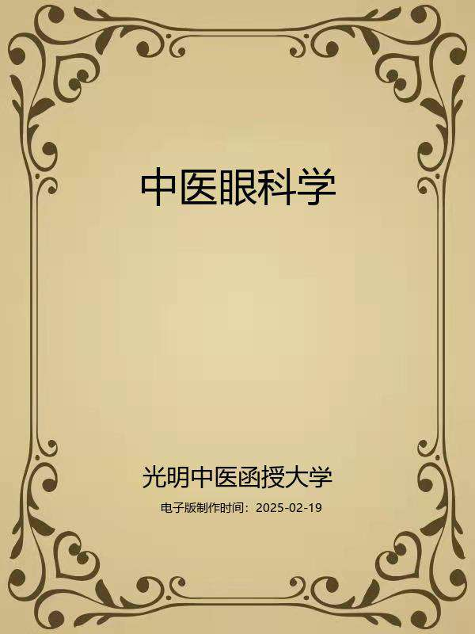

常见证治方剂

电子版录入与校对

更多信息

## 编者与编者的话

编者

光明中医函授大学主编

张海岑主编

卢丙辰副主编

卢丙辰吕海江赵法新张海岑张国泰张静荣编

唐由之沙凤桐审

编者的话

《中医眼科学》一书，是根据光明中医函授大学对临床课教材的要求，即在“注意知识的全面性和系统性，注意突出实用性”和“寓医理于临床”的思想指导下，按照中医的传统理论体系，结合眼科的临床实际，在1964年版《中医眼科学讲义》的基础上进行增删和修改而成的。

本书分为上篇、下篇、附篇三部分。上篇总论系统地介绍了中医眼科的基本理论、诊断、辨证论治特点，分为中医眼科发展简史、眼的构造与功能、眼与脏腑经络的关系、五轮八廓学说、病因病机、治则与治法、眼病的调护和预防等八章。和以往的教科书相比，本书增加了眼的构造和功能一章，旨在使学员了解中医对眼解剖和生理的认识，熟悉眼各部分的名称与功能，为学好《中医眼科学》打好基础。关于八廓学说，历代医籍多有论述，然众说不一，且临床较少运用，所以既往的教科书多不采录。根据目前对眼针疗法等方面的研究，以及临床运用的实践，可以看到八廓学说确有一定的科学道理和实用价值。学习中医眼科而不学习、不研究八廓学说，不能说不是一个较大的缺陷。所以本书介绍了具有代表性的《医宗金鉴》和《中医眼科六经法要》的两种八廓内容。这样做，一方面保持中医眼科基本理论的完整，也为学员和读者了解、运用，并进一步研究八廓学说提供了资料。

下篇各论分七章，包括胞睑疾患、两眦疾患、白睛疾患、黑睛疾患、瞳神疾患、其他疾患和外伤疾患，共介绍常见眼病54种，附病21种。和以往的教科书相比，增加了风热赤眼、轮际起泡、视惑等常见病证；对比较少见或概念不清的赤痛如邪、睥翻粘睑、白膜侵睛等则予以删除；有些病名如睑内结石，电光性眼炎等，似与中医体系不相协调，分别改为粟子疾和强光伤目，后者包括的内容且较电光性眼炎广泛得多；五风内障一节，则是根据古代文献和《中国医学百科全书•中医眼科学》的有关内容，将既往教科书的绿风内障、青风内障一节作了较大的增补和改写，以期便于临床运用，并保持中医对五风内障在理论方面的系统性。

附篇内容主要是为了加强学员的中医眼科基本功，并培养其运用现代仪器作眼科检查的基本技能，可供学员课外阅读，或作为实习时学习之用，也可作为毕业后从事临床工作之参考。

整个编写工作，是在光明中医函授大学教材编辑室的主持下进行的，从体例设计到取材、编写，经过反复推敲而成。在编写过程中，一直得到张金楠老师的指导、支持和帮助，谨致谢忱。

由于编者水平有限，错误和缺点之处在所难免，敬希学员和广大读者提出宝贵意见，以便再版时修正和提高。

编者

一九八八年二月

## 导言

中医教育学，是一门古老而崭新的科学。中医教育的历史，若从师徒授受和医籍编纂算起，已有两千余年。近代史上的中医教育，首推一八八五年浙江陈虬创立的利济医学堂。新中国诞生不久，创办了北京、上海、广州和成都四所中医学院，从而揭开了当代中医教育的序幕，至现在，全国已发展到二十三所。但是，如果把我国中医教育的实践经验加以分析、研究、总结和提炼，升华，揭示它的规律，使之成为一门专门的学科——中医教育学的话，那么，它还处在再创阶段。这就是说，中医教育及其规律存在的历史是悠久的，但论述中医教育及其规律的学科却是崭新的。因此，中医教育工作需要进行探索和研究。

在探索和创建适合我国国情的中医教育的时候，我们必须植根于我们民族文化的肥沃土壤之中，充分重视中医典籍在培育和造就历代医家中的伟大作用。事实上，在长期的历史发展中，逐渐形成了具有中华民族特色的中医药理论体系，它既有丰富临床经验，又有高深的理论基础。历代医学家就是把这些道理传授给他们的弟子，其中部分人经过刻苦自学和临床实践，成为医术高超的医学家，这是我国历代医学家成才之路，亦是中医教育史上培养人才的宝贵经验。这就是我们民族中医教育事业的光辉历史。

在新的历史时期，作为中医教育工作来说，既要给学生打好传统医学的基本功，又要使他们掌握一些新兴的科学知识，使继承与发展得到统一。根据这种认识，我们十分认真地研究和设计了光明中医函授大学的教学计划、教材内容、教学方法与教学手段。归结起来即是：注重打好中医基本功，注意提高中医基本理论水平和培养临床诊治技能，着力培养辨证论治的思维方法，竭诚发挥中医在防病治病中的特长。并在这个基础上，扩大学员知识面。我们把这些要求与思想，全面体现在本校的教材建设中。其目的是使中医人才的知识结构更加合理，以便能担负起继承和发扬祖国医药学防病治病的光荣任务。

在回顾中华医学教育历史，展望现代医学教育的发展趋势以及总结三十多年正反两方面经验的基础上，我们认为，要培养出适合四化需要的合格中医人才，对中医教育的课程设置和教材内容，就要进行必要的改革，建立起为新形势所需要的中医教材。我们正在朝这一方向努力。在认真研究高等中医院校教材和广泛征询中医专家、学者和医务人员意见的基础上，新编了这套较为完整的中医教材，定名为《高等中医函授教材》（包括了二十八门课程）教材的编写人员，由本校选聘知名教授、学者和学有专长者担任，编写时，我们力求各门教材要有鲜明的针对性，在内容上富有实用性，在文字表达上深入浅出、简明易懂，以利便于自学或函授，此外，我们还将根据需要，选编一些辅导材料，以帮助学员（读者）理解教材内容，更好地学取中医知识。

由于教材编写时间仓促，又竭力于继承与创新,不足之处在所难免，敬希学员和广大读者惠赐宝贵意见，以便在再版时修订。

光明中医函授大学教育研究室

一九八五年十月四日

加入光明：

光明中医网址：www.gmzyjx.com，www.gmzyjc.com

## 上篇总论

## 第一章中医眼科学发展简史

**〔自学时数〕**2学时

**〔面授时数〕**

**〔目的要求〕**

1.了解中医眼科历史的分期。

2.了解我国古代各个时期的中医眼科主要著作。

中医眼科学史，是研究中医眼科学的起源、形成和发展过程的一门学科，通过对它的学习，可以了解历代医家在中医眼科学发展过程中的成就与创造，从而促进对中医眼科学的“继承和发扬”，达到古为今用的目的。

中医眼科学是中医学的重要组成部分，是在中医基础理论指导下，研究眼的生理、病理和眼病的辨证论治及预防、护理方法的专门临床学科。它积累了我国人民几千年来同眼病作斗争的丰富经验。从中医眼科学的发展历程来看，大约可划分五个阶段，即萌芽时期（南北朝以前）、形成时期（隋〜唐）、发展时期（宋〜元）、兴盛时期（明〜清）、衰落与复兴时期（清末〜现今）。

现分述如下：

### 萌芽时期

祖国医学眼科的萌芽时期远在上古，经历了我国历史上商、周、秦、汉诸代。这一时期，我们的祖先不断通过与眼病作斗争的实践，探索眼的解剖结构、生理病理，乃至向辨证论治的方向进步。我国在南北朝以前，还没有系统的眼科医著，有关眼和眼病的医药知识，最初多散见于各种书籍文献之中。以后，随着人们医药知识的不断积累和丰富，眼与眼病的知识，才在医药书籍中有了比较集中的记载和论述。

1.早期一般书籍文献中有关眼病医药的记载，从考察河南安阳殷墟出土的甲骨文可知，早在武丁时代（约公元前13〜14世纪），人们把眼病称之为“疾目”，眼病失明曰：“丧明”。如甲骨文卜辞中记载有“贞王弗疾目”、“大目不丧明”等。此是我国关于眼病的最早文字记录。

随着人们长期的生活和医疗实践，逐渐发现并记载了某些动、植物及矿物有治疗眼病的作用。如先秦古地理著作《山海经》中记录药物100多种，其中治疗眼病的药物就有7种。如䔄草，《山海经•中山经》曰：“泰室之山，……有草焉，其状如芣，白华黑实，泽如蘡薁，其名曰䔄草，服之不昧。”既对其形态作了描述，又介绍了治疗作用。除《山海经》外，《诗经》、《淮南子》等古籍书中也载有若干医治眼病的药物。

至春秋时期，已将盲人称为瞽人，如《书经》记载有“瞽奏鼓”。《诗经》记载有“矇瞍奏公”。据《毛传》称：“有眸子而无见曰矇，无眸子曰瞍。”这又将盲目分成了两类。

关于重瞳症，早在战国后期的著作《荀子•非相》中，就有“尧舜参眸子”之说。至汉代，《史记•项羽本纪》亦有“项羽重瞳子”的记载。这是世界上关于瞳孔异常的最早记载。

在治疗眼病方面，据《史记•扁鹊仓公列传》记载，战国时期的名医扁鹊，在经过周都雒阳时，见当地尊敬爱护老人，就当了着重治疗耳、目、痹病的医生。故扁鹊可算是我国有史可据的，最早的一位治疗五官疾病的医生。

此外，其他一些古典文献中也有不少关于眼科的资料。其中《淮南子》载有：“目中有疵，不害于视，不可灼也。”说明汉代对眼病已有一些手术治疗。以后的《晋书》中记载：“帝目有瘤疾，使医割之。”这是有关割治目瘤的最早文献。

2.早期医药书籍中有关眼病医药的记载，约成书于战国末期的《黄帝内经》，不仅反映了我国古代医学的伟大成就，而且奠定了祖国医药学的发展基础，同时对眼与眼病的认识已有很大的进步。该书首次从解剖学的角度提出：目、眼、匡、内眦、外眦（锐眦）、约束、络、白眼、黑眼、瞳子、目系等名词，对眼与脏腑经络的关系，眼的生理功能，某些眼病的病因病机，临床证候，针刺疗法等，都作了初步的探讨和论述。书中还载有30余种眼部病症，如目赤、目痛、目似脱、视歧、善泪出等。关于眼病的治疗，则主要采用针刺疗法。虽然《内经》一书对眼及眼病的认识还不自成系统，但在两千年前能有这样的水平，却是非常先进的。它记述的理论，对后世中医眼科的发展具有重要的影响，如眼与脏腑经络的关系、五轮八廓学说、眼病的辨证等许多基本理论，都是在《内经》的基础上发展起来的。

大约成书于秦汉时期的《神农本草经》，是我国现存最早的药物学专著，书中收录药物365种，其中眼科用药已达72味，可用于治疗胞睑、两眦、白睛、黑睛、瞳神等眼病及一些全身性疾病的眼部症状。长期临床实践证明，书中所载药物功效大多是正确的。如决明子主治青盲、赤白膜、眼赤痛、泪出；鞠花（菊花）主治目欲脱、泪出；菟丝子、蒺藜子、草蒿（青葙子）、茺蔚子明目等，疗效确实。该书提到十几种眼部病症，其中与《内经》相同或相似的有：目痛、目赤痛、目盲、目瞑、泪出、目似脱、面目浮肿、伤眦等；《内经》未载的有：多涕泪、目翳、目中淫肤、眼赤白膜、青盲等。这些记载也反映了当时眼科药物治疗的水平和对于眼病认识的提高。

东汉末年，著名医家张仲景的《伤寒杂病论》，虽然主要讨论的是全身性疾病，但也记载了若干眼症，如目赤、目晕黄、目黯、目不识人等。尤其是从整体观念出发，参合全身脉证辨证论治，这对眼科以后应用全身辨证的方法奠定了基础。

晋朝医家王叔和，在其所著《脉经》一书中已有眼科类证鉴别的萌芽。如谓目视䀮䀮有肾实、胆虚、肝伤三种；目痛有肾与膀胱俱实，肝与胆经气逆之别。另外，还有专节论述目病脉象，及利用眼部症状判断疾病预后等。且后者屡被后世医书所引用。

其它，如皇甫谧所著《针灸甲乙经》、葛洪所著《肘后救卒方》、龚庆宣所著《刘涓子鬼遗方》、陶弘景所著《肘后百一方》等，也都分别载有医治眼病的针灸疗法或方药。

总之，从商周至南北朝以前，我们的祖先对眼病的医药知识不断增加和积累，并开始把医治眼病的实践上升为理论，这是很大的进步。但是，关于眼病医药的理论尚不系统，也无收载和论述眼疾的专科医籍。所以说，在南北朝以前，中医眼科的基础理论与临床诊疗等均处于萌芽时期。

### 形成时期

隋唐时期，国家的统一，生产力的提高，社会经济、文化的繁荣，文化技术与国外的频繁交流，也带来了医学的迅速发展。中医眼科从基础理论到临床实践都得到很大的进步。唐代继隋设立太医署，从事医疗保健和医学教育，分科较细。五官病至此时正式从内、外科范围内划分出来，自成一科，名为耳目口齿科。

隋唐时期，不但出现了甘濬之的《甘氏疗耳眼方》，而且有《陶氏疗目方》（最早的眼科专著）、《龙树眼论》、《刘皓眼论准的歌》（均佚）等眼科专著问世，说明中医眼科在当时作为教学和诊疗科室虽未单立，而中医眼科学在当时却已经初步形成。据史料记载，隋唐时期的眼科手术已发展到相当高的水平。例如，唐代的眼科医家不但掌握了金篦决目治疗白内障的技术，而且已能配制假眼。如北宋李昉等编辑的《太平御览》载：“唐崔嘏失一目，以珠代之。”又北宋钱俨所撰《吴越备史》载：“唐立武选，以击球较其能否，置铁钩于球杖相击。周宝尝与此选，为铁钩摘一目，睛失……，敕赐木睛以代之”。原书注还说，木睛“置目中无所碍，视之如真睛。”据考，周宝是唐武宗时人。由此可知，我国远在第九世纪就能装置假眼，并有珠和木质两种，木睛装上不仅无妨碍，而且逼真。所以，在世界上装置假眼实以我国为最早，而且在唐代就已经具有相当高的技术水平了。

隋唐有关眼科的医学著作有：

1.隋朝巢元方等人所著《诸病源候论》，卷二十八为目病诸候，收载了眼病38候。此外，在风病、虚劳病、伤寒病、时气病、温病、妇人病、小儿病诸候中还收入了不少与全身病相关的眼症。书中提到的解剖名词，除目、眼、白睛、黑睛、瞳子、眦等外，还首次应用了睑、眉、睫毛、缘等名称。该书对眼病的病因病机，多从风热、痰饮、脏腑虚损、血气不荣等方面认识；对眼病症状的描述则较前人详细。这些都为以后眼科临床证候诊断打下了一定的基础。

2.唐初孙思邈所著《备急千金要方》与《千金翼方》，虽然称为方书，但有着丰富的眼科资料。孙氏首次将眼科病因进行了总结，归纳为19因。明确指出生食五辛、热餐面食、房室无节、夜读细书、久处烟火、泣眼过多等皆为丧明之本，宜注意预防。该书还在《内经》的基础上，发展了眼科脏腑病机学说。在治疗方面，内、外治并重，介绍了内治和外用处方81个。如载：“神曲丸，主明目，百岁可读注书。”又称磁朱丸，对患内障眼病，伴有头晕耳鸣，心悸失眠等症，属心肾不交者，效果甚好，至今仍为临床所应用。此外，孙氏在内服药方及食治中首先提出了猪、牛、羊、兔等动物肝脏的明目作用，并记载了针灸和按摩、薰洗、外敷、钩、割等眼病外治法，对后世眼科发展颇具影响。

3.晚唐时期，王焘所撰《外台秘要》一书，内容十分丰富。卷二十一专论眼疾，引用《天竺经•论眼》的内容作为总论，并收载了数十种医书的150首眼科处方。该书谓眼为六神之主，而身由地、水、火、风四大组成。在眼的解剖方面，正确地认识到眼乃轻膜裹水，外膜白晴重数有三，黑睛水膜止有一重。在病源方面，提出了绿翳青盲之类眼病（类似于绿风内障）“皆从内肝管缺，眼孔不通所致”的独到见解，而且指出，该病初发即须速治，病成则不复可疗。该书还提到三种手术治疗：对脑流青盲（内障）“宜用金篦决（即用针拨），一针之后豁若开云而见白日”；对倒睫强调要用镊子拔除，勿使毛断；对类似胬肉之类眼病主张用烧灼法外治。需要说明的是，该书所引《天竺经•论眼》，从内容分析，并非印度医学的翻译作品，而是受了印度医学生理、解剖观点影响的医学著作。

4.唐代盛传的《龙树眼论》一书，是我国著名的眼科专著。可惜原书已经失传。该书在《通志•艺文略》中首次记载，因《艺文略》所载皆是唐朝及唐以前的文献，故可推测此书应为唐或唐以前之著作。《龙树眼论》在《宋史》中仍有记载，至明代《医方类聚》中改称《龙树菩萨眼论》。据考，“龙树”其人系公元2〜3世纪的印度佛教哲学家，也是印度当时的名医，隋唐时期印医传入我国时，还有译成中文的《龙树菩萨药方》等流传。因为“龙树菩萨”在中国有一定的影响，故有人托名而神其书。其内容后经金礼蒙等人收入《医方类

聚》，因此而得以保存下来。至于我国现有的《龙树菩萨眼论》两卷，是日本人由朝鲜《医方类聚》中辑录而成。该书所用的眼部解剖名词和病症名称都比以前的眼科文献多。如所用解剖名词：眼睑、眼皮、眼睑皮里、眼带等，皆属首见，并且已有血轮、水轮之名；所提病症名，已增至60余种。手术方面，不仅首次详述了“开内障用针法”，并且提出用割烙法治疗胬肉攀睛。此外，对上“睑皮里有核（胞睑痰核）”施行手术治疗的记载也以它为早。

5.《刘皓眼论准的歌》是晚唐时期，在《龙树眼论》的影响下著成的另一部眼科专书。该书在《宋史》中又称《刘皓眼论审的歌》，全书为诗歌体裁，便于记颂。据日本人丹波元胤等考证，在现存《秘传眼科龙木论》中，《龙木总论》之“审的歌”，即属该书内容。《刘皓眼论准的歌》所载的五轮歌及眼病的内、外障分类法，对中医眼科学术的发展影响深远。如后世所出不少以内、外障72症为主的眼科著作，就与它的影响有关。

### 发展时期

公元960年，赵氏北宋政权统一了唐末五代十国分散割据的纷乱局面，社会经济又得到了较大的发展，并推动了科学文化的进步。医学方面，在总结前代医家著述和经验的基础上重视了理论探讨。中医眼科学与祖国医学的其他学科一样，不仅在临床上有显著的发展，而且在生理解剖、病机学说等基础理论方面亦有很大进步。在北宋元丰年间的太医局，开始将眼科从原来的耳目口齿科中分出，单独教授。从此，中医眼科一直作为独立学科发展起来。

1.有关眼科的医药著作：

（1）《太平圣惠方》，署名王怀隐等人，是北宋初由官方组织人力编著而成。全书共100卷，其中卷三十二与卷三十三为眼科专篇。收载眼科病症约60种，治眼方剂500余首，基本上总结了唐以前的眼科成就。书中所述病因21种，是在《千金要方》19因的基础上，去掉5因，新增7因而成。该书还对五轮的配位作了改动，并且将它与眼病的病机联系起来，这就推进了五轮学说的临床应用。本书还根据当时社会上迷信道教，炼丹服石成风，新增了丹石毒气攻眼的证治。在眼科手术方面，介绍了钩、割、针、劆诸法，特别是对金针拨内障及胬肉割烙术等也有详细的介绍。因而此书对眼科也是很有价值的文献。

（2）《圣济总录》，是北宋末期由朝廷组织人员编写而成。全书共200卷，眼目门在《太平圣惠方》的基础上扩充内容成12卷，收录治眼方剂760余首，多为大方。书中眼科理论叙述比较粗略，且未釆用五轮学说。病种有所增加，如肝虚眼、目睑垂缓等。在眼科手术方面，介绍有钩、割、劆等法，同时还列述了适应症，只是对金针拨内障法略去未提。此外，还收载了熨、烙、淋洗、掌熨及包扎等。本书眼目门内容比较丰富。

（3）《太平惠民和剂局方》，是许洪在裴宗元、陈师文所编《和剂局方》的基础上校订而成，共十卷。卷七有“治眼目疾”一篇，其中不少处方属当时民间习用的有效方剂，为后世眼科所常用。

（4）《秘传眼科龙木论》是一本著名的眼科专书，由宋元医家辑前人眼科著述而成。全书分10卷：卷1〜6主要载列眼科七十二证方论，每证方论以下附有“审的歌”；卷7为诸家秘要名方；卷8为针灸经；卷9〜10为诸方辨论药性。书中主要内容是按内、外障分类记叙72种眼病的病因、症状和治疗，并介绍了古代金针拨内障以及钩、割、劆、洗等手术方法，总论的“审的歌”中还首次提出了眼科的“五轮”说，对后世很有影响。该书另附有《葆光道人眼科龙木集》，其主要部分是以问答形式编写的“眼科七十二问”，具体内容与前面的“七十二证方论”并不相同。它还首次介绍了八廓的名称和内容，主要是论眼病的病机，并未配属眼位。但这是现存文献中关于八廓内容的最早记载（《三因方》虽曾提到“八廓”一词，但未言及具体内容），有一定参考意义。

（5）元代危亦林所著《世医得效方》，卷16为“眼科”，其内容分总论、各论、附篇三部分：总论中对五轮所配眼位作了调整，使其与《灵枢•大惑论》所划眼部与脏腑相应的关系吻合；对八廓，不仅首次配上了天、地、火、水、风、雷、山、泽等八象名称，而且还给每一廓配属了眼位，充实了八廓的内容。各论列七十二症，每症之症状描述主要以《刘皓眼论准的歌》为基础，其药物治疗多重新选方，但外用药甚少，至于手术疗法则没提到。

（6）元末托名孙思邈著之《银海精微》，也是一本眼科名著。该书分为总论、各论、附篇三部分。书中首先叙述五轮八廓学说和中医眼科辨证的基本知识，并对八廓又分别加上了乾、坎、艮、震、巽、离、坤、兑的八卦正名，至此，八廓的每一廓都有了三种名称。各论载有81种病症，其中66种已见于唐宋文献，另外新增的有胞肿如桃、眵泪净明、蝇翅黑花等15种，但正文中没有圆翳内障、绿风内障之类眼病，只在附篇中提及。书中除列叙80余种眼病的病因证治外，还附有眼病简图。此外，还介绍了按五轮顺序检查眼病的方法等。书中辨证清楚，治疗除内服药外，有半数眼病配合点眼外治，有些还采用了洗、劆、烙、夹手术疗法，对于金针（金针拨内障）的手术方法描述尤详。附篇从眼的生理、病理、辨证治疗，以至中药药性与炮制、常用内服方剂与眼药配制法等一应俱全，本身就能构成一本小型眼科专著，因而这一部分很可能是后人补辑的。

除上述有关眼科的医药著作外，在金与南宋对峙时期，许叔微的《本事方》、刘昉的《幼幼新书》、刘完素的《宣明论方》；陈言的《三因方》、李杲的《脾胃论》、杨士瀛的《仁斋直指方》等，书中皆有不少关于眼科的论述，对眼病的病机和辨证、治疗，各具创见，因而丰富了眼科理论，促进了眼科发展。

2.有关眼科的学术争鸣：金代刘完素的《素问玄机原病式》，在眼科方面强调火热为病的学说，该书提出：目昏赤肿翳膜皆属于热，治宜降心火、滋肾水，用药偏重寒凉；还提出：“玄府者，无物不有”，人体各部皆有玄府，为气机出入升降之门户，以保持通利为正常，若眼部玄府闭塞，则可引起眼病，而玄府闭塞又多由热气怫郁所致，故宜治火以通玄府。他的这些观点，对后世也产生了一定的影响。

金代张从正的《儒门事亲》力主攻邪，其在眼科方面提出：目不因火则不病，能治火者，一句可了，治以祛邪为主；血之于目，太过则壅塞而发病，不及则目耗竭而失明，故当治其太过不及，以血养目。该书在眼科方面亦提出了独到的理论。

金代李杲《兰室秘藏》中强调指出，脾虚影响脏腑精气不能上贯于目则目不明，因而治眼病要调理脾胃，补养气血才是正法，否则是治标不治本。他的理论进一步丰富了眼科的内容。

元代朱震亨的《丹溪心法》，在眼科方面提出“眼病所因，不过虚实二者而已，虚者眼目昏花，肾经真水之微也；实者眼目肿痛，肝经风热之甚也。实则散其风热，虚则滋其真阴，虚实相因则散热滋阴兼之”。其论述对眼科证治也有着参考价值。

上述学术争鸣，对中医眼科的学术发展和兴盛，起到了促进作用。

3.其它眼科成就：我国早在宋代就发明和使用了眼镜。如南宋赵希鹄，在考鉴宋以前古文物的著作《洞天清录》中记载：“叆叇，老人不辨细书，以此掩目则明。”至明代，屠隆在《文房器具笺》中描述叆叇“大如钱，色如云母。”张自烈的《正字通》载：“叆叇，眼镜也。”以上说明，早在宋代我国已开始用眼镜矫正视力了。

总之，自宋代眼科独立设科以后，从理论和临床两方面，都得到了很大的发展。

### 兴盛时期

明清两代，有关眼科的医药著述，无论是数量，还是质量，都大大超过了以前各代。

这一时期，在医学教育方面，继承了宋元时期的建制，眼科仍独立为专科。

1.明代：

（1）元末明初医家倪维德著《原机启微》两卷，上卷将眼内、外各部病证按病因分为“风热不制之病”、“阳衰不能抗阴之病”等18类，并理论联系实际，详细分析病机，辨证论治。治疗除内服药为主外，还视病情需要，配合使用外洗、㗜鼻、点药、手术等外治法。下卷论方剂配伍，附40余方，每方皆有方解。该书是一本阐述理论比较系统，又切合实用的眼科书。倪氏治学宗古而不泥于古，能够兼采前人众家之长，注重整体观念，论治善用时方，有攻有补，内外兼施，学术见地精深，具有不执偏见的科学精神。

（2）明初朱橚等编著的《普济方》，眼目门占16卷，集病名300余种，收方2300余首。因眼目门是由数十种书籍的眼科资料汇集而成，所以常常一种眼病列出若干个病名。如黑睛生翳的病症名就有忽生翳膜、赤眼暴生翳等40余种。

（3）《普济方》之后60年，由朝鲜来中国学医的金礼蒙等人，汇集了150余种中医古籍，编成医学巨著《医方类聚》，其中卷64〜70为“眼门”，除收入《龙树菩萨眼论》之外，还汇集了59种眼科资料和其他26部医籍中的有关论述，及1400多首处方。故该书是一部研究中医眼科的重要资料。

（4）明代中叶徐春甫辑《古今医统大全》，其眼科部分仍列72症，有证亦有方。此外，该书还首次转载了《原机启微》18篇原文。

（5）明万历年间，李梴所著《医学入门》问世。李氏主张眼病分表里，认为风中脑户，湿渍头上，久处烟火，撞刺仆伤之类属外因，致病在表，伤目之标；而五辛灸煿，房室劳役，暴怒暴惊，夜书细字等属内因，致病在里，伤目之本。李氏还将五轮学说中的肉轮细分为上胞属脾，下睑属胃；对八廓的配脏腑和配眼位也重新作了调整。

（6）明李时珍的巨著《本草纲目》于万历年间问世。该书载药1892种，其中眼科用药已达400余种。该书第四卷眼目一节记载了治眼赤肿、昏盲、翳膜、诸物眯目等药物，多数药后附有单方、验方、便于应用，很有参考价值。

（7）明杨继洲著《针灸大成》一书，共10卷。在耳目门中记载了眼病21种，针灸用穴80余个。除此之外，其它篇章中还有不少针灸治疗眼疾的记载，对穴位的主治功能阐述也较详细。这在眼科针灸治疗方面是比较系统的资料。

（8）明玉肯堂辑《证治准绳》，于1602年完成。其中“七窍门”内有眼科专篇。该书总论首次对五轮、八廓等词的含义作了解释，而且对八廓的配位，一反过去与五轮重叠的见解，而改为眼正面的八方配位法，这种主张被后世不少医家所接受。该书对于眼的解剖生理，提出了眼内包涵神膏、神水、神光、真气、真血、真精之说。各论汇集眼部病症170余种，大大超出了自唐以来流行的72种眼病的范围。特别是书中关于眼病的病因和症状的记述较前人详尽，尤其对眼部症状，几乎凡肉眼能观察到的都作了描述。如凝脂翳、物损真睛等，仅描述症状就用了数百字，对临床诊断很有帮助。而且书中的很多病症名为后世所釆用。

（9）明末医家傅仁宇辑著的《审视瑶函》，是在《原机启微》、《证治准绳》等基础上编纂而成，又名《眼科大全》。全书共6卷，可分为两个部分：第一部分，卷首介绍了名医医案、五轮八廓、运气学说等；卷1主要讨论眼科的基础理论；卷2重点论述眼病的病因病机、证治概要等，收入了《原机启微》的十八节原文与处方。第二部分，卷3〜6，作者根据自己的经验综合整理前代资料，将眼病归纳为108种，按病症分节，详述每种眼病的症状、诊断和治疗，所述病理与辨证，主要以《内经》和《证治准绳》为依据。书中记载眼科用方300余首。除大量运用内服药外，对针灸、外用药物治疗及手术等也很重视。卷6之后，附有治疗要穴及较为详细的说明，还介绍了22个外用药方的配制与应用等。此书内容十分丰富，实用价值较高，所以流传较广。

（10）明袁学渊著有《秘传眼科全书》，该书首先介绍了历代眼科理论，次列眼科72症，然后分类介绍了眼科常用药物的药性。

此外，明末龚信的《古今医鉴》、龚廷贤的《寿世保元》、赵献可的《医贯》、张介宾的《景岳全书》等，都有眼科专篇。他们的共同特点是注重整体辨证，而不采用五轮八廓学说。

2.清代：清代，中医眼科资料十分丰富，除大量眼科专著外，在丛书、类书中很多列有眼科专篇，其中有不少著述在理论方面有所发展，对后世的影响较大。

（1）《张氏医通》，是清初医家张璐所著，该书在“七窍门”里，专论眼病，汇集了明清以前二十余种医著中的眼科资料。该书总论除阐述眼科基础理论外，在“金针开内障论”一节中，详述了金针拨障术的适应证、操作方法和拨针的制造等，还列举出若干成功与失败的病例，以供参考。各论部分，宗《证治准绳》体裁，列述眼病约160种，依症状及病因分为43类。该书内容具体，选辑较精，文字通俗，是一部比较实用的参考书。

（2）《医宗金鉴》，是清乾隆年间吴谦等编纂的丛书，内有“眼科心法要诀”两卷。总论眼科诊法，但对八廓不配五脏，只配六腑和命门、包络，这与前代各书不同；各论将眼病按内障24症、外障48症叙述，另有补遗10症，共计82症，正文用七言歌诀，附加注释。该书载方113首，处方所用药味不多，且剂量较小。该书内容简明实用，文字便于记诵，尤适于初学者参考。

（3）《古今图书集成•医部全录》是雍正年间清政府组织编纂的规模巨大的类书，由陈梦雷等所编。全书共520卷、其中目门13卷，搜集历代主要眼科著述，依成书年代顺序，择要辑录眼科文献，前为医论，后为方药、针灸、导引、医案等，内容丰富，很具参考价值。

（4）黄庭镜于乾隆年间著《目经大成》，成书于1741年，全书共3卷。卷1立论，卷2考症，卷3类方。书中首论五轮八廓等眼科理论，及开导、钩割、针烙、金针拨内障诸治疗技术，凡有关眼科之医学基本理论，诸如阴阳、五行、脏腑、经络、六淫、七情、脉象等，均概括论及。其论症，以因分，则有风、寒、暑、湿、厥郁、毒、疟、胎产、痘疹、疳积、因他、无因而因12类；以症分，则有天行气运至目晕凡89，逐一条分缕析。每症之下，或诗、或词、或歌、或赋，首吟之，次则详列证候，阐释病机，终则指明治法，时而犹附案例以证己说。病因脉治，纲目井然。全书之最后部分，为眼科方剂之大成。黄氏仿景岳补、和、攻、散、寒、热、固、因八阵之制，每阵各列眼科常用方数十首，凡229方，于组成、主治之外，犹阐明方义，更有细论其随症化裁、灵活变通之妙者，诚为其他眼科著作之少见。书中所收外治19方，括外治之点、洗、擦、涂、熏诸法，俱实用而效著者，充分体现内服与外治并重之原则。该书对五轮八廓的发挥、继承整理针拨术及独创病名等均有突出的见解。数十年后，该书经邓赞夫增补，又名之为《目科正宗》，于1810年版行于世。

（5）《银海指南》4卷，是清•顾锡在认真学习《内经》及前人医学论著的基础上，结合自已的实践经验所著。卷1〜2比较全面地论述眼科五轮、八廓、运气学说，眼病的病因、病机、脏腑主病及全身兼病等；卷3列内服方170余首，外用方11首；卷4录验案176则。该书把八廓的功能与经络联系起来，且与《审视瑶函》一样，认为八廓在内无迹可寻，有病时才能从眼部血络的走向与位置分辨出来。书中用病因、脏腑等分析归纳眼部病症的方法，明确而实用。该书在治疗方面，内治所列方剂多属内科常用方，外治除主张用药外，不赞成手术疗法。

此外，明清其他眼科专书，如程玠的《眼科应验良方》、邓苑的《一草亭目科全书》、马化龙的《眼科阐微》、王子固的《眼科百问》、及撰人不详的《异授眼科》、《眼科奇书》等，对后世均有一定的影响。

总之，明清时期的中医眼科，在基础理论与临床治疗方面都有很大发展，眼科文献的数量与质量都大大超过以前各代，所以说是中医眼科最兴盛的时期。

### 衰落与复兴时期

自1840年鸦片战争以后，由于清政府及清以后的军阀政府和国民党政府腐败无能，帝国主义疯狂入侵，使我国沦为半殖民地半封建社会，中华民族的经济文化遭到空前的破坏。特别是国民党当政时期，统治阶级宣扬洋奴买办思想和民族虚无主义，诬蔑中医不科学，企图消灭中医，使祖国医学遭受摧残，中医眼科也趋于衰落。

1.晚清时期：随着我国沦为半殖民地半封建社会，西医眼科学也随之传入中国，并迅速兴起。如1843年宁波即有外籍医生设立了专收眼科病人的诊所。此后所办的西医学校也大多设有眼科，并有翻译的西洋眼科专书出现，如梅氏眼科学。虽然，晚清时的太医院（皇室官吏们诊治疾病的机构）仍是中医，也把眼科列为独立专科，但在学术上并无特殊成就。光绪末期，为整顿在省垣业医者队伍，进行分科考试，眼科亦列为专科予以考试，但当时眼科形势已趋衰落。

从该时期眼科专著或有关一些丛书来看，如1847年王锡鑫的《眼科切要》、1849年胡鳌的《眼科神应方》、1861年陈国笃的《眼科六要》等，均沿袭前代眼科医籍中的内容，无突出特色。

至1867年，黄岩著《秘传眼科纂要》，该书首重药物的临床应用，按脏腑及眼症分类叙述了119种内服药及38种外用药的制法与应用，有一定的参考价值。1911年刘延年著有《眼科金镜》，在病因病机方面有不少独特见解，证治概念亦较明确。

同时期其余的一些书籍，如《厚德堂集验方萃编》、《广勤轩遗

稿》、《眼科神方》、《眼科秘书》、《孙真人眼科秘诀》等，内容都比较简单，亦无特殊见解。其他如《裕氏眼科正宗》、《眼科家传》、《卫生总微》等内容更不如前。

2.民国时期：自1912年清代结束，由于军阀混战，社会动乱不安，加之国民党当局扼杀中医的政策，中医眼科随着中医事业的衰落，更趋凋零。

1935年康维恂编《眼科菁华录》共3卷。卷首为总论，阐述一般眼科知识，卷上、下为各论，按17门分述了123种眼病的病因、症状及方剂等，接近现代讲义的格式，内容比较简略。

此外，鸦片战争之后，由于西医眼科的传入和影响，我国眼科界开始出现了中西汇通学派，如1936年陈滋著《中西眼科汇通》，利用西医眼科分类法，将眼病分为10类共98症，每病均列有中西医名称。

3.解放以后：中华人民共和国诞生之后，党和政府十分重视发挥祖国医学在人民卫生保健事业中的作用，特别制定了中医政策，使中医事业得到拯救与发展。中医眼科也从灭亡的边缘被拯救出来，走上了兴盛与发展的广阔大道。新中国成立以来，中医眼科取得了显著的成就。

（1）有关中医眼科机构的发展。解放后，中医眼科工作者队伍得到了发展壮大。特别是1956年以来，各省市相继成立了高等中医院校，中医眼科学成为临床课中一门必修课。通过教学与临床，培养了一大批眼科教师与医生。

自1978年以来，除全国中医学术组织外，很多省市相继成立了中医眼科学会，对促进学术交流与推动中医眼科的发展，作出了贡献。

除中医眼科工作者的队伍不断发展壮大外，自1959年以来，更有许多西医学习中医的眼科工作者加入中医眼科的队伍，共同为继承发扬中医眼科作出贡献。

自建国以来，各地相继建立了中医或中西医结合的眼科门诊或病房，特别是中医院校的附属医院中，基本都专设有眼科门诊或病房。中国中医研究院还成立了眼科研究所，科研工作者为中医眼科学术的发展，作出了重大贡献。

（2）中医、中西医结合的眼科著述，数量多，质量高。1960年由广州、北京、上海、成都、南京五所中医院校编著了我国历史上第一部全国统编教材——《中医眼科学》，此书收集了历代中医眼科的学术精粹，系统整理归纳，后经四次修订，渐臻完善。

中医或中西医眼科专著不断问世，如陈达夫的《中医眼科六经法

要》；《韦文贵眼科临床经验选》；姚和清的《眼科证治经验》；陆南山的《眼科临证录》；路际平的《眼科临症笔记》；张望之的《眼科探骊》；《陈南溪眼科经验》等相继出版。此外还有《医学百科全书•中医眼科学分卷》，成都中医学院的《中医眼科学》等。不少著作中都运用了现代仪器检查，弥补了历史上中医眼科对内眼疾病认识不足的部分。

建国以来，在报刊、杂志上发表了大量的中医眼科论文，这种形式的著述，不仅为数众多，而且内容广泛，从中医眼科基础理论、临床见解、特殊眼病、科研发现、手术改进、学术讨论等方面出发，写出了不少较高水平的学术论文。

总之，建国以来，眼科的中医、中西医结合成果丰硕，中医眼科学得以迅速的发展，形势喜人。目前，广大中医、中西医结合眼科工作者，正奋勇前进，为继承发扬祖国眼科宝藏，为实现中医眼科现代化而奋斗。

复习思考题

1.中医眼科史大体可以分哪几个阶段？

2.历代有哪些主要的中医眼科专著？

## 第二章眼的构造与功能

**〔自学时数〕**2学时

**〔面授时数〕**

**〔目的要求〕**

1.熟悉眼的构造及各部名称。

2.了解神光的产生过程。

眼或称目，是人的视觉器官，属五官之一。因古代道教书籍以眼为银海，故亦称为银海。眼在人体，具有明视万物，分辨颜色的功能，其构造精妙，作用神奇，故而向被人喻之为“金珠玉液”，“幽门神户”，视为人体之至宝。而眼之能视，与全身脏腑经络和精津气血有不可分割的关系。五脏六腑之功能正常，精津气血充盈，则目得所养而精明。而精津气血必藉经脉为之贯通转输，方能上达于目。故脏腑经络等一旦受病，即可累及于眼。因此，诊疗目疾除应重视眼部病变外，必须有整体观念。为了便于眼部病变的诊察，正确地判断发病机制，今将眼的构造及其功能分述于下：

### 第一节眼的构造

《灵枢•大惑论》指出：“五脏六腑之精气皆上注于目而为精。”《审视瑶函》亦指出：“夫目者，五脏六腑之精华。”说明眼是由五脏六腑之精气上注而成的。眼位于眼眶骨形成的骨眶之内，主要由眼珠、胞睑、眼带、目系等部分组成。

1.胞睑：即两目外上下卫护之胞，又名目睥、目裹、眼胞、眼睑等，《黄帝内经》称其为约束，俗名眼皮。胞睑分上下两部分，在上者称上睑，在下者称下睑，亦有“胞者上胞也，睑者下睑也”之说（《银海精微》），故习称上胞下睑。

胞睑的边缘称睑弦，又名目唇、睑唇或胞沿。睑弦上生有排列整齐的睫毛。胞睑可以反转，其内面称睑内或睥内，表面红黄相兼，光滑润泽，与眼珠表面紧贴而不相粘连。

上下睑弦的联合处称目眦，近鼻侧者大而圆，故称内眦或大眦；居颞侧者小而锐，故称外眦、小眦或锐眦。内、外二眦合称两眦，俗名眼角。大眦内有红肉一颗，名眦肉（见《银海指南》），为眼前部脉络汇聚之处，色红活而润泽。

靠近大眦的上下睑弦上，各有一针尖大小之孔窍，称泪窍，为泪液排出之通道。（图1）

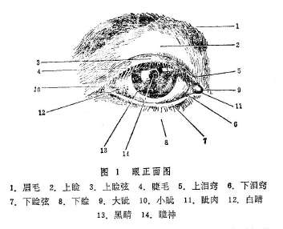

胞睑开合自如，启闭敏捷，与睑弦上之睫毛共同起着保护眼珠的作用。

其一，通过眨目动作，可以敷布神水于眼表面而濡润之；其二，时刻防御风沙及其它异物触伤眼珠，亦有抵御六淫之邪外侵之作用；其三，上下睑微合，则睫毛覆于瞳神之前，形似竹帘，有屏蔽尘沙及遮障强光的作用。另外眼睑关闭则光线不能进入眼内，尚有保障睡眠的作用。

2.眼珠，又名目珠，以其形圆类丸，皎洁明净，状如宝珠而得名。

眼珠居于眼眶之内，前部的裸露部分，正中为黑睛，黑睛之周围为白睛（图1）。眼珠后面则有目系上通于脑。

黑睛又有黑眼、黑珠、乌睛、乌珠、青睛等名，位于眼珠前端中央，略呈椭圆形，分前后两部分。前方称水膜，清莹明润，无色透明，至清至脆，不可清触。水膜之后为黄仁，又名睛帘。黄仁呈圆盘状，菲薄娇嫩，纹理微密，呈棕褐色。黑睛之色，实即黄仁色泽透见于外而然。黄仁中央有一圆孔，大小似绿豆（直径约2.5〜4mm），名曰瞳神（图1）。

瞳神又称瞳仁（人）、瞳子、金井等，其色黑莹净彻，乃神光发生之所。瞳神之后，尚有晶珠、神水、神膏、视衣等组织。

《银海精微》云：“瞳人之大小，随黄仁之展缩。黄仁展则瞳人小，黄仁缩则瞳人大。”而黄仁之展缩，乃随光线的强弱而变化。光线强则黄仁展，瞳神变小，光线弱则黄仁缩，瞳神变大。

眼珠表面，黑睛之外的部分统称白睛。

白睛又称白眼、白仁、白珠、俗称眼白。白睛色白属金，所以《证治准绳》云：“金为五行之至坚，故白珠独坚于四轮。”白睛质地坚韧，与前端之水膜共同组成眼珠之外壳，包裹护卫着眼珠内所含物质。白睛裸露于外的部分覆盖着一层透明的外膜，此膜与白珠紧贴而不粘连，可滑动，有弹性，上有微细血络，外膜之名见于《张氏医通•金针开内障》：“针尖划损白珠外膜之络而见血。”故可称此膜为“白珠（睛）外膜。”（图2）白珠外膜亦可称白睛表层，其覆盖部位的白睛则称白睛里层。

眼珠的构造，早在唐代的《外台秘要》就有比较正确的记载。该书卷二十一云：《眼根寻无他物，直是水耳。轻膜裹水，圆满精微，皎洁明净，状如宝珠，故曰眼珠。”《证治准绳》则云：“大概目圆而长，外有坚壳数重，中有清脆。”说明眼珠的外壳是很薄的膜状组织，壳内包涵着液态内容物。

眼珠的外壳，《证治准绳》约言“数重”，《外治秘要》则明确地记载为“白睛重数有三，”“黑睛水膜止有一重。”除黑睛的水膜之外，白睛的三层《外台秘要》未予定名。根据《审视瑶函•枣花障症》“此症甚薄而白，起于风轮周匝，从白膜之内环布而来也……凡见白圈傍青轮际，从白膜内四围圈圆而来，即是此症”的记载，则白睛的外层可称“白膜。”至于中层和内层，锦章书局本《审视瑶函》卷首所附眼图分别称之为“视黑衣”和“视脑衣”，近代医者多称其为“睛膜”与“视衣”，亦可沿用。（图2）

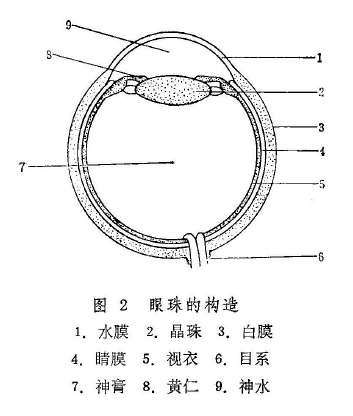

眼珠包含之内容，《目经大成》卷一指出“膏中有珠，澄彻而软，状类水晶棋子，曰黄精。”此黄精亦名睛珠或晶珠，位于瞳神与黄仁之后，正常情况下透明而清脆，一旦混浊则称内障而遮障视力。睛珠之后，则为一函神膏，《疡医大全》卷十一则称神膏为护睛水，并指出：“白睛最坚属肺金，内藏护睛水，如鸡子清之稠浓。”可知神膏为胶状液态物质，与其前方之神水共同维持着眼珠的圆满状态及瞳神的正常功能（图2），《证治准绳》认为：“神膏乃由胆中渗润精汁积而成者。”《目经大成》论述八廓时则云：“坎为神膏，络通膀胱之腑，脏属于肾。”神水分布于水膜之后，黄仁和睛珠的周围，质地比较清稀，明净澄澈，不易察见，有养保水膜、黄仁、瞳神、神膏之功。其生成，《证治准绳》认为是“由三焦而发源，先天真一之气所化。”可知神水由肾中真水及三焦中运行之水液为基础，受命门真阳及三焦元气之蒸腾而上注于目。另外，眼外目珠上润泽之水亦称神水，正常情况下宜津津常润，神水不足则目珠失养而干枯生翳，神水过多流出目外则为泪液。

3.眼带：指眼珠外所附着的支配眼珠转动的带状组织。人的两目能灵活运转，与眼带之牵拉或舒展有关。若眼带受邪而功能异常，则目珠运转失灵而偏视。眼带之名，首见于《太平圣惠方•坠睛》，该篇谓：坠睛乃风寒之邪“攻于眼带”所致。《杂病源流犀烛》亦云：“若风寒直灌瞳神，攻于眼带，则瞳人牵拽向下。”这类眼病，在《证治准绳》、《审视瑶函》中往往认为是筋脉、筋络、脑筋牵拽所致，所以可以认为，后者所谓筋脉、筋络、脑筋亦即眼带。

《证治准绳》曾谓：“目形类丸，内有大络六，中络八，外有旁支细络莫知其数。”此所谓大络六，显指眼珠外的六条眼带，其分布于眼科的上、下、左、右四个方位，共奏牵动眼珠转动之功。（图3）

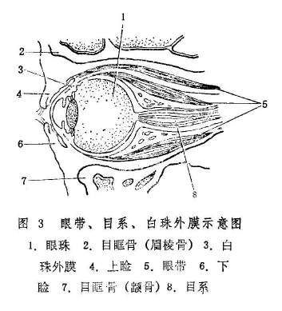

4.目系：又名眼系、目本（图3）《医宗金鉴•刺灸心法要诀》曰“目系者，目睛入脑之系也。”其形如线，且具血管，由眼珠之最后始，上通于脑，《灵枢•小惑论》且言其“后出于项中”。眼珠与脑，通过目系而密切相联。养目之精血津气，大部由脑部经目系下注于眼。两眼所见之景物，亦是经目系而上传于脑。正如《医林改错》所说：“两目系如线，长于脑，所见之物归于脑”。目系受邪则视物昏渺，甚至失明。

5.目眶：亦名眼眶骨。《医宗金鉴•刺灸心法要诀》指出：“目眶者，目窠四周之骨也，上曰眉棱骨，下即䪼骨，” 䪼骨之外即额骨。内则为鼻梁骨，（又名鼻颊骨）。目眶前端略呈四边形，前阔后狭，为眼珠有力的保护结构。前述胞睑、眼珠、眼带、目系均居于目眶之中。

### 第二节神光的产生

《审视瑶函》曰：“神光者，谓目自然能视之精华也。”此称神光为眼的视觉功能；《证治准绳》则曰：“神光者，谓目自见之精华

也。”此所谓神光当为瞳神显现的神彩。所以可以认为，神光包括瞳神的神彩及其视觉功能。

神光发于瞳神，属于神的范畴，所以神光的产生与五脏六腑及整个人体之神有关。神属阳属火。故《证治准绳》认为“神光发于心，原于胆，火之用事。”《审视瑶函》认为“神光源于命门，通于胆，发于心，皆火之用事”均认为神光的发生与命门、胆、心等脏腑有密切关系。因命门为先天真火，心藏神而为君火，胆主少阳相火，故云“皆火之用事”。诸火旺盛协调则神光敏锐，诸火衰而不足则有昏瞑之患，诸火胜而炎上则有焚燎之殃。

阳生于阴，阴乃气化。阴能化气，气则生神。故而神光的产生并非仅与命门、心、胆诸火有关。实际上精津气血的充盈旺盛亦是产生神光的物质基础。精津气血升运于目者，因其轻清上升于高而难得，所以分别称作真精、真气、真血。

真精包括神水、神膏及所有滋养目窍而使其发挥正常生理功能的精微物质。《灵枢•大惑论》云：五脏六腑之精气，皆上注于目而为之精。”《证治准绳》则云：“真精者，乃先后二天元气所化之精

汁。”可知真精包括先天之精与后天之精，实为五脏六腑之精，其轻清精微者，经过幽深细微的经络脉道，升运于目而成。但是肾为藏精之脏，受五脏六腑之精而藏之；胆为清净之腑，内藏精汁三合，所以《证治准绳》说真精“先起于肾，次施于胆，而后及乎瞳神也。”可知真精的生成，与肾胆的关系尤为密切。真精为构成眼并维持其正常功能的物质基础，具有涵养神光之功。真精亏虚，神光即衰微或丧失。如《素问•脉要精微论》云：“夫精明者，所以视万物，别黑白，审短长。以长为短，以白为黑，如是则精衰矣。”

真气指运行于眼部经络中之生气，是维持眼的生理功能的动力。其化生于精、血，而能推动精、血的正常运行，具有温养目窍的作用。而且，真气充旺，精、血才能升运于目。真气和畅，则血行无滞而目窍得养。所以《证治准绳》云：“真气者，盖目之经络中往来生用之气，乃先天真一发生之元阳也，大宜和畅，少有郁滞，诸病生焉。”真气充旺，始能神光焕发，眼目精彩光明。

真血专指目珠内运行之血。《证治准绳》指出：“真血，即肝中升运于目，轻清之血，乃滋目经络之血也……因其轻清上行于高而难得，故谓之真也。”说明真血乃肝血升运于目者。肝为藏血之脏，肝血充旺，方能升运于目以养神光。

综上所述，神光之产生，主要与心、胆、命门等脏腑之阳火有关。但必赖真精以滋之，真气以温之，真血以养之，神光始能充沛敏锐，神彩奕奕。

复习思考题

1.试述眼的构造及各部位的名称。

2.神光是怎样产生的？

## 第三章眼与脏腑经络的关系

**〔自学时数〕**2学时

**〔面授时数〕**

**〔目的要求〕**

1.了解眼与五脏六腑的关系.

2.了解与眼之目系、内外眦相联络的经络、经别、目下经筋。

眼为人体视觉器官，属五官之一。眼通过经络，与脏腑和其他组织器官保持着密切的联系，共同构成人体有机的整体。脏腑的精气，通过经络的运行转输而上注于目，以发挥眼的正常功能，因此，脏腑经络的某部受病，每可反映于眼部，亦可于眼部出现各种病症。反之，一旦发生眼部疾病，也可能出现全身及其他部分的证候。所以，在学习和研究眼的生理、病理和诊治眼病时，不能孤立地只看局部，而应该具有整体观念，明确眼与脏腑、经络的关系等，进行全面的观察。

### 第一节眼与脏腑的关系

眼之所以能够明视辨色，均赖于五脏六腑精气的濡养。《灵枢•大惑》说“五脏六腑之精气皆上注于目而为之精”。指出脏腑之精气充足与眼有着密切的关系。反之，若脏腑功能失调，精气不能充足流畅地上注于目，就会影响眼的功能，甚至发生眼病，故《审视瑶函》中有：“脏腑之疾不起，眼目之患即不生”之说。

1.眼与心、小肠的关系：

（1）心主血脉，诸脉属目：《素问》五脏生成篇及脉要精微论说：“诸血者，皆属于心”，“心之合脉也”，“脉者，血之府”，“诸脉者，皆属于目”。由此可知，心主全身血脉，而脉中之血受心气推动，循环周身，上输于目。目受血养，才能维持正常视觉。若心主血脉的功能失常，脏腑经络供给眼部的气血不足，则视物昏花；若血脉瘀阻，亦会发生视力障碍。

（2）心主藏神，目为心使：《灵枢•大惑》说：“目者心之使也，心者神之舍也。”这里的“神”是指人的精神意识、思维活动功能。由于心为神之舍，精神虽统于心，而外用于目，故目为心之使。《审视瑶函》还认为：心神在目，发为神光，神光深居瞳神之中，才能明视万物。《素问•解精微论》又说：“夫心者，五脏之专精也，目者其窍也。”由于心为神明之府，五脏六腑之大主，五脏之精气均授于心，在心气的作用下上注于目，且视物又受心神的支配，故人体脏腑精气的盛衰，及精神活动的状态，均能反映于目，所以目又为心之外窍。这一理论也是中医望诊中望目察神的重要依据。如临床所见神志不清的患者目不识人，正说明了眼之能够视物辨色，离不开心神的主宰。

（3）眼与小肠的关系：《素问•灵兰秘典论》说：“小肠者，受盛之官，化物出焉。”水谷由胃腐熟后，传入小肠，经小肠进一步消化，分清别浊。清者，其中包括津液和水谷之精气，由脾转输全身，而使目亦受到滋养。若小肠功能失调，清浊不分，脾的转输功能亦受到影响，可使眼目失于濡养而妨碍视觉功能。

此外，心与小肠有经脉互为络属，小肠的功能正常与否，既关系到心，也影响到眼。临床所见心火上炎之目疾，可移热于小肠，而出现小便黄赤、短少的症候。古人常用泻心火清小肠之法，则使小便自利，目疾亦可向愈。

2.眼与肝、胆的关系：

（1）目为肝之窍：《素问•金匮真言论》在论述五脏应四时，同气相求，各有所归时说：“东方色青，入通于肝，开窍于目，藏精于

肝。”指出了目为肝与外界相通的窍道。因目为肝之窍，故肝所受藏的精微物质，能源源不断地输送至眼，从而维持其视觉功能。

（2）肝受血而能视：肝主藏血，具有贮藏血液，调节血量的功能。虽五脏六腑之精气皆上注于目，但目为肝之窍，故在脏腑的精气之中，尤以肝血的滋养为重要。所以，《素问•五脏生成篇》说：“肝受血而能视。”《审视瑶函》则进一步说：“肝中升运于目轻清之血，乃滋目经络之血也。”并指出“血养水，水养膏，膏护瞳神，”才能维持眼的视觉。临证所见，肝血不足之人，每易目昏眼花。

（3）肝气通于目：肝主疏泄，具有调畅人体气机的功能。气既能生血，又能行血，凡是供给眼部的血液，无不赖于气的推动。《灵枢•脉度》说：“肝气通于目，肝和则目能辨五色矣。”这就强调了只有肝气冲和条达，眼才能够辨色视物。

（4）肝脉上连目系：《灵枢•经脉》中说，足厥阴肝脉“连目系”。肝脉在眼与肝之间运行气血，起着沟通表里，联络眼与肝脏的作用，从而保证了二者在物质上和功能上的密切联系。所以，《仁斋直指方》说：“目者肝之外候也”。此说不仅指出了眼与肝在生理、病理上的关系，而且对临床指导辨证亦具有重要意义。

（5）眼与胆的关系：肝与胆脏腑相合，互为表里。肝之余气溢入于胆，聚而成精，乃为胆汁。胆汁于眼也十分重要，如《灵枢•天年》中说：“五十岁，肝气始衰，肝叶始薄，胆汁始减，目始不明。”《审视瑶函》又说：“神膏者，目内包涵之膏液，……此膏由胆中渗润精汁，升发于上，积而成者，方能涵养瞳神。此膏一衰，则瞳神有

损。”由此可知，若胆汁减则神膏衰，神膏衰则瞳神失养，则可致视物不明。故在六腑之中，胆与眼有着直接的关系。

3.眼与脾、胃的关系：

（1）脾输精气，上贯于目，脾主运化水谷，为气血生化之源，使人体内而脏腑、经络，外而四肢、九窍，皆能得到濡润和滋养。《素问•五机真脏论》在论及脾之虚实时说：“其不及，则令人九窍不通。”其中即包含脾虚能致眼病。李东垣在《兰室秘藏》中指出：“夫五脏六腑之精气，皆禀受于脾，上贯于目。脾者诸阴之首也，目者血脉之宗也，故脾虚则五脏之精气皆失所司，不能归明于目矣。”这就突出了眼赖脾之精气供养的关系。

（2）脾气上升，目窍通利：脾主升清，能将精微物质升运于目，此属《素问•阴阳应象大论》所谓：“清阳出上窍”。目得清阳之气的温养则视物清明。临证所见，中气极度虚弱的病人，亦可致目光昏暗，视物无见。

（3）脾气统血，血养目窍：脉为血之府，诸脉皆属于目，目得血而能视。而血液之所以运行于眼络之中不致外溢，则赖于脾气的统摄。若脾气虚衰，失于统摄，则可引起眼部出血的疾患。

（4）脾主肌肉，睑能开合：脾主运化水谷之精以生养肌肉，胞睑肌肉受脾之精气荣养，则轻劲有力，开合自如。若清阳不升，则胞睑垂缓不用。

（5）眼与胃的关系：脾胃为后天之本。胃为水谷之海，主受纳、腐熟水谷，下传小肠，其精微通过脾的运化，以荣养周身。脾胃脏腑相合，互为表里，二者相辅相成，共同完成消化饮食和水谷精微的摄取、输布功能。故李东垣在《脾胃论》中说：“九窍者，五脏主之，五脏皆得胃气乃能通利。”并进一步指出：“胃气一虚，耳、目、口、鼻俱为之病。”由此可见胃气于眼之重要。此外，《素问•阴阳应象大论》说：“浊阴出下窍。”脾胃乃机体升降出入之枢纽，脾主升清，胃主降浊。二者升降正常，出入有序，则浊阴从下窍而出，不致上犯清窍。临床所见，浊阴不降而上犯于目内，则视物昏花。

4.眼与肺、大肠的关系：

（1）肺为气主，气和目明。张景岳说：“肺主气，气调则营卫脏腑无所不治。由于肺朝百脉，主一身之气，气能推动血行，气血并行周身，则目亦得其温煦濡养；肺气调和，气血流畅，脏腑功能正常，则五脏六腑精阳之气皆能源源不断地输注入目，故目视精明。反之，若肺气不足，以致目失温养，则昏暗不明，此即《灵枢•决气》所谓：“气脱者，目不明”。

（2）肺气宣降，眼络通畅。肺气宣发，能使气血津液敷布全身；肺气肃降，能使水液下输膀胱。肺之宣降正常，则血脉通利，目得卫气和津液的温煦濡养，卫外有权，目亦不病。反之，若肺失宣降，气机不利，血行滞涩，水液不降，则可导致目赤肿胀。

（3）眼与大肠的关系：肺与大肠脏腑相合，互为表里。小肠浊物下注大肠，化为粪便而排出体外，有赖于肺气的肃降。若肺失肃降，则腑气推动无力，可致大便不畅；反之，若大肠积热，腑气不通，影响肺的肃降，则可导致眼病的发生。故治疗此类眼病，应考虑通腑泻热，才能收到较好的效果。

5.眼与肾、膀胱的关系：

（1）肾精充足，目视精明。人体之精乃生命活动的基本物质。目之能视，则有赖于五脏六腑精气的濡养。《素问•上古天真论》说：“肾者主水，受五脏六腑之精而藏之。”故眼的视觉正常与否，与肾所受藏脏腑的精气充足与否，关系至为密切。若肾精充足，则目视精明。临床所见，内障眼病因肾精亏虚者，多见视物䀮䀮之症。

（2）肾生脑髓，目系属脑。《内经》说，肾主藏精，精能生髓，诸髓属脑，脑为髓海。若肾精虚则髓海不满，髓海不足则脑转耳鸣，目无所见。又说，目系上属于脑，后出于项中，若邪中于项，随目系入脑则脑转，脑转引目系，目系急则目眩以转。王清任《医林改错》则进一步说：“精汁之清者，化而为髓，由脊骨上行入脑，名曰脑

髓，……两目即脑汁所生，两目系如线，长于脑，所见之物归于

脑。”王氏明确地将眼之视觉归结于肾精所生之脑，阐明了肾一脑一眼的密切关系。

（3）肾主津液，上润目珠。《素问•逆调论》说：“肾者水脏，主津液。”《灵枢•五癃津液别篇》指出：“五脏六腑之津液，尽上渗于目。”津液在目化为神水，在外即为珠上润泽之水，在内为眼内充养之液。这些水液的分布和调节，与肾主水的功能有密切关系。临床所见，若肾的气化不足，水液代谢不行，上泛于目，常引起眼部水肿。

（4）眼与膀胱的关系：肾与膀胱脏腑相合互为表里。在人体水液代谢过程中，膀胱主要有贮藏津液、化气行水、排泄尿液的功能。而膀胱的气化作用主要取决于肾气的盛衰。临床所见，如肾气不足，则影响膀胱气化不行，或湿热蕴结，而引起膀胱气化失常，水液潴留，可致水湿上泛于目。此外，膀胱属足太阳经，主一身之表，易受外邪而发生目病，故《银海指南》有“治目不可不细究膀胱”之说。

6.眼与三焦的关系：三焦者，主通行元气与运行水谷、疏通水道，故上输入目之精气津液无不通过三焦。若三焦功能失常，致水谷精微之消化、吸收和输布、排泄失调或障碍，则目失濡养。若三焦水道不利，致水液滞留，水邪上犯于目，则可引起眼病。此外，《证治准绳•七窍门》还指出：目内所涵神水，是“由三焦而发源。”故，三焦功能失常，亦可致神水衰竭而发生目病。

由上可知，眼与五脏六腑的关系各具特点，虽然历代医家对眼与各脏腑关系的密切程度有不同的看法，但必须认识到，人体是一个有机的整体，无论脏与脏、脏与腑，及腑与腑之间，都有经络相互联系，它们在生理上相互协调，相互依存；而在病理上又相互影响，相互传变。因此，眼与脏腑之间的关系虽各有特点，不能一概而论，但也不能过分强调某一脏腑的作用。临证时，应从实际出发，全面地进行观察和分析，才不致贻误病情。

### 第二节眼与经络的关系

眼与脏腑的密切关系既如上述，但还须依赖经络为之贯通，才能构成一个完整的有机系统，以保持视觉功能的健全。

经络运行全身气血，在人体起着沟通表里上下，联络脏腑器官的作用。《灵枢•口问》说：“目者，宗脉之所聚也”，《灵枢•邪气脏腑病形》说：“十二经脉，三百六十五络，其血气皆上于面而走空窍，其阳气上走于目而为之精。”这都说明了眼与脏腑之间，靠经络的连接贯通，才保持着有机的联系。是经络不断地输送气血，才维持了眼的视觉功能。

1.眼与十二经脉的关系：十二经脉，三阴三阳表里相合，正经首尾相贯，旁支别络纵横交错，营血在经脉中运行全身，始于手太阴，终于足厥阴，周而复始，如环无端。故从经络循行的途径来看，十二经脉都直接或间接地与眼发生着联系。兹将十二经脉中循行于头面，与眼部发生联系的八条经脉分述如下：

（1）手阳明大肠经：该经支脉上行头面，左右相交于人中之后，上挟鼻孔，循禾髎，终于迎香穴，与足阳明胃经相接，和大眦部间接相连。

（2）足阳明胃经：本经受手阳明之交，起于眼下鼻旁之迎香穴，继而左右相交于鼻根部，过内眦部睛明穴，与旁侧足太阳膀胱经交会后，循鼻外侧下行，经承泣、四白、巨髎，入上齿中。此外，足阳明经别出而行的正经（足阳明之正），亦由食道浅出口腔，上达鼻根及眼眶下方，并系联于目系。

（3）手少阴心经：该经支脉，从心系上挟咽，系目系。其别出之大络名通里，亦属于目系。此外，尚有本经别出而行的正经（手少阴之正）上出于面，与手太阳小肠经的支脉会合于目内眦之睛明穴。

（4）手太阳小肠经：该经脉有两条支脉上行至目眦。一条支脉循颈上颊，抵颧髎，上至目锐眦，过瞳子髎，转入耳中；另一条支脉，从颊部别出，上走眼眶之下，抵于鼻旁，至目内眦睛明穴，与足太阳膀胱经相接。

（5）足太阳膀胱经：本经受手太阳之交，起于目内眦之睛明穴，上额循攒竹，过神庭、通天，斜行交督脉于巅顶百会穴。

（6）手少阳三焦经：有一支脉从胸上项，沿耳后经翳风上行，出耳上角，至角孙，过阳白、睛明，再屈曲下行至面颊，直达眼眶之下；另一支脉，从耳后翳风穴入耳中，经耳门出走耳前，与前脉相交于颊部，至目锐眦与足少阳经交会于瞳子髎，再到丝竹空。

（7）足少阳胆经：本经起于目锐眦之瞳子髎，由听会过上关，上抵额角之颔厌，下行耳后，经风池至颈。有一支脉，从耳后入耳中，出耳前，再行至目锐眦瞳子髎之后；另一支脉，又从瞳子髎下走大迎，会合手少阳经，到达眼眶之下。此外，由本经别出之正经（足少阳之正），亦挟食道上行浅出下颌、口旁，散布在面部，系目系，并与足少阳经会合于目锐眦。

（8）足厥阴肝经：本经沿喉咙之后，上入颃颡，行大迎、地仓、四白、阳白之外，直接与目系相连，再上出前额，行临泣之里，与督脉相会于巅顶之百会。其支者，从目系下颊里，环唇内。

归纳上述，足三阳经之本经均起于眼或眼附近，而手三阳皆有1〜2条支脉终止于眼或眼附近。此外，以本经或支脉，或别出之正经系连于目系者，有足厥阴肝经、手少阴心经以及足阳明胃经、足少阳三焦经。

由于经脉周密地分布在眼及眼的周围，人身的气血津液始能借经络之运行转输，保证了眼与脏腑在物质上和功能上的密切联系。因此，一旦经脉失调，就会引起眼部的疾病。如《灵枢•经脉》说：大肠手阳明之脉，“是主津液所生病者目黄口干”；心手少阴之脉，“是主心所生病者，目黄胁痛”；小肠手太阳之脉，“是主液所生病者，耳聋、目黄、颊肿”；膀胱足太阳之脉，“是动则病冲头痛，目似脱”；肾足少阴之脉；“是动则病饮不欲食，……目䀮䀮如无所见”；心主手厥阴包络之脉，“是动则病手心热，……面赤，目黄”；三焦手少阳之脉，“是主气所生病者，汗出，目锐眦痛”；胆足少阳之脉，“是主骨所生病者，头痛，颔痛，目锐眦痛”。又如《原机启微》则特别阐述了邪胜血凝，经络不通所致之目病。还如《医宗金鉴•眼科心法要诀》在论述六淫致病时也说：“外邪乘虚而人，入项属太阳，入面属阳明，入颊属少阳，各随其经之系，上头入脑中，而为患于目焉。”诸家之言，皆突出了眼与经脉在病理上的关系。

2.眼与奇经八脉的关系：奇经八脉虽与脏腑无直接络属关系，然而它们交叉贯穿于十二经脉之间，具有加强经脉之间的联系，调节正经气血的作用。正经气血充足流畅，也就能维持眼的正常功能。至于奇经中起、止、循行路径与眼直接有关的，主要有督脉、任脉、阴跷脉、阳跷脉、阳维脉等。

（1）督脉：督脉总督一身之阳经。起于少腹以下骨中央。有一支别络绕臀而上，与足太阳膀胱经交于目内眦；另一支脉则从少腹直上，入喉，到下颌部，环唇，上系两目之下中央。还有一条支脉沿脊柱上行，至项后风府穴后进入颅内，并沿头部正中线，经头顶、额部、鼻部，至上唇系带处。

（2）任脉：任脉总任一身之阴经。起于中极之下，沿着腹里上行，上颐循承浆，环绕口唇，分两支上行，系两目下之中央，至承泣而终。

（3）阴跷脉、阳跷脉：阴跷、阳跷脉分别主一身左右之阴阳。阴跷脉起于足跟内侧，上目内眦而入通于太阳、阳跷。阳跷脉起于足跟外侧，上目内眦而合于太阳、阴跷。足太阳经自项入脑，别络于阴跷、阳跷，而阴阳跷脉又相交于目内眦之睛明穴，其气并行回环，濡养眼目，且司眼睑之开合。通常卫气出于阳则张目，入于阴则闭目。若阳跷气盛而阴气虚，则目张不合；若阴跷气盛而阳气虚，则目闭不张。外邪客于跷脉，则可引起目赤痛或胬肉攀睛等。

（4）阳维脉：阳维脉维系诸阳经。起于外踝下足太阳之金门穴，经肢体外后侧，由肩上行至头，经颈部，耳后到前额，经眉上，再由额上顶，折向项后，与督脉会合。因阳主外、主表，故阳维病可见头痛目赤、恶寒发热之类表证。

3.眼与经筋的关系：十二经筋隶属于十二经脉，是经脉之气结聚散络于筋肉关系的系统。其位表浅，有联缀百骸、维络周身、主司人体正常运动的作用。经筋分布于眼及眼周围者，有手、足三阳之筋。

（1）足太阳之筋：足太阳之支筋为目上网。张景岳曰：“网，纲维也，所以约束目睫，司开合者也。”《黄帝内经太素》、《针灸甲乙经》中皆以“网”作“纲”，后世眼科专书一般也称目上纲。

（2）足阳明之筋：足阳明之筋，其直行者，上头面，从鼻旁上行，与足太阳经筋相合。太阳为目上网，阳明为目下网。张景岳认为：足太阳的细筋散布于目上，故为目上网，而足阳明的细筋散布于目下，故为目下网。两筋协同作用，可统管胞睑运动。后世眼科书里也称阳明为目下纲。

（3）足少阳之筋：其支筋结聚于目外眦，为目之外维。张景岳认为，眼之所以能左右盼视，正是此筋所为。

（4）手太阳之筋：手太阳之筋，其直行者，上行出耳上，会手少阳之筋，又前行而下，结聚于颔，与手阳明之筋相合，再向上行，联属于目外眦，与手足少阳之筋相合。

（5）手少阳之筋：其支筋上颊车，会足阳明之筋，循耳前上行，遂与手太阳、足少阳之筋交会，联属目外眦，然后上行，结聚于额角。

（6）手阳明之筋，其支筋上颊，上行结聚于颧部；其直行之筋，上出手太阳之前，左侧者行左耳前，上左额角，络头，以下右颔。右侧此筋则上右额角，络头，下左颔，以会于太阳、少阳之筋。

此外，足厥阴肝之筋，虽未直接分布至眼，但肝为罢极之本，一身之筋皆肝所生，为肝所主，况足厥阴之筋又联络诸筋，故与眼亦有着重要关系。

总之，上述网维结聚于眼及眼周围的经筋，共同作用，支配着胞睑的开合，眼珠的转动，以及头面其他筋肉的正常活动。经筋如果发病，亦可引起眼部病症。如《灵枢•经筋》说：“经筋之病，寒则反折筋急，热则筋弛纵不收。”还具体指出，足少阳之筋病，若从左侧向右侧维络之筋拘急时，则右目不能张开，反之则左目不能张开。足阳明之筋病，因寒则拘急，胞睑不能闭合；因热则弛纵，胞睑不能张开。此外，还指出足之阳明、手之太阳两筋拘急时，则会引起口眼㖞斜，眼角拘急，不能猝然视物等症。这些论述对眼科临证都有实用意义。

复习思考题

1.试述眼与五脏六腑的关系。

2.与目系、内眦、外眦、目下相联的经络、经别各有哪些？

3.经筋与眼的关系怎样？

## 第四章五轮八廓

**〔自学时数〕**2学时

**〔面授时数〕**2学时

**〔目的要求〕**

1.了解五轮学说和八廓学说的内容。

2.掌握五轮的分部及其脏腑分属。

3.了解《医宗金鉴》和《中医眼科六经法要》的八廓部位和脏腑分属。

4.了解五轮八廓在临床上的意义。

中医眼科诊疗疾病，常将五轮八廓作为辨证论治的重要依据。五轮八廓学说，是把眼划分成五个或八个部位：并明确地指出与其相应的脏腑，借以说明眼的部位、生理和病理，并用于临床，指导眼病的辨证论治。兹将五轮与八廓分别介绍如下：

### 第一节五轮概要

五轮学说，是基于眼与脏腑经络相关的原理，将眼由外向内划分为肉轮、血轮、气轮、风轮和水轮等五个部位，而分属于脾、心、肺、肝、肾等五脏，借以说明眼的部位、生理和病理等，用来指导临床诊治眼病的理论方法。所谓轮，是比喻眼珠圆转运动似车轮之意。

五轮学说源于《内经》中有关眼与脏腑关系的论述。正如《灵枢•大惑》所说：“五脏六腑之精气，皆上注于目而为之精，精之窠为眼，骨之精为瞳子，筋之精为黑眼，血之精为络，其窠之精为白眼，肌肉之精为约束，裹撷筋骨血气之精而与脉并为系，上属于脑，后出于项中”。五轮学说就是后世眼科医家在此论述的基础上发展起来的。

《医方类聚》收录的《龙树菩萨眼论》中已提到“水轮”、“血轮”之名，但未述及其他三轮。但据此可以证明，五轮之说唐代可能已经产生。现存医籍中，最早详细纪载五轮的名称，并将五轮与五脏、五行相配的，当属宋代的《太平圣惠方》。《秘传眼科龙木论》所载刘皓的“五轮歌”，与普通所谓五轮的分部不同，后人多不从之。五轮学说的内容及其作用如下：

（1）五轮内容。五轮即肉轮、血轮、气轮、风轮和水轮。肉轮部位在胞睑，内属于脾，脾主肌肉，故名；脾在五行属土，其色黄，主运化，故肉轮以色黄润泽、开合自如为顺。血轮部位在两眦，内属于心，心主血，故名；心在五行属火，其色赤，故血轮以红活润泽为顺。气轮部位在白睛，内属于肺，肺主气，故名；肺在五行属金，其色白，故气轮以白而光泽为顺。风轮部位在黑睛，内属于肝，肝主风，故名；肝在五行属木，其色青，故古人认为，风轮应以青莹明润为顺。其实，黑睛包括水膜与黄仁两部分，二者之间充以神水，水膜、神水均无色透明，其青莹之色系由瞳神与黄仁之色衬托而成。水轮部位在瞳神，瞳神内含神水、睛珠、神膏、视衣等，其内属于肾，肾主水，故名；肾在五行属水，其色黑，故水轮以黑莹净彻为顺。肾主藏精，内寓先天之真阴真阳，阴阳之精气上注瞳神，故可随天地阴阳之变化（光线之强弱）而展缩。（图4）

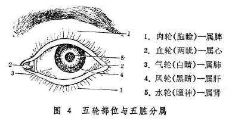

（2）轮脏标本关系。眼之有轮，各应于脏，脏有所病，每现于轮。脾有所病每现于肉轮，心有所病每现于血轮，肺有所病每现于气轮，肝有所病每现于风轮，肾有所病每现于水轮。如《儒门事亲》卷一云：“气轮变赤，火乘肺也；肉轮赤肿，火乘脾也；黑水神光被翳，火乘肝与肾也；赤脉贯睛，火自甚也。”

另外，由于脏与腑的表里关系。肉轮与胃、血轮与小肠、气轮与大肠、风轮与胆、水轮与膀胱亦有密切的关系、五轮出现的病变，亦常可责之于上述相应之腑。

还有，根据眼与五脏六腑相关的理论，神光的发生与五脏六腑均有密切的关系。因瞳神为神光发生之所，所以，瞳神疾患除可按五轮学说责之于肾与膀胱外，有时尚需与其他脏腑联系起来予以辨证治疗，始为全面。

（3）用五行学说中的生克乘侮的理论，阐述五轮的生理功能，病理变化及其相互关系。如《证治准绳•七窍门》云：“金为五行之至坚，故白珠独坚于四轮。……气若怫郁，则火胜而血滞，火盛而血滞则病变不测，火克金，金在木外，故气轮先赤，金克木而后病及风轮”。又如《目经大成》中“流金凌木”一症，乃火郁肺金，白睛有病，金气凌木，似膜非脂，以气轮而蚀风轮，黑睛亦伤。因此，即要了解轮脏的标本关系，又要熟悉五行生克乘侮的关系，才能通权达变。

五轮学说对临床实践有一定的指导意义，但亦有一定的局限性。因此在临床中，还必须灵活运用，切勿拘泥。

### 第二节八廓概要

八廓学说，是基于眼与脏腑相关的理论，将眼分为八个部位，取其匡廓卫御之义，配以八卦之名，分别称作乾廓、坤廓、坎廓、离廓、巽廓、震廓、艮廓、兑廓，并与不同的脏腑相联属，借以说明眼的各个部位的生理、病理，从而指导辨证论治的一种眼科专科理论。因八卦的基本卦象分别是天、地、水、火、风、雷、山、泽，所以八廓又分别称作天廓、地廓、水廓、火廓、风廓、雷廓、山廓、泽廓。

八廓学说的肇源，明代医家徐春甫认为是龙木禅师所首创，但今传〈医方类聚》所录《龙树菩萨眼论》的内容，没见有八廓之词。宋代《严氏济生方》曾云：“方论有五轮八廓，内外障等之证，兹不复述。”说明严氏之前八廓学说已经形成。现存的《秘传眼科龙木论》书后所附《葆光道人龙木集》中有“八廓歌”，是将部分眼病归属于相应脏腑，分为八类，以“廓”名之，却无八廓的明确部位，实际意义不大。从《银海精微》开始，后世均将八廓与八卦联系起来，用八卦的卦象说明八廓的生理与病理。

古人关于八廓的定位比较混乱。细究之，可以认为历史上的八廓定位主要分两大派系。一为《银海精微》〜《医宗金鉴》系，可用《医宗金鉴》为代表，是将五轮更细致地分为八个部位，分别以八廓名之；一为《证治准绳》〜《眼科六经法要》系，可用《眼科六经法要》为代表。是按八卦的方位将眼分为八个部分，并以八廓名之。现分述于下：

《医宗金鉴》的八廓定位：（坎）水廓位于水轮——瞳神，（巽）风廓位于风轮——黑睛，（乾）天廓位于气轮——白睛，（坤）地廓位于肉轮——胞睑，（离）火廓位于血轮的内眦上方，（震）雷廓位于血轮的内眦下方，（艮）山廓位于血轮的外眦上方，（兑）泽廓位于血轮的外眦下方。（图5）

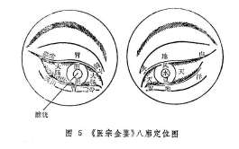

《眼科六经法要》的八廓定位：是根据八卦的方位而定廓位的。即震东、兑西、离南、坎北、艮东北、坤西南、乾西北、巽东南。但人体经络是左右相对的，故两眼之中，左眼为阳，按上例顺数，右眼为阴则须以上例逆数。（图6）

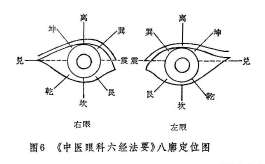

八廓所属脏腑，历史上的两个派系均较混乱，《医宗金鉴》则认为，古代论八廓，将其属脏又属腑，导致了八廓所属的混乱。所以主张，五轮即属五脏，八廓自应属腑，这样可使轮廓分明，便于临床应用。《眼科六经法要》同意这种观点，所以与《医宗金鉴》的八廓所属完全一致。即（乾）天廓属大肠、（坎）水廓属膀胱、（艮）山廓属包络、（震）雷廓属命门、（巽）风廓属胆、（离）火廓属小肠、（坤）地廓属胃、（兑）泽廓属三焦。（见表1）

历史上，各家均采用《葆光道人龙木集》之八廓名，为各廓另立一别名，分别称津液廓、传导廓、抱阳廓、清净廓、养化廓、水谷廓、关泉廓、会阴廓。由于各家对此八廓别名的意义解释不一，或从不同角度认识所属脏腑之功能，或从不同角度解释八卦之卦象，所以对各廓所定的别名多不一致，今将《医宗金鉴》《和眼科六经法要》之别名列表比较如下：

表1《医宗金鉴》、《中医眼料六经法要》八廓名称及脏腑分类比较

| 廓名 |  | （乾）天廓 | （坎）水廓 | （艮）山廓 | （震）雷廓 | （巽）风廓 | （离）火廓 | （坤）地廓 | （兑）泽廓 |
| --- | --- | --- | --- | --- | --- | --- | --- | --- | --- |
| 别名 | 医宗金鉴 | 传导廓 | 津液廓 | 会阴廓 | 关泉廓 | 养化廓 | 抱阳廓 | 水谷廓 | 清净廓 |
|  | 六经法要 | 传导廓 | 津液廓 | 会阴廓 | 抱阳廓 | 清净廓 | 养化廓 | 水谷廓 | 关泉廓 |
|  | 所属之腑 | 大肠 | 膀胱 | 包络 | 命门 | 胆 | 小肠 | 胃 | 三焦 |

由上表可知，雷廓、风廓、火廓、泽廓的别名，两书不相一致。其中雷廓属命门，《医宗金鉴》解释说：“命门者龙雷之火，（龙雷之火生于水中），故名关泉”；《眼科六经法要》解释说，雷廓位于内眦侧，“是当震位，震为雷，为阴中之阳，二阴一阳，阴爻在外，阳爻在内（即☵），所以称为抱阳廓。”风廓属胆，前者曰：“胆为少阳，主长养化育，故又名（养化廓）焉”；后者曰：“巽风名清净廓，属胆者，系因胆腑素称清净也。”火廓属小肠，前者曰：“抱阳廓即火廓，火廓属心（指火廓之部位按五轮属心），心与小肠为表里，依附于阳，故又名焉”；后者曰：“离火名养化廓，属小肠，系以小肠者受盛之官，化物出焉故也”。泽廓属三焦，前者曰：“清净廓即泽廓，三焦者，阳相火也，蒸化水谷，为决渎之官，故名清净”；后者曰：“兑泽名关泉廓，属三焦者，以三焦为决渎之官，只有沼泽，方能关其泉水也。”

历史上，将八廓学说具体用于临床以诊疗疾病的医家不多，但并不能说八廓学说毫无实用价值。其实，上述两种八廓定位法各有道理，例如《医宗金鉴》的八廓学说可与五轮参合应用。即瞳神为水轮又为水廓，故其在脏属肾，在腑属膀胱，瞳神疾患则可根据临床表现或补肾精，或利膀胱；黑睛为风轮又为风廓，故其在脏属肝，在腑属胆，黑睛疾患，可根据临床表现治肝或治胆，或肝胆同治；白睛为气轮又为天廓，故其在脏属肺，在腑属大肠，白睛疾患可根据临床表现而治以理肺或泻大肠；胞睑为肉轮又为地廓，故其在脏属脾，在腑属胃，胞睑疾患的治疗可根据临床表现补中气或清脾泻胃；内眦为血轮又为火廓和雷廓，故其在脏属心，又属小肠和命门，内眦疾患可根据临床表现治心或小肠与命门；外眦为血轮，又为山廓与泽廓，故其在脏属心，又属包络和三焦，外眦疾患可根据临床表现治心或包络与三焦。以上小肠与心相表里，命门、包络、三焦均为相火，故四者均禀命于心君之火，皆附于血轮。由此可知，《医宗金鉴》的八廓与五轮基本是一致的，唯两眦部轮廓所属比较复杂，还需经临床研究以验证。

《眼科六经法要》的八廓分部，当依《审视瑶函》之说：“验廓之病，与轮不同，轮以通部形色为证，而廓唯以轮上血脉络丝为凭。或粗细连断，或乱直赤紫，起于何位，侵犯何部，以辨何脏何腑之受病，浅深轻重，血气虚实，衰旺邪正之不同，察其自病传病，经络之生克逆顺而调治之耳。”

### 第三节五轮八廓学说在临证上的应用

五轮八廓内应五脏六腑，是经过长期的临床实践而总结出来的。古人的经验认为轮廓属标，脏腑属本。轮之有病，多由脏腑功能失调所致。临证时运用五轮八廓学说，通过观察眼部各轮廓症状表现，辨别相应脏腑的病变。这种从眼的局部进行脏腑辨证的方法，即中医眼科独特的五轮八廓辨证法。

五轮八廓学说，从理论上阐明了眼部病变与脏腑的关系，为眼科辨证指明了方向，但在临证时还必须与八纲、病因、六经等辨证方法结合起来运用。例如，睑弦红赤湿烂者，病位在肉轮、地廓，内应脏腑为脾胃，而红赤湿烂系湿热为患，因此证属脾胃湿热。若病变出现于多个轮、廓时，应考虑为多个脏腑失调的表现，如白睛红赤，胞睑肿硬，又兼口渴、大便燥结、脉实数、舌苔黄糙等，因白睛在五轮属肺，在八廓属大肠，而胞睑在轮属脾，在廓属胃。红赤、肿硬、又兼口渴、便结、脉数实等系火盛里热，故当定为肺脾二经火盛，又挟胃肠积热所致。若数个轮廓先后发病，则应根据脏腑之间生克制化关系来认识病变的发生和发展。如先见白睛红赤，继而黑睛生翳，病位应先由肺火炽盛，后犯肝经为患，即可诊为肺金乘木之证。

综上所述，五轮八廓学说对眼科临床辨证，确实具有一定指导意义。从古至今的眼科医家，对五轮八廓特别是五轮学说，运用比较普遍。古人认为轮脏标本相应，不知轮脏，即为标本不明。然而，五轮八廓辨证法还存在一定的局限性。如白睛发黄，病位虽在气轮、天廓，却非为肺与大肠之病，乃由脾胃湿热，交蒸肝胆，胆汁外溢所成。再如瞳神为水轮、水廓，但病变不仅与肾或膀胱有关，也常因其他脏腑功能失调所致。因此，临证时既要详查五轮八廓，又不可拘泥于五轮八廓，要以整体为主，四诊合参，将局部辨证与整体辨证结合起来，才能得出正确诊断，继而达到准确的施治。

至于《眼科六经法要》的八廓学说，在原书中已较为普遍地应用于临床。如：太阳目病举要篇（一）“白珠红赤，大眦内震廓血丝较粗，或从上而下者特甚。”阳明目病举要篇（一）“气轮血丝满布，乾廓坤廓尤多，羞明流泪。”少阳目病举要篇（一）“目赤羞明，锐眦兑廓血丝较甚。”太阴目病举要篇（一）“气轮血丝细碎，或乾坤二廓血丝较多。”少阴目病举要篇（一）“突然目赤，坎离二廓血丝较多，不畏光，无眵，而头痛如锥，就是少阴表虚伤风……若目不全赤，坎离两廓仅现血丝一二缕，则属于虚，治法不同。”

如上所述，《眼科六经法要》的八廓是将白睛分为八个方位，并检查白睛上之血丝脉络的状况，作为辨证依据之一。但是，八廓显症必须局限于白睛的某一二个方位，此种情况比较少见，有时出现此种情况，亦常被人们忽视，而代之以其他辨证方法，所以八廓在临床上较少应用。更因历代医家对八廓的定位、所属脏腑、主病的认识很不一致，所以对八廓学说应进一步研究而充实提高。

复习思考题

1.何谓五轮学说？何谓八廓学说？

2.五轮的分部以及脏腑分属如何？

3.试述《医宗金鉴》和《中医眼科六经法要》的八廓部位和脏腑分属。

4.五轮八廓在临床应用中有何意义？

## 第五章病因病机

### 第一节病因

**〔自学时数〕**2学时

**〔面授时数〕**

**〔目的要求〕**

1.了解常见的眼病病因，熟悉其致病特点。

2.熟悉脏腑、气血功能失调引起眼病的机理。

引起眼病发生的因素很多，大体可以总括为外因和内因。人体内部具有的抗病能力叫做“正气”，能够引起疾病发生的外来因素叫做“邪气”。疾病的发生是正气与邪气相互作用的反映。各种外来因素往往在机体内在机能失去平衡的情况下才引起发病，即《内经》中所谓的“邪之所凑，其气必虚。”眼与外界直接接触，故外因是眼病常见病因；又因眼与脏腑经络关系密切，故内因也是眼病不可忽视的因素。而内外因又常常合而为病。在临床上，眼病一般可由一种因素导致，也可由多种因素同时引发，全身性疾病也可导致眼病。因此必须以各种眼病的临床表现为依据，通过“审证求因”，才能达到正确的辨证论治。同时掌握各种眼病的致病因素的性质和特点，则是更重要的。现将常见眼病的病因分述于下。

一、时邪

时邪是指四时天气不正之气的总称，为常见眼病的主要因素之一。由于性质不同，又可分为六淫和疠气。

（一）六淫

“淫”是指过盛、不及或不应时而至的反常之气。风、寒、暑、湿、燥、火等六气出现反常情况即为六淫。六淫引起眼病，多由肌肤、口鼻侵犯机体，或直接伤害眼部，可由一种邪气单独为害，亦可由多种邪气兼挟致病，且具有明显的季节性。六淫虽可导致多种眼病，但一般以外障眼病为多。六淫之中，尤以风、火、湿为患最多。现将六淫分述于下。

1.风：风为阳邪，易于犯上，眼位最高，故易受之。风善行而数变，所致眼病多较急较骤，且变化亦速。如风邪突然侵袭所致的暴风客热证，多见眼部卒然红赤热痛，旋即胞睑肿胀，白睛浮壅，且可兼见头痛鼻塞，恶寒发热等。风为百病之长，一年四季皆可致病，且常为外邪引起眼病的先导，它如寒、火、湿、燥等，常随风邪而侵犯机体。风性走窜，甚者动摇，或内由肝阳化风及血虚生风，风胜则动，故均能引起眼部的强直、震颤、动摇不定等证。风邪致病，多表现为胞睑肿胀，白睛暴赤，流泪羞明，或干涩而痒。风犯黑眼，则翳从风生。若风邪中于经络，可致目珠偏斜或旋动不定及胞轮振跳不已。风邪阻滞睑络，则气血不行，可致胞睑失用而下垂。风邪挟热则肿赤痛甚，眵多粘结；挟寒则时流冷泪，或紫赤肿胀；挟湿则痒甚湿烂，病势缠绵；挟燥则眵硬干涩，眼皮紧急。

2.寒：寒为阴邪，易伤阳气，阳气不足，则目失温养，而见冷泪翳障，视物昏花。寒性凝滞，而主收引。若寒邪留滞经络筋肉之间，可导致经脉急挛而口眼㖞斜；气血凝滞则可致赤脉紫胀，紧涩疼痛。风寒犯目，则涕泪交加。

3.暑：暑为阳邪，乃夏令主气，多由火热所化，易伤阴液，暑邪为患与热病相似，眼病则见目赤、肿痛、视物昏矇等。由于夏季多湿，故暑邪致病又多挟湿。

4.湿：湿为阴邪，为长夏主气，其性重浊而粘滞。湿邪阻遏气机则致脾胃不能升清降浊，可见头重视昏，睑坠不适；湿损阳气，则脾阳不运，水湿内停而胞睑浮肿；湿邪秽浊，伤目则致眵泪胶粘，睑弦湿烂，垢腻结痂，湿痒，睑生椒疮、粟疮，白睛黄赤、浊红，黑睛边缘溃陷如虫蚀等。若湿伤阳气，阳气困阻则病势缠绵，反复难愈。

5.燥：燥性干枯而涩，易伤津液，为秋季主气，亦属阳邪，易化火生风，故致病多见眼眵干结，目内干涩不适，视物不爽，白睛红赤少津，眼睑皮肤红赤干燥，黑睛失泽或变生翳障等。

6.火：火为阳邪。其性炎上，易于上冲头目，其他外邪亦常化火，故火邪所致眼病比较多见。其致病多表现为眵多黄稠、目赤焮热、肿痛生疮、赤脉粗大、黑睛翳溃、眼珠灌脓等。若火燥血热，则目怕热羞明，涩偏难睁。热郁迫血妄行，血溢眼络则可致眼部各种出血之证。

由于六淫的性质不同，所造成眼部病变有明显区别。而六淫致病，多出现表证及全身兼证，故在临床辨证时，除首先审明眼部症状外，还必须结合全身症状进行识别。如风邪为患，常兼头痛、恶风、脉浮；火邪致病，多舌红、口烂、咽喉肿痛、脉数等。

（二）疠气

疠气又称“疫疠”、“时气”、“天行”等。疠气是指来势急骤、能引起广泛流行、具有较强传染性的致病因素。疠气所致眼病与风火上攻的外障眼病相似。如目赤肿痛、热泪频流、畏光怕热等。四季均可发病，但以夏秋气候炎热时节为多见。一人染病，往往一家之中，邻里之间，无论老幼，尔我相传，病状相似。如天行赤眼即属疠气为患。

二、七情

七情是指喜、怒、忧、思、悲、恐、惊七种情志。若七情太过，超过了人体生理活动所能调节的范围，就会引起体内阴阳、气血的失调，影响脏腑的正常机能。如喜伤心，怒伤肝，悲、忧伤肺，思伤脾，恐伤肾，惊伤胆等。脏腑机能失调，气血逆乱，经络阻滞，就会引起各种眼病。

七情所致眼病中，尤以忧郁、忿怒、悲哀对眼的危害为甚。如大怒不止，肝气郁而上逆，可致暴盲、青盲，绿风内障等。长期忧虑，肝气郁结，可致脾失健运而形成视惑、视瞻昏渺等。悲哀过甚，可致心肺郁结，上焦壅塞，玄府闭阻，或心肺气血亏耗，目失荣养而致视瞻昏渺、视瞻有色、青风内障、圆翳内障等。

三、饮食不节

饮食不节，亦是眼的常见病因。饥饱无度脾胃受伤，生化之源不足，脏腑之精虚亏，目窍失养则致视瞻昏渺、青盲、疳积上目等眼病。过食辛辣炙煿、膏粱厚味、烟酒、生冷之品，或五味偏嗜过度，均可致脾胃运化失职，使痰湿热毒蕴积，阻滞经络，则清气不能上升，浊气不得下降，诱发多种眼病，如针眼、睑弦赤烂、疳积上目、云雾移睛、黑睛生翳等，甚或变生暴盲、五风内障等。若饮食不洁而致内生诸虫，日久积滞成疳，疳疾上目，则成雀目、黑睛生翳、甚则变生蟹睛等。

四、劳倦

劳倦是指体力、脑力及目力的过度疲劳，以及思虑过度、房事无节等。劳力过度则伤气，劳心思虑过度则伤心脾，久视伤血且耗心神，均可耗伤精血，致使目失所养而发病。或由房劳过度，斵丧肾精，目失滋养，或阴亏而虚火上炎，攻于目窍则生视瞻昏渺、暴盲、视惑、圆翳内障、青风内障，白涩证等。

五、其他因素

其他因素主要包括由先天和衰老、外伤及其他疾病等所引起的眼病。由于先天禀赋不足而与生俱来的称为先天眼病。如胎患内障、高风内障、视物易色等。因老年体衰致使脏腑功能不足，气血亏虚，所引起的则为老年性眼病，如老视、圆翳内障等。意外损伤亦是眼的常见病因。例如飞丝、砂尘、小虫眯目，木竹芒刺等锐器误刺入目，金属碎屑及其他爆炸物飞射入目，跌仆或钝器撞击伤目，以及电击、辐射、日照、高温和化学物质等伤目，均可损及目珠。按其致伤性质、部位、症状等不同，分为振胞瘀痛、物损真睛、撞刺生翳、惊振内障、目眶骨伤、真睛破损等。

除上述之外，由于某些全身性疾病以及体内的痰、湿、血瘀等阻滞经络亦可造成眼病。如风湿病所伴发的瞳神紧小症；消渴病所导病致的视瞻昏渺、暴盲、圆翳内障，以及小儿疳积所形成疳疾上目等。

### 第二节病机

病机是指疾病发生、发展与变化的机理。中医学认为，疾病的发生与发展，主要决定于正气与邪气两者之间的相互斗争。邪气必须在人体正气内虚的时候，才能侵入机体而发病。机体正气的盛衰是疾病发生的关键。而机体正气盛衰的变化，又与脏腑经络、气血阴阳的变化有着密切的关系。在正常生理状态下，脏腑经络、气血之间相互协调平衡，即使有病邪侵入亦不易发病，或发病亦较轻缓。一旦脏腑、经络或气血功能失调，便可引起各种全身性或局部的病变。现将与眼有关的病机简述如下。

一、脏腑功能失调

（一）心与小肠功能失调

心主血脉，又主神明。目得血而能视，两眦内应于心，所以心主失调会影响到眼部的血脉、神光和两眦。又心与小肠相表里，心火常可下移小肠，小肠湿热亦可熏蒸于心，故凡心火上炎之目疾，常可兼见小便短赤、口舌生疮等症。心与小肠功能失调引起的眼病有虚、实两类。

1.阴亏血虚：由于失血过多，或心神过劳，或热病伤阴，以致心阴暗耗，阴血亏虚则虚火上炎；血脉不充，目失荣养，可致两眦脉络淡红，眼干微痒，视物昏花，或目涩羞明，眼珠疼痛，或视惑及自视眼前黑影飘移。

2.心火亢盛：由于恣食肥甘厚味炙煿之品，或七情内郁，五志化火导致心火亢盛，上冲于目而见眼部红肿热痛，两眦红赤，胬肉壅肿。若火毒壅盛则睑眦生疮，痛痒并作。若热入血分，迫血外溢，则眼部内外出血，甚或导致暴盲。若心火下移小肠，则小便痛涩而赤。小肠热盛上熏于心又可加重眼病。

（二）肝与胆功能失调

肝藏血又主疏泄，性喜条达，其经脉上连目系。又“肝开窍于目”，“肝受血而能视”，“肝气通于目，肝和则目能辨五色”。风轮黑睛属肝，肝与胆互为表里，胆的精汁升聚而成的神膏，涵养瞳神。故肝胆功能失调，易引起眼病，尤以黑睛病变为常见。

肝经病变有虚证、实证，亦有虚实相兼证，其临床症状各不相同。

1.肝阴亏虚：肝为风木之脏，肝藏血，体阴而用阳，故肝阴易虚。肝阴不足，则营血亏损，不能上荣于目，则可出现两目昏花，干涩不舒以及肝虚雀目等证。

2.肝血不足：由于失血过多，或生血不足，或久病耗伤肝血。多见干涩不舒，视物昏花等证。小儿若肝血虚少，目窍失养，则成夜盲，甚则疳疾上目，黑睛生翳，溃穿成蟹睛等证。

3.阴虚火旺：由于素体肝肾阴虚，或肝阴不足，致使肝阳上亢，而见视物昏花，目赤目痛，黑睛生翳，且易反复发作。若肝火上冲，伤及营血，导致目中血不循经，逆于络外，轻者视物如隔云雾，重则可致暴盲。

4.肝风内动：由于肝阴不足，或素体肝肾阴虚，阴不制阳而肝阳上亢。化火生风，风与痰火相结，阻滞脏腑经络，上攻目窍，则可致绿风内障、目痛、目赤昏视、口眼㖞斜、目珠上吊。或由肝血不足，虚风内动，而致胞轮振跳，白睛膶动，目痒等。

5.肝气郁结：由于情志不舒，或郁怒伤肝，肝失疏泄，气机郁滞，经脉受阻，则致目珠胀痛，目赤视昏，甚则失明，或发五风内障等。

6.肝胆实火：肝郁化火或邪传少阳、厥阴，气火逆上，可致目赤红肿，泪热如汤，抱轮红赤，黑睛生翳，溃陷如碎米、鱼鳞、凝脂。邪热深入，则见神水混浊，黄仁纹理不清或肿胀，瞳神紧小或散大，甚则黄液上冲。肝火入干血分，脉络瘀阻，可致赤膜下垂，甚则血翳包睛。若火邪伤络，迫血妄行，则眼内出血，可致视物昏矇或暴盲。若肝胆火邪亢盛，热极生风，风火上攻于目，则见目赤，目珠胀硬剧痛，甚至失明。若小儿肝热动风，风热挟痰，上蒙清窍，可致高热惊厥，双目暴盲。

7.肝胆湿热：由外感湿热，或过嗜肥甘酒类，内生湿浊，郁积化热，湿热蕴郁肝胆，可上犯黑睛而现胞轮红赤，黑睛生翳如虫蚀，经久不愈，神水混浊，黄仁肿胀，瞳神紧小。若湿热熏蒸，浊气上泛，阻隔神光，则自视眼前黑影飞舞，甚则视物不清。

（三）脾和胃功能失调

脾胃为后天之本，脾主运化，胃主受纳，脏腑均禀受脾胃之精气上贯于目，脾升胃降使目窍通利，脾统血则目得血养。肉轮胞睑内属于脾，所以脾胃功能失调，可引起眼部发生病变，尤以胞睑病变为多见。其病分述于下。

1.胃火炽盛：由于饮食不节，过食辛辣炙煿之品，或热邪犯胃，引起火热内盛，上犯头目，致使头痛目赤，痛痒焮肿。若火毒壅滞胞睑脉络，气血瘀阻，则胞睑肿硬，睑生椒疮，灼热碜痛，或发针眼、眼丹。胃火上攻于珠内，神水被灼可致黄液上冲。若热入血分，迫血妄行，又可见眼部出血之证。

2.脾胃湿热：脾胃湿热内蕴，壅滞胞睑脉络，气血运行受阻，凝滞不通，则睑内发生椒疮、粟疮，或致睑弦赤烂、针眼、胞睑痰核等。若湿热熏蒸，浊气上泛，清窍受蒙则视物不明，或视瞻有色。

3.脾胃虚弱：脾胃气虚，不能纳谷化生精气，脏腑精气不足，目失荣养则上胞下垂，视物昏花，甚或失明。清阳不升，阳不亢阴，入暮则视物不清，或生黑星飞舞及云雾移睛和其他内障眼病。若脾虚肝热，则可发生疳疾上目。

（四）肺与大肠功能失调

肺主气，具有宣发和肃降的功能，气轮白睛属肺，肺与大肠相表里，大肠通利，能助肺气的肃降。肺气和调，大肠传导通畅，则气血、津液运行正常，脏腑精微上荣于目，所以肺与大肠功能失调可影响到眼，并易引起白眼发病。

1.肺失宣降：多由外感风、寒、热邪犯肺所致。由于风热，或风寒犯肺化热，伤及肺气，宣降失职，导致气血阻滞脉络，可见白睛血脉纵横，粗大旋曲。风热毒邪，结于白睛，则见白睛暴赤肿痛，发生暴风客热、天行赤眼等风热眼病。若肺热亢盛，热伤血分，迫血妄行，则可致白睛溢血。肺热内炽，毒火上犯白睛，形成金疳、火疳。肺金邪凌肝木，则可致风轮周际生白翳，并易向风轮中部进犯。

2.肺气虚：肺气虚弱，则无力帅血上行，目失所养故视物不明。气虚而不胜邪，可致白睛疾患反复难愈。

3.肺阴虚：燥热伤肺，或劳伤过度，暗耗肺阴，肺阴不足，则致目失润养，而见眼眵干结，目涩昏花。若由肺阴亏虚导致虚火上炎，可致白睛涩痛，赤脉隐现，或生金疳，久治不愈，反复发作。

（五）肾与膀胱功能失调

肾为藏精之所，肾精无亏，则脑髓丰满，目得所养而睛明。肾主水液，肾与膀胱相表里，肾和膀胱气化功能正常，则水不犯目。且眼之瞳神属肾，故肾与膀胱功能失调可引起眼病，尤以瞳神疾患为多见。

1.肾精亏虚：多由先天禀赋不足及过劳伤耗精液，或久病伤肾，年老精衰等所致。由于肾精不足，瞳神失养，可致视物昏矇，睛珠变白，瞳神干缺；又因目系上属于脑，肾精亏虚，精不生髓，则髓海不足，目失脑汁濡润滋养，则视物䀮䀮，甚至目无所见。

2.肾阳虚惫：多由老年体衰和久病真阳衰少，或禀赋不足，素体阳虚所致。由于肾中阳虚，温煦生化功能不足，目失温养，则睛珠神膏混浊，自视眼前黑花飞舞，甚至暗瞑不清。若阳衰阴盛，每至黄昏或暗处，双目盲无所见。阳虚命门火衰，膀胱气化失职，不能温化水液，则水邪上泛于目，而见胞睑浮肿，眼底水肿、渗出。除眼部病证外，常伴有小便清长，夜尿频多或小便失禁等全身症状。

3.热结膀胱：由于邪热或湿热下注，蕴结于膀胱，膀胱气化无权，则小便不利涩痛。湿热熏蒸，上蒙清窍，则目赤头痛。

综上所述，眼病的发生、发展和变化，固与一脏一腑功能失调有关，但在临证时，常为若干个脏腑同时发病，其变化机理十分复杂，故当全面分析。

二、气、血功能失调

气和血是人体生命活动的动力和源泉，又是脏腑功能活动的产物。人体生理和病理变化无不涉及气血。气血功能失调也能导致眼病。

（一）气的功能失调

百病皆可由气而生。因“眼通五脏，气贯五轮。”故气的功能失调常可引起眼病。

1.气虚、气陷：多由劳伤过度，或年老体弱，真气不足，及久病失养，元气耗伤，均能导致气机衰惫，气虚不能敷布精微充泽五脏，五脏六腑之精亏虚，不能上贯五轮，目失荣养。或气虚卫外不固，目窍失于阳气的温煦固摄，则可引起冷泪常流，睛珠混浊或变白，或玄府不利而视物不明。若气虚不能摄血，常可致眼内出血，甚至突然失明。若气虚下陷，可致上胞下垂，无力抬举，或黑睛陷翳日久不愈，或目睛不耐久视，也可致眼部水肿，甚至变生青盲。

2.气滞、气逆：多由痰火湿热停聚，食滞不化及情志不舒所致。若外感风热湿邪，肺气壅遏，经络阻滞不通，肺失宣降，则见白睛红赤疼痛或形成结节隆起。湿热成痰，痰湿互结，则生胞睑痰核。若因情志不舒，肝郁气滞，血行不畅，久则气滞血瘀，神水瘀滞，导致目珠胀痛，而生五风内障。若气机阻滞，目中玄府不利，则视物昏花。若大怒伤肝，肝气上逆，气血逆乱壅冲于目，则视物模糊，甚或失明。若气动化火，火盛生风，风火上扰，则可致目赤肿痛、目珠胀硬、视物昏花、五风内障、火疳、金疳、云雾移睛等眼病，甚则出现暴盲。

（二）血的功能失调

目能明视万物，全赖血的濡润和滋养。血的亏少和瘀滞，均能引起眼病。

1.血虚：多由失血过多和化生不足，或久病亏损及情志内伤，暗耗阴血所致。由于血虚，目失荣养，则见目视昏花，胞睑苍白，白睛血络淡红不鲜，干涩不润，不能久视。或生圆翳内障、云雾移睛等证，甚则暴盲、青盲。黑睛失养则混浊生翳。

2.血热：多由外感热邪及脏腑郁热侵入血分所致。邪热壅滞眼部脉络，可致胞睑、白睛焮热肿痛，或赤脉增多，色红粗大。若血受热迫，血溢眼络之外，则致白睛溢血及眼底出血，甚则失明。

3.血瘀：凡毒邪入于营血，迫血成斑，或因久病气虚，不能帅血以行，及气滞阻塞脉络，或局部外伤，血流受阻，均能导致眼部瘀血为患。在白睛可见血丝紫赤粗大，虬蟠旋曲；在黑睛则致赤膜下垂，甚至血翳包睛；在眼底可现出血，引起视昏或暴盲。血瘀眶内可使目珠外突，重者可成鹘眼凝睛。瘀血积于胞睑，则胞睑肿痛拒按，或目环青黯。少量瘀血于神膏，则自视眼前黑影飘移；大量瘀血积于神膏，则致失明。瘀血阻塞神水出入之道，神水瘀滞，还可引起眼珠变硬，暴发头痛珠疼，视力骤降。

三、阴阳失调

阴阳贯穿于中医眼科理论体系的各个方面。阴阳须维持相对平衡，不能有所偏盛，否则即发生种种眼病。《素问•阴阳应象大论》云：“阴胜则阳病，阳胜则阴病，阳盛则热，阴盛则寒。”所以，人体阳盛则会发生火热偏盛的一类眼病，发病急而暴，常伴鲜明的赤脉，胞睑硬肿而红赤，疼痛较剧烈，或痛而拒按，或痛而无间，或昼轻夜重，畏光喜暗，眵多粘稠等；阴盛则会发生寒气偏盛的一类眼病，如无赤脉或赤脉微细淡红，胞睑肿而不红不痛，或肿而虚软，疼痛较缓而不拒按，或疼痛时作时止，或夜重昼轻，或得热较舒，见光则目明，入暮则目盲，无眼眵或眵少稀粘。阳虚则会发生虚寒的眼病，如上胞下垂、胞轮振跳、眼部水肿、翳面凹陷久不平复、视物昏渺等；阴虚则会发生虚热的一类眼病，白睛涩痛、赤丝虬脉、金疳、神水将枯、神光自现等。

眼病的阴阳辨证，只能相对地理解，不能机械地划分，如《灵枢•大惑》云：“瞳子黑眼法于阴，白眼赤脉法于阳。”这是从眼的部位分阴阳，可以理解为：黑睛病与白睛病相比，黑睛病属阴证者较多，白睛病属阳证者较多；内眼病与外眼病相比，内眼病属于阴证者较多，外眼病属于阳证者较多；白睛赤脉的有无，应以有赤脉者属阳证者较多，无赤脉者属阴证者较多。他如急性者、兼有疼痛者阳证较多，慢性者、无疼痛者阴证较多。还须结合全身兼证详细辨别。

复习思考题

1.常见的眼病病因有哪些？其致病的临床特点是什么？

2.六淫和七情中，哪些因素导致的眼病最多？

3.试述脏腑、气血功能失调引起眼病的机理。

## 第六章诊法

**〔自学时数〕**12学时

**〔面授时数〕**4学时

**〔目的要求〕**

1.掌握眼科问诊的特殊内容。

2.熟悉眼的一般检查方法。

3.掌握白睛红赤、抱轮红赤、白睛混赤的特点及三者鉴别。

4.了解目晕的特点及机理。

5.掌握眼部红肿、疼痛、眵泪的辨证。

6.熟悉眼科独特的辨证方法。

7.掌握翳与膜的辨别。

诊法是了解病情，收集主、客观病状并据以作出诊断的方法，包括四诊和辨证两个过程。

眼与人体五脏六腑、十二经脉、三百六十五络都有着密切的关系，因此，眼病的诊断方法与内科一样，也是从整体观念出发，以四诊

（望、问、闻、切）辨八纲（阴阳、表里、虚实、寒热），综合分析，来鉴别眼病的属性和病因病机，作为审证求因、辨证论治的基础。

眼科的诊法，既要运用诊断学中的一般规律，又要结合眼科的特殊情况来进行。本章主要介绍与眼科有关的四诊和辨证方法。四诊中问诊和望诊尤为重要，切诊以眼部触诊为主，亦须重视切脉，必要时结合闻诊的资料，综合运用八纲辨证、脏腑辨证、五轮辨证、八廓辨证和常见症状辨证，从而得出正确的诊断结果。

### 第一节问诊

问诊对于眼病的诊断和辨证十分重要，尤其是内障眼病，外证多不明显，通过问诊，了解眼局部及全身症状，才能洞察病情，为辨证论治提供可靠的依据。

问诊时要心中有数，有目的、有次序、有重点。首先应围绕主诉进行有条理的询问，对病人眼局部的自觉症状，如视觉、痛痒、眵泪以及头身兼症、饮食、睡眠、二便等均应详细询问。因问诊的内容较多，为避免遗漏病情，根据张景岳的“十问歌”，结合眼科的具体情况，特编组“眼科十问歌”如下，临床问诊时可据此依次进行。

一问视觉二痒痛，三问脐泪四羞明。

五头六身七食味，八问二便九眠梦。

十问因史兼旧疾，小儿痘疹妇胎经。

阴阳表里详细辨，寒热虚实宜分明。

1.问一般情况：包括姓名、性别、年龄、婚姻、职业、籍贯、工作单位和家庭住址等。

2.问病史：

（1）首先要问清患者就诊时，自觉最痛苦的症状，并问清发病有多久，是否与季节有关，是单眼、双眼，是初发、复发，起病急骤或是逐渐而生，发病后病情变化快慢如何。

（2）疾病的诱发因素：发病是缘外感时邪，或因情志波动；是过食五辛酒浆，或是因持续用眼，劳倦过度。有无发热或眼部外伤史、手术史。亲属或邻里之间有无类似之眼疾。

（3）治疗经过：是否经过治疗，曾用过何种药物，剂量大小及其它特殊疗法，效果如何，目前是否继续使用。

（4）旧疾：询问此次患眼病之前的一般健康情况及何时何地患过何种疾病（包括眼病和全身疾病）、治疗情况，与现在证是否有关。

（5）个人生活史：如出生地、居留地，到过何地，居住环境、条件、生活及工作情况，饮食习惯及特殊嗜好（如烟酒），性情及精神状态，婚姻情况；男性有无遗精滑泄、阳萎早泄；妇女应询问其月经初潮、周期、经量、色质、结婚年龄、带下及孕、产、育情况；小儿患者应询问生产、生长、发育、喂养史及痘疹史。

（6）家族史：家庭成员或亲属的健康状况，曾患过何种眼病，有无严重宿疾或类似眼病，发病及现在情况如何，如亲属已死亡，应询问其死亡原因及年龄。

3.问眼部自觉症状：

（1）视觉：包括视力如何，视物有无变形、变色、变大、变小及其它异常视觉。对视力下降者，应问清视力是突然骤降或是逐渐昏矇；是视物昏渺或是盲而不见；是视近不清或是望远模糊，或是视远近皆昏矇，或是注视稍久则感不清；是白昼视力如常而入暮则目暗，抑或白昼觉昏而黑夜反稍感精明等。

其次问有无视一为二，视大为小，视小为大，视物颠倒、视直为曲，视正反斜，视定若动，视物易色，或不辨颜色等。

再问有无妄见，如眼前有无阴影，颜色如何，是点状、片状、环状或条索状，其随眼而动，或是如蚊蝇飞舞、旌旗飘荡，眼前有无萤星、闪光或火焰霞明。视灯火烛光，其周围有无红绿彩圈环绕，有者为目晕。但应注意，有些患者常诉视灯光四周有放射状光芒，与目晕不同，应予区别（图7）。

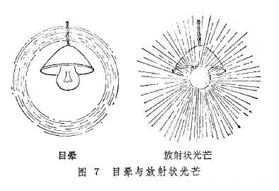

此外，亦应问单眼正视前方时，视物范围有无缩小或偏缺。

（2）眼痛：主要询问疼痛的时间、性质、牵连的部位及其兼证。

目痛的时间，应问是白昼痛甚或是夜痛难忍，是凌晨目痛或是上午、午后、日西、午夜作痛或加剧；是持续不止或是时作时止，或是过用目力后目痛。

目痛的性质，应问是刺痛、胀痛、灼痛、涩痛、隐痛、碜痛、剧痛。是隐隐胀痛还是胀痛如裂；还应问目痛时牵连的部位，是连及前额、眼眶、鼻颊或是颞额，或是巅顶、后项。

目痛的兼症亦应问及，如痛时有无发热或恶寒，是否伴有头痛、目眩、目赤、眉棱骨痛、口干及烦躁、恶心、呕吐。眼珠痛与头痛若同时存在，则需问清何者先发作。目珠转动时，疼痛是减轻或是加剧，痛时有无拒按或按之缓解，目痛时喜得热熨或是凉敷。

（3）眼痒：主要询问目痒的性质和程度。

目痒的发作是否与季节、处所、饮食物、药物等有关；是否迎风痒剧，无风则减，遇冷遇暖时，是加重或是减轻；是微痒不舒或是如虫爬行，难以忍受，揉拭不止；是初病时作痒或是病退时作痒；是痛痒兼作或是先痒后痛，先痛后痒；作痒部位是两眦，或是胞睑、睑弦，或是白睛；目痒时，是否伴有干涩、目赤或糜烂等。

（4）眼眵：有无眼眵，是骤起或是素有，量之多少，眵布满眼或仅限于眦角。其性质如脓或似浆，眵硬胶粘或清稀不结，或呈粘丝状。眵色是白或黄或淡绿。

（5）眼泪：重点询问性质和量之多少，是迎风泪出或无时泪下，是热泪如汤或冷泪长流，或睑内含泪不外流；泪水是清如水，或浊如浆，或泪眵夹杂，或泪血混合；流泪时是否兼有目赤、酸涩或干燥等证。

（6）羞明：主要问羞明与眼局部症状的关系。如是目赤多泪怕热而羞明，或是目昏干涩而羞明，或是遇光明痛如针刺而羞明。

4.问全身自觉症状：

（1）头痛：眼病与头痛常相兼作。问诊时应重点询问头痛的部位、时间与性质。是满头痛、偏头痛或双侧头痛，或疼痛的部位在额部、颞部、巅顶或枕后，是久痛或是暴痛，是阵发性疼痛或是持续不止，何时痛剧，是否与时辰有关。其疼痛的性质是如裹、如锥或似斧劈，是胀痛、隐痛或是掣痛。是否伴有恶心、呕吐、呃逆等。

（2）饮食：包括纳食、饮水与口味。纳食多少，有无不思饮食或食后痞胀，以及多食善饥，或偏食偏嗜。有无口渴，是大渴引饮或是渴不欲饮，是喜热饮或是凉饮，冷食后有无不舒感；口中味觉如何，是否有甘、淡、咸、苦、酸、臭之某种感觉。

（3）睡眠：是嗜睡或是失眠，是彻夜不寐或是睡中多梦易醒，醒后难寐。

（4）二便：大便是燥结或是稀溏，是秘结或是干稀不定，有无五更泄，便时有无肠鸣腹痛、里急后重，便中是否夹杂有不消化之食物，气味有无腥臭、酸腐，便色如何。

小便颜色是黄是赤是白，有无频急、失禁或遗溺，溲中是否有脓浊或带血。

### 第二节望诊

望诊是眼科诊法中的重要内容之一，眼乃五脏六腑之精华所结聚，“视其外应，以知其内脏，则知所病矣。”（《灵枢•本脏》）。望诊时，应在光线充足的条件下进行，内容有两个方面：一是望全身，二是望眼部。全身望诊包括神志、精神、形体、气色以及全身各部，诸如头面、毛发、爪甲的颜色、光泽，耳、鼻、咽喉、口齿、颈部、胸腹、腰脊、四肢关节的功能是否正常，舌质舌苔及小儿指纹的颜色，此外还要检视大小便的量和色。上述内容与中医诊断学所述的检查方法类同。

眼局部的望诊包括目珠的形态、神彩和五轮各部位详细检查。看目珠有无高突或低凹，转动是否灵活，有无偏视，程度如何。然后再从外到内，即从胞睑开始，依次检查两眦、白睛、黑睛、瞳神等。习惯上是先查右眼，后查左眼，若单眼患病，应先查健眼，再查患眼。

1.望胞睑：首先检视胞睑的位置和形态，是否开合自如，有无张目不闭或目闭不开，或目开一缝或目闭不紧，有无频频眨目等，再将胞睑从外向内仔细检查。须查胞睑皮肤有无肿胀，是红肿似桃，还是虚浮如球，颜色正常否，有无青紫黑黛，有无疤痕或外伤。睫毛有无乱生、倒入或脱落；睫毛根部有无鳞屑、脓痂，睑弦有无内收、外翻或赤烂，有无脓头，颜色如何；胞睑内面的色泽如何，脉络是否清楚，表面是否光滑，有无红赤硬结或脓点，有无颗粒，若有需注意其形状、颜色、性质（空心或实心）、多少、分布范围等；有无瘢痕或异物等。

2.望两眦：注意两眦部的血络多寡、粗细、颜色和侵及部位如何；眦肉的色泽如何，有无肿胀；眦部有无胬肉，注意其颜色、形状、厚薄及侵犯的部位；眦帷处有无红赤糜烂或水泡；眦内有无脓汁溢出，若有则注意其颜色和性状，睛明穴处有无红肿、溃破、漏管等，溃口者注意其有无脓液外溢，颜色及质地如何。两眦角有无眼眵，注意其颜色及量之多少，有无泪液频流，色、量如何。

3.望白睛：检视白睛的色泽如何，有无青蓝、黄浊或黑褐等异色，是否光滑，是否壅肿胀起；若有赤脉，应注意赤脉之多少、粗细、分布和起止部位如何；白睛外膜之下是否有溢血，若有应注意其色泽和范围；白睛外膜或里层有无颗粒、隆起，其形状、大小、颜色、数量、部位如何。白睛上有无膜障，其厚薄、色泽如何。如有外伤史，则要细心查看，白睛外层有无撕裂，内层有无穿通伤，是否有异物或眼内容物嵌顿等。

4.望黑睛：包括水膜、神水和黄仁。临证时注意水膜是否光滑明润清亮，有无星点，若有须注意其多少、颜色、分布范围及有无连缀；有无云翳，若有则注意其大小、厚薄、位置、形状，其上是否伴有赤脉；星翳和云翳均须注意其表面有无溃破或凹陷，是肥浮脆嫩或是光滑如瓷，必要时可用萤光素染色，以确定其表面是否愈合。还须检查水膜后面的神水是否清晰，有无积液或黄液，若有则注意其量之多少。黄仁色泽如何，有无变色或血络增生，展缩是否自如，有无前凸及震颤，是否有缺损，有则注意其位置。黄仁与水膜或睛珠有无粘连，位在何方，程度如何。如有外伤史，需望黑睛上有无异物嵌顿，有无穿通伤的痕迹。

5.审瞳神：先查瞳神的大小、形态、位置，是否清莹净彻，神光如何，有无散大或缩小或干缺、变形、变色；以灯光照之，查其展缩是否自如。望瞳神内的气色有无异常改变，睛珠有无混浊，若有则注意其颜色、形状及部位如何。

### 第三节闻诊

包括嗅气味和闻声息两方面。

闻声息：包括语言、呼吸、咳喘、呕恶、太息、呻吟、腹鸣等有无异常。

嗅气味：包括口中气味及二便等排泄物有无异常气味。

闻诊内容与中医诊断学介绍的相同。

### 第四节切诊

包括切脉和触诊二方面。切脉在眼科亦常是重要的辨证依据之一，有时还需结合对病人体表及相关穴位进行触切。但这些内容在《中医诊断学》中已经学习过，这里重点介绍眼部的触诊。

眼部触诊应注意胞睑、眼眶有无硬结或压痛，若有肿核，是否与皮肤粘连，按之是否光滑，推之是否可移，有无波动感，是拒按或喜按。白睛处如有颗粒隆起，按压时有无疼痛，能否移动，是否拒按。眼珠的软硬程度如何，是正常或是增硬、变软，按时有无疼痛加剧。按压内眦睛明穴处，有无泪水或脓液从泪窍溢出。

### 第五节常用辨证方法

中医眼科的辨证是在内科的基础上发展起来的，其辨证方法与内科相似，也是将四诊收集的客观资料，在中医学理论的指导下，灵活运用各种辨证方法，如脏腑辨证、八纲辨证、六经辨证等进行分析、归纳，以判断证候的属性。然眼科辨证也有其独特方法，“如五轮辨证、八廓辨证及眼科特有症状的辨证等，均系眼科所独有。现将眼科的常用辨证方法介绍如下：

#### 一、八纲辨证

八纲辨证是运用阴阳、表里、寒热、虚实等八纲的体系，对病证进行分析归纳，概括为八个普遍性的证候类型，从而为治疗提供依据。其中表里表示病位之深浅和病情之轻重，寒热表示疾病的性质，虚实表示邪正的盛衰，阴阳则表示疾病的类别。眼科的八纲辨证，是以眼局部的症状结合全身证候表现，综合分析，指导临床治疗。现将八纲辨证的内容介绍如下：

（一）辨表里

主要是辨明病变部位的深浅和病情的轻重。一般认为，新病为表，久病为里。外障为表，内障为里。外因为表，内因为里。病位属腑者为表，属脏者为里。表证发病多急，病程短而易治；里证发病多缓，病程长而难治。

眼病表证，病变常发生在眼前部，如胞睑、两眦、白睛、黑睛等，病因多为六淫，以病位浅，起病急，多暴病，病程较短为特征。表证常见于眼病的早期，多属有余之证。可见胞睑肿胀或赤烂，白睛红赤，热泪如汤，眵多粘结，目痒目痛，沙涩不适，羞明难睁等，全身可兼有发热、恶寒、头痛鼻塞、咳嗽流涕，舌苔薄白，脉浮或浮数。

眼病里证，多见于内障眼病。病因多由七情过伤致脏腑功能失调，或因眼之表证失治，邪气深入，由表入里所致。特点是病位较深，病程较长，难以速愈。然里证亦有虚实之分，寒热之别，宜结合全身证情详细辨析。如瞳仁变白或瞳神散大，视力下降，视物变形、变色，自觉眼痠作胀，隐隐而痛，兼见头晕耳鸣，腰膝痠软，五心烦热者，即为肝肾不足之证。若伴潮热盗汗，手足心热，颧红或骨蒸劳热，口干舌红，脉细数者属阴虚火旺之证。兼畏寒肢冷，面色㿠白，自汗气喘，舌淡脉沉弱者，即可辨其属虚属寒。

若自感眼痛难忍，珠胀似暴，泪热似汤，眵稠色黄，抱轮红赤或白睛混赤，黑睛生翳如凝脂，若鱼鳞，黄液上冲，瞳仁紧小或散大如淡绿色；全身兼见头痛、口渴引饮、小便黄赤、大便干结，舌红苔黄干或腻，脉弦数或滑数或洪大，即属于里热实证，常因感受外邪，病变由浅入深，或脏腑积热上攻于目而致。

另有表证未除而邪入里，或原有里证，复感外邪，以致表证里证同时出现，则属表里同病。

（二）辨寒热

寒热是病证的两种不同的性质。

眼部寒证有表里之分。表寒证主要是指机体感受风寒之邪影响于目，或风寒之邪直接客于目窍引起的迎风流泪，或涕泪不断，或胞睑紫暗，白睛血络淡红，黑睛生翳或聚或散，自觉隐涩不适。全身可兼发热恶寒，头疼身痛，颈项不利，鼻塞流清涕，苔薄白，脉浮紧等；里寒证乃指脏腑功能衰减，阴盛于内的病证，如视力下降，冷泪长流，目昏不明，或见胞睑紫暗，白睛赤紫久久不消，黑睛生翳经久不愈。全身可兼形寒肢冷，面色无华，气喘等证；或食少便溏或五更泻泄，小便清长或夜尿频多，舌淡苔白，脉沉或迟等。

眼部热证，有表热、里热和虚热三种证候。表热证是指风邪挟热侵犯眼前部的表浅组织的证候。如胞睑红肿，或生硬结，白睛红赤，眵多目痒等，全身可兼发热头痛，口干舌红，脉象浮数等外感风热之征；里热证多由脏腑积热上攻于目、或外感六淫之邪入里化热所致。自觉热泪如汤，眼胀似脱，胞睑红肿焮痛，白睛赤壅，抱轮红赤或白睛混赤，风轮生翳如花瓣、似鹅脂等；全身兼见头痛口渴引饮或口干而苦，溲黄便干，舌红苔黄，脉数或弦数；虚热证多因热邪耗伤脏腑阴津，或因阴虚而虚火上炎而生。自觉眼内干涩微痛，胞睑频频眨动，两眦和白睛血脉淡红，微痒不舒，黑睛生细小星翳迁延不愈，瞳神干缺，或见瞳神变白或淡绿，全身可兼五心烦热，潮热盗汗，额红口干，舌红苔少，脉细数等。

（三）辨虚实

是辨别人体正气与病邪盛衰的纲领，也是判断病情顺逆的依据。眼病的虚实，需将眼局部的情况和全身证候结合起来，综合辨析。

眼部的虚证，特点是发病缓、病程长、易反复发作，自觉眼内干涩，不能久视，胞睑下垂，抬举乏力，或胞睑虚浮如球，或白睛血丝淡红，或黑睛生翳经久不愈，或视力渐降，乃至失明，眼前有黑影或白花闪动，或瞳仁变形变色，眼痛则喜按或夜间加剧。全身可兼神疲乏力，面色萎黄或㿠白，心悸气短，自汗盗汗，头晕耳鸣，腰膝痠软，四肢不温等。

眼部的实证，特点是发病较急，外证较显，自觉症状突出，病情变化迅速。如目痛明显，白昼尤甚，热泪如泉，眵多粘结，视力骤降，乃至不见，视物变形或变色，或眼前呈红光一片。胞睑红肿焮痛而拒按，或胞睑赤烂，两眦红肿胀痛紫暗，白睛红赤浮壅，或抱轮红赤或混赤，黑睛生翳如鹅脂，或黄液上冲，或蟹睛突起，或血灌瞳仁，或瞳仁紧小，或骤发绿风内障。全身可兼面红气粗，口渴便秘，或口苦咽干，胸闷烦躁，舌红苔黄，脉数有力等。

（四）辨阴阳

是辨别疾病性质的纲领，为八纲中的总纲。槪括起来，凡里证、寒证、虚证皆属阴证，多见于内障眼病；表证、热证、实证皆属阳证，多见于外障眼病。但在一定的条件下，阴阳可以相互转化，亦有寒热互见、虚实兼挟的，临证时应根据轻重缓急，灵活运用，才能提高治疗效果。

#### 二、五轮辨证

五轮辨证是五轮学说的重要组成部分，是眼科临床常用的辨证方法之一。历代医家均认为五轮为脏腑的外在表现，即脏腑为本，五轮属标。正如《审视瑶函》所说：“目之有轮，各应乎脏，脏有所病，必见于轮。”又说：“轮标也，脏本也。轮之有证，由脏之不平所

致。”由此可见，五轮辨证实际上是一种从眼局部进行脏腑辨证的方法。在临床上，常与八纲辨证结合运用。现将其辨证的内容及要点介绍于下：

（一）辨肉轮病变

肉轮胞睑，内应脾胃，其病变多与脾胃有关。

胞睑红肿疼痛，多是脾胃积热；若红肿痒痛而湿烂，多属脾经风热挟湿；胞睑皮下生硬结，肤色如常，触之不痛，推之可移，多由脾经痰湿结聚所致；若胞睑浮肿，皮色光亮，不红不痛，多属脾虚有湿，或因风邪阻络、气机不畅所致。

上睑下垂，不能随意抬举，多属脾虚气陷。若兼目珠转动失灵，多因风痰阻络或肝风内动所致。胞轮振跳，多因血虚生风；频频眨目，多是脾虚生风，或脾虚肝旺。

睑弦赤烂、瘙痒疼痛，多因脾胃湿热兼挟风邪；若痒甚且有痂皮者，为血燥风盛；若赤烂腥秽，红赤如涂硃色，为热毒交炽。

睑内颗粒累累，形如花椒、粟米，多为脾胃湿热蕴结，兼血热瘀滞。若睑内颗粒大而较硬，状如榴子，伴有奇痒者，多属脾经湿热，复感风邪所致。睑内生肉，形似鸡冠或蚬肉，多为脾胃积热所致。睑内色泽淡红，多为脾虚血少之象。

（二）辨血轮病变

血轮两眦，内应于心。其病变多与心和小肠有关。

两眦赤脉多属心火。赤脉粗大虬曲，颜色深红，为实火或血瘀；赤脉纤细隐现，色泽淡红，多为虚火。

眦部渐生胬肉，红筋密布，多属心肺风热，经络瘀滞。

内眦睛明穴处有脓液沁沁而出，多为心经郁热挟湿毒；若赤肿疼痛，多毒邪炽盛；若红肿焮痛难忍，延及鼻梁，系心火炽盛，热瘀化脓，或湿热蕴结心脾，上攻大眦所致。

两眦帷赤烂，或有小水泡样颗粒，多为湿热交攻。

（三）辨气轮病变

气轮白睛，内应于肺，其病变多与肺和大肠有关。

白睛如有红赤，首先应辨别其为白睛红赤、抱轮红赤或白睛混赤。

白睛红赤，是指白睛表层赤脉弥漫，颜色鲜红，推之可以移动，此为肺经实火。若赤脉粗大迂曲，色泽暗红，为热郁血滞；若赤脉细小密布，色泽淡红，为肺经虑火。

抱轮红赤是指环绕黑睛一周红赤如带，甚或颜色紫暗，推之不移，疼痛拒按者，多属肺热肝火或木火刑金，若抱轮微红，多系阴虚火旺。若白睛红赤与抱轮红赤同时存在，谓之白睛混赤（如图8），多为火热炽盛，气滞血壅所致。

若白睛暴赤，颜色鲜红，兼见浮壅、泪热刺痛，为肺经风热。若白睛浮肿高起，色泽淡红，状如鱼胞，此为风热犯肺，气机不利。

若白睛外膜生疱，状如粟粒隆起，周围绕以丝脉，此为肺经燥热。白睛里层赤紫凸起，状似石榴子或赤豆，则属心肺火毒结滞而成。

白睛黄浊暗赤，自觉奇痒，多为肺经湿热，复感风邪。

白睛溢血，色如胭脂，多为肺经燥热或外伤等导致血溢络外。

白睛局限青蓝，多为火疳后遗；若白睛遍呈青蓝，常为先天异态。白睛失去润泽，干枯无光，严重者形同皮肤，多因肺阴不足，津不上荣所致。

（四）辨风轮病变

风轮系指黑睛、黄仁，内应于肝，其病变多与肝胆有关。

黑睛星翳，色泽浮嫩，羞明流泪，病情初起，多为肝经风热，若时隐时现，反复发作，经年不愈，多为肝阴不足，兼挟痰湿；若翳形如丝如缕，如水泡，多因风热上攻；若呈翳如花瓣、鱼鳞或碎米，中间凹陷，碜涩疼痛，羞明难睁等症状，则多为肝胆火炽；若翳黄浮嫩肥厚，状如鹅脂，中间溃陷，边界不清，目赤睛痛，多为肝胆实热火毒；若兼见黄液上冲，色黄而稠，剧痛难忍，多为火毒上燔或阳明腑热壅滞所致；若翳如黑珠，状似蟹睛，多为肝胆热毒炽盛；若翳色灰暗，黑睛变软而溃破，白睛色枯，双目齐发者，多为脾虚肝热上冲；若翳白凹陷，经久不愈，或时轻时重，多为肝阴不足，或虚寒凝滞；若黑睛上方有赤丝下垂，多为肺火凌肝；若血络自四周侵布黑睛，多为肺热肝火壅盛，心火内炽，热瘀血分所致；若翳如赤豆，且有赤脉追随牵绊，为肝经积热，火郁风轮。

若翳在黑睛深层，色呈灰白，混浊不清，赤脉满布，漫掩黑睛，此为肝胆热毒，蕴蒸于目。

若翳色固定，表面光滑，边缘清晰，厚薄不一，不红不痛，此为宿翳，多系虚实兼挟之证。

水膜内面有沉着物，状似尘埃粉末，或见神水不清，多属肝胆热毒兼有瘀滞；病变久长，多系余邪未清。

黄仁肿胀，纹理不清，多因肝胆湿热内攻；若黄仁粗厚，色暗无华，多为肝肾受损；黄仁上赤脉丛生，多为肝经瘀热；若黄液上冲，多为脾胃实火或肝胆热毒上燔。

若病情反复，经年不愈，多因肝阴不足，挟有伏火。

（五）辨水轮病变

瞳神属水轮，内应于肾，其病变多与肾和膀胱有关。

瞳仁散大，色呈淡绿，视灯火有虹彩，头痛目胀，眼硬如石，多为肝胆风火上扰，或肝风内动。若来势缓慢，反复发作者，多为阴虚火旺。若兼与黄仁通混不分，视力丧失，多因气虚不能裹精。

瞳仁紧小，兼见抱轮红赤，多属肝胆火盛。

瞳仁干缺，形似梅花或锯齿者，多属阴虚火旺。

瞳仁欹侧，多为先天引起，或因外伤所致。

瞳仁内变白，伴视力渐降，不红不痛，多属肝肾两亏或脾虚气弱。

瞳仁内变黄，白睛混赤，眼珠变软，多为火毒所致。

总之，五轮辨证是通过察看各轮之外显证候，运用眼与脏腑相关的学说，以判断相应脏腑的内蕴病变，从而制定出相适应的治法和方药。它实质上是一种从眼局部进行脏腑辨证的方法。例如，白睛红赤，血络粗大，其病位在气轮，内应于肺，红赤为热，故可知是肺热所致；若白睛先赤，尔后黑睛又生翳障，此为肺邪侵肝之候；若有数轮同病，则是相应脏腑功能失调的表现。例如，大眦处突发赤肿，如豆似核，焮痛拒按，兼见胞睑红肿，口渴便结，即当责之于心脾热毒壅盛。

由此可见，五轮辨证对临床有一定的指导意义和实用价值，故为历代眼科医家所重视。但五轮辨证也有一定局限性，例如白睛变黄，病位虽在气轮，然不属肺经，乃系脾胃湿热，熏蒸肝胆而成。再如瞳仁病变，其位虽在水轮，却不止与肾和膀胱有关系，还常与其它脏腑失调有关，不能专责之于肾。因此，临证须以整体观念出发，结合眼部证情，四诊合参，综合分析，才能得出正确的诊断和判定出合理的治疗措施。

#### 三、八廓辨证

八廓辨证是八廓学说在眼科的具体应用，也是中医眼科独特的辨证方法之一。因历史上八廓的定位不一，所以八廓辨证的方法亦不一致。《医宗金鉴》的八廓定位与五轮定位基本一致，所以利用这种八廓定位的辨证方法，实际上与五轮辨证相仿。例如，胞睑在五轮为肉轮，属脾；在八廓为地廓，属胃。所以胞睑疾患可根据全身证候的不同，责之于脾或责之于胃。白睛在五轮为气轮，属肺；在八廓为天廓，属大肠。白睛疾患可根据全身证候的不同，责之于肺，或责之于大肠。黑睛在五轮为风轮，属肝；在八廓为风廓，属胆。所以黑睛疾患可根据全身证候的不同，责之于肝或胆；瞳神在五轮为水轮，属肾；在八廓为水廓，属膀胱。两眦的轮廓所属比较复杂；两眦在五轮为血轮，属心，而大眦之上为火廓，属小肠；其下为雷廓，属命门；小眦之上为山廓，属包络；其下为泽廓，属三焦。心君之火与小肠火、命门火共同维持着大眦的生理功能，与包络火、三焦火共同维持着小眦的生理功能。所以，两眦疾患，可根据全身证候的不同，可责之于心，大眦部或可责之于小肠、命门，小眦部或可责之于包络、三焦。《医宗金鉴》的这种八廓辨证方法，基本与五轮辨证相合，临床价值在于提醒人们，五轮疾患不但可发之于脏，也常与六腑及包络、命门密切相关，临证时不应忽略六腑的作用。

《证治准绳》〜《眼科六经法要》系的八廓定位。《眼科六经法要》的八廓辨证，乃遵从《审视瑶函》之说，是以白睛上的血脉分络为凭，根据出现血络的起止方位、色泽、粗细、多少、形状之不同，来推测六腑、包络、命门之病变的一种辨证方法，其具体内容大致如下：

白睛内应于肺，肺主气，气为血帅，白睛上布有丰富的血络，以供养眼珠。在八廓辨证中，要根据血络的变化来分析气和血的病理改变，如见血络粗大深红，则是气实之证；若血络紫暗，则属气滞；血络纡曲明显，则属气结；血络色淡且细，则系气虚所致。若血络色淡呈浅浮状，多为初感外邪或气血不足；若兼见颜色微暗，多为气血寒凝；若血络色红且深，多属热实之证；血络红赤，虬蟠旋曲，多为气滞血瘀。若从本廓延及他廓者，临证时，须结合八廓具体部位辨别。

1.乾天廓：在腑属大肠，其病变与大肠有密切关系。若白睛血丝布满，乾廓尤多者，为大肠积热；若白睛血络细碎，或乾廓血丝较多，色红者，系风热所侵；若乾廓血丝虬曲色红而紫喑，兼大便干结者，多为大肠热郁血瘀。

2.坎水廓：在腑属膀胱，其病变多与膀胱有关。如该廓血络较多，色泽暗红，兼有小便不利者，系湿热扰及膀胱；若坎廓仅见血络一、二缕，细小色淡，兼见小便清长，则为膀胱虚寒。

3.艮山廓：在腑属包络，其病变与心包络有关。若见该廓血络红赤，为包络之实火上攻；若血络呈歧枝状，颜色暗红，为气郁血涩。

4.震雷廓：在腑属命门，其病变多与命门之火有关。若该部血络较粗大且赤，系命门龙雷之火过旺，或为太阳伤风（太阳经脉与震廓相通）；若血络淡红而细小，当为命门虚火，兼鼻塞流涕者，又为风寒。

5.巽风廓：在腑属胆，其病变多与胆腑有关。若巽廓血丝粗大，色泽鲜红，多为胆腑有热；若血丝色红而紫暗，为热入血分之象。

6.离火廓：在腑属小肠，其病变与小肠有密切关系。若见该廓血丝较多，色泽鲜红者，为小肠有热，兼头项或半边头痛，脉浮，微恶风者，为太阳伤风（小肠属太阳）；若色泽暗红，兼小便不利者，乃属小肠湿热。

7.坤地廓：在腑属胃，其病变多与胃腑有关。若见该廓血络鲜红粗大，系胃经积热或胃火炽盛；若见血络细多如歧枝，全身伴有口燥咽干，大便燥结者，舌红少津，多为胃腑郁热且兼阴津不足。

8.兑泽廓：在腑属三焦，其病变多与三焦有关。若兑廓血络红赤色鲜，系三焦郁热所致；若血络粗细不匀，色暗者，多为血滞络脉。

需要指出的是，临证时，白睛上的血络常非单犯一廓，更多见的是数廓俱病。所以，在观察中必须注意赤脉起止的方位。赤脉必须正居廓位，从白睛边际伸向黑睛，且比较粗大，或显著有一、二缕者，才有辨证意义。《眼科六经法要》指出：“并非每一个病员都有廓病，更不是一般正常的人也分八廓。”说明八廓辨证是有条件的，也说明八廓辨证有一定局限性。在临床中，八廓辨证需与五轮、脏腑、八纲、六经等辨证方法结合使用。

#### 四、脏腑辨证

脏腑辨证是以脏腑的生理、病理特点为基础，运用四诊八纲、辨别疾病的具体部位、性质和正邪斗争等情况的辨证方法。由于眼是五脏六腑的精华结聚而成，故与脏腑之间有着密切的关系。脏腑功能失调，则容易引起眼的相应部位发生各种病证，所以脏象学说也是眼科脏腑辨证的理论基础。前述五轮辨证，八廓辨证，均以脏象学说为基础，亦可归脏腑辨证的范畴。但二者均有特定的辨证方法，前面已作专篇论述，故不再赘述。

眼的五轮、八廓、虽分别内应某一脏腑，但因眼病的临床表现极为复杂。且脏腑之间本具有生、克、乘、侮的关系，所以轮、廓的疾病常不能单单责之于相应之某脏、某腑。因此，将眼局部与全身证候结合起来的脏腑辨证，也是眼科最常运用的辨证方法之一。

（一）辨肝和胆证

1.肝气郁结：多因情志久郁不舒，气机阻滞，玄府闭塞，清窍被蒙。证见眼珠胀痛，视力下降，严重者可见暴盲；全身兼见胁肋胀痛，心烦易怒，胸闷纳差，咽部不利，妇女则见乳房胀痛，月经不调等证。

2.肝胆火炽：多因肝郁化火，胆热上蒸而起。证见目赤肿痛拒按，热泪如汤，羞明难睁，抱轮红赤、乌睛生翳，黄仁肿胀或纹理不清。全身可见头痛眩晕，胁痛耳鸣，颈躁，口苦，尿黄赤，便秘结，舌红苔黄，脉弦数。

3.肝气上逆：常因情志不舒，暴怒伤肝，肝气上逆，玄府闭塞导致目病。证见眼胀或痛，瞳神散大，视力骤降，兼见胸胁胀痛，恶心呕吐，暧气频频，口苦脉弦等。

4.肝经湿热：多因恣食肥甘，郁而生湿化热，或外感湿热之邪，蕴于肝经而致。眼部可见白睛色黄，黑睛生翳，黄仁肿胀。神水混浊，瞳仁紧小或干缺；全身伴有头重如裹，胁痛，呕恶纳呆，小溲短赤，大便不畅，带下黄臭，舌苔黄膩，脉弦数或滑。

5.肝血不足：多因生血不足或久病耗血或失血过多所致。证见双眼干涩，视物模糊。不能久视，隐涩羞明，频频眨目，甚或睛珠瞤动；全身伴有面色不华，头晕耳鸣，额红心烦，舌淡脉细。

6.胆郁痰扰：多因情志郁结，气郁生痰，痰热内扰，胆失疏泄所致。证见抱轮红赤，黑睛生翳，神水混浊，瞳神紧小或干缺，视物昏花，自觉眼前蚊蝇飞舞。全身兼见两太阳穴胀痛，口苦咽干，咽恶，烦躁不寐，舌红苔黄腻，脉弦滑等。

（二）辨心和小肠证

1.心血不足：阴血亏损，目失其养而致眼目干涩，视物模糊，眦部血络淡红；全身可见面白无华，头晕心悸，怔忡健忘，舌淡脉细。

2.心火炽盛：多因情志化火，或嗜食辛辣化热所致。眼部可见血络红赤，眦部尤甚，赤虬或成束，甚者可发血翳包睛，眦部肿胀或生疮，或生胬肉，或见脓液外溢，或见眼内出血。全身可见烦热口渴，口舌生疮，溲黄赤涩痛，舌质红苔黄，脉数等。

3.小肠实热：多由心经热邪或他经邪热转移而来。眼部证见血络红赤，眦部微涩微痛，或肿胀；全身伴有小便赤涩短频，尿道疼痛，舌赤苔黄，或口苦糜烂，脉滑数。

（三）辨肺和大肠证

1.风寒束肺：多属感受风寒之邪而发，证见眼部微痒，胞睑微肿，白睛血络淡红，涕泪交流；全身伴有恶寒发热，鼻塞流清涕，咳嗽痰稀薄，苔薄白，脉浮紧。

2.风热袭肺：多因外受风热之邪而致。证见羞明流热泪，胞睑红肿，白睛红赤，或白睛溢血，或白睛颗粒隆起，眵粘色黄；全身可见头痛身热，口渴或喘咳，或痰黄，舌苔黄，脉浮数。

3.肺阴不足：多为久咳伤肺，或燥热之邪灼伤肺津所致。自觉眼部干涩不舒，频频眨目，畏光微痒，赤脉隐现而难消，或见白睛金疳反复不愈；全身伴有咳嗽无痰或痰少而粘，口干烦躁，潮热盗汗，五心烦热，舌红少津，脉细数。

4.肺气不足：多因久病亏耗或禀赋不足所致。眼部白睛浮壅，甚者状如鱼泡，或眼前白光闪动，或眼花发黑；全身可见面色苍白，气短声微，咳嗽无力，舌质淡苔薄白，脉虚弱。

5.大肠实热证：多因邪入阳明或肺气宣降失常而致。证见白睛血脉红赤粗大，或白睛浮壅，或有点、片状溢血，或见黑睛生翳，翳厚色黄，或泪热眵多；全身兼见头目剧痛，喘咳胸满，口渴思饮，腹满便结，甚者高热烦渴，舌干苔黄腻，脉弦大有力。

（四）辨脾和胃证

1.脾胃气虚：多因久病气虚，或饮食失调，劳倦损伤所致，可见胞睑浮肿，或上胞下垂，抬举乏力，视物不清或视惑，或生疳眼，或发夜盲；全身可见面色微黄，四肢乏力，气短、纳差，腹胀便溏，舌淡苔白润，脉濡弱或沉细。

2.脾不统血：多因脾气虚弱，失去统摄之权而致，证见眼内出血，视物模糊或失明；全身表现同脾胃气虚。

3.脾胃湿热：因感受外湿或恣食肥甘，湿热内蕴所致。眼部可生土疳，或睑弦赤烂，或风赤疮痍，或胞生痰核，睑内椒粟成片，或见黄液上冲等；全身兼见胸闷腹胀，身重困倦，口干粘涩，而不思饮，溲黄苔薄黄或黄腻，脉滑或数。

（五）辨肾和膀胱证

1.肾阴不足：多由久病伤肾或房劳过度，而致肾阴亏耗，目失所养，证见眼目干涩，视物昏矇，瞳神变形或变色，睛珠混浊，或眼前有阴影飘荡，或金星缭绕等；全身兼有头眩耳鸣，少寐健忘，腰酸腿软，失眠多梦，潮热盗汗，五心烦热，颧红唇赤，夜间口干，舌红少苔，脉细数。

2.肾阳虚衰：多因素体阳虚或久病失养或年高阳衰所致。眼部冷泪长流，目无神彩，视物矇胧，夜视不见，全身可兼形寒肢冷，面色虚浮或㿠白，神疲乏力，腰冷背寒，溲清且频，或尿量减少，舌体胖嫩，舌淡苔白，脉沉细或沉迟。

#### 五、六经辨证

眼科的六经辨证为陈达夫教授所创，它是以脏腑经络学说为基础，根据《伤寒论》中的六经辨证，结合眼科的具体病情，以六经命名一切眼病，丰富和发展了中医眼科内容，增加了眼病的辨证方法。

一般说来，三阳目病多见于外障，三阴目病多见于内障。现将其辨证方法简述于下：

1.太阳目病：因外邪客于手太阳小肠经和足太阳膀胱经所致。因太阳主一身之表，其病变多表现为表证或眼暴露于外的部分，部位以白睛为主。

太阳伤风证：发病突然，证见白睛红赤，以内眦部或上方较为明显，自觉沙涩痒痛，或黑睛生翳如星点状；全身兼见恶风，自汗，鼻鸣，头顶痛或颈项痛，或偏头痛，脉浮等。

太阳伤寒证：突然发病，白睛血丝淡红，畏光，无眵，泪多如泉，涕清如水；全身可兼见恶寒无汗，头项强痛，脉浮紧等。

2.阳明目病：因太阳目病未愈，邪气传于手阳明大肠经和足阳明胃经，或外邪直中阳明化热而致。病变部位多在胞睑、眼眶、白睛等。

阳明经证：胞睑红肿，白睛红赤，以乾廓、坤廓更明显，色红而紫，眵黄干结，泪热似汤，羞明疼痛；全身兼见前额疼痛，口干欲饮，舌红苔黄干或黄腻、脉洪数。

阳明腑证：胞睑红肿而硬，白睛红赤紫暗，眼珠突出，眼眶疼痛；全身兼见大便秘结，苔黄少津。脉洪数。

3.少阳目病：因病邪容于手少阳三焦经和足少阳胆经所致。因少阳与厥阴相表里，故其病变常相互影响。病变部位以黄仁、神水为主。

少阳表证：眼珠胀痛，畏光，抱轮红赤，外眦部兑廓血丝明显。全身兼见太阳穴痛、口苦咽干或耳鸣耳聋，胁肋胀痛，苔薄黄、脉细弦。少阳里证：抱轮红赤或白睛混赤严重，神水混浊，黄仁纹理模糊并变色，或黄液上冲，瞳仁紧小或干缺；视力下降、眼痛羞明；全身兼有两侧头痛，口苦咽干，便秘，舌红苔黄，脉弦。

4.太阴目病：因病邪客于手太阴肺经和足太阴脾经所致。病变部位在胞睑、白睛等处。

太阴表实证：胞睑红肿而硬，白睛红赤肿胀，或乾坤二廓血丝较甚，热泪如汤，眵多黄稠，疼痛羞明；全身可兼有涕黄而稠，四肢烦痛，舌红苔薄白，脉浮数。

太阴里实证：胞睑红硬，白睛红赤，口干思凉饮，溲黄便燥结，苔黄脉数；或气轮与全身发黄，腹满腹痛而拒按，大便硬结；或胞睑渐生硬核，不痛不痒不红，或白睛生紫红色隆起，按之疼痛；或视力下降，视正反斜，视物颠倒，兼见胸闷食少，口淡苔腻等。

太阴里虚证：胞睑虚浮如球或软弛下垂，举而无力，或见胞睑湿烂色白，流泪作痒，视物变小，视直为曲，视正反斜；兼见头痛如裹，腹满食少，便溏，四肢不温，舌淡苔白，脉细或濡。

5.少阴目病：因病邪客于手少阴心经和足少阴肾经所致。病变部位在两眦、瞳神及眼内组织。

少阴里虚证：外眼无异常，自觉视物不清，眼前黑花飞舞、或入暮不见，或夜视罔见，或睛珠混浊，或瞳仁散大。

少阴阴虚火旺证：两眦微红，痛如针刺，视物昏花，如蚊蝇飞荡或萤星满目，或瞳仁紧小、干缺，或自视眼前有红色阴影浮动；可兼有咽干喉痛，不寐烦躁，头痛如锥，舌红苔少，脉弦细。

6.厥阴目病：因病邪容于手厥阴心包经和足厥阴肝经所致。病变以黑睛和瞳神为主。

厥阴风热证；黑睛外伤或黑睛溃烂以及黑睛生翳；兼见头顶痛，额角痛，眼胀痛，口苦，舌红、苔薄，脉弦等。

厥阴里实证：自觉视物昏矇，头痛如劈，眼胀如裂，珠硬似石，牵及眼眶、头额、鼻颊作痛，抱轮红赤或白晴混赤，黑睛如雾，瞳神散大呈淡绿色；可兼见恶心、呕吐，舌红脉弦等。

厥阴里虚证：黑睛生翳如星，时聚时散，经久不愈，或妇女经前眼痛，碜涩发痒，兼见头顶痛，口中酸涩，舌淡红，脉沉细。

#### 六、常见症状辨证

眼科疾病，常见特有的有红肿、痛痒、眵泪、翳膜以及视觉改变等方面的症状，它揭示了脏腑经络功能失调的病理变化。因此，结合八纲、脏腑、五轮、八廓、六经等辨证方法，辨析这些症状的发生机制和性质，对临床治疗具有重要的指导意义。

（一）辨视觉

1.视力下降：视物不清而眼部红赤，灼热刺痛，羞明流泪，黑睛生翳者，属外障病，多为外感风热或肝胆火炽所致。外观端好，视物不清，多属内障，其中视力突然下降而失明者为暴盲，多因头风痰火，血热妄行，或气不摄血，气血逆乱，神光被遮所致。若眼部外观轮廓如常，视物模糊不清者，为观瞻昏渺，视力逐渐下降，乃至视物不见者为青盲，均多为肝虚血损，或元阳不足，真阴亏耗而成。若视近尚清，望远模糊，多为阳气不足；视远较清，视近模糊者，多为阴津亏虚，精不上荣。入夜眼盲不见，若小儿体虚瘦弱者，多为肝虚血少。若视界狭小，多为肝肾亏损或脾肾阳虚。

2.视觉异常：凡眼外观端好，不痛不痒，而自视眼前出现片状带色阴影，遮隔神光者，称为视瞻有色，常属肝肾阴亏，元气大伤，或痰湿阻滞，或痰火湿热上攻所致。若视物变形，如视直为曲，视大为小、视小为大、视正反斜、视物颠倒等，多为风痰上扰清窍或阴虚血少，目窍失于濡养，或肝风内动，或血虚生风，或阴阳失调所致。临证遇之，当结合全身证候而辨析。

本无此物而自觉见之，称为妄见。如自觉眼前有金星飞扬，状如萤火飞伏缭乱，称为萤星满目，多属心肾不交；自觉眼前有蚊蝇飞荡或似云雾飘浮，称为云雾移睛，多属肝肾不足，或气血瘀滞，其中色呈黄褐者，又为脾胃湿热，或脾虚挟湿；若自视眼前有电光闪掣，时发时止，称为神光自现，多属真阴不足，虚阳上浮或气阴两虚；若眼观灯火，其周围有五色彩圈环绕，状如日晕或月晕。称为目晕，多出现于五风内障，常因肝郁化火而上炎或水衰不能制火，虚火浮越于上而成。

（二）辨红肿

红肿多见于外障眼病，其性质和程度轻重的差异，在辨证上的意义各不相同。

1.胞睑：胞睑微红微肿微痒，多为风邪初犯；眼睑红赤明显且有肿痛，多为脾胃蕴热；若红肿似桃且有灼痛，系热毒炽盛；若皮肤红赤糜烂，如涂朱色，多湿热蕴蒸；若兼有鳞屑如糠皮样，或起水泡，为湿热内蕴，复受风邪；若胞睑漫肿而色紫暗，多为气滞血瘀；肿胀虚浮，皮色光亮，不痛不痒者，多为脾虚湿阻，或脾肾阳虚，水气上泛。

2.白睛：若白睛暴赤，且兼痒感及多眵，系肺经风热；白睛红赤明显，色呈鲜红，多因肺经实火；白睛不赤而浮肿，状如鱼膘，为肺气不利：白晴血丝淡红，久久不消，兼见目涩或微痒，多为肺阴不足，津不上荣；血丝淡红迂曲，多为肺气不足，血行不必若抱轮红赤，多为肝肺实火或木火乘金；若抱轮红赤不甚，目痛较轻者，多为阴虚火旺；若见白睛混赤，多为火热炽盛，气血瘀滞（见图8）。

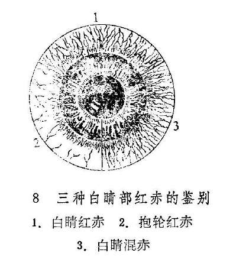

3.两眦：若两眦部红赤明显或赤脉传睛，多为心火炽盛；若兼眦角赤烂，疼痛，多为湿热互结，兼有血瘀；若赤脉细歧色淡，伴有涩痒者，为心经虚热，或肝血不足；若睛明穴处肿胀似枣，色鲜红或紫暗，多为心火旺盛，或肝脾热毒积滞而成；若肿胀不甚，但压之有脓液自泪窍溢出，多为风热毒邪内蕴。

（三）辨痛痒

目痛、目痒的性质、时间、轻重以及牵连的部位不同，可结合全身证候，作为阴阳、寒热、虚实的辨证依据。

1.目痛：疼痛为眼病最常见的症状之一，内外障皆可有之。外障引起的目痛为涩痛、碜痛、或痛如针刺、如鸣啄，多为阳证；内障引起的目痛多为酸痛、胀痛、掣痛，或眼珠深部作痛，多为阴证。一般暴痛多实，久痛多虚，日间痛者属阳，夜间疼者属阴。早晨目痛属阳，午后目痛属阴。久痛不止属实，时发时止属虚。痛重而肿者为实，痛轻而不肿者属虚。疼痛难忍，且兼红赤者为火邪实，隐隐作痛，红赤不著者为精气虚。赤痛而胞肿且多眵多泪者，为风热壅盛；痛而畏寒，时吐清涎者，属虚寒。痛而拒按且喜冷敷，属实属热；痛而喜按，热敷则舒，属虚属寒。痛而躁闷为肝气实，痛而恶寒为阳气虚。痛如针刺，持续不止，为火邪有余；隐痛时作，发无定时，为阴虚火动。目珠胀痛如暴，多为气火上逆；目珠坠痛似脱，多为肝胆火炽。痛连巅顶后项者，属太阳经受邪；连及两侧头痛者，属少阳经受邪；痛连前额鼻齿者，属阳明经受邪；痛连巅顶，兼有干呕吐涎者为肝胃虚寒。眼先痛而牵连头痛者，病情较轻；头痛而累发目痛者，多见于头风害目，病情较重。

2.目痒：目痒多属风邪为患，但也有虚实之辨。若迎风痒甚，且兼见目赤肿痛，为风热外袭，属实。若痒涩兼作，赤痛不著，时发时止，多为血虚生风，属虚。若目痛初发而痒者，为眼病加重之象；目病将愈而痒者，为血气渐复之征。眼无病而忽痒，多为眼病之先兆；若搔痒不已，兼睑弦赤烂，眵泪交加，多属湿热内蕴，兼受风邪；若目痒隐隐，或兼有干涩者，此乃虚火入络；痒若虫行，极难忍受，多为风胜所致，或为湿热生虫。

（四）辨眵泪

主要从量之多少，色泽和稀稠，并结合兼证进行辨证。

1.眼眵：眼眵多者属热，但有虚实之辨。若眵多而干结，为肺经实热；眵多而稀且不结者，为肺经虚热。眵多色黄似稠脓，多为肺胃热毒炽盛。若眵多胶粘，属脾肺湿热。

2.流泪：热泪如汤，多属内热炽盛；兼有赤肿疼痛，多为肝经实热或异物入目；泪热频频，兼有畏光，多为肝经血虚有热。迎风流泪，兼有目痒或胞肿，多因风邪外袭。冷泪长流，拭之不断多属气血不足，统摄无权；时流冷泪，兼见目昏，多为肝肾两亏。

（五）辨羞明

宜结合眼部及全身证候辨证。如兼见红赤肿痛，眵多泪热，属风火实证；若兼有遇光涩痛难睁，痛如针刺者，多为火邪炽盛；若兼干涩不适，但无赤痛，多为阴虚血少，不能配阳。

（六）辨翳膜

在古医籍里，把起于黑睛水膜及睛珠的混浊均称为翳，前者为外障，后者为内障。本处仅就水膜所生之翳与易于混淆的膜加以分辨。

1.翳：翳为发于黑睛水膜的混浊，根据病变形态、颜色、深浅程度不同，各有不同的命名。为便于临床运用，这里将其划分为活翳和宿翳两类。

活翳：指活动可变之翳。《草庐拙》谓：“活者，有红有泪有痛，能进能退，浮而活泼未定也”。所以，凡黑睛水膜发生混浊，色呈灰白，边界模糊，翳形浮嫩，表面粗糙，有可变趋势，伴有不同程度的目赤肿痛、畏光流泪症状者，统属活翳（既往的教科书称新翳）范畴。如聚星障、花翳白陷，凝脂翳等均属此类。活翳多为外感，且易传变。其中翳如秤星数枚，或聚或散，布于黑睛，称聚星障。一般说来，聚星障发病早期，稀疏色淡，浮于黑睛表层，抱轮微赤，多为风热外袭，证情较轻。若见星点云集，抱轮红赤明显，兼有畏光、流泪，疼痛较剧，多为肺热肝火。若星翳连缀成片，翳色黄白，多见溃陷，白睛混赤，疼痛羞明，为花翳白陷，多属肝胆火炽。若翳如凝脂，色呈鹅黄或黄绿，疼势剧烈，称凝脂翳，多为火热炽盛，若救治失时，极易黑睛溃破，黄仁绽出，甚者眼珠塌陷。活翳日久，不见进退，但表面仍粗糙浮肥，久不痊愈，为正虚邪衰之象，聚星障、花翳白陷均常出现此候。因此，临床对活翳必须辨别表里虚实，严密观察其发展变化，不可掉以轻心。

活翳的转归，轻者可消散而痊愈，重者则转为宿翳。

宿翳：凡黑睛混浊，表面光洁，边缘清晰，无发展趋势，亦无赤肿疼痛流泪等症状者，称为宿翳。如冰瑕翳、连珠外障、斑脂翳等均属此类。

宿翳为活翳或外伤之后遗留的瘢痕。因此，在活翳期间，即应抓紧治疗，力争使翳消退。宿翳将成未成之时，积极治疗，亦能使翳部分消退，甚至大部分去除。若日久气血已定，则药物多难奏效。至于对视力的影响程度如何，主要是看翳的具体部位，且与大小、厚薄也有关系。

活翳和宿翳有时可同时存在，临证须当细辨。

2.膜：自白睛或黑白际处起障一片，或赤或白，渐渐向黑睛中央蔓延者，称为膜。若膜上有赤丝密集者，称赤膜；赤丝稀疏色淡，红赤不显者，称白膜。凡膜色淡，尚未掩及瞳仁者为轻证；若膜厚色赤，掩及瞳神者较重；若膜厚阔而赤丝盘虬如积血堆肉，遮掩整个黑睛者，最为严重。

翳和膜鉴别要点是：翳发于风轮，膜来自气轮。翳薄而膜厚。翳多无赤丝伴绕，膜常有赤丝伴绕。

复习思考题：

1.眼科的问诊有哪些独特内容？试述之。

2.怎样进行眼的一般检查？

3.何谓白睛红赤、抱轮红赤，白睛混赤？

4.何谓目晕？简述其主要病机。

5.对眼部的红肿、疼痛、眵泪应如何进行辨证？

6.眼科有哪些独特的辨证方法？

7.怎样辨别翳与膜？

## 第七章治则与治法

**〔自学时数〕**4学时

**〔面授时数〕**4学时

**〔目的要求〕**

1.了解眼科常用内治法适应症及注意事项。

2.掌握退翳明目方法。

3.熟悉熏洗法和敷法的适应症、操作方法及注意事项。

4.熟悉眼科治疗常用穴位及主治。

中医眼科的治则与治法，属于眼科辨证论治的范畴。其基本精神是调节阴阳、气血、津液的平衡，掌握标本缓急、早治防变、扶正祛邪的治疗原则，以促进脏腑功能恢复，气血津液调和，达到治愈眼病的目的。

治则是治疗疾病的原则，与具体治法不同。它是在中医理论指导下，针对疾病的病因病机和临床表现，运用因时、因人、因地制宜的原则，综合分析、概括而得出的治疗总则。治则对临床治疗中的立法、处方、用药，具有普遍指导意义。

治法是治疗疾病的具体方法，它是在治则指导下确立的。眼科的治法，是运用中医学的整体观，根据眼与脏腑、经络、气血、津液密切相关，以及五轮八廓等理论，对不同眼病的不同证型和不同阶段，采用的不同内治法、外治法以及手术和针灸疗法。

### 第一节治则

#### 一、早期治疗，防止传变

眼病的发生，不外外感、内伤两类致病因素。外感日久则可伤正，而在一般情况下，外感易治，内伤难疗，故对外感眼病应及早驱邪，使邪去正安，不致传变伤正，而成难疗之疾。

眼病的规律，初病一般易治，久病难医。如青盲、暴盲，初发时尚有可救之机，病久则纵治亦常罔效；又如凝脂翳、花翳白陷，初病积极治疗，则预后良好，失治则可致风轮破损，形成蟹睛恶候，并常牵及瞳神而失明。故对各种眼病均须及早治疗，免生他变。

眼科疾病，发于肉轮、气轮、风轮属外障，发于水轮者为内障。一般情况下，外障易治，内障难疗，内障的预后常较外障为差，故对各种外障病应积极早治疗，免其诱发为内障疾患。即便外障疾患，因各轮相互毗邻，发病也可相互传变。如肉轮椒疮，失治则可成两眦的漏睛疮、眦漏证、流泪证，也可致白睛的赤丝虬脉、白涩证，还可以致黑睛的赤膜下垂、白翳包睛、聚星障、花翳白陷，终可导致完全失明。

所以，早期治疗，预防传变是眼科病的一项重要治疗原则。

#### 二、掌握标本缓急

疾病的标与本是两个相对的概念。标即标志，指外在的表现；本即本质，指内在的实质。但标与本在各种具体情况下，又各有具体的含义：如眼与整体而言，眼为人体外窍之一，为标，整个机体为本；从新病与痼疾而言，新病为标，痼疾为本；就症状与病因而言，症状为标，病因为本；就外眼与内眼而言，外眼疾病为标，内眼疾病为本。掌握标本，即可在论治时运用治病求本的原则。眼病过程中的病情变化，常有轻重缓急之别，论治时必须掌握标本缓急的治疗原则，急则治其标，缓则治其本。眼病的治疗应当着眼于整体，以调整人体阴阳气血偏盛偏衰为主，结合眼病具体情况而灵活施治。眼部症状急重者，当以解除局部症状为主，内治法与外治法兼施；急性症状缓解后，又应重点调整人体脏腑阴阳及气血的盛衰。这是中医眼科的重要治疗法则。

#### 三、损有余，补不足

损有余，补不足，即扶正祛邪的治疗法则。有余指邪气盛，属实证；不足指正气虚，属虚证。眼科疾患，不外实证、虚证及虚实挟杂证。虚实之间又可相互转化，邪胜于正则病进，正胜于邪则病退。因此，对眼病的治疗就是要扶助正气，祛除邪气，使其有利于疾病向痊愈方面转化。所以，扶正祛邪是解决眼病正邪矛盾的基本方法。是中医眼科治疗学上的一条重要法则。

扶正祛邪应掌握以下原则：邪气亢盛而正气未衰者，以祛邪为主，使邪气退则病自愈；正气已虚，而邪气不盛者，以扶正为主，使正气复则邪自退；邪气亢盛而正气已虚者，采用攻补兼施之法。或先攻后补，或先补后攻，或扶正为主而兼祛邪，或祛邪为主而兼扶正，各以病情而定。

扶正，眼科常用的有益气养血、益气摄血、补益肝肾、健脾补中、温补脾肾等治法；祛邪，眼科常用的有疏风清热、泻火解毒、祛湿利水、清热凉血、活血化瘀、软坚散结、釜底抽薪、平肝息风等治法；攻补兼施，眼科常用的有滋阴降火、健脾利湿、养阴清肺、疏肝健脾等治法。眼科特有的退翳明目法，根据病情可用攻法或补法，也可两法兼而用之。

损有余，补不足，应坚持祛邪不伤正、扶正不留邪的原则。切不可一遇目赤，即云火热之盛，概以寒凉治之，遂以过寒而损伤脾胃；亦不可一见目昏，唯言肝肾之虚，概以补剂投之，或有助邪害正，遂使通光之道瘀塞，愈补愈昏。要之，辨证论治，勿犯虚虚实实之戒。

#### 四、因时、因地、因人制宜

眼病的发生，可因时、因地、及因人的不同而出现不同的证候特点。因此，中医眼科在临证时，要求根据季节、地区、以及人的体质、年令等不同情况，制定相应的治疗方法。

1.因时制宜：四时气候的变化，对眼病的发生和变化，均有不同的影响。例如，春季木旺、肝盛、风多，目赤痒涩等证多有发生，治疗应注意使用柴胡、荆芥、防风等疏风药；夏季炎热，心火偏盛，眼病之发常缘火盛，治疗上每可考虑黄连、竹叶等清心泻火药的应用；长夏暑盛挟湿，眼病常兼湿热，治疗上常用霍香、佩兰、六一散等芳香化湿、清热利水的药物；秋令燥气偏盛，肺金易受戕伐，治疗上常用沙参、麦门冬、知母等清润肺金之品；冬季主蛰，阳气内藏，此时的眼病若非大热，当慎用寒凉之药。而且，冬季因气多风寒，辛温散寒之品如羌活、白芷、荆芥、防风，甚或麻黄、细辛亦属常用之例。

2.因地制宜：我国地域辽阔，各地气候、地理环境、生活习惯和病理变化的特点不尽相同，某些地区还会出现一些特殊眼病。临证治疗应当考虑各地的不同情况。例如，我国的西方、北方，地高气寒风多，所患眼病常兼风寒外束，每多使用疏散风寒的四味大发散〔62〕，而且药量较重，而我国东、南地区，地洼气温多湿，所患眼病常兼湿热火盛，用药常多辛凉宣泻之品，而且用量较轻。又如蜀地居民，习食辛辣，对辛热药物的耐受能力较强，所以当患虚寒眼病而需要附子等药时，用量不妨稍重于其他地区。至于地方眼病，如高原雪地每有雪盲证，放牧地区多有蜡目证，则应根据具体情况，采用相应的防治措施。

3.因人制宜：中医眼科十分重视患者的体质、年令、性别、生活习惯、职业等不同特点，而考虑用药原则。如男女性别不同，各有生理特点：妇女有经、孕、产、乳等情况，治疗时必须加以考虑；男子则须注意遗精、房劳太过等对眼病的影响。临床上，对眼病患者的体质因素尤须重视，因体质可直接影响眼病的性质和发展变化，如阴虚体质，眼病多从火化，且易动血伤津，多有阴虚火旺或眼部瘀血之患，用药须注意养阴清热；阳虚体质，眼病每从寒化，且易湿停水肿，多有痰湿之患，用药须注意温阳以祛寒化湿；易怒之人，眼病多气滞胀痛；多愁善感之人，常暗耗气血而眼多昏暗。论治眼病，考虑因人制宜，对于提高疗效，大为有益。

### 第二节常用治法

中医眼科在运用内治法的同时，还十分重视外治法。内治法，以内服药物为主，通过调整全身阴阳、脏腑、经络、气血，达到祛除病邪、扶助正气、通利玄府、消除病因的目的；外治法，包括局部用药和手术治疗，直接作用于病位，以消除病邪。另外针灸、按摩、推拿等法，在眼科治法上均有良好的作用。

#### 一、内治法

根据眼与脏腑、经络相关的理论，结合五轮、八廓、八纲、六经等辨证方法，运用内治法以调理脏腑经络或祛除病邪，是中医眼科重要的治疗方法。

1.疏风清热法：本法是由辛凉解表为主，以疏风散热、解除风邪的治法。主要用于外感风热眼病。如起病突然，胞睑浮肿，白睛红赤或黑睛起翳，伴有眼痒眼痛、眵泪并作、羞明怕光、眼闭不开等，或兼恶寒、发热、头痛、脉浮等全身症状。若风重于热，可适当配伍辛温解表药，以加强祛风止痛、祛风止泪、祛风退翳之力。间有风邪不挟热而挟寒、挟湿者，应灵活辨证施治。

2.泻火解毒法：本法是用寒性药物，通过清热泻火解毒而消除火热邪毒的方法。主要适用外感火热之邪，或脏腑积热上攻的眼病，如胞肿如桃、疮疡疖肿、白睛混赤、黑睛溃陷、黄液上冲、瞳神紧小等症，常伴有疼痛拒按、羞明怕热、热泪如汤、眵多粘结及口渴、便秘、舌红、苔黄全身症。

眼病热证较多，泻火解毒为常用之法，但临证要结合脏腑辨证，灵活运用，如邪传阳明，眼胞焮肿赤痛，口渴喜饮，大便燥结之腑实证，则宜合通腑泻热法；抱轮红赤，黑睛生翳，目珠疼痛，口苦脉弦数之肝火上攻证，则宜合清肝泻火法；眼痒赤烂、心烦溺赤而属心火上炎者，则宜清心泻火。

本法为寒凉直折之法，易损伤脾胃阳气，故不可久用，且应因人的体质不同而慎重选药；又因久用寒凉可致血脉凝滞，翳障难退，故黑睛疾患应用本法时，应掌握尺度，以免流弊。若属虚火，则忌用此法。

3.滋阴降火法：本法是用滋养阴液、清降虚火，治疗阴虚火旺所致眼病的方法。阴虚火旺眼病，临床多表现为起病缓慢，时轻时重、病程长而易反复等特点，如目珠干涩、白睛隐隐微赤、黑睛星翳乍隐乍现、瞳神干缺、视瞻昏渺等，常伴头晕、潮热盗汗、额红、口干、心烦失眠、手足心热、舌质红、苔少、脉细数等阴虚火旺征象。

临床应用本法时，须当辨别是何脏腑之阴虚而致虚火上炎。如见黑睛生翳，抱轮微赤，烦躁易怒者属于肝经虚火；两眦血脉稀疏，心烦失眠者属于心经虚火；白睛淡红，鼻干咽燥者属于肺经虚火；瞳神干缺，眼底少量出血，耳鸣腰酸，五心烦热者属肾经虚火等。宜结合脏腑之不同，选方用药。

4.祛湿法：本法是通过祛除湿邪以治疗眼病的方法，适用于湿邪外侵或湿浊内蕴所致的一切眼病，如胞睑水肿、睑弦湿烂、睑内粟疮、白睛污黄、翳如虫蚀、混睛障、云雾移睛、视瞻昏渺等，常兼头痛如裹、口干不渴、或渴不多饮、胸闷纳少、腹胀便溏、四肢乏力或咳吐痰涎等。

由于湿邪所犯部位和兼邪不同，具体治法亦有区别。如见胞睑湿痒之风湿犯眼症，则应用祛风胜湿法；黑睛溃烂之湿热上攻症，则应用清热利湿法；胞生肿核之痰湿阻络症，则应用化湿祛痰通络法；胞睑水肿之湿浊上犯症，则应用利水渗湿法等等。

湿症眼病比较顽固，久用祛湿法又易耗伤阴津，临证应根据病情轻重和患者脏腑气血阴阳津液等情况而慎重选药，以免顾此失彼。阴虚血少与津液亏损者，尤宜注意，选用滋而不腻、利不伤阴之品。

5.止血法：本法是制止眼部出血的治疗方法，适于各种眼部出血证的早期治疗，诸如：白睛溢血、血灌瞳神、内眼出血、以及外伤出血等。根据出血原因之不同，止血的具体方法也有区别。如血热妄行者，宜清热凉血止血；虚火伤络者，宜滋阴凉血止血；气不摄血者，宜益气摄血；眼外伤者，宜祛瘀止血。止血属于急则治标之法，待出血已止，即当转为活血化瘀法，以促瘀血去，气血行。

6.活血化瘀法：本法是用活血祛瘀，以消滞散瘀，改善血行，促进眼部瘀血吸收的治疗方法，适用于血流不畅或瘀血停聚的眼病及外伤性眼病，如胞睑青紫肿硬、白睛溢血、白睛紫肿胀起、眼内瘀血、眼部固定性疼痛及舌有瘀斑等。根据气为血帅、气行则血行、气滞则血凝的理论，活血化瘀法常配伍行气导滞药物，以加强活血化瘀的作用，但血瘀又兼气虚者，又当配伍补气药物，益气活血。久用活血化瘀药，则每多耗伤正气，故遇虚证当慎用此法。孕妇忌用。

7.疏肝理气法：本法是疏肝解郁、调理气机，以条达肝气，治疗肝气郁滞所致眼病的方法，适用于因肝气郁滞、气机失调所致一切内外障眼病，尤其是五风内障、视瞻昏渺等内障眼病，凡兼胁胀、胸闷、暧气、咽部似有物阻、急躁易怒、脉弦等症者，皆可用本法。

郁久化火者，宜酌加清火之品；兼有血虚、脾虚者，则可酌加养血健脾之品。

理气药物多辛燥，故对阴亏之体要慎用。

8.益气养血法：本法是用补养气血，以治疗因气血不足所致眼病的方法，适用于各种原因造成的气血不足的眼病，这类眼病多为慢性疾病，并兼有气血不足的全身症状，如眼胞重坠、久视眼胀、黑睛陷翳日久不愈，或外观端好、目无神彩、视物渐昏等。

因气血相依，故益气与养血往往并用，但根据气血偏虚程度上的不同，又当有所侧重，如睁眼乏力、常欲垂闭、舌淡脉弱等，属气虚为主者，应以益气为主，佐以养血；若因失血久病而头昏眼花、不耐久视、心悸失眠、多梦易醒、舌淡脉细等，属血虚为主者，应以养血为主，佐以益气。脾为后天之本，气血生化之源，故益气养血常要兼顾脾胃。至于虚实夹杂者，则可攻补兼施，或先攻后补、先补后攻。

9.补益肝肾法：本法是用补益肝肾的方剂，以治疗肝肾亏损所致眼病的方法。凡见眼干涩不舒、哭而无泪或冷泪长流、白睛微赤、黑睛边缘陷翳，或星点云翳时隐时现、外眼端好而视物昏矇，或夜视不见等，兼见头晕耳鸣、健忘、腰膝酸软、夜间口干、男子遗精、女子月经不调、舌红苔少、脉细无力等症者，均可用本法予以治疗。若见腰膝酸冷、夜间多尿、畏寒脉沉等属于肾阳偏虚者，则当着重温补肾阳。湿邪未除者不可早用本法，非虚忌用。

10.软坚散结法：本法以祛痰软坚，散结消癥，治疗痰湿互结、气滞血凝而致眼病的方法，适用于各种眼病出现的痰湿互结、气血凝滞的证候，如胞睑肿核、白睛结节隆起、眼内陈旧渗出及机化物形成等，可用本法消散之，如偏于气血凝滞者，应与理气活血药物同用，偏于痰湿互结者，则应加强祛痰化湿药物。

11.退翳明目法：本法是消退黑睛翳障的独特治法，仅适用于黑睛生翳者。

翳之所起，原因甚多，当审因施治才能获得良好的效果。务需明确，凡是祛除病因之药物，皆能退翳，切勿每遇翳者，不论翳之根源，就将蝉蜕、蛇蜕、木贼、秦皮、谷精草、石决明……一拥而上，如此则翳反难退。

退翳之法，须分层次。如病初起、星翳点点、红赤流泪、风热正盛者，当以疏风清热为主，佐以少量退翳之品；若风热渐减，则宜逐渐过渡至退翳明目为主；病至后期，邪退正虚而遗留障翳者，须兼顾扶正，结合全身症情，配加益气养血、滋补肝肾之品。

#### 二、外治法

外治法是运用具有祛风、清热、除湿、活血通络、祛瘀散结及退翳明目等各种不同作用的药物和手术从外部直接施治的方法。临床应用甚为广泛。常与内治法密切配合，尤其是对外障眼病，更为适宜。

外治法种类很多，除药物点滴、熏洗、敷熨外，还有钩、割、烙、针等手术方治。现代中医眼科不仅继承了传统的外治法，而且积极改进，有所发展。

1.点眼药法：本法是将药物直接点入眼部，多用以消红眼、祛眵泪、止痛痒、除翳膜。适用于外障眼病及部分内障眼病。常用的有眼药水，眼药粉与眼药膏三种。

（1）滴眼药水：将药物配成水剂应用。用法如患者为坐位，令头部稍微仰起，先在其下眼睑下放置一棉球；如患者为卧位，则令其头微偏向患眼侧，先置一棉球于小眦外侧。令患者双目上视，医生用左手轻轻向下拉开下睑，右手持滴管或滴瓶，将药水滴入大眦角或白睛下方（图9）。然后轻轻将上眼睑提起，并同时放松下睑，使药液充分均匀地分布于眼内，轻轻闭目数分钟即可。一般每次1〜2滴，每日3〜4次。遇急重眼病，可增加。

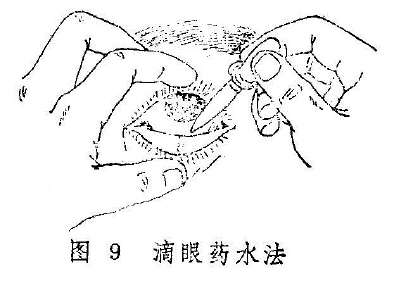

注意滴药要细心查对眼药瓶上的药名标签与所滴的眼别，滴管头部慎勿触及胞睑的皮肤与睫毛，以免污染滴管与药液。如滴入毒性药物，则滴后须用手指压住睛明穴下方1〜2分钟，以防药液通过泪窍流入鼻腔，引起中毒。

（2）点眼药粉：将药物制成极为细腻的粉末后应用。用时以小玻璃棒头部沾湿生理盐水，再蘸药粉约半粒到一粒芝麻大小，医生用手指轻轻分开眼睑，一般将药物轻轻抹于大眦角处，令患者闭目，以有清凉感为度。点毕，患者以手按鱼尾穴数次，以助气血流行，闭目数分钟后，渐渐放开即可。每日三次。

注意一次用药不可太多。否则容易引起刺激而带来不适，甚至可致红肿刺痛等反应。同时注意玻璃棒头部要光滑，点时不能触及黑睛，尤其是黑睛生翳者，要慎重。

（3）涂眼药膏：将药物配成膏剂应用。现一般多用软管药膏，用时将药膏挤出少许，置于胞睑皮肤患处或眼内白睛下方（图10），轻轻提拉下睑后，令患者闭眼，用棉球轻轻按揉胞脸2〜3分钟即可。如用玻璃棒取药，则当患者闭目时，将玻璃棒横向徐徐自眦角方向抽出。每日三次或临睡前用一次。当抽出玻璃棒时，切勿于黑睛表面擦过，以防擦伤黑睛。

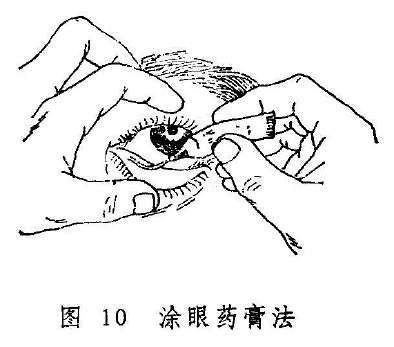

2.熏洗法：熏法是利用药液煮沸后的热气蒸腾上熏眼部；洗法是将煎剂滤清后淋洗患眼。一般多是先熏后洗，合称熏洗法。这种方法除由于药液的温热作用，使眼部气血流畅，能疏邪导滞外，尚可通过不同的药物，直接作用于眼部，达到疏通经络、退热消肿、收泪止痒等效果。它适用于胞睑红肿、羞明涩痛，眵泪较多的外障眼病。

临床上可根据不同病情选择适当的药物煎成药汁，也可将内服药渣再度煎水作成熏洗剂。使用前，在煎药锅或盛药液的器皿上作一盖板，盖上开一个洞，洞口大小与眼眶范围大小一样，熏双眼时可开两个相同的洞。药物煎成后，用盖板覆盖在药锅或盛药的器皿上，将患眼置于洞口熏之。如属胞睑疾患，闭目即可；如属眼珠上的疾患，则要频频眨目，使药力达于病所。

洗眼时，可用消毒纱布或棉球渍水，不断淋洗眼部，亦可用消毒眼杯盛药液半杯，先俯首，使眼杯与眼窝缘紧紧靠贴。然后仰首，并频频眨目，进行眼浴。每日二至三次，每次20分钟。

熏眼煎剂蒸气的温度不宜过高，以免烫伤，但也不宜过冷而失去治疗作用。洗剂必须过滤，以免药渣入眼。同时，一切器皿、纱布、棉球及手指必须消毒，尤其是黑睛有陷翳者，用洗法时更须慎重。

眼部有新鲜出血或患有恶疮者，忌用本法。

3.敷法：敷法分热敷、冷敷与药物敷三种。

（1）热敷：热敷能疏通经络、宣通气血、有散瘀消肿止痛之功。适用于外障眼病伴有目赤肿痛者，亦可用于眼外伤后的胞睑赤紫肿痛及陈旧的白睛溢血，血灌瞳神者。一般分湿热敷和干热敷两种。

湿热敷法先用凡士林或抗生素眼膏涂于眼睑皮肤上面，呈薄薄一层，然后用消毒毛巾或纱布数层，放于沸水内浸湿，取后拧干，等温度适中时，即置于胞睑上，时时保持温度，每次20分钟，每日三次。注意不可太热，以免烫伤皮肤。

干热敷法用热水袋或玻璃瓶装以热水，外裹毛巾，置于胞睑上即可。

脓成已局限的病灶和新出血的眼病，忌用此法。

（2）冷敷：冷敷具有散热凉血，止血定痛之功。适用于胞睑外伤后皮下出血肿胀，亦可用于眼部之焮赤肿痛甚者。一般用冷水毛巾或冰块橡皮袋敷之。

（3）药物敷法：药物敷法是选用具有清热凉血、舒筋活络、散瘀定痛、化痰软坚、收敛除湿、祛风止痒等作用的不同药物，直接敷于胞睑及其附近皮肤上的方法。适用于各种外障眼病。胞睑疾患与外伤用之较多。

敷药时先将药物研成细粉，根据需要，选用水或茶水、蜜、人乳、姜汁、醋、胆汁、麻油、鸡蛋清、蛋黄油等，将药粉调成糊状，敷于胞睑上，或敷于太阳穴、额部等处。如为新鲜带汁的药物，则洗净后捣烂，用纱布包后敷之，亦有用药物煎剂或盐水作湿热敷者。

如用干药粉调成糊状敷眼，则干了就再涂，以保持局部湿润为度。如为新鲜药物，则以做到清洁无变质、无刺激性、无毒性为要。药物敷眼还必须注意防止药物进入眼内，以免损伤眼珠。

4.冲洗法：

（1）结膜囊冲洗法：是用药水或药液直接冲洗眼部的方法。冲洗的目的是除去结膜囊内的眼眵、异物和化学性物质等，适用于眵泪较多的白睛疾患、结膜囊异物、手术前准备及眼化学伤的急救措施等。

方法：一般是利用盛以生理盐水或药液的洗眼壶或吊瓶的胶管来冲洗。冲洗时，如患者取坐位，头稍向后仰，将受水器紧贴颊部；如患者取卧位，则令头稍偏向患眼侧，将受水器紧贴耳前皮肤，然后轻轻拉开胞睑，冲洗液渐渐由下睑皮肤移到眼内，并令患者睁眼及转动眼珠，以扩大冲洗范围。眼眵较多或结膜囊异物多者，应翻上下胞睑，暴露上胞内面及上部屈曲之处，彻底冲洗之。冲洗毕，用消毒纱布揩干眼外部，然后除去受水器。

冲洗时应注意，如为卧位冲洗，受水器一定要紧贴耳前皮肤，以免水液流入耳内，或预先于耳内塞一个小棉球亦可。如一眼为传染性眼病，应先冲洗健眼，并注意防止污染之冲洗液溅入健眼。

（2）泪道冲洗法：是用水液冲洗泪道的方法。它多用来探测泪道是否通畅及清除泪囊中积存的分泌物，适用于冷泪症及漏睛症患者，或作为眼内手术前的常规准备。

方法：用0.5〜1%的卡因溶液点眼二次，或用蘸有的卡因溶液的短棉签，夹在大眦头上下泪点之间，约2〜3分钟后，令患者头向后仰冲洗者以左手食指将下睑往下拉，固定于眶缘部，暴露下泪点。若泪点过小，可先用泪点扩张器扩张之。继而右手持装有5〜10ml生理盐水的注射器，将磨成钝头并弯曲成近直角的4号针头垂直插入下泪点约1〜2mm深，然后内转90°，成水平位，沿泪小管缓慢向鼻侧推进，待进针3〜5mm时，缓缓注入冲洗液。若遇阻力，不可用力强行通过。

如泪道通畅者，冲洗液可以从泪道流入鼻内，水从同侧鼻孔流出；如泪管道狭窄，冲洗时有一定阻力，大部分冲洗液从上泪点返流，仅少量冲洗液通过，鼻孔流出水液呈滴状；如鼻泪管阻塞，则冲洗时阻力很大，鼻咽部无水，冲洗液主要从上泪点返流；若从泪小点返流出粘液脓性分泌物，则为漏睛症；如鼻咽部无水，冲洗液自原泪点或上泪点射出，或觉有坚韧的抵抗感，进水阻力很大，则可能为泪小管阻塞。

#### 三、常用手术疗法

手术治疗是中医眼科外治法的内容之一。常用有钩割、劆洗、烙法、针法等。主要适用于药物治疗难以奏效的眼疾，如目疡成脓、倒睫拳毛、眼生赘疣、胬肉攀睛、圆翳内障等。现代中医眼科在继承整理古代手术治疗的基础上，吸收了现代医学的消毒、麻醉技术和一些眼科手术的长处，对某些传统手术进行了积极的改进，而且有所发展。现介绍如下：

1.椒疮摩擦术：本手术是古代劆洗术的发展。古代所谓劆洗，是以锋针在椒疮颗粒上逐个刺之三五度，或以粗糙之草茎轻擦患部以出瘀血后，再用水冲洗的治法，现代多已不用。今之椒疮摩擦术，应用器械为海螵蛸棒，海螵蛸棒可以自制。

操作方法：左手翻转上脸，右手拿起摩擦棒粗头（体部），把另一头（头部）向沙眼的滤泡与乳头用轻快的手法，从左到右反复轻轻的摩擦（图11）。摩擦时间与反复摩擦的次数需根据病情决定，主要是能充分的擦去椒疮颗粒为目的。摩擦后，用生理盐水冲洗。

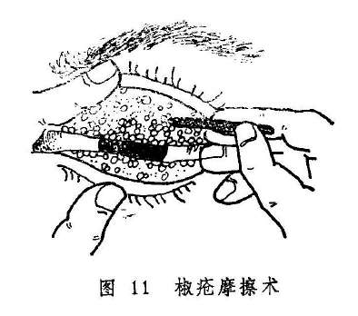

2.胬肉钩割术：

本法是以特制的小钩挽起胬组织，用刀或铍针割除的治法。术前术眼常规消毒，用针麻或表面麻醉行局部麻醉。手术时，首先用锋利之钩针穿入肉中，将胬肉挽起，（现代多用镊子夹住胬肉颈部），后用锄刀逐步将胬肉与黑睛和白睛分离，动作要轻，分离要干净。分离至眦部后用刀割除，亦可用小剪剪除，割毕以烙器烙之，以防复发。术后涂消炎眼药膏，眼垫包封术眼，每日换药一次。伤面愈合后外点犀黄散〔241〕善后。

钩割时须避免损伤正常组织，尤其不能损伤黑睛。清晨空腹及过劳时不宜手术，以防晕倒。

3.金针拨障术：年老体弱人患圆翳内障，翳定障老时宜用此手术治疗。此为中医眼科治疗圆翳内障的重要手术方法（详见各论第五章、第六节）现代医家在它的基础上，吸收西医同类手术的优点，建立了中西医结合的白内障针拨套出来，临床亦可采用。

#### 四、针灸疗法

眼为宗脉之所聚，脏腑精气通过经络上滋于目，视而精明。眼科针灸疗法，是在辨明眼病的寒热虚实，验明经络的部位之后，选取适当的穴位、利用针刺与艾灸，或补或泻，使经络通畅，气血调和，正复邪除，以退赤消肿，收泪止痛，退翳明目，从而达到治疗眼病的目的。

历代眼科书籍对针灸治疗眼病屡有记载，有效穴位较多。近几年，又发现了一些新的穴位，效果甚好。对眼周围的穴一般禁灸，同时在针刺时要特别小心，因眼眶组织疏松，血管较多，且上通于脑，不慎可刺伤眼珠或致出血及其它意外。

现将眼科常用穴位及其主治疾病介绍如下：

（1）眼周围穴位：

睛明：主治迎风流泪、针眼、上胞下垂，风牵偏视、暴风客热，天行赤眼、火疽、黑睛翳障，圆翳内障及多种瞳神疾患。

攒竹：主治同睛明穴。

丝竹空：主治针眼，胞轮振跳，上胞下垂，风牵偏视，暴风客热，天行赤眼，聚星障，火疽、瞳神紧小等。

瞳子髎：主治针眼，上胞下垂，风牵偏视，青风与绿风内障，瞳神紧小，暴盲等。

阳白：主治针眼，风牵偏视，黑睛翳障，圆翳内障，青风内障，绿风内障等。

鱼腰：主治针眼，上胞下垂等。

四白：主治针眼、胞轮振跳、风牵偏视、近视、远视、聚星障、青风内障、绿风内障等。

承泣：主治针眼、流泪症、胞轮振跳、风牵偏视、黑睛翳障、暴盲、近视、远视。

球后：主治圆翳内障、视瞻昏渺、暴盲、青盲、近视、远视。

上明：主治青盲。

此外，太阳、风池、翳明、头临泣、头维等头部穴位也常作配穴应用。

（2）远端取穴：常与眼周围穴相配。常用的有尺泽、列缺、内关、合谷、神门、曲池、臂臑、外关、养老、肩中俞、三阴交、行间、太冲、足三里、光明、肝俞、脾俞、肾俞、昆仑、气海、四缝等。

（3）耳部穴位：耳尖、目1、目2、眼穴。主治天行赤眼，暴风客热，瞳神紧小，青风内障、绿风内障等。

此外，还有梅花针与头针，简要介绍如下：

（1）梅花针：用梅花针叩打眼眶周围的一些穴位，如睛明、攒竹、鱼腰、四白、丝竹空、太阳等穴。主治近视，胞轮振跳。

（2）头针：常用部位：视区。在枕外粗隆突水平线上，旁开枕外粗隆1厘米，向上引平行于前后正中线之4厘米长直线即是此区。

操作方法：取坐位、平卧位或侧卧位均可选好刺激区，常规消毒，用

2.5〜3寸的26〜28号针沿头皮捻转进针，斜刺入头皮下，勿刺在皮内或骨膜，达到该深度后，加快捻转，捻转频率为每分钟240次左右。不能提插，达到麻胀针感后，留针5〜10分钟，再行针二次，留针2次，即可起针。起针后应以棉球稍加揉压针眼以防出血。

主治：青盲。

复习思考题

1.临床治疗眼病为什么要因时、因地、因人制宜？

2.眼科常用的内治法有哪些？适应证怎样？每种治疗方法有哪些注意事项？

3.怎样掌握运用退翳明目法？

4.叙述熏洗法、敷法的适应证、操作方法及注意事项。

5.叙述眼科针刺常用穴位及主治。

## 第八章眼病的调护和预防

**〔自学时数〕**2学时

**〔面授时数〕**

**〔目的要求〕**

了解眼科护理的意义，并掌握眼科的特殊护理方法。

眼病的护理与预防，在古代的眼科专著和一些其他医籍中均有散在记述。护理方面，在《太平圣惠方》、《秘传眼科龙木论》中，记载了煎药、服药方法及饮食注意等护理知识。特別在针拨内障术方面，提出术前调理身体，术后头枕要安稳，进食宜粥饭，便时勿用力，避免呕逆咳嗽等，至今仍有临床意义。预防方面，两千多年前的《内经》就提出了“圣人不治已病治未病”的预防思想。《千金要方》列举了生食五辛、接热饮食、热餐面食、饮酒不已、房室无节……等多项损目原因，告诫人们注意避免之。《审视瑶函》指出了“目之害者起于微，睛之损者由于渐，欲无其患，防制其微”的早期治疗思想。随着时代的发展，实践经验的积累，眼病的护理与预防知识也日趋完善，现分别叙述如下。

### 第一节调护

正确的护理，可以缩短病程、提髙疗效。因此，护理工作是医疗工作中不可忽视的环节。医护人员具有高尚的医德，急病人之所急，想病人之所想，是搞好护理工作的思想基础。眼病患者除一般护理外，尚须注意以下几方面：

1.医护合作，辨证施护：医护既要分工，更要密切合作。

病房要有健全的护理制度，门诊要结合宣传护理知识。对于眼病，应该辨证施护。凡传染性眼病，患眼的眵泪不要玷污他人，用过的毛巾、手帕要蒸沸消毒。医生检查后要用消毒液洗手，然后再检查他人，如一眼先患者，不要交叉擦眼，卧位宜取患侧，以免眵泪流至并侧，引起健眼发病。同时，眼部禁止封盖，以免加重病情。局部用药时，要将用药方法，用药次数，用药的反应等，一一向病人交代清楚。用时须查对药物、查对眼别、药瓶不要接触睫毛，动作要轻巧敏捷。特别是对于黑睛疾病，更须遵循《秘传眼科龙木论》中“不用强看将手擘，恐因手重出清涎”的告诫。外敷药物时，勿将药沫掉入眼内。对于眼外伤病人，尤其是真睛破损者，除注意伤眼情况外，还应注意健眼情况。对于手术病人，术前需作细致工作，消除思想顾虑，取得患者合作，并做好一切术前准备工作。术后遵医嘱处理。如发现病情有变化，需及时报告医生，以便及时处理。

2.根据病情，合理休养：休养包括目力、体力、精神等方面的休养。凡眼病患者，一般要少用目力，特别在急性期，不要作阅读、抄写等增加目力负担的工作，即使轻的慢性眼病，只宜适当阅读书报，避免用目力过度而加重眼病。如为黑睛等部位的疾病，可戴有色眼镜，室内窗户可置帘幔，灯光适当遮挡，以免光线过强，刺激患眼。如有绿风内障等，不宜在暗室和晚间使用目力，应注意避免看电影、电视等。对于眼内出血等所致的暴盲，必须减少体力劳动，或卧床休息。对于难以速愈或预后较差的眼病，要注意了解病人思想情况，劝其心情开朗，保持七情和畅，切勿焦虑忧郁，正确对待疾病。医务人员要贯彻保护性医疗制度，举止言行，要温和体贴，对病人多安慰鼓励、减少其思想负担。病人居处，不宜接近高温炉灶，更须避免烟熏，室内要整洁，空气要流通，环境要安静，让病人安逸舒适，以利病情痊愈。

3.饮食宜忌，视证酌定：讲究正确的饮食宜忌，可以减轻疾病，辅助药效，促使疾病早愈，前人非常重视。如《世医得效100方》在眼病禁忌中谓：“眼乃一身之主，不能忌口，药亦无功，自陷其身也”。眼病的饮食宜忌，总的原则以食物多样化，又富于营养，且易消化之品为宜。一般说来，凡属实热性质的眼病，忌食五辛、煎炒炙煿及腥发之物，以免助热生火，加重病情。若属虚寒性质的眼病，宜戒食寒凉凝滞之物，以免损伤脾胃，致运化失司，而妨碍康复。若年老体胖者，以食清淡之品为宜，少食或不食肥甘厚味，以免助湿生痰，变生他证。年幼体虚者，宜多食动物肝脏、瘦肉、蛋类、青菜等，以综合饮食为妥，不可偏嗜，否则营养缺乏，生化不足，目失濡养。嗜烟对身体有害无益，应为戒忌。至于酒类，对于眼病患者，亦以不饮为宜。

4.煎服药物，注意方法：合理地煎煮药物，注意服用方法，可以节省药材，提高疗效。凡辛散轻扬类药物，以武火急煎为宜，味厚滋补类药物，以文火久煎为妥。介类、矿石类药物，可另包先煎，芳香挥发性药物，应该后下。易溶于水的药物，可溶化冲服，贵重、难煎药物，可用磨调，亦可研末兑服。总之，根据不同性质，采用不同方法。

至于服药时间，古代虽分食前服，食后服，晨服，临卧服等，但大部分是食后服。前人认为，病在上者，可借食物之热力载药上升，直达病所。当今实践，以食后休息片刻为宜。否则食咽方罢，药即入口、使食气与药气相搏，反而不能取效。急病重病，以汤剂为主，且可日进一二剂，以便使药力相续。慢性眼病，可用膏丹丸散，逐渐调理。至于汤剂用热服或冷服，宜根据病情而定，一般以温服居多。

### 第二节预防

预防即防患于未然。“预防为主”是我们党的卫生工作方针。眼病的预防须注意以下几个方面：

1.饮食有节，起居有常：饮食有规律，起居有常度，可以增强体质，提高机体抵抗力，预防眼病的发生，切不可暴饮暴食或偏嗜，以免损伤脾胃。平素少食炙煿及膏梁厚味，以免酿成脾胃湿热。已病后饮食之宜忌，需根据病情而定，不可乱开忌口谱。

生活起居，工作学习，文体活动都应适当安排，要有规律。不正常的活动，不适当的用眼，可使身心视觉受到损害。如久视可伤血，久卧可伤气，久坐可伤肉，久立可伤骨，久行可伤筋，生活规律失常、房室不节，可耗血伤精，甚至造成内障，故当慎之。

2.避免时邪，调和七情：时邪七情为害，属眼病常见的病因。从预防出发，为避免时邪，需顺应四时，适其寒温，锻炼身体，结合气功，以增强体质。如时邪广泛流行，一家之内，邻里之中，男女老幼迅速相染者，尽快隔离病人，避免接触，是预防的有效措施。对于工矿、机关、学校、幼儿园、托儿所等集体单位，还可选用适当的预防性药物，及早预防，避免造成流行。

调和七情，即勿喜怒过度，悲哀太甚。因为七情刺激，哭泣悲伤，思虑过度，忿怒暴悖，均可引起眼病。必须七情和畅，愉快乐观，使百脉通调，脏腑安和，方能不病或少病。

3.讲究卫生，保护视力：加强卫生宣传教育，开展爱国卫生运动，是预防和减少疾病的有效措施。个人要养成良好的卫生习惯，如勤剪指甲、勤洗手，不用脏手脏帕擦眼，也不要用别人的手帕、毛巾擦眼。与传染性眼病患者接触后，要用肥皂水将手洗净。公共场所，要有严格的卫生管理制度，所用的脸盆、面巾、浴巾等要经常消毒。传染性眼病流行时，游泳池应停止开放。医护的检查器械、药品、敷料尤须严格消毒，以免互相传染。

保护视力是眼科保健的主要方面。青少年从小要养成良好的用眼习惯，如读书姿势要端正，距离读物要保持30厘米远，乘车卧床时勿看书，照明要适中。此外，每日配合按摩眼周穴位，以疏通经络气血，消除疲劳。如有眼疲劳症状，应及时去医院诊治，切勿乱戴别人的眼镜。

4.注意安全，防止外伤：眼外伤可以造成视力严重障碍，甚至完全失明。因此，注意安全，防止外伤，也是保护视力的关键性措施。平时要做好预防眼外伤的宣传工作，使广大群众了解眼外伤的基本预防知识。各厂矿单位，要注意改进生产设备和增加防护措施。根据不同工种，健立健全各种保证安全生产的规章制度，并定期检查落实情况。农民也要注意预防农业性眼外伤。学校的教师和家长要对小孩进行安全教育。一旦发生外伤，须及时去医院诊治。

附：眼保健操：

眼保健操是通过按摩推拿眼周围的穴位，以达到消除眼疲劳、保护眼的健康和预防近视的目的。共有四节，其操作方法摘录如下：

第1节揉天应穴（攒竹下三分）：以左右大拇指罗纹面分别按左右眉头下面的上眶角处。其他四指散开弯曲如弓状，支撑在前额上，按揉面不要大。节拍8X8。

第2节挤按睛明穴：以左手或右手大拇指与食指挤按鼻根，先向下按，然后向上挤，一按一挤共一拍。节拍8X8。

第3节按揉四白穴：先以左右食指与中指并扰，放在紧靠鼻翼两侧，大拇指支撑在下颌骨凹陷处，然后放下中指，用食指在面颊中央部按揉。节拍8X8。

第4节按太阳穴及轮刮眼眶：拳起四指，以左右大拇指罗纹面按住左右太阳穴，以左右食指第二节内侧面轮刮眼眶上下一圈，先上后下。上侧从眉头开始到眉稍为止，下侧从内眼角起至外眼角止，轮刮上下一圈计四拍。节拍8X8。

注意，操作时要闭眼，指甲要剪短，手要洗净，按揉要轻缓，以感到痰胀为度。如面部有疮疖等，可以暂停操练，待愈后再作。

复习思考题

1.简述眼病护理的意义。

2.除一般护理外，眼病还应进行哪几方面的护理？

## 下篇各论

各论内容主要介绍各种眼病的发病原因、临床表现和辨证治疗。古代许多眼科书籍常用内障和外障来归纳眼病，作为眼疾分类及判断病因的一种方法。“障”是遮蔽之意，如《审视瑶函》所说：“障者，遮也，如物遮隔，故云障也。……其外障者，乃睛外为云翳所遮，故云外障，然外障可治者，有下手处也；内障难疗者，外不见证，无下手处也。”内障即发生于瞳神之内的疾患，系从内而蔽，故名。外障指发生于胞睑、两眦、白睛和黑睛的疾患，因其发于瞳神之外，外症明显，故名。

内障多为七情过伤，过用目力及劳累过度等，或由外伤所致脏腑经络失调，精气不能上荣于睛珠、神膏、视衣、目系等部位所致的内眼病。其特点是眼部外观端好，或间有瞳仁变形、变色，患者仅有视力不同程度减退或视觉的变化，如视物昏朦，似笼薄纱，眼前黑花，萤星满目，蛛丝飘舞，飞蝇幻视，视直为曲，视定若动，神光自现等。在临床上必须结合眼科仪器检查，方能明确诊断。历代眼科医家对本类病多从肝肾不足或气血两亏等内虚立论。但傅仁宇在《审视瑶函》中认为“亦有因肝胆火动痰生，痰火阻隔肝胆脉道，遮蔽通光之窍”所致。结合临证所见内障眼病，不单与肝肾，且与其他各脏均有密切关系，足证其说。一般内障初起，有实有虚，或虚实夹杂，病至后期则多属虚证。

外障多为六淫之邪外袭，或痰火、湿毒、食滞、外伤等原因诱发而致的外眼病。其特点为外显症状较著，如胞睑肿胀、红赤、皮肤湿烂、多眵、流泪、赤膜、白膜、胬肉、星点、云翳、凝脂等。同时患者自觉症状亦较突出，如患眼焮热、疼痛、羞明、流泪、沙涩作痒等。一般外障眼病多属有余之实证，且病情发展较决，但亦有因内虚所致者，施治时须详辨之。

总之，不论外障内障，在辨证时绝不要拘泥于外障为实、内障为虚之说，必须以局部症状与全身证候相结合，按八纲、脏腑等辨证方法，进行分析归纳，探本求源，分虚实，察病所，认证准确以立法处方，才不致贻误病情。

## 第一章胞睑疾患

**〔自学时数〕**12学时

**〔面授时数〕**4学时

**〔目的要求〕**

1.掌握眼丹和针眼的治疗。

2.熟悉针眼与眼胞疾核、粟疮与椒疮的鉴别。

3.熟悉眼胞疾核、椒疮、粟疮、睑弦赤烂的辨治。

4.了解椒疮的发病过程。

5.熟悉风赤疮痍、目劄的临床表现和治疗。

6.了解粟子疾与粟疮、胞肿如桃与胞虚如球的鉴别。

7.掌握上胞下垂的辨治。

8.熟悉倒睫拳毛，胞轮振跳的病因病机、临床表现和治疗。

胞睑在五轮中属肉轮，是眼睛的最外部分，司眼之开合，起保护眼珠的作用。

胞睑发病，主要原因有两方面，内因主要由脾胃功能失调引起，外因常为六淫侵袭或外伤所导致。此外也可受相邻轮廓病变之影响。故临床辨证时应局部结合整体，辨明内伤、外感，脾胃虚实等，然后论治。如频食五辛，过啖炙煿，则脾胃功能失调，湿热内蕴，上攻于目而为患，治疗时当调理脾胃，法以清热利湿为主，如属风热外袭所致诸病，治以祛风清热为先；属风、湿、热合邪上攻，则应散风利湿、清热解毒为要。

胞睑疾患，包括睑内外的一切病变，属外障范畴，为常见病、多发病。一般说来，较内障证易于治疗，但因常可传变他轮，引起其他严重证候，甚至导致失明，所以对胞睑病，应积极治疗，必要时配合针刺或手术等治法。

### 针眼眼丹

针眼是指发生在睑弦上的局限性小疖，民间常以针刺破出脓或针挑背上红点而愈，故名。针眼之名首见于《诸病源候论•针眼候》，其云：“人有眼内眦头忽结成疤，三五日间，便生脓汁，世呼为偷针。”后世又称为土疳（《证治准绳》）、土疡（《目经大成》）等。

眼丹则是整个胞睑焮红漫肿，继而化脓的疮毒。《外科大成》对本病描述道：“眼丹生于眼胞，红热肿痛，由脾胃二经风热所致。若风盛则浮肿易散，热甚则坚肿难消……俟脓成则针之，贝叶膏贴之收

口。”《医宗金鉴·外科心法》和《中国医学大辞典》亦有类似记载。针眼与眼丹均是发生于胞睑部位的化脓性病变，发病因素大致相同，只在病变范围上有所差异，故而合并讨论。至于《外科正宗》所载的“眼丹”，虽亦肿胀作脓，然明言“此乃睛明穴内空难敛，成漏者多。”类似于“漏睛疮”；《外科启玄》所载的“眼丹”，证候为“赤肿甚，不作脓”，类似于眼科医籍中所谓“胞肿如桃证”。两者均有专篇论述。

针眼和漏睛疮之毒邪蔓延，亦可引起胞睑的大部或全部红赤肿痛，此时须与眼丹鉴别。针眼导致的胞睑赤肿，可于睑弦部察及红色颗粒或局限性脓点；漏睛疮导致的胞睑赤肿每于大眦侧偏重，后则局限于睛明穴处，终可在该处溃脓而破口；眼丹发病则整个胞睑红肿无头，脓成后指压有波动感，溃口亦多不居于胞睑之边缘或大眦部；三者易于鉴别。

眼丹尚须与胞肿如桃相鉴别，后者胞睑赤肿而皮肤光亮，鲜有化脓者，两者是不同的。

**〔病因病机〕**

本病有因风热相搏，客于胞睑者；有因过食辛辣炙煿等物以致脾胃蕴积热毒，上攻于目者。二者均可致营卫失调，气血凝滞，津液被灼而变生疮疖。针眼反复发作者，常为发病后治疗不彻底，余邪未尽；或为素体虚弱，易感风热邪毒之故。

**〔辨证论治〕**

（一）辨证要领

针眼初起，在胞睑某部微红微肿，刺痒不舒，继而形成局限性硬结，形似麦粒，三五日后，便生脓液，于睑弦之睫毛根部出现黄白色脓点（图12）。轻者硬结细小，可自行消散，重则溃后排脓始愈。若热毒扩散，可致整个胞睑红肿，形似眼丹，亦可致胞睑周围及颜面漫肿，甚则头目剧痛，出现疔毒走黄之凶症。针眼有惯发性，多生于一目，但也有两目同时而发，或一目肿核消后，他目又起。

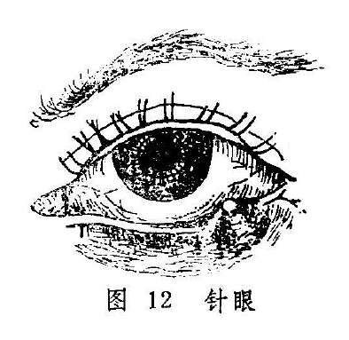

眼丹较针眼为重，整个胞睑漫肿，边界不清，触之肿硬，疼痛拒按。其肿软下垂者易消，焮红色紫而坚硬者难消，每易酿成脓液，溃透眼胞。眼丹及针眼之重证，均可于耳前或颌下触及臖核，光滑而有压痛。病人亦可伴有寒热头痛等全身症状。

两病在发病早期，均可见胞睑微肿，或见肿软下垂，或有颗粒发起，伴见恶寒发热头痛等症，此为风毒外束之证；若肿而坚硬，焮热赤紫，疼痛拒按，伴口渴喜饮，便秘溲赤者为脾胃蕴热，火毒上攻所致；针眼之顶部发白，中央部稍软，或眼丹变软局部按之有波动感者，即为脓已成熟，脓出即可痊愈。一般情况下，速溃者易敛，迟溃者难敛，或可成漏而经久不愈。久不敛口或肿核经久难消者，多为脾胃不健，气血虚弱所致。针眼每有此愈彼起，反复发作者，常为原患针眼而邪毒未消，脾胃蕴伏之热毒不时上攻胞睑所致；或为正气本弱，易于感受外邪而成，临床宜细致分辨，详察病机而施治。

（二）论治要点：

以上证候针眼和眼丹均常见风毒外束或热毒上攻之类型，针眼亦常见因脾胃伏热而反复发作者。对针眼和眼丹的治疗，原则上对未成脓者，应以清热消肿为主，促其消散，这是最理想的治法，也是此两病初期的治疗总纲。荆防败毒散、仙方活命饮、泻黄散和清胃散，均有消肿解毒之功，可根据具体证情而选用；若有大便干者可选内疏黄连汤〔34〕；发病中期，肿势已成，已无消散之望，但尚未溃破的，可选用透脓托毒之法，促其早日液化成脓，并外溃而泄毒，用仙方活命饮即可；已成脓者，当切开排浓，使其早愈。后期治疗宜彻底，切忌导致邪毒蕴伏而使针眼反复发作。针眼因余邪未清，或气血不足而邪气易客胞睑，导致病情反复发作，日久不愈者诚不鲜见。所以，清脾散和托里消毒散亦系针眼常用之方药。

须特别注意的是，此两病酿脓之后，切忌妄行压挤，以免脓毒扩散，导致疔毒走黄。

（三）常见证治

1.内治：

（1）风毒外束：

证候：针眼初起，局部微有红肿痒痛，或是眼丹肿软下垂，痒痛并作。或伴头痛、发热、恶寒、全身不适等，舌苔薄白，脉浮数。

治法：疏风、清热、解毒。

方例：荆防败毒散〔150〕或仙方活命饮〔74〕。前方适用于风寒外束者；后方适用于热毒较甚而外兼风热者。

（2）热毒上攻：

证候：疮形坚硬，焮热疼痛，红肿带紫，伴口渴喜饮，便秘溲赤，苔黄脉数。

治法：清热泻火解毒。

方例：泻黄散〔139〕合清胃散〔198〕。

（3）气血不足：

证候：胞睑肿硬，红肿不甚，微痒微痛，或脓汁不多，或经久难消，或针眼反复发作，此愈彼起，伴面色㿠白，胃纳欠佳，气短乏力，大便不实，舌质淡，脉细无力，

治法：健脾益气养血，托里排脓。

方例：托里消毒散〔88〕。

（4）脾胃伏热：

证候：原患针眼，余邪未清，脾胃蕴伏热毒，致针眼之硬结虽然缩小，但久不消散，或易反复发作，此伏彼起，或伴口燥唇干，口气热臭，渴欲凉饮，舌红少苔等证。

治法：清脾散热

方例：清脾散〔202〕。

2.外治：

（1）针眼未酿脓者，局部可用湿热敷以助消散。两病均可用茶清和蜜，调如意金黄散〔100〕敷患处，或用紫金锭〔237〕磨汁，频涂患处皮肤，以消肿止痛。

（2）已成脓者，当切开排脓。若脓头在眼睑外面者，切口应与睑弦平行；脓头位于睑内面者，切口应与睑弦垂直。

（3）针挑法：对针眼，可在肺俞或膏肓穴附近皮肤上，找出红点一个或数个，消毒后，用毫针挑破，挤出粘液或血水。

（4）针刺疗法：常用穴：攒竹、睛明、丝竹空、瞳子髎、阳白、鱼腰、四白、承泣、合谷、列缺、外关等。但须注意，眼部取穴应在红肿区以外，手法宜用泻法。亦可酌选太阳、合谷、上星等穴点刺出血。

（四）临证权变

针眼反复发作，此伏彼起，或眼丹溃后脓汁清稀，久不敛口者，亦常见气血不足与脾胃伏热相兼的证候，证见面白无华，神疲短气，口干舌燥，溲赤便干等，可用清脾散合四君子汤〔61〕或八珍汤〔13〕加减治之。

两病因于挤压而毒邪扩散，入于血分，或内攻脏腑，出现胞睑或头面漫肿，局部紫胀剧痛，或伴寒热头痛，胸闷烦躁，甚至恶心呕吐，壮热神昏等疔毒走黄逆证者，属于邪入血分，内攻脏腑的危险证候，严重的可危及生命，应急以犀角地黄汤〔240〕合五味消毒饮〔29〕、黄连解毒汤〔212〕加减以急救之。

针眼亦有久不溃破而遗留肿核者，可按眼胞痰核处理（详见下节）。

**〔调护〕**

平时勿用不洁之手或手帕擦眼，勿过食辛辣之物，以免脾胃积热，发生针眼与眼丹；既则更应忌食辛辣，以免证情加剧，或导致针眼反复发作。

**〔应用例案〕**

张XX，女，24岁。于1955年11月26日就诊。主诉：左眼红肿已七天，疼痛剧烈，口干，便燥。

检查：左眼上睑高度红肿，偏小眦部有化脓现象，并波及白睛红赤；小眦部呈蓄水状，如鱼胞隆起，舌苔黄厚，脉沉弦而慢。

诊断：重型土疳证。以清热解毒消肿汤（金银花15克、蒲公英15克、天花粉9克、黄芩9克、赤芍9克、生地9克、荆芥9克、防风9克、甘草3克）去生地，加桑白皮6克，枳壳6克，大黄6克。连服两剂，于11月28日复诊，红肿渐消，疼痛减轻。继服上方两剂，11月30日三诊，红肿全消而愈。（《中医眼科临床实践》）。

按：本例土疳证，因邪毒较盛，以致左眼整个上睑高度红肿，颇似眼丹。然小眦部有局限性脓点乃系诊断土疳证的关键。因患眼上睑高度红肿，兼口干便燥，故为脾胃热毒上攻而致。故用清热解毒消肿汤疏风清热，解毒消肿，加大黄、枳壳清泻脾胃热毒。此方与内疏黄连汤方义相近，但因肿势波及白睛，致小眦部白睛红赤，且如鱼胞状肿起，则属热毒侵肺。所以方中用桑白皮、荆芥、防风清散邪热，服之疗效颇捷。

**〔简便验方〕**

（1）生南星末9克、鲜生地黄15克，共捣烂为膏，贴太阳穴，针眼即消。（《审视瑶函》）

（2）蒲公英60克、菊花15克，水煎。头煎内服，二煎薰患眼，每次15〜20分钟，日两、三次。（《常见病简易疗法》）。

**〔文献摘录〕**

《证治准绳》：“土疳证，谓脾上生毒，俗呼偷针眼是也。有一目生又一目者，有止生一目者。有邪微不出脓血而愈者，有犯触辛热燥腻、风沙烟火，为漏、为吊败者，有窍未实，因风乘虚而入，头脑俱肿，目亦赤痛者。其病不一，当随宜治之。……世传眼眦初生小疱，视其背上即细红点如疮，以针刺破，眼时即瘥，故名偷针。实解太阳经结热也。”

《医宗金鉴•外科心法•眼丹》：“此证由脾胃湿热，受风而成，红肿疼痛。若肿软下垂，不能视物者，偏于风盛也，浮肿易消；若焮红色紫坚硬者，偏于热盛也，肿硬难消。……此证宜速溃，迟则溃深，穿透眼胞，成漏难敛。”

### 眼胞痰核

本病是指眼胞内生硬核如豆，不红不痛的病证，因其属于津液结聚而成，故称眼胞痰核。本病名见于《医宗金鉴•眼科心法要诀》，《原机启微》称为“血气不分混而遂结之病”，《证治准绳》，称为“睥生痰核”，《眼科易知》又称胞生痰核。本病发于上胞较多，亦有生于下睑者。

临床上，本病应与针眼相鉴别。针眼发生于睑弦，发病较急，局部红肿焮痛，肿核与皮肤粘连，压痛明显，溃破后脓出即愈。而本病则发于眼胞皮里，发病较缓，病程漫长，局部皮色如常，皮里硬结与皮肤不粘连，光滑而推之可移，无压痛。

**〔病因病机〕**

1.脾失健运，湿痰内凝，上壅于胞睑脉络，与气血混结所致。

2.多因恣食辛辣炙煿，脾胃蕴热，与痰湿混结，阻塞经络，聚于胞睑而成。

**〔辨证论治〕**

（一）辨证要领：

本病初起自觉症状不明显，常于体检时触及米粒或绿豆大的硬结，隐于胞睑皮里内外，皮色如常，按之不痛，推之可移，与皮肤不粘连。少数硬结小者，可自行消散。若日久不消，则硬结逐渐变大似黄豆，自觉胞睑有重坠感，开张不便（图13）。检查时可见患处胞睑皮肤隆起，胞睑内面呈局限性紫红色或灰蓝色改变。间有皮色渐红，硬结变软，自行溃破，排出白色稠脓样内容物而自愈者。

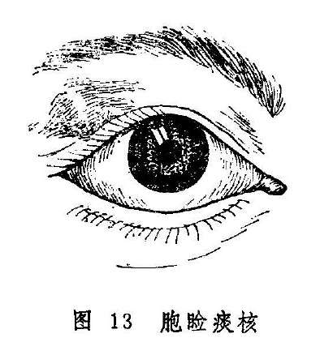

本病皮色如常者，属于痰湿壅阻脉络而成；皮肤微红或睑内红赤明显者，常属痰热混结。若痰核久患，突然红赤作脓，则属复感风热毒邪而致。

（二）论治要点：

本证的内治首先应分清痰湿和痰热，以便分型施治。治疗的要点是化痰散结，有热者再佐以清热药物。内治法主要适用于肿核较小或已溃破者，若肿核较大而无消散希望者，宜结合手术治疗。

（三）常见证治

1.内治：

（1）痰湿阻结：

证候：胞睑内生硬结，皮色不变，按之不痛，与胞睑皮肤不粘连。硬结大者，有重坠感。翻转胞睑，可见睥内有黄色圆形轻微隆起。

治法：化痰散结。

方例：化坚二陈丸〔40〕。

（2）痰热阻结：

证候：胞睑内生硬结，皮色微红，自觉有胀涩感。翻转胞睑，可见睑内面相应部位呈紫红或暗红色。

治法：清热散结。

方例：清胃汤〔197〕。

2.外治：初起硬结较小者，可用湿热敷促其消散。或用生南星磨醋，加冰片少许，调匀涂患处皮肤。若硬结较大，服药难消者，可用手术治疗。

3.手术：术眼按常规消毒，作表面麻醉及局部浸润麻醉后，用霰粒肿夹夹住囊肿，翻转眼睑，露出睑结膜后，取与眼睑垂直的方向，用尖刀在囊肿中央切开〔图14（1）〕，再用小刮匙将内容物刮净〔图14（2）〕，如囊壁较厚，则可剪除部分已软化的囊壁〔图14（3）〕，术毕除去霰粒肿夹，压迫止血后，涂消炎眼药膏，加眼垫包扎术眼，翌日换药即可除去眼垫。

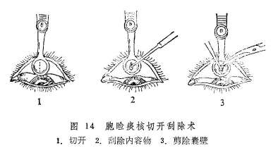

（四）临证权变

上述两证型可以转化，治疗也应灵活。属痰湿阻滞者，尚可加大贝、昆布、海藻、苡仁、羌活、白疾藜以增化痰散结之力；热邪偏盛而欲作脓者，可加夏枯草、公英、丹皮、茺蔚子以清热凉血散结之力。

**〔调护〕**

饮食忌辛辣炙煿，酒浆肥甘，以免湿热生痰，渐成肿核或加重病情；平日勿用手反复磨擦痰核，以免促其增大。

**〔应用例案〕**

张XX，男，22岁。1977年5月23日初诊：右目红肿痒痛2天。右目上睑原有一豆大肿核，推之可动，不痛不痒。因前天外出，回家后即感右目上睑微痛而痒，次晨便觉胀痛。曾在当地医院就诊，给金霉素眼膏点之不效，今日更痛。检查患眼上睑红肿，按之中部坚硬，翻转眼胞，内面有高粱粒大黄白色脓点。此为胞生痰核外受风毒之邪，结于胞睑所致。给除风化痰汤（银花15克天花粉9克赤芍9克胆南星、浙贝母、连翘、防风各6克白芷3克）三剂。5月25日复诊：右目上睑已不红，微显肿胀，仍痒，眼睑内面有一小口，按之出脓。除尽所存脓液，涂以黄连素眼膏，包扎右眼；内服上方去胆南星，减银花6克，加黄芪9克，甘草3克，服2剂。半年后该患者来看他病，说眼病药后已愈，痰核亦消，未再复发。

按：胞生痰核较大者，内服中药疗效较差，当以外治或手术治疗为好。若痰核较小，或术后反复发作，不能根除，或外兼风毒之邪，红肿痛者，内服中药为宜，本例即是，先予祛痰散结、清热活血、疏风消肿之品，继而增黄芪、甘草益气补中，鼓舞正气，抗邪尽出，三剂见效，五剂收功，可谓应若桴鼓。

**〔文献摘录〕**

《审视瑶函》谓睥生痰核证：“此证乃睥外皮内，生颗如豆，坚而不痛。火重于痰者，其色红紫，乃痰因火滞而结。此生于上睥者多，屡有不治自愈。有恣辛辣热毒，酒色𣂪丧之人，久而变为瘿漏重疾者，治亦不同。若初起知劫治之法，则顷刻而平复矣。”

### 椒疮

本病是睑内发生颗粒的一种病变，其颗粒经久难散，色呈黄红或暗红，甚者如椒粒累累，故名椒疮。现代则因其睑内粗糙不平，状如砂砾，而称之为沙眼。病名首见于《证治准绳》，在《秘传眼科龙木论》和《银海精微》里均是将本病包括在“睑生风粟”之内。本病是一种比较常见的慢性传染性眼病，发病率甚高，且每易并发其它眼病而影响视力，甚或导致失明。

粟疮、粟子疾也是睑内发生颗粒的疾患，但形色均不相同，应注意鉴别。

**〔病因病机〕**

多因忽视眼部卫生，感受风热邪毒，内兼脾胃积热，内热与邪毒相结，壅阻胞睑脉络，气血失和而致。

**〔辨证论治〕**

（一）辨证要领

本病初起，往往无任何不适，或仅有轻微的痒涩不爽。翻转上睑，可见睑内近眦处红赤粗糙，患处的脉络轮廓模糊不清。仔细辨认，可见红赤的粗糙面上有无数针尖大小的颗粒，色红而排列密集。红赤的范围可逐渐扩大，甚至布满整个上睑内面。证情继续发展，可在前红赤部位发生椒粒大的颗粒。此颗粒实为泡性，颜色微现黄红或暗红，内灌混浊的浆液，大小不匀，形状不一，边界模糊，质地混浊，排列极不规则，甚或可相互融合成串，疙瘩不平。此时可自觉沙涩羞明，眵多流泪，胞睑重胀难睁。上睑内面广泛发生颗粒后，病变亦可发展到下睑内面（图15-1）。

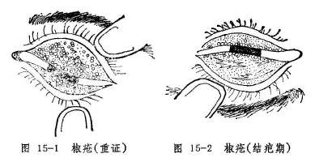

因颗粒磨擦眼珠，可导致垂帘翳下侵黑睛。垂帘翳又名赤膜下垂，轻者极为稀薄，呈多数赤丝垂入黑睛上缘，重者呈肉红色赤膜一片，下覆黑睛中央。赤丝尽头处可发生细小星翳，甚至可相互融合而成云翳，严重影响视力。

椒疮的颗粒溃破之后，可在睑内形成疤痕，疤痕先呈条状或网状（图15-2），最后则全部结疤而使睑内变为灰白色的光滑面。此时多可伴发倒睫拳毛、黑睛生翳等并发症，严重者整个黑睛翳障满布，终则气血凝定，翳障光滑如瓷，黑睛混白如玉，瞳神被遮而失明。

本病初起阶段，睑内有针尖大小的颗粒密集而生，使病变部位呈现一片红赤，多为脾胃积热，兼以外受风毒，风热交聚于胞睑所致；其中又有偏于风热或脾胃热盛之分。脾胃热盛者可兼便干溲赤，或有眵多流泪，偏于风热者则无。椒粒状颗粒满布者，属血分壅热，脉络瘀阻而成；若兼胞睑浮壅、湿烂胶粘、眵粘多泪者，又为胃热兼湿，湿热上犯。

（二）论治要点：

以上证候类型，临床以脾胃热盛和血热壅滞者最为常见。椒疮初期，患者多因自觉症状轻微而从不就诊。对就诊者可用外点药为主治之，遇涩痒明显者，才配合内服药治疗。内治法的关键，在于分清风、热、湿、瘀的孰轻孰重，然后分别施以上述各法。对颗粒累累而伴有痒涩刺痛，眵多胶粘者，仅用内服药往往难获速效，当须配合手术迅速消除颗粒，以免磨擦眼珠而生赤膜下垂、黑睛生翳等严重并发症。

（三）常见证治

1.内治：

（1）风热客睑：

证候：初起睑内微红，或有针尖大小的细小颗粒，患眼无明显自觉症状，或仅有轻度痒涩不适。

治法：疏风清热。

方例：密蒙花散〔200〕。

（2）脾胃热盛.

证候：睑内红赤，颗粒大且多，眼涩痒痛，或伴眵多流泪，或兼便干溲赤。舌质红，苔黄，脉数。

治法：清脾胃，散风邪。

方例：除风清脾饮〔171〕。

（3）血热壅滞：

证候：胞睑肿硬，睑内颗粒累累，疙瘩不平，红赤显著，眼睑重坠难开，刺痛灼热，沙涩羞明。可伴赤膜下垂，生眵流泪。舌质红，脉数。

治法：凉血散瘀。

方例：归芍红花散〔66〕。

（4）湿热壅盛：

证候：睑内颗粒累累，颗粒或有溃破，胶烂湿粘，睑弦浸淫胶结，或伴倒睫拳毛、痒涩刺痛，羞明流泪，眵多稀粘，拭之又生。舌红，苔黄腻，脉滑或数。

治法：清热祛湿。

方例：清脾饮〔201〕。

2.外治：以清热、化瘀、祛毒为主，可滴用化铁丹眼药水〔41〕；或点用石燕丹〔51〕、犀黄散〔241〕等眼药。

3.手术：手术是治疗本病的重要措施，适用于颗粒累累，顽固难消者。可采用海螵蛸棒磨擦法（见总论第七章第二节），以消除睑内之颗粒。

（四）临证权变：

椒疮各证候类型之间并不存在截然的界限，并且可出现两型或多型相兼的情况，所以辨证论治务须灵活，必要时可将疏风，清热、凉血、祛湿、散瘀诸法灵活配合应用。如果患者的睑内红赤比较严重，乃为热邪偏重，可以上列方药为基础，选加生地、元参、赤芍、丹皮等清热凉血药；睑内若兼湿烂粘滞，则为湿邪偏盛，可选加地肤子、土茯苓、苦参等，以增加清热燥湿作用。睑内红赤而兼涩痒者，属风邪偏盛，可酌加荆芥穗、羌活、防风甚或川乌、乌梢蛇等驱风止痒。至于伴发倒睫拳毛，睑弦赤烂、流泪、黑睛生翳等证者，又当参考各有关章节辨证论治。

需要注意的是，椒疮患者也可在眼部病证之外，伴见面黄无华，食欲不振，口泛清涎，形寒肢冷，小溲清长，大便稀薄，舌淡苔白，脉沉迟或缓弱等证，此属虚寒，切不可判为热证而用寒凉之品克伐正气，导致正气更伤，病邪缠绵不去。可选用助阳活血汤〔120〕益气和血兼以疏风。

**〔调护〕**

1.本病患者饮食宜清淡，忌食辛辣炙煿，以免脾胃蕴积湿热。

2.改善生活环境，注意个人卫生。患者的洗脸用具与他人分开，尤其是服务行业，必须经严格消毒后方可使用，以免相互传染。

附：沙眼的分期：

为了便于开展沙眼的防治工作，临床检查可依中华医学会眼科学会1979年11月会议的标准，将沙眼分为三期，如表2。

表2 沙眼的临床分期

| 期别 | 依据 | 分级 | 活动病变占上睑结膜总面积 |
| --- | --- | --- | --- |
| I (进行期） | 上穹窿部和上睑结膜有活动病变（血管模糊，充血，乳头增生，滤泡形成）。 | 轻（+）中（++）重（+++） | <1/3 1/3〜2/3 >2/3 |
| Ⅱ（退行期） | 有活动性病变，同时也出现瘢痕。 | 轻（+）中（++）重（+++） | <1/3 1/3〜2/3 >2/3 |
| Ⅲ（完全结瘢期） | 仅有瘢痕，而无活动性病变。 |  |  |

**〔应用例案〕**

夏XX，男，19岁，学生。1975年7月26日初诊：两目不舒，微痒近一年之久。近两个月加重，自觉沙涩难睁，流泪羞明，曾滴氯霉素眼药水，服中药数剂均未见效。检查：两目上睑肿硬，睑内疙瘩成片，色赤而硬。诊为椒疮。给解毒活血汤（银花、连翘、赤芍、牡丹皮、酒黄芩、天花粉、荆芥、防风、枳壳）三剂。7月30日复诊：言服药效果不显，睑内椒粒同前。先用海螵蛸棒磨擦后，又给上方三剂，并嘱病人不要用凉水洗脸。8月2日三诊：两目羞明、流泪、磨擦感均有减轻，椒粒亦见稍平。后每隔6天磨擦一次，又行2次，服上药24剂，服药期间病人坚持用温水洗脸，病渐痊愈。8月30日来诊：眼睑内已无椒粒，仅留少量白线状疤痕，嘱其停药。（《张皆春眼科证治》）

按：本例椒疮患者，证见上睑肿硬，睑内疙瘩成片，色赤而硬，自觉沙涩难睁，流泪羞明，病因当为外受风热邪毒，内兼脾胃积热，气血瘀阻，故用解毒活血汤疏风清热，凉血散结。本方组方原则与归芍红花散相仿，更兼配合海螵蛸棒磨擦术，故收良效。嘱患者温水洗脸，可免寒而凝滞之虞，使外邪易于疏散，热邪因之而解，气血流行，病则易除。

**〔文献摘录〕**

《证治准绳》：“椒疮证，生于睥内，累累如疮，红而坚则是也。有则沙擦，开张不便，多泪而痛。”

《医宗金鉴•外科心法要诀》：“椒疮生于眼皮里，形如椒粒，色赤。”

《审视瑶函》：“血滞脾家火，胞上起热疮，泪多并赤肿，沙擦最难当，或疼兼又痒，甚不便开张……胞间红瘰瘰，风热是椒疮……轻者只宜善治，至于瘰瘰连片，疙瘩高低不平，及血瘀滞者，不得已而导之，中病即止，不可太过。过则血损，恐伤真水，难养神膏。”

### 粟疮

本病为睑内生颗粒累累，色黄而软，状似粟粒，故名粟疮。本病名见于《证治准绳》，然《秘传眼科龙木论》和《银海精微》皆将本病总括于“睑生风粟”中，《医宗金鉴•眼科心法要诀》则迳称粟疮为“睑生风粟”。《审视瑶函》明确指出：“此症生于两睥之内，细颗黄而软者是。今人皆称椒疮为粟疮者，误矣。”本病可与椒疮相混而生，也可单独发病。本节主要讨论单独发病时的证候及其治疗。

本病与椒疮均为胞睑内面发生颗粒的病变，应注意鉴别（表3）。

表3 椒疮粟疮的鉴别

|  | 椒疮 | 粟疮 |
| --- | --- | --- |
| 颜色 | 鲜红或暗红 | 黄或黄白 |
| 形态 | 较大、不透明 | 较小、半透明 |
| 质地 | 较坚硬 | 较软 |
| 自觉症状 | 沙涩羞明微痒，严重时多泪微痛 | 可无明显感觉，若受邪可突发目赤或目痛。 |
| 检查 | 多发生于上睑内面，血络红赤，模糊不清，初期颗粒极小，后则椒粒样小泡参布其间，内容物混浊，大小不等， | 多发于下睑内面，血络正常，红赤不显，颗粒较小，透明大小均匀，排列整齐；界限分明，压之不硬。 |
|  | 形状不一，排列不整，压之易破，排出胶样物质 |  |
| 黑睛病变 | 或有赤膜下垂，倒睫拳毛，或生星翳。 | 无 |
| 预后 | 不易消散。病变愈后留有疤痕，易生并发症和后遗症 | 易消散，愈后不留疤痕，无并发症及后遗症 |

**〔病因病机〕**

多由脾胃湿热，风热之邪外乘，或因脾胃虚弱，水湿运化不畅，湿邪阻遏胞睑脉络。壅积胞睑而成。多见于儿童及青少年。

**〔辨证论治〕**

（一）辨证要领

本病有慢性与急性发作两种类型。其为慢性者，起初常无明显自觉症状，或仅感微痒不适。检视胞睑内面（主要见于下睑内面），可见有粟粒样小泡簇生，形圆，色黄或黄白，半透明，质地较软，排列密集，境界较分明，尤其是在睑内与白睛交接处最多（图16）此为脾虚湿阻所致；若见睑内红赤，自觉沙涩不适，羞明流泪，则系湿热壅阻而成；若属急性发作，兼见胞睑肿胀，目痛痒难睁，白睛赤丝纵横，又为湿热兼受风邪所致。

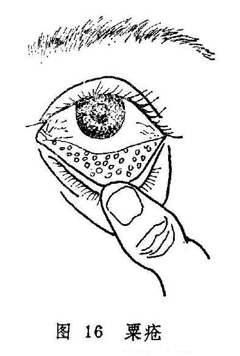

（二）论治要点

本病一般系风、湿、热邪为患，故内治多用祛风、除湿、清热等法。其中症状轻微，且无明显痛苦者，可以外点药治之，点而不消者，再配以内服药治疗。内服药当分清风、湿、热之孰重孰轻，而用五皮散治疗湿邪偏盛者，甘露消毒丹治疗湿而兼热者，除风清脾饮用于风热偏甚者。若小泡日久不消，亦可参照椒疮，施以海螵蛸棒摩擦术，以加速消散。

（三）常见证治

1.内治：

（1）脾虚湿阻：

证候：自觉症状不显，或仅有轻微的痒涩感。翻转胞睑，可见下睑内生有大小均匀，数量不一的淡黄色颗粒，质地较软，经年累月而不消。

治法：健脾除湿。

方例：五皮散〔28〕。

（2）湿热壅阻：

证候：自觉沙涩不适，微感羞明流泪，可见睑内红赤，颗粒累积，形如粟米，色黄而软。

治法：清热利湿。

方例：甘露消毒丹〔48〕。

（3）湿热兼风：

证候：白睛及睑内突发红赤，黄白色颗粒累累，或见胞肿，或目痛痒难睁。

治法：散风清热除湿。

方例：除风清脾饮〔171〕。

2.外治：点黄连西瓜霜眼药水〔211〕或犀黄散〔241〕。

（四）临证权变

上述三型为临证之大纲。但应注意，睑内生粟疮而无明显自觉症状，且经久不消者，亦常见于体质虚弱的小儿，脾虚湿阻型患者可表现面色少华，纳差乏力，舌淡苔薄白，脉沉细或弱，治疗可改用六君子汤

**〔32〕**加苡仁，地肤子、车前子，泽泻以加强健脾利湿之力。发病急暴者、常属湿热兼受风邪，若未伤阴，宜将除风清脾饮中的生地、元参去掉，体质较弱或大便不干者，又宜去大黄、玄明粉，选加苦参、车前子、木通、赤芍等清热除湿通络。

**〔调护〕**

饮食有节，食宜清淡，忌食辛辣鱼腥。

**〔文献摘录〕**

《审视瑶函》：“脾经多湿热，气滞血行迟，粟疮胞内起，粒粒似金珠，似脓脓不出，沙擦痛无时，睥急开张涩，须防病变之。”

《医宗金鉴•眼科心法要诀》：“粟疮如粟，其形黄软，属脾经风热而成。”又指出：“宜劆洗出血，服除风清脾饮，……倍荆芥防风。”

### 附：粟子疾

本病因胞睑内面发生有黄色或黄白色小颗粒，质地坚硬如石，状似粟子，故名粟子疾（图17）。本病名见于《龙树菩萨眼论》，多因脾胃虚弱，运化不力，湿浊上泛于胞睑，复受风热之邪，凝滞而成。轻者，一般无自觉症状，或仅感微涩微痒，待坚硬且碎小之粟子高突出睑内面时，则感沙涩不适；重者，磨擦目珠而致明显疼痛。临证时，不论上睑下睑，凡睑内面嵌有白点或黄点，少则单个，多则丛生，状如粟子碎米，形状不一，高低不等，或尖出于睑内之表面，即可诊为本病。粟子疾和粟疮均为细小颗粒，但形状不同，容易鉴别。粟疮为小泡，较软，半透明，累累成片，排列整齐；而粟子疾则是硬结，不透明，多少不一，大小不等，排列不整。

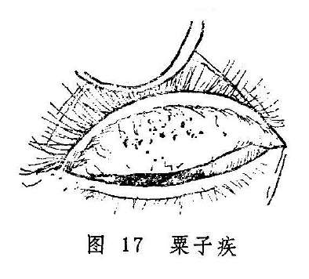

本病治疗以手术剔除为主。具体方法是在表面麻醉下，用消毒之三棱针或注射针头剔除，之后服凉血散瘀药如归芍红花散〔66〕，消除瘀血而杜其再发。

**〔文献摘录〕**

《龙树菩萨眼论》：“若眼忽单泪出者，涩痛者，亦如眯著者，名粟子疾，后上睑生白子如粟粒，极硬，沙㓨之然也。”

### 睑弦赤烂

本病以眼弦红赤，溃烂为特征，故名（图18）。病名见于《银海精微》，该书又称风弦赤烂，烂弦风。《证治准绳》称为风沿烂眼，并根据其症状分为风弦赤烂证，迎风赤烂证、眦赤烂证三种，既往的教科书习称睑弦赤烂。若赤烂仅限于眦部者，《审视瑶函》称为眦帷赤烂（图19）；若病发于初生婴儿，《秘传眼科龙木论》称为胎风赤烂。

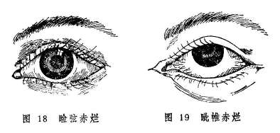

风赤疮痍也是以红赤、溃烂为特征的病变，但其发生于胞睑皮肤，与本病发生于睑弦不同。

**〔病因病机〕**

1.脾胃湿热蕴积，复受风邪，风、湿、热三邪合攻于睑弦。

2.脾胃蕴热，复受风邪，风热合邪结于睑弦，伤津化燥。

3.心火内盛，外感风邪，风火上炎，灼伤睑眦。

此外，亦看其它眼病继发者，如椒疮、粟疮、风热赤眼、黑睛生翳等，眵泪浸渍，邪毒腐化睑弦，而致红赤糜烂。

**〔辨证论治〕**

（一）辨证要领

本病的发病特点是睑弦赤烂，灼热刺痒。因病多由风、湿、热三邪合而为患，风胜则痒，湿胜则烂，热胜则赤，故临床表现可因不同邪气偏胜而有异。病初起，眼弦微红，漫生透明的细小水泡，痛痒时作，频喜揉擦。若小泡溃破，则见眼弦糜烂胶粘，微肿羞明流泪。继则溃烂处生脓结痂，除去痂皮，可见睫毛根部溃陷且出血。亦有睑弦不溃烂而仅红赤，在睫毛根部变生糠麸样白屑附着者。日久可因睫毛脱落、稀疏或乱生，以致眼弦变形，甚至可因倒睫或胞睑闭合不全而并生星点云翳等证。

本证的辨证，眼睑红赤刺痒而起白屑者为风盛，湿烂甚或睑弦生脓者属湿热；红赤甚或仅发于两眦部位者为心火炽盛。

（二）论治要点

上述证型，临床以湿热偏盛者最为常见。其治疗，除内治外，还要配合外治，才能收到预期效果。内治法的要点，在于分清风、湿、火之轻重，然后分别施治。

（三）常见证治

1.内治：

（1）风热偏胜：

证候：眼弦红赤，睫毛根部有糠皮样脱屑，自觉患处灼热刺痒，干涩不舒，舌红苔薄白，脉浮数。

治法：疏风清热。

方例：加减四物汤〔81〕。

（2）湿热偏盛：

证候：眼弦赤烂，肿胀痒痛，眵泪胶粘，睫毛或成束或脱落或倒睫。口渴唇红，舌红苔黄。

治法：清热除湿，祛风散邪。

方例：除湿汤〔172〕。

（3）心火上攻：

证候：眦部眼弦红赤糜烂，灼热刺痒，甚者眦帷干裂出血而刺痛，小便短赤，舌尖红，苔黄，脉数。

治法：清心泻火。

方例：导赤散〔95〕合黄连解毒汤〔212〕。

2.外治：

（1）可用内服药渣煎水熏洗，或选野菊花、荆芥、升麻、陈茶叶，明矾煎水熏洗。

（2）若为风邪偏胜，可用二圣散〔2〕；湿邪偏胜者，可用疏风散湿汤

**〔246〕**；热邪偏胜者，可用万金膏〔21〕，煎水滤汁外洗。

（3）可用鸡蛋黄油膏〔127〕或铜绿膏〔226〕外搽。

（四）临证权变

本病各类型之间常相兼挟，如风盛者，可挟湿，或挟热，或兼火，故辨证论治亦需常中有变。如风热偏盛而睑弦刺痒较剧者，可加蝉蜕、蕤仁、乌蛸蛇，以增祛风止痒之力；如湿热重者可配以藿香、佩兰等芳香化湿之品；如心火旺者，可于上方中加莲子心，苦丁茶，栀子，清心除烦，利湿通络。若睑弦出现脓泡，或脓样分泌物布于赤烂的睑弦部，为湿热兼火毒，可用导赤散合黄连解毒汤，并加二花、连翘、升麻、土茯苓等治之。至于黑睛生翳等并发症，又当参考有关章节辨证论治。

**〔调护〕**

1.饮食宜清淡，勿食辛辣厚味等刺激物。

2.避免风邪和强光刺激，以免加重病情。

**〔应用例案〕**

赵XX，女，27岁。1964年12月2日初诊：双眼睑弦赤烂二年之久，时轻时重。多方求治不愈，今反加重，痛痒兼作，泪出羞明，右目视物不清。检查：双眼上下睑弦红赤糜烂，且有黄白色粘液附着，睫毛不整。右目睫毛倒入，扫擦青睛，风轮花翳遮瞳。此为睑弦湿烂所致倒睫花翳证。治以清热除湿汤（白茅根、酒黄芩、苡仁、蔓荆子、茯苓、荆芥、甘草）去荆芥、茯苓，加当归、车前子各9克，木贼6克，服药六剂。12月8日复诊：双目上下睑弦赤烂近除，右目青睛花翳将尽，但睫毛仍扫青睛，又进上方十二剂。12月21日三诊：睑弦已不赤烂，青睛花翳已除，睫毛仍内倒，停服中药，以单方茅根9克，红糖一撮，生姜三片，浸水常服，每日一次。半月后来诊，弦烂未发，但右眼睫毛仍然倒入，建议手术处理，（《张皆春眼科证治》）。

按：本例患者双眼上下睑弦红赤糜烂，且有黄白色粘液，说明是湿热偏胜，并伴有倒睫花翳证，故其治疗偏于清热除湿，佐以散风退翳。

**〔简便验方〕**

（1）大黑枣20个（去核），明矾末1.8克。混合后共捣成膏，用湿纸包裹，于火内煨半小时，取出去纸；用水两碗将枣膏煎汤，去渣，取汤洗眼（《奇难杂症古方选》）。

（2）一叶绿洗方：地肤叶60克，铜绿少许。上两味用纱布包好（药包要松），滚开水浸之，待温度适宜，以药液洗眼。每日一剂，共三次。（《张皆春眼科证治》）。

（3）洗烂弦风赤眼方：苦参12克，黄连、荆芥穗、防风、五倍子各9克，铜绿1.5克，研为细末，外以苏薄荷煎汤，丸如弹子大，临时用以熟水化开洗眼，每日三次。（《审视瑙函》）。

**〔文献摘录〕**

《诸病源候论》：“目赤烂眦候，此由冒触风日，风热之气伤于目，而眦睑皆赤烂，见风弥甚，世亦云风眼。”

《银海精微》：“因脾土蕴积湿热，脾土衰不能化湿，故湿热之气上攻，传发于胞睑之间，致使羞明泪出，含在胞睑之内，此泪热毒，以致眼弦赤烂。”

《医宗金鉴•眼科心法要诀》：“胎风赤烂之证，因在母腹，其母过食辛热，或生后乳母过食辛热，致令小儿双目尽赤，眵泪胶粘，四眦湿烂”。

### 风赤疮痍

本病是以胞睑皮肤红赤，起泡甚至溃烂为特征的眼病。因其发病常兼外受风邪，且局部红赤，色如涂硃，故名风赤疮庚。本病名见于《秘传眼科龙木论》。《沈氏尊生书》称为“风赤疮疾”。本病的发病部位在胞睑皮肤，病势急，病程较短；而睑弦赤烂的部位在于睑弦，病势缓，病程较长，是为不同。

**〔病因病机〕**

1.脾胃湿热蕴积，外受风热毒邪，风、湿、热三邪合而迫及胞睑。

2.心经伏火，外受风邪，风火搏结，上攻胞睑。

总之，本病以火毒上攻为主，亦有因其他眼病或对眼药及其他物质过敏而发者。

**〔辨证论治〕**

（一）辨证要领

本证初起，胞睑皮肤红赤，甚者红如涂硃，痒痛并作，继而发生水泡，渗出粘液，甚或为脓泡，溃后糜烂，胶粘结痂。若日久失治，可侵犯黑睛，而成星点翳障。

（二）论治要点

上述证候类型，临证以脾经风热和湿热壅盛者常见。应当注意本病虽由风邪所引动，然发病之后，风邪可以化热化火，故其治疗应以清热解毒为主，佐以祛风除湿。

（三）常见证治

1.内治：

（1）脾经风热：

证候：胞睑色红，局部生小泡样丘疹，灼痒微痛，渗出粘液。

治法：祛风清脾。

方例：除风清脾饮〔171〕。

（2）湿热壅盛：

证候：胞睑红肿焮痛，水泡簇生或为脓泡，溃破后湿烂胶粘，瘙痒疼痛，舌苔黄或腻，脉滑数。

治法：清热除湿，祛风解毒。

方例：除湿汤〔172〕。

（3）火毒炽盛，兼挟风邪；

证候：胞睑红赤如涂硃，灼热焮痛难忍，局部溃烂，口干思凉饮，溲黄便秘，舌红苔黄。

治法：泻火解毒，佐以疏风散邪。

方例：普济消毒饮〔227〕。

2.外治：

（1）局部糜烂而渗出粘液者，用搽药方①〔236〕外搽，局部红赤疼痛而干者，外涂搽药方②〔236〕。

（2）参用睑弦赤烂外治法。

（四）临证权变

本病发病之初，证属脾经风热者，若无大便秘结，在应用除风清脾饮时，宜去硝、黄，加用赤芍等凉血散瘀；痒甚者可加蝉蜕、蛇蜕、浮萍，薄荷等；对湿热壅盛者，可于除湿汤中加土茯苓、金银花、地丁、公英等，增强清热解毒除湿之力。若因过敏而致本病，必须立即终止引起过敏的原因，并用加减四物汤〔31〕加银花、连翘、大青叶、绿豆衣，白僵蚕等内服治之。若邪毒攻入眼内而变生翳障者，当参照有关章节治疗。

**〔调护〕**

1.保持眼局部清洁，以免粘液渗流，浊水入目，致生翳膜。

2.忌食辛辣海腥食品。如由某种物质刺激引起者，应避免再次接触。

**〔应用例案〕**

凌某，男，20岁，1975年3月22日初诊。病史：就诊前一周起右眼睑红肿，起病原因不明。虽经治疗（曾用过新霉素、金霉素、氯霉素等眼膏或眼药水），但症状依然逐渐加重。

检查与诊断右眼上下眼睑皮肤肿胀，类似丹毒，以上睑较重，下睑较轻，焮痛而痒，皮肤表面有较多疱疹，形似赤豆，内有黄色渗液流出，眼睑不能张开。球结膜充血兼有轻度水肿，上方球结膜下有片状出血。诊断：右眼睑风赤疮痍（眼睑湿疹）。辨证与治疗：眼之胞睑，属于脾胃。脾湿与郁热相继上犯，故见右眼上下胞睑红肿疼痛，皮肤有颗粒似赤豆，色红焮痛，时流黄水。脉象弦数，舌质红，苔薄白。拟下方治之。连翘9克，黑栀子9克、煅石膏15克、绵茵陈15克、生苡仁24克、桑白皮6克、黄芩、薄荷、生甘草各3克。3月25日二诊：服上方三剂后，右眼睑肿势减轻。甚多，疱疹均已结痂，白睛溢血消退十之七八。症状已改善，原方未更，继续再服。3月27日三诊：上列处方已服五剂，局部症状已接近痊愈。为肃清余邪，再续服原方五剂（陆南山《眼科临证录》）。

按：本例风赤疮痍，乃是湿热蕴郁上犯于胞睑，脾土失制，母病及子，致白睛溢血，故辨证为热重于湿，治以清热为主，利湿为辅，尤妙在石膏，不用生品而改为煅制，既可清热，又能收敛、生肌，燥湿祛邪；治疗以肉轮为主，兼顾气轮之病变，黑栀子凉血止血，清利三焦，加桑白皮清肺热，生苡米渗湿排脓，治法有章，常中有变，收效颇捷。

**〔文献摘录〕**

《秘传眼科龙木论》：“此眼初患之时，或即痒痛，作时发歇不定，或出多泪，遂合睑内疮出，四眦如朱砂色相似，然后渐生膜翳，障闭瞳人。盖是脾脏毒风即热膈中，致令眼病。”

《医宗金鉴•眼科心法要诀》：“风赤疮痍者，起于两眦，其黑睛则端然无恙，惟睑边烂而红赤。此乃脾经风热上攻所致，宜急治之，久则恐生翳膜，遮盖睛瞳。”

### 胞肿如桃胞虚如球

胞睑红赤焮痛，肿胀似桃的眼病，称胞肿如桃。本病名见于《银海精微》，然早在《诸病源候论》的“目风肿候”和“目风赤候”中均有记载。《证治准绳》称“肿胀如杯”，《目经大成》则将上胞红肿称“覆杯”，两胞齐发红肿称“蚌合”。

临床需注意眼丹与胞肿如桃的鉴别。二者同为胞睑红肿，但眼丹是指整个胞睑焮红漫肿，继而化脓的疮毒。而胞肿如桃的胞睑红肿，皮色光亮，一般无化脓趋势，多不变生疮毒，正如《外科启玄》中所说：“赤肿甚，不作脓。”

此外，漏睛疮严重时亦可牵致胞睑赤肿，但彼以大眦处先发赤肿，察之可见，睛明穴处红赤肿胀尤甚，其色呈紫暗或紫红，继而赤肿局限于睛明穴处，终则脓溃而破口，它与胞肿如桃证的整个胞睑皮色光亮，鲜红似桃而不化脓有别。

胞虚如球是指胞睑虚浮如球，不红不痛，皮色如常的眼病。本病在《证治准绳》中称“睥虚如毬”，《目经大成》又称“悬球”。至《眼科临证笔记》始称“胞虚如球”。

以上两证均是以胞睑肿胀为主，同属脾经为主的病变，一实一虚，故予合并论述。

**〔病因病机〕**

1.胞肿如桃：多因恣食辛辣炙煿，脾热引动心火，致血分热毒炽盛，上壅于胞睑腠理；或因肝经实火传脾，肝火脾湿搏结于胞睑，血分热盛，瘀阻脉络而成。

2.胞虚如球：多因脾肺气虚，脾运失健，肺不能通调水道，浊邪内蕴，聚而上泛；或因脾肾阳虚，水气不化，或心脾两虚，气不化湿，均可致水湿上凌于胞睑而见虚浮肿胀。

总之，胞肿如桃皆因火热之邪上攻所致；胞虚如球多因脾、肺、心、肾之气虚或阳衰，不能化气行水使然。

**〔辨证论治〕**

（一）辨证要领

胞肿如桃发病较急，初患之时，即见或上或下、或上下胞睑红肿，目涩泪热，白睛红赤，继则胞睑焮热赤肿，胀起如桃，或如覆杯，疼痛拒按，灼热喜凉，睑闭不开，不能翻转。可伴有发热恶寒、头痛及全身不适等症，重者痛连头脑，伴发瘀血灌睛。

胞虚如球发病较缓，初时可见上胞虚肿若球，不红不痛，皮色如常，浮软而喜按，日久则上下双胞皆肿，可伴少气懒言，神疲气短，面色不华，纳差，口淡便溏，甚则畏寒肢冷等证。

两者同属肉轮疾患，但前者胞睑红肿硬痛，拒按，怕热，泪出不止，属血分之实证；后者多两侧同病，胞睑皮色不变，喜热喜按，拭之渐消，旋复如故，多属气分之虚证。临证宜详察细辨，分证而施治。

（二）论治要点

上述证型，胞肿如桃以肝火湿热上攻为多见；胞虚如球以脾肺气虚者居多，胞肿如桃初起，当配用外治法以增消肿止痛之效，若病情不减而热入血分，则须用大剂清热解毒药。胞虚如球的内治大法，应注意是气虚或是阳虚，然后分别施以各法。

（三）常见证治

1.内治：

（1）肝火湿热上攻：

证候：胞睑肿胀难睁，皮色红赤，可伴羞明泪热，目珠疼痛，或兼口苦咽干，尿黄或赤，便秘，舌红苔黄，脉弦数。

治法：泻肝清火、利湿。

方例：龙胆泻肝汤〔58〕。

（2）热入营血：

证候：胞睑漫肿，皮色暗红，灼热焮痛，兼发热头目胀痛，心烦不寐等症。

治法：清营凉血，泻火解毒。

方例：清营汤〔199〕。

（3）脾肺气虚：

证候：胞浮虚软如球，皮色不变，喜热熨兼气短懒言，面色不华，舌淡脉细。

治法：补肺健脾渗湿。

方例：参苓白术散〔150〕。

（4）脾肾阳虚：

证候：胞肿虚软如球，兼神疲乏力，面色㿠白，畏寒肢冷，腰膝酸软，或小便不利，舌淡脉弱。

治法：温补脾肾。

方例：济生肾气丸〔152〕。

（5）心脾两虚：

证候：胞肿虚软如球，全身可见神气困顿，食少失眠，怔肿健忘等证。

治法：健脾养心。

方例：归脾汤〔68〕。

2.外治：对胞肿如桃者，可用五黄膏〔31〕贴太阳穴；四生散〔60〕或一绿散〔1〕敷贴胞睑表面；紫金锭〔238〕磨汁，频频外涂胞睑，均可达到清热解毒、消肿止痛之效。

（四）临证权变

胞肿如桃初起，证属肝火湿热上攻者，宜于龙胆泻肝汤中加双花，连翘、升麻、白芷，以加强清热解毒之力。若兼大便秘结，大黄、芒硝均可加用。若热入血分，清营汤中可加蒲公英、紫花地丁、板蓝根等，以增强解毒清热的作用，胞肿如桃失治、误治，也有少数导致化脓，如此则参照眼丹辨证论治。

至若胞虚如球，宜在区分气虚、阳虚的基础上，少佐辛温疏风之药，如荆芥、防风、羌活以配合基础方化湿消肿。若胞浮如球已久，皮色微红，眦部微赤，或伴泪出，口渴不欲饮，舌苔黄腻者，又属脾虚兼有湿热，可改用调脾清毒饮〔131〕治之。

**〔调护〕**

实证胞肿患者饮食宜清淡，忌辛辣酒醋等刺激性食品；虚性胞肿患者饮食宜营养丰富，但忌食生冷、肥腻、硬物以免助湿生痰。

**〔应用例案〕**

例1 陈XX，男，28岁，初诊于1945年3月16日。右目胞睑红肿而硬，眵多，眼感沙涩。头痛面红，口干舌红，脉数。病系邪火炎上，胞睑气血郁结，经络壅滞，病在阳明，治当清胃。用清胃汤（生石膏连翘栀子黄连黄芩荆芥防风归尾枳壳陈皮苏子甘草）三剂。二诊：肿势已退，唯舌赤、口干尚剧。内热还炽，再予清降。用白虎汤加芦根，三剂（姚和清《眼科证治经验》）。

例2.张XX，男，23岁，初诊于1953年6月20日，双目外胞骤然浮肿，不红、不硬、不痛，既无眼眵，亦无异感，脉浮，舌苔薄白。此名“胞虚如球”。其病在脾，乃因脾气不足，卫阳不固，肌腠空疏，客邪乘之而入，风湿热三邪合而为病，逆在气分，故见壅肿。治以调脾清热，驱风利湿。方用调脾清毒饮〔181〕二剂。复诊又服三剂。

三诊：眼睑浮肿渐退，示邪已去，当健脾以固肌腠，还防疾子复起。用四君子汤加山药，连服十剂。（《眼科证治经验》）。

**〔文献摘录〕**

《银海精微》：“胞睑壅肿如桃者何也？答曰：此乃脾肺之壅热，邪客于腠理，致上下胞肿如桃，痛涩泪出，不绝之注。”

《证治准绳•七窍门》：“肿胀如杯证，谓目赤痛，睥胀如杯覆也，是邪在木火之有余。盖木克土，火生土，今肝邪实而传脾土，土受木克而火不能生，火邪反乘虚而为炎燥之病。”又指出：“脾虚如毬，谓目睥浮肿如毬状也，目尚无别病，久则始有赤丝乱脉之患，火重甚，皮或红，目不痛。湿痰与火夹搏者，则有泪，有眦烂之候，乃火在气分之虚证，不可误认为肿如杯覆之实病。”

《目经大成》谓悬球：“目不赤痛，但上睑虚起若球，久则始有失睑或红，或内生赤脉。湿痰与火夹煿者，则有泪而眦烂，乃脾肺阳衰自病，不可误认为覆杯、蚌合之实邪。”

### 上胞下垂

本病是指上胞垂下，不能自行提起，遮掩部分或全部瞳神，从而影响视瞻的病变。本病在《诸病源候论》中称睢目，又名侵风，《圣济总录》称眼睑垂缓，《目经大成》称睑废，解放后的教科书始称上胞下垂。本病有先天与后天之分，可单眼发病，亦可双侧同患。若因老年胞睑皮肤松弛而眼皮下垂者，不属本病范围。

**〔病因病机〕**

1.脾气虚弱，阳气不升，胞睑约束无力。

2.脾失健运，聚湿成痰，外挟风邪，风痰阻塞经络。

3.先天禀赋不足，脾肾阳虚，温煦无能，肌肉失主。

**〔辨证论治〕**

（一）辨证要领

本病特征是上胞下垂，轻者半掩睛瞳，重者上胞麻木弛缓，无力上举，遮掩整个风轮。临床上一般分为先天与后天两种，先天患此者多为两眼同病，自幼而始，终日不能随意抬举，视物时需要仰首皱额，眉毛高耸（图20）。后天发生者，有单眼发病，也有双眼俱病，发作时有急性与慢性之分。发病急者，除见单眼上胞下垂外，每伴有眼珠偏斜，视一为二；发病缓慢者，常双眼发病，时轻时重，休息后减轻，劳累后加重，或者晨起轻，午后重，严重者亦可伴视一为二症。

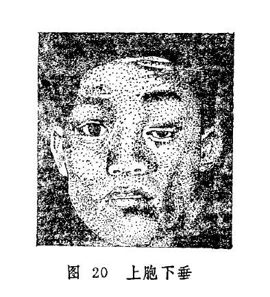

（二）论证要点

各证型中，临床上脾虚气弱和风痰阻络两型较为多见。前者属慢性，初起证轻，病势亦缓，不易为病家所重视，常至半掩瞳神方才就诊。后者属实证，发病较急，不论证属虚实，均宜内服药物与针刺疗法相结合。虚证的内治大法，除扶正之外，尚应酌加活血通络、疏风或熄风之品；对风痰阻络者，主要应治以祛风、化痰、通络之法。本病疗程甚长，需久久服药方能奏效，所以医者与患者均需树立信心，坚持治疗。对于先天性上胞下垂，药物难以收效，可考虑手术治疗。

（三）常见证治

1.内治：

（1）脾虚气弱：

证候：双眼上胞下垂，起病较缓，晨起轻，午后重，逐渐加剧，或兼全身乏力，食欲不振，甚者吞咽困难。舌淡脉虚。

治法：益气升阳。

方例：补中益气汤〔103〕。

（2）风痰阻络：

证候：多为单眼，发病突然，睑肤麻木，并兼见眼珠偏斜，运动障碍，或瞳仁散大，自觉眩晕，恶心，舌苔白腻，脉弦滑。

治法：祛风除痰通络。

方例：正容汤〔52〕。

（3）命门火衰，脾阳不足：

证候：自幼双眼上胞下垂，抬举乏力，视物时仰头皱额，甚或用手拈起眼胞。全身或兼脾肾阳虚之证。

治法：温肾阳，益化源。

方例：右归饮〔56〕。

2.针刺疗法：太阳透瞳子髎，攒竹透睛明，鱼腰透丝竹空。并配足三里、三阴交、肝俞、肾俞、脾俞等穴，每日一次，10次为一疗程。

（四）临证权变

脾虚气弱导致的上胞下垂，可在补中益气汤扶正的基础上，选加丹参，鸡血藤、木瓜、丝瓜络、秦艽、白僵蚕等养血通络。若为气血两亏而兼受风邪，可改用八珍汤〔13〕、人参养荣汤〔11〕补益气血。风痰阻络导致的上胞下垂，寒邪偏盛者，宜于正容汤中加全虫、白芥子；热邪偏盛者，宜加地龙、黄芩、栀子、公英；湿邪偏盛者，宜选加土茯苓、萆薢，防己利湿解毒。至于因椒疮、外伤所致的胞垂，当针对原发疾病治疗，可参考各有关章节。

**〔调护〕**

勿在窗口、门旁或树荫下休息、工作，以免复受风邪，加重病情。

**〔应用例案〕**

汤XX，男，74岁，1971年12月诊治。主诉：右眼胞下垂10天。病史：患者平素头晕眼花，面色无华，精神倦怠，气短声低，四肢乏力，历久不愈。10天前突感右上睑睁闭乏力，继则逐日加重。检查：右眼正常，右眼睑外部无异，仅见上睑下垂，半掩瞳仁，脉虚沉微，舌质淡，苔薄。诊断：右上睑下垂。辨证施治：患者体质素弱，卫阳不固，风邪乘虚中络，使上睑偏废，睁闭艰难。治以益气养血，佐以祛风。药用：黄芪、党参、熟地、当归、白芍、茯苓、白术、桂心、陈皮、五味子、秦艽、天麻、白僵蚕、细辛、木瓜。三剂。二诊：药尽，稍有效验，渐觉睁闭有力，虽仍垂下，但能复原，仍用上方五剂。继后复诊三次，仍以上方加减，又服十五剂汤药后，右睑下垂基本复常。（李坤吉《实用中医眼科学》）。

**〔文献摘录〕**

《诸病源候论•目病诸候》谓：“若血气虚则肤腠开而受风，风客于睑肤之间，所以其皮缓纵，垂覆于目侧不能开，世呼为睢目，亦名侵风。”

《目经大成•睑废》：“两胞丝脉之间为邪所中，血气不相荣卫，麻木不仁而作此状。”

### 倒睫拳毛

睫毛向内倾倒，卷曲乱生，刺扫睛珠的病证，称倒睫拳毛（图21）。本病名见于《秘传眼科龙木论》，《圣济总录》又名倒睫拳挛，《银海精微》称为拳毛倒睫，《目经大成》简称倒睫，《原机启微》称为“内急外弛之病”。本病多为椒疮、睑弦赤烂之后遗症或并发症，因睫毛倒入，刺扫眼珠常致目赤生翳、羞明沙涩，或痛或痒，影响视力，甚至导致失明。

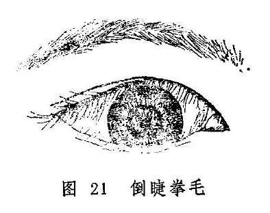

**〔病因病机〕**

1.风热毒邪侵袭于目，壅阻胞睑脉络。

2.恣食辛辣厚味，致湿热内生，上攻于目，阻遏胞睑脉络。

3.肺脾气虚，精微失运，皮毛筋脉失养，内急外弛而致。

4.椒疮经久不愈，或因睑弦赤烂，迎风流泪等病，频频揉擦，伤及睑弦毛根，而致拳曲倒入。

**〔辨证论治〕**

（一）辨证要领

本症初起胞睑痒痛，时轻时重，频频揉擦，以致脸睑皮宽弦紧，睫毛拳曲，触扫眼珠，则目赤涩痛，流泪、畏光、频频眨目，不愿久视。病久不解，刺损黑睛，可致黑睛混浊或溃烂，影响视力，重者视力丧失。

本病若见白睛红赤，修涩流泪，羞明刺痛者，多为风热所致，若见泪粘眵多，胞睑湿烂，碜涩难开，当属脾胃湿热上攻；若涩痒较轻，睑眦淡红，神倦乏力，少气懒言，则属脾肺气虚，筋脉失养。若为椒疮，睑弦赤烂，后期所致睫毛倒入，可见睑弦卷缩，睑内紫赤瘀滞，或有瘢痕形成，此为血热壅滞胞睑所致。

（二）论治要点

本病内治的重点，在于疏风、清热、燥湿、益气、散瘀，当分别证情而治之。但内服药只能减轻眼部赤肿、湿烂、眵泪、翳障之症状，根治倒睫却为不易。所以对本病应重视外治及手术，对倒入之睫毛予以拔除或施以矫正术之后，眼部诸证才能彻底治愈。

（三）常见治证

1.内治：

（1）风热壅阻：

证候：睫毛倒入。羞明热泪，刺碜难开，白睛红赤，黑睛或生翳障，全身证候可不明显，或兼舌边尖红，苔薄白或薄黄。

治法：疏风清热。

方例：石膏羌活汤〔50〕。

（2）脾胃湿热：

证候：胞睑微肿，睫毛倒入，目红涩痒，羞明刺痛，泪粘眵多，睑弦湿烂，舌红苔黄腻脉濡数。

治法：清热除湿。

方例：除风清脾饮〔171〕。

（3）脾肺气虚：

证候：成人及幼儿均可罹患，胞睑微痒，微有浮肿，时轻时重，睫毛一根或数根倒入，甚者皮宽弦紧，升举无力，大部倒入，刺痛难睁，睑眦淡红，体弱乏力，舌淡、苔白、脉细弱。

治法：益气升阳，佐以疏风清热。

方例：黄芪防风饮子〔215〕。

（4）血热瘀滞：

证候：睑弦卷缩变形，睫毛倒入量较多，扫刺睛珠，睑内紫暗瘀滞，或见椒疮并生，黑睛生翳，灼热刺痛。

治法：凉血散瘀。

方例：归芍红花散〔66〕。

2.外治：

（1）西瓜霜合剂〔87〕滴眼，每日4〜6次。

（2）犀黄散〔241〕点眼，清热去翳，可消椒疮。

3.手术：

（1）少量睫毛倒入可予拔除，或用电解倒睫术。

（2）睫毛倒入较多者，宜予手术矫正。

（四）临证权变：

风热之象明显者，宜选加祛风之荆芥穗、防风、羌活、蔓荆子、升麻、白蒺藜等；清热解毒可选加生石膏、黄芩、银花、连翘之属；若胞睑浮肿明显，致使睑弦壅肿，压迫睫毛而倒入者，还可选加苡米、白扁豆、车前子、茯苓等健脾渗湿药。若并发黑睛生翳，当参考有关章节辨证论治。

**〔调护〕**

注意个人卫生，勿食辛辣之品，若有原发病如椒疮，应积极治疗。勿用手揉擦患眼，以免加重病情。

**〔应用例案〕**

邢XX，男，72岁，1964年6月14日初诊：双目下胞睫毛倒入年余，刺痛流泪，羞明难睁，右目视物不真。检查：双目下胞皮宽弦紧，睫毛倒入，右重左轻，右目白睛红赤，青睛下方生翳，此为倒睫生翳。治宜起睫汤（白术、茯苓、甘草、当归、白芍、蔓荆子、防风）加黄芩、木贼各6克，服药6剂。6月20日复诊：皮宽稍轻，倒睫部分已起。右眼白睛有少量赤丝，云翳渐退，又服上方6剂。6月28日三诊：左目下睑稍有宽纵，还有数根倒睫没起；右目睫毛仍大部倒入，白睛稍赤，云翳甚微。以前方去黄芩、木贼又服24剂。1966年5月，因他事来本院，左目倒睫已愈，右目还有数根没起。嘱其用生姜三片，红糖1撮，浸水喝，每日1次（《张皆春眼科证治》）。

按：本例患者年高体弱，中气已虚，复因倒睫扫刺眼珠而生云翳，伴有白睛红赤，故证属虚中夹实。治以起睫汤培土生金，养血舒筋，加黄芩、木贼清热退云翳。其组方原则与黄芪防风饮相似。俟正气旺盛，热邪清解，则倒睫可除。

**〔文献摘录〕**

《银海精微》：“拳毛倒睫者，此脾与肺二经之得风热也。肺为五脏之华盖，主一身之皮毛，肺虚损则皮聚而毛落也。脾家多壅湿热，致令上胞常肿……上下胞睑皮渐长，眼渐紧，故睫毛番倒里面，刺眼碍涩瞳人，渐生翳膜。”

《银海指南•脾经主病》：“上睥宽纵，拳毛倒睫红痛，属肺气虚兼风，不红痛属中气下陷。”

### 胞轮振跳

胞睑肌肤搐惕瞤动，不能自控的病证，称胞轮振跳。病名见于《眼科菁华录》，而《证治准绳》称睥轮振跳，《目经大成》又名目瞤，俗称眼皮跳。若系偶尔发生，勿须治疗，但跳动过频，则需调治。

**〔病因病机〕**

1.劳瞻太过，损伤心脾，阴虚血亏，筋脉失养而瞤动。

2.素体血虚，日久生风，虚风上扰，牵拽胞睑而瞤动。

3.风热外束，客于胞睑肌腠，络阻筋急而发振搐。

**〔辨证论治〕**

（一）辨证要领

本病之特征，是胞睑不自主的振跳不已。多发于上胞，其因皆由风邪所致，然风有内外，当须分辨。若见目睛端好，惟劳累时加重或发作，或伴心悸、失眠等血虚证候，即为血虚而筋脉失养；若振跳较剧，则常为血虚生风；若伴有胞睑微痒微赤，遇风加剧，或伴头痛，或有明显的外受风邪之诱因，则属外风所致。

（二）论治要点

本证临床以心脾两虚型为常见，症状表现较轻，休息后可自行缓解，不易为患者所重视。当病情较重方就医者，常属血虚生风，故而本病的治疗重点，在于养血熄风。明显属于外受风邪者，可用驱风散热饮子。针灸及局部按摩治疗本病，常有良好的效果，当注意运用。

（三）常见证治

1.内治：

（1）心脾两虚：

证候：胞轮振跳，时频时疏，劳累时尤显。兼心烦少寐，怔忡健忘，食少体倦。

治法：补益心脾。

方例：归脾汤〔63〕。

（2）血虚生风：

证候：胞轮振跳，日夜不休，伴有眉、额、面部、口角与眼胞同颤动，不能自主。

治法：养血熄风。

方例：当归活血饮〔93〕。

（3）风热上扰：

证候：胞轮振跳，兼见头目胀痛，或微痒微赤，遇风加剧，苔白脉浮。

治法：祛风清热。

方例：驱风散热饮子〔125〕。

2.针刺疗法：选取攒竹、承泣、四白、丝竹空、风池、地仓、颊车、印堂、足三里、昆仑，按虚者补之，实者泻之原则，每次选3〜4穴，每日或隔日一次。

此外，局部按摩或梅花针点刺均可疏通气血，缓解振跳。

（四）临证权变

内因所致的胞睑振跳，若见心烦不寐，食少体倦或惊悸盗汗，脉细者，为血虚较重，宜在归脾汤的基础上酌加柏子仁、蒸首乌、枸杞、黄精等滋阴养血之属；若见胞睑振跳较剧，则为内风较剧，宜择加天麻、全蝎、钩藤、白僵蚕、龙骨、牡蛎、玳瑁等熄风药；因风热引起振跳不止者，宜分清何经受邪，在驱风散热饮子的基础上灵活加减：如太阳经病重用羌、防；少阳经加柴胡；阳明经加白芷、葛根；热邪炽盛重用连翘、大黄等。

**〔调护〕**

保护目力，勿劳瞻久视；慎起居，避风寒，以危风邪乘机内侵，加重病情。

**〔应用例案〕**

秦XX，女，28岁。1965年7月3日初诊：产后二月，于半月前因外出当风，两目上胞跳动不止，虽视物尚清，但心烦意乱。检查，两目无有异常，唯上睑不时跳动，患者面白体弱，倦怠乏力，舌淡脉细。此为产后气血两亏，风邪乘虚客于胞睑所致。治以当归活血汤（又名当归活血饮〔93〕，见《审视瑶函》）

去苍术、川羌，加白术9克，力参、荆芥穗各3克，三剂而愈。后以八珍汤调补气血，直至康复，共服21剂（《张皆春眼科证治》）。

**〔文献摘录〕**

《证治准绳》：“睥轮振跳，谓目睥不待人之开合而自牵拽振跳也。乃气分之病，属肝脾二经络牵振之患，人皆呼为风，殊不知血虚而气不顺，非纯风也。”

### 目劄

目劄（zhā）是指眼胞开合失常，时时眨动，不能自主的症状。病名见于《审视瑶函》，在《小儿药证直诀》称“目连劄”，因本病多见于小儿，故又称“小儿劄目”（《眼科菁华录》）、“小儿两目连劄”（《眼科阐微》）。

本病与胞轮振跳均是发生在胞睑皮肤肌腠方面的疾病。本病是双眼上下眼胞同时眨动，频频开合；胞轮振跳则是眼胞启闭如常，唯胞上肌肤瞤动不已，阵跳不止，且多为单眼，或上或下。二者不难鉴别。

**〔病因病机〕**

1.饮食偏嗜，食郁生热，热积生虫，脾胃损伤，土虚木旺，筋肉失养，或兼肝风上扰而不舒。

2.阴液不足，虚火上炎，灼伤津液，目失滋养，沙涩不舒而致眼胞频频眨动。

此外，各种外障眼病也可引起本病，若椒疮、白涩证、黑睛生翳等，也有惊恐或情志不逐而肝气逆乱，发为本病者。

**〔辨证论治〕**

（一）辨证要领

本证常为小儿疳疾上目之初起阶段，患儿两眼胞睑不停眨动，常喜揉拭。轻者，眨动较疏，眼外观如常人，兼见饮食偏嗜，畏光、眼目干涩，烦躁不安，此为脾虚，目失濡养，木旺乘土所致；重者两目眨动较频，几无间歇，兼白睛微红，灼痒干涩，须躁易啼，为肝风上扰；若见胞睑眨动频频，兼口干咽燥，舌红少津等，则为阴津被灼，阴虚火炎之候。

（二）论治要点

目劄多因偏嗜而酿疾，治疗大要在于消滞熄风。临证以脾虚肝旺型居多。若兼见目痒畏光，易怒易啼，烦躁不安，属于肝风上扰者，改用镇肝熄风汤治之。阴津亏耗明显者，又当滋阴清热。但各种治法，均需注意脾胃功能，不可过用苦寒或腻滞之品，以免损伤胃气。

（三）常见证治

1.内治：

（1）脾虚肝旺：

证候：双目胞睑不时眨动，眼干目涩少泪，常喜揉拭，饮食偏嗜，体质消瘦，烦躁不安。

治法：健脾，消积，清肝。

方例：肥儿丸〔147〕。

（2）肝风上扰：

证候：双目频劄，白睛微红，畏光微痒，烦躁易啼、易怒，溲黄，舌红脉数，或指纹青中夹紫。

治法：平肝熄风。

方例：镇肝息风汤〔251〕。

（3）阴虚火旺：

证候：两目连劄，眼内灼痒涩磨，视物微昏，口干咽燥，舌红少津，脉细数。

治法：养阴清热润燥。

方例：清燥救肺汤〔204〕或十珍汤〔7〕。前方适应于肺经阴虚有热者；后方适用于肝肾阴虚明显者。

2.针刺疗法：可取四缝、攒竹、承泣、丝竹空、风池穴；灸气海、脾俞、足三里等穴。

（四）临证权变

病在早期，土虚木旺，应在肥儿丸中酌加鸡内金、青皮、炒白芍以消积导滞平肝；肝风上扰者，可于镇肝熄风汤中加钩藤、白僵蚕以加强平肝熄风之功；阴虚火炎者，宜选加石决明、白芍、蝉蜕、鳖甲、龟板等育阴熄风。若属惊吓、郁怒或情志不遂所致者，可用丹栀逍遥散

**〔78〕**稍加天麻、石决明、地龙、香附、郁金、枳壳等疏肝理气熄风解痉药治之。若小儿目劄兼雀目，白涩症、黑睛生翳者，当结合有关章节辨证论治。

**〔调护〕**

患者饮食以清淡、富于营养为主，不可偏食及暴饮暴食，以免伤胃而加重本病。

**〔应用例案〕**

曹x，男，7岁。两目频眨三个多月，并兼见皱鼻歪嘴，不随意，自觉眼干涩，鼻孔干而发痒。其家长说：患儿喜食香燥之品。检查：患儿面黄少华，形体瘦弱，视力正常，余无阳性发现。

诊断：目劄（脾失健运，内蕴湿热而生虫患）。

治则：杀虫健脾。

方药：鹤虱15克，芜荑、雷丸、槟榔、百部、蝉蜕各10克，炒谷芽、炒麦芽各30克，甘草6克，连服二十剂，诸证皆愈（《陈达夫中医眼科临床经验》）。

按：本例目劄乃因患儿恣食香燥之品，湿热蕴郁而生虫。清阳不升则面黄无华，浊阴不降、燥邪上逆于肺而鼻干痒。故于杀虫健脾、消积导滞之剂中加百部润肺而杀虫；蝉蜕祛风散邪，以挛。药中病机，目劄可痊。

**〔文献摘录〕**

《小儿药证直诀》：“凡病或新或久，皆引肝风，风动而上于头目。目属肝，肝风入目，上下左右如风吹，不轻不重，儿不能任，故目连扎（劄）也。”

《审视瑶函》：“目劄者，肝有风也。……此恙有四：两目连劄，或色赤，或时拭眉，此胆经风热，欲作肝疳也，用四味肥儿丸加龙胆草而瘥。有雀目眼劄，服煮肝饮，兼四味肥儿丸，而目明不劄也。有发搐目劄，属肝胆经风热，先用柴胡清肝散治，兼六味地黄丸补其肾而愈。因受惊眼劄或搐，先用加味小柴胡汤，加芜荑、黄连以清肝热，兼六味地黄丸以滋肾生肝而痊。

复习思考题

1.荆防败毒散、仙方活命饮、内疏黄连汤在治疗眼丹或针眼时，应如何选择应用？

2.针眼反复发作者应如何处理？

3.试述眼胞痰核与针眼的鉴别。

4.简述眼胞痰核的治疗方法。

5.简述椒疮的发病过程。

6.试述椒疮的辨证论治。

7.试述归芍红花散、除风清脾饮的药物组成及功能。

8.试述粟疮的辨证论治。

9.简述粟疮与椒疮的证候鉴别。

10.简述粟子疾与粟疮的异同点。

11.简述睑弦赤烂的病因病机和主证。

12.试述睑弦赤烂的辨证论治。

13.简述除湿汤的药物组成及其功能。

14.风赤疮痍的临床表现是什么？

15.试述风赤疮痍的辨证论治。

16.试述胞肿如桃和胞虚如球的症状特征.

17.胞肿如桃和胞虚如球如何鉴别？治疗大法有何不同？

18.试述上胞下垂的临床表现。

19.简述脾气虚弱型上胞下垂的治法方药。

20.试述倒睫拳毛的主要病因和临床表现。

21.简述倒睫拳毛的治疗大法和代表方剂。

22.试述胞轮振跳的病因病机、临床表现和治疗要点。

23.试述当归活血饮的药物组成及功能。

24.试述目劄的临床表现。

25.简述目劄的治疗方法。

## 第二章两眦疾患

**〔自学时数〕**2学时

**〔面授时数〕**2学时

**〔目的要求〕**

1.掌握赤脉传睛、胬肉攀睛的辨治。

2.熟悉胬肉攀睛的手术指征及术后护理。

3.掌握漏睛疮、漏睛证的病因病机、临床表现、治则，了解二者异同。

两眦在五轮中为血轮。心主血脉，心与小肠相表里，故两眦疾病与心和小肠有密切关系。

心为五脏六腑之主宰，主神明，心气平调，神有所主，五脏安和，血脉通畅，眦部无疾。

心在五行中属火，主血脉。心气平则火宁，心气盛则火炎，火炎则气血逆行，脉络壅塞，上结于眦部，而表现为眦部肿痛深红，眵粘干结等。若移热于小肠，可见溲黄或赤或不利等兼证。

然心火为患又有虚实不同，实火多因外感六淫所化，或心火自盛。虚火多因情志内伤，或心阴不足，心火上扰，或肾水亏耗而致虚火上炎，证见眦部微赤微痒、干涩不适，虚烦不寐等。

在治疗方面，实火可清可泻。因外感六淫所化者，宜清热散邪，药选辛凉；属心火内炽者，须泻心折火，药当苦寒。虚火宜滋宜降。心阴暗耗，当养心生液；肾水不足，水不济火，当壮水之主，以制阳光，而降心火。

此外，因两眦分别与胞睑和白睛相邻，故其病变可影响到胞睑或白睛。如心脾同病，可见胞肿眦壅；心肺同病则胬肉横生。治疗时当兼顾脾肺。若赤脉传睛，胬肉攀睛、漏睛疮等失于治疗，可波及黑睛甚至瞳神，严重影响视力，故当积极防治。

两眦疾患包括眦部附近的病变，属于外障范围，临证时除用药物内治外，还应结合外治法，如熏眼，洗眼、点眼、开导、㗜鼻等法，收效更捷。

### 赤脉传睛

赤脉传睛是指赤脉起自眦部，粗细多少不等，成缕而走串白睛的病证。本病名见于《银海精微》，该书还作了进一步划分：赤脉从大眦起者，称大眦赤脉传睛；从小眦发者，称小眦赤脉传睛。

本病必须是赤脉基始于眦部方是，若从它处而起，则非本证。应注意与赤丝虬脉、胬肉攀睛两病鉴别。赤丝虬脉系赤脉纵横于白睛表面，虬蟠旋曲，然非起自眦部，也不侵及黑睛；胬肉攀睛虽然也起于眦部，但其膜厚如肉，或有赤脉满布其上，常可攀及黑睛，严重者遮蔽瞳神。

**〔病因病机〕**

1.多因过食五辛厚味，致脾胃积热，或肝郁化火，上犯于心，心经蕴热，郁于眦部而发病。

2.竭视劳瞻，或思虑太过，或夜近灯火，耗伤心阴，虚火上炎，壅于眦部脉络。

**〔辨证论治〕**

（一）辨证要领

本证初起，眦内涩痒，微痛不舒，赤脉呈细歧枝状自眦部发出，横向伸展，渐贯气轮。由于攀侵黑睛者较小，故一般不影响视力。依据其证候一般分为虚实两证。实证初起，自感眦部壅涩胀痛，或痛痒并作，眦肉高隆而色鲜，或眦帷红赤，赤脉粗大，色呈暗红，此属心火炽盛而兼受风邪。若侵入白睛，则见眵多粘稠，刺痛流泪，羞明难睁，或兼头痛心烦，溲赤便干，此为火邪凌肺。虚证初起，症状较轻，眦部微干微涩微痒，眦肉浮胀淡红，赤脉稀少且细，全身可见头晕心悸，少寐多梦，此为心阴不足，虚火上炎；若兼咽干耳鸣、腰酸等，则系肾亏于下，心火失济，上攻眦部。

（二）论治要点

本病之因，主要为火热所致，但火分虚实，主要应根据赤脉的色泽、粗细、多寡及全身的兼证等进行辨证。属实火者当以清心泻火为主，属虚火者则宜滋阴兼以清热。

（三）常见证治

1.内治：

（1）心火炽盛：

证候：赤脉粗大鲜红，自觉眦帷微痒涩胀，重者痛痒交作，眵多干结，头痛烦热，口干咽燥，或口舌生疮，大便燥结，小便黄赤，舌尖红，苔薄黄，脉数有力。

治法：清心泻火。

方例：泻心汤〔131〕合导赤散〔95〕。

（2）虚火上炎：

证候：丝脉淡红，细小稀疏，自觉眼内隐涩，微痒不舒，兼见心烦少寐，咽干等，舌红少苔，脉细数。

治法：滋阴降火。

方例：补心汤〔102〕。

2.外治：用黄连西瓜霜眼药水〔211〕。胆汁二连膏〔163〕、或八宝眼药

**〔12〕**点眼，每日三次。

（四）临证权变

本病属实火者，若白睛赤脉粗大色红，可加桑白皮、丹皮以增强泻火凉血解毒之力。少数患者赤脉可侵及黑睛，宜加石决明、蝉蜕、决明子以清热退翳。属虚火者，亦有肾阴不足，心肾不交而心火上炎之证型，宜用知柏地黄丸〔148〕、滋阴地黄丸〔228〕等加减治之。

**〔调护〕**平素应饮食有节，忌食辛辣腥膻等发物，以免助热化火，加重病情。

**〔应用例案〕**

程XX，男，29岁，1964年10月1日初诊：双眼发红赤痛3月余。初起流泪、生眵、刺痛，逐步加重，曾用中西药均不见效。近10余天症状加剧。检查：眦肉红肿高胀，大小眦皆有赤丝伸入水轮，气轮赤丝满布，风轮昏暗，丝脉周围有朦胧薄翳，水轮稍暗，此为赤脉传睛。心、肺二经火盛克肝，有进而侵肾之势。方用退赤散（生地、木通、银花、黄芩、赤芍、丹皮、秦皮）加玄参6克，嘱其禁食腥辣，服药6剂。10月6日复诊，大眦肉仍胀，眦部赤脉仍盛，气轮赤丝减轻，风轮薄翳渐退，瞳神已现清晰，视物恢复正常。又进上方三剂。10月10日三诊：大眦肉渐低，赤脉退出风轮，云翳已尽，白睛略赤，已不结眵流泪。以导赤散加酒黄芩又进6剂。10月18日四诊：诸症皆除，双目恢复如常，停服中药，嘱其忌食腥辣一月。（《张皆春眼科证治》）。

按：本例患者，眦肉红肿高胀，赤丝伸入风轮，丝脉周围有薄翳，水轮稍暗。可知证属心火过盛，煎熬肾水，其源在心，心火降则水自生，瞳神自清，故治疗重在清心泻火，所用退赤散与泻心汤组方原则基本相同。嘱患者禁食腥辣，是免生热化火，助邪更盛之虞，使热清火退，气血通畅，则病可愈。

**〔文献摘录〕**

《秘传眼科龙木论》：“此眼初患之时，还以上眦渐生赤脉，奔来睛上。皆因三焦聚热冲肝膈壅热使然。治疗稍迟，以后恐损眼目”。

《医宗金鉴•眼科心法要诀》：“眦赤之证，赤脉起于大眦者，心经之实火也；赤脉起于小眦者，心经之虚热也”。

《银海精微》：“赤脉传睛之证，起于大眦者，心之实也，此心邪之侵肝也……小眦赤脉传睛者，心之虚也，与大眦不同”。

### 胬肉攀睛

本病为目中有肉膜努起，自眦角横贯白睛，渐侵黑睛，故名，胬肉攀睛（图22）。病名见于《银海精微》，《秘传眼科龙木论》称为胬肉侵睛，《原机启微》称奇经客邪之病，俗称攀筋。

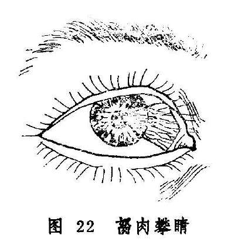

胬肉发生于内眦者居多，外眦或两眦同时发生者较少，常发于成年人，尤其是户外工作者及嗜食辛辣厚味之人。多数病变进行缓慢，往往经过数月或数年才侵入风轮，严重者可遮掩瞳神，影响视力。

本病应与赤脉传睛、黄油障相鉴别。赤脉传睛是眦部赤脉侵犯白睛的病变，其赤脉粗细多少不等，但无膜肉赘生。黄油障生于白睛，介于眦角与黑睛之间，不与眦部相连，淡黄浮嫩而不高起，上无丝脉贯附，也不侵及黑睛，不痒不痛，不影响视力。且眦部尖而黑睛侧宽，与胬肉攀睛之眦部宽而黑睛侧尖迥异。

**〔病因病机〕**

1.心肺二经风热壅盛，热瘀络阻而生。

2.恣食五辛酒浆，脾胃蕴积湿热，上蒸于目。

3.久处烟火，热毒蕴郁，或户外工作，风沙刺激过甚，经络瘀滞而成。

4.过劳恣欲，损伤心阴，暗耗肾精，水不济火，心火上炎。

**〔辨证论治〕**

（一）辨证要领

症初眼无不适，或仅有微痒刺涩。检视患眼，从眦部到黑睛的白睛表层渐渐增厚，并有血丝相伴红赤高起，而成胬肉。胬肉多呈三角形，自眦部开始，尖端朝向黑睛。其横布于白睛的宽大部分称体部，朝向黑睛的尖端称头部。若头尖厚，红赤显著属实证，多发展迅速，每可侵及黑睛中央，遮掩瞳神，影响视力。其初起痒涩羞明，多泪多眵者属于风热壅盛，伴心烦口疮，口渴尿黄者为心经火盛，伴口渴多饮，便秘尿黄者又为脾胃实火。若头部钝圆，色白而菲薄者为虚证，发展较慢，或停止在黑白睛交界处，不影响视力。

（二）论治要点

本病临床以心肺风热壅盛和心火上炎最为常见。初起眼部症状较轻者，可采用外点药物治疗。若遇涩痒明显，或眵泪较多，羞明者，则须配合内服中药。内治的关键，在于分清风热、湿热、心火、虚热，然后分别施以常见证治中各法。但不论轻重，无问虚实，均可加用丹皮、赤芍、白蒺藜、红花等活血散瘀。对证情较轻或进展缓慢、乍轻乍重者，通过服药内治常可停止发展或发作，对进展较快或已影响视力者，服药则难以获效，须配合针刺疗法或手术治疗。然因术后亦易复发，宜结合内服中药凉血消瘀，防止胬肉再生。

（三）常见证治

1.内治：

（1）心肺风热：

证候：胬肉初生，渐渐胀起，赤脉集布，沙涩不适，或眵泪较多，刺痒羞明，舌尖红，苔薄黄。

治法：祛风清热。

方例：栀子胜奇散〔210〕。

（2）心火上炎：

证候：眦角赤脉集聚，胬起如肉，红赤涩痒，头尖体厚，进展较快，伴有心烦口疮，口渴思凉饮，漫赤等，舌尖红赤，苔薄黄，脉数。

治法：清心泻火。

方例：泻心汤〔131〕或张氏攀筋方〔123〕。

（3）脾胃实热：

证候：胬肉肥厚，赤瘀如肉，发展迅速，伴有眵多粘结，口渴欲饮，便秘溺赤，舌红苔黄腻，脉滑或数。

治法：泻热通腑。

方例：泻脾除热饮〔140〕。

（4）阴虚火旺：

证候：胬肉色淡，头圆而薄，乍轻乍重，发展缓慢，涩痒间作，心中烦热，口干舌燥，瘦黄舌红，脉细而数。

治法：滋阴降火。

方例：知柏地黄汤（丸）〔149〕。

2.外治：若胬肉红赤肥厚，涩痒眵多，可用吹霞散〔122〕点眼，或点八宝眼药〔12〕。若胬肉头圆，薄如蝉翼，进展迟缓，亦无赤痛者，可用炉硝散〔142〕点眼，每日2〜3次。

3.手术：手术治疗是本病的重要措施之一，适用于胬肉发展较快，已侵入黑睛或遮蔽瞳神者。因术后易于复发，故操作时必须认真，务求彻底，术后宜服清热散瘀之品。具体方法采用胬肉钩割术（见总论第七章第二节）。

（四）临证权变

本病的各证型之间可相互转化或两型相兼，故施治时宜灵活变通。如风热壅盛型，若有目赤多眵，脉象洪数者，可酌加生石膏、银花、连翘、大黄；若为心火上炎较重者，可加栀子、莲子心、丹皮、茺蔚子清心凉血；若胬肉体厚色黄，舌红苔厚，又为脾胃湿热，可加滑石、土茯苓、车前子、地肤子等以利湿清热；若系阴虚火炎，反复发作，时轻时重者，可用前述知柏地黄丸灵活加减，也可在证属心阴不足、虚火上炎时改用天王补心丹治之。若胬肉已侵及黑睛，可加决明子、夏枯草、蝉蜕、秦皮等退翳消瘀之品；并积极配合外点药物或手术疗法。

**〔调护〕**

本病患者忌食五辛炙煿，以免生热化湿，加速胬肉发展。对常年在户外工作者，可配戴有色眼镜或变色镜，避免风沙烟尘侵袭。

**〔应用例案〕**

周XX，男，35岁，初诊于1953年1月17日，右眼内眦赤脉如缕，根生瘀肉，红肿隆起，侵蚀黑晴，将及瞳神，病名：“胬肉攀睛”。睛痛头胀，眵多泪频，舌红，脉浮数。源由风热客于奇经，气血郁滞较甚。治以驱风热、和气血、清上利下，拨云退翳。拨云退翳汤（川连、菊花、薄荷、蝉衣、花椒、天花粉、炒荆芥、羌活、白疾藜、地骨皮，青龙衣、甘草）五剂（以后又服五剂）。

二诊：红退肿消，攀睛平复，但其病根较深，非手法实难退尽。拨云退翳丸（由汤剂改制为丸）继服。（姚和清《眼科证治经验》）

按：本例患者，辨证为风热外侵，气血郁滞，肝经受损，故用拨云退翳汤疏风清热，消赤退翳，佐以清肝养血。本方组方之原则与栀子胜奇散类同，均为疏风清热，然本方退翳之力更强。又因病变已侵及风轮，故辅以清肝养血之品，服后效若桴鼓，红退肿消，攀睛平复。鉴于病根较深，非手术治疗，终难断根绝源。

**〔文献摘录〕**

《原机启微》：“邪客于足阳蹻之脉，令人目痛，从内眦始……阴蹻脉入鼽，属目内眦，合于太阳阳𫏋而上行，故阳𫏋受邪者，内眦即赤，生脉如缕，缕根生于瘀肉，瘀肉生黄生脂，脂横侵黑睛，渐蚀神水，此阳𫏋为病之次第也。或兼锐眦而病者，以其合于太阳故也。锐眦者，手太阳小肠之脉也。锐眦之病，必轻于内眦者，盖枝蔓所传者少，而正受者必多也，俗呼为攀睛，即其病也”。

《目经大成》：“胬肉有尖头、齐头两种。齐头者浮于风轮，易割而平复，全好后迹象俱无。尖头者深深蚀入神珠，太难下手，且分明割去，明日依然在上，非三、五回不净尽”。

### 漏睛疮漏睛证

漏睛疮与漏睛证均系邪热侵袭眦部后所引起的病变。但发病的部位、证情的缓急和临床表现均有不同，辨证治疗亦有区别，故分述如下。

#### 〔漏睛疮〕

本证是目大眦睛明穴处突发红肿热痛，继则溃破出脓的急性眼病。病名见于《疮疡经验全书》，但以《医宗金鉴•外科心法要诀》论述最详。因漏睛疮严重时红肿热痛之范围可波及胞睑，故应与大眦部发生的针眼、眼丹及胞肿如桃相区别。其主要鉴别点在于漏睛疮的红肿热痛或渗脓的中心部位是在睛明穴处，而不是在胞睑或睑弦上。

**〔病因病机〕**

1.多因心经蕴热或肝胆郁热，蓄结日久，复受风热毒邪，引动内火，上攻内眦而成本证。

2.素食辛辣炙煿，心脾热毒壅盛，上攻目窍，气滞血瘀，聚而成疮。

此外，素患漏睛证而复受风热邪毒，亦可变生本病。

**〔辨证施治〕**

（一）辨证要领

本病发病较急，病初可见睛明穴处红肿高起，隆起一核，小者如赤豆，微红疼痛，肿核渐大如红枣，焮痛而拒按。严重者，红肿可波及胞睑、鼻部及面颊，亦可伴见发热、恶寒、头痛、口苦咽干，烦躁等，此为肝胆郁热、兼受风邪，风热之邪交攻于目所致。若患处肿胀较甚，皮色紫红，疼痛难忍，伴有大便燥结、舌质红者，多为心脾壅热，火毒上攻于泪窍所致。一般来说，初发不甚坚硬而能速溃者属顺证，待脓出肿消，诸证可愈。若气血不足、久病虚弱，不能抗邪外出者，常致虚中挟实之证，证见疮口溃破后久不收敛，常有清稀脓液自溃口流出，并可形成痿管，缠绵岁月，时时过出泪液，经久不愈。若遇风邪外袭或过食辛燥之物，则证情加剧，此为正虚邪恋，正不胜邪之故。

（二）论治要点

临床以急性发作之实证较为多见。内治关键在于清热解毒，凉血散结。初起应力争消散，使不溃脓而愈，预后最佳。若毒势猖盛，已化脓者，则应清热排脓并行切开手术。溃后正虚而疮口不敛者，宜益气生肌，托毒排脓。同时尚需结合外治，尤其是已成瘘管者，须配合祛腐化管的外用药，才能促其愈合。

（三）常见证治

1.内治：

（1）风热上攻：

证候：患处红肿疼痛，头痛泪多，发热恶寒，舌苔薄黄，脉浮数。

治法：疏风清热。

方例：驱风散热饮子〔125〕。

（2）热毒炽盛：

证候：患处红肿高起，色如紫枣，坚硬痛甚而拒按，红肿或可延及胞睑、面颊、伴身热口渴，大便燥结，舌质红，苔黄燥，脉洪数。

治法：清热解毒，消瘀散结。

方例：黄连解毒汤〔212〕加味。

（3）正虚邪留：

证候：急性发作后遗睛明穴处隐隐作痛，皮色微红，并微有压痛，但不破口；或漏口不敛，脓液稀少而不绝，兼见身倦神疲，面色少华，舌淡苔薄白，脉沉弱。

治法：益气托里排脓。

方例：千金托里散〔25〕。

2.外治：

（1）初期未成脓者，可外敷如意金黄散〔100〕或紫金锭〔237〕清热消肿，亦可湿热敷以散瘀止痛。

（2）脓已成者，可切开排脓，并放置引流条，每日换药。

（3）已成瘘管者，可用乌金膏〔43〕插入或补漏生肌散〔103〕外点入漏口以祛腐化管。

（四）临证权变

素体肝旺之人，复感风热，而在发病之初即可兼见口苦咽干，烦躁不安，发热恶寒，小便黄赤之证，可用疏风清肝汤〔242〕表里双解，亦可加夏枯草以增清肝泻火之力；若心火盛者，可加木通、生地清心解毒；痈肿明显、色紫暗者，可加公英、地丁、败酱草；若脓已成而不破口，可加生苡仁、大贝母、皂角刺、桔梗散结排脓；若气血大亏，漏口经久不收，可配服人参养荣丸〔11〕扶助正气。疮口愈合，但余邪未尽，遗留从泪窍时时向眦内溢脓者，当参考漏睛证辨证论治。

**〔调护〕**

饮食有节，勿食辛辣烟酒及腥荤之品，以防毒邪深入或使病情反复。同时要经常注意眼部卫生。

#### 〔漏睛证〕

本证是以脓液或粘浊泪水时时自眦角流出为主要特征的眼病。本病名见于《太平圣惠方》，但《诸病源候论》所载的“目脓漏候”，当为本病的最早记载。之后，《秘传眼科龙木论》称为漏睛脓出，《目经大成》称睛漏，《证治准绳》中所载的“漏睛”泛指眼，的各个部位发生的漏证，包括大眦漏、小眦漏、阴漏证、阳漏证、正漏证、偏漏证、外漏证和窍漏证等，与前述漏睛的含义不尽相同。其中外漏、偏漏、正漏证分别是发生在胞睑、白睛和黑睛上病变，不属本节讨论之范围。大眦漏和小眦漏乃是以病位而分；窍漏实指脓液自泪窍流出的病证，故当为大眦漏的类型之一，临床最为常见（图23）。其它类型的大眦漏和小眦漏临床极为少见。阳漏和阴漏是以白昼和夜晚症情轻重的不同而划分，日间胀痛流水，其色黄赤、夜间稍轻者为阳漏证；从黄昏至天晓则胀痛流水，呈青黑色或腥秽不可闻，日间稍轻者为阴漏证。

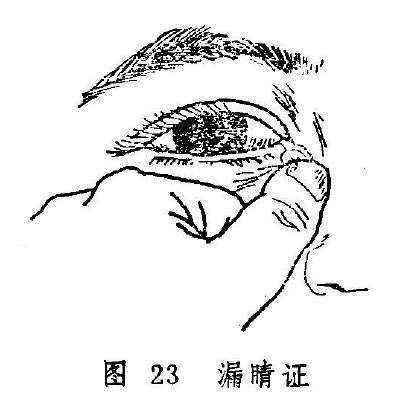

本节所讨论的漏睛证是以窍漏为主，临证当与漏睛疮鉴别。后者是以睛明穴处突发赤肿，隆起似枣，疼痛拒按，继而肿核溃破流脓的病变，漏睛证则为邪热久积所致的一种比较顽固的慢性眼病。若复受外邪，可变生漏睛疮。

**〔病因病机〕**

1.风热之邪，侵袭泪窍，壅积日久，经脉瘀塞，泪液被灼。渐变稠浊，满溢而出。

2.心经伏火或脾经湿热内蕴，循经上攻眦部，邪留泪窍，积聚成脓，侵渍于大眦之间。

**〔辨证论治〕**

（一）辨证要领

本病为邪深久伏所致的顽固性眼病，辨证主要以局部症状为主，同时结合全身证候，若见泪窍溢出黄色脓液，眦部微红微肿者，为心火上炎；若见泪窍溢出白色脓液或浑浊泪水者，为风热内蕴；若见泪窍溢出粘液清稀如涎，粘附眦部，或伴视昏者，为正虚邪恋。总之，若见流出黄白色脓液者为顺证，易治；若见流出青黑腥秽脓水者为逆证，难疗。

（二）论治要点

本病的治疗当分虚实。实证局部微有红肿，脓液黄稠，治以清热排脓为主；虚证皮色如常，泪窍中常有粘液沁沁而出，治以托里排脓为主。同时，还应重视外治，如用点眼剂及泪道冲洗等。

（三）常见证治

1.内治：

（1）风热内蕴：

证候：患眼大眦处皮色似常，或见睛明穴处稍显隆起，自觉微痒，粘液不断自泪窍外流，舌淡红，苔薄黄，脉浮数。

治法：疏风清热。

方例：白薇丸〔73〕加味。

（2）心脾湿热：

证候：或眼眦角微红、微肿、微痒、微痛，轻度隆起，常肴脓液自泪窍溢出，浸渍眦部，拭之又生，伴有心烦口渴，小便黄赤，舌苔黄腻。

治法：清心利湿。

方例：竹叶泻经汤〔94〕。

（3）正虚邪恋：

证候：患眼眦部周围皮色不红不肿，按之不痛，脓液浊泪稀少、色淡而不断，缠绵不已。全身伴有少气乏力，面色无华或㿠白，舌淡苔白，脉沉而无力。

治法：扶正祛邪，托毒排脓。

方例：托里消毒散〔88〕。

2.外治：

（1）八宝眼药〔12〕或补漏生肌散〔108〕点患眼内眦处，一日三次。

（2）用黄连水冲洗泪道，解毒排脓，每日一次。

（四）临证权变

白薇丸〔73〕适用于风热滞留眦部而致的漏睛证，若局部压之不痛，且兼有头昏眼花，腰膝酸软，为素体肝肾不足，可加菊花、杞子、补骨脂以治之；对心脾湿热者，亦可选加天花粉、漏芦、乳香、没药，以加强清热排脓，祛瘀消滞的作用。虚证若兼形寒肢冷、喜热畏寒者，可改为阳和汤〔97〕，温阳散凝而排脓。若缘脓液长期浸渍，致生睑眩赤烂或凝脂翳者，又可参考有关章节辨证论治。

**〔调护〕**

忌食辛辣等刺激性食物，以免引发漏睛疮。

在点外用药之前，应将患处脓液压出，然后点药，并应长期坚持。

**〔应用例案〕**

例1、王某，女，38岁，于1970年5月18日就诊。主诉：左眼患慢性泪囊炎有一年之久，于昨天突然左眼大眦部下睛明穴处红肿硬痛，牵引左边头痛，羞明流泪，胃纳减少。检查：左眼大眦部下险红肿，按之剧痛，白睛淡红，风轮清晰，脉象弦细。

诊断：漏睛疮（左眼）。以清热解毒消肿汤（银花、公英、赤芍、黄芩、天花粉、生地、荆芥、防风、甘草）去生地、赤芍、黄芩加龙胆草10克，大黄15克，全虫12克、陈皮10克、川贝母6克。服二剂后于5月20日复诊，头目痛止，红肿全消而愈，转为慢性而停药。（庞赞襄《中医眼科临床实践》）。

例2、刘XX，男，43岁，干部。于1976年11月12日就诊。两年前患红眼，症见多泪，曾用点药、冲洗、探针等法治疗多次，效果不佳，继而左眼大眦经常流黄白色脓液，眦部胀痛，脓出则舒。伴口渴心烦，不寐，便干，瘦赤。检查：左目大眦肿胀微赤，轻按其下部有黄白色脓汁从泪窍沁沁而出。舌尖红、苔黄，脉数。

诊断：左眼眦漏症

辨证：风热毒邪外袭，蕴积于内，化火上攻，结于大眦，热痛成脓。

治则：清热解毒，排脓止痛，佐以养阴。

处方：败酱草30克、漏芦9克、栀子9克、竹叶6克、花粉6克、白芷9克、黄芩9克、黄连6克、黄柏9克、川羌活9克、瓜蒌9克、连翘30克、金银花30克、鱼腥草9克、木通9克、水煎服。服5剂，证状俱轻，肿消脓减，再加皂刺，穿山甲以消肿、排脓。又服5剂，余症皆除，一年后随访未见复发（《眼病》）。

**〔文献摘录〕**

《原机启微》热积必溃之病谓：“其病隐涩不自在，稍觉眊矂，视物微昏。内眦穴开窍如针目，按之则沁沁脓出，……竹叶泻经汤主

之”。

《医宗金鉴•外科心法要诀》：“此证生于目大眦，由肝热风湿病，发于太阳膀胱经睛明穴……初起如豆如枣，红肿疼痛，疮势虽小，根源甚深。溃破出粘白脓者顺，出青黑脓或如膏者险。”

《普济方•眼目门》：“夫目脓漏者，缘血脉壅热，……则令人脸眦肿，久痒即成疾，脓汁时下，绵绵不绝，如器津漏，故谓之不漏，俗呼为漏睛是也。”

复习思考题

1.试述赤脉传睛的辨证论治。

2.简述泻心汤的药物组成及方义。

3.试述胬肉攀睛的辨证论洽。

4.栀子胜奇散、泻脾除热饮的药物组成及适应症有何不同？

5.胬肉攀睛一证在什么情况下必须手术？术后应注意什么？

6.试述漏睛疮的病因病机和临床表现，其治疗原则是什么？

7.试述漏睛证的病因病机、临床表现和治疗原则。它与漏睛疮有何不同？

8.简述竹叶泻经汤的药物组成及功能。

## 第三章白睛疾患

**〔自学时数〕**4学时

**〔面授时数〕**4学时

**〔目的要求〕**

1.熟悉风热赤眼的临床表现。

2.掌握风热赤眼、金疳、白睛溢血的病因病机及辨治。

3.了解赤丝虬脉与风火赤眼、金疳与火疳的鉴别。

4.熟悉风热赤眼、天行赤眼、天行赤眼暴翳三病的鉴别要点。

5.了解火疳、白涩证的辨治。

白睛为五轮中的气轮，内应肺脏。若肺治节失常，不能宣发肃降，致使气机不利，滞涩不通，可致白睛红赤肿痛。若肺失肃降，气逆血升于上，则见白睛溢血。甚则肺气闭郁，气血瘀滞而见白睛青紫、结节高隆等。肺与大肠相表里，若大肠结热，便秘不通，也可影响肺经，而致白睛发病。由此可知，治疗白睛疾患应首先以宣通肺气为主，复其治节。若有表证则应疏表散邪，若兼大便燥结则应通腑散结。

气轮白睛疾患，是外障眼病中的常见病、多发病。若治疗失时，迁延日久，常可侵犯风轮黑睛，导致严重后果，故白睛疾患应当及早治疗，以免传变他病。

### 风热赤眼

附：暴风客热赤丝虬脉

风热赤眼是指外感风热而突然发病，以白睛红赤热痛为特征的眼病（图24）。一年四季均可发生，以夏秋季节为多。若病情加重，每可导致黑睛生翳。本病名见于《圣惠方》。古医书中有“风火眼”、“风火赤眼”等名称。

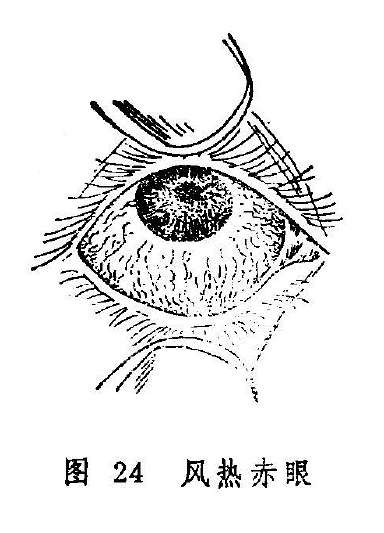

天行赤眼虽系感受天行时气而发，且其邪气之性质亦属风热，但天行赤眼可致广泛流行，且有专篇论述，不属本节讨论的范围。

**〔病因病机〕**

多由风热邪毒外侵，客于内热阳盛之人，内外合邪，上犯白睛所致。

**〔辨证论治〕**

（一）辨证要领

本病多属骤然发病，证见白睛红赤，痛痒并作，多泪眵结，怕日羞明。风甚者多兼头痛鼻塞，恶风发热，苔白或微黄，脉浮数等，或兼胞睑浮肿而软、热甚者眼目红赤较重，胞睑红赤肿坚而热痛，畏光怕热，眵泪胶粘，或兼口渴心烦，溺黄便秘等证。若白睛红赤，痒痛并作，畏光流泪，眵多粘结，并兼发热头痛口渴便秘，苔黄脉数者属表里交攻，风热俱盛。

（二）论治要点

本病系外感风热为患，应分清风、热、毒邪的轻重，予以施治。但临床中证候类型往往难以截然分开，初起者，证轻一般可以外治为主，内治可用疏风之剂；重者可以清热、泻火、解毒为主。体质壮实，表里俱盛者，大胆施以表里双解之法，可获速效。

（三）常见证治

1.内治：

（1）风重于热

证候：白睛红赤，痒痛交作，羞明多眵，头痛鼻塞，恶风发热，或兼睑胞肿胀而软，苔微黄，脉浮数等。

治法：疏风解毒，兼以清热。

方例：羌活胜风汤〔109〕加减。

（2）热重于风：

证候：白睛赤痛较重，胞睑红肿而硬，眵泪粘稠，怕热畏光，兼见口渴、便秘、溲赤、苔黄脉数、心烦不宁等。

治法：清热泻火，兼以疏风。

方例：泻肺饮〔137〕加减。

（3）风热并重：

证候：白睛红赤，疼痛而痒，恶热畏光，眵多粘结，热泪如汤，头痛鼻塞，恶风发热，口渴多饮，便秘溲赤、苔黄、脉数有力。

治法：祛风清热，表里双解。

方例：菊花通圣散〔217〕加减。

2.外治：

（1）黄连西瓜霜眼药水〔211〕或10%〜50%千里光眼药水〔23〕点眼。

（2）胆汁二连膏〔163〕涂眼。

3.针刺疗法：可选合谷、曲池、攒竹、丝竹空、瞳子髎等穴针刺。也可用三棱针点刺眉弓、眉尖、耳尖、太阳等穴放血。

（四）临证权变

由于本病各证候类型之间界限常不明显，临证时立法选方宜灵活掌握。对一般患者，疏风药（如羌活、荆芥、防风、柴胡、薄荷等）和清热药（如黄芩、黄连、栀子、生石膏、生地等）属于必用之品，可依风、热之轻重灵活选用并加减用量。邪毒较甚者可伍用银花、连翘、公英、紫花地丁等解毒药，口渴心烦、大便秘结者则可加大黄、芒硝以釜底抽薪。

临证中应时刻注意观察风轮。一旦发现黑睛生翳，则当选加夏枯草、龙胆草，木贼草、蝉蜕等退翳之品。

**〔调护〕**

1.饮食宜清淡，忌食辛辣炙煿之品，以免增助内然，加重病情。

2.病人用过的手帕、面巾、脸盆等用具进行严格消毒，以免引起传染。

**〔简便验方〕**

蒲公英汤：鲜蒲公英120克（干品用60克），水煎两碗，滤净。一碗内服，一碗外洗患眼。（《医学衷中参西录》）

附一：暴风客热

暴风客热是风热赤眼的一种急重证型。乃因风热邪毒客于目窍而徒然起病，且具明显的红肿热痛，势如暴风骤起之状，故名。

《龙木论》对本证的记载是：“白睛胀起盖乌睛，睑肿还应痒痛

生。”《审视瑶函》则描述曰：“暴风客热忽然猖，睥胀头痛泪似汤，寒热往来多鼻塞，目中沙涩痛难当。”可知暴风客热的临床表现为发病急暴，白珠外膜蠹红胀起，甚则高于风轮，胞睑红肿，沙涩难当，疼痛剧烈，热泪如汤，全身伴头痛鼻塞，恶寒发热。临床上，遇有上述特征之白睛疾患，即可诊为暴风客热，但有不少患者，其白睛虽赤，却未达到上述的严重程度，特别是不具备胞睑赤肿、白睛胀起之特征，不应诊为暴风客热，而可诊为风热赤眼。

暴风客热的治疗，可完全参照前述风热赤眼的处理方法。因病势急重，不应忽视针刺疗法，内治则重用前述方药即可。

附二：赤丝虬脉

赤丝虬脉，是指白睛上较长期地出现赤脉纵横，粗细不一，条缕分明，虬蟠旋曲的眼病。又称赤丝乱脉，或白睛乱脉。本病和风热赤眼不同：风热赤眼发病急骤，病程较短，白睛一片红赤，眵多泪热及涩磨等自觉症状明显；本病则发病较缓，病程较长，白珠外膜上赤丝或疏或密，但条缕分明，眵泪相对较少，疼痒及涩磨等自觉症状较轻。

本病多因某些热性眼病失治，火热之邪伤阴耗液，致使虚火上炎而成。或因久受风沙瘴气，或嗜食辛辣炙煿及烈酒等物，或因烟火久熏，致使热郁血脉而成。也有因长期从事微细工作，过劳目力，致使血络郁滞而成者。

本证的治疗，应抓注血滞之关键，以清热散瘀为主，重者证见虬脉粗赤，红赤粘涩紧痛，羞明流泪，应以清热逐瘀为主，可用退热散〔168〕或归芍红散〔66〕凉血散瘀。轻者丝脉细疏，紧涩不爽，微痒泪湿，治宜退赤散〔166〕清肺散结。外治可点犀黄散〔241〕。

### 天行赤眼

本病是感受时行疫气而发的一种传染性极强的急性白睛病。因其以白睛红赤为主要特征，故名天行赤眼。本病名见于《银海精微》，又名天行赤热（《证治准绳•七窍门》）、天行暴赤（《眼科统秘》）、天行后赤眼外障（《秘传眼科尤木论》）等，俗称红眼病。多发于夏秋两季，预后尚好，一般不侵犯黑睛，对视力影响较小。若毒邪过重，或体质素弱而无力驱邪外出，患病较久，也可导致黑睛生翳。

本病与风热赤眼均有白睛暴赤疼痛，应注意鉴别（见表4）。

**〔病因病机〕**

本病多因外感疫疠之气，或兼肺胃积热，内外合邪，上攻于目所致。

**〔辨证论治〕**

（一）辨证要领

天行赤眼发病迅速，相互传染，会引起广泛流行，白睛突然红赤肿痛，涩痒交作，怕热羞明，眵多胶结，可两眼齐发，或一眼先发而后波及另一眼，单眼发病者较少。

本病初起，风热在表，若患者内热不重，可仅有轻度白睛红赤，而无全身兼症。若患者内有积热，内外合邪，交攻于目，则局部与全身症状均较严重，证见患眼灼热而痛，胞睑肿红，白睛赤丝鲜红满布，眵泪粘稠，头痛烦躁，便秘溲赤。若见白睛或睑内有点状或片状溢血，又为热邪入于血分，伤及血络所致。

（二）论治要点

本病临床以内兼肺胃积热最为常见。对局部症状较轻者，可以外治点眼为主，常可在2〜3天痊愈。局部与全身症状严重者，则应内外兼治。内治重在清热泻火解毒，以防热势久留而邪犯黑睛。

（三）常见证治

1.内治：

（1）初感疠气：

证候：患眼轻微红赤，涩痒羞明流泪均轻，全身症状不明显。

治法：疏风清热。

方例：驱风散热饮子〔125〕加减。

（2）内兼肺胃积热：

证候：患眼灼热疼痛，胞睑红肿，白睛赤丝鲜红满布，眵泪粘稠，兼头痛烦躁，便秘溲赤，苔黄脉数。

治法：清热泻火，解毒散邪。

方例：泻肺饮〔137〕加减。

（3）疫热伤络：

证候：具备以上眼部与全身症状外，兼见白睛或睑内有点状及片状溢血。

治法：清热凉血，解毒散邪。

方例：泻肺饮去羌活加生地、丹皮、紫草。

2.外治：

（1）同风热赤眼外治法（1）、（2）。

（2）慈禧洗药方〔245〕外洗。

（四）临证权变

内兼肺胃积热型常可兼见大便燥结，故临证治疗应加大黄、芒硝，以通腑泻热。若热伤血络而致白睛溢血，可用泻肺饮去羌活之燥，加生地，丹皮，紫草以助清热凉血之功，又可加银花、菊花、夏枯草等清热退赤。若白睛红赤伴黑睛生翳者可加菊花、石决明、草决明、胆草、蝉蜕、木贼等退翳之品。

**〔调护〕**

1.本病因有强烈的传染性，常常引起广泛流行。可为直接或间接接触感染。故在流行季节和地区，健康者可用治疗本病的眼药水点眼预防，也可用菊花、夏枯草、桑叶等煎水代茶饮，以清内热，预防疫毒。

2.饮食宜清淡，忌食辛辣炙煿之品，以免加重肺胃积热。

3.注意隔离，避免患者到公共场所，严禁在游泳池中游泳，以免传插流行。

4.患者手帕、洗脸用具，枕套及患儿玩具等均应消毒，以免相互传染。

5.医护人员接触患者的手及医疗器械等应严格消毒处理。

**〔应用例案〕**

洪XX，男，14岁，学生。1982年6月。

患者自觉两眼疼痛3天，灼热畏光，白睛红赤，眵泪胶粘而多，发病于全校红眼病流行高潮。用慈禧“洗药方”：蔓荆子9克、荆芥6克、蒺藜6克、冬桑叶6克、秦皮3克、加黄柏10克。将上药加水800毫升，煎成500毫升、用纱布两层过滤，温度降至50度时外洗，一日一次。洗三次后痊愈。（《眼病》）

**〔简便验方〕**

（1）蒲公英汤（见风热赤眼）。

（2）初起可用鸡子清加黄连末置碗中，用箸打至泡起，取浮沫点眦内，效果甚好。且可作为预防之用。

**〔文献摘录〕**

《证治准绳•七窍门》：“天行赤热证，目赤痛，或脾肿头重，怕热羞明，涕泪交流等证，一家之内，一里之中，往往老幼相传者是也。然有虚实轻重不同，亦因人之虚实、时气之轻重何如，各随其所以，而分经络以发病。有变为重病者，有变为轻病者，有不治而愈者，不可概言。此一章专为天时流行热邪相感染，而人或素有目疾及痰火热病、水少元虚者，则尔我传染不一。某丝脉虽多赤乱，不可以为赤丝乱脉证常时如是之比。若感染轻而源清，邪不胜正者，则七日而自愈，盖火数七，故七日火气尽而愈。七日不愈而有二七者，乃再传也。二七不退者，必其犯触及本虚之故，防他变证矣。”

附：天行赤眼暴翳

本病是感受疫疠之毒而致白睛、黑睛兼患的一种急性传染性眼病。因其能广泛流行，病势急骤，初患如天行赤眼，继之黑睛生翳如黑点，故称天行赤眼暴翳。本病名见于《古今医统》。《秘传眼科龙木论》称其为“暴赤眼后急生翳”，《医宗金鉴•眼科心法要诀》则简称“暴赤生翳”。

本病多侵犯双眼，发病迅速，白睛混赤浮肿，刺痒灼痛，无眵或极少，胞睑浮肿，耳前多伴臖核、按之疼痛。白睛红赤稍减，继则黑睛生翳如星点，以致视物不清，疼痛、畏光，流泪加重，眵少泪多，全身可伴倦怠、头痛、发热等。七日后，上述诸证减轻，白睛红赤消退，黑睛清澈透明，无损视力。若病势不减，黑睛翳障向深层蔓延，可形成溃陷，黑睛失去光泽，愈后遗留宿翳，数月或永久不消。

本病与风热赤眼、天行赤眼均有白睛骤赤之症，应予鉴别。（见表4）

表4 风热赤眼、天行赤眼、天行赤眼暴翳的鉴别

| 病名 | 风热赤眼 | 天行赤眼 | 天行赤眼暴翳 |
| --- | --- | --- | --- |
| 病因 | 风热之邪外袭，客于内热阳盛之人，内外合邪，上攻于目 | 猝感疫疠之气所致 | 猝感疫疠毒邪，兼以肺火亢盛内外合邪，侵犯肝经 |
| 传染及流 | 不引起大流行 | 传染快，易造成大流行 | 同天行赤眼 |
| 行情况 |  |  |  |
| 眵泪 | 眵粘多泪 | 眵多如脓而胶粘，泪不多 | 眵少泪多 |
| 白睛病变 | 白睛红赤，或兼浮壅 | 白睛红赤，可有点状或片状出血 | 白睛混赤，少有溢血 |
| 黑睛星翳 | 少有 | 日久不愈，可有黑睛生翳 | 黑睛星翳簇生 |
| 预后 | 一般较好 | 一般较好 | 病重者，黑睛可留点状翳障，间有黑睛星翳久不消退者 |

本病治疗，初起宜泻肺利气，兼以退翳，方选泻肺饮〔137〕加蝉蜕、白蒺藜等；黑睛生翳较重，兼见口苦、咽干、便秘、耳鸣、苔黄、脉弦数有力者，可将泻肺饮去羌活，加胆草，夏枯草、柴胡、白蒺藜、大黄等清泻肝肺实火；后期星翳及白睛红赤不退者，可用拨云退翳丸疏风清热，退翳明目。

### 金疳

本病是指白睛表层发生的细小颗粒，因其形如玉粒而色白，故名金疳。病名首见于《证治准绳•七窍门》。因颗粒可发生溃陷，似白睛生疮疡，故又称金疡（《目经大成》）。

火疳亦是白睛发生颗粒的病证，但和本病的部位、形状、颜色均异，容易鉴别（见火疳）。

**〔病因病机〕**

1.肺经燥热，宣降失职，致使白睛气血郁滞而成。

2.肺阴不足，虚火上炎，白睛血络受阻，郁滞不行而成疳。

3.禀赋不足，脾胃失调，肺失所养，气化不利，气血郁滞。

**〔辨证论治〕**

（一）辨证要领

金疳初起，患者自觉眼部隐涩不适，微痛畏光，眵泪不多。白睛表层出现灰白色颗粒如粟，形似水泡，周围绕以赤脉（图25）。颗粒常为一个，重者可多至两个以上。部位不定，大小不一，压之不痛。颗粒可积久而变大，色白或淡黄，甚者溃破。数日之后，渐消而愈，不留痕迹，预后良好，但常易复发。

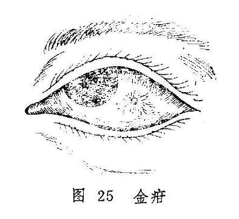

本病多属肺经燥热上攻白睛而成，其典型特征是颗粒高隆，周围血脉紫赤怒张，且兼鼻干口渴，便秘溲赤、舌红苔黄等肺与大肠实热壅盛之证。

若颗粒隆起不甚，周围血脉淡赤，自觉隐涩微痛，眵泪不洁，且病久难愈，或反复发作，则属虚证。若兼见五心潮热、干咳、便秘等全身症状，属于肺阴不足，虚火上炎所致；若兼见身疲乏力，便溏或便秘，食欲不振，腹胀不舒等，则又属脾肺两虚，气化不利而成。

（二）论治要点

本病位于气轮，病机每关乎肺，故治疗总以治肺为本。发病过程中虽有外邪夹杂，仍属于标。如病初期，肺中燥热居多，治宜泻肺利气散结，使气畅血行，瘀滞消而颗粒自除。若病势反复或缠绵不愈，则应润肺益气，复其宣发肃降之功。

（三）常见证治

1.内治：

（1）肺经燥热：

证候：患眼涩痛畏光，泪热眵结，白睛表层有颗粒隆起，周围丝脉红赤怒张。全身伴见鼻干、口渴、便秘，舌红苔黄、脉数有力等症。

治法：泻肺散结。

方例：泻肺汤〔138〕。

（2）肺阴不足：

证候：患眼隐涩微痛，眵泪不结，颗粒隆起不甚，周围血脉淡红，病势日久难愈，或反复发作，全身可见干咳、五心烦热、便秘等。

治法：滋阴润肺，兼以散结。

方例：养阴清肺汤〔154〕。

（3）脾肺两虚：

证候：白睛赤涩轻微，颗粒反复难愈，全身乏力，食欲不振，腹胀不适，便溏或便秘等。

治法：脾肺双补。

方例：六君子汤〔32〕。

2.外治：

（1）犀黄散〔241〕或石燕丹〔51〕点眼。

（2）黄连西瓜霜眼药水〔211〕或10%〜50%千里光眼药水〔23〕点眼。

（四）临证权变

金疳治疗总以治肺为主，但临证时尚须依主证和兼证的变化而灵活地予以处理。治疗除上述治法方药外，还应灵活变通，如初起兼有表证者，当于泻肺汤中酌加防风、连翘、赤芍以助散风清热、凉血退赤之功；对兼见大便秘结者，可加大黄不泻里热；若红赤甚者可加银花、连翘、黄芩、桑白皮以清热退赤；若因阴虚而目中津亏者，在养阴清肺汤中、选加石斛、花粉、玉竹以养阴生津，清热润燥。后期属脾肺双虚者，病势常反复难愈，可在六君子汤中加防风，桑白皮、赤芍以消积滞，缓目赤、止目痛，促使病愈。

**〔调护〕**

1.饮食宜清淡，忌食辛辣之品，以免辛热伤肺，加重肺经燥热。

2.注意锻炼身体，加强饮食调养，增强体质以抵御外邪。

**〔应用例案〕**

李XX，男，7岁，学生，1974年9月12日就诊。左眼红赤涩痛，羞明流泪，生眵7天，伴口渴心烦，小便赤涩。左眼外眦部白睛表层有一灰白色隆起，呈颗粒小泡，周围有红赤血脉环绕。舌尖红，脉数而有力。

辨证：心肺热盛，热邪郁结。

治法：清肺降火，退赤散结。

方药：桑皮12克，黄芩15克，知母12克，木通12克，生地15克，当归尾12克，赤芍12克，夏枯草12克，甘草3克。

服药3剂，诸证悉除，7年来未再复发。（《眼病》）

### 火疳

本病是指白睛里层向外隆起的局限性紫红色结节的疾病。此乃心肺两经实火之邪侵犯气轮，凝滞结聚于白睛里层而致，且状如赤豆而色红，故称火疳。本病名见于《证治准绳•七窍门》，《目经大成》又称火疡（图26）。

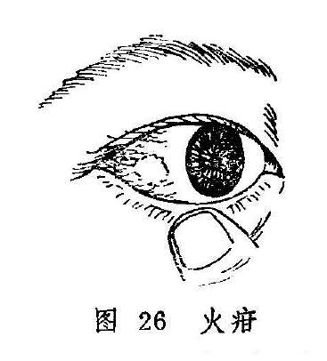

火疳是眼病诸疳中急重之证。一般病程较长，病势缠绵，且易反复发作，失治可波及黑睛与黄仁，甚至可造成失明，故当及时治疗。

本病与金疳均属白睛疾患，应注意鉴别。金疳发于白睛表层，其颗粒较小，呈灰白色，界限分明，推之可移，无明显压痛，周围血脉呈鲜红色，病程较短，颗粒可自行溃破，愈后不留痕迹。火疳发于白睛里层，其结节较大，呈圆形或椭圆形，色紫红或暗红，界限不明显，推之不移，压痛明显，其周围血脉呈深紫色，结节多不溃破，病程漫长易复发，可发展成白睛青蓝或并发瞳神干缺等症。

**〔病因病机〕**

1.肺热亢盛，气机不利，以致气滞血瘀，发为火疳。

2.心肺热毒内蕴，火郁无从宣泄，上攻白睛所致。

3.湿热内蕴，兼感风邪，阻滞经络，肺气失宣，郁久病发白睛。

4.肺经郁热，久则伤阴，阴虚火旺，上攻白睛。

5.肝经郁热，致女子行经之时，血热上逆壅阻郁滞于白睛。

**〔辨证论治〕**

（一）辨证要领

火疳多为单眼发病，也有双眼同时或先后发病者。本病初起，从白睛里层向外隆起结节，色呈紫红或暗红，形圆或椭圆，状如榴子。自觉患眼涩痛，羞明流泪。继之则隆起，渐渐增大，周围赤紫血脉丛生。结节很少破溃，但易反复，甚则危及黑睛、瞳神。

本病发于气轮而色赤，气轮属肺，赤属火，故初起多为火邪郁于肺经所致。肺失宣降，气机不利，因致气血瘀滞，阻于白睛，凝结成疳，而见节结隆起。单由肺热所致的火疳，证情较轻缓，结节较为低小，且可伴咳嗽、咽干、喉痛之证。肺热下移大肠，尚可兼见大便秘结。肺热若兼心经火毒，则发病迅急，疼痛剧烈，白睛节结高隆，脉络紫赤怒张，羞明流泪明显。

火疳缠绵不愈或反复发作者，非风湿内蕴而化热，即阴伤而虚火上炎。湿热之邪上攻白睛者，白睛结节色较鲜红，且常因湿热阻碍气机而目珠闷胀，视物不清，并可兼见骨节酸痛，肢节肿胀不适等症；属病久伤阴，虚火上炎者，白睛结节虽不高隆，痛不明显，但亦难消难愈，或反复发作，并可见口咽干燥，潮热便秘等证，火疳若遇女子经期则发，是由肝经郁热，血热上逆结聚于白睛而成。证见眼涩不适，隐隐作痛，白睛结节紫蓝。轻者数日可消，重者数周才愈，愈后不留瘀斑，常易复发。

（二）论治要点

本病以心肺热毒上攻白睛者最常见。因病变居于白睛里层，所以应以内治为主，兼以外治。结节系火邪结聚，气血瘀阻而成，故治疗当以清热散结为本，挟风者兼以祛风，挟湿者佐以祛湿，因邪热每多累及血分，故治疗亦应顾及血分，酌加活血散结之品。

（三）常见证治

1.内治：

（1）肺热亢盛：

证候：病势较缓，初起眼痛刺涩，白睛结节较小，形圆或椭圆，色红或暗，可伴咽干喉痛，咳嗽，便秘，舌红苔黄脉数。

治法：清热利气，凉血散结。

方例：泻白散〔132〕加减。

（2）心肺热毒：

证候：发病较急，眼痛难忍，热泪羞明，视物不清等症较重；白睛结节大而隆起，周围血脉紫赤怒张，压痛剧烈。全身可见口苦咽干，出气有热感，溲赤便秘，舌红苔黄，脉数有力。

治法：泻火解毒，凉血散结。

方例：还阴救苦汤〔117〕加减。

（3）风湿热邪攻目：

证候：白睛结节隆起色鲜红，周围赤丝牵绊，眼珠闷胀而痛，羞明流泪，视物不清。全身伴有骨节酸痛，肢节肿胀，胸闷纳减，舌苔白厚或腻，脉滑或濡，病多缠绵难愈。

治法：祛风化湿，清热散结。

方例：散风除湿活血汤〔234〕加减。

（4）久病伤阴，虚火上炎：

证候：眼涩酸痛，畏光流泪，白睛结节不甚高隆，血丝色偏紫暗，四周轻度肿胀，压痛不甚明显，全身可见口咽干燥，潮热颧红，便秘不爽，舌红少津，脉细数。

治法：养阴清肺，兼以散结。

方例：养阴清肺汤〔154〕加减。

（5）肝经郁热：

证候：眼涩不适，白睛红赤，结节隆起，隐隐作痛，色呈紫蓝，女子经期易发，轻则数日可消，重则数周才愈，不留瘀斑。

治法：清肝泻热。

方例：四顺清凉饮子〔65〕。

2.外治：

（1）犀黄散〔241〕每日早晚各点眼一次。

（2）龙脑煎〔59〕点眼。

3.针刺疗法：取列缺、尺泽、合谷、曲池、攒竹、丝竹空、太阳等穴。

（四）临证权变

本病初起，属于肺热亢盛，肺气不利，郁而成疳者，可用泻白散，泻肺利气，但需加牛蒡子、连翘、浙贝母清热散结，红花活血化瘀，散结消滞，并可加葶苈子、杏仁以增强泻肺之功。因于心肺热毒壅盛，白睛节结赤紫高隆，赤脉丛生，应用还阴救苦汤治疗时，可酌情减少温燥药味，并加石膏以增强清热泻火之功。由阴虚火旺而致者，用养阴清肺汤当去薄荷，加知母、石斛、地骨皮以增强滋阴降火之功，由于此类证型的结节缠绵难消，故还可将方中之白芍易赤芍，酌加丹参、郁金、瓦楞子、海浮石以清热消瘀散结。本病反复发作，导致白睛青蓝或瞳神紧小者，又当参考有关章节辨证论治。

**〔调护〕**

饮食宜清淡，忌食辛辣炙煿之品，以免加重内热。

**〔应用例案〕**

程XX，男，46岁，工人，1981年4月5日就诊。一年来左眼红肿疼痛，羞明流泪，视物不清。经治疗症状缓解，但不稳定，多次复发。伴口干咽痛，渴喜冷饮，小便短赤，大便干结。左眼白睛颞侧呈暗红色偏平结节，表面赤脉纵横，粗细不匀，有明显压痛，黑睛中央有条状白色混浊。舌红，苔黄干，脉洪大。

辨证：热毒蕴结，气滞血瘀。

治法：清热泻火，凉血散结，佐以祛风止痛。

处方：桑皮30克、蔓荆子12克、菊花15克、连翘30克、荆芥12克、防风6克、丹皮20克、夏枯草30克、羌活10克、细辛3克、桔梗12克、红花6克、当归尾12克、黄连10克、黄芩15克、黄柏10克、知母15克、生地20克、龙胆草8克、地龙15克。

上方服15剂，症状基本消失。（《眼病》）

按：本例为热毒炽盛，上犯白睛，滞结为疳。故选用清热、凉血、祛风、散结之法，用药与还阴救苦汤之方义基本相同。治法方药切合病机，故而收效甚著。

附：白睛青蓝

白睛青蓝是指白睛深层出现紫蓝或青灰色斑，或白睛变成青蓝色，故称白睛青蓝。本病名见于《证治准绳•七窍门》，《审视瑶函》称其为白珠俱青证。多由肝肺火热亢盛，火毒热邪郁滞白睛，煎熬阴血，气血瘀滞而成，或火疳经久不愈，反复发作，致使白睛变薄，失去光泽，逐变青蓝之色。

本病初起自觉眼珠胀痛，畏光流泪，常于黑睛四周的白睛深层形成紫红色隆起，压痛明显。继之证状消退，该处则呈现青蓝之色。病变此伏彼起，反复发作，终致白睛全轮青蓝，凸凹不平。此时病变常侵及黑睛和瞳神，形成黑睛边际的混浊及瞳神紧小等。可单眼或双眼同时发病。

本病可参考火疳进行辨证论治，但应考虑本病更易于侵犯黑睛和瞳神的特点，及正邪交错，虚实夹杂，病程缓慢，反复难愈等情况。例如，白睛青蓝伴有黑睛边际生翳，或伴瞳神紧小，并见抱轮红赤，口渴咽干，口苦耳鸣，烦躁易怒，便秘，苔黄，脉弦有力等症者，证属肝肺热盛，可用菊花决明散〔216〕泻肺散结，清肝退翳。证情较剧者，可酌加大黄、玄参、花粉等清泻实热，养阴散结。

至于邪气渐衰，病情趋于稳定，兼见全身气阴两虚或气血不足证候者，可在调理全身的基础上兼用散邪通络，活血化瘀之品。待病邪已退，正气渐复，则应改用益气滋阴，养肝退翳之法，以调理善后。如党参、茯苓、苡仁、龟板、枸杞、白芍、麦冬、杭菊花、桑寄生、潼蒺藜、密蒙花、谷精草等。

本病的外治法和针刺疗法，均可参照火疳处理，黑睛生翳或遗留宿翳者，可用涩化丹〔177〕点眼，每日三次。

### 白涩证

白涩证是指白睛不红不肿，但觉眼内涩痛不爽或有视物昏矇的慢性眼病。病名见于《审视瑶函》，该书谓“不肿不赤，爽快不得，沙涩昏矇，名曰白涩。”俗称为“害白眼”。

其他可引起干涩疼痛的慢性眼疾，如椒疮、粟疮、赤脉传睛、胬肉攀睛、赤丝虬脉、黑睛生翳、瞳神紧小或干缺等，均有明显的病征可见，与本病容易鉴别。

**〔病因病机〕**

1.肺脾两虚，目失荣养。

2.饮食不节，或过嗜烟酒及炙煿辛燥之品，致使湿热蕴积脾胃，清气不升或湿热上攻。

3.肝肾亏损，阴血不足，目失濡养。

4.由于暴风客热和天行赤眼治疗不彻，余热未消，隐伏肺脾之络所致。

**〔辨证论治〕**

（一）辨证要领

本病诊断依据是：眼内干涩疼痛，或有视物昏矇，胞睑正常，黑睛无明显病变，且无可引起涩痛的瞳神疾患，白睛不赤不肿等。即使白睛有淡赤血络，亦当极为稀疏，以诊视白睛不觉红赤为指征。

白涩证的辨证应以虚实为纲。实证多为郁热或湿热上攻，虚证多为阴虚或气虚而津液不得上荣于目。辨明虚实则纲举目张，治疗始可无误。

属实者，每因暴风客热及天行赤眼治疗不彻，致使白睛遗留少许赤丝细脉。根据病史及畏光流泪，干涩不爽之症，即可判为余邪未尽，经络被阻而津液失布所致。

实证还有属于脾胃湿热蕴积者。湿邪阻于中焦，清阳不升，目失所养则干涩隐痛。湿热上蒸可致白睛黄浊，或有稀疏丝脉，伴见口粘口臭，便秘不畅，溲赤苔黄腻，脉濡数等。

属虚者可因脾肺气虚，津液不升而致。此必兼面色无华，身弱气短，舌淡脉弱等气虚之象；阳虚而目珠失濡者，当分属肺属肾，可以全身兼症而定。肺阴不足，当兼干咳、咽干等症；肾阴亏乏，当伴视物不清，头晕耳鸣，腰膝痠软等。

（二）论治要点

本病临床以肺阴虚、肝肾亏损阴血不足及脾胃湿热型最为常见。因属慢性疾患，药物治疗常需较长的时间方可获效。临床应辨证细微，有方有守地进行施治。另外，不论是因肺肾阴虚或脾肺气虚，均可注意选用葛根、升麻，桔梗等升提之品，以载药上行，提高疗效。

（三）常见证治

1.内治：

（1）热邪留恋：

证候：由于暴风客热及天行赤眼治疗不彻，白睛残留少许赤丝细脉，不易消退。睑内轻度红赤，目干涩不爽，畏光流泪。

治法：清热利肺。

方例：桑白皮汤〔192〕加减。

（2）脾胃湿热：

证候：眼干涩隐痛，白睛黄浊，或有稀疏之赤丝细脉，睑弦或见湿粘，眦部或有白色泡沫样眼眵，病情缠绵，并兼有口粘口臭，便秘溲赤而短，苔黄腻，脉濡数等。

治法：清热利湿

方例：三仁汤〔16〕加减。

（3）肺阴不足：

证候：眼干涩不爽，少泪，久视易疲劳，甚则视物不清，白睛如常或稍有赤脉，病势迁延难愈，并兼有干咳少痰，便秘，脉细等症。

治法：滋阴润肺。

方例：养阴清肺汤〔154〕加减。

（4）肝肾亏损，阴血不足：

证候：眼干畏光，双目频眨，视物不清，白睛不红不肿，或隐隐见到淡红色稀疏血丝，兼有头晕耳鸣，腰膝痠软，多梦，脉细等症。

治法：补肝肾，滋阴养血。

方例：杞菊地黄汤〔126〕加减。

（5）脾肺气弱：

证候：眼部表现同肺阴不足型，全身伴见饮食不消，面色无华，身弱气短，便溏，舌淡苔薄白，脉弱。

治法：益气升清，健脾补肺。

方例：补中益气汤〔103〕。

2.外治：

（1）犀黄散〔241〕点眼。

（2）黄连西瓜霜眼药水〔211〕或10%〜50%千里光眼药水〔23〕点眼。

（四）临证权变

本病证属热邪留恋，伤阴而无湿邪者，当于桑白皮汤中的减去利水药、降气药茯苓、泽泄、旋覆花等，加生地，花粉、石斛，以养阴、生津、清热。若属肝肾阴亏，且兼阴血不足者，可在杞菊地黄汤中加当归、白芍以助养血和营之功。此乃治本之法。若目中干燥，津液不足，可加沙参、玉竹、麦冬生津润燥。

**〔调护〕**

1.合理按排作息时间，避免熬夜及过用目力。

2.患有近视、远视者，可配戴合适眼镜，避免外界不良刺激。

**〔应用例案〕**

王XX，男，农民。于1964年3月3日就诊。

半年来，双目红肿，干涩羞明，视物模糊，易疲劳。经检查，诊为“慢性结膜炎”，曾用硝酸银、沃古林、四环素、可的松等眼药和长期内服黄连上清丸，龙胆泻肝丸等药，效果不著。伴头昏神倦，思睡懒言，四肢无力，面色无华。双目白睛微红，舌质淡红，脉缓弱。

辨证：偏施寒凉，脾虚气损，并阴虚血瘀。

治法：助阳活血，补中益气。

方药：炙甘草10克、黄芪15克、防风6克、蔓荆子10克、升麻2克、柴胡6克、白芷10克、当归10克、桑皮10克。

二诊（3月7日）：服药两剂，自觉症状减轻。继服三剂病愈。嘱其服补中益气丸10丸，早晚各1丸。以资巩固疗效。8年后随访未再复发。

按：眼红肿为上焦热邪壅盛，用寒凉清热为之正治，但因久服龙胆泻肝丸，黄连上清丸之类，造成热未已，寒病复起，致使寒凉克伐胃气，苦寒郁遏清阳之气不能通达上窍，而损其目，宗李杲：“无疼痛而隐涩难开，此服苦寒药太过，而真气不能通九窍也，故眼昏花不明，宜助阳活血，补气”之意。选升麻活血汤加减。药证合拍而取显效。（《眼病》）

### 白睛溢血

白睛溢血是指白睛血络破损，血溢络外，积于白睛里层及外膜之间，使白睛表面呈现一片血色鲜红的眼病。又名色似胭脂（《证治准绳•七窍门》）。本病和一般外障眼不同，大抵旬日即能消退，预后良好。（图27）

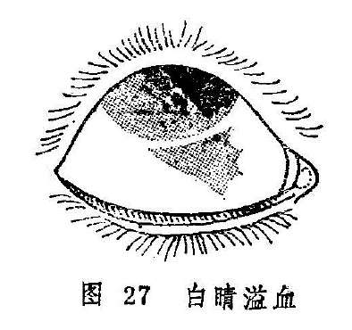

**〔病因病机〕**

1.热客肺经，肺气不降，血热妄行，瘀滞眼络。

2.心阴耗损，肝肾阴虚，脉络失润，或虚火妄动，迫血妄行，血络损破，血溢络外。

3.剧烈呛咳，呕吐，致气逆上冲，或酗酒过度、湿热上熏，或女子逆经，或眼部外伤，均能引起血不循经，血络破损，血溢络外。

**〔辨证论治〕**

（一）辨证要领

本病无肿痛，无羞明流泪，自觉症状不明显，常为他人发现。白睛上下、左右，出现大小不等血斑，多呈点状或片状，边界清楚，初起颜色娇艳鲜红似胭脂，继则渐呈紫暗，一般一周左右消退，不留痕迹。本病各型均以白睛溢血为主，或可兼有不同的全身症状。如由肺热引起者，症见咳嗽，痰稠而黄，口渴咽痛，便秘，苔黄脉数等；阴虚火炎者，症见头晕目弦，口干颧红，脉细等；女子逆经引起者多在月经之际；外伤者多见目眶青紫等等。

（二）论治要点

本病以肺热型最为常见。临床治疗，轻者很快自愈，可不用药。重者初起用清肺凉血之法，后期以通络散血为主，以助瘀血早日消散。

（三）常见证治

1.内治：

（1）肺热：

证候：白睛血斑鲜红，全身兼见咳嗽气短，痰稠色黄，口渴咽痛，便秘溺黄等。

治法：清肺泻热，活血通络。

方例：退赤散〔166〕加减。

（2）心阴耗损，肝肾阴虚：

证候：白睛溢血，其色暗紫，兼见头晕目眩，口干颧红，舌红少津，脉虚数等。

治法：养心血，补肝肾，佐以活血消瘀。

方例：归芍地黄汤〔67〕加减。

（3）外伤络损：

证候：白睛溢血鲜红，色似胭脂，或有胞睑青紫。

治法：活血化瘀。

方例：桃红四物汤〔185〕加减。

（4）女子逆经：用调经散〔180〕加减。

（5）咳呛、呕吐等震伤血络者：治应清热润肺，或以治疗呕吐、咳嗽为主，佐以活血化瘀。用药可根据不同病因而辨证施治。

2.外治：本病初起宜冷敷，三日后酌情改为热敷。

（四）临证权变

本病属心、肝、肾阴虚所致者，亦可无明显的诱因和全身症状，可先以活血化瘀之法散其血，再用归芍地黄汤以善其后，并可加枣仁、五味子以养心神。若女子逆经所致者，治以调经散〔180〕加白茅根、丹皮等凉血化瘀之品。若属咳嗽震伤眼络引起者，可用清燥救肺汤〔204〕加丹参、丹皮、桃仁、红花、赤芍等。外伤引起且兼明显目痛者，可在桃红四物汤中再加乳香、没药、三七之类以活血止痛。

**〔调护〕**

饮食宜清淡，忌食辛辣炙煿之品。特别是中老年人尤宜忌烟、酒、肥腻，以免湿热内生，或生燥热伤阴，虚火上炎。

**〔应用例案〕**

刘XX，7岁，1975年1月28日初诊。其母代述，患儿顿咳月余，近日加重，连连咳嗽，甚则呕吐，自前天双目白睛红赤，不痛不痒。检查，双眼白睛全赤，色鲜。且下睑青紫。此为白睛溢血。给利气活血汤（炙桑皮9克、桔梗6克、赤芍、丹皮、茜草各9克）加杏仁、川贝母各3克，葶苈子1.5克治之，服药3剂。2月1日复诊：下睑紫青消退，白睛赤色变为紫暗，上方已呈暗黄色，顿咳减轻，已不呕吐，又服原方6剂。2月7日三诊：白睛全轮暗黄，已无赤色，下胞已恢复正常，有时微咳，又给原方3剂。2月10日来诊，顿咳目疾皆愈即停服药。（《张皆春眼科证治》）

复习思考题

1.简述风热赤眼的临床表现；根据什么可以诊断为暴风客热？

2.试述风热赤眼的病因及辨证论治。

3.赤丝虬脉与风火赤眼的临床表现有何不同？

4.试述天行赤眼的临床表现和预防。

5.试述天行赤眼的辨证论治。

6.风热赤眼、天行赤眼、天行赤眼暴翳三病应怎样鉴别？

7.试述金疳的病因病机。

8.详述金疳的辨证论治。

9.简述金疳与火疳的鉴别要点。

10.试述火疳的辨证论治。

11.通过白涩证的学习，如何理解中医眼科的优越性？

12.试述白涩证的病因病机及治疗。

13.试述白睛溢血的病因与治疗。

## 第四章黑睛疾患

**〔自学时数〕**4学时

**〔面授时数〕**4学时

**〔目的要求〕**

1.掌握赤膜下垂、血翳包睛的辨治。

2.掌握聚星障、花翳白陷、凝脂翳、黄液上冲、蟹睛证、轮际起泡、风轮赤豆、宿翳的病因病机、临床表现及辨治。

3.了解银呈独见与聚星障、凝脂翳的鉴别。

4.熟悉花翳白陷、凝脂液的局部治疗方法。

黑睛具有护卫涵养瞳神、发越神光的作用。因其暴露于外，直接与外界接触，其本身无脉络濡养，除易受外伤外，也易受外邪侵袭，还可受他轮病变或全身性疾病的影响，故黑睛疾患发生率较高。又因其营养供应较差，抵抗力较低，一旦发生病变，往往需要较长时间才能痊愈。

黑睛疾患的特点，主要是发生星膜翳障。并出现畏光、流泪、疼痛和视力下降等。若失治误治，病情发展，则可引起水膜溃烂，甚至黄液上冲，或水膜溃破，变生蟹睛等恶候。愈后结成形状不一、厚薄不等的瘢痕翳障，从而使神光发越受阻，而产生视力障碍。

黑睛为五轮之风轮，在脏属肝，肝胆相表里，故黑睛疾患常与肝胆有密切的关系，辨证时应予以注意。如翳障浮嫩，病情轻者，多为肝经风热；翳障色黄，溃陷深大者，多为肝胆实火；翳障时隐时现，反复发作者，多为肝阴不足等。又肝肾二者相依，肝病常可影响于肾，故风轮发生病变，每多侵及瞳神。故需全面辨证，及时治疗，防止引起瞳神疾患。

黑睛疾患的主要治则是祛除邪气，消退翳障，控制发展，防止传变他症，并促使早期愈合，缩小和减薄瘢痕组织。常用治法有祛风清热，泻火解毒，清肝泻火，退翳明目等。他如点眼，滴眼、熏洗、热敷等亦可根据病情选用。总之，治疗黑睛诸疾，当明辨虚实，分清主次，审源堵流，防止黑睛疾患的发展和传变。

### 赤膜下垂血翳包睛

赤膜下垂是指赤脉密布似膜，从白睛上方向下蔓延，渐蔽黑睛的疾患。病名见于《秘传眼科龙木论》。又名垂帘翳（《银海精微》）。若病情发展严重，赤膜从四周漫掩整个黑睛，则称为血翳包睛。见于《银海精微》。二者多为椒疮失治所致，后者多为前者发展而成，故而合并讨论。

赤膜下垂需与垂帘障相鉴别：《证治准绳•七窍门》载：“垂廉障证，生于风轮，从上边而下，不论厚薄，但在外色白者方是。若红赤乃变证，非本病也。”可见鉴别二证的要点在翳膜颜色的红与白，赤脉的多与寡。

**〔病因病机〕**

多因椒疮增剧并发而来，肝肺风热毒邪壅盛，或肝火上乘于目，而致赤膜下垂；或心火内炽，肝热亢盛，热极成瘀，阻滞血络，气血壅阻，则赤脉丛生，而成血翳包睛。

**〔辨证论治〕**

（一）辨证要领

赤膜下垂：本病初起，黑睛上缘出现一片菲薄翳膜，且有赤丝牵绊，下垂至黑睛，渐次变大增厚，披复瞳神，赤脉尽头常有细小星翳（图28）。并伴羞明流泪，灼热刺痛，视物欠清。若膜大脉粗而赤，睛疼头痛者，则病急而易变；若脉丝细小，色泽淡红，眼珠与头俱不疼痛者，则病轻而少变。本病因椒疮而起，故翻转胞睑，可见椒疮累累成片。

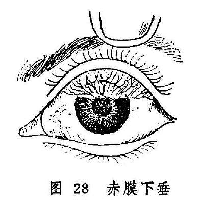

血翳包睛：自觉赤涩疼痛，羞明流泪，头痛视昏。赤膜渐次变大增厚，赤脉纵横，由气轮伸入，遮蔽风轮，形成血翳。如发展严重，则赤脉扩大，翳膜结厚，呈一片混浊模糊血障，遮满黑睛，难辨人物。

辨证应以局部症状为主。前者来势较缓，目红珠痛较轻，仅生赤膜一片自上垂下（图28），常为肝经风热或肝火炽盛而致；后者进行较急，整个风轮赤脉贯布，形成血翳，隐蔽黑睛，严重影响视力，甚至失明，其形成除肝经火盛外，且常兼心经火毒。一旦形成血翳包睛，往往不易迅速消退，故当耐心治疗，并应注意根除椒疮，始能制其复发。

（二）论治要点

外治法在本病治疗中占有十分重要的地位。初起局部症状轻微者，可单用点眼外治法治之；证情较重者，则须配合内服药物，并嘱病人耐心接受治疗。内治总以清热、疏风、凉血、化瘀为主，还需视其全身症状运用泄肺、凉肝、清心等法。还应根除椒疮，始能制其病情发展。

（三）常见证治

1.内治：

（1）肺肝风热：

证候：赤膜下垂，羞明流泪；刺痒涩痛，或头部疼痛，舌质红，苔黄，脉弦数。

治法：清热疏风，清肝泄肺。

方例：退红良方〔167〕。

（2）肝火炽盛：

证候：赤膜下垂，膜大脉粗而赤，头疼眼痛剧烈，赤膜尽头星翳丛生，热泪频频，怕热羞明，口苦咽干，脉弦数。

治法：平肝清火。

方例：羚羊饮〔205〕。

（3）心肝热炽：

证候：黑睛血翳满布，甚或堆积如肉，白睛赤紫，目珠刺痛，畏热羞明，或口苦咽干，舌质红苔黄，脉数或弦数。

治法：清心泻肝，凉血破瘀。

方例：破血红花散〔188〕。

2.外治：

（1）若翳膜红赤，可用黄连西瓜霜眼药水〔211〕1日3〜4次，或千里光眼药水〔23〕滴眼，1日4〜5次。星翳平复，可改用犀黄散〔241〕或涩化丹〔177〕、石燕丹〔51〕点眼，1日3次。以磨障退翳。

（2）睑内椒疮累累者，须用海螵蛸棒摩擦法（详见总论第七章第二节），消除颗粒以散血祛瘀。

（3）本证引起瞳神缩小者，可适当用扩瞳药。

（四）临证权变

赤膜下垂与血翳包睛虽有症状的轻重不同，但在病因病机方面却不易截然区分。临证时应视肺、肝、心何经热邪偏盛，而灵活论治。如肺肝风热用退红良方，可酌加凉血活血之品，如丹皮、红花等；亦可选用归芍红花散〔66〕加减。若兼见心中烦热，小便赤涩，脉左寸洪大，偏于心火旺盛者，当清心降火，可改用泻心汤〔131〕合导赤散〔95〕。若血翳包睛，兼眵多泪热，赤涩肿痛者，用破血红花散应酌加胆草、石决明、生石膏等。若膜大脉粗而赤，头疼珠痛，急当清泄肝火，以防逆传，可选用羚羊饮。若兼见口渴喜冷饮者，当酌选加石膏、石斛等。若兼见大便秘结者，宜加用大黄、芒硝、麻仁等。

**〔调护〕**

注意眼部卫生。饮食宜清淡，忌辛辣肥甘厚味。提倡一人一巾和流水洗脸。患者的洗脸用具应定时消毒，更不可与他人共用。患者应保持乐观情绪，积极配合治疗。视力严重下降者，还应在外出时注意安全。

**〔应用例案〕**

赵XX，女，48岁。1975年3月11日初诊：左目沙涩不适5、6个月之久，时轻时重，近十几天来症状忽然加重，目珠涩痛，流泪羞明，视物不清。检查，左眼上睑睑内椒粒密集，疙瘩不平，赤膜从白睛上方垂下，已近瞳神边缘，赤脉密布，此为赤膜下垂。治以加减退赤散（酒黄芩12克秦皮3克赤芍丹皮生地各9克木通3克炒栀子6克青黛

0.3克）加川黄连1.5克。外用海螵蛸棒擦法，治疗睑内椒粒，服药6剂，摩擦1次。3月18日复诊：脸内椒粒见疏，赤膜稍退，又行擦法一次，服上药6剂。3月25日三诊：睑内椒粒大部已平，留有少量疤痕，眦帷尚有少数椒粒，赤膜已去大半，已不羞明流泪，视物较前清晰，又服上方21剂。4月18日四诊：睑内仍有少量椒粒，赤膜已尽，青睛上部边缘留有菲薄云翳，其上已无赤脉贯穿，此症已愈，嘱其停药。（《张皆春眼科证治》）

### 聚星障

本病是黑睛上聚生多个细小星翳的眼病（图29）。见于《证治准绳•七窍门》。多因外感风邪，或热病后，或慢性疾病导致正气虚衰，或月经不调等阴阳气血失调的情况下发病。可单眼为患，亦可双眼同时或先后发生。本病传变较速，贵在早治，若拖延日久，不仅病程较长，且易反复发作，甚则变生花翳白陷、凝脂翳等证。愈后遗留瘢痕翳障，影响视力。

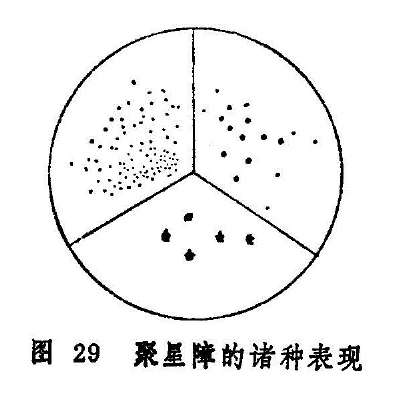

本病需与凝脂翳初起相区别。凝脂翳初起，虽生翳如星，但形状较大，多单个存在，且迅速扩大加深，翳如凝脂，每兼黄液上冲，与本病是不同的。

**〔病因病机〕**

1.风热或风寒之邪外侵，上犯于目。

2.外邪入里化热，或肝热内蕴，复受风邪，风火上攻黑睛。

3.脾虚蕴积湿热，熏蒸黑睛。

4.素体肝肾阴虚，或热病后阴津亏损，虚火上炎。

**〔辨证论治〕**

（一）辨证要领

本病初起，自觉眼内沙涩疼痛，或畏光流泪。抱轮红赤或红赤不明显；黑睛猝起翳障，状如针尖，或如称星，颜色灰白或微黄，数颗或数十颗不等，或齐起，或先后渐次而生。其排列形式不一，可散漫排列如云雾状，可联缀成串，呈丝缕状，亦可纡曲融合呈地图状。若病情严重，可向深部发展。一般不作脓，但病程长，常反复发作。本病辨证需注意全身证候与局部症状综合分析。属风寒、风热者多兼表证；属肝火炽盛者每见口苦口干，舌红脉数，眼部症状较重；属湿热蕴蒸者多缠绵不愈，或反复发作，兼见头重胀，胸闷口粘，舌苔厚腻；阴虚火旺者病情亦多缠绵，但无湿热之象，却有阴精不足之证。

（二）论治要点

本病常因外感风邪所致。且肝经伏火、湿热熏灼、久病耗阴等因素所致者，又易兼挟风邪，所以治疗本病，应注意祛风药物的运用。更应审病因、别脏腑，随证情治之。病势急骤者以外受风邪或肝火炽盛者为多，病情缠绵或反复发作者，以湿热蕴蒸或阴虚火旺为多，或为正虚易受风邪而然，临床须辨虚实寒热，耐心调理，方可获效。外治以解毒疏风，退翳明目为主，内治以疏风、清热、散寒、化湿、滋阴诸法为治。

（三）常见证洽

1.内治：

（1）外感风热：

证候：黑睛星翳，翳色灰白，白睛红赤，羞明隐涩，恶风发热，或头痛鼻塞，眉骨痠痛，咽痛溲黄，舌苔薄黄，脉浮数。

治法：疏风散热。

方例：银翘散〔222〕，或羌活胜风汤〔109〕。

（2）外感风寒：

证候：黑睛星翳，白睛微红，羞明流泪，恶寒重发热轻，或头痛身痛，鼻塞流清涕，小便清长，舌质淡苔薄白，脉浮紧。

治法：发散风寒。

方例：荆防败毒散〔158〕或四味大发散〔62〕。

（3）肝火炽盛：

证候：星翳渐次加深扩大，眼睑红肿，白睛混赤，星翳色黄，团聚一片，羞明流泪，口苦口干，溲赤短少，或大便秘结，舌质红苔黄，脉弦数。

治法：清肝泻火。

方例：龙胆泻肝汤〔58〕，或石决明散〔48〕。

（4）湿热蕴蒸：

证候：黑睛星翳，睑肿目赤，翳色微黄滞，反复发作，缠绵难愈，可兼见头重且胀，胸闷不舒，口粘而腻，溲黄便溏，舌红苔黄而腻，脉濡或滑。

治法：清热化湿。

方例：三仁汤〔16〕。

（5）阴虚邪留：

证候：患病日久，或热病后期，迁延不愈，星翳疏散，抱轮微红，眼内干涩不适，头晕耳鸣，舌红乏津，脉细或细数。

治法：滋阴散邪。

方例：加减地黄丸〔82〕。

2.外治：

（1）局部滴用龙脑煎〔59〕，或用点眼秦皮煎〔169〕滴眼。

（2）瞳神缩小者，酌用扩瞳剂。

（3）用板蓝根，大青叶、野菊花、千里光、秦皮、银花等煎水，作湿热敷。

（4）后期遗留瘫痕翳障者，可点用犀黄散〔241〕。

3.针灸疗法：可选用睛明、四白、丝竹空、攒竹、合谷、足三里、光明等穴，每次取局部1〜2穴，远端1〜2穴，视病情用补泻手法。

（四）临证权变

本病因风邪外袭者，除视风热，风寒施治外，可酌加木贼、蝉蜕、密蒙花等以增强退翳之功。对火毒炽盛者，可选加板蓝根、大青叶、紫草等以增强解毒之作用。若大便秘结者，加用大黄、芒硝之类。若痰热上扰者，可酌加贝母、竹茹、前胡等。若患者久病气阴不足者，可加党参、麦冬益气生津。虚火甚者，可加知母、黄柏滋阴降火。此外，均可选用菊花、蝉蜕等以增加退翳明目之效。

**〔调护〕**

起居有常，锻炼身体，增强体质，预防外邪侵袭。勿过食炙煿五辛，肥甘厚味。久病者注意调养，增加营养，耐心治疗。注意眼部卫生。

**〔应用例案〕**

邱XX，男，41岁，初诊于1962年9月26日。双目发红将近一月，干涩昏花，多泪而痛，黑睛星点小如针锋，弥漫一片，瞳神披蔽，故而视物不明。舌淡红，脉浮数，症属风热上扰，治以驱风散热。羌活胜风汤四剂。

二诊：红退，星点依旧，咳而多痰，口苦咽干，舌苔微黄而腻，当以祛痰清热。温胆汤加象贝、花粉、黄芩、三剂（以后又服三剂）。

四诊：黑睛星点巳退，目视恢复，眼尚感干涩，盖椒粟为患，须轻轻开导。温胆汤加象贝、杏仁，五剂。（姚清和：《眼科证治经验》）

附：银星独见

本病是指黑睛生翳一、二颗，其色如银，形如星的一种病症，故称之谓“银星独见”。见于《证治准绳》。该书载：“大凡见珠上有星

一、二颗，散而各自生，过一、二日看之不大者方是，……若连萃贯串相生及能大者，皆非星也。”《张氏医通》载：“乌珠上有星，独自生也。盖人之患星者，由火在阴分而生，故不能大，若能长大者，必是各障之初起也，……不出一、二日间，渐渐长大，因而触犯，遂之损目，若误认为星，则谬矣。”

本病多因肾阴不足，或虚火上炎，郁滞于风轮，结而为星；或风热犯目，气实壅滞于络所致。证见眼觉碜涩不适，羞明流泪，抱轮微红，黑睛生翳一、二颗，其色如银，形小如星，多不长大，病程较长，缠绵不愈，愈后可遗薄翳，视力多无损。

本病须与聚星障及凝脂翳初起之星相区别。聚星障见抱轮红赤，黑睛上骤起细小星翳数个，可连缀成片，或排列成行，且可相互融合，呈条状或树枝状。凝脂翳初起亦先为星，但能迅速长大而成片，与本病不同。

银星独见的治疗，初起属风热犯目者，全身可兼见鼻塞流涕，眼疼头痛，舌苔薄，脉浮或浮数。治宜祛风清热。方用菊花决明散〔216〕或桑菊饮〔193〕加蝉蜕、草决明等。病久多属肾阴不足，全身可兼见遗精梦泄，头昏腰痠，五心烦热，咽干舌燥，舌红少苔，脉细数。治宜滋补肾阴，兼以退翳。方用六味地黄丸〔33〕加谷精草、白蒺藜、车前子、蝉蜕等。虚火上炎甚者，可用知柏地黄丸〔148〕加白薇、花粉、寸冬等。

外治可选用三黄眼液〔18〕，或10%千里光眼液〔24〕滴眼，1日3〜4次。

〔文献摘录］

《证治准绳•七窍门》："聚星障证，乌珠上有细颗，或白色，或微黄。微黄者急而变重，或联缀，或团聚，或散漫，或一同生起，或先后逐渐一而二、二而三、三而四、四而六七八十数余。如此生起者，初起者易治，生定者退迟。能大者有变，团聚生大而作一块者，有凝脂之变；联缀四散，傍风轮白际而起，变大而接连者，花翳白陷

也。”

### 花翳白陷

花翳白陷是指黑睛生翳，四周高起，中间低陷，形如花瓣，善变速长为主要特征的病症（图30）多因风热毒邪引起，此痛发展迅速，若失治，易变生黄液上冲、蟹睛等恶候。本病愈后常留瘢痕，影响视力。

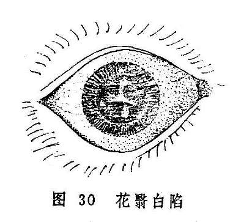

**〔病因病机〕**

多因外感风热毒邪，内有肺肝积热，壅实上冲，火灼络内，攻冲风轮所致。

**〔辨证论治〕**

（一）辨证要领

本病初起，患眼沙涩，似有异物，刺痛羞明，眵多流泪，前额疼痛，胞睑紧闭，抱轮红赤或白睛混赤，黑睛四周骤起翳障，其色灰白或微黄，渐渐厚阔，中间低陷，甚则深陷，状如花瓣或碎米、鱼鳞。未遮满瞳神者，瞳神尚且可见，证重者则出现瞳神紧小、黄液上冲等，若黑睛溃破，则变生蟹睛；亦有不从黑睛边际而生，而于风轮上起翳如凝脂，色灰白或微黄，初小如星，渐大并溃陷，或呈条状，或呈边缘不规则的片状；亦有黑睛上先发聚星障，细颗如星，连续窜生呈条状，后渐扩大，溃破后亦可牵连混合而成片。愈后遗留瘢痕，可严重影响视力。

本病病势急重，且以实证为多。发病之初，多系肝肺风热；病邪入里，则可见头目剧痛，发热口渴，溲黄便秘，舌红、苔黄脉数，则证属热炽腑实、病情迁延不愈者，亦有属于湿热壅盛及阴虚火旺者。

（二）论治要点

本病急重，且以实证为多，病初起，多系肺肝风热，治以疏风清热；热邪传里，热炽腑实者，急当通腑泻热。病势急重，热象明显者，即使无大便秘结之症，亦可使用泻下法清泻热毒，大便一畅，眼症常可顿减。外治以清热解毒，退翳明目为要，临证常结合使用扩瞳剂，以减轻症状，缩短病程，且可防止瞳种干缺。

（三）常见证治

1.内治：

（1）肺肝风热：

证候：黑睛骤起白翳，状如花瓣，或似鱼鳞，但未扩展串连，畏日羞明流泪，红赤疼痛，舌红苔薄黄，脉数或浮数。

治法：疏风清热，解毒散邪。

方例：加味修肝散〔79〕。轻者可用蝉花散〔247〕。

（2）热炽腑实：

证候：白睛混赤，花翳从四周蔓生，迅速扩大，蔓掩黑珠。可兼眼睑肿胀，眵泪俱多，头目剧痛，烦躁，口苦口渴，溲黄便秘，舌红苔黄，脉数。

治法：清肝泻热。

方例：泻肝散〔133〕。

2.外治：

（1）黑睛生翳，局部红赤较重时，宜清热解毒为主，可用朱砂煎

**〔96〕**点眼，兼用桑菊祛风汤〔194〕洗眼。

（2）若红赤已退，黑睛低陷平复，障翳仍在，则以退翳明目为主，可用珍珠散〔157〕，或琥珀散〔235〕外点。

（3）病重者，滴用扩瞳剂，如1%阿托品液，以防瞳神干缺。

（四）临证权变

本病初起，多系肺肝风热，若肺火偏盛者，可加桑白皮、生石膏等以清泻肺火；肝热偏盛者，可加夏枯草、胆草以清泻肝热；白睛红赤暗滞，刺痛明显者，可选加苏木、红花之品以活血散瘀；若热炽腑实，目赤痛甚者，亦可酌加红花、赤芍、丹皮等以凉血化瘀止痛。

花翳白陷失治或误治，亦有缠绵不愈或反复发作者，治疗颇为棘手，可辨明证候，参照聚星障之“湿热蕴蒸”、"阴虚邪留”等予以施治；病至后期，红退痛止，遗留瘢痕翳障者，又可参照“宿翳”一节予以处理。

**〔调护〕**

注意眼部卫生，勿过食辛辣厚味食物，饮食宜清淡且富有营养。应忌烟酒，戒急躁，保持心情舒畅。素体虚弱者，应注意调护和治疗。

**〔应用例案〕**

郑XX，男，32岁。1964年10月10日初诊：右目发红20余天，两天前曾饱食羊肉，食后右目突然剧痛，羞明流泪，不能见物，检查，右眼胞睑红肿高胀，白睛红赤，下方赤丝尤密，风轮中央大片白翳，中间凹陷，边缘附以黄白色凝脂，青睛下方边缘始见黄液如线。大便不通、腹满、脉实、右关尤甚，舌质红，苔黄厚。此为花翳白陷合并黄液上冲，治以新加羚角饮（羚羊角0.3克，酒黄芩9克，柴胡6克，酒大黄9克，明粉3克、知母、元参各9克，银花30克，赤芍9克，酒茺蔚子6克）加炒山楂9克，枳壳6克，服药2剂。10月12日复诊：大便已通，腹满稍减，黄液已尽，风轮中央白陷稍有好转，脉仍有力，苔黄而厚，又服上方去大黄、元明粉2剂。10月14日三诊：腹已不满，脉转沉数而弦，苔薄黄，白睛赤丝减退，青睛花翳白陷渐平，目痛大减，又以上方去枳壳，山楂，加酒生地12克，服用9剂。10月24日四诊：白睛淡赤，白翳较前缩小，边缘平滑，已无凝脂附着，但中间仍有凹陷，症已转花翳低陷，给当归元参饮服之，又服21剂。11月18日五诊：曰睛已复如常，青睛云翳挡神，视物昏蒙。此翳难退，嘱其停药。（《张皆春眼科证治》）

**〔文献摘录〕**

《证治准绳•七窍门》：“花翳白陷证，因火烁络内，膏液蒸伤，凝脂从四围起而蔓神珠，故风轮皆白或微黄，视之与混障相似而嫩者。大法其病白轮之际，四围生漫而来，渐渐厚阔，中间尚青，未满者瞳神尚见，只是四围略高，中间略低，此乃金克木之祸也。或有就于脂内下边起一片黄膜，此二证夹攻尤急，……亦有不从沿际起，只自凝脂，翳色黄或不黄，初小后大，其细条如翳，或细颗如星，此边起一个，彼边起一个，四散生将起来，后才长大，牵连混合而害目，此木火祸也。”

《目经大成》：“此症初起双目便赤肿，狂痛，畏明，生眵。开视青睛沿际许多白点，俨若扭碎梅李花瓣，瓣色黄而浮大者尤险，一昼夜牵连混合，蔽蔓神珠，看之与混睛障相似，却善长速变，且四围翳起，中央自觉低陷，甚则翳蚀于内，故名花翳白陷。”

### 凝脂翳

本病为黑睛生翳，状如凝脂，其色或黄或白，善变而速长，或伴有黄液上冲的急重眼病。见于《证治准绳•七窍门》。若治不及时，每易迅速毁坏黑睛，甚至水膜溃破，黄仁绽出，变生蟹睛恶候，愈后视力受到严重障碍，甚至失明。

**〔病因病机〕**

1.多因黑睛表层损伤，风热邪毒乘隙侵入。若素有漏睛，邪毒巳有蕴伏，更易乘伤袭入而发病。

2.脏腑热盛，肝胆火炽，上攻于目，气血壅滞，蓄腐成脓，黑睛溃烂。

3.或因花翳白陷，聚星障等病情迁延，复加邪毒，恶化而成。

**〔辨证论治〕**

（一）辨证要领

本病初起自觉眼内沙涩，灼热刺痛，畏光流泪，白睛红赤，黑睛上有翳如星，其色白或微黄，表面污浊，边缘不清，中央有凹陷，其上如覆薄脂。此为凝脂早期，若治疗及时得当，病情多可控制，愈后遗留有宿翳。

若治不及时，正不胜邪，病情向纵深扩展，症见头目剧痛，胞睑肿胀难睁，热泪如汤，白睛混赤壅肿，星翳迅速扩大，翳上复有一片凝脂，色黄浮嫩，边缘肥厚不清，凹陷亦逐渐变大变深，甚则漫及整个黑睛。因神水受灼，而于黑睛内，黄仁前下方出现黄色脓液，是为黄液上冲（图31）。若诊治及时，病情尚可控制，但愈后常留厚翳。

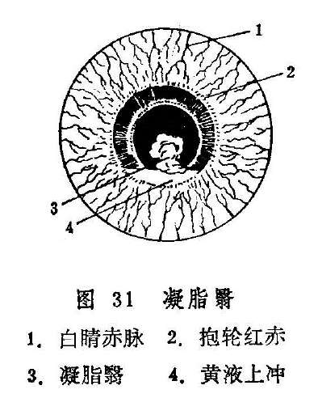

若病情继续进展，水膜溃烂变薄，甚则黑睛溃破，黄仁绽出而成蟹睛恶候，结瘢后留有斑脂翳。若毒攻珠内，病势更为凶险，终为目珠塌陷而失明。

亦有发病来势迅猛，病情凶险者。初起眼眵及凝脂即为黄绿色，黄液上冲极为严重，可于一、二日内溃破黑睛，黄仁、神膏绽出，甚至迅速脓攻全珠，眼珠萎陷而失明。

（二）论治要点

本证起病急，来势猛，发展快，变化多，治疗当以清热解毒为主。初期挟风者，宜祛风清热解毒；里热火毒炽盛者，宜泻火解毒通便；少数属正虚邪恋者，宜扶正祛邪。

（三）常见证治

1.内治：

（1）风热壅盛：

证候：黑睛生翳如星，边缘不清，表面污浊，如覆薄脂，白睛红赤，羞明流泪，眼睑浮肿，珠痛头痛，视力下降。或兼恶寒发热，溲黄短少，舌质红苔薄黄，脉浮数。

治法：祛风清热。

方例：新制柴连汤〔244〕。

（2）火毒炽盛：

证候：凝脂大片，窟陷深大，黄液上冲，胞睑红肿，紧涩难开，热泪频流，眵多色黄或黄绿，白睛混赤壅肿，或发热口渴，溲赤便秘，舌红苔黄厚，脉数有力。

治法：清热解毒，泻火通便。

方例：四顺清凉饮子〔65〕。

（3）正虚邪留：

证候：年老体弱，或久病气血不足，凝脂溃陷，渐见减薄，日久不敛，白睛红赤不显，眼痛羞明较轻，舌淡脉弱。

治法：扶正祛邪。

方例：托里消毒散〔88〕。

病至后期，邪毒已清，遗留瘢痕翳障者，可参照宿翳处理。

2.外治：

（1）局部可用点眼秦皮煎〔160〕。或黄芩、黄连、千里光等清热解毒药制剂滴眼，可频频滴用，睡前涂穿心莲眼膏〔156〕。

（2）结合滴用扩瞳剂，以防瞳神干缺。

（3）以银花、连翘、蒲公英、鱼腥草、大青叶、荆芥、防风、千里光、野菊花等煎水，澄清过滤，洗患眼，作湿热敷。

3.针灸疗法：取睛明、承泣、丝竹空、攒竹、翳明、合谷、肝俞、阳白等，每次局部取1〜2穴，远端1〜2穴，交替使用，视虚实而施补泻手法。

（四）临证权变

风热壅盛、火毒炽盛者，在原方基础上可选加银花、千里光等以增强清热解毒之效；若大便不通者，还可酌加芒硝以增泻下之力；白睛瘀赤较甚者加犀角、丹皮、桃仁、红花等凉血化瘀之品；眵呈黄绿，邪毒炽盛者，再加银花、蒲公英、菊花、千里光等以清热解毒。

**〔调护〕**

本病来势猛，变化快、病情严重，应日夜监护。若病情有变化，须及时处理。对患者使用的洗脸用具、敷料、用品等应及时严格消毒。饮食宜清淡，忌辛辣腥发之物。

**〔应用例案〕**

朱XX，男，45岁，于1959年7月7日就诊，门诊号0394。主诉：左眼过去有云翳，7天前左眼发红生翳，羞明流泪，眼痛，口干，大便燥，小便黄。

检查：左眼白睛红赤，黑睛偏外下方有凝脂翳下陷，面积约3X4毫米，荧光素染色阳性。舌苔微黄稍腻，脉浮而有力。

诊断：凝脂翳。属于内热挟风型，用双解汤（金银花15克蒲公英15克天花粉9克黄芩9克枳壳4.5克龙胆草9克荆芥9克防风9克桑皮6克甘草3克）加大黄4.5克，芒硝4.5克，服3剂，眼痛止，微流泪，大便已润，白睛红赤大减，黑睛凝脂翳下陷显著平复，面积较前缩小。舌苔轻薄，脉弦数。继以前方去大黄、芒硝，服7剂，7月14日复诊，白睛红赤全消，凝翳下陷平复，呈斑翳状，视力0.6，嘱其停药。（庞赞襄《中医眼科临床实践》）

**〔文献摘录〕**

《审视瑶函》：“此症为疾最急，昏瞽者十有七八。其病非一端，起在风轮上，有点，初生如星，色白，中有（米厭），如针剌伤，后渐渐长大，变为黄色，（米厭）亦渐大为窟者。有初起如星，色白无（米厭），后渐大而变，色黄始变出（米厭）者。有初起便带鹅黄色，或有（米厭）无（米厭），后渐渐变大者。或初起便成一片如障，大而厚，色白而嫩，或色淡黄，或有（米厭）无（米厭）而变者。或有障，又于障内变出一块如黄脂者。或先有痕（米厭），后变出凝脂一片者，所变不一，为祸则同，治之不问星障，但见起时肥浮脆嫩，能大而色黄，善变而速长者，即此症也。”

### 黄液上冲

黄液上冲是指黑睛内黄仁前积有脓液，色黄而向上漫增的病症（图32）。在《秘传眼科龙木论》中称为“黄膜上冲”。《目经大成》认为实“非膜而为液”，故改本名。多由凝脂翳或瞳神紧小等病变生。甚者，脓液可全掩瞳神或渗入瞳神后部，导致失明。

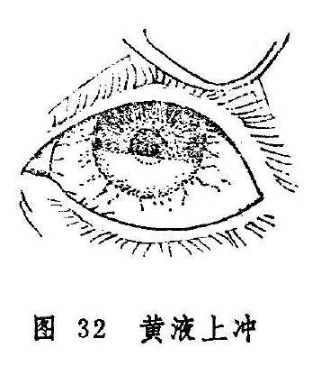

**〔病因病机〕**

多因过食辛热炙煿、膏粱厚味，酿成阳明积热，加之感受风热邪毒，内外合邪，致三焦火毒上燔，灼伤黄仁，煎熬神水，脓液内聚而成。

**〔辨证论治〕**

（一）辨证要领

其症初起，疼痛羞明流泪，抱轮红赤或白睛混赤，黑睛与黄仁之间脓液积聚色黄或微黄，一般多沉在下方，上界呈水平面，还可随头位改变而移动。其量或多或少，可稀可稠。量少者如指甲根之白岩，量多者可遮掩整个瞳神。若因凝脂翳等引起者，极易穿破黑睛，变生蟹睛等恶候；若有瞳神紧小，扱易适成瞳神干缺，以致变证丛生；若脓攻全珠，病情险恶，易致眼珠塌陷而失明。

本病一股均属阳明热毒炽盛，大抵以黄液色淡、量少，发展稍缓者属轻；黄液色深，发展迅速，量多而遮掩瞳神者属重；若二便不利，则更为严重。

（二）论治要点

本病无论其证之轻重，总宜泻火解毒为治疗大法，亦可参阅凝脂翳、瞳神紧小之治法。

（三）常见证治

1.内治：

阳明热毒炽盛。

证候：黄液上冲，抱轮红赤，瞳神紧小，羞明流泪，头目剧痛，口渴喜饮，大便秘结，舌苔黄，脉数。

治法：清热泻火解毒。

方例：通脾泻胃汤〔199〕、眼珠灌脓方〔220〕。

2.外治：

（1）局部用立胜煎〔44〕滴眼，以清热解毒止痛。

（2）滴用扩瞳剂，以防瞳神干缺。

（3）可选用荆芥、防风、羌活、川芎、黄芩、银花等祛风清热解毒药煎水，作湿热敷。

（4）参照凝脂翳、瞳神紧小证之外治法。

（四）临证权变

本证热毒甚者，可加银花、公英等以清热解毒；若血热甚者，可选加犀角、丹皮等以凉血清热。证属肝胆热毒者，宜清肝肾火解毒，可用龙胆泻肝汤〔58〕加银花、连翘、公英；个别患者属于脾胃虚损，寒湿内蕴化火，证见目珠痛轻，抱轮淡红，脓色淡红而较少，面色少华，舌淡苔白，脉细弱或迟，则宜温中健脾益胃，可用理中汤〔219〕加地丁、败酱草、黄芪等。

〔调护］

本证多由凝脂翳、瞳神紧小等病而发，故患有此类眼疾应及时正确的治疗。平素少食炙煿辛热、肥甘厚味之品，以防脾胃积热。患本病者，除内服药外，应结合外用药物的应用，以防变生他症。

**〔应用例案〕**

封XX，男，69岁。1970年6月17日初诊：左目红赤疼痛10余天，自昨日加重，头目剧痛，羞明难开，结眵流泪，视物不清，二便尚利。检查，左目白睛赤丝满布，下部尤重，风轮花翳深凹，边缘附以凝脂，底部嫩白，遮蔽瞳神上部边缘，风轮下部始见黄液，如指甲白岩之状。此为花翳白陷，兼黄液上冲，治以通脾泻胃汤加银花18克，元明粉3克，服药2剂。6月19日复诊：头痛、目痛减轻，白睛赤丝减少，青睛下部黄液已尽，花翳白陷如前，以上方去大黄、元明粉，加柴胡6克，青黛0.6克，酒生地9克，又服6剂。6月26日三诊：白睛淡赤，青睛呈现花翳低陷，给当归元参饮服之。服药15剂。7月12目四诊：低陷渐平，留有菲薄之翳，挡住瞳神上部，视物不真，嘱其常用桑椹子9克，蝉蜕3克，车前草6克，浸水饮之，每日一次连服半年。1971年2月5日五诊：视物较前清楚，云翳稍减，嘱其停药。（《张皆春眼科证治》）

按：本例患者年近70，虽属阳明邪盛，但其肝肾已亏，不宜过用苦寒泻下之剂，故仅用2剂通脾泻胃汤加减，即去大黄、元明粉，加酒生地以滋补肝肾之阴，加柴胡、青黛以清肝胆火邪。后则花翳白陷亦逐渐向愈。

### 蟹睛证

蟹睛证是因黑睛溃破，黄仁自溃口绽出，状如蟹睛的病症（图33）。见于《圣济总录》。《太平圣惠方》称“蟹目”、"损翳”。此外，又称“蟹睛疼痛外障”（《秘传眼科龙木论》）、蟹睛突起”（《古今医统》）、“蟹睛横出”（《目经大成》）、“蟹珠”（《银海指南》）、“蝇头蟹眼外障”（《眼科纂要》）。

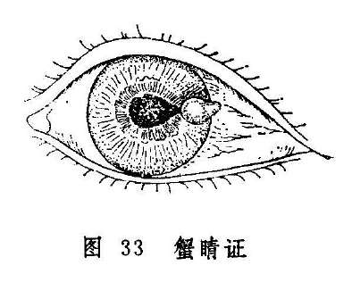

**〔病因病机〕**

多因凝脂翳，花翳白陷等，病变向深层发展，腐破风轮，黄仁绽出而成：或在上述病变过程中，偶因咳嗽、喷嚏、怒吼、号哭、大便用力等，促使气血上涌，努破黑睛，黄仁乘势脱出所致。此外，还可由眼外伤及严重疳眼引起。

**〔辨证论治〕**

（一）辨证要领

本证黑睛溃破，可见黄仁自溃口绽出，其色棕黑，高于黑睛表面，状如蟹眼、蝇头，甚则横长如黑豆，周围绕以灰白翳障，瞳神变形如杏仁状。此时，因黑睛溃破，邪毒外泄，疼痛缓解，愈后遗留斑脂翳之类，可致神水流行受阻，继发绿风内障。

发病初期，蟹睛表面紧张，肿胀如球，疼痛剧烈，脉象弦数有力，多属肝胆火炽之实证；发病后期蟹睛表面虚软不痛，脉虚数无力，或兼腰痿潮热，多属水亏火旺之虚证。

（二）论治要点

本病的治疗宜分虚实，初起为实，以泻肝为主；病久多虚，以补肾为主。

（三）常见证治

1.内治：

（1）肝胆火炽：

证候：风轮凸起黑𥅲，状如蟹睛，紧张如球，疼痛，赤涩流泪，羞明难睁，口苦苔黄，脉弦数。

治法：清热泻肝。

方例：泻青丸〔136〕。热毒甚者可酌加银花、连翘等以热解毒。

（2）阴虚火旺：

证候：可见蟹睛平复，虚软不痛，视物昏暗，头晕耳鸣，腰膝痠软，舌红无苔，脉细数。

治法：滋阴降火。

方例：知柏地黄丸〔148〕。

2.外治：

（1）局部以黄芩、黄连等眼药水滴眼，蟹睛平复点用八宝眼药

**〔12〕**，以退翳明目。

（2）配合点用扩瞳药。

（四）临证权变

初起属肝胆火炽者，须注意选加银花、连翘等以清热解毒；兼有大便闭结者，可改用泻肝汤〔134〕，以通腑泻热。缘外伤所致者，可在泻青丸的基础上，选加桃仁、红花、丹参、丹皮等以散瘀血；疳疾上目导致者，治当改用健脾杀虫，清肝明目之法，可用肥儿丸〔147〕选加石决明、草决明、蒲公英等治之。蟹睛证后期，诸症已减退者，可用四物汤〔64〕加草决明、菊花、密蒙花退翳明目，滋肝养血，还可加枣仁、五味子、白芍等酸收之品，以利蟹睛平复。

**〔调护〕**

勿用脏手、脏毛巾揉擦，保持患眼清洁。力求避免咳嗽、喷嚏、用力大便等，以免加重黄仁脱出；饮食忌辛辣。

**〔应用例案〕**

大名尚XX，女，27岁。病初，觉二目酸疼，右目为甚，隔日赤丝忽起，热泪恒流，黑珠稍塌陷。急请本处医生治疗，点、服并施，疼未止，又从塌陷中生出黑泡一颗，大如绿豆。1961年来我院就诊。诊断：按其脉，厥阴弦数，惟右寸洪大。此乃肺气旺盛，肝木不平，金木相攻，以致黑珠破裂，而黑泡凸出。处方：先刺上星、百会；内服泻肝活血汤（生石膏、当归、川芎、赤芍、胆草、连翘、胡黄连、玄参、没药、大贝、白芷、黄芩、夏枯草、银花、甘草），加田三七五分，3剂而疼即止。后改养荣平肝汤常服；外用消炎散洗罨；再将臂臑、合谷略刺。月余，黑泡低落，而睛光渐长，但瘢痕终身难以退净。（路际平《眼科临症笔记》）

**〔文献摘录〕**

《目经大成》：“此证视风轮上有黑珠一颗，周围肤翳略缠者是。盖缘暴风客热，暨水衰火炎，医不合法，致凝脂、黄液、木疡诸病蚀破青睛，黑睛（按：指黄仁）从破处而出；始如蝇头，中如蟹睛，甚则横长如黑豆，故呼上名。软而不疼，金井但斜未败，准可许其平复。间有结痂如豆壳，壳落始愈者。然补穿合碎，虽妙手空空，瘢痕终乎不免。若尖硬痛紧，药饵再误，则黑白混一，蟹睛决不能平。不则必裂，青黄迭出，目其随眇已乎。”“蟹睛本医药妄乱逼成，一切汗吐下诸法皆用不着，合选和而带补之方，加五味、枣仁、白芍徐徐酸敛，日久自然收入。若未经看治，此则木火强盛，脉必浮弦而数，须抑青、泻青、八正逐客等等洁净脏腑，然后宜和宜滋养，细心调理，十九无害。”

### 混睛障

混睛障是指黑睛水膜之深层漫生灰白或浑红色翳障，混浊不清，障碍视力的眼病（图34）。病名见于《审视瑶函》。《秘传眼科龙木论》称"混睛外障”。《证治准绳》又称"混障”。本病过程缓慢，往往进行数月治疗，方可逐渐减轻，但多数仍留瘢痕而影响视力。

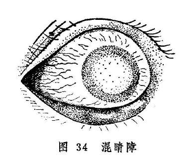

**〔病因病机〕**

多因肝经风热上扰于目，损及黑睛，或肝胆热毒蕴蒸于目，热灼津液，瘀血凝滞引起；亦可因外受湿邪，或内蕴湿热，湿浊熏蒸，上犯黑睛；或邪毒久伏，耗损阴液，或素侬阴虚，劳瞻竭视，雕缕细作，致肝肾阴虚，虚火上炎所致。

**〔辨证论治〕**

（一）辨证要领

初起自觉碜涩畏热羞明，疼痛泪出，视力下降，抱轮暗红，或白睛混赤，视物昏蒙，黑睛从中央或边际深层发生灰白色翳障，逐渐漫掩全部黑睛，使风轮如浊烟笼罩，失却晶莹润泽之色，如镜面呵气之状，或如磨砂玻璃状（图34）。若从侧面视之，能隐见瞳神。细察之，隐隐可见黑睛深层有灰白色线条参杂，赤脉自黑睛边际蔓入中心，最后侵及整个黑睛，呈现一片赤白混杂的翳障，严重影响视力，甚至难辨人物。经数月，翳障可逐渐变薄，但不能全退，遗留厚薄不等的瘢痕，对视力影响不等。与此同时，易发生瞳神紧小或干缺，故须予以重视，以免处理不当，导致失明。本病不但病程较长，且易反复发作，年深日久，则黑睛全变白色。

发病初期，水膜混白，头眼俱痛，脉浮数者，多为肝经风热；水膜混赤，刺痛流泪，口苦苔黄，便秘溲赤，脉弦数者，多为肝胆热毒；病情缠绵不愈，头重困倦，舌苔黄腻，脉滑而数者，证属湿热上攻；反复难除，干涩隐痛，抱轮微红，口干咽燥，脉细而数者，证属阴虚火旺。

另外，混睛障呈白色者，最忌光滑如瓷；翳障浑赤者，最忌紫脉粗大爬紧，此二者均属难治之证。

（一）论治要点

本病之发生，多为热毒所致，所以清热解毒为本病治疗的要点。挟风者，宜疏风清热而解毒；肝胆热毒者，宜泻肝而解毒；挟湿者，宜除湿清热而解毒；阴虚火旺者，则宜滋阴而降火。

（三）常见证治

1.内治：

（1）肝经风热：

证候：头目俱痛，畏光流泪，白睛抱轮红赤，黑睛水膜之深层有灰白色翳障，舌红苔薄黄，脉数或浮数。

治法：祛风清热。

方例：羌活胜风汤〔109〕。

（2）肝胆热毒：

证候：黑睛混赤，赤脉贯布，抱轮暗赤，刺痛流泪，便秘溺赤，口苦苔黄，脉弦数。

治法：泻肝解毒。

方例：银花解毒汤〔221〕加减。

（3）湿热上攻：

证候：病程绵长难愈，白睛红赤，黑睛混浊，视物昏蒙，头重困倦，胸闷纳差，舌苔黄腻，脉滑数。

治法：清热祛湿。

方例：三仁汤〔16〕。

（4）虚火上炎：

证候：病情反复发作，眼干涩而疼痛不甚，抱轮微红，黑晴混浊如烟笼罩，口干咽燥，舌红少津，脉细而数。

治法：滋阴降火。

方例：兼咽燥干咳等症者为肺阴不足，用百合固金汤〔86〕；兼头晕耳鸣，腰膝痠软等症者为肾阴不足，用知柏地黄丸〔148〕。

2.外治：

（1）局部点用涩化丹〔177〕、犀黄散〔241〕或磨障灵光膏〔249〕以消退翳障。

（2）酌用扩瞳剂滴眼。

（四）临证权变

发病初期，属于肝经风热者，需在羌活胜风汤疏风清热的基础上，酌加银花、连翘、栀子等以助解毒；若系先天梅毒者，宜重加土茯苓驱梅解毒。若肝胆热毒炽盛者，银花解毒汤中的银花、公英宜重用，再加野菊花、土茯苓以清热解毒；兼有瘀滞甚者可选当当归、桃仁、红花、赤芍以活血化滞；若大便秘结者，可酌加玄明粉，以助大黄通腑泻下。湿浊上攻者，可在三仁汤的基础上加土茯苓、萆薢、银花、连翘等。病至后期，遗留宿翳者，可参照宿翳处理。

**〔调护〕**

本病缠绵，需耐心调治，病变初期每易诱发瞳神缩小干缺，应密切观察病情。患者应进食富有营养而少食肥甘厚味，同时注意针对全身症状及体质情况，悉心调治。

**〔应用例案〕**

左XX，男，13岁。于1953年6月18日初诊。其母代述：其父有梅毒史。于20天前，左眼发现羞明流泪，鼻流清涕，又10余天后，眼红、羞明加重，双眼失明。在XX眼科医院治疗，住院7天，不见好转，医生说此病系先天性梅毒引起，眼内云翳不可能退净，故出院来此就诊。检查：双眼视力均光感，黑睛混浊，漫珠一色，如磨砂玻璃状，并有赤脉贯入黑睛，白睛混赤。舌苔微黄，脉细数。诊断：混睛障。用银花解毒汤服5剂后，6月22日复诊，双眼红略退，黑睛混浊微减，视力半尺指数。继服10剂后，于7月1日三诊，白睛红显著消失，黑睛混浊及赤脉明显消退，羞明流泪已愈，舌苔已愈，双眼视力均0.07。继按上方减大黄、黄芩各3克，服至7月10日，双眼黑睛混浊大部分消退，赤脉完全消失，白睛已恢复正常，右视力0.6，左0.3。又按上方服10剂后，双眼黑睛混浊完全消失，两眼视力均1.2，嘱其停药。（《中医眼科临床实践》）

**〔文献摘录〕**

《审视瑶函》：“混障却分红白，有余不足之灾。红速白迟皆退。久而点服方开，红畏紫筋爬定，白嫌光滑如苔，带此两般症候，必然难退易来。”

### 轮际起泡风轮赤豆

轮际起泡是指风轮边际发生灰白或灰黑色泡状颗粒的病证（图35）。病名见于《目科捷径》，原称为“乌睛白睛之间起黑白泡”，现简称轮际起泡。病名虽云“起泡”，其实和发生于白睛表层的金疳颗粒形态相似，属实心性小颗，并非水泡。颗粒可为一个或多个，较金疳之颗粒虽小，但因发生于风轮边际，患眼睑闭难睁、疼痛、羞明、流泪等症状较金疳剧烈得多。失于治疗，还可导致风轮穿破的严重后果。

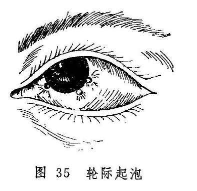

风轮赤豆是指风轮上有颗粒突起，其上及周围有赤丝缠布，色红如赤豆的病证（图36）。《证治准绳》称为“轮上一颗如赤豆证”，现简称为风轮赤豆。本证常反复发作，愈后遗留瘢痕而影响视力。

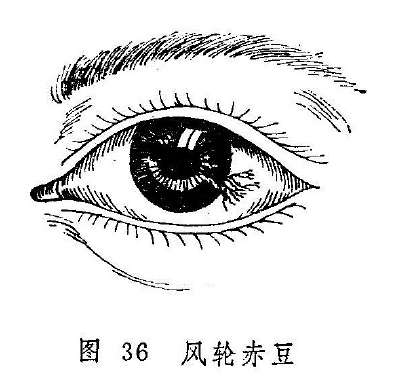

轮际起泡和风轮赤豆均常发生于儿童与青少年，前者出现数日后顶部发生溃陷，以后或可消退，或可逐渐向风轮中央进犯，并有血管随之长入，使病变呈红色而如赤豆，即转为风轮赤豆证。后者的形成与前者有密切的联系，故尔合并讨论。

**〔病因病机〕**

1.肺火壅盛，金胜凌木，故致小泡生于黑睛边际，且能进一步向风轮中央进犯。

2.肺阴不足，虚火上炎，攻于目窍。

3.肝经火盛，热郁于目，使眼部血络瘀滞，郁结而为赤丝攀附于病变部位。

4.素体虚弱，或久病（如麻疹、顿咳、腹泻等）之后脾胃虚损，运化失职；或久居潮湿阴暗之处，致气滞痰停，痰气混结于风轮。

**〔辨证论治〕**

（一）辨证要领

轮际起泡证初起，病人自觉碜涩流泪，疼痛羞明，风轮边际出现一个或数个微隆起的实质性小泡疹，泡疹附近之白睛亦发红赤。数日后泡疹顶部发生溃陷。此为肺火凌克肝木而致，除眼部症状外，往往可在颈侧触及臖核。

轮际起泡形成的溃陷，数日后可逐渐消失，白睛红赤亦随之而愈。但本病可反复发作，溃陷亦可久不平复。此种类型，兼有口干鼻燥，舌红，脉细数者为肺阴不足，虚火上炎所致；若伴面白少华，颈侧臖核成串，四肢乏力，舌淡脉弱者，则为脾胃气虚且挟痰湿之证。

轮际的泡疹有时可渐向黑睛中央发展，赤丝自气轮成束状追随缠布，状如彗星，直达风轮表面，色红如赤豆，此则多属肝经积热而成。赤豆日渐增大，并可溃破，亦可自行消退。溃破后中间凹陷，愈后留下瘢痕而影响视力。风轮赤豆亦可时发时止，发作时红赤疼痛，羞明流泪；休止时色淡白，诸证缓解。如此反复发作者，亦可据全身症状辨为阴虚火旺或脾虚挟痰。

（二）论治要点

此二证患者大多素体虚弱，受邪发病，故多虚中挟实之证，论治当辨明虚实主次，偏重实者以清肺肝为主，偏重虚者，以调理脾胃或养阴清肺为主。

（三）常见证治

1.内治：

（1）肺火侵肝：

证候：风轮与气轮交界处骤起小泡，与病变相应处白睛红赤，碜涩疼痛，羞明难睁，热泪如汤，烦躁口渴，脉或右寸数大。

治法：抑金泻肺。

方例：抑金散〔115〕。

（2）肝经热炽：

证候：泡疹溃破并向黑睛中央发展，上有赤脉缠布，状如赤豆，热泪如汤，疼痛羞明，或兼见口苦咽干，舌红苔黄，脉弦数。

治法：泻肝清热。

方例：洗肝煎〔153〕。

（3）脾虚挟痰：

证候：轮际起泡或黑睛赤豆反复发作，时隐时现，涩痛随之时作时止，颈侧可触及臖核成串，面色不华，四肢乏力，舌淡苔薄，脉濡或弱。

治法：健脾益气，化痰散结。

方例：香贝养荣汤〔162〕。

（4）肺阴不足，虚火上炎：

证候：轮际起泡或黑睛赤豆反复发作，白睛红赤较轻，溃陷不易消退，口干多饮，或伴干咳，舌红，脉细数。

治法：养阴清肺。

方例：养阴清肺汤〔154〕。

2.外治：

（1）外用朱砂煎〔96〕或涩化丹〔177〕点眼。

（2）根据证情，必要时滴用扩瞳剂，以防瞳神干缺。

（3）可视证情，选用热敷。

（四）临证权变

抑金散适用于以肺火壅盛为主之证型。若肺肝之热邪均盛，则可将抑金散与洗肝散合而加减。若赤豆丝脉粗大，色鲜红，又可用洗肝散合导赤散，并加丹皮、红花以凉血化瘀。若赤豆侵及黑睛中部，可加龙胆草以增泻肝清热之效。证属胆经湿热者，亦可选用龙胆泻肝汤

**〔58〕**。溃陷久不平复，还可用补中益气汤〔103〕升举清阳，使目受温养而自愈。

**〔调护〕**

平素应注意锻炼身体，增强体质，加强营养，减少复发。

**〔文献摘录〕**

《目科捷径•乌睛白睛之间起黑白泡》：“凡人乌睛白睛之间起黑泡白泡者，皆气血两虚故也。其泡或青、或黑、或白，大小不一，其疼无比。既已气血两亏，再服苦寒必败。……仍以十全大补汤调理。若失禁忌，必有残患之虞。”

### 宿翳

宿翳是指黑睛疾患或外伤后，遗留之瘢痕翳障。见于《目经大成》。历代眼科文献，根据其翳的形态、厚薄、范围、程度、色泽等情况命名，名目繁多。宿翳治疗较为困难，一般来说，翳薄而治疗得当，可望减轻或消退；若年久翳老，用药多难以奏效。

**〔病因病机〕**

系凝脂翳、花翳白陷、聚星障、混睛障等黑睛疾患或外伤痊愈后遗留的瘢痕翳障。

**〔辨证论治〕**

（一）辨证要领

患者黑睛上有翳障，形状不一，厚薄不等，部位不定，色泽不同，但表面光滑，边缘清楚，眼无赤痛。位于黑睛周边而未遮瞳神者，视力影响较小；位于黑睛中央遮蔽瞳神者，可严重影响视力。古代因宿翳形色厚薄的不同，而有多种名称：如聚星障形成的宿翳称“连珠外翳”；隐约可见，色光白而甚薄，如冰上之瑕者称“冰瑕翳”；色白如水晶，高厚满珠者称“水晶障”或“玉翳浮瞒”；蟹睛回收结疤于风轮，黄仁与疤痕相粘着，其色白中带黑，瞳神欹侧不圆者，称"斑脂翳”；按宿翳形态兮，尚有许多名称，这里不再赘述。

宿翳的辨证，首先应分辨新久。新患日浅者，耐心调治，可望收效，年深日久者，多属不治。

（二）论治要点

本证属新患日浅者，耐心调治，可望收效，治宜内外结合，用药总以补虚泻实，退翳明目为原则。

（三）常见证治

1.内治：

证候：黑睛疾患初愈或近愈，红退痛止，留有形状不一，厚薄不等之瘢痕翳障，视物昏矇，眼内干涩，可无全身症状。

治法：退翳明目。

方例：消翳汤〔176〕。

2.外治：以磨障消翳为主，用涩化丹〔177〕、八宝眼药〔12〕点眼。

3.针灸疗法：采用眼周围远端循经取穴方法。以睛明、承泣、健明为主穴，太阳、合谷、翳明为配穴，每次主、配穴各一，交替轮取。

（四）临证权变

若有阴津亏损者，可重用生地，酌加玄参、麦冬以养阴生津；若余热未尽，仍有轻微红赤者，可加黄芩；若赤脉伸入翳中，气血瘀滞者，加红花、赤芍；气阴不足者，加用太子参；血虚者，合用四物汤

**〔64〕**；肾阴不足者，合杞菊地黄丸〔126〕。总之，辨证需根据患者证情，灵活用药。

**〔应用例案〕**

黄XX，女，33岁，初诊于1961年8月12日。云因铁屑入目，继发感染绿脓杆菌，引起角膜溃疡，经治溃疡痊愈，结成斑疤，惟翳膜在于当瞳，视力仅为眼前手动，舌红苔白，脉细弦而数。症由外伤，肉膜不固，故而风邪乘隙而入。目下炎症虽退，但病根未除，治当追本溯源，除风益损主之。除风益损汤（生地、白芍、当归、川茸、防风、藁本、前胡）加黄芩、蝉衣，7剂（以后又续服一月）。五诊：黑睛属肝，肝藏血，为风木之脏，物击络损，阴血不足，肝木失荣，故而右目为邪中而起翳膜。前予除风益损之剂，白翳已淡，再宗原意，四物退翳汤（生地、赤芍、当归、川芎、蝉衣、木贼草、谷精草、密蒙花），7剂（以后又继服一月）。十诊：白翳继续变薄，视力已达

0.3，总以病根较深，虽久治难以退尽，拨云退翳丸（木贼草、羌活、川连、青龙衣、花粉、花椒、川芎、炒荆芥、薄荷、地骨皮、炒枳实、蝉衣、密蒙花、当归、蔓荆子、白蒺藜、菊花、甘草）。（姚和清《眼科证治经验》）

**〔文献摘录〕**

《秘传眼科纂要》：“至若退翳之法，如风热正盛，则以祛风清热之药为主，略加退翳之药；若风热稍减，则以退翳之药为主，略加祛风药、清热药。若一味清热，以致热气全无，则翳不冰即凝则燥，虽有神药，不能去矣。夫翳自热生，疔由毒发，发必在乌轮，乌轮属肝，则凡清肝、平肝、行肝气之药，如柴胡、芍药、青皮之类，皆退翳药也。浅学者流不识此理，惟执定蒙花、木贼、谷精、虫蜕青葙、决明为退翳之药，又不辨寒热，信于摭拈，糊涂乱用，非徒取识者笑诸，而且害人。”

复习思考题

1.简述赤膜下垂与血翳包睛的辨证论治。

2.简述聚星障的临床表现。

3.试述聚星障的病因病机及辨证治疗。

4.银星独见与聚星障、凝脂翳初起有何不同？

5.试述花翳白陷的病因病机、临床表现、辨证论治和局部治疗。

6.简述凝脂翳的病因病机和临床表现。

7.对凝脂翳应如何辨证论治和局部治疗？

8.黄液上冲之病因病机和诊断依据是什么？怎样治疗？

9.试述蟹睛的病因、症状和治疗。

10.试述轮际起泡和风轮赤豆的病因病机、临床表现及辨证论治。

11.试述宿翳的病因及治疗要点。

## 第五章瞳神疾患

**〔自学时数〕**10学时

**〔目的要求〕**4学时

**〔面授时数〕**

1.掌握瞳神紧小、瞳神干缺、视瞻昏渺、青盲、暴盲、视惑证、云雾移睛、肝虚雀目、高风雀目的病因病机，证候及治疗。

2.掌握瞳神散大证的辨证论治、用药禁忌及与绿风内障的鉴别。

3.掌握五风内障的辨治。

4.熟悉绿风内障、黑风内障、瞳神紧小证的鉴别。

5.了解如银内障的发病过程、针拨术指征，熟悉针拨术手法。

6.了解云雾移睛与如银内障的眼前黑影的鉴别。

7.掌握血灌瞳神、视物易色的辨治。

8.了解能近怯远、能远怯近证的病因病机。

瞳神疾患是指发生于瞳神及瞳神之后的眼病。统归内障范畴，属于常见眼病。其病变多种多样，发病后影响视力一般较外障眼疾严重。根据瞳神疾患的发病特点，大致可分为两种情况：一种是外观可有瞳神散大、缩小或变形变色；另一种是外观无变化，但视物模糊，视物变形、变色，或眼前有烟雾感，或云雾飘浮，或有蚊蝇飞舞，严重者可仅辨三光，甚致完全失明。

按五轮学说，瞳神为水轮，内应于肾。因肝肾同源，故发病常责之于肝肾。但瞳神疾患的病因十分复杂，除肝肾之外，和其他脏腑的关系也很密切。常常是脏腑功能失调所致，也有因感受邪气而起者。其证有虚有实。虚证主要由脏腑内损，气血不足，真元耗伤，精气不能上荣于目所致；实证多因风热攻目，痰湿内聚，气滞血瘀，目窍不利而起。也有发于阴虚火旺，肝阳化风，脾虚湿停，气虚血滞等属于虚实夹杂证者。此外，白睛、黑睛疾患之邪气深入，及头部外伤以致气血失和等，也常引起瞳神疾患。

瞳神疾患的治疗，虚证一般多以补肝肾，养阴血，益精气等法；实证常用清热泻火，利湿祛痰，疏肝理气，凉血止血，活血化瘀等法；虚实夹杂证宜用滋阴降火，柔肝熄风，健脾利湿，益气活血等法。此外，也有一些瞳神疾患尚需根据病情，配合局部用药、针灸、手术等法综合治疗。

### 瞳神紧小瞳神干缺

瞳神失却其正常之展缩功能，持续缩小，甚至小如针孔，称为瞳神紧小。本病名首见于《证治准绳》，《审视瑶函》则称为“瞳神缩

小”。本病多属阳邪致病，临床表现以实证多见，故《原机启微》称本病为“强阳（阳邪过亢）搏实阴（阴精未亏）之病”。

瞳神失却正圆状态，边缘有缺损，甚或参差不齐，形如梅花、锯齿，或虫蚀的病证，称为瞳神干缺。病名首见于《秘传眼科龙木论》，《一草亭目科全书》称为“瞳神缺陷”。

瞳神紧小与瞳神干缺见症虽有差别，实则同为黄仁病变引起。瞳神干缺多为瞳神紧小失治而成。二者病因复杂，且易反复发作，缠绵不愈。若治疗失当，往往并发它症而导致失明。

瞳神紧小因具有白睛红赤或抱轮红赤，故须与绿风内障、暴风客热、天行赤眼相鉴别。本病与绿风内障的鉴别；暴风客热和天行赤眼二病虽有白晴红赤，但无抱轮红赤，近黑睛处红赤较淡，其余部位红赤较甚，瞳神大小及展缩正常，风轮明洁，有眵泪可见，能尔我相传等，皆与瞳神紧小有别。

**〔病因病机〕**

1.由肝经风热或肝胆火毒上攻。

2.劳损肝肾，虚火上炎。

3.外受风湿，郁久化热，风湿与热合而上攻。

4.目患火疳、花翳白陷、凝脂翳、混睛障、疳疾上目、蟹睛证、真睛破损以及狐惑病邪毒攻目者，均能导致发病。

以上诸种因素皆可导致邪热深入眼内，蒸灼神水，伤及黄仁、以致黄仁展而不缩，瞳神紧小；火盛水衰，阴精耗伤，瞳神失于濡养，则干缺不圆。

**〔辨证论治〕**

（一）辨证要领

瞳神紧小初起，证见头痛时发眼痛拒按，入夜尤甚，赤涩流泪，羞明难睁，视力锐减，眼睑红肿，抱轮红赤。甚者白睛混赤，神水混浊，或见絮状物。黄仁肿胀晦暗，纹理不清，瞳神紧小，甚者缩小如针孔，展缩失灵。重证尚可并发黄液上冲之证。

瞳神紧小因系毒邪攻于黄仁，失治则黄仁易与其后之晶珠粘着，以致瞳神偏侧不圆，即为瞳神干缺证（图37-1）。粘着范围较广泛者，瞳神边缘参差，甚则瞳神紧缩如针孔、粟米、阴看不大，阳看不小。此证的瞳神可为黑色，亦可因内结膜障，瞳变白色或微黄，或因邪攻睛珠而令混浊，使并发内障而瞳现青白（图37-2），如此则神光被隔而目盲。

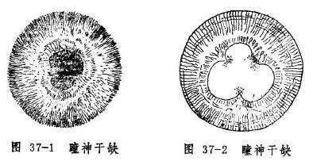

瞳神紧小的发病有急有缓，发病急骤者病势较重，初期多实证，常为外感风、热、湿邪或内有肝胆郁热而起；发病较缓者病势较轻、病情进展缓慢，常缠绵不愈，且易反复发作。其发病多属虚实夹杂之证，常因肝肾阴亏，火炎于上而发，抑或他病久患，阴血耗伤而邪热未除，转化而来。临证时，应结合全身证情进行辨证。至于病至后期，邪气已退，而目暗不明者，多为肝肾阴亏，目窍失养之故。

瞳神干缺证的辨证论治方法与瞳神紧小证同。干缺的形成，多由肝胆蕴热或阴虚火旺而致。日久则局部粘着凝聚，邪毒虽去，瞳神干缺终难复原。

（二）论治要点

瞳神紧小证属瞳神疾患之重证，常致目中精气俱伤，神光散没。所以《证治准绳》指出，本病务宜“乘初早救，以免噬脐之悔也”。一旦形成瞳神干缺，即难免如《龙木论》所云，“名医拱手无方救，堪叹长年暗室居。”

本病辨证论治的关键，在于发病的缓急、眼部证候的轻重和全身兼证的不同。病势急重者多为实证，实证多采用祛风、除湿、清热、解毒、凉血、散瘀等法；病势轻缓者多属不足或虚实夹杂之证，治则常用滋补肝肾或滋阴降火之法。本病因其它疾患如火疳、花翳白陷、凝脂翳、混睛障、疳疾上目、蟹睛证及狐惑病等引起者，必须积极治疗原发病，并参考本病的辨证论治方法，才能收到理想的效果。

对本病施以内治的同时，必须重视局部用药，及时扩瞳，以防瞳神干缺。

（三）常见证治

1.内治：

（1）肝经风热：

证候：起病较急，瞳神紧小，眼珠坠痛，视物模糊，羞明流泪，抱轮红赤，神水混浊，黄仁晦暗，纹理不清。全身可见头痛发热，口干舌红，舌苔薄白或薄黄，脉浮数。

治法：疏风清热。

方例：新制柴连汤〔244〕。

（2）肝胆火炽：

证候：发病急骤，瞳神甚小，黄仁肿胀晦暗，展缩失灵，珠痛拒按，痛连眶额，热泪频流，抱轮红甚，黑睛水膜内壁有细小颗粒附着，神水混浊，或兼黄液上冲，伴烦躁易怒，头痛眩晕，口苦咽干，舌红苔黄，脉弦数等。

治法：清泻肝胆。

方例：龙胆泻肝汤〔58〕加石决明、夏枯草、茺蔚子等。

（3）风湿夹热：

证候：发病或急或缓，多见病情缠绵。瞳神紧小或干缺，目赤痛，眉棱、颞颥闷痛，视物昏矇，眼前或见黑花，神水混浊，黄仁纹理不清，伴全身肢节痠痛，头重胸闷，舌红苔黄腻，脉弦数或濡数。

治法：祛风清热除湿。

方药：抑阳酒连散〔113〕。

（4）肝肾阴亏，虚火上炎：

证候：病势轻缓，或病至后期，或缠绵不愈，时轻时重，反复发作，瞳神多干缺不圆，伴见时而赤痛，干涩不适，视物昏花，或兼头晕失眠，五心烦热，口燥咽干，舌红少苔，脉细而数等。

治法：滋阴降火。

方药：滋阴地黄丸〔229〕。

2.外治：

（1）局部点用扩瞳剂发病之初即用药物迅速充分扩瞳，既可防止瞳神干缺，又有助于缓解眼部疼痛。常用药为1%阿托品液或软膏，每日点患眼1〜3次，或视病情而定。

（2）滴用清热解毒眼液如10〜50%千里光眼液〔24〕或10%黄连素眼水

**〔214〕**。

（3）局部热敷常用热水或内服药药渣煎水作湿热敷，有助疏散瘀滞、退赤止痛的作用。

3.针刺疗法：

（1）体针：常用穴：睛明、攒竹、瞳子髎、丝竹空、肝俞、足三里、合谷。每次局部取二穴，远端配一至二穴。

（2）耳针：可取耳尖、神门、眼等穴。

（四）临证权变

本病的临床表现极为复杂，患者之间的差别颇大，并可出现多种并发症与后遗症。如若病势急重，赤痛较甚者，可在前述相应的方药中选加生地、丹皮、丹参、茺蔚子凉血活血，增强退赤止痛的作用。如属肝胆火毒炽盛，伴见黄液上冲证，需参考有关章节辨证论治；若热入营血，伤及黄仁血络，导致血灌瞳神者，则可见心烦口渴，舌绛脉数等证，治宜清热解毒，凉血止血。方用清营汤〔199〕加赤芍、紫草。若属风湿偏盛，热邪不重者，又当慎用寒凉之品，酌加白蔻、苡仁、茯苓、厚朴等宽中利湿。

另外，病势轻缓，但经久不愈，反复发作，或久服凉药脾胃被伤者，亦有少数属脾胃虚寒者，多伴畏寒喜热，肢冷便溏，舌淡苔薄，脉象沉细等，宜用调中益气汤〔178〕益气升阳，使目窍得养而向愈。

**〔调护〕**

1.本病饮食宜忌辛辣酒浆，肥甘厚味，以免助湿生热，加重病情。

2.忌房劳、免精伤而虚火上攻。

3.嘱患者勿坐卧湿地，注意劳逸适度，防止竭视伤目，以免加重病情或愈后复发。

**〔应用例案〕**

吴XX，女37岁，初诊于1961年3月20日。原由风湿，骨关节疼烦时作，近则上害空窍，右目红肿，瘀滞疼痛剧烈，瞳神缺曲不圆，视糊，头亦牵痛，舌白微腻，脉浮缓。邪在肌表治以汗解，麻黄杏仁苡薏甘草汤，二剂。

二诊：红减，诸痛缓解，惟目视不复，邪气留恋，当再驱风湿以治。羌活、独活、防风、防己、米仁、泽泻、苍术、滑石、黄芩，三剂（以后又服五剂）。

四诊：红退肿消，目视恢复，关节疼痛亦除。防疾之复燃，当再予原方增损。原方去米仁，五剂。（《眼科证治经验》）

**〔文献摘录〕**

《审视瑶函•瞳神缩小》：“此症谓瞳神渐渐细小如簪脚，甚则缩小如针也。视尚有光，早治少挽，复故则难……皆宜乘初早治，不然悔之不及也。”

《眼科七十二症全书•瞳仁干缺外障》：“瞳神干缺者，亦系内障，与外无预。此因头痛而起，故列外障条中。按此症多因肾虚肝热，致冷瞳仁干缺，亦因夜卧不安，肝藏魂，肺藏魄，魂魄不安，神情不定而少睡，劳伤于肝，致令金井而不圆，上下东西，锯齿匾缺参差矣。则渐细小，视物矇矇，难辨人物，相牵俱损。……此症或失于医治，久久多锁紧如小针眼大，内结有云翳，或黄或白或青，阴看不大，阳看不小，遂成瞽矣。”

### 瞳神散大

瞳神开大，不能敛聚，故称为瞳神散大。病名见于《证治准绳》，《银海精微》称为“辘轳展开”，认为是“肝受风而不展辘轳（黄仁）”引起，儿童则多系“急慢惊风受之”。《原机启微》称本病为“气为怒伤散而不聚之病”，《眼科捷径》又称为“瞳神开大”。

瞳神极度开大，黄仁仅为窄窄一周，甚则一周如线，似无黄仁；瞳神几与黑睛等大，乍视之似无瞳神。如此黄仁与瞳神通混不分者，《银海精微》称为“通瞳”。

瞳神散大证以瞳神开大、视物模糊为主证，当与绿风内障、黑风内障相区别。绿风内障、黑风内障亦有瞳神散大，然二者多伴眼胀难忍，头痛恶心，眼硬如石，且有抱轮红赤或白睛红赤等，瞳神散大证则多无上述症状。即使因久患头风导致的瞳神散大，发病前虽可先见头痛恶心之症，眼珠也并无明显的胀痛红赤，与绿风内障、黑风内障是不同的。

**〔病因病机〕**

多因七情内伤，如暴怒忿郁，损及肝脾，气为怒伤，或突受惊恐，惊则气乱，恐则气下，气机逆乱，而不能收摄，精气不能敛聚，故瞳神散大；或因多食辛热炙煿嗜烟恣酒，聚湿生痰，积热生火，引动肝风，风火痰热上攻脑髓，阴精耗散而致；或因劳心竭思，房事不节，耗伤真阴，水不制火，虚火上炎，蒸灼瞳神而成；或为头额外伤、目为物伤，血瘀络滞，目中真气失和，致瞳神不能敛聚，故而散大。亦有因伤寒、疟疾等痰火热证及经产败血等，邪热郁久，蒸灼阴津，不能滋养目中真精，而致瞳神耗散者。

**〔辨证论治〕**

（一）辨证要领

本病之初，患者多因瞳神散大而视物模糊，怕日羞明。黄仁可缩至黑睛周边，不能展伸，甚则环周如细线，阳看不能变小，视物昏矇不清。久则气定膏散，难以复敛。末则瞳神可因睛珠混浊而色变灰白或黄白，神光全无。

本病缘久患头风，风痰火热攻目而致瞳神散坏，或由伤寒、疟疾、产后败血等邪热蒸灼而致者，多属难治之证，常常导致失明。此类患者多有病史可询，且常伴头痛之证，不难辨别；本病之轻证，瞳神散大不甚，亦无异常气色，视物尚清或稍有昏矇，多为精血不足，虚火上炎，或过食辛辣，积热上攻所致，及早治疗，预后一般良好。瞳神开大较甚，目视昏矇，但犹能模糊辨别人物者，宜详查病机，早行救治，瞳神或可复聚。迟则瞳神难收，神光全损。

（二）论治要点

瞳神散大证以肝风痰火为害最多，其它类型亦每有所见。本病宜急治，收敛瞳神，以复神光，否则病延日久，气定膏损，瞳神则难收敛。特别是肝风痰火攻害，兼有头部胀痛者，为害最甚。如《证治准绳》云：“若初起即收可复，缓则气定膏散，不复收敛。未起内障颜色而止是散大者，直收瞳神，瞳神收而光自生矣。……病既急者，以收瞳神为先，瞳神但得收复，目即有生意。……凡头风攻散者又难收。如他证譬诸伤寒、疟疾、痰火等热证炎燥之火，热邪蒸坏神膏，内障来迟，而收亦易敛；若风攻则内障即来，且难收敛，而光亦损耳。”

收敛瞳神，则宜酸宜敛，故而五味子、酸枣仁、白芍、山萸肉、金樱子每为常用之药。但必须在辨证论治的基础上酌情选加，方可见效。千金磁朱丸能重镇安神，是治疗瞳子散大的常用成药，可与各型的基本方剂合用。而茺蔚子、青葙子能散瞳神，本病当予禁忌。

（三）常见证治

（1）肝脾两伤，气郁化火：

证候：多缘内伤七情而发，证见瞳神散大，胸闷胁痛，烦躁易怒，嗳气少食，舌红苔薄，脉弦数。

治法：清肝解郁，理气调中。

方例：调气汤〔179〕冲服磁朱丸〔246〕。

（2）脾胃蕴热，阳明火炽：

证候：多系过食辛辣肥甘而致。证见瞳神散大，伴胃脘满闷，不思饮食，口干咽燥，舌红苔黄，脉滑实或沉数。

治法：清脾泻胃。

方例：泻黄散〔198〕。

（3）肝风痰火上攻：

证候：多缘久患头风或伤寒、疟疾等，痰火热毒挟肝风上攻而致。证见瞳神散大，视力急降，伴有头部胀痛，舌质红，苔黄腻，脉弦滑等。

治法：清热化痰，平肝熄风。

方例：清痰饮〔200〕。

（4）肝肾阴亏，虚火上炎：

证候：瞳神散大，视物模糊，干涩不爽，腰膝酸软，耳鸣耳聋，遗精滑泄，舌红少苔，脉虚细数。

治法：滋阴降火。

方例：泻肾汤〔135〕。

（5）瘀血阻络：

证候：多缘外伤而致。证见瞳神散大，或兼欹侧不圆，展缩失灵，甚则视物模糊昏矇，或有胞睑瘀血肿胀，血灌瞳神等证。

治法：初伤治宜和营疏风；继宜益气养血，收敛瞳神。

方例：初用除风益损汤〔170〕，继用益气养荣汤〔182〕。

（四）临证权变

本病之发多有火邪，火易伤阴，故而各证型均须注意其有无阴亏之象，若有则可选加生地、熟地、天冬、麦冬、白芍、知母、五味子诸味。

本病亦有因饮酒成癖，伤于酒毒而发者，酒性热而辛散，故致瞳神散大不收。可用葛花解醒汤〔233〕治之。

猝受惊恐所致的瞳神散大偶可见到，遇之可予远志丸〔112〕安神定志，气聚神安则瞳神自收。气血不足或久病阴血亏损，亦可致瞳神散大不收，此则可用前述益气养荣汤久服有效。

**〔调护〕**

1.饮食忌辛辣热物，肥甘炙煿。当戒烟忌酒。

2.调情志、免气怒，免致肝经郁火上攻。

3.治疗期间避房事，以免精伤而虚火上炎。

**〔应用例案〕**

撄宁生治一人，过食醋蒜猪肉煎饼，后饮酒大醉，卧于暖炕，次日瞳神散大，视无定，以小为大，以大为小，行步踏空，百治不效。予曰，瞳子散大，由食辛热太过然也。盖辛主散，热助火，辛热乘于脑中，故睛散，睛散则视物无的也。遂用芩连诸寒之药为君，归芎诸甘辛为臣，五味子酸为佐，人参、甘草、天冬、地骨皮为使，柴胡为肝窍之引，百剂而安。（《审视瑶函》）

**〔文献摘录〕**

《原机启微•气为怒伤散而不聚之病》：“七情内伤，脾胃先病。怒，七情之一也，胃病脾病，气亦病焉。……怒甚伤肝。伤脾胃则气不聚，伤肝则神水散。何则？神水亦气聚也。其病无眵泪痛痒、羞明紧涩之证，初但昏如雾露之中行，渐空中有黑花，又渐睹物成二体，久则光不收，遂为废矣。盖其神水渐散而又散，终而尽散故也。初渐之次，宜以千金磁朱丸主之，镇坠药也；石斛夜光丸主之，羡补药也；益阴肾气丸主之，壮水药也；有热者滋阴地黄丸主之。此病最难治，饵服上药，必要积以岁月，必要无饥饱劳役，必要驱七情五贼，必要德性纯粹，庶几易效，不然必废，废则终不复治。”

《眼科临证笔记》：“瞳神散大症，初起与青风内障症外观相同，但不反胃呕吐。余谓此症有三：一有因怒气伤肝，肝气不束而放大者；二有因饮酒大醉，三阳上冲而放大者；三有因气血虚脱，真阴亏损而放大者。总之，肾水不足，肝火旺盛，而风湿痰火因之而起，上攻于脑，以致瞳孔渐渐放大者多；因气血衰败，真阴耗散而致大者少。临症要审问发病之原因和治疗之过程，尚不致误。”

### 五风内障

五风内障，包括青风内障、绿风内障、黑风内障、乌风内障、黄风内障等五种病证。因此五种病证的后果严重，善变似风，故皆名之曰风。早在《外台秘要》已有黑盲、乌风、绿翳、青盲等病名的记载，但到《秘传眼科龙木论》才系统地归纳为前述五种病名。

《秘传眼科龙木论》尚有“五风变内障”一证，《证治准绳》详称为“五风变成内障证”，乃先患五风内障而“后有脑脂如结白，真如内障色如霜”，实指部分五风内障后期瞳神内结成的白色翳障。不可与五风内障混同为一。

参考古代文献及临床所见，现将五风内障的临床表现和辨证论治介绍如下：

**〔青风内障乌风内障〕**

头痛眼胀不甚剧烈，视物日渐昏矇，瞳神气色呈淡青色的病证称“青风内障”。

瞳神气色昏暗，视力日渐模糊，头目不痛不痒，终至不见三光之病证，称为“乌风内障”。乌风内障头目不痛不痒，唯视力逐渐模糊，终至失明，与青盲的发病过程极相仿佛。但青盲眼的外观一如常人；乌风内障的后期，瞳神常见气色昏矇，《证治准绳》谓其“如暮雨中之浓烟重雾”，且眼珠逐渐变硬，与青盲是不同的。

青风内障与乌风内障均是视力逐渐下降的病证。青风内障虽有头目胀痛，或伴抱轮红赤，但不甚剧烈。乌风内障虽无痒痛但与青风内障一样，均能缓慢地导致失明。两证的病因病机也无截然区别，故将二者合并讨论。

**〔病因病机〕**

1.忧愁忿怒，肝郁气滞，气郁化火。

2.脾湿生痰，痰郁生热，热痰升扰。

3.竭思劳神，用意太过，心血亏耗，虚热引动肝经风火上扰。

4.劳倦过度，淫欲不节，肾精耗伤，阴不潜阳，虚火上扰。

以上因素皆可导致气血郁闭，脉络不利，神水瘀滞，而酿成本病。

**〔辨证论治〕**

（一）辨证要领

青风内障初起，可无明显的自觉症状，或有轻度的头额疼痛，眼珠轻度胀痛，视物时明时矇，或有目晕（观灯火有彩色晕环），视力渐渐下降，瞳神大致正常。遇有过度疲劳，或情志不舒，则上述症状加重，抱轮微赤，黑睛失去光泽，瞳神内呈淡青气色，如青山被淡烟笼罩之状。稍事休息，或情绪平静之后，则诸证悉减。如此头目胀痛反复发作，视力日降，终可失明。也可因失治或暴怒忿郁而证情加剧，视力锐减，瞳神散大，而变为绿风内障。本证以妇女多患，且常一眼先患，后乃相牵俱损。

乌风内障的发病前期，眼无胀痛，外观俨如常人，唯觉目光逐渐昏矇。随着病情的进展，眼珠渐生胀硬，自觉胀困不舒，却无明显疼痛及白睛红赤，但金井内可见浑浊如烟。病至后期，因精气渐耗，瞳神散大，光华日损，终至不辨三光。本病证以男性略多，亦常一眼先患，后乃相牵俱损。本证的病程较长，日久瞳内之睛珠可凝结成青白色内障，此时不可误诊为单纯的如银内障。乌风内障最宜早期诊治。然因早期一般症状不明显，故而常被忽视，待到晚期就诊，患目神光已微，视力已难挽回，失明在所难免。

此两证的辨证，当注重肝、脾、心、肾四脏。肝经以肝郁气滞，肝火上扰多见；脾经则多为脾胃不和，聚湿生痰而化热，痰热上攻之证；心经以血亏而虚火上炎为多；肾经多为肾精不足而阴不潜阳而致。当结合全身症状而详辨。

（二）论治要点

青风内障和乌风内障的证情比较缓和，但治疗并非易事，需认真进行辨证论治，如可获效。临床上，表现为肝郁气滞，脉络瘀阻者最为多见。所以，疏肝解郁及化痰清热通络为治疗本病的重要治法。

青风内障和乌风内障贵在及早救治，晚则难疗而不免失明。青风内障之重证及乌风内障的后期，均可致瞳神散大，神光微弱。此则务必配合点用缩瞳剂，瞳神得收，则神光得聚，治可收效。否则瞳神愈散愈大，神光散耗，难免失明。

（三）常见证治

1.内治：

（1）气郁化火：

证候：多缘情志不舒而发。证见心烦易怒或抑郁不乐，头目胀痛，胸胁满闷，食少神疲，心烦口苦，舌红苔黄，脉弦细。

治法：清热疏肝。

方例：丹栀逍遥散〔78〕。

（2）痰火升扰：

证候：头眩目痛，心烦失眠，痰多食少，胸闷恶心，口苦舌红，苔黄而腻，脉弦滑或滑数。

治法：清热祛痰，和胃降逆。

方药：黄连温胆汤〔213〕。

（3）心血亏虚，风火上扰：

证候：劳倦或久视后眼证加重，头眩眼胀，瞳神略有散大，视物昏矇，失眠健忘，五心烦热，口燥咽干，舌绛少苔，脉细数。

治法：滋阴养血，柔肝熄风。

方药：阿胶鸡子黄汤〔128〕。

（4）肝肾不足：

证候：病久瞳神微散，眼珠胀硬，神光渐微，伴见头晕耳鸣，失眠健忘，腰膝痠软，舌淡脉细，或兼面白肢冷，精神倦怠，舌淡苔白，脉沉细无力。

治法：补益肝肾。

方例：肝肾阴精亏损者，用杞菊地黄丸〔126〕，肾阳不足者，可酌选金匮肾气丸〔149〕，右归丸〔55〕。

2.外治：瞳神散大者，当局部点用缩瞳剂。如用1〜2%毛果芸香碱液，每日滴眼3〜4次，亦可视病情而定。

3.针刺疗法：

（1）体针：常用穴：睛明，攒竹、瞳子髎、阳白、四白、太阳、风池、翳明、合谷、外关等。恶心呕吐时可配内关、足三里。头目部每次取2穴，远端取2穴。亦可选攒竹、太阳、丝竹空等处开导出血，以疏郁滞。

（2）耳针：目1、目2、眼等，亦可刺耳尖穴放血。

（四）临证权变

青风内障发病后，不但可以恶化变为绿风内障，而且可在前述证型之间相互转化。乌风内障一般不转化为绿风内障，但临床表现亦比较复杂。所以对青风内障和乌风内障的治疗，需进行灵活的辨证论治，且不可墨守一法一方。

遇肝气郁滞导致者，若郁而化火生风，证见抱轮红赤明显，头晕目痛稍剧者，可在丹栀逍遥散的基础上选加夏枯草、菊花、钩藤，羚羊角以增其清热平肝熄风之力；若因郁火而阴血亏损较甚者，又可加熟地、女贞子、桑椹子滋阴养血；若肝经郁热与痰火升扰并见者，则可将丹栀逍遥散与黄连温胆汤合用，以收疏肝清热，祛痰之功。

患病日久，每可见肝肾不足之证型。肝肾不足又当分肝肾阴亏及肾阳不足两种情况处理。若遇肝肾阴亏之患者，又兼五心烦热，舌边尖红，苔薄少津，脉弦而细者，证属肾精不足，肝火上亢，可选用乌风补肝散〔42〕滋阴清肝；肝肾两亏又兼气血不足者，可在杞菊地黄丸或金匮肾气丸的基础上酌加党参、黄芪、当归、川芎等。

青风内障变为绿风内障者，又当参照绿风内障辨证论治。

**〔绿风内障黑风内障〕**

头眼剧烈胀痛，恶心呕吐，视力急趋下降，瞳神散大，气色呈隐隐绿色的病证，称为绿风内障（图38）。绿风内障之名首见于《秘传眼科龙木论》，但在《外台秘要》已有关于本病的记述，谓：“瞳子翳绿色者，名为绿翳青盲，皆是虚风所作，当作急须即疗。……若眼自暗多时，不可复疗。此痰之源，皆从内肝管缺，眼孔不通所致也。”

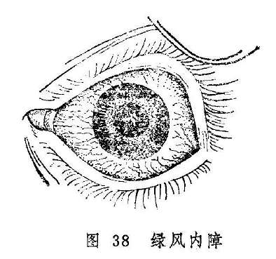

头眼胀痛，瞳神散大，视力下降，但瞳神仍为黑色者，称为黑风内障。

黑风内障与绿风内障同为急重之证，头眼胀痛，瞳神散大，视力下降，失治则神光绝灭。但绿风内障瞳神内色呈淡绿，黑风内障则色呈昏黑，是为不同。

绿风内障、黑风内障与前述瞳神紧小均有眼痛及抱轮红赤或白睛混赤，故当与瞳神紧小证相鉴别（表5）。

表5 绿风、黑风内障与瞳神紧小证的鉴别

| 疾病\鉴别要点\项目 | 绿风、黑风内障 | 瞳神紧小证 |
| --- | --- | --- |
| 视觉 | 视力骤降，伴目晕 | 视力减退，无目晕 |
| 疼痛 | 患侧头痛剧烈，眼珠胀痛欲脱 | 患眼坠痛，痛连眉骨、颞部 |
| 眵泪 | 一般较少 | 流泪 |
| 白睛 | 抱轮深红或白睛混赤 | 抱轮红赤 |
| 黑睛 | 水膜混浊如雾，黄仁展缩失灵 | 水膜一般透明，但内壁下分有白色点状附着物，甚者神水混浊，或伴黄液上冲 |
| 瞳神 | 散大，收缩失灵，瞳神内呈淡绿色或仍为黑色 | 紧小，开大失灵，常伴干缺，瞳内或黑或白 |
| 眼珠硬度 | 增高 | 正常或减低 |
| 呕恶 | 伴恶心呕吐 | 无 |

绿风内障与黑风内障的病因病机、治疗方法均无截然区别，故将二者合并讨论。

**〔病因病机〕**

1.素体肝旺，肝火亢极而生风，风火攻目。

2.情志过伤，肝失疏泄，气郁化火，上凌清窍。

3.脾湿生痰，痰郁化热生风，肝风痰火流窜经络，上扰清窍。

4.劳神过度，真阴暗耗，水不制火，虚火上炎，或肾脏虚劳，水不涵木，肝阳失制，亢而生风，风痰上扰。

5.肝胃虚寒，饮邪上逆。

以上阴阳偏盛，气机失常诸种原因，均可导致气血失和，经脉不利，目中玄府闭塞，神水瘀积，酿成本病。

**〔辨证论治〕**

（一）辨证要领

绿风内障可由青风内障发展而来，也可未患青风内障而突然发病。发病前，常在情志刺激，或劳神过度后，自觉眼珠微胀，同偏头额作痛，鼻根发痠，视灯火有目晕，视物昏矇，如隔云雾等，休息之后，诸症尚可缓解。

上述证候失治，即可急性发作，病势急暴，头痛如劈，眼珠胀痛欲脱，痛连目眶和鼻根，视力急骤下降，甚至仅辨明暗或完全失明。检查患眼，可见胞睑轻微红肿，白睛混赤，黑睛混浊如雾，瞳神散大，瞳内气色略呈淡绿或黄绿，触之眼珠坚硬，甚者如石，兼见恶心呕吐，或伴发热恶寒。此时及时救治，诸证可以缓解，视力尚能恢复。如果延误失治，眼珠胀硬不减，则瞳神可愈变愈黄，转为黄风内障而失明。

绿风内障常由一眼先患，后乃相牵俱损，也有两眼齐发者。经过治疗，亦可转入慢性阶段，诸证减轻，但遇情志不舒，或过度劳累等，又可急性发作。如此反复发作，瞳神愈散愈大，神光日渐衰微，终至完全丧失。

黑风内障的临床表现与绿风内障相类似，惟其发病之初，眼前时见黑花，瞳神散大，但色呈昏黑，久则失明，不辨三光。

绿风内障与黑风内障多属实证，主要由风、火、痰、郁上干目窍而致。气血郁滞则经脉不利，风、火、痰邪阻滞则玄府闭塞，珠内气血津液因之不行，神水瘀滞故而眼珠胀硬，脉络闭塞故头目剧痛。

绿风与黑风之发，肝脏功能失调最为要害。因前述上干之风、火，实为肝风、肝火；痰湿之邪，经肝经风火之煽，才能上攻目窍而致病；至于肾阴虚、肝阳亢而上扰，阳气虚、肝寒犯胃而饮邪上泛，也均与肝之阴阳失调有关，所以诊疗绿风内障、黑风内障，应抓住肝经这个关键。

（一）论治要点

绿风内障与黑风内障均属急重眼病。其急性发作者以“肝胆火炽，风火攻目”，“痰火动风，气火上逆”、“肝胃虚寒，阴浊上泛”引起者最为多见。此三种类型，均可见剧烈的头目疼痛和红赤，以及瞳神散大，恶心呕吐、头晕而昏等证。分辨三者的关键，在于全身兼证及舌脉的不同：肝胆火炽，挟风攻目者，常见口苦咽干，舌质红，苔薄黄，脉弦数等证；痰火动风，气火上逆常为久患头风所致，常兼身热面赤，动则眩晕，胸脘满闷，舌红苔黄腻，脉弦滑数等；肝胃虚寒，阴浊上泛者常兼痛及巅顶，干呕或呕吐涎沫，四肢不温，舌淡苔白，脉沉弦等证。

属于肝郁气滞，气火上逆导致的亦为常见，其发病多与情志不舒有关。但这里所指者多为发病较缓或急暴发作后转为慢性者。由于忿怒暴悖导致肝经郁火挟风上攻，引起急性发作者，因其证候剧烈，当属“肝胆火炽，风火攻目”型，治法当与肝郁气滞，气火上逆者不同。

“阳虚阳亢，风阳上扰”亦多为急性发作后的慢性期，常兼心烦失眠，眩晕耳鸣，口燥咽干，舌红少津，脉细数等虚热证象，不难分辨。

脾胃虚寒，阴浊上泛者，可为急性发作，也可见于慢性发作。凡兼痛连巅顶，神疲肢冷，食少便溏，舌淡苔白，脉沉弦者，不论证候缓急，均当辨为本证。

各型患者的证候并非一成不变。急性发作之后，仍因情志因素而反复发作，缠绵不愈者，即可辨为肝郁气滞型；久病阴伤，眼部症状较缓而兼阴津耗伤证候者，又属阴虚阳亢型；证情轻缓而又急性发作者，又可依临床表现的不同，辨为肝胆风火炽盛、痰火动风、肝胃虚寒而阴浊上犯诸型。

绿风内障、黑风内障均有瞳神散大之主证，瞳神不收则神光终将绝灭。故而及早点用缩瞳药亦为本病治疗的关键。

（三）常见证治

1.内治

（1）肝经风热上攻：

证候：发病急暴，头目剧痛，瞳神散大，抱轮红赤，兼见恶寒发热，或周身不适，呕吐恶心，舌苔薄黄，脉浮数或弦数。

治法：疏风清热，和血散瘀。

方例：清震汤〔203〕。

（2）肝胆火炽，挟风上扰：

证候：发病急剧，头痛如劈，眼珠胀痛欲脱，连及目眶，视力急降，抱轮红赤或白睛混赤，可伴白珠外膜浮壅胀起，甚或高于风轮，黑睛混浊如雾，瞳神散大，色呈淡绿，眼珠胀硬，甚者如石。全身或伴恶寒发热，恶心呕吐，口苦咽干，溲赤便结，舌红苔黄，脉弦数等。

治法：平肝、泻火，熄风。

方例：绿风羚羊饮〔224〕加减。

（3）痰火动风，上阻清窍：

证候：起病急骤、头眼剧痛诸症与肝胆火炽者同。常伴身热面赤，动辄眩晕，胸脘满闷，恶心呕吐，溲赤便结，舌红苔黄腻，脉弦滑数等。

治法：清热豁痰，平肝熄风。

方例：将军定痛丸〔159〕。

（4）肝郁气滞，气火上逆：

证候：眼部主证俱备，兼有情志不舒，胸闷胁胀，食少纳呆，呕吐泛恶，口苦，舌红苔黄，脉弦数等。

治法：清热疏肝，降逆和胃。

方例：丹栀逍遥散〔78〕合左金丸〔54〕。

（5）阴虚阳亢，风阳上扰：

证候：头目胀痛，瞳神散大，视物昏矇，视灯火有目晕，眼珠变硬，心烦失眠，眩晕耳鸣，口燥咽干，舌红少苔，或舌绛少津，脉弦细而数或细数。

治法：滋阴降火，平肝熄风。

方例：阿胶鸡子黄汤〔128〕。

（6）肝胃虚寒，阴浊上泛：

证候：除眼珠胀痛，瞳散视昏等眼部症状外，兼见头痛上及巅顶，干呕或呕吐涎沫，食少神疲，四肢不温，舌淡苔白，脉沉弦。

治法：温肝暖胃，降逆止痛。

方例：吴茱萸汤〔121〕。

（7）肝肾两亏，气虚邪恋：

证候：多见于绿风内障缓解之后，但仍反复发作者。因病久正伤，而见腰膝痠软，面热足冷，神情疲惫，舌淡苔白，脉象细弱等。

治法：培补肝肾，益气散邪。

方例：绿风还睛丸〔223〕。

2.外治

局部宜及早频用缩瞳剂。如用1〜2%毛果芸香碱液，重证每15〜30分钟滴眼一次。证情缓解后，可视病情改为1〜2小时一次，或每日2〜3次。

3.针刺疗法：参考青风内障、乌风内障。

（四）临证权变

绿风内障、黑风内障的临床表现十分复杂，前述证候类型只是举其大略，临证应当举一反三，灵活运用，灵活加减，才能收到较好的疗效。例如，属肝胆火炽与痰浊上泛相兼者，可用羚羊钩藤汤〔208〕平肝熄风，除湿化痰；证属阴虚阳亢、风阳上扰者，阿胶鸡子黄汤最适用于血虚生风、肝阳上亢者，如果眩晕耳鸣、腰膝酸软、遗精腰痛等证明显，属于肾经阴精不足而阴不潜阳，虚阳上扰者，则可用知柏地黄丸酌加石决明、钩藤以滋阴降火，平肝熄风。急性证候缓解，而呈慢性发作，久不痊愈者，亦可参照青风内障、乌风内障辨证论治。

**〔黄风内障〕**

神光绝灭，瞳神散大，气色混浊呈浑黄色的病证，称黄风内障。黄风内障在《秘传眼科龙木论》的“五风变内障”中已经提到，但未加阐述。《证治准绳》始对黄风内障的临床表现予以详述。本病是由绿风内障失治而成，为五风内障的后期阶段，多为肝风痰火上乘或肝经郁热上冲，瞳神被烁，神膏耗损所致，证见瞳神散大，甚则黄仁缩窄一周如线，金井内气色混浊不清，呈浑黄色，人物不辨，重则不辨三光，或仍兼有头目胀痛等症。

“高风雀目”后期瞳变金黄之色，《医宗金鉴》亦称之为“黄风内障”，但不属本节讨论的范围。彼则系睛珠色呈金黄，有夜盲史，病多发于幼年，无头目疼痛，亦无目赤、珠硬及瞳神散大等改变。此则风轮失去光泽，睛珠呈浑黄色，为神光将绝或已绝之候，药物难以奏效。

本病虽失明且治难奏效，但尚有目珠胀痛者，可参考绿风内障的处理方法，以图止痛之效。

**〔调护〕**

五风内障的病因比较复杂，目前尚难从根本上防止发病。一般应从早期诊断和早期治疗方面努力，避免导致失明的严重后果。对本病患者应采取以下措施：

（1）向病人做好解释安慰工作，解除思想顾虑，积极配合治疗。病人应心情舒畅，注意劳逸结合，生活宜有规律。

（2）久视则伤血。故宜少看电影、电视，以免耗伤阴血，神光被损。

（3）饮食宜清淡，忌辛辣肥甘，禁止烟酒。

（4）保持大便通，以免浊气上攻。

**〔应用例案〕**

例一：张XX，女，66岁，初诊于1962年2月14日。原由头风攻害，左目“黄风内障”，瞳神阔大，失明近年，惟右目近亦昏糊，眼前发花，疼痛痠楚，开张乏力，有时目晕如虹，虽瞳神未见变化，实为“青风”之象。口干舌燥，头痛昏胀，舌质红绛，脉细弦，此皆肾阴不足，水不涵木，肝阳偏亢，化风上窜巅顶，治当滋阴潜阳，镇肝熄风。鲜生地、麦冬、赤白芍、玉竹、炙鳖甲、炙龟板、生牡蛎、怀牛膝、钩藤、黄菊花、五味子。七剂（以后以原方增损连服一月）。

六诊：头目疼痛已除，左目视糊，目晕亦相应消失，口干尚见，舌红，脉虚。风邪先平，虚火还炽，当再予滋阴降火以防痰之复燃。沙参、麦冬、五味子、玉竹、石斛、白芍、炙鳖甲、炙龟板，七剂。服二月，体征消失。（《眼科证治经验》）

例二：刘XX，男，42岁，农民。1972年4月25日初诊：二目胀痛，头部剧痛10余天，曾在某医院诊断为“急性充血性青光眼”，经点服西药，效果不够明显，因惧怕手术治疗，愿服中药治之。检查视力，右眼0.2，左眼0.5。双眼白睛赤胀，青睛混浊，瞳神散大，色呈淡绿，按之目珠石硬（右目较重），此为绿风内障，治以羚羊角汤（羚羊角

0.6克，防风6克，知母、元参、茯苓、酒黄芩、车前子、夏枯草各9克，五味子3克），服药六剂。5月3日复诊：白睛淡赤，青睛微昏，瞳神已恢复如常，按之目珠稍硬，以上方去羚羊角、五味子，加酒白芍9克，酒生地12克服至5月14日，诸证皆除，视力，右眼1.0，左眼1.2，嘱其禁忌饮酒，服明目地黄丸3个月。（《张皆春眼科证治》）

**〔文献摘录〕**

《秘传眼科龙木论》：“青风内障：此眼初患之时，微有痛涩，头旋脑痛，或眼先见有花无花，瞳人不开不大，渐渐昏暗。或因劳倦，渐加昏重”。“乌风内障：此眼初患之时，不疼不痒，渐渐昏沉，如不患眼人相似。……经三五年，内昏气结，成翳如青白色，不辨人物，已后相牵俱损。”“绿风内障：此眼初患之时，头旋额角偏痛，连眼睑骨及鼻颊骨痛。眼内痛涩见花，或因呕吐恶心，或因呕逆后，便令一眼先患，然后相牵俱损。”“黑风内障：此眼初患之时，头旋额角偏痛，连眼睑骨及鼻颊骨时时亦痛，兼眼内痛涩，有黑花来往，先从一眼先患，以后相牵俱损。亦因肾脏虚劳，房事不节，因为黑风内障。”

《证治准绳》：“青风内障证，视瞳神内有气色昏朦，如青山笼淡烟也。然自视尚见，但比平时光华则昏朦日进。急宜治之，免变绿色，变绿色则病甚而光没矣。”“绿风内障证，瞳神气色浊而不清，其色如黄云之笼翠岫，似蓝靛之合藤黄，乃青风变重之证，久则变为黄风。”“黑风内障之证，与绿风候相似，但时时黑花起，乃肾受风邪，热攻于眼。”“黄风内障证，瞳神已大而色昏浊为黄也。病至此，十无一人可救者”。“乌风内障证，色昏浊晕滞气，如暮雨中之浓烟重雾”。

### 视瞻昏渺青盲

视瞻昏渺和青盲均属慢性眼病。前者拖延失治，可以发展为青盲。二者的共同特点是：外眼端好，不红不痛，唯视力有不同程度的减退。

视瞻昏渺在《诸病源候论》称“目茫茫候”，“目暗不明候”，《银海精微》称为“视物不真”，《证治准绳》始见“视瞻昏渺”之名，谓其特征是“目内外别无证候，但自视昏渺，矇眛不清也。”

早在《神农本草经》已有“青盲”之名，但对其证候未作详细描述。《诸病源候论》载有“目青盲候”，云其特征为“眼本无异，瞳子黑白分明，直不见物耳。”《龙树菩萨眼论》对青盲的记载更详：“若眼曾无发动痛痒及花生，或一眼前恶，亦无障翳，瞳人平正如不患者，端然渐暗，名曰青盲。”可知青盲是外眼端然，不痛不痒，视力渐降，终至失明的一种眼病。乌风内障也是不痛不痒视觉日渐模糊，早期瞳子端然的一种眼病，需注意鉴别（见五风内障节）。头目部外伤亦可因脉道瘀塞而神光日渐衰绝，终至完全失明，其有外伤史可询，属“触伤真气证”（见撞击伤目），不属本节讨论之范围。

视瞻昏渺的主证为视物矇眛不清，但无明显的眼前阴影及视大为小、视小为大、视直为曲等证。若有，则属视惑之范畴，不属本节讨论的范围。

视瞻昏渺和青盲的临床表现唯轻重有别，发病机制和治疗方法却难截然区分，故而合并讨论。

**〔病因病机〕**

1.肝肾不足，精血耗损，精气不能上荣，神光失养；或肾阳虚损，命门火衰，神光乏源；

2.心营亏虚神气虚耗，以致神光耗散；

3.脾气不足，精微不化，清阳不升，目失温养；或因运化不利，湿热痰浊内蕴，上犯清窍。

4.七情郁结，玄府闭阻，精气不升运于目；

5.气滞血瘀，脉道淤塞，神光被阻。

**〔辨证论治〕**

（一）辨证要领

视瞻昏渺与青盲均表现为外眼端好，且无痛痒，唯现神光衰微，视物不明。其视物昏矇，或自觉如隔纱视物者称视瞻昏渺。视力渐降，终至神光竭绝，不辨人物，甚或不分明暗者称为青盲。青盲的早期可先见视瞻昏渺；视瞻昏渺证情日重，则每可发展为青盲，但视瞻昏渺并非必然变为青盲。

古人认为，视瞻昏渺和青盲主要是由神劳、血少、元虚、精亏等原因所致。现代，据临床所见，此两种病证的病机多种多样，结合全身病证，虚证固多，而实证亦不鲜见，因而不可一味从虚论治。虚证常属肝肾不足，心营亏损，脾肾阳虚；实证多为肝气郁结，气血郁滞。此外，证属脾虚湿滞，气虚血瘀之类虚实错杂证亦不少见。所以，临床辨证务必分清虚实，治疗才不致犯虚虚实实之戒。因眼部证候唯有视力下降，所以分辨虚实之法，主要应从病史和全身脉证分析归纳。

（二）论治要点

本病虚证以肝肾不足者多，实证以肝气郁滞者常见。故而杞菊地黄丸，加减驻景丸、丹栀逍遥散为本病最常用之方药。

青盲证实为视瞻昏渺发展的结果，故对视瞻昏渺应积极予以治疗，免致青盲。青盲一旦形成，特别是光感全无者，治疗颇难，每为终身痼疾。故对本病治疗宜早。另外，本病既为慢性疾患，治疗则非短期内可收功，必须耐心服药，久久治之，方可收到较好的效果。

此两证的视力下降或失明，一为肝肾两亏、气血不足、脾气虚损，导致目中真精、真血不足，神光失养而衰微；一为气滞血瘀，痰浊阻滞目中玄府，神光被隔而不明。前者为虚，补之即可。后者为实，和之消之可愈。虚实相兼者。又当攻补兼施。

（三）常见证治

1.内治：

（1）肝肾不足：

证候：眼无外证，视物昏矇或失明，伴眼内干涩，头晕耳鸣，夜眠多梦，腰膝痠软，脉象细微。或兼形寒肢冷，夜间多尿，五更溏泻，脉象沉细无力等肾阳不足之证。

治法：补益肝肾。

方例：杞菊地黄丸〔126〕或加减驻景丸〔146〕。

（2）气血两亏：

证候：眼部主证之外，兼见面白无华，神疲乏力，头晕心悸，失眠健忘，舌淡脉细。

治法：益气养血。

方例：人参养荣汤〔11〕。

（3）脾气虚弱，清阳不升：

证候：眼部主证之外，兼见气弱懒言，肢软嗜卧，纳少便溏，脉象濡弱。

治法：补中益气，升举清阳。

方例：补中益气汤〔103〕或益气聪明汤〔183〕。

（4）湿浊上犯：

证候：自觉视物昏矇，或兼见黑花飞舞，或兼视定反动，视物颠倒，全身证见头重眩晕，胸膈满闷，胃纳欠佳，小便短少，舌苔黄腻，脉濡数；或兼腹满痰多，口苦而腻，舌苔黄腻，脉滑数等。

治法：利湿清热，祛痰化浊。

方例：三仁汤〔16〕或温胆汤〔232〕。前者适用于湿热偏重者；后者适用于痰热偏重者。

（5）七情郁结，玄府闭阻：

证候：缘郁怒忧思而发病，或除眼部主证外，兼见情志不舒，珠胀隐痛，口苦咽干，头晕胁痛，脉弦细数。

治法：疏肝解郁，理气和营。

方例：丹栀逍遥散〔78〕。

（6）气滞血瘀，脉道瘀塞：

证候：除眼部主证外，兼见头痛目胀，舌色瘀暗，脉弦或涩。

治法：行气活血，化瘀通络。

方例：血府逐瘀汤〔99〕。

2.针刺疗法

（1）体针：常用穴：睛明、球后、头临泣、太阳、风池、养老、翳明、合谷、肝俞、脾俞、肾俞、足三里、足光明、三阴交等。每次局部取1〜2穴，远端配用2穴，用补法，每日或隔日一次，10次为一疗程。久病阳虚者，远端穴位可用灸法，或针灸并用。

（2）头针：取视区（见总论第七章第二节），每日或兼日一次，10〜15次为一疗程，疗程之间休息3〜5日。

（四）临证权变

视瞻昏渺，青盲的病因病机和临床表现均较复杂，临证务需灵活变通。如肝肾不足者，除常用以上方药外，明目地黄丸〔145〕、知柏地黄丸〔148〕均可选用。前者适用于肝肾阴虚或兼气郁血滞者，后者适用于兼有虚火上炎者。若为肾阳不足，又当选用右归丸〔55〕、三仁五子丸

**〔15〕**等温肾益精。

属气血两亏者，八珍汤〔13〕、十全大补汤〔5〕均可选用。若心悸失眠明显，或兼梦多纷纭者，又以心营亏损为主，可选用归脾汤〔68〕或天王补心丹〔35〕加减。

证属肝气郁结者，在丹栀逍遥散的基础上，选加香附、郁金、川芎等开郁导滞药，疗效更佳。根据《韦文贵眼科临床经验选》介绍，丹栀逍遥散加白菊花、枸杞子以养肝肾，石菖蒲开窍以明目，治疗青盲证属于肝郁气滞型，或为温热病后，玄府郁闭者，效果良好。

另外，现代临床上经检眼镜检查，视衣若有水肿或渗出物较多者，则可在上述辨证论治的基础上，选加车前子、白茯苓、泽泻、苡米以利湿，胆星、半夏、大贝、白僵蚕以化痰散结，常可收到较好的效果。

**〔调护〕**

本病调护的重点，应在避免再伤精血，或加重脉络之瘀塞。故应做到：

（1）调情志，免气怒。

（2）忌酒浆及辛辣肥甘。

（3）勿久视和操劳熬夜，免伤气血。

（4）节房事，以免耗精。

#### 附：小儿青盲

小儿双目不痛不痒，亦无翳障，但视物不见之病证，称为“小儿青盲”。本病多因先天不足，肝肾阴虚，或胎受风邪，生后即目无神光；或因湿热病后，风热余邪稽留经络，肝气不疏，郁闭玄府，精血不能上荣；或湿热病后，肝肾阴血不足；或喂养失宜，脾胃虚损，清阳下陷，精气不能上承导致。多见外观端好，瞳神散大，视物不见，甚或不辨明暗，亦有伴见夜卧多惊，呕吐痰涎，肢体强直或瘫软，不会站立与行走，及四肢抽搐者。

治疗之法，属肝肾阴虚者，用杞菊地黄丸；脾胃虚弱者，选用补中益气汤、益气聪明汤等；此两种证型伴见目珠震颤或偏视者，可加白僵蚕、钩藤、白芍、鸡血藤等，兼下肢痿软、或坐立困难。或手不能握物者，选加丝瓜络、木瓜等。小儿青盲兼见双目上吊或偏视，伴身热神烦、夜卧多惊、呕吐痰涎。项强口噤者，证属肝经风热，治宜牛胆丸〔39〕阳或犀角饮子〔239〕；余热稽留，玄府郁滞者，则伴身有低热，烦躁不安，啼哭易怒，治宜清解疏利，可用丹栀逍遥散加白僵蚕、钩藤、全蝎等。

**〔应用例案〕**

（1）青盲案：

陈XX，男，14岁，初诊于1960年8月5日。痉后右眼失明，左眼亦昏，西医诊断为“两眼继发性视神经萎缩”。视力：右眼眼前指数，左眼

0.1。病系“青盲”，症情危笃。按痉之发，多感于六淫，邪郁化热，热极生风，病犯心肝，故而昏迷抽搐，并以二脏经脉连于目系，是以双目同病。前治，热退，身体恢复健康，惟目视仍失，是系热极伤阴，阴精不足，无以化气，无以生神，故而目暗不明。治当益气生脉。生脉散，七剂（以后连服二月）。

九诊：进方，目病大见好转，两眼视力增进，惟平日头晕较重，是肾虚之象。夫肾藏精，精化气，气化神，神全则目明，故治当兼补肾水。生脉六味汤（即生脉散合六味地黄汤），连服二月。

十八诊：时值严寒，手足见汗，是肾虚，阳胜其阴，当滋阴补肾。六味地黄汤，连服一月。

二十二诊：左目目光恢复，右目仍昏。视力：右眼0.1，左眼1.5。再守原法。生脉六味汤加杞子，三十剂。（《眼科证治经验》）。

（2）视瞻昏渺案

王XX，男，28岁，门诊号41616

左眼初期视神经萎缩，曾在XX医院治疗月余后，因效果不佳，而于1956年12月12日转中医门诊。

检查：视力右1.2，左0.2。此证系劳役伤脾土。脾为诸阴之首，后天之本，脾土受损，则五脏皆失所司，故不能运精归明于目。观其面色㿠白，脉象沉细而数、且微，此气血不足，故先给加味逍遥饮，以调整荣卫。继则给服补中益气汤，以补中气之不足，最后给服十全大补汤加减，以补气血。服药三月余，左眼视力已恢复正常1.0，半年后复查，双眼视力均为1.5（韦文贵：中医杂志11:757，1958）。

按：脏腑之精华皆禀受于脾而上贯于目。劳困过度、饥饱失节皆伤脾土，脾伤则气血不足而目视不明。本例面色㿠白，脉沉细而数，证属气血不足，目窍失养，故韦老用补中益气汤健脾益气，升发清阳以治之。在补益气血之前，先以逍遥散舒经开郁，调整荣卫，使玄府之郁滞通畅，气、血、精、液运行无阻，然后再益气健脾升阳，故而疗效满意。这是韦老应用健脾益气法的巧妙之处。

**〔文献摘录〕**

《证治准绳》：“视瞻昏渺，谓目内外别无证候，但自视昏渺，矇眛不清也。有神劳、有血少、有元气弱、有元精亏而昏渺者，致害不一。……凡人年在富强，而多丧真损元，竭视苦思，劳形纵味，久患头风，素多哭泣，妇女经产损血者，目内外别无证候，只是昏眊，月复月而年复年，非青盲则内障来矣。”

《眼科临症笔记》：“青盲难医，一般不知；人看无病，自觉昏迷；肝胆有亏，肾水不足；最怕年老气血衰，又嫌自幼精液失；欲保睛光不变，耐心治疗勿急。”

### 暴盲

暴盲是指眼外观端好，一眼或两眼骤然失明的严重病证。多因阴阳失调，气血乖乱，甚则脉络闭塞，气血阻滞而致。暴盲之名首见于《证治准绳》，该书谓：“平日素无他病，外不伤轮廓，内不损瞳神，倏然盲而不见也。”《抄本眼科》又名落气眼，并指出：“落气眼不害疾，忽然眼目黑暗，不能视见，白日如夜，此症乃是元气下陷，阴气上升”所致。

本病与青盲的区别在于，青盲是逐渐失明，本病则是突然表明。绿风内障亦能骤然失明，但其有头目剧痛、白睛混赤、黑睛混浊、瞳神散大而微呈淡绿等特征，与本病是不同的。外伤导致的目窍失明，当属触伤真气（见撞击伤目），不属本节讨论的范围。

**〔病因病机〕**

1.忿怒暴悖，肝气上逆，气血郁闭，脉络阻塞。

2.恣酒嗜辛，或过食肥甘，胃火蕴蒸，或湿热痰浊上攻，遮隔神光。

3.用心惘极，气机郁结而化火，使心火妄动，上攻目窍。或思虑太过，以致营血暗耗，心阴不足，虚火上炎。

4.色欲过度，肝肾阴亏，虚火上炎；或阴亏而阳亢动风，风火上旋。

5.脾肺气虚或脾肾阳虚，致水邪潴留，浊阴上犯，遮蔽神光。

以上原因，均可致目中真血运行失序，故而神光失用，遂发暴盲。

**〔辨证论治〕**

（一）辨证要领

本病发病前眼无不适，发病后亦多无痛痒，部分患者伴有额部隐痛及眼珠压痛，或有眼珠转动时牵痛，但均不甚剧。而视力却骤降，甚至失切。本病的诊断，当以视力突然下降至盲为标准。所谓盲，即由于各种原因导致的视力高度减退或丧失，难以单独料理日常生活，并失去需依赖视力的工作能力者。检查视力，则在0.05以下甚至无光感。所以，虽然视力骤然下降而视力高于0.05，特别是在0.1以上者，不可用暴盲相称，而应诊为“视瞻昏渺”、“视瞻有色”等。

因本病发病急暴，故而多为实证。即使兼有虚证，亦属虚中挟实。《证治准绳》曾谓其“病致有三，曰阳寡、曰阴孤、曰神离，乃痞塞关格之病。”阳寡者，阳独盛也，热痰风火上攻，神光被阻，故明丧；阴孤者，阴独盛也，浊阴上逆，神光被格故失明；神离者，神光离阴精而外散也，伤于神而阴精耗伤，神光失养而外越，或虚火上扰，玄府被阻，神光失养而离散。现代临床，亦可用此三者为纲，辨明患者是阳盛（如肝火、胃热、痰火、心火）、阴盛（如水湿阴浊上犯）或是阴虚火旺（如心阴不足和肝肾阴亏导致的虚火上炎），则病因病机清楚，立法处方有据，故而可望收到较好的疗效。暴肓证除突然失明外，眼之外观端好，审求病因病机主要应根据患者体质、发病诱因和全身证候之不同。具体辨证方法可依下述。

（二）论治要点

暴盲的发病，以“肝郁火逆，气血阻滞”、“胃热蕴蒸，痰火上

攻”、“心火亢盛，气血逆乱”及“水湿内停，浊阴上犯”等属于实证者居多。所以，祛邪乃为治疗本病的关键。“水湿内停，浊阴上犯”虽常为脾气虚或肾阳虚导致水液不化，积而上犯，但据“急则治其标”的原则，治疗仍当祛邪为主，扶正为辅。

气血瘀阻型，可见于突然失明者，也可见于失明日久，脉络闭塞而形成瘀滞者。辨别的要领，眼部可有胀痛不舒，舌质可见暗红或紫斑，脉象则现弦或细涩。治之之法，当于活血药中配加理气及益气之品，才能收到良好的效果。另据前人经验，缘死血留滞，污浊之气蔽塞玄府关窍以致暴盲者，可用人参苏木汤（西洋参12克苏木45克）急治之。方中西洋参亦可酌情改用人参，体实者又可改为泡沙参。还可将此方加入加味四物汤，以增行血之效。

虚火亦可导致暴盲，但较少见。临床上属于阴虚火旺者，多为暴盲后日久，病情由实转虚者。治之应分清虚火发自心经或肾经，分别釆用相应的治法。

本病必须及早医治，拖延日久，常有难以复明之虞。如《证治准绳》谓：“其证最速而异，急治可复，缓则气定而无用矣。”

（三）常见证治

1.内治：

（1）肝郁火逆，气血阻滞：

证候：多因情志不舒或暴怒伤肝所致。可兼见头痛目涩，情缩紧张，胸闷胁痛，口苦咽干，舌红苔黄，脉象弦数等。

治法：疏肝解郁，清热明目。

方例：加味逍遥饮〔78〕。

（2）胃热蕴蒸，痰火上攻：

证候：多因纵味、纵饮所致。证见骤然失阴，且兼头痛目胀，烦躁口渴，溲赤便结，舌红苔黄或黄腻、脉象数实。

治法：清胃泻火，化痰降逆。

方例：柴胡白虎汤〔190〕。

（3）心火亢盛，气血逆乱：

证候：骤然失明，兼见心烦失眠，口舌生疮，小便赤痛，舌红脉数等证。

治法：清心泻火。

方例：泻心汤〔131〕合犀角地黄汤〔240〕。

（4）心营亏损，神光失养：

证候：多因思虑太过，或竭视劳瞻，真血耗伤而致。证见骤然失明，且兼心悸失眠，梦多纷纭，面白神疲，舌淡脉虚等证。

治法：养血补心。

方例：归脾汤〔68〕或柴胡参术汤〔191〕。

（5）肝肾阴亏，虚火上炎：

证候：骤然失明，兼见唇红颧赤，咽干唇燥，腰痠腿软，五心烦热，男子或兼梦遗，舌红苔少，脉细数。

治法：滋阴降火。

方例：知柏地黄丸〔148〕。

（6）水湿内停，浊阴上犯：

证候：神光被遮而骤然失明，兼头重体倦，胸闷痰多，舌苔滑腻，脉滑数或细弱等。临证遇此又当分别脏腑以论治：

证属脾虚失运，水湿内停而上泛者，多兼气短懒言，四肢乏力，饮食不消，大便稀澹，舌质淡嫩，苔白滑腻，脉象濡弱等。

治法：健脾运湿。

方例：参苓白术散〔150〕。

证属湿热蕴脾，浊气上泛者，多兼胸闷泛恶，小便短赤，舌质红，苔黄腻，脉滑数等证。

治法：清热利湿。

方例：猪苓散〔226〕。

证属肾阳虚衰，水湿不化，蓄而上逆者，可兼见体倦乏力，头沉眩晕，形寒肢冷，腰膝痠软，溺清便溏，或夜尿频数，舌淡苔薄白而腻，脉弱。

治法：温阳利水。

方例：真武汤〔186〕。

（7）气血瘀阻：

证候：骤然失明、或暴盲日久，证属死血作滞，神光被阻者，兼见头晕头痛，眼或作胀，或目珠压痛，或眼珠转动则痛，舌质暗红或有瘀斑，脉弦或涩。

治法：活血通窍。

方药：加味四物汤〔76〕。必要时亦可加麝香冲服，以助开窍之力。

2.针刺疗法：常用穴：睛明、攒竹、球后、承泣、瞳子髎、太阴、风池、太阳、丝竹空、翳风、翳明、合谷、外关、养老、光明、足三里、三阴交、太冲、肝俞、肾俞。每次眼周取2穴，远端取2穴，每日一次，或视病情而定。

（四）临证权变

本病的病因病机甚为复杂，宜详细辨证而灵活变通。如属七情郁结、忿怒伤肝所致者，若患者情志不乐，胸闷胁痛，悲观失望者，应加郁金、青皮、香附于加味逍遥饮中，以增疏肝解郁之功。若伴有头痛目涩，情绪紧张，烦躁不安，多言善怒，脉弦数有力，则可将加味逍遥饮〔78〕和生铁落饮〔71〕配合应用，以平肝镇心，清热安神。

胃热蕴蒸，痰火上攻所致的暴盲，若胃肠积热过甚，大便干结明显者，可换用通脾泻胃汤〔196〕泻热通腑。待火邪减轻之后，再辨证而改别的治法。

若系发于高热病后，属余热滞留经络者，可在加味逍遥饮的基础上加女贞子、枸杞子、石菖蒲、白薇等；兼见阴液耗伤者，再酌加沙参、麦冬、天花粉。

证属心营亏损，若兼情志不遂，肝气怫郁之证者，可将归脾汤换用柴胡参术汤，在补气养血的基础上佐以疏肝理气，则更为合拍；知柏地黄丸适用于阴虚火旺者，但患者若兼烦躁易怒，头晕失眠，脉弦或弦细等，则为肾精不足，阴不潜阳，肝阳上亢之证，当加石决明、龙骨、牡蛎、龟板、鳖甲等育阴潜阳。

不论是何证型，若又兼头沉胸闷、食减痰多证候者，均可加胆南星、白附子、贝母祛痰通络。

上述各证迁延失治，或日久不愈转为虚证者，可参考青盲辨证论治。

现代临床，亦可在前述辨证论治的基础上，根据眼底检查（检查法见附篇七）所见，进行如下加减：

1.暴盲属于新鲜的眼底出血者，加黑蒲黄、白茅根、藕节炭、仙鹤草、茜草根、田三七等以助止血；出血已止者，可加活血化瘀，或与血府逐瘀汤相参应用。

2.暴盲属于视网膜中央动脉栓塞者，可将前述辨证治疗之方药与通窍活血汤合用，或在前述方药的基础上选加苏木、桃仁、丹参、泽兰等活血通络。

3.暴盲属于视网膜脱离者最为难治，因脱离部位的视网膜下有津液结聚，故可视为水邪隔阻清窍，在前述辨证论治的基础上，选加利水化湿之药试治之。

**〔应用例案〕**

例一：丹溪治一老人，病目暴不见物，他无所苦，起坐、饮食如故。此大虚证也，急煎人参膏二斤，服二日，目方见。一医与青礞石药，朱曰：今夜死矣。不悟此病得之气大虚，不救其虚而反用礞石，不出此夜必死。果至夜半死。

例二：男子四十余岁，形实，平生好饮热酒，忽目盲脉涩。此因热酒所伤胃气，污浊之死血在其中而然也。遂以苏木作汤，调人参膏饮之，服二日，鼻内、两手掌皆紫黑，丹溪曰：此病退矣，滞血行矣。以四物汤加苏木、红花、桃仁、陈皮煎，调人参末服数日而愈。（录自《证治准绳》）

例三：濮县李XX，男。秉性刚强，因一事不平，夜间失眠，天明方起，睁眼如墨，自知目病。一九五九年偕其弟来我院诊治。

诊断：视其目，皂白分明，而神光灼灼，与他目相同。按其脉，寸关滑数，两尺沉细。此乃痰火结胸，不能升清降浊，阴阳混乱，关格不通，以致视力突然消失。

处方：先刺光明、上星、人中；嘱服加味铁落饮（石膏、生地、龙齿、银花、葛花、牡蛎、川连、防风、白云苓、玄参、秦艽、铁落、甘草、竹沥），连服数剂，始分皂白，只觉眼前有黑花一块。再服磁朱丸，每服二钱半，一日二次，月余而黑花尽退。（路际平《眼科临症笔记》）

**〔文献摘录〕**

《眼科临症笔记》：“暴盲是一急症、奇症，也是险症。病因甚繁，多属血瘀气滞而致，非他症所能比。《遥函》曰：‘其故有三，曰阴孤，曰阳寡，曰神离。'名虽异，其症则一。阴孤者血盛将绝，阳寡者气盛将脱，神离者阴阳不和将要分离。总之，孤阴不生，独阳不长之义。大概因素，嗜辛辣、膏梁厚味，内蕴燥热，痰火相结，以致阴阳乖乱，血气壅塞，而神光忽暗者最多。若不急治，待致气滞血凝，恐有丧明之患。”

《张皆春眼科证治•暴盲按语》：“人赖精气神而生，目赖精气神而明。然三者是不可分割的整体，精为神之宅，有精则有神，积精可全神，精伤神无所舍，必然失守。精为气之母，精虚则无气。人无精气神则死，目无精气神则盲。精者阴也，气者阳也。故言目之暴盲为阴孤、阳寡、神离之故。”

### 如银内障

五风变内障冰翳内障

本病是指黑睛混浊，渐成翳障，遮蔽神光，其初视力渐降，终至不辨人物的一种慢性眼病。因其瞳神内色白如银，故称如银内障。

早在《龙树菩萨眼论》就有关于本病的记载，彼则简称“内障”，如云“眼不痛不痒，端然渐渐不明，遂即失明，眼形不移，唯瞳仁里有隐隐青白色，虽不辨人物，犹见三光者，名曰内障。”《外台秘要》则移本病为“脑流青盲眼”，《秘传眼科龙木论》又将本病分为十余种，对其形态的观察十分细致。《证治准绳》始有如银内障之名，其曰：“如银内障证，瞳神中白色如银也。轻则一点白亮，如星似片，重则瞳神皆雪白而圆亮。圆亮者，一名圆翳内障。有仰月、偃月变重为圆者；有一点从中起，视渐昏，而渐渐变大不见者。……年未过六十及过六十而血气未衰者，拨治之皆有复明之理。”可见，如银内障颇类现代所谓老年性白内障，其发病过程颇不一致，可分別先从睛珠的中部、上部、下部、前部、后部、周边部出现白色混浊，然后渐致整个瞳神白而圆亮。白而圆亮者称为圆翳内障，其余则可依其神色形态之不同，分别称作偃月翳、仰月翳、枣花翳、滑翳、涩翳、横翳、散翳、浮翳、沉翳、白翳黄心等（见表6）。名称虽多，其实均为如银内障发病过程中的不同阶段或形态，今故合并讨论。

如银内障初患之时，眼前多见蝇飞花发，或见薄烟轻雾，此则当与云雾移睛证相鉴别（见“云雾移睛”）。

表6 如银内障分类鉴别表（供参考）

| 圆翳内障 | 瞳神内有翳白而白亮，宛如油滴浮于水面，阳看则小，阴看则大 |
| --- | --- |
| 偃月翳内障 | 瞳神内上部有白气一片，隐似新月覆垂向下，上厚下薄 |
| 仰月翳内障 | 瞳神内下部有白气一片，隐似新月，渐渐向上，下厚上薄 |
| 枣花翳内障 | 瞳神内有一周白翳，如枣花锯齿 |
| 白翳黄心内障 | 瞳神内有翳，外周白色，中心微黄 |
| 横翳内障（剑脊翳） | 有翳横于瞳内，形如剑脊，中高边薄，色白如银 |
| 散翳内障 | 瞳神内有翳，散如鳞点，乍青乍白 |
| 浮翳内障 | 瞳神内有翳，白如银针色，十分表浅，暗看大，明看小 |
| 沉翳内障 | 白点隐隐，深藏瞳神之内，向日细看，方见其白 |
| 滑翳内障（包浆翳） | 瞳神内有翳如水银珠子状，微含黄色 |
| 涩翳内障 | 翳如凝脂，色微赤，或聚或散而无定形 |
| 黑水凝翳 | 瞳神微散，翳色微现青白 |

**〔病因病机〕**

本病多因年高体弱，气血渐衰，精气日损，目失涵养；或因脾虚，则五脏之精气皆失所司，不能归明于目；或因房事不节，伐伤过度，肝肾两亏所致，或因阴精衰弱，七情内伤，阴虚不能配阳，虚火上乘所致；或因肝郁气滞，郁久化火，及劳心竭思，心火内盛，心肝火炎，蒸灼睛珠而生。

**〔辨证论治〕**

（一）辨证要领

本病初起，眼无红肿疼痛，仅自觉眼前有点状、片状或条状之固定黑影，随眼珠之转动而移动，似蚊蝇飞舞，或如蜘蛛倒挂，目力缓慢下降，如在烟雾中看物。发病过程中，常因睛珠混浊部位之不同，出现白天（或明处）视昏。夜晚（或暗处）视清；或白天（或明处）视清，夜间（或暗处）视昏，经历年久，渐至失明。双目可同时起病，亦可先后发生。此证除视物昏矇外，无任何头疼眼痛及痒涩，眼外轮廓亦与常人相似，唯见瞳神内隐隐淡白，或浮浅而如油滴浮于水面；或深沉而位于金井深处，不仔细观察则难以发现；或边缘形如枣花锯齿〔图39（1）〕；或如新月弯弯，位于瞳神之一侧；或中厚边薄横于瞳神中央。形形色色，不一而足。当金井内翳障发展成一片青白色，目力已降至不辨人物时，对日、月、火"三光”都仍能感觉，瞳神依然圆整，阴阳开合，展缩如常。有时在发病过程中，由于睛珠混浊相间不匀，偶可出现视一为二。故《原机启微》谓：“其病初起时，视觉微昏，常见空中有黑花，……次则视歧，睹一成二，神水淡白

色……。”

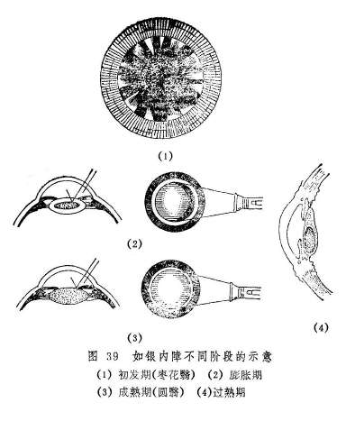

如银内障的气色形态虽然多样，但相互之间在发病机制上并无明显不同。所以辨析本病的病机时，主要应依据全身脉证予以辨证。在发病之早期，用内服药物治疗常可提高视力，亦可制止睛珠混浊的进一步发展。若睛珠色呈灰白，已明显障遮瞳神，则药物难以奏效，宜待翳定障老之后，施以手术。

（二）论治要点

如银内障积久年深，瞳神内一片混白时，服药针刺均难奏效。所以用药物内服治疗本病，务须早期进行。因本病多见于老年人，故以肝肾不足和脾虚气虚者最为多见。临床上，滋补肝肾，建脾益气之法则是常用的治疗大法。至于肝肾阴亏又致肝阳上亢者，又当选用育阴潜阳之法。属于肝热上扰者较少见，临证遇之可用前述相应方药论治。

手术疗法是本病十分重要的治疗方法，对圆翳内障已成者，用之有满意的效果。

（三）常见征治

1.内治：

（1）肝肾两亏：

证候：眼前有点、片、条状隐影飘浮，视物昏花，或伴头晕，耳鸣耳聋，腰痠足软，舌质红，少苔，脉细。

治法：滋补肝肾。

方例：杞菊地黄丸〔126〕或明目地黄丸〔145〕。若兼面白肢冷，神疲体乏，溺清便溏，舌质淡脉沉弱等肾阳不足证候者，又当用金匮肾气丸

**〔149〕**、右归丸〔55〕、三仁五子丸〔15〕温补肾阳。

（2）脾虚气弱：

证候：视物昏花，精神倦怠，肢体乏力，面色萎黄，食少便溏，舌淡苔白，脉缓或细弱。

治法：补脾益气。

方例：补中益气丸〔103〕或益气聪明汤〔183〕。

（3）肝热上扰：

证候：头痛目涩，眵泪眊臊，口苦咽干，脉弦。

治法：清热平肝。

方例：石决明散〔48〕。

（4）阴虚阳亢：

证候：头晕耳鸣，腰膝酸软无力。眼干涩昏花，烦躁不眠，唇红颧赤，津少口干，口苦舌红，脉弦。

治法：滋阴降火，育阴潜阳。

方例：七宝丸〔8〕。

2.针刺疗法：适用于早期患看，当与内服药配合使用。常用穴：风池、睛明、球后、攒竹、承泣、鱼腰、瞳子髎、丝竹空、临泣、肝俞、脾俞、合谷、足三里、三阴交等。每日或隔日一次，每次2〜3穴，8〜10次为一疗程。

3.手术疗法：睛珠全混，翳定障老，瞳神展缩如常，光定位及色觉良好者，可用金针拨障术治疗。判断如银内障是否成熟，可用电筒侧照法检查。在其膨胀期，可见黄仁之阴影呈新月形投射于晶珠表面〔图39（2）〕，成熟期则黄仁之阴影消失〔图33（3）〕，即为翳定障老，正宜手术拨治。过期日久则晶珠缩小，翳如冰棱下沉〔图39

（4）〕，拨之不易（如银内障针拨术见后）。

（四）临证权变

前述如银内障的四个证候类型，不过举其大略，实际上本病的临床表现十分复杂，需注意灵活变通。

如银内障证属阴血不足，且伴咳嗽痰喘等肺经证候者，可用加味二陈四物汤〔76〕养血化痰；证属肝肾精血两亏，且兼心肝火旺者，可用石斛夜光丸〔45〕滋补肝肾，清心平肝；若素体阴虚，兼挟湿热上扰，证见眼部干涩，烦热口臭，大便不畅，舌苔黄腻等，可用甘露饮〔46〕清热祛湿，兼以养阴。

另外，磁朱丸〔246〕功能补肾水，镇心火，是治疗如银内障的常用成药。本病若属肝肾阴亏，水火未济者，均可参用磁朱丸以治之。

本病属慢性眼疾，服药需积年累月，才能收效。故而前述各方，均可改汤为丸，以缓图之。

**〔调护〕**

1.虚证者，当勿过劳，节房事，以保精气。

2.属肝火或兼湿者，当忌辛辣，戒烟酒，节肥甘，以免加重病情。

3.术后调护参阅“如银内障针拨术”有关内容。

**〔应用例案〕**

例一：湖北常XX，男。夜间看书手捂左眼，昏如隔罗，甚以为扰。先到当地医院治疗，经医生检查，确诊为白内障，无法治疗，待成熟时，才能手术。常不欲坐以待瞽，到处治疗，终无效果。一九六三年来我院治疗。

诊断：视其目，右目略带白色，视力表上0.1之大字模糊可见；按其脉，寸尺虚大，惟关部略带沉涩。此乃心肾两亏，中焦郁结，不能升清气于脑，脑脂徐徐下垂，而内障即成。

处方：先将光明、临泣略刺；再服疏肝明目汤（当归、生地、川芎、白芍、茺蔚子、菟丝子、蒺藜、决明子、香附、夜明砂、川黄连、夏枯草、甘草），二十剂，视力稍有增加；此是一种慢性病，常服固睛丸（大黄芪、大熟地、大丽参、白术、远志、蒺藜、柏子仁、知母肉、覆盆子、菟丝子、枣仁、磁石、车前子、甘草）即可。后同乡者来诊，说起患者之目，视力仍然是0.3，至今无变。（路际平《眼科临症笔记》）。

例二：汤XX，男，40岁，初诊于1955年5月4日。脘腹胀痛，吐衄便血，下利，迄今三年，因而气血大伤，不能上荣于目，目之黄精混浊，内障形成。左目障已成熟，目视消失，但尚辨三光，还可用金针拨除而复明。右目视力0.5，内障亦起。二脉沉细而迟，舌质娇嫩，色淡白而润。症由脾胃受伤，阳气衰微。盖上下失血，阴阳二络皆伤，腑络取之于胃，脏络责之于脾，脾胃不振，升降运化失职，所以脘痛胀闷，久泄不愈，并以水谷入脾，化为气血，在身为津液，升于目即为神膏神水，神水滋养黄精，黄精得其所滋而睛明，失其所滋则昏而混浊，此内障所由生也。当温中健胃，升阳益气以归明于目。附子理中汤加茯苓、山药，七剂（以后又连服半月）。

四诊：目病未见好转，但脘痛减轻，心胸舒畅，大便仍溏泄，得食即泄，小便亦少，还予温中，佐以利水。苓理汤（党参、炒白术、茯苓、泽泻、猪苓、桂枝、炙甘草、干姜）七剂（以后又服半月）。

七诊：脘痛已愈，大便亦成条，目视略好转。惟原有气喘，近日复发，发则牵引少腹，恶寒肢冷，此非独脾虚，肾气亦亏。盖肾为封藏之本，精气不能固藏于下，故而冲逆向上，治引火归元，纳气归肾。真武汤，另吞金匮肾气丸，七剂（以后又连服半月）。

十诊：诸恙悉除，精神充沛，视目之瞳神皎洁，黄精混浊减退，目视恢复正常，检查视力已达1.5。济生肾气汤加葫芦巴，二十剂。（姚和清《眼科证治经验》）。

#### 附一：如银内障针拨术

如银内障针拨术是在古代“金针拨内障”的基础上改良的一种手术方法，适应证为老年人患如银内障已熟或接近成熟者（即已发展为圆翳）。本法具有痛苦少，术后不须卧床和器械简单，操作简便等优点。老年多病患者尤宜这种手术方法。现介绍操作方法如下：

术前准备：术前数天患眼点消炎眼药水，冲洗泪道。术前2小时滴1%阿托品液或1〜2.5%新福林液散瞳，直至瞳孔充分散大（8毫米以上）。术眼按常规消毒，眼垫包封。进手术室后再冲洗及消毒皮肤，作表面麻醉。

手术器械：持针器、小蚊式止血钳、固定镊、双面刮胡须刀片（用时掰成三角形，刀锋长约7〜8毫米，底边宽约4〜5毫米）、拨障针、开睑器。

手术操作方法：以右眼为例，患者取平卧或半卧位，铺手术巾，作球后麻醉，放置开睑器（盲端在鼻侧）。术者右手持固定钱夹持风轮边缘6点处的白珠外膜，并牵拉眼球转向鼻上方，左手持止血钳夹紧掰成三角型的刀片，在距风轮边缘8〜9点钟的外侧4毫米处，与眼珠表面垂直，刀锋向外，作一垂直于风轮边缘，长约3毫米的切口〔图40

（1）〕（切口要穿透眼珠外壳的全层）。

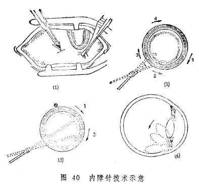

用拨障针从切口垂直穿入眼珠内3毫米深，再将针体转至与眼珠外壳接近平行，缓慢将针由黄仁后、晶珠前向瞳神正中推进，使针达晶珠前面。然后用拨障针按外下、外上、内上、内下等方向的顺序，将晶珠相应部位的韧带直接拉断，并问后方轻压〔图40（2）〕。继而以拨障针头弯曲部抱着晶珠对侧边际（右眼4点，左眼8点处）〔图40（3）〕拉压向颞下方，使之紧贴于眼珠外壳之内壁〔图40（4）〕。稍候片刻，徐徐起针至瞳神部位。如晶珠不再浮起，方可抽出拨障针。用小棉签轻轻揉按针口，使白珠外膜切口与白睛里层切口错位，达到用白珠外膜遮盖里层切口的目的。术后涂抗生素眼药膏及散瞳剂，术眼盖眼垫包封。

针拨术后处理：术后取头部稍高位平卧，或于第一、二天取30〜40度之半卧位。普食。大小便等日常生活均可自理。每天换药一次，4〜5天后解除眼垫。瞳神在未缩小到正常以前，不宜低头，以免神膏脱出黄仁之前。术后2个月可验光配镜。

#### 附二：胎患内障

患儿生后，即见晶珠的部分或全部呈现白色翳障而遮蔽神光者，称为胎患内障。其发生常因乳母于孕时过食辛辣或甘腻煎炙，或劳逸失度，寒热不节，脏腑不和，气血乖违，内伤外感而累及胎儿，或孕母病后又不知禁忌，乱投诸毒丹药，致蕴热积毒在腹，患及胎目，而发本病。

胎患内障得之胎期，多为双眼发病，睛珠混浊之部位不一，形状多样，证候之进展各异。重者瞳神色白，生后即可发现；轻者翳小而色淡，生后未觉，及至稍大，视物不清，父母始觉；也有内障渐重，及至十余岁，双目视物不明，瞳内隐隐作青白色，遮蔽神光，重则不辨人物，但能分清三光。生后喂养不当，体质虚弱者，每易加速本病发展。

本病的治疗多从脾肾着手。若脾胃虚损，身体羸弱者，宜健脾益气，用参苓白术散〔150〕加减；若肾阴不足，宜用杞菊地黄丸〔126〕滋补肝肾；若脾肾阳虚，宜用四君子汤〔61〕合金匮肾气丸〔149〕健脾固肾，或用右归丸〔55〕温补肾阳。若生后瞳神已有青白色翳障，盖满瞳神，或到十四、五岁时内障加重，仅能辨明人物影动者，方药难于奏效，可考虑及早手术治疗。

#### 附三：惊震内障

头部被物击伤，或眼珠被锐器刺伤，损及晴珠而变混浊者，称为惊震内障。

惊震内障的证情表现有三：一为锐器或金石碎屑，穿破黑睛或白睛，直接伤及睛珠，不仅睛珠破碎，一二日之内，可见瞳神部全是白色膏脂，悬浮于神水之中，且多伴受伤时神水及神膏外流、黄仁绽出等险证；二为睛珠被震击后数日之内即见点片状混浊，并迅速发展而全部变白，障满瞳神；三是受伤后睛珠部分混浊，发展缓慢，后经二、三年始变为乳白色之内障。

受伤初期，当参考“撞击伤目”或“真睛破损”辨证论治，以免形成内障之虞。惊震内障初起而视尚见者，可急用石决明散〔48〕加除风益损汤〔170〕治疗。内障遮满瞳神者，服药一般无效。对光感色觉良好者，半年后可行手术治疗。

#### 附四：五风变内障

指目患乌、绿、青、黑、黄等五风内障之后，久而未愈，睛珠受邪而混浊，日渐演变而成的白色内障。如《秘传眼科龙木论•五风变内障》曰：乌绿青风及黑黄，堪嗟宿世有灾殃，瞳人颜色如明月，问睹三光不见光，后有脑脂如结白，真如内障色如霜。”

本病为五风内障所引起，关键在于对五风内障作早期治疗。若至晚期，不见三光，其白色内障形成之后，治亦罔效，亦不可施以针拨治疗，如《秘传眼科龙木论》所说：“医人不识将针拨，翳落非明目却伤。”

#### 附五：冰翳内障

瞳神紧小或瞳神干缺病的后期，睛珠受邪而混浊，瞳神变为白色，且黄仁与晴珠粘着，阳看不能缩小，阴看不能扩大，犹如冰冻而坚者，称为冰翳内障。据《秘传眼科龙木论》记载，“此眼初患之时，头旋，额角偏痛，眼睑骨疼痛，眼内赤涩，有花或黑或白或红”。后则形成冰翳。瞳子白而透表，如水炼坚，“阴中阳里一般般”。

冰翳内障初发而色白不甚者，可急用还睛丸〔118〕治疗，以图制止发展。全井内一旦明显变白，药物内服一般无效。对光感及色觉良好、且黄仁与睛珠粘着较少者，可用针试拨。拨之能下者，再志心服药。尚能保持较好的视力。如果拨之不下，或已无光感及色觉者，拨亦无益。如《秘传眼科龙木论》云：“来往用针三五拨，志心服药必能痊；若遇庸医强拨下，瞳人清净不能观。”

**〔文献摘录〕**

《目经大成•内障》：“此症盖目无病失明，全井之中有翳障于瞳神之上，曰内障。……初起目昏，次视惑，次妄见，甚乃成翳色白，或微黄，或粉青，状如星、如枣花、如半月、如剑脊、如水银之走、如膏脂之凝、如油之滴水中、如水之冻杯内，名曰圆、曰横、曰滑、曰涩、曰浮、曰沉、曰破散、曰浓厚，先生一目，向后俱有。……今专究其针治如后。目不赤痛，左右并无头风，瞳子不欹不侧，阳看能小，阴看能大，年未过六十而矍铄知昼夜、见影动，皆可针拨，反此者不能。即不反此，其翳黄如橙、红如珠、清如水晶、昏如羊眼、绿如猫睛，皆不可针。”

### 视惑证

眼外观端好，而视物变形或颠倒紊乱的病证，称为视惑。本病名见于《目经大成》，实则为视瞻有色、视一为二、视大为小、视小为大、视直为曲、视正反斜、视定若动、视物颠倒等病证的总称。这些病证，古代医籍均载为独立病名，但据临床所见，它们虽可单独出现，却以二证或多证相间及先后渐次发生者居多，而且其病因病机亦难界限清楚，故合并讨论。

视瞻有色症：眼外观端好，唯自视眼前有带色之片状阴影遮挡神光者，称为视瞻有色。见于《证治准绳》。其眼前之片状阴影可为青绿蓝碧或黄赤黑白等色，可出现在眼的正前方，也可出现在上、下、左、右某一方位。本证当与视物易色、莹星满目、云雾移睛相鉴别。视物易色乃指对物体颜色的感觉发生变易的病证；莹星满目是自视眼前有无数细小星点，如萤火飞舞撩乱者；云雾移睛所见之色影飘移不定，均与本证不同。

视瞻有色常可变生视大为小、视小为大、视直为曲、视正反斜等证，也可与诸证并见。拖延失治，亦有导致暴盲者，如《证治准绳》云：“若视有大黑片者，肾之元气大伤，胆乏所养，不久盲矣。”

视一为二症：指一眼或双眼视一物为二形的病证。此病名见于《证治准绳》，《灵枢•大惑论》称为“视歧”，《诸病源候论》又称“视一为两候”。其特点是目珠端好，外观如常，唯自觉视一物为两物，视日、月若有两个。本证可在双眼俱睁时发生，若用手遮患眼，则症状可消；亦有遮盖健眼后，患眼单眼视一为二者。患者常伴视物不真，或有头晕欲吐，心情焦虑等证。

侧目斜视证亦可出现视一为二的症状，乃因两目神光不能相聚而然。然其眼珠偏斜，或兼运转不灵，另有专篇论述，不属本节讨论的范围。

视小为大症視大为小症：指眼的外观端好，自视物体小者似大，或大者似小，失却本来面目的病证。《审视瑶函•前贤医案》中，右“以小为大，以大为小”之记载。《素问•脉要精微论》中所谓“视长为短”，亦属本病之范畴。

视正为斜视直为曲症：眼之外观端好，但视物歪邪之病证称为视正反斜，视直物为弯曲之状的病证称为视直为曲。两病症均见于《证治准绳》。

视定若动症：眼外观如常，视静止不动之物，似有振动之感的病症，称为视定若动。见于《目经大成•视惑》，《证治准绳》中称为视定反动，谓：“物本定而目见为动也，乃气分火邪之害，水不能救之，故上旋眩晕，振掉不定，光华欲坠，久则地面亦觉振动而不定，内障成矣。”

视物颠倒症：眼外观如常，所见物体呈旋转倒置之状的病症，称为视物颠倒。见于《证治准绳》，谓：“目视物皆振动而倒置也，譬之环舞后定视，则物皆移动而倒置。”临床上，也有视物倒置而不兼眩晕之病症，亦当属于本证之范畴。

以上病证，《证治准绳》均归于“目妄见"范畴。然其“目妄见”所括病证尚多。今据《目经大成》中关于视惑的概念，摘“目妄见”中视物失去本来面目者诸种列于此，通名曰“视惑”。视物易色，本书有专篇论述，本节不予讨论。

临床若遇本节所述之病证，均可统一诊为视惑。确为某症单独发生者，诊为视惑或相应的病症名称均可。

**〔病因病机〕**

1.饮食不节，劳倦伤脾，健运失职，水湿停留而上泛，蒙蔽清窍；或湿聚成痰，痰浊上泛。

2.恣酒嗜燥，痰湿热内蕴，上逆清窍，壅塞经络玄府；或素有痰火头风之人，复感风邪，风痰相搏上攻目窍。

3.悲泣扰思，情志怫郁，肝气不疏，气血大于条达，玄府闭塞；或郁而化火，或忿怒暴悖，致肝经郁火上扰清窍。

4.劳心竭思，或体虚过度用目，或经产去血过多，致气血亏损，不能上荣于目。

5.房室不节，或劳瞻竭视，致肝肾亏损，神光乏养；或阴虚火旺，水不制火，火邪上扰；或肾精不足，水不涵木，肝阳上亢，肝风内动上干清窍。

以上各种因素，或可使神光乏养而失其主依，或可因郁火上壅清窍，致神光不得发越，或可因痰热遮蔽神光，从而发生视惑诸候。

**〔辨证论治〕**

（一）辨证要领

视惑诸证，可以单独发生，也可先后渐次出现或多证同时并见。可单眼发病，亦可双眼同病。一般常先发生视瞻有色，后则变生视大为小、视小为大、视直为曲、视正反斜等证，视一为二亦每有所见。视定若动，视物颠倒比较少见，发病前也不一定先有视瞻有色之证，然其可与前述诸证并见，且均系视物失真的一类眼病，故而均属视惑证之范围。

视惑证的发病机制，古代多以眼部的自觉症状来判断。如视正反斜证为阴阳偏胜，神光欲散之候，阳胜者多为恣辛嗜酒、怒悖头风，痰火气伤之病，阴胜者多为色欲、哭泣、饮味、经产血伤之病，致目内玄府郁遏有偏，而气重于半边，故所发之神光亦偏斜不正。如此认识确有一定道理，然而，不从发病诱因及全身证候着眼，则无法诊断其为阳胜或阴胜。而且，视正反斜证尚常与视瞻有色、视大为小等同时并见，此时的病理机制必须综合分析，才能得出正确的结论。所以，视惑证的辨证必须依据全身证候才能正确进行。

有时，也可遇到患者的发病原因不明，全身又无明显的证候可辨，则可将舌象与脉象作为辨证的依据。如舌质红，苔黄燥，脉弦数，可辨为肝经实火；舌质淡，苔口而厚腻，脉沉细或沉滑，可辨为脾虚而痰湿凝聚；舌质淡，苔白腻或滑，脉沉迟，可辨为脾肾阳虚，水湿停聚；……灵活掌握，自可辨证入微。

（二）论治要点

从临床表现而论，视惑证以视瞻有色、视大为小、视正反斜、视直为曲最为多见，诸证且常相兼出现。从证候类型而论，视惑证初发以脾虚水湿上泛、痰火湿热上扰及肝郁玄府瘀阻等多见，病久则可演变为气血两亏、肝肾不足或阴虚火旺之证。临床应注意证候的变化。

朱震亨曾谓：痰之为病，有如“无端弄鬼，似祟非祟”，“病似邪鬼，导去滞痰，病乃可安”。视惑病人眼前可见各种颜色的阴影，视大为小、小为大、正为斜、直为曲、定若动，或视物颠倒撩乱，病可谓怪，故病机每应责之痰湿。而人所以生痰，常缘正气之虚。所以，补精、益气、养血也是治疗本病的常用治法。

治疗视惑证的关键，一为祛邪，一为扶正。祛邪则以化痰祛湿，开瘀导滞为主，如属气虚生湿者宜益气化湿，属痰热上攻者宜清热化痰，气郁而生痰者宜解郁化痰，久病入络者宜通络化痰。扶正当以补肝肾、健脾胃为主，肝肾之气充，则神光精采光明，脾胃之气健，则痰湿之源消，故视惑可愈。

（三）常见证治

1.内治：

（1）脾虚水湿上泛：

证候：除视惑外，或兼身疲乏力，口淡食少，大便稀溏，舌淡苔白，脉沉细而滑。

治法：温阳健脾利水。

方例：苓桂术甘汤〔143〕或参苓白术散〔150〕。

（2）痰火湿热上扰：

证候：视惑而兼见胸闷，口苦，渴不欲饮，视昏，舌红，苔黄腻，脉弦滑。

治法：清热，化痰，利湿。

方例：温胆汤〔232〕、猪苓散〔225〕。前者适用兼有于胸闷口苦，或兼心烦、痰多者；后者适用于兼有小便短赤、大便干燥者。

（3）肝阳上亢，神光被扰：

证候：视惑而兼目昏，或头晕目眩，面赤耳鸣，烦躁易怒，肢体振颤，舌红降，脉弦细。

治法：平肝潜阳熄风。

方例：连柏益阴丸〔119〕、羚羊角散〔206〕。前者适用于肝阳上亢，兼有阴津耗伤，证见视正反斜、视直为曲、视小为大、视瞻有色者；后者适用于肝阳上亢，肝风内动，挟痰上扰，神光被扰而现视定若动、视物颠倒、视瞻有色、视一为二者。

（4）肝气郁结，玄府瘀阻：

证候：视惑而兼眼胀不舒，情志不畅，心烦易怒，胸闷胁痛，舌红或边尖红，苔薄白或薄黄，脉弦数。

治法：疏肝理气，佐以清热。

方例：丹栀逍遥散〔78〕。

（5）气血两亏：

证候：视惑而兼面色不华，心悸健忘，神乏体倦，短气懒言，喜热畏寒，舌淡苔薄白，脉细弱。

方例：十全大补汤〔5〕、十味益营煎〔6〕。

（6）肝肾不足：

证候：眼前可见大片黑影，目暗不明，头晕耳鸣，腰膝痠软，舌淡苔薄白，脉细弱。

治法：补益肝肾。

方例：驻景丸〔146〕。

（7）阴不济阳，虚火僭越：

证候：视惑而兼眼干不适，或兼莹星满目，口干少津，头晕耳鸣，腰痠腿软，舌红少苔，脉细数等。

治法：滋阴降火。

方例：知柏地黄汤〔148〕、滋阴降火汤〔23〕。

2.针刺疗法：常用穴：睛明、球后、头临泣、神庭、太阳、风池、翳明、合谷、养老、光明、肝俞、肾俞、足三里等。每次头眼部取二穴，远端配二穴，每日针1次，10次为一疗程。偏阳虚者，远端穴位施灸或针灸并用（眼部穴位忌灸）。

（四）临证权变

视惑证的临床表现比较复杂，除依照前述七种常见证型论治外，尚须注意根据不同情况灵活变通。例如，视惑久不痊愈，亦有属于脾胃阳虚，神光乏源而不得发越者。可兼五更泻泄，泻前腹痛，腹部畏冷，四肢发凉，或小便不利，口淡不喜饮，舌淡苔薄，脉沉细或弦细等，治宜温补命门，培土壮火为主，可用四神丸合附子理中汤加减治疗；有时亦可见肝经风火与痰火湿热相兼的情况，患者表现头晕目眩，视定若动，视物颠倒，胸闷口苦，舌红苔黄腻，脉弦或滑等，则可用钩藤散〔174〕（当去鹿茸）以驱风清热除痰；心血不足而心神不宁，亦可导致视一为二、视定若动、视物颠倒等证，但多时发时愈，兼见头晕失眠，烦躁不安，或焦急多虑等，治宜甘麦大枣汤养心宁神，亦可与逍遥散合用。

现代临床经检眼镜检查，发现眼底有水肿或渗出者，可辨为湿郁及痰结。湿郁则见水肿，当辨其发生原因并参考前述各型方药以治之；渗出物应属痰气凝结，可用二陈汤〔3〕选加瓦楞子、昆布、海藻、白芥子、僵蚕、大贝等化痰散结，亦当注意将二陈汤与前述辨证论治之方合用，以标本同治。

如病延日久，瘀结阻滞，可见视力久久不升，舌色瘀暗，又可用桃红四物汤〔185〕酌加瓦楞子、三棱、莪术等活血化瘀。

**〔调护〕**

1.饮食宜清素，忌辛辣肥甘。戒烟酒。

2.注意适当休息，勿操劳熬夜，勿从事重体力劳动。

3.调情志，避气怒。

**〔应用例案〕**

例一、谢XX，男，38岁，初诊于1961年9月18日。右眼突然视物如雾，眼前黑影遮睛，视直如曲，视定反动，病名“视惑”。由于邪中精散，神光错乱。舌苔黄腻，脉濡细。诉胸闷头重，口淡乏味，小便不利，脚癣骤减。是为湿热蕴蒸，清窍被蒙。治以理气化湿降浊为主。四苓散加藿香、川朴、薏米、黄芩，三剂，（以后又连服七剂）。

三诊：心胸舒适，溲长，脚癣已多，湿浊下注，故而视糊减轻。因其舌苔尚腻，再守原意。四苓散加米仁、滑石，七剂，以后又服半月而愈。（姚和清《眼科证治经验》）。

例二、赵XX，男，35岁。1971年6月3日初诊。主诉：右眼视物不清，眼前有黑影，视物变小，胃呆纳少，便溏。

检查：左视力0.6，外眼正常。眼底检查，黄斑区水肿，呈双重反射轮，棕黄色素点甚多，中心窝反射消失。舌淡苔薄白，脉沉缓无力。

诊断：视惑证（中心性视网膜脉络膜炎）。用健脾燥湿汤（苍术、白术、草蔻、焦曲、橘红、羌活、防风、蝉蜕、木贼、甘草）加减服至7月8日，左视力0.9，眼前黑影渐消，仍有小视现象，胃纳好转，大便正常，脉沉弦细。继以前方服至8月5日，左视力1.2，眼前黑影消失，已无小视现象，但心跳快。又按前方服至8月20日，眼底黄斑区呈陈旧性色素状，中心窝反光欠清晰，已无新渗出及水肿现象。嘱按前方继服，以善其后。（庞赞襄《中医眼科临床实践》）

例三、有人曾言视物颠倒症之奇，余未深信。1939年春，有梁山齐XX之女，17岁，在家人庆贺元旦时，因酒醉斜卧而眠，天明方醒，头晕呕吐，移时竟患视物颠倒，急请本处医生调治，医言此瞳神倒坐症。针药并施，头疼稍止，而视物依然，后来我处诊治。

诊断：视其目，无他故；诊其脉，六脉滑数，惟寸关为甚，此乃心膈有痰，肝脏有火，而心肝之痰火，相并上升，影响于脑，精液混乱，而视觉失常，神经不能自主，以致视物颠倒。

处方：先针神庭、人中、丝竹空、阳陵等穴；嘱服益智安神汤（柏子仁12克、石菖蒲9克、生地9克、知母9克、白芍9克、胆星9克，远志肉9克，石决明18克、茯神9克、甘草3克、羚羊角1.5克）。连服三十余剂，而觉稍轻。又加代赭石30克、清半夏12克、天竺黄12克、生磁石12克，服二十余剂；再将百会、头维、迎香、目窗每日轮流而刺。半年余，视物虽不颠倒，但不能久视，久视则物摇动，年余始恢复原状。（路际平《眼科临症笔记》）

**〔文献摘录〕**

《目经大成•视惑》：“此目人看无病，但自视物色颠倒紊乱，失却本来面目，如视正为邪、视定为动、赤为白、小为大、一为二之类。揆厥由来，盖人一脏一腑，有真阴真阳，一曰真精真气，百骸滋其培渥，双睛赖以神明，……务宜恒自珍惜，毋使稍有耗损。倘放逸其心，逆于生乐，以精神狥智巧，以忧虑狥得失，以劳苦狥财利，以身世狥情欲，种种行藏，皆能斲丧真元。真元衰则脏腑不和，而神明失中，因人之形气以呈病状。是故怒气填胸，正气避位，而邪胜于一边，或饮食充胃，遏其隧道，脏气不得发越，则视正为邪；素有头痰，客感风气，风痰相薄，上干空窍，或阴虚寒战，牵引目系，而阳光散乱，髓海不宁，则视定若动；左右者，阴阳之道路也，并行而不相悖。一有差错，岐境转多，视小为大，视一有二。……然此都无大患。但清明在躬，瞳子安可有此。万一转暂为常，则妄见、内障不旋踵而至耳。”

### 云雾移睛

眼外观端好，自觉眼前有如蚊蝇飞舞或云雾飘荡，甚至视物昏矇之病证称“云雾移睛”。本病名见于《证治准绳》，谓：“人自见目外有如蝇蛇、旗旆、蛱蝶、绦环等状之物，色或青黑粉白微黄者，在眼外空中飞扬撩乱，仰视则上，俯视则下也”。又名“眼见黑花”（《圣惠方》）、“目见黑花飞蝇”（《圣济总录》）、“蝇翅黑花”

（《银海精微》）、“蝇影飞越”（《一草亭目科全书》）等，《目经大成》等则括本证于“妄见”之中。

古所谓“云雾移睛”，其蝇影或飞花“仰视则上，俯视则下“，《目经大成》谓其“岁深日久，神水遂凝而为翳，隐隐障于轮内，曰内障”。可见其包括如银内障初患时的眼前阴影在内。现代临床，宜将云雾移睛与如银内障的初期相鉴别。鉴别的要点是：如银内障初期的眼前黑影，形态固定，不浮动，其运动与眼珠的运动方向一致。云雾移睛的阴影形态不同，颜色不一，大小不等，飘浮不定，其运动与眼珠的运动方向可不一致。.

**〔病因病机〕**

——《证治准绳》曾谓，“虚弱不足人及经产去血太多，而悲哭太过，深思积忿者每有此病。小儿疳证、热证、疟疾、伤寒日久，及目痛久闭，蒸伤精液清纯之气，亦有此患。”可见，某些全身疾患及眼部疾患，均能导致云雾移睛。其病因病机可分以下几种：

1.房劳伤肾或产后亡血，或久视伤血致肝肾精血不足，目失涵养。

2.脾虚不运，湿热痰火蕴积，蒸灼胆中清纯之气，致胆中清气不足，浊气上攻。

3.肝气郁结，或化火上干，或气滞血瘀，壅塞脉道，蒸灼神膏。

4.肾水不足，水不涵木，肝阳上亢。

以上因素皆可导致目中清阳之气被阻或致神膏荡漾不清，而自觉眼前阴影飞舞飘移。

**〔辨证论治〕**

（一）辨证要领

本病初起，自视微昏，渐睹空中如有各种形状之物影，或似蝇飞蝶舞，或如黑线绳索，或如砂尘浮荡，或如水银珠子连串不断，挥之无物，住手又起，变化多端、无序往来，遮挡神光，视物不明。

对本病的辨证，《证治准绳》认为“黑者胆肾自病；白者因痰火伤肺，金之清纯不足；黄者脾胃清纯之气有伤其络。”此说可供参考其实，分析本病病机的关键，还应结合病史及全身证候，仅凭云雾移睛的颜色辨证，有时难免片面。

（二）论治要点

古人认为：云雾移睛主要由于目中神水神膏荡漾而然，今则查明常系神膏混浊而致。神膏乃胆之精汁上注而成，故神膏荡漾或混浊常缘胆热或精虚。胆与肝相表里，且附于肝，胆之精气源于肝；肝属木而生于肾水，故而本病的发生，常与肝、胆、肾三脏有关。所以，前述证候类型以肝肾亏损、阴虚阳亢、肝气郁滞为多见，补精、平肝、开郁又为本病最常用的治疗大法。

本病的发生，有缘于先天不足，与生俱来者，但幼而无知，长而始觉，此则治疗亦难；有短时间内急剧发生者，常为肝郁生热，阴虚阳亢，痰火湿热上攻导致，分别可治以疏肝清热、滋阴平肝、清化痰湿之法，有缓慢而逐渐发生者，多为房事不节，或久视伤血，精血日亏而致，或兼较重的能近怯远证，治宜滋补肝肾、养气养血为主。

（三）常见证治

（1）肝肾亏损；

证候：眼前黑花飞舞，视物昏矇，或兼能近怯远，全身可见头晕耳鸣，腰酸遗泄，夜间尿频，脉沉细。

治法：补益肝肾。

方例：杞菊地黄丸〔126〕、明目地黄丸〔145〕。

（2）气血不足；

证候：多属久视或亡血引起，兼见视物微昏，或兼能近怯远，全身伴见神疲气短，唇舌俱淡，脉细弱。

治法：益气养血。

方例：八珍汤〔13〕。

（3）阴虚阳亢：

证候：自觉眼前黑花飞舞，视力下降，可兼头晕耳鸣，五心烦热，少寐多梦，心悸易累，口燥少津，舌红少苔，脉弦细数。

治法：滋补肾水，以制相火。

方例：滋肾地黄丸〔231〕。

（4）肝气郁滞，玄府郁阻：

证候：多由情志不舒而致，眼前自见黑花，视力下降，眼珠胀困，病情常随情志波动而变化。兼见心烦善怒，胸闷胁胀，口苦，舌苔黄白，舌质或见瘀斑，脉弦或涩。

治法：疏肝理气，活血化瘀。

方例：丹栀逍遥散〔78〕或血府逐瘀汤〔99〕。前者适用于一般肝气郁滞者；后者适用于肝郁血滞，兼见舌有瘀斑，脉涩而滞者。

（5）痰火湿热上泛：

证候：自觉视物昏矇，眼前如有云雾、罗网、灰尘飞荡，影响瞻视。可兼头晕而重、心烦、口苦、胸胁闷胀，小便黄，大便溏而不爽或干结，舌苔腻浊而黄，脉滑数或濡数等。

治法：化痰祛湿，或清热利湿。

方例：温胆汤〔232〕、三仁汤〔16〕、猪苓散〔225〕。温胆汤可用于食少恶心，或伴多痰，心神不宁，失眠多梦，苔黄浊，脉滑数者；三仁汤和猪苓散适用于湿热上扰，证见胸闷食少，头沉身重，舌苔黄腻，脉濡数者，其中猪苓散更适用于湿热而兼小便短赤，大便干结者。

（四）临证权变

本病初发及发病较剧者，实证较多，然发病日久之后，又可转为虚证，所以对病程已久或用祛邪之法治至病邪已退者，当改用滋补肝肾或益气养血之法调理。

现代临床，经眼检镜作内眼检查，如系眼底脉络损伤，血溢络外，游散于神膏之中者，神膏之内有厚薄不等之尘状、条状、絮块状混浊，甚者可见瘀血块，当加生蒲黄汤〔70〕滋阴凉血止血，兼以行血。若属新鲜出血，可不用川芎、丹参，应重加凉血止血药，如玄参、白茅根、藕节炭、茜草、仙鹤草等；若出血静止，则可配加川牛膝、丹参、桃仁、红花、泽兰、香附等活血化瘀之品；血分患者，内眼检查并无异常发现，可将全身脉证作为辨证论治的根据，分别以前述各型的方药治之；若患者内眼正常，全身亦无异常证候，舌脉平平，则可根据水轮属肾的理论，治以滋补肝肾之法。

**〔调护〕**

1.饮食忌辛辣肥甘，戒酒。

2.节房事，调情志，戒郁怒。

**〔应用例案〕**

例一、刘XX，女，60岁。1976年3月7日初诊：二目发干，自觉眼前有黑影浮动年余。曾在当地医院诊断为玻璃体混浊，服西药不效，逐渐加重。并觉头晕耳聋，腰痠腿痛。检查，双眼神光受截。视力，右眼

0.8，左眼0.7，玻璃体呈点状和絮状混浊，眼底无异常发现，脉沉细。此为云雾移睛症。治以三子地黄汤（即六味地黄加菟丝子、沙苑子、枸杞子）服药十五剂。3月24日复诊：患者未来，家人代述，自觉眼前黑影减少，耳聋腰痛减轻，又服二十四剂。4月20日三诊：神光见舒，玻璃体混浊减轻，视力，双眼均为0.9，给明目地黄丸五盒，未再来诊。（《张皆春眼科证治》）

例二、本县晁XX之母，53岁。素性暴躁，因怒气伤肝，肝火上冲于脑，自觉头晕目眩，视如黑花乱动，屡治不愈，后又令余治疗。

诊断：按其脉，六脉虚数，惟少阴为甚。是知心血耗散，肾水不足，而邪火挟虚上升，搅乱于脑，以致视力不稳，满目如蝇飞、旗展之状。

处方：针刺上星、承泣；内服还元明目汤（大熟地、生地、萸肉，远志、枣仁、黄芪、菟丝子、川芎、蔓荆子、蒺藜、知母、甘草、片磁石）十余剂，黑花减少，而昏花如故。又以益智安神汤（柏子仁、石菖蒲、生地、知母、白芍、胆星、远志肉、石决明、茯神、甘草、羚羊角）隔日晚服，半年余移睛之弊而愈。（《眼科临症笔记》）

**〔简便验方〕**

生磁石60克大朱砂15克石决明30克共为末，每服六克，早晚服，白开水送下。忌一切酸辣等物。（原载《眼科临症笔记》•作者谓：“昔日余之岳父曾患此症，相类似之疾，按此方服药痊愈。后凡遇此症相类者，投之无不捷效，故笔之于书。）

**〔文献摘要〕**

《银海精微》：“问曰：人之患眼目有黑花茫茫如蝇翅者，何也？答曰：此肾水衰。肾乃肝之母，肾水不能济于肝木则虚热。胆乃生于肝之侵，肝木枯焦，胆气不足。故行动举止则眼中神水之中，荡漾有黑形如蝇翅者。”

《目经大成•妄见》“此目亦无外症，然无中生有，如游丝、结发、飞蝇、舞蝶、蛇、旗、绦、环等物之状，色或青黑、粉白、微黄、看在眼外空中飞扬撩乱，倏灭倏生，仰视则上，俯视则下，本科谓云雾移睛者是。乃酒色财气男儿，与亡血过多、悲泣思忿之妇女，情既留连，欲无宁止，加以被风冒日，不慎寒暑，劳筋饿肤，极力役作，真阴元阳堕则殆尽，致脏腑空虚，空生风，则邪从风走而精散；虚生火则痰因火结而形成，故妄见物色如前。”

### 血灌瞳神

目中之血，不能循经而行，溢于络外，灌入瞳神内外的眼病，称为“血灌瞳神”。《证治准绳》对此病证描述最早，其云：“血灌瞳神证，谓视瞳神不见其黑莹，但见其一点鲜红，甚则紫浊色也。病至此亦甚危且急矣。初起一二日尚可救，迟则救亦不愈。”至于《秘传眼科龙木论》亦有“血灌瞳神”一证，然其所云，乃“眼因射刺五轮亏，疼痛眶中若受锥，好眼卧将安着枕，便流恶血隔光辉，可怜清净无瑕翳，沉没明珠甚可危。”实指一眼被锐器刺伤后，恶血交灌于另一眼的瞳神之内，致使好眼外观如常而丧明的眼病。因其属于外物刺伤眼珠所致，故该书称其为“血灌瞳人外障”，与本节所称血灌瞳神的涵义非一。

本节所谓血灌瞳神，乃指《证治准绳》所言者。根据部位之不同，其血液灌入黄仁与睛珠之内者，可称“血灌瞳神内障”；血液灌入瞳神之外，水膜之内者，可称“血灌瞳神外障”。

**〔病因病机〕**

1.肝胆火炽，迫血妄行，血络破损，灌入瞳神。

2.肝肾阴亏，水不制火，虚火上炎，血不循经，溢于络外。

3.撞刺伤目或金针拨内障手术等，损及黄仁血络，血溢络外，灌入瞳神。

**〔辨证论治〕**

（一）辨证要领

本病证的临床表现，依血瘀的部位不同而有所差异。

血灌黄仁及睛珠之后，自见眼前黑花渐生，或似黑线坠下，或如黑烟袅袅而动，继而使云遮雾蔽，目力骤降。轻者视物如隔薄纱，或眼前时见红光，珠外端好，瞳神正圆或偶见干缺，隐隐透见金井之内呈现一点殷红或暗红。

血灌黄仁之前者，可见黄仁与水膜之间瘀血积滞，色泽暗红。轻者仅瘀积于黑睛下方，形如半月，甚则全掩瞳神、目力受损。眼珠胀痛，羞明流泪，白睛抱轮红赤或混赤。因外伤导致者，瞳神或有变形。若失治，久则瘀血难消，甚或变生他证。

血灌瞳神的辨证，首先当询问是否外伤，然后根据瘀血的颜色和病程之新久辨析病机。色鲜红，病程短者多为热邪实火；色紫暗，病势缓者常为阴伤火旺；色暗滞，日久不消者，每属死血瘀积之证。

（二）论治要点

本病初患、应以凉血止血或滋阴降火为主，然止血勿过用收涩之品，以免瘀血滞留，久而难化。因灌于瞳神之血属于离经之瘀血，所以治疗本病的要点是活血散瘀，瘀血得散，则神光可复，否则终难复明，且易瘀而化火生风，导致目珠剧痛，触之不硬，恶心呕吐，视力骤降，甚或失明而不可救，所以本病宜选用有散瘀作用的止血药物，使止血而不留瘀；血已止者，宜早易活血化瘀之方治之。病久正气损伤者，还应该注意选加益气、理气药物，以助散瘀。

（三）常见证治

（1）肝胆火炽，迫血妄行：

证候：血灌瞳神，伴眼珠疼痛，口苦咽干舌红苔少，脉弦数。

治法：清肝泻火，凉血止血。

方例：羚羊散血饮〔207〕、或生蒲黄汤〔70〕。

（2）肝肾阴亏，虚火上炎：

证候：血灌瞳神，伴眼痛隐隐，头晕耳鸣失眠多梦，腰酸遗泄，咽干舌燥，舌红苔少，脉细数。

治法：滋阴降火，凉血止血。

方例：滋阴降火汤〔230〕、潜阳活血汤〔248〕。

（3）外伤损络：

证候：多缘目受撞刺或金针拨内障手术伤及黄仁血络而致，可伴眼珠胀痛，视力骤降等。

治法：清热凉血，活血止血。

方例：除风益损汤〔170〕、大黄当归散〔19〕。

（四）临证权变

本病不论何种证型，均需按血证的处理原则，分期进行治疗。在出血期，根据“急则治其标”的原则，可在上述辨证论治的基础上，酌加白茅根、血余炭、仙鹤草、生藕节等止血之品。若属肝胆火炽可加龙胆草、夏枯草之属；心火亢盛可加黄连、栀子；阴虚阳亢可加石决明、龟板、龙骨、牡蛎等。

应用止血药时，也可采用炭类药物，但应加入活血行气之品，以防留瘀之弊。

出血停止10日以后，前述论治方药即不再适用。因离经之血则为瘀血，所以此阶段应以活血化瘀为主，一般可选用桃红四物汤〔185〕血府逐瘀汤〔99〕加减治疗。根据“气为血之帅”，“气行则血行”的理论，在方内应注意行气理气药物的应用，可选加枳壳、厚朴、青皮、枳实、木香、香附、乌药、延胡、沉香、川楝之类。

对病程已久，积血不消，堆积成块，其色紫暗，或呈淡黄，或变为白色条状机化斑，或黑睛被血染而泛黄，则应治以破血逐瘀，软坚散结、去瘀生新之法，可用血府逐瘀汤选加三棱、莪术、五灵脂、刘寄奴、花蕊石、生三七、苏木、血竭、郁金、姜黄等行血破血之品，亦可选加昆布、海藻、浙贝、牡蛎、鳖甲、穿山甲等软坚散结之药，还可选加鸡内金、焦山楂、炒麦芽等消积化瘀之品。若有寒邪凝滞，宜选加桂枝、炮姜、附子、细辛等温通药散凝通经，以助瘀血消散。

活血化瘀、软坚散结药物多属攻伐之品，久服易伤正气。故对患病日久或病情已兼虚象者，应酌加人参、黄芪以益气，或按全身出现的不足证候辨证，一般从滋补肝肾或气血双补入手，灵活变通，随证遣方用药。

本病因血瘀神水之内，淤阻窍道，或可因瘀而化热，因热而动风，发生神水瘀滞，眼珠硬痛，黑睛混浊，头晕恶心等状类五风之证候，可参照五风内障辨证论治，并注意选用活血化瘀之品。

**〔调护〕**

1.血灌黄仁之前者，宜半卧位静养，使瘀血下沉，以免血液遮掩瞳神，影响视力。

2.忌五辛、烟酒等燥热之品，以免再度出血。

**〔应用例案〕**

崔XX，女，38岁，1977年11月10日初诊：10天前被土块打伤右眼，现已不疼，稍有胀感，满目红光，不能见物。检查，白睛淡赤，青睛内面下方有少量积血，瞳神散大，呈一片鲜红，仅辨明暗，不辨人物，眼底不能窥见。此为血灌瞳神，治以破血明目汤（生地、赤芍、归尾、刘寄奴、苏木、茜草、血竭、益母草）加香附9克，服药15剂。11月26日复诊：青睛下方积血已尽，瞳神稍有缩小，色转暗红。上方服至2月5日，瞳神中等散大，不圆，有黄色点状物（虹膜色素）贴附于睛珠之上，玻璃体混浊。眼底较模糊，视神经乳头颞侧苍白，黄斑部及鼻下侧，皆有大片白色结缔组织增生，其周围呈现皱褶。视力，右眼0.08，左眼1.5，停服上方，给明目地黄丸常服，后没来诊。（《张皆春眼科证治》）

**〔文献摘录〕**

《草庐拙•血贯瞳仁》论曰：“心生血，肝藏血，血寒则凝，血热则流。心肝热极，逼血妄行，乘犯金井，满瞳鲜赤，乃肾水衰弱，不能抗御血热，故没其黑莹之光，而为痛泪之苦焉。急宜大泻血热，勿使久滞轮中，次补肾水浚其源流，方能除险害而复光明。不然徒用和平柔缓之药，侥幸图愈，姑息养奸，久必变，变必难，则十有九患，吾未见其不盲也。第此症治法，固贵在先猛后和，然亦非无治之症。彼《审视瑶函》曰，血灌瞳神，乃清阳纯和之气已损其精华，血色乘于肾部，命亦不久。夫血热犯瞳，血去则宁，有何命之不久虞哉！无故作此骇人之语，欺世惑俗，吾不知其可乎。”

### 肝虚雀目高风雀目

肝虚雀目和高风雀目均患夜盲，状与鸡雀入暮或在暗处即不能见物相似，故而古代统称雀目。早在《诸病源候论》中已有“雀目候”的记载，《龙树菩萨眼论》则称之为“雀盲”，《一草亭目科全书》又称为：“鸡盲眼”。《原机启微》则据其发病机理而命名为“阳衰不能抗阴之病”。

《秘传眼科龙木论》依据雀目的发病原因和临床表现的不同，将其分为肝虚雀目和高风雀目两种。肝虚雀目乃肝虚血少所致，《医宗金鉴》称之为“雀目内障”。因肝虚雀目常见于小儿，，故《银海精微》曾专论“小儿雀目”，认为是肝受虚热，经络凝滞不和，营卫不通，阴阳失常，故而至夜不见；高风雀目又称高风内障（《证治准绳》）或高风障证（《审视瑶函》），《目经大成》称其为“阴风障”，言其至晚不见，晓则复明，为元阳不足而下陷，阴气上腾而为患。

肝虚雀目与高风雀目均有夜盲之证，应予鉴别。《秘传眼科龙木论》和《医宗金鉴》言其不同点主要是“见物有别”，即肝虚雀目”能视直下之物，而不能上视”，高风雀目“能视顶上之物，不能下视诸物”。两病视野缩小的情况有所差异，现代临床所见，肝虚雀目并无“能视直下之物，而不能上视”的视野改变，白昼的视力多无异常；高风雀目视野缩小之前期，确有不见外下方之物的特点，但至后期，患眼的视野上下左右均现缩小，如以管窥物，白昼行动也很艰难，呈现《目经大成》所谓“大路行不去，可恨世界窄，未晚草堂昏，几疑天地黑”的状况，最后完全失明。所以，有无视野缩小常可作为二者的鉴别要点之一。另外，肝虚雀目多因后天肝脾虚损而致，常伴痒涩，目珠枯瘁，日久可作疳翳；高风雀目常有先天遗传因素，外眼端好，且无痒涩，终则失明而为青盲。亦是二者不同之处。

**〔病因病机〕**

肝虚雀目和高风雀目所以昼而精明，入暮则盲，概因阳气虚弱不能抵御阴邪，阴邪上逆而精明失用，人之阳气虚则阴气盛，白昼阳盛阴弱之时，人体阳气虽弱，然得自然界阳气相助，尚能应之而升，目得温养而能视物；至夜阴盛阳弱之时，人体既虚之阳相对更加衰微，陷于下而不能自振，阴气反而上逆而遮蔽神光，故致夜不能视。

肝虚雀目常起于脾胃虚损，肝血亏少，肝气不能升运于目；高风雀目常因肾脏虚劳，元阳不足所致。然而上述差异并非绝对，二者在临床上均可表现为肝、脾、肾三脏虚损，故可将两病的发病机制归纳如下：

1.饥饱劳役或小儿喂养不当，脾胃虚损，清阳不升；或致肝血不足，目窍失养。

2.肝肾亏损，精血不足，阴虚不能济阳则阳气亦不能为用。

3.命门火衰，不能温养神光。

以上诸种不足，均可使阳精陷于下，且脉道不充而血行滞涩，目失所养，以致神光衰微夜不见物，久则失明。

**〔辨证论治〕**

（一）辨证要领

肝虚雀目可发生于任何年龄，以小儿多见。病初起，每至黄昏则视物昏矇，或兼目劄涩痒，羞明不适及全身虚损证候，重则入暮全无所见。此多为脾胃虚损，肝血乏源，肝气不舒，目窍失养所致，早期发现，及时治疗，预后较好，否则常可因肝生虚热而变生疳疾上目、黑睛生翳、蟹睛等，预后较差。高风雀目病程漫长，多于幼年发病，初起仅现夜盲，而白昼仍视物精明。病情每于青春期加重，视野日窄，惟见顶上之物，不能下视诸物。后则视野出现严重的向心性缩小，如以管视物，白昼行动亦很艰难，终则神光绝灭，变为青盲内障。本病治疗颇难，预后极差，故须在早期积极救治，否则难免失明。高风内障均属虚损，其辨证必须根据全身证候，始能全面地分析病机，正确地予以施治。

（二）论治要点

肝虚雀目与高风雀目均以脏腑虚损为主。前者以肝脾虚损和气血两亏者多见；后者以肝肾两亏和肾阳虚衰者为多，脾虚清阳不升者亦每有所见。治疗此两种疾患，当以补为主。但前者易治，后者难疗，且需耐心调治，始有一定效果。

（三）常见证治

内治：

（1）脾胃虚损，清阳不升：

证候：眼证如前，兼见神疲乏力，气短懒言，口淡纳呆，溲清便溏，脉弱等。

治法：补脾益气，升举清阳。

方例：补中益气汤〔103〕。

（2）肝肾阴虚：

证候：眼证如前，兼见眼内干涩不适，或频频劄目，头晕耳鸣，腰膝酸软，失眠多梦，遗精带下，舌红少苔，脉细数。

治法：滋养肝肾。

方例：明目地黄丸〔145〕或杞菊地黄丸〔126〕。

（1）肾阳虚衰：

证候：眼证如前，兼见面色苍白，腰膝酸软，形寒肢冷，小便频数，舌淡脉沉等。

治法：温补肾阳。

方例：右归丸〔55〕。

（4）气血两亏：

证候：眼证如前，兼见面色憔悴，萎黄消瘦，心悸怔忡，体倦神疲，畏冷自汗，舌质淡，脉虚弱。

治法：补脾气，养肝血。

方例：八珍汤〔13〕、苍车四物汤〔116〕。

针刺疗法：参见青盲。

（四）临证权变

肝虚雀目若证见干涩难忍，白睛红赤者，为肝虚内热，可在前述方药中选加养阴清热之品，亦可改用转光丸〔144〕合地肤子丸〔90〕养阴清肝，兼以疏风。若病势较重而变生疳疾上目者，当参照“疳疾上目”辨证论治。

高风雀目患病日久，常致眼内经络脉道闭塞，气血往来阻滞。所以对迁延日久或瞳神内见有翳障气色渐浓而变为白色内障，或变为青盲重证者，可在上述几种证型辨证论治的基础上选加桃仁，红花，丹参，郁金，牛膝、夜明砂、山楂、鸡内金，炒麦芽，五灵脂，三七等活血通络。

**〔调护〕**

对患者特别是小儿应纠正偏食习惯，适当多食胡萝卜、青菜、西红柿、鸡蛋、动物肝脏等食品，少吃油腻炙煿辛辣等食物。

**〔应用例案〕**

例一、肝虚雀目案：刘XX，男，31岁。1977年6月10日初诊：入暮视物不见已五天，眼部微有涩感，有时头晕，别无不适。检查，二目神光细弱，面色不泽，毛发焦脆，脉弦细。此为肝虚夜盲，给苍车四物汤三剂。6月13日复诊：夜盲已愈，体质如前，又服上方三剂，以巩固疗效。嘱其多食猪肝、蔬菜等营养丰富的食物。（《张皆春眼科证

治》）（按：苍车四物汤治疗肝虚雀目确有疗效，据拟方者临床观察，多数病人只进了3〜6剂就能痊愈，最多不过10剂）。

例二、高风雀目案：肖XX，男，27岁，初诊于1956年6月19日。两眼自幼得病，西医诊断为，“视网膜色素变性”，夜间不明，日间亦昏，病名“高风雀目”，属青盲重候。年轻，形体虽壮，但脉不足。总因元虚，精气弱，阳衰不能抗阴。惟阳之生，系乎脾胃。盖脾胃为生气之本，壮则精气足而阳气盛，伤则元气虚而阳气微。舌红。治当补胃益气升阳为主。人参补胃汤（党参、黄芪、炙甘草、炒白芍、蔓荆子、黄柏）此方增损，共服二月。

九诊：病情已见好转，视物比较清晰，夜盲程度减轻。唯其病由父母遗传，病根深而难疗、须缓缓图治，并注意摄生。拟丸方，俾可长服，生黄芪240克，生白芍90克，黄柏60克，煅蛤粉120克，炙甘草30克，西党参90克，炒白术90克，地肤子90克，蔓荆子90克，夜明砂90克，风凰衣60克，上药共研细末，米泔水泛为丸，每日吞服9克。（姚和清《眼科证治经验》）。

**〔简便验方〕**

1.常服羊、猪、牛、兔、鸡等禽畜肝脏，对雀目尤其是肝虚雀目，有较好的治疗和预防作用。然牛肝性平，羊肝、兔肝性凉，猪肝、鸡肝性温，宜分别病情选用。

2.羊肝一具，洗去血，竹刀剖开，入谷精草一撮，砂锅煮熟，任食。

3.雄猪肝一叶，竹刀剖开，蚌粉或夜明砂9克为末纳肝中，麻线扎，米泔水煮熟，细嚼，以汁送下。

**〔文献摘录〕**

《原机启微•阳衰不能抗阴之病》：“昼为阳，天之阳也。昼为阳，人亦应之也。虽受忧思、恐、怒、劳、役、饥、饱之伤而阳气下陷，遇天之阳盛阴衰之时，我之阳气虽衰，不得不应之而升也，故又能昼视通明；夜为阴，天之阴也。夜为阴，人亦应之也。既受忧思恐怒、劳役饥饱之伤，而阳气下陷，遇天之阴盛阳衰之时，我之阳气既衰，不得不应之时伏也，故夜视罔所见也。”

### 视物易色

眼外观如常，但辨别颜色的能力降低，或不能辨认某种颜色，以致所见物体之颜色发生变易的病证，称为视瞻易色。本病名见于《病源辞典》，但在《黄帝内经》中已有“以白为黑”的记载。《证治准绳》称本病为“视赤如白证”，分类于“目妄见”之内；《审视瑶函》论述视赤如白证的诸多表现之前，曾统称这些表现为“视物易色”，其曰：“视物易色，病源非一，要当依色辨分明，方识重轻与缓急。”“视物易色”在此虽非病名，却亦可视为病理名词，而为该词的最早出处。他如《银海指南•肾经主病》中提及的“视白为黄、视红为紫”，及《目经大成•视惑》中所称的“视赤如白、视黑为赤”等，均属本病之范畴。

本病不同于视瞻有色。此乃对物色的感觉非其本色，视瞻有色则本无色而自视有色，是完全不同的两种病。视物易色主要为先天禀赋而然，可以遗传，以男性罹病较为多见。少数患者为后天发病，常伴发于视瞻昏渺、视惑等疾患的病程中。

**〔病因病机〕**

1.先天禀赋不足，精气不能上注于目。

2.脾气虚弱，清阳之气不能上承。

3.肝气不和，玄府郁闭，气血运行阻滞。

**〔辨证论治〕**

（一）辨证要领

本病患者眼部别无他证，视力正常，唯不能正确辨别某种颜色，或颠倒色彩，表现为视赤如白，或视黑如赤、视白如黄、视黄如绿如蓝等，甚则仅能分辨黑白。现代临床，可用色觉检查法（见附篇）诊断本病。

临床对本病首先应分清病发于先天或后天。先天禀赋不足而然者，全身无不适，病人向不知觉，每因偶然情况需正确辨别颜色，或体检时才发现。此类患者若无全身证候可辨，可据水轮属肾的原理，视为肝肾不足；后天所致者，多有久患视瞻昏渺、视惑等内眼病史，因精衰或脉络阻滞而目窍失养，故而辨色能力下降。

（二）论治要点

本病属先天禀赋不足者最为多见，故治疗多用滋补肝肾或补气升阳之法。经治疗后，部分病人可取得一定效果，但疗效不甚巩固。有些患者很难奏效，今后尚须进一步研究。

（三）常见证治

1.内治：

（1）禀赋不足，肝肾亏虚：

证候：多为与生俱来，全身无明显不适，外眼如常，但不能辨别颜色。舌淡红，脉沉细。

治法：滋补肝肾，益精明目。

方例：加减驻景丸〔83〕。

（2）脾气虚弱，清阳不升：

证候：可为先天禀赋所致，亦可为视昏、视惑等内眼病久患，损伤脾胃所致。可兼气短神疲、纳呆脉弱等证。

治法：补脾益气，升举阳气。

方例：益气聪明汤〔183〕或复明汤〔161〕。前方适用于脾气不足者；后方益气升阳而兼养血，可用于脾气虚弱而兼血虚者。

（3）肝气不和，玄府郁闭：

证候：多为后天所致，常兼郁闷不舒，心烦易怒，口苦脉弦等证。

治法：疏肝解郁。

方例：逍遥散〔184〕。

2.针刺疗法：常用主穴为天牖、上关、瞳子髎；备穴可取睛明、听富、丝竹空、四白、合谷、少商、光明、行间、足三里、肝俞等，均用补法。

（四）临证权变

发于后天者，当结合原发病证进行辨证论治，和与生俱来者相比，尚属易治。属于先天禀赋不足者，治疗颇难，当在辨证用药的基础上，配合针灸疗法，才可取得一定效果。

肝肾阴虚，若兼肝阳上亢者，可改用补阴抑阳汤〔106〕滋阴潜阳；若气虚血亏与肝阴不足兼见者，又可用炙甘草汤〔151〕益气养血和肝。

据《证治准绳》记载，遇此病“当因其色而别之，以知何脏腑乘侮之为病而施治。”所以《眼科探骊》认为“视赤如白是肺气”而心气衰；视黄如赤是心气胜而脾气衰；将黑绿青蓝相互混淆指名者，在于肝肾功能失常导致视能紊乱。”所以在前述辨证论治的基础上，视赤如白证可去黄芪而加桑白皮、柏子仁；视黄如赤者加黄连、白术，余可类推。此种辨证加药之方法，可供临证参考。

**〔调护〕**

视物易色患者应调作与辨别颜色不甚密切的工作。特别不宜从事交通运输、美术、医学、化学、印刷等工作。

**〔应用案例〕**

李XX，男。年过花甲，目如童子，在年节书对联时，视红表面为白，其心骇然。询问家中人，皆曰红，非是白。隔日，自觉头晕目眩，渐渐反胃。于1955年来我院治疗。

诊断：按其脉，左寸细弱，惟右寸略带洪大。是知心血不足，而肺气有余。心不足而睛光必弱，气盛而色觉必变，故视赤而为白。

处方：先将后顶、强间略刺，以抑其神；再服补阴抑阳汤（大熟地、生龟板、生牡蛎、知母、黄柏、远志、石菖蒲、菟丝子、石决明、菊花、云苓、代赭石、甘草）加枣仁、楮实子、紫石英，连服二十余剂，光色稍变。后嘱其常服杞菊地黄丸，百日而愈。（《眼科临症笔记》）

按：本病缘年老而肾精不足所致。因视赤如白，故辨为“心血不足，而肺气有余”。补阴抑阳汤可大补心肾之阴血，平抑肝肺之有余，故服之有效。

**〔文献摘录〕**

《证治准绳》：“视赤如白证，谓视物却非本色也。因物着形之病，与瞻视有色空中气色不同。或观太阳若冰轮，或睹灯火反粉色，或视粉墙如红如碧，或看黄纸似绿似蓝等类。此内络气郁，玄府不和之故，当因其色而别之，以知何脏腑乘侮之为病而施治。”

### 能近怯远能远怯近

视近物清晰，视远物模糊的病证，称为“能近怯远证”。本病名见于《审视瑶函》，《诸病源候论》称之为“目不能远视候，”《目经大成》称为“近视”。《审视瑶函》认为，禀于先天的高度近视，俗称“近觑”，属不治之证，不在能近怯远证的讨论范围。所以，本节所讨论者也不包括与生俱来的高度近视。

视远物清晰，视近物模糊的病证，称为“能远怯近证”，本病名见于《审视瑶函》，《目经大成》称为“远视”。古代所谓能远怯近证，包括老年人因肾精渐亏而出现的老花眼在内。如《眼科百问》曾谓：“目能远视不能近视者何也？答曰：此为心火无病而肾水虚乏

也。……故肾虚不能近视也，年老人多有之”。老年人出现能远怯近，属正常的衰老现象，不为病态，现代临床当与能远怯近证相区别，不应混称能远怯近证。

另外，能远怯近证当以视远清晰，视近模糊为诊断标准，西医学所谓高度远视眼，视远视近皆不清晰，与能远怯近之概念不符，不属本节讨论的范围。

**〔病因病机〕**

《诸病源候论》认为，目不能远视乃“劳伤脏腑，肝气不足所致”。王好古《此事难知》则谓：“不能远视，责其无火，法当补心”，“不能近视，责其无水，法当补肾”。后世医家多宗其说，如《审视瑶函》论能远怯近证曰：“盖阴精不足，阳光有余，病于水者，故光华散乱，而不能收敛近视。”论能近怯远证曰：“阳不足，阴有余，病于火少者也。无火，是以光华不能发越于远，而拘敛近视耳”。今据其说归纳于下：

（一）能近怯远

多因青少年学习或工作时过用目力所致。如伏案苦读，月下观书，夜读细书，抄写多年，雕镂细作等因素，导致

1.气损神伤，心阳衰弱，神光不得发越于远；

2.精血耗伤，二目失养，神光化源不足，光华不能远达。

（二）能远怯近

1.先天禀赋不足，肝肾俱虚；

2.劳倦太过，忧伤悲思，斲伤阴精。

以上因素皆能致目中光华不能收敛，故散乱远发而视近不明。

**〔辨证论治〕**

（一）辨证要领

两病外眼均无翳障可见，瞳神气血大小如常，唯远近视物感觉有异。视近清楚、视远模糊者，称能近怯远证，反之称能远怯近证。现代临床，可用远近视力表诊断之：能近怯远证近视力较好而远视力较差；能远怯近证远视力较好而近视力较差。至于辨别证型，必须从全身证候着眼。全身确无证候可辨者，可依前述《审视瑶函》之说辨证立法。

（二）论治要点

两病多属虚证，治之当以补益为主。两病均非易愈之疾，故宜长期耐心治疗。所以，服汤药一段见效后，可改汤为丸缓图之。后天形成的能近怯远证，经服药、针刺、做眼保健操等综合治疗可获一定的疗效。对高度近视或远视的治疗，目前疗效尚难确定，宜及早配镜矫正视力，以免发生变证。

（三）常见证治

能近怯远证

1.内治：

（1）心阳不足：

证候：能近怯远，全身无明显不适，或面色㿠白，心悸神疲，或夜寐多梦，睡不安卧，体倦无力，舌淡脉弱。

治法：补心益气，安神定志。

方例：定志丸〔130〕。

（2）肝肾两亏：

证候：能近怯远，眼前可见黑花。全身可有头晕耳鸣，夜眠多梦，腰膝痠软，脉细。

治法：滋补肝肾，益精养血。

方例：杞菊地黄丸〔120〕、加减驻景丸〔83〕。

能远怯近

证候：视远清楚，视近模糊。持续近距离作业，常感眼胀，头痛，视昏，休息片刻又可缓解。全身可无明显不适，或见肝肾亏虚之脉证。

治法：补益肝肾。

方例：地芝丸〔89〕、杞菊地黄丸〔120〕。

2.针刺疗法：两病均可采用下列针刺治疗法。

（1）体针：常用下列四组穴：承泣、翳明；四白、肩中俞；睛明、光明；头维、球后。每天针一组，轮换取穴，10次为一疗程。

（2）耳针：选目1、目2、肝、肾、神门、眼等穴，可针刺或用按压疗法。

（3）梅花针：用梅花针叩打后颈部及眼区（眼眶周围），于颈椎两侧各打三行，于眼眶上缘及下缘密叩3〜4圈，同时在睛明、攒竹、鱼腰、四白、太阳、风池等穴各叩几下。也可叩打背部俞穴。

（四）临证权变

能近怯远证多因用眼过度所致，久视可伤神气、耗血液，亦可损及肝肾。所以，临证不可一概诊为心阳不足。

定志丸实以益气安神为主，确为心阳虚衰者，可用定志丸选加桂枝、肉桂、黄芪、炙甘草等；兼有血亏者，可加当归、熟地、枸杞治之；兼有肾阳不足者，可与补肾磁石丸〔107〕合用，也可改用补阳抑阴汤

**〔105〕**补心安神，滋肾温阳。

能远怯近证亦有气血虚弱，不能收摄神光者，可用八珍汤〔13〕或柴胡参术汤〔191〕益气养血。

**〔调护〕**

能近怯远证当以预防为主，大力做好预防青少年近视的宣传教育工作，讲究用眼卫生，阅读、书写时坐姿端正，眼与注视目标保持约30厘米的距离。避免过度用眼，需要长时间近距离用眼时，应注意劳逸结合，应当一小时左右休息一次。室内的学习或工作，照明要适度，光线不可过暗，不在行走时或乘舟车运行之中阅读书报。注意锻炼身体，坚持做眼保健操。还应定期检查视力，发现视力下降，应及早查明原因，给以合理地治疗。

近视度数较高，及能远怯近证患者，应配镜矫正视力。

**〔应用例案〕**

长垣刘XX，男。壮年喜读书，深夜不眠，至老视力渐退，而不自知。1950年，余往开封时，途中相遇，刘谈及有视近怯远之症，久治不愈。遂求余诊治。

诊断：诊其脉，左寸沉细，右尺洪大。是知火不足，而水有余。余问：自幼近视吗？刘答：无。虽今年六十有一，从未有生病服药。近视发生之时，并不注意。余言：此元阳渐脱，急治可能挽回一二。处方：补阳抑阴汤〔105〕，常服方能有效，或改为丸药亦可。刘说：“诚如是言，吾必服之”。从时而别，迨其后，果来函致谢。（路际平《眼科临症笔记》）

复习思考题

1.试述瞳神紧小的病因病机.

2.瞳神紧小有哪些临床表现？如何进行辨证论治？局部用药有何重要意义？

3.简要说明瞳神干缺的病因、症状及论治。

4.瞳神散大证与绿风内障均有瞳神散大、视力下降，应如何鉴别？

5.试述瞳神散大证的辨证论治。

6.瞳神散大证应忌用哪些药物？

7.简述青风内障、绿风内障、黄风内障的关系。

8.简述黑风内障与乌风内障的临床特点。

9.试述青风内障与乌风内障的异同。

10.简述绿风、黑风内障与瞳神紧小证的鉴别要点。

11.详述五风内障的辨证论治。

12.何谓视瞻昏渺？何谓青盲？

13.简述视瞻昏渺、青盲的病因病机和辨证论治。

14.简述暴盲的诊断依据及其与骤然失明的绿风内障之区别。

15.试述暴盲的病因病机。应如何理解阴孤、阳寡、神离之说？

16.详述暴盲的辨证论治。

17.简述如银内障的发病过程。

18.试述如银内障针拨术的适应证及针拨手法。

19.何谓视惑证？简述其临床表现。

20.详述视惑的病因病机和辨证论治。

21.云雾移睛与如银内障初起的眼前黑影怎样鉴别？

22.简述云雾移睛的病因病机和辨证论治。

23.试述以内眼检查结果为依据的加减用药法。

24.血灌瞳神应如何辨证论治？简述其血止之后的治疗原则和用药规律。

25.简述肝虚雀目，高风雀目入暮则盲的机理。

26.肝虚雀目和高风雀目的临床表现有何不同？

27.肝虚雀目、高风雀目证如何辨证论治？

28.视物易色证怎样辨证论治。

29.简述能近怯远证、能远怯近证的病因病机。

## 第六章其他疾患

**〔自学时数〕**4学时

**〔面授时数〕**4学时

**〔目的要求〕**

1.掌握流泪证、疳疾上目、侧目斜视、突起睛高的病因病机、临床表现及辨治。

2.掌握麻毒败目、目痒证的辨治。

3.了解疳疾上目的调护。

4.熟悉初生儿目肿不开证的处理。

5.了解经行目痛、逆经目赤、妊娠目病、产后目病的辨治规律。

6.了解目痒对眼病诊断、预后的意义。

本章所述，系不能按五轮及外伤归类的眼病，以及某些全身性疾病引起的眼症。

本章疾患的辨证论治，大多无法运用五轮八廓学说。如流泪证、侧目斜视、突起睛高、目痒等，常用八纲辨证、脏腑辨证的方法，结合审证求因予以施治；至于麻毒攻目、疳疾上目、初生儿目病、妇人经胎产期目病等，则须主要参考犯目邪气的性质，结合病变侵犯的轮位和全身证候，予以辨证论治。

### 流泪证

流泪证是指非情志因素而以时时流泪为主症的病证。《素问•解精微论》早有“冲风泣下而不止”、“见风则泣下”的记载，《诸病源候论》称为“目风泪出”及“目泪出不止”，《银海精微》有“迎风洒泪”及“充风泪出”的论述，并提出了冷泪与热泪的概念。《证治准绳》和《审视瑶函》论及流泪证时，有“迎风冷泪”、“无时冷

泪”、“迎风热泪”、“无时流泪”之分。此后流泪证的辨证论治日渐入微。

流泪证的临床表现比较复杂，以病情而论，可有迎风流泪和无时泪下之分；以病性而论，可有冷泪和热泪之别。迎风流泪遇风即泪出汪汪，无风则止；无时泪下则无风亦经常泪出；冷泪之泪水清冷稀薄；热泪之泪水无冷感，自觉胶粘不适，或微有热感。

流泪证的诊断，须以目无红赤、翳障、肿痛为依据，且必以流泪为主证。《审视瑶函》论及“迎风热泪”时云：“有别证及风气者非

也。”论及“无时热泪”时云：“若有别病而热泪出者，乃火激动其水，非此病之比。”说明其他眼病伴发的流泪，如暴风客热、黑睛生翳、胞肿如桃、倒睫拳毛等外障眼病导致的热泪滚滚而下，决不可诊为“流泪证”。

**〔病因病机〕**

冷泪的病机偏于虚寒，或因肝血不足，泪窍不密，遇风则邪引冷泪而出；或因气血两亏，肝肾不足，不能约束其液而致冷泪常流。

热泪的病机偏于虚热，多因肝肾液亏，虚火上浮，兼受风邪则热泪频流；或因虚火过甚，内迫其液，则致热泪不时常流。

另外，椒疮等眼疾之邪毒侵及泪窍，或年老体弱，睑肤松弛，导致排泪窍道阻塞或泪道不在其位，泪液不得下渗亦可变生本证。

**〔辨证论治〕**

（一）辨证要领

流泪证初起，多为遇风则眼泪汪汪，春夏减轻或暂愈，秋冬复发或加剧，室内可轻，户外则加重，年久则不分春夏秋冬，不论室内户外，时时泪水长流。临床应先分迎风流泪与无时泪下，以辨证情之轻重，治疗之难易。一般前者多为窍虚而招邪，属轻证而易治，后者多为脏腑自虚，证重而治疗较难。现代临床，更可用冲洗泪道法辅助检查，前者多泪道畅通或狭窄，后者多狭窄或阻塞。其后，更宜辨别泪之冷热，而作为论治之重要依据。冷泪之患眼多无赤烂肿痛，但遇风则冷泪自出，无风即止，或不论有风无风，冷泪时下，迎风更甚，泪液清稀有凉感；热泪之泪液粘浊无凉感，或稍有温热之感，并可伴脸弦粘湿，咽干口燥，颧红盗汗，心烦失眠，舌红少苔，脉沉细数等虚热症状。注意热泪并非可至热泪如汤的程度，若如此则每有红肿，焮痛、羞明等候，从眼部表现不难诊断为相应的外障疾患，不可诊为热泪证，临证不难鉴别。

（二）论治要点

流泪证的辨证论治时，首先要分清冷泪热泪。冷泪多虚寒，治宜温补；热泪多邪热或虚火，治宜清热散风或滋阴降火。内外合治则收效更佳。

（三）常见证治

1.内治：

（1）肝血不足，外感风邪：

证候：患眼不红不痛，迎风冷泪，可兼见面色少华，头晕目眩，脉细。

治法：补养肝血，兼祛风邪。

方例：止泪补肝散〔37〕。

（2）气血不足，收摄失司：

证候：患眼不红不痛，泪下频频，泪水清冷稀薄，常见面色苍白，神疲体倦，健忘怔忡舌淡苔薄，脉细弱。

治法：益气养血，收摄止泪。

方例：八珍汤〔13〕、河间当归汤〔141〕。

（3）肝肾两虚，约束无权：

证候：眼泪常流，拭之又生，清冷而稀薄，兼头晕耳鸣，腰膝酸软，脉细弱。

治法：养肝益肾，固摄敛泪。

方例：左归饮〔53〕或菊睛丸〔218〕。

（4）肝经郁热，外招风邪：

证候：迎风泪下，泪液粘浊有热感，兼见咽干口燥，心烦失眠，舌红苔黄，脉弦数。

治法：清热平肝，佐以祛风。

方例：羚羊角散〔206〕。

（5）肾阴不足，虚火上炎：

证候：频频泪下，泪液有血感，兼见视瞻皆渺，头晕耳鸣，颧红盗汗、舌红苔少，脉沉细数。

治法：滋阴降火。

方例：知柏地黄丸〔148〕。

1.外治：如排泪窍道高度狭窄或阻塞者，可施行泪道探插术。仍不通者，可根据情况，考虑手术治疗。

2.针灸疗法：不论冷泪、热泪，都可结合针灸疗法，收效更快。实证宜泻，虚证易补。泪窍未受阻而流泪者，用针刺治疗效果更佳。可取合谷、睛明、攒竹、承泣等穴。虚证并可兼灸肝俞。

（四）临证权变

流泪证的发生常兼正虚而泪液不摄，故在上述辨证论治的基础上，均可配伍山茱萸、五味子、白芍药等酸敛之品。初起特别是冬日泪多，兼有畏寒、肢冷、苔白腻者，可酌加桂枝、细辛以温经祛寒。肝肾不足若兼肾阳不足之症状，可加巴戟天、肉苁蓉、桑螵蛸等，以加强补阳作用。若因无时泪流等，拭之频繁，致睑肤湿烂者，可在上述方药中酌加苍术、苡米以健脾祛湿。

**〔调护〕**

1.对患有流泪证的患者，应避免过度揉擦，以免引起睫毛拳倒或睑肤湿烂。

2.饮食忌辛辣肥腻。

3.勿劳心竭视及悲泣太过，以免再伤阴精加重病情。

**〔应用例案〕**

郑XX，男，64岁。1971年11月8日初诊：双目流泪不止3月余，近来因天气转冷，流泪更重，且兼食少便溏，四肢乏力等症。检查，二目下胞微浮，皮宽，眩不附睛，泪窍外翻，明而可见。此为脾虚气弱不能统摄所致的皮宽弦弛，泪窍外翻，不能吮收泪液而成的流泪证。治以加味补中益气汤（炙黄芪、当归、炒白术、力参、陈皮、炙甘草、白芍、升麻、柴胡、生姜、大枣），服3剂。11月11日复诊：便溏已止，饮食稍增，胞浮稍轻，但仍流泪，又服上药33剂。12月18日三诊：流泪已愈，不必再服药，嘱其多食米饭，忌食生冷。（录自《张皆春眼科证治》）

### 麻毒攻目

麻疹恢复期，疹点已退，而反见眼红转甚，肿痛眵多者，称为麻毒攻目，为麻疹毒邪蕴结上攻于目所致。

**〔病因病机〕**

麻疹本为感受麻毒而发，若在病中护理失当，如居室阳光太强，不能安静休息，或风烟袭目，或恣食辛辣香燥之物，以致麻疹虽退而热毒遗留，上攻清窍引发本证。

**〔辨证论治〕**

（一）辨证要领

本病一般可采用五轮辨证，结合全身症状，以判断麻毒侵犯的脏腑及正邪盛衰的情况。麻疹初期，眼泪潴留，目内含泪汪汪，白睛微红，属麻疹病的一般见证。若在恢复期疹点已没，反见双眼白睛红赤不退，羞明流泪，为麻毒困留肺经；若目赤弦烂，胞肿如桃，泪热眵稠，为肺胃热毒壅盛；若目赤肿痛，眵多粘结，且伴黑睛翳膜，为麻毒侵肝。如能于麻毒攻目的早期积极合理治疗，则预后较好，若失治、误治或调护不当，病情可恶化而变生蟹睛、旋螺尖起、瞳神紧小、肝虚雀目等，严重者可致目珠萎陷而失明。

（二）论治要点

本病治疗的关键，在于清热解毒。诸种证型之中，以邪犯风轮引起的黑睛生翳，影响视力者最多。若仅邪犯白睛或胞睑，证情虽重而预后较好。但对后者应积极治疗，以免邪犯黑睛。另外，加强眼部护理，注意常用生理盐水清洁眼部，除去眼眵，伴瞳神紧小则予散瞳，也是治疗本病的重要措施。

（三）常见证治

1.内治：

（1）毒邪蕴肺：

证候：麻疹恢复期疹点已没，两眼白睛红赤不退，羞明流泪等。

治法：清肺泻热。

方例：泻白散〔132〕。

（2）肺胃火盛：

证候：胞肿难睁，泪热眵稠，白睛红赤，身热不适，咳嗽气促，渴喜冷饮，大便干结，舌红脉数。

治法：疏解肺热，清胃泻火。

方例：羌菊散〔110〕。

（3）毒邪侵肝：

证候：目赤肿痛，眵多粘结，黑睛生翳溃烂，或兼黄仁肿胀而瞳神紧小，舌红少津，脉洪而数。

治法：清热解毒，退翳明目。

方例：黑睛生翳用谷精草汤〔111〕，兼有瞳神紧小用羚羊角散〔206〕。

2.外治：

（1）石燕丹〔51〕或犀黄散〔241〕点眼，以清热解毒，退翳明目。

（2）兼瞳神紧小者，必须及时处理，可用1%阿托品眼水滴眼，一日三次。

（四）临证权变

麻疹初透，眼睛微红多泪，为麻疹的一般见证，不须特殊治疗，可加强护理，注意眼部卫生，即可预防本病发生。对邪毒蕴肺而白睛红赤不退者，用泻白散清泄肺热的同时，还应选用荆芥、桑叶、薄荷、牛蒡子等疏散余邪。对肺胃火盛者，羌菊散中之大黄可泻热解毒、活血消瘀，但应在兼有大便干结的情况下应用，且勿久用，应中病即止。方中还可选加二花、公英、黄芩、知母等清热解毒之品。对邪毒侵肝而黑睛生翳者，除用谷精草汤或羚羊角散清肝、平肝以退翳之外，望月砂、秦皮、绿豆衣、蝉蜕等退翳药均可选用。麻疹后期，如因精血耗损而致夜盲、或兼干涩频眨，白睛枯皱而无光泽，黑睛晦雾混浊等证者，可参考肝虚雀目、疳疾上目等辨证论治。至于逆留黑睛宿翳，又须按宿翳处理。

**〔调护〕**

1.宜安期休息，室内空气要新鲜，光线要柔和，避免强光照射眼部。

2.在麻疹初期，常以淡盐水洗眼，可预防本病的发生。

3.宜食清淡、富有营养的饮食，勿食辛辣肥腻，但不能无原则的忌口，以免致肝血不足而变生疳眼证。

### 疳疾上目

疳疾上目，是继发于小儿疳积，以先发眼珠干燥，继则黑睛混浊不清，甚至糜烂破损为特征的眼病。本病名见于《中医眼科学讲义》（1964年），《秘传眼科龙木论》称之为“小儿疳眼”，《原机启微》称为“深疳为害之病”，俗称“疳毒眼”。如不及早治疗，常可导致失明。

**〔病因病机〕**

饮食不节，喂养不当，食有偏好等损伤脾胃，或久病虚羸，脾胃虚弱等，皆可导致脾失健运，气血生化不足，酿成疳积。脾病及肝，肝血虚少，目窍失养，或兼阴血不足，内生燥热，上攻于目，遂发本病。此外，无原则的忌口，或寄生虫病等消耗性疾病也可能继发本病。

**〔辨证论治〕**

（一）辨证要领

本病多双眼发病，初起眼部症状较轻，多见夜盲，眼珠干涩羞明，频频眨眼，继之白睛萎黄，眼珠转动时，白睛外膜可出现多个环绕黑睛的皱折圈（图41—1），日久则眼珠不转亦有此圈存在，呈“

”状，最后则在睑裂部的白睛上出现顶端朝向两眦的三角形干燥斑，呈银灰色，不为神水润泽。黑睛亦失去光泽，枯晦混浊，呈毛玻璃样，甚则黑睛知觉丧失，呈灰白色胶冻样混浊，以至糜烂溃陷（图41—2），合并黄液上冲等症。愈后往往遗留翳障，影响视力。本病黑睛极易溃破，变生蟹睛、旋螺尖起、眼珠枯萎等恶候。

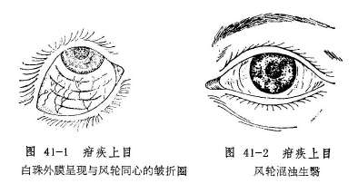

全身症状，初起常见面色萎黄，身体羸瘦，毛发枯焦，不喜抬头，并见挦眉、咬甲、揉鼻、烦躁不宁。后期腹大如膨，青筋暴露，频频泄泻，食欲全无，哭声嘶哑而低微，手足俱肿，则病属危重，除可双眼失明外，尚有生命危险。

疳疾上目多属虚损证候。临床遇之，除应对眼部表现仔细审察外，主要还应根据疳积的全身证候予以辨正。如仅见白睛干涩，频频眨目，面黄体瘦，食少腹胀者属肝脾亏虚；久泻引起的疳积，其疳毒上目者，多属脾虚挟湿；疳眼而泻，完谷不化，面色苍白，且兼肢厥脉微者，又为中焦虚寒；疳眼证见黑睛生翳或糜烂，午后潮热，烦躁不宁者，则属脾虚肝热。

（二）论治要点

本病的发生，主要是由于脏腑虚损，清阳不开，目窍失养，或兼肝经邪热上攻而致。所以补脾消疳、升举清阳、退翳明目是本病的主要治法，其中又以补脾消疳为治疗本病的关键。在补脾消疳的基础上，对兼有肝热者，应兼以清肝之法。疳疾若为虫积引起，又须先施杀虫消疳法，而后调理脾胃，升举清阳。

（三）常见证治

1.内治：

（1）肝脾亏虚：

证候：小儿食少腹胀，而黄肌瘦，白睛干涩，频频眨眼，或兼夜盲。

治法：健脾消积，养肝明目。

方例：八珍汤〔13〕、决明灵砂散血〔84〕。

（2）脾虚肝热：

证候：腹胀便溏，午后潮热，烦躁不宁，黑睛生翳或糜烂。此证或属虫积成疳，疳疾攻眼而致。

治法：健脾清肝或兼杀虫消疳。

方例：抑肝扶脾汤〔114〕。虫积导致者用肥儿丸〔147〕。

（3）脾虚挟湿：

证候：面黄体瘦，精神萎靡，食少腹胀，大便溏泻，黑睛生翳或糜烂破溃，舌淡苔白，脉濡。

治法：健脾益气消疳。

方例：参苓白术散〔150〕。

（4）中焦虚寒：

证候：面色苍白，大便频泄，完谷不化，肢厥脉微，黑睛糜烂或破损，形成蟹睛。

治法：温中散寒，补益脾胃。

方例：附子理中汤〔129〕。

如果在黑睛病变的同时，全身枯瘦，腹大筋青，便泄不止，口干声哑，手足浮肿，当以挽救生命为要，按儿科疳积之重危证论治。

2.外治：

（1）黑睛混浊糜烂或黄液上冲时，用清热解毒眼药水及扩瞳药滴眼。（2）可用紫金膏〔238〕涂眼，以濡养眼珠，并有防轮穿破的作用。

3.针灸疗法：针刺四缝，灸气海、足三里、脾俞、肝俞、肾俞等。

（四）临证权变

疳疾的发生，或因积滞而损伤脾胃，或因脾胃虚损而食物停滞，每多兼有积滞之证，所以，对本病初起属于肝脾亏虚者，在应用决明灵砂散或八珍汤的同时，应酌加山楂、麦芽、神曲、鸡内金、陈皮等消积导滞药。或以消导为主治疗；初期过后，则须消补并行，最后以补脾健运以收功。如身体衰弱，必须以补益为主，稍佐消导之品，否则克伐太过，损伤元气，于病不利。参苓白术散所治证候为脾虚而水湿不运者，若兼见声音嘶哑，黑睛生翳，眵泪如糊，或如脓状，则为湿邪郁而化热，应加胡黄连以清热燥湿，或改用茯苓泻湿汤〔173〕治疗。

**〔简便验方〕**

1.鲜猪肝60克剖开，夹苍术末10克，以线扎定，入米汤内煮熟，然后将药肝连汤分次服用。每日一剂。年幼小者酌情减量。

2.捏脊疗法：以两手指背横压在长强穴部位，向大椎穴推进。同时以两手拇指与食指将皮肤肌肉捏起，交替向上，甚至大椎，作为一次，如此连续6次，在推捏第5、6次时，每次以拇指在腰部用隐力将肌肉提起约4〜5下，捏完后，再以两拇指从命门向肾俞左右推压2〜3下。此疗法有调理脾胃、调和阴阳、疏通经络的作用。

**〔调护〕**

1.患儿饮食应多进营养丰富的鱼、蛋、乳、肝类食品及新鲜疏菜，如胡萝卜、青菜等，以辅助治疗。

2.黑睛表面若已软化坏死者，应防止小儿用手揉擦眼部，医生也应避免重力开睑，以免促成眼珠穿孔。

**〔应用例案〕**

张XX，女，3岁，初诊于1953年1月15日。泄泻二日，津液大伤，不能营养周身，上达空窍，是以体尪形瘦，双目黑白两睛干燥，黑睛白晕如腐，相应黄液冲上，儿及瞳神，症询危笃，指纹淡红，舌苔淡白，病久脾虚，关门不固，气去阳衰，寒从中来，治宜温中。理中汤加茯苓、扁豆二剂（以后又连服二剂）。

三诊：泄泻好转，目微能张，盖其黄液减退，白障则仍留恋，病情根深蒂固，后果堪忧。原方加附子、山药，三剂。

四诊：利止，精神较旺，肤有华色，眼内干燥消失，黄液退去，惟白障化而未尽，斑脂翳成，幸瞳神微露，光线保留几分。身体消瘦，以后还当注意营养。五味异功散加杞子、七剂。（姚和清《眼科证治经验》）

**〔文献摘录〕**

《审视瑶函•疳伤》“疳症皆因饮食失节，饥饱失调，以致腹大面黄，重则伤命，轻则害目。患此勿治其目，竟治其疳，目病自愈。切忌油麺炙煿等物。

按小儿疳眼，无论肥瘦，但见白珠先带黄兼白色皱起，后微红生眵，

怕亮不睁，上下眼睥频频劄动不定，黑珠上有白膜，成如此样

圈，堆起白晕，晕内一黑一白，亦有肥瘦不同，疳眼无疑也。但肥疳大便如豆腐渣糟粕相似，瘦疳大便小如栗硬结燥，乃疳积入眼，攻致肝经，亦难治矣，小儿患疳眼声哑者，命将终也。”

### 侧目斜视

侧目斜视是以眼珠突然偏斜，转动受限，视一为二为特征的眼病（图42）。病名见于《目科捷径》，《圣惠方》称为“眼偏视”，《圣济总录》则称“目偏视”。《中医眼科学讲义》（1964年版）称本病为“风牵偏视”，其实本病的病因病机比较复杂，非独风邪所牵，所以本书不用该名。古医籍中，对突然偏斜且程度较甚者，称为“神珠将反”（《证治准绳》）；黑睛几乎不可见，仅见白睛者又称“瞳神反背”（《证治准绳》）；眼珠向下偏斜，转动不灵者别称“坠睛”（《圣济总录》）；眼珠向上偏斜者，又称“目仰视”（《审视瑶函》）；如小儿双眼目珠偏斜于内眦侧者称为“小儿通睛”（《秘传眼科龙木论》）。其实均属侧目斜视的范畴。若伴见口眼歪斜者，称为“口眼㖞斜”，与单纯的侧目斜视是不同的（见后）。

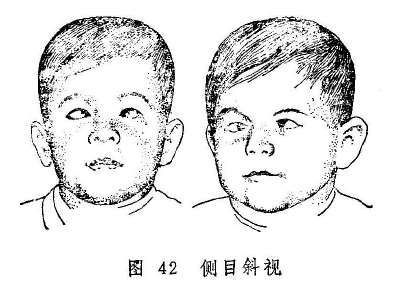

侧目斜视常伴视一为二症，需与视惑证的视一为二症相鉴别：侧目斜视有明显的眼珠偏斜，不得诊为视一为二；视惑证的视一为二症则外眼端好，唯一眼或双眼视一物为二形，且常伴视物不真，视大为小，视正反斜，视直为曲等症。其视一为二若单独出现，可诊为“视

惑”，亦可迳诊为“视一为二”。

**〔病因病机〕**

1.正气不足，卫外失固，或阴血亏少，脉络空虚，风邪乘虚入中。

2.脾虚失运，聚湿生痰，复感风邪，风痰阻络。

3.肝肾阴亏，阳亢动风，挟痰上扰，阻滞经络。

4.中风后遗，气虚血滞，脉络瘀阻。

上述诸种因素皆可导致眼部受邪，一侧经络的气血运行不利，使该侧眼带失养而弛缓不用，健侧眼带舒缩功能正常而反似拘急，牵引眼珠偏向健侧。

**〔辨证论治〕**

（一）辨证要领

本证猝然发作，表现为单眼或双眼黑睛偏斜于眦侧，转动受限，视一为二，或伴上胞下垂，目闭难睁之症。本病虽常由风邪乘虚入中经络而发，但内风引动者亦不少见，且常与痰阻、气滞、血瘀相关。由风邪侵袭经络而发者，常伴有恶寒、发热等卫表症状；如兼肝血不足，则可伴有面色无华，头晕耳鸣等血虚征象。除眼部症状外，若患者平素食少便溏，泛吐痰涎，舌苔厚腻，脉沉弦或弦滑等，则属脾虚湿盛，复受风邪，风痰阻络而致。若素有头晕耳鸣，腰膝痠软等肝肾阴虚之证，黑睛突然偏斜不动，且伴舌红苔黄，脉弦细或弦滑者，则为阴虚阳亢而化风，挟痰上扰而致；若为中风后遗症的目珠偏视多属气虚血滞而然。

（二）论治要点

本病以卫外不固、肝血不足、以致风邪中络，及脾虚湿盛、风痰阻络最为多见。治疗当以祛除风邪为主要治法。并在祛风之同时必须注意扶正，或兼补气，或兼养血，挟痰者又须配以化痰药。

临床治疗本病还须分清内风与外风。属外风者，可选用疏风药疏散风邪；属内风者，则当以调理脏腑气血为主，选加僵蚕、全虫、白附子、胆星等祛风通络之品。

（三）常见证治

1.内治：

（1）卫外失固，风邪中络：

证候：黑睛猝然偏斜，转动受限，视一为二，伴有恶寒发热，头痛，舌质淡红，苔薄白，脉浮等表证。

治法：疏风通络，扶正祛邪。

方例：小续命汤〔27〕。

（2）肝血不足，风中脉络：

证候：眼部症状具备，具有面色无华，头晕耳鸣，舌淡脉细，起病之初尚有恶寒发热等表证。

治法：养血祛风。

方例：养血当归地黄汤〔155〕。

（3）脾虚湿盛，风痰阻络

证候：眼证同前，素有纳呆食少，泛吐痰涎，或有便溏，舌苔厚腻，脉弦滑。

治法：健脾化痰，祛风通络。

方例：六君子汤〔32〕合正容汤〔52〕。

（4）肝阳化风，挟痰上扰：

证候：素有头晕耳鸣，失眠多梦，腰膝痠软等症，黑睛突然偏斜不动，舌红苔黄，脉细弦或弦滑。

治法：平肝潜阳，化痰熄风。

方例：天麻钩藤饮〔38〕加胆星、僵蚕、全蝎、贝母之类。

（5）气虚血滞、络脉瘀阻：

证候：有中风病史，后遗目珠偏视，口眼㖞斜，半身不遂，或肢体麻木不仁，面色萎黄，舌质淡或有瘀斑，苔白，脉细。

治法：益气活血，化瘀通络。

方例：补阳还五汤〔104〕。

2.针刺疗法：选用睛明、瞳子髎、承泣、四白、阳白、丝竹空、太阳、攒竹、颊车、地仓、合谷、太冲、行间、风池等穴。每次局部取2〜3穴，远端循经取1〜2穴。向左斜者刺右，向右斜者刺左。

（四）临床权变

本病由卫外失固、风邪中络而致者，若系风寒可用小续命汤〔27〕原方，或与牵正散〔169〕合用。若系风热为患当去方中之姜、桂、附，酌加生石膏、秦艽、桑枝、薄荷之类，以辛凉疏风，清热通络。侧目斜视兼见恶心、呕吐，步履不稳，头昏不适，舌淡脉浮等风痰阻络之象，而脾虚之证不明显者，可单用正容汤，或加川芎、赤芍、地龙以祛风除痰、通利脉络，不必合用六君子汤；本病亦可继发于热病后期，多属阴津耗伤而兼风痰阻滞，常伴口干欲饮，咽干唇红，舌红少苔，脉细数等症，可选用沙参麦冬饮〔101〕加秦艽、僵蚕、贝母、胆南星、丝瓜络养阴祛风、化痰通络；头部或眼部外伤，亦可致气血瘀滞，眼带失灵而偏视，治宜行气活血，化瘀通络，可用桃红四物汤

**〔185〕**加减治之。

**〔应用例案〕**

石XX，女，55岁。于1969年8月13日来诊。主诉15天前，因左边偏头痛引起左眼上睑下垂，睛珠外斜，双眼视物复视，曾在XX医院检查，诊断为动眼神经不全麻痹，现在头痛剧，口不干，胃纳尚可，二便正常。素有高血压病。

检查：右视力1.0，左0.7，左眼上睑下垂，用力睁眼仅离小缝，眼珠外斜，内转明显受限，脉沉细。

诊断：左眼目偏视、睑废证。

据脉证，脉虽沉细，但头痛剧，属风邪较重，在治则上应舍脉从证，法当健脾散风，疏通脉络。用羌活胜风汤加减（羌活、银柴胡、黄芩、白术、枳壳、防风、前胡、薄荷、全蝎、桔梗、勾藤、甘草），服六剂，并配合针刺疗法，头痛大减，上睑下垂及睛珠外斜显著好转。但头晕心悸，腿胀乏力，又接上方加生牡蛎9克，夏枯草15克，牛膝9克，远志9克，炒枣仁9克，服七剂，头痛头晕均愈，眼睑睁合如常，眼珠转动自如，复视完全消失。至此，嘱其依上方再服，以善其后。愈后观察两个月，情况良好。（《中医眼科临床实践》）

按：本例目偏视属风邪阻络，故拟疏风通络之法治之，佐以健脾。羌活胜风汤加全蝎、钩藤，与小续命汤之方义相似。

#### 附：口眼㖞斜

凡突然发病，口眼偏歪一侧者，均称口眼㖞斜。本证可单独发生，也可为全身性疾病的一个症状。历代眼科医籍有“风牵㖞偏外障”、“风牵㖞僻”等称谓，名异而实同。大都因风中经络所致。至于类中风引起的口眼㖞僻不遂，不属本节讨论的范围。

口眼㖞斜常因正气不足，脉络空虚，卫外失固，风中太阳、阳明经络、经隧不利而致，或属太阳外中风邪，阳明内蓄痰浊，风痰阻滞头面经络而发。亦有中老年人或因体虚，或因久病、劳伤、肝肾阴亏，肝阳上亢，阳升风动，风阳挟痰，窜扰经络而发者。头面一侧受邪，其经络气血运行不畅，筋脉弛缓而不用，健侧肌力如常，舒缩有力，于是口眼偏斜而偏向健侧。

本病起病突然，眼及口唇面颊同时歪向一侧，而对侧额纹消失，眉毛下垂，无力耸眉皱额，下睑外翻，眼睑闭合不全，露睛流泪，口角流涎，语言不利，进食不便，汤水常从口角流出。如果伴有半身不遂，或突然口眼歪斜而昏仆不省人事者，则属内科的危重病候。

本病的治疗，当内治、外治与针灸疗法相结合，以提高疗效，缩短病程。内治当以祛邪为主，兼以扶正。若属全身伴有恶寒、发热、头痛、苔白、脉浮等症者，宜扶正祛邪，疏风通络，宜用小续命汤〔27〕加减；若全身兼见发热恶风、口干咽痛、舌苔薄黄、脉浮数或浮弦，又当用大秦艽汤〔20〕加减，以祛风清热，和血通络。猝发口眼㖞斜，语言不利，口角流涎而不兼表证者，常属风邪入中太阳、阳明，挟痰阻滞头面经络，可选用牵正散〔169〕或正容汤〔52〕加减，以祛风、化痰、通络。若伴有食少纳呆，痰涎壅盛，苔腻脉滑等症者，证属脾虚不运，风邪挟痰流窜经络，治宜健脾除湿、祛风豁痰通络，可用六君子汤合正容汤加减治之。若素有头晕目眩，头痛失眠，突然口眼㖞斜，语言不利、甚至半身不遂，伴舌红苔黄，脉象弦细等症，又属阴虚阳亢，风阳挟痰，窜扰经络，治宜平肝息风，清热化痰；可用镇肝息风汤〔25〕加黄芩、钩藤、僵蚕、胆星、竹沥、川贝母等治之。

外治可用蓖麻子30克，冰片0.09克共捣为膏，冬日加干姜、附子各3克。口眼㖞斜在左，以此膏敷其右；㖞斜在右，则敷其左。或用鳝鱼血加冰片少许，外敷患部，敷法如上。

针刺可选用颊车、地仓、承泣、人迎、下关、上关、听会、瞳子髎、阳白、牵正、合谷、内庭、太冲、完骨等穴。每次局部取2〜3穴，远端循经配1〜2穴。口眼歪向左者，针刺右侧；歪向右者，针刺左侧；病久则可左右均刺。艾灸可选颊车、地仓、承泣、听会、人迎等穴，口眼歪向左者灸右侧，歪向右者灸左侧。针灸与内外治法合用，常可收到良好的疗效。

### 突起睛高

突起睛高是以睛珠胀痛、突起、甚至高突出眼眶为特征的急性眼病（图43）。病名见于《秘传眼科龙木论》，又名“睛高突起”、“目珠子突出”等。

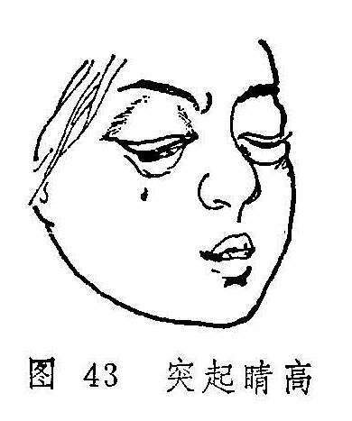

**〔病因病机〕**

1.外受风热火毒，上攻于目。

2.肝气郁而生热，夹杂风痰热毒，上攻目珠。

**〔辨证论治〕**

（一）辨证要领

起病急速，眼痛难忍，泪热常流，视力下降或骤降，胞睑、白睛均红赤肿胀，可兼眼珠或眶内蓄脓，睛高突起，甚至可高突出眶，转动失灵，最终可溃穿出脓。脓蓄珠内者，可致珠塌目盲。常伴发热头痛，恶心呕吐，甚至高热昏迷，病情危重。本病的辨证当分邪毒初起和邪毒炽盛：邪毒初起，除眼症状外，每伴发热恶寒，头痛眼胀，舌尖红，苔薄黄，脉浮数等症。若眼珠或眶内蓄脓，头痛剧烈，或伴发热而不恶寒，烦渴多饮，溲赤便秘等，为火毒炽盛；万一出现头痛项强，神昏，面赤气粗，舌质红绛等症，又为邪毒内陷心包之证。

（二）论治要点

本病的主要病机为风热火毒壅滞，所以清热解毒，活血消肿为治疗本病的关键。邪毒入内，兼大便秘结者应兼以泻下，以收釜底抽薪之效。

（三）常见证治

1.内治：

（1）风热火毒初起：

证候：病情初起，眼珠疼痛突起，胞睑红肿，泪出汪汪白睛红赤壅肿，兼见发热恶寒，舌红苔黄，脉数或浮数。

治法：清热解毒，活血消肿。

方例：仙方活命饮〔74〕。

（2）火毒内陷心包：

证候：前述症状更剧，头眼剧痛，恶心呕吐，壮热神昏，面赤气粗，小便黄赤，舌质红绛、脉数。

治法：清营解毒、清心开窍。

方例：清营汤〔199〕，或送服安宫牛黄丸〔85〕。

2.外治：

（1）可用葱、艾捣烂炒热以温熨。

（2）可用白芷、细辛、当归、苍术、麻黄、防风、羌活煎汤熏洗。

3.手术：有脓者，及时以刀、针排脓放毒。

（四）临证权变

本病多为急性发作，并以红赤剧痛、目珠突出为主要特征，所以前述方药最为常用。若系病情日久，肿硬不消，疼痛不甚，苔滑脉缓，可按痰湿结聚，治宜化痰散结，方用消瘰丸〔175〕加昆布、海藻内服。兼有郁热者，更加竹茹、夏枯草、炒山栀清热化痰散结。

**〔调护〕**

勿食肥甘、辛辣之品，饮食清淡。注意休息。

**〔文献摘录〕**

《秘传眼科龙木论•突起眼高外障》此眼初患时，皆因疼痛发歇作时，盖是五脏毒风所致，令睛突出。此疾不宜针灸钩割。……若要平稳，用针针破，流出清汁，即得平复。

### 初生儿目肿不开证

初生儿目肿不开证，是婴儿出生后一至三天内发生的双眼胞睑红肿，不能睁开。或有脓样泪液自睑内溢出为特征的急性眼病。若能及时治疗，愈后多良好，失治则可导致失明。

**〔病因病机〕**

由于母体产道不洁，胎儿出产时，污浊秽毒侵入眼内，损害目窍清纯之气，导致胞肿睛赤，脓液渗溢。

**〔辨证论治〕**

（一）辨证要领

本病多双眼发病，初起胞睑微红微肿，一二日内迅速肿胀如桃，不能睁开，气轮随之红赤，并有脓样泪液自紧闭的睑缝中溢出，如勉强掰开胞睑，则见大量涌出。甚者气轮浮肿，风轮溃烂。因眼珠灼痛，婴儿多啼哭不宁。若失治每使风轮溃烂穿孔而形成蟹睛，甚至眼珠枯陷，导致失明。

本病的辨证并不复杂，因其为急性眼病，证情虽有轻重，但皆属秽毒为患。发病初期，证情较轻者，多属毒入血分；甚者胞肿如桃，白睛浮壅，泪液如脓，黑睛混浊不清或兼便结溺赤者，又属热毒内结，腑气不通，急宜凉血通腑，内外兼治免生变证。

（二）论治要点

本病总属秽毒攻目，所以治疗的关键在于清热解毒，证情危重或兼便结溺赤者，又当兼以凉血通腑，使热毒下泄，以收退赤消肿之效。

外治法是本病十分重要的治疗方法，当注意与内治法合用。

（三）常见证治

1.内治：

（1）热入血分：

证候：发病初期，胞睑红肿，白睛脉赤纵横，眵泪粘稠。

治法：清热凉血。

方例：生地黄散〔72〕。

（2）热毒内结：

证候：胞肿如桃，白睛浮壅，泪液如脓，黑睛混浊不清，甚或便结溺赤。

治法：清热解毒，凉血通腑。

方例：三黄汤〔17〕加银花、连翘、地丁等。

2.外治：

（1）黄连、甘草各少许煎汁，或用三黄汤〔17〕洗眼。

（2）熊胆0.3克，加沸水5毫升溶化，每日滴眼七、八次，重证可增加次数。

（四）临证权变

本病初期，证候较轻者，用生地黄散清热凉血的同时，亦须加用银花、连翘、地丁、紫草、鱼腥草等，以加强凉血解毒之功效；若兼身热、烦躁，哭闹不宁者，则需选加银花、牛蒡子、薄荷、柴胡、苏叶等疏散退热；便闭不通者应加大黄以泻下；失治黑睛生翳或变生蟹睛者，又当参照有关章节处理。

**〔调护〕**

局部用生理盐水冲洗，每1/2〜1小时一次，以清除眵泪。冲洗之后再滴用上述眼药。

用以拭眼的棉花纱布等物须焚毁，脸盆毛巾应煮沸消毒，以防传染。

**〔文献摘录〕**

《医宗金鉴•幼科心法要诀•眼不开》：“小儿初生眼不开者，因孕妇饮食不节，恣情厚味，热毒熏蒸，以致热蕴儿脾，眼胞属脾，其脉络紧束，故不能开也。内服生地黄汤，外用熊胆汤（熊胆、黄连各少许，用滚汤淬）治之自愈。”

### 妇人经胎产期目病

一般眼病，本无性别差异，但妇女在行经、胎前、产后时期，染患目疾，在辨证和治疗上则应有所不同。现将行经目痛、逆经目赤、妊娠及产后目病合为一节，扼要予以叙述。

**〔病因病机〕**

1.行经目痛：经行失血过多，肝血虚亏，不能归养于目，则目昏涩痛。

2.逆经目赤：血热气滞，经阻不行，反上逆于目，目中血络为瘀血灌注，则满目赤涩，甚则血灌瞳神。

3.妊娠目病：多属有余之证，乃胎火妄动，上攻于目所致。

4.产后目病：产后失血过多，多属不足之证，或兼有七情郁结，或兼头风疾患引发而致者。

**〔辨证论治〕**

（一）辨证要领

抓住经期、孕期、产后等时期的生理病理特点，关键在于辨清虚实。目窍涩痛，且兼经行过多，常为肝血亏虚不能养目之虚证；目赤涩痛，甚者见血灌瞳神，经行不畅，或色红量多，或夹血块，或兼腹痛，头晕耳鸣，烦躁胁痛，月经周期提前，量渐少而停闭不行者，属气滞血热，瘀血上逆之实证；孕期无论内障外障，一般都由胎火上攻之实热证；产后目病有内障与外障之不同，但不论内障和外障，多属或兼有气血不足，正虚邪入之证。亦有情志抑郁，肝气郁滞而发者，须结合诱因和精神状况，以及目赤眩烦、口苦胁痛、乳汁不下、胸闷太息等证情而辨析。

（二）论治要点

经期目病的论治要点在于调经与引邪热下行，使气血调和充盈，目病自愈；妊娠目病论治的要点在于清降胎火，热不上扰则目病可愈，然须注意禁用耗血动胎药物，以免损伤胎气；产后目病重，重视补益气血，即使属于感受外邪，亦应注意产后体虚之特点，标本兼顾，扶正祛邪。

（三）常见证治

（1）经行目痛：

证候：眼睛涩痛，甚或黑睛生翳，遇月经来潮则发，月经量多，眩晕目昏，面色㿠白，舌淡脉细。

治法：和肝养血，祛风明目。

方例：当归补血汤〔92〕。

（2）逆经目赤：

证候：经期则满目赤涩，甚或血灌瞳神，兼见月经量多，或夹血块，舌红脉数。

治法：破血通经，泻热凉血。

方例：通经散〔195〕。

（3）妊娠目病：

证候：孕期眼发内障或外障，心烦不安，口干咽燥，渴喜冷饮，舌红，苔薄黄，脉滑数。

治法：清热安胎。

方例：保胎清火汤〔164〕。

（4）产后目病：

①气血两亏：

证候：产时出血过多，遂发两眼干涩，视物昏花，头晕耳鸣，气少脉弱。

治法：补益气血，生津濡目。

方例：熟地黄汤〔253〕。

②肝郁气滞：

证候：产后情绪抑郁而起，目赤眩烦，口苦胁痛，乳汁不下，脉眩。

治法：疏肝和营。

方例：逍遥散〔184〕。

（四）临证权变

前属证治，仅是大略言之，临床实际要复杂得多。如经期目病，亦有肝郁气滞引起者，须用逍遥散疏肝理气；眼病若还兼吐血、衄血，又可与经行吐衄相参论治。妊娠目病胎火为患者虽多，但若兼见面色萎黄，头晕目眩，心悸怔忡等，则不为胎火而属血虚，可用胎元饮〔165〕补脾益血；产后目病更为复杂，当须详辨：初产恶露不尽时患目病，即使为虚证，亦不可纯用滋补之品，须合用生化汤〔69〕随证加减。产后感受外邪而患目病，又当将熟地黄汤〔253〕与加味调中益气汤〔80〕合用以补气血，疏风邪。另外，经、胎、产后诸期目病的治法方药，亦可通用，只要方药符合眼病的病理机制即可。

**〔调护〕**

经行、胎前、产后患目病者，应注意多食富含营养之食品，但应忌食辛辣炙煿、酒浆厚味；应调理情志，避免气怒；产后勿过度用目。

### 目痒

目痒是以眼睛内外奇痒难忍为特征的眼病。古医籍中或称“痒如虫行”（《证治准绳》）、“痒极难忍外障”（《秘传眼科龙木

论》）、“痒极难任”（《世医得效方》）等。若目中偶尔作痒，或因外障眼疾导致者，不属本病证范围。

**〔病因病机〕**

目痒多缘风邪所致。风为阳邪，最易犯目。风性善动，流窜于目络，致气血失和，故令目痒。风邪之生，有以下几种情况：

1.风邪外束、经络受阻。

2.脾胃内蕴湿热，复感风邪，致风热湿上攻于目。

3.肝血虚亏，血虚生风，虚风外扰于目。

4.火毒等邪犯目邪退火息，气血得行，脉络畅通而痒。

**〔辨证论治〕**

（一）辨证要领

本证外观端好，视力如常，唯眼内或两眦作痒，或痒如虫行，甚则奇痒难忍，但目无红赤湿烂诸证。临床应主要辨明风邪之内外虚实：发病初期除两眦作痒外，一般无他症，偶有泪出，脉浮者，属于风邪外束；兼眵多胶粘，胞睑沉重，白睛黄污者，当属脾胃湿热而受风；眼痒不已，时作时止，痒势较缓，或兼头晕眼花，面白舌淡，脉细而弱，则属血虚生风。

目痒一证，根据其痒的轻重程度和性质不同，对眼病的诊断、治疗、预后亦有很大的参考价值。例如眼无病而作痒，则多为眼病之先兆症状；在眼病中期症状进展而作痒，为眼病加重之象；经过治疗后症状减轻而作痒，则为眼病将愈之征。临证时宜仔细辨别。

（一）论治要点

目痒一证的治疗，关键在于祛风。风邪有内外之别，外束之风以疏散为主；兼脾胃湿者，清热除湿而祛风；血虚生风者，养血而熄风。配以祛风药煎水外洗，则目痒可愈。

（三）常见证治

1.内治：

（1）风邪外束：

证候：目痒不休，眼部多无形症，偶有泪出，脉浮。

治法：祛风散邪止痒。

方例：驱风一字散〔124〕。

（2）脾胃湿热，兼受风邪：

证候：眼内奇痒难忍，眵泪胶粘，胞睑沉重，白睛黄浊。

治法：祛风清热，除湿止痒。

方例：除湿汤〔172〕。

（3）血虚生风：

证候：眼痒势轻，时作时止，外观端好，形体不实，或兼头晕目昏，面白无华，舌淡脉细。

治法：养血熄风

方例：四物汤〔64〕。

2.外治：用胆草、防风、细辛、甘草煎水外洗患眼。

（四）临证权变

本证初起，一般祛风止痒即可，但痒甚难忍者，可加藁本、白蒺藜、僵蚕、菊花、蝉蜕、乌梢蛇等，以加强驱风的作用。对体质较弱者，可改用人参羌活汤〔10〕加减化裁，脾胃湿热兼受风邪及血虚生风者，均可选加蔓荆子、白芷、地肤子等祛风药，以增祛风止痒之效。

若属邪退火息，气血得行，脉络通畅作痒者，一般不须服药，痒甚者亦可用广大重明汤〔14〕洗眼。

**〔调护〕**

目痒时可用干净之细绢轻轻揉拭，不可用不洁之手用力揉擦；忌食辛辣燥腻之品，勿吸烟饮酒，以免加重病情。

复习思考题

1.热泪和冷泪在症状上有何不同？

2.如何对流泪证辨证论治？

3.简述麻毒攻目的辨证论治。

4.试述疳疾上目的病因病机，临床表现。

5.扼要叙述疳疾上目的治法。

6.疳疾上目的调护应注意些什么？

7.侧目斜视的临床特点如何？

8.试述侧目斜视的病因病机及辨证施治。

9.何谓突起睛高？

10.试述突起睛高的临床表现和治法。

11.简述初生儿目肿不开证的临床表现和处理。

12.简述经行目痛、逆经目赤、妊娠目病、产后目病的辨证施治规律。

13.试述目痒证的治法与方药。

14.简述目痒证对眼病的诊断、预后方面的意义。

## 第七章外伤疾患

**〔自学时数〕**2学时

**〔面授时数〕**2学时

**〔目的要求〕**

1.掌握异物入目的处理原则。

2.掌握撞击伤目的证候和治疗。

3.掌握真睛破损初发的处理方法及辨治。

4.了解紫外线、红外线灼伤的临床表现。

5.掌握酸、碱烧伤的急救措施。

眼的外伤疾患是指眼部组织因意外引起的伤害而言，临床统称眼外伤。常见的致伤因素，有机械性与非机械性两大类：前者如撞击伤目、真睛破损等；后者如强光伤目、酸碱烧伤等。眼外伤是临床常见病，其临床表现及预后与致伤因素、受伤部位、受伤程度、及时合理处理与否有关。眼部外伤疾患的特点可概括为五：

1.眼居高位，前部暴露于外，做工时往往注视被敲打处高速、旋转的物体，故而易被此类物体损伤。

2.眼珠构造精细，组织脆嫩，功能复杂，受伤后不易修复，有些组织修复后也不能恢复原来的形态和功能。如黑睛、瞳神、睛珠等组织受伤，轻者影响视力，重者可致失明。

3.眼珠内脉道幽深细微，内含真气、真血，即使轻微损伤，也可伤气伤血，使气滞血瘀而阻隔神光。

4.致伤物体大多污秽，受伤处易被污染，特别是黑睛、神膏，因无血络分布，抗邪能力较低，易被风毒侵袭，而出现严重证候。

5.因两眼气血经脉相通，一眼受伤，特别是真睛破损，有时尚可影响健眼。若治不及时，可致双目失明。

外伤的原因十分复杂，损伤部位及症状轻重亦无一定，五轮皆可受伤，或一轮独重，或连及两轮三轮，甚至有五轮俱伤的。一般以水轮、风轮损伤最重，气轮次之，血轮再次之，肉轮最轻。就损伤程度而言，眼珠无穿破者较轻，穿破或有突出者较重。其预后，轻者易治而预后多良，重者难治且易生恶变，甚或导致失明。

眼外伤是致盲的主要病因之一。因此预防和正确处理眼外伤，在防盲工作中具有十分重要的意义。临证处理眼外伤病人，要详细询问病史、自觉症状，了解致伤物的性质、形态，然后进行详细检查。检查应注意受伤部位，有无穿孔和异物等，然后采取相应的治疗措施。

### 异物入目

凡细小异物随风飞扬，进入眼内，或飞溅入目，均称异物入本病名见于《中医临证备要》。古代医著《秘传眼科龙木论》所载的眯目飞尘外障，及《银海精微》的飞尘入眼、《世医得效方》的眯目飞尘飞丝、《目经大成》的飞尘眯目等，均属本病之范畴。《证治准绳》则依入目异物的不同，分别称之为飞丝入目证（空中游丝偶然入目）、物偶入眼证（细小之物偶入眼中）、眯目飞扬证（空中砂尘被风吹入眼内）等三种。某些异物具有毒性，如不及时取出，可导致严重眼疾，危害视力。今将三者合并讨论如下：

**〔病因病机〕**

1.砂土尘埃、煤灰炭渣、碎叶毛刺、空中游丝等随风吹入眼内。

2.昆虫之类，迎风扑目，飞入眼内。

3.防护不慎或意所不测，回避不及，以致金属碎屑、玻璃细颗、麦芒谷壳等溅入眼内。

由于眼受异物之伤害，每致局部瘀血，而发生红赤刺痛，甚或擦伤黑睛水膜，起星生翳。

**〔辨证论治〕**

（一）辨证要领

本病起于不测，发病急骤。异物入目后，患眼即刻沙涩刺痛，流泪难睁，因异物性质及所在部位不同而证候略异。异物钝圆，部位表浅者，症状较轻；异物有棱刺，嵌在眼珠表面，特别是水膜表面，或伤后乱施揉擦挑剔者，可致眼珠损伤，而引起严重后果。如为铁屑入目，局部可见棕色锈环。若系空中飞荡之金蝉、蜘蛛等虫类之游丝入于目内，多见倏然而痛，眼涩难开，眼肿目赤等。异物较久而未取出，可致白睛混赤，畏光流泪，眵多如脓，异物周围发生边界不清的灰白色翳障。或风毒乘机侵入，导致暴赤肿痛或变生凝脂翳等证。对难于发现的细微异物，可借助裂隙灯显微镜，检查确定。

（二）论治要点

处理异物入目，关键在于取出异物。若异物入目不久，取出后眼部证候顿消，给外点药即可，症状轻微者不用药亦可；若异物入目稍久，或异物有毒，可引起胞睑红肿，白睛红赤，沙涩疼痛，羞明眵泪，甚或黑睛生翳，则须配合清热、解毒、疏风之药内服。

（三）常见证治

1.外治：异物入目后，应及时取出，不可乱施揉擦，或以不洁之物挑拨。须轻提胞睑，待泪水满盈，将异物自行冲去。若不能自出，可采取以下措施：

（1）异物粘附在眼睑内面、白睛或黑睛表面，可用生理盐水冲洗，或用湿棉签轻轻拭出。

（2）异物嵌于白睛外膜，或黑睛水膜表面，冲洗不去者，可用1%的卡因滴眼作表面麻醉，再用小针轻轻挑除。挑后滴用黄连眼药水〔214〕或五胆膏〔30〕。

2.内治：异物取出后，仍有畏光流泪，目赤疼痛等证者，可用石决明散〔48〕内服治之，本方有泻火平肝，散风消瘀之效。

（四）临证权变

对异物取出后，眼仍红赤肿痛、羞明流泪者，应根据病情，在石决明散的基础上灵活加减。若红赤肿痛较甚而眵少者，属瘀血化热，可加丹参、丹皮、红花、三七之类；若泪多羞明，眵多如脓者，属热毒攻目，可重加银花、连翘、蒲公英、野菊花等清热解毒之类；若疼痛较剧者，可加乳香、没药、三七之属，若伤及黑睛导致凝脂翳等变证，或遗留宿翳，可参照有关章节处理。

**〔调护〕**

1.异物进入眼内，切不可用脏手揉擦，以免异物擦伤黑睛或嵌入白睛、黑睛表面，或致风毒侵入眼内，引起严重后果。

2.为避免异物入目，生产时应注意安全并应戴上防护眼镜。

**〔文献摘录〕**

《证治准绳•物偶入睛证》：“凡人被物入目，不可乘躁便擦，须按住性，待泪来满而擦，则物润而易出。如物性重及有芒刺不能出者，急令人取出，不可揉擦，擦则物愈深入而难取。若入深，须翻上睥取之，不取则转运，阻碍气滞而病变。芒刺金石棱角之物，失取碍久及擦重者，则坏损轮膏，如痕擫、凝脂等病，轻则血瘀水滞为痛为障等病，有终不得出而结于睥内者，必须翻而寻看，因其证而治之。”

### 撞击伤目

眼部受钝力撞击而眼珠无穿破伤口者，称撞击伤目。本病在《世医得效方》和《普济方》中均称“被物撞打”，《中医眼科学讲义》

（1964年版）以来均习称“撞击伤目”。

临床上，因外伤的轻重和部位的不同、撞击伤目可表现为振胞瘀痛、白睛溢血、撞刺生翳、瞳神缩小、散大或欹侧、血灌瞳神、惊震内障、侧目斜视、暴盲、触伤真气等证，宜根据病情作出细致的诊断。

**〔病因病机〕**

多因钝性物体如球类、拳脚、棍棒、铁块、砖石等击伤或因跌仆而伤及眼部所致。眼珠邻近组织或头部受强烈震击，亦可以伤及眼珠。气血受伤，脉络受损，以致瘀血停留，是本病的主要病理机制。

**〔辨证论治〕**

（一）辨证要领

本病因撞击部位不同，表现各异。临证一般须先查视力，以大约估计损伤程度，再从外向内对眼的各个部位进行望诊，认真地判断病情，正确的予以治疗。

1.眼睑受伤：可见胞睑色呈青紫，胀如杯覆，疼痛难睁。重者可引起胞睑撕裂，或瘀血越过鼻梁，使对侧胞睑亦青紫肿胀。若视力正常，眼珠完好者，可诊为振胞瘀痛证。

2.白睛受伤：可见白珠外膜下积血，量少者多呈局限性，色如胭脂；量多者可布满整个白睛，使白睛变呈一片鲜红或紫红。此证可称为白睛溢血。然此白睛溢血仅为撞击伤目的一个证型，与第三章所述的白睛溢血不同。

3.黑睛受伤：可见水膜的深层呈条状、片状混浊，或在相应的表层有擦伤之痕迹，伴有抱轮红赤，畏光流泪，疼痛难睁等证。若邪毒乘伤侵袭，可变生凝脂翳等。此证《审视瑶函》称之为“惊震外障”，乃因瘀血阻滞，兼受风热毒邪所致。

4.瞳神受伤：初受撞击可表现为短暂性的瞳神缩小，继之瞳神散大或欹侧变形，此均为瘀血阻滞经络，黄仁失却展缩功能而致。如其血络受损，可发生血灌瞳神证。血量多少不等，少则沉积于瞳神以下，多则漫过瞳神，若日久不散，可使黑睛混浊，亦可淤塞窍道，致神水瘀滞，眼胀欲脱，头痛如劈而发生种种变证。

5.睛珠受伤：可致睛珠半脱位或全脱位，可脱于黄仁后，或脱于黄仁前，或无脱位而逐渐混浊，成为惊震内障。

6.损伤眼内脉络：可致目内气血逆乱而神光被阻，迅速失明。此证虽表现有暴盲之症状，但明显有撞击之病史，与暴盲证不同，不可混诊为暴盲，而应以撞击伤目称之；眼内脉络受伤较轻，可表现为眼珠疼痛之后，视力如常，但日渐昏矇，终可完全失明。此乃目中真气受伤，脉络滞涩，精血不得上荣而致。临床遇此不应诊为青盲，而应据撞击伤目之病史诊之为触伤真气。

7.眼带受伤：眼带因撞击而伤损，或血瘀眶内，阻滞眼带之脉络，可致眼带废用，而生侧目斜视之证。

撞击伤目的辨证宜分辨受伤之部位、轻重及新久，大抵伤轻及新伤者易治，重伤及伤久者难治，伤及珠内者预后较差。本证伤情虽然复杂，但一般可以归纳为络伤出血与气滞血瘀两大证型论治，并宜结合外治法综合处理。

（二）论治要点

撞击伤目伤在气血，所以治疗的要点在于调理气血。因本证内无邪气，故伤后若有出血，一般多能自止。所以本证需要止血的病例不多，需要止血者，服止血药的时间不宜太长。重证内治和外治的要点，均在活血化瘀，瘀血去则经脉通，目窍得养而复精明。否则，神光被瘀血隔阻，终难复明。

气为血帅，活血化瘀方中必须配加理气之品，才能有较好的效果。病久气伤者，尚需加用益气药以助瘀血消散。

临床经验证明，如能较长期地坚持按辨证服用活血祛瘀药，并适当配合温通药物，能取得较好疗效。

（三）常见证治

1.内治：

（1）络伤出血：

证候：胞睑、白睛外膜或有裂伤，出血较多，或有血灌瞳神，或经检眼镜检查而眼内有新鲜出血，导致视力障碍。

治法：先止血，后活血。

方例：止血用十灰散〔4〕，活血用桃红四物汤〔185〕。

（2）气滞血瘀：

证候：或为振胞瘀痛；或为白睛溢血；或为惊震外障；或眼内出血已止，久不复明；或为触伤真气；或为侧目斜视；或眼珠刺痛或胀痛。

治法：行气活血，化瘀止痛。

方例：桃红四物汤〔185〕或破血汤〔189〕。

2.外治：

（1）振胞瘀痛证的眼睑瘀血，一般可自行吸收，预后良好。早期可用鲜生地或大黄粉捣烂外敷以止血散血。

（2）受伤一至二日后使用热敷，或用酒调七厘散〔9〕外敷，但勿使之进入眼内。

（3）血灌瞳神可选用三七、丹参、红花、川芎液局部电离子导入。（4）惊振外障，可外点黄连眼药水〔214〕。

（5）眶内出血，眼珠突出者，可加压包扎或结合冷敷。

（6）胞睑赤肿疼痛，或眼珠刺疼者，可选用一绿散〔1〕隔纱布垫敷患眼，有消瘀止痛之功。

3.手术：

（1）胞睑皮肤或白珠外膜若有撕裂，伤口小者可自行愈合，较大裂口可加以缝合。

（2）惊震内障或睛珠脱位，可施以手术治疗。

（四）临证权变

本证证情比较复杂，宜在行气活血的基础上灵活加减。如疼痛较甚，可加用止痛没药散〔36〕；若胞睑因血瘀化热而红肿灼热，或兼胀痛多泪，可改用凉血散瘀的生地黄散〔72〕治疗；若红肿焮痛消退，遗留星翳或云翳者，可按有关章节辨证治疗；若因气滞致瞳神散大，眼珠胀痛者，应行气活血，可服调气汤〔179〕治之；若属血灌瞳神或眼底出血日久未散者，可适当加用温通行窜之品，如川芎，当归，桂枝，炮姜等。眼带受伤而致侧目斜视者，可依侧目斜视证予以处理；视力障碍日久，证情由实转虚者，又当参考视瞻昏渺一节辨证论治。

**〔调护〕**

1.对胞睑瘀血，初起可行冷敷，24小时以后改行热敷，以促进瘀血吸收；

2.血灌瞳神必须静卧，采取半卧位较好，可使血液下沉，以免遮蔽瞳神。

3.眼珠脱位者，可点缩瞳药，以避免睛珠脱入黄仁之前。全脱位进入神膏者可适当配镜。

4.受伤后宜神情安定；忌食辛辣，以免生热助火，加重病情。

### 真睛破损

外物伤目而眼珠有穿破伤口者，称为真睛破损。本病在《秘传眼科龙木论》中称“偶被物撞破外障”，《证治准绳》和《审视瑶函》称为“物损真睛”，《中医眼科学讲义》（1964年版）以来习称“真睛破损”。其为严重的外伤性眼疾，病情与损伤的部位、原因、程度、有无异物存留或是否感染风毒有关，预后多不良。更有一眼真睛破损，导致另一眼视力渐降而盲者。

**〔病因病机〕**

多因锐利物体刺破，或高速度之金石碎片、碎屑飞溅而穿破眼珠；也有受猛烈的钝力撞击，使眼珠破裂者。致伤物体多较污秽，破损处易被邪毒侵袭。因此，这类外伤不仅使经络、气血、组织损伤，而且又常兼邪毒为患之候。有的还可因瘀血、邪毒交侵，影响健眼而致视力障碍。

**〔辨证论治〕**

（一）辨证要领

本病的诊断，首先当依据外伤史，检查伤眼有穿透之伤口，伴有剧烈疼痛，畏光流泪，视力剧降等症，即可确诊。然后须辨伤势的深浅，损伤的部位，异物的有无，邪毒的轻重，而后采取相应的治疗措施。

如伤在白睛，伤口小者需细心诊察，方可发现；伤口大者，可见神膏外溢，嵌在伤口，状若稠痰，欲流不流。神膏脱出多者，眼珠立即塌陷变软。

如伤在黑睛，因水膜穿破，故神水立即外溢。若黄仁脱出，则状如蟹睛。黄仁被伤，亦可见裂口，或伴血灌瞳神。

睛珠受伤，可致脱位或半脱位，或逐渐变生惊震内障。甚者睛珠破碎，在黑睛后方或水轮内泛起白浆，状如稠痰白脂。更甚者，睛珠因眼珠破裂较大而随神膏黄仁一起脱出珠外，伤口黑白混杂，眼珠塌陷变软，终至珠陷失明。

穿破伤应辨别是否有眼内异物，具体可根据病史、临床检查、自觉症状等综合分析。X线摄片是常用的诊断方法。

对伤眼还应辨别有无邪毒入侵。邪毒若随异物进入珠内，一至二日可致胞睑肿胀，畏光流泪，疼痛剧烈，创口污浊浮肿，白睛红赤肿胀，神水不清，黄液上冲，瞳神不辨。若病情严重，邪毒蔓延，上述诸证加重，眼珠突出，不能转动，并可伴有头痛，恶寒发热等证。

健眼牵损是真睛破损的严重并发证，其发病机会虽然不多，但若发生，即可造成严重后果，必须高度重视。一般说来，如穿破在黑睛边际，眼内有异物存留，或伤口长期愈合不良，或红赤疼痛持续不退，或反复出现等，较易影响健眼。健眼被牵后，可出现瞳神紧小、抱轮红赤、云雾移睛、视瞻昏渺、青盲等证。

本证的治疗，在受伤早期，穿孔浅小者，易治；伤在黑睛者愈后必有疤痕遗留，或形成斑脂翳、瞳神欹侧等。若伤大而深，损及睛珠神膏者，纵能早期治疗，得免枯凸，然失明亦每难幸免。更甚而健眼牵损者，预后更差。

（二）论治要点

本证初起，伤口的处理至为重要。应注意消毒，轻轻清洁患部，忌用重力或草率从事，以免将神膏，睛珠等压出。

伤眼化脓，一般发生在1〜7天之内，应予严密观察。健眼牵损，一般发生在3〜8周之间，也有在10日内或迟至多年后发生者。预防的关键在于妥善处理伤口，如尽快封闭创口，清除脱出之组织以预防感受邪毒；眼内容物脱出较多，眼珠已不成形，或视力恢复无望者应及早摘除。对健眼虽已受累，而伤眼尚存一定视力者，又不可轻易摘除伤眼，当挽救视力于万一。

内服药物应分清有无感受毒邪。伤口清洁，就诊较早，伤势较轻，无化脓趋势者，服用养血活血，清热化瘀之品即可；对伤口污秽，伤势较重，伤后处理不当，有化脓趋势或已经化脓者，当服用清热解毒重剂。

（三）常见证治

1.内治：

（1）眼珠破损，风邪乘袭：

证候：白睛或黑睛破裂，或伴珠内组织脱出，疼痛剧裂，畏光流泪，视力剧降。

治法：除风益损。

方例：除风益损汤〔170〕。

（2）外邪侵入，热毒炽盛：

证候：创口污秽浮肿，白睛红赤，神水不清，黄液上冲，甚则脓攻全珠，寒热头疼，或珠软如绵，视力全丧。

治法：清热解毒，凉血化瘀。

方例：犀角地黄汤〔240〕合五味消毒饮〔29〕。

2.外治：

（1）受伤早期，重在处理伤口；可用生理盐水轻轻冲洗患眼，清除一切污物。创口表面如有异物存在，宜滴用局部麻醉剂（1%的卡因溶液）后细心除去。如创口小，对合良好，又无眼内组织脱出者，可不必缝合，如伤口较大宜仔细分层缝合；如神膏脱出伤口之外，应予剪除；若睛珠嵌于伤口，应充分清除。

（2）术前术后均可滴用黄连眼药水〔5〕。

（3）必要时滴用扩瞳剂。

（4）根据伤情需要，注射破伤风抗毒素1500国际单位，以防破伤风。

（5）伤眼宜行包扎。

3.手术：眼珠严重损坏，眼内容物脱出较多，视力完全丧失，或珠内灌脓，眼珠赤痛或珠软如绵，无治愈希望者，可考虑手术摘除伤眼；如眼内有异物存留，特别是金属异物，应及早手术取出。

（四）临证权变

受伤早期，出血不多者，服用清热平肝、祛风散邪的石决明散〔48〕亦可。疼痛较剧者可加用七厘散〔9〕冲服。

伤眼有化脓趋势或已经化脓者，若伴发热恶寒等全身证候，病情较重者，可改服普济消毒饮〔227〕；若伴小便黄赤，大便干结之证，当服用眼珠灌脓方〔220〕。

患眼牵损者，可参考瞳神紧小、云雾移睛视瞻昏渺、青盲等证辨证论治。

**〔调护〕**

1.安静卧床休息，避免头部强烈震动。

2.每日更换敷料，细心观察伤口情况，直至愈合。

3.忌辛辣烟酒，以免生热助火，加重病情。

**〔文献摘录〕**

《目经大成•物损真睛》：“此泛言目忽被金木、打伤、跌伤，迫在轮廓之甚者，初患必赤肿疼涩，……稍瘥，始现伤痕，或黄或白。白者害迟，黄者速而险，有赤障头疼，症必变。……其为尖细之物所触，浅小可治，若伤大而深，及内损神膏，外破神珠者，纵然急治免得枯凸，明终丧尔”。

### 强光伤目

由强光照射引起的目赤疼痛、羞明流泪和视力障碍的病证，称为强光伤目。早在北魏高僧宋云的《行纪》中已载因雪光盲眼之事，谓：“雪有白光，照耀人眼，令人闭目，茫然无见。”《外台秘要》卷二十一亦将“雪山巨睛视日”列为丧明原因之一，告诫应预防强光导致目病。

伤目的强光主要有紫外线、红外线等。凡对环境中的紫外线、红外线防护不够，或直视强光，如太阳光、电弧光、乙炔焰及熔化的玻璃、钢铁等，均可伤人眼目。所以在现代从事电焊、气焊及玻璃厂、钢铁厂的工人和旁观者；直接观看日蚀，或长期暴露接触冰川、雪地、沙漠、海面等眩目耀眼环境的人，发生本病较多。后者又称雪盲。

**〔病因病机〕**

1.直接观看日蚀，或无日蚀而仰视太阳；

2.长期暴露在高山、冰川、雪地、沙漠、海面等反射阳光较强的环境中；

3.从事或观看电焊、气焊、炼钢、熔制玻璃等工作而防损不够；

4.水银灯下拍摄电影及从事光疗的医务人员防护不够。

上述诸种情况均含过强的紫外线和红外线。因光属阳属火，过强则能灼伤眼目，使暴露于外的眼睑、白睛、黑睛甚至瞳神发生损害。

**〔辨证论治〕**

（一）辨证要领

强光伤目的诊断和辨证，应根据病史和临床证候进行分析。被电焊、气焊等白色强光灼伤者，损伤多在外眼。一般在4〜8小时发病。被光照后，患者初感眩耀眼花，个别患者出现涩磨不适，羞明视昏。4〜8小时后证候加剧，出现目晕，羞明流泪，碜涩疼痛，胞睑红肿，紧闭难睁，每于夜半及凌晨因剧痛而就诊。此时检查患眼，可见睑内红赤，气轮赤丝满布，或兼抱轮红赤，白睛外膜浮壅，风轮似有云雾隐隐。此为紫外线灼伤所致。若长期反复照射，目外神水被铄，可致胞睑赤烂，白睛涩痛，黑睛混浊等，以致造成视力障碍。

被熔化的玻璃、钢铁等红色光线灼伤者，病变多在内眼。患者先有耀眼感觉，接着出现云雾移睛、视物易色、或出现眼前闪光。发病24小时以后上述症状消失，但可遗留眼前正中的阴影，导致视力障碍。长期反复被伤，睛珠被灼，亦可混浊而变生如银内障。此为红外线灼伤，目内脉络瘀滞，真精被耗而然。

太阳光所含紫外线和红外线均强，所以目窍被日光灼伤，前述两类证候均可发生。一般被高山、冰川、雪地、沙漠、海面等环境中反射的太阳光灼伤者，多为紫外线伤；瞻视太阳而被灼伤者，多为红外线伤。

（二）论治要点

急则治标，疼痛剧烈者以止痛为主。痛止后则着重清热养阴、活血散瘀，以恢复视力为主。

（三）常见证治

（1）紫外线灼伤：

证候：眼痛剧烈，牵连头部亦痛，胞睑红肿紧闭，强睁则热泪如汤，睑内红赤，白睛混赤，或白珠外膜水肿浮壅，或兼黑睛混浊。

治法：止痛、清热、润燥。

处理：局部滴用0.5〜1%的卡因眼液1〜3次（注意不可多滴，以免影响组织修复），再改用新鲜人乳或牛奶滴眼，均有缓解红赤疼痛之功。此外，针刺治疗亦有卓效，可选用局部按揉匹白穴，或针刺合谷、睛明、风池、瞳子髎、攒竹、翳明、丝竹空等穴，每可于1〜2分钟内痛止睑开。病情重者，也可结合服用1〜2剂祛风清热汤剂，如银翘散

**〔222〕**、驱风散热饮子〔125〕之类。

（2）红外线灼伤：

证候：羞明，视物易色，眼前闪光，云雾移睛，视物昏渺，或有小片状阴影遮隔神光。

治法：清热养阴，活血散瘀。

方例：加减四物汤〔81〕疏散瘀邪，清利头目。全方有养阴血、清邪热、活血散瘀之功，红外线灼伤者，耐心服用，可有较好疗效。

（四）临证权变

紫外线灼伤在疼痛缓解后，一般红退肿消，无后遗证。个别损伤严重者，可遗留黑睛翳障，当参照聚星障、花翳白陷辨证论治；反复被伤而形成睑弦赤烂、白涩证、赤丝虬脉等证者，又当参照有关章节予以治疗。

红外线灼伤形成的如银内障，可参照前“如银内障”的内容辨证论治。

**〔调护〕**

1.电气焊、玻璃、钢铁工人及在雪地、冰川、高山、沙漠、海上工作的人员，应戴适当的防护眼罩。

2.勿无端视日，观察日蚀应戴防护镜。

### 酸碱烧伤

酸碱对眼部组织的烧伤是最常见的化学物质腐蚀伤。受伤的程度与预后，取决于酸碱的性状、浓度、量的多少、接触时间的长短，以及受伤后紧急处理的措施是否合理等因素。如果酸碱的浓度高，入眼量多，接触时间长，每易出现严重后果，导致不同程度的视力障碍，甚至毁坏整个眼珠。

**〔病因病机〕**

1.常见的酸性伤主要是由硫酸、盐酸、硝酸以及某些有机酸所引起。酸溶于水，接触眼组织后，低度的酸溶液仅引起局部刺激；而高浓度者与眼组织接触后，即与表面组织结合而凝固，不向纵深渗入。因此，酸烧伤比碱造成的损害相对较轻；但若浓度甚高，接触时间长，同样可造成严重损害，甚至毁坏眼珠。

2.常见的碱性伤主要有石灰、氨水和氢氧化钾、氢氧化钠溶液等。碱性物质既溶于水，又溶于脂肪，接触眼组织后，除与组织蛋白结合生成可溶性化合物之外，还可使组织脂肪溶解，以致碱性物质能继续向组织深部渗透和扩散，进一步发生破坏作用，造成比酸性伤更为严重的后果。

**〔辨证论治〕**

（一）辨证要领

酸碱进入眼内，轻微者仅见灼热刺痛，畏光流泪，白睛红赤，黑睛混浊等。重者则伤眼剧烈疼痛，强烈畏光，热泪如泉，白睛外膜红赤壅肿甚至坏死，黑睛广泛混浊坏死，甚至风轮穿破，伤及深部组织（特别是碱性伤），可出现黄液上冲，瞳神紧小、干缺，睛珠混浊，甚至眼珠萎陷。

（二）辨证要领

本病的辨证，关键是根据病史，辨明伤眼物质的性质。酸、碱烧伤的临床区别是：酸性伤创面较浅，边界清楚，不扩大加深，伤后数日与受伤当时无明显差别，坏死组织容易分离脱落，眼内组织反应较少、较轻；碱性伤创面较深，边界不清，且易继续扩大加深，伤后二三日与受伤当时比较，明显加深扩大，坏死组织不易分离，眼内反应较多且较重。

（三）常见证治

（1）不论酸碱，在受伤当时，均应争分夺秒，就地取大量清水进行急救冲洗，如自来水、井水、河水等均可。冲洗越早、越彻底、预后越好。最好的方法是将眼部浸泡在缸水中，睁开或拉开眼睑，头部左右摆动，眼睛不断开闭及转动，浸洗约10分钟。切忌用小量水冲洗，以免扩大烧伤范围。眼内残存的固体物质，应彻底清除。急救处理后，再进行中和冲洗，具体如下：

（2）酸性烧伤，可用2〜3%小苏打溶液作中和冲洗。病情重者可用20%磺胺嘧啶钠溶液1ml（即2ml、0.4g磺胺嘧啶钠注射液半支射）注于白珠外膜之下。

（3）碱性烧伤，可用2〜3%硼酸液作中和冲洗。病情重者可再用抗坏血酸注射液50〜100毫克注射于白珠外膜之下，每天1〜3次。

（4）石灰伤不可作上述中和冲洗和注射。应先予0.37%依地酸二钠溶液冲洗，接着用1〜2%浓度的依地酸二钠滴眼。

（5）局部均需频点人乳泡黄连溶液或鲜牛奶，或用鲜鸡蛋清频频点眼。

（6）内服药物，初期以清热解毒，凉血散瘀，祛风止痛为主。可选黄连解毒汤〔212〕，犀角地黄汤〔240〕加减。后期以退翳明目为主，内服消翳汤〔176〕加玄参、麦冬、丹参、红花、石决明等。

后期还可外点八宝眼药〔12〕。

**〔调护〕**

1.患眼应以眼垫包封，以防感受邪毒；

2.忌食辛辣以免加重病情。

复习思考题

1.简述异物入目的处理原则。

2.简述撞击伤目的临床表现和辨证论治要点。

3.试述撞击伤目的外治法。

4.详述真睛破损初发的伤眼处理方法。

5.真睛破损如何辨证论治？

6.紫外线。红外线灼伤的临床表现如何？

7.试述酸碱烧伤后的急救措施。

8.详述中和冲洗的方法和药物。

## 附篇

### 一、识病辨证详明金玉赋

论目之病，各有其症，识症之法，不可不详。故曰：症候不明，愚入迷路；经络不明，盲子夜行，可不慎乎。凡观人目而无光华神色者，定是昏矇，男子必酒色劳役，女子气怒郁结。多因气血虚损，则目疾昏花因之而起。故宜先察部分形色，次辨虚实阴阳，更别浮沉，当知滑涩。看形色之难易，详根脚之浅深。经云：阳胜阴者暴，阴胜阳者盲。虚则多泪而痒，实则多肿而痛，此乃大意然也。夫血化为真水，在脏腑而为津液，升于目而为膏汁，得之则真水足而光明，眼目无疾；失之则火邪盛而昏矇，翳障即生。是以肝胆亏弱目始病；脏腑火盛珠方痛。赤而且痛火邪实；赤昏不痛火邪虚。故肿痛涩而目红紫，邪气之实；不肿不痛而目微红，血气之虚。大眦赤者心之实；小眦赤者心之虚。眵多热结肺之实；眵多不结肺之虚。黑花茫茫肾气虚；冷泪纷纷肾精弱。赤膜侵睛火郁肝；白膜侵睛金凌木。迎风极痒肝之虚；迎风刺痛肝邪实。阳虚头风夜间暗；阴虚脑热早晨昏。日间痛者是阳邪；夜间痛者是阴毒。肺盛兮白膜肿起；肝盛兮风轮泛高。赤丝缭乱火为殃；斑翳结成气为滞。气实则痛而躁闷；气虚则痛而恶寒。风痰湿热，恐有瞳神散大丧明之患；耗神损肾，必主瞳神细小昏盲之殃。眸子低陷伤乎血；胞胪突出损乎精。左传右兮阳邪盛；右传左兮阴邪兴。湿热盛而目睛黄色；风热盛而眼沿赤烂。近视乃火少；远视因水虚。脾肺液损，倒睫拳毛；肝肾邪热，突起睛高。故睛突出眶者，火极气盛；筋牵胞动者，血虚多风。阳盛阴虚，赤星满目；神劳精损，黑雾遮睛。水少血虚多痛涩；头眩眼转属阴虚。目昏流泪，色欲伤乎肾气；目出虚血，邪火郁在肝经。大病后昏，气血未足；小儿初害，营卫之虚。久视伤睛成近觑；因虚胞湿变残风。六欲过多成内障；七情太伤定昏盲。暴躁者外多紫脉；虚淫者内多黑花。隐隐𥅲痛，只为精虚火动；绷绷皮急，皆因筋急气壅。迎风泪出，分清分浊；天行赤热，有实有虚。目赤痛而寒热似疟，小便涩乃热结膀胱；脑胀痛而涩痛如针，大便闭乃火居脏腑。三焦火盛，口渴疮生；六腑火炎，舌干唇燥。目红似火，丝脉忌紫如虬；泪热如汤，浊水怕稠如眵。脑胀痛，此是极凶之症；连眶肿，莫言轻缓之灾。脑筋如拽若偏视，当虑乎𥅲翻之患；𥅲疼似击若鹘眼，须忧乎眸突之凶。鼻塞生疮，热郁于脑，当和肝而泻肺；耳鸣头晕，火盛于水，宜滋肾以清心。嗜酒之人，湿热薰蒸精气浊，多赤黄而瘀肉；贪淫之辈，血少精虚气血亏，每黑暗以昏矇。孕中目痛非有余，乃血气之亏耗；产后目疾为不足，因荣卫之衰虚。水少元虚或痰火，则天行赤热；燥急风热并劳苦，则暴风客热。瘀血滞而贯睛，速宜开导；血紫赤而侵瞳，轻亦丧明。睑硬睛疼，肝风热而肝血少；胞胀如杯，木克土而肝火盛。黄膜上冲，云生膜内，盖因火瘀邪实；赤膜下垂，火郁络中，故此血滞睛疼。凝脂翳生，肥浮嫩而易长，名为火郁肝胆；花翳白陷，火灼络而中低，号为金来克木。鸡冠蚬肉，火土燥瘀；鱼子石榴，血少凝滞。胞肥如球，血不足而虚火壅；皮急紧小，膏血耗而筋膜缩。实热生疮。心火炽而有瘀滞；迎风赤烂，肝火盛而多泪湿。迎风冷热泪流，肝肾虚而精血弱；无时冷热泪下，肝胆衰而肾气虚。大小眦漏血水，泻其南而补其北；阴阳漏分黄黑，黑则温之黄则凉。神水将枯，火逼蒸而神膏竭；神光外现，孤阳飞而精气亏。观定为动，水虚火盛来攻击；皮翻粘睑，气聚血壅风湿滞。色似胭脂，血热妄侵白睛赤；白𥅲俱青，肝邪蒸逼气轮蓝。火郁风轮，则旋胪泛起；血瘀火炽，则旋胪尖生。精亏血少虚损，则起坐生花；竭视酒色思虑，则昏矇干涩。暴肓似祟，痰火思虑并头风；赤痛如邪，肝肾亏损荣卫弱。枣花障起，痰火色酒怒劳瞻；莹星满目，辛辣火痰劳酒色。眼若虫行因酒欲，悲思惊恐怒所伤；云雾移睛见旗旆，蝇蛇异形虚所致。淫欲多而邪气侵，则膜入乎水轮；肝心热而痛流泪，则睛出乎𥅲外。或血少而或哭泣，津液枯而目涩痛；或酒欲而或食毒，脾肾伤而眼赤黄。风热邪侵，眉棱骨重而痛；风热邪盛，眼胞睛眶硬肿。风木克乎脾络，故迎风即作赤烂；血虚不润乎肌，故无风常作烂赤。血少神劳精气衰，则瞻视昏渺；火邪有余在心经，则痛如针刺。五脏毒而赤膜遮睛；脾积毒而胬肉侵目。水晶障翳瘀滞，凉剂片脑所因；鱼鳞形异歪斜，气结膏凝难愈。逆顺生翳，内有瘀滞；白星乱飞，血弱精虚。火胀大头，须分风热、湿热，风胀痛而湿热泪；怕热羞明，要辨血虚火燥，血少羞明火怕热。怕热涩痛知脾实；羞明不痛是脾虚。目昏乃血少；肾亏多昏暗。积年目赤号风热；两目赤肿名风毒。粟疮湿热椒风热，椒疮红硬粟黄软。肝经有邪，故玉翳浮睛；肾脏风烈，亦羞明生花。聚开之障，时圆缺而时隐见，症因于痰火湿热；聚星之障，或围聚而或连络，疾发于风热水亏。青眼膏损，皆因火炽；瘀血灌睛，总由凝滞。故房欲烦躁辛热多，则火炙神膏缺损；久视劳瞻郁风烟，则瘀滞赤丝脉乱。胎风兮小儿赤烂；胎毒兮小儿斑疮。血气滞兮星上；火邪实兮障遮。痘症多损目，浊气来损清和之气；疳病亦伤睛，生源而失化养之源。小儿青盲肝血虚，小儿白膜肺实热，小儿雀目肝不足，小儿目疮胎污秽。青盲内障肝风炽；二目赤肿热冲脑。老幼同发天行邪；时常害眼心火盛。痰火并燥热，伤睛之本；头风兼烘炙，损目之宗。为怒伤睛，怒伤真气；因哭损目，哭损神膏。酸辣食多损目，火烟冒久伤瞳。劳瞻竭视，能致病而损光华；过虑多思，因乱真而伤神志。目中障色不正，急宜早治。眼内神水将枯，速图早医，原失目之害者起于微，睛之损者由于渐。欲无其患，防制其微。大抵红障凹凸，怕如血积肉堆；白障难除，喜似水清脂嫩。瞳神若损，有药难医；眸子若伤，无方可救。外障眛不损，何必多忧；内障瞳虽在，其实可畏。勿以障薄而为喜，勿以翳厚而为忧；与其薄而沉坚，不若厚而浮嫩。红者畏紫筋爬住，白者怕光滑如磁。故沉涩光滑者，医必难愈；轻浮脆嫩者，治必易除。颜色不正，详经络之合病并病；形状稀奇，别轮廓之或克或生.漏有正形，风无定体。血实亦痛，血虚亦痛，须当细辨；病来亦痒，病去亦痒。决要参详。识经络之通塞，辨形势之进退。当补当泻，或止或行。内王外霸，既了然于胸中；攻守常劫，其无误于指下。知病症之虚实阴阳，熟药性之温凉寒热。症的治当，百发百中。吾辈能以药代刀针，则技之精妙，更入乎神。以上关节备陈，奥妙尽载。当熟读而深详，宜潜思而博览，则症之微曲，皆为子识，目之安危，尽系于君矣。名曰散金碎玉，不亦宜乎。（《审视瑶函》）。

### 二、视力检查法

严格地讲，视力可分中心视力与周边视力。本节所谓视力，乃指中心视力；周边视力又称视野，检查方法将在下节介绍。

1.中心视力检查法中心视力通常简称视力。有远视力与近视力两种。注视5米或5米以外目标的视力曰远视力，阅读（距30厘米）时的视力曰近视力。中心视力检查是测定黄斑中心窝视功能的主要方法，是眼科常规检查的重要项目之一。在问诊结束后即可进行。对患者事先要说明此项检查的重要意义，使其能够充分合作。

（1）远视力检查：将国际标准视力表挂在自然光线充足或有日光灯照明的墙壁上。视力表与被检者相距5米，表上第10行视标的高度与被检眼应在同一水平。检查时应遮盖一眼。一般先查右眼后左眼，自最大视标0.1顺序而下进行，直至被检眼能最后明确地指出字向的视标，即为该眼的视力。如该眼只能准确地看清1.0视标各个字向，其视力即记为1.0，另一眼只能看清0.5视标字向时，则另一眼的视力为0.5，其余类推。正常视力为1.0以上。

若被检者在5米处不能辨别最大视标字向，需嘱其逐渐向前行进，至辨清最大视标为止，测量其与视力表的距离，然后按下列公式计算。

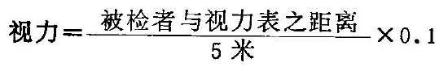

如被检者在4米处才能辨别0.1视标，则该眼视力为

、3米为0.06、2米为0.04、1米为0.02。

如被检者已前进至距视力表1米，仍未能辨别视标时，则瞩其辨别距离眼前若干厘米的指数或手动，并加以记录。例如右眼视力：指数或手动/30厘米。若被检者连手动都不能辨别，则应进入暗室，测其光感。检查时应严密遮盖另眼，使不透光。患眼如能辨别灯光（如电筒光）明灭，亦应记录距离，写为几米光感或眼前光感。如在暗室内完全不能辨认灯光，则该眼视力为无光感。

（2）近视力检查：检查须在充足自然光线或灯光下进行。近视力表置于眼前30厘米处，两眼分别进行，由最大视标0.1开始，顺序向下。凡能辨明1.0以上视标字向者，该眼近视力正常，如不能在30厘米辨明

1.0，则将视力表向眼前或后移动，至能辨明最小视标字向的距离为止，然后分别记录。如1.0/20厘米，或0.5/30厘米等。正常为1.0/30厘米。

### 三、视野检查法

视野检查即周边视力检查，是对黄斑中心窝以外视网膜的视力检查。当眼球平直向前注视一固定点时，其所察觉到的全部空间范围，视为视野。视野检查对内障眼病的诊断有重要的参考价值。

（1）对比法

医生与被检查者距离1米，相对而坐，双方的眼睛应在同一水平高度。如检查右眼，则遮盖被检者的左眼和医生的右眼，让被检者的右眼与医生的左眼相互注视，然后医生举起摇晃的手指，在两人之间于各个方位分别自外向内移动，至被检者能察觉手指的出现时，比较被检者视野与医生正常视野的差别。另一眼的检查方法相同。此法简便，有一定的可靠性，但不够精确，且无法作记录以供查考（图44）。

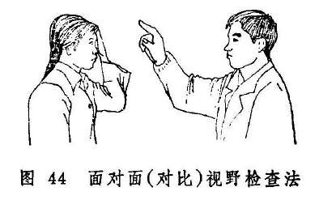

（2）视野计检查法

①弧形视野计检查：弧形视野计（图45）主要构造为一宽75厘米的半圆弧形金属板，底面为无光黑色或灰黑色，半径为33厘米，中央固定，可以旋转，弧的中央为零度。两端为90度。检查时令被检者的下颔放在支架上，遮盖一眼，使受检眼与零度在同一水平线上，并注视中央固定点不动，然后医生将视标沿弧板内面，由周边慢慢向中央移动。当被检者发现视标时，记下弧板外面的刻度。旋转弧板，至少在八个不同子午线作同样检查。并将所记录的各点用笔连接起来，即得出该眼的视野范围。

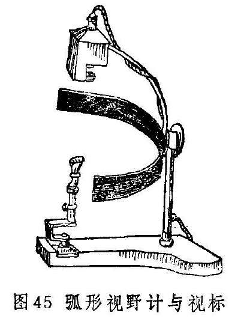

视野的大小，可因视标的大小与颜色，检查的距离，光线的强弱，背景的不同以及被检查鼻梁的高低，瞳孔和睑裂的大小及其精神与健康状况而有所改变。通常用3毫米直径的视标。若视力很差，则可改用直径为5或10毫米的。检查时只用白色视标有时不够，常须用有色视标作为补充。如视网膜疾病用蓝色或黄色，视神经疾病用红色或绿色等。

正常视野（白色）的平面范围，其颞侧为90度，鼻侧为60度，下侧为70度，上侧55度。（图46）因视网膜的黄斑部对颜色的感觉最为敏锐，而向周边逐渐减弱，所以各种颜色视野较白色为小。由外而内，为白、黄、蓝、红、绿，依次递减10度左右。

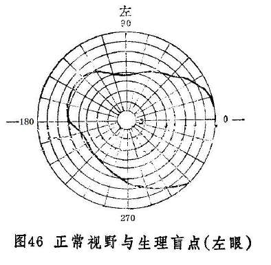

②平面视野计检查：主要检查围绕固视点，30度以内视野范围的暗点。平面视野计（图47）是用一块1平方米黑色不反光的布做成的布屏。以布屏的中心为圆心，按视角每5度划一同心圆，并在两侧15度之水平线下1.5度处标出其生理盲点的范围。检查时，被检者坐在布屏前1米处，遮盖一眼，受检眼在屏中央的注视点正前方，并注视不动。然后检查者持视标由周边向中央在各子午线上缓慢移动，检查出来的暗点范围先用小黑针头标记，最后描记在记录上。在此视野范围内，除生理盲点外所出现的任何暗点，皆为病理性暗点。

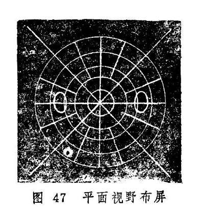

### 四、色觉检查法

视网膜辨别各种颜色的感觉，称为色觉。黄斑区中心窝的色觉敏度最高，离黄斑区越远则越低。先天性色觉障碍者通常分色盲与色弱两种。色盲为缺乏辨色能力，色弱为辨色力不足。检查色觉最常用的是假同色表。

检查应在晴天充足的自然光线下进行，不必两眼分别进行。方法是将假同色表放在距被检者眼前50厘米处，让其在5秒内读出表内数字和图案。如果辨认有困难，读错或不能读出，可按假同色表内所附说明书判定为何种色盲或色弱。

先天性色觉障碍中，红绿色盲（包括红绿色弱）者多，蓝色盲（包括蓝色弱）比较少见，全色盲者则更少见。色盲发病率男性高于女性。

### 五、眼压检查法

眼球内容物对眼球壁所施的压力，叫眼内压。眼压是眼内压的简称。常用的眼压检查法有指压法与眼压计测量法两种。

（1）指压法：令被检者双眼自然向下注视，医生用双手的中指、无名指和小指固定于被检者的额部，然后以双手的食指尖放在被检眼的上睑中央，隔着上睑，轻轻交替触压眼球（图48），凭借指尖触知的抵抗力，估计眼压的高低。通常用“T”代表眼压，如眼压正常，记录为“T~n~”；若偏高，则根据其程度不同分别记录为“T~n+1~”、

“T~n+2~”、“T~n+3~”；若偏低，则分别记录为“T~n-1~”、

“T~n-2~”、“T~n-3~”。

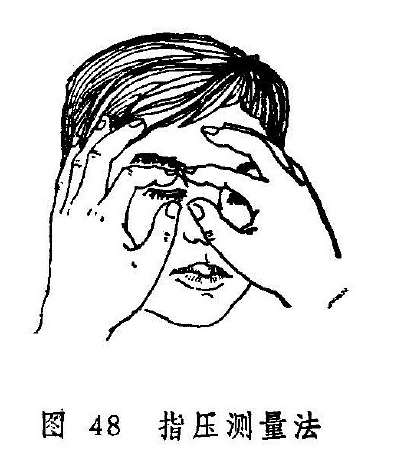

指测眼压，虽然比较粗糙，但方法简便，通过不断实践，有了一定的体验后，也可对眼压的高低作出一个比较正确的估计，故常为眼科医生所喜用。

（2）眼压计测量法：目前国内最常用的为压陷式的修兹氏眼压计（图49），测定时以砝码（有5.5克、7.5克、10克、15克四种）重量及压陷深度来推算眼压的高低。测量前先用0.5〜1%地卡因液滴眼两次作表面麻醉，将眼压计竖立在小圆板上试一下，指针恰恰指向零度是为准确，否则要加以调整，并将眼压计底盘用75%酒精擦洗消毒，待干备用。嘱被检者低枕平卧床上，双眼自然睁开，注视上方目标，使双眼角膜保持在水平正中位置，医生用左手拇指与食指轻轻分开上下眼睑，并固定在上下眶缘上，以免压迫眼球。用右手持眼压计把手并竖直，在没有任何一压力的情况下，将眼压计底盘轻轻放在角膜中央，迅速观察眼压计指针所指的刻度。如读数小于3，则更换较重的砝码，重新测量。用分数式记录所用的砝码重量与测得的读数，再查换算表，即得出眼压的实际毫米汞柱数，如5.5/5=17.30毫米汞柱，测量完毕后，用抗生素溶液滴眼。眼压越高，所需砝码的重量越大。我国人正常眼压为10〜21毫米汞柱。眼压在24小时内可稍有波动，但正常的波动幅度一般不超过5毫米。

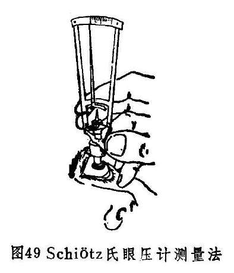

### 六、裂隙灯显微镜检查法

裂隙灯显微镜由两大系统组成，即光源投射系统和光学放大系统。裂隙灯显微镜不仅能使表浅的病变观察得十分清楚，而且可以调节焦点和光源的宽窄，作成“光学切面”，使深部组织的病变也能清楚地显示出来。还可附加前置镜、接触镜及三面镜等，配合检查视网膜周边部、前房角及后部玻璃体等。因此裂隙灯显微镜在眼科临床上的应用很广泛。

裂隙灯显微镜检查在暗室内进行，一般先用低倍显微镜，所看到的物象清晰而视野大；倍数加高，物象增大但视野较小。常用检查方法有6种。

1.弥散照明法：光源从较大角度斜向投射，同时将光源的裂隙充分开大，广泛照射〔图50（1）〕。检查结膜、角膜、巩膜等眼前部组织均可用此法，但这只是初步而粗略的检查，不能作细致的观察。

2.直接焦点照明法：即灯光焦点与显微镜焦点联合对在一起，是最常用照明法〔图50（3）〕。当强光投射到眼组织上时，由于眼组织透明度不同，光线呈反射、折射或散射。如光线投射到巩膜及虹膜上时，大部分光线被反射散射或吸收，故只见一境界清楚的照亮区。这样可以细致地观察该区的病变。裂隙照在透明的角膜和晶体上，则呈现一种乳白色的光学切面。角膜光学切面为透明六面体（图51），借此可以观察其弯曲度及厚度、有无异物及角膜后沉着物，以及浸润、溃疡等病变的层次和形态。将裂隙调成细小光柱射入前房，详查房水是否清晰，有无混浊物。当虹膜睫状体炎时，有蛋白质和细胞渗入前房，则房水混浊，可见房水闪辉阳性（图52），并可看到白细胞等的浮游（房水靠近虹膜处温度高则上升，靠近角膜则温度较低而下降，形成热对流现象，白细胞随热对流而浮游）。将焦点由瞳孔区后移，并作成窄裂隙光投射，晶体也出现一光学切面（图53）可将焦点先从晶体前囊，渐渐向后移到后囊，这样就可逐一看清晶体的各层情况。如看到晶体有混浊，应仔细观察其部位、形态，以便分析是先天性还是老年性白内障。如果后囊和后皮质混浊，色棕黄，形似锅底状，应考虑为并发性白内障。焦点再向后移则至玻璃体，此种照明方法检查，只能看到玻璃体前1/3。正常玻璃体前面在光束中，呈细纤条或纱膜状结构，形似悬挂的纱幕皱褶，随眼球运动而飘动。

3.后部照明法：此法灯光的焦点与显微镜的焦点不在一个平面上，而是把灯光照在被检查目标的后方。此法又分为直接后照法及间接后照法。直接后照法是显微镜焦点位于反射光路中；而间接后照法是显微镜焦点不在反射光路中〔图50（4）〕，如检查角膜后沉着物，将灯光照射在虹膜上，由虹膜上反射的光线，从沉着物背后照射过来，显微镜观察的方向恰在反射光路里，以虹膜作背影，则为直接后照法；显微镜观察的方向若不在反射光路中。而以瞳孔为背景，则为间接后照法。后部照明可发现角膜上皮或内皮水肿、角膜后沉着物、新生血管，轻微瘢痕以及晶体空泡等。

4.镜面反射照明法：角膜及晶体的前后面表面十分光滑，当光束射在各个表面时，均能形成规则的反射。显微镜在规则反射的光路上，看到的光反射称镜面反射〔图50（5）〕。如在某一表面上有不光滑部分，则该处称不规则反射，因此镜面反射照明法，可以仔细观察角膜前后面及晶体前后囊膜的细微变化。观察角膜内皮及后弹力层多用此法。

5.角膜缘分光照明法（角膜缘散射照明法）：将裂隙灯光照在角膜缘上，利用角膜的透明性，光线在角膜内部全反射，使角膜缘其它部位出现明亮环形晕，尤其对侧特别清楚〔图50（2）〕。此时显微镜焦点对准角膜，如角膜有任何混浊，如薄翳、水泡、沉着物、血管、穿孔、伤痕等均可清楚地看出。

6.间接照明法：将灯光焦点放在检查目标的附近，再用显微镜观察目标。通过光线在组织内部的分散与屈折，使之照明，可观察附近组织病变，此法又常与后照法合并应用〔图50（6））。

用裂隙灯显微镜检查眼底时，需在被检眼前加一58.6屈光度的平凹透镜（接触镜或前置镜），便能观察到后2/3玻璃体及后极部眼底。如瞳孔充分散大，角膜上加戴三面镜，则更能看到赤道部及周边眼底。因双目观察更可产生立体感，用以确定某些检眼镜检查不易分辨的病变。

### 七、内眼检查法

内眼检查须用检眼镜在暗室内进行。一般在瞳神正常大小情况下检查，必要时在排除绿风内障后，用1%新福林扩瞳，作比较详细的检查。

首先利用检眼镜检查一下屈光间质是否混浊，医生先将直接检眼镜的轮盘转到+8〜+12屈光度处（图54-1）。令被检者双眼直视远方，然后将检眼镜放在距被检眼20至30厘米处，使光线射到被检眼的瞳孔区，检查者从检眼镜小孔窥视各透明体情况。正常瞳孔区呈弥漫性桔红色反光。如该区出现点状、线状或团状黑影时，嘱被检者向各个方向转动眼球后向前方注视，若混浊随眼珠移动，则混浊在黑睛或晶珠上；若眼珠停止转动后，混浊仍在浮动，则表示混浊在玻璃体内。

接着将检眼镜转到“0”屈光度，准备检查眼底各部。若检查右眼，医生应站在病人右侧，用右手持检眼镜，以右眼观察；检查左眼时，则要站在左侧，用左手持镜，用左眼观察（图54-2）。同时将检眼镜移至被检眼前约2至3厘米处。若被检眼或医生有屈光不正，应调整轮盘度数至能看清视神经乳头形态为止。

眼底检查顺序及注意点：

1.视神经乳头：正常视神经乳头呈圆形或稍呈椭圆形，直径约1.5毫米，边缘清楚，颜色淡红。中央偏颞侧颜色较浅而稍凹陷。凹陷之大小各人虽不一致，但绝不能达到视神经乳头边缘。生理凹陷底部，隐约可见一些暗灰色小点，该处即为筛板。视网膜中央血管由视神经乳头中央进入眼底，视神经乳头上的静脉有时可见搏动。

检查时，注意视神经乳头的大小、形态，边缘是否清楚，颜色是否变红或褪色；有无水肿、出血、渗出；生理凹陷有无扩大、加深；视神经乳头上的血管是否偏鼻侧，以及有无屈膝样改变，动脉有无搏动；有无新生血管或赘生物。

2.视网膜中央血管：视网膜中央血管进入眼底分为颞上、颞下、鼻上、鼻下四支，然后又分为很多小支，支配视网膜各部。动脉色鲜红较细，静脉色暗红而较粗，正常时动脉与静脉第1、2分支的管径之比约为2：3。通过血管壁可以看到血柱。

检查时，注意血管的粗细及其弯曲度，动静脉管径的比例，血管壁反光情况，动静脉有无交叉压迫征，有无白鞘伴行，有无血管闭塞及侧枝循环等。

3.黄斑区：位于视网膜后极，视神经乳头的颞侧略偏下方，距视神经乳头约3〜4毫米，范围略大于一个视乳头大小，颜色较其它部视网膜为深，无血管，其中央可见一针头大反光点，为中心窝光反射。

检查时，注意黄斑区中心光反射是否存在，黄斑区有无水肿、出血、渗出物、色素紊乱，萎缩斑或裂孔等。

4.视网膜：正常感觉部视网膜是透明的，因脉络膜及色素上皮层的关系，使眼底呈均匀的桔红色。也有因脉络膜色素较多并充实于血管之间，使红色脉络膜血管透露出来呈豹纹状眼底的。

检查时，应沿血管分布区域进行。注意眼底视网膜有无水肿、渗出、出血、萎缩斑、新生血管或色素沉着，有无肿物、视网膜脱离或裂孔等。

眼底检查结果须绘成简图并作记录（正常眼底象见图55）。描述眼底病变时，通常以视神经乳头、视网膜血管、黄斑部为标志，注明病变的位置，如颞上、颞下、鼻上、鼻下，距离视神经乳头边缘有多少个视神经乳头直径等。病变的大小，也以若干视神经乳头直径表示。病灶如有隆起或凹陷，则以若干屈光度表示。每3屈光度约相当于1毫米。

### 八、眼科病案的内容与书写要求

病案是医院的主要档案材料，是临床诊疗工作的全面记录和总结，是临床、教学、科研的宝贵资料，也是衡量医疗质量的一项重要标志。因此，病案书写必须严肃认真，一丝不苟，实事求是；内容要完整、充实、正确，层次分明，并能突出中医特色；用词简明确切、通顺易懂，要求字体端正、清晰，不得涂改或补贴；标点符号运用正确。

住院病案需要系统而详尽，要求在24小时内完成；门诊病案则应简明扼要，当时完成。为了有所遵循，避免遗漏，现将眼科病案的格式、内容及书写要求列下：

门诊首次病案书写格式及内容

一般项目：包括姓名、性别、年龄、婚姻、民族、职业、籍贯、住址、工作单位、就诊时间和门诊号。

视力：包括远视力、近视力、矫正视力。

问诊：

主诉：记录患者就诊时的主要症状和发病时间。

病史：记录简要病史。必须记录现在证，可按“眼科十问歌”询问并简要记录。既往史和家族史必要时扼要记载。

望闻切诊：简要记录眼部望诊、触诊和舌象、脉象，必要时记录声音或气味。望、切全身发现的有重要意义的证情亦须记载。

辨证分析：辨明眼病发生的病因和病理机制。

诊断（病名后的括号内写证型）：

治法：

方药：（方名、药物、剂量、煎服法；外用药物注明用法）

医嘱：

眼科特殊检查及其他辅助检查：

西医诊断：

医师：（签全名）

年月日

（注：一般项目和视力可由门诊护士填写）

住院病案的格式、内容和书写

（一）一般项目

（二）视力

远视力：右左矫正远视力：右左

近视力：右左矫正近视力：右左

（三）问诊

1.主诉。

2.现病史。

3.既往病史（过去史）。

4.个人史（包括经带胎产史）。

5.家族史。

（四）望诊

1.全身

（1）神色形态。

（2）头面四肢。

（3）舌象。

2.目窍

（1）形态神彩。

（2）肉轮。

（3）血轮。

（4）气轮。

（5）风轮。

（6）水轮。

（五）闻诊

1.声息。

2.气味。

（六）切诊

1.眼部触诊。

2.肌肤胸腹。

3.按压俞穴。

4.脉象。

（七）辨证论治

1.四诊摘要。

2.辨证分析。

3.诊断。

（1）诊断依据。

（2）病名。

（3）证型。

4.治法。

5.方药。

6.其他疗法。

7.调护。

（八）辅助检查

1.体检。

2.特殊检查和化验。

（九）西医初步诊断或诊断

（十）签名

（十一）病程记录

（十二）手术记录

（十三）出院记录

病案书写

（一）一般项目包括姓名、性别、年龄、婚姻、民族、职业、籍贯、工作单位、家庭住址（详细）、发病节气、住院日期、病史采集时间、病史陈述者、家属姓名及工作单位、电话号码等。

（二）视力：应先查远视力，后查近视力，先右眼后左眼。视力不到

1.0时，检查其矫正视力（参阅“视力检查法”）。

（三）问诊

1.主诉：记录促使患者入院的主要症状和发病时间（时间短者应注明时、分），如“右眼视物不清三个月。”应用中医术语记录病人诉说的病情，不可用诊断名词代替症状。注意主诉与眼病之间的关系。

2.现病史：将症状按发生先后准确地记载其发病时间、发病诱因、发病缓急、病情经过等情况。曾在何处作过何种诊断和治疗，最好能问清其用过哪种药物和何种手术方法，并记录其治疗效果。接着，应详细记录患者现在具备的证候（包括主要症状和伴随症状）：可按“十问歌”逐一询问，如视觉情况、痒、痛、眵、泪、羞明、头部及全身感觉、饮食、睡眠、大小便等。对所患疾病常有的症状而本病没有时也应加以记录。

3.既往病史：询问过去曾患何种眼病及与眼病有关的全身病。因眼病常有反复发作，故应问过去的病证与现证有何不同与相同之处，用过何种药物和手术治疗，效果如何。配戴眼镜没有，有眼镜应问是远用、近用或两用，或为了矫正斜视与戴镜时间等。与眼病有关的其他病，按五官（龋齿、残根、乳蛾、鼻疔、鼻渊、耳脓、耳疔）、杂病、妇科病、传染病、性病等顺序逐一询问，以免遗漏。患者的营养状况、体质如何，是否经常患伤风感冒，是否接受过激素治疗。

4.个人史：出生地，曾到过何地，个人的嗜好（烟、酒、茶和常服的药品）、喜恶、性情（是否容易激动，在发病前有无变化），过去和现在的职业、工种与环境（是否与化学制剂、药品、毒物接触），居住条件，预防注射等。若已婚，应记录配偶及子女健康状况，有无冶游史。若为女患者，应询问经、带、胎、产史，及有无小产史。

5.家族史：询问父母、兄弟、姐妹及父亲与母亲的近亲的健康与疾病状况，尤其与现病史有关者应给予记录。父母是否近亲婚配，遇疑似先天性或遗传性疾病时，应询问家族中有无相似患者。家族中若有死亡者，应记录其去世的年龄和原因。未成年患者的家族史更须有详细记载。

（四）望诊

1.全身

（1）神色形态：神：神志是否清醒，精神如何，可用安静、爽朗、恍惚、呆钝、沉郁、烦躁、疲惫等词描述；色：指气色。面色是否正常，有无病色，如青、赤、黄、白、美，或鲜明、晦暗、枯涩等；形态：指形体动态，高矮、胖瘦、强弱、胸阔的宽厚与狭窄，皮肤的润泽与枯燥，有无肌肤甲错；注意有无脊柱偏斜、龟背、鸡胸、震颤、瘫痪、水肿以及头面部、四肢、行走坐卧等是否正常。

（2）头面四肢：具体描述头面、头发、耳、鼻、唇口、齿、咽喉、颈、胸、腹、背、皮肤、四肢关节、手足指（趾）甲等部位的情况。若无病征，此项可简略记载。小儿应检查并记录指纹。

（3）舌象：详细描述舌质神、色、形、态和舌苔的苔质与苔色。

2.目窍

（1）形态神彩：形：记录眼珠的存在和缺如，缺者注明系何种原因（先天性、手术性、外伤性），有无高突或凹陷；态：转动是否灵活，有无震颤及目翻上视、瞪目直视、侧目斜视，程度如何。神彩：记录目睛有无神彩，可用目光精彩、目珠精彩明润、神光充沛、目光晦暗无神、神光呆滞、漠然无神等词来描述。

（2）肉轮：胞睑形态：包括睑裂大小，对称否，启闭是否自如，有无上胞下垂、搐动、缺损、内翻、外翻；胞睑皮肤：色泽如何，有无红肿、浮肿、脓肿、疱疹、糜烂、滋水浸淫、痂块、痣、疣、肿块、疤痕；脸弦：有无红肿、溃疡、糜烂、结痂、肥水泡脓泡、鳞屑、分泌物；睫毛：排列是否整齐有无异色，有无倒入和脱落。睑内：颜色、光滑度，有无颗粒（包括颗粒的颜色、大小、质地、排列、分布范围）、溃疡（位置、大小）、疤痕（形状、分布）、异物、肿块（大小、位置）、分泌物（量、颜色、性质）。

（3）血轮：眦肉有无肿胀、色泽如何；两眦血络的多寡、粗细、颜色、侵及的轮位如何；分泌物（眼眵或脓液、粘液）的多少、颜色、性质；睛明穴处有无红肿。

（4）气轮：是否光滑润泽，颜色如何；白睛外膜有无浮肿或红赤（范围及程度，注意鉴别白睛红赤、抱轮红赤、白睛混赤）；赤脉的多寡、粗细、色泽、分布范围；有无颗粒或溃疡（部位、数量、形状、颜色、大小）、裂伤（大小、部位）、异物；有无白睛溢血（部位、范围、颜色）；白睛里层有无隆起、结节（大小、范围）、充血、肿瘤（局限性、弥漫性）、创伤（部位、形状、大小）。

（5）风轮：是否光彩明润。水膜：是否清晰，有无星点（多少、分布范围）、云翳或宿翼（部位、形状、范围、厚薄）、白膜或赤膜（方位、范围、厚薄），有无凸起或凹陷（部位、范围）；黄仁：色泽、纹理如何，展缩是否自如，有无粘连（前、后）、震颤、穿孔或离断（部位、大小），有无脓液蓄积（量、颜色）。另外，因为目内可望及的神水位于水膜后、黄仁前，其混浊不清则直接影响黑睛的色泽，故神水的混浊与否亦当记入风轮。

（6）水轮：是否黑莹净彻，有无散大、缩小、干缺、变形、变色等，是否展缩自如，睛珠有混浊时应记明颜色、混浊的形状、部位、范围等。

（五）闻诊

1.声息：语言、呼吸、咳嗽、呕吐、股声、嗳气、呃逆、咳喘、太息、呻吟等。

2.气味：注意病人的口、鼻、身体有无异常气味，并了解大便、小便、经带等气味。

（六）切诊

1.眼部触诊：胞睑部若有肿核，注意其硬度、与皮肤是否粘连、表面光滑否、推之能否移动；睑眦部之红肿，应注意其软硬、喜按或拒按、有无波动感；按压睛明穴址，注意有无粘浊泪水或脓液自泪窍溢出；白睛之血丝或颗粒、隆起有无压痛，推之可移否；眼珠软硬如何，喜按或拒按。

2.肌肤胸腹：包括头额、四肢的温度、湿度、及皮肤的弹性，有无水肿压痕；颈项、耳周围、腋部、腹股沟有无臖核、瘰疬、瘿瘤、肿物；腹部软硬如何，喜按或拒按，有无积聚痞块。

3.按压俞穴：耳穴、体穴有无压痛点、敏感点（穴名或部位）。

4.脉象：详细记录脉象，左右寸、关、尺或浮、中、沉有差别时，必须记录清楚。

（七）辨证论治

1.四诊摘要：列出辨证之依据。将四诊所得资料（尤其是与诊断和辨证有密切关系者）进行系统、全面、扼要地归纳，为诊断和辨证提供依据。

2.辨证分析：根根四诊摘要的资料，通过详细地分析与综合（包括节令、五运六气等有关分析），辨清疾病的名称和证候类型、病因病机、部位（脏腑经络、气血律液）等，并分析可能发生的病情转归，为诊断、立法、治疗提供依据。

3.诊断：包括诊断依据、病名、证型。

4.治法：写具体治疗方法，如“疏风清热”、“清肝退翳”等。需配合针灸、按摩、薰洗、点眼等方法综合治疗或手术治疗者，均须写出。

5.方药：包括方名、药物和剂量，并注明煎服法。

6.其他治疗方法：包括针灸取穴、按摩方法、薰洗方法、点眼药物及用法等。

7.调护：提出护理要点。包括给药、宜忌、食疗、起居等护理要求。

（八）辅助检查

1.体检：体温、呼吸、脉搏、血压、心、肺、脾、肾等检查。简要地记述阳性体征及有鉴别意义的阴性体征。

2.特殊检查和化验：包括眼科特殊检查、实验室检查、X光、心电图、脑电图、超声波、CT等检查结果。

（九）西医初步诊断或诊断：根据四诊及眼科特殊检查、其他辅助检查和化验结果，作出西医诊断。诊断暂时难以确立者，写初步诊断。

（十）签名病案记完后，医生应签全名以示负责，字迹要清晰以辨。

（十一）证治记录：住院病案写好之后，应及时作好证治记录。住院证治记录应另页填写，主要记录患者的病情变化和治疗措施。记录之内容要求如下：

1.现时病情的变化情况，对药物和其他疗法的反应，追补的化验和特殊检查结果，现有之症状、舌象、脉象（小儿指纹）等，作简练的记录。

2.对辨证及治则、治法加以论述。

3.方药及其他处理，详细列明。

4.上级医师的指示，会诊和查房讨论记录，交接班记录。

一般1〜2天记录一次；急性病每1〜2小时记录一次，或每天记录几次；慢性病每周也须记录1〜2次。每次记录都要签名。

（十二）手术记录：用特别的手术记录纸填写。记载患者手术的全部过程，应着重记载手术重点步骤，手术过程中的病情变化等。书写要简明扼要，重点突出。手术记录由手术者书写，应在手术后24小时内完成。要真实地描述手术经过，不得随意修改、挖补、剪贴、伪造。

（十三）出院记录：包括姓名、性别、年龄、入院日期、出院日期、入院时情况、入院时诊断、治疗经过、出院时情况、最后诊断和出院医嘱。入院时诊断包括主要证候、重要的特殊检查结果和治疗经过。出院时情况包括病情主要变化、特殊检查以及诊断治疗等情况。

### 九、眼科常用药物

（一）内服药

1.疏风药：疏风药有祛风解表、消肿止痛、制痒收泪及退翳作用。眼位至高，极易受风邪侵袭，故疏风药在眼科运用甚为广泛，尤其是外障眼病的初期。由于祛风药性多辛散，易劫伤津液，故凡阳盛火升，内热壅盛者勿用。阴虚血少或表虚多汗者，宜慎用之。

眼科常用的疏风药有辛凉解表药与辛温解表药两类。

（1）辛凉解表药：常用的有桑叶、菊花、柴胡、薄荷、蔓荆子、葛根、蝉蜕等。此类药有疏散风热、清利头目、消肿退赤、止痒止痛的作用，主治风热眼病。桑叶、菌花能疏散风热，还有清肝明目的作用，二者常常配伍应用于肝经风热眼病；柴胡有解热、舒肝、退翳与升提等多种作用，故可以通过的配伍，广泛应用于风热或肝热所致的黑睛翳障，或中气不足所致的上胞下垂、青盲内障及肝郁气滞所致的多种内外障眼病等；薄荷为治疗风热眼病的常用要药，蔓荆子还有消翳止泪的作用；葛根入阳明经，能清阳明经风热，故常用于风热眼病兼有前额头痛者；蝉蜕发散风热，尤擅长退翳，又止目痒，故常用于黑睛翳障，及睑弦赤烂、椒疮、粟疮等有明显目痒症状者。

（2）辛温解表药：常用的有荆芥、防风、羌活、白芷、细辛、藁本等，此类药有发散风寒、消肿止痛、止痒退翳的作用，主治风寒眼病。荆芥、防风、羌活的祛风止痛与止痒消翳力量较强，三药常配伍应用于外感风寒所引起的目赤生翳、眼痛头痛、目痒难忍，羌活更擅长于风湿眼痛，也可与独活配伍应用；细辛止痛作用尤强，故风寒眼病，眼痛头痛比较剧烈者，常用之祛风止痛，但不宜久用；白芷入阳明经，有镇痛止泪作用，主要用于外感风寒而头痛多泪者，肝虚冷泪亦可配伍补肝药应用；藁本发散风寒，善达头顶，故外感风寒眼病兼有头顶痛者，常配伍其它祛风药应用。

2.清热药：火性炎上，故眼病热证甚为常见。清热药性寒凉，具有退红解毒、消肿、止痛作用，故适用于热毒火邪引起的各种热证眼病。但寒凉之性，易伤胃气，故凡目病脾胃虚弱者当慎用。

常用的清热药可分为清热解毒药，清热泻火药，泄热攻下药，清热凉血药与清热明目药等。

（1）清热解毒药：常用者有金银花、野菊花、连翘、大青叶、板蓝根、蒲公英、紫花地丁等。用于一切热毒引起的实热证眼病。

（2）清热泻火药：常用者有龙胆草、黄连、黄芩、黄柏、石膏、知母、山栀、桑白皮等。用于邪热炽盛的眼病。其中龙胆草泻肝胆实火，故常用于因肝火上炎所致的黑睛疾患；黄连泻心火，清心除烦，可用于眦帷红赤；黄芩、桑白皮泻肺火，多用于白睛红赤；黄柏泻肾火，可用于退虚火，又可与黄连、黄芩配伍治湿热眼病。石膏、知母泻胃火，可用于胞睑红肿与黄液上冲；山栀能泻三焦之火，它可配伍其它清热药，广泛用于各种实热眼病。由于它能入血分，故亦配伍凉血药用于血热的眼症。

（3）通腑泻热药：常用者大黄、芒硝等。用于阳明腑实，里热上攻引起的目赤肿痛、眵泪胶粘。尤其是黑睛生翳，高厚前突者，可用大黄配伍其它平肝清热药同用。

（4）清热凉血药：常用者有犀角、玄参、生地黄、丹皮、赤芍、紫草等。主要用于热入营血的证候，尤其是曲热妄行，视力骤降者。犀角、紫草偏于凉血解毒；丹皮、赤芍有清热凉血、活血行瘀之功；地黄、玄参能清热凉血、养阴生津。

（5）清热明目药：常用的有夏枯草、决明子、青葙子、密蒙花、木贼草等。夏枯草善泻肝胆郁火，除用于肝火所致的目赤肿痛，眼底出血外，可配伍香附治肝郁目痛；决明子、青葙子清肝明目，二者往往同用；密蒙花祛风热养肝润燥，不论虚实眼证皆可用，肝肾阴亏有热者更为适宜；木贼草能疏风热，退翳明目。

3.补益药：眼病之虚证，多属气血或肝肾不足。故补益药中以益气养血及补益肝肾药较为常用。至于其它补益药，可参考《中药学》。

（1）益气养血药：

益气药常用者有黄芪、人参、党参、白术、怀山药、甘草等。适用于气虚所致之胞睑无力，常欲闭睡及翳陷不愈、青盲内障等症。

养血药常用者有熟地黄、当归、白芍、何首乌、阿胶、桑椹子等。适用于血虚所致眼干涩昏花、夜盲、青盲等。

（2）补益肝肾药：常用者有熟地黄、枸杞子、女贞子、覆盆子、沙苑蒺藜、菟丝子、楮实子等。地黄滋阴力强，故阴虚内障眼病常用之，枸杞子有滋补肝肾、益精明目作用，故广泛用于属肝肾不足之内外障眼病，常与菊花、地黄配伍应用；女贞子滋养肝肾之阴，善治阴虚内热，与旱莲草配伍，滋阴凉血止血，常用于眼内出血的早期；覆盆子补肝肾，固精明目；沙苑蒺藜、菟丝子皆能补肾益精明目；楮实子平补肝肾，养肝明目。

此外，肾阳不足者，常用巴戟天、补骨脂、仙茅、灵仙脾等药温补肾阳。

地黄虽为滋阴要药，但较滋腻，脾胃虚弱者宜慎用。

4.祛湿药：眼病因湿所致者较为多见。祛湿药能敛疱收湿，退肿去翳明目，故在眼科应用也甚广泛，但对阴虚血少或津液已伤者宜慎用。

常用的祛湿药有芳香化湿与利水渗湿两类。

（1）芳香化湿药：如霍香、佩兰、砂仁、白豆蔻、石菖蒲等有醒脾化湿，辟浊行滞之功，可用于湿浊内阻所致的眼病。藿香、佩兰发表袪湿，芳香化浊，两药常为同用；苍术尚可治肝虚雀目；石菖蒲芳香化浊，开窍明目。

（2）利水渗湿药：如车前子、茯苓、猪苓、泽泻、滑石、攻仁、赤小豆、木通等，有利水渗湿、通淋、消肿之功，适用于水湿上泛或湿热薰蒸所致眼病。其中车前子还能清热明目，故凡肝热所致的红肿翳膜，亦可用车前子配伍其它清肝药同用。

（3）另有疏风胜湿药如羌活、防风、独活、藁本等，苦寒燥湿药如黄芩、黄连、黄柏、胆草等，可参看前文所述。

5.理血药：凡因血溢、血瘀、血热、血虚等所致的眼病，均须应用理血药治疗。血溢者宜止血，血瘀者宜活血化瘀，血热者宜凉血，血虚者宜补血。后两者在清热药及补益药中已有叙述，这里仅介绍止血药与活血化瘀药。

（1）止血药：适用于出血性眼病。眼科常用的止血药，其作用有凉血止血、收敛止血和祛瘀止血的不同，故临证时当根据出血的原因、性质和症状选择使用。

凉血止血药：用于血热妄行的出血证。常用者有大蓟、小蓟、地榆、侧柏叶、白茅根、槐花等。

收敛止血药：用于制止各种眼病的新出血及外伤出血。常用者有仙鹤草、白芨、血余炭、藕节等。

化瘀止血药：用于瘀血阻滞而出血者，常用者有三七、蒲黄、花蕊石、茜草等。

（2）活血化瘀药：用于气血瘀滞所致的眼病。多与行气药同用。常用者有桃仁、红花、泽兰、川芎、丹参、刘寄奴、王不留行、赤芍、丹皮、牛膝、乳香、没药、五灵脂、虻虫、苏木、穿山甲、鸡血藤、血竭等。

6.理气药：凡气机失调所致眼病，均须用理气药治疗。但理气药多辛温发散，易耗气伤阴，故兼阴虚者慎用。

常用的理气药分疏肝理气药与行气导滞药两种。

（1）疏肝理气药：用于肝气郁结之眼病。常用者有柴胡、香附、青皮、佛手，川楝子、郁金等。

（2）行气导滞药：用于脾胃气滞眼病。常用者有枳实、陈皮、厚朴、广木香、槟榔、乌药、沉香等。

7.软坚散结药：软坚散结药具有祛痰软坚或消癥散结的作用。凡在眼病过程中，出现气血凝滞，痰郁互结的肿块、结节及瘢痕等，均可配伍软坚散结药以攻逐之。常用者有昆布、海藻、贝母、瓦楞子、夏枯草、牡蛎、鳖甲、三棱、莪术、海浮石、海蛤壳等。

8.退翳明目药：退翳药一般兼有疏散风热或清肝平肝的作用。常用的有蝉蜕、秦皮、谷精草、木贼草、密蒙花、石决明、珍珠母、白蒺藜、青葙子、蛇蜕、乌贼骨等。

蝉蜕、秦皮、谷精草、木贼草、密蒙花，宜用于风热翳障；石决明、珍珠母、白蒺藜、青葙子宜用于肝热翳障。退翳药大多性较和平，通过配伍，可以广泛用于新老翳障。如配伍疏风清热药或清肝药治新翳；配伍补益气血或补益肝肾药治宿翳；配伍绿豆衣、望月砂之类解毒明目药，治热毒攻目之翳膜等。

（二）外用药及其药剂配制法

眼科外用药多有退赤消肿、除勝收泪、止痒定痛或退翼明目等作用。大多适用于外障眼病有红肿热痛、眵泪粘结或翳膜遮睛等候者。其药剂可由单味药或多味药配制而成、有水、散、膏、锭、膜等剂型，用来点、洗、敷眼与内服药配合应用，则可收到内外合治的效果。

1.常用的外用药：

（1）矿物类药：雄黄、朱砂、炉甘石、硼砂、硇砂、玛瑙等。

（2）动物类药：熊胆、麝香、牛黄、乌贼骨、蝉蜕、石决明、珍珠、猪胆、羊胆、鲭胆等。

（3）植物类药：黄连、黄芩、黄柏、栀子、大黄、银花、秦皮、蒲公英、芙蓉叶、青黛、龙胆草、紫草、生地、菊花、薄荷、木贼草、密蒙花、荆芥、防风、蔓荆子、聲弄、甘草、三七、乳香、没药、冰片等。

2.外用药剂配制法通则：眼科外用药剂方面，常用的有水剂、散剂、膏剂、锭剂等。由于眼的结构特殊，要求施于眼部的制剂必须无刺激性，无菌。因此，眼用制剂除与一般制剂相似外，在固体颗粒的粒径上、基质与成品的灭菌、酸碱度（pH值）与渗透压等方面，均有特殊的要求，现结合各剂型简述于下：

（1）眼用水剂：分滴眼剂与洗眼剂两种。工业生产以滴眼剂为主，洗眼剂多由药房配制。滴眼剂的质量要求类似注射剂，应灭菌、澄明、稳定pH值必须在5〜9的范围（pH值最好是5〜8）渗透压相当于浓度为

0.6〜1.5%的氯化钠溶液。

配制法：多用水煮醇沉法。即将药材加工煎煮两次，过滤，取滤液加乙醇使杂质沉淀除去，滤液回收乙醇后，适当浓缩至需要浓度，调pH值与渗透压，再精滤即成。如千里光眼药水。

此外还有用溶解法、浸渍法者，如黄连西瓜霜眼药水、化铁丹眼药水。

（2）眼用散剂：系指供眼用的粉末状药物。中国药典规定：眼用散剂必须能通过200目筛，以减少刺激性，配制的用品、药品及成品都要求经灭菌处理。

配制法：先将药物分别粉碎。有用干法粉碎法，如冰片、牛黄等；有用水飞法，如炉甘石、朱砂、雄黄等。粉碎成极细粉末后，混匀，过筛即成。如八宝眼药。

（3）眼用膏剂：系指供眼用的药物软膏。配制眼用软膏的器械、容器均应灭菌，盛装眼膏的锡管内壁可用紫外线灯照射30〜40分钟。

配制法：软膏的组成包括基质与药物两方面，基质必须纯净而细腻，稠度适宜，常用的基质有黄凡士林、羊毛脂、液状石蜡组成，其比例为8:1:1，配制前经150℃干热灭菌至少1小时，也有用蜂蜜、麻油、蛋黄油为基质的；药物多经提取、精制、浓缩成稠膏状。如为不溶性药物，应先研成极细粉末，最后用研和法或热熔法，将药物与基质混合均匀即可，如五胆膏。

（4）眼用锭剂：系指可供眼用的以药物粉末制成的固体制剂。多用于眼睑疾病。其配制法是将药物粉末加适量的糯米糊或具有粘性的药物作粘合剂，揉成湿润块状。再经过一定的模型压制成型，晾干或低温烘干即成。如紫金锭。

## 常见证治方剂

画

**〔1〕**一绿散（《审视瑶函》）：芙蓉叶生地黄各等分二味共捣烂，敷眼胞上。或为末，以鸡蛋清调匀敷亦可。

二画

**〔2〕**二圣散（《眼科阐微》）：明矾3克胆矾3克大枣十枚煎水外洗。

**〔3〕**二陈汤（《和剂局方》）：法半夏陈皮茯苓炙甘草

**〔4〕**十灰散（《十药神书》）：大蓟小蓟荷叶侧柏叶茅根茜草根大黄栀子棕榈皮牡丹皮各等分，烧灰存性。

**〔5〕**十全大补汤（《和剂局方》）：人参肉桂川芎地黄黄芪茯苓白术当归白芍炙甘草

〔6）十味益营煎（《目经大成》）：人参炙黄芪五味子酸枣当归熟地黄甘草川萸肉山药肉桂

**〔7〕**十珍汤（《审视瑶函》）：生地黄当归白芍药地骨皮知母丹皮天麦冬人参甘草梢

**〔8〕**七宝丸（《秘传眼科龙木论》）：人参真珠石决明瑰珀冰片青鱼胆熊胆茺蔚子

**〔9〕**七厘散（《良方集腋》）：血竭麝香冰片乳香没药红花朱砂儿茶

**〔10〕**人参羌活汤（《审视瑶函》）：赤芍药人参羌活独活地骨皮川芎柴胡桔梗细甘草枳壳前胡天麻

**〔11〕**人参养荣汤（《和剂局方》）：白芍当归陈皮黄芪桂心人参煨白术炙甘草熟地五味子茯苓远志

**〔12〕**八宝眼药（《中华人民共和国药典》1977年）：炉甘石冰片珍珠硼砂麝香熊胆野荸荠海螵蛸

**〔13〕**八珍汤（《正体类要》）：当归川芎白芍熟地黄人参白术茯苓炙甘草

三画

**〔14〕**广大重明汤（《兰室秘藏》）：龙胆草防风细辛甘草各3克，水煎取汁，乘热熏洗患眼。

**〔15〕**三仁五子丸（《审视瑶函》）：酸枣仁柏子仁薏苡仁枸杞子菟丝子覆盆子五味子车前子熟地黄酒当归白茯苓沉香末。研粉蜜丸如桐子大，每服五十丸，盐酒送下。

**〔16〕**三仁汤（《温病条辨》）：杏仁滑石白蔻仁厚朴白通草淡竹叶薏苡仁半夏

**〔17〕**三黄汤（《银海精微》）：黄芩黄连大黄（若热甚脉洪盛者加黄柏石膏山栀子之类）水煎，食后温服。

**〔18〕**三黄眼液（《中医眼科学》成都中医学院）：川连黄芩黄柏各6克，加水800ml，煮沸1小时，过滤。再加水400ml，煮沸半小肘，过滤。将两次过滤液相合，加热浓缩至200ml，加适量月石，调节pH7左右，再过滤2次，高压消毒，加入适量防腐剂0.001%硝基苯汞。

**〔19〕**大黄当归散（《医宗金鉴》）：大黄当归木贼黄芩栀子菊花苏木红花

**〔20〕**大秦艽汤（《素问病机气宜保命集》）：秦艽当归甘草羌活防风白芷熟地黄茯苓石膏川芎白芍独活黄芩生地黄白术细辛

〔21」万金膏（《眼科篡要》）：黄连荆芥防风文蛤苦参根薄荷铜绿

**〔22〕**万应蝉散（《原机启微》）：蝉蜕石决明当归身炙甘草川芎防风茯苓苍术羌活蛇蜕赤芍

**〔23〕**千里光眼药水（《医院制剂》修订本）：千里光全草50克，蒸馏水适量，共研制100ml。

**〔24〕**千里光眼液（《中医眼科学》成都中医学院）：用千里光全草1:1醇提法配制的水溶液。

**〔25〕**千金托里散（《眼科集成》）：党参生黄芪茯苓甘草当归芍药川芎桔梗银花白芷防风麦冬连翘黄芩胆草竹叶陈米

**〔26〕**小黄连膏（《圣济总录》）：黄连去须捣末，芦荟（研）各30克龙脑（另研）1.5克制法：先将黄连、芦荟末，以新绵裹，用水二盏，于银器内，以重火煮取汁，三分减二，入龙脑，以瓷瓶子内收，点眼。

**〔27〕**小续命汤（《千金要方》）：麻黄防己人参黄芩桂心甘草芍药芎䓖杏仁附子防风生姜

四画

**〔28〕**五皮散（《中藏经》）：桑白皮陈皮生姜皮大腹皮茯苓皮

**〔29〕**五味消毒饮（《医宗金鉴》）：金银花野菊花蒲公英紫花地丁紫背天葵

**〔30〕**五胆膏（《审视瑶函》）：熊胆鲭胆鲤胆猪胆羊胆川蜜各等分，将胆蜜入银铫或铜铫中，微火熬成膏，取起用磁盒藏之，出火毒，点眼神良。

**〔31〕**五黄膏（《银海精微》）：川黄连黄芩黄柏大黄黄丹为细末，罐内收贮，以芙蓉叶用冷水，或煎茶调，贴二太阳穴。

**〔32〕**六君子汤（《医学正传》）：人参白术茯苓甘草陈皮半夏生姜大枣

**〔33〕**六味地黄汤（丸）（《小儿药证直诀》）：熟地山芋肉山药泽泻茯苓丹皮

**〔34〕**内疏黄连汤（《医宗金鉴》）：黄连黄芩连翘栀子大黄白芍当归薄荷桔梗木香槟榔甘草

**〔35〕**天王补心丹（《摄生秘剖》）：生地当归身天冬麦冬人参玄参丹参茯苓远志五味子柏子仁炒枣仁桔梗朱砂

**〔36〕**止痛没药散（秘传眼科龙木论》）：没药60克血竭30克大黄45克芒硝45克捣细过箩，食后热茶调下3克。

**〔37〕**止泪补肝散（《银海精微》）：熟地白芍当归川芎白蒺藜防风木贼夏枯草

**〔38〕**天麻钩藤饮（《杂病证治新义》）：天麻钩藤石决明杜仲川牛膝桑寄生茯神栀子益母草黄芩夜交藤

**〔39〕**牛胆丸（《秘传眼科龙木论》）：牛胆钩藤各15克人参羚羊角藿香广香各30克琥珀少许，共为末，炼蜜为丸，如桐子大，空心薄荷汤下三丸，七岁以上五丸。

**〔40〕**化坚二陈汤（《医宗金鉴》）：陈皮半夏茯苓炙甘草黄连白僵蚕荷叶煎汤合丸。

**〔41〕**化铁丹眼水（《眼科证治经验》）：雄鸡化骨（脾脏）3个，乌梅3个杏仁7个川椒胆矾风化硝各9克炒砂仁真铜绿青盐各3克新绣花针3支。

制法：将以上各药用绢带包好，入瓷瓶内，以蒸馏水1斤浸之，将瓶口封固，浸七日，以铁化为指标，过滤两次，消毒后之药液，加4倍用硼酸缓冲剂（其制法：硼酸0.2克，溶成90毫升；硼酸0.05克，溶成110毫升；氯化钠0.54克，共加水到1000毫升），酸碱度调至7.6即可。

**〔42〕**乌风补肝散（《医宗金鉴》）：熟地白芍当归川芎木贼蒺藜防风夏枯草

**〔43〕**乌金膏（《疡医大全》）：明矾30克，好米醋一碗半，共入铜锅内，文武火熬干，取出去火气，研细至无声，用米糕和匀，作条晒干，量疮口深浅插入，每日2〜3次。

五画

**〔44〕**立胜煎（《中医眼科学讲义》1964年）：川连黄柏秦皮甘草加水300ml 前30分钟后过滤，浓缩到150ml，再加缓冲溶液以消除刺激性。

**〔45〕**平肝泻火汤（《审视瑶函》）：生地黄连翘白芍药柴胡夏枯草枸杞子当归车前子

**〔46〕**甘露饮（《阎氏小儿方论》）：熟地黄麦冬枳壳甘草茵陈枇杷叶石斛黄芩生地黄天冬

**〔47〕**甘露消毒丹（《温热经纬》）：飞滑石薄荷绵茵陈川贝母淡黄芩石菖蒲白蔻仁连翘木通射干藿香

**〔48〕**石决明散（《沈氏尊生书》）：石决明草决明赤芍青葙子麦冬羌活山栀子木贼大黄荆芥

**〔49〕**石斛夜光丸（《原机启微》）：石斛生地熟地天冬麦冬人参山药菟丝子枸杞子肉苁蓉茯苓甘草草决明菊花白蒺藜青葙子防风羚羊角犀角川芎川连牛膝枳壳杏仁五味子

**〔50〕**石膏羌活汤（散）（《宣明论》）：石膏羌活苍术蒙花麻子木贼藁本黄芩细辛菊花川芎荆芥白芷干菜子甘草

**〔51〕**石燕丹（《医宗金鉴》）：炉甘石（入大银罐内，盐泥封固，用炭火煅一炷香，以罐通红为度。取起为末，用黄连水飞过，再入黄芩、黄连、黄柏汤内，将汤煮干，以甘石如松花色）120克硼砂（铜勺内同水煮干），石燕琥珀、朱砂（水飞）各取净末4.5克冰片、麝香各0.45克为极细末，研至无声，每用少许，水蘸点眼大眦。

加减：枯涩无泪加熊胆、白蜜，白翳加真阿魏，黄翳加鸡内金，风翳加蕤仁，热翳加珍珠、牛黄，冷翳加附子尖、雄黄，老翳倍硼砂，加猪胰子。

**〔52〕**正容汤（《审视瑶函》）：羌活白附子胆南星白僵蚕秦艽防风法半夏木瓜松节甘草生姜酒

**〔53〕**左归饮（《景岳全书》）：熟地黄山药枸杞子山萸肉牛膝菟丝子龟板鹿角胶

**〔54〕**左金丸（《丹溪心法》）：黄连吴茱萸

**〔55〕**右归丸（《景岳全书》）：熟地山茱萸怀山药当归肉桂枸杞鹿角胶菟丝子制附子杜仲

〔56）右归饮（《景岳全书》）：熟地黄山药枸杞子杜仲山萸肉炙甘草肉桂制附子

**〔57〕**龙胆饮（《类证治裁》）：黄芩犀角木通黄连玄参山栀大黄芒硝竹叶龙胆草黄柏

**〔58〕**龙胆泻肝汤（《医宗金鉴》）：龙胆草栀子黄芩胡柴泽泻木通车前子当归生地黄甘草

**〔59〕**龙脑煎（《秘传眼科龙木论》）：龙脑0.3克秦皮防风细辛宣黄连甘草各4.5克。捣罗滤去渣，又入蜜120克，煎至五、七沸，入磁瓶内盛，勿泄气，每用点眼。

**〔60〕**四生散（《银海精微》）：生地生当归生薄荷生艾叶朴硝共捣烂，贴眼眶并患处。

**〔61〕**四君子汤（《和剂局方》）：人参白术茯苓甘草

**〔62〕**四味大发散（《眼科奇书》）：麻黄绒藁本蔓荆子细辛老姜

**〔63〕**四神丸（《证治准绳》）：补骨脂肉豆蔻五味子吴茱萸

**〔64〕**四物汤（《和剂局方》）：川芎当归白芍熟地黄

**〔65〕**四顺清凉饮子（《审视瑶函》）：当归身龙胆草黄芩桑皮车前子生地赤芍枳壳炙甘草熟大黄防风川芎川连木贼草羌活柴胡

**〔66〕**归芍红花散（《审视瑶函》）：当归大黄栀仁甘草白芷防风生地黄连翘各等分

**〔67〕**归芍地黄汤（《症因脉治》）：当归白芍药生地黄牡丹皮茯苓山药山茱萸泽泻

**〔68〕**归脾汤（《济生方》）：白术茯神黄芪龙眼肉党参酸枣仁木香炙甘草远志当归

**〔69〕**生化汤（《傅青主女科》）：全当归八钱川芎三钱桃仁去皮尖，十四枚干姜炮黑五分甘草炙

**〔70〕**生蒲黄汤（《眼科六经法要》）：生蒲黄旱莲草生地荆芥炭丹皮郁金丹参川芎

**〔71〕**生铁落饮（《张氏医通》）：铁落一升石膏二两龙齿、白茯苓、防风各一钱五分玄参、秦艽各一两研为细末，入铁落水中，煮取五升，去渣，入竹沥一升和匀，温服二合，一日三次。

**〔72〕**生地黄散（《普济方》）：川芎生地黄羚羊角大黄赤芍枳壳木香

**〔73〕**白薇丸（《审视瑶函》）：白薇白蒺藜石榴皮羌活防风

**〔74〕**仙方活命饮（《妇人良方》）：穿山甲白芷天花粉皂角刺当归尾甘草赤芍药乳香没药防风贝母陈皮金银花

**〔75〕**加味二陈四物汤（《眼科集成》）：生地当归白芍川芎前胡陈皮半夏茯苓甘草浙贝白豆蔻菊花夏枯草姜汁

**〔76〕**加味四物汤（《眼科集成》）：酒生地酒当归酒川芎酒白芍苏木人参桃仁红花陈皮木贼兑酒冲服。

**〔77〕**加味补中益气汤（《张皆春眼科证治》）：炙黄芪12克当归9克炒白术6克人参3克陈皮1.5克炙甘草6克白芍9克升麻1.5克生姜3片大枣5枚。

**〔78〕**加味逍遥饮（《审视瑶函》）：酒归身白术白茯神生甘草酒白芍柴胡炒栀子丹皮

**〔79〕**加味修肝散（《银海精微》）：羌活防风桑螵蛸栀子薄荷当归赤芍甘草麻黄连翘菊花木贼白蒺藜川芎大黄黄芩荆芥

**〔80〕**加味调中益气汤（《审视瑶函》）：黄芪升麻细辛陈皮木香川芎党参炙甘草蔓荆子当归苍术柴胡

**〔81〕**加减四物汤（《审视瑶函》）：生地黄川芎赤芍药当归苦参薄荷牛蒡子连翘天花粉荆芥穗防风

**〔82〕**加减地黄丸（《原机启微》）：生地黄熟地黄枳壳牛膝当归羌活杏仁防风

**〔83〕**加减驻景丸（《银海精微》）：车前子当归（去尾）熟地黄五味子枸杞子楮实子川椒菟丝子共为细末，蜜水煮糊为丸，如梧桐子大，每服三十丸，空心温酒送下。

六画

**〔84〕**决明灵砂散（《原机启微》）：石决明6克（醋锻）夜明砂6克（研）羯羊肝60克竹刀切肝为二片，夹二药末，用麻皮缠定，用淘米泔水一大碗煮至半小碗，临卧，连肝药汁并服。

**〔85〕**安宫牛黄丸（《温病条辨》）：牛黄郁金犀角黄连黄芩雄黄山栀子朱砂梅片麝香珍珠金箔衣

**〔86〕**百合固金汤（《医方集解》）：生地熟地黄麦冬贝母百合当归甘草玄参桔梗芍药

**〔87〕**西瓜霜合剂（《经验方》）：西瓜霜5克黄连5克黄芩2.5克秦皮2.5克月石0.2克制法：加蒸馏水200CC煎到100CC滤过，调整pH值即得。

**〔88〕**托里消毒散（《外科正宗》）：黄芪皂角刺银花炙甘草桔梗白芷川芎当归白芍白术茯苓人参

**〔89〕**地芝丸（《东垣试效方》）：天门冬生地黄各120克枳壳菊花各90克为末，炼蜜为丸，如梧桐子大，每服百丸，食后茶清送下。

**〔90〕**地肤子丸（《外台秘要》）：地肤子决明子

**〔91〕**地黄散（《审视瑶函》）：生地黄熟地黄当归大黄谷精草黄连白蒺藜木通犀角玄参木贼草羌活炙甘草猪肝或羊肝

**〔92〕**当归补血汤（《医宗金鉴》）：薄荷羌活茺蔚子蒺藜白芍柴胡菊花防风川芎甘草生地黄当归

**〔93〕**当归活血饮（《审视瑶函》）：当归川芎白芍熟地黄芪苍术薄荷防风川羌甘草

**〔94〕**竹叶泻经汤（《原机启微》）：竹叶柴胡栀子羌活升麻黄连黄芩大黄赤芍决明子茯苓泽泻车前子炙甘草

**〔95〕**导赤散（《小儿药证直诀》）：生地木通甘草梢竹叶

**〔96〕**朱砂煎（《中医眼科学讲义》1964年）：黄连黄柏秦皮细辛白芷各15克乳香3克朱砂（飞过）0.3克冰片0.3克蜂蜜60克先将前五味加水500ml入煎，煎至250ml过滤，然后加乳香、蜂蜜、朱砂，再加热微煎，最后入冰片，略煎后过滤，净得药水250ml，每隔两小时滴眼一次。

**〔97〕**阳和汤（《外科全生集》）：熟地黄白芥子鹿角胶姜炭麻黄肉桂生甘草

**〔98〕**防风通圣散（《宣明论》）：防风荆芥连翘麻黄薄荷川芎当归白芍白术黑山栀大黄（酒蒸）芒硝石膏黄芩桔梗滑石甘草

**〔99〕**血府逐瘀汤（《医林改错》）：当归生地桃仁红花枳壳赤芍柴胡甘草桔梗川芎牛膝

**〔100〕**如意金黄散（《外科正宗》）：天花粉黄柏大黄姜黄白芷厚朴陈皮苍术天南星甘草

七画

**〔101〕**沙参麦冬饮（《温病条辨》）：沙参麦门冬扁豆玉竹天花粉甘草

**〔102〕**补心汤（《眼科纂要》）：人参黄芪当归生地麦冬知母远志桔梗连翘甘草

**〔103〕**补中益气汤（《东垣十书》）：黄芪党参炙草当归白术柴胡陈皮升麻

**〔104〕**补阳还五汤（《医林改错》）：黄芪当归尾赤芍地龙川芎桃仁红花

**〔105〕**补阳抑阴汤（《眼科临证笔记》）：大丽参黄芪石菖蒲柏子仁菟丝子破故纸朱茯神白蒺藜车前子远志肉粉甘草

**〔106〕**补阴抑阳汤（《眼科临证笔记》）：大熟地生龟板生牡蛎石决明茯苓知母黄柏菟丝子代赭石石菖蒲菊花远志甘草

**〔107〕**补肾磁石丸（《济生方》）：磁石煅后醋淬，石决明甘菊花肉苁蓉酒浸切焙菟丝子酒浸一宿焙干各30克。为细末，用雄雀十五只，去毛、嘴、足，留肚肠，以青盐60克，水三升同煮，令雀烂水欲尽为度，取出先捣如膏，和药末为丸，如梧子大，每服20丸，空心温酒送下。

**〔108〕**补漏生肌散（《审视瑶函》）：乳香血竭枯矾轻粉各等份。

**〔109〕**羌活胜风汤（《原机启微》）：柴胡黄芩白术荆芥穗枳壳川芎防风独活羌活前胡薄荷桔梗白芷甘草

**〔110〕**羌菊散（《麻科活人全书》）：羌活白菊花蝉蜕防风木贼栀仁大黄谷精草白蒺藜黄连沙苑蒺藜甘草

**〔111〕**谷精草汤（《审视瑶函》）：谷精草白芍荆芥穗玄参牛蒡子连翘草决明菊花龙胆草桔梗灯心白水煎不拘时服。

**〔112〕**远志丸（《济生方》）：远志菖蒲茯神龙齿人参朱砂茯苓

**〔113〕**抑阳酒连散（《原机启微》）：生地黄独活黄柏防风知母蔓荆子前胡羌活白芷生甘草酒黄芩寒水石栀子酒黄连汉防己

**〔114〕**抑肝扶脾汤（《医宗金鉴》）：龙胆草柴胡黄连青皮人参白术茯苓陈皮白芥子山楂神曲炙甘草姜枣

**〔115〕**抑金散（《开明眼科》）：桑皮花粉生地寸冬沙参薄荷防风白芷桔梗甘草

**〔116〕**苍车四物汤：当归熟地黄酒白芍川芎车前子苍术

**〔117〕**还阴救苦汤（《原机启微》）：升麻白术炙甘草柴胡防风桔梗黄连黄柏知母连翘生地羌活各15克藁本12克川芎30克红花3克归尾21克细辛7克

〔118］还睛丸（《秘传眼科龙木论》）：防风茺蔚子车前子知母人参桔梗黄芩干地黄细辛五味子黑参

**〔119〕**连柏益阴丸（《东垣试效方》）：甘草根羌活独活当归身五味子防风黄芩草决明黄柏知母黄连石决明

**〔120〕**助阳活血汤（《银海精微》）：柴胡白芷升麻当归黄芪防风蔓荆子甘草

**〔121〕**吴茱萸汤（《审视瑶函》）：姜半夏吴茱萸川芎炙甘草人参茯苓白芷陈皮生姜

**〔122〕**吹霞散（《审视瑶函》）：白丁香3克白芨、白牵牛各9克研细腻无声，放舌上试过无渣，方可收贮备用，每日点眼三次。（白丁香即雄麻雀粪）。

**〔123〕**张氏攀筋方（《眼科探骊》）：生地丹皮桃仁川牛夕黄柏竹叶三七粉（冲服）。体虚者去桃仁加当归麦冬甘草。

**〔124〕**驱风一字散（《普济方》）：川乌川芎川羌荆芥防风

**〔125〕**驱风散热饮子（《审视瑶函》）：连翘牛蒡子羌活薄荷防风川芎赤芍归尾栀子大黄甘草少阳经加柴胡；少阴经加黄连；风盛倍羌、防；热盛倍大黄。食远热服。

**〔126〕**枸菊地黄汤（丸）（《医级》）：即六味地黄汤加枸杞子菊花

**〔127〕**鸡蛋黄油膏（《中医眼科学》1964年）：鸡蛋黄1〜3枚（放入铜铫内，以文火煎熬，色黑如油）制炉甘石、冰片各少许〔两药研为细末，和匀，涂擦患处〕。

**〔128〕**阿胶鸡子黄汤（《通俗伤寒论》）：阿胶生白芍石决明双钩藤大生地炙甘草茯神木鸡子黄络石藤生牡蛎除阿胶、鸡子黄二味外，用水煎汁去渣纳胶烊尽，再入鸡子黄，搅令相得，温服。

**〔129〕**附子理中丸（《和剂局方》）：炮附子人参白术炮姜炙甘草

八画

**〔130〕**定志丸（《和剂局方》）：远志菖蒲人参茯神为细末，炼蜜为丸，如桐子大，以朱砂为衣，每服三十丸，米饮送下，食后临卧，日进三服。

**〔131〕**泻心汤（《银海精微》）：黄连连翘黄芩大黄荆芥赤芍车前子薄荷菊花水煎服。

**〔132〕**泻白散（《小儿药证直诀》）：桑白皮地骨皮甘草

**〔133〕**泻肝散（《银海精微》）：黑玄参大黄黄芩知母桔梗车前子龙胆草羌活当归芒硝

**〔134〕**泻肝汤（《审视瑶函》）：地骨皮玄参车前玄明粉茺蔚子大黄知母

**〔135〕**泻肾汤（《审视瑶函》）：枸杞子生地黄黄柏知母麦门冬山萸肉白芍归尾五味子白茯苓独活

**〔136〕**泻青丸（《小儿药证直诀》）：龙胆草山栀大黄羌活防风川芎当归各等分为末，炼蜜为丸，竹叶汤送下

**〔137〕**泻肺饮（《眼科纂要》）：石膏赤芍黄芩桑白皮枳壳木通连翘荆芥防风栀子白芷羌活甘草

**〔138〕**泻肺汤（《审视瑶函》）：桑白皮黄芩地骨皮知母麦冬桔梗

**〔139〕**泻黄散（《眼科集成》）：藿香甘草石膏栀子山楂大黄防风枳实

**〔140〕**泻脾除热饮（《银海精微》）：黄芪黄芩黄连大黄芒硝茺蔚子车前子桔梗防风

**〔141〕**河间当归汤（《审视瑶函》）：白术白茯苓炮干姜细辛川芎白芍药炙甘草官桂陈皮当归身人参生姜大枣水煎热服。

**〔142〕**炉硝散（《中医眼科学》1964年）：黄芩菊花羌活防风白芷川芎蔓荆子，将以上七味煎成浓汁，去渣浓缩成糊，加入研细的炉甘石、火硝、冰片，使之调匀。用时先表麻，然后涂于胬肉表面，每日二次，五日为一疗程。

**〔143〕**苓桂术甘汤（《伤寒论》）：茯苓桂枝白术炙甘草

**〔144〕**转光丸（《济生丸》）：生地黄熟地黄茯苓川芎蔓荆子防风山药白菊花细辛

**〔145〕**明目地黄丸（《审视瑶函》）：熟地生地山药泽泻山茱萸牡丹皮柴胡茯神归身五味子共为细末，炼蜜为丸，每服9克。

**〔146〕**驻景丸（《银海精微》）：楮实子枸杞子五味子人参熟地黄肉苁蓉乳香川椒菟丝子

**〔147〕**肥儿丸（《医宗金鉴》）：人参白术茯苓黄连胡黄连使君子神曲炒麦芽炒山楂炙甘草芦荟

**〔148〕**知柏地黄丸（《医宗余鉴》）：知母黄柏熟地黄山萸肉淮山药泽泻茯苓丹皮

**〔149〕**金匮肾气丸（《金匮要略》）：干地黄山药山芋肉泽泻茯苓丹皮桂枝炮附子

**〔150〕**参苓白术散（《和剂局方》）：党参白术茯苓扁豆陈皮山药炙甘草莲子肉薏苡仁桔梗缩砂仁

**〔151〕**炙甘草汤（《伤寒论》）：炙甘草人参干地黄桂枝阿胶麦门冬麻仁生姜大枣

九画

**〔152〕**济生肾气丸（《济生方》）：熟地黄山芋肉炒山药丹皮茯苓泽泻车前子官桂炮附子川牛膝

**〔153〕**洗肝煎（《银海精微》）：大黄栀子防风薄荷川芎当归羌活甘草

**〔154〕**养阴清肺汤（《重楼玉钥》）：生地炒白芍玄参麦冬贝母丹皮薄荷生甘草

**〔155〕**养血当归地黄汤（《济生拔萃》）：熟地白芍当归川芎细辛白芷藁本防风

**〔156〕**穿心莲眼膏（《全国中草药新医疗法展览会资料汇编》）：穿心莲浓缩液50g，新洁而灭2g加适量凡士林，无水羊毛脂共制成

10000g。制法：1.取穿心莲200g水煎，煎液加适量95%乙醇，静置过滤，滤液回收乙醇，浓缩至50g，65度左右保温，备用。2.取无水羊毛脂1份，凡士林9份，加热熔融，乘热用粗滤纸置保温滤斗中过滤，于150度干热灭菌1h，置乳钵中60度保温。3.将穿心莲浓缩液，新洁而灭逐渐加入乳钵中，边加边搅拌，充分研匀，放冷即成。注意眼膏基质不用白凡士林，因其具有刺激性。

**〔157〕**珍珠散（《医学心悟》）：珍珠玛瑙珊瑚（俱用豆腐煮过后研成细末）各一钱五分硼砂五分麝香二分五厘熊胆（用笋壳盛，烘脆为末）龙脑四分爪竭七分五厘朱砂（水飞）七分五厘黄连明乳香（炙干）没药（炙干）各五分芦甘石一两五钱（按法炮制）上药共研极细末，磁罐收贮。外用点眼。

**〔158〕**荆防败毒散（《摄生众妙方》）：羌活独活柴胡前胡枳壳荆芥防风桔梗川芎甘草

**〔159〕**将军定痛丸（《审视瑶函》）：黄芩白僵蚕天麻陈皮桔梗青礞石白芷薄荷大黄半夏

**〔160〕**点眼秦皮煎（《圣济总录》）：秦皮（去粗皮）30g 黄连（去须）60g 升麻30g 细剉以水一升，煎取二合，澄清一合半，点眼。

**〔161〕**复明汤（《审视瑶函》）：炙黄芪当归身柴胡连翘炙甘草生地黄黄柏川芎苍术广陈皮

**〔162〕**香贝养荣汤（《医宗金鉴》）：白术人参茯苓陈皮熟地川芎当归贝母香附白芍桔梗甘草姜枣

**〔163〕**胆汁二连膏（《眼病的辨证论治》）：川连1克，胡黄连1克牛胆汁50毫升，精制蜂蜜50毫升。先将黄连、胡连洗净晒干后为粗末，加蒸馏水适量，煎二次，集二次煎出液放冷后，滤纸过滤后再入蒸发皿中，加入牛胆汁、蜂蜜混合均匀后，在重汤锅上蒸发至全量为50毫升，测定酸碱度酌加硼砂、硼酸、精制食盐、冰片使之呈中性，消毒密贮备用。

**〔164〕**保胎清火汤（《医宗金鉴》）：黄芩砂仁荆芥穗当归身白芍连翘生地黄广陈皮川芎甘草白水煎，食后温服。

**〔165〕**胎元饮（《景岳全书》）：人参当归杜仲芍药熟地白术陈皮炙甘草

**〔166〕**退赤散（《审视瑶函》）：桑白皮甘草丹皮黄芩天花粉桔梗赤芍归尾瓜蒌仁各等分。

**〔167〕**退红良方（《韦文贵眼科临床经验选》）：龙胆草焦山栀连翘甘菊花密蒙花桑叶黄芩生地草决明夏枯草。

**〔168〕**退热散（《审视瑶函》）：赤芍黄连木通生地炒栀子黄柏黄芩归尾丹皮甘草梢各等分。

**〔169〕**牵正散（《杨氏家藏方）：白附子白僵蚕全虫

**〔170〕**除风益损汤（《审视瑶函》）：当归白芍熟地藁本防风前胡

**〔171〕**除风清脾饮（《审视瑶函》）：黄连黄芩生地黄玄参知母连翘荆芥穗防风玄明粉大黄陈皮桔梗

**〔172〕**除湿汤（《眼科纂要》）：黄连黄芩滑石连翘车前子茯苓陈皮木通防风荆芥穗枳壳甘草

**〔173〕**茯苓泻湿汤（《原机启微》）：柴胡白术炙甘草蔓荆子人参枳壳茯苓薄荷叶前胡苍术独活防风川芎羌活泽泻

**〔174〕**钩藤散（《审视瑶函》）：钩藤陈皮石膏麦门冬菊花人参天麻防风白茯苓甘草半夏鹿茸

十画

**〔175〕**消瘰丸（《医学心悟》）：玄参牡蛎贝母等量为末，炼蜜为丸，每丸10g重，每次服一丸，一日三次。

**〔176〕**消翳汤（《眼科纂要》）：木贼草密蒙花归尾蔓荆子生地羌活柴胡芥穗甘草川芎防风

**〔177〕**涩化丹（《眼科六经法要》）：赤石脂300g，甘石180g，以上二味共研极细末，然后用薄荷30g、姜蚕30g、麻黄30g、北细辛15g、蔓荆子30g、紫草21g、龙胆草12g、黄连3g、芦荟3g、草乌3g、水煎去渣，盐浸石脂、甘石，绵纸封贮器口，日晒夜露，干时再加空青石30g、珊瑚9g、琥珀6g、上血竭6g、珍珠1.5g，共研极细腻。每晚取少许点干障上。翳膜厚者可加（王囟）砂少许（不可多加）。珍珠需用未经穿孔者，塞入白豆腐内，加水煮2h，方能取出研末合药。

**〔178〕**调中益气汤（《审视瑶函》）：黄芪升麻陈皮人参木香苍术柴胡

**〔179〕**调气汤（《眼科集成》）：生地白芍当归黄芩知母香附青皮枳壳陈皮郁金僵蚕荆芥茯苓甘草

**〔180〕**调经散（《眼科集成》）：归尾赤芍红花桃仁川芎黄芩栀子大黄木通香附羌活薄荷火葱茜草引

**〔181〕**调脾清毒饮（《审视瑶函》）：连翘天花粉白术茯苓桔梗陈皮防风荆芥穗牛蒡子薄荷甘草

**〔182〕**益气养荣汤（《目科捷径》）：党参白术黄芪甘草川芎归身熟地杭芍升麻五味子橘红肉桂枣仁柴胡金樱子

**〔183〕**益气聪明汤（《东垣十书》）：黄芪人参升麻葛根蔓荆子芍药黄柏炙甘草

**〔184〕**逍遥散（《和剂局方》）：柴胡当归白芍药白术茯苓炙甘草薄荷煨姜

**〔185〕**桃红四物汤（《医宗金鉴》）：当归川芎桃仁红花赤芍药生地黄

**〔186〕**真武汤（《伤寒论》）：茯苓白术白芍药生姜制附子

**〔187〕**真珠散（《圣济总录》）：真珠末0.3g 龙脑0.15g 琥珀0.3g朱砂0.15g 硇砂小豆大，同研细面如粉，点眼，一日3〜5次。

〔188］破血红花散（《银海精微》）：当归梢川芎赤芍药枳壳苏叶连翘黄连黄芪栀子大黄苏木红花白芷薄荷升麻各等分。

**〔189〕**破血汤（《眼科纂要》）：刘寄奴红花生地赤芍菊花苏木丹皮桔梗生甘草煎服。有血加血竭，肿甚加赤小豆，除翳加海螵蛸秦皮草决明。

**〔190〕**柴胡白虎汤（《眼科集成》）：胡柴黄芩荆芥半夏天花粉大黄黄连石膏知母白茯苓赤茯苓甘草

**〔191〕**柴胡参术汤（《审视瑶函》）：人参白术熟地黄白芍川芎甘草当归身青皮柴胡

**〔192〕**桑白皮汤（《审视瑶函》）：桑白皮玄参泽泻甘草麦冬旋复花菊花地骨皮桔梗茯苓

**〔193〕**桑菊饮（《温病条辨》）：桑叶菊花桔梗杏仁薄荷芦根甘草

**〔194〕**桑菊祛风汤（《中医眼科学讲义》1964年）：桑叶菊花银花防风归尾赤芍黄连。煎水，趁热先熏后洗。

**〔195〕**通经散（《医宗金鉴》）：黄芩大黄苏木红花黄连羌活薄荷黑桅子香附生地黄当归赤芍药木贼甘草川芎研为粗末，令匀，每服五钱，去渣，食后温服。

**〔196〕**通脾泻胃汤（《审视瑶函》）：麦门冬茺蔚子知母玄参车前子石膏防风黄芩天门冬熟大黄。

十一画

**〔197〕**清胃汤（《审视瑶函》）：炒黄连炒栀子煅石膏连翘黄芩当归尾荆芥穗防风陈皮枳壳苏子甘草

**〔198〕**清胃散（《医宗金鉴•眼科心法要诀》）：石膏黄芩大黄柴胡车前子桔梗玄参防风各一钱为粗末水煎食后服

**〔199〕**清营汤（《温病条辨》）：犀角生地黄玄参麦门冬丹参黄连银花竹叶连翘

**〔200〕**清痰饮（《审视瑶函》）：陈皮半夏天花粉黑栀子煅石膏黄芩白茯苓胆南星枳壳青黛

**〔201〕**清脾饮（《眼科纂要》）：桑皮黄芩泽泻地骨皮苍术细辛枳壳甘草

**〔202〕**清脾散（《审视瑶函》）：薄荷叶升麻山栀仁赤芍枳壳黄芩广陈皮霍香叶防风石膏甘草

**〔203〕**清震汤（《审视瑶函》）：升麻赤芍甘草荆芥穗葛根薄荷黄芩荷叶苍术

**〔204〕**清燥救肺汤（《医门法律》）：桑白皮石膏人参胡麻仁阿胶杏仁杷叶甘草

**〔205〕**羚羊饮（《医宗金鉴•眼科心法要诀》）：羚羊角知母黄芩玄参桔梗柴胡炒栀子茺蔚子

**〔206〕**羚羊角散（《审视瑶函》）：半夏当归身川芎白芷防风天麻枳壳茯神羚羊角甘草

**〔207〕**羚羊散血饮（《张皆春眼科证治》）：羚羊角酒黄芩青黛赤芍丹皮茜草小蓟

**〔208〕**羚羊钩藤汤（《通俗伤寒论》）：羚羊角钩藤桑叶川贝竹茹生地菊花白芍茯苓甘草

**〔209〕**密蒙花散（《和剂局方》）：羌活白蒺藜木贼密蒙花石决明菊花

**〔210〕**栀子胜奇散（《原机启微》）：栀子黄芩蝉蜕菊花谷精草木贼决明子密蒙花荆芥防风白蒺藜川羌川芎蔓荆子甘草

**〔211〕**黄连西瓜霜眼药水（《中医眼科学》1964年）：硫酸黄连素

0.5克西瓜霜5.0克硝苯汞0.002克蒸馏水100毫升

**〔212〕**黄连解毒汤（《外治秘要》）：黄连黄柏黄芩栀子

**〔213〕**黄连温胆汤（《六因条辨》）：黄连法半夏陈皮茯苓枳壳竹茹甘草

**〔214〕**黄连眼药水（《眼科临证录》）：黄连10克生理盐水140毫升。将黄连浸入生理盐水内数小时，然后小火煎沸15分钟；冷后先用单层纱布过滤，再用3〜4层纱布过滤，即成鲜黄色药液100毫升。如不到100毫升，再加水煎之，浓缩至100毫升，加氯化钠配成等渗液，再加少许防腐剂，经高压消毒即可。

**〔215〕**黄芪防风饮子（《原机启微》）：黄芪防风黄芩细辛葛根蔓荆子炙甘草

**〔216〕**菊花决明散（《原机启微》）：石决明石膏木贼草川羌活甘草防风菊花蔓荆子川芎黄芩草决明

**〔217〕**菊花通圣散（《济生方》）：白菊花滑石石羔黄芩甘草桔梗牙硝黄连羌活赤芍防风川芎当归大黄薄荷白蒺藜连翘麻黄荆芥山栀子白术

**〔218〕**菊睛丸（《和剂局方》）：菊花120克杞子90克酒炒苁蓉60克巴戟30克蜜丸每服9克。

**〔219〕**理中汤（丸）（《伤寒论》）：人参白术炮姜炙甘草

**〔220〕**眼珠灌脓方（《韦文贵眼科临床经验选》）：生大黄瓜蒌仁生石膏玄明粉枳实栀子夏枯草银花黄芩花粉竹叶

**〔221〕**银花解毒汤（《庞氏经验方》）：银花公英龙胆草炙桑皮黄芩天花粉大黄蔓荆子枳壳甘草

**〔222〕**银翘散（《温病条辨》）：二花连翘薄荷桔梗牛蒡子竹叶荆芥穗淡豆豉甘草鲜苇根煎汤服。

**〔223〕**绿风还睛丸（《医宗金鉴》）：甘草白术人参茯苓羌活防风菊花生地黄蒺藜肉苁蓉牛膝青葙子密蒙花菟丝子木贼川芎各30克，为细末，炼蜜为丸，桐子大，空心茶清送9克。

**〔224〕**绿风羚羊饮（《医宗金鉴》）：黑参防风茯苓知母黄芩细辛桔梗羚羊角车前子大黄

**〔225〕**猪苓散（《银海精微》）：猪苓车前子木通山栀狗脊滑石萹蓄苍术大黄

**〔226〕**铜绿膏（《眼科纂要》）：用鲜铜绿10克，研细末，以生蜜调涂粗碗内，将碗复转，烧艾烟熏至焦黑为度，取起冷定，以乳汁调匀，放饭上蒸过，搽烂处。

十二画

**〔227〕**普济消毒饮（《东垣试效方》）：黄连黄芩板兰根元参牛蒡子人参升麻白僵蚕马勃柴胡桔梗陈皮连翘甘草

**〔228〕**滋阴地黄丸（《眼科百问》）：熟地生地山芋肉山药丹皮茯苓天冬泽泻龙胆草夏枯草银花薄荷苦茗

**〔229〕**滋阴地黄丸（《眼科百问》）：熟地山药山芋肉丹皮茯苓杞子菊花楮实子决明子知母黄柏远志木贼白蒺藜

**〔230〕**滋阴降火汤（《审视瑶函》）：熟地生地当归白芍麦冬黄芩黄柏知母胡柴川芎甘草

**〔231〕**滋肾地黄丸（《眼科百问》）：熟地山药山芋肉丹皮茯苓杞子菊花知母黄柏决明子白蒺藜远志木贼楮实子

**〔232〕**温胆汤（《三因方》）：陈皮法夏茯苓甘草竹茹枳实生姜大枣

**〔233〕**葛花解酲汤（《目经大成》）：葛花枳椇子砂仁蔻仁神曲陈皮广木香泽泻云苓生术干姜苡仁甘草

**〔234〕**散风除湿活血汤（《中医眼科临床实践》）：羌活独活防风当归川芎赤芍枳壳甘草鸡血藤前胡苍术白术忍冬藤红花

**〔235〕**琥珀散（《审视瑶函》）：乌贼骨五两（先于粗石磨去其涩用好看者一钱）硇砂（白者）琥珀马牙硝珊瑚朱砂各五钱珍珠一两（为末）研极细腻，令匀，每日三、五次点于目翳处，久闭。

**〔236〕**搽药方（《审视瑶函》）：①乳香没药血竭轻粉密陀僧各等份，研为细末，搽于疮处。②又方：青黛3.6g 潮脑轻粉黄柏末各3g，松香4.5g为细末，用旧青布卷药在内，麻油浸透，烧灰，俟油灰滴于茶盅内，蘸搽。

**〔237〕**紫金锭（《片玉心书》）：又名玉枢丹（成药）雄黄朱砂麝香五倍子红芽大戟（去芦）山慈菇（洗去皮毛）续随子肉（去油）共研细末，用糯米粉打糊作锭，每锭重0.3g

**〔238〕**紫金膏（《目经大成》）：蕤仁霜9克，（石禹）碗搀蜜，和人乳粉6克，擂极纯融，先入瓷罐；冬蜜真蜂糖，如白蜡者100毫升，黄连15克，煎浓滤净，山羊胆二个，合煎略稠，下黄丹18克不住手搅成膏，过硬加蜜，退火略冷，入冰片3克，然右倾入瓷瓶搅匀。

**〔239〕**犀角饮子（《秘传眼科龙木论》）：犀角防风芍药黄芩羚羊角人参知母

**〔240〕**犀角地黄汤（《千金方》）：犀角生地赤芍药牡丹皮

**〔241〕**犀黄散（《韦文贵眼科临床经验选》）：西月石粉15 冰片9麝香0.9 犀黄1.2 共研极细末，瓷瓶收贮，用时点于内眦。

**〔242〕**疏风清肝汤（《医宗金鉴》）：连翘栀子柴胡二花菊花当归尾赤芍川芎薄荷荆芥防风灯草甘草

**〔243〕**疏风散湿汤（《审视瑶函》）：黄连赤芍防风羌活川椒当归尾五倍子铜绿轻矾胆矾水煎滤汁洗目。

十三画以上

**〔244〕**新制柴连汤（《眼科纂要》）：柴胡川黄连黄芩赤芍蔓荆子山栀龙胆草木通甘草荆芥防风

**〔245〕**慈禧“洗药方”（《中医杂志》1981年第952页）：蔓荆子三钱荆芥二钱蒺藜二钱冬桑皮二钱秦皮一钱，加黄柏10g，煎汤乘热外洗。

**〔246〕**磁朱丸（《千金方》）：磁石辰砂神曲

**〔247〕**蝉花散（《银海精微》）：蝉蜕菊花蒺藜蔓荆子草决明车前子防风黄芩甘草各等分。

**〔248〕**潜阳活血汤（《张皆春眼科证治》）：酒生地元参生牡蛎石决明牡丹皮赤芍茜草

**〔249〕**磨障灵光膏（《原机启微》）：黄连一两（锉如豆大，童便浸一宿，晒为末）黄丹三两（水飞）当归二钱（取细末）麝香（另研末）乳香各五分（另研末）轻粉（另研）硇砂（另研末）白丁香各一钱半（取末）龙脑少许（末）海螵蛸一钱（取末）炉甘石六两另一两黄连，锉置水中，烧炉甘石通红，淬七次）。先用白沙蜜十两，盛银质沙锅内，熬五、七沸，以净纸搽去蜡面，除黄丹外，下余药用柳木搅匀，次下黄丹，再搅，慢火徐徐搅至紫色。却将乳香、麝香、轻粉、硇砂和匀，入上药内，以不粘手为度。急丸如皂角子大，以纸裹之。每用一丸，新汲水化开，旋入龙脑少许，时时点翳上。

**〔250〕**藿朴夏苓汤（《医原方》）：藿香厚朴半夏赤芍杏仁苡仁蔻仁猪苓淡豆豉泽泻

**〔251〕**镇肝熄风汤（《医学衷中参西录》）：怀牛膝生白芍生龟板玄参生赭石生龙骨生牡蛎天门冬川楝子生麦芽茵陈甘草

**〔252〕**镇肾决明丸（《秘传眼科龙木论》）：石决明菟丝子五味子细辛山药生地黄知母

**〔253〕**熟地黄汤（《审视瑶函》）：熟地黄糯米人参麦冬甘草（炙）天花粉生姜大枣水煎温服。

电子版注：

1、序号〔66〕〔67〕原文错写成了〔56〕〔66〕，电子版已改。

## 电子版录入与校对

录入：

| 录入内容 | 志愿者 | 完成时间 |
| --- | --- | --- |
| 各论1.2、3、5.1、5.3、7 | 小易 | 2019年12月12日 |
| 各论1.1、2、4、5.2、6、总论1、2、3、4、5、6、7、8 常见方剂、附篇 | YXW | 2019年12月12日 |

一校：

组长：单良

| 任务 | 负责人昵称 | 实际完成日期 |
| --- | --- | --- |
| 编者与编者的话 | 单良 | 2022年7月1日 |
| 上篇第一章 | 闫萱晴 | 2022年7月1日 |
| 第二章 | 闫萱晴 | 2022年7月1日 |
| 第三章 | 闫萱晴 | 2022年7月1日 |
| 第四章 | 闲白 | 2022年7月1日 |
| 第五章 | 闲白 | 2022年7月1日 |
| 第六章 | 闲白 | 2022年7月1日 |
| 第七章 | 归海一刀 | 2022年7月1日 |
| 第八章 | 归海一刀 | 2022年7月1日 |
| 下篇各论 | 晴朗 | 2022年7月1日 |
| 第一章 | 知立欣 | 2022年7月1日 |
| 第二章 | 天空 | 2022年7月1日 |
| 第三章 | WB | 2022年7月1日 |
| 第四章 | 中医小将（喜乐） | 2022年7月1日 |
| 第五章 | 中医小将（喜乐） | 2022年7月1日 |
| 第六章 | 阳光 | 2022年7月1日 |
| 第七章 | 阳光 | 2022年7月1日 |
| 附篇 | 单良 | 2022年7月1日 |
| 常见证治方剂 | 单良 | 2022年7月1日 |

## 更多信息

如需了解光明中医的更多信息，请扫码下面的二维码。

或者访问备用地址：www.gmzyjc.com/a
