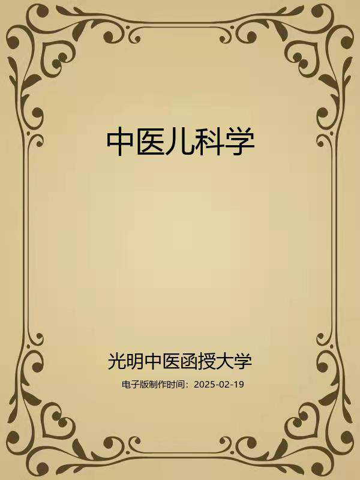
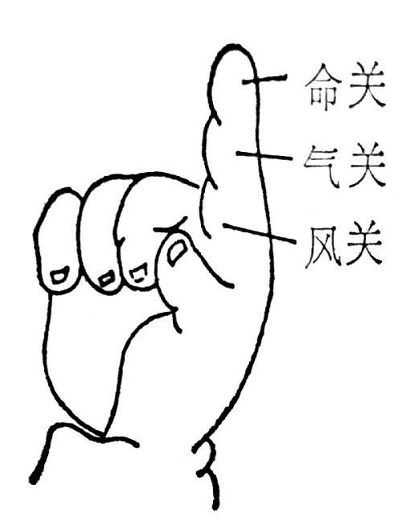

# 中医儿科学

## 编者与编者的话

编者：

光明中医函授大学主编

刘炳凡主编

孙光荣副主编

周明君张亮陆振平谢立奎协编

李聪甫欧阳琪白永波江振济审阅

编者的话：

《中医儿科学》一书，系根据光明中医函授大学“寓医理于临床”的教学方针和“高等中医函授教材”总体规划精神编写而成，是高等中医函授教育专业课教材之一，属临床学科，必修学科。

全书分总论和各论两部分。总论部分共八章，概括地阐明中医儿科学的源流和发展；介绍儿科病的预防、护理与小儿保育的知识；着重阐释中医儿科学的四大特点，即小儿生理病理特点、小儿病因特点、儿科诊断学特点和儿科辨证论治特点；並例释儿科名方的应用。各论部分共九章，叙述81种小儿常见病、多发病的诊法与治法，以及8种常见中毒急救处理方法。

本教材以“保持中医儿科特色”为第一编写宗旨，遵循、运用中医基本理论阐述儿科病的因机证治，凡儿科与内科、外科、五官科相同的病证，则在病因病机的阐述、诊断与鉴别诊断的列述、辨证论治的解析诸方面，力避重复而突出中医儿科的特点，使之自成系统，保持中医儿科的特色。

本教材以“注重临床实用”为第二编写宗旨。各章各节尽可能准确而精当地撷取历代中医文献中儿科临床价值突出的材料；吸取全国高等中医院校儿科统编教材的精萃；参考近代及现代著名儿科学家的专论专著；发掘验之有效的民间方药。熔铸之，胪列之，以便于临床运用。所设“辨证要领”、“论治要点”、“临证权变”、“应用例案”各项，是在阐述病因病机和常见证治的基础上，针对各病证的特点，从理论到临床提纲挈领地述明精要、示以规矩、给以范例，使之能知常达变，以期有效地培养与提高专业基本功。

本教材以“便于自学”为第三编写宗旨。每章之前列述了“目的要求”，分为三级：凡需“掌握”者为重点内容；凡需“熟悉”者为次重点内容；凡需“了解”者为一般内容。为便于自测，每章之末列有“复习思考题”。为便于查考方药，全书之末附有“方剂索引”，书中所称引之诸方，依其首字笔画可以一检即得。本课程计划安排100学时，其中自学75学时，面授25学时，详见各章学习进度安排项内。倘能按照所列目的要求，把握重点、分清主次、循序渐进地学习全书内容，结合临床实习，理论联系实际地理解与运用，自可逐步融会贯通，获取一隅三反之良效。

本书在编写初稿时，为了汇萃众长、集思广益，特邀请湖南省中医药研究院魏湘铭、刘克醇、刘炳午、姚勤、吴永贵、朱德湘、朱克俭、刘光宪、欧阳剑虹同志和湖南中医学院郑丽华、谢凤英、程丑夫、金世明、吴润秋等同志以及湖南分校胡不群同志给予了襄助。

本书在编写全过程中得到白永波等同志大力支持。

本书承李聪甫、欧阳锜、白永波、江振济同志审定。

谨此，一并致以衷心的感谢!

本教材由于编写时间仓促，加之水平所限，谬误在所难免，希望在使用过程中提出宝贵意见，俾今后渐臻完善。

编者

一九八八年五月二十五日

## 导言

中医教育学，是一门古老而崭新的科学。中医教育的历史，若从师徒授受和医籍编纂算起，已有两千余年。近代史上的中医教育，首推一八八五年浙江陈虬创立的利济医学堂。新中国诞生不久，创办了北京、上海、广州和成都四所中医学院，从而揭开了当代中医教育的序幕，至现在，全国已发展到二十三所。但是，如果把我国中医教育的实践经验加以分析、研究、总结和提炼，升华，揭示它的规律，使之成为一门专门的学科——中医教育学的话，那么，它还处在再创阶段。这就是说，中医教育及其规律存在的历史是悠久的，但论述中医教育及其规律的学科却是崭新的。因此，中医教育工作需要进行探索和研究。

在探索和创建适合我国国情的中医教育的时候，我们必须植根于我们民族文化的肥沃土壤之中，充分重视中医典籍在培育和造就历代医家中的伟大作用。事实上，在长期的历史发展中，逐渐形成了具有中华民族特色的中医药理论体系，它既有丰富临床经验，又有高深的理论基础。历代医学家就是把这些道理传授给他们的弟子，其中部分人经过刻苦自学和临床实践，成为医术高超的医学家，这是我国历代医学家成才之路，亦是中医教育史上培养人才的宝贵经验。这就是我们民族中医教育事业的光辉历史。

在新的历史时期，作为中医教育工作来说，既要给学生打好传统医学的基本功，又要使他们掌握一些新兴的科学知识，使继承与发展得到统一。根据这种认识，我们十分认真地研究和设计了光明中医函授大学的教学计划、教材内容、教学方法与教学手段。归结起来即是：注重打好中医基本功，注意提高中医基本理论水平和培养临床诊治技能，着力培养辨证论治的思维方法，竭诚发挥中医在防病治病中的特长。并在这个基础上，扩大学员知识面。我们把这些要求与思想，全面体现在本校的教材建设中。其目的是使中医人才的知识结构更加合理，以便能担负起继承和发扬祖国医药学防病治病的光荣任务。

在回顾中华医学教育历史，展望现代医学教育的发展趋势以及总结三十多年正反两方面经验的基础上，我们认为，要培养出适合四化需要的合格中医人才，对中医教育的课程设置和教材内容，就要进行必要的改革，建立起为新形势所需要的中医教材。我们正在朝这一方向努力。在认真研究高等中医院校教材和广泛征询中医专家、学者和医务人员意见的基础上，新编了这套较为完整的中医教材，定名为《高等中医函授教材》（包括了二十八门课程）教材的编写人员，由本校选聘知名教授、学者和学有专长者担任，编写时，我们力求各门教材要有鲜明的针对性，在内容上富有实用性，在文字表达上深入浅出、简明易懂，以利便于自学或函授，此外，我们还将根据需要，选编一些辅导材料，以帮助学员（读者）理解教材内容，更好地学取中医知识。

由于教材编写时间仓促，又竭力于继承与创新,不足之处在所难免，敬希学员和广大读者惠赐宝贵意见，以便在再版时修订。

光明中医函授大学教育研究室

一九八五年十月四日

加入光明：

光明中医网址：www.gmzyjx.com，www.gmzyjc.com

## 总论

## 第一章中医儿科学的源流和发展

**〔自学时数〕**2学时

**〔面授时数〕**

**〔目的要求〕**

1.掌握中医儿科学的源流和发展的梗概。

2.熟悉中医儿科学在宋代以后的重大发展及解放后的新进展。

3.了解在中医儿科学发展中有重要影响的医家与著作。

本章所述，为中医儿科学的萌芽、形成与发展之简史，所以称之为“中医儿科学的源流和发展”。

中医儿科学源远流长，据现有的历史文献考证，马王堆三号汉墓出土医书及《内经》即有记载。以后，历秦汉、隋唐均有发展，至宋代，以钱乙、董汲、陈文中诸家为代表，对中医儿科学的形成、完善与发展作出了卓越的贡献。至明清，以万密斋、谢玉琼、陈飞霞为代表，对小儿时行疾病的研究，取得了新的成就。解放后，中医儿科学又取得了新进展。

学习本章内容，首先要理清中医儿科学源流和发展的梗概，尤其是宋代以后的发展概貌，在此基础上，着重掌握历代在中医儿科学发展有重大影响的医家及其主要著作。

中医儿科学是中国医学的一个组成部分。古代亦称小方脉、幼科、哑科。祖国医学在儿科疾病方面，很早就有记载。如《素问•奇病论》：“人生而有病巅疾者，病名曰何，安所得之？曰：病名为胎病，此得之在母腹中时，其母有所大惊，气上而不下，精气并居，故令子发为巅疾也。”（张景岳注：巅疾者即癫癎也，内经巅癫通用。）此段很清楚地描述了小儿疾病的遗传因素，讨论了病因病机，说明了怀孕期的保养的重要性。这也为“胎养”、“胎教”和“优生”学说提供了依据。

西汉时期，马王堆三号汉墓出土的秦汉以前的古代医学著作《五十二病方》中，亦有“婴儿病痫”，“婴儿瘛”的记载。都反映了儿科学的萌芽。又《史记•扁鹊列传》载有，“扁鹊……闻秦人爱小儿，即为小儿医”。可见当时对妇婴疾病非常重视，并有了小儿专科医生。（见《汉书•艺文志》）。最早的一部药学《神农本草经》就记载有小儿常见病的惊痫瘈疭（师古曰小儿病也）药物数十种，其中如植物药的蚤休、蛇含，虫类药的殭蚕柞蟬、露蜂房；介类药的龟甲；芳香解毒药的麝香、牛黄等，仍为现代儿科所常用。西晋王叔和著《脉经》（公元三世纪初）就论述了小儿脉法：“小儿脉呼吸八至者平，九至者伤，十至者困”的记载。葛洪（生于三世纪末四世纪初）著《肘后备急方》最早记述了危害小儿最大的“天行发斑疮”（天花）的典型症状与流行，以建武中于南阳击虏所感染，乃呼为虏疮，葛氏并有治豌豆疮方。天花是过去危害儿童的烈性传染病，自《肘后方》以后，对这个病的性质和防治逐渐有了认识。此时已流传着第一部儿科专著——《颅囟经》（按：首骨曰颅，脑盖曰囟，乃因小儿初生颅囟未合，小儿与大人不同，故取以名书）。自《唐书•艺文志》以上皆无此书名，但隋《诸病源候论》（书成于公元610年）卷45中记有：“中古有巫方，立小儿《颅囟经》，以占寿夭，判疾病死生，世所相传，始有小儿方焉。”至《宋史•艺文志》始有师巫《颅囟经》二卷，书中提出小儿为“纯阳之体”的观点，对中医儿科学生理特点方面的论述，提供了理论上的依据。书中论述了脉法及惊、痫、癫、疳、痢的证治，对火丹论述尤详。所以，《隋书•经籍志》所载南朝医书中就有小儿科。

隋唐时代，在太医署内，由“医博士”教授医学，其中专设少小科。促进了儿科专业的发展。当时巢元方的《诸病源候论》中介绍小儿疾病多至6卷，列有255候，对病因病理和证候的阐述较详。如《诸病源候论•脐疮候》认为是一种风证，名之为“脐风”、“四六风”、“撮口风”、“噤口风”等，并为了防止这种严重疾病的发生，认真研究了初生儿的“断脐”法和“裹脐”法，以避免感染。这在当时来说，无疑是一种先进的措施。该书还特别提出了“哺露候”，“丁奚候”由哺食过度，伤于脾胃之诊，与《后汉书》王符传：“婴儿常病，伤于饱也”意同。

孙思邈（公元581〜683年）的《备急千金要方》把妇孺医方列于卷首，则是崇本之义。儿科用方达300余首。《千金要方》的“少小孺婴方”，是中医儿科最重要的历史文献，内容丰富，涉及有关小儿的喂养、调理、发育、日常卫生等各个方面，不独是审疾疗病而已。他说凡小儿之病与大人不殊，惟用药有多少为异，其惊、痫、客忤、解颅、不行等九篇合为一卷，其余散见诸篇中，可披而得也。他还主张婴幼儿要在清新空气和阳光中锻炼。序例中说：“天和暧无风之时，令母将儿于日中嬉戏。数令见风日，则血凝气刚，肌肉牢密，堪耐风寒，不致疾病；……”这些认识和措施，对于婴幼儿的健康成长，也是十分重要的。

王焘《外台秘要》40卷（公元752年编成），其中86门均为小儿疾病的防治。论述变蒸有论有方，黑散、紫丸药简功专，用量极小，为后世儿科立方用药作了示范。《外台》论小儿诸疾，实源于《颅囟经》，在内容上较为广泛，在分类上及论究病源和治理方法上所采录都较为详细，可以看出中医儿科在唐代的概况。总之，隋唐医家不仅于麻、痘、惊、疳儿科四大证已有所记载，且治理方法亦都甚详。此外，唐代王超的《水镜图诀》最早记述了小儿的指纹诊法，为后世医家以“虎口三关”观察脉纹形色辨别疾病奠定了基础。

宋代，随着科学文化的发展，推动了医学的进步。北宋钱乙，字仲阳（约公元1035—1117年）是当时最享盛名的小儿医，是中医儿科的一代宗师。而其学出于《颅囟经》。（宋代刘跂撰钱乙传，说，“乙始以颅囟方著山东。”）他专业儿科40余年，学术造诣精湛，与之同时的阎季忠赞其治小儿，赅括古今，著有《小儿药证直诀》，朱记尝所治病二十三证，为儿科验案之始。他远承仲景、华佗、孙思邈经验，创立了五脏虚实寒热证治法则，如以八味地黄丸去桂附（名六味地黄丸）治小儿先天不足诸病，注重补益小儿肾阴；以泻心汤单用黄连一味治疗心气实等，都是结合小儿疾病特点因证制方的。尤其对麻疹的症状，诊断和治疗，几种发疹性病的鉴别，以及常见的惊厥，在钱乙以前的医籍中虽有急、慢惊风的名称，但都语而不详，直到钱乙才有精深的论述，惊风和痫证也有了明确的区别。“疳”是小儿另一种常见病，钱乙把“疳”列为脾胃病，他说：“疳皆脾胃病，亡津液之所作也。”在病因、病机、分类和治疗等方面，都有独到的见解。他用五味异功散即四君子加陈皮，治小儿虚冷吐泻。七味白术散即四君子汤加藿香、木香、葛根，治小儿脾虚肌热，虚热作渴，泄泻。又如钱乙的调中丸，实际就是仲景的理中汤原方。他把小儿的生理病理概括为：“脏腑柔弱，易虚易实，易寒易热。”与《灵枢·逆顺肥瘦》“婴儿者，其肉脆，血少气弱”之论若符合符契。这一小儿体质特点，至今仍为儿科医家所重视。

南宋刘昉的《幼幼新书》40卷（公元1150年序行）包括病源形色，禀受诸病，急、慢惊风、斑、疹、麻、痘、五疳辨治，以及眼目、耳、鼻、口唇、喉、齿诸条，对痈疽外伤尤为重视，内容很丰富，保留了一些已佚失了的文献资料，是现存的宋代儿科巨著。此外，不著撰人姓氏《小儿卫生总微论方》20卷（公元1216年宋太医局刻本），自初生以至成童，内外五官诸多疾病的证治，均分门别类，详细收录，所谓“保卫其生，总括精微”。其中还明确指出新生儿脐风撮口是由于断脐不洁所致，与大人因破伤而得的破伤风是同一种疾病。并倡用烙饼子（烧红的烙铁）烧灼脐带以预防脐风。

随着当时对烈性传染病的防治不断深入，董汲著的《小儿斑疹备急方论》钱乙为他写序并校正刊行，实为天花、麻疹专书之始。另外，陈文中的《小儿病源方论》载有传统的育儿方法，其《痘疹方论》对痘疹防治亦有一定的影响。王珪说：“宿州陈君手集婴动摄养，痘疮疹方，详备有法，治证有验，起死回生，端如反掌。”（《泰定养生主论》）其《痘疹方论》系论痘疹的一部专著，在虚实寒热的辨证及治法上均有其独到之处。明代儿科名家薜己深得其奥，特为本书校注，可见其影响之深远。

元•朱丹溪（公元1281〜1358年）在其《格致余论•慈幼论》中指出：“乳母禀受之厚薄，性情之缓急，骨相之坚脆，德行之善恶，儿能速肖，尤为关系。……若夫胎孕致病，事起茫昧，人多玩忽，医所不知，儿之在胎，与母同体，得热则俱热，得寒则俱寒，病则俱病，安则俱安，母之饮食起居尤当慎密”。指出了小儿生理、病理特点，对于小儿的保健和疾病的防治，都具有重要意义。他在小儿治则上颇宗钱乙。认为钱乙之方，“立例极好”。他本人的实践经验也很丰富。如“乳下小儿常湿热多，”“小儿食积、痰热、伤乳为病”。故制保和丸。“小儿易怒，故肝病最多，肝只是有余，肾只是不足”。

（《丹溪治法心要》）这是依“阳常有余，阴常不足”之说，针对小儿特点提出的论点，是切合实际的。

元代儿科名家曾世荣（公元1252〜1330年）继承了他老师刘直甫五世祖先刘茂先的治疗经验，著《活幼心书》三卷，书中所录治方，又经他自己反复验证，对惊风抽搐的辨证治疗有独特精确之处。他在一首歌诀中说：“四时欲得小儿安，常须二分饥与寒，但愿人皆依此法，自然诸疾不相干”。这是幼儿卫生行之有效的传统方法，对于保障小儿健康是有益的。

明代，封建社会制度虽没有改变，但由于城市工商业和手工业的向前发展，对自然科学有一定的促进作用。徐用宣的《袖珍小儿方》（公元1413年）辑明以前小儿诸家验方，分72门，共624方，各证齐备，叙述详明。冠平的《全幼心鑑》对面部及虎口三关指纹望诊作了详细的描述。薛鎧、薛己（号立斋）父子精于儿科，著《保婴撮要》20卷（公元1555年）。薛已精于小儿脏腑虚实辨证，特别重视脾肾与各脏之间的相应关系，如“风邪所感，宜补脾气。”“凡脾之得疾，必先察其肝、心二脏之虚实而治之。盖肝者脾之贼，心者脾之母也。”这些都是薛己运用易水张洁古学说而发挥的，附有很多验案、验方，对临床参考价值很大。

明代名望很高的儿科世医万全，著有《育婴家秘》、《幼科发挥》（公元1579年）、《片玉心书》等。万氏十分重视胎养（孕期预

养）、他还在钱乙“脏腑虚实辨证”的基础上，提出小儿“肝常有余，脾常不足”、“心常有余，肺常不足”、“肾常虚”的观点，对后世儿科生理、病理的特点具有重要的指导意义，对天花、麻疹、惊风等证治有独特见解，如治疗痘疹，摒弃了以往医家的偏见，主张“温补凉泻，各随所宜。”此外，万氏首先应用推拿法于儿科，尤其在治疗上，首重保护胃气，提出五脏以胃气为本，赖其滋养。“如五脏有病，或泻或补，慎勿犯胃气”。万全的这些学术见解和临床经验，对于儿科学术的发展起着积极的推动作用。

明代儿科学仍重痘疹防治，如翁仲仁的《痘疹金镜录》辑诸家精要，未附杂证，亦以补痘科所未及。聂久吾的《活幼心法大全》，乃集痘疹之大成，用药不偏于寒凉，亦不偏于温补，深得中和之理。以及《痘疹慈航》等，立论精详，辨证确切，为清代痘疹防治树立了楷模。费建中的《救偏琐言》，其大旨存于救偏，其总要在于攻毒，乃其审势变以立言，非好与前人为异同也。所论元气流行表里缓急，形色变态之异，死生危愈之期，变化万端，了然心手，附以治验，信而有征。

预防天花自公元十世纪宋代真宗时发明了人痘接种以来，明、清又有了新的进展。张琰总结了前人及自己的经验，编成《种痘新书》（公元1741年）。他说，“余祖承聂久吾先生之教，种痘相传已经数

代……以‘佳苗’而引胎毒，斯毒不横，而证自顺。”十七世纪我国种痘技术先后流传到俄罗斯、朝鲜、日本、土耳其并远及欧、非诸国。由此可见，我国的人痘接种法已有数百年之久，比英国人琴纳牛痘法为早，是世界免疫学发展的先驱。

在麻疹方面，明•殷仲春的《痧疹心法》，清•谢玉琼的《麻科活人全书》，认为麻疹以透为主，首立宣毒发表汤，为后人所崇。从这许多宝贵的著作中，可以看到祖国儿科医学对麻疹的防治，积累了极为丰富的经验。

清代儿科学的发展，不仅诊疗水平日益提高，儿科的专著更加繁荣，在《医宗金鑑》中，提出了新生儿假死的抢救方法，已将《幼科杂病心法》、《痘疹心法》、《幼科种痘心法》分作三卷（公元1739年刊行），而张霞谿对其麻疹部分加以阐注，为初学者通其旨。儿科专著影响较大的有夏禹铸《幼科铁镜》，主张“望面色，审苗窍，从外以知内”。他还兼善小儿推拿，他认为有些小儿病可以用推拿代药。因为推、拿、揉、掐四种不同的手法，相当于药物之寒、热、温、平四性，推拿得当，就会收到与药物同样的效果。夏氏还很重视灯火疗法，其治脐风的“灯火十三燋”甚为后世所崇。

陈复正的《幼幼集成》（公元1750年）认为母体的强弱与胎儿的成长及健壮有密切关系，并提出了先天梅毒症。他在书中除论禀赋，护胎元外，尙列保产论，详述“产要”以保母子平安。本书另一特点是，陈氏同样主张小儿勿轻服药。而是应用综合治疗法，内外兼治，或单用外治。其如“灯火疗法”，陈氏认为是“幼科急救妙法”。这是一种行之有效的外治法。这种方法比较简便，容易掌握，过去在民间一般老年妇女都会应用，对一些外寒郁闭的疾患，用之有捷效。此外，还有叶香岩，（公元1673～1769年）的《幼科要略》，徐灵胎评为“字字金玉”王孟英说：“予谓虽为小儿谈法，大人岂有他殊，故于温热论后，附载春温、夏暑、秋燥诸条，举一反三，不仅为幼幼慈航矣。”吴鞠通的《温病条辨•解儿难》也提出“小儿易痉，传变最速，六气明而痉病少”的观点。吴氏不同意前人认为小儿纯阳的说法，同时也不同意纯阳即盛阳。所以他说：“古称小儿纯阳……非盛阳之谓，小儿稚阳未充，稚阴未长者也”。因而建立了“小儿稚阴稚阳”的学说。

近代何廉臣的《儿科诊断学》认为“诊断为治疗之始，又为治疗之终”，“善诊断者，善治病”。明太祖谕徐达曰："更涉世故则智明，久历患难则虑周”。吾人临证诊断时最为然，有志研究儿科学者，尙期三复斯言。张山雷（公元1872〜1934年）著《钱氏儿科案疏》以昌明钱氏之薪传，而附后贤验案，以补钱氏之不足，甚是可取。恽铁樵著《保赤新书》，他在《近代中医流派经验选集》中说：“小儿一般惊风，内因于停积，外因于风寒，惊怖，单丝不成线，必三者为缘乃能致病”，“小儿一般惊风将作，有前兆证状，可以从患儿的唇舌、手指、眼睛及人王部的色候观察出来”。可谓大匠示人以规矩矣。以及周岳甫所辑《小儿推拿秘诀》云：“独小儿推拿，尤得其传，转关呼吸，瞬息回春，一指可贤于十万师矣”。此语虽为比喻之词，而实有立竿见影之效。这些著作的问世，更加丰富了儿科的内容。

解放后，中医儿科学的教学工作也在不断地提高，所编写的《中医儿科学》教材，经多次修订和补充，并整理出版了中医儿科专著，如郭振球主编的《中国医学百科全书•中医儿科学》，张奇文主编的《幼科条辨》，王伯岳、江育红主编的《中医儿科学》，何世英主编的《历代儿科医案集成》等。随着中医医学教育的发展，培训了不少中医儿科专业人员，加强了儿科保健工作。推行新法接生，不少地区已基本上消灭了脐风，广泛开展了预防接种，天花在我国已经绝迹；麻疹、白喉、流脑、乙脑等许多严重危害小儿的急性传染病获得了有效的控制，发病率已大为降低。

近年来，中医儿科学术交流也越来越活跃，全国许多省市已相继成立了中医儿科学会，于1983年成立了中华全国中医学会儿科学术委员会，对于促进中医儿科界的团结和推动中医儿科学术的发展，起了积极的作用，将为祖国的幼苗，未来的主人，在预防保健方面作出更大的贡献。

小结

1.儿科学是中国医学的一个组成部分。《内经》早有“胎病”的论述，而且说明了怀孕期的保养，对于小儿优生、优育的重要性。

2.从《史记•扁鹊传》：“扁鹊名闻天下……闻秦人爱小儿，即为小儿医”可见当时巳经有了专科医生。

3.晋•葛洪著《肘后备急方》最早记述了危害小儿最大的“天行发斑疮”。此时已流传着第一部儿科专著《颅囟经》。

4.隋唐时代，在太医署内，由“医博士”教授医学，其中专设少小科，促进了儿科学专业的发展，孙思邈《备急千金要方》把妇孺医方列于卷首，则是崇本之义。

5.随着火药、罗盘、造纸、印刷术的大发明，科学文化的发展，推动了医学进步。北宋钱乙是当时最享盛名的小儿医，是中医儿科学的一代宗师。

6.元代朱丹溪在所著《格致余论•慈幼论》中指出：乳母禀受的厚薄，性情之缓急，骨相之坚脆，德行之善恶，儿能速肖，尤为关系……曾世荣传刘直甫五世儿科学著《活幼新书》，总结很多传统方法。

7.明代名望很高的儿科世医万全著有《育婴家秘》、《幼科发挥》等，他十分重视胎养。清代夏禹铸《幼科铁镜》重望诊。审苗窍，“从外以知内”；陈复正的《幼幼集成》认为母体的强弱与胎儿的成长及健壮有密切关系，并认为"灯火疗法”是“幼科急救妙法”。

8.解放后，中医儿科学的教学工作也在不断地提高，广泛开展了预防接种，天花在我国巳经绝迹，麻疹、白喉、流脑、乙脑等严重危害小儿的急性传染病，获得了有效的控制。

复习思考题

1.简述中医儿科学源流与发展概况。

2.宋以后，中医儿科学有哪些重要的发展？有哪些作出了重要贡献的医家？他们各有何代表作？提出了哪些重要的学术观点？

3.解放后，中医儿科学有哪些新进展？

## 第二章小儿生理病理特点

**〔自学时数〕**1学时

**〔面授时数〕**1学时

**〔目的要求〕**

1.掌握小儿生理病理特点及其对临床的指导意义。

2.熟悉“稚阴稚阳”，“纯阳之体”的含义。

3.了解“变蒸”之说。

本章所述，为小儿在生理与病理方面的特点及其对临床的指导意义，所以称之“小儿生理病理特点”。

小儿在生理与病理方面均非成人的缩影，而是自具特点，如脏腑娇嫩，形气未充；生机蓬勃，发育迅速；稚阴稚阳，易成易变等，是其生理特点；外邪易侵，发病容易；外感内伤，变化迅速；易虚易实，易寒易热；脏气清灵，易于康复等，是其病理特点。

学习本章内容，应联系实际的观察，掌握小儿的生理病理特点，并对“稚阴稚阳”，“纯阳之体”以及“变蒸"说等传统的中医儿科名词术语充分理解。在此基础上，熟悉对小儿年龄分期的具体内容及其临床意义。

小儿的生理与病理，都与成人有所不同，小儿的生理特点主要有两个方面：脏腑娇嫩，形气未充；生机旺盛，发育迅速。小儿的病理特点也主要有两个方面：容易发病，传变迅速；脏气清灵，易趋康复。掌握这些特点，对小儿的健康保育和疾病的诊断与防治，均具有极其重要的意义。

第一节　生理特点

（一）脏腑娇嫩，形气未充古代医家通过长期的观察和临床实践，早已深刻地认识到小儿的生理特点，如隋代《诸病源候论》已认识到：“小儿脏腑娇嫩”；宋代钱仲阳则更明确地指出小儿五脏六腑“成而未全”、“全而未壮。”阎季忠又进一步阐明小儿“骨气未成，形声未正，故悲啼喜笑，变态不常。”这些，充分说明了小儿时期的皮毛、肌肉、筋骨、脑、髓、五脏、六腑等虽已形成，但尚未充实和坚固。

小儿脏腑之娇嫩尤以肺、脾、肾三脏为突出。肺主一身之气，脾为后天之本，肾为先天之本，三脏之间，相互关联，而又相互影响。明•万密斋认为小儿“肺常不足”，“脾常不足”和“肾常虚”。脾胃薄弱之儿，常肺气虚弱。肺气虚又常影响小儿的生长发育。钱仲阳《小儿药证直诀》说：“肝有相火，有泻而无补，肾为真水，有补而无

泻”。并立地黄丸为补肾要药，指出了小儿时期生长发育与肾的关系是非常密切的。在生理、病理变化上，脾与肾又是相互关联的，因先天之精，要发挥它的生命力，必须依赖后天之精的资助。因此，产生了万密斋“脾常不足”，“肾常虚”的理论。清•吴鞠通在这个理论基础上倡导了“稚阴稚阳”之说，他认为小儿的生理特点是“稚阴未充，稚阳未长”。说明小儿无论物质基础及生理功能活动，均未达到完善成熟的阶段。按照祖国医学理论体系的阴阳涵义，阴是指身体内精、血、津、液等具有物质性的东西；阳是指身体内各种生理功能的活动。所谓稚阴稚阳，是指小儿无论在物质基础和功能活动上，均未臻完善，故脏腑娇嫩，形气未充是小儿的基本生理特点。

（二）生机蓬勃，发育迅速是小儿生理的另一特点。小儿处于生长发育旺盛时期，随着年龄增多，而不断向完善、成熟方面发展，年龄越小，生长发育越快，在形态增长的同时，功能也不断趋向完善。小儿生长发育有其规律性，《千金要方》有较详细的观察，如小儿生后两个月，能对别人的声音、笑貌有所反应，四五个月时能翻身，六个月时能起坐，七个月时能爬行，十个月时能站立。这种正常的生长速度，好比旭日初升，草木方萌，蒸蒸日上，欣欣向荣，前人对这种生长发育过程，曾建立了“变蒸”学说。

考小儿“变蒸”之说，初见于西晋•王叔和《脉经》，至隋以后文献所论始详。不少医家谓“变者变其情智，发其聪明；蒸者蒸其血脉，长其百骸”。认为每一变蒸，都能增长小儿的智慧和身形，并提出在变蒸中会出现一些征候，但不应视为病态。据近世医家和目前儿科临床来看，小儿的智慧和形体发育，在各个阶段，虽有其不同变异的规律性；但与“变蒸”之说，尚难等同。

《颅囟经》称小儿生长为“纯阳”，生机属阳，阳生则阴长，说明小儿生机蓬勃，活力充沛，机体对水谷的需要量相对地比成人要多，方能适应身体各阶段生长发育的要求。因此，需要经常不断地加以补充。

（三）生长发育，动态变化生长发育是小儿时期不同于成人的最根本的生理特点。研究从初生至青少年时期的生长发育是儿科医学的重要内容之一。一般以“生长”表示形体的量的增长，“发育”表示功能活动的进展。两个方面是密切相关，不可分割的。通常“发育”一词，也包含了机体质和量两个方面的动态变化。掌握有关生长发育的基本知识，对于小儿保健和防治疾病具有重要意义。

关于生理变化，年龄分期，历代医家其说不一，兹概括如下：

胎儿：从受孕到分娩共九个多月为胎儿，前人认为儿在母腹受其精气，一月胚，二月胎，三月血脉，四月形体成，五月能动，六月筋骨成，七月毛发生，八月脏腑具，九月谷气入胃，十月百神备而生，可见传统习惯，虚岁算年龄，是有其生物学根据的。《婴童百问》：“婴童在胎，禀阴阳五行之气，以生成五脏六腑，百骸之体悉具，必借胎液以滋补之，受气既足，自然分娩。“若母妊之时，失于调养，形气不充，可能为胎疾的致病原因。因此受孕后，应注意养胎、护胎，以利胎儿的发育。

初生儿：从出生到一个月内名初生儿。《千金要方》命名为新生儿。此期小儿初离母腹，形气未充，肌肤嫩弱，开始接触外界在新的环境中生活，应特别注意寒温调护，以防感邪致病。

乳儿又名婴儿：从一个月到一周岁为乳儿。《灵枢•逆顺肥瘦》：“婴儿者，其肉脆，血少，气弱。”清•吴仪洛《成方切用•杂将护法》：“婴儿百日，任脉生，能反复，乳母当存节喜怒，适其寒温，婴儿半晬，尻骨已成，乳母当教儿学坐，婴儿二百日外，掌骨成，乳母教儿地上匐匍。婴儿三百日髌骨成。乳母教儿独立。婴儿周岁，膝骨已成，乳母教儿步行。乳儿生机蓬勃，饮食以乳汁为主，可逐渐增加辅助食品，以满足其机体发育的需要。

幼儿：从一周岁到三周岁为幼儿。这一时期机体对外界逐渐适应，机体生长发育较乳儿为慢，各种生理机能日趋成熟，接触外界比较广泛，生活更加多样化，言语及体质发育迅速，有助于对周围环境的熟悉，促进思维活动的发展。

幼童：从三岁到七岁为幼童。亦称学龄前期。此期脏腑、经络之气充盛。抗病能力增强，与外界环境接触机会更为增多，模仿力强，对各种事物容易形成较朴素的概念。

学童：从七周岁到十四周岁为学童。此期继续发育成长，胃气日臻充实，此后开始性的发育，而转入少年。

总之，我国历代儿科医家通过长期的观察和临床实践。关于“稚阴稚阳”和“纯阳之体”的两个理论观点，正概括了小儿生理特点的两个方面，前者是指小儿机体柔弱，阴阳二气均较幼稚不足；后者则是指在生长发育过程中，生机蓬勃，发育迅速，质和量的动态变化，与成人迥然不同。

第二节　病理特点

生理是其常，病理是其变，病理与生理是有密切关系的。由于小儿在生理表现脏腑娇嫩，形气未充，所以在病理上则发病容易，变化迅速，易虚易实，易寒易热，再由于小儿体禀纯阳，生机旺盛，而在生理病理上又表现为活力充沛，易于康复。

（一）形气未充，发病容易小儿脏腑娇嫩，形气未充，脏腑功能不全、卫外机能不固，所以对疾病的抵抗力较弱。加之，小儿寒温不能自调，乳食不知自节，易为外感六淫，疫疠，内伤饮食而发病。年龄越小发病率越高。《温病条辨•解儿难》总论中指出：“脏腑薄，藩篱疏，易于传变；肌肤嫩，神气怯，易于感触。”已把小儿易于发病，传变迅速，这一病理特点作了概括的描述，而《幼科要略》中早已提出“六气之邪，皆从火化，饮食停留，郁蒸化热，惊恐内迫，五志动极皆阳”之说，以论证小儿“所患热病最多”。而肺系疾病，脾胃疾患，壮热惊搐，厥逆神迷等证状，亦为多见。这些与其生理、病理特点有密切的关系。

（二）外感内伤，变化迅速小儿除了先天不足的解颅，五软，五迟和初生儿特有疾病外，最易发病的，就是外感咳喘和脾胃内伤之疾以及各种时邪所致之温热病。小儿时期“薄皮嫩肉”。卫外机能未固，对外界的适应能力较差，外邪从口鼻吸入，故小儿易患呼吸道疾患，如感冒、咳嗽、肺炎、哮喘等，其发病率占儿科疾病的首位。

然而，脾胃为后天之本，主受纳运化水谷，为生化之源。由于小儿脾胃运化能力不足，消化吸收功能较差，这就反映了“脾常不足”的生理特点。因脾居中州，胃为水谷之海，饮食入胃，赖脾运化，然后水谷分化，清浊得宜，以养营卫，如脾胃虚弱，其运化吸收功能本难适应，加之寒暖不能自调，饮食不知其节，因此，外易为六淫所侵，内易为饮食所伤，脾气伤则清不升，胃不和则浊不降，所以小儿脾胃疾病为多，如积滞，腹痛、呕吐、腹泻，疳证等。而这些疾病又可影响脾胃，造成恶性循环，其症状亦常交替出现，故脾常不足，不仅不能抵御外邪，而且是产生小儿消化道疾病的本质因素。

小儿抗病力差，易患各种时行疾病。在时行疾病中，又以口鼻吸入者为多，如麻疹、风疹，水痘等各种出疹性疾病，以及常见的乳嗽，顿咳、小儿麻痹等症，其中包括感受四时六气的不正之气所发生的疾病，即季节性多发病，如春天的春温、风温，夏季的暑温，秋季的疟、痢、秋燥，冬季的冬温、伤寒等等，其发病率均较成人为高。

小儿患热性病较多，且容易出现惊厥等症，即使感冒亦可因高热而导致惊厥，称“高热惊厥”。病情重者，可因热盛生风，出现频繁的抽搐症状，谓之热极生风，严重的在惊厥内闭的同时，邪正交争，由于正不胜邪，正气内溃，即可出现面色苍白，可突然身凉脉微，由闭及脱，变为虚证、寒证，甚至危及生命。

（三）易虚易实，易寒易热由于小儿发病容易，并且在疾病中变化多端。《小儿药证直诀》指出小儿疾病“易虚易实，易寒易热”的病机转归。因为疾病的本质，不属于热，便属于寒；邪正的盛衰，不属于虚，便属于实。基于小儿发育未成熟，机体功能活动不稳定，不仅发病容易，而且年龄愈小，病理上的反应，更为突出。《幼科发挥》云，“邪气未除正气伤，可怜嫩草不耐霜”。如小儿外感疾病较多，在感邪之后，邪正相争，病在初期，临床就出现实证、热证，此为“邪气盛则实”、“阳盛则热”，若正气虚，邪气盛，则可由实转虚，而出现虚证。为“精气夺则虚”，“阴盛则寒”。因此，易虚易实，易寒易热的病理变化在小儿疾病中颇为突出。

常见疾病中的小儿腹泻，初期均为肠胃实热的实证、热证。在病变发展的过程中，由于暴泻伤阴，久泻伤阳，加之小儿“稚阴稚阳”的体质，病情可急剧转变，津伤则出现伤阴证，气虚就出现伤阳证、阴与阳是互根的，在重证病例中，由于相互影响，而出现阴阳两伤者，颇不少见。

总之，小儿寒热虚实的变化，比成年人更为迅速而错综复杂，可以朝呈实热的阳证，而暮转虚寒的阴证，也有在实热内闭的同时，转瞬而出现虚寒外脱的危候，故对小儿疾病的诊疗，必须强调诊断正确，治疗及时，用药审慎果敢，这是根据小儿病理特点而提出的。

（四）脏气清灵，易于康复小儿在病理机转，病情转归过程中，易虚易实，易寒易热，寒热虚实易变，病情易于恶化，但是少有痼病宿疾。小儿脏腑清灵，生机活泼，反应敏捷，活力充沛，修复力强，神志安定，可不药而愈。即属重病，只要治疗及时，用药恰当，护理得宜，一有转机就比成人恢复迅速，易趋康复。《景岳全书•小儿则》中提出“其脏气清灵，随拔随应，但能确得其本而撮取之，则一药可愈，非若男妇损伤积痼痴顽者之比。”这是对儿科生理、病理及治疗上特点的概括。在临床中具有实际意义。

小结

1.儿科是在祖国医学理论体系指导下发展起来的。并与各科有密切的联系而以内科为基础。它的学科范围是以初生儿期、乳儿期、幼儿期、学童期，各个年龄分期的有关小儿的生长发育，疾病预防，医疗护理等方面的一门科学。

2.小儿有其生理特点，如“脏腑娇嫩，形气未充”、“生机蓬勃，发育迅速。”在婴幼儿时期，显得尤为突出。小儿生长发育过程，坐、爬、立、行，均有其一定规律，古代医家对此提出了“变蒸”之说，并认为在这个时期内若出现一些证候，是应有的现象，不属病征，根据后世医家的认识和其实践经验，关于“变蒸”问题，尚待进一步研究。

3.小儿生理、病理特点，如“发病容易，变化迅速”，“脏气清灵，易趋康复”等，这些特点对于临床诊疗，具有极其重要的意义。但它的独特内容，决不能把小儿看成是成人的疾病的缩影。仅仅具备成人的临床知识是不够的。研究儿科必须首先理解其生理、病理特点，才能进一步学好儿科的诊断、治疗，护理等方面的知识，特别要掌握一些用药少见效快，“随拔随应”的治疗手段，以体现儿科学的特点特色。

复习思考题

1.简述小儿的生理与病理特点。

2.何谓“稚阴稚阳”？何谓“纯阳之体”？

3.试述“变蒸”的意义。

4.小儿年龄按正常生长发育规律可分为几期？各期有哪些特点？在临床有何意义？

## 第三章小儿保育

**〔自学时数〕**4学时

**〔面授时数〕**

**〔目的要求〕**

1.掌握小儿保育的重要性及保育方法。

2.熟悉乳婴儿的合理喂养方法和保育验方。

3.了解胎教、胎养与优生的关系。

本章所述，为胎教、胎养、新生儿保养、乳婴儿的喂养和小儿身心的保健等，所以统称之“小儿保育”。

胎教、胎养与优生有着密切的关系；新生儿的脐部护理及澡浴、乳婴儿的合理喂养（包括母乳喂养、混合喂养、人工喂养和增加辅食等）对小儿的生长发育有着重要的意义；小儿身心保健（包括健康检查、体育锻炼、合理教导）对小儿德、智、体的成长有着直接的影响，所以，小儿保育在预防疾病中有重要的价值。

学习本章内容，应把握各个时期小儿保育的重点、掌握具体的小儿保育方法。

第一节　胎教、胎养与优生

胎教的原意是指为了保证孕妇和胎儿的健康，对孕妇的摄生给予一定的指导和调护，并通过母亲的素养来影响胎儿的发育。“胎教”一词，最早见于《大戴礼记•保傅篇》，该篇较为详细地记载了胎教理论及施行胎教的措施。意思是在妊娠期间孕妇不听淫声之乐，不吃非正味的食物，站时端庄，坐时端正，一个人独居也不傲慢，即使生气也不吵骂。这就是使胎儿受到教育。《女科证治约旨》中说得更为明确：“凡妇人自有妊娠，即应注重胎教，讲究卫生，内无七情之伤，外无六淫之感，保重强健，何病之有？惟妊娠期内，不讲胎教卫生，七情六淫任意伤犯，于是疾病丛生”。因此，妇女怀孕后，实施胎教，是非常重要的。

“胎养"一词，首见于汉•张仲景《金匮要略•妇人妊娠病脉证并治》，该篇首谓：“妊娠养胎，白术散主之”；孙思邈《千金要方》中，更引北齐名医徐之才“逐月养胎法”。宋•陈自明《妇人良方大全》认为妇女在妊娠期间，“阴阳平均，气质完备”，是保证胎儿正常发育的重要条件。如果母体气血失调，出现“血营气卫，消息盈亏”的变化，或“有衍有耗，刚柔异用，或强或羸”的差异，则可导致胎儿的禀赋异常，而出现“附赘重疣，骈拇歧指，侏儒跛蹩……，疮疡痈肿，聋盲喑哑，瘦瘠疲瘵”等先天“气形之病”。因此，他特别强调在“胚胎造化之始，精遗气变之后，保卫辅翼，固有道矣”。

这是因为胎儿时期的营养，生长发育完全依赖母体，而母体的饥饱劳逸、喜怒忧惊，饮食寒温，起居慎肆，均可影响胎儿的发育。古代医家对孕妇的健康和胎儿的护养，非常重视，认为妇女在妊娠时期阴阳平衡，则气质完备。如果母体气血失调，阴阳乖张，则可导致胎儿禀赋异常，出现先天遗传之变。可见养胎、护胎对优质生育何等重要。

从胚胎到胎儿降生的十个月，是人的精神机能的基础——脑发育的重要时期。胎儿在母腹内是有感觉的小生命，对外界的刺激和变化能够作出一定的反应。孕妇应当随时调心神，陶冶和修养自己的性情，经常保持心情舒畅，情绪安定，尽量减少外界刺激，才能五脏安和，气血调顺，确保胎禀充足，促使胎儿正常发育，若孕妇喜怒无常或遭受精神创伤，则能引起脏腑功能失调，造成新陈代谢功能紊乱，必将影响到胎儿的正常生长发育。

实践证明，妊娠期间，如能多多接触美好的事物，诸如聆听轻松的音乐，欣赏优美的风景，观看花卉和美术作品，阅读有益身心的文艺著作等，从而陶冶性情，开拓胸襟，心旷神怡，创造美好的精神意境，将有助于胎儿身心健康。

婴儿出生以后，从胎内的环境生活转变为胎外的环境生活。在生理上起了很大的变化。对初生儿来说，无论呼吸，饮食和气候寒温的适应，都是新的问题，所以需要给予很好的护理，使其能够适应新的环境。

在喂养与保健方面，婴儿初生时，口中常留有羊水等秽液，必须及时清除，否则易致胃肠、口腔疾患。出生后可用消毒棉花裹指，将口内秽液拭净，继则用银花、菊花、生甘草各3克，煎汁拭口，并另以小量给婴儿吮啜。也可用黄连1克，荷叶蒂1个，长灯芯3根，加水少许，隔水蒸，将药汁少许滴儿口中，并用温开水送服，连服三日；以上方法，都有清解胎毒的作用。如系胎寒，面白，口鼻气冷，宜白胡椒三粒（焙炭），金桔饼一枚煎水少少滴儿口中，忌用清凉之品。

断脐和脐部护理，必须严格消毒和保持清洁。断脐后用纱布包好，脐带可任其自然脱落，要防止感染邪毒，以免引起脐风和脐疮。脐带尙未脱落时，婴儿洗浴，应注意勿使浴水渍入脐中，并须勤换尿布，不使尿液浸渍脐部。脐带脱落后，若脐眼处渗湿者，可用龙骨散或煅牡蛎，炉甘石粉撒于脐部，保持干燥，但要注意扑粉不宜太厚，以免郁遏化脓。

婴儿出生后，可用黄连制成的眼药水滴眼，或以消毒生理盐水冲洗眼睛，有清热，解毒，明目之效。另外可用洁净棉花蘸植物油类将腋下和鼠蹊部积聚的皮脂轻轻揩去，然后穿衣。婴儿生后即可洗浴，浴时注意勿使脐部浸湿，尤其三朝浴儿更应注意，水温要适宜，一般以36〜37℃为宜。浴后用清洁柔软的纱布拭干周身，随后用六一散扑之，再行穿衣。早产婴儿，则不宜过早水浴，出生后即予擦干，用温暖柔软衣着被服包裹，以减少热量丧失，并用热水袋进行保暖，水温在40〜60℃之间，1〜2小时换水一次，以保持温度恒定，但要防止烫伤。

第二节　乳婴儿的合理喂养

1.喂养方式：可分为母乳喂养，人工喂养和混合喂养三种。《育婴家秘》指出：“乳为血化，美如餳”，母乳中含有非常丰富的营养成份，最适合乳婴儿的消化和吸收。且母乳猜洁，喂服简便，温度适宜，不易为邪毒所染，并可增加小儿抗病能力，故是乳婴儿最理想的食物。

2.母乳喂养：哺乳前应将储存于乳头的宿乳挤出，用手轻轻揉按乳房，使乳汁流畅，并用温开水洗清乳头。哺乳时应将乳儿斜抱于怀中，哺乳后可将小儿竖起，轻轻拍击背部，防止溢乳。哺乳期间，乳母应注意饮食多样化，多食蛋类、豆类、蔬菜、水果等，以保持乳汁的营养成份，同时应该注意生活起居和保持精神愉快，避免七情刺激，乳母有了疾病要及时治疗。如果母乳减少，可采用猪蹄炖木通，或金针菜（黄花）煮面条，或用针刺膻中、少商、合谷等穴，促进母乳的分泌。

3.人工喂养：因无母乳或其他原因不能喂乳，而用牛奶、奶粉、奶糕、豆浆等食物喂养者，叫做人工喂养。人工喂养应根据条件和地区的生活习惯，因地制宜。由于大多数乳婴儿在人工喂养时，均采用牛奶为主食，因此还须掌握按月龄给服奶量的计算方法。牛奶一般按每天每公斤体重110毫升计算，并加入5〜8%的食糖。若用奶粉，则可按体积4:1，重量8:1冲入开水调成全奶。

4.混合喂养：因母乳不足或其他原因不能全部用母乳喂养，部分用牛奶或其他乳品（如5410代乳粉，多维代乳粉等）叫做混合喂养。混合喂养可在每次母乳后补充授食，也可在一天中喂几次代替母乳。但全日母乳次数不应少于3次，否则母乳就会迅速减退，以致有消失的可能。

5.断奶时间，一般以8—12月断奶为宜，夏季不是断奶的合适季节，如果适逢夏季，最好等到秋凉以后再断奶，夏天气候炎热，小儿消化力差，改变饮食，容易发生腹泻。断奶前必须采取逐渐减少喂奶次数，逐渐增加辅食的方法，不可突然断奶。只有这样，才能获得全面营养，增加抗病能力。

第三节　眠食调节

1.睡眠：小儿必须有充足的睡眠才能健康成长。如果睡眠不足，常易出现纳呆、烦躁、易怒，形体消瘦等情况，年龄愈小，每天所需的睡眠时间愈多，6月前15〜20小时，6〜12月15〜16小时，2〜3岁12〜14小时，4〜6岁12〜14小时，7岁以上9〜10小时。在睡眠时，最好能培养自动入睡的习惯。新生儿经常处于明亮的光照与噪声环境中，可能发生睡眠与喂养问题。新生儿体内自发的内源性昼夜变化节律可以受到干扰。阻碍或发生紊乱。而昼夜有别的环境对新生儿、婴儿是有利的。

2.饮食习惯：要注意饮食卫生，还要从小培养不吃零食，不偏食，挑食等良好习惯。如突然出现的纳食少，应积极查明原因，不要强迫小儿进食。吃饭时要使小儿精神愉快，选择营养较好、容易消化，具有一定色香味食物，并做到定时进食。

3.调节寒温：阵文中在《小儿病源方论》提出了养子十法，其中关于注意调节寒温的，有下列几点：（1）背要暖，若背受风寒，伤于肺腧，使人毫毛耸直，皮肤闭而为病，因而出现发热、恶寒、喘咳、呕吐等症状。（2）腹要暖，肚腹为脾胃所主，胃为水谷之海，脾主运化精微。若腹部受冷，能影响受纳运化之机，因而容易发生腹痛、肠鸣、呕吐、泄泻等证。（3）足膝要暖，足为阳明经所主，腰膝属肾。足膝受冷，则影响脾肾，易生伤风冷泄等证。（4）头要凉，头为诸阳之会，脑为髓海。热则头面汗泄，易成头疮目疾。这是古人育儿经验，具有一定意义。

第四节　身心健康

1.健康检查：定期对小儿进行健康检查，是保证其健康成长的一项重要措施。应当争取每半年或一年检查一次。通过检查，可系统了解小儿生长发育及疾病情况，重点对体弱小儿（疳积、贫血、重证患儿）进好管理和矫治，并作出医学指导。

2.体育锻炼：凡气候适宜，可常抱婴儿到户外接触和暖的阳光与新鲜空气以资锻炼。《诸病源候论•养小儿候》说：“宜时见风日，若都不见风日。则会肌肤脆软，便易伤损，凡天和日暖无风之时，令母将抱日中嬉戏，数见风日，则血凝气刚，肌肉致密，堪耐风寒，不致疾病”。通过体格锻炼，可以增强抗病能力，提高对自然环境的适应性，它是增进小儿健康水平的积极措施。小儿锻炼方式应该随年龄增长而循序渐进，主要利用新鲜空气和日光，并进行水浴和体育锻炼。

3.合理教导：使在德育、智育、体育三方面都得到发展。古代医家十分重视对小儿的教育，如《育婴家秘》中说：“小儿能言，必教之以正言，如鄙俚之言勿语也；能食，则教以端正，如亵慢之习勿作

也；……语言问答，教以诚实，勿使欺妄也；宾客，教以迎送，勿使退避也；衣服、器用、五谷、六畜之类，遇物则教之，使其知之也；或教以方隅，或教以岁月时日之类，如此则不但无疾，而知识亦早也。”小儿教育的主要方式为游戏活动与作业活动，而对学龄儿童，则还应结合五讲四美、三热爱，进行社会主义精神文明教育。

附：保育验方

1.新生小儿：益母草150克，煎水浴之，不生疮疥。（《本草纲目•简要济众》）

2.小儿胎毒：淡豆豉煎浓汁，喂三、五口，其毒自下。又能助脾气，消乳食。（《圣惠方》）

3.婴儿胎毒：生疮满头，用水边乌桕树根晒研细末，入雄黄末少许，茶油调搽。（《经验良方》）

4.解下胎毒，小儿初生，嚼生芝麻，绵包，与儿咂之，其毒自下。（《本草纲目》）

5.初生尿涩：鲜车前草捣汁，入蜜少许灌。（《全幼心鑑》）

6.小儿初生大小便不通：用麻油30毫升，皮硝少许，同煎滚，冷定，徐徐灌入口中，咽下即通。《纲目》引蔺氏经验方。

7.小儿脐肿：出汁不止：白矾烧灰敷之（《圣惠方》）

8.小儿脐肿：荆芥煎汤洗净，以煨葱刮薄去火毒，贴之即消。（《海上方》）

9.小儿脐疮，出血及脓：海螵蛸、胭脂共研细，麻油调搽之。（《圣惠方》）

10.小儿脐风撮口：艾叶烧灰填脐中，隔蒜灸之，候口中有艾气可愈。（《简便方》）

11.小儿撮口脐风属胎热者：蜗牛五枚去壳，研汁涂口，取效乃止。（《本草纲目》）

12.风热丹毒：浮萍捣汁，遍塗之。（《子母秘录》）

13.小儿丹毒：浓煮大豆汁，涂之甚良。（《千金方》）

14.小儿火丹，热如火，绕脐即损人；马齿苋捣汁涂，日二。（《广利方》）

15.小儿丹肿：绿豆15克、大黄10克、共研细末，薄荷汁入蜜少许调涂。（《全幼心鑑》）

16.小儿鹅口，满口白烂：枯矾3克，朱砂0.6克，研细，每以少许涂之，日三次。（《普济方》）

17.鹅口白疮：鸡肫黄皮焙焦研细，乳服1.5克，日二次。（《子母秘录》）

18.小儿舌疮，饮乳不得：白矾和鸡蛋清入醋少许和匀，涂儿足底，2〜7日愈。（《千金方》）

19.小儿重舌：皂角刺灰入朴硝或冰片少许，漱口，掺入舌下，涎出自消。（《圣惠方》）

20.小儿惊啼：啼而不哭，烦也；哭而不啼，躁也：用蝉蜕2〜7枚，去翅、足为末，入朱砂少许，蜜调与吮之。（《活幼口议》〉

21.小儿遗尿膀胱冷也，夜属阴，故小便不禁：破故纸炒为末，每夜热汤服1.5克。（《婴童百问》）

22.小儿不尿，乃胎热也：用大葱白四茎切细，乳汁半盏，同煎片时，分作四服即通。（《全幼心鉴》）

23.小儿惊痫：磁石炼水饮之。（《圣济录》），本品能镇惊安神。

24.小儿腹胀，消化不良：鸡肫皮5个，白胡椒30粒，分别焙焦黄，共（石禹）极细，瓶装密封，每服一豆大，开水送下。（《经验方》）

25.疳积腹胀：蟾蜍一只，剖去肠杂，头足，入砂仁3克，怀灵脂3克，用线缝合，再用酒调黄泥，将蟾蜍包裹，若1.5厘米厚，置糠火内煨焦，至烟尽为度，取出冷却，研成极细末，瓶装密封，每服一豆大，日夜三次。（《鲁府禁方》）

小结

1.小儿是祖国的幼苗。从“胎教”，“胎养”，护胎保育到成活与成长。合理的爱护小儿使其正常的生长发育，同时要培养其成为具有健全体格、丰富知识，崇高品德的新生一代，这是母亲医护保育人员应负的职责。

2.对婴幼儿的保育，应注意：（1）饮食营养；（2）调节寒温；（3）体格锻炼；（4）合理教导等。但小儿摸仿性强，保育工作要起示范作用。

复习思考题

1.何谓胎教、胎养？这对于优生有何意义？

2.乳婴儿的喂养有哪些方式？何谓合理喂养？

3.简述小儿良好的睡眠与饮食习惯，如何调节小儿的冷暖？

## 第四章小儿病因特点

**〔自学时数〕**2学时

**〔面授时数〕**

**〔目的要求〕**

1.掌握导致小儿疾病的四种因素。

2.熟悉小儿疾病病因中属于先天因素和内伤因素的特点。

3.了解小儿疾病病因中属于外感因素和意外因素的特点。

本章所述，为小儿疾病的致病原因及其特点，所以称之“小儿病因特点”。

病因，一般可分为外因、内因和不内外因，而实则为内、外二因，因为饮食、劳伤亦可归入外因范畴，以此而论，小儿疾病病因与成人无异。但是，由于有不少小儿疾病与胎禀关系密切，又由于小儿生理病理自具特点，所以小儿病因亦与成人有所差异，如胎惊、胎毒、胎弱、胎寒、胎热等，受之于母体，属先天因素；饥饱失常、饮食不洁，饮食偏嗜，则属小儿易见之内伤因素；风寒暑湿燥火及惊吓外伤等，皆可致病，而在小儿则有易侵、易损、易变的特点，此则属于外感因素或意外因素。

学习本章内容，应结合小儿生理病理特点，从理解病机入手，进而理解和掌握病因及其特点。

小儿疾病的发生，其病因虽与成人基本相同，但由于体质因素的关系，因此有其不同的特点。从一般规律来说，小儿病因，外感不外“六淫”，内伤多由饮食。致病因素虽同成人，但由于生理、病理特点，所表现的病情并不完全一致，预后亦有差异；疾病的发生取决于两个方面：一是机体本身的正气不足，二是对某些病邪的易感性。小儿时期禀赋不足，脏腑娇嫩，形气未充，抗病能力较差，不耐病邪侵袭而易发生疾病，有些病邪如时行疠气的“麻疹”、“疫咳”等，在成人是不易感的，而小儿最易感受。这些疾病则为儿科所独有。再由于小儿先天不足，后天失调，引起小儿特有的病证亦较多，因此小儿病因在临床上有其一定的特点。

导致疾病发生的原因，虽然比成人单纯，因七情引起的病证较少，但有特殊性，主要的可归纳先天因素、外感因素、内伤因素、意外因素等几个方面。

第一节　先天因素

在胎妊期，由于母体的影响，往往殃及胎儿，《格致余论•慈幼论》说：“儿之在胎，与母同体，得热则俱热，得寒则俱寒，病则俱病，安则俱安。”《幼幼集成•护胎》说：“胎婴在腹，与母同呼吸，共安危，而母之饥饿劳逸，喜怒忧惊，饮食寒温，起居慎肆，莫不相为休戚。”这些说明孕妇的健康与否，足以影响胎儿在出生以后发现一些疾病，但这也并非绝对的。根据历代医家对胎妊期致病的先天因素的认识，大致有如下几点：

（一）胎惊所谓胎惊，指的是在孕期中母因情志精神等因素的影响，而损伤胎元。《素问•奇病论》说：“人生而有巅疾者……病名为胎病、此得之在母腹中时，其母有所大惊，气上而不下，精气并居，故令子发为巅疾也。”《東医宝鑑》、《活幼新书》、《幼幼集成》等著作中，均认为痫证的发生，与在母胎中受惊有关。从临床观察统计，痫病儿童与正常儿童比较，前者的家庭有发作历史的较多，说明与遗传有一定关系。

（二）胎毒生后所患疮疹诸病，称为“胎毒”。古人认为婴儿的某些病证，其发病原因，与胎妊期间母体的热毒有关。《幼幼集成》云：“儿之初生有病，亦惟胎弱、胎毒二者而已矣。”又说：“五欲之火，隐于母胎，遂结为胎毒。”并指出了胎毒的病，有癣疥、流丹、湿疮、痈、疖、结核、瘰疬、重舌、木舌、鹅口、口疮以及胎热、胎寒，胎搐、胎黄等。时行病中的天花、麻疹、水痘亦认为是胎毒。而《外科启玄》中所说“遗毒”，多指先天性梅毒，亦为胎毒。说明小儿病因属于胎毒者较多，故古人对某些新生儿疾病，甚至周岁以内有疾者，皆为胎疾，并与胎毒有关。从目前认识及临床分析，有些传染性疾病，可以由母体传给胎儿，也有些疾病因分娩时或分娩后感染热毒，而古人限于历史条件，往往把病因归之于“胎毒”。

（三）胎弱又名胎瘦，胎怯。由于小儿胎禀不足，气血虚弱所致。先天不足者肾也，肾主骨生髓，肾气不足则不能充养骨骼，温煦五脏，可发生五软（头、项、口、手、足、肌肉皆软），五迟（立迟、行迟、发迟、齿迟、语迟）。

（四）胎寒病因由于在母胎时感寒所致。《诸病源候论•胎寒候》说：“小儿在胎时，其母将养、取冷过度，冷气入胎，伤及肠胃。故儿生之后，冷气尤在肠胃之间。其状，儿肠胃冷，不能消乳哺，成腹胀，或时谷利（完谷不化），令儿颜色素（色㿠白），时啼者，是胎寒故也”。

（五）胎热病因由于小儿在母胎受热有关。小儿生后目闭面赤，眼胞浮肿，遍体壮热，口气热，烦啼不巳，尿赤便结。

（六）胎黄又名胎疸。《幼科铁镜》说：“胎黄，由妊母感受湿热，传于胞胎，故儿新生面目，遍身皆黄如金色。壮热、便秘、尿赤。

第二节　外感因素

小儿外感疾病（传染性疾病，呼吸道疾病等），较为多见，其病包括风、寒、暑、湿、燥、火（热）以及疫疠之邪。

（一）风邪风为百病之长，在发病原因中颇为突出，因小儿肺卫不固，腠理不密，肌肤疏松，肺气通于鼻，肺主皮毛，所以风邪易从口鼻或皮毛侵入，故外感风邪引起的疾病较为多见。常见的如伤风，感冒、咳嗽、哮喘、肺炎喘嗽等呼吸道疾病。风为阳邪，善行数变。一般发病多急，传变较快，如外感风邪，初起属于表证，邪在卫分，若不及时疏解，易从内传，由表及里，由卫及气。且易化热化火，入营入血。小儿外感风邪常与其他外感病因兼受致病，有夹寒、夹热、夹湿等兼证。多见如感冒中的风寒证和风热证。风邪有时与两种以上外邪相兼而致病。其中风寒湿三气合并发病的，称为“痹证”，好发于学龄期的儿童。小儿感受风邪，往往夹有乳食不节的内伤，称为表里同病。此因外感风邪在肺，内伤湿滞在脾，临床多见为风邪夹滞证，即既有发热恶风，鼻塞，流涕，喷嚏，咳嗽等肺经表证，又有呕吐、腹胀、腹泻的脾胃里证。

（二）寒邪寒为阴邪，易伤阳气。若小儿形体受寒，饮食生冷，则寒邪犯肺，水饮内停，“形寒饮冷则伤肺”，最易发生冷哮（寒哮），临床表现为恶寒，咳嗽，流清涕，呼吸喘鸣，痰多稀白似泡沫，舌质淡，苔白，脉浮紧等。若寒邪直中脾胃，脾阳受损，可发生寒泻，表现为大便稀，澄清如鸭溏，完谷不化，色淡，臭气不甚，腹痛喜温喜按，小便清，肢端凉，口不渴，或渴喜热饮，舌质淡，脉沉缓等证。若久延不愈，可由脾及肾，伤及肾阳，出现精神淡漠，面色㿠白，小便清长，肢冷，脉沉细等证。寒性凝滞，寒凝则血涩，导致气血流行不畅。新生儿阳尙来充，若受寒冷，则阳气不能温煦肌肤，可发生新生儿硬肿证，见体温不升，哭声无力，皮肤僵硬，肢冷，或兼水肿等证。

（三）暑邪暑为阳邪，其性炎热，具有严格的季节性，发于夏至以前的为温病，夏至以后的为暑病。小儿感受暑邪，可发生高热，惊厥，抽风，昏迷等暑风，暑痉的危重证候。在病情发展过程中，往往反映了热、痰、风、惊的病理变化，即热盛生风，风盛动痰，痰盛生惊，常互为因果，互有联系，为感受暑邪的特点。暑为夏令之气，如小儿禀赋不足，体质虚弱，不能适应夏令酷热的气候，最易感受暑气，而发生暑热消渴证，又称“夏季热”此属暑热伤气，临床表现为长期发热，多饮，多尿，无汗。但一入秋凉，症状均能自行消失，为小儿暑病所特有。

（四）湿邪湿性粘腻，属于阴邪，湿生于脾，小儿脾常不足，如湿邪内留，则脾先受困，脾阳为之不振，运化无权，水湿不化，故小儿腹泻最为多见，所谓“湿胜则濡泄”。因感受湿邪而引起的疾病，一般多缠绵难愈，病程较长，如湿温，湿疹等疾患，在小儿时期是多见的。湿与热合，则生痿躄，《素问•生气通天论》云：“湿热不攘，大筋软短，小筋弛长，软短为拘，弛长为痿”。小儿感受湿热之邪，流注经络，可发生痿证，如常见的小儿麻痹证。

（五）燥邪秋燥之气，易伤津液，如燥邪疫毒侵犯肺胃，循经上炎，毒聚咽喉，则发生白喉，小儿多见。由于燥伤肺阴，而有“白喉多阴虚”的说法。秋燥之气，多从口鼻而入，肺为娇脏，又为华盖，小儿肺气娇弱，易受燥邪，燥伤津液，炼液为痰，胶阻气道，多发生燥咳，临床可见干咳少痰，口咽干燥，苔黄质红等肺燥阴伤之证。

（六）火邪火为阳邪，轻者为温，重者为热，甚者为火（散则为热，聚则为火）。《素问•阴阳应象大论》云："阳盛则热”皆属热病范畴。小儿除直接感受温热病外，其他如风寒暑湿等病因，皆可化热化火，金•刘完素，有六气皆从火化之说。小儿患热病，与成人不同，容易生风动血。《素问•至真要大论》云，“诸热瞀瘈，皆属于火”，在疾病发展过程中，易于传受，多内窜厥阴心肝二经，临床表现为神昏谵语，抽搐频繁，烦躁不宁，舌质红绛，苔黄而糙。入血则血热妄行，出现发斑出血，舌绛干刺等证。

此外，尙有疫疠之气，疠气又称戾气，指有强烈传染性的致病之邪，空气中有多种戾气，感染某一种特异的戾气，可引起相应的疾患。《诸病源候论•疫疠病候》云：“其病与时气、温热等病相类，皆由一岁之内，节气不和，寒暑乖候，或有暴风疾病，雾露不散，则民多疾疫，病无长少、率皆相似。”吴又可《瘟疫论》又明确指出，疫疠之气，非关风寒暑湿燥火的六淫之邪，乃另有一种杂气的致病因素。这种具有传染性的戾气疾病，其中有小儿所特有者，如麻疹，水痘，小儿麻痹证等，凡冠以疫字的疾患，均有强烈的传染性，如疫喉（白喉）、疫痧（腥红热）、疫咳（百日咳）、疫疠庖疮（天花）等。

第三节　内伤因素

小儿脾胃疾病较为多见，其病因指的是内伤饮食与饮食失宜有关，即饥饱失常，饮食不节和饮食偏嗜等。

（一）饥饱失常《幼科发挥》说：“太饱伤胃，太饥伤脾”。小儿不知饥饱，饮食不节，而“脾常不足”，是以伤及脾胃，运化功能失常。如食过度，则脾胃为病，食物不能及时腐熟运化，可发生积滞、呕吐、腹痛、腹胀、腹泻等病证。如喂养不足，特别是一岁以内，母乳不足，或断乳太早，或人工喂养，营养不足，可发生疳证（包括小儿营养不良证），其临床表现为面黄肌瘦，毛发稀疏，常伴有食欲反常，或善食易饥，或食欲不振，好发脾气，肚腹膨胀，大便不调等证，病理变化为“脾脏虚损，津液消亡”。

（二）饮食不洁进食不清洁的食物，可引起胃肠病或肠寄生虫病。胃肠疾病常见的如泄泻、痢疾等。肠寄生虫病如蛔虫、蛲虫、钩虫、姜片虫、绦虫等病，可致绕脐腹痛，嗜食异物，面黄肌瘦，或肛门搔痒（蛲虫引起）等证。若蛔虫钻入胆道，还可导致上腹部阵发性绞痛，四肢厥冷，甚或吐蛔的蛔厥证（胆道蛔虫证）。

（三）饮食偏嗜小儿往往有偏食的不良习惯，或未及时增加辅助食品，往往可导致脾胃功能失调，脾胃不和，日久则脾胃虚弱，营养不易吸收。气血乏生化之源。临床表现为食欲不振，吃菜单调，有时腹部隐痛，大便或干或稀，形体消瘦，面色无华，舌苔多见花剥等症。若任其偏食，生长发育将受到影响。

第四节　意外因素

意外因素虽然不论年龄大小都可发生。但多因缺乏生活知识而引起。如中毒，溺水，触电，烧伤，气管异物，外伤，虫咬伤等，此外，与小儿年幼无知，加之家长或保育人员宣教不够，管理照顾不周有关。

（一）惊吓《小儿药证直诀》说：“因闻大声或惊而发搐”。《育婴家秘》说：“凡小儿嬉戏，不可妄指他物作虫作蛇，小儿啼哭，不可令装办欺诈以止其啼，使精神紊乱，心小胆怯，成客忤也。”这里所说的“客忤”是指小儿或见非常之物，或听非常之响，或失足落空，跌仆之类，突然受惊，惊则伤神，恐则伤志，引起神志不宁，轻则出现惊惕，夜卧不安，重则面色骤变，手足抽搐，其状似癫。

又有因受惊恐而得者，如睡前听紧张兴奋的故事，看紧张兴奋的电影，以及初次离开父母，进入陌生环境的恐惧不安等，引起“夜

惊”，其证小儿在入睡后，突然惊醒，作惊恐状，或瞪目起坐，神色恍惚，面露恐怖，有时喊叫，一般持续十余分钟，可隔数日或数十日发作一次，偶可一夜发作数次，部分较大患儿夜寐不安，意识朦胧，深夜起床走动，做一些机械动作，如开抽屉等，醒后完全不能回忆，即所谓“夜游症”。

（二）中毒中毒的范围较广，内容较多，其中常见的如食物中毒，煤油或汽油中毒。

食物中毒，如白果中毒，因食大量的白果后，几小时即发病。轻者呕吐，泄泻，发热，昏睡，在1〜2日内清醒好转。重者出现抽搐而亡。又桃、杏、枇杷、李子、杨梅、樱桃的核仁，特别是苦的桃仁、杏仁，比甜的毒性高数倍，生食数粒，均可出现中毒症状。轻者恶心呕吐，头痛或头晕，四肢无力，精神不振或烦躁不安。严重者抽风，昏迷，呼吸断续而亡。煤油或汽油中毒，系小儿误食或吸入，服后引起头晕、头痛、呕吐，也有服后立刻即晕厥或狂躁、抽风而致死（致死量成人约20〜30毫升）。

（三）气管异物多见于学龄前儿童，以婴幼儿最多见，由于小儿进食时哭笑打闹，又喜将一些玩具含在口中，当其惊恐而深呼吸时，极易将异物（如瓜子、图钉等）吸入气管。如异物较大，嵌顿于喉头者，可立即窒息；较小的异物嵌顿于喉头者，除有气喘喉鸣外，大都有声音嘶哑或失音；异物停留时间较长者，可有疼痛及咳血等症状；异物居留于气管中者，多隨呼吸移动而引起剧烈的阵发性咳嗽，睡眠时咳嗽及气喘均减轻；当异物嵌顿于声门或气管而致完全梗阻时，可突然死亡。

（四）外伤外伤包括跌打损伤、创伤、水、火烫伤等，以出血脱液，筋伤骨折或脱臼等病证为多见，如果外邪从创口侵入，还会使病情更为复杂或恶化，如创口化脓，破伤风等证。若外伤损及内脏，或出血过多，则导致昏迷或虚脱。

（五）虫咬伤虫咬伤包括蜂刺、蝎螫、娱蚣咬伤等，虫咬伤引起局部疼痛、灼痛，红肿或出血。根据中毒程度可引起危险的全身症状，甚至死亡。如被群蜂刺伤或黄蜂刺伤后，可引起发热、头痛、恶心、呕吐、昏倒，以致抽搐、虚脱而危及生命。又如毒蝎螫伤后可见鼻血，流涎，心跳变慢，肌肉震颤或抽搐等严重的全身症状，再如因毒蛇咬伤后，可见眩晕、冷汗、恶心、呕吐、呼吸困难、麻痹、昏迷、虚脱等危象。其他如溺水、触电等均详见本书急救处理。

总之，小儿易于外感或内伤致病，皆因小儿肌肤薄、藩篱疏、腠理不密，卫外未固，不耐三气克伐，加之幼小婴儿寒温不知自调，故易遭六淫戾气侵袭，热病较之成人为多，每易发生感冒、乳蛾、咳嗽、肺炎喘嗽、瘟疫等疾病；内伤方面，主要是饮食不节不洁，饥饱不均，加之“脾常不足”，易成积滞吐泻，诸疳虫症，痢疾等病。幼小婴儿，神气怯弱，容易惊恐致病，少有忧思悲怒郁证，即或较大儿童，亦有内伤七情，但多可用言语解之，少有深思积虑，一般不动五志之火，故七情病证，较成人为少见，正如《景岳全书•小儿则》所说：“小儿之病非外感风寒，则内伤饮食，以至惊风吐泻及寒热疳痫之类。”这是对小儿病因特点和发病较为切合实际的概括。

小结

1.小儿致病因素，不外外感“六淫”，内伤饮食，由于生理、病理的特点，病因虽与成人相同，但所表现的病情证征与成人并不完全一致，其预后亦有差异；有些病因则为小儿科所独有，因此小儿病因在临床上有其一定的特点。

2.先天因素与妊母密切相关。如胎惊、胎毒、胎弱、胎寒、胎热，胎黄等，皆原于胎妊受病，与生俱来，提示胎教、胎养的重要性。

3.外感因素与后天调护有密切关系。“邪之所凑，其气必虚”。小儿脏腑娇嫩，抵抗力弱，风，寒、暑，湿，燥、火之邪，较成人为易感，特别是疫疠之邪，如“疫咳”、“麻疹”等，在成人中不发病的而小儿最易感受。再由于先天不足，后天失调，引起小儿特有的病证亦比较多见。

4.内伤因素，小儿脾胃疾病较多，小儿不知饥饱，饮食不节，以“脾常虚”而运化功能失常，营养不良，易成疳积；或食不洁之物，可引起腹泻，痢疾和肠寄生虫病；或饮食偏嗜，甚至成为习惯，这些都会使生长发育受到影响。

小儿少有忧思郁证，即或较大儿童，亦有内伤七情，可用语言解释，很少深忧积虑，一般不动五志之火，故七情病证，较之成人少见，

5.意外因素，如惊吓、中毒、气管异物、外伤、虫咬伤等，虽不论年龄大小均可发生，但多因缺乏生活常识而引起，宜加强管教，预防意外事故发生，这都是小儿疾病的特点。

复习思考题

1.导致小儿疾病的因素有哪些？

2.先天因素、内伤因素是如何导致小儿疾病的？

3.外感因素导致小儿疾病有哪些特点？

4.哪些是导致小儿疾病的意外因素？

## 第五章儿科诊断学特点

**〔自学时数〕**2学时

**〔面授时数〕**1学时

**〔目的要求〕**

1.掌握儿科诊断的方法及其特点，尤其是望诊在儿科诊断中的重要意义。

2.熟悉儿科切诊中按诊的内容与方法。

3.了解小儿脉法。

本章所述，为儿科的诊断方法及其特点，所以称之“儿科诊断学特点”。

儿科的诊断亦是运用望诊、闻诊、问诊、切诊四法，亦必须四诊合参。但是，由于小儿主诉不能或主诉不全、主诉不准，古称“哑

科”，所以，望诊在儿科中具有重要的意义，其内容包括望神态、望气色、望面色、望形态，审苗窍。同时，闻诊、问诊、切诊亦有儿科的独特的内容与方法。

学习本章内容，应着重理解并掌握四诊在儿科诊断中的运用及其特点，其中尤应重点掌握望诊的具体内容与方法。

中医儿科的诊断，和成人一样，运用望闻问切“四诊”的方法。何廉臣《儿科诊断学》总括为六诊，即“形色苗窍，望而知之，声音呼吸，闻而知之，病源症候，问而知之，囟额胸腹，按而知之，口腔温度，检而知之，脉搏状态，切而知之，临证断病，六诊兼施。”以此对疾病作系统全面了解，进行分析归纳，辨别病因、病位、病性，以及发展的趋势，掌握疾病的实质，遵重客观事实，详细占有资料，最后作出准确的诊断和恰当的治疗。张介宾说：“小儿之病，……以其言语不能通，病情不易测……。”故何诊困难。另外，小儿有病，常常畏药怯针，临诊时常啼哭叫扰，脉息难凭，加之臂短，难分三部九候，故闻切亦较困难。皮肤嫩薄，以望为主，年龄不同，有着不同的表现及内容，这些都是儿科诊断的特点。

### 第一节望诊

望诊是通过观察病儿的全身和局部情况，从而获得与疾病有关辨证资料的一种诊断方法。历代儿科医家把望诊列为四诊之首位。认为小儿“病于内，必形于外”，《幼科铁镜•十传》指出小儿"皆以望面色，审苗窍为主。”十分强调望诊在儿科诊断时的重要性，小儿肌肤娇嫩，反应灵敏。脏腑病证每能形诸于外，比成人更为明显。望诊中包括望神色、望形态、审苗窍、辨斑疹、察二便、看指纹等。望神色、望形态属整体望诊，而后四者则称之为分部望诊。

（一）望神态人体精神状态可以反映内在脏腑机能活动的情况。如小儿形体壮实，面部表情灵活愉快，且有光彩，面色红润，声音洪亮，肢体活动灵敏，这是正气未伤，精神充足的表现，叫做“得神”，若形体羸瘦，面部表情呆滞，目无光彩，面色晦暗，声音低沉，意识不清，肢体活动迟钝，甚至不能自主，这是正气已伤，精神不足或精神失常的表现，叫做“失神”。

（二）望气色色是指脏腑气血的外荣，脏腑发生病变，相应地反映于色泽，根据不同的色泽，综合病情，可以看出疾病的发展和演变，望色要注意察色的神气。一般说来，气怯则色必衰，其为虚可知；气壮色必盛，其为实可知。石芾南《医原•望病须察神气论》：“神气者，有光有体是也。光者外面明朗，体者里面润泽。”所以正常的肤色是红黄隐隐，鲜明润泽，表示气血充盈，有光有体，神气俱备，为健康无病。但也有稍偏白偏黄者，或随着四时气候不同而肤色亦微有变化者，均属正常范围。

（三）望面色主要指望面部的色泽。《内经》说：“五脏六腑，十二经脉，三百六十五络，其气血皆上注于面。”故望面色，可以了解内脏气血的盛衰。正常小儿的面色，不论肤色如何，均宜红润而有光泽，有些小儿肤色较白，但白里透红，说明气血调和，脏腑功能良好。如果面色晦暗，枯槁无华，为气血不调，脏腑功能衰弱的表现。

面色主病：

1.面呈白色：多为寒证、虚证。主吐泻、主疳。因寒滞经脉，耗气失血，经脉空虚，气血不足则面色多白。白且浮肿为阳虚水泛，如肾病综合征。㿠白无华，唇爪色淡，多属血虚。面色苍白，四肢厥冷，多为阳气暴脱，可见于循环衰竭，面色乍白乍黄者，多为虫疳。

2.面呈黄色：主疳、主积、主虚、主湿、主癥瘕、主疟。因脾失健运，水湿不化，或气血不足，皮肤缺少充养则见黄色。面黄而肌瘦，腹膨而懊憹者，为脾胃功能失调，常见于疳证。面黄无华，伴有白斑者为肠寄生虫病。面目俱黄而色鲜明者，为湿热内蕴之阳黄。面目黄而晦暗者，为寒湿阻滞之阴黄。新生儿一周内，面目黄染能自行消退者，为生理性黄疸，不属病态。

3.面呈青色：主痛、主惊、主瘀、主风、主寒。因寒凝脉络，气血阻滞不通，不通则痛，面色青白，哭闹不安，是里寒腹痛，面青而晦暗，神昏抽搐，每见于惊风或癫癎发作之时。面唇青紫，呼吸急促，为肺气闭塞，气血瘀阻之重病。

4.面呈赤色：多为热证。主痰，主惊悸。赤色为血溢于皮肤脉络的表现，血得热则行，故热证多见赤色，面红目赤，咽痛红肿为外感风热。面色红赤为里热炽盛，或气郁痰火炽盛，赤而隐现青色，且双目幻视为热极生风，欲作惊痫。午后颧红，多为阴虚内热，或者停食。新生儿面色嫩红，为正常肤色，不属病态。

5.面呈黑色：主肾、主寒、主痛、主中邪痛。小儿先天肾气不足，寒邪壅遏，面多黑暗不荣。承浆青黑，主惊风抽搐。面色黧黑如烟煤，主中邪毒。青黑晦暗，为真脏色现，是肾气衰绝之证，不论新病久病皆属危证。小儿肤色红黑肥泽，筋骨强健者，系先天肾气充实之象。

（四）望形态即观小儿形体和动态。形体的望诊，包括：头颅、囟门、躯干、四肢、肌肤、毛发、指（趾）甲等。小儿阴常不足，阳常有余，正当生长发育之际，故观察小儿的形态体质，可知小儿身体强弱，疾病的虚实和病情善恶，古代医家曾提出：“皮之滑涩测津液，理之疏密观营卫，肉之软坚定胃气，筋之粗细察肝血，骨之大小知肾气”。一般筋骨柔而且坚，肌肉丰满，皮毛致密，精神活泼者，多形体壮实，不易生病，若病也易治疗。如果形瘦发枯，筋骨软弱，每易感染疾病，治疗难见速效。

从整体来看，小儿形体结实，活动正常，为体质强壮，正气充盈的表现；形体瘦弱，肢体疲倦，活动迟钝，为体质虚弱，气血不足的征象，形体肥胖虚浮，多有痰湿；形体稍瘦低烧，多为阴虚。

病儿动静姿态，和疾病有密切关系，不同的疾病产生不同的姿态。眼、面、口唇、手指或足趾时见振动，在急性热病中是发痉的先兆；在慢性虚损病中是阴亏，筋脉失养；四肢全体出现抽、搐、掣、顫、反、引、窜、视，多见于急慢惊风，为惊风八候。战慄则见于疟疾发作，或为病邪留连，正气集中抵抗而欲作战汗之兆。

1.望头部：颈项与头颅部。头为诸阳之会，元神之府，中藏脑髓，为肝肾所主，而肾之华在发，故望头的形态和发的颜色，可以了解脑、肾、气血的盛衰。摇头不能自主的，为风病；发盛色黑，为肾气盛；发少稀疏，为肾气衰；黑发变黄，为血不足；发干枯而无光泽，为津气耗伤；发枯如穗，为血衰、疳积，发自脱落，为津燥液亏。

2.望颅囟顋頰：肾主骨髓，脊者髓之路，脑者髓之海。肝肾与督脉，行于脊骨，上会于脑，故望儿脑囟，能测知肝肾督脉之气与脑的盛衰。前囟为囟门，后囟名后脑顶门，头中心顶上名百会。凡小儿前后囟及百会开而虚软，或骨缝迟迟不合，为禀赋虚弱，精气不充所致，称为解颅。小儿头倾颈软，见于病后，多为阳气或精血大虚。《内经》：“头者精明之府，头倾视深，精明夺矣。”倘因先天不足者，为五软之一。（见“五软”条）。望颅囟时，要注意面部顋颊外形的变化。如面肿，多见于水肿，有阴水与阳水之分。阳水肿，起病速，头面及上肢先肿；阴水肿，起病慢，下肢腹部，胸部先肿。腮肿起于突然，面色鲜红，或咽喉肿痛，为痄腮；腮肿局部焮红，灼热、疼痛，逐渐成脓者为腮痈。头面、颈项、顋颊亦肿，发热咽喉肿痛，或兼耳聋者为大头瘟，多由风温热毒，壅遏三阳所致。肿起下颌角，逐渐延向耳前耳后，初起肿如结核，渐大如李者，为发颐。

小儿颈项外形望诊应注章颈脉的动态。《灵枢•水肿》；“水始起也，目窠上微肿，如新卧起之状，颈脉动。”它有助于水病的诊断。

3.望皮肤、肌肉：小儿皮肤娇嫩；黄疸、肿胀、斑疹、痘疮反映最为明显。黄疸除辨别阳黄与阴黄以外，凡儿初生，面目通身皆黄如金色者为胎黄。肿与胀不同，全身浮肿，按之没指者为肿，或称水肿；全身消瘦，腹部鼓起而膨胀者为胀，或称疳胀；皮肤红如涂朱，为丹毒。发无定处的名赤遊丹。斑和疹都是皮肤上的病变，斑色红，点大如片，平摊于皮肤之上；疹形如粟粒，色红或高起。由于病因的不同，有麻疹和隐疹的区别。

肌肉为脾胃之气所充，观察肌肉，可以测知脾胃的盛衰，气血的有余不足。肌肉充盛的为脾胃气实；肌肉消瘦的为脾胃气虚。肥而润泽，是气血有余。瘦而干枯，为气血不足。

4.望四肢：小儿四肢异于正常，多为病候。如胫肿、胕肿、按之凹下为水肿；单独膝关节肿大为鹤膝。手足壅肿多为实证；手足枯细多属于虚。手足软弱，不能动作而不痛为痿；关于肿或不肿而痛，四肢运动困难为痹。手、足、头、项、肌肉软弱无力者为五软。手足心冷如冰而硬，头项强不能俯视，口及肌肉硬者为五硬。小儿生下筋骨软弱，行步艰难，齿迟不生，坐不能稳，为先天禀赋不足的五迟证候。

5.望胸腹：胸为心肺之外廓，初生儿胸廓软圆，随年龄的增长而与成人相似。胸廓显著畸形，多为病态。如胸廓凹陷或平扁的为小儿肺痨。胸廓凸起或如桶状的，为肺胀气壅。胸骨突出形如鸡胸者为佝偻病。但应与小儿久病喘咳，肺胀痰壅，攻于胸膈所致者相鉴别。

婴儿腹部大小与胸相仿，以后则较胸部为小，腹大有气和水之分，皮厚色苍者多属气；皮薄色亮的多属水。气为阳其胀速，每从上肿而渐下，能安卧；水为阴其胀缓，每从下而渐上，更兼喘咳不能平卧。脐突为脐疝，见于水肿为恶候。初生儿脐湿肿，口噤为脐风。

6.望脊背：背为阳，脊为督脉所贯。龟背多因风客于脊，入于骨髓，或由胎元不足，督脉空虚所致，亦有由于坐式不正常，以致形成脊柱弯曲变形，而成龟背者。角弓反张，多因风邪所伤。或高热灼脑，病在督脉，见于惊风，脐风，脑病。脊柱畸形，为小儿脊疳，发育不良。

（五）审苗窍苗窍是指舌为心之苗——乃脏腑的外候，肝开窍于目，肺开窍于鼻，脾开窍于口，肾开窍于耳及前后二阴。苗窍和脏腑关系密切，脏腑一旦有病，每能反映于苗窍，故审察苗窍也是诊断中的重要环节。

1.察目：首先要观察眼神的变化，健康小儿则黑睛圆大，神采奕奕，为肝肾气血充沛的表现。反之眼无光采，二目无神或闭目不视，均为病态的表现。若见瞳孔缩小或不等，或散大而无反应，病必危重，再者还须观察眼球、眼睑、巩膜和结膜的情况：若眼睑结膜色淡，为血虚之象；巩膜色黄，为湿热蕴遏，常属黄疸；目赤主风热，眼泪汪汪，目红畏光，须防麻疹；眼结膜干燥，多为肝血不足，证属肝疳；眼睛睡时不能闭合——昏睡露睛，多属脾虚；眼睑浮肿，为水湿上泛，如阳水之证；目眶内陷，啼哭无泪，见于泄泻气虚液脱；若二目转动呆滞，或目上窜，均为惊痫之征。

2.察鼻：鼻塞流清涕，为感冒风寒；鼻流黄浊涕，为感冒风热，或感冒经久向愈之征；鼻衄多为肺经有热，血热妄行；鼻内生疮糜烂，多为肺火上炎；鼻孔干燥，为肺热伤津或外感燥邪；鼻翼煽动，为肺气闭塞所致。乳婴儿鼻塞不乳，常为鼻腔分泌物或异物阻塞所致。

3.察耳：小儿耳壳丰厚，颜色红润，是先天肾气充沛的表现。反之则属肾气不足或体质较差，如早产儿的耳壳即软而紧贴两颞，耳舟不清。耳内疼痛流脓，为肝胆火盛，如聤耳；耳背络脉隐现，耳尖发凉，兼身壮热多泪，常为麻疹之先兆；若以耳垂为中心的㳽漫肿胀，则为痄腮的表现。

4.察口唇：唇口属脾，唇色淡白，为气血亏虚。唇色鲜红，为邪热初盛；焦红为心脾郁热。唇焦紫黑，为血热伤阴。环唇青色，主肝木乘脾，须防抽搐惊掣。唇红肿痛，是脾经火热上炽。唇内及舌面出现白点，多是虫积。

5.察齿、龈：小儿出生后，五到十个月出现乳齿，如生长过晚为齿迟，属五迟之一。叶天士云：齿为肾之余，龈为胃之络，小儿病看舌后，亦须验齿，热邪耗肾液者，齿色必黄。黄如酱瓣，宜救肾为要；热邪耗胃津者，齿色必紫，紫如干漆，宜安胃为主。若干燥如枯骨，是肾的津气耗竭。齿缝出血，多属胃热上冲，或血弱而虚火上浮，睡中齘齿，多属胃中有热，消化不良或虫积所致；若咬牙齘齿严重，须防急惊痉厥。但咬不啮，为热甚而牙关紧急。牙齿疼痛，须防龋齿。牙龈红肿疼痛，在初生儿称为重龈，是脾胃积热；龈根突出白点称为马牙。如有溃烂，须防走马牙疳。齿焦者，肾液枯；无垢者，胃阴竭。

6.察咽喉、腮、颚：咽喉是呼吸饮食的门户，与肺胃相通，关系至大；而乳蛾，喉痧，白喉等病，又多见于小儿，所诊小儿必须观察咽喉。凡吞嚥困难及疼痛，一侧或双侧红肿如蛾，或兼有发热的，是为乳蛾。扁桃体炎若红烂疼痛，同时发壮热而全身出现丹痧的为烂喉痧。如喉部肿痛或梗塞不通，有灰色的假膜，剔之难去，蔓延甚速的，是为白喉。若咽部潮热干痛、声音嘶嗄，或悬壅垂红肿不坠，吞咽困难疼痛的，多因口腔不洁，感染热毒所引起。

7.察腮颊：上颚等出现白色溃烂小点的，称为口疮，苔腮颚满口糜烂，色红而疼痛，称为口糜，上颚肿起如水泡，称为上颚痈。腮颚舌上满布白屑，状如鹅口，称为鹅口疮；若两颊粘膜有小白点，周围红晕，为麻疹粘膜斑。

8.察舌象：舌为心之苗，许多心的病证在舌部往往有所反应。如舌上溃疡，称之为心疳（舌疳），是心火上炎的表现；舌体肿大，板硬麻木，舌色深红为木舌，多为心脾二经积热；舌吐唇外，缓缓收回者属吐舌，常为心经有热所致；舌出唇外，来回拌动，掉转不宁者为弄舌，多为大病之后，心气不足之象，也有属于智能低下者。舌通过经络直接或间接地与脏腑相关联，所以脏腑的病变，每能从舌象上反映出来。临床上望舌，主要观察舌体，舌质和舌苔这三方面的变化。正常小儿舌体柔软，淡红润泽，伸缩活动自如，舌面有干湿适中的薄苔，一旦患病，舌质和舌苔就会相应发生变化。

（1）舌体：舌体嫩肿，舌边齿龈显著，多为脾肾阳虚，或有水饮痰湿内停；舌体肿大，色泽青紫，可见于中毒；舌体胖淡，舌起裂纹，多为气血两虚；舌体强硬，大多为热盛伤津；急性热病中出现舌体短缩，舌干绛者，则为热病伤津；经脉失养而挛缩。

（2）舌质：正常舌色淡红。若舌质淡白为气血虚亏，舌质绛红，舌有红刺，温热病为邪入营血；舌红少苔，甚则充苔而干者，则为阴虚火旺；舌质紫暗或紫红，为气血瘀滞；舌起粗大红刺，状如杨梅者，常为烂喉痧的舌象。

（3）舌苔：舌苔色白为寒；舌苔白腻为寒湿内滞，或寒痰与食积所致；舌苔燥黄为里热已炽；舌苔黄腻为湿热内蕴，或乳食内停；热性病而见剥苔，多为阴伤津亏所致；小儿舌苔花剥，经久不愈，状如“地图”，多为胃之气阴不足所致，若见舌苔厚腻垢浊不化，伴便秘腹胀者，为宿食内滞，中焦气机阻塞，这种舌苔亦称“霉酱苔”。新生儿舌红无苔和乳婴儿的乳白苔，均属正常现象。此外小儿因吃某些药品、食物，往往舌苔被染，如吃红色糖果可呈红苔，吃橄榄、杨梅、茶叶呈黑苔，吃桔子水，蛋黄呈黄苔等，均不属病苔。染苔的色泽比较鲜艳而浮浅，与病苔不同，发现疑问，稍加追查，不难弄清。

在观察小儿舌象时，还应注意小儿伸舌的姿势。若舌尖上翘，则可造成舌尖和舌边淡红，还有的小儿舌体仅伸出一半，也会影响观察。

9.察二阴：前明指生殖器和尿道口，男孩阴囊不紧不松，稍有色素沉着者，是正常状态，为肾气充沛的表现。若阴囊松弛，色淡白者，多为体虚或发热之象；阴囊紧缩多为寒，阴囊时肿时复，啼哭肿大加甚，为疝气的表现；阴囊阴茎均肿，常为阴水的表现。女孩前阴红赤而湿，多属下焦湿热；若前阴潮湿瘙痒，须注意滴虫病。男孩尿道口发红，小便淋漓，也属湿热下注。小儿肛门潮湿红痛，证属“肛

臀”；大便坚硬带鲜血，常为肛裂；便后直肠脱出，多属中气虚亏，见于脱肛。如舌卷囊缩，为肝肾气绝。

10.望斑疹、水痘和白㾦：瘀斑和皮疹，在小儿科甚为多见，特别是外感热病，热入营血阶段。凡是大红点或片状，平坦而不高出皮肤者，称之为斑。凡形如粟米高出皮肤者，称之为疹。一般讲，出疹者轻，发斑者重。由于斑疹的出现，每多挟斑带疹，故统称斑疹。

主要观察色泽与形态的变化，以及出没情况，如稀疏松浮，红活润泽为顺，邪浅病轻。稠密紧束，红如鸡冠，为热毒内盛。紫暗紫黑为血分热毒极盛，阴液大伤，病情危重。色淡红、淡紫或紫黑而晦暗，为气血不足，正气大衰，或阳气衰微，病情尤为危重。常伴肢冷，体温下降为虚斑，若斑现而即没，为邪毒内陷。

小儿有许多疾病均有发疹，如疹色暗红，先稀后密，先头胸后四肢，多为麻疹。疹色淡红，疹小稀疏，发出和隐没较快，可见于风疹。疹色如玫瑰红，疹细稠密，热退疹出，可见于幼儿急疹……应仔细鉴别。《疫疹一得》说：“血之体本红，血得其畅，则红而活，荣而润，敷布洋溢，是疹之佳境也。”可见其预后随小儿正气强弱而异。

在发热较久的小儿，若皮肤上见有状如针头的白色庖疹，犹如水泡而晶莹透明，高出皮肤者，即为白㾦。一般见于颈、项、胸、背、腋、腹部，尤以颈、项部为多，白㾦以晶亮饱满，境界清楚，㾦出后身热渐减，神情安定为顺，表示患儿正气充足，津液未伤，湿热有外泄之机。如白㾦反复出现，表示湿邪一时不易外透。若颗粒不饱满，色晦暗无光泽者，为热盛伤津，气液不足之象；㾦出后身热不减，或神志不清者，则为正气不足，津液枯竭，湿热不能外达之故，预后也较差。

11.望排泄物：主要指望大便、小便、痰液、呕吐物。一般说来，应从其色、质、量三方面进行观察。色白清稀者多属寒，色黄稠浊者多属热，其具体应用可结合闻、问、切诊综合分析。

（1）大便：新生儿产后即可排大便，一般24小时内皆应排出黑绿色稠粘无臭的胎便，2〜3天内渐转变为黄色质软有酸臭味的婴儿便，如生后二日内无粪便排出，称为锁肛。人乳喂养的新生儿大便呈卵黄色，偶呈绿色，或混有凝块，每日3〜5次。人工喂养者，大便常呈淡黄色或带白色，质轻坚硬，微臭，每日1〜2次；较大小儿，大便呈黄色，干湿适中，每日1〜2次，属正常现象。若大便干燥、为阳明实热，或阴虚内热。乳儿大便溏薄，夹有白色凝块为内伤乳食，泄泻色淡如注，多泡沫，多为外感风寒。夏秋泄泻，色兼黄绿气臭，多为暑热熏蒸。久泻完谷，洞泄不止，多为脾肾阳虚。大便灰白，为脾阳不振，多见于阻塞性黄疸。大便脓血，里急后重，便时腹痛，多为痢疾。婴幼儿大便果酱色，伴阵发性哭闹，须防止肠套叠。大便纯血，或呈棕褐色，或似赤豆汤，伴急性腹痛，无里急后重，多见于出血性小肠疾患。

（2）小便：初生小儿一般生后36小时内皆排尿，若生后48小时仍无小便排出，称小便不通。如小便短赤，伴尿频、尿急、尿痛者，多为小儿淋证。尿色黄短或黄赤，甚至如浓茶，伴有纳呆，身目发黄者，多为湿热内蕴之黄疸。但天热汗多，饮水不足而致小便黄赤者，属正常现象。尿呈赤色、淡红、鲜红、黄褐、甚至尿如浓茶，或夹血块者，多为血尿。小便混浊不清，而排尿时无尿道涩痛，尿色白如米泔者称白浊。多见于饮食失调，脾胃虚弱之疳证。尿液澄清而量多，常见于阳虚寒盛之下消证，小便不通，甚至尿液点滴难出，常见于癃闭。

（3）痰饮：即来自肺、肺系（气管）的分泌物，由咳嗽经喉、口而排出。痰白清稀成液者，大多属寒证。痰黄稠粘者，多为热证。咳吐脓血，状如米粥者，大多见于热毒壅盛之肺痈。痰中带血，血色鲜红者，为热伤肺络，如小儿肺痨等病中常见。

（4）呕吐物：多指来自胃中的食物和分泌物。如呕吐物不化，朝食暮吐，兼面白肢冷者为寒吐。食入即吐，呈喷射状，呕吐物酸臭，伴渴喜凉饮者为热吐。婴幼儿惊恐呕吐，呕吐物常是清涎，伴睡卧惊惕等证，不难区别。

（5）望脐部：有无脐湿、脐疮、脐血、脐突等疾患。

12.望指纹形色：原其辨指纹之法起于唐人王超《水镜图诀》，创立风、气、命三关，关即指节也。风气命三字，即虎口至次指上中下三节之代名词。又名“虎口纹”，虎口三关脉纹。主要观察三岁以下小儿食指掌侧拇指一侧的浅表静脉，以第一节为风关，第二节为气关，第三节为命关，纹在风关是邪浅病轻；纹透气关是邪较深；纹达命关则病尤重。若指纹延伸至指端为“透关射甲”，则病更重。正常指纹红黄相兼，隐现于风关之内。纹紫为热，淡红为虚，青色为风主痛，青兼紫黑是血络瘀闭。指纹的变化虽可反映病变的浅深、轻重、但只能作为辨证的参考。

临证时，医生用左手食指，拇指握住小儿食指末端，以右手拇指在小儿食指掌侧前沿，从指端向根部推几次，使指纹显现后，在自然光线下观察。

13.望指纹的内容：

（1）正常指纹：颜色红略兼青，不浮不沉，隐现于风关。

（2）异常指纹：古人论述很多，但失于庞杂，不得要领，清代陈复正以“浮沉分表里，红紫辨寒热，淡滞定虚实，三关测轻重”，作为纲领，便于临床使用。

（3）浮沉分表里：邪在表者，正气抗争，纹应指而浮。邪在里者，气血趋向于救济内脏，故指纹亦应指而沉。

（4）红紫辨寒热：色艳红者，多属外感风寒。深红紫暗，多为热邪郁滞。青紫而粗，是肝经风热或食滞停痰。色青，主惊、主痛。青紫而黑，为风热邪气深重，郁闭血络，多属危证。黄色为脾虚。

（5）淡滞定虚实：色淡不泽者，多属虚证。由于气血不足，脉络得不到充分的濡润，故色淡不泽。色暗滞者，多属实证。由于邪气有余，困滞气血，所以色暗滞不活。

（6）三关测轻重：纹在风关者病轻，在气关者病重，在命关者病危，“透甲射关”者病情更为严重。

（7）在指纹形状方面：一般认为外感实热，纹多粗。内伤虚寒，纹多细。外感病，多向内弯。痰食内热，纹多向外弯。鱼刺状为惊风。水字状，为肺风痰咳。乙字状，为惊风或慢脾风。曲虫状，为疳积。流珠状，是饮食所伤……。所有这些，仅能作为辨证的参考。正因为如此，察指纹和切脉一样，也只是一种辅助的诊断方法，决不是唯一的根据，当指纹与证不相符肘，可以进行综合分析，才能作出较正确的诊断。

### 第二节闻诊

闻诊是运用听觉诊察小儿的啼哭、语言、呼吸、咳嗽等声音，以及利用嗅觉以辨别小儿的口气、大、小便等异味，从而辨别脏腑疾病证候及其寒热虚实的辅助诊断。

（一）闻声音 “乐声乱则五音不和，人声乱则五脏不和。”凡人有病蕴于脏腑，其声必然有显于外。所以听声音能验儿之疾病。声音的发生和肺、喉、会厌、舌、齿、唇等器官以及气机的通调有直接的关系。闻诊不仅可以诊察这些器官的变异且能了解有关内脏的情况。闻声以知病“声入则心通”，故闻诊在儿科为诊断的重要环节。

1.啼哭声：有声、有泪、声长、曰哭，主惊。有声、无泪、声短、白啼，主痛。小儿啼哭原因很多，因小儿神志未开，不能语言，常以啼哭来表示疾苦和心理要求。若非经常啼哭，且啼哭声清亮而长，并有泪液，一天数次，是为正常现象。

啼哭是小儿的一种“语言”。当小儿身体不适或有痛楚时，就会啼哭，正常健康小儿哭声都较洪亮而长，并有泪液。当婴儿因为饥饿、口渴、针刺、虫咬、睏睡或尿布潮湿，均能引起不适而啼哭，当需要满足或痛苦解除，哭声也就停止了。饥饿引起的哭声多延长无力，或口作吮乳之状；腹痛引起的啼哭，忽缓忽急，时作时止；.头痛引起的哭叫，多哭而摇头；咽喉水肿，则哭声嘶哑，呼吸不利；久病及疳证，哭声延绵而低微；哭叫拒食，伴流涎烦躁，多为口疳。总之小儿哭声以洪亮为实证，哭声微细而弱为虚证；哭声清亮和顺为佳，哭声尖锐或细弱无力，或哭而无泪均属重证。

2.语言声：已能讲话的小儿，语言声可作为诊断参考。正常小儿语言以清晰响亮为佳。语声低弱，为气虚的表现；呻吟不休，多为身有不适；高声尖呼，常为剧痛所致；谵语狂言，声高有力，兼神志不清，为邪热入营；语言蹇涩者，常为痰涎壅塞或温病高热伤津；若语声嘶哑，多属咽喉和声带的疾患。

3.呼吸和咳嗽：

（1）呼吸：呼吸总以平顺调畅而深长为佳。若喘促气粗，多为肺气闭郁；痰鸣如拽锯，为风痰上壅。呼吸微弱无力，概属虚证。呼多吸少，为肺气将绝，病多危殆。

（2）咳嗽声：咳嗽以咳声畅利，痰易咳出为轻。咳声轻扬而流清涕，为外感风寒；咳声重浊而痰黄者，为外感风热；干咳无痰，咳声响亮，多属肺燥；咳而气粗声重，痰涎黄稠，多属肺热；咳声阵发，连续不断，逆气上冲，并有回声，或继以呕吐，为顿咳征候；咳声嘶哑，或如犬吠，常见于喉炎或白喉。

（二）嗅气味口为肺胃之通道，因此口气臭秽，多属肺胃之热郁蒸，浊气上升所致。口气臭腐，牙龈肿胀溃烂，则为牙疳，口气臭秽，嗳气酸腐，多为伤食；口气腥臭，见于血症，如齿衄；口气腥臭，咳吐浊痰夹血，则为热痰壅肺，郁而成脓的肺痈。大便臭秽，是湿热积滞；大便酸臭而稀，多为伤食；下利清谷，无明显臭味，为脾肾两虚。小便短赤，臊臭，为湿热下注；小便清长常为脾肾虚寒，混浊不清，是膀胱蕴湿。

### 第三节问诊

问诊是采集病情的重要方法。由于幼儿不会语言，古称“哑科”。幼、小儿病因，除先天性因素如胎弱等外，后天因素如外感、内伤、均须由其父母或保育人员叙述。询问其起病时间、原因及症状，遇主要环节不厌其烦地追踪探询，以找出疾病的根本原因。但小儿问诊有其特点，其程序内容，可按“十问”进行。

（一）问年龄临床上很多儿科疾病往往与年龄有密切关系，如诊断脐风（新生儿破伤风）、胎黄（新生儿黄疸）等，见于初生数日内。某些传染病与年龄也有密切关系，如麻疹大多发生在出生六个月以后的幼儿，水痘、百日咳等在学龄前比较多见。十二岁以后所患疾病的过程，基本上接近于成人。所以询问年龄对诊断疾病具有重要意义。

（二）问个人史应问喂养史和生产发育史。要问清胎次、产次、是否足月生，顺产还是难产，接生方式，出生地点，出生时的情况，生产居住地区和条件，以及孕育期母体的营养和健康情况。喂养史包括喂养方式和辅助食品种类及其添加辅食情况，已否断奶和断奶后的饮食情况，对较大儿童还应询问生活习惯，有无偏食习惯，现在饮食种类和食欲等情况。发育史包括体格和智力的发育，如学坐、立、行、语言等出现的时间，出牙时间，前囟闭合的时期。对已入学的儿童，还要了解学习情况，这些对推测先后夫、智力、发育等，结合临床分析将有很大帮助。

（三）问寒热小儿寒热，可以通过接触的感觉（手触额头、身躯、手足心、或授乳时乳头的热感）和小儿的姿态来测知。由于小儿发热一般以早晨偏低，午后和夜间较高，故询问时要问清发热的时间，同时还需测知发热的程度。若身体踡缩，喜偎母怀，皮起鸡粟，多为恶寒的现象。喜露头面，睡喜仰卧，扬手掷足，吮乳口热者，则为发热。较大儿童可以直接询问，如发热恶寒而无汗者，则为外感风寒。发热怕风，兼有汗，口渴，多为外感风热。发热不恶寒，反欲掷被揭衣者，则为邪热入里，里热渐盛的表现，若头部炽热而神志昏沉的，须防惊搐，寒热往来，多为邪在半表里。发热连续不解，午后夜间尤甚、舌苔厚腻者，则为湿热内蕴。若夏令发热持续不退，无汗、口渴、多尿，属暑热郁蒸，多为夏季热。午后或傍晚低热，伴盗汗者，称为阴虚潮热。若恶寒而不发热，多为里寒或阳虚的表现。夜间发热，腹壁手足心热，多属阳明潮热，或食滞蕴积脾胃。若久热不退，须辨别是否疳积发热（多伴肚大青筋）。

（四）问汗小儿皮肤薄嫩，较成人容易出汗，一般不属于病态。若在白天汗出较多，稍动尤甚，不发热者，则为气虚卫外不固的自汗。入睡则汗出，醒后汗即止，是阴虚或气阴两虚而致的盗汗。在热病中汗出热不解者，为表邪入里之征象。如见高热，有汗，口渴、烦躁、脉大等症状者，是邪热炽盛，迫津液外泄的里热实证。若大汗淋漓汗出如油，伴呼吸喘促，肢冷脉伏者，则是阳气将绝，元气欲脱之危象。

（五）问头身痛及颈项，上连头顶兼有风寒表证者，则为风寒头痛；头昏痛兼风热表证者，为风热头痛。头痛后仰，颈项强直，兼高热、呕吐、抽搐，多为春温、暑温，邪热入营，肝风内动的表现。头痛隐隐，绵绵不休，兼面白睑淡者，则为血虚头痛。头痛如刺，时作时止，部位固定者，大多为瘀血头痛，头仰而不能俯，颈项强急者，乃属惊风抽搐。肢体疼痛，伴发热者，大多为风寒外束。关节疼痛，活动受限者，多见于痹证。

（六）问饮食包括纳食和饮水两个方面。大儿按时饮食，食量正常而不吐泻，是脾胃功能正常，脾健无病的表现。若不思饮食或食量甚少者，是脾胃功能不足的表现。不思乳食，腹胀满，嗳酸腐气味者，为食积停滞。腹泻而不思食，则为脾失健运的表现。能食形瘦，大便量多异臭，夹杂不消化之物，性情急躁者，多见于胃强脾弱的疳证。嗜食异物，形体消瘦，时有绕脐腹痛者，多为虫积。新生儿哺乳后，容易呕吐，名为溢乳。多见于幽门痉挛，或哺乳过饱所引起。口渴引饮，或渴喜冷饮，兼发热者，为热证。频频吮乳，多属口渴，是内热的反映。频频引饮，口唇干燥，大多为胃阴不足，津液亏耗的表现。或吮乳而所食不多，是脾胃欠佳。腹胀满而不能食，或食已而吐，多因饮食停滞。食量多，而肌肤干瘦，嗜食泥土异物的，多是虫积。

（七）问胸腹胸痛发热，气喘咳嗽，为邪郁肺闭。胸闷气喘，痰声漉漉，为痰阻肺窍。胸闷、心悸，面青气促，多见于心阳不振，心血瘀阻。脘腹剧痛，嗳腐吞酸而厌食者，多为食滞胃脘，腹痛阵作，游走不定，口吐清水者，是虫痛。脘部偏右肋剧痛，甚则汗出肢冷而厥；呕吐蛔虫者，多为蛔厥。小儿急性腹痛，痛势剧烈，须注意有无外科疾患，如肠痈，肠套叠等。腹痛绵绵，踡卧喜按者，多为虚寒腹痛。

（八）问二便要问清二便的形、色、量、臭和排便的次数。若大便秘结或干燥难解，腹满胀痛，多为胃肠有实热。大便如黄糜，量多热臭，肛门有灼热感，多为湿热下迫大肠。大便日行数次甚或数十次，量少，夹有粘液，或带脓血，伴腹痛，或大便时哭闹，里急后重，则为湿热积滞于大肠的痢疾。腹痛即泻，泻后痛减，大便酸腐臭秽，则为伤食积滞。若大便经常稀溏，状如鸭粪，或先干后溏，日行数次，则为脾虚失运。泄泻日久，时时欲泻，泻下完谷，伴形瘦脱肛者，则为久泻所致之中气下陷。小儿经常脱肛，多属气虚下陷。

小便清长，或夜间遗尿者，多为肾阳亏虚，下元不固。小便量少，颜面或肢体浮肿，为水肿病，如急慢性肾炎等。小便量少，色黄或赤，伴尿频、急、痛者，多为膀胱湿热。小便色如米泔，多属脾运不良，或膀胱有湿，多见于疳证。小便点滴难出。尿时疼痛如割，或见血尿鲜红，或排出砂石者，则为湿热煎熬，结成砂石。小便点滴，甚则无尿，伴周身浮肿，呕吐、喘满者，为肾气衰竭，气化失司，水气凌心射肺的危重病证。

（九）问睡眠正常小儿睡眠以安静为佳。烦躁少睡，寐则盗汗，头大发稀，可见于疳证。睡中齘齿，常为虫积，亦可见于消化不良，或肾气未充，心神不宁的儿童。夜间睡眠不宁，肛门搔痒，多为蛲虫病。困倦思睡，睡时呼之则醒，醒后神志尙清者，谓之嗜睡，多是脾湿内困；在湿热病中患儿出现嗜睡或昏睡，多为邪入心包，或痰蒙清窍。属病情危笃。沉睡困乏，呼之不醒，但对强烈剌激尙有一定的反应，谓之沉睡，多属痰迷心包之证。如神志完全丧失，对任何剌激全无反应者，谓之昏睡，多属内闭重证。

（十）何预防接种史包括牛痘、结核菌苗和麻疹减毒活疫苗，以及百日咳、白喉、乙脑、流脑、小儿麻痹证、伤寒、霍乱等疫苗的预防接种，并作好接种年龄和反应等记录。

其他，如现病史（发病时间、发病经过和发病的原因及诱因，曾否治疗过？用过哪些药？药后的病情变化等情况）、既往史（常见传染病史，有关系统病史）、家族史（家族人员健康状况，尤其是急、慢性传染病，遗传因素、居住环境等），均须详细询何，以助诊断。

### 第四节切诊

切诊为诊断学的重要组成部分。

小儿生理与成人不同，在脉诊上亦有其特点。晋•王叔和的《脉经》就论述了小儿脉法，儿科专著《颅囟经》说：“凡孩子三岁以下，呼为纯阳，元气未散。若有脉候，即需一寸取之，不得如大人分尺寸，其脉候之来，呼之脉来三至，吸之脉来三至，呼吸定息六至，此为无疾也……若以大人脉五至取之，即差矣”；《幼幼集成》：“小儿三五岁，可以诊视，但手腕短促、三部莫分，惟以一指候之，诚非易易。内经诊视小儿，以大小缓急四脉为准。予不避僭越，体其意，竟易为浮沉迟数，而以有力无力定其虚实，似比大小缓急更为明悉。”《小儿药证直诀》把小儿脉法分成八种：“脉乱不治，气不和脉弦急，伤食沉缓，虚惊促急，风浮，冷沉细。”这些都是前人通过实践，据小儿生理病理特点，总结出来的宝贵经验。

婴儿寸口脉短小，不能三指以候寸关尺，故宜以一指定三关。小儿脉较成人柔软，切时勿用力过重，小儿为纯阳之体，脉较成人为快。

切脉时，医者要把注意力集中在指下，每次诊脉的时间应不少于一分钟。小儿正常脉息的至数，是不完全相同的。往往随着年龄的不同而有差异，年龄愈小，则脉息至数逐增，年龄愈大，则脉息至数愈减。按成人正常呼吸定息（即一呼一吸）计算，一般认为初生婴儿脉搏7〜8至（120〜100次/分），一岁脉搏5至（90次/分），十四岁脉搏与成人相同（75〜80次/分）。如较正常为快者为数脉，不足者为迟脉。小儿脉搏次数，每因哺乳、啼哭、跑动等而激增，故以睡眠及安静时诊察最为准确。

小儿病脉，主要以浮、沉、迟、数辨表里寒热，以有力和无力辨虚实。浮脉多主表证，浮而有力为表实，浮而无力为表虚。沉脉多见于里证。沉而有力为里实，沉而无力为里虚。迟脉大多主寒证，迟而有力为寒凝气滞的实证。迟而无力为阳虚内寒的虚寒证。数脉大多见于热证，数而有力为实热，浮数有力为表实热证，沉数有力为里实热证，数而无力为虚热证，此外，还有几种脉象，在儿科临床上也常遇到：如小儿腹痛和惊风的弦脉，痰涎壅盛或食积内停的滑脉，气血不足或因湿邪致病之濡脉，若心阳不足或心气受损者，常见结、代脉。火热亢盛的洪脉，失血证的芤脉。正气衰败，气血虚极，亡阴亡阳的危证，可以出现微脉。先天不足，后天失调，气血两虚，可出现细弱脉。病情危重的小儿，往往脉证不符，常应舍脉从证、从舌诊。

### 第五节按诊

按诊是抚按小儿头、颈、胸、背、腹、胁、四肢、体表等部位，以诊察其生长发育情况，并诊其冷热、软硬、凹凸、淋巴节等程度，以帮助对寒热虚实的诊断。

（一）按颅囟小儿在18个月内，颅囟未合，按之柔软，稍为凹陷，这是生理常态。若凹陷如坑，称为囟陷，多属先天禀赋不足，或久病慢惊泄利，阳气不充所致。按《全幼心鉴》所载：凡小儿半岁之际，有病当于前额、眉端、发际之间，以无名、中、食三指曲按之，以测体温之微甚。一岁至半岁之前，囟多未闭，平或微陷，逾期不闭，或不按期渐闭，加之方颅，多属先天不足，后天失调，多见于佝偻病，营养不良等。头大而颅骨缝裂开为解颅（相当于脑积水）。前囟高起而紧张，伴颈项强直，多火邪上冲，肝风欲动，为热证。囟门隆起压力高，称囟填，多属火热上冲。亦有由寒凝气滞所致者，应予鉴别。囟门明显凹陷为津液不足和中气下陷，属虚证，且多为重证。

（二）按颈腋颈项、腋下等处，有许多小的结节，质软不粘连，是正常状态。若结节肿大，伴发热压痛，则为痰毒；若病程迁延，结节大小不等。连珠成串，质地较硬，推之不易活动，则为瘰疬。颈动脉（人迎脉）搏动明显可见，为心脏病、哮喘病、水肿病危重之候。

（三）按胸腹、胸、背、胁腹为脏腑的城廓，阴阳气血的发源，故按胸腹的坚软，拒按与否，可知正邪的虚实。部位区分：胸背属肺，胸膺之间属心，右胁属肝，左胁属脾，大腹属肠胃，腰部属肾。按诊各部，以测心肺肝脾肾及胃肠道的疾病。胸骨突起，多为鸡胸。胸部虚里（左乳下第四、五肋处）按诊可测知心与宗气的改变。《柳州医话》：“凡治小儿不论诸证，宜先揣“虚里穴”，若跳动甚者，不可攻伐，以其先天不足也。”故虚里可触心脏之气。按之应手，动而柔和，为宗气积于胸中，属正常现象。若动而微弱，触之不甚明显，为宗气内虚，如动而太过，甚至可以引动衣服，为宗气外泄，心病较重。

正常小儿腹部柔软，不胀、不满、按之不痛，凡腹部软而喜按，按之痛减，多属虚证、寒证。腹部胀硬而拒按，按之痛甚，多属实证、热证。按两胁下有癥块者为积聚，多属肝脾肿大。腹部膨胀，按之如气枕中空的，多属气郁不畅。按之有液体波动，为腹内有积水。腹有硬结，如团如索，重按久按即散者，多为虫积。脐腹清冷的，多属阴寒；灼热的，多属内热。膨胀中空，叩之如鼓的，多属肠风气胀；胀而光亮，推叩之，有液体波动的，多是积水。小腹胀痛拒按，小便不通的，当属病在膀胱。

（四）按四肢初病即见四肢发凉，多为素体阳虚，兼感表寒；病四肢厥冷，冷过肘膝，体温不升，胸腹俱冷，多为阳气衰微，应与“热深厥深”真寒假寒加以鉴别。头额、胸腹比掌心热重者，多属外感，掌心比头额、胸腹热重者，多属内伤。

此外，按压下肢、额部、眼胞下，如出现凹陷不起的，多是水肿。

切诊、按诊虽为重要的诊断方法，由于小儿在诊断时常常哭闹不安，脉搏最易变化。因此，不能把切诊作为唯一的诊断方法，必须强调四诊合参，方能保证得出正确而全面的诊断结论。

小结

1.小儿科古称哑科，四诊之中特别以望诊为主。望诊又分为：望神态，望气色，望面色主病，望形态，审苗窍，察舌象，察二阴，望斑疹，望排泄杨，望指纹形色，望指纹的内容等。可作为三岁以内小儿的辅助诊法。

2.儿科闻诊，主要是运用听觉以辨别小儿的啼哭、语声、呼吸、咳嗽，并利用嗅觉以辨别其口气、大便、小便等气味。诊别病情的寒热虚实以帮助诊断。

3.儿科问诊，主要是向其家属询问，问的内容着重：问年龄、病史、寒热、出汗、头身、饮食、胸腹、二便、睡眠、问预防接种，以及父母遗传，治疗经过等，均应详细查问，以帮助确定诊断。

4.小儿切脉，主要以浮、沉、迟、数，辨表、里、寒、热，以有力无力而别虚实。按诊，主要按头、胸、背、腹、胁、四肢，体表等部位，以诊察其生长发育情况，并触知其冷、热、软、硬、凹、凸等程度，以辨别寒、热、虚、实。

5.根据四诊所搜集的证候，按五脏所主加以分析归纳，而进行五脏辨证。这可以帮助对脏腑病变的认识。

儿科诊断学与其他各科同样，必须四诊合参，才能全面。

复习思考题

1.述明望诊在儿科诊断中的意义及其具体内容与方法。

2.闻诊、问诊、切诊在儿科诊断中有何特殊的内容？

3.简述儿科诊断学的特点。

## 第六章儿科病的预防和护理

**〔自学时数〕**1学时

**〔面授时数〕**

**〔目的要求〕**

1.掌握儿科病的预防与护理的重要意义及基本内容。

2.熟悉儿科病的饮食宜忌、病后调养及给药途径。

3.了解儿科病的精神护理的方法。

本章所述，为儿科病的预防、护理的重要意义与基本方法，所以称之为“儿科病的预防和护理”。

中医“治未病”思想在儿科病的预防中具有突出的指导意义，体现在扶正固本与预防接种两方面。小儿患病以后，护理对于痊愈亦具有重要的意义。所以，重治轻防、重治轻护在儿科病中是一大忌。

学习本章内容，首先应遵从“治未病”思想，确立未病先防、病中善护、病后宜养的观念。逐一掌握观察病情、正确给药、饮食调养和精神护理的方法。

第一节　未病预防

历代儿科医家，对小儿预防，都很重视。如《儒门事亲》提出，“薄衣，淡食……。”《古今医统》提出：“避免八邪之害”，所谓“八邪”即温、热、风、寒、惊、积、饥、饱是也，明•刘锡《活幼便览》更提出：“防微杜渐”的主张。《幼科发挥》云：“小儿病有三：因衣太厚则热，太薄则冷，冷热之感，此外因也。乳多则饱，乳少则饥，饥饱之伤，此内因也，客忤中恶，坠仆折伤，此不内不外因也，顺乎天时，适其寒温，则不伤冷伤热矣，慎择母乳，节其饮食，则不伤饥饱矣；调护之法，爱惜之深，必无纵驰之失矣。”万密斋根据这些见解，提出“上工治未病，十得十全也”的论点。

（一）扶正固本《素问•刺法论》说：“正气存内，邪不可干。”历代医家均主张增强体力以御外邪，这是预防医学的一项重要措施。小儿可因先天禀赋不足，或后天调护失宜，营养缺乏等因素，以致元气虚弱，抗病力差，易于发病，往往可使疾病反复发作，难于康复。这类小儿，则宜用扶正气以御外邪的方法进行调理，使体质增强，抗病能力旺盛，自不易为外邪所侵袭而发病，此即《素问•四气调神大论》“不治已病治未病”的预防思想。

“肾为先天之本”，“脾（胃）为后天之本”，先天养于后天。《幼科发挥》说：“胃者主受纳，脾者主运化，脾胃壮实，四肢安宁；脾胃虚弱，百病蜂起。故调理脾胃者，医中之王道也，节戒饮食者，却病之良方也。”并说：“人以脾胃为本，所当调理。小儿脾常不足，尤不可不调理也。调理之法，不专在医，唯调乳母，节饮食，慎医药，使脾胃无伤，（后天强而先天受益），则根本常固矣。”主张扶正气以御邪，应以调理脾胃为主。调理脾胃之法，除了应用扶脾益气等药物之外，仍应注意护乳母，节饮食，慎医药，使脾胃无伤，才能达到元气充足，抗病力强，不为邪气所犯的预防效果。

（二）预防接种预防接种的目的是保护小儿健康，提高对某种传染病的免疫力。从而降低传染病的发生率，减少和阻止其流行。祖国医学对预防接种，亦早已有了一定的认识，虽然目前巳成为历史的产物，但从当时来说，确实是可贵的。其方法是选择症状较轻的时疫患者，取其病毒接种于未患疫病的健康小儿身上，借以激发其抵抗疫病的能力，从而减轻或避免疫病的发生，这是属于人工免疫范畴的嚆矢。如晋•葛洪《肘后备急方•疗狂犬咬人方》中说：“仍杀所咬犬，取脑傅（敷）之，后不复发。”这与现代用狂犬疫苗以防治狂犬病的原理是属于同一意义的。人痘接种法的发明，首见于宋元时代，至明清时巳广泛应用，其间历经各代医家不断的实践和改进，从痘衣法，痘浆法，早痘法，改进为水痘法，并逐歩从“时苗”改为“（⿱九灬）苗”，以减低痘苗的毒性，使人痘接种法渐趋安全和完善。在清•张琐《种痘新书》说，“余遍历诸邦，经余种者不下八、九千人，屈指论之，所莫救者，不过二、三十耳，若用于引时疫，安有如是之吉

乎？”可见当时的人痘接种法，在预防天花方面，巳取得了很大的成绩，此法以后传播国外，首先传至俄国，日本和朝鲜，后再传至土耳其，北欧和英国等地，十八世纪中叶，已传遍欧亚各国，直至公元1796年英国人琴纳氏试种牛痘成功，因之亦逐渐取代了人痘接种法了。

由于现代微生物学和免疫学的不断发展，预防接种的范围和方法，也有了进一步的提高。目前采取有计划、有步骤，合理的颈防接种，已成为预防小儿传染病的重要手段。

第二节　护理

在儿科，由于“小儿多未能言，言亦未必取信”，一旦患病，须依靠，医生、护士、家属及保育人员认真细致的观察，才能全面地判断病情，作出恰当的治疗。加上小儿寒温不能自调，饮食不知自节，病后调摄全赖大人护理，因此，儿科护理工作显得更为重要。

（一）严密观察病情小儿疾病，起病多急骤，变化也迅速，故有“走马看小儿”之说。清•吴鞠通《温病条辨•解儿难》谓：“小儿肤薄神怯，经络脏腑微小，不耐三气发泄。邪之来也，势如奔马，其传变也，急如掣电，岂粗疏者所能当此任哉。”“走马”、“奔马”，乃至“掣电”，都是形容小儿疾病来势凶猛，变化迅速，诊法小儿须特别审慎细致，不可稍有疏忽，否则，可导致轻病变重，重病变危，甚至造成死亡的不良后果。

观察小儿病情，不但要注意小儿的精神、睡眠、体温、脉搏、呼吸等全身情况，而且还应细致地观察小儿囟门、面色、苗窍等局部的变化，须望、问、闻、切四诊合参，全面地观察病情，才能辨证正确，治疗得当。对于小儿的病情观察和记录，应做到医护紧密结合，才能提高疗效。例如发热就有表热、里热、虚热、实热的不同，表现不一，处理原则也不相同。《幼科发挥》谓：“表热者……喜人怀抱，畏缩恶风寒，不欲露头面，面有惨色，不渴，清便自调者，此热在表也，宜发散”；“里热者，喜露头面而卧，扬手掷足，掲去衣被，渴喜冷饮，小儿不能言，吮乳不休者是也。小便赤，大便秘，此热在里也，宜解利之”；“虚热者，多在大病之后，或寒热来去，或潮热，或渴或不渴，大小便如常，宜调之”；"实热者，面露腮燥，鼻干焦，喜就冷，或合面而卧。露出手足，掀去衣服，大渴饮水，大小便秘，宜泻之。”这些表里虚实不同的表现，护理人员应掌握，并加以辨别，才能作出适合病情的护理措施，否则，不管属那种发热，千篇一律地采用一种方法的降温处理，这是不符合辨证施护的。又如元•朱丹溪指出：“如足胫热，两腮红，烦渴不止，头面好露，扬手掷足，大便秘，小便黄，身壮热不退，……凡此皆宜凉解，不可服热药、补药”，“如足胫冷，面㿠白，口中气冷热进退不定，身常偎人，眼珠青，吐泻不止，肚腹作痛，凡此皆宜温补，不可凉药、利药也。”类似这样一些，护理人员也须掌握，并在临床实践中，不断总结经验，逐步创造出符合中医理论的新护病学。

（二）注意精神护理小儿患病之后，精神护理是重要的一环。虽然有：“小儿少七情六欲”之说，但也正知《温病条辨•解儿难•儿科总论》汪廷祯按谓：“小儿但无色欲耳，喜怒悲恐，较之成人，更专且笃，亦不可不察也。”疾病的向愈，除积极而正确的治疗外，还决定于患儿的精神状态，医护人员的职责，就是协助患儿治愈疾病。因此，对较大的儿童患病之后，要经常鼓励其增强战胜疾病的信心，多做思想工作，防止其在精神上产生顾虑和恐惧。患儿的病室，应力求安静，使其得到安静的休养，小儿病邪如处于邪去正复的阶段，往往表现精神倦怠，疲乏嗜卧，切不可误认为是病情的发展，而惊慌失错，任意呼唤，影响治疗效果，正如华岫云在《临证指南医案•痫、痉、厥门》后说，“小儿诸症，如发热无汗，烦躁神昏谵语之顷，或战汗大汗将止之时，或呕吐泄泻之后，或痉厥渐苏，或大便久闭而忽然大便，或灌药之后，此时正元气与病邪交战之际，若能养得元气一分，即退一分病邪。此际小儿，必有昏昏欲睡，懒于言语，气弱神怯，身不转动之状，此正当养其元神，冀其邪退正复。乃病家父母，偏于此际，张惶惊恐，因其不语而呼之唤之；因其鼾睡而频叫醒之；因其不动而摇拍之；或因微有昏谵，而必详诘之；或急欲以汤饮进之；或屡问其痛痒之处，哓哓不已，使其无片刻安宁。如此必轻变为重，重变为危矣。更有豪富之家，延医数人，问候者多人，房中聚集杂议病情，夜则多燃灯烛以照之，或对之哭泣不已，或信巫不信医，祈祷叠兴，举家纷扰，此非爱之，实以害之也。”华岫云的这段话，小儿病护理不当的现象，描写得十分真实，中肯。他还恳切地指出：“无论大人与小儿诸病，总宜安然寂静为主，其调养之法，有非笔墨所能罄者，惟在病家能细心体会，医者能谆谆告诫，勿以余言为迂，则幸甚”。郑望颐在《临证指南医案•痘门》后也指出：“又问有惊痘，于发热时小儿忽然惊搐，手足蜷，不语，目上视，有片时即平复者，有发一二个时辰者，有发一次者，有发两次者，总属不妨，斯时切不可扰动叫唤之，待其平即已，不必服药，须预对病家说明，免其忧虑。”

此外，对于平时接触较多的物和所喜爱的人，如果偶然离开不见，也会引起留念和不乐，甚至产生胃纳呆滞，情绪异常，不利于病情的康复，所以在小儿的精神护理方面，还应经常注意掌握其心情需要，宜顺其所喜，而不要逆其所愿。

第三节　讲究给药方法

小儿喂药比较困难，因此，古人十分重视和讲究给药方法，诸如保证药物质量，煎药要掌握一定法度，每煎药汁不宜太多，给药方法不宜复杂化等，都是中医儿科护理方面的重要内容。

（―）药物煎煮法一般说来，凡属芳香、轻清、发表类药物，宜用武火急煎；凡属滋腻、金石、补益类的药物，宜用文火慢煎，且金石类药物应另包先煎；属轻清表散药物，应另包后入。属质地坚硬的药物，应打碎先用水浸泡。属有毒类的药物，用于小儿尤须慎重，必须用时，一定要掌握法度，如法泡制和煎煮，不能草率从事，煎取量要加以严格控制，多少应根据年龄，病情，方剂大小而定，按医嘱执行，不可随意增减，药物煎好后，应经过滤。在夏季时应防变质。

（二）服药方法《千金要方》、《外台秘要》等，在每个方剂后面，都加以详细注明，有的用蜜调，有的用乳调，有的用枣肉共服，有的须涂在乳母乳头上，随吮乳而嚥下。如《外台》引《千金》疗少小咳嗽用八物生姜煎（生姜、干姜、桂心、甘草、杏仁、冬花、紫菀、白蜜，就是先将药物研为极细末，然后用蜜调合，慢火煎熬，使之成为饴脯状，量小儿年龄大小，以适量与之，口含嚥下。《小儿药证直诀》还倡导小儿宜用丸散之剂，可见，对于儿科的剂型改革问题，早已引起古人的重视。他如，哺乳的小儿，在喂药的同时，对某些疾病，乳母服药也可以影响小儿，须“母子同服”，以及对乳母提出饮食禁忌，都是很有道理的。

对于汤药，较大的儿童，应尽量动员让其自己服用，避免用强制的方法。乳幼儿“则以匙送下”，“须旋旋与之”（《普济方》）。对服药时间应掌握“药性温热，乳食前服，药性寒凉，乳食后少顷服；平和之药，随意无拘”（《普济方》）的原则。其他如“病在胸膈以上者，宜食后服”，“病在胸膈以下者，宜食前服”，“病在四肢血脉者，宜清晨服”，“服补益药，宜空心服”等，也都是根据病情不同而决定的。总之对于小儿用药，须区别不同的情况，采用多种形式。医护人员应须认真细致，与家长和患儿密切合作。才能收到较好的效果。

第四节　饮食宜忌与病后调养

（一）强调饮食宣忌小儿“脾常不足”，消化力弱，一旦患病，则脾胃功能更加处于低下状态，致胃口不开，饮食少思，故在护理中，应特别重视乳食调摄，尤其是对肠胃病的患儿，更应加以注意，正如清•徐灵胎《医学源流•幼科论》所说：“小儿纯阳之体，最宜清凉。今人非太暖，即太饱，而其尤害者，则在于有病之后，而数与之乳。乳之为物，得热则坚韧如棉絮，况儿有病，则乳食甚稀。乳久不食，则愈充满，一与之吮，则迅疾涌出，较平日之下咽更多，前乳未消，新乳复充，填积胃口，化为顽痰，痰火相结，诸脉皆闭而生矣……，其余之不当食而食，与当食而反不与之食，种种失宜，不胜枚举，医者岂能坐而守之，……故小儿病之所以难治者，非尽不能言之故也”。可见小儿患病之后，在食欲不振的情况下，不可哺乳过量，否则乳食不消，积蓄为患，往往使患儿病变加重，不能达到及时治愈的目的。

小儿患病后的乳食宜忌，要根据病情的不同，以及病情的久暂，视其脾胃功能及病邪的性质而定。一般说来，久病多脾胃虚弱，除在治疗中注意健脾和胃以外，在乳食方面应当控制其量。乳幼儿在减少奶量的同时，要注意增加喂水。较大之患儿，除应掌握食物易于消化吸收外，还要多调节花样，以促进食欲。保证患儿营养的需要。对急性热病，在发热期间，应以清淡饮食为主，忌食肥甘、粘腻、辛辣、炙煿之物，要给患儿吃适量的蔬菜，补充所需要的水分，由于患儿抵抗力减弱，凡生冷瓜果及变质生霉的食物、糕点，均不可让患儿食之，否则，容易导致呕吐，腹泻，以致加重患儿病情。他如，咳嗽痰多，应忌食肥腥甜腻。痄腮、疮病、疖肿等，应忌食鱼腥发物，腹痛、泄泻，应忌食油腻、生冷，煎炸或豆类难消化之物。种痘、发疹，宜食香菜、芦笋、黄花菜，可促使痘疹外发等等，都需根据不同病情而定。

（二）重视病后调养病后调养，也称“瘥后调理”，疾病瘥后，还需防止食复和劳复，尤其是在温热病和重症危症之后，更应特别重视。因热病之后，胃气尙虚，余邪未尽，患儿每多思食，此时应与清淡粥食，少少与之，切勿恣意过食。若纳谷太骤，每多不易消化，反致余邪挟食滞而复发热。此即谓之“食复”。

患儿大病瘥后，因气血津液未复，余邪未尽，应适当休息，减少活动。否则活动剧烈，过分疲劳，可引起再度复发，此谓之“劳复”。

另外，小儿病后，身体抵抗力差，容易感受外邪，睡眠、洗浴、解脱衣服，应避免在当风之处，防止风邪乘虚而入。热病和大病之后，易导致气阴两伤，或因服用清热解毒之药，苦寒伤胃，在调养中宜服益气养阴，健脾和胃之类的药物。为使小儿乐于接受，也可将药物压为细粉，加糖，米粉等制成印糕，使其甜味可口，此即《内经》所谓“食养尽之”之意。

此外，要避免相互传染，作好隔离和消毒都十分重要，古人在这方面的认识也十分丰富，已在“抚育和保健”篇中论述。另外，在民间还有许多好的方法，比如，用红布作标记，系于门口及患儿胸前，以告示街邻有传染病发生，或小儿刚患过传染病，仍需注意隔离，以免相互传染。

综上所述，对小儿疾病的治疗和护理，医护人员必须具有高度的负责精神，“救死扶伤，实行革命的人道主义”。要象孙思邈在《千金要方•大医精诚》中谆谆告诫的那样，“若有疾厄来求救者，不得问其贵贱贫富，长幼妍蚩，怨亲善友，华夷愚智，普同一等，皆如至亲之想，也不得瞻前顾后，自顾吉凶，护惜身命。见彼苦恼，若己有之，深心悽怆，勿避险（山戏），昼夜寒暑，饥渴疲劳，一心赴救”。这种深切地体会到病人的痛苦，和急病人之所急的忘我精神，堪称后世医护工作者典范。另外，还要培养谨慎细致，一丝不苟的工作作风，如《育婴家秘》所说：“良工当以爱己子之心，而爱人之子，怜惜之，抚摩之，未可轻治。”对患儿的诊治护理，都要象对自己的孩子一样，细心耐心，认真对待，从不敷衍了事。只有这样，才能作好护理工作。

小结

1.未病预防历代医家均主张扶正固本，增强体力以御外邪，这是预防医学的一项重要措施；目前更广泛地是预防接种，借以激发其抵抗疫病的能力，从而减轻或避免疫病的发生。

2.小儿称“哑科”，饮食不知自节，寒温不能调摄，护理全赖于大人，因此必须周到地监护生活，严密地观察病情，更要注意其精神活动，作出对应照拂。

3.小儿有病，给药困难，要注意药物质量与煎药与给药方法，药宜调味减少过苦过辛，重在诱导，避免强迫。

4.要注意饮食宜忌与病后调养，小儿“脾常不足”，消化力弱，最易饮食内伤，病后脾胃更虚，调养不善，将会出现“食复”，“劳

复”，此外，凡传染性疾病，要作好消毒隔离，以避免互相传染。

复习思考题

1.中医“治未病”思想怎样体现在儿科病的预防中？

2.儿科病的护理包括哪些方面？

3.简述儿科病的正确给药途径和病后调养与饮食宜忌。

## 第七章儿科辨证论治特点

**〔自学时数〕**2学时

**〔面授时数〕**1学时

**〔目的要求〕**

1.掌握儿科“五脏证治”的辨证论治体系；掌握儿科治疗用药特点及内治法。

2.熟悉儿科疾病的外治法。

3.了解儿科疾病的针灸、推拿等其他疗法。

本章所述，为儿科辨证的纲领及治疗儿科疾病的13种内治法、15种外治法及其他疗法，并述明了辨证与论治的特点，所以，称之“儿科辨证论治特点。”

儿科辨证以钱乙首创的“五脏证治”为准绳，儿科疾病的治疗用药要审慎、果敢而又要中病即止，针对儿科各种疾病，可采用内治、外治、针灸、推拿等方法。

学习本章内容，应从掌握儿科辨证论治的基本方法入手，结合小儿生理病理特点，进一步理解并掌握儿科辨证论治的特点。同时，要熟悉儿科疾病的内治法与外治法，学习这些治法的重点是掌握其适应证与代表性方药或操作方法。

### 第一节五脏辨证

小儿由于其生理病理特点，在辨证论治中亦有其特点，除一般运用六经、八纲，卫气营血和三焦辨证等方法，基本和成人相同外，前人还根据小儿机体的特点，创立了“五脏证治”的辨证论治体系。主要通过四诊搜集证候，按五脏所主加以分析归纳，对临床辨证有一定的帮助。其法首先见于钱乙的《小儿药证直诀》，以后张洁古、万密斋、王肯堂等各有所补充。兹综合如表1：

表1 五脏辨证纲要

| 五脏 | 所主 | 本病 | 色诊 | 脉象 | 辨证 | 性能表现 |
| --- | --- | --- | --- | --- | --- | --- |
| 肝 | 风 | 惊叫、直视、呵欠、项强、抽搐 | 青 | 弦 | 寒：目珠青、手足挛缩，厥冷，呕涎热：目赤，烦闷、口中气热，手足乱动，甚则抽搐实：目直视、惊叫，颈项强急，甚则身反折强直虚：咬 | 常有余 |
|  |  |  |  |  | 牙，多呵欠，徐徐瘈疭 |  |
| 心 | 惊热 | 心悸，壮热，哭叫，渴饮，手足动摇。神乱不安 | 赤 | 数 | 寒：形寒肢冷，心区憋闷，气短热：目赤，壮热，口中气热，喜饮，欲就冷，手足烦扰实：壮热，烦渴，哭叫，喜仰卧或昏睡，发惊搐虚：神疲，气短，自汗，卧而动悸不安 | 为火为热 |
| 脾 | 湿 | 体重、困倦，多睡，不思饮食，泄泻 |  | 迟（缓） | 寒：腹胀，便溏，嗜卧，肢倦热：目内黄，腹胀，口臭，便秽，尿黄实：腹胀痛，矢气臭秽，身热饮水，泄泻黄赤虚：怠惰嗜卧，四肢不收，昏睡，露睛 | 常不足 |
| 肺 | 咳喘 | 喷嚏，流涕鼻塞，咳嗽喘息，哽气或长出气，闷乱 | 白 | 浮 | 寒：鼻流清涕，喷嚏，咳嗽，喘闷，渴不喜饮热：喘咳，呼吸 | 娇脏 |
|  |  |  |  |  | 不利，鼻干或衄血，手掐眉目鼻面实：喘急，气粗，面赤，目突，稠痰不出，便秘尿赤虚：哽气或长出气，喘而气少，皮毛干燥，面色白 |  |
| 肾 | 虚寒或虚热 | 目无精光，畏亮足胫逆冷，或舌红，少精，烦躁不眠 | 黑 | 沉 | 虚：阳虚：面浮，灰暗或㿠白，形寒便溏，尿清长或不禁阴虚：舌红少津，烦躁不 | 常虚 |
|  |  |  |  |  | 眠、便干，尿短 |  |

五脏证治：通过儿科不断临床实践，亦在不断向前发展。清代温热学说的创立，更加丰富了儿科学的治疗理论。清代温病学家叶天士、吴鞠通，他们从临床中观察到儿科热性病居多，传变迅速。因此，不能机械地照搬用世俗通套之方。叶氏在《幼科要略》中提出，必须根据小儿生理特点进行辨证论治，预防疾病传变恶化，不能以见证施治来代替。叶氏对小儿热病的治疗法则，在五脏证治的基础上，提出了四序学说，以四时新感六淫之邪立论。在《三时伏气外感篇》中，阐述了一种由外感而引起的昏迷、惊厥、四肢厥冷，身体壮热、为小儿暑厥。外感暑邪，为此病产生的主要病因。暑邪为阳，易伤心气入营而煎熬阴血，热伤津液，热极生风，燥伤肝，故易牵引肝风内动而出现痉厥。叶氏认为暑邪初在卫气，则为恶寒、头痛、气粗，热甚微渴，邪渐入营，则见谵语，烦躁，蒸热。舌绛，则为热陷心包。热伤肝，故见昏迷惊厥，角弓反张，四肢抽搐，唇焦舌燥等证。若病入血分，反渴不多饮，唇舌绛赤，出现斑疹昏狂。这是叶氏卫气营血理论，在儿科临床工作中的具体运用。

总之，小儿病的辨证论治，首先应当掌握小儿机体的特点，发病原因和病理机制，运用五脏证治理论对小儿杂病进行治疗，运用六经、卫气营血，三焦和时序学说，对小儿热性病进行治疗。在实践中，对各种辨证方法应该恰当结合，灵活运用，才能做到确切无误。

### 第二节儿科治疗特点

小儿疾病的治疗大法，与成人基本相同，由于小儿生理和病理上的待点，故在药物剂量、药物选择、给药方法和各种疗法的运用上，都具有许多特点。

治疗小儿疾病的方法很多，有内治法、外治法、针灸法、推拿法、捏脊法、刺四缝穴法、割治疗法、灯火燋法、拔罐疗法等。这些疗法的运用，应该根据儿科的特点，针对不同疾病，在辨证论治原则的指导下，确定相应的治疗原则。并适当地选用适合病情需要的有效疗法，这样才能达到祛除病邪，调整阴阳，促进患儿早日恢复健康的目的。

儿科治法的用药特点

1.治疗要及时、正确和谨慎：小儿体属“稚阴稚阳”，在病理上的特点之一为变化迅速，易虚易实，因此争取时间，及时治疗是非常重要的。所以吴鞠通在《温病条辨•解儿难•儿科总论》中特别提出：“其用药也，稍呆则滞，稍重则伤，稍不对证，则莫知其乡，捕风捉影，转救转剧，转去转远。”因此小儿用药，不仅要及时、正确，还必须注意谨慎。

2.治疗要中病即止：这是小儿用药的另一个特点，小儿机体柔弱，如草木之萌芽，对药物的反应，较成人灵敏，特别是大苦、大寒、大辛、大热和有毒攻伐之品，应用时更须注意。苦寒能戕伐生发之气，辛热足以耗损真阴，克伐之剂用之不当要引起气阴亏损，在应用时必须中病即止。

3.掌握小儿中药的煎服方法：治疗小儿疾病，汤药是一种主要剂型。煎出的药量，根据年龄大小来决定：乳儿（<1岁）60〜100毫升；幼儿及幼童（1〜6岁）150〜200毫升；学龄期儿童（7〜12岁）200〜250毫升。小儿服中药，要注意三个方面：一是根据疾病的性质，确定服药次数，新病、急病要分几次服，慢性疾病可以少几次。如感冒高热、肺炎喘嗽，一日内可分4〜5次服；而哮喘根据发作规律，在发作前半小时服一次，一日内服药次数也不得少于三次。二是掌握正确的服药方法，小儿服药不能急于求成，对拒服的小儿，可固定头手，用小匙将药液送到舌根部，使之自然吞下，切勿捏鼻，以防呛入气管。三是可以加适量的调味品。如苦寒酸辣之品，可加甘草有利服用。昏迷的病儿，可用鼻饲法给药，用针头抽取药液后徐徐注入。鼻饲散剂必须调得非常稀薄，最后还应注入少量开水，以免造成管腔阻塞。

4.掌握小儿药物用量：由于年龄大小，个体差异，病情轻重，医者经验而不同。但用药时间较短，中病即止，为方便计算，临床上可采用下列比例用药：新生儿用成人量的1/6，乳婴儿为成人量的1/3〜1/2，幼儿及幼童2/3或近于成人量，十四岁以上用成人量。以上成人量指一般用量并非大剂量。有的小儿药量相对较大，尤其是益气健脾，补阴养血，消食和中一类平和药物，便是如此。

### 第三节常用治法

（一）内治法

1.疏风解表法：主要适应于外邪侵袭肌表所致的表证。由于邪毒郁闭肌表，开合失司，故可出现发热、恶风、汗出或无汗等。可用疏散风邪的方药，使郁于肌表之邪毒从汗而解。如麻疹即将透发的阶段，亦宜用解表法以透疹。小儿风邪水肿初起，上半身肿较显著的也可运用解表法，起到发汗消肿的作用。皮肤疮毒初起，亦可从汗腺排除。小儿黄疸有表证者，亦可用解表退黄，起到风能胜湿的作用。

表证有风寒、风热的区别，解表法又有辛温解表和辛凉解表两类。

辛温解表法，适用于外感风寒表证，如发热、恶寒、流涕、咳嗽等，宜用荆芥、防风、陈皮、苏叶、葱白等药，常用方剂，如葱豉汤，杏苏散、参苏饮之类。

辛凉解表法，适用于外感风热或温病邪在卫分，证见身热头痛，微恶风寒，有汗口渴，咽疼等，宜用银花、连翘、薄荷、蝉衣、竹叶、桑叶、菊花、牛蒡子等药，常用的方剂如银翘散、桑菊饮之类。

临床具体运用解表法时，还须根据病人体质和病情的不同，配以补气、助阳、化痰、理气、滋阴、养血等法进行治疗。尤其小儿外感，邪多犯肺，每兼有咳嗽痰多等证，故于解表剂中，适当加入宣肺化痰之品。若小儿内有伏热，切忌发汗太过，因过汗可以伤阴。如病已传里，或内脏功能失调引起恶寒发热，头痛体倦等证，以及剧烈吐泻后身体极度虚弱者，均不适宜用解表法。

2.止咳平喘法：主要适用于邪郁肺经，痰阻肺络所致的咳喘。寒痰内伏可用温肺散寒、化痰平喘的方药，如小青龙汤，苏杏二陈汤等；热痰内蕴可用清热化痰、宣肺平喘的方药，如定喘汤，麻杏甘石汤等；咳喘久病，每易由肺及肾，出现肾虚的证候，故在止咳平喘的方药中，加入温肾纳气的方药，如杜仲，木蝴蝶、参蛤散等。

3.清热解毒法：主要适用于邪热炽盛的实热证。如温热病、湿热病、斑疹、痢疾、血证等。其中可分为辛凉解热、苦寒清热、苦泻降热、咸寒泻热等。应按邪热之在表、在里、属气、属血、入脏、入腑等，分别选用方药。当病邪由表入里而表邪未尽解者，可用梔子豉汤，葛根芩连汤清热透邪；属阳明里热者，证见壮热烦渴，可用白虎汤清热生津；如实热内结，便秘苔黄，可用小承气汤以推荡积热；湿热化火或湿热留恋，证见痢疾，黄疸或湿遏热伏，可用白头翁汤，茵陈蒿汤，甘露消毒丹等以清热化湿；湿热之邪入于营血，发为神昏、斑疹，可用清营汤、犀角地黄汤、神犀丹等清热凉血；当出现丹毒，疔疮走黄、下痢脓血等火热实证者，可用五花地丁饮、黄连解毒汤等以清火解毒；当肝胆火旺，湿热内蓄，可用龙胆泻肝汤以疏泻湿热之邪。

4.凉血止血法：主要适用于有出血证候。如鼻衄、齿衄、血尿、便血、紫癜等。常用方药如犀角地黄汤、玉女煎、小蓟饮子、槐花散等，单味三七、白芨、仙鹤草、以及成药云南白药等，也有较好的止血作用。血证主要多由血热妄行，血不循经引起，但“见血休治

血”。如气不摄血、脾不统血、阴虚火旺等其他原因，也可引起出血，可与补气、健脾、养阴等药配合应用。

5.镇惊开窍法：主要适用于小儿抽搐、惊痫等证。小儿暴受惊恐，神志不安，夜啼惊叫，可用硃砂安神丸，磁硃丸或双勾、蝉衣、荷叶蒂、硃砂染长灯芯等。安神以镇惊；热极生风，项强抽搐，可用羚羊角钩藤汤等镇惊熄风；热入营血而神昏、惊厥，可选用安宫牛黄丸、至宝丹、紫雪丹清热镇惊，芳香开窍以解毒；痰浊上蒙，惊风抽搐，可用苏合香丸、小儿回春丹等豁痰开窍；感受时邪秽浊之气而吐泻昏厥，可用行军散，玉枢丹（紫金锭）、红灵丹等辟秽开窍。

6.祛痰法：主要适用于各种疾证。常用方剂，如祛风化痰，六君子汤加全虫、姜虫。燥湿化痰，如二陈汤。清热化痰，如温胆汤。温肺化痰，如干姜甘草汤；滋阴化痰，如养阴清肺汤。消食化痰，二陈汤合焦三仙。脾虚湿聚生痰，如苓桂术甘汤。肾虚水泛为痰。如金匮肾气丸等。所谓“见痰休治痰”，宜索其病本而治之是也。

7.消食导滞法：主要适用于小儿饮食不节、乳食内滞之证，如小儿腹胀，腹痛，积滞，疳证等。小儿脾胃薄弱，若饮食不节，恣食无度，则脾胃运化无权，轻则呕吐泄泻，厌食腹痛，重则为积为疳，影响生长发育。常用方药如保和丸（治食积化热）、枳术丸（消补兼施），香砂六君丸（健脾助化）、在消食导滞药物中，鸡内金能化食积，麦芽能消乳积，山楂能消肉食油腻，六曲能化谷食积滞（可以制成焦三仙），莱菔子能消麦面之积。如因暴食积滞，腹胀痛甚，大便不通，可酌用备急丸（大黄、干姜、巴豆霜三味药制成绿豆大丸子），每服1〜3丸（小儿量），竣泻导下，通则不痛。

8.安蛔驱虫法：主要适用于肠道虫证，如蛔虫、蛲虫等。其中尤以蛔虫变化多端，可合併胆道蛔虫证、蛔虫性肠梗阻等，发生这些情况，若用猛烈驱虫药，反易造成虫体躁扰，加重病情，此时当先安蛔缓痛为主，方用乌梅丸，蛔厥吐蛔，昏不知人，亦用乌梅丸。如唇红口渴证见热象者，用连梅安蛔汤；如形寒肢冷，便溏呕吐者，用理中安蛔汤，待病势缓和后，再予驱虫。常用驱蛔方剂，有追虫丸、下虫丸等。驱蛔虫有效中药如使君子、苦楝根白皮等；驱姜片虫有槟榔等；驱蛲虫有蛲虫散（使君子粉7份，生大黄1份制成），配合百部煎剂灌肠等。

9.利水消肿法：主要用于水湿停聚，小便短少而水肿的患儿。若为湿邪内蕴，郁而化热，水湿泛于肌肤，口渴尿赤者，则为阳水；若脾肾阳虚，不能化气行水，脾失健运，水湿内聚为肿，则为阴水。常用方剂，若阳水可用茵陈五苓散、麻杏五皮饮、越婢加术汤等发汗似利尿。若阴水可用防己黄芪汤加附片（少量）、真武汤等补气行湿、温阳利尿。此外，如冬瓜皮、大蒜子、车前草、荠菜花、苡米根等也有较好的利尿消肿作用。

10.健脾益气法：主要适用于脾胃虚弱，气虚不足的小儿，如婴儿腹泻、疳证及病后体虚等。常用方剂如七味白术散、四君子汤、异功散，参苓白术散、补中益气汤等。白术、鸡内金等分研细冲服，有健脾助化作用，单味淮山药粉调服，有良好的健脾止泻作用，为儿科常用药物。气虚与脾虚，关系密切，治气虚多从健脾着手。健脾时又多借助补气，故两者常配合运用，如四君、六君之类。

11.活血化瘀法：主要适用于各种瘀血之证。如久痛久胀入络，口唇青紫，漱水不欲嚥，肌肤有瘀斑，瘀点，以及胸腹满痛如针刺，痛有定处等，为瘀血阻络之征。常用方剂如桃红四物汤、三仁绛复汤、失笑散等。基于“气为血之帅，气行则血行”，故活血化瘀中，常辅以益气行气的药物。如兼血热瘀阻则配丹参、丹皮；血寒瘀阻则配肉桂、延胡。

12.培元补肾法：主要适用于小儿胎禀不足，肾气虚弱及肾不纳气之证，如解颅、五迟、五软、智力差、哮喘、遗尿等。常用方剂如六味地黄丸、金匮肾气丸、荔枝、蛤蚧、胎盘粉等。

13.回阳救逆法：主要适用于小儿元阳衰脱之危重证候。临床可见面色㿠白，神疲肢厥，冷汗淋漓，气息奄奄，脉微欲绝等，此时必须用竣补阳气的方药加以救治。常用方剂如四逆汤、六味回阳饮、参附汤、参附龙牡汤等。如在夏月气阴两伤，则用生脉散。

（二）外治法

1.搐鼻法：是用药物吹入鼻内，刺激鼻腔取嚏的一种方法，如用通关散吹鼻取嚏，以治风痰闭塞，昏迷不醒。

2.取涎法：主要适用于小儿寒痰闭塞，口噤、目张、两手握拳的闭证，先用乌梅擦牙龈，再用稀涎散少许，启口灌下，或用雄黄解毒丸，按年龄大小服2〜3丸，取吐稠涎，人即清醒。

3.熏洗法：即用药液蒸气，薰洗患儿肌表的方法。如麻疹不透用芫荽、紫苏（寒麻）、椿根白皮、西河柳（热麻），煎汤薰洗，以助透疹。水肿可用浮萍，葱白煎汤熏洗全身以发汗消肿。在应用熏洗法时，应注意避免受凉感冒。

4.蒸气吸入法：是用蒸气吸入器，使水蒸气由病儿口鼻吸入的一种方法。常用于肺炎。使用时亦可加入芳香挥发性的药物。将蒸气吸入器的酒精灯点燃后，待水沸而有蒸气喷出时，直接喷射于病儿口鼻内，与蒸气喷口的距离，须视蒸气强弱而定，通常吸入15〜30分钟。如上海儿童医院用白毛夏枯草、板蓝根、川芎等药，作蒸气吸入，治疗新生儿肺炎，已获得良好效果。

5.吹喉法：是将药末吹入喉部的外治方法。如锡类散吹喉，专治烂喉时证，及乳蛾、牙疳、口舌腐烂。冰硼散吹入，治咽喉红肿作痛，口疮焮红。

6.发泡法：是利用某些中草药敷于皮肤引起发泡的一种外治方法。如用喉症异功散治乳蛾（扁桃体肿大），用此药一豆大，置膠布上贴于患侧颈项外部，历24小时取去，则见外部发泡而喉痛消失，宜将水泡刺穿引流，泡皮不要撕去，用酒精消毒，盖以消毒纱布即愈，或用茅膏菜（地下明珠）全株烘干研细瓶藏，每用一豆大，按上法贴患侧外部，亦收同样疗效。此方更适用于陈旧伤痛，风湿痛，骨质增生痛等，有一定的痛点者，外贴发泡后，收到良好效果。

7.括痧放血法：用细瓷碗口蘸清油括背部夹脊两旁近胸腹处，连括数次后，局部起紫黑肿块，病的自觉症状即见缓解的一种急救疗法。适用于小儿中恶发痧，腹痛昏沉，四肢末梢乌紫，括后腹痛缓解，人即清醒。如危重者可配合针刺十宣穴（即双手指尖），促进循环，以开通闭塞。

8.灯火疗法：亦称“灯火燋法”，是火灸的一种，古人用以治疗脐风，惊痫抽搐，以及突然卒死、风痰闭证。能够疏风散表、行气利痰，解郁开胸，醒神定搐，对于小儿经络凝滞，脏气不舒之证，以火散之，起到脏气流通，营卫宣畅的作用。其方法以灯芯蘸麻油燃火，以烧灼所选定的穴位或部位，手法必须迅速，一触及皮肤便即离去。其取穴方法例如《幼科铁镜》中取囟门、眉心、人中、承浆、两手大指少商、脐心、脐轮（六燋）共十三燋，治疗脐风。但对邪已入里的实热证，久病体弱，久热消渴的虚热神烦，阴血亏虚等证，均禁用此法。

9.揉羊毛疔法：用生面粉、鸡蛋白、白酒各适量和匀成团如鸡蛋大，置小儿胸部顺手揉动，30〜40圈后，撕开面团在光照中可见到丝状物如羊毛，色白而韧，如见棕褐色则病情较重。此法来自民间，适用于小儿发热呕吐，水入则吐，如喷射状。烦躁不安，用面团反复揉胸——即胃之上脘后，再给五花地丁饮加味（银花、菊花、蒲公英、紫背天葵、天丁、地丁、白蔻、芦根、桔皮、竹茹）煎汤，另用锈铁一块烧红置碗内加黄连1克开水淬成50毫升，分数次兑药服，但每次只给服5〜10毫升，小量呷服，以呕止为度。

10.泥疗法：取干净无砂砾杂质的黄土约一碗，以冷开水调湿作成饼状如碗口大，1.5厘米厚，包以薄纸待用。此法适用于小儿高烧不退，头热如火，胸腹之热如焚，不恶寒而恶热，口渴有汗者，即将所作泥饼分敷于头部及胸腹部，泥热则再调再敷，换敷两个小时后，体温即随之下降。防止了高热惊厥。

11.热熨法：这是将药物炒热后，用布包裹，以熨肌表的一种外治法。如用炒热食盐熨腹部，以治腹痛，用葱白抖烂炒热熨脐周及少腹，以治尿闭等。

12.敷贴法：这是用药物制成软膏、药饼，或研粉撒于普通膏药上，敷贴于局部的一种外治法。如用丁香、肉桂等药粉，撒贴于脐部，以治泄泻，再如在夏季三伏天、用延胡索、白芥子、甘遂、细辛研末，以生姜汁调成药饼，中心放少许丁香末，敷于肺俞、膏育、百劳穴上，治疗哮喘，谓之“冬病夏治”。

13.涂敷法：这是用新鲜的中草药捣烂，或用药物研末，水调或醋调匀后，涂敷于体表的一种外治法。如用鲜马齿苋、鲜芙蓉花叶、鲜仙人掌等任选一种抖烂或青黛粉茶水调，外敷腮部，治疗痄腮。用白芥子粉加等量面粉，以温水调成糊状，用纱布包好敷于背部，适用于肺炎喘嗽后期湿性啰音不吸收者，亦可用于胸腔积液的患儿。

14.罨包法：这是用药品置于局部皮肤，并加以包扎的一种外敷法。如用五仁散研细如膏敷患儿手足心，治烦热不退。用吴萸、南星、明矾研细加面粉醋调成饼敷两足心，治小儿寒痰结胸。用五倍子研粉加醋调罨包脐内，以治盗汗等。

15.擦拭法：用药液或药末擦拭局部。如用冰硼散擦拭口腔，或用淡盐水、银花、甘草煎汤，洗涤口腔，治疗舌红，苔黄的口疮。或用75%的酒精拭搽局部的水火烫伤，以退热止痛。

### 第四节针剌与推拿

（一）针刺疗法这一疗法，可以单独治疗某一疾病，也可以作为辅助治疗，与药物治疗配合。小儿针刺疗法的基本知识，大体与成人针灸知识相同。但是对小儿进行针刺治疗，比较成人要困难一些，由于小儿体质柔弱，感受针灸的耐受力不强，多数患儿对针灸疗法感到恐惧，不能很好地与医护人员进行配合。一般儿童也不能象成人那样明确的反映针刺所产生的酸麻胀感，故对儿童应采取恰当的针刺疗法，更不宜深刺或留针，一般可采用浅刺速刺的方法，留针防止体位变动，发生弯针，折针等危险事故。在《灵枢•五阅五使篇》刺婴儿法中，就提出了适合小儿的针刺疗法：“婴儿者，其肉脆，血少气弱，刺此者，以毫针，浅刺而疾（急）发针，日再可也”。可资借鉴。

1.针刺手法

（1）蜂刺法：针刺的手法，在针尖点进皮肤时，将拇、食二指迅速微捻45度，一俟针尖刺入皮肤后，随着捻转迅速将针提出，其势好象蜜蜂刺入一样的快速，一刺着人体立刻飞起。

（2）镇解法（泻法或镇静解热法）：即抑制疼痛、解热祛邪的一种泻法。针刺快速进入皮肤，捻针的角度为180度，针体进入一定的深度后，即迅速捻转数次，然后停捻，留针数秒钟，随即捻针缓慢地退出。

（3）激发法（补法或点激法）：是一种激发兴奋的补法，以轻微的捻转，把针尖刺入皮肤，捻针的角度小而慢为90度，待针刺浙渐抵达适当深度便退针，迅速把针提出。

（4）调整法：用于调和气血的方法。轻微捻转，把针尖刺入皮肤，徐徐捻动而深入肌肉，捻针角度在90度以内，进针到适当深度就退针。自进针到退针都应当缓慢均匀。可记常用的五个总穴位：“肚腹三里留，腰背委中求，头项寻列缺，面口合谷收，还有一个穴，胸腹内关谋”。

小儿用直接灸法或针上灸法都比较困难，一般均用艾条间接熏灸穴位。

2.特殊的针刺方法

（1）皮肤针：这是一种浅刺皮肤所用的针，按针数的多少和形式，分为梅花针、七星针。使用前把针具，及叩打部位进行消毒，用右手持针柄，借手腕的力量，在需要治疗的穴位进行叩打，用腕力弹刺，以局部皮肤潮红充血为度。儿科多用在广泛的麻痹，脑炎后遗症及抽风的治疗。应用时，要对针尖进行检查，针尖必须无弯曲。凡皮肤有溃疡者，暂不宜使用皮肤针治疗。

（2）刺四缝法：四缝是经外奇穴，它的位置在食、中、无名指及小指四指中节，是手三阴经所过之处。针刺四缝可以解热除烦，畅通百脉，调和脏腑等。常用于治疗疳疾和小儿厌食证。具体操作方法：皮肤局部消毒后，用三棱针或粗毫针针刺，约一分深，刺后用手挤出黄白色粘液，每日刺一次，直到针刺后不再有黄白色粘液挤出为止。

（3）指针刺激法：指针是运用指爪在一定的穴位上进行掐切、弹点、按压、揉运。运用指针疗法的力量，分为强中弱。点法，用指在一定穴位上弹点。揉法，用指端在一定穴位上揉运。按法，用指端在一定穴位上按压。掐法，用指甲在一定穴位上掐之。此种疗法最易为小儿接受。

（二）推拿疗法推拿疗法，古人称按摩，《素问•气血形志篇》说：“形数惊恐，经络不通，病生于不仁，治之以按摩醪药”。说明推拿疗法由来已久，它是我国古代劳动人民和医家长期与疾病作斗争所积累的经验总结。经过历代医家的实践，至明代已著成了小儿推拿疗法专书，如《保婴神术按摩经》、《活幼秘旨》、《小儿推拿广义》等书，逐渐形成了小儿推拿专科。

推拿疗法用于成人者称为按摩，用于小儿者称为推拿。推拿和按摩都是医生以双手在患者体表一定的穴位，运用不同的手法，如推、揉、掐、按、运等法。使人体气血流畅，经络疏通，达到治疗疾病的目的。实践证明：推拿疗法，对治疗小儿常见病，如疳积，惊凤，感冒等病，确有一定疗效。

一般是用医生的手指和手掌在患儿身上某些穴位作各种刚柔相济，轻重适宜的不同手法，运用腕力、臂力集中于手部，推穴道，走经络（点、线、面），疏通郁闭，行气活血，调和阴阳，镇静安神，促进气血运行，恢复脏腑功能，驱邪扶正、增强抗病力量，使疾病获得痊愈。这种疗法，可以单独使用，亦可作辅助治疗。

1.推拿要点：

（1）轻稳：如手势鲁莽，用力过重，会给病儿加上痛苦，甚至发生意外。

（2）柔和：应心平气和，施以柔和手法，才能顺应妥贴，给病人以愉快的感受。

（3）准确：认证要准确，一种病必有一种病症，要因人因证施术。

2.推拿用量：推拿用量恰到好处，是一个很重要的问题。一般是以每天推拿的次数，每次推拿的时间，每种推拿手法的强度和重复的次数，以及观察一些局部反应作依据的。一次推拿5〜10分钟左右，作为定量的依据，根据不同性别、年龄、体质和疾病情况，应用不同的手法，用量和时间，推至皮肤发红为度。手法以轻快柔和为主。

3.常用手法：

（1）推法：用拇指面（正、侧面均可）或食、中指面，在选定的穴位上，作直线推动，称直推法，如推上三关，用双手拇指面，由同一穴位起，向二端分开推，称为推法，如分推印堂穴可缓解头痛，分推膻中，分阴阳等。

（2）拿法：用拇、食二指或并用中指，按定所治部位，轻、重酌量，缓急捏拿，如拿腋窝、肘窝、肘弯、合谷、膝弯、出现痠麻感，可治闷痧，拿“膝眼穴”（在膝盖两旁陷中），治惊风抽搐，醒神开窍。（3）按法：用指尖或指腹或掌心直接压在穴位上，施以压力。此法适用于头面、肩部、四肢，而后者适用于胸脘腹腰的部位，如神阙穴。

（4）摩法：用食、中、无名指的指腹或掌心在治疗部位，由上至下，由左向右的摩转皮肤表面，手法要不轻不重，不缓不急，如摩胸腹以止痛。

（5）揉法：用指端（食、中、拇指均可以）或掌根，或鱼际，在选定穴位上贴住皮肤，带动皮肉筋脉，作旋转循环揉动，如揉脐轮以止腹痛。

（6）掐法：用拇指或食指的指甲，按照经穴掐切，掐切人中穴，以醒脑清神，指掐足三里穴，以缓解腹中胀痛，作用近似于针刺，名之曰“指针”。以不掐破皮肤为度。

（7）运法：在手足或手足掌部，用拇指或中指的指面，在腕腹腰部位，可用食指、中指、无名指三指的指面，浮按着一定的部位，作旋绕移动运行，运法的面积较揉法为大，如运按脘腹部位以帮助消化。

（8）摇法：用双手扶住患者的头部或四肢关节作缓缓的摇动，以行气活血促进流通。

4.常用介质：推拿时为了减少阻力，增强润滑，防止擦伤皮肤。或者取得药物的协助作用，医生常在手上蘸一些液体或粉末，称为介质。推拿用的介质常有：

（1）生姜汁：有温热发散的作用，有助于驱风散寒。

（2）冷开水：有退热的作用。

（3）滑石粉：有润滑的作用。

（4）烧酒：有活血通络、降温作用。

5.适应证：

（1）急慢惊风、夜啼夜惊、惊风后遗症，可用掐揉等手法如两手合谷穴，有开窍镇惊，醒神安胃的作用。

（2）外感疾病，可用推拿法，使患儿全身四肢血脉通畅，如推天庭穴（自二眉间至发际），能解表发汗，清窍止头疼。

（3）小儿消化不良、食滞疳积、腹痛、便秘、呕吐、泄泻等病，都可用推拿法。如推十指罗纹面及食指侧面，从商阳至虎口等。

6.推拿禁忌证是较少的。比较严重的疾病，应与药物疗法密切配合，以免贻误病情。对皮疹性疾患，溃烂疮疡，皮肤瘢痕等疾病，应禁忌在患部作推拿疗法。

（三）其他疗法

1.捏脊疗法：此法是通过对督脉和膀胱经的捏拿，达到调整阴阳、疏通经络、调和气血、恢复脏腑功能为目的一种疗法。常用治疳证，婴儿泄泻及脾胃虚的患儿。具体操作方法：患儿俯卧，医者两手半握拳，二食指抵于背脊之上，再以二手指拇指伸向食指前方，合力夹住肌肉提起，而后食指向前，拇指向后退，作翻捲动作，二手同时向前移动，自长强穴起，一直捏到大椎穴即可，如此反复五次。每天一次，连续六天为一疗程，休息一天，再作第二疗程，对脊背皮肤感染及有紫癜病患儿禁用此法。

2.割治疗法：此法有调和气血，促进脾胃运化功能等作用。常用以治疗疳疾和哮喘等证。割治部位常取两个手掌的大鱼际处。具体操作方法：将二手掌大鱼际局部消毒后，用大拇指揿住刀口旁约一厘米处，用0.4厘米宽的平口手术刀直戳割治部位，创口约长半厘米，然后挤出赤豆大黄白色脂状物，并迅速剪去，再用红汞棉球覆盖其上，绷带包扎，五天后即可解除包扎，在包扎期间，防止感染。

3.拔罐疗法：小儿常用口径3〜4厘米的竹罐或玻璃罐。先在局部涂上凡士林，然后将酒精棉球点燃，置罐内数秒钟，取出后迅速将罐紧罩在选定的皮肤上，由于负压，皮肤被吸入罐内而高起，约5〜10分钟后取去。此法能促进气血流畅，营卫运行，有祛风、散寒、止痛等作用，适用于小儿肺炎喘嗽、腹痛、哮喘、遗尿等。但六个月以内乳婴儿，一般不适用拔火罐疗法；高热抽风，皮肤过敏，水肿，有出血倾向、明显营养不良及皮肤感染者，也不宜拔罐。取罐时以食指按压罐边皮肤，同时将罐向另一侧倾斜，使空气进入罐内，罐子即很快脱落，不能以手直接取罐，以免损伤皮肤，增加痛苦。

### 小结

1.根据小儿机体特点，创立了“五脏证治”的辨证论治体系，其法首先见于钱乙的《小儿药证直诀》。以后张洁古、万密斋、王肯堂等各有所补充。

2.由于小儿生理的特点，因而在给药方法上都具有许多的特点。有内治法、外治法、针灸法、推拿法、捏脊法、刺四缝穴法、灯火燋法等，针对不同的疾病，在辨证论治原则下，选择适合病情的治疗方法，是非常必要的。

3.儿科用药特点，小儿体属“稚阴稚阳”，“其用药也，稍呆则滞，稍重则伤”因此用药不仅要及时、正确，还必须注意谨慎。

4.在内治法中有疏风解表、止咳平喘、清热解毒、凉血止血、镇惊开窍、祛痰、消食、安蛔驱虫、利水消肿、健脾益气、活血化瘀、培元补肾、回阳救逆等法，应在辨证论治原则下灵活用用。

5.外治法中有搐鼻、取涎、熏洗、蒸气吸入、吹喉、发泡、刮痧、灯火、揉羊毛疔、泥疗、热熨、敷贴、涂敷、罨包、擦拭等。宜辨证选用，适可而止。

《史记•扁鹊传》“人之所病病疾多，医之所病病道少”。治成人如此，治小儿更要具备精深的医学素养。

复习思考题

1.儿科辨证以何为准绳，为什么？

2.儿科疾病有哪些内治法与外治法？

3.儿科疾病的治疗用药有哪些特点？

## 第八章儿科名方的应用

**〔自学时数〕**1学时

**〔面授时数〕**1学时

**〔目的要求〕**

1.掌握小儿闭证、脱证和高热惊厥等急症救治的名方的组成、适应证及应用中的加减变化。

2.熟悉小儿脏腑证治的名方的组成及其适应证。

3.了解儿科名方的来源及其方义。

本章所述，为儿科脏腑证治用方，及急症救治用方中历代具有代表性的方剂，组方配伍和应用方法，所以称之“儿科名方的应用”。

儿科名方创制曾推钱乙，他结合小儿生理病理特点，创立以五脏为纲，配合五腑、五官、五志等五脏辨证，并以“小儿之脏腑柔弱，不可痛击”为出发点，创立补泻诸方。他主张儿科方剂配伍应轻灵柔润、讲究剂型、量少易服，使之独具儿科方剂特点。后世儿科专家代代有发挥，于儿科急症方面，更多有心得。本章选有儿科名方46首，阐明其临床应用之理。

学习本章内容，应着重理解所选各首名方的组成、适应证，掌握临床运用的基本指征和加减变化，以备不时之需。

### 第一节脏腑证治法

（一）肝钱仲阳云，肝病，“哭叫，目直，呵欠，顿闷，项急。”“肝热，手寻衣领及乱捻物，泻青丸主之”。“泻青丸治肝热搐搦，脉洪实”（急惊风）。（《小儿药证直诀》）

万密斋，“肝之窍在目，目赤痛者，肝热也，宜泻青丸加黄连，作丸服之：目中白膜遮睛者，肝虚也，宜泻青丸去大黄、栀子、加甘菊花、木贼、蝉蜕作丸服之。”（《幼科发挥》）

然而钱氏治肝，非单纯治肝也，如“皇子病瘈疭，乙进黄土汤而愈，上问黄土汤所以愈疾状，乙对曰：“以土胜水，木得其平，则风自止.”（《钱乙传》），然而仲阳的“治肝益脾”学术思想，深合仲景“肝病传脾”之旨，其“益黄”，“泻青”之机理，也可以说，“肝主筋，木得水土而养”，与《伤寒论》二十九条“脚挛急”而用芍药甘草汤，“其脚即伸”，有触类旁通之妙。

芍药甘草汤亦名“戊己汤”，陈复正用治腹中虚痛，服之立止（《幼幼集成》），此亦泻肝安脾之意。

万密斋论慢惊说：“脾虚生风，虚则补之，东垣用调元汤加白芍药主之，此以黄芪人参补脾之虚，白芍药甘草以泻肝之实，（从另一角度说：甘草益黄，芍药泻青），诚千古不传之秘法也”（《幼科发

挥》），而钱氏有以启其端。

（二）胆钱仲阳治“一乳妇因大恐而病，病虽愈，目张不得瞑，人不能晓，以问乙，乙曰：煮郁李酒饮之，使醉则愈，所以然者，目系内连肝胆，恐则气结，胆衡不下，惟郁李去结随酒入胆，结去胆下，目则能瞑矣。如言而效”。（《钱乙传》），此“滑以去著”之理，乙尤邃本草，多识物理，故度越纵舍，卒与法合。如小儿心虚胆怯，气郁生涎，涎与气搏，变生诸证，触事易惊，或梦寐惊叫，或自汗，并宜温胆汤主之。《集验方》，用本方“治胆虚痰热不眠，虚烦惊悸，口苦呕涎”，这是因胆热则口苦，胆虚气郁，致脾生痰涎而呕吐，语云：“脾为生痰之源”，痰、热、风、惊的演变，与此相关，本方不寒不热，非特温胆，亦以和胃。《婴童百问》所载温胆汤，即本方加酸枣仁。“治心悸烦躁不得眠，若腹痛加芍药”。

陈复正师其意制定癇丸，“治小儿癎症，从前攻伐太过，致中气虚衰，脾不运化，津液为痰，偶然有触，则昏晕卒倒，良久不醒，此不可见证治证，盖病源深固，但可徐图，惟以健脾补中为主，久服痰自不生，癇自不作矣，倘系年深日久，日与河车八味丸间服，无不愈者”。（《幼幼集成》）

（三）心钱仲阳：“实则叫哭发热，饮水而搐；虚则卧而悸动不安”。万密斋主钱氏安神丸，“治邪热惊啼，心疳面黄，颊赤壮

热”，此相互发明也。然而万氏又主东垣硃砂安神丸，此皆心热神躁之证，而于钱氏“虚则卧而动悸不安”者，则非此药方所能治也，故陈复正引景岳之说，“‘今幼科诸书，皆以大惊之证，例作急惊，误亦甚矣，不知急惊出于风热，慢惊出于脾肾之虚，皆不必由惊而

得’。而此以大惊致困者，本乎心胆受伤，神气陡离之病，当以收复神气为主，宜秘旨安神丸、团参散之类，加金银物煎服之。”（《幼幼集成》），分别用药则实者治而虚者安。

（四）小肠钱氏“治小儿心热，视其睡，口中气温，或合面睡及上窜咬牙，皆心热也，心气热则心胸亦热，欲言不能，而有就冷之意，故合面睡。导赤散主之”（《小儿药证直诀》）。

常并见尿赤淋痛，口糜舌疮，此心火亢盛，小肠郁结不能通利者，故主此方，以心与小肠相表里，亦釜底抽薪之法。

万密斋认为本方合黄连安神丸，“治心热，及小便赤，夜啼。”张山雷认为“本方泄导小水为主，虽曰清心，必小便黄赤短涩者可用。一本有黄芩名火府丹，则清水道之上源也。”（《钱氏儿科案疏》）。

（五）脾万氏说：“乳食，儿之赖以养命者也。养子歌云‘乳多终损胃，食壅即伤脾’《难经》云：‘损其脾者，调其饮食，适其寒

温’，诚调理脾胃之大法也，盖饱则伤胃、饥则伤脾，热则伤胃，寒则伤脾，富贵之儿，脾胃之病、多伤饮食也，伤之轻者，损谷则愈，伤之重者，则消导之”（《幼科发挥》）。得肠胃病，易吐泻致虚，钱仲阳用异功散“温中和气、治吐泻，不思乳食，凡小儿虚冷病，先与数服，以助其气”。（《小儿药证直诀》）。万密斋云：“小异功散即本方去甘草，治先泻后吐，脾胃虚冷”，此种虚冷指肠胃局部，非指全身，故不轻用姜附、实得钱氏心法。异功散源于参术苓草加姜枣煎的四君子汤，原治一切中虚气弱，脉来虚软，脾衰胃损，饮食少思，体瘦而黄，皮聚毛落，言语轻微，四肢无力，及脾胃不和，泻痢虚饱等证。钱氏加陈皮理气散逆，则补而不滞故名异功散。

至于“食积饮仃，腹痛泄泻，痞满吐酸，积滞恶食”，万氏采用保和丸，此伤于饮食气未病者，故但当消导也。方中有莱菔子，滞于面食尤宜。焦三仙（宫庭秘方），民间早已广泛采用，实为儿科消导良药。

（六）胃 “实则阳明，虚则太阴”虽脾胃同提，实一体两用，纳食主胃，运化主脾，“脾宜升则健，胃宜降则和”，此叶天士之说，实补东垣脾胃论所未备也。所谓“胃宜降则和者，非用辛开苦降，亦非苦寒下夺以损胃气，不过甘平或甘凉濡润以养胃阴，则津液来复，使之通降而巳，“能食不能消病在脾，能消不能食，病在胃”，故叶天士云：“知饥食少，胃阴伤也。”宜养胃汤。（叶天士《临证指南医案》）与健脾助化之剂恰成鲜明的对照，可补东垣之未逮。

万密斋：“胃者主受纳，脾者主运化，脾胃壮实，四肢安宁，脾胃虚弱，百病蠭起。故调理脾胃者，医中之王道也”。（《幼科发挥》）

（七）肺钱仲阳治肺立两方，一治肺实，一治肺虚，实则泻白散，“治小儿肺盛，气急喘嗽。”虚则阿胶散（又名补肺散）。张山雷说：“泻白散为肺火郁结，窒塞不降，上气喘急者之良方，惟内热上扰，燥渴舌绛者为宜。若外感寒邪，抑遏肺气，鼻塞流涕，喘嗽不爽，法宜疏泄外风，开通痰气者，而亦误用此方清凉抑降，则愈增其壅，即为鸩毒”，万氏有加味泻白散——即本方加苏叶、桔梗，亦有见及此。

钱氏阿胶散以补肺为主。“所谓气粗喘促者，是燥热窒塞、肃降不行，故以滋润清燥为君，而微用泄壅降气之品，虽曰肺虚而气粗喘促，虚中有实，故用药如此”。（张山雷《钱氏儿科案疏》）

万氏治一女子素有喘病，发则多痰，密斋以补肾地黄丸服之，或怪而问曰，喘者肺腑也今补肾何也；密斋曰，肺主气，肾则纳而藏之，痰涎者，肾之津液所生也，哮喘吐涎，乃气不归之，津液无所受也，果服此丸而安（《幼科发挥》）。尤在泾云：“哮喘，发时治肺，平时治肾，治肺宜开，治肾宜纳”亦即此意。

（八）大肠万密斋说：“马脾风者，肺胀也。上气喘急，两胁扇动，鼻张闷乱，喘喝声嗄，痰涎壅塞，其证危恶，宜急攻之，牛黄夺命散主之”（《幼科发挥》）。陈复正说：“凡哮喘初发，宜服苏陈九宝汤（治肺），盖哮喘为顽痰闭塞，非麻黄不足以开其肺窍。但胸膈积热，心火凌肺，热痰壅盛，忽然大喘者，名马脾风，盖心为午火属马，言心脾有风热也，小儿此证最多，不急治必死，用牛黄夺命散下之，以气平为度”（《幼幼集成》）。然如上气喘逆，面似重枣者，宜葶苈大枣泻肺汤，以泻肺气之壅；如兼二便俱秘者，宜牛黄夺命散，以荡涤痰热而通腑气，肺实而治大肠，以肺与大肠相表里也。如汗出如油，发润而喘者，肺绝也。汗出如油、张口大喘者，命绝也。直视谵语而喘者，肝绝也。凡大病正气欲绝，无根气脱上冲，必大喘而绝矣。参附淮萸固脱不暇，豈可滥用牛黄竣泻大肠以夺人生命。

与此相反，钱氏，治“脾胃久虚，呕吐泄泻，频作不止，津液苦竭，烦躁口渴，但欲饮水，乳食不进，羸瘦困劣，因而失治，变成惊痫，不论阴阳虚实，并宜服白术散，亦名七味白术散”（《小儿药证直诀》）。万氏从而补充说：“久泻不止，发热者，此津液不足，乃虚热也。勿投以凉药，反耗津液，大渴不止者，勿与汤水饮之，水入则愈加渴而病益甚，宜生脾胃之津，白术散主之。”（《幼科发挥》）陈复正说：“凡大泻作渴者，其病不论新久，皆用七味白术散，生其津液，凡痢疾作渴亦然”。（《幼幼集成》）此方妙用在葛根，于四君子建立中气的基础上，用此品升陷生津以止渴，即《本经疏证》作者邹润安所谓：“葛根止渴挹彼注此”是也，观此二方均为肠胃药，泻实以通肺气，补虚以生津液，一降一升，以复脾胃健运之常。

（九）肾钱仲阳曰：“肾主虚，即胎禀不足之病也”。“地黄丸治肾怯失音，囟开不合，神不足，目中白睛多，面色㿠白等”（《小儿药证直诀》）。万密斋曰：“按《内经》云：肾主骨，骨会大抒，大抒以上喉骨也，脊者身之柱。脊弱则身曲矣。尻骨之下，则胯骨也，胯骨弱，则不能立矣。胯之下膝骨也，膝骨弱，则不能行矣。齿者骨之余，骨气不足，则齿生迟矣。发者血之余，肾之主血，血不足则发不生矣，皆胎禀不足之病也。谓之五软，此儿难养，并宜六味地黄丸加当归、杜仲、牛膝、续断主之”。“肝肾在下，母子也。肾主骨，肝主筋，骨属于筋，筋束乎骨，二者相为依附也，肝虚筋弱者，亦宜地黄丸主之”。

万氏又云：“肾主骨髓，脊者髓之路，脑者髓之海，肝之与肾脉内行于脊骨之中，上会于脑，故头破颅解脊疳之病……或生下头缝四破，头皮光急，日渐长大，眼楞紧小，此髓热也，宜服地黄丸”。“儿有大病，暴瘖失声者，此肾怯也，宜地黄丸加石菖蒲主之”（《幼科发挥》），可见钱氏用地黄丸益肾，是从小儿的生理病理特点着眼的。

亦有上病下取者。“如小儿素有哮喘，遇天雨则发者，苏沉九宝汤主之。如吐痰多者，六味地黄丸主之。肾者水脏也，受五脏六腑之津液而藏之……凡咳嗽之多痰，乃肾之津液不归元也，宜补肾，地黄丸主之”。（《幼科发挥》）

陈复正说：“钱仲阳其能用仲景地黄汤治禀赋不足，以七味白术散治泻利作渴，岂不卓然有见……”。（《幼幼集成》）

（十）膀胱万密斋曰：“夏至后，得之泻者，有寒有热，渴欲饮水者，热泻也，先服玉露散以清暑止渴，后服七味白术散以补脾，脾胃既健，药自效也；如不渴者，寒泻也，先服理中丸（钱氏名调中

丸），以温中，后服五苓散以利湿，（即开支河以泻膀胱之意），此袓传之妙也。”（《幼幼发挥》）

万氏又说：“五苓散能分阴阳，止吐泻，利小便，定惊悸。如见心证，发热神昏，梦中惊悸，宜东垣安神丸主之，渴饮水，辰砂五苓散”。（《幼科发挥》）

一儿三岁，忽得惊风，不省人事，观其面色青黯，目闭神昏，诊之六脉全无。按太冲脉沉而微有，乃用五苓散，苏合丸，浇水调和，灌下十数次，渐觉气回声出目开而苏。或问：五苓散何以愈斯疾？曰：此剂内用茯苓可以安此心之神；用泽泻导小便，小肠利而心气通；木得桂而枯，是能抑肝之气，而风自止”。（《历代儿科医案集成，惊风》）。

### 第二节儿科急证

小儿病变迅速，易虚易实，故治疗必须及时，辨证必须准确。而选方用药必须果断，特别是一些危重疾病，更应争取时间，积极抢救，并须具有预见，防患未然。

（―）闭证小儿卒发惊厥，证见口噤，目张，两手握拳，昏迷不醒，宜急用开闭法。

万氏治中恶似癎说：“中恶，小儿之危候也。其病有二，如中恶毒之气者，病自外至，其证眩仆，四肢厥冷，两手握拳，不能喘息，先用“霹雳散”得嚏即醒，以苏合香丸灌之，病自内生者，心腹刺痛、闷乱欲死，宜雄黄解毒丸”。（《幼科发挥》）但霹雳散中之麝香难得，可改用“通关散”搐入鼻孔，得喷嚏为验，或用姜汤调服少许亦效。

如痰在咽喉之中，壅塞粘滞，药食不能入者，则宜吐而去之，此在上者，越而治之法也。以雄黄解毒丸利其痰。

万密斋云：“一儿二岁发搐而死，请予至，举家痛哭，乃阻之。告其父曰，此儿面色未脱，手足未冷，乃气结痰壅而闷绝，非真死也。取艾作小炷，灸两手中冲穴，火方及肉而醒，大哭，父母皆喜，遂用家传雄黄解毒丸十五粒利其痰，凉惊丸二十五粒去其热。合之薄荷煎汤送下，须臾利下黄涎，搐止矣。”（见《幼科发挥》）雄黄解毒丸可用于缠喉急痹，甚至窒息者，急用此以开其闭。

小儿客忤惊厥。气闭神迷，宜苏合香丸适量磨服，但不可过量。

万密斋：“客忤者，口中吐青黄白沫，水谷鲜杂，面色变异，喘息腹痛，反侧瘈疭，状似惊痫，但眼不上窜耳。治法宜辟邪安正，散惊宁神，苏合香丸……主之”（《幼科发挥》）。徐灵胎说，“此辟邪驱秽之圣方，惟冰麝太多，宜减大半”。此方亦用于寒凝气滞，痛而致厥者，中病即止，以免损耗元气。

小儿食物中毒，痉厥昏迷，除即时以胆矾一分（0.3克）灌服探吐外，给以紫金锭（亦名玉枢丹，解毒万病丹）适量开水磨服，须臾泻下秽物，以清洁肠胃。此方内服外用，民间用于儿科广泛流传，徐灵胎认为，“此秘药中第一方也，或入硃砂，雄黄各五钱尤效”。

万氏“至圣保命丹”一名紫金锭子，“一儿病惊风，诸医作风治之不效，万曰此非风也，乃因惊得之，风从肝治，惊从心治，不识病源，如何有效，乃取至圣保命丹治之，搐止”。（《幼科发挥》）

（二）脱证小儿病元气大虚，昏厥甚至出现口张，目合，汗出，气促，手撒之候，宜急用独参场。（分量随人随证）功能益气固脱

（《幼科类萃》）此一时急救之法，待元气渐回，即当随证用药。（《兰台轨范》）

如出现汗冷、肢厥、脉微欲绝，此属阴阳气血暴脱，宜参附汤（人参3〜6克，附片2〜3克）加姜炭2克，红枣3枚水煎服，肢温汗止为度。

一女子年14岁，“因惊寒热发搐，服镇惊之药，更吐血，寻衣撮空，身如灸，烦躁不眠，饮食不入，脉洪大而无伦次，按之豁然而空，用加味八味丸料二剂，诸证悉退，脉息按之如丝，无气以动，用人参一两煎服，不应；仍用人参一两，附子五分，二剂元气顿复”。（《历代儿科医案集成》），本案用参系按成人计量，小儿应递减为宜。

一儿暑病热极、脉微肢冷，面赤气短，医者仍作热证治，徐灵胎曰：“此即刻亡阳矣，急进参附汤以回其阳，但此证乃热病所变。因热甚汗出而亡阳，苟非脉微足冷，汗出舌润，则仍是热证，误用即死”（《洄溪医案》）

如夏令热伤元气，气短怠倦，口渴多汗，宜参脉散以双补气阴，加黄芪，甘草名补气汤治自汗、怔忡，能使足力涌出。

一儿甫七岁，“诊得脉虚，身热自汗，是伤于暑也，气不足以息，言不足以听。是正气不胜也。医投发散清凉，恐汗出不止，即难救药。宜以参、芪为君，东垣谓参、芪、甘草、甘温能除大热，合千金生脉散，为长夏体虚受暑之主药……”。（《历代儿科医案集成》）

（三）高热惊厥小儿感冒风寒郁而为热，体温虽高而恶寒无汗的表证仍在，用方忌凉遏而宜宣发。即《内经》“体若燔炭，汗出而散”之旨，以《肘后》葱豉汤，“葱白和豆豉结合，微辛微温，发汗不伤阴，无凉遏的顾虑”。此上海张氏名医经验（见《近代中医流派经验选集》），冬加苏叶、杏仁，春加荆芥、防风，夏加粉葛、薄荷，秋加桑叶、蝉衣，灵活运用，尤为无弊。

钱氏用栀豉饮子“治小儿蓄热在中，身热烦躁，昏迷不食”，（《小儿药证直诀》）。近人治时邪感袭，身热未解，心烦懊憹，脉形弦滑，舌苔黄腻，相当于热邪过卫入气的阶段，不可早用阴柔寒滞的方药，而豆豉的透达解肌仍不可少，山栀的轻清泄膈热，在所必需，若药太凉，则使邪不外达而内闭。展气化以轻清，连翘、牛蒡子、淡黄芩、薄荷、甘草可伍也。

如“温邪上受，首先犯肺，逆传心包。”证见神识不清，热极则激动肝风，而为抽风痉厥，宜用羚羊钩藤汤、以平肝熄风，如无羚羊角，可用山羊角十倍其量，或锈铁烧红淬水代之（民间经验），若高热昏迷，抽风明显者，可选用牛黄丸、紫雪、至宝丹（三宝），清心开窍，镇痉熄风。

钱氏用紫雪“治惊痫百病，烦热涎厥，及伤寒胃热发斑，一切热毒，喉痹肿痛。又治疮疹，毒气上攻咽喉，水浆不下。”（《小儿药证直诀》）按章次公云：“病者服之，谵语神蒙立止，此药兼有解毒镇静能力，”故董汲称为“神仙紫雪”。

钱氏用至宝丹治“诸痫急惊，心热卒中客忤，不得眠睡，烦躁，风涎搐搦，及伤寒狂语，伏热呕吐，并宜服之”。（《小儿药证直

诀》）。

万氏牛黄清心丸，治心热神昏，王晋三曰：“此方古有数方，其义各别，若治温邪内陷，包络神昏者，惟万氏此方为妙。”安宫牛黄丸是其衍化，牛黄丸清心热之功居多，至宝丹安神之效较著，紫雪丹除清心安神同于二方外，又有行结滞通二便之功。沈仲圭说：“三方皆开窍之剂，但紫雪以泻热开窍为长；至宝丹具透窍镇痉之能；安宫牛黄丸清心醒神，而各方均可随证和汤剂同用”。

此外，钱氏抱龙丸“治身热昏睡……热痰壅塞，惊风潮搐。”（《小儿药证直诀》）万氏用此方“治小儿风痰，热甚昏睡，急惊”。

（《幼科发挥》）张山雷说：“是方胆星、竹黄不过为痰热而设，然麝香太重，宜大减之”。（《钱氏儿科案疏》）

程杏轩说：小儿感受暑风，发热不退，肢搐体僵，目斜口啮，此证小儿夏间患者甚多，治之不如法，往往不救，予治此证，每用黄土一石，捣细摊于凉地，上铺荷叶，再用蒲蓆与儿垫卧，俟热退惊定，方可抱起。（《历代儿科医案集成》）此法泥土吸热，荷叶清暑。益阳李星鹄于五十年代治“乙型脑炎”34例均用此法退烧，并佐以藿香正气散加减。或问：为什么药用宣发？星老说，治湿气郁遏之热应以“不关门”为原则。（见李星鹄《乙型脑炎治疗经验》）

小儿高热惊厥，挽回危局后，多出现气液两伤，阴阳平衡失调，仍宜辨证论治，如气阴亏损，烦躁口渴，防其余热复炽。万氏用竹叶石膏汤“治虚热”（《幼科发挥》），叶天士云：“粗工亦知热病，与泻白散加芩、连之属，不知愈苦助燥，必增他变，当以辛凉甘润之方，燥气自平而愈。慎勿用苦燥刼烁胃汁。”（叶天士《幼科要略》），实得万氏心传，而衍化出养胃汤。

高热之后，要提防心气虚弱，小儿热病后，特别是白喉之后易出现，证见气促，心忡，甚至宗气动衣，脉细数不调，此邪少虚多，宜炙甘草汤去姜、桂、酒，加丹参以育阴除热，活血养心。

高热之后，热邪深入，肝肾阴伤，易于肝风内动，证见痉厥神昏而手足心热，舌短烦躁，舌绛口干，先酌与牛黄紫雪辈，开窍搜邪，再与吴鞠通加减复脉汤存阴，三甲（生牡蛎、鳖甲、生龟版）潜阳。（小儿温热病多见此证）

万氏说：“大抵小儿易为虚实，调理但取其平，补泻无过其剂。尤忌巴、牛，勿多金、石。辛热走气以耗阴，苦寒败阳而损胃”。（《幼科发挥》）

但应用成方，不能“刻舟求剑”。《素问•阴阳应象大论》说：“治病必求于本”。“阳病治阴，阴病治阳”是求本；谨察阴阳所在而调之，以平为期”是求本；通过现象，寻求本质，判别真假，是求本；从错综复杂的见症中，分清主次，抓住主要矛盾和矛盾的主要方面也是求本。且“脾胃为后天之本”，故有“四时百病，胃气为本”“万病不已，宜从中（脾胃）治”的传统经验。“肾为先天之本”。《难经•八难》云：“肾者五脏六腑之本，十二经之根……。亦名守邪之神”。可见先后天之本，实寓有防御机理与免疫功能的奥义。只宜保护，不宜挫伤，故钱仲阳的眼中“肾无实证”，方密斋的经验：“脾胃虚弱，则百病蠭起”，诚实践有得之言。

### 小结

1.儿科脏腑证治，从各个方面体现出儿科名家钱氏、万氏等的学术思想，既着眼局部，又重视整体，并反映出脏腑之间，是相互依存，相互制约的关系。虽突出儿科特点创立名方，在应用中又非常注重辨证论治，这是值得取法的。

2.儿科急证的救治，是内、儿科医师必须掌握的技术，如闭证、脱证、高热惊厥等，在传统经验上，是有其独到之处的，本章所述，只是一鳞半爪，宜勤求博采，以显示中医能治急证的特色，更应吸取西医急救之长，以收事半功倍之效。

复习思考题

1.脏腑证治方如何分类？各脏腑证治名方有哪些？述明其组成与适应证。

2.儿科急症的救治名方有哪些？如何应用？

## 各论

## 第一章新生儿疾病

**〔自学时数〕**7学时

**〔面撵时数〕**2学时

**〔目的要求〕**

1.掌握不乳、胎黄、脐风的病因病机及常见证治。

2.熟悉脐风先兆症、危重症及其处理方法；熟悉脐风、脐湿、脐疮、脐血、脐突的内治法与外治法。

3.了解吐乳、夜啼、硬肿症的病因及辨证要领。

本章所述，为新生儿特有的或常见的疾病，所以统称为“新生儿疾病”。

婴儿出生后一个月以内，称为“新生儿期”，新生儿疾病发生在这一时期。

导致新生儿疾病的原因，有先天和后天的两个方面：胎禀不足，或胎寒、胎热为患者，属先天的原因；断脐或哺养不当而致病者，属后天的原因。总之，新生儿疾病与妊娠生活、接生方法、婴儿护理密切相关。

学习本章内容，应注意新生儿生理与病理的特点。如不乳的病因有先天后天之别，其病机则以脾胃虚寒者为多；胎黄应先辨其黄疸是否为生理性黄疸，然后再辨明属阳黄、阴黄、瘀黄；脐风、脐病等可运用何种外治法，如何预防等。并应注意新生儿疾病的调护方法。

### 不乳

不乳是指婴儿出生24小时后不能吮乳的一种病证。吮乳是婴儿的先天本能，一般出生后6〜8小时开始喂乳（喂乳前先喂1〜2次淡糖水）。若婴儿生后不乳，表示生机不振，本能丧失或减弱。所以，婴儿生后不乳是新生儿患有重病，或生命力低下的一种表现。

本病多因元气虚弱、脾胃虚寒、秽热郁积所致，临床所见证属虚寒者多，实热者较少。对于早产儿除积极治疗外，尤应加以精心养护。

如果婴儿出生以后，因口腔疾患、先天性缺陷而导致不乳；或初生吮乳正常，而后出现不乳者，必因其他疾病所致，不属本病范围。

**〔病因病机〕**

导致本病的原因有先天和后天两个方面，先天的原因主要由于胎禀不足、或胎寒、胎热为患；后天的原因则多为分娩过程中，婴儿受寒或秽浊之物误吸入体内所致。而两者又往往有着密切的因果关系，如先天禀赋虚弱的婴儿在分娩过程中，或出生之后不耐寒热，易于产生脾胃虚寒或积热等证候。

（一）禀赋不足：父母精血不足，病中受孕，孕期患病或早产，致使婴儿先天禀赋不足，形气怯弱；或难产、滞产，产程过长，损伤元气，以致元气虚羸不振，遂致婴儿馁弱，无力吮乳。

（二）寒伤脾胃：孕母恣食生冷，或误服寒凉药物，致阴塞之气入胞伤胎；分娩过程中或产后受寒；产房温度过低、产后失于保暖等，均可导致寒邪损伤婴儿。寒为阴邪，伤人阳气，婴儿脏腑娇嫩，脾胃阳气受损，寒邪停滞不运，致使婴儿生后不乳。

（三）秽浊壅遏：婴儿于生产过程中误吞羊水、恶血等秽臭之物，壅结肠胃，凝滞气机，邪从热化，中焦受扰，升降失调，致使婴儿因胸腹胀满、二便不通、呕恶而不乳。

**〔辨证论治〕**

（一）辨证要领

1.其因于禀赋不足者，多有父母素体不健，罹患各种疾病，或有早产、难产、滞产史。临床所见主要为形神羸怯、气息微弱、无力吮乳等。

2.其因于寒伤脾胃者，多有孕母过食生冷食物、误服寒凉药品；或产程中分娩后伤于寒邪史。临床所见主要为四肢寒冷、口臭气凉、不能吮乳等。

3.其因于秽垢壅遏者，多有分娩过程中或刚离母体时，有误吞羊水、恶血史。临床所见为面赤气促、腹胀呕吐、二便不通、不欲吮乳等。

本病应与重要器官先天畸形所致之不能吮乳；或生下时吮乳良好，后因罹患各种疾病所致之不能吮乳相鉴别。前者每有各种手术指征，而后者辄有症状体征可查。

（二）论治要点

本病以虚寒证为多。其先天不足、禀赋虚弱者，证见形神怯懦、无力吮乳，治以补益脾肾，振奋元阳，方用保元汤或独参汤。其脾胃中寒，运化失司、气机凝滞而不能吮乳者，治以温中健脾、斡旋气机，方用附子理中汤或参附汤。若因先天性器官畸形者，则属外科范畴。

（三）常见证治

1.元气虚弱：

证候：面色苍黄，呼吸气弱，合目少神，哭声短小，四肢少力，反应迟钝而不乳。苔薄白，指纹淡。

治法：温补下元，振奋阳气。

方例：保元汤。

2.脏有伏寒：

证候：面色苍白或青紫，口鼻气冷，四肢不温，啼哭无力，神情淡漠而不乳。苔白，指纹淡或隐约不显露，或见面色苍白，四肢欠温，啼哭不休而不乳（亦称“躽啼”）。

治法：温中散寒，回阳救逆。

方例：附子理中汤或参附汤。

3.胃有秽浊：

证候：面赤唇红，气息短促，肚腹胀满，频作呕吐、二便通而不吮乳。咽下羊水而不乳者，一般于生后未进食，饮水即有呕吐，吐量不多，吐物为粘液，兼见棕红色血样秽液，指纹红紫。

治法：逐秽通腑。

方例：一捻金或沆瀣丹。

此外，胎龄过小的早产儿不乳，不必用药物治疗，但必须严格执行早产儿护理要求，以保求生存。若有畸形发育者，应协同外科作出相应的处理。

（四）临证权变

重要器官的严重畸形，是导致新生儿不乳的主要原因之一，畸形常非单发，可形于外而伤于内，故仔细检查患儿全身有无畸形存在，分析与不乳有无关系，实属重要。一旦发现此类情况，应立即采取相应的措施，包括外科处理。本病除主症不乳外，还应注意其主要兼证，如呕吐、呼吸困难、呛咳溢涎、啼哭呻吟、尖叫抽搐、黄疸、浮肿，以及肚腹胀大、二便不通等候是否存在。一经发现上述证情，应按脏腑归类鉴别，辨证施治，切勿顾此失彼。

**〔调护〕**

1.注意保温，根据不同条件，可分别采用暖箱、热水袋（瓶）等不同措施保温。并需保持室内适当的温度。

2.患儿应取侧卧位，防止吐物吸入气道；或取半卧位，抬高头部，以利呼吸。

3.喂乳、喂水时患儿不能吞咽者，且勿勉强；水、乳潴留口内者，随时清除，以防吸入气道。

4.观察面色、呼吸、二便的变化，以及有无搐抽等证发生。

**〔应用例案〕**

张XX，女，5天。1978年4月10日就诊。患儿系八个月早产儿，面色青白，肢冷消瘦，哭声无力，昏睡不乳，舌淡无苔。辨证为先天不足，元气怯弱。治宜培补元气。先急服独参汤，用人参3克，水煎30毫升，口内点滴缓慢喂服。继用四君子汤，人参、白术、茯苓各3克，炙甘草

1.5克，水煎30毫升，服法同前。服药四剂能吮乳，一切均正常。为巩固疗效，又予四剂，以善其后，（《幼科条辨》山东科学技术出版社）

按：引起不乳的原因很多，非独风寒湿、伤食。本例医者察其患者先天禀赋不足，元气虚弱，取人参大补元气，继以四君健脾以培后天，使其泉源不绝。此乃正本培源之法也。

**〔简便验方〕**

1.红参3克，煎浓汁，少量频饮，用于呼吸微弱、无力吮乳者。（张奇文主编：《幼科条辨》山东科学技术出版社1982年8月）

2.大黄3克、甘草2克，水煎服，1日1剂，分3次温服，用于胃肠有秽浊者。（《金匮要略》方）

**〔文献摘录〕**

《千金要方•初生出腹》：“哺乳不进者，腹中皆有痰癖也，当以四物紫丸微下之，节哺乳，数日自愈”。

《小儿卫生总微论方•初生不乳论》：“初生洗浴断脐、䙀包，革秽污、下脐粪都了，经日不饮乳、及不小便者，此因难产；或包裹举迟，中寒；或被风邪微汗，伤动脏气所致”。

《幼科全书》：“凡小儿初生时如不吃乳者，此由拭口不净，恶秽入腹，致令儿腹满气短，不能吃乳；或有呕吐，乳不得下；或胎中受寒，令儿腹痛，亦不吃乳，此则多啼，俱以木香散治之”。

### 吐乳

本病是由于吞入羊水、伤乳、感受寒邪，或胎中受热引起的初生儿疾病。临床以吐出乳汁，反复不愈为其特征。可食后而吐，或朝食暮吐，随乳随吐。如果婴儿偶然吐乳，量不多，往往是哺乳方法不当，或喂乳过饱，满而自溢，毋需服药，只须纠正哺乳方法，节制乳量即可，不属于本病讨论范围。

**〔病因病机〕**

胃主受纳腐熟，其气以降为和。小儿初生，若胃气不降反而上逆，则可发生吐乳。引起小儿吐乳的原因有：

（一）吞入羊水分娩时间过长或产程处理不当，使胎儿过早呼吸而吞入羊水，停积胃中，秽恶壅结，郁而化热，胃气上逆。

（二）乳食积滞食乳过量，胃不受纳，宿乳不化，停滞中脘，胃气上逆而吐乳。

（三）感受寒邪孕母过食生冷或寒凉药物，传入胎儿。或产时婴儿感受风寒，邪扰胃腑，寒滞中焦，浊气蕴结，胃气升降失调而上逆。

（四）胎中受热孕母恣食肥甘辛燥，胎热壅盛，儿生之后邪热蕴结于胃，胃气上逆而吐乳。

**〔辨证论治〕**

（一）辨证要领

本病重在辨其寒热与伤乳。吐乳伴清冷稀白之涎沫，面色青白，四肢不温者为寒证；吐乳酸臭，口中气热，面赤者为热证；呕吐奶瓣，气味酸腐，则为伤乳。

（二）论治要点

本病的治疗，以和胃降逆为基本法则，胃寒者配合温中散寒；胃热者配合和中清热；伤乳者配合消乳化滞。

（三）常见证治

1.伤乳呕吐：

证候：呕吐奶瓣，气味酸腐，腹胀厌食，阵阵哭闹，烦躁不安。每吐后反觉舒适可以安静入睡，大便酸臭，舌苔白厚，指纹紫滞。

治法：消乳化滞，和胃止呕。

方例：消乳丸。

2.胃寒呕吐：

证候：呕吐乳汁，时作时止，或朝食暮吐，吐乳不酸不臭，伴涎沫清水。面色青白，口鼻气冷，四肢发凉，大便稀溏而带有奶瓣，气味不臭。舌质淡，苔薄白，指纹淡隐不显。

治法：温中散寒，降逆止呕。

方例：温中止吐汤。若感受风寒者，可加藿香、苏叶。

3.胃热呕吐：

证候：随食随吐，吐出乳汁酸臭，或伴有黄色粘液。口中气热，面色红赤，烦躁不宁，小便腥臊，大便臭秽或秘结，指趾发热。舌质红，指纹青紫。

治则：和中清热，降逆止呕。

方例：和中凊热饮加竹茹。若腹胀便秘者，可用清热导滞饮。

（四）临证权变

吐乳虽然可分为伤乳、胃寒、胃热三型，但临床实际则错综复杂，必注意以下三个问题：（1）前述三型往往互相交织在一起，表现为寒热错杂证，治宜寒热并用，兼消乳食，可选用半夏泻心汤加麦芽。（2）应辨明虚实，如呕吐乳汁清稀，伴面黄唇白，食欲不振，腹软便溏者多虚，宜用补法；呕吐乳汁酸臭，恶闻食气，腹胀拒按，大便臭秽者多实，宜用泻法；吐乳日久则多虚实夹杂，治宜攻补兼施。（3）婴儿吐乳还可见于分娩艰难，羊水吞入伤胃者，须问明病史，治以安胃温中降逆之法。

**〔调护〕**

呕吐时将婴儿置于侧卧位，以免呕味物进入气管而发生窒息。呕吐频繁者，应采取多次少量的喂乳方法，以减轻呕吐。必要时应给予禁食。

**〔应用例案〕**

张XX，男，10天，潍坊市人，1976年3月8日初诊。患儿自出生后即患吐乳，伴有黄色粘液，乳后即吐，腹胀啼哭，小便黄，舌红苔白。证属秽恶不净，郁积化热。治宜清热止呕、逐秽通便。方用清热导滞饮加味。姜黄连、枳壳、木通、竹叶各1克，大黄、槟榔、赤芍各1.5克，金银花5克，连翘4.5克，水煎服。服药2剂，呕吐即止，泻下黑便而愈。（《幼科条辨》•山东科学技术出版社）

按：出生后即患吐乳，以和胃降逆为主，本例吐出伴有黄色粘液，而腹胀便秘，应按“哕而腹满，知何部不利，利之则愈”的治则，逐秽通便而呕吐即止，可见治法之妙。

**〔简便验方〕**

1.淡竹茹3克，乌梅二粒，鲜芦根4克。水煎服。

2.葛根5克，半夏3克，竹茹3克，生姜二片，水煎，取汁微凉，少量频服。

**〔文献摘录〕**

《小儿药证直诀》：“初生下拭掠儿口中，秽恶不尽，咽入喉中故吐，木瓜丸主之。儿初生，急须拭掠口中令净，若啼声一发则咽下，多生诸病”。

《婴童百问》：“若吐自口角出，此是乳多消化受阻，满而则溢，此非病也，常服消乳丸、异功散，当令乳母节乳为上。冷吐可服观音散、香朴散、快脾等药。热吐则头额温，有黄涎而渴，小便赤少，此是热吐，多是伤暑热者有此症。乳母同服香薷散、五苓散。又有风痰吐，乃是伤风不解，吐乳夹痰。若经久必然生风，仍宜下疏风化痰药”。

### 胎黄

胎黄又名”胎疸”。是指初生儿皮肤、目睛、小便俱现黄色的一种病证。多由孕母湿热寒浊遗于胞胎，或由临产、产后婴儿感邪所致。临床通常分为阳黄、阴黄和瘀黄。阳黄因于湿热，色泽鲜明如橘，治以清利；阴黄因于寒浊，色暗淡如烟薰，治以温化；瘀黄因于气滞血瘀，其色深晦无华，或兼见瘀点瘀斑，治以行气活血。又有正虚邪陷，神明受扰，昏迷抽搐者，乃至危之候，尤当审证求因，变通施治。

本病仅限于新生儿期，倘出生后百日以上，或久病不愈而并发黄疸者，不属本病范畴。

**〔病因病机〕**

胎黄的病因既有湿、热、寒、瘀之异，又有先天、后天之别。其发于先天者，每因孕母湿热薰蒸或湿浊传胎；其受于后天者，多由产程之中或分娩之后，婴儿自身为湿热寒瘀所袭。盖小儿脏腑娇嫩，形气未充，稚阴稚阳，不堪邪扰，脾常不足，健运无力，感受邪毒之后不能及时转输，郁结中焦，致使肝胆疏泄失常；或气机壅滞，脉络瘀积，影响胆液不能循经脉流行，致使胆汁外溢肌肤，而成胎黄。

（一）湿热薰蒸

1.先天禀受：孕母过食肥甘滋腻，伤及脾胃，蕴滞生热，或情志抑郁，肝气不畅，木郁克土，脾失健运，湿从内生，郁而化热，湿热薰蒸胞胎；孕母恣食辛辣香燥，津液耗伤，热邪化毒，瘀结在血，伤于胞胎。

2.后天感邪：婴儿在产程中或产后，感受湿热邪毒，蕴结中焦，升降失调，邪无出路，壅遏肝胆。

由于孕中同体，产后哺乳，先天后天之邪往往交互影响患儿，致使肝胆郁滞，胆液外溢，横逆肌肤，胎黄遂成。

（二）寒湿阻滞

1.先天禀承：孕母素体虚弱，中阳不振，寒湿内生，脾为湿困，运化失司，寒湿浊邪，遗于胞胎，郁阻中焦，引起肝胆疏泄不畅。

2.后天感邪：婴儿在分娩过程中或初生之后，为湿邪所中，伤及脾阳，中州不运，转输无力，湿从寒化，郁结中焦，伤及肝胆，疏泄不利，泛溢肌肤，致成胎黄。

（三）瘀积发黄

小儿禀赋虚弱，湿热壅遏或寒湿内阻，气机不利，疏泄失常，脉络阻塞，瘀积发黄；或因胎儿发育不全，胆腑隧道不通，胆汁外溢肌肤，致成黄疸。甚者可伴有肚腹膨胀，腹壁青筋露暴，胁下癥块肿硬，称为瘀黄。

黄疸病因病机虽错综复杂，然小儿纯阳之体，诸因素多从热化，故临床以湿热郁蒸最为常见。

**〔辨证论治〕**

（一）辨证要领

1.婴儿出生后，24小时内面目皮肤发黄，历经10天左右仍不清退；或反复出现，且日益加重者。

2.阳黄：黄色鲜艳明亮如橘皮，溲黄如梔子汁，伴有便结、烦躁、舌红、苔黄。

3.阴黄：黄色晦暗如烟薰，腹胀、便溏、神疲、肢倦、舌淡、苔白。

4.瘀黄：黄色紫暗或兼见瘀斑痞块。

本病应与生理性黄疸、黄疸、脐湿、脐湿发黄，毒邪发黄相鉴别。（1）生理性黄疸：①黄疸多出现于出生后2〜4天，黄色较淡，7〜10天后自行消退；②体虚患儿，黄疸消退时间可延长至2周以上；

（2）黄疸：①婴儿出生后肤目发黄；②属小儿外感湿热之邪发病；（3）脐湿、脐疮发黄：①有新生儿脐部接触不洁水液史；②患儿脐部湿润溃破或局部红肿；③伴有精神萎靡、烦躁、发热等症。

（4）毒邪发黄：①患儿脐部、皮肤和口腔、呼吸道等处有化脓性病灶；②常伴有发热、烦躁、惊厥、抽搐等，临床称为“疮毒走黄”。

（二）论治要点

阳黄者，治以清利，热重者用茵陈蒿汤；湿重者佐以茵陈四苓散。阴黄者治以温化，方用茵陈理中汤，寒重者酌加附片，重用干姜；湿重者辅以平胃散化裁。瘀黄者治以化瘀消积，利湿退黄，方用茵陈蒿汤加枳实郁金，其瘀斑、癥块明显者，酌加桃仁、红花、泽兰叶等增强活血化瘀之功。

（三）常见证治

1.湿热薰蒸：

证候：周身皮肤及双目白睛发黄，色泽鲜明，或伴有发热，小便颜色深黄或短赤，大便干结，或便溏秽臭。舌质红，苔黄腻，指纹色紫。甚者烦躁不安，口渴，呕吐，腹胀，神昏、抽搐。

治法：清热利湿，利胆退黄。

方例：甘露消毒丹。

若湿重于热，黄疸不深，舌苔白滑者，可用茵陈四苓散。

2.寒湿阻滞：

证候：面目皮肤发黄，颜色淡而晦暗，或黄疸日久不退，神疲身倦，四肢欠温，纳少易吐，大便溏薄色灰白，小便短少，甚或腹胀气短。舌淡苔腻，脉濡缓，指纹淡红。

治法：温中化湿，益气健脾。

方例：茵陈理中汤。

3.瘀积发黄：

证候：面目皮肤发黄，颜色较深而晦暗无华，日益加重，右胁痞块质硬，腹部胀满，神疲纳呆，食后易吐，小便黄短，大便灰白，或见瘀斑、衄血、唇色暗红，舌见瘀点，苔黄。

治法：化瘀消积，疏肝退黄。

方例：茵陈蒿汤加枳实、郁金。

若血瘀明显，见胁下瘩块，唇舌暗红，舌见瘀点者，可加桃仁、红花、泽兰以助活血化瘀之力。

（四）临证权变

若湿热炽盛，扰动肝风，其来势迅猛险峻，病多危殆。证见面目全身俱黄，色如橘皮，精神萎靡、嗜睡，阵阵尖声哭叫，口角抽动或全身抽搐，或不吃不哭，角弓反张，前囟隆起，舌绛无苔，治当养血熄风、平肝止痉，方用羚羊钩藤汤加减。若黄疸持续不退，正不胜邪，突发暴脱者，证见黄疸多发生于出生后24小时之内，来势急骤，黄疸迅速加深，持续不退，并见面色苍黄、浮肿、气促，嗜睡，四肢厥冷等，治当益气固脱，温阳救逆，方用独参汤、参附汤或参麦散化裁。

**〔调护〕**

1.婴儿出生后，即应密切观察皮肤色泽的情况，注意有没有黄疸出现，出现过早，或消退过迟；或黄疸逐渐加深；或黄疸退后再现，反复发生，都应及早考虑其性质系属生理性，抑或病理性。

2.注意观察患儿的全身证候：有无精神萎靡、嗜睡、吮乳困难，惊惕不安，两目斜视，四肢强直或抽搐等，以便及早发现和治疗。

3.注意保持婴儿皮肤、脐部及臀部的清洁，防止破损感染，以免邪毒入侵。

**〔应用例案〕**

蒋某，男，52天，住肥东县搬运站。

1972年4月24日初诊：头胎，八月早产，母乳不足，人工喂养。出生十日，全身发黄，日渐加深，大便灰白，一日三、四次，硬而不稠，便时不畅，烦啼不安，吮乳不多，偶尔涌吐……曾住某院，拟诊“先天性胆道畸形”，保守治疗无效，就诊于中医。临证分析：早产婴儿，先天不足，缺乳喂养，后天失调，承受母气，湿热内生，胎毒壅盛，酝于肝胆，肝不疏泄，胆失分利，胆汁外渍，溢于肌表，肝郁成瘀，积而成聚，故目黄肤黄，肚膨胁块，尿色黄浊，粪色灰白。指纹深紫，烦啼不安，更是胆阻瘀塞之征。药用辛开苦降之品，开其郁闭，泄其邪毒。处方：

川黄连0.6克生大黄0.5克（后下）川黄柏1克茵陈3克附片0.6克干姜1克云茯苓3.5克生山梔1.2克车前子2.5克煎水频频予饮。

次诊上方加减6剂，诸症减缓，改用苦泄通利，除去辛开之品，以免过用劫阴耗津。处方：

绵茵陈3.5克山梔1.2克川黄柏1.2克生白术2.5克焙内金3克川黄连0.6克云茯苓3克泽泻3克车前子2.5克

上方加减连服10余剂，诸证悉除。后改用健脾渗湿，分利消导，培补后天之本，间日一剂，连服10余剂。

按：本案系初生芽孩，由于脏腑娇嫩，形气未充，毒邪久蓄，

无以输泄，郁于胆肝，困于脾胃，瘀塞于内，渍溢于外，证见黄疸日深一日，吐乳腹膨粪白尿黄，烦啼不安。用药取辛以开之，苦以降之，寒热并用，先攻后补。方中附子配大黄，干姜配黄连，苦降不寒，辛开不燥。佐清热利湿，调气健脾，药味冲和，诸证渐平。（杨以阶著：《儿科临证验案》安徽科技出版社出版）

**〔简便验方〕**

1.茵陈、金钱草、车前草各15克，甘草5克，连服3~4周。（上海中医学院主编：《中医儿科学》上海科技出版社出版，1979年版）

2.玉米须30克，田基黄、车前子各15克，甘草5克。水煎分数次服。

**〔文献摘录〕**

《诸病源候论•胎疸候》：“小儿在胎，其母脏气有热，薰蒸于胎，至生下小儿，体皆黄，谓之胎疸也”。

《小儿卫生总微论方》：“有自生下面身深黄者，此胎疸也，……黄病者稍轻，疸病者极重”。

《幼科发挥》：“疸有二证，有因天地湿热之气而发之者，有因水谷之湿热而发之者。”此胎黄之候，皆因乳母受湿热而传于胎也”。

《格致余论•慈幼论》：“儿之在胎，与母同体，得热则俱热，得寒则俱寒”。

《幼科准绳》：“小儿生下遍体面目皆黄，状如金色，身上壮热，大便不通，小便如梔汁，乳食不思，啼哭不止，此胎黄之候……凡有此证，母子皆服生地黄汤及地黄饮。若自生后而身黄者，胎黄也，经云：“诸疸皆热。色深黄者是也，犀角散主之”。

### 脐病

脐病是由于断脐结扎不善，或脐部护理不当而发生的婴儿特有的脐部疾病。脐中湿润不干者，称“脐湿”；脐部红肿热痛或脓水溢出者，称“脐疮”；血从脐中溢出者，称“脐血”；脐部呈半球状或囊状突起、虚大光浮者，称“脐突”（又称“脐疝”）。

脐病的发生，多由脐部污染所致。故婴儿出生时，应断脐妥善并加强脐部护理。此类婴儿疾患在农村，特别是边远偏僻地区还较为常见。

**〔病因病机〕**

脐病多为风、湿、热、瘀聚于脐部而发病。

（一）湿润侵淫由于断脐时剪、扎、包裹所用的器物不洁；或过早沐浴，洗濯脐带，为水湿所浸；或脐部被尿湿浸渍，以致水湿侵入脐中，壅聚搏结为患。湿重者，脐窝湿润浸淫不干，或兼赘肉增生。此则发为“脐湿”。

（二）气血凝滞脐湿长期不愈，或脐带脱落过早，脐根创口未愈，复感外邪，水湿邪毒侵入脐中，风湿相搏，气血凝滞，化热生腐，侵蚀肌肤，致令脐部红肿疼痛，脓液外溢。此则发为“脐疮”。

（三）血脉受损断脐时脐带结扎过松，血渗于外；或结扎过紧，伤及血脉；或胎热内盛，迫血妄行；或因先天禀赋不足，气不摄血。此则发为“脐血”。

（四）元气虚弱婴儿元气虚弱，腹部肌肉嫩薄松弛，或先天发育缺陷，脐部未完全闭合，留有脐环，加之婴儿出生后，啼哭叫扰，不时用力努挣伸引，致小肠脂膜突入脐中而成，此则发为“脐突”。

**〔辨证论治〕**

（一）辨证要领

1.有断脐处理不善，脐部护理不当及啼哭过多的病史。

2.脐湿，脐部湿润，经久不干。

3.脐疮，脐部红肿热痛，甚则脓水淋漓。

4.脐血，脐部有血渗出，经久不止。

5.脐突，脐部突起，虚大光浮，按之可入，但当啼哭、努挣时又复胀起突出。

（二）论治要点

脐部疾患，多采用内、外兼治进行治疗。脐湿，以外治为主；脐疮，宜清热解毒，兼用外治法；脐血，以凉血止血，或补气摄血法治之，若因脐带结扎不牢出血者，应重新结扎；脐突患儿，应避免哭闹，同时可采用包压疝环，必要时进行手术治疗。

（三）常见证治

1.脐湿：

证候：脐带脱落以后，脐窝仍见水液外渗，浸渍不干，或有红肿。

治法：收敛固涩。

方例：渗脐散。

局部先用3%过氧化氢溶液及75%酒精洗涤，揩干后撒上渗脐散，每日1〜2次。

2.脐疮：

证候：脐部发红，肿胀疼痛，脓水流溢，红肿波及脐部周围，

甚则糜烂，或见壮热烦躁，唇红口干。

治法：清热解毒。

方例：犀角消毒饮。（可用牛角代犀角）

局部用防风、金银花、野菊花煎汤洗涤脐部，拭干后，再用如意金黄散调敷。有清热解毒，收口生肌作用。

3.脐血：

证候：断脐后，脐部血水渗出，经久不止，或见发热，面赤唇焦，舌红口干，甚则吐血、便血、肌肤紫斑。或见面色苍白，手足欠温，唇色淡白。

治法：（1）脐带结扎过松而致出血者，应进行清理，重新结扎脐带。（2）胎热内盛者，宜清热解毒，凉血止血。方例：茜根散。（3）气不摄血者，宜益气养血，摄血止血。

方例：归脾汤加血余炭、侧柏叶。

外用云南白药，或参三七粉外敷脐部。

4.脐突：

证候：脐部呈半球状或囊状突起，虚大光浮，甚者大如胡桃，以指按之，肿物可推回腹内，但当啼哭时，又重复胀突，脐部皮色如常。

治法：（1）脐突径在1厘米以下者，多数随年龄增长和腹壁肌肉的发育，脐疝孔逐渐闭合。（2）压脐法：用纱布棉花包裹光滑稍硬的薄片，如硬币，塑料硬片等，固定在挤部，外用纱布紧扎，以抵制脐部突出，使脐部组织逐步修复愈合。（3）脐突直径大于2厘米以上、年龄大于2岁、经治疗无效者，可考虑手术修补腹壁缺损。

（四）临证权变

脐疮患儿，可因邪陷厥阴，而出现壮热、昏迷、抽搐等，治当清热解毒，清心开窍，凉血熄风，可服用安宫牛黄丸或紫雪丹；脐血患儿，若出血过多，气随血脱，则可导致元阳虚脱的危重证候，应急投独参汤或生脉散益气固脱，或气阴并治。

**〔调护〕**

（1）积极推广新法接生，断脐时严格进行无菌操作。

（2）断脐后加强护理，保持脐部清洁、干燥，勿使水湿尿液浸渍，避免污染。

（3）婴儿啼哭过多，应详细检查其原因，及时作出相应的处理，减少或避免婴儿啼哭叫扰，防止脐突。

**〔应用例案〕**

高某某，女，2个月，1975年2月5日就诊。患儿脐痂脱落后，脐部溢水，近2日来发热，脐边红肿化脓，并有臭味，啼哭不休，纳呆，苔白舌质红，指纹深红，诊为脐疮。治宜清热解毒，以犀角消毒饮加味治之。荆芥、防风、牛蒡子各5克，金银花10克，连翘8克，蒲公英15克，犀角1.5克，生甘草2克。水煎服，外涂金黄散。服上方4剂病愈。（《幼科条辨》，山东科学技术出版社）

按：脐部溢水，脐边红肿化脓且有臭味，属湿热毒邪为患，案中有荆芥、防风，取驱风胜湿之意，此乃古法。与今日之一味苦寒清热解毒者不同，宜深究之。

**〔简便验方〕**

1.枯矾、煅龙骨等分为末，入冰片少许，外敷脐部，用于脐湿。

2.马齿苋烧灰（存性），研末敷脐部，用于脐疮。（《医部全录•儿科上》）

3.黄柏研极细末，香油调敷，治脐疮。（《医部全录•儿科上》）

**〔文献摘录〕**

《诸病源候论•小儿杂病诸候•脐疮候》“脐疮不瘥，风气入伤经脉，则变为痫也”。

《证治准绳•幼科•脐风》：“《千金》有脐风、脐湿、脐疮三者，皆因断脐后为风湿伤而成。夫风入脐，脐肿腹胀，四肢不利，多啼，不能乳，甚者发搐，为脐风。肿湿经久不干，为脐湿。风湿相搏，令脐生疮久不瘥，为脐疮。有一不已，入于经脉，多变为痫。痫成作痫治”。

《幼幼集成•胎病论》：“脐突者，小儿多啼哭所致。脐之下为气海，啼叫不止，则触动气海，气动于中，则脐突于外，其状突出光浮”。

### 脐风

脐风是初生儿因断脐时处理不当、接触不洁之物而导致的一种急性疾病。临床上以唇青口撮、牙关紧闭、呈苦笑面容，甚至四肢抽搐、角弓反张为特征。患儿一般在出生后4〜7天发病，故俗称“四六风”、“七天风”，但也有极少数延至数周才发病的。发病越早，证候越重，死亡率越高；反之，发病越迟，证候相对较轻，死亡率也较低。本病乃我国解放前千百年来初生儿死亡的主要原因，被称为“初生恶候”。解放后由于广泛实行新法接生，从而使脐风的发病率迅速下降，在许多地方已基本绝迹，只是在少数边远、贫困、文化科学落后的地区偶有发生。

**〔病因病机〕**

脐风主要由于断脐之时处理不当，或由于接触不洁之物。如剪脐带太短，结缚不紧，或用带有污垢的铁器断脐，或牵动脐带过甚等，致使风冷水湿之邪、秽浊污垢之毒从脐带创口侵入，郁结脐中，传入经络，继入脏腑，至使气血壅滞，运行不畅，经脉为邪毒所闭，肝脾为邪毒所伤，遂成脐风。

（一）风邪犯表疾病初起，风寒水湿之邪由脐口侵犯经络。肺主表而先受部，肺气不宣则患儿喷嚏，啼哭不安。舌质淡红，苔薄白，指纹红。

（二）邪犯肝脾外邪由经络继入脏腑。脾受邪则牙关紧急、口撮不乳、四肢强直、肌肉挛急、腹凹如舟；肝风动则四肢抽搐，爪甲青紫。邪犯督脉，则角弓反张、颈项强直；木反侮金，肺复受累则呼吸不利、痰闭息屏；经脉壅遏，气滞血瘀则颜面青紫、指纹青紫。正盛邪实则壮热汗出；阳明热盛则大便秘结。由于病邪未及心窍，故神识尚清，且易为声、光、触动等刺激加重病情或诱发抽搐。本病若见脐边青黑者，乃邪毒攻脏所致，最为危重至险之候。

（三）气阴两虚正邪相争，邪去正衰，气血俱亏，津液耗损，卫表不固，筋脉失于荣养，故形体羸瘦、稍动多汗；余邪未尽，气血未复，肌肉失荣，故乃见苦笑面容及四肢稍硬。舌质红绛为津亏，指纹色浅乃气虚。

**〔辨证论治〕**

（一）辨证要领

1.本病多有接生时脐带处理不当，或剪脐用具不洁，或脐部包裹污染，或脐部护理不当史。

2.发病时间为出生后3〜14天，尤以4〜7天为常见。

3.患儿每有喷嚏多啼、张口不利、吮乳口松等先兆症状，临床称为先兆期。

4.具有典型的发作症状，如牙关紧闭、苦笑面容、腹壁板硬、大汗淋漓或发热、角弓反张、声光触动诱发抽搐等，临床称痉挛期。

5.倘见脐周青黑者最为危重，常因室息而死亡。

本病应与胎风、天钓相鉴别：

1.胎风：壮热、抽搐、牙关紧闭、痰涎壅盛，又称“胎惊风”。

2.天钓：壮热、眼目上翻、手足瘈疭。实际上是惊风的一个类型。

此二者尤以壮热与脐风之微热不同。

（二）论治要点

本病之特点系证情极为危急险恶，死亡率很高，历代医家均称之为“难治”，故应注意早期发现，及时治疗，尤以积极控制抽搐症状为急务。

1.驱风散寒，宣通经络，熄风止痉，内外兼治为治疗本病的基本原则，撮风散为常用方剂。痰涎壅盛者辅以豁痰开窍；大便不通者佐以理气通腑；若邪从热化者又应兼用清热解毒。

2.由于本病之先兆症状及风邪犯表阶段一般较为短暂，故应及时准确掌握好邪犯肝脾之治疗，而控制抽搐。

3.由于本病牙关紧闭，难以服药，故外治法颇为重要。

（三）常见证治

1.风邪犯表：

证候：喷嚏多啼、烦躁不安，张口不利、吮乳口松、啼哭不安，无寒热，苔薄白、舌质淡红，指纹红。

治法：祛风散邪、疏经活络。

方例：玉真散。

2.邪犯肝脾：

证候：抽搐阵阵发作，额皱眉举，目拢面聚，口撮不乳，涎沫外溢，啼声不出。颈项强直，角弓反张，四肢强直，腹凹如舟。身热，痰壅息屏，面目青紫，汗出淋漓，指纹青紫。

治法：清热化痰，熄风止痉。

方例：撮风散。

若高热者加黄芩、黄连、生石膏；便秘者加枳实、大黄；多汗防伤明，加沙参、麦冬、玉竹、石斛。或用五虎追风散祛风豁痰、平肝止痉定搐。

3.气阴两虚：

证候：抽搐渐减，口撮渐松，可以张口吮乳，四肢强直缓解，形体消瘦，肢体少动，动则汗出，但仍呈苦笑面容。苔薄，舌质淡红。

治法：养阴益气，健脾和胃，

方例：人参养荣汤。

（四）临证权变

本病在整个病程中均可以出现兼证，其治疗原则是在各证主方中，同时加入佐治兼证之药物。

1.脐肿成疮，腐臭溃烂者，局部外治（见脐疮节）；若伴壮热者，加梔子、黄连、黄芩、蒲公英等以解疮毒。

2.兼见喘咳者多为并发肺炎喘嗽，可加麻黄、杏仁、炒葶苈子、大枣以宣肺降气，止咳平喘（汗多者去麻黄）。

3.兼见面色青灰、大汗淋漓、四肢厥逆、抽搐无力、呼吸微弱者为阳衰厥脱之危候，治以回阳固脱，方用参附汤。

4.若突然面色青紫，四肢厥逆，呼吸停止者，乃窒息痰厥，速刺人中，吸痰给氧，以恢复呼吸。

**〔调护〕**

1.病房要保持安静，光线宜偏暗淡，空气要流通，尽量不要触动患儿。防止强光、高声、触动、注射等对患儿的刺激，以免引起病情加重或抽搐发作。抽搐发作时不宜喂奶和服药。

2.内服药需用纱布过滤。

3.患儿应予头低侧卧位，以利于痰液的引流和清除。要及时吸痰，以免气道阻塞。

4.本病病程较长，且因牙关紧闭而不能进食，故应注意加强营养，以增强抗病能力。能吞咽者，尽量多次少量灌喂或滴喂乳汁；不能吞咽者要插胃管鼻饲。每次注入胃内的乳汁不宜太多，以免过饱引起反胃或抽搐。胃管可保留到能吞咽时再拔除。

**〔应用例案〕**

陈茗如长男希孟，初生三日，患噤口脐风，至三鼓时，哭声渐小，眼闭口噤，吮乳不得，以烛视之，见两眼角挨眉心处有黄色，上腭近咽喉处有一泡子，即以指甲轻轻刮破，随以中指抹去恶血，并用青布蘸甘草水洗之，不可令恶血入口，入则杀人。再以抹口药擦之，与木香、白蔻各三分，煎水化下沆瀣丹，利动脏腑，二便皆通。天明，啼声渐出，即能吮乳，此患立除，举家欢喜。但此而多病，调理半周，殊费苦心，今成伟男子矣。（李省斋《医案偶存》）

按：古医籍记载有关挤风，不少均有“上腭有泡”及“眉心黄色”的描述，如万全《幼科发挥》、江瓘《名医类案》等。这在临床上似乎并非偶然，读者应于临床观察验证之，以丰富袓国医学的诊断内容。

**〔简便验方〕**

（一）内治法

1.僵蚕10个（炒黄），蝉蜕10个（炒黄），蜈松1条（炒黄），朱砂

1.5克，牛黄0.15克，共研极细末。服法：每次服四分之一，乳汁送服，服药后1〜2小时，肠中雷鸣且转矢气者，即药已生效之征。（江育仁主编：《中医儿科学》人民卫生出版社出版，1987年第1版）

2.小儿锁喉散：全蝎梢（炒）2克、僵蚕（炒）3克、甘草2克、瞿麦3克、制川乌尖2克、蜈蚣2条（酒浸去头足，炒）。为极细末，先用少许吹鼻。但得嚏者可给药，后用薄荷7片煎汤，开药散2克内服。（同上）

3.五虎追风散：全蝎、天麻、僵蚕、蝉蜕、天南星各6克，另加朱砂

0.6克，煎服，每日一剂（新生儿宜用半量）。口服有困难者可鼻饲。加减：热重加银花、连翘；痰粘稠加杏仁、远志、桔梗。此外应适当配合其它疗法。（同上）

（二）外治法

1.灯火灸：取穴囟门、眉心、人中、承浆、少商，各灸一燋；脐轮灸六燋；脐中灸一燋，共十三燋。操作方法，取灯芯草蘸麻油（花生油、茶油等均可），燃着后速按穴位点灸。（王伯岳主编《中医儿科学》人民卫生出版社出版，1984年第一版）

2.吹鼻法：以脐风撮口方（《证治准绳》蜈蚣1条、蝎梢5个、僵蚕7个、瞿麦1.5克，为末），每次用0.3克吹入鼻中，如有反应而啼哭者，可用薄荷1克，煎汤调药末0.6克内服。本方亦有温经通络，驱风止痉之效。（同上）

**〔文献摘录〕**

《小儿药证直诀》：“急欲乳不能食，因客风热入儿脐，流入心脾经，即舌厚苔燥，口不能乘乳，当凉心脾。”

《小儿卫生总微论方》：“初生剪脐，不定伤动，或风湿所乘，其轻者病在皮肤，而为脐疮不瘥；其重者则病入脏腑，而为脐风撮。亦如大人因破伤而感风，则牙关紧而口撮，病不能入食，身硬四肢厥逆，与此候颇同”。

《幼科铁镜•辨脐风》：“脐风初发，吸乳必较前稍松，两眼角挨眉心处，忽有黄色，宜急治之，治之最易；黄色到鼻，治之仍易；到人中、承浆，治之稍难；口不撮而微有吹嘘，犹可治也；至唇口收束锁紧、舌头强直，不必治矣。一见眼角、鼻及人中有黄色，而唇不撮者，曲儿小指揉外劳，即用灯火于囟门、眉心、人中、承浆，两手大指少商，各灸一燋，脐轮六燋，未落带，于带火燃，既落，于落处一燋，共十三燋，风便止，面黄即退矣”。

### 夜啼

夜啼又名“躽啼”，是指小儿入夜啼哭，白日如常的一种疾病。临床以白日安静，入夜则啼哭不安，或每夜定时啼哭，甚则啼哭通宵为主要特征。多见于初生婴儿。本病主要由寒凝气滞所致。

至于初生婴儿夜间啼哭，见亮即止，灭灯又哭，则为喜见灯亮习性所致，不属病态。此外，因夜间饥饿、尿布潮湿，以及伤乳停食，口疮、发热或其他疾病所引发的夜间突然啼哭，不属本病范畴。

**〔病因病机〕**

本病多由脾脏虚寒、心经积热、惊恐神扰等因所致。

（一）脾脏虚寒孕妇素体虚寒，或贪凉饮冷，致胎儿禀赋不足，脾寒内生；亦有初生儿护理不当，腹部受寒，寒凝气滞，夜属阴，至夜其寒更甚。故腹中作痛而啼。

（二）心经积热孕妇性情急躁，或嗜食香燥炙煿之物，火伏热郁，其胎儿出生后即内有蕴热。夜属阴，至夜阴盛阳衰，无力与伏热抗争，而内扰心经，心火上扰，故烦躁而啼。

（三）惊恐神扰初生儿见异常之物，闻特殊之声，暴受惊骇，致心神不宁，而睡中啼哭。

**〔辨证论治〕**

（一）辨证要领

1.哭声低弱，口中气冷，四肢不温为寒，哭声响亮，口中气热，身腹温暖为热。

2.哭声无力，神疲怯弱，面色青白为虚；啼哭惊惕，表情惧怕，面色青暗为实。

本病应与饥饿啼哭、尿湿啼哭、执拗啼哭相鉴别。

1.饥饿啼哭：啼哭时间不定，饥饿即啼，奶后则安，腹部软绵。

2.尿湿啼哭：哭声响亮，尿布浸湿，换布则安，啼哭时间不定，但常在后半夜。

3.执拗啼哭：有亮灯入眠的习性，入夜熄灯则哭，灯亮则止。

（二）论治要点

本病依发病原因可分为脾脏虚寒，心经积热、惊恐神扰三大证型，分别施以温脾散寒、清心导赤，镇惊安神之法。临床以脾脏虚寒为多见。治疗夜啼首先要分清是否为有所求而口不能言，如饥饿、耍脾气，或是疾病的痛苦。若是疾病，则应分清是其他疾病，如伤乳、口疮、发热，还是本病。其次，一定要根据啼哭的特点及其他兼症寻求致病之因，针对病因进行治疗，才能事半功倍。

（三）常见证治

1.脾脏虚寒：

证候：夜间啼哭不歇，哭声低弱，或曲腰而啼，得暖稍止，睡喜蜷曲、腹喜按摩，四肢欠温，口中气冷，不欲吮乳，面色青白，大便溏薄，苔薄白，指纹淡红而滞。

治法：温脾散寒。

方例：乌药散。

2.心经积热：

证候：哭声洪亮有力，见灯亮则啼哭更剧，多泪烦躁，面赤唇红，身热有汗，口中气热，大便干，尿短赤，舌尖红，苔黄，指纹色紫。

治法：清心导赤。

方例：导赤散。

3.惊恐啼哭：

证候：猝然惊啼，或睡中惊醒啼哭，哭声尖锐，神情不安，紧偎母怀，面色乍青乍白，睡时露睛，脉来急数，指纹青紫。

治法：镇惊安神。

方例：朱砂安神丸。

（四）临证权变

小儿夜间阵发啼哭，啼声响亮，腹胀，呕吐乳块，大便酸臭，乃食滞也，宜保和丸消之；小儿睡中惊啼，多汗，毛发稀疏，眼眶及唇周围发青，肋骨串珠，非属惊啼，乃胎禀怯弱，血不养心、甘麦大枣汤加熟地补之；小儿夜啼，食少腹胀，大便不化，乃脾虚也，宜异功散。此外，小儿夜啼，亦有因乳母之病引起者，当治乳母则儿自不啼。

**〔调护〕**

1.卧室及附近宜安静。

2.脾寒夜啼者注意保暖，心热夜啼者，慎勿过暖。

3.孕妇妊娠期和哺乳期少食辛辣、生冷、厚味。

**〔应用例案〕**

本县大尹张鼎石公子，生四月无乳，取一名壮妇人乳之。一夜大啼，面赤，予用导赤散加麦冬、灯心进一服，次早往问。尹曰：昨夜哭犹甚也。予察其神色无异，告之曰：公子病安矣，公子贵体违和，四日夜未乳，昨夜病退思乳，乳母在外，不得乳，故知往夜之哭，病哭也；昨夜之哭，饥哭也。尹喜曰：怪哉！乳母来后，再不复喷哭，病果退矣。（《幼科发挥•心所生病》）

按：小儿夜啼，若见面㿠白为寒证，今面赤则为热证无疑，用导赤散加麦冬、灯心、乃方证相应，服后反“哭犹甚”，医者不为表面现象所迷惑，认定“往夜之哭，病哭也；昨夜之哭，饥哭也”，此乃高人一筹之处。故治啼必须审查是疾病所致抑或小儿有所求。

**〔简便验方〕**

1.小儿夜啼，用五倍子研末，冷开水和作饼子，纳肚脐以带扎之效。（《幼幼集成•夜啼证治》）。

2.小儿120日内夜啼，用蝉蜕14个，去翅、足焙干，入朱砂1分，共研末，蜜调涂母乳头上，令儿吮之，纳儿口中亦可。（《幼幼集成•夜啼证治》）。

**〔文献摘录〕**

《保婴撮要•夜啼》：“大抵此证，或因吐泻，内亡津液；或禀赋肾阳不足，不能滋养肝木，或乳母急恚，肝火侮金，当用六君子汤补脾土以生肺金，地黄丸壮肾水以滋肝木。若乳母郁闷而致者，用加味归脾汤；乳母暴怒者，加味小柴胡汤；乳母心肝热搏者，柴胡栀子散”。

《幼幼集成•夜啼证治》：“小儿夜啼有数证：有脏寒、有心热、有神不安，有拗哭，此中寒热不同，切宜详辨。脏寒者，阴盛于夜，至夜则阴极发躁，寒甚腹痛，以手按其腹刚啼止，起手又啼，外证面青手冷，口不吮乳，夜啼不歇，加减当日散”。

### 硬肿症

硬肿证是新生儿特有的疾病。临床以肌肉硬肿，全身发凉，哭声低微，吸吮困难为主要特征。常见于一周以内的新生儿，寒冷季节发病率较高，早产体弱儿更易罹患。

本病由于先天禀赋不足，元气虚弱，复感寒邪，寒凝经脉，气滞血瘀所致。少数亦有因外感邪热而发病者。

**〔病因病机〕**

本病的发生，是因先天禀赋不足，气阳虚弱，感受寒邪所致。

（一）阳气虚衰先天禀赋不足，形气虚弱，气血未充，元阳不振，以致阳气不能温煦肌肤荣于四末，故见肌肤不温，苍白肿亮，压之凹陷，头部活动不灵活，难以伸出俯仰。

（二）寒凝血涩气候寒冷，护理不当，保温较差，或因生后感受他病或冻伤。血得热则行，得寒则凝，以致寒凝血涩，故出现肌肤拘急，肿硬发凉，患处皮肤色暗发紫。

**〔辨证论治〕**

（一）辨证要领

1.辨轻重：轻证，皮肤板硬而不僵直，全身欠温四肢发冷而不厥，活动能力较差，肌肤青紫而肿者属轻证。重证，肌肤僵硬如木，头身难以动摇，关节不利，四肢厥冷，皮肤苍白肿亮，或色暗发紫，昏昏多睡，气息微弱，或面青而发搐等属重证。

2.辨内寒与外寒：内寒，肌肤不温，皮肤板硬，身凉肢厥，心腹硬急而痛，哭声低怯无力，面色苍白，大便溏泄而不思食者为内寒。外寒，面部苍白或发绀，肢端发凉，形寒蜷缩，皮肤板硬而凉，关节强直不利，肌肤肿胀，犹如冻伤者为外寒。

3.辨阳虚与血瘀：阳虚，全身冰冷，僵卧少动，皮肤苍白肿硬范围较广，哭声低怯无力，唇舌淡白。血瘀，全身发冷，肌肤僵硬不能捏起，肤色紫暗，唇舌暗红。

本病应与胎寒相鉴别。胎寒的特点：①胎寒多见于胎儿生下后，即昏昏欲睡，面色㿠白，口气清冷，吮乳无力，啼哭声低；②腹痛便清；③四肢厥逆，间有手足挛急现象，但无板硬如木，强直不能转动之症。

（二）论治要点

根据临床证候分寒凝血滞和阳气虚衰两大证型，前者治以活血通络，后者治以益气温阳。同时应采用保暖复温等调护措施进行治疗。此外单用丹参注射液或川芎红花注射液静脉注射，也有一定的疗效。

（三）常见证治

1.寒凝血滞：

证候：全身欠温，四肢发凉，皮肤硬肿，不能捏起，先见小腿、大腿，继之臀部，甚则波及上肢面颊等部位。患处皮肤色暗发紫，或红肿如冻伤，面色晦暗，唇舌暗红。

治法：温经通络。

方例：当归四逆汤。

肢厥寒甚者，加附片、吴茱萸以祛寒温经。面色㿠白者，加党参、黄芪益气助阳。腹胀气滞者，加广木香、砂仁以行气消胀。肤紫血瘀较甚者，加红花、丹参以活血化瘀。

2.阳气虚衰：

证候：全身冰冷，僵卧少动，昏昏多睡，气息微弱，哭声无力，吸吮困难，肌肤板硬，硬肿范围较广，面色苍白，唇舌淡白。

治法：益气温阳。

方例：参附汤。

若四肢厥冷者，加桂枝、当归、黄芪以益气温阳，活血通络。

（四）临证权变

若因邪热侵袭，热壅血分，则证见身热面赤，烦躁口渴，皮肤灼热，下肢、阴阜、臀部硬肿，便秘溲赤，舌质红或红绛，苔黄，指纹紫滞。治宜清热解毒，可用五味消毒饮加丹参、川芎、红花等行气活血之品。

**〔调护〕**

1.保护孕妇，做好产前检查，避免早产。

2.加强新生儿的护理。特别是早产儿或体弱儿，应做好保温工作。

3.产房及婴儿室的温度要适宜，特别是在气候寒冷季节，更应注意保温。

4.体温过低的初生儿，应先行温水浴，再保温。

**〔应用例案〕**

顾某，男，4天，1975年3月5日。七个月早产儿甫生四朝，先天不足，为稚阴稚阳之体，气阳未充，营血不足，营卫不调，体温不升，肢体板硬不温，苔薄腻，脉濡。拟温阳、补气、活血为治。

黄附片1.5克（先煎）桂枝0.6克当归4.5克大熟地9克炙黄芪3克赤白芍各4.5克党参3克桃仁（打）3克红花1.5克，一剂。

二诊：3月6日。皮肤板硬似有好转，再以温阳、补气、活血为治。前方续服一剂。

三诊：3月7日。投温阳、补气、活血之剂，皮肤柔软且转温，体温已及常度，舌粘，脉软，面目出现黄疸，前法兼以祛黄。

制附片1.5克（先煎）赤白芍各4.5克桂枝0.6克当归4.5克桃仁（打）3克红花1.5克茵陈9克，一剂。

四诊：3月8日。一般情况甚好，黄疸仍明显，舌粘，脉濡，再宗前治。前方茵陈加至15克。二剂。

五诊，3月10日。投温阳、活血之剂，皮肤硬冷均已消失。……（《上海老中医经验选编•儿科•徐治本医案》上海科学技术出版社1980年9月第1版）

按：患儿系七个月早产儿，禀赋不足可知，加以产时遇春寒，寒主凝滞、收引，内外寒困，血行滞涩，故治用参附汤加黄芪温阳益气，桃红四物汤活血通脉，桂枝温经和营卫，黄疸则入茵陈。服药五剂，气阳复，营血充，肌肤得温而肿硬若失，此治病求本之道也。

**〔简便验方〕**

1.保温：可用热水袋、棉被包裹或将患儿抱在母怀贴肤保温；在医院可用保温箱，或微波，水浴等保温。但一定要注意，逐渐加温，不宜上升过高或过快，以免引起突然变化而死亡。

2.喂养：应给足够热量，以帮助康复，不能吮乳者，可用滴管喂奶，必要时鼻饲，或静脉点滴葡萄糖等。

3.局部处理：在局部硬肿处，生姜煨热擦患部，每日擦2〜3次；或用艾条配生姜片温灸患部，但应注意避免擦破或烧伤皮肤。

**〔文献摘录〕**

《保婴撮要》：“五硬者，仰头取气，难以动摇，气壅作痛，连于胸膈，脚手心冷而硬，此阳气不荣于四末也。经曰：脾主四肢，又曰：脾主诸阴，今手足冷而硬者，独阴无阳也，故难治……“。

复习思考题

1.简述不乳的病因病机及常见证治。

2.何谓胎黄？生理性胎黄和病理性胎黄有何不同？湿热、寒湿、瘀积发黄各有何特点？如何辨证施治？

3.脐风的临床特征是什么？如何防治？

4.何谓脐湿、脐疮、脐血、脐突？如何防治？

5.试述不乳、吐乳的病因病机与治疗方法；试述硬肿症的辨证要领。

## 第二章传染疾病

**〔自学时数〕**9学时

**〔面授时数〕**4学时

**〔目的要求〕**

1.掌握麻疹、水痘、痄腮，顿咳的临床特征、常见证治、辨证要领以及预防与临床权变的方法。

2.熟悉白喉、黄疸、痢疾的病因病机及辨证要领、论治要点。

3.了解丹痧、风痧与麻疹、风疹等的鉴别方法；了解麻疹、水痘、痄腮预防、调护及简易疗法。

本章所述，为小儿特有的或常见的传染病，所以统称为“传染疾

病”。凡感染时邪发病而具有一定传染性的疾病如暑温者，则列入第三章“外感疾病”中；至于类似“小儿麻痹症”之“小儿痿躄”，虽具有传染性，但以痿为特征，则列入第四章“内科疾病”中。

凡因外感邪毒发病而又具有传染流行的特点者，均可属流行疾病。

小儿由于生理、病理的特点，最易感染邪毒之气，发病急骤、变化迅速、传染流行快，必须注重防治。发现疫情，既要严密隔离治疗，又要按制度及时报告，做好预防工作，防止传染、控制疫情。

学习本章内容，应根据小儿生理、病理的特点，理解病因病机、临床特征、发病特点及与类似疾病的鉴别；麻疹、顿咳等应掌握分期的证候、治则、方药及简易疗法。由于小儿形气未充，脏腑娇嫩，患传染疾病后变化迅速，所以尤其掌握其临证权变的方法。

### 麻疹附：奶麻

麻疹是时邪疫毒所致的儿科常见的发热出疹性传染病。临床以发热3〜4日后，遍体出现红色疹点，稍见隆起，扪之碍手，状如麻粒，颊粘膜出现麻疹粘膜斑为主要特征，1〜5岁幼儿易感染发病，尤多见于半岁以上的婴幼儿。6个月内婴儿因获母体受疫而罕有罹患者。

由于地区不同，江浙一带，将麻疹称“痧子”或“瘖子”。华北称“疹子”或“糠疮"。华南多称“麻子”。四季均有发生，以冬春二季为多见。一般患病之后，即可获得本病终身免疫。解放后，注重预防，及麻疹疫苗接种，发病率已大大降低。

本病在整个发展过程中，一般可分为“疹前期”、“出疹期”、“收疹期”三个阶段，在病程中，如护理得当，可勿药自愈；若患儿年幼体弱，营养不良，正气不足，抗病力差，或护理失宜，再感其他外邪，或邪毒较重，麻毒不得外泄而内陷，极易引起“逆证”或“险证”而危及生命。

**〔病因病机〕**

麻疹非尽胎毒所致，而系邪毒传染，蕴伏于内，向外透发。

（一）麻毒初透证见发热、咳嗽、鼻塞流涕等，类似伤风感冒。麻为阳毒，蕴伏于脾肺两经，因脾主肌肉，肺主皮毛，故疹点隐隐于皮肤之下，磊磊于肌肉之间，如粟米微红，状如蚊蚤所咬。疹毒由内向外，由里达表，故其疹发于皮肤。

（二）发自气分出现壮热持续，口渴喜饮，烦躁不安，大便秘结，或腹泻等胃肠证候。若肺胃热毒上壅，则口疮、喉炎、喉头水肿等。麻毒随疹出则外泄。故疹子以外出为顺，内陷为逆。邪毒内陷，郁闭于肺，则为肺炎喘咳。

（三）发自血份内犯心肝，则出现神志昏迷，谵妄抽搐，疹色深红或紫暗成片（为麻疹夹斑）或衄血等。

（四）气阴耗伤若病情继续发展，邪热炽盛，正不胜邪，由于气阴耗伤，损及心阳，则成心阳虚衰之危候。

**〔辨证论治〕**

（一）辨证要领

1.询问病史：有麻疹接触史。

2.注意发热的伴随症状：麻疹初期发热与其他热性病初期发热相似，因此，必须注意伴随症状，如元代滑伯仁《麻证新书》云：“麻疹初期，麻未见时，必发热恶寒，头痛，咳嗽，或呕或泻，或鼻流清涕，喷嚏呵欠，眼胞浮肿，目汩汪汪，腮赤体痛，烦吵不宁……”。滑氏又强调指出：“舌上近臼齿处，白珠累累如粟（犹西人言‘如针

头’即麻疹口腔粘膜疹，多见于麻疹初期，后人称为‘滑氏斑’）。甚则上腭齿龈，满口遍生（此则状如鹅口，多见于疹收后期）”。

3.要详察口腔粘膜：患儿牙龈之色较平素为红，且龈上见白色细小乳头状点，为其他外感热病所不备。据董庭瑶氏经验，其诊断正确性，较观察颊粘膜的“柯氏斑”（相对血齿之颊粘膜上，生有小白水泡，绕以红晕）为优。

4.注意出疹征兆：《证治准绳•幼科》云：“以火照之，遍身如涂朱之状，此疹将出之候”。《麻科活人全书》云：“认疹须细看两耳根下，颈项连耳之间，以及脊背以下至腰间，必有三五点，此即麻疹之报标”。

5.辨明顺证、逆证，如表2。

表2 麻疹顺证与险逆证鉴别表

|  | 顺证 | 险逆证 |
| --- | --- | --- |
| 体质 | 发育正常，身体健壮 | 年龄小、体质弱，发育欠佳 |
| 精神 | 神识清楚，易哭易闹 | 迷迷昏睡，不啼不哭，有逆传心包之虞 |
| 体温 | 发热不高，皮肤润泽 | 体温过高而痉厥，或体温过低而易正虚邪陷 |
| 呼吸 | 咳嗽轻微，呼吸稍粗 | 气急喘促，鼻翼煽动，或呼吸微弱 |
| 舌苔 | 苔见薄白，舌边尖微红 | 干燥无津，或焦黑起刺，或舌质紫绛，热毒炽盛 |
| 脉象 | 初热浮数，见形后滑数 | 若沉细迟涩，乃阳证阴脉，故危 |
| 麻疹出没 | 发热三四日，逐渐外达，布齐收没 | 当出不透，或一出即隐，或应收不回乃热毒亢盛 |
| 发疹顺序和疏密 | 先由耳后颈项、颜面、肩背等阳部，渐次出现，继而胸腹四肢、手心、足心、即所谓“先起于阳，后起于阴”。阳部密而阴部疏 | 若胸腹见疹，颜面不露，以及两足见疹腹部隐约，上身无点均为毒炽气虚，阳气内郁，难以上升，为险逆之象 |
| 疹点之色泽 | 红活润泽颗粒分明，点形尖耸，突于皮肤，一日三潮，潮来红润潮退稍淡，乃气血充足，热毒易达 | 点粒难分，繁密成片，疹形平坦，色呈紫暗，为热毒亢盛，势防邪陷。《麻疹活人书》说：“似锦而明矣，不药而愈，如煤之黑兮，百无一 |
| 形态 |  | 痊。”此外，疹点隐而不显，色淡红，或干枯晦暗，是气血亏乏，正虚邪陷 |

本病应与天花、水痘、风疹、猩红热相鉴别：

1.天花：（1）发热3日始出疹；（2）疮皮厚，坚实碍手；（3）痘疮顶白根赤；（4）渐肿起而灌脓浆。11〜15日收靥结痂；（5）全身症状较麻疹更重。

2.水痘：（1）发热1、2日出水泡；（2）痘疱薄，不碍手，水泡样；（3）痘庖易破易干，泡水易出；（4）不渐变白，或有淡淡水浆；（5）4日作痒，收靥，7、8日告痊。

3.风疹：（1）初起有轻度发热或无热；（2）全身症状较轻，耳后淋巴结肿大；（3）疹点于24小时出齐，疹点细小、色淡红；（4）皮肤有搔痒感，手足心无疹，收没较快，（5）收疹后无色素沉着及脱屑。

4.腥红热：（1）初病发热、恶寒、咽喉红肿、疼痛、甚则溃烂；（2）疹点出现很快，于24小时内遍及全身，状如涂布红墨水；（3）唯口唇周围无邊而呈苍白色；（4）舌质红绛起刺，状如杨梅；（5）皮肤皱折处呈线状疹为特征。

（一）论治要点

麻疹有常有变，有轻有重，有顺有逆，且易与其它发疹病相混，宜以病程日期分证候阶段，以症状轻重辨顺逆安危，以特有见症与其它外感病、发疹性疾病相区别。麻疹顺证，分为初热、出疹、收疹三个阶段。初热期，邪机始于肺卫，以宣肺、发表、解肌、透疹为治疗的根本原则。透发就是顺其“疹性喜透”和“自内达外”的自然规律。古人云：“疹宜发表透为先”。又说：“疹毒从来解在初，形出毒解即无忧”。更说明了“解毒”是基于“形出”的道理，所以“透”是治疗本病的关键。出疹期乃营分有热，故此期治疗应以清热解毒为主，还须清营泻热，稍加透疹。收疹期则宜养阴清化。总之，各期不能绝对划分，而宜在轻重顺逆之中知常达变，安危转化之际，临证察机，至于麻疹“透法的具体措施，必须掌握辨证论治原则，并非专赖透达之成方，亦不可机械地遵守古人“三日前宜升，四日后宜降”之说。

现将透疹之法列述如后：风寒阻表者，证见恶寒发热、头痛无汗、呛咳、疹见或未见，苔薄白，脉浮紧而数。治宜辛温透邪。方用新加三拗汤。如非风寒壅肺，喘咳太甚，可用苏叶易麻黄。如时在冬令而指冷，可酌加桂尖以通阳。此方一服疹出即止，不可过剂。风温在表者，证见发热，无汗或有汗，头痛、口渴、咽痛，咳嗽不爽，便秘或溏、尿赤、舌尖红、苔薄黄，脉浮数。治宜辛凉透邪，方用银翘散，以清卫分之邪，则疹透而热解。夏令热疹者，证见周身壮热，疹甚稠密，疹色紫暗，咳嗽喘逆，气粗喉疼，舌红苔黄，脉洪而数。治宜清热透疹，方用麻杏甘石汤。秋令燥疹者，证见燥气干肺，咳嗽气急，面赤烦渴，便秘尿赤，疹不能透，热重咽痛，舌绛干燥，脉弦数。治宜清燥通疹。方用清燥救肺汤。秋天气候干燥，麻疹初热期易出现唇干口燥，涕泪全无，甚至气急声嘶，咬牙变证（即热邪犯脑之征），治宜辛凉甘润，清肺透疹，所谓“必先岁气，毋伐天和”是也。

（三）常见证治

1.初热期（疹前期）：

证候：本期为自发热开始，至皮疹出现，约3〜4天。发病初起，邪在肺卫，证似伤风感冒，突然发热，虽汗出而热仍不解。证见发热、咳嗽、烦闷、打喷嚏、流鼻涕、面红目赤、羞明多泪、精神困倦、食欲减退，或伴吐泻昏睡；甚则惊厥；偶亦可见口腔粘膜疹；并有咽喉发红，舌质偏红，舌苔偏黄，脉数。

治法：辛凉透表，轻宣肺卫。

方例：宣毒发表汤去升麻、葛根、枳壳、加蝉衣。

2.出疹期（见形期）：

证候：本期为发热3、4天出疹。出疹时热势增高，其险逆证的变化，多见于见形期。证见烦躁口渴，咳嗽声哑；疹自耳后颈部先出，3天后遍布全身及手足心，疹红如丹，舌红或绛，苔黄。

治法：清热解毒，清营透疹。

方例：银花、连翘、芦根、生地、玄参、生石膏、丹皮、紫草、薄荷、甘草。

如疹出不透，可加浮萍，疹色以红润为佳，如色淡红而暗可加当归。如疹出稠密，舌质红绛，壮热不休者，则属热毒壅盛，可加栀、芩。火炽神昏者，酌加紫雪丹（冲服）。如疹出1、2日即收，或疹色淡，仍须宣毒发表，可加当归引以再透。

3.收疹期（收没期）：

证候：本期顺证从麻疹布齐至疹子收没完毕为止，历时三天。证见疹点出齐之后，按出疹的顺序而渐次隐没，发热渐退，胃纳转佳，精神亦渐次恢复，其它如咳嗽，腹泻、烦躁等症状亦相继消失。舌苔薄黄，唇舌红赤，脉象微数，指纹见淡红紫色。疹退后，4〜5天，皮肤呈现粃糠状脱屑，脱屑后留有棕色痕迹。经7天后，色素痕迹渐退而完全消失。

治法：益气养阴，清化余热。

方例：沙参麦冬汤。

如见潮热不退，可加牡丹皮、地骨皮、青蒿等以养阴除热。如见唇红口干、心烦不眠，可加鲜石斛、莲子蕊以养阴清热除烦。如胃纳呆滞，加生北山楂、广皮、麦芽、鸡内金。

（四）临证权变

1.麻疹初期有三个逆证，气急鼻煽，面白唇青；大便泄泻。气急鼻煽为邪毒壅于肺，气道呼吸不利，当帮助肺脏驱逐风寒，无汗的宜麻黄发表。在病程中不乏肺家风寒之证，不可泥古不化，概用辛凉，而应以辛温透达为主。为风寒郁而为热之先着。

2.麻疹有常有变，若证见疹色淡白，隐而不透，面白唇青，形倦神怠，四肢不温，泄泻，舌淡苔白，脉微弱者，乃因气血虚弱，不能托毒外出。则宜用补中益气汤去柴胡加芥穗、红花以益气和中，活血透毒。若更见四肢厥冷，脉微欲绝，则为疹毒内陷，阳气欲绝，宜急用回阳救急汤以温中回阳。如先天性心脏病患儿附片慎用，酌改桂尖。用附子的指征是：“神疲、色㿠、肢清、脉弱，小便清长，大便溏泻等，临诊时往往抓住一二主证，即宜放胆应用。阳虚证端倪既露，变幻最速，如疑惧附子之辛热，举棋不定，必待少阴证悉具而后用之，则噬脐莫及。

3.麻疹系一种全身性传染病，病期较长，患儿身体容易削弱，抵抗力差，如果治疗迟误或护理不当，常会出现各种合并证，其中以肺炎喘嗽最易并发，亦最为危险，兹分述如下：

（1）麻毒闭肺：证见疹点不透，或见风早回，或疹点密集色紫，高热不退，咳嗽气喘，鼻翼煽动，口渴烦躁，舌红苔黄。

此证是麻疹最常见的逆证之一，多由调护不当，肺卫失宣，疹毒不得透发，麻毒炽盛闭郁于肺，治宜宣肺开闭，清热解毒。方用麻杏甘石汤。

（2）麻毒内陷心肝：证见壮热持续，神志不清，谵妄狂躁，或呕吐抽搐，舌质红绛，舌苔黄干，脉洪数或弦数。多因毒炽盛，或疹出早没，或误攻下，致使疹毒内陷心色，引动肝风所致，而出现心肝两经之证候。治宜清热解毒，芳香开窍，平肝熄风。方用清瘟败毒饮加减。若伴有神昏谵语剧者宜芳香开窍以清神，酌加紫雪丹冲服。

（3）麻毒攻喉：多见于麻疹后期，或与麻疹后肺炎同时发作，因肺胃毒热未尽，复感外邪，内外夹攻，循经上炎，郁结咽喉所致。证见咽喉红肿疼痛，喉痹失音，咳嗽声重如犬吠状；重者，呼吸困难，心烦懊𢙐，红肿白腐，饮水即呛等，证属肺胃蕴热，循经上攻咽喉。治宜清泻肺胃，开闭利咽，佐以养阴。方用清咽栀豉汤加减。另服六神丸助解毒消肿之功。

（4）泄泻痧陷：证见大便泄泻，小便短少，疹点不透，身热，口渴，咳少，苔薄腻，脉数带沉。治宜升清透疹。方用升麻葛根汤。大便泄泻，为邪气下陷，疹点即不见，或见得很少，疹点已见的就会忽然隐没。病必剧变，须先辨寒热，若是热泻，舌色必红绛而干燥，粪必甚臭，其色老黄，以葛根为主（升陷透疹）；若是寒泻，以炮姜为主（必舌淡苔白，大便清腥），还得用透表的葛根为副药且能举下陷之邪。

（5）麻后口疳（牙疳）：证见麻后口内生疳，或齿龈肿痛出血，甚则溃烂而成走马牙疳，此为热壅于肺胃两经，上薰口舌所致，宜内外兼治。治宜清热解毒，去腐消疳。方用甘露饮加减。

**〔调护〕**

1.本病在病情发展过程中（包括出疹、回疹和疹后）的传变，与护理关系很大。如果护理适当，则可减少或避免并发证的发生。

2.卧室要温暖湿润。

3.空气要流通，但应避免直接吹风。勿令外出，严密隔离。

4.室内光线不宜太强，更不宜强光射目。

5.衣被不宜太厚，以免助热“窝痧”，或汗出过多而耗伤津液。

6.口腔、眼、鼻均须常常洗涤，保持清洁，以免污染发炎。

7.多饮开水，以补充体液，有利于微汗透发，并可调节体温。

8.食物以流质半流质为宜，适于清淡，忌进油腻、晕腥、辛辣及生冷瓜果、凉饮以闭皮毛。如有兼见腹泻的婴儿，应减乳食，代以米汤，在麻疹愈后才可增加食物。

**〔应用案例〕**

例一、仲夏瘄疹流行，幼科执用套药，夭折实多，刘某子甫五龄。陆某见其瘄点不绽，连进柽柳等药，壮热无汗，面赤静卧，二便不行，孟英视之，投犀羚白虎汤而转机。陆某力阻石膏不可再用，仍进温散，以至气喘痰升，复加麻黄八分，欲图定喘，而喘汗濒危，二便复秘，再恳孟英救之，投白虎加西洋参、竹叶而愈。”

按：不识时令，不知辨证，执用辛温套药，至气喘痰升而犹不悟，欲加麻黄定喘，无异扬汤止沸，幸遇高手，以辛凉重剂，救其气液两伤。

例二、叶天士治一儿患麻疹，暴寒骤加，伏热更炽，邪郁则气血壅遏，痧疹不肯外达，痰气交阻，神迷喘促，渐入心包络中，有内闭外脱之忧，热注下迫，自利粘腻不爽，法当开其结闭，消毒以解其膻中之壅，必得神清，方保无变。方用连翘心、飞滑石、石菖蒲、金银花，射干、通草、煎化牛黄丸一丸。（《临证指南医案•癍痧疹累》）

按：此麻疹初发，伏热内炽、新寒外加，失于辛凉解表，而热邪内陷心包，叶氏用透热转气的方法，结合牛黄丸醒脑清神，一拨即应，洵是高手。

例三、袁燀治孙姓子，七岁。腊月间发热恶寒，咳嗽体倦，饮食减少，脉缓不数，初用葱豉汤加薄荷、桔梗、杏仁、甘草等。服后颈后及胸背等处发现痧点，犹隐约在皮肤间，尙未大显于外也，仍用原方。第三日痧大现，胸背颈项手背等处，均密布而色红艳，夜间热甚口渴，遂改用桑叶、银花、杏仁、益母草、花粉、贝母、甘草等。第四日热仍不退，舌色红赤起刺，毫无苔垢，遂易方，用地骨皮，干生地各三钱，麦冬二钱、北沙参一钱，白茅根三钱，贝母一钱，枇巴叶一片，一服热退神安，舌色亦淡，而无刺矣，接服一剂痊愈。（《丛桂草堂医草》）。

按：本案概括了麻疹初中末三期辨证施治原则，随机应变，用药轻灵，初期宣发，中期清解，末期养阴，因人因病制宜，可谓要言不繁。

**〔简便验方〕**

1.吹口散：黄连、青黛、儿茶、冰片，上药踽极细吹之。

2.牙疳方：人中白（煅）10克、枯矾6克、盐梅7个（煅存性）、麝香

0.3克、白氁子（或褐色毡子煅炭存性）3克、五谷虫（焙干）6克，共踽极细，瓶装密封，勿令洩气，用时先将葱茶汤洗去腐肉，须见鲜血然后搽药。便秘者加锦纹大黄（本证多见便秘，治宜釜底抽薪）

（《证治准绳•幼科》）

3.芫荽菜（胡荽菜）6克水煎代茶，或用芫荽抖烂冲白酒适量，洁布蘸揩全身后以毛巾被覆之。本品性味辛温，发汗透疹，消食下气，如痧疹已透，或虽未透出而热毒壅盛，非风寒外束及秽恶之气触犯者，不宜用。

4.西河柳（观音柳）12克煎水代茶饮，或采500克煎汤薰洗以透疹。本品性凉无毒，治麻疹不出，喘嗽闷乱，凉血分，解痧毒之药也。麻疹已透及体虚汗多者忌用。

**〔文献摘录〕**

《麻科活人全书》：“麻毒最重，治法不同。微汗常出，热势起而不留；二便清调，邪气行而无壅。腠理拂郁兮，即当发散，脏腑秘结兮，急与疏通，虽衄不必忧，邪从衄解；自利勿剧止，毒以利松，麻后变痢兮，热毒移于大肠；咳嗽咽痛兮，痰气滞于心胸。口渴心烦，法在生津养血；饮食减少，治须调胃和中，余证无常，临证变通”。

《麻科活人全书》：“麻疹出现全凭热，身不热兮疹不出，潮热和平方为顺，若逢不热非大吉”。此充分说明疹期的发热，是必然的临床表现，它有助于肺气的宣泄和麻疹的透发；如果疹期不发热，说明正气不足，是阳气虚的表现，宜辨证施治”。

《麻科活人全书》：“且如出之太迟，发表为贵；出之太甚，解毒最宜。毋伐天和，必先岁气。风寒凛凛，毒气郁而不行；赤日炎炎，邪气乖而作疠。或施温补，勿助其邪；若用，凉，体犯其胃。制其过但取其平，诛其暴必存其正。远寒远热寒阴阳之胜负不齐；责实责虚，人体之强弱或异。此乃麻之大旨，医家须当熟记”。

附：奶麻

奶麻，又名“幼儿急疹”、“婴幼玫瑰疹”、“假麻”。是婴幼儿期的一种轻型急性发疹性疾病。冬春两季较多，发病年龄多在1岁以内，但生后两周亦有发病者，本病多因外感风毒时邪，与肺脾之湿热相搏，郁于肌表，发于皮肤所致。外邪郁于肺卫较甚，可骤见高热；如毒邪内侵气营，则见烦躁、便秘、纳呆。终因正气抗邪于外，邪热由肌表外达，而热势消退。

证候：初起突然壮热，可伴有呕吐或惊厥，在发热过程中，时有烦躁，腹泻或便秘；但在热势较轻时，则精神如常；发热持续2〜4天后，可自行消退；热退后全出现玫瑰色斑疹，皮疹稀疏，散在于躯干、颈、背部较多，面部及肘膝以下则少见，疹出后1〜2日即消退干净，预后均良好。

治法：辛凉解表，清热解毒。

方例：桑菊饮、银翘散。

症状较重，可用化斑解毒汤加减（亦可于银翘散内加石膏、生地）。若壮热伴有惊厥者，加钩藤、蝉衣；呕吐者加竹茹、半夏，便秘者加炒瓜蒌。

### 水痘

水痘又名“水庖”、“水花”，是由外感时邪所致的急性庖疹性传染病。临床以发热，皮肤分批出现斑疹、丘疹、庖疹、结痂为特征。因其形椭圆如豆，浆液澄清，颜色透明，故称“水痘”。本病一年四季均可发生，但以冬春两季最多，1〜4岁的小儿易于罹患。本病传染性强，容易散发流行。一般病情较轻，预后良好。

**〔病因病机〕**

本病由外感时邪，内蕴湿热所致，邪自口鼻而入，侵袭肺胃二经，发于肌肤而为水痘。

邪毒一般只伤及卫分、气分、邪从气泄，发于肌表，故窜入营血者甚少，因而见证较天花、麻疹为轻。但患儿平时有无湿热蕴结等，应予以充分注意。

（一）邪伤肺卫时邪病毒自口鼻侵入，伤及肺卫，肺合皮毛，主肃降，外邪袭肺，宣肃失常，故见发热、流涕、咳嗽等证。

（二）时邪入里时邪内侵脾胃，脾主肌肉，邪毒与内湿相搏，外发肌表而以水痘布露。

（三）湿热炽盛素体虚弱，邪盛正衰，湿热蕴结，内犯气营，则可见壮热口渴、烦躁不安、痘点稠密、色红紫暗等证。

**〔辨证论治〕**

（―）辨证要领

1.本病有与水痘患者接触史。

2.庖疹形态大小不一，小如绿豆，大如豌豆，内含水液，周围有红晕，呈椭圆形。

本病应与天花、脓疱疮、丘疹样荨麻疹相区别。

1.天花：①任何年龄皆可发病的烈性传染病，传染迅速，常可引起大流行；②发热三天开始出疱疹；③有明显的见点、起胀、灌浆、结痂等过程；④大多一批同时出现，以头面四肢较多；⑤疱疹为圆形大小不等，深藏皮内，中央凹陷为脐形，不透亮，内含腋液；⑥癒后留有瘢痕。

2.脓疱疮：①多发生于夏季；②初起水泡皮薄光泽；③庖疹较少，内含脓液；④容易破溃，破溃后随脓液蔓延附近皮肤而续发之；⑤多见于头面部及四肢暴露部位。

3.丘疹样荨麻疹:①好发于夏季及秋季；②皮疹形态多样，大小不一，痒感较甚；③丘疹顶端有疱疹，但较水痘小而坚实；④多见于下肢及腰背部；⑤不容易破损，不结痂；⑥易于反复发作。

（二）论治要点

水痘病情有轻重之分，一般可为卫气轻证与气营重证两大类型。在卫气，治宜疏风清热解毒；在气营，当以清热凉营解毒。本病在病程中多于卫气而解，深入营分者少见。治疗本病，原则上不用温药。因水痘属于阳邪，温之则痂难落而成烂疮。

（三）常见证治

1.卫气轻证：

证候：发热轻微或无热，鼻塞流涕1～2日出疹，疹色红润，泡浆清亮，根盤红晕不明显，点粒稀疏，此起彼伏，以躯干为多，舌苔薄白，脉浮数。

治法：疏风清热解毒。

方例：银翘散。

2.气营重证：

证候：壮热不退，烦躁不安，口渴欲饮，面红目赤，痘疹稠密，疹色紫暗，疱浆混浊，根盤红晕较著，或见牙龈肿痛，口舌生疮，大便干结，小便短赤，舌质红绛，舌苔黄糙而干，脉象洪数。

治法：清热解毒，凉营滋阴。

方例：腊梅解毒汤。

疹色深红者，加紫草、山梔；唇燥口干者，加麦冬、芦根；大便秘结者，加知母、火麻仁。若无腊梅则可以淡竹叶代之。

（四）临证权变

水痘邪毒一般只伤及卫分、气分，伤及营血者甚少。若热毒炽盛，内陷心肝，则可见壮热、昏迷、抽搐，舌红绛等症，治当解毒熄风，可选用清胃解毒汤加羚羊角（如无羚羊角则以山羊角10倍其量代之）钩藤、地龙、全蝎等以镇惊熄风。亦可服用安宫牛黄丸。若痘溃感染秽浊，则可见壮热，疹破、流脓，皮肤焮红肿痛，甚者溃烂成坏疽，舌苔黄厚，舌质红，脉数，此则当以清热解毒、消肿止痛之法治之，宜用仙人活命饮加减。

**〔调护〕**

1.隔离患儿至全身疱疹结痂为止。

2.脱落的痂屑须浸入石灰水中，或用火烧毁，以免飞扬传染。

3.患儿忌食辛辣、煎炸、油腻食物，饮食只宜清淡。

4.宜明矾泡水洗浴，不宜接触冷水。

5.注意皮肤清洁，防止抓破溃烂。

**〔应用例案〕**

乐某某，男，1岁零3月，门诊。

仲春患儿发热，体温37.8°C，微咳流清涕，大便溏泻帯白冻，小便黄短，舌淡红，脉浮数。系感受时邪，表里不清，治拟解表导滞。处方：

桂枝6克杭芍6克粉葛6克木香3克云连1.5克焦楂6克砂仁3克生姜2片甘草1.5克大枣2枚

次日复诊，头面出现水痘，皮肤发痒，夜烦惊惕，咳嗽，两目生眵，大便溏薄，小便短黄，舌尖赤，脉浮数。乃风邪湿热从肺卫而透，发为水痘，治以解表透疹，利湿和胃。处方：

升麻3克葛根6克杭芍6克甘草1.5克防风6克蝉退3克苡仁12克生扁豆15克车前子5克神曲6克麦芽6克生姜2片小枣5枚尔后水痘渐出渐靥而安。

按：水痘属较轻的发疹性传染病，所以《婴童百问》说：“但用轻剂解之，即便痊可”。根据水痘由湿热兼风，郁于肌表而发的特点，化湿解毒法常宜始终配合应用。（《廖濬泉儿科区案》，云南出版社出版，1979年9月第1版。）

**〔简便验方〕**

1.银花10克甘草3克，煎水代茶。

2.皮肤搔破流水，可用青黛踽极细末外扑以助结痂。

**〔文献摘录〕**

张杲《医说》：“疱疹证，此天行之病也”，称为“水疮”。《小儿药证直诀•疱疹候》：“其疱皮薄如水疱，破即易干而出无渐次，白色或淡红，冷冷有水浆者，谓之水痘”。

《证治准绳•幼科》：“小儿痘疮有正痘与水痘之不同……”《景岳全书》：“凡出水痘先十数点，一日后其顶尖上有水疱，二日、三日又出渐多，四日浑身作痒……七，八日乃癒……但与正痘不同，易出易靥，治以清热解毒为主。”

《医宗金鉴•痘疹心法》：“水痘皆因湿热成，外证多如大痘同，形圆顶尖含清水，易胀易靥不浆脓，初起荆防败毒散，加味导赤继相

从。”

《医学精要》：“此证不必施治，尤忌温补，温补则痂难落而成烂疮。”

### 丹痧

丹痧是由外感温热疫毒之邪所引起的一种急性呼吸道传染病。临床以发热、咽喉肿痛腐烂、全身布有弥漫性猩红色皮疹，疹后有脱皮为主要特征。本病初起邪毒在表，迨至中、后期，热毒炽盛，则正虚邪恋，温热疫毒之邪未尽，易导致心肾等并发症。

本病多发生于冬春季节，2～8岁的儿童为多见。我国北方地区有流行，而长江流域则以散发病例为多。

**〔病因病机〕**

丹痧系温热疫毒之邪乘时令不正之气、寒温失常之时，从口鼻侵入，蕴于肺胃所致。临床可分疫邪在表、毒在营血、肺胃阴伤辨之。

（一）疫邪在表疫邪从口鼻而入，蕴于肺胃，郁而化火，上攻咽喉，故见恶寒发热，头痛咽痛，或咽喉红肿，或自腐糜烂，毒邪从肌表而透发为丹痧。

（二）毒在气营热毒内燔，重灼营血，则痧疹色呈紫红或瘀点；热毒化火，火必归心，舌为心之苗，心火燔灼，故舌生芒刺，状如杨梅，俗称“杨梅舌”；若邪毒炽盛，内陷心肝，则可出现抽风、昏迷等重笃症状。

（三）肺胃阴伤温毒之邪，最易耗津伤液。肺阴不足，则可见皮肤干燥、脱屑，时有咽干，出汗，面呈潮红；若胃阴不足，则可见食欲不振，口唇干燥，大便秘结，神疲乏力等。

**〔辨证论治〕**

（一）辨证要领

1.有与丹痧患者接触史。

2.初起突然壮热、寒战、头痛、咽喉焮红肿痛。

3.发热一天后出现皮疹，先见于耳后、颈部、胸背和四肢等处，继而密布周身，融合成片，状若涂丹；若用手指按压，可使红晕暂退，显出苍白颜色。

4.口唇周围苍白，肘前、腋窝、腹股沟等处有皱褶红线。

5.舌质红绛起刺，呈“杨梅舌”。

6.经过3〜7天后身热渐退，咽喉腐烂疼痛减轻，皮肤开始脱屑，状如鳞片，约2周后脱尽。

本病应与麻疹、风疹相鉴别。（参见“麻疹”）

（二）论治要点丹痧为温疫毒邪。温毒最易伤阴，且痧毒以外透为顺，故透痧、解毒与保津为本病的基本治则。早期邪在肺卫，辛凉宣透，佐以解毒利咽，如芦根、牛蒡子、薄荷、蝉衣、板蓝根、马勃等；发痧期邪入气营，清气凉血，解毒化痧，痧化则喉腐自愈，如石膏、生地、丹皮、芦根、牛蒡子、连翘之类；后期肺卫阴伤，养阴为主，佐清余热，如生地、沙参、麦冬、石斛、连翘等。

（三）常见证治

1.邪在肺卫：

证候：发热骤起，头痛恶寒，灼热无汗，咽喉红肿疼痛，影响吞咽，皮肤潮红，可见隐约细小红点，状如锦纹。舌苔薄白或薄黄，舌质红，脉浮数有力。

治法：辛凉宣透，清热利咽。

方例：解肌透痧汤。

2.毒在气营：

证候：壮热不解，面赤口渴，咽喉肿痛，伴有白腐糜烂，皮疹密布，色红如丹，甚则色紫如瘀点。疹由颈、胸开始，继而弥漫全身，压之退色，见疹1〜2天后，舌质刺红，舌苔黄糙，3〜4天后，舌面光红起刺，舌苔呈剥脱状，如杨梅，又称“猫舌”脉数有力。

治法：清气凉营，泻火解毒。

方例：凉营清气汤。

3.疹后阴伤：

证候：丹痧布齐后1〜2天，皮肤开始脱屑，此时身热渐退，咽部糜烂疼痛亦渐减轻，但仍有低热，唇口干燥，或伴有干咳，食欲不振，舌红少津，脉细数无力。

治法：养阴生津、清热润喉。

方例：沙参麦门冬汤。

若口渴引欲，舌绛干裂者，加玄参、桔梗、鲜芦根；大便干结者，加肥知母、火麻仁等。此外，本病除内服药外，还应结合使用锡类散、珠黄散吹喉，增强消肿解毒之作用。

（四）临证权变

若患儿因邪热留连日久，耗气伤阴较甚，可致心失所养，临床可并见心悸怔忡，当用清心、安神、镇惊之法，可选用清宫汤和朱砂安神丸化裁；若邪毒弥漫三焦不解，气机失畅，则可致肺气不宣，脾气不运，肾气不化，水液布输失常，证见周身水肿，二便失调，又当分利水湿，清热解毒，可选用大橘皮汤加减。

**〔调护〕**

1.患儿宜充分休息，以防并发症。

2.保持口腔、皮肤清洁。

3.患儿及疑似者，均应隔离治疗6天。

4.对巳接触本病者应检疫现察7天。

5.保护易感儿童，冬春流行季节，不到公共场所。

**〔应用例案〕**

余某某，女，9岁，1963年2月9日门诊。

患儿发热五天（体温39.8°C），遍身红疹隐约，融合成片，咽喉疼痛，鼻衄微咳喷嚏，面色潮红，夜烦口干，食少便溏，环口略苍白，舌尖红赤起刺，脉浮数。系感受时邪，蕴结肺胃，疫毒化火，薰蒸营血，发为丹痧，治以辛凉解肌透表。处方：

荆芥6克牛蒡子6克连翘10克金银花6克甘草3克蝉蜕3克赤芍10克桑叶10克丹皮6克粉葛10克竹叶6克板蓝根10克

复诊：丹痧尽透，发热渐退（体温38.5°C），咽喉痒痛，

咳嗽涕中带血，夜烦，腹胀食少，舌光红起刺，脉细数。痧毒已泄而伏火内积，法以清散。处方：

生地15克玄参6克连翘10克甘草3克赤芍10克丹皮6克川贝母6克枳壳6克桑叶10克木通5克竹叶6克金银花10克郁金6克

三诊：丹痧巳退，皮肤脱屑，潮热（体温37.5°C）鼻衄，右颌下有核作痛，咳嗽，夜烦，唇干，舌赤红转润，脉细数。温邪伤阴，火毒未清，肝肺燥热，治宜养阴清肺，泄热解毒。处方：

生地15克赤芍10克丹皮6克甘草3克白茅根12克侧柏叶10克川贝母6克牛蒡子6克连翘10克玄参6克金银花6克白薇5克藕节3个

按：丹痧属温热病范畴，古人总结了较为完整的经验，即初起辛凉透解，继用清热解毒，终宜甘寒救液。本病例门诊治疗先以辛凉解肌，使痧邪得透，继用清热解毒凉血之品，清其余焰，病遂藿然。（《廖濬泉儿科医案》），云南人民出版社出版，1979年9月第一版）。

**〔简便验方〕**

石青合剂：生石膏1800克，大青叶900克，生甘草240克，上药加水煎熬去渣，浓缩至450毫升，再加糖浆150毫升，每日用量30〜40毫升，分3〜4次服用。

**〔文献摘录〕**

《喉痧证治概要》：“……烂喉丹痧者何也？因此症发于夏秋者少，冬春者多，乃冬不藏精，冬应寒而反温，春犹寒禁，春应温而反冷，经所谓非其时而有其气，酿成疫疠之邪也。邪从口鼻入于肺胃，咽喉为肺胃之门户，暴寒束于外，疫毒郁于内，蒸腾肺胃二经，厥少之火乘势上亢，于是发为烂喉丹痧也”。

《烂喉丹痧辑要》：“疫疠秽邪，从口鼻吸受，分布三焦，弥漫神识，不是风寒客邪，亦非停滞里症。故发散消导，即犯劫津之戒，与伤寒六经不大相同。今喉痛、丹痧，舌如朱，神躁暮昏，上受秽邪，逆走膻中，当清血络，以防结闭，然必大用解毒，以驱其秽……”。

“烂喉丹痧，至危之症也。寒暖非时，郁成疠毒，一乡传染相同，即是天行之瘟疫也”。

“喉痧一证，皆因温疫之气，由口鼻吸入，直犯肺胃，流行经络，蕴而为患。上窜肺系则肿痛，外达皮肤为痧疹”。

### 白喉

本病是由于感受时行疫毒之邪所引起的急性呼吸道传染病。临床以咽、喉、鼻等部位粘膜上形成灰白色假膜，伴有咽痛、发热、犬吠样咳嗽等为特征。严重者可见心悸、气短或突然虚脱的危象及肢体瘫痪等症。本病一年四季均可发生，但以秋冬两季为多见。年龄以2〜6岁为最多。发病急骤，传变迅速，严重危害儿童的生命健康。故一经发现，必须及时治疗，并予隔离。

白喉之邪毒，性偏燥热，最易耗伤津液，在整个病变过程中，热、燥、痰是本病的三个要素。热，是致病的原因；燥是阴伤的反应；痰，是病变的产物。三者之间相互影响，严重地关系到疾病的发展和转归。

**〔病因病机〕**

疫疠邪毒为本病的主要发病原因，气候和体质因素是本病发生的重要条件。秋冬季节，久晴不雨，气候过于干燥之时，疫毒时邪易由口鼻入侵致病。又因燥为阳邪，易从火化而伤阴，若小儿体禀阴虚，或肺胃素有伏燥积热，则燥邪尤易侵犯。故疫毒时邪，侵犯肺胃，化火伤阴，上犯咽喉是本病的主要发病机理。

（一）邪毒在表疫邪燥火，通过口鼻入侵肺胃，咽喉为肺胃之门户，故初起可见发热恶寒、头痛身疼、咽红喉肿，且有点状或片状的白色假膜。

（二）疫毒化火疫毒化火，炼液成痰，上冲于咽喉，故证见身热目赤，咽痛，假膜迅速蔓延，颈脖肿胀疼痛，声音嘶哑，咳嗽呈犬吠样。甚则痰火交结，闭阻气道，致使呼吸不利。若邪毒炽盛，白膜可迅速扩展，阻塞气道，则可见鼻煽痰鸣，声如曳锯，口臭气秽，发热烦躁。

（三）毒盛伤阴燥热化火，耗伤肺胃之阴，肺失清润，喉间干燥，咳声嘶哑，或如犬吠样。肺阴伤则胃热内炽，故见口干，口气臭秽；阴虚则火必上亢，热薰咽喉，毒邪蔓延，故见咽喉红肿，假膜迅速扩展，颜色由白转黄。

（四）毒伤心气若毒邪不解，或因失治，误治，邪毒犯心，可见面青唇紫、心悸、怔忡、神疲、脉细弱或结代，严重者可突然出现阴竭阳脱而死亡。

（五）毒注经脉若疫毒流窜经络，阻滞气血，经脉失养，则出现语言障碍、吞咽不利、口眼歪斜、肢体瘫痪等症状。

**〔辨证论治〕**

（―）辨证要领

1.有与白喉患者接触史。

2.好发于秋冬季节。

3.2〜6岁的儿童发病较多。

4.初起可见发热恶寒、头痛身疼，年龄较大儿童自感吞咽困难。

5.咽喉红肿，喉核处可见白点，2〜3日后白点可迅速融合成膜，边缘清楚，牢固附着，不易剥脱，若强行剥落则易出血。

6.重者假膜迅速扩展到咽颊、悬雍垂、鼻咽部、喉部等，并见声音嘶哑，犬吠样咳嗽，甚则呼吸困难、昏迷、惊厥等。

本病应与乳蛾、丹痧、鹅口疮相鉴别：

1.乳蛾：起较急、发热恶寒，亦伴有𫫇心咽痛，喉核明显红肿，白点或黄白色物限于喉核表面，而不扩展至喉关内外，且易于拭去而不出血。

2.丹痧：重症患者在喉核及其附近，可有膜状渗出物，但不若白喉假膜之不易拭去；其初起亦高热，除咽喉红肿并有红色小痧点外，身上肌肤还遍及红丘疹，舌光滑呈肉红色，上有小粒突起如杨梅状。

3.鹅口疮：口腔粘膜各处有奶块状白膜附着，严重者咽部亦可呈现苔膜，但易于剥脱，多见于体弱的乳儿或长期应用抗菌药物者。

（二）论治要点本病的治疗，以清热解毒、逐秽化痰、益气养阴为基本法则。但白喉系燥热疫毒为患，故疏风只宜辛凉透达，忌辛温发散；清热只宜辛寒或甘寒之品，忌峻剂攻伐；滋阴只宜甘寒或咸寒清润，切忌温润滞腻。白喉是以咽喉局部形成假膜为主症，故通过局部用药促进假膜的剥脱，能缩短病程和预防咽喉梗塞窒息而造成不良后果。

（三）常见证治

1.风热疫毒：

证候：发热恶寒、头痛、无汗或微汗，咽部红肿疼痛，附有点、片状白腐，不易拭去，吞咽不利，舌质红，苔薄白，脉浮数。

治法：疏风利咽，清热解毒。

方例：除瘟化毒散。

2.毒热炽盛：

证候：壮热面赤，口渴心烦、口中气臭，溲赤便秘，咽部焮红肿痛，喉间假膜较厚、呈黄白色或灰黄色，舌质红，苔黄厚腻，脉洪数。

治法：清热、泻火、解毒。

方例：龙虎二仙汤。

3.阴虚燥热：

证候：咽红而痛，咽部布有白点或白片块，甚则溃烂，喉间干燥少津，低热起伏，面色灰暗，舌红绛少津，苔薄黄，脉细数。

治法：养阴、清热、解毒。

方例：养阴清肺汤。

4.痰热闭塞：

证候:咽喉部白膜增多，蔓延至软颚、悬雍垂，甚至喉咙深部气道阻塞，发热不退，鼻煽声嘶哑，咳如犬吠，喉间痰涎壅盛，痰鸣如曳锯，甚则失音，面色苍白，唇周发绀，烦躁不安，呼吸困难，舌红苔黄，脉滑数。

治法：涤痰通闭、清热解毒。

方例：麻杏石甘汤合瓜蒌贝母散化裁。

（四）临证权变

白喉疫毒之邪入侵后，常出现多种变证：或邪毒损伤心气，临床可见精神萎靡、面色苍白无华、气短心悸、心烦不眠、脉细弱或结代，舌质淡红，苔少，当用益气宁心、通阳复脉之法，如三甲复脉汤加减。若病情继续恶化，证见四肢厥冷、呼吸短促、或恶心呕吐、尿少浮肿等。为阳虚欲脱之象，则应配以益气回阳之参附汤。或热邪伤阴、络脉失养，咽嗌络脉痹阻不通，以致语言哑或含糊不清，吞咽不利等，治宜疏达经络、通利咽喉，可选用善后养正汤。

**〔调护〕**

1.凡本病之患者，不论证情轻重，都应卧床休息至少二周以上，并应隔离。

2.用淡盐水漱口，以保持口腔清洁。

3.饮食只宜清淡，忌食油膩、肥甘食物。

**〔应用例案〕**

叶某，女，10岁，住上海。

起病四日，喉旁左右两关腐烂，蒂丁亦去其半，身热不甚，粒米未进。舌质淡红，苔中后薄黄，脉象濡数。处方：

鲜生地18克京元参9克冬桑叶30张金银花9克汉木通2.5克鲜石斛12克甘中黄2.5克川贝母9克（去心）青连翘9克薄荷叶2.5克川雅连1.5克鲜竹叶30片活水芦根30克（去节）

上方一剂，咽喉腐烂渐脱，但觉焮痛，且大便未行。原方加花粉9克，生川军9克，开水泡绞汁冲服，……病遂就痊。（《全国名医验案类编•丁甘仁医案》）

按：此证宗养阴清肺法治中肯綮，服药后反觉焮痛者，乃腐烂虽去而新肉未生之故；大便不通者，系肠腑结热之征。药证相投，勿需易辙，原方加花粉以增强生津养阴之功，加川军以通腑泄热。白喉虽有“忌下”一说，然于临床仍需斟酌，不可拘泥。矧肺与大肠相表里，肠腑通畅，结热下达，肺火自能随之下降。此正是丁氏工巧之所在。

**〔简便验方〕**

（一）外治法。

1.巴豆朱砂膏：巴豆、朱砂二味研细末，取少许于一般膏药上，敷贴印堂穴；8小时后局部起红紫色小水泡，用针（先以75%酒精消毒）挑破，涂以1%的龙胆紫，24小时后假膜即能缩小，3〜4天完全脱落。（王伯岳、江育仁主编：《中医儿科学》人民卫生出版社出版，1984年版）

2.生熟巴豆散（验方）：熟巴豆四粒，生巴豆三粒，去油，研末，吹喉，每次0.2克，适用于假膜痰浊闭塞喉间者（上海中医学院主编：《中医儿科学》上海科学技术出版社出版，1979年10月第1版）

3.锡类散、冰硼散、等吹喉，每日3次。

（二）内服法

1.土牛膝根30克，加水适量，浓煎至400毫升左右，5岁以上200毫升，5岁以下100毫升，日服二次，直至临床症状消失为止。（验方，南通市人民医院）

2.马鞭草全草干品50克，加水1000毫升，煎成300毫升备用。8～14岁100毫升，5岁以下50毫升，日服二次，连服3～5天，若咽拭培养不转阴者，则延长至10天。（验方。衡阳市传染病院）

**〔文献摘要〕**

《时疫白喉捷要》：“白喉有时疫证，其发有时，其传染甚速，其病至危至险，……”。

“如喉中有肿，其色微白，其形若襞者，此风喉毒痹也，或其色带紫，或传变木舌，口中痰臭，或内外皆肿，咽喉形如鸡蛋大，其色微白。身发寒热，牙关紧强，语声不出，或呛食。”又云：“若病人瘥后，气短，声不出；或病后声哑不语”。

“初起，用葛根、僵蚕，蝉蜕以散风热；以牛蒡子、连翘、金银花、土茯苓消肿败毒；生地黄、玄参、天门冬、麦门冬清金生水；黄芩、黄连、生栀仁、山豆根、生石膏泻火救水；木通、泽泻、车前子引热下行，重者再加马勃、龙胆草。外用生土牛滕兜，或于未服药之先，既服药之后，煎水间服；再以万年青捣汁，或服或噙”。

### 痄腮

痄腮又名“蝦蟆瘟”、“颅鸶”，是由风温邪毒所引起的急性传染病。临床以发热、耳下腮部肿胀疼痛为主要特征。一年四季都有发生，冬春两季易于流行，学龄儿童患病为多，6个月以下婴儿很少发病。本病辨证属温病范畴，临床所见以卫、气分证居多，侵犯营血者少见。年龄较大的儿童可出现睾丸肿痛，病情重者，邪毒可内陷心肝而引起昏迷抽搐。预后大多良好。

**〔病因病机〕**

本病由风湿疫毒从口鼻而入，壅阻少阳经脉，郁而不散，结于腮部而成。少阳厥阴为表里，经脉衔接，气血相通，若邪毒留滞少阳经脉不解，便可传入厥阴。足厥阴经脉抵少腹，绕阴器而行，故年龄较大儿童或成人可并发睾丸炎或卵巢炎。手厥阴心包络，为心之外围，“代心行令，代心受邪”，若邪毒炽盛，则可见壮热、昏迷、痉厥等。

（一）邪在卫气风温疫毒从口鼻而入，与卫气相争，故见发热、恶寒、头痛等。

（二）邪阻经络风温疫毒遏阻少阳经脉，郁久不振，聚结腮部，以致一侧或双侧腮腺漫肿，疼痛拒按，咀嚼困难。

（三）邪传厥阴疫毒传入足厥阴肝经，故年龄较大儿童可并发睾丸炎或卵巢炎。

（四）温毒炽盛温毒炽盛，迫窜手厥阴络经，可出现壮热、昏迷、惊厥等。

**〔辨证论治〕**

（一）辨证要领

1.发病前多有与痄腮患者接触史。

2.病之初期，可见恶寒、发热、头痛、呕吐、纳差、鼻塞、流涕等症。

3.腮腺肿大，开始多见于一侧，继而见于另一侧，也有双侧同时肿大，或仅局限于一侧者，这一症状常在2～3天之内达到高峰。

4.其肿胀特点系以耳垂为中心漫肿，边缘不清楚，外表皮肤不红，触之有疼痛感及弹性感，张口不利，咀嚼困难。

5.口颊内可见红肿。

6.本病自开始至消散，为时一周以上。

本病应注意与发颐相鉴别：发颐多发生于伤寒、温病之后，患儿可见两腮部红肿疼痛，边缘清楚，易于化脓，病情较重，但无传染性。

（二）论治要点痄腮的治疗以清热解毒、消肿散结为主。初起兼有发热表证，应宣散透达，使毒热从表而解；热壅少阳，腮肿为著者，宜消肿散结，用凉血活血、理气软坚之品。清热解毒，主要选用清泄少阳，阳明之剂，如夏枯草、龙胆草、生石膏、板蓝根等；凉血活血、消肿散结，可选用丹皮、赤芍、花粉、浙贝母；理气行气、消肿散结，当选用橘叶、薄荷、瓜蒌、玄参。此外还须配合外治法，以助局部消肿之功。

（三）常见证治

1.邪在卫气：

证候：发热恶寒，一侧或两侧耳下腮部漫肿疼痛，咀嚼不便，或有咽红，舌苔薄白或淡黄，脉象浮数。

治法：疏风清热，散结消肿。

方例：银翘散，加马勃、板蓝根增强解毒利咽之作用；加夏枯草清肝火散结消肿。同时外敷如意金黄散或青黛散等。

2.热毒蕴结：

证候：壮热烦躁，头痛、口渴引饮，食欲不振，或见呕吐，腮部漫肿，胀痛，坚硬拒按，咀嚼困难，咽喉肿痛，舌红苔黄，脉象滑数。

治法：清热解毒，软坚散结。

方例：普济消毒饮。

若是壮热不退，烦躁不安，舌红，苔黄燥，大便干结者，可加大黄、芒硝通腑泻热，釜底抽薪。若经治疗后，热退痛减，惟硬结不散者，可加海藻、昆布，与反药甘草同用，以攻结软坚。

（四）临证权变

年龄大儿童或成人（男性），可因邪毒传入厥阴而引睾窜腹，则可见睾丸一侧或双侧肿胀疼痛，发热，少腹痛，呕吐，舌红，脉弦数，治当清肝泻火，活血止痛，可选用龙胆泻肝汤加当归、赤芍、桃仁。若邪毒内陷心肝，则见突然壮热，头痛项强，甚则嗜睡昏迷，抽搐，舌绛，脉弦数，治宜清热解毒，熄风镇痉，可用普济消毒饮去升麻、柴胡，加僵蚕、全蝎、钩藤。昏迷痉厥者加服紫雪丹、至宝丹等。

**〔调护〕**

1.患者宜卧床休息，直至腮肿消退。

2.饮食宜流汁或半流汁，禁食油腻、辛辣和刺激性食物。

3.注意口腔清洁，可用温开水、淡盐水或硼砂水漱口。

**〔应用例案〕**

毛某男 10岁。

一诊：两颊肿痛，饮食困难已三天，昨起又增发热，现体温39℃，食欲较差，进食咀嚼时两颊痉痛，检查：两颊肿胀，左侧较甚，质软、拒按，精神不振，口臭，小溲短赤，大便尙通，苔黄厚腻，脉数。证属热毒邪火，结于少阳经洛，治宜清热解毒，宣散郁火。处方：

连翘9克条芩6克板蓝根30克僵蚕6克柴胡3克牛蒡子9克甘草3克桔梗6克炒山楂9克薄荷3克升麻3克 3剂

二诊：热已退，肿渐平，两颊不痛，胃纳亦动，二便通调，舌苔已化。续进原方，2剂而愈。（《单苍桂医案》）。

按：本例为邪毒侵犯少阳经络，其证候较轻，故主以清热解毒，辅以升散郁火之剂。方宗普济消毒之意，重用板蓝根、牛蒡子解阻结之邪毒，配条芩、连翘、升麻清宣上壅之郁火；又以柴胡、薄荷入少阳而疏利风热；桔梗、甘草走上部而开结除壅；再有僵蚕祛风化痰，兼能通络；山楂消除食积，并可开胃。药证相符，恰中病机，故三剂知而五剂平。

**〔简便验方〕**

（一）内治法

1.蒲公英、紫花地丁各30克，水煎，每日1剂，连服3～4天。（王伯岳、江育仁主编；《中医儿科学》（人民卫生出版社出版，1984年版）

2.忍冬藤、板蓝根各30克，水煎，每日1剂，连服3〜4天。（同上）

（二）外治法

1.仙人掌外贴法：取新鲜仙人掌除刺剖开，以切片或捣泥，外敷患处，一日更换一次。（同上）

2、青黛散用醋调敷腮部，每日3〜4次。（《验方新编》）

3.鲜马齿苋、鲜蒲公英、鲜芙蓉叶，可任选一种，捣烂外敷。（山东中医学院儿科教研室、山东中医学院附属医院儿科编：《中医儿科学》）

**〔文献摘录〕**

《诸病源候论》：“风热毒气客于咽喉、颌颊之间，与气血相搏，结聚肿痛”。

《医门法律》：“腮肿亦名痄腮，因风热或膏粱厚味而作”。

《疡科心得集•颅鹚瘟》：“因一时风温偶袭少阳，络脉失和所致。生于耳下，或发于左，或发于右，或左右齐发”。

《冷庐医话》：“乃毒邪内陷，传入厥阴脉络，睾丸肿痛，盖耳后乃少阳胆经部位，肝胆相为表里，少阳感受风热，移于肝经也”。

### 风痧

风痧是由风热时邪所引起的一种出疹性传染病。临床以初起类似感冒，发热1〜2天后，皮肤出现淡红色斑丘疹，耳后枕部淋巴结肿大为主要特征。本病大都发生在冬春两季，多见于5岁以下的小儿。在幼儿教育机构中可发生流行。

本病因感受风热时邪所致。由于邪毒较轻，一般只侵袭肺卫，偶见有邪伤营血的证候。

本病预后良好，但妇女在怀孕三个月内罹患本病者，常易影响胎儿的正常发育。

**〔病因病机〕**

本病是由于外感风热时邪，从口鼻而入，郁于肺卫，蕴于肌腠，与气血相搏，发于皮肤所致。临床可分邪侵肺卫、邪伤气营辨之。

（一）邪侵肺卫风热邪毒侵袭肺卫，故见恶风发热、咳嗽、流清涕等；肺主皮毛，风毒与气血相搏，发于肌表，则见淡红色丘疹。

（二）邪伤气营风热邪毒伤及气分营分，则见高热、烦渴，疹色焮红，融合成片。

**〔辨证论治〕**

（一）辨证要领

1.有与风痧患儿接触史。

2.初起有发热、咳嗽、流涕等感冒症状。

3.发热当天或次日，全身透发细小淡红疹，一般由面部延及躯干和四肢，惟手足心较少或无疹，但有痒感，2〜3天后隐退。

4.疹退后无脱屑和斑痕。

本病应与麻疹、丹痧相鉴别。

（二）论治要点本病由于毒热较轻，故表现的症状亦较轻，一般仅见发热，全身皮表出疹，很少深陷营血，故治疗当以辛凉宣发为常法，一般不用风阳温燥之品。

（三）常见证治

1.邪在卫分：

证候：发热、恶风、喷嚏、流涕，或见咳嗽，精神倦怠，胃纳欠佳，疹色浅红，先起于头面、躯干，随即遍及四肢，分布均匀，稀疏细小，2〜3日消退，有搔痒感，耳后及枕部淋巴结肿大，舌微红，苔薄白，脉浮数。

治法：疏风清热。

方例：银翘散加野菊花、黄芩。

2.邪热炽盛：

证候：壮热口渴，心烦不宁，疹色鲜红或紫暗，疹点致密，小便黄短，舌质红，苔黄糙，脉洪数。

治法：清热解毒。

方例：透疹凉解汤。

若渴甚者，加天花粉、芦根以清热生津止渴。纳差者，加神曲、麦芽以助运消导。大便干结者，加生首乌以通便。

（四）临证权变

个别患儿可因邪热炽盛，内陷营血，证见壮热口渴，烦躁惊惕，甚或昏迷抽搐，舌质绛红，苔黄，治宜清热凉血解毒，可选用清营汤。少数患儿因搔痒而抓破皮肤，或被污染，以致溃烂成疮，壮热不退，又当重用清热解毒，以五味消毒饮化裁。

**〔调护〕**

1.饮食宜清淡，忌食辛辣、煎炸、油腻食物。

2.注意皮肤清洁，防止抓破皮肤。

**〔简便验方〕**

野菊花15克、甘草5克，水煎服，每日一剂。（上海中医学院主编：《中医儿科学》上海科技出版社出版，1979年10月第1版）

**〔文献摘录〕**

《痘科类编释意》：“疹有小小颗粒，尖而不长，无脓汁，又不结痂，是禀于阳，阳气轻清而然也。若颗粒红润鲜艳，使之不紫黑，不枯焦，则又血之附随其气以成功也，非禀于阳而成于阴乎？寒则伤气，热则伤血，所以谓痘宜温暖而疹宜清凉，此常法也。

《养生方》：“汗出不可露外及浴，使人身振寒热，风疹也”。

### 顿咳

顿咳是由于时邪疫毒所引起的一种呼吸道传染病。临床以阵发性痉咳、咳后有特殊的吸气性吼声（即通常所谓鸡鸣样回声）、最后倾吐痰涎泡沫而止为特征。本病初起类似外感，继而出现阵发性、痉挛性咳嗽，后期痉咳减缓，遂逐渐趋于平静，恢复健康。但亦有在痉咳期出现严重变证者。临床不可忽略。

本病多发生于冬春季节，五岁以下的婴幼儿最易感染。年龄愈小，病情大都愈重。10岁以上小儿则极少罹患。病程较长，可持续2～3个月以上，故对患儿健康影响较大。身体虚弱的小儿尤应注意及早采取积极有力的治疗措施。

**〔病因病机〕**

本病主要由于内蕴伏痰，外感时邪疫毒所致。

（一）时邪疫毒，首犯肺卫小儿肺脏娇嫩易受外邪侵袭，邪伤肺卫，肺失宣肃，肺气上逆，故初期可见咳嗽、流涕、喷嚏或伴有发热等。

（二）邪郁化热，热灼肺津邪郁化热则炼液成痰、灼伤肺津，痰热互结则阻遏气道，肺失清肃则壅塞不宣。以致肺气上逆而见痉咳发作，必待气道之痰涎咯出而暂得缓解。痉咳发作时，由于气机失调，病及于胃，胃失和降，则呕吐乳食；咳伤肺络，则可见衄血、双目出血、痰中带血等。

2岁以下的婴幼儿虽无典型痉咳阵作，但由于无力咯痰，辄因痰闭气道，呼吸不利而憋气窒息；或痰动风生而出现抽搐昏迷等危重证候。

（三）肺气虚弱，阴津受损火热薰肺，肺之阴津耗损，故可见咳呈干呛，少痰或无痰，汗出，舌苔薄干或光剥；或见咳声不畅，咳而无力，精神萎靡、食欲不振、形体消瘦等肺之气阴两虚的证候。

**〔辨证论治〕**

（一）辨证要领

1.有与顿咳患儿接触史。

2.初起类似感冒咳嗽，2～3天后咳嗽，日渐加剧，痰稀白，量不多，且日轻夜重。

3.典型痉咳。严重者可有呕吐、衄血、结膜出血、舌系带溃疡等症状。

因本病初起的临床见证类似感冒，应注意与各种外感咳嗽相鉴别。

（二）论治要点

顿咳的治疗，应着重于痉咳期。本期若能“截断扭转”，控制病情，即可减轻患儿的痛苦，又能避免变生他证。痉咳频频者，可加用僵蚕、蝉衣解痉镇咳；呕吐频作、影响进食者，加半夏、陈皮、枇杷叶和降肺胃以止咳；痰粘稠咯出不易者，加胆南星、竹沥；衄血者，加白茅根、侧柏叶；目胞浮肿者加车前草、赤茯苓；大便秘结者加知母、瓜蒌仁、草决明；两目红赤者，加龙胆草、滁菊花；胁痛者，加白芍、郁金。百部丸具有宣肺清热、化痰止咳的作用，适用于本病之久咳不止者。

（三）常见证治

1.初咳期：

证候：咳嗽、喷嚏、流涕或见发热，2〜3天后逐渐加剧，痰白而稀，或痰粘稠不易咯出，顿咳以夜间较甚。偏于风寒者，舌苔薄白，脉浮紧；偏于风热者，舌苔薄黄，脉浮数。

治法：偏于风寒者宜祛风散寒，宣肺止咳。偏于风热者宜疏表清热，化痰降气。

方例：偏于风寒者，杏苏散、华盖散化裁；偏于风热者，桑菊饮、止嗽散化裁。

2.痉咳期：

证候：咳嗽阵作，日轻夜重，咳时连声不已，咳剧时伴有如鸡鸣样的深吸气吼声，在吐出痰涎或食物后，痉咳方可暂止。发作时可兼见涕泪俱作，腰弯背曲，胸胁疼痛，头额汗出，眼泡浮肿，两手握拳，甚者面红目赤，或双目出血，或见鼻衄，或痰中带血，舌质偏红，舌苔黄腻，脉滑数。

治法：泻肺镇咳。

方例：泻白散合温胆汤化裁。

3.恢复期：

证候：痉咳缓解，咳嗽次数减少，咳而无力，或干咳、痰少，神疲气弱，困倦乏力，舌质淡红，苔少或光剥，脉象细数。

治法：益气养阴，健脾补肺。

方例：沙参麦门冬汤或人参五味子汤。偏于肺阴虚者，用沙参麦门冬汤。

（四）临证权变

在初咳期或痉咳期，突然出现壮热、喘促、鼻煽、唇青等危重征象，可能为表寒郁遏、内热燔盛、痰浊壅阻等类似肺炎喘嗽之候，可选用麻杏石甘汤加味，以宣肺化痰、止咳平喘。痉咳期，由于痰热壅盛，内陷厥阴，引动肝风，则可见壮热持续不退，神昏抽搐，牙关紧闭，喉中痰鸣，舌红苔黄，脉滑数，指纹紫滞。治宜清心开窍，平肝熄风，可选用清宫汤合羚羊钩藤，或加用安宫牛黄丸。

**〔调护〕**

1.保持室内空气清新，防止异味刺激，避免受凉。

2.忌食生冷瓜果。

3.避免惊吓等精神刺激。

**〔应用例案〕**

丁某，女，5岁。省手工业管理局职工家属。

1973年9月18日初诊，咳嗽47天，气逆冲上，气呛作咳，咳则顿顿，连绵不已，面赤脖粗，涕泪纵横，回气如水鸡声，咳缓片刻，继而又起。咳剧时有鼻衄痰血，血色鲜红，大便干结。舌红干燥，脉象浮数。肺为热郁，气逆不降，咳久伤络，肺气不通。姑以清热润肺泻火止咳。处方：

訶子肉6克全瓜蒌9克海浮石9克炒山栀3.5克飞青黛1.2克车前子

4.5克甜杏仁9克川贝母4.5克百蕊草9克粉甘草2.5克枇杷叶6克（拭毛）

蜂蜜1小匙冲服。（《儿科临证验案》）

按：肺热久踞，痰阻上焦，呛咳伤络，故有咳血鼻衄、目赤便秘。本方润肺化痰，清热泻火，肺热解咳乃止，火逆降则血安谧，故加减化裁，十数剂而瘥。

**〔简便验方〕**

1.胆汁：取新鲜鸡胆汁，加白糖适量，调成糊状，蒸熟内服。一岁以内三天服鸡胆一个，一岁以上每天服鸡胆一个，连服5〜7天。（中国中医研究院编《常见病验方》，人民卫生出版社出版）

2.用紫皮大蒜，制成50%糖浆，5岁以内每次5～10毫升，5岁以上每次15〜30毫升。1天3次，连服7天。（王伯岳、江育仁主编《中医儿科学》，人民卫生出版社出版，1984年版）

3.蚱蜢、甘草等分为末，每次1～2克，1日3次，用蜜水调服，适用于痉咳期。（同上）

**〔文献摘录〕**

《幼科全书》：“胃咳之状，咳而呕。”“久咳不已，三焦受之……此皆聚于胃，关于肺，使人多涕唾而面目浮肿气逆也”。

《素问•咳论》：“如咳久，连声不已，其口鼻俱出血”。

《幼科金针》：“夫天哮者，盖因时行传染，极难奏效，其证起嗽连连，呕吐涎沫、涕泪交作、眼胞浮肿，口乳鼻血，呕血睛红”。

《治验•顿嗽》：“顿嗽一证，古无是名，由《金镜录》捷法歌中，有连声咳嗽，粘痰至之一语。俗从而呼为顿嗽，其嗽亦能传染，感之则发作无时，面赤腰曲，涕泪交流，每顿咳至百声，必咳出大痰乃住，或所食乳，尽皆吐出乃止；咳之至久，面目浮肿，或目如拳伤，或咯血，或鼻衄……此证最难速愈，必待百日后可痊”。

### 黄疸附：传染性肝炎

黄疸又名“黄瘅”，是由于感受湿热疫毒之邪所引起的一种发黄性疾病。临床以面目、皮肤、小便发黄为特征。

本病系由于感受湿热疫毒之邪，从表入里，郁而不达，内阻中焦，脾胃运化失常，湿热蒸腾；或脾胃素虚，湿邪内蕴，或从热化，或从寒化，皆可导致肝失疏泄，胆汁外溢，浸淫肌肤而发为黄疸。

黄疸有阳黄，阴黄和急黄之分。阳黄、阴黄和急黄三者之间在一定的条件下常可互相转化，阴黄可因重感外邪，湿热内蕴，转变为阳黄；阳黄亦可因久治不愈，或失治，误治，病久迁延，损及脾阳，湿从寒化而转为阴黄。若阳黄热毒炽盛，伤及营血，可致髙热、神昏、出血而成急黄。由于小儿阳常有余，阴常不足，故小儿黄疸以阳黄为多见。

**〔病因病机〕**

湿热疫毒之邪为本病时外因，脾胃虚弱或内伤饮食则为内因。

（一）阳黄

1.外感湿热疫毒：湿热疫毒内侵，阻滞中焦，脾胃运化失常，湿热蒸腾，肝胆疏泄失职，故外溢肌肤而发黄。

2.内伤乳食：乳食积滞，脾胃受损，湿浊内生，湿从热化，湿热互结，阻于中焦，浸渍肌肤而发黄。

3.热毒炽盛：湿热疫毒炽盛，内陷营血，窜入心包，郁而化火。火性急速，故发病急骤，疫毒迫使胆汁外溢肌肤，可见黄疸急速加深，是为急黄。

（二）阴黄

1.寒湿阻滞：素禀脾胃虚弱，或因误治、失治，或大病之后，损及脾阳，以致脾失运化，湿浊内阻，湿从寒化，寒湿阻滞中焦，溢于肌肤而发黄。

2.脾虚血亏：脾胃亏虚则生化之源不足，不能营养于外，致使肌肤不泽，枯萎发黄。

**〔辨证论治〕**

（一）辨证要领

1.患儿有与黄疸病人接触史。

2.初起多有发热，食欲不振，恶心呕吐，心中懊憹，体倦乏力，小便不利而黄等。

3.阳黄病程较短，黄色鲜明，急黄发病急骤，黄疸迅速加重加深，并见高热、神昏、出血等，证属实热。

4.阴黄病程较长，黄色晦暗，证属虚寒。

本病应与萎黄相鉴别：萎黄的特点是病情较缓，或病程较长，肌肤呈淡黄色，枯萎干燥而无光泽，但两目和小便均不黄，且常伴有心悸、少寐、精神萎靡等症。

（二）论治要点

清热利湿为治疗本病的主要法则。《金匮要略》说：“诸病黄家，但利其小便。”故后世每以淡渗利湿之剂分别用于各种类型的黄疸的治疗，并贯穿于本病治疗的全过程。盖因小便一通，湿有出路，湿邪一去则热邪势孤，热不得炽烈，从而可免除热从火化，热入营血的变证，脾胃功能也能得到一定程度的恢复。然于临床尙须根据不同的病证，分别采用相应的治疗方法。故阳黄者用清热利湿法，阴黄者用温阳化湿法，均需佐以适当的淡渗利湿之剂。前人所谓“治湿不利其小便，非其治也”。

另外，小儿脏腑娇嫩，在临证用药中，大补，峻攻、苦寒、温燥之品均不可太过，否则徒伤脾胃，克伐生机，导致变证。

（三）常见证治

1.阳黄：

（1）热重于湿：

证候：发热，或发热恶寒，身目发黄如橘子色，色泽鲜明，倦怠少食，恶心呕吐，脘腹胀满，腹痛胁痛，大便秘结，小便黄如浓茶，脉滑数，舌质红，苔厚，指纹红紫而滞。

治法：清热利湿，佐以通下。

方例：茵陈蒿汤加车前子、猪苓。

（2）湿重于热：

证候：低热缠绵，或不发热，身目俱黄，但不似热盛者鲜明，头重身困，脘腹胀满，食少纳呆，舌淡润，苔白腻，脉濡缓，指纹红滞而沉。

治法：利湿化浊，佐以清热。

方例：茵陈五苓散。

（3）热毒炽盛：

证候：发病急骤，黄疸急速加重，身目俱黄，呈红黄色，壮热口渴，烦躁不安，腹胀胁痛，或神昏谵语，或鼻衄、齿衄、呕血、便血、皮肤斑疹，小便黄赤，舌质红绛，苔黄褐而燥，脉弦数或细数，指纹红紫，直抵气关。

治法：清营凉血，透热解毒。

方例：犀角地黄汤合黄连解毒汤。

（4）胆道阻滞：

证候：黄疸出现较快，右胁剧烈疼痛，常牵引至肩背，或有发热恶寒或往来寒热，咽干口苦，恶心欲呕，腹胀纳呆，大便色淡灰白，小便短黄而灼热，舌质红，苔黄厚，脉弦数。

治法：疏利肝胆，清热导滞。

方例：大柴胡汤。

2.阴黄：

（1）寒湿郁滞：

证候：黄色晦暗，体倦乏力，精神疲困，胸腹胀满，恶心呕吐，纳呆厌食，四肢欠温，大便稀溏，舌质淡，苔白腻，脉沉滑。

治法：温中健脾化湿。

方例：茵陈术附汤加茯苓、泽泻。

（2）脾虚血亏：

证候：面目及肌肤发黄而不泽，肢软乏力，精神困倦，食欲不振，心悸气短，大便溏薄，舌淡苔白，脉濡细。

治法：健脾温中，双补气血。

方例：圣愈汤加附片、白术、干姜、茯芩。

（四）临证权变

若黄疸缠绵不愈，湿热郁结，可导致肝脾失调，气滞血瘀，证见身目黄而晦暗，皮肤出现蛛纹丝缕，舌质暗红或有瘀斑，胁下痞块胀痛、刺痛等，宜用逍遥散合通瘀煎加减化裁；若兼腹水者，可选用异功散加丹参、当归、赤芍、泽泻、木通之类；若病程中黄疸已退，诸症悉减，仅有脘闷胁痛、神倦乏力、食纳欠佳、大便不调者，可以柴芍六君煎化裁，这是以疏肝健脾而善其后。

**〔调护〕**

1.注意饮食卫生，以免疫毒从口而入。

2.饮食要定时定量，免伤脾胃。

3.少食油煎、辛辣之物，适当地增加营养。

4.急黄、阳黄之患儿应注意隔离。

**〔应用例案〕**

张某，男，8岁，合肥铝厂。

起病十余日，始则呕恶作吐，吐出黄色苦水，发热，睛黄，继而全身皮肤金黄，瘙痒，鼻血，口渴喜饮，口气秽浊，大便灰白不畅，小便黄短。舌质红绛，苔黄而糙，脉弦数。处方：

绵茵陈9克生山栀3.5克川黄柏4.5克生大黄3.5克（后下）炒柴胡

3.5克大生地9克黑玄参9克赤芍药3.5克大青叶9克云茯苓9克车前草9克穿心莲4.5克

二诊：上方3剂，症减过半，原方去赤芍大黄，加垂盆草9克、鸭跖草9克、飞滑石9克、板蓝根9克，续进五剂，症情缓解，后改用疏肝利胆、理脾安中法以善其后。

按：本例患者黄疸来势骤急，内热炽盛，为湿所着，瘀热在里，蕴于中下二焦，盦酝化毒，入络动血，大有直陷厥阴之势。因其热重于湿，故选方茵陈栀子柏皮汤泄热除黄为主，茯苓、车前草辅之，更以柴胡、大青叶、穿心莲等清热解毒，大黄、生地、玄参养阴通腑，急下存阴，俾瘀热外泄，湿邪内化，内外分消，故凑效甚捷。（杨以阶《儿科临证验案》，安徽人民出版社出版，1980年第1版）。

**〔简便验方〕**

（一）内服法

1.小儿急黄，以丝瓜连皮带子，火烧存性，研末，米汤下，连进数剂。（王伯岳等主编《中医儿科学》，人民卫生出版社出版，1984年版）。

2.茵陈30克、玉米须30克，水煎服。（同上）

3.金钱草30克〜60克水煎服。（同上）

（二）外治法

1.阳黄：砂仁30克、白糖50克、明矾10克、青背鲫鱼一条（连肠杂全用）。混合放一起捣融如膏。将药膏分作三份，每次取一份，分别贴于神阙、至阴，盖以纱布，胶布固定。一日换药一次，一般2〜3日见效。（同上）

2.阴黄：胡椒（按小儿年龄每岁1粒），元寸0.9克、雄鲫鱼1条（只取背肉两块）。混合捣融如膏。取药膏分贴神阙、肝俞、脾俞三穴（上药为贴三穴之一次量）。盖以纱布，胶布固定，一日一换，一般2～3次见效。（同上）

**〔文献摘录〕**

《素问•平人气象论》：“溺黄赤安卧者，黄疸……目黄者曰黄疸”。

《伤寒论》：“伤寒七八日，身黄如橘子色，小便不利，腹微满者茵陈蒿汤主之”。

《金匮•黄疸病脉证并治》：“黄疸之病，当以十八日为期，”“治之十日以上，反剧为难治，”“若不尿，腹满加哕者不治，”“小便利者可治”。

《肘后方》：“疗黄疸，变成黑疸者多死”。

《幼科发挥》：“疸有二证，有因天地湿热之气而发之者，有因水谷之湿热而发之者”。

《千金翼方》：“凡遇时行热病，必多内瘀发黄”。

《幼幼集成》：“暂去湿热……，黄稍退，即速健脾”。

附：传染性肝炎

传染性肝炎是由于感受疫毒之邪所致的一种传染性疾病。

临床以纳呆、作逆、乏力、倦怠、右胁下疼及黄疸、发热、尿黄、胁下痞块等为主要特征。本病一年四季均可发生，以夏秋季节为多，因此时气候湿热，故疫毒易于侵犯人体。小儿形弱气怯，抗病力差，感受疫毒，辄即发病。但小儿脏气清灵，自身修复能力强，故虽易于罹患本病，病程发展迅速，但亦较成人易于治疗。本病临床分为急性黄疸型、无黄疸型和慢性迁延型三种类型。急性黄疸型肝炎多由湿热所致，治宜清利；寒湿者次之，治宜温化；“急黄”为毒热内犯心肝所致，治宜清热解毒，凉血救阴。急性无黄疸型肝炎有邪在少阳者，治宜和解；有肝郁犯胃者，治宜疏肝和胃；有中焦湿热者，治宜清利。慢性迁延型肝炎有湿困中州者，治宜健脾化湿；有气血瘀阻者，治宜行气活血；有肝肾阴亏者，治宜滋肾柔肝；有脾肾阳虚者，治宜温补中下。

（一）急性黄疸型肝炎

1.湿热蕴结：

证候：面目一身尽黄，鲜明如橘子色，伴有发热、烦急、纳呆、呕逆、厌食油腻、倦怠乏力、皮肤瘙痒、小便黄赤、大便秘结或溏，舌质红、苔黄腻，脉弦滑或弦滑数。

治法：清利湿热，解毒退黄。

方例：茵陈蒿汤加减。

2.寒湿凝滞：

证候：目黄身黄、色泽晦暗、纳减时呕、腹胀胁痛、大便稀溏、畏寒肢冷、体倦身重、舌质淡润、苔白滑腻，脉沉细迟。

治法，温阳化湿，利胆退黄。

方例：茵陈术附汤加藿香、砂仁、赤芍、泽兰；气虚者加党参、黄芪；腹冷者加肉桂。

（二）急性无黄疸型肝炎

1.邪在少阳：

证候：往来寒热、或热重寒轻、口苦咽干、胸胁苦满、神疲肢倦，苔薄白黄，脉细弦或弦数。

治法：和解表里，疏利肝胆。

方例：小柴胡汤加减。

2.肝郁犯胃：

证候：胸闷腹胀、胁满脘痛、纳呆作逆、矢气肠鸣、大便不调、苔白腻、脉弦滑。

治法：疏肝解郁，理气和胃。

方例：柴胡疏肝散合逍遥散化裁。

3.中焦湿热：

证候：纳呆厌油、呕恶作逆、口渴不饮、口苦乏味、右肋胀痛、小便短赤、大便不爽、或见低热，舌质红、苔黄厚腻，脉滑数。

治法：清利湿热、调理中州。

方例：甘露消毒丹加减。

（三）慢性迁延性肝炎

1.湿困中州，脾虚不运：

证候：面黄肌瘦、脘腹胀闷、呕恶纳呆、乏味口淡、肢体困倦、大便不实，舌淡苔白，脉细濡缓。

治法：运化中州，健脾祛湿。

方例：香砂平胃散合四君子汤化裁。

2.气血瘀阻：

证候：肝区刺痛或胀痛、朝轻暮重、食后尤甚，胸脘痞闷，纳呆呕逆，面色晦暗无华，舌质青紫有瘀点，苔薄，脉弦涩不畅。肝脾肿大。

治法：行气活血，化瘀软坚。

方例：膈下逐疲汤加减。

3.肝肾阴亏：

证候：肝区隐痛、晕眩目涩、口渴喜饮、烦热不寐、手足心热、唇燥纳呆、腰膝乏力。舌红无苔，脉弦细数。

治法：滋肾柔肝，养阴清热。

方例：一贯煎加减。

4.脾肾阳虚：

证候：面色㿠白，形寒喜暖，肢冷神疲、脘闷纳呆、完谷不化、腹胀胁痛、足胫浮肿、小便清长，舌淡胖嫩、脉沉细迟。

治法：温中健脾，培补下元。

方例：附桂理中汤加减。

### 痢疾

痢疾，是小儿在夏秋季节常见的肠道传染病。临床以发热、腹痛、里急后重、下痢脓血为主要特征。多发生于夏秋季节，儿童发病率较成人为高，尤以2〜10岁的小儿，易于罹患，而且极易化火内陷，出现壮热、神昏、惊厥等危重证候，若不及时抢救，往往导致严重后果。

本病主要是由暑湿疫毒之邪所致。小儿气血未充，脏腑娇弱，夏日又恣食瓜果冷饮，每每脾胃先伤，加以贪凉冒寒而促发本病。

**〔病因病机〕**

由于小儿脾胃薄弱，卫外不固，易外感暑湿疫毒，肠胃积滞，气机壅阻，津液凝滞，蒸腐气血而发病。邪毒熏蒸，则发热；气机壅阻，见腹痛，气血津液受损，肠络受伤，则大便脓血；邪毒内郁，气机壅滞，则里急后重。由于小儿疾病易虚易实，故感邪以后传变迅速，特别是疫毒痢，其变化尤为急骤。

（―）湿热之邪，壅滞肠中湿热之邪，蕴结熏蒸，致使气机不畅，传导失司，故见发热腹痛，里急后重；湿热熏灼肠道，脉络受伤，气血瘀滞，化为脓血，故下痢赤白。

（二）暑湿疫毒，直犯心包暑湿疫毒之邪，熏灼肠道，故见壮热、腹痛、里急后重，下痢鲜紫脓血；若热毒深重，窜入营血，迫及心包，则见烦躁不安，或嗜睡神昏，甚至昏迷抽搐。蕴结肠内的积食与邪毒不及时下达者，可无脓血便。

（三）寒湿滞留，气机受阻患儿素体脾阳虚弱，夏秋之时，又被风冷所伤，致以寒湿内阻，肠胃气滞血凝，气机受阻，故见下痢腹痛。

（四）脾胃虚寒，脾阳不振久痢不愈，寒湿滞留肠中，故见下痢稀薄，带有粘冻，腹部隐痛，神疲食少，口淡不渴；脾阳不振，不能温运四肢，故见畏寒肢冷，舌质淡，苔薄白，脉细弱等。

**〔辨证论治〕**

（一）辨证要领

1.有与本病接触史，或服食生冷不洁之物的病史。

2.多发生在夏秋季节。

3.若见下痢脓血，壮热口渴、腹痛、里急后重者，为湿热痢。

4.若发病急骤，突然壮热，抽搐、昏迷，但无脓血便，或腹痛剧烈，下痢鲜紫脓血者，为疫毒痢。

5.若痢下粘白、白多赤少，脘闷身重者，多为寒湿痢。

6.下痢不食者，为噤口痢。

7.下痢稀薄，白冻、滑脱不禁者，多为虚寒痢。

本病应与泄泻、暑温相鉴别：

1.泄泻：（1）一年四季均可发生，以夏秋季为多见。（2）腹痛而无里急后重。（3）大便稀或水样，或为食物残渣，无下痢脓血等。

2.暑温：（1）有特定的季节性，为夏秋季发病。（2）发病突然，壮热、抽风、昏迷等与疫毒痢相似，但暑温常伴有头痛、恶心、呕吐。（3）无腹痛、里急后重及下痢脓血等症。

（二）论治要点

1.本病初起，多属实证、热证，治宜清热化湿解毒，兼以调气和血导滞，慎用收涩止泻之品。

2.若兼有恶寒发热，身痛者，可配合解表之剂；有食滞者，可配合消导积滞之法。

3.若热毒壅盛，发病急骤，下痢鲜紫脓血，甚至壮热烦躁、昏迷、惊厥者，治宜清热、凉血、解毒，佐以镇肝熄风。危重时，中西医相互配合，积极抢救。

4.病程日久，多为虚证，寒证，若属脾阳不振，治宜温中理脾；属久痢不止，治宜温补固涩。

5.初痢宜通，久痢宜涩；下多赤色重用理血药，下多白色重用行气药。

6.痢疾又为伤气伤血，气滞血瘀之证，故不论何痢，均宜注意调气和血，即所谓“调气则后重自除，和血则便血自愈”。

（三）常见证治

1.湿热痢：

证候：发热口渴，腹痛，里急后重，下痢赤白，肛门灼热，小便短赤，苔腻微黄，脉滑数，指纹紫滞。

治法：清热解毒，行气化浊。

方例：白头翁汤合芍药甘草汤。

2.疫毒痢：

证候：发病急骤，壮热口渴，烦躁不安，甚者呕吐昏迷，抽搐，痢下鲜紫脓血或无大便，舌质红绛，舌苔黄燥，脉洪大而数，指纹紫滞。

治法：清热解毒，辟秽凉血。

方例：黄连解毒汤。

若频频呕吐者，可先用玉枢丹，辟秽解毒降逆止呕，或先灌服鲜竹沥。壮热、神昏、惊厥者，加犀角、羚羊角（犀角可用水牛角代替，羚羊角可用山羊角代替），赤芍、丹皮之类，同时还可用安宫牛黄丸、紫雪丹、至宝丹等，以清营开窍熄风。神昏痰鸣者，加郁金、竹沥、或胆南星等。抽搐不止者，加地龙、钩藤、石决明等。若腹胀痛，拒按，大小便不通，躁扰不安者，可加枳实、大黄以泄热通下。

3.寒湿痢：

证候：痢下粘冻，白多赤少，或纯为白冻，腹痛肠鸣，里急后重，脘闷纳呆，舌质淡红，舌苔白腻，脉象沉缓。

治法：温化寒湿，行气散寒。

方例：理中汤合平胃散。

若兼挟积滞者，加莱菔子、神曲、山楂、以清积导滞。寒逆呕吐较甚者，加丁香、砂仁，以温中降逆。

4.噤口痢：

证候：口噤不食，呕吐频作，水入即吐，饮食不下，痢下脓血，壮热烦躁，口渴引饮，唇舌红赤，苔黄腻，脉滑数。

治法：泻火降逆，护养胃气。

方例：参连开噤饮。

若呕吐频频，可先用玉枢丹，或鲜竹沥冲服，以化浊降逆。

5.虚寒痢：

证候：下痢日久，便多粘液白沫或淡红，或紫晦，甚则滑泄不止，腹痛绵绵不绝，喜温喜按，面色苍白，倦怠少食，四肢不温，舌质淡，苔白滑，脉沉细而迟。

治法：温补脾肾，散寒止痢。

方例：附子理中汤。

若滑痢日久，脱肛者，可加升麻、炙黄芪、煨诃子，以益气举陷、固涩收敛。出现浮肿者，可加黄芪、茯苓、苡仁，以益气利水消肿。

（四）临证权变

由于小儿乃稚阴稚阳之体，不耐疫毒之邪，若证昏迷应急用凉开醒中，泄热开闭，若元阳虚脱，证见面色苍白，四肢厥冷，冷汗出，脉微细欲绝等证，当急以参附汤或参附龙牡汤，或四逆汤，或独参汤等回阳固脱救逆；若下痢迁延不愈，时作时止，逾月经年，证见乍轻乍重，乍红乍白，或硬或溏者，为休息痢，本证虚实夹杂，寒热互见，其治疗原则，在发作期，主要是驱邪排毒，兼以护养正气，健运脾胃；休止时，则重在健运脾胃，佐以疏导，常用益气举陷，固涩收敛之法，如补中益气汤，加煨诃子，赤石脂等，小儿疾病易从热化，故发病后，最易伤阴、伤阳，特别是疫毒痢，变化尤其迅速，临证时更应通权达变。

**〔调护〕**

1.避免接触本病患者，对已患本病者，应隔离消毒。

2.注意饮食卫生，特别是夏秋季节，勿让小儿服食生冷瓜果等不洁之物。

3.注意饮食调养，宜食清淡易消化的食物。

**〔应用例案〕**

李某某，男，10岁。里急后重，下痢脓血，日夜无度，腹内阵痛，口渴干呕，小便赤涩。诊视脉来弦数，舌赤苔黄。此系湿热壅滞肠胃，少阳木火横郁，胆胃失调，形成关格，上迫则为干呕，下迫则为滞下尿涩。法当疏泄胆气，导化湿热，清理肠胃，治以苦辛。

生白芍7克花槟榔7克淡黄芩5克炒枳壳5克瓜蒌根5克焦楂肉5克锦纹黄5克莱菔蔸7克广木香2克制厚朴3克川黄连（吴萸水炒）2克

益元散（布包）10克金铃子（炒）5克

复诊：里急稍缓，小溲赤灼，腹痛干呕甚急。郁火冲逆，邪难遽伏。宜启胃膈，导邪下行。

生白芍7克花槟榔5克淡黄芩5克炒枳壳5克瓜蒌根3克金铃子5克制厚朴5克广木香3克莱菔蔸7克鲜竹茹10克延胡索5克锦纹黄5克炒黄连2克益元散10克

三诊：黄苔退，呕已止，大便溏黄夹血无脓，但腹痛甚，下痢努责。肺气郁于大肠之故。

生白芍7克花槟榔5克瓜蒌根5克莱菔蔸5克延胡索5克川楝子7克制厚朴5克芽桔梗5克车前仁3克广木香3克白头翁5克锦纹黄5克

四诊：痢转泄泻，此“肾传脾”证，乃向愈的转化。可是，舌质焦卷，汗出不止，且久痢伤阴，更增自汗泄泻，肠胃津液被劫，势所必然。法当甘平，扶益脾肾，脾机一转，汗泻均止，可望气复津回。

淮山药10克云茯苓10克当归身7克杭白芍7克瓜蒌根5克芽桔梗3克广木香2克西砂仁2克乌梅肉3克炙甘草3克陈粳米10克潞党参（米炒）10克麦门冬（米炒）5克

按：本例表现严重的症状是下则痢脓血，上则为干呕，湿热郁于肠胃而腹痛甚剧，上下迫邪外出。故在芍药汤中辅以金铃子散，开郁定痛。以前之干呕不止，知为胆气不能疏泄，故加左金丸疏泄胆气；以后之腹痛不解，知为肺气下郁大肠，故加桔梗开提肺气。灵活应变，不泥成方。（《李聪甫医案》1980年湖南科技出版社第1版）

**〔文献摘录〕**

《医学纲目》：“小儿痢疾，大抵多由脾胃不和，饮食过伤，停滞不能克化，又为乳母姿食生冷热毒厚味以传之，又为风温湿热之邪以干之，故有此疾”。

《小儿卫生总微论方》：“小儿气血怯嫩，脏腑软弱，因触冒风寒，饮食冷热，以邪干正，致脾胃不和，凝滞停积，蕴毒结作，或水谷不聚，或脓血纯染，变而为痢”。

《诸病源候论》：“小儿痢疾，因夏秋饮食不调，被风冷入于肠

胃”。

《幼幼集成》：“积毒内郁，……遂示神昏扰扰”。

《幼科发挥》：“幼科治痢之方，去积所以行其气，清热所以养其血”。

**〔简便验方〕**

1.马齿苋100克，煎服。

2.大蒜子（生用），每日1〜2头。或5%的大蒜浸液作保留灌肠，治菌痢及阿米巴痢。

3.姜茶饮，生姜五片，绿茶叶适量，煎服。治痢久不止。

4.鸦胆子（去壳取仁）用胶囊装，每次3〜5粒，日3次。用于休息痢（阿米巴痢疾有特效）。《幼幼集成》云“治冷痢久泻，百无验方者，一服即愈。”《医学衷中参西录》则云：“本品善凉血止血，兼能化瘀生新，凡痢之偏于热者，用之皆有捷效，而以治下鲜血之痢则尤效。”二说皆经验之疾，可供临床参考。

复习思考题

1.麻疹、水痘、白喉、痄腮、顿咳、痢疾各有何临床特征与发病特点？各应与哪些疾病鉴别？如何鉴别？各有哪些常见证？如何治疗？

2.麻疹初期为什么要注重“宣”、“透”二字？若见风则并发哪些病证？应如何辨证处理？应如何预防和调护？

3.白喉有哪些变证，如何处理？促进假膜剥脱有哪些外治法？

4.简述丹痧、风痧的辨证要领。

5.简述麻疹、水痘、黄疸、痢疾的论治要点。

## 第三章外感疾病

**〔自学时数〕**10学时

**〔面授时数〕**2学时

**〔目的要求〕**

1.掌握暑温的发病季节、主症及暑伤气分、暑入营血、暑温兼湿、正虚邪恋的证候与治疗方药以及临证权变的方法；掌握疰夏的发病特点、临床特征和常见证治。

2.熟悉春瘟、湿温、风温、秋燥的发病特点和治疗原则，并着重熟悉其辨证要领。

3.了解感冒、咳嗽、中暑的常见证治和简易疗法。

本章所述，为小儿常见的由外感时邪所致的疾病，所以统称之为“外感疾病”。

人体感受风寒暑湿燥火四时之邪都可发病，但由于小儿脏腑娇嫩、肌肤疏薄、卫外不固，则更易感受四时之邪，且发病之后具有传变迅速、多有兼证、易于伤阴、年龄越小病情越重等特点。

学习本章内容，应在充分理解病因病机的基础上，着重掌握辨证要领、论治要点和临证权变，应注意区辨邪在卫气营血的变化及治疗原则、方药的异同，熟练兼挟证、变证的识别与处理方法。

由于小儿外感疾病大多与温病学有密切关系，所以学习本章时，应温习温病学並参考之。

### 感冒

感冒俗称“伤风”，是由风邪为主的四时不正之气所引起的一种外感性疾病。临床以发热、恶寒、头痛、身痛、鼻塞流涕、打喷嚏、咳嗽为主要特征。若病情较重，并有流行趋势者，为时行感冒。本病一年四季均可发生，冬春两季发病率较高，特别是气候变化，寒湿失调之时易于发病。而年幼体弱的小儿更易罹患。

由于小儿脏腑娇嫩，脾胃不健，神气怯弱，患病后易产生挟痰、挟滞、挟惊等证。

小儿在患一些常见急性传染病的初期，往往表现为类似感冒的症状，临床应特别注意鉴别，以免延误治疗。

**〔病因病机〕**

脏腑娇嫩，肌肤疏薄，卫外不固，这是小儿易于感冒的内在因素，小儿对自然气候变化的适应能力较低，又不知自行调摄，尤其在乍寒乍暖气候骤变之时，保育调摄稍有不慎，则易于为六淫邪气侵袭，这是感冒发生的外在因素。六淫之邪，尤以风邪最易伤人，也可兼寒、兼热、兼暑为患，病邪无论从皮毛外袭，还是从口鼻而入，首犯肺卫，卫表调节失司，因而出现恶寒发热，头痛鼻塞，咳嗽流涕等症。

（一）感冒挟痰小儿肺脏娇嫩，感邪以后，卫阳被遏，肺气失宣，津液凝聚成痰，痰阻气道，而见咳嗽加剧，喉中痰鸣，甚则可见呼吸气促，鼻煽胸高，颜面指甲青紫等危证。

（二）感冒挟滞小儿脾常不足，加之乳儿饮食不会自节，每致乳食停滞不化，再感外邪，便可导致运化功能失常，中焦滞阻，而出现脘腹胀满，不思乳食；中焦不行，升降失职，则见呕吐酸腐，泄泻酸臭。

（三）感冒挟惊小儿脏腑，神气怯弱，故感邪则易热郁化火，内扰神明，引动肝风，出现精神不振，睡卧不宁，烦躁惊恐，甚则壮热、昏迷、抽搐等。

**〔辨证论治〕**

（一）辨证要领

1.有受凉伤风的病史。

2.多在气候骤变之时，或有时行感冒流行的时发病。

3.有恶寒发热，鼻塞流涕，喷嚏咳嗽等肺卫症状。

4.年长儿可自诉头痛恶风，或恶寒身痛。

5.常伴有咽喉红肿疼痛等症。

6.兼有挟痰、或挟滞、挟惊的症状，本病的辨证，尤应注意汗之有无，涕之清浊，痰之稠稀以及舌象的变化。一般而言，无汗、涕清、痰稀、苔白薄者为风寒；有汗、涕浊、痰稠、苔薄黄为风热。辨发热，不可因热势高张概作热证，要知寒郁愈重，表闭愈甚，热不得越，则发热愈高。

（二）论治要点

本病的治疗，重在解表。但小儿为稚阴稚阳之体，辛散发表时，要注意不可发散太过，而损伤小儿的阴津和阳气，以免发生变证或不易恢复；对于寒郁热伏，表里错杂之证，应据辨证予以寒温并用，表里双解，此时若单用辛凉，往往汗出不透；单用辛温，又往往汗出而热不解；素体虚弱的患儿，更不宜过于发表，应用和解之法。因此，治疗小儿感冒，在使用汗法的基础上，还应根据具体情况配合清法、消法，或和法等。对兼挟的病证，应辅以清里、化痰、消导、镇惊等法。

（三）常见证治

1.风寒感冒：

证候：发热轻，恶寒重，畏寒踡卧，喜偎母怀，无汗或汗出不畅，鼻塞流涕，打喷嚏，咳嗽声重，有痰清稀，舌苔薄白，脉浮紧，指纹淡红。

治法：辛温解表，疏风散寒。

方例：荆防败毒散。

若头痛重者，加白芷，疏风止痛；呕吐者，加半夏，竹茹降逆止呕；痰多加白前、白芥子清肺化痰。

2.风热感冒：

证候：发热重、恶风、有汗或少汗，头痛鼻塞，流清涕，咽喉红肿，口渴喜饮，烦躁不安，或困倦嗜睡，或咳嗽痰黄稠，舌质红，苔薄黄，脉浮数，指纹红赤。

治法：辛凉解表，疏散风热。

方例：银翘散。

若咳甚痰黄者，加黄芩、桑白皮；痰稠较多者，加瓜蒌壳、贝母，口干渴甚者，加石膏、天花粉；便秘苔黄而厚者，加瓜蒌霜、枳实，有汗者去豆豉。

3.伤暑感冒：

证候：发热汗出，头痛，身重困倦，胸闷泛恶，或呕吐腹泻，或鼻塞流涕，咳嗽不甚，舌质红，苔白腻，脉数。

治法：清暑解表。

方例：新加香薷饮合六一散。

若热甚心烦，加黄连、竹茹、芦根清热除烦；湿甚者，加鲜荷梗、荷叶、藿香、佩兰、西瓜翠衣清暑利湿。

4.感冒兼挟证：

（1）感冒挟滞：证见脘腹胀满，不思饮食，呕吐酸腐，小便短赤，舌苔微腻，脉象滑。此则，可在解表药中选加消食之品，如神曲、山楂、麦芽、鸡内金，莱菔子等。或用大山楂丸。若见大便秘结，小便短赤，壮热口渴，苔糙黄垢则郁滞化热，可加大黄、枳实等清热导滞，通下泄热。

（2）感冒挟痰：证见咳嗽频作，咳声重浊，喉中痰鸣，苔黄腻，脉浮滑。此则加用化痰降逆之品，如杏仁、瓜蒌壳、贝母、蛤粉等。

（3）感冒挟惊：证见睡卧不宁，惊惕啼叫，甚者出现惊厥，舌尖红，脉弦。此则可在解表药中，佐以安神镇惊之品，如蝉衣、钩藤、僵蚕等。

（四）临证权变

小儿感冒之病情，若进一步发展，热邪壅肺，而出现呼吸不利，鼻煽胸高，壮热口渴等喘嗽之证，治当宣肺平喘，宜用麻杏甘石汤。或因吐泻不已、日久不愈而成津伤液脱的危重证候，如精神萎靡，皮肤干燥，泻下黄水，眼眶及前囟凹陷，口渴引饮，唇红舌绛无津，治当清热敛阴，宜用葛根芩连汤加减。

**〔调护〕**

1.注意时令气候变化，随时增减衣着，避免冷暖失调。

2.饮食宜清淡，易消化，多饮水，多吃水果及蔬菜。

3.感冒流行期间，避免外出，以防传染。

4.室内要空气清新，常通风换气，但又切忌汗出当风，以致重感。

5.重证患儿，要卧床休息。

**〔应用例案〕**

宋某某，男，1岁。感冒风寒，发热咳嗽。一医投桑菊饮，数服而热不退，反增鼻干无涕，口渴欲饮，咳嗽哮喘，喉中痰鸣。更医，断为肺热不清，痰火内炽，拟用西洋参，麦冬、桑白皮、瓜蒌仁、沙参等味，约进一服，顿时鼻翼扇动，喘促更甚，合目昏睡，身热增高，始来就治。

诊视虎口青滞达三关，舌质干而苔薄白。据此，诊断为感冒风寒之邪未解，复被寒凉之药所伏，邪遏于肺，肺气壅闭，阻碍清肃之气机。法应辛苦温散，宣肺化痰，肺气内宣，肌腠外解。

炙麻黄2克北细辛1克苦杏仁3克云茯苓3克胆南星2克苦桔梗2克信前胡2克炒枳壳2克橘红络各2克莱菔子（炒）2克九节菖蒲1克生姜汁（分冲）5滴

复诊：喂药后，喘促缓解，咳痰稍活，肺气略见清利。原方去麻黄，加荆芥穗3克再服。

三诊：据诉，患儿晨间喷嚏二次，鼻流清涕，胸背潮润有汗，咳嗽痰易，肺气宣利，复去姜、辛，加薄荷叶2克，数服而愈。《李聪甫医案》

按：小儿风寒感冒，表邪未解，误用寒凉之剂，闭表迫肺。风邪闭甚，则以荆、防、薄荷宣肺疏风；寒邪闭甚，则以麻黄、苏叶温肺散寒。小儿风寒感冒，伤风为轻，伤寒为重，不在以有汗无汗之辨，而在以风寒闭肺轻重之辨。本例乃寒邪闭表，身热无汗，鼻扇喘促，其显著特征是指纹青滞，舌上苔白，如果寒闭之甚，身虽发热，尚有目合唇青，指尖发凉可验，不能一见高热而误用寒凉。

**〔简便验方〕**

1.生姜5〜10克，红糖适量，水煎或开水泡服。（王伯岳主编《中医儿科学》）

2.豆豉15克，葱白3寸，生姜3片，水煎热服，避风取暖使微汗。（同上）

**〔文献摘录〕**

《幼科释谜》“感冒之原，由卫气虚，元府不闭，腠理常疏，虚邪贼风，卫阳受损”。

《幼科全书》：“凡伤风发热，其证汗出身热，呵欠面赤，目涩多种，恶风喘气。此因解脱受风所致，宜疏风解肌退热。如伤风发热，又吐又泻者，不可发散，此脾家虚怯也，以五苓散吞理中汤最效。凡伤风发热，多得于夏，其证身热自汗，作渴昏睡，手足俱热，此因天气已热，包裹太厚，重受其热也，先用白虎汤，调益元散以解其热，次服调元生脉散以补元气”。

《婴童百问》：“……然肺主气，应于皮毛，肺为五脏华盖，小儿感于风寒，客于皮肤，入伤肺经，微者咳嗽，重者喘急”。

### 咳嗽

咳嗽是肺系疾患中的一种常见证候。《幼幼集成•咳嗽证治》指出：“凡有声无痰谓之咳，肺气伤也；有痰无声谓之嗽，脾湿动也；有声有痰谓之咳嗽。”说明“咳”和“嗽”在含义上是不同的。由于二者又多并见，故通称为咳嗽。在古代文献中，又有“百晬嗽”的记载，这是指乳儿在生后百日内的咳嗽，亦称“乳嗽”或“胎嗽”。

咳嗽，一年四季均可发生，但以冬春季及气候突变时较多发。临床以3岁以下婴幼儿最为多见。导致小儿咳嗽的原因虽然很多，但以外感咳嗽属常见，至于另有一些特殊的肺系疾患，如肺炎喘嗽、哮喘、肺胀、肺痨、肺痈以及麻疹，百日咳等传染病均不在本篇论述。

**〔病因病机〕**

本病可分外感咳嗽，内伤咳嗽。

（一）外感咳嗽一般认为六淫之邪犯肺，是导致外感咳嗽的主要原因。但由于四时气候变化不同，人体所载受的致病外邪亦有区别，加之小儿体质阴阳之偏，因而在临床上也就会出现风寒、风热及燥热等不同性质的咳嗽。然风为百病之长，其他外邪又多随风而侵袭人体，所以在外感咳嗽诸证中，多以风为先导。

（二）内伤咳嗽小儿内伤咳嗽的原因有二：一是其他脏腑有病累及于肺，常见于乳食伤脾，脾虚生痰而引起的咳嗽，小儿“脾常不足”在调养失宜时，食停中焦，运化不良，精微生化无源则水反为湿，湿聚为痰，痰馈于肺，故前贤有“脾为生痰之源，肺为停痰之器”之说。又如小儿肝气亢逆化火，木火上炎，或心经蕴热，日久化火，火炼津液为痰，阻碍肺气肃降，亦能发生咳嗽。故《素问•咳论》说：“五脏六腑皆令人咳，非独肺也。”一是肺脏受损而累及他脏，如久咳则气津耗损，肺气大伤，常会累及于脾，即“子盗母气”。故临床上因肺脾同虚所致咳嗽屡见不鲜。此外，肺津耗伤，常涉及肾阴不足，故又有“母病及子”而致咳者。

（三）内外合邪外因形体受寒，内因伤于生冷，亦是导致小儿咳嗽的原因之一。

小儿咳嗽的致病原因虽多，但其发病机理则一，皆须在肺脏受累之后才能发生。不过外感咳嗽病起于肺，而内伤咳嗽则亦有他脏生病起于肺，而内伤咳嗽则亦有他脏生病累及于肺者。

肺主气而司呼吸，为五脏之华盖，上连咽喉，开窍于鼻，为呼吸出入升降之道，外合皮毛，主一身之表。肺朝百脉，使入胃之水谷生化精微而散发全身，在于气化，则能生人，令气道通畅，呼吸均匀；在于水液，则通调水道，下输膀胱，当肺卫受邪，则肺气郁闭不宣，清肃之令失常，气道不利，肺气上逆则发为咳嗽。同时，每在感受外邪之后，肺失宣降，通调水道功能受影响，肺中津液不能外达，而聚集肺络化生为痰，令肺气壅遏，咳更加剧。若小儿体质素虚，或外感咳嗽白久不愈，耗伤正气，则更易复感外邪，致使咳嗽累作，肺气愈伤，清肃功能难复，久之发展为内伤咳嗽。

**〔辨证论治〕**

（一）辨证要领

1.首先分清属于外感咳嗽还是内伤咳嗽。外感咳嗽由感受六淫之邪而起，兼有相应外感症状，起病急，病程短，大多咳嗽气粗声高，痰涎稠厚，临床以实证、表证、热证居多。

2.内伤咳嗽则有较长的咳嗽病史，往往有各脏腑功能失调的症状，而无邪犯肌表之证。起病缓，病程较长，大多咳声低弱，痰稀色白，或干咳无痰，多属里证、虚证、或虚实互见，但以虚证居多。

咳嗽需与肺痨、肺胀、哮喘相鉴别；

1.肺痨：

（1）由虚损所引起。

（2）常同时出现咳嗽、潮热、盗汗、不思饮食、消瘦等证。

（3）X线检查可发现原发病灶。

2.肺胀：

（1）有久患咳、喘、哮等病不愈的病史。

（2）在咳嗽的同时，并有胸中烦闷、膨膨胀满、上气咳喘、甚至面目晦暗、唇舌紫钳、颜面四肢浮肿等证。

（3）病情缠绵，经久难愈。

3.哮喘：

（1）虽有咳嗽，但以哮或喘为其主要临床表证。

（2）哮证主要表现为痰气交阻，气道壅塞，呼吸不利，喉间痰鸣气吼。

（3）喘证主要表现呼吸迫促，张口抬肩，甚至摇身撷肚，不能平卧。

（二）论治要点

小儿咳嗽的治疗，首先要辨明外感、内伤及其见证的属性。外感咳嗽，多属实证。风寒者，宜疏风散寒，宣肺止咳；风热者，宜疏风清热，化痰止咳；燥热者，宜润肺止咳。总之，外感咳嗽，必以疏散表邪，宣肺止咳为治，以期邪退正复而嗽止，若未能表散，邪气留连而不解。但咳嗽初起，切不可误用寒凉滋润之药闭其肺窍，而必须以辛散为先著。内伤咳嗽，每与痰热、痰湿、气虚、食积、阴伤有关，治疗时宜于心、脾、肺三脏进行审证求因，尚须注意节饮食，适寒温。

（三）常见证治

1.外感咳嗽：

（1）风寒咳嗽：

证候：初起咳嗽频作，喉痒身重，痰白稀薄，鼻塞流涕，恶寒无汗，发热头痛，或全身痠痛，舌苔薄白，脉象浮紧，指纹青红。

治法：疏风散寒，宣肺止咳。

方例：金沸草散。

若风寒兼湿，证见咳嗽痰多，胸脘作闷，舌苔白腻，脉濡者，治宜疏散风寒，佐以燥湿祛痰，方用杏苏散之类。若风寒挟热者，治宜散寒宣肺，佐以清热，方用三拗汤加黄芩。

（2）风热咳嗽：

证候：咳嗽不爽，痰黄粘稠，不易咯出，口渴咽痛，鼻流浊涕，伴有发热，头痛，恶风微汗出，舌苔薄黄，质红，脉象浮数。

治法：疏风清热，宣肺止咳。

方例：桑菊饮。

肺热重者，加黄芩。气粗，口渴重者，加生石膏、天花粉。咽喉红肿者，加板兰根、玄参、射干。痰多者，加贝母、瓜蒌。鼻衄者，加白茅根、藕节等。

（3）燥热咳嗽：

证候：干咳无痰，或痰少粘稠难出，鼻燥咽干，咳甚则胸痛，或有恶风发热，痰中带白丝，舌尖红，苔薄黄而干，脉细略数。

治法：清肺润燥止咳。

方例：桑杏汤。

痰稠难咯而咽干甚者，可加瓜蒌根、麦冬、芦根等清润之品。

以上外感咳嗽诸证，如日久不愈，或愈而复发，喉痒咳嗽，咯痰不爽，咳甚则面红，呕吐，表证不甚者，可选用止嗽散加减，此方温凉并用，对余邪未清，肺气失于肃降，兼有痰浊者，用之最宜。

2.内伤咳嗽：

（1）痰热咳嗽：

证候：咳嗽痰多，稠粘难咯，发热面赤，目赤唇红，口苦作渴，烦躁不宁，甚则鼻衄，小便短赤；大便干燥，苔黄舌红，脉象滑数。

治法：清肺化痰。

方例：清宁散。

若痰鸣者，加竹沥、胆南星、天竺黄。咳引胸胁胀痛者，加枳壳、川楝子。痰热重者，加黛蛤散、瓜蒌皮、鱼腥草。

（2）痰湿咳嗽：

证候：咳嗽痰壅，色白而稀，胸闷纳呆，神乏困倦，舌质淡红，苔白腻，脉象滑。

治法：化痰燥湿。

方例：二陈汤加味。

若痰湿不化蕴而化热者，法当清肺化痰，用千金苇茎汤加桑白皮、瓜蒌、黄芩、鱼腥草。

（3）阴虚咳嗽：

证候：干咳无痰，或痰少而粘，不易咯出，口渴咽干，喉痒声嘶，手足心热，或咳痰带血，午后潮热，舌红少苔，脉象细数。

治法：养阴润肺，宁嗽止咳。

方例：沙参麦冬汤。

虚热甚者，加元参、生地。咳甚者，加川贝、炙枇叶。潮热盗汗颧红者，加银柴胡、青蒿、地骨皮。咳甚痰中带血者，加芦根、藕节、阿胶。

（4）气虚咳嗽：

证候：咳而无力，痰白清稀，面色㿠白，气短懒言，语声低微，喜温畏寒，体虚多汗，舌质淡嫩，脉细少力，指纹沉淡。

治法：健脾益气，敛肺止咳。

方例：六君子汤。

若肺气虚，营卫不和者，可合桂枝汤。

（5）食积咳嗽：

证候：咳嗽痰多，不思乳食，暧腐吞酸，口臭腹胀，夜卧不安，大便稀溏、夹有不消化食物残渣，秽气较甚。舌淡红或红，舌苔白厚，脉象沉滑，指纹沉滞。

治法：消食导滞，祛痰除湿。

方例：曲麦二陈汤。

腹胀甚者，加莱菔子，厚朴。

**〔调护〕**

1.患病后要适当休息，多渴水，并注意保持室内空气流通，避免煤气、尘烟，油气等刺激。

2.注意气候变化、防止受凉。尤其是秋冬季节，注意胸腹部保暖。

3.患病期间禁食生冷瓜果及辛辣煎煿之物。

4.及时治疗，彻底根除，防止诱发其他疾病。

5.加强身体锻炼，增强抗病能力。

**〔应用例案〕**

例一、王某，女，2岁。时犯咳逆之症，逢秋凉又作。咳嗽较多，痰阻不爽，发音稍哑，胃纳较少，二便如常，舌稍红，苔薄白，其脉濡滑，此证新感风寒，肺气不宣，当以止嗽散宣肺开音，化痰止咳。药用：

荆芥4.5克桔梗3克橘红3克生甘草3克白前9克紫苑9克苏梗叶9克百部10克象贝6克杏仁6克

三剂后咳和音开，唯痰浊未清，续以二陈加味，其证渐平，（《幼科刍言•小儿呼吸道疾病的遣方用药》）

按：止嗽散治外感咳嗽之表证已不显者，疗效肯定。本案咳嗽痰多，加象贝化痰，杏仁止咳，紫苏宣肺。气顺则痰消咳止。执古方而不泥，此为活法。

例二、晨起痰先浓后薄，定是脾胃湿痰，早起大便常薄而溏，亦是脾胃湿热。脾不健，湿不化，上蒸于胃为痰，下注于肠为泻，脉濡细而滑，舌苔黄而腻。治法宜健脾理胃。药用：

茯苓姜半夏橘红甘草冬术杏仁川贝冬瓜子苡仁竹茹扁豆衣瓦楞子（《清代名医医案精华•金子久医案》）

按：脾恶湿，湿困脾机脾不化湿，津液变为痰涎，止阻于肺则咳，下趋于肠则泻。治疗抓住脾胃，健脾燥湿，不治咳而咳止，不止泻而泻除。《内经》“必伏其所主，而先其所因”此之谓也。非临床老手，不能若此。

**〔简便验方〕**

（1）紫苏9克、陈皮9克、白萝卜片12克用水一碗煎成半碗，加红糖一汤匙，趁热温服，适用于风寒咳嗽。

（2）雅梨一个去核，杏仁9克、冰糖15克水煎服，适用于风热咳嗽。

（3）鲜桑叶9克、鲜枇杷叶9克（去毛）水煎服，适用于痰热咳嗽。

（4）鱼腥草60克、杏仁9克、桔梗12克、水煎服，适用于痰热咳嗽。

（5）制半夏末12克、白矾末2克、甘草末6克，先将半夏末水煎成膏，后入白矾末与甘草末和匀成丸，每丸3克，每日含化一丸，适用于痰湿咳嗽。

（6）川贝母6克、雪梨一个、冰糖15克，水煎服，适用于咳嗽时间较长，干咳少痰。

**〔文献摘录〕**

《素问•咳论》：“五脏六腑皆令人咳，非独肺也”。

《河间六书•咳嗽论》：“咳谓无痰而有声，肺气伤而不清也。嗽是无声而有痰，脾湿动而为痰也。咳嗽谓有痰而有声，盖因伤于肺气，动于脾湿，咳而嗽也”。

《景岳全书•咳嗽》：“外感之咳，其来在肺，故必由肺以及脏，此肺为本而脏为标也；内伤之咳，先因伤脏，故必由脏以及肺，此脏为本而肺为标也”。

《婴童百问•咳嗽》：“然肺主气，应于皮毛，肺为五脏华盖，小儿感于风寒，客于皮肤，入伤肺经，微者咳嗽，重者喘急。肺伤于寒；则咳多痰涎，喉中鸣急；肺伤于暖，则嗽声不通壅滞。伤于寒者，必泄壅滞”。

### 春温

春温是感受春季温热病邪而引起的一种急性热病，临床以突然发病，壮热、烦渴，甚则神昏、痉厥为主要特征，一般发病急骤，病情较重，变化较多。成人与儿童均可患病，但以10岁以下小儿为多见。

“冬令收藏未固”，是小儿好发本病的重要原因。本病既可因伏邪化热而发，也可因感春令气温而生，然其要在于温热之邪，易于化热，传变迅速，往往初起即见里热之证。同时小儿神气怯弱，邪气易于深入而发生抽搐、神昏、甚者角弓反张等危重证。

**〔病因病机〕**

本病乃春月感受温热之邪，从口鼻而入而发病，其外因是温热病邪，内因是阴精素亏、正气不足。

（一）邪犯卫气，引动伏热春温初起，外感邪气，引动伏热而发病，可见发热恶寒，无汗或有汗，头痛等卫分之证。伏热在里，阴液已伤，因而出现咽干口渴，心烦溲赤，舌苔薄黄等气分之证。

（二）邪热外发，郁入少阳邪热自里外发，故见发热而不恶寒，热邪郁入少阳胆经，津液受伤，而见口苦咽干，口渴心烦，尿短赤，舌质红等症。

（三）热入阳明，腑实阴伤热入阳明则致腑实阴伤，证见发热不恶寒、腹满便秘，口干唇裂，舌苔黄燥等；若腑实未去，气阴已虚，则又可见身热、腹满便秘，唇红色焦，口干燥，倦怠少气等；若邪热壅遏于胃，胃热上迫于肺，熬炼津液成痰，而致肺气不利，宣降失常，因而咳嗽频作，痰浊如脓，肺络受阻，而胸胁刺痛，胃热伤阴，则见发热，纳呆，唇红口干，苔黄舌质红。

（四）热入营血，消烁营阴若气分邪热未解，营分热邪已炽，则可形成气营两燔之证。气分热盛，而见壮热口渴，头痛剧烈，舌苔黄，脉洪数。热扰心营，证见烦燥不安，甚或神昏谵语；邪热炽盛，阴液受损，筋脉失养，而出现颈项强直，四肢抽搐，迫血妄行而见肌肤发斑或吐血鈕血等。若邪热陷入营分，营阴耗损，则见身热夜甚；邪热入营，心神被扰，故见心烦躁扰，甚或神昏谵语。营热蒸腾则斑疹隐隐，舌无苔或少苔。若邪热不解，深入血分，心主血，而见壮热躁扰，甚或昏狂谵妄，热邪迫血妄行，故见吐衄、便血、斑疹透露紫黑，舌质绛，脉数等症。

（五）热入下焦，肝肾阴伤：若温邪久羁，深入下焦，刼烁肝肾之阴，可致阴虚阳亢。而见身热面赤，五心潮热、口干舌燥、烦躁不安。若肝肾阴伤，以致水不涵木，筋脉失养，出现手足抽搐，时急时缓，甚者拘挛强直，唇焦口干，小便黄，舌光无苔等。

**〔辨证论治〕**

（一）辨证要领

1.有明显的季节性，发生于春季。

2.有的患儿发病前可有饮食乏味，身体倦怠，小便短黄等先兆症状。

3.本病一般以突然发病，壮热、烦渴、斑疹，甚则神昏痉厥为主证。

4.具有发病急，变化快，病情重，病程较长的特征。

本病应与风温相鉴别：

1.风温初起以发热、微恶风寒、汗出、头痛、咳嗽、脉浮数等卫表证为主。

2.风温具有首犯肺卫，易于逆传心包的特点。

3.相对而言，风温发病较轻而缓，病程也较短。

（二）论治要点

本病的治疗，应以清里泄热为主，并应时时注意保存阴液，透邪外出。热在气分者，初起即宜苦寒，直清里热；热在营分的，主以清营解毒，透邪外达，或解表清里，同时并进。热盛动血者，治宜凉血解毒；热盛动风者，治宜凉肝熄风。热入营血，易发斑疹，属斑者，治以清营凉血，清胃解毒；属疹者，治宜清营泄热，宣肺达郁。春温以壮热为主，同时又有神昏抽搐，阴液明显亏损者，应首选神犀丹，以神昏抽搐为主，热势较缓者，应首选至宝丹，开窍通灵：而壮热、神昏、抽搐具重者，则用安宫牛黄丸为佳，春温后期，邪热伤阴，应以养胃滋阴为主。

（三）常见证治

1.卫气同病：

证候：发热恶寒，无汗或有汗，头痛，咽干口渴，心烦、溲赤、舌苔黄，舌尖红，脉滑数或数。

治法：解表清里，

方例：葱豉桔梗汤加黄芩、玄参。

若高热惊厥者，可合用小儿牛黄散。

2.邪在气分：

（1）热在少阳经：

证候：发热不恶寒，口苦咽干，口渴心烦，小便短赤，或胸胁不舒，舌红苔黄，脉弦数。

治法：苦寒清热。

方例：黄芩汤加玄参，淡豆豉。

（2）热在阳明经：

①阳明热结，阴液亏损。

证候：身热、腹满便秘，口干唇裂，舌苔黄燥，脉数。

治法：滋阴攻下。

方例：增液承气汤。

②阳明热结，气阴两虚。

证候：身热，腹满便秘，唇红舌焦，口干咽燥，倦怠少气，舌苔干黄或焦黑，脉细数无力。

治法：通下泄热。

方例：新加黄龙汤。

③胃热上迫，痰浊壅肺。

证候：发热，咳嗽频作，胸胁刺痛，痰浊如脓，纳呆，唇红口干，舌红苔黄，脉数。

治法：清泻肺胃。

方例：麻杏石甘汤合清燥救肺汤。

3.邪在营血：

（1）热灼营阴：

证候：身热、入夜尤甚，心烦躁扰，甚或神昏谵语，斑疹隐隐，咽燥口干而反不甚渴，舌质红绛，苔薄或无苔，脉细数。

治法：清营泄热。

方例：清营汤。

（2）热入血分：

证候：身体灼热，躁扰不安，甚或昏狂谵语，斑疹紫黑，或吐衄便血，舌质深绛，脉数。

治法：清热解毒，凉血散瘀。

方例：犀角地黄汤。

（3）气营两燔：

证候：壮热口渴，头痛剧烈，颈项强直，烦躁不安，甚或神昏谵语，四肢抽搐，或肌肤发斑，或吐血衄血，舌苔黄，舌质绛，脉洪数。治法：清热解毒，凉血救阴，开窍安神。

方例：清瘟败毒饮合至宝丹。

4.肝肾阴伤：

（1）阴虚阳亢。

证候：身热面赤，五心潮热，烦躁不安，舌苔黄，舌质红，脉细数。

治法：滋阴、潜阳、清热。

方例：加减复脉汤加生龙骨、石决明。

（2）虚风内动。

证状：唇焦口干，烦躁，手足蠕动或瘛疭，形体消瘦，倦怠乏力，舌光无苔，舌质红，脉虚。

治法：滋阴潜阳，平肝熄风。

方例：大定风珠。

（四）临证权变

温热之邪，易于化火，传变甚速。若邪入营血，扰及心肝，突然神昏厥逆，斑疹迅速增多，其色紫黑，肢端青盛而凉，此乃痰血内阻，热毒内壅乏象，宜用安宫牛黄丸，以开窍回厥。素体虚弱而起病急骤者，可在短期内出现面色苍白，四肢厥冷，肢端青紫，斑疹暗黑，脉象微细，指纹沉滞等症，此乃虚脱之象，治当回阳固脱，宜用参附龙牡汤，如四肢微温、气促、口渴，为气阴两伤，可用生脉散以益气生津。

**〔调护〕**

1.衣着要适宜，不可重衣过暖，以致经常汗出，阴液暗耗。

2.常食疏菜，如萝卜、大蒜、青菜等。

3.在春季疾病流行时，不要让小儿到公共场所去，以免感都受。

**〔应用例案〕**

胡某某，男，4岁。春月患温……起病发热头痛，呕吐黄绿粘液，项脊强直，双目斜视，两手乱舞，神志昏迷，口噤不语，舌时伸缩颤动。住院治疗，病势日剧。

诊视脉弦劲而数，舌质干焦而苔反白。由于温邪未透卫表，内陷肺胃，痰热蕴结，逆传心包。法当解热化痰，清心止痉。

双钩藤10克冬桑叶7克滁菊花7克川贝母5克炒栀仁5克天竺黄5克左秦艽5克淡黄芩5克胆南星3克炒僵蚕3克西枳壳3克瓜蒌仁

（捣）10克牛黄清心丸（泡）1粒

复诊：服药引吐浓痰粘液甚多，神志稍清，苔变黄燥，邪热充斥三焦，腑气不通，热浊不化，内逼营血，引邪外解，力求开泄，原方去天竺黄、胆南星、僵蚕、牛黄丸，加鲜竹茹10克、川黄连3克、锦纹黄（泡兑）7克。

三诊：大便下溏粪极秽，身热减低，自述项脊强痛，颈动脉（大迎）跳动明显。热结气分，当领邪从枢转化。

冬桑叶7克滁菊花7克香清蒿5克淡黄芩5克炒山栀5克瓜蒌仁10克川浙贝各5克左秦艽5克连翘芯7克天花粉7克生知母7克生石膏10克西枳壳3克川黄连2克

四诊：连服四剂，人事清醒，脉静身凉，惟大便燥结，上方去桑、菊、加锦纹大黄、玄明粉各7克，连服二剂，大便通利，食欲渐振而瘳。

按：本例在危重时，经西医会诊抢救，日趋危笃，要求中医治疗。根据脉证表现，诊断为春温病，按照春温的治则，首先清热止痉，其次泻下存阴。药量虽轻，亦能桴鼓相应。如果不分长幼一概重量，既使药证相等，必致邪去正伤，遗患无穷。（《李聪甫医案》）

**〔简便验方〕**

1.生石膏15克、栀子5克、竹叶10克、薄荷3克、甘草3克，水煎服，1日1〜2剂，分3~6次温服，用于卫、气分高热阶段。

2.芦根15克、栀子3克，水煎服，1日一剂，分3次温服。用于卫、气分阶段。

**〔文献摘录〕**

《内经》：“冬伤于寒，春必病温”。

《素问•热论》：“凡病伤寒而成温者，先夏至日为病温，后夏至日为病暑”。

《石山医案》：“有不同冬伤寒而病温者，此特春温之气，可名曰春温。如冬之伤寒，秋之伤湿，夏之中暑相同，此新感之温病也”。

《温热论》：“若于外邪先受，引动在里伏热，必先辛凉以解新邪，继以苦寒以清里热”。

《温热经纬•叶香岩三时伏气外感篇》：“春温一证，由冬令收藏未固，昔人以冬寒内伏，藏于少阴，入春发于少阳，以春木内应肝胆也。寒邪深伏，藏于少阴，昔贤以黄芩汤为主方。苦寒直清里热，热伏于阴，苦味坚阴，乃正治也”。

《温热论》：“在卫汗之可也；到气方可清气；入营犹可透热转气，如犀角、玄参、羚羊角等物；入血，就恐耗血动血，直须凉血散血，加生地、丹皮、阿胶、赤芍等物”。

### 暑温附：乙脑

暑温是由于感受暑热邪毒所致的一种急性时令性热病。临床以高热、烦渴，多汗、甚则抽风、昏迷为主症，以发病急骤，传变迅速，耗气伤津，易于导致闭窍动风，气阴竭脱为主要特征。个别患儿还可能有因病致残者。本病有着明显的季节性，即以小暑、大暑期间为发病期。（南方略早，北方稍迟）。故有“先夏至日为病温，后夏至日为病暑”之谓。病邪自肌肤口鼻而入，小儿形气未充，一旦感邪即可发病。其病程具有温热病卫气营血的传变规律，但由于某些因素的影响，相邻近的两个证候阶段表现往往没有很明显的界限，而是递相兼见，如卫气同病，气营同病。

本病包括自夏至至立秋之间的各种暑热证，如暑风、暑厥、暑瘵、暑秽等。

**〔病因病机〕**

夏日感受暑温邪毒，是本病的外因，小儿肌肤疏松，神气怯馁，经络脏腑稚嫩，不耐暑邪热邪湿邪，则是本病的内因。由于每年气候酷热或潮湿等外界因素的不同，临床上往往有偏热偏湿的差异。其热邪偏重者，由于暑为火邪，其性酷烈，疾病初起即可出现高热、烦渴、汗出等阳明气分之证，甚至气阴两伤。湿邪偏盛者，多留连于三焦气分，初起外有风寒郁遏者，可兼见卫分表证；若暑邪化火者，又可见热结肠腑或内陷营血，则神昏谵语等证，亦可迅速发生。病至后期，正虚邪恋而变生诸证者亦不复少见。

要言之，本病通常以卫气营血为其基本传变规律，而以气分病变为主，其在脏腑方面又有伤胃、困脾、犯肺、结肠、入心、陷肝、损肾等证候。

（一）暑伤气分

1.热灼阳明：足阳明胃经多气多血，暑火燔灼阳明经气，则壮热面赤气粗；胃热壅盛，逼迫津液外泄，则大汗出而烦渴引饮；暑温化火，上扰清阳，故头晕头痛；小便黄短赤热为热伤津液；苔黄脉数乃暑热为患。若胃热薰肺，清肃失司，可见喘咳鼻煽，津伤食滞，结热化燥，可见便秘腹痛。

2.暑伤津气：暑热盛于气分，津气既伤而热势未减。热邪内郁，不得发越，故见烦热溲黄；肺胃津伤气耗，故见神疲肢倦，齿燥舌干。脉虚为正气受伤，汗喘系肺气虚弱。

（二）暑入营血

1.暑伤心营：暑为阳邪，心为阳脏，同气相求，易入心营。营分热盛则高热舌绛；热闭心包，上扰神明则神昏谵语，或昏愦不语。脉细数为热迫营分所致。

2.暑动肝风：暑热之邪内陷厥阴，扰动肝风，风火相煽，经脉受累，遂致发痉，壮热烦躁、四肢抽搐、牙关紧闭，甚则角弓反张，热传心包而致神志不清，暑热伤肝则脉来弦数。

3.暑伤血络：热入营血，迫血妄行，则为身热烦躁、皮肤发斑、吐血衄血或尿血便血；暑邪灼伤肺络，可见骤热咳血、喘嗽烦渴。

4.暑伤心肾：暑热久恋，营阴被伤，故身热不甚而烦渴不已；余热未尽而心火炎于上，真阴消灼而肾水竭于下，心肾不交，水火不济，则见夜寐不安，精神不振，舌绛苔黄而脉细数。

（三）暑温兼湿

1.暑湿犯表：暑湿之邪郁于肌表，开合失司，邪不外达，故见恶寒发热、汗出不透，暑湿蒙闭，清阳不升，则头昏身重。若肺脾受累，可见咳嗽、腹泻，肌表受邪，则肢体困倦。

2.暑湿犯肺：肺为暑湿所伤，宣肃之令失职，故见胸闷咳嗽；湿热交结，肺气不利，故见痰黄粘稠，暑热熏蒸则身热汗出而粘腻不畅，苔黄腻、脉濡数皆为暑热湿邪所致。

3.暑湿蕴中：暑湿蕴阻，脾胃受困，热在阳明气分，则身热汗多溺少；湿困太阴，则脘痞苔腻、渴不多饮。若患儿饮食失节，恣食生冷，脾阳损伤，可见腹痛呕泻；若水热互结，可见呕逆痞痛、便结不乳，苔白腻、脉濡数亦乃湿热所致。

4.暑湿弥漫：暑湿之邪，弥漫三焦。上则蒙闭清阳，中可阻遏气机，下致气化不利。故胸闷皖痞，渴不多饮，心烦尿短，苔黄腻、脉濡数，均为湿热弥漫之象。

（四）正虚邪恋

1.目昏头胀，低热体倦，苔薄微黄，脉细而数，为余邪留滞所致。

2.虚烦不宁，低热不退，口干，干呕，肢倦神疲，舌红无苔，脉细而数，为气阴两伤，余热内扰之象。

3.心烦不寐，舌绛口干，脉细数，或低热不退，或肢体麻痹者，为心肾两虚，水火不济，阴亏火旺所致。

**〔辨证论治〕**

（一）辨证要领

1.本病有明显的季节性，即发病在小暑大暑期间。

2.发病急骤，传变迅速，易耗津气而导致厥脱昏迷等危重证候。

3.通常以卫气、气营、营血等证候出现。

4.本病的主证为高热、烦渴、多汗，甚则抽风、昏迷。酷热久旱，多偏暑热，证见烦渴饮冷、大汗淋漓，舌苔黄燥，且易迅速化火，内陷营血，闭窍动风；盛暑雨多，辄偏暑湿，证见渴不多饮，多汗或无汗，舌苔滑腻，或见胸脘痞闷；且易流连三焦气分而见闷乱昏谵。

5.兼见证及疑似证：

（1）暑风（暑痉）：暑热动风，身热痉厥。

（2）暑厥：暑热入心，神昏肢厥。

（3）暑瘵：暑热伤肺，吐血咳嗽。

（4）暑秽：湿浊较重，身热不扬，头痛脑胀，痞闷烦乱，神昏耳聋。

（5）疰夏：暑邪留驻，缠绵不愈。

（6）冒暑、伤暑、中暑均为不同程度的暑热见证。

（二）论治要点

暑热之邪侵犯小儿柔弱之体，易于受邪，而发本病，清暑泄热是治疗本病的基本原则；发热是在暑温整个病程中最为重要的症状，若能以清泄暑热，使壮热、高热于气分而解，可截断病邪内传，而使疾病缓觫趋愈，故白虎汤加减是治疗本病的主要方剂；暑热之邪最易耗气伤津，顾护津液尤为治疗本病所不可忽视；暑邪内传，弥漫三焦、偏热者可用甘露消毒丹加减，偏湿者当以三仁汤化裁；邪从热化，耗气伤津者宜白虎加人参汤；津气已伤而暑邪未尽者，王氏清暑益气汤。

（三）常见证治

1.暑入阳明：

（1）暑入阳明：

证候：壮热多汗、烦渴引饮、头痛头晕、面红目赤、喘息气粗、舌红苔黄，脉洪大而数。

治法：清暑泄热。

方例：白虎汤加西洋参或太子参。

（2）暑伤津气：

证候：身热心烦，汗出而喘，小便黄短，肢倦神疲，齿燥口渴，苔黄少津，脉细数。

治法：清热祛暑，益气生津。

方例：白虎加人参汤。

2.暑伤营血：

（1）暑入心营：

证候：高热烦躁，神昏谵语，夜寐不安，舌质红绛，脉细而数。

治法：泄热凉营，清心开窍。

方例：清宫汤。

（2）暑热动风：

证候：壮热烦扰，抽搐痉挛，牙关紧闭，角弓反张，神志昏迷，舌红绛，脉弦数。

治法：凉肝熄风，镇惊清暑。

方例：羚羊钩藤汤。

病重者可酌加紫雪丹以退热，安宫牛黄丸以开窍。

（3）暑伤血络：

证候：身热烦躁，皮肤发斑，吐血衄血，尿血便血，舌绛齿燥，脉弦细数。

治法：凉血止血，清热祛暑。

方例：犀角地黄汤加生石膏、银花、紫草、白茅根。

若骤然咳血、喘嗽烦渴者俗称“暑瘵”为肺络灼伤，可用清络饮合清营汤化裁。

（4）暑伤心肾：

证候：发热不甚，烦渴时作、夜寐不安、精神不振，神志朦胧、舌质红绛、苔黄干燥、脉细数。

治法：清泄心火、滋养肾水。

方例：黄连阿胶汤化裁。

3.暑温兼湿：

（1）表遏暑湿，卫阳不达：

证候：恶寒发热，汗出不透、头痛身重、胸闷困倦，苔薄白，脉濡缓。

治法：轻宣透达，祛暑化湿。

方例：雷氏清凉涤暑法方。

若暑邪伤中，寒湿困表，证见发热恶寒、无汗头痛、肢体痠疼者，可用新加香薷饮散表寒，祛暑湿。

（2）暑湿犯肺：

证候：发热汗出，胸胁满闷、咳痰黄粘、渴不欲饮、舌苔白腻，脉濡数。

治法：祛暑化湿、清轻宣肺。

方例：清络饮加杏仁、桔梗、牛蒡子、浙贝宣肺化痰；或加佩兰、蔻仁、藿香、厚朴芳香化湿。

（3）暑湿弥漫：

证候：日晡潮热、汗出不彻、烦渴呕恶、脘痞胸闷、小便短少。苔灰白或黄厚，脉濡数。

治法：清利暑湿，宣达三焦。

方例：三仁汤。

4.正虚邪恋：

（1）暑邪留恋，肺络不畅。

证候：低热、目瞀、昏眩微胀、苔薄脉细。

治法：祛暑清肺、畅达经脉。

方例：清络饮。

（2）余热未清，气阴已伤。

证候：虚烦不宁、低热不退、口渴干呕、肢倦神疲。舌红无苔，脉细数。

治法：清热除烦、益气养阴。

方例：竹叶石膏汤。

（四）临证权变

暑温虚脱，则见抽搐后，突然呼吸微弱，面唇暗淡、肢冷、脉沉伏，或微细欲绝，此为毒热内盛，心阳疲竭，正气溃败之象。治宜开闭固脱。用独参汤加龙骨、牡蛎，或回阳救急汤合安宫牛黄丸、至宝丹等。

参看流行性乙型脑炎。

**〔调护〕**

1.患儿室内保持通风凉爽。

2.密切观察体温、神志、呼吸等变化。

3.昏迷患儿要经常翻身，变换体位，清洁皮肤，防止褥疮。

4.壮热抽风的患儿，要及时设法降温、止痉。

5.注意适当营养，以清淡为主，忌食硬物。

**〔应用例案〕**

周某某，女，7岁。起病状似感冒，先用羌防解表，大便闭结，继用硝黄攻下……烦躁不宁。迁延半月，壮热不退，大渴谵语，自促唇裂，入夜懊𢙐尤甚。

诊视脉来疾数，齿燥而垢，苔黑而焦。此暑温证，热郁肺络。病在上，首宜辛凉轻清之剂透汗，反投辛温发汗、郁热内积，弥漫不散，湿热氤氲，无从宣化，则陷结于膜原，仍当轻清宣解，不使邪入营血，仿银翘意。

金银花10克连翘芯7克冬桑叶7克浙贝母7克肥知母7克炒山栀5克生石膏10克蝉退衣5克广郁金5克全瓜蒌7克淮木通3克淡竹叶3克牛蒡子（炒）3克

复诊：唇齿舌苔黑垢全退，身热减低，入夜能睡，口仍干渴，壁膝酸痛，湿热余邪阻注。原方去蝉衣、郁金、加左秦艽5克、天花粉5克。

三诊：热清渴止，烦热已退，大便燥结，上方增锦纹大黄5克缓下而安。

按：本例因暑温误治，邪热留恋气分，烦躁懊𢙐，苔黑齿燥，将有入营之势，“入营，犹可透热转气。”今邪在气分，应截其入营之路，故乃用辛凉宣解法。虽然口燥唇烈，只宜在辛凉宣解中佐以寒药，如石膏、知母、炒栀、连翘清化肺胃的郁热，引邪从气分还出于卫分而解。（《李聪甫医案》）

**〔简便验方〕**

1.生石膏30克、辰砂6克、制南星6克、白颈蚯蚓不拘数。前三味共为细末，蚯蚓捣成液团，面糊为丸，如绿豆大。一岁以内，每次服一丸；1~3岁，每次服2〜3丸；4〜7岁，每次服5丸；8~14岁，每次服10丸。一日三次，温开水送服。（午雪峤等编著《实用中医儿科学》）

2.当归龙荟丸30克、生明矾9克、青防风9克、全竭6克。研为细末，再加当归龙荟丸。1〜3岁每服1克；4〜7岁每服2克；8〜14岁，每服3克。一日三次。温开水送服。对乙脑轻型有效。（同上）

**〔文献摘录〕**

《温病条辨•上焦篇》：“形似伤寒，但右脉洪大而数，左脉反小于右，口渴甚，面赤，汗大出者，名曰暑温，在手太阴，白虎汤主之；脉芤甚者，白虎加人参汤主之”。

《素问•刺志论》：“气虚身热，得之伤暑”。

《金匮要略》：“太阳中热者，暍是也。其人汗出恶寒，身热而渴者，白虎加人参汤主之”。

《温病条辨•上焦篇》：“手太阴暑温，如上条证，但汗不出者，新加香薷饮主之”。

《温病条辨•中焦篇》：“阳明暑温，湿气已化，热结独存，口燥咽干，渴欲饮水，面目具赤，舌燥黄，脉沉实者，小承气汤各等分下之”。

《温病条辨•解儿难》：“暑疮，按俗名小儿急惊风者，惟暑月最多，而兼证最杂……如夏月小儿身热头痛，项强无汗，此暑兼风寒者也，宜新加香薷饮；有汗则仍用银翘散，重加桑叶；咳嗽则用桑菊饮，汗多则用白虎；脉芤而喘，则用人参白虎；身重汗少，则用苍术白虎；脉芤面赤多言，喘咳欲脱者，即用生脉散；神识不清者，用清营汤加钩藤、丹皮、羚羊角；神昏者，兼用紫雪丹、牛黄丸等；病势轻微者，用清络饮之类；方法悉载上焦篇，学者当与前三焦篇暑门中细心求之”。

附：流行性乙型脑炎

流行性乙型脑炎（以下简称“乙脑”）是由于感受暑温疫毒所致的一种急性传染性疾病。临床以高热、昏迷、抽风等为主要特征。好发于夏秋季节，以7、8、9三个月最为多见。小儿发于学龄期者居多。因为小儿“稚阴稚阳”，机体较弱，感受疫毒即可发病。本病属“暑温”范畴。但由于多种因素的影响，其发病规律不一定类似温病学卫、气、营、血顺序传变，而往往是相邻近的两个证候递相兼见，如卫气证、气营证、营血证等。本病多起病急骤、传变迅速、病情凶险，若失治、误治或疫毒过盛，可留下严重的后遗症，甚则终生致残或死亡。

（一）急性期

1.邪在卫气（轻型、普通型）：

证候：起病1〜3天内即可见高热头痛项强，神倦或烦躁不宁，恶寒微汗，口渴，唇干，舌质红、舌薄白、或黄白滑腻相兼。脉浮数。指纹紫色而俘显。

治法：辛凉解表，清热解毒。

方例：银翘散去荆芥、牛蒡子、淡豆豉，加大青叶、板兰根、白菊花、生石膏（先煎）。

（1）湿邪偏重：

证候：除上述症状外，兼见身倦嗜睡，脘痞胸闷，腹泻腹胀，小便黄赤，口不渴或渴不欲饮。舌质淡红，苔白腻或黄腻，脉濡数。

治法：祛暑化湿，清热解毒。

方例：甘露消毒丹

（2）热邪偏重：

证候：高热烦躁，口渴引饮，头痛项强，面红目赤，神疲嗜睡，轻度惊厥。舌质红，苔黄干腻。脉浮数或滑数。指纹紫滞。

治法：清热解毒，保津益胃。

方例：银翘白虎汤加大青叶、板蓝根、白菊花、淮山药（代粳米）。

（3）热结于肠：

证候：烦躁加剧、口臭腹满，便秘或热结旁流，或仅见腹部胀满，按之灼热，舌质红，苔黄燥，脉沉实，指纹紫滞。

治法：逐秽通里，清热解毒。

方例：调胃承气汤加山栀子、黄芩、竹叶、连翘、薄荷、蜂蜜（冲服）等。

2.邪犯气营（重型、“乙脑”极期）：

证候：高热不退，剧烈头痛，汗出而喘，口渴引饮，恶心呕吐、烦躁不安，神昏谵语，颈项强直，四肢抽搐，甚则喉间痰鸣，大便秘结，小便短赤，舌苔黄燥，舌质红绛，脉象弦数或洪数。

治法：清气凉营，透热转气。

方例：白虎汤合清营汤加大青叶、板兰根、薄荷叶。或用清瘟败毒饮合安宫牛黄丸，以泻火解毒，熄风开窍。

若抽痉频作者，加羚羊角、僵蚕、地龙、钩藤等镇惊熄风。

若痰重呕频者，加玉枢丹以解毒辟秽；痰涎壅盛者加陈南星、天竺黄、鲜竹沥、石菖蒲、广郁金等以化痰清热开窍。

若身热便秘腹满、咽干口燥、舌红苔燥、脉沉实者，可用增液承气汤以滋阴攻下。

3：邪入营血（极重型及暴发型）：

证状：身热夜甚，剧烈头痛，深度昏迷，瘈疭拘急，反复惊厥，全身强直，角弓反张，口噤不语，便秘尿赤，唇舌干燥或衄血，舌质红绛，脉细弦数。

治法：清营护阴，止惊开窍。

方例：清营汤合安宫牛黄丸。

加大青叶、板蓝根，羚羊角、甘菊花以清热解表，平肝熄风。

若热闭心包，舌蹇肢厥者用清宫汤合至宝丹以清心开窍，熄风解毒。

若身热肢厥、神识不清者用犀地清络饮合抱龙丸以清心通络、豁痰开窍，或加陈胆星、鲜竹沥、天竺黄、石菖蒲以清热化痰，醒神开窍。

若热伤血分，躁扰谵狂、衄血、舌质紫绛、脉细数者，用犀角地黄汤合安宫牛黄丸。

（二）恢复期

1.津亏气阴：

证候：少气乏力、精神萎靡、少寐纳差、舌质红，脉细无力，或兼见低热口渴余热未清者。

治法：益气养阴、清补兼施。

方例：竹叶石膏汤化裁。

若兼见大便干结，数日不行，口唇干燥者宜益胃生津，方用益胃汤或沙参麦门冬汤；叶氏养胃汤亦可酌情应用。

2.阴虚内热：

证候：低热不退，盗汗时作，面红心烦，形体羸瘦，神志呆迟，舌红少苔，脉虚数。

治法：滋阴退热。

方例：加减复脉汤。

若血虚生风，手足瘈疭者加龟版、鳖甲、牡蛎以育阴潜阳。

若神昏痰鸣者去生地、阿胶、加鲜竹沥、胆南星、石菖蒲、川郁金以化痰开窍。

3.精血亏耗：

证候：形体瘦弱，肌肉缩萎，唇舌干燥，神志呆滞，呕逆声微，肢体拘急，颧红盗汗，四肢厥冷，手足蠕动或瘈疭筋惕，舌绛无苔，脉细数无力。

治法：滋阴养血、育阴潜阳。

方例：大定风珠加减。

若面色萎黄、神志迷糊、肢软不用者，加西党参、北黄芪、淮山药以气阴两补。

若手足拘急，肢体强硬者，加红花、地龙以活血通络。

（三）后遗症期

证候：神志迟呆，面色苍白，言语不利，耳聋不宁，肢体瘫痪，肌肉萎缩，舌质淡红，脉象细软。

治法：益气活血、化瘀通络。

方例：补阳还五汤。

若神昏者，加菖蒲、郁金；痰鸣呕恶者，加法夏、竹茹等。上肢瘫痪加姜黄片、桑枝，下肢瘫痪，加杜仲、木瓜；兼见阴亏证候者加龟版、鳖甲；面部瘫痪者加细辛、白芷。

若营卫不和，低热往来，盗汗自汗，脉缓者，宜桂枝加龙骨牡蛎汤。

### 湿温附：肠伤寒

湿温是由于感受湿热邪毒所致的一种外感热病。临床以发病缓慢，病势缠绵，病程较长，脾胃证候明显为其特征。本病好发于长夏或初秋季节，此时气候潮湿，天暑下逼，地气上蒸，内外合邪，湿热蕴酿。“阳常有余”，感受湿邪则多从热化；兼之“脾常不足”，运化无力，更易为湿邪所困，故小儿最易受病。

**〔病因病机〕**

小儿湿温，多由外感湿邪而伤肺，内伤饮食而损脾。湿能生热，热亦能生湿，而湿气秽浊粘滞，一旦发病则缠绵难愈，且因患儿体质而变化，如阳虚湿重者，辄从寒化而为寒湿；阴虚火旺，或阳气素盛者，多从火化而为湿热，湿邪化热而成为湿温。故湿温虽是一种复杂的病证，而其变化之根机，则在脾胃。夏秋之际，湿热气盛，若调养不当，贪凉居湿，恣食瓜果，既易感受外邪，又易产生内热，湿热蕴酿，变生诸证。

（一）初期温邪上受，首先犯肺，邪在上焦，卫分受病，湿邪阻遏阳气则恶寒，湿热交蒸则发热，或兼及气分，可见壮热口渴，汗出不透，口粘苔滑，脉濡数等。若邪盛正虚，正不胜邪，逆传心包，蒙闭心窍，可见神昏谵语，疹色红赤等。

（二）中期湿热之邪，顺传脾胃，中焦受病，以气分证候为主。脾失运化，湿热蕴酿，可致成诸多变证：湿热之邪弥漫三焦，则寒热痞痛，呕逆泻泄；湿热结聚中脘，则胃脘胀满疼痛；湿热下注则小便不利；湿痰射肺则烦热喘咳;邪伏膜原，病在半表半里，则往来寒热，胸脘痞闷；热结阳明，津液灼伤，则痞、满、燥、坚诸证悉见。

（三）末期邪传肝肾，津液亏耗，气血两伤，证见舌质红绛，咸光绛无苔；热邪留恋，夜热无汗，口干不饮，脉象细数。湿为阴邪，最易伤人阳气，故湿邪留恋日久，亦可转化为寒湿，证见纳呆便溏，头昏重痛，肢体肌肉酸痛，苔白滑腻，脉象濡缓等。

**〔辨证论治〕**

（一）辨证要领

1.本病多发生于夏秋之交，由湿热郁蒸而成。当辨湿之与热孰重孰轻。

（1）湿重于热，证见恶寒不甚，身热不扬，汗出不退，口渴不饮，呕逆腹胀，手足沉重，舌质淡红，苔薄白，脉濡缓，指纹紫滞。

（2）热重于湿，证见壮热自汗，口渴饮冷，身重胸痞，小便短赤，舌质红，苔黄厚腻，脉濡数或洪数，指纹紫色。

2.辨舌苔预测病情进退：湿温初起，舌质多正常，苔薄白或略带滑腻，为病尙轻浅；继而舌质转红，苔转黄滑，或黄厚腻，或灰黄干腻，为病邪深重；反之，苔由黄厚干腻渐退转为薄黄或薄白，邪有去路，为病情好转。此外，舌质光绛起芒刺，为病邪深入，气阴两伤；若后期苔薄如镜，亦为病情深重，系津液亏耗之象。

（二）论治要点

湿温系夏秋之际，内外合邪，湿邪化热酿成，湿性胶滞粘腻，为病缠绵留恋，但清热则湿不退。祛湿则热愈炽，故清热化湿同时并用为本病的治疗大法，意在湿邪既去，热势自化，湿热两分，其病自缓。疾病初起，卫气受病，治宜清化湿热，兼以疏表，其湿重者用三仁汤加减；热重者用甘露消毒丹化裁。卫气不解，传入营血，弥漫三焦，邪陷心包，神昏惊厥者，治宜透营转气，清营凉血，宁神镇惊，方用清营汤、清宫汤、犀角地黄汤，安宫牛黄丸等。病至后期，正虚邪实，内闭者开窍，温开法用苏合香丸，凉开法用至宝丹。外脱者固摄，分别选用参附汤、回阳救急汤等。本病一般忌用辛温发汗、通里攻下，滋阴养血诸法。

（三）常见证治

1.邪在卫分：

证候：头痛、微恶寒、身热不扬，沉重乏力，胸脘痞闷，午后身热，面黄不渴，舌质淡苔白微滑腻，脉濡缓，指纹浮红。

治法：

（1）表湿较重者，宜苦温宣化，芳香淡渗。

方例：藿朴夏苓汤。

（2）内蕴湿热，且湿邪为重者，宜辛开芳化，疏利淡渗。

方例：三仁汤。

2.热恋气分

（1）湿邪偏重，邪伏募原。

①湿浊阻遏：

证候：热微寒甚，身热有汗，手足沉重，呕逆腹胀，舌质淡、苔白腻，脉缓，纹紫滞。

治法：疏泄湿浊，透达募原。

方例：雷氏宣透膜原法。

②湿遏热伏：

证候：往来寒热，或寒战热炽，胸胁痞满，呕恶作逆，舌质红，苔白如积粉，脉弦数。

治法：开达募原，化湿透热。

方例：达原饮加减。

（2）湿邪偏重，痰敝心窍。

证候：身热不甚，神昏、谵语、舌质红，苔黄腻，脉濡滑数。指纹紫滞。

治法：化湿清热，豁痰开窍。

方例：菖蒲郁金汤。

（3）热邪偏重，郁发白㾦。

证候：发热身疼，汗出不解，邪郁肌表，发为白㾦，状如水晶，依次见于颈项、胸腹，渐及四肢，舌红，苔黄腻，脉濡数。

治法：清泄湿热，透发肌表。

方例：薏苡竹叶散。

（4）湿热并重，气机壅遏。

证候：潮热倦怠，肢体酸痛，胸脘胀闷，𫫇心呕逆，小便短赤，舌质红，苔黄厚灰腻，脉濡数，指纹紫滞。

治法：芳香宣化，清泄通利。

方例：甘露消毒丹。

总之，邪在气分，郁久不解，湿重于热者用三仁汤加减；热重于湿者用甘露消毒丹化裁，应执简驭繁，通权达变，各有侧重。

3.营血分证：

（1）湿热化燥，大便下血。

证候：灼热烦澡，大便色呈暗红或黑色，且多为稀便。舌质红绛，无苔，脉细数，指纹紫滞。

治法：清营解毒，凉血止血。

方例：犀角地黄汤加银花、连翘、地榆炭、茜草炭。

（2）气虚血脱。

证候：颜面苍白，汗出不止，四肢厥冷，便血不止，舌质红胖，舌面无苔，脉微细欲绝，指纹淡紫。

治法：益气固脱，养血止血。

方例：四逆加人参汤或黄土汤。

（四）临证权变

热滞阳明，壮热汗出、谵语便秘、腹满硬痛、大渴引饮、舌有芒刺，脉沉实者，宜清热救液，方用仲景竹叶石膏汤加鲜生地、鲜石斛、鲜芦根等；湿热内结，胸痞腹满、大便干结者，应泄热通便，方用小承气汤，“得快利，止后服”；邪陷心包，津液耗伤、神昏痰壅、舌苔干燥、脉象洪数者，宜泻火清心，方用清瘟败毒饮加减，兼服局方至宝丹、牛黄清心丸；湿热蕴蒸，外发红疹白㾦、或并发黄疸者，当因势利导，随证处治。

**〔调护〕**

1.本病病程较长，患儿虽热不甚高，亦应注意卧床休息。如见耳聋重听，护理尤应仔细。

2.患儿应保持身体微微有汗，但须注意不可大汗淋漓。

3.注意颈项胸腹有无白㾦透露，及其色泽、光亮、干枯程度。

4.勿食生冷、硬固食物及甜腻糖类食品。

**〔应用例案〕**

陈某，湿温逗留日久，湿蒸阳明，微寒里热。脉数濡软，苔白，邪湿日恋，元气日伤，将延入损途。

炒杏仁赤猪苓泽泻生薏仁通草广郁金青蒿制半夏广皮豆卷蔻仁

复诊：宣泄肺气，表气自通，不表而汗，不透白㾦，肌表之风，太阴之湿，因之外解，然脉仍带数，余烬尙恋，虽得转机，犹不足恃。

制半夏白蔻仁赤猪苓通草泽泻光杏仁生薏仁炒地骨皮广皮蔷薇露一两温冲。

三诊：小溲黄赤，湿热外泄之兆，所以热势得以渐减，药既应手，再为扩充。

制半夏通草薏仁蔻仁木猪苓光杏仁广皮泽泻竹茹地骨皮蔷薇露一两（《张聿青医案》）

按：本证一连三诊，均以渗利疏导为旨，初以宣化为辅，继以清泄为佐，终收“湿邪既去，热势自孤，湿热两分，病自趋愈”之功，初诊虽已“元气日伤”，但湿温既不同于外感伤寒，又有异于内伤杂病，断不可“培元益气”。温热大家叶天士有言：“温病通阳不在温，而在利小便”。正是指的这种情况。

**〔文献摘录〕**

《医门棒喝》：“湿土之气，同类相启，故湿热之邪，始外受，终归脾胃”。

《湿热病篇》：“湿热之邪，从表伤者，十之一二，由口鼻入者，十之八九。阳明为谷之海，太阴为湿土之脏，故多阳明太阴受病”。

《医门法律》：“湿温一证，即藏疫疠在内。一人受之为湿温，一方受之为疫疠”。

《小儿药证直诀》：“脾主困，脾病，困睡泻泄，不思饮食”。

叶天士：“或透风于热外，或渗湿于热下，不与湿热相搏，势必孤矣”。

薛生白：“湿热两分，其病自缓”。

吴鞠通：“从清热则湿不退；从祛湿则热愈炽”。

雷少逸：“湿热之病，清利乃解”。

附：肠伤寒

肠伤寒是由于感受湿热疫毒所致的一种急性传染性疾病。临床以长期高热、面色晦暗、神情淡漠、胁下痞块、皮肤红疹、苔白厚腻、脉缓为主要特征。与中医的湿温相类似。好发于夏秋季节。脾胃证候贯穿于本病的全过程。

小儿伤寒，由于感邪不同和体质差异，临床表现多不典型，且季节性亦不甚明显。故临床长期高热不退，而又原因不明者，都应考虑到本病的可能性。

本病不可与中医的外感伤寒相混淆。为了临床上便于区别起见，故通常称本病为“肠伤寒”。

（一）初期

本期为疾病初起阶段，为时约一周左右。

证候：微恶风寒，全身不适，头痛头胀，肢体倦怠，沉重疼痛，纳呆神疲，发热渐甚，无汗或少汗，胸腹满闷，口不甚渴，或渴不欲饮，或见咳嗽，呕恶作逆，便秘或溏，舌苔白滑，渐转厚腻，脉象濡缓，指纹紫滞。

治法：芳香化湿，宣表达邪。

方例：表寒较重，恶寒无汗，身疼甚者，用藿香正气散。表证轻微，湿邪偏重，而热尙不盛者，用三仁汤。纳呆腹胀，口中气臭，大便臭秽或挟不消化物者，加神曲、焦山楂、枳壳、炒莱菔子以消食导滞；热象明显，心烦口渴，尿赤苔黄，汗出热增者，加连翘、银花、知母、黄芩、栀子、木通等以清化疏利；头昏目胀，耳聋耳闭者加菖蒲、郁金、蔓京子、薄荷叶等开闭通窍；肢体不舒、挛急痠痛者，加僵蚕、地龙、粉葛根、纹秦艽等通经络、利经气；神志朦胧，时清时昧、烦闷不安、舌苔白腻者，用苏合香丸辛温开窍；若舌苔转黄，神昏惊厥者，加至宝丹、紫雪丹、安宫牛黄丸等泄热清心、芳香开窍。

（二）极期

本期为病程中之第二、三周，为时约14天左右。其特点为发热持续不退，中毒症状明显。

1.气分湿热：

证候：高热，稽留不退、汗出后热稍缓，旋即复升，面色晦暗、汗出粘滞、红疹白㾦，神情呆滞，脘腹胀闷，𫫇心呕吐，口渴纳呆，饮水不多，小便色黄而混浊，大便或秘，或溏泻臭秽，舌苔黄厚腻，脉濡数有力。

治法：清化湿热，疏利三焦。

方例：连朴饮合苍术白虎汤。

若湿象较重，脘腹胀满、身重不渴、舌苔滑腻者，重用苍术、厚朴、并可加藿香、佩兰、草果等芳香化湿之品。若热象较著，高热烦渴、舌红苔黄者，重用石膏、知母、山栀、黄连，并可加黄芩、滑石，以加强清利疏化之力。若皮肤白㾦较多，是湿热内蕴较甚，外发皮肤，可加苡仁、竹叶以增强清利透达；若湿热交结肠胃，腑气闭塞，胸腹胀痛拒按，大便不通，舌苔黄厚而糙，甚则躁扰不安，当予开结通下，如小承气汤之类。但应注意，中病即止，不可过量。若湿热壅盛，上扰神明，神昏谵语者，可加犀角、郁金、菖蒲、连翘等，或加服至宝丹、紫雪丹、安宫牛黄丸等；若热甚生风，肝风内动，手足抽搐，肢体强直者可加羚羊角、钩藤、僵蚕之类；若湿热内蕴，肠络灼伤，大便下血者，可用白头翁、秦皮、黄柏、黄连、银花炭、侧柏炭、地榆炭、槐花等。

2.热入营血：

证候：髙热烦躁，神昏谵语，夜间犹甚，或口噤直视，四肢瘈疭，或循衣摸床，惊惕不安，或便血衄血，皮肤发斑，舌质红绛，或有黄苔，脉弦数或细数。

治法：清营透热，凉血解毒。

方例：清营汤、犀角地黄汤、清瘟败毒饮。

3.气血两脱：

证候：便血不止，腹部胀痛，甚则突然发作腹部剧痛而出现肠道穿孔，继则面色苍白，汗出肢冷，精神不振，或烦矂不安，脉微欲绝，舌淡无华。

治法：益气固脱，养血止血。

方例：独参汤、黄土汤、生脉散。

可加阿胶、地榆、乌梅、仙鹤草、山萸肉等养血止血。

以上三方，前二者偏于温阳固脱，养血止血；后着偏于益气育阴，养血止血。

（三）恢复期

本期为病程中第四周之后，其特点为邪衰正虚，余邪未尽。

1.余邪留恋，气阴两伤。

证候：低热起伏，不易退清，虚烦口渴，甚则气弱干呕，神疲易汗，舌淡或淡红，中心黄苔，脉细而数。

治法：益气养阴，兼清余热。

方例：竹叶石膏汤。

若汗多，动则气短，加黄芪、五味子；若湿邪较盛，腹胀苔白，可去石膏、麦冬，加苡仁、砂仁、厚朴、藿香之类；若余邪已尽，气阴两虚，神疲气弱，懒言纳呆，唇齿干燥，舌光剥如镜，脉细弱者，可用生脉散加石斛、莲肉、谷芽等益气养阴，健脾和胃。

2.邪热未清，阴液亏损。

证候：午后潮热，或早退夜热，口干颧红，心烦不寐，或寐则惊惕、多梦不安，舌红少苔，脉象细数。

治法：滋阴透热。

方例：青蒿鳖甲汤，可加银柴胡、白薇以增强清热育阴之功；加夜交藤、酸枣仁安神镇惊。若大便干结者加火麻仁、生首乌、郁李仁滋阴液润肠通便。三甲复脉汤，可用于伤寒后期，邪热久羁，灼烁真阴，神倦瘈疭，脉气虚弱，舌绛苔少，有时时欲脱之势者。黄连阿胶汤，可用于伤寒后期阴虚内热，虚烦不得寐者。

3.脾虚气弱，余湿未尽。

证候：面色淡白，肢倦神疲，食纳不思，腹胀便溏，脉濡弱，舌质淡，苔薄白，指纹淡红。

治法：健脾祛湿，扶正益气。

方例：参苓白术散。

若脾虚及肾，阳虚湿泛者可加附子、干姜、苍术、桂枝以温阳化湿。

4.胃阴不足，津亏液耗。

证候：口渴喜饮，胃脘嘈杂，大便干结，舌质红，苔微黄或少苔，脉虚数。

治法：养阴益胃，生津止渴。

方药：养胃汤。

若确认湿邪既尽，而阴虚津亏者，可酌加乌梅、白芍、甘草等酸甘化阴，止渴生津。

**〔简便验方〕**

1.鸦胆子，装入胶囊，5至15岁每次服0.4克，4小时一次。（王伯岳主编《中医儿科学》）

2.黄连粉，装入胶囊，小儿服1克，4小时一次。（同上）

3.穿心莲30〜60克，水煎服。或晒干研粉，装入胶囊，每服3克，每日4至6次。（同上）

4.葛根，制成淀粉30〜60克，开水调成糊状，加银花炭30〜60克，每次1至2汤匙，一日二次。（同上）

### 风温附：流脑

风温是感受风温病邪所致的外感热病。多发生在冬春两季。初期常以发热、微恶风、头痛、口渴、咳嗽等肺卫症状为主要特征。邪热内传中焦，属顺传者则可见阳明经证或腑证，较为易治；属逆传心包或邪窜肝经者，则病情多属凶险。年龄越小，病情越重。本病治疗基本原则，是泄热透邪，顾护阴液，即古人谓：“存得一分津液，便有一分生机”。

儿科常见之流行性脑脊髓膜炎、支气管肺炎、出疹性疾病的早期，可参考本病辨证论治。

**〔病因病机〕**

风温病邪是本病的致病原因。风温病邪从口鼻而入，首先侵犯肺卫，肺开窍于鼻，外合皮毛，故初起可见肺卫症状。若病邪较轻，正气较盛，则风温之邪由表而解。若病邪较重，肺卫之邪不解则由表入里，其发病趋势大致有两种情况：一是顺传于胃，一是逆传于心包。逆传，是邪由肺卫而内陷心包或直窜肝经，其病情多属凶险。

（一）首犯肺卫 “温邪上受，首先犯肺”是风温病发病的基本规律。风温之邪，首犯肺卫，卫气郁阻，皮毛开合不利，肺气不宣，肃降失职，则见发热，恶风，咳嗽，口渴，苔薄白，脉浮数等。

（二）热邪入胃风温病邪由表入里，邪正交争，里热蒸迫，故见壮热，有汗不解，烦躁面赤，口渴引饮，舌红苔黄等阳明经证；若患儿素有积滞，肺经邪热不解，顺传于胃而成阳明腑实证，可见大便秘结，腹部胀满，或按之则痛，舌苔黄燥，脉沉有力等。

（三）痰热闭肺多由风温病邪灼伤津液，积液成痰，痰热交蒸，壅遏于肺，肺气失宣，则见身热汗出，咳嗽气急，痰稠色黄，舌红苔黄等。

（四）逆传心肝风温病邪炽盛，内犯厥阴心肝。心主神明，心包被蒙则见神昏谵语。邪热化火，引动肝风则见抽搐、口噤等。舌红降或苔黄燥等，此均乃风温病邪逆传心肝，内热炽盛所致。

**〔辨证论治〕**

（一）辨证要领

1.本病多发生于冬春两季，尤以春季多见。

2.初期可见发热，微恶风，头痛，口渴，咳嗽等肺卫症状。

3.本病传变迅速，若顺传于胃，可见阳明经证或腑证，若逆传心包，可见神昏抽搐等证。

本病应与春温相鉴别：

1.春温有明显的季节性，仅发生于春季。

2.发病之前，可有饮食乏味，身体倦怠，小便黄短等症。

3.发于气分者，初起即可见灼热而不畏寒，口渴心烦，溲赤，苔黄等里热伤阴症状。发于营分者，病初即见身热夜甚，心烦躁扰，神昏谵语，斑疹衄血，舌质红绛。

（二）论治要点

邪在肺卫者，辛凉解表为主。腑实者，以泄热通腑为主。痰热闭肺者，宜清热宣肺。逆传心包者，宜清热凉营，熄风开窍。病之后期，肺胃阴伤，宜甘寒清养以善其后。本病治疗过程中，必须注意养阴保津，因风温之邪，俱属阳邪，最易伤津，故忌用辛温发散，若误用辛温，则可转为变证。如汗不出必发斑疹，汗过多则神昏谵语。用一般清热平肝熄风药难以止痉者，可加虫类定痉药，如蜈蚣、僵蚕、全蝎等，但属阴虚风动者，则不可使用。若痰热壅阻而致抽搐者，治当清化痰热。切不可见风治风。

（三）常见证治

1.风温犯肺：

证候：发热，咳嗽，口微渴，无汗或少汗，或恶风，苔薄白，舌边尖红，脉浮数。

治法：辛凉解表。

方例：银翘散。

热甚者，去荆芥，加黄芩；咳甚者，加浙贝母、瓜蒌皮；渴甚者，加花粉。

2.热邪入胃：

证候：壮热多汗，面赤烦躁，口渴引饮，或大便秘结，腹部胀满，舌质红，舌苔黄或黄燥，脉滑数，或沉而有力。

治法：清气泄热。

方例：白虎汤。

若热毒盛者，可加银花、连翘、板兰根等清热解毒；里热化火者，可加黄连、黄芩等清火泄热；津伤显著者，可加麦冬、天花粉、鲜芦根等除热生津。若见阳明腑实，燥结不下，邪热不去者，可合通下泄热法之调胃承气汤或凉膈散，急下存阴，经腑同治。

3.痰热闭肺：

证候：身热汗出，咳嗽气急，喉间痰鸣，烦渴，舌红，苔黄，脉数。

治法：清热宣肺。

方例：麻杏石甘汤。

若热甚者，可加银花、连翘、鱼腥草；痰多者，加浙贝母、鲜竹沥；喘甚面赤者，加葶苈子、大枣。

4.逆传心肝：

证候：壮热烦躁，神昏谵语，四肢抽搐，两目上窜，口噤强直，舌红绛，苔黄燥，脉强数。

治法：清心开窍，平肝熄风。

方例：羚羊钩藤汤。

若神昏谵语，属于热闭者，可兼用清心开窍药，如安宫牛黄丸、紫雪丹、至宝丹等。其中，安宫牛黄丸优于清热解毒，紫雪丹兼能熄风，至宝丹长于芳香辟秽。

（四）临证权变

风温初起，邪在肺卫，但风为阳邪，温易化热，加之小儿疾病有传变迅速的特点，所以往往表邪未解，已传于里，或表里同病，或伴有阳明里热，或伴有阳明腑实。同时，因风温病变部位在肺，若痰热壅肺，则表现肺热喘嗽，且易虚易实。实则肺闭，虚则为心阳虚衰之证，如面色苍白，虚烦不宁，呼吸浅促，四肢不温，脉细数无力，治宜益气固脱，可用参附汤或参附龙牡汤。若肺气欲绝，出现神萎不振，表情淡漠，呼吸不振，脉细而微弱者，宜益气救阴，可用生脉散，重用人参。如心阳虚衰与肺气欲绝两种变证同时存在，可二方同进。

**〔调护〕**

1.冬春季节，注意气候变化，随时增减衣服。

2.多饮开水，多吃水果，饮食以流汁或半流汁为主，不吃不易消化的食物。

3.对神昏抽搐的患儿，要注意呼吸道通畅，防止痰涎阻塞而发生窒息。

**〔应用例案〕**

杨某某，男，2岁。时在冬末春初，气寒反温，复气温反寒。小儿肺气娇脆，卫外力弱，风温之邪，肺先感受，邪难透表，身发高热。前医认为小儿“纯阳之体”，热又增高，投石膏、黄连、牛黄、知母之类，直清其热，表邪愈闭，汗出不彻，呼吸粗促，鼻煽胸高。

诊视虎口纹青紫滞、舌苔薄白且干，面赤，唇边四白隐现青色。“外伤于风，内开腠理，毛蒸理泄，卫气走之。”今内外拒闭，肺失清肃，卫气不达，愈闭其热，其热愈张，未能顺其势而发泄其邪之故。法当辛凉宣解。

冬桑叶3克北防风3克蝉蜕衣3克瓜蒌皮3克北连翘3克南杏仁3克苦桔梗3克信前胡3克浙贝母3克牛蒡子（炒）3克枇杷叶（刷净）3克

复诊：胸背漐漐汗出，晨间鼻内略有清涕，咳声稍亮，身发潮热，指纹似转红活。热泄腠开，邪从汗解。但腹部扣之如鼓声，余邪移滞于胃，肺胃失和。原方去蝉衣、牛蒡子、信前胡，加南沙参3克，炒知母3克。

三诊：热清息调，鼻流清涕，大便溏黄，腹部柔软，肺气清宣，胃机亦和。前方加减，以清余邪，依复诊方改桔梗2克，去防风，知母、连翘，加肥玉竹3克，广陈皮2克，紫菀茸3克，薄荷叶1克。

按：风温，即是感冒风热为病。“若发汗已，身灼热者，名曰风

温。”此乃论述风温初起误诊为风寒而用辛温发汗。汗虽出，身热不退，不能再用辛温逼汗而激发温邪更炽，当用辛凉解散之法。本例小儿患风温证，身虽发热，身无恶寒或手指发凉的征象，固不能误用辛温；可是，毕竟病在初起，小儿不能自述症状，应考虑病邪在表，发热无汗，应先辛凉透表，不能因其发热肆用寒凉以闭其表，导致胸高气喘。因此，采用辛凉轻清之剂宣肺透表。服后，汗出流涕，卫气通畅，也就热退喘平了。本属轻证，若误治，由轻转重，重则转危。（《李聪甫医案》）

**〔文献摘录〕**

《三时伏气外感篇》：“风温者，春月受风，其气已温，经谓春病在头，治在上焦，肺卫最高，邪必先伤，此手太阴气分先病，失治则入手厥阴心包络，血分亦伤”。

《外感温热篇》：“风温为病，春月与冬季居多，或恶风或不恶风，必身热咳嗽烦渴，此风温证之提纲也”。

《幼科要略》：“风温肺病，治在上焦”，“病因发热咳嗽，首宜辛凉清肃上焦，如薄荷、连翘、牛蒡、象贝、桑叶、沙参、蒌皮、花粉。若色苍，热胜烦渴，用石膏、竹叶，辛寒清散”。

《解儿难》：“风温咳嗽至痉者，用桑菊饮，银翘散辛凉例，与风寒咳嗽迥别”。

附：流脑

流行性脑脊髓膜炎简称“流脑”，是一种好发于小儿的急性传染病。临床以起病急骤，发热、头痛、呕吐、颈项强直及皮肤瘀点为特征。多发生于冬春两季，14岁以下儿童发病率最髙。

本病因感受温疫时邪而发病。由于传变迅速，故卫、气、营、血各期界限不明显，常见卫气同病，气营两燔的证候。个别病例起病暴急，邪势枭张，传变极快，卫、气分症状尙未显现，迅即毒入营血，逆传心包，内陷肝经，斑疹成片，闭、脱危候毕见，对于这一类患儿必须积极采取措施，进行抢救。

本病属中医“温疫”，“春温”的范畴。

（一）卫气同病

证候：发热恶寒，汗或有汗，头痛项强，肢体痠痛，口微渴，𫫇心欲呕，或见咳嗽不乳，嗜睡，或烦躁不安，精神不振，或见皮下斑疹隐隐，舌边尖稍红，舌苔薄白或薄黄，脉浮数。

治法：清热解毒，佐以疏表。

方例：白虎汤合银翘散。

可加僵蚕、蝉衣、钩藤、葛根以疏风通络，加强透邪外出之力，兼以预防痉厥之变。

（二）气营两燔

证候：壮热神昏，头痛剧烈，呕吐频频，口渴唇干，神志不清，或神昏谵语，四肢抽搐，前囟凸起，斑疹显露，舌红而绛，苔黄而燥，脉象弦数，指纹红紫。

治法：泄热解毒，清气凉营。

方例：清温败毒散

若呕吐频繁，影响服药者，先宜冲服或鼻饲玉枢丹，或鲜竹沥，以降逆止呕。头痛剧烈加龙胆草、珍珠母、生石决明以平肝泄火。斑疹成片，其色红紫，加紫草、大青叶以清热凉血。热闭心包，高热、神昏、谵妄，加郁金、菖蒲，以清心开窍，同时可配合紫雪丹内服。若兼痰热蒙闭，喉间痰声漉漉，加竹沥、天竺黄、胆南星等以开痰闭。

（三）热陷营血

证候：壮热不退，肌肤灼热，神志昏迷，躁扰谵语，频频抽搐，角弓反张，皮肤大片斑疹，色紫，或鼻衄吐血，唇燥口干，舌绛少苔，或光剥如镜，且无津液，或舌质干绛不展，齿龈干结如酱瓣，脉细弦而数。

治法：清营泄热，凉血解表。

方例：化斑汤合犀角地黄汤。

若以热闭心包为主者，往往来势凶猛，高热、神昏、痰鸣、谵妄，宜用安宫牛黄丸、至宝丹、紫雪丹之类，急宜清心开窍化痰开闭。以肝火动风为主者，主要表现项强反张，抽搐不止，宜用羚羊钩藤汤，酌加僵蚕、地龙、全蝎、生石决明等。

（四）内闭外脱

证候：起病急暴，高热，神昏，惊厥，皮下瘀斑紫暗，迅速融合成片，突然大汗淋漓，面色苍白，四肢厥冷，唇指发绀，呼吸不匀，或初起神志尙清，旋即神志昏迷，烦扰躁动，乏力，舌质淡暗，舌苔灰黑而滑，脉伏而数，或散乱无根，或脉微欲绝。

治法：开闭固脱。

方例：生脉散或参附龙牡汤。

若以气脱之证危急者，则当先以回阳救逆，益气固为主，以救其急。一般可用生脉散，益气敛阴，或用独参汤益气固脱。若汗出肢冷较甚，可用参附龙牡汤回阳救逆。若内闭与外脱之证并重出现者，可以固脱与开闭并用。在益气救逆，回阳救逆的同时，可配合安宫牛黄丸、紫雪丹、至宝丹等清心开窍，凉肝熄风。此证十分危急，应配合各种抢救措施，积极救治。

（五）气阴两虚

证候：低热，或夜热早凉，神倦气弱，肌肉痠痛，甚则肢体拘急，心烦易怒，口干，动则汗出，纳少，口干舌燥少津，舌质红绛，或光剥无苔，脉象细数。

治法：滋阴益气，以清余热。

方例：生脉散合大补阴丸。

若低热不退，加白薇、地骨皮、青蒿。

**〔简便验方〕**

鸭跖草、野养麦根各10克，水煎服，一日一剂，分三次温服。用于风温卫分、气分阶段。（《中医儿科学》人民卫生出版社，1984年6月）

### 秋燥

秋燥是秋季感受燥邪所引起的一种外感热病。临床以咳嗽少痰，咽干唇燥，鼻燥出血，皮肤干燥，舌干少津为特征。本病发生于秋季，多在秋分后、小雪前发生。

秋季燥气主令，在脏为肺。小儿肺脏娇嫩，加之阴常不足，若护理不慎，则易于感触秋燥之气，在秋季燥气当令之时，临床可见以邪伤肺卫，损伤津气等为特征的病变。燥邪有偏凉偏温之异，故燥证有凉燥与温燥之别。初秋暑气未尽，气候尙热；或久晴无雨，气候炎热，感受燥热之邪则病多从热化，称为温燥；深秋接近冬令，或气候早凉，感受燥邪后则病多从寒化，称为凉燥。

秋燥属时令疾病，一般病情较轻，传变较少，易于痊愈。但也有因燥致痉的重证。燥邪为病，最易伤津，所以本病总的治疗法则是滋阴润燥。

**〔病因病机〕**

本病是感受秋令燥邪伤及肺脏而成。在久晴无雨、秋阳以曝之时，感之者多病温燥；若是秋深多凉、西风肃杀之时，感之者多病凉燥。

（一）秋令燥邪，首犯肺卫。

1.温燥：初秋气候，余热未除，或久晴无雨，燥热犯肺，津液受伤，证见发热而微恶风寒，少汗，咳嗽痰少，口渴咽干，烦躁，舌边尖红赤，苔黄而干燥等。

2.凉燥：燥邪由口鼻而入，侵犯肺卫，表卫失和，肺气清肃无权，不能输布津液，证见发热而恶寒较重，头痛无汗，咳嗽重浊，咽干唇燥，皮肤干燥，苔白而干等。

（二）燥热之邪，由卫入气。

燥热伤肺，肺燥则阴伤，阴伤则身热口渴，干咳无痰，心烦气逆，鼻燥咽干，胸满胁痛，苔薄黄而燥；燥热伤及大肠则劫灼津液，肠中液干则传导不行，肠燥便秘，或阴伤腑实，便秘腹胀，神昏谵语，舌质红，苔黑干燥。

（三）燥热化火，传入营血。

肺燥化热，损伤肺络，热盛化火，下迫大肠，既有喉痒干咳、咳痰稠粘带血、胸胁疼痛等肺燥伤络的见证，又有腹中及肛门灼热、便泻不爽等热郁大肠的见证。火热之邪，伤气伤血，则又可见壮热口渴，烦躁不安，甚或吐血、衄血、舌绛等气血两燔之证。

**〔辨证论治〕**

（一）辨证要领

1.有明显的季节性，多发于秋燥之时；有凉燥与温燥之别。

2.起病即见肺卫受伤，津液干燥之证，如咳嗽少痰，咽干唇燥，鼻干出血，皮肤干燥，舌红少津等。

3.一般病情较轻，传变较少，易于痊愈。

凉燥与温燥的鉴别：

1.凉燥谓之次寒，发于秋风肃杀、秋雨连绵之时，乃燥之胜气，证见头痛、畏寒、咳嗽、无汗、鼻塞流涕、咳声重浊、舌润苔白。

2.温燥谓火就燥之义，发于秋干久旱之季，乃燥之复气，证见热渴、有汗、咽痛、咳血、皮肤干燥、舌红少津等。

（二）论治要点

燥邪为病，最易伤津，所以治疗原则是以滋阴润燥为主。然而秋燥毕竟是外感之病，其治疗在润燥的同时，还必须分别所受燥邪的寒热属性的不同，以及兼证的差异，辅以不同的疏表透邪的方法：凉燥初犯，宜辛开温润，不宜辛散，防伤津液；温燥初犯，宜辛凉甘润，重在清热，注意保津。兼有暑湿内伏，则辛开中佐以芳香淡渗之品；若暑从火化，则凉润中参以泄热养阴之品；病程日久，伤阴耗血，则当滋阴养血，不可苦寒清凉。临床上还应注意，治燥和治火是不大相同的，治火可用苦寒，治燥则宜柔润；火郁可以发之，燥邪只宜润之；治火可以直折，治燥只宜润化。

（三）常见证治

1.卫分证治：

（1）凉燥：

证候：发热恶寒，头痛无汗，咽干唇燥，咳嗽痰稀，舌质淡，苔白而干，脉数，指纹浮红。

治法：宣肺达表，化痰润燥。

方例：杏苏散。

咳嗽甚者，加浙贝母、炙紫苑；恶寒重者，加葱白、淡豆豉；头痛者，加防风、川芎。

（2）温燥：

证候：发热，微恶风寒，头痛汗少，咳嗽少痰，鼻燥咽干，口渴，舌红少津，苔白，脉数，指纹浮紫。

治法：辛凉甘润。

方例：桑杏汤。

咳嗽黄粘者，加马兜铃、瓜蒌皮；鼻衄者，加白茅根；咽喉干痛者，加牛蒡子。

2.气分证治：

（1）燥干清窍：

证候：耳鸣目赤，龈肿咽痛，舌红少津，舌苔薄黄，脉象洪数，指纹色紫。

治法：轻宣上焦燥热。

方例：翘荷汤。

目赤者，加菊花、夏枯草；咽痛者，加牛蒡子、板兰根。

（2）燥热伤肺：

证候：身热口渴，鼻燥心烦，干咳无痰，气逆而喘，胸满胁痛，咽喉干燥。舌边尖红赤，苔薄黄而燥，脉滑数，指纹色紫。

治法：清肺润燥，养阴生津。

方例：清燥救肺汤。

热甚津伤者，加芦根、沙参；渴甚者，加天花粉、石斛；便结者，加火麻仁、玄参。

（3）肺胃津伤：

证候：身热不甚，干咳不已，口干舌燥而渴，舌红少苔，脉细数，指纹紫滞。

治法：甘寒滋润，清养肺胃。

方例：沙参麦门冬汤。

（4）肺燥肠结：

证候：咳嗽不爽，痰多，腹胀满，便秘，舌红，苔黄燥，脉沉实，指纹紫。

治法：肃肺化痰。

方例：五仁丸。

痰黄者，加浙贝，牛蒡子；溲赤者，加淡竹叶，白茅根。

（5）腑实津伤：

证候：便秘腹胀，神昏谵语，舌质红，苔黑而燥，脉沉实，指纹紫滞。

治法：滋阴、养液、攻下。

方例：调胃承气汤加鲜生地、麦冬、玄参。

3.营分、血分证治：

（1）燥伤肺络：

证候：喉痒干咳，痰粘带血，胸胁牵痛，腹部灼热，大便泄泻，口干，舌质红，苔燥，脉滑细，指纹紫滞。

治法：清热止血，滋阴润燥。

方例：阿胶黄芩汤。

（2）气血两燔：

证候：身热口渴，烦躁不安，甚或吐血，衄血，舌绛，苔黄。

治法：清气凉血。

方例：玉女煎以生地易熟地去牛膝，加玄参。

（四）临证权变

若邪热久羁，劫伤阴液，传入下焦，伤及肝肾，而造成水不涵木、虚风内动之证，临床可见身热，唇焦齿干，神烦而啼，继而脊强肢瘈，气冷痰壅，甚或昏厥，治宜清热熄风，润燥舒筋，可用增液汤加钩藤、菊花、至宝丹之类。若邪热稽留，耗损真阴，证见神倦瘈疭，脉气虚弱，舌绛苔少，时时欲脱者，宜育阴潜阳，用大定风珠加减。

**〔应用例案〕**

病者，刘君令郎，年六岁，住本乡。

时值夏历八月，先患寒热，医者杂治未愈，终来邀余。

证见身热咳嗽，无痰口渴，兼以下利清谷，舌色红而苔白。脉浮大，此正喻嘉言所谓“肺热无从宣泄，急奔大肠也”。

疗法：以清肺热而兼润大肠，即与泻白散加减。处方：

黄芩一钱地骨皮三钱光杏仁钱半（勿研）陈阿胶一钱（烊冲）生甘草四分

效果：一剂泻即少止，二剂热渴俱除，再二剂而咳嗽全瘥矣。

廉按：肺与大肠相表里，肺热无处可宣，即奔大肠，此为顺传，每见食入则不待运化而直出，食不入则肠中之垢污亦随气奔而出，是以泻利无休也。此案悉遵喻法，以润肺之药兼润其肠，则源流俱清。连投四剂，身热咳嗽泄泻，一齐俱止，可为治燥咳兼泻之特效新法。《全国名医验案类编•萧琢如医案》。

**〔简便验方〕**

1.雪梨一个，冰糖适量，蒸服。

2.甘蔗汁30克，蒸服。

3.梨汁、荸荠汁、鲜芦根什、麦冬汁、藕汁，临时斟酌多少，和匀凉服或重汤炖温服。（《温病条辨》方）

**〔文献摘录〕**

《幼科要略》：“秋燥一症，气分先受，治肺为急；若延绵数十日之久，病久入血分。又非轻浮肺药可医”。

《幼科集成》：“秋天肺燥，咳嗽无痰”。

《幼科释迷》：“秋燥一证，气分先受，治肺为急”。

《通俗伤寒论》：“秋深初凉，西风萧杀，感之者多为风燥，此属凉燥，较年冬风寒为轻；若天晴无雨，秋阳以曝，感之者多为温燥，此属燥热，较暮春风温为重”。

《解难》：“……当以辛凉甘润之方，气燥自平而愈，慎勿用苦燥，劫烁胃汁”。

### 中暑

中暑，又名“中暍”，俗称“发痧”。是盛暑炎夏季节因一时暑热内闭，蒙闭心窍所致的一种急性热病。临床以突然昏倒、身热、口渴多汗、烦闷泛𫫇、手足微凉，甚则神昏抽搐，动风痉厥为主要特征。体弱者耗液伤津，易致虚脱。小儿体质柔嫩，不能耐受夏日长时间的酷热盛暑及烈日曝晒；或因暑湿秽浊之气所伤，皆致邪热内郁，蒙闭清窍而发病。

**〔病因病机〕**

炎夏之日，暑热亢盛，人身之阳气易随汗泄，人身之阴津因暑热而内耗。小儿长时间在烈日下游戏或远途旅行而曝晒，不耐暑邪之薰灼，易于耗伤津气而发病。暑乃阳邪，为火为热，伤人最速，燔灼阳明而壮热口渴，汗出神烦。甚者，火热之邪，内陷厥阴，引动肝风，而见卒然晕倒，四肢抽搐等。再则因小儿体质素亏，脾土湿盛，终日逗留室内，居室闷热，空气潮湿，或贪凉饮冷，湿遏热伏，体热不易发散亦可发病。暑湿秽浊交阻，郁遏气机，内阻清窍，蒙闭清阳而见身热头昏，肢重胸闷，神志模糊等证。

（一）暑气袭入，内热炽盛暑为阳邪，热邪燔灼，故可见身热面赤，心烦口渴；暑热之邪耗气伤津，则肌肤汗出；又暑湿秽浊，内闭清窍，郁阻气机，故胸闷乏力，神情恍惚，舌质红绛等。

（二）暑热之邪，直入厥阴暑邪直入厥阴，引动肝风，闭塞清窍，内陷心包，故可见神昏猝倒，四肢抽搐，牙关紧闭。热郁气机，不能宣达，可见肢末阴凉。内热炽盛，故见身热、气粗，舌质红，脉细弦而数。

（三）暑热内闭，心气耗损暑热之邪，内闭心包，热深厥深，气血逆乱，故见突然昏倒，身热肢厥；暑热耗伤气阴，心阳亏虚，心气不足，表卫不固，则可见面色苍白，肌肤湿冷，呼吸气微，脉象细数无力；暑热内闭易动肝风，则见痉厥。

**〔辨证论治〕**

（一）辨证要领：

1.本病发生于夏季酷热。

2.多在烈日之下或居室闷热的环境里突然发病，且病情急重。

3.轻者可见头晕头痛，胸闷气急，口渴、𫫇心欲呕，全身酸软不适；重者可见突然晕倒，昏不知人，四肢抽搐，壮热气粗，肢末厥冷。

（二）论治要点

本病起病突然，发病急重，先宜急救处理：立即将患儿置于阴凉通风处，平卧，松开衣服；如能饮食，可饮以清凉饮料；体质壮实，高热者，头额可以冷敷，降低体温；对于体质虚弱，皮肤湿冷者，应取热毛巾擦拭身体四肢。亦可在急救的同时给服汤药，不能口服汤药者，可用鼻饲缓慢喂下；根据患儿的体质及感邪之深浅，常有轻重之分：中暑轻证，宜清暑化湿，益气生津；中暑重证，宜清热熄风，清心开窍。

（三）常见证治

1.轻证：

证候：突然起病，头昏头痛，心烦口渴，肌肤汗出，或胸闷气急，神志恍惚，舌质红或舌红苔腻，脉洪数或濡数。

治法：清暑益气生津。

方例：白虎加人参汤。

若气阴亏损较重者，可选用王氏清暑益气汤，以祛暑清热，益气生津；身热汗多，脉数无力者，可选用白虎汤合生脉散，以清暑益气，养阴生津；若苔腻，脉濡数，胸闷体重者，可选用白虎加苍术汤，以清暑祛湿；若纳呆便溏者，可选用东垣清暑益气汤，以清暑益气健脾扶胃为主。

2.重证：

证候：突然晕倒，昏不知人，四肢抽搐，牙关紧闭，壮热气粗，肢末厥冷，舌红赤，脉细弦而数。

治法：清热熄风，清心开窍。

方例：羚羊钩藤汤合紫雪丹。

急救时亦可选用行军散，以之搐鼻或用凉开水调服。同时配用汤药。若喉间痰鸣者，加菖蒲、郁金、天竺黄、制胆星，淡竹沥，以豁痰开窍，或先服玉枢丹辟秽解毒。

（四）临证权变

患儿可因暑热内闭，气阳外脱而出现内闭外脱之险证。证见突然昏倒，身热肢厥，或抽搐，面色苍白，肌肤湿冷，呼吸微弱，脉细数无力。急用独参汤吞服至宝丹，以益气固脱，清暑开窍，或用生脉散注射液及醒脑静注射液治之。

**〔调护〕**

（1）小儿在暑天或高温环境下游戏或学习，要注意休息。若小儿不出汗，烦躁时应使其至阴凉处休息。

（2）应给小儿多服清凉饮料，如淡开水，西瓜汁等。

（3）烈日下外出要戴草帽，少在烈日下游玩。

**〔应用例案〕**

病者，汪子仲女孙，两岁，住驿门前。

六月三十日夜半，发热吐泻，四肢厥冷。医以藿香散合理中汤一剂，病遂大变。证见厥逆神昏，面青眼窜，旋转反侧，手足撩乱，躁不能寐，啼不出音，乳入即吐，针不知痛，乳不知食，奄奄一息。指纹沉暗散涣，舌紫苔黑，此中暑误作中寒治，风火大动，内陷心包。张仲景所谓一逆尙引目之危候也。治宜辛凉开泄，故以三黄、羚角、紫雪为君，清火熄风，镇痉醒厥，益元、扁豆花为臣，清络热以消暑，佐以竹茹止吐，使苡米仁止泻也。处方：

紫雪丹二分（药汤调下）羚角片四分（先煎）淡竹茹钱半生绵纹五分黄连三分淡条芩六分生米仁一钱蚕砂五分拌滑石三钱扁豆花十朵

次诊：两剂即苏，口仍渴饮，大热泄泻，拟以泻黄散，合人参白虎汤。接方：

苏沙参钱半（用人参恐滞，故换之）知母钱半生石膏二钱（研细）防风二分藿香四分陈皮三分甘草四分焦栀子五分。

效果：二剂全愈，以滋养料与乳母吃，借乳补助，一旬复原。

廉按：此中暑之霍乱症，前医因见其肢厥，遂认为中寒霍乱，误用香燥温补，药症相反，则变症之反应，势必剧烈，幸而救误之法，用古方重剂加减，得庆生全。倖矣、险哉！故病家必以择医为首要，医家当以识症为先务也。（《全国名医验案类编•粱右斋医案》）

**〔简便验方〕**

（一）内治法

1.滑石10克，白菊花6克，藿香3克，薄荷2克，甘草2克，放入有盖的瓷茶壶中，用沸水泡浸，待凉即少饮用，每日一剂，可连续泡用3〜4次。（王伯岳主编：《中医儿科学》）

2.绿豆汤，量不拘，清凉代茶饮用。（同上）

（二）外治法

1.刮痧法：用细料瓷汤匙蘸点麻油或清油，在患儿背脊两旁及胸前两胁等处，自上而下，由轻渐重，反复刮擦，直至皮肤发红出现小块红紫斑为止。（王伯岳主编《中医儿科学》）

2.扯痧法：用中、食指弯曲，蘸点清水，选印堂、人迎、天突、天柱等穴位，由轻渐重，拧扯皮肤，使其发红出现小块红紫斑为止。（王伯岳主编《中医儿科学》）

（三）针刺法

1.高热取穴：曲池、大椎，或十宣放血。

2.呕吐取穴：内关。

3.抽搐取穴：合谷、人中、内关、太冲。

4.昏迷取穴：人中、涌泉。

5.痰鸣取穴：丰隆。

6.虚脱取穴：灸气海、关元，针膻中、神阙。

**〔文献摘录〕**

《诸病源候论》：“夏令炎热，人冒涉途路，热毒入内，与五脏相并，客邪炽盛，或郁痰不宣，致阴气卒绝，阳气暴壅，经络不通，故奄然闷绝，谓之暍”。

《证治准绳》，“中暍，中暑，中热，名虽不同，实一病也”。

《医门法律》：“体中多湿之人，最易中暑”。

《时病论》：“盖中暑忽然而发，如矢石之中人也，不似伤暑初则寒热无汗，或壮热蒸汗之可比，是病忽然闷倒，昏不知人，躯热汗微，气喘不语，牙关微紧，亦或口开，状若中风，但无口眼㖞斜之别，其脉洪濡或滑数，缘其人不辞劳苦，赤日中行，酷暑之气，鼓动其痰，痰阻心包所致”。

《普济方》：“凡大人小儿，中暑闷倒，急扶在阴凉处，切忌与冷水”。

### 疰夏附：夏季热

疰夏又名“注夏”，是春夏之交所发生的一种季节性疾病。临床以全身倦怠，饮食不振，大便不调或伴发热等为主要特征。常见于江南卑湿之地。因其发病多在春末夏初，至秋凉后可逐新好转，故有“春夏剧，秋冬瘥”的发病特点。

近代医家对本病的探讨，有人认为与夏季热相似，但本病临床所见，无明显发热、口渴、多饮、多尿等特征。故不可等同视之。

**〔病因病机〕**

本病发生的原因，主要由于小儿体质娇嫩，脾胃薄弱，元气不足，春夏之时感受时令之气，致使暑湿困脾。

（一）湿困脾胃入夏暑湿当令，小儿不能耐受暑湿熏蒸，湿气内阻，脾胃受困。湿邪阻滞气机，遏伤阳气、遂致脾失健运而见神疲乏力，大便不调。若湿郁化热，热为湿遏、或暑湿内蕴，郁阻气机，升降失常，则身热不扬，小便短赤频数。

（二）脾胃虚弱素体阳虚，或脾胃不足，或疾病迁延，或病后失调，复感暑湿之气，致使元气更亡，故而出现面色苍白，饮食不思，大便稀溏，精神萎靡。

**〔辨证论治〕**

（一）辨证要领

1.多发生于春末夏初。

2.先天禀赋不足，后天脾胃失调，或因病后中气未复而易患本病。

3.有全身倦怠，饮食不振，大便不调，或伴发热等症状。

4.病程较长，病始春末夏初，至秋凉后方可逐渐缓解，故有

“春夏剧，秋冬瘥”的特点。

本病应与夏季热相鉴别：

1.夏季热多见于婴幼儿。

2.有长期发热不退、口渴引饮、多尿、充汗或汗闭等症状。

3.有明显季节性，夏季发病，秋凉自愈。

4.第二年可复发本病。

（二）论治要点

本病与体质有密切关系，临床以湿困脾阳，脾胃虚弱者为多见。湿困脾胃，阳气不足者，多以感受湿邪为主，治宜醒脾化湿，故多采用芳香、苦温、渗利之法。脾胃虚弱，中气不足者，多以脾胃素虚为主，治宜健脾益气，以运体水湿。并应注意消导，以调畅气机。

（三）常见证治

1.湿困脾胃：

证候：饮食不振，精神倦怠，嗜卧懒言，下肢萎软无力，时而泛𫫇，身热不扬，大便不调，舌苔白腻，脉濡细。

治法：理脾化湿。

方例：藿朴夏苓汤。

若湿郁化热，小便色黄，苔黄，脉濡数者，去厚朴、半夏，加入滑石、芦根以清暑湿。

2.脾胃虚弱：

证候：精神萎靡，倦怠嗜睡，饮食少思，目光少神，形体消瘦，大便稀溏，舌苔白腻，舌质淡，脉濡缓。

治法：健脾益气。

方例：补中益气汤（东垣方）去当归、升、柴，加淮药、苡米。

若脾虚夹痰，苔腻咳嗽者，加法半夏；若便溏不愈，舌质淡红，脉无力者，亦可选用参苓白术散。

3.肺肾阴虚：

证候：身热消瘦，体倦食少，口渴心烦，汗出神疲，夜卧不宁，苔少舌红，脉细而数。

治法：养阴清肺

方例：生脉散加生地、白芍、淮药、石斛。汗出多者加冬桑叶、浮小麦、大枣。

（四）临证权变

本病入秋以后，燥气行令，湿可自化，疾病始可逐渐好转。若病情迁延，调护朱宜，营养不足，甚则感染其他疾病，则易耗伤气血，致使病情加剧，亦可变成疳证。

**〔调护〕**

1.增强小儿体质，预防其他疾病的发生。

2.夏日气候炎热，注意住房通风。

3.注意清洁卫生，不乱吃生冷食物，以免损伤胃气。

**〔应用例案〕**

王X，女、1岁。1979年7月28日就诊。其母代诉：天气炎热，发烧20余天，用抗菌素无效。现身热无汗，口渴喜饮水，小便多，纳食不香，大便溏薄，鼻干无涕，不咳嗽。体温38.5℃，苔薄白中露，舌质红干，舌乳头胖大，指纹暗紫红，脉数，证属小儿夏季热，气阴两伤。治宜酸甘化阴，祛暑生津，方用沙参麦冬汤加减。沙参、麦门冬、花粉各3克、扁豆5克、石斛、山药、青蒿、炒百芍、荷叶各3克，乌梅一个，服药1剂，热退症除，再进2剂痊愈。《幼科条辨》

按：小儿夏季热炎似中医之“疰夏”。以长期身热不扬，口渴多尿，汗闭或少汗为其临床特征，治疗多从益气养阴着手，同时注意防暑，护养胃阴亦是非常重要的。

**〔简便验方〕**

1.人参须、麦门冬各适量，水煎或保温怀泡水代茶，用于元气不足，每年患疰夏者，宜于疰夏发生之前或伏天服用，连服10〜15天。

2.六一散10克、荷叶一角包煎代茶，用于脾湿素盛，易患疰夏者。（《实用中医内科学》上海科学技术出版社1985年6月）

3.鲜藿香5克、鲜佩兰5克、鲜薄荷3克、鲜青蒿5克，开水泡汤代茶，用于湿困脾胃，恶心、不思饮食者。（《实用中医内科学》上海科学技术出版社1985年6月）

**〔文献摘录〕**

《证治准绳•幼科》：“小儿多因乳母之气不调而致，当戒怒气，调饮食，适寒温，则可以远病矣”。

《杂病源流犀浊•疰夏》：“疰夏，脾胃薄弱病也，然虽脾胃薄弱，亦必因胃有湿热及留饮所致”。

《丹溪心法•注夏》：“注夏属阴虚，元气本足。夏初春末，头疼脚软，食少体热者是。宜补中益气汤，去柴胡、升麻、加炒柏、自芍。挟痰者加制南星、半夏、陈皮煎服，又或加生脉汤”。

《时病论•疰夏》：“……此皆时令之火为患，非春夏之为病也，蔓延失治，必劳怯之根”。

附：夏季热

夏季热是婴幼儿时期的一种特有疾病。临床以长期发热、口渴、多饮、多尿、汗闭为特征，因本病仅发生在夏天酷暑炎热季节，故名“夏季热”。本病的发生与气候有密切关系，在我国东南及中南地区较为多见，其发病季节多集中在六、七、八3个月，而南方各省因夏季炎热时间较长，故发病时间及病程亦相应增长，在秋凉以后，症状可自行缓解。有的患儿可连续发病数年，而次年发病，症状一般较上一年为轻，病程多数也较短。本病在发病期间如无兼证，预后多属良好。

本病的病因要是体质虚弱，感受暑气而病，但由于患儿年龄和体质的差别，故而临床证候有暑伤肺卫，或脾阳不振、下虚上盛等不同，本病治疗的基本原则是清暑护阴，扶脾益气，温下清上。

（一）暑伤肺胃

证候：发热持续不退，口渴引饮，皮肤灼热，无汗或少汗，小便频数，神情烦躁，口唇干枯，舌质红，苔薄黄，脉虚数。

治法：清暑益气。

方例：王氏清暑益气汤。

方中黄连味苦性寒，用量不宜太多，以免化燥伤阴，耗损中气。疾病初起，若见鼻塞，无汗，苔白腻者，可加藿香、佩兰、香薷；热高舌红而干者，加鲜芦根、鲜生地；胃纳不振者，加山楂、麦芽；烦躁不安者，加蝉衣、钩藤、莲子心。

（二）上盛下虚

证候：精神萎靡或虚烦不宁，面色苍白，下肢清冷，食欲不振，小便清长，频数无度，大便稀溏，身热不退，口渴多饮，舌淡苔薄，脉细数无力。

治法：清上温下。

方例：清上温下方。

若见心烦口渴，舌质红赤者，加莲子心、玄参，以清热生津。

复习思考题

1.简述暑温发病季节、病因病机及主症。并解释治疗暑温的基本原则为什么应该是“清暑泄热、保存津液”？

2.疰夏有何发病特点及临床特征？疰夏属湿困脾胃及脾胃虚弱者各以何方治疗？

3.何谓春温、湿温、风温、秋燥？各有何常见证，如何治疗？

4.感冒、咳嗽、中暑如何诊断？有哪些常用方和简易疗法，如何应用？

## 第四章内科疾病

**〔自学时数〕**15学时

**〔面授时数〕**6学时

**〔目的要求〕**

1.掌握发热、呕吐、泄泻、腹痛的病因病机、辨证要领和论治要点；掌握疳证、惊风的常见证治、临证权变与简便验方。

2.熟悉喘嗽、哮喘、水肿、心悸、痿躄、遗尿、痫证的常见证的治则与方药，及其论治要点。

3.了解肺胀、呃逆、腹胀、消渴、眩晕、自汗盗汗、小儿痴呆、淋证、癃闭、便秘、痹证、小儿痿证、紫癜、疝气、脱肛的常见证治。

本章所述，为小儿脏腑常见病和多发病，而小儿特有的杂病及肠道虫病因其各具特点，则另章叙述，所以本章称之为“内科疾病”。

本章内容，若以病证名称而论，则有一部分同于中医内科学，但由于小儿生理病理的特点，决定了各病病机、治则、方药及临证权变之方法，均不能与成年患者等同，所以不能视本章为中医内科学之缩影，但二者可以相互参考。

学习本章内容，应从小儿的生理、病理出发，以寒热虚实为纲，辨析病因病机，掌握其病在小儿的证候特征，从而掌握论治要点和常见证、兼证、变证的治则与方药。

对于发热、呃逆、呕吐、泄泻、腹痛、腹胀、眩晕、自汗、盗汗、便秘等，凡以症为名者，应掌握其发病时间、部位、性质、特征及缓解方式，并注意与相类病证之鉴别。其次，要理解与掌握小儿内科疾病中常用的传统的名词术语，如惊风之“急惊风”、“慢惊风”、“四证”、“八候”；痹证之“行痹”、“痛痹”、“着痹”、“热

痹”；疝气之“寒疝”、“气疝”、“水疝”、“狐疝”等。

### 发热

发热是指体温高出正常指标而言，它是儿科病证最常见的症状之一。临床以全身或部分肌肤灼热，脉数等为主要特征。

发热和热证不是同一概念，故热证而无发热者非本篇论述范围。同时，小儿发热的高低以及病情的轻重与患儿体质的强弱、正气盛衰有极为密切的关系，所以不能以发热的高低作为判断病情和预后的根据。

发热的辨治基本原则是：属外感发热者，按卫气营血或六经辨证论治；属内伤发热者，按脏腑、气血津液辨证论治。

**〔病因病机〕**

小儿发热的原因很多，大致可分为外感、内伤两类。

（一）外感

外感发热常由六淫之邪及疫疠之气所致。临床可见为风寒外入、暑湿郁蒸、燥气上犯、疫气相染。

1.风寒外入：小儿腠理疏薄，卫外不固，风寒之邪外袭皮毛，郁于肌腠，寒主收引，致卫阳之气外闭，毛窍不通，秽浊之气，不能外泄，致使肌腠闭郁而为热。

由于小儿的个体差异，风寒之邪入于里亦可化热而成里热实证。因感受风邪之后，若从寒化则成风寒，若从热化则成风热，风寒、风热皆可发热，不过发热的机理不同而已。

2.暑湿郁蒸：暑即夏日炎热，暑令大行，小儿感受暑邪发热者，称为伤暑发热。其中又可分为阴暑、阳暑，暑湿。所谓阴暑，是因暑而受寒，小儿畏暑贪凉，不避寒气，或居深堂广厦，或在乍热乍寒之时，未能及时涤减衣被，以致寒邪袭于肌表，因属暑月受寒，虽名“阴暑”，实即“伤寒”。所谓阳暑，是因小儿常在烈日之中，或坐于热地之上，或恣意冷浴所致。其证发热头痛，大汗大渴。暑湿，是因为暑月炎天烈日，时当长夏，湿令大行，小儿处此气交之中，暑邪感于外，生冷戕于中，暑湿相合而成。

3.燥气上犯：秋天燥气当令，必有凉气感人，小儿肤薄肌嫩，若调理失宜，易感秋凉燥气，伤于肺卫而为病。燥有温凉之分，初秋高热，秋乘夏后火之余焰未熄，感而受之，燥从热化，则为“温燥”;如深秋凉爽，接近寒冬，阴凝则燥，感而受之，燥从寒化，则为“凉燥”，所谓温燥，凉燥，实则是秋令感冒，寒化与热化的两种证候。

以上六淫致病，均可有发热的临床表现，此皆由于邪正相争而作用于抗御病邪的能力，因此，外感六淫的发热，在很大程度上是正气抗御病邪过程的反应。

4.疫气相染疫疠之气是一类具有较强传染性的致病邪气。临床以发病急，发热高，病情重，传染性强等为特点。

（二）内伤

1.内伤乳食：小儿脾常不足，易为乳食所伤。如果饮食不节，生冷过度，饮食内停，伤害脾阳，脾虚不运，水湿不化，郁蒸为热。若积久不治，或误用攻下之法，脾胃愈损，脾损不能化津，而津液消亡，阳损及阴，亦可发展成疳热。

2.五脏积热：小儿体禀纯阳，阳邪易动，又是稚阴，津液易伤。若过食辛辣番燥炙煿之物、辛辣走窜，番燥动火，致使脏腑生热，或误服温热峻补，致使脏腑积热。诸如心脾积热而口舌生疮；肝经热炽而两目赤肿，肺火炽盛而鼻孔赤烂；胆热肾火而两耳化脓；脾胃积热而口鼻流涎且伴有发热。

3.惊恐内迫：小儿神志怯弱，肾常不足，易受惊恐。如耳闻异声，目睹异物，或大声呼叫，失足跌仆等均可卒受惊恐。惊则气乱，恐则气下，惊恐内迫，易动五志之火，火动则阳旺，阳旺则火炽，阳旺火炽引动肝风，风火相煽则致发热惊搐。

4.阴阳失调：小儿阴阳二气均不足，最易偏盛偏衰，在患病过程中，阳热易亢，阴液易伤，终成阴虚阳盛之发热；亦有表里俱实，略施汗下，用药偏凉，而致阳衰阴盛，表里俱虚，气不归原，阳浮于外之阳虚发热。

5.气血虚损：气属阳主动，气虚神怯，致真阳浮散于外而发热。此即内伤元气，则真阳下陷，内生虚热；血属阴主静，血虚津耗，可致虚阳独盛而蒸蒸发热。此因阴血虚而阳独盛。”

6.脏腑虚衰：小儿肺娇、肾弱，脾胃不足，凡大病之后，失于调养，津血虚耗，均可致脏腑虚损，而成虚性发热，此等发热，多由金燥水亏，阳热亢奋，虚火上炎，水不济火之故。或为呕吐下痢，脾胃阴虚而发热。此外，痨瘵损肺，肺津耗伤，而致骨蒸潮热者，亦不少见。

**〔辨证论治〕**

（一）辨证要领

1.小儿发热是多种急慢性疾病的共同症状，临床辨证颇为复杂，其原因虽多，但在辨证分型上不外寒、热、虚、实四类。

（1）辨表里：表证发热，除发热外，还伴见恶寒（或恶见），舌苔薄白，脉浮，或兼见头身疼痛、鼻塞、咳嗽等；里证发热，除发热外，还伴见汗出，烦渴饮冷，尿黄便干，舌质红，苔黄，脉洪数等。

（2）辨虚实：实热症现壮热烦渴，腹满拒按，甚则神昏谵语，尿赤便结，苔黄脉洪数等；虚热症现潮热盗汗、消瘦、五心烦热，口咽干燥，舌红少苔，脉细数等。

2.辨别病因：如伤寒发热，临床见恶寒较重，发热较轻，并伴有头痛身疼，无汗，苔薄白，脉浮紧等；温病发热，多有起病急，热势高，热象显，易伤津劫液等特点，初起多壮热，并伴有口渴、舌红、脉浮数等。

3.注意发热的特点：①发热恶寒多见外感表证。②寒热往来是邪踞半表半里，即寒时不热，热时不寒，往往一日一至数次发作。③壮热烦渴是里热炽盛的表现，常为阳明经、府证的特点。④日晡发热是肠胃燥热内结所致，常兼见痞、满、燥、实、手足汗出等腑实症状。⑤阴虚潮热是以五心烦热为特征，常伴有盗汗、颧赤、口咽干燥、舌少苔质红，脉细数等症状。⑥身热不扬是发热不甚，多在午后，常伴有身重倦怠，胸闷呕𫫇，苔腻等症状。⑦夜热早凉为邪热入里、深陷营血分所致。常伴有斑疹隐隐，出血或神昏谵语，舌绛等症状。⑧上热下寒为乳食内伤脾胃，内积不化，郁蒸为热。⑨发热肢厥有热深厥深和真寒假热二证。热深厥深者，可见发热肢厥，心烦口渴，唇舌俱红，脉数纹紫等；真寒假热者，可见发热肢厥，必伴下利清谷，脉沉微欲绝，唇舌俱淡等症状。

4.分辨发热的部位：全身发热，后枕比前额热，多属外感表热；两太阳穴热，多属伏热，常因表热转入里热，预示午后将发高热；手背热，多属表热证；手心热，常为阴虚或停食；手足烦热，多为内滞乳食；身热尿凉，内有伏热，或出疹；身热臀凉，多为表证；身热臀热，多属表里俱热证；身热手足凉，重证外感，肌腠郁闭，兼有里热或营分有热。

5.外感发热与内伤发热的鉴别见表3：

表3

| 分类 | 外感发热 | 内伤发热 |
| --- | --- | --- |
| 发热方式 | 急迫 | 缓慢 |
| 病程与传变 | 病程较短，病情较变快 | 病程较长，病情变化少 |
| 发热情况 | 可有壮热，手背热高于手心 | 一般为低热，或仅自觉发热，手心热高于手背 |
| 临床表现 | 多表现为实证 | 多表现为虚证 |
| 脉象 | 多有力而数 | 多无力或细数 |
| 舌象 | 可见薄白苔或黄苔 | 一般少苔或无苔或薄白苔，舌淡或红绛 |

（二）论治要点

小儿发热极重审因求治。如表证无汗者，当以汗解，即《素问•阴阳应象大论》所说：“其在皮者，汗而发之”。里热便秘者，当通腑泻热，即谓“急下存阴”之意。内有积滞者，当消积导滞，即《素问•阴阳应象大论》所说：“中满者，泻之于内”。阴虚发热者，当养阴滋液。肾阴不足，水不制火者，当滋水益阴，补水以制火，即“壮水之主，以制阳光”。大热大渴实证实热者，当用寒凉，泻火解毒。总之，应辨证明确，方能用汗、清、泻下，疑似之间，但求和平，不得妄用攻下之法。

（三）常见证治

1.外感发热：

（1）外感风寒：

证候：发热恶寒，无汗，蜷缩畏冷，头痛身疼，鼻塞不通，喷嚏，鼻流清涕，咳嗽痰清，口和不渴，二便自调，脉象浮紧，指纹浮红。

治法：疏风散寒，辛温解表。

方例：荆防败毒散。

若患儿年幼体弱，去羌活、独活；食欲不振者，加神曲、桂肉；有化热之势者加黄芩；素体阳虚者加人参。

（2）外感风热：

证候：发热，微恶风寒，无汗或微汗，鼻流浊涕，头昏多眵，口干微渴，咳嗽，咽红，或喉核赤肿，唇舌红，舌苔薄黄，脉象浮数，指纹多浮紫。

治法：辛凉解表。

方例：银翘散。口渴甚者，加花粉；胸膈痞闷者加藿香、郁金；鼻衄者，去荆芥、豆豉加侧柏叶、白茅根；咽喉肿痛者加马勃、玄参、板兰根；咳嗽甚者，加杏仁、前胡。

（3）伤暑发热：

①阴暑发热：

证候：发热无汗，恶寒流涕，一身拘急，肢节痉痛，心烦气短，舌苔白滑，脉象浮紧或浮濡。

治法：清暑解表。

方例：香薷饮。若舌苔黄加黄连；舌苔厚腻加茯苓、甘草；关节疼痛、兼有吐泻霍乱转筋者，加木瓜。

②阳暑发热：

证候：壮热心烦，蒸蒸自汗，口渴引饮，头昏，躁扰不寐或面垢喘咳，或大便秘结，小便短少，面赤唇红，舌红苔白，脉浮洪数，指纹青紫。

治法：清暑解表，养阴生津。

方例：王氏清暑益气汤。渴甚者，加生石膏、花粉；呕吐者，加竹茹；泄泻者，加葛根、藿香；舌苔腻者，加苡米、佩兰；纳呆加生谷芽、生麦芽；咳喘者，加杏仁、瓜蒌。

（4）湿热发热：

证候：日晡发热，身热不扬，流涕咳嗽，头昏身重，胸痞不饥，渴不思饮，或见咽红，大便稠粘，小便短少，唇舌色红，舌苔白或黄或厚腻，脉象濡数，指纹青紫。

治法：清热渗湿，芳香化浊。

方例：甘露消毒丹。热重湿轻者，去菖蒲加黄连；湿重热轻者，可选用达原饮。

（5）燥邪发热：

①温燥发热：

证候：身热口渴，咽干口燥，干咳无痰或痰少而粘，舌红，苔薄白而燥，脉浮数，指纹紫。

治法：清宣凉润。

方例：桑杏汤。肺热甚者，加黄芩；咽喉肿痛者，加射干、牛子、板兰根；目赤者，加菊花、夏枯草；燥咳无痰者，加玄参、麦冬。大便燥结者，加生地、玄参。

②凉燥发热：

证候：发热恶寒，无汗，头微痛，咳嗽痰稀，鼻塞，苔白，脉象浮数或浮弦，指纹青浮。

治法：轻宣温润，宣肺化痰。

方例：杏苏散。

2.内伤发热：

（1）食积发热：

证候：发热以暮夜尤甚，不欲饮食，腹壁灼热，手心发热，夜卧不安，嗳腐吞酸，胸腹胀满，疼痛拒按，便秘或泻下酸臭，面色青黄，山根色青，唇红苔白厚，脉象沉滑，指纹紫滞。

治法：消食、导滞、清热。

方例：保和丸。大便秘结、腹胀、苔浊者，可合入小承气汤。

（2）惊恐内迫发热：

证候：发热自汗，心悸不宁，睡中惊叫，烦躁少寐，面青腮赤，唇舌色红，脉象弦数，指纹青紫。

治法：镇心安神，清热养血。

方例：朱砂安神丸加白芍、磁石、龙骨、牡蛎。

（3）气虚发热：

证候：发热恶风，自汗气短，神怯倦怠，便溏，面色㿠白，舌质淡而胖嫩，舌苔薄白，脉象虚无力，指纹淡红。

治法：益气补虚。

方例：补中益气汤。

（4）阳虚发热：

证候：发热汗出，肢凉，倦怠乏力，食纳不佳，眼眶凹入，囟门下陷，大便泄泻，面色青白，两颧发赤，唇舌淡白，舌苔白滑，脉沉细无力，指纹淡红。

治法：甘温除热。

方例：轻证选用六神散；若泄泻不止，肢厥脉微者，选用附桂理中汤；若呼吸短促，大汗如珠，脉细欲绝，甚则抽搐惊厥者，选用参附龙牡救逆场。

（5）血虚发热：

证候：发热夜甚，头昏眼花，甚则心悸，口燥咽干，或烦渴不眠，颜面苍白，两颧发红，眼睑爪甲淡白，大便燥结，舌质淡白，舌苔薄白，脉虚无力，指纹淡红。

治法：益气补血。

方例：圣愈汤。或以补血养阴，滋肾养肝之法，选用六味地黄汤加当归、白芍、龟板、制首乌之类。

（6）阴虚发热：

证候：发热夜甚，五心潮热，盗汗体瘦，两颧发赤，咽干，干咳无痰，舌质鲜红，少苔或无苔，唇樱红而干，脉细数，指纹紫滞。

治法：养阴润燥，清热除烦。

方例：秦艽鳖甲汤。若咽喉干燥及疼痛者，加玄参、麦冬、桔梗。

**〔调护〕**

1.加强小儿护理，慎衣食，谨调护，防止六淫侵袭。

2.“乳贵有时，食贵有节”，小儿乳食应按时、定量，特别是生冷瓜果，尤宜节戒。

3.凡疫痨之邪流行季节，不要带小儿在公共场所，以免感染病邪。

4.避免小儿乍闻异声，乍看异物。

5.凡大病之后，必须注意饮食营养与药物调理。

6.定期进行体格检查，有病早治。

**〔应用例案〕**

例一、鲍某某，女，2岁，门诊号，20712

外感夹食，发热二天，鼻流清涕，纳呆作𫫇，二便尙可，舌苔厚腻。治以疏消。处方：

淡豆豉9克荆芥4.5克防风4.5克带叶苏梗4.5克陈皮3克采芸曲9克炒山楂9克炒炽壳4.5克桔梗3克二剂即安。

按：小儿感冒，常见兼夹食滞，此例为外感风寒兼夹食滞，疏解消导并用，二剂热退食消而愈。（摘自《幼科刍言•呼吸道疾病》）

例二、一小儿年方五岁，五、六月间身热不退，昼夜烦躁异常，身如枯柴，口渴喜饮，小便清长。医者汗、吐、和、解均施，未效。察其证纯是内热，何以小便清长，且神识清楚，绝不似外邪塞窍者比。静坐思之，小便长者，热在血分而不在气分，不须芩、连、知、柏苦寒之味，以治实热，于是用大生地十两、阿胶二两，麦冬去心二两，共煎浓膏一大碗，以开水冲化，代茶服之。一日而头有汗，二日而汗至胸，三日而汗至腰，四日而汗出足底，热退身凉，后以清凉食物，调养而安。（《尙友堂医案》）

按：甘寒为滋，苦寒为清。阴虚而生内热，宜滋不宜清。明于气血之辨，虚实之分，此案得之。

**〔简便验方〕**

1.紫苏10克，蒲公英10克，生姜二片，水煎服，每日一剂，分3〜4次服。

2.葱姜红糖汤：葱白头（连须）3〜7个，生姜3〜5片，浓煎后加糖适量，热服取汁，适用于风寒外感发热初起。

3.大热大汗烦渴者，用生石膏适量煮水内服，或用白萝卜汁、青果汁内服。

4.鲜芦根，淡竹叶，板蓝根煎水内服。（以上均摘自《中医儿科

学》）

**〔文献摘录〕**

《幼科全书•发热》：“凡伤风发热，其证汗出身热，呵欠面赤，目涩多肿，恶风喘气，此固解衣受风所致，宜疏风解肌退热，先服紫葛解肌汤，发去风邪，俟热之时，再服凉惊丸以防内热”。

《小儿卫生总微论方•诸身热》：“小儿身体发热，气促鼻塞，清涕喷嚏，寒毛立，眼泪出，或出痰水，此为伤寒”。

《温病条辨•下焦篇》：“邪热久羁，吸灼真阴，或因误表，或因妄攻，神倦瘈疭，脉气虚弱，舌绛苔少，时时欲脱者，大定风珠主

之”。

《证治汇补•发热》：“更有内伤劳倦，似阳明白虎，发热昼夜不减，此气血两虚，故亦齐作无间，脉必重按无力，仍当温补”。

### 喘嗽

喘嗽是小儿肺系疾患中常见的一种疾病。临床以发热、咳嗽、气急、鼻煽、甚则涕泪闭塞，张口抬肩，摇身撷肚等为主要特征。病情严重者，可伴见面色苍白，四肢厥冷，大汗淋漓，脉微欲绝等心阳虚衰或壮热神昏，烦躁谵语，四肢抽搐，呼吸浅促等邪陷厥阴的危候。本病常继发于感冒、麻疹之后，或伴发于其它疾病过程中。先天不足、疳证等体质虚弱的病儿患此病后，病情常较重，且可反复发病或迁延难愈。

喘嗽的命名，首见于谢玉琼《麻科活人全书•气促发喘鼻煽胸高第五十一篇》，是对麻疹期中出现肺闭喘嗽症状时所立的证候病名。至于历代文献所述的“肺风痰喘”、“火热喘急”、“马脾风”等，均属喘嗽中的一种症状，未能包括本病的全部证候。

本病一年四季都可发生，而以冬春两季及气候骤变时更为多见。二岁以下的婴幼儿更易罹疾，年龄愈小，其发病率越高，病情越重。

**〔病因病机〕**

本病多由感受风邪，而又因小儿形气未充，肺脏娇嫩，抵抗力差而发病。秦景明《病因脉治》说：“肺家伏热，外冒风邪，束于肌表，肺热不得发泄。”可见导致本病发生往往是内外合邪为患，而内因即体质因素是发病的主要方面。风邪侵犯肺卫，引起肺气郁闭则是本病病机。风邪有夹寒夹热不同，故可呈现风寒或风热的证候，临床所见，风热者多于风寒，这是因为小儿为稚阴稚阳之体，疾病传变迅速，风寒之邪急速热化的缘故。

邪气闭阻于肺，肺络失宣，则水液输化无权，留滞肺络，凝而为痰，阻于气道，痰随气逆，往往壮热烦渴，喘嗽多痰，甚则痰声漉漉，如邪热化火，内陷厥阴，则可致狂乱，昏迷，抽搐之变证。

肺气闭塞，则血流不畅，脉道壅滞，故重症病儿常有颜面苍白，口唇指甲、舌质发紫等气滞血瘀证象。若正不敌邪，心血瘀阻加重，心失所养造成心气不足，可导致心阳不振之变。心阳不振则血脉不得温运，又会加重血瘀和肺气闭塞，造成恶性循环，最终出现阳气暴脱。

总之，主要是由于外邪侵犯于肺，使肺气郁阻，日久生热，肺热熏蒸，将津液化为痰浊，痰阻肺络，壅塞气道，不得宣通，因而上逆，发为喘嗽。其病位主要在肺，常累及脾，亦可内窜心肝，其病机主要是肺气郁闭之演变，痰热是主要的病理产物。

**〔辨证论治〕**

（一）辨证要领

1.本病初期与感冒相似，但表证时间短暂，很快化热入里，发为喘嗽。证见喉间䶎齁，咳嗽不得舒畅，喘息不止，面青潮热，啼哭惊乱。

2.若火毒炽盛，内陷厥阴者，可出现壮热烦渴，狂乱，昏迷抽搐；若邪盛正虚，心阳虚衰者可出现面色苍白青灰，四肢厥冷，冷汗淋漓，脉微弱疾数等变证。

本病应与咳嗽、气管阻塞病证鉴别：

1.咳嗽：①以咳嗽为主要证状。②一般不发热或低热，全身情况好，症状较轻。③少有并发症。

2.气管阻塞（又称“支气管异物”）：①有异物吸入史，突然出现呛咳。②临床表现因异物的大小、阻塞的部位、阻塞的程度、以及体位变化等因素的影响而轻重不一。③病程迁延，复感外邪时可反复发热。

（二）论治要点

由于本病病因有风寒、风热不同，患儿年龄体质有别，故发病有缓急，病情有轻重，按本病发生发展的临床演变规律，可分常、变二证。常证以风邪闭肺、痰热闭肺最为常见，故本病的基本治则，以宣肺定喘、清热化痰为主。痰多者首应涤痰，喘甚者先予平喘，肺热者宜清肺泄热，病久气阴耗伤者则宜补气养阴。对于各种变证则应根据病情变化，灵活论治。

（三）常见证治

1.风邪闭肺：多为本病的早期，根据受邪性质不同，可分风寒闭肺和风热闭肺，其中以风热闭肺为多见。

（1）风寒闭肺：

证候：发热无汗，呛咳气急，不渴，痰白而稀，舌苔薄白或白腻，质不红，指纹青，脉浮紧，年长儿常自诉恶寒体痛，此证多见于气候严寒季节。

治法：辛温开肺。

方例：三拗汤合葱豉汤或华盖散。

咳嗽痰多者，加炒莱菔子、姜半夏；如寒邪外束，里有伏热，表现为咳嗽气促，发热口渴心烦，苔白腻脉数者，宜大青龙汤。

（2）风热闭肺：

证候：轻证可见发热恶风，咳嗽气促，微有汗出，口渴痰多，咽部红赤，舌苔薄白微黄，脉象浮数。重证则见高热不退，咳嗽频频，气急鼻煽，涕泪俱无，鼻孔烟霉，喉中痰鸣，口渴烦躁，面色红赤，小便黄少，大便不畅，舌质红、苔黄干，脉象浮数而滑。

治法：轻证以辛凉轻剂宣肺化痰；重证以辛凉重剂化痰定喘。

方例：轻证用银翘散；重证用麻杏石甘汤。痰多色黄者加浙贝、竹沥、半夏、天竺黄；热重便秘者，加桑白皮、制大黄；邪热伤阴者，加鲜石斛、鲜生地、荸荠汁等。

2.痰热闭肺：

证候：壮热烦躁，气急鼻煽明显，喉鸣痰涌，声如拉锯，面色青紫发绀，小便黄赤，大便秘结，舌苔黄厚，脉象洪数。甚则两胁煽动，胸髙抬肩，摇身撷肚。

治法：清热宣肺，涤痰定喘。

方例：五虎汤合葶苈大枣泻肺汤。

热毒炽盛者，加黄芩、山栀、黄连；痰热壅盛者，加天竺黄、胆南星、竹沥、半夏。喘甚痰涌、便秘而病情较急者，可用牛黄夺命散。面唇严重青紫者，加紫丹参、当归、赤芍、红花。

3.正虚邪恶：多见于本病后期恢复阶段，其特点是虚多邪少，根据病邪性质和体质情况可分阴虚肺热和肺脾气虚二证。

（1）阴虚肺热：

证候：潮热盗汗，面唇樱红或潮红，干咳痰少，舌苔光剥，舌质红而干，脉象细数。

治法：养阴清肺。

方例：沙参麦冬汤

潮热干咳甚者，可选加青蒿、白薇、地骨皮、五味子、瓜壳、川贝等。

（2）肺脾气虚：

证候：低热起伏不定，面色㿠白无华，若易汗出，咳嗽无力，喉中痰鸣，气喘不甚明显，精神疲乏，消瘦纳呆，大便溏薄，舌苔白滑，舌质淡，脉细无力。

治法：益气健脾。

方例：人参五味子汤。

虚汗特多者，加黄芪。痰多者加陈皮、半夏、陈胆星。咳嗽甚者，加紫苑、冬花。胃纳不振者，加谷、麦芽。

（四）临证权变

在本病发展过程中，若突然面色苍白青灰，口唇发紫，呼吸浅促，额汗不盛，四肢厥冷，虚烦不安，右胁下并可按及瘀块，舌苔薄白，舌略紫，脉象微弱疾数者，乃是心阳虚衰的表现，应急予温补心阳，救逆固脱。宜参附龙牡救逆汤治疗。若气阴两竭，可加生脉散育阴潜阳救逆。同时于上方中酌加当归、红花、丹参等活血化瘀之品，以助血行畅利。若热邪炽盛，化火内陷厥阴者，可出现壮热神昏，烦躁谵语，四肢抽搐，口噤项强，两目上视，舌质红绛，指纹青紫，可达命关，或透关射甲。法当急予平肝熄风，清心开窍。方用羚羊钩藤汤，牛黄清心丸为治。若痰多深度昏迷者，于前方加菖蒲、郁金开窍解郁，天竺黄、竹沥、猴枣散豁痰。其它如紫雪丹、安宫牛黄丸，亦可随证选用。

**〔调护〕**

1.保持室内环境清洁，空气新鲜及室内适当温度、湿度。

2.保持安静，经常变换体位。

3.饮食宜清淡易于消化，忌吃油腻荤腥、辛辣刺激食物，以免助热生痰。

4.对重证患儿要随时巡视，吸痰和观察病情变化。

5.对先后天不足，疳证等病儿患有本病者，除积极治疗本病外，同时还要治疗原发病。

**〔应用例案〕**

例一、何某某，男，9个半月。病历号：68068；1962年12月10日初诊。

患儿因咳嗽月余，日渐加重，且发热作喘，经某院诊为“支气管肺炎（极重型）”。

体温，39.8℃.精神不佳，时时烦扰昏睡，呼吸促迫，鼻煽胁动，喘憋（给氧气吸入），面赤唇红，大便每日8〜9次，有奶瓣，粘而色黄，小便黄少，脉浮数有力。

辨证：肺内蕴热，感受温邪，邪热充斥内外灼伤津液。

治法：清热解毒，宣肺疏解，少佐益阴。

方例：芥穗3.6克板蓝根4.5克花粉6克炒栀仁3克元参6克射干1.8克麻黄0.9克杏仁3克安宫牛黄散0.9克分三次服。

服药三剂病情好转，体温渐降至正常，咳嗽有痰，大便正常，眠食均佳。上方去牛黄散加减，再予数剂告愈。（《中医杂志》10：8：1964。）

按：本例为肺内蕴热复感温邪，以致邪热充斥内外，津液灼伤，治宜清解疏宣，少佐益阴之品，方中加入安宫牛黄丸（《温病条辨》方）能加强清热解毒，兼开痰热之闭，故服之效如桴鼓。

例二、徐孩，发热六天，汗泄不畅，咳嗽气急，喉中痰声漉漉，咬牙嚼齿，时时抽搐，舌苔薄腻而黄，脉滑数不扬，指纹色紫，已达气关。前医叠进羚羊、石斛、钩藤等，病情加剧。良由无形之风湿与有形之痰热互阻肺胃，肃降之令不行，阳明之热内炽，太阴之温邪不解，有似惊厥，实非惊厥，即马脾风之重症，徒治厥阴无盖也，当此危急之秋，非大将不能去大敌，拟麻杏石甘汤加减，冀挽回于十一。

麻黄一钱杏仁三钱甘草一钱石膏三钱象贝三钱天竺黄二钱郁金一钱鲜竹叶三十张竹沥五钱（冲）活芦根一两（去节）

二诊：昨投麻杏石甘汤加减，发热较轻，咬牙嚼齿抽搐均定，佳兆也。惟咳嗽气逆，喉中尙有痰声，脉滑数，指纹缩退，口干欲饮，小溲短赤，风温痰热，交阻肺胃。一时未易清彻，仍击鼓再进。

麻黄一钱杏仁三钱甘草一钱石膏三钱象贝三钱广郁金一钱天竺黄二钱兜铃钱半冬瓜子三钱淡竹沥五钱（冲）活芦根二两（去节）

三诊：两进麻杏石甘汤以来，身热减，气急平，嚼齿抽搐亦平，惟咳嗽痰多，口干欲饮，小溲短赤，大便微溏色黄，风温已得外解，痰热亦有下行之势，脉仍滑数，余焰留恋，然质小体稚，毋使过之。今宜制小其剂。

净蝉衣八分川、象贝各钱半金银花三钱通草八分杏仁三钱炙远志五分连翘钱半花粉三钱兜铃钱半冬瓜子三钱活芦根一两（去节）荸荠汁一酒盅（冲）冬桑叶三钱

**〔简便验方〕**

肺炎合剂：银杏9克、青黛3克、地骨皮9克、钩藤9克、车前草9克、陈皮9克，水煎服，每日一剂。

**〔文献摘录〕**

《幼科要略》：“风温肺病，治在上焦。……此证初因发热喘嗽，首用辛凉清肃上焦，如薄荷、连翘、牛蒡、象贝、桑叶、沙参、栀皮、姜皮、花粉。若色苍，热胜烦渴，用石膏、竹叶辛凉清散，……。若日数渐多，邪不得解，芩、连、凉膈亦可用。至热邪逆传膻中，神昏目瞑，鼻窍无涕泄，诸窍欲闭，其势危急，必用至宝丹或牛黄清心丸。病减后，余热，只甘寒养胃阴足矣”。

《婴童百问•喘急》：“其伤寒肺气壅盛发喘者，是表不解，以小青龙汤、麻黄杏仁甘草石膏汤。辨其冷热而施治焉”。

### 肺胀

肺胀是指多种慢性肺系疾患反复发作、迁延不愈，导致肺气胀满，不能敛降的一种病证。临床以喘逆上气、痰多、胸闷胀满、心慌为主要特征。病久可见面唇紫绀，身肿，甚或昏迷、抽搐以至喘脱等危险证候。其病程缠绵，经久难愈。根据其临床表现与咳喘、痰饮、心悸、水肿等证有关。

本病不论老幼均可发生，但小儿较为少见。根据本病的临床证候特点，凡慢性咳喘，而有胸闷胀满者，均可参考本篇辨证论治。

**〔病因病机〕**

本病是由于多种慢性肺系疾患反复发作迁延不愈而致久病气虚，痰浊潴留，复加感受外邪而诱发致病。小儿最常见的续发于“喘嗽”、“哮证”以及“顿咳”等肺系疾病之后。其病机演变复杂多端。因小儿“肺常不足”，外邪侵袭，首先犯肺，肺失宣降，则为咳喘。咳喘日久而致肺虚，肺虚卫外不固，更易感邪，久则子耗母气，肺病及脾，脾失健运，水湿内停，酿湿成痰，浊逆犯肺则咳喘，痰多胸闷等证。

另外肺主呼气，为气之主，肾主纳气，为气之根，日久肺肾两虚，而气喘加重，呼多吸少，动则更甚。又肺主通调，脾主转输，肾司开合。肺、脾、肾虚则三焦决渎失权，水湿泛滥。由于上焦凝为痰饮，为寒射肺则咳逆上气；水气凌心则心悸气短；侵及中焦则纳减呕恶，腹满便溏；泛于肌肤则为水肿。因此，本病多肺、脾、肾阳气虚衰，水停痰凝而发。三者之间可以相互影响和转化，如痰从寒化则饮，饮溢肌表则为水，痰浊久留，肺气郁滞，心脉失畅则血郁为瘀，瘀阻血脉，“血不利则为水”。以上病理因素都是在正虚的基础上产生的。病理性质由气虚、气阴两虚发展为阳虚。常常虚实夹杂，表现上实下虚之证，重证可见气不摄血，痰迷心窍，肝风内动，喘脱等危证。

**〔辨证论治〕**

（一）辨证要领

1.本病的发病特点是：有长期慢性咳喘病史；有明显的由外感诱发而出现咳、喘、痰、肿四大主症。

2.其属性是本虚标实，邪盛时偏于标实，平时偏于本虚。偏实者须分清风寒、风热、痰浊、痰热、瘀血等情况。本虚者当区别气（阳）虚、阴虚的性质，肺、心、肾、脾病变的主次。

3.本病兼感外邪，每致症状加重，当急则治其标，一俟标证得解，仍当缓图治本。如果标急本虚均较明显，亦可标本同治。

本病应与咳嗽、哮喘鉴别：

1.哮喘临床表现多为咳、喘、痰三症并见，而不出现面身浮肿；而肺胀发作，则多咳、喘、痰、肿四症并见。

2.咳嗽、哮喘，其发作经过治疗得到控制和缓解之后，其胸中胀满不舒亦多随之消除；而肺胀之咳喘虽经治疗缓解，但其气短不续，胸中胀满，则常持续存在。

（二）论治要点

肺胀的治疗大法有邪者，当祛邪或扶正祛邪；无邪者应敛肺固本。病轻者治肺，病重或迁延日久者，应予肺肾同治。

（三）常见证治

1.痰浊壅肺：

证候：咳嗽痰多，色白粘腻或呈泡沫，短气喘息，活动加剧，怕风易汗，脘痞纳少，倦怠乏力，舌质淡，苔薄腻或浊腻，脉小滑。

治法：化痰降气，健脾益肺。

方例：苏子降气汤合六君子汤。

加减：外寒内饮宜小青龙汤，饮郁化热，宜小青龙加石膏汤。

2.痰热郁肺：

咳逆喘息气粗，烦躁，胸满，痰黄或白，粘稠难咯，便干，口渴。风热犯肺则见发热微恶寒，有汗等表证，舌红苔黄或黄腻，脉数或滑数。

治法：清肺化痰，降气平喘。

方例：清气化痰丸。

加减：兼表热者可用越婢加半夏汤合小陷胸汤以治之。

3.痰蒙清窍：

证候：神志恍惚，谵妄，烦躁不安，撮空理线，表情淡漠，嗜睡，昏迷，或肢体瞤动，抽搐，咳逆喘促，咯痰不爽，苔白腻或淡黄腻，舌质暗红或淡紫，脉细滑数。

治法：涤痰、开窍、熄风。

方例：涤痰汤。

4.肺肾气虚：

证候：呼吸浅短难续，声低气怯，甚则张口抬肩，倚息不能平卧，咳嗽，痰白如沫，咯吐不利，胸闷心慌，形寒汗出，舌淡或黯紫，脉沉细无力，或见结代。

治法：补肺纳肾，降气平喘。

方例：人参蛤蚧散。

5.阳虚水泛：

证候：面浮肢肿，甚则一身悉肿，腹部胀满有水，心悸、喘咳、咯痰清稀，脘痞纳差、尿少、怕冷，面唇青紫，苔白滑，舌胖质黯，脉沉细。

治法：温肾健脾，化饮利水。

方例：真武汤合五苓散。

（四）临证权变

由于肺胀是本虚标实之候，故在疾病发展过程中易出现闭脱的危候。闭证，属寒痰内闭者，可见面色青黑，四肢发凉，六脉沉伏，神志恍惚或不清，甚则舌短卷缩，言语不清，此乃痰塞气壅，痰迷心窍，阳气内闭所致。治宜温阳化痰开闭，方用三生饮加减。属热痰内闭者，可见面赤谵语，胸中闷胀，烦躁不安，神志不清，甚则舌强难言，此乃痰热内壅，蒙蔽心窍所致。治宜清热涤痰开窍，方用竹沥水送服猴枣散或至宝丹。脱证，可见胸高气促，额汗如珠，或冷汗自出，四肢厥逆，神志不清，鼻头发冷，脉微欲绝。此乃阳气上脱外脱所致。治宜回阳固脱。方用四逆汤加减。或参附汤送服黑锡丹。

**〔调护〕**

1.密切观察病情变化，若发生喉痹、肺气闭塞而出现发绀，呼吸困难时，应及时抢救。

2.对年龄较大的患儿可由医生护士或家长，带领患儿作有节奏的深呼吸，改善肺功能。

3.呼吸新鲜空气，避免吸入烟尘引起呛咳。

**〔应用例案〕**

李某，男，3岁半，1965年5月13日初诊：素有支气管哮喘，遇冷则复发作，喘咳有痰，夜间为重，不欲饮食，咳极作吐，大便稍干，小便稍黄，咽痛而红，舌质色红，舌苔淡黄，脉象滑数。证属：肺胃有蕴热，痰热内阻，复感风寒则肺气失宣，以致咳逆而喘，治宜。“兼清肺胃，宣肺平喘”为法，用麻杏甘石汤加减：

麻黄3克炒杏仁6克生石膏10克苏子10克法夏6克白果6克厚朴花6克瓜蒌6克桑白皮10克射干5克葶苈子3克甘草5克

化风锭一丸日二次。上方进3剂喘咳减轻，余证均有好转，又以前方加减进6剂而愈。（《临床验集》科学技术文献出版社1985年3月第2版）按：素有痰喘，遇冷而发，内外合邪，痰饮、郁热壅阻肺气而为肺胀。治疗本病以清热宣肺、降逆化痰为正治。《金匮要略》越婢加半夏汤、厚朴麻黄汤、小青龙加石膏汤为其代表方。案中以麻杏甘石汤加降逆气、化痰饮之品，师其法而不泥其方，药中病机，故收捷效。

**〔简便验方〕**

1.杏仁60克，胡桃肉60克同研，加蜜少许，作60丸，每日三次，每服1丸，生姜汤送下。适用于肺肾气虚之肺胀者。

2.生梨1个，柿饼2个，同煎。适于肺肾阴虚之肺胀者。

3.百合、枸杞子各250克，研细末蜜丸，每日三次，每次10克，适用于肺肾阴虚之肺胀者。

4.紫河车一具，烙干研末，每服3克，日3次，适用于脾肾阳虚之肺胀。

**〔文献摘录〕**

《灵枢•胀论》：“肺胀者，虚满而喘咳”。

《金匮要略•肺痿肺痈咳嗽上气病脉证并治》：“上气喘而躁者，属肺胀，欲作风水，发汗则愈。”“咳而上气，此为肺胀，其人喘，目如脱状，脉浮大者，越婢加半夏汤主之。”“肺胀咳而上气，烦躁而喘，脉浮者，心下有水，小青龙汤加石膏汤主之”。

《丹溪心法•咳嗽》：“肺胀而嗽，或左或右，不得眠，此痰挟瘀血碍气而病，宜养血以流动手气，降火疏肝以清痰。”“有嗽而肺胀壅遏不得眠者，难治”。

### 哮喘

哮喘，是婴幼儿呼吸系统的常见病。临床以突然发作阵发性哮鸣气促、呼气延长，及反复发作、缠绵不愈为主要特征。多发于春秋两季，但也有常年发作的。一般年龄越小，身体素弱，发病率越高，随着小儿生长发育，体质渐充，发病率越少，发作间隙延长，以至逐渐缓解。但少数小儿亦可迁延反复，日久不愈，致成痼疾。

本病主要是由于感受外邪或其它因素触动肺中伏痰所致。小儿脾虚失运，水谷精微不化，导致宿痰内伏，忽又外感风寒雨湿，饮食酸咸，甘肥生冷，恼怒气逆，劳累乏力，即可诱发本病。若急性发作期，可按寒性哮喘、热性哮喘、虚寒哮喘，宜分别采用温肺化痰、清肺涤痰、温肺平喘、补肾纳气之剂治之；进入缓解期，当扶正以顾其本，分别予以补肺、健脾、益肾之法。

**〔病因病机〕**

哮喘的成因，有内外两重因素。小儿肺脏娇嫩，治节失司；脾气虚弱，运化无权；肾阳不振，失于蒸化，酿生痰湿内停，留伏肺俞，是为潜在内因；而气候变化，寒暖失常，感受六淫；饮食不当，或过食生冷酸咸；以及吸入花粉、绒毛、灰尘，接触油漆、煤气、刺激性气体；甚至啼哭呛乳，均乃诱发哮喘的外来因素。故本病虽发作于肺，而又与脾肾二脏有关。如宿痰伏肺，遇寒触发；痰热交阻，肺失清肃；寒痰壅肺，肾虚失纳；肺脾气虚，肾失摄纳等等。

（一）宿痰伏肺，遇寒触发或坐卧湿地，或进食生冷，新感引动在里之伏痰，壅于气道，以致喘逆气促，哮鸣有声。肺气不宣，故胸感闷塞；而寒邪伤肺，凝液成痰，则痰吐色白，清稀多沫。

（二）痰热交阻，肺失清肃风热犯肺，或寒因热化，内迫停痰；或嗜食肥甘厚味，酿痰积热，使肺气不宣，气逆而上，发为胸高气粗，咳喘哮鸣。且邪热灼津，痰火壅盛，故痰黄粘稠，烦渴而喜冷饮。

（三）寒痰壅肺，肾失纳摄哮喘反复不愈，由肺及肾，致肾虚不能纳气，一旦气候变化，感受风寒，即寒痰壅肺，肾失摄纳。此时上虚下盛，哮鸣短气、端坐喘息。而肾虚气损，故肢冷面青，小便清长。

（四）肺脾气虚，肾失摄纳哮喘日久，或大病之后，肺脾气虚，肾元亏耗，失其摄纳，气无所归，以致动则喘甚，呼多吸少，气不得续。且肺虚气失所主，脾虚精微不化，肾虚蒸化无力，故多伴有形瘦神惫，跗肿肢冷。

**〔辨证论治〕**

（一）辨证要领

1.有反复发作喘急哮鸣的病史。

2.有气候变化外感时邪、疲劳、起居失宜的病史。

3.有呼吸迫促，喉间痰鸣有声，咳嗽，咯痰，胸闷为主的临床症状。

4.突然呼吸困难，咳痰不利，喉中哮鸣，声若拽锯，至甚则张口抬肩，不能平卧，额渗冷汗，面色苍白，唇甲青紫，表情不安，为哮喘急性发作期的表现。若胸闷憋气缓解，痰鸣气喘消失，一如常人；或仍有轻度咳嗽咯痰，呼吸紧迫感，则转入哮喘缓解期。

本病应与慢性咳嗽、肺炎喘嗽相鉴别：

1.慢性咳嗽：①以咳嗽咯痰、经久不愈为主要特征；②病势可时轻时重，但无明显的发作与歇止。

2.肺炎喘嗽：①以身热咳嗽、气息鼻煽为突出见证；②多继发于感冒、麻疹之后，或其它疾病过程中；③无明显的复发性。

（二）论治要点

1.急性发作，邪实为主，治宜攻邪；缓解之后，肺脾肾虚，当宜扶正。

2.痰为本病之宿根，发时以宣肺豁痰为重点，寒喘温化，热喘清化；未发扶正，阳虚宜温补，阴虚宜润养。

3.若表邪未解兼恶寒发热、身痛者，可适当配合解表之药；若哮甚者，宣用降逆平喘之药；若痰多者，应增强化痰利气之药。平时治肾，发时治肺，治肺宜升，治肾宜纳。

（三）常见证治

1.发作期：

（1）寒性哮喘：

证候：咳嗽喘促，喉中哮鸣，痰吐色白、清稀、多沫，胸膈闷塞，形寒无汗，肢冷不温，面色晦滞，口不渴，或渴喜热饮，舌苔薄白或白腻，脉浮弦。

治法：温肺祛寒，化痰定喘。

方例：小青龙汤加减。

（2）热性哮喘：

证候：咳逆喘促，喉间哮鸣，痰黄稠粘，胸满气粗，声高息涌，呼出为快；身热面赤，烦渴喜冷，小溲黄赤，大便秘结，舌红、苔薄黄或黄腻，脉浮数或滑数。

治法：清肺涤痰，降逆平喘。

方例：麻杏石甘汤加味。

（3）寒喘兼阳虚：

证候：咳嗽气促，喉间哮鸣如鼾声，痰多白沫，张口抬肩，端坐喘息；面色青灰，肢冷神疲，头汗涔涔，大便稀溏，小便清长；舌质淡，苔薄白，脉细无力。

治法：温肺平喘，补肾纳气。

方例：真武汤加杜仲、故纸。

2.缓解期：

（1）肺气虚弱：

证候：自汗怕风，神疲倦怠，气短懒言，语声低微，面色㿠白，或喉中常有轻度哮鸣音，咳痰清稀色白，舌质淡，苔薄白，脉细弱。每遇气候变化即发哮喘。

治法：补肺固卫。

方例：苓桂术甘汤加黄芪、淮药。

（2）脾虚气弱：

证候：食少纳呆，脘痞便溏，咳嗽气短，咯痰清稀量多，肢软无力，面黄少华，或虚胖浮肿；舌淡，或边有齿痕，脉濡无力。常因饮食不当而诱发作哮。

治法：健脾益气，补肾化痰。

方例：六君子汤加杜仲、故纸。

（3）肾虚不纳：

证候：静息短气息促，呼多吸少，动则心悸气促。阳虚者，面色㿠白，肢冷畏寒，大便澄清，夜尿遗床，或尿后余沥，舌淡胖嫩，苔白，脉细无力；阴虚者，颧红舌干，五心烦热，消瘦盗汗，腰膝酸软，便结尿少，舌红少津，脉象细数。

治法：补肾摄纳。阳虚，温肾纳气；阴虚，滋肾纳气。

方例：阳虚，金匮肾气丸；阴虚，都气丸。

（四）临证权变

哮喘发作严重，心阳受累，症见张口抬肩，鼻煽气促，端坐不能平卧。心慌动悸，烦躁不安，面唇青紫，汗出肢冷，脉浮大无根或见歇止，或模糊不清者，为肺气欲绝，心肾阳衰的喘脱之象，急以参附汤送服黑锡丹扶阳固脱，镇摄肾气。若寒性哮喘见胸闷烦躁兼热渴者，宜辛凉并投，用麻杏甘石汤；若热性哮喘兼便秘者，宜清化、通下合施，用泻白散合小陷胸汤；若未发时，肺之气阴两伤，自汗怕风，气短乏力，呛咳，痰少稠粘，口咽干燥，舌红少苔，脉细数，宜益气养阴，用生脉散加黄芪、沙参、玉竹。若阴阳两虚，时值缓解期也气短息促明显，用参蛤散加胡桃肉或紫河车粉大补阴阳。

**〔调护〕**

1.发作时应保持安静，设法解除病儿的紧张情绪。

2.平时加强体育锻炼，提高小儿体质。

3.根据气候变化，及时增减衣服，防止受凉感冒。

4.保持空气新鲜，避免吸入烟尘和刺激性气体。

5.勿食过甜过咸及生冷之品。特别乳幼儿啼哭未定，不可立即喂乳，以免气逆引哮。

**〔应用例案〕**

朱姓儿，年九岁。素有奶哮。初起恶寒发热，面赤唇红，继则痰涎上壅，喉中䶎齁如水鸡声，或如拽锯，鼻煽口干，二便不利。脉右浮滑搏数，左浮弦，舌苔黄白相兼，脉证合参，此由于痰火内郁，风寒外束。治疗非麻黄不足以开其肺窍，非石膏不足以清镇痰火，故以为君；然痰为有形之物，故又以橘、半、蒌、枳为臣，辛滑涤痰，化脓为薄，化薄为无；佐以杏仁下气降痰，使以甘草调和诸药。处方：

麻黄1.5克光杏仁4.5克生石膏12克（研细）清炙草1.5克广皮红3克姜半夏4.5克栝蒌仁12克（杵）生枳壳3克生姜汁四滴淡竹沥两瓢（分冲）

效果：一剂知，二剂诸症皆减，后用清金丹（莱菔子30克拌炒猪牙皂15克研细，姜汁竹沥打面粉糊丸，如绿豆大，每服十丸，朝晚各一次，用金橘脯一枚，剪碎泡汤送下），调理旬日而愈。（《重印全国名医验案类编》）

按：小儿奶哮，往往由儿患伤风，乳母不知忌口，以荤酒油腻盐醋酸咸姜椒辛辣等一概乱投，以致乳汁不清，醖酿而成，此案汤丸二方，确切病情，宜乎投之颇效，惜近世畏麻黄石膏如虎，不肯放胆照服以贻误病机。

**〔简便验方〕**

1.热哮发作，用冰片3克，调凡士林一两，敷贴膻中穴。

2.地龙焙干研粉，装胶囊内服，每次1〜3克，每日三次，连用三天，用于热性哮喘。

3.哮喘发作痰多，用皂荚15克煎水，浸白芥子20克，12小时后焙干，每次1〜1.5克，每日3次。

4.哮喘缓解期脾肾两虚，长期生食胡桃肉，每次3〜5克，每日3次。

**〔文献摘录〕**

《幼科释谜》：“大多幼稚多吃咸酸，渗透气脘，一遇风寒窒寒道路，气息喘促，故多发于冬初”。

《幼科释谜》引圣惠方：“小儿嗽而呀呷作声者，由胸膈痰多嗽动，其痰上搏于咽喉之间，痰与气相击，随嗽动息，呀呷有声”。

《幼科发挥》：“小儿素有哮喘，遇天雨则发者，苏陈九宝汤主

之。”“发则连绵不已，发过如常，有时复发，此为宿疾”。

《幼科发挥•肺所主病》：“一女子素有喘病，发则多痰，予用补肾地黄丸服之。或怪而问曰：喘者肺腑也，今补肾何也？予曰：肺主气，肾则纳而藏之，痰涎者，肾之津液所生也，哮喘吐涎，乃气不归元，津液无所受也，果服此丸而安。”

### 呃逆

呃逆，古称“哕”，俗称“打嗝”。是胃气上逆的一种病证。临床以气逆上冲，出于喉间，呃逆连声，声短而频，不能自止为主要特征。本证主要因寒热二气相搏，胃气上逆动膈所致。亦与肺、肝气郁，横逆犯胃，肾气不纳，厥气上冲等有关。其证有寒热之分，虚实之别。

呃逆可偶然单独发生，亦可兼见于他病，本节主要介绍单纯出现的持续性呃逆为主，若在其他疾病过程中出现呃逆，亦可参考本篇内容进行辨证论治。

**〔病因病机〕**

本病多因饮食不当、中焦虚寒、湿热郁肺、胃阴不足所致。

（一）饮食不当小儿脾常不足，胃肠狭小，若乳食不节，停积不化，则气滞不行，升降失常，胃气上逆动膈而发生呃逆。

（二）中焦虚寒小儿禀赋不足，或后天失调，过食生冷；或过服寒凉药物，损伤中阳，中气虚寒，寒凝气滞，胃失和降，气逆动膈而呃逆。

（三）湿热郁肺外感湿邪，内蕴中焦，郁而生热；或饮食不节，伤脾生湿，湿热内蕴，肺气痹郁，不得宣降，以致胃气上逆动膈而呃。

（四）胃阴不足热病耗伤胃阴，或汗吐下太过，损伤胃津，致使胃中阴液不足，失于濡润，则虚火上炎，和降失常而发生本证。

**〔辨证论治〕**

（一）辨证要领

1.呃逆初起，呃声响亮有力，连续发作，多实；呃而大小便不利者，多实。久病而乍呃，呃声低怯无力而断续者，多虚；呃而清便自调者，多虚。

2.寒证呃逆沉缓，面清肢冷便溏；热证呃声高响而短，面红肢热，烦渴便结。

3.轻证呃逆常偶尔发作，其势轻微，气顺则已；重证呃逆多屡呃不止，常在其他急慢性疾病过程中出现。

本证应与干呕、嗳气鉴别：

1.干呕：是指胃气上逆而出，有声无物的病证。呃逆是喉间呃呃连声，声短而频，不能自止的病证。

2.嗳气：是患儿将内郁之气嗳出，使中气得伸而为快，有时可兼酸腐气味，每因中焦气滞，胸膈胀满而发。与呃逆之喉间呃呃连声不同。

（二）论治要点

呃逆一证，有寒热虚实之分，治疗应分别采用温、清、补、泻的方法。凡呃逆声强气盛而脉见滑实者，多宜清降。若声小息数，脉见微弱者，多宜温补。寒呃可温可散，寒去气自舒。热呃可清可降，热退则气自平。阳气虚弱宜温补脾肾。胃阴不足宜养胃生津，并注意适当加入和胃止呃、平降气逆之品。

（三）常见证治

1.实证：

（1）客寒犯胃：

证候：呃声沉缓有力，胃脘不舒，得热则减，遇寒愈甚，纳减，口和不渴，二便清利，舌苔白润，脉象迟缓。

治法：温胃散寒，降逆止呃。

方例：丁香柿蒂汤。

寒甚者，加吴茱萸；呃甚而兼痰涎者，可加半夏、陈皮。

（2）胃火上逆：

证候：呃声洪亮，冲逆而出，口臭烦渴，喜冷饮，小便短赤、大便秘结，舌苔黄，脉滑数。

治法：清火降逆，和胃止呃。

方例：竹叶石膏汤加柿蒂、竹茹。

大便难、腹胀满者，酌加大黄、枳实、厚朴。若胃热呃逆、小便不通、小腹胀满者，改用猪苓汤。

（3）湿热郁肺：

证候：呃逆连声，或兼咳嗽，咽阻胸闷，小便黄少，舌苔黄腻，脉濡数。

治法：清宣肺痹，清热渗湿。

方例：宣痹汤。

呃逆甚者，加旋复花、代赭石；热甚者，加黄芩、滑石；兼咳嗽者，加杏仁、川贝母。

（4）乳食停滞：

证候：呃逆连声，嗳腐吞酸，腹胀或痛，不思乳食，舌苔白厚，脉象滑实，指纹沉滞。

治疗：消食导滞，和胃降逆。

方例：保和丸加苏叶、黄连。

腹胀便结者，加枳实、厚朴、大黄。

2.虚证：

（1）中气虚寒：

证候：呃声低怯，气不接续，面色苍白，手足不温，甚或厥逆，神疲倦怠，食少便溏，舌质淡，脉沉弱，指纹淡青。

治法：温补脾胃，和胃降逆。

方例：附子理中汤加丁香、吴茱萸。

若中虚痰结、气逆不降者，用旋复代赭石汤加降香。

（2）胃阴不足：

证候：呃声急促而不连续，口舌干燥，口渴喜饮，大便干结，舌质红，舌苔少或花剥，脉象细数。

治法：益气养阴，和胃止呃。

方例：益胃汤。

临床应用时可加陈皮、竹茹、枇杷叶，胃气大虚，不思饮食可加太子参、山药。

（四）临证权变

呃逆初起，若仅系偶然发作，症状大多轻微，可以不治而愈。若呃逆持续不断，久呃伤胃，耗损胃气，往往可使症状由实变虚，或虚者更虚。若少数危重病人晚期出现呃逆，乃是元气衰败，胃气将绝之征象。

**〔调护〕**

1.进食不要急、快、冷、烫，要细嚼慢咽，进易于消化富于营养的食物。

2.小儿在啼哭气郁之时，不宜进食。呃逆发生之后，较大的小儿可令其作深呼吸，或按摩前胸，自天突至神阙，引气下行。也可听音乐，看电影、讲故事，使之转移情志。

(应用例案〕

东阳李氏子，病伤寒阳明内实，医与补药治而成发呃。十日后，召予诊其脉，长而实大，与大承气汤下之，热退而呃逆止。又盤松周氏子得伤寒证，七日热退而呃，连声不绝。举家徬徨，召予诊脉，六脉皆沉细无力，人倦甚。以补中益气汤作大剂，加炮附子一钱，一日三贴，兼与灸乳根（乳头直下，乳房下沟凹陷处，双）、气海（脐下1.5寸）三处，当日呃止，脉亦充而平安。（虞天民《医学正传》）

按：同是呃逆，治有温凉之异，补泻之殊，都用大剂挽回危局，设非潜神默察，切脉谛，辨证明，胆大而心细者，不能出奇以制胜。所以，陈修园说“医非聪明特达者莫为”，可以引人反思。

**〔简便验方〕**

1.刀豆6〜15克煎水，或焙干研末开水冲服均可。

2.广天仙子6〜9克煎水，频服。若配伍白芍、甘草，对治呃逆更能增效。

3.鬼针草6〜15克煎水频服。

4.黑芝麻、白砂糖各适量。将黑芝麻炒熟，杵碎，拌入白砂糖，每次服数汤匙。

5.威灵仙、蜂蜜各30克。煎水内服。

6.取艾条1支，点燃，安放在床头旁13〜15分钟。

**〔文献摘录〕**

《景岳全书•呃逆》：“哕者，呃逆也，非咳逆也。咳嗽之甚者也，非呃逆也。干呕者，无物之吐，即呕也，非哕也。噫者，饱食之息，即嗳气也，非咳逆也。后人但以此为鉴，则异说之疑可尽释矣”。

《景岳全书•呃逆》：“凡杂证之呃，虽由气逆，然有兼寒者，有兼热者，有因食滞而逆者，有因气逆而逆者，有因中气虚而逆者，有因阴气竭而逆者。但察其因而治其气，自无不愈……然实呃不难治，而惟元气败竭者，乃最危之候也”。

### 呕吐

呕吐又名“吐逆”，是多种原因导致的呕吐乳食为主症的病证。临床以乳食由胃中经口呕吐而出为主要特征。本证发病无年龄和季节限制，但夏秋季节易于罹患。

呕吐之发生，多因外感犯胃，内伤饮食，蝈虫侵扰或跌仆惊吓等导致胃失和降，气逆于上所致。婴儿哺乳后，乳汁自口角溢出，称“溢乳”，多为乳哺过量或过急所致。

本篇讨论的主要内容是由伤食、胃热、胃寒、肝气犯胃、惊恐等引起的呕吐。至于因外科急腹症、中毒、蛔虫窜扰等引起的呕吐，均不在本篇讨论范围。

**〔病因病机〕**

临床可由乳食积滞、胃有积热、脾胃虚寒、肝气犯胃、跌仆惊恐等因所致。

（一）哺乳不当，乳食积滞，小儿之胃容物不多，功能未臻完善，如哺乳不当，乳食过多，或较大儿童恣食生冷、肥腻等不易消化的食物，积滞中脘，损失脾胃，以致胃不受纳，脾失运化，升降气机失调，其气上逆而发生呕吐。

（二）胃有积热乳母嗜食辛辣、炙煿之品，乳汁蕴热，儿食母乳，以致热积于胃，或较大儿童过食辛热之品，或感受夏秋湿热，热积胃中，皆可致脾胃升降失常，导致胃气上逆，而发生呕吐。

（三）脾胃虚寒乳母喜食寒凉生冷，或小儿过食生冷瓜果，或脾胃素虚，均可致脾胃虚寒，引起呕吐。

（四）肝气犯胃因坏境不适，或所欲不遂，或遭受打骂等，均可致肝气不舒，横逆犯胃而呕吐。

（五）跌仆惊恐小儿神志怯弱，易受感触，若骤见异物，暴受惊恐，惊则气乱，恐则气下，以致气机逆乱，肝胆不宁，横逆犯胃而发生呕吐。如小儿素蕴痰热，偶然跌仆惊恐，一时气血逆乱，痰热上涌，亦可发为夹惊呕吐。

**〔辨证论治〕**

（一）辨证要领

1.呕吐清水，为胃寒。呕吐苦水黄水多为胆热犯胃。呕吐宿食腐臭，多为食滞。

2.寒吐多发于饮食过后，移时方吐，呕吐物清冷淡白，多为不消化之乳片，食物。热吐则食入即吐，随食随吐，呕吐物酸败腐臭，气热喷人。惊吐则多见频吐清涎，心烦不安，睡中惊惕、腹痛多啼。

3.呕吐的病因不同则兼证也不相同；如因寒滞者兼腹痛；因食滞者兼胀满；因气逆者兼见胀痛连于胁下；因外感者兼头痛恶寒；虚寒呕吐，必兼肢冷便溏虚寒征象等。

4.辨外感与内伤：外感六淫之呕吐，其发病多突然，伴有表证。内伤呕吐，起病缓慢，多见里证。

呕吐应与哕、反胃相鉴别：

1.哕：又称干呕，多见于较大儿童，哕时多有声无物，为一种嗳气症状。

2.反胃：以食后脘腹胀满，朝食暮吐、暮食朝吐、宿食不化为主要特征，起病较缓慢，缠绵难愈，伴见形体消瘦，面色少华、神倦乏力等证。

（二）论治要点

本证以脘腹胀满，嗳气、恶心、吐物酸馊或清稀痰液为主症。无论何种原因所致，皆因胃气上逆而成。治宜去除病因，和胃降逆，标本同治，而不能见呕止呕。此外，治疗呕吐要注意药物的配伍宜忌，一般含油质多及有腥臭气味之药物，多不宜作止呕之剂，如瓜蒌仁、桃仁、阿魏等。而橘皮、生姜、法夏、代赭石等，多为治呕要药，可辨证选用。

（三）常见证治

1.宿食伤胃：

证候：吐出物多呈酸臭乳块或不消化食物。不思乳食，口气臭秽，腹部作胀，大便秘结，或泻下酸臭，舌苔多厚腻。

治法：和胃导滞。

方例：伤乳为主者，消乳丸；伤食为主者，保和丸。

若呕吐较频者，可加少许生姜汁。若大便秘结者，可酌加枳实、大黄。

2.胃热上冲：

证候：食入则倾吐，呈喷射状，呕吐酸臭，口渴喜饮，身热烦躁，唇干面赤，大便气秽或秘结，小便黄短，舌红苔黄，脉象滑数。

治法：清热和胃。

方例：黄连温胆汤。

若口干燥渴、舌红乏津者，加石斛、麦冬。

3.胃寒上逆：

证候：起病较缓，病程较长，食久方吐，或朝食暮吐，吐出物多为清稀痰水，或不消化残余乳食，不酸不臭，时作时止，面色㿠白，精神疲倦，四肢欠温、或腹痛绵绵，大便溏泻，小便清长，舌淡苔白，脉细少力。

治法：温中散寒。

方例：丁蔻理中汤。

若腹痛绵绵者，加肉桂。四肢逆冷者，加附子。若阴寒过甚、格阳于外、服药即吐者，可于方中加黄连少许反佐给药。食欲不振者，加焦山楂、炒谷芽、炒麦芽、神曲等。

4.肝气犯胃：

证候：呕吐酸水，或嗳气频频，胸胁胀痛，精神郁闷，易怒多啼，舌红，苔多薄腻。

治法：疏肝理气。

方例：解肝煎。

若烦躁口苦、舌红苔黄者，加左金丸。

5.惊恐气逆：

证候：多发生于暴受惊恐后，以呕吐清涎、面色忽青忽白、心神烦乱、睡卧不安或惊惕哭闹为主要症状。

治法：镇惊止吐。

方例：定吐丸。

若头晕目眩者，加菊花、天麻。惊惕不安者，可加磁石、朱砂。亦可选用二陈汤加黄连、竹茹、甘菊、钩藤。

（四）临证权变

一般性呕吐，只要药证相合，多能向愈。如果失治或治疗不当，每生变证：如实证呕吐若治疗失宜，缠绵不愈，脾胃受损，即可转为虚证呕吐。如肝气犯胃，郁而化热，耗伤胃阴，可导致胃阴不足之呕吐。呕吐中虚，多食滋补，可使虚中夹滞不化。呕吐日久而饮食难进，形体消瘦者，常为脾胃衰败之危重证。

**〔调护〕**

1.注意饮食，宜定时定量，不宜太饱，食物宜新鲜、清洁。不要过食辛辣、炙煿和肥腻的食物。

2.哺乳不宜过急，以防吞进空气。哺乳后，可抱正身体，轻拍背部，使吸入的空气得以排出。

3.轻证呕吐可进易消化的流质或半流质食物，宜少量多次进食。重证呕吐应暂予禁食。

4.呕吐时令患儿侧卧，以防呕吐物呛入气管。

5.喂药时药液不要太热，服药宜缓、可采用少量多次服法，必要时可服一口，停一息，然后再服。

**〔应用例案〕**

张某某，女，9岁。患呕吐清涎一年余。1973年4月，患儿进食萝卜菜汤后，半日许即见腹胀，呕吐，内容初为未消化食物，继则吐出黄苦水。某卫生医院诊为“急性胃炎”，经治好转。其后每于饮水后半小时左右即吐出清水稀涎，迄今已一年余未愈，特来我处求治。现患儿除前述症状外并伴头晕，目眩，心悸不宁，纳谷不馨，时嗳气，大便溏薄，小便短少，面色萎黄，神疲乏力，形体消瘦，舌质淡胖，边尖有齿痕，舌苔薄白水滑，脉弦细小数。证属脾胃虚损，运化失司，水饮停聚，逆而上泛，发为水逆之证。治以健脾化饮，降逆止呕，予春泽汤加味：

党参9克桂枝6克白茯苓9克炒白术9克泽泻12克猪苓6克代赭石12克（先煎）每日一剂，连服6剂，水煎温服。

药后呕吐清涎未作，大便成形，诸证均减轻，舌质淡胖，苔薄白，脉弦细少力。脾虚有来复之机，饮邪有渐化之势，前方去代赭石，加炙甘草3克，继服5剂，药后诸证已消，惟进食尚少，舌质淡，苔薄白，脉象细弱。饮邪已化，脾虚未复，遂以六君子汤加谷麦芽以调理善后。随访三年，未见复发。（《中医杂志》（1）：44 1983）

按：寒伤于脾则胃不受纳，运化失司则水饮停聚，升降失调则发为呕逆。故呕逆为标，脾虚为本。此案以健运中焦立法，佐以温化水饮，且急则治其标，以代赭石之重镇降逆，缓则治其本，以六君子汤善其后，标本同治，故能以矢中的。

**〔简便验方〕**

1.生姜1它，挖空纳入波蔻一粒，湿纸包定煨热捣烂开水冲取，分数次呷服。用于胃寒呕吐。

2.竹茹10克，橘皮5克，黄连3克，水煎频服，适于胃热呕吐。

3.鲜芦根15克，竹茹9克，煎服；甘蔗汁一小杯，加白萝卜汁一小匙，频服。均可用于阴虚火旺呕吐。

4.陈醋、明矾、面粉各适量。将前药调成糊状，敷两足心，用沙布或旧布片包扎固定。一般于半小时后可起到止呕作用。本法适用于重证泄泻，因呕吐而不能服药者。

**〔文献摘录〕**

《小儿卫生总微论方》：“吐逆早晚发热，睡卧不安者，此惊吐也。心热则生惊，故睡卧不安而神不宁也，心神不宁则气血逆乱而吐

也”。

《古今医统》：“脾为中州，胃为水谷之海，乳哺入胃，脾能克化，然后水谷分其清浊，传导得宜，则无呕吐之患”。

《婴童百问•呕证吐乳证》：“小儿乳哺，不宜过饱，若满则溢，故令呕吐，胃中纳乳，如器之盛物，杯卮之小，不可容巨碗之物，雨骤则沼溢，酒暴则巵翻，理之必然”。

《景岳全书•二十卷•呕吐》：“呕吐一证，最当辨虚实，实者有邪，去其邪则愈，其虚者无邪，则全由胃气之虚也。”又曰：“呕吐虽有火证详例各条，然凡病呕吐者多以寒气犯胃，故胃寒者十属八九，由热者十止一二，而外感之呕，则尤多寒邪，不宜妄用寒凉等药”。

《幼幼集成》：“盖小儿呕吐，有寒有热有伤食，然寒吐热吐，未有不因于食者，其病总属于胃”。

### 泄泻

泄泻是因脾胃功能失调而致泻下为主症的疾病。临床以排便次数增多、粪质稀薄或如水样为主要特征。本病四季皆可发生，尤多发于夏秋两季。一般以2岁以下的婴幼儿为多见，年龄愈小，发病率愈高。

本病主要由于感受外邪、内伤乳食及脾胃虚弱等所致。若暴泻无度或治疗不当，易致耗伤气阴，出现伤阴、伤阳或阴阳两伤，甚则导致“慢脾风”。泄泻日久，常影响生长发育而形成疳证。

西医所称的“婴儿腹泻”或“肠炎”等，相可参考本篇内容进行辨证论治。

**〔病因病机〕**

本病多由感受外邪、内伤乳食及脾胃气虚、脾肾阳虚等因所致。

（一）感受外邪泄泻与天时气候的变化有着密切的关系。六淫之中以暑、湿、寒、热较为常见，其中尤以湿邪最为多见，因脾恶湿而喜燥，外来湿邪，最易困阻脾阳，脾失健运，水谷混杂而下，以致发生泄泻。所以有“湿多成五泄”和“无湿不成泻”之说。其它寒邪和暑热之邪，既可侵袭肺卫，从表入里，使脾胃升降失司，亦可直接损伤脾胃，导致运化失常，清浊不分，引起泄泻，但仍多与湿邪相兼而致病。

（二）内伤乳食小儿泄泻，伤于乳食者最为常见。由于小儿“脾常不足”，运化力弱，而生长发育迅速，所需水谷精微较成人为迫切，加之小儿饮食不知自节，若调护失宜，乳哺不当，或过食生冷瓜果及不洁之物，则损伤脾胃，脾伤则运化失职，胃伤则不能消磨水谷，宿食内停，清浊不分，并走大肠，遂成伤食泻。

（三）脾胃气虚脾之运化，全赖阳气内充，若脾阳不足，运化无权，则水谷不化。若禀赋素弱，或病后失调，或寒凉药物攻伐太过，都可致脾胃虚弱，脾虚则无阳以运化，水反为湿，谷反为滞，精华之气不能输布，乃致合污而下，遂成脾虚泻。

（四）脾肾阳虚肾中真阳能助脾胃腐熟水谷、帮助肠胃消化吸收。若小儿禀赋不足，或久病、久泻之后，脾虚必及肾，或肾阳本虚，不能温煦脾阳，遂阴寒内盛，水谷不化，并走大肠，而致澄沏清冷，洞泄不禁。且肾为胃之关，开窍于二阴，职司二便，肾阳不足，阴寒独盛，则洞泻不止。

小儿泻泄易于耗伤气液，故凡病情严重或治不及时者，常可出现，“伤阴”、“伤阳”或“阴阳俱伤”等重证。若久泻不止，元气受伤，脾胃虚弱，引起虚风内动，出现慢惊风或慢脾风等危重证候。

**〔辨证论治〕**

（一）辨证要领

1.可按粪便的性状与临床表现分辨寒热、审察虚实。凡暴泻者多实；久泻者多虚；迁延难愈者多虚中挟实。腹胀痛者多实；胀而喜按者多虚。粪便黄褐而臭者多属热；便稀如水，粪色淡黄或呈青、白色，臭味不甚者多寒。舌苔厚腻者多属湿滞；舌质红，苔黄者，多为热邪；舌淡胖边有齿痕者为伤阳；舌红绛而干者为伤阴。

2.从泄泻次数、性状及全身症状分辨病情属轻属重。轻证，便次不多，便溏如糊状或如蛋花样，身热不甚或无发热，无呕吐，精神尚佳；重证，便次较频，每日可达十多次或数十次，或伴呕吐，多伴身热，精神萎靡，烦躁不安，口渴不止，或目眶凹陷，前囟下陷，尿量减少，口唇樱红，舌绛而干，甚或四肢不温，腹胀肢厥。

本病应与痢疾相鉴别：痢疾虽亦有大便溏薄，便次增多的证候，但以腹痛、里急后重，利下赤白脓血为主症，且多有与痢疾接触史。

（二）论治要点

泄泻的发生，主要是脾胃功能失调，故治疗原则以调理脾胃为主，佐以利湿。挟有风寒表邪者，辅以疏解，挟有暑邪者，兼以清暑；挟食者，佐以消导。久泻脾虚者，应予健脾；肾阳虚衰者，宜温肾健脾；久泻不止者，宜固涩。但在具体用药时，应注意暴泻不可骤用补涩，即使久泻，也应在积去湿化之后，否则留邪在内而迁延不愈，故应注意补不留邪；对苦寒清热之品，务求中病即止，过服则伤脾胃；辛燥淡渗之品，多有伤阴之弊，切勿过量。脾健不在补，贵在运，过用补益亦能碍脾，使用消法时，也要“消不伤正”。

（三）常见证治

1.伤食泻：

证候：脘腹胀满，肚腹作痛，痛则欲泻，泻后痛减，粪便酸臭，或如败卵，嗳气酸馊，或欲呕吐，不思乳食，夜卧不安，舌苔厚腻或微黄。

治法：消食化积。

方例：保和丸。

若脘腹胀满或腹痛者，加木香、厚朴。呕吐较甚者，加藿香、生姜。婴幼儿可用保赤散，以消食止呕，化积除痰，如积滞化热而见舌红苔黄，烦躁口渴者；可加黄连。

2.风寒泻：

证候：泄泻清稀，便多泡沫，臭气不甚，肠鸣腹痛，或兼恶寒发热，舌苔白滑。

治法：疏风散寒。

方例：藿香正气散。

若风寒束表，恶寒发热较重者，可加防风、羌活。寒湿内困，腹痛较剧者，加木香、砂仁。若兼食滞，大便臭秽者，加山楂、神曲。若湿邪内困，便稀溲短者，加泽泻、猪苓。

3.湿热泻：

证候：泻下稀薄，水份较多，或如水注，粪色深黄而臭，或见少许粘液，腹部时感疼痛，食欲不振，或伴泛恶，肢体倦怠，发热或不发热，口渴，小便短黄，舌苔黄腻。

治法：清热利湿。

方例：葛根黄芩黄连汤合六一散。

若腹痛甚者加白芍、木香。呕较频者，加半夏、生姜汁或玉枢丹。若舌苔厚腻，渴不欲饮，湿重于热者，加苍术、藿香、厚朴，若高热、烦渴引饮者，加石膏、寒水石。舌质红者可稍加重黄连、黄芩。此外，对夏秋之间，外感暑湿之邪所致之暴泻，亦可选用王氏清暑益气汤。

4.脾虚泻：

证候：大便稀溏，多见食后作泻，色淡不臭，时轻时重，面色萎黄，神疲倦怠，肌肉消瘦，舌淡苔白，且易反复发作。

治法：健脾益气。

方例：参苓白术散。

若时见腹痛者，加木香。久泻不止而不挟杂积滞者，加诃子、赤石脂。下泻清稀，或水谷不化者，加干姜。若脾虚泻兼夹湿滞，证见泄泻、呕吐、腹痛、苔腻或口渴不止者，宜健脾化湿，理气止痛，升阳止渴，可用七味白术散。

5.脾肾阳虚泻：

证候：久泻不止，食入即泻，粪质清稀，完谷不化，或见脱肛、形寒肢冷，面色㿠白，精神萎靡，睡时露睛，舌淡苔白，脉象细弱。

治法：补脾温肾。

方例：附子理中汤合四神丸。

若脱肛者，加黄芪、炙升麻。久泻不止者，加赤石脂、禹余粮。

（四）临证权变

泄泻重证兼有伤阴时，可见皮肤干燥或枯瘪，目眶及前囟凹陷，啼哭无泪，口渴引饮，齿干唇红，舌绛无津或起芒刺，小便短少。治宜酸甘敛阴，用连梅汤治疗。泄泻重证兼有伤阳时，可见泄泻不止，便稀如水，面色苍白，神疲气弱，表情淡漠，四肢厥冷，冷汗自出，舌淡苔白，脉沉微。治宜温阳救逆。用参附龙牡汤治疗。若阴阳两伤时，可见面色㿠白，神萎肢冷，哭而无泪，舌质光红。治宜阴阳两补，用上述两法配合应用。

**〔调护〕**

1.注意饮食的调摄。轻证患儿，宜适当减少乳食，缩短喂奶时间和延长间隔时间。重证患儿，初起即须禁食8~12小时，待病情好转，再渐给予少量母乳或米汤等易消化之食物。初愈后仍应注意调摄乳食，力戒油腻生冷之品。

2.每天注意大便次数，颜色、性状、气味的变化，及有否呕吐、腹痛、腹胀等症状。

3.保持凊洁，勤换尿布，每次大便后要用温开水冲洗臀部并拭干，扑上滑石粉，防止皮肤糜烂。

4.脾肾阳虚有泄泻者，如身凉肢冷而青，应注意保暖，尤以下肢保暖为重要。

**〔应用例案〕**

庞某，女，4个半月，于1970年7月1日入院，住院号10749。发热，腹泻，呕吐十余日，近五天病情加重。入院五天来仍发热，腹泻也未减轻，昨日达22次，有时呕吐，口不渴。自昨日起禁食12小时。要求中医会诊。临床所见：精神软弱，面色晦暗，前囟及眼窝凹陷，腹部胀满，肠鸣音减弱，大便呈淡黄稀便，量多，尿少，舌质红，苔白腻而粘，指纹青紫。体温39℃。

辩证：暑湿夹食作泻。

治法：清暑解表，利湿止泻。

方药：

六一散12.5克藿香4.7克葛根4.7克云苓6克大腹皮6克姜厚朴3克苏叶3克

服一剂后热退，身有微汗，呕止，腹胀减轻，尿渐增多。大便每日十次，色质略有好转，口润，舌已不粘腻。证属暑湿渐化，脾虚益显，拟健脾止泻。

方药：党参9克云苓9克炒白术9克炒泽泻9克陈皮9克白扁豆9克莲肉9克炙甘草3克炒山药12.5克六一散8克煨肉果6克大腹皮6克苍术4.7克

服2剂后，精神好转，腹胀消失，纳可，夜半至今晨大便2次，水分已少，尿量增多。拟方：

党参9克云苓9克炒泽泻9克破故纸9克炒白术9克炒薏米9克炙甘草3克每日一剂。

服四剂后一般情况好，面色红润，精神好，大便日2至3次，色、质正常，病愈出院。（《何世英儿科医案》）

按：本案为暑湿夹食作泻，高热与腹泻乃本病治疗之关键。然而，导致高热、腹泻之因则为暑湿挟食，而暑湿之为患尤烈。故首用清暑解表利湿之剂，一剂而热退；继以健脾止泻之方，两剂而泻止。审因明晰，施治果断，解表除热于先，健脾止泻于后，而始终把握其根本，即清暑、利湿、消滞、健脾。

**〔简便验方〕**

1.山药散：土炒山药30克，焦神曲12克，鸡内金（微炒）6克，共研细末。每日用量：6个月以内1.5克；6个月至1岁3克；1岁以上每岁增服3克，服时加糖适量，用热开水调成糊状，分三次口服，5日为一疗程，此方适用于小儿脾虚泻。

2.苍术粉、山楂粉等分。用于一般泄泻，久泻加炮姜粉混合，每次1至

1.5克，一目3次，开水调服。

3.儿茶散：儿茶25〜50毫克/公升/日，分3〜4次口服，用于热泻。

4.大蒜头一个，煨熟吃下，或捣烂，开水冲服；或烧炭存性研末，冲服；或加红糖同煮服。治疗急性腹泻。

5.皮硝30克，或大黄粉加蜂蜜外敷脐部。用于重证泄泻腹胀者。

**〔文献摘录〕**

《小儿药证直诀》：“脾病，困睡泄泻，不思饮食。”“不思乳食，大便乳食不消或肉色，是伤食，当下之，后和胃。”“不思乳食，大便青白色，乳食不消，此上实下虚也。”“若吐乳泻黄，伤热乳也；吐乳泻青，伤冷乳也，皆当下之。吐泻昏倦，睡不露睛，胃实热

也”。

《小儿卫生总微论方•泻论》：“泻多日，唇口及粪色皆白，粪颇多者，久因成冷，脾胃衰困，恐变脾风发痫，宜以药防备而温养，补助脾胃。泻于暑热时多患者，谓时热及饮食皆冷故也，不伤于热，必伤于冷，若伤热伏暑而泻者，则心脏烦热，必小便不利，清浊不分，泻色赤黄，宜利小便，解暑热；若小便快而泻者，冷泻也，色必青白，谷不化，宜温脾胃止泻”。

《幼科全书》：“凡治泄泻，不问轻重，只要乳食如常，不生他证者则易愈。”。

《幼幼集成•泄泻证治》：“凡泄泻肠鸣腹不痛者，是湿，宜燥渗之，饮食入胃不佳，或完谷不化者，是气虚，宜温补之；腹痛肠鸣泻水，痛一阵泻一阵者，是火，宜清利之；时泻时止，腹痛甚而泻，泻后痛减者，为食积，宜消之，体实者宜下之，如脾泻已久，大肠不禁者，宜涩之。元气下陷者，升提之”。

### 腹痛

腹痛是由多种原因导致腹内疼痛的病证。以胃脘以下、脐之四旁以及耻骨以上的部位发生疼痛的为主要特征。本证可见于任何年龄与季节，本篇所论多属感受寒邪、乳食积滞、脏气虚冷、气滞血瘀等所致。

腹痛一证，涉及范围甚广，许多内科、外科疾病，均可出现腹痛。本节主要将较为常见的小儿寒、积、虚、瘀四种腹痛加以论述。至于急腹症、肠内寄生虫、痢疾、泄泻、肠风脏毒等所致的腹痛，则不在本篇讨论。

**〔病因病机〕**

本证的病因常由于外感寒邪，腹部中寒；饮食不节，形成积滞；饮食不洁，形成虫积；中阳不振，脾胃虚寒；跌仆损伤，气滞血瘀等因素形成正邪交争，与脏气搏结而作。

（一）感受寒邪，凝聚为痛小儿寒温不知自调，饮食不知有节，由于护理不周，外感寒邪风冷，侵袭于中，或寒冷积滞阻结胃肠，或恣食生冷太过，中阳受戕，均可导致气机升降失常，寒凝气聚，经脉不通，气血壅塞而腹痛。

（二）乳食不节，食滞不化小儿脾胃薄弱，一旦恣饮暴食，或肥甘厚味停滞不化，或误食腐败不洁之物，或食积停滞，郁于胃肠，气机不畅，积而不通，升降不调，以致痞满腹胀而腹痛。

（三）气滞血瘀，痹阻而痛若起居不慎，跌仆损伤，暴力所击，脉络受伤；或脏腑积瘀等，均致气血违和，瘀塞不通而发生腹痛。

（四）素体阳虚，寒从内生多由脾阳不运，脏腑虚而有寒，或病后体弱，以致脾胃虚寒：寒湿内停，气机不畅，形成腹痛。

**〔辨证论治〕**

（一）辨证要领

1.婴儿腹痛特点：婴幼儿如突然或阵发性反常哭闹，曲腰啼叫，时急时缓，或双手捧腹，起卧颠倒，烦躁不安；或屏气出汗，面色苍白，曲腰踡卧时，常为腹痛的表现。

2.凡暴痛者多实；久痛者多虚；剧痛而拒按者多实，隐痛而喜按者多虚；食后痛增者多实；得食痛减者多虚；热敷痛甚者多热，得热痛减者多寒；痛时走窜而无定处者为气滞，痛如针剌而固定不移者，以血瘀为多见。

3.注意疼痛部位；若大腹痛者病在脾胃、大肠、小肠；小腹痛者其病多在膀胱和大肠；脐腹痛多属大小肠；少腹痛多属厥阴肝经腹痛及肠痈、疝气之类。

本证应与胃脘痛、肠痈痛、疝气痛、蛔虫痛相鉴别：

1.胃脘痛：以胃脘部经常发生疼痛为主证。与腹痛之病因病理亦有类似之处，临床上往往两者兼见，但二者以疼痛部位有上、中之别，且胃脘痛又常伴有嗳气吞酸之特征。

2.肠痈痛：以右下腹痛为主证。多为内热郁滞，腹痛阵作。初为上腹痛，继则右下腹痛，拒按，按之痛剧，腹部拘急，或有包块，右下肢踡缩则舒，或伴发热、呕吐、腹泻或便秘等证。

3.疝气痛：脐疝、腹疝、小肠疝、水疝均为小儿所常见之疝气病，均可兼有腹痛之症状。但各种疝气痛，均系因体腔内容物向外突出的病证，故脐疝有脐部突出；腹疝则可扪及腹壁肿物；小肠疝则见阴囊肿大胀实、疼痛；而水疝则见阴囊肿大透亮，触之波动有水。

4.蛔虫痛：以脐腹痛为多见。若蛔虫扭结成团，阻塞肠中，则腹痛难忍，大便闭塞；若蛔上膈钻胆，则引起心腹猝痛，吐涎沫而厥，甚则伴寒热、黄疸。

此外，泄泻与痢疾均伴有腹痛。但泄泻以大便次数增多，便下稀薄或如水样为特征。而痢疾则以便下脓血、粘液为特征。

（二）论治要点

腹部多由六腑所居，胃、大小肠、膀胱皆属六腑之一。小儿腹痛多因感受寒邪、乳食积滞、气滞血瘀及脏腑虚冷等原因导致腹部脏腑经络的气机不畅，气血受阻，不通则痛。故治疗原则应以调理气机，疏通经络为主。但在各证分类治法中，因致病因素不同，在具体用药时，又须配合不同的治法，才能提高疗效。如腹部中寒之腹痛，法当温中散寒。然而寒凝气滞，脉络拘急，又须用理气通滞之法；又如乳食积滞之腹痛，法当消食导滞，然而食积壅塞，腑气不通，不通则痛，又须配合行气之法，才能止痛；再如气滞血瘀之腹痛，法当活血化瘀。然而瘀血壅塞，闭阻经络，不通则痛，因气为血帅，气行则血行，气滞则血瘀，故通瘀之法，须加入行气之品，又如脏腑虚冷之腹痛，法当温中补虚，然而寒凝气涩，脏腑拘急，又须兼用甘缓之法，因甘温之药，可以补虚缓急止痛。

（三）常见证治

1.腹部中寒：

证候：腹部疼痛，阵阵发作，得温则舒，遇寒加剧。面色苍白，痛甚则额冷汗出，甚则唇色紫暗，肢冷，或呕吐，腹泻，小便清长，舌苔多白滑。

治法：温中散寒，理气止痛。

方例：理中汤。

如兼呕吐者，加生姜、法夏；兼腹泻者，加茯苓。此外，良附丸、木香肉桂逐寒汤、当归四逆汤亦可根据不同病情选用。

2.乳食积滞：

证候：腹部胀满疼痛，按之痛甚，嗳哕腐浊，口气酸臭，不思乳食，时转矢气，粪便秽臭，或腹痛欲泻，泻后痛减，时有呕吐，吐物酸馊，夜卧不安，时时啼哭，舌苔多厚腻。

治法：消食导滞，行气止痛。

方例：香砂平胃散。

如大便不通、或泻下不畅、又泻后痛减者，加槟榔、莱菔子。如积滞化热、面赤唇红、烦躁不安、口渴欲饮、大便秘结、舌苔黄糙者，去苍术、砂仁，加大黄、玄明粉。若积滞化热、腹满而痛、便秘者，可选用枳实导滞丸。

3.气滞血瘀：

证候：脘腹胀闷，痛而拒按，或痛如针刺，痛有定处，固定不移，或触之有包块，推之不移，按之痛剧，面无光泽，口唇色暗，舌紫暗有瘀点。

治法：活血化瘀，行气止痛。

方例：少腹逐瘀汤。

若气滞胀痛者，加川楝子、乌药。若癥块肿痛者，加三棱、莪术。但需中病即止，不可过剂以伤正。

4.脾胃虚寒：

证候：腹痛绵绵，时作时止，痛处喜按，得温则舒，得食则缓。面色㿠白，精神倦怠，四肢清冷，饮食较少，或食后作胀。大便稀溏，舌淡苔白。

治法：温中补虚，缓急止痛。

方例：小建中汤合理中汤。

若肾阳不足、足胫逆冷者，去生姜加附子，并用肉桂。若气血虚弱、面色青白者，去生姜加黄芪、当归。若呕吐清涎者，加丁香、吴茱萸。

（四）临证权变

本篇所论述的腹痛主要是指无外科急腹症指征的小儿腹痛，经过正确处理，预后多属良好，一般不出现变证。但腹痛时，必须全面应用“四诊”，详细检查，以便及早作出排除急腹征。

**〔调护〕**

1.适寒温，避免感受风寒，更要注意保护腹部温暖，以免中寒。

2.注意饮食卫生，不宜过食生冷瓜果。

3.寒性腹痛，宜温熨之。

**〔应用例案〕**

许某某，男，7岁。

1981年5月13日初诊，一年多来，脘腹疼痛时作，进食冷饮更剧，不思纳食，便下间隔，其脉沉弱，舌淡无苔。证属中土阳虚有寒，小建中汤主之。处方：

桂心2克炙草3克白芍12克生姜二片红枣三枚淡附片6克饴糖30克（冲）

服五剂后，腹痛已瘥，大便通下，纳食初动，舌苔薄润，方已应手，毋需更辙。上方去附子加木香3克，又服5剂后诸恙均平。昨因啖冰，腹痛又作，大便稀溏，舌苔薄润。仍宗原法，小建中加味。处方：

桂心2克白芍12克煨姜二片红枣三枚炙草3克饴糖30克（冲）吴萸6克木香3克焦白术9克服5剂后旋安。（《幼科刍言•脘腹痛》）按：儿病已一年，不思纳食，便下间隔者，乃中气虚衰，脾阳不运；得冷饮则痛，瘥后遇冷即发者，乃因阳衰而寒自内生，寒主收引，故腹痛。今主以小建中汤，重用白芍与饴糖，乃以酸甘和血脉之阴，补中焦之营；伍以桂附吴萸则温运脾阳而驱寒邪，佐以姜枣健脾胃、和荣卫，再焦术补土燥湿，故阴寒自散，腹痛自止，初诊如斯，复诊亦如斯，所谓有是病则用是方也。

**〔简便验方〕**

1.炮莪术研为细末，每服3克；或鸡内金9克，白胡椒10粒（焙枯）煎服；或焦三仙各9克，煎服。适用于食积气滞腹痛。

2.玄胡索粉0.9克，沉香粉0.6克，肉桂粉0.3克，顿服。适用于寒实腹痛。

3.小茴香6克、吴茱萸3克、橘核9克、广皮5克，水煎服；或肉桂3克、川椒1〜2克、炒白芍9克、甘草3克；水煎服，或丁香、川椒、干姜各等分，研末，每次1克，开水送服。适用于虚寒性腹疼。

4.用淡豆豉、大砂食盐适量，生姜数片，葱白数茎捣烂，同炒至热，用细布包裹，温熨脐腹部，同时轻轻揉按，冷后炒热再敷、直至痛止。适用于寒实腹痛。

**〔文献摘录〕**

《诸病源候论•小儿杂病诸候•心腹痛候》：“小儿腹痛者，肠胃宿挟冷，又暴为寒气所加，前后冷气重沓，动与脏气相搏。随气上下冲击心腹之间，故令心腹痛也”。

《小儿卫生总微论方•心腹痛论》：“更有一证，发则腹中撮痛、干啼无泪，腰曲背弓，上唇干，额上有汗，此名盘肠内吊之痛，亦由冷气入脏所为也”。

《古今医统•幼幼汇集•腹痛门》：“小儿腹痛之病，诚为急切，凡初生二、三个月及一周岁之内，多有腹痛之患，无故啼哭不已，或夜间啼哭之甚，多是腹痛之故。大都不外寒热二因”。

《幼幼集成•腹痛证治》：“可按者为虚，拒按者为实；久病者多虚，暴病者多实；得食稍减者为虚，胀满畏食者为实，痛徐而缓，莫得其处者为虚，痛剧而坚，一定不移者为实”。

电子版注：

1、原文有“腹部多由六脏所居”字样，应为“腹部多由六腑所居”。电子版已改。

### 腹胀

腹胀，是以腹部胀大，皮色苍黄，甚则脉络暴露，腹皮绷急如鼓为主要特征。本病为儿科临床所常见，但多续发于其它疾病过程中。在古代文献中，“胀”多指气而言，属气分病。由于脾胃位居腹部，同处中焦，为气血生化之源，阴阳升降之枢，所以腹胀主要责之于脾胃。

小儿腹胀多因食滞、虫积、湿热、脾虚、脏寒、气结、血瘀等所致。

**〔病因病机〕**

本证多因乳食不节、水寒伤中、湿热蕴结、肝脾血瘀、虫蛊积聚脾虚脏寒所致。

（一）乳食积滞乳食不节，胃强能纳，脾弱不消，则停积不化，传导失常，气滞不行而致脘腹胀满。

（二）水寒伤中多因寒水相搏，停聚中州而致水湿困脾，阳气不能输布，水停湿聚故腹部胀满。

（三）湿热蕴结外感湿热之邪，蕴结脾胃，不得外泄，升降失调，气机郁阻而致腹胀。

（四）肝脾血瘀小儿情志失调，或因恼怒伤肝，肝气郁结伤脾，而致脾胃运化失司，清阳不升，浊阴不降，水湿不能转输以排泄于体外。于是清浊相混，加之肝气郁滞，气血凝聚，脉道壅塞而致血瘀、水气内积故腹大胀满。

（五）虫蛊积聚小儿如涉疫水，感染水毒，日久内伤肝脾，脉络瘀塞，升降失常，水聚中焦而生腹水，形成水蛊肿胀。

（六）脾虚气滞由于先天不足，或后天失养，脾气素虚，或因吐泻之后，或因攻伐太过，戕贼正气，脾胃虚弱，饮食难化，脾气壅滞而致食少腹胀。

（七）脾胃虚寒脾胃素虚，脏气不足，又因过食生冷之物，寒伤中阳，或外感风寒之邪，客于肠胃，中阳受损，寒邪凝滞，气滞不通，则腹部胀满。此即《内经》所谓“藏寒生满病”。

**〔辨证论治〕**

（一）辨证要领

1.本证在半月至1月之间不断进展，则属缓中之急，多为实证。阳证。若腹胀迁延数月，则为缓中之缓，多属虚证、阴证。

2.腹胀按之不痛为虚；痛者为实。腹胀时减，后复如故为虚；腹满不减为实。体弱色悴声短为虚；体强色红气粗为实。小便清长，大便溏泻者为虚；小便黄赤，大便秘结者多实。先肿于外而胀于里者为虚，先胀于里而后肿于外者为实。脉弦数微细为虚；滑数有力为实。

3.腹胀初起，按压腹部，随按随起，如按气囊，此乃以气结为主。若病情进一步发展，病变则以水裹或血瘀为主。以水裹为主者，腹部坚满，摇动有水声，按之如囊裹水。若以血瘀为主者，则见腹壁青筋暴露。

（二）论治要点

本病不外虚实两大类。对实胀，由饮食停积者，当去其积；因气滞者，当理其气；因血瘀者，当行其血。其余热者寒之，结者散之，清浊相混者分利之，或升降其气，或消散其邪。如属虚寒，当温补；如属实热之证，则宜攻逐。但小儿腹胀，自病之始，就有实中夹虚，故使用上法治疗时又往往耗伤脏气，因此遣方用药勿求速效，千万不能攻伐太过，以免耗伤正气。在选用温补脾肾等法，亦应兼顾祛邪，以免助邪增胀。

（三）常见证治

1.食积腹胀

证候：脘腹胀满，按之坚痛；或痛则欲泻，泻后痛减；或嗳腐吞酸，不思乳食，夜卧不安，手足心热；舌苔白厚，脉象沉滑，指纹沉滞。

治法：消食导滞，行气消胀。

方例：保和丸。

腹胀甚者加香附、厚朴或枳壳、槟榔；腹痛甚者加广木香、砂仁；兼呕吐者加苏梗、黄连。

2.水寒伤中：

证候：腹大胀满，接之如囊裹水，胸脘胀闷，得热则舒，精神困倦，怯寒懒动，小便少，大便溏，或白腻，脉缓。

治法：温中行水。

方例：实脾饮。

小便不利者，加猪苓、桂心。脘胁胀痛者，可加香附、延胡索。脘腹胀闷者，加砂仁、枳壳。

3.湿热蕴结：

证候：胸痞腹胀，头晕身重，胸闷不饥，午后身热，口淡或甜，小便黄少，大便溏而不爽，舌苔白黄厚腻。

治法：清热渗湿，佐以芳香化浊。

方例：三仁汤加藿香、黄连。

若口甜者，加佩兰。腹胀甚者，加草果、大腹皮。若发黄者，加茵陈、黄柏。小便赤涩不利者，加白茅根、车前仁。

4.肝脾血瘀：

证候：腹大坚满，脉络怒张，胁腹攻痛，面色暗黑，唇色紫褐，口渴，饮水不能下，大便色黑，舌质紫红，或有紫斑，脉细涩或芤。

治法：活血化瘀。

方例：调营饮。

5.虫蛊腹胀：

证候：腹部胀满，胁下有痞块，小便减少，舌苔白薄，脉象有力。病情发展则腹胀益甚，面色苍白或萎黄，肌肉消瘦或虚浮，食量减少，倦怠乏力，小便短少，大便或干或溏，舌质淡或胖，脉象虚弦。

治法：初期行气利水，化瘀通络。中期攻补兼施。晚期攻补迭相为用。

方例：初期调营饮。中晚期化瘀汤和香砂六君子汤交替应用。

6.脾虚腹胀：

证候：面色痿黄，困倦乏力，不思饮食，食则饱胀，腹满喜按，大便溏薄，唇舌淡白，苔白，脉细弱，指纹青淡。

治法：健脾益气，佐以导滞。

方例：香砂六君子汤。

若兼食滞者，加焦三仙、鸡内金或谷芽。

7.脏寒腹胀：

证候：腹满时减，复如故，时腹自痛，呕吐下利，不思饮食，四肢不温，小便清利，苔白，脉沉迟。

治法：温中散寒。

方例：理中汤。

若兼呕吐者，加砂仁、半夏或丁香、吴茱萸，挟热口苦吐酸者，加黄连。脾肾阳虚者，加附子、肉桂温肾阳，补火以生土。

（四）临证权变

小儿腹胀尚有水蓄膀胱所致者，证见小便不利，少腹胀满兼见发热、恶寒、口渴、脉浮等。治宜化气行水，方用五苓散。此外，下焦蓄血亦可见少腹胀满或痛，大便黑色，小便自利等，治宜活血化瘀，泻热破结，方用桃仁承气汤。对于小儿蛔疳之腹胀，多见肚大青筋，腹皮胀急，或腹起硬块，或绕脐腹痛，面黄肌瘦，食欲异常，大便下蛔等。治宜驱蛔，方用加减下虫丸，驱虫后服香砂六君子汤调补脾胃善后。若腹胀中期积水不消，到了晚期则正气虚惫，渐见形消骨立，腹水有增无减，面色黧黑，腹壁青筋暴露，脐凸，脉息细硬如循刀刃或微细欲绝，舌体大多红绛，前半部无津液，则为危殆之候。治宜攻补兼施。

**〔调护〕**

1.注意饮食卫生，定时定量，多吃蔬菜，多喝开水。对于有过敏史者，慎食鱼虾品。

2.尽量避免乳蛾、烂喉痧及脓疱病的发生，如有发生要及时治疗。

3.避免与疫水接触。

**〔应用例案〕**

肠气不收，腹形胀大。

李某某，女，出生婴儿。生下，发现腹胀如蛙形，按之柔软而无疼痛表情，吮乳，排便均正常。一月后，有时夜啼，有时吐乳。

诊视指纹红活，舌苔薄白。诊为胎气不和，遗传及子，方用四磨汤加味。

广陈皮2克花槟榔2克炒枳壳2克广木香1克莱菔蔸1克蝉蜕衣5个按：本方连服至四十余剂，腹胀完全消失，乳哺增进，面容红润。此系妊娠中胎气不和，脾精失运，影响到胎儿。因此分娩时出现腹形胀大如蛙腹，然无其它症状。故用槟榔、橘皮、枳壳、木香，调理肠气，加莱菔以消乳滞，配蝉衣以消风滞，调整肠胃机能，气散能收，因而获效。（《李聪甫医案》）

**〔简便验方〕**

1.白术3克，或鸡内金3克，共研细服。或焦三仙9克煎服。用于食积气滞腹胀。

2.消胀散：绿萼梅、鸡内金（炒）各等分，共研细末。每次服1.6克，每日服2次，用于疳积腹大如鼓者。

3.猪肚1个，洗净，入大蒜子一球，桔饼1个，白胡椒30粒（勿捣

碎），文火令极烂，分数次吃汤。

**〔文献摘录〕**

《幼科发挥》：“胀病有二，属虚者多，实者少，东垣、钱氏等从虚治。《内经》云：太阴从湿，谓寒湿也，作热治者误矣。当以脉证辨之”。

《幼幼集成•胀满证治》：“夫胀满者，腹胀气满也。因于脾肺气虚不能健运，所以作胀也”。

### 疳证附：积滞、异食、厌食

疳证又名“疳积”，简称为“疳”。是多由脾胃虚损所致的全身虚弱性的小儿疾病。临床以长期形体消瘦、精神萎靡或烦躁不安、头大、发稀、发枯成束，肤色不华，颈细腹大、甚则青筋显露或腹凹如舟，饮食异常，大便不调为主要特征。本病为小儿所常见，尤以1〜5岁发病率最高。由于病情顽固复杂，故古人视为“恶候”，列为儿科四大证（痧、痘、惊、疳）之一。对于疳的含义，古人有两种解释，一种认为小儿饮食不节，恣食肥甘生冷等食品，损伤脾胃的运化功能，形成积滞，积久成疳。另一种认为疳证主要是气液干涸，身体羸瘦，形成干疳。前者着重言其病因，后者着重言其病机。

本病与积滞有密切的关系，伤于乳食，病情发展，可变成积；而积久不消，迁延失治，损伤脾胃，津液干涸，身体日渐羸瘦，可转化成疳。二者名虽异而源则一，但病情证候则有轻重深浅之不同。

脾胃失调是形成疳证的主要原因，而影响和损伤脾胃正常运化功能的因素，主要是乳食不节、喂养不当、感染诸虫或久病体弱等。

现代医学所称的“营养不良”和“维生素缺乏症”等，均可参考本篇内容进行辨证论治。

**〔病因病机〕**

本病发生的原因，主要是饮食不节、喂养不当。病后失调、禀赋不足也是形成疳证的常见因素。临床可分为伤食、失养、虫积、虚损辨之。

（一）饮食不节，损伤脾胃小儿乳贵有时，食贵有节，喂养必须定时、定量、定质。若乳食无度，或恣食肥甘生冷，壅滞中焦，脾胃运化功能障碍，往往形成积滞。积滞日久，脾胃受伤，乳食之精微无以运化，气血津液无以化生，脏腑供养陷于匮乏，毛发肌肉无以调养，渐至身体羸瘦，气液亏损，终成疳证。

（二）喂养不当，营养失调若母乳不足，或过早断奶，未能及时添加辅食，则营养有亏，导致脾胃生化乏源，故不能濡养脏腑、肌肉、四肢百骸，而形疳证。或由于父母过于溺爱，随意妄投滋补品，或因偏食、挑食等不良习惯，导致胃不受纳，脾失健运，时日渐久，体日渐瘦而发生疳证。

（三）感染诸虫，转化成疳小儿感染寄生虫后，若长期不愈，则脾胃运化功能受到严重损害，致气血津液不能正常化生，故营养失调，气血虚弱，津液干枯，肌肤羸瘦，精神疲乏，此乃由虫证转化成疳。

（四）病久体虚，演化为疳《幼科铁镜•辨疳疾》说：“疳者……或因吐久、泻久、痢久、疟久、汗久、热久、咳久、疮久，以致脾胃亏损，亡津液而成也。”病久可致脾胃亏损，津液消亡，而成疳证。

疳证病变虽以脾胃为主，但缠绵日久，其他脏腑也会受到严重影响。如脾病及肝，导致肝血不足，可见两目羞明，白翳遮睛，谓之“眼疳”；脾病及心，导致心火内炽，可见舌糜烂或生疮，谓之“舌

疳”；脾病及肺，肺气受损，可见咳嗽，潮热等，谓之“肺疳”；脾病及肾，则骨失所养，久则骨骼畸形，出现“鸡胸”、“龟背”、肋骨外翻、脊柱倾斜等，谓之“骨府”；脾病日久，中阳失展，气不化水，水湿泛滥，可产生全身浮肿之“疳肿胀”等。疳证日久，气血衰败，脾气欲竭可成“干疳”，干疳常可发生气不摄血，血行脉外，而见皮下紫斑，甚至阴竭阳脱而猝然暴脱。至于麻后牙疳、青腿牙疳，另有论述。

综上所述，导致疳证的原因虽然繁多，但其病变部位在于脾胃，所以“诸疳皆脾胃病”的论点，符合临床实际。

**〔辨证论治〕**

（一）辨证要领

1.轻证，病程较短，体重不增或日渐消减，但形体尚未至羸瘦，精神影响较轻，食欲不减或亢进或嗜食异物。重证，则见腹大肢细，或全身肌肉消削，皮包骨头，腹凹如舟，精神萎靡，少气懒言，食欲不振等证。

2.疳证见面目、爪甲发青，眼多眵泪，目涩难睁，摇头揉目，腹大青筋，身体羸瘦、躁渴烦急，大便色青者，多为乳食不调而肝经受热所致。若证见面色萎黄，形体羸瘦、腹膨如鼓，青筋暴露，嗜食异物，时或吐浮，不思饮食，困倦嗜卧者，多为乳食不节、损伤脾所致。若证见面色㿠白，毛发焦枯，咳嗽气喘，鼻流清涕，鼻颊生疮，肌肤干燥，四肢消瘦者，多为乳食不调而郁热伤肺所致。若证见面色萎黄，骨瘦如柴，四肢不温，齿龈出血，大便滑泄，及行迟，齿迟，解颅者，多为先天不足，禀赋虚弱，或疳证日久，脾病及肾所致。

本病应与厌食、积滞相鉴别：

1.厌食：厌食虽有较长时期见食不贪，食欲不振，甚则拒食，但精神状态一般均较正常，无脾气急躁或精神萎靡等证候。

2.积滞：积滞以不思乳食、食而不化，腹部胀满，嗳腐呕吐，大便不调为特征。无明显形体消瘦，精神状态改变亦较疳证为轻。

（二）论治要点

本病是一种以脾胃虚损为主的全身虚弱性病证，故治疗务必处处以顾护脾胃为本，调脾和胃，以助受纳和运化。但在疾病的不同阶段，应针对各自的主要病机采取相应的治疗，初期积滞伤脾证，宣消积理脾；中期脾胃气弱证，宜益气健脾消积；后期气血两虚证，宜补气养血。対本病的治疗还应注意补虚与消积兼顾。消积、清热与杀虫兼顾。兼宜用养阴生津之法顾护胃中津液。本病治疗不能急求全功，宜多用丸散剂缓图之。

（三）常见证治

1.积滞伤脾：

证候：形体消瘦，体重不增，毛发稍稀，面色萎黄，精神不振，胃纳欠佳，或多食善饥，情绪激动，易怒易哭，肚腹稍膨，便溏或便秘，苔薄白或薄黄，脉缓尚有力。

治法：和脾健胃，消积理脾。

方例：肥儿丸。

腹胀疼拒按者，加川朴、炒莱菔子。便结者，加大黄。呕吐者，加半夏、生姜。

2.脾胃气虚：

证候：面色萎黄无华，精神萎靡，毛发焦枯，发结如穗，肌肤羸瘦，头皮光急，发育障碍，食不消化，唇口干渴，大便溏泄，腹部凹陷如舟，四肢不温，睡卧不宁，露睛，时常啼哭，哭声不扬，唇舌色淡，苔腻，脉濡细无力，或濡细而滑，指纹色淡。

治法：益气健脾消积。

方例：参苓白术散。

兼有积滞者，加入焦三仙、鸡内金。兼有自汗、短气，加黄芪、五味子、牡蛎。手足不温、食不消化、大便溏泄者，为脾阳虚弱，可改用理中汤。

3.气血两虚：

证候：面色㿠白，唇干口渴，头大颈细，骨瘦如柴，腹部凹陷如舟，发音迟缓，神疲困倦，发黄枯干，睡卧露睛，哭声无力，纳呆厌食、大便溏泄，脉细弱无力，指纹淡。

治法：补气养血健脾。

方例：八珍汤。

面㿠舌淡，便下稀溏者，去白芍，加炮姜、淡附子。口干欲饮，舌质绛干，少苔或无苔者，加乌梅合白芍、甘草。全身出现紫斑、出血，属气不摄血者，用归脾丸。属阴虚血热者，选用二至丸、知柏地黄丸。

（四）临证权变

本病中、后期每多兼证，常见的有以下几种：①眼疳：证见二目干涩，畏光羞明，甚则眼珠混浊，白膜遮睛。治宜养阴益木柔肝。若肝阴不足，肝火偏盛者，用石斛夜光丸；阴血亏虚者，用羊肝丸。②心疳：证见身有发热，面赤唇红，口舌生疮，甚则麋腐堆积，秽臭难闻，五心烦热。治宜清心泻火，佐以养阴，用泻心导赤汤合清热甘露饮。③疳肿胀：证见全身或目胞、四肢浮肿，面色无华，小便短少，舌质淡嫩，苔薄白。治宜温阳利水，用五苓散合五皮饮。

疳证若出现四肢冷，呼吸微弱，脉微细欲绝者，系气阳欲绝，应用参附龙牡救逆汤益气回阳，固脱救逆。

**〔调护〕**

1.合理喂养：提倡母乳喂养，若母乳不足或无母乳，应用牛乳（或乳粉）代替，随着年龄增长，并逐渐增加各种辅食，供给多种营养物质，以满足小儿生长发育的需要。

2.合理安排小儿生活起居，保证小儿充足的睡眠时间，经常参加户外活动，增强体质。

3.防止偏食、排食、零食，及时纠正不良饮食习惯。

**〔应用例案〕**

徐姓女孩，14月。住院号：15834 因高热咳嗽而住院，诊断为支气管炎、佝偻病。曾用青、链、红等抗生素，治疗一周，高热虽平，低热不清，请中医会诊。

疳积已久，形瘦骨立，毛发焦枯，继因外感，发热咳嗽，迁延不愈，舌苔厚腻，便下酸泄，腹部膨满，病因疳积在先，又遇外邪而发热，今高热虽平而低热不清，法须消疳健脾，扶元培本为主。

炒党参6克焦白术6克茯苓9克甘草3克陈皮3克姜半夏9克五谷虫6克青皮6克神曲6克佛手6克

上药三剂，热净朘软，胃纳亦动，咳爽神安，虽形体仍瘦，便下溏薄，再拟扶脾以固其本，续服三剂，诸恙均和。《幼科刍言•求因》）

按：本例为疳证挟外感发热者。外感虽因低热不清，但终因积久成疳，疳久伤脾，伤脾则气虚，气虚则津竭，津竭则发热、咳嗽，不纳食，诸证缠绵。故以六君子汤加理气、健脾之品，遂能以三剂转机，此则所谓治病求本者也。

**〔简便验方〕**

1.疳积散：鸡内金30克、神曲、麦芽、山楂各100克，共研细末，每次

1.5〜3克，糖水调服，日服三次，包应亦可，用量加倍。用于积滞伤脾证。

2.蟾蜍去内脏，入砂仁10克，缝合，黄泥酒调裹，米厚糠火内煨熟去泥，焙干研末，每次15〜30克，糖水调服，日服三次。用于脾虚气弱证。

3.鸡肝一具（或猪肝30克），苍术9克，煮汤。吃肝和汤，连服1〜2周，适用于眼疳。

4.牛黄消疳散：干蟾皮、五谷虫、神曲、茯苓、鸡内金各160克、胡黄连45克、人工牛黄10克、陈皮60克，共研细末，每服2克，开水调下，一日两次。用于疳证初期脾虚积滞证。

**〔文献摘录〕**

《小儿药证直诀•诸疳》：“诸疳，皆依本脏补其母及与治疳药，冷则木香丸，热则胡黄连丸主之。疳皆脾胃病，亡津液之所作也。因大病或吐泻后，以药吐下，致脾胃虚弱亡津液”。

《幼幼集成•诸疳证治》：“疳之为病皆虚所致，即热者亦虚中之热，寒者亦虚中之寒，积者亦虚中之积，故治积不可骤攻，治寒不宜竣温，治热不亦过凉”。

附一：积滞

积滞是指小儿内伤乳食，停聚不化，气滞不行所形成的一种胃肠疾患。临床以不思乳食、食而不化、腹部胀满、大便不调等为主要特征。本病在小儿任何年龄均可发生，但多见于婴幼儿。且一年四季可发生，夏秋季节，气候炎热，胃肠功能减弱，因而发病率增高。

本病系因乳食不节，损伤脾胃，或脾胃虚弱，无力消磨乳食，使宿食停聚，积而不化所致，其辨证有实证和虚中夹实证之分，纯属虚证者则少见。

现代医学所称的“慢性消化不良”、“轻度营养不良症”等，均可参考本篇内容辨证论治。

（一）乳食内积

证候：面黄肌瘦，烦躁多啼，夜卧不安，食欲不振，或呕吐酸馊乳食，腹部胀实，或时有疼痛，小便短黄或如米泔，大便酸臭或溏薄，或兼发低热，舌红苔腻，脉象滑数，纹紫滞。

治法：消乳消食，导滞和中。

方例：乳积，宜消乳丸，食积，宜保和丸。

若积滞较重，化湿化热，而腹胀痛拒按、大便秘结、舌红苔黄厚腻、脉滑数者可用枳实导滞丸，以清热导滞。

（二）脾虚挟积

证候：面色萎黄，困倦无力，夜睡不安，不思乳食，食则饱胀，腹满喜按，呕吐酸馊乳食，大便溏薄酸臭，唇舌色淡，舌苔白腻，脉沉细而滑，指纹青淡。

治法：健脾助运，消补兼施。

方例：健脾丸。

呕吐者加法夏、丁香、生姜；寒凝腹痛加木香、干姜、白芍；大便溏薄，小便少加炒薏仁、茯苓。若脾虚不运，腹胀便溏者，可用香砂六君子汤，以扶脾理气。若脾胃虚寒较甚，手足不温，泄泻清冷之积滞者，可用理中汤加入焦三仙以温中祛寒，补益脾胃，消食和中。

**〔简便验方〕**

1.鸡内金30克，瓦片焙黄研为细末，开水冲服，每日1〜2克。

2.炒麦芽10克、炒神曲6克、焦山楂6克，或加槟榔9克煎汤服，日一剂。

3.皮硝60〜90克，用布包后，扎于脐部。

4.山药120克，芡实60克、苡仁100克，用法：上药为末，半岁〜1岁每次服2克，1〜2岁每次2〜4克，2〜5岁每次4〜6克，每日1次加入米粉、代乳粉，或肉丸子，或鸡蛋蒸服。腹泻者重用芡实。

附二：异食

异食是指小儿嗜食生米、茶叶、泥，炭等物为主症的病证。本证无明显的季节性，发病年龄以幼儿为多，但学龄儿童亦可见到。本证多因虫积及脾胃虚弱所致。

现代医学所称的“嗜异症”或“异食癖”均可参考本篇内容辨证论治。

（一）虫积

证候：面色苍黄，形体消瘦，神情烦躁，食欲失常，爱食泥土、生米杂物，嗜咬爪甲，肚腹胀大，时时腹痛，大便不调。巩膜蓝斑，唇口起白点，脉象弦细。

洛法：驱虫消积，健脾益气。

方例：万氏肥儿丸。

（二）脾虚

证候：面色萎黄，形件消瘦，精神疲惫，表情淡漠，好食泥土、生米等杂物，大便溏薄，唇舌色淡，脉细弱。

治法：健脾益气和中。

方例：香砂六君子汤。

脾胃虚寒，手足不温者，用理中汤温中散寒。脾虚胃热，干苔黄者，用异功散加黄连、乌梅。

**〔简便验方〕**

1.“吃泥，胃气热也。用黄芩、白术、茯苓、陈皮、软石膏煎服。”

2.青黛3克、紫草15克、绿豆15克、焦查12克、黄精15克、白矾3克，水煎服。（《实用儿科学下册•嗜异症》）

附三：厌食

厌食又名“恶食”，是指小儿较长时期见食不贪，食欲不振，甚则拒食的一种病证。本病发病无明显的季节性，但夏秋暑湿当令，脾阳受困，可使症状加重。本病各年龄皆可发生，但以1〜6岁的小儿多见，学龄儿童患病者明显减少。发病原因主要由于饮食喂养不当，导致脾胃不和，受纳运化失健。厌食患儿，一般精神状态均较正常。病程迁延，可伴见面色少华，形体消瘦等症状。严重者可发展成疳证，影响小儿健康和发育。

凡因外感，或某些慢性疾病而出现的食欲不振者，均不属本病范围。现代医学所称的“神经性厌食”可参考本篇内容辨证论治。

（一）脾运失健

证候：面色少华，不思纳食，或食而无味，拒进饮食，形体偏瘦，而精神状态一般无特殊异常，大小便基本正常，舌苔白或薄腻。

治法：和脾助运。

方例：曲麦枳术丸加陈皮、鸡内金。

暑令湿困，脘痞呕恶苔腻者加佩兰、藿香、蔻仁。腹胀嗳气者，加莱菔子、砂仁理气消胀。

（二）胃阴不足

证候：口干多饮而不喜进食，皮肤干燥缺乏润泽，大便多干结。舌苔多见光剥，亦有光红少津者，质偏红，脉细。

治法：养胃育阴。

方例：养胃增液汤。

饮食不化者，加谷芽、麦芽。口渴引饮者，加芦根、天花粉、梨汁。大便秘结者，加郁李仁、火麻仁。夜寐不宁、手足心热、口干舌红者，加胡黄连、丹皮、酸枣仁。

（三）脾胃气虚

证候：精神较差，面色萎黄，厌食、拒食，若稍进饮食，大便中夹有不消化的残渣，或大便不成形，容易出汗，舌苔薄净或薄白，脉无力。

治法：健脾益气。

方例：参苓白术散。

舌苔较腻者，白术易苍术。饮食不化者，加焦三楂、神曲。大便稀溏、口泛清涎者，加煨姜、益智仁。

**〔简便验方〕**

1.山楂膏（片）每服1〜3块。

2.鸡内金粉每服1〜2克，一日3次，有启脾开胃作用。以上二方均治脾运失健所致厌食症。

### 水肿

水肿是体内水液潴留，泛溢于肌肤的病证。临床以头面、眼睑、四肢、腹背甚至全身浮肿、尿量减少，或尿色茶红为主要特征。本病四季均可发生，但与脓疱疮有关的病例多发于夏季；与乳蛾、丹痧、感冒等有关的病例，则以冬春季较为常见。一般以3〜8岁小儿发病率为高。其病因主要由外感风邪，湿热内侵，脏腑功能失调，导致水液气化失常所致。

现代医学所称的“肾炎”、“肾病”均可参考本篇内容进行辨证论治。

**〔病因病机〕**

本病产生的原因可分为两类：一是外因，为感受风邪、水湿或疮毒入侵，二是内因，主要是肺、脾、肾三脏功能失调。

（一）感受风邪肺为水之上源，主一身之气，外合皮毛，风邪外袭，肺气失宣，则不能通调水道，下输膀胱，以致风遏水阻，风水相搏，流溢于肌肤，发为水肿。

（二）湿热内侵多因疮毒内归于肺脾所致。肺脾同病，通调运化失常，水湿泛滥，发为水肿。若湿热流注下焦，肾热传于膀胱，内伤络脉，可见血尿。此外，气候、居处潮湿，或涉水冒雨，水湿之气入侵，或饮食不节，伤及脾胃，致使脾失健运，不能升清降浊，水湿滞留中州，溢于肌肤，形成水肿。

（三）肺脾气虚多因肿病迁延日久，肺脾两虚。肺虚则气不化精而化水，脾虚则土不制水而反克，因此，水不归经而横溢皮肤，渗于脉络，从而产生周身浮肿。

（四）脾肾阳虚多因先天禀赋不足，后天失调，或水湿内侵迁延不愈，导致脾阳不足，命门火衰。无以温化水湿从膀胱排出，而泛溢肌肤为水肿。故水肿的发生与肺、脾、肾三脏关系密切。正如《景岳全书•肿胀》：“凡水肿等证，乃肺脾肾三脏相干之病。盖因水为至阴，故其本在肾；水化于气，故其标在肺；水惟畏土，故其制在脾。”因此，肺脾肾三脏之间的关系，实为治疗水肿的关键所在，对临床具有重要的指导意义。

在疾病过程中，少数患儿因正不胜邪，常出现水邪上迫心肺，或邪陷心肝、或水毒内闭等危笃证候。

**〔辨证论治〕**

（一）辨证要领

1.首先分清寒热、察明虚实：临床上一般以起病急，病程短、面部浮肿明显，肤色光亮而薄，按之凹陷易复者，多属实证、热证。而起病缓慢，病程长、下肢浮肿严重、肤色萎黄，灰滞，按之凹陷难复者，多属虚证、寒证。虚寒之证，在病程中因复感外邪，则可转化为虚中挟实，未虚标实证。实证、热证迁延日久，亦可转为虚证、寒证。

2.辨明病位：病在肺者，其中多以眼睑及颜面为甚，常伴见逆。病在脾者，其肿多以四肢为甚，尤以下肢显著，常伴有脘腹满闷、食少而便溏。病在肺肾者，其肿多以腰腹以下为剧，常伴有怕冷、便溏等症状。

3.注意尿量：一般来说，尿量愈少，浮肿愈甚，变证愈易。尿量增多，浮肿即逐渐消退，而病情开始缓解。

本证应与心脏病、肝脏病所致水肿鉴别：

1.心脏病所致水肿：有心脏病史，下肢先肿，常兼有心悸怔忡，心掣气短，胸闷或胁下痞決，脉结代等证。

2.肝脏病所致水肿：有肝病史，水肿缓起，但以单腹胀大及下肢浮肿较为明显，常兼胁肋满痛、青筋暴露、嗳气不舒等证。

（二）论治要点

本证的治疗，《内经》提出“开鬼门”、“洁净府”、“去菀陈莝”三条基本原则，对后世影响深远，一直沿用至今，其具体治法须根据病情的轻重缓急，病程长短、表里虚实选择运用。风水相搏者，治宜疏风利水。湿热内侵者，治宜清热利湿。肺脾气虚者，治宜健脾益气。脾肾两虚者，治宜温肾健脾。对每一治法的应用，要注意处理好扶正与驱邪的关系。由于水肿的消退，不等于余邪已尽，病根已除，故不宜立即放弃祛邪这一治疗环节而转入纯补之法。若过早补阳则助长热邪，过早补阴则助长湿邪，均可引起水肿复发。在水肿消退后的余邪未尽阶段，食用驱邪而不伤正、扶正而不助邪的和法治疗，待余邪已尽，再根据气、血、阴、阳的偏损情况，合理进行调补善后。此外，对兼有外感风邪者，应标本同治。若水肿严重，腹胀尿少，而体质壮实者，可考虑短期使用逐水法，使水液从大便排出。如体质虚弱的一般不宜用逐水法，但水肿严重不得不用时，应先补后攻，或攻补兼施。当水肿已明显消退后，须继续采用健脾益气的治疗方法。

（三）常见证治

1.风水相榑：

证候：水肿大都先以眼睑开始，继而四肢，甚则全身浮肿，来势迅速，颜面为甚，皮肤光亮，按之凹陷即起，小便少，或有尿血，并有发热，恶风、咳嗽，肢体痠痛、苔薄白，脉浮。

治法：疏风利水。

方例：麻黄连翘赤小豆汤。

若风寒表证明显，有发热恶寒者，去连翘，加荆芥、紫苏、防风。有因风热所致咽痛、乳蛾者，加银花、牛蒡子。浮肿明显、或伴有痒疹者，加浮萍。咳喘痰多者，加葶苈子、炙苏子、炒莱菔子。血尿者，加小蓟、木通、茅根。腰以下肿明显，属湿胜于风者，加黄芪、防己、猪茯苓、泽泻。

2.湿热内侵：

证候：稍有浮肿，或肿不明显，小便黄赤短少，甚至血尿、舌苔黄或黄腻、质红，脉偏数。

治法：清热利湿。

方例：三妙丸合导赤散。

若有皮肤疮毒而热毒较甚者，去苍术，加银花、紫花地丁、蒲公英。风盛搔痒或有湿疹者，加浮萍、白藓皮、地肤子、银花藤。有肉眼血尿者，加小蓟、牡丹皮，或掺三七粉、琥珀粉，另调服。亦可选用五味消毒饮加白花蛇草，茅根、玉米须等。

3.肺脾气虚：

证候：本证常在恢复期或在较长的病程中出现，浮肿不著，或无浮肿，面色少华，倦怠乏力，易出汗，易感冒、舌苔白、舌质偏淡，脉缓弱。

治法：健脾益气，

方例：参苓白术散合玉屏风散。

若迁延日久，肾阴不足，证见舌质红，少苔或无苔，脉细数者，治宜补益肾阴为主，可用六味地黄丸与五子补肾丸。

4.脾肾两虚：

证候：面色㿠白，全身浮肿，以腰腹下肢为甚，按之深陷难起。偏于脾阳虚者，大便多溏，脘腹闷胀，神倦肢冷。偏于肾阳虚者，多见腰痠怕冷，尿淡而频，夜间尤甚，舌胖质淡苔白，脉象沉细。

治法：温肾健脾。

方例：真武汤。

此证亦可用济生肾气丸，以温肾壮阳，利水消肿。如浮肿明显者，加五苓散、五皮饮复方以增强利水之功。

（四）临证权变

若水邪猖獗，上迫心肺，可见全身浮肿，尿量减少，咳嗽气急，心悸胸闷，烦躁不能平卧，咳呛气急，口唇青紫等证，法宜泻肺逐水，温阳扶正，用己椒苈黄丸合参附汤治疗。若心阳欲脱，伴见面色苍白，四肢厥冷，汗多，脉微者，宜急服独参汤或参附龙牡救逆汤，以扶正固脱。若邪陷心肝，可见头痛、眩晕，视物模糊，烦躁，甚或抽搐、昏迷。法宜平肝泄热。方用龙胆泻肝丸。若水毒内闭，可见全身浮肿，形寒肢冷，尿少或尿闭，头晕、头痛，恶心呕吐，甚或昏迷。法宜温阳利水，用真武汤。

**〔调护〕**

1.注意休息：本证无论轻重，在发病后二周内必须卧床休息。如尿量少，或烦躁，更应绝对卧床休息，浮肿消失、尿量增多，病情逐渐好转，在密切观察下方可逐步增加活动量。

2.调节饮食：浮肿尿少时，则严格控制饮水量，水肿早期可进无盐饮食，待尿量增加，水肿消退，可给低盐饮食。

3.预防感冒，保持皮肤清洁，彻底治疗各种皮肤疮节及乳蛾等。

4.尽量避免使用对肾脏有损害的禽物。

**〔应用例案〕**

一小童10岁。先因肾囊作胀，俗名“鸡肫臌”，觅单方服之，延四十日后，肢瘦腹胀，脐突而高，作喘，肾囊肿亮，茎肿转累，如螺如索，小便六七日未通，奄奄一息。余诊之，思如此危证，难于下手，急进济生肾气汤大剂，附、桂各一钱，倍车前、茯苓、泽泻。服两剂，小便渐通，一日数滴而已；后服五、六剂，小便渐畅，茎亦直而不转矣；再以原方减轻，服二十剂，腹胀亦消，惟形瘦不堪；后以参苓白术散调理而愈。（余听鸿《诊余集》）

按：此肿胀属肾虚，将近十龄之童，前后服桂附各一两余，所谓小儿纯阳一语，亦不可拘执也。

**〔简便验方〕**

1.荔枝草1〜2两，车前草1两，水煎服，每日一剂，适用于水肿，有利水退肿作用。

2.玉米须，鲜车前草各120克，水煎服，每日一剂。适用于水肿、有利尿消肿，降血压作用。

3.乌鱼一条，赤小豆30克，煮熟后食用，不加食盐。适用于虚肿，有利尿消肿作用。

4.白茅根60克、鸡内金15克、白术15克、广陈皮3克、生姜皮9克，同时葱熨脐部，治小儿重证水肿。

**〔文献摘录〕**

《诸病源候论•肿满候》：“小儿肿满，由将养不调，肾脾二脏俱虚也。肾主水，其气下通于阴。脾主土，候肌肉而克水，肾虚不能传其水液，脾虚不能治水，水气流溢于皮肤，故令肿满”。

《证治准绳•幼科》：“初得病时见眼泡早晨浮突，至午后稍消……饮食之忌，惟盐、酱、虀、酢、湿面皆味咸能溢水者，并其它生冷物，亦宜戒之，重则半载，轻则三月，须脾胃平复，肿消气实，然后于饮食中施以烧盐少投，则其疾自不再作”。

《幼幼集成•肿满证治》：“治肿当分上下，经曰：面肿者风，足肿者湿。凡肿自上而起者，皆因于风，其治在肺，宜发散之，参苏饮合五皮饮。肿自下而起者。因于肾虚水泛，或因于脾虚受湿，宜渗利之。故仲景云：治湿不利小便，非其治也，宜五苓散合真武场加减”。

《何世英几科医案•肾病综合征》：“以五皮饮加麻黄治疗肾病高度水肿，多数在第五天开始尿量增多，八天后达到高潮，周身水肿迅速消退。……当水肿消退后，即应积极健脾补肾以治本。如果能坚持治疗，部分病儿可取得蛋白尿逐渐减少以至长期稳定的效果”。

### 消渴

消渴是由阴虚燥热引起的慢性疾病。临床以多饮、多食、多尿、形体消瘦或尿有甜味为主要特征。本病的发生，无明显季节性，且小儿发病较少。然一旦患上此病，往往影响生长发育。若经久不愈，可并发疮疖、痈疽，骨蒸劳嗽、水肿等其他疾病而导致阴竭阳亡的危候。

本证多因先天禀赋虚弱，素体阴虚，复加饮食不节，劳倦内伤和情志失调等因素影响，以致机体燥热偏盛，阴津亏耗，肺、胃、脾、肾等脏腑功能失调而成。

现代医学所称的“糖尿病”与本病基本一致，现代医学所称的“尿崩症”亦具有本病的一些特点，可参考本篇内容辨证论治。

**〔病因病机〕**本病之本在阴虚，其标在燥热，多因饮食不节、禀赋不足、劳倦内伤、情志不遂所致。

（一）饮食不节小儿嗜食肥甘、炙煿之品，积滞胃肠，郁而化热伤津，发为本病。

（二）禀赋不足若父母体弱多病，精衰血少，可致小儿胎禀怯弱。若五脏虚羸，则精气不足。气血虚弱，肾无精可藏，复因调摄失宜，终至精亏液竭而发为消渴。

（三）劳倦内伤患儿素体虚弱，终日坐卧少动，课业劳累，心脾受损，气血化源不足，脾不为胃行其津液，上亏于肺，又不能化生气血精微下归滋养先天之肾，肾精亏损，虚火内生，则“火因水竭而益烈，水因火烈益干”，终至肾虚肺燥胃热俱现，发为消渴。

（四）情志不遂七情过度，皆可郁而化火，化燥伤阴而发本病。

所以，本病病机主要在于阴津亏损，燥热偏胜。而至阴虚为本，燥热为标。但两者互为因果，阴愈虚燥热愈盛，燥热愈盛阴愈虚；消渴病变的部位虽与五脏均有关，但主要在肺、脾（胃）、肾三脏，尤责之在肾。

**〔辨证论治〕**

（一）辨证要领

1.消渴分为上消、中消、下消，三消各有主症。口渴多饮为上消最常见之主证，其特点是病程较长，口渴多饮，得水暂缓，移时复渴，不分昼夜。多食易消为中消之主证，其特点是虽能多食，仅解一时之饥，片刻复饥，不分昼夜，饮食不为肌肤。多尿为下消之主证，其待点是尿频量多，逐渐加重，经久不减，不分昼夜，或有甜味。

2.本病以阴虚为本，燥热为标，但标本互为因果，常因病程长短和病情轻重的不同，而表现各有偏重，初病多以燥热为主，病程较长者则阴虚与燥热互见，日久则以阴虚为主，进而由阴损阳，导致阴阳俱虚之证。

3.本病早期或经治疗之后，临床表现不明显时，当以辨病为主。如出现多饮、多食、多尿和消瘦为主要临床表现时，则以辨证为主。

4.辨明本证与并发症：本证与并发症的关系，一般以本证为主，并发症为次；多数患儿先见本证，随病情发展而出现并发症，但少数患儿与此相反，“三多”和消瘦的本证不明显，有时竟被家长忽略，常因痈疽、眼疾、心血管疾病而发现本病。

消渴病须注意与口渴症和夏季热相鉴别：

1.口渴症：系指口渴饮水的临床症状，尤为外感热病所常见，与消渴病的口渴引饮相类似，但外感热病之口渴无多饮，多食、多尿并见的特点。

2.夏季热：本病与消渴病均具有多饮、多渴、多尿的特点，但夏季热有长期发热不退、有明显季节性及秋凉自愈的特点。

（二）论治要点

本病的基本病理是阴虚为本，燥热为标，故清热生津，益气养阴为基本治则。由于本病的发病过程，常以阴虚燥热开始，随着病情的发展，则逐渐损及元气精血，久则由阴损阳，发展为阴阳两虚或以阳虚为主之证。因此，在治疗上除了运用清热生津、益气养阴的基本治则外，还应针对三消之主次，病之新久，配合清热泻火，润燥生津，益气健脾，养血补虚，以及温阳涩精等治法。由于小儿属“稚阴稚阳”之体，本病虽上焦有热，但苦寒凉药皆不可重用和久用，应据病情，适可而止，免伐小儿生生之气。对于过于滋腻之品也应慎用，否则可助湿伤阳，碍脾运化。至于中消胃热伤津所致便秘，攻下之品应当慎用，免伤正气。根据治病必求其本的原则，一但辨明本证与并发证的关系，在治疗上不可舍本逐末，忽略对本病的治疗。

（三）常见证治

1.上消（肺热津伤）：

证候：烦渴多饮，口干舌燥，尿频量多或伴遗尿，舌尖边红，苔薄黄、脉洪数或细数。

治法：清热润肺，生津止渴，

方例：消渴方。

若脉洪无力、烦渴不止、小便频数者，乃肺肾气阴两虚，可用二冬汤。若舌苔黄燥，烦渴引饮，脉洪大者，乃肺胃热炽，损耗气阴之候，可用白虎加人参汤。

2.中消（胃热炽盛）：

证候：多食易饥，形体消瘦，大便秘结，舌苔黄燥，脉滑实有力。

治法：清胃泻火，养阴保津。

方例：玉女煎加黄连、栀子。

若大便秘结者，可加玄参。若兼上消口渴多饮气短乏力者，宜选白虎加人参汤。

3.下消：

（1）肾阴亏虚：

证候：尿频量多，浊如膏脂或尿甜，口干舌燥，腰膝痠软，形体消瘦，舌红少苔，脉细数。

治法：滋阴补肾，润燥止渴。

方例：六味地黄丸。

若肾阴不足，肾虚偏盛者，宜加龙骨、牡蛎、桑螵蛸、黄柏、知母。

（2）阴阳两虚：

证候：小便频数，混浊如泔，甚则饮一溲一，咽干舌燥，面容憔悴，形体消瘦，面色黧黑，耳轮干枯，腰膝痠软，四肢欠温，畏寒怕冷，舌淡苔白、脉沉细无力。

治法：温阳、滋肾、固涩。

方例：《金匮》肾气丸。若以多饮多尿为主，他证不显著者，可选用滋膵饮，其用量宜大。

（四）临证权变

本病在中消胃热炽盛时多见并发疮疖、痈疽、可在相应治法方药中合用五味消毒饮、黄芪饮加减，以清热解毒，益气排脓。在下消肾阴亏虚时常并发目盲、耳聋，可选用杞菊地黄丸，以滋补肝肾。此外，消渴日久，尚可并发瘫痪、水肿、肺痨、昏迷等证，可参考有关章节辨证论治。若患儿表现高热，口渴引饮，呼吸气粗，汗出如珠，神昏谵语，舌红苔黄而干，脉虚数，此乃亡阴，宜益气养阴固脱，急用生脉散加酸枣仁、龙骨、牡蛎、浮小麦等。若患儿表现饮食不振，恶心呕吐，出冷汗，精神倦怠，甚则神昏，四肢厥冷、舌淡苔白，脉微欲绝。宜回阳救逆，急投参附龙牡救逆汤。

**〔调护〕**

1.合理调节饮食：饮食要定时定量，食物品种多样，相互调配。尤以米类蔬莱、豆类、瘦肉、鸡蛋等为宜。节制肥甘厚味和面食。

2.早期发现、及早治疗：如早期发现小儿遗尿，或尿布粘涩等，应予注意是否有本病之可能。

3.治疗少用针刺法，以免肌肤受损，发为痈疽。

4.预防皮肤感染：患病期间，要注意保护皮肤、粘膜清洁，对昏迷患儿，要勤翻身，轻擦洗，防止褥疮发生。

**〔应用例案〕**

水不能胜五火，火气燔灼，而成三消，上渴、中饥、下则溲多，形体消削，身常怕热，稚龄犯此，先天不足故也。

生地北沙参知母花粉石膏甘草麦冬五味子牡蛎云苓川连（《清代名医医案精华•王旭高医案》）

按：此先天肾阴不足，复因燥热伤阴，发为消渴之证。故取生地、麦冬、五味子、花粉、沙参、牡蛎、茯苓等以养阴生津，壮水即所以制火也；取石膏、知母、川连、甘草等泻火之品，泻火即所以存阴也，养阴与泻火并用，其效益彰。

**〔简便验方〕**

1.黄连3克，天花粉15克、生地24克、藕汁90克，牛乳120克、先煎黄连、天花粉、生地，煎后去渣，将牛乳煮沸和藕汁一并冲入频服。

2.猪胰1具，切碎煮熟，加蜂蜜500克，熬如膏，每次服15克。

3.活水蛇一条去皮为末，天花粉为末，麝香少许，蜗牛50个水浸涎，做成丸服，姜汤下。

4.熟地30克、山药30克、党参15克，复盆子15克、五味子5克、五倍子3克，水煎服，每日一剂。

5.生萝卜捣汁服，或以汁煮粥食之。

**〔文献摘录〕**

《景岳全书•三消干渴》：“三消之病，三焦受病也。上消者，渴证也，大渴引饮，随饮随渴，以上焦之津液枯涸，古云其病在肺，而不知心脾阳明之火，皆能熏炙而然，故又谓之膈也。中消者，中焦病也，多食善饥，不为肌肉，而日加消瘦，其病在脾胃，又谓之消中也。下消者，下焦病也，小便黄赤，为淋为浊，如膏如脂，面黑耳焦，日渐消瘦，其病在肾，故又名肾消也。此三消者，古人悉认为火证，然有实火者，以邪热有余也；有虚火者，以真阴不足也。使治消证而不辨虚实，则未有不误者矣”。

《医学心悟•三消》：“三消之证，皆燥热结聚也。大法，治上消者，宜润其肺，兼清其胃，二冬汤主之，治中消者，宜清其胃，兼滋其肾，生地八物汤主之；治下消者，宜滋其肾，兼补其肺、地黄汤、生脉散主之。夫上消清胃者，使胃火不得伤肺也；中消滋肾者，使相火不得攻胃也；下消清肺者，滋上源以生水也。三消之治，不必固执正经，而滋其化源，则病易痊矣”。

### 惊风

惊风又称“惊厥”，俗名“抽风”。是见于多种疾病的一种小儿危急重证。临床上以频繁抽搐和意识不清为主要特征。本证见于多种疾病之中，其发生无明显季节性。1〜5岁的小儿最为常见，年龄越小，其病率越高。其发病突然，证情凶险，不及时抢救，往往威协小儿生命。

古代医家将惊风归纳为搐、搦、顫、掣、反、引、窜、视八候。八候的出现，乃惊风发作过程中各种不同表现。但由于发病有缓急之不同，证候有寒热虚实之异，临床以起病急暴，属阳证实证者称为“急惊风”；病久中虚，属阴属虚者称为“慢惊风”。

惊风出现的范围比较广泛，涉及到外感高热，小儿暑温，疫毒痢，重症肺炎等病过程中。但癫癎、脐风时所引起的抽搐，按传统认识，有所区别，另有专篇讨论。

急惊风

**〔病因病机〕**

急惊风，多因感受时邪（风邪、暑邪、疫邪），痰热积滞（饮食不节、误食不洁）、暴受惊恐所致。

（一）感受时邪外感六淫，皆能致惊。其中以冬春之风邪，夏秋之暑邪为主。冬春气温多变，小儿肌肤疏薄，卫外不固，风邪侵袭，由表入里，化热化火迅速，火甚生痰，热极生风。初为外感表证，继则内热引动肝风。或风热之邪由肺卫逆传心包，迅即发生高热、昏迷、抽风。

夏秋暑气当令，小儿元气未充，真阴不足，易感暑邪。暑为阳邪，传变急骤，化火最速。暑热之邪内陷厥阴，即可引动肝风而为抽搐。又因暑必挟湿，湿被热蒸，化为痰浊，蒙蔽清阳则为神昏。若因感受疫疠之邪，则传变急骤，化热化火更为迅速，常致实热内闭，邪陷心肝而为神昏、抽搐。

（二）痰热积滞小儿饮食不节，或误食不洁，宿食和邪毒郁结胃肠，化生湿热痰浊，湿热痰浊内阻，肠胃气机壅塞，“气有余便是火”，痰火湿浊内迫，蒙蔽心包，引动肝风，而为痰食惊风。

（三）暴受惊恐小儿神气怯弱，元气未充，尤多痰浊内伏。若乍见异物、乍闻异声，或不慎跌仆，则暴受惊恐。惊则气乱，致使神志不宁，惊惕不安。甚则痰涎上壅，清窍蒙蔽，引动肝风而为惊厥。

由于心主热、主惊，肝主风，急惊风的成因，总离不开邪陷心肝二脏。故急惊风的病变部位，主要在心、肝二脏。

**〔辨证论治〕**

（一）辨证要领

1.注意先兆症状：如发热面红，烦躁不宁，摇头弄舌，咬牙齘齿，或神昏嗜睡，时发惊啼。

2.发热有属表属里之别：如发热面红，同时伴有咳嗽、流涕、少汗，多属外感风邪，化热而致惊。如高热口渴，便秘溲赤，腹部胀满，多属里实壅遏。如发热，神昏谵语，舌绛脉数，为邪逼心肝。

3.抽搐有轻重之分：急惊风抽搐发作次数不多，持续时间短暂，抽搐后神志清醒，经治疗后不反复发作者，为病势较轻。若来势猖獗，抽搐频繁，神志昏迷，经急救治疗后仍反复抽搐，为病势深重。

4.分清惊风四证的主次：急惊风发作时，往往热、痰、惊、风四证并见，辨证时要分清其主次。高热、目赤、面赤、唇红、烦渴、便秘、溲赤者，为热证。痰涎上壅，满口痰浊，喉中痰鸣，神志昏迷者，为痰证，惊叫恐惧者为惊证。牙关紧闭，口角牵引，二目窜视，四肢抽搐，项背强直者，为风证。

急惊风应与癫癎鉴别：

癫癎有家族史和反复发作史，醒后如常人，不发热，多见于学龄期儿童。

（二）论治要点

急惊风的治疗，当以热、痰、惊、风四证，作为对症用药的依据。即热盛者急先清热，痰盛者给予豁痰，风盛者迅速熄风镇惊。因热有表热里热之不同，痰有痰火和痰浊的差异，豁痰有芳香开窍，甘寒清心，涤痰通腑等差异。惊证有恐惧、惊惕的虚证，也有惊跳、嚎叫的实证。镇惊有安神镇惊，泻火平肝的方法。风有外风、内风的区别，治风有疏风、熄风的区别。总之，要分清缓急主次。然急惊风发作时，以汤剂治疗往往缓不剂急。故首先应运用针灸、按摩、丸剂、散剂、以及注射剂等综合治疗。以及时控制高热、抽风，促使昏迷苏醒。

（三）常见证治

1.外感惊风：

（1）感受风邪：

证候：多发于冬春季节。证见发热，头痛、咳嗽、流涕、咽红、烦躁、神昏、惊厥。舌苔薄黄，脉象浮数。

治法：疏风清热，熄风镇惊。

方例：银翘散。

可加蝉衣、钩藤、僵蚕、菊花熄风镇惊。恶寒无汗者加苏叶、荆芥、防风。

（2）感受暑邪：

证候：多见于盛夏季节。证见壮热多汗，头痛项强，恶心呕吐，烦躁昏睡，四肢抽搐，惊厥不已。舌苔黄腻，脉象洪数。

治法：祛暑清热，开窍镇惊。

方例：无汗者新加香薷饮；汗多者白虎加人参汤。

若抽搐不已者加羚羊角、钩藤、僵蚕清热、熄风、镇痉。若昏迷抽搐较甚者，可选用安宫牛黄丸、紫雪丹清心开窍。若兼有湿浊之邪，痰涎壅盛，舌苔黄浊厚腻者，可用白虎汤加入菌陈、佩兰、天竺黄、冬瓜仁、贝母、苡仁等，以清热、除痰、渗湿、化浊。

（3）感受疫邪：

①气营两燔：

证候：起病急骤，高热口渴，烦躁、谵妄、神昏、惊厥，舌质深红或绛，苔黄糙，脉洪数。

治法：清热解毒，凉血熄风。

方例：清瘟败毒饮。

若呕吐频者加玉枢丹辟秽止呕。便秘者加大黄、芒硝清下腑结。若喉间痰鸣，痰热壅盛者加菖蒲、郁金、竹沥、半夏、胆星以豁痰开窍。

②湿热疫毒：

证候：起病急骤，突然壮热，神志昏迷或烦躁谵妄，反复抽搐，呕吐腹痛，大便腥臭或夹脓血，舌质红，苔黄腻，脉象滑数。

治法：清热化湿，解毒熄风。

方例：黄连解毒汤。

若抽搐频繁者，加钩藤，全蝎镇惊熄风。呕吐加玉枢丹辟秽解毒。下痢者，加白头翁汤，清肠治痢。

2.痰食惊风：

证候：先见纳呆，呕吐，腹痛腹胀，便秘。继而发热神呆，迅即出现昏迷痉厥，喉间痰鸣，呼吸气粗，舌苔黄厚而腻，脉象弦滑。

治法：消食导滞，涤痰镇惊。

方例：玉枢丹合保和丸。

若抽搐痰壅者加小儿回春丹镇痉熄风化痰。腹满胀痛，腑气不通者加大黄、玄明粉、枳实以攻下荡积。

3.惊恐惊风：

证候：面色时青时赤，频作惊惕，甚则痉厥，偶有发热，大便色青，舌象无异常变化，脉数乱。

治法：镇惊安神。

方例：远志丸。

若抽搐痰多，可用抱龙丸熄风化痰镇惊。

（四）临证权变

急惊风为阳证实证，但小儿寒热虚实变化迅速，邪正相争激烈时，正气易损而出现内闭外脱的变证。证见患儿突然四肢发凉，面色苍白，汗出不温，目光无神，神志不清，抽搐无力，脉细数且弱。此则宜急用回阳救逆、开闭固脱法，用参附龙牡汤合至宝丹。

慢惊风

**〔病因病机〕**

慢惊风每见于大病或久病之后，或因急惊风经治不愈转变而成。

（一）土虚木亢由于暴吐暴泻，或久吐久泻，或急惊治疗不当，（如苦寒攻伐太过等），以及他病误吐误下，导致脾阳伤损，脾阴消耗，土虚木贼，肝亢生风。

（二）脾肾阳虚由于先天禀赋不足，火不暖土，脾肾素亏，复因吐泻，而脾阳先伤；继而损及肾阳，导致二阳重伤，体内阳气衰竭。遂致纯阴无阳，呈虚极之候，故虚风内动。

（三）阴虚动风急惊风或温热病后，迁延未愈，久热阴液耗伤，肾阴亏损，肝血不足，筋脉失养，致使筋脉拘挛遂致“水不涵木，阴虚动风”。

慢惊风的病变部位，主要涉及脾、肾、肝三脏。

**〔辨证论治〕**

（一）辨证要领

1.慢惊风，多为虚证，若因得之温热病后，真阴消烁，抽搐伴颧红唇燥，咽干口渴，舌光无苔，则为阴伤。

2.得之吐泻之后，脾胃虚损，抽搐伴面色萎黄，精神疲倦，形寒肢冷，便溏溲清，舌淡苔白，则为阳伤。

3.吐泻伤阴之候，亦不可固执脾阳虚而忽视胃阴虚。

4.若面色苍白，灰滞，精神萎顿，沉睡昏迷，口鼻气冷，四肢逆冷，手足瘈疭，痰涎上潮者，此又阳气衰败，为慢脾风之候。

（二）论治要点

正虚为慢惊之本，风动为慢惊之标。故虽属惊风范围，但其似搐非搐，无惊可疗，无风可逐。若误用逐风定惊之剂，反而损伤元气，耗劫肝阴。因之，治疗大法是扶正治本。土虚木亢者，重在温运脾阳，补土抑木；脾肾阳衰者，急在温补脾肾，回阳救逆；阴虚动风者，当育阴潜阳，滋水涵木。若虚中挟实或寒热错杂者，又不可固执于久病属虚而施投补益之剂，治疗又必须标本兼顾，阴阳俱调。

（三）常见证治

1.土虚木亢：

证候：形神疲惫，面色萎黄，嗜睡露睛，大便清稀，时有痰鸣，四肢不温，足跗及面部微肿，神志不清，时或抽搐。舌质淡，舌苔白，脉象沉弱。

治法：补土抑木。

方例：暖肝理脾汤。

若抽搐频发者，加钩藤、天麻、白芍、全虫、僵蚕熄风解痉。

若虚寒明显者可用附子理中汤，以温运脾阳。

2.脾肾阳衰：

证候：面色㿠白或灰滞，囟门低陷，精神极度萎顿，沉睡昏迷，口鼻气微，额汗涔涔，抚之不温，四肢厥冷，手足蠕动震颤，大便澄澈清冷。舌质淡，舌苔薄白，脉象沉细无力。

治法：温补脾肾，回阳救逆。

方例：固真汤。

若汗多加五味子、白芍以敛汗。手足蠕动震颤加龙骨、牡蛎潜阳固脱。

3.阴虚风动：

证候：虚烦疲惫，面色潮红，身热消瘦，手足心热，肢体拘挛或强直，时或抽搐，大便干结。舌光剥无苔少津，脉象细数。

治法：育阴潜阳，滋水涵木。

方例：三甲复脉汤。

若四肢强硬，角弓反张者，加蜈蚣、全蝎、地龙、僵蚕、天麻止痉熄风。

（四）临证权变

若证见抽搐伴皮肤干枯，目眶凹陷，啼哭无泪，口渴烦躁，小便短少或无尿，舌干少津。此为吐泻伤阴，致胃阴虚而肝阳亢，引起虚风内动。治宜益气生津，酸甘化阴，用生脉散合连梅汤。抽搐较频者白芍、甘草、钩藤、菊花。又有少数患儿虚中夹有痰热，出现身热起伏不定，口渴心烦，胸闷气粗，泛吐痰涎，两目斜视，反引掣颤，舌苔黄腻，脉数无力。此即慢惊中的“半阴半阳”之证。治宜扶正祛邪、清心涤痰。可用清心涤痰汤。若因邪恋不解，深居经隧，致使筋脉拘急，屈伸不利，皮肤枯槁不泽。此为络中之风，由于血不荣筋所致。治宜大补气血。用可保立苏汤加鸡血藤、桑寄生以补气养血，活络舒筋。若出现强直性瘫痪，可加用虫类药物，如全蝎，蔪蛇、乌梢蛇、地龙之属，以搜风剔邪。

**〔调护〕**

1.抽搐时，切勿强行牵扯，以免扭伤筋骨。

2.侧卧，并用多层次纱布包裹的压舌板，放置上下齿之间，以免咬伤舌头。

3.随时吸出咽喉分泌物及痰涎，保持呼吸畅通，防止窒息。

4.密切观察、注意体温、呼吸、脉象、血压、瞳孔、面色等情况。

5.昏迷惊厥者，经常改换体位，每天用酒精摩擦受压部位，使之气血流通，防止褥疮。

6.抽搐停止后，患儿往往非常疲倦，应予休息，保持室内安静，避免刺激，使其正气得到恢复。

7.惊搐时禁食油腻厚味，应以素食流质为主，但应注意供给充足的营养。

**〔应用例案〕**

例一、高热急惊

杨某某，女，10岁。住院号：5681

1962年6月3日一诊：壮热不退，已有一周（39.5〜40℃），神志昏迷，狂妄不安，便结五天，矢气频转，手足掣搐，汗少溲赤。两脉数实，舌苔黄腻。是阳明经腑实热，拟通腑结，下实热。处方：

川朴3克生枳实6克西锦纹9克元明粉6克（冲）紫雪丹3克（化服）一剂

6月4日二诊：神志仍昏，大便未下，汗出较多，小便赤涩，脉象同前而舌绛苔燥。为实热逼留肠胃，势已化火化燥，改用白虎汤加味以透邪清热，生津润燥。处方：

生石膏60克（先入）知母6克生甘草3克陈粳米30克（包）鲜生地30克花粉9克鲜竹叶50片藓菖蒲6克另紫雪丹3克化服，一剂。6月5日三诊：药后下大量宿粪，热退神清，知饥索食，津津有汗，舌转滋润，脉象平静。然余热未清，防其死灰复燃，拟竹叶石膏汤2剂。药后热清神安，调理而愈。

按：本例的急惊昏迷掣搐，是因阳明腑实热所致，用大承气釜底抽薪，未见显效，大便不下。此时病邪化火化燥之势转甚，故改进白虎加味清透泄热，增液润燥。药后腑气得通，热势顿和，神识即清，惊搐就定。此亦吴鞠通氏增水行舟之变法也。（《幼科刍言•医案》）

例二、慢惊风

宋某，男，1岁半。1963年10月28日诊。

患儿素体较弱，泄泻十余日，间亦呕吐，食欲不振，曾服清热消积之中西药多剂，泄泻减轻，渐生抽掣，复用麝、脑之类散剂追风镇惊，不但抽掣未减，反而精神萎靡。

诊见：脉象微细欲绝，舌质淡，四肢懒动欠温，手足口眼频频抽掣，抽势无力，嗜卧露睛，目光滞钝，呼之不应，气息微弱，面色萎黄，涕泪俱无，肌肉松弛。

辨证：脾胃极虚，气阴两伤，土虚木贼，虚风内动。

治法：补气养阴，扶土抑木。

方药：红参6克金石斛6克

浓煎频服，一剂之后，抽掣即止，脉息和缓，目光有神，复诊时以五味异功散加黄芪、白芍二剂。参苓白术散一盒以调理善后，未过旬日，饮食精神即恢复。

按：此例为吐泻之后，复用开伐之剂，脾胃之阳气与阴液均受损耗，呈气阴两虚有抽掣欲脱之势。故选人参补气固脱，金石斛养阴除惊，不寒不热，药少量大，力专功宏，故效卓而捷。正如《小儿则总论》云：“小儿脏腑清灵，随拨随应，但能确得其本而撮取之，则一药可愈”。（《陕西中医》12，1985）

**〔简便验方〕**

（一）急惊风

1.蝉衣（去头足）3克、朱砂0.3克、薄荷叶2.4克，共研细末，分3次用开水送下。（《实用中医儿科学》陕西科学技术出版社1986年6月，下同）

2.僵蚕7个，全蝎3个、朱砂0.3克，共研细末，用母乳汁调服。

3.白头颈蚯蚓（韭菜地中的最好）7条、冰片1.5克，将蚯蚓捣烂，入冰片调和，贴于患儿囟门上约半小时，抽风即可缓解。

（二）慢惊风

胡椒1克、炮姜2克、丁香5粒、肉桂1克、灶心土90克，水煎，分3〜4次温服。亦可将前四味共研细末，用灶心土煮水送服。

（三）牙关紧闭

乌梅1个，去核外用擦牙关。

**〔文献摘录〕**

《幼科全书》：“惊风有二，有急有慢。急惊风为实为热，当用凉泻，慢惊风为虚为寒，当用温补……凡治急惊风，除伤饮食一证外，不可遽用下药……凡治慢惊风，不可妄用辛香之药，寒凉之剂，盖辛香能走窜元气，寒冷反伤脾胃故也。”

《幼科释谜•惊风》：“小儿之病，最重惟惊。惊必发搐，惊必窜睛，惊必牙紧，惊必面青，惊必鱼口，惊必弓形。心经热积，肝部风生，肝风心火，二脏交争，血乱气壅，痰涎与并，百脉凝滞，关窍不灵。或急或慢，随其所撄，急由阳盛，慢属阴凝，急缘实病，慢自虚

成”。

《周慕新儿科临床经验选•惊厥》：“对于表症属风热者，常用僵蚕、荆芥穗、钩藤、蝉衣解表清热镇痉。对于热入血分，表仍不解者，用当归、白芍、生地、钩藤、秦艽、荆芥、桑枝、牛膝解表清热，柔肝定痉。对于里热重者，加羚羊角、竹沥水，清热化痰镇惊，对有寒者，加桂枝、细辛温通散寒镇痉。对于痰热惊厥者，除汤剂外，他常加用至圣保元丹、太极丸、牛黄抱龙丸，琥珀抱龙丸或牛黄镇惊丸。处理惊厥正在发热的患儿，周慕新老医生一般先用痧药如通关散等取嚏，再刺十宣出血，口服救急散以定风，然后再辨证施治”。

### 痫证

痫证又称“羊痫风”，是小儿常见的一种发作性神志异常的疾病，临床以突然仆倒，昏不知人，口吐涎沫，两目上视，四肢抽搐，或作猪羊叫声，发过即苏，复如常人为主要特征。有反复发作倾向，苏醒后对发作情况不能记忆。本病多见于4〜5岁以上的儿童。其预后与发病轻重，及其持续时间的长短有一定的关系。若发作后，昏睡不醒，另继以另一次发作，如此持续，意识不恢复者，称为“痫证持续状

态”，如不及时解除，往往预后不良。

**〔病因病机〕**

先天因素（胎中受惊、元阴不足），但滞心窍以及惊风之后，痰阻窍道是发病主要原因；外感风邪，内伤饮食，惊骇恐惧可成为诱发因素。痰阻气逆、瘀血滞窍为其主要病机，病位在心、肝、脾、肾。临床可分为惊痫、风痫、痰痫、瘀血痫四个证型。屡发病久不愈者，亦可引起气血耗散，肝肾亏损之虚证，由虚而病，因病致虚是造成经久难愈的原因。

本病相当于现代医学的"癫痫”。

本病可由先天因素及顽痰阻窍、血滞心窍、惊后成痫等因所致。

（一）先天因素小儿痫证与遗传有关。胎中受惊或元阴不足，致胎内发育不良、气血逆乱。如《素问•奇病论》说：“人生而有病癫疾者，病名曰何？安所得之？歧伯曰，病名为胎病。此得之母腹中时，其母有所大惊，气上而不下，精气并居，故令子发为癫疾也。”《慎斋遗书》说："羊癫风系先天之元阴不足，以致肝邪克土伤心故也”。凡因惊而痫者，称为惊痫。

（二）顽痰阻窍朱丹溪云：“痫属惊与痰”。痰之所生，常因小儿脾虚，内伤积滞，运化不健，水谷精微凝聚为痰，痰浊停膈，上逆阻塞窍道，绝其脏腑气机升降之道路，阴阳不相顺接，一时清阳蒙蔽，因而作痫。

（三）血滞心窍由于难产手术或惊恐跌仆，脑部损伤，血络受损，瘀血停积，血滞心窍，窍道不通，以致神志昏乱，筋脉失养，时抽搐频作，发为痫证。因血阻窍道而成痫者，称为“瘀血痫”。

（四）惊后成痫小儿会慢惊风，反复发作，未得根除，常导致风邪与痰浊内伏，进而阻塞心窍，横窜经络，续发为痫证。

以上各种病因，往往相互影响，其病理变化，多为风痰上涌，邪阻心窍，内乱神明，外闭经络，神志怫郁，故一时发作，因痰有聚散，风有动静，故作止无常。

**〔辨证论治〕**

（一）辨证要领

1.意识丧失是本病的特点之一，但应辨明轻重。轻者，持续时间短暂，抽搐轻微，或仅有眨眼点头、咀嚼动作，而无叫声或吐涎沫，但意识丧失为必有之证状；重者，意识丧失和抽搐时间较长，发作亦频繁。一般初起较轻，如反复发作，正气渐衰，痰结不化，愈发愈频而正气愈弱，证情亦逐渐加重。

2.发作时点头眨眼，意识丧失，身体颤动，则为风痰鼓动；如发时倒地，口角流涎，喉间痰涌，苔腻脉滑，则为痰蒙清窍；如发时吐舌急叫，惊惕不安，恐惧则为惊后成痫：发时头晕眩仆，皮肤枯燥色紫，舌见瘀斑，则为瘀阻成痈。

本病应与惊风相鉴别：两者均有昏迷抽搐。急惊，多有高热，热退后昏迷抽搐缓解，伴有感冒或胃肠道症状，昏厥很少复发，多见于1〜5岁婴幼儿。慢惊，往往由于大病久病之后，低热或无热，有轻度惊厥抽搐，不一定有意识丧失。而病反复发作，醒后如常人，不发热，多见于学龄期儿童。

（二）论治要点

痫证的治疗，宜分标本虚实。发作时一般以治标为主，可根据不同证情，选以豁痰清火，活瘀通窍，熄风定痫等法，一般不用补益之品，以防助邪生痰，加重病情。缓期则应注意固本培元，宜选健脾化痰、调补气血、养心益肾之法。有的也可标本同治。

（三）常见证治

1.惊痫：

证候：发作时吐舌惊叫急啼，面色发青，惊惕不安，如人将捕之状，脉象弦细而数，苔薄白，指纹青紫。

治法：镇惊安神。

方例：镇惊丸。

如胆虚惊悸不眠者，宜清胆泄热、安神祛痰，可用温胆汤。如惊痫日久，发作无常，惊悸不寐，脉象无力者，此心虚血少，宜服养心汤。若平时及愈后神疲乏力者，此正气虚弱，可用大补元煎，或紫河车丸。

2.风痫：

证候：发作前常有眩晕等先兆，旋即两眼发花、神昏跌仆，面色红赤，手指明显抽搐，屈伸如数物状，两目上视或斜视，牙关紧闭，舌苔白腻，脉弦猾，指纹青紫。

治法：熄风定痫。

方例：定痫丸。

若发作时四肢抽搐不已，舌苔黄腻，脉象弦滑而大者，为风阳炽盛，挟痰热上扰，用羚角钩藤汤以清肝熄风，化痰通络。

3：痰痫：

证候：发作时痰涎壅盛，喉间痰鸣，口角流涎，瞪目直视，神志模糊，面色萎黄，手足抽搐不甚明显，舌苔白腻，脉象弦滑。

治法：涤痰开窍。

方例：涤痰汤。

若痰火壅实，大便秘结，宜攻逐痰火，可用竹沥达痰丸。若脾虚生痰，痰随气逆，时作痫证者，宜健脾、燥湿、除痰，可用六君子汤，可加天麻、钩藤，以防风动再发。

4.瘀血痫：

证候：见于有外伤及产伤史的患儿，发作时头晕眩仆，神昏窍闭，四肢抽搐，形体消瘦，肌肤枯燥色紫，面色泛青，舌红少津，可见瘀斑，脉象细涩，指纹沉滞。

治法：活血化瘀，通窍定痫。

方例：通窍活血汤。

若抽搐较重者，加全蝎、地龙。血瘀较重者，加当归、三七、阿胶。频频发作不止者，酌加失笑散。“痫证持续状态”如不解除，可以引起高热、乃至死亡，应当及时抢救

（四）临证权变

各种痫证，若病久不愈，发作控制较长时间后，宜治其本。如见神怯食少，面色不华，形容憔悴，时时头晕，智力迟钝，腰膝痠软，脉软无力者，多属肝肾亏损，气血耗散，治拟滋补肝肾，养心益脾，可用大补元煎。久而不复，宜常服紫河车丸。若见面色无华，时作头晕，神疲乏力，食少运迟，大便溏薄，痰多气逆，舌苔淡白，脉象无力者，为脾虚痰盛，治拟健脾燥湿除痰，可用六君子汤。

**〔调护〕**

1.孕母要注意健康和营养，避免惊恐跌仆和情志抑郁，产期要保护胎儿不受损伤。

2.注意及时治疗婴幼儿期的发热抽风，避免惊风多发而致痫。

3.平时注意儿童身心徤康，减少忧思愁虑，避免惊恐和精神刺激。

4.患儿不要到水边，火边玩耍，不到公路上游玩，外出有成人相随，以防跌仆、致瘀或受惊。

5.发作时不要强行扳动，防止损伤，应使患儿侧卧，解开衣领，保持呼吸通畅，将纱布裹好的压舌板插入上下齿间，以防舌头咬伤。

**〔应用例案〕**

王某某，男，11岁，病历号，199884

患儿在8年前患癫痫至今未愈，现每年发作一至三次，多在晚间发作，发作时口吐痰沫，牙关紧闭，不省人事。近日发作较勤，抽搐时间较长，服苯安英纳或注射镇静药后方解，发作后感觉头痛睡眠不安，时有烦躁。曾在各医院治疗不效，故来门诊，诊为癫痫。为平素痰热内伏，复受惊恐，犹乃厥阴所致。

治法：清热化痰，镇惊定搐，活血熄风。

方例：

生侧柏10克天竹黄6克胆草6克地龙6克青礞石10克橘红6克磁石10克红花3克桃仁5克钩藤5克全蝎3克焦山楂10克化风锭一丸，日二次。

上方加减共进36剂，症状平稳，惟痰多，纳差，舌无苔，脉弦缓，再拟前法化裁：

钩藤5克青礞石12克法半夏5克桃仁5克红花6克磁石10克全蝎3克地龙10克化橘红6克胆草6克神曲10克炒麦芽10克化风锭一丸，每日二次。

上药又进16剂，合化风锭20丸后，三周来门诊诉服药后未再发作抽搐，继续治疗四个月后，用礞石滚痰丸和医痫无双丸交替服用，巩固疗效。一年后来门诊痫搐基本痊愈。

按：赵老治疗痫证，以逐痰、镇惊、清心安神、平肝定搐，通经活络为大法。痫证不论哪一类型，都有痰迷心包，心失所养的病机，所以凡属因惊挟热，炼液生痰，阻于心窍，即有突发昏仆搐搦之象，迨痰阻外泻，卫气苏回，则神清搐止，赵老在治疗各种类型的痫证时，都不能缺少豁痰、祛痰类药物，如半夏、竹沥、胆南星、天竹黄、杏仁等。此例以痰热为主，故除重用豁痰药物外，还配以通经活血的生侧柏、红花、桃仁镇静定搐；平肝熄风的胆草、钩藤、全蝎等，疗效较满意，（《赵心波儿科临床经验选编》）

**〔简便验方〕**

1.代白散：白胡椒、代赭石，配方比例为2:1，共为细末。每次服2〜4克，每日1〜2次，白萝卜汤或开水送服，

2.白金丸：明矾、郁金等共研细末炼蜜为丸，每重3〜6克，1日2次。

3.紫河车一个、辰砂3克、紫河车焙干与辰砂共研为细末，每次服2〜4克，每日1〜2次，白开水送服。本方更宜于体质虚弱的患儿，疗程1〜3个月。

4.蝉衣、白僵蚕、全蝎、蜈蚣各等分，共研细末，和匀，每次2克，每日2次，开水送下。

**〔文献摘录〕**

《活幼心书•痫证》：“胎痫者，因未产前，腹中被惊……成为七情所汩，致伤胎气，儿生百日有者是也”。

《幼幼集成•痫证》：“初病时误作惊治，轻于镇坠，以致蔽固其邪，不能外散，所以留连于膈膜之间，一遇风寒冷饮，引动其痰，倏然而起，堵塞脾之大络，绝其升降之隧，致阴阳不相顺接，故卒然而

倒”。

《证治准绳•幼料•痫》：“痫，小儿之恶候也。……大概血滞心窍，邪气在心，积惊成痫。通行心经，调平血脉，顺气豁痰，乃其要

也”。

《幼科刍言•癫痫的治疗经验》：“治痫之法，首先治痰，痰在上者吐之，痰在里者下之，以豁痰利窍，清心抑肝，先治其标，痰祛以后，再图其本。常用之药，以钩藤、天麻平肝熄风，胆星、竹节白附子、天竺黄、川贝母豁痰利窍，或痰得上越吐出，亦可用竹沥、保赤散、礞石滚痰丸等下其顽痰，而以龙齿、菖蒲入心镇痫。痰浊涤除，其痫日轻。有显者痫发即止，然后再以金箔镇心丹培补元气，养心安神，平肝息风，杜其复发”。

### 心悸

心悸是多种疾病引起的自感心中悸动不安的一种证候。临床以自觉心中急剧跳动、惊慌不安、不能自主，或脉见参伍不调为主要特征。临床上分为惊悸和怔忡两种，多见于能主诉自觉症状的较大儿童。本证由于心失所养，或痰饮内停、瘀血阻滞、心脉不畅所致。

西医学所称的“心肌炎”、“心包炎”及各种原因引起的“心律失常”、“心力衰竭”等，可参考本篇内容辨证施治。

**〔病因病机〕**

小儿心悸，多由心虚胆怯、心血亏虚、心气不足及肝肾阴虚、痰饮内停、血脉瘀阻等因所致。

（一）心虚胆怯心主神志，为精神意志活动之中枢。胆性刚直，有决断功能，故心虚胆怯之小儿，一惊吓，即心神动摇，不能自主，惊悸不宁，渐次加剧，而发本证。

（二）心血亏虚小儿或因禀赋不足、或因病后失调、或因脾胃虚弱，或因失血过多，而心血亏虚，致心失所养，发为心悸、怔忡。

（三）心气不足心阳不足，一则使心失所养、心神失摄而为心悸；心阳不足，二则使气化失常，水液不得下行，停于心下，上逆亦可为悸；且心气不足，血行不畅，心脉受阻，亦可导致心悸。

（四）肝肾阴虚肝肾精血亏虚则心血不足，心失所养则为心悸。又肝阴不足，则肝阳上亢，肝火内炽，上扰心神而致心悸。

（五）痰饮内停痰饮内停而致本病者，历代医家十分重视。至于痰饮内停的原因，常见的是脾肾阳虚，气化不行，水液停聚而成饮，或火热内郁，煎熬津液而成痰。此外，心血不足，也可导致痰饮内停。如《证治汇补•惊悸怔忡》说：“心血一虚，神气失守，神去则舍空，舍空则郁而停痰，痰居心位，此惊悸之所以肇端也。

（六）血脉瘀阻心阳不振，不能鼓动血液运行，寒邪侵袭，寒性凝聚，故使血运不畅甚或瘀阻而引起心悸怔忡。

总之，小儿心悸，外因可由惊恐等精神因素引发，内因则责之于心之气血阴阳不足，瘀血、痰火等等。

**〔辨证论治〕**

（一）辨证要领

1.心悸，除因失血所致者属单纯虚证外，一般为虚实夹杂。本虚标实为常见证候，虚因心、肝、脾、肾不足，实为痰、饮、瘀内停。

2.惊悸和怔忡统称心悸，二者区别是：惊悸，常因外界刺激而发病，发作时心悸阵阵，甚或有厥脱之状，而发后除觉倦怠乏力外，可无特殊不适，病情较轻。怔忡，则无惊自悸，经常自觉惕惕，悸动不安，稍劳尤甚，多有脏腑气血阴阳亏虚之象，时有痰饮、瘀血夹杂，病情较重。

3.小儿一呼一吸脉来六至以上为数脉，脉来四至以下为迟脉。心悸脉来细数者，为心阳不足之征；脉来迟缓者，多由心肾阳虚所致；其脉参伍不调者常属气血两亏，阴阳俱损之候。

4.从伴随症状辨别，如伴心烦急躁，身热痰多，脉象弦滑而数者，则为痰浊内停，扰动心火之象；伴有失眠，脉象弦细而数，数而齐、舌质暗而尖红者，多为气血瘀阻之象；伴有失眠多梦、脉细数无力、又多为心血不足之征；伴有自汗、盗汗，手足心热，头晕腰痠腿软，脉细而数者，多为肝肾阴虚之候；伴有气短、畏寒喜暖，四肢发凉，脉来参伍不齐者，多为心肾阳虚。

（二）论治要点

本证病位在心，特点是虚实相兼，以虚为主，故补虚是治疗本病的基本原则。当视脏腑亏虚情况的不同，或则补益气血之不足，或则调理阴阳之盛衰，以求阴平阳秘。本病邪实，以痰饮内停及瘀血阻络最为常见，故化痰涤饮、活血化瘀为治疗本病的常用治则。又因患儿自感心中悸动不安，故常在补虚及祛邪的基础上，酌情配伍养心安神或重镇安神的方药。

（三）常见证治

1.心虚胆怯

证候：心悸，善惊易恐，坐卧不安，多梦易醒，食少纳呆，恶闻响声，舌象正常，脉细略数或弦细。

治法：益气养心，镇惊安神。

方例：平补镇心丹。

心虚胆怯夹痰者，可选用十味温胆汤。此外，琥珀养心丹，宁志丸等，也具有益气养心，镇心安神的功效，亦可酌情选用。

2.心血不足：

证候：心悸，面色不华疲乏无力，头晕目眩，短气自汗，纳差口和，或失眠，舌质淡红，脉象细弱。

治法：补血养心，益气健脾。

方例：归脾汤。

若见心动悸，脉结代者，可用炙甘草汤。

3.肝肾阴虚：

证候：心悸失眠，五心烦热，晕眩耳鸣，急躁易怒，腰痛遗精，舌红而干，脉细数。

治法：补肝肾，养心神。

方例：一贯煎合酸枣仁汤。

若便秘者，可加栝蒌仁，且重用生地；阴虚潮热，手足心热者，可加地骨皮，白薇，阴虚火旺而见心烦、急躁易怒者，可加莲子芯、知母、黄柏。

本证用一贯煎合朱砂安神丸治疗，亦可收到较好的效果。

4.心肾阳虚：

证候：心悸倦怠，少气懒言，腰痛阴冷，畏寒肢凉，小便不利，舌质淡苔白腻，脉沉细迟或结代。

治法：偏于心阳虚者，宜温振心阳、益气定悸，偏于肾阳虚者，宜温补肾阳。

方例：偏于心阳虚者，桂枝甘草龙骨牡蛎汤；偏于肾阳虚者，肾气丸。

如阳气暴脱者，宜温振欲亡之元阳，宜用四逆汤加减。兼见面赤，而有格阳于上者，可用通脉四逆汤祛阴通阳。

5.水饮内停：

证候：心悸，面色㿠白，短气，形寒肢冷，纳差神疲，甚则喘息浮肿，尿少，胸脘痞满，苔白滑，脉细弱或小弦。

治法：温阳行水。

方例：苓桂术甘汤。

如水饮上逆、口不渴，而见恶心呕吐者，可用小半夏加茯苓汤。若气欲上冲、而悸在脐下者，可用茯苓桂枝甘草大枣汤。若心悸而四肢厥冷、苔白不渴、头眩筋惕肉𥆧者，此为肾水凌心重证，当急用真武汤。

6.瘀血内阻：

证候：心悸，胸膺憋闷，疼痛阵作，面色不华，或带紫暗，舌质偏淡，或偏紫，或有瘀斑、脉细、涩、迟或结代。

治法：温通心阳，活血行瘀。

方例：血府逐瘀汤加三七粉、血竭、五灵脂、蒲黄。

如形寒肢冷者，加附子。

（四）临证权变

本病发生每与他脏有关。因之，不可单纯治心止悸，而应重视原发疾病的治疗，分清标本主次，重在治本。本病晚期，每易气血两亏，阴阳俱损，临床常见心肾两衰之证，则应以益气与温阳育阴兼用为大法，以防阳脱阴竭。

**〔调护〕**

1.注意寒暑变化，避免因感受风、寒、湿、热之邪而加剧或诱发本证。

2.重病患儿，应绝对卧床休息。轻病患儿每日可作适当活动。心悸初愈，不宜作剧烈运动。

3.饮食宜清淡而富于营养，忌肥甘厚味及辛辣之品。且不宜过量，以少吃多餐为宜。重证患儿应给予流质饮食。

4.治疗过程中应坚持服药，症状缓解后，当遵医嘱服药以巩固疗效。

**〔应用例案〕**

吴厚先治薛氏子，吐血止后，忽患心跳振衣或时惊恐。用：

熟地一两山药五钱女贞三钱山萸三钱枸杞三钱

服20余帖，本方加玄武胶为丸，症顿减，间药一日即跳动。偶一医用六君子加补心镇心之品，证情复增。吴曰：此心跳，乃虚里之动也。经曰，胃之大络，名曰虚里，贯膈络肺，出于左乳下，其动应衣，宗气泄也。凡患肾劳怯者，多见此证。肾属水而肺主气，气为水母，肾虚不纳，故宗气上泄，而肾水愈竭于下。欲纳气归元，惟补阴配阳为是耳。（《历代儿科医案集成》）

按：血以载气，血为气母，患儿因失血后而见心动应衣，显见为血不养心，气无所附，而“宗气泄”，故用熟地、山药、女贞、山萸、枸杞、峻补精血，补阴配阳。然纯补之品，最易滞脾，可加入运脾之品，以防虚不受补。

**〔简便验方〕**

1.丹参5克、甘草3克，水煎服，1日一剂，分3次温服。

2.益母草10克，甘草3克，水煎服，1日一剂，分3次温服。《实用中医儿科学》陕西科学技术出版社，1986年6月，下同）

3.生铁落10〜15克、灯芯草3克，水煎服，1日1剂，分3次温服。

4.磁石10〜15克、龙齿10〜15克，水煎服，1日1剂，分3次温服。

**〔文献摘录〕**

《济生方》，“夫惊悸者心虚胆怯之所致也。……且心者君主之官，神明出焉，胆者中正之官，决断出焉。心气安逸，胆气不怯，决断思虑，得其所也。或因事有所大惊，或闻虚响，或见异相，登高涉险，惊忤心神，气与涎郁，遂致惊悸”。

### 眩晕

眩晕是目眩与头晕的总称。是多由内伤所致、可发于年长儿的病证。临床以患儿自感目眩（即眼花或眼前发黑，视物模糊）和头晕（即感觉自身或外界景物旋转，站立不稳）为主要特征。由于目眩与头晕每并见，故统称为“眩晕”。本证的发生多责之于肝，可由风、火、痰、虚等多种原因引起。

**〔病因病机〕**

引起小儿眩晕的原因很多，外感六淫、内伤饮食、七情皆可致病。

（一）六淫之邪，上扰清窍风寒暑湿皆能导致眩晕，但以风邪为甚。小儿脏腑娇嫩，形气未充，卫外不固，易遭外邪侵袭，则风阳旋沸产生眩晕，所以，小儿外感眩晕临床较为常见。

（二）饮食失节，脾胃内伤小儿饥饱失时，或过食肥甘，最易损伤脾胃。“脾为生痰之源，脾失健运则聚湿生痰，痰湿交阻，清阳不升，浊阳不降，发为眩晕。或痰饮内生，伏留阳经，遇火则动，随气上厥而眩晕。诚如朱丹溪所云：“无痰不作眩，痰因火动"。

（三）性情急暴，恼怒伤肝小儿肝常有余，若恼怒伤肝，肝阳上亢则木旺风腾。化火伤阴，肝阴耗伤则风阳益亢，上扰清空而眩晕。

（四）禀赋不足，肾精亏损小儿先天不足，肾虚髓减，髓海空虚，水不涵木，木摇风动，风扰清窍而眩晕。

（五）气血亏虚，脑失所养李东垣曰：“血虚不能上荣于脑，则眩晕作矣"。小儿因吐衄便血，致气血两虚，生化无源，气虚则清阳不展，血虚则脑失所养而为眩晕。

（六）跌扑外伤，血瘀闭窍小儿年幼不慎，失于调护，亦可由于跌扑等击伤头部而引起眩晕。

**〔辨证施治〕**

（一）辨证要领

1.注意舌脉：眩晕病机复杂，但要之不过虚实两端。眩晕辨虚实，如气血虚者多见舌质淡嫩，脉细弱；肾精不足偏阳虚者多见舌嫩红少苔，脉弦细数；肾阳虚者，多见舌质胖嫩淡暗，脉沉细、尺弱；痰湿重者，多见舌苔厚滑或浊腻，脉滑；内有瘀血者，可见舌质紫黯或舌有瘀斑瘀点，唇黯、脉涩。

2.多属本虚标实之证：肝肾阴虚，气血不足，为病之本，痰、瘀、风、火，为病之标。痰、瘀、风、火，都各具特点，如风性主动，火性炎上，痰性粘滞，瘀性留著，都需加以辨识。

（二）论治要点

小儿眩晕，当分虚证实证，别外感、内伤，虚证当以滋肾养肝，益气补血，健脾和胃为主，至若肝阳上亢，化火生风者，则清之，镇之，潜之，降之。痰浊上逆则荡涤之，兼外感则表散之，兼气郁则疏理之，兼瘀血则活血祛瘀。故临床宜审察风、火、痰、瘀之多寡，适当佐以治标之品，待症状缓解之后，又当从本为治。

（三）常见证治

1.风热眩晕：

证候：头目弦晕、头痛鼻塞、发热恶风，口渴咳嗽，面目红赤，便干尿赤。舌苔薄黄，脉象浮数。

治法：清泄风热。

方例：桑菊饮加减。

热重者，加石膏、知母、黄芩。

2.风寒眩晕：

证候：头晕目眩，筋挛掣痛，发热恶寒，无汗口不渴，咳吐白痰，舌苔薄白，脉象浮紧。

治法：疏散风寒。

方例：神术散。

3.风湿眩晕：

证候：憎寒壮热，肢体酸楚，头重如裹，纳呆胸闷，身倦无力，苔粘腻，脉濡细。

治法：祛风胜湿。

方例：羌活胜湿汤。

湿重者，加苍术、厚朴、陈皮。夏季暑湿内胜者，加用藿香、佩兰、荷叶。

4.肾精不足：

证候：眩晕神疲，健忘痴呆，腰膝酸软，失眠多梦。偏于阳虚者，面色㿠白，四肢不温，大便稀溏，脉象沉细，苔白舌淡。偏于阴虚者，面色潮红，低热盗汗，五心烦热，口干作渴，大便干结，脉弦细，舌红少苔。

治法：偏阳虚者，温肾壮阳；偏阴虚者，补肾滋阴。

方例：偏阳虚者，右归丸；偏阴虚者，左归丸。二方均可加龙骨、牡蛎以潜镇浮阳。

若属肾精亏虚，髓海不足者，杞菊地黄丸加鹿角胶、龟板胶、紫河车等填精补肾之品。

5.气血亏虚：

证候：头晕眼花，动则加剧，面色苍白，唇甲无华，毛发不泽，神疲懒言，心悸少寐，纳呆便溏，舌淡少苔，脉细弱等。

治法：补益气血，健脾安神。

方例：人参养营汤。

若脾胃虚寒，兼见形寒，肢冷，便溏者，可加肉桂、干姜。

6.肝阳上亢：

证候：眩晕耳鸣，𫫇心欲呕，头闷脑胀，心烦易怒，喜静恶躁，兼见胸胁苦满，面红目赤，口苦咽干，少寐多梦，舌红苔黄，脉象弦数。

治法：平肝熄风，滋阴潜阳。

方例：天麻钩藤饮。

若偏于火盛，见头痛如刀劈，口苦，目赤，脉弦数者，可加龙胆草、夏枯草、丹皮。偏于风盛，见眩晕急剧，泛泛欲呕者，可加龙骨、牡蛎。

7.痰浊上扰：

证候：眩晕而头重如裹，甚者摇摇欲倒，耳鸣耳聋，不能坐起，不能视物，动则恶心呕吐。兼见头胀身重，胸闷不适，纳呆多寐，痰多心悸。舌苔白腻，脉濡滑而沉缓。

治法：健脾燥湿，祛痰熄风。

方例：半夏天麻白术汤。

如眩晕较重、呕吐频作者，加代赭石。脘闷不食者，加白蔻仁。

8.瘀血闭窍：

证候：头晕头痛，定着不移，入夜更剧，舌质紫暗，有瘀斑，脉象沉涩。

治法：去瘀通络，调气养血。

方例：通窍活血汤。

（四）临证权变

治疗眩晕，要考虑治疗原发病。如因跌仆外伤，吐衄失血而引起的眩晕，重在治疗失血；脾胃不健，中气虚弱的，重在治疗脾胃。原发病得愈，眩晕亦随之而愈。切忌脱离追求一方一药之疗效，如一见眩晕，便投以天麻，菊花之类，则鲜能中病？

**〔调护〕**

教育小儿学习时，尤其是功课繁重之时，要适当休息，起居有常，忌肥甘厚味之品。发病期间，注意静养。

**〔应用例案〕**

汪某某，女，8岁。病历号：91597

六年来时有眩晕发作，甚则恶心呕吐，两眼发花，头痛且晕，每日余发作一次，屡治不愈，听力尚好，精神饮食可，二便如常。两脉沉缓，舌无苔垢。为肝气上逆，阳明胃热所致。

治法：和肝清热，活血散风。

方药：

香白芷9克藁本6克生石决12克知母6克川芎6克槟榔6克菊花12克生地12克桃仁泥5克杭芍6克炙远志6克银花10克

服药三剂，头眩止，余证悉无，舌质稍赤无苔，两脉弦细，仍以和肝清热之剂巩固之。（《赵心波儿科临床经验选编》）

按：头痛眩晕，两眼发花，甚则恶心呕吐，此乃肝阳有余，上扰清窍，内干胃腑之证。且头痛六年不愈，“久痛入络”，似有瘀血停滞之虞，故以和肝清热，活血散风为治。用生石决、菊花、知母、杭芍清肝火，白芷、藁本，银花泄胃热，生地、桃仁、川芎散瘀血。依法遣方，自然效如桴鼓。

**〔简便验方〕**

1.五日艾生用45克，黑豆30克，煲鸡蛋服食；或川芎10克，鸡蛋一个，煲水服食；或桑椹子45克，黑豆12克，水煎服。治血虚眩晕。

2.羊头一个（包括羊脑），黄芪15克，水煮服食；或胡桃肉三个，鲜荷蒂一枚捣烂，水煮服；或桑寄生30克，水煎服，治肾精不足眩晕。

3.生地30克、钩藤30克，益母草60克，小蓟30克，白茅根30克，夏枯草60克，山楂30克，红花9克，地龙30克，草决明30克，浓煎成160毫升，每次服30毫升。治瘀血眩晕。

4.生明矾、绿豆粉各等分研末，用饭和丸如梧桐子大。每日早晚各服五丸，常服。或明矾五粒（如米粒大），晨起空腹开水送下，治痰饮眩晕。

5.草决明30克，海带二尺，水煎服；或野菊花15克，钩藤6克，益母草15克，桑枝15克，苍耳草15克，水煎服。治肝阳眩晕。

**〔文献摘录〕**

《素问•玄机原病式》：“诸风掉眩皆属于肝木，风气甚而头目眩晕者，由风木旺，必是金衰不能制木，而木复生火，风火皆阳，阳多兼化，阳主乎动，二阳相转，则为之旋复转”。

《证治准绳•幼科》：“眩运（晕）惊悸，风痰内作也。”

### 自汗与盗汗

自汗与盗汗是多种疾病引起的非正常出汗的病证。自汗，临床以不分寤寐、无故汗出为主要特征。盗汗，临床以睡中汗出、醒时汗止为主要特征。小儿腠理疏薄，在日常生活中，因气候闷热，或衣被过厚，或食姜椒辣物，或喂奶过急，或活动剧烈，或精神紧张都可引起汗出，如无其他疾苦，都属正常生理现象。小儿由于禀赋不足，或由疾病影响，或由病后失调，由服药发散不当，或由脾胃亏虚等因素，导致阴阳失衡，气血失和，营卫失调，表卫失固，则阴液从而外泄，遂成自汗或盗汗。此证多见于婴幼儿和学龄前儿童，亦可见于较大儿童。体质虚弱者多见。

本篇讨论的是以汗出为主诉的自汗，盗汗，至于某些疾病过程中出现的自汗、盗汗，除审证求因外，也可参考本篇内容辨证论治。但因温热病所致的汗出，阴阳离决危候之绝汗，肿胀历节之黄汗，以及红汗、战汗等，则不属本篇讨论范围。

**〔病因病机〕**

汗是人体五液之一，为心所主，由阳气蒸化津液，发泄于腠理而来。本证产生的原因，主要是阴阳偏胜，气血失调，心失所养，以及营卫不和，腠理疏薄。临床可分为表虚不固，营卫失调、脏腑积热、气阴两虚辨之。

（一）表虚不固卫表之气，由脾精所化生，由肺气而敷布，为人身之藩篱。外御邪气，内守营阴。若因病邪所侵或病后失调，或先天不足，或发散太过等，致使卫阳不固，腠理开泄，均可导致津液外泄而时时汗出。

（二）营卫失调营行脉中，以滋阴血；卫行脉外，以固阳气。小儿形气未充，营卫之气不足，肌肤疏薄，易受损伤，若四时杂感，或发散太过，卫阳受损，营阴内亏，均可导致营卫失和，腠理开合失司，卫气虚则不能外护而固密，营气虚则不能内守而敛藏，故汗液外泄。

（三）脏腑积热小儿体禀纯阳，若恣食肥甘，或疾病影响，或调护不当，均可导致脏腑积热。最常见者为胃肠积热。六阳之脉皆上至于头，三阴之经至颈而还，故阳明积热多有头颈汗出。

（四）气阴两虚营卫之行，在于气血所养。若因大病、久病，或病后失养，致可导致气血虚弱。元气虚则不能敛阴，血虚则心失所养，心液失藏，汗自外泄。

**〔辨证论治〕**

（一）辨证要领

1.辨自汗：自汗多属阳虚，但也有虚实表里之不同。汗出溱溱，多见于上半身，常伴畏风者，多属表气虚。汗出而冷，动则加甚者，多属里气虚。但临床表里气虚又常互见。汗出不透，伴有微恶风寒或兼胸痞不舒者，多属表受微邪。汗出蒸蒸，或遍身大汗，或头项、胸口、手足心汗多，兼见烦渴引饮或兼见腹胀腹痛、口中气臭者，多属里热薰蒸。

2.辨盗汗：盗汗多主阴虚，但又有虚火、实热之别。兼见潮热、肌肉消瘦、手足心热，舌红绛而干，脉细数者，多属阴虚。虽兼见潮热、手足心热，但多又兼口臭腹痛、大便或秘或泻，而臭秽异常，舌苔厚腻而黄，脉多沉滑而数者，多属实火。

3.辨局部出汗：半身出汗者，多属营卫失调、气血不和。头汗蒸蒸而出者，为胃中湿热薰蒸，头汗湿冷者，为阳气虚弱，但头汗出而无其它不适者乃清阳发越之象。心胸部位汗出，多主心气虚弱，或心血不足。手足心热而汗出，伴有全身盗汗潮热，兼舌红绛而干、脉象细数者，多属阴虚。手足心汗而肤冷者，多属阳虚。手足心濈然汗出，兼见肚腹热、口臭、大便秽臭者，多属胃有热滞。

本证应与生理性汗多、肺痨鉴别：

1.生理性汗多是指小儿入睡时常有微汗出，尤其是头额部位汗出较多，小儿别无所苦，睡眠饮食正常，精神活泼。俗称“蒸笼头”，这是因为小儿体禀钝阳，清阳发越所致，是属常态。

2.肺疲亦见盗汗，但常兼见虚弱、消瘦、潮热、咳嗽、咯血等。

（二）论治要点

本证表虚不固者，益气固表；营卫不和者；调和营卫；气阴虚弱者，益气养阴；脏腑积热者，清泄实热。不论何种治法，关键在于平调气血、阴阳之偏盛；分清表里、脏腑；辨别虚实、寒热，则不止汗而汗自止。若见汗止汗，纯用敛汗固涩之剂，则非徒无效，反而有害。要平调气血阴阳之偏盛、必须懂得津液与脏腑之间关系，方能探其本源，证治相合。

（三）常见证治

1.表虚不固：

证候：以自汗为主，或伴盗汗，汗出遍身，或以头部、肩背部明显，动则益甚。神倦无力，面色少华，肢端欠温，舌质淡红，或舌边齿印，苔薄白，脉象较弱。

治法：益气固表。

方例：玉屏风散合牡蛎散。

兼有表邪者，去牡蛎散。因于风寒者，加生姜、大枣，防风用量亦增。因于湿热者，加藿香、佩兰、滑石、甘草。不兼表邪，仅汗出过多者，去防风，牡蛎散用量加大，或迳用小麦煎汤。另可配合外治，即用龙骨、牡蛎粉外扑，盗汗过多者可在睡觉时扑之。

2.营卫不和：

证候：自汗为主，或遍身出汗，或半身汗出，汗出不透，微恶风寒，不发热或伴有低热，精神疲倦，胃纳不足，舌质淡红，苔薄白，脉缓。

治法：调和营卫。

方例：黄芪桂枝五物汤。

汗出不止者，加浮小麦，龙骨、牡蛎。精神倦怠，胃纳不振，面色少华者，加党参、黄芪、淮山药。胃阴不足、伴口渴、尿黄、虚烦不眠者，加石斛、芦根、五味子、柏子仁。

3.气阴虚弱：

证候：以盗汗为主，也常兼自汗，汗出较多；形瘦神萎，心烦少寐，口干，手足心热，或伴潮热，哭声无力，形体虚弱，口唇淡红，舌质淡，苔少，或见剥苔，脉细弱或细数。

治法：益气养阴。

方例：生脉散。

偏于阴津不足，虚热较甚者，可用西洋参或北沙参代人参，气虚偏甚，其汗出动则加剧、面色无华、神萎气弱之证较重者，加黄芪、白术、炙甘草、浮小麦。阴虚偏甚，潮热心烦、手足心热、睡卧不寐、盗汗骨蒸之证较重、舌质红绛少津者，合秦艽鳖甲散。阴虚火旺明显者，可用当归六黄汤。阴虚内热，火扰心神，出现心烦不寐、夜啼不宁、小便短赤者，加酸枣仁、莲子心，石菖蒲、导赤散。气血虚亏，心失所养，面色不华、唇舌爪甲淡而失荣、心悸怔忡、夜惊不宁、动则汗出更甚者，合归脾汤加龙骨、牡蛎、浮小麦。

4.脏腑积热：

证候：自汗盗汗，头额心胸汗多，面黄肌瘦，口臭纳呆，腹胀腹痛，或肚腹胀大，大便或秘或泻，臭秽异常，小便或黄或米泔，睡卧不宁，齘齿易惊，或夜间潮热，舌红，苔黄腻，脉滑有力。

治法：清热理脾，消积导滞。

方例：枳实导滞丸。

以肝胆湿热为主者，则用龙胆泻肝汤。积滞日久，损伤脾胃，虚实夹杂者，可用异功散合保和丸。

（四）临证权变

本证在小儿，病情复杂多变。常见有卫表不固，又兼外感新邪者；有表虚卫阳不固，又兼外感新邪者；有表虚卫阳不固，又兼里虚心肾阳亏者；或兼食积化热，或兼湿热薰蒸，治疗必须权衡轻重、急缓、随机应变。或消食导滞，或清利湿热，或先表后里，或表里同治，不可固守一方一药。其次，春夏阳气发泄，皮肤松弛，疏泄多汗；秋冬阳气收藏，皮肤致密，少汗多尿。江南气候多湿热，人体腠理多稀疏；北方气候多燥寒，人体腠理多致密。所有这些，甚至晴天雨天，饮食的种类，都会影响病人汗液的排泄，影响病情的变化，临证时，不可不知，治疗时，亦需作相应的改变。

**〔调护〕**

1.积极治疗各种原发疾病，注意病后调理。

2.注意饮食调节，合理喂养，避免辛辣、煎炒、炙煿食物，以免辛热助汗。避免甘厚肥腻，或饥饱无度，以免损伤脾胃，而致积滞伤脾，脾气受伤。

3.谨防风邪，拭汗勿用冷湿毛巾，以免受凉感冒。

4.多汗易致津耗气伤，应注意多饮开水，可适当加入食盐，注意饮食营养。

5.慎用或忌用辛散之药物食品。以防开泄腠理，汗漏不止。

**〔应用例案〕**

例一、谷某，男，八个月。患儿平素睡眠后常有少许盗汗，一周前患腹泻，已治愈。三天来突然大汗肢冷，曾经补液，口服阿托品，谷维素等无效。1975年4月12日来诊时，全身大汗淋滴，头发衣服，尽皆湿透，家属诉每隔2〜3小时即须更换衣服，寤寐皆然，小儿面色㿠白，四肢清冷，下颌颤抖，哭吵不安，舌淡，苔少，因哭吵无法切脉。细究病机，乃素体气虚，病后益甚，致卫阳不固，阴失屏障而然，至面白肢冷，系阳虚生外寒之象。处方：

桂枝4.5克白芍4.5克附子6克生黄芪9克生白术9克党参9克煅牡蛎30克煅龙骨15克磁石30克

服药两帖后汗减大半，下颌颤抖停止，三剂后汗敛、肢温、神静。

4月16日复诊时，小儿已嬉戏如常，舌苔薄白，中略剥，舌质不红，脉濡。此为阳气已复，阴液耗伤，故舌中苔小剥，并非附、桂温燥所致。若因附、桂温燥灼伤津液所致，则舌质应干红。遂予生脉散益气生津，佐茯苓、炙草、陈皮健脾调中和胃。方用：

党参9克麦冬9克五味子4.5克茯苓9克炙草3克陈皮4.5克

4月30日来诉，药后诸症均除，眠食俱佳。

按：先用温阳益气固表，调和营卫之法，待汗敛、肢温后，又以益气生津之剂，证变药变，方药对证，故疗效显著。（《上海老中医经验选编•儿科部份•顾文华医案》）

例二、载治一位11岁男孩，患头颈汗出淋漓已有两年；久治无效，兼见怕热肤痒，咽痛而红，烦躁唇赤，睡时面赤，舌质淡红，脉细而数。先用凉膈散合当归六黄汤加减，其汗略减。二诊改拟凉膈合白虎汤，汗出即和，其热初退。旋见气阴受耗，故增太子参、麦冬以清养之，尤可怪者，其汗大减之时，热疮满头，足见郁热得外达之机。随后因势利导，再加桑叶、竹叶，清泄疏化，其证即平。

按：头为诸阳之会，胸膈郁热，蒸腾而上作汗，用清泄上中二焦之邪热的方法，使邪热清，汗出和。说明必须有实证，用是药，不可拘泥于一家之说，搬用某方某法，则延误病机。本案用非常之法，而取非常之效，即可说明之。（《幼科刍言•医案•头汗》）

**〔简便验方〕**

1.黄芪散：牡蛎粉、黄芪、生地各30克，共为细末，每服3〜6克。适用于盗汗。

2.牡蛎粉、五倍子粉等量，调匀，适量撒扑出汗部位。适用于汗出较多不止者。

3.浮小麦15克、凤凰衣10克、麻黄根15克，水煎服。用于表虚自汗。

4.五倍子粉适量，温水或醋调成糊状，外敷脐部。

5.五倍子、明矾，共研末，调敷脐中。

6.白矾20克，葛根20克，煎水洗手足，一日数次，治手足汗多。

**〔文献摘录〕**

《幼科类萃•诸汗门》：“夫汗者心之所藏，在内为血，发外者为汗。盖汗乃心之液，故人之气血平则宁，偏则病。经云：阴虚阳必湊，则发热而自汗，阳虚而阴必乘，则发厥而自汗，皆由阴阳偏胜而致

也”。

《保婴撮要•盗汗》：“多因心肾不交。水火不能既济，肾虚则闭藏之令失守，故有是证。宜用六味丸、十全大补汤。血虚内热者，当归六黄汤。心经有热者，导赤散。肝经虚热者，六味地黄丸。血脱盗汗者，当归补血汤。肝胆风热者，柴胡清肝散。食积内热者，二陈枳实山栀。胃气虚热者，六君子汤及浮麦散。血气俱虚者，人参养荣

汤”。

《张氏医通•汗》：“盗汗……盖平人脉虚弱微细，是卫气不能鼓其脉气于外，所以不能约束津液。当卫气行阴，目瞑之时，血气无以固其表，腠理开则汗；醒则行阳之气复散于表，则汗止矣”。

《幼科条辨•汗证》：“若因血瘀脉络，影响气血运行和津液输布，亦可形成汗出。……方用血府逐瘀汤。王清任在《医林改错》中指出：竟有用补气、固表、滋阴、降火，服之不效，而反加重者，……用血府逐瘀汤，一两付而汗止”。

### 痴呆

痴呆，俗称“白痴”，临床以智能低下为主要特征。是智力障碍的一种疾病。轻则智力不足、反应迟钝、呆滞；重则智力缺陷、生活不能自理。本病多由先天大脑发育不全，或后天脑病后遗症所致。

**〔病因病机〕**

引起本病的病因，有先天、后天两个方面。

（一）禀赋不足，先天有亏，父母精血虚损，失于胎养。胎之始成，禀受父精母血化生，若早婚早育，或纵淫多欲，则精薄而血弱，阴阳二气俱为不足，可致精血亏损异变，心脑发育不全而痴呆。《奇效良方》云：“小儿所禀形质寿命长短者，全在乎精血，二者和而有

妊，……聪明愚痴，皆以预定”。此外，近亲结婚，因血缘相近，亦能影响胚胎正常发育而致痴呆；在妊娠期间，误用药物，损伤胎元，使胚胎发育受到影响，亦可发生本病。

（二）痰阻瘀滞，后天受损，分娩难产、窒息，颅脑损伤出血，食物中毒，罹患温热疾病，或跌仆损伤，可因痰阻瘀滞引发本病，而病变过程中又可产生新的痰瘀，使病情进一步加重而沉痼难愈。

**〔辨证论治〕**

（一）辨证要领

1.痴呆的主要表现是智能低下，症状为愚笨，智力不足、反应迟钝，举止粗鲁，或智力完全缺乏，生活不能自理，饥饿不知，二便失觉等。

2.常伴有五迟、五软等发育迟缓的病证。

3.注意询问胎养情况及父母有无血缘关系，有无遗传性疾病。

4.追询既往病史。如是否患过“脑膜炎”等。

本病应与癫证、痈证相鉴别：

1.癫证：癫亦沉默愚痴、反应迟钝，与本病相类。其证“或狂或愚，或歌或笑，或悲或泣，如醉如痴，言语有头无尾，秽洁不知”（《证治要诀•癫狂癎总论》），但不发病时并无愚痴，且小儿少见此病。

2.痫证：痫证亦有神志改变，其病“发则昏不知人，眩仆倒地，不省高下，甚则瘈疭抽掣，目上视，或口眼㖞斜，或可作六畜之声”

（《证治要诀•癫狂癎总论》），痫为发作性疾病，且见证亦与痴呆有异，据此不难鉴别。

（二）论治要点

本病临床常见禀赋不足、肾虚髓空，瘀阻脑窍及痰蒙心神三种情况，前者多见于先天性痴呆，后两者多见于后天性痴呆，治疗先天性痴呆者，补肾以填髓，而㳽补先天不足；治疗后天性痴呆，则或化瘀，或豁痰，以开窍醒神，启迷去痴。本病终为沉痼顽疾，不易获效，切不可操之过急，想毕功于朝夕之间，服药外，尚可配合针灸等疗法。

（三）常见证治

1.肾虚髓空：

证候：愚笨，智力不足或完全缺乏，反应迟钝，举止粗鲁，甚则生活不能自理，饥饿不知，二便不晓，常兼有五迟、五软之证，呈愚型面容，脉多弱，舌淡红。

治法：补益脑肾，填精养髓。

方例：河车八味丸，先天痴呆，在脑肾亏虚的同时，亦可兼

有瘀血或痰阻，故方中可加入化瘀豁痰之品。

2.瘀阻脑窍：

证候：除智力低下外，常见形羸消瘦、舌暗、脉涩或正常，多有生育时小儿头脑外伤史，可兼见瘫痪、痫证等。

治法：通窍活血。

方例：通窍活血汤。方中麝香昂贵难得，可试用冰片或辛荑或白芷替代。

3.痰蒙心神：

证候：除智力低下外，多见肥胖多痰，舌苔多腻、脉滑或弦。

治法：豁痰醒神逐呆。

方例：逐呆仙丹。

（四）临证权变

本病顽固难愈，疗程很长，治疗过程中，如出现肢体震颤、抽风现象者，为肾水不能荣肝木而肝风内动，宜在滋肾阴的基础上佐入生紫贝齿、生石决明之类以平肝熄风；兼患外感者，先治外感，再治本病；若出现脾虚气弱而纳化失常者，又宜健脾益气，调其纳化，如六君子汤加鸡内金、麦芽、砂仁之类。

**〔调护〕**

1.加强智力训练，注意看护，防止跌仆损伤。

2.饮食宜于消化吸收，多吃蛋类、鲜鱼、动物脑髓、豆制品和新鲜蔬菜水果。

**〔应用例案〕**

高某某，女，6岁，1974年3月7日初诊。患儿出生后四天高热，并伴有黄疸。热退黄疸消失后，遗留下点头、摇头等症状。到半岁后出现抽搐，到一岁后抽搐虽然消失，但遗留点头、摇头、流口水、两手内翻而摆动，走路不平等症状。到三岁后又增加失语等症状，其症呈进行性，现已六岁，智力迟钝，对事物无反应。经脑系科检查，诊断为大脑发育不全。舌质红、脉象弦细。辨证：肝风未已，脑髓不充。治则镇肝益智。处方：

生紫贝齿62.5克生紫石英62.5克生石决明62.5克珍珠母31克旱莲草31克合欢花15.6克白蒺藜25克女贞子25克益智仁25克蜗牛壳

12.5克天竺黄12.5克胆南星12.5克天麻18.8克麝香1克共研细末为蜜丸，每丸6克重。每日两次，每次1丸，长期服用。

经服上药年半，患儿智力有明显进步，已能说简单说话，对事物有反应，并可提出问题或进行反问。点头、摇头、手摆动等症状已基本控制。其它症状也有好转（《何世英儿科医案》，宁夏人民出版社，1979年9月）

按：脑为髓海，由肾精所化，小儿先天不足或后天肝肾受损，均可导致大脑发育不全智力低下而为痴呆。又因肝肾同源，肾不足者，肝必虚，肾虚则肝木失荣而为内风，证见痉挛拘急抽搐等，故案中用旱莲草、女贞子、益智仁、合欢花、白蒺藜等益肾健脑以治本，珍珠母、紫贝齿、紫石英、石决明以平肝，天竺黄，胆南星等化痰通络，麝香开窍以治标。标本兼治而收卓效。临床亦可加入菖蒲、远志、茯神等药。

**〔简便验方〕**

1.清脑益智合剂，鹿角粉20克（冲），熟地20克，生龙骨30克，炙龟版15克，石菖蒲9克，远志3克，枸杞9克，益智6克，丹参15克，砂仁

4.5克捣拌。每日一剂，水煎服，连服两个月为一疗程，12岁以下小儿减半，6岁以下小儿减3分之2，试用于痴呆轻证。（《中西医结合杂志》2（1）：22，1982）

2.红参5〜10克，黄牛脑髓一具，蒸熟吃，放少许食盐、葱姜。适用于脑外伤后痴呆轻证。

**〔文献摘录〕**

《素问•脉要精微论》：“头者精明之府”。

《素问•阴阳应象大论》：“肾生骨髓”。

《灵枢•海论》：“脑为髓之海”。

《诸病源候论•惛塞候》：“人有禀性阴阳不和而心神惛塞，亦有因病而精采闇钝，皆由阴阳之气不足，致神识不分明”。

《小儿卫生总微方论•语迟》：“心气怯者，则性痴而语迟”。

### 淋证

淋证是以小便频急、淋沥不尽、尿道涩痛（即尿频、尿急、尿痛）小腹拘急，痛引脐中为主要特征。临床可分为虚、实两类及热淋、血淋、石淋、气淋、膏淋、劳淋六种。

现代医学的泌尿系统炎症、结石等病均可参照本篇辨证论治。

**〔病因病机〕**

本病多因膀胱湿热、肝郁气滞、肾气亏虚所致。

（一）膀胱湿热小儿常因外阴不洁，秽浊之邪上犯膀胱；或小肠邪热，或心经火热炽盛，或下肢感受丹毒，壅遏脉络，波及膀胱；或多食肥甘煎炸之品，积湿生热，湿热流入膀胱，因之引起膀胱气化不利，遂发为淋证。若湿热毒邪客于膀胱，小便灼热刺痛，则为“热淋”。若膀胱热盛，热伤阴络，迫血妄行，血随尿出，则为血淋”。若湿热久蕴，煎熬水液，尿液凝结，聚成砂石，则为“石淋”。若湿热稽留，阻滞络脉，脂液不循常道，渗于膀胱，与尿液相混，则为“膏淋”。

（二）肝气郁结小儿每因惊恐影响肝气之疏泄，气郁而化火，热移下焦，使膀胱气化不利，则发为“气淋”，是为实证。如病久而致肝木侮脾，脾气失健，使输布精微之力减弱，上使肺气不足而令气化不及膀胱，脾气衰则中气虚而温运不行于下，则发为“气淋”，是为虚证。

（三）肾气亏虚小儿脏腑娇嫩，肾气常虚。肾与膀胱相表里，肾虚不约膀胱，则发为“劳淋”。肾虚不摄脂液，则发为“膏淋”。肾阳亏虚阳虚火旺，迫血妄行者，则为“血淋”。

所以，淋证的病因以湿热为主，病位在肾与膀胱。病初多邪实之证，久病则由实转虚，如邪气未尽，正气已虚，则表现为虚实夹杂之证。

**〔辨证论治〕**

（一）辨证要领

1.小便频急，淋沥涩痛，小腹拘急，痛引腰腹，为诸淋之基本特征，是诊断淋证的主要依据。

2.有无尿痛是鉴别虚实的重要指征。尿痛者为实，不痛者为虚。而尿痛的轻重程度往往与湿热邪气的盛衰相关，尿痛甚者湿热邪气亦甚，随着湿热邪气被清除，尿痛也减轻或消失，这在热淋、血淋尤为明显。

3.小便混浊黄赤多为湿热邪盛，溺液清白多为邪退或正虚。

4.各种淋证的临床特点是：血淋尿血而痛。气淋脘腹满闷胀痛，小便涩滞，尿后余沥不尽。石淋小便窘急不能卒出，尿道刺痛，痛引少腹，尿出砂石而痛止。膏淋小便涩痛，尿如脂膏或米泔水。劳淋遇劳倦加重或诱发，小便涩痛不显著，余沥不尽，腰痛缠绵，痛坠及尻。

本病之血淋应与尿血鉴别：血淋和尿血都以小便出血，尿色红赤，甚至溺出纯血为共有特征，其鉴别点是尿痛的有无。《丹溪心法•淋》指出：“痛者为血淋，不痛者为尿血”，血淋多为实证，尿血多为虚证。

（二）论治要点

实者清利除邪，虚者补肾扶正，是治疗淋证的基本原则。膀胱湿热者，清热除湿；血热妄行者，凉血止血；气滞血瘀者，理气化瘀；砂石结聚者，涤除砂石；正气不足者，或滋肾，或补中，或益气养阴。

（三）常见证治

1.热淋：

证候：小便频数，点滴而下，尿色黄赤，灼热刺痛，急迫不爽，痛引脐中，或伴有腰痛拒按；或见寒热口苦，恶心呕吐；或并见大便秘结。苔黄腻，脉濡数。

治法：通淋除湿，清热解毒。

方例：八正散。

若腹胀便秘甚者，加枳实，并加重大黄用量；若小腹坠胀者，加川楝子、乌药。素体阴虚，舌上少苔，脉细数者，用猪苓汤育阴，血虚舌淡脉细，面色萎黄少华者，用五淋散。以上二方均可加银花藤、车前草、紫花地丁。

2.血淋：

主候：尿色红赤，或夹紫暗血块，溲频短急，灼热痛剧，滞涩不利，甚则尿道满急疼痛，牵引脐腹。舌尖红，苔薄黄，脉数有力；或尿色淡红，尿痛滞涩不著，腰膝痠软，五心烦热，舌红少苔，脉细数。

治法：实则清热通淋，凉血止血；虚则滋补肾阳，清热止血。

方例：实证，小蓟饮子。虚证，六味地黄丸加龟版、阿胶、

女贞子、旱莲草。

若病热较重者，加黄芩，白茅根；有瘀血征象者，加三七、琥珀粉、川牛膝等。体虚者，宜四物汤加桃仁、牛膝、通草、红花、丹皮等。

虚证若肝郁胁痛腹胀者，加白芍、柴胡。阴虚湿热未尽者，用阿胶散。

3.气淋：

证候：实证，小便滞涩，淋沥不畅，余沥难尽，脐腹满闷，甚则胀痛难忍，脉沉弦，苔薄白。虚证，尿频溲清，滞涩不甚，余沥难尽，小腹坠胀，空痛喜按，不耐劳累，面色㿠白，少气懒言。舌质淡，脉虚无力。

治法：实证，宜理气和血，通淋利尿。虚证，宜补中健脾，益气升陷。

方例：实证沉香散。虚证，补中益气汤。

实证，若小腹胀满难涩，气滞较剧者，加木香、青皮、乌药，开郁破气；有刺痛感等瘀血证象者，加川牛膝、红花、赤芍。

虚证，若兼血虚肾弱者，用八珍汤加淮牛膝、枸杞、杜仲。

4.石淋：

证候：实证，尿中时夹砂石，小便滞涩不畅；或尿不能卒出，窘迫难忍，痛引少腹；或尿时中断；或腰痛如绞，牵引少腹，连及外阴，尿中带血。苔薄白或黄，脉弦或数；虚证，或虚实夹杂证，可伴见少腹空痛，少气无力，或手足心热，或腰痠隐痛，或舌红少苔，或脉细而弱。

治法：实证，涤除砂石，通淋利尿。虚证，益肾消石，攻补兼施。

方例：实证，石苇散加金钱草、鸡内金、海金砂。虚证，治石淋方加金钱草、海金砂、车前草、滑石。

5.膏淋：

证候：实证，可见小便混浊不清，呈乳糜色，置之沉淀如絮状，上有浮油如脂，或夹凝块，或混血液，尿时不畅，灼热疼痛。舌质红，苔黄腻。虚证，可见反复发作，淋出如脂，涩痛不著，形体消瘦，腰膝痠软，头昏无力。舌淡苔腻，脉细数无力。

治法：实证，清热除湿，分清泌浊，清心通络；虚证，补肾固涩。

方例：实证，萆薢分清饮。虚证，六味地黄丸合金锁固精丸。

实证，若小便黄热而痛甚者，加龙胆草、木通，栀子；腹胀尿涩不畅者，加乌药、益智仁，小便带血者，加大蓟、小蓟、藕节、白茅根。

6.劳淋：

证候：病程较长，缠绵难愈，时轻时重，遇劳加重或诱发，尿液赤涩不甚，溺痛不著，淋沥不已，余沥难尽，不耐劳累。苔薄，脉细。

治法：温阳益肾。

方例：金匮肾气丸。

如小腹坠胀，大便时小便淋漓而出，脉沉弦或微弱者，属气虚下陷，用补中益气汤。

（四）临证权变

淋证之治疗，前人有忌汗、忌补之谈。但是，若淋家新感外邪，证见恶寒发热，鼻塞、流涕、咽痛，咳嗽等肺卫表证者，解表治标势在必行。唯需审其有无正气不足之象，若有气虚、阴虚、血虚等表现者，又当酌情参以补益之品，扶正祛邪并用，使邪去而正不伤。至于淋证忌补之说，及是指实证而言，补则犯实实之戒。诸凡肾虚脾弱，气阴两虚者，决非禁补。故徐灵胎在《临证指南医案•淋浊》评语中说：“治淋之法，有通有塞，要当分别”。

**〔调护〕**

1.消除各种外邪入侵和湿热内生的因素，如忍尿，过食肥甘，外阴不洁，湿热丹毒等。积极治疗消渴、痨瘵等肾虚疾患，避免不必要的导尿等。加强儿童清洁卫生的教育。

2.淋证应多喝开水，饮食宜清淡，忌食辛辣香燥之品。

**〔应用例案〕**

吴某，女，6岁。1968年1月24日初诊：一周来，患儿尿短赤，尿频、尿痛，不发热，纳呆，精神不振，大便偏燥，舌质浅红，苔白腻微黄，脉滑数，查尿常规，蛋白，（-），红细胞0〜2，白细胞10〜15。

辨证：膀胱湿热。

治则：清热通淋。

处方：

车前子9克滑石18克瞿麦9克扁蓄9克冬葵子9克甘草梢4克琥珀末

1.6克（冲服）水煎三剂。

1月26日复诊：尿色不赤，尿次减少，尿痛消失，一般情况见好，脉滑缓，尿常规（-），前方再进二剂以巩固疗效。（《何世英儿科医案》）

按：尿频、尿赤，尿痛，舌红苔腻而黄，脉滑数，此乃膀胱湿热无疑，法当清热通淋，车前子、滑石、瞿麦、萹蓄、冬葵子、甘草梢、琥珀末，均为清热利尿之品，紧扣病机，立法确切，选药精当。

**〔简便验方〕**

1.海金砂草，地锦草、薏苡仁、车前草、萹蓄、白茅根，白花蛇舌草、榆白皮、栀子，任选一、二种，每种15〜30克，水煎服，一日一剂。治疗热淋。

2.赤芍、槟榔各7克，鸡肠草，石苇各7克，淡豆豉10克，水煎服，日三次，治气淋。

3.醋炙鳖甲，牛角烧灰，鱼脑石，鸡内金，菝葜，任用一种，研末，每次3克，日三次；或金钱草30克，车前草30克，葵花子30克，胡桃肉十枚，任选一种，水煎服，日三次，治石淋。

4.荠菜花，芹菜根，水蜈蚣，向日葵茎（取中心粳子），玉米须，任选2种，每日用30克，水煎服，日三次；或鲜葎草一捤捣汁，加醋过量，日三次。治膏淋。

5.菟丝子10克，水煎服，日三次，治劳淋。

**〔文献摘录〕**

《丹溪心法•淋》：“大凡小肠有气则小便胀，小肠有血则小便涩，小肠有热则小便痛，……执剂之法，并用流行滞气，疏利小便，清解邪热。其于调平心火，又三者之纲领焉。心清则小便利，心平则血不妄行”。

《医学入门•五淋》：“治膏淋、石淋，郁金，琥珀开郁，青皮、木香行气，蒲黄、牛膝破血，黄柏、生地滋阴”。

### 癃闭

癃闭是以小便量少，点滴而出，甚则闭塞不通为主要特征（即“尿少，尿难，尿闭”）。小便不利，点滴而短少，病势较缓者，称为“癃”；小便闭塞，点滴不通，病势较急者，称为“闭”。其病位在膀胱，但与三焦气化有关而又责之于肺、脾、肾三脏。多因湿热、气结、瘀血阻碍气化，或中阳不足、肾阴、肾阳亏虚致气化不行所致。

现代医学的各种原因引起的尿潴留及无尿症，可参考本篇辨证论治。

**〔病因病机〕**

本病多由湿热蕴结、肺热气壅，心火炽盛、肝郁气滞、脾肾虚衰、膀胱阻塞等因所致。

（一）湿热蕴结中焦湿热不解，下注膀胱；或肾热移于膀胱，膀胱湿热阻滞，导致气化不利，小便不通，而成癃闭。

（二）肺热气壅热壅于肺，肺气不能肃降，津液输布失常，水道通调不利，不能下输膀胱，以致上、下焦均为热气闭阻，而成癃闭。

（三）心火炽盛小儿心火容易亢盛，若心经有热，心火上炎，不能降济，肾水亦不能上升，心火移热于小肠，邪热壅塞下焦而小便不利。

（四）肝郁气滞小儿可因惊吓等情志因素引起的肝郁气结，疏泄失职，从而影响三焦水液运行及气化功能，致使水道的通调受阻而癃闭。且因肝经绕阴器、抵少腹，故经气阻滞影响膀胱气化，亦可产生癃闭。

（五）脾肾虚衰久病体弱，劳倦伤阳，则脾肾不足，“无阳则阴无以生”，以致膀胱气化无权，气虚则水停，小便闭塞不通。或因下焦积热，日久不愈，导致肾阳不足，“无阴则阳无以化”，阴津不足，亦能导致癃闭。

（六）膀胱阻塞多因跌扑外伤，损及经络，致气血瘀阻，亦可成癃闭。

所以，本病的病位在膀胱，与三焦、肺、脾、肾关系密切。上焦之气不化，当责之于肺，肺失其职，则不能通调水道下输膀胱；中焦之气不化，当责之于脾，脾土虚弱，则不能升清降浊；下焦之气不化，当责之于肾，肾阳亏虚，气不化水；肾阴不足，阴不化阳，均可引起膀胱气化失常，而形成癃闭。一般来说，湿热蕴结，肺热气壅、肝郁气滞、尿路阻塞多属实证；而脾气不升，肾元亏虚多属虚证。

**〔辨证论治〕**

（一）辨证要领

1.如小便短赤灼热、苔黄、舌红、脉数者，属热；如口渴欲饮，咽干、气促者，为热壅于肺；如口渴不欲饮，小腹胀满者，为热结膀胱；如尿线变细，或时而通畅，时而不通，为尿路阻塞；如小便不利兼有少腹重胀，肛门下坠者，为中气不足。

2.实证多发病急骤，小腹胀或疼痛，小便短赤灼热，苔黄腻或薄黄，脉弦涩或数；虚证多发病缓慢，面色不华或㿠白，小便排出无力，精神疲乏，气短，语声低细，舌质淡，脉沉细弱。

3.初起病“癃”，后来转成“闭”者，为病势由轻转重；初起病

“闭”，后转成“癃”者，为病势由重转轻。癃闭如见有小腹胀满疼痛，胸闷，气喘、呕吐等证，则病情较重；如见烦躁、抽搐等证，则病情危笃。

（二）论治要点

1.小儿癃闭的治疗，应根据“六腑以通为用”的原则，着重于通利。

2.若见急迫不通，下腹胀满难忍者，内服药物缓不济急，则可采用针灸、按摩、敷贴、探吐以及导尿等法，以解燃眉之急。

3.实证宜清湿热、散瘀结、利气机而通水道；虚证宜补脾肾、助气化。

（三）常见证治

1.湿热蕴结：

证候：小便点滴不通，或数量极少而短赤、灼热，或小便涓滴难涩，小腹胀满，口苦口粘，但口渴不欲饮水，或大便不畅，舌质红，苔黄腻，脉沉数。

治法：清热利湿，通利小便。

方例：八正散加减。

若湿热壅结，三焦郁闭甚者，宜用黄连温胆汤加车前子、白茅根、木通。

2.肺热气壅：

证候：小便不畅，或点滴不通，咽干，烦渴欲饮、或有咳嗽、呼吸气促，舌苔薄黄，脉数。

治法：清肺热，利水道。

方例：清肺饮加减。

若兼见鼻塞、头痛、咳嗽、脉浮者，可加薄荷、杏仁、桔梗。

3.心火炽盛：

证候：小腹急迫，小便频胀不行，点滴不能出，兼见舌红面赤，或口糜舌疮，心烦意躁，口渴数饮，饮后愈急。

治法：泻心火、利小便。

方例：导赤散。

热甚者，可加黄连、栀子、滑石。

4.肝郁气滞：

证候：小便不通，或通而不畅，胁腹胀满，或多烦善怒，年长儿可见情志抑郁。舌红、苔薄或薄黄，脉弦。

治法：疏利气机，通利小便。

方例：沉香散合六磨汤。

若气郁化火，可加龙胆草、山栀。

5.脾肾两虚：

证候：小腹坠胀，时欲小便而不得出，面色㿠白，神衰气弱，怯冷而腰膝酸软，舌质淡，苔白，脉沉细，或兼见咽干心烦，手足心热，舌质光红，脉细数。

治法：偏阳虚者，温阳益气，补肾利尿；偏于阴虚者，滋补肾阴。

方例：阳虚用济生肾气丸；阴虚用六味地黄丸。

若肾阳衰惫，命火式微，致三焦气化无权，小便量少，甚至无尿，呕吐，烦躁，神昏者，宜用《千金》温脾汤合吴茱萸汤。若阴虚阳不化气，可用滋肾通关丸。若阴虚而下焦有热，可加知母、黄柏。

6.膀胱阻塞

证候：小便滴滴不爽，或阻塞不通，小便时有堆塞疼痛感，少腹胀满而痛，舌质如常，或偏紫暗，脉涩。

治法：行瘀散结，通利水道。

方例：代抵当丸。

若久病气血两虚，面色不华者，加黄芪、丹参、归身。若小便一时不通、胀闷难忍者，可加麝香少许吞服；若尿路有结石，可加金钱草、海金砂、冬葵子、瞿麦、萹蓄，若见尿血，可吞服三七，琥珀粉。

（四）临证权变

小儿癃闭，可致湿浊尿毒内攻，此时应详辨以正虚为主，属于脾肾两亏，气阴耗伤者，宜健脾补肾，益气保津。方用制附子3克，肉桂1克，生黄芪、黄精各10克，人参、茯苓、白术各6克，生苡仁10克，车前子10克，白茅根20克，川牛膝、泽泻、猪苓、丹参各6克，川芎4.5克。以此为基本方加减。以邪实为主者，可根据血瘀阻络、热邪炽盛及湿热内蕴等不同情况，分别选用活血化瘀、清热解毒及清热利湿的药物。

**〔调护〕**

1.注意消除各种外邪入侵和湿热内生的有关因素，如忍尿、过食肥甘及煎炸之品。

2.积极治疗水肿、淋证等疾患。

**〔应用例案〕**

少司农王老先生孙女，年十三岁，因小便不通甚危而延余治，时当初夏也。细问其故，二三岁，乳母恐其尿床，切切醒戒，由是梦寐之中，以出小便为紧务，刻刻在心，数年以来，日中七八次，夜中七八次，习以为常，渐有似淋非淋之象，年来益甚。伊外祖颇知医道，以导赤利水之药投之，初服稍应，久则反剧，点滴不通，故延余治。诊其脉，六脉洪数，久按无神，乃知梦寐惊恃，勉强小便，心肾久虚，又加常服利水之药，真阴益槁，五脏即涸，津液何生？虽有气化之致，徒增胀闷之端，余以八味汤加麦冬、五味子，取秋气降白露生之意也。每剂熟地重用二两，连进二剂，使重浊以滋五内之滋腴，为小便之张本。再进其渣以探吐之，取其上窍既开，下窍自通，果连便数次而愈。不意失于调理，一月之后，正当盛暑，而其症复发，伊外祖悉以前进地黄汤二剂服之，其渣亦令探吐，岂期药后不惟不效，初止少腹胀闷欲绝，一吐之后，连胸膈闷难堪矣，余曰：前者时当初暑，气伤未甚，况暴病未久，神气未衰，故所患者止五脏滋腴不足，即以补五脏滋腴之药济之足矣。今时当盛夏，气伤已甚，况日夜胀闷不堪，睡卧饮食俱废，汗多心跳精力甚疲，虽有滋水良药，苦无中气运行，岂能济乎？但六脉洪大而空，中枯极矣。二剂浊补滋腴之本断不可少，然必继助中气以流动，则中焦气得升降，前药始能运行。乃令连服加减八味丸二剂，果上下胀闷益甚，乃以人参一两，附子三钱，浓煎一盅混和服之。少倾，自胸以至小腹，辘辘有声，小便连行数次而愈。信乎药不执方也。（《冯氏锦囊秘录》）

按：本例患者之病癃闭，属于心肾久虚，真阴不足。补肾滋阴，自当速效。再病之后，酷暑伤气，中阳不足，升降失调，难免药不中病。临床上，病情繁杂，久治不应者，求助于中气，缓缓图之，每能收效。

**〔简便验方〕**

1.倒换散：生大黄8克，荆介穗8克，晒干后（不宜火焙，否则效力减弱）共研末，分二次服，每隔四小时用温开水调服一次，一日二次。

2.一味瓜蒌汤坐浴：瓜蒌30〜60克，煎汤坐浴约20分钟左右。用药时有出汗及轻度头晕，余无不良反应。

3.独头蒜一个，栀子三枚，盐少许，捣烂，摊纸贴脐部，良久可通。

4.用消毒棉签，向鼻中取嚏或喉中探讨，也有用皂角末0.3〜0.6克，吹鼻取嚏，均可。

**〔文献摘录〕**

《谢映庐医案•癃闭门》：“小便之通与不通，全在气之化与不化，然而，气化二字难言之矣。有因湿热郁闭而气不化者，用五苓、八正、禹功、舟车之剂，清热导湿而化之；有因上窍吸而下窍之气不化者，用搐鼻法、探吐法，是求北风开南牖之义，通其上窍而化之；有有阴无阳而阴不生者，用八味丸、肾气汤，引入肾俞，熏蒸而化之；有因无阴而阳无以化者，用六味丸、滋肾丸，壮水以制阳光而化之；有因中气下陷而气虚不化，补中益气，升举而化之；有因脾虚而九窍不和者，理中汤、七味白术散之类，扶土制水而化之”。

《幼科类萃•小便诸症门》：“曾氏曰：婴儿小便闭而不通者，有阴阳二证。阴闭者，为冷湿乘虚入里，因而不通，名曰阴闭……阳闭者，因暴热所迫，涩而不通，名曰阳闭。又有癃闭与淋不同，《内经•宣明五气篇》曰：“膀胱不利为癃”。盖癃乃内脏气虚受热壅滞，宣化不行，非涩非痛，但闭不通，腹胀紧满”。

《证治汇补•癃闭》：“有热结下焦，壅塞胞内，而气道涩滞者；有肺中伏热，不能生水，而气化不施者；有久病多汗，津液枯耗者；有肝经忿怒，气闭不通者，有脾虚气弱，通调失宜者。……一身之气关于肺，肺清则气行，肺浊则气壅，故小便不通，由肺气不能宣布者居多，宜清金降气为主，并参他症治之。若肺燥不能生水，当滋肾涤热。夫滋肾涤热，名为正治；清金润燥，名为隔二之治；燥脾健胃，名为隔三之治。又有水液只渗大肠，小肠因而燥竭者，分利而已；有气滞不通，水道因而闭塞者，顺气为急。实热者，非咸寒则阳无以化；虚寒者，非温补则阴无以生；吐闭者，吐提可法；瘀血者，疏导兼行。脾虚气陷者，升提中气，下焦阳虚者，温补命门”。

### 便秘

便秘又名“便闭”，是排便时间延长，或排便困难的病证。临床以大便秘结不通为主要特征。本证为儿科临床所常见，有时单独出现，有时续发于其他疾病过程中。

小儿便秘，多因燥热内结，乳食积滞，气血两虚所致。

现代医学所称的“习惯性便秘"、“肠蠕动减弱”所致便秘，“肛裂痔疮直肠炎”等肛门直肠疾患引起的便秘以及药物引起的便秘等，均可参考本篇内容辨证论治。高热患儿兼见便秘，除按热性病辨证治疔外，亦可参考本篇内容处理。

**〔病因病机〕**

本证多因燥热内结及肝气郁结、乳食积滞、气血两虚所致。

（一）燥热内结多因素体阳盛、或过食辛辣香燥之品，而致肠胃积热；或过用辛温香燥药物，而致伤津耗液；或热病之后，余热留恋，燥热内结肠道，津液不足，失于输布，肠道干涩，传导失常，形成热秘。

（二）肝气郁结忧愁思虑，或久坐少动，或手术后肠道粘连，或跌打损伤损及肠胃，或虫积肠道，或肺气不降滞，导致大肠气机郁滞，通降失常，传导失职，糟粕内停而形成气秘。

（三）乳食积滞多因喂养不当，乳食不节，或过食肥甘生冷和难以消化之物，伤害肠胃，以致运化失常，停滞中焦，久而成积，积久化热，积热蕴结肠道而致便结。

（四）气血两虚多因禀赋不足或后天失调，或吐衄便血，或壮热大汗，或妄施攻下，使津液耗竭，均致身体虚弱，气血两衰。气虚则大肠传导无力，血虚则津液不能滋润大肠而致便秘。

**〔辨证论治〕**

（一）辨证要领

1.平素喜食辛辣厚味，煎炒油炸者，多致胃肠积热而成热秘；因跌仆、手术或有痰湿虫积，多致气机郁滞而成气秘；若病后妄施攻下、吐衄便血、或壮热大汗，其便秘多为气血阴津亏损所致。

2.大便坚硬者，多为热秘或阴血虚秘；大便不干不硬者，多属气虚秘。

（二）论治要点

本证的治疗当本于六腑“传化物而不藏”，“以通为用”之旨，以开闭通下为治。但临床上尚须根据病因和兼证之不同，分别应用清热通下、行气通下，消导通下，养血通下，益气通下等法。

下法应用，尚须注意病之标本缓急，如形实、气实、脉实又能食者，当下则下，但须中病即止。虚证虽有可下之证，亦宜缓图，以免攻伐太过，损伤正气。

（三）常见证治

1.燥热便秘：

证候：大便干结，排出困难，甚至便秘不通，腹胀，或兼呕吐，或兼口臭唇疮，面赤身热，小便短黄，舌苔黄燥，脉象滑实，指纹紫滞。

治法：清热润肠通便。

方例：麻子仁丸。

若口干舌燥津液伤耗甚者，可与增液汤合用。若痞满燥实坚俱备者，再加芒硝。腹胀痛者，加广木香、槟榔。

2.气滞便秘：

证候：胸胁痞满，噫气频频，胃纳减少，欲便不便，甚则腹胀疼痛，舌质红，苔白或腻，脉弦纹滞。

治法：理气导滞通便。

方例：六磨汤。

大便已通去大黄。胸痞甚者，加桔梗、瓜蒌、香附。噫气不除者，加旋复花、降香、苏子或苏梗。若气郁化火，证见口苦咽干者，加黄芩、花粉。

3.食积便秘

证候：大便秘结，脘腹胀痛，不思乳食，手足心热，小便黄少，舌苔黄腻，脉象沉实或指纹紫滞。

治法：消积导滞，清热化湿。

方例：枳实导滞丸。

4.血虚便秘：

证候：面唇爪甲㿠白无华，自觉目眩心悸，大便干燥，努挣难下，舌质淡嫩，舌苔薄白，脉象细弱，指纹色淡。

治法：养血润燥通便。

方例：增液承气汤合四物汤。

可加淡苁蓉、火麻仁等润下之品，心悸者，加枣仁、柏子仁。若血虚有热，兼见口干心烦、舌苔剥蚀、脉细数者，加玄参、麦冬、丹参。兼气虚者，加参芪以益气养血。

5.气虚便秘：

证候：大便或不干硬，虽有便意而临厕努挣乏力，难于排出，挣则汗出，短气，便后疲乏，面白神疲，肢倦懒言，舌淡嫩，苔白，脉弱。

治法：益气润肠通便。

方例：黄芪汤。

若气虚下陷脱肛者，加人参、升麻、柴胡、桔梗。肺虚久咳短气者，合生脉散。若服上方不效者，宜兼补肾，可用大补元煎加味。

（四）临证权变

便秘日久，肠道气机阻滞，常伴见腹痛，脘闷嗳气，甚则腹痛呕吐。若大便过于干硬，排便时过度用于努挣，往往出现面色苍白，冷汗淋漓，呼吸浅弱、脉微等虚脱之证。宜急用参附汤以回阳救逆。

**〔调护〕**

1.平时应节戒香燥辛热的食物，纠正偏食、零食习惯。

2.在便秘时更应注意多食蔬菜、水果和清淡饮食。

3.乳婴儿以牛奶为哺者，便秘时适当多加一些白糖。

**〔应用例案〕**

例一、一儿年六岁，因食纳过多，不能消化郁结肠中，不大便六七日，腹中胀满，按之硬如石，用一切通利之药皆不效。乃用葱白4斤，切细醋炒至极热，分作两包乘热熨脐部，凉则互换，不可间断。熨三小时，其腹渐软，又熨三小时，大便通下如羊矢，其胀遂消。（《医学衷中参西录》）

例二、高某，女，生后七个月，1977年4月1日初诊生后一直排便困难，必须灌肠始能大便。已确诊为先天性巨结肠症，等待手术。患儿之母要求中医治疗，乃每曰给服一捻金散0.3克，配合扩肛，每天均能保证大便1〜2次，通畅无阻。连治四个月，停止治疗，排便依然保持通畅，患儿生长发育基本恢复正常，避免了手术。（《何世英儿科医案》）

例三、靖色熊维周先生孙女，半周失乳，恣食肥甘煎炙，以致热积于内，肠胃枯槁，大便燥结，六七日大解一次，粪如算子二、三枚，外裹血丝，艰涩异常，两目胞肿如桃，紧闭不开，将一月矣。余曰：此系脾实血亏之症，宜用生地、白芍、丹皮、泽泻、油当归、火麻仁、麦芽、神曲以养血导滞。服五剂而便通；继以生津润燥之药，十余剂而目肿亦消，晶光莹莹，顾盼如旧。（尚友堂医案》）

按：大肠传导糟粕、“以通为用”，而燥热内结、积滞瘀阻、气血两虚者，皆可致大肠传导失司而便结。上述三例虽均大便硬结，且常用之通利之法皆罔效，然其因机有别，治法亦自不同：气机郁结者，以葱白外揉脐部；先天肠道畸型者，以一捻散（一捻金）补泄兼施，通利而不伤正；脾实血亏者，以养血导滞、润肠通便之方缓图，均能效如桴鼓，故治便秘未可胶柱于一法也

**〔简便验方〕**

1.蕃泻叶2〜3克，开水泡服。

2.生首乌20〜30克，水煎服。

3.决明子炒研粉，每次5〜6克开水冲服。适用于习惯性便秘。

4.莱菔子散：莱菔子炒黄研末，瓶装备用。每晚用（糖或蜂蜜）开水送服5〜6克，视年龄大小而定。

5.葱蜜外导法：取如小指粗的葱白一根，蘸蜂蜜少许，徐徐插入肛门内至一寸半左右，再来回拉动两三下，然后拔出。

**〔文献摘录〕**

《金匮要略•五脏风寒积聚病》：“趺阳脉浮而涩，浮则胃气强，涩则小便数，浮涩相搏，大便则坚，其脾为约，麻仁丸主之”。

《景岳全书•秘法》：“秘结一证，在古方书有虚秘、风秘、气秘、热秘，寒秘、湿秘等说。而东垣又有热燥、风燥、阳结、阴结之说，此其立名太烦，又无确据，不得其要，而徒滋疑惑，不无为临证之害也，不知此证之当辨者为二，则曰阴结，阳结而尽之矣”。

### 痹证附：舞蹈证

痹证是感受风寒湿热之邪所致的病证。临床以肌肉、关节等处疼痛、重着、麻木、酸楚、肿胀和屈伸不利为主要特征。由于感邪之寒热不同，小儿之体质有异，痹证又有风寒湿痹和热痹两大类型。

现代医学所称之“风湿热”、“风湿性关节炎”、“类风湿性关节炎”、“多发性肌炎”等可参考本篇内容辨证施治。

**〔病因病机〕**

本证病因可分外因、内因两种。

（一）外因

1.风寒湿邪闭阻经络：小儿素体虚弱，腠理空疏，若久卧湿地，触冒风雨，风寒湿邪乘虚而入，搏结于肌肉、筋骨、气血痹阻不通而致痛、麻诸症。

2.风寒湿邪，久郁化热：小儿体禀纯阳，感受风寒湿邪，日久易从热化而成热痹，此即《类证治裁》所谓：“初因风寒湿邪郁闭阳分，久则化热致痛”之证。

3.风湿热邪注络成痹：外感风湿热邪，或脾湿内蕴，日久化热，湿热流注关节经络，气血郁滞，导致关节红肿热痛之热痹。

（二）内因

1.阳虚致痹：小儿脏腑娇嫩，气血阴阳易虚，阳虚则卫外不固，腠理空疏，风寒湿邪乘虚侵入而成痹。

2.阳盛致痹：小儿为纯阳之体，阳气偏盛或阴液不充，感邪之后，易从热化，而成热痹。

所以，小儿痹证，是在正气先虚的条件下，外邪侵袭，阻滞经络血脉，气血运行不畅而形成的。

**〔辨证论治〕**

（一）辨证要领

1.痹证常因风、寒、湿邪或风、湿、热邪杂至而成，但临床表现各有偏重。风邪盛则成“行痹”，因风性善动，故表现为关节游走性疼痛；寒邪盛则成“痛痹”，因寒性凝滞，络阻痛甚，故表现为关节剧痛；湿邪盛则成“着痹”，因湿性重浊，故表现为关节肿胀、麻木、沉着；热邪盛则成“热痹”，因热阳邪，故表现为关节红肿。

2.痹证初起多为风寒湿热之邪侵袭人体，阻闭经络气血，以邪实为主；如反复发作，或渐进发展，由于经络长期为邪气壅阻，营卫不行，湿聚为痰，血滞为瘀，痰瘀互结，多为正虚邪实；病久入深，气血亏耗，肝肾虚损，筋脉失养，遂为正虚邪恋之证，以正虚为主。

3.病程日久，迁延不愈，即能波及脏腑，如络脉瘀阻，可以出现心悸、怔忡的症状，故《内经》指出：“久病不去者；内舍于其合

也”。这是辨病程新久时要注意的。

4.痹证发作时间，部分患者可见到㾦㿔或瘾疹，前者多见于关节隆突部位，大如麻豆，坚硬，不易消散，但无触痛。《千金要方》把它作为历节病的症状之一。《类证治裁》亦云：“其历节风痛无定处，遍历骨节，痛如虎啮……风之甚者也，其手指挛曲，身多㾦㿔”。后者多发生于四肢内侧和躯干部，为淡红色不规则环状圈，时隐时现。㾦㿔和瘾诊的出现，不仅有一定的诊断价值，而且其数量的多少和存在时间的长短，与病情的轻重、进退有关。

（二）论治要点

小儿痹证，初病多为实证，治以散邪为先，久病多为虚证，治以扶正为主。风痹痛无定处，多以祛风为主；痛痹疼痛剧烈，重在散寒；湿痹肢体沉重麻木，首先利湿；热痹局部红肿热痛，急宜清热。因此，祛风、散寒、利湿、清热四法，是针对引起痹证的外邪及其偏胜的治疗总则。一般说来，治痹新病忌温补，久病忌苦寒。

（三）常见证治

1.行痹：

证候：肢体关节疼痛，游走不定，涉及多个关节，而以腕、肘、膝、踝为多见，关节屈伸不便，或见恶心，发热等表现，舌苔薄白或白腻，脉象浮或浮缓。

治法：祛风通络为主，佐以散寒燥湿。

方例：防风汤或蠲痹汤。

若臂肩、肘、腕关节痛甚者，为风胜于上，加白芷、桑枝、川芎；若腰、膝、髋、踝关节痛甚，行动不便者，为风湿胜于下，加续断、五加皮、晚蚕砂。

2、痛痹：

证候：肢体关节疼痛，痛有定处，疼痛剧烈，遇寒则痛增，得热则痛减，关节屈伸不利，局部皮肤不仁，触之不热，舌苔白，脉弦紧。

治法：温经散寒为主，佐以祛风燥湿。

方例：乌头汤或乌头桂枝附子汤。

四肢疼痛甚者，酌加海风藤、鸡血藤，关节肿甚者，加五加皮、苡米、晚蚕砂。气血不足者，加黄芪、党参、当归、白芍。

3.着痹：

证候：肢体关节疼痛重着，活动不灵，痛处固定不移，或肌肤麻木不仁，苔白腻，脉濡缓。

治法：利湿活络为主，佐以祛风散寒。

方例：薏苡仁汤。

日久不愈，气血不足者，可用加味黄芪桂枝五物汤，病及肝肾、筋骨者，可用独活寄生汤或三痹汤；因痰瘀阻络而致之局部刺痛，冷痛、麻木、皮色紫黯，关节畸形者，应予化痰祛瘀通络之剂，如法夏、广皮、丹参、红花、䗪虫、蜣螂之类。

4.热痹：

证候：关节红肿疼痛，局部灼热，恶风，发热、多汗、口渴、闷烦不安，舌苔黄燥，脉滑数等热甚之证；或见胸闷脘痞，身重，汗多而粘，面黄，舌苔灰腻或黄腻，或疼痛常以下肢为甚等湿热证。

治法：清热化湿，宣通经络。

方例：白虎加桂枝汤或宣痹汤。

发热甚、咽痛者，加桔梗、生甘草；口渴饮冷，多汗者，加天花粉、麦冬、石斛；皮肤红斑者，加丹皮、生地、玄参；筋脉不利者，加地龙、蚕沙。

（四）临证权变

久病患儿治风宜结合养血，所谓“治风先治血，血行风自灭”，以四物汤加味；治寒宜结合补火（肾阳），阳气足则阴凝散，以真武汤加淫羊藿、杜仲、狗脊、巴戟、牛膝等；治湿宜结合补脾气，所谓“脾旺能胜湿，气足无顽麻。”以补中益气加防风、威灵仙，豨猃草等；出现瘀血症状者，可用身痛逐瘀汤，或大、小活络丹。

**〔调护〕**

1.平时注意加强体育锻炼、提高身体素质；注意防寒保暖，避免常在潮湿之地嬉戏。避免汗出当风，防止感冒。

2.适当增加营养，以增强抗病能力。

**〔应用例案〕**

吴某，女，11岁，省民航局家属。

1973年9月30日初诊：发热六十余日，两度高热住院，治之热退，出院又发。最近上午热平，下午热起，体温在38℃以上，咽痛口臭，面色萎黄，四肢削瘦，两膝及足跗酸楚，红肿作痛，难以行走，脉濡而数，舌质红，苔白腻，多次检查抗O、血沉均升高，此属风湿下受，久而化热，蕴于肌体，深达筋络，应以祛风湿、清湿热，佐以宣络为治。处方：

防风4.5克独活3克秦艽4.5克威灵仙3.5克炒苍术4.5克汉防己6克川萆薢6克五加皮6克宣木瓜6克炒川柏3.5克生薏仁12克怀牛膝

4.5克 5剂。

10月6日复诊：药后肢节酸楚略松，膝肘作痛亦轻，午后仍有低热，守原方加减，加海桐皮6克，豨猃草6克，忍冬藤9克，除牛膝、秦艽、防风，再进5剂。

10月11日三诊：筋络宣和，酸楚已定，低热乃清，苔腻退薄，脉濡，仍按原法施治，处方：

桑寄生6克豨猃草9克海桐皮4.5克石楠叶4.5克炒苍术4.5克薏苡仁9克川萆薢6克木瓜6克络石藤9克忍冬藤9克 5剂。

10月18日四诊：叠进宣风祛湿，清热通络之品，体重肌酸，关节酸痛渐次消失，但不耐行走时间过长，低热早已不起，当循序推进，以求根愈，再守原方增损。加寻骨风6克，鬼箭羽6克，除苍术、黄柏，5剂。

10月24日五诊：诸症消逝，本月22日复查抗O在500单位以下，为巩固疗效，嘱服木瓜丸祛湿清热，每日二次，每次6克，连服一月。（《儿科临床医案》）

按：风湿兼热，感于肌表，循经入络，投用祛湿清热之剂，单用不足以祛邪，须佐宣通筋络之品，反复固旋，服药20剂乃愈。

**〔简便验方〕**

（一）内服方

1.苍术、滑石、黄柏、川牛膝、桑枝，水煎服，对热痹有效。

2.鸡血藤、海风藤各10克，水煎服，对风寒痹有效。

3.舒筋活络丸，每服一粒，日二次。

4.骨碎补30克，狗肉适量，燉服。

5.老鹤草、豨猃草各10克，水煎服。

（二）外治方

1.川乌30克、草乌30克、松节30克、生南星30克、生半夏30克，研末，酒浸，搽患处。

2.生艾叶15克、生川乌9克、白芷9克、川芎9克、羌活9克，共为粗末，分为两份，各装入布口袋，封口放入水中煎煮，煎时加鲜大葱4〜5根，生姜一片，均捣碎，老酒一杯，煮沸20分钟后，取出一个口袋，将水压干，趁热敷贴痛处，两口袋轮流使用，每次热敷15分钟，每日二次，每剂可用2〜3次，热敷时注意避风，敷后擦干，注意保温。本方适用于痛痹。

3.海桐皮、桂枝、海风藤、路路通、宽筋藤、两面针各30克，水煎，趁热薰洗关节，每日1〜2次，每次20〜〜30分钟，坚持一月以上。

**〔文献摘录〕**

《类证治裁》：诸痹，良由营卫先虚，腠理不密，风寒湿乘虚内袭，正气为邪所阻，不能宣行，因而留滞，久而成痹。

《医宗必读•痹》：治行痹者，散风为主，御寒利湿仍不可废；大抵参以补血之剂。盖治风先治血，血行风自灭也。治痛痹者，散寒为主，疏风燥湿仍不可缺，大抵参以补火之剂，非大辛大温不能释其凝寒之害也；着痹者，利湿为主，祛风解寒也不可缺，大抵参以补膊补气之剂，盖土强可以胜湿，而气足自无顽麻也。

附：舞蹈证

舞蹈证是由于风湿内侵入脑所致的疾病。临床以四肢运动呈舞蹈样姿式，睡眠时又自行消失为主要特征。

舞蹈证之产生，总由风湿之邪侵入体内，日久不解，郁而化热，灼伤阴血，使筋脉失养，而出现四肢自动。《证治准绳•振顫》曰：“筋脉约束不住，莫能任持，风之象也。”此风非外风之谓，乃“阴血衰则热而风生焉”（《金匮翼•振顫》）

“脑为元神之府”，若风湿之邪直侵于脑，则病深难解，日久化热伤及脑阴，使脑不主神，不能司宰四肢百骸，则见肢体不自主运动，如舞蹈之状。

本病的基本病机是风湿郁久化热使阴血受损，或脑阴被灼使肢体筋脉失其濡养或失其主宰而成。

本病多见于5〜15岁的女孩。患儿记忆力减退，运动乏力，容易激动，举止笨拙，衣着不能自理；最突出的表现是不自主的无意识动作，颜面肌肉抽搐而表现奇异面容，且变换不已，如呶嘴伸舌，抬眉眨眼，似笑非笑；上肢运动过多时有耸肩，握物易掉，阵挛样舞动；下肢运动增强时行路蹒跚易倒，不能直至，有时躯干亦有绕脊柱的扭动。这些不自主的动作，于激动、紧张和厌倦时加剧，入睡后即停止。舞蹈证的病程中，同时伴有痹证者并不多见。根据上述症状，可作诊断。

本病须注意与癎证鉴别，癎为发作性疾病，“发则卒然倒仆，口眼相引，手足搐搦，背脊强直，口吐涎沫，声类畜叫，食顷乃苏”（《古今医案•五癎》）。这与舞蹈证的不自主性运动有别，只要掌握二者特点，不难鉴别。

本病治疗的基本原则是滋阴养血熄风和填充脑阴。

（―）阴血亏虚、筋脉失养

证候：四肢不自主运动，运动不协调，烦躁，表情怪异，可伴有手足心热，舌质淡红，少苔，脉细数。

治法：滋阴养血，兼祛风通络。

方药：防己地黄汤。

（二）脑阴受损

证候：除不自主、不协调的肢体运动外，尙见头目晕眩，或记忆力减退，脉细弱，舌红。

治法：滋阴补脑。

方药：麦味地黄丸加猪脊髓、龟版等。

### 痿证

小儿痿证是由湿热之邪所致肢体筋脉弛缓的病证。临床以抬举、握持、起坐、行走、蹲站等软弱无力，不能随意运动，日久肢体瘫痪废用，甚至肌肉痿缩为主要特征。因下肢痿较多见，故亦有称为“痿躄”者。本病一年四季均可发生，但以5〜10月多见。任何年龄均可罹患，但一般以5〜10岁发病率最高。

本病的发生，大多数起于湿热病之后，亦有部分患儿，出生之后随年龄增长而逐步显现症状。致病主要原因是气热伤津，湿热侵淫，脾胃虚弱及肝肾亏虚。

现代医学所称“脊髓灰质炎后遗症”，“多发性神经根炎”，“进行性肌营养不良”，“重症肌无力”等，均可参考本篇内容进行辨证论治。

**〔病因病机〕**

本病多由气热伤津、湿热侵淫及脾胃虚弱，肝肾亏虚等因所致。

（一）气热伤津小儿稚阴未长，感受六气之邪则极易化热、耗伤津液。使水之上源干涸，不能输布津液以润五脏，遂致四肢筋脉失养，手足痿弱不用。此即《素问•痿论》所言“肺热叶焦，发为痿躄”。

（二）湿热侵淫因久处湿地，或外感湿邪，久积不去，郁而生热，湿热侵淫筋脉，以致经脉弛缓不用，成为痿证。或因小儿饮食不节，过食膏梁厚味，损伤脾胃，内生湿热，阻碍运化，致脾胃不能生化精微，筋脉肌肉失养，产生痿证。《素问•生气通天论》说：“湿热不攘，大筋软短，小筋弛长，软短为拘，弛长为痿”。说明湿热蕴积，不能及时消除，可以产生痿证。

（三）脾胃虚弱小儿素体脾胃虚弱，或久病致虚，脾胃受纳、运化和输布的功能失常，气血津液生化之源不足，可使肌肉筋脉失养而产生痿证。如《医宗必读•痿》：“阳明虚则血气少，不能润养宗筋，故弛纵，宗筋纵则带脉不能收引，故足痿不用”。

（四）肝肾亏虚小儿先天禀赋不足，或久病失调，元气败损，肝肾亏虚。肾虚则腰脊不举，骨枯髓减。肝阴不足则筋膜干枯，筋挛拘急，导致肢体松弛，大肉削减，骨骼畸形，而形成痿证。

**〔辨证论治〕**

（一）辨证要领

凡患儿自觉下肢或上肢，一侧或双侧肢体软弱无力，不能隨意运动，患侧肢体形成弛缓性瘫痪或肌肉萎缩者，即可诊为痿证。但本证应与风、痹、厥、偏枯、脚气其他类似痿证相鉴别：

1.风、痹、厥：痿与风、痹、厥是四种不同的证候。但在痿证发病过程中，往往混同出现，不易辨别。《儒门事亲•指风痹痿厥近世差互说》谓其“四末之疾，动而或劲者为风；不仁或痛者为痹；弱而不用者为痿；逆而寒者为厥。”此说可作为辨别要点。

2.偏枯：偏枯，属中风的一类。起病急骤，证见一侧上下肢偏废不用（半身不遂），或兼疼痛。久则患部肌肉枯瘦。痿证多起于温热病后，大病之余，缓慢起病，多为双下肢，或单个肢体痿软无力，很少一侧上下肢瘫痪。

3.脚气：脚气多有肿胀苦痛之状。故《罗氏会约医镜》云：“凡痿证与脚气相关。脚气外因风寒湿，正气与邪气相搏，故作肿痛，多邪实也。痿由内脏不足所致，但不任用，亦无痛处，此气血之虚也”。

（二）论治要点

本证的治疗，应紧密结合发病情况和临床证候进行辨证论治。若因得之温热病后，湿热浸淫，起病初期多因病邪未去，故治疗应以祛邪为先。如因于热病伤津者，重在清热润燥；因于湿热不攘者，则宜清热渗湿。若因瘘证日久或得之脾胃虚弱或肝肾亏虚者，治疗又应以扶正为主，分别采用益气健脾，补益肝肾等法。然而，痿之为病，迁延日久，终为一虚证，《素问•痿论》言“治痿独取阳明”，一般系指采用补益后天为治疗原则。肺之津液来源于脾胃，肝肾的精血亦有赖于脾胃的生化，若能使脾胃功能健旺，气血津液充足，脏腑功能协调，五体得以濡养，则有利于痿证的恢复。故补益后天这一治疗原则，不失为治痿之大法。

（三）常见证治

1.气热伤津：

证候：突然两足痿软无力或四肢全瘫，伴发热，皮肤干燥，口渴心烦，咳嗽咽干，大便干燥，小便短赤。舌红苔黄，脉细数或滑数。

治法：清热润燥、养肺益胃。

方例：清燥救肺汤。

身热神倦，食纳不振者，宜原方去石膏加山药、苡米、红枣、生谷芽、生麦芽。高热、口渴、汗出、脉洪大者，可用白虎汤加鲜生地、银花、连翘。

2.湿热侵淫：

证候：两下肢痿软，足跗微肿麻木，喜冷恶热，身重身热，面色发黄，胸脘痞满，小便短赤热痛。舌苔黄腻，脉濡数。

治法：清热渗湿。

方例：三妙丸。

可加木瓜、苡仁、香砂、萆薢、防己、泽泻加强清热渗湿之功。胸脘痞闷，肢体痠软者，加厚朴、陈皮、茯苓。长夏季节加藿香、佩兰。热邪偏重，热甚伤津，消瘦而足热心烦，口燥咽干者，加鲜生地、龟版、麦冬。肢体麻木不仁，足软兼痛感，舌紫脉涩，病久兼瘀血阻滞者，可加桃仁、红花、丹参、鸡血藤。素体肥胖成痿，气虚多痰者，可用原方加六君子汤。素体瘦弱成痿，血虚有火者，原方加四物汤。

3.脾胃虚弱：

证候：下肢逐渐痿软无力，肌肉消瘦，甚至萎缩，饮食减少，大便溏泻，甚则脱肛，面色不华或面部虚浮。舌苔薄白，脉细。

治法：益气健脾。

方例：参苓白术散。

脾气下陷脱肛者，用补中益气汤。病久肌肉萎缩，体质虚羸者，宜脾肾双补，补脾用四君子汤加黄芪、山药；补肾用六味地黄丸加川牛膝、紫河车。痿而兼厥者，可加附子、肉桂。

4.肝肾亏虚：

证候：起病缓慢，肢体痠软无力，腿胫大肉渐脱，甚至步履全废，头晕遗尿。舌红少苔，脉细数。

治法：滋阴清热、补益肝肾。

方例：虎潜丸。

面色萎黄，头晕心悸，因于血虚者，加黄芪、党参、首乌、鸡血藤。久病阴损及阳，肢冷不温，脉沉细者，可用加减金刚丸。

（四）临证权变

肝肾亏损、筋骨失养者每致瘫痪，瘫痪日久则见肌肉松软萎缩，四肢不温，甚至可致各种畸形，即兼具“瘫、萎、软、松、冷、变”六个特点，并伴有全身虚弱症状，舌淡苔白，脉细纹淡。此则仍应以扶正固本为法，补肝肾、强筋骨，可选用七宝美髯丹为主方，益气健脾，补益肝肾，使气血得生，筋骨得养。方中还可加用紫丹参、大伸筋、活血藤、威灵仙、桑枝、木瓜等活血化瘀、舒筋通络之品。并配合针灸治疗，举臂困难者，选穴为天宗、肩三针、举肩（肩峰前下3.5寸）、曲池、合谷；抬腿困难者，选穴为肾脊（二、三腰椎棘突旁开五分）、环跳、鼠蹊、脾关、伏兔、健膝（屈膝，胫骨上3寸）、委中。

**〔调护〕**

1.讲究饮食卫生，加强体格锻炼。及时接受预防接种。

2.注意妊娠保健，防止妊娠感染和外伤，避免产程过长和产伤。

3.病后及时治疗，加强患肢功能锻炼及按摩推拿。

4.患病后，注意加强护理，对瘫痪病儿要保持皮肤清洁，改善患肢局部血循环，避免发生褥疮。

**〔应用例案〕**

邱男，7岁，病历号：63116。两年前患脊髓灰质炎，结果造成腰以下、两髋、两膝及小腿均瘫痪，卧床不能翻身。不能坐立，腰肌无力，脊柱侧弯，小腿肌肉萎缩，屡经多方求治，两年余迄无好转，乃转诊来院。

诊断：脊髓灰质炎后遗症。

辨证：舌洁脉缓，乃风热注于经络，久痿失用。

治疗经过：住院后始用大补气血，舒筋活络之剂，调治半月余，无好转，改由赵老医治。脉舌合参，乃经络、关节之余毒未清，用下方：

桑寄生12克生石膏30克伸筋草10克生地12克当归6克川牛膝10克知母6克金银藤12克南红花3克焦军5克生侧柏6克木通6克紫雪

0.6克日服三次。

服药三剂，腰肌较前有力，可以挺坐，七剂后可以翻身爬行。原方化裁并配合针灸、封闭、按摩及加兰他敏等西药综合治疗。两月后改投强筋健骨补益之剂。

炒杜仲12克生侧柏9克川牛膝9克菟丝子6克巴戟天6克肉苁蓉10克当归6克生熟地各6克秦艽6克独活5克桑寄生12克炮姜3克

半月后双膝及小腿肌力增加，可以独立蹲于地上，可以上床。继续内服强筋健骨之剂。外用虎骨膏贴于髋部，又十余日后，可于蹲地横行数十步，再十余日可以扶床起立，并扶行数步，肌力显著增加，乃出院继续调治。

按：本例病情复杂，瘫患范围广，时间长，实属难治之症。赵老根据脉舌断其余热未清，先用生地、知母、金银藤、生石膏等清热；继用杜仲、巴戟天、肉苁蓉、当归、牛膝等补肾强筋骨，养血活络之剂而获显效。（《赵心波儿科临床经验选编》）

**〔简便验方〕**

1.布精起痿汤：天门冬、麦门冬、怀牛膝、怀山药、饭蒸白术、白茯苓各4.5克，玉竹、炒苡米各9克，炙甘草、黄柏各2〜4克。煎服，日二次。主治：温热病后，足躄不能行，或因温证误服辛温太过成痿。

2.苍术5克、黄柏10克、石斛30克，水煎服。主治：下肢痿弱。

3.川牛膝15克、五加皮15克，水煎服。主治：足软无力。

4.紫河车粉、猪或牛骨髓烤干研粉加入米粉，白糖调服。主治：下肢痿软，肌肉萎缩。

5.桂枝、地鳖虫各等分研末，6月〜1岁，每次二分。1岁〜2岁，每次三分。3岁〜5岁，每次五分。均每日三次，连服二周，适用于瘫痪初起。

**〔文献摘录〕**

《素问•痿论》：“肺热叶焦，则皮毛虚弱，急薄著则生痿躄也。心气热，则下脉厥而上，上则下脉虚，虚则生脉痿，枢折挈胫纵而不任地也。肝气热，则胆泄口苦，筋膜干，筋膜干则筋急而挛，发为筋痿。脾气热，则胃干而渴，肌肉不仁，发为肉痿。

肾气热，则腰脊不举，骨枯而髓减，发为骨痿。……论言治痿者，独取阳明，何也？曰：阳明者，五脏六腑之海，主润宗筋，宗筋主束骨而利机关也”。

《临证指南医案•卷七痿证》：“痿证之旨，不外乎肝、肾、肺、胃四经之病。盖肝主筋，肝伤则四肢不为人用，而筋骨拘挛。肾藏精，精血相生，精虚则不能灌溉诸末，血虚则不能营养筋骨。肺主气，为高清之脏，肺虚则高源化绝，化绝则水涸，水涸则不能濡润筋骨。阳明为宗筋之长，阳明虚则宗筋纵.，宗筋纵则不能束骨以利机关，此不能步履、痿弱筋缩之症作矣”。

### 痿躄

痿躄，是由于风热暑湿疫毒之邪所引起的一种传染病。临床以先发热而后全身肌肉疼痛，继而出现肢体痿软、肌肉松弛和萎缩为主要特征。本病多发生于夏秋季，但春季也可偶见。以1〜5岁为好发年龄，尤以6个月〜2岁为最多，学龄儿童及成人亦偶有发生。

本病初起症状为外感风热暑湿时邪所致，属风温范畴；后期出现肢体痿软，肌肉萎缩畸形，则属于痿证等范畴。初期以邪实为主，后期则以虚为主或虚中夹实。现代医学所称的“小儿麻痹证”可参照本病诊治。

**〔病因病机〕**

本病由于风热暑湿疫毒之邪，从口鼻入侵，初起邪在肺胃。肺失清肃，出现类似感冒的发热，身痛，咽红，咳嗽等症状；胃失和降，则见呕吐，腹胀，便秘等胃肠道症状。若疫毒入侵肺胃后，旋即流注经络，波及四肢、百骸。盖肺主气而朝百脉，使气血通畅，经络流利；胃为水谷之海，主润宗筋，而利关节。由于邪毒流注经络，气血运行不畅，宗筋不利，从而发生肢体疼痛，渐至出现麻痹状态。如病久则损及肝肾，肝藏血主筋，肾藏精主骨，肝肾被损，精血不足，无以濡养筋脉，故后期筋、骨、脉均失所养而致筋软，骨痿，松弛不收，及肌肉萎缩、骨骼畸形等后遗症。故本病与一般温热病的传变不同，不是温邪袭肺或暑湿壅阻肠胃的病证，而是手太阴、足阳明、足厥阴、足少阴四经受病，肌肉、血脉、筋骨三者受损的疾患。临床可分肺胃受病、经络湿热、气虚血瘀、肝肾亏损辨之。

（一）肺胃受病肺主气，外合皮毛，为五脏六腑之华盖，朝百脉使气血运行于全身以灌溉诸经。咽喉为肺卫之门户，外邪犯肺，则肺失清肃。故出现发热、咳嗽，头痛，汗出，全身不适，咽红等证。脾胃为后天之本，气血生化之源，外邪犯胃则胃失和降，故见恶心呕吐，纳呆食少，腹痛腹泻，苔薄白，舌质红，脉濡数等皆为外感风热之证。

（二）经络湿热胃为水谷之海，五脏六腑皆禀水谷之气以为养，阳明为宗筋之长，主束骨利机关。湿热内蕴阳明，窜犯经络，故再度发热，肢体疼痛，转侧不利，拒绝抚抱，烦躁不安；湿热薰蒸于里，故见汗多，苔腻舌质红，脉濡细。

（三）气虚血瘀机体赖气血以为濡养，气血以经络为通路。若经络为外邪阻闭，致气血运行不畅，筋脉失养，气血受损，气虚则不能运血，血虚则不能养气，气因虚而滞，血因滞而为瘀，加之湿热虽退未清，故见热退后，肢体麻痹，瘫痪无力或口眼歪斜，苔腻，脉濡。

（四）肝肾亏损长期瘫痪，患部经络闭塞，久失气血的濡养，故肌肉逐渐萎缩。肝主筋，肾主骨，肝肾两伤，筋骨无所养，故见肌肉明显消瘦，肢体变细，皮肤欠温，关节纵缓不收，骨骼畸形，苔薄、脉细等。

**〔辨证论治〕**

（一）辨证论治

1.本病发生于夏秋季节；多见于1〜5岁的小儿，6个月〜2岁的小儿尤为多见。

2.本病初起与感冒相似，故诊断较为困难。在发生瘫痪的前期，可见身热复起（称“双峰热”），患儿多有面赤，咽红，出汗，呕吐等。其特点：①全身肌肉或四肢疼痛，且非常敏感，不许别人抚摸触动，穿盖被服亦觉沉重不适；②项背强直疼痛，不能转侧；③足部肌肉拘急，四肢震顫。此乃瘫痪期的先兆。

3.瘫痪的特点是分布不规则，而且不对称，常见者为四肢，见于下肢者更多，而又很少出现双侧对称性瘫痪。

4.若瘫痪不能恢复，则形成持久性麻痹，患肢肌肉明显萎缩，甚者骨骼变形。

（二）论治要点

本病初起可按一般外感及肠胃疾患处理。瘫痪时可采取疏通经络，调和气血，补益肝肾等治则，并同时配合针灸、推拿等综合疗法。

（三）常见证治

1.邪犯肺胃：

证候：发热有汗，咳嗽流涕，咽红咽痛，全身不适，或有头痛，腹痛腹泻，便秘，𫫇心呕吐，精神不振，嗜睡或烦躁不安，苔薄白，舌质红，脉数。

治法：疏风解表，清热化湿。

方例：葛根芩连汤。

咳甚者，加桑叶、前胡、桔梗、浙贝以疏风止咳；表湿盛者，加防风、晚蚕砂解表祛湿；湿偏重者，可加藿香、半夏、苡仁和胃化湿；烦躁不安者，加灯心，地龙安神镇静；嗜睡苔腻者，加陈胆星、茯苓、菖蒲等化痰浊；大便秘结者，加全瓜蒌、决明子清热润肠。

2.邪注经络：

证候：再度发热，肢体疼痛，转侧不利，拒绝抚抱，烦躁不安，汗多，苔薄腻微黄，舌红，脉濡数。

治法：清热化湿，疏通经络。

方例：三妙丸。

湿热盛者，加苡仁、滑石清热化痰；经络痹阻者，加海风藤、地龙、络石藤疏通经络；肢体麻木不仁或有痛感者，加桃仁、红花、鸡血藤活血化瘀止痛；局部有冷感，去黄拍，加桂枝温通经脉。

3.气虚血滞：

证候：身热不退，肢体麻痹，瘫痪无力，面色苍黄，苔薄，舌质稍暗，脉细弱。

治法：补气养血，活血通络。

方例：补阳还五汤加丹参。

4.肝肾亏损：

证候：长期瘫痪，肌肉萎缩，肢体畸形，皮肤欠温。

治法：滋养肝肾，温经通络。

方例：虎潜丸。

（四）临证权变

病轻者，通过治疗可完全恢复，病重者可致终身残疾。有些患儿，可因邪陷心胞而出现烦躁不安，神昏谵语，频繁抽搐等证，治当清心开窍，可选用安宫牛黄丸或至宝丹、紫雪丹合羚羊钩藤汤；若痰阻肺络，呼吸不利者，当用豁痰理气之法，加服葶苈子、猴枣散，痰多者，加鲜竹沥；若见呼吸麻痹者，可针刺会阴穴。具体操作方法，取2寸长的灸针，会阴穴常规消毒后，进针1.5寸，强刺激，不留针。

**〔调护〕**

1.注意补充营养。

2.早期瘫痪的患儿，应绝对卧床休息，以减缓瘫痪的继续发展。

3.有肌痛者，可局部热敷。

4.肢体瘫痪者，宜将患肢置于功能位置，防止手足下垂等畸形发生。

5.后遗症患儿，应加强锻炼，以求改善功能。

**〔应用例案〕**

张培，仓浜，子十余岁，己未三月患温邪，越两月后，余热逗留，肉削肤枯，体痿不起。五月招诊，述知当热重时，谵妄昏痉，多医贵药，且事巫神，华祖仙方龙眼百粒，炮姜一钱，且进之也。示其体仅胜皮骨，面形枯腊、大股无肉，宛若截竹，危状若斯，以资乏，拟不予治，询可治否。余思热久伤阴，如云难治，其家必坐视其殆，乃允设法。见证形羸，干咳，便艰，溲赤溷浊，痿软不起，脉虚数，苔淡黄，是脏阴大伤，余热尙蒸，宗吴氏甘苦合化阴气法，甘露饮加味。如石斛、生地，天冬、黄芩、黑山栀、北沙参、地骨、花粉、桑皮、功劳叶、白薇、珍珠母、黑芝麻等，出入为方。另嘱以甜杏仁、西瓜子去壳，杵烂，煮酪饮之，咳止便润，溲淡热清，续以香粳米粥，猪肺肚腰煮汤以养之，并饮人乳，渐能坐起；越半月，能行步，肤转润泽，肉渐壮复，拟石斛、丹皮、生地、山药、玉竹、二冬、白芍、牛膝、龟板、鳖甲、西洋参，以清养脏阴乃痊。

按：观此儿之疾，若单以药治而不以食养，难以奏效；若但以食养而不以药治，则性命难保。周氏以良药起沉疴，以（美）食养身体，可谓因人制宜。（《历代儿科医案集成•周小农医案》）

**〔简便验方〕**

（一）内服法

1.野菊花、银花藤、鲜扁豆花各30克，水煎服。适用于初起阶段。（王伯岳主编《中医儿科学》）

2.桂枝、地鳖虫各等分，研末。6月〜1岁，每次0.6克，1〜2岁每次1克，3〜5岁，每次1.5克，每日三次，连服2周。适用于瘫痪初期。（同上）

3.猪或牛脊髓，加黄豆适量煮食。适用于恢复期或后遗症期。（同上）

（二）外治法

桑枝15克、川芎、当归、桑寄生、土牛膝各10克，煎汤，加黄酒一盅。每日用清洁纱布蘸药液在瘫患部位揉擦2〜3次，使筋脉流通。（同上）

**〔文献摘录〕**

《素问•痿论篇第四十四》：“肺热叶焦，发为足躄，……阳明合于宗筋，阴阳㧾宗筋之会，会于气街，而阳明为之长，皆属于带脉，而络于督脉。故阳明虚，则宗筋纵，带脉不引，故足痿不用也”。

《诸病源候论》：“夫风邪中于肢节，经于筋脉，若风挟寒气者，即拘急挛痛；若挟于热，即缓纵不随”。

《临证指南医案•卷七痿论》：“痿证之旨，不外于肝、肾、肺、胃四经之病。盖肝主筋，肝伤则四肢不为人用，而筋骨拘挛。肾藏精，精血相生，精虚则不能灌溉诸末，血虚则不能营养筋骨。肺主气，为高清之脏，肺虚则高源化绝，化绝则水涸，水涸则不能润养筋骨。阳明为宗筋之长，阳明虚则宗筋纵，宗筋纵则不能束筋骨利机关，此不能步履，痿弱筋缩之症作矣”。

### 紫癜

紫癜又名“紫斑”，是血液溢于肌肤的一种疾病，临床以皮肤呈现青紫斑点或斑块为主要特征。并常伴齿衄、鼻衄。本病多发于小儿，尤多见于学龄前儿童。患病后经过积极治疗，一般可控制症状或痊愈，若反复发作且出血严重者，往往迁延难愈，甚至危及生命。

本病多由热毒炽盛、阴虚火旺或气虚不摄所致。

现代医学称的“原发性血小板减少性紫癜”及“过敏性紫癜”均可参考本篇内容进行辨证论治。

**〔病因病机〕**

本病发生的原因，主要有两个方面，一为感受外邪，化热内侵，迫血妄行；二为脏腑功能失调，导致气血逆乱，血流失常，发为紫癜。故临床可分血热妄行、气虚不摄、阴虚火旺、瘀血阻滞辨之。

（一）血热妄行主要由于感受外邪，化热化火，或阳盛蕴生内热，热窜入营，灼伤脉络，迫血妄行，血从肌肤腠理溢出脉外，瘀积于肌肤之间，使皮肤呈青紫颜色的斑点或斑块而形成紫癜。少则成点，多则成片。

（二）气虚不摄多因禀赋不足，后天失调，导致心脾两虚。脾气亏损，正气不足，不能统摄血液，心气虚，则血失其主，血液外溢肌肤形成紫癜。或因久病不愈，长期反复出血，则血出既多，气随血失，故气亦耗乏，以致气血两亏、心脾不足。脾虚不能统血，气虚则不能摄血，血失统摄，溢于肌肤而成紫癜。

（三）阴虚火旺由于素体阴虚，或因饮食等原因导致脏腑内伤，或先天肾精亏虚，虚火内炽，火热灼伤血脉，血液溢于肌肤之间而成紫癜。此外，若血热妄行之紫癜的病情迁延，每因热盛伤阴及反复出血，精血亏耗，以致渐成阴虚火旺之紫癜。

（四）瘀血阻滞多因脏腑功能失调，气滞不行，或气虚无力，导滞血流凝涩，产生瘀血阻滞，以致血流不畅溢于脉外，发生紫癜。此外，因热盛、虚火、气虚等所致紫癜，即有瘀血阻滞，常因新血不生，血瘀内停，产生瘀血内阻，进而导致血不循经、加剧紫癜出现。

**〔辨证论治〕**

（一）辨证要领

1.实证，多见于本病早期，起病较急，多见上部诸窍出血；虚证，病程往往迁延，反复出血，常见下部便血、尿血。

2.轻证，紫癜面积较小，数量少，出血较少，斑色红赤，除血溢肌肤而表现紫斑外，一般不伴其他部位出血。重证，紫癜面积大，数量多，出血较多，斑色紫黑，除皮肤紫癜外，还常伴有齿衄、鼻衄、或尿血、便血。

（二）论治要点

本病由火热薰灼、血溢脉外所致者，当以清热凉血为主。属实火者，当着重清热解毒。属虚火者，当侧重养阴清热。而凉血止血、化瘀消斑的药物，则对实火、虚火都可配伍使用。对于反复发作，久病不愈，以气血亏虚，气不摄血为主要表现者，又当以补气摄血为主，适当配止血、消斑的药物。对于虚实兼见者，则清热凉血与补气摄血兼用之。

若出血严重，突出面色苍白，四肢厥冷，气息微弱，汗出不渴，脉细弱者，法当回阳固脱。急用独参汤或参附汤治疗。

（三）常见证治

1.外感风热：

证候：起病急，可有全身不适，发热，食欲不振等现象。起病方式多样，一般以紫癜反复发作为常见，紫癜好发于下半身，尤以下肢和臀部为多，颜色较鲜红，丘疹或红斑，大小形态不一，可以融合成片，面部微肿，可伴有搔痒，皮疹常呈对称性，并可见关节肿痛，或恶心呕吐，腹痛，便血，尿血等，舌质红，苔薄腻，脉浮数。

治法：祛风清热、凉血止血。

方例：连翘败毒散。

如恶心呕吐，皮肤瘙痒或反复发作者，加赤小豆、苡米、地肤子、白藓皮、蝉衣等。关节肿痛者，加茜草、防己、淮牛膝。表证已解、紫癜消失，仍有血尿者，加生地炭、鲜茅根、大小蓟、茯苓、旱莲草、藕节炭等。久病脾气虚，面黄乏力者，加太子参、白术、淮山药，仙鹤草、红枣等。

2.血热妄行：

证候：发病较急，皮肤瘀点或瘀斑，颜色薄紫，量多成片，或伴有衄血，或有血尿，血色鲜红，面赤心烦，口渴便秘，或腹痛或发热，舌质红绛，舌苔薄黄，脉象滑数。

治法：清热解毒，凉血止血。

方例：犀角地黄汤。

热重，加银花、连翘以透表清热。鼻衄，加鲜茅根、侧柏叶；腹痛便血，加蒲黄炭，煨木香、地榆炭、荆芥炭、红枣。血尿，加大小蓟、旱莲草，兼口渴喜冷饮、汗出、脉洪大者，可加生石膏；见烦渴便秘、舌苔黄燥、脉沉实者，加大黄；出血量多者，加藕节、地榆炭、茜草炭。

3.气不摄血：

证候：紫癜反复发作，瘀点或瘀斑色较淡，病程较长，面色不华，神疲乏力，头晕心慌或腹隐痛，饮食不振，口唇色淡，舌质淡胖，脉沉细无力，且常见鼻衄、齿衄。

治法：健脾养心，补气摄血。

方例：归脾汤或保元汤。

血出不止者，可加服云南白药、蒲黄炭、阿胶（烊冲）。出血虽不多，但精神萎软、神倦乏力、畏风怕冷、四肢欠温、腰痠足软、面色㿠白不华等，肾阳不足者，可加用鹿胶或鹿角霜、淡苁蓉、巴戟天等。

4.阴虚火旺：

证候：皮肤紫癜，下肢尤甚，时发时止，伴有头晕、耳鸣、低热盗汗，面色淡红，手足心热，舌红少津，脉象细数。

治法：滋阴降火，凉血止血。

方例：茜根散或玉女煎。

前方适用于阴虚火旺之偏于血热者，可加牡丹皮、紫草。阴虚较甚者，可加玄参、麦冬、女贞子、旱莲草。后方，适用于阴虚火旺中胃热较盛、胃火上炎，兼见齿衄、鼻衄者，可于方中加牡丹皮、紫草。胃阴不足较著、口渴、舌红少津者，加石斛、玉竹。对于本证中之肾阴亏虚而火不甚，证见腰膝痠软、头晕、乏力、手足心热、舌红少苔，脉细数者，可用知柏地黄丸滋阴补肾，加茜草根、紫草。

（四）临证权变

本病在儿科临床上，常发生多种兼证，如因瘀血内阻，流注关节，可出现关节肿痛，瘀血阻于肠络，则见腹痛、舌质紫暗，脉涩。法当活血化瘀。用桃红四物汤加三七、血竭、云南白药等治疗。若兼见少尿、血尿，浮肿等。法当清热解毒、利水消肿，用小蓟饮子治疗。

本病以出血为其主症，若出血太多，应急以止血为主，根据出血部位而随证用药；若气随血脱，则应遵“有形之血不能骤生，无形之气尤当急固”的原则，治以益气固脱。若出血危及生命，除积极采用止血外，应输给新鲜血液。

**〔调护〕**

1.积极寻找并尽早除去引起本病的各种原因；驱除体内各种寄生虫，不吃容易引起紫癜的饮食及药物。积极防治各种感染性疾病。

2.安静卧床休息，有大出血者，应绝对卧床休息，并积极采取各项预防及急救措施。

3.防止外伤。

**〔应用例案〕**

赵某某，男，4岁半。

初诊：1969年3月12日。“过敏性紫癜”之患儿，腹痛剧烈而阵作，大便下血已二天，卧床不能转动，下肢暗红褐色紫斑较多，舌苔中黄边白，脉沉弱无力，不能进食，病情危急，医院要施腹内手术止血，病儿家属因病虚弱之极，不敢同意手术治疗，要求中医协同治疗，急拟补血、止血。处方：

阿胶9克（烊冲）丹参9克生地13克生白芍9克白芨片9克紫草15克侧柏炭12克地榆炭12克蒲黄炭9克（包）五灵脂9克赤小豆30克牡蛎9克（先煎）白茅根30克

服三剂后，腹痛已止，大便下血减少，紫斑已消失，病情好转，能进半流质饮食，仍以上方去五灵脂，蒲黄炭、白茅根，加党参、白术、怀山药以健脾摄血，连服10余剂而治愈出院。（《浙江中医学院学报》（3）：18：1981）

按：本例紫癜外发，腹痛内作，兼之大便下血，病情危急，“病从内易之外者，先治其内后治其外。”本方用白芍（应有甘草）、失笑散解痉挛以止痛；白芨、阿胶诸炭药，行血以止血。内证缓解，则外斑亦化。用药得当，遂未经手术治疗而愈。

**〔简便验方〕**

1.鲜茅根500克，煎汤作茶饮。

2.红枣10枚，紫草12克，煎汤服。

3.赤小豆30克、生苡仁30克、红枣5枚、牡蛎30克、生甘草3克，水煎服。

**〔文献摘录〕**

《小儿卫生总微论方•血溢论》：“小儿诸血溢者，由热乘于血气也。血得热则流溢，随气而止，从鼻出者为鼻衄，从口出者则为吐血，少则为唾血。若流溢渗入大肠而下者，则为便血。渗入小肠而下者为溺血，又有血从耳目牙缝、舌诸窍等出者，是血随经络虚处渗溢，自皮孔中出也”。

《幼科金针》：“小儿稍有寒热，忽生青紫斑点，大小不一，但有点而无头，色紫如葡萄，发于头面者点小，身上者点大，此表症相干，直中胃腑，邪毒传攻，必致牙宣……”。

### 疝气

疝气又称为“小肠气”、“小肠气痛”、“偏坠”、“胎疝”等。是指睾丸、阴囊肿胀疼痛，或牵引少腹疼痛的疾病。临床以少腹及阴部疼痛为主要特征。根据中医历代文献记载，疝气的范围极为广泛，但归纳起来，其临床所指有三：一为腹部剧烈疼痛，兼有二便不通之病证；二为阴部病证兼有腹部症状者；三为阴囊或腹股沟肿大，摸之有条索状物伴有脐腹疼痛的病证。本篇所论限于睾丸之疝，不包括腹中之疝。

现代医学所称的“腹股沟斜疝”、“鞘膜积液”、急、慢性“副睾炎”等，均可参考本病内容辨证论治。

**〔病因病机〕**

本病发生的原因，主要是先天不足，本脏虚弱，复因外感风邪，内食生冷，寒邪凝滞而成，或因湿热郁于中，复被寒邪束于外，并流入厥阴而发。

（一）寒邪凝滞患儿多为素体阳虚，或久居潮湿之地，病邪侵入后，客于肝肾经脉，以致寒邪凝滞，聚于阴分，因而成疝。

（二）湿热搏结多因素有湿热，复加外寒或寒湿之邪，久羁郁而化热，湿热之邪不得外泄，势必随经下注于肝经任脉，搏结而成疝。

（三）气虚下陷患儿先天不足，发育不全，气虚下陷，筋脉弛缓，不能摄纳而成。

（四）肝郁气滞小儿忿怒号哭，气胀流窜，内动肝气，气机失于疏泄所致。

**〔辨证论治〕**

（一）辨证要领

1.寒疝、水疝、气疝、狐疝的各自具有的特征是：寒疝，阴囊肿硬发冷，睾丸痛引少腹，唇舌淡白；水疝，阴囊水肿，状如水晶；气疝，阴囊肿胀偏痛，少腹有下坠感或疼痛，时缓时急，舌淡苔薄；狐疝，阴囊一侧肿大，时上时下，如有物状，卧则入腹，立则入囊，胀痛俱作。

2.上述常见的四种小儿疝气，就其本身来说，需进一步辨别寒热虚实，如寒疝为寒，但有虚寒和实寒之别；水疝为湿，亦有寒湿和湿热之分；气疝为气，但有气滞、气虚之辨。

3.疝气多为气分病，但久病入络，亦可病入血分，出现瘀血凝聚之疝。

（二）论治要点

小儿常见疝气病可分为寒疝、水疝、气疝、狐疝等四种。寒疝治宜温经散寒、疏肝理气；水疝治宜化气利水；气疝治宜益气举陷；狐疝治宜疏肝理气。疝气病，多病在气分，因此治疝必先治气，此为治疗疝气病的主要原则。

（三）常见证治

1.寒疝：

证候：阴囊肿硬而冷，牵引少腹作痛，啼哭不安，面色青白，唇舌淡白，脉沉迟，指纹青紫。

治法：温经散寒，行气止痛。

方例：椒桂汤。

若阴囊肿胀而冷、按之不坚、腹中切痛、形寒肢冷、脉沉细者，宜暖肝煎。若兼气滞明显者，可选用天台乌药散加肉桂、吴萸。

2.水疝：

证候：阴囊肿如水晶，坠重而痛，囊湿汗出，或少腹按之作水声，小便短小，舌苔白腻，脉濡，指纹滞。

治法：化气利水。

方例：五苓散加橘核、木香。

若有水气聚结者，加黄芪、苡米。舌苔白厚，湿邪盛者，去白术，加苍术、苡米。苔黄脉数，兼挟湿热者，去桂枝，加黄柏。啼哭不安，疼痛甚者，加橘核、金铃子。若寒湿之邪郁久化热，或复感外邪，出现阴囊红肿而痛痒、皮肤破损而出黄水、小便短赤、舌苔黄腻者，此乃湿热内蕴之征，宜大分清饮加川柏、龙胆草。

3.气疝：

证候：阴囊肿胀偏痛，反复发作，时因哭闹、咳嗽等引发，少腹胀痛有下坠感，小便短涩不畅，舌淡边有齿印，苔薄，脉弱无力。

治法：益气举陷。

方例：补中益气汤。

若虚中夹滞者，可酌加橘核、茴香、川楝子。兼肾气虚者，加巴戟天、淫羊藿、肉桂。

4.狐疝：

证候：阴囊肿大，或左或右，卧则入于小腹，行立则出小腹入囊中，疝之出入，上下往来，与狐相类。一般唇、舌、脉、纹无大变化。

治法：疏肝理气。

方例：导气汤加乌药、玄胡索、青皮，橘核。

若久病气虚者，可加人参、黄芪、柴胡、升麻。血分不足者，宜加当归、白芍。阴寒内盛者，加肉桂、附片。

（四）临证权变

小儿上述四类疝气，经过适当的治疗，多能使症状缓解或痊愈。若由于热毒壅盛而致阴囊溃烂成痈者，应积极治疗，密切观察。

**〔调护〕**

1.注意环境卫生，居处避免潮湿。

2.避免感冒、咳嗽、哭闹及过分的情绪激动。

3.疝病发作期，应卧床休息。

4.根据疝气属性不同，注意饮食禁忌。如一般寒疝禁服水果生冷，热疝禁食辛辣油炸的食物。

5.患儿内裤布质要柔软，以免摩擦损破阴囊、睾丸。

6.可用布带或弹性绷带托住肿胀的阴囊，以减轻坠胀和疼痛。

**〔应用例案〕**

杨某，男，2岁。寒湿久滞，右疝大如鹅卵，时坚时软，脐腹胀痛，曲腰啼哭，大便溏薄，纳谷不香，面色苍黄，夜烦寝汗，舌苔薄腻，脉象濡弱。证系肝肾虚寒，脾胃湿滞也。治以温通化湿。处方：

桂枝2.4克桂心2.4克白芍6克广木香2.4克陈香橼6克陈皮3克煨生姜2片红枣3枚橘核9克槟榔6克山楂炭9克川朴2.4克四剂。

复诊：胀痛减轻，纳谷好转，神色转润，舌苔已薄；夜眠欠安，大便稀溏。兹拟补中益气。处方：

太子参4.5克炙黄芪6克麦冬9克焦白术9克柴胡1.5克五味子2.4克炙甘草2.4克陈皮3克当归6克煨生姜2片红枣3枚五剂。

三诊：药后疝肿日见缩小，舌苔薄润，胃口已佳，夜睡亦安；神色稍振，惟便稀稠。则阴邪已散，肾阳未复也。宗丹溪通阳泻浊法，以杜其根。处方：

肉桂1.5克淡附片3克杜仲6克淮山药9克小茴香3克广木香2.4克橘核9克萸肉4.5克六剂。

四诊：疝肿已平，痛止不哭，纳佳色润，大便亦调。再予温补肝肾，以使巩固。处方：

炙黄芪9克淡附片3克当归4.5克淮山药9克荔枝核9克熟地12克巴戟肉9克龟版12克橘核9克桂心2.4克

上药连服十剂而愈

按：本例疝症，为肾阳虚，寒湿内阻。初诊时投以桂枝加桂法，温经暖下，理气化湿，即见胀痛减轻；改予补中益气法加减，疝肿亦见缩小。三、四诊时以肾阳未复，余邪未尽，乃以温补肝肾，通阳泄浊主之，其疾遂平。（《幼科刍言》上海科学技术出版社1983年8月）

**〔简便验方〕**

1.桂枝15克，蜘蛛14枚（焙），共为细末，每服8分，蜜丸亦可。（《金匮要略》）

2.橄榄核、荔枝核、山楂核，共烧存性，研细末，每服3克，小茴香汤空心送下。

3.全蝎不拘多少，炒焦为末，每服8分，小茴香酒送下。

4.雄黄30克，矾石60克，生甘草20克，煎水薰洗阴囊，有较好的止痛消肿效果。

5.鲜地骨皮及糯米饭适量，捣烂后外敷睾丸处，局部感热痒即除，可治睾丸肿痛。

**〔文献摘录〕**

《医宗金鉴•幼科杂病心法要诀》：“多因先天不足，本脏虚弱，复因外感风邪，内食生冷，寒邪凝滞而成者有之，或因湿热郁于中，复被寒邪束于外，邪气乘虚并于血遂，流入厥阴。厥阴属肝，其性急速，故牵引睾丸少腹绞痛也”。

《景岳全书•疝气》：“故治疝者，必于诸证之中，俱当兼用气药”。

### 脱肛

脱肛是指直肠脱出于肛门外的疾病。临床以直肠头外翻、从肛门下坠脱出为主要特征。常继发于咳嗽、下痢、泄泻等病证之后，因体质虚弱而单纯脱肛者少见。本病多见于1〜3岁小儿，5岁以上则少见。常因气虚下陷、关门不固或湿热下坠引起。本病若不及时治疗，久则真气耗损，肛门愈见松弛、滑脱不收，甚为难治。

现在医学所称的“直肠脱垂”与本病相类似，可参考本篇内容辨证论治。

**〔病因病机〕**

本病多由气虚下陷、关门失守和饮食不当，湿热下坠等因所致。

（一）气虚下陷、关门失守小儿先天不足，后天失养，或久泻久痢，中气下陷，气虚不摄，可致脱肛。脱肛与肺脾关系密切，因肺主气，经脉下络大肠，互为表里；脾气主升，运化水谷精微。若久泻久痢，中气下陷，气虚不摄，易患脱肛。故《诸病源候论》：“小儿患肛门脱出，多因痢久肠虚冷，兼用躽气，（曲身屏气努责），故肛门脱出”。

（二）饮食失节、湿热下坠小儿饮食不节，恣食辛辣厚味，积热蕴于大肠，火热下迫，而使肛门脱出；或因肺热下移于大肠，热邪迫于脱门，亦可致肛头脱出。

**〔辨证论治〕**

（一）辨证要领

1.虚证，多见面色㿠白，形体虚弱，倦怠无力，自汗气短，肛门脱出无疼痛、赤肿、舌淡、脉弱。实证，多见面赤身热，便干溺赤，肛门疼痛，红肿瘙痒，舌红苔黄，脉数有力。

2.排便时自觉有肿物自肛门脱出，便后自行复位者，为轻证。排便后脱出之物不能自行复位，且常常因咳嗽、哭闹、走路、多站即可脱出者，为重证。若久病脱肛不收，又陡见神乱心慌，冷汗如珠如油，呼吸不能接续，脉象如蛛网游丝者，为危候。

本病应与痔疮鉴别：内痔之痔核突出，外痔之肛异物感，皆易被错诊为脱肛。但痔疮常有剧烈疼痛和出血，脱肛一般不痛，亦不出血，仅是直肠脱出于肛外。

（二）论治要点

因本病常继发于他病之后，故应重视对原发疾病的治疗，视其具体情况，分别采取虚者补之，陷者升之，脱者收之，热者清之等治疗方法，而重在治本。由于脱肛属虚证者居多，故大下大利，行气破气之品均当慎用，即使是湿热蕴结大肠，苦寒攻下之剂亦当中病即止，不宜久服。

（三）常见证治

1.气虚下陷：

证候：大便后直肠脱出于肛门外，肛门色淡无红肿疼痛，无血液，久病虚甚者，往往咳嗽、行走、站立、排尿时稍用力即脱出。患儿常见面色淡白、疲倦无力，气短声低，纳差便溏。舌淡苔薄白，脉弱或指纹淡。

治法：补中益气固脱。

方例：补中益气汤。

面色㿠白，舌淡脉弱属阳虚者，加制附片、炮姜。食少腹胀者，加山药、鸡内金、砂仁、焦三仙。气虚挟热者，加黄芩、白芍、槐花。久脱不收者，酌加金樱子、乌梅。

2.大肠实热：

证候：直肠脱出于肛门外，红肿疼痛，肛门灼热。兼见面红唇赤，口干口臭，腹胀便结，小便短赤，舌红苔黄，脉数或指纹紫滞。

治法：清热凉血，益气解毒。

方例：黄连解毒汤加生地、赤芍、槐花、乌梅。

大便秘结难解者，加玄明粉。红肿盛者，加银花、丹皮。出血多者，加地榆炭。病久兼气虚者，加人参、升麻。

3.脾肾两虚：

证候：直肠滑脱不收，肛门常有下坠感，兼见神疲乏力，行动气促，气晕心悸，小便频数，夜尿多，舌淡，脉弱。

治法：脾肾双补。

方例：大补元煎加兔丝子、肉苁蓉、五味子。

（四）临床权变

脱肛的变证虽属少见，但久病疳于之儿，脱肛不收，陡见神乱心慌，冷汗如珠如油，呼吸不能接续，脉象如丝者，则应知为元气暴脱之候，当急回阳固脱，用参附龙牡救逆汤治疗。

**〔调护〕**

1.及时治疗原发疾病。

2.饮食宜清淡，不要过食辛辣及肥甘厚味。

3.注意休息。不宜过分用力，生活要有规律。

4.加强营养，保持大便不干燥，避免用力排便。

**〔应用例案〕**

李某，男，3岁。初诊时，患儿大便稀粘，日夜20余次，后病脱肛已半年，屡治未愈。证见面黄乏力，易汗纳呆，精神不振，时有哭闹，瘦弱，睡眠不安，舌质淡红，苔薄白中心厚，脉弦缓。此属脾虚湿滞，酿成虚实相兼之证。治宜健脾益气化湿导滞。方用：

童参9克茯苓9克苍术9克白术9克莲子肉9克桔梗9克银花9克炒扁豆10克山药10克炒苡仁10克陈皮6克木香3克槟榔炭3克

水煎，共3剂。药后患儿大便次数减少，无粘液夹杂，脱肛亦轻，精神好转，睡眠已安，舌脉如前。原方加乌梅炭6克，继服3剂后，大便日2次，已不稀，脱肛愈，饮食增加，面色仍黄，乏力，精神如常，舌质淡红，苔白不厚，脉缓有力。原方去苍术、槟榔炭，继服3剂后家长来告患儿痊愈。（《幼科条辨•脱肛》）

**〔简便验方〕**

1.乌龟头放在瓦上，用文火焙干（勿使焦），研成细面，每天服2个，早晚各1个，开水冲服。一般6〜8个可愈。

2.棉花根30〜60克、升麻9克、防风1.5〜3克、白术9克，水煎服。

3.乌梅5个煎汁，冰片0.2克和匀，外涂。

4.五倍子、煅龙骨各等分，研极细末，瓶装备用。先以温开水洗净患处，用棉花蘸药粉轻扑肛之周围，轻轻按上，令睡一小时。

5.石榴皮30克，明矾15克，水煎洗患处。适用于脱肛不收。

**〔文献摘录〕**

《医宗金鉴•卷五十五•气虚脱肛》：“脱肛一证，因泻痢日久，中气下陷，肠胃薄瘦，遂令肛门滑脱不收。现证面色青黄，指梢冷，脉沉细，唇色淡白，宜温补为主，先以补中益气汤升提其气，再以真人养脏汤温补固滑，外以涩肠散掺之，则气升肛涩而肠自收矣”。

### 遗尿附：尿频

附：尿频

遗尿又称“遗溺”、“尿床”。是多种原因导致膀胱失约的病证。临床以睡中小便自遗，醒后方觉为主要特征。本病多见于3〜12岁的儿童。多自幼得病，但也有在儿童期发生者，可以为一时性，也有持续数月后消失，而后又再出现者，有的持续数年到性成熟时才消失。若长期不愈，可使儿童精神抑郁，产生自卑感，影响小儿智力、体格发育。本病由于下元虚寒、脾肺气虚、肝经湿热所致。

**〔病因病机〕**

本病病因可分为下元虚寒，脾肺气虚两类。

（一）下元虚寒小儿因先天禀赋不足，或素体虚弱，病后失调，导致肾气不足，下元虚冷，则膀胱失其温养，气化制约功能失调。而夜主阴，卧则阳气内收。故肾阳不足，下元虚冷，此时尤甚，遂使肾之开合闭藏失职，膀胱制约失司，而见遗尿。

（二）脾肺气虚因大病久病，或病后失调则脾肺气虚。肺气虚，则治节不行，上不能输布津液，下不能制约膀胱，故决渎失司，津液失藏；脾气虚，则不能散精于肺，也不能制水于下。由是上虚不能制下，水道约束无权。气属阳，气虚则阴盛，夜卧主阴，故夜间遗尿。

**〔辨证论治〕**

（一）辨证要领

1.多从尿色、尿量、尿气味，尿时有无热感来辨遗尿之寒热：溺出频数而量少，尿味腥燥，有热感者，属热；溺出不觉而量多，色清白，无味，无热感者属寒。

2.遗尿之初，形体尙盛，脉象有力，或性情急躁，尿黄短涩，舌红苔黄者，属实（热）证；遗尿日久，神疲气短，脉细无力，或尿色清长，形寒肢冷，面白唇淡者，属虚（寒）证。

本病应与小便失禁鉴别：古代医家所称之遗溺实则包括遗尿与小便失禁，但遗尿与小便失禁有所区别：遗尿乃睡中自遗，醒后方觉，以小儿居多；而小便失禁乃尿自遗而不分寤寐，不论昼夜，出而不禁，量少而次数较多，多见于老年人，或兼见于患中风、瘫痪、外伤等疾病者，也可见于先天发育不全及脑病后遗症的小儿。

（二）论治要点

遗尿的发生，是由于膀胱失约，而酿成膀胱失约的原因是多方面的。应根据遗尿的情况及其兼见证，进行辨证。肾元虚寒者，则温补肾阳，佐以固涩；肺脾气虚者，则健脾益气，升阳固摄。故本病论治的关键在于分清虚实，根据虚者补之，实则泄之的原则进行治疗。但遗尿病程较长，毕竟虚证多见，补法常用。遗尿常兼见困睡呼之不醒，尿遗不觉，多因痰浊蒙闭心窍，故又应佐以清心、化痰、醒神为治，使心肾交通，则疗效更佳。除辨证用药内治之外，若善用说服教育、注重护理、配合针灸推拿等其它疗法，则有助于提高疗效。

（三）常见证治

1.下元虚寒：

证候：睡中经常遗尿，量多次频，多则一夜数遗，醒后方觉，神疲乏力，面色苍白，肢凉怕冷，下肢无力，腰腿痠软，智力较差，小便清长，舌淡苔白，脉象沉细或沉迟。

治法：温补肾阳，佐以固涩。

方例：菟丝子散。

伴有痰湿内蕴、困寐不醒者，加胆星、半夏、菖蒲、远志。纳差、便溏者，加党参、白术、茯苓、山楂。

2.脾肺气虚：

证候：睡中遗尿，量不多但次数频，神疲乏力，少气懒言，面色苍黄，食欲不振，大便溏，常自汗出，舌质淡或胖嫩，舌苔薄，脉弱。

治法：健脾益气，升阳固摄。

方例：补中益气汤合缩泉丸。

困寐不醒者，加菖蒲。若大便溏泻者，加炮姜。

（四）临证权变

遗尿分虚实两证。虚寒者，多责之于肾；实热者，多责之于肝。小儿为稚阴稚阳之体，实热与虚寒容易互相转化，而成虚实夹杂之证。治则必须作相应的变化，否则将犯“虚虚实实”之弊。遗尿为膀胱失约之证，固涩小便之品常用，但固涩之剂，多为治标之用。使用亦必须分清虚实寒热，或涩或利。遗尿之因，有因禀赋不足，病后失调，体质虚弱而引起者，也有自幼未养成按时排尿，任其自遗而成。明•张介宾《景岳全书•遗溺》说：“其有小儿从幼不加检束，而纵肆常遗者，此惯而无惮，志意病也，当责其神，非药所及”。对蛲虫刺激尿道所致者，当根治蛲虫。

**〔调护〕**

1.应自幼儿期开始，培养其按时排尿的习惯及卫生习惯。

2.白天不使小孩游玩过度，以免疲劳贪睡，同时，睡眠时最好使之采用侧卧位。

3.每日晚餐及晚餐后，注意控制饮水量，少给流质饮食，少喝水，汤药也应安排在白天服完，以减少夜间尿量。

4.临睡前令小孩排空小便，夜间按时唤醒排尿，逐渐养成自行排尿的习惯。

5.对已患遗尿的患儿，要耐心教育和引导，说明疾病是暂时的，可治的。以消除害羞和紧张情绪，增强战胜疾病的信心。不要采取羞辱、斥责及惩罚的方法，以免增加其精神负担。

**〔应用例案〕**

周某，男，6岁。小溲短涩而清，夜眠遗尿，纳食一般，形神较疲倦，舌淡苔白。证系肾阳不足，关门不固。治以温肾固涩。处方：

黄厚附片4.5克菟丝子9克复盆子9克五味子3克党参9克淮山药9克炙内金4.5克天冬9克萸肉6克桑螵蛸9克缩泉丸9克（包）七剂

二诊：形神较振，尿数频仍，夜尿较多，舌淡苔白，再以温补肾气。原方出入。上方去桑螵蛸，加太子参9克，黄精9克，七剂。

三诊：诸症好转，尿数亦减，纳佳苔净。原方加乌梅6克，花粉9克，七剂。药后遗尿即愈。（《幼科刍言》上海科学技术出版社1983年8月）

按：肾气亏虚，则州都气化失职，关门不固而为遗尿，故补肾固涩为治遗尿之常法，如菟丝子、复盆子、桑螵蛸、缩泉丸等。但“固涩之剂，不过固其门户……而非塞源之道也”（《景岳全书》）本案小溲色清，舌淡神疲，是下元本虚而偏于阳虚者，故加附片、党参等药补气助阳，则下元固而遗尿止。可知论治必本于辨证。

**〔简便验方〕**

1.鸡肠一具，烧灰存性，牡蛎、茯苓、桑螵蛸各16克，肉桂、龙骨各8克，共为细末，每服3〜4克。

2.益智仁10克，醋炒研末，分三次开水冲服。适用于肾气不足，膀胱虚冷者。

3.桑螵蛸3克，炒焦研末，加白糖适量，温水调服。适用于肾气不足，膀胱失约者。

4.芡实、莲子适量，煮羹，作点心服，适用于脾肺气虚，膀胱失约者。

5.五倍子、何首乌各3克，研末，醋调，敷于脐部。每晚一次，连用3～5天。

**〔文献摘录〕**

《类证治裁•闭癃遗溺论治》：“睡中自遗，幼稚多有，俟其气壮乃固，或调补心肾自愈，寇氏桑嫖蛸散”。

《幼幼集成•小便不利证治》：“小便自出而不禁者，谓之遗尿；睡中自出者，谓之尿床。此皆肾与膀胱虚寒也，益智散加附、桂、龙

骨”。

《幼科刍言•医案•遗尿》：“遗尿的证治，不能只顾止涩，对肾气不足者必须重视命门，分别情况温补肾阳或滋阴扶元”。

附：尿频

尿频又称“溲数”，是小儿常见的一种尿道疾病。临床以小便频急而数为主要特征。本病多见于学龄前儿童，尤以婴幼儿期发病率较高。女孩多于男孩。一岁以内婴儿，因脏腑之气未足，气化功能尙未完善，小便次数较多，无尿急及其它所苦，不属病态。

本病主要由于湿热下注和脾肾气虚所致。治疗以清热利湿及益气补肾为主。本病急性发病者及时治疗多能痊愈。慢性发病或反复发作者，常迁延日久，影响小儿身心健康。

尿频在临床上涉及的疾病较多，而本篇所论述的以淋证所致的尿频为主。

（一）湿热下注

证候：起病较急，小便频数短赤，尿道灼热疼痛，尿液淋沥混浊，小腹坠胀，腰部疼痛。婴儿则时时啼哭不安，常伴发热畏寒，烦躁口渴，头身疼痛，恶心呕吐，舌红，苔薄腻微黄，或黄腻，脉数有力。

治法：清热利湿。

方例：八正散。

若小便带血，尿道刺痛，排尿突然中断者，常为砂石阻滞所致，可加金钱草、海金砂、大蓟、小蓟、白茅根。若小便赤涩，溲时尿道灼热刺痛，口渴烦躁，舌红少苔者，为心经火盛，移热于小肠所致，可用导赤散。若肝气郁滞，少腹作胀，尿下不利者，可加用柴胡、川楝子、玄胡。

（二）脾肾气虚

证候：疾病日久，小便频数，淋沥不尽，尿清或尿液不清，精神倦怠，面色苍黄，饮食不振，甚则形寒怕冷，手足不温，大便稀薄，眼睑微肿。舌质淡或有齿痕，苔薄腻，脉细无力。

治法：益气补肾。

方例：缩泉丸。

若脾气虚弱为主，证见面色萎黄，饮食不振，大便稀薄，小便频数，尿液混浊，苔白，脉软者，可用参苓白术散。若以肾阳虚为主者，证见面色㿠白，形寒怕冷，手足不温，下肢及眼睑浮肿，小便频数，尿液尙清，苔薄脉弱，可用济生肾气丸。若湿浊未化，尿液不清者，可加茯苓、车前子。

此外，疾病日久，湿热留恋，肾阴偏伤，证见低热，尿频，尿赤，尿短，唇干，舌红苔少，脉细数者，亦可用知柏地黄丸。此时治疗，一般较难掌握，应加注意。滋阴之品多滋腻，每易滞湿恋邪；清利之品又易耗伤阴液。故临床应根据病情的偏轻偏重，斟酌应用。

**〔简便验方〕**

1.土茯苓（或鸭跖草；或车前草）30克，水煎服。适用于湿热下注之尿频。

2.酢酱草30克、海金砂12克（包煎），水煎服，适用于石淋所致之尿频。

3.白茅根30克、芦根9克、车前子9克，水煎服。适用于湿热下注之尿频而又小便带血者。

复习思考题

1.简述发热、呕吐、泄泻、肢痛的病因病机、辨证要领和论治要点。

2.何谓疳证？为何小儿易患疳证？疳证如何辨证论治？为什么疳证的治疗重在健脾和胃和养阴生津？

3.何谓惊风四证、八候？急惊风、慢惊风、痫证三者有何区别？惊风如何论治？

4.试述喘嗽、哮喘、水肿、心悸、痿躄、遗尿、痫证的常见证治。

5.肺胀、消渴、痹证、淋证、癃闭、小儿痿证、紫癜、疝气、脱肛各有哪些主症？为什么会出现这些主症？如何辨证论治？

6.治疗发热、呃逆、腹胀、眩晕、自汗盗汗、遗尿的基本原则是什么？

## 第五章肠道虫病

**〔自学时数〕**2学时

**〔面授时数〕**1学时

**〔目的要求〕**

1.掌握蛔虫病、蛲虫病的证治及简易疗法。

2.熟悉姜片虫病、钩虫病的证治。

3.了解蛔虫病、蛲虫病、姜片虫病、钩虫病的发病原因。

本章所述，是人体肠道内各种寄生虫引起的疾病，主要叙述蛔虫病、蛲虫病、姜片虫病和钩虫病，所以统称之为“肠道虫病”。

肠道虫病以小儿发病率较高，尤其是在广大农村，患肠道虫病的小儿更为普遍。发病的原因主要是饮食不节，或误食沾染了虫卵的不洁食物。又因小儿脏腑娇嫩，抵抗力低，故寄生虫易在小儿肠道内孳生繁殖而致病。虫邪侵入，可造成机体不同程度的损害，轻者影响小儿正常生长发育，重者可出现各种证候或并发症，甚至危及生命。

学习本章内容，应着重掌握各种虫病的临床特征、发病特点及相类疾病的鉴别，在此基础上，掌握治疗的原则与方药以及简易疗法，并应熟悉其并发症的证候及其处理方法。

### 蛔虫病

蛔虫又名“长虫”。蝈虫病是指感染蛔虫卵而引起的一种肠道寄生虫病。临床以食欲不振，面色萎黄、脐周疼痛时作时止，便下蛔虫，为主要特征。本病男女老幼均可感染，但以小儿发病率为高。农村发病率高于城市，环境卫生条件差的地区发病率高于环境卫生条件好的地区。因此，搞好环境卫生，教育儿童养成良好的卫生习惯，是预防本病发生的有效措施。

**〔病因病机〕**

本病的发生主要是因吞食染带蛔虫卵的食物而引起。小儿缺乏卫生常识，喜坐地玩耍和到处乱摸而接触不洁之物，若以沾染蛔虫卵的手摄取食物，或食入不洁的生冷瓜果，或饮用不洁之水，或小儿自吮不洁之手，均可使“虫由口入”而致病。蛔虫侵入人体，寄生于肠道，扰乱气机，通降失常则腹痛。因蛔虫多盘居于脐周的小肠，故常有绕脐痛。虫邪阻滞，脾胃健运失常则有异食症（喜食生米、茶叶、泥土、煤炭等）。蛔虫喜动好窜，善钻孔窍和扭结成团，一旦脏腑功能失调，出现偏寒偏热时，蛔虫就骚扰窜动，若钻入胆腑，胆气不降则可形成“蛔厥”（“胆道蛔虫症”）；若扭结成团，阻塞肠道，气机升降悖逆则可形成“虫瘕”（“蛔虫性梗阻”）；若窜入阑门，气血瘀滞，化腐成脓则可形成“肠痈”（“蛔虫性阑尾炎”）；若大量蛔虫居寄肠道，水谷精微渐耗，气血日亏则可形成小儿虫疳等并发症。

**〔辨证论治〕**

（一）辨证要领

1.轻者可无症状，或仅见脐周时有腹痛，饮食不振，大便不调。重者腹痛剧烈、恶心呕吐，甚至呕出蛔虫，精神不振，睡眠不安，有异食症。

2.腹痛绵绵，喜温喜按者属寒；腹痛较剧，拒按者属热，口吐清涎，舌淡苔白者为寒；口渴心烦，舌红苔黄者为热。

此外，蛔虫性腹痛应与伤食、痢疾、肠痈所致的腹痛相鉴别。

1.伤食腹痛：疼痛多位于胃脘或大腹部，且疼痛与胀满兼作，伴有嗳腐吞酸，多有暴饮暴食史。

2.痢疾腹痛：腹痛腹泻，里急后重，大便次数增多，便中夹有赤白脓血粘冻。

3.肠痈腹痛：腹痛由上腹部渐渐转移至右下腹部，少腹肿痞，腹皮拘急，腿缩难伸，伴有发热恶寒，恶心呕吐等症。

（二）论治要点

蛔虫病发作时不宜急施驱杀之剂，以免激惹它而致乱窜窍道，或缠扭成团，造成变证。应先安蛔驱蛔，安蛔的原则是针对引起虫动的原因进行辨证论治，以调整脏腑机能，平调寒热阴阳。若见腹痛喜温喜按，口吐清涎，手足欠温，舌淡苔白等症，属寒性虫痛者，可用连梅安蛔汤安蛔止痛。俟虫安痛缓后，再行驱杀之术以除病根，若病久体弱者，当先调理脾胃，补益气血，再择机驱虫，或驱虫扶正，标本兼治。

（三）常见证治

1.虫疳证：

证候：轻者可无症状，或偶有脐周疼痛，饮食不振。重者腹痛阵发性发作，有时痛剧，恶心呕吐，甚至呕出蛔虫，面色萎黄，形体消瘦，胃中嘈杂，时吐清涎，精神不振，睡眠不安，寐中磨牙，爱挖鼻孔，咬衣角，甚则嗜食泥土，茶叶、木炭等杂物，有的患孩面部出现淡色白斑，巩膜有蓝色斑点，下唇内有颗粒样小白点。虫积日久，可见腹胀，青筋暴露，四肢瘦弱，形成蛔疳。舌苔薄腻或花剥，舌尖红赤，舌体常见红色刺点，或大便下虫，或粪便镜检有蛔虫卵。

治法：驱蛔杀虫，调理脾胃。

方例：使君子散。

2.蛔厥证：

证候：具有蛔虫证的一般症征，同时突然胁腹部绞痛，痛引肩背，弯腰曲背，辗转不安，肢冷汗出，恶心呕吐，常可呕出蛔虫。腹部绞痛时作时止，时缓时剧，呈阵发性发作，疼痛部位主位于胃脘部及右胁下，轻者多能忍耐，缓解时可如同常人。重者腹痛持续，时轻时剧，剧时患儿哭叫不安，汗出淋漓，常伴有畏寒发热，甚至出现黄疸，舌苔多见黄腻，脉象弦数或滑数。

治法：安蛔止痛，继则驱虫。

方例：乌梅丸。

（四）临证权变

见蛔虫证的主要证候而又兼有腹部饱胀，大便不通者，在运用使君子散的基础上，配合使用生大黄或玄明粉攻积泻下而驱蛔排虫。若虫积日久，脾胃损伤，健运失司，体质较弱者，可选用肥儿丸攻补兼施，既消积杀虫，又调理脾胃。

**〔调护〕**

1.不让患儿坐地、爬地，不乱吃生冷或未洗净的瓜果，以免重复感染，加重病情。

2.服驱虫药后，应注意休息和饮食，并注意服药后是否有反应及排虫情况。

3.腹痛剧烈时，注意观察有无面色㿠白，冷汗，肢凉等厥逆情况，以防止并发症的发生。

**〔简便验方〕**

1.使君子仁，文火炒黄嚼服，每岁1〜2粒，最大剂量不超过20粒，晨起空服，连服2〜3天，服时不进热饭热汤，以防打呃。

2.驱蛔粉：使君子肉8份，生大黄粉1份，和匀。每次剂量为年龄加0.6克，日服三次，饭前一小时服，连服三天。

3.苦楝根皮，每日每公斤体重3克，每日总量不大于2两，水煎两小时，早晨空腹一次服下，连服2〜3日。

4.陈米醋口服，每次20〜30毫升，每隔1小时一次，连服3〜5次，可安蛔止痛。

### 蛲虫病

蛲虫，又名“线虫”，因体小色白、形细如线而得名。蛲虫病是以饮食异常、夜寐不安，肛门周围及会阴部瘙痒、大便解出蛲虫为主要特征。本病一年四季均可发生，无明显的季节性。无论大人、小孩，只要感染了蛲虫卵，都可发病，但以小儿最多，特别是好发于幼托机构，且常引起反复感染，相互传播。

**〔病因病机〕**

本病的发生，主要是吞入了有染蛲虫卵的食物所引起。蛲虫有喜暗恶明之习性，常常于夜间移行，雌虫移行于肛门外大量产卵，刺激皮肤而引起骚痒，因痒而搔之，手被污染，再用手摄取食物或小儿自吃手指时，虫卵又被吞人胃肠，或接触污染的衣被，玩具，尘埃等均可直接或间接进入消化道，故常反复感染。虫卵在肛门外孵化的幼虫，或由肛门逸出的幼虫再爬进肛门，侵入大肠，可造成逆行感染。蛲虫寄生于肠内，致使脾胃运化失常，湿热内生，气机失和，故有恶心、纳少、腹部隐痛；湿热上扰，虫动痒甚，则精神烦躁，夜寐不安；湿热下注，虫噬阴部，则见尿频、尿急、遗尿，前阴部或肛门周围瘙痒，甚至糜烂；虫积日久不去，虫体化生渐多，吸取精微物质而致气血化生乏源，渐至面黄肌瘦，神疲力乏。

**〔辨证论治〕**

（一）辨证要领

1.本病以肛门周围及会阴部瘙痒，夜间尤甚。烦躁不宁，睡眠不安为主要临床表现。

2.痒时若在肛周发现蠕动的白色细长小虫，或粪便镜检，或肛门拭子镜检找到蛲虫卵，即可明确诊断。

本病应与湿毒疮的奇痒和膀胱湿热的尿频尿急相鉴别。

1.湿毒疮（肾囊风）：瘙痒剧烈，以运动汗出之后为甚，有皮肤丘疹，易糜烂渗液，浸淫成片，反复发作为特点。

2.膀胱湿热（淋病）：尿频尿急多有尿道刺痛难忍、甚或尿血、或排出砂石颗粒为特征。

（二）论治要点

本病以驱虫杀虫为主，常采用内外合治的方法。若虫积日久，脾胃受损，中焦运化失常致气血日亏，面黄肌瘦，神疲乏力者，当先调理脾胃，或扶正与祛邪杀虫兼施。

（三）常见证治

证候：轻者多无明显症状，或仅有肛门周围发痒，睡眠不安。重者除肛门周痒甚外，可见精神烦躁，夜寐不安，食欲不振，身体消瘦，面色苍黄，甚则恶心、腹痛、夜惊、尿频、遗尿。间或可有蛲虫钻入女孩子阴道而致阴痒，尿道炎，输卵管炎等情况。大便时常可见到粪便下虫。晚上小儿睡后可在肛门周围见到蛲虫从肛门爬出。

治法：杀虫止痒，结合外治。

方例：驱虫粉。

外治可用百部或大蒜煎水灌肠或清洗肛门周围，再涂擦雄黄末，可直接杀虫止痒。

**〔调护〕**

1.患儿的衣裤、被褥应勤换洗，并用开水洗烫煮沸，以便杀死虫卵，避免重复感染。

2.每日清晨、睡前用温水洗净会阴部及肛门周围，以清除移行于肛门外的幼虫和虫卵。

3.防止患儿用手搔抓肛门周围的皮肤，勤剪指甲，饭前便后要洗手，纠正患儿吮手的不良习惯。

**〔简便验方〕**

1.植物油或食醋适量搽肛门皱襞周围，每日2〜3次，以润滑皮肤，可杀虫。

2.煤油外涂，取脱脂棉少许，蘸适量煤油，夜晚塞进肛门内，早晨取出，连用2〜3次。

3.苦楝子用热水泡软，剥去外皮，塞入肛门内1〜2粒，次晨用力便出，连用5〜7天。

### 姜片虫病

姜片虫因其形状似姜片而得名，又因其色赤如生肉，故又称“赤

虫”。姜片虫病是指姜片虫寄生于人体肠道所引起的一种寄生虫病。临证以肠鸣、腹痛、大便不调、恶心呕吐，头晕头痛，日久可有面黄肌瘦，下肢浮肿为主要特征。本病多发生在江湖地区，其中以学龄儿童发病率最高。

**〔病因病机〕**

本病主要是因吞食了帯有姜片虫囊蚴的水生植物而引起。姜片虫的蚴虫常栖居于水生植物的皮节处，当生吃未洗净的菱角、荸荠、莲藕、茭白等植物时，附于其上的姜片虫随之被吞入，寄生于肠道而发病，虫寄肠胃，扰乱气机，气滞不畅，故有肠鸣、腹胀腹痛；虫体扰动，上犯胃腑，升降功能失常，故恶心呕吐，大便不调，时泻时结；虫邪劫夺精微，气血耗伤，则有纳食不振，短气乏力，神倦体瘦，面色萎黄，浮肿等症。

**〔辨证论治〕**

（一）辨证要领

1.临床上见有肠鸣腹痛，大便不调，面黄体瘦等症，而又有生吃水生植物史，则可作出诊断。

2.若患儿排出过色赤如生肉、形似姜片的虫体，或大便镜检见到有姜片虫卵，对本病的确诊有特殊意义。

（二）论治要点

病轻体实者，以驱虫为主，驱杀姜片虫，槟榔有特效，故治疗该病，应特别强调槟榔一药的运用。伹本病因虫邪伤及脾胃，临床所见，大多以脾虚，气血不足之证为主，究其源，其根本原因是虫邪所扰，遵治病求本的原则，或直接驱虫以治其本；或先调理脾胃，补益气血，然后驱虫。驱虫与调理脾胃是治疗本病的两个基本法则，孰先孰后，或兼而用之，当视其病情，灵活运用。

（三）常见证治

证候：轻者可无症状，重者肠鸣腹痛，腹胀、大便不调，腹泻与便秘交替出现，日久则呈慢性腹泻，恶心呕吐，食欲不振，甚者疲倦乏力，面色萎黄，身体消瘦，浮肿、舌苔白腻，脉濡细。

治法：轻者驱虫为主；重者辅以徤脾益气渗湿。

方例：驱虫，槟榧汤；健脾益气，异功散。

（四）临证权变

本病常有脾虚见证，若大便稀水，舌淡、腹痛者，可用异功散加附片、炮姜、川朴、苍术等，温中燥湿，若恶心呕吐者，可加半夏、干姜等降逆止呕；若面黄浮肿者，可加黄芪、苡仁、扁豆衣等健脾利水；若腹胀水肿者，加五加皮、陈葫芦、车前子等利尿消肿。

**〔调护〕**

1.控制进食生冷油腻之物，以防更伤脾胃。

2.教育小儿勿嚼食生菱角、茭白、生藕等水生植物。

3.注意给患儿补充营养，以加速恢复。

**〔简便验方〕**

1.槟榔30克，打碎后用清水500毫升，浸一夜，浓煎1小时，早晨空腹一次服，连服2〜3天。

2.槟榔10克，黑白丑各15克为细末，分两包，空腹糖水冲服，连服3〜5天。

3.整槟榔30克（打碎），榧子肉30克（打碎），大黄5克，广木香5克，水煎服。

### 钩虫病

钩虫病又称“桑叶黄”、“黄肿病”、“懒黄病”等。钩虫病是指钩虫寄生于小肠内而引起的一种肠道寄生虫病。临床以疲劳乏力，心悸气促，面色萎黄、苍白、浮肿力主要特征。本病分布很广，各地均有发生流行，其发病率，农村高于城市。由于小儿喜欢坐地玩耍，或赤脚接触含有钩蚴的泥土而导致本病。

**〔病因病机〕**

本病主要是因钩蚴从体表皮肤侵入，间或亦可从口而入。在流行区，由于小儿赤脚或坐地，接触了含有钩蚴的泥土，或垫用被钩蚴污染的尿布，钩蚴钻入皮肤，并渐渐移行到小肠定居，或因生吃了沾有钩蚴而未洗净的蔬菜、瓜果，直接进入小肠导致发病。钩虫钻入皮肤之内，肌腠受邪，故有局部奇痒、灼热、皮疹等症：虫邪移居肠道，脾胃受伤，升降运化失职，故腹胺、大便不调、恶心呕吐；脏气被虫毒所扰，则出现嗜食生米，泥土、茶叶、火炭等异嗜症；虫毒吸血耗气，日久气血亏虚，水湿不化，故见倦怠，乏力，面色萎黄，心悸气短，浮肿体重等；由于虫邪深伏而移行，故致病多端。

**〔辨证论治〕**

（一）辨证要领

1.临床见有疲劳乏力，心悸气促、腹胀不食，大便不调，面色萎黄、异食、浮肿等证，又曾在流行地区有赤脚下地及手足发痒史，则应考虑为钩虫病。

2.若大便排出钩虫或粪便镜检有钩虫卵。则可确诊。

本病出现面色发黄、浮肿时，应与黄疸、水肿病相鉴别。

1.黄疸病：以身黄、目黄、小便黄为主要临床特征，虽见色黄，伹不浮肿，无异嗜症。

2.水肿病：以但肿不黄，肿处皮薄光亮，按之可有凹陷，小便不利为特点。无异嗜症和皮肤瘙痒史。

（二）论治要点

钩虫致病，见证多端，初起有虫蚀皮腠的奇痒和虫邪扰肺的喘咳，当随证治之。当虫邪栖居于肠道，则以脾虚湿困、气血不足为主要临床表证。虽有虫毒湿热，总为虚多实少，故治应以“急则治其标，缓则治其本”为原则，在驱虫的同时，当配合调理脾胃，若体虚较盛者，应先调理脾胃，补益气血，然后再予驱虫。驱虫与调理脾胃，孰重孰轻，孰先孰后，当视其病情，灵活变通。

（三）常见证治

证候：上腹部胀痛不适，大便不调，或干或稀，食欲不振，或消谷善肌，恶心呕吐，或嗜食生米、泥土、炭渣等物，甚者面色萎黄，浮肿、四肢困倦，头晕心悸、动则气短，舌质淡，苔薄白，脉细无力。

治法：以驱虫为主，调理脾胃为辅。若体虚不任克伐者，先调补气血，再予驱虫去邪。

方例：杀虫消积，雷榧丸；祛湿除黄，皂矾平胃散；调理脾胃，香砂六君子汤，补益气血，十全大补汤。

（四）临证权变

本病初起，虫毒侵入皮肤，引起皮肤瘙痒，形成颗粒样疮疹者称之为“粪毒”治以杀虫止痒为主，可用止痒洗剂（黄柏、苍术、荆芥、防风、蛇床子、明矾，共研成粗末，煎汤，趁热熏洗）。若虫邪犯肺，肺失宣降，出现咳喘者，宜用止嗽散宣肺化痰、止咳平喘。

**〔调护〕**

1.症状较重者，要让患儿充分休息，注意营养及冷暖调摄。

2.服驱虫药后，随时观察有无头晕，恶心、呕吐、腹痛等毒副反应，以便及时妥善处理。

3.注意不要让有异嗜症的患儿吞食泥土、煤渣等物。

**〔应用例案〕**

例一、蛔虫例案

丁孩，十一月初六日诊，腹痛。屡吐蛔虫，既愈复发，脉沉弦。脾湿停阻，生虫之因，防其痛厥。

鹤虱钱半连皮苓三钱薏仁五钱羌荑钱半青陈皮各一钱榧子二钱高良姜三分香附三钱川楝钱半制黄精二钱乌梅六分椒目二十粒另鸡内金一钱九香虫四分使君子四十粒研末，糖汤下。三剂痛止，蛔自便解。（《周小农医案》）

例二、姜片虫例案

某弟，满腹胀大，青筋暴露，形质日渐消瘦……是虫积也。病者绍兴籍，恐是地方性之姜片虫病。

黑白丑各5克槟榔9克大戟5克芫花6克甘遂3克鹤虱9克芦荟3克大枣12枚（《章次公医案》

按：虫病以杀虫为基本治法，若体虚不受药攻者，先补虚后杀虫，虚而能受药攻者，先杀虫后补虚，或攻补兼施。如例一之一补九攻法；体实能受药攻者，直驱其虫即可。如例二。

**〔简便验方〕**

1.鲜苦楝根皮30克、槟榔10克，煎汤，于临睡前顿服，连服3〜5天。

2.使君子肉30克、槟榔30克、雷丸10克，共研细末，水泛为丸，如绿豆大，每日早晨空腹服5克，连服3天。

3.雷丸研末，每次10克，一日二次，连服三天。

4.贯众、苦楝根皮、土荆芥、紫苏各15克，煎汤服，每日一剂，连服三天。

**〔文献摘录〕**

《诸病源候论•蚘虫候》：“蚘虫者，九虫内之一虫也。长一尺，亦有长五六寸者。或因腑脏虚弱而动，或因食甘肥而动。其动则腹中痛，发作肿聚，往来上下，痛有休止，亦攻心痛，口喜吐涎及清水，贯伤心者，则死。诊其脉，腹中痛，其脉，法当沉弱而弦，今反脉洪而大，则是蚘虫也”。

《幼幼集成•虫痛证治》：“凡腹内有虫，必口谗好甜，或喜食泥土、茶叶、火炭之类，宜攻去之，槟榔丸”。

《伤寒来苏集》：“蛔得酸则静，得辛则伏，得苦则下”。

《圣济总录：蛲虫》：“蛲虫咬人下部痒”。

《诸病源候论•九虫候》：“赤虫状如生肉，动则肠鸣”。

复习思考题

1.简述蛔虫病、蛲虫病的病因病机、临床特征及常见证治。

2.蛔虫病有哪些主要并发症？如何治疗这些并发症？

3.如何预防与治疗姜片虫病和钩虫病？

## 第六章外科疾病

**〔自学时数〕**7学时

**〔面授时数〕**2学时

**〔目的要求〕**

1.掌握疖肿、小儿湿疹、赤游丹的临床特征、常见证治及与相类疾病的鉴別。

2.熟悉瘰疬、白秃疮、黄水疮的常见证治。

3.了解冻疮、尿布疹、烫火伤的发病特点、临床特征及预防与治疗方法。

本章所述，为小儿体表易发常见的疾病，所以统称之“外科疾病”。若以病名而论，则有一部分疾病同于中医外科学，但在病机、证候、治则、方药诸方面又有儿科的特点，二者不能等同视之，但可互相参考。

小儿肌肤疏薄，易受外邪侵淫而成诸般疮疖肿疹，或发热痒痛，或溃破糜烂。若治疗失当，不仅屡治屡发、经年难愈，而且影响小儿正常生长发育，甚至并发其他疾病。

学习本章内容，应在理解其病因病机的基础上，着重掌握临床特征和论治要点，尤其应掌握其外治法。并应熟悉相类疾病之鉴别，如疖肿与外痈、疔疮的鉴别，小儿湿疹与尿布疹的鉴别，赤游丹与丹痧、荨麻疹、胎赤、冻疮的鉴别等。

### 疖肿

疖肿是局部皮肤红肿化脓的一种外科疾病。临床以皮肤红肿疼痛、突起根浅、肿势局限、出脓即愈为主要特征。多发于夏秋季，可生于全身各部，但以头部为多见，常此起彼伏，反复发作，主要由热毒壅结皮肤所致。

**〔病因病机〕**

本病产生的原因，主要是由于夏秋气候炎热，太阳曝晒，暑热之毒蕴于肌肤，与气血相搏，外发于肌表而成。严重者，热毒旁窜，互相蔓延，可致肌肉腐蚀，头皮窜空。亦有因痱子抓破皮肤、感染热毒而转成本病者。

**〔辨证论治〕**

（一）辨证要领

1.多发于夏秋季，以头部为多见。

2.局部皮肤红肿疼痛，突起根浅，肿势局限，自行破溃或切开后流出脓水。

3.一般无全身症状。

4.若初起时用力挤压或碰伤，往往可以转成疔疮。

本病应与疔疮、外痈鉴别：

1.疔疮：红肿范围较大，坚硬根深，如钉，多伴有发热恶寒等全身症状，且病势急剧，迅速蔓延，可致筋伤骨损。

2.外痈：随处可生，局部顶高色红，表皮光亮，初起无脓头白点，漫肿范围较大，且发病迅速，易肿易化脓，易溃易敛口。

（二）论治要点

本病按病情轻重可分为暑疖和蝼蛄疖，前者宜清热解毒，后者宜消肿清火，提脓去腐。临床上以暑疖最为常见。本病治疗的关键是内治配合外治，初起以内治为主，后期以外治为主。

（三）常见证治

1.暑疖：

证候：头面突发硬小结节，红肿疼痛，根脚很浅，范围局限，有黄白色脓头，破溃后流出脓水，或结块无头，三、五天切开后流出黄脓，口苦咽干，便秘溲赤。

治法：清热解毒。

方例：清暑汤。

2.蝼蛄疖（蟮拱头）：

证候：头皮上突发硬节，形如曲蟮，根脚坚硬，溃破后虽出脓水而坚硬不退；或硬节三五枚相连，溃破脓出，其口不敛，日久头皮窜空。

治法：消肿清火，提脓去腐。

方例：九一丹掺；太乙膏外贴。

（四）临证权变

若疖之皮厚无头，按之应指者，为脓已成，需切开排脓；若疖肿失治，逐渐增大，脓头呈现，兼红线循经隐现，肿痛难忍，手不可近，伴大便闭结者，属热毒内攻，用当归二花汤加野菊花、大黄泻热逐瘀；疖肿溃破流脓，久不收口，外流清水，属气虚邪恋，治宜补气托毒，内服补气活血汤，外敷拔毒生肌散，上贴拔毒膏。

**〔调护〕**

1.避免在烈日下曝晒。

2.夏天少吃辛辣炙煿助火之食物。

3.禁吃鸡、鱼、虾等发物。

**〔应用例案〕**

一小儿素有肝脾之症，患疖较多，用仙方活命饮二剂，肿痛顿退，又用四味肥儿丸、五味异功散加柴胡、升麻而愈。其时同患此症用犀角丸、化毒丹，伤其脾胃者，俱致不起。（《保婴撮要•热毒疮疡》）

按：小儿患疮疡疖肿，最忌过用寒凉，故本例用仙方活命饮、四味肥儿丸、五味异功散加柴胡、升麻即愈，而同患此症用犀角丸、化毒丹等寒凉二剂而不起，这是因为小儿脾胃虚弱，过用寒凉则既逼毒内攻，又伤败脾胃，没有不贲事的。

**〔简便验方〕**

1.鲜蒲公英、马齿苋各30克，捣烂外敷。每日2〜3次。（《外科学•暑疖》）

2.治小儿头上软疖，用枳壳一个，刳去瓤、磨令口平，以面糊涂枳壳四周，安贴于疖上，于一边安一灯芯，以通脓水，则脓自出。（《幼幼集成•疮疥杂方》）

**〔文献摘录〕**

《诸病源候论•小儿杂病诸候》：“肿结长一寸至二寸，名之为疖。亦如痈热，痛久则脓溃，捻脓血尽便瘥。亦是风热之气，客于皮肤，血气壅结所成”。

《外科正宗•蟮拱头》：“蟮拱头，俗名㺁猪是也。患小而禀受悠远，皆父精母血蓄毒而成。生后受毒者，只发一次，其患肿高，破之又肿，皆禀受时原有衣膜相裹，毒虽出而膜未除，故愈又发”。

### 瘰疬

瘰疬又名“疬子颈”、“老鼠疮”是皮里膜外结核累累如贯珠的一种疾病。临床以好发于颈部及耳后、起病缓慢、初起时结核如豆、皮色不变、不觉疼痛、以后逐渐增大窜生，溃后脓水清稀为主要特征，多见于3岁以上儿童。本病主要由痰核内阻所致。

**〔病因病机〕**

本病多因气郁痰结、血虚痰阻、阴虚痰凝所致。

1.气郁痰结孕母素多恼怒，气郁化火，致儿禀受肝胆二经之火；或小儿恚怒气逆，心情不畅，肝气郁结，日久化火内燔，炼液为痰，痰火上升，结于颈项。

2.血虚痰阻：如因父母体虚，胎气不足，气血虚弱；或因疳积等他病耗伤气血，转为虚损，外邪乘虚而入，痰气阻滞，而成瘰疬。

3.阴虚痰凝：小儿素体阳虚，或久病水亏火旺，津液不能输布，灼津为痰，痰火凝结，则为瘰疬。

**〔辨证论治〕**

（一）辨证要领

1.多见于3岁以上儿童。

2.好发于颈部及耳后。

3.结核在皮里膜外，初起推之可动，皮色不变，渐次推之不移，皮色暗红，后期溃破成脓，脓水清稀。

4.后期常伴低热、盗汗。

5.发展缓慢、病程较长。

6.临床有虚实寒热之别：结核如窜珠，按之坚实，推之不移，且觉疼痛为实；结核如豆粒，推之可移，或溃而不合，脓水清稀，气短懒言为虚。皮色不变、不热不痛为寒；红肿、热痛，伴发热口干，或潮热盗汗为热。

本病应与时毒、石疽相鉴别：

1.时毒：多在感冒发热后发病，肿块往往是单个发生、局部红肿热痛明显，迅速长大，很快化脓、流出黄白色稠脓、伴见明显头痛、高热。

2.石疽：病变部位较广泛，除颈部外，腹股沟、大腿根部及胁下均可发生，肿核大而较瘰疬坚硬，病情发展较快，数个肿核可迅速融合成较大团块。

（二）论治要点

本病依发病原因可分为气郁痰结、血虚痰阻、阴虚痰凝、应分别施以解郁化痰、补血消痰、滋阴消痰之法。本病治疗的关键是若适当配合外治之法，则病情会好转更快。如结核未溃，可用阳和解凝膏外敷；局部红肿热痛，可用紫金锭外敷；溃破之后，可选用五五丹、二宝丹撒入疮口，提脓祛腐。

（三）常见证治

1.气郁痰结：

证候：耳后、项侧结核，初起如豆或指头大小，一枚或三五枚不等，皮色不变，按之坚硬、推之可移，日久则渐渐增大，相互连成串珠，推之不移，且觉疼痛，苔白，脉弦。

治法：解郁化痰。

方例：逍遥散合二陈汤。

若肿核皮色变红，伴发热口苦，脉弦而数者，去生姜、薄荷，加丹皮、栀子、夏枯草、浙贝。

2.血虚痰阻：

证候：耳后、颈侧结核如豆粒，渐如梅李，皮色不变，坚而不溃，或溃而不合，脓水清稀，形体消瘦，伴面色苍白，气短懒言，精神萎靡，舌淡苔薄白，脉虚弱。

治法：补血消痰。

方例：香贝养营汤。

3.阴虚痰凝：

证候：耳后，颈侧结核红肿热痛，伴午后潮热颧红，盗汗、甚则咳嗽咯血，舌红苔黄，脉弦细数。

治法：滋阴消痰。

方例：知柏地黄丸加浙贝、瓜蒌。

（四）临证权变

本病既可据因论治，亦可依病期论治。如初期一般宜疏肝养血，解郁化痰，中期宜托毒透脓，后期宜滋阴化痰或养营化痰。此外，不论已溃未溃，依据病情，可经常配服内消瘰疬丸、小金丹、消瘰丸，尤其是小金丹，有防止流窜走注之功，临证应用较多。

**〔调护〕**

1.注意精神护理，要使患儿保持心情舒畅，切忌忧思恼怒。

2.贴消散膏药，每六七天更换一次；如用敷药，每日更换一次，并注意经常保持湿润。

3.忌食辛辣刺激性及鱼腥发物，以免助火生痰。

**〔应用例案〕**

申某，女，3岁，住长沙市伍家井。麻后高热二十多天方退，但退后身体消瘦，低热不退，耳后，颌下瘰疬累累如珠，按之可移。此痰核结于少阳经隧，治宜清肺化痰，软坚散结，用消瘰丸加味：

黑元参12克浙贝母6克煅牡蛎6克夏枯草3克北柴胡3克炙鳖甲9克生白芍6克猫爪草6克川百部5克青陈皮2克炙甘草3克

服上方20余剂，低热已退，喘息已平，时值农历四月，正是蜒蚰滋生之际，以此停药，每日只用蜒蚰七至九条洗净，放举杯内加浙贝粉3克、白糖20克，隔水蒸熟服之，连服半年，体气渐复，瘰疬全消。（《湖南省老中医医案选》二集）

按：患儿高热二十余天，必耗竭阴津，故见身瘦低热，瘰疬如珠，治宜养阴清热，化痰软坚，热退而瘰疬未消，改用蜒蚰、浙贝蒸服，蜒蚰又名蛞蝓（俗名“鼻涕虫”），性寒味咸，《得配本草》认为消痰核有殊功，故连服半年，瘰疬全消。俗话说：“单方一味，气死名医”，临证若能灵活采用单方，常能收到意想不到的效果。

**〔简便验方〕**

1.抱石莲30克，夏枯草24克，水煎服。（《外科学•瘰疬》）

2.炮穿山甲120克，研末，早晚各服1〜3克，以夏枯草煎汤送下。（《实用中医儿科学•瘰疬》）

3.猫眼草膏：猫眼草（泽漆）一捆，水浓煎，去渣收膏。先以椒、葱、槐梗煎汤洗净，后敷此膏。（《便民图纂》）

**〔文献摘录〕**

《诸病源候论•小儿杂病诸候》：“小儿身生热疮，必生瘰疬，其状作结核，在皮肉间，三两个相连累也，是风邪搏于血气，焮结所生

也”。

《外科正宗•瘰疬论》：“予常治初起成核，服前药未效者，用针刺核内三四分，用冰蛳散拈成条子插入核内，糊纸封上；待至二七后，核子自然落出，随用红、黑二膏搽贴，内服补剂，不久便愈。又常见斑蝥、牵生、巴霜、大黄追蚀等用，往往致其危之者多矣。切宜戒

之”。

### 白秃疮

白秃疮又名“白鬎鬁”，是头部生白屑，发落而秃的头癣类疾病。临床以头皮搔痒、上生白屑、不肿不疼，无渗液糜烂，头发折断脱落为主要特征。本病有传染性，多见于男孩，至成年后自愈，主要由风热浸淫肌腠所致。

**〔病因病机〕**

本病发生的原因，主要是患儿腠理开疏，风热外袭，浸淫肌腠，郁结不散，蕴而生虫，致使气血不潮，肌肤毛发失养，生屑而脱落，此外，理发用具不洁，接触传染，则是本病的主要传播途径。

**〔辨证论治〕**

（一）辨证要领

1.本病多见于男孩。

2.头皮发生大小不一的灰白色鳞屑，病发无光泽，外围白鞘，易折断，断后长短不齐。

3.头皮搔痒，不肿不疼，无渗透液糜烂，愈后不留疤痕。

4.有传染性。

本病应与肥疮、油风、白疕等病相鉴别：

1.肥疮：发根部起小脓泡，破流黄水，头发可结成肥厚黄痂，有特殊的鼠粪臭味，愈后留有疤痕，头发不再生。

2.油风：病起突然，头发呈斑片状脱落，脱发处光滑而亮，无白屑。

3.白疕：白屑厚，不脱发，可发于全身，无年龄限制，不传染。

（二）论治要点

本病主要由于风热相搏，蕴而生虫，治宜疏风清热，化湿杀虫。本病治疗的关键在于内外兼治，且外治应重于内治，外治的关键在杀虫。在外治之前，要将病发先剃去。

（三）常见证治

证候：初起头皮发生大小不一的白色痂片，大者如钱，小者如豆，日久蔓延成片，形成大片灰白色鳞屑，自觉瘙痒，病发根外围白鞘，干枯易折断和拔落，断后长短参差不齐，头皮不红不肿，无渗液糜烂。

治法：疏风清热，化湿杀虫。

方例：内服消风散；外搽一扫光。

（四）临证权变

头皮痒甚，加僵虫；血虚者，重用当归；湿热重者，重用苍术、木通；病程久者，加蜈蚣、全蝎；婴幼儿服药困难，可用苦参二黄煎水外洗后，再用蜂蚣膏外涂。

**〔调护〕**

1.理发用具必须消毒。

2.经常理发、洗头。

3.患儿用过之枕巾、枕套、被褥、帽子应经常洗烫曝晒。

**〔应用例案〕**

孙某某，男，7岁。于1977年5月6日就诊。患儿头部有大小不等圆形灰白色屑斑，瘙痒年余，零星脱发，日益加重，部分已见秃斑。诊为白秃疮，方用养血祛风汤。

苦参9克威灵仙6克首乌10克当归10克生地10克白藓皮9克甘草6克水煎服。

外用戍油膏，经治疗16天告愈。（《幼科条辨•白秃疮》）

按：白秃疮新病多实，久病多虚，今患儿“瘙痒年余”，则为血虚，用养血祛风汤养血祛风，又加以外治之法，故药到病除。

**〔简便验方〕**

1.蜂蚣膏：蜂房1个，蜈蚣2条，明矾12克，研细末，先将明矾置入蜂房孔内，再将蜂房及蜈蚣分别在瓦上焙干，共研细末后，加麻油膏外涂患处。（《幼科条辨•白秃疮》）

2.乌梅：火煅存性为末，生芝麻油调搽。（《实用中医儿科学•秃疮》

〔文献摘录）

《外科正宗•白秃疮》：“白秃疮因剃发腠理开，外风袭入，结聚不散。致气血不潮，皮肉干枯，发为白秃。久则发落，根无荣养”。

《证治准绳•幼科•头疮》：“小儿头疮，是六阳受毒热而攻头成疮也。若头上散成片，常常燥痒，毛发稀少，有类白屑，此因积热上攻，名白秃疮”。

### 黄水疮

黄水疮又名“滴脓庖”、“黄水粘疮”、“脓窝疮”，是以皮肤流黄水为主症的一种皮肤疾病。临床以头面、四肢发生绿豆或黄豆大脓泡，溃后流出黄水，浸淫成片，瘙痒不已为主要特征。多发于夏秋季节，以1〜5岁的儿童最为常见，且具有传染性。

**〔病因病机〕**

本病病因可分湿热薰蒸、脾虚湿蕴两类。

（一）湿热薰蒸夏秋暑湿邪毒入侵，蕴于肌腠，气机不畅，疏泄失职，薰蒸皮肤，则可发生黄水疮。

（二）脾虚湿蕴婴儿脾胃虚弱，不能运化水湿，致湿邪阻滞、气机不畅，泛溢于皮肤，亦可形成本病。

**〔辨证论治〕**

（―）辨证要领

1.多有与黄水疮患儿的接触史；有传染性。

2.多发于夏秋季节；以1〜5岁的儿童最为常见。

3.初起为散在性水庖，绿豆或黄豆大小，迅速变为脓庖，自觉瘙痒。

本病可根据脓疮的多少、色泽及伴随症状辨明虚实：脓疮密集、色黄、周围有红晕，伴见发热、口干为实；脓疮稀疏，色淡白或淡黄，周围红晕不显，伴见面色㿠白，纳少口不干为虚。

本病应与湿疹相鉴别：湿疹为皮肤表面出现细粒红疹，以面部多见，常呈对称性，病久皮肤增厚，无传染性，反复发作，病多缠绵难愈。

（二）论治要点

本病依发病原因分湿热薰蒸和脾虚湿蕴两类，前者宜清热解毒，化湿止痒，后者宜益气健脾，渗湿解毒。临床以湿热薰蒸最为常见。本病治疗的关键是要配合使用外治之法，如蛤粉散外搽，局部糜烂者，用青黛散油外涂。此外，在治疗中，应分清湿热孰多孰少，脾虚湿蕴孰轻孰重，则疗效会更佳。

（三）常见证治

1.湿热薰蒸：

证候：脓疮较密集，色黄，周围有红晕，破后糜烂面鲜红，伴发热口干，尿少且黄，大便秘结，舌质红，苔黄腻，脉濡数。

治法：清热解毒，化湿止痒。

方例：黄连解毒汤加土茯苓、白藓皮、蒲公英、川萆薢。

2.脾虚湿蕴：

证候：脓疮稀疏，色淡白或淡黄，周围红晕不显，破后糜烂面淡红不鲜，伴面色㿠白，纳少，口不干，便溏，舌质淡胖，苔薄白，脉濡缓。

治法：益气健脾，渗湿解毒。

方例：参苓白术散去大枣，加土茯苓、白藓皮。

（四）临证权变

若黄水浸淫不绝者，可另用马齿苋、蒲公英、野菊花各30克水煎，湿敷患处；若见发热、面目四肢浮肿，恶风，小便不利，宜内服疏风宣肺利湿汤（防风、苏叶、荆芥、蝉蜕、桑白皮、车前子、地肤子、黄柏）。

**〔调护〕**

1.对患儿要及早发现，隔离治疗。

2.饮食宜清淡，多吃水果、蔬菜。

3.忌食辛辣、鱼、虾、鸡、南瓜等食物。

**〔应用例案〕**

张某某，女，9岁。1978年8月6日，其父携女登门就医。证见头面部及下颏处生疮，状如粟粒而淌黄水，干燥结痂处呈黄色，身微热，舌质赤，苔白略腻，脉滑数。投予清热解毒、祛风胜湿的升麻消毒饮3剂，外擦黄柏散（黄柏末、炒地榆末各15克，雄黄粉6克，混匀外撒或香油调匀外涂），5日后痊愈。（《幼科条辨•黄水疮》）

按：黄水疮有虚有实，虚者宜补，实者宜清，此证 “干燥结痂处呈黄色，身微热，舌质赤”，乃一派实热之象，故用《医宗金鉴》升麻消毒饮、消毒饮清热解毒、祛风胜湿，而且又用黄柏散外搽，内外兼治，故见效甚速。

**〔简便验方〕**

1.露蜂房一个，白矾3克。将白矾装入蜂房内，用火烤至白矾变成枯矾为止，共研细末，香油调敷患处。（《实用中医儿科学•黄水疮》）

2.青黛散：青黛、黄柏各60克，石膏、滑石各120克，各研细末，调匀。干掺或麻油调敷患处。（《外科学•脓疱疮》）

**〔文献摘录〕**

《外科正宗•黄水疮》：“黄水疮，于头面、耳项忽生黄色，破流脂水，顷刻沿开，多生痛痒。此因日晒风吹、暴感湿热；或因内餐湿热之物，风动火生者有之”。

《保婴撮要•黄水粘疮》：“小儿黄水粘疮，属肝脾二经，风热积热所致。邪在表而痒痛者，轻则犀角消毒散，重则连翘防风汤；邪在内而大便秘者，轻则九味解毒散，重则大连翘饮”。

### 冻疮

冻疮又名“冻烂疮”，是指肌肤被寒邪侵袭所发生的一种外科病。临床以局部皮肤红肿痒痛、僵硬开裂，甚则溃烂为主要特征。本病一般生于手、足、耳、鼻等部位，多发于冬季，温暖季节好转，每至冬寒，旧患易于复发。本病主要由寒冷侵袭所致。

**〔病因病机〕**

小儿脏腑娇嫩，肌肤柔脆，不耐严寒，若天时寒冷，受冻时间过久，以致气血凝滞，红肿痒痛，久而不愈，则溃烂成疮。此外，暴冻着热或暴热着冻，也能促使本病的发生。

**〔辨证论治〕**

（一）辨证要领

1.本病多发于冬季，学龄前儿童易发。

2.好生于手、足、耳、鼻部位。

3.本病早期以皮肤红肿瘙痒疼痛甚至开裂为特点，属寒属实；晚期以皮肤紫青起泡，溃烂流水为特点，多属虚寒。

本病应与赤游丹相鉴别：二者均可见局部皮肤红肿而热，但赤游丹多发生于夏季，可见于全身各处，形如云片，游走不定，且多伴发热恶寒，烦躁啼哭。

（二）论治要点

根据本病病程的长短和病情的轻重，一般可分为前期和后期。前期宜温经散寒，养血通脉；后期宜化脓生肌。但究以前期证候最为常见。治疗本病，宜内服结合外治，而以外治为主。但不论内服或外法，均不宜用清凉泻火之品，以免逼邪内攻。

（三）常见证治

1.前期：

证候：手、足、耳、鼻等部位皮肤苍白，继则红肿麻木，甚则开裂，自觉灼热或瘙痒。

治法：温经散寒，养血通脉。

方例：当归四逆汤。

2.后期：

证候：受冻部位红肿转紫青色，出现水泡或起肿块，溃烂后流水渗浓。

治法：化脓生肌。

方例：内服：黄芪建中汤。外用：乌贼骨9克、冰片0.3克、肉桂0.3克，共为细末，用油调成膏，搽患处。（《实用中医儿科学》）

（四）临证权变

初起内有久寒，当归四逆加吴茱萸、生姜；气血衰弱，用人参养营汤加醇酒；局部漫肿，加茯苓、苡仁、车前子；局部冻僵，用红灵酒或生姜、辣椒煎汤频洗；后期溃烂久不收口，宜配合内服十全大补汤。

**〔调护〕**

1.注意防寒保暖，并经常活动，使气血流通。

2.受冻后，不宜立即考火，禁止冷水浸及用雪摩擦。

3.发现冻疮，及时治疗。

**〔应用例案〕**

徐某某，女，9岁。于1967年初冬，因双手背及足趾背冻伤，其母带患儿求治，述冻伤已连患两冬。查体：双手背及足趾背红肿而饱满，散在有黄豆大之硬结，手足心潮湿而冷，面色㿠白，鼻流清涕，舌质淡，苔薄白，脉沉。证属阳气虚，气血运行不畅，寒邪侵袭，冻疮为患。治宜温阳散寒，通经活络。方用当归四逆汤加味治之。当归、桂枝、芍药各6克，熟附子、干姜、通草各3克，细辛1.5克，炙甘草5克，大枣5枚。连服3剂后出现口干，上方减附子、干姜，继服四剂后，自觉全身温暖，冻疮红肿消失，嘱其母再用辣椒根煎水烫洗数次。未见复发，随访3冬，告之痊愈。（《幼科条辨》山东科学技术出版社1982年8月）。

按：当归四逆汤加附子治疗冻疮之未溃者，疗效肯定。如本例服药四剂而出现口干后，即减去干姜、附片，加条参10克。外用药亦有效果，可以效法。

**〔简便验方〕**

1.茄根加葱汤浸洗。（《外科正宗•冻风》）

2.椒茄汤：辣椒稭50克霜茄稭傲雪菊枝各80克水煎烫洗一周，每晚一次，（《幼科条辨•冻疮》）

**〔文献摘录〕**

《诸病源候论•小儿杂病诸候》：“小儿冬月为寒气伤于肌肤，搏于气血，血气壅滞，因即生疮。其疮亦焮肿而难瘥。乃至皮肉烂，谓之为冻烂疮也”。

《保婴撮要》：“足热冻疮因受禀虚怯，故寒邪易乘，气血凝滞，久而不愈，则溃烂成疮……如外敷寒药，内服消毒之剂，则元气受伤，必成败证”。

### 尿布疹

尿布疹是指婴儿接触尿布的部位出现红色皮疹的一种皮肤病，临床以肛门周围、臀部、会阴部皮肤出现红色粟样皮疹、重则皮肤潮红肿胀、甚则溃烂为主要特征。多见于哺乳期的婴幼儿，主要由湿热浸渍皮肤所致，

**〔病因病机〕**

本病产生的原因，主要由小儿皮肤嫩薄，不耐湿毒，乳母照顾不周，尿布未及时更换，被大小便所污的潮湿尿布长时间浸泡，或被留有肥皂及粗糙尿布经常摩擦，致湿毒浸渍，蕴积化热，则发为尿布疹。

**〔辨证论治〕**

（一）辨证要领

1.本病多发生于哺乳期的婴幼儿，一般有尿布不及时更换，大小便浸渍皮肤的生活史。

2.病变部位发生在尿布覆盖处及与潮湿尿布长时间接触的地方，如肛门周围、臀部、会阴部的皮肤，其他部位则不发生。

3.病变部位皮肤可见红色皮疹，或肿胀溃烂。

4.局部清洗或经常更换尿布后，病变可暂时缓解。

本病应与湿疹相鉴别：湿疹亦为发疹性的皮肤病，但湿疹多发于面部及四肢、瘙痒厉害，呈对称性，且不易治愈。愈后常可复发。

（二）论治要点

本病主要为湿热浸渍皮肤，治以清热渗湿。治疗的关键是以外治法为主。外治法中应注意若糜烂流水，一般不宜外敷油膏，而宜青黄散干粉外掺。

（三）常见证治

证候：肛门周围、臀部及会阴部皮肤粗糙、潮红，或有猩红色皮疹，聚集成片、或糜烂流水，痒痛，伴烦躁哭闹、睡眠不安，舌红，苔黄腻。

治法：清热渗湿。

方例：红臀油膏外敷。

若糜烂流水，则用青黄散外掺，并配合内服清热渗湿汤。

（四）临证权变

证轻者，只用外治法即可；证重、局部流水兼发热者，可兼用五味消毒饮内服。

**〔调护〕**

1.勤换尿布，保持尿布遮盖部位干燥。

2.尿布要柔软，洗净后煮过、晒干。

3.不要用塑料布复盖尿布。

4.大小便后用温水洗涤，以纱布吸干后，再扑六一散或小儿痱子粉。

**〔简便验方〕**

1.苍术末。仅有红色皮疹者，麻油调敷；糜烂流水者，药末干撒。

2.黄连30克、枯矾12克，仅有红色皮疹者，研末加凡士林配成软膏外涂；糜烂流水者，药末干撒。

### 烫火伤

烫火伤又名“烫火疮”，“烫泼火伤”，是由沸水、烈火等作用于小儿肌体，引起小儿皮肉损害的外科疾病。临床以皮肤潮红疼痛，起发水泡，甚则皮塌肉烂为主要特征。本病主要由火热侵害肌体所致。

**〔病因病机〕**

本病病因多由热伤皮肤、热毒炽盛、热伤正气所致。

（一）热伤皮肤小儿玩耍、劳动不慎，碰翻饭锅或炉火等，致使沸水或烈火烫伤、烧伤皮肤，因小儿皮薄肉嫩，易形成皮肤损伤。

（二）热毒炽盛若水、火烧烫过甚，或烧烫后治疗不及时，遂热毒之气炽甚，内攻脏腑，则不仅皮肉腐烂，而且会有高热口干等全身症状。

（三）热伤正气烫伤后期，火热之气耗伤体内阴液和正气，则易形成津亏正虚的证候。

**〔辨证论治〕**

（一）辨证要领

1.辨别烧伤程度：烫火伤的深浅程度一般分为三度；第一度皮肤发红微肿；第二度皮肤发生水泡；第三度皮肤全部呈灰白或焦黑，甚至累及肌肉或骨骼。

2.分清伤势轻重：轻证，伤区较小、浅在表皮、皮肤潮红疼痛、或渐起水泡、一般无全身症状；重证，伤区较大、深及肌肉或筋骨、皮塌肉焦、疼痛剧烈、高热烦渴。

3.初期多实证，壮热烦躁，皮伤肉烂，疼痛难忍，苔黄脉数；后期多虚证，伤处腐肉已脱，神疲倦怠，口干脉细数或虚大无力。

（二）论治要点

本病治疗的关键是要以外治法为主，适当配合内治。外治法须据病程而定，初期应清热消肿，中期宜化腐消毒，后期宜收敛生肌。此外，治疗烫伤，切不可用冷水骤淋，凉药外敷，否则，逼热内攻，每致不救。

（三）常见证治

1.热伤皮肤：

证候：皮肤潮红疼痛，或逐渐起发水泡，若脱去表皮，则露出红肉，舌红，脉数。

治法：清热解毒。

方例：大黄麻油糊。

若燎泡破，则外撒三号药粉，再喷一号药液。

2.热毒炽盛：

证候：皮塌肉烂，或皮焦肉捲，流水溢脓，疼痛剧烈，伴高热神昏，口渴饮水，舌红绛，脉数。

治法：泻火解毒，祛腐润肤。

方例：黄连解毒汤、银花甘草汤、犀角地黄汤三方合用内服；生肌玉红膏外敷。

3.热伤气阴：

证候：烫伤后期，热毒渐退，新肉生长缓慢，皮不易结，口干盗汗，神疲不思食，舌红，脉细数。

治法：补气益血，养阴增液。

方例：八珍汤合增液汤。

（四）临证权变

热毒内传则可伤及不同的脏腑，而出现多种兼证，当以清热解毒为主治之；若兼见神昏谵语者，为热毒传心，宜加安宫牛黄丸或紫雪丹；兼见气促者，为热毒传肺，宜加石膏、桑白皮、天竺黄；兼见头摇筋挛者，为热毒传肝，宜加羚羊角、钩藤、生石决；兼见腹胀便结者，为热毒传脾，宜加枳实、大黄；兼见尿闭浮肿者，为热毒传肾，宜加猪苓、白茅根、淡竹叶。此外，小儿为纯阳之体，若大面积烧烫，邪毒内陷，每致津液大伤，甚至亡阴气脱，此时，宜急用生脉散合增液汤养阴益气固脱。

**〔调护〕**

1.教育小孩不要玩火，开水、热汤要放好，以免烫伤小孩。

2.对患部的换药要轻捷，减少患儿痛苦。

**〔应用例案〕**

一小儿火伤足胫，专用败毒之剂，脓水淋漓，日晡肿胀，此脾虚下陷也，用补中益气汤及八珍汤而愈。（《保婴撮要•汤火疮》）

按：小儿脾胃多虚弱，因此，即使火灼汤伤，亦不可过用寒凉，本例小儿火伤后，“专用败毒之剂”，致“脓水淋漓，日晡肿胀”，此乃寒凉伤脾，脾虚下陷，故用补中益气汤及八珍汤补气益脾，升提中气而愈。

**〔简便验方〕**

1.凡汤火伤烂，皮已脱去，或臭烂不堪，诸药不治者，用猪毛一篮，以铁锅洗净，炭火烧红，入猪毛在内煅之，少时猪毛消化而成黑液，取起冷定，略加大黄数钱，共研细末，再加冰片一分研匀，香油、茶油、蜡烛油，俱可调搽。（《幼幼集成•汤火简方》）

2.—度烫伤，焮红剧痛，即时涂以15%的酒精，能散热止痛。

3.烫伤初期，皮肤红肿疼痛，渐起水泡，地榆、大黄等分研末，麻油调敷。（《中医外科学》）

4.将角子灰分解后加入桐油适量，调成糊状名玉糊膏，外搽局部。

5.烫伤愈后，形成瘢痕，干硬而痒，用山豆根粉、桑叶粉各10克，加麻油100毫升调膏外敷，可软化瘢痕。（《幼科条辨》）

**〔文献摘录〕**

《千金要方•火疮》：“凡火烧损，慎以冷水洗之。火疮得冷，热气更深转入骨，坏人筋骨，难差”。

《洞天奥旨》：“火烧疮遍身烧如黑色者难救，或烧轻而不致身黑者犹可疗也。然而皮焦肉捲，疼痛难熬，有百计千方用之而不验者，以火毒内攻，而治之不得法也。故治火烧之重症，必须内外同治，则火毒易解也”。

### 湿疹

小儿湿疹古称“胎风”，“奶癣”、“胎𤼏疮”，是婴幼儿皮肤表面发生红疹的一种常见皮肤病。临床以面部对称性出现细粒红疹，瘙痒、破后糜烂流水，常反复发作为主要特征。多发于满月至1岁左右的小儿，尤以3个月以内的婴幼儿最为常见。主要由于湿热内蕴，复感风邪所致。

古代文献中，言小儿疮、癣、风，有时包括本病。

**〔病因病机〕**

本病多因湿热内蕴，复感风邪及血虚受风、皮肤失养所致。

1.湿热内蕴，复感风邪：孕妇素体阴虚，或妊期嗜食辛辣厚味，致婴儿禀受胎毒，湿热之邪，蕴于体内；或婴儿过食肥甘及牛乳，易生湿热，复感风邪、与内蕴之湿热相搏，浸淫皮肤，形成本病。

2.血虚受风、皮肤失养：小儿脾胃虚弱，气血生化之源不足，复感风邪；或湿疹病久，耗伤津血，湿久热化，皮肤失养，均可导致患部皮肤增厚、粗糙、脱屑。

**〔辨证论治〕**

（一）辨证要领

1.本病多发生于1个月到1岁左右的肥胖儿，尤以3个月以内的婴幼儿最为多见。

2.多发于面部，且呈对称性分布。

3.初起皮肤潮红，继之上生针尖大小，密集之红疹或水泡、溃后糜烂，流水浸淫成片，日久皮肤增厚、粗糙、脱屑。

4.一般病程较长，且易反复发作。

本病应与尿布疹、天泡疮相鉴别：

1.尿布疹：仅发生于臀部、会阴部、大腿内侧与尿布接触的部位，若经常更换尿布、病变可暂时缓解。

2.天泡疮：多发生于夏季、以稍大一点的儿童多见，皮肤突然发生水泡，一般如豌豆大小，泡壁极薄，内含透明水液，能够互相传染。

（二）论治要点

本病依发病原因可分为风湿热证和风热血虚证两类，前者宜祛风清热利湿，后者宜养血祛风。临床以风湿热证最为常见。本病治疗的关键是必须配合外治之法，此外，必须分清湿重还是热重，是属实还是属虚，以便在治疗上有所侧重。

（三）常见证治

1.风热夹湿：

证候：前额及两顋皮肤发细粒红疹，多有脓水渗出，融合成片，甚者可蔓延至颈项、胸、腋等处，脓水干后，渐渐结痂，瘙痒难忍，哭闹不安。常伴纳呆、便干、尿赤、舌红，苔黄腻，指纹紫滞。

治法：祛风、清热、利湿。

方例：消风导赤汤。

2.血虚风热：

证候：初起皮肤发红，干燥脱屑、奇痒；或风湿热证反复发作，局部皮肤变厚，粗糙，呈暗红色或灰白色，一般无渗液，瘙痒较甚，抓后渗血。伴烦躁口干，大便燥结，舌红苔微黄而干，指纹淡紫。

治法：养血祛风。

方例：四物汤加蝉蜕、地肤子、蒺藜。

（四）临证权变

伴有发热者，加金银花、蒲公英、野菊花清热解毒；痒甚者，加地肤子、白藓皮；病情反复发作者，加首乌、全虫。

**〔调护〕**

1.孕母忌食辛辣、炙煿、烟酒等刺激性食物。

2.少用肥皂洗脸，以免刺激皮肤。

3.保护面部，防止抓痒擦破。

4.禁食鱼、虾、鸡、南瓜等发物。

**〔应用例案〕**

王某，女，4个月，于1976年10月5日就诊。患女生后月余，眉间、前囟、两颧部位即起湿疹，经用西药治疗不效，此起彼伏，局部红肿湿糜作痒，烦躁不宁，纳乳减少。予祛风止痒洗剂（荆芥、防风、白藓皮、地肤子、苦参、艾叶各15克、川椒4.5克），水煎外洗，日2次，洗后拭干，涂以雄黄散。（雄黄3克、枯矾、煅石膏各9克、大黄6克、铜青、冰片各1克）。3日症减，7日后痊愈。（《幼科条辨•湿疹》）

按：本例湿疹患者，仅用外治法10天即获效。可见，本病若善用外治法，常能收到预期之效果。

**〔简便验方〕**

1.雄黄9克、枯矾6克，共为细末。流黄水者，撒之；不流水者，凉开水调抹。（《实用中医儿科学•湿疹》）

2.蛋黄油：将鸡蛋煮熟去白，取蛋黄放勺内炒焦发黑，即可有油熬出。外涂治湿疹。（《幼科条辨•湿疹》）

**〔文献摘录〕**

《诸病源候论•小儿杂病候》：“小儿面上癣皮如甲错起，干燥，谓之乳癣。言儿饮乳，乳汁渍污儿面变生，此仍以乳汁洗之便瘥”。

《外科正宗•奶癣》：“奶癣，儿在胎中，母食五辛，父炙煿，遗热与儿，生后头面遍身发为奶癣，流脂成片，睡卧不安，瘙痒不绝”。

### 赤游丹

赤游丹又名“丹毒”、“丹疹”、“丹慓”、“赤游肿”、“赤游风”，是新生儿感受毒热之气所引起的一种皮肤病。临床以皮肤红肿热痛、形如云片，游走不定为主要特征。严重者可出现高热、神昏、抽搐。本病多见于夏季，以婴幼儿最易发生，最早的可于出生后24小时以内出现。

**〔病因病机〕**

本病可分外感风热，胎热内蕴两类。

（一）外感风热多由护理不善，小儿皮肤损伤，以致风热邪毒入侵，与血中之热相搏，随气血游走全身，外发肌肤而成。

（二）胎热内蕴孕母素体阳盛，或妊娠嗜辛辣厚味过甚，热毒蕴结于内，搏于气血，蓄伏胎热，致使小儿初生即患此病。

**〔辨证论治〕**

（一）辨证要领

1.本病起病较急，初起即伴有憎寒壮热，头痛骨楚，唇焦口干等全身症状。

2.局部皮肤红肿热痛，形如云片，边缘隆起，界线分明。

3.常发于一处，继则游走至其他部位，尤以颜面及耳部多见，新生儿则常见于脐部及下腹部。

4.本病自腹出四肢者轻，自四肢入腹者重；一岁以上小儿发病轻，未满周岁的发病重，初生儿患此，每多不治。本病邪毒炽盛，内陷营血，可见神昏抽搐等危象，预后多不良。

本病应与丹痧、荨麻疹、胎赤等病鉴别：

1.丹痧：多见于3岁以上小儿，皮肤发红疹，并见线状疹，不游走，疹退后有脱屑，伴咽喉肿痛。

2.荨麻疹：皮肤突然发生风团，痒而不疼，消退迅速，反复发作，且发作时必有诱发因素。多不伴憎寒壮热。

3.胎赤：皮肤红赤，但不游走，局部发热，以手触之则幼儿骚动啼哭，但吮乳如常，精神仍好。

（二）论治要点

本病以病情轻重可分为风火热毒和邪毒入营二证，前者治宜疏风散邪，泻火解毒，后者治以清营解毒。证情重者，应配合外治之法，如用大青叶煎水，调如意金黄散敷患处；或用砭刺法去毒血，再用药外敷。本病以风火热毒最为常见。治疗本病的关键是早期诊断，及早治疗，晚则内陷营血，多致不救，正如沈金鳌在《幼科释谜》中所说：“欲发丹者，必先见于外，如在襁褓中无故生厚够者，此丹毒欲发也；更微喘急，毒气已甚，上乘于肺也，才觉有此，急以水调龙脑饮子，或蓝根、犀角等潜消其毒”。

（三）常见证治

1.风火热毒：

证候：皮肤局部红肿，形如云片，游走疼痛，伴憎寒壮热，烦躁多啼，唇焦口干，舌红苔白或黄。

治法：疏风散邪，泻火解毒。

方例：犀角解毒饮。

2.邪毒入营：

证候：局部皮肤焮赤疼痛，伴高热心烦，唇燥口干；甚则神昏抽搐，舌绛苔黄。

治法：清营解毒、开窍熄风。

方例：神犀丹合紫雪丹。

（四）临证权变

若高热烦躁，大便秘结，宜以蓝叶散泻火通腑；若烦躁口渴，胸膈烦热，大便秘结者，可用凉膈散清上泄下；若肝风内动、四肢抽搐，可用神犀丹合羚角钩藤汤；若高热烦躁，口渴舌绛，为热毒炽盛、气血两燔，可用清瘟败毒饮加安宫牛黄丸；若丹毒反复发作，为湿热毒邪互结留恋，可用丹毒饮及外洗方。

**〔调护〕**

1.注意保持新生儿皮肤的清洁，干燥，尤其要加强脐部和臀部护理，避免损伤。

2.饮食宜清淡，多吃蔬菜、水果；夏天可饮绿豆或金银花露。

3.忌食鸡、鱼、虾、南瓜等发物及煎炸，油腻等食物。

**〔应用例案〕**

一小儿患此，其色或赤或白，或痛或痒，询之因母食膏粱厚味所致，余用东垣清胃散治其母，牛黄丸治其儿而愈。（《保婴撮要•赤白游风》）

按：小儿患赤游风，固然因外感风热所致，但因孕母嗜辛辣厚味，胎热内蕴所致者亦不少见，故薛氏治此儿，首先询问乳母的饮食，知“因母食膏粱厚味所致”，乃母子同治，故见效甚速。

**〔简便验方〕**

1.芸苔菜（即油菜），取菜叶捣烂敷之，随手即消；如无生菜，干者为末调敷，（《幼幼集成•丹毒证治》）

2.治赤白游肿、手近微痛。川大黄，生蒲黄、伏龙肝各30克，为细末，水和如薄泥涂之，干则易之。（《证治准绳•幼科赤白游肿》）

**〔文献摘录〕**

《诸病源候论•小儿杂病诸候》：“小儿有肌肉虚者，为风毒热气所乘，热毒搏于血气，则皮肤赤如肿起，其风随气行，游走不定，故名赤游肿也”。

《幼幼集成•丹毒证治》：“小儿赤游丹毒，皆由心火内壅，热与血搏，或起于手足，或发于头面胸背，游移上下，其热如火，痛不可言，赤如丹砂，故名丹毒。凡自腹出四肢者易治，自四肢入腹者难治”。

复习思考题

1.鉴别下列五组疾病：

（1）疖肿；外痈；疔疮。

（2）黄水疮；小儿湿疹。

（3）赤游丹；冻疮。

（4）赤游丹；丹痧；荨麻疹；胎赤。

（5）白秃疮；肥疮；油风。

2.如何鉴别疖肿是否成脓？成脓与未成脓者各应如何治疗？

3.试述瘰疬、小儿湿疹、赤游丹的证治。

4.如何治疗白秃疮、黄水疮、冻疮、尿布疹和烫火伤？

## 第七章五官疾病

**〔自学时数〕**6学时

**〔面授时数〕**2学时

**〔目的要求〕**

1.掌握小儿青盲、脓耳、乳娥、鹅口疮的病因病机、发病特点及常见证治。

2.熟悉聚星障、鼻衄、喉音、木舌和重舌的证治及论治要点。

3.了解针眼、沙眼、眼睑赤烂、耳聋、鼻渊、口疮的临床特征及治则、方药。

本章所述，为小儿易患、常见的眼、耳、鼻、喉疾病，所以统称之为“小儿五官疾病”。

小儿形气未充，营卫不固，外邪易侵，上攻头目，故小儿易患五官疾病，且变化甚速，失治误治均可能导致五官局部损害。

学习本章内容，应着重掌握其发病特点和临床特征，在此基础上理解并掌握辨证要领和论治要点，并要熟悉整体与局部的治疗方法。

### 青盲

小儿青盲是由气血不足或瘀滞所致的眼病，临床以双眼端好而视力渐降至完全失明的眼病。

现代医学所称之“小儿皮质盲”与“视神经萎缩”可参考本篇内容辨证论治。

**〔病因病机〕**

肝肾不足，精血耗损，精气不能上荣，目失涵养；心营亏虚，神气虚耗，或饮食不节，脾气受损，精微不化，不能运精于目；脑内肿瘤，玄府闭阻，气血淤滞，精气不能升运于目，均可导致本病。

**〔辨证论治〕**

（一）辨证要领

1.眼外观端好，无痛痒之苦，但视力渐降，眼内干涩。

2.部分患儿有脑内肿瘤或急性热病病史。

3.本病应与高风内障鉴别：高风内障有夜盲症史。

（二）论治要点

本病应尽早施治，针对病因，适当配合通络开窍药物，以启闭郁之玄府，发灵明之神光。

（三）常见证治

1.精血虚少：

证候：眼外观无异常，眼内干涩，头晕耳鸣，视力渐降或丧失。

治法：补益肝肾，开窍明目。

方例：驻景丸加牛膝、建菖蒲、远志。

2.热病伤阴：

证候：急性热病，灼伤阴精，目失所养，神光衰竭，不辨人物，不分明暗。

治法：养阴宁神。

方例：天王补心丹加红花、川芎、牛膝、石菖蒲。

3.气血瘀滞：

证候：多有脑内肿瘤史，阻塞脉道。神光泯灭。

治法：行气活血，化瘀通络。

方例：血府逐瘀汤。

体质虚弱者，去枳壳、桔梗、牛膝，酌加黄芪、党参、白术、陈皮等。

（四）临证权变

本病虽属慢性眼病，但有偏阳、偏阴之差异，亦有亏虚和淤阻的不同，临证时需明辨。

**〔调护〕**

1.注意营养，节制饮食，免损脾胃。

2.高热可引起视力下降，故应防止高热，生活起居要有规律。

**〔简便验方〕**

可配合针刺臂臑穴，强刺激，不留针，每天或隔天一次，10次为1疗程，视力恢复较快。

**〔文献摘录〕**

《证治准绳》：“青盲者，乃玄府幽邃之源郁遏不得发灵明耳。其因有二，一曰失神，二曰胆涩”。

《目经大成》：“小儿青盲，因胎中受风，初患夜卧多驚、呕吐痰涎黄汁，渐渐失明”。

### 聚星障

聚星障是风、寒、热邪引起的一种眼病。临床上以黑睛上骤生多个细小星翳、沙涩疼痛，畏光流泪，抱轮红赤为主要特征。起病前多有发热诱因，常单眼为患，有时也可双眼发生，病程长，易复发。治不及时、或治疗失当，可遗留下瘢痕翳障而影响视力。

西医学所称之病毒性角膜炎可参考本篇内容辨证论治。

**〔病因病机〕**

风寒或风热之邪外侵，上犯于目，或因肝经伏火，复受风邪，风火相搏，上攻黑睛，黑睛属肝，在时为春，在五行属木，木易化火生风，蒸灼黑睛，为翳为障。

**〔辨证论治〕**

（一）辨证要领

1.黑睛星翳的星点可排列成行，或聚集成簇，可连缀扩散，发展成为典型的树枝状。可侵及黑睛深层，发展成盘状。

2.起病前，患儿常有上呼吸道感染或其他发热病史，少数患儿可有外伤史。患儿表现有沙涩疼痛，畏光流泪，抱轮红赤或红赤不显。

本病应与花翳白陷相鉴别：花翳白陷起自黑睛四周，形如花瓣，以善变速长为主要特征。其病严重，失治误治黑睛溃破，变生蟹睛等恶候。

（二）论治要点

若外邪为犯，当疏散外邪；若为肝火上炎，当清泻肝火；湿热为患，当清化湿热。对于病情缠绵、反复发作者，常为虚实夹杂，当须辨清虚实，孰轻孰重，扶正祛邪，耐心调治。

（三）常见证治

1.风热犯目：

证候：黑星骤生星翳，抱轮红赤，羞明隐涩。可伴发热咽痛，舌苔薄黄，脉浮数。

治法：疏风散热。

方例：银翘散合桑菊饮。

2.风寒犯目：

证候：黑睛骤生星翳，白睛淡红，羞明流泪，鼻塞流涕，舌苔薄白，脉浮紧。

治法：发散风寒。

方例：羌活胜风汤。

3.肝火上炎：

证候：起病日久，星翳扩大加深，白睛混赤，抱轮尤甚。沙涩疼痛，羞明流泪，小便黄，舌苔黄，脉弦数。

治法：清泻肝火。

方例：龙胆泻肝汤。

（四）临证权变

本病传变甚速，贵在早治，若拖延日久，不仅难以速愈，而且容易反复发作，甚则可变为花翳白陷，凝脂翳等病证。

**〔调护〕**

注意眼部清洁卫生，不要让患儿用手揉擦眼部。

**〔简便验方〕**

黄连西瓜霜眼药水、0.5%疱疹净眼药水滴眼。如抱轮红赤严重者，可用1%阿托品滴眼扩曈，滴药后注意压迫泪囊5分钟，以免流入鼻腔而引起中毒。

**〔文献摘录〕**

《证治准绳》：“乌睛上有细颗，或白色，或微黄，微黄者急而变重。或连缀，或团聚，或散漫。或一同生起，或先后逐渐”。

### 针眼

针眼又名“土疳”。是风热之邪所致的常见眼病。临床以睑缘生小癤，形似麦粒有尖，痒痛不适为主要特征。轻者不成脓，可不药自消。重者数日便化脓，脓溃方愈。部分儿童常一核溃破，一核又起；一眼痊愈，另一眼又患。本病治疗的基本原则是疏风清热。

**〔病因病机〕**

多为过食辛辣炙煿，使脾胃蕴热，复感风邪，风热搏结，上攻眼睑。或患儿体质虚弱，营卫不固，外邪侵及胞睑，酿而成癤。由于脾胃蕴热，循径上攻胞睑，致营卫失和，气血失调，凝而不行，化热成脓。患儿机体虚弱，邪毒外侵，正不胜邪，致上下胞睑，左右两眼，反复交替发作。风胜则肿，热积反溃。

**〔辨证论治〕**

（一）辨证要领

1.病位在胞睑。初起胞睑痒而微痛，近睑缘部皮肤微红微肿，继而形成局限性硬结，并有明显压痛。

2.部分症状较重的儿童，可有畏寒发烧，耳前淋巴结肿大、压痛。

3.临床上常把睑外侧的肿核称为“外针眼”，睑内侧者称“内针

眼”。

本病应与胞生痰核鉴别：胞生痰核，为胞睑内生核状硬结，不红不痛，按之可滑动，与皮肤不粘连。病程缓慢，病变不侵及白睛。

（二）论治要点

未成脓者，应退赤消肿，促其消散；已成脓者，当切开排脓，促其早愈。如疼痛隐作，按之有波动感，则为脓已成熟，可刺破排脓。

（三）常见证治

1.风热外袭：

证候：风与热邪皆能作痒，风胜热胜亦皆致肿。故主要症状表现为胞睑微红微肿，痛痒不适。可伴有头痛，发热。舌苔薄白，脉浮数。

治法：疏风清热。

方例：银翘散。加黄芩、黄连。

2.热毒上攻：

证候：脾胃积热，上攻胞睑，阻滞脉络，营卫失调，主要表现为胞睑红肿，硬癤较大，灼热疼痛。伴有口渴喜饮，便秘溲赤。苔黄脉数。

治法：清热解毒。

方例：泻黄散合清胃散。

3.脾虚伏热：

证候：脾胃虚弱，气血化源不足，正气不固，外邪入侵，热伏胞睑，表现为针眼时愈时发，全身和局部症状均较轻。

治法：补脾益气，兼清伏热。

方例：四君子汤加防风、薄荷、藿香、陈皮、黄芩、栀子。

（四）临证权变

针眼之惯发者，常由气血虚弱，易感风毒所致；亦有余邪未清，热毒蕴伏而再生者。故在肿核消退后，仍应结合全身具体情况，或续清余邪，或酌予调养气血之剂，以免复发。

**〔调护〕**

1.注意休息，不要用手揉擦眼部，避免强光刺激。

2.必待肿核变软化脓方可穿刺排脓，过早穿刺，脓液不能排出，以致风邪侵入，头面漫肿，痛彻头脑者，则易变生恶候。

**〔应用例案〕**

乔某，女，16岁，1980年7月13日诊。平素眼干涩痒，视物如雾，眼科检查为假性近视。近年来两眼睑交替反复发生红肿生疖掣痛，五、七日疖破脓出即可自愈。西医谓之“麦粒肿”。今右下眼睑又生疖肿涩痛，伴心烦口苦，尿赤。查舌质红，脉细弦数。乃脾胃素有热毒蕴积，又感风热之邪所致，遂投当归贝母苦参丸加味治之。处方：

当归尾10克浙贝母12克苦参12克金银花25克陈皮10克栀子10克甘草6克三付，水煎服。

7月17日再诊：右下眼睑之疖已消退，心烦口苦，尿赤等证悉减，脉细弦。药切病情，再守方进五付，以清其余热。（《袭志贤临床经验集》人民卫生出版社 1984年7月）

按：针眼病容易复发，据袭老经验，当归贝母苦参丸加味方，有特殊疗效，且愈后再连服此方4〜5剂，可根治。

**〔简便验方〕**

1.用温盐水热敷，咸能走血，使局部气血流通，淤滞消散。

2.雄黄粉醋调外涂（注意切勿进入眼内）

**〔文献摘录〕**

《证治准绳•七窍门》：“土疳症谓脾上生毒，俗呼偷针眼是也。有止生一目者，有二目相继发生者，有邪微不出脓血而愈者，有犯触辛热燥腻、风沙烟火为漏、为吊败者，有因风乘虚而入，头脑俱肿，目亦赤痛者。其病不一，当随宜治之，……世传眼眦初生小皰，视其背上即细红点如庖，以针刺破，眼时即瘥，故名偷针。实解太阳经热结也”。

### 沙眼

沙眼，又名“椒疮”。是一种社会性传染病，男女老幼均可发生，尤以儿童更易受感染。其临床以其眼睑生小颗粒、色红而硬，痛痒不适，沙涩难开为特征。本病程长，并发症多，常累及泪器、白睛、黑睛，严重者可致失明。本病多由热毒上攻胞睑所致。

**〔病因病机〕**

脾胃湿热上攻胞睑，外感毒邪，蕴积胞睑，久则化热生风，脉络阻滞，气血失和。风盛则痒，热盛则红赤而痛，眵泪胶粘。脉络淤阻则生累累颗粒，甚则赤脉侵及黑睛，遂成本病。

**〔辨证论治〕**

（一）辨证要领

1.眼睑可见细小颗粒，轻者仅在两眥，重则蔓生于全眼睑，色红而硬，自觉痒痛不适，沙涩难开，晨起眵泪胶粘。

2.后期睑内颗粒渐消，代之以瘢痕形成，先成条状、网状，最后全部结瘢，脉络消失，眼睑增厚变白。

本病应与粟疮和时复赤痒症相鉴别。

1.粟疮：粟疮虽亦在眼睑内生长累累颗粒，但颗粒细小，形似粟粒，比较透明，大小均匀，排列整齐。主要见于下睑和下穹窿部，愈后不留瘢痕，病变不累及黑睛。

2.时复赤痒症：时复赤痒症主要发生在较大儿童，胞睑内呈现典型的石榴状乳头增生，患者奇痒难忍，常于春秋二季复发。

（二）论治要点

沙眼是一种传染性眼病。要抓住外感邪毒，蕴积胞睑，久则化热生风，脉络阻滞，气血失和的病因病机，早期以疏风清热为主，后期重在凉血散瘀。

（三）常见证治

1.风热客睑：

证候：眼痒涩不适，羞明流泪，睑内微红，两眥有细小颗粒。

治法：疏风清热。

方例：四物汤加防风、荆芥、白芷、炒蒺藜。

2.血热壅滞：

证候：胞睑肥厚，颗粒累累，红赤，灼热刺痒，沙涩羞明，生眵流泪。

治法：凉血散瘀。

方例：归芍红花散。

（四）临证权变

本病每易并发其他眼病而影响视力。初期常并发垂帘障，表现为赤膜一片，自气轮逐渐垂下，应以治沙眼为主，兼平肝清肺；中后期常并发血翳包睛，多由垂帘障发展而来，风轮一片混赤，治须兼以凉血祛瘀；若并发胞肉胶凝，则胞睑浮壅，湿烂胶粘，治以兼清脾胃湿热；若并发睫毛倒入，刺扫眼珠，须兼行手术治疗；并发鸡冠蚬肉则表现为睑内生癔肉，形如鸡冠蚬肉，亦须兼行手术治疗；如并发皮急紧小，则两睑粘合，目窍紧小，治疗时须结合体质用药。

**〔调护〕**

1.本病当首重预防，特别应注意个人及公共卫生，持久经常。

2.不共用洗脸巾，不让小儿以手擦眼。

**〔简便验方〕**

局部可用斑马眼药水、黄连西瓜霜眼药水、犀黄散等点眼。

**〔文献摘录〕**

《证治准绳》：“椒疮生于睑内，累累如疮，红而坚者是也。有则沙擦，开张不便，多泪而痛”。

《目经大成》：“椒疮如椒，偏于热盛，其形色嫣红而坚硬，泪多赤肿，沙擦难当，或痛或痒，不便开张，甚则累累连片，疙瘩高低不平，连下睑亦繁衍，碍睛沙涩，开闭多泪，摩擦瞳神，黑疮有翳，其疮难消”。

### 睑缘赤烂

睑缘赤烂，又称“目赤烂眥”、“风弦赤烂”、“迎风赤烂”等。若见于婴儿患者，又名“胎风赤烂”。病变只限于眥部者，又称“眥帏赤烂”。是热毒之邪所致的眼睑疾病。类似现代医学之睑缘炎、眥部睑缘炎。临床以睑缘赤痒、溃烂为特征。部分患儿病程冗长，顽固难愈。

**〔病因病机〕**

本病多因母亲喜食辛辣炙煿，脾胃积热，致胎毒为患。较大儿童，多由冒风触尘，或脾胃蕴热，心火上炎，复受风邪所致。有近视、远视和营养不良、卫生条件差的儿童更易患病。

按照五脏、五轮分部，胞睑属脾土。故本病可由脾胃积热、复受风邪，风、湿、热邪相搏，上攻睑缘，而成湿热盛者多睑缘糜烂，风热盛者多睑缘赤痒。

**〔辨证论治〕**

（一）辨证要领

1.病变部位在睑缘，上下睑均可发生。其基本症状是睑缘赤烂，灼热刺痛或刺痒。

2.临床可分为三种不同类型：一种是睑缘潮红刺痒，睫毛根部有糠皮样白屑，频喜揉擦者；二种是睑缘溃烂，生脓结痂，睫毛粘着成束，痛痒并作，羞明流泪者；三种是红赤糜烂限于两眥，且以下睑多见，灼热奇痒者。

本病应与风赤疮痍鉴别：风赤疮痍为胞睑皮肤红赤如涂硃，并见起泡，甚至局部溃烂。

（二）论治要点

因本病乃风、湿、热邪相搏为患，故治疗以祛风、除湿、清热为主。本病尤以湿热偏盛者为多，表现为睑缘赤烂，治以银翘散合三妙散清热除湿。若由于椒疮引起者，则当兼治椒疮。

（三）常见证治

1.风热偏盛：

证候：睑缘红赤，睫毛根部有糠皮样脱屑，自觉灼热刺痛，干涩不适。

治法：祛风止痒，凉血清热。

方例：疏风散。

2.湿热偏重：

证候：睑缘红赤溃烂，睫毛根部结脓痂，胶粘成束，且易脱落，痛痒并作。

治法：清热除湿。

方例：银翘散合三妙散。

3.心火上炎：

证候：眥部睑缘红赤糜烂，灼热刺痒，甚者眥部睑缘破裂出血。

治法：清心泻火。

方例：导赤散。

（四）临证权变

本病后期因调护不当，可并生翳膜，当细审体质，总以补虚泻实、明目退翳为主，可选用消翳汤、开目丸等方化裁运用。

**〔调护〕**

1.本病初起时，痛痒时作，切忌揉拭。后期痂块切忌强行拭去，否则将造成睫毛脱落，不易再生，以致睑弦变形。

2.饮食宜清淡。

3.避免风砂及刺激物刺激睑缘。

**〔应用例案〕**

储某某，男，3岁。身热数日，脉弦数。舌质红，苔糙黄。两眼白睛微赤，上下眼睑轻度红肿，睑缘赤烂兼有湿疹。口唇糜烂而肿。此为湿热时毒，留恋不去，以致上焦受病。拟清热解毒化湿法。

银花9克连翘9克牛子9克地肤子9克桑叶9克菊花9克鲜芦根1尺

2剂后，两眼睑缘红肿已见减退。赤烂湿疹，大有改善。原方加板蓝根9克，5剂痊愈。（陆南山《眼科临证录》）

按：睑缘赤烂兼有湿疹，且口唇亦糜烂而肿，病虽表现复杂，然湿热时毒侵犯上焦则是共同的病因病机，用清热解毒化湿之法，用药简要，获效甚捷。

**〔简便验方〕**

1.八宝眼药粉、黄连炉甘石眼药粉，涂搽患眼，每日三次。

2.荆芥、防风、黄连、苦参、五倍子、硼砂煎水选眼。

**〔文献摘录〕**

《证治准绳•杂病》：“迎风赤烂证……赤烂者土木之止病耳，赤者木中火证，烂者土之湿证。若痰若湿盛者，烂胜赤，若火若燥盛者，赤胜烂”。

### 脓耳

脓耳又名“聤耳”、“风耳”、“耳疳”、“缠耳”、“囊耳”。是湿热所致的小儿常见耳病。临床以耳内流脓为主要特征。

**〔病因病机〕**

小儿形气未充，风热之邪外侵，湿邪疫毒乘虚而入，或沐浴入水，积而蕴热，蒸腐成脓；肝胆郁火，外邪引动，结聚耳窍，蒸灼耳膜，血肉腐败成脓；亦有先天不足，或久病所伤，脾肾亏虚，水湿内生而日久成脓。

**〔辨证论治〕**

（一）辨证要领

1.以耳内流脓为主要表现，外耳道一般无异常。

2.急性期主要为外感邪热或肝胆郁火，随即化脓，热毒入里，后期主要为正气虚弱，邪恋不解。

本病应与耳疮、耳疖加以鉴别：

1.耳疮：耳道局部呈弥漫性红肿，溃后流脓。

2.耳疖：疼痛剧烈，耳道局限性红肿，突出如椒目，或有脓头，脓液自脓头处流出。

（二）论治要点

本病有急、慢、虚、实之分，需根据脓液的色与质，结合全身症状及病程长短进行论治。

（三）常见证治

1.风热外侵：

证候：起病急，耳内胀闷，跳痛或锥刺痛，听力减退，继而耳膜溃穿流脓，脓色淡黄，发热，恶风，口渴，舌苔薄黄，脉浮数。

治法：疏风清热，解毒利窍。

方例：银翘散合五味消毒饮。

2.肝胆火盛：

证候：发病急骤，耳痛剧烈，脓色黄稠。高热，烦躁，口苦，便秘溲赤，舌红，苔黄，脉弦数。

治法：清肝泻火，解毒排脓。

方例：龙胆泻肝汤。

3.脾虚湿困：

证候：耳内流脓，量多清稀，缠绵日久，耳膜穿孔较大，听力障碍。倦怠乏力，纳少便溏，面色萎黄。舌淡，脉缓细弱。

治法：健脾渗湿，托毒排脓。

方例：托里消毒散。

4.肾阴虚损：

证候：耳内流脓，经久不干，或时止时流，脓色黄稠，微有腥臭，听力明显下降。头晕，腰膝酸软，五心烦热，舌红少苔，脉细数。

治法：滋阴补肾，降火解毒。

方例：知柏地黄丸。

（四）临证权变

本病如治疗不及时，可并发附骨疽，脓耳口眼㖞斜，此时应重用泻火解毒之剂，如仙方活命饮。正虚者当益气活血，可选用补阳还五汤、牵正散加减。

**〔调护〕**

1.经常清除耳道内脓液，保持耳道引流通畅。

2.密切观察流脓、发热、神志等症状变化，谨防或及时发现变证。

**〔应用例案〕**

一小儿耳内出脓，久不愈。视其母，两睑青黄，属乳母郁怒致之也，遂朝用加味归脾汤，夕用加味逍遥散，母子皆愈。（《薛氏医案选•保婴撮要•耳》人民卫生出版社 1983年11月）

按：患儿母两睑青黄，为肝经郁火之征，火郁成毒而乳亦浊，儿吮其乳则染其毒，母子相传，火毒循少阳胆经上攻于耳，腐肉成脓。薛氏以加味归脾汤补心脾以培土，土实则肝不能肆其虐；加味逍遥散泻肝舒郁，郁舒则火自平。母病及子而子病治母，此古人成法，亦治病求本之道也。

**〔简便验方〕**

1.流脓方：菖蒲根用水洗净，捣汁。先拭净耳中脓液，然后滴入菖蒲汁。（《景岳全书》）

2.滴耳油：开始用黄连素滴耳液，脓净用滴耳油（核桃仁研烂，拧油去渣，得油3克，兑冰片2分），每周少许，滴入耳内。（《医宗金鉴》）

**〔文献摘录〕**

《诸病源候论•小儿杂病诸候》：“耳，宗脉之所聚，肾气之所通，小儿肾脏盛，而有热者，热气上冲于耳，津液壅结，即生脓汁。亦有因沐浴水入耳内，而不倾沥令尽，水湿停积，搏于血气，蕴积成热，亦令脓汁出，皆谓之聤耳”。

### 耳聋

耳聋是风热外侵或肾精亏虚所致疾病。临床以主观感觉和客观检查均示有不同程度的听力减退：甚至失听为主要特征。常由耳鸣发展而来。

**〔病因病机〕**

风热（或风寒）外侵，蒙蔽耳窍，所欲不遂，肝郁化火，上扰清窍；厚味生痰，痰郁化火，上壅气道；或饮食不节，损伤脾胃，化源不足，清气不升，素体不足，先天精气虚损，均可导致本病。

**〔辨证论治〕**

（一）辨证要领

1.听力减退为本病的主要特征。

2.凡以主观感觉有不同程度听力障碍，客观检查证实，并排除耵聍、异物入耳、脓耳等病即可判断为本病。

3.辨证首分虚实。

本病应与耵聍、异物入耳、脓耳鉴别：

1.耵聍：取出后听力即恢复。

2.异物入耳检查时可发现。

3.脓耳可见耳膜穿孔，孔中流脓。

（二）论治要点

本病论治，重在虚实。实者多为肝火上扰，或痰火郁结，故治疗以清肝泻热，开郁通窍，化痰降浊为法；虚证多为脾肾亏虚，以补肾益精，滋阴潜阳，益气升阳为法。

（三）常见证治

1.风热闭窍：

证候：起病较急，耳中蔽急，听力下降，可伴有发热，口渴。脉浮数。

治法：疏风清热，辛凉散邪。

方例：桑菊饮。

2.风寒侵袭：

证候：起病较急，耳中闷胀，听力减退，可伴有畏寒，头痛。脉浮紧。

治法：辛温散寒。

方例：通鸣散。

3.肝火上扰：

证候：耳聋时轻时重，尤以郁怒后加剧，耳胀耳痛。面红目赤，烦躁不安，啼哭吵闹，舌红苔黄，脉弦数。

治法：清肝泄热，开郁通窍。

方例：龙胆泻肝汤加石菖蒲。

4.痰火郁结：

证候：耳中闭塞，听音不清。胸脘满闷，头昏而重，舌苔黄腻，脉弦滑。

治法：清火化痰，行气降浊。

方例：二陈汤加黄芩、黄连、白蔻、石菖蒲。

5.肾精亏损：

证候：病延日久，听力逐渐下降，眩晕耳鸣，腰膝酸软。偏肾阴虚者见虚烦失眠，舌红少苔，脉细数；偏肾阳虚者见畏寒肢冷，舌淡脉弱。

治法：滋肾填精，潜阳降火，或温肾壮阳。

方例：肾阴虚者，用耳聋左慈丸加五味子、磁石；肾阳虚者，用补骨脂丸。

（四）临证权变

《景岳全书》提出窍闭必因损伤或挖伤者，或雷炮之震伤者，或患聤耳溃脓不止而坏其窍者是”。故治疗必须根据不同的情况，作出适当的处理，不能拘泥于外感内伤，亦有因外伤而致者。

**〔调护〕**

1.注意保暖，避受风寒.。

2.因脓耳致聋者，注意耳道卫生，经常清洗。

**〔应用例案〕**

一人耳聋，服益气汤、十全汤病愈后，喉中作痒有痰，一二月复耳鸣，诊之脉滑，此痰气留于脾胃也，无火不动痰，用补中益气汤加黄柏、菖蒲，服5剂而愈。（《中医耳鼻喉科古籍选萃》）

按：耳聋服益气汤、十全汤而愈，知为气虚所致。复发耳鸣，兼见喉口作痒、脉滑，则属痰邪为患，然仍用补中益气汤，知气虚尙存，加菖蒲化痰而已。

**〔简便验方〕**

1.矾石少许，以生菖蒲汁和，点入耳内。

2.巴豆14枚，松脂15克，合制丸如黍米大，绵裹着耳中，一日一易。药如硬，微火炙之，以汗出乃愈。（《备急千金要方》）

**〔文献摘录〕**

《诸病源候论》：“小儿患耳聋，是风入头脑所为也，手太阳之经，入于耳内，头脑有风，风邪随气入，乘其脉，与气相搏，风邪停积，即令耳聋”。

### 鼻衄

鼻衄是以鼻孔出血为主要特征。多发于春秋二季。

**〔病因病机〕**

本证多由邪热壅肺、胃火炽盛、虚火上炎、心脾气虚等因所致。

（一）邪热壅肺鼻为肺窍，阳明经脉上交鼻頞，肺家实热或外感风热，燥热之邪，上壅清道，热伤脉络，故发为鼻衄。

（二）胃火炽盛胃经积热，循经上炎，损伤鼻中阳络，而致鼻衄。

（三）虚火上炎肝火上炎，或久病阴虚，虚火上炎，血随火升，蒸迫鼻窍，损伤脉络，均可使血溢于鼻外而为鼻衄。

（四）心脾气虚脾气虚弱，气不摄血，血液离经外溢，亦可致鼻衄。

**〔辨证论治〕**

（一）辨证要领

1.出血量少、色鲜，并伴有发热者，多为邪热壅肺的实证。

2.出血量少、色红、腥味甚浓者，多为胃火炽盛的实证。

3.出血或多或少，色淡红或淡，伴有咽干口苦者，多为虚火上逆之虚证。

4.出血量时多时少，色淡红，伴有纳差、气短者，多为心脾气虚之虚证。

（二）论治要点

根据引起鼻衄的不同原因，采用疏风清热、清胃泻火、清肝泻火、滋阴降火、益气摄血等治则，但均须加以对症治疗的止血药。

（三）常见证治

1.邪热壅肺：

证候：鼻血点滴而出，量少色鲜，鼻孔有干燥烘热感。咳嗽痰少、口干，或发热，头痛，鼻塞。舌边尖红，苔薄白而干或薄黄、脉浮数，指纹浮紫。

治法：疏风清热，凉血止血。

方例：桑菊饮加白茅根、丹皮、山栀。

2.胃火炽盛：

证候：鼻血量多，色鲜红或深红，鼻孔干燥，口干口臭，口渴引饮，便秘、溺赤、舌红，苔黄，脉洪数，指纹紫。

治法：清胃泻火，凉血止血。

方例：玉女煎，熟地易生地，加丹皮、茅根、大、小蓟。

3.肝火上逆：

证候：鼻血量多，血色深红，头晕头痛，口苦咽干，烦躁易怒，面红目赤，舌红，脉弦数，指纹紫滞。

治法：清肝泻火，凉血止血。

方例：龙胆泻肝汤加丹皮炭、蒲黄炭、大、小莉。

4.阴虚火旺：

证候：鼻血鲜红，量少，时作时止，经久不愈，头晕耳鸣心悸，五心烦热，盗汗，口干，舌质嫩红，苔少，脉细数，指纹淡紫。

治法：滋阴降火，清热止血。

方例：知柏地黄汤加旱莲草、仙鹤草、阿胶珠、藕节。

5.心脾气虚：

证候：鼻衄经久不愈，色淡红，量或多或少，面色不华，神疲体倦，气短懒言，食纳呆，舌质淡，脉细弱，指纹淡。

治法：补养心脾，益气摄血。

方例：归脾汤，去生姜，加仙鹤草、侧柏叶、藕节。

（四）临证权变

鼻孔流血有因外伤或挖鼻引起者，临证时不宜以虚实论处，应针对病因，局部止血即可。

**〔调护〕**

1.出血时患儿应取平卧位，或坐位头向后倾。

2.冷水浸湿药棉（或毛巾）敷额部、鼻根部及后颈部。

3.饮食宜清淡，忌进辛辣及香燥之食物。

**〔应用例案〕**

李右，鼻衄咳呛，不时头晕，肝肺郁热，法当清解。

桑叶4.5克丹皮4.5克杞根皮6克杏仁9克沙参6克麦冬6克煅决明12克知母4.5克橘红3克三剂而安。（《孟何马培之医案论精要》）按：本案症状描述之精要，以“肝郁肺热”而肝风煽肺，故伴有头晕头痛，烦躁易怒，善太息等肝郁之证及咳嗽痰少，鼻血鲜红等肺热之症，以清热平肝熄风之剂而愈。

**〔简便验方〕**

1.血余炭、栀子炭或百草霜研末吹鼻。

2.大蒜一枚，去皮，捣如泥作饼，敷同侧足心。

3.白茅根30克、栀子炭10克煎水饮，用治实火鼻衄。

**〔文献摘录〕**

《诸病源候论•鼻病诸候》：“鼻衄，由血气虚热故也。肝藏血，肺主气，而开窍于鼻，血之与气，相随而行，循于经络，荣于脏腑，若劳伤过度，脏腑生热，热乘血气，血气得热则流散妄行，从鼻出者，谓之衄”。

### 鼻渊

鼻渊又名“脑渗”、“脑漏”、“沥脑”。因其“ 源源向下，有若渊源”故名。是因外感寒热，或脾肺气虚所致的疾病，临床以鼻流浊涕，量多不止为特怔。

**〔病因病机〕**

外感风寒，津液为寒邪遇阻，凝郁为涕；或外感风热，内郁于肺，胆经郁热，上壅于鼻，蒸灼津液而为涕，或脾肺气虚，不能统摄津液，均可致涕液外流而形成本病。

**〔辨证论治〕**

（一）辨证要领

1.鼻流浊涕，量多不止，甚则腥臭。

2.常伴头痛，鼻塞，嗅觉减退，鼻内红赤或淡红肿胀。

3.眉间或额部压痛。

（二）论治要点

本病前期以邪实为主，治疗根据病邪的性质不同，分别采用不同的治法。后期以正虚为主，治以扶正为先，兼以祛邪。但都必须止涕宣窍。

（三）常见证治

1.风寒阻窍：

证候：鼻塞流涕，色白清稀，伴恶寒发热，头痛无汗，苔薄白，脉浮。

治法：辛温散寒，芳香通窍。

方例：荆防败毒散加苍耳、白芷、辛荑。

2.风热壅窍：

证候：鼻塞流黄稠涕，量多，嗅觉不灵，头目胀痛，发热，口干，咳嗽，舌质红，苔薄黄，脉浮数。

治法：辛散风热，芳香宣窍。

方例：苍耳散加野菊花、桑白皮、川芎。

3.胆热郁窍：

证候：鼻涕黄浊粘稠或黄绿如脓，有臭味，香臭气味不辨，头痛头胀，眉间、额部压痛，伴耳鸣，口苦，咽干，目眩，纳差，腹胀，烦躁。舌质红，苔黄，脉弦数。

治法：清胆泻热，利湿通窍。

方例：龙胆泻肝汤加苍耳，辛荑、藿香。

4.肺气虚寒：

证候：鼻塞时轻时重，涕白粘，遇风冷加重，头晕脑胀，神疲乏力，气短，舌质淡，苔薄白，脉沉细。

治法：益气温肺，散寒通窍。

方例：温肺止流丹加苍耳、白芷、辛荑。

5.脾气虚弱：

证候：涕出白粘或黄稠，量多，鼻塞，嗅觉差，头胀头痛，腹胀纳差便溏，舌淡胖，苔白腻，脉缓。

治法：补脾益气，利湿通窍。

方例：参苓白术散加黄芪、苍耳、辛荑。

（四）临证权变

因伤风感冒而引起的鼻塞流涕，则不属本篇所论。只需针对伤风进行治疗。

**〔调护〕**

1.去除积留鼻涕，保持鼻道通畅。

2.多做低头、侧头运动，使鼻窦内涕液排出。

3.鼻塞甚者，不可强行擤鼻。

**〔应用例案〕**

吴孚先治一人，患鼻渊十载，乃肺脾气虚下陷，须用补中益气汤，百剂方愈，不信，用白芷、防风、辛荑、川芎等味，病转甚，复求治，与前方百帖而愈。（《续名医类案•鼻》人民卫生出版社影印倍述堂藏版，1984年8月）

按：鼻渊之属于中气不足者，必涕浊多而不腥臭，神疲乏力、气短，食少便溏，舌淡脉弱。以补中益气汤加减有效，临证切不可套用苍耳子散等成方，见病治病。舍辨证而望收效，无异于舍本逐末，定是劳而无功。此案虽治成人，治小儿鼻渊久不愈者，理实可通。

**〔简便验方〕**

1.鱼脑石粉9克冰片0.9克辛荑6克细辛3克，研极细末，取少许，置指上，按入鼻孔令吸入，日3次，交替用药。

2.孩儿茶60克，鹅不食草30克，冰片15克，共研末用香油调成稠浆，纳鼻内，日2〜3次。

**〔文献摘录〕**

《素问•气厥论》：“胆移热于脑，则辛頞鼻渊。鼻渊者，浊涕下不止也”。

《济生方•鼻门》:“热留胆府，邪移于脑，遂致鼻渊，鼻渊者，浊涕下不止也，传为衄蠛瞑目，故得之气厥也”。

《外科正宗•脑漏》：“脑漏者，又名鼻渊，总因风寒凝入脑户与太阳湿热交蒸乃成”。

《景岳全书•卷二十七》：“此症多由酒醴肥甘，或久用热物，或火由寒郁，以致湿热上熏，津汁溶溢而下，离经腐败”。

《本草纲目》：“鼻渊流浊涕，是脑受风热”。

《百病辨证录》：“人有鼻流清涕，经年不愈，是肺气虚”。

### 乳蛾

乳蛾又名“喉蛾”，是最常见的咽喉疾病，临床以咽喉部双侧或单侧的喉核处红肿疼痛、表面或有黄白色脓样分泌物为主要特征。《焦氏喉科枕秘》载“ 形似乳头 ”、《重楼玉钥》云“ 状如蚕蛾 ”，故名“乳蛾”。

**〔病因病机〕**

本病多因外感风热邪毒、内因虚火上炎、气血凝滞所致。

（一）风热邪毒风热邪毒外入，搏结于咽旁；内有气郁积热，津液受灼，煎炼成痰，痰火邪毒蕴结，喉核肿大，遂成起病急骤的风热乳蛾。

（二）虚火上炎禀赋不足，肝肾阴虚，相火循经上炎，结于咽喉，以致喉核肿胀，遂成虚火上炎之乳蛾。

（三）气血凝滞病后邪毒不易清除，留滞咽喉，日久不去，气血凝结不散，致成石蛾。

**〔辨证论治〕**

（一）辨证要领

1.风热搏结之乳蛾多发病急剧，往往在患部出现白腐，多发生于体质壮实之小儿，属于实证。

2.虚火上炎之乳蛾多为虚实相兼，病程较长，反复发作，其证微痛微痒。

3.气血凝滞所致者称为“石蛾”，其病情发展缓慢，症状不显，或不红不肿，或稍肿坚硬。

（二）论治要点

风热乳蛾以清热解毒为主，有表证时，佐以解表；有里证时佐以通腑泄热。虚火乳蛾以滋阴降火为主，复感风热时则先治其标，后治其本。

（三）常见证治

1.风热邪毒：

证候：发病急骤，咽部喉核处（单侧或双侧）红肿疼痛，吞咽困难，表面出现白色或黄色小星点，或披有一层黄白色脓样膜状物，易手拭破，拭破后不出血，伴有发热恶寒头痛等表证，口渴喜冷饮，舌质红，苔白或兼黄，脉浮数。

治法：疏风清热，解毒消肿。

方例：加减清咽利膈汤或银翘散。

肿甚者，加服六神丸。若热极生痰，痰火郁结成核者，宜苦寒泻火，解毒消肿，可用普济消毒饮。

2.虚火上炎：

证候：多发病缓慢，咽部喉核处微肿微红，微痛微痒，或有异物感，症状朝轻暮重，肿核表面多呈暗红色。口干舌燥不欲多饮，舌红少苔或无苔，脉微弱或细数。

治法：滋阴降火，解毒利咽。

方例：知柏地黄丸。

3.气血凝滞：

证候：多发病缓慢，咽部喉核变硬，无红肿疼痛，患部表面呈暗红色，可见反复低热，舌质暗红，脉沉细涩。

治法：行气散结，清热解毒。

方例：清咽双和饮。

（四）临证权变

气血淤滞之石蛾，多为小儿气血未充，外邪易入，日久不散所致。如遇外邪，过食炙煿，则每易发作。应先治外感，宜辛凉利咽，消肿解毒，用清咽双和饮加薄荷、蝉蜕；痰涎壅盛引起者，加法半夏、竹茹、胆星。如缠喉急痹、痰涎壅盛、水饮呛出者，宜急刺少商穴，并用雄黄解毒丸（5粒），抖碎水调饲入，须臾，吐出余涎或从大便排除而安。如虚火上浮，咽喉部不肿、不红、不壅塞、双下肢有冷感，在治法中忌寒、忌刺、忌攻风。宜金匮肾气丸去桂加牛膝、菟丝子、砂仁、炙草，引火归原。

**〔调护〕**

1.注意口腔卫生，早晚用盐水漱口。

2.多服清凉饮料，忌服辛辣食物。

3.注意起居调理，避免外邪反复侵害。

**〔应用例案〕**

黄某某，女，高热39℃，已历2天。形寒壮热，喉核肿大，咽嗌疼痛，吞咽尤甚。溲少汗出，便闭，曾用抗菌素，热未解。此为热邪搏结于咽喉，治以疏风清热，解毒利咽。

银花9克连翘9克芦根9克竹叶9克浙贝9克胖大海9克玄参12克麦冬12克生地30克甘草4.5克

服二剂热退，咽痛略瘥，便尙未下，宜以润药通之，上方去胖大海、浙贝母，加瓜蒌仁12克，玄明粉9克、板蓝根12克，服3剂而愈。

（《何任医案选》）

按：本案形寒壮热2天，外感风热可知，喉核肿大，乳蛾已成，风热搏结于咽喉，以疏风清热，解毒利咽获效。后因燥热伤津，大便难下，但尙未成阳明燥结之势，故润通则愈。

**〔简便验方〕**

1.硼砂3克、胆矾6克，共为细末，入青鱼胆内阴干研末，加山豆根3克，吹患处，流涎即愈。（《临证指南医案》）

2.冰硼散、青风散、珠黄散任选一种，吹于患处。

**〔文献摘录〕**

《医林绳墨•咽喉卷七》：“盖咽喉之症，皆由肺胃积热甚多，痰涎壅盛不已，致使清气不得上升，浊气不得下降，于是有痰热之症见焉，吾知壅盛，郁于喉之两旁，近外作肿，以其身形似飞蛾，谓之乳蛾。其症有单有双，单发喉旁，红肿有胀，头起尖似乳，白色似蛾，一边有者谓之单乳蛾，两边有者谓之双乳蛾”。

### 喉瘖

喉瘖又名“失音”。是肺气不宣所致的发声障碍的疾病。临床以声音不扬或语声嘶嗄、甚则不能发声为主要特征。

**〔病因病机〕**

本病多由风寒外束，肺燥伤津，肺肾阴虚、痰热阻肺等因所致。

（一）风寒外束小儿不慎外感风寒，内遏于肺，肺气壅遏，失于宣畅，寒气客于会厌，开合不利而致音不能出。

（二）肺燥伤津外感风热燥邪，肺受热灼，肺燥伤律，声道燥涩。

（三）痰热阻肺肺有蕴热，复感风寒，热为寒束，或痰热内阻，肺气失于宣降而瘖。

（四）肺肾阴虚因精气耗损，肺肾阴虚，声道失于滋润而致。

**〔辨证论治〕**

（一）辨证要领

1.轻者语声嘶嗄，重者声哑不出。

2.急者突然而起，常伴外感表证；缓者渐次形成，持续加重；表现正虚之候。

本病应与舌瘖相鉴别：喉瘖为喉中有声，而舌本运转自如；舌瘖则舌本不能运转言语，而咽喉声音如故，且小儿罕见。

（二）论治要点

首辨虚实，实者多为外感邪气，壅遏闭窍，治当宜散清疏；虚者多为精气内夺，治当清润滋养。

（三）常见证治

1.风寒闭肺：

证候：卒然声音不扬，甚则嘶哑，或兼咽痒，咳嗽不爽，鼻塞声重，恶寒，发热，头痛，苔薄白，脉浮。

治法：疏风散寒，宣肺利窍。

方例：三拗汤；杏苏散。

2.痰热阻肺：

证候：语声嘶哑，重浊不扬，咳痰黄稠，喉干或痛，苔黄腻，脉滑数。

治法：清肺泄热，化痰利窍。

方例：清咽宁肺汤。

可加牛蒡、蝉衣、胖大海等。

3.肺燥伤津：

证候：声音嘶哑，咽痒喉痒，干咳无痰或痰少而粘，咳嗽不爽，鼻燥咽干，或有恶寒发热，头痛身楚，皮肤枯燥无汗，大便干，舌质红，苔薄黄少津，脉浮细而数。

治法：清肺生津，润燥利咽。

方例：桑杏汤；清燥救肺汤。

4.肺肾阴虚：

证候：音瘖日久不愈，伴干咳少痰，甚则咳血，干咳咽燥，虚烦不寐，手足心热，盗汗，形体日瘦，舌红少苔，脉沉细数。

治法：滋养肺肾，降火利咽。

方例：百合固金汤；麦味地黄汤。

（四）临证权变

由于读、说、唱、叫太多，声道损伤，津气被耗而音哑者，大都脉舌如常，主要在于适当休息，或用桔梗、甘草、胖大海等泡茶服。

**〔调护〕**

1.避免感冒。

2.少进辛燥厚味，饮食宜清淡。

3.肺燥津伤者，可吃梨、橘、枇杷等果品，以清润生津。

4.与用声有关者，当避免过度或高声喊叫、歌唱、朗读，以利恢复。

**〔应用例案〕**

静翁孙女，年甫三龄，夏月发热，医作暑风治，投清散药两剂，忽颏脱音哑，食莫能嚼，饮莫能啜。又以为风中会厌，仍用散药，静翁迟凝，邀予商酌。谓曰：“颏属肾，颏脱肾虚之征。肾脉循喉咙，挟舌本，为声音之根。经云：内夺而厥，则为瘖痱。儿质本薄，暑复伤气，更服辛散，元气益漓，致变若此，倘再行疏泄，肝风一动，慢惊旋至，不可救矣。”仿佐归饮，合生脉散，服之而瘥。（《杏轩医案•续录》安徽人民出版社1959年1月）

按：暑风又名暑痉，乃暑温病高热而出现昏迷抽搐者。夏月发热是否即属暑风尙难定论，前医不辨，即作暑风治而投清散之剂，药后“颏脱失音”不能饮食，又以为“风中会厌，仍用散药”，会厌者，声音之门户也，风中会厌，固可失音，岂不知阴虚阳亢，亦可失音，前医误在只虑其实，不虑其虚；只究其表，不究其里。程氏结合现症、体质与时令气候进行辨证，析理详明，言皆有据，足可启迪来兹。治仿左归饮“壮水之主以制阳光”，合生脉散益气生津治暑伤气阴。药中病机，故“服之而瘥。

**〔简便验方〕**

诃子四个（半生半泡）、桔梗30克（半生半炙）、甘草10克（半生半炙），研为细末，每服6克，童便一盏，水一盏，煎5～7沸温服。

**〔文献摘录〕**

《张氏医通》：“失音大都不越于肺。然须以暴病得之，为邪郁气逆，久病得之，为津枯血槁。盖暴瘖总是寒包热邪，或本内热而后受寒，或先外感而食寒，并宜辛凉和解，稍兼辛温散之”。

### 鹅口疮

鹅口疮又名“雪口疮”、“雪口”。以其状如鹅口故名。由火热之邪所致的口腔疾病。临床以口舌上满布白屑为主要特征。临床分虚实二证。

**〔病因病机〕**

本病多由胎热内蕴、外感邪毒及素体阴虚、虚火上炎等因所致。

（一）胎热内蕴，外感邪毒孕妇素体阳盛，喜食辛热炙煿之品，胎热内蕴，或胎儿出生后口腔不洁，复感秽毒，外内合邪，蕴积心脾而成。因口为脾之窍，舌乃心之苗，心脾郁热上薰于口舌，故口腔满生白屑。

（二）素体阴虚，虚火上炎小儿素体阴虚，或热病后伤津耗液，水不制火，虚火上浮，口腔亦可白屑堆积而致本病。

**〔辨证论治〕**

（一）辨证要领

1.本病多见于哺乳小儿，尤以早产儿、体质虚弱的婴幼儿最为多见。

2.主要症状是口腔上先起白屑，状如凝乳，随拭随生，不易清除。

本病应与白喉鉴别：白喉的白膜先起于喉咽，渐次蔓涎口腔，其色灰白不易拭去，伴有咽痛、犬吠样咳嗽和发热等全身症状。

此外，婴儿吐乳之后，舌上残留奶块，其状与鹅口疮相似，但极易擦去。

（二）论治要点

本病多因先天胎毒，蕴积心脾，故应以清热泻火为主要治则。清热泻脾散为常用方剂。迁延不愈，反复发作，致脾肾不足，水不制火，虚火上炎，其治法又当滋补肾阴，引火归元，故用六味地黄汤以滋补肾阴，用肉桂以引火归元。

（三）常见证治

1.心脾积热：

证候：口舌满布白屑，状如积雪，周围绕以红晕，身热烦躁，面赤唇红，口内灼热疼痛，吮乳啼哭，溲赤便燥，舌质红。苔黄腻，指纹紫滞。

治法：清热泻火。

方例：清热泻脾散。

2.虚火上浮：

证候：口舌白屑稀散，形体怯弱，面白颧红，五心烦热，神气困乏，口干不渴，舌淡苔白，指纹淡红。

治法，滋补肾阴，引火归元。

方例：六味地黄汤加肉桂。

（四）临证权变

本病蔓延颇速，白屑可上延鼻道，下及咽喉，如雪花叠叠，上下壅塞，引起呼吸不利，吮乳困难，面色青紫，喉中痰鸣，故应强调早期治疗，如已发展到呼吸障碍，必须及时对症处理。

**〔调护〕**

1.注意饮食卫生，食物宜新鲜清洁。

2.乳母不宜食辛热炙煿及酸辣刺激之品，喂乳器应严格消毒。喂乳前奶头要消毒。

3.保持口腔清洁，防止损伤口腔粘膜。

4.对禀赋不足，久病久泻患儿更应加强护理。

**〔应用例案〕**

曾某某，男，20天。近两日口腔及唇舌忽现白屑，渐而增多，大便甚臭，小便黄。诊见口腔白屑满布，唇舌尤密，试之屑脱而不出血。舌质红，唇微燥。指纹红紫，两足欠温。此因胎中感受热毒之气，蕴积于心脾二经。生后发于口舌所致之鹅口疮。治宜清热解毒，结合外治法。

内服：

连翘2克黄连1克石膏10克甘草1克灯芯10根

二剂水煎，日服1剂。

外治：

1.鹅屎白（新瓦烧红，焙存性，研成细末）、桑树腺（如割漆法，取汁）各等分。冷开水淘取二次米泔水，入上药搅匀，用消毒棉签蘸药水拭擦患儿口腔。白屑脱落在棉签上，换棉签再擦3次。

2.吴萸15克（研细末）入面粉少许，酒调和做饼，敷两足心，包扎好，勿使移动、足得温则去。

复诊：诸证好转，白屑大减，足巳得温，原方再服1剂，仍结合搽法。获痊愈。（《湖南老中医医案选》）

按：本案大便臭，小便黄，且唇燥指纹红，刚出生20天，故胎热内蕴无疑，内以清热解毒，但两足欠温，热阻于上，外治以引热下行为法，内外合治，寒热平调，故获速愈。

**〔简便验方〕**

外治法：先以野蔷薇露或金银花露或一枝黄花30克，煎汤冷却，洗拭患处白点，再吹以青欢口散，或柳花散每日4〜5次。亦可应用2%龙胆紫溶液涂患处，或用2〜5%重碳酸钠洗涤患处，每日5～6次。

**〔文献摘录〕**

《诸病源候论》：“小儿初生，口里白屑起，乃至舌上生疮，如鹅录之。口里，世谓之鹅口，此由在胎时受谷气盛，心脾热气，重发于口故也” 。

### 口疮

口疮又名“口疳”，是常见的口腔内膜溃烂性疾病。临床以口颊、舌边、上腭、齿龈等处发生黄白色如豆样大的溃烂点为主要特征。本病多由火热毒邪所致。

**〔病因病机〕**

本病多由心脾积热、复感邪毒乃虚火上炎、阴液亏耗等因所致。

（一）心脾积热，复感邪毒小儿过食膏梁厚味，或饮食不调，致脾胃积热，心火亢盛，热盛化火，循经上攻口腔，或口腔不洁，邪毒入侵，发为本病。

（二）虚火上炎，阴液亏耗素体阴虚，或久病伤津，阴液亏耗，水不制火，虚火上炎而致本病。

**〔辨证论治〕**

（一）辨证要领

1.初起发热，头痛，食欲不振，大便秘结，小便短赤，苔薄黄或糙腻，舌质较红，唇部和口腔粘膜发生泡疮，如针尖大小，周围有红晕。

2.泡疮散在和成簇汇集，灼热疼痛，口臭流涎。

本病应与口糜鉴别：口糜，见满口糜烂，或口唇及舌上出现豌豆大小糜烂点，周围有红晕；口腔内有特殊气味，糜烂漫延至咽喉，可致患儿不能哺乳进食。

（二）论治要点

本病有虚实之分，凡溃疡周围鲜红，疼痛较甚、口臭流涎、甚或发热、口渴小便短赤，大便干结者，为实证，宜清热解毒，通腑泻火之法。若溃疡较小、周围淡红或淡白，疼痛较轻、但病程较长，兼见神疲，颧红，口干者，为虚证，宜滋阴降火之法。

（三）常见证治

1.脾胃积热：

证候：口腔溃疡较多，周围红赤，疼痛拒食，烦躁多啼，口臭涎多，小便短赤，大便干结。或兼见发热、口渴。舌红苔黄，脉滑数。

治法：清热解毒，通腑泻火。

方例：凉膈散。

2.心火上炎：

证候：口腔溃疡、色红疼痛，饮食困难，心烦不宁，口干欲饮、小便短赤，舌尖红赤，苔薄黄、脉滑数。

治法：清心导热。

方例：泻心导赤汤。

3.虚火上浮：

证候：口腔溃疡，稀散色淡，不甚疼痛，口流清涎，神疲颧红，口干不渴，舌质淡红，苔少或无，脉象细数。

治法：滋阴降火。

方药：大补阴丸加麦冬、石斛。

（四）临证权变

口疮患儿因溃烂疼痛，可出现流涎拒食，精神躁扰等症状，只需针对病因进行治疗，不需作特殊处理。如慢性口疮，白泡色淡，大便溏，下肢冷，宜理中汤温之，则浮焰自熄。如口涎舌淡下肢冷者，宜济生肾气丸。

**〔调护〕**

1.保持口腔清洁，若出现破损，及时擦冰硼散。

2.注意饮食卫生，避免服食过热、过咸、过酸之物。

**〔应用例案〕**

褚某，女，1岁。纳呆1周，夜寐不安，口臭薰人，便干溲少，齿龈红肿出血，口腔溃疡疼痛，舌苔黄腻，脉象有力，系脾胃湿热，郁而化火，治予清热化湿，泻火解毒。

鸡苏散9克（包）玉泉散9克（包）黛蛤散9克（包）甘露消毒丹9克（包）甘中黄3克黄连3克川朴3克竹叶6克芦根1支茅根2扎扁豆9克

二剂，诸症大减。继原方去甘露消毒丹，加土牛膝9克，3剂而愈。（《上海老中医经验选编》）

按：本案一派湿热见证，仅清热解毒则难以凑效，故而需加化湿之甘露消毒丹，2剂后湿热化则去之，加土牛膝清热解毒，引热下行则愈。

**〔简便验方〕**

1.用凤凰衣微火焙黄，橄榄烧存性，儿茶三味俱等分，共为末。以3克为则，加冰片1.5克，搽患处。

2.生附子1个，切焙为末，醋和作饼，男左女右贴足心。

3.吴茱萸60克研末，少加面粉，醋调作饼，贴于足心，以布扎之，过夜即愈。

**〔文献摘录〕**

《幼幼集成•口疮证治》：“口疮者，满口赤烂，此因胎禀本厚。养育过温，心脾积热，薰蒸于上，以成口疮。内服沆瀣丹，外以地鸡、鼠妇擂水搽疮上。口疮服凉药不效。乃肝脾之气不足，虚火泛上而无制，宜理中汤收其浮游之火”。

### 木舌重舌

木舌又名“木舌胀”、“木风舌”、“死舌”，是舌体木硬肿大的一种舌部疾患，临床以舌体肿大、板硬麻木、转动不灵、甚则胀大满口为主要特征。重舌又名“子舌”，“（舌䪞）舌”，是舌下肿突的一种舌部疾患，临床以舌下近舌尖根处红肿胀突，形如舌而短为主要特征。木舌与重舌多发于初生婴幼儿，主要由心脾积热所致。

**〔病因病机〕**

本病发生的原因，主要是心脾积热。舌为心之苗，脾之络脉系于舌下。故心脾有热，邪热循经冲于舌本，则可使舌体胀大，形成木舌，亦可使舌下血脉肿胀变生“小舌”，形成重舌。

**〔辨证论治〕**

（一）辨证要领

1.多发于初生婴幼儿。

2.木舌以舌体肿胀而硬，转动不灵为主症。

3.重舌以舌下近舌根处血脉肿突，形如“小舌”为主症。

本病应与紫舌、舌硬、舌垫相鉴别：

1.紫舌：舌体肿大色紫，但柔和而不强硬。

2.舌硬：舌体既不肿大，也不短缩，但强硬失其柔和，婴儿啼不出声。

3.舌垫：舌下高肿起核，似物垫于舌下，但不似舌形。

（二）论治要点

本病主要由心脾积热所致，治疗大法是清心泻火。因木舌与重舌临床表现各异，故前者以清心为主，后者以泻脾为主。本病治疗关键是均须配合外治法，若单用内治法，则见效不捷。

（三）常见证治

1.木舌：

证候：舌体肿大，失其柔和之性，转动不灵，甚则肿塞满口，不能吮乳，伴壮热烦躁，面赤唇红，口干饮冷，舌红苔黄，指纹紫滞。

治法：清心泻火，解毒消肿。

方例：内服，凉膈散；外用，川硝散敷舌上。

2.重舌：

证候：舌下近舌根处肿胀突出，似一小舌，甚则局部红肿溃烂，妨碍吮乳，面赤唇红，烦躁不安，小便黄，大便秘，舌质红，苔黄，指纹紫滞。

治法：清心泻脾，解毒消肿。

方例：内服，清热泻脾散；外吹，凉心散。

（四）临证权变

本病见发热者，加银花；口热者，重用石膏；津伤者，重用生地；大便闭者，酌用大黄。此外，若虚瘦而兼重舌者，当先调补虚损，虚损得愈，重舌亦会消失。

**〔调护〕**

1.小儿患木舌，应及时治疗，否则，舌肿满口，后果不堪设想。

2.小儿患木舌，不可用手去扪，否则，容易恶化。

3.乳母不宜进食辛辣煎煿，婴儿宜适当进新鲜水果蔬菜。

**〔简便验方〕**

1.舌肿满不能出声，以梅花冰片研烂敷之。或以食盐、百草霜共为末，井水调敷即效。（《幼幼集成•舌病证治》）

2.治重舌木舌，宜用粗针线扎箸头上，刺患处，甚则数十刺为妙，只针舌尖及舌两傍，禁刺舌中心及舌下。（《幼幼集成•舌病证治》）

**〔文献摘录〕**

《诸病源候论•小儿杂病诸候》：“心候舌，脾之络脉出舌下，心脾俱热，气发于口，故舌肿也”。

《幼幼集成•舌病证治》：“木舌者，心脾积热之气上冲，故令舌肿，渐渐长大，塞满口中，若不急救，必致害人”。

复习思考题

1.小儿青盲、聚星障、沙眼、脓耳、木舌与重舌各有何临床特征？

2.试述小儿青盲、脓耳、乳蛾、鹅口疮的常见证治。

3.何谓针眼、喉瘖、鼻渊？如何治疗？

4.简述沙眼、眼睑赤烂、耳聋、鼻衄、口疮的发病原因及常见证候的治则与方药。

## 第八章杂病

**〔自学时数〕**5学时

**〔面授时数〕**1学时

**〔目的要求〕**

1.掌握五硬、五软、五迟的概念及其病因病机、常见证治。

2.熟悉解颅的临床特征及证治。

3.了解鸡胸龟背的临床特征及其内治法与灸法。

本章所述，为小儿在生长发育过程中所特有的疾病，所以统称之为“小儿杂病”。

小儿或因先天禀赋不足，或因后天哺养失调，则营养不良而气虚血少，终致生长发育障碍。故小儿杂病多责之在脾、在肾及在肝。

学习本章内容，应从理解病因病机入手，掌握各病的基本概念、临床特征，从而掌握其论治要点和常见证治，同时，应熟悉常用方的加减变化及外治法。

### 解颅

解颅是小儿头颅增大、颅缝开解的一种疾病。临床以头颅及前囟明显增大，颅缝开解、头皮青筋暴露，叩之呈破壶音，目珠下垂犹如落日状为主要特征。多见于6个月至7岁的小儿。主要由先天禀赋不足所致。

**〔病因病机〕**

本病发生的原因，主要是由于先天禀赋不足。肾气亏损及脾虚水泛所致。

（一）肾气亏损父母精血虚衰，胎禀不足，致使小儿先天肾元大亏，肾主骨，脑为髓海，肾气亏虚，不能养骨生髓，则头颅开解，囟门不能如期闭合。

（二）肾虚肝亢肾为水脏，若病后肾虚，水不胜火，火气蒸腾，其髓则热，髓热则颅解而分开。

（三）脾虚水泛脾主运化，若脾阳虚水湿不运，久积生痰，乘虚上泛于脑，脑络阻塞，则头颅开解。

**〔辨证论治〕**

（一）辨证要领

1.本病以出生6个月以上的婴幼儿为多见。

2.头颅增大，颅缝裂开，叩之呈破壶音，目珠下垂如落日状。

3.头倾不立，颈细身瘦，神情呆滞，食少便溏者，为虚寒；烦躁不安，手足心热，时或瘈疭者，为虚热。

本病应与囟陷、囟填相鉴别：

1.囟陷，囟门应充实而不充实，反而显著下陷，甚至如坑状，但颅缝未开解。

2.囟填：囟门肿突，毛发短黄，但头颊不增大。

（二）论治要点

本病依发病原因可分为肾气亏损、肾虚肝亢、脾虚水泛三类，应分别施以补肾益髓、益肾平肝、扶脾利水之法。临床以肾气亏损最为常见，但有时也夹风、夹水、夹痰、夹火，因此不能一概责之于虚而妄补，在补虚的同时，还应根据临床不同表现，分别辅以熄风、消水、祛痰、清火之法，方能收到较好的效果。此外，应适当配合外治之法。

（三）常见证治

1.肾气亏损：

证候：颅缝及囟门逾期不合，头颅增大，额上青筋暴露，头倾眼垂，白多黑少，颈细身瘦，语迟行迟，舌淡，指纹淡青。

治法：补肾益髓

方例：补肾地黄丸。

2.肾虚肝亢：

证候：颅缝裂开，前囟宽大，头皮光急，眼楞紧小，目无神采，烦躁不安，手足心热，时或瘈疭，口干舌红。

治法：益肾平肝。

方例：河车大造丸加鳖甲、牡蛎。

3.脾虚水泛：

证候：颅缝开解，面色胱白，神情呆滞，白睛多而目无神采，肢体瘦弱，腹大如肿，大便稀溏，小便少，舌质胖嫩，指纹色淡。

治法：扶脾利水。

方例：理中汤合五苓散。

（四）临证权变

根据前人经验，有审察父母体质而立方者。若父精不足，用钱氏地黄丸加鹿茸；母体气血俱虚者用八珍汤加黄芪、龟板。此外，若颅缝合而复开，头皮青筋暴露怒张，发热气促，则为热毒壅结，宜用犀角清络饮清热通络。

**〔调护〕**

1.婴儿宜母乳喂养，多吃营养丰富易于消化的食物。

2.注意保护患儿头部，抱病儿时，必须托着头部，因头部重，颈项难以支持。

**〔应用例案〕**

一小儿14岁，解囟，自觉头大，视物昏花，畏日羞明。此禀赋肾气怯弱，用六味丸加鹿茸，及补中益气汤加山药、山茱萸，半载愈；二载而囟合。既婚之后，仍觉囟门开解，足心如炙。喜其断色欲，薄滋味，日服前药二剂，三载而愈。后入房两腿痿软，又教以服前丸，守前戒而愈。

按：本病虽多见于6个月至7岁的小儿，但本例14岁始解颅；本病预后不良，往往抱残终身，但本例治疗得法，“二载而囟合”。可见疾病有常亦有变。病愈之后，最怕食复劳复，故本例“既婚之后，仍觉囟门开解”，若非早“断色欲，薄滋味"，则必成痼疾。”

**〔简便验方〕**

1.封囟法：治头缝不合，名曰解颅。天南星不拘多少，以姜汁炒枯，研细末，醋调涂于绢帛上，烘热贴囟门上，以合为度。（《幼幼集成•头项囟证治》）

2.用蛇蜕炒焦为末，用猪颊车中髓调敷顶上，日三四度。曾有人作头巾裹，遮护之，久而自合。（《三因方•解颅治法》）

**〔文献摘录〕**

《诸病源候论•小儿杂病诸候》：“解颅者，其状小儿年大囟应合而不合，头缝开解是也。由肾气不足故也。肾主骨髓，而脑为髓海，肾气不足，则髓脑不足，不能结合，故头颅开解也”。

《幼幼集成•头项囟证治》：“解颅者，谓头缝开解而颅不合也。是由禀气不足，先天肾元大亏，肾主骨髓，肾亏则脑髓不足，故颅为之开解，然人无脑髓，犹树无根，不过千日，则成废人。其候多愁少喜，目白晴多，面㿠白色，若成于病后者尤凶”。

### 五硬

五硬是指婴幼儿头项、口、手、足、肌肉等部位板硬不灵的疾病。临床以头项、胸背和腰腹等处肌肤紧张强硬不柔、难以屈伸仰俯、伴以手足冰凉、身体不温为主要特征。多发于冬季，以早产体弱之新生儿为多见。主要由阳虚寒凝所致。

**〔病因病机〕**

临床多由阳气虚衰，寒凝血涩所致。

（一）阳气虚衰新生儿先天禀赋不足，体质虚弱，气血未充，元阳不振，以致阳气不能温煦肌肤，达于四末，故见手足冰冷，身体不温，头项乏气血濡养，则板硬不灵活，难以屈伸俯仰。

（二）寒凝血涩因气候寒冷，加之保暖较差，寒邪袭人，血得寒则凝，寒凝血涩，故肌肤肿硬发凉，皮色发紫。

**〔辨证论治〕**

（一）辨证要领

1.本病常发生于寒冷季节，尤以早产、难产、产伤、体弱出生一周左右的新生儿为多见；

2.其证全身发凉，局部皮肤僵硬苍白肿亮，难于用手捏起，头项难以屈伸。

肌肤不温、皮肤板硬、身冷肢厥，心腹硬急而痛，哭声低怯乏力，面色苍白为内寒，乃正气不足；面色苍白或紫绀，肢端发凉，形寒踡缩，皮肤板硬而凉，关节强直不利，肌肉肿胀，为外寒，乃邪气有余。

本病应与胎寒、新生儿水肿、硬肿症相鉴别：

1.胎寒：胎儿生下后，即昏昏欲睡，面色㿠白，口气清冷，腹痛便清，四肢厥逆，间有手足挛急现象但无板硬如木、强直不能转动之症。

2.新生儿水肿：皮肤苍白肿亮，但皮肤不板硬、且多发于全身，波及眼睑、阴囊等部位。

3.硬肿症：各论第一章。

（二）论治要点

阳气虚衰者宜益气温阳，寒凝血涩者宜温经通络。关键在于及时治疗，并注意保暖，因本病病情严重，若治不及时，调护失宜，往往危及生命。此外，适当配合外治法，亦可促使病情缓解。

（三）常见证治

1.阳气虚衰：

证候：体质虚弱，全身清冷，僵卧少动，哭声低怯，不能吮乳，关节不利，局部皮肤板硬如木，苍白肿亮，唇舌淡白，指纹淡红或沉滞。

治法：益气温阳。

方例：六味回阳饮。

2.寒凝血涩：

证候：全身欠温，四肢发凉，肌肤僵硬不能捏起，肿硬多见于小腿、臀、臂、面颊等处，患处皮肤色暗发紫，面色晦暗，唇舌暗红，指纹红滞或不显。

治法：温经通络。

方例：当归四逆汤。

（四）临证权变

本病阳气虚甚者，加黄芪桂枝，并配合温灸局部；若有风寒表证者，宜用小续命汤；若肚大青筋隐现者，乃肝木乘脾，宜六君子汤加干姜、肉桂、白芍、柴胡。

**〔调护〕**

1.分娩时注意保暖，以免受凉。

2.不要把新生儿胎脂拭得太净，因胎脂有保暖作用。

**〔简便验方〕**

1.针刺关元、气海、足三里，针后加灸。

2.韭菜150克，切，煮熟，加白酒适量，候温，用纱布蘸擦硬肿处，每日二次。

**〔文献摘录〕**

《幼幼集成•五软五硬证治》：“五硬者，手硬、脚硬、腰硬、肉硬、颈硬也。仰头取气，难以动摇，气壅疼痛，连于胸膈，手心脚心，清冷而硬，此阳气不荣四末也”。

《保婴撮要•五硬》：“此证从肝脾二脏受病，当补脾平肝，仍参痉证急慢惊风门治之”。

### 五软

五软又名“软瘫”、“胎怯”，是因发育障碍，成长不足而致头项、口、手、足、肌肉痿软为主症的疾病。临床以头项软弱倾斜不举，口软唇弛，咀嚼困难而易流涎，皮、肤松弛，肌肉虚软，手软下垂，难以握举，足软不能站立为主要特征。诸证既可单独出现，亦可同时互见。多发生于3岁以下小儿。主要由先天禀赋不足，后天哺养失调所致。

**〔病因病机〕**

本病发生的原因，主要是先天禀赋不足，后天哺养失调，筋骨肌肉失养所致。

（一）脾肾两亏父精不足，母血素衰，先天之禀赋则亏。先天之本在肾，肾主骨，生髓，故肾亏则骨弱，髓不充；后天之本在脾，脾主肌肉、四肢、口唇，后天失养则脾虚，脾虚则肌肉、四肢、口唇软弱无力。

（二）气血虚弱小儿出生后哺养不当，或平素乳食不足，或大病后失于调养则脾胃亏损而致气血虚弱。肌肉筋骨失其气血之滋养则痿软乏力；甚则血不养神，引起神情呆滞，反应迟钝，有如白痴。

**〔辨证论治〕**

（一）辨证要领

1.本病多见于3岁以下小儿。

2.无实证，多有先天不足或后天失调的病史。

3.临床表现为头项软而不举，口唇软而难咀，手软而不握，足软而不立，肌肤软而松弛。

4.诸证并见者难疗，独见者易治。

本病应与五迟及软脚瘟的后期症状相鉴别：

1.五迟：以发育迟缓为特征，到既定年龄仍不能讲话、不生牙齿，头发稀少，不能站立与行步。

2.软脚瘟：其后期虽亦有肢体痿软、肌肉松弛，但以下肢多见，且无头项软、口唇软、肌肤软的症状。易发于夏秋季，光有发热、咳嗽、咽红、全身肌肉疼痛的前驱症状，且具有传染性。

（二）论治要点

脾肾两亏者治宜健脾补肾，气血虚弱者治宜益气养血。临床虽以脾肾两亏为多见，但二证又往往交络互织，因此，必须脾肾气血兼治，然后再根据临床表现，在治疗上有所侧重。需要强调的是，治疗痿弱重症，治法必以脾胃为主，即使见肾亏之证，也不宜过用滋腻之品。此外，本病多为虚弱重证，非短期治疗所能奏效，而须守方缓图，方可见功。

（三）常见证治

1.脾肾两亏：

证候：头项软弱倾斜，不能抬举，口软唇弱，咀嚼困难，常有流涎，手软下垂，不能握举，足软驰缓，不能站立，肌肉松弛，活动受限，舌淡苔少。

治法：健脾补肾。

方例：补肾地黄丸合补中益气汤。

2.气血虚弱：

证候：面色苍白，食少不化，肢体软弱，四肢关节软，口开难合，甚则神情呆滞，智力迟钝，舌伸口外。唇白、舌淡、苔光。

治法：益气养血。

方例：八珍汤。

（四）临证权变

手软甚者，加桂枝、姜黄，足软甚者，加独活、续断，使药力直达病所。病程久，痿废驰纵，酌加鸡血藤、川山甲活血通络。五软日久兼见面色㿠白而肢冷溏泻者，可酌加附子。

**〔调护〕**

1.体弱孕妇应加强营养。

2.宜用母乳哺育，饮食定时定量，渐增牛奶、鸡蛋、排骨、瘦肉、水果等食品。

3.常抱于户外活动，多晒太阳。

**〔应用例案〕**

吴江史万湖子七岁患呕泻，囟目顿陷，天柱骨倒，兼无面色。先用补中益气汤加附子，一剂吐泻止而诸证愈，又用钱氏地黄丸料煎服顿安。（《幼科准绳•五软》）

按：“天柱骨倒”，乃五软中之头项软，吐泻后“囟目顿陷”，“兼无面色”，脾肾阳虚，故用补中益气汤加附子升脾温肾。又虑阳虚及阴，故服钱氏地黄丸滋补肾阴，辨证准确，方药对证，故诸证自愈。五软虽为虚羸痼疾，若疾病早期使用对证之药，亦可渐复全形。

**〔简便验方〕**

1.金灵散：用白僵蚕不拘多少，直者，去丝炒为末，每服2克，3克薄荷、酒调下。（《幼科准绳•五软》）

2.针灸：大椎、安眠、哑门、陶道、百会、印堂、内关、合谷、足三里。每日一次。（江育仁•《中医儿科学》）

**〔文献摘录〕**

《古今医统•五软五硬》：“五软证名胎怯，良由父精不足，母血气衰而得，有因母血气弱而孕者，有受胎而母多疾者，或其父母贪色，体气虚弱，或年纪已迈而复见子；有日月不足而生者，或服堕胎之剂不去而竟成胎者，耗伤真气，及其降生之后，精气不充，筋骨痿弱，肌肉虚瘦，神色昏漫，致使头、项、手、足、身体软弱，名为五软”。

《保婴摄要•五软》：“因禀五脏之气虚弱，不能滋养充达，故骨脉不强，肢体痿弱，源其要，总归于胃。盖胃为水谷之海，为五脏之本，六腑之大源也。治法必先以脾胃为主，宜用异功散合黄芪建中汤，以滋化源，头项、手、足三软，兼服地黄丸。凡此证必须多用二药，仍令壮年乳母饮之，兼慎风寒，调饮食，多能全形”。

### 五迟

五迟是指小儿立迟、行迟、发迟、齿迟、语迟等发育迟缓的虚弱性疾患。临床以筋骨软弱、站立不稳的称为“立迟”；不能行步的称为“行迟”；头发细黄稀少的称“发迟”；齿牙未生的称为“齿迟”；不能讲话的称为“语迟”。五迟常同时互见，但亦可单独出现。主要发病年龄是3岁以内，6个月至1岁的尤为多见。本病主要由肝肾不足所致。

**〔病因病机〕**

本病临床可分肝肾不足、气血不足辨之。

（一）肝肾不足立迟、行迟、齿迟，均属此类。患儿父母年迈得子，精血不足以养始，或孕妇长期患病体弱，皆能致胎元怯弱、肝肾虚损。肾主骨、齿乃骨之余；肝主筋，筋束骨而运动枢机，且肝藏血，手得血而能握，足得血而能步。肝肾不足，则筋骨失养，故见牙生过迟，行立亦迟。

（二）气血不足发迟、语迟均属此类。因发为血之余，心主语，若气血不足，血虚不能上充故发迟，不能养心，心气虚弱故语迟。

**〔辨证论治〕**

（一）辨证要领

1.本病多见于6个月至1岁的幼儿。

2.无实证，且多有先天不足的病史。

3.临床表现为到一定年龄仍不能站、立、讲话，不生牙齿，头发稀少。诸证并见者重，独见者轻；行走不稳，出牙延迟，囟门闭合较晚者轻；不能站立，头发稀少，不能言语，身瘦体弱者重。

本病应与五软相鉴别：二者均为生长发育障碍所致的虚弱疾患，但本病以发育迟缓为特征，五软则以痿弱无力为主症。

（二）论治要点

本病依发病原因可分为肝肾不足和气血不足二证，前者治宜培补肝肾，后者治宜补气养血。临床以肝肾不足最为常见。先天不足，极不易培补，故本病非短期所能奏效，治疗本病的关键是守方缓补。但应注意，在培本时不应一味蛮补，而应适当佐以调气、活血、通络之品。

（三）常见证治

1.肝肾不足：

证候：发育迟缓，筋骨痿弱，起坐、站立、行走、生齿、讲话等，均迟于同龄小儿，甚至四、五岁不能行走，疲倦喜卧，面色不华，神萎无力，舌质淡，苔薄白，脉沉无力，指纹淡。

治法：培补肝肾。

方例：加味六味地黄丸。

2.气血不足：

证候：智力不全，神情呆滞，不哭少闹，数岁不语，肌肤苍白，发稀萎黄，食少神疲，舌质淡，苔少，脉缓，指纹淡。

治法：补气养血。

方例：调元散。

（四）临证权变

治疗本病，既可据肝肾不足、气血不足分型论治，亦可据立迟、行迟、发迟、齿迟、语迟分病治疗。如治语迟用菖蒲丸，治齿迟用六味地黄丸加骨碎补，治发迟用苣胜丹，治立迟、行迟用补肾地黄丸。此外，若因病后亡津液而语迟者，可选用养阴清肺汤加味治疗。

**〔调护〕**

1.做好产前定期检查，防止及减少早产、难产、产伤的发生。

2.婴儿宜用母乳哺养，冬春常抱于户外晒太阳。

3.抱儿要特别小心，不使之勉强直立或行走。

**〔应用例案〕**

一幼童，五龄犹不能行，身多疮疡，治愈复发。知其父素有梅毒，此系遗传性病在骨髓也。为疏方，每剂中用胡桃仁24克，佐以金银花、白藓皮、土茯苓、川贝母、玄参、甘草诸药，如此方少有加减，服药二十余剂，其疮皆愈，从此渐亦能行步矣。（《医学衷中参西录•胡桃解》）

按：五迟大都为虚弱之证，宜峻补肝肾、气血，但本例病人“五龄犹不能行，身多疮疡”，知为邪骨入骨的实证，故用化毒清热之剂而获愈，可知治病必须通常达变，方能左右逢源，达到预期的效果。

**〔简便验方〕**

1.五加皮散：五加皮为末，粥饮调下，每次3克，一日3次。用于腰脊脚膝筋骨软弱而行迟者。

2.艾灸心俞穴，每次3壮，每日一次。用于语迟。

**〔文献摘录〕**

《医宗金鑑•五迟》：“小儿五迟之病，多因父母气血衰弱，先天不足，致儿生下筋骨软弱，行步艰难，齿不速长，坐不能稳，要皆肾气亏损之故”。

《保婴撮要》：“心之声为言，小儿四五岁不能言者，由妊母卒有惊动，邪乘儿心，致心气不足，故不能言也。有因父禀肾气不足而言迟者，有因乳母五心遗热闭塞气道者，有因病后津液内亡，会厌干涸者，亦有脾胃虚弱，清气不升而言迟者”。

### 鸡胸龟背

鸡胸又名“龟胸”，龟背又名“驼背”，都是小儿生长发育障碍以致胸背畸形的疾病。临床以胸廓前突为主要特征。形如鸡胸、脊骨屈曲后突、形如龟背。多见于先天不足、体质虚弱的小儿，主要由脾肾虚衰所致。

**〔病因病机〕**

本病发生的原因，主要是脾肾虚衰。肾为先天之本，主骨髓；脾为后天之本，主运化，为气血骨胳生化之源，脾肾亏损则气血不足，骨髓不充，骨质柔弱，以致发育不良，生长畸形，胸骨高突，肋骨低陷则成鸡胸；脊骨痿弱、脊柱弯曲则成龟背。

**〔辨证论治〕**

（一）辨证要领

1.患儿的孕母一般有身体虚弱或患有痼疾的病史。

2.多见于6个月以上体质羸弱的小儿。

3.鸡胸：胸廓高突、兼咳嗽、自汗；龟背：脊骨屈曲，向后突起，行步伛偻。

4.本病属虚证范畴，预后多不良。轻证及时治疗，亦有痊愈者，病至晚期，甚为棘手，往往留下终生残疾。

本病应与疳证相鉴别。本病早期与疳证均可见面黄肌瘦，皮毛憔悴，目无精光，但本病早期主要表现为胸背畸形，疳证主要表现为腹部膨大。

（二）论治要点

本病在临床上分鸡胸和龟背论治，前者宜益脾补肾，后者宜补肾填精。治疗的关键是守方缓图，不能操之过急。此外，单靠内服药很难见效，若辅以灸法，常可收到预期效果，正如《圣惠方》所述：“虽有药方，多成痼疾，以灸法为要。”

（三）常见证治

1.鸡胸：

证候：胸廓向前畸形突出，状如鸡胸，体质羸瘦，精神萎靡，气短乏力，舌淡脉细。

治法：益脾补肾。

方例：参苓白术散加杜仲、骨碎补。

2.龟背：

证候：脊柱弯曲，状如龟背，行步俾偻，俯不能仰，骨质柔弱，舌淡脉细。

治法：补肾填精。

方例：补天大造丸。

（四）临证权变

鸡胸初期，每多痰热壅肺，证见咳嗽气促，痰涎壅盛，唇红口干，宜先予宽气饮化痰利膈；龟背初期，每多风寒外袭，证见头背强痛，恶寒等证，宜先予参苏饮加当归、桂心、延胡索，祛风散寒，活血通络。

**〔调护〕**

1.增加营养、多吃蛋黄、骨头汤、鱼类、新鲜蔬菜、水果等。

2.不要使婴儿过早过多的站立和行走。

**〔应用例案〕**

令孙女才六岁，勿发寒热一日，过后腰脊中命门穴间骨节，肿一块，如大馒头之状，高三四寸。自此不能平身而立，绝不能下地走动，如此者半年。人皆以为龟背痼疾，莫能措一法，即如幼科治龟背古方治之亦不效。予曰：此非龟背，盖龟背在上，今在下部。必初年乳母放在地上，坐早之过，此时筋骨未坚，坐久而背曲，因受风邪，初不觉，其渐入骨节间而生痰涎，致令骨节胀满而大。不急治之，必成痼疾。今起未久，可用万灵黑虎比天膏贴之。外再以晚蚕砂醋洗炒热，绢片包定于膏上，带热熨之，一夜熨一次。再以威灵仙为君，五加皮、乌药、红花、防风、独活，水煎服之。一月而消其半，骨节柔软，不复硬肿，便能下地行走如初矣。人皆以为神奇。此后三个月，蓦不能行，问之，足膝痠软，载身不起，故不能行。予知其病去而下之虚也。用杜仲、晚蚕砂、五加皮、薏苡仁、当归、人参、牛膝、独活、苍耳子、仙茅，水煎服二十剂，行动如故。（《赤水玄珠•孙氏医案•卷二》人民卫生出版社 1986年1月）

按：据《小儿卫生总微论方》“小儿有龟背者，小儿在婴小时，髇骨未成，强令独坐，则背隆阜，而偶为风邪干袭与气血相搏，入骨髓壅滞不散，致背高隆起，若龟壳之状”。的记载，本案当属龟背。先祛风湿，活血通络治其标，继补肝肾、益气血、壮筋骨治其本，药中病机，且幸治之较早，故获此佳效，否则必如孙氏指出“不急治之，必成痼疾”。

**〔简便验方〕**

1.鸡蛋壳50个，炒黄，加细末，每日服3克。（《实用中医儿科学•佝瘘病》）

2.生牛骨或猪骨，焙研细末，饭后服3至6克，一日三次。（《实用中医儿科学•佝偻病》）

3.灸肺俞、心俞、鬲俞，艾柱如小麦大，三五壮即止。（《证治准绳.幼科》）

**〔文献摘录〕**

1.《保婴撮要•龟胸龟背》：“此多因小儿元气未充，腠理不密，风邪所乘，或痰饮蕴结，风热交攻而致。法当调补脾肺为主，而以清热消痰佐之”。

“予按龟胸有治，龟背乃不治之证。前人证治犹有未善。虽曰客风入骨，坐早劳伤，咳嗽肺虚，然未窥其病源，无非以现在者言之也。凡小儿禀受真元足者，尝见其赤身裸体，当风露坐，半周之后，坐以座栏，从未闻有客风入骨，坐早劳伤嗽久而病龟背之说。此证盖由禀父母精髓不足，元阳亏损者多有之。不观小儿龟背，正在门命之间，渐次骨节浮露，其腰如弓，实因骨痿不能支撑之故，岂风邪为患哉。”

复习思考题

1.何谓五硬、五软、五迟？各应如何辨证施治？

2.解颅、鸡胸龟背是如何形成的？有哪些临床特征？如何治疗？

## 第九章常见中毒急救处理

**〔自学时数〕**2学时

**〔面授时数〕**1学时

**〔目的要求〕**

1.掌握煤气中毒、食物中毒的临床表现与急救处理方法。

2.熟悉溺水、触电的急救处理方法。

3.了解有机磷中毒等临床表现。

本章所述，为小儿易触及的理化等因素所致的急危重症的处理方法，所以统称之“常见中毒急救处理”。

由于小儿好奇好动，往往临危而不自知，故每易溺水、触电、中毒。水液、电流、毒物灌注或触及、进入小儿机体后，因其脏腑娇嫩而反应极为迅速、强烈，若未能及时抢救或救治不当则易导致严重后果。

学习本章内容，应着重掌握其临床表现，及其救治方法，特别要熟悉急救处理的程序、药物、用药剂量、给药途径等。

### 溺水

溺水又称“淹溺”。主要是因小儿失足落水，全身或头部淹没在水中，呼吸道被水灌入而阻塞，或激起喉痉挛所引起的窒息性疾病。呼吸道被阻塞，前者称为“湿性溺水”，喉痉挛者为“干性溺水”。由于吸入含有碎屑硅藻类微生物及泥砂等有害物质污染的水，更增加了对肺的损害。若无恰当治疗，病儿可在完全复苏后的15分钟至4天内再度出现严重的肺水肿和肺炎而引起死亡，此种情况有人称为“继发性溺水”，应予注意。溺水有溺入淡水、咸水之别，溺入淡水者，则引起血液稀释，溺入咸水者，则引起血液浓缩，而分别在体内引起不同的病理变化。

**〔临床表现〕**

全身浮肿，紫绀，双眼充血，口鼻中有泥砂及血性泡沫，手足掌皮肤苍白皱缩，四肢厥冷，腹胀，呼吸困难或停止，脉微细甚至不能切及。根据有明确的落水史及上述症状，即可作出诊断。

**〔急救处理〕**

1.立即清除口中泥沙污物，将舌拉出，保持呼吸道通畅。要注意保温。

2.倾出呼吸道积水：可用双手抱住小儿腹部，将腰背向上，头脚下垂，使呼吸道内水液自然流出。但应注意，淡水溺水者吸入肺中的水常很快进入血液，3分钟后水即不可能排出。排水要迅速，不能因仅顾排水而延误及时复苏。

3.如呼吸、心跳停止则作人工呼吸和胸外心脏按压。并用0.1%肾上腺素0.25〜0.5毫克静脉或心室内注射。待心脏复苏后，自主呼吸虽已恢复，但呼吸无力，是应用呼吸兴奋剂的最好指征，一般用洛贝林皮下或肌内1〜3毫克，或可拉明0.128〜0.375克肌注或静注。

4.针刺人中、会阴、素髎、合谷、内关、太冲等穴。

5.复苏成功后，根据相应症状及时辨证论治。一般主要是阳气衰微和瘀浊阻肺两种证型。前者主症是面色苍白，四肢厥冷，气息低、昏迷，脉微欲绝，常用参附汤补气回阳；后者主症为呼吸急促，咳嗽、胸痛或口鼻中有血性泡沫痰，口唇发绀，面色青紫，脉数，或结促，治用参苏饮（《血证论》方）。

6.其他处理包括调节酸碱及电解质紊乱，治疗脑水肿和急性肾功能衰竭，应用抗菌素以预防和治疗吸入性肺炎等。

### 触电

触电又叫电击伤，是电流通过人体引起的损害。雷击伤亦属于本病范畴，临床以电灼伤、电休克和并发外伤为主要症状。

儿童电击伤的常见原因是：玩弄灯头或电器等；以手指掏挖，安装过低的室内墙壁插座，甚至拾起断落的电线，攀登高处误触电线，雷雨时，衣服被淋湿仍在大树或高墙下玩耍。电流进入人体后，轻则干扰气血正常运行，使阴阳逆乱，气滞血瘀；重则在极短的时间内使阳气暴脱或蒙蔽心脏，出现休克和昏迷。触电后又常因昏迷摔倒而并发各种外伤。电流通过人体是否造成危险或损伤，决定于电流总量、通电途径和通电时间三方面。

**〔临床表现〕**

触电部位出现小疱，组织坏死，焦化或炭化；电休克轻则头晕心悸，重则昏迷，面色苍白或紫绀、抽搐、甚至心跳、呼吸停止，外伤则如骨折、关节脱位等。本病根据触电史或现场情况以及症状、体征即可确诊。

**〔急救处理〕**

1.迅速解脱电源切断总电源是最好的办法。如总电源开关离现场较远，则应利用现场一切绝缘物，如木头、竹杆等去挑开电线或分离电器；或将患儿拉开，拉时切忌直接接触，须站在干木板上，将手以绝缘物（如干布或橡皮）包好，用一只手拖住患儿干衣角，另一只手最好放在背后以避免接触，切不可两手一起拖住。

2.呼吸、心跳停止、立即进行人工呼吸及胸外心脏按压。

3.迅速针刺人中、十宣、涌泉、合谷、素髎等穴。

4.昏迷者灌服苏合香丸，休克者急用独参汤或参附汤。

5.心搏微弱尚未出现心室颤动，忌用肾上腺素和异丙肾上腺素；如已发生心室颤动可先用药物除颤，如利多卡因首剂1〜2毫克/公斤体重，稀释后静脉注射；只有在细颤变粗，为电击除颤创造条件。如心跳已停止，则用肾上腺素、异丙肾上腺素、阿托品、苏打等静脉或心室内注射。

6.其他对症处理包括纠正酸中毒、治疗脑水肿等。

7.治疗并发症。

### 煤气中毒

煤气是煤炭等含碳物质不完全燃烧的产物，化学名称叫做“一氧化碳”，是一种性质燥烈而混浊的毒气。一般家庭煤炉产生煤气的含量为6〜30%。煤气由肺吸入，若其量过多，则蒙蔽清窍，使脑府失灵，神明失用而发生中毒。小儿对煤气十分敏感，一室之中，同样吸入煤气，往往成人尚能耐受而儿童则已中毒。

**〔临床表现〕**

开始时，头痛、头晕、晕厥、心悸、胸闷、恶心呕吐，面颊及口唇呈樱桃红色，严重时突然昏倒，惊厥，昏迷（脑水肿所致），或出现呼吸困难，紫绀，咯血性泡沫痰（肺水肿所致）。尚可出现高热及心律紊乱。极严重者可因呼吸骤停而猝然死亡。部分病人治疗后可遗留痴呆、瘫痪等。根据有煤气接触史及上述中毒表现，即可作出诊断。

**〔急救处理〕**

1.迅速将病儿移至空气新鲜处，清除口及鼻腔内的分泌物，保持呼吸道通畅。

2.氧气吸入，有条件者最好用高压氧舱治疗。在没有氧气设备的现场，可行口对口的人工呼吸。

3.昏迷者针刺人中、百会、涌泉、合谷等穴。

4.昏迷抽搐、呼吸抑制者，用苏合香丸、至宝丹及安宫牛黄丸等开窍醒神。

5.解毒用鲜萝卜汁口服或保留灌肠。

6.细胞色素C对细胞内氧化过程有重要作用，可改善组织缺氧状态，一般用15毫克加入葡萄糖20毫升内，缓慢静注，但用前必须做皮试。

7.本病辨证多属毒气内薰，蒙蔽清窍，兼有气滞血瘀，治用菖蒲郁金汤合通窍活血汤加减以开窍醒神。药用菖蒲、郁金、远志、葱头、麝香、川芎、桃仁、红花、赤芍等，其中麝香昂贵难得，可试用冰片或辛荑替代。

**〔预防〕**

家庭用火炉要安装好烟囱，使之结构严密、不漏气，并保持烟囱通风良好。烤火时要注意经常开放窗户，使室内外空气对流。

### 食物中毒

食物中毒包括细菌性和非细菌性两大类。细菌性食物中毒是由于进食了被细菌或其毒素污染的食物而引起的胃肠道急性炎症。

**〔临床表现〕**

以恶心、呕吐、腹痛、腹泻等为主症，呕吐物多为食物，大便呈黄色水样，少数病儿可带粘液与血液，伴有不同程度的恶寒、发热、头痛等。吐泻严重时则脱水（皮肤松弛，目眶凹陷，心烦、口干、尿少等）。特别严重者则出现虚脱。根据有饮食不洁或不节史及上述症状，可诊断为本病。但须注意与菌痢及真性霍乱鉴别：菌痢有明显脓血便及里急后重感；霍乱吐泻物如米泔水样，量多，腹不痛，有明显脱水，或休克，昏迷，腹直肌和腓肠有肌痉挛性疼痛。

**〔急救处理〕**

1.卧床休息，呕吐停止后给予易消化的流汁或半流汁饮食，不吃油腻之品。

2.呕吐明显者，用玉枢丹1克，加生姜汁5〜7滴，开水调服，日两次。腹痛、腹泻者用红灵丹或辟瘟丹0.5克吞服。

3.针刺内关、中脘、足三里、合谷、气海等。

4.辨证为寒湿者用藿香正气散；暑湿者用王氏连朴饮；食积者用保和丸煎服。

5.如曾进食有罐头、火腿等，又临床表现以神经痉状为主者（如眩晕，复视，眼睑下垂等），则为严重中毒，急用紫金锭磨服，以催吐导泻。或用抗毒血清治疗，同时须加强支持和对症治疗。

### 驱蛔灵中毒

驱蛔灵常用剂量为每日每公斤100〜150毫克。服用剂量过大或连续服用者，可致中毒。

**〔临床表现〕**

其症状表现有即刻反应和迟缓反应两种。即刻反应大都由于对驱蛔灵过敏所致，表现为在服药几十分钟内出现高热、𫫇心呕吐、乏力、苍白、四肢发凉、脉弱、心律紊乱、血压下降等。迟缓反应在服药后7小时至2〜3天内发生，表现为眼球震颤、瞳孔散大、定向障碍、共济失调，惊厥昏迷，有时出现紫癜、出血、类白血病样反应，心律紊乱、软瘫，甚至呼吸麻痹。根据服药史及上述症状可作出诊断。

**〔急救处理〕**

1.催吐、洗胃、导泻按急救常规进行。

2.可应用肾上腺皮质激素。

3.对症及支持疗法，如注射阿托品、异丙嗪、补液及维生素C等。

4.按中医辨证及用针灸治疗。

### 有机磷中毒

常见有机磷中毒药物为内吸磷（1059），对硫磷（1605），敌敌畏、马拉硫磷（4049）、敌百虫、乐果等。由于农药保管不慎，小儿每因误尝误用而中毒。

**〔临床表现〕**

急性中毒多在毒物进入体内12小时内发生，亦可立即发病。主要表现为神经系统及胃肠道症状。根据中毒程度，可分为轻、中、重3级、轻度中毒可有头痛头晕、𫫇心呕吐、腹痛腹泻、烦躁、无力、多汗、视力模糊；中度中毒除上述症状外，有流口水、流泪、肌肉抽搐、支气管分泌物增多，轻度呼吸困难，精神恍惚等；重度中毒尚有紫绀、肺水肿、潮式呼吸、虚脱、两便失禁，昏迷等。根据农药接触史及上述症状，可作出诊断。有条件者应测定血中胆碱脂酶活性。

**〔急救处理〕**

1.催吐、洗胃和导泻按急救常规进行，洗胃多选用硷性溶液，如2%碳酸氢钠（俗称小苏打水），但敌敌畏中毒禁用硷性液洗胃，可用生理盐水。皮肤吸收中毒，可用肥皂水洗净，忌用温水和酒精擦洗。

2.阿托品疗法：阿托品肌注或静注，一般先从小量开始，按0.03〜

0.05毫克/公斤/次再根据情况逐渐加大剂量，每15〜30分钟1次，至瞳孔散大，面部及全身皮肤发红，分泌物减少或消失。此时即应改为1〜2小时1次。严重者阿托品用量可为1毫克/公斤/次或更大，待阿托品化，病情稳定后再减量。亦可用654静脉注射。

3.解毒药：氯磷定、解磷定、双复磷、双解磷等，能促进胆碱酯酶活性。临床多用氯磷定和解磷定，剂量为轻度中毒15毫克/公斤体重/次；中度中毒15〜30毫克/公斤体重/次；重度中毒30毫克/公斤体重/次。用葡萄糖稀释后静脉给予，每2〜4小时一次，一般用2〜4次即可，两药剂量相同。

4.中药可用六一散加黑豆、苏叶煎服。

5.对症、支持疗法。

### 有机氯中毒

由于保管不慎，或药物洒漏于外，易粘附于食物上，每被小儿误食而中毒。

**〔临床表现〕**

主要是六六六中毒。表现为头痛、头晕，视力模糊，肌肉震颤，高热及抽搐，严重时出现呼吸困难，发绀，血压下降，昏迷，心室颤动及肝脏肿大。根据有六六六接触史及上述症状可作出诊断。

**〔急救处理〕**

1.催吐、洗胃、导泻（①0.5克胆矾末灌服催吐；②0.5%的PP水洗胃；③硫酸镁10〜20克导泻）。按急救常规进行。

2.对症及支持疗法：抽搐者给戊巴比妥或葡萄糖酸钙；静脉滴注葡萄糖及生理盐水；注意保护心脏和肝脏。忌用脂肪及酒类饮料，忌用肾上腺素（六六六使心肌对肾上腺素过敏，导致心室颤动）。

3.可用黄豆、绿豆各1〜2两，捣烂加米泔水煎服。

附注：滴滴锑（二二三）中毒的抢救治疗与六六六相同

### 白果中毒

白果又名“银杏”，是常用平喘药，如一次食入剂量过大，则可引起中毒。

**〔临床表现〕**

多在食入1〜2小时后发病，表现为𫫇心、呕吐、腹痛、腹泻、恐惧、惊厥、烦躁不安、精神呆钝、昏迷、瞳孔对光反射迟钝或消失、呼吸困难、紫绀等。根据服用过量白果史及上述症状，可作出诊断。

**〔急救处理〕**

1.洗胃、灌肠、导泻。

2.用白果壳15〜30克，甘草15克煎服。

3.对症治疗，包括补液，护肝。有惊厥者，给予镇静剂，紫绀者，氧气吸入。

### 木薯与果仁中毒

果仁包括苦杏仁、桃仁、李子仁、梅仁、枇杷仁。果仁中含有苦杏仁酸和苦杏仁酶，木薯中含有亚麻配糖体，上述物质在遇水时均可释放出氢氰酸，故可引起人体中毒。

**〔临床表现〕**

其中毒症状轻则𫫇心、呕吐、头昏、头痛、嗜睡和胸闷。重则呼吸有苦杏仁味，呕吐频繁，腹痛、腹泻，迅速出现强直性痉挛。呼吸困难，口唇初呈樱桃红色，以后紫绀、昏迷、瞳孔散大、血压下降、呼吸衰竭而死亡。实验室检查尿中可以分析出氰酸盐或硫氰酸盐。根据有关食用史、症状和实验室检查可作出诊断。

**〔急救处理〕**

1.除催吐外，并采用氧化剂1：2000高猛酸钾或0.3%过氧化氢洗胃和灌肠。还可向胃管内注入硫代硫酸钠2克，使与胃肠道内的氢氰酸结合为无毒的硫氰酸化合物，以达解毒目的。

2.应用解毒剂：

（1）立即用亚硝酸异戊酯安瓿放手帕中折断吸入30秒钟，每间隔2分钟一次，重复使用，但应注意血压下降的发生。

（2）3%亚硝酸钠0.2〜0.3毫升/公斤体重，用注射用水稀释，于5分钟内静脉缓慢注入。

（3）继上述处理后，再用硫代硫酸钠0.25克/公斤体重，用注射用水配成25〜50%浓度，于10分钟内静脉注入，30分钟后无明显好转者，可重复一次。

（4）也可用美兰10毫克/公斤体重/次与硫代硫酸钠20毫克/公斤体重/次，交替静脉注射。

（5）大剂量维生素C静脉注射或点滴，可起到辅助作用。

（6）细胞色素C15毫克/次，稀释后静脉注射，能促进组织细胞氧化和还原。

（7）大剂量高渗葡萄糖溶液静脉点滴，可加速氢氰酸从尿排出，并有解毒作用。

3.对症及支持疗法。

4.中药治疗：用绿豆30〜60克煎服，加砂糖口服。苦杏仁中毒用杏树皮30〜60克煎服。

复习思考题

1.溺水、触电、煤气中毒、食物中毒各有何临床表现？如何急救？

2.如何鉴别有机磷中毒，有机氯中毒、白果中毒、木薯与果仁中毒？

## 常见证治方剂索引

一画

—扫光《外科正宗》

苦参黄柏烟胶木鳖子蛇床子川椒明矾枯矾硫黄大枫子樟脑水银轻粉砒石熟猪油

—捻金《古今医鉴》

一贯煎《续名医类案》

北沙参麦门冬干地黄当归枸杞子川楝子

大黄槟榔黑牵牛子白牵牛子人参

一号药液《幼科条辨》

酸枣树皮晒干研末，80%酒精浸泡48小时过滤备用

二画

二冬汤《医学心悟》

天门冬麦门冬天花粉黄芩荷叶知母人参甘草

二至丸见《医方集解》

女贞子旱莲草

二陈汤《太平惠民和剂局方》

半夏陈皮茯苓甘草（原方有生姜乌梅，今多不用）

二宝丹《中医外科学》（二版教材）

煅石膏升丹

七宝美髯丹《医方集解》

制首乌茯苓牛膝当归枸杞子菟丝子补骨脂

七味白术散《小儿药证直诀》

藿香木香葛根人参白术茯苓甘草

十金大补汤《太平惠民和剂局方》

人参肉桂川芎熟地白芍当归黄芪白术茯苓炙甘草

十味温胆汤《证治准绳》

半夏枳实陈皮茯苓炒枣仁远志五味子熟地人参炙甘草生姜大枣

丁香柿蒂汤《症因脉治》

丁香柿蒂人参生姜

丁蔻理中汤（广东中医学院主编《方剂学》）

丁香白蔻仁人参白术茯苓炙甘草

人参五味子汤《幼幼集成》

人参白术茯苓炙甘草麦冬五味子生姜大枣

人参营养汤《温疫论补注》

人参麦门冬五味子地黄当归白芍知母陈皮甘草

人参蛤蚧散《卫生宝鉴》

人参蛤蚧茯苓炙甘草知母贝母杏仁桑皮

八正散《太平惠民和剂局方》

木通萹蓄车前子瞿麦滑石甘草梢大黄

八珍汤《正体类要》

人参白术茯苓炙甘草当归白芍熟地川芎生姜大枣

九一丹《医宗金鉴》

煅石膏升丹

三画

三仁汤《温病条辨》

杏仁白蔻仁薏仁厚朴半夏通草滑石竹叶

三拗汤《太平惠民和剂局方》

麻黄杏仁甘草

三生饮《太平惠民和剂局方》

生南星生附子生川乌木香生姜

三妙丸《医学正传》

黄柏苍术牛膝

三甲复脉汤《温病条辨》

炙甘草干地黄白芍药阿胶麻仁麦冬生牡蛎生鳖甲生龟板

三物备急丸《金匮要略》

大黄干姜巴豆

三仁绛复汤《重订通俗伤寒论》

栝蒌仁桃仁柏子仁新绛旋覆花葱白须泽兰

三痹汤《校注妇人良方》

续断杜仲防风桂心细辛人参茯苓当归白芍黄芪牛膝炙甘草秦艽生地川芎独活生姜

三号药粉《幼科条辨》

酸枣树皮黄柏地榆生甘草

干姜甘草汤《伤寒论》

炙甘草干姜

下虫丸《医宗金鉴》

苦楝根皮木香桃仁贯众芜荑槟榔鹤虱使君子轻粉干虾蟆万氏牛黄丸《痘疹世医心法》

牛黄朱砂黄连郁金黄芩梔子仁

万氏肥儿丸《幼科发挥》

人参白术茯苓山药莲子肉当归青皮木香砂仁使君子神曲麦芽陈皮桔梗炙甘草

大分清饮《景岳全书》

茯苓猪苓泽泻车前子木通梔子枳壳

大补阴丸《丹溪心法》

炒黄柏知母熟地龟版猪脊髓

大补元煎《景岳全书》

人参山药杜仲熟地黄当归枸杞山茱萸炙甘草

大定风珠《温病条辨》

白芍干地黄麦冬阿胶生龟版生牡蛎生鳖甲炙甘草麻仁五味子生鸡子黄

大承气汤《伤寒论》

大黄厚朴枳实芒硝

大柴胡汤《伤寒论》

柴胡黄芩半夏枳实大黄白芍生姜大枣

大青龙汤《伤寒论》

麻黄桂枝炙甘草杏仁生石膏生姜大枣

大活络丹《兰台轨范》

白花蛇乌梢蛇威灵仙两头尖草乌煨天麻全蝎何首乌炙龟版麻黄贯众炙甘草羌活官桂藿香乌药黄连熟地黄大黄木香沉香细辛赤芍没药丁香乳香僵蚕天南星青皮骨碎补白豆蔻安息香制附子黄芩茯苓香附玄参白术防风葛根虎骨当归血竭酥地龙犀角麝香松香牛黄冰片人参金箔

大黄麻油糊《幼科条辨》

大黄麻油

大橘皮汤《宣明论方》

橘皮茯苓木香滑石槟榔猪苓泽泻白术官桂甘草生姜

千金苇茎汤《备急千金要方》

鲜芦根薏苡仁冬瓜仁桃仁

川硝散《医宗金鉴》

朴硝紫雪丹食盐

小儿回春丹《全国中药成药处方集》

橘红胆南星防风竹叶桑叶金银花连翘羌活茯苓僵蚕甘草麻黄薄荷蝉蜕赤芍川贝母牛蒡子西河柳杏仁牛黄冰片麝香糯米朱砂

小半夏加茯苓汤《金匮要略》

半夏生姜茯苓

小青龙汤《伤寒论》

麻黄桂枝白芍炙甘草干姜细辛五味半夏

小金丹《外科全生集》

白胶香草乌五灵脂地龙木鳖子制乳香制没药当归麝香香墨炭糯米粉

小承气汤《伤寒论》

大黄厚朴枳实

小建中汤《伤寒论》

桂枝白芍炙草生姜大枣饴糖

小活络丹《太平惠民和剂局方》

川乌草乌地龙炮天南星乳香没药

小青龙加石青汤《金匮要略》

麻黄芍药桂枝细辛甘草干姜五味子半夏生石膏

小蓟饮子《重订严氏济生方》

生地黄小蓟根滑石通草炒蒲黄淡竹叶当归藕节栀子仁炙甘草

己椒苈黄丸《金匮要略》

防己椒目葶苈子大黄

四画

天王补心丹《摄生秘剖》

生地黄当归天门冬麦门冬炒柏子仁炒酸枣仁人参玄参丹参茯苓炒远志炒五味子炒桔梗朱砂

天台乌药散《医学发明》

乌药木香炒茴香青皮炒高良姜槟榔川楝子巴豆

王氏清暑益气汤《温热经纬》

西洋参石斛麦门冬黄连竹叶荷梗知母甘草粳米西瓜翠衣

开明丸《银海精微》

羊肝防风炒杏仁地肤子茺蔚子葶苈子黄芩麦门冬炒菟丝子草决明五味子蕤仁细辛枸杞子青葙子泽泻车前子熟地黄肉桂五仁散（民间验方）

桃仁杏仁柏子仁梔子仁车前仁

五仁丸《世医得效方》

桃仁杏仁柏子仁松子仁郁李仁陈皮

五五丹（经验方）

煅石膏升丹

五子补肾丸《丹溪心法》

枸杞子菟丝子覆盆子车前子五味子

木香肉桂逐寒汤（验方）

木香肉桂乌药砂仁白芍茯苓生姜

五皮饮《三因极一病证方论》

炙大腹皮炙桑白皮茯苓皮生姜皮陈皮

五虎追风散（史全恩家传方）

天南星天麻全蝎蜈蚣

五淋散《太平惠民和剂局方》

赤茯苓当归生甘草赤芍药栀子仁

五苓散《伤寒论》

白术猪苓茯苓泽泻桂枝

五虎汤《证治汇补》

麻黄杏仁生石膏甘草桑白皮细辛生姜

五味消毒饮《医宗金鉴》

金银花野菊花蒲公英紫花地丁紫背天葵子

五花地丁饮即五味消毒饮

止嗖散《医学心悟》

荆芥百部白前紫菀陈皮桔梗甘草

内消瘰疬丸《疡医大全》

夏枯草玄参青盐海藻川贝母薄荷叶天花粉海蛤粉白蔹连翘熟大黄生地黄生甘草桔梗枳壳当归硝石

少腹逐瘀汤《医林改错》

炒小茴炒干姜延胡索没药川芎官桂赤芍炒五灵脂蒲黄当归太乙膏《外科正宗》

玄参白芷归身肉桂赤芍大黄生地土木鳖阿魏轻粉柳枝槐枝血余东丹乳没麻油

天麻钩藤饮《杂病证治新义》

天麻钩藤生石决明栀子黄芩川牛膝杜仲益母草桑寄生夜交藤朱茯神

丹毒饮《幼科条辨》

乳香没药白芷皂刺金银花蒲公英当归花粉虎杖陈皮山甲浙贝母蚤休土茯苓地丁

牛黄清心丸即万氏牛黄丸

牛黄夺命散《证治准绳》

白丑牛黑丑牛大黄槟榔

升麻葛根汤《阎氏小儿方论》

升麻葛根芍药甘草

化斑汤《温病条辨》

生石膏知母生甘草玄参犀角粳米

化斑解毒汤《外科正宗》

玄参知母生石膏人中黄黄连升麻连翘牛蒡子甘草淡竹叶化瘀汤《罗氏会约医镜》

当归熟地白芍川芎桃仁红花肉桂

乌头汤《金匮要略》

麻黄芍药炙甘草黄芪川乌

鸟头桂枝汤《金匮要略》

乌头白蜜桂枝白芍炙甘草生姜红枣

乌药散《小儿药证直诀》

乌药白芍香附高良姜

乌梅丸《伤寒论》

乌梅细辛干姜川椒黄连黄柏桂枝附子人参当归

六一散《伤寒标本》

滑石甘草

六神丸（验方）

麝香牛黄冰片珍珠蟾酥雄黄

六味地黄丸《小儿药证直诀》

熟地山茱萸山药茯苓丹皮泽泻

六君子汤《校注妇人良方》

人参炙甘草白术茯苓陈皮制半夏

六磨汤《证治准绳》

沉香木香槟榔乌药枳实大黄

六味回阳饮《景岳全书》

附子炮姜炙甘草熟地黄人参当归

六神散《奇效良方》

党参白术茯苓甘草扁豆黄芪生姜大枣

火府丹《普济本事方》

干地黄木通黄芩

五画

玉女煎《景岳全书》

生石膏地黄知母麦冬牛膝

玉枢丹《片玉心书》

山慈姑续随子大戟麝香腰黄朱砂五倍子

玉屏风散《世医得效方》

黄芪白术防风

甘露饮《太平惠民和剂局方》

枇杷叶熟地黄天门冬炒枳壳茵陈蒿干地黄麦门冬石斛炙甘草黄芩

甘露消毒丹《温热经纬》

滑石茵陈黄芩石菖蒲木通川贝母射干连翘薄荷白豆蔻藿香

甘麦大枣汤《金匮要略》

甘草小麦大枣

左归丸《景岳全书》

熟地黄炒山药山茱萸枸杞子制菟丝子鹿角胶龟版胶川牛膝右归丸《景岳全书》

熟地黄炒山药山茱萸枸杞子制菟丝子鹿角胶附片肉桂杜仲当归

石苇散《证治汇补》

石苇冬葵子瞿麦滑石车前子

石斛夜光丸《原机启微》

天门冬人参茯苓五味白蒺藜石斛肉苁蓉川芎炙甘草枳壳青葙子防风黄连犀角羚羊角菊花菟丝子山药枸杞子牛膝杏仁麦门冬熟地黄生地黄草决明

龙虎二仙丹《时疫白喉捷要》

龙胆草生地黄生石膏犀角牛蒡子板蓝根知母玄参马勃木通黄连焦栀子甘草黄芩僵蚕大青叶粳米

龙胆泻肝汤《兰室秘藏》

龙胆草泽泻木通车前子当归柴胡甘草生地（近代方有黄芩栀子）

平补镇心丹《太平惠民和剂局方》

酸枣仁车前子茯苓五味子肉桂麦门冬茯神天门冬龙齿熟地黄山药远志炙甘草人参朱砂（一方无五味子茯苓车前子肉桂人参酸枣仁龙齿有生地黄苦桔梗柏子仁石菖蒲龙骨当归）

平胃散《太平惠民和剂局方》

苍术厚朴陈皮甘草生姜大枣

东垣清暑益气汤《脾胃论》

黄芪制苍术升麻人参泽泻炒神曲橘皮白术麦门冬当归炙草青皮黄柏葛根五味子

四君子汤《太平惠民和剂局方》

人参白术茯苓炙甘草

四物汤《太平惠民和剂局方》

熟地当归白芍川芎

四逆汤《伤寒论》

炙甘草干姜生附子

四神丸《校注妇人良方》

补骨脂吴茱萸肉豆蔻五味子

四顺清凉饮《外科正宗》

防风羌活山栀连翘甘草赤芍灯芯当归大黄

归芍红花散《审视瑶函》

当归大黄梔子仁黄芩红花赤芍甘草白芷防风生地连翘

归脾汤《校注妇人良方》

人参白术黄芪茯苓龙眼肉当归远志炒枣仁木香炙甘草生姜大枣

可保立苏汤《医林改错》

黄芪党参炒枣仁甘草白术当归白芍枸杞子山茱萸补骨脂核桃

生脉散《内外伤辨惑论》

人参麦门冬五味子

白头翁汤《伤寒论》

白头翁黄连黄柏秦皮

白虎汤《伤寒论》

生石膏知母生甘草粳米

白虎加桂枝汤《金匮要略》

生石膏知母生甘草粳米桂枝

白虎加人参汤《伤寒论》

知母生石膏生甘草粳米人参

失笑散《太平惠民和剂局方》

炒蒲黄五灵脂

瓜蒌贝母散《医学心悟》

瓜蒌贝母天花粉茯苓橘红桔梗

仙方活命饮《校注妇人良方》

炙穿山甲白芷天花粉炒皂角刺当归甘草赤芍药乳香没药防风贝母陈皮金银花

代抵当丸《证治准绳》

大黄芒硝炒桃仁当归尾生地山甲肉桂

宁志丸《世医得效方》

人参茯苓当归石菖蒲乳香炒酸枣仁朱砂

半夏白术天麻汤《医学心悟》

半夏白术天麻陈皮茯苓甘草蔓荆子生姜大枣

叶氏养胃汤《临证指南医案》

沙参麦冬玉竹生扁豆生甘草桑叶

加味地黄丸《证治汇补》

麦门冬五味子熟地黄山药山茱萸泽泻丹皮茯苓

加减金刚丸（经验方）

萆薢牛膝木瓜巴戟天菟丝子蜈蚣僵蚕全蝎苁蓉杜仲天麻乌贼骨马钱子

加减复脉汤《温病条辨》

炙甘草干地黄白芍药麦门冬阿胶火麻仁

圣愈汤《兰室秘藏》

生地熟地川芎白芍当归人参黄芪

六画

地黄丸即六味地黄丸

达原饮《瘟疫论》

槟榔厚朴知母芍药黄芩草果甘草

芍药甘草汤《伤寒论》

白芍药炙甘草

至宝丹《太平惠民和剂局方》

犀角朱砂雄黄玳瑁琥珀麝香冰片金箔银箔牛黄安息香

至圣保命丹《卫生宝鉴》

贯众大黄生地黄青黛板蓝根朱砂牛黄蒲黄薄荷珍珠冰片麝香金箔

耳聋左慈丸《全国中药成药处方集》

熟地山茱萸山药丹皮泽泻茯苓柴胡煅磁石

托里消毒散《外科正宗》

人参川芎白芍黄芪白术茯苓当归金银花白芷甘草桔梗皂角刺

百合固金汤《医方集解》

熟地生地当归白芍百合麦冬玄参贝母桔梗甘草

百部丸《鸡峰普济方》

百部五味子干姜紫菀甘草桂枝升麻

当归四逆汤《伤寒论》

当归桂枝芍药细辛炙甘草通草大枣

当归龙荟丸《丹溪心法》

当归龙胆草芦荟梔子黄连黄芩黄柏大黄木香麝香

当归六黄汤《兰室秘藏》

当归生地熟地黄连黄芩黄柏黄芪

当归二花汤《幼科条辨》

当归银花连翘赤芍公英生地甘草

回阳救急汤《伤寒六书》

熟附子干姜肉桂人参白术茯苓陈皮甘草五味子半夏麝香生姜

曲麦二陈汤《医宗金鉴》

陈皮茯苓半夏甘草黄连山楂炒麦芽炒神曲栝蒌仁枳实生姜大枣

曲麦枳术丸《奇效良方》

炒神曲炒麦芽枳实白术

团参散《幼幼集成》

人参当归猪心

朱砂安神丸《内外伤辨惑论》

朱砂黄连生地当归甘草

血府逐瘀汤《医林改错》

当归生地赤芍川芎红花桃仁柴胡枳壳甘草桔梗牛膝

竹叶石膏汤《伤寒论》

竹叶石膏麦门冬半夏人参炙甘草粳米

竹沥达痰丸《杂病源流犀烛》

姜半夏陈皮白术大黄茯苓黄芩炙草人参青礞石火硝沉香竹沥姜汁

行军散《随息居重订霍乱论》

犀牛黄麝香珍珠冰片硼砂雄黄火硝金箔

红灵丹《方剂学》

朱砂麝香银硝礞石雄黄硼砂冰片

冰硼散《外科正宗》

冰片朱砂玄明粉硼砂

红臀油膏《幼科条辨》

青黛马齿苋儿茶黄柏冰片五倍子凡士林

华盖散《太平惠民和剂局方》

麻黄炒杏仁炙甘草炒苏子赤茯苓炙桑白皮陈皮

羊肝丸《类苑方》

羊肝夜明砂蝉衣木贼当归

导赤散《小儿药证直诀》

生地木通竹叶甘草

如意金黄散《外科正宗》

天花粉黄柏大黄姜黄白芷厚朴陈皮甘草苍术天南星

防己地黄汤《金匮要略》

防己甘草桂枝防风生地黄

防风汤《宣明论》

防风当归杏仁赤茯苓黄芩秦艽葛根麻黄肉桂甘草生姜大枣防己黄芪汤《金匮要略》

防己白术黄芪甘草生姜大枣

导气汤《沈氏尊生书》

川楝木香茴香吴茱萸

异功散《小儿药证直诀》

人参白术茯苓甘草陈皮

安宫牛黄丸《温病条辨》

牛黄郁金犀角黄连朱砂冰片珍珠山栀雄黄黄芩麝香

戍油膏《外科启玄》

番木鳖子麻油轻粉枯矾

七画

麦味地黄汤即前加味地黄汤

苍术白虎汤《杂病源流犀烛》

苍术石膏知母甘草粳米

苍耳散《济生方》

辛荑苍耳子白芷薄荷

辰砂五苓散《幼科发挥》

辰砂猪苓茯苓白术泽泻桂枝

苏子降气汤《太平惠民和剂局方》

苏子陈皮半夏当归前胡厚朴肉桂甘草生姜大枣紫苏叶

苏沉九宝汤《丹溪心法附余》

桑白皮甘草大腹皮官桂麻黄薄荷陈皮紫苏杏仁生姜乌枚苏合香丸《太平惠民和剂局方》

朱砂青木香诃子肉荜拔沉香生香附犀角麝香檀香丁香冰片白术安息香熏陆香苏合香

苏杏二陈汤（验方）

紫苏杏仁半夏陈皮茯苓甘草

苇茎汤《备急千金要方》

见千金苇茎汤

杏苏散《温病条辨》

苏叶半夏茯苓前胡苦桔梗枳壳甘草陈皮杏仁生姜大枣

连朴饮《随息居重订霍乱论》

制厚朴黄连石菖蒲制半夏炒豆豉焦梔子芦根

连梅汤《温病条辨》

黄连乌梅生地麦冬阿胶

连梅安蛔汤《重订通俗伤寒论》

胡黄连炒川椒雷丸乌梅黄柏槟榔

连翘败毒散《证治准绳》

羌活独活荆芥防风连翘柴胡升麻桔梗甘草川芎当归尾炒牛蒡子红花苏木天花粉

吴茱萸汤《伤寒论》

吴茱萸人参生姜大枣

牡蛎散《太平惠民和剂局方》

煅牡蛎黄芪麻黄根浮小麦

皂矾平胃散（验方）

煅皂矾苍术厚朴陈皮甘草生姜大枣

何人饮《景岳全书》

何首乌人参当归陈皮生姜

羌活胜风汤《原机啟微》

白术黄芩羌活枳壳川芎白芷独活防风前胡桔梗薄荷荆芥甘草柴胡

羌活胜湿汤《内外伤辨惑论》

羌活独活炙甘草藁本川芎防风蔓荆子

沙参麦冬汤《温病条辨》

沙参麦冬玉竹生甘草桑叶白扁豆天花粉

沉香散《金匮翼》

沉香石苇滑石当归橘皮白芍冬葵子甘草王不留行

补天大造丸《杂病源流犀烛》

制紫河车熟地黄酒茴香酒黄柏白术生地黄酒牛膝天门冬麦门冬杜仲五味子枸杞子陈皮干姜侧柏叶

补中益气汤《脾胃论》

黄芪炙甘草人参白术当归身陈皮升麻柴胡

补阳还五汤《医林改错》

生黄芪当归尾赤芍药地龙川芎红花桃仁

补肾地黄丸《医宗金鉴》

熟地泽泻丹皮山萸肉牛膝山药鹿茸茯苓

补气活血汤《幼科条辨》

黄芪党参当归甘草蒲公英

身痛逐瘀汤《医林改错》

秦艽川芎桃仁红花甘草羌活没药香附五灵脂牛膝地龙当归杞菊地黄丸《医级》

熟地山药山萸肉茯苓泽泻丹皮菊花枸杞

良附丸《良方集腋》

高良姜香附

驱虫粉（验方）

使君子肉八分生大黄一分

沆瀣丹《幼幼集成》

川芎大黄黄芩黄柏黑牵牛子薄荷滑石槟榔枳壳连翘赤芍

阿胶散《小儿药证直诀》

阿胶炒牛蒡子炙甘草马兜铃杏仁炒糯米

附子理中汤《太平惠民和剂局方》

附子人参白术干姜炙草

附桂理中汤（验方）

附片肉桂党参白术茯苓炙甘草

远志丸《张氏医通》

远志茯神石菖蒲茯苓人参龙齿

阿胶黄芩汤《重订通俗伤寒论》

阿胶黄芩杏仁桑皮甘蔗芍药生甘草车前草

苣胜丹《医宗金鉴》

当归白芍生地黄苣胜子胡粉

抱龙丸《小儿药证直诀》

天竺黄雄黄辰砂麝香胆星

八画

青黄散《幼科条辨》

黄柏青黛滑石冰片

青蒿鳖甲汤《温病条辨》

青蒿鳖甲生地知母丹皮

苓桂术甘汤《伤索论》

茯苓桂枝白术甘草

拔毒膏《中药制剂手册》

白蔹苍术连翘黄芩白芷木鳖子穿山甲赤芍药梔子大黄蓖麻子金银花生地黄当归黄柏黄连蜈蚣乳香没药血竭儿茶轻粉樟脑红升丹

拔毒生肌散《武汉中药成方集》

冰片红升丹轻粉龙骨甘石黄丹煅石膏白蜡

固真汤《证治准绳》

人参白术茯苓炙甘草黄芪山药肉桂炮附子

金沸草散《南阳活人书》

金沸草前胡荆芥细辛半夏茯苓甘草生姜大枣

金匮肾气丸《金匮要略》

干地黄山药山茱萸泽泻茯苓丹皮炮附子桂枝

金锁固精丸《医方集解》

沙苑蒺藜芡实莲鬚龙骨牡蛎莲子粉

肥儿丸见万氏肥儿丸

定吐丸《证治准绳》

丁香蝎尾半夏

定痫丸《医学心悟》

天麻川贝母姜半夏茯苓茯神丹参麦冬陈皮远志石菖蒲僵蚕胆南星琥珀全蝎朱砂竹沥姜汁甘草

定喘汤《摄生众妙方》

白果麻黄杏仁甘草桑皮黄芩苏子半夏冬花

定痫丸《幼幼集成》

人参白术云苓广皮法半夏石菖蒲当归青化桂白芍白蔻仁南木香龙齿金箔镜面砂

实脾饮《重订严氏济生方》

厚朴白术木瓜木香草果仁大腹子附子茯苓炮姜炙甘草生姜大枣

河车大造丸《医方集解》

紫河车龟版熟地人参天冬麦冬牛膝杜仲黄柏砂仁茯苓

河车八味丸《幼幼集成》

紫河车地黄丹皮枣茯苓泽泻山药麦冬五味子肉桂熟附片鹿茸

治石淋方《石室秘录》

熟地山茱萸泽泻薏苡仁车前子芡实茯苓麦门冬青盐骨碎补生地黄

泻心汤《金匮要略》

大黄黄芩黄连

泻青丸《小儿药证直诀》

当归川芎梔子大黄羌活防风冰片竹叶

泻白散《小儿药证直诀》

地骨皮炒桑白皮炙甘草

泻黄散《小儿药证直诀》

藿香梔子石膏甘草防风

泻心导赤汤《医宗金鉴》

生地木通甘草灯心黄连

参苏饮《太平惠民和剂局方》

人参苏叶葛根半夏茯苓甘草桔梗枳实木香橘红前胡

参附汤《世医得效方》

人参附子

参附龙牡汤（验方）

人参附子龙骨牡蛎

参附龙牡救逆汤（验方）

人参附子龙骨牡蛎白芍甘草

参苓白术散《太平惠民和剂局方》

人参茯苓白术桔梗山药甘草白扁豆莲子肉砂仁薏苡仁

参蛤散（验方）

人参蜍蚧

参连开噤饮《丹溪心法》

人参姜汁炒黄连

参苏饮《血证论》

人参苏木

驻景丸《银海精微》

楮实枸杞子五味子制乳香川椒人参熟地黄肉苁蓉菟丝子

炙甘草汤《伤寒论》

炙甘草生姜桂枝生地黄人参阿胶麦门冬火麻仁大枣

知柏地黄丸《症因脉治》

熟地黄山萸肉山药丹皮泽泻茯苓盐黄柏盐知母

虎潜丸《丹溪心法》

知母黄柏龟版熟地陈皮白芍干姜锁阳虎骨（《医方集解》加当归牛

膝）

使君子散《医宗金鉴》

使君子苦楝子白芜荑甘草

抱龙丸《卫生宝鉴》

胆星雄黄辰砂天竺黄麝香

和解达毒汤《医学衷中参西录》

连翘白芍蝉衣生石膏甘草

和中清热饮《医宗金鑑》

黄连半夏陈皮茯苓藿香砂仁

九画

枳术丸（张洁古方）

白术枳实

枳实导滞丸《内外伤辨惑论》

大黄枳实炒神曲茯苓黄芩黄连白术泽泻

茯苓甘草桂枝大枣汤《伤寒论》

茯苓桂枝炙甘草大枣

茵陈五苓散《金匮要略》

茵陈泽泻猪苓茯苓白术桂枝

茵陈蒿汤《伤寒论》

茵陈梔子大黄

茵陈理中汤《张氏医通》

茵陈党参白术干姜甘草

茵陈术附汤《医学心悟》

茵陈蒿白术附子干姜炙甘草肉桂

茵陈四苓散（即《景岳全书》加减五苓散）

茵陈茯苓白术猪苓泽泻

茜根散《证治准绳》

茜根地榆生地当归梔子黄芩黄连犀角

荆防败毒散《外科理例》

荆芥防风人参羌活独活前胡柴胡桔梗枳壳茯苓川芎甘草牵正散《杨氏家藏方》

白附子僵蚕全蝎

香贝养荣汤《医宗金鉴》

熟地白芍当归川芎人参白术茯苓甘草香附贝母桔梗陈皮生姜大枣

香砂六君子汤《张氏医通》

人参白术茯苓炙甘草半夏橘皮木香砂仁生姜乌梅大枣

香砂平胃散《增补万病回春》

炒香附苍术陈皮枳实藿香木香甘草砂仁生姜

香薷饮《太平惠民和剂局方》

炒扁豆厚朴香薷

保元汤《博爱心鉴》

黄芪人参甘草肉桂生姜

保和丸《丹溪心法》

山楂神曲半夏茯苓陈皮连翘萝卜子

保赤散（验方）

巴豆朱砂神曲胆星

追虫丸《证治准绳》

槟榔雷丸南木香苦楝根皂荚黑丑茵陈

宣毒发表汤《医宗金鉴》

升麻葛根前胡桔梗枳壳荆芥防风薄荷叶木通连翘炒牛子淡竹叶生甘草芫荽

宣痹汤《温病条辨》

防己杏仁滑石薏苡仁连翘梔子半夏晚蚕砂赤小豆皮

养心汤《校注妇人良方》

炒黄芩茯神茯苓半夏曲当归炒酸枣仁肉桂柏子仁炒五味子人参炙甘草

养正汤《时疫白喉捷要》

炒山药制首乌熟地黄玉竹生地黄麦门冬女贞子茯苓酒白芍天花粉

养阴清肺汤《重楼玉钥》

生地黄麦门冬生甘草薄荷玄参贝母牡丹皮炒白芍

养胃汤见什氏养胃汤

养胃增液汤（验方）

石斛乌梅北沙参玉竹甘草白芍

济生肾气丸《济生方》

干地黄淮山药山茱萸泽泻茯苓丹皮肉桂炮附子川牛膝车前子

独参汤《景岳全书》

人参

独活寄生汤《备急千金要方》

独活寄生杜仲牛膝秦艽细辛桂心防风干地黄白芍当归川芎人参茯苓甘草

神犀丹《温热经纬》

犀角菖蒲黄芩生地金银花金汁连翘板蓝根豆豉玄参天花粉紫草

神术散《医学心悟》

苍术厚朴陈皮甘草藿香砂仁

除瘟化毒散《时疫白喉捷要》

葛根黄芩梔子僵蚕山豆根桑叶木通蝉蜕生地黄浙贝母甘草

栀豉饮子《小儿药证直诀》

栀子淡豆豉

栀子豉汤《伤寒论》

梔子豆豉

十画

珠黄散《全国中药成药处方集》

珍珠牛黄

秦艽鳌甲散《卫生宝鉴》

柴胡鳖甲地骨皮秦艽当归知母

真武汤《伤寒论》

茯苓芍药生姜白术炮附子

桂枝汤《伤寒论》

桂枝芍药生姜炙甘草大枣

桂枝加龙骨牡蛎汤《金匮要略》

桂枝芍药甘草生姜大枣龙骨牡蛎

桂枝甘草龙骨牡蛎汤《伤寒论》

桂枝炙甘草煅牡蛎龙骨

桃红四物汤《医宗金鉴》

当归赤芍药生地黄川芎桃仁红花

桃仁承气汤《伤寒论》

桃仁大黄芒硝桂枝炙甘草

柴胡疏肝散《景岳全书》

陈皮柴胡川芎枳壳芍药香附炙甘草

柴胡桂枝干姜汤《伤寒论》

柴胡桂枝干姜黄芩炙甘草天花粉煅牡蛎

柴芍六君煎《太平惠民和剂局方》

柴胡白芍陈皮半夏人参白术茯苓炙甘草

秘旨安神丸《幼幼集成》

人参枣仁茯神法夏当归白芍橘红五味子炙甘草

钱氏安神丸《小儿药证直诀》

马牙硝茯苓麦门冬山药寒水石甘草朱砂冰片

凉惊丸《小儿药证直诀》

龙胆草防风青黛钩藤黄连牛黄麝香冰片

凉膈散《太平惠民和剂局方》

大黄朴硝甘草黄芩梔子薄荷连翘竹叶

凉心散《医宗金鉴》

青黛硼砂黄柏黄连人中白风化硝冰片

凉营清气汤《喉痧证治概要》

犀角鲜石斛生石膏鲜生地薄荷叶生甘草黄连焦栀子牡丹皮赤芍药玄参连翘壳鲜竹叶茅根芦根金汁

消风导赤汤《医宗金鉴》

生地赤茯苓炒牛子白藓皮金银花薄荷叶木通黄连甘草灯芯

消风散《外科正宗》

当归生地防风蝉蜕知母苦参胡麻仁荆芥苍术牛子石膏甘草木通

消乳丸《证治准绳》

香附神曲麦芽陈皮砂仁炙甘草

消渴方《丹溪心法》

黄连天花粉人乳藕汁生地汁生姜汁蜂蜜

消瘰丸《医学心悟》

玄参煅牡蛎贝母

消翳汤《眼科纂要》

木贼蒙花归尾生地蔓荆子枳壳川芎柴胡甘草荆芥穗防风益胃汤《温病条辨》

沙参麦冬生地玉竹冰糖

益黄散《小儿药证直诀》

陈皮丁香炮訶子青皮炙甘草

调元散《活幼心书》

人参茯苓白术茯神白芍熟地当归黄芪川芎甘草石菖蒲山药调营饮《证治准绳》

莪术川芎当归元胡赤芍药瞿麦大黄槟榔陈皮大腹皮葶苈赤茯苓桑白皮细辛官桂甘草

调胃承气汤《伤寒论》

芒硝大黄炙甘草

调元汤《东垣十书》

人参黄芪甘草

通关散《丹溪心法》

皂角细辛

通鸣散《证治准绳》

菖蒲远志柴胡麦门冬防风细辛甜葶苈磁石杏仁

通窍活血汤《医林改错》

赤芍川芎桃仁红花生姜老葱大枣麝香

健脾丸《医方集解》

人参白术陈皮枳实山楂麦芽神曲

桑杏汤《温病条辨》

桑叶象贝豆豉梔子皮梨皮杏仁沙参

桑菊饮《温病条辨》

桑叶菊花杏仁桔梗芦根连翘薄荷甘草

涤痰汤《严氏易简归一方》

半夏陈皮茯苓甘草竹茹枳实生姜胆星人参菖蒲

遂呆仙丹《石室秘录》

人参白芥子菟丝子白术茯神半夏附子白薇朱砂

逍遥散《太平惠民和剂局方》

柴胡白术白芍当归茯苓炙甘草薄荷煨姜

十一画

理中丸《伤寒论》

人参白术干姜炙甘草

理中安蛔汤《类证治裁》

人参白术茯苓干姜川椒乌梅

黄土汤《金匮要略》

甘草干地黄白术炮附子阿胶黄芩伏龙肝

黄芪建中汤《金匮要略》

桂枝白芍炙甘草生姜大枣饴糖黄芪

黄芪桂枝五物汤《金匮要略》

黄芪桂枝白芍生姜大枣

黄芪饮《证治要诀》

黄芪甘草

黄芪汤《金匮翼》

黄芪陈皮火麻仁白蜜

黄连安神丸《景岳全书》

同朱砂安神丸

黄连阿胶汤《伤寒论》

黄连黄芩白芍阿胶鸡子黄

黄连温胆汤《六因条辨》

黄连半夏陈皮茯苓甘草生姜竹茹枳实

黄连解毒汤《补台秘要》

黄连黄柏黄芩山梔

银翘散《温病条辨》

金银花连翘豆豉牛蒡子薄荷荆芥穗桔梗甘草竹叶鲜芦根银花甘草汤《外科十法》

金银花甘草

银翘白虎汤（通俗方）

金银花连翘生石膏知母甘草粳米

菖蒲丸《阎氏小儿方论》

菖蒲丹参赤石脂人参天门冬麦门冬

菖蒲郁金汤《温病全书》

鲜石菖蒲广郁金炒山梔连翘菊花滑石竹叶丹皮牛蒡子竹沥姜汁玉枢丹

麻子仁丸《伤寒论》

麻子仁杏仁芍药枳实厚朴大黄白蜜

麻杏甘石汤《伤寒论》

麻黄杏仁甘草石膏

麻黄连轺赤小豆汤《伤寒论》

麻黄连轺杏仁赤小豆大枣生姜炙甘草生白梓皮

麻杏五皮饮《通用方》

麻黄杏仁大腹皮桑白皮陈皮茯苓皮生姜皮

旋复代赭石汤《伤寒论》

旋复花代赭石人参生姜炙甘草半夏大枣

羚羊钩藤汤《通俗伤寒论》

羚羊角桑叶川贝鲜生地钩藤菊花白芍药生甘草鲜竹茹茯神清络饮《温病条辨》

鲜荷叶鲜银花西瓜翠衣丝瓜络鲜竹叶心鲜扁豆花

清宫汤《温病条辨》

玄参心莲子心竹叶卷心连心麦冬连翘心犀角尖

清营汤《温病条辨》

犀角生地黄玄参竹叶心金银花连翘黄连丹参麦冬

清燥救肺汤《医门法律》

桑叶石膏杏仁甘草麦冬人参阿胶胡麻仁炙枇杷叶

清瘟败毒饮《疫疹一得》

生石膏生地黄犀角黄连梔子桔梗黄芩知母赤芍玄参连翘甘草丹皮竹叶

清气化痰丸《医方考》

瓜蒌仁陈皮黄芩杏仁枳实茯苓胆南星半夏

清暑汤《外科全生集》

连翘花粉赤芍滑石车前子银花泽泻竹叶甘草

清瘴汤（验方）

青蒿柴胡茯苓知母陈皮半夏黄芩黄连枳实常山竹茹益元散清肺饮《证治汇补》

茯苓黄芩桑白皮麦冬车前子山梔木通

清肌渗湿汤《医宗金鉴》

苍术厚朴陈皮甘草柴胡木通泽泻白芷升麻白术梔子黄连生姜灯心

清咽双和饮《喉症全科紫疹集》

桔梗金银花当归赤芍药生地黄玄参赤茯苓荆芥牡丹皮川贝母甘草葛根前胡灯心

清咽栀豉汤《疫喉浅论》

梔子豆豉金银花薄荷牛蒡子甘草犀角僵蚕连翘桔梗马勃蝉蜕芦根灯心竹叶

清热泻脾散《医宗金鉴》

炒梔子煅石膏姜黄连生地黄黄芩赤茯苓黄连炒神曲炒麦芽使君子甘草泽泄灯心

清热渗湿汤《幼科条辨》

金银花连翘生地白藓皮地肤子苦参蝉蜕浮萍甘草

清咽宁肺汤《医学统旨》

知母贝母栀子黄芩桑白皮前胡桔梗甘草

清胃解毒汤（验方）

升麻黄连丹皮生地黄芩石膏

清上温下方即温下清上方

清热甘露饮《医宗金鉴》

生地麦冬石斛知母枇杷叶生石膏生甘草茵陈黄芩灯芯

清宁散《幼幼集成》

桑白皮甜葶苈赤茯苓车前子炙甘草生姜大枣

清咽利膈汤《外科正宗》

连翘黄芩生甘草苦桔梗荆芥防风山梔子金银花薄荷黄连牛蒡子黑玄参生大黄朴硝

清热导滞饮《幼科条辨》

姜黄连枳壳桃仁竹茹大黄陈皮赤芍生姜

透疹凉解汤（验方）

桑叶甘菊薄荷连翘牛蒡子蝉衣赤芍紫花地丁藏红花

渗脐散《医宗金鉴》

枯矾龙骨麝香

菟丝子散《医宗必读》

菟丝子炒鸡陛肉苁蓉牡蛎炮附子五味子

减味清咽利膈汤

即前清咽利膈汤减大黄朴硝

萆薢分清饮《丹溪心法》

萆薢乌药益智仁石菖蒲茯苓甘草

十二画

葛根芩连汤《伤寒论》

葛根黄芩黄连炙甘草

葶苈大枣泻肺汤《金匮要略》

葶苈子大枣

葱豉汤《肘后备急方》

葱白豆豉

葱豉桔梗汤《重订通俗伤寒论》

鲜葱白桔梗薄荷连翘栀子白鼓生甘草鲜竹叶

琥珀养心丹《杂病源流犀烛》

琥珀龙齿菖蒲远志人参茯神枣仁当归柏仁黄连生地朱砂牛黄

越婢加术汤《金匮要略》

麻黄石膏甘草生姜大枣白术

越婢加半夏汤《金匮要略》

麻黄石膏甘草生姜大枣半夏

椒桂汤《温病条辨》

川椒桂枝柴胡小茴吴茱萸陈皮青皮高良姜

雄黄解毒丸《幼科发挥》

雄黄郁金大黄巴豆霜

紫丸《备急千金要方》

代赭石赤石脂巴豆杏仁

紫金锭即玉枢丹

紫雪丹《太平惠民和剂局方》

滑石石膏寒水石磁石羚羊角青木香犀角沉香丁香升麻玄参甘草朴硝朱砂麝香金箔硝石

紫河车丸《证治准绳》

紫河车猪苓茯苓茯神远志人参丹参

黑散《备急千金要方》

麻黄杏仁大黄

猴枣散《全国中药成药处方集》

猴枣羚羊粉煅青礞石沉香硼砂天竺黄川贝母麝香

滋肾通关丸《兰室秘藏》

黄柏知母肉桂

善后养正汤即养正汤

温中止吐汤《医宗金鑑》

白豆蔻茯苓半夏生姜

温肺止流丹《疡医大全》

人参荆芥细辛诃子肉甘草桔梗鱼脑石

温脾散《证治准绳》

诃子肉人参白术木香桔梗茯苓藿香陈皮黄芪炙甘草

温脾汤《备急千金要方》

附子人参大黄甘草

温胆汤《备急千金要方》

半夏橘皮甘草枳实竹茹生姜

普济消毒饮子《东垣试效方》

黄芩黄连人参橘红玄参生甘草连翘牛蒡子板蓝根马勃白僵蚕升麻柴胡桔梗

疏风散《世医得效方》

制枳壳防风羌活独活槟榔白芷威灵仙蒺藜炒麻仁炒杏仁炙甘草生姜蜜

犀地清络饮《重订通俗伤寒论》

犀角汁牡丹皮连翘赤芍药鲜生地桃仁竹沥生姜汁鲜菖蒲鲜茅根灯心

犀角地黄汤《备急千金要方》

犀角生地芍药牡丹皮

犀角消毒饮《张氏医通》

犀角连翘牛蒡子荆芥防风金银花甘草

犀角解毒饮《医宗金鉴》

炒牛蒡子犀角荆芥穗防风连翘金银花赤芍药甘草黄连生地灯芯

翘荷汤《温病条辨》

连翘薄荷栀子桔梗绿豆皮甘草

稀涎散《世医得效方》

皂角半夏

焦三仙（清宫秘方）

神曲麦芽鸡金（通俗方无鸡金有山楂）

喉症异攻散《疡科纲要》

斑蟊全蝎玄参血竭乳香没药梅片麝香

温下清上汤（徐小圃经验方）

附子黄连龙齿磁石蛤粉西洋参补骨脂覆盆子菟丝子桑螵蛸莲须

腊梅解毒汤（二版教材《中医儿科学》）

腊梅花连翘金银花菊花板蓝根蝉蜕赤芍药甘草黄连木通紫花地丁

黑锡丹《太平惠民和剂局方》

黑锡硫黄川楝子胡芦巴木香附子肉豆蔻补骨脂阳起石沉香茴香肉桂

十三画

蜀漆散《金匮要略》

蜀漆云母龙骨

锡类散《金匮翼》

牛黄人指甲冰片珍珠象牙屑青黛壁钱

解肝煎《景岳全书》

陈皮半夏厚朴茯苓荷叶白芍药砂仁生姜

解肌透痧汤《丁氏医案》

荆芥蝉衣射干甘草葛根牛蒡子马勃桔梗前胡连翘僵蚕豆豉竹茹浮萍

新加三拗汤《重订通俗伤寒论》

麻黄荆芥桔梗薄荷大枣金橘饼杏仁甘草

新加香薷饮《温病条辨》

香薷厚朴连翘金银花鲜扁豆花

新加黄龙汤《温病条辨》

生地黄玄参麦门冬大黄芒硝人参当归甘草海参姜汁

新制柴连汤《眼科纂要》

柴胡黄连黄芩赤芍药蔓荆子栀子龙胆草木通甘草荆芥防风蒿芩清胆汤《重订通俗伤寒论》

青蒿黄芩枳壳竹茹陈皮半夏赤茯苓碧玉散

雷榧丸（经验方）

雷丸煅绿矾榧子肉槟榔苍术厚朴陈皮

雷氏宣透膜原法《时病论》

厚朴草果槟榔黄芩甘草藿香半夏生姜

雷氏清凉涤暑法《时病论》

滑石甘草通草青蒿白萹豆连翘茯苓西瓜翠衣

蓝叶散《证治准绳》

蓝叶黄芩犀角大黄柴胡栀子升麻石膏炙甘草竹沥

暖肝理脾汤《医宗金鉴》

桂枝人参茯苓白术白芍陈皮山药扁豆炙甘草煨姜大枣

蜂蚣膏《幼科条辨》

蜂房蜈蚣明矾麻油

隔下逐瘀汤《医林改错》

灵脂川芎丹皮赤芍乌药元胡甘草当归桃仁红花枳壳

十四画以上

酸枣仁汤《金匮要略》

酸枣仁知母茯苓川芎

槐花散《普济本事方》

炒槐花侧柏叶荆芥穗枳壳

槟榧汤（验方）

槟榔榧子大黄木香

截疟七宝饮《杨氏家藏方》

常山草果槟榔厚朴青皮陈皮炙甘草

磁朱丸《备急千金要方》

磁石朱砂六曲蜜

缩泉丸《朱氏集验方》

山药益智仁乌药

增液汤《温病条辨》

玄参麦门冬生地黄

增液承气汤《温病条辨》

玄参麦门冬生地黄大黄芒硝

撮风散《证治准绳》

炙蜈蚣钩藤朱砂僵蚕蝎尾麝香竹沥

镇惊丸《证治准绳》

茯神麦冬朱砂远志石菖蒲枣仁牛黄黄连钩藤珍珠胆南星天竺黄犀角甘草

薏苡仁汤《类证治裁》

薏苡仁川芎当归麻黄桂枝羌活独活防风川乌苍术甘草生姜薏苡竹叶散《温病条辨》

薏苡仁滑石茯苓竹叶连翘白蔻仁通草

黛蛤散（验方）

青黛海蛤壳

藿香正气散《太平惠民和剂局方》

藿香苏叶白芷桔梗白术厚朴半夏曲大腹皮茯苓陈皮甘草藿朴夏苓汤《医原》

藿香半夏茯苓厚朴杏仁薏苡仁白蔻仁猪苓泽泻淡豆豉

鳖甲煎丸《金匮要略》

鳖甲乌扇黄芩柴胡鼠妇干姜大黄芍药桂枝葶苈子石苇厚朴丹皮瞿麦紫葳半夏人参䗪虫阿胶蜂房赤硝蜣螂桃仁

露姜饮《温病条辨》

人参生姜

霹雳散《随息居重订霍乱论》

附子吴茱萸灶心土木瓜丁香丝瓜络醋盐藕

蠲痹汤《医学心悟》

羌活独活桂心秦艽当归川芎炙甘草海风藤桑枝乳香木香

## 电子版录入与校对

录入：

| 录入内容 | 志愿者 | 完成时间 |
| --- | --- | --- |
| 各论2.2、4.1、4.5、6、7、总论7、8 | 小易 | 2019年12月12日 |
| 各论1、3.1、4.2、4.3、8、9、方剂索引 | 小何 | 2019年12月12日 |
| 各论2.1、3.2、5、总论1、2、3、4、5、6 | 魏胜周 | 2019年12月12日 |
| 各论4.4 | 刘荣 | 2019年12月12日 |

一校：

组长：吕重霖（清凉山）

| 任务 | 负责人昵称 | 实际完成日期 |
| --- | --- | --- |
| 各论第1章 | 第1组杳·唐杏、沈湘 | 20220702 |
| 各论第2章 | 第1组杳·唐杏、李常君、沈湘 | 20220702 |
| 各论第3章 | 紫色水晶 | 20220702 |
| 各论第4章 | 庆余年 | 20220702 |
| 各论第5章 | 紫色水晶伟峰 | 20220702 |
| 各论第6章 | 响，老阳 | 20220702 |
| 各论第7章 | 第4组 | 20220702 |
| 各论第8章 | 罗殿荣 | 20220702 |
| 各论第9章 | 庆余年 | 20220702 |
| 总论1章 | 清凉山平凡 | 20220702 |
| 总论2章 | 立本教育 | 20220702 |
| 总论3章 | 诚哥 | 20220702 |
| 总论4章 | 伟峰 | 20220702 |
| 总论 5章 | 丁丁 | 20220702 |
| 总论 6章 | 伟峰 | 20220702 |
| 总论 7章 | 学广 | 20220702 |
| 总论8章 | 张宁波（秋收） | 20220702 |

## 更多信息

如需了解光明中医的更多信息，请扫码下面的二维码。

或者访问备用地址：www.gmzyjc.com/a
