# 中医药学概论

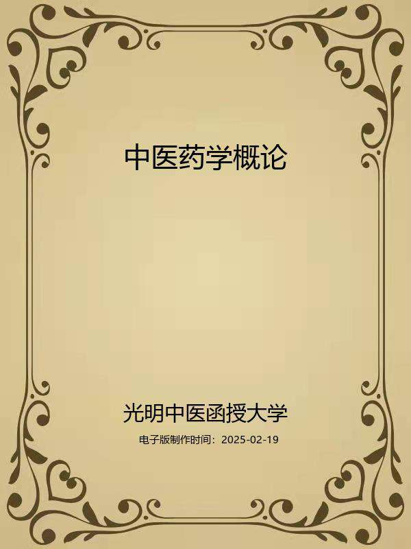

## 编者

光明中医函授大学主编

白永波主编

白永波刘景源姜典华樊正伦编

史常永审阅

## 导言

中医教育学，是一门古老而崭新的科学。中医教育的历史，若从师徒授受和医籍编纂算起，已有两千余年。近代史上的中医教育，首推一八八五年浙江陈虬创立的利济医学堂。新中国诞生不久，创办了北京、上海、广州和成都四所中医学院，从而揭开了当代中医教育的序幕，至现在，全国已发展到二十三所。但是，如果把我国中医教育的实践经验加以分析、研究、总结和提炼，升华，揭示它的规律，使之成为一门专门的学科——中医教育学的话，那么，它还处在再创阶段。这就是说，中医教育及其规律存在的历史是悠久的，但论述中医教育及其规律的学科却是崭新的。因此，中医教育工作需要进行探索和研究。

在探索和创建适合我国国情的中医教育的时候，我们必须植根于我们民族文化的肥沃土壤之中，充分重视中医典籍在培育和造就历代医家中的伟大作用。事实上，在长期的历史发展中，逐渐形成了具有中华民族特色的中医药理论体系，它既有丰富临床经验，又有高深的理论基础。历代医学家就是把这些道理传授给他们的弟子，其中部分人经过刻苦自学和临床实践，成为医术高超的医学家，这是我国历代医学家成才之路，亦是中医教育史上培养人才的宝贵经验。这就是我们民族中医教育事业的光辉历史。

在新的历史时期，作为中医教育工作来说，既要给学生打好传统医学的基本功，又要使他们掌握一些新兴的科学知识，使继承与发展得到统一。根据这种认识，我们十分认真地研究和设计了光明中医函授大学的教学计划、教材内容、教学方法与教学手段。归结起来即是：注重打好中医基本功，注意提高中医基本理论水平和培养临床诊治技能，着力培养辨证论治的思维方法，竭诚发挥中医在防病治病中的特长。并在这个基础上，扩大学员知识面。我们把这些要求与思想，全面体现在本校的教材建设中。其目的是使中医人才的知识结构更加合理，以便能担负起继承和发扬祖国医药学防病治病的光荣任务。

在回顾中华医学教育历史，展望现代医学教育的发展趋势以及总结三十多年正反两方面经验的基础上，我们认为，要培养出适合四化需要的合格中医人才，对中医教育的课程设置和教材内容，就要进行必要的改革，建立起为新形势所需要的中医教材。我们正在朝这一方向努力。在认真研究高等中医院校教材和广泛征询中医专家、学者和医务人员意见的基础上，新编了这套较为完整的中医教材，定名为《高等中医函授教材》（包括了二十八门课程）教材的编写人员，由本校选聘知名教授、学者和学有专长者担任，编写时，我们力求各门教材要有鲜明的针对性，在内容上富有实用性，在文字表达上深入浅出、简明易懂，以利便于自学或函授，此外，我们还将根据需要，选编一些辅导材料，以帮助学员（读者）理解教材内容，更好地学取中医知识。

由于教材编写时间仓促，又竭力于继承与创新,不足之处在所难免，敬希学员和广大读者惠赐宝贵意见，以便在再版时修订。

光明中医函授大学教育研究室

一九八五年十月四日

加入光明：

光明中医网址：www.gmzyjx.com，www.gmzyjc.com

## 编者的话

《中医药学概论》一书，旨在介绍中医药学的基本概念和基本理论，从“高等中医函授教材”中的顺序看，它是普通基础课向专业基础课过渡的一门桥梁课，属于专业基础课程之一。是深入学习中医基础理论和中医临床各科的基础。内容包括除绪论、附录外，主要有阴阳五行、藏象、经络、病因与病机、诊法、辨证、治则与治法、中药学概述、方剂学概述、中医药学在医疗上的优势等十章。

通过本课程的学习，要求学员能系统地掌握中医基础理论的基本概念及基本内容。具体要求则按教材各章内容统一划分为三级：第一级“掌握”为重点内容。第二级“熟悉”为次重点内容;第三级“了解”为非重点内容。学员在自学过程中，宜按此三级要求，运用唯物论和辩证法的观点，充分发挥独立思考能力，尽可能地理论联系实际，做到分别主次，循序渐进。在此基础上，结合复习思考题进行自我练习和测试，以巩固已经掌握的学习内容，提髙自学效果。本课程计划安排自学120学时，面授30学时，详见各章学习进度安排项内。

任何学科要建立科学理论，都必须形成概念，并运用概念进行判断推理，中医是一门自然科学，当然也不例外。中医学把形式逻辑与辩证逻辑结合起来运用，形成具有特色的思维方法，并凭借这一成功的思维方法，将丰富的临床经验上升为一般规律性的认识而形成理论，并有效地指导着临床实践，因此，中医学的理论，是符合客观实际的正确理论。假若学习中医和从事中医专业的人们，不遵循中医理论体系，不学习、不研究中医的思维方法，不运用中医概念进行判断推理，是掌握不了这门科学的。假若把中医理论只停留在纸上和嘴上，不在临床实践中运用理、法、方、药，不从临床疗效上理解中医理论的正确性，也是掌握不了这门科学的。从中医学的形成与发展的历史来看，吸收其它学科的知识（包括吸收现代医学的知识）能否促进中医的发展，则应以是否符合中医学术自身的发展规律为准则来检验其得失。对初学中医者来说，先把中医学的基本概念弄清楚是十分重要的。

本书在编写过程中、力求保持和发扬中医特色，正确处理继承与发扬的关系，紧紧围绕“培养临床中医师”这一目标。凡属与中医临床密切相关的理论问题，予以详尽论述；凡有益于建立中医临证思维方法的学术观点，则反复阐释。本书在写法上，力求简明扼要，朴实无华，为学习与领会中医学的理论和知识提供阅读上的方便。

本书的编写工作，是在光明中医函授大学教材编辑室的主持下进行的，从选题、设计到取材和写法，经过反复推敲而成。在本节编写过程中，曾得到中医同道刘广洲、韩世湧、王琦、王立等同志的鼓励与帮助，谨此一并致谢。

由于编写时间匆促，加之水平有限，书中错漏之处在所难免，敬请批评指正。

编者

一九八六年七月一日于北京

## 绪论

[自学时数] 2学时

[目的要求] 1.了解中医学理论体系的形成发展和它具有的唯物辩证观。 2.掌握中医学的基本特点。

中医药学有数千年的历史，是中华民族长期同疾病斗争的丰富经验的总结，是我国优秀的科技文化的一部分。中医药学是在古代唯物论和辩证法思想的影响和指导下，总结了长期的医疗实践，逐步形成、发展成为具有独特理论体系的一门自然科学。它为中国人民的保健事业和中华民族的繁衍昌盛做出了巨大的贡献。

### 第一节中医学理论体系的形成和发展

中医学是以阴阳五行学说、脏象经络学说、气血津液学说等为基础，以整体观为主导思想，以辨证论治为诊疗特点的，研究人体生理、病理，以及疾病的诊断、治疗与预防的一门科学。

春秋战国时期，社会政治、经济、文化都有了显著发展，学术思想也出现了活跃的局面。我国现存的最早的一部医学经典著作——《黄帝内经》（以下简称《内经》），就基本成书于这一时期。《内经》一书主要总结了春秋战国以前的医学理论和临床经验，创立了中医学独特的理论体系，为中医药学的发展奠定了坚实的基础。

《内经》一书，由《素问》和《灵枢》两个部分（各八十一篇）组成。它系统地阐述了人体生理、病理，以及疾病的诊断、治疗和预防等，为中医学理论奠定了基础。主要包括阴阳五行、藏象、经络、病因、病机、诊法、辨证、治则，以及解剖、针灸、养生等方面的内容。《内经》中的许多内容已大大超越了当时的世界医学发展水平。在解剖学方面，关于人体骨骼、血脉长度、内脏器官的大小和容量等的记载，基本上是符合实际情况的，如食管与肠的长度之比，《内经》记载为1 ： 35，与现代解剖学描述的1：37，非常接近。在血液循环方面，提出了“心主身之血脉”（《素问·痿论》）的观点，并认识到血液在脉管内是“流行不止，环周不休”（《素问·举痛

论》）的。这些认识比英国哈维氏在公元1628年发现血液循环要早一千多年。

《难经》是在《内经》之后出现的又一部医学经典著作，成书于汉以前。《难经》和《内经》一样，都不是出自一时一人之手，而是不同时代的医家的集体创作。《难经》一书，内容也十分丰富，它包括人体生理、病理、诊断、治疗等各个方面，其主要内容是对《内经》的补充和发展。

两汉时期，中医学有了显著的进步和发展。代表这一时期医学发展水平的是东汉末年著名医家张仲景（公元150~219？）的《伤寒杂病论》。《伤寒杂病论》是张仲景运用《内经》、《难经》所阐述的基本理论于临床实际的经验总结，是中医临床学的奠基之作。《伤寒杂病论》即后世之《伤寒论》和《金匮要略》。《伤寒论》和《金匮要略》所确立的六经证治、脏腑证治，开中医学辨证论治的先河，并使汉以前中医学的发展达到了新的高度。张仲景所确立的外感疾病的六经证治，内伤杂病的脏腑证治，基本上形成了中医临床医学的辨证论治的理论体系，为后世临床医学的发展奠定了基础。

汉以后的医家在《内经》、《伤寒杂病论》的基础上，从不同的方面发展了祖国医学。晋·王叔和《脉经》关于脉诊的论述，是对中医诊断学的重要发展。晋·皇甫谧的《针灸甲乙经》，基本确立了针灸医学的理论和临床体系。隋·巢元方等的《诸病源候论》是中医学第一部关于病因病机及证候学的专书。宋·陈无择的《三因极一病证方论》，发展了《内经》的病因学说，明确提出“内因”、“外因”、“不内外因”的“三因”致病说。宋·钱乙的《小儿药证直诀》，发展了脏腑证治学说。金元时期的百家争鸣、流派纷争的活跃局面，有力地促进了中医学的发展，先后出现了以刘完素、张从正、李杲、朱震亨为代表的著名医家，即“金元四大家”。刘完素以火热立论，倡“六气皆从火化”、“五志过极皆能生火” 之说，用药以寒凉为主，后世称为“寒凉派”。他的学术观点给后世温病学说的形成和发展以很大启示。张从正认为病由邪生，“邪去则正安”，主张以攻邪为主，倡汗、吐、下三法，后世称为“攻下派”。李杲认为“内伤脾胃，百病由生”，故治疗以补益脾胃为主，后世称为“补土派”。朱震亨倡“相火论”，认为人体“阳常有余，阴常不足”，治疗以滋阴降火为主，后世称为“养阴派”。总之，刘、张、李、朱四大家，都从不同方面丰富和发展了中医学。明代赵献可、张景岳发展了命门学说，为脏象学说增添了新的内容。

明清时期中医学的突出发展是温病学说的形成。温病学是研究四时温病发生、发展规律，及其诊治方法的一门临床学科。温病学理论源于《内经》、《难经》、《伤寒杂病论》等书，经过汉以后历代医家的发展，至清代温病学家叶天士、吴鞠通，逐步形成一门具有完整理论体系的独立学科。明·吴又可对温疫病原，提出 “非风非寒、非暑非湿，乃天地间别有一种异气所感”。吴又可称这种“异气”为“戾气”或“杂气”，并指出其受邪途径不是从肌表而入，是从口鼻而入。这对温病（特别是温疫）的病因学是一个重大发展。至清代温病学的理论和临床日趋完善，叶天士、吴鞠通等温病学家，创立了以卫气营血和三焦为中心的温病辨证论治体系。

至清代中医学基本上形成了比较系统和完整的临床各科。

新中国成立后，中西医学工作者在中西医结合治疗急腹症、中医治疗急证，以及应用现代科学技术方法研究脏腑、经络实质及针刺麻醉、中药麻醉等方面，都取得了可喜的进展。

### 第二节中医学的唯物辩证观

对于哲学和自然科学的关系，恩格斯曾经做过精辟地论述，他在《自然辩证法》一书中说：“不管自然科学家采取什么样的态度，他们总还是在哲学的支配之下”。做为自然科学之一的中国医药学也不例外。中国医药学在其形成和发展的过程中，就直接地渗透着中国古代唯物辩证法—阴阳五行学说的深刻影响。因此，唯物辩证观贯穿于整个中医药学理论体系之中。

#### 一、中医学的唯物观

##### （一）对生命认识的唯物观

中医学接受了阴阳学说的唯物观，认为世界是物质的，是阴阳二气相互作用的结果。“清阳为天，浊阴为地”（《素问·阴阳应象大

论》），就说明天地是物质的，是阴阳之气运动变化形成的。更由于“天地合气，六节分而万物化生矣”（《素问·至真要大论》），万物当然包括人在内，所以“天地合气，命之曰人”（《素问·宝命全形论》、“人以天地之气生，四时之法成”（《素问·宝命全形

论》）。中医学把人看成物质世界的一部分，肯定了生命的物质性。这种对生命的朴素的唯物主义的认识，虽然不能也不可能象现代科学那样解决生命起源问题，但在数千年前就具有这种唯物主义的认识，确是难能可贵的。

中医学在认为生命是物质的同时，认为精（气）是生命的本源物质。这种精气先身而生，具有遗传性。《素问·金匮真言论》云：“夫精者，身之本也”，《灵枢·本神》云：“故生之来谓之精，两精相搏谓之神”。这里的精气指父母之精，即先天之精。由于父母之精气相合，才产生新的生命。新的生命产生之后，同样要依靠精气才能生长发育。《灵枢·经脉》云：“人始生，先成精，精成而脑髓生，骨为干，脉为营，筋为刚，肉为墙，皮肤坚而毛髮长”。人生下之后，维持身体发育的精气，称为后天之精。所以，精气是构成和维持生命活动的基本物质。

气是维持生命活动的物质基础，气的运动变化及其伴随发生的能量转化过程称之为气化。气化运动是生命的基本特征，没有气化就没有生命。气化的实质是机体内部阴阳消长转化的矛盾运动。“升降出入，无器不有”、“故非出入，则无以生长壮老已；非升降，则无以生长化收藏”、“出入废则神机化灭，升降息则气立孤危”（《素问·六微旨大论》）。由此可见，升降出入是气化运动的基本形式，生命活动当然不能例外，生命活动就寓于升降出入的矛盾运动之中。

##### （二）形神统一的唯物观

形神学说是中医学基础理论的重要内容，是在唯物辩证自然观的基础上形成的。形即形体。神，广义是指人体生命活动的外在表现的总称，包括生理、病理外现的征象；狭义是指人的精神思维活动。神的概念很广泛，其含义有三：一指自然界（包括生命）物质运动变化的能量。荀子说：“万物各得其和以生，各得其养以成，不见其事，而见其功，夫谓之神”（《荀子·天论》），自然界万物的化生是

“神”的作用，而这种“神”看不见摸不着，但是人们却能认识到它的存在，即在“神”的作用下万物的生成发展与变化；二指人体生命活动。中医学认为人体本身就是一个阴阳对立统一体，阴阳之气的对立统一，决定了生命的运动变化，而生命活动的机能也称之为神。得神者昌，失神者亡。神去则气化停止，生命即告完结。可见，神是人体生命的根本基础；三指人的精神思维活动。《内经》中论述人的意识与思维活动，如：“心者，君主之官，神明出焉”（《素问·灵兰秘典论》），“积神于心，以知往今”（《灵枢·五色》）和“所以任物者谓之心，心有所忆谓之意，意有所存谓之志，因志而存变谓之思，因思而远慕谓之虑，因虑而处物谓之智”（《灵枢·本神》），以及关于心藏神、肺藏魄、肝藏魂、脾藏意、肾藏志等五神脏的论述，指的就是人的精神思维活动之神。

中医学对形神关系的认识。实质就是对物质和精神二者相互关系的认识。形即形体。形体是第一性的，精神是第二性的。形体是本，神是生命的作用。有形体才有生命，有生命才有神产生。神的物质基础是气血，“血气者，人之神”（《素问·八正神明论》），气血又是构成人体的基本物质，而人体脏腑等的功能活动，气血的运行，又受神的主宰。神附于形，形主于神，形存则神存，形灭则神亡。反之，神亡则形亦灭。所以，形与神是相互依附而不可分割的，即“形与神俱”和“形神相得”的形神关系，这是对形神关系的唯物主义认识。

##### （三）疾病可知、可防、可治的唯物观

中医学对人体采取了唯物主义的可知论观。它认为正常的生命过程是阴阳二气对立统一运动的动态平衡过程，即“阴平阳秘，精神乃治”（《素问·生气通天论》），而一切疾病发生的根本原因是阴阳平衡协调关系的破坏，即阴阳失调。“阴胜则阳病，阳胜则阴病；阳胜则热，阴胜则寒”（《素问·阴阳应象大论》），就是中医学对疾病发生的原因和机理的最高度、最原则地概括。所以，生命是可知的，疾病也是可知的，“言不可知者，未得其术也”（《灵枢·九针十二原》）。同时也认为疾病可防，即“治未病”的预防思想。主张未病之前，重视形体和精神的调养，应当顺应四时阴阳的变化，调整生活起居，还应节制情志活动等，以使人体阴阳气血保持相对协调，从而使正气充盛，防止病邪侵入。“治未病”不仅表现在未病先防，而且主张有病早治，以防传变。

#### 二、中医学的辩证观

中医学不仅认为一切事物都有着共同的物质根源—气（阴阳），而且还认为一切事物都不是一成不变的，各个事物之间也不是孤立的，它们之间是相互联系和相互制约的。因此，中医学中包含着辩证法观点。

人体是一个不断运动变化的有机整体。人的生命活动过程，就是人体阴阳对立双方在不断地矛盾运动中取得统一的过程。在这一过程中，阴阳是“变化之父母，生杀之本始”。中医学认为人与自然界是一个统一整体，与自然界有着极为密切的联系，无论是人体生理还是病理，都直接或间接地与自然界变化影响有关。同时，人体内各脏腑器官组织之间是相互联系、相互影响的统一整体，从而形成了中医学对人体认识的辩证整体观。

精神意识对人体的反作用。中医学一方面认为精神依附于形体而存在，另一方面也强调精神（情志）活动对人体健康与疾病的反作用。在养生保健方面，中医学重视精神调养对健康的积极意义，以及不注意精神调养对人体的危害。同时，指出情志过极对脏腑功能活动的不良影响：“怒伤肝”、“喜伤心”、“思伤脾”、“忧伤肺”、“恐伤肾”（《素问·阴阳应象大论》）。总之，精神对形体的反作用这一认识，即使以现代哲学来衡量，也是正确的辩证的认识论。

治疗学中的辩证观。中医治疗学中包含着辩证法原则。如标本缓急、正治反治、异法方宜、同病异治与异病同治等。

标本缓急：标与本是相对的一组概念，其涵义也比较广泛。标本是一个整体，就其本义来说：本，是根本，本质；标，是现象，是事物本质所反映的现象。中医学中所谓疾病的标本，则包涵有疾病的本质和现象、原因和结果、原生和派生等矛盾关系的意义。治疗学在认识疾病之“标本”，从而决定论治之“缓急”中，已经涉及到辩证法中的根本矛盾、主要矛盾和次要矛盾的关系问题。一般来说，以正邪而论，人体正气为本，邪气为标，以病因和证候论，则病因为本，证候为标；以发病先后论，则先病、旧病为本，后病、新病为标：以原发续发论，则原发病为本，续发病为标；以病变部位论，病在内、在脏腑为本，病在外、在经络肌表为标。以“标本”论的原则去认识疾病，医生就容易抓住疾病的本质，以及疾病治疗的关键。治疗学的总原则是“治病必求其本”，疾病的标本既明，则具体治疗原则的确立就不难了。即“知标本者，万举万当；不知标本，是谓妄行”（《素问·标本病传论》）。对于疾病标本的缓急论治的一般原则是“急则治其标，缓则治其本”，即标急者，先治标而后治本；标不急者，先治其本后治其标；若标本俱急，则又应标本同治。总之，对于标本的先后缓急，应视疾病实际情况而定。而“标本缓急”的原则，正是符合辩证法原理。

正治反治：正治是针对疾病本质的寒、热、虚、实性质，而分别采用“寒者热之”、“热者寒之”、“虚者补之”、“实者泻之”的治疗方法。反治是指所采用的治法与病证所表现的假象症状性质一致，是针对病证的假象而言，如“寒因寒用”、“热因热用”、“塞因塞用”、“通因通用”（详见本书“治则”）等。反治法，就其本质而言，仍属正治法。这里的正治反治，正是体现了矛盾对立统一的辩证法原理。

异法方宜：中医治疗学认为疾病是复杂多样、变化多端的。即使同一种疾病，由于方域、气候、季节、生活、环境、职业，以及病人的性别、年龄、体质、病程等不同，治法就有区别。如同样是热证病人，由于体质有偏阴偏阳之不同，所用寒凉药的剂量，或作用强度就有区别：偏阳体质者，剂量可大，用药时间可长；偏阴体质者，剂量宜小，用药时间宜适可而止。否则，就会热证虽去又添寒证。清·喻嘉言指出：“凡治病不察五方风气、衣食居处各不相同，一概施治，药不中窍，医之过也”（《医门法律·申明内经法律》）。“异法方宜”的治疗原则，体现了具体问题具体分析的原则，说明中医治疗学已经注意到矛盾的共性与个性，普遍性与特殊性问题，只是未明确提出这一哲学概念。

病治异同：病治异同指同病异治和异病同治两方面。同一疾病，因人、因时、因地的不同，或由于病情的发展、病机的变化、邪正消长的差异，而采取不同的治法，谓之同病异治。不同的疾病，在其病程发展的某一阶段，出现了相同的病机变化，则采取相同的治法，谓之异病同治。“病治异同”的原则，反映了中医治疗学是从事物运动变化的观点，从事物间相互联系的观点，去认识疾病的辩证法思想。

### 第三节中医学的基本特点

中医学是在唯物论和辩证法思想指导下，经过长期的临床实践，逐渐形成的，它具有一整套完整的、独特的理论体系。其基本特点有二：一是整体观，二是辨证论治。

#### 一、整体观

整体观就是统一性和完整性。中医学的整体观表现在：中医学客观地认识到并非常重视人体本身，及其与自然界（天地）的统一性、完整性。它认为人体是一个有机的整体，构成人体的各组成部分之间，在结构上、生理作用上、病理变化上，是相互联系、相互协调、相互影响的。同时也认识到人体与自然环境是息息相关的，人体的生长发育、健康与疾病，都直接或间接地受到自然环境的一定影响。这种人体自身的整体性和人体与自然环境的统一性的思想，称为整体观。整体观思想贯穿于中医学的生理、病理、诊法、辨证、治疗等各个方面，成为中医学重要特点之一。

##### （一）人体是一个有机整体

人体是由脏腑、组织、器官所组成。各个脏腑、组织、器官，都有着各自不同的生理作用。中医学通过长期地对人体进行观察研究，认为人体是一个以五脏为中心，并通过经络系统，把六腑、九窍、四肢百骸等全身组织器官联系成有机的整体，并通过精、神、气、血、津液的作用，完成人体的整体功能活动。正因为脏腑、组织、器官之间存在着这种实质性的联系，因而决定了它们之间在生理上的相互联系，病理上的相互影响，即人体在生理、病理上的整体性。从这一认识出发，就形成了中医学对疾病认识和治疗上的整体观。

1.生理上的整体观

在整体观思想指导下，中医学认为人体的脏腑、组织、器官之间，在生理上是一个统一整体。特别是脏腑之间，在生理功能上是相辅相成和相反相成的，即五行学说所说的生克关系。正是这种生克关系维持着脏腑，及脏腑所属组织器官之间协调的动态平衡。同时，任何一个脏腑功能的太过和不及，都将破坏这种整体的平衡联系。而这种整体联系，又是在心的统一指挥下完成的，“心者，君主之官”、“主明则下安”、“主不明则十二官危”（《素问·灵兰秘典论》。经络系统联络全身内外上下，把脏腑、经络、肢体、九窍等联系成为一个有机整体。而气血津液理论和形体与精神统一的学说，则反映了功能与形体的整体性。“阴平阳秘，精神乃治”和“亢则害，承乃制，制则生化”等理论，则说明阴阳学说论述了人体内部阴阳双方的对立统一的相互关系，五行学说阐述了五脏六腑之间的生克制化关系，这些都反映了中医学对人体生理的整体观思想。

2.病理上的整体观

中医学不仅从整体观思想出发去探索人体正常生命活动规律，而且以整体观去认识研究人体疾病的病理机制。由于人体脏腑、组织、器官在生理上的密切联系，必然决定了它们之间在病理变化上的相互影响，即每一脏腑、组织、器官的病变都不是孤立的存在。每一局部的病变都会影响于整体，而整体病变又可反映于某一局部，即某一局部病变可能是整体病变的一部分。这一病理变化上的相互影响，如同生理上的相互联系一样，是通过经络系统、气血津液系统实现的。如某一肌表、经络的病变，可能是与其相关的脏腑病变的反映，或由脏腑病变延及其所属经络、器官。又如肝病可影响于脾、肺，使脾、肺发病。如此等等，都说明了人体疾病病理变化的整体性，同时证明中医学在人体病理变化上的整体观是正确的。

3.诊法与辨证上的整体观

前已述及，人体的内外上下各部是一个有机的统一整体。那么，体内的病变就可反映于体表，这一脏腑的病变就可以影响于与其相关的另一脏腑。因此，就可以通过体表五官、形体、色脉的外在变化，推知体内的病变，这就是中医“以外揣内”的诊法的依据。同时，做为诊法理论基础的脏象学说，更是在整体观指导下形成的。

4.治疗原则上的整体观

人体是一个有机的整体、中医在疾病治疗上，是把局部病变做为整体的一部分去考虑的。既考虑局部病变，又不忘其与整体的关系。在治疗上往往是局部与整体兼顾。如外科阳证疮疡的治疗，不是单纯在疮疡局部用药，而是从整体着眼，进行清热解毒治疗。又如口舌糜烂，心开窍于舌，心与小肠相表里，因此，治疗口舌糜烂，不是只着眼于舌的局部，是从清心泻小肠火的治法入手治疗口舌糜烂。其他，如“从阴引阳，从阳引阴；以右治左，以左治右”（《素问·阴阳应象大论》），“病在上者下取之，病在下者高取之”（《灵枢·终

始》）等等，都是在整体观指导下确定的治疗原则。

##### （二）人与自然界的统一性

人与自然界的统一性（即人与天地相应，或人与天地相参的天地人一体）是中医学整体观的又一重要内容。人类生活于自然界中，自然界存在着人类赖以生存的必要条件。同时，自然界的变化又直接或间接地影响于人体，使人体产生一定程度的相应的反映。以《内经》为例，就用了大量的篇幅专门论述了“人与天地相应”的整体观思想。

1. 自然界的变化对人体生理的影响

（1）季节气候对人体的影响一年之中有春温、夏热、长夏湿、秋凉、冬寒的正常季节气候变化。生物在这种季节气候变化之中，则为春生、夏长、长夏化、秋收、冬藏的相应变化。人体也毫不例外地受着季节气候变化的影响，而出现相应的生理性变化。如人在夏天皮腠就疏松而多汗少尿，冬天皮腠固闭而少汗多尿。《灵枢·五癃津液别》说：“天暑、衣厚则腠理开，故汗出”，“天寒腠理闭，气湿不行，水下留于膀胱，则为溺与气”。又如，脉象也随着季节变化的不同而有一定的变化：春脉多弦，夏脉多洪、秋脉多浮、冬脉多沉。就总体来说，春夏脉象浮大，秋冬脉象多沉小。脉象这种浮沉大小的变化，就是人体受到季节变化的影响发生的生理性改变。再如人体气血运行也与季节气候变化有关：春夏温热则气血流行较快而流利，秋冬寒凉则气血运行较慢而涩滞。《素问·八正神明论》说：“天温日明，则人血淖液而卫气浮，故血易泻，气易行；天寒日阴，则人血凝泣而卫气沉”。

（2）昼夜对人体的影响在昼夜晨昏的阴阳变化过程中，人体也发生相应变化。如人体阳气白天趋向于表，夜间趋向于里。《素问·生气通天论》说：“故阳气者，一日而主外，平旦人气生，日中而阳气隆，日西而阳气已虚，气门乃闭”。又如人体卫气，昼行于阳经，夜行于阴经。《灵枢·大惑论》说：“夫卫气者，昼日常行于阳，夜行于阴”。上述论述，说明了昼夜变化对于人体生理的影响。

（3）地区方域对人体的影响因地区气候的差异，地理环境和生活习惯的不同，在一定程度上，也影响着人体的生理活动。如江南多湿热，人体腠理多稀疏；北方多燥寒，人体腠理多致密。这是长期生活在这样的环境中，人体对方域影响的反映。同时，长期生活在一地的人们，一旦易地而居，开始总有些不适应之感，经过一定时间后，人体就会发生适应新环境的变化。这也是方域对人体影响所致。

此外，天体（日月）运行，对人体生理过程也有一定影响。中医学认为，人与天地相应。自然界对人体生理产生影响这一事实，是客观存在的。但中医学同时认为，人类只要提高健康水平，减少疾病，就能提高适应自然的能力，能动地改造自然，和自然作斗争。

2.自然界的变化对人体疾病的影响

（1）季节气候对疾病的影响四时气候的变化，是生物（包括人类）生存的重要条件之一，但有时也会成为生物生存的不利因素。人类适应外界变化的能力是有限的，如果气候出现异常变化（太过或不

及），或人体调节机能低下，而不能对气候变化作出适应性调节，就会发生疾病，或使已发生的疾病出现相应的变化。如季节性多发病，或时令病的出现，就带有明显的季节性。又如某些宿疾，往往在一定的气候条件，或季节交接之际发作，如痺证、哮喘等。中医运气学说更明确提出某气当令之年，有某病流行的预测。

（2）昼夜的变化对疾病的影响大多数疾病，白天减轻，夜晚加重。因此，《灵枢·顺气一日分为四时》说：“夫百病者，多以旦慧昼安，夕加夜甚”。有些疾病，常在午后或夜间定时周期性发热（潮热），或在上午头痛加重。总之，某些疾病病情的变化与昼夜密切相关。

此外，地域对疾病也有一定影响。如地方性疾病等。

由于中医学中的天人一体观的指导思想，使中医学不仅在认识人体生理、病理时，考虑自然界对人体的影响，而且在确定治疗原则和选方用药时，同样考虑到外界环境的影响。如《素问·八正神明论》就指出应当“因天时而调血气”的原则：“是以天寒无刺，天温无疑，月生无泻，月满无补，月廊空无治，是谓得时而调之”。这句话译成口语是：因此，天气寒冷，不要针刺；天气温和，不要迟疑；月亮初生的时候，不可用泻法；月亮正圆的时候，不可用补法；月黑无光的时候，不可针刺；这就是所谓顺着天时而调治气血的法则。这说明中医学早已注意到天体运行对人体的影响，这一思想是十分宝贵的。

#### 二、辨证论治

辨证论治是中医学认识疾病和治疗疾病的基本原则，是中医学对疾病的一种特殊的研究和处理方法，也是中医学的基本特点之一。

证，是机体在疾病发展过程中的某一阶段的病变部位、原因、性质，以及邪正关系的概括。因此，证是反映疾病发展过程中，某一阶段的病变的本质，所以它比症状对疾病的揭示更全面、更深刻、更正确。

所谓辨证，就是运用中医学基本理论，将四诊（望、闻、问、切）所收集的资料（症状、体征），通过分析综合，对疾病进行诊断的过程。论治，又称施治，是根据辨证的结论，确定相应的治疗方法。辨证是确定治疗方法的前提和依据，论治是治疗疾病的手段和方法。辨证论治的过程，就是认识疾病和解决疾病的过程，是中医学理法方药在临床上的具体运用，也是临床医生所掌握的基础理论和治疗经验的综合运用过程。

中医认识和治疗疾病，是既辨病又辨证。辨证明确，才能抓住病的本质，从而正确的施治。例如感冒病，见发热恶寒，头身疼痛等症状，病属在表，但由于致病邪气和人体正气抗邪能力不同，又可有风寒感冒和风热感冒两种不同的证。辨明证属风寒还是风热，才能确定运用辛温或辛凉解表方法，予以恰当治疗。同时可以看出，辨证施治是不同于一般对症治疗的。

辨证论治作为指导临床诊治疾病的基本法则，由于它能辩证地认识病与证的关系，既可看到一种病可以包括几种不同的证，又看到几种不同的病在其发展过程中可以出现同一种证。因此，在临床治疗时，还可以在辨证论治的原则指导下，采取“同病异治”和“异病同治”的方法来处理。如同是感冒病，但由于发病季节不同，则有冬季感冒和暑季感冒之不同，同时其致病邪气也不完全一样，冬季感冒常感于风寒，暑季感冒则常夹有暑湿之邪，因而治法不同，即所谓“同病异治”。又如久痢脱肛、子宫下垂等，病虽不同，但均属中气下陷之证，故可采用相同的治法，即所谓“异病同治”。由此可见，中医治病主要的不是着眼于“病”的异同，而是注重于“证”的区别。相同的证，可采用基本相同的治法，不同的证，治法就不同，所谓“证同治亦同，证异治亦异”。这种针对疾病发展过程中，不同质的矛盾用不同的方法去解决的法则，就是辨证论治的精髓。

复习思考题

1、简述中医学理论体系的形成和发展过程。

2、中医学中的唯物辩证观表现在哪些方面？

3、简述中医学的基本特点是什么？

## 第一章阴阳五行学说

[自学时数] 8学时

[面授时数] 2学时

[目的要求]

1.了解阴阳五行学说的形成、发展及其在中医学中的应用。

2.掌握阴阳五行的概念及基本内容。

阴阳学说和五行学说，是我国古代哲学基本理论——朴素的唯物论和自发的辩证法的思想基础，是古人通过长期的生活和生产实践，对自然界观察和认识的总结和概括。古人认为，形形色色和千变万化的自然界，都是“阴阳”和“五行”运动变化的结果，阴阳和五行是自然界的根本和源泉。因此，阴阳和五行就成为古人认识自然界和解释自然界的世界观和方法论。《类经附翼·医易》说：“天地之道，以阴阳二气以造化万物；人生之理，以阴阳二气而长养百骸”。

阴阳学说认为自然界是物质的，是在阴阳二气相互作用的情况下，发生、发展和变化的，没有阴阳就没有自然界。五行学说认为，木、火、土、金、水是构成自然界的五种基本物质。形形色色的自然界，就其构成物质来说，都可以高度抽象、概括、归纳为五个方面，而此五个方面又是相互作用、运动变化的。

作为自然科学的中国医学，是在吸收了当时的先进的唯物主义的哲学理论——阴阳五行学说之后，才形成了具有独特理论体系的中医药学。阴阳五行学说已经成为中医学认识和阐释人体生命过程和疾病过程，并指导诊断治疗（辨证施治）的理论和说理工具。因此，学习和研究中医学，必须首先通晓阴阳五行学说的基本原理。

### 第一节阴阳学说

古人在长期的生活实践中，逐渐认识到这样一种规律，即自然界的每一种事物都有与其相对应的另一方面事物存在，如男女、水火、昼夜、日月、寒暑、晴阴等，因而形成了最早的阴阳概念。在成书于西周时的《易经》中就出现了明确的阴阳概念，—（阳爻）和--（阴爻），并由此演化为八卦。不过此时并没有使用阴阳两字。至西周末期才使用阴和阳二字来表示相联系而又对立的两方面事物。如《国语·周语》中就记载了伯阳父用阴阳运动失去平衡来解释地震产生的原因：“阳伏而不能出，阴迫而不能蒸，于是有地震”。《左传·昭公元年》还记载了秦国医生医和，以阴阳代表寒热，他说：“阴淫寒疾，阳淫热疾”。在此期间并有一些学者，阐述了阴阳的对立与相互转化关系。如《国语·越语》说：“阳至而阴，阴至而阳。日困而还，月盈而匡”。《荀子》说：“天地之变，阴阳之化”。《易传》在总结自然界运动变化规律时提出：“一阴一阳之谓道”，等等。总之，阴阳学说在春秋战国时期已经形成并盛行，对于当时的哲学和自然科学产生了广泛的影响。

#### 一、阴阳的基本属性

阴阳二字的本义是指日光的向背，即向日者为阳，背日者为阴。《谷梁传·僖公二十八年》说：“水北为阳，山南为阳；水之南，山之北为阴”。但作为阴阳学说中的“阴阳”，已经不是“日光向背”的涵义了，而是一类事物属性的抽象和概括。因此，它们指的不是某一个特定的具体的事物，而是抽象的表示事物属性形态特征的概念。《灵枢·阴阳系日月》已经明确指出：“且夫阴阳者，有名而无形”。明·赵献可也说：“阴阳者，虚名也”（《医贯·阴阳论》）。

阴阳学说认为，自然界一切事物（包括人体）均可根据它们各自的特性，按阴阳属性进行归类。根据前人的论述，阴阳的基本属性可归纳如下：凡是动的、升的、浮的、上的、外的、热的、明的、无形的等等属阳；凡是静的、降的、沉的、下的、内的、寒的、暗的、有形的等等属阴。即天在上、无形属阳；地在下、有形属阴。日是明亮的、热的属阳；月是晦暗的、寒冷的属阴。疾病中的热证、实证、表证属阳；寒证、虚证、里证属阴。阴阳的基本属性是绝对的、固定的，但事物本身的阴阳属性却是相对的、变动的。这种事物本身的阴阳属性的相对性和变动性，一方面表现为在一定条件下相互关联的相对事物之间可以互相转化，即阴可以转化为阳、阳可以转化为阴；另一方面表现为一事物内部阴阳属性的无限可分性，即“阴中有阳，阳中有阴，阴阳之中复各有阴阳”（《类经·阴阳类》）。我们在明确了阴阳学说中阴阳的属性（即阴阳质的规定性）和具体事物本身的阴阳属性是不同的两回事之后，就能容易理解为什么某一总体属阳的事物，而又包含阴的属性，总体属阴的事物又包含阳的属性；及某事物由于其相对方面的变化，其阴阳属性也随之而发生相应的转化的原理。

#### 二、阴阳的相互关系

阴阳的相互关系，概括起来，可以归纳为对立和统一两个方面。阴阳学说认为自然界的一切都是由阴阳二气所构成。而事物的发展变化是阴阳二气对立统一的表现形式，即《素问·阴阳应象大论》所概括的：“阴阳者，天地之道也，万物之纲纪，变化之父母，生杀之本始，神明之府也”。这一观点，正是阴阳学说宝贵的唯物主义思想所在。

阴阳两方面的相互对立，主要表现在阴阳之间的相互制约、相互斗争。阴阳两方面的统一，主要表现在阴阳之间的相互依存、相互为用、相互转化，以及阴阳的相互包涵和无限可分性。

（一）阴阳的相互对立与消长平衡

阴阳学说认为自然界一切事物无不存在着相互对立的阴阳两个方面。如上与下、南与北、动与静、寒与热，以及动物的雌与雄等等，它们之间虽然或者为一事物内部的两个方面，或为相关联的两个事物，但它们有一个共同点即相互对立。上下对立、南北对立、动静对立、寒热对立，雌雄对立。但恰恰是这些对立，才维持着事物的存在——发生、发展、变化。没有上下对立、南北对立，就没有空间方位；没有动静对立，就没有事物的运动状态；没有寒热、就没有四季；没有雌雄，就没有动物的繁衍等等。这些事例都充分证明了，阴阳学说认为自然界一切事物都存在阴阳对立的两个方面的观点是完全正确的。又如：四季的变化就是阴阳（寒凉温热）对立的结果，没有阴阳（寒热，温凉）的对立，也就没有四季的差别。同样，人体的生命过程，也包含着一个阴阳对立制约的过程。就生命过程的总体来说，“阴平阳秘”（《素问·生气通天论》），即阴阳平衡，才是无病的常人的根本保证。但是，这种“平衡”并不是静止的、一成不变的，而是动态中的平衡。由于阴阳二气的对立制约，使对立双方中不致出现一方过亢的现象，使阴阳二气的变化水平维持在一个正常生命过程的允许范围之内。如果这种对立制约关系被破坏（或内因、或外因）即双方互不受对方制约，就必然出现一方偏盛或偏衰（或阳盛、或阴盛，从而导致阴不胜其阳，或阳不胜其阴），使阴阳失去平衡状态（阴阳不和），或阳胜则阴病，或阴胜则阳病，疾病于是产生。就每一个具体脏腑来说，同样是阴阳对立制约，才得以维持脏腑正常的气化功能。如肝阴肝阳，肾阴肾阳等，正常情况下，阴阳双方互相制约从而不亢不衰。如果外感于六淫，或内伤于七情，使阴阳一方偏衰，就会失去制约对方的能力，就会出现另一方的偏胜。肝阴不足必然肝阳偏亢；肾阴不足，必然导致肾阳偏亢。已经偏亢的肾阳、肝阳，又反过来制约已经不足的肾阴、肝阴。于是，出现盛者更盛，衰者更衰。还有临床上常见的热证病人，必然出现舌苔黄燥、口干口渴、喜饮、便燥等津液不足的症状，这更是典型的阳盛伤阴的事例。

治疗疾病的过程，也是一个阴阳对立制约的过程。如用阳热性药物治疗阴寒证，即是以热（药）治寒（证），以阳制阴的例证。

由此可见，阴阳的对立制约无论在自然界及人体，是普遍存在的。在人体，无论是正常生命过程，还是疾病及治疗过程等，都包涵着阴阳的对立制约。

阴阳的相互对立，还包含着阴阳的互为消长。因为阴衰（消）必然失去对阳的制约，致使阳亢盛（长）；阳衰（消），必然导致阴亢盛（长）。即“阳长则阴消，阳退则阴进”、“一阴一阳互为进退”（《类经·阴阳类》）。如春、夏、秋、冬四季，有温、热、凉、寒的变化，春夏之温热，是由于春夏阳气逐渐亢盛（长），抑制（对立制约）了秋冬之阴气，使秋冬阴寒之气衰退（消）；秋冬之所以寒冷，是因为秋冬时节，阴气逐渐亢盛，抑制（制约）了春夏阳热之气，使春夏阳热之气衰退（消）的结果。《素问·脉要精微论》所记载的“冬至四十五日，阳气微上，阴气微下；夏至四十五日，阴气微上，阳气微下”，讲的就是一年四季中阴阳互为消长的渐变过程。一天之中阴阳消长的变化也一样，夜半之后阴气渐退，阳气渐进，至中午，阳气最盛达到极点，阳气便开始衰退，阴气开始复升，至夜半，阴气最盛达到极点之后，又开始衰退，如此周而复始。人体疾病过程更是如此，阴寒过盛（阴长）的病人，必然出现阳热不足（阳消）之证；火热亢盛（阳长）的病人，必然出现阴津不足（阴消）之证。因此，阴阳的相互对立、相互制约、互为消长，是自然界以及人体生命和疾病过程中的一个普遍规律。尽管阴阳平衡是相对的，对立制约是绝对的，但在人体为了某种目的和需要还要维护这种平衡。医学家的最终任务是千方百计地恢复和稳定这种“平衡”，以达到健康和延长寿命的目的。如果不能恢复和维护人体的这种平衡，就意味着疾病的不可挽回和死亡的到来。

（二）阴阳的互根互用

阴阳是相互对立的，但又是相互依存的，即二者都不能脱离对方而独立存在。没有阳，就没有阴；没有阴，就没有阳。而阴阳之间的相互依存——互根互用，则是阴阳对立的统一。所谓互根互用，即是说阴阳双方互以对方为存在条件。如：上是对下而言，没有下，就无所谓上；外是对于内而言，没有内，就无所谓外；实是对于虚而言，没有虚，就无所谓实。上下、内外、虚实，没有一方，另一方就不存在了。这说明阴阳二者是相对立而存在的。不仅如此，阴阳又是相互包涵的。张景岳引朱子曰：“阴气流行则为阳，阳气凝集则为阴”。如水（阴）蒸发则化为气（阳），气（阳）凝结则化为水（阴）。这就是“阴根于阳，阳根于阴”（《类经图翼·运气上》）和阴可化为阳，阳可化为阴，阳从阴中化，阴从阳中生的阴阳互相包涵，并互根互用的道理。再如人体气血，气为阳，血为阴。气血之间的正常关系是血载气，气行血，气为血之帅，血为气之舍。血的运行靠气的推动作用，而气又要依附于血而存。所以，临床上气病或血病患者，在经过一定阶段后，往往出现气血并病的证候。气虚者，血亦多虚；气滞者，多见血瘀；血瘀者，必气滞等。至于骤然气脱或血脱者，更多见气血并病了。因此，气血（阴阳）是相互依存、互根互用的。再以血病治疗为例，中医有“治血必先理气”和“血脱益气”的治疗原则。如血虚证，补血可以不用四物汤，而用当归补血汤，当归补血汤由黄芪一两为君，以补气为主；当归二钱为臣，以补血为辅。以补气达到生血的目的。其理论根据就是“阳生阴长”。所以，张景岳总结说：“阴无阳不生，阳无阴不成，而阴阳之气，本同一体”（《类经图翼·运气上》）。

对于阴阳的相互依存、互根互用的关系，《内经》作了明确地阐述，《素问·阴阳应象大论》说“阴在内，阳之守也；阳在外，阴之使也”，《素问·生气通天论》说：“阴者，藏精而起亟也；阳者，卫外而为固也”。就是说阴精藏于内，有赖于在外之阳气的卫护，方能固藏而不外泄；而在外之阳气，又须阴精不断地转化为气予以补充。由于阴阳是相互依存的，所以，一方的太过或不及，都将直接影响到另一方的正常存在。临床上的阴盛于内，格阳于外（阴盛格阳），是由于阴寒过盛、破坏了阴阳的依存关系，从而逼阳外达所致。例如，阳虚冷汗，是由于阳虚导致卫外之气不能固表，使阴津不能安守于内而外泄；大汗亡阳，是由于阴津大亏，阴不敛阳，阳无所依而外脱。治疗的原则，前者补阳以固阴，后者固阴以敛阳。他如，形（阴）与神（阳），精（阴）与气（阳）等也同样存在着相互依存的密切关系，形存则神在，形亡则神灭；精化生气，气又生精，无精则不化气，无气则不生精。

（三）阴阳的相互转化

阴阳的相互转化是指对立的阴阳双方，在一定条件下可以分别向对方转化。即阴可以转化为阳，阳可以转化为阴。阴阳的相互转化，在自然界（天地间），及自然界中的人，都普遍存在着这一过程。自然界中一年四季，寒凉、温热的变化，以及一天中的“昼夜”的变化，就是一个阴阳转化的过程。春夏为阳，秋冬为阴，由春夏而至秋冬，是由阳转化为阴的过程；由秋冬而至春夏，则是由阴转化为阳的过程。同样道理，白昼为阳，黑夜为阴，昼夜的变化，也是阴阳的转化。

人体的正常生命过程和疾病过程，同样是一个普遍的阴阳转化过程。如生命过程中，需要有精（阴）和气（阳），阴精是生命的物质基础，而阳气是功能活动（这里的阴精和阳气都是相对而言）阴精和阳气既有互根互用的关系，又有一个相互转化的关系。饮食入胃，在阳气（脾气）的作用下，方能转化为阴精，而阳气又是由阴精所化生，并从阴精化生中得到不断地补充。所以《素问·阴阳应象大论》说：“气归精”，“精化为气”。

疾病过程中，阳证可以转化为阴证；热证可以转化为寒证，实证可以转化为虚证；表证可以转化为里证等等。反之亦然。如：外感寒邪，初时表现为发热、恶寒、无汗、脉浮紧等，属表寒证，由于未能及时治疗，则寒邪进一步由表入里化热，出现但热不寒，口渴苔黄，脉数等证候，则为里热证。又如：中医常说“久病必虚”，初病时，由于正气尚较充盛，因而病属实证，病久则正气渐耗，病即由实转虚。上述由寒转热，由实转虚的例子，证明了疾病过程中的阴阳是可以相互转化的。

《内经》已经明确认识并充分肯定了阴阳的相互转化问题。《灵枢·论疾诊尺》说：“四时之变，寒暑之盛。重阴必阳，重阳必阴，故阴主寒，阳主热。故寒甚则热，热甚则寒。故曰：寒生热、热生寒，此阴阳之变也”，《素问·阴阳应象大论》说：“寒极生热、热极生寒”，以及《素问·生气通天论》中所说：“冬伤于寒，春必温病”等，都说明了一个阴阳的相互转化问题。

《内经》对阴阳转化的论述中，强调了一个“物极必反”的观点，上述引文中的“重”、“甚”、“极”，意义是一个，即“极”，是说事物发展到极点时，就会向其相反方面转化。但是，这种相互转化是在一定条件下的转化，没有一定的条件，是不能转化的。而“极”是转化的原因，它不是条件。就疾病过程来说，阴阳转化的条件应当是人体正气盛衰、禀赋的偏阴偏阳、治疗得是否及时和恰当等。如邪气初中人体，表现为实证，在人体正气充盛、并治疗及时而得当的情况下，可以始终停留于实证阶段并逐渐向愈；如果正气不足，又治疗不当，则实证即可转化为虚证。又如，同样为水饮（阴）之邪中人，但由于个体素日禀赋不同，可出现不同的证候，素日禀赋偏阳的人，水饮之邪可从阳化热而为热证，素日禀赋偏阴的人，水饮即从阴化寒而为寒证。所以，根据这一原则，临床上的任何治疗手段，其实质都在于改变或促进阴阳的相互转化方向，使之向有利于人体健康和解除疾病痛苦方面转化。

阴阳学说强调了“物极必反”，即《内经》中所阐述的“重阴必阳，重阳必阴”、“寒极生热、热极生寒”的观点，在一定情况下，是正确的。但是，“变”的产生，不一定都是在“阴极”、“阳极”时发生，如上述的情况，并没有“阴极”、“阳极”，但由于外部条件（正气、禀赋、治疗等）发生变化，阴阳亦同样会出现转化。

（四）阴阳是无限可分的

阴阳是无限可分的。阴中有阴阳，阳中有阴阳，阴阳之中各有阴阳。一句话，就是在事物的不同层次中均各有阴阳。如一天之中，昼为阳，则平旦至日中为阳中之阳；日中至黄昏为阳中之阴；夜为阴，则合夜至鸡鸣为阴中之阴，鸡鸣至平旦为阴中之阳。又如五脏六腑中，五脏属阴，但由于心肺居于膈上故又属阳，因而是阴中之阳；肝脾肾居于膈下，下为阴，故又为阴中之阴。再就心肺之间来说，心属阳，肺属阴等等。

再如，按阴阳的基本属性，外为阳、内为阴。表属阳，寒属阴，故表寒证为阳中之阴；表属阳，热为阳，故表热证为阳中之阳；内属阴，热属阳，而里热证即为阴中之阳；里属阴，寒属阴，里寒证即为阴中之阴。诸如此类不胜枚举。因此说：“内有阴阳，外亦有阴阳”

（《灵枢·寿夭刚柔》），“阴中有阴，阳中有阳”（《素问·金匮真言论》），“阴阳之中，又有阴阳”（《类经图翼·运气》），“此阴阳之道，所以无穷”（《类经·阴阳类》）。

电子版注：

1、原文有“肝脾肾居于膈下，下为阴，故又为阴中之阳”的笔误，应为“肝脾肾居于膈下，下为阴，故又为阴中之阴”。电子版已改。

#### 三、阴阳学说在中医学中的应用

阴阳学说，贯穿于中医学理论和临床体系的各个方面，用以认识和阐述人体的形体、脏腑、经络、生命过程、疾病过程、以及辨证治疗等等。下面仅就主要方面，作一简要说明。

（一）概括形体、脏腑的部位特点及脏腑功能特点

人体是一个统一的整体，根据阴阳对立统一的观点，人体内外上下无不充满着阴阳对立的两方面。所以，不仅人体这一整体，而且组成这一整体的各部分，均可按不同的阴阳属性，划分为若干相互对立的阴阳两部分。

以部位概括形体的阴阳属性。就整体来说，以上下而论，人体上半部属阳，下半部属阴。以内外而论，体内属阴，肌表为阳；皮肤为阳，筋骨为阴。以局部来说，背为阳、腹为阴；四肢外侧为阳，内侧为阴。

以功能和部位特点概括脏腑的阴阳属性：肝、心、脾、肺、肾五脏，总的功能特点是贮藏精气，而没有传送饮食的作用，故主静，属阴；胆、胃、大肠、小肠、膀胱、三焦六腑，总的功能特点是传送并消化饮食，故主动，属阳。因此，中医学中有迳以阴、阳代称脏腑的，如：《灵枢·阴阳清浊》说：“清者注阴，浊者注阳”，此处阴、阳即指五脏和六腑而言。

总之，人体的上下、内外均可按不同的阴阳属性加以概括和说明。

（二）概括和阐述人体的生命过程

阴阳学说认为，“人生有形，不离阴阳”（《素问·宝命全形

论》），“人生之理，以阴阳二气而长养百骸”（《类经附翼·医易》）。就是说，人的有生命的形体产生于阴阳二气，所以说：“生之本，本于阴阳”（《素问·生气通天论》），而生长发育同样是阴阳二气的作用，这就把人体整个生命过程概括为阴阳二气运动变化的过程，是阴阳二气对立统一、协调平衡的结果。“阴平阳秘，精神乃治”（《素问·生气通天论》）。同时认为，生命的结束，是阴阳离决的结果，“阴阳离决，精气乃绝”（《素问·生气通天论》），这是阴阳学说对生命的总观点。

阴阳学说不仅认为阴阳二气是人体整个生命的根本基础，而且认为人体中的每一脏腑器官都有阴阳二气存在，这就是阴精和阳气。如心阴心阳、肝阴肝阳、脾阴脾阳、肺阴肺阳、肾阴肾阳、及六腑等各存在阴阳二气。同时，又将先天得之于父母的阴阳二气，称为元阴元阳；此外，肾阴、肾阳又称为真阴真阳。这里，无论整个人体的阴阳二气，还是脏腑器官等的阴阳二气，阴精是指生命的物质基础，阳气指的是生命过程的气化功能，即“阳化气，阴成形”（《素问·阴阳应象大论》）。

以阴阳阐述人体生理过程：在概括人体阴阳二气的生理作用时，中医学认为：清阳出上窍，浊阴出下窍。清阳发腠理，浊阴走五脏。清阳实四肢，浊阴归六腑。阴精藏于内，阳气卫护于外。营血行于脉中，卫气行于脉外。以阴阳概括某些生命物质和生命现象：营、血、精、津、液等有形物质属阴；卫、气、神等生命活动为阳。

（三）概括和说明病机病证的阴阳属性

中医学认为，疾病是阴阳双方动态平衡关系的失调。人体疾病尽管千变万化，并有内、外、妇、儿之分，寒、热、虚、实之别，脏腑气血之异，归根结底，都可以用阴阳失调来加以分析、归纳。即，或阴盛，或阳盛，或阴衰，或阳衰，或阴阳两衰，或阴阳俱盛。就是说，不管致病邪气是外感六淫，还是内伤七情，都是邪气中人后，导致了阴阳平衡失调，而引起疾病的发生。

1.阴阳偏盛

即阴胜、阳胜、阴阳俱胜。人体是阴阳二气所构成；但是，如果因某种因素使阴阳二气亢盛，即成为危害人体的邪气，即过则为害。《素问·阴阳应象大论》说：“少火生气”、“壮火散气”，李东垣认为：气有余便是火。正常之火与气（阳），是人体气化过程不可缺少的，但超过一定限度（壮、有余），就会反过来损伤人体正气。因此，阴胜、阳胜、阴阳俱胜，是阴阳二气亢盛超过了正常水平的病变。阴阳偏盛，既是致病邪气引起的病变的性质，又是进一步损伤人体的邪气。《素问·阴阳应象大论》对于阴阳偏盛所导致的病变做了如下的概括：“阴胜则阳病，阳胜则阴病。阳胜则热，阴胜则寒“。由于阴阳的对立制约，所以，阴胜、阳胜，必然导致相应的阳衰、阴衰。阴主生寒，阳主生热。阴胜则阳衰，阳衰则不能生热以制寒，故阴胜则为寒；阳胜则阴衰，阴衰则不能生寒以制热，故阳胜则为热。

阴胜、阳胜，有绝对和相对之分。所谓绝对，是指对立的一方不衰，而另一方独盛；所谓相对，是指对立的一方衰退，而使另一方相对亢盛。所以，临床上，阴胜、阳胜所致的寒热，有虚实之异。即阴或阳某一方绝对亢盛及其所致之寒或热，为实；阴或阳某一方相对亢盛及其所致的寒或热，为虚。

2.阴阳偏衰

即阴亏（虚）、阳亏（虚）、阴阳两亏（虚）。从常见病、多发病的所见证候分析，证属阴阳偏胜的可有绝对和相对之分，但证属阴阳偏衰的却多见绝对偏衰，而相对偏衰是很短暂的过程。因为阴的绝对偏盛必定耗伤阳气，阳的绝对偏胜亦必定耗伤阴气，而阴和阳的相对偏胜又是以阴和阳的绝对偏衰为基础的。

所以，一般来说，阴阳偏衰是阴阳低于人体正常水平以下的病变。而所谓正常水平，又是因人而异的。由于阴阳之间存在着对立制约关系，所以，一方偏衰，即失去对另一方的制约，而使另一方偏胜。对于阴阳偏衰所导致的病变，《素问·调经论》指出：“阳虚生外寒，阴虚生内热”。阳虚不能制阴，则阴相对偏亢，故生寒；阴虚不能制阳，则阳便相对偏亢，故生热。这里的寒、热是属虚寒、虚热。与前所述阴、阳绝对偏胜之实寒、实热自然是不同的。

根据阴阳对立制约和阴阳互根的规律，阴阳一方的亏损，在经过一定阶段后，必然导致另一方的亏损，此即所谓“阴损及阳，阳损及

阴”，最后导致阴阳两亏。如临床上的阳虚水饮证候，反而出现口干，口渴，但渴不欲多饮，或喜热饮等表现，是因为阳虚不能化水为津，津液不足，故出现口干等现象。最后阳气与阴津均出现不足之象，是属阳损及阴。同样，阴虚发展到一定程度，亦可导致阳虚。如：阴血虚脱的大汗，使阴液外泄，以致阳无所依，而造成阳气泄越于外的亡阳，是属阴损及阳，最后导致阴阳两亡。

阴阳两亏并不完全是阴阳双方处于低水平的动态平衡，而是或侧重于阳亏，或侧重于阴亏，临床上应视具体证候加以辨别。

3.阴阳转化

阴阳转化，是指疾病过程中，属阴的病变，在一定条件下，可以转化为属阳的病变；同样，属阳的病变，在一定条件下，可以转化为阴的病变。即阴证可以转化为阳证；阳证可以转化为阴证（参见“阴阳的相互关系”一节）。

（四）概括辨证论治原则

1.用阴阳归纳四诊资料

用阴阳归纳四诊所获取的疾病资料，有利于认识疾病表现的本质，是进行辨证的必要准备。疾病的证候表现千端万绪，如何将纷繁的病情表现，理出一个头绪，从中找出带规律性的本质性的方面来，这对于每个医生，是天天都要碰到的问题。而用阴阳去概括归纳这些通过四诊得到的资料，就会使医生执简驭繁，准确地认识每一证候表现所反映的证候本质。

中医学根据阴阳的基本属性，对四诊资料的归纳举例说明如下：

望诊：病人烦躁不安者属阳，闭目静卧者属阴。色泽：润泽明亮属阳，枯涩晦暗属阴。面色：赤、黄属阳，青、黑、白属阴。水肿：身半以上先肿为阳，身半以下先肿为阴。疮疡：红肿热痛为阳，肤色青暗、疮面下陷、不热为阴。小便：尿赤、黄而短为阳，青白而长为阴等等。

闻诊：语声宏亮、呼吸气粗为阳，语声低微、呼吸无力、气息微弱、不相接续为阴。

问诊：恶寒为阴，恶热为阳。渴喜热饮为阴，渴喜冷饮为阳。身热为阳，身凉为阴。

切诊：脉诊中，以部位分，寸脉为阳，尺脉为阴。以脉象分，浮、数、滑、洪、大、弦、实等为阳；沉、迟、涩、微、小、芤、结等为阴。

以阴阳为纲，分析、归纳四诊资料，是正确认识疾病本质和辨证的基础。所以阴阳学说的理论原则，对临床诊断具有十分重要的意义。正如张景岳所说：“凡诊病施治，必须先审阴阳，乃为医道之纲领，阴阳无谬，治焉有差？医道虽繁，而可以一言敝之者，曰阴阳而已”（《景岳全书·传忠录》）。

2.阴阳为八纲辨证的总纲，亦是诸证的总纲

临床上无论是外感或内伤所引起的疾病，都可以用阴阳、表里、虚实、寒热八证（即八纲）加以概括归类。而表里、虚实、寒热又可以按阴阳的基本属性统于阴阳两证之下，即表、实、热为阳，里、虚、寒为阴。所以，阴阳又是八纲辨证的总纲，即阴阳统帅诸证。因此，临床上的病证尽管多种多样（或外感、或内伤；或脏腑经络，或气血津液等），概括起来，不过阴阳两大类。同时，阴阳还用于病证命名，如伤寒六经病证的太阳病、阳明病、少阳病（三阳证），太阴病、少阴病、厥阴病（三阴病）等。它即是对病证的命名，又是病证属性的概括。

总之，阴阳在分析归纳四诊资料的性质，概括病证属性方面，都有着十分重要的作用，是分析和认识疾病的纲领。

3.确立论治原则

中医学认为阴阳二气的协调平衡，是维持人体正常生命活动的根本因素。尽管临床具体治疗原则种种不一，方药变化多端，其根本目的在于调整、恢复阴阳的平衡。即所谓：“谨察阴阳而调之，以平为期”（《素问·至真要大论》）。

阴阳的失调，不外乎阴阳偏盛或偏衰。偏盛即为有余，偏衰即为不足。有余者去之，不足者补之。根据阴阳相互对立制约的规律，对于阴盛者（阴盛则寒），则以阳制阴，如阴寒证，用阳热类药物，以祛除阴寒之气；对于阳偏盛者（阳盛则热），则以阴制阳，即以阴寒（寒凉）类药物，祛除其阳热之气。这就是“寒者热之，热者寒之”的治疗原则。然而，由于阴阳盛衰有相对的一面，所以阴盛则阳病，阳盛则阴病。如果临床上遇有阴阳偏盛（邪）之证时，要考虑与辨别是否同时存在阴阳相对偏衰（正）的一方。假若阴阳偏胜偏衰同时存在，治疗时应据情兼顾。如阳盛则热，热胜则伤阴，因此，阳热亢盛之证，每有伤阴兼证，治疗时，一方面以泻火为主，另一方面，亦须适当补阴。

阴阳偏衰者，属于不足之证，包括阳虚，阴虚，阴阳两虚。不足者补之，相应的治疗原则即：补阳、补阴、或阴阳两补。在阴或阳偏衰（正气）的证候中，又当考虑病人是否存在阴阳相对偏盛（邪气）的一面，如阴虚不能制阳而致阳亢者，属虚热证，须补（养）阴以制阳，即“壮水之主，以制阳光”（《素问·至真要大论》王冰注）。又如温病中之暑证或杂病中之虚损病等的气阴两伤，阴阳两亏，又当阴阳兼补。

总之，中医对疾病治疗的根本原则是有余者，损之，泻之；不足者，益之，补之。阴阳偏盛则泻其有余，阴阳偏衰则补其不足。

（五）概括归纳病因

中医学对致病邪气的阴阳归类，基本上反映了该致病邪气的某些方面的特点，有的可直接反映出该致病邪气所引起病证的本质属性。因此，对疾病邪气的阴阳归类法，是有其实际意义的。如《内经》曾将邪气从其来源而分为阴阳两大类：“夫邪之生，或生于阴，或生于阳。其生于阳者，得之风雨寒暑。其生于阴者，得之饮食居处，阴阳喜怒”（《素问·调经论》）。《内经》中的“生于阴”、“生于阳”中之阴阳，指天地而言，即是说邪气或来源于天之“风雨寒

暑”，或来源于地之“饮食居处，阴阳（此处指男女房事）喜怒（指情志）”。这是从邪气来源于天地之不同而分阴阳两大类。随着医学的进步，人们对致病邪气认识逐渐深化，又将天之六淫邪气（风、寒、暑、湿、燥、火）及人体内生之六邪（即内风、内寒、内湿、内燥、内火、内热）根据它们的致病特点，又进一步用阴阳加以归类。即风、火、燥、热、暑为阳邪；寒、湿为阴邪。从这种阴阳归类法，大体可以反映出这两类邪气的不同致病特点：阳邪致病多为热证，易于伤及阴津；阴邪致病多见寒证，易伤阳气。这里仅就一般而言，不是完全如此。如内伤之寒邪，为寒证，而外感之寒邪可为热证。又暑邪，即可伤阴，又可伤阳。燥邪，又有温燥，凉燥之分（详见本书“病因与病机”一章）。

（六）用于经络命名与归类

经络学根据经络循行部位和所连属脏腑等不同，将经络分为阴经、阳经、阴络、阳络，并以阴阳命名。如循行于四肢内侧，并连属于五脏者，称为阴经（手太阴肺经、手少阴心经、手厥阴心包经、足太阴脾经、足少阴肾经、足厥阴肝经）；循行于四肢外侧，并与六腑相连属者，称为阳经（手太阳小肠经、手少阳三焦经、手阳明大肠经、足太阳膀胱经、足少阳胆经、足阳明胃经）。其他，任脉行于身之前，属阴经；督脉行于身背，属阳经。以阴阳命名的还有阴蹻、阳蹻、阴维、阳维、以及根据分布深浅，将全身络脉分为阴络、阳络。

（七）概括药物性味功能特点

中药学根据药物有四气（性）一一寒、热、温、凉，五味——酸、苦、甘、辛、咸，以及升、降、浮、沉的不同作用特点，按阴阳基本属性，分别将药物归为阴阳两大类。以四气言，寒凉性药物属阴，而多用于阳证、热证；温热性药物属阳，而多用于阴证、寒证。以五味言，具有辛、甘、淡味药物属阳，具有酸、苦、咸味药物属阴。《素问·至真要大论》对五味（实为六味）及其作用，以阴阳属性做了概括：“辛甘发散为阳，酸苦涌泄为阴，咸味涌泄为阴，淡味渗泄为阳”。以升、降、浮、沉言，具有升浮作用的药物属阳，具有沉降作用的药物属阴。升、浮是指药物具有上行、升提和向外发散作用；沉、降是指药物具有下行、向内的作用（如潜镇、降逆、收敛、渗泻等）。因此，了解了药物的阴阳分类，就基本上能掌握药物的总的作用特点。

（八）确立养生保健原则

阴阳学说认为，自然界和人都是由阴阳二气所构成。同时，人体和自然界是一个统一整体（即天人一体观）。《内经》认为宇宙是一个大天地，人体是一个“小天地”，而且人与天地相参应。《灵枢·邪客》说：“天有日月，人有两目；地有九州，人有九窍；天有风雨，人有喜怒”，“天有四时，人有四肢；天有五音，人有五脏；天有六律，人有六腑”等等。尽管这种联系，从表面上看是缺乏科学依据的，但我们应从其反映的精神实质去研究分析。即古人是采用取类比象的方法，把人体置于与自然界息息相关的地位，认为人体与自然界是一个统一的整体。这一认识是完全正确的。所以，自然界的阴阳变化，必将影响到人体阴阳的运动变化，从而对人体的健康与否发生影响。因此，中医学在养生保健方面十分重视如何适应自然界阴阳的变化规律。《内经》认为：“阴阳四时者，万物之终始也，死生之本也。逆之则灾害生，从之则苛疾不起”（《素问·四气调神大

论》），并进一步指出人类应当“春夏养阳，秋冬养阴，以从其

根”。就是说，人在春夏要养护阳气，秋冬要养护阴气，以符合于阴阳自身所固有的运动变化规律。《内经》还指出，凡是健康长寿的人，都善于“和于阴阳”、“法于阴阳”、“把握阴阳”（《素问·上古天真论》）。即按阴阳运动规律，调整自己的生活起居。不仅如此，其他如情志等过极，如：“暴怒伤阴，暴喜伤阳”（《素问·阴阳应象大论》），都会直接影响人体阴阳平衡。中医学是把人体如何适应自然界阴阳运动规律和维护、调整人体自身阴阳平衡，做为指导养生保健的最高原则。

（九）概括体质禀赋

人体在正常生理状态下，虽然阴阳二气保持着相对的平衡状态，但这种平衡不是阴阳二气之间一对一的对等关系，而是有或偏于阳，或偏于阴的差别。这一点中医学早就有明确的论述，并将其用于指导临床辨证和治疗。

《内经》时代，就已将人群分为阴阳两大类，“黄帝问于少师曰：余尝闻人有阴阳，何谓阴人，何谓阳人”（《灵枢·通天》）？在这篇论述中，不仅把人群按体质禀赋差别分为阴阳二类，而且具体区别为太阴之人，少阴之人，太阳之人，少阳之人，阴阳和平之人五种，并指出这五种人在生理、病理和治疗上的不同之处。“太阴之人，多阴而无阳，其阴血浊，其卫气涩，阴阳不和，缓筋而厚皮，不之疾泻，不能移之。少阴之人，多阴少阳，小胃而大肠，六腑不调，其阳明脉小，而太阳脉大，必审而调之，其血易脱，其气易败也。太阳之人，多阳而少阴，必谨调之，无脱其阴，而泻其阳。阳重脱者，易狂，阴阳皆脱者，暴死不知人也。少阳之人，多阳而少阴，经小而络大，血在中而气外，实阴而虚阳，独泻其络脉则强，气脱而疾，中气不足，病不起也。阴阳和平之人，其阴阳之气和，血脉调，宜谨诊其阴阳，视其邪正，安其容仪，审有余不足，盛则泻之，虚则补之，不盛不虚，以经取之。此所以调阴阳，别五态之人者也”（《灵枢·通

天》）。此外，《内经》还提出“重阳之人，其神易动，其气易往也”，并且“阳气滑盛而扬，故神动而气先行”，“多阳者多喜，多阴者多怒”（《灵枢·行针》）等，以及不同阴阳禀赋的人，对针刺反映也不同。

后世医家对人体禀赋阴阳的不同，在病机转化趋向，以及在辨证和治疗上的意义都有一定的认识。张景岳早已提出不同阴阳体质的人，所患病证性质有个基本趋向。他说：“阳脏之人多热，阴脏之人多寒。阳脏者必平生喜冷畏热，即朝夕食冷一无所病，此阳之有余也；阴脏者一犯寒凉，脾肾必伤，此其阳之不足也”。这里所说的阴脏阳脏，说的是平素脏腑偏阴、偏阳，即指体质而言。后世如叶天士、华云岫等都十分重视人的体质阴阳的不同，在致病和治疗上的意义。清·叶天士说：“平素体质不可不论”。同样感受湿邪，阳性体质之人，则化热；阴性体质之人，则化寒。所以，中医学素有“从阳化热，从阴化寒”之说。在治疗上，对于不同阴阳体质的人，用药也须斟酌，寒热之药，应用时要有尺度，不可太过。如阴性体质的病人和阳性体质的病人，若是同样的热证，用寒凉药的药物、剂量、疗程也不同，若阴性体质的病人服寒凉药过量，就会产生热邪刚去又生寒证的后果。

### 第二节五行学说

五行最早的概念，是指五方，殷商时代的甲骨文记载“东、西、南、北、中”五方的文字即可为佐证。“仰观天象，俯察地理，中知人事”和取类比象的方法，是当时人类认识世界的基本方法。因此，人们对自然界的认识，首先是将天象的变化和地理（即物候）的变化相联系，进而认识它们之间的内在联系。五方和四季就是通过对北斗星斗柄位置变动与物候变化的相应关系的观察而总结产生的。《鹖冠子•环流》说：“斗柄东指，天下皆春；斗柄南指，天下皆夏；斗柄西指，天下皆秋；斗柄北指，天下皆冬”。在这里,为什么四方四季称作东春、南夏、西秋、北冬呢？这是古人在长期的观察中，对斗柄指向一方与物候变化状态之间相互联系的概括。如东与春，“東，动也，从木”(《说文》)，“东方木，主春”(《史记•天官书》)，“春，蠢也，物蠢生乃动运”（《汉书•律历志》），说明东、春在物候变化状态上的联系。如南与夏，“南方为夏，夏，兴也；南，任也。兴谓万物方兴也，任谓顺生物之性”(《尸子•君治》），说明南、夏在物候变化状态上的联系。如西与秋，“西方为秋，秋，肃也”(《尸子•君治》)，“秋，禾谷熟也”(《说文》）,说明西、秋在物候变化状态上的联系。如北与冬，“北方者，物之伏方也”(《尚书•大传》)，“冬，四时尽也”(《说文》)，说明北、冬在物候变化状态上的联系。今据“五方之民”(《礼•王制》)、“五方杂厝”(《汉书•地理志》)的记载，对《易•系辞》“河出图”图例的推演，又据胡厚宣氏《论殷代五方观念及“中国”称谓之起源》一书对甲骨文的考证，殷代已有中、东、南、西、北五方的概念。这就是五行概念早期的五方说。

在殷商之后的西周末年，五行概念又出现了五材说，即木、火、土、金、水五种物质。《尚书·洪范》孔颖达疏云：“书传云：水火者，百姓之求饮食也；金木者，百姓之所兴作也；土者，万物之所资生也，是为人用”。《左传·襄公二十七年》云：“天生五材，民并用之，废一不可”。这正是五材与人类生活密切关系地描述，也说明五材说来源于生活实践。古人将生活物质提炼为五材，同时认为世界是物质的，世界上的“百物”是五材相互作用的产物。《国语·郑语》明确指出：“百物”是“土与金、木、水、火”杂合而成。

五材说之后，《尚书·洪范》对五行的基本属性作了部分概括：“五行：一曰水，二曰火，三曰木，四曰金，五曰土。水曰润下，火曰炎上，木曰曲直，金曰从革，土爰稼穑”。同时，把五行与五味相联系：“润下作咸，炎上作苦，曲直作酸，从革作辛，稼穑作甘”。从这里可以看出，这时的五行的概念、含义，已超出了五种材料本身的范围了，它们所代表的已是五种抽象的功能属性了，并以此说明事物之间的相互关系。《内经》一书，不仅充实和发展了五行内容，还明确指出了五行和阴阳一样，是天地间的普遍规律：“夫五运阴阳者，天地之道也，万物之纲纪，变化之父母，生杀之本始”（《素问·天元纪大论》）五运即五行。这样，《内经》就把五行和阴阳一样看作是世界发展变化的根源了。同时，《内经》又把五行与阴阳的理论，十分具体地引入到论述人体脏腑之间的生克关系，用以阐述人体生理和疾病变化的规律。

#### 一、五行学说的基本内容

##### （一）五行的基本属性

关于五行的基本属性，《尚书·洪范》已做了一定概括，随着五行学说的发展，后世对五行的基本属性，做了许多充实、引申和发挥，现简要予以介绍。

1.木

木属阳，性温，能屈曲、伸展、升发、敷散、发生、振动，气旺于春，化风、化酸、色青，克土生火等。具有这些作用和性质的事物均归属于木。如日从东方升起，逐渐升高，且阳光温和，万物由夜之安静转为活跃，故东方属木。草木的果实，大多具有酸味，特别是木的果实，所以酸属木性。生长中的草木，以青绿色为主，所以青色属木。草木在风吹中，最易动摇，日常生活中想知道有风无风，首先看看草叶和树梢是否摇动，所以风也属木，同时动摇也属木。对于木性之“曲直”（屈曲、伸展），《尚书·洪范》孔颖达疏：“揉曲直者，为器有须曲直也”。意思是说，“曲直”之性是从草木做成器具过程中，发现其能弯曲、能伸展；同时，草木生长时也是有曲、有直，如树木发条，有的呈伸直状态，有的呈弯曲状态。在人体中，肝主筋，筋主司肢体的屈伸运动，肝有木之性，故肝属木，疾病中的眩晕属木，是因为眩晕时，站立不稳，有天旋地转之感，故属木病。

2.火

火属阳，性热，炎上，运动急速，燔灼，躁动、化热、化暑、化苦、色赤，气旺于夏，克金生土等。具有这些作用和性质的事物属于火的范畴。如夏季炎热，万物生长发育昌盛（躁动），故夏季属火。心主血，血色赤，故心属火。病理上的发热、口干唇焦、尿赤等属火病。阳热亢极而产生的眩晕、抽搐（动）亦属火证。

3.土

土属阴，性蒸热，能生化、承载、受纳（土为万物之母）、化湿、化甘、色黄、安静，气旺于长夏，生金克水等。万物均生化并受纳于土，故土又为其它四行之母。如长夏，自然界万物生长茂盛，但都受载于土，依土而生而长，故季节中长夏属土。又如脾胃，有受纳水谷并消化水谷而转化为营养精微，以充养全身，为人体精微来源，具有土的属性，故脾胃属土。病理上的部分水湿停留病证，属土病，因为土能生湿。

4.金

金属阴，性凉，清肃、坚敛、收杀，化燥、化辛（味）、色白，气旺于秋，生水克木等。四季中秋天万物成实凋零，为收割季节，凉爽气燥，一派收敛之象，故秋季归属于金的范畴。肺气以清肃、下降为正常生理状态，故肺归属于金。又如肠胃阴津干枯，大便燥结，皮肤粗糙而干等，均为燥证而属金气为病。

5.水

水属阴，性寒，滋润下行，主闭藏，化寒、化咸、色黑、流溢，气旺于冬，生木克火等。四季中，冬季寒冷，万物闭藏于内，故冬季属水的范畴。又肾藏精，封固而不妄泄，又肾主水之转输，类于水之性，故肾属水。水流溢于肌肤的肿胀属于水证。

五行的基本属性，是由原始的五种具体物质的属性引伸并高度抽象、概括而成。因此，它又不完全局限于原始五种具体物质的范畴，而是概括了自然界五大类事物的属性。人体的生理和病理变化，同样能用五行加以分析和概括。

##### （二）五行的相互关系

五行不是各自孤立、静止的，而是相互联系的统一的整体。在五行之间的相互关系中，最基本的原则是相生与相克。正是这种相生与相克，才维持了五行这一整体的相对协调平衡状态。无论是缺少相生或相克（即依存，制约），还是这种相生相克不能维持正常水平（太过或不及），五者之间的协调平衡都将遭到破坏，在自然界就要发生灾害，在人体就要发生疾病。而生克的太过与不及，则称之为乘侮胜复，正如张景岳所说：“造化之几（机），不可无生，亦不可无制，无生则发育无由，无制则亢而为害。生克循环，运行不息，而天地之道，斯无穷已”（《类经图翼·运气》）。

1.相生相克

相生，就是相互孳生资助，相互促进。五行之中这种相互资生、相互促进的关系，称为相生关系。五行的相生关系依次是：木生火，火生土，土生金，金生水，水生木（见图1）。

相克，就是制约。五行之中这种相互制约的关系，称为相克关系。五行相克关系依次是：木克土，土克水，水克火，火克金，金克木（见图2）。这种相生相克是五行正常的运动变化，是维持自然界和人体协调平衡的不可缺少的两个条件。有生有克，事物才能正常地、不断地发展变化。因而，对于人体来说，生克是属于生理过程。由于五行之间存在着生克关系，所以五行中任何一行，都有“生我”和“我生”；“克我”和“我克”四方面关系。五行相生关系，又称“母子”关系，即“生我”者为母，“我生”者为子。如木生火，则木为火之母，火为木之子。而火又生土，故火又为土之母。所以，五行中任何一行都同时具有“我生”、“生我”的母与子的双重关系。五行相克关系，又称为“所胜”、“所不胜”。“我克”即是我“所胜”，“克我”即是我所不胜。如土克水，则土所胜者为水；木克土，则土所不胜者为木。因此，每一行又同时具有“所胜”（我克）和“所不胜”（克我）两方面关系。

由于五行中，每一行都有“生我”、“我生”、“克我”、“我克”四个方面，所以，每一行都与其他四行存在相生或相克关系。以木为例，木与火、水为相生关系，木与金、土为相克关系；又如土，土与金、火为相生关系，土与木、水为相克关系。五行缺一不可，无木则不能生火、制土，无水则不能生木、制火等等。五行中缺少任何一行，都会引起五行运动整体的破坏。所以，五行是一个相互作用、相互影响的运动整体，而这一整体正是在相生与相克的作用下，处于相对平衡状态，从而决定着事物正常地发生、发展、变化，即所谓“生克制化”（见图3）。

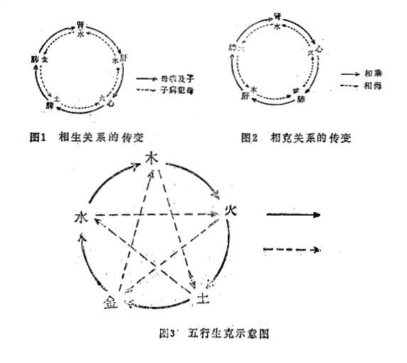

2.乘侮胜复

前面所讲的五行之间的相生相克，是五行运动的正常变化，而五行的“乘侮、胜复”，则是五行运动的异常变化，在人体即可发生疾病，在自然界即发生灾害。五行运动过程中出现“乘侮、胜复”的异常变化，是由于某些原因导致五行中某一行偏亢（太过）或偏衰（不及）所引起的。

乘侮，即相乘，相侮。相乘是以强制弱，以盛制衰，是五行中某一行太过，从而产生对所克一行克制过度的过程。出现五行相乘的原因有两个方面：①绝对偏亢。某一行由于某种原因导致其绝对偏盛，因而出现对其所克者克制过度，使被克者衰弱。如大怒之后，出现不思饮食，甚至腹胀便溏等。肝属木，脾属土，肝木过亢，则克制脾土过度，从而引起脾土虚衰，不能运化水谷，故出现上述症状。这时的土衰是由于木过亢而克制土的结果，木属于绝对偏亢（太过）。这种木盛克土太过的现象即称为“木乘土”。为区别于“土虚木乘”，一般又称为“木盛乘土”。② 相对偏亢。即某一行本来处于正常水平，但其所克的一行因其他原因偏衰，从而使克者相对偏盛，导致对所克一行的过度克制。如：木本来不亢，其对土的克制是正常水平的，但由于土本身衰弱（不及），则木即相对亢盛，从而产生对土的过度克制，使已处于衰弱状态的土，进一步衰弱。这种情况也属“木乘土”，但为区别于“木盛乘土”，又称为“土虚木乘”。前者“木盛”是相乘的原因，后者“土虚”是相乘的原因。五行相乘，实质是一个相克过程，区别在于是否超过一定水平和限度。在一定限度之内即为相克，属正常变化；超过一定限度即为相乘，属异常变化。

相侮，即是反克，又称反侮，是五行中某一行过亢，从而对原来“克我”者产生的反方向的对抗制约的过程。这种偏亢，或为绝对偏亢，或因另一方的虚衰而相对偏亢。如：水克火，但当火过亢，超过了水对火的制约能力时，水不仅失去对火的制约，反而出现火对水的反方向的对抗和制约，这就是反侮（反克），称为“火侮水”或“火盛侮水”。至于因水之偏衰，使火相对偏亢，致使火来侮水，则称为“水虚火侮”。相乘与相侮在五行运动的异常变化中，常常是同时出现。在五行出现相乘情况时，盛者即可反侮于“克己”者。如木盛乘土，土气必衰，土衰不能生金，则金衰，金衰不能制木，一方面致使木气更盛，另一方面亢盛之木即可反侮于金（木乘土侮金）。在五行出现相侮时也一样，盛者即可乘己之所胜（我克者）。火盛侮水，水不制火，则火无所制，必乘己之所胜者一金（火侮水乘金）。因此，相乘相侮是密切相关的。《素问·五运行大论》对此做了明确地阐述：“气有余，则制己所胜，而侮所不胜；其不及，则己所不胜，侮而乘之，己所胜，轻而侮之”。五行胜复。胜、复又称胜气、复气。胜复实质就是亢与制，但其中包含着两个制约的过程。胜是五行运动的异常变化，而复则是五行自身对异常变化的自我调节（制其胜），以达到五行的总体平衡，如朱震亨所说：“气之来也，既以极而成灾，则气之乘也，必也复而得平”（《丹溪心法·亢则害承乃制》）。对胜复，张景岳解释说：“彼来胜我，故子必起而报之，故谓之复”“因胜而报者谓之复，胜复相仍，本无罅隙”（《类经·运气》）。因为“凡有所胜，必有所败，有所败，必有所复，母之败也，子必救之”（《类经图翼·运气上》）。如水太过，则必乘（胜）于所克之火，使火衰弱，而火之子土，即起来对水加以制约。其中土（子）制水的过程就是复。所以张景岳说：“復者，报复之义”（《类经·运气》），即“子报母仇”。从中可以看出，胜复包含着两个制约的过程，一个是“彼来胜我”，一个是“子必起而报之”。五行胜复在自然界气候变化中尤为明显，如大寒（凉）之后，必出现大热（温）；大热之后，必有大寒。闷热天气经过一定时间后，必随之而出现冷雨凉风。五行胜复程度是彼此相应的。有胜则有复，无胜则无复，胜甚则复甚，胜微则复微。

3.五行的本化与兼化

五行的本化，是指五行中每一行自身基本属性所应出现的征象，为其本身所固有的表象。如，动摇不定即是木的变化。又如，湿盛身体重着不移，臃肿胀满为土的变化，等等。而兼化是指五行中出现二行以上的气化表现称为兼化。如高热（火）病人，同时出现恶寒战慄（水）之象，即为兼化。刘完素说：“所谓五行之理，过极则胜己者反来制之。故火热过极，则反兼于水化”（《素问玄机原病式·五运主病》）。刘氏又说：“夫五行之理，微则当其本化，甚则兼有鬼贼”（《素问玄机原病式·六气为病》）。总之，五行之理，亢而不极则表现为本化，亢极则出现兼化。简言之：微者本化，甚者兼化。

兼化的出现，大致有两种情形：①兼其相生者即同气之化；②兼其相克者即异气之化。如：热（火）极生风（木），即是火极而兼木化。又如“诸热瞀瘈，……疼痠……”（《素问玄机原病式·六气为病》），“诸热瞀瘈”为火病，而疼痠为木病，木即为兼化，此由于火亢极则制金，金衰则不能制木，致使木旺而为兼化（火与木为相生关系）。火极似水，以及木极似金，金极似火等，即属“己亢过极，则反似胜己之化”（《素问玄机原病式·自序》），属相克及异气兼化。火极兼木化，则属于相生及同气兼化。一般说，同气兼化多见，异气兼化少见，二者有着本质区别，即异气兼化中之兼化征象均为假象，如水极似火，则火为假象，实非真火；而同气兼化则本化与兼化，实为两行本化相兼，如木、火多兼化，水、土多兼化。以五行化生之六气言，则风、火、暑、燥（温）多兼化，寒湿多兼化。

总之，五行生克及互生互克是维持五行正常运动变化的决定因素，而乘侮胜复则是五行运动变化的异常状态，及在异常状态下的自我调节过程。而五行的本化与兼化则是五行自身的基本功能和属性在运动过程中表现出的征象。

#### 二、五行学说在中医学中的应用

五行学说在中医学中，主要用于阐述人与自然界的整体关系，脏腑功能及其整体关系，五脏病理及其相互影响，用于指导辨证，确定治法等，兹分述如下：

（一）论证人与自然界是一个统一整体

五行学说认为，自然界中的万物均由木、火、土、金、水五种基本物质构成，而万物的发生、发展变化，是在五行运动变化支配下出现的。人做为自然界中的一员，当然也不例外地受五行的支配。所以，既可用五行的基本属性去归类自然界万物，也可用五行的基本属性归类人体。尽管自然界的事物和人体脏腑器官彼此之间是毫不相干的，但按不同的五行基本属性，都可以归纳于五行之内（见下表）。这样，就建立了自然界内部和人体内部以五行为枢纽（中心）的整体联系，如五行中

“木”，将自然界的东、风、青、春、酸等与人体的肝胆……统一为一个整体等等。这是中医学天人一体观的理论依据之一。从这一思想出发，中医学认为，自然界的正常或异常的发展变化，都直接地对人体的健康与疾病发生影响。如五行化生的五气（风、火、湿、燥、寒）就是直接地影响着人体的健康和疾病的发生。

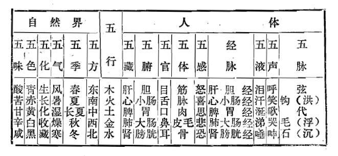

（二）概括五脏的气化功能及其整体关系

五行学说将人体五脏分属于五行，以五行的基本属性和相互关系，概括五脏的部分生理功能和五脏之间的相互联系，并说明五脏是一个统一整体。

1.概括五脏的气化功能

按五行基本属性，五脏中肝属木、心属火、脾属土、肺属金、肾属水。木性伸展、通达、敷散，肝属木，所以肝有喜条达、恶抑郁的特点，具有疏泄气机的功能。火性炎热、红亮、色赤，而主上升，心属火，所以心有上升、润泽面容的特点，具有主血脉的功能。土性受纳、生化，为万物之母，脾属土，所以脾有受纳、运化水谷（仓廪之官）和生化营养精微的特点，具有生化气血的生理功能。金性清肃敛降，肺属金，所以肺有以清宣下降为顺、壅滞失降为逆的特点。水性寒，主下行、闭藏，肾属水，所以肾有藏五脏六腑之精的特点，具有气化的功能。

2.概括五脏气化的相互关系

按照五行生克制化的观点，五脏之间是相互促进和相互制约的，并以此维持五脏气化功能的协调平衡。

按五行木、火、土、金、水、木的相生顺序：木生火，肝（木）对维持心（火）的正常功能，有资助作用，肝藏血，心藏神，神赖血养，血藏于肝而养心神。火生土，则心对脾有资助作用，心主血，脾统血，二者相辅相成，才能血行正常。土生金，肺金恶燥，必得阴精以滋润，而脾能“散精，上归于肺”，即是补脾益肺治法（即培土生金）的道理之所在。金生水，是指肺（金）有资助肾（水）的作用，肾主水的气化，而肺有“通调水道”的作用，“通调水道”，以助水的气化，所以，肺即有生肾之义。水生木，肾藏阴精以滋养肝木，肾水不足，则肝阳（或火）即偏亢，或上炎，或化风内动，补肾阴（水）即可平肝木之亢。以上是以五行相生关系阐述五脏在气化（生理）方面的相互资助的整体关系。

按五行相克顺序：金、木、土、水、火、金，则肺制肝，肝制脾，脾制肾，肾制心，心制肺。肺的肃降，可以抑制肝的升发太过（如不使肝阳上亢）。肝的疏泄条达，可以抑制脾气的壅滞，使脾维持正常运化水谷的功能而不致停饮停食。脾主运化水湿，可以制止肾封藏过度而造成水饮停聚与泛溢。肾水上济心火，不使心火亢盛上炎。心火之温煦，可以抑制肺金的清肃太过。五脏就是在相互资助、相互制约的运动变化中，维持着正常的气化功能和整体平衡。

（三）概括五脏病变及其相互影响

1.用五行基本属性概括五脏病变

木性升发、化风、动摇，故肝的病变可出现肝火（阳）上冲，内风，眩晕振掉等症，所以《素问·至真要大论》说：“诸风掉眩，皆属于肝”。火性炎热、上行，故心的病变可出现红肿热痛的疮疡，口舌生疮，咽喉肿痛及血热妄行的吐血、衄血等。土性主静，主化生，故脾的病变可出现水湿停留，脾气壅滞的痞满，及水谷不化之泄泻等。金性燥，主收敛、清肃，故肺的病变可出现肺燥咳嗽，气上逆之喘促，肺气壅遏之喘满等。水性寒，滋润而下行，主静主藏，故肾的病变可见水肿（下肢），肾阳不足之寒证，及肾虚封藏失司的遗精早泄小便频数等。

2.用五行概括五脏病变的相互影响（传受）

由于五脏之间是一个统一整体，所以任何一脏的病变，都可能影响其他一脏，即一脏病可以传至他脏。五脏病变相互传变有一定规律，按五行学说予以概括则分为相生关系的传变和相克（乘、侮、复）关系的传变。

（1）相生关系的传变包括“母病及子”和“子病犯母”这两个方面：①母病及子是指五脏病变，从母脏传及子脏。如脾（土）病传肺

（金），脾为母脏，肺为子脏（土生金），为脾病而及于肺。如脾虚不能运化水湿，聚而为饮，饮邪犯肺，发为咳嗽，喘促等，即为母病及子。以此类推（见图1）。②子病犯母（又称子盗母气），是指五脏病变由子脏传及母脏。如：心（火）病传肝（木），木生火，肝为心之母；心病及肝，即为子病犯母。如：心血不足，不能养肝，致使肝阳偏亢为病，即为子病犯母。余者类推（见图1）。

（2）相克关系的传变包括乘、侮、胜、复。乘、胜、复实质是一个，即克制太过。按五行相克顺序传变，肝乘脾，脾乘肾，肾乘心等，即肝病传脾，脾病传肾，肾病传心等（见图2）。侮则是反克，按五行相克顺序的反方向传变。如金克木，木气过亢则反克于金，中医学中的肝火（木）犯肺（木火刑金），即为木侮金，是肝先病而后传之于肺（见图2）。

五脏病在生克关系的传变中，五脏相生传变的母病及子，一般为病较轻浅易愈；子病犯母，一般为病深重难愈。五脏相克传变中，相乘传变为病多深重，相侮传变为病多轻浅。

应当指出，以五行学说概括五脏的生理、病理及其相互影响，只能说明五脏的部分、而不是全部生理功能和病理变化。

（四）用于指导辨证

1.以五行归属四诊资料、确定病变所属脏腑

人体是一个统一的整体，体内的五脏病变必然反映到体表，而出现一系列证候表现。因此，可以通过在外的证候表现，推断五脏的病变。即“视其外应，以知其内脏，则知所病矣”（《灵枢·本脏》）。临床上通过四诊可以获得内脏病变的“外应”，即病情资料，通过五行归类，初步推测病变所属脏腑。如病人面见青色，脉见弦象，即可初步确定属肝病，因为青属木色，弦亦属木，肝属木，所以属肝病。如果面赤、口苦、脉洪等，即可知为心火病证，因为赤属火，苦属火，洪脉亦属火，所以属心病。面黄、口甘等，为脾病，因为黄属土，甘亦属土，脾属土，所以为脾病。

2.以五行生克分析四诊资料，判断病证顺逆

临床上应用五行生克来归纳分析四诊资料，从而判断病证预后顺逆，主要是分析望诊与脉诊所得的资料。一般来说，色脉相合者，病情平稳。所谓色脉相合，即指色和脉应属五行之中同一行。如肝病，肝属木，则应见青色（木）和弦脉（木）。肾病，肾属水，应见黑色（水）和沉脉（水）。心病，心属火，应见赤色（火）和洪脉（火）。色脉相合，主病顺。

病证与色脉相生者，主病向愈为顺。如肝（木）病，水生木，若得沉脉（水），为相生之脉，为顺，病证一般预后良好。若心病得肾（水）之沉脉，为相克之脉（水克火），为病逆。脾病而面见青灰色，为木克土，为病逆。即脏与色、脉相克者，一般预后多不良。总之，从脏腑病证与所现之色脉的相合、相生、相克与否，可以初步推断病证预后的善恶顺逆。

3.以五行生克概括五脏病机

以五行学说来分析概括脏腑病变机理，亦是中医学常用的病证分析方法。有关这方面内容在前面已经陆续涉及到了，这里简单介绍一下。用五行归纳脏腑病机，有如肝木乘脾、水（肾）不涵木（肝）、肝气犯胃（木克土）、肝气犯肺（木侮金）、土不生金（脾肺两虚），水亏火旺（肾水不足，不能上济心火）等等，都是中医学常用的分析病机和辨证方法。

（五）用于确定治疗法则

1.用五行相生关系确定治疗原则

用五行相生关系确定治疗原则，主要是指母子补泻法，即《难经·六十九难》所说：“虚则补其母，实则泻其子”的原则，所谓“虚则补其母”，即补本脏之母，用于本脏虚证，如肝木阴虚，不直接补肝，而是补其母——肾水，水能生木，从而达到补肝的目的。肺金不足，可补其母——脾土，土能生金，从而达到补肺的目的。所谓“实则泻其子”，即泻本脏之子，用于实证。如肝木气盛（阳亢等），可不直接泻肝，而是泻其子脏——心火，以达到泻肝之目的，因为子能令母虚，子夺母气，从而使其母脏之盛气得以平复。运用中，可根据实际病情，或单纯补母、泄子，或母子兼顾。在针灸学中，“虚则补其母”，则凡是某经虚证，即可单补其母经或本经母穴，如肝经虚证，则或补其母经——肾经合穴（水穴）阴谷，或补其本经合穴（水穴）曲泉。“实则泄其子”，则凡是某经实证，即可单泻其子经或子穴。如肝经实证，可取其子经——心经荥穴（火穴）少府，或本经荥穴（火穴）行间。

除“母子补泻法”外，还有滋水涵木法，培土生金法，金水相生法等。滋水涵木是滋养肾水，以养肝木，又称滋肾养肝，用于肾阴亏损而肝阴不足，或肝阳偏亢之证。培土生金是补脾气以益肺气，即补脾益肺，用于脾虚肺虚之证。金水相生是补肺滋肾，用于肺肾阴虚之证。“金能生水，水能润金”（《时病论》卷四），金水相生，肺肾同治。

2.用五行相克关系确定治疗原则

用五行相克关系确定的治疗原则，主要是指抑强和扶弱两方面，即亢则平之，衰则益之。如抑木扶土；培土制水；佐金平木；泻南补北等。抑木扶土是疏理肝木，补益脾土，即调理肝脾，用于木盛乘土，木郁土壅之证。培土制水，是温补脾土，以制肾水，用于脾肾阳虚，不能化气行水之证，治当脾肾兼顾。佐金平木，是清肃肺金以平抑肝木，用于肝火亢盛，肺失清肃之证。泻南补北，即泻南方火，补北方水，心属火，火在五方为南，水为北，肾属水，即滋阴降火法，用于肾水不足，心火亢盛之证。

五行学说在治疗中除上述应用外，还用于情志疾病的治疗，如悲能胜怒（金克木），怒能胜思（木克土），思能胜恐（土克水）等，就是用情志的五行所属和相克关系，以情志治疗情志疾病。

（六）五行学说在医学其他领域中的应用

五行学说还用于对十二经脉及其井、荥、俞、经、合穴的五行归类。即手太阴经和手阳明经属金，足少阴经和足太阳经属水，足厥阴经和足少阳经属木，手少阴经和手太阳经属火，足太阴经和足阳明经属土，手厥阴经和手少阳经属火（相火）。井、荥、俞、经、合穴分别属于木、火、土、金、水五行。

五行学说，还将人按其不同属性归为木形人，火形人，土形人，金形人，水形人五种，并指出各自不同的生理、病理方面特点（参见《灵枢·阴阳二十五人》）。这种对人群的五行归类，在中医学中的意义，尚待进一步研究。

### 第三节阴阳学说和五行学说的关系

阴阳学说和五行学说，都属于中国古代朴素的唯物主义哲学的范畴。二者即各有自己的研究对象，又有不可分割的联系。阴阳学说研究的是事物的一般属性和运动规律，是把世界划分为阴阳两大部分进行分析研究的。五行学说研究的是事物的特殊的具体属性，并把世界划分为五大部分进行研究的。

虽然阴阳学说和五行学说各有自身的特点，但二者又是相互交叉联系的，阴阳中有五行，五行中有阴阳。由阴阳所概括的两大类事物，亦包含着五行归类，如一年四季：以阴阳言，则春夏属阳，秋冬属阴。而阳中之春夏，以五行言，则春属木，夏属火；阴中之秋冬，以五行言，则秋属金，冬属水等等。又如：五行中木有阴木、阳木，火有阴火、阳火，土有阴土、阳土，金有阴金、阳金，水有阴水、阳水等。因此，阴阳与五行是相互包含的、密切联系的，其本源都是“气”，因此《春秋繁露·五行相生》对此做了比较恰当的概括，即“天地之气，合而为一，分为阴阳，判为四时，列为五行”。明·张景岳认为阴阳与五行是“气”与“质”的关系，是相互依存的：“五行即阴阳之质，阴阳即五行之气。气非质不立，质非气不行。行也者，所以行阴阳之气也”《类经图翼·运气上》。这是对阴阳和五行关系的更明确的认识。

阴阳学说和五行学说作为朴素的唯物主义和自发的辩证法的中国古代哲学，被引进中医学这门自然科学领域后，对中医学理论系统的形成和发展无疑起到积极的促进作用，至今仍为中医学所广泛应用。阴阳学说和五行学说都认为世界是物质的，并在对立统一中运动变化。阴阳五行学说，是中医学天人一体、脏腑及其所属器官组织一体的整体观的理论基础；也是人与自然界（天）形成有机整体联系的枢纽。

阴阳五行学说做为中国古代唯物主义哲学，由于受当时自然科学和生产力发展水平的限制，因而不可避免地存在着一定的局限性。所以，我们在应用阴阳五行学说时，不应仅仅停留于阴阳五行的抽象概念，公式化地机械搬用，要从临床实际出发灵活运用，从而进一步丰富中医的临床实践，并逐渐将其上升为理性认识，为中医学理论上的发展做出贡献。

复习思考题

1.简述阴阳学说的基本内容。

2.简述阴阳学说在中医学中的应用。

3.简述五行学说的基本内容。

4.简述五行学说在中医学中的应用。

5.试述阴阳学说和五行学说的关系。

## 第二章藏象

[自学时数] 30学时

[面授时数] 8学时

[目的要求]

1.掌握藏象的概念；五脏、六腑、奇恒之腑的生理特点；五脏、六腑各自主要的生理功能。

2.熟悉脏与脏、脏与腑、腑与腑之间的相互关系；五脏与五志、五液、五体、五华、九窍的相互关系；脑、女子胞的主要生理功能。

3.了解藏象学说的形成、特点；命门的含义及主要生理功能；心包络的主要生理功能。

4.掌握气的概念及气的生理功能。

5.掌握气的主要分类、各种气的主要生理功能。

6.熟悉各类气的组成与分布。

7.了解气的运动形式及其与五脏之间的相互关系。

8.掌握血的基本概念、生成及功能；津液的基本概念及功能。

9.熟悉血液的运行和津液的生成、输布、排泄过程。

10.熟悉气、血、津液之间的相互关系。

藏象学说，是在中医整体观的指导下，通过对人体生命现象的观察，运用阴阳五行理论，研究人体各个脏腑的生理功能、病理变化及其相互关系的学说。这一学说是中医学的基本理论之一。学习和掌握这一学说，对于从中医角度认识人体的生理功能和病理变化，进而指导临床实践，具有十分重要的意义。

为了便于学习，在系统介绍藏象学说的具体内容之前，先将藏象的概念、藏象学说的内容、藏象学说的形成及该学说的特点作一简要地说明。

### 一、藏象的概念

“藏象”一词，首见于《内经》。《素问·六节藏象论》：“帝曰：藏象何如”？明·张介宾注曰：“象，形象也。藏居于内、形见于外，故曰藏象”。据此可知，“藏”是指居于体内的脏腑，“象”是指现于体外的征象。所谓“藏象”，就是说居于体内的脏腑，其功能变化均有征象表现于外。这是“藏象”的基本涵义。

中医学对人体脏腑功能的研究，主要是依据“藏象”所说的这种“有诸内，必形诸外”的原理，通过对人体在生命活动中表现出来的生理现象、病理变化的长期观察，与临床上的反复验证来进行的。所以，它虽然也注重对人体脏腑从解剖形态上进行观察，但是，它更强调的是在整体观的指导下，观察、分析和研究人体的各种生命现象与内在脏腑的关系，并且将这些观察的结果，用阴阳五行学说来加以归纳，从而形成了自己独特的“藏象”理论。用以阐明各个脏腑的生理功能、病理变化，为临床治疗提供依据。因而，“藏象”不完全是指脏腑的实体解剖系统，更重要地是一个脏腑的整体宏观功能系统。它反映了脏腑与脏腑之间、以及与其它组织器官、自然界之间的关系。从这一角度看，“藏象”乃是中医学中高度概括了人体脏腑功能的特有概念。它与现代解剖学中的“脏腑”概念有着不同的内涵。这点是在学习藏象学说时应该首先明确的。

### 二、藏象学说的主要内容

藏象学说研究的核心是人体各个脏腑的生理功能、病理变化及其相互关系。由于人体是一个有机的整体，各个脏腑的功能活动与人体的四肢百骸、皮肉筋脉、以及七窍二阴之间有着密切的联系，在生理、病理上都必然相互影响；同时，各个脏腑的功能活动产生出构成人体的基本物质——精、气、血、津、液，而精、气、血、津、液，又是各个脏腑功能活动的物质基础。故藏象学说的主要内容包括两部分；一是脏腑的生理功能、病理变化及其脏腑与体表器官之间的相互关系；二是精、气、血、津、液的生理功能、病理变化及其相互关系。

### 三、藏象学说的形成

藏象学说是在《内经》的基础上，经过历代医家不断地验证、阐发、充实，而逐渐形成的一门学说。在《内经》中，我们的祖先运用古代哲学中的整体观与阴阳五行这些朴素而科学的世界观与方法论，将秦汉以前人类对人体生命活动的认识，进行了总结与归纳，提出了较完整的藏象理论，为藏象学说的形成奠定了坚实的基础。其后，历代医家在这一理论的基础上，经过长期地、大量地、反复地临床验证，不仅充分证明了这一理论的正确，同时，又不断丰富和发展了这一理论，使之更加完善。进而形成了我们今天所说的藏象学说。

从这一学说形成的基础看，主要有以下三个方面。

一是古代的解剖知识。如《灵枢·经水》说：“若夫八尺之士，皮肉在此，外可度量切循而得之，其死，可解剖而视之。其脏之坚脆，腑之小大，谷之多少，脉之长短，血之清浊……皆有大数”。这说明藏象学说的形成，有其形态学方面的基础。

二是对人体生理、病理现象的长期观察。如皮肤受邪而感冒，会出现鼻塞、流涕、咳嗽等症状，因而认识了皮毛、鼻、肺之间的联系。

三是反复的医疗实践，从病理现象和治疗效应来分析和反证人体的某些生理功能。如：一些耳鸣、听觉不敏的疾患，从肾着手治疗而见效，久之，便得出“肾开窍于耳”的理论等等。

在以上三方面中，中医学对后两者尤为重视，认为人们在生活实践中观察到的生理、病理现象，以及医家在医疗实践中反复验证的结果，是活着的人体所表现出来的功能变化，故更能反映出脏腑功能活动的本质，因而，这两方面乃是藏象学说形成的主要依据。

### 四、藏象学说的特点

藏象学说在研究人体脏腑功能变化时主要有以下两个特点：

（一）整体观

藏象学说是在整体观的指导下，来研究人体脏腑功能变化的。它把人体看成是一个由心为主宰，五脏为核心的有机整体，认为五脏的功能与自然界的四时变化有着密切地联系。

（1）藏象学说认为：人体的各个脏腑虽各有所司，具有不同的生理功能，但心是人体生命活动的主宰，各个脏腑的功能活动，无不在心的统领下进行。《素问·灵兰秘典论》说：“心者，君主之官也……故主明则下安，主不明则十二官危”。就突出强调了心对各个脏腑的统领作用。

（2）藏象学说认为：人体的各个脏腑之间不是孤立的，每一脏腑之间都有着特定的络属关系。如心与小肠，心为脏，小肠为腑，二者互为表里，在经络上相互络属，生理上相互为用，病变时相互影响。在这种脏腑的相互关系中，五脏是起主导和决定作用的。如：肾与膀胱是互为表里的一对脏腑，膀胱司开合、排尿液的作用主要决定于肾的气化功能。

（3）藏象学说认为：人体的五脏与形体诸窍之间有着密切地联系。如：心与脉，心与舌，心与面，肺与皮毛，肺与鼻等等都存在着特殊的联系。由于五脏与形体诸窍的这种特殊联系，使人体构成了一个内藏五脏六腑，外联四肢九窍的有机整体。

（4）藏象学说认为：人体的五脏与构成人体的基本物质——精、气、血、津、液有着密切的联系。如：肾藏精，肝藏血，脾藏营，肺主气，心主血等等，都说明了精、气、血、津、液的生成、运用、贮藏与五脏的功能活动相关。

（5）藏象学说认为：人体的五脏与人的精神、意识、思维活动密切相关。中医学将人的精神思维活动归纳为“神、魂、魄、意、志”五类，认为此五种精神活动为五脏所司，具有不同的生理基础和属性。如心藏神、肺藏魄、脾藏意、肝藏魂、肾藏志，反应了人体精神活动与五脏的具体关系。

（6）藏象学说认为：人体的五脏与自然界季节的变化有着密切的关系。如：心气通于夏、肝气通于春等等，说明人体的五脏与一年中的四季变化有着内在的联系。

（二）阴阳五行模式

藏象学说运用阴阳五行理论对脏腑的功能属性作了高度的概括。用以说明它们的功能特点与相互关系。

（1）藏象学说将人体的五脏六腑划分为阴阳两类，即五脏为阴，六腑为阳；在阐述每一脏腑的功能时，亦时常以阴阳分类，例如：心阴、心阳，肾阴、肾阳等。这种以阴阳来概括脏腑的功能起到了提纲挈领的作用。如：心为脏、在脏腑的阴阳分类中属阴，说明它以藏为主，具有主血、藏神的功能；在五脏的阴阳分类中，心居于胸中，为阳中之阳，说明它是一身阳气的统领；在心的具体功能活动中，心阳又代表了心温煦及推动血脉运行的功能，心阴则代表了维持这种功能的精血等有形物质。由此可见，阴阳在概括脏腑功能特点时的作用。

（2）藏象学说用五行理论来概括脏腑的功能属性，同时阐明它们之间的相互关系。如：心属火，肺属金，心火与肺金之间有着相互制约的关系，在生理状态下，心火的温煦使肺金不寒，而不致清肃过度，肺金的肃降亦可抑制心火的亢炎；在病理变化时，心火的亢盛，会使肺失肃降而喘逆，同时肺金的肃降失调亦能影响心火的盛衰。据此可知，运用五行理论来概括脏腑的功能属性，阐明其相互关系亦能起到纲举目张的作用。

由于藏象学说具有以上两大特点，因此，尽管藏象学说中的脏腑与现代解剖学中腑器的名称基本相同，但二者是有着不同内涵的两个概念。中医学中一个脏腑的功能，可能包括西医几个脏器的功能，而西医学一个脏器的功能，又可能分散在中医几个脏腑功能之中。所以，藏象学说中的脏腑不单是一个解剖学的概念，更重要的是一个生理病理学的概念。

了解脏象学说的特点，可以使我们在学习藏象学说的具体内容时，不仅了解各个脏腑的主要功能，同时能掌握每一脏腑的功能与整体间的有机联系，掌握各个功能之间的相互关系，从而更好地掌握和运用这一基本理论，来指导临床实践。

### 第一节脏腑

脏腑，是人体内脏的总称。藏象学说按照脏腑生理功能的特点，将其分成脏、腑、奇恒之腑三大类。脏，即肝、心、脾、肺、肾，合称五脏；腑，即胆、小肠、大肠、胃、膀胱、三焦，总称六腑；奇恒之府包括脑、髓、骨、脉、胆、女子胞。

此三类各有其不同的生理功能，为了便于学习和掌握，本节将五脏六腑联系起来加以介绍，奇恒之腑则单独介绍。

#### 一、五脏六腑

藏象学说认为人体的五脏六腑在生理功能上有着本质的区别。对于这一区别《内经》作了概括地说明。《素问·五藏别论》说：“所谓五脏者，藏精气而不泻也，故满而不能实。六腑者，传化物而不藏，故实而不能满也。所以然者，水谷入口，则胃实而肠虚；食下，则肠实而胃虚。故曰：实而不满，满而不实也”。这段话是说：五脏的主要功能是藏精气，而六腑则主要是传化水谷，排出糟粕。五脏的功能特点是“藏而不泻”，故“满而不实”；六腑的功能特点是“传化物而不藏”，故“实而不满”。此处“满”是指精气而言，“实”是指水谷而论。了解这一点，对于从总的方面，掌握脏腑的功能特点，从而指导临床实践，有着重要的意义。如：由于五脏以藏为主，治疗上常以补为先；六腑以通为用，治疗多以泻为主，就是在这一理论指导下的具体运用。

此外，藏象学说还强调脏与腑，存在着一阴一阳，一表一里，彼此相应的配合关系。《灵枢·本输》说：“肺合大肠”，“心合小肠”，“肝合胆”，“脾合胃”，“肾合膀胱”，就是对这种表里配合关系的归纳。

下面，我们先介绍心与小肠，肺与大肠，脾与胃，肝与胆，肾与膀胱、三焦的生理功能及其相互关系，然后再介绍五脏之间、六腑之间的相互关系。

##### （一）心、小肠（附心胞络）

1.心

心位居胸中，有包络围护于外，在五行属火，为阳中之阳，通于夏气。心为生之本，血之主，神之居。其主要功能是主血脉、主神明，为五脏六腑之大主。其经脉为手少阴心经，下络小肠，与小肠相表里。

**〔心的主要生理功能〕**

（1）心主血脉心主血脉，包括主血和主脉两个方面：一身之血，均在脉中运行，这依赖心阳的温煦与心气的推动，方可周流不息，濡养全身。故《素问·五脏生成篇》说：“诸血者，皆属于心”。脉，即血脉，为血之府。脉是气血运行的通道，脉道的通利与否，直接影响血液的正常运行，故《灵枢·决气》说：“壅遏营气，令无所避，是谓脉”。中医学认为：心气充沛，血液才能在脉内正常地运行，周流不息，营养全身，而见面色红润光泽，脉象和缓有力。同时营血充盈，亦是血液正常运行的基础，如血虚营亏，则见脉细涩无力。故营血的正常运行，必以心气充沛，营血充盈为其基本前提。如心气不足，血虚营亏，则脉道不利，血流不畅，外见面色无华，脉细无力等症，甚至可呈面色灰暗，唇舌青紫，胸痛如刺等气血瘀滞的证候。

（2）心主神明心主神明，又称为心藏神。在中医学中，神有广义，狭义之分。广义的神，是指整个人体生命活动的外在表现，是对人体生命活动现象的总称。它的物质基础是精与气。正如《灵枢·本神》说：“两精相搏谓之神”，《灵枢·平人绝谷》说，“故神者，水谷之精气也”。都是说明神来源于精与气。广义的神在人体生命活动中至关重要。《素问·移精变气论》说：“得神者昌，失神者亡”，就突出强调了它的重要性。

狭义的神，是指人的精神、意识、思维活动。心主神明，正是说心是人体精神活动的主宰。故《素问·灵兰秘典论》说：“心者，君主之官也，神明出焉”。藏象学说不仅将人的精神、意识、思维活动归属于五藏，有“心藏神，肺藏魄，肝藏魂，脾藏意，肾藏志”的“五神藏”之说，并且认为心在五神藏中起着决定的作用。《灵枢·本神》说：“所以任物者谓之心”。任，乃承受、担任之义。这是说心具有接受外部事物的作用。张介宾在《类经·疾病类》中指出：“心为五脏六腑之主，而总统魂魄，兼该志意，故忧动于心则肺应，思动于心则脾应，怒动于心则肝应，恐动于心则肾应，此所以五志惟心所使也”。说明了人的精神意识思维活动，虽可分属五脏，但主要归属于心主神明的功能活动。因此，若心主神明的功能正常，则精神振奋，神志清晰。反之，则出现失眠，多梦，神志不宁等神不守舍的证候，甚至可出现狂妄谵语，或健忘，神昏等重证。

心主血而藏神，二者密切相关。血是神志活动的物质基础，《灵枢·本神》说：“心藏脉，脉舍神”。因此，若心主血脉的功能异常，常可出现神志的改变。

（3）心为五脏六腑之大主藏象学说认为：心在人体诸脏腑中居于首要的地位，对各个脏腑的功能活动起到统领与调节的作用。《灵枢·邪客》说：“心者，五脏六腑之大主，精神之所舍”。《素问·灵兰秘典论》说：“心者，君主之官也，神明出焉。……故主明则下

安，……主不明则十二官危”。都突出强调了心在脏腑中的统帅作用。所以，若心的功能正常，则五脏六腑在其统领下协调一致，维持人体正常的生命活动；倘若心的功能失常，则其它脏腑的功能均会受到较大的影响。正如张介宾在《类经》中所说：“心不明则神无所主，而脏腑相使之道闭塞不通，故自君主而下，无不失职，而不免于殃也”。

**〔心与组织器官的关系〕**

（1）在体合脉，其华在面脉指一身之血脉，心合脉，是说全身血脉皆属于心。其华在面，是指心的功能正常与否，可以从面部的色泽反映出来。《灵枢·邪气脏腑病形》说：“十二经脉，三百六十五络，其血气皆上于面而走空窍”，故心气旺盛，血脉充盈，面部红润有泽。心气不足，血脉不利，则面色㿠白，晦暗。故《素问·五脏生成篇》说：“心之合脉也，其荣色也”。

（2）在液为汗汗是人体津液所化生。《灵枢·决气》说：“腠理发泄，汗出溱溱，是谓津”。说明津汗之间的关系。《灵枢·邪客》说：“营气者，泌其津液，注之于脉，化以为血”。表明血液的生成与津液相关，由于心主血，血与津相关，津乃汗之源，故《素问·宜明五气篇》说：五脏化液“心为汗”。张介宾注曰：“心主血、汗为血之余”（《类经·疾病类》）。说明了心、血、汗三者之间的关系。李中梓在《医宗必读》中又作了进一步地阐发，他说：“心之所藏，在内者为血，在外者为汗，汗者，心之液也”。心与汗之间的这种关系，在临床上常表现为，心阳虚则阳不卫外而自汗，心阴虚则阴不内守而盗汗。

（3）开窍于舌心之别络，系于舌本，因而心的气血上通于舌。《灵枢·经脉》说：“手少阴之别……循经入于心中，系舌本”。《灵枢·脉度》说：“心气通于舌”，因而，前人有“舌为心之苗”的说法。心的疾患，常可从舌体上反映出来。如心气不足，则舌质淡白胖嫩；心阴不足，则舌质红绛而瘦；心火上炎则舌尖红赤；痰迷心窍则舌强语蹇。故《素问·阴阳应象大论》说：心“在窍为舌”。

此外，还应指出，心包络、肝、脾、肾四经，均与舌本相通，若此四经有病，亦往往连及舌本。此点在临床中亦应注意。

（4）在志为喜心在志为喜，是说心的生理功能与五志中的“喜”有关。藏象学说认为，人的情志变化是由五脏所化生，故将喜，怒、忧、思、恐称为五志，而分属于五脏。《素问·天元纪大论》说：“人有五脏化五气，以生喜、怒、忧、思、恐”。《素问·阴阳应象大论》说：心“在志为喜”，这是说五志之中，喜为心之志。一般说来，喜有益于心主血脉等生理功能，故《素问·举痛论》说：“喜则气和志达，营卫通利”。但若喜乐过度，则可使心神受伤，正如《素问·阴阳应象大论》说：“喜伤心”。

**〔心与四时气候的关系〕**

心气通于夏藏象学说认为，自然界的四时气候与五脏的功能相通，即四时气候对五脏的功能有相应的关系。其中，心与夏气相通。《素问·六节藏象论》说：“心者……通于夏气”。《素问·四气调神大论》说：“夏三月，此为蕃秀，……此夏气之应，养长之道，逆之则伤心”。都说明了心与夏气相应的关系。夏为君火当令，内合于心，故多见洪脉。若逆于夏气，则多见心病，正如《素问·四气调神大论》说：“逆夏气，则太阳不长，心气内洞”。

**〔附〕**心包络

心包络，简称心包，又可称“膻中”，是心外围的包膜，具有保护心的作用。外邪侵袭于心，包络代心受邪。故《灵枢·邪客》说：“故诸邪之在于心者，皆在于心之包络”。因此，在病变时，心包受邪所出现的病证和心是一致的。如温病学中常把高热所致的神昏谵语称为“热入心包”等。

2.小肠

小肠位于腹中，在五行亦属火，其经脉上络于心，与心互为表里。其主要功能是受盛化物，分泌清浊。

《素问·灵兰秘典论》说：“小肠者，受盛之官，化物出焉”。所谓受盛，即受盛胃所腐熟的水谷；化物，即消化之意。胃所腐熟的水谷，经小肠进一步消化，以分成清、浊两部分，其清乃水谷之精微，其浊为消化后的糟粕及无用的水液。其水谷之精微由脾输转各部，其糟粕下传大肠，无用的水液渗入膀胱以为尿液。张介宾在《类经·脏象类》中说：“小肠居胃之下，受盛胃中水谷而分清浊，水液由此而渗入于前，糟粕由此而归于后，脾气化而上升，小肠化而下降，故曰化物出焉”。正是由于小肠的化物功能与尿液有关，故有“小肠主液”之说。临床上，如小肠泌别清浊失常而致的水泻证，常用“利小便即所以实大便”的方法治疗，就是依据这一原理。

3.心与小肠的关系

心的经脉属心而络小肠，小肠经脉属小肠而络心，二者通过经脉的相互络属构成表里关系，其表现在病理上，如心有实火，可移热于小肠，使小肠泌别清浊功能失常，而见小便短赤，尿道灼热疼痛，甚至尿血的症状。如小肠有热，亦可循经上熏于心，而见心烦，舌尖红赤，口舌生疮等症。

##### （二）肺、大肠

肺居胸中，在诸脏腑中，其位最高，故称为“五脏六腑之华盖”。因肺叶娇嫩，易于受邪，古又有“肺为娇脏”之称。肺于五行属金，为阳中之阴，通于秋气。肺的主要生理功能是主气、司呼吸、主治节，朝百脉，主宣发肃降，通调水道。其经脉为手太阴肺经，下络大肠，与大肠相表里。

**〔肺的主要生理功能〕**

（1）肺主气、司呼吸肺主气，是指人一身之气均为肺所主；故《素问·五脏生成篇》说：“诸气者，皆属于肺”。肺主气，主要包括两个方面：一是主呼吸之气；一是主一身之气。

肺主呼吸之气，是指肺与呼吸功能有关。肺司呼吸，从自然界吸入清气，呼出体内浊气，以促进宗气的生成，调节气的升降出入，从而保证人体新陈代谢的顺利进行。故《素问·阴阳应象大论》说：“天气通于肺”。

肺主一身之气，是指人体一身之气皆归属于肺，由肺所主。它主要体现在宗气的生成方面。中医学认为：宗气的生成，主要靠肺吸入的清气与脾胃运化的水谷之精气，因而，肺的呼吸功能正常与否，直接影响着宗气的生成，也影响着全身之气的生成。此外，肺主一身之气，还体现在对全身气机的调节作用上。肺的呼吸，即是气的升降出入运动之一，它对一身之气的升降出入起着重要的调节作用。

（2）肺朝百脉、主治节肺朝百脉，是说人之一身血脉，均朝会于肺，并通过肺气的调节和敷布，输布于全身。《素问·经脉别论》说：“食气入胃，浊气归心，淫精于脉，脉气流经，经气归于肺，肺朝百脉，输精于皮毛”。中医学认为，血的运行依赖于气的推动。心气推动，是血运行的基本动力，而心气又有赖于肺气的敷布。正如《医学真传》所说：“气非血不和，血非气不运”。

肺主治节，语出《素问·灵兰秘典论》：“肺者，相傅之官，治节出焉”。“相傅”，有辅佐、协助之意，“治节”，就是治理、调节。这句话是说，肺有协助、辅佐心对人体各脏腑的生理功能具有治理与调节的作用。故张介宾在《类经·脏象类》中说：“肺主气，气调则营卫脏腑无所不治”。肺的治节作用，主要体现在三个方面：一是肺司呼吸，通过肺的呼吸作用，以调节全身的气机升降；二是肺主气，通过肺对宗气的生成、输布的调节，以助心气，推动和调节血的运行；三是通过肺对全身气机的调节，调理全身津液的输布、运行与排泄。由此可见，肺主治节，是对肺的主要生理功能的高度概括。如若肺主治节功能失常，则宗气生成无源，布散无力，从而血行失序，津液失调。

（3）肺主宣发肃降肺主宣发肃降，是说肺气具有向上的升宣和向外的布散，以及向下的清肃与通降的作用。

肺主宣发的生理作用，主要体现在三个方面：一是通过肺的气化作用，将浊气排出体外；二是宣发卫气，调节腠理的开合；三是将水谷精微与津液，布散全身。故《灵枢·决气》说：“上焦开发，宣五谷味，熏肤、充身、泽毛，若雾露之溉”。若肺失宣发，可出现胸闷喘咳、鼻塞、无汗等症。

肺主肃降，是指肺以清肃下降为顺。通过肺气的肃降作用，一可吸入自然界的清气；二可将肺吸入的清气及水谷精微、津液向下布散。若肺失肃降，则可出现气喘、咳痰、咯血等症。

肺的宣发与肃降，相反相成，即对立又统一，没有正常的宣发，则不能很好地肃降，反之，肃降不利，亦可影响正常的宣发。肺有宣有降，方可使气道通畅，呼吸均匀，使气血津液布散周身，濡养皮毛，使水液下输膀胱，而无水湿停滞之患。若宣降失和，就会出现“肺气不宣”、“肺失肃降”或“肺气上逆”等病变。故《素问·至真要大论》说：“诸气膹郁，皆属于肺”。

（4）通调水道肺在人体水液的代谢中，起着疏通与调节的作用，习惯上称为“通调水道”，肺通调水道的功能，也主要依赖于肺气的宣发与肃降。宣发则使水津四布，腠理开合，汗液排泄；肃降则使水液下输膀胱，经肾之气化，排出体外。正是由于肺有这种调节水液代谢的作用，故有“肺主行水”，“肺为水之上源”的说法。若肺通调水道功能失常，则可因水湿停聚而生痰生饮，甚至发生水肿等症。

**〔肺与组织器官的关系〕**

（1）在体合皮、其华在毛 “皮毛”为人一身之表，包括皮肤、汗孔、毫毛等组织，有分泌汗液、润泽皮肤、抗御外邪等功能。由于肺主气，具有宣发卫气，输精于皮毛等生理功能，故《素问》中有“皮毛者，肺之合也”，“肺之合皮也，其荣毛也”的论述。肺的生理功能正常，则皮肤緻密，毫毛润泽，汗孔开合正常，邪气难以侵入。若肺气虚弱，则卫外之气不足，肌表不固，易受外邪侵袭，若肺气虚弱不能输精于皮毛，则皮毛憔悴枯槁，出现自汗或无汗的病症。同时，肺外合皮毛，故外邪侵犯皮毛，腠理闭塞，亦可影响到肺，而致喘逆等肺气不宣的病理变化。

（2）开窍于鼻，在液为涕鼻是气体出入的通道，与肺相联，为呼吸之门户，故称“鼻为肺之窍”。鼻的嗅觉作用，有赖于肺气和，呼吸利，故《灵枢·脉度》说：“肺气通于鼻，肺和则鼻能知臭香矣”。正由于鼻为肺窍，所以肺有病变，则可见鼻塞、流涕、嗅觉异常等症。而外邪袭肺，亦多从口鼻而入。

涕为鼻内的粘液，有润泽鼻窍之功。鼻为肺窍，涕为肺之液。若肺部有疾，则鼻窍不利，涕液失常，如肺寒则鼻流清涕，肺热则鼻涕黄浊，肺燥则鼻干少涕等等。

（3）喉为肺之门咽喉是呼吸的门户，又主发音。喉为肺系，肺之经脉循喉咙，故喉的通气与发声功能均与肺有关。肺主气，而声由气发，故前人有“肺为声音之门”的说法，若肺气充足，则喉的功能正常，而声音洪亮；若肺气虚弱，则声音低微；若肺气闭塞，则可出现声音嘶哑或失音的病症。

（4）在志为忧中医学认为，忧与悲的情志变化与肺的功能密切相关。《素问·阴阳应象大论》说：“在脏为肺……在志为忧”。《素问·举痛论》说：“悲则气消”。因肺主一身之气，忧悲二志，伤精耗气，故多影响肺的功能。反之，当肺气虚时，则易产生悲伤与忧愁的情绪。

**〔肺与四时气候的关系〕**

肺气通于秋肺气通于秋，是说肺与秋季的气候有关《素问·六节藏象论》说：“肺者……通于秋气”《素问·四气调神大论》说：“秋三月，此谓容平……收敛神气，使秋气平，无外其志，使肺气清，此秋气之应，养收之道也。逆之则伤肺”。此说明肺与秋天的气候相应。秋为燥金，内合于肺，故脉多呈浮象。若逆于秋气，则多见肺疾，正如《素问·四气调神大论》说：“逆秋气，则太阴不收，肺气焦

满”。

2、大肠

大肠居腹中，于五行亦属金。其经脉为手阳明大肠经，上络于肺，与肺相表里。其主要功能为传化糟粕。

《素问·灵兰秘典论》说：“大肠者，传导之官，变化出焉”。传导，即承传下导之意；变化，乃是将糟粕变化为粪便。大肠承受小肠泌别清浊后的食物残渣，再吸收其中有用之津，使粪便成形，经肛门（亦称“魄门”）排出体外。因大肠于传变过程中，有吸收水份的作用，故前人有“大肠主津”之说。

大肠的传导功能，是胃腑降浊功能的继续，又与肺金的肃降功能相关。唐容川在《医经精义》中说：“大肠之所以能传导者，以其为肺之腑，肺气下达，故能传导”。此外，大肠的传导作用，还与肾的气化功能有关，故有“肾司二便”之说。

3、肺与大肠的关系

肺与大肠通过经脉的络属构成表里关系。肺气的肃降，有助于大肠的传导，大肠传导功能正常，亦有益于肺的肃降。若大肠实热，腑气不通，则可使肺失肃降，而现胸满喘咳之症。如肺失肃降，津液不能下达，可见大便秘结；若肺气虚弱，运行无力，可出现气虚便秘，或固摄无权，可见大便溏泄等等。

##### （三）脾、胃

1.脾

脾居膈下，位于中焦，为阴中之至阴，于五行属土，主于长夏。其主要生理功能为脾主运化、升清、统摄血液。其经脉为足太阴脾经，属脾络胃，与胃互为表里。

由于脾胃总司人身水谷的受纳、腐熟与运化，故《素问》称之为“仓廪之官”。又因人身气血的化生，均有赖于脾胃所生之水谷精微，故又称脾胃为“后天之本”、“气血生化之源”。

**〔脾的主要生理功能〕**

（1）脾主运化运，即营运转输，化，乃化生之意，脾主运化，是指脾具有把水谷化生为精微，并将其输转全身的生理功能。这种功能主要表现在运化水谷精微与运化水湿两方面。

运化水谷精微，是指饮食入胃后，有赖脾的运化功能，才能将水谷化为精微，并营运全身。《素问·经脉别论》说：“饮入于胃，游溢精气，上输于脾，脾气散精，上归于肺”。即说明饮食物中之精华，有赖脾的转输与布散方可灌溉四旁。脾的这种功能，《素问》称之为“脾主为胃行其津液者也”。脾运化水谷精微的功能正常，则能化生气血，使脏腑经络、四肢百骸、筋脉皮肉均得濡养。反之，其运化功能失常，习惯上称为脾失健运，常可出现食少纳呆，腹胀便溏的病症，久之，还可见倦怠无力等气血亏损的病变。

运化水湿，是指脾对水液的转输与布散具有重要的作用。脾不仅营运水谷之精微，同时又运化水湿，促进水液的环流与排泄，以保持人体内水液代谢的平衡。因而，脾运化水湿的功能健全，则水湿不易在体内滞留，若脾失健运，则水湿潴留，产生湿痰、水饮等疾患。故《素问·至真要大论》说：“诸湿肿满，皆属于脾”。脾属土而主运化，若水湿停聚，也会影响脾的运化功能，临床上称为湿困脾土。《素问·宣明五气篇》所说“脾恶湿”，就是说水湿的停聚可使脾失健运之功。脾虚湿困与湿困脾土，二者常互为因果。

脾主运化的功能，不仅是脾的主要生理功能，而且，对整个人体的生命活动，至关重要。正如李中梓在《医宗必读》中说：“一有此身，必资谷气，谷入于胃，洒陈于六腑而气至，和调于五脏而血生，而人资之以为生者也，故曰后天之本在脾”。

（2）脾气主升脾气主升，是说脾具有“升清”的运动特点。升，乃上升；清，是指水谷之精微。“升清”，是指脾将水谷精微上输心肺，以化生气血，营养周身。中医学认为：脾为阴土，其气主升；胃为阳土，其性主降。脾与胃升降相因，水谷乃能腐熟运化。若脾气不升，则水谷精微不能运化，可出现腹胀泄泻等证；若脾气下陷，则可见脱肛、久泄或阴挺等病证。

（3）脾主统血脾主统血，是说脾具有统摄血液在脉道中运行的功能。《难经·四十二难》说：“脾裹血”，是说脾可包裹血液，不使外逸，即是指脾具有统血的功能。脾对血液的统摄作用，是由脾气或脾阳来完成的。唐容川在《血证论》中说：“血之运行上下，全赖乎脾，脾阳虚，则不能统血”。沈目南在《金匮要略注》中说：“五脏六腑之血，全赖脾气统摄”。都是强调了脾阳与脾气对血的统摄作用。临证所见，若脾气健运，则气血充盈，血顺脉道而行；若脾失健运，脾气匮乏，则气对血固摄无权，从而导致出血，习惯上称为脾不统血。脾不统血常可见到便血，肌衄，崩漏等不同症状。

**〔脾与组织器官的关系〕**

（1）脾主四肢肌肉、其华在唇脾主运化，为气血生化之源。人身肌肉，皆有赖脾运化之水谷精微的濡养，方可丰满强健。若脾失健运，则肌肉消瘦，软弱无力，甚至痿废。故《素问·痿论》说：“脾主身之肌肉”。人体四肢，亦称“四末”。四肢活动，依赖饮食所化生的阳气。《素问·阴阳应象大论》说：“清阳实四肢”。脾司运化，主升清气，将水谷之精微转输四肢，营养四末，则四肢活动轻健有力。若脾失健运，则四末失养，轻则倦怠无力，重则痿废不用。正如《素问·太阴阳明论》说：“四肢皆禀气于胃，而不得至经，必因于脾乃得禀也。今脾病不能为胃行其津液，四肢不得禀水谷气，气日以衰，脉道不利，筋骨肌肉皆无气以生，故不用焉”。

脾主肌肉的情况，常反映于口唇。《素问·五脏生成篇》说：“脾之合肉也，其荣唇也”。《素问·六节脏象论》亦说：“其华在唇四白，其充在肌”。若脾气健运，则口唇红润光泽；若脾虚久病，口唇的色泽多痿黄无华。

（2）开窍于口、在液为涎开窍于口，是说人口味的正常与否，与脾密切相关。《灵枢·脉度》说：“脾气通于口，脾和则口能知五谷矣”。若脾气建运，则口味正常，反之，脾失健运，则食欲不振，饮食无味；若脾有湿热，则有口甜、口腻等异味。

涎为口津，其质清稀。《素问·宣明五气篇》说：“脾为涎”，即是说，涎液化生于脾。在正常情况下，涎液存于口中，而不溢出口外，若脾气虚，常可见到涎液流出口外的症状。

（3）在志为思脾在志为思。思，即思虑。是人体精神意识思维活动的一种。如《灵枢·本神》说：“因志而存变谓之思”。思为脾之志，但与心主神明有关，正如《针灸甲乙经·精神五脏论》中所说：“思发于脾而成于心”。正常的思虑，是机体生理活动的一种表现形式。若思虑过度，则影响气血的正常运行，会导致气滞和气结，故《素问·举痛论》说：“思则气结”。脾主运化，在志为思，过度地思虑，则使脾气郁结，影响脾的运化与升清，常会产生脘腹痞闷，头目眩晕的症状。

**〔脾与四时气候的关系〕**

脾主长夏长夏，是指农历六月。脾主长夏，就是说脾的功能活动，与六月的气候有一定的关系。《素问·藏气法时论》说：“脾主长

夏”。长夏之时，正当溽暑季节，湿热交蒸，最易影响脾的运化功能，而出现洞泄一类的疾病。故《素问·金匮真言论》说：“长夏善病洞泄寒中”。即说明长夏季节气候常会影响脾之运化。

此外，中医学还认为：脾属土、治中央，常以四时养四脏，旺于每季的最后十八天，故又有“脾旺四时”之说。这种认识，强调了脾与四时气候的关系，认为春夏秋冬四季，虽与肝心肺肾相关，但都与脾气相通。四季之末，脾气旺盛，肝、心、肺、肾四脏方能得养。

“脾主长夏”与“脾旺四时”这两种观点从不同角度强调了脾与四时气候的关系。前者主要从病理角度说明长夏气候对脾运化功能的影响；后者则从生理角度说明四时气候促进脾的运化功能，从而使其它四脏得到濡养。

2、胃

胃居中焦，在五行亦属土，胃与脾以膜相连，其经脉为足阳明胃经，属胃络脾，与脾互为表里，胃的主要生理功能是受纳和腐熟水谷，其特点是以降为顺，喜润恶燥。

（1）胃主受纳、腐熟水谷胃的主要作用是受纳和腐熟水谷。饮食入口，经过食道，容纳于胃，故称胃为“太仓”。食物入胃，依靠胃的腐熟作用，将食物粗分为清浊两部分，其清者为水谷之精微，通过脾的运化而营养全身。其浊者下传小肠，再由小肠进一步泌别清浊。胃的受纳、腐熟功能正常则食欲正常，饥饱有时；若其失常则见食欲不振，胃脘作痛等症状。由于人体气血津液的化生，都需要依靠饮食物的营养，故胃又被称为“水谷气血之海”。正如《灵枢·玉版》说：“人之所受气者，谷也；谷之所注者，胃也；胃者，水谷气血之海也”。

中医学认为：脾胃对水谷的腐熟与运化，对于维持人体的生命活动，至关重要。《素问·玉机真藏论》说：“五脏者，皆禀气于胃，胃者，五脏之本也”。说明胃气的盛衰有无，关系到人体生命的存亡。李东垣在《脾胃论》中说：“元气之充足，皆由脾胃之气无所伤，而后能滋养元气。若胃气之本弱，饮食自倍，则脾胃之气既伤，而元气亦不能充，而诸病之所由生也”。临床上诊治疾病，亦十分重视胃气。常把“保胃气”作为重要的治疗原则。故有“人以胃气为本”，“有胃气则生，无胃气则亡”。“胃气一败，百药难施”的说法。

（2）胃气主降胃为“水谷之海”，饮食入胃，胃气下降，水谷方能下行，故有“胃气以降为顺”的说法。如果胃失通降，则可出现脘腹胀痛，大便秘结等症；若胃气上逆，则可出现嗳气、呃逆，恶心，呕吐等症。

（3）胃喜润恶燥胃为阳土，性喜湿润。邪气入胃，易从阳化热，灼伤胃阴，胃阴受损，则呈燥象，故有“胃喜润而恶燥”之说。临床上将食热互结，口渴欲饮，口舌干燥，大便燥结等证归属于胃，治疗常用急下存阴法；对于胃热炽盛，胃阴亏损之证，多注意滋阴养胃，均是针对胃的这一特性所制定的诊治法则。

3、脾与胃的关系

脾与胃同居中焦，经脉相互络属，构成表里关系。在功能上，胃主受纳，脾主运化，胃腐熟水谷，脾“行其津液”，二者密切配合，共同完成水谷的消化吸收及输布，从而滋养周身。故称脾胃为“后天之本”。

脾气主升，胃气主降，升降相因，故脾胃为人体气机升降之枢纽。脾主升清，将水谷之精微上输心肺，化生气血；胃主降浊，则水谷及其槽粕得以下行，便于消化吸收与排泄。脾升胃降，相反相成，共同完成水谷的腐熟与运化。故《临证指南医案》说：“纳食主胃，运化主脾，脾宜升则健，胃宜降则和”。

脾喜燥恶湿，胃喜润恶燥。脾为阴脏，以阳为用，脾阳健运，则能升能化，故其性喜温燥而恶寒湿。胃为阳腑，以阴为养，胃阴充足则能受纳腐熟，故其性喜润而恶燥。脾与胃，燥湿相济，阴阳相合，饮食方能消化。故《临证指南医案》说：“太阴湿土，得阳则运，阳明燥土，得阴自安，以脾喜刚燥，胃喜柔润”。

脾与胃，一阴一阳，一纳一运，升降相因，燥湿相济。在生理上相互维系、相互制约，在病变时相互影响，彼此波及。如脾失运化，则胃不受纳，而出现食少纳呆，不思饮食的症状。若湿困脾土，清气不升，亦可影响胃的受纳与通降，而出现恶心呕吐，脘腹胀满症状。反之，若食滞胃脘，胃失通降，同样可以影响脾的升清与运化，常可出现腹胀、泄泻等症状。

##### （四）肝、胆

1、肝

肝位于腹部，横膈之下，右胁之内。为阴中之阳，于五行属木，通于春气。肝为刚脏，主动，主升，故《素问·灵兰秘典论》说：“肝者，将军之官，谋虑出焉”。肝的主要生理功能是主藏血和主疏泄。其经脉为足厥阴肝经，属肝络胆，与胆互为表里。

**〔肝的主要生理功能〕**

（1）肝主藏血肝藏血是指肝具有贮藏血液和调节血量的生理功能。人体内的血液分布，常随着各种不同的生理状况而改变，这种血量的改变，主要取决于肝的贮藏与调节。当人处于休息或睡眠时，人体的活动量减少，血液的需要量亦相对减少，部分血液便藏于肝。当人处于活动状态时，肝脏就把所贮存的血液输布于人体，以供人体的需要。故《素问·五脏生成论》说：“故人卧血归于肝”，王冰注释说：“肝藏血，心行之，人动则血运于诸经，人静则血归于肝藏，肝主血海故也”。由于肝对血液有贮藏和调解作用，所以人体各部分的生理活动，均与肝密切相关。故《素问·五脏生成论》说：“肝受血而能视，足受血而能步，掌受血而能握，指受血而能摄”。如果肝藏血功能失常，常可出现两种情况：一种是肝血不足。如血不养目则两目干涩昏花，或为夜盲；若血不养筋，则筋脉拘急，肢体麻木，屈伸不利等，若在妇女还可出现月经量少或闭经。另一种是肝不藏血。若肝不藏血，常可见到吐血，衄血等出血的症状。在妇女可出现月经量多，逆经，甚至崩漏等症。

（2）肝主疏泄肝于五行属木，具有升发、开泄的生理特点，后世将肝的这种生理特点总结为肝主疏泄。朱丹溪在《格致馀论》中说：“肝司疏泄”。肝主疏泄的功能，主要表现在以下三个方面：

一是调畅气机。气机，即气的升降出入运动，它是对脏腑功能活动形式的基本概括。由于肝具有主动、主升的功能特点，这对气机的疏通、畅达、升发，是一个重要的因素。肝的疏泄功能正常与否，直接影响着气机的调畅。如果肝的疏泄功能正常，则气机通畅，气血和调，经脉通利，各个脏腑的功能活动就正常。如果肝的疏泄功能异常，或由于肝的疏泄功能减退，而形成气机不畅、肝气郁结的病理变化，出现胸胁胀痛的病症。或由于肝的升发太过而形成肝气上逆，或肝阳上亢的病理变化，而出现头目胀痛，面红目赤，心烦易怒等病理现象。由于气的升降出入运动，直接影响到血与津液的输布与运行，故肝的疏泄功能异常，常会导致血与津液的病变。如肝气郁结，可形成血瘀、癓瘕，在妇女可导致经行不畅、痛经等症。同样，肝郁气滞，亦可产生痰、水等病理产物，出现痰核、臌胀等症状。

二是促进脾胃的运化功能。肝的疏泄功能对全身的气机具有调节作用，其中，对脾胃气机升降的调节起着重要的作用。如肝的疏泄功能异常，影响脾的升清功能，则会出现腹胀、肠鸣、泄泻等症状；影响胃的降浊功能，则可出现胃脘作痛，嗳气不舒，恶心呕吐的症状，临床上称为“肝木克土”。正如唐容川在《血证论》中所说：“木之性主于疏泄，食气入胃，全赖肝木之气以疏泄之，而水谷乃化。设肝之清阳不升，则不能疏泄水谷，渗泄中满之症，在所不免”。

三是调畅情志。人的情志活动，属于心主神明的生理功能，但与肝的疏泄功能密切相关。人的精神乐观，情志舒畅，则肝的疏泄功能能得到正常发挥；情志抑郁，则能使肝的疏泄功能失常。同样，肝的疏泄功能正常，则气机调达，气血和畅，心情就易于开朗；肝的疏泄功能失常，则肝郁气滞，情志就易于波动。故有“肝喜条达而恶抑郁”的说法。肝失疏泄所引起的情志变化，在临床上常表现出抑郁与亢奋两种。若肝气郁结，多出现郁郁不乐，闷闷欲哭的症状。若肝气上逆，则出现急躁易怒，失眠多梦的症状。

肝藏血而主疏泄，藏血是疏泄的基础，疏泄是藏血的功能表现。肝的疏泄功能全赖血之濡养；肝血的濡养作用，有赖肝的疏泄才能发挥，二者密切相关。后世医家将肝的这两个功能概括为“肝体阴而用

阳”。其体阴是言肝藏血，用阳是指主疏泄。体阴与用阳相互协调，则肝的生理功能方可正常发挥。若二者失调，则肝病发生，出现“肝阴不足”或“肝阳上亢”的证候。

**〔肝与组织器官的关系〕**

（1）肝主筋、其华在爪筋即筋膜，附着于骨而聚于关节，是联结关节、肌肉的一种组织。肝主筋，是说人体之筋膜有赖肝血的濡养。故《素问·经脉别论》说“食气入胃，散精于肝，淫气于筋”。肝的血液充盈，方可养筋，筋得所养，才能运动有力而灵活。故有“肝主运动”之说。若肝血虚则筋膜失养，常可出现手足拘挛、肢体麻木或震颤，屈伸不利等症。故《素问·至真要大论》说：“诸风掉眩，皆属于肝”。

爪，即爪甲，由于“爪为筋之余”，故肝血充盈，则爪甲红润光泽；肝血不足，则爪甲色泽枯槁，甚则变形脆裂。《素问·五脏生成论》说：“肝之合筋也，其荣爪也”。就说明了肝与筋、爪在生理上的密切关系。

（2）开窍于目、在液为泪肝开窍于目，是说肝与目之间关系十分密切，肝的功能变化常可反映于目。肝主藏血，其经脉上通目系，肝之气血滋养于目，目方可“视万物、别白黑、审短长”。正如《灵枢·脉度》所说：“肝气通于目，肝和则目能辨五色矣”。在临床上如肝阴不足，则两目干涩或视物不清；肝火上炎，则目赤肿痛；肝阳上亢，则头晕目眩；肝风内动，则可见目斜上视。

除肝开窍于目以外，中医学还认为：五脏六腑之精气皆上注于目，故目与五脏六腑均有联系。《灵枢·大惑论》说：“五脏六腑之精气，皆上注于目而为之精。精之窠为眼，骨之精为瞳子，筋之精为黑眼，血之精为络，其窠气之精为白眼，肌肉之精为约束”。此说明五脏之精气上达于目，其中，瞳子为肾精所注，黑眼为肝精所注，眼络为心精所注，白眼为肺精所注，眼睑为脾经所注。故眼部的变化亦可反映出五脏的盛衰。

肝开窍于目，泪出于目，故《素问·宣明五气篇》说：“肝为泪”。泪有濡润与保护眼睛的功能。在正常情况下，泪液的分泌，仅濡润而不外溢，但在病理状况下，则可见泪液分泌的异常。如肝阴不足，则泪液分泌减少，而现两目干涩；若肝经湿热，则可见目眵增多或迎风流泪等症。

（3）在志为怒怒是七情之一。肝在志为怒，是说怒这一情志变化与肝密切相关。肝为刚脏，其性升发，怒则气上，有助肝主升发、疏泄之职，故《素问·阴阳应象大论》说：“肝……在志为怒”。但如若大怒，则使肝之阳气升发太过，耗伤肝阴，故又有“大怒伤肝”的说法。反之肝阴不足，肝气升泄太过，则又易于发怒。故《素问·脏气法时论》说：“肝病者……令人善怒”。

**〔肝与四时气候的关系〕**

肝气通于春肝气通于春，是说肝与春季的气候相关。《素问·六节脏象论》说：“肝者……通于春气”。《素问·四气调神大论》说：“春三月，此为发陈，天地俱生，万物以荣， ……此春气之应，养生之道也。逆之则伤肝”。均说明肝与春气相通。春为风木，内通于肝，故春季脉多见弦。若逆于春气，则多伤于肝。正如《素问·四气调神论》所说：“逆春气，则少阳不生，肝气内变”。

2、胆

胆为六腑之一，又属奇恒之府。于五行亦属木，胆附于肝，其经脉为足少阳胆经，属胆络肝，互为表里。胆的主要生理功能为贮精汁，助运化，主决断。

（1）贮精汁、助运化胆内藏清净之液，故称为“中精之府”。因其它五腑均贮藏或传化水谷糟粕等浊物，只有胆之精汁不浊，故又为奇恒之府。胆之精汁来源于肝，故《东医宝鑑·内景篇》说：“肝之余气，溢入于胆，聚而成精”。中医学认为：胆与肝，同属风木，均具有升发疏泄之能。正如李东垣在《脾胃论·脾胃虚实传变论》中所说：“胆者，少阳春升之气，春气升则万化安”。说明胆气升发则气机调畅。其对脾胃的运化亦具有调节的作用，能协助脾胃升降，以促进水谷的运化。在临床上，如胆气上逆则口苦，咽干；若肝胆疏泄失常则胸胁苦满；若木克脾土则心烦喜呕，不欲饮食，腹胀便秘。

（2）胆主决断《素问·灵兰秘典论》说：“胆者，中正之官，决断出焉”。是说胆在人体的精神意识思维活动中，占有相当重要的地位，起到不偏不倚的决断作用。正如王冰注所说：“刚正果决，故官为中正，直而不疑，故决断出焉”。在正常情况下，人对事物判断准确，处理果断，标志着胆主决断的功能正常。如若胆腑有病则往往出现精神、情志的异常，如胆火上炎，则惊悸烦躁，易急易怒；若胆气不足，则失眠多梦，易惊易恐。故临床上常把一些善恐易惊，失眠多梦，惊悸不安的精神情志病变，称之为“胆气虚”，治疗时从胆论治。

此外，胆主决断的功能，对于防御和消除某些精神刺激的不良影响，以维持气血的正常运行，亦起到重要的作用。如胆气壮者，虽受到剧烈的精神刺激，亦不会致病，纵然发病，亦恢复较快。而胆气怯弱之人，稍受刺激，每易致病，且病势重而难愈。

3、肝与胆的关系

肝居胁下，胆附于肝，经脉互为络属，构成表里关系。肝藏血而主疏泄，胆贮精汁而主升发，二者同属风木，共司疏泄，关系极为密切。由于肝病常影响于胆，胆病亦常波及于肝，故临床上常见肝胆同病。如肝胆火旺，肝胆湿热等等。另外，肝主谋虑，胆主决断，共同起到调节情志活动的作用。正如张介宾在《类经·脏象类》中所说：“胆附于肝，相为表里，肝气虽强，非胆不断，肝胆相济，勇敢乃成”。说明二者在调节人的精神意识思维活动中的密切关系。

##### （五）肾、膀胱（附命门）

1、肾

肾位于腰部，左右各一，故《素问·脉要精微论》说：“腰者，肾之府”。肾在诸脏腑中，至为重要，内藏“先天之精”，为脏腑阴阳之本，故称为“先天之本”。肾于五行属水，为阴中之阴，通于冬气。它的主要功能是藏精、主水、纳气。其经脉为足少阴肾经，属肾而络膀胱，与膀胱互为表里。

**〔肾的主要生理功能〕**

（1）肾藏精，主生长发育与生殖肾藏精，是说肾对人体之精气具有封藏的作用，这是肾最主要的生理功能。《素问·六节藏象论》说：“肾者主蛰，封藏之本，精之处也”。“ 蛰”即蛰藏之意。肾为藏精之处，主蛰藏封闭，不使其无故流失。

“精”是构成人体的基本物质，也是人体生命活动的物质基础，故《素问·金匮真言论》说：“夫精者，生之本也”。肾中所藏之精包括“先天之精”和“后天之精”。其“先天之精”禀受于父母，与生俱来，是构成人体的原始物质。即《灵枢·决气》所说：“两神相搏，合而成形，常先身生，是谓精”。“后天之精”，来源于脾胃运化的水谷之精微，此精微转输五脏六腑，化为脏腑之精气，此精气除维持各脏腑功能活动外，所余部分，藏之于肾。故《素问·上古天真论》说：“肾……受五脏六腑之精而藏之”。

肾中所藏的“先天”、“后天”之精，二者密切相关。其“先天之精”的补充，有赖于”后天之精”的不断供养；“后天之精”的化生，又依赖于“先天之精”的资助。二者相互依存，相互补充，共同组成肾中之精，以促进人体的生长、发育，进而产生“生殖之精”，以繁衍后代。

肾中所藏之精，为人生命之源，对人体的生长发育与生殖，起着极为重要的作用。《素问·上古天真论》说：“女子七岁，肾气盛，齿更髮长；二七而天癸至，任脉通，太冲脉盛，月事以时下，故有子；三七，肾气平均，故真牙生而长极；四七，筋骨坚，髮长极，身体盛壮；五七，阳明脉衰，面始焦，髮始堕；六七，三阳脉衰于上，面皆焦，髮始白；七七，任脉虚，太冲脉衰少，天癸竭，地道不通，故形坏而无子也。丈夫八岁，肾气实，髮长齿更，二八，肾气盛，天癸至，精气溢泻，阴阳和，故能有子；三八，肾气平均，筋骨劲强，故真牙生而长极；四八，筋骨隆盛，肌肉满壮；五八，肾气衰，髮堕齿槁；六八，阳气衰竭于上，面焦，髮鬓颁白；七八，肝气衰，筋不能动，天癸竭，精少，肾脏衰，形体皆极；八八、则齿髮去”。此段论述，指出了人体的生、长、壮、老、已的自然规律，与肾中精气的盛衰密切相关。人自幼年开始，肾精逐渐充盛，出现齿更髮长的勃物生机。随着“先天之精”与“后天之精”的相互滋养，肾中精气日益充盛，产生出促进生殖机能成熟的物质。中医学称之为“天癸”。于是男子溢精，女子月经来潮，从而具备了生殖能力。此后，随着年龄的变化，肾精由充盛而逐渐趋向衰退，天癸的生成也逐渐减少，以至耗竭；生殖能力亦相应而下降，以至消失。其次，论中明确指出人体齿、骨、髮的生长状况，是观查肾中精气盛衰的标志，它亦是判断人体生长发育和衰老的标志。由于肾中精气的盛衰，直接影响到人体的生殖机能，所以当肾藏精的生理功能发生病变时，常会导致生殖机能的种种病变，而对于性机能和生殖机能的病变，采用治肾的疗法，多获良效。同时，由于肾中精气的盛衰，直接影响到人体的生长和发育，出现种种病理变化。对于这些病变，常用补肾填精的方法进行治疗，亦每可收到良效。

肾中之精，对各个脏腑的功能活动起着极其重要的作用。中医学认为：精气之间是可以而且能够相互转化的，故有“精可化气”、“气可生精”的说法，其中，肾精与肾气之间亦可相互转化，故中医古籍中，“肾气”与“肾精”常可互称。此外中医学为了更好地说明肾中精气的生理功能，常将肾中精气的功能活动，概括为肾阴与肾阳两个方面。它把肾精对各个脏腑组织所起的滋养、濡润作用称为肾阴，将对各个脏腑起到的温煦、促进作用称为肾阳。并将其称为元阴与元阳，真阴与真阳。肾中阴阳是人体各脏腑阴阳的根本，肾阴乃一身阴液之源，肾阳乃一身阳气之根，二者同居肾中，故有“肾为水火之宅”的说法。在正常情况下，肾阳与肾阴，相互制约，相互为用，维持着肾及各个脏腑的阴阳相对平衡。但当此平衡受到破坏时，常可形成肾阳虚与肾阴虚。其中肾阳虚常可见到形寒肢冷，腰膝无力，小便清长或不利，舌质淡，舌象水滑，以及下肢浮肿等症状。若肾阴不足，常可呈现五心烦热，头晕耳鸣，小便黄赤，舌红少津，面色枯槁等症状。同时，由于肾阴与肾阳的失调影响其它脏腑时，亦可见到其它脏腑的阴阳失调，如心阴失去肾阴的滋养，则可出现心火上炎的证候；如肝阴失去肾阴的濡润，则可呈现肝阳上亢，水不涵木的病证；如若脾阳失去肾阳的温煦，则可出现下利清谷，五更泄泻的脾肾阳虚之证；若心阳失去肾阳的温养，则可出现汗出肢冷，心悸脉迟的心肾阳虚之证。同时，由于肾精需五脏精气的濡养，方可充盛，若五脏功能失调，日久必累及肾，使肾中精气匮乏，而致肾的阴阳失调，故有“久病伤肾”的说法。其中亦包括肾阴、肾阳的长久失调而导致的“阴损及阳”与“阳损及阴”的肾阴阳两虚之证。此外，若肾中精气虚损，而其阴阳失调之证尚不明显时，临床上常称为“肾精不足”与“肾气虚”。

（2）肾主水肾主水，是指肾的气化功能，对人体津液的输布与排泄，起着极其重要的作用。故《素问·上古天真论》说：“肾主

水”，《素问·逆调论》亦说：“肾者水脏，主津液”。

中医学认为：人体津液的代谢，主要与脾之运化，肺之宣降，肾之气化有关。其中，尤以肾之气化功能，最为重要。肾中阳气的蒸腾气化作用，在水液的代谢中起着决定的作用。脾、肺二脏均赖肾阳的温煦，方可运化、宣降；三焦的通调，膀胱的开合，更与肾阳的气化功能直接相关，故有“肾主水液”的说法。如肾中精气充足，肾之气化功能正常，则关门通利，小便正常。若肾之气化功能失常，则关门不利，膀胱开合失司，出现尿少，水肿等症状，或出现小便清长，尿多尿频的症状。正如喻嘉言在《医门法律·水肿门》中所说：“肾者，胃之关也。肾司开合，肾气从阳则开；阳太盛则关门大开，水直下而为消；肾气从阴则合，阴太盛则关门常合，水不通而为肿”。

（3）肾主纳气肾主纳气，是指肾有摄纳肺所吸入之清气的作用。人体的呼吸，虽为肺所主，但必须依赖肾摄纳作用，方可令清气及于下焦，使呼吸调匀。正如《证治类裁》所说：“肺为气之主，肾为气之根，肺主出气，肾主纳气，阴阳相交，呼吸乃和”。肾主纳气的功能，实质上是肾主封闭的功能在呼吸运动中的具体体现。从理论上说，肺所吸入之清气必须下达于肾，方可使肺之呼吸平稳而深沉，正如《难经·四难》所说：“呼出心与肺，吸入肾与肝”。如若肾气不足，摄纳无权，则会出现呼多吸少，气急而喘的病症，临床上称为“肾不纳气”。

**〔肾与组织器官的关系〕**

（1）肾主骨生髓、其华在髮肾主骨、生髓的生理功能，是指肾中精气对骨髓的充盈、骨骼的生长发育具有重要的作用。故《素问·阴阳应象大论》说：“肾生骨髓”。《素问·宣明五气篇》说：“肾主骨”。当肾精充足时，则骨髓充盈，骨骼强健，四肢轻劲有力，行动敏捷，故有“肾为作强之官，技巧出焉”（《素问·灵兰秘典论》）的说法。若肾中精气不足则骨髓空虚，骨骼失养，在小儿可见囟门迟闭，骨软无力的症状；在老人或肾虚者，可见骨质脆弱，易于骨折，或折后较常人难愈。此外，人之牙齿，与骨同出一源，故有“齿为骨之余”之说。牙齿亦由肾中精气所充养，故肾中之精充沛，则牙齿坚固。若肾精不足，在小儿则牙齿缓生；在成人则牙齿松动早脱。同时，亦应指出的是，胃与大肠之经，亦络于齿，故临床中牙齿病变，亦与此两腑相关，辨证时应该注意。

髮之生长，有赖于精血。肾其华在髮，是指肾精充盈，则头髮润泽。故《素问·五脏生成论》说：“肾之合骨也，其荣髮也”。髮之荣枯，固然需要肾精的充养，同时亦需血液的濡润，故有“髮为血之余”之说。由于精能化血，故精乃是头髮荣枯之关键。如若精血充沛则髮长而光泽。若精血虚衰，则髮白脱落，或枯槁无华。故临床上，常可从头髮的荣枯上，判断精血之盛衰。

（2）肾开窍于耳及二阴肾开窍于耳，是说耳的听觉能力，与肾中精气的盈亏密切相关。肾中精气充盈，则听觉灵敏，故《灵枢·脉度》说：“肾气通于耳，肾和则耳能闻五音矣”。如若肾中精气虚衰，则可见听力不敏，耳鸣耳聋的病症，故有“肾开窍于耳”的说法。在此应该指出，虽然，肾与耳密切相关，但除此之外，其它脏腑，亦与耳的听力有关。如心与耳，心主身之血脉，耳之听力正常，有赖于气血的濡养，若血脉空虚或血行不利，亦可出现听觉的失常，故《灵枢·邪气脏腑病形》有“心脉微涩为耳鸣”的记载。此外，肝、胆、胃肠及三焦之经皆行于耳，故这些脏腑的病变，亦可引起耳鸣、耳聋，临床辨证时亦应注意。

二阴，即前阴与后阴，前阴主排尿与生殖，后阴主排泄粪便。肾与前后二阴关系密切，故有“肾司二便”之说。尿液的排泄虽在膀胱，但须依赖肾的气化才能完成。故尿频、遗尿、尿少以及小便失禁及癃闭，均与肾的气化功能失常有关，至于人的生殖功能，亦为肾所主，已见前述，不再复赘。在此还应指出，前阴除与肾有关外，与肝、脾、胃、膀胱等脏腑均有关。其中肝经循阴器，故肝经脉气终绝，便有囊缩之证。前阴又为宗筋所聚之处，故阳痿不举之证与肝有密切关系。脾家湿热下注，亦可有疝气、癃㿉之证。胃为主谷之海，主润宗筋，若阳明虚，则不能润养宗筋，则宗筋痿软。后阴即肛门，或称魄门，其排泄粪便的功能虽为大肠所主，但亦与肾之气化有关，如肾阴不足，可使肠液枯而便秘；肾阳虚损，又可因气化无权而出现阳虚便秘或泄泻；肾失封藏，则可见久泄滑脱。此外，后阴与肺、脾、肝等脏亦相关，故《内经》称魄门为“五脏使”。其中肺与大肠相表里，若肺热则大肠不利而便秘，或生痔疮。脾胃气虚，因摄无权可见脱肛。肝失疏泄，亦可见大便燥结或痛泄等等。

（3）在液为唾唾为口津中较粘稠者。《难经·三十四》说：“肾液为唾”是说唾为肾精所化。若咽而不吐，又具有滋养肾中精气的作用，如多唾久唾，则损耗肾精。故古代导引（今时称气功）家主张咽唾以养肾精。

（4）在志为恐恐为七情之一。肾在志为恐，是说恐惧这一情志活动与肾相关。故《素问·阴阳应象大论》说“肾……在志为恐”，肾主藏精，若精气充盈，则对惊恐一类刺激耐受力强，若精气不足，则易于惊恐。同时，过度的惊恐，亦会损伤肾主闭藏的功能，故《素问·阴阳应象大论》说：“恐伤肾”。《素问·举痛论》说：“恐则气下”。即是说，在恐惧的状态下，气迫下焦。影响肾主闭藏的功能。此时可出现下焦胀满，甚至遗屎遗尿。而屎、尿之遗，正是肾主闭藏功能失调的反应。故言肾在志为恐。

**〔肾与四时气候的关系〕**

肾气通于冬肾气通于冬，是说肾与冬季的气候相关。《素问·六节脏象论》说：“肾者…通于冬气”，《素问·四气调神大论》说：“冬三月，此谓闭藏，水冰地坼，无扰于阳，……此冬气之应，养藏之道也，逆之则伤肾”，均说明肾与冬气相通。冬为寒水，内通于肾，故冬令脉多见沉。若逆于冬气，则多伤于肾。正如《素问·四气调神大论》所说：“逆冬气，则少阴不藏，肾气独沉”。

2、膀胱

膀胱位于下腹部，为储尿的器官，其于五行亦属水，与肾之经脉相互络属，故互为表里。膀胱的主要功能是贮尿与排尿。故《素问·灵兰秘典论》说：“膀胱者，州都之官，津液藏焉，气化则能出矣”。

膀胱的贮尿与排尿功能，主要依靠肾的气化作用。膀胱的病变，主要表现为尿频，尿急，尿痛。或见小便不利，尿有余沥，甚至尿闭；或为遗尿，甚至小便失禁。如《素问·宣明五气篇》所说：“膀胱不利为癃，不约为遗尿”。

3、肾与膀胱的关系

肾与膀胱通过经脉互为络属，构成表里关系。肾主水液而司二便，膀胱贮尿液而司开合，二者关系极为密切。若肾气充足，气化正常，则膀胱开合有度，从而使人体水液代谢正常。若肾气不足，气化失常，则膀胱开合失度，可出现小便不利或失禁，或遗尿、尿频等症。

**〔附〕**命门

命门一词，首见于《内经》。《灵枢·根结》说：“命门，目也”。自《难经·三十六难》提出“肾两者，非皆肾也，其左者为肾，右者为命门”之说后，遂为后世医家所重视，对命门的部位及生理功能，提出种种不同见解，现归纳摘录如下，以供参考。

（1）右肾为命门说：肾有二枚，左肾为肾，右肾为命门之说，始自《难经》。《难经·三十九难》说：“其左为肾，右为命门，命门者，诸精神之所舍也。男子以藏精，女子以系胞，其气与肾通”。这是对命门的部位、意义及生理功能的简要论述。自此以后，主右肾为命门说的有晋·王叔和、元·滑寿及明·李梴等人。

（2）两肾俱称命门说：明确指出这一观点的是明代的虞搏。他在《医学正传》中说：“两肾总号为命门”，在《医学或问》中又说：“夫两肾固为真元之根本，性命之所关，虽为水脏，而实有相火寓乎其中，象水中之龙火，因其动而发也。愚意当以两肾总号为命

门……”。其后，明·张景岳亦从此说。

（3）两肾之间为命门说：此说首倡于明代的赵献可。他在《医贯》中说：“命门在人身之中，对脐附脊骨，自上数下，则为十四椎，自下而上，则为七椎。《内经》曰：七节之旁，中有小心。此处两肾所寄，左边一肾属阴水，右边一肾属阳水，各开一寸五分，中间是命门所居之宫，其右旁即相火也，其左旁即天一之真水也。此一水一火，俱属无形之气，相火禀于命门，真水又随相火，自寅至申，行阳二十五度；自酉至丑，行阴二十五度。日夜周流于五脏六腑之间，滞则病，息则死矣”。此外赵氏认为命门的功能，就是真火，主持人体一身之阳气。其后，清代医家陈修园、林佩琴、张璐、黄宫琇等均从此说。

（4）命门为肾间动气说：此说虽然认为两肾中间为命门，但其间非水非火，而只是存在着一种原气发动之机，同时认为命门并不是一个具有形质的脏器。提出此说的是明代的孙一奎。他在《医旨绪余》中说：“细考《灵》《素》，两肾未尝有分言者，然则分立者，自秦越人始。秦越人两呼命门为精神之舍，原气之系，男子藏精，女子系胞者，岂漫语哉!是极贵重于肾为言，谓肾间原气，人之生命，故不可不重也。……越人亦曰：肾间动气，人之生命，五脏六腑之本，十二经脉之根，呼吸之门，三焦之原。命门之意，该本于此。观铜人图命门穴，不在右肾，而在两肾俞之中可见也。……命门乃两肾中间之动气，非水非火，乃造化之枢纽，阴阳之根蒂，即先天之太极，五行由此而生，脏腑以继而成。若谓属水、属火、属脏、属腑，乃是有形之物，则外当有经络动脉而形于诊，《灵》《素》亦必著于经也”。

以上各家对命门的认识，各有不同见解。从形态言，有有形与无形之论，从部位言，有右肾与两肾之间之辨；从功能言，有主火与非火之争。但他们对命门的主要生理功能是没有分岐的；对于命门的生理功能与肾息息相通也是没有分岐的。肾为五脏之本，内寓真阴和真阳，人体五脏六腑之阴都由肾阴来滋助，五脏六腑之阳又都由肾阳来温养。故肾阳即命门之火，肾阴即命门之水。肾阴、肾阳，亦即真阴、真阳和元阴、元阳。古代医家所以称之曰命门，只是为了强调肾中阴阳的重要性而已。

##### （六）三焦

三焦为六腑之一。由于三焦的某些具体概念不够明确，再加《难经》中有“有名而无形”之说，遂引起后世医家的争论。这些争论主要集中在形态上，如有“三焦有名无形说”、“三焦有名有形说”等等，但对三焦的生理功能的认识是比较一致的。认为三焦的主要生理功能是主持诸气，疏通水道。目前，对于三焦形态上的不同意见，尚未统一，还需作进一步的学术探讨。这里主要介绍中医学所说的三焦的生理功能在生理、病理学上的实际意义。

**〔三焦的主要生理功能〕**

（1）主持诸气，总司人体的气机和气化三焦是气升降出入的通道，又是气化的场所，故有主持诸气，总司全身气机与气化的功能。元气，是人体最根本的气。元气根于肾，通过三焦而充沛于全身。故《难经·三十八难》说：三焦“有原气之别焉，主持诸气”。《难经·六十六难》亦说：“三焦者，原气之别使也，主通行三气，经历五脏六腑”（这里所说的三气，是指宗气，营气与卫气）。这些论述，充分说明了三焦是气升降出入的通道，人体之气，正是通过三焦而输布五脏六腑，而充达于全身的。《中藏经》将三焦通行原气的作用，作了较详尽的描述。它说：三焦“总领五脏六腑、营卫经络、内外左右上下之气也。三焦通，则内外左右上下皆通也，其于周身灌体，和内调外，荣左养右，导上宣下，莫大于此者也”。

（2）为水液运行之道路《素问·灵兰秘典论》说：“三焦者，决渎之官，水道出焉”。决，疏通之意；渎，沟渠。决渎，即疏通沟渠。这就是说，三焦有疏通沟渠、运行水液的作用，是水液运行的道路。若三焦功能正常，则水道通利，水液的运行正常，若三焦不利，则水道不通，水邪泛滥，则可出现肿胀等证。

三焦主持诸气，疏通水道的两种功能，是相互关联、相互为用的。其中水液的运行有赖气的升降出入，而气的运行又须依附于血与津液。气升降出入的通道，是血与津液运行的通道；津液升降出入的道路，亦必然是气的通道。从这一点上看，三焦的这两个生理功能亦可以说是一个功能的两个方面。

由于三焦主持诸气，疏通水道的功能在上、中、下三个不同的部位上又有所区别，故古人又有“上焦如雾、中焦如沤、下焦如渎”的不同描述。下面分别加以介绍：

上焦如雾：上焦主要包括心肺两脏，主要有宣发，敷布，使水谷精微、卫气布散全身的作用。故《灵枢·决气》说：“上焦开发、宣五谷味，熏肤充身泽毛，若雾露之溉”。《灵枢·营卫生会》将其概括为“上焦如雾”。

中焦如沤：中焦主要包括脾胃两脏。脾与胃主受纳、腐熟水谷，有运化水谷精微的生理作用，这一腐熟运化水谷的状态，犹如沤化发酵水谷，泌其糟粕，升其精华。故《灵枢·营卫生会》将其概括为“中焦如沤”。

下焦如渎：下焦主要包括肾、膀胱与大、小肠等脏腑。这些脏腑具有泌别清浊，排泄水液与糟粕的作用。此种排泄水液糟粕状态，犹如水沟排水一般，故《灵枢·营卫生会》说：“下焦如渎”。

#### 二、五脏之间的相互关系

中医学认为：人体五脏之间，存在着密切的联系，它们相生相克，共同维持着各个脏腑生理功能的协调与平衡，从而，保证着人体生命活动的正常进行。下面我们介绍五脏之间相互联系的十种关系。

（一）心与肺

心与肺同居胸中，心主血，肺主气，故心与肺的关系，实际上是气与血相互依存，相互为用的关系。其中肺气助心以行血，心血载肺气以布周身。肺主气而司呼吸，从自然界吸入清气与水谷精微合成宗气，宗气贯心脉以推动血液的运行。故肺气虚则宗气不足，就会出现气血淤滞的病症。同样，心主血脉，肺主诸气，血靠心气推动而运行周身，肺气亦靠血的运载而敷布全身。故古人有“血为气母”之说。如若心气不足，则血行不畅，可导致肺失宣降，出现胸闷、气短、喘咳痰血的症状。

（二）心与脾

心主血，脾为气血生化之源，脾气旺盛，则气血生化有源、心有所主而功能正常。心属火而脾属土，心阳温煦，脾土化生，方可使脾尽其运化之职。故若脾气虚弱，气血生化不足则心之气血亦受损。若心阳虚衰，火不生土，则脾气亦虚，二者相互影响，临床上称为心脾两虚。此外，心主血脉，脾统血，二者在血液的运行上亦相互为用。若脾不统血，血液妄行则会造心血不足之证。

（三）心与肝

心主血，肝藏血，人之血，肝藏之，心行之，二者配合，则血运正常。若肝不藏血，则心无所主，血之运行必然失常。若心血不足，肝无所藏，亦可导致肝血不足，而出现血虚、心肝失养之证。

心主神明，肝主疏泄而调节情志，故两脏与精神、意识、思维活动密切相关。若情志有伤，多宜化火伤阴，临床上心肝火旺、心肝两虚常相互影响或同时并见。

（四）心与肾

心位上焦而属阳，其性属火；肾居下焦而属阴，于五行属水，内寄相火。中医学认为：心火宜降，肾水宜升，方可水火既济，心肾相交。心火下降于肾，肾阳得助，使肾不寒。肾水上奉，滋养心阴，使心阳不亢。若心火不降，肾水不升，则阴阳失调，均可出现心肾不交的证候。

此外心主血，肾藏精，精能生血，血能化精，精血互生。故临床上肾精亏损与心血不足常可互为因果。

（五）肺与脾

脾与肺的关系主要表现在气与水液代谢两个方面。人体气的生成，主要依赖肺的呼吸与脾的运化，肺所吸入的清气和脾胃所运化的水谷精微，是组成气的主要物质基础。因此，肺的呼吸功能和脾的运化功能是否健旺与气的盛衰密切相关。

此外，肺主气，脾益气，脾主运化，为气血生化之源，脾所化生的水谷之气，须赖肺气的宣降，方可敷布全身，而肺所需之精气，要靠脾化生的水谷之气来补充，故脾又能助肺益气。故有“脾为生气之源，肺为主气之枢”的说法。若脾肺发生病变，往往相互影响。如脾气虚弱，则肺失资助，造成肺气亦虚，临床称之为“土不生金”。若肺气久虚，亦可出现脾肺两虚之证。

脾主运化水湿，肺主通调水道，二者相互协调，共同完成水液的代谢。如若脾失健运，或肺失宣降，均可造成水液的停聚，而成痰饮之患。故有“脾为生痰之源，肺为贮痰之器”的说法。

（六）肺与肝

肺与肝的关系主要表现在气机的调节方面。肺居上焦，为阳中之阴脏，其气清肃下行；肝居膈下，为阴中之阳脏，其气升发上行。二者肝升肺降，调节着全身的气机，使升降功能正常。若肝升太过，或肺降不及，则多致气火上逆，而出现咳逆上气，甚则咯血等病症。相反，若肺失肃降，燥热内盛，亦可影响肝，使肝失条达，疏泄不利。临床上可见在咳嗽的同时，出现胸胁满痛，头晕面赤等症。

（七）肺与肾

肺与肾的关系，主要表现在水液代谢与呼吸运动两个方面。肾主水液，肺主宣发肃降和通调水道。人体内水液经过肺气的宣降，营运周身并下输膀胱，故称“肺为水之上源”。下输膀胱之水，经肾阳之蒸腾气化，升清降浊，以主持水液代谢。如此，肺肾配合，共同维持水液代谢的平衡。若肺失宣降，不能通调水道，必影响肾之气化，以至尿少，水肿。若肾气化不利，开合失司，则可至水湿潴留，上犯于肺，而见喘满，咳逆等症。故有“其本在肾，其标在肺”之说。

肺司呼吸，肾主纳气，肺的呼吸功能需要肾的纳气作用来协助，方能正常进行。只有肾气充盈，吸入之清气方可经肺肃降，下纳于肾，故有“肺为气之主，肾为气之根”之说。若肾精不足，摄纳无权，气浮于上；或肺气久虚，病及于肾，亦可导致肾不纳气，出现气短喘促，呼多吸少等症。

此外肺肾阴液亦相互资生（称为金水相生）。肾阴为人一身阴液之本，故肾阴能滋助肺阴。而肺主肃降，能使肺之阴精下输于肾，使肾精得养。故有“金能生水，水能润金”之说。故若肺阴虚可损及肾，肾阴虚亦可影响到肺，最后导致肺肾阴虚，而出现腰膝酸软，骨蒸潮热，干咳音哑，颧红盗汗等症。

（八）脾与肝

肝主疏泄，脾主运化，故肝脾两脏的关系首先表现在疏泄与运化上，肝之疏泄可使脾升而胃降，从而使脾胃气机畅达，健运不息。另外脾主运化，化生气血，脾气健运，则水谷之气可滋养肝阴，使肝木得养，而能升发疏泄。若肝失疏泄，则会影响脾之运化，出现“肝木乘土”的证候。若脾失健运，气血生化无源，亦可使肝血不足，而疏泄失常。

其次，肝藏血，脾统血，又为气血之源。故脾气健运，生血有源，且行于脉中，则肝有所藏。若脾虚气血生化无源，或脾不统血，均可导致肝血不足。

正是由于肝脾两脏关系至为密切，生理上相互为用，病变时相互影响，故有“见肝之病，知肝传脾，当先实脾”之说。

（九）脾与肾

脾为后天之本，肾为先天之本，脾主运化水湿，肾主水。故脾与肾的关系主要表现在先、后天的相互滋生与水液代谢两方面。

首先，脾之健运，有赖肾阳的温煦，而肾中精气亦有赖脾所运化的水谷精微的充养，故二者相互资生，相互促进。以维持人体的生命活动。在发生病变时亦常相互影响，互为因果。若肾阳不足，不能温煦脾阳，会导致脾阳不振；若脾阳久虚，亦可累及肾阳，而成脾肾阳虚之证。

其次，脾主运化水湿，肾主水，二者在水液代谢上，亦相互配合，协同其它脏腑，共同完成水液代谢。若脾虚不能运化水湿，则水湿停聚，不仅损伤脾阳，亦可使肾阳衰微。若肾虚不能主水，水液潴留，亦可累及脾阳，使脾失健运。

（十）肝与肾

肝与肾关系极为密切。肝藏血，肾藏精，精血之间相互滋生、相互转化，故有“肝肾同源，乙癸同治”之说。在生理状态下，肾精滋于肝，使肝之阴血充足，以维持肝阴、肝阳的平衡；肝血滋养于肾，使肾精充盈，以维持肾之阴阳的平衡。在病理状态下，肾阴不足，可导致肝阴不足，而使肝阳偏亢；反之，肝血不足，亦可导致肾阴不足，而致相火偏亢。

此外，肝主疏泄，肾主闭藏，二者之间存在着相互制约，相反相成的关系，这主要表现为女子的月经来潮和男子排精的生理功能。若二者失调，则可出现女子月经周期失调，经量过多或闭经；男子遗精滑泄，或阳强不泄等症。

#### 三、六腑之间的相互关系

六腑的生理功能虽然各不相同，但它们的主要功能是传导化物。它们之间的关系是在饮食物的消化、吸收和排泄过程中的相互联系与密切配合。

饮食入胃，经胃之腐熟，下传于小肠，通过小肠的化物，泌别清浊，其清者为水谷精微，经脾运化，以营运全身；其剩余水液，渗入膀胱；其浊者为糟粕，下传大肠。其渗入膀胱的水液，经气化排出体外。进入大肠的糟粕，经过大肠的燥化，形成粪便，由肛门排出体外。在饮食物的消化、吸收和排泄过程中，还有赖于胆的升发与疏泄，以助饮食物的消化。此外，三焦为水谷传化的道路，并为元气之别使，推动着传化功能的正常运行。故《灵枢·本脏》说：“六腑者，所以化水谷而行津液者也”。由于六腑传化水谷，需要不断地受纳、化物、传导和排泄，虚实更替，宜通而不宜滞，故有“六腑以通为用”、“六腑以通为顺”、“腑病以通为补”的说法。

六腑之间在病理上，亦可相互影响。如胃有实热，消灼津液，则可致大肠传导不利，大便秘结不通；而大肠燥结，便闭不行，亦可影响胃之和降，而使胃气上逆，出现恶心、呕吐等症。又如胆火炽盛，常可犯胃，导致胃失和降而呕吐苦水。应当指出，六腑虽然是以通为用，但亦有太过不及之异，故必须认真进行辨证。

#### 四、奇恒之腑

奇恒之腑包括脑、髓、骨、脉、胆、女子胞等六个脏器组织，它们在形态上多为中空而与腑相似，但在功能上主藏精气，与五脏的功能特点相似，故《素问·五脏别论》说：“此六者，地气之所生也，皆藏于阴而象于地，故藏而不泻，名曰奇恒之府”。奇恒之腑中除胆以外，与五脏都没有表里配合关系，亦无五行属性，这是不同于五脏六腑的又一特点。

其中，胆已在六腑中作过介绍，故在此从略。

（一）脑

脑居颅内，由髓汇集而成。《素问·五脏生成篇》说：“诸髓者，皆属于脑”。《灵枢·海论》说：“脑为髓之海”。这不仅指出了脑是髓汇集而成，同时还说明了髓与脑的关系。

脑是人体中一个极为重要的器官，与生命关系极大，不可受伤。《素问·刺禁论》说：“刺头，中脑户，入脑立死”。张介宾在《类经·针刺类》中注释说：“脑户，督脉穴，在枕骨上，通于脑中，脑为髓海，乃元阳精气之所聚，针入脑则真气泄，故立死”。

中医学认为：脑的功能与人的视觉听觉，肢体运动以及一切精神活动有关。《素问·脉要精微论》说：“头者，精明之府”。说明脑为人体精神智慧之府，与精神活动有关。在脑与人的耳目视听以及精神状态的关系上，《内经》已作了一些说明。如《灵枢·大惑论》说：“故邪中其项，因逢其身之虚，其入深，则随眼系以入于脑，入于脑则脑转，脑转则引目系急，目系急则目眩以转矣”。再如《灵枢·海论》说：“髓海不足，则脑转耳鸣，胫酸眩冒，目无所见，懈怠安卧”。《灵枢·口问》也说：“上气不足，脑为之不满，耳为之苦鸣，头为之苦倾，目为之眩”。这些有关脑的病理上的认识，是以中医解剖生理学知识为依据的。“脑之为言在也，人精在脑”（《太平御览》引《春秋元命苞》），意思是说，何谓脑？脑指存在，即记忆，之所以能记忆，是人的精神活动在脑。“泥垣（指脑）者，在头中，对两目直入，内（纳）思，作日月（指阴阳）想，合径三寸许，两半放形而一，谓日月（指左右）相㩉（指协同）者也。”（《千金要方》卷廿七），在这里，既指出了脑的解剖组织形态，又指出了脑的功能。脑，古又称泥垣，或称泥丸。泥丸“总众神也，得诸百灵，以御邪气”（《颅囟经·序言》），“内则百神之所集，为一身之元首也”（《普济方》卷一），这里，生动地描述了人的精、气、神与脑的密切关系，是中医对脑的功能的高度概括。

（二）髓

髓藏于骨腔，为肾精所化生，故《素问·脉要精微论》说：“骨者，髓之府”，《素问·阴阳应象大论》说：“肾生骨髓”。

髓的主要功能是滋养骨骼，补益脑髓。故《灵枢·五癃津液别》说：“五谷之津液，和合而为膏者，内渗入于骨空，补益脑髓”。若髓不足，髓海空虚，骨骼失养，而现胫痠骨软，耳鸣的症状。

（三）骨

骨即人体的骨骼，其性坚刚，能支持形体，保护内脏，为人身之支架。故《灵枢·经脉》说：“骨为干”。骨有赖骨髓的濡养，骨得髓养，才能维持其坚刚之性，发挥其支持形体的作用，若精髓亏损，骨失所养，则不能久立，甚至痿废。正如《素问·痿论》所说：“骨枯而髓减，发为骨痿”。

（四）脉

脉即血脉，为气血运行的隧道，故《灵枢·决气》说：“壅遏营气，令无所避，是谓脉”。《素问·脉要精微论》说：“脉者，血之府也”。

脉的主要生理功能是：一、约束和促进气血，使之循着一定轨道和一定方向运行。二是运载气血，输送饮食物的精华以营养全身。

脉为血府，以气为本。气行则血行，气滞则血凝，血病多由气，气病常及血。因此，脉的搏动，不仅可以反映出脉中气血的多少，运行的迟速，亦可反映出气血间的关系正常与否。因血气的多少，运行的迟速，又与内脏活动有关。所以用“切脉”来推断病理变化，是中医诊断疾病的主要方法之一。

（五）女子胞

女子胞，又称胞宫，即子宫。具有主月经和孕育胎儿的功能。

子宫主月经来潮和孕育胎儿的功能与肾气的充盈，心、肝、脾三脏的作用，以及冲、任二脉有着密切地关系。

（1）肾中精气的作用肾中精气的充盈与否，直接影响着女子月经的来潮与月经的闭绝。女子二七，肾中精气渐盛，则“天癸至，任脉通，太冲脉盛”，便有月经来潮，就具有了生育的能力。当进入老年时，由于肾中精气的衰少，而“天癸”亦随之而衰少，甚至衰竭，则月经停止，而失去生育的能力。可以说，肾中精气是维持女子月经正常与孕育胎儿的基本条件。

（2）冲任二脉的作用冲任二脉，同起于胞中。冲脉与肾经并行，与阳明脉相通，能调节十二经脉的气血，故有“冲为血海”之称。任主胞胎，其脉与手足三阴及阴维脉相会，能调节全身之阴经，故有“阴脉之海”之称。十二经脉气血充盈，溢入冲、任二脉，经过冲、任的调节，注入胞宫，而发生月经。幼年时期，肾中精气未盛，“天癸”未至，任脉未通，冲脉未盛，故没有月经。人至老年，由于肾中精气渐衰，“天癸”衰竭，冲、任二脉气血亦衰，而出现月经紊乱，以至绝经。临床上，若冲，任二脉失调，则可出现经期紊乱等证。

（3）心、肝、脾三脏的作用心主血，肝藏血，脾为气血生化之源而统血。此三脏对全身血液的化生和运行均有调节作用。月经的来潮与周期，以及孕育胎儿，均离不开气血的充盈和血液的调节。故月经的来潮与心、肝、脾三脏的功能有关。若肝不藏血、脾不统血，即会引起月经量多，周期缩短，经期延长，导致崩漏等症；若脾虚不能运化水谷精微，气血生化无源，可导致月经量少，周期延长，甚至闭经；若因情志所伤，损及心神，耗伤心血，或使肝失疏泄，亦能导致月经失调等病证。

综上所述，子宫的生理功能与肾、心、肝、脾，以及冲、任二脉密切相关。

### 第二节精、气、血、津液

精、气、血、津液，是构成人体的基本物质，是脏腑、经络等组织器官进行生理活动的物质基础。

精在中医学理论上的基本含义有广义与狭义之分，广义的精，泛指一切精微物质，包括气、血、津液及水谷精微。狭义的精，是指肾所藏之精。关于肾精的内容已在脏腑一节中论述，这里不再重复。本节主要介绍气、血与津液。

气，是不断运动着的精微物质；血，主要是指血液；津液，是人体一切正常水液的总称。从气、血、津液的相对属性来分，则气具有推动与温煦等作用，故属阳；血与津液具有濡养、滋润等作用，故属阴。

#### 一、气

（一）气的基本概念

气，在古代是人们对于自然现象的一种朴素认识。我国古代朴素的唯物主义认为：气是物质世界的本源，宇宙间的一切事物，包括人的生命活动，都是由气的运动变化所产生。如《周易•系辞》说：“天地氤氲，万物化生”。《庄子外篇·知北遊》说：“人之生，气之聚也。聚则为生，散则为死”。当这种观点被引进医学领域就逐渐形成了中医学中气的基本概念。

气是构成人体和维持人体生命活动的最基本物质。《素问•宝命全形论》说：“天地合气，命之曰人”。此是说：人是自然界的产物。人的形体构成，是以“气”为其最基本的物质基础。故《医门法律·卷一》说：“气聚则形成，气散则形亡”。

气具有很强的活力，不断运动的特性，对人体生命活动具有推动和温煦的作用，因而中医学中以气的运动变化来阐释人体的生命活动。

（二）气的生成

人体的气，主要来源于三个方面：一是禀受于父母的先天之精气；二是水谷所化生的精气，三是吸入的自然界的清气。先天之气藏于肾，为肾精所化；水谷之精气，依赖脾胃运化水谷而化生，自然界的清气则由肺司呼吸而摄入，此三者相互结合，而构成人体之气。因而从气的生成看，除与先天禀赋，后天饮食营养，以及自然环境等状况有关外，与肾、脾、胃、肺等脏腑的生理功能密切相关。这些脏腑的生理功能正常，则人体的气才能充沛；反之，这些脏腑的功能异常，则可影响气的生成。

在气的生成过程中，脾胃运化功能尤为重要。因脾胃所化生的水谷之精气，不仅是人体之气的主要成分，而且，先天之精气，亦需水谷精气的濡养，才可充盈；肺需依赖水谷精气的充养，方可主气而司呼吸，吸入清气。故《灵枢·营卫生会》说：“人受气于谷”。

（三）气的生理功能

气的生理功能，主要有五个方面：

（1）推动作用气对人体的生长发育，各脏腑组织的功能活动，血的生成与运行，津液的生成、输布和排泄等，均起着激发与推动作用。若气的这种作用减弱，则生长发育能力减弱，脏腑功能衰退，或出现血行不利，水湿停聚的病变。

（2）温煦作用气属阳，对人体的脏腑、经络等组织器官，以及血与津液，都具有温煦作用，故《难经·二十二难》说：“气主煦之”。若气的温煦作用失常，可出现畏寒怕冷，四肢不温，脘腹冷痛，寒凝血瘀等症状。

（3）防御作用气有卫护肌表，防御外邪的作用。《素问·评热病论》说：“邪之所凑，其气必虚”。《素问·遗篇·刺法论》说：“正气存内，邪不可干”。若气的防御作用减弱，则抗病力下降，机体易受邪气的侵袭。

（4）固摄作用气的固摄作用，是说气对血、津液等具有控制、统摄的作用。气固摄血，可使其行于脉中而不外逸；固摄汗液、尿液，使其有节制的排泄；固摄精液，使其不无故外泄。若气的固摄作用减弱，可出现气不摄血、气不摄津、气不固精等证候。

（5）气化作用气化，是指通过气的运动而产生的各种变化。具体的说，是指精、气、血、津液各自的新陈代谢及其相互转化。例如气、血、津液的生成，都需要由饮食物转化为水谷之精气，然后再化生成精、气、血、津液等；津液经过代谢，转化成汗与尿液等，都是气化作用的具体表现。如气化功能失常，则能影响到气、血、津液的新陈代谢，影响饮食物的消化吸收，及汗液、尿液和粪便等的排泄，从而形成各种病变。

气的五个功能，密切配合，相互为用，维持着人体正常的生命活动。

（四）气的运动和运动形式

气的运动，称作“气机”。气运动的基本形式是升降出入。气的升降出入运动，是人体生命活动的根本，它贯穿于生命过程的始终。若气的升降出入运动一旦止息，也就意味着生命活动的终止。正如《素问·六微旨大论》所说：“出入废则神机化灭，升降息则气立孤危。故非出入，则无以生长壮老已；非升降，则无以生长化收藏”。

气的升降出入运动，是通过脏腑的生理活动表现出来的。例如：心肺在上，在上者宜降；肝肾在下，在下者宜升；脾胃居中，为升降之枢纽。再如：肺司呼吸，主宣发肃降，其呼气是出，吸气为入，宣发为升，清肃为降。所以无论是每个脏腑的功能活动，还是五脏六腑的相互作用，实质上都是气升降出入运动的具体体现。

气的升降出入运动之间的相对平衡，才能维持人体正常的生理功能活动。升降出入平衡失调，就会影响五脏六腑的协调统一而发生种种病变。如气的运行阻滞，称为“气滞”；气的上升太过或下降不及，称为“气逆”；气的上升不及或下降太过，称为“气陷”；气不能内守而外逸，称为“气脱”等等，均为气升降出入紊乱所产生的病变。

（五）气的分类

人体的气，由于其组成、分布和功能特点的不同，有着不同的名称。其中主要有以下几种：

1.元气

元气，又称“原气”、“真气”。是人体诸气中最基本，最重要的气，是人体生命活动的原动力。元气来源于肾，为先天之精所化，又赖后天水谷精气的滋养和补充。故《灵枢·刺节真邪》说：“真气者，所受于天，与谷气并而充身者也”。元气通过三焦分布全身，内而脏腑，外而肤腠，无处不达。元气具有激发和推动脏腑组织功能活动的作用。因而，元气充沛，则脏腑功能旺盛，身体就强健而少病；若元气不足，则脏腑功能低下，身体虚弱而多病。

2.宗气

宗气，又称“大气”，由肺吸入的清气与脾胃化生的水谷之精气结合而成。宗气聚积于胸中，走息道以行呼吸，贯心脉以行气血。故《灵枢·邪客》说：“宗气积于胸中，出于喉咙，以贯心脉，而行呼吸焉”。《素问·平人气象论》说：“胃之大络，名曰虚里，贯膈络肺出于左乳下，其动应衣。脉宗气也。盛喘数绝者，则病在中；结而横，有积矣；绝不至，曰死。乳之下，其动应衣，宗气泄也”。其意思说：虚里微动，是胃气之常象；虚里大动应衣，是中虚之危候。说明宗气与心之搏动有关，具有贯心脉行血的作用，故临床上常可在“虚里”处，来测知宗气的盛衰。

3.营气

营气，是与血共行于脉中之气。营气由脾胃运化之水谷精微所化生，分布于脉中，成为血液的组成部分而营运周身。故《素问·痹论》说：“营者，水谷之精气也，和调于五脏，洒陈于六腑，乃能入于脉也。故循脉上下，贯五脏、络六腑也。”

营气的主要功能是化生血液与营养全身。《灵枢·邪客》说：“荣气者，泌其津液，注之于脉，化以为血，以营（读环）四末，内注五脏六腑”。就是对营气这一功能的概括。

由于营行脉中，随血运行，营养全身，与血关系极为密切，故营血常相提并论。

4.卫气

卫气，是人体阳气的一部分，由肾中先天之精所化，又经中焦水谷精气充养，再经肺之宣发而敷布周身，故有卫气“根源于下焦，滋养于中焦，开发于上焦”的说法。卫气行于脉外，其性“慓疾滑利”，运行于皮肤分肉之间，熏于肓膜，散于胸腹。

卫气的功能有三个方面：一是护卫肌表，防御外邪。二是温煦脏腑，润泽皮毛。三是司汗孔开合。故《灵枢·本藏》说：“卫气者，所以温分肉，充皮肤，肥腠理，司开合者也”、“卫气和，则分肉解利，皮肤润柔，腠理致密矣”。

营气和卫气，都以水谷精气为其主要来源，但营行脉中，卫行脉外。营主内守而属阴，卫主卫外而属阳，二者必须协调，不失其常，才能维持正常的腠理开合，以抗御外邪。如若营卫不和，则腠理开合失调，而抗御外邪的能力减弱。

人体之气，除以上四种外，还有“脏腑之气”、“经络之气”等。这些气均为元气所派生，元气分布于某一脏腑或某一经络，即成为某一脏腑或某一经络之气。它是构成各脏腑、经络的基本物质，又是推动和维持各脏腑经络进行生理活动的物质基础。

#### 二、血

血，是构成人体和维持人体生命活动的基本物质之一，具有营养和滋润的作用。血运行于脉道之中，周流全身。若血溢于脉外，即为出血，亦称“离经之血”。

#### （一）血的生成

血液主要来源于水谷精微，而水谷精微的化生，有赖于脾胃的运化，所以说脾胃为气血生化之源。《灵枢·决气》说：“中焦受气取汁，变化而赤，是谓血”。就是说中焦脾胃所化生的精微物质是生成血的基本物质。此外，在血的化生过程中，还要通过营气和心肺的作用，方可化生为血。《灵枢·邪客》说：“营气者，泌其津液，注之于脉，化以为血”。说明了营气在血液化生中的作用。《灵枢·营卫生会》中说：“中焦亦并胃中，出上焦之后，此所受气者，泌糟粕，蒸津液，化其精微，上注于肺脉，乃化而为血”。此说明水谷精微转化成血液，除中焦脾胃的作用外，还要通过心肺的作用，才能生成血液。故又有“心生血”之说。

此外，精与血之间存在着相互滋生与转化的关系。血能生精养精，精能化血生血。精藏于肾，血藏于肝，若肝血充盛，则肾有所藏，精有所资；若肾精充盈，则肝有所养，血有所充。正如张志聪在《侣山堂类辨》中说：“肾为水脏，主藏精而化血”。

#### （二）血的功能

血具有营养和滋润全身的生理功能。血在脉中循行，内至脏腑，外达皮肉，如环无端，运行不息，不断地对全身脏腑组织器官起着营养和滋润作用，以维持正常的生理活动。故《素问·五脏生成篇》说：“肝受血而能视，足受血而能步，掌受血而能握，指受血而能摄”。《灵枢·本脏》说“血和则筋骨劲强，关节清利矣”。这些都具体说明了“血主濡之”（《难经·二十二难》）的生理作用。若血不足，失其滋润、濡养的作用，则可出现两目昏花，面色无华，肌肤干枯，关节不利等症。

此外，血是人体精神活动的主要物质基础。《灵枢·本神》说：“心藏脉，脉舍神。肝藏血，血舍魂”。都说明血与精神活动密切相关。故若血虚、血热或血瘀，均可出现不同程度的精神情志失常的病变。轻则失眠多梦，烦躁，重则神志恍忽，惊悸不安，或谵语、狂妄、昏迷不语。

#### （三）血的运行

血在脉道中循行不息，流布全身，环周不休。以营养周身。

血的正常运行，是脏腑共同作用的结果，其中与心、肺、肝、脾的关系更为密切。心主血脉，心气推动血的运行；肺朝百脉，循行周身的血都要汇聚于肺，通过肺气宣降，敷布全身；肝主藏血，可储藏和调节血量；脾气统血，使血行脉道之中而不溢脉外。所以血的循行，主要是在此四脏的相互协调下共同完成的。若此四脏功能失调，均可导致血行的失常。若心气虚，血行无力，可见血瘀；肺气虚，可出现气血两虚及血瘀；肝不藏血，脾失统摄，可出现吐血、衄血、便血等血不归经的证候。

#### 三、津液

津液，是人体一切正常水液的总称。亦是构成人体和维持人体生命活动的基本物质。

津与液，同属水液，来源于饮食，由脾胃运化而生成。一般说来，津是指体液中清稀的部分，它流动性强，布散于体表皮肤、肌肉和孔窍，并能渗注于血脉，起滋润作用。液是指质地粘稠的部分，它流动性小，灌注于骨节、脏腑、脑、髓等组织，起濡养作用。由于津与液之间可以相互转化，故津与液常可并称。但在发生“伤津”和“脱液”的病理变化时，在辨证论治中，又须加以区分。

（一）津液的代谢

津液的生成、输布与排泄过程，主要依赖于肺、脾、肾、大肠、小肠、膀胱、三焦等脏腑。《素问·经脉别论》说：“饮入于胃，游溢精气，上输于脾，脾气散精，上归于肺，通调水道，下输膀胱，水精四布，五经并行”，是对津液代谢的简明概括。

津液的代谢过程是：饮入于胃，经过胃“游溢精气”，上输于脾；脾主运化，为胃行其津液，上输于肺；肺为水之上源，通调水道，津液通过肺的宣发与肃降，敷布体表，输精于皮毛，同时下输于膀胱，再经肾的蒸腾化气，使清升浊降，清者布散全身，浊者化为尿液，排出体外，从而，完成水液在体内的代谢。在这一代谢过程中，小肠的泌别清浊，大肠的传导变化，三焦的通利水道亦十分重要，故前人有“小肠主津”、“大肠主液”、“三焦为决渎之官”的说法。由此可见，津液在体内的代谢是上述诸脏腑共同完成的。其中，脾、肺、肾三脏的协调起着决定的作用。故若这些脏腑的功能失常，均可影响津液的代谢，从而或形成伤津脱液的病理变化，或造成内生痰饮，水湿停聚的病理变化。

（二）津液的功能

津液具有滋润和濡养的生理功能。如：布散肌表的津液，可滋润皮毛肌肤；流注孔窍的津液，具有滋润眼、鼻、口等孔窍的作用；渗入血脉的津液，可充养血脉；注入脏腑的津液，具有濡养和滋润脏腑的作用；渗入骨髓的津液，具有充养和濡润骨髓、脊髓、脑髓的作用。

#### 四、气血津液之间的相互关系

（一）气与血的关系

气属阳，血属阴。《难经·二十二难》说：“气主煦之，血主濡

之”。对气与血在功能上的不同作了简明地概括。但是，在气与血之间，同时存在着“气为血之帅”、“血为气之母”的密切关系。这种关系可具体分为气能生血、行血、摄血，与血为气之母四个方面：

（1）气能生血气能生血，是说气与血有着生化的关系。血的生成，是气与气化功能的结果。血的主要成分，来源于脾胃所化生的水谷精气。而水谷精气，又通过脾、心、肺等脏的气化作用，变化而赤形成血，所以说：气能生血。气旺则化生血的功能亦强；气虚，则生化无源，可导致血虚。

（2）气能行血血属阴主静，血的运行，有赖于气的推动，气行则血行，气滞则血瘀。血的运行，主要依靠心气的推动，肺气的宣发肃降，肝气的疏泄条达。所以，若气虚则血行无力；气滞则血脉瘀阻，气机逆乱，则血行无序，或血随气升，出现面红目赤，甚至吐血、衄血；或血随气陷，出现少腹坠胀、下血、崩漏等症。

（3）气能摄血气能摄血，是说气对血具有固摄作用，气可使血行于脉中而不外溢。若气虚固摄无权，则可导致各种出血的病症。如便血，崩漏，肌衄等等。

以上三方面均是“气为血之帅”的具体表现。

（4）血为气之母血为气之母，是说气必须依附于血而存在，气需血的滋养。故又有“血为气舍”之说。中医学认为：无形之气必须依附于有形之血，而存在于体内。若气失依附，则浮散而外溢，出现“气脱”之证。所以，临床中常见血虚者，气亦易虚；血脱者，气亦随脱。

（二）气与津液的关系

气和津液的关系，与气血关系相近。气对津液的生成、输布和排泄，起到了气化、温煦、推动与固摄的作用，而气在体内的存在，又需依附于津液。

（1）气能生津津液的生成，有赖于脾胃化生的水谷精气。故脾胃之气健旺，则津液生化有源；脾胃气衰，则津液不足，临床可见气津两伤之证。

（2）气能行津津液在体内的输布以及化为汗、尿的排泄，全赖气的升降出入运动，由于脾的运化水湿，肺的宣发肃降，肾的蒸腾化气，才能保证津液的正常代谢。如若气的升降出入失常，则津液的输布与排泄亦随之受阻，而出现水湿的停聚，临床上称之为“气不行水”或“气不化水”。反之，由于水湿的停滞，亦可造成气机的不畅，于临床上常称为“水停气滞”，二者常互为因果，从而形成水湿、痰饮等疾患。

（3）气能摄津，津能载气津液的代谢，不仅有赖于气的推动与气化，同时亦有赖于气的固摄。只有气的固摄作用正常，津液才不致无故外逸。若气固摄无权，势必导致津液的外泄，出现多汗、漏汗、多尿、遗尿等证。同时由于气附于津液而运行体内，所谓“津能载

气”，所以当津液大量外泄时，亦可出现“气随津脱”的病证。

（三）血与津液的关系

血与津液，皆为水谷精气所化生，津液又是血的组成部分，二者关系至密，故有“津血同源”之说。在病理变化时，血与津液每多相互影响，如津液亡脱，必然影响血的生化补充，出现阴血亏损的证候；反之，大量失血，亦可出现津液不足，口渴，尿少的证候。因此，对于失血的患者，临床不宜用汗、吐、下三法损伤津液；对于津液大亏的患者，亦不可轻用破血、逐血的峻剂。故《灵枢·营卫生会》有“夺血者无汗，夺汗者无血”之说，这即是“津血同源”理论在临床上的实际应用。

复习思考题

1、何谓藏象？

2、“藏象学说”形成的基础是什么？

3、“藏象学说”的特点是什么？

4、“脏”与“腑”在功能特点上有何不同？

5、简述心的主要生理功能。

6、为何说“小肠主液”？

7、简述肺的主要生理功能。

8、简述肺与大肠的关系。

9、简述脾的主要生理功能。

10、简述胃的生理特点。

11、为什么说“脾胃为后天之本”？

12、为什么说“肝体阴而用阳”？

13、简述肾的主要生理功能？

14、简述三焦的生理功能。

15、简述五脏间的相互关系。

16、你如何理解“六腑以通为用”？

17、女子胞的生理功能与哪些脏腑经络有关？

18、气有哪些生理功能？

19、气运动的基本形式是什么？

20、谈谈“营气”与“卫气”的关系。

21、血的生成与运行和哪些脏腑有关？

22、简述津液在体内的代谢过程。

## 第三章经络

[自学时数] 8学时

[面授时数] 2学时

[目的要求]

1.掌握经络的概念、组成及其生理功能；

2.掌握十二经脉的名称、走向和交接规律、分布规律、表里关系、流注次序；

3.掌握奇经八脉的含义和生理功能；

4.了解十二经脉的循行部位及冲、任、督、带四脉的循行概况。

经络学说是研究人体经络系统的生理、病理变化及其临床应用的学说。经络学说是中医学理论体系的重要组成部分，并广泛地应用于临床各科的辨证与治疗。因此，为历代医家所重视。

### 第一节经络与经络系统的组成

一、经络

经，有路径的含义；络，有网络的意思。经络是运行全身气血，联系人体各部分的通道。狭义的经络是经脉和络脉的合称，是组成经络系统的主体。经脉大多循行于人体的深部，隐而不见，故称为里（《灵枢·经脉》：“经脉为里”）。络脉大多行于人体表浅部位，有的明显可见。“支而横者为络”（《灵枢·络脉》）。广义的经络，即指整个经络系统而言。人体就是依靠经络系统将身体内外各局部联系成为一个有机的统一整体。

二、经络系统的组成

经络系统是由经脉（十二经脉和奇经八脉）、十二经别、络脉（十五别络、三百六十五孙络）、十二经筋、十二皮部所组成。

经脉经脉分为正经和奇经两大类。正经即十二经脉，有手足三阴经和手足三阳经，是全身气血运行的主要通道，并直接与五脏六腑相连属。奇经有八，即督脉、任脉、冲脉、带脉、阴跷、阳跷、阴维、阳维，合称“奇经八脉”，有统率、联络十二经脉和调节十二经脉气血盈亏的作用（“人之气血常行于十二经脉，其诸经满溢则流入奇经焉”《圣济总录·针灸门》）。可见，所谓称为奇经，是因为它有异于十二正经。十二正经均有表里相合之经，而奇经没有相合之表里经脉。十二经别是从十二经脉别出的经脉，分别起自四肢，循行于胸腹深部，再上出于颈项浅部；阳经的经别从本经别出后，由体内仍归于本经；阴经的经别从本经别出，行于体内后，与相表里的阳经相合。十二经别的作用是弥补十二经脉未达到的器官、部位，加强十二经脉表里两经之间的联系。络脉是经脉的细小分支，分为十五别络、浮络、孙络。十五别络是较大和主要的络脉。它的主要作用是加强互为表里两经之间在体表的联系。浮络是浮现于体表的络脉。孙络是最细小的络脉的分支（《灵枢·经脉》：“络之别者为孙”），它遍布于全身。孙络的作用不仅可使营卫气血通行于体表，且为邪气出入之通路，因而有卫护作用。

经筋是十二经脉与筋肉之间的联络通路，是十二经脉在筋肉部分的延续。经筋有联缀四肢百骸，主司关节屈伸的作用。

皮部是十二经脉的功能活动在体表的反映部位，又称十二皮部。

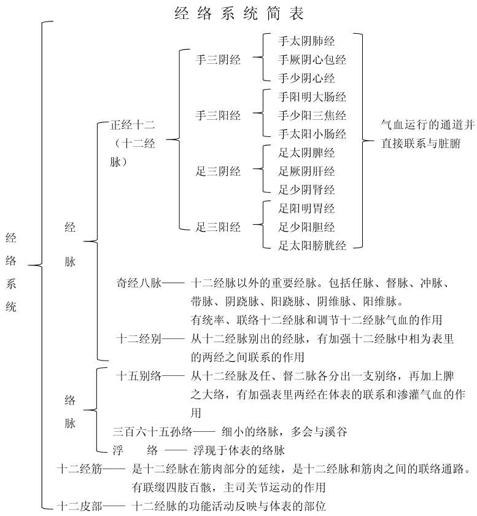

### 第二节十二经脉

#### 一、十二经脉的命名

十二经脉，对称地分布于人体左右两半部，每侧均有十二条经脉，所以，全身实为二十四条经脉。十二经分为阴阳两大类，即阳经六条，阴经六条。阳经有手三阳经和足三阳经；阴经有手三阴经和足三阴经。手三阳经即手太阳、手阳明、手少阳经。足三阳经即足太阳、足阳明、足少阳经。手三阴经即手太阴、手厥阴、手少阴经。足三阴经即足太阴、足厥阴、足少阴经。由于十二经脉各有其特定的联属脏腑，所以十二经脉的名称有时也以其所属脏腑名称称呼，如手太阴经属于肺脏，故又称为肺经，其余类推。

#### 二、十二经脉的循行走向和交接规律

1.循行分布规律

十二经脉在人体的循行部位有一定的规律。①在四肢：阳经行于肢体外侧（阳侧），阴经行于肢体内侧（阴侧）。同时，表里两经基本上相对应地分布于肢体前、中、后同一部位的内、外两侧。如手太阴肺经和手阳明大肠经为表里两经，二者都分布于上肢前缘——一内一外相对应。足太阴脾经和足阳明胃经互为表里，二者都分布于下肢前缘——一内一外相对应，余者类推。六阳经与六阴经又各有自己的分布规律，六阳经则手足阳明经分别居于上肢和下肢外侧前缘，手足少阳经分别居于上、下肢外侧中线，手足太阳经居于上、下肢外侧后缘。六阴经则手足太阴经居上、下肢内侧前缘，手足厥阴经居于上、下肢内侧中线，手足少阴经居于上、下肢内侧后缘。

2.走向和交接规律

手三阴经，从胸走手；手三阳经，从手走头；足三阳经，从头走足；足三阴经，从足走腹。手足三阳经交接于头；手足三阴经交接于胸腹；手三阴三阳经交接于手；足三阴三阳经交接于足。如此，十二经脉形成一个“阴阳相贯，如环无端”（《灵枢·营卫生会》）的循环经路，见图4手足三阴三阳经走向与交接示意图。

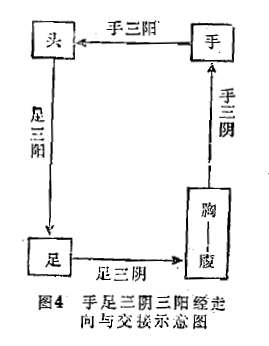

#### 三、十二经脉的表里关系

手足三阴、三阳，通过经别和别络互相沟通，组合成六对“表里相合”关系。《素问·血气形志篇》说：“足太阳与少阴为表里，少阳与厥阴为表里，阳明与太阴为表里，是为足阴阳也。手太阳与少阴为表里，少阳与心主为表里，阳明与太阴为表里，是为手之阴阳也”。相为表里的两条经脉，都在四肢末端交接，都分别循行于四肢内外两个侧面的相对位置（足厥阴肝经与足太阴脾经在下肢内踝上八寸处交叉后，交换前后位置：足太阴在前缘，足厥阴在中线），分别络属于相为表里的脏腑（如足太阳属膀胱络肾，足少阴属肾络膀胱）。因此相为表里的经脉和相为表里的脏腑是一致的。

十二经脉的表里关系，不仅由于相为表里的两条经脉的衔接而加强了联系，而且由于相互络属于同一脏腑，因而使相为表里的一脏一腑在生理功能上相互配合，在病理上也相互影响。如脾主运化、升清，胃主受纳、降浊；心火可下移小肠等等。在治疗上，相为表里的两条经脉的俞穴可交叉使用，如肺经的穴位可以治疗大肠或大肠经的疾病。

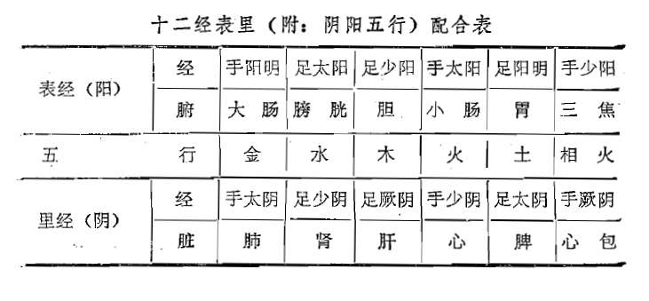

#### 四、十二经脉气血流注次序

十二经脉分布在人体内外，经脉中的气血运行是循环贯注的，即从手太阴肺经开始，依次传至足厥阴肝经，再传至手太阴肺经，首尾相贯，如环无端。其流注次序如下表：

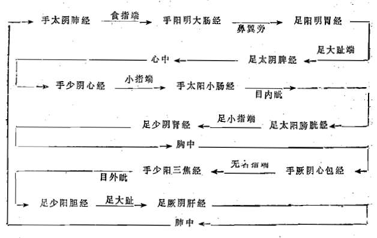

#### 五、十二经脉的循行部位

（一）手太阴肺经

起于中焦，下络大肠，还循胃口（下口幽门，上口贲门），通过膈肌，属肺，至喉部，横行至胸部外上方（中府穴），出腋下，沿上肢内侧前缘下行，过肘窝入寸口上鱼际，直出拇指之端（少商穴）。

分支：从手腕的后方（列缺穴）分出，沿掌背侧走向食指桡侧端（商阳穴），交于手阳明大肠经。（图5）

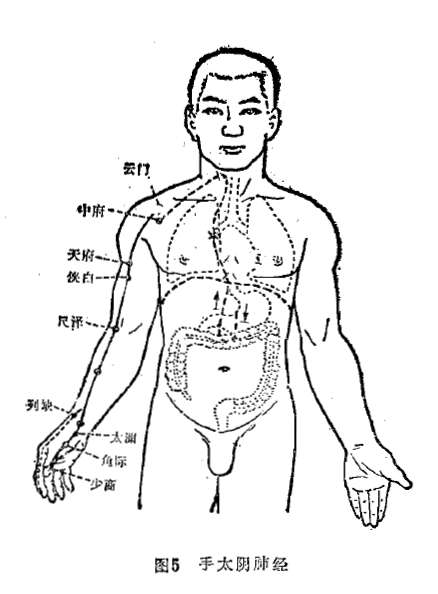

（二）手阳明大肠经

起于食指桡侧端（商阳穴）经过手背行于上肢伸侧前缘，上肩，至肩关节前缘，向后到第七颈椎棘突下（大椎穴），再向前下行入锁骨上窝（缺盆），进入胸腔络肺，向下通过膈肌下行，属大肠。

分支：从锁骨上窝上行，经颈部至面颊，入下齿中，回出挟口两旁，左右交叉于人中，至对侧鼻翼旁（迎香穴)，交于足阳明胃经。（图6）

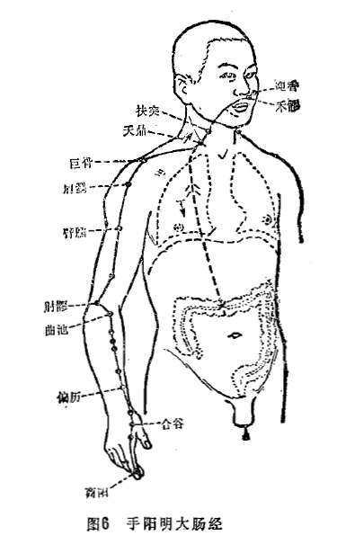

（三）足阳明胃经

起于鼻翼旁（迎香穴），挟鼻上行，左右侧交会于鼻根部，旁行入目内眦，与足太阳经相交，向下沿鼻柱外侧，入上齿中，还出，挟口两旁，环绕嘴唇，在颏唇沟承浆穴处左右相交，退回沿下颌骨后下缘到大迎穴处，沿下颌角上行过耳前，经过上关穴（客主人），沿发际，到额前。分支：从大迎穴前方下行到人迎穴，沿喉咙向下后行至大椎，折向前行，入缺盆，深入体腔，下行穿过膈肌，属胃，络脾。

直行者：从缺盆出体表，沿乳中线下行，挟脐两旁（旁开二寸），下行至腹股沟处的气街穴。

分支：从胃下口幽门处分出，沿腹腔内下行到气街穴，与直行之脉会合，而后下行大腿前侧，至膝膑，沿下肢胫骨前缘下行至足背，入足第二趾外侧端（厉兑穴）。

分支：从膝下三寸处（足三里穴）分出，下行入中趾外侧端。

分支：从足背上冲阳穴分出，前行入足大趾内侧端（隐白穴），交于足太阴脾经。（图7）

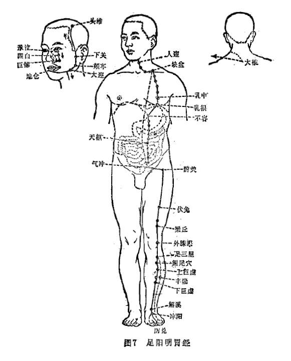

（四）足太阴脾经

起于足大趾内侧端（隐白穴），沿内侧赤白肉际，上行过内踝的前缘，沿小腿内侧正中线上行，在内踝上八寸处，交出足厥阴肝经之前，上行沿大腿内侧前缘，进入腹部，属脾，络胃。向上穿过膈肌，沿食道两旁，连舌本，散舌下。

分支：从胃别出，上行通过膈肌，注入心中，交于手少阴心经。（图8）

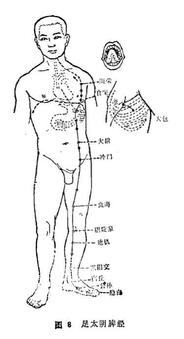

（五）手少阴心经

起于心中，走出后属心系，向下穿过膈肌，络小肠。

分支：从心系分出，挟食道上行，连于目系。

直行者：从心系出来，退回上行经过肺，向下浅出腋下（极泉穴）沿上肢内侧后缘，过肘中，经掌后锐骨端，进入掌中，沿小指桡侧，出小指桡侧端（少冲穴)，交于手太阳小肠经。（图9）

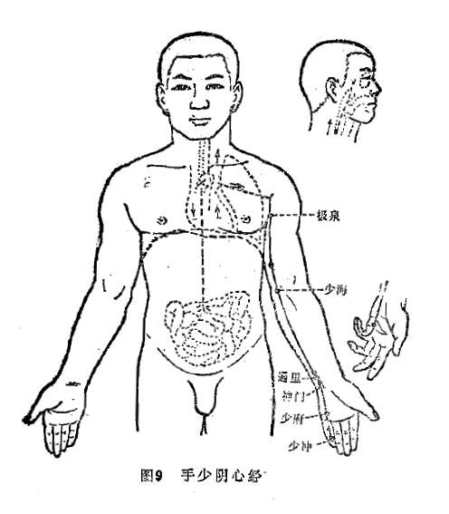

（六）手太阳小肠经

起于小指外侧端（少泽穴），沿手背、上肢外侧后缘，过肘部，到肩关节后面，绕肩胛部，交肩上（大椎穴)，前行入缺盆，深入体腔，络心，沿食道，穿过膈肌，到达胃部，下行，属小肠。

分支：从缺盆出来，沿颈部上行到面颊，至目外眦后，退行进入耳中（听宫穴）。

分支：从面颊部分出，向上行于眼下，至目内眦（睛明穴），交于足太阳膀胱经。（图10）

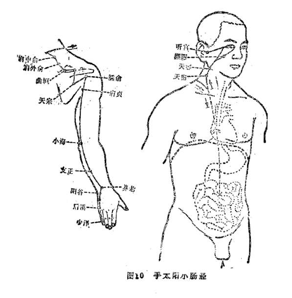

（七）足太阳膀胱经

起于目内眦（睛明穴)，向上到达额部，左右交会于头顶部（百会

穴）。

分支：从头顶部分出，到耳上角部。

直行者：从头顶部分别向后行至枕骨处，进入颅腔，络脑，回出分别下行到项部（天柱穴），下行交会于大椎穴，再分左右沿肩胛内侧，脊柱两旁（一寸五分)，到达腰部（肾俞穴），进入脊柱两旁的肌肉

（膂），深入体腔，络肾，属膀胱。

分支：从腰部分出，沿脊柱两旁下行，穿过臀部，从大腿后侧外缘下行至腘窝中（委中穴）。

分支：从项分出下行，经肩胛内侧，从附分穴挟脊（三寸）下行至髀枢，经大腿后侧至腘窝中与前一支脉会合，然后下行穿过腓肠肌，出走于足外踝后，沿足背外侧缘至小趾外侧端（至阴穴)，交于足少阴肾经。（图11）

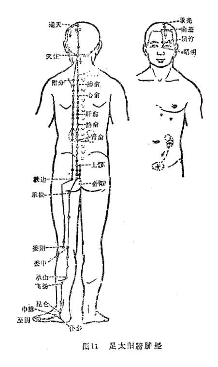

（八）足少阴肾经

起于足小趾下，斜行于足心（涌泉穴），出行于舟骨粗隆之下，沿内踝后，分出进入足跟，向上沿小腿内侧后缘，至腘内侧，上股内侧后缘入脊内（长强穴），穿过脊柱，属肾，络膀胱。

直行者：从肾上行，穿过肝和膈肌，进入肺，沿喉咙，到舌根两旁。分支：从肺中分出，络心，注于胸中，交于手厥阴心包经。（图12）

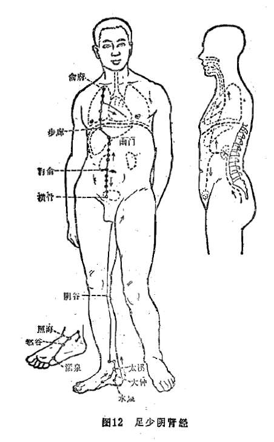

（九）手厥阴心包经

起于胸中，出属心包络，向下穿过膈肌，依次络于上、中、下三焦。分支：从胸中分出，沿胸浅出胁部当腋下三寸处（天池穴），向上至腋窝下，沿上肢内侧中线入肘，过腕部，入掌中（劳宫穴），沿中指桡侧，出中指桡侧端（中冲穴）。

分支：从掌中分出，沿无名指出其尺侧端（关冲穴），交于手少阳三焦经。（图13）

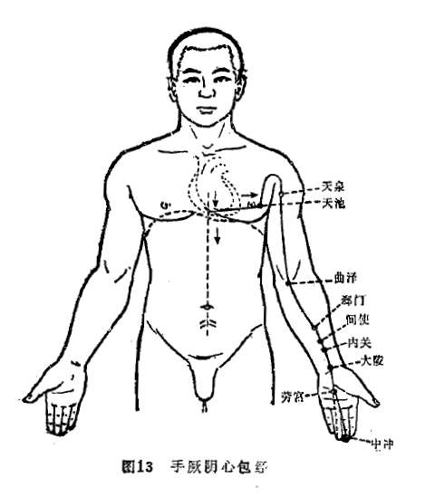

（十）手少阳三焦经

起于无名指尺侧端（关冲穴），向上沿无名指尺侧至手腕背面，上行尺骨、桡骨之间，通过肘尖，沿上臂外侧向上至肩部，向前行入缺盆，布于膻中，散络心包，穿过膈肌，依次属上、中、下三焦。

分支：从膻中分出，上行出缺盆，至肩部，左右交会于大椎，上行到项，沿耳后（翳风穴），直上出耳上角，然后屈曲向下经面颊部至目眶下。

分支：从耳后分出，进入耳中，出走耳前，经上关穴前，在面颊部与前一分支相交，至目外眦（瞳子髎穴），交于足少阳胆经。（图14）

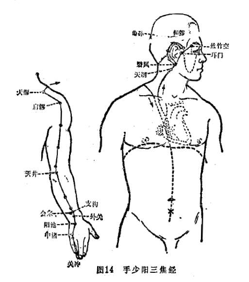

（十一）足少阳胆经

起于目外眦（瞳子髎穴），上至头角（颔厌穴），再向下到耳后（完骨穴），再折向上行，经额部至眉上（阳白穴），又向后折至风池穴，沿颈下行至肩上，左右交会于大椎穴，前行入缺盆。

分支：从耳后进入耳中，出走于耳前，至目外眦后方。

分支：从目外眦分出，下行至大迎穴，同手少阳经分布于面颊部的支脉相合，行至目眶下，向下的经过下颌角部下行至颈部，与前脉会合于缺盆后，进入体腔，穿过膈肌，络肝，属胆，沿胁里浅出气街，绕毛际，横向至环跳穴处。

直行者：从缺盆下行至腋，沿胸侧，过季肋，下行至环跳穴处与前脉会合，再向下沿大腿外侧、膝关节外缘，行于腓骨前面，直下至腓骨下端，浅出外踝之前，沿足背行出于足第四趾外侧端（窍阴穴）。

分支：从足背（临泣穴）分出，前行出足大趾外侧端，折回穿过爪甲，分布于足大趾爪甲后丛毛处，交于足厥阴肝经。（图15）

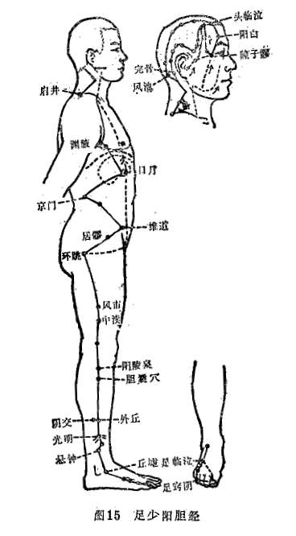

（十二）足厥阴肝经

起于足大趾爪甲后丛毛处，向上沿足背至内踝前一寸处（中封穴），向上沿胫骨内缘，在内踝上八寸处交出足太阴脾经之后，上行过膝内侧，沿大腿内侧中线进入阴毛中，绕阴器，至小腹，挟胃两旁，属肝，络胆，向上穿过膈肌，分布于胁肋部，沿喉咙的后边，向上进入鼻咽部，上行连接目系，出于额，上行与督脉会于头顶部。

分支：从目系分出，下行于颊里，环绕在口唇的里边。

分支：从肝分出，穿过膈肌，向上注入肺，交于手太阴肺经。（图16）

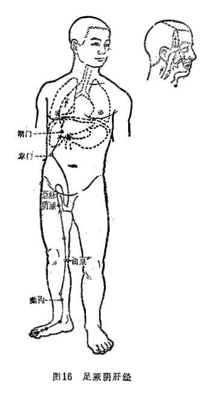

#### 附]《灵枢·经脉》十二经脉原文

肺手太阴之脉，起于中焦，下络大肠，还循胃口，上膈，属肺，从肺系横出腋下，下循臑内，行少阴、心主之前，下肘中，循臂内上骨下廉，入寸口，上鱼，循鱼际、出大指之端。其支者，从腕后直出次指内廉出其端。

大肠手阳明之脉，起于大指次指之端，循指上廉，出合谷两骨之间，上入两筋之中、循臂上廉，入肘外廉，上臑外前廉，上肩，出髃骨之前廉，上出于柱骨之会上，下入缺盆，络肺，下膈，属大肠。其支者，从缺盆上颈，贯颊，入下齿中，还出挟口，交人中，左之右，右之左，上挟鼻孔。

胃足阳明之脉，起于鼻，之（按：疑是“上”字之误）交頞中，旁纳太阳之脉，下循鼻外，入上齿中，还出挟口，环唇，下交承浆，却循颐后下廉，出大迎，循颊车，上耳前，过客主人，循髮际，至额颅。其支者，从大迎前下人迎，循喉咙，入缺盆，下膈，属胃，络脾。其直者，从缺盆下乳内廉，下挟脐，入气街中，其支者，起于胃口，下循腹里，下至气街中而合，以下髀关，抵伏兔，下膝膑中，下循胫外廉，下足跗，入中趾内间（按：应作“次趾外间”）。其支者，下廉三寸而别，下入中趾外间。其支者，别跗上，入大趾间，出其端。

脾足太阴之脉，起于大趾之端，循趾内侧白肉际，过核骨后，上内踝前廉，上踹（按：应作“腨”）内，循胫骨后，交出厥阴之前，上膝股内前廉，入腹，属脾，络胃，上膈，挟咽，连舌本，散舌下。其支者，复从胃别上膈，注心中。

心手少阴之脉，起于心中，出属心系；下膈，络小肠。其支者，从心系上挟咽，系目系。其直者，复从心系却上肺，下出腋下，循臑内后廉，行太阴、心主之后，下肘内，循臂内后廉，抵掌后锐骨之端，入掌内后廉，循小指之内出其端。

小肠手太阳之脉，起于小指之端，循手外侧，上腕，出踝中，直上循臂骨下廉，出肘内侧两筋之间，上循臑外后廉，出肩解，绕肩胛，交肩上，入缺盆，络心，循咽下隔，抵胃，属小肠。其支者，从缺盆循颈，上颊，至目锐眦，却入耳中。其支者，别颊，上䪼，抵鼻，至目内眦，斜络于颧。

膀胱足太阳之脉，起于目内眦，上额，交巅。其支者，从巅至耳上角。其直者，从巅入络脑，还出别下项，循肩膊内，挟脊抵腰中，入循膂，络肾，属膀胱。其支者，从腰中下挟脊，贯臀，入腘中。其支者，从膊内左右别下贯胛，挟脊内，过髀枢，循髀外后廉下合腘中，以下贯腨内，出外踝之后，循京骨，至小趾外侧。

肾足少阴之脉，起于小趾之下，斜走足心，出于然谷之下，循内踝之后，别入跟中，以上腨内，出腘内廉，上股内后廉，贯脊，属肾，络膀胱。其直者，从肾上贯肝膈，入肺中，循喉咙，挟舌本。其支者，从肺出络心，注胸中。

心主手厥阴心包络之脉，起于胸中，出属心包络，下膈，历络三焦。其支者，循胸出胁，下腋三寸，上抵腋下，循臑内，行太阴、少阴之间，入肘中，下臂行两筋之间，入掌中，循中指出其端。其支者，别掌中，循小指次指出其端。

三焦手少阳之脉，起于小指次指之端，上出两指之间，循手表腕，出臂外两骨之间，上贯肘，循臑外，上肩而交出足少阳之后，入缺盆，布膻中，散络心包，下膈，循属三焦。其支者，从膻中上出缺盆，上项，系耳后，直上出耳上角，从屈下颊至䪼。其支者，从耳后入耳中，出走耳前，过客主人前，交颊，至目锐眦。

胆足少阳之脉，起于目锐眦，上抵头角，下耳后，循胫，行手少阳之前，至肩上，却交出手少阳之后，入缺盆。其支者，从耳后入耳中，出走耳前，至目锐眦后。其支者，别锐眦，下大迎，合于手少阳，抵于䪼，下加颊车，下胫，合缺盆，以下胸中，贯膈，络肝，属胆，循胁里，出气街，绕毛际，横入髀厌中。其直者，从缺盆下腋，循胸，过季胁，下合髀厌中，以下循髀阳，出膝外廉，下外辅骨之前，直下抵绝骨之端，下出外踝之前，循足跗上，入小趾次趾之间。其支者，别跗上，入大趾之间，循大趾歧骨内出其端，还贯爪甲，出三毛。肝足厥阴之脉，起于大趾丛毛之际，上循足胕上廉，去内踝一寸，上踝八寸，交出太阴之后，上腘内廉，循股阴，入毛中，过阴器，抵小腹，挟胃，属肝，络胆，上贯膈，布胁肋，循喉咙之后，上入颃颡，连目系，上出额，与督脉会于巔。其支者，从目系下颊里，环唇内。其支者，复从肝别，贯膈，上注肺。

### 第三节奇经八脉

奇经之所以称“奇”，一是奇经独立于十二经脉之外，不受十二经支配（“不拘于经”）；二是无直接配合的脏腑；三是无表里配偶之经。奇经包括督脉、任脉、冲脉、带脉、阴跷脉、阳跷脉、阴维脉、阳维脉八脉，所以又称奇经八脉。

奇经八脉中除任、督二脉有专有的俞穴及任、督、带有独立地循行径路外，其余五经（带脉亦无专有俞穴）均无自身的俞穴，也无独立循行径路，而是主要依附于十二正经之中循行，有的奇经本身，就是十二正经的分支，如阴跷脉、阳跷脉，分别是足少阴肾经和足太阳膀胱经的分支。所以，元·滑伯仁等医家将具有专有俞穴的任、督二脉并入十二正经，合称十四经。

任、督、冲三脉均起自胞中，又同出于会阴之后，任脉行于前，督脉行背，冲脉并足少阴肾经挟脐而上，其中任、督二脉上行至头，交接于唇内；冲脉分支在背脊中与督脉相会合。所以任、督、冲三脉，始则一分为三，终则三合为一。八脉中，除带脉起于季胁，环腰一周外，任、督、冲三脉均起于胞中，终于头面；阴跷、阳跷、阴维、阳维均起于两足，终于头项。因此，八脉（除带脉）都汇聚于头部。

奇经八脉纵横交叉于十二经脉之间，具有如下三方面的作用：①进一步密切十二经脉之间的联系。如阳维维系于阳经，联络所有的阳经，阴维维系于阴经，联络所有的阴经；带脉环行于腰部，沟通循行于腰部、腹部的经脉；冲脉通行于上下，渗灌三阴、三阳；督脉则总督诸阳经；任脉则汇合诸阴经。②调节十二经脉的气血。十二经脉气血有余时，则流注于奇经八脉，蓄以备用；十二经脉气血不足时，可由奇经溢出，给予补充。③奇经与肝、肾等脏及女子胞、脑、髓等奇恒之腑的关系较为密切，相互之间在生理病理上均有一定的联系。

（一）督脉

1.循行部位

循行部位：起于胞中，下出会阴，沿脊柱里面上行，至项后风府穴处进人颅内，络脑，并由项沿头部正中线，经头顶、额部、鼻部、上唇，到上唇系带处。

分支：从脊柱里面分出，属肾。

分支：从小腹内部直上，贯脐中央，上贯心，到喉部，再向上到下颌部，环绕口唇。向上至两眼下部的中央。（图17）

2.基本功能

督，有总管、统率的意思。督脉行于背部正中，其脉多次与手足三阳经及阳维脉交会，能总督一身之阳经，故又称为“阳脉之海”。其次，督脉行于脊里，上行入脑，并从脊里分出属肾，它与脑、脊髓和肾有密切的联系。

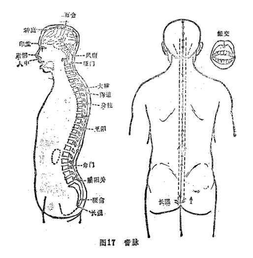

（二）任脉

1.循行部位

起于胞中，下出会阴，经阴阜，沿腹部和胸部正中线上行，至咽喉，上行至下颌部，环绕口唇，沿面颊，分行至目眶下。（图18）

2.基本功能

任，有担任、任受的意思。任脉行于腹面正中线，其脉多次与手足三阴及阴维脉交会，能总任一身之阴经，故又称“阴脉之海”。任，又与“妊”意义相通。其脉起于胞中，与女子妊娠有关，故称“任主胞胎”。

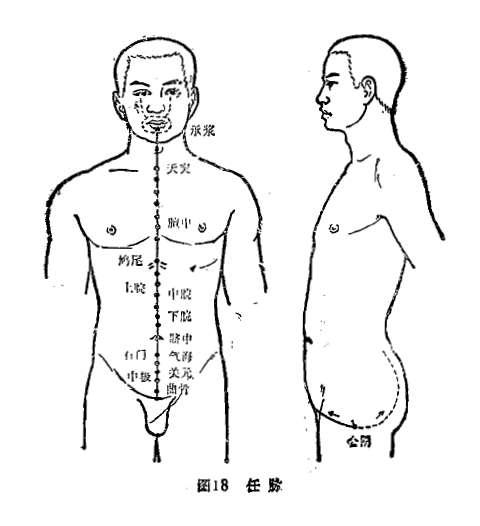

（三）冲脉

1.循行部位

起于胞中，下出会阴后，从气街部起与足少阴经相并，挟脐上行，散布于胸中，再向上行，经喉，环绕口唇，到目眶下。

分支：与足少阴之大络同起于肾，向下从气街部浅出体表，沿大腿内侧进入腘窝，再沿胫骨内缘，下行到足底；又有支脉从内踝后分出，向前斜入足背，进入大足趾。

分支：从胞中出，向后与督脉相通，上行于脊柱内。（图19）

2.基本功能

冲，有要冲的意思。冲脉上至于头，下至于足，贯串全身，成为气血的要冲，能调节十二经气血，故有“十二经脉之海”之称。冲脉又称“血海”，同妇女的月经有密切关系。

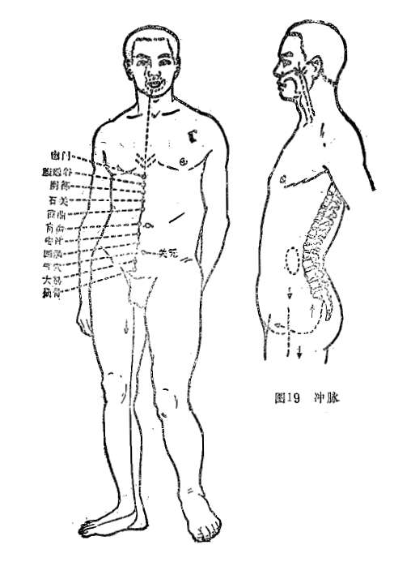

（四）带脉

1.循行部位

起于季胁，斜向下行到带脉穴，绕身一周。在腹面的带脉下垂到少腹。（图20）

2.基本功能

带脉围腰一周，犹如束带，能约束纵行诸脉。

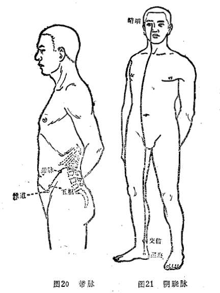

（五）阴跷脉、阳跷脉

1.循行部位

跷脉左右成对。阴跷脉、阳跷脉均起于足踝下。

阴跷脉从内踝下照海穴分出，沿内踝后直上下肢内侧，经前阴，沿腹、胸进入缺盆，出行于人迎穴之前，经鼻旁，到目内呲，与手足太阳经、阳跷脉会合。（图21)

阳跷脉从外踝下申脉穴分出，沿外踝后上行，经腹部，沿胸部后外侧，经肩部、颈外侧，上挟口角，到达目内眦，与手足太阳经、阴跷脉会合，再上行进入髮际，向下到达耳后，与足少阳胆经会于项后。（图22）

2.基本功能

跷，有轻健跷捷的意思。有濡养眼目、司眼睑之开合和下肢运动的功能。古人还有阴阳跷脉“分主一身左右之阴阳”之说。

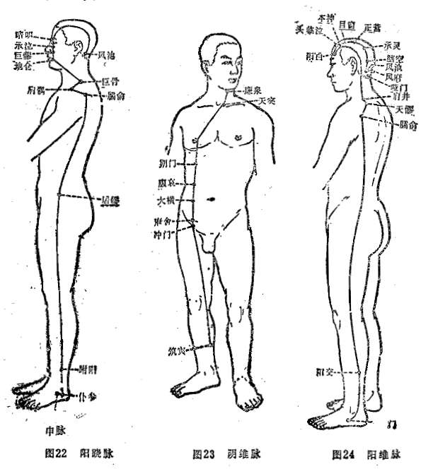

（六）阴维脉、阳维脉

1.循行部位

阴维脉起于小腿内侧足三阴经交会之处，沿下肢内侧上行，至腹部，与足太阴脾经同行，到胁部，与足厥阴经相合，然后上行至咽喉，与任脉相会。（图23）

阳维脉起于外踝下，与足少阳胆经并行，沿下肢外侧向上，经躯干部后外侧，从腋后上肩，经颈部、耳后，前行到额部，分布于头侧及项后，与督脉会合。（图24）

2.基本功能

维，有维系的意思。阴维脉的功能是“维络诸阴”；阳维脉的功能是“维络诸阳”。

### 第四节十二经别

一、概说

经别是从十二经分（别）出的经脉，是另有自己的循行径路的正经，因而属于十二正经范围之内。经别虽属于正经，但它与正经分支不同：正经分支（支脉）从本经分出后，不再复归于本经；经别则不同，阴经经别在循行一段经路后，与相表里之阳经经别相合，最终归于阳经经别之本经，而不回归阴经经别之本经。如足少阴经经别最终合于足太阳经经别，二者再共同归于足太阳经经别之本经——足太阳经。

十二经别在人体中循行的基本规律，可概括为“离、入、出、合”四个字。十二经别都是从十二经脉循行四肢处（多在肘膝以上）别出

（离），再深入胸腹腔内部（入），然后外出肌表（出），上行于头面；在头面处，阴经经别入合于相表里之阳经经别，阳经经别再回归于本经（合）。这就是十二经别的“离、入、出、合”或称“离、合、出、入”的循行规律。由于每一对表里经别有一合，故十二经别共有六合。

二、经别的作用和意义

由于有的十二经别循行部位是十二经脉循行所不及之处，所以十二经别在生理、病理、治疗等方面都是对十二经脉的重要补充：

（1）加强了十二经脉中相为表里的两条经脉在体内的联系十二经别进入体腔后，表里两经经别相并而行，并经过相为表里的脏腑，在浅出体表时，阴经经别合入阳经经别，共同注入阳经经别之本经。因此，有加强表里经脉相互联系的作用。

（2）加强了体表、四肢与体内、脏腑之间的向心性联系由于十二经别都是从十二经脉循行于四肢部分别出，进入体内后又是向心性走行，因而加强了经络的由外而内的联系。

（3）建立了六阴经与头面的联系六阴经，除足厥阴经外，均不上行于头面，而十二经别不仅六阳经经别循行于头部，而且六阴经经别亦上达于头部。足三阴经经别在合入阳经经别之后上达于头；手三阴经经别，均经喉咙而直接达于头面部，为“十二经脉，三百六十五络，其血气皆上于面而走空窍”（《灵枢·邪气脏腑病形》）的理论奠定了物质基础。

（4）补充了某些疾病的辨证，扩大了十二经脉主治范围由于十二经别的循行部位弥补了十二经脉所不到之处，因而对某些疾病的准确辨证定位，提供了启示和理论依据。如头痛，三阴三阳经均有头痛，但三阳经和厥阴经的经脉直接行于头部，而三阴经经脉并不走行于头部，为什么仍会有头痛呢？这是因为三阴经经别分别入合于与已相表里之阳经经别，最后归于阳经，借阳经经脉抵达于头部，因而三阴经病变也会引起头痛。《素问·五脏生成篇》说；“头痛巅疾，下虚上实，过在足少阴巨阳”。后来的宋、金、元时期的医家，如许叔微、李杲、朱震亨等都有关于三阴头痛的论治。李杲说：头痛“亦有三阴三阳之异”，朱震亨说：“诸经气滞，亦作头痛”。因此，头痛一证，不限于三阳经和厥阴经，这是经别等在起作用。

十二经别还扩大了经络穴位的主治范围。如足太阳经脉并不到达肛门，但该经经别却“别入于肛”，所以足太阳经的承山、承筋等穴可治疗肛门病。

（5）加强了足三阴三阳经脉与心的联系足三阴三阳经经别上行经过腹胸，除加强了腹腔内脏腑的表里联系之外，又都与胸腔内的心相联系。因此，十二经别对于分析腹腔内脏腑与心的生理、病理联系，有重要意义。所以，十二经别为“心为五脏六腑之大主”的理论提供了依据。

三、十二经别的循行

（一）足太阳与足少阴经别　一合

足太阳经别从足太阳经脉的腘窝部分出，其中一条支脉在骶骨下五寸处别行进入肛门，上行归属膀胱，散布联络肾脏，沿脊柱两旁的肌肉到心脏后散布于心脏内；直行的一条支脉，从脊柱两旁的肌肉处继续上行，浅出项部，脉气仍注入足太阳本经。（图25）

足少阴经别从足少阴经脉的腘窝部分出，与足太阳的经别相合并行，上至肾，在十四椎（第二腰椎）处分出，归属带脉；直行的一条继续上行，系舌根，再浅出项部，脉气注入足太阳经的经别。（图25）

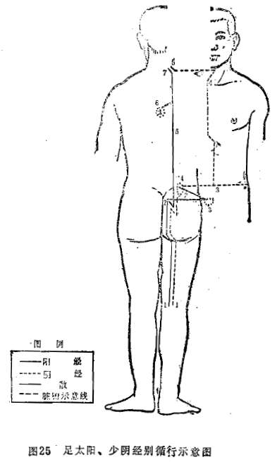

（二）足少阳与足厥阴经别　二合

足少阳经别从足少阳经脉在大腿外侧循行部位分出，绕过大腿前侧，进人毛际，同足厥阴的经别会合，上行进入季胁之间，沿胸腔里，归属于胆，散布而上达肝脏，通过心脏，挟食道上行，浅出下颌、口旁，散布在面部，系目系，当目外眦部，脉气仍注入足少阳经。（图26）足厥阴经别从足厥阴经脉的足背上处分出，上行至毛际，与足少阳的经别会合并行。（图26）

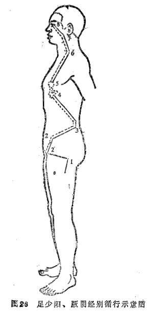

（三）足阳明与足太阴经别　三合

足阳明经别从足阳明经脉的大腿前面处分出，进入腹腔里面，归属于胃，散布到脾脏，向上通过心脏，沿食道浅出口腔，上达鼻根及目眶下，回过来联系目系，脉气仍注入足阳明本经。（图27）

足太阴经别从足太阴经脉的股内侧分出后到大腿前面，同足阳明的经别相合并行，向上结于咽，贯通舌中。（图27）

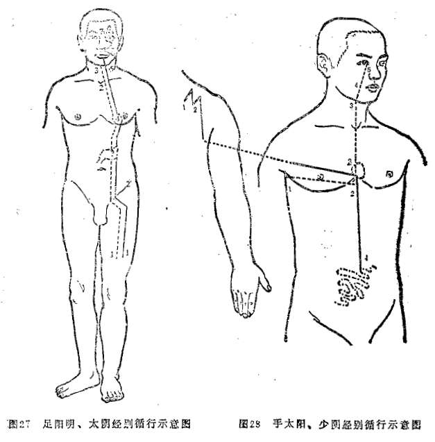

（四）手太阳与手少阴经别　四合

手太阳经别从手太阳经脉的肩关节部分出，向下入于腋窝，行向心脏，联系小肠。（图28）

手少阴经别从手少阴经脉的腋窝两筋之间分出后，进入胸腔，归属于心脏，向上走到喉咙，浅出面部，在目内眦与手太阳经相合。（图28）

（五）手少阳与手厥阴经别　五合

手少阳经别从手少阳经脉的头顶部分出，向下进入锁骨上窝，经过上、中、下三焦，散布于胸中。（图29）

手厥阴经别从手厥阴经脉的腋下三寸处分出，进入胸腔，分别归属于上、中、下三焦，向下沿着喉咙，浅出于耳后，于乳突下同手少阳经会合。（图29）

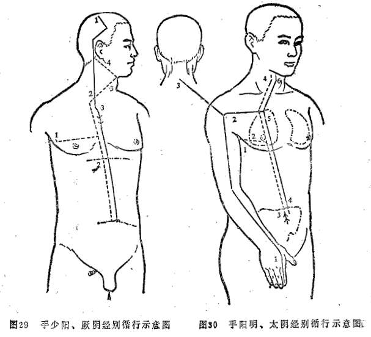

（六）手阳明与手太阴经别　六合

手阳明经别从手阳明经脉的肩髃穴处分出，进入项后柱骨，向下者走向大肠，归属于肺；向上者，沿喉咙，浅出于锁骨上窝，脉气仍归属于手阳明本经。（图30）

手太阴经别从手太阴经脉的渊腋处分出，行于手少阴经别之前，进入胸腔，走向肺脏，散布于大肠，向上浅出锁骨上窝，沿喉咙，合于手阳明的经别。（图30）

### 第五节十五别络

一、概说

别络也是经脉的分支。经脉潜行于深部，而大多数别络则分布于体表。别络是从经脉直接分出的络脉，由别络再行分出的无数络脉称为孙络。别络对其以下分出的络脉，起着主导作用。所以，络脉从其经脉分出时虽只有一条（别络），但在其循行于表里两经之间时，经过多次逐级分支，其数就不可胜数了。因此，在一经之络脉到达相为表里的另一经脉时，已不是一条了。所以，别络有出处名称而无入处名称。别络的命名是以别络从经脉分出之处的穴位名称定名的。如手太阴肺经之别络是从肺经的列缺穴处支出的，则肺经的这条别络即称为“列缺”。不过这时的“列缺”已成为别络的名称了，而不再代表穴位了。

十二经别络（脾、胃之“大络”除外）均发出于四肢肘膝以下，联络于表里两经之间，为十二经脉气血在四肢部相互转输的通道。因此，十二经别络参与十二经脉气血的整体循环。

别络共有十五，即十二经别络、任、督二别络，再加上脾之大络“大包”，合称十五别络。但实际上别络有十六，因胃尚有另一大络“虚里”。至此，则脾、胃各有二条别络。又，《难经》所说十五别络和《内经》之说稍异，《难经》之十五络指：十二经别络、脾之大络、阴络（阴跷之络）、阳络（阳跷之络），无任、督二脉之络。但后世多通行《内经》之说。

总之，别络的作用是加强了十二经脉表里之间的联系；转输经脉中气血，以灌注于全身各部；别络，联络并主导全身络脉，与其他无数孙络等，形成一个全身内外上下，无处不到的网络，也是人体整体联系的重要基础之一。

二、别络的名称分布

十五别络的分布有一定的部位，其中十二经脉的别络都是从四肢肘膝以下分出，表里两经的别络相互联络；任脉之络分布于腹部，督脉之络分布于背部，脾之大络分布在身之侧部。其具体的分布部位如下：

（1）手太阴之别络名列缺：从列缺穴处分出，起于腕关节上方，在腕后半寸处走向手阳明经；其支脉与手太阴经相并，直入掌中，散布于鱼际部。

（2）手少阴之别络名通里：从通里穴处分出，在腕后一寸处走向手太阳经；其支脉在腕后一寸半处别而上行，沿着本经进入心中，向上系舌本，连属目系。

（3）手厥阴之别络名内关：从内关穴处分出，在腕后二寸处浅出于两筋之间，沿着本经上行，维系心包，络心系。

（4）手太阳之别络名支正：从支正穴处分出，在腕后五寸处向内注入手少阴经；其支脉上行经肘部，网络肩髃部。

（5）手阳明之别络名偏历：从偏历穴处分出，在腕后三寸处走向手太阴经，其支脉向上沿着臂膊，经过肩髃，上行至下颌角，遍布于牙齿，其支脉进入耳中，与宗脉会合。

（6）手少阳之别络名外关：从外关穴处分出，在腕后二寸处，绕行于臂膊外侧，进入胸中，与手厥阴经会合。

（7）足太阳之别络名飞扬：从飞扬穴处分出，在外踝上七寸处，走向足少阴经。

（8）足少阳之别络名光明：从光明穴处分出，在外踝上五寸处，走向足厥阴经，向下联络足背。

（9）足阳明之别络名丰隆：从丰隆穴处分出，在外踝上八寸处，走向足太阴经；其支脉沿着胫骨外缘，向上联络头项，与各经的脉气相合，向下联络咽喉部。

（10）足太阴之别络名公孙：从公孙穴处分出，在第一趾跖关节后一寸处，走向足阳明经；其支脉进入腹腔，联络肠胃。

（11）足少阴之别络名大钟：从大钟穴处分出，在内踝后绕过足跟，走向足太阳经；其支脉与本经相并上行，走到心包下，外行通贯腰脊。

（12）足厥阴之别络名蠡沟：从蠡沟穴处分出，在内踝上五寸处，走向足少阳经；其支脉经过胫骨，上行到睾丸部，结聚在阴茎处。

（13）任脉之别络名尾翳：从鸠尾（尾翳）穴处分出，自胸骨剑突下行，散布于腹部。

（14）督脉之别络名长强：从长强穴处分出，挟脊柱两旁上行到项部，散布在头上；下行的络脉从肩胛部开始，向左右别走足太阳经，进人脊柱两旁的肌肉。

（15）脾之大络名大包：从大包穴处分出，浅出于渊腋穴下三寸处，散布于胸胁部。

（16）胃之大络名虚里：在左乳下（即心尖搏动处）。

### 第六节十二经筋

一、概述

前以提及，经筋是十二经脉的延续，是十二经脉分布于筋肉的部分，所以称为经筋。经筋也有相应的十二个系统，即手足三阴三阳经筋。由于经筋是分布于筋肉之中的，主司筋肉的运动，所以经筋的作用，主要表现为筋肉的运动，其病变也反映为筋肉的病变。而筋肉的运动又控制着骨骼、关节、肢体的屈伸，因此，说经筋是“主束骨而利机关”《素问·痿论》。

经筋分布的特点是：其循行部位不完全与十二经脉一致。经筋循行于人体浅层，不入内脏。经筋均起于四肢末端，并分布于四肢关节（包括肩、髀关节）、头面、胸腹、肌表。经筋有汇聚之处：如足三阳经筋，起于足趾，行于下肢外侧，上达于头面部；足三阴经筋，起于足趾，行于下肢内侧，上达于胸腹背；足三阴经筋和足阳明经筋还汇聚于阴器（小腹部）；手三阳经筋，起于手指，行于上肢外侧，上达于头面部；手三阴经筋，起于手指，行于上肢内侧，达于胸腹。前面已经讲过，经筋是一个系统，而不是一条，因此一个系统的经筋可分布于多处肌肉关节之中。脏象学说指出：肝主筋。而肝主筋是通过足厥阴经筋对诸系统经筋的联络实现的（“足厥阴之筋”“络诸筋”——《灵枢•经

筋》）。从上述十二经筋分布来看，经筋是遍布于头面、胸腹、四肢，即周身。同时，足三阴三阳经筋交接于足趾；手三阴三阳交接于手指；手足三阳交接于头面；手足三阴交接于胸腹。这样就形成了一个十二经筋的整体系统。所以，有些经筋的病变（如强直、抽搐等）往往是全身性的。

经筋的病变，主要表现筋肉的痉挛拘急、疼痛和痿废弛缓。十二经筋在治疗上的意义是扩大了十二经脉上的俞穴治疗范围。足阳明胃经循于下肢、胸腹、面部，但该经所属的梁丘、阴市、足三里等穴，却能治疗腰痛，是由于足阳明经筋亦循行于腰背。

二、十二经筋的循行部位

（一）足太阳经筋

足太阳经筋，起于足小趾，向上结于外踝，斜上结于膝部，在下者沿外踝结于足跟，向上沿跟腱结于腘部。其分支结于小腿肚（腨外），上向腘内侧，与腘部另支合并上行结于臀部，向上挟脊到达项部；分支入结于舌根；直行者结于枕骨，上行至头顶，从额部下，结于鼻；分支形成“目上网”（一作“目上纲”，即上睑），向下结于鼻旁；背部的分支从腋后外侧结于肩髃；一支进入腋下，向上出缺盆，上方结于耳后乳突（完骨）；又有分支从缺盆出，斜上结于鼻旁。（图31）

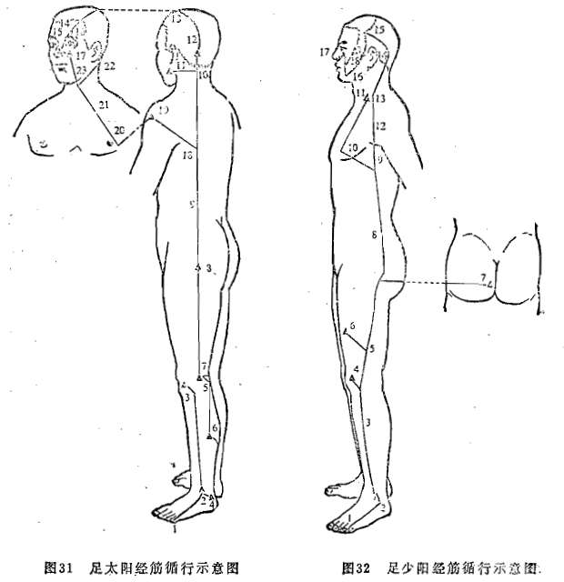

（二）足少阳经筋

足少阳经筋，起于第四趾，向上结于外踝，上行沿胫外侧缘，结于膝外侧；其分支另起于腓骨部，上走大腿外侧，前边结于“伏兔”，后边结于骶部。直行者，经季胁，上走腋前缘，系于胸侧和乳部，结于缺盆。直行者，上出腋部，通过缺盆，行于太阳经筋的前方，沿耳后，上额角，交会于头顶，向下走向下颌，上结于鼻旁；分支结于目外眦，成“外维”。（图32）

（三）足阳明经筋

足阳明经筋，起于第二、三、四趾，结于足背，斜向外上盖于腓骨，上结于膝外侧，直上结于髀枢（大转子部），向上沿胁肋，连属脊椎。直行者，上沿胫骨，结于膝部；分支结于腓骨部，并合足少阳的经筋；直行者，沿伏兔向上，结于股骨前，聚集于阴部，向上分布于腹部，结于缺盆，上颈部，挟口旁，会合于鼻旁，下方结于鼻部，上方合于足太阳经筋一一太阳为“目上网”（上睑），阳明为“目下网”（下睑）。其分支从面颊结于耳前。（图33）

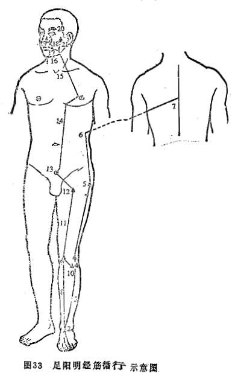

（四）足太阴经筋

足太阴经筋，起于足大趾内侧端，向上结于内踝；直行者，络于膝内辅骨（胫骨内踝部），向上沿大腿内侧，结于股骨前，聚集于阴部，上向腹部，结于脐，沿腹内，结于肋骨，散布于胸中；其在里的，附着于脊椎。（图34)

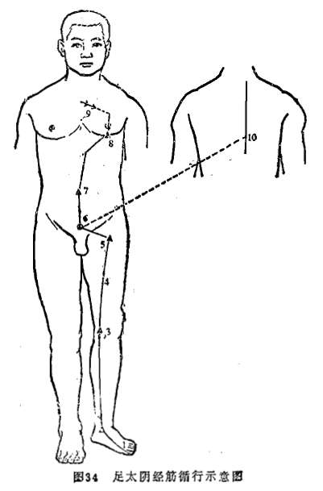

（五）足少阴经筋

足少阴经筋，起于足小趾的下边，同足太阴经筋并斜行内踝下方，结于足跟，与足太阳经筋会合，向上结于胫骨内踝下，同足太阴经筋一起向上，沿大腿内侧，结于阴部，沿脊里，挟膂，向上至项，结于枕骨，与足太阳经筋会合。（图35）

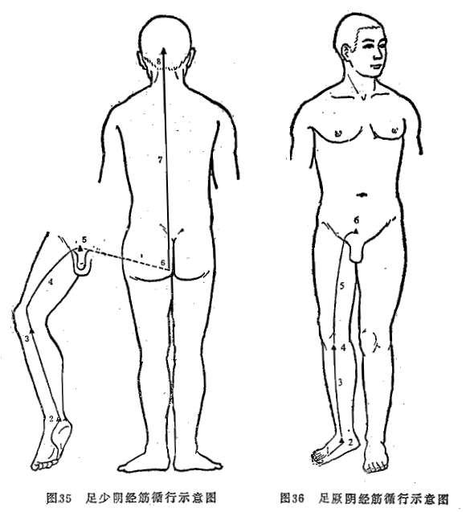

（六）足厥阴经筋

足厥阴经筋，起于足大趾上边，向上结于内踝之前，沿胫骨向上结于胫骨内踝之下，向上沿大腿内侧，结于阴部，联络各经筋。（图36）

（七）手太阳经筋

手太阳经筋，起于手小指上边，结于腕背，向上沿前臂内侧缘，结于肘内锐骨（肱骨内上踝）的后面，进入并结于腋下，其分支向后走腋后侧缘，向上绕肩胛，沿颈旁出走足太阳经筋的前方，结于耳后乳突；分支进入耳中；直行者，出耳上，向下结于下颌，上方连属目外眦；还有一条支筋从颌部分出，上下颌角部，沿耳前，连属目外眦，上额，结于额角。（图37）

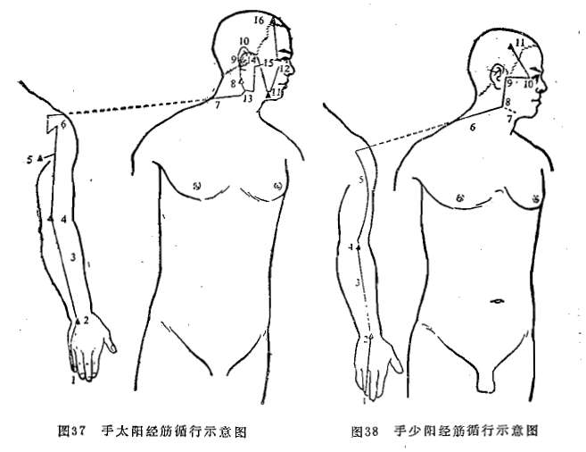

（八）手少阳经筋

手少阳经筋，起于手无名指末端，结于腕背，向上沿前臂结于肘部，上绕上臂外侧缘上肩，走向颈部，合于手太阳经筋。其分支当下颌角处进入，联系舌根；另一支从下颌角上行，沿耳前，连属目外眦，上经额部，结于额角。（图38）

（九）手阳明经筋

手阳明经筋，起于食指末端，结于腕背，向上沿前臂结于肘外侧，上经上臂外侧，结于肩髃；其分支，绕肩胛，挟脊旁；直行者，从肩髃部上颈；分支上面颊，结于鼻旁；直行的上出手太阳经筋的前方，上额角，络头部，下向对侧下颌。（图39）

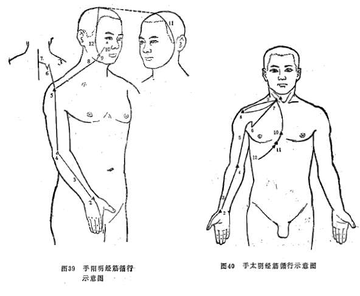

（十）手太阴经筋

手太阴经筋，起于手大拇指上，沿指上行，结于鱼际后，行于寸口动脉外侧，上沿前臂，结于肘中；再向上沿上臂内侧，进入腋下，出缺盆，结于肩髃前方，上面结于缺盆，下面结于胸里，分散通过膈部，会合于膈下，到达季胁。（图40）

（十一）手厥阴经筋

手厥阴经筋，起于手中指，与手太阴经筋并行，结于肘内侧，上经上臂内侧，结于腋下，向下散布于胁肋的前后。其分支进人腋内，散布于胸中，结于膈。（图41)

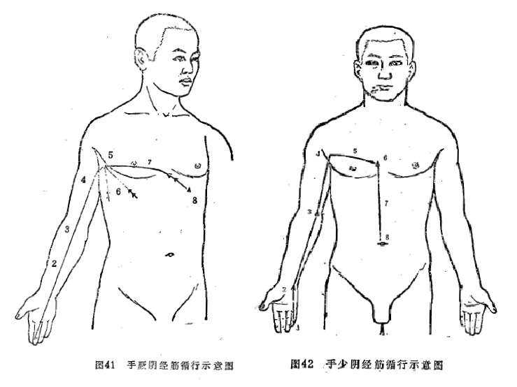

（十二）手少阴经筋

手少阴经筋，起于手小指内侧，结于腕后锐骨（豆骨），向上结于肘内侧，再向上进入腋内，交手太阴经筋，行于乳里，结于胸中，沿膈向下，系于脐部。（图42）

### 第七节皮部

皮部是十二经脉系统分布于体表的部分，简单地说，皮部就是十二经脉系统的皮表部，也是十二经脉系统最外围的部分。《素问·皮部论》说：“皮者，脉之部也”。就是说十二经脉及其络脉，在皮表各有相应分布区域。由于经脉有十二，全身皮表就有十二个相应的区域，称十二皮部。所以，《素问•皮部论》说：“欲知皮部，以经脉为纪”。关于十二皮部在体表的部位，尚未见到古代文献的明确记载。现转引《中医基础理论详解》一书中示意图做为参考。（图43、44）

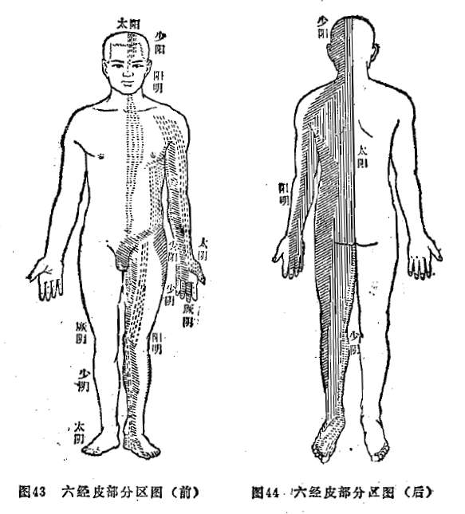

一、十二皮部在生理病理上的意义

（1）防御外邪外邪侵犯人体，首先经过皮毛，而后是络脉、经脉，直至腑脏。所以，十二经皮表之部——十二皮部，就成了防御外邪的第一道屏障。如果皮部功能（卫气）衰弱，邪气就易于侵犯皮部，并进而深入经脉、脏腑而发病。所以，《素问·皮部论》说：“皮者有分部，不与而生大病也”。“不与”即“不用”，即皮部功能失常，防卫机能减退，邪气就易于侵入。又如：“汗出当风”是皮部卫外不固，风邪乘虚而入。

（2）脏腑经络气血盛衰反映于皮表的通道中医学认为，“有诸内，必形诸外”，是说内在脏腑的生理病理变化，必在外表有所反映。而这种反映是通过什么途径实现的呢？这一途径之中，就包括经脉所属的皮部。皮部是经络系统最外围的达于体表的部分。这样，脏腑就通过经脉、络脉，以及皮部，使体表和脏腑之间建立了直接联系。所以，脏腑气化活动及其精气盛衰变化，就可通过十二经脉、皮部反映于体表。因此，可以从人体外表的变化（如望面、望舌及体表寒热等），揣知脏腑的功能状况。如《灵枢•经脉》说：足阳明胃经“气盛则身以前皆

热”，“气不足则身以前皆寒慄”。因为足阳明胃经经脉行于身前，其皮部在身即在身前皮表。又如《素问·刺热篇》说：“脾热病者鼻先赤”，“肾热病者颐先赤”等等。这些都是脏腑、经络病变在体表皮部的反映。由此可知，中医学的“藏”与“象”的必然联系，“有诸内，必形诸外”，以及“以外知内”等等观点和原则，是有其经络系统的实在依据的。

（3）充养皮毛脏腑精气通过经脉而至于皮部，从而达到营养皮毛的作用。所以，皮毛的润泽与枯槁，皮毛的生长状态，亦间接地反映了脏腑精气的盛衰。

二、十二皮部在治疗上的意义

十二皮部的存在，及其与经络、脏腑的联系，是某些外治法的依据。外治法是在皮表施以药物或针刺（毛刺等）、按摩等达到治疗局部或体内脏腑病变的目的。如薰、洗、浴、敷贴等外治法，就是将药物直接作用于皮表，通过皮部、经络而使药力达于病所。外治法，已广泛地应用于临床各科，成为中医临床治疗的重要方法之一。

### 第八节经络系统的作用

同脏腑一样，经络系统是人体重要的组成部份。对于经络系统各组成部分（十二经脉、奇经八脉、十二经别、十五别络、十二经筋、十二皮部）在人体中的作用，已分述于前几节之中。现将经络系统在人体中的总体作用，归纳概括如下：

1.输送气血

人体全身各部，如脏腑、九窍、肌肉、筋骨、关节等的发育和功能活动，全赖气血的濡养，才能维持正常的生理状态。而担负输送气血于全身各部的，正是经络系统。经络系统输送气血的功能，又称为经气。经络系统须保持通畅，气血运行才能畅行无阻，以满足全身各部对气血的需求。如果经络通行不畅，气血运行受阻，经络系统所联系的脏腑、九窍、肌肉、筋骨、关节等就会发生病变，如瘀血、麻木、疼痛、拘挛、弛缓，以及脏腑病证等。临床上常说的“痛则不通，通则不痛”，指的就是经络是否通畅。《灵枢·本脏》所说：“经脉者，所以行血气，而营阴阳，濡筋骨，利关节者也”。就是对经络系统的作用和意义的简要概括。

2.整体联络通路

中医学认为，人体各部分（如五脏六腑、九窍、肌肉、筋骨等）之间是密切相关的。不仅生理上是相互影响的，病理上也是相互关联的。一脏一腑有病，可以影响到他脏他腑，直至九窍、肌肉、筋骨、皮肤等，从而出现一系列证候表现。这就从实践上证实了人体是一个有机的统一整体。而形成这一有机的统一整体的联系纽带，就是经络系统。从前述经络系统循行分布可以清楚：经络系统（十二经脉、十二经别、十五别络、十二经筋、十二皮部）在人体是无处不有，无处不到的。这就把本来独立的脏腑器官，如五脏之间、六腑之间、脏腑之间、脏腑与九窍之间、脏腑与肌肉、筋骨皮肤之间等，通过经络系统而有机地、密切地联系在一起，从而形成一个在生理、病理上相互影响地统一整体。这也是中医学“整体观”的客观依据之一。总之，通过经络系统的联系，使人体各部形成一个彼此密切相关的统一整体，并在功能活动上相互协调一致。

3.疾病传变的途径

由于经络系统内连于脏腑，外络于肢节、肌表、九窍，所以，外感六淫邪气侵犯肌表和官窍之后，即可通过经络系统的皮部而至络脉、经脉，直至脏腑，从而引起脏腑病变。如《素问·皮部论》说：“邪客于皮则腠理开，开则邪入客于络脉，络脉满则注于经脉，经脉满则入舍于腑脏也”。这是外邪侵犯人体后，通过经络系统，由外及内，由浅入深的传变过程。如外感风寒之邪，首先病人出现恶风恶寒、鼻塞、鼻流清涕等浅表症状，属邪在皮部；继而则出现恶寒发热、全身肌肉关节痠痛等症状，为邪在经络；未经治疗，则出现壮热、咳喘、气急、咯吐黄痰、脉数有力等，为邪已入脏并且化热。医家们正是从实践中发现了外邪中人，有一个沿经络系统循序渐进的过程，所以提出有病早治，防其内传的防治原则。如《素问·阴阳应象大论》说；“邪风之至，疾如风雨，故善治者治皮毛，其次治肌肤，其次治六腑，其次治五脏。治五脏者，半死半生也”。

同样，内伤杂病之脏腑病变，亦可沿经络系统，由内传之于外。如《灵枢·邪客》篇指出：“肺心有邪，其气留于两肘；肝有邪，其气留于两腋；脾有邪，其气留于两髀；肾有邪，其气留于两腘”，是说五脏发生病变，其病邪可沿经络系统传之于经络循行分布的部位而引起该部位的病变。又如《素问•脏气法时论》说：“肝病者，两胁下痛，引少腹……；心病者，……两臂内痛；脾病者，……脚下痛；肺病者，……肩背痛；肾病者……大腹小腹痛”。这里的“胁下”、“两臂内”、“脚下”等处，都是发病脏腑所属经脉循行之处。临床上常见之肝火亢盛而见目赤，心火亢盛而见舌尖红赤，肾气虚而见耳鸣，脾气虚而见口中饮食无味，胃火亢盛而见齿龈肿痛，都证实了经络系统是脏腑病变反映于体表的途径。

经络系统不仅能将外邪传之于内，内邪反映于外，而且脏与脏、腑与腑、脏与腑、经络与经络之间的病邪传变，也是通过经络系统实现的。因为它们之间都存在着经络系统上的联系，在此不一一列举。

4.传输治疗效应

人体除某些体表病变如疮疡、疥癣、骨折之外，多数疾病，各种治疗方法都无法直接作用于病所，而要通过经络系统将治疗效应传输于病所。如针刺的“得气”，即是针刺效应“气”，沿经脉循行向远处病所传导（行气），从而达到调整气血，祛除邪气的治疗目的。其他非药物疗法的灸法、按摩、推拿、气功等治疗效应，也都是通过经络系统传输于病所的。这已为千百年的医疗实践所证实，确为行之有效的。至于药物疗法，无论是内服、外用（如敷、贴、熏、洗、浴、熨等）也首先作用于络脉（内服药经胃消化而入胃内络脉，外用药则经皮部络脉），而后到达经脉，脏腑等病所。中药的归经理论（包括引经药）就指出某药主要入于某一经或几经（参见“经络系统的临床应用”一节及“中药学概述”一章）。总之，由于经络系统传输治疗效应的功能，才使各种疗法能作用于病所，从而达到治疗疾病的目的。

5.脏象学说的主要根据

脏象学说是中医学基础理论的主要部分，就其形成来说，固然来源于前人对长期实践经验的总结与归纳，但其客观依据是什么呢？为什么脏藏于内，会象现于外呢？即为什么体内五脏六腑的病变，在体表会有脉象、舌象、皮肤、五官，以及寒热等方面的变化呢？脏与象之间有无内在的联系呢？回答这一系列问题的答案，就是经络系统的存在。前已述及，由于经络系统都分别与相应的脏腑、肌肉、筋骨、皮肤、九窍等相联络，从而使内在的脏腑的气化状态（盛衰），通过经络系统反映于体表，因而出现相应的脉象、舌象、九窍、筋骨、关节、肌肤等方面的改变。这即是四诊方法的确立及四诊之所以能诊察体内病变（以外知内）的根据。概括起来说，经络系统的主要功能是传输作用，即传输气血，传输脏腑的气化反映，同样也传输病邪和传输治疗效应，以及密切了人体自身的整体联系。

### 第九节经络学说的临床应用

经络学说是中医学基础理论的重要组成部分，并被历代医家广泛地应用于临床各科的辨证与治疗方面。

#### 一、指导临床辨证

以经络学说为主要指导的辨证方法，称为经络辨证。作为临床辨证重要方法之一的经络辨证，早在《内经》时代（战国、秦、汉）就已应用于临床。后世医家又对经络辨证的理论和方法，及应用范围，不断地有所充实和发展。经络辨证同其它辨证方法（脏腑辨证、气血津液辨证、六经辨证、病因辨证、卫气营血辨证、三焦辨证、八纲辨证）一样，是做为综合辨证方法之一而运用于临床各科的，所以，不能孤立地运用经络辨证，而要和其它辨证方法结合运用。经络辨证主要是根据经络系统循行部位、各经连属的脏腑和官窍、经络的表里关系，经络的交接会合关系，以及各经系统的功能特点等，来确定病属哪一经脉系统，是一经独病还是数经合病。

经络辨证是辨识经络病证，而经络病证主要表现在经络系统循行、分布在人体的某一部位及其连属的体表官窍。如果经络病证犯及连属的脏腑，或脏腑病变累及经络，则经络病证与脏腑病证同时出现，未犯及脏腑者，则不出现或轻微出现脏腑症状，而只见经络病证。经络病证的涵义（所包括的病证范围）有广狭之分。狭义的经络病证是除五脏六腑而外的肌肉、筋骨、关节、皮肤、体表、官窍等病证。由于通过长期的临证观察，无论是外感或内伤，单纯的经络病证（特别是内伤杂病范畴之内）比较少见，多数为经络及其联属的脏腑病证并见，所以又多合称为脏腑经络病证。因此，广义的经络病证则包含脏腑病证在内，但单纯的脏腑病证则不能称为经络病证。本章所涉及的经络病证，主要侧重于狭义的经络病证。

现将经络辨证方法简要举例说明如下

1.从病变部位辨病属何经

由于经络的循行分布各有其特定部位，因而决定了经络病证具有各自部位上的特点。不同部位上的病变即属于循行分布于该处的经络，从而使可确定病属何系统。

内科：如头痛，由于足三阳经、足厥阴经及督脉都直接上行于头。其中足阳明经及督脉行于前额，足少阳经及手少阳经行于头之两侧、足太阳经行于巅顶及脑后，督脉亦行巅顶，足厥阴经行于巅，所以，前头痛属足阳明胃经病及督脉病，两侧痛属足少阳胆经及手少阳三焦经病，巅顶痛属足厥阴肝经、足太阳膀胱经及督脉病，后头痛属足太阳膀胱经及督脉病。临床所称少阳头痛、阳明头痛、太阳头痛、厥阴头痛，即是由此而确定的。

如舌本强痛，因足少阴肾经、足太阴脾经及其经别，手少阴心经之经别，均连于舌本，所以舌本强痛主要属于心、脾、肾三经。如齿痛，因足阳明胃经上入齿龈中，手阳明大肠经及其别络入下齿龈中，所以齿痛属足阳明胃经及手阳明大肠经病。如胁痛，由于足厥阴肝经和足少阳胆经循行于胁肋部，所以胁肋疼痛多属肝胆二经病。如寒疝，证见阴囊肿硬而冷、痛引少腹、阴茎不举等，由于足厥阴肝经循行于阴器及少腹，所以寒疝属足厥阴肝经病。又如手少阴心经出于心，入掌中，上挟咽，其别络系于舌本，足少阴肾经斜走足心，行经喉咙，并挟舌本，所以阴虚内热证见舌咽干燥，五心烦热者，多为心肾两经之病。

外科：如疮疡等，可从病发部位的经络循行辨识其病属何经，而后按经用药。正如《外科大成》所说：“惟经络一明，然后知证见何经，用何经之药以治之，了然无谬”。根据经络循行分布，疮疡发于头顶部者，属督脉（正中）及足太阳膀胱经（两旁）；发于面部、乳房（包括乳头）者，属足阳明胃经及足厥阴肝经；发于项背者，属于督脉及足太阳膀胱经；发于上肢者，外侧属于手三阳经，内侧属于手三阴经；发于下肢者，外属足三阳经，内属足三阴经，等等，均可如此类推。

妇科：奇经中冲、任、督三脉皆起于胞宫，而经带、胎产等妇科疾患又主要与胞宫相关，所以，妇科中的疾患多责之于任、督、冲三脉。如月经病，多从冲任二脉辨证论治。

伤科：在应用经络辨证方面，首先观察所伤之处何经通过，从而断定其伤属何经，为下一步治疗打下基础，如跌打损伤，瘀血积于胁下，则从肝经辨治等。伤科更有从损伤是否在经络上某些特定穴位，来辨损伤程度、预后及治法的。如清•赵廷海《救伤秘旨》曾记载了易致人死命的三十六个部位（“三十六大穴”），如“头脑后为枕骨，管十二经，又名督脉，一身之主，不可损伤。打重者脑骨髓伤，多则七日，少则五日必死；极重者或一日即死”，“心口下一寸五分为巨阙穴，为心募。打重者，人事不省”，“左乳下一寸六分为乳根穴，属肝经。拳打重者，吐血死”，“右乳下一寸六分乳根穴，属肺经。拳打重者，九日死；或两鼻出血必死”，等等。虽然这里的经穴名称及其所属经络系统与传统经络学说有相异之处，但其实质却是相同的。

其它如儿科中察苗窍、察虎口三关等进行望诊的方法，都是以经络学说为理论依据而判定病属何经。

2.从脏腑证候辨病属何经

有些病变并非一经所特有，而是数经共有的证状，或由于经脉循行部位相近，难以从病变部位上去辨别病发何经，这时应当观察病人是否存在脏腑特有的证候，从而确定病变所属的经络，如胁痛胁胀，虽多见肝胆二经，但亦可见于脾经，因脾经之别络“大包”，散布于胸胁部；同时，脾经分支交会于胁肋部的日月穴，与肝经交会于胁肋部期门穴。所以胁痛胁胀满与此三经病有关。此时，结合脏腑病证，即可以进一步区别病在何经。若脾经病者，多兼有脘腹痞满，或其它运化失司的证状；若为肝胆经病，则多见心烦易怒，或头晕耳鸣等肝胆脏腑证状。

3.从经络表里、交接、会合关系，辨数经合病

由于经络的表里联系，经络循行中的交叉及会合关系，因而一经系统病变可以影响到他经系统，使相联系的他经系统发病并出现症状。临床上经常可以见到病人同时、或先后出现几个经系统病证。这时除了从发病部位、脏腑辨证特点去辨识外，还应从经络系统的表里关系、交叉会合关系去分析辨别，有可能是一经病影响到与其有表里、交叉会合关系的他经而出现的综合病证。

例如：风寒袭肺，出现鼻塞、鼻流清涕、恶寒发热等症，病在肺经。若兼见腹痛腹泻等手阳明大肠经病变，就应从肺经与大肠经的表里关系来考虑，因风寒之邪，由肺经而及于大肠经，所以肺经与大肠经两经病证并见。再如痄腮，病发于耳下两腮部（或一侧或双侧），证见局部肿胀热痛，食欲不振等，此为时疫邪毒侵犯经络。按其发病部位，应属足阳明胃经和足少阳胆经病证。但部分痄腮可出现睾丸肿痛，应如何理解分析呢？这是因为肝经与胆经为表里之经，二者经脉直接相接，而肝经络阴器，其别络还行经睾丸。所以，少阳胆经病变即可沿肝经传之于睾丸中。又如肺肾阴虚之虚劳咳嗽，病属肺肾两经。有的病人同时出现大便溏泻、食欲不振等脾胃气虚，运化失职之证。这就应该从经络系统交接联系去考虑。肺肾同病而喘嗽，是因为肾经直行支脉行于肺中所致；其出现的便溏、食欲不振，是因为肺经于鼻翼旁（迎香穴）与胃经交接，胃经与脾经又为表里之经，同时，肾经又与脾经交会于下肢内侧之三阴交穴，所以肺肾二经病会出现脾胃气虚，运化失职的证候。

从上述可以看出，通过经络的表里、交接、会合关系进行辨证，可以使复杂的病证，找出其所属经络，并清楚这些病证的相互联系，从而准确地认识疾病和指导疾病的治疗。

4.从经络病证特点，辨病属何经

由于经络系统连属的脏腑、官窍及其循行部位等的不同，决定了各经络系统在发病上的差异。就是说，不同的经络系统有不同的经络病证（当然不是全部）。这不同之点，就是该经络系统病证不同于他经系统病证的发病特点。医生即可根据经络病证的各自特点，辨别病属何经。

由于经络内连脏腑，因此脏腑与经络病变可以相互传递。即脏腑病变可以传之于经络，经络病变也可以传之于脏腑。所以临床上往往是脏腑与经络病证并见。因而在辨证上，无法将二者截然分开，所以有些医家干脆将二者结合起来称脏腑经络病证及脏腑经络辨证。有时是为了叙述上的方便，方将二者分开而各有所侧重。但临床上则应二法综合运用，方臻完善。所以，一般说，经络病证特点，应包括有关脏腑病证特点在内。

现举例说明从经络病证特点，辨病属何经。例如，手太阴肺经，内连于肺脏，肺主气，司呼吸，外合皮毛，开窍于鼻，循行于上肢内侧，至缺盆中，所以，肺经病以喘促咳嗽、恶风寒、掌中热、缺盆中痛为特点。足阳明胃经，内连于胃，胃主受纳和腐熟水谷，胃经行于齿龈中，所以，胃经病证特点是消谷善饥或食少纳呆，脘腹胀满，齿痛等。足太阴脾经，连于脾脏，脾主运化水谷，主肌肉；经行于下肢内侧。所以，脾经病以消化方面证状为突出，如食欲不振，腹胀，完谷不化，水肿及身重，肌肉萎废而足不能收持等。足太阳膀胱经，连于膀胱，膀胱司小便排泄；其经上额行于巅顶、脑后部，膀胱经病变特点是或尿闭或遗尿，头痛见于头顶及后头部等。足厥阴肝经，连于肝，肝开窍于目，肝在志为怒；其经脉行于目、巅顶、胁肋、阴器等，肝经病特点或目赤、头痛头晕，或胁痛，或睾丸肿痛，或小便闭，或遗尿等。总之，关于经络病特点，在临床上要从脏腑生理病理特点及经络循行部位特点上去综合分析，才能抓住辨证的要点。

#### 〔附〕《内经》有关经络病证的原文（仅供临床辨证参考）

辨证参考）

1.手太阴肺经系统病证

**〔经脉病证〕**

《灵枢·经脉》：是动则病肺胀满膨膨而喘咳，缺盆中痛，甚则交两手而瞀，此为臂厥。是主肺所生病者，咳，上气喘喝，烦心胸满，臑臂内前廉痛厥，掌中热。气盛有余，则肩背痛风寒，汗出中风，小便数而欠。气虚则肩背痛寒，少气不足以息，溺色变。《素问·脏气法时论》：肺病者，喘咳逆气，肩背痛，汗出，尻阴股膝髀腨胻足皆痛。虚则少气，不能报息，耳聋嗌干。《素问·刺热篇》：肺热病者，先淅然厥，起毫毛，恶风寒，舌上黄，身热。热争则喘咳，痛走胸膺背，不得太息，头痛不堪，汗出而寒。

**〔别络病证〕**

《灵枢·经脉》：其病实则手锐、掌热，虚则欠㰦，小便遗数。

**〔经筋病证〕**

《灵枢·经筋》：其病当所过者，支转筋痛，甚成息贲，胁急，吐血。

2.手阳明大肠经系统病证

**〔经脉病证〕**

《灵枢·经脉》：是动则病齿痛颈肿。是主津液所生病者，目黄口干，鼽衄，喉痹，肩前臑痛，大指次指痛不用。气有余则当脉所过者热肿，虚则寒栗不复。《灵枢·邪气脏腑病形》：大肠病者，肠中切痛而鸣濯濯，冬日重感于寒即泄，当脐而痛，不能久立，与胃同候。

**〔别络病证〕**

《灵枢·经脉》：实则龋聋，虚则齿寒痹隔。《素问•缪刺论篇》：邪客于手阳明之络，令人气满胸中，喘息而支胠，胸中热。邪客于手阳明之络，令人耳聋，时不闻音。耳中生风。

**〔经筋病证〕**

《灵枢·经筋》：其病当所过者支痛及转筋，肩不举颈，不可左右视。

3.足阳明胃经系统病证

**〔经脉病证〕**

《灵枢·经脉》：是动则病洒洒振寒，善呻数欠颜黑，病至则恶人与火，闻木声则惕然而惊，心欲动，独闭户塞牖而处，甚则欲上高而歌，弃衣而走，贲响腹胀，是为鼾厥。是主血所生病者，狂疟温淫汗出，鼽衄，口㖞唇胗，颈肿喉痹，大腹水肿，膝膑肿痛，循膺、乳、气街、股、伏兔、鼾外廉、足跗上皆痛，中指不用。气盛则身以前皆热，其有余于胃，则消谷善饥，溺色黄。气不足则身以前皆寒栗，胃中寒则胀满。《灵枢·邪气脏腑病形》：胃病者，腹膜胀，胃脘当心而痛，上支两胁，膈咽不通，食饮不下。

**〔别络病证〕**

《灵枢·经脉》：其病气逆则喉痹瘁瘖，实则狂巅，虚则足不收、胫枯。《素问·缪刺论篇》：邪客于足阳明之经（络），令人鼽衄，上齿寒。

**〔经筋病证〕**

《灵枢·经筋》：其病足中指支，胫转筋，脚跳坚，伏兔转筋，髀前肿，㿉疝，腹筋急，引缺盆及颊，卒口僻，急则目不合，热则筋纵目不开。颊筋有寒则急，引颊移口；有热则筋弛纵缓，不胜收，故僻。

4.足太阴脾经系统病证

**〔经脉病证〕**

《灵枢·经脉》：是动则病舌本强，食则呕，胃脘痛，腹胀善噫，得后与气则快然如衰，身体皆重。是主脾所生病者，舌本痛，体不能动摇，食不下，烦心，心下急痛，溏、瘕、泄、水闭、黄疸，不能卧，强立股膝内肿厥，足大指不用。《素问•脏气法时论》：脾病者，身重善饥肉痿，足不收，行善瘈，脚下痛。虚则腹满肠鸣，飧泄食不化。《素问•刺热篇》：脾热病者，先头重颊痛，烦心，颜青，欲呕身热。热争则腰痛不可用俯仰，腹满泄，两颌痛。

**〔别络病证〕**

《灵枢·经脉》：厥气上逆则霍乱，实则肠中切痛，虚则鼓胀。《素问·缪剌论篇》：邪客于足太阴之络，令人腰痛，引少腹控䏚，不可以仰息。

**〔经筋病证〕**

《灵枢·经筋》：其病足大指支，内踝痛，转筋痛，膝内辅骨痛，阴股引髀而痛，阴器纽痛，下（上？）引脐、两胁痛，引膺中、脊内痛。

5.手少阴心经系统病证

**〔经脉病证〕**

《灵枢·经脉》：是动则病嗌干心痛，渴而欲饮，是为臂厥。是主心所生病者，目黄胁痛，臑臂内后廉痛厥，掌中热痛。《素问·脏气法时论》：心病者，胸中痛，胁支满，胁下痛，膺背肩甲间痛，两臂内痛。虚则胸腹大，胁下与腰相引而痛。《素问·刺热篇》：心热病者，先不乐，数日乃热，热争则卒心痛，烦闷善呕，头痛面赤无汗。

**〔别络病证〕**

《灵枢·经脉》：病实则肘挛，虚则不收。

**〔经筋病证〕**

《灵枢·经筋》：其病当所过者，支转筋，筋痛。其成伏梁唾血脓者，死不治。

6.手太阳小肠经系统病证

**〔经脉病证〕**

《灵枢·经脉》：是动则病嗌痛颔肿，不可以顾，肩似拔，臑似折。是主液所生病者，耳聋目黄颊肿，颈颔肩臑肘臂外后廉痛。《灵枢·邪气脏腑病形》：小肠病者，小腹痛，腰脊控睾而痛，时窘之后，当耳前热，若寒甚，若独肩上热甚，及手小指次指之间热，若脉陷者，此其候也。

**〔别络病证〕**

《灵枢·经脉》：实则节弛肘废，虚则生肬，小者如指痂疥。

**〔经筋病证〕**

《灵枢·经筋》：其病小指支，肘内锐骨后廉痛，循臂阴入腋下，腋下痛，腋后廉痛，绕肩胛引颈而痛，应耳中鸣痛，引颌，目瞑良久乃得视，颈筋急则为筋瘘颈肿寒热。本支者上曲牙，循耳前，属目外眦，上颌结于角。其痛当所过者支转筋。

7.足太阳膀胱经系统病证

**〔经脉病证〕**

《灵枢·经脉》：是动则病冲头痛，目似脱，项如拔，脊痛腰似折，髀不可以曲，腘如结，踹如裂，是为踝厥。是主筋所生病者，痔疟狂癫疾，头囟项痛，目黄泪出鼽衄，项背腰尻腘踹脚皆痛，小指不用。《灵枢·邪气脏腑病形》：膀胱病者，小腹偏肿而痛，以手按之，即欲小便而不得，肩上热，若脉陷，及足小指外廉及胫踝后皆热。

**〔别络病证〕**

《灵枢·经脉》：实则鼽窒，头背痛，虚则鼽衄。《素问·缪刺论篇》：邪客于足太阳之络，令人头项肩痛。邪客于足太阳之络，令人拘挛背急，引胁而痛。

**〔经筋病证〕**

《灵枢·经筋》：其病小指支，跟肿痛，腘挛，脊反折，项筋急，肩不举，腋支，缺盆中纽痛，不可左右摇。

8.足少阴肾经系统病证

**〔经脉病证〕**

《灵枢·经脉》：是动则病饥不欲食，面如漆柴，咳唾则有血，喝喝而喘，坐而欲起，目𥆨𥆨如无所见，心如悬若饥状，气不足则善恐，心惕惕如人将捕之，是为骨厥。是主肾所生病者，口热舌干，咽肿上气，嗌干及痛，烦心心痛，黄疸肠澼，脊股内后廉痛，痿厥嗜卧，足下热而痛。《素问·脏气法时论》：肾病者，腹大胫肿，喘咳身重，寝汗出憎风，虚则胸中痛，大腹小腹痛，清厥意不良。《素问·剌热篇》：肾热病者，先腰痛䯒痠，苦渴数饮，身热。热争则项痛而强，䯒寒目痠，足下热，不欲言，其逆则项痛员员，淡淡然。

**〔别络病证〕**

《灵枢·经脉》：其病气逆则烦闷，实则闭癃，虚则腰痛。《素问•缪刺论篇》：邪客于足少阴之络，令人卒心痛暴胀，胸胁支满。邪客于足少阴之络，令人嗌痛不可内食，无故善怒，气上走贲上。

**〔经筋病证〕**

《灵枢·经筋》：其病足下转筋，及所过而结者皆痛及转筋。病在此者主痫瘛及痉，在外者不能俯，在内者不能仰。故阳病者腰反折不能俯，阴病者不能仰。治在燔针劫刺，以知为数，以痛为输，在内者熨引饮药。此筋折纽，纽发数甚者，死不治。

9.手厥阴心包经系统病证

**〔经脉病证〕**

《灵枢•经脉》：是动则病手心热，臂肘挛急，腋肿，甚则胸胁支满，心中憺憺火动，面赤目黄，喜笑不休。是主脉所生病者，烦心心痛，掌中热。

**〔别络病证〕**

《灵枢•经脉》：实则心痛，虚则为头强。

**〔经筋病证〕**

其病当所过者，支转筋，前及胸痛息贲。

10．手少阳三焦经

**〔经脉病证〕**

《灵枢•经脉》：是动则病耳聋浑浑焞焞，嗌肿喉痹。是主气所生病者，汗出。目锐眦痛，颊痛，耳后肩臑肘臂外皆痛，小指次指不用。《灵枢·邪气脏腑病形》：三焦病者，腹气满，小腹尤坚，不得小便，窘急，溢则水，留即为胀，候在足太阳之外大络，大络在太阳少阳之间，亦见于脉。

**〔别络病证〕**

《灵枢·经脉》：病实则肘挛，虚则不收。《素问•缪刺论篇》：邪客于手少阳之络，令人喉痹舌卷，口干心烦，臂外廉痛，手不及头。

**〔经筋病证〕**

《灵枢·经筋》：其病当所过者即支转筋，舌卷。

11．足少阳胆经系统病证

**〔经脉病证〕**

《灵枢•经脉》：是动则病口苦，善太息，心胁痛不能转侧，甚则面微有尘，体无膏泽，足外反热，是为阳厥。是主骨所生病者，头痛颔痛，目锐眦痛，缺盆中肿痛，腋下肿，马刀侠瘿，汗出振寒，疟，胸胁肋髀膝外至胫绝骨外髁前及诸节皆痛，小指次指不用。《灵枢•邪气脏腑病形》：胆病者，善太息，口苦，呕宿汁，心下淡淡，恐人将捕之，嗌中吤吤然数唾。

**〔别络病证〕**

《灵枢·经脉》：实则厥，虚则痿躄，坐不能起。《灵枢·缪刺论篇》：邪客于足少阳之络，令人胁痛不得息，咳而汗出。邪客于足少阳之络，令人留于枢中痛，髀不可举。

**〔经筋病证〕**

《灵枢·经筋》：其病小指次指支转筋，引膝外转筋，膝不可屈伸，腘筋急，前引髀，后引尻，即上乘䏚季胁痛，上引缺盆膺乳颈，维筋急，从左之右，右目不开，上过右角，并蹻脉而行，左络于右，故伤左角，右足不用，命曰维筋相交。

12．足厥阴肝经系统病证

**〔经脉病证〕**

《灵枢·经脉》：是动则病腰痛不可以俯仰，丈夫㿉疝，妇人少腹肿，甚则嗌干，面尘脱色。是肝所生病者，胸满呕逆飧泄，狐疝遗溺闭癃。

《素问·脏气法时论》：肝病者，两胁下痛引少腹，令人善怒，虚则目𥆨𥆨无所见，耳无所闻，善恐如人将捕之。气逆则头痛耳聋不聪，颊肿。《素问·刺热篇》：肝热病者，小便先黄，腹痛多卧，身热，热争则狂言及惊，胁满痛，手足躁，不得安卧，庚辛甚，甲乙大汗，气逆则庚辛死。其逆则头痛员员，脉引冲头也。

**〔别络病证〕**

《灵枢·经脉》：其病气逆则睾肿卒疝，实则挺长，虚则暴痒。《素问·缪刺论篇》：邪客于足厥阴之络，令人卒疝暴痛。

**〔经筋病证〕**

《灵枢·经筋》：其病足大指支，内踝之前痛，内辅痛，阴股痛转筋，阴器不用，伤于内则不起，伤于寒则阴缩入，伤于热则纵挺不收。

13.督脉系统病证

**〔督脉病证〕**

《素问·骨空论》：督脉为病，脊强反折。《难经·二十九难》：督之为病，脊强而厥。

**〔别络病证〕**

《灵枢·经脉》：实则脊强，虚则头重，高摇之，挟脊之有过者。

14.任脉系统病证

**〔任脉病证〕**

《素问·骨空论》：任脉为病，男子内结七疝，女子带下瘕聚。《素问·上古天真论》：任脉虚。太冲脉衰少，天癸竭，地道不通，故形坏而无子也。

**〔别络病证〕**

《灵枢·经脉》：实则腹皮痛，虚则痒搔。

15．冲脉系统病证

《素问·骨空论》：冲脉为病，逆气里急。

16.带脉系统病证

《难经·二十九难》：带之为病，腹满，腰溶溶若坐水中。《奇经八脉考》：王叔和曰：带脉为病，左右绕脐，腰脊痛。诸经上下往来，遗热于带脉之间，寒热郁抑，白带满溢，随溲而下，绵绵不绝。

17.阴跷、阳跷系统病证

《甲乙经》：阴跷病目闭不得视，阳跷病目不得瞑。《难经•二十九难》：阴跷为病，阳缓而阴急；阳跷为病阴缓而阳急。

18.阴维、阳维系统病证

《奇经八脉考》：阳维为病，亦苦寒热。阴维之脉，虽交三阴而行，实与任脉同归，故心痛多属少阴、厥阴、任脉之气上冲而然。

经络辨证主要是解决病变部位，即病变所属经络及其脏腑。至于进一步确定疾病的阴阳、表里、寒热、虚实及病因等，尚须结合脏腑辨证、八纲辨证、病因辨证等，才能对疾病做出全面判断。

#### 二、指导临床治疗

本章前面已经提到，经络系统有传输治疗效应的作用。无论是内科、外科、妇科、儿科、伤科等，它们的治疗方法无论是内治、外治，无论是药物的或非药物的治疗，其作用（效应）都要通过经络输送到病变部位，才能发挥治疗的作用，这是众所周知的。针灸学中的循经取穴法，以及上病下取，下病上取，左病右取，右病左取等取穴方法，其理论根据就是经络循行的上下、内外、左右之间的相互联系。如依据经络的表里联系，则阴经病可取与之表里之阳经穴治疗，反之如此。依据经脉之间的交会联系，则一经病可取与之有交会关系的另一经上的穴位治疗。依据经脉循行左右交叉关系，即左经行于右，右经行于左，则有左病右治，右病左治的原则和方法。

在经络学说的基础上，前人总结出药物归经的理论。即药物对脏腑经络的作用有一定的选择性，即某药主要作用于某一、二经，及其所属脏腑，这样就增强了药物治疗的针对性。如羌活、白芷、柴胡、吴茱萸均能治头痛，但由于羌活入太阳经，故用于治疗太阳头痛；白芷入阳明经，故用于阳明头痛；柴胡入少阳经，故用于少阳头痛；吴茱萸入厥阴经，故用于厥阴头痛。正由于这些药各有所归，所以可用于治疗不同的头痛。又如，寒凉药都有清热作用，但由于各药归经不同，于是就有长于清肺热，清胃热，清肝热，清肾热之不同。石膏入肺、胃二经，所以长于清肺热与清胃热；莲子心入心经，则长于清心火；胆草入肝经，则长于清肝热等。

此外，引经药也是来源于药物归经理论。某药主上行，而作用于人体上部，则用药时即在治疗上部病变的药物中加入该药，以引诸药上行而达病所。如羌活、藁本入太阳经，升麻，白芷入阳明经，柴胡入少阳经，苍术入太阴经，细辛入少阴经，吴茱萸入厥阴经等，即可做为引经药使用。当然引经药远不止这些，凡有专入某一、二经者，均可为引经药。

其它如按摩及外用药物的贴敷法，都有一定的治疗部位。而这一部位的选择亦是以经络学说为根据的。

复习思考题

1.什么是经络？经络系统由哪几部分组成？

2.十二经脉循行、走向、交接规律是什么？

3.熟记十二经脉的循行。

4.什么是奇经八脉？临床上有什么意义？

5.经络系统在人体中有什么作用和意义？

6.临床上如何应用经络辨证？

7.经络学说在指导临床治疗上有什么意义？

## 第四章病因与病机

[自学时数] 16学时

[面授时数] 4学时

[目的要求〕

1.掌握病因、发病的概念；

2.掌握六淫、七情过激、痰饮、瘀血的概念及其致病特点；

3.掌握邪正概念与发病原理；

4.了解疫疠、饮食、劳逸、外伤等病因的致病特点；

5.掌握病机的基本概念；

6.掌握病机邪正盛衰、阴阳失调的含义及其基本病理变化内容。

人体的阴阳平衡是生理正常状态，人体的阴阳失调是病理异常状态。当人体的生理动态平衡遭到某种原因的破坏，而又不能自我调节而恢复正常状态时，就会发生病变。破坏人体生理动态平衡而导致疾病发生的原因，就是病因。病因作用于人体而引起病变的机理，就是病机。

疾病的发生发展和正（气）、邪（气）双方密切相关。正气，指人体的正常生理功能及防御功能，简称为“正”。邪气，泛指各种致病因素，即病因，简称为“邪”。一般来说，人体正气充盛，邪气就不容易侵入。正如古人所说：“正气存内，邪不可干”。人体正气虚弱，抗病能力低下时，邪气就容易乘虚而入，引起发病，即古人所谓：“邪之所凑，其气必虚”。应当指出，强调正气在发病中的重要地位，并不等于排除邪气在发病中的作用。当邪气过于强盛，超越了人体的抵抗能力时，健康人也会生病。疾病过程，是一个复杂多变而又有一定规律的过程，任何以固定的、局部的、静止的观点分析病因和病机都是错误的。

### 第一节病因

中医学对病因的认识，就是通过诊察病人各种症状、体征，结合发病时的自然环境、人的精神状态、饮食情况等进行综合分析，从而推求病因。这种方法，即通常所说的“审证求因”或“辨证求因”。因此，了解各种病因的性质与特点，主要在于掌握它们所致病证的相应临床表现。

关于病因的归类，历来方法较多。主要的是“三因”学说，它把病因分为内因、外因、不内外因三类。这种归类方法认为，六淫邪气致病为外因；五脏情志所伤为内因；饮食、劳倦、房室、跌扑、金刃以及虫兽所伤等为不内外因。本章对病因从六淫、疫疠、七情、饮食劳倦、外伤及虫兽伤害、寄生虫、痰饮、瘀血等方面进行介绍。

电子版注：

1、原文有“跌朴”字样，改为“跌扑”

#### 一、六淫

风、寒、暑、湿、燥、火，本是自然界气候的六种变化，简称“六气”，即春风、夏暑（火）、秋燥、冬寒、长夏湿。由于六气的不断运动变化，而决定了一年四季气候的不同。当人体由于某种原因而致抵抗力下降，不能适应气候变化；或气候的急剧异常变化，超过了人体的适应能力时，六气就侵犯人体而发生疾病。这种致病的“六

气”，就称为“六淫”（又称六邪）。”淫”，就是太过之意。

六淫，做为外感病的致病因素，有如下四个特点：其一：六淫为病多与季节气候、居处环境有关，如春季多风病，夏季多暑病，长夏或居住潮湿多湿病，秋季多燥病，冬季多寒病等。其二：六淫邪气既可以单独作用于人体而致病，也可以两种或三种邪气同时侵犯人体而发病，如风寒感冒、暑湿泄泻、风寒湿痹等。其三：在发病过程中，六淫邪气不仅常互相影响，并可在一定条件下相互转化，如风寒不解可以化热，暑湿久羁可以化燥伤阴等等。其四：六淫致病，邪气一般从口、鼻、皮毛侵入人体，故称为“外感病”。

此外，还有些并不是由六淫邪气引起的外感疾病，但也出现类似风、寒、湿、燥、火的证候，临证时为了与外感六淫邪气相区别，分别称之为内风、内寒、内湿，内燥，内火。这种内生的风、寒、湿、燥、火，是由于脏腑功能活动失调而产生的，它们与外感六淫邪气的病变是有区别的，因其不属六淫致病，故不列入本章，将在“脏腑辨证”中分别介绍。

##### （一）风

风邪，多见于春季，但其他季节亦可发病。风邪的表现是以自然界的“风”的现象来比拟人在发病时所出现的一系列症候。自然界的风是一种无形的、流动的气流，来去较快，时有时无，变化多端，无孔不入。所以，我们应从风邪的特点和常见的风证两方面来认识。

1.风邪的性质与致病特点

（1）风邪为百病之始，能兼其它邪气寒、湿、燥、热诸邪，每多依附于风而侵犯人体，如风寒、风湿、风热之类。所以，风邪往往为外感疾病的先导，前人说：“风者，百病之始也”，“风为百病之

长”，都是这个意思。

（2）风为阳邪，其性开泄，易伤人阳位风为春季之主气，具有升发、向上、向外的特点，故属阳邪。所以风邪伤人，容易侵犯人体的阳位，如：上部（头面、巅顶等）和肌表（皮毛、腠理、肌肉等），并使皮毛腠理开泄，出现汗出、恶风等症状。

（3）风性善行数变 “风性善行”，是指风病的病位游走不定而言。如痹证，若其关节疼痛是上下左右走串不定的，这属风邪偏胜的病变，便称它为“行痹”或“风痹”。

“数变”是指风邪所致的病证，变化较多而且迅速的意思。如常见的一些外感病，由于多以风邪为先导，所以发病一般多急，传变也比较快。又如内伤病中的“中风”，其发病往往是卒然晕倒，不省人事，以其发病急骤，便称之为“中风”、“卒中”。

（4）风性主动所谓“动”，是动摇不定的意思。诸如临床常见病症中出现眩晕、振掉、四肢抽搐，甚则颈项强直、角弓反张、直视等症状，都属于风的证候。

2.常见的风证

（1）伤风证发热恶风，汗出，脉象浮缓，或并见咽喉痒，咳嗽，鼻塞流涕等。

（2）风寒证恶寒发热，无汗，头痛身痛，骨节疼痛等。

（3）风热证发热重，恶寒轻，或有咽红咽痛，小便黄，舌边尖红，脉浮数等。

（4）风湿症发热（以午后为重），汗出恶风，头身重痛，舌苔薄腻。

（5）风水证发热恶风，头面肿，或一身悉肿，小便不利等。

（6）风疹皮肤瘙痒，漫无定处，此伏彼起。

##### （二）寒

寒是冬季的主气，寒邪袭人，有伤寒与中寒之分。凡寒邪伤于肌表，则为“伤寒”；而寒邪直中脏腑的则为“中寒”。寒之病变，有内寒、外寒之分。内寒与外寒（伤寒、中寒）不同，它是人体阳气不足的反映。虽外寒与内寒不同，但它们又是互相联系，互相影响的。如阳虚内寒的人，容易感受外寒；外寒侵入人体，常损伤人的阳气，导致内寒的产生。

1.寒邪的性质与致病特点

（1）寒为阴邪，易伤阳气如寒邪外来，卫阳被郁，就会出现恶寒。若寒邪直中，损伤脾胃之阳，就会出现脘腹冷痛，呕吐泄泻等症状。若寒邪损伤脾肾阳气，以致不能发挥温养肢体，蒸化水谷的作用，便会出现身寒肢冷，下利清谷，小便清长，水肿等症状。

（2）寒性凝滞凝滞，即是凝结阻滞而不通畅的意思。与天寒地冻，水液凝聚成冰具有同样道理。寒邪使人体的气血凝结阻滞，不能通畅流行，往往发生疼痛，即所谓“不通则痛”，所以寒邪是形成多种痛证的原因之一。如外伤于寒，使营卫凝涩，则周身疼痛；寒邪直中肠胃，则脘腹疼痛等等。

（3）寒性收引收引，即收缩牵引的意思。如寒邪侵皮毛腠理，则毛窍收缩，卫阳闭郁，症见恶寒发热，无汗，头身痛，脉紧。寒邪在经络关节，经脉拘急，可致关节不利或肢体冷厥不仁。

2.常见的寒证

（1）风寒证恶寒发热，无汗，鼻塞咳嗽，甚至喘息，头痛身痛，肢节疼痛。

（2）寒痹（痛痹）证关节剧烈疼痛，屈伸不利，得热则减，遇冷加重。

（3）寒伤脾胃肠鸣泄泻，脘腹疼痛，呕吐食少等。

##### （三）暑

暑是夏季的主气，乃火热之气所化。其发病独见于夏令，所以有“先夏至日为病温，后夏至日为病暑”的说法。

1.暑邪的性质与致病特点

（1）暑为阳邪，其性炎热暑是夏令自然界炎热之气，所以属于阳邪。感暑而病者，可出现高热、口渴、脉洪、汗多等症状。

（2）暑性升散，易伤津耗气暑为阳邪，有升散的性质，所以侵人则使腠理开而多汗。汗出过多则津伤，见口渴喜饮，心烦，小便短赤等症状。汗出太多，则气也随之而耗损，出现气短乏力。津气耗伤太过，甚至可以引起冷汗不止，喘息气微，脉微欲绝的虚脱证。

（3）暑多挟湿暑季在气候炎热的同时，雨量也较多，所以在感受暑热的同时，常并感湿邪，因而有“暑多挟湿”的说法。暑邪挟湿，除暑的见症外，还可见四肢困倦，食欲不振，胸闷呕恶，大便溏泻，脉濡、苔腻等“湿"的症状。

2.常见的暑证

（1）伤暑身热多汗，心烦口渴喜饮，倦怠乏力，小便短赤等。

（2）中暑轻者头晕恶心，心烦胸闷；重者可见突然昏倒，不省人事，或见面垢喘渴，冷汗不止，手足厥冷，脉大而虚等症。

（3）暑湿证身热，午后为甚，胸闷恶心，食欲不振，心烦口渴，大便溏，小便黄，脉濡，舌苔黄腻。

##### （四）湿

湿是长夏的主气。夏秋之交，雨湿较多，所以长夏多湿病。外湿伤人，除与季节有关外，还与工作、生活环境有关。如水上作业，涉水淋雨，居处潮湿等都可能成为感受湿邪的条件。内湿，是由于脾失健运，水湿停聚而生。外湿与内湿虽有不同，但二者往往互相影响。外湿困脾，脾失健运，则生内湿；而内湿停聚、脾不健运、又易招致外湿侵袭。

1.湿邪的性质与致病特点

（1）湿性重浊重，即沉重。凡湿邪致病，常见肢体沉重痠困的症状。如头部有湿，清阳不升，则头重而昏。若湿留关节，则滞着不移，沉重难举，所以“湿痹”又名“着痹”。浊，即秽浊，指分泌物、排泄物有秽浊不清的特点。如小便混浊，大便溏泄，痢下脓垢，妇女白带多等，均属湿浊的病变。

（2）湿性粘滞 “粘”指粘腻，“滞”指滞着。湿性粘滞，突出表现为病变过程较长，多缠绵难愈，如湿温病等。

（3）湿为阴邪，遏伤阳气，阻碍气机因为湿与水同类，且具有重浊、粘滞的特点，所以湿属阴邪。由于湿为阴邪，故易遏制、损伤阳气，尤其是脾阳。脾阳为湿邪所伤，则使水湿不运，发生水肿、泄泻等证。因为湿邪重浊粘滞，所以最易阻碍气机，使阳气不通，升降失常，往往出现胸闷脘痞，恶心呕吐，大便溏滞不爽等症状。

2.常见的湿证

（1）表湿证身热不扬，头身重痛，胸闷，口不渴，舌苔薄白而腻，脉濡缓。

（2）湿痹（着痹）肢节痠痛重着，甚则难以转侧或肿，痛有定处，肌肤麻木等。

##### （五）燥

燥是秋季的主气。人感外界燥邪发病多见于秋令，故又称“秋燥”。燥邪多从口鼻而入，其病常从肺卫开始，又有温燥，凉燥之分。初秋尚热，故易成温燥；而深秋转凉，则易成凉燥。

1.燥邪的性质与致病特点

（1）燥盛则干，易伤津液燥邪伤人以人体津液亏耗为主要临床表现，常见症状有：口鼻干燥，皮肤干枯皲裂，毛髮不荣，大便干结，小便短少，舌苔干燥等。

（2）燥易伤肺肺喜清肃濡润，开窍于鼻。燥邪侵袭，从口鼻而入，故最易伤肺。其证多见：干咳少痰，胶粘难咯，甚则痰中带血，胸痛喘息等。

2.常见的燥证

（1）温燥发热微恶风寒，头痛少汗，干咳或痰粘量少，咳而不爽，胸胁疼痛，皮肤及鼻咽干燥，口渴，舌干、边尖红等。

（2）凉燥恶寒发热，头痛无汗，口干咽燥，皮肤干燥，咳嗽少痰或无痰，舌苔薄白而干等。

##### （六）火

火与热同为阳邪，常混称。但火与热又有所区别：热多由外感，如风热、暑热、湿热等；而火则多由内生，如心火上炎、肝火上炎等。火的热象较热更为明显，且多表现为上炎的特点。另外，从生理上讲，人体的阳气又称为“少火”，但热则不属人体正气之说。火病的发生，可由直接感受热邪引起，也可由风、寒、暑、湿、燥邪入里化热化火而成。脏腑机能失调或情志过激，亦每多化火，所以有“气有余便是火”与“五志化火”之说。

1．火邪的性质与致病特点

（1）火为阳邪，其性上炎火为热象，主动而向上，故为阳邪。所谓“上炎”，是指临床常见心火上炎，口舌糜烂；胃火上炎，牙龈肿痛；肝火上炎，目赤涩痛等症状。

（2）消灼津液火热邪气，最易消耗人体津液。故火热病证除见热象外，常同时并见口干渴，喜冷饮，舌干少津，小便短少，大便干燥等津亏液耗的症状。

（3）动血生风动血是指出血。火热邪气易灼伤脉络，迫血妄行，引起各部位的出血，如吐血、衄血、尿血、便血以及发斑等。火邪不仅可导致出血，亦可聚于局部，腐败血肉而发为痈肿疮疡。火热邪气内盛，燔灼肝经，热炽筋挛，可导致“热极生风”，症见：高热神昏，四肢抽搐，颈项强直，角弓反张等。

2．常见的火证

（1）实火口舌糜烂，目赤口苦，心烦易怒，口渴喜冷饮，大便秘结，小便短赤，舌红苔黄，脉数实有力。

（2）虚火常见的是阴虚火旺证，主要症状是：两颧红赤，五心烦热，心烦失眠，潮热盗汗，小便短赤，口燥咽干，舌红少苔或无苔，脉细数等。

#### 二、疫疠

疫疠是一种传染性很强的外界致病邪气，又称作“异气”、“戾

气”、“疠气”等。疫疠的发生及流行，与气候反常，环境卫生与饮食卫生条件不良，社会制度等因素有关，其发病特点是从口鼻而入，无问老少，互相传染，且症状相似。其病种有：疫痢、霍乱、天花、鼠疫等。解放以来，由于防治措施的加强，这些病已很少见到，有的已经绝迹。

#### 三、情志

（一）情志致病的特点

情，指“七情”，即喜、怒、忧、思、悲、恐、惊。志，指“五

志”，即怒、喜、思、悲、恐。实际上，七情与五志是一致的，故合称“情志”。

在生理状态下，情志是人体对外界客观事物所做出的反映，是正常的精神活动。人的情志活动与五脏有着密切的关系，如肝“在志为

怒”，心“在志为喜”，脾“在志为思”，肺“在志为忧”，肾“在志为恐”。

如果由于长期的精神刺激或突然受到剧烈的精神创伤，超过了人体生理功能所能调节的限度，就会引起体内的阴阳气血失调，脏腑经络气机紊乱及功能活动失常而发病。一般地说，情志所伤的病及相关的脏腑，如：“怒伤肝”、“喜伤心”、“思伤脾”、“忧伤肺”、“恐伤肾”。正因为情志致病是直接影响脏腑而发病，所以又称为“内伤七情”，是内伤病的主要病因。

（二）情志所致的病证

情志病变，由情志因素而引起，又随着精神情志状态的好坏而转轻或加重。一般来说，情志致病以心、肝、脾的病证为多见。如精神刺激导致心的功能失调，可见惊悸怔忡，失眠健忘，心神不宁等症状；或见精神恍惚，哭笑无常的“脏躁”证；或见狂躁不安，打人骂人，精神错乱的癫狂证。导致肝的功能失调，常见精神抑郁，烦躁易怒，胁肋胀痛，嗳气太息，咽中如梗塞状，妇女还可见乳房结块，少腹胀疼，月经不调等症状。导致脾胃功能失调，多表现为饮食少思，脘腹胀满，大便不调等。

#### 四、饮食、劳倦

劳动和饮食，都是维持健康的必要条件。但如果饮食没有一定的节制，劳逸没有一定的限度，就会降低人体抵抗能力，或影响脏腑的生理功能而导致疾病的发生。

（一）饮食

饮食失宜，常常成为导致疾病发生的原因之一。脾主运化水谷精微，胃为水谷之海，故饮食所伤，主要病变在于脾、胃。进而又可影响其它脏腑，或生湿，或生痰，或化热而变生它病。一般来说，饮食致病多为饮食不节、饮食不洁、饮食偏嗜所造成。

饮食以适量为宜，过饥过饱，均可发生疾病。水谷是化生气血的源泉，若饥而不得食，渴而不得饮，则人体气血得不到足够的补充，日久就会使气血减少而为病。若饮食过量，超过了人体的消化功能，也会损伤脾胃，出现脘腹胀痛拒按，恶食，吐泻酸臭，嗳腐嘈杂等食伤脾胃的病证，这种病证以小儿为多见。由于食滞可化热、生痰，故本病还多见手足心热，腹泻，或两颊红赤，午后潮热，胸脘痞满，面黄肌瘦，痰多等症状。食滞损伤脾胃，使营卫不和，又易招致外感。

饮食不洁或误食有毒的食物，可引起胃肠疾患或食物中毒。如进不洁食物，常导致吐泻腹痛或痢疾的发生。若误食有毒食物，除见剧烈腹痛或吐泻外，甚至会出现昏迷等严重的中毒现象。

饮食偏嗜可变生多种病证。如偏嗜过食肥甘厚味，可助湿、生痰、化热，或生痈疡。过食生冷，易伤脾胃之阳气而致寒从内生，发生腹痛泄泻。偏嗜辛辣，可使肠胃积热而致大便干燥或酿成痔疮下血。其它如嗜酒、嗜烟、嗜茶太过等均对身体都有一定损伤。

（二）劳倦

正常适度的劳动，能够增强体质，有利于健康。但过度劳累，则称为“劳倦”。劳倦损伤脾气，可出现气少力衰，四肢困倦，懒于言语，动则气喘，精神倦怠等症状。所以有“劳则气耗”之说。因房事损伤（指性生活不节，早婚与妇女产育过多），耗伤肾精，出现腰痠肢倦，神疲乏力，眩晕耳鸣，男子遗精滑泄，女子月经不调，经闭，带下等症状，也属劳倦范围，又称“房劳”。

过度安逸，完全不参加体力活动，也会使人体气血蓄滞不行，影响脾胃的消化功能，出现食欲不振等症状，同时，又易导致其它疾病的产生。

#### 五、外伤及虫兽伤害

外伤包括跌打损伤、创伤、努伤、烧伤等。外伤可造成皮肤肌肉瘀血肿痛，出现脱液，或筋伤骨折、脱臼等病症。如果有外邪从创口侵入，还会使病情更加复杂或恶化，导致发热、化脓，甚至神昏、抽搐。若外伤损及脏腑、血脉或头部，可导致大出血，神志昏迷，甚至引起死亡。

虫兽所伤，一般的多见肌肤损害，引起出血、疼痛。但如被毒蛇、疯狗咬伤，则不仅肌表受到直接的伤害，而且可出现发热、神昏、精神失常等症状，甚至因中毒而死亡。

#### 六、寄生虫

中医学对多种寄生虫病均有一定认识，特别是对蛔虫、蛲虫、绦虫等肠道寄生虫的认识更为明确，认为多由于饮食不洁所致。各种寄生虫均吸吮人体营养物质，日久则导致气血虚损证候。临床上常见的如蛔虫病，除见腹痛，食欲异常，面黄肌瘦等症状外，还常可引起胃脘疼痛，甚则发生“蛔厥”。

#### 七、痰饮、瘀血

痰饮和瘀血，均是病变过程中的病理变化产物。但它们产生之后，又能直接或间接地作用于某些脏腑组织而影响疾病的发生和发展。因此，它们也是一种致病因素。

（一）痰饮

痰和饮都是水液代谢的局部障碍形成的病理产物。一般将稠厚的叫痰，清稀的叫饮，合称“痰饮”。痰饮生成后，引起的病证广泛，故有“痰为诸病之源，怪病皆由痰成”之说。痰饮分为有形与无形两类。“有形之痰”，是指视之可见，触之可及，听之有声者；“无形之痰”，是指有痰饮的各种症状，却看不到有痰饮排出，触之亦不可及，而用治痰饮的方法治疗，又可收到效果的病证而言。

1.痰饮的形成及致病特点

中医学有“积水成饮，饮凝成痰”的说法，表明痰是由水饮凝聚而成的。人体在正常的生理状态下，水液由脾之健运，得肺之宣降，靠肾阳之蒸腾，或化为津液以营养全身；或变为汗，或变为尿，而排出体外。痰饮，主要因肺、脾、肾三脏功能失调，三焦气化不利，水道不畅，影响了津液的正常生成、敷布和运行以及排泄，以致水湿停聚而生成。痰形成之后，可随气流行，外而筋骨，内而脏腑，上下左右无所不至。若影响了脏腑的气机升降和气血的运行，便会发生种种病变。如痰浊犯肺，影响肺的宣降功能，可见咳嗽、喘满等症状；痰浊犯胃，胃失和降，则见𫫇心、呕吐等症状；痰迷心窍，可见神昏谵语；痰浊中阻，清阳不升，可见眩晕昏冒等。饮形成之后，亦可停聚在不同部位，或泛溢在肌肤，或留在胸胁，或停于膈上，或积聚肠间，产生浮肿、喘息等多种病证。

2.常见的痰证

（1）风痰既有动风的症状，又有痰证的表现。如中风证，常见眩晕肢麻，突然跌倒，喉中痰鸣，口眼㖞斜，舌强不语，半身不遂等症状，即是风痰为病。此外突然扑倒，昏迷抽搐，口吐涎沫的癫癇病也属风痰范畴。

（2）热痰多见烦热气粗，痰稠色黄，舌苔黄腻，脉滑数。

（3）寒痰多见咳嗽，痰稀色白，舌苔白滑，脉沉滑等。

（4）湿痰多见身重倦怠，痰多易吐，舌苔厚腻，脉濡滑。

（5）痰核瘰厉多生于颈项，也可见于它处。在皮里膜外，有核可寻，推之滑动，不红不肿，硬而不痛，一经破溃，难以收口。

（6）梅核气咽中如有梅核梗塞，咯吐不出，吞咽不下，并见胸闷太息等症状，是由痰气搏结而成。

3.常见的饮证

（1）悬饮胸胁胀痛，咳嗽引痛气促。

（2）溢饮身重，肢体浮肿。

（3）支饮咳嗽喘息不能平卧，面部浮肿。

（4）饮在肠间（痰饮）肠鸣沥沥有水声，腹满食少，形体消瘦。

（二）瘀血

全身血液运行不畅，或局部血液停滞，或体内存留离经之血，都称为瘀血，又称为“蓄血”。

1.瘀血的形成及致病特点

瘀血多由于气滞、气虚、血寒、血热等原因而形成。“气为血帅”，气行则血行。若因气滞血因气停，或因气虚推动无力，均可造成血液凝滞成瘀。寒凝血脉，则经脉拘挛，血液凝滞不畅，因而成瘀。血热则血中津液耗伤，使血液粘滞而运行不畅，亦可凝涩成瘀。此外，外伤及其它原因造成内出血，不能及时消散或排泄，也是形成瘀血的原因之一。瘀血既成之后，又反过来影响人体气血的运行，即所谓：血瘀则气滞。可造成人体某一部位的气血不通而出现疼痛或肿块，甚至使血瘀的局部由于得不到气血的供养而发生坏死。另外，由于瘀血阻滞脉络，使血液不能归经，还可产生血液外溢的出血病证。

2.常见的瘀血证

瘀血常随其所瘀阻的部位不同而产生不同的病证。如瘀阻于心，可见胸闷气憋，心、胸痛如绞，口唇青紫等心血瘀阻的证候。若瘀在肠胃，多见呕血、吐血，大便色黑等症状。若瘀在下焦，可见少腹疼痛，妇女则可致月经不行或淋沥不断等病变。瘀血证候虽多，但临床表现有如下共同特征。

（1）疼痛瘀血阻塞经脉，气血不能通利，随即发生疼痛，即所谓“不通则痛”。瘀血致痛的特点是持续日久，固定不移，且多呈刺痛而拒按。

（2）肿块外伤瘀血，可在伤处见到青紫色血肿。若体内脏腑瘀血，常可在患处触到坚硬的肿块，且聚而不散，故属实证。

（3）出血出血也是瘀血证的一个常见症状，尤其在妇女月经不调与产后为多见，这种出血的血色多紫暗，常伴有血块。

除以上三个特点外，瘀血还常有一些全身性症状，如面色黧黑，肌肤甲错，舌色紫暗或有瘀斑瘀点，脉细涩等。

### 第二节病机

病机，就是疾病发生、发展与变化的机理。疾病的发生、发展与变化，与病人的体质，致病因素的强弱、性质有关。人体本身功能失常或邪气侵袭人体，正气奋起驱邪，正邪相争，从而导致体内的阴阳失调，升降失常，人体动态平衡被破坏，即发生病变。因此，虽然疾病的种类繁多，其发生发展错综复杂，千变万化，但就其病变过程来讲，总不外乎正邪相争、阴阳失调、升降失常等三个主要方面。

一、正邪相争

疾病的过程，从一定意义上说，也就是正邪相争的过程，它决定着疾病的发展、变化与转归。

致病因素作用于人体，正邪相争，可以导致各种病理变化，出现不同的证候，如表证、里证；寒证、热证；虚证、实证及虚实错杂等各种不同情况。在正邪相争的过程中，凡属邪盛而正不衰，抗邪有力的，多表现为热证、实证、阳证；邪盛而正衰，抗邪无力的，则多表现为寒证、虚证、阴证以及正虚邪实的错杂证候。如以外感病证为例：外邪从皮毛，口鼻侵入人体，若人体正气不虚，则病变多在皮毛，肌腠、经络；若正气虚衰，抗邪无力，病变常由表传里，或邪气直接入里。“邪气盛则实，精气夺则虚”，这句话就指出了病证的虚实，取决于正邪双方力量的对比。

在疾病过程中，由于正邪的对立斗争，特别是正邪双方力量对比的消长变化，直接影响着疾病的发展、变化与转归。概括地说，在正邪相争的过程中，或由于正气之虚，或由于邪气之盛，都会促使病情趋向恶化；而正气得到恢复、充实，邪气退却，则疾病往往向好的方面转化，以致痊愈。

此外，有一些疾病，在其病变过程中，还会出现正邪相持或邪去正伤的情况。也有的由于病邪久留，损伤正气，或正气本虚，无力祛邪，而致痰、食、水、血聚结，形成虚实错杂病程较长的证候。

总之，在各类证候错综复杂的变化中，只要掌握了正气和邪气的虚实情况，了解正邪双方相争的发展趋势，就能做出准确的判断，采取相应的治疗措施，从而收到良好效果。

二、阴阳失调

阴阳失调，是指人体在发病过程中，由于邪气的干扰，或人体脏腑功能失常，而出现阴阳的偏盛与偏衰，它是疾病发生、发展的内在依据。

阴阳两个方面既对立又统一，它们在运动中保持着相对平衡，维持着人体正常的生命活动。如果阴阳的动态平衡遭到破坏，发生偏盛偏衰，就要导致疾病的发生。阴阳的偏盛偏衰可表现为各种不同的病理变化。阳胜则人体功能亢奋而见热证；阴胜则人体功能抑制而见寒证。阳虚则表现为虚寒；阴虚则表现为虚热。

阴阳失调反映在具体病证上，有气血不和、营卫不和、脏腑经络阴阳失调等各种不同的情况，将分别在各有关章节中讲述。在疾病发展的严重阶段，若阴津耗损到极点，可以出现亡阴证；阳气虚衰到极点，可以出现亡阳证。亡阴与亡阳都是阴阳严重失调，难以调节、恢复的危重证候，若进一步发展，甚至可导致人体因“阴阳离绝”而死亡。

三、升降失常

升降出入，是人体气运动的基本形式。升指升清，降指降浊；出指吐故，入指纳新。这一复杂的气机变化，由各脏腑、经络相互联系、共同配合来完成。所以，升降出入也是人体进行新陈代谢、维持生命活动的基本过程。

升降出入体现在人体各脏腑的功能活动中，如脾主升清，胃主降浊；肝主升发，肺主宣发与肃降；心火下降，肾水上升；肺主呼气，肾主纳气等。假如升降出入失常，人的五脏六腑、表里内外、四肢九窍，会发生种种病理变化。例如，胃气不降，则上逆为呕吐；脾气不升，则上虚可为眩晕，水湿下注可为泄泻，脾虚气陷又可为下利脱肛；肾不纳气可见喘息气短；肺失宣降则咳嗽气逆；肝失升发则胸胁胀满，抑郁烦躁；心火不降，肾水不升，则心肾不交而心烦失眠等等。

复习思考题

1、人体发病与否和哪两方面因素有关？为什么？

2、风、寒、暑、湿、燥、火六淫各有何主要特点？

3、情志致病与六淫致病有何不同？

4、痰饮、瘀血的概念是什么？

5、何谓病机？中医学对病机如何认识？

## 第五章诊法

[自学时数] 30学时

[面授时数] 8学时

[目的要求]

1、系统掌握望诊、闻诊、问诊和切诊的内容及其原理。

2、了解“四诊合参”（即四诊并用）的重要意义。

3、掌握得神、失神、假神的特征及其临床意义。

4、掌握常色和病色的特征及其临床意义。

5、掌握舌诊的原理、方法、正常舌象，异常舌象的特征和临床意义。

6、熟悉望目、望斑疹白㾦、望络脉（小儿指纹）、望排泄物和分泌物的临床意义。

7、了解望形体、姿态、头面、五官、身躯、四肢和皮肤等的基本内容。

8、掌握呼吸、语言、咳嗽、呕吐、嗳气等声音高低、强弱、清浊等变化的临床意义。

9、熟悉病体、口气、汗、痰、二便等的异常气味的临床意义。

10、熟悉问诊的目的和意义。

11、掌握问诊的方法、内容及注意事项。

12、熟悉问现在症的基本内容和询问方法。

13、掌握问现在症中各种常见症状的临床表现和意义。

14、了解脉象形成的原理和脉诊的临床意义。

15、熟悉切脉的部位、方法和注意事项。

16、掌握正常脉象的特点及其生理变异。

17、掌握二十八种病脉的形态及其主病。

18、掌握相兼脉象的临床意义。

19、熟悉脉症的顺逆与从舍。

20、熟悉按诊的一般内容。

诊法，是通过望、闻、问、切四种诊察和搜集病情资料的方法。诊法主要是望、闻、问、切四法，又称四诊。

人体是一个有机的统一整体，通过经络系统等，使局部的病变可以反映到全身，内部的病变可以反映到体表。即所谓：“有诸内者，必形诸外”。所以，通过病人外在的全身的异常表现，可以推知在内的，或某一局部的病变。正如朱震亨所说：“欲知其内者，当以观乎外；诊于外者，斯以知其内”（《丹溪心法•能合色脉可以万全》）。望、闻、问、切四种诊察方法，是从不同方面搜集病情资料的主要手段，缺一不可，必须将此四者结合起来应用，即“四诊合参”，才能在全面了解病情的基础上进行准确的辨证。强调四诊中任何一、二诊，而忽视其他诊法，都是片面的。

### 第一节望诊

望诊，是医生对病人的神、色、形态及其分泌物、排泄物等的观察，从而获取病情资料的一种诊察方法。

#### 一、望神

神，一指人的精神，二指脏腑气血盛衰显现于外的各种征象。但无论是精神活动之神，还是脏腑气血征象之神，都是以人体元气为物质基础的，是元气盛衰的反映，所以神的变化对于判断疾病轻重，预后善恶，有着十分重要的意义。《素问•移精变气论》说：“得神者昌，失神者亡”，足见望神的重要性了。

望神主要观察病人的精神情况，神志是否清楚，反映是否灵活。而望神中的重点是观察病人的眼神。由于“五脏六腑之精气皆上注于

目”，同时，“神藏于心，外候在目”。所以，刘完素说：“眼者，身之鉴”（《病机气宜保命集•原道论》）。即眼目，是人身的一面镜子。从眼神的变化，可察知人体精气盛衰存亡情况。

病人神的情况大致有三种：①得神：病人两目灵活，神志清楚，言语清亮等为有神，即得神。得神为正气未大伤，脏气未大衰，病虽重，预后多善。②失神：病人两目呆滞，晦暗无光，神志不清，言语无伦等为失神。失神表示病人正气大伤，脏气衰竭，为病情危重，预后多恶。③假神：久病而重危的病人，突然精神转佳，言语不休，索饮索食，呼吸平匀，如同常人，这种假象，称为假神。这是阴阳离绝，行将死亡时出现的假象，俗称“回光反照”或“残灯复明"。当重危病人出现假神时，经过短暂时间即告死亡。

望神对于癫、狂、癇的病人，则应另当别论。

#### 二、望面

望面色，是指观察面部的颜色和光泽，即色泽，又称气色、神色。由于“十二经脉，三百六十五络，其血气皆上注于面而走空窍”（《灵枢•邪气脏腑病形》），所以，面部的色泽，反映了脏腑经络气血盛衰。

中国人正常面色是微黄红润，但由于禀赋有异，方域有别，及季节、气候、职业的不同，面色也略有正常范围内的差异，或偏于黑或偏于白，只要色现明润，即为正常之面色。

一般来说，面色明润光泽，是气血未衰，主病势轻浅，其病易愈；面色晦暗枯槁而无润泽之象，是气血已伤，主病势深重，其病难愈。

（一）面部五色与五脏

按五行学说，青属肝、属木，赤属心、属火，黄属脾、属土，白属肺、属金，黑属肾、属水。这是五色分别反映五脏的病变的一般规律，临床上又不能拘守于此，要灵活掌握，四诊合参，方可确定病属何脏何腑。关于五脏、五色在面部分布位置（可参阅《诊法•中药•方剂口诀》有关部分）及其在诊察疾病上的指导意义，近代中医临床上重视与应用不够，应该深入挖掘，细心观察，以便丰富中医诊断学的内容，提高诊断的准确性。

（二）五色主病

1、青色

主寒主痛、主瘀血惊风。青为寒凝气滞，经脉瘀阻。寒性收引，寒邪中络，则络脉拘急，气血运行不畅，则或气滞或血瘀，故使面现青色。如阴寒内盛，心腹疼痛，可见面色青白；心主血，心阳虚不能温血行血，可见面口发青；小儿壮热，而面口青紫，多为惊风先兆，等等。脾病见青色，病多难治（木克土）。

2、赤色

主热。热盛则脉络气血充盈，故面色红赤。实证面赤，证发即现，且满面红赤；虚证面赤，多在久病之后，且多见于两颧。久病、重病面色苍白而时现红赤如妆者，多为戴阳证，为虚阳上越之征。肺病见赤色，病难治（火克金）。

3、黄色

主虚主湿。黄为脾虚、湿郁的征象。面色淡黄枯槁，为萎黄，多因脾胃气虚，营血不能上荣于面所致。面目身俱黄，为黄疸，黄而鲜明如橘子色者，为阳黄，多因湿热；黄而晦暗如烟薰者，为阴黄，多为寒湿所致。黄而略带瘀色，为蓄血发黄。

4、白色

主虚主寒，主亡血脱气。白为气血不能上荣所致。或阳虚不能温血行血；或久病气血两亏；或亡血气脱；或阴寒过盛之剧痛，或恶寒战慄等，一切使气血不能荣于颜面之证，均可导致面现白色。

5、黑色

主肾虚、水饮，主虚寒、疼痛。黑属肾水之色，多为阳虚阴寒亢盛之征。阳虚寒盛，证见寒证、痛证，气凝血滞，则面见黑色。肾主水，肾阳虚则不能化气行水，为水饮停聚，常见目眶黑色。若黑而枯焦，形体瘦削，为阴虚内热，肾精不足。

应当指出，所谓五色，并非指生活中其正之颜色，而是多属略似之色，临床经历一多，自然易于分晓。根据五行学说，面部之五色与五脏相生者为顺，与五脏者相克者为逆。如肾病面见黄色为土克水，为病难愈；若见青色，为水生木，为病易治。肺病，面见黑色者，金生水，主病易愈；若见红赤，火克金，为病难愈。诸如此类，临床当灵活运用，综合分析。

#### 三、望目

望目，主要是观察眼目外部形态各部分颜色及瞳仁大小等。因为“五脏六腑之精气皆上注目而为之精”（《灵枢•大惑论》）。同时，肝开窍于目，并且五脏病变在眼目中又各有相应的反映部位，所以，察目也是望诊的主要内容。

（一）外部形态变化

1、目窠肿

目窠即眼睑。目窠肿胀，为水肿。目窠红肿者为脾热，肿势急。目窠肿而缓慢，且无胀满感者，为脾虚。

2、目窠内陷

即眼窝深陷，为津液不足，精气已衰。两目上视、斜视、直视，多为肝风内动，或动风先兆，小儿见此，即发惊风抽搐。小儿睡眼露睛，多属脾虚。

（二）目睛的变化

1、全目红赤涩痛

红赤涩痛为火证，急发者为实火，缓起者为阴虚火旺。翳障胬肉，有虚有实，虚者肾气不足，实者邪火有余。

2、目睛局部变化

两眦（眼球之两眼角部位）红赤，多属湿热。两眦淡白，多为气血两虚。白睛黄染，见于黄疸。瞳仁散大，为肾精不足或将竭；瞳仁固定，为精绝神亡。瞳仁缩小，为肾经有热。

#### 四、望舌

望舌，又称舌诊，是望诊的重要内容，也是中医辨证的重要依据。所谓舌诊，即观察舌象（包括舌形、舌质、舌苔）的变化。由于心开窍于舌，又为脾之外候；五脏六腑之经脉又直接或间接地与舌相通，所以，舌象的变化与脏腑，经络病证直接相关。一般来说，舌苔反映人体气（主要指胃气）的变化，舌质反映血的变化，所以有“气病观苔，血病观质”之论。若由舌苔变化发展到舌质变化，是疾病向深重方向发展的征象。

舌面划分为四部分，并反映各部分所属的脏腑（或三焦）的病变（图45）。舌尖属心肺（上焦)，舌中属脾胃（中焦），舌根属肾（下焦），舌两边属肝胆（舌诊的五脏分属部位，在舌诊形成和发展过程中，略有出入，但舌尖属心肺，舌中属脾胃，舌根属肾是一致的）。

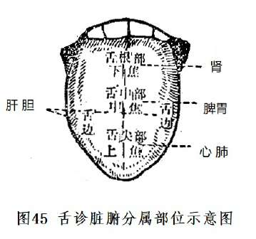

（一）舌苔

舌苔是胃气所生。常人仅有一层薄白苔，干湿适中。察苔，主要是察苔色、苔质两方面。

1、苔色

苔色主要有四种：白、黄、灰、黑。苔色的变化，主要反映病邪深浅（表、里）及病邪性质（指寒、热）。在外感疾病中，苔色由白而黄，而灰而黑，又是病邪由表及里，逐渐深入的反映。

（1）白苔多主表证、寒证。薄白苔本为正常舌苔，但在感受外邪时，则表现邪犹在表，尚未传里。舌质淡而苔白，为里寒证。若舌上白苔满布，如白粉堆积，抚之不燥，为积粉苔，常见于瘟疫，为外感秽浊之气，毒热内盛所致。亦见于内痈。

（2）黄苔主里证、热证。一般来说，黄色之深浅，表示热邪之轻重，焦黄则热结。舌苔由白转黄，为外邪由表入里化热。由于黄苔主里、主热，因此黄苔又常与红、绛舌质主热并见。苔黄滑润兼见舌淡胖嫩者，多为阳虚水湿不化。苔黄滑腻，为内有湿热。

（3）灰苔主里证，见于里热证或寒湿证。灰色即浅黑色，灰苔和黑苔常同时并见，也可与黄苔并见。灰苔滑润，为寒邪内阻，或痰饮内停。灰苔干燥多为热盛津伤，或阴虚火旺。

（4）黑苔主里证，主热极或寒盛。黑苔多由灰苔或焦黄苔发展而来，常见于疾病的严重阶段。黑苔燥裂，甚则苔生芒刺，多为热极津枯。黑苔滑润，多为阳虚寒盛。

2、苔质

苔质是指舌苔的厚薄、润燥，腐腻、剥脱、有根无根。

（1）厚薄反映病邪轻重及病情进退。薄苔多为疾病初起，病邪在表，病情较轻；厚苔多为病邪在里，病情较重，或内有食饮痰湿积滞。舌苔由薄转厚，表示病邪由表入里，病情由轻转重，为病进；舌苔由厚转薄，是邪气由里出表，病情由重转轻，为病退。

（2）润燥正常舌苔是滋润的，为津液正常上承之象。舌苔的润燥，反映津液的盈亏。苔燥，甚则粗糙起刺，为津液亏耗，或阳虚不能化津上承；舌苔滑湿，多为水湿内停。

（3）腐腻腐是苔如腐渣，揩之即去，是胃中浊腐之气上升；腻是粘腻，舌面多有盖一层粘液，腻苔剥之不去，是阴邪阻遏阳气，多为痰饮湿浊食积。

（4）剥脱指舌苔消失。若舌苔突然退去而不再复生，舌面光洁如镜，即为光剥舌，又称“镜面舌”，系胃之气阴大伤所致。若舌苔局部脱落，剥脱处光滑无苔，称为花剥舌，也属胃之气阴两伤之征。若花剥舌而有腻苔，为痰浊不化，正气已伤。舌心无苔是阴虚、血虚或胃气已伤所致。总之，舌苔无论全部或局部剥脱，都是正气损伤之候。

（5）有根无根有根是指舌苔刮之不去，舌苔与舌体如同一体，称为有根苔，又叫真苔。无根是指舌苔如同涂于舌上，刮之即去，称为无根苔，又称假苔。舌苔有根表示有胃气，主实证、热证；无根表示胃气已衰，主虚证、寒证。

总之，舌苔厚薄，辨邪气深浅；润燥，辨津液存亡；腐腻，辨脾胃湿浊；舌苔有无，辨胃气盛衰；舌苔真假，辨胃气有无、病证虚实。

（二）舌质

察舌质（即舌体)，包括察舌质颜色和舌体形态。正常舌质呈淡红色而润泽，舌体柔软灵活。

1、颜色

疾病时舌质颜色的异常改变常见有淡白舌、红舌、绛舌、紫舌等，其主病意义简述如下：

（1）淡白舌舌色较正常浅淡，为阳虚、气血不足，不能温养于舌所致，见于阳虚寒证及血虚病证。

（2）红色舌色深于正常，因热盛而气血充溢所致，见于里实热证，也见于阴虚内热证。

（3）绛舌舌色深红，见于温病热入营血阶段；内伤杂病，则见于久病、重病之阴虚火旺。

（4）紫舌舌色暗红呈紫色。绛紫而干，为邪热亢盛，阴津耗伤，气血郁滞之征。淡紫或青紫而湿润，为阴寒内盛，血脉瘀滞。舌上有紫色斑点，称为瘀斑、瘀点，多为血瘀之证。

2、形态

观察舌体形态，主要是观察舌体胖瘦老嫩，有无裂纹齿痕，以及舌体运动状态等。舌体润泽为荣，是津液充盛；舌体干瘪为枯，是津液不足。舌体纹理细腻，浮胖娇嫩为嫩，多主虚证、寒证。舌体运动状态，主要有强硬、痿软、颤动、吐弄、歪斜、短缩等。

（1）胖大舌舌体胖大。舌体胖大而嫩，舌质色淡，为多属脾肾阳虚，水湿不化；舌体胖大，肿胀满口，舌质色红，多属心脾热盛，气血壅滞。舌体胖大青紫，多见于中毒。

（2）瘦薄舌舌体瘦瘪，是阴血不足，不能充养舌体，瘦薄色淡，为气血两虚；瘦薄而干，舌质红绛，为阴虚火旺，或津液耗伤。

（3）裂纹舌舌上可见有明显裂纹，多为津血亏损，舌体失于滋润（个别常人亦可见有裂纹舌）。舌质红绛而有裂纹，多为热盛津伤；舌质淡白而有裂纹，则为血虚。

（4）齿痕舌体边侧，印有牙齿痕迹，多因舌体胖大被牙齿压迫所致。所以，齿痕舌常与胖大舌并见，多属脾虚。若兼见舌质淡白湿润，为脾虚寒湿壅盛。

（5）舌强是舌体强硬，不能屈伸转动。见于温病，为热入心包，痰浊内阻，或壮热伤阴；见于内伤杂病，则多为中风征兆。

（6）舌痿舌体痿弱无力，多属气血津液大亏，筋脉失养。久病舌淡而痿，是气血两亏；舌绛而痿，是阴津亏极。新病舌质干红而痿，为热盛伤阴。

（7）舌颤是舌体颤动，不由自主。久病舌颤，为气血两虚，或肝风内动。外感热病，多为热极生风。

（8）吐舌弄舌舌伸长，吐出口外，为吐舌。舌时而伸出口外，立即收回，如此反复，或舌舔口唇，为弄舌。两者均属心脾有热。吐舌可见于疫毒攻心，或正气已绝。弄舌，多为动风先兆，或小儿脾燥。

（9）歪舌舌体向一侧偏斜。多为中风，或中风先兆。

（10）缩舌舌体收缩，不能伸展。舌体缩短，多为重危病候。舌淡湿润而缩，多为寒凝筋脉。舌质红干短缩，为热病伤津。舌胖而短缩，是痰湿内阻。凡舌体短缩强硬，均属危候。

临床上，舌苔、舌质、舌体的异常变化，常相兼出现，所以应综合分析。舌诊是中医诊法中十分重要之一法，从舌诊上，基本反映了脏腑气血盛衰、病位深浅、病邪性质（寒热、虚实）及病情进退等几个方面。察舌时还应注意光线及食物药物对舌苔颜色的影响。另外，用口呼吸者，舌苔也燥，应当注意。

#### 五、望形体姿态

望形体姿态，是观察病人形体方面的变化，如壮弱、胖瘦及畸形等，以及姿态活动异常，如安静与躁动、肢体驰缓与拘挛抽搐等，这些对某些疾病的诊断有其特殊意义。

（一）形体

一般来说，形体的强弱与脏腑气血盛衰是一致的。脏腑气血充盛，则形体即健壮；反之则形体衰弱。

形体肥胖，肤白无华，是形盛气虚，多为阳气不足之证。骨细胸小，面黄肤燥，多为阴血不足。有所谓“肥人多痰，瘦人多火”，即指肥人多为阳虚湿盛，瘦人多阴虚火旺。鸡胸龟背，则为先天不足。又如腰不能转动，多为肾病；膝不能屈伸，为筋病。中医学认为，形体为元气所充。正常形体应是“形气相得”，即形与气平衡协调。无论是形盛于气，还是气盛于形，都是不符合“形气相得”的原则，因而都不是健壮的形体。至于“形气相失”，那更是有病难治。

（二）姿态

望姿态，主要是观察病人的动作姿势和体位有无异常变化。

病人异常的动作姿势和体位，往往是某些疾病的反映。如阳主动，火主动，因此，躁动、多言、仰面伸足、不欲衣被的病人多为阳证、热证；而安卧不语（或踡缩喜卧）者，多属阴证、寒证。若不能安卧，端坐呼吸、张口抬肩，多为痰浊壅肺；指趾颤动，常为动风发痉先兆；手足痿软无力，多属痿证；一侧肢体、手足麻木不遂，常为中风偏瘫；项背强直，角弓反张，四肢抽搐，则为痉病。因此，观察病人的姿势体位，对某些疾病的诊断确有一定意义。

#### 六、望排泄物

望排泄物，就是观察病人的痰，二便、呕吐物及妇女经、带等的色、质、量方面的变化，及其在辨证中的意义。

（一）痰

白痰清稀，多为寒证，其中量多易咯，为湿痰；白痰及黄痰粘稠，为热证，其中量少难咯，为燥痰。咳黄痰，在外感疾病中，常表示热在气分。咯吐腥臭脓血，常为肺痈证。痰中带血，或咯出鲜血，多为热伤肺络。剧咳而伤及肺络，也可见痰中带血。

（二）呕吐物

呕吐涎沫，为寒证。呕吐食物无酸臭味者，为胃寒；有腐败酸臭味者，多为胃热，或饮食伤胃（宿食）。呕吐黄水而苦，多属肝胆有热。吐血或鲜或暗，多为肝胆火盛犯胃，热伤胃络。观察呕吐物时，应区别服药后之呕吐物必带有药物之颜色。

（三）二便、经带

详见本章第三节问诊。

#### 七、望头、髮、五窍

（一）头与髮

头为诸阳经所会之处（直接或间接），脑为髓之海，肾生髓。髮为血之余，又为肾气所充养（肾其华在髮）。所以，头与诸阳经及肾的气化，以及血的关系密切。

1、头

在成人主要观察头是否有振摇的现象，头摇动不能自主，则为风证。在小儿则主要是观察囟门凸凹、大小、闭合的迟早。小儿囟门高凸（又称囟填），多为实证、热证，亦见于寒证。囟门下陷（又称囟陷），多为虚证，见于久病之后，或因泻痢，或因多尿，或先天元气不足，津液不足，其气下陷，不能上充于脑髓。小儿年龄增长而囟门不合或宽大者（又称解颅），多为肾气不足。

2、髮

主要观察髮的枯润与颜色。头髮稀疏枯黄，或小儿头髮枯黄逆立，为精血不足。突然片状脱髮为血虚受风。青年脱髮，或为肾虚，或为血热。青年白髮，无其他病候，为禀赋所致。

（二）五窍

1、耳

耳为肾之窍，并属少阳经，为宗筋所聚之处。常人的耳廓色呈红润。耳廓干枯焦黑，是肾精衰竭。耳根凉，耳背有红络，多为麻疹先兆。耳流脓水，多为肝胆湿热。

2、鼻

鼻为肺窍，阳明胃经所过之处，为呼吸通道。望鼻，主要是望鼻外形和鼻分泌物。鼻流清涕，多为外感风寒；鼻流浊涕，多为外感风热；鼻流浊涕日久不止，而有腥臭味者，是为鼻渊，多因外邪化热，或胆经郁热；鼻头红赤，年久不愈，为酒糟鼻，多属肺胃蕴热；鼻翼煽动，伴有高热者，多为外感之肺热壅盛，亦见于肺肾精气衰竭而出现之喘息。

3、口

主要观察唇、齿、咽喉。口为脾之窍，唇为脾之华，脾胃相表里。所以口唇主要反映脾胃病变。口唇淡白为血虚；青紫为痛为寒、为血瘀；深红为热在营血；深红干焦，为热盛伤津；口角流涎，多为脾虚湿盛，或胃热、虫积；口唇糜烂，是脾胃积热；口歪为中风；撮口抽搐，为肝风内动，或脾虚生风；人中满，唇翻，是脾阳绝；人中短缩，是脾阴绝。

4、齿、龈

齿为骨之余，肾主骨，胃经行于齿龈中，所以齿与龈的改变可以反映出肾与胃的改变。齿燥为胃热伤津；牙齿松动、齿根外露，多为肾虚，或虚火上炎；睡中咬牙或齘齿，常见于胃热，或虫积；牙龈红肿，或红肿出血，是胃火；牙龈出血而不见红肿，为气虚，或虚火伤络。

5、咽喉

咽喉为肺胃道路，且诸经所系，但主要反映肺胃肾三经之病。咽喉红肿而暗，为肺胃积热；红肿溃烂，上有红白腐点，为肺胃热毒；淡红不肿，经久不愈，为虚火上炎；鲜红略暗，为阴虚火旺；咽喉间出现白膜，刮之可去，而不立即复生的，是胃热；若刮之不去，重刮出血，随即复生，多为白喉。

6、目

详见本章第一节望目。

#### 八、望皮肤

望皮肤，主要是观察皮肤颜色及形态变化。如全身皮肤发黄，为黄疸；肢体、颜面、或全身浮肿，为水肿等。本节重点介绍斑疹、白㾦、痈疽疔疖所引起的皮肤颜色和形态改变。

（一）斑疹

斑疹是某些病证在皮表的反映。常见于外感热病，少数亦见于内伤杂病。斑，为成片，或红或紫，平布于皮里，摸之不碍手。疹，呈红点，小如粟粒，高出皮肤，摸之碍手（少数并不高出皮肤，摸之也不碍手）。斑疹见于外感病，多是邪热郁于肺胃，内迫营血而致。斑疹的色泽，以红活润泽为顺。深红如鸡冠色，多为热毒炽盛；紫暗为热毒伤阴；淡红或淡紫，为气血不足，阳气式微。斑疹形态，以分布均匀，疏密适中为顺。稀疏松浮，为病邪轻浅；稠密紧束，压之色不退，为热毒深重；疹点疏密不匀，或见而即失，多为正气不足，邪气内陷之重证。

内伤杂病见斑疹，一般多为血热；若斑色紫暗，斑片较大，时有时无，多为气虚不能摄血，血不循经之瘀血。

（二）白㾦

白㾦是一种大如栗粒，高出皮肤，透明的小泡疹。多出现于颈项及胸部，偶见于四肢，惟不见于面部。多因湿郁肌表，汗出不彻所致。其中，晶莹饱满者为顺；枯白无泽，浆水不饱满者为逆。顺者，为湿邪外达；逆者，为津液枯竭。

（三）痈疽疔疖

痈疽疔疖，属于外科病证。痈：范围较大，红肿热痛，根盘明显者为痈，属阳证。疽：漫肿无头，部位较深，常不高出皮肤，局部肤色不变者为疽，属阴证。疔：发病范围小，初起如粟粒大小，根脚坚硬，或麻或木或痒，顶部白色而痛者为疔。疖：发于浅表，形圆，红肿热痛，化脓即软，为疖。

#### 九、望小儿指纹

望指纹，是指观察浮现于食指掌侧的脉络，是手太阴肺经分支循行部位。和诊寸口脉有相似的临床意义。适于三岁以下小儿。

指纹分风、气、命（又称寅、卯、辰）三关。食指第一节为风关，第二节为气关，第三节为命关。（图46）

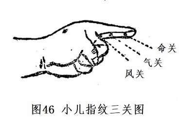

（一）望指纹方法

医生用左手食、拇指捏住小儿食指末端，以右手拇指在小儿食指掌侧，从指端向根部推几次，用力要适中，使指纹更为显现，便于观察。

（二）指纹主病

1、颜色

小儿正常指纹，色呈浅红，只见于风关之内，隐隐可见，但不浮露。鲜红者，主外感风寒；色紫红为内热；色紫黑者，病多危重。色淡为虚；色暗推之滞而不散者，为实证。色青主惊风疼痛。

2、延伸部位

正常指纹止于风关。疾病时指纹未出风关者，病势轻浅；指纹透至气关者，为病势深入，病情加重；指纹达于命关者，病势深重；指纹延伸至指甲端者，称透关射甲，病情多危笃难治。

3、浮沉

浮，指指纹浮露外现明显，主病在表；沉，指指纹深藏但可见，主病在里。

小儿指纹诊法在临床应用时，应四诊合参，不可单据此法。

### 第二节闻诊

闻诊，包括听声音，嗅气味。听声音主要是听病人语言有无伦次，及语言、气息声音的高低、强弱等，以及呃逆、嗳气声。嗅气味，是嗅病人口气、嗳气及排出物气味。

#### 一、听声音

（一）语言

1、声音强弱

病人语言声音有力，多为热证、实证，而正气不衰；声音低微无力，多为寒证、虚证。言语发声困难，或发不出声音，为音哑或失音。音哑或失音，有外感内伤和虚实之分。外感多见于外感风寒、风热之证，病多属实、属热；内伤疾病则多见于肺肾阴虚，津液不能上承所致，为病多日久不愈，病属虚证。

2、语言有无伦次

心主神，语言为神志活动表现形式，因此语言为心所主。语言的正常与否，反映了神志——心的功能正常与否。病人语言不乱，同于常人，说明神志正常，心气未伤，预后多良。否则，神志不清，语无伦次，语声有力，为谵语，多见于热证，热扰心神，属实证；神志不清，语言重复，时断时续，语声低微无力，是“郑声”，为邪伤心气，心不藏神之虚证。另外，语无伦次，还见于癫证或狂证，临床上不难区别。

（二）气息

1、气息强弱

气息即指病人之呼吸。气息微弱，是病人呼吸微弱无力，又称气微、息微，多见于虚证；气息有力，是呼吸气粗有力，多见于实证、热证。

2、喘哮

喘是病人呼吸困难，张口抬肩，不能平卧。气息声粗者属实证，气息声微者属虚。哮是病人呼吸困难而喉间有哮鸣声（水鸡声），多见于痰饮壅肺之证。临床上常常哮喘并见，如痰饮壅肺，阻塞气道，肺气不畅，必致病人呼吸迫促，张口抬肩而为喘，同时兼见喉间有水鸡声，而为哮，因此哮喘并见。

3、短气

短气是气息短，或气短而次数增加，常有气息不能接续之感，故又称少气，多见于虚证。

4、叹息

叹息又称“太息”，即“出长气”，多见于情志抑郁，肝气不疏之证。

哮喘虽发于肺，但其病源却可能在肺，也可能在心、肝、脾、肾四脏。如脾肾阳虚，不能温化水湿，水湿上犯于肺，即可发为哮喘。又肺主气，肾纳气，肾虚不能纳气，则气逆而上，也能气逆作喘。所以，《素问•经脉别论》有“喘出于肾”、“喘出肝”、“喘出于肺”之论。

短气，也不独为肺病，心虚、脾虚、肾虚皆可出现短气。因此，临证时当溯本求源，标本分明。

（三）咳嗽

咳嗽在闻诊方面主要包括咳嗽声音的强（有力）和弱（无力）、有无特殊咳声、咳声的连续程度，及问诊方面的有痰无痰、痰多痰少、咳痰难易、痰质稀稠、痰的颜色和有无带血等情况。

咳声有力属实，咳声低微无力属虚。小儿见咳嗽呈阵发而连续，咳嗽时气急满面涨红，咳嗽终止时的吸气声鹭鸶叫，为顿咳（百日咳）。小儿咳声如犬吠，应注意是否为白喉。干咳无痰，或痰少、粘稠不易咯出，为肺热肺燥，津液不足。痰多、清稀、色白，多为寒湿水饮伤肺。痰黄为肺热。痰中带血多为热伤肺络，或咳伤肺络，亦见于气虚不能摄血等。

咳嗽一症，也当如哮喘一样，当辨其病源在何脏，不能只局限于肺。

（四）呃逆、嗳气

呃逆、嗳气均为胃气上逆所致，但所主病证不同。呃逆，《内经》称“哕”，后世医家有称“呃逆”等。一般呃逆无何意义，但久病重病，处于衰竭状态的病人，若见呃逆，多为病情危笃难愈之征。嗳气，又称噫气，见于饭后，又无特殊气味者，不属病态。病态之嗳气，多见于饭后一段时间之后。若嗳出酸败之气味者，多为宿食伤及脾胃；若嗳气无特殊气味者，多为肝胃不和，或胃虚气逆。

#### 二、嗅气味

口气臭秽，多见于胃热，宿食，或龋齿、口腔不洁。

各种排出物气味。大便臭秽，多见于热证，或宿食不化。咳吐脓痰腥臭者，为肺痈。带下臭秽者，为热证；带下腥味者，为寒证。鼻出恶臭之气为鼻渊，腋出臭气为腋臭（又称狐臭）。

### 第三节问诊

问诊，就是询问病情，询问与病情有关的情况的诊察方法。问诊在诊法中占有极为重要的地位。诸如病人体质、禀赋、发病时间、发病原因、发病经过，及既往曾经患何病（既往病史），起居环境、五味偏嗜等与疾病有关的情况，只能通过问诊才能了解。这些有关病情资料也是其它诊法（望、闻、切）所难以获得的。因此，历代医家都把问诊放在第一位。《内经》就很重视问诊，并批评一些医生不进行问诊，只靠脉诊看病，故弄玄虚，是医生四大过失之一。如《素问•征四失论》说：“诊病不问其始，忧患饮食之失节，起居之过度，或伤于毒，不先言此，卒持寸口，何病能中，妄言作名，为粗所穷，此治之四失也”。明•张景岳很重视问诊在临证中的地位，他把问诊内容概括为“十问”，并指出：“十问者，乃诊治之要领，临证之首务也。明此十问则六变具存而万病形情俱在吾目中矣”（《景岳全书•传忠录》）。明•李中梓则指明应“先问后诊"（《诊家正眼•先问明然后诊脉》），清•陈修园强调“问证是医家第一要事”（《医学实在易•问证》）。因此，任何只重脉诊，以脉定病的做法都是片面的。

问诊，应首先询问病人最感痛苦的症状，即主要病痛。有时病人罗列一大堆病痛，自己分不清哪一病痛突出。此时，医生应结合已掌握的病情资料，对比分析，然后找出病人主要症状，再围绕与这一主症相关的脏腑、经络、气血津液等方面进行有目的询问，方能在纷乱的病症中，不被困扰。

在完成围绕主症的问诊之后，再以比较重要的症状为基础，进行询问。这样，还可发现不被病人重视、但可能是病人关键性的证候。就是说，既要抓住重点，又要了解一般。不抓住重点，就抓不住疾病的辨证关键，会造成辨证时无所适从；不了解一般，又会遗漏病情。

问诊的对象是患者本人或其陪诊者，医生问诊时要注意提醒患者围绕主证回答，患者有时在回答医生问话时，漫无边际，这时医生应抓住辨证要点、用通俗的语言询问，即围绕与本病有关的主要方面询问，以免患者“离题”太远。

由于疾病多种多样，病情千变万化，同时，疾病又有内、外、妇、儿、骨伤等不同，所以，问诊内容涉及范围十分广泛，而且每一科有每一科问诊的特点，每一证候又有自己的问诊重点，因此，问诊的内容难以用文字来全面概括。本节介绍的问诊内容是依据明•张景岳“十问歌”为基础，编写而成，做为临证问诊的纲领，临证时应结合各科及病证特点灵活运用。

#### 一、问一般情况

（一）问姓名、性别、年龄、民族、籍贯、婚姻、职业等

性别。有些疾病只见于或多见于女性，有些疾病则只见于或多见于男性。由于男女生理上的差异，经、带、胎、产诸证只见于女性；情志方面疾病，多见于女性。遗精、阳痿等病只见于男性；肾虚证、肝阳（火）上亢等证则多见于男性。所以，男女性别不同，发病病种有异。

年龄。有些疾病具有年龄特点，某些只见于或多见于小儿，而不见或少见于成年人。

职业。职业和工作环境的不同，对疾病发生有一定影响。职业和疾病的关系，除有职业病外，由于职业不同，带来了工作环境上的不同，对人体产生不同的影响。如渔民、矿工等，长期在潮湿环境工作，易感受寒湿邪气。另外，体力劳动者和脑力劳动者，在体质上有一定差异，而患病之后病证虚实趋向也有一定差别。如体力劳动者，其病多实；脑力劳动者，其病多虚。又如某些难产多见于静坐性（脑力）工作者，而少见于体力劳动者。中医认为体力劳动者，气血多流畅；静坐性工作者，气血易郁滞。所以二者在难产发生率上有区别。

其他，如籍贯、生活习惯等都与某些疾病发生有一定关系。《素问•异法方宜论》指出：“东方之域”，“鱼盐之地，海滨傍水，其民食鱼而嗜咸"，“鱼者使人热中，盐者胜血”，“其病皆为痈疡”；“西方者，金玉之域，沙石之处”，“其民华食而脂肥，故邪不能伤其形体，其病生于内”；“北方者”，“其民乐野处而乳食，脏寒生满病”；“南方者”，“其地下，水土弱，雾露之所聚也，其民嗜酸而食胕”，“其病挛痹”；“中央者，其地平以湿”，“其民食杂而不劳，故其病多痿厥寒热”。这里讲的就是居住地的地理气候条件不同，饮食生活习惯不同，对疾病的发生所产生的影响。

所以，对一般情况的问诊也不应忽视。

（二）问个人生活习惯和生活状况

个人的起居习惯，饮食偏嗜，学习、工作、家庭环境的逆顺，对某些疾病有直接影响。如平素喜暖怕冷者，多为阴气偏盛体质，其病则易于偏虚偏寒；平素喜凉怕热，多为阳盛体质，其病则易于偏实、偏热。素喜酒茶者，病多痰湿。平素体弱，气血不充，病多属虚；素体壮盛，气血充实，病多属实。某些疾病，如情志疾病，即与生活环境的不良影响，心情苦闷有关。明•李梴《医学入门》说：“当问所处顺否，所处顺则性情和而气血易调；所处逆，则气血怫郁”。这些都是问诊时应注意的内容。

（三）问过去病史

病人过去所患疾病，往往与当前病证有因果关系，或属旧病复发。因此，对当前疾病的诊断极有参考意义。

（四）问起病时间、状况与就医情况（现病史）

问起病时间与当时发病情况，是指目前疾病。因为病人不可能患病后马上就医，同时也不可能始终就诊于一位医生，所以应问起病时病情，了解起病时间。病程较长者，即久病，多虚；病程短者，即新病，多实。同时可以了解判断病情演变趋势及病证全过程，病情由轻而重，还是由重而轻；病证始终居守一脏一经，还是及于他脏他经；温病由卫入气，还是由营转气等。

通过问现病史，还可以了解病人就医情况。如曾诊断为何证，用何药治疗，效果如何，这些情况对目前的辨证施治有借鉴之义。因为有些疑难病证，很难一次确诊，如果了解前医辨证施治情况，即可借鉴而少走弯路。

#### 二、问现在病情

现在病情，是问诊的重要内容，也是辨证的主要依据之一。现据后人修订的张介宾“十问”歌所述及的内容为主，分述如下：

##### （一）问寒热

寒、热是疾病主要证候之一，大多数疾病均有寒热表现，因此是问诊的重要内容。寒、热为阴阳盛衰的表现。如《素问•阴阳应象大论》说：“阳胜则热，阴盛则寒”。寒、包括身寒、手足逆冷，及病人自觉怕冷即恶风恶寒；热、包括身热、手足心热（五心烦热）及病人自觉发热、怕热即恶热。寒、热在临床上可表现为“但寒不热”、“但热不寒”及寒热并见等。同时，寒、热又有内外真假之分（见“八纲辨证”）、以及内伤外感之别。

1、但寒不热

但寒不热，指病人只出现身寒，恶风恶寒之证，而无发热恶寒现象，多为阳虚阴盛的虚寒证，证属内伤，或外感伤寒寒邪直中三阴。这一类病证的恶寒，可因增加衣被而略有缓解。另外，温病汗出之后，而见身凉，脉静（平和）者，为邪气已去，病证向愈之象。无论伤寒、温病，大汗出之后，见身凉，手足凉，脉微细欲绝者，为阳气竭绝，病情危笃之象，多属不救。

2、但热不寒

但热不寒，是指病人身热恶热而不恶寒；自觉发热；或只见五心烦热等。发热原因很多，总可分为外感与内伤两大类。外感发热，一般发病急，热势高，且初起多见发热恶寒之表证，在表邪入里后，即表现为但热不寒；内伤发热，一般发病缓慢，热势不高，且初起无发热恶寒兼见之表证存在。

壮热：即大热、盛热，手按病人肌肤而有烫手的感觉，且久按热感不减，多兼见口渴面赤气粗等称为壮热。外感病壮热，见于伤寒为风寒之邪入里化热，如阳明经证和腑证；见于温病为热邪内传气分、血分等，如风温，热邪犯肺；湿温、暑温邪在气分；及温病热入营血。内伤壮热，见于宿食所伤，为夜间热甚。壮热之症为里热实证，为正盛邪实，邪正剧争的表现。

潮热：是发热之微甚作止均有定时，有如潮水之来，一日一发，多发于午后。若日发二次以上者，即非潮热。潮热有外感内伤之分，虚实之别。外感为实，内伤多虚。外感：伤寒阳明腑实证，为日晡潮热，兼见腹满痛拒按，大便燥结，手足汗出，舌苔黄燥等燥热内结之证；温病热入营血发热夜甚及温病后期余邪伏于阴分之夜热早凉。温病湿温证，为午后潮热（午后热甚），但身热不扬，初按肌肤不觉甚热，久按则灼手，是热为湿邪阻遏，难以透达于外所致，多兼见胸闷呃恶，身重便溏，苔腻以及暑热伤气等。内伤潮热，多见于气虚、阴虚、虚损证（肝、肺、肾阴虚等）、血虚、血瘀，气郁等。内伤潮热，有时有热自骨发之感（骨蒸潮热）。内伤以阴虚，气虚为多见。阴虚者多伴有五心烦热、盗汗、颧赤、舌红少津等；气虚者如脾胃气虚下陷的发热，肾气虚不能引火归元的发热，则潮热见于清晨，伴有自汗，或动则汗出，少气，乏力，面色㿠白等症状，且遇劳则甚。清•张石顽等还指出内伤之痰饮、宿食皆可出现潮热症状。内伤潮热，病势缓，热势不甚而病程长。

发热一症，在外感则多为热高而病程短；在内伤则多为热势不高而病程长，即长期发热，且时发时止。内伤之长期发热多见于前述之阴虚潮热和气虚发热。

五心发热：指手足心及心胸中烦热。见于阴虚劳损者，五心烦热，午后热甚，多伴有盗汗，口咽干燥等；见于血虚者，午后热甚，劳则尤重，多伴有神疲乏力，心悸等；见于温热病失治，余热未清而伏于阴分者，兼见夜热早凉，热退无汗，能食而瘦；见于火郁者，为气机不利，或寒邪束闭，而阳热郁伏所致。前者多兼见胸闷不舒，烦躁易怒，口苦等肝郁火热之症；后者见于外感寒邪，不难区别。火郁之五心烦热属实证。

3、恶寒发热

恶寒（恶风）发热是恶风寒与发热同时兼见。多见于外感，为外感表证的特点，是表阳与外邪相争的反映。仅就恶寒来说，内伤之恶寒，病势缓而长，得暖则减，且不兼见全身发热（不包括真寒假热）；外感之恶寒，病势急，病程短，得暖不减，重者多伴有寒战，恶寒之后旋即发热。外感病包括伤寒与温病，二者初起均有恶寒发热之表证。但伤寒表证之恶寒，时间长，恶寒也重，且多无汗；温病系外感温热之邪，其表证恶寒轻而短暂，旋即发热不恶寒而恶热，且伴有不同程度的口渴自汗等症状。伤寒厥阴病的寒热胜负，是邪正斗争孰胜孰负的反映。寒多热少为正负邪胜，为病进；热多寒少为正胜邪负，为病退。总之，恶寒发热是外感表证的根据。若内伤病而见发热恶寒，则或为内伤兼外感，或为阴胜格阳于外而发热，即真寒假热。

4、寒热往来

寒热往来是恶寒与发热交替而作，即寒去则热来，热去则寒至，作无定时。为邪在半表半里之征，为邪正相争于半表半里，邪正相持，邪不能入里，正也不能抗邪外出的病理反映。寒热往来见于伤寒邪在少阳；温病邪在少阴，或邪伏膜原，如伏暑、暑温、湿温、温疫。疟疾也有寒热往来，但休作有时，一日一发，或二、三日一发。

##### （二）问汗

问汗是问病人有汗无汗，以及汗出时间、汗出多少、汗出部位，及汗出时伴有的症状等。汗为阴血津液所化。汗出机理有二：一者因为阳热之气有向上、向外的特性，所以，在阳热亢盛时，即可蒸化阴津外越而为汗，即阴随阳走；一者因卫阳不足，卫外不固，而使阴津外越而为汗，或阴虚不能敛阳，或阴盛格阳，阳气外越，津随阳去为汗。

人在炎暑之际，皮腠疏松，同时由于阳热亢盛外发；或劳作，阳气受到扰动而外发，均能迫津外泄而汗出；人在寒凉之时，皮腠固闭，阳气内藏，因而无汗，或少汗，均属正常生理状态。

但在疾病过程中，有汗无汗都是两种不同的病变机制的反映。在外感伤寒病中，有汗为表虚（中风），或为正气祛邪外出之象；无汗为表实（伤寒）。在温病无汗为温病初起，邪闭卫阳之表实证；温病邪入营血而无汗，是热灼营血，津液不足，不能作汗。温病有汗，又有大汗、脱汗、战汗等。在内伤杂病，当汗而无汗，见于内燥伤阴，阴津不足之证；有汗，又有自汗（指醒时有汗）、盗汗等不同。内伤自汗，多为气虚、阳虚，肌表不固；盗汗多为阴虚内热。

1、自汗

自汗，是指不因劳动、天热、厚衣等因素而经常汗自出，称为自汗。原则上自汗应包括盗汗、大汗、战汗、头汗、手足汗、半身汗等内伤或外感所引起的汗自出在内。就是说，自汗包括的范围比较广泛，凡不因劳动、天热、厚衣、热饮食而引起的汗自出，均属自汗。但由于盗汗、大汗、战汗、头汗、手足汗、半身汗，各有其特殊的病证涵义，所以临床上一般多单称，而不混称为自汗。临床上习称之自汗，多指全身性、汗量不多者而言。这里所要讲的自汗，即属于这一方面。自汗在外感则见于伤寒病之中风；温病之风温（热）壅肺、暑伤津气、温热郁遏等。自汗在内伤则多见于气虚、阳虚之证，为卫阳不固，阴津不能内守而外达。气虚自汗，自汗常作，动则益甚，多兼见少气懒言、面色无华、怠惰嗜卧等症状。阳虚自汗，多兼见形寒肢冷、腹胀纳呆、便溏，或完谷不化、面色青白等寒象，阳虚自汗，又称为冷汗，多为脾肾阳衰。

2、盗汗

盗汗，又称“寝汗”，即睡而汗出，醒来即止。盗汗多属阴虚，阴虚则阳亢，阳亢则化热逼津外出而为汗。临床上多见于心肾阴虚之证。（详见脏腑辨证)。

3、大汗

大汗，即大量汗出，多见于外感，并兼见壮热、大渴等症。如伤寒之阳明经证及温病热邪入于气分。以及外感内伤之大汗出不止，最后导致亡阴亡阳之脱汗，又称绝汗，常表现为大汗淋漓、汗出如珠，或汗出如油等，为阴阳离决之危证，多属难救。

4、战汗

战汗，是战慄之后而汗出。战汗，一般只见于外感伤寒与温病之中。为邪正剧争，病变发展趋势的转折点。战汗之后，身凉脉静，诸证悉除，为正气胜邪，邪随汗出，病即先愈；若战汗之后身寒肢厥，脉微欲绝，神志不清，为正不胜邪、阳气已脱之危重证，亦有战汗之后，身热不除脉仍盛大有力，为正气尚盛，仍可再汗而解。

5、头汗

头汗，系指汗出仅限于头面部，而他处无汗。头汗一见于温病湿热郁蒸于上；一见于大病之后，或老年人气喘而头额汗出，多为气虚气不上奉于头，津液不固而汗出头面。若重病期间，突然头汗大出，多为虚阳上越欲脱之危象。

6、半身汗出

半身汗出，是汗出或身之左侧或身之右侧，或上半身或下半身。半身汗出，无论外感内伤均可出现。其病因，或气血亏虚，或痰湿痹阻经络，或营卫不调，导致半身腠理开合失司而为汗出或偏于左、右，或偏于上、下。壮年、老年之人汗出偏左或偏右，应防中风。

7、手足心汗

手足心汗，汗出少量者，或青少年汗足，无其他伴有症状者，不属病态；但若手足心汗过多，并伴有某些全身症状者，即属病态。临床上手足心汗常见于脾胃湿热、脾胃气虚、脾胃阴虚、心脾血亏等。

##### （三）问疼痛

疼痛是临床常见症状之一，多种病证均可出现疼痛。由于产生疼痛的病因、病机不同，因而疼痛的性质、发作的时间、持续的时间，以及疼痛部位等均有差别。无论是外感、内伤，跌打堕仆，无论是虚实、寒热，产生疼痛的病机均为脏腑、经络气机不利，即所谓“不通则痛”。

由于人体的各个部位总是与一定的脏腑经络相联系，所以分辨疼痛的部位，对于了解病变所在的脏腑经络就有一定的意义。

1、头痛

头痛古有真头痛、脑痛、首风、头风、脑风等名称。但真头痛、脑痛，又多指能致人于死命的重危病证，如《灵枢•厥病》说：“真头痛，头痛甚，脑尽痛，手足寒至节，死不治”。《中藏经》说：“病脑痛，其脉缓而大者，死”。脑为髓之海，十二经脉和奇经八脉又直接或间接地联系于头面。因此，人体脏腑经络、气血津液等病变，都可能反映于头，而引起头痛症状的发生。所以，头痛一症涉及的病因、病证也比较广泛，外感、内伤、跌仆打损所发生的各种虚实病变，都会导致气血闭阻郁滞，或气血亏虚，气虚则不能行血，血虚则不能载气，而使气机不畅，产生头痛。

外感头痛，以风寒、风热、风湿头痛为多见。风寒头痛，则或痛连项背，或有紧束感，恶寒发热，骨节痠痛，口不渴，舌苔薄白等；风热头痛，则头胀而痛，发热重，或微恶风寒，口干口渴，舌苔薄黄等；风湿头痛，头重而痛，首如裹，身热不扬，头昏胸闷，口粘苔腻等。

内伤头痛：以肝阳（火）头痛、气（阳）虚头痛、血虚（阴虚）头痛为多见。肝阳头痛，头晕头胀而痛，烦躁易怒，或口苦咽干耳鸣，或胁胀胁痛等；气虚头痛，头痛绵绵，气短乏力，自汗恶风恶寒，食少纳呆，或遇劳则剧；阳虚头痛，头痛绵绵，恶寒，遇冷则剧，肢冷便溏等；血瘀头痛，痛如针刺，痛而不移，舌质紫黯，或有瘀斑；血虚头痛，头痛隐隐，面色无华，口唇淡白，心悸健忘失眠等；阴虚头痛，头空而痛，头晕耳鸣，腰膝酸软，遗精带下，舌红等；痰浊头痛，头痛昏蒙而重，胸脘痞闷，呕吐痰涎，肢体困重等。

在外感，根据头痛部位不同，又有三阳头痛及厥阴头痛之分。太阳头痛，痛在脑后，连及项背；阳明头痛，痛在前额及眉棱骨；少阳头痛，痛在两侧；厥阴头痛，痛在巅顶（在内伤则十二经脉、奇经八脉皆可有头痛）。

一般新病头痛，多外感，久病头痛，多内伤；痛无休止多外感，时痛时止多内伤；剧烈头痛多外感，痛势绵绵多内伤。痛在上午多为气虚，痛在下午多为血虚；痛在白昼多为阳虚，痛在夜间多为阴虚。

又有偏头痛一症，古称偏头风，属头痛之一，但又和一般头痛有别。其头痛偏于一侧（左、右），痛久不愈，反复发作，主要见于肝阳、肝火、瘀血、痰饮等证。

2、胸痛

胸部属上焦，为心肺所居之处，所以胸痛常是上焦心肺病变的反映。临床上，胸痛往往又与胁痛、背痛并见，但以胸痛为主者，仍以胸痛而论。胸痛有时又称心痛，真心痛。

胸痛可见于心气虚、心阳虚、痰浊阻遏心阳、心血瘀阻、痰热壅肺、肺燥伤阴、痰浊阻肺、风寒袭肺、肺痈等病证。一般胸痛而伴有心悸息短、自汗、嗜卧懒言者，多为心气不足；胸痛并连及肩背，形寒肢冷，面色青白，自汗者，为心阳虚；发作时胸痛剧烈，有如针刺，冷汗淋漓，舌质暗红，或有瘀斑，为心血瘀阻；胸痛而咯吐腥臭脓血者，为肺痈；胸痛而咳吐粘稠黄痰或咳吐暗红血痰，为痰热壅肺；胸痛为隐隐作痛，伴有潮热盗汗，痰中带血，或痰少而粘，咽干咽痛，舌质红，为肺阴虚（多伴有肾阴虚）；胸痛痞闷，咳痰多而清稀，或痰多而粘稠，气短气喘，不能平卧，为痰浊阻肺；胸痛彻背而伴有心悸胸闷，或有喘息气短，呕吐痰涎，舌苔湿腻，为痰浊阻遏心阳；风寒袭肺，是外感风寒之邪，肺失宣畅，发为咳逆，多为咳痰清白而频，伴有发热恶寒等表证症状。风寒袭肺之咳嗽胸痛，表现为咳则胸痛，不咳不痛。若风寒袭肺，入里化热，则因肺热或痰热壅肺作咳而胸痛，前已述及。

外感内伤均可导致胸痛，而某些内伤胸痛正是外感之后而形成，即由外感转化为内伤，因此，外感内伤是既有区别，又有联系。

3、胁痛

胁为肝胆二经分布的部位。所以，胁痛，多与肝胆二经及其所属脏腑有关。如肝气不疏，肝火郁滞，肝胆湿热，血瘀气滞以及悬饮等病变，都可引起胁痛。

由于足太阴脾与肝经交会于期门穴，与胆经交会于日月穴；同时，脾之大络大包布于胸胁，所以脾脏、脾经病也可出现胁痛胁胀症状。

4、胃脘痛

胃脘痛是上腹部至心窝部疼痛，也称胃痛。胃脘痛，前人所称心腹痛、心痛、心下痛等，多包括胃脘痛在内。胃脘痛，常见于肝气

（火）犯胃所导致的气滞、血瘀、郁火作痛；脾胃虚寒作痛；饮食积滞作痛，或因外寒犯胃、饮食生冷所致胃寒作痛。临床上当从兼症予以辨别。

5、腹痛

腹痛是泛指脐部及脐以下腹部作痛。根据疼痛部位不同，又有当脐痛、脐腹痛，痛在脐下腹部称小腹痛，痛在小腹（脐下部）两侧称少腹痛。而脐以上疼痛，则称为大腹痛，大腹痛实包括胃脘痛在内。多种原因，如外感、内伤、饮食虫积等都可发生腹痛。同时，妇女的经带胎产疾患也可产生腹痛症状。腹痛多与胃肠、膀胱、肝胆病有关。可见于寒积肠胃、肠胃热结、肠胃湿热、肝胆湿热、寒滞肝脉、肠胃虚寒、水饮内停、膀胱湿热，以及宿食不化、虫积、气滞血瘀等证。

一般上腹痛多属脾胃与肝胆，脐腹痛多属于胃肠，小腹、少腹痛多病在大小肠、膀胱。走窜疼痛，痛无定处，病多为气；痛有定处，病多属血。痛而喜热，口不渴，多属寒；痛而喜凉口渴，多属热。痛而拒按属实，痛而喜按属虚；痛势急剧多实，痛势绵绵多虚。

6、腰痛

腰为肾之府，所以腰痛一症多与肾病有关，如肾气虚、肾阳虚、肾阴虚，均有腰痛产生。风寒湿邪闭阻经脉，可使经脉气血不畅而腰痛，属痹证范围，但有寒痹、热痹、湿痹等之分。腰部扭打跌仆而痛，多为瘀血腰痛。肾病腰痛多为内伤属虚；痹证腰痛及外伤腰痛多为实证。

7、四肢痛

四肢痛，即痛在关节、肌肉，多因风寒湿邪闭阻经脉，使气血瘀滞所致。也见于肝脾肾三脏气血虚衰而致关节肌肉痠痛乏力。因此，四肢关节肌肉痛也有虚实之分，即风寒湿为病多实，肝脾肾为病多虚。

##### （四）问饮食

问饮食主要包括有无口干口渴、饮水多少、凉饮热饮及食欲情况。饮食情况主要反映胃气盛衰，津液盈亏。

1、口渴与饮水

口干口渴，渴欲饮水，或欲冷饮，多为热盛伤阴，津液不足。口干口渴，渴欲热饮，饮而不多，或渴而不欲饮，若小便不利者，为水饮内停，不能化津上承；若小便自利者，多为温病热入营血，阴血蒸化上潮；故渴而不欲饮。身无大热，而大渴引饮，同时尿多者，为消渴。口不渴，为津液未伤，多见于寒证。

2、食欲

了解患者食欲状况，进食多少，对于判断胃气盛衰以及疾病的预后转归，有较重要的临床意义。

食欲减退或不欲食，胃纳呆滞，多是脾胃气化失常的表现。若食少见于久病，兼有面色萎黄、形瘦、倦怠等症者，属脾胃虚弱；而食少伴有胸闷、腹胀、肢体困重、舌苔厚腻者，则多是脾湿不运。

厌恶食物或恶闻食臭，即为厌食，又称“恶食”，多见于伤食。妇女怀孕，亦可有厌食的反应，多因妊娠后冲脉之气上逆，胃失和降所致。厌油腻厚味，多见于肝胆脾胃湿热的病证。

食欲过于旺盛，食后不久即感饥饿者，为消谷善饥，往往身体反见消瘦，这是胃火炽盛，腐熟太过所致。如《灵枢•师传》所说：“胃中热则消谷，令人悬心善饥”。

有饥饿感，但不想吃，或进食不多者，称为饥不欲食。多因胃阴不足，虚火上扰所致。易饥多食，但大便溏泻，消化不好，属胃强脾弱。

有嗜食生米、泥土等异物，尤多见于小儿，往往是虫积的征象。妇女妊娠偏嗜某种食物，一般不属病态。

疾病过程中，食量渐增，表示胃气渐复；食量渐减，常是脾胃气衰的表现。若久病之人，本不能食，但突然反而暴食，这是中焦脾胃之气将绝的征象，称为“除中”，也是“回光返照”的一种表现。

3、口味

指病人自觉口中气味异常与否。口苦口干，多为肝胆热盛；口甜为脾热；口中有酸腐气味，多为胃有宿食化热；口淡乏味，即食而不知味，多为脾虚不运，胃气虚衰；口中泛酸〈吞酸吐酸〉，多为肝火犯胃，或为宿食，或因胃寒（泛酸一症，寒热均有，不独为热）。

##### （五）问二便

1、大便

主要问大便形态、颜色、气味、有无脓血、便中是否带血、及血的颜色新旧、排便次数、便量多少、排便时感觉、有无大便失禁等。

大便干燥：正常大便成型而软，每日一次。大便干燥，排出困难，便次减少，甚至三、四日一便，称为便秘，多见于热盛伤阴，肠道津亏；久病、产后及老年人之便秘，多为气虚传送无力，或血虚、阴虚燥结，或气阴两虚；阳虚寒盛，阴寒固结于肠腑，滞而不行，称为冷秘；忧愁思虑，肝气郁滞，疏泄无力，遂使大肠传送失司而为便结，称气秘。总之，大便秘结有寒热虚实之分，不外热盛、寒盛、气虚、气滞、血虚、阴虚等。某些医家又以有热无热，将便秘分为阳结、阴结两类。便秘是有便而秘（闭），而无便之秘（闭），并伴有剧烈的腹胀、腹痛、呕吐等，属于“关格”范围，不属便秘。

大便稀溏：排出大便稀溏而不成型，或为水样，或夹杂未消化的水谷，便次增加，称泄泻。脾主运化水谷，胃主腐熟水谷，小肠主分清泌浊，大肠主传导糟粕。所以，大便泄泻不论是什么原因引起，最终总属脾胃、小肠、大肠的病变。泄泻清稀或稍稀，无特殊气味，腹痛肠鸣，素有怕冷，手足凉之症，为脾肾阳虚之寒泄（肾阳不足、命门火衰之五更泄，属脾肾阳虚证之内。）；若泄泻清稀、腹痛肠鸣而兼见寒热头痛，肢体痠痛等表证者，为外感风寒，或寒湿之邪，也属寒泄。腹痛即泻，泻出黄色稀便而臭秽，泻时肛门灼热，口渴饮冷，小便短赤，为肠胃湿热泄泻；若在盛夏感受暑湿邪气，则泄泻如水，烦渴尿赤，自汗，为暑湿泄泻。二者均属热泻。饮食所伤，腹胀腹痛，泻下稀便臭秽如腐败鸡蛋气味，泻后腹胀腹痛即减，为宿食泄泻。泄泻时作时止，完谷不化，饮食不思，食后痞满，面色萎黄，神疲乏力，为脾胃气虚泄泻。每于神情紧张或发怒即腹痛腹泻者，为肝气乘脾。

便脓血：便下呈稀糊样，或红或白，或红白相杂，并伴有腹痛、便频、里急后重等是痢疾。兼有发热恶寒，肛门灼热，小便短赤，口渴心烦，或呃𫫇胸闷者，为湿热痢；若下利白多赤少，清稀，腹痛隐隐，喜热喜按，口不渴者，为寒湿痢；一方一家相互传染，病情险急，利下鲜紫脓血，壮热口渴，头痛烦躁，甚则神昏谵语痉厥，是疫毒痢；或湿热痢，或疫毒痢而至饮食不入，恶心呕吐，是胃气已绝，毒气上冲，是噤口痢；下利时发时止，日久不愈，恶寒，倦怠嗜卧，脉虚无力，是休息痢。

痢疾：大抵身热者重，不能食者重，下利纯脓血无便者重、下利纯血者重。

便血：便下鲜血，或血色紫暗，或为黑便，称为便血。一般便下鲜血，而不与粪混杂者，无论在便前便后，多为大肠或肛门病出血。血色紫暗并与粪便混杂，或为黑便，多为胃、小肠血。又有血在便前而下为近血，血在便后而下为远血之说，临床当灵活掌握。便血鲜红，或先血后便，口苦苔黄，多为湿热下注大肠，伤及阴络；下血紫暗，或呈黑便，或先便后血，面色无华，气短懒言，倦怠乏力，为脾胃气虚不能摄血；便后鲜血滴滴，多为肛门病出血，如肛裂、痔疮等。

大便失禁：大便无力控制，或便而不觉称大便失禁，又称大便滑脱、滑泄。本症多见于久痢，或泄泻日久而气虚下陷诸证，以及各种原因的神志不清病人。

2、小便

主要询问小便的有无、次数、颜色、量之多少、清浊、小便时有无涩滞及尿痛等。小便为津液所化生。肺为水之上源，且有通调水道之作用；脾主运化水湿；肾主水液转输，并司二便；膀胱为贮藏尿液的器官，并其下口与尿道相连。所以，小便正常与否直接反映了肺、脾、肾、膀胱等脏腑气化盛衰。

尿量过多，其病在肾，多属虚寒，也常见于消渴证。小便短少，既可由于热盛津伤，或汗、吐、下太过损伤津液，以致化源不足所致；也常见于肺、脾、肾功能失常，气化不利，水湿内停的病证。小便不畅，点滴而出为癃；小便不通，点滴不出的为闭，一般统称为“癃闭”。癃闭因湿热下注，或瘀血、结石阻塞的，多属实证；若因肾阳不足，不能气化，或肾阴亏损，津液内虚的，多属虚证。

小便次数增多，为小便频数，短赤而急迫的，多属下焦湿热，量多而色清的，多属下焦虚寒，肾气不固，膀胱失约；尿频而涩少，常是阴虚内热。小便数而大便硬，多是脾约病。小便次数减少，除属津液亏耗，化源不足外，还常见于气化不利，水湿内停的病证。

小便时尿道疼痛，并常伴有急迫、艰涩、灼热等感觉的，多是湿热下注的淋证；小便后自觉空痛，多属肾气虚衰；尿后余沥不尽，多属肾气不固。不自主的排尿，或不能控制的尿滴沥，称为“尿失禁”，多属肾气不固；若伴见神志昏迷则多是危重证候。睡中不自主排尿，是为遗尿，多属肾气不足的虚证。

尿血，尿呈淡红色、鲜红色等为尿血。尿血与血淋有别，尿血一般无痛，或有轻度胀痛；血淋则小便淋漓涩痛难忍。尿血一症，多见于膀胱湿热、肝胆湿热下注、心移热于小肠、肾阴亏损及脾肾气虚等证。

##### （六）问睡眠

问病人睡眠情况，主要问有无失眠，或多睡情况。老年人睡眠时间较青少年相对少些，青少年睡眠时间较老年人相对多些，都属正常范围。失眠是指睡眠时间过少，或不能入睡，或睡而易醒。而多睡是指睡眠时间过多，有的甚至在白天稍一安静即不自主地入睡。

关于睡眠的生理，张景岳在总结了《内经》有关论述的基础上指出：“凡人之寤寐，由于卫气。卫气者昼行于阳，则动而为寤；夜行于阴，则静而为寐”（《类经•疾病类》）。是说卫气白天行阳经及六腑，则阳气盛阴气虚，阳主动，故白日不寐；夜间卫气行于阴经及五脏，则阴气盛阳气虚，阴主静，故夜则能寐。即《灵枢•口问》所说：“阳气尽，阴气盛则目瞑；阴气尽而阳气盛，则寤矣”。所以，任何原因所引起的卫气入阳而不能入阴，就会产生阳盛阴虚而不寐（失眠），卫气入阴而不能入阳，就会产生阴盛阳虚而多寐（多睡），即阴阳不能正常交济，就会寤寐失常。

1、失眠

失眠，又称不寐、不得眠。失眠是阳不入阴而阳盛阴虚。具体病证主要有心肾阴虚，心火炽盛的心烦不寐；心脾两虚，血不养心的心悸怔忡而不寐；肝血虚的惊悸不寐；以及痰火、宿食而引起的不寐等。尽管许多原因和病证都会引起不寐，但最终总与心神不安有关。

2、多睡

多睡，或称嗜睡、多寐等，为阴不出阳之阴盛阳虚所致。多睡常由心脾肾三脏气虚阳虚所致。如头目昏沉而多睡，常见于痰湿阻遏，清阳不升之证；神疲欲寐，闭眼即睡，呼之即醒，或似睡非睡，多属心肾阳虚之证；怠惰乏力，食后即睡，多属脾气虚之证。多睡见于外感急性热证，多属邪入心包，热盛神昏，为昏睡。实质上昏睡是与一般多睡有区别的，因此一般嗜睡多不称昏睡。

##### （七）问经带胎产

女性有月经、带下、妊娠、产育等生理特点。凡女性病人就诊，即使对一般疾病也当了解上述几方面的情况，尤其是月经和带下更为重要。

1、月经

主要询问月经的周期，行经的天数、经量、经色、经质及其兼证。必要时须询问末次月经的日期，以及初潮或停经的年龄。

经期：月经周期一般为28天左右，行经在3一4天，少数为5一6天。若周期提前八、九天以上者，为月经先期，多因邪热迫血妄行，或因气虚不能摄血，血行无制；属于肝郁或瘀血的亦较多见。若周期错后

八、九天以上者，为月经后期，多因寒凝气滞，血不畅行；或因血少，任脉不充；也常见于痰阻或气滞血瘀。若经期错乱，或前或后，经行无定期，多因肝气郁滞，或因脾肾虚损，也有因瘀血积滞所致。还有极少数妇女终身不见月经，但也能正常妊娠生育的，称为“暗经”，属于生理上的异常，不作病论。

经量：由于个体素质、年龄的不同，在正常情况下，经量有相对的多或少的差异，均为生理范围。若经量超过了生理范围，称为月经过多（经血大下不止者又称崩漏），多因血热、冲任受损，或气虚不能摄血所致。若经来少于正常量，称为月经过少，多因血虚生化不足，或因寒凝、血瘀、痰湿阻滞等，若停经超过三个月，而又未妊娠者，称为闭经，多因生化不足，气虚血少，或血瘀不通，或血寒凝滞等。但也有因生活环境的改变而停经的，若无明显病状者不属病态。

色质：正常月经色正红，质地不稀不稠，亦不夹杂血块。若经色淡红质稀，多为血少不荣，属虚证；若经色深红质稠，属血热内炽，为实证。若经色紫暗有块，乃寒凝血滞；暗红有块，则为血瘀。

行经腹痛：行经时腰腹作痛，甚至剧痛不能忍受，并随月经周期持续发作，称为痛经。经前或经期小腹胀痛者，多属气滞血瘀；小腹冷痛，遇暖则缓者，多属寒凝；行经或经后小腹隐痛、腰痠痛者，乃气血亏虚，胞脉失养所致。

2、带下

正常情况下，妇女阴道内应有少量乳白色、无臭的分泌物，有濡润阴道壁的作用。若分泌过多或缠绵不绝，即为带下。其中色白、量多淋漓者，为白带；白带中混有血液，赤白分明的，为赤白带；带下淡红粘稠，似血非血，称为赤带；其色淡黄，粘稠臭秽，是为黄带。临床以白带、黄带较为多见。

问带下，应注意了解量的多少，色质和气味等。若带下量多色白，清稀如涕，多属脾虚湿注；带下色黄，粘稠臭秽，或伴有外阴瘙痒疼痛，多属湿热下注；带下色赤，淋漓不断，微有臭味，多属肝经郁热；带下晦暗，质稀薄而多，腰腹酸冷，多属肾虚。总之，凡带下色白而清稀的，多属虚证寒证；色黄或赤，稠粘臭秽的，多为实证热证。

3、胎产

妊娠期间呕吐为恶阻；妊娠腹痛腰痛及下墜感，要防堕胎；妊娠浮肿为子肿；妊娠抽搐为子癎；妊娠下血为胎漏；以及产后恶露等，均须详问。

##### （八）问小儿

问小儿病情比较困难。有的本人叙述不清，有的不能自述，所以主要依靠询问亲属。

问小儿病，除一般问诊的有关内容外，还要询问出生前后（包括孕育期和产乳期）的情况，是否患过麻疹、水痘，有无高烧、惊厥史，曾作过那些预防接种，有无与传染病者接触，采用什么喂养方法，走路、学语迟早，以及父母健康情况，有无足以遗传的疾病，小儿常接触的人有无特殊的疾患等等。

关于发病的原因，如有无受惊、着凉、伤食等，都须根据病情逐一细问。

### 第四节切诊

切诊，包括脉诊和按诊两部分。切诊是医生以手指对一定部位的动脉和体表进行触、摸、按、压，以了解病情的诊察方法。

#### 一、脉诊

脉诊，是医生用手指末节指腹触按病人一定部位的动脉（如人迎脉、寸口脉、趺阳脉）脉情形态等的变化，从而达到了解病人内在病变的诊察方法。脉情形态等的变化，称为脉象。脉诊在中国具有悠久地发展历史，受到历代医家的广泛重视，并积累了丰富的理论和经验，是中医诊断学的一大特点。

血脉分布运行于人体周身，内养于脏腑，外濡于筋骨、肌肉及各器官孔窍。同时，脉中之血又与五脏有直接联系，如心主血、心生血、脾统血、肝藏血等。所以，血脉运行的正常与否直接反映了脏腑及周身各部的生理病理状态。即脉象是人体健康和疾病的反映。有些疾病在临床证状尚未出现之前，脉象就已经发生改变。临床实践证实，疾病的表、里、虚、实、寒、热等不同的病理变化，都可在脉象上出现相应地变化。因此，脉诊是一种有理论和实践依据的可靠的诊法之一。

（一）脉诊的部位

脉诊的部位，随所选择的脉诊方法不同而异。脉诊方法大体有三种：遍诊法、三部诊法、寸口诊法。遍诊法是同时诊察头、手、足三处一定的动脉的脉象；三部诊法是同时候人迎，寸口、趺阳三部动脉；寸口诊法是独候寸口动脉。遍诊法、三部诊法现已很少采用，广泛应用的是“寸口”诊法。

寸口又称气口、脉口，位于掌后高骨侧，触之有脉跳动处即是。寸口脉之所以能反映全身病变，是因为寸口是全身血脉汇合之处，寸口属手太阴肺经，而身之血脉又聚汇于肺（“肺朝百脉”）；手太阴肺经起始于中焦，中焦为脾胃所居之地，脾胃是全身气血生化之源。所以，诊寸口脉可得知五脏六腑及气血等病变情况。

寸口脉分为三部，掌后高骨处为关，关前为寸，关后为尺，左右两手共六部。（图47）

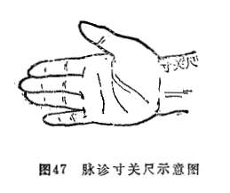

关于寸关尺三部分候脏腑的问题，历代医家颇多异论，但基本精神是一致的。近世通行的分配方法是：左手寸、关、尺分候心（心包）、肝（胆）、肾（膀胱、小肠）；右手寸、关、尺分候肺（胸中）、脾（胃）、肾（命门、大肠）。这种分配方法体现了“上（寸）以候上（上焦），中（关）以候中（中焦），下（尺）以候下（下焦）”的原则。

寸、关、尺分候脏腑简表

| 左 |  |  | 右 |  |  |
| --- | --- | --- | --- | --- | --- |
| 寸 | 关 | 尺 | 寸 | 关 | 尺 |
| 心心包 | 肝胆 | 肾膀胱小肠 | 肺胸中 | 脾胃 | 肾(命门)大肠 |

（二）诊脉的方法

诊脉时，病人取坐位或仰卧位，手臂与其心脏近于同一水平上，手掌向上，手臂自然平放。对成人患者用三指定位法，即医生先用中指按于高骨处定关部，然后食指按于关前定寸部，无名指按于关后定尺部。三指应呈弓形自然斜按于同一水平，以三指末节指腹接触脉体。三指疏密，应视病人高矮做适当调整，一般三指微有间隙即可。小儿寸口脉较短，不能容纳三指，可用“一指定三关法”，不细分三部。三岁以下小儿，用望指纹代切脉。

诊脉时的指力。诊脉时根据医生指力大小分为浮取、中取、沉取，又称举、寻、按。手指轻按于脉体上，称浮取，又称“举”；中等用力，按至肌肉，为中取，又称“寻”；用力较重、按至筋骨，为沉取，又称“按”。寸、关、尺三部，每部有浮、中、沉三候，共九候，故也称“三部九候”。

诊脉时，医生与病人应注意的问题。环境要安静，患者应休息片刻方可诊脉。至于诊脉的时间历代医家提倡以清晨，未进饮食之前为好，但现今难以做到。什么时间均可，但仍以上午，或距离饭后较远的时间为好。诊脉时，医生必须心神专一，认真仔细体察脉象。同时，医生呼吸应均匀，方能定病人一息的至数。诊脉的时间不应少于三分钟，有的脉象不易辨别，时间应稍加延长。

（三）正常脉象

正常脉象，又称平脉、常脉。平脉的至数是一息（一呼一吸）脉来四至，脉象和缓有力均匀，寸、关、尺三部和浮、中、沉九候均有脉。平脉的三个主要特点是：有胃、有神、有根，即胃、神、根。有胃（胃气），是指脉来去从容节律均匀；有神，是指脉象和缓有力；有根，是指尺部沉取仍有从容和缓应指有力之象。在临床上，脉象有无“胃、神、根”是判断正气盛衰、预后吉凶的主要依据。

脉象和人体内外环境的关系十分密切，这不仅表现在疾病状态下脉象的变化，而且在生理情况下，脉象也会因人的年龄、性别、体质、精神状态等不同，而有一定程度的生理性差别。年龄越小，脉律越快。青壮年体强而脉搏有力；老年人体弱而脉搏较弱；成年女性较成年男性脉搏濡弱而略快。身材高大的人，脉的显现部位较长；矮小的人，脉的显现部位较短。瘦人脉象多稍浮；胖人脉象多偏沉。另外，重体力劳动、剧烈运动，长途步行、饮酒、饱餐、情绪激动时，脉搏多快而有力；饥饿时脉搏较弱。正常人的脉象还可因季节气候的影响发生变化。如，春季脉稍弦，夏季脉稍洪，秋季脉稍浮，冬季脉稍沉。这些脉象的变化，均属“平脉”，应注意与病脉鉴别。

有的人脉搏不见于寸口部，而从尺部斜向手背，名为“斜飞脉”，还有人脉搏显现于手背，名为“反关脉”，均是现代解剖学桡动脉位置生理上的异常所致，不属病脉。

（四）病脉与主病

在病理状态下，由于人体脏腑、经络、气血发生改变，因而使脉象也随之而发生相应的变化，即称为病脉。通过脉诊，可以了解病变的部位和性质，为辨证论治提供依据。因此，脉诊在临床上具有重要的意义。

关于脉象的种类，历来说法不尽相同。近世多分为二十八种。现介绍如下。

1、浮脉

脉象：轻取即得，重按稍弱。特点是脉搏显现部位表浅。

主病：一般主表证。为外邪袭表，正气趋向于表而抗邪之象。浮而有力为表实，浮而无力为表虚。若久病虚衰而脉浮大无力，则属阳气虚浮外越之危重证，而非表证。

2、沉脉（附伏脉）

脉象：轻取不显，重按始得。特点是脉象显现部位深。

主病：里证。邪郁在里，气血内闭，则沉而有力，为里实证。若阳气虚，鼓动无力，则沉而无力，为里虚证。

伏脉：比沉脉显现部位更深，重按推筋着骨始得。见于实证为邪气内闭，见于虚证为阳气衰微。

3、迟脉（附缓脉）

脉象：脉来迟慢，一息不足四至（每分钟少于六十次）。

主病：寒证。为寒凝血脉，阳气阻遏而难以鼓动血行之象。有力为冷积实证，无力为阳虚内寒证。

缓脉：脉来虽一息四至，但来去之势有缓慢之感。若脉来和缓从容，是为常脉，不属病脉。若脉来缓怠无力，即属病脉，多见于气虚鼓动无力，或湿邪阻滞，气血困阻之证。

4、数脉（附疾脉）

脉象：脉来快速，一息五至以上（每分钟超过九十次）。

主病：热证。为热邪鼓动气血，运行加速之象。有力为实热，无力为虚热。

疾脉：脉来急疾，一息七至以上。见于真阴耗竭，孤阳无制之危重证。

5、虚脉

脉象：三部脉举之无力，按之空虚。为无力脉的总称。

主病：虚证。多为气血两虚。气血不足，气无力推动血行，则脉来无力，血不足而脉中空，故按之空虚。

6、实脉

脉象：三部脉举按皆有力。为有力脉象的总称。

主病：实证。邪实而正气不虚，邪正相争，故脉应指有力。

7、滑脉（附动脉）

脉象：往来流利，应指圆滑。

主病：痰饮、食积、实热。为实邪内壅，气血涌越之象。妇女妊娠期气血充盛调和，亦见滑脉。

动脉：脉短如豆，厥厥动摇，滑数有力。主痛、主惊。痛则气血不通，惊则气血逆乱，故脉来躁动而厥厥如豆。

8、涩脉

脉象：往来艰涩，迟滞不畅，如轻刀刮竹。

主病：涩而无力为精伤、血少；涩而有力为气滞、血瘀。精亏血少，血脉难行，故脉来艰涩。气滞血瘀，脉道不利，故亦见涩脉。

9、洪脉（附大脉）

脉象：脉来如波涛汹涌，来盛去衰。特点是脉阔大，充实有力且波动大，来势较去势有力。

主病：邪热盛。为里热充斥，鼓动气血，气血涌盛之象。若外感热病伤阴，孤阳无制而外浮，也可见洪脉，但按之空虚无力。

洪脉以波动大，轻按即得，而与浮脉相似。但其脉阔大，重按不减，因此与浮脉有别。

大脉：脉行大于常脉，但无汹涌之势。若大而有力，为实热证。大而无力，为阳气虚浮不能内守之象。辨邪正的盛衰，区别在于大脉的有力、无力。

10、细脉（又称小脉）

脉象：脉细如线，软弱无力，但应指明显。特点是脉形窄，且波动小。

主病：诸虚劳损，以阴虚、血虚为主。又主湿。阴血不足，脉道不充盈，故脉细如线。湿邪阻压，脉道变窄、故脉亦细。

11、弱脉

脉象：脉来应指无力而沉细。特点是脉搏软弱无力。

主病：主气血两虚诸证。气虚则鼓动无力，血虚则脉道不充，故脉见沉细无力之象。

12、微脉

脉象：极细极弱，似有似无，按之欲绝。

主病：多为阳气衰微之重证。阳气衰微，鼓动无力，故脉微欲绝。

13、濡脉

脉象：浮而细软，轻取可得，按之反不明显。

主病：主虚。又主湿。虚证见濡脉。是因气血不足，而致脉来浮细无力。湿邪弥漫，则脉象偏浮；湿阻气机，阻压脉道，则脉来细软，故濡脉又主湿。

14、弦脉（附革脉、牢脉）

脉象：端直以长，如按琴弦。

主病：主肝胆病，诸痛，痰饮。肝胆气滞，肝失其柔，经脉劲急，如弦之绷直，故见弦脉。因痛而筋脉拘急，其脉亦弦。痰饮阻滞气机，脉象多弦与滑并见。

革脉：脉来弦急中空，如按鼓皮。多见于失血、失精、半产、崩漏等病证。为精血内亏，气无所附而浮越于外之象。

牢脉：沉取始得，实大弦长，牢坚不移。多见于癥瘕、痞块等病证。为里实积聚，气血内阻之象。

15、紧脉

脉象：脉来绷急，如牵绳转索，应指紧张有力。

主病：主寒、痛、宿食。因寒、因痛则经脉收引拘急而绷紧，故脉见紧象。宿食阻滞气血，经脉紧急，亦可见紧脉。

16、芤脉（附散脉）

脉象：浮大中空，如按葱管。

主病：主失血、大汗阴津骤伤。为阴亏于内，阴不敛阳，阳浮于外之象。

散脉：浮散无根，飘浮不定，稍按则无。见于正气耗散，脏腑精气将绝之危重证候。

17、促脉

脉象：脉来急数，时而一止，止无定数。

主病：主阳盛热实，血瘀、气滞、痰饮、宿食停滞。阳盛热实，气血运行加速，故脉来急数，但阴不和阳，血行不续，故时而一止。促而有力为实。若促而无力，多属虚脱之象。

18、结脉

脉象：脉来缓慢，时有一止，止无定数。

主病：主阴盛气结，寒痰，瘀血。阴盛或寒痰，瘀血内结，气机不畅，经脉阻滞，故见脉来缓慢而时有一止之象。

19、代脉

脉象：脉来缓弱而时止，良久复动，止有定数。

主病：主脏气衰微，亦主风证、痛证、惊恐、跌扑损伤。脏气衰微，气血不续，故见代脉。若见于风、痛、惊、跌扑等证，则是因气机不畅而致气血不续。

促脉急数而止无定数；结脉缓慢而止无定数；代脉缓弱而止有定数。三者当详加鉴别。

20、长脉

脉象：首尾端直，超过本位，如循长竿。即指下感觉脉来超过寸、关、尺三部。

主病：主热证。热邪炽盛，鼓动气血，阳热有余，故脉长而超过本位。

21、短脉

脉象：首尾俱短，不及本位、寸部、尺部沉下，不易触知。

主病：短而无力主气虚，短而有力主气滞。气虚则鼓动无力，故脉短而无力。气滞则血行受阻，故脉来短而有力。

上述脉象共三十种，因大脉常与洪脉并称为“洪大”；小脉即细脉，故除此二者外，共为二十八脉。

（五）相兼脉与主病

引起疾病的原因是多方面的，疾病的表现和变化也是错综复杂的。因此，临床常见的脉象往往是两种或两种以上单一脉象的综合，即由两个以上单一脉组成的复合脉。这种脉象称为“相兼脉”，又称“复合脉”。如濡脉、促脉、等均属相兼脉。

只要不是完全相反的两种或几种单一脉（如浮脉与沉脉，迟脉与数脉等），都可能同时出现，组成相兼脉。如浮紧、沉迟、沉细数等。相兼脉的主病，一般来说是等于组成该相兼脉各单一脉主病的总合。如沉迟脉，沉脉主里证，迟脉主寒证，沉迟脉即主里寒证。余可类推。兹将临床常见相兼脉与主病列表举例如下：

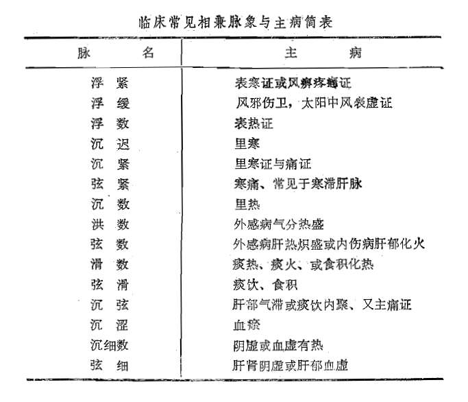

（六）脉与证的顺逆、从合

脉与证的关系十分密切，所谓脉与证的顺逆，是指二者相应与不相应，相应者为顺，不相应者为逆。依此可做为辨别疾病的顺逆的参考。一般来说，病属有余之证，脉见洪、数、实者，为脉证相应，为顺证，表示邪实正盛，正气抗邪有力；若反见沉、细、微脉，是为脉证相反，为逆证，说明邪盛正衰，易致邪气内陷。若久病脉来沉、微、细、弱者为顺，说明正复邪去，疾病有好转之象；若新病脉见沉、细、微、弱，说明正气已衰；久病脉见浮、洪、数、实，则表明正衰邪进，均属逆证。既然脉与证有相应与不相应的情况，其中必有一真一假，故临床中应仔细辨别其真假，以决定从舍。或舍证从脉，或舍脉从证。如：腹胀满而脉弱，说明是脾胃气虚而气滞于中，胀满是假实，而脉弱是真虚之象，应舍证从脉。再如：温病中津气大伤，一派虚象而脉来浮洪，说明是阳气浮越之象，脉虽洪而按之必空软无力，证之虚是真，脉之洪是假，应舍脉从证。

脉有从舍，说明脉象只是病变临床表现的一个方面，因而不能把脉诊做为唯一的诊断依据，必须四诊合参，才能做出正确诊断。

#### 二、按诊

（一）按肌表

初按皮肤热重，久按则热转轻的，是热在表；若久按其热更甚，热从内向外蒸发的，是热在里；手心热，或肌肤热而无蒸腾之感的，属虚劳发热。按之皮肤或手足发凉，属阳衰虚寒证。

按之皮肤潮润的，为有汗，干燥的，为无汗。按之皮肤滑润的，多属津液未伤；枯燥或甲错的，多属津液已伤，或有瘀血。重手按之肌肤不能即起，凹陷成坑的，是水肿；按之举手而起的，是气肿。

在外科方面，触按肌肤，可辨别证候的阴阳和脓成与未成。如疮疡按之肿硬而不热，根盘平塌而漫肿的，多属阴证。按之高肿烙手，根盘紧束的，多属阳证。按之固定，坚硬而热或热不甚，为脓未成。按之边硬顶软而有波动感，热甚的，为脓已成。

还有诊“尺肤”法，对温病诊断有一定意义。尺肤，是指从肘部内侧至掌后横纹处的皮肤。尺肤热甚，多见于外感温热邪气的表热证。

（二）按手足

手足俱冷的，多属阳衰虚寒，或阳盛格阴；手足俱热的，多属热邪炽盛，或阴盛格阳。手心热甚，多为内伤阴虚火旺；手背热甚，多为外感病。

（三）按脘腹

1、按脘部

脘部，即胸骨以下部位，又称“心下“。心下按之硬而痛的，是结胸，属实；心下满，但按之濡软而不痛的，多是痞证，属虚。心下坚硬，大如盘，边如旋杯，为水饮内停。

2、按腹部

腹痛喜按属虚；拒按属实。

腹满，叩之如鼓，小便自利者，属气胀；按之如囊裹水，小便不利者，是水臌。

腹内有肿块，按之坚硬，推之不移且疼有定处的，为癥为积，多属血瘀；肿块时聚时散，或按之无形，痛无定处的，为瘕为聚，多属气滞。若腹痛绕脐，左下腹部按之有块累累，当考虑燥屎。腹有结聚，按之硬，且可移动聚散的，可见于虫积。

右侧少腹部按之疼痛，尤以重按后突然放手而疼痛更为剧烈（现代医学称反跳痛），多是肠痈。

复习思考题

1. 望诊主要包括几个方面？“神”在望诊中有何意义？

2. 舌诊为什么可以了解内在病变？

3. 舌质、舌苔的变化有何临床意义？

4. 舌质、舌苔在外感病中的临床意义有何区别？

5. 察小儿指纹有何临床意义？

6. 问诊的主要内容是什么？

7. 哪些主要疾病可以出现潮热？如何区别外感与内伤之恶寒？如何鉴别外感与内伤之发热？

8. 汗出（正常的和病态的）的机理是什么？

9. 何谓脉象？何谓“胃、神、根”？胃神根在临床上有什么意义？

10. 简述病脉与主病。

## 第六章辨证

[自学时数] 12学时

[面授时数] 4学时

[目的要求]

1．熟悉八纲辨证的基本概念。

2．掌握表里、寒热、虚实、阴阳的证候和特征。

3．熟悉寒热真假、虚实真假的概念和特征。

4．了解八纲证候之间的“相兼”、“夹杂”与“转化”关系。

5．掌握气虚、气陷、气滞、气逆的概念，临床表现，证候分析。

6．掌握血虚、血瘀、血热、血寒的概念，临床表现，证候分析。

7．掌握气滞血瘀、气血两虚、气不摄血、气随血脱的概念，临床表现，证候分析。

8．掌握津液不足和水肿、痰饮等水液停聚的概念，临床表现，证候分析。

9．熟悉脏腑辨证概念、基本方法及其运用范围。

10．掌握各脏腑常见病证的临床表现和证候分析。

11．熟悉脏腑兼证的机理和临床表现。

12．了解六经辨证的概念。

13．掌握每一经病的主要脉症。

14．了解六经病的传变。

15．了解卫气营血辨证的概念。

16．掌握卫分证、气分证、营分证、血分证的主要脉证。

17．了解三焦辨证的概念。

18．了解上焦证、中焦证、下焦证的主要脉证和证候分析。

19．了解经络辨证的临床意义。

20．掌握十二经脉和奇经八脉的病证特点。

辨证是中医临床医学的关键，辨证正确才能制订出符合病证实际的治法，从而恰当地选方用药。

证，是证候的简称，它不同于病变所反映出的个别外在现象——症状，而是综合分析了各种症状和体征，对疾病发展过程中某一阶段的病因、病位、病性，邪正关系等方面情况的病理概括。辨证，是以阴阳五行、脏象、经络、病因病机等理论为依据，对四诊所收集的症状体征等资料，加以综合分析而做出诊断的过程。

辨证与论治，是在疾病的诊断与治疗中相互联系，密不可分的两个阶段。辨证是论治的前提和依据，治疗效果是检验辨证正确与否的客观标准。在临床中，只有在正确地辨证的基础上进行相应的治疗，才能收到满意的疗效。

中医学在长期的临床实践中总结归纳出多种辨证方法，如：八纲辨证、病因辨证、脏腑辨证、气血津液辨证、六经辨证、卫气营血辨证、三焦辨证、经络辨证等。这些辨证方法，虽各有特点，对各类不同疾病的诊断各有侧重，但在临床运用中又相互联系，相互补充，从而构成完整的辨证体系，有效地指导着临床实践。

### 第一节八纲辨证

八纲辨证，就是通过四诊所获得的临床资料为依据，对病变的部位、性质、正邪关系等情况进行综合分析，将其归纳为阴、阳、表、里、寒、热、虚、实八类证候的一种辨证方法，是各种辨证的总纲。

疾病的表现尽管极其复杂，但基本上都可用八纲加以归纳。就病位的浅深而言，不在表，就在里；就疾病的性质而言，不是热证，便是寒证；就邪正的关系而言，邪气盛的为实证，正气衰的为虚证；而从总的方面划分疾病的类别，又不外阳证与阴证两大类。因此，八纲辨证就是把人体的证候分为表证与里证、寒证与热证、虚证与实证、阳证与阴证四对纲领，用以指导临床治疗的。在八纲中，其它六纲又可以用阴阳两纲加以概括，即表、热、实证为阳证；里、寒、虚证为阴证。所以，阴阳又是八纲中的总纲。

八纲从不同的方面反映了病变过程中的八类证候，但在临床中它们之间又是相互联系而不可分割的。如辨别表里必须与寒热、虚实相联系，辨别寒热又必与虚实、表里相联系，辨别虚实又必须与表里寒热相联系。此外，还有八纲之间相互交织的错综复杂情况，如表里错杂、寒热错杂、虚实错杂等；而且在一定条件下，证候性质可以发生转化，如表里转化、寒热转化、虚实转化等；在某些情况下，还可能出现证候中真假互见的现象，如寒热真假、虚实真假等。因此，掌握八纲辨证，既要熟悉八纲各自的证候特点，又要注意它们之间的相互关系，只有全面分析，才能对病证做出正确的辨识和诊断。

#### 一、八纲辨证的基本内容

1.表里辨证

表里是辨别疾病病变部位的。表指经络、肌表部位，里指脏腑、筋骨、气血等。表证多见于外感病初期，病变在皮毛、肌腠，部位表浅。临床表现：发热、恶寒、或恶风、头痛、身痛、肢痛、无汗、或有汗、鼻塞、舌苔薄白、脉浮等。

里证是与表证相对而言，病在脏腑、气血、骨髓等。除了表证而外的一切证候，均属里证。外感内伤均可产生里证。里证产生，在外感，或为表邪入里，或为外邪直中于里；在内伤，或为情志、饮食、劳倦所伤，或为外感病虽愈，而气血已伤所致。里证临床表现极为广泛而复杂，依其寒热虚实之不同而各异。

2.寒热辨证

寒证，在外感，为感受寒邪，寒邪或中于表，或中于里，在内伤，为阳虚阴寒内盛。其临床表现，又有表寒、里寒之别。

热证是阳热偏盛的证候，或阳热绝对偏盛，或相对偏盛（阴虚导致阳热偏盛之内热）。热证的临床表现有表热、里热之分，表热多见于外感，里热则外感、内伤俱见。

3.虚实辨证

虚实辨证，主要是辨邪正盛衰。虚证是正气不足（包括阴、阳、气、血等）所出现的证候，临床表现：或发热恶寒，自汗，脉浮等（表虚）；或久病，少气懒言，食少纳呆，倦怠乏力，面色㿠白等（里虚）。

实证是邪气盛，或正气不虚而正邪抗争的表现。如发热，脘腹胀痛拒按；大便干结，小便不利；或壮热，神昏谵语，或烦躁等；或发热恶寒，无汗身痛，脉浮等。

4.阴阳辨证

阴阳二证是八纲辨证的总纲。表、实、热证属阳证，里、虚、寒证属阴证。但临床上，阳证习惯上指实热证，阴证习惯上指虚寒证。故临床表现：阳证可见发热口渴，语声粗壮，面赤气粗，便秘溲赤，甚或烦躁谵语，舌红苔燥，脉象浮、洪、滑、数、有力等。阴证则语声低微，面色晦暗，目光无神，怠惰懒言，身冷畏寒，近衣喜温，口不渴，尿清长，便溏，舌淡苔白滑，脉沉等。

以上八纲辨证的基本内容，以表格形式举例介绍，便于学习和鉴别比较。

八纲辨证简表

| 证候分析 |  | 病因 | 病机 | 特点 | 症状、体征 |  |  |
| --- | --- | --- | --- | --- | --- | --- | --- |
|  |  |  |  |  | 症状 | 舌象 | 脉象 |
| 阳证 | 表证 | 外感六淫邪气、由口、鼻、皮毛侵入人体 | 卫外失司 | 病在皮毛，肌腠，部位浅，起病急，病程短 | 发热，恶风寒，头痛，身痛等 | 苔薄 | 浮 |
|  |  |  |  |  | 症状 | 舌象 | 脉象 |
|  | 热证 | ①感受外邪②人体阳气偏盛③五志化火，食积化热④阴虚火旺 | 阳热偏盛，或阴虚内热 | 出现一派火热之象，易伤津液 | 发热或虽不发热而喜凉，口渴喜冷饮，面目红赤，小便短赤，大便干结 | 舌红苔黄 | 数 |
|  | 实证 | ①外邪侵袭②脏腑功能失调，形成痰、饮、水湿、 | 邪气盛而正气不衰，正邪相争 | 正邪相争，现一派有余之象 | 呼吸气粗，胸闷腹胀，疼痛拒按，大便不通，小便不利等 | 苔厚 | 实而有力 |
|  |  |  |  |  | 症状 | 舌象 | 脉象 |
|  |  | 气滞、瘀血、食积等实邪 |  |  |  |  |  |
|  |  |  |  |  | 症状 | 舌象 | 脉象 |
| 阴证 | 里证 | ①表邪入里②外邪直中于里③情志内伤或饮食劳倦等 | 脏腑、气血、阴阳失调，升降失常 | 病在胸腔、腹腔、脏腑、血脉、骨髓，部位深，范围广 | 除表证之外，皆属里证。有寒、热、虚、实及各脏腑之分 |  |  |
|  |  |  |  |  | 症状 | 舌象 | 脉象 |
|  |  |  |  |  | 症状 | 舌象 | 脉象 |
|  | 寒证 | ①感受寒邪②阳虚阴盛，寒从中生 | 阴寒偏盛，阳气不足 | 出现一派寒冷之象，易致水液代谢失常 | 恶寒喜暖，口淡不渴，面色胱白，手足不温，小便清长，大便溏泻等 | 舌淡苔白滑 | 沉迟 |

| 证候分析 |  | 病因 | 病机 | 特点 | 症状、体征 |  |  |  |
| --- | --- | --- | --- | --- | --- | --- | --- | --- |
|  |  |  |  |  | 症状 |  | 舌象 | 脉象 |
|  | 虚证 | ①先天不足②饮食失调、情志劳倦，房事所伤③久病或失治，误治损伤正气 | 先天不足或后天失养，正气不足 | 脏腑、气血、阴阳诸虚，见一派气、血阴、阳不足之象 | 气虚 | 倦怠乏力，气短神疲，食少便溏，自汗，面色苍白 | 舌淡胖嫩苔白 | 弱 |
|  |  |  |  |  | 症状 |  | 舌象 | 脉象 |
|  |  |  |  |  | 阳虚 | 除气虚见证外，又见形寒肢冷，面色咣白 | 舌淡或紫暗，苔白水滑 | 沉迟 |
|  |  |  |  |  | 血虚 | 面色苍白或萎黄，心悸健忘，失眠多梦,手足麻木 | 舌淡苔少 | 细弱 |
|  |  |  |  |  | 阴虚 | 五心烦热，两颧 | 舌红少津，苔少 | 细数 |

| 证候分析 | 病因 | 病机 | 特点 | 症状、体征 |  |  |  |
| --- | --- | --- | --- | --- | --- | --- | --- |
|  |  |  |  | 症状 |  | 舌象 | 脉象 |
|  |  |  |  |  | 红赤，口燥咽干，遗精盗汗 |  |  |

#### 二、八纲之间的相互关系

病变是错综复杂的，八纲所属的证候，在临床中往往不是单独存在，而是相兼出现。在临床中，必须把八纲相互联系进行辨证，才能全面地分析病变的部位、性质、正邪关系。此外，八纲之间又可以出现相互错杂和相互转化，在某些情况下，还可以出现证候中真假互见的现象。兹将八纲之间这四种关系以及亡阴亡阳列表简述如下。

1.相互联系

八纲相互联系简表

| 证候分析 | 病因、病机 | 症状、体征 |  |  |
| --- | --- | --- | --- | --- |
|  |  | 症状 | 舌象 | 脉象 |
| 表寒证 | 外感寒邪，腠理闭塞，卫外失司 | 恶寒重，发热轻，头痛，身痛，无汗 | 苔薄白 | 浮紧 |
| 表热证 | 外感热邪，腠理开泄，卫外失司 | 发热重，恶寒轻，头身痛，咽喉肿痛，口微渴或少汗 | 舌边尖红，苔薄白 | 浮数 |
| 表虚证 | 外感风邪，开泄腠理，卫外不固，营阴外泄。或素体气虚，卫外不 | 自汗，恶风 | 苔薄白 | 浮缓 |

| 证候分析 |  | 病因、病机 | 症状、体征 |  |  |
| --- | --- | --- | --- | --- | --- |
|  |  |  | 症状 | 舌象 | 脉象 |
|  |  | 固，腠理疏松，易受外邪 |  |  |  |
| 表实证 |  | 外为外寒侵袭，腠理闭塞，卫阳被郁 | 无汗，恶寒，头身疼痛 | 苔薄白 | 浮紧 |
| 里寒证 | 虚寒证 | 阳气不足，温化无权，寒从中生 | 形寒肢冷，腹痛喜按，倦怠神疲，大便溏薄，小便清长 | 舌淡，苔白滑 | 沉迟无力 |
|  | 实寒证 | 寒邪直入脏腑，阴寒过盛，退伤阳气 | 恶寒肢冷，腹痛拒按，痰多喘促，大便不通 | 舌淡或紫暗，苔白润 | 沉迟有力或沉紧 |
|  |  |  | 症状 | 舌象 | 脉象 |
| 里热证 | 虚热证 | 阴虚不能制阳，阳亢化火，虚热内生 | 潮热盗汗，五心烦热，形体消瘦，口干燥咽干，两颧红赤，小便短赤 | 舌红少苔 | 细数 |
|  | 实热证 | 感受热邪，或阳气偏盛，或五志化火，食积化热等，导致热邪炽盛 | 高热烦渴，或虽不发热，而渴喜冷饮，面红目赤，声高气粗，胆满痛拒按，小便短赤，大便干结 | 舌红苔黄 | 数而有力 |

2.相互错杂

八纲相互错杂简表

| 证候分析 |  | 概念及特点 | 病因病机 |  |  |  |
| --- | --- | --- | --- | --- | --- | --- |
|  |  |  |  | 症状 | 舌象 | 脉象 |
| 表里错杂 | 表寒里热证 | 表证和里证在同一病人身上，同时错杂出现，称为表里错杂，亦称表里同病 | 素有里热，又外感寒邪；或外感寒邪，表寒未解，同时又化热入里 | 恶寒发热，头身疼痛，无汗与烦躁口渴同见 | 苔黄 | 弦紧而数 |
|  |  |  |  | 症状 | 舌象 | 脉象 |
|  | 表热里寒证 |  | 素有里寒，又外感风热。或外感风热过用凉药，损伤脾胃，以致里寒 | 发热微恶风寒，头痛，咽喉肿痛，咳嗽与四肢不温，大便溏泄同见 | 舌淡苔白 | 数而无力 |
|  | 里实证 |  | 体内蕴有里实，如痰饮，食积等，又外感风邪，开泄腠理，卫外不固 | 发热恶风，自汗，头痛，与痰多喘息，腹胀便秘同见。 | 苔黄厚 | 弦滑 |
|  | 表实里虚证 |  | 素体里虚，又外感寒邪，腠理闭 | 恶寒发热，头身疼痛，无汗，与纳呆食少，四肢不 | 苔白滑 | 弦紧无力 |
|  |  |  |  | 症状 | 舌象 | 脉象 |
|  |  |  | 塞，卫阳被郁 | 温、大便溏泄同见 |  |  |
| 寒热错杂 | 上寒下热证 | 寒证和热证，在同一病人体内的不同部位，同时错杂出现，称为寒热错杂 | 上有胃寒，下有膀胱湿热 | 胃脘冷痛而喜温，呕吐清水，与小便短赤，尿频尿急，涩滞热痛同见 | 白腻根部黄厚 | 弦或弦数 |
|  | 上热下寒证 |  | 热在胸脘，寒在大肠 | 胸中烦热，呕吐吞酸，与腹痛喜温，大便溏泄同见 | 白腻或黄腻 | 弦 |
|  |  |  |  | 症状 | 舌象 | 脉象 |
| 虚实错杂 | 虚中挟实证 | 虚证与实证，在同一病人体内，同时错杂出现，称为虚实错杂，亦称虚实夹杂 | 以正气虚为主，而又夹有痰饮，淤血，便秘等实证 | 形寒肢冷，倦怠乏力，纳呆食少，与喘息多痰，动则喘甚，大便不通等同见 | 舌淡苔白腻而滑 | 沉弦无力 |
|  | 实中挟虚证 |  | 以邪气实为主，而有挟正气不足之象 | 外感邪热入里，高热烦渴，大汗出之实热证，又见气短乏力，背微恶寒之虚像，是因高热耗伤津气，而成实中挟虚证 | 舌红，苔黄燥 | 洪大重按无力 |

3.相互转化

八纲相互转化简表

| 证候分析 |  | 病因病机 | 症状、体征 |  |  |
| --- | --- | --- | --- | --- | --- |
|  |  |  | 症状 | 舌象 | 脉象 |
| 表里转化 | 表证入里 | 多因正气不足，抗邪无力；或邪气过盛，而由表入里，由浅入深，由轻转重。若护理不当，或失治误治，亦可导致邪气由表入里 | 本为发热微恶风寒，头身疼痛，咳嗽，口微渴之表热证。转为高热不恶寒反恶热，烦渴饮冷，大汗出之里热证，此为由表入里 | 由舌边尖红苔薄白转为舌红苔黄燥 | 由浮数转为洪数 |
|  | 里证出表 | 多因正确的治疗，护理，人体正气恢复，抗邪于外，使邪气由里达表，病情由重转轻 | 先见高热烦躁，喘息胸闷，而后汗出热减，烦闷亦减,或见斑疹，白㾦外露。此为邪气转浅外达，由里出表 | 舌质由深红转浅 | 数势渐减 |
|  |  |  | 症状 | 舌象 | 脉象 |
| 寒热转化 | 寒证转为热证 | 先出现寒证，后出现热证，寒证逐渐消失，就是寒证转化为热征。这种转化的条件，是人体阳气充盛，使寒邪从阳化热 | 先见恶寒重、发热轻，头身疼痛之表寒证，寒邪化热入里则逐渐转化为高热恶热，心烦口渴，大汗出的里热证 | 舌苔由白转黄 | 由浮紧转为洪数 |
|  | 热证转为寒证 | 先出现热证，后出现寒证，热证消失，就是热证转化为寒证。出现这种转化，往往是热邪耗伤阳气，阳气衰败的结果 | 先见高热恶热，心烦口渴，大汗出。因高热大汗耗气伤津，导致阳气虚脱，出现身热骤退，冷汗不止，四肢厥冷，即由热证转为寒证 | 舌苔由黄转白 | 由洪数转为沉数 |
|  |  |  | 症状 | 舌象 | 脉象 |
| 虚实转化 | 虚证转为实证 | 本为虚证，而后逐渐出现实证，即为由虚证转为实证。但这种情况往往是由于正气不足，运化失权，而导致水湿、痰饮、瘀血，便秘等实邪停聚，即“因虚致实”，也就是虚中挟实证。 | 本为脾、肺气虚，证见倦怠乏力，喘息气短，面色苍白，纳呆食少。由于运化失权，逐渐出现浮肿，痰多，大便不通等实邪停聚。是为“因虚致实。” | 由舌淡少苔转为苔白腻 | 由弱转为沉弦而弱 |
|  | 实证转为虚证 | 本为实证，因失治、误治而致迁延日久，正气耗伤，实邪虽去而正虚不复，即是由实证转为虚证 | 先见高热恶热，烦躁口渴之实证，因迁延日久，热邪虽解，面正气未复，表现为形体消瘦，面色无华，纳呆食少，倦怠少气之虚证 | 由舌红苔黄燥转为舌淡苔少 | 由洪数转为细弱 |

4.证候真假

证候真假简表

| 证候分析 |  | 病因病机 | 症状、体征 |  |  | 辨证要点 |
| --- | --- | --- | --- | --- | --- | --- |
|  |  |  | 症状 | 舌象 | 脉象 |  |
| 寒热真假 | 真寒假热 | 即内有真寒，外见假热，亦称阴盛格阳。因阴寒内盛，逼阳于外，虚阳外浮而致 | 四肢厥冷，大便溏薄，小便清长，喘息气短之里虚寒证，又见身热（反欲近衣被），面红，（浮红娇嫩如妆），口渴（喜热饮），汗出（冷汗淋漓）之假热现象 | 舌淡嫩苔白 | 沉迟微弱或虚大无力 | 内真寒是本质，外热是假象。真寒病在脏腑，以脉象，舌象，里证为依据。假热出现于皮肤表面，虽有热象而非真热 |
|  |  |  | 症状 | 舌象 | 脉象 |  |
|  | 真热假寒 | 即内有真热，外见假寒，亦称阳盛格阴。因里热炽盛，正邪激争于里，阳气内闭，不能布达于四末而致 | 高热恶热，烦渴饮冷，大便秘结，腹满痛拒按之里实热证，又四肢厥冷之假寒现象 | 舌紅苔黄燥甚或焦燥起芒刺 | 沉数有力 | 内真热是本质，外寒是假象。真热病在脏腑，以脉象，舌象，里证为依据。假寒出现于四肢，虽有寒象而非真寒 |
|  |  |  | 症状 | 舌象 | 脉象 |  |
| 虚实真假 | 真虚假实 | 本为虚证，正气不足，因运化无力而致气机不畅，出现气滞之假实现象。即前人所谓“至虚有盛候” | 倦怠乏力，纳呆食少，虚喘气短之虚证，又见腹满胀痛之假实现象，但腹虽满而时作时止,虽腹痛而喜按 | 舌淡胖嫩，苔白 | 弦而弱，按之无力 | 虚为本质，以舌象、脉象及体质为依据。实是假象，四诊合参自可辨明 |
|  |  |  | 症状 | 舌象 | 脉象 |  |
|  | 真实假虚 | 本为实证，因实邪内闭，气血不能畅达周身，而出现假虚之象。即前人所谓“大实有羸状” | 痰食内滞，大便不通之实证，又见倦怠神疲，纳呆食少之假虚现象，但虽倦怠而声高气粗，虽食少而吞酸、嗳腐 | 舌苔厚腻 | 沉迟而弦滑有力 | 痰食内滞之实邪为本质，以舌象，脉象，体质及里实为依据。虚是假象，四诊合参自可辨明 |

5.亡阴与亡阳

亡阴，是指阴液耗损欲竭。亡阳，是指阳气耗散欲脱。二者大多出现在急性病中，均属危重证候，兹列表简介如下。

亡阴、亡阳证候简表

| 证候分析 | 病因 | 病机 | 症状、体征 |  |  |
| --- | --- | --- | --- | --- | --- |
|  |  |  | 症状 | 舌象 | 脉象 |
| 亡阴 | 急性病高热大汗，或剧烈吐泻，或大失血等 | 阴液急剧大量耗损，真阴欲竭，周身失养，生命垂危 | 形体消瘦，皮肤干皱，目眶塌陷，手足心热，口燥咽干，齿燥色如枯骨，目睛昏暗无神，视物昏盲，汗热而粘 | 红绛瘦薄萎软，少苔或无苔 | 细促或虚大而芤 |
| 亡阳 |  | 阴液大耗，气随液脱，人体功能衰微欲绝 | 形寒倦卧，四肢厥冷，虚喘息微，汗冷清稀，淋漓不止 | 舌淡苔白 | 沉微欲绝 |

由于人体阴阳是相互依存的，阴竭则阳无所附而浮散；阳亡则阴无所固而随脱。所以，在临床上亡阴与亡阳之出现虽有先后主次之分，但最终必相互影响，一亡俱亡，从而导致生命的终结。

### 第二节气血津液辨证

气血津液辨证，就是分析气、血、津液各方面的病理变化，从而辨识其所反映的不同证候的一种辨证方法。

气血津液病变与脏腑病变密切相关，二者常常相互影响，互为因果。气血津液辨证是对脏俯病变中气血津液失常的某些共同病理特征的概况，因而，掌握这一辨证，可为学习脏腑辨证奠定基础。

气血津液辨证包括气病的辨证、血病的辨证、气血同病辨证，与津液病的辨证。现分列简表如下：

气病辨证简表

| 证候分析 | 病因病机 | 症状、体征 |  |  |
| --- | --- | --- | --- | --- |
|  |  | 症状 | 舌象 | 脉象 |
| 气虚证 | 久病伤及元气，或年迈体弱、饮食失调所致。元气不足，脏腑功能减退，营卫不固 | 身疲乏力，少气懒言，动则气喘，头目晕眩自汗，面色㿠白 | 淡胖 | 虚大而无力 |
| 气陷证 | 多见于久病，或中气大虚，元气虚弱，升举无权，使清气陷于下 | 头目昏花，少气倦怠，腹部坠胀，脱肛、或子宫脱垂 | 舌淡苔白 | 沉弱无力 |
| 气滞证 | 多由情志不舒，饮食失调，或感受外邪、闪挫外伤所致气机阻滞，运行不 | 局部闷胀，疼痛，且胀多痛少，痛无定处。兼见喘嗽，太 | 苔白或 | 脉弦 |
|  |  | 症状 | 舌象 | 脉象 |
|  | 畅，升降失调，枢机不利 | 息、月经不调或肠鸣、嗳气等 | 薄黄 |  |
| 气逆证 | 多因感受外邪，饮食失调，七情过度所致气机升降失常，肃降无权或封藏不力，气逆于上 | 气逆证临床多见肺气上逆，胃气上逆，肝气上逆及肾不纳气，症状上各有特点详见脏腑辨证 | 略 | 略 |

血病辨证简表

| 症候分析 | 病因病机 | 症状、体征 |  |  |
| --- | --- | --- | --- | --- |
|  |  | 症状 | 舌象 | 脉象 |
| 血虚证 | 多因脾胃虚弱，七情内伤或失血过多所致脾虚气血生化无源，七情过度，暗耗阴血，血虚失其滋养濡润之功 | 面色苍白或痿黄，唇白无华、头晕眼花、心悸失眠，手足庥木，月经衍期，量少 | 舌淡 | 细而无力 |

| 症候分析 |  | 病因病机 | 症状、体征 |  |  |
| --- | --- | --- | --- | --- | --- |
|  |  |  | 症状 | 舌象 | 脉象 |
| 血瘀证 | 血瘀气虚 | 气虚运血无力，以致气血淤滞 | 身倦乏力，少气自汗局部疼痛，痛如针剌，拒按 | 舌紫暗有瘀斑 | 沉涩无力 |
|  |  |  | 症状 | 舌象 | 脉象 |
|  | 血瘀血虚 | 瘀血阻滞，新血不生 | 头晕眼花，心悸失眠兼有肿块，刺痛拒按 | 舌淡有瘀斑 | 细涩 |
|  | 客凝血脉 | 寒邪客于血脉，阳气困遏、血凝滞而不行 | 疼痛喜按，得暖痛减。兼见形寒肢冷 | 舌淡紫暗 | 沉迟而涩 |
|  | 血热抟结 | 感受外邪，或情志所伤，或脏腑功能失调，或瘀血滞留，郁而化热，以致血热互结，瘀而不行 | 疼痛喜冷，发热，或见出血，或肿块。血热结于肠胃，可见谵语善忘，妇女热入血室，可见胸胁胀满，寒热往来月经中断，入夜谵语 | 舌暗红 | 脉数 |
|  | 血热证 | 多因外感热邪或肝郁化火所致，火热炽盛，入于血分，灼伤阴血，或迫血妄行 | 心烦躁扰，口干不喜饮，身热夜甚，或见各种出血，发斑以及妇女月经过多等症 | 红绛 | 细数 |

气血同病辨证简表

| 证候分析 | 病因病机 | 症状、体征 |  |  |
| --- | --- | --- | --- | --- |
|  |  | 症状 | 舌象 | 脉象 |
| 气滞血瘀证 | 多由情志不遂，或闪挫外伤所致肝气郁结，疏泄失职，气为血帅，气滞血瘀 | 胸胁胀满疼痛，或痞块刺痛拒按，妇女可见痛经，经色紫暗有块 | 紫暗有瘀斑 | 涩、弦 |
| 气血两虚证 | 气虚日久，伤及阴血，或血虚损及阳气，气血虚弱，失营运润养之功 | 少气懒言，乏力自汗心悸失眠，面色萎黄无华 | 淡而胖嫩 | 细弱无力 |
| 气虚血脱证 | 气虚日久，而失固摄之权，气虚下陷，血从下溢 | 便血或崩漏，同时见气短，倦怠无力，面色㿠白 | 舌淡 | 细微 |
| 气随血脱证 | 多由妇人崩中产后，或外伤出血所致血脱则气无所附，故气亦随之而脱 | 大量失血，而现面色㿠白，四肢厥冷，气息微弱，大汗淋漓，甚至昏厥 | 舌淡 | 芤而细微 |

津液病辨证简表

| 证候分析 |  | 病因病机 | 症状、体征 |  |  |
| --- | --- | --- | --- | --- | --- |
|  |  |  | 症状 | 舌象 | 脉象 |
| 津亏证 |  | 多由外受燥热之邪，或汗吐下过伤津液所致。津液亏耗，失其润养之职 | 唇焦口燥，咽干口渴，皮肤干燥，小便短赤大便秘结 | 舌红少津 | 细数 |
|  |  |  | 症状 | 舌象 | 脉象 |
| 水湿停滞证 | 风痰证 | 多由肝肾阴虚，肝阳亢盛而肝风内动，兼脾失健运，聚湿生痰，肝风挟痰上扰所致 | 头目眩晕，突然昏倒，喉中痰鸣，口眼歪邪，舌强语蹇，四肢麻木或偏瘫 | 舌淡胖 | 弦滑 |
|  |  |  | 症状 | 舌象 | 脉象 |
|  |  |  | 症状 | 舌象 | 脉象 |
|  | 热痰证 | 感受热邪或阳气亢盛，煎熬津液，则成热痰 | 烦热、咳痰黄稠，咽喉壅塞，肿痛便结，或发癫狂 | 苔黄腻 | 滑数 |
|  | 寒痰证 | 感受寒邪，阴盛阳衰，水津凝滞不化而成寒痰。寒痰凝结，阳气受损 | 畏寒肢冷，咳吐稀白痰，四肢不举，或骨痹刺痛 | 苔白 | 沉迟 |
|  | 湿痰证 | 多由脾虚不运，痰湿内生或外感寒湿，来肺困脾，水湿内停，聚而成痰所致 | 胸痞，纳少，呕𫫇，痰多，咳之易出，身重困倦，头重如裹 | 舌苔厚腻 | 濡滑 |
|  | 燥痰证 | 感受燥邪，或热伤津液而化燥，煎熬津液而成痰 | 咯痰粘稠，如块如珠如线，量少，难以咯出。口鼻干燥，咽喉干痛大便干 | 舌干少津 | 细滑而数 |
|  | 痰浊中阻 | 脾失健运，不能运化精微积湿成痰、痰湿 | 眩晕、头重、胸脘痞闷，泣泣欲呕，或呕吐痰涎 | 舌苔白腻 | 濡滑 |
|  |  |  | 症状 | 舌象 | 脉象 |
|  |  | 阻滞、升降失常 |  |  |  |
|  | 痰阻胞宫 | 妇女脾虚湿盛，积聚成痰痰浊下注，阻于宫胞 | 闭经，带下粘稠，胸闷腹满，头晕心悸泛恶多痰，婚后不孕 | 舌苔白腻 | 细滑 |
|  | 痰阻经络 | 气虚不行，湿痰内阻，营卫运行不利 | 可出现瘿瘤，痰核瘰疬等肿块，按之较软，四肢麻木酸痛 | 苔白腻 | 滑 |
|  | 痰饮证 | 中阳不振，水饮内停。水饮上逆，侵凌心肺 | 胸胁支满，胃脘有水声，呕吐稀涎，口不渴，头目眩晕，心悸气短 | 白滑 | 弦滑 |
|  | 悬饮证 | 水流胁间，络道被阻，升降不利 | 胁痛，咳唾更甚，肋间胀满，气短息促 | 白滑 | 沉弦 |
|  | 溢饮证 | 肺脾之气输布失职，水饮流溢所致 | 肢体沉重而痛，甚至浮肿，小便不利，咳喘，痰多白沫 | 苔白 | 弦紧 |
|  |  |  | 症状 | 舌象 | 脉象 |
|  | 支饮证 | 水饮上逆，肺气不降 | 咳喘上逆，胸满短气倚息不得平卧，睑目浮肿，咳吐白沫痰 | 白腻 | 弦紧 |

### 第三节脏腑辨证

脏腑辨证主要是以脏象学说为基础，将四诊所获得的症状和体征进行综合分析，从而对病变所在的脏腑部位及其性质、正邪盛衰做出诊断的一种辨证方法。

脏腑是人体的重要组成部分，是生命活动的中心各种原因导致的病变，实际上都是脏腑功能失调的反映。由于各个脏腑的生理功能不同，所以它们在病变过程中所反映出来的症状和体征也各不相同。根据各脏腑的生理功能，结合病因病机来判断其病理变化，这就是脏腑辨证的方法和理论依据。中医学的辨证方法尽管多种多样，而且各具特长，但各种辨证方法最终都要落实到脏腑部位上。所以说，脏腑辨证是中医学辨证体系中的重要组成部分，其详细内容，将在《金匮要略讲解》及内科等教材中讲述。

脏腑辨证包括脏病辨证、腑病辨证及脏腑兼证辨证。本节将心、肺、脾、肝、肾脏病以及腑病的辨证列表作介绍。至于脏腑兼病辨证，因已在“脏腑之间的相互关系”中谈及，本节不再赘述。

心病辨证简表

| 证候分析 | 病因 | 病机 | 症状、体征 |  |  |  |
| --- | --- | --- | --- | --- | --- | --- |
|  |  |  | 共同症状 | 其它症状 | 舌象 | 脉象 |
| 心气虚 | ①老年脏气日衰 ②它病影响 ③误治汗下太过 | 心气不足，鼓动无力，气血不能正常运行 | 心悸，气短自汗，劳累后加重 | 面色苍白，体倦无力 | 舌淡胖嫩，苔白 | 弱 |
| 心阳虚 |  | 心阳不振，心脉阻滞 |  | 形寒肢冷，心胸憋闷，面色苍白 | 舌淡或紫暗 | 细弱结代 |
| 心阳虚脱 |  | 心阳暴脱，宗气大泄 |  | 冷汗淋漓，四肢厥冷，呼吸微弱 | 舌淡或紫暗 | 脉微欲绝 |
|  |  |  | 共同症状 | 其它症状 | 舌象 | 脉象 |
| 心血虚 | ①生化之源不足 ②神思过耗 ③失血④热病伤阴 | 血不养心，神不内守 | 心悸，易惊，虚烦，失眠，健忘 | 眩晕，面色不华,唇淡 | 舌淡 | 细弱 |
| 心阴虚 |  | 阴虚火旺，神不内守 |  | 低热，盗汗，五心烦热，口干 | 舌红少津 | 细数 |
| 心火亢盛 | ①情志化火②六淫化火③过食辛辣厚味或过服温补药物 | 心火扰神，或伤阴动血 |  | 烦躁失眠，口渴，口舌糜烂疼痛，吐血，衄血 | 舌红 | 数 |
| 心血瘀阻 | 心气虚或心阳虚，再加劳累受寒，或情绪 | 心血瘀阻，血脉壅滞 |  | 心悸不宁，心胸绞痛，时作时止，痛 | 舌紫暗，或有瘀斑 | 细涩或见结代 |
|  |  |  | 共同症状 | 其它症状 | 舌象 | 脉象 |
|  | 激动，或痰浊凝聚 |  |  | 引臂内，重者肢冷，面、唇、指甲青紫 |  |  |
|  |  |  | 共同症状 | 其它症状 | 舌象 | 脉象 |
| 痰火扰心 | 情志所伤 | 五志化火，灼液成痰，痰火犯扰心神 | 神志失常 | 心烦，失眠，易惊，口渴。重则语无伦次，哭笑无常，狂躁，打人骂人 | 舌红苔黄腻 | 弦滑有力 |
| 痰迷心窍 |  | 情志抑郁，气机阻滞，气结痰凝，迷阻心窍 |  | 精神抑郁，自言自语，如呆若痴。多疑善恐，或幻视幻听 | 苔白腻 | 沉弦滑 |

肺病辨证简表

| 证候分析 | 病因 | 病机 | 症状、体征 |  |  |
| --- | --- | --- | --- | --- | --- |
|  |  |  | 症状 | 舌象 | 脉象 |
| 肺气虚 | ①咳喘日久伤气②因心脾等脏气虚，化源不足 | 肺主气功能减弱，气不布津，宣降不利 | 咳喘无力，气短懒言，声音低微，周身乏力，自汗，面色㿠白 | 舌质淡 | 弱 |
| 肺阴虚 | ①劳损伤阴 ②肾阴不足 | 阴液不足，肺失濡润，宣降失司，进而阴虚火旺，甚则灼伤血络 | 干咳无痰，或痰少而粘，咽喉干痒，或声音嘶哑，形体消瘦，口燥咽干,午后潮热，五心烦热，两颧红赤，盗汗、甚则咳痰带血 | 舌红少津 | 细数 |
| 风寒束肺 | 风寒邪气 | 风寒束肺，宣降失司 | 咳嗽气喘，咯痰稀白，口不渴，鼻塞流清涕，恶寒发热，头身疼痛 | 苔薄白 | 浮紧 |
|  |  |  | 症状 | 舌象 | 脉象 |
| 风热犯肺 | 风热邪气 | 风热犯肺，宣降，失司 | 咳嗽口干，头痛，咽喉疼痛，发热，微恶风寒 | 舌尖边红 | 浮数 |
| 燥热伤肺 | 燥热邪气 | 燥热犯肺津气受伤，宣降失司 | 干咳无痰，或痰少而粘，缠喉难出，鼻燥咽干，发热、微恶风寒，头痛 | 舌尖红，苔薄少津 | 浮细而数 |
| 痰浊阻肺 | ①外感风寒湿邪，肺失宣降，津液凝聚成痰②脾肺气虚，气不布津，凝聚成痰 | 痰湿阻肺，肺失宣降 | 咳嗽咯痰量多，色白而粘，容易咯出，或见气喘胸闷，喉间痰鸣 | 白腻 | 弦滑 |

脾病辨证简表

| 证候分析 |  | 病因 | 病机 | 症状、体征 |  |  |  |
| --- | --- | --- | --- | --- | --- | --- | --- |
|  |  |  |  | 共同症状 | 其它症状 | 舌象 | 脉象 |
| 脾气虚 | 脾不健运 | ①饮食失调 ②劳倦内伤③其它脏腑病影响及本脏 | 脾气不足，运化失权 | 纳呆食少、身倦乏力，气短懒言，面色萎黄或苍白 | 腹胀，食后胀满尤甚，便溏 | 舌淡嫩，苔白 | 弱 |
|  |  |  |  | 共同症状 | 其它症状 | 舌象 | 脉象 |
|  | 脾虚气陷 |  | 中气不足，气虚下陷 |  | 久泻，脱肛，子宫脱垂，胃下垂，或其它内脏下垂 | 舌淡,苔白 | 弱 |
|  | 脾不统血 |  | 脾气虚弱气不摄血 |  | 便血，妇女月经过多、或崩漏，肌衄等 | 舌淡 | 细弱 |
| 脾阳虚 |  | ①由脾气虚发 |  |  | 腹痛喜温、 | 舌淡，苔白 | 沉迟 |
|  |  |  |  | 共同症状 | 其它症状 | 舌象 | 脉象 |
|  |  | 展而来 ②过食生冷或过用寒凉药，损伤脾阳③肾阳不足，命门火衰，导致本脏阳虚 |  |  | 按，四肢不温，大便稀溏，白带清稀，或肢体浮肿 |  | 无力 |
|  |  |  |  | 共同症状 | 其它症状 | 舌象 | 脉象 |
| 寒湿困脾 |  | ①贪凉饮冷 ②冒雨受寒等 ③湿盛伤阳，寒湿内生 | 寒湿中阻脾不健运升降失常 | 纳呆腹胀，恶心呕吐，体倦身重 | 腹痛便溏，小便不利，妇女白带多 | 苔白腻 | 濡缓 |
| 脾胃湿热 |  | ①外感湿热邪气 ②饮食不节，过食肥甘酒酪，湿热内生 | 湿热内蕴，气机阻滞，升降失常 |  | 大便溏滞黄臭，小便不利而黄，或见身热，汗出热不解 | 苔黄腻 | 濡数 |

肝病辨证简表

| 证候分析 | 病因 | 病机 | 症状、体征 |  |  |  |
| --- | --- | --- | --- | --- | --- | --- |
|  |  |  | 共同症状 | 其他症状 | 舌象 | 脉象 |
| 肝气郁结 | 情志抑郁 | 肝失疏泄，气机不畅，气血郁滞 |  | 精神郁闷，胸胁胀闷不舒，或胀痛，善太息，妇女月经不调，痛经，或经前乳房作胀 | 苔白 | 弦 |
|  |  |  | 共同症状 | 其他症状 | 舌象 | 脉象 |
| 肝火上炎 | 气郁化火 | 肝火上炎，气血上逆，热伤血络，迫血妄行 | 头痛眩晕，耳鸣耳聋，烦躁易怒 | 面红目赤，口苦，尿黄，甚则咳血、吐血、衄血 | 舌红苔黄 | 弦数 |
| 肝火上亢 | 肝肾阴虚 | 阴虚不能制阳，至使肝阳上亢 |  | 头胀目胀，两目干涩，失眠健忘，肢麻震颤 | 舌红少津 | 弦细 |
| 肝血不足 | ①化源不足②久病耗损③失 | 肝血不足，周身失于荣养 |  | 面色无华，眩晕，肢麻，筋惕肉𥆧，耳鸣目涩，视物模糊 | 舌淡少苔 | 细 |
|  |  |  | 共同症状 | 其他症状 | 舌象 | 脉象 |
|  | 血过多 |  |  | 或雀盲，爪甲苍白，月经少或经闭 |  |  |

| 证候分析 |  | 病因 | 病机 | 症状、体征 |  |  |  |
| --- | --- | --- | --- | --- | --- | --- | --- |
|  |  |  |  | 共同症状 | 其他症状 | 舌象 | 脉象 |
| 肝风内动 | 肝阻化风 | 肝肾阴虚，肝阳上亢 | 阳虚阳亢，肝风内动 | 震颤肢麻，或痉挛抽搐，头晕目眩 | 眩晕头痛，震颤肢麻，手足蠕动，语言不利，步履不正，欲仆倒 | 舌红 | 弦细 |
|  | 血虚生风 | 肝血不足 | 肝血不足，筋脉失养，拘急挛缩 |  | 视物模糊，面色萎黄，手足麻木颤抖 | 舌淡少苔 | 弦细 |
|  | 热极生风 | 肝热炽盛 | 热炽筋挛 |  | 高热神昏，四肢抽搐，项强，甚则角弓反张 | 舌红绛 | 弦数 |
|  |  |  |  | 共同症状 | 其他症状 | 舌象 | 脉象 |
| 肝胆湿热 |  | ①外感温热邪气②素嗜肥甘酒酪，湿热内蕴 | 湿热内蕴，肝失疏泄，胆汁外溢 |  | 胸胁满闷疼痛，黄疸，色鲜明如橘子色，小便短赤。或妇女带下色黄腥臭，男子睾丸肿胀热痛，外阴湿痒 | 苔黄腻 | 弦数 |
| 寒滞肝脉 |  | 寒邪侵袭肝经 | 寒凝气滞，血脉凝涩 |  | 少腹胀痛，牵引睾丸，或睾丸胀大下坠，或阴囊冷缩 | 舌苔白滑 | 沉弦 |

肾病辨证简表

| 证候分析 |  | 病因 | 病机 | 症状、体征 |  |  |  |  |
| --- | --- | --- | --- | --- | --- | --- | --- | --- |
|  |  |  |  | 共同症状 |  | 其它症状 | 舌象 | 脉象 |
| 肾阳虚 | 肾阳虚衰 | ①素体阳虚②年高肾亏③房劳过度④久病伤肾 | 肾阳不足，虚寒内生 | 腰膝痠软腰痛 | 形寒肢冷，面色㿠白 | 腰膝痠冷，精神不振，或阳萎不举 | 舌淡苔白 | 沉迟两尺无力 |

| 证候分析 | 病因 | 病机 | 症状、体征 |  |  |  |  |
| --- | --- | --- | --- | --- | --- | --- | --- |
|  |  |  | 共同症状 |  | 其它症状 | 舌象 | 脉象 |
|  |  |  | 共同症状 |  | 其它症状 | 舌象 | 脉象 |

| 证候分析 |  | 病因 | 病机 | 症状、体征 |  |  |  |  |
| --- | --- | --- | --- | --- | --- | --- | --- | --- |
|  |  |  |  | 共同症状 |  | 其它症状 | 舌象 | 脉象 |
| 肾阳虚肾弱，虚温化水失权泛寒水泛滥 | 肾虚水泛 |  | 肾阳虚弱，温化失权寒水泛滥 |  | 周身浮肿，下肢尤甚，按之舌凹陷淡，没舌体沉指，胖, 弦腹胀苔白满，滑尿少，或心悸短气，喘咳痰鸣 | 周身浮肿，下肢尤甚，按之凹陷没指，腹胀满，尿少，或心悸短气，喘咳痰鸣 | 舌淡，舌体胖,苔白滑 | 沉弦 |
|  |  |  |  | 共同症状 |  | 其它症状 | 舌象 | 脉象 |
| 肾气虚 | 肾气不固 | ①高年肾亏②房劳过度③久病伤肾 | 肾气亏耗，固摄失司 |  |  | 滑精早泄，阳萎，或尿后余沥，小便频数而清，遗尿或尿失禁等 | 舌淡苔白 | 弱 |
|  | 肾不纳气 |  | 肾气不足，摄纳失权 |  |  | 气短喘急，呼多吸少，动则喘甚 | 舌淡 | 浮虚 |

| 证候分析 | 病因 | 病机 | 症状、体征 |  |  |  |  |
| --- | --- | --- | --- | --- | --- | --- | --- |
|  |  |  | 共同症状 |  | 其它症状 | 舌象 | 脉象 |
| 肾阴虚 | ①久病伤肾②房劳过度③外感热邪伤阴④过服温燥药物 | 肾阴不足，髓海空虚，清窍失养。阴虚火旺，虚火内灼 |  |  | 耳鸣耳聋，头晕目眩，盗汗遗精，口咽干燥，五心烦热，虚烦失眠 | 舌红，苔少而干 | 细数 |
|  |  |  | 共同症状 |  | 其它症状 | 舌象 | 脉象 |
| 肾精虚 | ①先天不足②后天失养③劳倦过度④久病伤肾 | 肾精不足，发育、生殖机能低下 |  |  | 小儿发育迟缓，呆小骨弱，囟门迟闭。成人见早衰，发脱齿摇，健忘恍惚，男子精少不育，女子经闭不孕 | 淡红 | 细弱 |

腑病辨证简表

| 病位 | 证候分析 | 病因 | 病机 | 症状、体征 |  |  |
| --- | --- | --- | --- | --- | --- | --- |
|  |  |  |  | 症状 | 舌象 | 脉象 |
| 胆 | 胆郁痰热 | 情志抑郁 | 情志抑郁，肝胆气滞，疏泄失常，液聚痰生，痰郁化火 | 眩晕口苦，呕恶不食，烦躁不寐，惊悸不宁，胸闷太息 | 苔黄腻 | 弦滑 |
|  |  |  |  | 症状 | 舌象 | 脉象 |
| 胃 | 胃寒证 | 饮食不节，多食生冷 | 寒凝胃脘，遏伤中阳 | 胃脘冷痛，轻则绵绵不已，重则拘急阵痛，遇寒加剧，得温则减，呕吐清水 | 苔白滑 | 沉弦 |
|  |  |  |  | 症状 | 舌象 | 脉象 |
|  | 胃热（火)症 | ①胃热素盛，又兼五志化火②过食辛辣 | 胃蕴火热，消灼水谷，熏蒸于上，灼伤血络 | 胃脘热痛，吞酸嘈杂，口渴饮冷，消谷善饥，龈肿齿衄，口臭便秘 | 舌红苔黄 | 滑数 |
|  | 食滞胃脘 | 饮食不节，暴饮暴食 | 食伤脾胃，积滞不化，停滞胃脘 | 脘腹胀痛，呕吐酸腐，嗳气，矢气酸臭，不思饮食，大便不调或泻或秘 | 苔厚腻 | 滑 |
|  | 胃阴虚 | ①外感热邪伤 | 胃阴不足，津失濡 | 口干舌燥，知饥不 | 舌红少津， | 细数 |
|  |  |  |  | 症状 | 舌象 | 脉象 |
|  |  | 阴②胃病阴伤③过食辛辣 | 润，燥热内生 | 食，干呕呃逆，便干尿少，脘痞或痛 | 少苔或无苔。 |  |
| 小肠 | 小肠热盛 | 心移热于小肠 | 热邪下迫，消灼津液 | 心胸烦热，口舌糜烂生疮，小便短赤，涩滞热痛 | 舌红 | 数 |
|  |  |  |  | 症状 | 舌象 | 脉象 |
| 大肠 | 大肠湿热 | 饮食不洁，湿热侵袭 | 湿热下注大肠，气机不畅 | 腹痛，大便溏滞不爽，色黄味臭，或里急后重，下利脓血，或伴发热，恶寒口渴 | 舌红，苔黄腻 | 滑数 |
|  | 大肠液亏 | ①老年或产后液亏②胃阴不足③热病后期液亏 | 津液亏虚，肠失濡润 | 大便干结，数日一行，难以排出。口舌干燥 | 舌红少津，苔黄燥 | 细涩 |
| 膀胱 | 膀胱湿热 | 湿热下注膀胱 | 湿热下注膀胱，阻 | 小便淋沥不畅，尿 | 苔黄腻 | 数 |
|  |  |  |  | 症状 | 舌象 | 脉象 |
|  |  |  | 滞气机，消灼津液，灼伤血络 | 频，尿急，尿痛，尿浑或带血，或有砂石 |  |  |

电子版注：原书肾虚水泛的其它症状（或心短悸气）应为（心悸短气），电子版已改。

### 第四节六经辨证

六经辨证，是用于外感风寒之邪在发病过程中的辨证分类方法。是伤寒病的辨证纲领。它按照伤寒病的发生发展规律及其发展过程中各阶段的病变特点，将其分为六类病证，并以阴阳为纲，将其概括为三阳、三阴两大类别。具体地说，六经病证是太阳病、阳明病、少阳病，太阴病、少阴病、厥阴病的总称。它可以概括为三阳病和三阴病两大类。太阳病、阳明病、少阳病为三阳病；太阴病、少阴病、厥阴病为三阴病。三阳病证以六腑病变为基础，三阴病证以五脏病变为基础。所以说，六经辨证实际上是以六经统括其所络属的脏腑，因而它基本上概括了脏腑十二经病证，并以此来标示它们之间的传变规律。

六经病证从病变部位来划分，太阳病主表，阳明病主里，少阳病主半表半里，而三阴病统属于里。从病变的性质与邪正关系分，三阳病多热证、实证；三阴病多寒证、虚证。从传变规律来看，一般是由三阳传入三阴，由表入里，深入发展。

六经病证既可以单独出现，也可以两经或三经病证合并出现，又可以由这一经传变为另一经病。其中，两经或三经的病证同时出现的叫“合病”。一经病证未罢，另一经证候又见，两经交并为病，有先后次第之不同的叫“并病”。由这一经传变为另一经病的叫做“传

经”。

六经病证的治疗原则，概括地说三阳病重在祛邪，三阴病重在扶正。

因为六经辨证的内容将在《伤寒论讲解》中详细讲述，本节列表概括介绍如下：

六经辨证简表

| 病位 | 证候分析 |  | 病机 |  | 症状、体征 |  |  |
| --- | --- | --- | --- | --- | --- | --- | --- |
|  |  |  |  |  | 症状 | 舌象 | 脉象 |
| 太阳病 | 经证 | 太阳中风 | 足太阳膀胱经总六经而统营卫，为人体之藩篱主一身之表。风寒邪气侵袭太阳，卫外失司，出现太阳表证 | 风邪袭表，卫外不固，营阴外泄，营卫不和 | 发热恶风，自汗出，头痛 | 苔薄白 | 浮缓 |
|  |  |  |  |  | 症状 | 舌象 | 脉象 |
|  | 寒邪恶寒袭发表，热，腠理头身太闭疼阳苔薄塞，痛，浮紧伤白卫阳骨节寒被疼郁，痛，营阴无汗凝滞而喘 | 太阳伤寒 |  | 寒邪袭表，腠理闭塞，卫阳被郁，营阴凝滞 | 恶寒发热，头身疼痛，骨节疼痛，无汗而喘 | 苔薄白 | 浮紧 |

| 病位 | 证候分析 |  | 病机 | 症状、体征 |  |  |
| --- | --- | --- | --- | --- | --- | --- |
|  |  |  |  | 症状 | 舌象 | 脉象 |
|  | 腑证 | 太阳蓄水 | 表邪不解，循经入腑，膀胱气化不利，津液不布，水蓄膀胱 | 发热汗出，渴欲饮水，入水则吐，小便不利 | 苔白 | 浮 |
|  |  | 太阳蓄血 | 表邪不解，化热入里，随经热邪结于下焦，热灼血瘀，瘀热互结，蓄于下焦 | 少腹急结或硬满，精神如狂或发狂,小便自利 | 舌紫暗或有瘀斑 | 沉涩 |

| 病位 | 证候分析 | 病机 |  | 症状、体征 |  |  |
| --- | --- | --- | --- | --- | --- | --- |
|  |  |  |  | 症状 | 舌象 | 脉象 |
| 阳明病 | 经证（无形热盛） | 阳明主里，邪入阳明，正邪相争 | 太阳表邪化热入里，邪气盛而正气不衰，正邪相争，里热弥漫 | 高热恶热，大汗出，口渴饮冷，面赤心烦 | 舌红苔黄燥 | 洪大而数 |
|  |  |  |  | 症状 | 舌象 | 脉象 |
|  | 腑证（有形热结） |  | 经证不解，高热大汗伤津，胃肠燥热，热邪入肠中糟粕炼结成实，燥屎内结，阻滞气机，腑气不通 | 身热，日晡潮热，汗出，大便秘结不下，腹满痛拒按，烦躁谵语 | 舌红苔黄燥，甚则起芒刺 | 沉实有力 |
| 少阳病 | 半表半里证 | 少阳为气机之 |  | 往来寒热， | 苔薄黄 | 弦 |
|  |  |  |  | 症状 | 舌象 | 脉象 |
|  |  | 枢纽，主半表半里。气血虚弱，邪气或由太阳病不解而内传；或直入少阳。正邪相争于半表半里，枢机不利，表里不和 |  | 胸胁苦满，神情嘿嘿，心烦喜呕，口苦咽干，目眩 |  |  |
|  |  |  |  | 症状 | 舌象 | 脉象 |
| 太阴病 | 太阴虚寒证 | 太阴病或因三阳病误治损伤脾阳,或因脾阳素虚，寒邪直中而成。脾阳受损，运化失权，太阴虚寒，寒湿内停 |  | 腹满呕吐，饮食不振，腹泻时痛，喜温喜按，口不渴 | 舌淡苔白 | 或迟，或缓 |
|  |  |  |  | 症状 | 舌象 | 脉象 |
| 少阴病 | 少阴寒化证 | 少阴心肾，为水火之脏，阴阳之根。病至少阴，心肾受损，或为阳虚阴盛，从阴化寒，而为少阴寒化证；或为阴虚 | 或因心肾阳虚，寒邪直中少阴；或因失治、误治，汗下太过，损伤心肾阳气，从阴化寒 | 恶寒倦卧，精神萎靡，四肢厥冷，下利清谷，渴喜热饮，小便清 | 舌淡，苔白 | 微细 |
|  |  |  |  | 症状 | 舌象 | 脉象 |
|  | 少阴热化证 | 火旺，从阳化热，而为少阴热化证 | 或因三阳邪热不解而耗损真阴；或素体阴虚，邪入少阴，从阳化热，热灼真阴。心肾阴虚，水不济火，心火独亢， | 心烦不得卧，口燥咽干，小便黄 | 舌红，少苔 | 细数 |

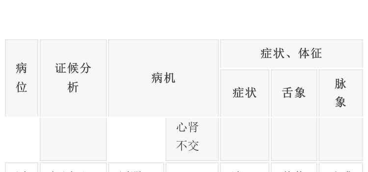

| 病位 | 证候分析 | 病机 |  | 症状、体征 |  |  |
| --- | --- | --- | --- | --- | --- | --- |
|  |  |  |  | 症状 | 舌象 | 脉象 |
|  |  |  | 心肾不交 |  |  |  |
| 厥阴病 | 蛔厥证 | 厥阴为阴之尽，阳之始，阴中有阳。或因传经；或因直中；或因误治，邪气内陷，病至厥阴，气机 |  | 消渴，气上撞心，心中疼热，饥不欲食，呕吐蛔虫，或下利，四肢厥逆 | 苔黄而干 | 弦或沉伏 |
|  |  |  |  | 症状 | 舌象 | 脉象 |
|  |  | 紊乱，阴阳对峙，寒热错杂，蛔虫不安而上逆 |  |  |  |  |

### 第五节卫气营血辨证

卫气营血辨证，是外感温热病的一种辨证方法。是在伤寒六经辨证基础上发展起来的。它按照温热邪气侵袭人体致病的发展规律及其发展过程中各阶段的病变特点，将其分为四类病证，并依此来标示它们之间的传变规律。卫分证与气分证是功能障碍的病变；营分证与血分证是物质损伤的病变。而卫气与营血之间，又有浅深轻重的区别。卫分证主表，它是温热邪气袭表，导致卫外功能障碍的病变，其病变部位在肺与皮毛。邪气进一步发展，则入气分，导致脏腑功能障碍。一般来说，这一阶段邪气盛而正气不衰，正邪相争激烈，呈现一派里热炽盛的特点。气分证由于邪气侵袭的部位不同，可出现胸膈、肺、胃、大、小肠、肝、胆等脏腑的证候。若湿热邪气深入营血，或心包，消灼血中津液，则为营分证。若湿热邪气深入心、肝、肾，损伤肝血肾精，耗血动血，则为血分证。“分”即分界之意，其引申意为“阶段”。也就是说，卫气营血“四分”，实际上就代表了温热病的浅深轻重四个不同阶段。

关于温热病的传变规律，就一般情况而言，是沿卫→气→营→血的顺序渐次深入。但由于邪气的种类与感邪轻重程度的差别，以及患者体质的不同等因素，临床中亦有病变初起即不经卫分而迳见气分证或营分证者；还有卫分证与气分证同时出现的“卫气同病”；或气分证与营分证、血分证同时出现的“气营两燔、气血两燔”证；又有卫分证不经气分而直入营分的“逆传心包”证等。

温热病的特点就是热邪伤津，所以治疗上始终要以泄热保津为重点。卫分、气分重在清泄热邪，泄热即可以保津；营分、血分在清热凉血的同时，又要养阴生津。

因为卫气营血辨证的内容将在《温病条辨讲解》中详细讲述，本节仅列简表概括介绍如下：

卫气营血辨证简表

| 证候分析 | 病机 | 症状、体征 |  |  |
| --- | --- | --- | --- | --- |
|  |  | 症状 | 舌象 | 脉象 |
| 卫分证 | 温热邪气袭表，卫外失司，肺失宣降 | 发热微恶风寒，无汗或少汗，头痛，咽红或痛，咳嗽，口微渴 | 舌边尖红，苔薄白 | 浮数 |
| 气分证 | 温热邪气入里，邪气盛而正气不衰，正邪相争，里热炽盛 | 高热恶热，口渴喜冷饮，尿少而黄，大便干 | 舌红苔黄燥 | 数 |
| 营分证 | 温热邪气深入营分，消灼血中津液，扰乱心神 | 身热夜甚，日反不甚渴，或竟不渴，心烦不寐，或烦躁谵语 | 舌质红绛，少苔或无苔 | 细数 |
| 血分证 | 温热邪气深入血分，消灼血中津液，是为“耗血”；热邪灼伤血络，迫血妄行，导致出血，是为“动血”。血热炽盛、扰乱心神 | 身热，躁扰，昏狂谵妄，吐血、衄血、便血、尿血，非时经血、发斑等 | 舌紫绛 | 数，或细数 |

### 第六节三焦辨证

三焦辨证，也是温病的辨证方法之一。凡外感温热邪气而致病，以发热和热邪伤阴化燥为主要临床特点的病变，称为温病。三焦辨证，就是把温热病分为上焦温病、中焦温病、下焦温病三类病证，并以此来标示它们之间的传变规律。上焦温病，包括肺、心、心包的病变；中焦温病，包括脾、胃、大肠的病变，下焦温病，包括肝、肾、膀胱的病变。

温病的三焦传变规律，一般是始于上焦，传变中焦，终于下焦。因为三焦辨证与卫气营血辨证都是温病的辨证方法，且二者最终都要落实在脏腑上的，所以二者之间有着密切的联系。也可以说，三焦辨证中包含了卫气营血辨证的内容；而卫气营血辨证中也同样包含着三焦所属的脏腑。不过二者又各有所长，其特点就在于：卫气营血辨证主要是划分温病浅深轻重的四个阶段；而三焦辨证则着重在划分温病侵袭人体的三大部位。由此可见，二者之间既有联系，又有区别，结合运用，才能使温病的辨证更为全面。

温热病的治疗原则已在卫气营血辨证中谈过。湿热病的特点是热蕴湿中，湿阻气机，所以其治疗主要在于祛湿清热，宣畅气机。

因为三焦辨证的内容也将在《温病条辨讲解》中详细讲述，本节仅将三焦温热病与湿热病列简表概括介绍如下：

三焦辨证简表

| 病位 |  | 病因 | 病机 | 症状、体征 |  |  |
| --- | --- | --- | --- | --- | --- | --- |
|  |  |  |  | 症状 | 舌象 | 脉象 |
| 上焦 | 手太阴（肺） | 温热邪气 | 温热邪气袭表，卫外失司，肺失宣降 | 发热微恶风寒，无汗或少汗，头痛，咽红或痛，咳嗽，口微渴 | 舌边尖红，苔薄白 | 浮数 |

| 病位 | 病因 | 病机 | 症状、体征 |  |  |
| --- | --- | --- | --- | --- | --- |
|  |  |  | 症状 | 舌象 | 脉象 |
|  | 温热邪气 | 温热邪气入气分，肺热壅盛 | 身热汗出，咳嗽喘息，口渴 | 苔黄 | 数 |
|  | 湿热邪气 | 湿热邪气困阻肌表，肺失宣降，卫外失司，湿热弥漫于里，气机阻滞，卫气同病 | 恶寒发热，头重头昏蒙，周身重痛，口淡不渴，胸脘痞闷 | 苔白腻 | 濡 |

| 病位 |  | 病因 | 病机 | 症状、体征 |  |  |
| --- | --- | --- | --- | --- | --- | --- |
|  |  |  |  | 症状 | 舌象 | 脉象 |
|  | 手厥阴（心包） | 温热邪气 | 温热邪气灼液成痰，痰热蒙蔽心包 | 身热灼手，神昏谵语或昏愦不语，舌蹇，四肢厥逆 | 舌体短缩，质红绛，苔黄燥 | 细滑数 |
|  |  | 湿热邪气 | 湿热郁蒸，酿生痰浊，湿痰蒙蔽心包 | 身热不扬，神识呆痴，时昏时醒，昏则谵语，醒则神呆，呼之能应 | 白腻或黄腻 | 濡滑或濡滑数 |
|  |  |  |  | 症状 | 舌象 | 脉象 |
| 中焦 | 足阳明（胃） | 温热邪气 | 温热邪气入里，阳明胃热炽盛，里热蒸腾 | 高热恶热，大汗出，口渴饮冷，面赤心烦 | 舌红黄燥 | 洪大而数 |
|  | 手阳明（大肠) | 温热邪气 | 高热大汗伤津，胃肠燥热与糟粕炼结成实，燥屎内结，阻滞气机，腑气不通 | 身热，日晡潮热，汗出，大便秘结不下，腹胀痛拒按，烦躁谵语 | 舌红苔黄燥，甚焦燥起芒刺 | 沉实有力 |
|  | 足太阴（脾) | 湿热邪气 | 湿热困脾，气机阻滞，升降失司 | 身热不扬，脘腹胀满，纳呆呕恶，大便溏滞，身重肢倦 | 苔白腻 | 濡 |
|  |  |  |  | 症状 | 舌象 | 脉象 |
| 下焦 | 足少阴（肾) | 温热邪气 | 温热邪气久留不解，深入下焦，消灼真阴，肾阴耗损 | 低热，手足心热甚于手足背，口燥咽干，神倦耳聋 | 舌绛少苔 | 虚大或迟缓结化 |
|  | 足厥阴（肝) | 温热邪气 | 温热邪气消灼真阴肝血肾精枯涸，水不涵木，筋脉失养，虚风内动 | 除上述肾阴耗损见症外，又见手足濡动，甚或瘈疭，心中憺憺大动，甚则心中痛，神昏肢厥 | 舌绛少苔光绛无苔 | 细促或微细欲绝 |
|  | 足太阳（膀胱） | 湿热邪气 | 湿热邪气阻滞膀胱，水道不通。湿热弥漫中，上焦 | 小便不通，热蒸头胀，身重痠痛，神识昏蒙，呕恶不食，口干不欲饮 | 苔白腻 | 濡 |

### 第七节经络辨证

经络辨证已在第三章“经络”中详为述及，这里只简单说明关于经络辨证和伤寒六经辨证的关系问题，二者是既有联系，又有区别的。六经辨证中有些内容与经络辨证是一致的，如六经辨证中也有脏腑和经络病证的内容。但是，正如卫气营血辨证、三焦辨证一样，经络辨证和六经辨证方法，是有其一定特异性的辨证方法。卫气营血与三焦辨证，主要适用于温病辨证。而脏腑辨证等，就不能完全代替卫气营血与三焦辨证。同样道理，六经辨证主要适用于伤寒病的辨证，而不适用于一般内伤杂病的辨证。至于治伤寒病的方子，可以用于治疗内伤杂病，那是另一回事，这不是本书要讨论的内容。经络辨证方法，是广泛适用于外感和内伤杂病的一种辨证方法，但又不能完全代替六经辨证及其他辨证方法。

复习思考题

1. 什么是证？什么是辨证？辨证方法有几种？

2. 八纲辨证和其他辨证方法有什么关系？

3. 八纲辨证、脏腑辨证、气血津液辨证的基本内容是什么？

4. 表证入里与里证出表的机理是什么？

5. 真假寒热虚实的辨证要点是什么？

6. 六经辨证、卫气营血辨证、三焦辨证主要适用于哪类疾病的辨证？

## 第七章治则与治法

[自学时数] 8学时

[面授时数] 8学时

[目的要求]

1.了解中医学”未病先防，既病防变”的预防思想和增强正气，避其毒气的预防措施，以及调整脏腑功能和调理气血关系在临床上的指导意义。

2.掌握治病求本，扶正祛邪，调整阴阳和三因制宜等基本原则及其主要内容。

3.了解中医内治法中八法的临床运用和了解采用药物外治法的具体方法。

### 第一节防治原则

#### 一、预防原则

预防，就是采取一定的措施，防止疾病的发生与发展。

中医学在总结劳动人民与疾病作斗争的经验中，首重预防。早在《内经》中就有了”治未病”的思想，《素问》第一篇”上古天真论”讲的就是预防问题。篇中提出”虚邪贼风，避之有时”，以预防体外致病因素侵袭，同时又强调人体内在的预防因素，指出”恬惔虚无，真气从之，精神内守，病安从来”。可见《内经》中的预防思想，虽然是从体内、体外两方面并提，但是对体内方面更加重视，这是中医学预防思想的重要特点。《素问·四气调神大论》中更明确地指出：”不治已病治未病，不治已乱治未乱。……夫病已成而后药之，乱已成而后治之，譬犹渴而穿井，斗而铸锥，不亦晚乎”？此篇所论，又进一步把预防思想扩大而运用到治疗方面去。这种治疗上的预防，也是中医学在预防方面的重要特点之一。下面我们就从未病先防与既病防变两方面来介绍

（一）未病先防

未病先防，就是在没有发病之前，做好各种预防工作，以防止疾病的发生。中医学在长期和疾病作斗争的实践中，积累了丰富的有关预防疾病的方法。如：

1.调养精神情志

人类的思想活动与疾病的产生有很密切的关系。精神情志活动异常，如强烈的或持续时间较长的精神刺激，都足以引起人体阴阳失调，气血不和而发生疾病。《素问·阴阳应象大论》指出”怒伤肝”、”喜伤心”、”思伤脾”、”忧伤肺”、”恐伤肾”。《素问·举痛论》说：”百病生于气也，怒则气上，喜则气缓，悲则气消，恐则气

下，……惊则气乱， ……思则气结”。《素问·疏五过论》说：”暴乐暴苦，始乐后苦，皆伤精气；精气竭绝，形体毁沮”。以上所述，皆为七情内伤所致疾病。由于人体的精神活动与人体的生理病理有着密切关系，所以，减少不良的精神刺激和过度的情志变动，对于减少或防止疾病的发生，也具有十分重要的意义，即所谓”精神内守，病安从来”。

2.适应四时气候

人类生活在自然界中，自然界是人类赖以生存的必要条件，自然界的运动变化，也必然影响人体的生理病理变化。故云”人以天地之气生，四时之法成”（《素问·六节脏象论》）。”夫百病之生也，皆生于风寒暑湿燥火，以之化之变也”（《素问·至真要大论》）。”阴阳四时者，万物之终始也，死生之本也。逆之则灾害生，从之则苛疾不起”（《素问·四气调神大论》）。《内经》中，不仅认识到生物和自然界是一个不可分割的整体，而且提出了适应四时气候的具体养生措施，如：”春三月， ……夜卧早起，广步于庭，被髮缓形，以使志生；夏三月， ……夜卧早起，无厌于日，使志无怒；秋三月，……早卧早起，与鸡俱兴，使志安宁；冬三月，……早卧晚起，必待日光， ……去寒就温，无泄皮肤， ……使气亟夺”。”春夏养阳，秋冬养阴，以从其根，……逆其根，则伐其本、坏其真矣”（《四气调神大论》）。以上所述，体现了”人与天地相应”的整体观念，是预防疾病的重要措施和摄生所必须遵循的重要原则。

3.加强身体锻炼

加强身体锻炼，是增强体质，减少或防止疾病发生的一项重要措施。远在春秋战国时代，已应用”导引术”、”吐纳术”防治疾病。公元220年以前，华佗又创造了”五禽戏”，模仿五种动物的生动活泼的姿态（虎的上肢攫仆，鹿的伸展头颈，熊的卧倒匍伏，猿的脚尖蹤跳，以及鸟的展翅飞翔），来锻炼身体，以防止病邪的侵害。此外，如太极拳、八段锦等，也是古代锻炼身体的方法。以上方法，可以舒和关节，调和气血，只要持之以恒，就能达到强壮身体，预防疾病的目的。现代所说的气功疗法，是古代养生法之一，对疾病的防治也有着重要意义，特别是对一些顽固的慢性疾患，具有独特的疗效。

4、注意饮食起居

《素问·上古天真论》说：”饮食有节，起居有常，不妄作劳，故能形与神俱，而尽终其天年，度百岁乃去”。这说明了饮食起居须要保持一定的规律，才能使身体健康。

关于饮食和疾病的关系，早在《内经》中就有论述，《素问·痹论》说：”饮食自倍，肠胃乃伤”，《素问·生气通天论》说：”膏梁之变，足生大疔”，《素问·五脏生成篇》说：”多食咸，则脉凝泣而变色；多食苦，则皮槁而毛拔；多食辛，则筋急而爪枯；多食酸，则肉胝䐢而唇揭；多食甘，则骨痛而髮落；此五味之所伤也”。由上可知，生命的持续，虽然有赖于饮食物的给养，假使暴饮暴食，没有节制，或偏食，非但无益，反而有害。此外，食入腐败有毒食物，也能戕害身体。如《金匮要略》所说：”秽饭、馁肉、臭鱼，食之皆伤人”。

关于起居，劳逸，《素问·本病论》说：”久视伤血，久立伤骨，久行伤筋”，《素问·举痛论》说：”劳则气耗”，这些都说明了疲劳过度对身体的害处。汉代名医华佗说：”人体欲得劳动，但不当使极耳。动摇则谷气得消，血脉流通，病不能生。譬犹户枢，终不朽

也”。由上可知，适当的体力劳动，可以增进身体健康，而过度疲劳不已，却能伤耗形气。

5.药物预防

在药物防病方面，早在《素问·遗篇·刺法论》中就有用”小金丹”预防疫病传染的记载。我国于十六世纪或更早一些时候发明的人痘接种法，用来预防天花，是人工免疫法的先驱。此外，还有用苍术、雄黄等烟熏以消毒防病的方法。近年来，运用中草药预防疾病，又得到很大发展。

（二）既病防变

既病防变，是治疗上的预防措施。凡疾病的传变，一般都是由浅入深，并可由这一脏腑，传至另一脏腑。所以，疾病发生后，则应早期诊断，早期治疗，以防止疾病的发展。《素问·阴阳应象大论》根据疾病发生、发展的规律，提出”邪风之至，疾如风雨，故善治者治皮毛，其次治肌肤，其次治筋脉，其次治六腑，其次治五脏。治五脏者，半死半生也”。此后，《金匮要略》依照《内经》既病防变的思想，提出”见肝之病，知肝传脾，当先实脾”的传变与防治规律，这是既病防变法则的具体运用。总之，邪气侵袭人体，只有及时诊治，才能避免病邪由表传里，步步深入，控制或减少疾病的恶化，收到良好的治疗效果。

#### 二、治疗原则

治则，即治疗疾病的原则，是在整体观念和辨证论治基本精神指导下制定的，对临床治疗中立法处方用药，具有普遍指导意义的治疗规律。治疗原则和具体的治疗方法不同。治疗原则是用以指导治疗方法的总则，任何具体的治疗方法，总是由治疗原则所规定并从属于一定的治疗原则的。比如，各种病证，从邪正关系来讲，离不开邪正斗争，消长盛衰的变化，因此，扶正祛邪即为治疗总则，而在此总则指导下所采取的益气、滋阴、养血等法，就是扶正的具体方法；发汗、涌吐、攻下等法，就属于祛邪的具体方法。主要的治疗原则，有以下几个方面：

##### （一）治病求本

治病求本，就是治疗疾病时，必须要寻求疾病的根本原因，并针对其根本原因进行治疗，这是辨证论治的一个根本原则。

“本”是对“标”而言的。标本是一个相对的概念，有多种含义，可用以说明病变过程中各种矛盾双方的主次关系。如从正邪双方来说，正气是本，邪气是标；从病因与症状来说，病因是本，症状是标；从病变部位来说，内脏是本，体表是标；从疾病先后来说，旧病是本，新病是标；原发病是本，继发病是标等等。

任何疾病的发生、发展，总是要通过若干症状而显示出来的，但这些症状只是疾病的现象，还不是疾病的本质。只有充分地搜集、了解疾病的各个方面，包括症状表现在内的全部情况，并通过综合分析，才能透过现象看到本质，找出疾病的根本原因，从而确立相当的治疗方法，比如头痛可由外感、血虚、痰湿、瘀血、肝阳上亢等多种原因引起，治疗时，就不能简单地采取对症止痛的疗法，而应该通过全面地综合分析，找出致病的原因，分别用解表、养血、燥湿化痰、活血化瘀，平肝潜阳等方法进行治疗，才能收到满意的效果。这就是“治病必求其本”的意义所在。

在运用治病求本这一治疗原则的时候，必须正确掌握“正治与反

治”、“治标与治本”两种情况：

1.正治与反治

《素问·至真要大论》提出“逆者正治，从者反治”两种治法，都是治病求本这一治疗原则的具体运用。

所谓“正治”，就是采用与病变性质相反的药物来治疗的方法，即“逆者正治”。如：寒证用热药，热证用寒药，实证用泄法，虚证用补法等，皆属正治法。正治法是临床上最常用的治疗方法。

所谓“反治”，是采用顺从疾病外在现象而用药的治疗方法，即药物的属性与疾病的假象相一致，如见热象而用热药，见寒象而用寒药。反治法，又称从治法，故曰“从者反治”。常用的反治法有如下几种：

寒因寒用：即见寒象而用寒凉药，适用于里热极盛，阳盛格阴的真热假寒证。寒药是针对疾病的本质“真热”而设，内热一除，假寒之象就消失了。如外感热病中，热深厥深者，就必须用大量清热药为主进行治疗，用寒药，顺从了假寒之象，故称“寒因寒用”。

热因热用：即见热象而用热药，适用于阴寒极盛，阳气大衰，阴盛格阳的真寒假热证。热药是针对疾病的本质“真寒”而设，内寒一除，阳气得复，假热之象就消失了。如元阳虚脱者，本是阳虚内寒，但有时出现烦躁、面赤、身反不恶寒的假热现象，就必须急救回阳，用热药顺从假热之象，故称“热因热用”。

上述假寒证用寒药，假热证用热药，其实是假反；而不是真反。因为疾病的本质是真寒或真热，不过外面显露着假寒、假热的现象，丢开这些假象不管，只认真象，那还是以寒治热，或以热治寒，亦即正治而非反治。

塞因塞用：塞是闭塞而不通畅之意。一般对塞的症状应当使用通利的方法治疗。如腹胀则当消胀，此为正治法。但是，如脾虚而致腹胀，虽胸腹胀满，但并无痰、湿、食积、瘀血等实邪留滞，若用通利，则脾气更虚，胀满益甚。必须用补脾益气药治其虚胀虚满，脾气一健，运化正常，则胀满自消。这种以补开塞的方法，就是“塞因塞用”，适于真虚假实之证。

通因通用：对一般通利症状，应当用固涩的方法来治疗，如腹泻则止泻，此为正治法。但是，如果腹泻由食积所致，则不仅不能用止泻药，反而要用消导泻下药以去其积滞，这种用通利的方法治疗通利的病证，就是“通因通用”。

上述塞因塞用、通因通用的反治法，关键在于辨清证之虚实。因为，痞满的症状多属实，若因虚致满，则用补法而益其虚，气不虚则痞满除。同理，泄泻是由于“实”之留滞，则用“泻”法去其实，病因去而泻亦止，这正是治本之法。因此，反治法实际上是正治法在特殊情况下的一种变法。

此外，临床上经常遇到以热治寒而寒拒热，以寒攻治则病剧；以寒治热而热拒寒，以热攻治则病剧等，必须使用反佐疗法方能取效。所谓反佐，就是药同于病而顺其性之意。反佐法包括药物反佐和服法反佐两种：

药物反佐法：治寒证时，在温热药中，佐以少许寒凉药；治热证时，在寒凉药中，佐以少许温热药。如白通加猪胆汁汤，方中既有姜附，又佐以少量咸苦寒之人尿、猪胆汁，即为药物反佐法。

服法反佐：即热证用寒凉药，采取温服的方法，如承气汤热服；寒证用温热药，采取凉服法，如姜附剂冷服。正如张景岳所云：“热因寒用者，如大寒内结，当治以热，然寒甚格热，药不得入，则以热药冷服，下之后，冷体即消，热性便发，情且不违，而致大益；寒因热用者，如大热在中，以寒攻治则不入，以热攻治则病增，乃以寒药热服，入腹之后，热气既消，寒气遂行，情且协和，而病已减”。

2.治标与治本

标与本是一对矛盾，在一般情况下，本是主要矛盾或矛盾的主要方面，而标则是次要矛盾或矛盾的次要方面。分析标本，就是分清疾病的本末主次，病情的轻重缓急，从而决定治疗原则和步骤。

大体说来，治病当求其本，所谓治本，就是治疗的根本原则。一般情况下，是先治本而后治标，因为本是矛盾的主要方面，只要治好了本，标也就迎刃而解了。如：气虚发热的病人，发热是标，气虚是本，所以采取补气的方法，就能退其标热。但在某些情况下，标病甚急，不及时解决可危及患者生命或影响治疗时，则应急治其标，而后治本。如：喉风患者，喉头肿闭，水浆难下，其致病因素是本，咽肿的症状是标，但由于咽肿而致水浆难下，所以必须先用刺法、砭出恶血，以消肿势，然后汤药才能下咽，因此有“急则治其标，缓则治其本”的变通之法。由上可知，治标是在应急情况下的权宜之计，治本才是治病的根本之图，治标是为治本创造条件，更好地治本。所以说，标本缓急是从属于治病求本这一根本原则，并与之相辅相成的。

病有标本缓急，所以治有先后。若标本并重，则应标本兼顾，标本同治。如：外感热病过程中，由于里实热不解而阴液大伤，表现为腹满硬痛、大便燥结、身热、口干唇裂、舌苔焦燥等正虚邪实、标本俱急的证候，就当标本兼顾，泻下与滋阴两法同用，清泻实热以治本，滋阴增液以治标。若仅用泻下，则有进一步耗竭阴液之弊；单用滋阴，又不足以泻在里之实热。而两法同用，则泻下实热即可存阴，配以滋阴润燥，即可“增水行舟”，亦有利于通下，标本同治，相辅相成，即可达到邪去液复之目的。

还须指出的是，所谓“急则治其标，缓则治其本”，决不能绝对化。急的时候也未尝不须治本，如亡阳虚脱时，急用回阳救逆之法，就是治本；大出血后，气随血脱时，急用益气固脱之法，也是治本。可见，不论标本，急者先治。同时，缓的时候，也不是不可治标，脾虚气滞者，既用参术苓草等健脾以治本，又伍木香、砂仁、橘皮等理气以治标，就有别于单纯补脾以治本。总之，标本先后，是根据具体病情的缓急轻重而决定的，标急于本，当先治标，本急于标，当先图本。

最后还应指出，标本的关系并不是绝对的、一成不变的，而是在一定条件下可以相互转化的。只有掌握标本转化的规律，才能抓住疾病的主要矛盾，做到治病求本。

##### （二）扶正祛邪

疾病的过程，是正气与邪气矛盾双方互相斗争的过程，邪胜于正则病进，正胜于邪则病退。因而治疗疾病，就是要扶助正气，祛除邪气，改变邪正双方的力量对比，使之有利于疾病向痊愈方面转化。可见，扶正祛邪是解决邪正矛盾的基本方法，是指导临床治疗的一条重要法则。

”邪气盛则实，精气夺则虚”（《素问·通评虚实论》）。”虚则补之，实则泻之”（《素问·三部九候论》）。邪正盛衰，决定着病变的虚实。所以，补虚泻实实际上就是扶正祛邪这一法则的具体运用。扶正，就是补法，用于虚证。扶正的补法有益气、养血、滋阴、助阳等。艾灸、营养、加强身体锻炼等，也属扶正范畴。祛邪，就是泻法，用于实证。祛邪的泻法有发表，泻下、清热、渗湿、利水、消导、活血化瘀等。扶正与祛邪，虽然是具有不同内容的两种治疗法则，但二者是相互为用、相辅相成的。扶正，使正气加强，有助于抗御和驱逐病邪；祛邪，排除了病邪对正气的损伤，有利于保存正气和正气的恢复。

扶正与祛邪的基本原则是扶正不留邪，祛邪不伤正，临床上应根据邪正斗争的趋势，权衡邪正的盛衰，分别采用”扶正”或”祛邪”，或”扶正祛邪并用”，或”先扶正后祛邪”，或”先祛邪后扶正”的方法。如：

（1）邪气亢盛，正气未衰。新病多是邪气实而正不虚，此时应以祛邪为主，使邪气退则病自愈，所谓”祛邪正自安”。如果先扶正，反而会助长邪气，加重病情。

（2）正气已虚，邪气不盛。久病多是正气虚而邪气不盛，此时应以扶正为主，使正气复则邪自除，所谓”扶正以祛邪”。如果妄用攻伐之药，就会造成正气愈伤，病情愈重的后果。

（3）正气已虚，邪气亢盛。此种情况，如单纯祛邪则更伤正气，单纯扶正又会助邪，故应根据病情采取攻补兼施、先攻后补、先补后攻之法。采取攻补兼施之法时，也要分清是以正虚为主，还是以邪实为主。以正虚较急重的，应以扶正为主，兼顾祛邪；以邪实较急重的，则以祛邪为主，兼顾扶正。先补后攻法，用于正虚邪实以正虚为主，正气虚弱不耐攻伐，倘兼以祛邪反而更伤正气的病证。先攻后补法，用于邪实而正不甚虚，或虽邪实正虚，倘兼以扶正反会更加助邪的病证。

##### （三）调整阴阳

疾病的发生，从根本上说是阴阳的相对平衡遭到了破坏，即阴阳的偏盛偏衰代替了正常的阴阳消长。所以，从广义说来，调整阴阳适用于一切疾病，是临床治疗的根本法则之一。在具体运用上，有”泻其有余”，”补其不足”两个不同原则。

（1）阴阳偏盛，泻其有余：阴阳偏盛，即阴或阳的过盛有余。由于阳盛则阴病，阴盛则阳病，阳热盛易于损伤阴液，阴寒盛易于损伤阳气，所以，当阴或阳偏盛而其相对一方没有构成虚损时，即可采用”损其有余”的方法，清泻阳热或温散阴寒。如”阴盛则寒”的寒证，就需用温热药纠正其阴偏盛；”阳盛则热”的热证，就需用寒凉药纠正其阳偏盛。此外，阴阳偏盛而其相对的一方有偏衰时，则当兼顾其不足，配合以扶阳或益阴之法。

（2）阴阳偏衰，补其不足：阴阳偏衰，即阴或阳的虚损不足，或为阴虚，或为阳虚，或阴阳俱虚。阴虚则不能制阳，常表现为阴虚阳亢的虚热证；阳虚则不能制阴，常表现为阳虚阴盛的虚寒证。阳病治阴，阴病治阳。因阴虚而致阳热亢盛者，一般不能用寒凉药物直折其热，应滋阴以制阳，即所谓”壮水之主，以制阳光”。因阳虚而致阴寒偏盛者，不能用辛温发散药以散阴寒，应补阳以制阴，即所谓”益火之源，以消阴翳”。若属阴阳两虚，则应阴阳双补。

对阴阳偏衰的病证，其治疗原则，应注意”阴中求阳”、”阳中求阴”，即补阳时加补阴药，补阴时要加补阳药，因”无阳则阴无以生，无阴则阳无以化”，所以，”善补阳者，必于阴中求阳，则阳得阴助而生化无穷；善补阴者，必于阳中求阴，则阴得阳升而泉源不竭”。

又由于阴阳是辨证的总纲，疾病的各种病理变化也均可以阴阳失调加以概括，如表里出入、上下升降、寒热进退、邪正虚实、营卫不和、气血不和等，无不属于阴阳失调的具体表现。因此，从广义而言，解表攻里、越上引下、升清降浊、寒热温清、虚实补泻、调和营卫、调理气血等治疗方法，也皆属于调整阴阳的范围。

##### （四）因时、因地、因人制宜

因时、因地、因人制宜，是指治疗疾病要根据季节、地区以及人的体质、年龄等不同而制定适宜的治疗方法，故曰：”圣人治病，必知天地阴阳，四时经纪”（《素问·五常政大论》），”上知天文，下知地理，中知人事”（《素问·气交变大论》），这是由于疾病的发生、发展，是受多方面因素影响的，如时令气候、地理环境等，尤其是患者个体的体质因素，对疾病的影响更大。因此，在治疗疾病时，必须把各个方面的因素考虑进去，制定出适宜的治疗方法。

1、因时制宜

四时气候的变化，对人体的生理功能、病理变化均产生一定的影响。根据季节气候的不同，来考虑治疗用药的原则，就是”因时制宜”。一般说来，春夏季节，气候由温渐热，阳气升发，人体腠理疏松开泄，就是患外感风寒，也不宜过用辛温发散之品，以免开泄太过，耗伤气阴；而秋冬季节，气候由凉变寒，阳气敛藏于内，此时者病非大热，就当慎用寒凉之品，以防苦寒伤阳。此即《素问·六元正纪大论》”用温远温，用热远热，用凉远凉，用寒远寒”之理。

2.因地制宜

我国地域辽阔，各地气候条件不一，地理环境及各地生活习惯不同，故生理活动和病理变化的特点不尽相同，还会出现某些地方病。根据不同地区的气候条件、地理环境及生活习惯，来考虑治疗用药的原则，即”因地制宜”。如：我国西北地区，地势高而寒冷少雨，故其病多燥寒，治宜辛润；东南地区，地势低而温热多雨，故其病多湿热，治宜清化。说明地区不同，患病亦异，而治法亦当有别。就是患有相同病证，治疗用药亦当考虑不同地区的特点如：用辛温解表药治外感风寒证，在西北严寒地区，药量可以稍重，而在东南温热地区，药量就应稍轻，或竟改用轻淡宣泄之品。至于地方病，则应根据具体情况，采取防治措施。

3.因人制宜

根据病人年龄、性别、体质、生活习惯、职业等不同特点，来考虑治疗用药的原则，叫”因人制宜”。如：男女性别不同，各有其生理特点，尤其妇女有月经、怀孕、产后等情况，须在治疗时加以考虑。此外，年龄不同，生理机能与病变特点亦不同，老年人气血衰少，生机减退，患病多虚证或正虚邪实，治疗时，虚证宜补，而邪实须攻者亦应慎重，以免损伤正气。小儿生机旺盛，但气血未充，脏腑娇嫩，易于寒温失调、饥饱不匀，故治小儿病，忌投峻剂，补剂也须慎用。一般用药剂量，亦必须根据年令加以区别，药量太小则不足以祛病，药量太大则反伤正气。在体质方面，由于每个人的先天禀赋和后天调养不同，个体素质不但强弱不等，而且还有偏寒偏热以及素有慢性疾病等不同情况，所以虽患同样疾病，治疗用药亦当有所区别，如阳盛之体慎用温热，阳虚之体慎用寒凉等，其他如患者的职业与工作条件亦与某些疾病的发生有关，在诊治时也应注意。

由上可知，因人制宜，是指治疗中不能只孤立地看病证，还要看到人的整体和不同人的具体情况；因时、因地制宜，是说，治疗时要看到人与自然环境的密切关系。只有善于因时、因地、因人制宜，全面而又具体地分析和认识疾病，才能取得较好的治疗效果。

### 第二节治疗方法

治法，是治疗疾病的具体方法，有内治法与外治法的区别。

#### 一、内治法

内治法，即内服药物治疗疾病的方法，在临床上应用最为广泛，归纳起来，内治法主要有汗、吐、下、和、温、清、补、消八种。这八种方法，为中医治法中的基本大法。现将八法及八法的配合运用分述如下：

##### （一）汗法

1.汗法的意义和作用

汗法，即解表法，主要是指用辛散轻宣的方药，组成适当的方剂来开泄腠理，逐邪外出的一种方法。因为外邪侵犯人体，大多始于皮毛，然后，由表入里。当邪在皮毛肌表，还没有入里之时，就应采用汗法，使邪从外解，从而控制疾病的转变，达到早期治愈的目的，此即《素问·阴阳应象大论》所说：”善治者，治皮毛”、”其在皮者，汗而发之”之意。

汗法的主要作用，是驱逐外表的病邪，因此主要适用于表证。此外，由于汗法能调和营卫，使病邪和一部分水分从肌表排出，因此，在某些水肿和疮疡的初期以及痘疹将透未透之时，具有表证特征者，也可以使用汗法。

2.汗法的运用

同是病邪在表，由于感受邪气有不同，证有表寒、表热之分；由于各人体质不同，或素有宿疾，以致内外合邪表里同病。故汗法又分为辛凉解表、辛温解表、扶正解表三法。

辛凉解表：适用于表热证。症见发热重，恶寒轻，口中渴，咽部红或痛，舌质红，苔薄黄，脉浮数。代表方剂为银翘散、桑菊饮。

辛温解表：适用于表寒证。症见恶寒重，发热，无汗或自汗，头痛、鼻塞、肢体痠痛，口中和，舌苔薄白，脉浮紧或浮缓。代表方剂为麻黄汤、桂枝汤、荆防败毒散。

扶正解表：适用于素体虚弱，复感外邪者。根据不同的病变类型，此法又可分为益气解表、滋阴解表、助阳解表三种具体治法。益气解表法：适用于素体气虚、复感外邪者，症见憎寒壮热，头项强痛，肢体痠痛，胸膈痞满，鼻塞声重，咳嗽有痰，无汗，舌苔白腻，脉浮而沉取无力；或平素反复感冒，多汗、有气虚表现者。代表方剂为人参败毒散。滋阴解表法：适用于素体阴虚、复感外邪者，症见头痛身热，微恶风寒，咳嗽咽干，痰稠难出，无汗或有汗亦不多，口渴心烦，舌赤脉数。代表方剂为加减葳蕤汤。助阳解表法：适用于素体阳虚，感受外邪，症见热轻寒重，四肢不温，头痛无汗，周身疲乏无力，似睡不睡，脉沉微细。代表方剂为麻黄附子细辛汤。

3.应用汗法的注意事项

发汗适度：取汗应自然，不应急暴，服药后，最好盖薄被取暖，使津津微汗，稍久则手足四末亦有汗，遍身通达，如此则外邪可散。若过汗致汗流如水，既易伤阴，又易损阳。

发汗注意时间环境：发汗除根据病情及体质，尚须注意时间环境，寒冬宜发，夏暑宜清，尤其夏季当慎用辛温发汗法。

发汗禁忌：表邪已尽，麻疹已透，疮疡已溃，吐泻失水，热病后期津亏，暑热证等，禁用汗法。

##### （二）吐法

1、吐法的意义和作用

吐法，是利用药物的涌吐性能，引导停蓄在咽喉、胸膈、胃脘间的痰涎、宿食、毒物等从口而出，从而缓和病势而达到治愈疾病目的的一种方法，此即《素问·阴阳应象大论》所说”其高者，因而越之”之意。

吐法，主要适用于中风痰涎壅盛、喉痹痰壅喉间、宿食停积胃脘、误食毒物尚留胃中，以及干霍乱吐泻不得等病情急剧而又急需吐出之证。

2.吐法的运用

吐法的具体运用，包括涌吐痰食、涌吐风痰、开窍催吐、涌吐宿食等。

涌吐痰食：适用于痰涎壅塞胸中，或宿食停于上脘之证。症见胸中痞硬，烦躁不安，上冲欲呕等。代表方剂为瓜蒂散。

涌吐风痰：适用于中风闭证所致的失音闷乱、口眼㖞斜，或不省人事、牙关紧闭及癫痫等，确有痰浊壅塞胸中，脉象浮滑者。代表方剂为三圣散。

开窍催吐：适用于中风闭证初起，痰涎壅盛于咽喉，不能言语。或不省人事，脉象滑实有力者。代表方剂为急救稀涎散。

涌吐宿食：适用于宿食停滞不消或干霍乱证，症见脘腹胀痛不舒，欲吐不得吐，欲泻不得泻。亦治误食毒物，尚停留胃中者。

3.吐法的注意事项

老人、产妇、孕妇、出血性疾病及气虚短气、肺病喘息者忌用吐法。体弱者慎用吐法。使用吐法时，中病即止，以免损伤正气。

##### （三）下法

1.下法的意义和作用

下法又称泻下法，是通过泻下而通便以攻逐实邪、排除积滞而治疗里实证的方法，此即《素问·阴阳应象大论》所说”其下者引而竭

之”、”中满者泻之于内”之意。

下法的主要作用是，排除肠胃积滞，荡涤实热、攻逐水饮寒积。所以凡胃肠积滞，实热内结、大便不通、或寒积、蓄水等，均可使用下法治疗。

2.下法的运用

由于人体素质有虚实之差异，证候表现有热结、寒结、燥结、水结之区别，因此，下法的具体运用又可分为寒下、温下、润下、逐水、攻补兼施等。

寒下：适用于热与实相结的里热实证，症见发热、烦渴、头痛目赤、神昏谵语、腹满胀痛、便秘、舌苔焦黄者；热毒入血，血热妄行之证，症见鼻衄、咳血、吐血、斑疹，用清热解毒凉血药而收效不显者；肺胃郁热或肝胆实火之证，症见咽喉肿痛、口舌生疮、齿龈肿痛、牙宣齿衄、胸膈烦热、口臭便秘，或头痛面红而赤、耳鸣耳聋、心烦易怒等证者。代表方剂为大承气汤、小承气汤、调胃承气汤、凉膈散、当归龙荟丸等。

温下：适用于寒冷凝滞肠胃的寒积实证，症见脘腹疼痛。剧如针刺、拒按、便秘、手足厥冷，脉弦紧者，或脾胃虚寒，运化失常，冷积停滞肠胃而见腹痛喜暖，按之硬满，渴喜热饮，便秘或下利不畅，畏寒肢冷，舌苔白滑者。代表方剂为大黄附子汤、三物备急丸。

润下：主要适用于体虚便秘之证，其泻下之力较和缓。年老体弱、孕产妇等，由于津血不足引起的便秘，以及习惯性便秘者，皆可用之。代表方剂为麻子仁丸、济川煎。

逐水：主要适用于水饮停聚于胸腹及水肿而属体质强壮者。此法能使水饮从大小便排出，以达到消除积水肿胀之目的。代表方剂为十枣汤、舟车丸、控涎丹、大陷胸汤。

攻补兼施：主要适用于里实积结而正气已虚者。此时，攻邪则正气不支，补正则实邪愈壅，治宜泻下与补益同用，方为两全之计。在具体运用时，又分为以下三法：扶正攻下之法，用于阳明实证而气血两虚者，症见自利清水色纯青，腹痛拒按，谵语，口舌干燥而渴，身热，神倦少气，或便秘，腹胀满硬痛，甚则循衣撮空，神昏肢厥，舌苔焦黄或焦黑，脉虚，代表方剂为黄龙汤。滋阴增液，通便泄热之法，用于热结阴亏便秘之证或痔疮日久，大便燥结不通，属于阴虚热结者，代表方剂为增液承气汤。温补脾阳，泻下冷积之法，用于脾阳不足，阳气不行，冷积阻结于肠间，以致大便秘结者，或冷积久留不化，脾气虚弱，以致久利赤白，腹痛，手足不温，脉沉弦者，代表方剂为温脾汤。

3.下法的注意事项

凡年高体虚、产后、血亏、病后津伤之人，虽有大便秘结，亦不可草率攻下。妇女妊娠及月经期慎用攻下。下法应以祛邪为度，中病即止，切忌过量，以防损伤正气。凡服泻下剂后，多有损于胃气，此时忌食油腻及一切不易消化的食物。

##### （四）和法

1.和法的意义和作用

和法，又称和解法，即使用具有和解、解郁、疏泄、调和作用的药物组成的方剂，调节气机、助正祛邪，恢复人体正常机能的治疗方法。

和法的主要作用是和解少阳、调和肠胃、调和肝脾等。因此，少阳病、肝脾不和、肝胃不和、邪犯肠胃等证，均可用此法治疗。

2.和法的运用

由于病理变化的特点不同，和法在具体运用时，可分为和解少阳、调和肝脾（胃）、调和肠胃等法。

和解少阳法：主要适用于少阳病半表半里证，症见寒热往来，胸胁苦满，心烦喜呕，默默不欲饮食，口苦咽干目眩，脉弦者。代表方剂为小柴胡汤。

调和肝脾（胃）：主要适用于肝脾不和证，症见精神抑郁，胸胁胀满疼痛，腹痛泄泻，或每因抑郁恼怒即腹痛泄泻者；肝胃不和证，症见精神抑郁，胸胁胀满疼痛，纳少呕𫫇，嗳气反酸，胃脘疼痛者。代表方剂为四逆散、逍遥散、痛泻要方、左金丸。

调和肠胃：主要适用于邪犯肠胃，以致胃肠功能失调，寒热错杂，中焦升降失常之证，症见胃脘痞满、𫫇心呕吐、肠鸣泄泻，腹痛者。代表方剂为半夏泻心汤、生姜泻心汤、甘草泻心汤。

此外，前人曾有”疟属少阳”的说法，所以一般也把治疟之法归入和解之法。治疟之法，适用于疟疾、瘟疫，出现往来寒热、胸闷欲呕等类似少阳病之症状者。代表方剂为截疟七宝饮、达原饮。

3.和法的注意事项

凡属邪在肌表，或表邪已全入里者，不宜用。脏气极虚，气血不足之寒热证不宜用，恐贻误病情。

电子版注：

1、原书有“邪在疾表”字样，应为“邪在肌表”，电子版已改。

##### （五）温法

1.温法的意义和作用

温法又称祛寒法，是使用温热药物以驱除寒邪、补益阳气的一种方法，此即《素问·至真要大论》所说”寒者热之”之意。

温法的主要作用是温中散寒、回阳救逆、温经散寒、温阳利水。所以，中焦虚寒、阳衰阴盛、亡阳欲脱、寒凝经脉、阳虚水泛之证，都可用温法治疗。

2.温法的运用

温中祛寒：主要适用于中焦虚寒证，症见脘腹冷痛，呕吐，腹泻，舌淡苔白滑，脉沉迟等。若以脾阳虚为主，多见腹痛喜暖、腹胀便溏，四肢不温；若以胃寒为主，多见胃脘疼痛，得热痛减等。代表方剂为理中汤、吴茱萸汤、小建中汤、大建中汤、厚朴温中汤。

回阳救逆：主要适用于阴寒内盛、阳气衰微或亡阳虚脱之证，症见恶寒踡卧，四肢厥冷，呕吐，下利清谷，腹痛，神疲欲寐，口不渴或口渴，脉沉微细。代表方剂为四逆汤、参附汤。

温经散寒：主要适用于阳气不足、经脉受寒，血液运行不畅之证，症见手足厥冷，肢端青紫，脉细欲绝等。或用于风寒湿痹，寒邪偏盛，四肢关节肌肉冷痛而屈伸不利，得热痛减者。代表方剂为当归四逆汤、附子汤、乌头汤。

温阳利水：主要适用于阳气虚、气化功能失常所致阴水证，症见小便不利，四肢沉重疼痛，腹痛，下利，或肢体浮肿，面色㿠白，肢冷畏寒，舌淡，脉沉微细。代表方剂为真武汤、实脾饮。

3.温法的注意事项

热伏于里，热深厥深，形成内真热、外假寒者禁用；既往或目前有出血（吐血、尿血、便血）病史者慎用；素体阴虚，舌红，口燥咽干者慎用；阴寒极盛，服温热药入口即吐者，可用反佐之法以因势利导。电子版注：

“3、温法的注意事项”中原书为“内真寒、外假热”，经考证应为“内真热、外假寒”。此为原书笔误，已在电子版中改正。

##### （六）清法

1.清法的意义和作用

清法，是使用寒凉性质的药物，达到清热目的的一种方法。此即《素问·至真要大论》所说”热者寒之”之意。

清法的主要作用是清热泻火、凉血解毒、保存津液。所以各种里热证，如气分热、营血热、毒热、湿热、脏腑热、暑热、虚热证，均可用此法治疗。

2.清法的运用

清气分热：适用于热在气分之证，症见壮热，烦渴，多汗，舌苔黄，脉洪大滑数，或热病后余热未清，症见心烦懊憹等。代表方剂为白虎汤、栀子豉汤。

清营凉血：适用于邪热入营，或入血分之证，症见身热烦扰，口渴或不渴，神昏谵语，吐衄发斑，舌质红绛，脉细数。代表方剂为清营汤、犀角地黄汤。

清热解毒：适用于热毒所致的各种实热证，如：瘟疫、温毒、疮疡阳证、肺痈、痢下脓血、热淋，症见烦躁狂乱、吐衄发斑，肿胀、疼痛、化脓、腐烂、发热等。代表方剂为黄连解毒汤、普济消毒饮、清瘟败毒饮。

清脏腑热：适用于热邪偏盛于某一脏腑所产生的火热之证。其临床表现根据邪热偏盛于某一脏腑而有所不同，治疗亦各有侧重，如：心经有热，症见口渴面赤，心胸烦热，渴欲冷饮，口舌生疮，小便短赤而涩痛。治当清心火、利小便，方用导赤散。肝胆实火或湿热，症见胁痛头痛，口苦目赤，耳聋耳肿；或小便淋浊，阴痒阴肿，妇女带下。舌红苔黄，脉弦数。治当泻肝胆实火，清三焦湿热，攻下行滞，方用龙胆泻肝汤、泻青丸、当归龙荟丸。肺中伏火或肺痈，症见咳嗽气急，皮肤蒸热，发热日哺尤甚，舌红苔黄，脉细数，或咳吐腥臭黄痰脓血，胸中隐隐作痛，咳时尤甚，舌红苔黄腻，脉滑数。治当清泻肺热，平喘止咳，或清肺化痰，逐瘀排脓，方用泻白散、千金苇茎汤。脾胃伏火，症见口疮口臭，烦渴易饥，口燥唇干，舌红脉数，以及脾热弄舌。治当泻脾胃伏火，方用泻黄散。胃有积热，火气上攻，症见牙痛牵引头脑，面颊发热，其齿喜冷恶热或牙宣出血，或牙龈红肿溃烂，或唇舌颊腮肿痛，口气热臭，口干舌燥，舌红苔黄，脉滑大而数。治当清胃凉血，方用清胃散。

清暑热：适用于夏月感暑之证，症见身热烦渴，汗出体倦，脉虚数。代表方剂为清暑益气汤。

清虚热：适用于热病后期，邪热未尽，阴液已伤，热留阴分之证，症见暮热早凉，舌红少苔，或肝肾亏损而致的骨蒸潮热，盗汗颧红，五心烦热，舌红少苔，脉细数。代表方剂为青蒿鳖甲汤、清骨散。

3.清法的注意事项

清法大多用寒凉药，过量或久服每影响脾胃功能，宜配健脾之品；平素脏腑虚寒者慎用，苦寒清热药多性燥，易伤阴液，宜配养阴之品；屡用清热法而热仍不退者，应考虑用”壮水之主，以制阳光”之法，使阴复而热退。阴盛格阳的真寒假热，命门火衰的虚阳上浮，忌用清法。

##### （七）补法

1.补法的意义和作用

补法是针对人体的阴阳气血或某一脏器虚损时而设的，它是运用各种不同的补药来达到”因其衰而彰之”（《素问·至真要大论》）的目的。补法的主要作用，在于扶助人体气血的不足，协调阴阳的偏倚，使归于平。另外，在正气虚弱，不能清除余邪的情况下，使用补法，不仅能使正气恢复，而且有利于肃清余邪，此即”补正即所以祛邪”之意。所以，补法并不局限于补虚扶弱方面，同时还能收到间接祛邪的效果。所以，凡属先天不足或后天失调而出现的阴阳气血津液不足的虚证，均为补法的适应证。

2、补法的运用

由于病理变化的特点不同，补法又分为补气、补血、补阴、补阳四类。

补气：适用于肺脾气虚之证，症见倦怠乏力，气短懒言，语声低微，动则气促汗出，食少便溏，舌淡苔白，脉虚弱。甚则脱肛，子宫脱垂，或虚脱等。代表方剂为四君子汤、补中益气汤、独参汤。

补血：适用于营血亏虚之证，症见面色萎黄或苍白，唇爪色淡，心悸怔忡，头晕眼花，或月经不调，色淡量少，或手足麻木，舌质淡，脉细。代表方剂为四物汤。

补阴：适用于阴虚之证，症见形体消瘦，口燥咽干，头晕耳鸣，唇赤颧红，虚烦失眠，潮热盗汗，手足心热，咯血，遗精，舌红少苔，脉细数。代表方剂为六味地黄丸、左归饮、大补阴丸、天王补心丹。

补阳：适用于肾阳虚弱之证，症见面色㿠白，畏寒肢冷，神疲乏力，腰膝痠软冷痛，阳萎滑精或小便频数，舌淡苔白，脉沉细或脉沉微。代表方剂为肾气丸、右归饮。

3.补法的注意事项

运用补法，要注意脾胃功能，因补益药大多滋腻，易于壅中滞气，如脾胃功能低下或久服补益剂，可加入理气醒脾药白蔻、砂仁、木香、枳壳、陈皮等，达到补而不滞的目的；不能滥用补法，如大实有羸状，或邪盛而正未虚者，应以祛邪为主，以免”误补益疾”；补法虽可扶正祛邪，但如果在邪势正盛之时，纵然有虚象，也不能拘于此法，应以祛邪为主，或攻补兼施，邪去则正气自安，否则就会因补而致留邪之弊；根据血气同源，气为血之帅，血由气生，阴阳互根的原理，分别主次而配合使用补气、补血、补阴、补阳之法。

##### （八）消法

1.消法的意义和作用

消法又叫消散法。消法含有消散和破削的意义，是利用消导、消散、软坚、化积等药物排除体内有害物质的方法，即《素问·至真要大论》所说”坚者削之”、”结者散之”之意。

消法的主要作用是消食导滞、消痞化积、软坚消结、消痈排脓。所以，凡属气、血、痰、湿、食等壅滞而成的积滞痞块，均可用此法治疗。

此外，须知消法与下法虽均有消除有形实邪的作用，但在临床运用上二者有所区别。下法是对燥粪、瘀血、停痰、留饮等严重急迫的有形实邪，采用猛攻急下的方法；而消法是对一般比较慢性的积聚胀满，非猛攻急下所宜的病证，采用渐消缓散的方法，以达到祛除病邪的目的。

2.消法的运用

由于病变特点不一，消法又可具体分为消食导滞、消痞化积、软坚消结，消痈排脓四种。

消食导滞：适用于食积停滞之证，症见胸脘痞满，腹胀时痛，嗳腐吞酸，𫫇心呕吐，食欲不振，或大便泄泻，或便秘，舌苔厚腻，脉滑。代表方剂为保和丸、枳实导滞丸。

消痞化积：适用于脾胃虚弱，食积内停之证，症见食少难消，脘腹痞胀，食少不化，大便不畅或溏薄，舌苔黄腻，脉实。代表方剂为枳实消痞丸、健脾丸、枳术丸。

软坚消结：适用于瘰疠、痰核、瘿瘤、癥瘕、积聚、各种结石证。代表方剂为海藻玉壶汤、消瘰丸、鳖甲煎丸、排石汤。

消痈排脓：适用于痈、疔、疖、流注等外科病证。代表方剂为仙方活命饮、五味消毒饮、阳和汤。

3.消法的注意事项

积滞内停，每使气机运行不畅，故消导法须与理气之法并用；消导之法用于脾胃素虚，或积滞日久而耗伤正气者，须当配伍扶正健脾之品；气虚中满的臌胀，以及土衰不能制水的肿满禁用；阴虚热病而见口渴不食，或因脾虚而有腹胀便溏、完谷不化的症状时禁用。

##### （九）八法的配合使用

以上介绍了汗、吐、下、和、温、清、补、消八法，但疾病的表现是错综复杂、变化多端的，单纯使用某一治法，有时不能解决问题，只有懂得八法的相互配合运用，才能适应病情的变化。现简要举例如下：

1、汗下并用

凡邪在表者宜用汗法，邪在里者宜用下法。如果既有表症、又有里症的情况下，一般的治疗原则，是先解表而后治里。但在内外壅实，表里俱急之时，就不应拘执先表后里的常规，必须采用汗下并用的方法治疗。如：《伤寒论》中的桂枝加大黄汤证，既有恶风发热、头项强痛、自汗出的表症，又有腹满而痛的里症，所以用桂枝汤解表，加大黄攻里。其它如刘河间的防风通圣散，同样是汗下并用的法则。

2.温清并用

温法和清法本来是一个相对的疗法，势如冰炭，为什么可以并用呢？这是由于人体感受病邪以后，随着脏腑经络、阴阳虚实的转化，产生了寒热错杂的症状，如果单纯用温法或清法来治疗，使寒热偏执一端，便不能解决问题，因此必须温清并进，使复杂交错的寒热现象趋于协调，此即温清并用的大旨。如《伤寒论》中”伤寒、胸中有热，胃中有邪气，腹中痛欲呕吐者，黄连汤主之”即是温清并用之例。此外，生姜泻心汤、甘草泻心汤、半夏泻心汤等，都是为脾胃不和的寒热错杂证而设。使用温清并用之法，必须分别寒热的孰多孰少，加以适当处理。

3.攻补并用

虚证宜补，实证宜攻，此为常法。但是，有些证候，由于体质素虚，而感邪属实，或体质本来强实，在受邪以后，未能及时适当地处理，致使病邪深入，变成了正虚邪实的局面，这时如果单纯用补，邪气将更加锢结；单纯用攻，又恐正气与邪气俱亡，造成虚脱之证。所以，在先攻后补、或先补后攻皆非所宜的情况下，就必须采用攻补兼施的方法治疗。如陶氏黄龙汤，即治应下失下的正虚邪实之证。方中既有人参、当归扶正，又有大黄、芒硝去实，此即攻补并用之法。此外，如增液承气汤，亦属此类。使用此法，必须详审虚实程度，妥善配合，使攻补皆能中病。

4、消补并用

消补并用，就是把消导和补益结合起来使用的方法，如脾胃素弱，消化不良，复又不慎饮食，以致食积停滞，而现脘腹痞满，倦怠少气，饮食不进等症，用枳实消痞丸治疗，方中有人参，白术以补脾胃，枳实、厚朴消痞导滞，就是消补并用之例。其它凡属内有积聚，而又正气衰弱的患者，都可用此法治疗。

总之，两法并用，必须在熟习了八法的规律之后，才能灵活运用，相得益彰。同时又必须懂得八法的配合运用的精神，才能进一步发挥疗效。

#### 二、外治法

外治法，是与内服药物疗法相对而言的，也就是《素问·五常政大论》所说的”上取下取，内取外取，以求其过”中的外取之法。它是利用手法（或配合一定的器械）、药物等施之于病者的机体外表某部或患病之处，以达到治疗目的的一种方法。

祖国医学在很早以前就采用外治法，如《礼记》所说”头有疮则沐，身有疡则浴”，便可证实。外治法不但可以配合内服药物疗法来提高疗效，而且有许多疾病，是只需专用外治就可达到治疗目的的。又如婴儿或不能服药的某些疾病，更是外治法的治疗对象。还有病起仓卒，生死存亡于一刻之际，非内服药所能急切图功的，则尤非外治法不可。外治法的运用，也同内治法一样，须”先求其本。……判上中下三焦，五脏六腑，表里寒热虚实”（《理瀹骈文》）。根据外治法的特点来归纳其类型，大体上可分为两种，即：采用药物的外治法，采用手法和配合器械的外治法。本节仅对采用药物的外治法作一般性介绍，至于采用手法和配合器械的外治法、以及专科疾病的特殊外治外，将在外科学、伤科学、针灸学等学科中作系统专门介绍，此不一一赘述。

药物的外治法，是利用药物和人体接触，直达病处，并且借冷热温度的刺激，摩擦熏熨的帮助等，发挥其药物的作用，达到治疗的目的。如：

1.熏蒸法

熏蒸法是利用烟或蒸气来熏蒸人体肌表的外治法。烟从火生，借其温暖之气，故能畅达气血，拔引郁毒。蒸气以其轻清，借其氤氲之气，能直透腠理，具有温通经络，疏启汗孔，及解毒、除痛、止痒等作用。如《伤寒论》中即有”阳气怫郁在表，当解之熏之”的记载。

烟熏法：全身熏者，如《千金方》中治妇人患癖，用松脂、雄黄，夜临以熏笼中烧着，令病人取自身其上，以被自复，惟出头，以熏之。局部熏者，如《喉科指掌》治疗喉风牙关紧闭不开者，用巴豆油于纸上，取油纸捻成条，点火燃着后再吹熄，以其烟熏入鼻中，可使口鼻涎流，牙关自开。熏于病发所在者，如用药艾条熏顽癣之类。

蒸气熏法：全身熏者，如《䱐溪外治选方》，用甘草、威灵仙煎水入缸中，缸内置小櫈出水面，人蹲櫈上，上用布围住，只露头面而熏蒸，治一切风湿症。局部熏者，如《千金方》治阴癣，用狼牙水煎，熏下体等。

2.溻浴法

《本草纲目》记载：水，”其体纯阴，其用纯阳”，加热成汤，则更能宣通行表，发散邪气。溻的方式，是以净帛或新绵蘸药水，稍热渍其患者，稍凉即换。溻浴法又可分为五种形式：

沐浴法：全身者，如《外台秘要》用大戟、苦参，白酢煎汤浴，治中风发热。局部者，如《圣济总录》用大麻子汤来沐髮，治头风白屑。

洗法：如《千金方》用秦皮等入药煎汤，澄清后洗目，治目热痛汁出；《集验方》用干荷叶煎汤，洗漆疮等。

泡浸法：如《肘后方》中治阴肿如斗，用雄黄、矾石、甘草，煎汤浸之；《疡医大全》用鲜嫩芭蕉叶，煎水泡浸，治鹅掌风。

溻渍法：如《䱐溪外治方选》中用香薷、黄连，煎汤渍胸口，可治暑风手足搐搦；用赤小豆煮烂取汁，渍足膝，治足肿。用酒摩溻四肢，治霍乱转筋。至于外科方面，则更为多用，诚如《外科精义》所说”汤水有涤荡之功，古人有论，疮肿初生，经一二日不退，即须用汤水淋射之。其在四肢者，溻渍之；其在腰腹背者，淋射之；其在下部委曲者，浴渍之。此谓疏导腠理，通调血脉，使无凝滞也。且如药二两，用水二升为则，煎取一升半，以净帛或新绵蘸药水，稍热渍其患处，渐渐淋浴之，稍凉则急令再换，慎勿冷用。失血气得寒则凝涩，得热则淖泽，日用五七次，病甚者日夜不住或十数次，肿消痛止为验”。

淋射法：如《千金方》中治灸疮肿痛，用灶中黄土煮汁淋之。又如《䱐溪外治方选》治浮肿，用荷叶、蒿本煎汤，淋射膝胫。

3.涂敷法

涂敷是很常用的方法，其好处，诚如《医学入门》所说”敷围内外夹攻，药气相通为妙”。涂敷法中又以其方式之不同，可以分为以下七种：一般性涂敷：是用捣烂的鲜药或研细的干药加以水类的物质调润之，涂在患处皮肤上。如《千金方》治妊娠毒肿，用芜菁根捣烂涂敷。

罨包法：罨又作掩。是将药放于某处肌肤而加以包扎者。其中又可分为干罨与湿罨两种。

如《普济本事方》用玉真散罨创口，是干罨。又如用黄连水罨治赤眼，用元明粉水罨乳部消内外吹之初起者，都是湿罨。

点法：实质上也是涂敷的一种，因为所涂的面积很小，故称之为点。如《串雅内编》治痣，用糯米等药调碱水点于痣上。

圈法：也是属于涂敷的一种。不过一般的涂敷是整块的，而圈法是只涂四围而空其中央的。如《外科正宗》的束毒金箍散的用法，便是圈法。

刷法：即扫法，也是属于涂敷的一种。不过所用药物调得十分稀薄，如浆一样，而且须频频加以扫刷滋润。如《串雅内编》治火燎油烧伤载：”好酒一钟，鸡子清三个，搅匀入温汤内炖热，搅稀如稀糊，候冷，用软笔刷患处”。

封法：封法虽类似罨，但在上药后需紧扎，而且必须经过一个较长时期方可揭开。如《肘后方》的”脑破骨折，蜜和葱白捣匀，厚封立效”。又如《外台秘要》用柳絮封金创出血等，均属封法。

粉扑法：如《䱐溪外治方选》用牡蛎粉扑身上，止自汗。又如，用硃砂、寒水石、麝香为粉，干扑身上，治肌衄等等。

4.贴法

这是最普通的外治法，尤其是在外科。贴有两种材料，一为膏药，一为不属于膏药的其它药物。

用膏药贴的，如治下焦寒湿，及表里俱寒者，取散阴膏，贴对脐命门穴；治阴证痈疽，取阳和膏，贴病处；治阳证痈疽，取硇砂膏，贴病处。

非膏药类者，如《外台秘要》用生姜酒捣，贴霍乱转筋。《䱐溪外治方选》用皂角、半夏、麝香、葱白等捣饼贴脐上，通小便之类。

5.熨法

熨是把药物加热，摩熨人体的肌表某处，并时时移动。因用药之不同，名称也随之而异，如：暴寒袭入肌肤，可用酒熨，因酒味辛甘，升阳发散，辛本入肺，今以外治，先入皮毛，故更能驱散寒邪。米醋能消坚破结，故疽毒初生，采用醋熨。还有盐熨、葱熨、姜熨、紫苏熨、蚕砂熨、香附熨等，都是将以上各物加热布包，置于腹上熨之，逼药气入腹。总之，它的作用，是散寒祛邪，缓解疼痛。

6.摩擦法

摩擦法的主要作用有三点，第一，利用摩擦所产生的热，促使气血得到通畅；第二，帮助药性易于深透入内；第三，可以擦掉污物。

为引药深透而使它更快地发挥药性，常用水剂、粉剂来擦者，如《䱐溪外治方选》用姜汁擦胸前，治黄疸；用广郁金磨汁，绵蘸擦背，止伤吐血等，都属于水擦剂。又如《䱐溪外治方选》用乌梅肉、生南星、冰片擦牙齿，治中风口噤，是为粉擦剂。

用以擦去污物者，如用月石泡水，以布蘸擦鹅口疮等便是。

摩法，如《外台秘要》用乌头膏摩头顶，治偏枯口喎。

7.塞法

塞法，是将药物以纱布裹之、扎紧，或将药物制成锭剂而填塞在耳、鼻及阴道或肛门中的一种外治法（用于阴道、肛门者亦名坐药）

如：《危氏得效方》用水银丸塞耳内，治目痘后生翳。《䱐溪外治方选》治霍乱转筋，用车前草揉软塞鼻内。《伤寒类要》治小腹痛满不得小便，用雄黄蜜丸，塞于阴道《集验方》治内痔疼痛，用黄土猪胆汁等为丸，塞入肛门中。

8.导法

专用于通便者，如《伤寒论》的猪胆汁导法、蜜煎导法等。

9.㗜法

㗜，古体齅字，同嗅。㗜法的作用，如《理瀹骈文》所说：”大凡上焦之病，以药研细末，㗜鼻取嚏，发散为第一捷法，不独通关急救用闻药也，连嚏数十次则胰理自松，即解肌也，涕泪痰涎并出，胸中闷恶亦宽，……亦使病在上者从上出也”有时也有用蒸气吸入者，是取其气上行，而不令药入喉。

更有取其打嚏而作升提者，如大肠不收，或产妇子宫不收，取嚏即收。

㗜鼻药的剂型，约有粉剂，蒸气及烟三种。如王好古解利伤寒，用藿香、藜芦、踯躅花研末㗜鼻，以及现在常用的通关散等，都是粉剂。《理瀹骈文》治血虚头痛，用熟地煎汤置壶中吸其气，是用水蒸气取嚏；治冷嗽，用款冬花末烧烟㗜收，是用烟取嚏。假定不用药物而只用纸捻、鸡毛或手指的刺激而取嚏者，是搐鼻法，不属㗜法范围，而属于利用物理作用的外治法。

10.滴眼法和点眼法

《素问·五脏生成论》说：”诸脉者，皆属于目”。因之外治法的滴眼，其疗效有时超过内服药物疗法。一般采用水剂的称为滴，采用粉剂的称为点。如《䱐溪外治方选》治伤寒无汗，用甘草、梅片化水滴眼角，是水剂的滴眼。已戌丹点眼角，治疯犬毒蛇咬伤，是粉剂的点眼。

11.滴法

滴法，是取用水剂而滴于人体某一部分者，滴眼法便是其中之一。如《普济方》治鼻衄头痛，取石膏牡蛎煎水，滴鼻中；《本草纲目》用龟尿滴舌下，治中风不语；《䱐溪外治方选》治小便不通，用蜗牛入冰片化水，滴脐中，皆属此类。

12.含漱法和含噙法

凡上焦疾病或口腔、咽喉的病，若使药物久留在上，缓缓发挥作用者，都采用此法。水剂宜漱，丸剂、锭剂宜噙。如《千金方》用白杨叶，水三升，煎至一升，含漱齿病者，是水剂的含漱.《圣济总录》取寒水石一块，含噙口内，治乳石发渴者，属于含噙法.

13.利用着身被服的给药法

如《䱐溪外治方选》用桑叶、菊花作枕，治头风；用茶叶去梗，热水泡透，铺床上作褥卧之，治痘后遍身无皮而脓水不绝者。

总之，中医外治法的内容是相当丰富的，了解这些外治法的内容，不仅可以使我们在临床中增加治疗的方法，而且，还可在实践中使其中的宝贵经验得到更好地继承与发扬。

复习思考题

1、怎样理解”既病防变”的防治原则？

2、为何必须”治病求本”？

3、何谓”反治”？常用的”反治法”有几种？

4、如何使用”标本先后”的治疗原则？

5、如何理解”壮水之主，以制阳光”？

6、如何使用”汗法”？

7、”和法”适用于何证？

8、”消法”与”下法”有何区别？

9、简述”八法”的配合使用。

## 第八章中药学概述

[自学时数〕2学时

[目的要求〕

1.了解中药的性能、归经、配伍、服法及用药禁忌。

2.了解中药的炮制方法。

我们的祖先为了同疾病作斗争，经过无数次的试用和观察，不断积累和丰富了采药、制药、用药知识，“神农尝百草，一日而遇七十

毒”，就是对这一伟大实践活动的生动描述。随着医学的进步和发展，人们对药物的认识也不断提高，用药的知识和经验也不断丰富和完善。把这些知识和经验用文字专门记载下来，并把临床用药理论，纳入中医药理论体系中，从此中药学专著相继问世。中药学和中医学一样，都是祖国医药学的重要组成部分。在辨证论治指导下的药物治疗，是中医防治疾病的重要手段之一。由于草本、木本的药用植物占中药的大多数，所以历来把中药又称为“本草”。

本草介绍中药的性能、归经、炮制、配伍、有毒、无毒与禁忌、服用方法等一般中药学基本知识，关于中药的分类及临床用药的具体内容，将在《本草备要讲解》中详细介绍。

### 第一节中药的性能

性能，是指中药本身所具有的特性，主要指四气、五味和升降浮沉。每一味药都有其各自的性能，而只有掌握药物的性能，才能做到在临床中正确运用，获得满意的疗效。

一、四气、五味

1、四气

四气，又称四性，就是指药物的寒、热、温、凉四种性质。每一种药物都具有一定的药性，这种药性是在长期的临床实践中，从它作用于人体后所产生的疗效所总结概括出来的。凡有清热泄火作用的药物，大多属于寒性或凉性，如黄连、石膏等；有祛寒，助阳作用的药物，大多属于温性或热性，如附子、干姜等。所以就一般规律而言，寒、凉性质的药物，可以治疗阳热证。温、热性质的药物，可以治疗阴寒证。

按阴阳来分析，四气中的寒、凉属阴；温、热属阳。凉次于寒，温次于热，所以寒和凉、温和热在本质上是相同的，仅是程度上的差别而已。此外，还有一些药物，性质比较平和，故称为“平性”。但平性的药，仍有偏凉、偏温的不同，实质上仍不出于四气的范围，所以仍称“四气”而不称五气。

2、五味

五味，就是药物的辛、甘、酸、苦、咸五种味。这五种不同的味，各有不同的作用，而同味的药物，大多具相同的作用。所以通过五味的归纳，便于掌握药物的性能。五味的作用是：

辛味：大多具有发散或行气的作用，如紫苏发散风寒，薄荷发散风热，陈皮行气等。

甘味：大多具有补养或缓和作用，如党参、黄芪、甘草、大枣等。酸味：大多具有收敛或止涩的作用，如五味子、山萸肉、乌梅等。

苦味：大多具有燥湿或泻火、坚阴的作用，如黄连、黄柏、大黄等。

咸味：大多具有软坚或润下的作用，如海藻、牡蛎、芒硝等。

此外，还有一种“淡味”，多具有渗湿利尿的作用，如通草，滑石等。因为淡味无显著的味道，一般将淡味附于甘味（即甘淡），故仍称“五味”而不称六味。

五味除上述作用外，还与人体的五脏有密切联系，一般使用规律是：酸入肝，苦入心，辛入肺，甘入脾，咸入肾，但这种五行配属联系又不是绝对的，有时也有例外。若将五味划分为阴阳五类，则酸、苦、咸属阴；辛、淡味属阳。

四气五味是药物一般性能，每种药同时具有气和味，因此在具体临床运用中必须将气与味结合起来分析。尤其某些药还具有两种或两种以上的味，因此更要全面分析，才能正确使用，提高疗效。例如荆芥是辛温药，所以具有发散风寒的作用。黄连是苦寒药，所以具有发热燥湿作用等。如果气同而味异，或味同而气异，其作用则既有共同之处，又有不同之处。例如：麻黄、薄荷都是辛味，具有发散的共性，但麻黄性温，可发散风寒；而薄荷辛凉，则发散风热，这是两者的个性。黄芩、生地都是寒性药，具有清热的通性，但黄芩味苦，又有燥湿的作用；而生地味甘，则又有滋阴的作用等。所以必须对四气、五味进行综合归纳分析，才能做到全面掌握。

二、升降浮沉

药物升降浮沉，是指其性能的趋向性。升指上升，降指下降，浮指浮散，沉指沉潜。升与降，浮与沉，都是相对而言的。升与浮同类，属阳；沉与降同类，属阴。一般说来，凡具有升浮性能的药物，多趋于上行外散，有升提、透表、发散等作用。凡具有沉降性能的药物，多趋于下行、潜敛，有降逆、渗湿、泻下、潜镇、收敛等作用。

药物的升降浮沉，主要是由其气味与质地所决定的。一般说来，凡味属辛、甘，性属温、热的药物，大多趋于升浮，如羌活、桂枝、附子、黄芪等。凡味属苦、咸、酸，性属寒、凉的药物，大多趋向于沉降，如大黄、芒硝、白芍等。药物的质地轻与重，与升降浮沉亦有密切关系。一般来说，植物的花、叶及质地疏松而轻的药物，大多趋于升浮，如银花、竹叶、升麻、桔梗等。植物的果实、种子及金、石等类质地重的药物，大多趋于沉降，如枳实、莱菔子、熟地、代赭石等。

病变部位有表、里、上、下之别，病势有上逆下陷之异，性能有升浮、沉降之分，所以在临床用药时一般说来，在上在表之病证宜选用升浮药物；在下、在里之病证宜选用沉降药物。上逆之病证宜选用沉降药物，而不能用升浮，否则愈升愈逆；下陷之病证宜选用升浮药物，而不能用沉降，否则愈降愈陷。但在具体应用时，又要据情配伍，升降、浮沉搭配适度，千万不可偏执，达到以药物之阴阳来调整人体阴阳为目的。

药物的升降浮沉与气、质地等有密切关系，但也不是绝对的。如植物花类药物大多具有升浮之性，而旋复花却有降气作用；沉香辛温，按气味应属升浮之类，但因其质地重，所以有降沉作用。这说明在药物性能的一般规律中，又有个别的特性。此外，临床所用中药往往需经加工炮制，并多相互配伍组成复方，所以单味药的升降浮沉性能有时又会因炮制和配伍的影响而发生变化。如：药物用酒制则升；用姜制则散；用醋制则收敛；用盐水制则下行；升浮药和众多沉降药组成的方剂，其性能趋降；沉降药和众多升浮药组成的方剂，其性能趋升。对这些方面的变化，也应有所了解，知常达变，才能更准确地使用药物，收到理想的医疗效果。

电子版注：

1、原书“凡具有升降性能的药物”有误，应为“凡具有升浮性能的药物”，电子版已改

2、原书“所以有浮沉作用”有误，应为“所以有降沉作用”，电子版已改

### 第二节中药的归经

归经，是指针对病变所在的脏腑经络部位而选用相应药物的理论，称为归经。这种用药理论，是前人在长期的临床实践中观察、总结出来的，对于临床辨证论治是有积极意义的。如外感风热邪气侵袭于太阴肺经，导致肺失宣降，出现咳嗽见症，用入手太阴肺经的药物桔梗、杏仁治疗，就可以达到宣降肺气而止咳的目的。

人体的经络并不是孤立存在的，而是内联脏腑，外联体表，使人体内外发生有机的联系，从而构成以脏为中心的功能系统。因此，对“归经”的概念，就不能简单地理解为归入某经络，而是包括脏腑、经络及体表组织器官在内的整个系统。如麻黄入肺经，它既能开通皮毛腠理，发汗而散在表之风，又能宣肺平喘，说明它的作用是在针对整个肺系，而不单指经络。由于内在脏腑与体表的组织器官是通过经络联系、沟通的，药物的作用也要通过经络内达脏腑，外达体表，所以将其概括为“归经”。

病变是错综复杂的，在病变过程中脏腑经络之间往往相互影响。因此在治疗中就不是单纯地使用某一味药物所能奏效，而是要通过辨证掌握病变所涉及的脏腑经络，选用相应药物，组成方剂，综合治疗。如肝郁气滞的病变，往往影响到脾，导致脾不健运，这种证候称为“肝脾不和”。在治疗中既要选用入肝经的药物以疏肝理气，又要选用入脾经的药物以健脾益气，二者结合运用，才能相得益彰。

### 第三节中药的炮制

炮制，又称“炮炙”，是中药在使用前或制成各种剂型前的加工过程。中药大多取用于生药，因为一般生药多含有杂质或不适用的部分；或具有毒性、烈性而不能直接服用；有些则易于变质；有的则生、熟有不同的作用。因此，要进行一定的加工处理，使其符合临床需要，这种加工处理的方法就是炮制。

炮制的方法，大体上可分为火制、水制及水火合制三类。

一、火制法

火制法，是指把药物直接或间接放在火上，使其干燥、松脆、焦黄或成炭状，常用的有煅、炮、煨、炒、炙、焙、烘等方法。

1、煅

把药物直接放在火内烧红，或放于耐火的器皿中间接烧煅。大多用于贝壳类及金石类的药物，如煅牡蛎，煅磁石等。

2、炮

把药物放在高热的锅内急炒，使迅速焦黄、爆裂为度，如炮姜，炮穿山甲、炮附子等。药物炮后毒性或烈性显著减低。

3、煨

将药物裹上湿纸或面糊，埋于适当的火灰内煨烤，以纸或面糊焦黑为度，然后剥除，这是利用纸或面糊吸收药物中的一部分油分，以减低其刺激性，如煨甘遂、煨肉豆蔻等。

4、炒

将药物放在锅内，反复拌炒，使之发黄，或炒黄、或炒成炭，如炒白术、焦山栀，地榆炭等。但炒炭时，须保存它的药性，即所谓“存性”。如成灰烬，则药力全失，不符炒炭的要求。一般来说，炒黄或炒焦的火候较弱，目的在于增加药物的焦香味道，取其焦香醒脾胃的作用，或制约其药性之偏。炒炭的火候较强，使药物迅速炭化，以增加其收涩作用。

5、炙

炙和炒没有多大区别，但炙法一般不单独入锅加热，往往在药料中另加辅料，如蜂蜜、酥油等，故有蜜炙、酥炙等名称。如蜜炙黄芪、蜜炙甘草、酥炙虎骨等。

6、焙与烘

焙与烘均是用微火加热，使药物干燥的方法。但焙的火力较强，使药物表面微呈黄色而松脆，如水蛭、虻虫等即用焙法炮制。烘的火力较弱，仅为了达到干燥的目的。

二、水制法

水制法，可使药物清洁柔软，便于加工切片，或减低毒性、烈性，除去不良气味等。常用的有洗、漂、泡、水飞等法。

1、洗

洗去外附之泥沙和杂质，使之清洁。一般植物根、茎类药物都要洗过。

2、漂

将药物放在水内浸泡一定时间后，反复换水，不断漂洗，用以清除杂质、咸味或腥臭气，如漂海藻、漂昆布等。

3、泡

将药物放在清水或沸水内浸渍，使之柔软，易于加工剥皮或切片，或减低其烈性。如枳壳、杏仁、淡苁蓉、淡附子等。

4、水飞

药物在制粉剂时，为使研得更为细净且不致飞扬而加水同研，称为水飞，如飞滑石、飞青黛等。

三、水火合制法

水火合制主要有蒸、煮、淬三种方法。

1、蒸

将药物隔水蒸熟。如生大黄蒸成熟大黄，减低了峻下的烈性。甘寒的生地黄反复蒸晒而成甘温的熟地黄，改变了性质，增强了滋补作用。

2、煮

把药物放在清水内或药汁内略加煎煮，如醋煮芫花等，可减低其毒性。

3、淬

把药物烧煅发红后，迅即投入冷水或醋中，反复多次，叫做淬。多用于矿石类药物，如制磁石、代赭石等，淬后不仅易于捣碎，而且可缓和药性。

电子版注：原书“制滋石”有误，应为“制磁石”，电子版已改。

### 第四节中药的配伍

在辨证的基础上，依照一定的治则，将两种以上的药物配合在一起应用，就是配伍。药物经过配伍之后就组成了方剂。由单味药的使用到多味药配伍成方，是中药学在实践上和理论上的大发展。经过配伍组成的复方，不仅其治疗作用更广泛、更全面，而且药物之间可以相互促进、相互制约，从而提高治疗效果，消除或减缓副作用。因此，配伍的原则不仅对药物的使用有重要意义，而且也是方剂学的主要内容之一。

古人把各种药物之间的配伍关系概括为六类，再加单味药的应用（称为“单行”），合称为药物的“七情”。兹将药物的六类配伍关系简述如下。

相须：性能与功效相似的药物同用，使原有功用明显增强，称为“相须”。

相使：性能与功效有某种共性的药物同用，以一药为主，其余药物为辅，从而使主要的功效提高，称为“相使”。

相畏：药物的毒性或副作用，在与另一药合用时被制约而减轻或消除，则此药对另一药为“相畏”。

相杀：一种药物与另一种药物合用，能减轻或消除另一药物的毒性或副作用，则此药对另一药物为“相杀”。

相恶：两种药物合用，一种药物制约了另一药物，使其功效减低或丧失，称为“相恶”。

相反：两种药物合用，产生毒性反应或剧烈副作用，称为“相反”。

综上所述，药物经过配伍而组成方剂的目的，是在于增强其有效作用，制约其毒、副作用，从而使疗效得到提高。因此，在配伍组方时，应选用相须、相使的药物，而不能用相恶、相反的药物。在使用某些有毒、副作用的药物时，则可使用药物之间的相畏、相杀关系加以制约。

### 第五节中药的有毒、无毒与用药禁忌

一、有毒与无毒

关于中药中“毒”的概念，比较广泛，历来说法也不尽相同。

一种说法认为，凡是药物都有四气、五味之偏，这种偏，就是

“毒”。而药物的治疗作用，也正是以这种气、味之偏去纠正人体的阴阳偏盛偏衰。所以有 “药以治病，因毒为能，所谓毒药，是以气味之有偏也”的说法。也就是说，认为凡是药物都具有不同程度的“毒性”。

另一种说法认为，药物可以分为有毒与无毒两类。有毒，是指攻逐病邪的药物，服后有明显的治疗效果。这类药物，又可根据其作用的强弱分为大毒、小毒、常毒。无毒，是指可以长期服用的补益药物。

再一种，就是近世比较普遍的说法，它对“毒”的认识更为具体，把具有一定毒性或副作用的药物称为“有毒”，又根据其毒、副作用的大小而分为大毒、小毒等。掌握了药物的有毒与无毒、毒性的大小，有助于了解药物的作用的峻、缓，可供临床组方选药参考。

二、用药禁忌

1、配伍禁忌

在药物配伍应用时，某些药物不能配合使用。对此，前人总结为“十八反”、“十九畏”，并编成歌诀，流传至今，可做为临床配伍参考。但应指出，“十九畏”中的“畏”与上节所谈的“相畏”概念不同，二者应加以区别。“十八反”、“十九畏”详见《中医诊法·中药·方剂口诀》一书。

2、妊娠用药禁忌

妇女妊娠期间，由于妊养胎儿，所以用药需特别注意，某些药物对孕妇或胎儿有所损害，或有堕胎之弊，应当视为禁忌。根据药物对孕妇及胎儿的损害程度，可分为禁用与慎用两类。禁用者，大多是毒性较大或药性猛烈的药物。如：斑蝥、水蛭、虻虫、水银、巴豆、芫花、大戟、麝香、三棱、莪术等。这类药物绝对不能使用。慎用者，主要有去瘀通经、行气破滞、辛热走窜、滑利通窍等药物。如：桃仁、红花、丹皮、大黄、枳实、附子、干姜、肉桂、皂角、薏苡仁等。这类药物，在孕妇病情必须用时，可斟酌使用，但无特殊必要时尽量不用，以免贻害。

关于妊娠禁忌及慎用药物，前人总结有“妊娠用药禁忌歌”详见《中医诊法·中药·方剂口诀》一书。

3、服药饮食禁忌

服药饮食禁忌，即服药期间对某些饮食物的禁忌，俗称“忌口”。因为某些食物与某些药物同用，可减弱或消除药物的作用，或发生副作用，或引起呕吐，所以在这方面也应加以注意。如古代文献记载有：茯苓忌醋、蜜反生葱、地黄，何首乌忌葱、蒜、萝卜等，可资借鉴。此外，在服药期间，对生冷、粘腻、油脂、腥臭等不易消化食物或具有刺激性的食物都应忌食，以免妨碍药物作用的发挥或加重病情。

### 第六节中药的服用法

中药的用法有内服与外用两类。本节只介绍内服法。外用法另在第九章专题介绍。

一、冷服与热服

汤剂一般多宜温服。若高热病人服药，可以冷服。若寒证病人服药，则应热服。治真热假寒，可采用寒药热服的方法；治真寒假热，可采用热药冷服的方法。此即所谓的“反佐法”。丸剂、散剂等类固体药物，一般以温开水送服为宜。

二、发汗药、催吐药服法

发汗解表药，须热服，或可随饮热稀粥以助药力，然后以被温覆取微汗，不可令大汗出，防止损伤正气。

服催吐药应使药物在胃中迅速发生作用，以避免损伤胃气。若服药后时间较久而不吐者，可用探吐方法促其呕吐。

三、呕吐病人服药法

呕吐病人药物不能进入，或服进后即吐出者，可采取少量多次，频频进服的方法。也可在汤药中加入少量生姜汁，以止呕吐。

四、服药时间与次数

服药时间，要针对不同的病情和药物的作用来掌握。一般规律是：泻下药、驱虫药在空腹时服。滋补药在饭前服。消导药对胃肠道刺激较大的药在饭后服。其他药一般多在饭后服。饭前与饭后服药时，服药与进食时间应略有间隔，以利于药物发挥作用。安神药应在临睡前服。治疟疾的药物应在其发作前二小时服。

服药次数，一般一天三次。慢性病或病情轻者可一天服二次。急病或重病可每隔四小时一次，昼夜持续服药。应用发汗与泻下药时，得汗、得下即止，不可多服，以免损伤正气。

复习思考题

1、药物的四气、五味指的是什么？它们各有何临床意义？

2、何谓升降浮沉？它们主要是由什么来决定的？各有何临床意义？

3、药物归经指的是什么？

4、药物的炮制方法有哪几类？

5、药物的“七情”是什么？它们各自的含义是什么？

6、《十八反药歌》、《十九畏药歌》、《妊娠禁忌歌》的内容各是什么？

## 第九章方剂学概述

**【自学时数】**2学时

**【目的要求】**

1.了解方剂的组成和分类。

2.了解方剂不同剂型的应用特点。

方剂，是以中医学理论为指导，以药物为基础，把若干种药物按一定原则和比例加以配伍而组成的。它是临床治疗疾病的主要工具之一。早在原始社会，我们的祖先就开始用药物防治疾病，但最初仅是单味药的运用。经过长期的医疗实践，随着医药学知识的不断丰富和提高，为了适应复杂病情的需要，使药物更好地发挥作用并制约其副作用，逐渐把数种药物配合在一起使用，其疗效比单味药大为提高，于是逐步形成了方剂。由单味药的应用到方剂的形成，是中医药学发展过程中的一大飞跃。历代医药学家经过反复地临床验证与理论研究，为我们留下了大量卓有效验的著名方剂和方剂专著，使方剂学形成了一门具有完整理论体系的专门学科，成为中医药学的重要组成部份之一。

本章介绍方剂的组成、方剂的分类、方剂的剂型及应用特点等方剂学的基本内容。至于临床常用各类方剂，将在《中医诊法·中药·方剂口诀》与教学辅导材料《方解》中详细介绍。

### 第一节方剂的组成

在治法的指导下将药物组合成方剂，既可以通过相互促进而提高各单味药的疗效，又可以通过相互制约而消除或减缓药物的毒性和副作用。因此，方剂中各单味药的相互组合就要有一定的原则。但是，临床病证是复杂多变的，病人的体质、年龄、性别、居处环境等也各有差异。因此，在运用方剂时又应灵活掌握，加减变化，才能切合病情，达到预期效果。方剂组成上的这种原则性与灵活性相结合的特点，正是中医药学辨证论治思想的具体体现。

一、方剂的组成原则

方剂的组成原则，主要是根据病情的需要，有目的地把多种药物按主次、多寡配伍在一起，使每味药既各有专功，又密切配合，药物之间既相互促进，又相互制约，从而更好地发挥治疗作用。古人将这种药物配伍组成方剂的原则，概括为“君、臣、佐、使”。

君药：是方剂中的主要成份，是针对病因或主证起主要治疗作用的药物。

臣药：是辅助君药，加强君药治疗作用的药物。

佐药：含义有三。一是协助君药治疗一些兼证或次要症状；一是制约君药之毒性或烈性；一是起反佐作用。

使药：含义有二。一是引经药，即引导方中诸药直达病变部位；一是调和方中诸药，使之更好地协同而发挥作用。

在方剂中，君药必不可少，其它药物视病情而定。有些简单的方剂，臣、佐、使药不一定俱备。还有某些方剂，君药或臣药本身就有佐药或使药的作用，因此可不再另用佐、使药。至于方剂中君、臣、佐、使药物数量的多寡，一般来说，是君药少而其它药多。

二、方剂组成的变化

（一）药物加减的变化

方剂的作用和治疗范围，可因方中药物的加减而发生改变。因此，临床中常根据病情对成方进行加减。例如：麻黄汤由麻黄、桂枝、杏仁、甘草四药组成，有发汗散寒、宣肺平喘的功用，主治外感风寒，恶寒发热，头身疼痛，无汗而喘，脉浮紧之表实证。而在麻黄汤原方中加入一味白术，就组成“麻黄加术汤”。此方中由于白术的制约作用，使麻黄汤发汗之力有所减缓，而增加了白术的祛湿作用，主治外感寒湿导致的恶寒发热，身体烦疼沉重之证。若在麻黄汤中减去桂枝，就称为“三拗汤”。因为方中无桂枝，所以发汗解表作用小于麻黄汤，而重点在于宣肺止咳平喘，主治外感风寒，头痛鼻塞，周身拘急，咳嗽喘息之证。

（二）药物配伍的变化

方剂中主要药物的配伍变化，其主要作用亦随之发生改变。例如：麻黄汤中以麻黄配桂枝，辛温发汗，是治疗伤寒表实证的方剂。若于方中减去辛温的桂枝，加入辛寒的石膏，则组成“麻杏甘膏汤”，其作用与麻黄汤大不相同。它具有辛凉宣泄，清肺平喘之功，主治外感风热或风寒化热，热邪壅肺，身热有汗或无汗，咳喘气急，甚或鼻搧，脉滑数之证。此二方虽仅桂枝与石膏一药之差，却有辛温发汗与辛凉清宣之别，一治风寒闭肺的实喘，一治热邪壅肺的实喘。

（三）药量加减的变化

同样几味药物组成的方剂，由于药物的加减变化，其主治证亦随之而发生改变，方剂名称也就因之而改变。例如小承气汤、厚朴三物汤、厚朴大黄汤三方，均由大黄、枳实、厚朴三味药组成。小承气汤用大黄四两为君药，枳实三枚为臣药，厚朴二两为佐使药，主治阳明腑实证，大便秘结，潮热谵语。厚朴三物汤用厚朴八两为君药，枳实五枚为臣药，大黄四两为佐使药，主治腹部胀满，大便秘结。厚朴大黄汤以厚朴一尺、大黄六两为君药，枳实四枚为臣、使药，主治支饮胸满。小承气汤证的病机是阳明腑实，治疗目的在于攻下，故用大黄为君药。厚朴三物汤证的病机是胸有支饮，治疗目的在于开胸泄饮，故厚朴、大黄并用为君药。因为方剂组成中的药量不同，君、臣、佐、使有了改变，治疗作用也就有所区别，方剂也因之而改变了。

（四）剂型更换的变化

不同的剂型，作用有所区别，如汤剂作用快而适用于急病，丸剂缓而适用于慢性病。因此，临床中可根据病情之需而将同一方剂制成不同类型，以使其发挥不同作用。如：抵当汤由水蛭、虻虫、桃仁、大黄四药组成，是泄热逐瘀，治疗蓄血重证的方剂，其性峻猛。若将此四药制成丸剂，称为抵当丸，其药力就较汤剂大为和缓了。

### 第二节方剂的分类

临床病证繁多，历代流传的方剂也就相应而多种多样。为了便于学习、研究和掌握，对方剂进行归纳分类是十分必要的。关于方剂的分类方法，历代有所不同。有以病分类者，有以证分类者，有以病因分类者，有以脏腑分类者，有以各科分类者，有以治法分类者。也有把各种分类综合在一起者。这些分类，各有长短。因为以治法分类较为全面、系统，又能体现方与法的关系，易于掌握，便于临床应用，所以目前多主张以治法分类。

历代较为突出的分类方法大致有如下几种。

一、“七方”分类法

七方分类法，将方剂归纳为大、小、缓、急、奇、偶、复七类。

大方与小方，有两种说法。一是药味多的称为大方，药味少的称为小方；一是药量大而药味少的称为大方，药味多而药量小的称为小方。若病邪强盛，非较强药力不足以胜任者，须用大方。治下焦肝肾疾患，须用大剂量顿服，亦用大方。若病邪较轻，须用轻剂治疗者，当用小方。治疗上焦疾患，量虽重而须分次频服者，亦用小方。

缓方与急方缓方，是指药力缓和的方剂。它适于长期虚弱的患者，用药性缓和的方剂长期服用，以使病体逐渐恢复。急方，是指药性峻猛的方剂。它适用于病势危急，需要迅速治疗，急于取效的病变。

奇方与偶方奇方，是指单味药物的方剂，或方中药物合于阳数（单数）的方剂。偶方，是指由两味药组成，或方中药物合于阴数（双数）的方剂。

复方，是指由两方或数方合用而组成的方剂。它适用于治疗复杂的病证。

总之，七方分类法主要是以病情轻重、病位上下、病势缓急、药味奇偶等作为分类的依据。

二、“十剂”分类法

十剂分类法，将方剂归纳为宣、通、补、泄、轻、重、涩、滑、燥、湿十类。其作用分别为：

宣剂：宣可决壅。

通剂：通可行滞。

补剂：补可扶弱。

泄剂：泄可去闭。

轻剂：轻可去实。

重剂：重可镇怯。

滑剂：滑可去著。

涩剂：涩可固脱。

燥剂：燥可去湿。

湿剂：湿可润燥。

后世有人在十剂中加寒、热二剂，为十二剂。也有人增加升、降二剂。后来又有人在十剂基础上增加调、和、解、利、寒、温、暑、火、平、夺、安、缓、淡、清，扩展为二十四剂。

三、“八阵”分类法

八阵分类法，将方剂分为补、和、攻、散、寒、热、固、因八类。其作用为：

补剂：补其不足。

和剂：调和偏胜。

攻剂：攻其有余。

散剂：散其外邪。

寒剂：寒凉清热。

热剂：温阳散寒。

固剂：固其滑脱。

因剂：因证列方。

因为“八阵”尚不能概括一切方剂，所以又另外附列妇人、小儿、痘疹、外科等四门方剂。此四门与八阵相结合，实际上是将方剂分为十二类。

四、按治法分类

近世多主张以治法对方剂进行分类。在这个前提下，划分的种类多少不等。如：

有分为补养、发表、涌吐、攻里、表里双解、和解、理气、理血、祛风、祛寒、清暑、利湿、润燥、泻火、除痰、消导、收涩、杀虫、明目、痈疡、经产、急救等二十二类者。

有以“八法”统方，将方剂分为汗、吐、下、和、温、清、消、补八类者。

近年来又有分为解表、涌吐、泻下、和解、表里双解、清热泄火、祛暑、开窍通关、温里回阳、消导化积、补益、重镇安神、固涩、理气、理血、治风、祛湿、润燥、祛痰、驱虫、痈疡等类者。

### 第三节方剂的剂型及应用特点

不同的剂型，作用和适应证均有所差异。因此，在临床上除必须在辨证立法的指导下决定处方外，还应根据病情的需要而选用不同的剂型。历代医药学家在长期的临床实践中创制了多种剂型，而且不断发展，近年来各种新剂型又不断出现，为临床治疗提供了方便，而且疗效也随之而得到提高。

剂型种类虽多，大致可分为内服与外用两大类别，其中外用剂型将在“外治疗法”中介绍，本节仅择要介绍几种常用的内服剂型。

一、汤剂

汤剂是药物配伍组成方剂，加水煮成汤液饮服。汤剂的特点是吸收快，作用迅速，药物加减灵活，适用于病情较急者。古人所谓；“汤者荡也，去大病用之”即指出了汤剂的应用特点。

汤剂中所用药物，在古方多注明“呚咀”，是将药物切碎之意。至宋、金、元时代，多锉为粗末，近代则多用饮片，目的是在便于煎煮，使其更好地发挥药效。

汤剂是临床常用的主要剂型，历代医家对其煎服法很为重视。不同性质的药物，则采用不同的煎药法。凡发散取汗的药物，不宜久煎。味厚滋补的药物，宜微火久煮。介壳类或矿物药宜先煎。气味芳香不耐久煮的药物，宜后下。胶类药物如阿胶等，或不须煎煮的药物如芒硝等，要待其他药物煎成去渣后，加入药液中溶化。贵重而又体积小的药物如珍珠、牛黄等，宜研末冲服。犀角、羚羊等贵重而又难于煎出气味的药物，用水磨或锉粉调服。新鲜多汁的药物如鲜生地、甘蔗等，可以打汁冲服。砂泥多的药物如灶心土等，宜先用水煮，然后取其煎汁澄清，再以之煎其它药。煎药用水，前人说法较多，目前多用清洁的自来水或井水。用水量一般以30克药用水200~300毫升为宜。煎药器皿不宜用铁器，以免发生化学变化，产生副作用。一般用陶瓷砂锅。煎药火候有“武火”与“文火”之分。急火快煎为武火，小火慢煎为文火。煎药时一般多先用武火，煮沸后则改用文火。解表药、清热药、攻下药等宜武火急煎，以免药性挥发，降低药效。滋补药宜文火久煎，以使有效成份充分煎出。某些有毒药物亦应文火久煎，以减低其毒性。

二、散剂

散剂，是将药物研成细末调服。也有研成粗末，服用时加水煮沸取汁服的，称为“煮散”。散剂服法，有用茶汤、米饮或酒调服等，可根据病证的需要和药物的作用而定。散剂能直接对胃发生作用，吸收亦较快，多具发散之功，古人所谓“散者，散也。去急病用之”即指出了散剂的应用特点。散剂的优点是服用方便，便于携带，节省药物，不易变质。

三、丸剂

丸剂，是将药物研细，用水泛、或炼蜜、或面糊、米糊制为丸，称为水丸、蜜丸、糊丸等。丸剂的应用，约有下列几种情况：一是长期虚弱疾患，宜于久服缓治者，可用丸剂，如六味地黄丸、肾气丸等。一是瘀血、癥瘕或积水等病，在难以用汤药猛攻时，可用丸剂缓缓治疗，如抵当丸、大黄䗪虫丸、舟车丸等。三是具有毒性的药物，不能入煎剂，可配成丸剂服用，如备急丸等。四是某些贵重、芳香挥发不宜久煎的药物如冰片、麝香等可作成丸剂，如至宝丹、苏合香丸等。总之，丸剂的特点是吸收缓慢，作用持续时间较长。古人所谓“丸者缓也”即指此而言。至于丸剂的大小，古代以实物为准，如黍米大、菉豆大、梧桐子大、兔屎大、龙眼大、弹子大等。亦有以药丸潮重或干重量计的，如每丸潮重或干重五分、一钱等。又有以方剂药物一料为准，分作五十或一百丸等。这些区别，可按各地使用习惯和便于计量服用为准。丸剂具有体积小，易携带、服用、保存等优点。

四、膏剂

膏剂，是将饮片再三煎熬，去渣，再用微火浓缩，加冰糖或蜂蜜收膏，可长期服用。某些滋补药多采用膏剂，故又称为“膏滋药”，如琼玉膏等。

五、丹剂

丹剂，没用固定剂型，有的属于散剂，如紫雪丹；有的属于丸剂，如至宝丹；有的属于锭剂，如玉枢丹等。

六、酒剂

酒剂，古称“酒醴”，后世称为“药酒”。是将药物浸入酒内，经过一定时间，滤出酒液饮用，或隔汤煎煮，然后去渣饮酒。常用于体虚补养、跌扑损伤、风湿痹痛等。阴虚火旺之体禁用。

七、药露

药露，多用新鲜芳香药物加热蒸馏成露。其气味清淡，芳洁无色，便于口服，有清热化湿之功。一般作为饮料，夏令尤为常用，如金银花露、蔷薇花露等。

八、锭剂、饼剂

锭剂，是将药物研成极细粉末，单独制成或用粘性浆液和匀制成不同形状的固体剂型。若制成饼状，则为饼剂。可以研末调服，或磨汁服。外用可磨汁涂敷患处。

除以上诸类剂型外，近世又多有发展，如糖浆剂、片剂、冲剂等，及注射用的针剂，均广泛应用于临床治疗。因已为众所熟知，此不赘述。

复习思考题

1、何谓方剂？把药物配伍组成方剂有何意义？

2、方剂中的君、臣、佐、使药各有何作用？

3、举例说明药物配伍变化的临床意义。

4、何谓“七方”、何谓“十剂”？

5、汤剂、散剂、丸剂、膏剂的作用有何差异？

## 第十章中医药学在医疗上的优势

**【自学时数】** 2 学时

**【目的要求】**

1.运用辩证唯物主义和历史唯物主义观点正确对待中医药学。

2.引导学员充分认识到：掌握中医学的基本理论，认证、选方、用药的基本技能，辨证论治的水平三者与提高临床疗效的关系。

中医药学发展的历史事实告诉人们，中医学术上的重大创新与发展，新理论的产生、治法上的丰富和具体方法上的改进，标志着中医学对人体疾病的认识与诊治，提高到一个新水平。这是适应医疗实践和社会需要的结果。随着近代西方医学的传入，在激烈的学术竞争中，中医药在防病治病中仍在发挥重要作用，仍为社会所需要，并越来越引起国际上的重视，其原因是目前西方医学对人类许多疾病并未解决，中医学精湛的理论和丰富的经验经得起几千年医疗实践的考验，与西方医学相比中医药在一些方面仍占有相当的优势和发展潜力。从现有科学上两千多个学科发展趋势中可以预测，以整体动态研究方法为基础的中医理论与重要发现，尽管处在科学的分析时代的今天未被认识，有可能在科学趋于综合时代的明天会被认识，从而出现重大突破，展示生命活动的新奥秘。例如：中医的脏象学说、经络学说、气化学说，用今天的分析方法研究了几十年，都未证实与阐明，以致疑惑它的实在性和科学性。以肺与大肠为例，西方医学把它看成是各不相干的两个器官，根本不考虑两者内在的联系性。但脏象学说认为，肺与大肠存在表里关系，而且这一理论早已用于临床，肺有病可治大肠，大肠有病可治肺，近几年天津王今达观察到，25例各种病因引起的严重肠道功能异常的病人，均在发生严重肠道功能异常之后，骤然出现呼吸衰竭（均符合ARDS诊断标准）；用钳夹住肠系膜上动脉的全数家兔，都出现肺损害，而其它器官均无变化，基本证明了肺与大肠的联系性。说明中医肺与大肠相表里的观点，在理论上是科学的，在临床上有实际的指导意义。

中医药学是一门治病的科学，是在长期的医疗实践中逐步形成和发展的。所以，中医药学在临床上只要运用得当，是能取得比较满意的疗效的，只有解除人们病痛的医学，才是具有生命力的医学。即使在西方医学飞速发展的今天，中医学仍肩负着人类保健的任务，其根本原因在于：中医药在医疗上的优势。那么，中医药在医疗上的优势是什么呢？这个优势，主要体现在两个方面，即医疗思想的先进性和治疗手段的优越性。

### 一、医疗思想的先进性

中医的医疗思想，在这里主要指具有临床指导意义的思想，它包含极其丰富的内容。例如，治未病的预防思想；审证求因、治病求本的思想；扶正祛邪、调整阴阳的思想；因时、因地、因人制宜的辨证思想；“同病异治、异病同治”、不断地随病机转化调整治法和灵活选方用药的思想；存津液、保胃气、重视调动人体正气以战胜疾病的思想；辨证论治与药物服用方法，辨证施护、调剂饮食密切相关的思想；对情志病人辨证论治为主、思想疏导为辅的思想；它们共同反映出中医在诊治疾病中的整体恒动观，并落实在中医临床的关键环节——辨证论治上。

1.未病先防，是中医在防病治病上的一个重要思想，它是以人体内、外环境的协调同步、动态平衡为出发点的。《素问·四气调神大论》说：“夫四时阴阳者，万物之根本也，所以圣人春夏养阳，秋冬养阴，以从其根，故与万物沉浮于生长之门。逆其根，则伐其本，坏其真矣。故阴阳四时者，万物之终始也，死生之本也，逆之则灾害生，从之则苛疾不起，是谓得道”。“道”，可以理解为“养生之道”，“防病之道”，这里不仅指出了必须顺应自然界阴阳消长的客观规律，才能祛病延年，而且提出了“春夏养阳、秋冬养阴”的重要养生与防治原则。例如：凡阳气虚弱的老年喘息（即老年慢性支气管炎）采取夏月三伏天用背俞贴敷疗法（以温药为主），配合内服培补脾肾之剂，提高了疗效。推而广之，凡慢性阳虚证疾患，如采取“冬病夏养”的办法，往往会收到很好的疗效。

2.有病早治。大凡任何疾病的发展演变，都有一个由轻到重的过程，中医病因病机学说认为，这个过程，是一个由表入里、由浅入深的过程。因此及时抓住病机，力争早期治疗。故《素问·阴阳应象大论》说：“邪风之至，疾如风雨，故善治者治皮毛，其次治肌肤，其次治筋脉，其次治六府，其次治五脏。治五脏者，半死半生也”。

3.调治未病的脏腑。通过调治未病的脏腑，即可防止已病的脏腑向未病的脏腑传变，控制病变深入发展，又可消除对已病脏腑不利影响，促进了已病脏腑的恢复。

4.用整体动态的观点、综合辨证的方法来诊察与判断病情，预测病机转化的趋势。这是中医医疗指导思想的独到之处，特别是在世界范围内逐年增加的一大批多因素、多层次的综合性疾病和慢性疾病面前，西方医学或穷于应付，或毫无良策。所以，心脑血管病、肿瘤病、自身感染性疾病、自体免疫性疾病、病毒所致疾病，是目前西方医学号称的“五大难关”。这些疾病的发生与发展，内因（遗传、体质、代谢、免疫等因素）起决定作用，个体的差异性很大，仅仅依靠一药一方是难以在治疗中取效的。然而中医指导临床的理论思想和治疗方法更适于这类疾病的治疗。应当指出的是，这类疾病不是今天才有的，绝大多数病在古代就存在着，在历代中医文献中都有大量的临床记录，当代中医临床实践的经验表明，古人在数千年间积累起来的有效经验，今天用之同样有效。例如，中风，主要指脑血管病，是目前人类死亡的三大疾病之一。在日本，中风的死亡率为所有疾病的第一位。从我国多方面资料分析，中风的死亡率也占首位（86.03-164/10万）。在我国，中风的发病率高到惊人的程度，如北京在四个城区中调查，死于高血压脑血管病者为122.94/10万；如上海市卢湾区新发脑血管病为229.7/10万。在我国，中风的致残率甚高，在免于死亡而存活的中风患者中，有3/4以上生活不能自理。在我国，每年约有

160~180万人发生中风，其中约有86~100万人死于中风疾患，而存活者中有50万~75万人致残，生活中需要人扶助料理，给家庭和社会造成很多困难。今天，中风是世界的第一位的大病，而在我国的古代，也被列为群病之首，积累了极其丰富和宝贵的经验，可见，前人治中风的经验足资借鉴。为了掌握治疗中风的临床技能，只要你信手翻开历代中医古籍，尤其是历代临床医家的著作，都把治疗中风摆在重要位置，详细论述中风的病因、病机、辨证、治疗、善后、预防等，其中有许多宝贵的经验可供我们今天学习与继承，这显然是中医学的一大优势。

5.以整体为本、正气为本、体质为本、治病求本的思想，有利于调动人体自身的抗病能力，达到既解除病痛、又增强体质的目的。（1）疾病的发生，是人的整体阴阳失调的结果，而整体阴阳失调往往通过局部症状或病变反映出来，因此，中医治病，在重视局部病变的同时，要全面观察和分析，弄清整体阴阳偏盛偏衰的情况，弄清局部病变与整体病变的内在联系，然后从整体上辨证论治。例如，由于暴怒双目失明，称为暴盲，虽是眼睛的局部病变，但从肝与目的内在联系中，可以判断是伤肝所致，治疗从肝入手，往往会使眼睛复明。（2）人的正常自我调节功能与周围自然环境相应，往往表现在不同季节的常见病上。治疗时，注意气候对疾病的影响。例如，1957年河北一带发生乙型脑炎大流行，石家庄地区从暑温论治，用加味白虎汤取得了疗效。1960年以后再次出现流行，按上述方法治疗无效。中医研究院著名老中医蒲辅周根据中医运气学说岁运发病规律推测，确定该年属湿运太过，遂后按湿温论治，采取化湿清热法遣方用药，使乙型脑炎的治疗效果显著提高。（3）人的心理状态和社会因素对人的疾病的发生、发展有着密切关系，中医在内伤杂病范围内，重视情志致病，并积累了许多治疗情志病的临床经验，西方医学兴起的一个分支———心身医学，也在朝这个方向探索之中。（4）调整整体机能，调动人的抗病能力，对老年医学和康复医学的理论和实践方面的发展，将具有指导临床的实际意义。（5）正气的强弱，常常是疾病的发生与否及病势进退的关键因素，要想有效地驱除病邪，必须依靠正气的力量。在正气极虚的情况下，单纯祛邪一般是无效的。（6）《内经》从不同角度对人类进行了体质分类，并指出不同的体质产生不同的疾病，应该给予不同的治疗。对许多疾病，中医不仅着眼于某些致病因素，更注重改善体质，往往获得根本性治疗。例如，慢性肾炎病人常常有反复感冒、咽喉肿痛的病史，每次都可能引起急性发作和病情加重，因此，防止感染，是治疗慢性肾炎的一个重要方面，但单用西药抗炎药或中药清热解毒之品，效果往往不理想，即使一时取效，也容易反复。如果真能从改善体质入手，调整全身的阴阳，不但可以改善局部病变，而且增强了人体的抗病能力，对肾炎的治疗起了重要作用。（7）在所有构成疾病的矛盾关系中，起主导作用的矛盾关系，或这一矛盾的主要方面，就是“本”，其它则为“标”。“本”与“标”是相比较而存在的，治病求本，意思是说，治病在于寻找调整阴阳的方法。所以，治病求本，是中医治疗疾病的一种战略思想和全局观点。这一思想，并非意味放弃“标”，在具体临证时，分清标本缓急，急则治其标，缓则治其本，或标本同治，也是在临床运用中应该灵活掌握的。（8）辨证论治的核心是“证”，“证”是立法施治的最合理的依据，而针对证候辨证论治，是科学的治疗原则。“证”不同于症状，也不同于疾病本身，而是人体在疾病某一阶段所表现出来的病因、病位、病变性质以及邪正双方力量消长等方面情况的病理概括，是天、人、病三者之间各种关系的总和。由此可见，“证”反映了一定阶段上疾病的本质，是随时可变的。同一疾病，如果证候不同，采取的治法不同；而不同疾病表现出相同的证候，可采取相同或相近的治法，这就是同病异治，异病同治。病是以致病因素（邪气）为主体，以人体为客体。证则以人体（正气）为主体，以致病因素为客体。病与证之间有着密切关系，一方面，病必须通过证表现出来，证是病的表现形式和归宿；另一方面，病对证则有较强的制约性和规定性，在一种病的全过程中，可以出现若干不同的证。因此，如辨证与辨病相结合，治疗时，坚持辨证论治。

电子版注：

1、原书“都由一个由轻到重的过程”，应改为“都有一个由轻到重的过程”，电子版已改

2、原书“同一疾病，如果症候不同”，“症候”应改为“证候”，电子版已改

### 二、治疗手段的优越性

治疗思想的先进性，必须借助于可靠的治疗手段才能实现。中医的治疗手段，是历代医学家和劳动人民在与疾病作斗争的过程中创造出来的，是经得起时间考验、实践考验的。

1.治疗方法多，选择余地大。在内治法方面，口服的有汤剂、散剂、丸剂、酒剂、丹剂、片剂、冲剂、药膳。在外治法方面，有针灸、推拿、按摩、气功、导引、捏脊、割治、刮痧、薄贴、火罐、熨法、水疗、浴法、蜡疗、泥疗、熏蒸等许多疗法。其中有许多外治疗法，大都具有简便验廉的特点，深受群众欢迎，除在医疗单位使用以外，在民间也广为使用。这些疗法，既可单独使用，也可几种联合使用，这就给医生和患者在选择和变更治疗方法上有较大的迴旋余地，不但可以因病选法，而且还可以因人制宜。“根本不用药，就能治好病”，这是最符合人们愿望的医疗思想和方法，在世界开展非药物疗法的热潮中，中医占有最重要的有利地位。

中药是中医治病的主要武器，中国药物资源丰富，除了地道药材独具特色、享有盛誉外，不少药材已能就地生产、就地供应。近几年，为了适应急救的需要，还大量发展了针剂、气雾剂、胶囊剂等新剂型，为中医临床治疗提供了越来越多的方法，为中医医疗思想的实现，提供了可靠的保证。

2.中药疗效确切，一般无毒副作用。大多数中药是天然药物，药性平和，比起以化学合成的西药来说，中药占有绝对的优势，尤其在中药配伍应用和复方总体功效方面，潜力很大，无可估量。应当指出的是，尽管用化学分析方法不能揭示中药复方的有效成份，但中药复方的总体功效是经过亿万次实践证明的，因此，中药复方临床应用的前景是非常广阔的，是大有可为的。

中药的另一个明显的优势，是毒副作用极其轻微。应该承认，中医治病也有自己的“用药禁忌”；有些中药，对人体也有一定的毒性，但同西药相比，这种毒性作用，一是轻微，二是可以通过药物炮炙、配伍来消除毒性。绝大部分中药则是无毒的，有些中药配成“药膳”食品，可以长期服用，对人体大有补益。现在的西方医学，在受到药源性疾病困扰而又苦无办法的情况下，企图效仿中医药，竭力想从寻找天然药物中找到治疗出路，这是不无道理的。因此，我们要更加珍视中医药学这个瑰宝。

综上所述，中医药在医疗上的优势，是与西方医学的比较而言的，因为有这个优势，目前中医在防病治病中起着很重要的作用。所以，我们要学习与继承中医药学。但是，中医药学也有自己的短处，应当在继承它的优势的基础上加以发扬，以弥补它的短处，使中华民族这一伟大医学成就，能够跟上时代的步伐，使其发扬光大，使中医在医疗上向更高的层次发展，造福人类。

复习思考题

1.学习第十章得到什么启示？

2.如何理解“努力钻研中医古籍文献和长期坚持临床实践”是中医成才的两大要素？

## 附：形体骨骼

形体、骨骼是中医解剖学中的一部分。“形体”主要是叙述体表各部形态和部位名称，以及体表器官的结构；“骨骼”是叙述全身骨骼组成、部位、骨骼之间的连属关系等。形体、骨骼学是脏象、经络学说，以及临床各科的基础之一。

我国远在秦汉以前，对人体解剖就有相当水平地研究。如《内经》一书中，就有大量文字记录了秦汉以前的人体解剖学成就，如对五脏六腑、脉管、骨骼，以及脑、髓、筋、肌肉等形态描述。其中有些与现代解剖学一致，或十分接近。以后，历代医家对解剖学又不断地有所研究，并取得了一定的成果。但是，由于长期的封建主义礼教的束缚，同时，中医学整体观念的“以外知内”思想，决定了简单的基本的解剖学知识，就已能满足中医基本理论与临床应用的需要；因此，医学家们注重的是如何从“外象”，判断“内在”的病变。这种种原因，使中医学在解剖学方面，没有在原有比较领先的水平上，进一步深入发展下去。

由于中医学注重从“外象”以知内，以及经络学、针灸学发展的需要，促使中医学比较侧重于人体骨骼及体表部位、形态特点的研究，所以，中医学在人体骨骼、体表形态方面，反而有比较细致的观察，并有具体命名。根据上述特点，所以本章暂时称之为“形体、骨

骼”。

“形体骨骼”也是中医基础理论组成部分，它广泛地应用于中医理论与临床各科之中。如诊法，就要描述某部位的具体变化；经络循行、腧穴定位等，都必须应用骨骼及体表分部名称加以说明。临床各科也是如此，譬如内、外、妇、儿、伤科疾病都离不开具体症状发生部位的描述。如内科水肿之阳水先肿自目睑，儿科的解颅、白喉、目睑、颅、喉指的是什么部位？外科疮疡发生于何部位？都要有部位的记述。妇科的痛经，腰痛，小腹痛，具体都指的是人体哪一部位？骨伤科之骨折、脱臼发生在什么部位，这一部位叫什么，以及这一部位的内在脏腑是什么？不清楚就无法确切判断伤损有无可能涉及内脏的情况。同时，也违背了中医“以外知内”的原则。

同时，中医的经典著作及历代医著，都涉及大量的脏腑形体骨骼方面的论述，而且对同一部位，同一骨骼，历代又有不同的称呼；因而我们要学习先人的理论与临床经验，不了解“脏腑形体骨骼”，就无法接受他们精粹的学术思想和临床经验。但是长期以来，这一门基础知识一直处于被忽视的地位，为了扭转和纠正这一缺陷，我们特在书末附上“形体骨骼”一节，对这方面知识作一简要介绍。

形体骨骼，在《内经》中已有大量记叙，后世医家又根据实际需要，如随着骨伤科学，法医学等的发展，使形体骨骼方面的内容得到了进一步的充实和完善。有必要说明的是，由于中医是从体表去分析骨骼的，所以常将一骨分为几部分，并分别命名。现简要分为：头面颈项、躯干、四肢三部介绍如下。

### 一、头面颈项部

#### （一）前、侧面观（见图48、49）

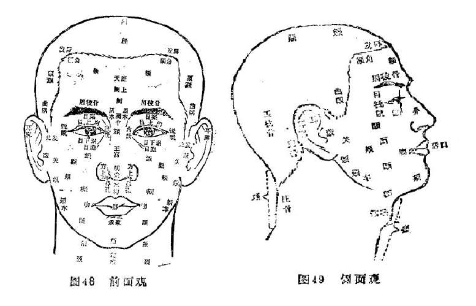

头：又称首，颈项以上部位均属头部。

颠：又称颠顶、头顶，为头的上部中央最高处。其内中之头骨又称颠顶骨、顶骨。

囟（xìn信）：位于顶之前，又称囟门，今称前囟。婴儿时由于额骨与顶骨未闭合而形成。正常时微陷软而跳动之处即是。

髮际：就是头髮的边缘，额上髮际称前髮际，项后髮际称后发际。额：又称颡（sǎng嗓）、额颅。位于前发际下，两眉之上部分，额部之骨骼称额骨。

额角：额的左右两侧隆起部分，左侧为左额角，右侧为右额角。系额骨在前发际下两侧凸起所形成。额骨的前发际下，正中部分，又称凌云骨。

颜：又称庭、天庭，指额部中央部位。一说指左右眉目之间。

阙（quē 缺）：两眉之间，及其略上之额部的一部分通称阙。两眉之间称阙中，又称印堂、眉心。阙中略上部分，又称阙上。

鼻：又称明堂，两侧鼻翼称方上。

頞（è扼）：又名下极，俗称山根，即鼻根部，位于两目之间，鼻柱之上凹陷处，形如马鞍。

王宫：俗称鼻柱，位于鼻根之下，鼻尖之上。一说王宫称下极。（《灵枢·五色篇》：“王宫位于下极。”）

明堂：又称鼻隼（sǔn损）、面王，俗称鼻头。鼻也通称明堂（见

前）。

水沟：即鼻下上唇正中之沟，又称人中。

吻：口之周围部分称吻，但通常以两口角部称吻。

承浆：下唇之下，颏之上中央凹陷处。

颏（kē科）：又名地阁，俗称下巴。位于承浆之下，颊车前部分，相当今称之下颌骨体部位。

颔（hàn汉）：颏之下，结喉之上，及两侧空软处。即今称之下腭底与甲状软骨之间的部位。

颈：头与胸（胸骨体上缘）之间。

结喉：即今甲状软骨前上方之隆起处。

睛明骨：眼窝周围的骨骼称睛明骨，由额骨和䪼骨构成。

眉棱骨：今称眉弓，系睛明骨的目上部分，即额骨之眶上缘弓形凸起部分。

眉本：俗称眉头，即眉毛内侧端部位。

眼睑：又名目胞，目窠、目裹、目睑，俗称眼胞、眼皮，分为上下脸。目上纲、目下纲：又称上弦、下弦。今称睑缘。

目睛（眼球）各部名称：瞳神，今称瞳孔，瞳神外之棕黑色部分称黑睛；黑晴外围之白色部分称白睛。

目系：又名目本，是目睛与脑相连系的脉络组织。

目内眥（zì自）：又名大眥，即内眼角。

目外眥：又名小眥、目锐眥，即外眼角。

䪼（zhuō拙）：目之下，颧之上，即相当于今称之上颌骨和额骨构成眼眶的部位，构成眶部之骨，称䪼骨，也是睛明骨之一部（目下部分）。颧：又称頄（qiú求），眼眶下外侧之高骨部位，内为颧骨所在。

关：耳前凸起部位，即今之颧弓部位。

颊：耳前、颧下部位。

顑：（kǎn砍）：俗名腮，系口旁、颊前肉之空软处。

颐：（yí宜）：口角后、腮下部位。

颞颥（niè rú聂如）：俗名太阳，位于眉棱骨外侧、颧弓上方。

曲隅：又名曲角、曲周，俗名鬓角，为额角外下方、耳前发际弯曲下垂部位。

蔽：俗名耳门，今称耳屏。

颌：又名辅车，即下颌骨支，为下颌骨耳下部位。

曲颊：即下颌角部，又名颊车。

牙床：即牙车，因其屈曲向前，故名。俗称下巴骨。

舌本：即舌根。

上腭：口内，与上牙床相连之上部，与今称之上腭，名位均同。

会厌：即今会厌软骨。

嗌：指咽，一指喉。

咽：食管上口。

喉：又名肺系，即喉咙，颈部气管的通称。

颃颡（háng sǎng杭嗓）：咽喉上端，相当于鼻咽部。

耳廓：为外耳道以外的全部耳壳的统称。

兑（锐）髮：指耳前方之髮角。

#### （二）背面观（见图50）

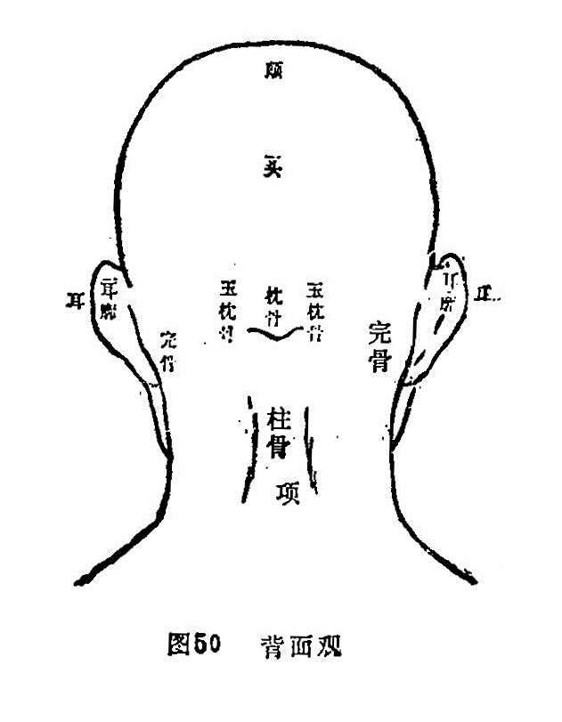

枕骨：脑后中央隆起之骨（今称枕外隆凸）。

玉枕骨：枕外隆凸两侧高起之骨。

完骨：耳后之高骨，又称寿台骨，今称乳突。

柱骨：又称天柱骨、玉柱骨，即今之颈椎骨最下面三节的统称。

复骨：即颈椎之上四节，因其覆盖于筋肉之内，外不可触及，故名。

项：指枕骨至大椎之间的部位。

### 二、躯干部

#### （一）前、侧面观（见图51、52）

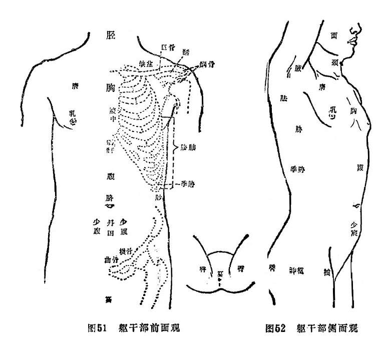

胸：缺盆以下、腹部以上，两乳之间的部位。

膺（yīng英）：胸前两傍肌肉隆起处，相当于胸大肌的部位。

膻中：胸部两乳之中间部位。

𩩲骬（hé、yú合于）：又名鸠尾、蔽心骨，即胸骨下端，今称胸骨剑突。

腹：胸以下、横骨以上部位均称腹，其中脐以上称大腹，脐以下称小腹。小腹中，脐直下部位又称小腹，脐下两傍称少腹。

神阙：即脐。

丹田：脐下三寸左右的部位。

横骨：今称耻骨。

曲骨：横骨中央部，今称耻骨联合。

鼠蹊（xī夕）：即今称之腹股沟部。

毛际：阴毛部上缘。

阴门：女性外生殖器，已婚女性又称产门。今称阴裂，一般指阴道。廷孔：女性尿道外口。

阴囊：阴茎后侧，内包睾丸者即是。

篡（cuàn串）：又名下极、屏翳、指前后二阴之间，即会阴部。

缺盆：今称锁骨上窝，在颈之下、巨骨上凹陷处。

锁子骨：又称巨骨，今称锁骨，即横于胸膺部上缘和肩端之骨，又名缺盆骨。锁子骨之肩侧端又称䯏骨。

两叉骨：肩胛骨和巨骨相接部，相当于今称之肩锁关节部。

髃（yú于）骨：又称肩端骨，系肩胛骨与锁子骨（巨骨）在肩端结合部。今称肩胛岗肩峰端。简称髃，俗称肩头。（部位名与骨名有别）。

腋：即腋窝。

胁：腋下至肋骨尽处的部位统称胁。一说又名胠。胁部的数条横骨名肋骨。

季胁：是胁部最下缘近腰侧的部位。其内有两条浮游的肋骨，名季肋、软肋、橛（jué决）肋，今称浮肋者即是。

䏚（miǎo秒）：季胁下无肋骨的空软处。

#### （二）背面观（见图53）

背：躯干后面统称背。

脊骨：即脊椎骨，又名膂骨，中胎骨，由胸大椎（第一胸椎）算起，至第四骶椎棘突，共二十一节。

腰：躯干背面两侧，肋骨和髋骨之间之空软处统称腰。

膂（lǚ旅）：脊柱两侧纵行隆起之肌肉。相当于今之骶棘肌分布处。胂（shēn申）：腰下两旁至髀骨上之间的肌肉。

髋骨：又名髂骨、腰坚骨、腰髁（䯊）骨。一说腰髁骨系腰部下端两侧凸起之骨，相当于今称之髂后上棘。

尻：尾骶骨的统称，即十七椎至第二十一椎。

骶：即尻骨最末节，即尾骨，又名尾骶、尾闾、穷骨、撅骨。

肛：即肛门，又名魄门，为大肠下口。

肩解：即肩端骨缝，由肩胛骨（髃骨部分）、锁子骨、臑骨（肱骨）组成，今称肩关节。

曲甲：肩胛骨上部之横行凸起，即今称之肩胛岗。

肩胛：即今称肩胛骨。

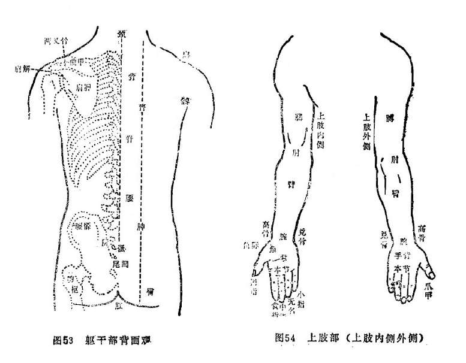

### 三、四肢部（见图54、55、56）

#### （一）上肢（见图54）

膊：肩解至肘之间的外侧，即上臂外侧称膊。又，上臂统称膊。上臂又称肱。

肱骨：膊内之骨，又名臑骨、膊骨。

臑（nào闹）：上臂内侧。

肘：膊臂相连之关节部，即肘关节部。

臂：肘至腕之间，今称前臂。

臂骨：臂内之骨，有二，拇指侧者叫臂上骨，又称臂骨；小指侧者叫臂下骨，又称捭骨。

高骨：即臂上骨下端外侧凸起部，脉位称关。

兑（锐）骨：即臂下骨下端向外凸起部。

腕：臂掌连接处，即今之腕关节部。

掌：腕与五指之间的部位之内侧，其中心称掌心，掌内之骨称掌骨。

鱼、鱼际：与拇指相连之掌面，有一肌肉丰厚之处，名鱼，鱼与手背皮肤明显之分界线，名鱼际。

五指：大指即拇指；次指即食指；将指即中指；无名指即第四指；小指即第五指。

爪甲：即指甲。

本节：手、足指（趾）掌关节部之圆形凸起。

虎口：拇指与食指连接的部位。

#### （二）下肢（见图55、56）

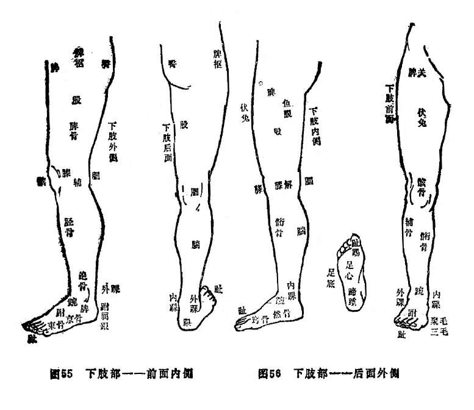

楗骨：指股骨，或指髂骨，坐骨。

髀（bì闭）：大腿上端部位。

髀骨：即大腿骨，今称股骨。

髀枢：今称髋关节外侧部位，又称髀厌，髀机。

髀关：与髀枢相对之（股）内侧，当鼠蹊中央之下为髀关。

髀阳：大腿外侧。

股阴：大腿内侧。

股：即俗称大腿。

鱼腹：大腿内侧形如鱼腹处，相当今称之内收肌群处。

伏兔：大腿前面肌肉纵行隆起处（股四头肌），形如兔之伏卧，故名。

膝：又称骸（hái孩）关，即今称之膝关节部位。

膑：膝前之圆形骨，又称膝盖骨、𩓹骨，今称膑骨。

腘：与膝相对之后面的凹窝，即腘窝。

辅骨：组成小腿之内，外辅骨，总称辅骨。其中内辅骨又称胫骨、䯒（háng杭）骨，外辅骨即今称之腓骨。由于小腿以胫骨为主，所以小腿又称胫或䯒。

臁肕：胫骨前凸起之棱，今称胫骨前嵴。

腨（zhuān专）：又写作𨄔，又名腓肠，今称腓肠肌部位。

踠：胫、足相连接处，今称踝关节。

踝：小腿下端两侧隆起之圆骨，内侧称内踝，外侧称外踝。

绝骨：外踝上三寸许之外辅骨凹陷处。

跗：即足背，又名趺或足趺。

然骨：内踝前下方隆起之大骨，今称舟骨。

核骨：足大趾后内侧凸起之圆骨。

京骨：足小趾本节后外侧凸起之圆骨。

踵：即足跟。内中之骨称跟骨。

## 电子版录入与校对

录入：

| 录入内容 | 志愿者 | 完成时间 |
| --- | --- | --- |
| 整本 | 小易 | 2019年12月12日 |

一校：

组长：明

| 任务 | 负责人昵称 | 实际完成日期 |
| --- | --- | --- |
| 绪论 | 徐璐 | 2022/7/9 |
| 第一章阴阳五行学说第一节 | 郑多多 | 2022/6/25 |
| 第一章阴阳五行学说第二、三节 | 蓝 |  |
| 第二章藏象第一节 | 草木皆兵、幸运 | 2022/6/27 |
| 第二章藏象第二节 | 草木皆兵 | 2022/6/28 |
| 第三章经络第一、二、三节 | 萱萱、Y | 2022/6/30 |
| 第三章经络第四、五、六节 | 虸H | 2022/7/6 |
| 第三章经络第七、八、九节 | 骆淼 | 2022/6/27 |
| 第四章病因与病机 | 光洁 | 2022/6/30 |
| 第五章诊法第一、二节 | 灶心土 | 2022/6/24 |
| 第五章诊法第三、四节 | 灶心土、安然 | 2022/7/2 |
| 第六章辨证第一、二节 | 千寻之闲 | 2022/6/28 |
| 第六章辨证第三至第七节 | 灶心土 | 2022/7/8 |
| 第七章治则与治法 | 闲白 | 2022/6/23 |
| 第八章中药学概述 | 任 | 2022/6/28 |
| 第九章方剂学概述 | 耘妃、草木皆兵 | 2022/6/28 |
| 第十章中医药学在医疗上的优势 | 怡佑妈、草木皆兵 | 2022/6/28 |

## 更多信息

如需了解光明中医的更多信息，请扫码下面的二维码。

或者访问备用地址：www.gmzyjc.com/a
