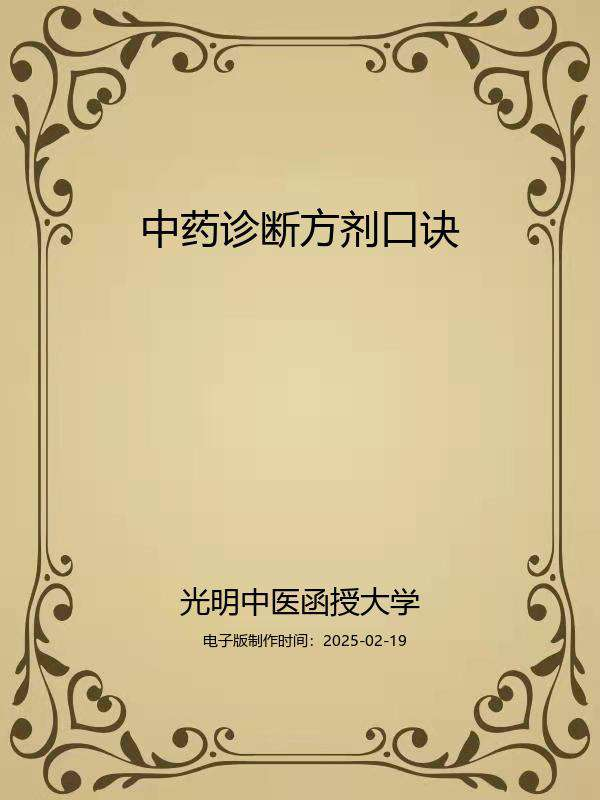

# 中药诊断方剂口诀

## 编者

光明中医函授大学编印

高铎选编

## 导言

中医教育学，是一门古老而崭新的科学。中医教育的历史，若从师徒授受和医籍编纂算起，已有两千余年。近代史上的中医教育，首推一八八五年浙江陈虬创立的利济医学堂。新中国诞生不久，创办了北京、上海、广州和成都四所中医学院，从而揭开了当代中医教育的序幕，至现在，全国已发展到二十三所。但是，如果把我国中医教育的实践经验加以分析、研究、总结和提炼，升华，揭示它的规律，使之成为一门专门的学科——中医教育学的话，那么，它还处在再创阶段。这就是说，中医教育及其规律存在的历史是悠久的，但论述中医教育及其规律的学科却是崭新的。因此，中医教育工作需要进行探索和研究。

在探索和创建适合我国国情的中医教育的时候，我们必须植根于我们民族文化的肥沃土壤之中，充分重视中医典籍在培育和造就历代医家中的伟大作用。事实上，在长期的历史发展中，逐渐形成了具有中华民族特色的中医药理论体系，它既有丰富临床经验，又有高深的理论基础。历代医学家就是把这些道理传授给他们的弟子，其中部分人经过刻苦自学和临床实践，成为医术高超的医学家，这是我国历代医学家成才之路，亦是中医教育史上培养人才的宝贵经验。这就是我们民族中医教育事业的光辉历史。

在新的历史时期，作为中医教育工作来说，既要给学生打好传统医学的基本功，又要使他们掌握一些新兴的科学知识，使继承与发展得到统一。根据这种认识，我们十分认真地研究和设计了光明中医函授大学的教学计划、教材内容、教学方法与教学手段。归结起来即是：注重打好中医基本功，注意提高中医基本理论水平和培养临床诊治技能，着力培养辨证论治的思维方法，竭诚发挥中医在防病治病中的特长。并在这个基础上，扩大学员知识面。我们把这些要求与思想，全面体现在本校的教材建设中。其目的是使中医人才的知识结构更加合理，以便能担负起继承和发扬祖国医药学防病治病的光荣任务。在回顾中华医学教育历史，展望现代医学教育的发展趋势以及总结三十多年正反两方面经验的基础上，我们认为，要培养出适合四化需要的合格中医人才，对中医教育的课程设置和教材内容，就要进行必要的改革，建立起为新形势所需要的中医教材。我们正在朝这一方向努力。在认真研究高等中医院校教材和广泛征询中医专家、学者和医务人员意见的基础上，新编了这套较为完整的中医教材，定名为《高等中医函授教材》（包括了二十八门课程）教材的编写人员，由本校选聘知名教授、学者和学有专长者担任，编写时，我们力求各门教材要有鲜明的针对性，在内容上富有实用性，在文字表达上深入浅出、简明易懂，以利便于自学或函授，此外，我们还将根据需要，选编一些辅导材料，以帮助学员（读者）理解教材内容，更好地学取中医知识。

由于教材编写时间仓促，又竭力于继承与创新,不足之处在所难免，敬希学员和广大读者惠赐宝贵意见，以便在再版时修订。

光明中医函授大学教育研究室

一九八五年十月四日加入光明：

光明中医网址：www.gmzyjx.com，www.gmzyjc.com

## 编者的话

光明中医函授大学新编系列教材之七《中医诊法·中药·方剂口诀》，既是习医之良师，亦是授徒之益友。但原文言简意赅、辞艰理深，初习者必先读准字音、究明句义，然后方可熟读背诵，用诸临证。《中医诊法·中药·方剂口诀浅释》之编著印行，即从此一实际需要出发。

中医古籍浩瀚，初学者往往无从入手。古籍文词古奥,常使人畏难而却。加之许多最基本的知识只有熟记、背诵、理解，才能打下临床的功底。而于大量医书之中如何选择熟记、背诵的内容，对初学者尤为困难。历代医学家通过长期的教学实践，总结出了一套较为成熟的教学方法，这就是从临床医学家的代表著作中，择其主要内容，编为歌诀，提纲挈领，易读易记，为日后临床实践或博览群书，从事研究工作，打下良好的基础。这是中医传统的教学方法。按照这种方法，从古至今，培育出一代又一代的名医。

实践证明，歌诀是帮助记忆的好方法。为了帮助学员和自学者从基础学起，我们选辑了历代主要而切于实用的歌诀，汇编成册，作为光明中医函大的必修的辅助教材，以供阅读。

书中所收内容分五个方面:一诊法，二中药，三方剂，四经络，五《医学三字经》。这些内容都是做为临床医生的基本功而设的。诊法、中药、方剂部分，要求熟读背诵，最好先行背诵记牢，然后与相关的教材结合学习，则收效更大。经络、《医学三字经》部分，可供选用，以编者体会，阅读的时候，应将大部分时间和精力投入背诵上去。若能熟记歌诀，朗朗背诵，再学习相关教材，既可系统理解理论又可加强学习记忆。在此基础上，则可将理论灵活应用于临床。入门不难，要领惟一，曰：守恒而已。

祝有志学医而造福人类的青年和朋友们成功。

编者

一九八五年三月于北京

## 一、诊法口诀

望诊

1.天有五气，食人入鼻，藏于五脏，上华面颐，

肝青心赤，脾脏色黄，肺白肾黑，五脏之常。

2.脏色为主，时色为客，春青夏赤，秋白冬黑。

长夏四季，色黄常则。客胜主善，主胜客恶。

3.色见皮外，气含皮中。内光外泽，气色相融。

有色无气，不病命倾，有气无色，虽困不凶。

4.缟裹雄黄，脾状并臻。缟裹红肺，缟裹朱心。

缟裹黑赤，紫艳肾缘。缟裹蓝赤，石青属肝。

5.青如苍壁，不欲如蓝。赤白裹朱，衃赭死原。

黑重漆炲，白羽枯盐，雄黄罗裹，黄土终难。

按：以上5条，概述了四时、五脏应见的正常面色。

6.天庭面首，阙上喉咽。阙中印堂，候肺之原。

山根候心，年寿候肝。两旁候胆，脾胃鼻端。

颊肾腰脐，颧下大肠。颧内小府，面王子膀。

当颧候肩，颧外候臂。颧外之下，乃候手位。

根傍乳膺，绳上候背。牙车下股，膝胫足位。

7.左颊部肝，右颊部肺。额心颏肾，鼻脾部位。

部见本色，深浅病累，若见他色，按法推类。

按：以上二条，概述面部分主的脏腑部位。

8.黄赤风热，青白主寒。青黑为痛，甚则痹挛。

㿠白脱血，微黑水寒。痿黄诸虚，颧赤劳缠。

9.沉浊晦暗，内久而重。浮泽明显，外新而轻。

其病不甚，半泽半明。云散易治，抟聚难攻。

10.舌赤卷短，心官病常。肺鼻白喘，胸满喘张。

肝目眦青，脾病唇黄。耳黑肾病，深浅分彰。

11.视色之锐，所向部官。内走外易，外走内难。

官部色脉，五病交参。上逆下顺，左右反阽。

12.黑庭赤颧，出如拇指，病虽小愈，亦必卒死。

唇面黑青，五官黑起。擦残汗粉，白色皆死。

按：第八~十二条概述色泽异常所主病证及预后。

13.色生于脏，各命其部。神藏于心，外候在目。

光晦神短，了了神足，单失久病，双失即故。

14.面目之色，各有相当。交互错见，皆主身亡。

面黄有救，眦红疹疡。眦黄病愈，睛黄发黄。

15.闭目阴病，开目病阳。朦胧热盛，时瞑衄常。

阳绝戴眼，阴脱目盲。气脱眶陷，睛定神亡。

按：以上三条，概述望面察色与望目察神的要点。

16.肝病善怒，面色当青。左有动气，转筋胁痛。

诸风掉眩，疝病耳聋。目视𥆨𥆨，如将捕惊。

17.心赤善喜，舌红口干。脐上动气，心胸痛烦。

健忘惊悸，怔忡不安。实狂昏冒，虚悲凄然。

18.脾黄善忧，当脐动气。善思食少，倦怠乏力。

腹满肠鸣，痛而下利。实则身重，胀满便闭。

19.肺白善悲，脐右动气。洒淅寒热，咳唾喷嚏。

喘呼气促，肤痛胸痹。虚则气短，不能续息。

20.肾黑善恐，脐下动气。腹胀肿喘，溲便不利。

腰背少腹，骨痛欠气。心悬如饥，足寒厥逆。

按：以上五条，简述了面色与五脏疾病及证候之间的关系。

21.黑色无痛，女疸肾伤。非疸血蓄，衄下后黄。

面微黄黑，纹绕口角。饥瘦之容，询必噎膈。

按：黑色主痛。若无痛，或为女劳疸、蓄血、噎嗝等症。

22.白不脱血，脉如乱丝。问因恐怖，气下神失。

乍白乍赤，脉浮气怯。羞愧神荡，有此气色。

23.颈痛喘疾，目裹肿水。面肿风水，足肿石水。

手肿至腕，足肿至踝。面肿至项，阳虚可嗟。

24.头倾视深，背曲肩随。坐则腰痿，转摇迟回。

行则偻俯，立则振掉，形神将夺，筋骨虺颓。

25.胃之大络，名曰虚里。动左乳下，有过不及。

其动应衣，宗气外泄。促结积聚，不至则死。

按：上三条概述了望面色、望神色、望身形等法。

注：以上二十五条，摘自《医宗金鉴·四诊心法要诀》

附1：幼科望诊歌诀（《医宗金鉴·幼科心法要诀》）

**【望神色】**

欲知小儿百病原，先从面部色详观；

五部五色应五脏，诚中形外理昭然。

额心颏肾鼻脾位，右腮属肺左属肝；

青肝赤心黄脾色，白为肺色黑肾颜。

青主惊风赤火热，黄伤脾食白虚寒；

黑色主痛多恶候，明显浊晦轻重参。

部色相生为病顺，部色相克病多难；

相生实者邪助病，相克虚者正难堪。

天庭青暗惊风至，红主内热黑难痊；

太阳青惊入耳恶，印堂青色惊泻缠。

风气青惊紫吐逆，两眉青吉红热烦；

鼻赤脾热黑则死，唇赤脾热白脾寒。

左腮赤色肝经热，右腮发赤肺热痰。

承浆青惊黄呕吐，黑主抽搐病缠绵。

此是察色之大要，还将脉证一同参。

**【察指纹】**

初生小儿诊虎口，男从左手女右看；

次指三节风气命，脉纹形色隐隐安。

形见色变知有病，紫属内热红伤寒；

黄主脾病黑中恶，青主惊风白是疳。

风关病轻气关重，命关若见病多难；

大小曲紫伤滞热，曲青人惊走兽占。

赤色水火飞禽扑，黄色雷惊黑阴痫；

长珠伤食流珠热，去蛇吐泻来蛇疳。

弓里感冒外痰热，左斜伤风右斜寒；

针形枪形主痰热，射指射甲命难全。

纹见乙字为抽搐，二曲如钩伤冷传，

三曲如虫伤硬物，水纹咳嗽吐泻环。

积滞曲虫惊鱼骨，形似乱虫有蛔缠，

脉纹形色相参合，医者留神仔细观。

附2：吴坤安察舌辨证歌（《辨舌指南》）

1.六淫感症有真传，临证先将舌苔看；

察色分经兼手足，营卫表里辨何难。

2.白肺绛心黄属胃，红为胆火黑脾经；

少阴紫色兼圆厚，焦紫肝阳阴又青。

3.表白里黄分汗下，绛营白卫治分岐；

次将津液探消息，泽润无伤涩已亏。

4.白为肺卫仍兼气，绛主心营血后看；

白内兼黄仍气热，边红中白肺津干。

5.卫邪可汗宜开肺，气分宜清猛汗难；

入营透热犀地妙，到血未清地与丹。

6.白黄气分流连久，尚冀战汗透重关；

舌绛仍兼黄白色，透营泄卫两和间。

7.白而薄润风寒重，温散何妨液不干;

燥薄白苔津已少，只宜凉解肺家安。

8.苔若纯黄无白色，表邪入里胃家干；

更验老黄中断裂，腹中满痛下之安。

9.太阴腹满苔粘腻，苍朴陈苓湿结开；

黄燥还兼胸痞满，泻心陷胸二方裁。

10.微黄粘腻兼无渴，苦泄休投开泄安；

热末伤津黄薄滑，犹堪清热透肌端。

11.湿留气分苔粘腻，小溲如淋更快联；

湿结中焦因痞满，朴陈苦温泻之安。

12.上焦湿滞身潮热，气分宣通病自痊；

湿自外来著肌表，秦艽苏桂解肌先。

13.湿热久蒸成内著，厚黄呕吐泻心权；

若兼身目金黄色，五苓栀柏共茵煎。

14.舌绛须知营分热，犀翘丹地解之安；

若兼鲜泽纯红色，胞络邪干菖郁攒；

素有火痰成内闭，犀黄竺贝可加餐。

15.心承胃灼中心绛，清胃清心势必残；

君火上炎尖独赤，犀兼导赤泻之安。

16.若见边红中燥白，上焦气热血无干；

但清膈上无形热，滋腻如投却疾难。

17.绛舌上浮粘腻质，暑兼湿秽欲蒸痰；

恐防内闭芳香逐，犀珀菖蒲滑郁含。

18.白苔绛底因何故，热因湿伏透之难；

热毒乘心红点重，黄连金汁乱狂安。

19.舌绛碎生黄白点，热淫湿䘌欲生疳；

古名狐惑皆同此，杂症伤寒仔细探。

20.舌绛不鲜枯更萎，肾阴已涸救之难；

紫而枯晦凋肝肾，红泽而光胃液干。

21.黄苔方知邪入里，黑兼燥刺热弥深；

屡清不解知何故，火燥津亡急救阴。

22.黑滑太阴寒水侮，腹疼吐利理中宜；

更兼粘腻形浮胖，伏饮凝痰开逐之。

23.舌见边黄中黑腻，热蒸脾湿痞难禁；

吐呕便闭因伤酒，开泄中焦有泻心。

24.寒湿常乘气分中，风兼二气自从同；

重将黄白形中取，得诀才将脉症通。

25.温邪暑热走营中，兼入太阴气分同；

吸受心营并肺卫，暑温挟湿卫营通。

26.伤寒入里阳明主，热病阳明初便缠；

先白后黄寒化热，纯黄少白热蒸然。

27．热病无寒惟壮热，黄芩栀豉古今传；

恶寒发热伤寒症，发汗散寒表剂先。

28.少阴温病从何断，舌绛须知木火燃；

目赤耳聋身热甚，栀翘犀角牡丹先。

29.若是温邪从上受，窍中吸入肺先传、

芩翘栀豉桑蒌杏，气燥加膏肺分先；

邪入心营同胆治，再加玄麦郁菖鲜。

30.寒温二气前粗辨，暑湿相循病必缠；

湿病已陈粘腻舌，只将暑症再提传。

31.暑伤气分苔因白，渴饮烦呕咳喘连；

身热脉虚胸又满，无形气分热宜宣；

蒌皮贝杏通芩滑，栀豉翘心竹叶煎，

或见咳红荷叶汁，痞加朴蔻郁金川。

32.暑入心营舌绛红，神呆似寐耳如聋；

溺淋汗出原非解，失治邪干心主宫；

犀滑翘丹元地觅，银花竹叶石菖同；

欲成内闭多昏昧，再入牛黄即奏功。

33.暑湿合邪空窍触，三焦受病势弥漫；

脘闷头胀多呕吐，腹痛还防疟痢干；

栀豉杏仁芩半朴，银花滑石郁红安。

34.湿温气分流连久，舌赤中黄燥刺干；

咯血毋庸滋腻入，耳聋莫作少阳看；

三焦并治通茹杏，金汁银花膏滑寒；

若得疹痧肌内透，再清痰火养阴安。

35.苔形粉白四边红，疫入膜原势最凶；

急用达原加引药，一兼黄黑下匆匆。

36.若见鲜红纯绛色，疫传包络及营中；

清邪解毒银犀妙，菖郁金黄温暑通。

37.温邪时疫多斑疹，临证须知提透宜；

疹属肺家风与热，斑因胃热发如兹。

38.疹斑色白松肌表，血热如丹犀莫迟；

舌白荆防翘薄力，舌红切忌葛升医。

39.凡属正虚苔嫩薄，淡红微白补休迟；

厚黄白腻邪中蕴，诊者须知清解宜。

闻诊

1.五色既审，五音当明。声为音本，音以声生。声之余韵，音遂以名。角徵宫商，并羽五声。

按：古之音律分为角、徵、宫、商、羽五种。

2.中空有窍，故肺主声。喉为声路，会厌门户。舌为声机，唇齿扇助。宽隘锐钝，厚薄之故。

按：说明了声音产生的机理。人的声音各具特点，乃由发声器官禀赋有“宽隘锐钝厚薄”等差异的缘故。

3.舌居中发，喉音正宫，极长下浊，沉厚雄洪。开口张腭，口音商成，次长下浊，铿锵肃清。撮口唇音，极短高清，柔细透彻，尖利羽声。舌点齿音，次短高清，抑扬咏越，徵声始通。角缩舌音，条畅正中，长短高下，清浊和平。

按：分述五音的形成与特点。以上三条所述，均为正常五音。

4.喜心所感，欣散之声。怒心所感，忿厉之声。

哀心所感，悲嘶之声。乐心所感，舒缓之声。

敬心所感，正肃之声。爱心所感，温和之声。

按：分述了七情变化对声音的影响。

5.五声之变，变则病生。肝呼而急，心笑而雄。

脾歌以漫，肺哭促声。肾呻低微，色克则凶。

6.好言者热，懒言者寒。言壮为实，言轻为虚。言微难复，夺气可知。谵妄无伦，神明已失。

按：上二条说明闻声而察五脏病变。

7.失音声重，内火外寒。疮痛而久，劳哑使然。哑风不语，虽治命难。讴歌失音，不治亦痊。

按：说明失音一症的不同病因与机转。

注：以上七条摘自《医宗金鉴·四诊心法要诀》

附：幼科闻诊歌诀（《医宗金鉴•幼科心法要诀》)

诊儿之法听五声，聆音察理始能明，

五声相应五脏病，五声不和五脏情。

心病声急多言笑，肺病声悲音不清，

肝病声呼多狂叫，脾病声歌音颤轻，

肾病声呻长且细，五音昭著证分明。

啼而不哭知腹痛，哭而不啼将作惊，

吱煎不安心烦热，嗄声声重感寒风。

有余声雄多壮厉，不足声短怯而轻，

多言体热阳腑证，懒语身冷阴脏形。

狂言焦躁邪热盛，谵语神昏病热凶，

鸭声在喉音不出，直声无泪命将倾。

虚实寒热从声别，闻而知之无遁情。

问诊

1.声色既详，问亦当知，视其五入，以知起止。

心主五嗅，自入为焦，脾香肾腐，肺腥肝臊。

脾主五味，自入为甘，肝酸心苦，肺辛肾咸。

肾主五液，心汗肝泣，自入为唾，脾涎肺涕。

按：问病人口味以察知脏腑病变部位。

2.昼剧而热，阳旺于阳。夜剧而寒，阴旺于阴。

昼夜寒厥，重阴无阳。昼夜烦热，重阳无阴。

昼剧而寒，阴上乘阳。夜剧而热，阳下陷阴。

昼寒夜热，阴阳交错。饮食不入，死终难却。

按：问病人发作寒热的时间以察知阴阳消长与转化。

3.食多气少，火化新痊。食少气多，胃肺两愆。

喜冷有热，喜热有寒。寒热虚实，多少之间。

按：问病人饮食多少、喜冷喜热以察知寒热虚实。

4.大便通闭，关乎虚实。无热阴结，无寒阳利。

小便红白，主乎热寒。阴虚红浅，湿热白泔。

按：从病人大小便的异常以察知寒热虚实。

5.胃热口糜，悬心善饥。肠热利热，出黄如糜。

胃寒清厥，腹胀而疼。肠寒尿白，飧泄肠鸣。

按：肠胃有寒有热，从饮食二便可以区别。

6.形有强弱，肉有脆坚。强者难犯，弱者易干。

肥食少痰，最怕如绵。瘦食多火，著骨难全。

7.形气已脱。脉调犹死。形气不足，脉调可医。

形盛脉小，少气休治。形衰脉大，多气死期。

按：望形之强弱，审气之盛衰，诊脉之大小，形、气、脉三者合参，以相应为顺，不相应为逆。

注：以上七条摘自《医宗金鉴·四诊心法要诀》

附1：十问歌（摘自《景岳全书·十问篇》）一问寒热二问汗，三问头身四问便。

五问饮食六问胸，七聋八渴俱当辨。

九问旧病十问因，更兼服药参机变。

妇人尤必问经期，迟速闭崩皆可见。

再添片语告儿科，天花麻疹颇占验。

附2：幼科审病歌诀（《医宗金鉴•幼科心法要诀》)

审儿之病贵详参，要在安烦苦欲间。

能食不食渴不渴，二便调和通秘勘。

发热无汗为表病，内热便硬作里看。

安烦昼夜阴阳证，苦热冷暖定热寒。

能食不食胃壮弱，渴与不渴胃湿干。

便稠粘秽为滞热，尿清不赤乃寒占。

耳尻肢凉知痘疹，指梢发冷主惊痫。

肚腹热闷乃内热，四肢厥冷是中寒。

眉皱曲啼腹作痛，风热来临耳热缠。

腹痛须按软与硬，喜按不喜虚实参。

欲保赤子诚心辨，对证施方治不难。

切诊

1.脉为血府，百体贯通，寸口动脉，大会朝宗。

诊人之脉，高骨上取，因何名关，界乎寸尺。

至鱼一寸，至泽一尺，因此命名，阳寸阴尺。

按：鱼，指鱼际；泽，指尺泽；高骨，位于腕后隆起之处。

2.右寸肺胸，左寸心膻。右关脾胃，左肝膈胆。

三部三焦，两尺两肾。左小膀胱，右大肠认。

命门属肾，生气之原。人无两尺，必死不痊。

关脉一分，右食左风。右为气口，左为人迎。

按：说明三部脉分属脏腑之法。

3.脉有七诊，曰浮中沉，上竟下竟，左右推寻。

男左大顺，女右大宜，男尺恒虚，女尺恒实。

又有三部，曰天地人，部各有三，九候名焉。

额颊耳前，寸口岐锐，下足三阴，肝肾脾胃。

按：《内经》的脉法有七诊。又有三部九侯诊脉法，详参《素问•三部九候论》

4.寸口大会，五十合经，不满其动，无气必凶。

更加疏数，止还不能，短死岁内，期定难生。

5.五脏本脉，各有所管，心浮大散，肺浮涩短。

肝沉弦长，肾沉滑软，从容而和，脾中迟缓。

四时平脉，缓而和匀，春弦夏洪，秋毛冬沉。

按：分述五脏、四时平脉。

6.太过实强，病生于外。不及虚微，病生于内。

饮食劳倦，诊在右关。有力为实，无力为虚。

按：区分外感与内伤属实属虚之脉象。

7.凡诊病脉，平旦为准。虚静宁神，调息细审。

一呼一吸，合为一息。脉来四至，平和之则。

五至无疴，闰以太息。

按：诊脉以清晨（即平旦）为佳，其道理在于：清晨“阴气未动，阳气未散，饮食未进，经脉未盛，络脉调匀，气血未乱，故乃可诊有过之脉”。

8.三至为迟，迟则为冷。六至为数，数即热证。

转迟转冷，转数转热。迟数既明，浮沉当别。

浮沉迟数，辨内外因。外因于天，内因于人。

天有阴阳，风雨晦明。人喜怒忧，思悲恐惊。

浮沉已辨，滑涩当明。涩为血滞，滑为气壅。

按：脉行部位，以浮沉统之；脉来至数，以迟数统之；脉之体象，以滑涩统之。

9.浮脉皮脉，沉脉筋骨，肌肉候中，部位统属。

浮无力濡，沉无力弱，沉极力牢，浮极力革。

三部有力，其名曰实，三部无力，其名曰虚。

三部无力，按之且小，似有似无，微脉可考。

三部无力，按之且大，涣漫不收，散脉可察。

惟中无力，其名曰芤，推筋著骨，伏脉可求。

10.三至为迟，六至为数，四至为缓，七至疾脉。

缓止曰结，数止曰促，凡此之诊，皆统至数。

动而中止，不能自还，至数不乖，代则难痊。

11.形状如珠，滑溜不定。往来涩滞，涩脉可证。

弦细端直，且劲曰弦。紧比弦粗，劲左右弹。

来盛去衰，洪脉名显。大则宽阔，小则细减。

如豆乱动，不移约约。长则迢迢，短则缩缩。

12.浮阳主表，风淫六气，有力表实，无力表虚。

浮迟表冷，浮缓风湿，浮濡伤暑、浮散虚极。

浮洪阳盛，浮大阳实，浮细气少、浮涩血虚。

浮数风热，浮紧风寒，浮弦风饮，浮滑风痰。

13.沉阴主里，七情气实，沉大里实，沉小里虚

沉迟里冷，沉缓里湿，沉紧冷痛，沉数热郁

沉涩痹气，沉滑痰食，沉伏闭郁，沉弦饮疾

14.濡阳虚病，弱阴虚极。微主诸虚，散为虚剧。

革伤精血，半产带崩。牢疝癥瘕，心腹寒疼。

虚主诸虚，实主诸实。芤主失血，随见可知。

15.迟寒主脏，阴冷相干，有力寒痛，无力虚寒。

数热主腑，数细阴伤，有力实热，无力虚疮。

缓湿脾胃，坚大湿壅，促为阳郁，结则阴凝。

代则气乏，跌打闷绝，夺气痛疮，女胎三月。

16.滑司痰病，关主食风，寸候吐逆，尺便血脓。

涩虚湿痹，尺精血伤，寸汗津竭，关膈液亡。

关弦主饮，木侮脾经，寸弦头痛，尺弦腹疼。

紧主寒痛，洪是火伤，动主痛热，崩汗惊狂。

长则气治，短则气病，细则气衰，大则病进。

按：以上概述各种脉象所主病症。

17.脉之主病，有宜不宜，阴阳顺逆，凶吉可推。

中风之脉，却喜浮迟，坚大急疾，其凶可知。

伤寒热病，脉喜浮洪，沉微涩小，证反必凶。

汗后脉静，身凉则安，汗后脉躁，热甚必难。

阳证见阴，命必危殆，阴证见阳，虽困无害。

按:《伤寒论·辨脉法》说:“阳病见阴脉者死，阴病见阳脉者生”。总之，生死顺逆是以邪正进退的趋势为准。

18.劳倦伤脾，脉当虚弱，自汗脉躁，死不可却。

疟脉自弦，弦迟多寒，弦数多热，代散则难。

泄泻下利，沉小滑弱，实大浮数，发热则恶。

呕吐反胃，浮滑者冒，沉数细涩，结肠者亡。

霍乱之候，脉代勿讶，舌卷囊缩，厥伏可嗟。

按：厥伏，指肢厥脉伏。

19.嗽脉多浮，浮濡易治，沉伏而紧，死期将至。

喘息抬肩，浮滑是顺，沉涩肢寒，切为逆证。

火热之证，洪数为宜，微弱无神，根本脱离。

骨蒸发热，脉数而虚，热而涩小，必殒其躯。

劳极诸虚，浮软微弱，土败双弦，火炎细数。

20.失血诸症，脉必见芤，缓小可喜，数大堪忧。

蓄血在中，牢大却宜，沉涩而微，速愈者稀。

三消之脉，数大者生，细微短涩，应手堪惊。

小便淋闭，鼻色必黄，实大可疗，涩小知亡。

癫乃重阴，狂乃重阳，浮洪吉象，沉急凶殃。

痫宜浮缓，沉小急实，但弦无胃，必死不失。

21.心腹之痛，其类有九，细迟数愈，浮大延久。

疝属肝病，脉必弦急，牢急者生，弱急者死。

黄疸湿热，洪数便宜，不妨浮大，微涩难医。

肿胀之脉，浮大洪实，细而沉微，岐黄无术。

五脏为积，六腑为聚，实强可生，沉细难愈。

中恶腹胀，紧细乃生，浮大为何，邪气已深。

22.痈疽末溃，洪大脉宜，及其已溃，洪大最忌。

肺痈已成，寸数而实，肺痿之证，数而无力。

痈疽色白，脉宜短涩，数大相逢，气损血失。

肠痈实烈，滑数相宜，沉细无根，其死已期。

按：以上概述脉象主病之顺逆

23.妇人有子，阴搏阳别，少阴动甚，其胎已结。

滑疾而散，胎必三月，按之不散，五月可别。

左男右女，孕乳是主，女腹如箕，男腹如釜。

24.脉有反关，动在臂后，别由列缺，不干症候。

25.经脉病脉，业已昭详，将绝之形，更当度量。

肝绝之脉，循刃责责。心绝之脉，转豆躁疾。

脾绝雀啄，如屋之漏，如水之流，如杯之覆。

肺绝如毛，无根萧索，麻子动摇，浮波之合。

肾脉将绝，至如省客，来如弹石，去如解索。.

命脉将绝，虾游鱼翔，至如涌泉，绝在膀胱。

按：以上二十五条是切寸口脉的基本内容。

26.肘候腰腹，手股足端，尺外肩背，尺内膺前。

掌中腹中，鱼青胃寒。寒热所在，病生热寒。

27.脉尺相应，尺寒虚泻，尺热病温，阴虚寒热。

风病尺滑，痹病尺涩，尺大丰盛，尺小亏竭。

28.诊脐上下，上胃下肠，腹皮寒热，肠胃相当。

胃喜冷饮，肠喜热汤，热无灼灼，寒无沧沧。

按：上三条为胸腹四肢的切诊方法。尺，指小臂内侧（尺骨侧）的肌肤。

注：以上二十八条摘自《医宗金鉴•四诊心法要诀》

附1:幼科切脉歌诀（《医宗金鉴•幼科心法要诀》）

小儿周岁当切脉，位小一指定三关，

浮脉轻取皮肤得，沉脉重取筋骨间。

一息六至平和脉，过则为数减迟传。

滑脉如珠多流利，涩脉滞涩往来艰。

三部无力为虚脉，三部有力作实言。

中取无力为芤脉，微脉微细有无间。

洪脉来盛去无力，数缓时止促结占。

紧脉左右如转索，弦则端直张弓弦。

浮为在表外感病，沉为在里内伤端。

数为在腑属阳热，迟为在脏乃阴寒。

滑痰洪火微怯弱，弦饮结聚促惊痫。

芤主失血涩血少，沉紧腹痛浮感寒。

虚主诸虚不足病，实主诸实有余看。

痘疹欲发脉洪紧，大小不匀中恶勘。

一息三至虚寒极，九至十至热极炎。

一二十一十二死，浮散无根沉伏难。

表里阴阳虚实诊，惟在儿科随证参。

附2:七言诀（摘自《濒湖脉学》）

**【浮脉】**

体状诗:

浮脉惟从肉上行，如循榆荚似毛轻；

三秋得令知无恙，久病逢之却可惊。

相类诗:

浮如木在水中浮，浮大中空乃是芤，

拍拍而浮是洪脉，来时虽盛去悠悠。

浮脉轻平似捻葱，虚来迟大豁然空，

浮而柔细方为濡，散似杨花无定踪。

主病诗:

浮脉为阳表病居，迟风数热紧寒拘，

浮而有力多风热，无力而浮是血虚。

寸浮头痛眩生风，或有风痰聚在胸，

关上土衰兼木旺，尺中溲便不流通。

**【沉脉】**

体状诗：

水行润下脉来沉，筋骨之间软滑匀，

女子寸兮男子尺，四时如此号为平。

相类诗：

沉帮筋骨自调匀，伏则推筋著骨寻，

沉细如绵真弱脉，弦长实大是牢形。

主病诗：

沉潜水蓄阴经病，数热迟寒滑有痰，

无力而沉虚与气，沉而有力积并寒，

寸沉痰郁水停胸，关主中寒痛不通，

尺部浊遗并泻痢，肾虚腰及下元痌。

**【迟脉】**

体状诗:

迟来一息至惟三，阳不胜阴气血寒，

但把浮沉分表里，消阴须益火之原。

相类诗:

脉来三至号为迟，小快于迟作缓持，

迟细而难知是涩，浮而迟大以虚推。

主病诗:

迟司脏病或多痰，沉痼癥瘕仔细看，

有力而迟为冷痛，迟而无力定虚寒。

寸迟必是上焦寒，关主中寒痛不堪，

尺是肾虚腰脚重，溲便不禁疝牵丸。

**【数脉】**

体状诗：

数脉息间常六至，阴微阳盛必狂烦，

浮沉表里分虚实，惟有儿童作吉看。.

相类诗:

数比平人多一至，紧来如数似弹绳，

数而时止名为促，数在关中动脉形。

主病诗:

数脉为阳热可知，只将君相火来医，

实宜凉泻虚温补，肺病秋深却畏之。

寸数咽喉口舌疮，吐红咳嗽肺生疡,

当关胃火并肝火，尺属滋阴降火汤。

**【滑脉】**

体状（相类）诗：

滑脉如珠替替然，往来流利却还前，

莫将滑数为同类，数脉惟看至数间。

主病诗:

滑脉为阳元气衰，痰生百病食生灾，

上为吐逆下蓄血，女脉调时定有胎。

寸滑隔痰生呕吐，吞酸舌强或咳嗽。

当关宿食肝脾热，渴痢癫淋看尺部。

**【涩脉】**

体状诗：

细迟短涩往来难，散止依稀应指间，

如雨沾沙容易散，病蚕食叶慢而艰。

相类诗：

参伍不调名曰涩，轻刀刮竹短而难，

微似秒芒微软甚，浮沉不别有无间。

主病诗：

涩缘血少或伤精，反胃亡阳汗雨淋，

寒湿入营为血痹，女人非孕即无经。

寸涩心虚痛对胸，胃虚胁胀查关中，

尺为精血俱伤候，肠结溲淋或下红。

**【虚脉】**

体状（相类）诗：

举之迟大按之松，脉状无涯类谷空，

莫把芤虚为一例，芤来浮大似慈葱。

主病诗:

脉虚身热为伤暑，自汗怔忡惊悸多，

发热阴虚须早治，养营益气莫磋跎。

血不荣心寸口虚，关中腹胀食难舒，

骨蒸痿痹伤精血，却在神门两部居。

**【实脉】**

体状诗:

浮沉皆得大而长，应指无虚愊愊强，

热蕴三焦成壮火，通肠发汗始安康。

相类诗:

实脉浮沉有力强，紧如弹索转无常，

须知牢脉帮筋骨，实大微弦更带长。

主病诗:

实脉为阳火郁成，发狂谵语吐频频，

或为阳毒或伤食，大便不通或气疼。

寸实应知面热风，咽疼舌强气填胸，

当关怀热中宫满，尺实腰肠痛不通。

**【长脉】**

体状（相类）诗：

过于本位脉名长，弦则非然但满张，

弦脉与长争较远，良工尺度自能量。

主病诗：

长脉迢迢大小匀，反常为病似牵绳，

若非阳毒癫痫病，即是阳明热势深。

**【短脉】**

体状（相类）诗:

两头缩缩名为短，涩短迟迟细且难，

短涩而浮秋喜见，三春为贼有邪干。

主病诗

短脉惟于尺寸寻，短而滑数酒伤神，

浮为血涩沉为痞，寸主头痛尺腹痛

**【洪脉】**

体状诗：

脉来洪盛去还衰，满指滔滔应夏时，

若在春秋冬月分，升阳散火莫狐疑。

相类诗:

洪脉来时拍拍然，去衰来盛似波澜，

欲知实脉参差处，举按弦长愊愊坚。

主病诗:

脉洪阳盛血应虚，相火炎炎热病居，

胀满胃翻须早治，阴虚泄痢可愁知。

寸洪心火上焦炎，肺脉洪时金不堪，

肝火胃虚关内察，肾虚阴火尺中看。

**【微脉】**

体状（相类）诗：

微脉轻微撇撇乎，按之欲绝有如无，

微为阳弱细阴弱，细比于微略较粗。

主病诗：

气血微兮脉亦微，恶寒发热汗淋漓，

男为劳极诸虚候，女作崩中带下医。

寸微气促或心惊，关脉微时胀满形，

尺部见之精血弱，恶寒消瘅痛呻吟。

**【紧脉】**

体状诗：

举如转索切如绳，脉象因之得紧名，

总是寒邪来作寇，内为腹痛外身疼。

相类诗：见弦、实脉。

主病诗：

紧为诸痛主于寒，喘咳风痫吐冷痰，

浮紧表寒须发越，紧沉温散自然安。

寸紧人迎气口分，当关心腹痛沉沉，

尺中有紧为阴冷，定是奔豚与疝疼。

**【缓脉】**

体状诗：

缓脉阿阿四至通，柳梢袅袅飐轻风，

欲从脉里求神气，只在从容和缓中。

相类诗：见迟脉。

主病诗：

缓脉营衰卫有余，或风或湿或脾虚，

上为项强下痿痹，分别浮沉大小区。

寸缓风邪项背拘，关为风眩胃家虚，

神门濡泄或风秘，或是蹒跚足力迂。

**【芤脉】**

体状诗：

芤形浮大软如葱，边实须知内已空，

火犯阳经血上溢，热侵阴络下流红。

相类诗：

中空旁实乃为芤，浮大而迟虚脉呼，

芤更带弦名曰革，芤为失血革血虚。

主病诗：

寸芤积血在于胸，关里逢芤肠胃痈，

尺部见之多下血，赤淋红痢漏崩中。

**【弦脉】**

体状诗：

弦脉迢迢端直长，肝经木旺土应伤，

怒气满胸常欲叫，翳蒙瞳子泪淋浪。

相类诗：

弦来端直似丝弦，紧则如绳左右弹，

紧言其力弦言象，牢脉弦长沉伏间。

主病诗：

弦应东方肝胆经，饮痰寒热疟缠身，

浮沉迟数须分别，大小单双有重轻。

寸弦头痛膈多痰，寒热癥瘕查左关，

关右胃寒心腹痛，尺中阴疝脚拘挛。

**【革脉】**

体状（主病）诗：

革脉形如按鼓皮，芤弦相合脉寒虚，

女人半产并崩漏，男子营虚或梦遗。

相类诗：见芤、牢脉

**【牢脉】**

体状（相类）诗：

弦长实大脉牢坚，牢位常居沉伏间，

革脉芤弦自浮起，革虚牢实要详看。

主病诗：

寒则牢坚里有余，腹心寒痛木乘脾，

疝癫㿗瘕何愁也，失血阴虚却忌之。

**【濡脉】**

体状诗：

濡形浮细按须轻，水面浮绵力不禁，

病后产中犹有药，平人若见是无根。

相类诗：

浮而柔细知为濡，沉细而柔作弱持，

微则浮微如欲绝，细来沉细近于微。

主病诗：

濡为亡血阴虚病，髓海丹田暗已亏，

汗雨夜来蒸入骨，血山崩倒湿侵脾。

寸濡阳微自汗多，关中其奈气虚何，

尺伤精血虚寒甚，温补真阴可起疴。

**【弱脉】**

体状诗：

弱来无力按之柔，柔细而沉不见浮，

阳陷入阴精血弱，白头犹可少年愁。

相类诗：见濡脉。

主病诗：

弱脉阴虚阳气衰，恶寒发热骨筋痿，

多惊多汗精神减，益气调营急早医。

寸弱阳虚病可知，关为胃弱与脾衰，

欲求阳陷阴虚病，须把神门两部推。

**【散脉】**

体状诗：

散似扬花散漫飞，去来无定至难齐，

产为生兆胎为堕，久病逢之不必医。

相类诗：

散脉无拘散漫然，濡来浮细水中绵，

浮而迟大为虚脉，芤脉中空有两边。

主病诗：

左寸怔忡右寸汗，溢饮左关应软散，

右关软散胻胕肿，散居两尺魂应断。

**【细脉】**

体状诗：

细来累累细如丝，应指沉沉无绝期，

春夏少年俱不利，秋冬老弱却相宜。

相类诗：见微、濡脉。

主病诗：

细脉萦萦血气衰，诸虚劳损七情乖，

若非湿气侵腰肾，即是伤精汗泄来。

寸细应知呕吐频，入关腹胀胃虚形，

尺逢定是丹田冷，泄痢遗精号脱阴。

**【伏脉】**

体状诗：

伏脉推筋著骨寻，指间裁动隐然深，

伤寒欲汗阳将解，厥逆脐疼证属阴。

相类诗：见沉脉。

主病诗：

伏为霍乱吐频频，腹痛多缘宿食停，

蓄饮老痰成积聚，散寒温里莫因循。

食郁胸中双寸伏，欲吐不吐常兀兀，

当关腹痛困沉沉，关后疝疼还破腹。

**【动脉】**

体状诗：

动脉摇摇数在关，无头无尾豆形团，

其原本是阴阳搏，虚者摇兮胜者安。

主病诗：

动脉专司痛与惊，汗因阳动热因阴，

或为泄痢拘挛病，男子亡精女子崩。

**【促脉】**

体状诗：

促脉数而时一止，此为阳极欲亡阴，

三焦郁火炎炎盛，进必无生退可生。

相类诗：见代脉

主病诗：

促脉惟将火病医，其因有五细推之，

时时喘咳皆痰积，或发狂斑与毒疽。

**【结脉】**

体状诗：

结脉缓而时一止，独阴偏胜欲亡阳。

浮为气滞沉为积，汗下分明在主张。

相类诗：见代脉。

主病诗：

结脉皆因气血凝，老痰结滞苦呻吟，

内生积聚外痈肿，疝瘕为殃病属阴。

**【代脉】**

体状诗:

动而中止不能还，复动因而作代看，

病者得之犹可疗，平人却与寿相关。

相类诗:

数而时止名为促，缓止须将结脉呼，

止不能回方是代，结生代死自殊途。

主病诗:

代脉原因脏气衰，腹痛泄痢下元亏，

或为吐泻中宫病，女子怀胎三月兮。

## 二、中药口诀

人参味甘，大补元气，止渴生津，调荣养卫。

黄芪性温，收汗固表，托疮生肌，气虚莫少。

白术甘温，健脾强胃，止泻除湿，兼袪痰痞。

茯苓味淡，渗湿利窍，白化痰涎，赤通水道。

甘草甘温，调和诸药，炙则温中，生则泻火。

当归甘温，生血补心，扶虚益损，逐淤生新。

白芍酸寒，能收能补，泻痢腹痛，虚寒勿与。

赤芍酸寒，能泻能散，破血通经，产后勿犯。

生地微寒，能消温热，骨蒸烦劳，养阴凉血。

熟地微温，滋肾补血，益髓填精，乌须黑发。

麦门甘寒，解渴袪烦，补心清肺，虚热自安。

天门甘寒，肺痿肺痈，消痰止嗽，喘热有功。

黄连味苦，泻心除痞，清热明眸，厚肠止痢。

黄芩苦寒，枯泻肺火，子清大肠，湿热皆可。

黄柏苦寒，降火滋阴，骨蒸湿热，下血堪任。

栀子性寒，解郁除烦，吐衄胃痛，火降小便。

连翘苦寒，能消痈毒，气聚血凝，温热堪逐。

石膏大寒，能泻胃火，发渴头疼，解肌立妥。

滑石沉寒，滑能利窍，解渴除烦，湿热可疗。

贝母微寒，止嗽化痰，肺痈肺痿，开郁除烦。

大黄苦寒，实热积聚，蠲痰逐水，疏通便闭。

柴胡味苦，能泻肝火，寒热往来，疟疾均可。

前胡微寒，宁嗽化痰，寒热头痛，痞闷能安。

升麻性寒，清胃解毒，升提下陷，牙痛可逐。

桔梗味苦，疗咽肿痛，载药上升，开胸利壅。

紫苏味辛，风寒发表，梗下诸气，消除胀满。

麻黄味辛，解表出汗，平喘消肿，风寒发散。

葛根味辛，祛风发散，温疟往来，止渴解酒。

薄荷味辛，最清头目，袪风散热，骨蒸宜服。

防风甘温，能除头晕，骨节痹疼，诸风口噤。

荆芥味辛，能清头目，表汗祛风，治疮消淤。

细辛辛温，少阴头痛，利窍通关，风湿皆用。

羌活微温，祛风除湿，身痛头疼，舒筋活络。

独活辛苦，颈项难舒，两足湿痹，诸风能除。

知母味苦，热渴能除，骨蒸有汗，痰咳皆舒。

白芷辛温，阳明头痛，热搔风痒，排脓通用。

藁本气温，除头巅顶，寒湿可祛，风邪可屏。

香附味甘，快气开郁，止痛调经，更消宿食。

乌药性温，心腹胀痛，小便滑数，顺气通用。

枳实味苦，消食除痞，破积化痰，冲墙倒壁。

枳壳微寒，快气宽畅，胸中气结，胀满堪尝。

白寇辛温，能袪瘴翳，温中行气，止呕和胃。

青皮苦温，能攻气滞，削坚平肝，安胃下食。

陈皮辛温，顺气宽膈，留白和胃，消痰去白。

苍术苦温，燥湿健脾，发汗宽中，更袪瘴疫。

厚朴苦温，消胀泄满，痰气泻痢，其功不缓。

南星性热，能治风痰，破伤强直，风搐自安。

半夏味辛，燥湿健脾，痰厥头痛，嗽呕堪入。

藿香辛温，能止呕吐，发散风寒，霍乱为主。

槟榔辛温，破气杀虫，袪痰逐水，专除后重。

腹皮微温，能下膈气，安胃健脾，浮肿消去。

香薷味辛，伤暑便涩，霍乱水肿，除烦解热。

扁豆微温，转筋吐泻，下气和中，酒毒能化。

猪苓味淡，利水通淋，消肿除湿，多服损肾。

泽泻甘寒，消肿止渴，除湿通淋，阴汗自遏。

木通性寒，小肠热闭，利窍通经，最能导滞。

车前子寒、溺涩眼赤，小便能通，大便能实。

地骨皮寒，解肌退热，有汗骨蒸，强阴凉血。

木瓜味酸，湿肿脚气，霍乱转筋，足膝无力。

威灵苦温，腰膝冷痛，消痰痃癖，风湿皆用。

牡丹苦寒，破血通经，血分有热，无汗骨蒸。

玄参苦寒，清无根火，消肿骨蒸，补肾亦可。

沙参味甘，消肿排脓，补肝益肺，退热除风。

丹参味苦，破积调经，生新去恶，祛除带崩。

苦参味苦，痈肿疮疥，下血肠风，眉脱赤癞。

龙胆苦寒，疗眼赤疼，下焦湿肿，肝经热烦。

五加皮温，祛痛风痹，健步坚筋，益精止沥。

防己气寒，风湿脚痛，热积膀胱，消痈散肿。

地榆沉寒，血热堪用，血痢带崩，金疮止痛。

茯神补心，善镇惊悸，恍惚健忘，善除怒恚。

远志气温，能驱惊悸，安神镇心，令人多记。

酸枣味酸，敛汗驱烦，多眠用生，不眠用炒。

菖蒲性温，开心利窍，去痹除风，出声至妙。

柏子味甘，补心益气，敛汗润肠，更疗惊悸。

益智辛温，安神益气，遗溺遗精，呕逆皆治。

甘松味香，善除恶气，治体香肌，心腹痛己。

小茴性温，能除疝气，腹痛腰疼，调中暖胃。

大茴味辛，疝气脚气，肿痛膀胱，止呕开胃。

干姜味辛，表解风寒，炮苦逐冷，虚寒尤堪。

附子辛热，性走不守，四肢厥冷，回阳功有。

川乌大热，搜风入骨，湿痹寒疼，破积之物。

木香微温，散滞和胃，诸风能调，行肝泻肺。

沉香降气，暖胃追邪，通天彻地，气逆为佳。

丁香辛热，能除寒呕，心腹疼痛，温胃可晓。

砂仁性温，养胃进食，止痛安胎，行气破滞。

荜澄茄辛，除胀化食，消痰止哕，能逐寒气。

肉桂辛热，善通血脉，腹痛虚寒，温补可得。

桂枝小梗，横行手臂，止汗舒筋，治手足痹。

吴萸辛热，能调疝气，脐腹寒疼，酸水能治。

延胡气温，心腹卒痛，通经活血，跌扑血崩。

薏苡味甘，专除湿痹，筋节拘挛，肺痈肺痿。

肉蔻辛温，脾胃虚冷，泻痢不休，功可立等。

草蔻辛温，治寒犯胃，作痛呕吐，不食能食。

诃子味苦，涩肠止痢，痰嗽喘急，降火敛肺。

草果味辛，消食除胀，截疟逐痰，解瘟辟瘴。

常山苦寒，截疟除痰，解伤寒热，水胀能宽。

良姜性热，下气温中，转筋霍乱，酒食能攻。

山楂味甘，磨消肉食，疗疝催疮，消膨健胃。

神曲味甘，开胃进食，破结逐痰，调中下气。

麦芽甘温，能消宿食，心腹膨胀，行血散滞。

苏子味辛，驱痰降气，止咳定喘，更润心肺。

白芥子辛，专化胁痰，疟蒸痞块，服之能安。

甘遂苦寒，破癥消痰，面浮蛊胀，利水能安。

大戟甘寒，消水利便，腹胀癥坚，其功瞑眩。

芫花寒苦，能消胀蛊，利水泻湿，止咳痰吐。

商陆苦寒，赤白各异，赤者消风，白利水气。

海藻咸寒，消瘿散疬，除胀破癥，利水通闭。

牵牛苦寒，利水消肿，蛊胀痃癖，散滞除壅。

葶苈辛苦，利水消肿，痰咳癥瘕，治喘肺痈。

瞿麦苦寒，专治淋病，且能堕胎，通经立应。

三棱味苦，利血消癖，气滞作痛，虚者当忌。

五灵味甘，血滞腹痛，止血用炒，行血用生。

莪术温苦，善破痃癖，止痛消淤，通经最宜。

干漆辛温，通经破瘕，追积杀虫，效如奔马。

蒲黄味甘，逐淤止崩，止血须炒，破血用生。

苏木甘咸，能行积血，产后血经，兼医扑跌。

桃仁甘平，能润大肠，通经破淤，血瘕堪尝。

姜黄味辛，消痈破血，心腹结痛，下气最捷。

郁金味苦，破血行气，血淋溺血，郁结能舒。

金银花甘，疗痈无对，未成则散，己成则溃。

漏芦性寒，袪恶疮毒，补血排脓，生肌长肉。

蒺藜味苦，疗疮搔痒，白癜头疮，翳除目朗。

白芨味苦，功专收敛，肿毒疮疡，外科最善。

蛇床辛苦，下气温中，恶疮疥癞，逐淤祛风。

天麻味甘，能驱头眩，小儿惊痫，拘挛瘫痪。

白附辛温，治面百病，血痹风疮，中风痰症。

全蝎味辛，却风痰毒，口眼㖞斜，风痫发搐。

蝉蜕甘寒，消风定惊，杀疳除热，退翳侵睛。

僵蚕味咸，诸风惊痫，湿痰喉痹，疮毒瘢痕。

蜈蚣味辛，蛇虺恶毒，镇惊止痉，堕胎逐淤。

木鳖甘寒，能追疮毒，乳痈腰疼，消肿最速。

蜂房咸苦，惊痫瘈疭，牙疼肿毒，瘰疬乳痈。

花蛇温毒，瘫痪㖞斜，大风疥癞，诸毒称佳。

蛇蜕咸平，能除翳膜，肠痔蛊毒，惊痫搐搦。

槐花味苦，痔漏肠风，大肠热痢，更杀蛔虫。

鼠粘子辛，能除疮毒，瘾疹风热，咽疼可逐。

茵陈味苦，退疸除黄，泻湿利水，清热为凉。

红花辛温，最消淤热，多则通经，少则养血。

蔓荆子苦，头疼能医，拘挛湿痹，泪眼堪除。

兜铃苦寒，能熏痔漏，定喘消痰，肺热久嗽。

百合味甘，安心定胆，止嗽消浮，痈疽可啖。

秦艽微寒，除湿荣筋，肢节风痛，下血骨蒸。

紫菀苦辛，痰喘咳逆，肺痈吐脓，寒热并济。

款花甘温，理肺消痰，肺痈喘咳，补劳除烦。

金沸草温，消痰止嗽，明目祛风，逐水尤妙。

桑皮甘辛，止嗽定喘，泻肺火邪，其功不浅。

杏仁温苦，风寒喘嗽，大肠气闭，便难切要。

乌梅酸温，收敛肺气，止渴生津，能安泻痢。

天花粉寒，止渴袪煩，排脓消毒，善除痰热。

瓜蒌仁寒，宁嗽化痰，伤寒结胸，解渴止烦。

密蒙花甘，主能明目，虚翳青盲，服之效速。

菊花味甘，除热袪风，头晕目赤，收泪殊功。

木贼味甘，祛风退翳，能止月经，更消积聚。

决明子甘，能祛肝热，目疼收泪，仍止鼻血。

犀角酸寒，化毒辟邪。解热止血，消肿毒蛇。

羚羊角寒，明目清肝，祛惊解毒，神志能安。

龟甲味甘，滋阴补肾，止血续筋，更医颅囟。

鳖甲咸平，劳嗽骨蒸，散淤消肿，去痞除癥。

桑上寄生，风湿腰痛，止漏安胎，疮疡亦用。

火麻味甘，下乳催生，润肠通结，小水能行。

山豆根苦，疗咽肿痛，敷蛇虫伤，可救急用。

益母草苦，女科为主，产后胎前，生新去淤。

紫草咸寒，能通九窍，利水消膨，痘疹最要。

紫葳味酸，调经止痛，崩中带下，癥瘕通用。

地肤子寒，去膀胱热，皮肤搔痒，除热甚捷。

楝根性寒，能追诸虫，疼痛立止，积聚立通。

樗根味苦，泻痢带崩，肠风痔漏，燥湿涩精。

泽兰甘苦，痈肿能消，打仆伤损，肢体虚浮。

牙皂味辛，通关利窍，敷肿痛消，吐风痰妙。

芜荑味辛，驱邪杀虫，痔瘘癣疥，化食除风。

雷丸味苦，善杀诸虫，癫痫蛊毒，治儿有功。

胡麻仁甘，疔肿恶疮，熟补虚损，筋壮力强。

苍耳子苦，疥癣细疮，驱风湿痹，搔痒堪尝。

蕤仁味甘，风肿烂弦，热胀胬肉，眼泪立痊。

青葙子苦，肝脏热毒，暴发赤障，青盲可服。

谷精草辛，矛齿风痛，口疮咽痹，眼翳通用。

白薇大寒，疗风治疟，人事不知，昏厥堪却。

白蔹微寒，儿疟惊痫。女阴肿痛，痈疔可啖。

青蒿气寒，童便熬膏，虚热盗汗，除骨蒸劳。

茅根味甘，通关逐淤，止吐衄血，客热可去。

大小蓟苦，消肿破血，吐衄咯唾，崩漏可啜。

枇杷叶苦，偏理肺脏，吐哕不止，解酒清上。

射干味苦，逐淤通经，喉痹口臭，痈毒堪凭。

鬼箭羽苦，通经堕胎，杀虫袪结，驱邪除乖。

夏枯草苦，瘰疬瘿瘤，破癥散结，湿痹能瘳。

卷柏味辛，癥瘕血闭，风眩痿躄，更驱鬼疰。

马鞭味苦，破血通经，癥瘕痞块，服之最灵。

鹤虱味苦，杀虫追毒，心腹卒痛，蛔虫堪逐。

白头翁寒，散癥逐血，瘰疬疟疝，止痛百节。

旱莲草甘，生须黑发，赤痢堪止，血流可截。

慈菰辛苦，疔肿痈疽，恶疮瘾疹，蛇虺并施。

榆皮味甘，通水除淋，能利关节，敷肿痛定。

钩藤微寒，疗儿惊痫，手足瘈疭，抽搐口眼。

豨莶草苦，追风除湿，聪耳明目，乌须黑发。

辛夷味辛，鼻塞流涕，香臭不闻，通窍之剂。

续随子辛，恶疮蛊毒，通经消积，不可过服。

海桐皮苦，霍乱久痢，疳䘌疥癣，牙疼亦治。

石楠味辛，肾衰脚弱，风淫湿痹，堪为妙药。

大青气寒，伤寒热毒，黄汗黄疸，时疫宜服。

侧柏叶苦，吐衄崩痢，能生须眉，除湿之剂。

槐实味苦，阴疮湿痒，五痔肿痛，止血极莽。

瓦楞子咸，妇人血块，男子痰癖，癥瘕可瘥。

棕榈子苦，禁泄涩痢，带下崩中，肠风堪治。

冬葵子寒，滑胎易产，癃利小便，善通乳难。

淫羊藿辛，阴起阳兴，坚筋益骨，志强力增。

松脂味甘，滋阴补阳，驱风安脏，膏可贴疮。

覆盆子甘，肾损精竭，黑须明眸，补虚续绝。

合欢味甘，利人心志，安脏明目，快乐无虑。

金樱子涩，梦遗精滑，禁止遗尿，寸白虫杀。

楮实味甘，壮筋明目，益气补虚，阳痿当服。

郁李仁酸，破血润燥，消肿利便，关格通导。

密陀僧咸，止痢医痔，能除白癜，诸疮可治。

伏龙肝温，治疫安胎，吐血咳逆，心烦妙哉。

石灰味辛，性烈有毒，辟虫立死，堕胎甚速。

穿山甲毒，痔癖恶疮，吹奶肿痛，通络散风。

蚯蚓气寒，伤寒温病，大热狂言，投之立应。

蟾蜍气凉，杀疳蚀癖，瘟疫能辟，疮毒可袪。

刺猬皮苦，主医五痔，阴肿疝痛，能开胃气。

蛤蚧味咸，肺痿血咯，传尸劳疰，服之可知。

蝼蛄味咸，治十水肿，上下左右，效不旋踵。

桑螵蛸咸，淋浊精泄，除疝腰疼，虚损莫失。

田螺性冷，利大小便，消肿除热，醒酒立见。

水蛭味咸，除积淤坚，通经堕产，折伤可痊。

贝子味咸，解肌散结，利水消肿，目翳清洁。

海螵蛸咸，漏下赤白，癥瘕疝气，阴肿可得。

青礞石寒，硝煅金色，坠痰消食，疗效莫测。

磁石味咸，专杀铁毒，若误吞针，系线即出。

花蕊石寒，善止诸血，金疮血流，产后血涌。

代赭石寒，下胎崩带，儿疳泻痢，惊痫呕嗳。

黑铅味甘，止呕反胃，瘰疬外敷，安神定志。

狗脊味甘，酒蒸入剂，腰背膝疼，风寒湿痹。

骨碎补温，折伤骨节，风血积疼，最能破血。

茜草味苦，便衄吐血，经带崩漏，损伤虚热。

王不留行，调经催产，除风痹痛，乳痈当啖。

狼毒味辛，破积癥瘕，恶疮鼠瘘，止心腹疼。

藜芦味辛，最能发吐，肠澼泻痢，杀虫消蛊。

蓖麻子辛，吸出滞物，涂顶肠收，涂足胎出。

荜拨味辛，温中下气，痃癖阴疝，霍乱泻痢。

百部味甘，骨蒸劳瘵，.杀疳蛔虫，久嗽功大。

京墨味辛，吐衄下血，产后崩中，止血甚捷。

女贞子苦，黑发乌须，强筋壮力，去风补虚。

瓜蒂苦寒，善能吐痰，消身肿胀，并治黄疸。

粟壳性涩，泄痢嗽怯，劫病如神，杀人如剑。

巴豆辛热，除胃寒积，破癥消痰，大能通利。

夜明砂粪，能下死胎，小儿无辜，瘰疬堪裁。

斑蝥有毒，破血通经，诸疮瘰疬，水道能行。

蚕砂性温，湿痹瘾疹，瘫风肠鸣，消渴可饮。

胡黄连苦，治劳骨蒸，小儿疳痢，盗汗虚惊。

使君曰温，消疳消浊，泻痢诸虫，总能除却。

赤石脂温，保固肠胃，溃疡生肌，涩精泻痢。

青黛咸寒，能平肝木，惊痫疳痢，兼除热毒。

阿胶甘平，止咳脓血，吐血胎崩，虚羸可啜。

白矾味酸，化痰解毒，治症多能，难以尽述。

五倍苦酸，疗齿疳䘌，痔痈疮脓，兼除风热。

玄明粉辛，能蠲宿垢，化积消痰，诸热可瘳。

通草味甘，善治膀胱，消痈散肿，能医乳房。

枸杞甘平，添精补髓，明目祛风，阴兴阳起。

黄精味甘，能安脏腑，五劳七伤，此药大补。

何首乌甘，添精种子，黑发悦颜，强身延纪。

五味酸温，生津止渴，久嗽虚劳，肺肾枯竭。

山茱性温，涩精益髓，肾虚耳鸣，腰膝痛止。

石斛味甘，却惊定志，壮骨补虚，善驱冷痹。

破故纸温，腰膝酸痛，兴阳固精，盐酒炒用。

薯蓣甘温，理脾止泻，益肾补中，诸虚可治。

苁蓉味甘，峻补精血，若骤用之，更动便滑。

菟丝甘平，梦遗滑精，腰痛膝冷，添髓壮筋。

牛膝味苦，除湿痹痿，腰膝酸痛，小便淋沥。

巴戟辛甘，大补虚损，精滑梦遗，强筋固本。

仙茅味辛，腰足挛痹，虚损劳伤，阳道兴起。

牡蛎微寒，涩精止汗，崩带胁痛，老痰祛散。

楝子苦寒，膀胱疝气，中湿伤寒，利水之剂。

萆薢甘苦，风寒湿痹，腰背冷痛，添精益气。

续断味辛，接骨续筋，跌扑折损，且固遗精。

龙骨味甘，梦遗精泄，崩带肠痈，惊痫风热。

人之头发，补阴甚捷，吐衄血晕，风惊痫热。

鹿茸甘温，益气补阳，泄精尿血，崩带堪尝。

鹿角胶温，吐衄虚羸，跌扑伤损，崩带安胎。

腽肭脐热，补益元阳，固精起痿，痃癖劳伤。

紫河车甘，疗诸虚损。劳瘵骨蒸，滋培根本。

枫香味辛，外科要药，搔痒瘾疹，齿痛亦可。

檀香味辛，开胃进食，霍乱腹痛，中恶秽气。

安息香辛，驱除秽恶，开窍通关，死胎能落。

苏合香甘，祛痰辟秽，蛊毒痫痓，梦魔能去。

熊胆味苦，热蒸黄疸，恶疮虫痔，五疳惊痫。

硇砂有毒，溃痈烂肉，除翳生肌，破癥消毒。

硼砂味辛，疗喉肿痛，膈上热痰，噙化立中。

朱砂味甘，镇心养神，袪邪解毒，定魄安魂。

硫黄性热，扫除疥疮，壮阳逐冷，寒邪敢当。

龙脑味辛，目痛窍闭，狂躁妄语，真为良剂。

芦荟气寒，杀虫消疳，癫痫惊搐，服之立安。

天竺黄甘，急慢惊风，镇心解热，化痰有功。

麝香辛温，善通关窍，辟秽安惊，解毒甚妙。

乳香辛苦，疗诸恶疮，生肌止痛，心腹尤良。

没药苦平，治疮止痛，跌打损伤，破血通用。

阿魏性温，除症破结，止痛杀虫，传尸可灭。

水银性寒，治疥杀虫，断绝胎孕，催生立通。

轻粉性燥，外科要药，杨梅诸疮，杀虫可托。

砒霜大毒，风痰可吐，截疟除哮，能消沉痼。

雄黄苦辛，辟邪解毒，更治蛇虺，喉风瘜肉。

珍珠气寒，镇惊除痫，开聋磨翳，止渴坠痰。

牛黄味苦，大治风痰，定魄安魂，惊痫灵丹。

琥珀味甘，安魂定魄，破淤消症，利水通涩。

血竭味咸，跌扑伤损，恶毒疮痈，破血有准。

石钟乳甘，气乃慓悍，益气固精，治目昏暗。

阳起石甘，肾气乏绝，阳痿不起，其效甚捷。

桑椹子甘，解金石燥，清除热渴，染须发皓。

蒲公英苦，渍坚消肿，结核能除，食毒堪用。

石韦味苦，通利膀胱，遗尿或淋，发背疮疡。

萹蓄味苦，疥搔疽痔，小儿蛔虫，女人阴蚀。

鸡内金寒，溺遗精泄，禁痢漏崩，更除烦热。

鲤鱼味甘，消水肿满，下气安胎，其功不缓。

芡实味甘，能益精气，腰膝酸疼，皆主湿痹。

石莲子苦，疗噤口痢，白浊遗精，清心良剂。

藕味甘寒，解酒清热，消烦逐淤，止吐衄血。

龙眼味甘，归脾益智，健忘怔忡，聪明广记。

莲须味甘，益肾乌须，涩精固髓，悦颜补虚。

石榴皮酸，能禁精漏，止痢涩肠，染须尤妙。

陈仓谷米，调和脾胃，解渴除烦，能止泻痢。

莱菔子辛，喘咳下气，倒壁冲墙，胀满消去。

砂糖味甘，润肺利中，多食损齿，湿热生虫。

饴糖味甘，和脾润肺，止渴消痰，中满休食。

麻油性冷，善解诸毒，百病能治，功难悉述。

白果甘苦，喘嗽白浊，点茶压酒，不可多嚼。

胡桃肉甘，补肾黑发，多食生痰，动气之物。

梨味甘酸，解酒除渴，止嗽消痰，善驱烦热。

榧实味甘，主疗五痔，蛊毒三虫，不可多食。

竹茹止呕，能除烦热，胃热咳哕，不寐安歇。

竹叶味甘，退热安眠，化痰定喘，止渴消烦。

竹沥味甘，阴虚痰火，汗热烦渴，效如开锁。

莱菔根甘，下气消谷，痰癖咳嗽，兼解面毒。

灯草味甘，通利小便，癃闭成淋，湿肿为最。

艾叶温平，温经散寒，漏血安胎，心痛即安。

绿豆气寒，能解百毒，止渴除烦，诸热可服。

川椒辛热，祛邪逐寒，明目杀虫，温而不猛。

胡椒味辛，心腹冷痛，下气温中，跌扑堪用。

石蜜甘平，入药炼熟，益气补中，润燥解毒。

马齿苋寒，青肓白翳，利便杀虫，症痈咸治。

葱白辛温，发表出汗，伤寒头疼，肿痈皆散。

胡荽味甘，上止头痛，内消谷食，痘疹发生。

韭味辛温，袪除胃寒，汁清血淤，子医梦泄。

大蒜辛温，化肉消谷，解毒散痈，多用伤目。

食盐味咸，能吐中痰，心腹卒痛，过多损颜。

茶茗性苦，热渴能济，上清头目，下消食气。

酒通血脉，消愁遣兴，少饮壮神，过多损命。

醋消肿毒，积瘕可去，产后金疮，血晕皆治。

淡豆豉寒，能除懊憹，伤寒头痛，兼理瘴气。

莲子味甘，健脾理胃，止泻涩精，清心养气。

大枣味甘，调和百药，益气养脾，中满休嚼。

生姜性温，通畅神明，痰嗽呕吐，开胃极灵。

桑叶性寒，善散风热，明目清肝，又兼凉血。

浮萍辛寒，发汗利尿，透疹散邪，退肿有效。

柽柳甘咸，透疹解毒，熏洗最宜，亦可内服。

胆矾酸寒，涌吐风痰，癫痫喉痹，烂眼牙疳。

番泻叶寒，食积可攻，肿胀皆逐，便秘能通。

寒水石咸，能清大热，兼利小便，又能凉血。

芦根甘寒，清热生津，烦渴呕吐，肺痈尿频。

银柴胡寒，虚热能清，又兼凉血，善治骨蒸。

丝瓜络甘，通络行经，解毒凉血，疮肿可平。

秦皮苦寒，明目涩肠，清火燥湿，热痢功良。

紫花地丁，性寒解毒，痈肿疔疮，外敷内服。

败酱微寒，善治肠痈。解毒行淤，止痛排脓。

红藤苦平，消肿解毒，肠痈乳痈，疗效迅速。

鸦胆子苦，治痢杀虫，疟疾能止，赘疣有功。

白鲜皮寒，疥癣疮毒，痹痛发黄，湿热可逐。

土茯苓平，梅毒宜服，既能利湿，又可解毒。

马勃味辛，散热清金，咽痛咳嗽，吐衄失音。

橄榄甘平，清肺生津，解河豚毒，治咽喉痛。

蕺菜微寒，肺痈宜服，熏洗痔疮，消肿解毒。

板兰根寒，清热解毒，凉血利咽，大头瘟毒。

西瓜甘寒，解渴利尿，天生白虎，清暑最好。

荷叶苦平，暑热能除，升清治泻，止血散淤。

豆卷甘平，内清湿热，外解表邪，湿热最宜。

佩兰辛平，芳香辟秽，袪暑和中，化湿开胃。

冬瓜子寒，利湿清热，排脓消肿，化痰亦良。

海金砂寒，淋病宜用，湿热可除，又善止痛。

金钱草咸，利尿软坚，通淋消肿，结石可痊。

赤小豆平，活血排脓，又能利水，退肿有功。

泽漆微寒，逐水捷效，退肿袪痰，兼消瘰疬。\

葫芦甘平，通利小便，兼治心烦，退肿最善。

半边莲辛，能解蛇毒，痰喘能平，腹水可逐。

海风藤辛，痹证宜用，除湿袪风，通络止痛。

络石微寒，经络能通，祛风止痛，凉血消痈。

桑枝苦平，通络袪风，痹痛拘挛，脚气有功。

千年健温，除湿祛风，强筋健骨，痹痛能攻。

松节苦温，燥湿袪风，筋骨酸痛，用之有功。

伸筋草温，袪风止痛，通络舒筋，痹痛宜用。

虎骨味辛，健骨强筋，散风止痛，镇惊安神。

乌梢蛇平，无毒性善，功同白花，作用较缓。

夜交藤平，失眠宜用，皮肤痒疮，肢体酸痛。

玳瑁甘寒，平肝镇心，神昏痉厥，热毒能清。

石决明咸，眩晕目昏，惊风抽搐，劳热骨蒸。

香橼性温，理气疏肝，化痰止呕，胀痛皆安。

佛手性温，理气宽胸，疏肝解郁，胀痛宜用。

薤白苦温，辛滑通阳，下气散结，胸痹宜尝。

荔枝核温，理气解寒，疝瘕腹痛，服之俱安。

柿蒂苦涩，呃逆能医，柿霜甘凉，燥咳可治。

刀豆甘温，味甘补中，气温暖肾，止呃有功。

九香虫温，胃寒宜用，助阳温中，理气止痛。

玫瑰花温，疏肝解郁，理气调中，行淤活血。

紫石英温，镇心养肝，惊悸怔忡，子宫虚寒。

仙鹤草涩，收敛补虚，出血可止，劳伤能愈。

三七性温，止血行於，消肿定痛，内服外敷。

百草霜温，止血功良，化积止泻，外用疗疮。

玉竹微寒，养阴生津，燥热温嗽，烦渴皆平。

鸡子黄甘，善补阴虚，除烦止呕，疗疮熬涂。

谷芽甘平，养胃健脾，饮食停滞，并治不饥。

白前微温，降气下痰，咳嗽喘满，服之皆安。

胖大海淡，清热开肺，咳嗽咽疼，音哑便秘。

海浮石咸，清肺软坚，痰热喘咳，瘰疬能痊。

海蛤壳咸，软坚散结，清肺化痰，利尿止血。

昆布咸寒，软坚清热，瘿瘤癥瘕，瘰疬痰核。

海蜇味咸，化痰散结，痰热咳嗽，并消瘰疬。

荸荠微寒，痰热宜服，止渴生津，滑肠明目。

禹余粮平，止泻止血，固涩下焦，泻痢最宜。

小麦甘凉，除烦养心，浮麦止汗，兼治骨蒸。

贯众微寒，解毒清热，止血杀虫，预防瘟疫。

南瓜子温，杀虫无毒，血吸绦蛔，大剂吞服。

铅丹微寒，解毒生肌，疮疡溃烂，外敷颇宜。

樟脑辛热，开窍杀虫，理气辟浊，除痒止疼。

降香性温，止血行淤，辟恶降气，胀痛皆除。

川芎辛温，活血通经，除寒行气，散风止痛。

月季花温，调经宜服，瘰疬可治，又消肿毒。

刘寄奴苦，温通行淤，消胀定痛，止血外敷。

自然铜辛，接骨续筋，既散淤血，又善止疼。

皂角刺温，消肿排脓，疮癣瘙痒，乳汁不通。

虻虫微寒，逐淤散结，癥瘕蓄血、药性猛烈。

䗪虫咸寒，行淤通经，破癥消瘕，接骨续筋。

党参甘平，补中益气，止渴生津，邪实者忌。

太子参凉，补而能清，益气养胃，又可生津。

鸡血藤温，血虚宜用，月经不调，麻木酸痛。

冬虫夏草，味甘性温，虚劳咳血，阳痿遗精。

锁阳甘温，壮阳补精，润燥通便，强骨养筋。

葫芦巴温，逐冷壮阳，寒疝腹痛，脚气宜尝。

杜仲甘温，腰痛脚弱，阳痿尿频，安胎良药。

沙苑子温，补肾固精，养肝明目，并治尿频。

炉甘石平，去翳明目，生肌敛疮，燥湿解毒。

大枫子热，善治麻风，疥疮梅毒，燥湿杀虫。

孩儿茶凉，收湿清热，生肌敛疮，定痛止血。

木槿皮凉，疥癣能愈，杀虫止痒，浸汁外涂。

蚤休微寒，消热解毒，痈疽蛇伤，惊痫发搐。

番木鳖寒，消肿通络，喉痹痈疡，瘫痪麻木。

注：中药口诀，即《药性歌诀四百味》

附1:十八反歌

本草明言十八反，半蒌贝蔹芨攻乌，

藻戟遂芫俱战草，诸参辛芍反藜芦。

附2:十九畏歌

硫磺原是火中精，朴硝一见便相争；

水银莫与砒霜见，狼毒最怕密陀僧；

巴豆性烈最为上，偏与牵牛不顺情；

丁香莫与郁金见，牙硝难合京三棱；

川乌草乌不顺犀，人参最怕五灵脂；

官桂善能调冷气，若遇石脂便相欺；

大凡修合看顺逆，炮爁炙煿莫相依。

附3:妊娠服药禁忌歌

蚖斑水蛭及虻虫，乌头附子配天雄，

野葛水银并巴豆，牛膝薏苡与蜈蚣，

三棱芫花代赭麝，大戟蝉蜕黄雌雄，

牙硝芒硝牡丹桂，槐花牵牛皂角同，

半夏南星与通草，瞿麦干姜桃仁通，

硇砂干漆蟹爪甲，地胆茅根与䗪虫。

## 三、方剂口诀

解表剂

[辛温解表]

1.麻黄汤（附:麻黄加术汤、麻杏苡甘汤）

麻黄汤中用桂枝，杏仁甘草四般施；

发热恶寒头项痛，伤寒无汗服之宜；

方中加术治湿痹，去桂加苡亦能医。

桂枝汤（附：桂枝加桂汤、桂枝加芍药汤、桂枝加大黄汤、桂枝加葛根汤）

桂枝汤治太阳风，芍药甘草枣姜同；

加重桂枝治奔豚，倍用芍药腹痛松；

或加葛根医项强，或加大黄表里通。

3.大青龙汤(附：越婢汤)

大青龙用桂麻黄，杏草石膏姜枣藏，

太阳无汗兼烦躁，解表清热此为良;

若于方中除杏桂，主治风水身肿强。

4.九味羌活汤(附：大羌活汤)

九味羌活用防风，细辛苍芷与川芎，

黄芩生地同甘草，发汗祛风可建功；

大羌活汤除白芷，白术连知己独充。

5.葱豉汤(附：活人葱豉汤，葱豉桔梗汤)

葱豉汤原肘后方，同煎葱豉代麻黄;

或加麻黄葛根用，伤寒无汗项背强;

或添栀翘与甘桔，薄荷竹叶效均良。

[辛凉解表]

6.麻黄杏仁甘草石膏汤

麻杏石甘汤法良，四药组合有擅长，

肺热壅盛气喘急，辛凉疏泄效能彰。

7.桑菊饮

桑菊饮中桔梗翘，杏仁甘草薄荷饶，

芦根为饮轻清剂，风温咳嗽服之消。

8.银翘散(附：银翘汤)

银翘散主上焦疾，竹叶荆牛薄荷豉;

甘桔芦根凉解法，风温初感此方医;

银翘竹草与麦地，下后无汗脉浮宜。

9.柴葛解肌汤(附：程氏柴葛解肌汤)

陶氏柴葛解肌汤，邪在三阳热势张，

芩芍桔草羌活芷，石膏大枣与生姜;

程氏除桔羌石芷，加入丹地二母良。

[滋阴解表]

10.加减葳蕤汤

加减葳蕤用白薇，豆豉生葱桔梗随，

枣草薄荷共八味，滋阴发汗最相宜。

11.葱白七味饮

葱白七味外台方，新豉葛根与生姜；

麦冬生地千扬水，血虚外感效验彰。

[助阳解表]

12.麻黄附子细辛汤(附麻附甘草汤)

麻黄附子细辛汤，发表温经两法彰;

除去细辛加炙草，少阴反热亦能康。

13.再造散

再造散用参芪甘，桂附羌防芎芍参，

细辛加枣煨姜煎，虚阳无汗法当谙。

14.参苏饮

参苏饮内用陈皮，枳壳前胡半夏宜，

甘葛木香桔梗茯，内伤外感此方推。

15.败毒散(附：荆防败毒散、连翘败毒散、仓廪散)

人参败毒茯苓草，枳桔柴前羌独芎，

薄荷少许姜三片，时行寒温有奇功;

加入荆防免生姜，温毒发斑肿痛松;

仓廪散加陈仓米，痢疾作吐毒气冲;

连翘败毒羌栀芎，玄薄升柴归桔风，

芩芍红花牛蒡子，伤寒邪结耳下痛。

[理气解表]

16.香苏散(附：正气天香散)

香苏散内用陈皮，香附紫苏二药随，

甘草和中兼补正，风寒气滞此方宜;

正气天香除甘草，增入乌姜妇女施。

[化饮解表]

17.小青龙汤(附：射干麻黄汤)

小青龙汤治水气，喘咳呕哕渴利慰，

姜桂麻黄芍药甘，细辛半夏兼五味;

射干麻黄亦治水，不在发表在宣肺，

紫菀冬花味枣姜，辛夏平逆喘症贵。

[透疹解表]

18.升麻葛根汤（附：宣毒发表汤）

阎氏升麻葛根汤，芍药甘草合成方，

麻疹初期出不透，升阳透表效彰彰；

宣毒发表去芍药，再加薄荷与荆防，

前胡枳桔淡竹叶，木通连翘共牛蒡。

19.竹叶柳蒡汤

竹叶柳蒡葛根知，蝉衣荆芥薄荷司，

石膏粳米参甘麦，初起风痧此方施。

[解毒发表]

20.清咽汤(《疫喉浅论》或《温病学》)

疫喉初起清咽汤，枳桔杏草前荆防，

泄卫透表薄浮萍，解毒僵蚕榄牛蒡。

涌吐剂

[实证吐法]

1.瓜蒂散

瓜蒂散中赤小豆，香豉和调酸苦凑，

宿食痰涎填上脘，逐邪涌吐功能奏。

2.三圣散

三圣散中瓜防芦，齑汁同煎选一盂，

实热风痰皆可吐，诸般中毒亦能除。

3.急救稀涎散

稀涎皂角白矾班，直中痰潮此斩关，

中风暴仆口不语，闭证能开气自还。

[虚证吐法]

4.参芦饮

参芦饮是丹溪方，竹沥新加效更良，

气虚体弱痰壅盛，服此得吐自然康。

泻下剂

[寒下]

1.大承气汤(附：小承气汤、调胃承气汤、三化汤)

大承气汤用芒硝，枳实大黄厚朴标，

救阴泻热功偏擅，急下阳明有数条;

去硝名为小承气，调胃只用硝黄草;

小承气内加羌活，中风便秘三化超。

2.凉膈散

凉膈硝黄栀子翘，黄芩甘草薄荷饶，

竹叶蜜煎疗膈热，中焦燥实服之消。

3.大陷胸汤 (附：大陷胸丸)

大陷胸汤治结胸，芒硝甘遂大黄供;

再加白蜜杏葶入，项强如痉有奇功。

4.十枣汤(附：控涎丹、葶苈大枣泻肺汤)

十枣汤用遂戟花，强人伏饮效堪夸;

控涎丹用遂戟芥，葶苈大枣亦可嘉。

5.舟车丸(附：疏凿饮子)

舟车牵牛及大黄，遂戟芫花槟木香，

青皮橘皮加轻粉，水肿腹胀力能当;

疏凿饮子亦泻水，木通泽泻与槟榔，

秦羌苓腹椒商陆，赤豆姜皮退肿良。

[温下]

6.大黄附子汤

大黄附子仲景方，胁下寒凝痛莫当

共合细辛三种药，功专温下妙非常。

7.温脾汤

温脾附子与干姜，人参甘草及大黄，

寒热并行兼补泻，温通寒积最相当。

[润下]

8.麻子仁丸(附：润肠丸)

麻子仁丸治脾约，枳朴大黄麻杏芍，

土燥津枯便难出，通幽养液蜜丸嚼;

润肠丸用当归尾，大黄桃仁与羌活，

麻仁共捣蜂蜜丸，同属润下功效捷。

9.五仁丸

五仁柏子杏仁桃，松肉陈皮郁李饶，

蜜水为丸米饮下，血结气滞可通调。

10.更衣丸

更衣丸治大便难，芦荟朱砂滴酒丸

肝经火旺肠道结，泻热通幽仗苦寒。

11.济川煎

济川归膝肉苁蓉，泽泻升麻枳壳从，

便结体虚难下夺，寓通于补法堪宗。

[攻补兼施]

12.黄龙汤

黄龙汤即大承气，加入参归甘桔比。

生姜红枣同煎服，攻补兼施通便秘。

13.增液承气汤(附：承气养营汤)

增液承气参地冬，硝黄加入五药供，

热结津枯大便秘，增水行舟润下功；

承气养营生地黄，当归白芍知母从，

结合攻下小承气，肠润津回秘结松。

[化湿通便]

14.宣清导浊汤

湿闭宣清导浊汤，蚕砂化浊通清阳，

皂角辛走上下窍，化气二苓寒水尝。

和解剂

[和解少阳]

1.小柴胡汤

小柴胡汤和解功，半夏人参甘草从，

更用黄芩加姜枣，少阳为病此方宗。

2.蒿芩清胆汤

蒿芩清胆碧玉须，苓夏陈皮枳竹茹，

少阳热重寒轻证，胸痞呕恶总能除。

[调和肝脾]

3.四逆散(附：柴胡疏肝散)

四逆散里用柴胡，芍药枳实甘草俱，

此是阳邪成厥逆，清热散郁平剂扶;

柴胡疏肝加芎香，枳实易壳功效殊。

4.逍遥散(附：加味逍遥散、黑逍遥散)

逍遥散用当归芍，柴苓术草加姜薄，

散郁除蒸功最捷，调经八味丹栀着;

若加生地或熟地，黑逍遥散名亦硕。

5.痛泻要方

痛泻要方陈皮芍，防风白术煎丸酌，

补土泻木理肝脾，若作食伤医便错。

[调和胃]

9.半夏泻心汤

半夏泻心黄连芩，干姜甘草与人参，

大枣和中治虚痞，法在调阳而和阴。

7.黄连汤

黄连汤内用干姜，半夏人参甘草藏，

更用桂枝兼大枣，寒热平调呕痛忘。

[其他]

8.达原饮(附：柴胡达原饮、清脾饮)

达原饮用朴槟芩，白芍知甘草果仁，

邪伏膜原瘟疫发，疏邪宣壅急先行;

除去知芍加柴胡，枳桔青荷痰疟灵;

清脾青皮与草果，朴术柴苓半夏芩，

甘草炙用姜五片，疟疾热多寒少进。

表里双解剂

[解表攻里]

1.厚朴七物汤

厚朴七物是复方，甘桂枳朴枣黄姜，

腹满发热脉浮数，表里交攻效力彰。

2.大柴胡汤

大柴胡汤用大黄，枳实芩夏芍枣姜。

往来寒热心下满，柴胡承气加减方。

3.防风通圣散

防风通圣大黄硝，荆芥麻黄栀芍翘，

甘桔芎归膏滑石，薄荷芩术力偏饶。

[解表清里]

4.葛根黄芩黄连汤

葛根黄芩黄连汤，甘草四般治二阳，

解表清里兼和胃，喘汗自利保安康。

5.石膏汤

石膏汤用芩柏连，麻黄豆豉山栀全，

清热发汗兼解毒，姜枣细茶一同煎。

[解表温里]

6.五积散

五积散治五般积，麻苍归芍芎芷桔，

枳朴姜桂茯苓草，陈皮半夏功最捷。

清热泻火剂

[清气分热]

1.白虎汤(附：白虎加人参汤、白虎加桂枝汤、白虎加苍术汤)白虎汤清气分热，膏知甘草粳米入，

津伤口渴宜急投，气虚加参最相得，

加桂加术用不同，温疟湿温宜辨别。

2.竹叶石膏汤

竹叶石膏汤人参，麦冬半夏竹叶增，

甘草粳米水煎服，暑热烦渴脉虚寻。

[清营凉血]

3.清营汤(附：清宫汤)

清营汤是鞠通方，暑入心包营血伤，

犀角丹元连地麦，银翘竹叶煎服康;

去银连地与丹参，加莲用心清宫汤。

4.犀角地黄汤

犀角地黄芍药丹，血升胃热火邪干，

斑黄阳毒皆堪治，热在营血服之安。

[气血两清]

5.清瘟败毒散(附：化斑汤)

清瘟败毒地连芩，丹石栀甘竹叶灵，

犀角玄翘知芍桔，清邪泻毒亦滋阴;

化斑白虎为基础，加入犀玄除神昏!

[泻火解毒]

6.黄连解毒汤

黄连解毒汤四味，黄柏黄芩栀子备，

躁狂大热呕不眠，吐衄斑黄均可贵。

7.普济消毒饮

普济消毒芩连鼠，玄参甘桔兰根侣，

升柴马勃连翘陈，僵蚕薄荷为末咀;

或加人参及大黄，大头天行效力普。

[清脏腑热]

8.泻心汤

泻心汤是仲师方，并用连芩及大黄，

热迫血行成吐衄，火平血静自然康。

9.导赤散

导赤生地与木通，草梢竹叶四般攻，

口糜淋痛小肠火，引热同归小便中。

10.清心莲子饮

清心莲子石莲参，地骨黄芩赤茯苓，

芪草麦冬车前子，烦渴梦遗及淋崩。

11.龙胆泻肝汤(附：当归龙荟丸)

龙胆泻肝栀芩柴，生地车前泽泻偕，

木通甘草当归合，肝经湿热力可排;

当归龙荟用四黄，龙胆芦荟木麝香，

黑栀青黛姜汤下，一切肝火尽能攘。

12.泻青丸

泻青丸用龙脑栀，下行泻火大黄资，

羌防上升芎归润，火郁肝经用此宜。

13.左金丸(附：戊己丸、香连九、连附六一汤)

左金茱连六一丸，肝经火郁吐吞酸，

再加芍药名戊己，香连去萸热痢安，

连附六一治腹痛，寒因热用理一般。

14.泻白散

泻白桑皮地骨皮，甘草粳米四般宜，

参茯知芩均可入，肺热喘咳此方施。

15.泻黄散

泻黄甘草与防风，石膏栀子藿香充，

炒香蜜酒调和服，胃热口疮并见功。

16.清胃散

清胃散用升麻连，当归生地牡丹全，

或益石膏平胃热，口疮吐衄与牙宣。

17.玉女煎

玉女煎中熟地黄，滋阴清胃效力强，

石膏知母麦冬膝，烦热失血牙疼良。

18.黄芩汤(附：芍药汤)

黄芩汤用甘芍并，二阳合利枣加烹;

洁古芍药去大枣，归黄香草连桂槟。

19.白头翁汤(附：白头翁加甘草阿胶汤)

白头翁汤治热痢，黄连黄柏秦皮备;

若加阿胶与甘草，产后虚痢称良剂。

[清虚热]

20.青蒿鳖甲汤

青蒿鳖甲知地丹，阴分伏热此剂攀，

夜热早凉无汗者，从里泄外服之安。

21.秦艽鳖甲散

秦艽鳖甲治风劳，地骨柴胡及青蒿，

当归知母乌梅合，止嗽除蒸敛汗高。

22.当归六黄汤

当归六黄盗汗良，芪柏芩连二地黄，

泻火固表复滋阴，麻黄根加效更强。

祛暑剂

[清暑]

1.清络饮

清络饮用荷叶边，竹丝银扁翠衣添，

暑伤气分轻清剂，平时饮服预防先。

2.清宣金脏法《时病论》

清宣金脏法牛蒡，马贝杷桔杏蒌桑，

暑伤肺气清宣降，热咳胸闷自如常。

[祛暑解表]

3.香薷散(附:新加香薷饮)

三物香薷豆朴先，祛暑解表功效坚，

再加银翘豆易花，太阴暑温须当辨。

[清暑利湿]

4.六一散

六一散中滑石草，解肌行水兼清燥，

统治表里及三焦，暑热烦渴泻痢保。

5.桂苓甘露散

桂苓甘露散河间，暑湿伤中治不难，

滑石石膏寒水石，五苓甘草共煎餐。

6.清凉涤暑法（《时病论》）

清凉涤暑用六一，佐以蒿扁翘瓜衣，

通苓渗湿支河利，暑泻冒暑并可医。

[清暑益气]

7.清暑益气汤

清暑益气用洋参，竹叶知母荷粳增，

麦冬甘斛连瓜翠，气阴耗伤此方能。

开窍通关剂

[凉开]

1.牛黄清心丸(附:安宫牛黄丸)

万氏牛黄丸最精，芩连栀子郁砂并，

金箔雄犀珠冰麝，安宫开窍效最灵。

2.至宝丹

至宝朱砂麝息香，雄黄犀角与牛黄，

金银二箔兼龙脑，琥珀还同玳瑁襄。

3.紫雪丹

紫雪犀羚朱朴硝，硝磁寒水滑石膏，

丁沉木麝升玄草，更用赤金法亦超。

4.菖蒲郁金汤(《温病学讲义》)

菖蒲郁金栀翘菊，丹皮银花沥姜滴，

竹叶滑石牛蒡入，玉枢丹入后心机。

5.神犀丹

神犀丹内用犀君，金汁参蒲芩地群，

豉粉银翘蓝紫草，暑邪瘟疫有奇勋。

6.行军散

诸葛行军痧胀方，珍珠牛麝冰雄黄，

硼硝金箔共研末，窍闭神昏服之康。

7.小儿回春丹

回春丹里二连并，礞石珠黄菖半星，

贝母辰砂天竺麝，小儿惊搐赖斯平。

8.抱龙丸(附:牛黄抱龙丸、琥珀抱龙丸)

抱龙星麝竺雄黄，加入辰砂痰热尝；

牛黄抱龙牛黄入，清心解毒效尤强；

琥珀抱龙加参草，茯苓山药共檀香，

枳实枳壳与金箔，体弱急惊去麝良。

[温开]

9.苏合香丸

苏合香丸麝息香，木丁熏陆荜檀香，

犀冰白术沉呵附，应用朱砂中恶尝。

10.通关散

通关散里细辛皂，吹鼻取嚏有奇效，

气机开利一身畅，风痰口噤用之妙。

温里回阳剂

[温中祛寒]

1.理中丸(附:桂枝人参汤、附子理中丸、枳实理中丸、连理汤、理中化痰丸)

理中丸主理中乡，甘草人参术干姜，

呕利腹痛阴寒盛，或加附子是扶阳；

桂枝加入理中内，表里双解记端详；

伤寒结胸实满痛，枳实理中茯蜜丸；

黄连加入理中汤，主治呕吐酸水浆；

如于理中加苓夏，咳唾稀痰效力彰。

2.大建中汤

大建中汤建中阳，蜀椒干姜参饴糖，

寒疝冲起有头足，痛不能按用此攘。

3.小建中汤(附:黄芪建中汤、当归建中汤)

小建中汤芍药多，桂姜甘草大枣和，

更加饴糖补中气，阳虚劳损起沉疴。

黄芪建中补不足，表虚身痛效无过。

又有当归建中法，产后诸虚属妇科。

4.吴茱萸汤

吴茱萸汤人参枣，重用生姜温胃好，

中寒呕吐阴寒利，阴盛头痛皆能保。

[回阳救逆]

四逆汤(附:四逆加人参汤、茯苓四逆汤、白通汤、白通加猪胆汁汤、浆水散。)

四逆汤中附草姜，四肢厥冷急煎尝，

腹痛吐利脉沉微，救逆回阳赖此方。

人参加入四逆内，益气固脱救阴伤，

病仍不解烦躁者，参苓增来有奇长。

四逆汤中除甘草，葱白加入散寒良。

阴盛格阳面见赤，尿胆加进白通汤。

四逆加入良桂夏，浆水入煎挽亡阳。

6.回阳救急汤(附: 正阳散、大顺散)

回阳救急用六君，桂附干姜五味群，

加麝三厘或胆汁，三阴寒厥建奇勋。

正阳散内仅附姜，甘麝皂荚阴寒伤。

大顺散中甘杏桂，霍乱呕吐是妙方。

7.参附汤(附:芪附汤、术附汤)

参附汤是救急方，补气回阳效力彰，

正气大亏阳暴脱，喘汗肢冷可煎尝。

除参易芪或易术，芪附术附均高强。

8.黑锡丹

黑锡丹能镇浮阳，金铃桂附蔻硫黄，

芦巴起纸茴沉木，定喘痰逆有专长。

9.真武汤

真武汤壮肾中阳，茯苓术芍附生姜，

少阴腹痛寒水气，悸眩瞤惕保安康。

10.附子汤(附：桂枝附子汤、白术附子汤、甘草附子汤)少阴阳虚附子汤，人参苓芍术堪尝。

体痛背寒肢逆冷，脉微无力服之康。

桂枝附子草枣姜，体痛脉虚风湿方。

去桂加术余减半，风湿伤气效亦良。

又有甘草附子汤，汗出气短宜煎尝。

甘草附子桂白术，身寒微肿辨端详。

[其他]

11.暖培卑监法(《时病论》)

暖培卑监四君强，喜升葛根喜燥苍，

温以益智缓粳米，土寒泄利炭炮姜。

12.厚朴温中汤

厚朴温中陈草苓，干姜草蔻木香并，

煎服加姜治腹痛，虚寒胀满用皆灵。

13.当归四逆汤(附:当归四逆加吴茱萸生姜汤)

当归四逆芍桂枝，细辛甘枣通草施，

内有久寒姜茱入，散寒温里此方宜。

14.四神丸

四神故纸吴茱萸，肉蔻除油五味须，

大枣百枚姜八两，五更肾泻火衰扶。

15.半硫丸

半硫丸内药无多，阳虚气寒便闭疴。

或是便溏经日久，此方即可令调和。

消导化积剂

[消食导滞]

1.保和丸(附:大安丸、小保和丸)

保和神曲与山楂，苓夏陈翘菔子加，

炊饼为丸白汤下，方中亦可用麦芽。

大安丸内加白术，消中兼补效堪夸，

去夏菔翘加术芍，小保和丸助脾佳。

2.枳实导滞丸(附:木香导滞丸)

枳实导滞首大黄，芩连曲术茯苓襄，

泽泻蒸饼糊丸服，湿热积滞力能攘。

若还后重兼气滞，木香导滞加槟榔。

3.木香槟榔丸

木香槟榔青陈皮，枳柏黄连莪术随，

大黄黑丑兼香附，泻痢食疟用咸宜。

4.枳术丸(附:曲麦枳术丸、橘半枳术丸、香砂枳术丸)

枳术丸是消补方，荷叶裹饭为丸良。

若于本方加曲麦，食多胀满效尤强。

或加陈皮与半夏，脾虚停痰力能匡。

更有方中加香砂，行气消食开胃长。

5.健脾丸(附：启脾散)

健脾参术苓草陈，肉蔻香连合砂仁，

楂肉山药曲麦炒，消补兼施建奇勋。

启脾散中用参术，砂陈莲查五谷虫，

脾虚胃弱正可服，疳疾等证妙通神。

[消痞化积]

6.枳实消痞丸

枳实消痞四君全，麦夏与曲朴姜连，

消积除满兼清热，消中有补两相兼。

7.葛花解酲汤

葛花解酲香砂仁，参术蔻青陈二苓，

神曲干姜兼泽泻，温中化湿酒醉灵。

8.蟾砂散

蟾砂散用大蟾蜍，砂仁纳腹泥封涂，

煅红研末桔汤下，气臌得此数服除。

9.鳖甲煎丸(附:化癥回生丹)

鳖甲煎丸疟母方，䗪虫鼠妇及蜣螂，

蜂窠石苇硝黄射，桂朴凌霄丹芍姜，

瞿麦柴芩阿半夏，桃仁葶劳和参尝。

化癥回生苏子霜，艾蒲椒炭桂参香，

杏桃归芍萸芎索，苏木红花片子姜，

虻蛭良脂棱乳没，降香茴麝与丁香，

两头尖漆真阿魏，益母鳖胶地大黄，

寒邪侵袭深延入，血分成癥证可详，

炼蜜为丸钱五重，蜡皮封护慎毋忘。

10.胆道排石汤(天津南开医院验方)

胆道排石郁金香，茵陈枳壳与大黄，

金钱草同木香配，或制丸剂缓缓尝。

11.海藻玉壶汤(《医宗金鉴·外科心法要诀》)

海藻玉壶藻带昆，连翘半贝与青陈，

川芎独活当归合，化痰散结善消瘿。

补益剂

[补气]

1.四君子汤(附:六君子汤，异功散、香砂六君子汤、六散神)。四君子汤中和义，参术茯苓甘草比。

益以夏陈名六君，祛痰补气阳虚饵。

除却半夏名异功，或加香砂胃寒使。

加入豆芪名六神，脾虚食少虚热宜。

2.参苓白术散(附:资生丸)

参苓白术扁豆陈，山药甘莲砂苡仁，

桔梗上浮兼保肺，枣汤调服益脾神。

资生丸亦参术苓，去枣加藿白蔻仁，

橘连泽黄山查麦，调理脾胃力能行。

3.补中益气汤

补中益气芪术陈，升柴参草当归身，

劳倦内伤功独擅，亦治阳虚外感因。

4.玉屏风散

玉屏风散最有灵，芪术防风鼎足形，

表虚汗多易感冒，药虽相畏效相成。

5.保元汤

保元补益总偏温，桂草参芪四味珍，

男妇虚劳幼科痘，阳虚气弱力能振。

6.生脉散

生脉麦味与参施，补气生津保肺机，

少气汗多口干渴，病危脉绝效力奇。

7.人参蛤蚧散(附:人参胡桃汤)

宝鉴人参蛤蚧散，喘咳痰血与胸烦，

桑皮二母杏苓草，若非虚热慎毋餐。

动则喘息不能卧，人参胡桃生姜揽。

8.升阳益胃汤(《脾胃论》)

内伤升阳益胃汤，湿多热少抑清阳，

倦怠懒食身重病，口苦舌干便不常，

六君白芍连泽泻，羌独黄芪柴与防。

9.参麦汤(《湿热病篇》)

气液两亏宜清补，当推薛氏参麦汤，

参麦瓜斛草莲谷，肺气胃津两复方。

[补血]

10.四物汤

四物地芍与归芎，血家百病此方通，

凡属血虚之病证，加减运用在胸中。

11.当归补血汤

当归补血东垣笺，黄芪一两归二钱，

证象白虎烦渴甚，脉大而虚宜此煎。

12.归脾汤(附:妙香散)

归脾汤用术参芪，归草茯神远志随，

酸枣木香龙眼肉，煎加姜枣益心脾。

妙香散内参芪草，二茯山药与远志，

辰砂桔麝木香入，治疗惊怖意不定。

13.当归生姜羊肉汤(附:当归羊肉汤)

当归生姜羊肉汤，产后腹痛蓐劳匡，

虚劳寒疝皆堪治，痛呕陈皮白术襄。

更有当归羊肉汤，参芪加入是其方，

产后发热自汗出，肢体疼痛服之良。

14.复脉汤(附:加减复脉汤)

复脉甘草参桂姜，麦冬生地麻仁襄，

大枣阿胶加酒服，虚劳肺痿效力强。

除去参桂大枣姜，加入白芍治阴伤，

温邪久羁阳明证，身热口干服之康。

[气血两补]

15.八珍汤(附:十全大补汤、人参养营汤、泰山磐石散)

四君四物八珍汤，气血两补是名方。

再加黄芪与肉桂，十全大补效无双。

若益志陈五味子，去芎辛窜养营良。

十全汤内去茯桂，加续芩砂磐石强。

16.薯蓣丸

薯蓣丸中用八珍，桔防豆枣阿杏仁，

桂姜麦蔹同柴曲，风气虚劳总可珍。

[补阴]

17.六味地黄丸(附:知柏地黄丸、杞菊地黄丸、都气丸，八仙长寿丸)六味地黄益肾肝，茱薯丹泽地苓专。

更加知柏成八味，阴虚火旺可煎餐。

养阴明目加杞菊，滋阴都气五味搬，

肺肾两调金水生，麦冬加入长寿丸。

18.左归饮(附:左归丸)

左归萸地药苓从，杞草齐成壮水功。

若要为丸除苓草，更加龟鹿二胶从，

菟丝牛膝均采用，精血能充效无穷。

虚火上炎阴失守，去除柏鹿益门冬。

19.大补阴丸(附:通关丸)

大补阴丸治水亏，虚火劳热致虚羸，

地黄龟板兼知柏，猪脊髓共蜜和为。

滋肾通关桂柏知，溺癃不渴下焦医，

丸号通关能利水，又名滋肾补阴虚。

20.虎潜丸

虎潜足痿是神方，虎骨陈皮共锁阳，

龟板干姜知母芍，再加柏地制丸尝。

21.大造丸

河车大造地天冬，黄柏人参牛膝从，

龟板麦冬川杜仲，阴虚劳伤此方宗。

22.天王补心丹

天王补心柏枣仁，二冬生地与茯苓，

三参桔梗朱砂味，远志归身共养神。

23.甘麦大枣汤

甘草小麦大枣汤，妇人脏臊服之康，

精神恍惚悲欲哭，和肝解郁效力彰。

24.一贯煎

一贯煎中用地黄，沙参杞子麦冬襄，

当归川楝水煎服，肝肾阴虚是妙方。

25.酸枣仁汤

酸枣二升先煮汤，茯知二两佐之良，

芎二甘一相调剂，服后安然入睡乡。

26.拯阴理劳汤（《医宗必读》）

阴虚火动用拯阴，皮寒骨蒸咳嗽侵，

食少痰多烦少气，生脉归芍地版贞，

薏苡橘丹莲合草，汗多不寐加枣仁，

燥痰桑贝湿苓半，阿胶咳血骨热深。

27.补肺阿胶汤（附：月华丸）

补肺阿胶马兜铃，鼠粘甘草杏糯呈，

肺虚火盛人当服，顺气生津咳嗽宁。

月华丸最能滋阴，二冬二地沙贝苓。

药部阿胶广三七，獭肝桑菊保肺金。

28.石斛夜光丸

石斛夜光枳膝芎，二地二冬杞丝苁，

青箱草决犀羚药，参味连芩蒺草风。

[补阳]

29.肾气丸（附：济生肾气丸、十补丸）

金匮肾气治肾虚，熟地淮药及山萸，

丹皮苓泽加附桂，引火归元热下趋。

济生加入车牛膝，二便通调肿胀除。

若加鹿茸五味子，十补丸子肾阳扶。

30.右归饮（附：右归丸）

右归桂附兼山药，杞子地黄甘草炙，

杜仲山萸煎汤饮，益火之源不可缺。

除却甘草鹿胶入，菟丝当归改丸作。

31.拯阳理劳汤（《医宗必读》）

阳虚气弱用拯阳，倦怠恶烦劳则张，

表热自汗身酸痛，减去升柴补中方，

更添桂味寒加附，泄入升柴诃蔻香，

夏咳减桂加麦味，冬咳不减味干姜。

32.升陷汤(《医学衷中参西录》）

张氏巧思升陷汤，黄芪为君知母旁，

升柴桔梗为舟楫，气难接续试此方。

重镇安神剂

安神丸

东垣朱砂安神丸，地草归连配合全，

烦乱懊憹神不静，怔忡失寐奏凯旋。

固涩剂

**【敛汗固表】**

1.牡蛎散

牡蛎散内用黄芪，浮麦麻黄根最宜，

自汗阳虚或盗汗，此方服后显神奇。

**【敛肺止咳】**

2.九仙散

九仙散用乌梅参，桔梗桑皮贝母呈，

粟壳阿胶冬五味，敛肺止咳气能增。

**【涩肠固脱】**

3.桃花散（附：赤石脂禹余粮汤）

桃花散中赤石脂，粳米干姜共用之.

石脂又与余粮合，久痢滑脱正可施。

4.真人养脏汤

真人养脏木香诃，粟壳当归肉蔻和，

术芍桂参甘草共，脱肛久痢服之瘥。

5.驻车丸（附：地榆丸）

驻车丸治冷热痢，湿热久郁大肠气，

黄连干姜当归胶，米醋为丸如豆许。

地榆丸内当归胶，黄连去须诃子烧，

乌梅取肉木香晒，炼蜜为丸米饮调。

6.益黄散

益黄散内用青陈，诃子丁香炙草伦，

脾土虚衰或泄泻，和脾调气效如神

**【涩精止遗】**

7.金锁固精丸（附：水陆二仙丹）

金锁固精芡莲须，龙骨蒺藜牡蛎需，

莲粉糊丸盐汤下，夜寐无梦滑遗除。

水陆二仙金樱芡，精遗带下两能祛。

8.桑螵蛸散

桑螵蛸散治便数，参苓龙骨同龟壳，

菖蒲远志及当归，补胃宁心健忘却。

9.缩泉丸

缩泉丸治小便数，脬气虚寒失约束，

山药台乌益智仁，糊丸服后收功速。

**【固崩止带】**

10.固经丸

固经丸用龟板君，黄柏椿皮香附群，

黄芩芍药酒丸服，漏下崩中色黑殷。

11.樗树根丸（附，愈带丸)

樗树根丸良姜灰，黄柏樗皮白芍随，

湿热阻胞成带下，淋漓腥秽此方推。

愈带丸中熟地黄，归芍芎柏椿良姜，

妇人冲任带失司，经浊淋漓宜此方。

12.易黄汤(《傅青主女科》〉

易黄带下功效奇，山药白果并芡实，

黄柏车前清湿热，一切湿热并能医。

理气剂

**【行气】**

1.越鞠丸

越鞠丸治六郁侵，气血痰火湿食因，

芎苍香附兼栀曲，气畅郁舒痛闷伸。

2.半夏厚朴汤

半夏厚朴气滞疏，茯苓生姜共紫苏，

加枣同煎名四七，痰涎凝聚尽能袪。

3.加味乌药汤（附：乌药汤）

加味乌药汤砂仁，香附木香乌草伦，

配入胡索共六味，月经胀痛效堪珍。

加入当归去砂索，专治血海痛不宁。

4.瓜蒌薤白白酒汤

瓜蒌薤白治胸痹，配以白酒最相宜，

加夏加朴枳桂枝，治症稍殊名亦导。

5.暖肝煎

暖肝煎中杞茯归，茴沉乌药合肉桂，

下焦虚寒疝气痛，温补肝肾此方推。

6.天台乌药散（附：三层茴香丸)

天台乌药木茴香，青楝槟榔巴豆姜，

三层茴香亦相当，寒疝腹痛是验方，

除去巴豆青姜乌，增茯沙参荜附尝。

7.橘核丸

橘核丸是济生方，㿗疝痛顽正堪尝，

朴实延胡藻带昆，楝桃桂香木通匡。

8.良附丸

良附丸中沉木香，青皮须共当归姜，

单用良附名亦尔，逐塞止痛效验彰。

9.金铃子散（附：延胡索汤）

金铃子散止痛方，须辨作痛多种因，

胡索金铃调酒下，制方原是远温辛，

延胡索汤七情伤，血气刺痛服之良，

归芍乳没香甘桂，胡索蒲黄生姜黄。

10.丹参饮

丹参饮用大砂仁，更入檀香妙绝伦，

温胃化淤兼理气，胃脘疼痛即舒伸。

11.启膈散

启膈散中用郁金，沙丹二参贝荷苓，

杵头糠与砂仁亮，噎膈津枯劳可饮。

12.化肝煎(《景岳全书》）

肝郁化火化肝煎，青陈栀泽贝芍丹，

气舒郁火自然解，烦热满痛并能安。

**【降气】**

13.旋复代赭汤

旋复代赭用人参，半夏姜甘大枣增，

噫气不除心下痞，虚中实证此方灵。

14.橘皮竹茹汤（附：济生橘皮竹茹汤、新制橘皮竹茹汤〉橘皮竹茹治呕呃，参甘姜枣效力捷，

严氏济生方名同，加苓夏麦枇杷叶。

新制橘皮竹茹汤，亦止吐逆与呕呃，

去参枣草加柿蒂，鞠通立法疗胃热。

15.丁香柿蒂汤（附：柿蒂汤、柿钱散）

丁香柿蒂人参姜，呃逆因寒中气戕，

济生参去仅三味，呃逆不止胸满尝。

柿钱散去生姜用，专治呃逆名亦彰。

16.大半夏汤（附：小半夏汤、干姜人参半夏丸）

大半夏汤治胃反，朝食暮吐急须挽，

人参白蜜共三味，降逆培中法当赞。

除去参蜜加生姜，支饮呕吐不渴鉴。

仅去白蜜易干姜，妊娠呕吐治不难。

17.四磨饮（附：五磨饮子）

四磨饮治七情侵，人参乌药及槟沉，

四味浓磨煎温服，实邪枳壳易人参。

去参加入木香枳，五磨饮子白酒斟。

18.定喘汤

定喘白果与麻黄，款冬半夏白皮桑，

杏苏黄芩兼甘草，膈肺寒热喘哮尝。

19.苏子降气汤

苏子降气橘半归，前胡桂朴草姜依，

下虚上盛痰嗽喘，或入沉香贵合机。

理血剂

**【活血祛淤】**

1.桃仁承气汤（附桃仁散)

桃仁承气五般施，甘草硝黄并桂枝，

热结膀胱小腹胀，如狂蓄血最相宜。

桃仁散用䗪虫奇，桂茯苡膝赭黄围。

主治经来脐腹痛，寒热如疟勿迟疑。

2.抵当汤（附：抵当丸、下淤血汤）

抵当直抵当攻处，大黄蛭虻桃仁聚。

专治蓄血且发狂，淤血下行病自去

改汤为丸属缓剂，病勿急逐正可取。

仅用䗪虫配桃黄，主治妇人血着脐。

3.大黄䗪虫丸

大黄䗪虫苓芍桃，地黄杏草漆蛴螬，

虻虫水蛭和丸服，淤去新生此剂豪。

4.桂枝茯苓丸

仲景桂枝茯苓丸，丹芍桃仁共五般，

等分炼蜜和丸服，活血化淤癥块蠲。

5.温经汤（附：艾附暖宫丸）

温经归芍桂萸芎，姜夏丹皮又麦冬，

参草扶脾胶益血，调经亦可法崩中。

艾附暖宫用四物，吴萸续断与桂芪，

米醋糊丸醋汤下，妇人子宫虚冷宜。

6.生化汤（附：黑神散)

生化汤宜产后尝，归芎桃草炮姜良，

消淤活血功偏擅，止痛温经效亦强。

黑神散中有熟地，归芍甘草桂炮姜，

蒲黄黑豆童便酒，消淤下胎痛逆忘。

7.失笑散

失笑五灵与蒲黄，晕平痛止效非常，

活血行淤散结痛，产后血滞此方尝。

8.通窍活血汤（附：血府逐淤汤、腩下逐淤汤、少腹逐淤汤〉通窍全凭好麝香，桃红大枣老葱姜，

川芎黄酒赤芍药，表里通经第一方。

血府当归生地桃，红花甘草壳赤芍，

柴胡芎桔牛膝等，血化下行不作劳。

膈下逐淤桃牡丹，赤芍乌药元胡甘，

归穹灵脂红花壳，香附开郁血亦安。

少腹茴香与炒姜，元胡灵脂没芎当，

蒲黄官桂赤芍药，调经种子第一方。

9.复元活血汤

复元活血汤柴胡，花粉当归山甲储，

桃仁红花大黄草，损伤淤血酒煎除。

10.七厘散

七厘散是伤科方，血竭红花冰麝香。

乳没儿茶朱共末，酒调内服外敷良。

11.三甲散（《瘟疫论》）

山甲散治主客交，龟鳖山甲草归芍，

牡蛎䗪虫僵蝉蜕，正虚血结此方超。

**【止血】**

12.十灰散

十灰散用十般灰，柏茅茜荷丹榈煨，

二蓟栀黄各炒黑，用此止血热势微。

13.四生丸

四生丸用三般叶，侧柏艾荷生地协，

等分生捣如泥煎，血热妄行止衄愜。

14.咳血方

咳血方中诃子收，蒌海山栀力最优，

青黛蜜丸口噙化，咳嗽痰血服之瘳。

15.小蓟饮子

小蓟饮子藕蒲黄，木通滑石生地囊，

归草黑栀淡竹叶，血淋热结服之良。

16.槐花散(附:槐角丸、脏连丸)

槐花散用治肠风，侧柏黑荆枳壳充，

为末等分米饮下，宽肠凉血逐风功。

槐角丸亦治肠风，防风归榆枳芩供，

更有脏连疗下血，猪肠黄连法当宗。

17.黄土汤

黄土汤中术附芩，阿胶甘草地黄并，

便后下血功专擅，吐衄崩中效亦灵。

18.胶艾汤

胶艾汤中四物先，阿胶艾叶草同煎，

妇人良方单胶艾，胎动能安腹痛全。

治风剂

**【疏散外风】**

1.小续命汤（附:续命汤）

小续命汤桂附芎，麻黄参芍杏防风，

黄芩防己兼姜草，风中诸经以此通。

除去防己附芩芍，生姜改作干姜充，

再加当归与石膏，风痱肢废有殊功。

2.大秦艽汤

大秦艽用羌独防，芎芷辛芩二地黄，

石膏归芍苓甘术，疏散风邪可通尝。

3.三生饮（附:星香散，大省风汤，青州白丸子)

三生饮用乌附星，三药生用木香听，

加参扶正宗薛氏，风痰卒中效颇灵。

若加生姜除乌附，专治咽喉痰上升。

大省风汤即三生，防蝎独草去香煎，

中风痰厥人昏倒，手足抽搐口潮涎。

青州白丸亦三生，再加半夏威力添，

晒露糊丸姜薄引，风痰瘫痪服之验。

4.牵正散

牵正散是杨家方，全蝎僵蚕白附襄，

服用小量热酒下，风中络脉疗效彰。

5.独活寄生汤（附：三痹汤，羌活续断汤）

独活寄生艽防辛，芎归地芍桂苓均，

杜仲牛膝人参草，冷风顽痹屈能伸。

若去寄生加芪续，汤名三痹古方珍。

或去独寄与甘草，加羌续芷痿痹行。

6.蠲弊汤（附:舒筋汤，租氏蠲痹汤）

蠲痹汤医风气痹，羌防归芍共黄芪，

姜黄甘草姜煎服，体痛筋挛手足痱，

除去芪防加桐术，肩腰作痛使筋舒。

程氏蠲痹用桂羌，独艽芎归乳木香，

甘草桑枝海风藤，风寒湿邪均能匡。

7.玉真散

玉真散治破伤风，牙关紧急反张弓，

星麻白附羌防芷，外敷内服一方通。

8.川芎茶调散

川芎茶调散荆防，辛芷薄荷甘草羌，

目昏鼻塞风攻上，偏正头痛悉平康。

9.大活络丹（附：小活络丹）

大活络丹五十味，三物四君为首位，

羌防辛葛桂黄麻，麻安丁木沉藿附。

附蔻青乌血竭研，乌连龙星骨碎补，

二蛇蚕蝎乳没尖，牛黄冰麝犀龟虎，

贯芩玄参何首乌，灵仙松脂足其数。

小活络丹用胆星，二乌乳没地龙寻，

酒丸酒下能通络，风血痰涎闭在经。

10.着痹验方（《中医方剂临床手册》）

验方着痹蝎蜈吞，地鳖蛇蜂虎骨伸，

钻地老鹳蜣螂草，当归寻骨鹿衔斟，

蛇虫搜剔能镇痛，畸形僵硬肾阳温。

**【平熄内风】**

11.羚角钩藤汤（附：钩藤饮、撮风散）

俞氏羚角钩藤汤，桑菊茯神鲜地黄，

贝草竹茹同芍药，肝风内动急煎尝。

钩藤饮用羚羊角，全蝎参麻炙草酌，

小儿急惊牙关紧，手足抽搐效验卓。

撮风散内直僵蚕，赤脚蜈蚣朱麝全，

钩藤蝎尾共为末，口撮如囊服之痊。

12.阿胶鸡子黄汤

阿胶鸡子黄汤好，地芍钩藤牡炙草，

石决茯神络石藤，阴虚风动此方保。

13.大定风珠（附：小定风珠）

大定风珠复脉商，再加三甲味鸡黄，

脉虚瘈疭时欲脱，邪少虚多是妙方。

小定风珠鸡子黄，阿龟童便淡菜尝，

风病阴虚成厥逆，脉细筋劲似弓弦。

14.镇肝熄风汤

镇肝熄风芍天冬，玄参牡蛎赭茵供，

麦龟膝草龙川楝，肝风内动有奇功。

15.地黄饮子

地黄饮子山茱斛，麦味菖蒲远志茯，

苁蓉桂附巴戟天，少入薄荷姜枣服。

祛湿剂

**【燥湿化浊】**

1.平胃散（附：不换金正气散、柴平汤）

平胃散是苍术朴，陈皮甘草四般药，

除湿散满驱瘴疬，调胃化湿此方速。

平胃散内加夏藿，金不换来正气复。

小柴胡汤合平胃，寒多热少属湿疟。

2.六和汤

六和藿朴杏砂呈，半夏木瓜赤茯苓，

参术扁豆同甘草，姜枣煎之六气平。

3.藿香正气散

藿香正气腹皮苏，甘桔陈苓术朴俱，

夏曲白芷加姜枣，风寒暑湿并能驱。

**【清热利湿】**

4.甘露消毒丹

甘露消毒蔻藿香，茵陈滑石木通菖，

芩翘贝母射干薄，暑疫湿温为未尝。

5.三仁汤（附：藿朴夏苓汤）

三仁杏蔻薏苡仁，朴夏白通滑竹伦，

水用甘澜扬百遍，湿温初起法堪遵。

藿朴夏苓有三仁、猪苓泽泻豆豉群，

主治湿温口不渴，胸闷口腻最有灵。

6.连朴饮

连朴饮内用豆豉，菖蒲半夏炒山栀，

芦根厚朴黄连入，湿热霍乱此方施。

7.二妙散（附：三妙丸）

二妙散中苍柏兼，若云三妙牛膝添，

痿痹足疾堪多服，湿热全除病自痊。

8.茵陈蒿汤（附：栀子柏皮汤）

茵陈蒿汤治黄疸，栀子大黄组成方。

栀子柏皮加甘草，二方同属治阳黄。

9.八正散（附：石苇散、五淋散）

八正木通与车前，扁蓄大黄滑石研，

草梢瞿麦兼栀子，煎加灯草效立见。

石苇散用通车前，榆皮甘草赤茯苓，

葵子瞿麦与滑石，主治茎痛砂石淋。

五淋散用栀子仁，赤芍当归与茯苓，

甘草生用为细末，热结能除水道澄。

10.中满分消丸（附：中满分消汤）

中满分消砂朴姜，芩连夏陈知泽襄，

二苓参术姜黄草，枳实为丸效力彰。

又有中满分消汤，乌泽连参青归姜，

陈柴干姜茄益智，夏苓升麻与木香，

吴萸厚朴草豆蔻，芪柏共煎中满匡。

11.燃照汤（《霍乱论》）

燃照汤中省头草，朴蔻香豉肠胃保，

滑夏栀芩并清热，骤作好吐泻凉服。

12.蚕矢汤（《霍乱论》）

蚕矢汤中用蚕砂，豆卷栀苡芩连夏，

湿热壅郁经络拘，还入吴萸通木瓜。

13.薏苡竹叶散（《温病条辨》)

薏苡竹叶治白㾦，通苓滑蔻翘草随。

汗多自利身热痛，辛凉淡泄法堪垂。

**【利水化湿】**

14.五苓散（附：四苓散，茵陈五苓散，胃苓汤）

五苓散治太阳腑，白术泽泻猪苓茯，

桂枝化气兼解表，小便通行水饮逐。

除却桂枝名四苓，五苓散加茵陈助，

平胃五苓二散合，行气燥湿法兼顾。

15.猪苓汤

猪苓汤内二苓全，泽泻阿胶滑石添，

利水育阴兼泻热，溺秘心烦呕渴痊。

16.五皮散

五皮散用五般皮，陈茯姜桑大腹奇，

或以五加易桑白，脾虚腹胀此方宜。

17.防己黄芪汤（附：防已茯苓汤）

防己黄芪金匮方，白术甘草枣生姜，

此疗风水与诸湿，汗出恶风身重尝。

方中去枣白术姜，加入茯苓桂枝良，

水在皮肤聂聂动，可用防己茯苓汤，

**【温水化湿】**

18.苓桂术甘汤

苓桂术甘蠲饮剂，崇脾以利膀胱气，

饮邪上逆气冲胸，胸满能愈眩晕弃。

19.甘草干姜茯苓白术汤

肾着汤内用干姜，茯苓甘草白术襄，

伤湿身痛腰冷重，亦名甘姜苓术汤。

20.实脾散

实脾苓术与木瓜，甘草木香大腹加，

草果姜附兼厚朴，虚寒阴水效堪夸。

21.蓖薢分清饮（附：程氏萆薢分清饮）

蓖薢分清石菖蒲，草梢乌药智仁俱，

或益茯苓盐煎服，淋浊留连数剂除。

心悟蓖薢分清饮，清利湿热功效准，

蓖柏菖苓丹白术，车前子与莲子心。

**【宣散湿邪】**

22.羌活胜湿汤

羌活胜湿羌独芎，蔓甘藁本与防风，

湿邪在表头腰重，发汗升阳有异功。

23.鸡鸣散

鸡鸣散是绝奇方，苏叶吴萸桔梗姜，

瓜橘槟榔煎冷服，肿浮脚气效验彰。

24.五叶芦根汤（《温热病篇》）

五叶芦根化湿方，藿佩枇杷二荷汤，

芦尖瓜瓣轻芳化，湿热蒙蔽透清阳。

25.瓜蒌瞿麦丸（《金匮要略》）

金匮瓜蒌瞿麦丸，山药茯苓水气宣，

苦渴仍以附子化，阴阳补泻此方全。

润燥剂

**【轻宣润燥】**

1.杏苏散

杏苏散内夏陈前，甘桔枳苓姜枣研，

轻宣温润治凉燥，服后微汗病自痊。

2.桑杏汤（附：翘荷汤〉

桑杏汤用象贝宜，沙参栀豉与梨皮。

翘荷甘桔焦栀豆。清宣凉润燥能医。

3.清燥救肺汤

清燥救肺参草杷，石膏胶杏麦胡麻，

经霜收下冬桑叶，清肺润燥效堪夸。

4.沙参麦冬汤

沙参麦冬扁豆桑，甘草玉粉合成方，

秋燥耗津伤肺胃，苔光干咳最堪尝。

5.清咽栀豉汤（《疫喉浅论》或《温病学》）

热盛清咽栀豉汤，银翘蚕豉桔牛蒡，

马勃薄荷栀犀草，透邪清里两解方。

6.清咽养营汤（《疫喉浅论》或《温病学》）

余毒伤阴养营汤，甘苦合法增液汤，

天冬知芍茯神草，洋参花粉共煎尝。

**【甘寒滋润】**

7.琼玉膏（附：臞仙琼玉膏）

琼玉膏中生地黄，参苓白蜜炼膏尝，

肺枯干咳虚劳证，金水相生效倍彰。

又有臞仙琼玉膏，原方加沈琥半两，

喉中血腥肠隐痛，嗜酒久咳效尤强。

8.百合固金汤

百合固金二地黄，玄参贝母甘桔藏，

麦冬芍药当归配，喘咳痰血肺家伤。

9.养阴清肺汤

郑氏养阴清肺汤，玄参甘芍冬地黄，

薄荷贝母丹皮入，时疫白喉是妙方。

10.五汁饮

五汁饮用五般汁，梨麦藕荠苇根给，

或以蔗浆来易藕，甘寒救液合医律。

11.麦门冬汤（附：加减麦门冬汤）

麦门冬汤半夏参，枣甘粳米共合成，

咽喉不利因虚火，养胃除烦逆气平。

若于方中除粳米，山药丹芍桃仁增。

12.增液汤

增液汤用参地冬，滋阴生津大有功，

阳明温热肠燥结，水津四布大便通。

13.玉液汤（《医学衷中参西录》）

玉液消渴方中珍，山药芪葛鸡内金，

花粉知味滋兼敛，气升液至立意新。

祛痰剂

**【燥湿化痰】**

1.二陈汤（附：温胆汤、导痰汤、涤痰汤、金水六君煎）二陈汤用夏和陈，益以茯苓甘草臣，

利气调中兼去湿，一切痰饮此为珍。

若加竹茹与枳实，汤名温胆可宁神，

导痰汤内加星枳，顽痰胶固力能驯。

涤痰汤用半夏星，甘草橘红参茯苓，

竹茹菖蒲兼枳实，痰迷舌强服之醒。

金水六君用二陈，再加熟地与归身，

肺肾阴虚兼有痰，滋阴化痰效频灵。

2.指迷茯苓丸

指迷茯苓丸半夏，风硝枳壳姜汤下，

中脘停痰肩臂疼，脉来沈细留心把。

**【润燥化痰】**

3.贝母瓜蒌散（附：程氏贝母瓜蒌散）

贝母瓜蒌散茯苓，橘红花桔共煎成，

呛咳哽痛咽喉燥，润燥化痰奏效频。

程氏散中除茯苓，花粉桔梗加连芩，

山栀胆星甘草组，主治类风痰热盛。

**【清热化痰】**

4.清气化痰丸

清气化痰星夏橘，杏仁枳实瓜蒌实，

芩苓姜汁为糊丸，气顺火消痰自失。

5.小陷胸汤（附：柴胡陷胸汤）

小陷胸汤连夏蒌，宽胸开结涤痰优，

脉浮滑兮按之痛，不按自疼大陷求。

柴胡陷胸汤合成，气化痰热功颇灵，

除却人参甘大枣，加实桔连瓜蒌仁。

6.滚痰丸（附：竹沥达痰丸）

滚痰丸用青礞石，大黄黄芩沉香辑，

诸证多因痰作怪，顽痰固结可消失。

竹沥达痰滚痰丸，沉礞黄芩及大黄，

茯苓橘夏人参草，姜汁竹沥虚痰匡。

**【祛寒化痰】**

7.冷哮丸

冷哮丸用麻乌辛，蜀椒白矾陈胆星，

皂杏半曲甘紫款，痰结冷喘此方珍。

**【治风化痰】**

8.止嗽散

止嗽散中用桔梗，紫菀荆芥百部前

陈皮甘草共为末，姜汤调下约三线。

9.半夏白术天麻汤

半夏白术天麻汤，苓草橘红大枣姜，

痰饮头痛兼眩晕，热盛阴亏切莫尝。

**【其他】**

10.三子养亲汤

三子养亲祛痰方，芥苏莱菔共煎汤，

大便素实加熟蜜，冬寒可更加生姜。

驱虫剂

1.乌梅丸

乌梅丸用细辛桂，人参附子椒姜继，

黄连黄柏及当归，温脏安蛔寒厥剂。

2.理中安蛔汤

理中方内有安蛔，姜术参苓椒之梅，

呕吐胃寒胸膈痛，温脾扶土去虫灾。

3.肥儿丸

肥儿丸内用使君，豆蔻香连曲麦槟，

猪胆为丸热水下，疳虫积食尽离身。

痈疡剂

**【痈疡阳证】**

1.仙方活命饮（附：冲和汤）

仙方活命金银花，防芷归陈草芍加，

贝母花粉兼乳没，穿山皂刺酒煎嘉，

一切痈疽能溃散，溃后忌服用毋差。

冲和汤用术归芪，参陈苓芎皂白芷，

乳没银花甘草节，酒水各半煎服宜，

半阴半阳疮疡正，似溃非溃效力奇。

2.银花解毒汤（附：五味消毒饮)

银花解毒地丁翘，犀角丹皮赤苓饶，

更用川连夏枯草，痈疽疔毒服之消。

五味消毒疗诸疔，银花野菊蒲公英，

紫花地丁天葵子，煎加酒服勿看轻。

3.犀黄丸（附：醒消丸）

犀黄丸内用麝香，乳香没药与牛黄，

乳岩流注肠痈等，正气未虚均可尝。

醒消丸治红肿毒，乳没麝香雄精逐，

米饭为丸菔子大，服用酒送效力速。

4.蟾酥丸

蟾酥丸用寒水石，麝朱乳没胆矾枯，

轻粉铜绿雄蜗入，疔毒内服又外敷。

5.牛蒡解肌汤

牛蒡解肌石斛丹，夏枯荆芥薄荷餐，

连翘栀子玄参入，风热疮疡勿等闲。

6.五神汤

五神汤用紫地丁，牛膝车前白茯苓，

银花三两水煎服，湿热痈疮功可钦。

7.消瘰丸

消瘰丸用贝牡参，解郁化痰阴气增，

瘰疬津虚痰火结，加减临时细酌斟。

8.透脓散（附：程氏透脓散、代刀散、托里透脓汤)

透脓散治毒成脓，服此能成速溃功，

川芎归芪甲片皂，加芷蒡银效力雄，

去芎归甲加乳草，方名代刀力无穷。

托里透脓参术芷，当归甘草与皂刺，

黄芪青麻穿山甲，痈疽发背用最宜。

**【痈疡阴证】**

1.阳和汤

阳和汤法解寒凝，外证虚寒色属阴，

熟地鹿胶姜炭桂，麻黄白芥草相承。

2.小金丹

小金丹内白胶香，木鳖地龙乳麝香，

归没五灵草乌墨，流注瘰疬服之良。

**【内痈】**

1.苇茎汤

苇茎汤方出千金，桃仁薏苡冬瓜仁，

淤热肺脏成痈毒，甘寒清热上焦宁。

2.大黄牡丹汤（附: 清肠饮、红藤煎）

金匮大黄牡丹汤，桃仁瓜子芒硝襄，

肠痈初起腹按痛，尚末成脓服之康。

清肠饮用金银花，玄芩麦榆归草加，

苡仁五钱为煎剂，肠痈腹痛效不差。

红藤煎用金银花，红藤乳没翘索佳，

大黄丹皮地丁草，肠痈脓肿可代茶。

3.薏苡附子败酱散

薏苡附子败酱散，主治肠痈毒可斩。

肌肤甲错腹皮急，排脓消肿方堪赞。

4.四妙勇安汤（《验方新编》）

四妙勇安治脱疽，银玄归草合用宜。

清热解毒兼活血，可疗红肿溃淋漓。

## 四、经络口诀

十二经脉歌

1.手太阴肺经歌

手太阴肺中焦起，下络大肠胃口行，

上膈属肺从肺系，横从腋下臑内萦，

前于心与心包脉，下肘循臂骨上廉，

遂入寸口上鱼际，大指内侧爪甲根，

支络还从腕后出，接次指交阳明经。

此经多气而少血，是动则为喘满咳，

膨膨肺胀缺盆痛，两手交瞀为臂厥，

肺所主病咳上气，喘喝烦心胸满结，

臑臂之内前廉痛，为厥或为掌中热，

肩背痛是气有余，小便数欠或汗出，

气虚亦痛溺色变，少气不足以报息。

2.手阳明大肠经歌

手阳明经大肠脉，次指内侧起商阳，

循指上廉出合谷，两骨两筋中间行，

循臂入肘行臑外，肩髃前廉柱骨傍，

会此下入缺盆内，络肺下膈属大肠，

支从缺盆上入颈，斜贯两颊下齿当，

挟口人中交左右，上挟鼻孔尽迎香。

此经血盛气亦盛，是动齿痛颈亦肿，

是主津液病所生，目黄口干鼽衄动，

喉痹痛在肩前臑，大指次指痛不用。

3.足阳明胃经歌

足阳明胃鼻頞起，下循鼻外入上齿，

环唇挟口交承浆，颐后大迎颊车里，

耳前发际至额颅，支循喉咙缺盆入，

下膈属胃络脾宫，直者下乳夹脐中，

支起胃口循腹里，下行直合气街逢，

遂由髀关下膝膑，循胫足跗中指通，

支从中指入大指，厉兑之穴经尽矣。

此经多气复多血，振寒伸欠面颜黑，

病至恶见火与人，忌闻木声心惕惕，

闭户塞牖欲独处，甚则登高弃衣走，

贲响腹胀为骭厥，狂疟温淫及汗出，

鼽衄口㖞并唇胗，颈肿喉痹腹水肿，

膺乳膝膑股伏兔，骭外足跗上皆痛。

气盛热在身以前，有余消谷溺黄赤，

不足身以前皆寒，胃中寒而腹胀壅。

4.足太阴脾经歌

太阴脾起足大指，循指内侧白肉际，

过核骨后内踝前，上腨循胫膝股里，

股内前廉入腹中，属脾络胃上膈通，

挟咽连舌散舌下，支者从胃注心宫。

此经血少而气壮，是动即病舌本强，

食则呕出胃脘痛，心中善噫而腹胀，

得后与气快然衰，脾病身重不能摇，

瘕泄水闭及黄疸，烦心心痛食难消，

强立股膝内多肿，不能卧因胃不和。

5.手少阴心经歌

手少阴心起心中，下膈直络小肠承，

支者挟咽系目系，直者心系上肺腾，

下腋循臑后廉出，太阴心主之后行，

下肘循臂抵掌后，锐骨之端小指停。

此经少血而多气，是动咽干心痛应，

目黄胁痛渴欲饮，臂臑内痛掌热蒸。

6.手太阳小肠经歌

手太阳经小肠脉，小指之端起少泽，

循手上腕出踝中，上臂骨出肘内侧，

两筋之间臑后廉，出肩解而绕肩胛，

交肩之上入缺盆，直络心中循嗌咽，

下膈抵胃属小肠，支从缺盆上颈颊，

至目锐眦入身中，支者别颊复上䪼,

抵鼻至于目内眦，络颧交足太阳接，

嗌痛颔肿头难回，肩似拨兮臑似折，

耳聋目黄肿颊间，是所生病为主液，

颈颔肩臑肘臂痛，此经少气而多血。

7.足太阳膀胱经歌

足太阳经膀胱脉，目内眦上额交巅，

支者从巔入耳角，直者从巅络脑间，

还出下项循肩膊，挟脊抵腰循膂旋，

络肾正属膀胱府，一支贯臀入腘传，

一支从膊别贯胛，挟脊循髀合腘行，

贯腨出踝循京骨，小指外侧至阴全。

此经少气而多血，头痛脊痛腰如折，

目似脱兮项似拨，腘如结兮腨如裂，

痔疟狂癫疾并生，鼽衄目黄而泪出，

囟项眦腰尻腘腨，病若动时皆痛彻。

8.足少阴肾经歌

足肾经脉属少阴，斜从小指趋足心，

出于然骨循内踝，入跟上腨腘内寻，

上股后廉直贯脊，属肾下络膀胱深。

直者从肾贯肝膈，入肺挟舌循喉咙，

支者从肺络心上，注于胸交手厥阴。

此经多气而少血，是动病饥不欲食，

咳唾有血喝喝喘，目䀮心悬坐起辄，

善恐如人将捕之，咽肿舌干兼口热，

上气心痛或心烦，黄疸肠澼及瘘厥，

脊股后廉之内痛，嗜卧足下热痛彻。

9.手厥阴心包经歌

手厥阴经心主标，心包下膈络三焦，

起自胸中支出胁，下腋三寸循臑迢，

太阴少阴中间走，入肘下臂两筋超，

行掌心从中指出，支从小指次指交。

是经少气原多血，是动则病手心热，

肘臂挛急腋下肿，甚则支满在胸胁，

心中憺憺时大动，面赤目黄笑不歇，

是主脉所生病者，掌热心烦心痛掣。

10.手少阳三焦经歌

手少阳经三焦脉，起手小指次指间，

循腕出臂之两骨，贯肘循臑外上肩，

交出足少阳之后，入缺盆布膻中传，

散络心包两下膈，循属三焦表里联。

支从膻中缺盆出，上项出耳上角巅，

以屈下颊而至䪼，支从耳后入耳缘，

出走耳前交两颊，至目锐眦胆经连。

是经少血还多气，耳聋嗌肿及喉痹，

气所生病汗出多，颊肿痛及目锐眦，

耳后肩臑肘臂外，皆痛废及小次指。

11.足少阳胆经歌

足少阳脉胆之经，起于两目锐眦边，

上抵头角下耳后，循颈行手少阳前，

至肩却出少阳后，入缺盆中支者分，

耳后入耳耳前走，支别锐毗下大迎，

合手少阴抵于䪼，下加颊车下颈连，

复合缺盆下胸膈，络肝属胆表里萦，

循胁里向气街出，绕毛际入髀厌横，

直者从缺盆下腋，循胸季胁过章门，

下合髀厌髀阳外，出膝外廉外辅缘，

下抵绝骨出外踝，循跗入小次指间，

支者别跗入大指，循指岐骨出其端。

此经多气而少血，是动口苦善太息，

心胁痛疼转侧难，足热面尘体无泽，

头痛颔痛锐眦痛，缺盆肿痛赤肿胁，

马刀侠癭颈腋生，汗出振寒多疟疾，

胸胁髀膝胫绝骨，外躁皆痛及诸节。

12.足厥阴肝经歌

足厥阴肝脉所终，大指之端毛际丛，

循足跗上上内踝，出太阴后入腘中，

循股入毛绕阴器，上抵小腹挟胃通，

属肝络胆上贯膈，布于胁肋循喉咙，

上入颃颡连目系，出颡会督顶巅逄，

支者后从目系出，下行颊里交环唇，

支者从肝别贯膈，上注于肺乃交宫。

是经血多而气少，腰痛俯仰难为工，

妇少腹肿男㿉疝，嗌干脱色面尘蒙，

胸满呕逆及飧泄，狐疝遗尿或闭癃。

奇经八脉歌

1.任脉歌

任脉起于中极底，以上毛际循腹里，

上于关元至咽喉，上颐循面入目是。

2.冲脉歌

冲起气街并少阴，夹脐上行胸中至，

冲为五脏六腑海，五脏六腑所禀气，

上渗诸阳灌诸经，从下冲上取兹义，

亦有并肾下冲者，注少阴络气街出，

阴股内廉入腘中，伏行䯒骨内踝际，

下渗三阴灌诸络，以温肌肉至跗趾。

3.督脉歌

督起少腹骨中央，入系廷孔络阴器，

合篡至后别绕臀，与巨阳络少阴比，

上股贯脊属肾行，上同太阳起内眦，

上额交巅络脑间，下项循肩仍挟脊，

抵腰络肾循男茎，下篡亦与女子类。

又从少腹贯脐中，贯心入喉颐及唇，

上系目下中央际，此为并任亦同冲。

大抵三脉同一本，灵素言之每错综。

督病少腹冲心痛，不得前后冲疝攻，

其在女子为不孕，嗌干遗溺及痔癃，

任病男疝女瘕带，冲病里急气逆冲。

4.𫏋脉歌

𫏋乃少阴之别脉，起于然骨至内踝，

直上阴股入阴间，上循胸入缺盆过，

出人迎前入頄眦，合于太阳阳跷和，

此皆灵素说奇经，带及二维未说破。

注：经络口诀见汪昂《汤头歌诀·经络口诀》

## 五、医学三字经

医学源流第一

医之始，本岐黄；灵枢作，素问详。

难经出，更洋洋！越汉季，有南阳，

六经辨，圣道彰。伤寒著，金匮藏，

垂方法，立津梁。李唐后，有千金，

外台继，重医林。后作者，渐浸淫，

红紫色，郑卫音。迨东垣，重脾胃，

温燥行，升清气，虽未醇，亦足贵。

若河间，专主火，遵之经，断自我，

一二方，奇而妥。丹溪出，罕与俦，

阴宜补，阳勿浮，杂病法，四字求。

若子和，主攻破，中病良，勿太过。

四大家，名声噪，必读书，错名号。

明以后，须酌量，详而备，王肯堂。

薛氏按、说骑墙、士材说、守其常。

张景岳、著新方、石顽续、温补乡。

献可论、合二张。诊脉法、濒湖昂。

数子者，各一长，揆诸古，亦荒唐。

长沙室，尚彷徨。惟韵伯，能宪章，

徐尤著，本喻昌。大作者、推钱塘。

取法上得慈航。

中风第二

人百病，首中风，骤然得，八方通。

闭与脱，大不同，开邪闭，续命雄，

固气脱，参附功。顾其名，思其义，

若舍风，非其治。火气痰，三子备；

不为“中”，名为“类”，合而言，小家伎。

瘖歪斜，昏仆地；急救先，柔润次；

填窍方，宗金匮。

虚痨第三

虚痨病，从何起？七情伤，上损是。

归脾汤，二阳旨。下损由，房帏迩。

伤元阳，亏肾水。肾水亏，六味拟。

元阳伤，八味使。各医书，技只此。

甘药调，回生理，建中汤，金匮轨。

薯蓣丸，风气弭，䗪虫丸，干血已，

二神方，能起死。

咳嗽第四

气上呛，咳嗽生，肺最重，胃非轻。

肺如钟，撞则鸣。风寒入，外撞鸣；

痨损积，内撞鸣。谁治外？六安行；

谁治内？虚痨程。挟水气，小龙平；

兼郁火，小柴清。姜细味，一齐烹，

长沙法，细而精。

疟疾第五

疟为病，属少阳，寒与热，若回翔。

曰一发，亦无伤，三日作，势猖狂。

治之法，小柴方。热偏盛，加清凉；

寒偏重，加桂姜；邪气盛，去参良，

常山入，加倍强.大虚者，独参汤，

单寒牝，理中匡；单热瘅，白虎详。

法外法，辨微茫，消阴翳，制阳光，

太仆注，慎勿忘。

痢疾第六

湿热伤，赤白痢，热胜湿，赤痢渍；

湿胜热，白痢坠。调行箴，须切记。

芍药汤，热盛饵；平胃加，寒湿试；

热不休，死不治，痢门方，皆所忌，

桂葛投，鼓邪出，外疏通，内畅遂。

嘉言书，独得秘，寓意存，补金匮。

心腹痛胸痹第七

心胃痛，有九种，辨虚实，明轻重。

痛不通，气血壅；通不痛，调和奉。

—虫痛，乌梅丸。二注痛，苏合研。

三气痛，香苏专。四血痛，失笑先。

五悸痛，妙香诠；六食痛，平胃煎。

七饮痛，二陈咽；八冷痛，理中全；

九热痛，金铃痊。腹中痛，照诸篇；

金匮法，可回天，诸方论，要拳拳。

又胸痹，非偶然，薤白酒，妙转旋，

虚寒者，建中填。

膈食反胃第八

膈食病，津液干；胃脘闭，谷食难。

时贤法，左归餐，胃阴展，贲门宽，

启膈饮，理一般。推至理，冲脉干。

大半夏，加蜜安。金匮秘，仔细看。

若反胃，实可叹，朝暮吐，分别看。

乏火化，属虚寒，吴萸饮，独附丸，

六君类，俱神丹。

气喘第九

喘促症，治分门，鲁莽辈，只贞元，

阴霾盛，龙雷奔。实喘者，痰饮援，

葶苈饮，十枣汤，青龙辈，撤其藩。

虚喘者，补而温，桂苓类，肾气论，

平冲逆，泻奔豚，真武剂，治其源。

金水母，主诸坤，六君子，妙难言，

他标剂，忘本根。

血症第十

血之道，化中焦，本冲任，中溉浇，

温肌腠，外消遥。六淫逼，经道摇，

宜表散，麻芍条。七情病，溢如潮，

引导法，草姜调；温摄法，理中超；

凉泻法，令淤消。赤豆散，下血标；

若黄土，实翘翘，一切血，此方饶。

水肿第十一

水肿病，有阴阳，清利便，阴水殃，

便短缩，阳水伤。五皮饮，元化方，

阳水盛，加通防；阴水盛，加桂姜。

知实肿，萝枳商；知虚肿，参术良；

兼喘促，真武汤，从俗好，别低昂。

五水辨，金匮详，补天手，十二方，

肩斯道，勿炎凉。

胀满蛊胀第十二

胀为病，辨虚实，气骤滞，七气疏；

满拒按，七物祛；胀闭痛，三物锄。

若虚胀，且踌躇，中央健，四旁如，

参竺典，大地舆。单腹胀，实难除，

山风卦，指南车，易中旨，弗居诸。

暑症第十三

伤暑证，动静商。动而得，热为殃，

六一散，白虎汤。静而得，起贪凉，

恶寒象，热逾常，心烦辨，切莫忘，

香薷饮，有专长，大顺散，从症方。

生脉散，久服康，东垣法，防气伤，

杂说起，道弗彰。若精蕴，祖仲师，

太阳病，旨在兹，径脉辨，标本歧，

临症辨，法外思，方两出，大神奇。

泄泻第十四

湿气胜，五泄成，胃苓散，厥功宏。

湿而冷，萸附行，湿而热，连芩程；

湿挟积，曲楂迎，虚兼湿，参附苓。

脾肾泄，近天明，四神服，勿纷更。

恒法外，内经精，肠脏说，得其精，

泻心类，特叮咛。

眩晕第十五

眩晕症，皆属肝，肝风木，相火干，

风火动，两相抟，头旋转，眼纷繁。

虚痰火，各分观，究其指，总一般。

痰火亢，大黄安；上虚甚，鹿茸餐；

欲下取，求其端，左归饮，正元丹。

呕吐哕第十六（附呃逆）

呕吐哕，皆属胃。二陈加，时医贵。

玉函经，难仿佛。小柴胡，少阳谓，

吴茱萸，平酸味。食已吐，胃热沸，

黄草汤，下其气。食不入，火堪畏，

黄连汤，为经纬。若呃逆，代赭汇。

癫狂痫第十七

重阳狂，重阴癫，静阴象，动阳狂。

狂多实，痰宜蠲；癫虚发，石补天。

忽搐搦，痫病然，五畜状，吐痰涎，

有生病，历岁年，火气亢，芦荟平，

痰积痼，丹矾穿，三证本，厥阴愆，

体用变，标本迁，伏所主。所因先，

收散互，逆从连，和中气，妙转旋，

悟到此，治立痊。

五淋癃闭赤白浊遗精第十八

五淋病，皆热结，膏石劳，气与血。

五淋汤，是秘诀；败精淋，加味啜；

外冷淋，肾气咽。无点滴，名癃闭。

气道调，江河决，上窍通，下窍泄，

外窍开，水源凿。分利多，医便错。

浊又殊，窍道别，前饮投，精愈涸。

肾套谈，理脾恪，分清饮，佐黄柏，

心肾方，随补缀。若遗精，另有说。

有梦遗，龙胆折；无梦遗，十全设，

坎离交，亦不切。

疝气第十九

寒任病，归厥阴。寒筋水，气血寻，

狐出入，㿗顽麻。专治气，景岳箴。

五苓散，加减斟，茴香料，著医林，

痛不已，须洗淋。

痰饮第二十

痰饮源，水气作。燥湿分，治痰略。

四饮名，宜斟酌，参五藏，细量度。

补和攻，视强弱，十六方，各凿凿。

温药和，博返约，除阴霾，阳光灼，

滋润流，时医错。真武汤，水归壑，

白散方，窥秘钥。

消渴第二十一

消渴证，津液干，七味饮，一服安。

金匮法，别三般。二阳病，治多端。

少阴病，肾气寒；厥阴病，乌梅丸。

变通妙，燥热餐。

伤寒瘟疫第二十二

伤寒病，极变迁，六经法，有真传。

头项痛，太阳篇。胃家实，阳明篇。

眩苦呕，少阳篇。吐利痛，太阴篇。

但欲寐，少阴篇。吐蛔渴，厥阴篇。

长沙论，叹高坚，存津液，是真诠。

汗吐下，温清悬，补当贵，方而圆。

规矩废，甚于今，二陈尚，九味寻，

香苏外，平胃临，汗源涸，耗真阴，

邪传遍，病日深，目击者，实痛心！

医医法，脑后针。若瘟疫，治相侔，

通圣散，病解求。六法备，汗为尤，

达原饮，昧其由，司命者，勿逐流。

妇人杂病第二十三

妇人病，四物良，月信准，体自康。

渐早至、药宜凉；渐迟至、重桂姜；

错杂至，气血伤。归脾法，主二阳；

兼郁结，逍遥长；种子者，即此详，

经闭塞，禁地黄。孕三月，六君尝，

安胎法，寒热商。难产者，保生方，

开交骨，归芎乡，血大下，补血汤。

脚小趾，艾火炀；胎衣阻，失笑匡；

产后病，生化将。合诸说，俱平常。

资顾问，亦勿忘。精而密，长沙室，

妊娠篇，丸散七。桂枝汤，列第一，

附半姜，功超轶，内十方，皆法律。

产后篇，有神术，小柴胡，首特笔，

竹叶汤，风痉疾，阳旦汤，功与匹。

腹痛条，须详悉，羊肉汤，㽲痛谧，

痛满烦，求枳实；著脐痛，下淤吉；

痛而烦，里热窒，攻凉施，毋固必。

杂病门，还熟读，二十方，效俱速，

随证详，难悉录，惟温肾，带下服，

甘麦汤，脏躁服，药到咽，效可卜，

道中人，须造福。

小儿第二十四

小儿病，多伤寒，稚阳体，邪易干。

凡发热，太阳观，热末已，变多端，

太阳外，仔细看，遵法治，危而安。

若吐泻，求太阴；若吐甚，变风淫；

慢脾说，即此寻。阴阳证，二太擒，

千古秘，理蕴深，即疸疹，此传心，

谁同志，度金针。

注：《医学三字经》是清代名医陈修园为初学中医者所编，内容丰富，提纲挈领，向为学医者所诵读。

## 更多信息

如需了解光明中医的更多信息，请扫码下面的二维码。

或者访问备用地址：www.gmzyjc.com/a

目录

编者

2导言

3编者的话

5

一、诊法口诀

7

二、中药口诀

39

三、方剂口诀

61

四、经络口诀

115

五、医学三字经

123更多信息

134
